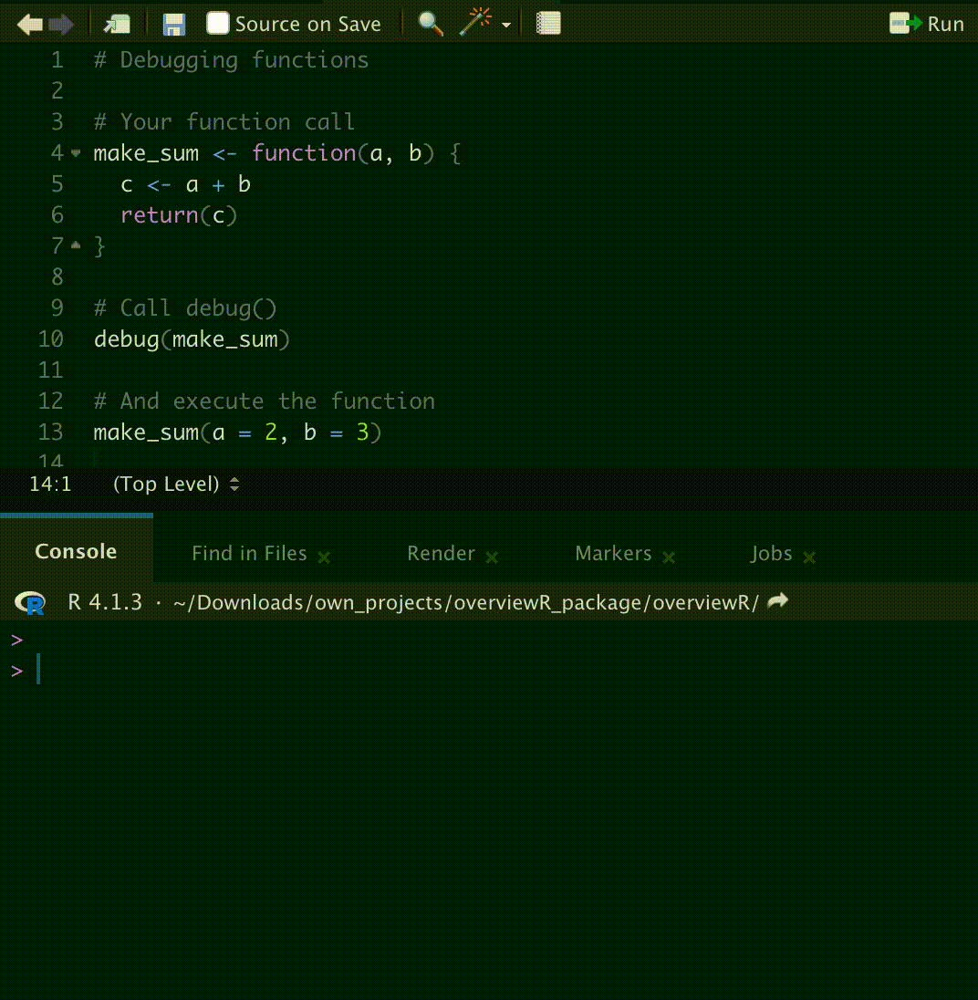

# (PART\*) Functional Programming {.unnumbered}

# Writing Functions

```{r, child='_setup.Rmd'}
```

```{r, include = FALSE}
library(microbenchmark)
library(palmerpenguins)

```

Good simple intro: https://github.com/tomjemmett/nhs-r_conf_21-fp_workshop

https://www.earthdatascience.org/courses/earth-analytics/automate-science-workflows/write-efficient-code-for-science-r/

https://bookdown.org/rdpeng/rprogdatascience/control-structures.html

## Structuring a function

R makes it easy to create user defined functions by using `function()`. Here is how it works:

```{r, eval = FALSE}

# this is an example function
my_function_name <- function(my_args) {
  # document your function here
  # what the function does
  # function inputs and outputs
  some_calculated_output <- (argument1 + argument2 )
  
  return(some_calculated_output)
}


```

* Give your function an object name and assign the function to it, e.g. `my_function_name <- function()`.

* Within the parentheses you specify inputs and arguments just like how pre-written functions work, e.g. `function(my_args)`.

* Next, put all the code you want your function to execute inside curly brackets like this: `function(my_args) {code to run}`

* Use `return()` to specify what you want to your function to output once it is done running the code.


### Activity: Understand the function

Here is a very simple function. Can you guess what it does?

```{r}
add_one <- function(x) {
  return(x + 1)
}
```

```{block, type  ="info"}

There is now a shortcut to writing functions in R `\(x)` that removes the need to call `function()` or use curly braces`{}`.

In this tutorial I will use the older method for now, but briefly demonstrate the simpler syntax

```

```{r}

add_one <- \(x) x + 1

```

```{r}

add_one(10)

```

What value did you get when running the function above? `r fitb("11")`

Now try applying your function to this vector:

```{r}
number_series <- c(1,5,10)
```

You should see it worked on *each element* inside the vector. This emphasises that R is a vector based language (it will by default apply functions on all elements in an object). 

## Function environments

When a function is evaluated, it creates it's own environment. All of the arguments that are passed to the function,
along with any variables created in the function are stored in this new environment.

The function's environment's parent will be the global environment, so we can see all of the variables created in the
global environment. Variables that are created in the function's environment aren't visible from the global environment
though.

If we reassign a variable in a function it will take a copy of that variable rather than mutating the value in the global environment. If we want to update `x` in the global environment we need to use the `<<-` operator.

```{r}
# x has a value of 1 in the global environment
x <- 1 

fn <- function(y) {
 # the value of x is copied from the global environment
 # but any changes remain only within the function environment
  x <- x * 2
  z <- x + y
  return(z)
}

fn(2)
x
```

```{task}
create a function called `fahr_to_kelvin` that converts temperature values from degrees Fahrenheit to Kelvin.

The conversion is `temp_in_kelvin <- (temp_fahr - 32) * (5 / 9)) + 273.15`

```

```{solution}

``{r}
fahr_to_kelvin <- function(fahr) {

  kelvin <- ((fahr - 32) * (5 / 9)) + 273.15
  return(kelvin)
}
``

```

The `return()` function can return only a single object. If we want to return multiple values in R, we can use a `list` (or other objects) and return it.

```{task}

To convert temperature to Celsius from kelvin, you subtract 273.15 from the temperature value in kelvin. 
Write a function that performs this conversion and returns "both" kelvin and celsius.

```


```{solution}

``{r}

fahr_to_kelvin_celsius <- function(fahr) {

  celsius <- ((fahr - 32) * (5 / 9))
  kelvin <- celsius +  + 273.15
  
  temps <- list(celsius, kelvin)
  names(temps) <- c("celsius", "kelvin")
  
  return(temps)
}

``

```

```{block, type = "info"}

A general rule of thumb. If you end up repeating a line of code more than three times in a script - you should write a function to do the work instead. And write clear comments on its use!

Why?

It reduces the numbers of lines of code in your script, it reduces the amount of repetition in the code, if you need to make changes you can change the function without having to hunt through all of your code. 

A really good way to organise your functions is to organise them into a separate script to the rest of your analysis. Write functions in a separate script and use source("scripts/functions.R")


```

### Argument defaults

This is an example of a very simple function that just prints the string "Hello World" whenever you type the function `say_hello()`

```{r}
say_hello <- function(){
  paste("Hello World") 
}

say_hello()

```

### Activity: Understanding arguments

```{task}
What happens when you try to put something in the brackets when **using** this function?
  
e.g. say_hello("Phil")

```

```{solution}
Error in say_hello( or something similar, this function has not been set with any arguments, therefore it doesn't know what to do with any values provided to it. 
```

Now lets try a similar function, but we include an argument:

```{r}

say_morning <- function(x){
  paste("Good morning", x)
}

#  what about this one?
say_morning("Phil")

```

```{task}
What happens when you DO NOT put something in the brackets when using this function?
```

```{solution}

``{r, eval = FALSE}

Error in paste("Good morning", x) : 
  argument "x" is missing, with no default

``

```

So that was an example where we included an argument for our function. But now it requires a value be provided in order to work. 

#### Argument defaults

However, you are probably used to the idea that many functions have "default" values for arguments, and we can easily set these.

```{r}
say_morning_default <- function(name = "you"){
  paste("Good morning", name)
}

say_morning_default()
```

```{block, type = "try"}

There is now a default value supplied to the argument, but this should still be able to changed when running the function. Try it! 

```

## Wrapper functions

Wrapper functions in R are a powerful tool for simplifying and customizing the use of existing functions. These functions act as intermediaries between the user and the underlying function, allowing you to add additional functionality, handle errors, or make the function more user-friendly. They are especially useful when you want to streamline repetitive tasks, create more intuitive interfaces, or modify the behavior of built-in functions without altering their source code. In this brief introduction, we'll explore the concept of wrapper functions, their benefits, and how to create and use them effectively in R.

### Default values

ou can create a wrapper function that calls an existing function with default argument values to simplify its usage. For instance, if you frequently use the `mean` function with a specific argument, you can create a wrapper like this:

```{r}
my_mean <- function(x) {
  mean(x, na.rm = TRUE)
}

```

Now, you can use `my_mean(x)` to calculate the mean while always ignoring `NA` values.

What happens when you try to use your new function `my_mean` and set na.rm  = F?

```{solution}

``
Error in my_mean(c(5, 6, 7, 8), na.rm = F) : unused argument (na.rm = F)
``

```

If we want to be able to allow users to specify their own values for `na.rm = T` then we need to modify the wrapper function

```{r}

my_mean <- function(x, na.rm = TRUE) {
  mean(x, na.rm = na.rm)
}


```

With this modification, users can provide their own value for the na.rm argument when calling my_mean. For example:

```{r}
my_mean(c(1, 2, NA, 4))# By default, NA values are removed
my_mean(c(1, 2, NA, 4), na.rm = FALSE)  # NA values are not removed


```

This modification makes the na.rm argument in the my_mean function flexible and allows users to override the default behavior when needed.

### Using "..."

You can allow the user to access the original arguments of mean() by using the `...` (ellipsis) argument in your wrapper function.

In R the ellipse, ..., is used by functions for one of two things.

- to capture an unknown number of arguments

- or to pass arguments through to some underlying function, as in ?print().

The `...` argument allows you to pass additional arguments directly to the underlying function. Here's how you can modify the `my_mean` function to maintain the flexibility of the mean() function's arguments:

```{r}

my_mean <- function(..., na.rm = TRUE) {
  mean(..., na.rm = na.rm)
}

```

Now we can pass arguments directly to mean, and we have a version that by default removes `NA` from our dataframe (but can be overidden if necessary)

```{r}
my_mean(c(1, 2, NA, 4))

```

And we can pass any additional arguments found in mean to our new function e.g. trim

```{r}

my_mean(c(1, 2, NA, 4), trim = 1) 

```

```{block, type = "warning"}

Not all functions are designed to accept arbitrary or unspecified additional arguments via .... In the case of the lm() function for example, it does not have a formal ... argument that allows arbitrary additional arguments to be passed.

If a function doesn't support ..., attempting to pass extra arguments using ... will result in an error, such as the "used in an incorrect context, no ... to look in" error that you encountered.

```


## Documenting functions

It is important to document your functions to:

- Remind your future self what the function does

- Show your future self and your colleagues how to use the function

- Help anyone else looking at your code understand what you think the function does

A common way to add documentation in software is to add comments to your function that specify

- What does this function do?

- What are the arguments (inputs) to the function, and what are these supposed to be (e.g., what class are they? Character, numeric, logical?)

- What does the function return, and what kind of object is it?


Like this: 

```{r, eval = F}

# Function: fahr_to_kelvin_celsius
# Description: Converts a temperature in degrees Fahrenheit to degrees Celsius and Kelvin.
#
# Input:
#   fahr: Numeric value representing temperature in degrees Fahrenheit.
#
# Output:
#   A list containing two elements:
#   - celsius: Numeric value representing temperature in degrees Celsius.
#   - kelvin: Numeric value representing temperature in Kelvin.
#
# Example Output:
#   If you call fahr_to_kelvin_celsius(32), the result would be:
#   celsius: 0
#   kelvin: 273.15
  

fahr_to_kelvin_celsius <- function(fahr) {

 # Calculate the temperature in degrees Celsius  
  celsius <- ((fahr - 32) * (5 / 9))
  
  # Calculate the temperature in Kelvin
  kelvin <- celsius +  + 273.15
  
  # Create a list to store the results 
  temps <- list(celsius, kelvin)
  names(temps) <- c("celsius", "kelvin")
 
  # Return the list of temperatures 
  return(temps)
}

```

```{block, type = "info"}

Formal documentation for R functions that you see when you access the help in R is written in separate .Rd using a markup language similar to LaTeX. You see the result of this documentation when you look at the help file for a given function, e.g. ?read.csv. The `roxygen2` package allows R coders to write documentation alongside the function code and then process it into the appropriate .Rd files. You should consider switching this more formal method of writing documentation when you start working on more complicated R projects. Or if you aspire to write packages in R!
[R packages 2nd Edition](https://r-pkgs.org/)
```

### Exercise

```{task}

Here is a custom script to print model diagnostics when running a linear model. Can you comment out this code to document it properly?

```

```{r, eval = F}


my_lm <- function(formula, data) {
 
  model <- lm(formula, data = data)
  

  summary_model <- summary(model)
  
  
  cat("Coefficients:\n")
  print(summary_model$coefficients)
  
  
  par(mfrow = c(2, 2))  # Arrange plots in a 2x2 grid
  plot(model, which = 1)  # Residuals vs. Fitted
  plot(model, which = 2)  # Normal Q-Q plot
  plot(model, which = 3)  # Scale-Location plot
  plot(model, which = 4)  # Residuals vs. Leverage
  
  # Return the fitted model
  return(model)
}

```

```{solution}

``{r, eval = F}

# Function: my_lm
# Description: Fit a linear regression model and provide summary statistics and diagnostic plots.
#
# Input:
#   formula: A formula specifying the regression model.
#   data: The data frame containing the variables used in the model.
#
# Output:
#   A linear regression model object fitted to the data.
#
# Example Usage:
#   To fit a linear regression model to the 'body_mass_g' variable as a function of 'flipper_length_mm in the 'penguins' dataset,
#   you can call:
#   my_lm(body_mass_g ~ flipper_length_mm, data = penguins_raw)

my_lm <- function(formula, data) {
  # Fit a linear regression model
  model <- lm(formula, data = data)

  # Get summary statistics of the model
  summary_model <- summary(model)

  # Print model coefficients
  cat("Coefficients:\n")
  print(summary_model$coefficients)

  # Arrange plots in a 2x2 grid
  par(mfrow = c(2, 2))

  # Plot diagnostics:
  # 1. Residuals vs. Fitted
  plot(model, which = 1)

  # 2. Normal Q-Q plot
  plot(model, which = 2)

  # 3. Scale-Location plot
  plot(model, which = 3)

  # 4. Residuals vs. Leverage
  plot(model, which = 4)

  # Return the fitted model
  return(model)
}
``

```


## Checking functions

### print

One simple and easy way to keep on top of your functions, and understand what they are doing is to use lots of print statements.


```{r, eval = FALSE}

# This edited function will now remind the user what the input value was

fahr_to_kelvin_celsius <- function(fahr) {
    # Calculate the temperature in degrees Celsius
    celsius <- (fahr - 32) * (5 / 9)
    
    # Calculate the temperature in Kelvin
    kelvin <- celsius + 273.15
    
    # Create a list to store the results
    temps <- list(celsius = celsius, kelvin = kelvin)
    
    # Return the list of temperatures along with a message
    print(paste("The temperature in Fahrenheit was", fahr))
    return(temps)
}


```


### testthat

Pure Functions:
A pure function is a concept in programming that describes a function with the following characteristics:

It always produces the same output for the same input.
It has no side effects, meaning it doesn't modify external state or variables.
It relies only on its input parameters to generate output.
In R, pure functions are essential for creating clean and predictable code. They are often used in functional programming to perform operations on data without causing unexpected side effects.

When our function is pure, we can run expectation tests using the `testthat` package:

```{r, include = FALSE}
library(testthat)

```

```{r, eval = FALSE}

test_that("it works as expected", {
    expect_equal(fahr_to_kelvin(92), 306.483, tolerance=1e-2)  
   
})


```


### debugging

For more complex functions, we may need to go digging! Here there are three basic commands:

- `debug()`

- `browser()`

- `undebug()`

With `debug(function_name)` the next time you run `function_name()` an interactive session will open in Rstudio. 
While you are in debug mode you can call the individual objects in your function, and run the commands line by line:

```{r, eval=TRUE, echo=FALSE, out.width="100%"}

```

Once we are done with debugging it is important to turn the debug mode off - close the interactive page and run `undebug(function_name)` so that the debugging panel doesn't reopen the next time you launch your function. 

#### flow

`flow` is a great package for helping to understand code structures - it visualizes a chart diagram of the functional architecture.

```{r, eval = F}
library(flow)

flow_run(fahr_to_kelvin_celsius(92))

```


```{r, eval=TRUE, echo=FALSE, out.width="100%"}
knitr::include_graphics("images/flow.png")
```

## Exercises

This function is designed to calculate the [triangular numbers](https://en.wikipedia.org/wiki/Triangular_number)

```{r, eval=TRUE, echo=FALSE, out.width="100%"}
knitr::include_graphics("images/First_six_triangular_numbers.png")
```

Let's build it and check that it works:

```{r, eval = FALSE}

library(testthat)

triangle_number <- function(x) {
    0.5 * x * (x + 1)
}


```
```{task}
Run `testthat()` to make sure this function works for multiple inputs
```

```{solution}

``{r, eval = F}

test_that("it works as expected", {
    expect_equal(triangle_number(1),  1)  
    expect_equal(triangle_number(2),  3)  
    expect_equal(triangle_number(3),  6)  
    expect_equal(triangle_number(4), 10)  
    expect_equal(triangle_number(5), 15)  
})

``

Test passed 😸

```

```{task}
This test fails, can you work out why?

```

```{r, eval =F}
test_that("it works as expected", {
    expect_equal(fahr_to_kelvin_celsius(92), list(33, 306), tolerance = 1)  
    
})

```


```{solution}

``{r, eval = F}
# the output is a named list
named_list <- list(celsius = 33.3, kelvin = 306.4)


test_that("it works as expected", {
    expect_equal(fahr_to_kelvin_celsius(92), list(33, 306), tolerance = 1e-2)  
    
})


``

Test passed 😀

```


# Flow control

https://modern-rstats.eu/defining-your-own-functions.html#control-flow

https://bookdown.org/rdpeng/rprogdatascience/control-structures.html

Imagine you want a variable to be equal to a certain value if a condition is met. This is a typical problem that requires the `if` and `else` construct. For instance:

```{r}

a <- 4
b <- 5

```


```{r}
if (a > b) {
  f <- 20
    } else {
  f <- 10
}

f

```

Another way to achieve this is by using the `ifelse()` function:

```{r}
f <- ifelse(a > b, 20, 10)
f
```

`if` and `else` might seem interchangeable with `ifelse()`, but they’re not. `ifelse()` is vectorized. Let’s try the following:

```{r}
ifelse(c(1,2,4) > c(3, 1, 0), "yes", "no")

```
Trying to attempt the same with `if` and `else` will result in an error as only the first element can be evaluated

```{r, eval = FALSE}

if (c(1, 2, 4) > c(3, 1, 0)) print("yes") else print("no")

```

```
Error in if (c(1, 2, 4) > c(3, 1, 0)) print("yes") else print("no") : 
  the condition has length > 1

```

The work around for this would to be use a loop, so that each element along the vector can be evaluated in turn. We will revisit loops shortly. 

```{r}

vector1 <- c(1, 2, 4)
vector2 <- c(3, 1, 0)

result <- character(length(vector1))  # Create an empty character vector to store the results

for (i in 1:length(vector1)) {
  if (vector1[i] > vector2[i]) {
    result[i] <- "yes"
  } else {
    result[i] <- "no"
  }
}

print(result)


```

### `case_when`

`case_when` is a powerful `tidyverse` function in R that serves as an extension of `if_else`, providing a flexible way to create conditional transformations on multiple values within a dataset. While `if_else` is primarily used for a single condition, `case_when` is designed to handle multiple conditions and allows you to assign specific values or perform operations based on these conditions.

Here's a simple introduction to case_when as an extension of `if_else`:

Imagine you have a dataset with a column called "temperature," and you want to create a new column called "weather" based on different temperature ranges. With if_else, you might write something like this:

```{r}


temperature <-  c(10, 25, 5, 30, 15)

ifelse(temperature < 10, "Cold",
        ifelse(temperature >= 10 & temperature < 25, "Moderate", "Hot"))


```

```{r}

case_when(
    temperature < 10 ~ "Cold",
    temperature >= 10 & temperature < 25 ~ "Moderate",
    temperature >= 25 ~ "Hot"
  )


```

## Conditional functions

Let's make a function that reports p-values in APA format (with "p = [rounded value]" when p >= .001 and "p < .001" when p < .001).

You can add a default value to any argument. If that argument is skipped, then the function uses the default argument.

First we could make a function that rounds any value to three digits.

```{r}

report_p <- function(p, digits = 3) {
      roundp <- round(p, digits)
    reported <-  paste("p =", roundp)
    
    return(reported)
}

```

But we would like this to have a conditional response as well: so we need an `if` `else` statement.

```{r}

 report_p <- function(p, digits = 3) {
     reported <- if(p < 0.001){
             "p < 0.001"} else{
             paste("p =", round(p, digits))}
             
     
     return(reported)
 }

```

However we soon hit our first problem, this function works well when provided a single numeric value, but when applied to a vector or a dataframe we encounter an error:

```{r, eval = FALSE}
x <- c(0,0.05,0.3,0.4)

report_p(x)

```
```
Error in if (p < 0.001) { : the condition has length > 1
```

In R, conditional statements are not vector operations. They deal only with a single value. If you pass in, for example, a vector, the `if` statement will only check the very first element and issue a warning. The solution to this is the `ifelse()` or the tidyverse equivalent `if_else()` function

```{multCode = T}

``{r, eval = F}

 report_p <- function(p, digits = 3) {
     reported <- ifelse(p < 0.001,
             "p < 0.001",
             paste("p =", round(p, digits)))
     
     return(reported)
 }
 
``

####

``{r}


 report_p <- function(p, digits = 3) {
     reported <- if_else(p < 0.001,
             "p < 0.001",
             paste("p =", round(p, digits)))
     
     return(reported)
 }

``

```

https://stackoverflow.com/questions/50646133/dplyr-if-else-vs-base-r-ifelse


## Warnings and errors

```{block, type = "try"}

What happens when omit an argument for p, set the value to 1.5 or a character "a"?

```

Sometimes the function will not run, in the first example because we did not provide an argument default. 

For `p = 1.5` it probably *shouldn't* run (p = 1.5 makes no sense), but it does! 

For `p = "a"` there is a warning but perhaps not a very intuitive one. 

We can make our own custom/specific warnings, try this and run it with the arguments above again! 


```{solution, multCode = T}

``{r}

 report_p <- function(p, digits = 3) {
   
  if (!is.numeric(p)) stop("p must be a number")
  if (p <= 0) warning("p-values cannot less 0")
  if (p >= 1) warning("p-values cannot be greater than 1")
   
     reported <- ifelse(p < 0.001,
             "p < 0.001",
             paste("p =", round(p, digits)))
     return(reported)
 }
 
 ``
 
 ####
 
 ``{r}
 
report_p <- function(p, digits = 3) {
  
  if (!is.numeric(p)) stop("p must be a number")
  
    result <- case_when(
        p <= 0 ~ warning("p-values cannot be less than or equal to 0"),
        p >= 1 ~ warning("p-values cannot be greater than or equal to 1"),
        p < 0.001 ~ "p < 0.001",
        TRUE ~ paste("p =", round(p, digits))
    )
    
    return(result)
}
 
 ``
 
```


## Activities

Exercise 1: Write a Simple Function
We'll create a function that calculates the GC content of a DNA sequence, and the result melting temperature of the sequence and returns both in a list. GC content is the percentage of the DNA molecule's nitrogenous bases that are either guanine (G) or cytosine (C). This is a common metric used in molecular biology and genetics to analyze DNA sequences. Each GC base addes 4 degrees to melting temp while each AT base adds 2 degrees. 

> Hint`stringr` and associated functions will be very helpful here

```{solution, multCode = T}

``{r}

gc_content <- function(dna_sequence) {
  # Convert the input sequence to uppercase to handle mixed-case input
  dna_sequence <- toupper(dna_sequence)
  
 
  
  # Calculate the number of GC bases (C and G) in the sequence
 gc_positions <- unlist(gregexpr("[GC]", dna_sequence))
 gc_count <- length(gc_positions)

  # Calculate the total number of bases in the sequence
  total_bases <- nchar(dna_sequence)
  
  # Calculate the GC content as a percentage
  gc_percentage <- (gc_count / total_bases) * 100
  
  gc_percentage <- round(gc_percentage, 2)
  
  # Calculate AT numbers
  at_count <- total_bases - gc_count
  
  # Calculate melting temp of sequence
  melt_temp <- (gc_count*4) + (at_count*2)
  
  
  dna_content <- list(gc_percentage, melt_temp)
  names(dna_content) <- c("GC Percentage", "Melting temp (celsius)")
  
  
  return(dna_content)
}


``

####

``{r}
gc_content <- function(dna_sequence) {
  # Convert the input sequence to uppercase to handle mixed-case input
  dna_sequence <- str_to_upper(dna_sequence)
  

  
  # Calculate the number of GC bases (C and G) in the sequence
  gc_count <- sum(str_count(dna_sequence %in% c("G", "C")))
  
  # Calculate the total number of bases in the sequence
  total_bases <- str_length(dna_sequence)
  
  # Calculate the GC content as a percentage
  gc_percentage <- (gc_count / total_bases) * 100
  
  gc_percentage <- round(gc_percentage, 2)
  
   # Calculate AT numbers
  at_count <- total_bases - gc_count
  
  # Calculate melting temp of sequence
  melt_temp <- (gc_count*4) + (at_count*2)
  
  
  dna_content <- list(gc_percentage, melt_temp)
  names(dna_content) <- c("GC Percentage", "Melting temp (celsius)")
  
  
  return(dna_content)
}

``

```

Exercise 2: Document the Function
Add documentation to the factorial function using roxygen2-style comments. Include a title, description, arguments, and examples.

```{solution}

``{r}

``

```

Exercise 3: Test the Function
Create a test script that uses test_that to check if the function returns the correct GC percentage and melting temps

```{solution}

``{r}

test_that("gc_content function tests", {
    # Test valid input and GC content calculation
    dna_seq1 <- "ATGCGTAGCT"
    result1 <- gc_content(dna_seq1)
    expect_equal(result1$`GC Percentage`, 50)
    expect_equal(result1$`Melting temp (celsius)`, 30)})

``

```

Exercise 4: Handle Errors
You can optionally modify the gc_content function to handle errors such as when the input contains non-DNA characters, or warnings if the the length exceeds 30nt?

```{solution, multCode = T}

``{r}

gc_content <- function(dna_sequence) {
  # Convert the input sequence to uppercase to handle mixed-case input
  dna_sequence <- toupper(dna_sequence)
  
  # Check if the input sequence contains only valid DNA characters (A, T, C, G)
  if (!grepl("^[ATCG]+$", dna_sequence)) stop("Invalid DNA sequence. Only A, T, C, and G are allowed.")
  
  if (nchar(dna_sequence) > 30 ) warning("Sequence is > 30 nt temperature predictions may be inaccurate")
  
  
  # Calculate the number of GC bases (C and G) in the sequence
 gc_positions <- unlist(gregexpr("[GC]", dna_sequence))
 gc_count <- length(gc_positions)

  # Calculate the total number of bases in the sequence
  total_bases <- nchar(dna_sequence)
  
  # Calculate the GC content as a percentage
  gc_percentage <- (gc_count / total_bases) * 100
  
  gc_percentage <- round(gc_percentage, 2)
  
  # Calculate AT numbers
  at_count <- total_bases - gc_count
  
  # Calculate melting temp of sequence
  melt_temp <- (gc_count*4) + (at_count*2)
  
  
  dna_content <- list(gc_percentage, melt_temp)
  names(dna_content) <- c("GC Percentage", "Melting temp (celsius)")
  
  
  return(dna_content)
}


``

####

``{r}
gc_content <- function(dna_sequence) {
  # Convert the input sequence to uppercase to handle mixed-case input
  dna_sequence <- str_to_upper(dna_sequence)
  
  # Check if the input sequence contains only valid DNA characters (A, T, C, G)
if (!str_detect(dna_sequence, "^[ATCG]+$")) stop("Invalid DNA sequence. Only A, T, C, and G are allowed.")

    if (str_length(dna_sequence) > 30 ) warning("Sequence is > 30 nt temperature predictions may be inaccurate")

  
  # Calculate the number of GC bases (C and G) in the sequence
  gc_count <- sum(str_count(dna_sequence %in% c("G", "C")))
  
  # Calculate the total number of bases in the sequence
  total_bases <- str_length(dna_sequence)
  
  # Calculate the GC content as a percentage
  gc_percentage <- (gc_count / total_bases) * 100
  
  gc_percentage <- round(gc_percentage, 2)
  
   # Calculate AT numbers
  at_count <- total_bases - gc_count
  
  # Calculate melting temp of sequence
  melt_temp <- (gc_count*4) + (at_count*2)
  
  
  dna_content <- list(gc_percentage, melt_temp)
  names(dna_content) <- c("GC Percentage", "Melting temp (celsius)")
  
  
  return(dna_content)
}

``

```


# Simple iteration

We’ve seen how to write a function and how they can be used to create concise re-usable operations that can be applied multiple times in a script without having to copy and paste, but where functions really come into their own is when combined with iteration. Iteration is the process of running the same operation on a group of objects, further minimising code replication. 

Functional programming in R requires a good understanding of the types of data structure available in R. So make sure you remember the distinctions between vectors, lists, matrices and dataframes.

In the section below we will start with simple functions that allow you to replicate arguments

## `rep()`

The function `rep()` lets you repeat the first argument a set number of times.

```{r}
rep(1:5, 5)

rep(c("Adelie", "Gentoo", "Chinstrap"), 2)

```

The default for the amount of repetition is `times = ` it will print the entire vector start to finish THEN repeat.

If the second argument is a vector with the same number of elements as the *first* vector, then it will repeat to the specified values for each

```{r}
rep(c("Adelie", "Gentoo", "Chinstrap"), c(2, 1, 3))

```

Or if you use the argument `each` then it will rep all of the first element *first* followed by the second etc.


```{r}
rep(c("Adelie", "Gentoo", "Chinstrap"), each = 3)
```
What do you think will happen if you set both times to 3 and each to 2?

```{r, eval = F}

rep(c("Adelie", "Gentoo", "Chinstrap"), times = 2, each = 3)

```

```{solution}

``{r, echo = FALSE}

rep(c("Adelie", "Gentoo", "Chinstrap"), times = 2, each = 3)

``

```


## `seq()`

The function `seq()` is useful for generating a sequence of numbers with some pattern.

Use `seq()` to create a vector of the integers 0 to 10.


```{r}

seq(1,5)

```

This is initially very similar to just making a vector with

```{r}

c(1:5)

```

But with `seq` we have extra functions. You can set the by argument to count by numbers other than 1 (the default). Use `seq()` to create a vector of the numbers 0 to 100 by 10s.

```{r}
seq(0, 100, by = 10)

```


We also have the argument `length.out`, which is useful when you want to know how to many steps to divide something into

```{r}
seq(0, 100, length.out = 12)

```

## `replicate()`

Replicate is our first example of a function whose purpose is to iterate *other* functions

For example the `rnorm` function generates numbers from a normal distribution.

Nesting this inside the `replicate()` function will repeat this command a specified number of times

```{r}
replicate(3, # times to replicate function
          expr = rnorm(n = 5, 
                       mean = 1,
                       sd = 1))

```

https://www.r-bloggers.com/2023/07/the-replicate-function-in-r/

# Loops

Loops are one of the staples of all programming languages, not just R, and can be a powerful tool; though we will see later there are a suite of alternative to loops in R. 

For loops make it possible to repeat a set of instructions i times. For example, try the following:

```{r}
for (i in 1:5){
  print("hello")
}
```

Or

```{r}
for (i in 1:3) {
  print(i+1)
}
```

This is a dynamic piece of code where an index 'i' is iteratively replaced by each value in the vector 1:5. 

Let's break it down. Since the first value in our sequence (1:3) is 1, the loop begins by substituting 'i' with 1 and executing everything within the curly braces {1+1}. Loops conventionally use 'i' as the counter, which is short for iteration. However, you are free to use any variable name you prefer:

so the first loop is essentially: 

```
i <- 1 + 1
print(i)

```

Once this first iteration is complete, it loops back to the beginning and replaces i with the next value in our 1:3 sequence (2 in this case):

```
i <- 2 + 1
print(i)

```

This process is then repeated until the loop reaches the final value in the sequence 

```
for (i in 1:3) { # the SEQUENCE is defined (numbers 1 to 5) and loop is opened with "{"
  print(i + 1)    # The OPERATIONS (add 1 to each sequence number and print)
}                            # The loop is closed with "}"

```

## Functions in for loops

Whilst above we have been using simple addition in the body of the loop, you can also combine loops with functions.

```{r}

# Define a function to calculate the square of a number
square <- function(x) {
  return(x * x)
}

# Use a for loop to calculate and print the squares of numbers from 1 to 5
for (num in 1:5) { # Here I have replace i with num
  result <- square(num)
  cat("The square of", num, "is", result, "\n")
}


```

## For loops in dataframes

Let's create a somewhat more intricate function. Initially, we generate a new tibble by creating four vectors, each consisting of 10 randomly generated numbers. These numbers are designed to be approximately centered around a mean of 0 with a standard deviation of 1. Afterward, we combine these vectors to form the final tibble.

```{r}
set.seed(1234)

# a simple tibble
df <- tibble(
  a =  rnorm(10),
  b =  rnorm(10),
  c =  rnorm(10),
  d = rnorm(10),
  e = rnorm(10),
  f = rnorm(10),
  g = rnorm(10),
  h = rnorm(10),
)

df

```

Each vector is randomly generated so the actual averages will be slightly different, we can test that here:

```{r}

mean(df$a)

mean(df$b)

mean(df$c)

mean(df$d)

```

So the above code works, but it is repetitive, applying the same function again and again.

Below we have a simple for loop:

```{r}
#1. Having a predefined empty vector to receive the values is good practice, we will see why a bit later

output <- vector("double", ncol(df)) # this will have four empty elements the same as the number of columns for the dataframe. The vector is set to receive numeric data

```

Now we run our loop: 

```{r}

for (i in 1:ncol(df)) {            # 2. sequence - determines what to loop over 
  
  output[[i]] <- mean(df[[i]])      # 3. body - each time the loop runs it allocates a value to output, 
}
output

```

Each time the mean is calculate for one column in df this is then stored as an element in the previously empty output vector.

`for()` loops are very useful for quickly iterating over a list, but because R prefers to store everything as a new object with each loop iteration, loops can become quite slow if they are complex, or running many processes and many iterations.


## Speed

We can wrap our function calls and iterations inside a few different functions to capture runspeed. 

1. Use `system.time`

```{r, eval = F}

system.time(function)

```

2. Use `microbenchmark` - this add on package runs a default of 100 evaluations, and comes with a handy ggplot1 integration for autoplotting. 

```{r, eval = F}

mm <- microbenchmark(function)

autplot(mm)
```

### Initialise objects

Pre-allocating the output with the appropriate length before the loop avoids reallocation of memory inside the loop, which can be inefficient for large data. For example:

```{r, include = F}
output2 <- NULL
df_list <- as.list(df)

```

```{r, eval = F}

output2 <- NULL

microbenchmark::microbenchmark(
  for (i in 1:ncol(df)){             
  
  output2 <- c(output2, mean(df[[i]])) # each new calculation is concatenated onto the end of the growing vector
}
)
output2 # note because we did not predefine our vector length it continues to grow! 

```

Depending on your own computer processing power you may get different results - but here

| |Built inside loop|pre-initialised vector|
|-----|-----|-----|
|min|2.38ms	| 2.29ms|
|max|	19.19ms|12.64ms|
|mean|	3.4ms|2.55 ms|
|median|	2.71ms|2.42ms|


### simple datatypes


```{r, eval = F}

df_list <- as.list(df)


microbenchmark::microbenchmark( # check average processing time
for (i in length(df_list)) {           
  
  output[[i]] <- mean(df_list[[i]])      
}
)


```

Depending on your own computer processing power you may get different results - but here

| |List|Tibble|
|-----|-----|-----|
|min|1.92ms	| 2.38ms|
|max|	12.6ms|19.19ms|
|mean|	2.53ms|2.55 ms|
|median|	2.41ms|2.42ms|

### Visualise speed

The `microbenchmark` package has some other useful features including the ability to run multiple functions for comparison simultaneously and with integration with ggplot2 we can plot these results

```{r, include = FALSE}


output_vector <- vector("double", ncol(df))
output_list <- vector(mode = "list", length = ncol(df))
new_output_vector <- NULL
new_output_vector2 <- NULL

```


```{r, include = F}


output_vector <- vector("double", ncol(df))
output_list <- vector(mode = "list", length = ncol(df))
new_output_vector <- NULL
new_output_vector2 <- NULL


mbm <- microbenchmark::microbenchmark(
df_input_vector_output = for (i in 1:ncol(df)) {
  output_vector[[i]] <- mean(df[[i]]) 
}, 
list_input_vector_output = for (i in length(df_list)) {           
    output_vector[[i]] <- mean(df_list[[i]])      
}, 
df_input_build_vector =  for (i in 1:ncol(df)){             
    
    new_output_vector <- c(new_output_vector, mean(df[[i]])) # each new calculation is concatenated onto the end of the growing vector
}, 
list_input_build_vector = for (i in 1:length(df_list)){             
    
   new_output_vector2 <- c(new_output_vector2, mean(df[[i]])) # each new calculation is concatenated onto the end of the growing vector
}
)


```

```{r, eval = F}

output_vector <- vector("double", ncol(df))
output_list <- vector(mode = "list", length = ncol(df))
new_output_vector <- NULL
new_output_vector2 <- NULL


mbm <- microbenchmark::microbenchmark(
df_input_vector_output = for (i in 1:ncol(df)) {
  output_vector[[i]] <- mean(df[[i]]) 
}, 
list_input_vector_output = for (i in length(df_list)) {           
    output_vector[[i]] <- mean(df_list[[i]])      
}, 
df_input_build_vector =  for (i in 1:ncol(df)){             
    
    new_output_vector <- c(new_output_vector, mean(df[[i]])) # each new calculation is concatenated onto the end of the growing vector
}, 
list_input_build_vector = for (i in 1:length(df_list)){             
    
   new_output_vector2 <- c(new_output_vector2, mean(df[[i]])) # each new calculation is concatenated onto the end of the growing vector
}
)

mbm

```

```
Unit: milliseconds
                     expr      min       lq     mean   median       uq      max neval
   df_input_vector_output 2.295303 2.401428 2.617219 2.447673 2.556309 12.36447   100
 list_input_vector_output 1.877293 1.946628 2.135324 1.997003 2.071233 12.31188   100
    df_input_build_vector 2.351764 2.411968 2.604022 2.455673 2.531924 13.46052   100
  list_input_build_vector 2.204953 2.297524 2.691931 2.351203 2.419803 12.77457   100

```


```{r}


autoplot(mbm)

```


### Do as little as possible inside a loop

R is an interpreted language every thing you write inside a loop runs multiple times. The best thing you can do is to be parsimonious while writing code inside a loop. There are a number of steps that you can do to speed up a loop a bit more.

- Calculate results before the loop

- Initialize objects before the loop

- Iterate on as few numbers as possible

- Write as few functions inside a loop as possible

The main tip is to *Get out of loop* as quickly as possible.

See also https://bookdown.org/csgillespie/efficientR/programming.html#top-5-tips-for-efficient-programming


## Activity

# Apply

We can recreate the output from our loops in the previous chapter with the `apply` function in R. 

The apply functions can be an alternative to writing for loops. The general idea is to apply (or map) a function to each element of an object. For example, you can apply a function to each row or column of a matrix. 

Each function takes at least two arguments: an object and another function. The function is passed as an argument.

Every apply function has the dots, ..., argument that is used to pass on arguments to the function that is given as an argument.

Using apply functions when possible, can lead to shorter, more succinct R code. In this section, we will cover the three main functions, `apply()`, `lapply()`, and `sapply()`. 


- `lapply()`: Loop over a list and evaluate a function on each element

- `sapply()`: Same as lapply but try to simplify the result

- `apply()`: Apply a function over the margins of an array

It is (I think) important to not that the apply family is still looping - but the actual looping is done internally in C code for efficiency reasons. Apply functions are loops under the hood and they are meant for convenience not for speed.


## lapply

The `lapply()` function does the following simple series of operations:

it loops over a list, vector or dataframe, iterating over each element in turn

it applies a function to each element of the list (a function that you specify)

it always returns a list (the l is for “list”).

```
> lapply
function (X, FUN, ...) 
{
    FUN <- match.fun(FUN)
    if (!is.vector(X) || is.object(X)) 
        X <- as.list(X)
    .Internal(lapply(X, FUN))
}
<bytecode: 0x7f79498e5528>
<environment: namespace:base>

```

We can see the operation of an `lapply()` function here:

```{r, eval = F}

lapply(df_list, mean)

```

Notice that here we are passing the `mean()` function as an argument to the `lapply()` function. Functions in R can be used this way and can be passed back and forth as arguments just like any other object. When you pass a function to another function, you do not need to include the open and closed parentheses.


```{r, include = F}
empty_list <- vector(mode = "list", length = length(df_list))

```

```{r, eval = F}

empty_list <- vector(mode = "list", length = length(df_list))


microbenchmark::microbenchmark(
 
  forloop = for (i in length(df_list)) {           
  
  empty_list[[i]] <- mean(df_list[[i]])      
  },
 apply = lapply(df_list, mean)
)

```

```
Unit: microseconds
    expr      min        lq       mean    median       uq      max neval
 forloop 1908.053 1981.7625 2341.55928 2038.9475 2119.488 11949.11   100
   apply   23.531   24.8655   29.73571   27.9205   30.050   119.41   100

```

As well as being slightly faster than the `for()` loop, arguably, `lapply` is also easier to read.


### Run lapply with additional arguments

The first argument of `lapply()` gives the list object to be iterated over. 
The second argument defines an anonymous function.


#### Functions with `lapply`

In this example we define the list to run a function over `numbers`, then write our function as normal. Defined like this it is what we call an **anonymous function**, it has no name and cannot be used outside of this `lapply` function.

```{r}

# Create a list of numbers
numbers <- list(1, 2, 3, 4, 5)


# Use lapply to add 10 to each number in the list
result <- lapply(numbers, function(x){
  return(x + 10)
})

# Print the result
print(result)

```

#### Using existing functions in `lapply`

In this example we write a named function. Notice how we don't have to use curly brackets or an anonymous function, instead, we just passed `mean`add_value` as the second argument of `lapply()`. I also supply any necessary arguments required by the function by specifying it afterwards.

```{r}

# Create a list of numbers
numbers <- list(1, 2, 3, 4, 5)

# Define a custom function that adds a given value to each number
add_value <- function(x, value) {
  return(x + value)
}

# Use lapply to add 10 to each number in the list
result <- lapply(numbers, add_value, value = 10)

# Print the result
print(result)

```

## sapply

The `sapply()` function behaves similarly to `lapply()`; the only real difference is in the return value. `sapply()` will try to simplify the result of `lapply()` if possible. Essentially, `sapply()` calls `lapply()` on its input and then applies the following algorithm:

- If the result is a list where every element is length 1, then a vector is returned

- If the result is a list where every element is a vector of the same length (> 1), a matrix is returned.

- If it can’t figure things out, a list is returned.

```{r}

sapply(df_list, mean)

```

Notice that here `sapply()` returns a vector as each element had length of 1.


## apply

The `apply()` function is used to a evaluate a function (often an anonymous one) over an array. It is most often used to apply a function to the rows or columns of a matrix or dataframe, in fact this function *cannot* be used on a list. Using `apply()` is often not really faster than writing a loop, but it works in one line and is highly compact.

MARGIN = 1 means apply function over rows

MARGIN = 2 means apply function over columns


```{r}

apply(df, MARGIN = 1, mean)

```

- If the result is a list where every element is length 1, then a vector is returned

- If the result is a list where every element is a vector of the same length (> 1), a matrix is returned.

### summary of apply functions

|Function|Arguments|Objective|Input|Output|
|---|---|---|---|---|
|apply|apply(X, MARGIN, FUN)|Apply a function to the rows, columns or both| Dataframe or matrix| vector, list or matrix|
|lapply| lapply(X,FUN)|Apply a function to all the elements of the input| List, vector or dataframe| list|
|sapply| sapply(X,FUN)| Apply a function to all the elements of the input| List, vector or dataframe| vector or matrix|

## Exercise 

```{task}
Make a function that converts values with a normal distribution into their z scores
```


```{solution}

``{r}

z_score <- function(x) {
    (x - mean(x, na.rm = TRUE)) /  
        sd(x, na.rm = TRUE)
}

``

```

```{task}
Choose the appropriate apply function to calculate a matrix of z-scores for the dataframe `df`
```

```{solution}

apply(df, MARGIN = 2,  z_score)

```


# Purrr

The `purrr::map()` family of functions are the tidyverse equivalent of `apply`

The base equivalent to `map()` is `lapply()`. The only difference is that `lapply()` does not support the helpers that you’ll learn about below, so if you’re only using `map()` from purrr, you can skip the additional dependency and use `lapply()` directly.


The basic syntax is map(`.x` = SEQUENCE, `.f` = FUNCTION, OTHER ARGUMENTS). In a bit more detail:

* `.x` = are the inputs upon which the .f function will be iteratively applied - e.g. a vector of jurisdiction names, columns in a data frame, or a list of data frames

* `.f` = is the function to apply to each element of the .x input - it could be a function like print() that already exists, or a custom function that you define. The function is often written after a tilde ~ (details below).
A few more notes on syntax:

* If the function needs no further arguments specified, it can be written with no parentheses and no tilde (e.g. `.f = mean`).

* You can use `.x` (or simply `.`) within the `.f = function` as a placeholder for the `.x` value of that iteration

```{r , echo=FALSE}

knitr::include_graphics("images/map-step-1.png")

```

**The output of using` map()` is a list** - a list is an object class like a vector but whose elements can be of different classes. So, a list produced by `map()` could contain many data frames, or many vectors, many single values, or even many lists! There are alternative versions of `map()` explained below that produce other types of outputs (e.g. `map_dfr()` to produce a data frame, `map_chr()` to produce character vectors, and `map_dbl()` to produce numeric vectors).

Basic `map()` will *always* return a `list`, other variants return different data types.Unlike `apply`, `map` will ONLY return one type of data, removing the potential for changing data types that occasionally happens when using `apply`. 

## Example

```{multCode}

``{r, eval = F}

lapply(df_list, mean)

``

####

``{r, eval = F}

map(.x = df_list, .f = mean)

map(df_list, mean)

``

```


## more maps

`map()` always returns a list, which makes it the most general of the map family because you can put anything in a list. But it is inconvenient to return a list when a simpler data structure would do, so there are four more specific variants: `map_lgl()`, `map_int()`, `map_dbl()`, and `map_chr()`. Each returns an atomic vector of the specified type:

|Function| Data type returned|
|------|------|
|`map_lgl()`| returns a logical|
|`map_int()`| returns an integer vector|
|`map_dbl()`| returns a double vector|
|`map_chr()`| returns a character vector|
|`map_df()`| returns a data frame/tibble|


```{r , echo=FALSE}

knitr::include_graphics("images/map_df.png")

```

```{block, type = "info"}

These specialized map functions are "type-safe" and will fail with incorrect return type.

This is safer than using functions like sapply() which tries to simplify results and could return a list, vector or matrix depending on input.

```


```{r, eval = F}

# map lgl always returns a logical vector
map_lgl(df_list, is.double)
#   a    b    c    d    e    f    g    h 
# TRUE TRUE TRUE TRUE TRUE TRUE TRUE TRUE


# map_dbl always returns a double vector
map_dbl(df_list, mean)
#          a           b           c           d           e           f           g           h 
# -0.38315741 -0.11817071 -0.38794682 -0.76619306 -0.60979706 -0.27886474  0.61659223 -0.04230209 

# map_int always returns an integer vector
map_int(df_list, ~.x |>  mean() |> round())
# a  b  c  d  e  f  g  h 
# 0  0  0 -1 -1  0  1  0 

# map_int always returns an integer vector - note this comes with a deprecated coercion warning - use as.character()
 map_chr(df_list, mean)
#          a           b           c           d           e           f           g           h 
#"-0.383157" "-0.118171" "-0.387947" "-0.766193" "-0.609797" "-0.278865"  "0.616592" "-0.042302" 
 
# map_df always returns a dataframe 
 map_df(df_list, mean)
#       a      b      c      d      e      f     g       h
#   <dbl>  <dbl>  <dbl>  <dbl>  <dbl>  <dbl> <dbl>   <dbl>
#   1 -0.383 -0.118 -0.388 -0.766 -0.610 -0.279 0.617 -0.0423
```

purrr uses the convention that suffixes, like `_dbl()`, refer to the output. All `map_*()` functions can take any type of vector as input.


## Anonymous functions

There are multiple ways of structuring a `map()` call

```{r, eval = F}

map(df_list, mean)

df_list |>  
  map(mean)

df_list |> 
    map(~mean(.))

```

### What's up with `~`? 

Instead of using `map()` with an exisiting function, we can use inline anonymous functions as demonstrated with `apply()`

```{r}

map_dbl(df_list, function(x) sum(x)/length(x))

```

But this is quite *verbose* we can use `~` to support a shortcut

```{r}

map_dbl(df_list, ~ sum(.x)/length(.x))

```

It look a little quirky but you to refer to `.` for argument functions.

```{block, type = "info"}

Reserve this syntax for short and simple functions. A good rule of thumb is that if your function spans lines or uses {}, it’s time to give it a name.

```

### Passing arguments

`map`  functions all pass `...` along, so there are two ways we can pass additional arguments to functions

```{r, eval = F}

map_dbl(df_list, ~ mean(.x, na.rm = T))


map_dbl(df_list, mean, na.rm = T)


```

## map with nested dataframes


```{r}

nested_penguins <- penguins |> 
  nest(data = -species)

nested_heavy_penguins <- penguins |> 
    nest(data = -species) |> 
  mutate(new_data = map(data, ~ .x 
                        |> filter(body_mass_g > 3000))
         )

plots <- nested_heavy_penguins |> 
    mutate(scatterplots = map(new_data, ~ 
            ggplot(data = .x, aes(x = body_mass_g, y = flipper_length_mm)) +
                geom_point()
        ))


```

Plots can now be called in a number of ways

```{r, eval = FALSE}
plots[[1,4]]

plots$scatterplots[[1]]

```

If we wish to see all of the plots at once we can use `purrr::walk` - this is another iteration function, where the primary output is "silent" - we do not wish to see outputs printed in the console. This is useful for functions like plot making or writing outputs to file. 

```{r, eval = FALSE}

walk(plots$scatterplot)

```


```{block, type = "info"}

gg objects are not the only type of objects that can be created using map() and mutate(). Another application of these two functions is fitting models to our data and storing the results in a new column. For example, we could use map() and mutate() to fit a linear regression model to the x and y columns and store the model output in a new column

```

To view all the plots together, we can use the `patchwork::wrap_plots()` function

```{r}
library(patchwork)
plots$scatterplots |> wrap_plots()

```

## map2

`map2` is a versatile function in the `purrr` package for R that allows you to iterate over **two** input vectors or lists in parallel, applying a specified function to pairs of corresponding elements. It's particularly useful when you need to perform operations that depend on elements from two separate input sources simultaneously, offering a powerful way to combine and process data in a pairwise manner.

```{r , echo=FALSE}

knitr::include_graphics("images/map2.png")

```

Here is a quick example building on our plot making function - where we are able to alter the colour of the plots according to a 

```{r}

pal <- c(
  "Adelie" = "#FF8C00", 
  "Chinstrap" = "#A034F0", 
  "Gentoo" = "#159090")


plots <- nested_heavy_penguins |> 
    mutate(scatterplots = map2(.x = new_data, .y = pal, ~ 
            ggplot(data = .x, aes(x = body_mass_g, y = flipper_length_mm, colour = .y)) +
                geom_point() +
              scale_colour_identity()
        ))


plots$scatterplots |> 
    wrap_plots(... = _, guides = "collect")


```

### Running different summary functions on each nested dataframe

When working with nested data frames, `map2` provides the capability to apply distinct functions to each nested data frame, making it a versatile tool for performing customized and specialized operations on grouped data. This flexibility is distinct from simple operations with `group_by()`, as it allows you to tailor your computations to the unique characteristics of each subgroup within your nested data structure.

```{r}

summary_functions <- list(
    Adelie <- function(data) {
        summarise(data, 
                  mean_bill_length = mean(bill_length_mm, na.rm = T),
                  mean_flipper_length = mean(flipper_length_mm, na.rm = T))
    },
    Chinstrap <- function(data) {
        summarise(data,
                  max_bill_length = max(bill_length_mm, na.rm = T),
                  max_flipper_length = max(flipper_length_mm, na.rm = T))
    },
    Gentoo <- function(data) {
        summarise(data,
                  min_bill_length = min(bill_length_mm, na.rm = T),
                  min_flipper_length = min(flipper_length_mm, na.rm = T))
    }
)

# Apply the summary functions to each species using map2
result <- nested_penguins %>%
    mutate(summaries = map2(data, summary_functions, ~ .y(.x)))

result$summaries
```


## Exercises

```{task}
In the previous chapter with apply we wrote the `z_score()` function, can you apply this using map to our `df` tibble?
```


```{solution}

``{r, eval = FALSE}

map_df(.x = df, 
       .f = z_score)

df %>% 
  map_df(z_score)

df %>% 
    map_df(~z_score(.))

``

```


```{task}

LPI data loops

```


# Bonus: Simulation

A computer simulation (or “sim”) is an attempt to model a real-life or hypothetical situation on a computer so that it can be studied to see how the system works. By changing variables in the simulation, predictions may be made about the behavior of the system. It is a tool to virtually investigate the behavior of the system under study - *Wikipedia*


You can use computer simulations to: 

* **Test your statistical intuition or demonstrate mathematical properties you cannot easily anticipate**  
  * *e.g. test whether when supposedly random data are generated, there is no more than 5% of significant effects for a variable in a model*  


* **Understand sampling theory, probability distributions or test whether you understand the underlying processes of your system**  
  * *e.g. see whether simulated data drawn from specific distribution are comparable to real data*  


* **Perform power analyses**
  * *e.g. assess whether the sample size (within a replicate) is high enough to detect an effect simulated, in more than 80% of the cases*  


* **Perform bootstrapping to get a confidence interval around a parameter estimate** 
  * *i.e. bootstrapping means to sample with replacement (i.e. all the original options to draw from are available at each draw) in an observed dataset. Doing this generates new 'simulated' datasets. With each of them, one can run the statistical analysis made on the observed dataset, saving each time the parameter estimate of interest. After doing this multiple time, you will obtain a confidence interval for the parameter of interest*   
  
## Random number generators

R contains several functions to generate random numbers.  
Type *`?function`* in your console to get information on the function's arguments (i.e. the values that must be provided to obtain the function's result).  

The function  
* `sample(x, n, replace=FALSE)` draws `n` values from a given vector `x` without replacement (by default) . 

Sampling without replacement means that when you repeatedly draw e.g. 1 item from a pool of items, any item selected during the first draw is not available for selection during the second draw, and the first and second selected items are not in the pool to select from during the third draw, etc. Sampling with replacement means that all the original options are available at each draw.  


**YOUR TURN:**  
Sample 100 values between 3 and 103 with replacement.    

```{solution}

``{r, eval = F}
x <- 3:103
sample(x, 100, replace = TRUE)

``

```


The following functions draw `n` values from distributions with the specified parameters:

* `runif(n, min, max)` draws `n` values from a *uniform* distribution with the specified `min` and `max`  
* `rpois(n, lambda)` draws `n` values from a *poisson* distribution with the specified `lambda`  
* `rnorm(n, mean, sd)` draws `n` values from a *normal* distribution with the specified `mean` and `standard deviation`  
* `rbinom(n, prob)`	draws `n` values from a	*binomial* distribution with the specified `probability`  


**YOUR TURN:**   

Draw 100 values from a normal distribution with a mean of 0 and a sd of 1.  
Draw 50 values from a normal distribution with a mean of 10 and sd of 5.  
Draw 1000 values from a poisson distribution with a lambda of 50.  
Draw 30 values from a uniform distribution between 0 and 10.  

```{solution}

``{r, eval = F}

rnorm(n = 100, mean = 0, sd = 1)
rnorm(100) # if you sample from a normal distribution with a mean of 0 and a sd of 1, you do not need to provide them, they are the defaults

rnorm(sd = 5, mean = 10, n = 50)

rpois(n = 1000, lambda = 50)

runif(n = 30, min = 0, max = 10)

``

```

## Replication

`replicate(10, mean(rnorm(100)))`

reads: 'draw 100 values from a normal distribution with a mean 0 and sd 1 (the default values), caclulate the mean of these 100 values, and do all that 10 times.

**YOUR TURN:**   

Replicate 1000 times the mean of 10 values drawn from a unifrom distribution between 0 and 10.

Make a histogram of your results. 

```{solution}

``{r}
replicate(1000, mean(runif(10, max = 10)))
hist(replicate(1000, mean(runif(10, max = 10))))

``

```

## Set seed

`set.seed()`

Computers in general, and R specifically, can, in fact, only provide pseudo random number generators.
A pseudorandom number generator's number sequence is completely determined by its seed, i.e. a number used to initialize that sequence.

Thus, if a pseudorandom number generator is reinitialized with the same seed, it will produce the same sequence of numbers. You can set the seed (with any arbitrary number) at the beginning of a script, and, if commands drawing random numbers are ran in the exact same order, they will provide the same output in subsequent runs.

This is useful for sharing code and reproduce simulations, as well as for debugging code.


## Sample size

In this example we are going to simulate some data for two groups - group 1 has a mean of 0 and an sd of 1, group 2 has a mean of whatever value we supply to `effect_size` and a sd of 1. 

By default this simulation is set to repeat an experiment where 30 samples are taken from each population and compared for a true difference. The experiment is repeated 100 times. 

The purpose of this simulation is to understand how the estimated difference in means varies across different random samples of data when the true effect size is known. It helps to assess the sampling variability and provides insights into the precision of the estimated difference. Additionally, it can be used to create a confidence interval to assess the uncertainty around the estimated effect.

With this example we **know** the true difference, see what happens to our confidence intervals as we change the sample size, effect size and iterations:

```{r}
library(ggplot2)

# Define a function to run the simulation for a given sample size and effect size
simulate_difference <- function(sample_size, effect_size) {
    set.seed(123)
    
    # Initialize a data frame to store the estimated differences
    results <- data.frame(Simulated_Difference = numeric(100))
    
    for (i in 1:100) {  # Perform 100 simulations for the fixed sample size
        # Generate data for two groups with a specified effect size
        group1 <- rnorm(sample_size, mean = 0, sd = 1)
        group2 <- rnorm(sample_size, mean = effect_size, sd = 1)
        
        # Create a data frame for the two groups
        data_df <- data.frame(Group = rep(c("Group1", "Group2"), each = sample_size),
                              Value = c(group1, group2))
        
        # Fit a linear model to estimate the difference in means
        lm_model <- lm(Value ~ Group, data = data_df)
        
        # Extract the estimated difference from the model
        estimated_difference <- coef(lm_model)[2]
        
        results$Simulated_Difference[i] <- estimated_difference
    }
    
    # Return the data frame of estimated differences
    return(results)
}

# Fixed sample size of 20
sample_size <- 30

# Set the effect size
effect_size <- .8  # Adjust as needed

# Run the simulation for the fixed sample size
simulation_results <- simulate_difference(sample_size, effect_size)

# Calculate the mean and 2.5th and 97.5th percentiles for the confidence interval
mean_difference <- mean(simulation_results$Simulated_Difference)
lower_percentile <- quantile(simulation_results$Simulated_Difference, 0.025)
upper_percentile <- quantile(simulation_results$Simulated_Difference, 0.975)

# Create a density histogram of the estimated differences with lines for percentiles
ggplot(simulation_results, aes(x = Simulated_Difference)) +
    geom_histogram(binwidth = 0.05, fill = "lightblue", color = "black") +
    geom_vline(aes(xintercept = mean_difference), color = "red", linetype = "dashed") +
    geom_vline(aes(xintercept = lower_percentile), color = "blue") +
    geom_vline(aes(xintercept = upper_percentile), color = "blue") +
    labs(x = "Estimated Difference", y = "Density") +
    ggtitle(paste("Density Histogram of Estimated Differences (Sample Size = 20)")) +
    theme_minimal()

```

## Power

A useful application of simulations is to work out the power of a statistical test. Here we can calculate our statistical power of detection on a simulated dataset with a known effect-size: 

```{r}


# Define a function to run the simulation for a given sample size and effect size
simulate_power <- function(sample_size, effect_size) {
  set.seed(123)
  
  # Initialize a counter for the number of significant t-tests
  num_significant <- 0
  
  for (i in 1:100) {  # Perform 100 simulations for each sample size

          # Generate data for two groups with a specified effect size
    group1 <- rnorm(sample_size, mean = 0, sd = 1)
    group2 <- rnorm(sample_size, mean = effect_size, sd = 1)

     # Create a data frame for the two groups
        data_df <- data.frame(Group = rep(c("Group1", "Group2"), each = sample_size),
                              Value = c(group1, group2))
        
        # Fit a linear model to estimate the difference in means
        lm_model <- lm(Value ~ Group, data = data_df)
        
        # Extract the p value from the model
       
      
        
    # Check if the null hypothesis is rejected (p-value < 0.05)
    if ( broom::tidy(lm_model)[[2,5]] < 0.05) {
      num_significant <- num_significant + 1
    }
  }
  
  # Return the proportion of significant t-tests (power)
  return(num_significant / 100)
}

# Specify a range of sample sizes to test
sample_sizes <- c(10, 20, 30, 40, 50, 60, 70, 80, 90, 100)

# Set the effect size
effect_size <- 1  # Adjust as needed

# Run the simulation for each sample size
simulation_results <- map_dbl(sample_sizes, simulate_power, effect_size)

# Plot the power as a function of sample size
plot(sample_sizes, simulation_results, type = "b", xlab = "Sample Size", ylab = "Power", main = "Power vs. Sample Size")

```


## Further Reading:

https://bookdown.org/ndphillips/YaRrr/generating-random-data.html


Simulations: https://rstudio-education.github.io/hopr/

https://aosmith.rbind.io/2018/01/09/simulate-simulate-part1/#simulate-simulate-dance-to-the-music

https://aosmith.rbind.io/2019/07/22/automate-model-fitting-with-loops/

https://aosmith.rbind.io/2017/12/31/many-datasets/#list-all-files-to-read-in


```{r}

sessionInfo()

```

