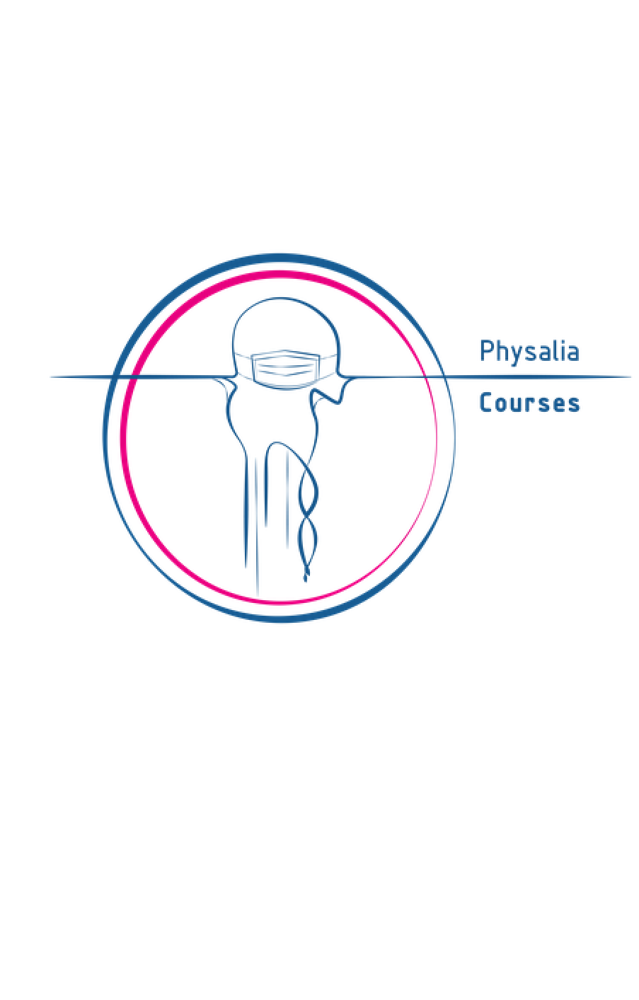
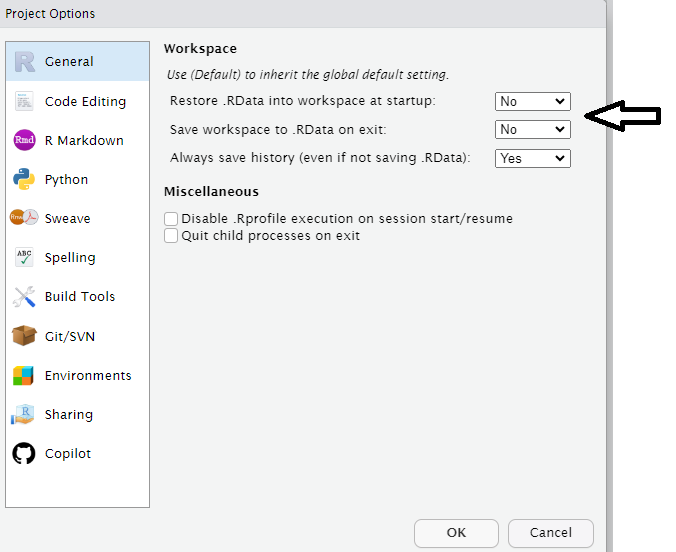
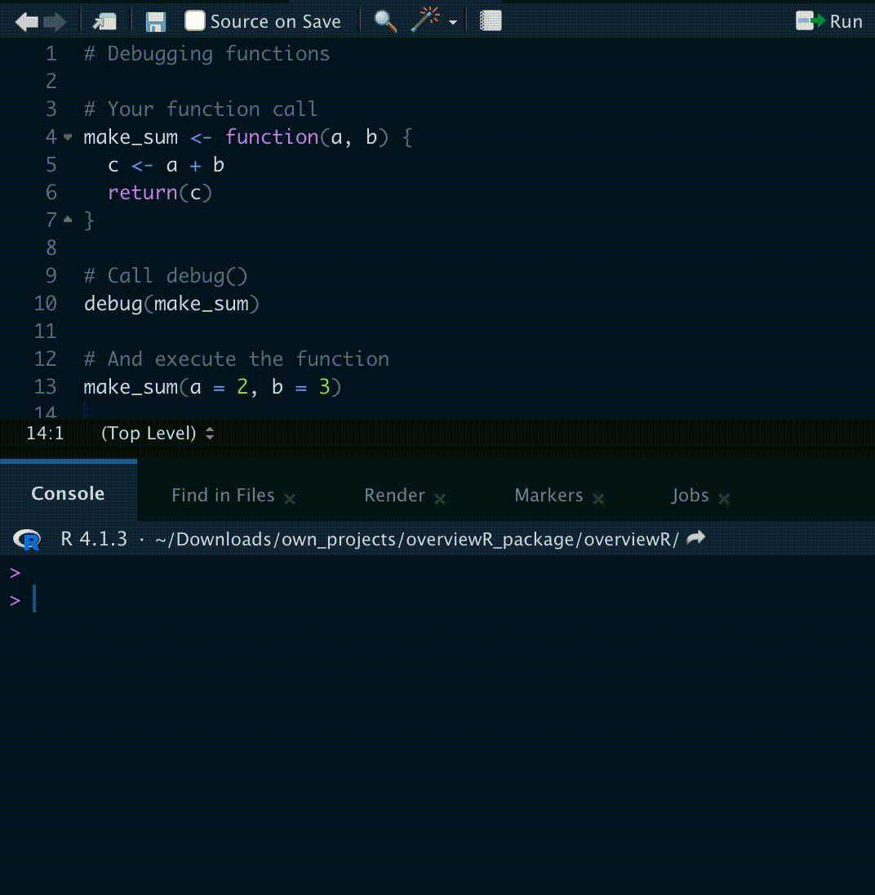
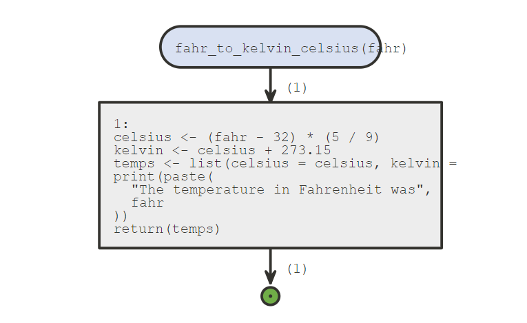
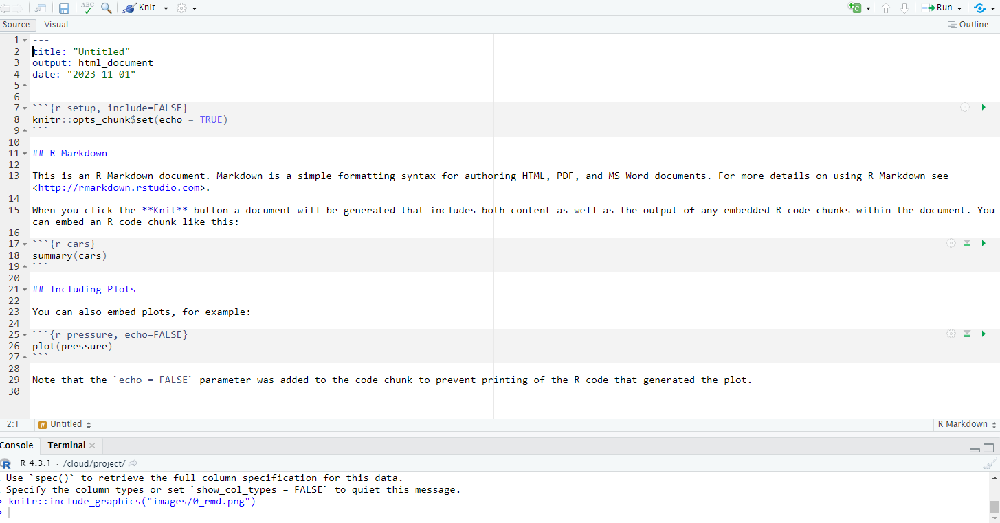
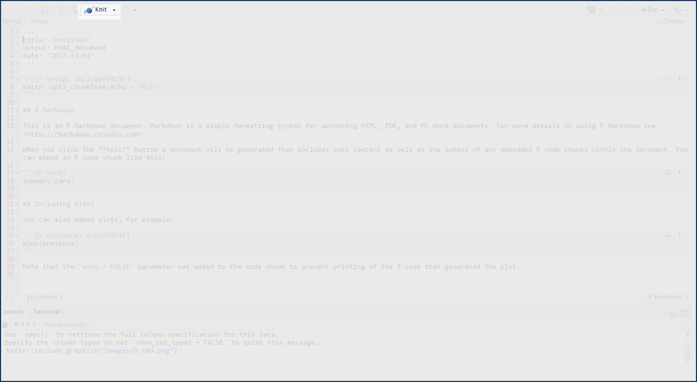
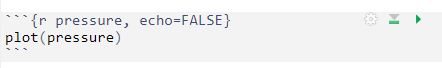
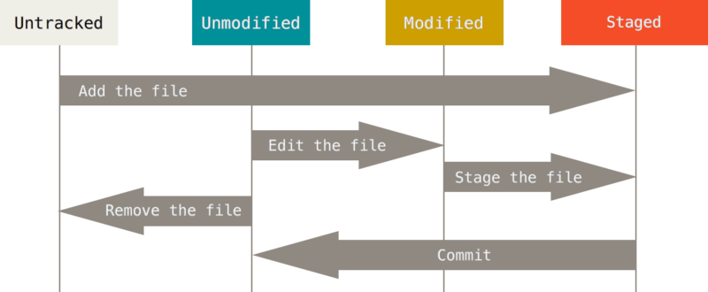
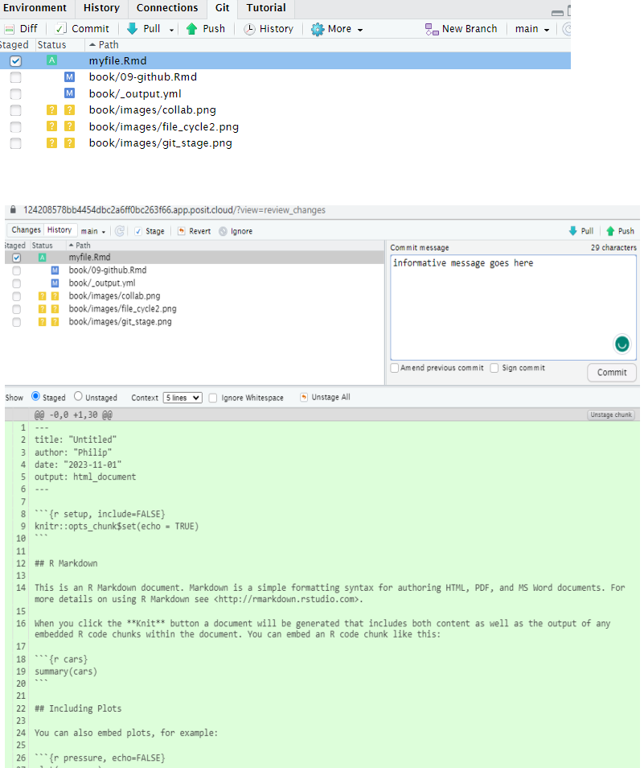

--- 
title: "Advancing in R"
author: "Philip T. Leftwich"
date: "2023-11-04"
subtitle: A guide for Biologists and Ecologists
site: bookdown::bookdown_site
documentclass: book
bibliography:
- book.bib
- packages.bib
biblio-style: apa
csl: include/apa.csl
link-citations: yes
description: |
  This book ...
url: https://ueabio.github.io/physalia-R-course-2023/
github-repo: UEABIO/physalia-R-course-2023
cover-image: images/logos/twitter_card.png
apple-touch-icon: images/logos/apple-touch-icon.png
apple-touch-icon-size: 180
favicon: images/logos/favicon.ico
---


# Overview {-}


<div class="small_right"></div>


This course will introduce scientists and practitioners interested in applying statistical approaches in their daily routine using R as a working environment. Participants will be introduced into R and R Studio while learning how to perform common statistical analyses. After a short introduction on R and its principles, the focus will be on questions that could be addressed using common statistical analyses, both for descriptive statistics and for statistical inference.

## Learning outcomes

1. Understand how to read, interpret and write scripts in R.

2. Learn statistical tools to address common questions in research activities.

3. An introduction to efficient, readable and reproducible analyses

4. Being comfortable with using R when performing both descriptive and inferential statistics.


## Packages


```r
library(tidyverse)
library(janitor)
library(rstatix)
library(performance)
library(see)
library(lmerTest)
library(patchwork)
library(broom.mixed)
library(ggeffects)
library(DHARMa)
library(sjPlot)
library(emmeans)
library(report)
library(MuMIn)
library(GGally)
library(colorBlindness)
```

<!--chapter:end:index.Rmd-->

# (PART\*) Get Started in R {.unnumbered}

# Introduction to R and RStudio


-   R is the name of the programming language we will learn on this course.

-   RStudio is a convenient interface which we will be using throughout the course in order to learn how to organise data, produce accurate data analyses & data visualisations.

R is a programming language that you will write code in, and RStudio is an Integrated Development Environment (IDE) which makes working with R easier. Think of it as knowing English and using a plain text editor like NotePad to write a book versus using a word processor like Microsoft Word. You could do it, but it wouldn't look as good and it would be much harder without things like spell-checking and formatting. In a similar way, you can use R without R Studio but we wouldn't recommend it. The key thing to remember is that although you will do all of your work using RStudio for this course, you are actually using **two** pieces of software which means that from time-to-time, both of them may have separate updates.

R and RStudio can be downloaded for free onto your [personal computers](https://www.rstudio.com/products/rstudio/)(see Appendices), but for convenience we will use a classroom space on **RStudio Cloud**.

[RStudio Cloud](https://rstudio.cloud/) is a cloud-based service where we can log into remotely hosted servers that host our data analysis projects.

The advantage of using RStudio Cloud is that all the extra packages and functions you need for this course will already be installed. You can log-in to your workspace from any computer as long as you have an internet connection and remember you username and password. I can also "visit" your projects and help out when you get stuck, if they are hosted on RStudio Cloud.

Eventually we will may also add extra tools like GitHub and RMarkdown for data reproducibility, literate and collaborative programming.

By the end of this course I hope you will have the tools to confidently analyze real data, make informative and beautiful data visuals, and be able to analyze lots of different types of data.

## Using RStudio Cloud

All of our sessions will run on cloud-based software. All you have to do is make a free account, and join our Workspace.

Once you are signed up - you will see that there are two spaces:

-   Your workspace - for personal use (20hrs/month)

-   Our shared classroom - educational licence (no limit)

Make sure you are working in the classroom workspace - so that I can distribute project work and 'visit' your projects if needed.

RStudio Cloud works in exactly the same way as RStudio, but means you don't have to download any software. You can access the hosted cloud server and your projects through any browser connection (Chrome works best), from any computer.

Here is a good reference guide to [RStudio Cloud](https://rstudio.cloud/learn/guide#projects)

## Getting to know RStudio

R Studio has a console that you can try out code in (appearing as the bottom left window), there is a script editor (top left), a window showing functions and objects you have created in the "Environment" tab (top right window in the figure), and a window that shows plots, files packages, and help documentation (bottom right).

<div class="figure" style="text-align: center">

<p class="caption">(\#fig:img-rstudio)RStudio interface</p>
</div>

You will learn more about how to use the features included in R Studio throughout this course, however, I highly recommend watching [RStudio Essentials 1](https://rstudio.com/resources/webinars/programming-part-1-writing-code-in-rstudio/) at some point. 

The video lasts \~30 minutes and gives a tour of the main parts of R Studio.

### Consoles vs. scripts

* The *script* window is the place to enter and run code so that it is easily edited and saved for future use. Usually the Script Window is shown at the top left in RStudio. If this window is not shown, it will be visible *if* you open a previously saved R script, *or* if you create a new R Script. You create new R Script by clicking on File > New File > R Script in the RStudio menu bar.

* To execute your code in the R script, you can either highlight the code and click on Run, or you can highlight the code and press CTRL + Enter on your keyboard.

* The *console*: you can enter code directly in the Console Window and click Enter. The commands that you run will be shown in the History Window on the top right of RStudio. Though it is much more difficult to keep track of your work this way.

### Environment

The Environment tab (top right) allows you to see what objects are in the workspace. If you create variables or data frames, you have a visual listing of everything in the current workspace. When you start a new project this should be completely empty.

### Plots, files, packages, help

1. Plots - The Plots panel, shows all your plots. There are buttons for opening the plot in a separate window and exporting the plot as a pdf or jpeg (though you can also do this with code.)

2. Files - The files panel gives you access to the file directory on your hard drive. 

3. Packages - Shows a list of all the R packages installed on your harddrive and indicates whether or not they are currently loaded. Packages that are loaded in the current session are checked while those that are installed but not yet loaded are unchecked. We will discuss packages more later.

4. Help - Help menu for R functions. You can either type the name of a function in the search window, or use the code to search for a function with the name


<div class="figure" style="text-align: center">

<p class="caption">(\#fig:labelled)RStudio interface labelled</p>
</div>

### Make RStudio your own

You can [personalise the RStudio GUI](https://support.rstudio.com/hc/en-us/articles/115011846747-Using-Themes-in-the-RStudio-IDE) as much as you like. 


## Get Help!

There are a lot of sources of information about using R out there. Here are a few helpful places to get help when you have an issue, or just to learn more

-   The R help system itself - type `help()` and put the name of the package or function you are querying inside the brackets

-   Vignettes - type `browseVignettes()` into the console and hit Enter, a list of available vignettes for all the packages we have will be displayed

-   Cheat Sheets - available at [RStudio.com.](https://www.rstudio.com/resources/cheatsheets/) Most common packages have an associate cheat sheet covering the basics of how to use them. Download/bookmark ones we will use commonly such as ggplot2, data transformation with dplyr, Data tidying with tidyr & Data import.

-   Google - I use Google constantly, because I continually forget how to do even basic tasks. If I want to remind myself how to round a number, I might type something like R round number - if I am using a particular package I should include that in the search term as well

-   Ask for help - If you are stuck, getting an error message, can't think what to do next, then ask someone. It could be me, it could be a classmate. When you do this it is very important that you show the code, include the error message. "This doesn't work" is not helpful. "Here is my code, this is the data I am using, I want it to do X, and here's the problem I get."

<div class="info">
<p>It may be daunting to send your code to someone for help.</p>
<p>It is natural and common to feel apprehensive, or to think that your
code is really bad. I still feel the same! But we learn when we share
our mistakes, and eventually you will find it funny when you look back
on your early mistakes, or laugh about the mistakes you still
occasionally make!</p>
</div>

# R basics

Go to RStudio Cloud and enter the Project labelled `Day One` - this will clone the project and provide you with your own project workspace.

Follow the instructions below to get used to the R command line, and how R works as a language.

## Your first R command

In the RStudio pane, navigate to the **console** (bottom left) and `type or copy` the below it should appear at the \>

Hit Enter on your keyboard.


```r
10 + 20
```

-   What answer did you get?


<div class='webex-solution'><button>Solution</button>


```r
30
```


</div>


The first line shows the request you made to R, the next line is R's response

You didn't type the `>` symbol: that's just the R command prompt and isn't part of the actual command.

When a complete expression is entered at the prompt, it is evaluated and the result of the evaluated expression is returned. The result may be auto-printed.


```r
print(10 + 20) ## explicit printing

10 + 20 ## autoprinting
```

Usually, with interactive work, we do not explicitly print objects with the print function; it is much easier to auto-print them by typing the name of the object and hitting return/enter. However, when writing scripts, functions, or more extended programs, there is sometimes a need to explicitly print objects.


When an R vector is printed, you will notice that an index for the vector is printed in square brackets `[]` on the side. For example, see this integer sequence 


```r
1:30
```

```
##  [1]  1  2  3  4  5  6  7  8  9 10 11 12 13 14 15 16 17 18 19 20 21 22 23 24 25
## [26] 26 27 28 29 30
```

The numbers in the square brackets are not part of the vector itself; they are merely part of the printed output.

> Note that the : operator is used to create integer sequences

### Operators

There are a few different types of operators to consider in R

#### Assignment Operator

|Operator|Description
|-----|-----|
|<-|	used to assign values to variables|

#### Arithmetic Operators

|Operator|Description
|-----|-----|
|+|	addition|
|-|	subtraction|
|*|	multiplication|
|/|	division|
|^|	exponentiation|

#### Relational Operators

|Operator|Description
|-----|-----|
|<|less than|
|<=|less than or equal to|
|>|	greater than|
|>=|greater than or equal to|
|==|exactly equal to|
|!=|not equal to|

#### Logical Operators

|Operator|Description
|-----|-----|
|!|not|
|&|AND|
|⎮|  OR|

#### Membership Operators

|Operator|Description
|-----|-----|
|%in%|used to check if an element is in a vector or list|

### Typos

<div class="warning">
<p>Before we go on to talk about other types of calculations that we can
do with R, there’s a few other things I want to point out. The first
thing is that, while R is good software, it’s still software. It’s
pretty stupid, and because it’s stupid it can’t handle typos. It takes
it on faith that you meant to type exactly what you did type.</p>
</div>

Suppose you forget to hit the shift key when trying to type `+`, and as a result your command ended up being `10 = 20` rather than `10 + 20`. Try it for yourself and replicate this error message:


```r
10 = 20
```


<div class='webex-solution'><button>What answer did you get?</button>

Error in 10 = 20 : invalid (do_set) left-hand side to assignment


</div>


What's going on: R tries to interpret `10 = 20` as a command, but it doesn't make sense, so it gives you an error message.

When a person sees this, they might realize it's a typo because the `+` and `=` keys are right next to each other on the keyboard. But R doesn't have that insight, so it just gets confused.

What's even trickier is that some typos won't create errors because they accidentally form valid R commands. For example, if I meant to type `10 + 20` but mistakenly pressed a neighboring key, I'd end up with `10 - 20`. Now, R can't read your mind to know you wanted to add, not subtract, so something different happens:


```r
10 - 20
```

```
## [1] -10
```

In this case, R produces the right answer, but to the the wrong question.

### More simple arithmetic

One of the best ways to get familiar with R is to experiment with it. The good news is that it's quite hard to mess things up, so don't stress too much. Just type whatever you like into the console and see what happens.

Now, if your console's last line looks like this:

    > 10+
    + 

And there's a *blinking cursor* next to that plus sign, it means R is patiently waiting for you to complete your command. It believes you're still typing, so it hasn't tried to run anything yet. This plus sign is a bit different from the usual prompt (the `>` symbol). It's there to nudge you that R is ready to "add" what you're typing now to what you typed before. For example, type `20` and hit enter, and then R will complete the command like this:

    > 10 +
    + 20
    [1] 30

*Alternatively* hit the escape key, and R will forget what you were trying to do and return to a blank line.

### Try some simple maths


```r
1+7
```


```r
13-10
```


```r
4*6
```


```r
12/3
```

Raise a number to the power of another


```r
5^4
```

Multiplying a number $x$ by itself $n$ times is called "raising $x$ to the $n$-th power". Mathematically, this is written as $x^n$. Some values of $n$ have special names: in particular $x^2$ is called $x$-squared, and $x^3$ is called $x$-cubed. So, the 4th power of 5 is calculated like this: 

$$5^4 = 5 \times 5 \times 5 \times 5 $$

### Perform some combos

R follows the standard order of operations (BODMAS/BIDMAS), which means it first calculates within brackets, then deals with exponents, followed by division and multiplication, and finally addition and subtraction.

Let's look at two examples to see how the order of operations affects the results:


```r
3^2-5/2
```


```r
(3^2-5)/2
```

Similarly if we want to raise a number to a fraction, we need to surround the fraction with parentheses `()`


```r
16^1/2
```


```r
16^(1/2)
```

The first one calculates 16 raised to the power of 1, then divided this answer by two. The second one raises 16 to the power of a half. A big difference in the output.

<div class="info">
<p>While the cursor is in the console, you can press the up arrow to see
all your previous commands.</p>
<p>You can run them again, or edit them. Later on we will look at
scripts, as an essential way to re-use, store and edit commands.</p>
</div>

## "TRUE or FALSE" data

Time to make a sidebar onto another kind of data. Many concepts in programming rely on the idea of a ***logical value***. A logical value is an assertion about whether something is true or false. This is implemented in R in a pretty straightforward way. There are two logical values, namely `TRUE` and `FALSE`. Despite the simplicity, logical values are very useful things. Let's see how they work.

### Assessing mathematical truths

Time to explore a different kind of data. In programming, many concepts rely on logical values. A logical value is a statement about whether something is true or false. In R, this is pretty straightforward. There are two logical values: `TRUE` and `FALSE`. Despite their simplicity, these logical values are incredibly useful. Let's dive into how they work.

In R, basic mathematics is solid, and there's no room for manipulation. When you ask R to calculate `2 + 2`, it always provides the same answer,


```r
2 + 2
```

```
## [1] 4
```

up to this point, R has been performing calculations without explicitly asserting whether $2 + 2 = 4$ is a true statement. If I want R to make an explicit judgment, I can use a command like this:


```r
2 + 2 == 4
```


<div class='webex-solution'><button>Solution</button>

TRUE


</div>


What I've done here is use the ***equality operator***, `==`, to force R to make a "true or false" judgement.

<div class="warning">
<p>This is a very different operator to the assignment operator
<code>=</code> you saw previously.</p>
<p>A common typo that people make when trying to write logical commands
in R (or other languages, since the “<code>=</code> versus
<code>==</code>” distinction is important in most programming languages)
is to accidentally type <code>=</code> when you really mean
<code>==</code>.</p>
</div>

Okay, let's see what R thinks of `2 +2 ==5`:


```r
2+2 == 5
```

```
## [1] FALSE
```

Now, let's see what happens when I attempt to make R believe that two plus two equals five by using an assignment statement like `2 + 2 = 5` or `2 + 2 <- 5`. Here's the outcome:


```r
2 + 2 = 5
```

    Error in 2 + 2 = 5 : target of assignment expands to non-language object

Indeed, R isn't too fond of this idea. It quickly realizes that `2 + 2` is not a variable (that's what the "non-language object" part is saying), and it refuses to let you "reassign" it. While R can be quite flexible and allows you to do some remarkable things to redefine parts of itself, there are fundamental truths it simply won't budge on. It won't tamper with the laws of addition, and it won't redefine the number `2`.

That's probably for the best.

## Storing outputs

When dealing with more complex questions, it's often helpful to store our answers and use them in later steps. Fortunately, this is quite easy to do in R. We can assign the results to a name with the **assignment operator**:


```r
a <- 1+2
```

This literally means please *assign* the value of `1+2` to the name `a`. We use the **assignment operator** `<-` to make this assignment.

<div class="info">
<p>Note the shortcut key for &lt;- is Alt + - (Windows) or Option + -
(Mac)</p>
</div>


By performing this action, you'll achieve two things:

You will notice in the top right-hand pane within the **Environment** tab that there is now an **object** labeled a with a value of `3`.

<div class="figure" style="text-align: center">

<p class="caption">(\#fig:img-environment)object a is now visible withe a value of 3 in the Environment Pane</p>
</div>

- You can check what the variable a contains by typing it into your Console and pressing Enter.

- Keep in mind that you won't see the result of your operations until you type the object into the R console and press Enter.


```r
a  ## autoprinting

print(a) ## explicit printing
```


<div class='webex-solution'><button>What output do you get when you type a into your console?</button>


```r
3
```


</div>


You can now call this object at *any time* during your R session and perform calculations with it.


```r
2 * a
```


<div class='webex-solution'><button>Solution</button>


```r
6
```


</div>


What happens if we assign a value to a named object that **already** exists in our R environment??? for example


```r
a <- 10
a
```

The value of `a` is now 10.

You should see that the previous assignment is lost, *gone forever* and has been replaced by the new value.

We can assign lots of things to objects, and use them in calculations to build more objects.


```r
b <- 5
c <- a + b
```

<div class="warning">
<p>Remember: If you now change the value of b, the value of c does
<em>not</em> change.</p>
<p>Objects are totally <strong>independent</strong> from each other once
they are made.</p>
<p>Overwriting objects with new values means the old value is lost.</p>
</div>


```r
b <- 7
b
c
```

-   What is the value of `c`?


<div class='webex-solution'><button>What is the value of c ?</button>

[1] 15

When `c` was created it was a product of `a` and `b` having values of 10 and 15 respectively. 
If we re-ran the command `c <- a + b` *after* changing the value of `b` **then** we would get a value of 17. 


</div>


Look at the environment tab again - you should see it's starting to fill up now!

<div class="info">
<p>RStudio will by default save the objects in its memory when you close
a session.</p>
<p>These will then be there the next time you logon. It might seem nice
to be able to close things down and pick up where you left off, but its
actually quite dangerous. It’s messy, and can cause lots of problems
when we work with scripts later, so don’t do this!</p>
<p>To stop RStudio from saving objects by default go to Tools &gt;
Project Options option and change “Save workspace to .RData on exit” to
“No” or “Never”.</p>
<p>Instead we are going to learn how to use scripts to quickly re-run
analyses we have been working on.</p>
</div>

### Choosing names

-   Use informative variable names. As a general rule, using meaningful names like `orange` and `apple` is preferred over arbitrary ones like `variable1` and `variable2`. Otherwise it's very hard to remember what the contents of different variables actually are.

-   Use short variable names. Typing is a pain and no-one likes doing it. So we much prefer to use a name like `apple` over a name like `pink_lady_apple`.

-   Use one of the conventional naming styles for multi-word variable names. R only lets you use certain things as **legal** names. Legal names must start with a letter **not** a number, which can then be followed by a sequence of letters, numbers, ., or \_. R does not like using spaces. Upper and lower case names are allowed, but R is case sensitive so `Apple` and `apple` are different.

-   My favourite naming convention is `snake_case` short, lower case only, spaces between words are separated with a \_. It's easy to read and easy to remember.

<div class="figure" style="text-align: center">

<p class="caption">(\#fig:unnamed-chunk-39)courtesy of Allison Horst</p>
</div>

## R objects

In R, there are five fundamental or "atomic" classes of objects:

- Character: These represent text or character strings.

- Numeric (num) or Double (dbl): These are used for real numbers (e.g., decimal numbers).

- Integer: Used for whole numbers.

- Complex: For complex numbers.

- Logical: Represented as True or False, these are used for logical values.

The most basic type of R object is a vector. You can create empty vectors using the `vector()` function. The primary rule regarding vectors in R is that a vector can only contain objects of the same class.

However, as with any good rule, there's an exception, which is the "list." Lists are represented as vectors but can hold objects of different classes, which is why they're often used.

### Numbers

In R, both "dbl" and "num" refer to numeric data types, but there is a subtle difference between them:

- dbl ("double"): This refers to double-precision floating-point numbers, which are capable of storing real numbers with high precision. Double-precision numbers have more decimal places of accuracy and can represent a wider range of values without loss of precision. When you perform arithmetic operations, R typically returns results as "dbl" values by default.

- num ("numeric"): "Num" is a more general term that includes not only double-precision floating-point numbers but also integer values. In R, integers are a subtype of numeric data. Numeric data can include both integers and double-precision floating-point numbers, depending on the specific data and how it is represented.

So, "dbl" specifically denotes double-precision floating-point numbers, while "num" encompasses a broader range of numeric data, including both integers and double-precision numbers. In most cases, you can use "num" to work with numeric data in a more general sense, while "dbl" focuses on the higher-precision representation of real numbers.


## Attributes

R objects can come with attributes, which are essentially metadata for the object. These metadata are handy because they help describe the object. For instance, in a data frame, column names serve as attributes, clarifying the data contained in each column. Here are a few examples of R object attributes:

- `names()` and `dimnames()`

- dimensions (e.g., for matrices and arrays) `dim()`

- `class()` (e.g., integer, numeric)

- `length()`

- Other user-defined attributes or metadata

You can access the attributes of an object, if it has any, by using the `attributes()` function. If an R object doesn't have any attributes, the `attributes()` function will return NULL.

## Vectors

We have been working with R objects containing a single element of data (the technical term is **scalar**), but we will more commonly work with vectors. A vector is a sequence of elements, all of the same data type. These could be logical, numerical, character etc.


```r
numeric_vector <- c(1,2,3)

character_vector <- c("fruits", "vegetables", "seeds")

logical_vector <- c(TRUE, TRUE, FALSE)

integer_vector <- 1:10
```

### Coercion

In R, when different classes of objects are mixed together in a vector, coercion occurs to ensure that every element in the vector belongs to the same class. Coercion is the process of converting objects to a common class to make the combination reasonable. Let's see the effects of implicit coercion in the provided examples:


```r
y <- c(2.3, "a") # Here, we're mixing a numeric value (1.7) with a character value ("a"). To make them compatible, R coerces both elements into character values. So, y becomes a character vector.

y <- c(TRUE, 2) # In this case, we're combining a logical value (TRUE) with a numeric value (2). R coerces the logical value into 1, so y becomes a numeric vector.

y <- c("a", TRUE) # We're mixing a character value ("a") with a logical value (TRUE). In this scenario, R coerces the logical value into a character value, resulting in y becoming a character vector.
```

So, the outcome depends on how R can reasonably represent all the objects in the vector. It aims to create a vector of the most inclusive class to accommodate the mixed objects. Keep in mind that this coercion can lead to unexpected results, so it's essential to be aware of the implicit type conversion when mixing different data types in R.

Objects can also be **explicitly coerced** from one class to another using the as.* functions, if available.

<div class="panel panel-default"><div class="panel-heading"> Task </div><div class="panel-body"> 
Create the following vector and check its class, then note what happens when you attempt to coerce to numeric, logical and character

```r
x <- 0:5
```
 </div></div>

<button id="displayTextunnamed-chunk-43" onclick="javascript:toggle('unnamed-chunk-43');">Show Solution</button>

<div id="toggleTextunnamed-chunk-43" style="display: none"><div class="panel panel-default"><div class="panel-heading panel-heading1"> Solution </div><div class="panel-body">

```r
as.numeric(x)

as.logical(x)

as.character(x)
```

```
## [1] 0 1 2 3 4 5
## [1] FALSE  TRUE  TRUE  TRUE  TRUE  TRUE
## [1] "0" "1" "2" "3" "4" "5"
```

</div></div></div>

Sometimes, R can’t figure out how to coerce an object and this can result in `NA`s being produced

### Subsetting vectors

With numerical indexing, you enter a vector of integers corresponding to the values in the vector you want to access in the form a[index], where a is the vector, and index is a vector of index values. For example, let’s use numerical indexing to get values from our character_vector


```r
character_vector[2]
# [1] "vegetables"


character_vector[1:2]
# [1] "fruits"     "vegetables"

character_vector[c(1,3)]
# [1] "fruits" "seeds" 
```

We can also use logical indexing


```r
numeric_vector <=2
# [1]  TRUE  TRUE FALSE

character_vector == "fruits"
#[1]  TRUE FALSE FALSE
```

## Matrices

Matrices can be thought of as vectors with an added dimension attribute. This dimension attribute is a two-element integer vector specifying the number of rows and columns, which defines the shape and structure of the matrix.

<div class="info">
<p>Data frames are also two-dimensional but can store columns of
different data types - matrices are simpler as they consist of elements
of the same data type.</p>
</div>

Matrices are constructed "columns-first" so entries start in the "upper left" and and run down columns. 


```r
m <- matrix(1:6, nrow = 2, ncol = 3) 
m
```

```
##      [,1] [,2] [,3]
## [1,]    1    3    5
## [2,]    2    4    6
```


```r
attributes(m)
```

```
## $dim
## [1] 2 3
```

We can create matrices in several ways:

- Adding a `dim()` to existing vectors

- Column/row-binding vectors with `cbind()` and `rbind()`


```r
m <- 1:6

dim(m) <- c(2,3)

m
```

```
##      [,1] [,2] [,3]
## [1,]    1    3    5
## [2,]    2    4    6
```


```r
a <- 1:2
b <- 3:4
c <- 5:6

m <- cbind(a,b,c)
m
```

```
##      a b c
## [1,] 1 3 5
## [2,] 2 4 6
```

You will see how in this last operation column names were added to the matrix, we can add, change or remove column and rownames on a matrix with `colnames()` and `rownames()`


```r
rownames(m) <- c("y","z")
m
```

```
##   a b c
## y 1 3 5
## z 2 4 6
```

## Lists

Lists are a versatile and fundamental data type in R. They set themselves apart from regular vectors by allowing you to store elements of different classes within the same list. This flexibility is what makes lists so powerful for various data structures and data manipulation tasks.

You can create lists explicitly using the `list()` function, which can take an arbitrary number of arguments. Lists, when combined with functions like the "apply" family, enable you to perform complex and versatile data manipulations and analyses in R. Lists are often used to represent heterogeneous data structures, such as datasets where different columns can have different data types and structures.


```r
l <- list(1, "apple", TRUE )
l
```

```
## [[1]]
## [1] 1
## 
## [[2]]
## [1] "apple"
## 
## [[3]]
## [1] TRUE
```

We can also create empty lists of set lengths with the `vector()` function, this can be useful for preallocating memory for iterations - as we will see later


```r
l <- vector("list", length = 3)
l
```

```
## [[1]]
## NULL
## 
## [[2]]
## NULL
## 
## [[3]]
## NULL
```

Lists can also have names


```r
names(l) <- c("apple","orange","pear")
```

## Dataframes

Data frames are essential for storing tabular data in R and find extensive use in various statistical modeling and data analysis applications. They offer a structured way to manage and work with data in R, and packages like dplyr, developed by Hadley Wickham, provide optimized functions for efficient data manipulation with data frames.

Here are some key characteristics and advantages of data frames:

- Tabular Structure: Data frames are a type of list, where each element in the list represents a column. The number of rows in each column is the same, and this tabular structure makes them suitable for working with datasets.

- Mixed Data Types: Unlike matrices, data frames can contain columns with different classes of objects. This flexibility allows you to handle real-world datasets that often include variables of different data types.

- Column and Row Names: Data frames include column names, which describe the variables or predictors. Additionally, they have a special attribute called "row.names" that provides information about each row in the data frame.

- Creation and Conversion: Data frames can be created in various ways, such as reading data from files using functions like read.table() and read.csv(). You can also create data frames explicitly with data.frame().

- Working with Data: Data frames are especially useful when working with datasets that require data cleaning, transformation, or merging. They provide a high level of data organization, and many R packages are designed to work seamlessly with data frames.

- dplyr: The `dplyr` package is optimized for efficient data manipulation with data frames. It offers a set of functions to perform data operations quickly and intuitively.

Data frames are a fundamental structure for managing tabular data in R. They excel in handling datasets with mixed data types and are essential for various data analysis and modeling tasks.

To create a dataframe from vectors we use the `data.frame()` function


```r
survey <- data.frame("index" = c(1, 2, 3, 4, 5),
                     "sex" = c("m", "m", "m", "f", "f"),
                     "age" = c(99, 46, 23, 54, 23))
```

There is one key argument to `data.frame()` and similar functions called `stringsAsFactors`. By default, the data.frame() function will automatically convert any string columns to a specific type of object called a factor in R. A factor is a nominal variable that has a well-specified possible set of values that it can take on. For example, one can create a factor sex that can only take on the values "male" and "female".

<div class="warning">
<p>Since R ver 4.0 release, stringsAsFactors is set FALSE by
default!</p>
</div>

However, as I’m sure you’ll discover, having R automatically convert your string data to factors can lead to lots of strange results. For example: if you have a factor of sex data, but then you want to add a new value called other, R will yell at you and return an error. I hate, hate, HATE when this happens. While there are very, very rare cases when I find factors useful, I almost always don’t want or need them. For this reason, I avoid them at all costs.

To tell R to not convert your string columns to factors, you need to include the argument `stringsAsFactors = FALSE` when using functions such as `data.frame()`


```r
str(survey)
```

```
## 'data.frame':	5 obs. of  3 variables:
##  $ index: num  1 2 3 4 5
##  $ sex  : chr  "m" "m" "m" "f" ...
##  $ age  : num  99 46 23 54 23
```

To access a specific column in a dataframe by name, you use the `$` operator in the form `df$name` where `df` is the name of the dataframe, and name is the name of the column you are interested in. This operation will then return the column you want as a vector.


```r
survey$sex
```

```
## [1] "m" "m" "m" "f" "f"
```

Because the `$` operator returns a vector, you can easily calculate descriptive statistics on columns of a dataframe by applying your favorite vector function (like `mean()`). 


```r
mean(survey$age)
```

```
## [1] 49
```

We can also use the `$` to add new vectors to a dataframe


```r
survey$follow_up <- c(T,F,T,F,F)
survey
```

<div class="kable-table">

| index|sex | age|follow_up |
|-----:|:---|---:|:---------|
|     1|m   |  99|TRUE      |
|     2|m   |  46|FALSE     |
|     3|m   |  23|TRUE      |
|     4|f   |  54|FALSE     |
|     5|f   |  23|FALSE     |

</div>

Changing column names is easy with a combination of `names()` and indexing


```r
names(survey)[1] <- "ID"

survey
```

<div class="kable-table">

| ID|sex | age|follow_up |
|--:|:---|---:|:---------|
|  1|m   |  99|TRUE      |
|  2|m   |  46|FALSE     |
|  3|m   |  23|TRUE      |
|  4|f   |  54|FALSE     |
|  5|f   |  23|FALSE     |

</div>

### Slice dataframes

Matrices and dataframes can be sliced with `[,]`

```
# Return row 1
df[1, ]


# Return column 5 as vector
df[, 5]

# Return column as data.frame
df[5]

# Rows 1:5 and column 2
df[1:5, 2]

# Single element
df[[1,2]]

```

Or slice with `subset`


```r
survey_slice <- subset(x = survey,
      subset = age < 50 &
               sex == "m")

survey_slice
```

<div class="kable-table">

|   | ID|sex | age|follow_up |
|:--|--:|:---|---:|:---------|
|2  |  2|m   |  46|FALSE     |
|3  |  3|m   |  23|TRUE      |

</div>

### Tibbles

“Tibbles” are a new modern data frame. It keeps many important features of the original data frame

- A tibble never changes the input type.

- A tibble can have columns that are lists.

- A tibble can have non-standard variable names.
    - can start with a number or contain spaces.
    -to use this refer to these in a backtick.
    
- Tibbles only print the first 10 rows and all the columns that fit on a screen. - Each column displays its data type

The way we make tibbles is very similar to making dataframes


```r
survey_tibble <- tibble("index" = c(1, 2, 3, 4, 5),
                     "sex" = c("m", "m", "m", "f", "f"),
                     "age" = c(99, 46, 23, 54, 23))
```


```r
# Some R functions for looking at tibbles and dataframes

head(survey_tibble, n=2)
tail(survey_tibble, n=1)
nrow(survey_tibble)
ncol(survey_tibble)
colnames(survey_tibble)
view(survey_tibble)
glimpse(survey_tibble)
str(survey_tibble)
```

### Brackets with tibbles

The behaviour of single [] indexing with tibbles is slightly different. 

In a dataframe [,1] extracts a single column as a vector, but with a tibble this conversion does not occur. Instead it returns as a tibble with a single column, not a vector.

To extract a vector we must use:


```r
# pull function
pull(survey_tibble, sex)

# double brackets
survey_tibble[[2]]
```

https://tibble.tidyverse.org/

https://cran.r-project.org/web/packages/tibble/vignettes/tibble.html


## Matrix, dataframe, tibble functions

Important functions for understanding matrices and dataframes.

| Function                           | Description                                                |
| ---------------------------------- | ---------------------------------------------------------- |
| `head(x), tail(x)`                 | Print the first few rows (or last few rows).              |
| `View(x)`                          | Open the entire object in a new window.                   |
| `nrow(x), ncol(x), dim(x)`         | Count the number of rows and columns.                     |
| `rownames(), colnames(), names()`  | Show the row (or column) names.                            |
| `str(x), summary(x)`               | Show the structure of the dataframe (i.e., dimensions and classes) and summary statistics. |


## Error

Things will go wrong eventually, they always do...

R is *very* pedantic, even the smallest typo can result in failure and typos are impossilbe to avoid. So we will make mistakes. One type of mistake we will make is an **error**. The code fails to run. The most common causes for an error are:

-   typos

-   missing commas

-   missing brackets

There's nothing wrong with making *lots* of errors. The trick is not to panic or get frustrated, but to read the error message and our script carefully and start to *debug* (more on this later)...

... and sometimes we need to walk away and come back later!

<div class="try">
<p>Try typing the command <code>help()</code> into the R console, it
should open a new tab on the bottom right.</p>
<p>Put a function or package into the brackets to get help with a
specific topic</p>
</div>

<div class="figure" style="text-align: center">

<p class="caption">(\#fig:unnamed-chunk-67)courtesy of Allison Horst</p>
</div>

## Functions

Functions are the tools of R. Each one helps us to do a different task.

Take for example the function that we use to round a number to a certain number of digits - this function is called `round`

Here's an example:


```r
round(x  = 2.4326782647, digits = 2)
```

We start the command with the function name `round`. The name is followed by parentheses `()`. Within these we place the *arguments* for the function, each of which is separated by a comma.

The arguments:

-   `x =` 2.4326782647 (the number we would like to round)

-   `digits =` 2 (the number of decimal places we would like to round to)

**Arguments are the inputs we give to a function**. These arguments are in the form `name = value` the name specifies the argument, and the value is what we are providing to define the input. That is the first argument `x` is the number we would like to round, it has a value of 2.4326782647. The second argument `digits` is how we would like the number to be rounded and we specify 2. There is no limit to how many arguments a function *could* have.


<div class="try">
<p>Copy and paste the following code into the console.</p>
</div>


```r
help(round)
```

The help documentation for `round()`should appear in the bottom right help panel. In the usage section, we see that `round()`takes the following form:


```r
round(x, digits = 0)
```

In the arguments section, there are explanations for each of the arguments. `x`is the number or vector where we wish to round values. `digits` is the number of decimal places to be used. In the description we can see that if no value is supplied for `digits` it will default to 0 or whole number rounding.

Read the 'Details' section to find out what happens when rounding when the last digit is a 5.

Let's try an example and just change the required argument `digits`

<div class="try">
<p>Copy and paste the following code into the console.</p>
</div>


```r
round(x  = 2.4326782647)
```

```
## [1] 2
```

Now we can change the additional arguments to produce a different set of numbers.


```r
round(x  = 2.4326782647, digits = 2)
```

```
## [1] 2.43
```

This time R has still rounded the number, but it has done so to a set number of 'decimal places'.

Always remember to use the help documentation to help you understand what arguments a function requires.

### Storing the output of functions

What if we need the answer from a function in a later calculation. The answer is to use the assignment operator again `<-`.

In this example we assign values to two R objects that we can then call inside our R function **as though we were putting numbers in directly**.

<div class="try">
<p>Copy and paste the following code into the console.</p>
</div>


```r
number_of_digits <- 3

my_number <- 2.4326782647

rounded_number <- round(x  = my_number, 
                        digits = number_of_digits)
```

**What value is assigned to the R object `rounded_number`** **?**


<div class='webex-solution'><button>Solution</button>


[1] 2.433


</div>


### More fun with functions

Copy and paste this:


```r
round(2.4326782647, 2)
```

Looks like we don't even *have* to give the names of arguments for a function to still work. This works because the function `round` expects us to give the number value first, and the argument for rounding digits second. *But* this assumes we know the expected ordering within a function, this might be the case for functions we use a lot. If you give arguments their proper names *then* you can actually introduce them in **any order you want**.

Try this:


```r
round(digits = 2, x  = 2.4326782647)
```

But this gives a different answer


```r
round(2, 2.4326782647)
```

<div class="warning">
<p>Remember naming arguments overrides the position defaults</p>
</div>

How do we **know** the argument orders and defaults? Well we get to know how a lot of functions work through practice, but we can also use `help()` .

## Packages

When you install R you will have access to a range of functions including options for data wrangling and statistical analysis. The functions that are included in the default installation are typically referred to as **Base R** and there is a useful cheat sheet that shows many Base R functions [here](%5Bhttps://www.rstudio.com/wp-content/uploads/2016/05/base-r.pdf)

However, the power of R is that it is extendable and open source - anyone can create a new **package** that extends the functions of R.

An R package is a container for various things including functions and data. These make it easy to do very complicated protocols by using custom-built functions. Later we will see how we can write our own simple functions. Packages are a lot like new apps extending the functionality of what your phone can do.


### Loading packages

To use the functions from a package in our script they must be loaded *before* we call on the functions or data they contain. So the most sensible place to put library calls for packages is at the very **top** of our script.


```r
library(package_name)
```

### Calling Functions from Packages

After loading a package, you can call its functions using either `function()` or the full `package_name::function_name()` syntax. This allows you to specify the package explicitly when using a particular function.


```r
library(dplyr)

filter(dataframe, condition)

dplyr::filter(dataframe, conditions)
```

Calling a function explicitly via its package can be useful for 

1. Avoiding Conflicts:

Sometimes, multiple packages may have functions with the same name. By explicitly specifying the package with package_name::, you avoid naming conflicts and ensure that R uses the function from the intended package.

2. Clarity:

It can make your code more transparent and easier to understand, especially in cases where the function's origin is not immediately obvious. This is helpful for both yourself and others who read your code.

>Though it is still good practice to comment at the top of your script that this package is required even if you don't include library(package)


3. Debugging:

When troubleshooting issues or debugging code, specifying the package source of a function can help pinpoint problems and ensure that the correct function is being used.


## Activity 1

### Complete this Quiz

When you get the correct answer, the answer box will turn green. Sometimes this doesn't work on Internet Explorer or Edge so be sure to use Chrome or Firefox.

**Question 1.**  What is the output from 5\^4

<input class='webex-solveme nospaces' size='3' data-answer='["625"]'/>


**Question 2.**  What answer will you get when you type `2+2 = 4` into the R console?

<select class='webex-select'><option value='blank'></option><option value=''>TRUE</option><option value=''>FALSE</option><option value='answer'>Error</option></select>


<div class='webex-solution'><button>Solution</button>


If we wanted R to make a judgement we must use == not = otherwise we will get an Error message


</div>


**Question 3.**  What symbol do I use if I want to **assign** a value or output of a function to an R object

<input class='webex-solveme nospaces' size='2' data-answer='["<-"]'/>

**Question 4.**  What is the value of `a` if I ran the following commands?


```r
a <-  12*2

a <- 5
```

<input class='webex-solveme nospaces' size='1' data-answer='["5"]'/>

**Question 5.**  Which of these variable naming conventions is **not** written correctly?

<select class='webex-select'><option value='blank'></option><option value=''>snake_case</option><option value=''>camelCase</option><option value='answer'>Screaming_Snake_Case</option><option value=''>kebab-case</option></select>

**Question 6.**  What should I type into the R console if I want `help` with the `round()` function?

<input class='webex-solveme nospaces' size='11' data-answer='["help(round)"]'/>

**Question 7.**  Which of these statements about function arguments **is not true**

<select class='webex-select'><option value='blank'></option><option value=''>Arguments are the inputs we give to a function</option><option value='answer'>Values for R arguments must always be defined by the user</option><option value=''>Naming arguments supersedes position in a function</option><option value=''>There is no limit to the number of arguments a function could have</option></select>

**Question 8.**  Evaluate this statement "An R Package can contain code functions, data, or both."

<select class='webex-select'><option value='blank'></option><option value='answer'>TRUE</option><option value=''>FALSE</option></select>


```r
sessionInfo()
```

```
## R version 4.3.1 (2023-06-16)
## Platform: x86_64-pc-linux-gnu (64-bit)
## Running under: Ubuntu 20.04.6 LTS
## 
## Matrix products: default
## BLAS:   /usr/lib/x86_64-linux-gnu/atlas/libblas.so.3.10.3 
## LAPACK: /usr/lib/x86_64-linux-gnu/atlas/liblapack.so.3.10.3;  LAPACK version 3.9.0
## 
## locale:
##  [1] LC_CTYPE=C.UTF-8       LC_NUMERIC=C           LC_TIME=C.UTF-8       
##  [4] LC_COLLATE=C.UTF-8     LC_MONETARY=C.UTF-8    LC_MESSAGES=C.UTF-8   
##  [7] LC_PAPER=C.UTF-8       LC_NAME=C              LC_ADDRESS=C          
## [10] LC_TELEPHONE=C         LC_MEASUREMENT=C.UTF-8 LC_IDENTIFICATION=C   
## 
## time zone: UTC
## tzcode source: system (glibc)
## 
## attached base packages:
## [1] stats     graphics  grDevices utils     datasets  methods   base     
## 
## other attached packages:
##  [1] knitr_1.43         webexercises_1.1.0 glossary_1.0.0     lubridate_1.9.2   
##  [5] forcats_1.0.0      stringr_1.5.0      dplyr_1.1.2        purrr_1.0.1       
##  [9] readr_2.1.4        tidyr_1.3.0        tibble_3.2.1       ggplot2_3.4.2     
## [13] tidyverse_2.0.0   
## 
## loaded via a namespace (and not attached):
##  [1] sass_0.4.6        utf8_1.2.3        generics_0.1.3    xml2_1.3.5       
##  [5] stringi_1.7.12    hms_1.1.3         digest_0.6.33     magrittr_2.0.3   
##  [9] evaluate_0.21     grid_4.3.1        timechange_0.2.0  bookdown_0.34    
## [13] fastmap_1.1.1     jsonlite_1.8.7    fansi_1.0.4       scales_1.2.1     
## [17] codetools_0.2-19  jquerylib_0.1.4   cli_3.6.1         rlang_1.1.1      
## [21] munsell_0.5.0     withr_2.5.0       cachem_1.0.8      yaml_2.3.7       
## [25] tools_4.3.1       tzdb_0.4.0        memoise_2.0.1     colorspace_2.1-0 
## [29] vctrs_0.6.3       R6_2.5.1          lifecycle_1.0.3   fs_1.6.2         
## [33] pkgconfig_2.0.3   pillar_1.9.0      bslib_0.5.0       gtable_0.3.3     
## [37] glue_1.6.2        highr_0.10        xfun_0.39         tidyselect_1.2.0 
## [41] rstudioapi_0.15.0 htmltools_0.5.5   rmarkdown_2.23    compiler_4.3.1   
## [45] downlit_0.4.3
```

<!--chapter:end:01-intro-to-r.Rmd-->

# (PART\*) Organising workflows {.unnumbered}

# Project-oriented workflows


In RStudio, a project is a way to organize your work within the IDE. It's a fundamental concept designed to enhance your workflow by providing a structured and efficient means of managing your R-related tasks and files. Here's why R projects are useful:

**1. Organized File Structure:** R projects encourage you to maintain a well-organized file structure for your work. Instead of having scattered R scripts, data files, and figures, you create a dedicated folder for each project. This folder typically contains all project-related materials, including data, code, figures, notes, and any other relevant files.

**2. Working Directory Management:** When you open an R project in RStudio, it automatically sets the working directory to the project's folder. This ensures that all file paths are relative to the project's location. This working directory intentionality eliminates the need for setting working directories manually or using absolute paths in your code.

**3. Portability and Collaboration:** R projects make your work more portable and collaborative. Since all paths are relative to the project folder, the project can be easily shared with others. It ensures that the code works consistently across different computers and for other users, promoting collaboration and reproducibility.

**4. RStudio Integration:** RStudio integrates project management seamlessly. You can designate a folder as an R project, and RStudio leaves a `.Rproj` file in that folder to store project-specific settings. When you double-click on this file, it opens a fresh instance of RStudio with the project's working directory and file browser pointed at the project folder.

**5. Efficient Workflow:** RStudio provides various menu options and keyboard shortcuts for managing projects. This includes the ability to open existing projects, switch between projects, and even launch multiple instances of RStudio for different projects.

In essence, R projects help you maintain a clean and organized workspace, improve collaboration, and ensure that your work remains reproducible and transferable across different environments and over time. It's a best practice for data scientists and analysts working with R, as it fosters the disciplined use of relative file paths and working directories, which is crucial for the reliability and scalability of your R projects.


## Setting up a new project

You should start a new R project when you begin working on a distinct task, research project, or analysis. This ensures that your work is well-organized, and it's especially beneficial when you need to collaborate, share, or revisit the project later.

To create and open an R project in RStudio:

1. Go to "File" in the RStudio menu.

2. Select "New Project..."

3. Choose a project type or create a new directory for the project.

4. Click "Create Project."

The new project will be created with a .Rproj file. You can open it by double-clicking on this file or by using the "File" menu in RStudio.

This will set up a dedicated workspace for your project, ensuring that the working directory and file paths are appropriately managed.

## Avoiding setwd() and Promoting Safe File Paths:

To maintain a clean and efficient workflow in R, it's advisable to avoid using `setwd()` at the beginning of each script. This practice promotes the use of safe file paths and is particularly important for projects with multiple collaborators or when working across different computers.

### Absolute vs. Relative Paths:

While absolute file paths provide an explicit way to locate resources, they have significant drawbacks, such as incompatibility and reduced reproducibility. Relative file paths, on the other hand, are relative to the current working directory, making them shorter, more portable, and more reproducible.

An **Absolute file path** is a path that contains the entire path to a file or directory starting from your Home directory and ending at the file or directory you wish to access e.g.

```
/home/your-username/project/data/penguins_raw.csv
```

- If you share files, another user won’t have the same directory structure as you, so they will need to recreate the file paths

- If you alter your directory structure, you’ll need to rewrite the paths

- An absolute file path will likely be longer than a relative path, more of the backslashes will need to be edited, so there is more scope for error.

A **Relative filepath** is the path that is relative to the working directory location on your computer.

When you use RStudio Projects, wherever the `.Rproj` file is located is set to the working directory. This means that if the `.Rproj` file is located in your project folder then the relative path to your data is:

```
data/penguins_raw.csv
```

This filepath is shorter and it means you could share your project with someone else and the script would run without any editing.

### Organizing Projects:

A key aspect of this workflow is organizing each logical project into a separate folder on your computer. This ensures that files and scripts are well-structured, making it easier to manage your work.

### The `here` Package:

To further enhance this organization and ensure that file paths are independent of specific working directories, the here package comes into play. The `here()` function provided by this package builds file paths relative to the top-level directory of your project.

```
my_project.RProj/
    |- data/
    |   |- raw/
    |       |- penguins_raw.csv
    |   |- processed/
    |- scripts/
    |   |- analysis.R
    |- results/


```

In the above project example you have raw data files in the data/raw directory, scripts in the scripts directory, and you want to save processed data in the data/processed directory.

To access this data using a relative filepath we need:


```r
raw_data <- read.csv("data/raw/penguins_raw.csv")
```

To access this data with `here` we provide the directories and desired file, and `here()` builds the required filepath starting at the top level of our project each time


```r
library(here)

raw_data <- read.csv(here("data", "raw", "penguins.csv"))
```

#### here and Rmarkdown

One quirk of working in a `.Rmd` Rmarkdown file is that when you "knit" all code is compiled with the working directory as the folder that .Rmd file lives in, but if you are working in a script `.R` or in a live session then the default working directory is the top level of the project file. This frustrating and confusing process can lead to errors when attempting to compile documents. 

**BUT** if you use the `here` package then this default behaviour is overridden. The working directory when knitting will be the top-level .Rproj location again!


### Reading

https://github.com/jennybc/here_here

https://cran.r-project.org/web/packages/here/index.html


## Blank slates

When working on data analysis and coding projects in R, it's crucial to ensure that your analysis remains clean, reproducible, and free from hidden dependencies. 

Hidden dependencies are elements in your R session that might not be immediately apparent but can significantly impact the reliability and predictability of your work.

For example many data analysis scripts start with the command `rm(list = ls())`. While this command clears user-created objects from the workspace, it leaves hidden dependencies as it does not reset the R session, and can cause issues such as: 

- **Hidden Dependencies:** Users might unintentionally rely on packages or settings applied in the current session.

- **Incomplete Reset:** Package attachments made with `library()` persist, and customized options remain set.

- **Working Directory:** The working directory is not affected, potentially causing path-related problems in future scripts.

### Restart R sessions

Restarting R sessions and using scripts as your history is a best practice for maintaining a clean, reproducible, and efficient workflow. It addresses the limitations of `rm(list = ls())` by ensuring a complete reset and minimizing hidden dependencies, enhancing code organization, and ensuring your analysis remains robust and predictable across sessions and when shared with others.



# Basic Import/Export

When loading data into R, the choice of method matters, especially for tabular data like CSV files. There are three common approaches: 

- base R's `read.csv()`

- the `data.table` package with `fread()`

the `readr` package with functions like `read_csv()`

The performance gains of `data.table` and `readr` become significant as data size grows, especially for datasets with many rows. For files larger than 100 MB, `fread()` and `read_csv()` are about five times faster than `read.csv()`. However, the choice should consider memory usage, as very large datasets may impact it.

Keep in mind that `data.table` and `readr` are separate packages, requiring installation and loading.

>readr functions

| Function         | Description                                          |
|------------------|------------------------------------------------------|
| `read_csv()`     | CSV file format                                      |
| `read_tsv()`     | TSV (Tab-Separated Values) file format               |
| `read_delim()`   | User-specified delimited files                       |
| `read_fwf()`     | Fixed-width files                                    |
| `read_table()`   | Whitespace-separated files                           |
| `read_log()`     | Web log files                                        |


## Export

Each of these packages and functions has the inverse "write" function to produce files in a variety of formats from R objects.

## R data files

R has binary file formats for easy saving and loading of data, `.Rdata` and `RDS`:

**.Rdata** file is a binary file format in R used to save the entire workspace, which includes objects, functions, data frames, and more. It captures the current R session's state, allowing you to save and load the entire workspace, including all objects, in a single file.


```r
# Create some sample data
my_data <- data.frame(
  ID = 1:3,
  Name = c("Alice", "Bob", "Charlie"),
  Score = c(95, 87, 92)
)

# Save the entire workspace to an .Rdata file
save.image(file = "my_workspace.Rdata")

# Clear the current workspace
rm(list = ls())

# Load the entire workspace from the .Rdata file
load("my_workspace.Rdata")

# Access the loaded data
print(my_data)
```


**.RDS** file, or R Data Serialization file, is a binary file format in R used to save individual R objects. Unlike .Rdata, it is not meant to save the entire workspace but specific objects or data structures.


```r
# Create some sample data
my_data <- data.frame(
  ID = 1:3,
  Name = c("Alice", "Bob", "Charlie"),
  Score = c(95, 87, 92)
)

# Save the data frame to an .RDS file
saveRDS(my_data, file = "my_data.RDS")

# Clear the current workspace
rm(list = ls())

# Load the data frame from the .RDS file
loaded_data <- readRDS("my_data.RDS")

# Access the loaded data
print(loaded_data)
```

Using these file formats can have several advantages:

**Preservation of Data Types and Structure:** .RDS files preserve the original data types and structure of R objects, including lists, data frames, functions and more.

**Efficiency and Speed:** Reading and writing data in the .RDS format is more efficient and faster than working with text-based formats like CSV. 

**Control Over Specific Objects:** .RDS files allow you to save and load specific R objects or datasets, providing control and flexibility. 

### Objects that take a long time

If there are parts of your analysis that are time-consuming to execute, it's an indication that it's a suitable time to adopt a modular approach. This approach involves dividing your analysis into distinct phases, with each phase having its dedicated script and resulting outputs. 

You can address this by isolating computationally intensive steps in separate scripts and saving the critical object to a file using `saveRDS`. Subsequently, you can create scripts for downstream tasks that reload the essential object with `readRDS`. Breaking down your analysis into logical steps with clear inputs and outputs is generally a sound practice.


# Scripts

To ensure clarity and understanding, begin your script with a brief description of its purpose. This description will serve as a reference point for anyone who accesses your script. Even if you make updates later on, having this initial description will help maintain clarity and context, preventing confusion when revisiting the code in the future.

## Organised scripts

Load all necessary packages at the beginning of your script.
It's common to start with basic packages and then add more specialized libraries as your analysis progresses. However, it's crucial to load all required packages at the beginning of your script. This practice ensures that when you or someone else needs to run the script again, all necessary libraries are readily available, preventing issues in the middle of execution due to unrecognized functions. Small coding details matter.

Name your code sections and use them for quick navigation.
As your code grows, it may become extensive and challenging to manage. To keep it organized, divide your code into sections, each with a specific name, which can be folded or unfolded for easy navigation. You can also use the 'drop-up' menu at the bottom of the script screen to move between sections.

To create a new code section, insert "####" or "----" at the end of a comment that marks the beginning of a new section.


I understand, we all have good intentions, but we often neglect the task of thoroughly commenting our code. I've made that promise to myself many times, but even now, I struggle to do it consistently. Why, you ask? Here are a few reasons:

1. I often tell myself that the analysis itself is more crucial.
2. I believe I understand my own code.
3. I usually don't have immediate collaborators who need to use my code.

However, these arguments are somewhat shortsighted. The reality is that:

- The most valuable and relevant analysis loses its value if neither you nor others can understand it. (More on this below)
- While you may know what you're doing at the moment, it won't feel the same way in a month or two when you've moved on to another project, and someone innocently asks you about how you defined a critical variable. Our memory is unreliable. It's important not to rely on it for every piece of code you produce.
- Even if you don't have active collaborators at the time of your analysis, someone will eventually need to use your code. You won't be in the same position forever. You're creating a legacy that, someday, someone will rely on, no matter how distant that day may seem right now.

So, what makes code good and reproducible?

1. Thoughtful and clear comments.
2. Code that is logical and efficient.
3. Code that has been appropriately timed and tested.

## Use style guides

Consider using a style guide, such as the [tidyverse style guide](https://style.tidyverse.org/), is a beneficial practice for several reasons:

Consistency: A style guide enforces consistent code formatting and naming conventions throughout your project. This consistency improves code readability and makes it easier for you and others to understand the code. When you have multiple people working on a project, a shared style guide ensures that everyone's code looks similar, reducing confusion and errors.

Readability: Following a style guide leads to more readable code. Code is often read more frequently than it is written, so making it easy to understand is crucial. The tidyverse style guide, for example, emphasizes clear and self-explanatory code, improving comprehension for both current and future users. Good coding style is like correct punctuation: you can manage without it, butitsuremakesthingseasiertoread

Collaboration: When working with a team, adhering to a common style guide makes it easier to collaborate. It reduces the friction associated with different team members using varying coding styles and preferences. This streamlines code reviews and simplifies the process of maintaining and extending the codebase.

Error Reduction: A style guide can help identify and prevent common coding errors. It promotes best practices and can include guidelines for avoiding pitfalls and potential issues. This reduces the likelihood of bugs and enhances the overall quality of the code.

## Separate your scripts

Separating your analysis into distinct scripts for different steps is a sound practice in data analysis. Each script can focus on a specific task or step, making your work more organized and understandable.

You can use the `source` function in R to run previous dependencies, ensuring that you can reproduce your work easily. Additionally, for computationally intensive processes or when dealing with large datasets, you can save and load intermediate results in RDS format. This approach not only conserves memory but also saves time when re-running your analysis.

```
project_folder/
│
├── data/
│   ├── data.csv
│   ├── processed_data.rds
│
├── scripts/
│   ├── data_preparation.R
│   ├── data_analysis.R
│   ├── visualization.R
│   ├── helper_functions.R
│
├── output/
│   ├── result.csv
│
├── README.md
│
├── project.Rproj

```

## Activity

Using the [Tidyverse style guide](https://style.tidyverse.org/index.html) for help, how could you improve the layout and readability of this script?


```r
# Install and load necessary packages
library(dplyr)
library(ggplot2)
library(palmerpenguins)

penguins_clean <- janitor::clean_names(penguins_raw)


## Data is selected by species, island, culmen length and depth and flipper, then NAs are dropped and a new column is made of length/depth and the mean is summaries for flipper length and length/depth ratio
penguins_clean |> select(species, island, culmen_length_mm, culmen_depth_mm, flipper_length_mm)  |> drop_na(culmen_length_mm, culmen_depth_mm, flipper_length_mm) |> mutate(culmen_ratio = culmen_length_mm / culmen_depth_mm) |> group_by(species, island) |> summarise(mean_flipper_length = mean(flipper_length_mm), mean_culmen_ratio = mean(culmen_ratio)) |> arrange(species, island) -> penguins_culmen_ratio

## View summary table
print(penguins_culmen_ratio)


### Data visualization 
penguins_clean |>
  ggplot(aes(x = culmen_length_mm, y = culmen_depth_mm, color = species)) +
          geom_point() +
                labs(x = "Culmen Length (mm)", y = "Culmen Depth (mm)") +
                      theme_minimal()
```


<div class='webex-solution'><button>Check your script</button>


```r
# Packages ----
# Install and load necessary packages
library(tidyverse)
library(janitor)
# Loads the penguins dataset
library(palmerpenguins)


# Clean the data ----
penguins_raw <- janitor::clean_names(penguins_raw)

# Analysis----
# Data exploration and manipulation to make culmen ratio
penguins_culmen_ratio <- penguins_raw |> 
  select(species, island, culmen_length_mm, culmen_depth_mm, flipper_length_mm)  |> 
  drop_na(culmen_length_mm, culmen_depth_mm, flipper_length_mm) |> 
  mutate(culmen_ratio = culmen_length_mm / culmen_depth_mm) |>
  group_by(species, island) |>
  summarise(mean_flipper_length = mean(flipper_length_mm), 
            mean_culmen_ratio = mean(culmen_ratio)) |>
  arrange(species, island)

# View summary table
print(penguins_culmen_ratio)

# Plots----
# Data visualization using ggplot2
penguins_clean |>
  ggplot(aes(x = culmen_length_mm, y = culmen_depth_mm, color = species)) +
  geom_point() +
  labs(x = "Culmen Length (mm)", y = "Culmen Depth (mm)") +
  theme_minimal()
```


</div>


# Naming things

Ipso lore ipsum


<!--chapter:end:02-loading-data.Rmd-->

# Penguin project


In this workshop we will work through setting up a project and loading data. Once we have a curated and cleaned the dataset we can work on generating insights from the data.

As a biologist you should be used to asking questions and gathering data. It is also important that you learn all aspects of the research process. This includes responsible data management (understanding data files & spreadsheet organisation, keeping data safe) and data analysis.

In this chapter we will look at the structure of data files, and how to read these with R. We will also continue to develop reproducible scripts. This means that we are writing scripts that are well organised and easy to read, and also making sure that our scripts are complete and capable of reproducing an analysis from start to finish. 

Transparency and reproducibility are key values in scientific research, when you analyse data in a reproducible way it means that others can understand and check your work. It also means that the most important person can benefit from your work, YOU! When you return to an analysis after even a short break, you will be thanking your earlier self if you have worked in a clear and reproducible way, as you can pick up right where you left off.  


## Meet the Penguins

This data, taken from the `palmerpenguins` (@R-palmerpenguins) package was originally published by @Antarctic. In our course we will work with real data that has been shared by other researchers.

The palmer penguins data contains size measurements, clutch observations, and blood isotope ratios for three penguin species observed on three islands in the Palmer Archipelago, Antarctica over a study period of three years.


These data were collected from 2007 - 2009 by Dr. Kristen Gorman with the Palmer Station Long Term Ecological Research Program, part of the US Long Term Ecological Research Network. The data were imported directly from the Environmental Data Initiative (EDI) Data Portal, and are available for use by CC0 license (“No Rights Reserved”) in accordance with the Palmer Station Data Policy. We gratefully acknowledge Palmer Station LTER and the US LTER Network. Special thanks to Marty Downs (Director, LTER Network Office) for help regarding the data license & use. Here is our intrepid package co-author, Dr. Gorman, in action collecting some penguin data:


Here is a map of the study site


## Activity 1: Organising our workspace

Before we can begin working with the data, we need to do some set-up. 

* Go to RStudio Cloud and open the `Penguins` R project

* Create the following folders using the + New Folder button in the Files tab

  * data
  * outputs
  * scripts
  

<div class="warning">
<p>R is case-sensitive so type everything EXACTLY as printed here</p>
</div>


```r
dir.create("data",
           showWarnings = FALSE)

dir.create("outputs",
           showWarnings = FALSE)

dir.create("scripts",
           showWarnings = FALSE)

# or this can be run using apply
lapply(c("data", "outputs", "scripts"), function(dir_name) {
  dir.create(dir_name, showWarnings = FALSE)
})
```

Having these separate subfolders within our project helps keep things tidy, means it's harder to lose things, and lets you easily tell R exactly where to go to retrieve data.  

The next step of our workflow is to have a well organised project space. RStudio Cloud does a lot of the hard work for you, each new data project can be set up with its own Project space. 

We will define a project as a series of linked questions that uses one (or sometimes several) datasets. For example a coursework assignment for a particular module would be its own project, a series of linked experiments or particular research project might be its own project.

A Project will contain several files, possibly organised into sub-folders containing data, R scripts and final outputs. You might want to keep any information (wider reading) you have gathered that is relevant to your project.

<div class="figure" style="text-align: center">

<p class="caption">(\#fig:unnamed-chunk-7)An example of a typical R project set-up</p>
</div>

Within this project you will notice there is already one file *.Rproj*. This is an R project file, this is a very useful feature, it interacts with R to tell it you are working in a very specific place on the computer (in this case the cloud server we have dialed into). It means R will automatically treat the location of your project file as the 'working directory' and makes importing and exporting easier^[More on projects can be found in the R4DS book (https://r4ds.had.co.nz/workflow-projects.html)]. 

<div class="warning">
<p>It is very important to NEVER to move the .Rproj file, this may
prevent your workspace from opening properly.</p>
</div>

## Activity 2: Access our data

Now that we have a project workspace, we are ready to import some data.

* Use the link below to open a page in your browser with the data open

* Right-click Save As to download in csv format to your computer (Make a note of **where** the file is being downloaded to e.g. Downloads)


```{=html}
<a href="https://raw.githubusercontent.com/UEABIO/data-sci-v1/main/book/files/penguins_raw.csv">
<button class="btn btn-success"><i class="fa fa-save"></i> Download penguin data as csv</button>
</a>
```


<div class="figure" style="text-align: center">

<p class="caption">(\#fig:unnamed-chunk-10)Top image: Penguins data viewed in Excel, Bottom image: Penguins data in native csv format</p>
</div>

In raw format, each line of a CSV is separated by commas for different values. When you open this in a spreadsheet program like Excel it automatically converts those comma-separated values into tables and columns. 


## Activity 3: Upload our data

* The data is now in your Downloads folder on your computer

* We need to upload the data to our remote cloud-server (RStudio Cloud), select the upload files to server button in the Files tab

* Put your file into the data folder - if you make a mistake select the tickbox for your file, go to the cogs button and choose the option Move.

<div class="figure" style="text-align: center">

<p class="caption">(\#fig:unnamed-chunk-11)Highlighted the buttons to upload files, and more options</p>
</div>


### Read data from a url

It is also possible to use a url as a filepath


```r
read_csv("https://raw.githubusercontent.com/UEABIO/data-sci-v1/main/book/files/penguins_raw.csv")
```

## Activity 4: Make a script

Let's now create a new R script file in which we will write instructions and store comments for manipulating data, developing tables and figures. Use the `File > New Script` menu item and select an R Script. 

Add the following:


```r
#___________________________----
# SET UP ----
## An analysis of the bill dimensions of male and female Adelie, Gentoo and Chinstrap penguins ----

### Data first published in  Gorman, KB, TD Williams, and WR Fraser. 2014. “Ecological Sexual Dimorphism and Environmental Variability Within a Community of Antarctic Penguins (Genus Pygoscelis).” PLos One 9 (3): e90081. https://doi.org/10.1371/journal.pone.0090081. ----
#__________________________----
```

Then load the following add-on package to the R script, just underneath these comments. Tidyverse isn't actually one package, but a bundle of many different packages that play well together - for example it *includes* `ggplot2` which we used in the last session, so we don't have to call that separately

Add the following to your script:


```r
# PACKAGES ----
library(tidyverse) # tidy data packages
library(janitor) # cleans variable names
#__________________________----
```

Save this file inside the scripts folder and call it `01_import_penguins_data.R`

<div class="try">
<p>Click on the document outline button (top right of script pane). This
will show you how the use of the visual outline</p>
<p>Allows us to build a series of headers and subheaders, this is very
useful when using longer scripts.</p>
</div>

## Activity 5: Read in data

Now we can read in the data. To do this we will use the function `readr::read_csv()` that allows us to read in .csv files. There are also functions that allow you to read in .xlsx files and other formats, however in this course we will only use .csv files.

* First, we will create an object called `penguins_data` that contains the data in the `penguins_raw.csv` file. 

* Add the following to your script, and check the document outline:


<div class="tab"><button class="tablinksunnamed-chunk-16 active" onclick="javascript:openCode(event, 'option1unnamed-chunk-16', 'unnamed-chunk-16');">Base R</button><button class="tablinksunnamed-chunk-16" onclick="javascript:openCode(event, 'option2unnamed-chunk-16', 'unnamed-chunk-16');"><tt>tidyverse</tt></button></div><div id="option1unnamed-chunk-16" class="tabcontentunnamed-chunk-16">

```r
penguins <- read.csv ("data/penguins_raw.csv")

attributes(penguins) # reads as data.frame

head(penguins) # check the data has loaded, prints first 10 rows of dataframe
```
</div><div id="option2unnamed-chunk-16" class="tabcontentunnamed-chunk-16">

```r
# IMPORT DATA ----
penguins <- read_csv ("data/penguins_raw.csv")

attributes(penguins) # reads as tibble

head(penguins) # check the data has loaded, prints first 10 rows of dataframe
#__________________________----
```
</div><script> javascript:hide('option2unnamed-chunk-16') </script>


<div class="danger">
<p>Note the differences between <code>read.csv()</code> and
<code>read_csv</code>. We covered this in differences between tibbles
and dataframes - here most obviously is a difference in column
names.</p>
</div>


## Activity: Check your script


<div class='webex-solution'><button>Solution</button>


```r
#___________________________----
# SET UP ----
## An analysis of the bill dimensions of male and female Adelie, Gentoo and Chinstrap penguins ----

### Data first published in  Gorman, KB, TD Williams, and WR Fraser. 2014. “Ecological Sexual Dimorphism and Environmental Variability Within a Community of Antarctic Penguins (Genus Pygoscelis).” PLos One 9 (3): e90081. https://doi.org/10.1371/journal.pone.0090081. ----
#__________________________----

# PACKAGES ----
library(tidyverse) # tidy data packages
library(janitor) # cleans variable names
library(lubridate) # make sure dates are processed properly
#__________________________----

# IMPORT DATA ----
penguins <- read_csv ("data/penguins_raw.csv")

head(penguins) # check the data has loaded, prints first 10 rows of dataframe
#__________________________----
```


</div>


## Activity: Test yourself

**Question 1.** In order to make your R project reproducible what filepath should you use? 

<select class='webex-select'><option value='blank'></option><option value=''>Absolute filepath</option><option value='answer'>Relative filepath</option></select>

**Question 2.** Which of these would be acceptable to include in a raw datafile? 

<select class='webex-select'><option value='blank'></option><option value=''>Highlighting some blocks of cells</option><option value=''>Excel formulae</option><option value='answer'>A column of observational notes from the field</option><option value=''>a mix of ddmmyy and yymmdd date formats</option></select>

**Question 3.** What should always be the first set of functions in our script? `?()`

<input class='webex-solveme nospaces' size='9' data-answer='["library()"]'/>

**Question 4.** When reading in data to R we should use

<select class='webex-select'><option value='blank'></option><option value='answer'>read_csv()</option><option value=''>read.csv()</option></select>

**Question 5.** What format is the `penguins` data in?

<select class='webex-select'><option value='blank'></option><option value=''>wide data</option><option value='answer'>long data</option></select>


<div class='webex-solution'><button>Explain This Answer</button>

Each column is a unique variable and each row is a unique observation so this data is in a long (tidy) format

</div>
  

**Question 6.** The working directory for your projects is by default set to the location of?

<select class='webex-select'><option value='blank'></option><option value=''>your data files</option><option value='answer'>the .Rproj file</option><option value=''>your R script</option></select>

**Question 7.** Using the filepath `"data/penguins_raw.csv"` is an example of 

<select class='webex-select'><option value='blank'></option><option value=''>an absolute filepath</option><option value='answer'>a relative filepath</option></select>

**Question 8.** What operator do I need to use if I wish to assign the output of the `read_csv` function to an R object (rather than just print the dataframe into the console)?

<input class='webex-solveme nospaces' size='2' data-answer='["<-"]'/>

# Data wrangling with dplyr


In this chapter you will learn how to use tidyverse functions to data clean and wrangle: 

## Activity 1: Change column names

We are going to learn how to organise data using the *tidy* format^[(http://vita.had.co.nz/papers/tidy-data.pdf)]. This is because we are using the `tidyverse` packages @R-tidyverse. This is an opinionated, but highly effective method for generating reproducible analyses with a wide-range of data manipulation tools. Tidy data is an easy format for computers to read. It is also the required data structure for our **statistical tests** that we will work with later.

Here 'tidy' refers to a specific structure that lets us manipulate and visualise data with ease. In a tidy dataset each *variable* is in one column and each row contains one *observation*. Each cell of the table/spreadsheet contains the *values*. One observation you might make about tidy data is it is quite long - it generates a lot of rows of data - you might remember then that *tidy* data can be referred to as *long*-format data (as opposed to *wide* data). 


So we know our data is in R, and we know the columns and names have been imported. But we still don't know whether all of our values imported correctly, or whether it captured all the rows. 

#### Add this to your script 


```r
# CHECK DATA----
# check the data
colnames(penguins)
#__________________________----
```

When we run `colnames()` we get the identities of each column in our dataframe

* **Study name**: an identifier for the year in which sets of observations were made

* **Region**: the area in which the observation was recorded

* **Island**: the specific island where the observation was recorded

* **Stage**: Denotes reproductive stage of the penguin

* **Individual** ID: the unique ID of the individual

* **Clutch completion**: if the study nest observed with a full clutch e.g. 2 eggs

* **Date egg**: the date at which the study nest observed with 1 egg

* **Culmen length**: length of the dorsal ridge of the bird's bill (mm)

* **Culmen depth**: depth of the dorsal ridge of the bird's bill (mm)

* **Flipper Length**: length of bird's flipper (mm)

* **Body Mass**: Bird's mass in (g)

* **Sex**: Denotes the sex of the bird

* **Delta 15N** : the ratio of stable Nitrogen isotopes 15N:14N from blood sample

* **Delta 13C**: the ratio of stable Carbon isotopes 13C:12C from blood sample


#### Clean column names

Often we might want to change the names of our variables. They might be non-intuitive, or too long. Our data has a couple of issues:

* Some of the names contain spaces

* Some of the names have capitalised letters

* Some of the names contain brackets

This dataframe  does not like these so let's correct these quickly. R is case-sensitive and also doesn't like spaces or brackets in variable names


```r
# CLEAN DATA ----

# clean all variable names to snake_case using the clean_names function from the janitor package
# note we are using assign <- to overwrite the old version of penguins with a version that has updated names
# this changes the data in our R workspace but NOT the original csv file

penguins <- janitor::clean_names(penguins) # clean the column names

colnames(penguins) # quickly check the new variable names
```

```
##  [1] "study_name"        "sample_number"     "species"          
##  [4] "region"            "island"            "stage"            
##  [7] "individual_id"     "clutch_completion" "date_egg"         
## [10] "culmen_length_mm"  "culmen_depth_mm"   "flipper_length_mm"
## [13] "body_mass_g"       "sex"               "delta_15_n_o_oo"  
## [16] "delta_13_c_o_oo"   "comments"
```

#### Rename columns (manually)

The `clean_names` function quickly converts all variable names into snake case. The N and C blood isotope ratio names are still quite long though, so let's clean those with `dplyr::rename()` where "new_name" = "old_name".

<div class="tab"><button class="tablinksunnamed-chunk-25 active" onclick="javascript:openCode(event, 'option1unnamed-chunk-25', 'unnamed-chunk-25');">Base R</button><button class="tablinksunnamed-chunk-25" onclick="javascript:openCode(event, 'option2unnamed-chunk-25', 'unnamed-chunk-25');"><tt>tidyverse</tt></button></div><div id="option1unnamed-chunk-25" class="tabcontentunnamed-chunk-25">

```r
names(penguins)[names(penguins) == "delta_15_n_o_oo"] <- "delta_15n"

names(penguins)[names(penguins) == "delta_13_c_o_oo"] <- "delta_13c"
```
</div><div id="option2unnamed-chunk-25" class="tabcontentunnamed-chunk-25">

```r
# shorten the variable names for N and C isotope blood samples

penguins <- rename(penguins,
         "delta_15n"="delta_15_n_o_oo",  # use rename from the dplyr package
         "delta_13c"="delta_13_c_o_oo")
```
</div><script> javascript:hide('option2unnamed-chunk-25') </script>

## Check data

#### glimpse: check data format 

When we run `glimpse()` we get several lines of output. The number of observations "rows", the number of variables "columns". Check this against the csv file you have - they should be the same. In the next lines we see variable names and the type of data. 


<div class="tab"><button class="tablinksunnamed-chunk-26 active" onclick="javascript:openCode(event, 'option1unnamed-chunk-26', 'unnamed-chunk-26');">Base R</button><button class="tablinksunnamed-chunk-26" onclick="javascript:openCode(event, 'option2unnamed-chunk-26', 'unnamed-chunk-26');"><tt>tidyverse</tt></button></div><div id="option1unnamed-chunk-26" class="tabcontentunnamed-chunk-26">

```r
attributes(penguins)
```
</div><div id="option2unnamed-chunk-26" class="tabcontentunnamed-chunk-26">

```r
glimpse(penguins)
```
</div><script> javascript:hide('option2unnamed-chunk-26') </script>

We can see a dataset with 345 rows (including the headers) and 17 variables
It also provides information on the *type* of data in each column

* `<chr>` - means character or text data

* `<dbl>` - means numerical data

#### Rename text values

Sometimes we may want to rename the values in our variables in order to make a shorthand that is easier to follow. This is changing the **values** in our columns, not the column names. 


<div class="tab"><button class="tablinksunnamed-chunk-27 active" onclick="javascript:openCode(event, 'option1unnamed-chunk-27', 'unnamed-chunk-27');">Base R</button><button class="tablinksunnamed-chunk-27" onclick="javascript:openCode(event, 'option2unnamed-chunk-27', 'unnamed-chunk-27');"><tt>tidyverse</tt></button></div><div id="option1unnamed-chunk-27" class="tabcontentunnamed-chunk-27">

```r
penguins$species <- ifelse(penguins$species == "Adelie Penguin (Pygoscelis adeliae)", "Adelie",
                          ifelse(penguins$species == "Gentoo penguin (Pygoscelis papua)", "Gentoo",
                                 ifelse(penguins$species == "Chinstrap penguin (Pygoscelis antarctica)", "Chinstrap",
                                        penguins$species)))
```
</div><div id="option2unnamed-chunk-27" class="tabcontentunnamed-chunk-27">

```r
# use mutate and case_when for a statement that conditionally changes the names of the values in a variable
penguins <- penguins |> 
  mutate(species = case_when(species == "Adelie Penguin (Pygoscelis adeliae)" ~ "Adelie",
                             species == "Gentoo penguin (Pygoscelis papua)" ~ "Gentoo",
                             species == "Chinstrap penguin (Pygoscelis antarctica)" ~ "Chinstrap"))
```
</div><script> javascript:hide('option2unnamed-chunk-27') </script>


<div class="warning">
<p>Have you checked that the above code block worked? Inspect your new
tibble and check the variables have been renamed as you wanted.</p>
</div>


## dplyr verbs

In this section we will be introduced to some of the most commonly used data wrangling functions, these come from the `dplyr` package (part of the `tidyverse`). These are functions you are likely to become *very* familiar with. 

<div class="kable-table">

<table>
 <thead>
  <tr>
   <th style="text-align:left;"> verb </th>
   <th style="text-align:left;"> action </th>
  </tr>
 </thead>
<tbody>
  <tr>
   <td style="text-align:left;"> select() </td>
   <td style="text-align:left;"> take a subset of columns </td>
  </tr>
  <tr>
   <td style="text-align:left;"> filter() </td>
   <td style="text-align:left;"> take a subset of rows </td>
  </tr>
  <tr>
   <td style="text-align:left;"> arrange() </td>
   <td style="text-align:left;"> reorder the rows </td>
  </tr>
  <tr>
   <td style="text-align:left;"> summarise() </td>
   <td style="text-align:left;"> reduce raw data to user defined summaries </td>
  </tr>
  <tr>
   <td style="text-align:left;"> group_by() </td>
   <td style="text-align:left;"> group the rows by a specified column </td>
  </tr>
  <tr>
   <td style="text-align:left;"> mutate() </td>
   <td style="text-align:left;"> create a new variable </td>
  </tr>
</tbody>
</table>

</div>

### Select

If we wanted to create a dataset that only includes certain variables, we can use the `select()` function from the `dplyr` package. 

For example I might wish to create a simplified dataset that only contains `species`, `sex`, `flipper_length_mm` and `body_mass_g`. 

Run the below code to select only those columns

<div class="tab"><button class="tablinksunnamed-chunk-30 active" onclick="javascript:openCode(event, 'option1unnamed-chunk-30', 'unnamed-chunk-30');">Base R</button><button class="tablinksunnamed-chunk-30" onclick="javascript:openCode(event, 'option2unnamed-chunk-30', 'unnamed-chunk-30');"><tt>tidyverse</tt></button></div><div id="option1unnamed-chunk-30" class="tabcontentunnamed-chunk-30">

```r
penguins[c("species", "sex", "flipper_length_mm", "body_mass_g")]
```
</div><div id="option2unnamed-chunk-30" class="tabcontentunnamed-chunk-30">

```r
# DPLYR VERBS ----

select(.data = penguins, # the data object
       species, sex, flipper_length_mm, body_mass_g) # the variables you want to select
```
</div><script> javascript:hide('option2unnamed-chunk-30') </script>

Alternatively you could tell R the columns you **don't** want e.g. 

<div class="tab"><button class="tablinksunnamed-chunk-31 active" onclick="javascript:openCode(event, 'option1unnamed-chunk-31', 'unnamed-chunk-31');">Base R</button><button class="tablinksunnamed-chunk-31" onclick="javascript:openCode(event, 'option2unnamed-chunk-31', 'unnamed-chunk-31');"><tt>tidyverse</tt></button></div><div id="option1unnamed-chunk-31" class="tabcontentunnamed-chunk-31">

```r
penguins[, !colnames(penguins) %in% c("study_name", "sample_number")]
```
</div><div id="option2unnamed-chunk-31" class="tabcontentunnamed-chunk-31">

```r
select(.data = penguins,
       -study_name, -sample_number)
```
</div><script> javascript:hide('option2unnamed-chunk-31') </script>

Note that `select()` does **not** change the original `penguins` tibble. It spits out the new tibble directly into your console. 

If you don't **save** this new tibble, it won't be stored. If you want to keep it, then you must create a new object. 

When you run this new code, you will not see anything in your console, but you will see a new object appear in your Environment pane.


```r
new_penguins <- select(.data = penguins, 
       species, sex, flipper_length_mm, body_mass_g)
```

### Filter

Having previously used `select()` to select certain variables, we will now use `filter()` to select only certain rows or observations. For example only Adelie penguins. 

We can do this with the equivalence operator `==`

<div class="tab"><button class="tablinksunnamed-chunk-33 active" onclick="javascript:openCode(event, 'option1unnamed-chunk-33', 'unnamed-chunk-33');">Base R</button><button class="tablinksunnamed-chunk-33" onclick="javascript:openCode(event, 'option2unnamed-chunk-33', 'unnamed-chunk-33');"><tt>tidyverse</tt></button></div><div id="option1unnamed-chunk-33" class="tabcontentunnamed-chunk-33">

```r
filtered_penguins <- new_penguins[new_penguins$species == "Adelie Penguin (Pygoscelis adeliae"), ]
```
</div><div id="option2unnamed-chunk-33" class="tabcontentunnamed-chunk-33">

```r
filter(.data = new_penguins, species == "Adelie Penguin (Pygoscelis adeliae)")
```
</div><script> javascript:hide('option2unnamed-chunk-33') </script>

We can use several different operators to assess the way in which we should filter our data that work the same in tidyverse or base R.

<table class="table" style="font-size: 16px; width: auto !important; margin-left: auto; margin-right: auto;">
<caption style="font-size: initial !important;">(\#tab:unnamed-chunk-34)Boolean expressions</caption>
 <thead>
  <tr>
   <th style="text-align:left;"> Operator </th>
   <th style="text-align:left;"> Name </th>
  </tr>
 </thead>
<tbody>
  <tr>
   <td style="text-align:left;"> A &lt; B </td>
   <td style="text-align:left;"> less than </td>
  </tr>
  <tr>
   <td style="text-align:left;"> A &lt;= B </td>
   <td style="text-align:left;"> less than or equal to </td>
  </tr>
  <tr>
   <td style="text-align:left;"> A &gt; B </td>
   <td style="text-align:left;"> greater than </td>
  </tr>
  <tr>
   <td style="text-align:left;"> A &gt;= B </td>
   <td style="text-align:left;"> greater than or equal to </td>
  </tr>
  <tr>
   <td style="text-align:left;"> A == B </td>
   <td style="text-align:left;"> equivalence </td>
  </tr>
  <tr>
   <td style="text-align:left;"> A != B </td>
   <td style="text-align:left;"> not equal </td>
  </tr>
  <tr>
   <td style="text-align:left;"> A %in% B </td>
   <td style="text-align:left;"> in </td>
  </tr>
</tbody>
</table>

If you wanted to select all the Penguin species except Adelies, you use 'not equals'.


```r
filter(.data = new_penguins, species != "Adelie")
```

This is the same as 


```r
filter(.data = new_penguins, species %in% c("Chinstrap", "Gentoo"))
```

You can include multiple expressions within `filter()` and it will pull out only those rows that evaluate to `TRUE` for all of your conditions. 

For example the below code will pull out only those observations of Adelie penguins where flipper length was measured as greater than 190mm. 

<div class="tab"><button class="tablinksunnamed-chunk-37 active" onclick="javascript:openCode(event, 'option1unnamed-chunk-37', 'unnamed-chunk-37');">Base R</button><button class="tablinksunnamed-chunk-37" onclick="javascript:openCode(event, 'option2unnamed-chunk-37', 'unnamed-chunk-37');"><tt>tidyverse</tt></button></div><div id="option1unnamed-chunk-37" class="tabcontentunnamed-chunk-37">

```r
new_penguins[new_penguins$species == "Adelie" & new_penguins$flipper_length_mm > 190, ]
```
</div><div id="option2unnamed-chunk-37" class="tabcontentunnamed-chunk-37">

```r
filter(.data = new_penguins, species == "Adelie", flipper_length_mm > 190)
```
</div><script> javascript:hide('option2unnamed-chunk-37') </script>

### Arrange

The function `arrange()` sorts the rows in the table according to the columns supplied. For example

<div class="tab"><button class="tablinksunnamed-chunk-38 active" onclick="javascript:openCode(event, 'option1unnamed-chunk-38', 'unnamed-chunk-38');">Base R</button><button class="tablinksunnamed-chunk-38" onclick="javascript:openCode(event, 'option2unnamed-chunk-38', 'unnamed-chunk-38');"><tt>tidyverse</tt></button></div><div id="option1unnamed-chunk-38" class="tabcontentunnamed-chunk-38">

```r
new_penguins[order(new_penguins$sex), ] # define columns to be arranged
```
</div><div id="option2unnamed-chunk-38" class="tabcontentunnamed-chunk-38">

```r
arrange(.data = new_penguins, sex)
```
</div><script> javascript:hide('option2unnamed-chunk-38') </script>

The data is now arranged in alphabetical order by sex. So all of the observations of female penguins are listed before males. 

You can also reverse this with `desc()`


```r
arrange(.data = new_penguins, desc(sex))
```

You can also sort by more than one column, what do you think the code below does?


```r
arrange(.data = new_penguins,
        sex,
        desc(species),
        desc(flipper_length_mm))
```

### Mutate

Sometimes we need to create a new variable that doesn't exist in our dataset. For example we might want to figure out what the flipper length is when factoring in body mass. 

To create new variables we use the function `mutate()`. 

Note that as before, if you want to save your new column you must save it as an object. Here we are mutating a new column and attaching it to the `new_penguins` data oject.

<div class="tab"><button class="tablinksunnamed-chunk-41 active" onclick="javascript:openCode(event, 'option1unnamed-chunk-41', 'unnamed-chunk-41');">Base R</button><button class="tablinksunnamed-chunk-41" onclick="javascript:openCode(event, 'option2unnamed-chunk-41', 'unnamed-chunk-41');"><tt>tidyverse</tt></button></div><div id="option1unnamed-chunk-41" class="tabcontentunnamed-chunk-41">

```r
new_penguins$body_mass_kg <- new_penguins$body_mass_g / 1000
```
</div><div id="option2unnamed-chunk-41" class="tabcontentunnamed-chunk-41">

```r
new_penguins <- mutate(.data = new_penguins,
                     body_mass_kg = body_mass_g/1000)
```
</div><script> javascript:hide('option2unnamed-chunk-41') </script>

## Pipes


Pipes look like this: `|>` Pipes allow you to send the output from one function straight into another function. Specifically, they send the result of the function before `|>` to be the **first** argument of the function after `|>`. As usual, it's easier to show, rather than tell so let's look at an example.


```r
# this example uses brackets to nest and order functions
arrange(.data = filter(.data = select(.data = penguins, species, sex, flipper_length_mm), sex == "MALE"), desc(flipper_length_mm))
```


```r
# this example uses sequential R objects to make the code more readable
object_1 <- select(.data = penguins, species, sex, flipper_length_mm)
object_2 <- filter(.data = object_1, sex == "MALE")
arrange(object_2, desc(flipper_length_mm))
```


```r
# this example is human readable without intermediate objects
penguins |>  
  select(species, sex, flipper_length_mm) |>  
  filter(sex == "MALE") |>  
  arrange(desc(flipper_length_mm))
```

The reason that this function is called a pipe is because it 'pipes' the data through to the next function. When you wrote the code previously, the first argument of each function was the dataset you wanted to work on. When you use pipes it will automatically take the data from the previous line of code so you don't need to specify it again.

<div class="panel panel-default"><div class="panel-heading"> Task </div><div class="panel-body"> 
Try and write out as plain English what the |>  above is doing? You can read the |>  as THEN </div></div>


<div class='webex-solution'><button>Solution</button>


Take the penguins data AND THEN
Select only the species, sex and flipper length columns AND THEN
Filter to keep only those observations labelled as sex equals male AND THEN
Arrange the data from HIGHEST to LOWEST flipper lengths.


</div>


<div class="info">
<p>From R version 4 onwards there is now a “native pipe”
<code>|&gt;</code></p>
<p>This doesn’t require the tidyverse <code>magrittr</code> package and
the “old pipe” <code>%&gt;%</code> or any other packages to load and
use.</p>
<p>You may be familiar with the magrittr pipe or see it in other
tutorials, and website usages. The native pipe works equivalntly in most
situations but if you want to read about some of the operational
differences, <a
href="https://www.infoworld.com/article/3621369/use-the-new-r-pipe-built-into-r-41.html">this
site</a> does a good job of explaining .</p>
</div>


## A few more handy functions

### Check for duplication

It is very easy when inputting data to make mistakes, copy something in twice for example, or if someone did a lot of copy-pasting to assemble a spreadsheet (yikes!). We can check this pretty quickly


```r
# check for duplicate rows in the data
penguins |> 
  duplicated() |>  # produces a list of TRUE/FALSE statements for duplicated or not
  sum() # sums all the TRUE statements
```

```
[1] 0
```
Great! 

If I did have duplications I could investigate further


```r
# Check duplicated rows
penguins |> 
    filter(duplicated(penguins))
```


```r
# Keep only unduplicated data
penguins |> 
    filter(!duplicated(penguins))
```

### Summarise

We can also  explore our data for very obvious typos by checking for implausibly small or large values, this is a simple use of the `summarise` function.


```r
# use summarise to make calculations
penguins |> 
  summarise(min=min(body_mass_g, na.rm=TRUE), 
            max=max(body_mass_g, na.rm=TRUE))
```

The minimum weight for our penguins is 2.7kg, and the max is 6.3kg - not outrageous. If the min had come out at 27g we might have been suspicious. We will use `summarise` again to calculate other metrics in the future. 

<div class="info">
<p>Our first data insight, the difference the smallest adult penguin in
our dataset is nearly half the size of the largest penguin.</p>
</div>

### Group By

Many data analysis tasks can be approached using the “split-apply-combine” paradigm: split the data into groups, apply some analysis to each group, and then combine the results. `dplyr` makes this very easy with the `group_by()` function. In the `summarise` example above we were able to find the max-min body mass values for the penguins in our dataset. But what if we wanted to break that down by a grouping such as species of penguin. This is where `group_by()` comes in.

<div class="tab"><button class="tablinksunnamed-chunk-53 active" onclick="javascript:openCode(event, 'option1unnamed-chunk-53', 'unnamed-chunk-53');">Base R</button><button class="tablinksunnamed-chunk-53" onclick="javascript:openCode(event, 'option2unnamed-chunk-53', 'unnamed-chunk-53');"><tt>tidyverse</tt></button></div><div id="option1unnamed-chunk-53" class="tabcontentunnamed-chunk-53">

```r
#Things start to get more complicated with Base R

split(penguins$body_mass_g, penguins$species) |> 
    lapply(function(x) c(min(x, na.rm = TRUE), max(x, na.rm = TRUE))) |> 
    do.call(rbind, args = _ ) |> 
  as.data.frame()
```
</div><div id="option2unnamed-chunk-53" class="tabcontentunnamed-chunk-53">

```r
penguins |> 
  group_by(species) |>  # subsequent functions are perform "by group"
  summarise(min=min(body_mass_g, na.rm=TRUE), 
            max=max(body_mass_g, na.rm=TRUE))
```
</div><script> javascript:hide('option2unnamed-chunk-53') </script>

Now we know a little more about our data, the max weight of our Gentoo penguins is much larger than the other two species. In fact, the minimum weight of a Gentoo penguin is not far off the max weight of the other two species. 


### Distinct

We can also look for typos by asking R to produce all of the distinct values in a variable. This is more useful for categorical data, where we expect there to be only a few distinct categories

<div class="tab"><button class="tablinksunnamed-chunk-54 active" onclick="javascript:openCode(event, 'option1unnamed-chunk-54', 'unnamed-chunk-54');">Base R</button><button class="tablinksunnamed-chunk-54" onclick="javascript:openCode(event, 'option2unnamed-chunk-54', 'unnamed-chunk-54');"><tt>tidyverse</tt></button></div><div id="option1unnamed-chunk-54" class="tabcontentunnamed-chunk-54">

```r
unique(penquins$sex) # only works on vectord
```
</div><div id="option2unnamed-chunk-54" class="tabcontentunnamed-chunk-54">

```r
penguins |>  
  distinct(sex)
```
</div><script> javascript:hide('option2unnamed-chunk-54') </script>

Here if someone had mistyped e.g. 'FMALE' it would be obvious. We could do the same thing (and probably should have before we changed the names) for species. 

### Missing values: NA

There are multiple ways to check for missing values in our data


```r
# Get a sum of how many observations are missing in our dataframe
penguins |> 
  is.na() |> 
  sum()
```

But this doesn't tell us where these are, fortunately the function `summary` does this easily

## `Summary`


```r
# produce a summary of our data
summary(penguins)
#__________________________----
```

This provides a quick breakdown of the max and min for all numeric variables, as well as a list of how many missing observations there are for each one. As we can see there appear to be two missing observations for measurements in body mass, bill lengths, flipper lengths and several more for blood measures. We don't know for sure without inspecting our data further, *but* it is likely that the two birds are missing multiple measurements, and that several more were measured but didn't have their blood drawn. 

We will leave the NA's alone for now, but it's useful to know how many we have. 

We've now got a clean & tidy dataset, with a handful of first insights into the data. 


## More summary tools

Very often we want to make calculations aobut groups of observations, such as the mean or median. We are often interested in comparing responses among groups. For example, we previously found the number of distinct penguins in our entire dataset.

<div class="try">
<p>Add these new lines of code to your script as you try them. Comment
out # and add short descriptions of what you are achieving with them</p>
</div>

<div class="tab"><button class="tablinksunnamed-chunk-60 active" onclick="javascript:openCode(event, 'option1unnamed-chunk-60', 'unnamed-chunk-60');">Base R</button><button class="tablinksunnamed-chunk-60" onclick="javascript:openCode(event, 'option2unnamed-chunk-60', 'unnamed-chunk-60');"><tt>tidyverse</tt></button></div><div id="option1unnamed-chunk-60" class="tabcontentunnamed-chunk-60">

```r
unique(penguins$individual_id) |> 
  length()
```
</div><div id="option2unnamed-chunk-60" class="tabcontentunnamed-chunk-60">

```r
penguins |> 
  summarise(n_distinct(individual_id))
```

<div class="kable-table">

<table>
 <thead>
  <tr>
   <th style="text-align:right;"> n_distinct(individual_id) </th>
  </tr>
 </thead>
<tbody>
  <tr>
   <td style="text-align:right;"> 190 </td>
  </tr>
</tbody>
</table>

</div>
</div><script> javascript:hide('option2unnamed-chunk-60') </script>

Now consider when the groups are subsets of observations, as when we find out the number of penguins in each species and sex.

<div class="tab"><button class="tablinksunnamed-chunk-61 active" onclick="javascript:openCode(event, 'option1unnamed-chunk-61', 'unnamed-chunk-61');">Base R</button><button class="tablinksunnamed-chunk-61" onclick="javascript:openCode(event, 'option2unnamed-chunk-61', 'unnamed-chunk-61');"><tt>tidyverse</tt></button></div><div id="option1unnamed-chunk-61" class="tabcontentunnamed-chunk-61">

```r
# note aggregate doesn't have functionality to deal with missing data
aggregate(individual_id ~ species + sex, 
          data = penguins, 
          FUN = function(x) length(unique(x)))
```
</div><div id="option2unnamed-chunk-61" class="tabcontentunnamed-chunk-61">

```r
penguins |> 
  group_by(species, sex) |> 
  summarise(n_distinct(individual_id))
```
</div><script> javascript:hide('option2unnamed-chunk-61') </script>

As we progress, not only are we learning how to use our data wrangling tools. We are also gaining insights into our data. 

**Question** How many female Adelie penguins are in our dataset? 

<input class='webex-solveme nospaces' size='2' data-answer='["65"]'/>

<br>

**Question** How many Gentoo penguins **did not** have their sex recorded?

<input class='webex-solveme nospaces' size='1' data-answer='["5"]'/>

<br>

We are using summarise and group_by a lot! They are very powerful functions:

* `group_by` adds *grouping* information into a data object, so that subsequent calculations happen on a *group-specific* basis. 

* `summarise` is a data aggregation function thart calculates summaries of one or more variables, and it will do this separately for any groups defined by `group_by`

### summarise()

`summarise()` has a whole list of useful functions for producing *descriptive* statistics

<div class="kable-table">

<table>
 <thead>
  <tr>
   <th style="text-align:left;"> verb </th>
   <th style="text-align:left;"> action </th>
  </tr>
 </thead>
<tbody>
  <tr>
   <td style="text-align:left;"> mean(), median() </td>
   <td style="text-align:left;"> Center data </td>
  </tr>
  <tr>
   <td style="text-align:left;"> sd(), IQR() </td>
   <td style="text-align:left;"> Spread of data </td>
  </tr>
  <tr>
   <td style="text-align:left;"> min(), max(), quantile() </td>
   <td style="text-align:left;"> Range of data </td>
  </tr>
  <tr>
   <td style="text-align:left;"> first(), last(), nth() </td>
   <td style="text-align:left;"> Position </td>
  </tr>
  <tr>
   <td style="text-align:left;"> n(), n_distinct() </td>
   <td style="text-align:left;"> Count </td>
  </tr>
</tbody>
</table>

</div>

* `min` and `max` to calculate minimum and maximum values of a numeric vector

* `mean` and `median` to calculate averages of a numeric vector

* `sd` and `var` calculate standard deviation and variance of a numeric vector

Using `summarise` we can calculate the mean flipper and bill lengths of our penguins:


```r
penguins |> 
  summarise(
    mean_flipper_length = mean(flipper_length_mm, na.rm=TRUE),
     mean_culmen_length = mean(culmen_length_mm, na.rm=TRUE))
```

<div class="info">
<p>Note - we provide informative names for ourselves on the left side of
the <code>=</code></p>
<p>When performing calculations in summarise it is important to set
<code>na.rm = TRUE</code>, this removes missing values from the
calculation</p>
</div>


<div class="try">
<p>What happens when you try to produce calculations that include
<code>NA</code>? e.g <code>NA</code> + 4 or <code>NA</code> * 5</p>
</div>

We can use several functions in `summarise`. Which means we can string several calculations together in a single step, and generate more insights into our data.


```r
penguins |> 
  summarise(n=n(), # number of rows of data
            num_penguins = n_distinct(individual_id), # number of unique individuals
            mean_flipper_length = mean(flipper_length_mm, na.rm=TRUE), # mean flipper length
            prop_female = sum(sex == "FEMALE", na.rm=TRUE) / n()) # proportion of observations that are coded as female
```


<button id="displayTextunnamed-chunk-67" onclick="javascript:toggle('unnamed-chunk-67');">Show Solution</button>

<div id="toggleTextunnamed-chunk-67" style="display: none"><div class="panel panel-default"><div class="panel-heading panel-heading1"> Solution </div><div class="panel-body">

There are 190 unique IDs and 344 total observations so it would appear that there are roughly twice as many observations as unique individuals. The sex ratio is roughly even (48% female) and the average flipper length is 201 mm.
</div></div></div>


#### Summarize `across` columns


`across` has two arguments, `.cols` and `.fns`. 

* The `.cols` argument lets you select the columns you wish to apply functions to

* The `.fns` argument applies the required function to all of the selected columns. 


```r
# Across ----
# The mean of ALL numeric columns in the data, where(is.numeric == TRUE) hunts for numeric columns

penguins |> 
  summarise(across(.cols = where(is.numeric), 
                   .fns = ~ mean(., na.rm=TRUE)))
```

The above example calculates the means of any & all numeric variables in the dataset. 

The below example is a slightly complicated way of running the n_distinct for summarise. The `.cols()` looks for any column that contains the word "penguin" and then runs the `n_distinct()`command on these


```r
# number of distinct penguins, as only one column contains the word penguin
# the argument contains looks for columns that match a character expression

penguins |> 
  summarise(across(.cols = contains("individual"), 
                   .fns = ~n_distinct(.)))
```

### group_by revisited

The `group_by` function provides the ability to separate our summary functions according to any subgroups we wish to make. The real magic happens when we pair this with `summarise` and `mutate`.

In this example, by grouping on the individual penguin ids, then summarising by n - we can see how many times each penguin was monitored in the course of this study. 


```r
penguin_stats <- penguins |> 
  group_by(individual_id) |> 
  summarise(num=n())
```


<div class="info">
<p>Remember the actions of <code>group_by</code> are “invisible”.
Subsequent functions are applied in a “grouped by” manner - but the
dataframe itself looks unchanged.</p>
</div>

#### More than one grouping variable

What if we need to calculate by more than one variable at a time? 
No problem we can submit several arguments:


```r
penguins_grouped <- penguins |> 
  group_by(sex, species)
```

 We can then calculate the mean flipper length of penguins in each of the six combinations


```r
penguins_grouped |> 
summarise(mean_flipper = mean(flipper_length_mm, na.rm=TRUE))
```

Now the first row of our summary table shows us the mean flipper length (in mm) for female Adelie penguins. There are eight rows in total, six unique combinations and two rows where the sex of the penguins was not recorded(`NA`)

#### using group_by with mutate

So far we have only used `group_by` with the `summarise` function, but this doesn't always have to be the case. 
When `mutate` is used with `group_by`, the calculations occur by 'group'. Here's an example:


```r
# Using mutate and group_by ----
centered_penguins <- penguins |> 
  group_by(sex, species) |> 
  mutate(flipper_centered = flipper_length_mm-mean(flipper_length_mm, na.rm=TRUE))

centered_penguins |> 
  select(flipper_centered)
# Each row now returns a value for EACH penguin of how much greater/lesser than the group average (sex and species) its flipper is. 
```

Here we are calculating a **group centered mean**, this new variable contains the *difference* between each observation and the mean of whichever group that observation is in. 

#### remove group_by

On occasion we may need to remove the grouping information from a dataset. This is often required when we string pipes together, when we need to work using a grouping structure, then revert back to the whole dataset again

Look at our grouped dataframe, and we can see the information on groups is at the top of the data:

```
# A tibble: 344 x 10
# Groups:   sex, species [8]
   species island culmen_length_mm culmen_depth_mm flipper_length_~ body_mass_g
   <chr>   <chr>           <dbl>         <dbl>            <dbl>       <dbl>
 1 Adelie  Torge~           39.1          18.7              181        3750
 2 Adelie  Torge~           39.5          17.4              186        3800
 3 Adelie  Torge~           40.3          18                195        3250
 ```


```r
# Run this command will remove the groups - but this is only saved if assigned BACK to an object

centered_penguins <- centered_penguins |> 
  ungroup()

centered_penguins
```

Look at this output - you can see the information on groups has now been removed from the data. 

## Working with character strings

Datasets often contain words, and we call these words "(character) strings". 

Often these aren't quite how we want them to be, but we can manipulate these as much as we like. Functions in the package `stringr`, are fantastic. And the number of different types of manipulations are endless!


```r
# Stringr ----

str_replace_all(names(penguins), c("e"= "E"))
# replace all character "e" with "E"
```


### More stringr


```r
penguins %>% 
  mutate(species=str_to_upper(species))
# Capitalise all letters
```


```r
penguins %>% 
  mutate(species=str_remove_all(species, "e"))
# remove every character "e" from selected variables
```

We can also trim leading or trailing empty spaces with `str_trim`. These are often problematic and difficult to spot e.g.


```r
df2 <- tibble(label=c("penguin", " penguin", "penguin ")) 
df2 # make a test dataframe
```

We can easily imagine a scenario where data is manually input, and trailing or leading spaces are left in. These are difficult to spot by eye - but problematic because as far as R is concerned these are different values. We can use the function `distinct` to return the names of all the different levels it can find in this dataframe.


```r
df2 %>% 
  distinct()
```

If we pipe the data throught the `str_trim` function to remove any gaps, then pipe this on to `distinct` again - by removing the whitespace, R now recognises just one level to this data. 


```r
df2 %>% 
  mutate(label=str_trim(label, side="both")) %>% 
  distinct()
```

A quick example of how to extract partial strings according to a pattern is to use `str_detect`. Combined with `filter` it is possible to subset a dataframe by searching for all the strings that match provided information, such as all the penguin IDs that start with "N1"


```r
penguins %>% 
  filter(str_detect(individual_id, "N1"))
```

### separate

Sometimes a string might contain two pieces of information in one. This does not confirm to our tidy data principles. But we can easily separate the information with `separate()` from the `tidyr` package.

First we produce some made-up data


```r
df <- tibble(label=c("a-1", "a-2", "a-3")) 
#make a one column tibble
df
```

<div class="kable-table">

<table>
 <thead>
  <tr>
   <th style="text-align:left;"> label </th>
  </tr>
 </thead>
<tbody>
  <tr>
   <td style="text-align:left;"> a-1 </td>
  </tr>
  <tr>
   <td style="text-align:left;"> a-2 </td>
  </tr>
  <tr>
   <td style="text-align:left;"> a-3 </td>
  </tr>
</tbody>
</table>

</div>


```r
df %>% 
  separate(label, # name of variable
           c("treatment", "replicate"), # new column names
           sep="-") # the character to mark where the separation occurs
```

<div class="kable-table">

<table>
 <thead>
  <tr>
   <th style="text-align:left;"> treatment </th>
   <th style="text-align:left;"> replicate </th>
  </tr>
 </thead>
<tbody>
  <tr>
   <td style="text-align:left;"> a </td>
   <td style="text-align:left;"> 1 </td>
  </tr>
  <tr>
   <td style="text-align:left;"> a </td>
   <td style="text-align:left;"> 2 </td>
  </tr>
  <tr>
   <td style="text-align:left;"> a </td>
   <td style="text-align:left;"> 3 </td>
  </tr>
</tbody>
</table>

</div>

We started with one variable called `label` and then split it into two variables, `treatment` and `replicate`, with the split made where `-` occurs. 
The opposite of this function is `unite()`

## Working with dates

Working with dates can be tricky, treating date as strictly numeric is problematic, it won't account for number of days in months or number of months in a year. 

Additionally there's a lot of different ways to write the same date:

* 13-10-2019

* 10-13-2019

* 13-10-19

* 13th Oct 2019

* 2019-10-13

This variability makes it difficult to tell our software how to read the information, luckily we can use the functions in the `lubridate` package. 


<div class="warning">
<p>If you get a warning that some dates could not be parsed, then you
might find the date has been inconsistently entered into the
dataset.</p>
<p>Pay attention to warning and error messages</p>
</div>

Depending on how we interpret the date ordering in a file, we can use `ymd()`, `ydm()`, `mdy()`, `dmy()` 

* **Question** What is the appropriate function from the above to use on the `date_egg` variable?


<div class='webex-radiogroup' id='radio_EVGDTAAXCG'><label><input type="radio" autocomplete="off" name="radio_EVGDTAAXCG" value=""></input> <span>ymd()</span></label><label><input type="radio" autocomplete="off" name="radio_EVGDTAAXCG" value=""></input> <span>ydm()</span></label><label><input type="radio" autocomplete="off" name="radio_EVGDTAAXCG" value=""></input> <span>mdy()</span></label><label><input type="radio" autocomplete="off" name="radio_EVGDTAAXCG" value="answer"></input> <span>dmy()</span></label></div>


<button id="displayTextunnamed-chunk-86" onclick="javascript:toggle('unnamed-chunk-86');">Show Solution</button>

<div id="toggleTextunnamed-chunk-86" style="display: none"><div class="panel panel-default"><div class="panel-heading panel-heading1"> Solution </div><div class="panel-body">

```r
penguins <- penguins |>
  mutate(date_egg_proper = lubridate::dmy(date_egg))
```
</div></div></div>


Here we use the `mutate` function from `dplyr` to create a *new variable* called `date_egg_proper` based on the output of converting the characters in `date_egg` to date format. The original variable is left intact, if we had specified the "new" variable was also called `date_egg` then it would have overwritten the original variable. 


Once we have established our date data, we are able to perform calculations. Such as the date range across which our data was collected.  


```r
penguins |> 
  summarise(min_date=min(date_egg_proper),
            max_date=max(date_egg_proper))
```

#### Calculations with dates

How many times was each penguin measured, and across what total time period?


```r
penguins |> 
  group_by(individual_id) |> 
  summarise(first_observation=min(date_egg_proper), 
            last_observation=max(date_egg_proper), 
            study_duration = last_observation-first_observation, 
            n=n())
```

Cool we can also convert intervals such as days into weeks, months or years with `dweeks(1)`, `dmonths(1)`, `dyears(1)`.

As with all cool functions, you should check out the RStudio [cheat sheet](https://www.rstudio.com/resources/cheatsheets/) for more information. Date type data is common in datasets, and learning to work with it is a useful skill. 


```r
penguins |> 
  group_by(individual_id) |> 
  summarise(first_observation=min(date_egg_proper), 
            last_observation=max(date_egg_proper), 
            study_duration_years = (last_observation-first_observation)/lubridate::dyears(1), 
            n=n()) |> 
    arrange(desc(study_duration_years))
```


Or extract the year from the date - let's do this now and update our dataframe


```r
penguins <- penguins |> 
  mutate(year = as.integer(lubridate::year(date_egg_proper)))
```


## Factors

In R, factors are a class of data that allow for **ordered categories** with a fixed set of acceptable values. 

Typically, you would convert a column from character or numeric class to a factor if you want to set an intrinsic order to the values (“levels”) so they can be displayed non-alphabetically in plots and tables, or for use in linear model analyses (more on this later). 

Another common use of factors is to standardise the legends of plots so they do not fluctuate if certain values are temporarily absent from the data.


```r
penguins <- penguins |> 
  mutate(flipper_range = case_when(flipper_length_mm <= 190 ~ "small",
                                   flipper_length_mm >190 & flipper_length_mm < 213 ~ "medium",
                                   flipper_length_mm >= 213 ~ "large"))
```

If we make a barplot, the order of the values on the x axis will typically be in alphabetical order for any character data


```r
penguins |> 
  ggplot(aes(x = flipper_range))+
  geom_bar()
```


To convert a character or numeric column to class factor, you can use any function from the `forcats` package. They will convert to class factor and then also perform or allow certain ordering of the levels - for example using `forcats::fct_relevel()` lets you manually specify the level order. 

The function `as_factor()` simply converts the class without any further capabilities.

The `base R` function `factor()` converts a column to factor and allows you to manually specify the order of the levels, as a character vector to its `levels =` argument.

Below we use `mutate()` and `fct_relevel()` to convert the column flipper_range from class character to class factor. 

<div class="tab"><button class="tablinksunnamed-chunk-94 active" onclick="javascript:openCode(event, 'option1unnamed-chunk-94', 'unnamed-chunk-94');">Base R</button><button class="tablinksunnamed-chunk-94" onclick="javascript:openCode(event, 'option2unnamed-chunk-94', 'unnamed-chunk-94');"><tt>tidyverse</tt></button></div><div id="option1unnamed-chunk-94" class="tabcontentunnamed-chunk-94">

```r
penguins$flipper_range <- factor(penguins$flipper_range)
```
</div><div id="option2unnamed-chunk-94" class="tabcontentunnamed-chunk-94">

```r
penguins <- penguins |> 
  mutate(flipper_range = fct_relevel(flipper_range))
```
</div><script> javascript:hide('option2unnamed-chunk-94') </script>


```r
levels(penguins$flipper_range)
```

```
## [1] "large"  "medium" "small"
```


<div class="tab"><button class="tablinksunnamed-chunk-96 active" onclick="javascript:openCode(event, 'option1unnamed-chunk-96', 'unnamed-chunk-96');">Base R</button><button class="tablinksunnamed-chunk-96" onclick="javascript:openCode(event, 'option2unnamed-chunk-96', 'unnamed-chunk-96');"><tt>tidyverse</tt></button></div><div id="option1unnamed-chunk-96" class="tabcontentunnamed-chunk-96">

```r
penguins$flipper_range <- factor(penguins$flipper_range,
                                  levels = c("small", "medium", "large"))
```
</div><div id="option2unnamed-chunk-96" class="tabcontentunnamed-chunk-96">

```r
# Correct the code in your script with this version
penguins <- penguins |> 
  mutate(flipper_range = fct_relevel(flipper_range, "small", "medium", "large"))
```
</div><script> javascript:hide('option2unnamed-chunk-96') </script>

Now when we call a plot, we can see that the x axis categories match the intrinsic order we have specified with our factor levels. 


```r
penguins |> 
  ggplot(aes(x = flipper_range))+
  geom_bar()
```


<div class="info">
<p>Factors will also be important when we build linear models a bit
later. The reference or intercept for a categorical predictor variable
when it is read as a <code>&lt;chr&gt;</code> is set by R as the first
one when ordered alphabetically. This may not always be the most
appropriate choice, and by changing this to an ordered
<code>&lt;fct&gt;</code> we can manually set the intercept.</p>
</div>


## Finished

* Make sure you have **saved your script 💾**  and given it the filename "01_import_penguins_data.R" in the ["scripts" folder](#activity-1-organising-our-workspace).

* Does your workspace look like the below? 

<div class="figure" style="text-align: center">

<p class="caption">(\#fig:unnamed-chunk-99)My neat project layout</p>
</div>

<div class="figure" style="text-align: center">

<p class="caption">(\#fig:unnamed-chunk-100)My scripts and file subdirectory</p>
</div>

## Activity: Test yourself


**Question 1.** In order to subset a data by **rows** I should use the function <select class='webex-select'><option value='blank'></option><option value=''>select()</option><option value='answer'>filter()</option><option value=''>group_by()</option></select>

**Question 2.** In order to subset a data by **columns** I should use the function <select class='webex-select'><option value='blank'></option><option value='answer'>select()</option><option value=''>filter()</option><option value=''>group_by()</option></select>

**Question 3.** In order to make a new column I should use the function <select class='webex-select'><option value='blank'></option><option value=''>group_by()</option><option value=''>select()</option><option value='answer'>mutate()</option><option value=''>arrange()</option></select>

**Question 4.** Which operator should I use to send the output from line of code into the next line? <input class='webex-solveme nospaces' size='2' data-answer='["|>"]'/>

**Question 5.** What will be the outcome of the following line of code?


```r
penguins |> 
  filter(species == "Adelie")
```


<select class='webex-select'><option value='blank'></option><option value=''>The penguins dataframe object is reduced to include only Adelie penguins from now on</option><option value='answer'>A new filtered dataframe of only Adelie penguins will be printed into the console</option></select>


<div class='webex-solution'><button>Explain this answer</button>


Unless the output of a series of functions is "assigned" to an object using `<-` it will not be saved, the results will be immediately printed. This code would have to be modified to the below in order to create a new filtered object `penguins_filtered`


```r
penguins_filtered <- penguins |> 
  filter(species == "Adelie")
```


</div>


<br>


**Question 6.** What is the main point of a data "pipe"?

<select class='webex-select'><option value='blank'></option><option value=''>The code runs faster</option><option value='answer'>The code is easier to read</option></select>


**Question 7.** The naming convention outputted by the function `janitor::clean_names() is 
<select class='webex-select'><option value='blank'></option><option value='answer'>snake_case</option><option value=''>camelCase</option><option value=''>SCREAMING_SNAKE_CASE</option><option value=''>kebab-case</option></select>


**Question 8.** Which package provides useful functions for manipulating character strings? 

<select class='webex-select'><option value='blank'></option><option value='answer'>stringr</option><option value=''>ggplot2</option><option value=''>lubridate</option><option value=''>forcats</option></select>

**Question 9.** Which package provides useful functions for manipulating dates? 

<select class='webex-select'><option value='blank'></option><option value=''>stringr</option><option value=''>ggplot2</option><option value='answer'>lubridate</option><option value=''>forcats</option></select>


**Question 10.** If we do not specify a character variable as a factor, then ordering will default to what?

<select class='webex-select'><option value='blank'></option><option value=''>numerical</option><option value='answer'>alphabetical</option><option value=''>order in the dataframe</option></select>


<!--chapter:end:02a-penguin.Rmd-->

# Basic ggplot


## Intro to grammar


The ggplot2 package is widely used and valued for its simple, consistent approach to making data visuals.

The 'grammar of graphics' relates to the different components of a plot that function like different parts of linguistic grammar. For example, all plots require axes, so the x and y axes form one part of the ‘language’ of a plot. Similarly, all plots have data represented between the axes, often as points, lines or bars. The visual way that the data is represented forms another component of the grammar of graphics. Furthermore, the colour, shape or size of points and lines can be used to encode additional information in the plot. This information is usually clarified in a key, or legend, which can also be considered part of this ‘grammar’.

The philosophy of ggplot is much better explained by the package author, Hadley Wickham (@R-ggplot2). For now, we just need to be aware that ggplots are constructed by specifying the different components that we want to display, based on underlying information in a data frame.

<div class="figure" style="text-align: center">

<p class="caption">(\#fig:ambitious-figure)An example of what we can produce in ggplot</p>
</div>

## Building a plot

To start building the plot We are going to use the penguin data we have been working with previously. First we must specify the data frame that contains the relevant data for our plot. We can do this in two ways: 

1) Here we are ‘sending the penguins data set into the ggplot function’:


```r
# Building a ggplot step by step ----
## Render a plot background ----
penguins %>% 
  ggplot()
```

2) Here we are specifying the dataframe *within* the `ggplot()` function

The output is identical


```r
ggplot(data = penguins)
```


<div class="info">
<p>Running this command will produce an empty grey panel. This is
because we need to specify how different columns of the data frame
should be represented in the plot.</p>
</div>

### Aesthetics - `aes()`

We can call in different columns of data from any dataset based on their column names. Column names are given as ‘aesthetic’ elements to the ggplot function, and are wrapped in the aes() function.

Because we want a scatter plot, each point will have an x and a y coordinate. We want the x axis to represent flipper length ( x = flipper_length_mm ), and the y axis to represent the body mass ( y = body_mass_g ).

We give these specifications separated by a comma. Quotes are not required when giving variables within `aes()`.

<div class="info">
<p>Those interested in why quotes aren’t required can read about <a
href="https://edwinth.github.io/blog/nse/">non-standard
evaluation</a>.</p>
</div>


```r
## Set axes ----
penguins %>% 
  ggplot(aes(x=flipper_length_mm, 
             y = body_mass_g))
```


So far we have the grid lines for our x and y axis. `ggplot()` knows the variables required for the plot, and thus the scale, but has no information about how to display the data points.

## Geometric representations - geom()

Given we want a scatter plot, we need to specify that the geometric representation of the data will be in point form, using geom_point(). [There are many geometric object types](https://ggplot2.tidyverse.org/reference/#geoms).

<div class="figure" style="text-align: center">

<p class="caption">(\#fig:img-objects-enviro)geom shapes</p>
</div>

Here we are adding a layer (hence the + sign) of points to the plot. We can think of this as similar to e.g. Adobe Photoshop which uses layers of images that can be reordered and modified individually. Because we add to plots layer by layer **the order** of your geoms may be important for your final aesthetic design. 

For ggplot, each layer will be added over the plot according to its position in the code. Below I first show the full breakdown of the components in a layer. Each layer requires information on

* data
* aesthetics
* geometric type
* any summary of the data
* position


```r
## Add a geom ----
penguins %>% 
  ggplot(aes(x=flipper_length_mm, 
             y = body_mass_g))+
  layer(                # layer inherits data and aesthetic arguments from previous
    geom="point",       # draw point objects
    stat="identity",    # each individual data point gets a geom (no summaries)
    position=position_identity()) # data points are not moved in any way e.g. we could specify jitter or dodge if we want to avoid busy overlapping data
```

This is quite a complicate way to write new layers - and it is more usual to see a simpler more compact approach


```r
penguins %>% 
  ggplot(aes(x=flipper_length_mm, 
             y = body_mass_g))+
  geom_point() # geom_point function will always draw points, and unless specified otherwise the arguments for position and stat are both "identity".
```


Now we have the scatter plot! Each row (except for two rows of missing data) in the penguins data set now has an x coordinate, a y coordinate, and a designated geometric representation (point).

From this we can see that smaller penguins tend to have smaller flipper lengths.

### %>% and +

ggplot2, an early component of the tidyverse package, was written before the pipe was introduced. The + sign in ggplot2 functions in a similar way to the pipe in other functions in the tidyverse: by allowing code to be written from left to right.

### Colour

The colors of lines and points can be set directly using `colour="red"`, replacing “red” with a color name. The colors of filled objects, like bars, can be set using `fill="red"`.


```r
penguins %>% 
  ggplot(aes(x=flipper_length_mm, 
             y = body_mass_g))+
  geom_point(colour="red")
```


However the current plot could be more informative if colour was used to convey information about the species of each penguin.

In order to achieve this we need to use `aes()` again, and make the colour conditional upon a variable.

Here, the `aes()` function containing the relevant column name, is given within the `geom_point()` function.

<div class="warning">
<p>A common mistake is to get confused about when to use (or not use)
<code>aes()</code></p>
<p>If specifying a fixed aesthetic e.g. red for everything it DOES NOT
go inside <code>aes()</code> instead specify e.g. colour = “red” or
shape =21.</p>
<p>If you wish to modify an aethetic according to a variable in your
data THEN it DOES go inside <code>aes()</code>
e.g. <code>aes(colour = species)</code></p>
</div>


```r
penguins %>% 
  ggplot(aes(x=flipper_length_mm, 
             y = body_mass_g))+
  geom_point(aes(colour=species))
```


<div class="info">
<p>You may (or may not) have noticed that the grammar of ggplot (and
tidyverse in general) accepts British/Americanization for
spelling!!!</p>
</div>

With data visualisations we can start to gain insights into our data very quickly, we can see that the Gentoo penguins tend to be both larger and have longer flippers

<div class="info">
<p>Add carriage returns (new lines) after each %&gt;% or + symbols.</p>
<p>In most cases, R is blind to white space and new lines, so this is
simply to make our code more readable, and allow us to add readable
comments.</p>
</div>

### More layers

We can see the relationship between body size and flipper length. But what if we want to model this relationship with a trend line? We can add another ‘layer’ to this plot, using a different geometric representation of the data. In this case a trend line, which is in fact a summary of the data rather than a representation of each point.

The `geom_smooth()` function draws a trend line through the data. The default behaviour is to draw a local regression line (curve) through the points, however these can be hard to interpret. We want to add a straight line based on a linear model (‘lm’) of the relationship between x and y. 

This is our **first** encounter with linear models in this course, but we will learn a lot more about them later on. 


```r
## Add a second geom ----
penguins %>% 
  ggplot(aes(x=flipper_length_mm, 
             y = body_mass_g))+
  geom_point(aes(colour=species))+
  geom_smooth(method="lm",    #add another layer of data representation.
              se=FALSE,
              aes(colour=species)) # note layers inherit information from the top ggplot() function but not previous layers - if we want separate lines per species we need to either specify this again *or* move the color aesthetic to the top layer. 
```


In the example above we may notice that we are assigning colour to the same variable (species) in both geometric layers. This means we have the option to simplify our code. Aesthetics set in the "top layer" of `ggplot()` are inherited by all subsequent layers.


```r
penguins %>% 
  ggplot(aes(x=flipper_length_mm, 
             y = body_mass_g,
             colour=species))+ ### now colour is set here it will be inherited by ALL layers
  geom_point()+
  geom_smooth(method="lm",    #add another layer of data representation.
              se=FALSE)
```


<div class="try">
<p>Note - that the trend line is blocking out certain points, because it
is the ‘top layer’ of the plot. The geom layers that appear early in the
command are drawn first, and can be obscured by the geom layers that
come after them.</p>
<p>What happens if you switch the order of the geom_point() and
geom_smooth() functions above? What do you notice about the trend
line?</p>
</div>

## More plots

### Jitter

The `geom_jitter()` command adds some random scatter to the points which can reduce over-plotting. Compare these two plots:


```r
## geom point

ggplot(data = penguins, aes(x = species, y = culmen_length_mm)) +
  geom_point(aes(color = species),
              alpha = 0.7, 
              show.legend = FALSE) 

## More geoms ----
ggplot(data = penguins, aes(x = species, y = culmen_length_mm)) +
  geom_jitter(aes(color = species),
              width = 0.1, # specifies the width, change this to change the range of scatter
              alpha = 0.7, # specifies the amount of transparency in the points
              show.legend = FALSE) # don't leave a legend in a plot, if it doesn't add value
```

### Boxplots

Box plots, or ‘box & whisker plots’ are another essential tool for data analysis. Box plots summarize the distribution of a set of values by displaying the minimum and maximum values, the median (i.e. middle-ranked value), and the range of the middle 50% of values (inter-quartile range).
The whisker line extending above and below the IQR box define Q3 + (1.5 x IQR), and Q1 - (1.5 x IQR) respectively. You can watch a short video to learn more about box plots [here](https://www.youtube.com/watch?v=fHLhBnmwUM0).


To create a box plot from our data we use (no prizes here) `geom_boxplot()`


```r
ggplot(data = penguins, aes(x = species, y = culmen_length_mm)) +
  geom_boxplot(aes(fill = species),
              alpha = 0.7, 
              width = 0.5, # change width of boxplot
              show.legend = FALSE)
```


<div class="try">
<p>Note that when specifying colour variables using <code>aes()</code>
some geometric shapes support an internal colour “fill” and an external
colour “colour”. Try changing the aes fill for colour in the code above,
and note what happens.</p>
</div>

The points indicate outlier values [i.e., those greater than Q3 + (1.5 x IQR)].

We can overlay a boxplot on the scatter plot for the entire dataset, to fully communicate both the raw and summary data. Here we reduce the width of the jitter points slightly.


```r
ggplot(data = penguins, aes(x = species, y = culmen_length_mm)) +
  geom_boxplot(aes(fill = species), # note fill is "inside" colour and colour is "edges" - try it for yourself
              alpha = 0.2, # fainter boxes so the points "pop"
              width = 0.5, # change width of boxplot
              outlier.shape=NA)+
  geom_jitter(aes(colour = species),
                width=0.2)+
  theme(legend.position = "none")
```


<div class="warning">
<p>In the above example I switched from using show.legend=FALSE inside
the geom layer to using theme(legend.position=“none”). Why? This is an
example of reducing redundant code. I would have to specify
show.legend=FALSE for every geom layer in my plot, but the theme
function applies to every layer. Save code, save time, reduce
errors!</p>
</div>

#### Grouped boxplot


```r
penguins |> 
  drop_na(sex) |> 
ggplot(aes(x = species, y = culmen_length_mm)) +
  geom_boxplot(aes(fill = sex), 
              width = 0.5) # change width of boxplot
```


### Violin plots

Violin plots display the distribution of a dataset and can be created by calling geom_violin(). They are so-called because the shape they make sometimes looks something like a violin. They are essentially sideways, mirrored density plots. Note that the below code is identical to the code used to draw the boxplots above, except for the call to `geom_violin()` rather than `geom_boxplot()`.


```r
penguins |> 
  drop_na(sex) |> 
ggplot(aes(x = species, y = culmen_length_mm)) +
  geom_violin(aes(fill = sex),
              width = 0.5)
```


### Bar plots


```r
penguins |> 
ggplot(aes(x = species)) +
  geom_bar()
```


> If your dataset already has the counts that you want to plot, you can set stat="identity" inside of geom_bar() to use that number instead of counting rows.


We could go for a stacked bar approach


```r
penguins |>  
  ggplot(aes(x="",
             fill=species))+ 
  # specify fill = species to ensure colours are defined by species
  geom_bar(position="fill")+ 
  labs(x="",
       y="")
```


This graph is OK but not great, the height of each section of the bar represents the relative proportions of each species in the dataset, but this type of chart becomes increasingly difficult to read as more categories are included. Colours become increasingly samey,and it is difficult to read where on the y-axis a category starts and stops, you then have to do some subtraction to work out the values.


### Density and histogram

The base statistic for `geom_histogram()` is count, and by default `geom_histogram()` divides the x-axis into 30 "bins" and counts how many observations are in each bin and so the y-axis does not need to be specified. When you run the code to produce the histogram, you will get the message "stat_bin() using bins = 30. Pick better value with binwidth". You can change this by either setting the number of bins (e.g., bins = 20) or the width of each bin (e.g., binwidth = 5) as an argument.


```r
penguins %>% 
    ggplot(aes(x=culmen_length_mm, fill=species))+
    geom_histogram(bins=50)
```


The layer system makes it easy to create new types of plots by adapting existing recipes. For example, rather than creating a histogram, we can create a smoothed density plot by calling geom_density() rather than geom_histogram(). The rest of the code remains identical.


```r
penguins |> 
    ggplot(aes(x=culmen_length_mm, fill=species))+
    geom_density(alpha = .775)
```


```r
#Because the density plots are overlapping, we set alpha = 0.75 to make the geoms 75% transparent.
```


<!--chapter:end:03-basic-ggplot.Rmd-->

# (PART\*) Functional Programming {.unnumbered}

# Writing Functions


Good simple intro: https://github.com/tomjemmett/nhs-r_conf_21-fp_workshop

https://www.earthdatascience.org/courses/earth-analytics/automate-science-workflows/write-efficient-code-for-science-r/

https://bookdown.org/rdpeng/rprogdatascience/control-structures.html

## Structuring a function

R makes it easy to create user defined functions by using `function()`. Here is how it works:


```r
# this is an example function
my_function_name <- function(my_args) {
  # document your function here
  # what the function does
  # function inputs and outputs
  some_calculated_output <- (argument1 + argument2 )
  
  return(some_calculated_output)
}
```

* Give your function an object name and assign the function to it, e.g. `my_function_name <- function()`.

* Within the parentheses you specify inputs and arguments just like how pre-written functions work, e.g. `function(my_args)`.

* Next, put all the code you want your function to execute inside curly brackets like this: `function(my_args) {code to run}`

* Use `return()` to specify what you want to your function to output once it is done running the code.


### Activity: Understand the function

Here is a very simple function. Can you guess what it does?


```r
add_one <- function(x) {
  return(x + 1)
}
```


```r
add_one(10)
```

```
## [1] 11
```

What value did you get when running the function above? <input class='webex-solveme nospaces' size='2' data-answer='["11"]'/>

Now try applying your function to this vector:


```r
number_series <- c(1,5,10)
```

You should see it worked on *each element* inside the vector. This emphasises that R is a vector based language (it will by default apply functions on all elements in an object). 

## Function environments

When a function is evaluated, it creates it's own environment. All of the arguments that are passed to the function,
along with any variables created in the function are stored in this new environment.

The function's environment's parent will be the global environment, so we can see all of the variables created in the
global environment. Variables that are created in the function's environment aren't visible from the global environment
though.

If we reassign a variable in a function it will take a copy of that variable rather than mutating the value in the global environment. If we want to update `x` in the global environment we need to use the `<<-` operator.


```r
# x has a value of 1 in the global environment
x <- 1 

fn <- function(y) {
 # the value of x is copied from the global environment
 # but any changes remain only within the function environment
  x <- x * 2
  z <- x + y
  return(z)
}

fn(2)
x
```

```
## [1] 4
## [1] 1
```

<div class="panel panel-default"><div class="panel-heading"> Task </div><div class="panel-body"> 
create a function called `fahr_to_kelvin` that converts temperature values from degrees Fahrenheit to Kelvin.

The conversion is `temp_in_kelvin <- (temp_fahr - 32) * (5 / 9)) + 273.15`
 </div></div>

<button id="displayTextunnamed-chunk-9" onclick="javascript:toggle('unnamed-chunk-9');">Show Solution</button>

<div id="toggleTextunnamed-chunk-9" style="display: none"><div class="panel panel-default"><div class="panel-heading panel-heading1"> Solution </div><div class="panel-body">

```r
fahr_to_kelvin <- function(fahr) {

  kelvin <- ((fahr - 32) * (5 / 9)) + 273.15
  return(kelvin)
}
```
</div></div></div>

The `return()` function can return only a single object. If we want to return multiple values in R, we can use a `list` (or other objects) and return it.

<div class="panel panel-default"><div class="panel-heading"> Task </div><div class="panel-body"> 

To convert temperature to Celsius from kelvin, you subtract 273.15 from the temperature value in kelvin. 
Write a function that performs this conversion and returns "both" kelvin and celsius.
 </div></div>


<button id="displayTextunnamed-chunk-11" onclick="javascript:toggle('unnamed-chunk-11');">Show Solution</button>

<div id="toggleTextunnamed-chunk-11" style="display: none"><div class="panel panel-default"><div class="panel-heading panel-heading1"> Solution </div><div class="panel-body">

```r
fahr_to_kelvin_celsius <- function(fahr) {

  celsius <- ((fahr - 32) * (5 / 9))
  kelvin <- celsius +  + 273.15
  
  temps <- list(celsius, kelvin)
  names(temps) <- c("celsius", "kelvin")
  
  return(temps)
}
```
</div></div></div>

<div class="info">
<p>A general rule of thumb. If you end up repeating a line of code more
than three times in a script - you should write a function to do the
work instead. And write clear comments on its use!</p>
<p>Why?</p>
<p>It reduces the numbers of lines of code in your script, it reduces
the amount of repetition in the code, if you need to make changes you
can change the function without having to hunt through all of your
code.</p>
<p>A really good way to organise your functions is to organise them into
a separate script to the rest of your analysis. Write functions in a
separate script and use source(“scripts/functions.R”)</p>
</div>

### Argument defaults

This is an example of a very simple function that just prints the string "Hello World" whenever you type the function `say_hello()`


```r
say_hello <- function(){
  paste("Hello World") 
}

say_hello()
```

```
## [1] "Hello World"
```

### Activity: Understanding arguments

<div class="panel panel-default"><div class="panel-heading"> Task </div><div class="panel-body"> 
What happens when you try to put something in the brackets when **using** this function?
  
e.g. say_hello("Phil")
 </div></div>

<button id="displayTextunnamed-chunk-15" onclick="javascript:toggle('unnamed-chunk-15');">Show Solution</button>

<div id="toggleTextunnamed-chunk-15" style="display: none"><div class="panel panel-default"><div class="panel-heading panel-heading1"> Solution </div><div class="panel-body">
Error in say_hello( or something similar, this function has not been set with any arguments, therefore it doesn't know what to do with any values provided to it. </div></div></div>

Now lets try a similar function, but we include an argument:


```r
say_morning <- function(x){
  paste("Good morning", x)
}

#  what about this one?
say_morning("Phil")
```

```
## [1] "Good morning Phil"
```

<div class="panel panel-default"><div class="panel-heading"> Task </div><div class="panel-body"> 
What happens when you DO NOT put something in the brackets when using this function? </div></div>

<button id="displayTextunnamed-chunk-18" onclick="javascript:toggle('unnamed-chunk-18');">Show Solution</button>

<div id="toggleTextunnamed-chunk-18" style="display: none"><div class="panel panel-default"><div class="panel-heading panel-heading1"> Solution </div><div class="panel-body">

```r
Error in paste("Good morning", x) : 
  argument "x" is missing, with no default
```
</div></div></div>

So that was an example where we included an argument for our function. But now it requires a value be provided in order to work. 

#### Argument defaults

However, you are probably used to the idea that many functions have "default" values for arguments, and we can easily set these.


```r
say_morning_default <- function(name = "you"){
  paste("Good morning", name)
}

say_morning_default()
```

```
## [1] "Good morning you"
```

<div class="try">
<p>There is now a default value supplied to the argument, but this
should still be able to changed when running the function. Try it!</p>
</div>

## Wrapper functions

Wrapper functions in R are a powerful tool for simplifying and customizing the use of existing functions. These functions act as intermediaries between the user and the underlying function, allowing you to add additional functionality, handle errors, or make the function more user-friendly. They are especially useful when you want to streamline repetitive tasks, create more intuitive interfaces, or modify the behavior of built-in functions without altering their source code. In this brief introduction, we'll explore the concept of wrapper functions, their benefits, and how to create and use them effectively in R.

### Default values

ou can create a wrapper function that calls an existing function with default argument values to simplify its usage. For instance, if you frequently use the `mean` function with a specific argument, you can create a wrapper like this:


```r
my_mean <- function(x) {
  mean(x, na.rm = TRUE)
}
```

Now, you can use `my_mean(x)` to calculate the mean while always ignoring `NA` values.

What happens when you try to use your new function `my_mean` and set na.rm  = F?

<button id="displayTextunnamed-chunk-22" onclick="javascript:toggle('unnamed-chunk-22');">Show Solution</button>

<div id="toggleTextunnamed-chunk-22" style="display: none"><div class="panel panel-default"><div class="panel-heading panel-heading1"> Solution </div><div class="panel-body">

```
Error in my_mean(c(5, 6, 7, 8), na.rm = F) : unused argument (na.rm = F)
```
</div></div></div>

If we want to be able to allow users to specify their own values for `na.rm = T` then we need to modify the wrapper function


```r
my_mean <- function(x, na.rm = TRUE) {
  mean(x, na.rm = na.rm)
}
```

With this modification, users can provide their own value for the na.rm argument when calling my_mean. For example:


```r
my_mean(c(1, 2, NA, 4))# By default, NA values are removed
my_mean(c(1, 2, NA, 4), na.rm = FALSE)  # NA values are not removed
```

```
## [1] 2.333333
## [1] NA
```

This modification makes the na.rm argument in the my_mean function flexible and allows users to override the default behavior when needed.

### Using "..."

You can allow the user to access the original arguments of mean() by using the `...` (ellipsis) argument in your wrapper function.

In R the ellipse, ..., is used by functions for one of two things.

- to capture an unknown number of arguments

- or to pass arguments through to some underlying function, as in ?print().

The `...` argument allows you to pass additional arguments directly to the underlying function. Here's how you can modify the `my_mean` function to maintain the flexibility of the mean() function's arguments:


```r
my_mean <- function(..., na.rm = TRUE) {
  mean(..., na.rm = na.rm)
}
```

Now we can pass arguments directly to mean, and we have a version that by default removes `NA` from our dataframe (but can be overidden if necessary)


```r
my_mean(c(1, 2, NA, 4))
```

```
## [1] 2.333333
```

And we can pass any additional arguments found in mean to our new function e.g. trim


```r
my_mean(c(1, 2, NA, 4), trim = 1) 
```

```
## [1] 2
```

<div class="warning">
<p>Not all functions are designed to accept arbitrary or unspecified
additional arguments via …. In the case of the lm() function for
example, it does not have a formal … argument that allows arbitrary
additional arguments to be passed.</p>
<p>If a function doesn’t support …, attempting to pass extra arguments
using … will result in an error, such as the “used in an incorrect
context, no … to look in” error that you encountered.</p>
</div>


## Documenting functions

It is important to document your functions to:

- Remind your future self what the function does

- Show your future self and your colleagues how to use the function

- Help anyone else looking at your code understand what you think the function does

A common way to add documentation in software is to add comments to your function that specify

- What does this function do?

- What are the arguments (inputs) to the function, and what are these supposed to be (e.g., what class are they? Character, numeric, logical?)

- What does the function return, and what kind of object is it?


Like this: 


```r
# Function: fahr_to_kelvin_celsius
# Description: Converts a temperature in degrees Fahrenheit to degrees Celsius and Kelvin.
#
# Input:
#   fahr: Numeric value representing temperature in degrees Fahrenheit.
#
# Output:
#   A list containing two elements:
#   - celsius: Numeric value representing temperature in degrees Celsius.
#   - kelvin: Numeric value representing temperature in Kelvin.
#
# Example Output:
#   If you call fahr_to_kelvin_celsius(32), the result would be:
#   celsius: 0
#   kelvin: 273.15
  

fahr_to_kelvin_celsius <- function(fahr) {

 # Calculate the temperature in degrees Celsius  
  celsius <- ((fahr - 32) * (5 / 9))
  
  # Calculate the temperature in Kelvin
  kelvin <- celsius +  + 273.15
  
  # Create a list to store the results 
  temps <- list(celsius, kelvin)
  names(temps) <- c("celsius", "kelvin")
 
  # Return the list of temperatures 
  return(temps)
}
```

<div class="info">
<p>Formal documentation for R functions that you see when you access the
help in R is written in separate .Rd using a markup language similar to
LaTeX. You see the result of this documentation when you look at the
help file for a given function, e.g. ?read.csv. The
<code>roxygen2</code> package allows R coders to write documentation
alongside the function code and then process it into the appropriate .Rd
files. You should consider switching this more formal method of writing
documentation when you start working on more complicated R projects. Or
if you aspire to write packages in R! <a href="https://r-pkgs.org/">R
packages 2nd Edition</a></p>
</div>

### Exercise

<div class="panel panel-default"><div class="panel-heading"> Task </div><div class="panel-body"> 

Here is a custom script to print model diagnostics when running a linear model. Can you comment out this code to document it properly?
 </div></div>


```r
my_lm <- function(formula, data) {
 
  model <- lm(formula, data = data)
  

  summary_model <- summary(model)
  
  
  cat("Coefficients:\n")
  print(summary_model$coefficients)
  
  
  par(mfrow = c(2, 2))  # Arrange plots in a 2x2 grid
  plot(model, which = 1)  # Residuals vs. Fitted
  plot(model, which = 2)  # Normal Q-Q plot
  plot(model, which = 3)  # Scale-Location plot
  plot(model, which = 4)  # Residuals vs. Leverage
  
  # Return the fitted model
  return(model)
}
```

<button id="displayTextunnamed-chunk-33" onclick="javascript:toggle('unnamed-chunk-33');">Show Solution</button>

<div id="toggleTextunnamed-chunk-33" style="display: none"><div class="panel panel-default"><div class="panel-heading panel-heading1"> Solution </div><div class="panel-body">

```r
# Function: my_lm
# Description: Fit a linear regression model and provide summary statistics and diagnostic plots.
#
# Input:
#   formula: A formula specifying the regression model.
#   data: The data frame containing the variables used in the model.
#
# Output:
#   A linear regression model object fitted to the data.
#
# Example Usage:
#   To fit a linear regression model to the 'body_mass_g' variable as a function of 'flipper_length_mm in the 'penguins' dataset,
#   you can call:
#   my_lm(body_mass_g ~ flipper_length_mm, data = penguins_raw)

my_lm <- function(formula, data) {
  # Fit a linear regression model
  model <- lm(formula, data = data)

  # Get summary statistics of the model
  summary_model <- summary(model)

  # Print model coefficients
  cat("Coefficients:\n")
  print(summary_model$coefficients)

  # Arrange plots in a 2x2 grid
  par(mfrow = c(2, 2))

  # Plot diagnostics:
  # 1. Residuals vs. Fitted
  plot(model, which = 1)

  # 2. Normal Q-Q plot
  plot(model, which = 2)

  # 3. Scale-Location plot
  plot(model, which = 3)

  # 4. Residuals vs. Leverage
  plot(model, which = 4)

  # Return the fitted model
  return(model)
}
```
</div></div></div>


## Checking functions

### print

One simple and easy way to keep on top of your functions, and understand what they are doing is to use lots of print statements.


```r
# This edited function will now remind the user what the input value was

fahr_to_kelvin_celsius <- function(fahr) {
    # Calculate the temperature in degrees Celsius
    celsius <- (fahr - 32) * (5 / 9)
    
    # Calculate the temperature in Kelvin
    kelvin <- celsius + 273.15
    
    # Create a list to store the results
    temps <- list(celsius = celsius, kelvin = kelvin)
    
    # Return the list of temperatures along with a message
    print(paste("The temperature in Fahrenheit was", fahr))
    return(temps)
}
```


### testthat

Pure Functions:
A pure function is a concept in programming that describes a function with the following characteristics:

It always produces the same output for the same input.
It has no side effects, meaning it doesn't modify external state or variables.
It relies only on its input parameters to generate output.
In R, pure functions are essential for creating clean and predictable code. They are often used in functional programming to perform operations on data without causing unexpected side effects.

When our function is pure, we can run expectation tests using the `testthat` package:


```r
test_that("it works as expected", {
    expect_equal(fahr_to_kelvin(92), 306.483, tolerance=1e-2)  
   
})
```


### debugging

For more complex functions, we may need to go digging! Here there are three basic commands:

- `debug()`

- `browser()`

- `undebug()`

With `debug(function_name)` the next time you run `function_name()` an interactive session will open in Rstudio. 
While you are in debug mode you can call the individual objects in your function, and run the commands line by line:



Once we are done with debugging it is important to turn the debug mode off - close the interactive page and run `undebug(function_name)` so that the debugging panel doesn't reopen the next time you launch your function. 

#### flow

`flow` is a great package for helping to understand code structures - it visualizes a chart diagram of the functional architecture.


```r
library(flow)

flow_run(fahr_to_kelvin_celsius(92))
```




## Exercises

This function is designed to calculate the [triangular numbers](https://en.wikipedia.org/wiki/Triangular_number)


Let's build it and check that it works:


```r
library(testthat)

triangle_number <- function(x) {
    0.5 * x * (x + 1)
}
```
<div class="panel panel-default"><div class="panel-heading"> Task </div><div class="panel-body"> 
Run `testthat()` to make sure this function works for multiple inputs </div></div>

<button id="displayTextunnamed-chunk-43" onclick="javascript:toggle('unnamed-chunk-43');">Show Solution</button>

<div id="toggleTextunnamed-chunk-43" style="display: none"><div class="panel panel-default"><div class="panel-heading panel-heading1"> Solution </div><div class="panel-body">

```r
test_that("it works as expected", {
    expect_equal(triangle_number(1),  1)  
    expect_equal(triangle_number(2),  3)  
    expect_equal(triangle_number(3),  6)  
    expect_equal(triangle_number(4), 10)  
    expect_equal(triangle_number(5), 15)  
})
```

Test passed 😸
</div></div></div>

<div class="panel panel-default"><div class="panel-heading"> Task </div><div class="panel-body"> 
This test fails, can you work out why?
 </div></div>


```r
test_that("it works as expected", {
    expect_equal(fahr_to_kelvin_celsius(92), list(33, 306), tolerance = 1)  
    
})
```


<button id="displayTextunnamed-chunk-46" onclick="javascript:toggle('unnamed-chunk-46');">Show Solution</button>

<div id="toggleTextunnamed-chunk-46" style="display: none"><div class="panel panel-default"><div class="panel-heading panel-heading1"> Solution </div><div class="panel-body">

```r
# the output is a named list
named_list <- list(celsius = 33.3, kelvin = 306.4)


test_that("it works as expected", {
    expect_equal(fahr_to_kelvin_celsius(92), list(33, 306), tolerance = 1e-2)  
    
})
```

Test passed 😀
</div></div></div>


# Flow control

https://modern-rstats.eu/defining-your-own-functions.html#control-flow

https://bookdown.org/rdpeng/rprogdatascience/control-structures.html

Imagine you want a variable to be equal to a certain value if a condition is met. This is a typical problem that requires the `if` and `else` construct. For instance:


```r
a <- 4
b <- 5
```


```r
if (a > b) {
  f <- 20
    } else {
  f <- 10
}

f
```

```
## [1] 10
```

Another way to achieve this is by using the `ifelse()` function:


```r
f <- ifelse(a > b, 20, 10)
f
```

```
## [1] 10
```

`if` and `else` might seem interchangeable with `ifelse()`, but they’re not. `ifelse()` is vectorized. Let’s try the following:


```r
ifelse(c(1,2,4) > c(3, 1, 0), "yes", "no")
```

```
## [1] "no"  "yes" "yes"
```
Trying to attempt the same with `if` and `else` will result in an error as only the first element can be evaluated


```r
if (c(1, 2, 4) > c(3, 1, 0)) print("yes") else print("no")
```

```
Error in if (c(1, 2, 4) > c(3, 1, 0)) print("yes") else print("no") : 
  the condition has length > 1

```

The work around for this would to be use a loop, so that each element along the vector can be evaluated in turn. We will revisit loops shortly. 


```r
vector1 <- c(1, 2, 4)
vector2 <- c(3, 1, 0)

result <- character(length(vector1))  # Create an empty character vector to store the results

for (i in 1:length(vector1)) {
  if (vector1[i] > vector2[i]) {
    result[i] <- "yes"
  } else {
    result[i] <- "no"
  }
}

print(result)
```

```
## [1] "no"  "yes" "yes"
```

### `case_when`

`case_when` is a powerful `tidyverse` function in R that serves as an extension of `if_else`, providing a flexible way to create conditional transformations on multiple values within a dataset. While `if_else` is primarily used for a single condition, `case_when` is designed to handle multiple conditions and allows you to assign specific values or perform operations based on these conditions.

Here's a simple introduction to case_when as an extension of `if_else`:

Imagine you have a dataset with a column called "temperature," and you want to create a new column called "weather" based on different temperature ranges. With if_else, you might write something like this:


```r
temperature <-  c(10, 25, 5, 30, 15)

ifelse(temperature < 10, "Cold",
        ifelse(temperature >= 10 & temperature < 25, "Moderate", "Hot"))
```

```
## [1] "Moderate" "Hot"      "Cold"     "Hot"      "Moderate"
```


```r
case_when(
    temperature < 10 ~ "Cold",
    temperature >= 10 & temperature < 25 ~ "Moderate",
    temperature >= 25 ~ "Hot"
  )
```

```
## [1] "Moderate" "Hot"      "Cold"     "Hot"      "Moderate"
```

## Conditional functions

Let's make a function that reports p-values in APA format (with "p = [rounded value]" when p >= .001 and "p < .001" when p < .001).

You can add a default value to any argument. If that argument is skipped, then the function uses the default argument.

First we could make a function that rounds any value to three digits.


```r
report_p <- function(p, digits = 3) {
      roundp <- round(p, digits)
    reported <-  paste("p =", roundp)
    
    return(reported)
}
```

But we would like this to have a conditional response as well: so we need an `if` `else` statement.


```r
 report_p <- function(p, digits = 3) {
     reported <- if(p < 0.001){
             "p < 0.001"} else{
             paste("p =", round(p, digits))}
             
     
     return(reported)
 }
```

However we soon hit our first problem, this function works well when provided a single numeric value, but when applied to a vector or a dataframe we encounter an error:


```r
x <- c(0,0.05,0.3,0.4)

report_p(x)
```
```
Error in if (p < 0.001) { : the condition has length > 1
```

In R, conditional statements are not vector operations. They deal only with a single value. If you pass in, for example, a vector, the `if` statement will only check the very first element and issue a warning. The solution to this is the `ifelse()` or the tidyverse equivalent `if_else()` function

<div class="tab"><button class="tablinks= T active" onclick="javascript:openCode(event, 'option1= T', '= T');">Base R</button><button class="tablinks= T" onclick="javascript:openCode(event, 'option2= T', '= T');"><tt>tidyverse</tt></button></div><div id="option1= T" class="tabcontent= T">

```r
 report_p <- function(p, digits = 3) {
     reported <- ifelse(p < 0.001,
             "p < 0.001",
             paste("p =", round(p, digits)))
     
     return(reported)
 }
```
</div><div id="option2= T" class="tabcontent= T">

```r
 report_p <- function(p, digits = 3) {
     reported <- if_else(p < 0.001,
             "p < 0.001",
             paste("p =", round(p, digits)))
     
     return(reported)
 }
```
</div><script> javascript:hide('option2= T') </script>

https://stackoverflow.com/questions/50646133/dplyr-if-else-vs-base-r-ifelse


## Warnings and errors

<div class="try">
<p>What happens when omit an argument for p, set the value to 1.5 or a
character “a”?</p>
</div>

Sometimes the function will not run, in the first example because we did not provide an argument default. 

For `p = 1.5` it probably *shouldn't* run (p = 1.5 makes no sense), but it does! 

For `p = "a"` there is a warning but perhaps not a very intuitive one. 

We can make our own custom/specific warnings, try this and run it with the arguments above again! 


<button id="displayTextunnamed-chunk-59" onclick="javascript:toggle('unnamed-chunk-59');">Show Solution</button>

<div id="toggleTextunnamed-chunk-59" style="display: none"><div class="panel panel-default"><div class="panel-heading panel-heading1"> Solution </div><div class="panel-body"><div class="tab"><button class="tablinksunnamed-chunk-59 active" onclick="javascript:openCode(event, 'option1unnamed-chunk-59', 'unnamed-chunk-59');">Base R</button><button class="tablinksunnamed-chunk-59" onclick="javascript:openCode(event, 'option2unnamed-chunk-59', 'unnamed-chunk-59');"><tt>tidyverse</tt></button></div><div id="option1unnamed-chunk-59" class="tabcontentunnamed-chunk-59">

```r
 report_p <- function(p, digits = 3) {
   
  if (!is.numeric(p)) stop("p must be a number")
  if (p <= 0) warning("p-values cannot less 0")
  if (p >= 1) warning("p-values cannot be greater than 1")
   
     reported <- ifelse(p < 0.001,
             "p < 0.001",
             paste("p =", round(p, digits)))
     return(reported)
 }
```
 </div><div id="option2unnamed-chunk-59" class="tabcontentunnamed-chunk-59">
 
 
 ```r
 report_p <- function(p, digits = 3) {
  
  if (!is.numeric(p)) stop("p must be a number")
  
    result <- case_when(
        p <= 0 ~ warning("p-values cannot be less than or equal to 0"),
        p >= 1 ~ warning("p-values cannot be greater than or equal to 1"),
        p < 0.001 ~ "p < 0.001",
        TRUE ~ paste("p =", round(p, digits))
    )
    
    return(result)
 }
 ```
 </div><script> javascript:hide('option2unnamed-chunk-59') </script></div></div></div>


## Activities

Exercise 1: Write a Simple Function
We'll create a function that calculates the GC content of a DNA sequence, and the result melting temperature of the sequence and returns both in a list. GC content is the percentage of the DNA molecule's nitrogenous bases that are either guanine (G) or cytosine (C). This is a common metric used in molecular biology and genetics to analyze DNA sequences. Each GC base addes 4 degrees to melting temp while each AT base adds 2 degrees. 

> Hint`stringr` and associated functions will be very helpful here

<button id="displayTextunnamed-chunk-60" onclick="javascript:toggle('unnamed-chunk-60');">Show Solution</button>

<div id="toggleTextunnamed-chunk-60" style="display: none"><div class="panel panel-default"><div class="panel-heading panel-heading1"> Solution </div><div class="panel-body"><div class="tab"><button class="tablinksunnamed-chunk-60 active" onclick="javascript:openCode(event, 'option1unnamed-chunk-60', 'unnamed-chunk-60');">Base R</button><button class="tablinksunnamed-chunk-60" onclick="javascript:openCode(event, 'option2unnamed-chunk-60', 'unnamed-chunk-60');"><tt>tidyverse</tt></button></div><div id="option1unnamed-chunk-60" class="tabcontentunnamed-chunk-60">

```r
gc_content <- function(dna_sequence) {
  # Convert the input sequence to uppercase to handle mixed-case input
  dna_sequence <- toupper(dna_sequence)
  
 
  
  # Calculate the number of GC bases (C and G) in the sequence
 gc_positions <- unlist(gregexpr("[GC]", dna_sequence))
 gc_count <- length(gc_positions)

  # Calculate the total number of bases in the sequence
  total_bases <- nchar(dna_sequence)
  
  # Calculate the GC content as a percentage
  gc_percentage <- (gc_count / total_bases) * 100
  
  gc_percentage <- round(gc_percentage, 2)
  
  # Calculate AT numbers
  at_count <- total_bases - gc_count
  
  # Calculate melting temp of sequence
  melt_temp <- (gc_count*4) + (at_count*2)
  
  
  dna_content <- list(gc_percentage, melt_temp)
  names(dna_content) <- c("GC Percentage", "Melting temp (celsius)")
  
  
  return(dna_content)
}
```
</div><div id="option2unnamed-chunk-60" class="tabcontentunnamed-chunk-60">

```r
gc_content <- function(dna_sequence) {
  # Convert the input sequence to uppercase to handle mixed-case input
  dna_sequence <- str_to_upper(dna_sequence)
  

  
  # Calculate the number of GC bases (C and G) in the sequence
  gc_count <- sum(str_count(dna_sequence %in% c("G", "C")))
  
  # Calculate the total number of bases in the sequence
  total_bases <- str_length(dna_sequence)
  
  # Calculate the GC content as a percentage
  gc_percentage <- (gc_count / total_bases) * 100
  
  gc_percentage <- round(gc_percentage, 2)
  
   # Calculate AT numbers
  at_count <- total_bases - gc_count
  
  # Calculate melting temp of sequence
  melt_temp <- (gc_count*4) + (at_count*2)
  
  
  dna_content <- list(gc_percentage, melt_temp)
  names(dna_content) <- c("GC Percentage", "Melting temp (celsius)")
  
  
  return(dna_content)
}
```
</div><script> javascript:hide('option2unnamed-chunk-60') </script></div></div></div>

Exercise 2: Document the Function
Add documentation to the factorial function using roxygen2-style comments. Include a title, description, arguments, and examples.

<button id="displayTextunnamed-chunk-61" onclick="javascript:toggle('unnamed-chunk-61');">Show Solution</button>

<div id="toggleTextunnamed-chunk-61" style="display: none"><div class="panel panel-default"><div class="panel-heading panel-heading1"> Solution </div><div class="panel-body">


</div></div></div>

Exercise 3: Test the Function
Create a test script that uses test_that to check if the function returns the correct GC percentage and melting temps

<button id="displayTextunnamed-chunk-62" onclick="javascript:toggle('unnamed-chunk-62');">Show Solution</button>

<div id="toggleTextunnamed-chunk-62" style="display: none"><div class="panel panel-default"><div class="panel-heading panel-heading1"> Solution </div><div class="panel-body">

```r
test_that("gc_content function tests", {
    # Test valid input and GC content calculation
    dna_seq1 <- "ATGCGTAGCT"
    result1 <- gc_content(dna_seq1)
    expect_equal(result1$`GC Percentage`, 50)
    expect_equal(result1$`Melting temp (celsius)`, 30)})
```

```
## Test passed 🎊
```
</div></div></div>

Exercise 4: Handle Errors
You can optionally modify the gc_content function to handle errors such as when the input contains non-DNA characters, or warnings if the the length exceeds 30nt?

<button id="displayTextunnamed-chunk-63" onclick="javascript:toggle('unnamed-chunk-63');">Show Solution</button>

<div id="toggleTextunnamed-chunk-63" style="display: none"><div class="panel panel-default"><div class="panel-heading panel-heading1"> Solution </div><div class="panel-body"><div class="tab"><button class="tablinksunnamed-chunk-63 active" onclick="javascript:openCode(event, 'option1unnamed-chunk-63', 'unnamed-chunk-63');">Base R</button><button class="tablinksunnamed-chunk-63" onclick="javascript:openCode(event, 'option2unnamed-chunk-63', 'unnamed-chunk-63');"><tt>tidyverse</tt></button></div><div id="option1unnamed-chunk-63" class="tabcontentunnamed-chunk-63">

```r
gc_content <- function(dna_sequence) {
  # Convert the input sequence to uppercase to handle mixed-case input
  dna_sequence <- toupper(dna_sequence)
  
  # Check if the input sequence contains only valid DNA characters (A, T, C, G)
  if (!grepl("^[ATCG]+$", dna_sequence)) stop("Invalid DNA sequence. Only A, T, C, and G are allowed.")
  
  if (nchar(dna_sequence) > 30 ) warning("Sequence is > 30 nt temperature predictions may be inaccurate")
  
  
  # Calculate the number of GC bases (C and G) in the sequence
 gc_positions <- unlist(gregexpr("[GC]", dna_sequence))
 gc_count <- length(gc_positions)

  # Calculate the total number of bases in the sequence
  total_bases <- nchar(dna_sequence)
  
  # Calculate the GC content as a percentage
  gc_percentage <- (gc_count / total_bases) * 100
  
  gc_percentage <- round(gc_percentage, 2)
  
  # Calculate AT numbers
  at_count <- total_bases - gc_count
  
  # Calculate melting temp of sequence
  melt_temp <- (gc_count*4) + (at_count*2)
  
  
  dna_content <- list(gc_percentage, melt_temp)
  names(dna_content) <- c("GC Percentage", "Melting temp (celsius)")
  
  
  return(dna_content)
}
```
</div><div id="option2unnamed-chunk-63" class="tabcontentunnamed-chunk-63">

```r
gc_content <- function(dna_sequence) {
  # Convert the input sequence to uppercase to handle mixed-case input
  dna_sequence <- str_to_upper(dna_sequence)
  
  # Check if the input sequence contains only valid DNA characters (A, T, C, G)
if (!str_detect(dna_sequence, "^[ATCG]+$")) stop("Invalid DNA sequence. Only A, T, C, and G are allowed.")

    if (str_length(dna_sequence) > 30 ) warning("Sequence is > 30 nt temperature predictions may be inaccurate")

  
  # Calculate the number of GC bases (C and G) in the sequence
  gc_count <- sum(str_count(dna_sequence %in% c("G", "C")))
  
  # Calculate the total number of bases in the sequence
  total_bases <- str_length(dna_sequence)
  
  # Calculate the GC content as a percentage
  gc_percentage <- (gc_count / total_bases) * 100
  
  gc_percentage <- round(gc_percentage, 2)
  
   # Calculate AT numbers
  at_count <- total_bases - gc_count
  
  # Calculate melting temp of sequence
  melt_temp <- (gc_count*4) + (at_count*2)
  
  
  dna_content <- list(gc_percentage, melt_temp)
  names(dna_content) <- c("GC Percentage", "Melting temp (celsius)")
  
  
  return(dna_content)
}
```
</div><script> javascript:hide('option2unnamed-chunk-63') </script></div></div></div>


# Simple iteration

We’ve seen how to write a function and how they can be used to create concise re-usable operations that can be applied multiple times in a script without having to copy and paste, but where functions really come into their own is when combined with iteration. Iteration is the process of running the same operation on a group of objects, further minimising code replication. 

Functional programming in R requires a good understanding of the types of data structure available in R. So make sure you remember the distinctions between vectors, lists, matrices and dataframes.

In the section below we will start with simple functions that allow you to replicate arguments

## `rep()`

The function `rep()` lets you repeat the first argument a set number of times.


```r
rep(1:5, 5)

rep(c("Adelie", "Gentoo", "Chinstrap"), 2)
```

```
##  [1] 1 2 3 4 5 1 2 3 4 5 1 2 3 4 5 1 2 3 4 5 1 2 3 4 5
## [1] "Adelie"    "Gentoo"    "Chinstrap" "Adelie"    "Gentoo"    "Chinstrap"
```

The default for the amount of repetition is `times = ` it will print the entire vector start to finish THEN repeat.

If the second argument is a vector with the same number of elements as the *first* vector, then it will repeat to the specified values for each


```r
rep(c("Adelie", "Gentoo", "Chinstrap"), c(2, 1, 3))
```

```
## [1] "Adelie"    "Adelie"    "Gentoo"    "Chinstrap" "Chinstrap" "Chinstrap"
```

Or if you use the argument `each` then it will rep all of the first element *first* followed by the second etc.


```r
rep(c("Adelie", "Gentoo", "Chinstrap"), each = 3)
```

```
## [1] "Adelie"    "Adelie"    "Adelie"    "Gentoo"    "Gentoo"    "Gentoo"   
## [7] "Chinstrap" "Chinstrap" "Chinstrap"
```
What do you think will happen if you set both times to 3 and each to 2?


```r
rep(c("Adelie", "Gentoo", "Chinstrap"), times = 2, each = 3)
```

<button id="displayTextunnamed-chunk-68" onclick="javascript:toggle('unnamed-chunk-68');">Show Solution</button>

<div id="toggleTextunnamed-chunk-68" style="display: none"><div class="panel panel-default"><div class="panel-heading panel-heading1"> Solution </div><div class="panel-body">

```
##  [1] "Adelie"    "Adelie"    "Adelie"    "Gentoo"    "Gentoo"    "Gentoo"   
##  [7] "Chinstrap" "Chinstrap" "Chinstrap" "Adelie"    "Adelie"    "Adelie"   
## [13] "Gentoo"    "Gentoo"    "Gentoo"    "Chinstrap" "Chinstrap" "Chinstrap"
```
</div></div></div>


## `seq()`

The function `seq()` is useful for generating a sequence of numbers with some pattern.

Use `seq()` to create a vector of the integers 0 to 10.


```r
seq(1,5)
```

```
## [1] 1 2 3 4 5
```

This is initially very similar to just making a vector with


```r
c(1:5)
```

```
## [1] 1 2 3 4 5
```

But with `seq` we have extra functions. You can set the by argument to count by numbers other than 1 (the default). Use `seq()` to create a vector of the numbers 0 to 100 by 10s.


```r
seq(0, 100, by = 10)
```

```
##  [1]   0  10  20  30  40  50  60  70  80  90 100
```


We also have the argument `length.out`, which is useful when you want to know how to many steps to divide something into


```r
seq(0, 100, length.out = 12)
```

```
##  [1]   0.000000   9.090909  18.181818  27.272727  36.363636  45.454545
##  [7]  54.545455  63.636364  72.727273  81.818182  90.909091 100.000000
```

## `replicate()`

Replicate is our first example of a function whose purpose is to iterate *other* functions

For example the `rnorm` function generates numbers from a normal distribution.

Nesting this inside the `replicate()` function will repeat this command a specified number of times


```r
replicate(3, # times to replicate function
          expr = rnorm(n = 5, 
                       mean = 1,
                       sd = 1))
```

```
##           [,1]        [,2]     [,3]
## [1,] 1.1495117 -0.08302482 1.370805
## [2,] 2.8380004  3.11184962 1.577995
## [3,] 2.0835705  1.66323322 1.446622
## [4,] 0.5121356 -0.66297033 3.823666
## [5,] 2.1702664  1.24233243 2.038443
```

https://www.r-bloggers.com/2023/07/the-replicate-function-in-r/

# Loops

Loops are one of the staples of all programming languages, not just R, and can be a powerful tool; though we will see later there are a suite of alternative to loops in R. 

For loops make it possible to repeat a set of instructions i times. For example, try the following:


```r
for (i in 1:5){
  print("hello")
}
```

```
## [1] "hello"
## [1] "hello"
## [1] "hello"
## [1] "hello"
## [1] "hello"
```

Or


```r
for (i in 1:3) {
  print(i+1)
}
```

```
## [1] 2
## [1] 3
## [1] 4
```

This is a dynamic piece of code where an index 'i' is iteratively replaced by each value in the vector 1:5. 

Let's break it down. Since the first value in our sequence (1:3) is 1, the loop begins by substituting 'i' with 1 and executing everything within the curly braces {1+1}. Loops conventionally use 'i' as the counter, which is short for iteration. However, you are free to use any variable name you prefer:

so the first loop is essentially: 

```
i <- 1 + 1
print(i)

```

Once this first iteration is complete, it loops back to the beginning and replaces i with the next value in our 1:3 sequence (2 in this case):

```
i <- 2 + 1
print(i)

```

This process is then repeated until the loop reaches the final value in the sequence 

```
for (i in 1:3) { # the SEQUENCE is defined (numbers 1 to 5) and loop is opened with "{"
  print(i + 1)    # The OPERATIONS (add 1 to each sequence number and print)
}                            # The loop is closed with "}"

```

## Functions in for loops

Whilst above we have been using simple addition in the body of the loop, you can also combine loops with functions.


```r
# Define a function to calculate the square of a number
square <- function(x) {
  return(x * x)
}

# Use a for loop to calculate and print the squares of numbers from 1 to 5
for (num in 1:5) { # Here I have replace i with num
  result <- square(num)
  cat("The square of", num, "is", result, "\n")
}
```

```
## The square of 1 is 1 
## The square of 2 is 4 
## The square of 3 is 9 
## The square of 4 is 16 
## The square of 5 is 25
```

## For loops in dataframes

Let's create a somewhat more intricate function. Initially, we generate a new tibble by creating four vectors, each consisting of 10 randomly generated numbers. These numbers are designed to be approximately centered around a mean of 0 with a standard deviation of 1. Afterward, we combine these vectors to form the final tibble.


```r
set.seed(1234)

# a simple tibble
df <- tibble(
  a =  rnorm(10),
  b =  rnorm(10),
  c =  rnorm(10),
  d = rnorm(10),
  e = rnorm(10),
  f = rnorm(10),
  g = rnorm(10),
  h = rnorm(10),
)

df
```

<div class="kable-table">

|          a|          b|          c|          d|          e|          f|          g|          h|
|----------:|----------:|----------:|----------:|----------:|----------:|----------:|----------:|
| -1.2070657| -0.4771927|  0.1340882|  1.1022975|  1.4494963| -1.8060313|  0.6565885|  0.0068928|
|  0.2774292| -0.9983864| -0.4906859| -0.4755931| -1.0686427| -0.5820759|  2.5489911| -0.4554687|
|  1.0844412| -0.7762539| -0.4405479| -0.7094400| -0.8553646| -1.1088896| -0.0347604| -0.3665239|
| -2.3456977|  0.0644588|  0.4595894| -0.5012581| -0.2806230| -1.0149620| -0.6696336|  0.6482866|
|  0.4291247|  0.9594941| -0.6937202| -1.6290935| -0.9943401| -0.1623095| -0.0076048|  2.0702709|
|  0.5060559| -0.1102855| -1.4482049| -1.1676193| -0.9685143|  0.5630558|  1.7770844| -0.1533984|
| -0.5747400| -0.5110095|  0.5747557| -2.1800396| -1.1073182|  1.6478175| -1.1386077| -1.3907009|
| -0.5466319| -0.9111954| -1.0236557| -1.3409932| -1.2519859| -0.7733534|  1.3678272| -0.7235818|
| -0.5644520| -0.8371717| -0.0151383| -0.2942939| -0.5238281|  1.6059096|  1.3295648|  0.2582618|
| -0.8900378|  2.4158352| -0.9359486| -0.4658975| -0.4968500| -1.1578085|  0.3364728| -0.3170591|

</div>

Each vector is randomly generated so the actual averages will be slightly different, we can test that here:


```r
mean(df$a)

mean(df$b)

mean(df$c)

mean(df$d)
```

```
## [1] -0.3831574
## [1] -0.1181707
## [1] -0.3879468
## [1] -0.7661931
```

So the above code works, but it is repetitive, applying the same function again and again.

Below we have a simple for loop:


```r
#1. Having a predefined empty vector to receive the values is good practice, we will see why a bit later

output <- vector("double", ncol(df)) # this will have four empty elements the same as the number of columns for the dataframe. The vector is set to receive numeric data
```

Now we run our loop: 


```r
for (i in 1:ncol(df)) {            # 2. sequence - determines what to loop over 
  
  output[[i]] <- mean(df[[i]])      # 3. body - each time the loop runs it allocates a value to output, 
}
output
```

```
## [1] -0.38315741 -0.11817071 -0.38794682 -0.76619306 -0.60979706 -0.27886474
## [7]  0.61659223 -0.04230209
```

Each time the mean is calculate for one column in df this is then stored as an element in the previously empty output vector.

`for()` loops are very useful for quickly iterating over a list, but because R prefers to store everything as a new object with each loop iteration, loops can become quite slow if they are complex, or running many processes and many iterations.


## Speed

### Initialise objects

Pre-allocating the output with the appropriate length before the loop avoids reallocation of memory inside the loop, which can be inefficient for large data. For example:


```r
output2 <- NULL

microbenchmark::microbenchmark(
  for (i in 1:ncol(df)){             
  
  output2 <- c(output2, mean(df[[i]])) # each new calculation is concatenated onto the end of the growing vector
}
)
output2 # note because we did not predefine our vector length it continues to grow! 
```

Depending on your own computer processing power you may get different results - but here

| |Built inside loop|pre-initialised vector|
|-----|-----|-----|
|min|2.38ms	| 2.29ms|
|max|	19.19ms|12.64ms|
|mean|	3.4ms|2.55 ms|
|median|	2.71ms|2.42ms|


### simple datatypes


```r
df_list <- as.list(df)


microbenchmark::microbenchmark( # check average processing time
for (i in length(df_list)) {           
  
  output[[i]] <- mean(df_list[[i]])      
}
)
```

Depending on your own computer processing power you may get different results - but here

| |List|Tibble|
|-----|-----|-----|
|min|1.92ms	| 2.38ms|
|max|	12.6ms|19.19ms|
|mean|	2.53ms|2.55 ms|
|median|	2.41ms|2.42ms|

### Visualise speed

The `microbenchmark` package has some other useful features including the ability to run multiple functions for comparison simultaneously and with integration with ggplot2 we can plot these results


```r
output_vector <- vector("double", ncol(df))
output_list <- vector(mode = "list", length = ncol(df))
new_output_vector <- NULL
new_output_vector2 <- NULL


mbm <- microbenchmark::microbenchmark(
df_input_vector_output = for (i in 1:ncol(df)) {
  output_vector[[i]] <- mean(df[[i]]) 
}, 
list_input_vector_output = for (i in length(df_list)) {           
    output_vector[[i]] <- mean(df_list[[i]])      
}, 
df_input_build_vector =  for (i in 1:ncol(df)){             
    
    new_output_vector <- c(new_output_vector, mean(df[[i]])) # each new calculation is concatenated onto the end of the growing vector
}, 
list_input_build_vector = for (i in 1:length(df_list)){             
    
   new_output_vector2 <- c(new_output_vector2, mean(df[[i]])) # each new calculation is concatenated onto the end of the growing vector
}
)

mbm
```

```
Unit: milliseconds
                     expr      min       lq     mean   median       uq      max neval
   df_input_vector_output 2.295303 2.401428 2.617219 2.447673 2.556309 12.36447   100
 list_input_vector_output 1.877293 1.946628 2.135324 1.997003 2.071233 12.31188   100
    df_input_build_vector 2.351764 2.411968 2.604022 2.455673 2.531924 13.46052   100
  list_input_build_vector 2.204953 2.297524 2.691931 2.351203 2.419803 12.77457   100

```


```r
autoplot(mbm)
```


### Do as little as possible inside a loop

R is an interpreted language every thing you write inside a loop runs multiple times. The best thing you can do is to be parsimonious while writing code inside a loop. There are a number of steps that you can do to speed up a loop a bit more.

- Calculate results before the loop

- Initialize objects before the loop

- Iterate on as few numbers as possible

- Write as few functions inside a loop as possible

The main tip is to *Get out of loop* as quickly as possible.

See also https://bookdown.org/csgillespie/efficientR/programming.html#top-5-tips-for-efficient-programming


## Activity

# Apply

We can recreate the output from our loops in the previous chapter with the `apply` function in R. 

The apply functions can be an alternative to writing for loops. The general idea is to apply (or map) a function to each element of an object. For example, you can apply a function to each row or column of a matrix. 

Each function takes at least two arguments: an object and another function. The function is passed as an argument.

Every apply function has the dots, ..., argument that is used to pass on arguments to the function that is given as an argument.

Using apply functions when possible, can lead to shorter, more succinct R code. In this section, we will cover the three main functions, `apply()`, `lapply()`, and `sapply()`. 


- `lapply()`: Loop over a list and evaluate a function on each element

- `sapply()`: Same as lapply but try to simplify the result

- `apply()`: Apply a function over the margins of an array

It is (I think) important to not that the apply family is still looping - but the actual looping is done internally in C code for efficiency reasons. Apply functions are loops under the hood and they are meant for convenience not for speed.


## lapply

The `lapply()` function does the following simple series of operations:

it loops over a list, vector or dataframe, iterating over each element in turn

it applies a function to each element of the list (a function that you specify)

it always returns a list (the l is for “list”).

```
> lapply
function (X, FUN, ...) 
{
    FUN <- match.fun(FUN)
    if (!is.vector(X) || is.object(X)) 
        X <- as.list(X)
    .Internal(lapply(X, FUN))
}
<bytecode: 0x7f79498e5528>
<environment: namespace:base>

```

We can see the operation of an `lapply()` function here:


```r
lapply(df_list, mean)
```

Notice that here we are passing the `mean()` function as an argument to the `lapply()` function. Functions in R can be used this way and can be passed back and forth as arguments just like any other object. When you pass a function to another function, you do not need to include the open and closed parentheses.


```r
empty_list <- vector(mode = "list", length = length(df_list))


microbenchmark::microbenchmark(
 
  forloop = for (i in length(df_list)) {           
  
  empty_list[[i]] <- mean(df_list[[i]])      
  },
 apply = lapply(df_list, mean)
)
```

```
Unit: microseconds
    expr      min        lq       mean    median       uq      max neval
 forloop 1908.053 1981.7625 2341.55928 2038.9475 2119.488 11949.11   100
   apply   23.531   24.8655   29.73571   27.9205   30.050   119.41   100

```

As well as being slightly faster than the `for()` loop, arguably, `lapply` is also easier to read.


### Run lapply with additional arguments

The first argument of `lapply()` gives the list object to be iterated over. 
The second argument defines an anonymous function.


#### Functions with `lapply`

In this example we define the list to run a function over `numbers`, then write our function as normal. Defined like this it is what we call an **anonymous function**, it has no name and cannot be used outside of this `lapply` function.


```r
# Create a list of numbers
numbers <- list(1, 2, 3, 4, 5)


# Use lapply to add 10 to each number in the list
result <- lapply(numbers, function(x){
  return(x + 10)
})

# Print the result
print(result)
```

```
## [[1]]
## [1] 11
## 
## [[2]]
## [1] 12
## 
## [[3]]
## [1] 13
## 
## [[4]]
## [1] 14
## 
## [[5]]
## [1] 15
```

#### Using existing functions in `lapply`

In this example we write a named function. Notice how we don't have to use curly brackets or an anonymous function, instead, we just passed `mean`add_value` as the second argument of `lapply()`. I also supply any necessary arguments required by the function by specifying it afterwards.


```r
# Create a list of numbers
numbers <- list(1, 2, 3, 4, 5)

# Define a custom function that adds a given value to each number
add_value <- function(x, value) {
  return(x + value)
}

# Use lapply to add 10 to each number in the list
result <- lapply(numbers, add_value, value = 10)

# Print the result
print(result)
```

```
## [[1]]
## [1] 11
## 
## [[2]]
## [1] 12
## 
## [[3]]
## [1] 13
## 
## [[4]]
## [1] 14
## 
## [[5]]
## [1] 15
```

## sapply

The `sapply()` function behaves similarly to `lapply()`; the only real difference is in the return value. `sapply()` will try to simplify the result of `lapply()` if possible. Essentially, `sapply()` calls `lapply()` on its input and then applies the following algorithm:

- If the result is a list where every element is length 1, then a vector is returned

- If the result is a list where every element is a vector of the same length (> 1), a matrix is returned.

- If it can’t figure things out, a list is returned.


```r
sapply(df_list, mean)
```

```
##           a           b           c           d           e           f 
## -0.38315741 -0.11817071 -0.38794682 -0.76619306 -0.60979706 -0.27886474 
##           g           h 
##  0.61659223 -0.04230209
```

Notice that here `sapply()` returns a vector as each element had length of 1.


## apply

The `apply()` function is used to a evaluate a function (often an anonymous one) over an array. It is most often used to apply a function to the rows or columns of a matrix or dataframe, in fact this function *cannot* be used on a list. Using `apply()` is often not really faster than writing a loop, but it works in one line and is highly compact.

MARGIN = 1 means apply function over rows

MARGIN = 2 means apply function over columns


```r
apply(df, MARGIN = 1, mean)
```

```
##  [1] -0.017615796 -0.155554062 -0.400917401 -0.454979941 -0.003522308
##  [6] -0.125228280 -0.584980350 -0.650446262  0.119856528 -0.188911702
```

- If the result is a list where every element is length 1, then a vector is returned

- If the result is a list where every element is a vector of the same length (> 1), a matrix is returned.

### summary of apply functions

|Function|Arguments|Objective|Input|Output|
|---|---|---|---|---|
|apply|apply(X, MARGIN, FUN)|Apply a function to the rows, columns or both| Dataframe or matrix| vector, list or matrix|
|lapply| lapply(X,FUN)|Apply a function to all the elements of the input| List, vector or dataframe| list|
|sapply| sapply(X,FUN)| Apply a function to all the elements of the input| List, vector or dataframe| vector or matrix|

## Exercise 

<div class="panel panel-default"><div class="panel-heading"> Task </div><div class="panel-body"> 
Make a function that converts values with a normal distribution into their z scores </div></div>


<button id="displayTextunnamed-chunk-96" onclick="javascript:toggle('unnamed-chunk-96');">Show Solution</button>

<div id="toggleTextunnamed-chunk-96" style="display: none"><div class="panel panel-default"><div class="panel-heading panel-heading1"> Solution </div><div class="panel-body">

```r
z_score <- function(x) {
    (x - mean(x, na.rm = TRUE)) /  
        sd(x, na.rm = TRUE)
}
```
</div></div></div>

<div class="panel panel-default"><div class="panel-heading"> Task </div><div class="panel-body"> 
Choose the appropriate apply function to calculate a matrix of z-scores for the dataframe `df` </div></div>

<button id="displayTextunnamed-chunk-98" onclick="javascript:toggle('unnamed-chunk-98');">Show Solution</button>

<div id="toggleTextunnamed-chunk-98" style="display: none"><div class="panel panel-default"><div class="panel-heading panel-heading1"> Solution </div><div class="panel-body">

apply(df, MARGIN = 2,  z_score)
</div></div></div>


# Purrr

The `purrr::map()` family of functions are the tidyverse equivalent of `apply`

The base equivalent to `map()` is `lapply()`. The only difference is that `lapply()` does not support the helpers that you’ll learn about below, so if you’re only using `map()` from purrr, you can skip the additional dependency and use `lapply()` directly.


The basic syntax is map(`.x` = SEQUENCE, `.f` = FUNCTION, OTHER ARGUMENTS). In a bit more detail:

* `.x` = are the inputs upon which the .f function will be iteratively applied - e.g. a vector of jurisdiction names, columns in a data frame, or a list of data frames

* `.f` = is the function to apply to each element of the .x input - it could be a function like print() that already exists, or a custom function that you define. The function is often written after a tilde ~ (details below).
A few more notes on syntax:

* If the function needs no further arguments specified, it can be written with no parentheses and no tilde (e.g. `.f = mean`).

* You can use `.x` (or simply `.`) within the `.f = function` as a placeholder for the `.x` value of that iteration


**The output of using` map()` is a list** - a list is an object class like a vector but whose elements can be of different classes. So, a list produced by `map()` could contain many data frames, or many vectors, many single values, or even many lists! There are alternative versions of `map()` explained below that produce other types of outputs (e.g. `map_dfr()` to produce a data frame, `map_chr()` to produce character vectors, and `map_dbl()` to produce numeric vectors).

Basic `map()` will *always* return a `list`, other variants return different data types.Unlike `apply`, `map` will ONLY return one type of data, removing the potential for changing data types that occasionally happens when using `apply`. 

## Example

<div class="tab"><button class="tablinksunnamed-chunk-99 active" onclick="javascript:openCode(event, 'option1unnamed-chunk-99', 'unnamed-chunk-99');">Base R</button><button class="tablinksunnamed-chunk-99" onclick="javascript:openCode(event, 'option2unnamed-chunk-99', 'unnamed-chunk-99');"><tt>tidyverse</tt></button></div><div id="option1unnamed-chunk-99" class="tabcontentunnamed-chunk-99">

```r
lapply(df_list, mean)
```
</div><div id="option2unnamed-chunk-99" class="tabcontentunnamed-chunk-99">

```r
map(.x = df_list, .f = mean)

map(df_list, mean)
```
</div><script> javascript:hide('option2unnamed-chunk-99') </script>

## more maps

`map()` always returns a list, which makes it the most general of the map family because you can put anything in a list. But it is inconvenient to return a list when a simpler data structure would do, so there are four more specific variants: `map_lgl()`, `map_int()`, `map_dbl()`, and `map_chr()`. Each returns an atomic vector of the specified type:

|Function| Data type returned|
|------|------|
|`map_lgl()`| returns a logical|
|`map_int()`| returns an integer vector|
|`map_dbl()`| returns a double vector|
|`map_chr()`| returns a character vector|
|`map_df()`| returns a data frame/tibble|


<div class="info">
<p>These specialized map functions are “type-safe” and will fail with
incorrect return type.</p>
<p>This is safer than using functions like sapply() which tries to
simplify results and could return a list, vector or matrix depending on
input.</p>
</div>


```r
# map lgl always returns a logical vector
map_lgl(df_list, is.double)
#   a    b    c    d    e    f    g    h 
# TRUE TRUE TRUE TRUE TRUE TRUE TRUE TRUE


# map_dbl always returns a double vector
map_dbl(df_list, mean)
#          a           b           c           d           e           f           g           h 
# -0.38315741 -0.11817071 -0.38794682 -0.76619306 -0.60979706 -0.27886474  0.61659223 -0.04230209 

# map_int always returns an integer vector
map_int(df_list, ~.x |>  mean() |> round())
# a  b  c  d  e  f  g  h 
# 0  0  0 -1 -1  0  1  0 

# map_int always returns an integer vector - note this comes with a deprecated coercion warning - use as.character()
 map_chr(df_list, mean)
#          a           b           c           d           e           f           g           h 
#"-0.383157" "-0.118171" "-0.387947" "-0.766193" "-0.609797" "-0.278865"  "0.616592" "-0.042302" 
 
# map_df always returns a dataframe 
 map_df(df_list, mean)
#       a      b      c      d      e      f     g       h
#   <dbl>  <dbl>  <dbl>  <dbl>  <dbl>  <dbl> <dbl>   <dbl>
#   1 -0.383 -0.118 -0.388 -0.766 -0.610 -0.279 0.617 -0.0423
```

purrr uses the convention that suffixes, like `_dbl()`, refer to the output. All `map_*()` functions can take any type of vector as input.


## Anonymous functions

There are multiple ways of structuring a `map()` call


```r
map(df_list, mean)

df_list |>  
  map(mean)

df_list |> 
    map(~mean(.))
```

### What's up with `~`? 

Instead of using `map()` with an exisiting function, we can use inline anonymous functions as demonstrated with `apply()`


```r
map_dbl(df_list, function(x) sum(x)/length(x))
```

```
##           a           b           c           d           e           f 
## -0.38315741 -0.11817071 -0.38794682 -0.76619306 -0.60979706 -0.27886474 
##           g           h 
##  0.61659223 -0.04230209
```

But this is quite *verbose* we can use `~` to support a shortcut


```r
map_dbl(df_list, ~ sum(.x)/length(.x))
```

```
##           a           b           c           d           e           f 
## -0.38315741 -0.11817071 -0.38794682 -0.76619306 -0.60979706 -0.27886474 
##           g           h 
##  0.61659223 -0.04230209
```

It look a little quirky but you to refer to `.` for argument functions.

<div class="info">
<p>Reserve this syntax for short and simple functions. A good rule of
thumb is that if your function spans lines or uses {}, it’s time to give
it a name.</p>
</div>

### Passing arguments

`map`  functions all pass `...` along, so there are two ways we can pass additional arguments to functions


```r
map_dbl(df_list, ~ mean(.x, na.rm = T))


map_dbl(df_list, mean, na.rm = T)
```

## map with nested dataframes


```r
nested_penguins <- penguins |> 
  nest(data = -species)

nested_heavy_penguins <- penguins |> 
    nest(data = -species) |> 
  mutate(new_data = map(data, ~ .x 
                        |> filter(body_mass_g > 3000))
         )

plots <- nested_heavy_penguins |> 
    mutate(scatterplots = map(new_data, ~ 
            ggplot(data = .x, aes(x = body_mass_g, y = flipper_length_mm)) +
                geom_point()
        ))
```

Plots can now be called in a number of ways


```r
plots[[1,4]]

plots$scatterplots[[1]]
```

<div class="info">
<p>gg objects are not the only type of objects that can be created using
map() and mutate(). Another application of these two functions is
fitting models to our data and storing the results in a new column. For
example, we could use map() and mutate() to fit a linear regression
model to the x and y columns and store the model output in a new
column</p>
</div>

To view all the plots together, we can use the `patchwork::wrap_plots()` function


```r
library(patchwork)
plots$scatterplots |> wrap_plots()
```


## map2

`map2` is a versatile function in the `purrr` package for R that allows you to iterate over **two** input vectors or lists in parallel, applying a specified function to pairs of corresponding elements. It's particularly useful when you need to perform operations that depend on elements from two separate input sources simultaneously, offering a powerful way to combine and process data in a pairwise manner.

Here is a quick example building on our plot making function - where we are able to alter the colour of the plots according to a 


```r
pal <- c(
  "Adelie" = "#FF8C00", 
  "Chinstrap" = "#A034F0", 
  "Gentoo" = "#159090")


plots <- nested_heavy_penguins |> 
    mutate(scatterplots = map2(.x = new_data, .y = pal, ~ 
            ggplot(data = .x, aes(x = body_mass_g, y = flipper_length_mm, colour = .y)) +
                geom_point() +
              scale_colour_identity()
        ))


plots$scatterplots |> 
    wrap_plots(... = _, guides = "collect")
```


### Running different summary functions on each nested dataframe

When working with nested data frames, `map2` provides the capability to apply distinct functions to each nested data frame, making it a versatile tool for performing customized and specialized operations on grouped data. This flexibility is distinct from simple operations with `group_by()`, as it allows you to tailor your computations to the unique characteristics of each subgroup within your nested data structure.


```r
summary_functions <- list(
    Adelie <- function(data) {
        summarise(data, 
                  mean_bill_length = mean(bill_length_mm, na.rm = T),
                  mean_flipper_length = mean(flipper_length_mm, na.rm = T))
    },
    Chinstrap <- function(data) {
        summarise(data,
                  max_bill_length = max(bill_length_mm, na.rm = T),
                  max_flipper_length = max(flipper_length_mm, na.rm = T))
    },
    Gentoo <- function(data) {
        summarise(data,
                  min_bill_length = min(bill_length_mm, na.rm = T),
                  min_flipper_length = min(flipper_length_mm, na.rm = T))
    }
)

# Apply the summary functions to each species using map2
result <- nested_penguins %>%
    mutate(summaries = map2(data, summary_functions, ~ .y(.x)))

result$summaries
```

```
## [[1]]
## # A tibble: 1 × 2
##   mean_bill_length mean_flipper_length
##              <dbl>               <dbl>
## 1             38.8                190.
## 
## [[2]]
## # A tibble: 1 × 2
##   max_bill_length max_flipper_length
##             <dbl>              <int>
## 1            59.6                231
## 
## [[3]]
## # A tibble: 1 × 2
##   min_bill_length min_flipper_length
##             <dbl>              <int>
## 1            40.9                178
```


## Exercises

<div class="panel panel-default"><div class="panel-heading"> Task </div><div class="panel-body"> 
In the previous chapter with apply we wrote the `z_score()` function, can you apply this using map to our `df` tibble? </div></div>


<button id="displayTextunnamed-chunk-114" onclick="javascript:toggle('unnamed-chunk-114');">Show Solution</button>

<div id="toggleTextunnamed-chunk-114" style="display: none"><div class="panel panel-default"><div class="panel-heading panel-heading1"> Solution </div><div class="panel-body">

```r
map_df(.x = df, 
       .f = z_score)

df %>% 
  map_df(z_score)

df %>% 
    map_df(~z_score(.))
```
</div></div></div>


<div class="panel panel-default"><div class="panel-heading"> Task </div><div class="panel-body"> 

LPI data loops
 </div></div>


# Bonus: Simulation


```r
library(ggplot2)

# Define a function to run the simulation for a given sample size and effect size
simulate_difference <- function(sample_size, effect_size) {
    set.seed(123)
    
    # Initialize a data frame to store the estimated differences
    results <- data.frame(Simulated_Difference = numeric(100))
    
    for (i in 1:100) {  # Perform 100 simulations for the fixed sample size
        # Generate data for two groups with a specified effect size
        group1 <- rnorm(sample_size, mean = 0, sd = 1)
        group2 <- rnorm(sample_size, mean = effect_size, sd = 1)
        
        # Create a data frame for the two groups
        data_df <- data.frame(Group = rep(c("Group1", "Group2"), each = sample_size),
                              Value = c(group1, group2))
        
        # Fit a linear model to estimate the difference in means
        lm_model <- lm(Value ~ Group, data = data_df)
        
        # Extract the estimated difference from the model
        estimated_difference <- coef(lm_model)[2]
        
        results$Simulated_Difference[i] <- estimated_difference
    }
    
    # Return the data frame of estimated differences
    return(results)
}

# Fixed sample size of 20
sample_size <- 30

# Set the effect size
effect_size <- .8  # Adjust as needed

# Run the simulation for the fixed sample size
simulation_results <- simulate_difference(sample_size, effect_size)

# Calculate the mean and 2.5th and 97.5th percentiles for the confidence interval
mean_difference <- mean(simulation_results$Simulated_Difference)
lower_percentile <- quantile(simulation_results$Simulated_Difference, 0.025)
upper_percentile <- quantile(simulation_results$Simulated_Difference, 0.975)

# Create a density histogram of the estimated differences with lines for percentiles
ggplot(simulation_results, aes(x = Simulated_Difference)) +
    geom_histogram(binwidth = 0.05, fill = "lightblue", color = "black") +
    geom_vline(aes(xintercept = mean_difference), color = "red", linetype = "dashed") +
    geom_vline(aes(xintercept = lower_percentile), color = "blue") +
    geom_vline(aes(xintercept = upper_percentile), color = "blue") +
    labs(x = "Estimated Difference", y = "Density") +
    ggtitle(paste("Density Histogram of Estimated Differences (Sample Size = 20)")) +
    theme_minimal()
```


```r
# Define a function to run the simulation for a given sample size and effect size
simulate_power <- function(sample_size, effect_size) {
  set.seed(123)
  
  # Initialize a counter for the number of significant t-tests
  num_significant <- 0
  
  for (i in 1:100) {  # Perform 100 simulations for each sample size

          # Generate data for two groups with a specified effect size
    group1 <- rnorm(sample_size, mean = 0, sd = 1)
    group2 <- rnorm(sample_size, mean = effect_size, sd = 1)

     # Create a data frame for the two groups
        data_df <- data.frame(Group = rep(c("Group1", "Group2"), each = sample_size),
                              Value = c(group1, group2))
        
        # Fit a linear model to estimate the difference in means
        lm_model <- lm(Value ~ Group, data = data_df)
        
        # Extract the p value from the model
       
      
        
    # Check if the null hypothesis is rejected (p-value < 0.05)
    if ( broom::tidy(lm_model)[[2,5]] < 0.05) {
      num_significant <- num_significant + 1
    }
  }
  
  # Return the proportion of significant t-tests (power)
  return(num_significant / 100)
}

# Specify a range of sample sizes to test
sample_sizes <- c(10, 20, 30, 40, 50, 60, 70, 80, 90, 100)

# Set the effect size
effect_size <- 1  # Adjust as needed

# Run the simulation for each sample size
simulation_results <- map_dbl(sample_sizes, simulate_power, effect_size)

# Plot the power as a function of sample size
plot(sample_sizes, simulation_results, type = "b", xlab = "Sample Size", ylab = "Power", main = "Power vs. Sample Size")
```


## Further Reading:

https://bookdown.org/ndphillips/YaRrr/generating-random-data.html


Simulations: https://rstudio-education.github.io/hopr/

https://aosmith.rbind.io/2018/01/09/simulate-simulate-part1/#simulate-simulate-dance-to-the-music

https://aosmith.rbind.io/2019/07/22/automate-model-fitting-with-loops/

https://aosmith.rbind.io/2017/12/31/many-datasets/#list-all-files-to-read-in


```r
sessionInfo()
```

```
## R version 4.3.1 (2023-06-16)
## Platform: x86_64-pc-linux-gnu (64-bit)
## Running under: Ubuntu 20.04.6 LTS
## 
## Matrix products: default
## BLAS:   /usr/lib/x86_64-linux-gnu/atlas/libblas.so.3.10.3 
## LAPACK: /usr/lib/x86_64-linux-gnu/atlas/liblapack.so.3.10.3;  LAPACK version 3.9.0
## 
## locale:
##  [1] LC_CTYPE=C.UTF-8       LC_NUMERIC=C           LC_TIME=C.UTF-8       
##  [4] LC_COLLATE=C.UTF-8     LC_MONETARY=C.UTF-8    LC_MESSAGES=C.UTF-8   
##  [7] LC_PAPER=C.UTF-8       LC_NAME=C              LC_ADDRESS=C          
## [10] LC_TELEPHONE=C         LC_MEASUREMENT=C.UTF-8 LC_IDENTIFICATION=C   
## 
## time zone: UTC
## tzcode source: system (glibc)
## 
## attached base packages:
## [1] stats     graphics  grDevices utils     datasets  methods   base     
## 
## other attached packages:
##  [1] patchwork_1.1.2       testthat_3.1.10       palmerpenguins_0.1.1 
##  [4] microbenchmark_1.4.10 knitr_1.43            webexercises_1.1.0   
##  [7] glossary_1.0.0        lubridate_1.9.2       forcats_1.0.0        
## [10] stringr_1.5.0         dplyr_1.1.2           purrr_1.0.1          
## [13] readr_2.1.4           tidyr_1.3.0           tibble_3.2.1         
## [16] ggplot2_3.4.2         tidyverse_2.0.0      
## 
## loaded via a namespace (and not attached):
##  [1] gtable_0.3.3      xfun_0.39         bslib_0.5.0       tzdb_0.4.0       
##  [5] vctrs_0.6.3       tools_4.3.1       generics_0.1.3    fansi_1.0.4      
##  [9] highr_0.10        pkgconfig_2.0.3   desc_1.4.2        lifecycle_1.0.3  
## [13] compiler_4.3.1    farver_2.1.1      brio_1.1.3        munsell_0.5.0    
## [17] codetools_0.2-19  htmltools_0.5.5   sass_0.4.6        yaml_2.3.7       
## [21] pillar_1.9.0      jquerylib_0.1.4   cachem_1.0.8      tidyselect_1.2.0 
## [25] digest_0.6.33     stringi_1.7.12    bookdown_0.34     labeling_0.4.2   
## [29] rprojroot_2.0.3   fastmap_1.1.1     grid_4.3.1        colorspace_2.1-0 
## [33] cli_3.6.1         magrittr_2.0.3    utf8_1.2.3        broom_1.0.5      
## [37] withr_2.5.0       backports_1.4.1   waldo_0.5.1       scales_1.2.1     
## [41] timechange_0.2.0  rmarkdown_2.23    hms_1.1.3         memoise_2.0.1    
## [45] evaluate_0.21     rlang_1.1.1       downlit_0.4.3     glue_1.6.2       
## [49] xml2_1.3.5        pkgload_1.3.2.1   rstudioapi_0.15.0 jsonlite_1.8.7   
## [53] R6_2.5.1          fs_1.6.2
```


<!--chapter:end:04-functional-programming.Rmd-->

# (PART\*) Getting the most out of tidyverse {.unnumbered}


# Reading files with `readr`

## Cleaning column names

Reading a CSV file often requires some data cleaning. For example, let's say I want to import data and convert all column names to `snake_case`. 

Most of us would probably read the .CSV file first, then start data cleaning - for example with the `janitor::clean_names()` function. 


```r
library(tidyverse)
library(janitor)
#load data
penguins_raw <- read_csv ("data/penguins_raw.csv")

penguins_raw |> 
janitor::clean_names() 
```

In my previous example, I used the `clean_names()` function from the "janitor" package to convert the column names to lowercase. You can achieve the same result by using the `make_clean_names()` function within the `read_csv` function, specifying it in the `name_repair` argument.


```r
penguins_clean <- read_csv ("data/penguins_raw.csv",
                      name_repair = janitor::make_clean_names)
```

By default the `janitor::make_clean_names` function has a default argument of `snake_case` but within the function there is also a `case` argument where other common naming conventions can be used. 

## Selecting columns


In addition to cleaning your column names, you can also directly select columns while using the "read_csv" function by utilizing the "col_select" argument. This can be extremely useful when working with large files, selecting only the columns you need can be memory-efficient. 


```r
penguins_clean <- read_csv ("data/penguins_raw.csv",
                      name_repair = janitor::make_clean_names,
                      col_select = c(species, body_mass_g, flipper_length_mm)) |> 
  glimpse()
```

## Reading multiple files


```r
dir.create(c("data/many_files"))
peng_samples <- map(1:25, ~ slice_sample(penguins_clean, n = 20))

iwalk(peng_samples, ~ write_csv(., paste0("data/many_files/", .y, ".csv")))
```

### Create a vector of file paths


```r
csv_files_list_files <- list.files(path = "data/many_files",
                                    pattern = "csv", full.names = TRUE)
```

```
 [1] "data/many_files/1.csv"  "data/many_files/10.csv" "data/many_files/11.csv" "data/many_files/12.csv"
 [5] "data/many_files/13.csv" "data/many_files/14.csv" "data/many_files/15.csv" "data/many_files/16.csv"
 [9] "data/many_files/17.csv" "data/many_files/18.csv" "data/many_files/19.csv" "data/many_files/2.csv" 
[13] "data/many_files/20.csv" "data/many_files/21.csv" "data/many_files/22.csv" "data/many_files/23.csv"
[17] "data/many_files/24.csv" "data/many_files/25.csv" "data/many_files/3.csv"  "data/many_files/4.csv" 
[21] "data/many_files/5.csv"  "data/many_files/6.csv"  "data/many_files/7.csv"  "data/many_files/8.csv" 
[25] "data/many_files/9.csv"
```

The function "list.files" has several arguments. Here's an explanation of some key arguments:

- "path": This argument allows you to specify the directory where your files are located. It's essential to ensure the path is set correctly. You should be working within an R-Studio project or have defined your working directory to avoid issues.

- "pattern": You provide a regular expression in this argument to filter the files you want to list. In your example, you mentioned that you are looking for files containing the string "csv." This helps narrow down the selection to specific file types or patterns.

- "full.names": Setting this argument to `TRUE` indicates that you want to store the full paths of the files, not just their names. This is important for ensuring you can correctly access and read these files later. If "full.names" is not set to `TRUE`, you may encounter difficulties when attempting to read the files because the file paths would be incomplete.

### Read multiple files

Now that we have obtained the file paths, we can proceed to load the files into R. The preferred method in the tidyverse is to use the `map_dfr` function from the `purrr` package. This function iterates through all the file paths and combines the data frames into a single, unified data frame. In the following code, `.x` represents the file name or path. To read and output the actual content of the CSV files (not just the filenames), you should include `.x` (the path) within a `readr` function. While this example deals with CSV files, this approach works similarly for other rectangular file formats.


```r
df <- map_dfr(csv_files_list_files,
              ~ read_csv(.x))

glimpse(df)
```


### Selecting files

`stringr::str_detect()`


```r
csv_files_list_files[str_detect(csv_files_list_files, pattern = "[2-4]",
negate = FALSE)]
```
```
 [1] "data/many_files/12.csv" "data/many_files/13.csv" "data/many_files/14.csv"
 [4] "data/many_files/2.csv"  "data/many_files/20.csv" "data/many_files/21.csv"
 [7] "data/many_files/22.csv" "data/many_files/23.csv" "data/many_files/24.csv"
[10] "data/many_files/25.csv" "data/many_files/3.csv"  "data/many_files/4.csv"
```


```r
csv_files_list_files[str_detect(csv_files_list_files, pattern = "[24]\\.csv$")]
```

```
[1] "data/many_files/12.csv" "data/many_files/14.csv" "data/many_files/2.csv" 
[4] "data/many_files/22.csv" "data/many_files/24.csv" "data/many_files/4.csv"

```

# Working across columns

In this section we will go through the following functions:


- `last_col()`

- `starts_with()`

- `ends_with()`

- `contains()`

- `matches()`

- `num_range()`

- `where()`

## Select the last column


```r
penguins_clean |> 
  select(last_col()) |> 
  glimpse()
```

```
## Rows: 344
## Columns: 1
## $ comments <chr> "Not enough blood for isotopes.", NA, NA, "Adult not sampled.…
```

You can also select `n-to-the-last` with `last_col()`


```r
penguins_clean |> 
  select(last_col(3)) |> 
  glimpse()
```

```
## Rows: 344
## Columns: 1
## $ sex <chr> "MALE", "FEMALE", "FEMALE", NA, "FEMALE", "MALE", "FEMALE", "MALE"…
```

<div class="info">
<p>Indexing starts at 0, so 1 indicates n-1.</p>
</div>


## Selecting columns based on string


```r
penguins_clean |> 
  select(starts_with("s")) |> 
  glimpse()
```
```
Rows: 344
Columns: 5
$ study_name    <chr> "PAL0708", "PAL0708", "PAL0708", "PAL0708", "PAL0708", "PAL0708", "PAL0708", "PAL0708"…
$ sample_number <dbl> 1, 2, 3, 4, 5, 6, 7, 8, 9, 10, 11, 12, 13, 14, 15, 16, 17, 18, 19, 20, 21, 22, 23, 24,…
$ species       <chr> "Adelie Penguin (Pygoscelis adeliae)", "Adelie Penguin (Pygoscelis adeliae)", "Adelie …
$ stage         <chr> "Adult, 1 Egg Stage", "Adult, 1 Egg Stage", "Adult, 1 Egg Stage", "Adult, 1 Egg Stage"…
$ sex           <chr> "MALE", "FEMALE", "FEMALE", NA, "FEMALE", "MALE", "FEMALE", "MALE", NA, NA, NA, NA, "F…

```

`starts_with` and `ends_with` works with any character, but also with a vector of characters


```r
penguins_clean |> 
  select(starts_with(c("s", "c"))) |> 
  glimpse()
```
```
Rows: 344
Columns: 9
$ study_name        <chr> "PAL0708", "PAL0708", "PAL0708", "PAL0708", "PAL0708", "PAL0708", "PAL0708", "PAL0…
$ sample_number     <dbl> 1, 2, 3, 4, 5, 6, 7, 8, 9, 10, 11, 12, 13, 14, 15, 16, 17, 18, 19, 20, 21, 22, 23,…
$ species           <chr> "Adelie Penguin (Pygoscelis adeliae)", "Adelie Penguin (Pygoscelis adeliae)", "Ade…
$ stage             <chr> "Adult, 1 Egg Stage", "Adult, 1 Egg Stage", "Adult, 1 Egg Stage", "Adult, 1 Egg St…
$ sex               <chr> "MALE", "FEMALE", "FEMALE", NA, "FEMALE", "MALE", "FEMALE", "MALE", NA, NA, NA, NA…
$ clutch_completion <chr> "Yes", "Yes", "Yes", "Yes", "Yes", "Yes", "No", "No", "Yes", "Yes", "Yes", "Yes", …
$ culmen_length_mm  <dbl> 39.1, 39.5, 40.3, NA, 36.7, 39.3, 38.9, 39.2, 34.1, 42.0, 37.8, 37.8, 41.1, 38.6, …
$ culmen_depth_mm   <dbl> 18.7, 17.4, 18.0, NA, 19.3, 20.6, 17.8, 19.6, 18.1, 20.2, 17.1, 17.3, 17.6, 21.2, …
$ comments          <chr> "Not enough blood for isotopes.", NA, NA, "Adult not sampled.", NA, NA, "Nest neve…
```

### Contains

We can also use the `contains()` function to search for columns that contain a specific string, it searches for an exact match to your string (no regular expressions) but is case-insensitive


```r
penguins_clean |> 
  select(contains("length")) |> 
  glimpse()
```

```
Rows: 344
Columns: 2
$ culmen_length_mm  <dbl> 39.1, 39.5, 40.3, NA, 36.7, 39.3, 38.9, 39.2, 34.1, 42.0, 37.8, 37.8, 41.1, 38.6, …
$ flipper_length_mm <dbl> 181, 186, 195, NA, 193, 190, 181, 195, 193, 190, 186, 180, 182, 191, 198, 185, 195…
```

### Regular expressions

https://help.relativity.com/RelativityOne/Content/Relativity/Regular_expressions/Searching_with_regular_expressions.htm#:~:text=For%20example%2C%20%E2%80%9C%5Cd%E2%80%9D,that%20follow%20a%20specific%20pattern.


```r
penguins_clean |> 
  select(matches("[0-9]")) |> 
  glimpse()
```
```
Rows: 344
Columns: 2
$ delta_15_n_o_oo <dbl> NA, 8.94956, 8.36821, NA, 8.76651, 8.66496, 9.18718, 9.46060, NA, 9.13362, 8.63243, …
$ delta_13_c_o_oo <dbl> NA, -24.69454, -25.33302, NA, -25.32426, -25.29805, -25.21799, -24.89958, NA, -25.09…

```


```r
penguins_clean |> 
  select(matches("[0-9]")) |> 
  glimpse()
```


```r
penguins_clean |> 
    select(matches("length_[a-z][a-z]")) |> 
    glimpse()
```


## Selecting by column type

The where function is used when you want to select variables of a specific data type in a dataset. For example, you can use it to select character variables.


```r
penguins_clean |> 
    select(where(is.character)) |> 
    glimpse()
```
```
Rows: 344
Columns: 10
$ study_name        <chr> "PAL0708", "PAL0708", "PAL0708", "PAL0708", "PAL0708", "PAL0708", "PAL0708", "PAL0…
$ species           <chr> "Adelie Penguin (Pygoscelis adeliae)", "Adelie Penguin (Pygoscelis adeliae)", "Ade…
$ region            <chr> "Anvers", "Anvers", "Anvers", "Anvers", "Anvers", "Anvers", "Anvers", "Anvers", "A…
$ island            <chr> "Torgersen", "Torgersen", "Torgersen", "Torgersen", "Torgersen", "Torgersen", "Tor…
$ stage             <chr> "Adult, 1 Egg Stage", "Adult, 1 Egg Stage", "Adult, 1 Egg Stage", "Adult, 1 Egg St…
$ individual_id     <chr> "N1A1", "N1A2", "N2A1", "N2A2", "N3A1", "N3A2", "N4A1", "N4A2", "N5A1", "N5A2", "N…
$ clutch_completion <chr> "Yes", "Yes", "Yes", "Yes", "Yes", "Yes", "No", "No", "Yes", "Yes", "Yes", "Yes", …
$ date_egg          <chr> "11/11/2007", "11/11/2007", "16/11/2007", "16/11/2007", "16/11/2007", "16/11/2007"…
$ sex               <chr> "MALE", "FEMALE", "FEMALE", NA, "FEMALE", "MALE", "FEMALE", "MALE", NA, NA, NA, NA…
$ comments          <chr> "Not enough blood for isotopes.", NA, NA, "Adult not sampled.", NA, NA, "Nest neve…
```

Other "predicate functions" include

- is.double

- is.numeric

- is.logical

- is.factor

- is.integer


## Combos

Using standard logical operators such as `|` and `&` we can string toether different combinations of selection criteria


```r
penguins_clean |> 
  select(where(is.numeric) | contains("species")) |> 
  glimpse()
```
```
Rows: 344
Columns: 8
$ sample_number     <dbl> 1, 2, 3, 4, 5, 6, 7, 8, 9, 10, 11, 12, 13, 14, 15, 16, 17, 18, 19, 20, 21, 22, 23,…
$ culmen_length_mm  <dbl> 39.1, 39.5, 40.3, NA, 36.7, 39.3, 38.9, 39.2, 34.1, 42.0, 37.8, 37.8, 41.1, 38.6, …
$ culmen_depth_mm   <dbl> 18.7, 17.4, 18.0, NA, 19.3, 20.6, 17.8, 19.6, 18.1, 20.2, 17.1, 17.3, 17.6, 21.2, …
$ flipper_length_mm <dbl> 181, 186, 195, NA, 193, 190, 181, 195, 193, 190, 186, 180, 182, 191, 198, 185, 195…
$ body_mass_g       <dbl> 3750, 3800, 3250, NA, 3450, 3650, 3625, 4675, 3475, 4250, 3300, 3700, 3200, 3800, …
$ delta_15_n_o_oo   <dbl> NA, 8.94956, 8.36821, NA, 8.76651, 8.66496, 9.18718, 9.46060, NA, 9.13362, 8.63243…
$ delta_13_c_o_oo   <dbl> NA, -24.69454, -25.33302, NA, -25.32426, -25.29805, -25.21799, -24.89958, NA, -25.…
$ species           <chr> "Adelie Penguin (Pygoscelis adeliae)", "Adelie Penguin (Pygoscelis adeliae)", "Ade…

```


# Modifying variables

## count

## extract


```r
penguins_clean |> 
  separate(species,
          into = c("species", "full_latin_name"),
          sep = "\\("
          )
```

This approach reaches its limits quite quickly - note here it has left an ugly `)` on the end of the second column. There are also issues when we lack a clear separator to distinguish the columns we want to create. For these use cases we have extract.

Now suppose you want to separate the common names and latin names of the species variable by regex:


```r
penguins_clean_split <- penguins_clean |> 
  extract(species,
          into = c("species", "full_latin_name"),
          regex = "(\\w+) .* \\(([^)]+)\\)"
          )
penguins_clean_split |> colnames()
```

```
##  [1] "study_name"        "sample_number"     "species"          
##  [4] "full_latin_name"   "region"            "island"           
##  [7] "stage"             "individual_id"     "clutch_completion"
## [10] "date_egg"          "culmen_length_mm"  "culmen_depth_mm"  
## [13] "flipper_length_mm" "body_mass_g"       "sex"              
## [16] "delta_15_n_o_oo"   "delta_13_c_o_oo"   "comments"
```

- The first group captures at least 1 letter (\\w+).

- The column is then followed by a space, and all characters in between are followed by
another space: .*

- The last group contains anything found inside brackets `()`

# Factors

## Anonymising factors

Sometimes you want to make your data completely anonymous so that other people can’t see sensitive information. Or because you wish to blind you own analyses.

`forcats::fct_anon` 


```r
penguins_clean_split |> 
  mutate(species = fct_anon(species,
         prefix = "species_"))
```

## Lump factors


```r
penguins_clean_split |> 
  mutate(body_size = fct_lump_min(as_factor(species), 50)) |> 
  ggplot(aes(x = body_size,
         y = flipper_length_mm))+
  geom_boxplot()
```

## ordering factors


```r
penguins_clean_split |> 
  mutate(species = fct_relevel(species, "Adelie", "Chinstrap", "Gentoo")) |> 
  ggplot(aes(x = species))+
  geom_bar()+
  coord_flip()
```


With the function `fct_infreq` we can change the order according to how frequently each level occurs


```r
penguins_clean_split |> 
  mutate(species = fct_infreq(species)) |> 
  ggplot(aes(x = species))+
  geom_bar()+
  coord_flip()
```


```r
penguins_clean_split |> 
  mutate(species = fct_rev(as_factor(species))) |> 
  ggplot(aes(x = species))+
  geom_bar()+
  coord_flip()
```


`fct_reorder` allows us to order the levels based on another continuous variable


```r
penguins_clean_split |> 
  mutate(species = as_factor(species) |> 
           fct_reorder(body_mass_g,
                       .fun = median)) |> 
  # by default the levels are ordered by the median values of the continuous variable
  # mean, min and max can all be included here
  ggplot(aes(x = species,
             y = body_mass_g,
             colour = species))+
  geom_boxplot(width = .2,
               outlier.shape = NA)+
  geom_jitter(width = .2,
              alpha = .4)
```


# Applying functions across columns

## calculate summary statistics across columns


```r
penguins_clean_split |> 
  group_by(species) |> 
  summarise(
    mean_body_mass = mean(body_mass_g, na.rm = T),
    mean_flipper_length = mean(flipper_length_mm, na.rm = T)
  )
```


```r
penguins_clean_split |> 
  group_by(species) |> 
  summarise(
    across(
      .cols = where(is.numeric),
      .fns = ~mean(.x, na.rm = T),
      .names = "mean_{.col}")
    )
```

<div class="kable-table">

|species   | mean_sample_number| mean_culmen_length_mm| mean_culmen_depth_mm| mean_flipper_length_mm| mean_body_mass_g| mean_delta_15_n_o_oo| mean_delta_13_c_o_oo|
|:---------|------------------:|---------------------:|--------------------:|----------------------:|----------------:|--------------------:|--------------------:|
|Adelie    |               76.5|              38.79139|             18.34636|               189.9536|         3700.662|             8.859733|            -25.80419|
|Chinstrap |               34.5|              48.83382|             18.42059|               195.8235|         3733.088|             9.356155|            -24.54654|
|Gentoo    |               62.5|              47.50488|             14.98211|               217.1870|         5076.016|             8.245338|            -26.18530|

</div>

## Change variable types across columns


```r
penguins_clean_split |> 
  mutate(
    across(.cols = c("species", "island", "region"),
           .fns = as_factor)
  ) |> 
  select(where(is.factor)) |> 
  glimpse()
```

```
## Rows: 344
## Columns: 3
## $ species <fct> Adelie, Adelie, Adelie, Adelie, Adelie, Adelie, Adelie, Adelie…
## $ region  <fct> Anvers, Anvers, Anvers, Anvers, Anvers, Anvers, Anvers, Anvers…
## $ island  <fct> Torgersen, Torgersen, Torgersen, Torgersen, Torgersen, Torgers…
```

```
Rows: 344
Columns: 3
$ species <fct> Adelie, Adelie, Adelie, Adelie, Adelie, Adelie, Adelie, Adelie, Adelie, Adel…
$ region  <fct> Anvers, Anvers, Anvers, Anvers, Anvers, Anvers, Anvers, Anvers, Anvers, Anve…
$ island  <fct> Torgersen, Torgersen, Torgersen, Torgersen, Torgersen, Torgersen, Torgersen,…
```


## Correct typos


```r
x <- c("Adelie", "adelie", "pinstrap", "Chinstrap")
y <- c("adelie", "Adelie", "Chinstrap","Chinstrap")

typo_df <- tibble(x,y)
```


```r
typo_df |> 
  mutate(across(
    .cols = everything(),
    .fns = ~ case_when(
      str_detect(., "adelie") ~ str_replace(., "adelie", "Adelie"),
      str_detect(., "pinstrap") ~ str_replace(., "pinstrap", "Chinstrap"),
      TRUE ~ .
    )
  ))
```

<div class="kable-table">

|x         |y         |
|:---------|:---------|
|Adelie    |Adelie    |
|Adelie    |Adelie    |
|Chinstrap |Chinstrap |
|Chinstrap |Chinstrap |

</div>


# Working with rows

## Filtering rows based on conditions across multiple columns


```r
penguins_clean_split |> 
  filter(
    if_any(.cols = contains("culmen"),
           .fns = ~. < 40)
  ) |> 
  glimpse()
```


```r
penguins_clean_split |> 
  filter(
    if_all(.cols = contains("culmen"),
           .fns = ~. < 40)
  ) |> 
  glimpse()
```

## filter rows based on missing values


```r
penguins_clean_split |> 
  filter(
    if_all(.cols = where(is.numeric),
           .fns = ~!is.na(.))
  ) 
```

<div class="try">
<p>At first the outcome above can seem counter-intuitive, but can be
explained by the <code>!</code> operator. The if_all is evaluating
whether all columns meet the condition of NOT containing NA.</p>
<p>You can try different combinations of if_all, if_any and the NOT
operator</p>
</div>

## slicing


```r
penguins_clean_split |> 
  arrange(desc(body_mass_g)) |> 
  slice(1:10)
```

<div class="kable-table">

|study_name | sample_number|species |full_latin_name  |region |island |stage              |individual_id |clutch_completion |date_egg   | culmen_length_mm| culmen_depth_mm| flipper_length_mm| body_mass_g|sex  | delta_15_n_o_oo| delta_13_c_o_oo|comments |
|:----------|-------------:|:-------|:----------------|:------|:------|:------------------|:-------------|:-----------------|:----------|----------------:|---------------:|-----------------:|-----------:|:----|---------------:|---------------:|:--------|
|PAL0708    |            18|Gentoo  |Pygoscelis papua |Anvers |Biscoe |Adult, 1 Egg Stage |N39A2         |Yes               |2007-11-27 |             49.2|            15.2|               221|        6300|MALE |         8.27376|       -25.00169|NA       |
|PAL0708    |            34|Gentoo  |Pygoscelis papua |Anvers |Biscoe |Adult, 1 Egg Stage |N56A2         |Yes               |2007-12-03 |             59.6|            17.0|               230|        6050|MALE |         7.76843|       -25.68210|NA       |
|PAL0809    |            78|Gentoo  |Pygoscelis papua |Anvers |Biscoe |Adult, 1 Egg Stage |N58A2         |Yes               |2008-11-06 |             51.1|            16.3|               220|        6000|MALE |         8.40327|       -26.76821|NA       |
|PAL0910    |           118|Gentoo  |Pygoscelis papua |Anvers |Biscoe |Adult, 1 Egg Stage |N36A2         |Yes               |2009-12-01 |             48.8|            16.2|               222|        6000|MALE |         8.33825|       -25.88547|NA       |
|PAL0809    |            80|Gentoo  |Pygoscelis papua |Anvers |Biscoe |Adult, 1 Egg Stage |N60A2         |Yes               |2008-11-09 |             45.2|            16.4|               223|        5950|MALE |         8.19749|       -26.65931|NA       |
|PAL0910    |           112|Gentoo  |Pygoscelis papua |Anvers |Biscoe |Adult, 1 Egg Stage |N32A2         |Yes               |2009-11-20 |             49.8|            15.9|               229|        5950|MALE |         8.29226|       -26.21019|NA       |
|PAL0708    |            14|Gentoo  |Pygoscelis papua |Anvers |Biscoe |Adult, 1 Egg Stage |N37A2         |Yes               |2007-11-29 |             48.4|            14.6|               213|        5850|MALE |         7.82080|       -25.48025|NA       |
|PAL0708    |            16|Gentoo  |Pygoscelis papua |Anvers |Biscoe |Adult, 1 Egg Stage |N38A2         |Yes               |2007-12-03 |             49.3|            15.7|               217|        5850|MALE |         8.07137|       -25.52473|NA       |
|PAL0910    |           116|Gentoo  |Pygoscelis papua |Anvers |Biscoe |Adult, 1 Egg Stage |N35A2         |Yes               |2009-11-25 |             55.1|            16.0|               230|        5850|MALE |         8.08354|       -26.18161|NA       |
|PAL0809    |            68|Gentoo  |Pygoscelis papua |Anvers |Biscoe |Adult, 1 Egg Stage |N51A2         |Yes               |2008-11-09 |             49.5|            16.2|               229|        5800|MALE |         8.49854|       -26.74809|NA       |

</div>


```r
penguins_clean_split |> 
  arrange(desc(body_mass_g)) |> 
  rownames_to_column(var = "row_number") |> 
  slice(c(1,123,307))
```

<div class="kable-table">

|row_number |study_name | sample_number|species   |full_latin_name       |region |island |stage              |individual_id |clutch_completion |date_egg   | culmen_length_mm| culmen_depth_mm| flipper_length_mm| body_mass_g|sex    | delta_15_n_o_oo| delta_13_c_o_oo|comments                              |
|:----------|:----------|-------------:|:---------|:---------------------|:------|:------|:------------------|:-------------|:-----------------|:----------|----------------:|---------------:|-----------------:|-----------:|:------|---------------:|---------------:|:-------------------------------------|
|1          |PAL0708    |            18|Gentoo    |Pygoscelis papua      |Anvers |Biscoe |Adult, 1 Egg Stage |N39A2         |Yes               |2007-11-27 |             49.2|            15.2|               221|        6300|MALE   |         8.27376|       -25.00169|NA                                    |
|123        |PAL0809    |            59|Gentoo    |Pygoscelis papua      |Anvers |Biscoe |Adult, 1 Egg Stage |N17A1         |Yes               |2008-11-06 |             43.2|            14.5|               208|        4450|FEMALE |         8.48367|       -26.86485|NA                                    |
|307        |PAL0708    |            17|Chinstrap |Pygoscelis antarctica |Anvers |Dream  |Adult, 1 Egg Stage |N71A1         |No                |2007-11-30 |             50.3|            20.0|               197|        3300|MALE   |        10.02019|       -24.54704|Nest never observed with full clutch. |

</div>


```r
penguins_clean_split |> 
  arrange(desc(body_mass_g)) |> 
  rownames_to_column(var = "row_number") |> 
  slice(c(-1:-340))
```

<div class="kable-table">

|row_number |study_name | sample_number|species   |full_latin_name       |region |island    |stage              |individual_id |clutch_completion |date_egg   | culmen_length_mm| culmen_depth_mm| flipper_length_mm| body_mass_g|sex    | delta_15_n_o_oo| delta_13_c_o_oo|comments                                                 |
|:----------|:----------|-------------:|:---------|:---------------------|:------|:---------|:------------------|:-------------|:-----------------|:----------|----------------:|---------------:|-----------------:|-----------:|:------|---------------:|---------------:|:--------------------------------------------------------|
|341        |PAL0809    |            65|Adelie    |Pygoscelis adeliae    |Anvers |Biscoe    |Adult, 1 Egg Stage |N29A1         |Yes               |2008-11-13 |             36.4|            17.1|               184|        2850|FEMALE |         8.62623|       -26.11650|NA                                                       |
|342        |PAL0809    |            39|Chinstrap |Pygoscelis antarctica |Anvers |Dream     |Adult, 1 Egg Stage |N72A1         |No                |2008-11-24 |             46.9|            16.6|               192|        2700|FEMALE |         9.80589|       -24.73735|Nest never observed with full clutch.                    |
|343        |PAL0708    |             4|Adelie    |Pygoscelis adeliae    |Anvers |Torgersen |Adult, 1 Egg Stage |N2A2          |Yes               |2007-11-16 |               NA|              NA|                NA|          NA|NA     |              NA|              NA|Adult not sampled.                                       |
|344        |PAL0910    |           120|Gentoo    |Pygoscelis papua      |Anvers |Biscoe    |Adult, 1 Egg Stage |N38A2         |No                |2009-12-01 |               NA|              NA|                NA|          NA|NA     |              NA|              NA|Adult not sampled. Nest never observed with full clutch. |

</div>

Helper functions include `slice_head()`, `slice_tail()`, `slice_max()`, `slice_min()` and `slice_sample()`
We can use these functions to more quickly and easily filter our data under some situations


```r
penguins_clean_split |> 
  slice_max(order_by = body_mass_g,
            n = 20) |> # we can also use prop e.g. prop =.1 to slice the top 10%
  select(species, body_mass_g)
```

<div class="kable-table">

|species | body_mass_g|
|:-------|-----------:|
|Gentoo  |        6300|
|Gentoo  |        6050|
|Gentoo  |        6000|
|Gentoo  |        6000|
|Gentoo  |        5950|
|Gentoo  |        5950|
|Gentoo  |        5850|
|Gentoo  |        5850|
|Gentoo  |        5850|
|Gentoo  |        5800|
|Gentoo  |        5800|
|Gentoo  |        5750|
|Gentoo  |        5700|
|Gentoo  |        5700|
|Gentoo  |        5700|
|Gentoo  |        5700|
|Gentoo  |        5700|
|Gentoo  |        5650|
|Gentoo  |        5650|
|Gentoo  |        5650|

</div>

## groupwise slicing


```r
penguins_clean_split |> 
  group_by(species) |> 
  slice_max(order_by = body_mass_g,
            n = 3) |> 
  select(species, body_mass_g) |> 
  ungroup()
```

<div class="kable-table">

|species   | body_mass_g|
|:---------|-----------:|
|Adelie    |        4775|
|Adelie    |        4725|
|Adelie    |        4700|
|Chinstrap |        4800|
|Chinstrap |        4550|
|Chinstrap |        4500|
|Gentoo    |        6300|
|Gentoo    |        6050|
|Gentoo    |        6000|
|Gentoo    |        6000|

</div>

## bootstrapping with slice


```r
set.seed(342)
bootstraps <- map(1:100, ~slice_sample(penguins_clean_split, prop = .1, replace = TRUE))

bootstraps %>%
    map_dbl(~ mean(.$body_mass_g, na.rm = TRUE)) |> 
  tibble(x = _ ) |> 
ggplot(aes(x = x)) +
geom_histogram(fill = "grey80", color = "black")+
  geom_vline(data = penguins_clean_split,
             aes(xintercept = mean(body_mass_g, na.rm = T)),
             linewidth = 2, colour = "red", linetype  ="dashed")
```


# Group work

The R4DS book demonstrates how functions can be used to run multiple models simultaneously. This technique is valuable for extracting meaningful insights from your data. A well-known example of this approach involves the Gapminder dataset. We will cover a brief version here: 

To find out how well culmen length can predict culmen depth we build a linear regression model.

Once we have created the model, we can retrieve the results parameters and test statistics
with the summary function:
`summary(model)`


```r
model <- lm(culmen_depth_mm ~ culmen_length_mm, data = penguins_clean_split)

summary(model)
```

```
## 
## Call:
## lm(formula = culmen_depth_mm ~ culmen_length_mm, data = penguins_clean_split)
## 
## Residuals:
##     Min      1Q  Median      3Q     Max 
## -4.1381 -1.4263  0.0164  1.3841  4.5255 
## 
## Coefficients:
##                  Estimate Std. Error t value Pr(>|t|)    
## (Intercept)      20.88547    0.84388  24.749  < 2e-16 ***
## culmen_length_mm -0.08502    0.01907  -4.459 1.12e-05 ***
## ---
## Signif. codes:  0 '***' 0.001 '**' 0.01 '*' 0.05 '.' 0.1 ' ' 1
## 
## Residual standard error: 1.922 on 340 degrees of freedom
##   (2 observations deleted due to missingness)
## Multiple R-squared:  0.05525,	Adjusted R-squared:  0.05247 
## F-statistic: 19.88 on 1 and 340 DF,  p-value: 1.12e-05
```

Now we know that there are important covariates to consider - and the most appropriate method from an analysis perspective would be to include these as covariates within a single model


```r
model <- lm(culmen_depth_mm ~ culmen_length_mm * species, data = penguins_clean_split)

summary(model)
```

```
Call:
lm(formula = culmen_depth_mm ~ culmen_length_mm * species, data = penguins_clean_split)

Residuals:
    Min      1Q  Median      3Q     Max 
-2.6574 -0.6675 -0.0524  0.5383  3.5032 

Coefficients:
                                  Estimate Std. Error t value Pr(>|t|)    
(Intercept)                       11.40912    1.13812  10.025  < 2e-16 ***
culmen_length_mm                   0.17883    0.02927   6.110 2.76e-09 ***
speciesChinstrap                  -3.83998    2.05398  -1.870 0.062419 .  
speciesGentoo                     -6.15812    1.75451  -3.510 0.000509 ***
culmen_length_mm:speciesChinstrap  0.04338    0.04558   0.952 0.341895    
culmen_length_mm:speciesGentoo     0.02601    0.04054   0.642 0.521590    
---
Signif. codes:  0 ‘***’ 0.001 ‘**’ 0.01 ‘*’ 0.05 ‘.’ 0.1 ‘ ’ 1

Residual standard error: 0.9548 on 336 degrees of freedom
  (2 observations deleted due to missingness)
Multiple R-squared:  0.7697,	Adjusted R-squared:  0.7662 
F-statistic: 224.5 on 5 and 336 DF,  p-value: < 2.2e-16

```

However, there may be occasions where we wish to apply simple models to each subpopulation in turn:


```r
penguins_clean_split |> 
  group_by(species) |> 
  nest() |> 
  mutate(model = map(data, ~ lm(culmen_depth_mm ~ culmen_length_mm, data = .))) |> 
  mutate(tidy = map(model, broom::tidy)) |> 
  unnest(tidy)
```
```
A tibble:6 × 8
Groups:species [3]

Adelie	<tibble>	<S3: lm>	(Intercept)	11.4091245	1.33893250	
Adelie	<tibble>	<S3: lm>	culmen_length_mm	0.1788343	0.03443569	
Gentoo	<tibble>	<S3: lm>	(Intercept)	5.2510084	1.05480901	
Gentoo	<tibble>	<S3: lm>	culmen_length_mm	0.2048443	0.02215802	
Chinstrap	<tibble>	<S3: lm>	(Intercept)	7.5691401	1.55052928	
Chinstrap	<tibble>	<S3: lm>	culmen_length_mm	0.2222117	0.03167825	
6 rows | 1-6 of 8 columns

```

# Pivot

## pivot wider

<div class="info">
<p>Un-tidy data violates one of these three principles in one way or
another:</p>
<p>• Each variable forms a column • Each observation forms a row • Each
type of observation unit is a table</p>
</div>


```r
wk1 <- c(1,2,4,5)
wk2 <- c(3,4,1,0)
wk3 <- c(0,0,2,0)
penguin_id <- c("N15A1" , "N15A2" , "N18A1", "N71A2")

peng_obs <- tibble(penguin_id, wk1,wk2,wk3)
```

This data is untidy because a value that measures the same underlying attribute (number of observations) is split across three columns. Here wk1,wk2 and wk3 represent the underlying variable of observations split across three weeks.

We can use pivot to create a tidy representation of the data


```r
peng_obs |> 
  pivot_longer(
    cols = "wk1":"wk3",
    names_to = "week",
    values_to = "observations"
  )
```

<div class="kable-table">

|penguin_id |week | observations|
|:----------|:----|------------:|
|N15A1      |wk1  |            1|
|N15A1      |wk2  |            3|
|N15A1      |wk3  |            0|
|N15A2      |wk1  |            2|
|N15A2      |wk2  |            4|
|N15A2      |wk3  |            0|
|N18A1      |wk1  |            4|
|N18A1      |wk2  |            1|
|N18A1      |wk3  |            2|
|N71A2      |wk1  |            5|
|N71A2      |wk2  |            0|
|N71A2      |wk3  |            0|

</div>

We can tidy this dataframe further by removing the "wk" prefix:


```r
peng_obs |> 
  pivot_longer(
    cols = "wk1":"wk3",
    names_to = "week",
    names_prefix = "wk",
    values_to = "observations"
  )
```

<div class="kable-table">

|penguin_id |week | observations|
|:----------|:----|------------:|
|N15A1      |1    |            1|
|N15A1      |2    |            3|
|N15A1      |3    |            0|
|N15A2      |1    |            2|
|N15A2      |2    |            4|
|N15A2      |3    |            0|
|N18A1      |1    |            4|
|N18A1      |2    |            1|
|N18A1      |3    |            2|
|N71A2      |1    |            5|
|N71A2      |2    |            0|
|N71A2      |3    |            0|

</div>
<div class="warning">
<p>Note that the week column is still being treated as a character
string. using <code>names_transform</code> we can fix this</p>
</div>


```r
peng_obs |> 
  pivot_longer(
    cols = "wk1":"wk3",
    names_to = "week",
    names_prefix = "wk",
    names_transform = as.integer,
    values_to = "observations"
  )
```

<div class="kable-table">

|penguin_id | week| observations|
|:----------|----:|------------:|
|N15A1      |    1|            1|
|N15A1      |    2|            3|
|N15A1      |    3|            0|
|N15A2      |    1|            2|
|N15A2      |    2|            4|
|N15A2      |    3|            0|
|N18A1      |    1|            4|
|N18A1      |    2|            1|
|N18A1      |    3|            2|
|N71A2      |    1|            5|
|N71A2      |    2|            0|
|N71A2      |    3|            0|

</div>

## pivot longer

Suppose you would like to make a data frame wider because you would like to present the results in a human-readable table. To do this, you can use pivot_wider and provide arguments for its main parameters:

- id_cols: These columns are the identifiers for the observations. These column names
remain unchanged in the data frame. Their values form the rows of the transformed data
frame. By default, all columns except those specified in names_from and values_from
become id_cols.

-  names_from: These columns will be transformed into a wider format. Their values will
be converted to columns. If you specify more than one column for names_from, the
newly created column names will be a combination of the column values.

- values_from: The values of these columns will be used for the columns created with
names_from.


## pivot wider for summary tables


```r
penguins_clean_split |> 
  group_by(species, island) |> 
  summarise(mean = mean(body_mass_g, na.rm = T))
```

<div class="kable-table">

|species   |island    |     mean|
|:---------|:---------|--------:|
|Adelie    |Biscoe    | 3709.659|
|Adelie    |Dream     | 3688.393|
|Adelie    |Torgersen | 3706.373|
|Chinstrap |Dream     | 3733.088|
|Gentoo    |Biscoe    | 5076.016|

</div>


```r
penguins_clean_split |> 
  group_by(species, island) |> 
  summarise(mean = mean(body_mass_g, na.rm = T)) |> 
  pivot_wider(names_from = c(species, island),
              values_from = mean,
              names_prefix = "mean_")
```

<div class="kable-table">

| mean_Adelie_Biscoe| mean_Adelie_Dream| mean_Adelie_Torgersen| mean_Chinstrap_Dream| mean_Gentoo_Biscoe|
|------------------:|-----------------:|---------------------:|--------------------:|------------------:|
|           3709.659|          3688.393|              3706.373|             3733.088|           5076.016|

</div>

# Writing Functions in Tidyverse

The goal here is to understand how to use tidy evaluation to write functions that incorporate `{tidyverse}` functions e.g. (mutate, select, filter) etc. 

Below is an example of some code to select a variable:


```r
penguins_clean_split |> 
  select(species)
```

Put that exact working code into a function


```r
test_function <- function(select_var){
  penguins_clean_split |> 
  select(select_var)
}

test_function(select_var = species)
```
```
Error: object 'species' not found

```

This error occurs becaus of *tidy evaluation*

<div class="info">
<p>Tidy evaluation: A framework for controlling how expressions and
variables in your code are evaluated by tidyverse functions.</p>
<ul>
<li><p>Allows programmers to select variables based on their position,
name, or type</p></li>
<li><p>Useful for passing variable names as inputs to functions that use
tidyverse packages like dplyr and ggplot2</p></li>
<li><p>{dplyr} verbs rely on tidy evaluation to resolve programming
commands</p></li>
</ul>
</div>

## Data masking

Data masking is a handy feature of tidyverse that makes it easier to program with dataframes. It allows you to reference columns wihout using `$`, whereas almost all base R functions use unmasked programming.

However, this makes it harder to create functions

Data masking is used by `arrange()`, `count()`, `filter()`, `group_by()`, `mutate()`, and `summarise()`. To check which type of tidy evaluation a function uses, check the help file. 


```r
test_filter_species <- function(filter_var) {
  penguins_clean_split %>%
    filter(species == filter_var)
}

test_filter_species("Adelie") %>%
  glimpse()
```

```
## Rows: 152
## Columns: 18
## $ study_name        <chr> "PAL0708", "PAL0708", "PAL0708", "PAL0708", "PAL0708…
## $ sample_number     <dbl> 1, 2, 3, 4, 5, 6, 7, 8, 9, 10, 11, 12, 13, 14, 15, 1…
## $ species           <chr> "Adelie", "Adelie", "Adelie", "Adelie", "Adelie", "A…
## $ full_latin_name   <chr> "Pygoscelis adeliae", "Pygoscelis adeliae", "Pygosce…
## $ region            <chr> "Anvers", "Anvers", "Anvers", "Anvers", "Anvers", "A…
## $ island            <chr> "Torgersen", "Torgersen", "Torgersen", "Torgersen", …
## $ stage             <chr> "Adult, 1 Egg Stage", "Adult, 1 Egg Stage", "Adult, …
## $ individual_id     <chr> "N1A1", "N1A2", "N2A1", "N2A2", "N3A1", "N3A2", "N4A…
## $ clutch_completion <chr> "Yes", "Yes", "Yes", "Yes", "Yes", "Yes", "No", "No"…
## $ date_egg          <date> 2007-11-11, 2007-11-11, 2007-11-16, 2007-11-16, 200…
## $ culmen_length_mm  <dbl> 39.1, 39.5, 40.3, NA, 36.7, 39.3, 38.9, 39.2, 34.1, …
## $ culmen_depth_mm   <dbl> 18.7, 17.4, 18.0, NA, 19.3, 20.6, 17.8, 19.6, 18.1, …
## $ flipper_length_mm <dbl> 181, 186, 195, NA, 193, 190, 181, 195, 193, 190, 186…
## $ body_mass_g       <dbl> 3750, 3800, 3250, NA, 3450, 3650, 3625, 4675, 3475, …
## $ sex               <chr> "MALE", "FEMALE", "FEMALE", NA, "FEMALE", "MALE", "F…
## $ delta_15_n_o_oo   <dbl> NA, 8.94956, 8.36821, NA, 8.76651, 8.66496, 9.18718,…
## $ delta_13_c_o_oo   <dbl> NA, -24.69454, -25.33302, NA, -25.32426, -25.29805, …
## $ comments          <chr> "Not enough blood for isotopes.", NA, NA, "Adult not…
```

By passing quoted arguments to the function, you can use it directly in the expression, and the function will evaluate it as if it were part of the data frame. 


```r
test_filter_general <- function(filter_condition) {
  penguins_clean_split %>%
    filter(filter_condition)
}

test_filter_general("flipper_length_mm > 180") %>%
  glimpse()
```

```
Error in `filter()`:
ℹ In argument: `filter_condition`.
Caused by error:
! `..1` must be a logical vector, not the string "fliper_length_mm > 180".
Backtrace:
  1. test_filter_general("flipper_length_mm > 180") %>% glimpse()
 12. dplyr:::dplyr_internal_error(...)

```

However, we can avoid this by embracing the curly operators `{{.}}` this allows the data-masked argument to have its evaluation delayed until after the data frame columns are defined. With the `{{` operator you can tunnel data-variables (i.e. columns from the data frames) through arg-variables (function arguments). 


```r
test_filter_general <- function(filter_condition) {
  penguins_clean_split %>%
    filter({{filter_condition}})
}

test_filter_general(flipper_length_mm > 180) %>%
  glimpse()
```

```
## Rows: 329
## Columns: 18
## $ study_name        <chr> "PAL0708", "PAL0708", "PAL0708", "PAL0708", "PAL0708…
## $ sample_number     <dbl> 1, 2, 3, 5, 6, 7, 8, 9, 10, 11, 13, 14, 15, 16, 17, …
## $ species           <chr> "Adelie", "Adelie", "Adelie", "Adelie", "Adelie", "A…
## $ full_latin_name   <chr> "Pygoscelis adeliae", "Pygoscelis adeliae", "Pygosce…
## $ region            <chr> "Anvers", "Anvers", "Anvers", "Anvers", "Anvers", "A…
## $ island            <chr> "Torgersen", "Torgersen", "Torgersen", "Torgersen", …
## $ stage             <chr> "Adult, 1 Egg Stage", "Adult, 1 Egg Stage", "Adult, …
## $ individual_id     <chr> "N1A1", "N1A2", "N2A1", "N3A1", "N3A2", "N4A1", "N4A…
## $ clutch_completion <chr> "Yes", "Yes", "Yes", "Yes", "Yes", "No", "No", "Yes"…
## $ date_egg          <date> 2007-11-11, 2007-11-11, 2007-11-16, 2007-11-16, 200…
## $ culmen_length_mm  <dbl> 39.1, 39.5, 40.3, 36.7, 39.3, 38.9, 39.2, 34.1, 42.0…
## $ culmen_depth_mm   <dbl> 18.7, 17.4, 18.0, 19.3, 20.6, 17.8, 19.6, 18.1, 20.2…
## $ flipper_length_mm <dbl> 181, 186, 195, 193, 190, 181, 195, 193, 190, 186, 18…
## $ body_mass_g       <dbl> 3750, 3800, 3250, 3450, 3650, 3625, 4675, 3475, 4250…
## $ sex               <chr> "MALE", "FEMALE", "FEMALE", "FEMALE", "MALE", "FEMAL…
## $ delta_15_n_o_oo   <dbl> NA, 8.94956, 8.36821, 8.76651, 8.66496, 9.18718, 9.4…
## $ delta_13_c_o_oo   <dbl> NA, -24.69454, -25.33302, -25.32426, -25.29805, -25.…
## $ comments          <chr> "Not enough blood for isotopes.", NA, NA, NA, NA, "N…
```

Let's try another data-masked function


```r
summary_table <- function(df, var){
  df |> 
    summarise(mean = mean({{var}}, na.rm = T),
              sd = sd({{var}}, na.rm = T))
}

summary_table(penguins_clean_split, body_mass_g)
```

<div class="kable-table">

|     mean|       sd|
|--------:|--------:|
| 4201.754| 801.9545|

</div>

### Alternative to `{{}}`

The `{{.}}` is a shortcut for `!!enquo(.)` Where `rlang::enquo()` captures and quote an argument or an expression. The result of `enquo()` is a **quosure**, which is a combination of the quoted expression and its associated environment. 

`!!` This is the unquote operator. It's used to unquote or unsplice the contents of a quosure. In other words, it takes the quoted expression out of the quosure and evaluates it. We can see how this would work for one of our previous examples: 


```r
test_filter_general <- function(filter_condition) {
  
  filter_quo <- enquo(filter_condition)
  
  penguins_clean_split %>%
    filter(!!filter_quo)
}

test_filter_general(flipper_length_mm > 180) %>%
  glimpse()
```

```
## Rows: 329
## Columns: 18
## $ study_name        <chr> "PAL0708", "PAL0708", "PAL0708", "PAL0708", "PAL0708…
## $ sample_number     <dbl> 1, 2, 3, 5, 6, 7, 8, 9, 10, 11, 13, 14, 15, 16, 17, …
## $ species           <chr> "Adelie", "Adelie", "Adelie", "Adelie", "Adelie", "A…
## $ full_latin_name   <chr> "Pygoscelis adeliae", "Pygoscelis adeliae", "Pygosce…
## $ region            <chr> "Anvers", "Anvers", "Anvers", "Anvers", "Anvers", "A…
## $ island            <chr> "Torgersen", "Torgersen", "Torgersen", "Torgersen", …
## $ stage             <chr> "Adult, 1 Egg Stage", "Adult, 1 Egg Stage", "Adult, …
## $ individual_id     <chr> "N1A1", "N1A2", "N2A1", "N3A1", "N3A2", "N4A1", "N4A…
## $ clutch_completion <chr> "Yes", "Yes", "Yes", "Yes", "Yes", "No", "No", "Yes"…
## $ date_egg          <date> 2007-11-11, 2007-11-11, 2007-11-16, 2007-11-16, 200…
## $ culmen_length_mm  <dbl> 39.1, 39.5, 40.3, 36.7, 39.3, 38.9, 39.2, 34.1, 42.0…
## $ culmen_depth_mm   <dbl> 18.7, 17.4, 18.0, 19.3, 20.6, 17.8, 19.6, 18.1, 20.2…
## $ flipper_length_mm <dbl> 181, 186, 195, 193, 190, 181, 195, 193, 190, 186, 18…
## $ body_mass_g       <dbl> 3750, 3800, 3250, 3450, 3650, 3625, 4675, 3475, 4250…
## $ sex               <chr> "MALE", "FEMALE", "FEMALE", "FEMALE", "MALE", "FEMAL…
## $ delta_15_n_o_oo   <dbl> NA, 8.94956, 8.36821, 8.76651, 8.66496, 9.18718, 9.4…
## $ delta_13_c_o_oo   <dbl> NA, -24.69454, -25.33302, -25.32426, -25.29805, -25.…
## $ comments          <chr> "Not enough blood for isotopes.", NA, NA, NA, NA, "N…
```

## tidy-select

When using functions that use tidy-select, we put variable names in quotes and use th `all_of` and `any_of` functions.


```r
my_select_function <- function(select_variable){
  penguins_clean_split |> 
    dplyr::select(select_variable)
  }

my_select_function(species) |> 
  glimpse()
```

```
Error: object 'species' not found

```


```r
my_select_function <- function(select_variable){
  penguins_clean_split |> 
    dplyr::select(select_variable)
  }

my_select_function("species") |> 
  glimpse()
```

```
Warning: Using an external vector in selections was deprecated in tidyselect 1.1.0.
Please use `all_of()` or `any_of()` instead.
# Was:
data %>% select(select_variable)

# Now:
data %>% select(all_of(select_variable))

```

- `any_of()`: selecting any of the listed variables

- `all_of()`: for strict selection. If any of the variables in the character vector is missing, an error is thrown

- Can also use `!all_of()` to select all variables not found in the character vector supplied to all_of()


```r
my_select_function <- function(select_variable){
  penguins_clean_split |> 
    dplyr::select(dplyr::all_of(select_variable))
  }

my_select_function(select_variable = c("species", "sex")) |> 
  glimpse()
```

```
## Rows: 344
## Columns: 2
## $ species <chr> "Adelie", "Adelie", "Adelie", "Adelie", "Adelie", "Adelie", "A…
## $ sex     <chr> "MALE", "FEMALE", "FEMALE", NA, "FEMALE", "MALE", "FEMALE", "M…
```


## Practice


<div class="panel panel-default"><div class="panel-heading"> Task </div><div class="panel-body"> 

Write a `function` that uses filter to take any two of the penguin species then selects one numeric variable e.g. body_mass_g and compares them with a violin plot geom_violin()

 </div></div>


<button id="displayTextunnamed-chunk-68" onclick="javascript:toggle('unnamed-chunk-68');">Show Solution</button>

<div id="toggleTextunnamed-chunk-68" style="display: none"><div class="panel panel-default"><div class="panel-heading panel-heading1"> Solution </div><div class="panel-body">

```r
compare_species_plot <- function(data, species_1, species_2, feature) {
    
  filtered_data <- data |> 
        filter(species %in% c(species_1, species_2))
    
    # Create a conditional ggplot
    ggplot(filtered_data, aes(x = species, y = {{feature}}))+ 
      geom_violin()
        

}

compare_species_plot(penguins_clean_split, "Adelie", "Chinstrap", culmen_length_mm)
```


</div></div></div>

In the example below I have used `enquo` to enable conversion to character strings, this means all of the function arguments can be provided without "quotes". 

<button id="displayTextunnamed-chunk-69" onclick="javascript:toggle('unnamed-chunk-69');">Show Solution</button>

<div id="toggleTextunnamed-chunk-69" style="display: none"><div class="panel panel-default"><div class="panel-heading panel-heading1"> Solution </div><div class="panel-body">

```r
compare_species_plot <- function(data, species_1, species_2, feature) {
    
   
    
    # Quote species_1 and species_2 using quosures
    species_1_quo <- quo_name(enquo(species_1))
    species_2_quo <- quo_name(enquo(species_2))
    

    filtered_data <- data |> 
        filter(species %in% c(species_1_quo, species_2_quo))
    
    # Create a conditional ggplot
    ggplot(filtered_data, aes(x = species, y = {{feature}})) +
        geom_violin()
}

# Example usage without quotes for species names

compare_species_plot(penguins_clean_split, Adelie, Chinstrap, culmen_length_mm)
```
</div></div></div>


## Practice

Can you write your own custom function in tidyverse? 


```r
sessionInfo()
```

```
## R version 4.3.1 (2023-06-16)
## Platform: x86_64-pc-linux-gnu (64-bit)
## Running under: Ubuntu 20.04.6 LTS
## 
## Matrix products: default
## BLAS:   /usr/lib/x86_64-linux-gnu/atlas/libblas.so.3.10.3 
## LAPACK: /usr/lib/x86_64-linux-gnu/atlas/liblapack.so.3.10.3;  LAPACK version 3.9.0
## 
## locale:
##  [1] LC_CTYPE=C.UTF-8       LC_NUMERIC=C           LC_TIME=C.UTF-8       
##  [4] LC_COLLATE=C.UTF-8     LC_MONETARY=C.UTF-8    LC_MESSAGES=C.UTF-8   
##  [7] LC_PAPER=C.UTF-8       LC_NAME=C              LC_ADDRESS=C          
## [10] LC_TELEPHONE=C         LC_MEASUREMENT=C.UTF-8 LC_IDENTIFICATION=C   
## 
## time zone: UTC
## tzcode source: system (glibc)
## 
## attached base packages:
## [1] stats     graphics  grDevices utils     datasets  methods   base     
## 
## other attached packages:
##  [1] janitor_2.2.0        palmerpenguins_0.1.1 knitr_1.43          
##  [4] webexercises_1.1.0   glossary_1.0.0       lubridate_1.9.2     
##  [7] forcats_1.0.0        stringr_1.5.0        dplyr_1.1.2         
## [10] purrr_1.0.1          readr_2.1.4          tidyr_1.3.0         
## [13] tibble_3.2.1         ggplot2_3.4.2        tidyverse_2.0.0     
## 
## loaded via a namespace (and not attached):
##  [1] sass_0.4.6        utf8_1.2.3        generics_0.1.3    xml2_1.3.5       
##  [5] stringi_1.7.12    hms_1.1.3         digest_0.6.33     magrittr_2.0.3   
##  [9] evaluate_0.21     grid_4.3.1        timechange_0.2.0  bookdown_0.34    
## [13] fastmap_1.1.1     jsonlite_1.8.7    fansi_1.0.4       scales_1.2.1     
## [17] codetools_0.2-19  jquerylib_0.1.4   cli_3.6.1         rlang_1.1.1      
## [21] munsell_0.5.0     withr_2.5.0       cachem_1.0.8      yaml_2.3.7       
## [25] tools_4.3.1       tzdb_0.4.0        memoise_2.0.1     colorspace_2.1-0 
## [29] vctrs_0.6.3       R6_2.5.1          lifecycle_1.0.3   snakecase_0.11.0 
## [33] fs_1.6.2          pkgconfig_2.0.3   pillar_1.9.0      bslib_0.5.0      
## [37] gtable_0.3.3      glue_1.6.2        highr_0.10        xfun_0.39        
## [41] tidyselect_1.2.0  rstudioapi_0.15.0 farver_2.1.1      htmltools_0.5.5  
## [45] labeling_0.4.2    rmarkdown_2.23    compiler_4.3.1    downlit_0.4.3
```

<!--chapter:end:05-tidyverse.Rmd-->

# (PART\*) Data Presentation {.unnumbered}

# Data visualisation with ggplot2


### Co-ordinate space

ggplot will automatically pick the scale for each axis, and the type of coordinate space. Most plots are in Cartesian (linear X vs linear Y) coordinate space.

For this plot, let’s say we want the x and y origin to be set at 0. To do this we can add in `xlim()` and `ylim()` functions, which define the limits of the axes:


```r
## Set axis limits ----
penguins |> 
  ggplot(aes(x=flipper_length_mm, 
             y = body_mass_g,
             colour=species))+ 
  geom_point()+
  geom_smooth(method="lm",    
              se=FALSE)+
  xlim(0,240) + ylim(0,7000)
```


Further, we can control the coordinate space using `coord()` functions. Say we want to flip the x and y axes, we add `coord_flip()`:


```r
penguins |> 
  ggplot(aes(x=flipper_length_mm, 
             y = body_mass_g,
             colour=species))+ 
  geom_point()+
  geom_smooth(method="lm",    
              se=FALSE)+
  xlim(0,240) + ylim(0,7000)+
  coord_flip()
```


## Labels

By default, the axis labels will be the column names we gave as aesthetics aes(). We can change the axis labels using the xlab() and ylab() functions. Given that column names are often short and can be cryptic, this functionality is particularly important for effectively communicating results.


```r
## Custom labels ----
penguins |> 
  ggplot(aes(x=flipper_length_mm, 
             y = body_mass_g,
             colour=species))+ 
  geom_point()+
  geom_smooth(method="lm",    
              se=FALSE)+
  labs(x = "Flipper length (mm)",
       y = "Body mass (g)")
```


#### Titles and subtitles


```r
## Add titles ----
penguins |> 
  ggplot(aes(x=flipper_length_mm, 
             y = body_mass_g,
             colour=species))+ 
  geom_point()+
  geom_smooth(method="lm",    
              se=FALSE)+
  labs(x = "Flipper length (mm)",
       y = "Body mass (g)",
       title= "Penguin Size, Palmer Station LTER",
       subtitle= "Flipper length and body mass for three penguin species")
```


## Themes

Finally, the overall appearance of the plot can be modified using theme() functions. The default theme has a grey background.
You may prefer `theme_classic()`, a `theme_minimal()` or even `theme_void()`. Try them out.


```r
## Custom themes ----
penguins |> 
  ggplot(aes(x=flipper_length_mm, 
             y = body_mass_g,
             colour=species))+ 
  geom_point()+
  geom_smooth(method="lm",    
              se=FALSE)+
  labs(x = "Flipper length (mm)",
       y = "Body mass (g)",
       title= "Penguin Size, Palmer Station LTER",
       subtitle= "Flipper length and body mass for three penguin species")+
  theme_void()
```


<div class="info">
<p>There is a lot more customisation available through the theme()
function. We will look at making our own custom themes in later
lessons</p>
<p>You can also try installing and running an even wider range of
pre-built themes if you install the R package <a
href="https://yutannihilation.github.io/allYourFigureAreBelongToUs/ggthemes/">ggthemes</a>.</p>
<p>First you will need to run the
<code>install.packages("ggthemes")</code> command. Remember this is one
of the few times a command should NOT be written in your script but
typed directly into the console. That’s because it’s rude to send
someone a script that will install packages on their computer - think of
<code>library()</code> as a polite request instead!</p>
<p>To access the range of themes available type
<code>help(ggthemes)</code> then follow the documentation to find out
what you can do.</p>
</div>


## More Colours

There are two main differences when it comes to colors in `ggplot2`. Both arguments, color and fill, can be specified as single color or
assigned to variables.

As you have already seen in this tutorial, variables that are inside the aesthetics are encoded by variables and those that are outside are properties that are unrelated to the variables.


```r
penguins |> 
    ggplot(aes(x=culmen_length_mm))+
    geom_histogram(bins=50, 
                   aes(y=..density..,
                       fill=species), 
                   position = "identity",
                   colour="black")
```


#### Choosing and using colour palettes

You can specify what colours you want to assign to variables in a number of different ways. 

In ggplot2, colors that are assigned to variables are modified via the scale_color_* and the scale_fill_* functions. In order to use color with your data, most importantly you need to know if you are dealing with a categorical or continuous variable. The color palette should be chosen depending on type of the variable:

* **sequential or diverging** color palettes being used for continuous variables 

* **qualitative** color palettes for (unordered) categorical variables:


You can pick your own sets of colours and assign them to a categorical variable. The number of specified colours **has** to match the number of categories. You can use a wide number of preset colour [names](https://www.datanovia.com/en/blog/awesome-list-of-657-r-color-names/) or you can use [hexadecimals](https://www.datanovia.com/en/blog/awesome-list-of-hexadecimal-colors-you-should-have/). 


```r
## Custom colours ----

penguin_colours <- c("darkolivegreen4", "darkorchid3", "goldenrod1")

penguins |> 
  ggplot(aes(x=flipper_length_mm, 
             y = body_mass_g))+
  geom_point(aes(colour=species))+
  scale_color_manual(values=penguin_colours)+
  theme_minimal()
```


You can also use a range of inbuilt colour palettes: 


```r
penguins |> 
  ggplot(aes(x=flipper_length_mm, 
             y = body_mass_g))+
  geom_point(aes(colour=species))+
  scale_color_brewer(palette="Set1")+
  theme_minimal()
```


<div class="info">
<p>You can explore all schemes available with the command
<code>RColorBrewer::display.brewer.all()</code></p>
</div>

There are also many, many extensions that provide additional colour palettes. Some of my favourite packages include [ggsci](https://cran.r-project.org/web/packages/ggsci/vignettes/ggsci.html) and [wesanderson](https://github.com/karthik/wesanderson)


## Accessibility

#### Colour blindness

It's very easy to get carried away with colour palettes, but you should remember at all times that your figures must be accessible. One way to check how accessible your figures are is to use a colour blindness checker [colorBlindness](https://cran.r-project.org/web/packages/colorBlindness/vignettes/colorBlindness.html)


```r
## Check accessibility ----

library(colorBlindness)
colorBlindness::cvdPlot() # will automatically run on the last plot you made
```


#### Guides to visual accessibility 

Using colours to tell categories apart can be useful, but as we can see in the example above, you should choose carefully. Other aesthetics which you can access in your geoms include `shape`, and `size` - you can combine these in complimentary ways to enhance the accessibility of your plots. Here is a hierarchy of "interpretability" for different types of data 


## Multiple plots

#### Facets

Adding combinations of different aesthetics allows you to layer more information onto a 2D plot, sometimes though things will just become *too* busy. At the point where it becomes difficult to see the trends or differences in your plot then we want to break up a single plot into sub-plots; this is called ‘faceting’. Facets are commonly used when there is too much data to display clearly in a single plot. We will revisit faceting below, however for now, let’s try to facet the plot according to sex.

To do this we use the tilde symbol ‘~’ to indicate the column name that will form each facet.


```r
## Facetting ----
penguins |> 
  drop_na(sex) |> 
  ggplot(aes(x=flipper_length_mm, 
             y = body_mass_g,
             colour=species))+ 
  geom_point()+
  geom_smooth(method="lm",    
              se=FALSE)+
  facet_wrap(~sex)
```


#### Patchwork

There are many times you might want to *combine* separate figures into multi-panel plots. Probably the easiest way to do this is with the `patchwork` package (@R-patchwork). 


```r
## Patchwork ----
library(patchwork)

p1 <- penguins |> 
  ggplot(aes(x=flipper_length_mm, 
             y = culmen_length_mm))+
  geom_point(aes(colour=species))+
  scale_color_manual(values=penguin_colours)+
  theme_minimal()

p2 <- penguins |> 
  ggplot(aes(x=culmen_depth_mm, 
             y = culmen_length_mm))+
  geom_point(aes(colour=species))+
  scale_color_manual(values=penguin_colours)+
  theme_minimal()

p3 <- penguins |>     
  group_by(sex,species) |> 
    summarise(n=n()) |> 
     drop_na(sex) |> 
     ggplot(aes(x=species, y=n)) + 
  geom_col(aes(fill=sex), 
               width=0.8,
               position=position_dodge(width=0.9), 
               alpha=0.6)+
     scale_fill_manual(values=c("darkorange1", "azure4"))+
     theme_classic()

 (p1+p2)/p3+
  plot_layout(guides = "collect") 
```


## Activity: Replicate this figure

<div class="try">
<p>How close can you get to replicating the figure below?</p>
<p>Make a NEW script for this assignment - replicate_figure.R</p>
<p>Make sure to use the tips and links at the end of this chapter, when
you are done save the file</p>
</div>


<div class='webex-solution'><button>Solution</button>


```r
pal <- c(
  "Adelie" = "#FF8C00", 
  "Chinstrap" = "#A034F0", 
  "Gentoo" = "#159090")

penguins |> 
  ggplot(aes(x = species,
             y = body_mass_g,
             fill = species,
             colour = species))+
  geom_violin(alpha = 0.2)+
  geom_boxplot(width = 0.2,
               alpha = 0.6)+
  scale_fill_manual(values = pal)+
  scale_colour_manual(values = pal)+
  theme_classic()+
  theme(legend.position = "none")+
    labs(
    x = "",
    y = "Body mass (g)",
    title = "Body mass of brush-tailed penguins",
    subtitle = "Box and violin plot of body mass by species")
```


</div>


## Saving

One of the easiest ways to save a figure you have made is with the `ggsave()` function. By default it will save the last plot you made on the screen. 

You should specify the output path to your **figures** folder, then provide a file name. Here I have decided to call my plot *plot* (imaginative!) and I want to save it as a .PNG image file. I can also specify the resolution (dpi 300 is good enough for most computer screens).


```r
# OUTPUT FIGURE TO FILE

ggsave("outputs/YYYYMMDD_ggplot_workshop_final_plot.png", dpi=300)
```

<div class="try">
<p>If you got this far and still have time why not try one of the
following:</p>
<ol style="list-style-type: decimal">
<li><p>Making another type of figure using the penguins dataset, use the
further reading below to use for inspiration.</p></li>
<li><p>Use any of your own data</p></li>
</ol>
</div>


#### Quitting

<div class="warning">
<p>Make sure you have saved your script! Remember to Download your image
file from RStudio Cloud onto YOUR computer.</p>
</div>


<div class="info">
<p>run <code>SessionInfo()</code> at the end of your script to gather
the packages and versions you have been using. This is very useful for
when you <a href="#how-to-cite-r-and-rstudio">cite R versions and
packages</a> when writing reports later.</p>
</div>

## Finished

* Make sure you have **saved your scripts 💾** in the ["scripts" folder](#activity-1-organising-our-workspace).


#### What we learned

You have learned

* The anatomy of ggplots

* How to add geoms on different layers

* How to use colour, colour palettes, facets, labels and themes

* Putting together multiple figures

* How to save and export images


## Further Reading, Guides and tips on data visualisation

* [R Cheat Sheets](https://www.rstudio.com/resources/cheatsheets/)

* [Fundamentals of Data Visualization](https://clauswilke.com/dataviz/): this book tells you everything you need to know about presenting your figures for accessbility and clarity

* [Beautiful Plotting in R](https://www.cedricscherer.com/2019/08/05/a-ggplot2-tutorial-for-beautiful-plotting-in-r/): an incredibly handy ggplot guide for how to build and improve your figures

* [The ggplot2 book](https://ggplot2-book.org/): the original Hadley Wickham book on ggplot2


# Extensions for ggplot2

https://exts.ggplot2.tidyverse.org/

- gghighlight
- ggforce


## ggdist

### Rainclouds


```r
library(ggdist)

penguins |> 
    ggplot(aes(x = species,
               y = culmen_length_mm,
              fill = species)) +
  ggdist::stat_halfeye(
    point_colour = NA,
    .width = 0,
    # shift raincloud up
    justification = -.2)+
  geom_boxplot(# remove outlier dots
    outlier.shape = NA,
    # shrink width of box
    alpha = .4,
    # fade box
               width = .1)+
  ggdist::stat_dots(aes(colour = species),
                  # put dots underneath
                    side = "left",
                  # move position down
                    justification = 1.1,
                  # size of dots 
                    dotsize = .2,
                    
                  # adjust bins (grouping) of dots
                    binwidth = .4)+
  scale_fill_manual(values = pal) +
  scale_colour_manual(values = pal)+
  guides(fill = "none")+
  coord_flip() # rotate figure
```


### Interval stats


```r
penguins |> 
  drop_na(sex) |> 
    ggplot(aes(x = species,
               y = culmen_length_mm))+
  ggdist::stat_interval(.width = c(.5, .66, .95))+
  ggdist::stat_halfeye(aes(fill = sex),
                       .width = 0,
                       shape = 21,
                       colour = "white",
                       slab_alpha = .4,
                       size = .5,
                       position = position_nudge(x = .05))+
  scale_color_viridis_d(option = "mako", direction = -1, end = .9)
```


## Density


```r
library(ggdensity)

penguins |>  
    ggplot(aes(x = culmen_length_mm, 
               y = culmen_depth_mm,
               colour = species)) +
  geom_point(alpha = .2) +
  ggdensity::geom_hdr_lines()+
   scale_colour_manual(values = pal)
```


## ggridges


```r
library(ggridges)

penguins |>  
    ggplot(aes(x = culmen_length_mm, 
               y = species,
               fill = species)) +
  geom_density_ridges() + # use hjust and vjust to position text
  scale_fill_manual(values = pal) +
  scale_colour_manual(values = pal)+
  theme(legend.position = "none")
```


## Bump charts


```r
library(ggbump)

penguin_summary <- penguins |> 
  mutate(date_egg = dmy(date_egg)) |> 
  filter(clutch_completion == "Yes") |> 
  mutate(year = year(date_egg)) |> 
  group_by(species, year) |> 
  summarise(n = n())

penguin_summary |>
  ggplot(aes(x = year, 
             y = n,
             colour = species))+
  geom_point(size = 7)+
  geom_bump()+
  geom_text(data = penguin_summary |> filter(year == max(year)),
                                             aes(x = year + 0.1,
                                                 label = species,
                                                  hjust = 0),
            size = 5)+
  scale_x_continuous(limits = c(2007, 2009.5),
                     breaks = (2007:2009))+
  labs(y = "Total number of complete clutches")+
  scale_fill_manual(values = pal) +
  scale_colour_manual(values = pal)+
  theme(legend.position = "none")
```


## Dumbell charts


```r
library(ggalt)

summary_counts <- penguins |> 
  group_by(sex, species) |> 
  summarise(mean = mean(body_mass_g, na.rm = T)) |> 
  pivot_wider(names_from = sex, values_from = mean)

ggplot(summary_counts, 
       aes(y=species, x=FEMALE, xend=MALE)) +
  geom_dumbbell(size=3, color="#e3e2e1",
                colour_x = "#5b8124", colour_xend = "#bad744") +
  geom_text( x=summary_counts[[3,2]], y=3, aes(label="Female"),
             color="#9fb059", size=3, vjust=-2, fontface="bold")+
  geom_text(x=summary_counts[[3,3]], y=3, aes(label="Male"),
             color="#bad744", size=3, vjust=-2, fontface="bold")+
  labs(x = "Body mass (g)",
       y = "")
```


## Facets

The `ggh4x` package adds some awesome features for easy facet work including `facet_nested()`:


```r
library(ggh4x)

penguins |> 
  mutate(Nester = ifelse(species=="Gentoo", "Crustaceans", "Fish & Krill")) |> 
  ggplot(aes(x = culmen_length_mm,
             y = culmen_depth_mm,
             colour = species))+
  geom_point()+
  facet_nested(~ Nester + species)+
  scale_colour_manual(values = pal)+
  theme(legend.position = "none")
```


## Highlighting


```r
library(gghighlight)

penguins |> 
  ggplot(aes(body_mass_g,
             fill = species),
         position = "identity")+
  geom_histogram()+
  gghighlight()+
  scale_fill_manual(values = pal)+
  facet_wrap(~ species)
```


```r
library(ggbeeswarm)
library(gghighlight)
penguins |> 
    ggplot(aes(x = species,
               y = body_mass_g,
               fill = species))+
    geom_beeswarm(shape = 21, 
                  colour = "white")+
    scale_fill_manual(values = pal)+
    gghighlight(body_mass_g > 4000)
```


## Text

### ggforce


```r
penguins |> 
    ggplot(
        aes(x = culmen_length_mm,
            y= body_mass_g,
            colour = species)) +
    geom_point(aes(fill = species), shape = 21, colour = "white") +
    geom_smooth(method = "lm", se = FALSE,linetype = "dashed", alpha = .4)+
ggforce::geom_mark_ellipse(aes(
    label = species,
    filter = species == 'Adelie'),
    con.colour  = "#526A83",
    con.cap = 0,
    con.arrow = arrow(ends = "last",
                      length = unit(0.5, "cm")),
    show.legend = FALSE) +
    gghighlight(species == "Adelie")+
  scale_colour_manual(values = pal)+
  scale_fill_manual(values = pal)
```


### textpaths


```r
library(geomtextpath)

penguins |> 
    ggplot(aes(x = culmen_length_mm, 
               colour = species,
               label = species))+
  geom_textdensity( hjust = 0.35, vjust = .1)+ # use hjust and vjust to position text
  theme(legend.position = "none")
```


### ggtext

https://rfortherestofus.com/2020/05/color-titles-ggtext#:~:text=Adding%20color%20to%20titles%20using,HTML%2C%20not%20as%20raw%20text.


```r
library(ggtext)

penguins |> 
  mutate(species = fct_relevel(species, "Chinstrap", "Gentoo", "Adelie")) |> 
  group_by(species) |> 
    summarise(n=n()) |> 
ggplot(aes(x = species,
           y = n,
           fill = species))+
        geom_col()+
  geom_label(aes(label = n),
            fill = "white",
            nudge_y = 1,
            colour = "black",
            fontface = "bold")+
  labs(x = "",
       y = "Count",
       title = paste(
         'There are almost half the observations on <br> <span style = "color:#A034F0">Chinstrap</span> penguins,  as there are <br> on <span style = "color:#FF8C00">Adelie</span> and <span style ="color:#159090">Gentoo</span>penguins'
       ))+
  scale_fill_manual(
    # when reordering levels - be careful about keeping colours consistent
    values = c("#FF8C00", "#159090", "#A034F0"))+
  coord_flip()+
  scale_y_continuous(limits = c(0, 200))+
  theme(legend.position = "none",
        axis.text.y = element_text(
      color = c("#FF8C00", "#159090", "#A034F0")),
      plot.title = element_markdown())
```


## Layouts and compositions

Patchwork, text and images!!!!


```r
library(patchwork)
library(png)
library(ggpubr)

penguin_pic <- png::readPNG("images/lter_penguins.png")

penguin_fig <- ggplot() +
  background_image(penguin_pic)
```


```r
text <- tibble(
  x = 0, y = 0, label = 'Simpsons Paradox is a statistical phenomenon where an association between two variables in a population emerges, disappears or reverses when the population is divided into subpopulations such as <span style = "color:#FF8C00">Adelie</span>, <span style ="color:#159090">Gentoo</span>, and <span style = "color:#A034F0">Chinstrap</span> penguin species'
)


pt <- ggplot(text, aes(x = x, y = y)) +
  ggtext::geom_textbox(
    aes(label = label),    # Map the 'label' column from the 'text' data to the text labels
    box.color = NA,         # Make the text box border color transparent
    width = unit(10, "lines"),  # Set the width of the text boxes to 15 lines
    color = "grey40",       # Set the text color to a light gray
    size = 3,             # Set the text size to 4 (adjust as needed)
    lineheight = 1.4        # Set the line height for text within the boxes
  ) +
  # Customize the plot coordinate system
  coord_cartesian(expand = FALSE, clip = "off") +

  # Apply a theme with a blank (void) background
  theme_void()

pt
```


```r
layout <- "
AACCC
AACCC
BBDDD
BBDDD
"

p1 <- ggplot(penguins, aes(x= culmen_length_mm, 
                     y= culmen_depth_mm)) +
    geom_point()+
  geom_smooth(method="lm",
              se=FALSE)+
  theme(legend.position="none")+
    labs(x="Bill length (mm)",
         y="Bill depth (mm)")

p2 <- ggplot(penguins, aes(x= culmen_length_mm, 
                     y= culmen_depth_mm,
                     colour=species)) +
    geom_point()+
  geom_smooth(method="lm",
              se=FALSE)+
  scale_colour_manual(values=pal)+
  theme(legend.position="none")+
    labs(x="Bill length (mm)",
         y="Bill depth (mm)")

p1 + p2 + 
  pt +  penguin_fig + 
  plot_layout(design = layout)
```


## Scales


## Activity: Create a Publication-Style Multi-Panel Figure

Objective: Design and create a multi-panel data visualization figure in the style of a research publication. This exercise will challenge your skills in data visualization, data manipulation, and creating complex figures.

Steps:

- Choose a Dataset: Select a dataset that is suitable for creating a multi-panel figure. It could be related to a scientific research topic, public data (e.g., from government sources or data repositories), or any other dataset that interests you.

- Data Preprocessing: Use dplyr and tidyr to preprocess the data. You may need to aggregate, filter, or reshape the data to fit the structure you want for your figure.

- Design the Figure: Decide on the structure of your multi-panel figure. You could create subplots or facets to represent different aspects of the data. For example, you might have multiple box plots, scatter plots, or other visualizations arranged in a grid.

- Create the Plot: Use ggplot2 to create the individual panels or subplots. Customize the appearance of each panel, including labels, colors, and titles.

- Combine the Panels: Use the patchwork package or another method to arrange the individual panels into a single figure. This may involve adjusting the layout, labeling, and legends to make the figure coherent.

- Add Annotations: Add relevant annotations to the figure, such as titles, subtitles, captions, and any necessary notes to explain the data or results.

- Customize the Theme: Apply a custom theme to the entire figure. You can modify fonts, colors, grid lines, and other elements to match the style of a publication.


Tips:

Plan your figure carefully, considering what story or message you want to convey.
Experiment with different geoms, scales, and themes to achieve the desired visual effect.
Use effective data visualization principles, such as avoiding misleading scales, providing clear labels and legends, and ensuring that the figure is accessible to a wide audience.


# Custom ggplot themes

Custom ggplot themes

It is often the case that we start to default to a particular 'style' for our figures, or you may be making several similar figures within a research paper. Creating custom functions can extend to making our own custom ggplot themes. You have probably already used theme variants such as `theme_bw()`, `theme_void()`, `theme_minimal()` - these are incredibly useful, but you might find you still wish to make consistent changes. 

Here is a plot we can make with the `dros_weight` tibble:


```r
plot <- dros_weight %>% 
  ggplot(aes(x=sex,
         y=weight_mg))+
  geom_jitter(width = 0.1)

plot
```

With the addition of a title and `theme_classic()` we can improve the style quickly


```r
plot+
  ggtitle("Comparison of weights (mg) between \nmale and female Drosophila")+
  theme_classic()
```

But I **still** want to make some more changes, rather than do this work for one figure, and potentially have to repeat this several times for subsequent figures, I can decide to make a new function instead. See [here](https://ggplot2.tidyverse.org/reference/theme.html) for a full breakdown of the arguments for the `theme()` function. 

<div class="info">
<p>Note when using a pre-set theme, and then modifying it further, it is
important to get the order of syntax correct e.g</p>
<p>theme_classic + theme() # is correct</p>
<p>theme() + theme_classic() # will not work as intended</p>
</div>


```r
# custom theme sets defaults for font and size, but these can be changed without changing the function
theme_custom <- function(base_size=12, base_family="serif"){
  theme_classic(base_size = base_size, 
                base_family = base_family,
                )  %+replace%
# update theme minimal 
theme(
  # specify default settings for plot titles - use rel to set titles relative to base size
  plot.title=element_text(size=rel(1.5),
      face="bold",
      family=base_family),
  #specify defaults for axis titles
  axis.title=element_text(
    size=rel(1),
    family=base_family),
  # specify position for y axis title
  axis.title.y=element_text(margin = margin(r = 10, l= 10)),
  # specify position for x axis title
  axis.title.x = element_text(margin = margin( t = 10, b = 10)),
  # set major y grid lines
  panel.grid.major.y = element_line(colour="gray", size=0.5),
  # add axis lines
  axis.line=element_line(),
   # Adding a 0.5cm margin around the plot
  plot.margin = unit(c(0.2, 0.5, 0.5, 0.5), units = , "cm"),    
   # Setting the font for the legend text
  legend.text = element_text(face = "italic"),   
    # Removing the legend title
          legend.title = element_blank(),    
   # Setting the position for the legend - 0 is left/bottom, 1 is top/right
          legend.position = c(0.9, 0.8)             
)
  
}
```

With this function set, I can now use it for as many figures as I wish. To use it in the future I should probably save it in a unique script, with a clear title and comments for future use. 

I could then easily use `source("custom_theme_function.R")` to make this available to any scripts I was using. 


```r
plot+
theme_custom()
```


# Making tables with gt

In this chapter, we will accomplish two main objectives:

1. Acquire fundamental principles for creating improved tables.

2. Apply these principles using the `gt` package.
Naturally, to put these ideas into practice, we'll utilize the fantastic penguins dataset from `palmerpenguins` since I have a preference for penguins.

For these tutorials we will use the `gt` package and helpers provided by `gtExtras`.


```r
rm(list = ls())
library(palmerpenguins)
library(gt)
library(gtExtras)
```

Let's use this dataset to tally the penguins. These counts will provide us with a straightforward dataset to use for practicing table construction.


```r
penguin_counts <- penguins |> 
  drop_na(sex) |> 
  janitor::clean_names() |> 
  mutate(year = as.character(year)) |> 
  group_by(species, island, sex, year) |> 
  summarise(n = n(), .groups = "drop")

penguin_counts
```

<div class="kable-table">

|species   |island    |sex    |year |  n|
|:---------|:---------|:------|:----|--:|
|Adelie    |Biscoe    |female |2007 |  5|
|Adelie    |Biscoe    |female |2008 |  9|
|Adelie    |Biscoe    |female |2009 |  8|
|Adelie    |Biscoe    |male   |2007 |  5|
|Adelie    |Biscoe    |male   |2008 |  9|
|Adelie    |Biscoe    |male   |2009 |  8|
|Adelie    |Dream     |female |2007 |  9|
|Adelie    |Dream     |female |2008 |  8|
|Adelie    |Dream     |female |2009 | 10|
|Adelie    |Dream     |male   |2007 | 10|
|Adelie    |Dream     |male   |2008 |  8|
|Adelie    |Dream     |male   |2009 | 10|
|Adelie    |Torgersen |female |2007 |  8|
|Adelie    |Torgersen |female |2008 |  8|
|Adelie    |Torgersen |female |2009 |  8|
|Adelie    |Torgersen |male   |2007 |  7|
|Adelie    |Torgersen |male   |2008 |  8|
|Adelie    |Torgersen |male   |2009 |  8|
|Chinstrap |Dream     |female |2007 | 13|
|Chinstrap |Dream     |female |2008 |  9|
|Chinstrap |Dream     |female |2009 | 12|
|Chinstrap |Dream     |male   |2007 | 13|
|Chinstrap |Dream     |male   |2008 |  9|
|Chinstrap |Dream     |male   |2009 | 12|
|Gentoo    |Biscoe    |female |2007 | 16|
|Gentoo    |Biscoe    |female |2008 | 22|
|Gentoo    |Biscoe    |female |2009 | 20|
|Gentoo    |Biscoe    |male   |2007 | 17|
|Gentoo    |Biscoe    |male   |2008 | 23|
|Gentoo    |Biscoe    |male   |2009 | 21|

</div>

In a real table, the data might be restructured for better readability. While there's nothing inherently wrong with the long (i.e., containing many rows) data format, this format is excellent for data analysis. However, in a table intended for human readers, rather than machines, you'd likely opt for a wider format.


```r
penguin_counts_wider <- penguin_counts |> 
  pivot_wider(
    names_from = c(species, sex),
    values_from = n
  ) |> 
  # Make missing numbers (NAs) into zero
  mutate(across(.cols = -(1:2), ~replace_na(., replace = 0))) |> 
  arrange(island, year) 

penguin_counts_wider
```

<div class="kable-table">

|island    |year | Adelie_female| Adelie_male| Chinstrap_female| Chinstrap_male| Gentoo_female| Gentoo_male|
|:---------|:----|-------------:|-----------:|----------------:|--------------:|-------------:|-----------:|
|Biscoe    |2007 |             5|           5|                0|              0|            16|          17|
|Biscoe    |2008 |             9|           9|                0|              0|            22|          23|
|Biscoe    |2009 |             8|           8|                0|              0|            20|          21|
|Dream     |2007 |             9|          10|               13|             13|             0|           0|
|Dream     |2008 |             8|           8|                9|              9|             0|           0|
|Dream     |2009 |            10|          10|               12|             12|             0|           0|
|Torgersen |2007 |             8|           7|                0|              0|             0|           0|
|Torgersen |2008 |             8|           8|                0|              0|             0|           0|
|Torgersen |2009 |             8|           8|                0|              0|             0|           0|

</div>

Here are six guidelines that will guide us as we make tables:

1. Avoid gridlines

2. Use better column names

3. Align columns

4. Use groups instead of repetitive columns

5. Remove missing numbers

6. Add summaries

### Avoid vertical lines 


Vertical lines can make our data look cramped. Fortunately, it appears that `gt` adheres to this principle by default. Hence, all we need to do is supply our dataset, `penguin_counts_wider`, to the `gt()` function. 


```r
penguin_counts_wider |> 
  gt()
```

```{=html}
<div id="avnyolwpve" style="padding-left:0px;padding-right:0px;padding-top:10px;padding-bottom:10px;overflow-x:auto;overflow-y:auto;width:auto;height:auto;">
<style>#avnyolwpve table {
  font-family: system-ui, 'Segoe UI', Roboto, Helvetica, Arial, sans-serif, 'Apple Color Emoji', 'Segoe UI Emoji', 'Segoe UI Symbol', 'Noto Color Emoji';
  -webkit-font-smoothing: antialiased;
  -moz-osx-font-smoothing: grayscale;
}

#avnyolwpve thead, #avnyolwpve tbody, #avnyolwpve tfoot, #avnyolwpve tr, #avnyolwpve td, #avnyolwpve th {
  border-style: none;
}

#avnyolwpve p {
  margin: 0;
  padding: 0;
}

#avnyolwpve .gt_table {
  display: table;
  border-collapse: collapse;
  line-height: normal;
  margin-left: auto;
  margin-right: auto;
  color: #333333;
  font-size: 16px;
  font-weight: normal;
  font-style: normal;
  background-color: #FFFFFF;
  width: auto;
  border-top-style: solid;
  border-top-width: 2px;
  border-top-color: #A8A8A8;
  border-right-style: none;
  border-right-width: 2px;
  border-right-color: #D3D3D3;
  border-bottom-style: solid;
  border-bottom-width: 2px;
  border-bottom-color: #A8A8A8;
  border-left-style: none;
  border-left-width: 2px;
  border-left-color: #D3D3D3;
}

#avnyolwpve .gt_caption {
  padding-top: 4px;
  padding-bottom: 4px;
}

#avnyolwpve .gt_title {
  color: #333333;
  font-size: 125%;
  font-weight: initial;
  padding-top: 4px;
  padding-bottom: 4px;
  padding-left: 5px;
  padding-right: 5px;
  border-bottom-color: #FFFFFF;
  border-bottom-width: 0;
}

#avnyolwpve .gt_subtitle {
  color: #333333;
  font-size: 85%;
  font-weight: initial;
  padding-top: 3px;
  padding-bottom: 5px;
  padding-left: 5px;
  padding-right: 5px;
  border-top-color: #FFFFFF;
  border-top-width: 0;
}

#avnyolwpve .gt_heading {
  background-color: #FFFFFF;
  text-align: center;
  border-bottom-color: #FFFFFF;
  border-left-style: none;
  border-left-width: 1px;
  border-left-color: #D3D3D3;
  border-right-style: none;
  border-right-width: 1px;
  border-right-color: #D3D3D3;
}

#avnyolwpve .gt_bottom_border {
  border-bottom-style: solid;
  border-bottom-width: 2px;
  border-bottom-color: #D3D3D3;
}

#avnyolwpve .gt_col_headings {
  border-top-style: solid;
  border-top-width: 2px;
  border-top-color: #D3D3D3;
  border-bottom-style: solid;
  border-bottom-width: 2px;
  border-bottom-color: #D3D3D3;
  border-left-style: none;
  border-left-width: 1px;
  border-left-color: #D3D3D3;
  border-right-style: none;
  border-right-width: 1px;
  border-right-color: #D3D3D3;
}

#avnyolwpve .gt_col_heading {
  color: #333333;
  background-color: #FFFFFF;
  font-size: 100%;
  font-weight: normal;
  text-transform: inherit;
  border-left-style: none;
  border-left-width: 1px;
  border-left-color: #D3D3D3;
  border-right-style: none;
  border-right-width: 1px;
  border-right-color: #D3D3D3;
  vertical-align: bottom;
  padding-top: 5px;
  padding-bottom: 6px;
  padding-left: 5px;
  padding-right: 5px;
  overflow-x: hidden;
}

#avnyolwpve .gt_column_spanner_outer {
  color: #333333;
  background-color: #FFFFFF;
  font-size: 100%;
  font-weight: normal;
  text-transform: inherit;
  padding-top: 0;
  padding-bottom: 0;
  padding-left: 4px;
  padding-right: 4px;
}

#avnyolwpve .gt_column_spanner_outer:first-child {
  padding-left: 0;
}

#avnyolwpve .gt_column_spanner_outer:last-child {
  padding-right: 0;
}

#avnyolwpve .gt_column_spanner {
  border-bottom-style: solid;
  border-bottom-width: 2px;
  border-bottom-color: #D3D3D3;
  vertical-align: bottom;
  padding-top: 5px;
  padding-bottom: 5px;
  overflow-x: hidden;
  display: inline-block;
  width: 100%;
}

#avnyolwpve .gt_spanner_row {
  border-bottom-style: hidden;
}

#avnyolwpve .gt_group_heading {
  padding-top: 8px;
  padding-bottom: 8px;
  padding-left: 5px;
  padding-right: 5px;
  color: #333333;
  background-color: #FFFFFF;
  font-size: 100%;
  font-weight: initial;
  text-transform: inherit;
  border-top-style: solid;
  border-top-width: 2px;
  border-top-color: #D3D3D3;
  border-bottom-style: solid;
  border-bottom-width: 2px;
  border-bottom-color: #D3D3D3;
  border-left-style: none;
  border-left-width: 1px;
  border-left-color: #D3D3D3;
  border-right-style: none;
  border-right-width: 1px;
  border-right-color: #D3D3D3;
  vertical-align: middle;
  text-align: left;
}

#avnyolwpve .gt_empty_group_heading {
  padding: 0.5px;
  color: #333333;
  background-color: #FFFFFF;
  font-size: 100%;
  font-weight: initial;
  border-top-style: solid;
  border-top-width: 2px;
  border-top-color: #D3D3D3;
  border-bottom-style: solid;
  border-bottom-width: 2px;
  border-bottom-color: #D3D3D3;
  vertical-align: middle;
}

#avnyolwpve .gt_from_md > :first-child {
  margin-top: 0;
}

#avnyolwpve .gt_from_md > :last-child {
  margin-bottom: 0;
}

#avnyolwpve .gt_row {
  padding-top: 8px;
  padding-bottom: 8px;
  padding-left: 5px;
  padding-right: 5px;
  margin: 10px;
  border-top-style: solid;
  border-top-width: 1px;
  border-top-color: #D3D3D3;
  border-left-style: none;
  border-left-width: 1px;
  border-left-color: #D3D3D3;
  border-right-style: none;
  border-right-width: 1px;
  border-right-color: #D3D3D3;
  vertical-align: middle;
  overflow-x: hidden;
}

#avnyolwpve .gt_stub {
  color: #333333;
  background-color: #FFFFFF;
  font-size: 100%;
  font-weight: initial;
  text-transform: inherit;
  border-right-style: solid;
  border-right-width: 2px;
  border-right-color: #D3D3D3;
  padding-left: 5px;
  padding-right: 5px;
}

#avnyolwpve .gt_stub_row_group {
  color: #333333;
  background-color: #FFFFFF;
  font-size: 100%;
  font-weight: initial;
  text-transform: inherit;
  border-right-style: solid;
  border-right-width: 2px;
  border-right-color: #D3D3D3;
  padding-left: 5px;
  padding-right: 5px;
  vertical-align: top;
}

#avnyolwpve .gt_row_group_first td {
  border-top-width: 2px;
}

#avnyolwpve .gt_row_group_first th {
  border-top-width: 2px;
}

#avnyolwpve .gt_summary_row {
  color: #333333;
  background-color: #FFFFFF;
  text-transform: inherit;
  padding-top: 8px;
  padding-bottom: 8px;
  padding-left: 5px;
  padding-right: 5px;
}

#avnyolwpve .gt_first_summary_row {
  border-top-style: solid;
  border-top-color: #D3D3D3;
}

#avnyolwpve .gt_first_summary_row.thick {
  border-top-width: 2px;
}

#avnyolwpve .gt_last_summary_row {
  padding-top: 8px;
  padding-bottom: 8px;
  padding-left: 5px;
  padding-right: 5px;
  border-bottom-style: solid;
  border-bottom-width: 2px;
  border-bottom-color: #D3D3D3;
}

#avnyolwpve .gt_grand_summary_row {
  color: #333333;
  background-color: #FFFFFF;
  text-transform: inherit;
  padding-top: 8px;
  padding-bottom: 8px;
  padding-left: 5px;
  padding-right: 5px;
}

#avnyolwpve .gt_first_grand_summary_row {
  padding-top: 8px;
  padding-bottom: 8px;
  padding-left: 5px;
  padding-right: 5px;
  border-top-style: double;
  border-top-width: 6px;
  border-top-color: #D3D3D3;
}

#avnyolwpve .gt_last_grand_summary_row_top {
  padding-top: 8px;
  padding-bottom: 8px;
  padding-left: 5px;
  padding-right: 5px;
  border-bottom-style: double;
  border-bottom-width: 6px;
  border-bottom-color: #D3D3D3;
}

#avnyolwpve .gt_striped {
  background-color: rgba(128, 128, 128, 0.05);
}

#avnyolwpve .gt_table_body {
  border-top-style: solid;
  border-top-width: 2px;
  border-top-color: #D3D3D3;
  border-bottom-style: solid;
  border-bottom-width: 2px;
  border-bottom-color: #D3D3D3;
}

#avnyolwpve .gt_footnotes {
  color: #333333;
  background-color: #FFFFFF;
  border-bottom-style: none;
  border-bottom-width: 2px;
  border-bottom-color: #D3D3D3;
  border-left-style: none;
  border-left-width: 2px;
  border-left-color: #D3D3D3;
  border-right-style: none;
  border-right-width: 2px;
  border-right-color: #D3D3D3;
}

#avnyolwpve .gt_footnote {
  margin: 0px;
  font-size: 90%;
  padding-top: 4px;
  padding-bottom: 4px;
  padding-left: 5px;
  padding-right: 5px;
}

#avnyolwpve .gt_sourcenotes {
  color: #333333;
  background-color: #FFFFFF;
  border-bottom-style: none;
  border-bottom-width: 2px;
  border-bottom-color: #D3D3D3;
  border-left-style: none;
  border-left-width: 2px;
  border-left-color: #D3D3D3;
  border-right-style: none;
  border-right-width: 2px;
  border-right-color: #D3D3D3;
}

#avnyolwpve .gt_sourcenote {
  font-size: 90%;
  padding-top: 4px;
  padding-bottom: 4px;
  padding-left: 5px;
  padding-right: 5px;
}

#avnyolwpve .gt_left {
  text-align: left;
}

#avnyolwpve .gt_center {
  text-align: center;
}

#avnyolwpve .gt_right {
  text-align: right;
  font-variant-numeric: tabular-nums;
}

#avnyolwpve .gt_font_normal {
  font-weight: normal;
}

#avnyolwpve .gt_font_bold {
  font-weight: bold;
}

#avnyolwpve .gt_font_italic {
  font-style: italic;
}

#avnyolwpve .gt_super {
  font-size: 65%;
}

#avnyolwpve .gt_footnote_marks {
  font-size: 75%;
  vertical-align: 0.4em;
  position: initial;
}

#avnyolwpve .gt_asterisk {
  font-size: 100%;
  vertical-align: 0;
}

#avnyolwpve .gt_indent_1 {
  text-indent: 5px;
}

#avnyolwpve .gt_indent_2 {
  text-indent: 10px;
}

#avnyolwpve .gt_indent_3 {
  text-indent: 15px;
}

#avnyolwpve .gt_indent_4 {
  text-indent: 20px;
}

#avnyolwpve .gt_indent_5 {
  text-indent: 25px;
}
</style>
<table class="gt_table" data-quarto-disable-processing="false" data-quarto-bootstrap="false">
  <thead>
    
    <tr class="gt_col_headings">
      <th class="gt_col_heading gt_columns_bottom_border gt_center" rowspan="1" colspan="1" scope="col" id="island">island</th>
      <th class="gt_col_heading gt_columns_bottom_border gt_right" rowspan="1" colspan="1" scope="col" id="year">year</th>
      <th class="gt_col_heading gt_columns_bottom_border gt_right" rowspan="1" colspan="1" scope="col" id="Adelie_female">Adelie_female</th>
      <th class="gt_col_heading gt_columns_bottom_border gt_right" rowspan="1" colspan="1" scope="col" id="Adelie_male">Adelie_male</th>
      <th class="gt_col_heading gt_columns_bottom_border gt_right" rowspan="1" colspan="1" scope="col" id="Chinstrap_female">Chinstrap_female</th>
      <th class="gt_col_heading gt_columns_bottom_border gt_right" rowspan="1" colspan="1" scope="col" id="Chinstrap_male">Chinstrap_male</th>
      <th class="gt_col_heading gt_columns_bottom_border gt_right" rowspan="1" colspan="1" scope="col" id="Gentoo_female">Gentoo_female</th>
      <th class="gt_col_heading gt_columns_bottom_border gt_right" rowspan="1" colspan="1" scope="col" id="Gentoo_male">Gentoo_male</th>
    </tr>
  </thead>
  <tbody class="gt_table_body">
    <tr><td headers="island" class="gt_row gt_center">Biscoe</td>
<td headers="year" class="gt_row gt_right">2007</td>
<td headers="Adelie_female" class="gt_row gt_right">5</td>
<td headers="Adelie_male" class="gt_row gt_right">5</td>
<td headers="Chinstrap_female" class="gt_row gt_right">0</td>
<td headers="Chinstrap_male" class="gt_row gt_right">0</td>
<td headers="Gentoo_female" class="gt_row gt_right">16</td>
<td headers="Gentoo_male" class="gt_row gt_right">17</td></tr>
    <tr><td headers="island" class="gt_row gt_center">Biscoe</td>
<td headers="year" class="gt_row gt_right">2008</td>
<td headers="Adelie_female" class="gt_row gt_right">9</td>
<td headers="Adelie_male" class="gt_row gt_right">9</td>
<td headers="Chinstrap_female" class="gt_row gt_right">0</td>
<td headers="Chinstrap_male" class="gt_row gt_right">0</td>
<td headers="Gentoo_female" class="gt_row gt_right">22</td>
<td headers="Gentoo_male" class="gt_row gt_right">23</td></tr>
    <tr><td headers="island" class="gt_row gt_center">Biscoe</td>
<td headers="year" class="gt_row gt_right">2009</td>
<td headers="Adelie_female" class="gt_row gt_right">8</td>
<td headers="Adelie_male" class="gt_row gt_right">8</td>
<td headers="Chinstrap_female" class="gt_row gt_right">0</td>
<td headers="Chinstrap_male" class="gt_row gt_right">0</td>
<td headers="Gentoo_female" class="gt_row gt_right">20</td>
<td headers="Gentoo_male" class="gt_row gt_right">21</td></tr>
    <tr><td headers="island" class="gt_row gt_center">Dream</td>
<td headers="year" class="gt_row gt_right">2007</td>
<td headers="Adelie_female" class="gt_row gt_right">9</td>
<td headers="Adelie_male" class="gt_row gt_right">10</td>
<td headers="Chinstrap_female" class="gt_row gt_right">13</td>
<td headers="Chinstrap_male" class="gt_row gt_right">13</td>
<td headers="Gentoo_female" class="gt_row gt_right">0</td>
<td headers="Gentoo_male" class="gt_row gt_right">0</td></tr>
    <tr><td headers="island" class="gt_row gt_center">Dream</td>
<td headers="year" class="gt_row gt_right">2008</td>
<td headers="Adelie_female" class="gt_row gt_right">8</td>
<td headers="Adelie_male" class="gt_row gt_right">8</td>
<td headers="Chinstrap_female" class="gt_row gt_right">9</td>
<td headers="Chinstrap_male" class="gt_row gt_right">9</td>
<td headers="Gentoo_female" class="gt_row gt_right">0</td>
<td headers="Gentoo_male" class="gt_row gt_right">0</td></tr>
    <tr><td headers="island" class="gt_row gt_center">Dream</td>
<td headers="year" class="gt_row gt_right">2009</td>
<td headers="Adelie_female" class="gt_row gt_right">10</td>
<td headers="Adelie_male" class="gt_row gt_right">10</td>
<td headers="Chinstrap_female" class="gt_row gt_right">12</td>
<td headers="Chinstrap_male" class="gt_row gt_right">12</td>
<td headers="Gentoo_female" class="gt_row gt_right">0</td>
<td headers="Gentoo_male" class="gt_row gt_right">0</td></tr>
    <tr><td headers="island" class="gt_row gt_center">Torgersen</td>
<td headers="year" class="gt_row gt_right">2007</td>
<td headers="Adelie_female" class="gt_row gt_right">8</td>
<td headers="Adelie_male" class="gt_row gt_right">7</td>
<td headers="Chinstrap_female" class="gt_row gt_right">0</td>
<td headers="Chinstrap_male" class="gt_row gt_right">0</td>
<td headers="Gentoo_female" class="gt_row gt_right">0</td>
<td headers="Gentoo_male" class="gt_row gt_right">0</td></tr>
    <tr><td headers="island" class="gt_row gt_center">Torgersen</td>
<td headers="year" class="gt_row gt_right">2008</td>
<td headers="Adelie_female" class="gt_row gt_right">8</td>
<td headers="Adelie_male" class="gt_row gt_right">8</td>
<td headers="Chinstrap_female" class="gt_row gt_right">0</td>
<td headers="Chinstrap_male" class="gt_row gt_right">0</td>
<td headers="Gentoo_female" class="gt_row gt_right">0</td>
<td headers="Gentoo_male" class="gt_row gt_right">0</td></tr>
    <tr><td headers="island" class="gt_row gt_center">Torgersen</td>
<td headers="year" class="gt_row gt_right">2009</td>
<td headers="Adelie_female" class="gt_row gt_right">8</td>
<td headers="Adelie_male" class="gt_row gt_right">8</td>
<td headers="Chinstrap_female" class="gt_row gt_right">0</td>
<td headers="Chinstrap_male" class="gt_row gt_right">0</td>
<td headers="Gentoo_female" class="gt_row gt_right">0</td>
<td headers="Gentoo_male" class="gt_row gt_right">0</td></tr>
  </tbody>
  
  
</table>
</div>
```


### Use better column names and make them stand out

To modify the column names, you can employ the "layer" named cols_layer(). Similar to how {ggplot2} operates with layers, {gt} follows a similar approach. To make any adjustments to the table, you simply transfer it from one layer to the next, which can be done conveniently through piping. With this understanding, we can label the columns just as we did previously.


```r
penguin_counts_wider |> 
  gt() |> 
  cols_label(
    island = 'Island',
    year = 'Year',
    Adelie_female = 'Adelie (female)',
    Adelie_male = 'Adelie (male)',
    Chinstrap_female = 'Chinstrap (female)',
    Chinstrap_male = 'Chinstrap (male)',
    Gentoo_female = 'Gentoo (female)',
    Gentoo_male = 'Gentoo (male)',
  )
```

```{=html}
<div id="sqdkqjfvgr" style="padding-left:0px;padding-right:0px;padding-top:10px;padding-bottom:10px;overflow-x:auto;overflow-y:auto;width:auto;height:auto;">
<style>#sqdkqjfvgr table {
  font-family: system-ui, 'Segoe UI', Roboto, Helvetica, Arial, sans-serif, 'Apple Color Emoji', 'Segoe UI Emoji', 'Segoe UI Symbol', 'Noto Color Emoji';
  -webkit-font-smoothing: antialiased;
  -moz-osx-font-smoothing: grayscale;
}

#sqdkqjfvgr thead, #sqdkqjfvgr tbody, #sqdkqjfvgr tfoot, #sqdkqjfvgr tr, #sqdkqjfvgr td, #sqdkqjfvgr th {
  border-style: none;
}

#sqdkqjfvgr p {
  margin: 0;
  padding: 0;
}

#sqdkqjfvgr .gt_table {
  display: table;
  border-collapse: collapse;
  line-height: normal;
  margin-left: auto;
  margin-right: auto;
  color: #333333;
  font-size: 16px;
  font-weight: normal;
  font-style: normal;
  background-color: #FFFFFF;
  width: auto;
  border-top-style: solid;
  border-top-width: 2px;
  border-top-color: #A8A8A8;
  border-right-style: none;
  border-right-width: 2px;
  border-right-color: #D3D3D3;
  border-bottom-style: solid;
  border-bottom-width: 2px;
  border-bottom-color: #A8A8A8;
  border-left-style: none;
  border-left-width: 2px;
  border-left-color: #D3D3D3;
}

#sqdkqjfvgr .gt_caption {
  padding-top: 4px;
  padding-bottom: 4px;
}

#sqdkqjfvgr .gt_title {
  color: #333333;
  font-size: 125%;
  font-weight: initial;
  padding-top: 4px;
  padding-bottom: 4px;
  padding-left: 5px;
  padding-right: 5px;
  border-bottom-color: #FFFFFF;
  border-bottom-width: 0;
}

#sqdkqjfvgr .gt_subtitle {
  color: #333333;
  font-size: 85%;
  font-weight: initial;
  padding-top: 3px;
  padding-bottom: 5px;
  padding-left: 5px;
  padding-right: 5px;
  border-top-color: #FFFFFF;
  border-top-width: 0;
}

#sqdkqjfvgr .gt_heading {
  background-color: #FFFFFF;
  text-align: center;
  border-bottom-color: #FFFFFF;
  border-left-style: none;
  border-left-width: 1px;
  border-left-color: #D3D3D3;
  border-right-style: none;
  border-right-width: 1px;
  border-right-color: #D3D3D3;
}

#sqdkqjfvgr .gt_bottom_border {
  border-bottom-style: solid;
  border-bottom-width: 2px;
  border-bottom-color: #D3D3D3;
}

#sqdkqjfvgr .gt_col_headings {
  border-top-style: solid;
  border-top-width: 2px;
  border-top-color: #D3D3D3;
  border-bottom-style: solid;
  border-bottom-width: 2px;
  border-bottom-color: #D3D3D3;
  border-left-style: none;
  border-left-width: 1px;
  border-left-color: #D3D3D3;
  border-right-style: none;
  border-right-width: 1px;
  border-right-color: #D3D3D3;
}

#sqdkqjfvgr .gt_col_heading {
  color: #333333;
  background-color: #FFFFFF;
  font-size: 100%;
  font-weight: normal;
  text-transform: inherit;
  border-left-style: none;
  border-left-width: 1px;
  border-left-color: #D3D3D3;
  border-right-style: none;
  border-right-width: 1px;
  border-right-color: #D3D3D3;
  vertical-align: bottom;
  padding-top: 5px;
  padding-bottom: 6px;
  padding-left: 5px;
  padding-right: 5px;
  overflow-x: hidden;
}

#sqdkqjfvgr .gt_column_spanner_outer {
  color: #333333;
  background-color: #FFFFFF;
  font-size: 100%;
  font-weight: normal;
  text-transform: inherit;
  padding-top: 0;
  padding-bottom: 0;
  padding-left: 4px;
  padding-right: 4px;
}

#sqdkqjfvgr .gt_column_spanner_outer:first-child {
  padding-left: 0;
}

#sqdkqjfvgr .gt_column_spanner_outer:last-child {
  padding-right: 0;
}

#sqdkqjfvgr .gt_column_spanner {
  border-bottom-style: solid;
  border-bottom-width: 2px;
  border-bottom-color: #D3D3D3;
  vertical-align: bottom;
  padding-top: 5px;
  padding-bottom: 5px;
  overflow-x: hidden;
  display: inline-block;
  width: 100%;
}

#sqdkqjfvgr .gt_spanner_row {
  border-bottom-style: hidden;
}

#sqdkqjfvgr .gt_group_heading {
  padding-top: 8px;
  padding-bottom: 8px;
  padding-left: 5px;
  padding-right: 5px;
  color: #333333;
  background-color: #FFFFFF;
  font-size: 100%;
  font-weight: initial;
  text-transform: inherit;
  border-top-style: solid;
  border-top-width: 2px;
  border-top-color: #D3D3D3;
  border-bottom-style: solid;
  border-bottom-width: 2px;
  border-bottom-color: #D3D3D3;
  border-left-style: none;
  border-left-width: 1px;
  border-left-color: #D3D3D3;
  border-right-style: none;
  border-right-width: 1px;
  border-right-color: #D3D3D3;
  vertical-align: middle;
  text-align: left;
}

#sqdkqjfvgr .gt_empty_group_heading {
  padding: 0.5px;
  color: #333333;
  background-color: #FFFFFF;
  font-size: 100%;
  font-weight: initial;
  border-top-style: solid;
  border-top-width: 2px;
  border-top-color: #D3D3D3;
  border-bottom-style: solid;
  border-bottom-width: 2px;
  border-bottom-color: #D3D3D3;
  vertical-align: middle;
}

#sqdkqjfvgr .gt_from_md > :first-child {
  margin-top: 0;
}

#sqdkqjfvgr .gt_from_md > :last-child {
  margin-bottom: 0;
}

#sqdkqjfvgr .gt_row {
  padding-top: 8px;
  padding-bottom: 8px;
  padding-left: 5px;
  padding-right: 5px;
  margin: 10px;
  border-top-style: solid;
  border-top-width: 1px;
  border-top-color: #D3D3D3;
  border-left-style: none;
  border-left-width: 1px;
  border-left-color: #D3D3D3;
  border-right-style: none;
  border-right-width: 1px;
  border-right-color: #D3D3D3;
  vertical-align: middle;
  overflow-x: hidden;
}

#sqdkqjfvgr .gt_stub {
  color: #333333;
  background-color: #FFFFFF;
  font-size: 100%;
  font-weight: initial;
  text-transform: inherit;
  border-right-style: solid;
  border-right-width: 2px;
  border-right-color: #D3D3D3;
  padding-left: 5px;
  padding-right: 5px;
}

#sqdkqjfvgr .gt_stub_row_group {
  color: #333333;
  background-color: #FFFFFF;
  font-size: 100%;
  font-weight: initial;
  text-transform: inherit;
  border-right-style: solid;
  border-right-width: 2px;
  border-right-color: #D3D3D3;
  padding-left: 5px;
  padding-right: 5px;
  vertical-align: top;
}

#sqdkqjfvgr .gt_row_group_first td {
  border-top-width: 2px;
}

#sqdkqjfvgr .gt_row_group_first th {
  border-top-width: 2px;
}

#sqdkqjfvgr .gt_summary_row {
  color: #333333;
  background-color: #FFFFFF;
  text-transform: inherit;
  padding-top: 8px;
  padding-bottom: 8px;
  padding-left: 5px;
  padding-right: 5px;
}

#sqdkqjfvgr .gt_first_summary_row {
  border-top-style: solid;
  border-top-color: #D3D3D3;
}

#sqdkqjfvgr .gt_first_summary_row.thick {
  border-top-width: 2px;
}

#sqdkqjfvgr .gt_last_summary_row {
  padding-top: 8px;
  padding-bottom: 8px;
  padding-left: 5px;
  padding-right: 5px;
  border-bottom-style: solid;
  border-bottom-width: 2px;
  border-bottom-color: #D3D3D3;
}

#sqdkqjfvgr .gt_grand_summary_row {
  color: #333333;
  background-color: #FFFFFF;
  text-transform: inherit;
  padding-top: 8px;
  padding-bottom: 8px;
  padding-left: 5px;
  padding-right: 5px;
}

#sqdkqjfvgr .gt_first_grand_summary_row {
  padding-top: 8px;
  padding-bottom: 8px;
  padding-left: 5px;
  padding-right: 5px;
  border-top-style: double;
  border-top-width: 6px;
  border-top-color: #D3D3D3;
}

#sqdkqjfvgr .gt_last_grand_summary_row_top {
  padding-top: 8px;
  padding-bottom: 8px;
  padding-left: 5px;
  padding-right: 5px;
  border-bottom-style: double;
  border-bottom-width: 6px;
  border-bottom-color: #D3D3D3;
}

#sqdkqjfvgr .gt_striped {
  background-color: rgba(128, 128, 128, 0.05);
}

#sqdkqjfvgr .gt_table_body {
  border-top-style: solid;
  border-top-width: 2px;
  border-top-color: #D3D3D3;
  border-bottom-style: solid;
  border-bottom-width: 2px;
  border-bottom-color: #D3D3D3;
}

#sqdkqjfvgr .gt_footnotes {
  color: #333333;
  background-color: #FFFFFF;
  border-bottom-style: none;
  border-bottom-width: 2px;
  border-bottom-color: #D3D3D3;
  border-left-style: none;
  border-left-width: 2px;
  border-left-color: #D3D3D3;
  border-right-style: none;
  border-right-width: 2px;
  border-right-color: #D3D3D3;
}

#sqdkqjfvgr .gt_footnote {
  margin: 0px;
  font-size: 90%;
  padding-top: 4px;
  padding-bottom: 4px;
  padding-left: 5px;
  padding-right: 5px;
}

#sqdkqjfvgr .gt_sourcenotes {
  color: #333333;
  background-color: #FFFFFF;
  border-bottom-style: none;
  border-bottom-width: 2px;
  border-bottom-color: #D3D3D3;
  border-left-style: none;
  border-left-width: 2px;
  border-left-color: #D3D3D3;
  border-right-style: none;
  border-right-width: 2px;
  border-right-color: #D3D3D3;
}

#sqdkqjfvgr .gt_sourcenote {
  font-size: 90%;
  padding-top: 4px;
  padding-bottom: 4px;
  padding-left: 5px;
  padding-right: 5px;
}

#sqdkqjfvgr .gt_left {
  text-align: left;
}

#sqdkqjfvgr .gt_center {
  text-align: center;
}

#sqdkqjfvgr .gt_right {
  text-align: right;
  font-variant-numeric: tabular-nums;
}

#sqdkqjfvgr .gt_font_normal {
  font-weight: normal;
}

#sqdkqjfvgr .gt_font_bold {
  font-weight: bold;
}

#sqdkqjfvgr .gt_font_italic {
  font-style: italic;
}

#sqdkqjfvgr .gt_super {
  font-size: 65%;
}

#sqdkqjfvgr .gt_footnote_marks {
  font-size: 75%;
  vertical-align: 0.4em;
  position: initial;
}

#sqdkqjfvgr .gt_asterisk {
  font-size: 100%;
  vertical-align: 0;
}

#sqdkqjfvgr .gt_indent_1 {
  text-indent: 5px;
}

#sqdkqjfvgr .gt_indent_2 {
  text-indent: 10px;
}

#sqdkqjfvgr .gt_indent_3 {
  text-indent: 15px;
}

#sqdkqjfvgr .gt_indent_4 {
  text-indent: 20px;
}

#sqdkqjfvgr .gt_indent_5 {
  text-indent: 25px;
}
</style>
<table class="gt_table" data-quarto-disable-processing="false" data-quarto-bootstrap="false">
  <thead>
    
    <tr class="gt_col_headings">
      <th class="gt_col_heading gt_columns_bottom_border gt_center" rowspan="1" colspan="1" scope="col" id="Island">Island</th>
      <th class="gt_col_heading gt_columns_bottom_border gt_right" rowspan="1" colspan="1" scope="col" id="Year">Year</th>
      <th class="gt_col_heading gt_columns_bottom_border gt_right" rowspan="1" colspan="1" scope="col" id="Adelie (female)">Adelie (female)</th>
      <th class="gt_col_heading gt_columns_bottom_border gt_right" rowspan="1" colspan="1" scope="col" id="Adelie (male)">Adelie (male)</th>
      <th class="gt_col_heading gt_columns_bottom_border gt_right" rowspan="1" colspan="1" scope="col" id="Chinstrap (female)">Chinstrap (female)</th>
      <th class="gt_col_heading gt_columns_bottom_border gt_right" rowspan="1" colspan="1" scope="col" id="Chinstrap (male)">Chinstrap (male)</th>
      <th class="gt_col_heading gt_columns_bottom_border gt_right" rowspan="1" colspan="1" scope="col" id="Gentoo (female)">Gentoo (female)</th>
      <th class="gt_col_heading gt_columns_bottom_border gt_right" rowspan="1" colspan="1" scope="col" id="Gentoo (male)">Gentoo (male)</th>
    </tr>
  </thead>
  <tbody class="gt_table_body">
    <tr><td headers="island" class="gt_row gt_center">Biscoe</td>
<td headers="year" class="gt_row gt_right">2007</td>
<td headers="Adelie_female" class="gt_row gt_right">5</td>
<td headers="Adelie_male" class="gt_row gt_right">5</td>
<td headers="Chinstrap_female" class="gt_row gt_right">0</td>
<td headers="Chinstrap_male" class="gt_row gt_right">0</td>
<td headers="Gentoo_female" class="gt_row gt_right">16</td>
<td headers="Gentoo_male" class="gt_row gt_right">17</td></tr>
    <tr><td headers="island" class="gt_row gt_center">Biscoe</td>
<td headers="year" class="gt_row gt_right">2008</td>
<td headers="Adelie_female" class="gt_row gt_right">9</td>
<td headers="Adelie_male" class="gt_row gt_right">9</td>
<td headers="Chinstrap_female" class="gt_row gt_right">0</td>
<td headers="Chinstrap_male" class="gt_row gt_right">0</td>
<td headers="Gentoo_female" class="gt_row gt_right">22</td>
<td headers="Gentoo_male" class="gt_row gt_right">23</td></tr>
    <tr><td headers="island" class="gt_row gt_center">Biscoe</td>
<td headers="year" class="gt_row gt_right">2009</td>
<td headers="Adelie_female" class="gt_row gt_right">8</td>
<td headers="Adelie_male" class="gt_row gt_right">8</td>
<td headers="Chinstrap_female" class="gt_row gt_right">0</td>
<td headers="Chinstrap_male" class="gt_row gt_right">0</td>
<td headers="Gentoo_female" class="gt_row gt_right">20</td>
<td headers="Gentoo_male" class="gt_row gt_right">21</td></tr>
    <tr><td headers="island" class="gt_row gt_center">Dream</td>
<td headers="year" class="gt_row gt_right">2007</td>
<td headers="Adelie_female" class="gt_row gt_right">9</td>
<td headers="Adelie_male" class="gt_row gt_right">10</td>
<td headers="Chinstrap_female" class="gt_row gt_right">13</td>
<td headers="Chinstrap_male" class="gt_row gt_right">13</td>
<td headers="Gentoo_female" class="gt_row gt_right">0</td>
<td headers="Gentoo_male" class="gt_row gt_right">0</td></tr>
    <tr><td headers="island" class="gt_row gt_center">Dream</td>
<td headers="year" class="gt_row gt_right">2008</td>
<td headers="Adelie_female" class="gt_row gt_right">8</td>
<td headers="Adelie_male" class="gt_row gt_right">8</td>
<td headers="Chinstrap_female" class="gt_row gt_right">9</td>
<td headers="Chinstrap_male" class="gt_row gt_right">9</td>
<td headers="Gentoo_female" class="gt_row gt_right">0</td>
<td headers="Gentoo_male" class="gt_row gt_right">0</td></tr>
    <tr><td headers="island" class="gt_row gt_center">Dream</td>
<td headers="year" class="gt_row gt_right">2009</td>
<td headers="Adelie_female" class="gt_row gt_right">10</td>
<td headers="Adelie_male" class="gt_row gt_right">10</td>
<td headers="Chinstrap_female" class="gt_row gt_right">12</td>
<td headers="Chinstrap_male" class="gt_row gt_right">12</td>
<td headers="Gentoo_female" class="gt_row gt_right">0</td>
<td headers="Gentoo_male" class="gt_row gt_right">0</td></tr>
    <tr><td headers="island" class="gt_row gt_center">Torgersen</td>
<td headers="year" class="gt_row gt_right">2007</td>
<td headers="Adelie_female" class="gt_row gt_right">8</td>
<td headers="Adelie_male" class="gt_row gt_right">7</td>
<td headers="Chinstrap_female" class="gt_row gt_right">0</td>
<td headers="Chinstrap_male" class="gt_row gt_right">0</td>
<td headers="Gentoo_female" class="gt_row gt_right">0</td>
<td headers="Gentoo_male" class="gt_row gt_right">0</td></tr>
    <tr><td headers="island" class="gt_row gt_center">Torgersen</td>
<td headers="year" class="gt_row gt_right">2008</td>
<td headers="Adelie_female" class="gt_row gt_right">8</td>
<td headers="Adelie_male" class="gt_row gt_right">8</td>
<td headers="Chinstrap_female" class="gt_row gt_right">0</td>
<td headers="Chinstrap_male" class="gt_row gt_right">0</td>
<td headers="Gentoo_female" class="gt_row gt_right">0</td>
<td headers="Gentoo_male" class="gt_row gt_right">0</td></tr>
    <tr><td headers="island" class="gt_row gt_center">Torgersen</td>
<td headers="year" class="gt_row gt_right">2009</td>
<td headers="Adelie_female" class="gt_row gt_right">8</td>
<td headers="Adelie_male" class="gt_row gt_right">8</td>
<td headers="Chinstrap_female" class="gt_row gt_right">0</td>
<td headers="Chinstrap_male" class="gt_row gt_right">0</td>
<td headers="Gentoo_female" class="gt_row gt_right">0</td>
<td headers="Gentoo_male" class="gt_row gt_right">0</td></tr>
  </tbody>
  
  
</table>
</div>
```

However, labeling the columns in this manner may not be the most effective approach. Let's explore an alternative method. First, we can create what are known as "spanners," which are merged columns. These can be generated using `tab_spanner()` layers, with one layer dedicated to each spanner.


```r
penguin_counts_wider |> 
  gt() |> 
  cols_label(
    island = 'Island',
    year = 'Year',
    Adelie_female = 'Adelie (female)',
    Adelie_male = 'Adelie (male)',
    Chinstrap_female = 'Chinstrap (female)',
    Chinstrap_male = 'Chinstrap (male)',
    Gentoo_female = 'Gentoo (female)',
    Gentoo_male = 'Gentoo (male)',
  ) |> 
  # md() function applies markdown styling - we can make text bold
  tab_spanner(
    label = md('**Adelie**'),
    columns = 3:4
  ) |> 
  tab_spanner(
    label = md('**Chinstrap**'),
    columns = c('Chinstrap_female', 'Chinstrap_male')
  ) |> 
  tab_spanner(
    label =  md('**Gentoo**'),
    columns = contains('Gentoo')
  )
```

```{=html}
<div id="wlisjepufs" style="padding-left:0px;padding-right:0px;padding-top:10px;padding-bottom:10px;overflow-x:auto;overflow-y:auto;width:auto;height:auto;">
<style>#wlisjepufs table {
  font-family: system-ui, 'Segoe UI', Roboto, Helvetica, Arial, sans-serif, 'Apple Color Emoji', 'Segoe UI Emoji', 'Segoe UI Symbol', 'Noto Color Emoji';
  -webkit-font-smoothing: antialiased;
  -moz-osx-font-smoothing: grayscale;
}

#wlisjepufs thead, #wlisjepufs tbody, #wlisjepufs tfoot, #wlisjepufs tr, #wlisjepufs td, #wlisjepufs th {
  border-style: none;
}

#wlisjepufs p {
  margin: 0;
  padding: 0;
}

#wlisjepufs .gt_table {
  display: table;
  border-collapse: collapse;
  line-height: normal;
  margin-left: auto;
  margin-right: auto;
  color: #333333;
  font-size: 16px;
  font-weight: normal;
  font-style: normal;
  background-color: #FFFFFF;
  width: auto;
  border-top-style: solid;
  border-top-width: 2px;
  border-top-color: #A8A8A8;
  border-right-style: none;
  border-right-width: 2px;
  border-right-color: #D3D3D3;
  border-bottom-style: solid;
  border-bottom-width: 2px;
  border-bottom-color: #A8A8A8;
  border-left-style: none;
  border-left-width: 2px;
  border-left-color: #D3D3D3;
}

#wlisjepufs .gt_caption {
  padding-top: 4px;
  padding-bottom: 4px;
}

#wlisjepufs .gt_title {
  color: #333333;
  font-size: 125%;
  font-weight: initial;
  padding-top: 4px;
  padding-bottom: 4px;
  padding-left: 5px;
  padding-right: 5px;
  border-bottom-color: #FFFFFF;
  border-bottom-width: 0;
}

#wlisjepufs .gt_subtitle {
  color: #333333;
  font-size: 85%;
  font-weight: initial;
  padding-top: 3px;
  padding-bottom: 5px;
  padding-left: 5px;
  padding-right: 5px;
  border-top-color: #FFFFFF;
  border-top-width: 0;
}

#wlisjepufs .gt_heading {
  background-color: #FFFFFF;
  text-align: center;
  border-bottom-color: #FFFFFF;
  border-left-style: none;
  border-left-width: 1px;
  border-left-color: #D3D3D3;
  border-right-style: none;
  border-right-width: 1px;
  border-right-color: #D3D3D3;
}

#wlisjepufs .gt_bottom_border {
  border-bottom-style: solid;
  border-bottom-width: 2px;
  border-bottom-color: #D3D3D3;
}

#wlisjepufs .gt_col_headings {
  border-top-style: solid;
  border-top-width: 2px;
  border-top-color: #D3D3D3;
  border-bottom-style: solid;
  border-bottom-width: 2px;
  border-bottom-color: #D3D3D3;
  border-left-style: none;
  border-left-width: 1px;
  border-left-color: #D3D3D3;
  border-right-style: none;
  border-right-width: 1px;
  border-right-color: #D3D3D3;
}

#wlisjepufs .gt_col_heading {
  color: #333333;
  background-color: #FFFFFF;
  font-size: 100%;
  font-weight: normal;
  text-transform: inherit;
  border-left-style: none;
  border-left-width: 1px;
  border-left-color: #D3D3D3;
  border-right-style: none;
  border-right-width: 1px;
  border-right-color: #D3D3D3;
  vertical-align: bottom;
  padding-top: 5px;
  padding-bottom: 6px;
  padding-left: 5px;
  padding-right: 5px;
  overflow-x: hidden;
}

#wlisjepufs .gt_column_spanner_outer {
  color: #333333;
  background-color: #FFFFFF;
  font-size: 100%;
  font-weight: normal;
  text-transform: inherit;
  padding-top: 0;
  padding-bottom: 0;
  padding-left: 4px;
  padding-right: 4px;
}

#wlisjepufs .gt_column_spanner_outer:first-child {
  padding-left: 0;
}

#wlisjepufs .gt_column_spanner_outer:last-child {
  padding-right: 0;
}

#wlisjepufs .gt_column_spanner {
  border-bottom-style: solid;
  border-bottom-width: 2px;
  border-bottom-color: #D3D3D3;
  vertical-align: bottom;
  padding-top: 5px;
  padding-bottom: 5px;
  overflow-x: hidden;
  display: inline-block;
  width: 100%;
}

#wlisjepufs .gt_spanner_row {
  border-bottom-style: hidden;
}

#wlisjepufs .gt_group_heading {
  padding-top: 8px;
  padding-bottom: 8px;
  padding-left: 5px;
  padding-right: 5px;
  color: #333333;
  background-color: #FFFFFF;
  font-size: 100%;
  font-weight: initial;
  text-transform: inherit;
  border-top-style: solid;
  border-top-width: 2px;
  border-top-color: #D3D3D3;
  border-bottom-style: solid;
  border-bottom-width: 2px;
  border-bottom-color: #D3D3D3;
  border-left-style: none;
  border-left-width: 1px;
  border-left-color: #D3D3D3;
  border-right-style: none;
  border-right-width: 1px;
  border-right-color: #D3D3D3;
  vertical-align: middle;
  text-align: left;
}

#wlisjepufs .gt_empty_group_heading {
  padding: 0.5px;
  color: #333333;
  background-color: #FFFFFF;
  font-size: 100%;
  font-weight: initial;
  border-top-style: solid;
  border-top-width: 2px;
  border-top-color: #D3D3D3;
  border-bottom-style: solid;
  border-bottom-width: 2px;
  border-bottom-color: #D3D3D3;
  vertical-align: middle;
}

#wlisjepufs .gt_from_md > :first-child {
  margin-top: 0;
}

#wlisjepufs .gt_from_md > :last-child {
  margin-bottom: 0;
}

#wlisjepufs .gt_row {
  padding-top: 8px;
  padding-bottom: 8px;
  padding-left: 5px;
  padding-right: 5px;
  margin: 10px;
  border-top-style: solid;
  border-top-width: 1px;
  border-top-color: #D3D3D3;
  border-left-style: none;
  border-left-width: 1px;
  border-left-color: #D3D3D3;
  border-right-style: none;
  border-right-width: 1px;
  border-right-color: #D3D3D3;
  vertical-align: middle;
  overflow-x: hidden;
}

#wlisjepufs .gt_stub {
  color: #333333;
  background-color: #FFFFFF;
  font-size: 100%;
  font-weight: initial;
  text-transform: inherit;
  border-right-style: solid;
  border-right-width: 2px;
  border-right-color: #D3D3D3;
  padding-left: 5px;
  padding-right: 5px;
}

#wlisjepufs .gt_stub_row_group {
  color: #333333;
  background-color: #FFFFFF;
  font-size: 100%;
  font-weight: initial;
  text-transform: inherit;
  border-right-style: solid;
  border-right-width: 2px;
  border-right-color: #D3D3D3;
  padding-left: 5px;
  padding-right: 5px;
  vertical-align: top;
}

#wlisjepufs .gt_row_group_first td {
  border-top-width: 2px;
}

#wlisjepufs .gt_row_group_first th {
  border-top-width: 2px;
}

#wlisjepufs .gt_summary_row {
  color: #333333;
  background-color: #FFFFFF;
  text-transform: inherit;
  padding-top: 8px;
  padding-bottom: 8px;
  padding-left: 5px;
  padding-right: 5px;
}

#wlisjepufs .gt_first_summary_row {
  border-top-style: solid;
  border-top-color: #D3D3D3;
}

#wlisjepufs .gt_first_summary_row.thick {
  border-top-width: 2px;
}

#wlisjepufs .gt_last_summary_row {
  padding-top: 8px;
  padding-bottom: 8px;
  padding-left: 5px;
  padding-right: 5px;
  border-bottom-style: solid;
  border-bottom-width: 2px;
  border-bottom-color: #D3D3D3;
}

#wlisjepufs .gt_grand_summary_row {
  color: #333333;
  background-color: #FFFFFF;
  text-transform: inherit;
  padding-top: 8px;
  padding-bottom: 8px;
  padding-left: 5px;
  padding-right: 5px;
}

#wlisjepufs .gt_first_grand_summary_row {
  padding-top: 8px;
  padding-bottom: 8px;
  padding-left: 5px;
  padding-right: 5px;
  border-top-style: double;
  border-top-width: 6px;
  border-top-color: #D3D3D3;
}

#wlisjepufs .gt_last_grand_summary_row_top {
  padding-top: 8px;
  padding-bottom: 8px;
  padding-left: 5px;
  padding-right: 5px;
  border-bottom-style: double;
  border-bottom-width: 6px;
  border-bottom-color: #D3D3D3;
}

#wlisjepufs .gt_striped {
  background-color: rgba(128, 128, 128, 0.05);
}

#wlisjepufs .gt_table_body {
  border-top-style: solid;
  border-top-width: 2px;
  border-top-color: #D3D3D3;
  border-bottom-style: solid;
  border-bottom-width: 2px;
  border-bottom-color: #D3D3D3;
}

#wlisjepufs .gt_footnotes {
  color: #333333;
  background-color: #FFFFFF;
  border-bottom-style: none;
  border-bottom-width: 2px;
  border-bottom-color: #D3D3D3;
  border-left-style: none;
  border-left-width: 2px;
  border-left-color: #D3D3D3;
  border-right-style: none;
  border-right-width: 2px;
  border-right-color: #D3D3D3;
}

#wlisjepufs .gt_footnote {
  margin: 0px;
  font-size: 90%;
  padding-top: 4px;
  padding-bottom: 4px;
  padding-left: 5px;
  padding-right: 5px;
}

#wlisjepufs .gt_sourcenotes {
  color: #333333;
  background-color: #FFFFFF;
  border-bottom-style: none;
  border-bottom-width: 2px;
  border-bottom-color: #D3D3D3;
  border-left-style: none;
  border-left-width: 2px;
  border-left-color: #D3D3D3;
  border-right-style: none;
  border-right-width: 2px;
  border-right-color: #D3D3D3;
}

#wlisjepufs .gt_sourcenote {
  font-size: 90%;
  padding-top: 4px;
  padding-bottom: 4px;
  padding-left: 5px;
  padding-right: 5px;
}

#wlisjepufs .gt_left {
  text-align: left;
}

#wlisjepufs .gt_center {
  text-align: center;
}

#wlisjepufs .gt_right {
  text-align: right;
  font-variant-numeric: tabular-nums;
}

#wlisjepufs .gt_font_normal {
  font-weight: normal;
}

#wlisjepufs .gt_font_bold {
  font-weight: bold;
}

#wlisjepufs .gt_font_italic {
  font-style: italic;
}

#wlisjepufs .gt_super {
  font-size: 65%;
}

#wlisjepufs .gt_footnote_marks {
  font-size: 75%;
  vertical-align: 0.4em;
  position: initial;
}

#wlisjepufs .gt_asterisk {
  font-size: 100%;
  vertical-align: 0;
}

#wlisjepufs .gt_indent_1 {
  text-indent: 5px;
}

#wlisjepufs .gt_indent_2 {
  text-indent: 10px;
}

#wlisjepufs .gt_indent_3 {
  text-indent: 15px;
}

#wlisjepufs .gt_indent_4 {
  text-indent: 20px;
}

#wlisjepufs .gt_indent_5 {
  text-indent: 25px;
}
</style>
<table class="gt_table" data-quarto-disable-processing="false" data-quarto-bootstrap="false">
  <thead>
    
    <tr class="gt_col_headings gt_spanner_row">
      <th class="gt_col_heading gt_columns_bottom_border gt_center" rowspan="2" colspan="1" scope="col" id="Island">Island</th>
      <th class="gt_col_heading gt_columns_bottom_border gt_right" rowspan="2" colspan="1" scope="col" id="Year">Year</th>
      <th class="gt_center gt_columns_top_border gt_column_spanner_outer" rowspan="1" colspan="2" scope="colgroup" id="&lt;strong&gt;Adelie&lt;/strong&gt;">
        <span class="gt_column_spanner"><strong>Adelie</strong></span>
      </th>
      <th class="gt_center gt_columns_top_border gt_column_spanner_outer" rowspan="1" colspan="2" scope="colgroup" id="&lt;strong&gt;Chinstrap&lt;/strong&gt;">
        <span class="gt_column_spanner"><strong>Chinstrap</strong></span>
      </th>
      <th class="gt_center gt_columns_top_border gt_column_spanner_outer" rowspan="1" colspan="2" scope="colgroup" id="&lt;strong&gt;Gentoo&lt;/strong&gt;">
        <span class="gt_column_spanner"><strong>Gentoo</strong></span>
      </th>
    </tr>
    <tr class="gt_col_headings">
      <th class="gt_col_heading gt_columns_bottom_border gt_right" rowspan="1" colspan="1" scope="col" id="Adelie (female)">Adelie (female)</th>
      <th class="gt_col_heading gt_columns_bottom_border gt_right" rowspan="1" colspan="1" scope="col" id="Adelie (male)">Adelie (male)</th>
      <th class="gt_col_heading gt_columns_bottom_border gt_right" rowspan="1" colspan="1" scope="col" id="Chinstrap (female)">Chinstrap (female)</th>
      <th class="gt_col_heading gt_columns_bottom_border gt_right" rowspan="1" colspan="1" scope="col" id="Chinstrap (male)">Chinstrap (male)</th>
      <th class="gt_col_heading gt_columns_bottom_border gt_right" rowspan="1" colspan="1" scope="col" id="Gentoo (female)">Gentoo (female)</th>
      <th class="gt_col_heading gt_columns_bottom_border gt_right" rowspan="1" colspan="1" scope="col" id="Gentoo (male)">Gentoo (male)</th>
    </tr>
  </thead>
  <tbody class="gt_table_body">
    <tr><td headers="island" class="gt_row gt_center">Biscoe</td>
<td headers="year" class="gt_row gt_right">2007</td>
<td headers="Adelie_female" class="gt_row gt_right">5</td>
<td headers="Adelie_male" class="gt_row gt_right">5</td>
<td headers="Chinstrap_female" class="gt_row gt_right">0</td>
<td headers="Chinstrap_male" class="gt_row gt_right">0</td>
<td headers="Gentoo_female" class="gt_row gt_right">16</td>
<td headers="Gentoo_male" class="gt_row gt_right">17</td></tr>
    <tr><td headers="island" class="gt_row gt_center">Biscoe</td>
<td headers="year" class="gt_row gt_right">2008</td>
<td headers="Adelie_female" class="gt_row gt_right">9</td>
<td headers="Adelie_male" class="gt_row gt_right">9</td>
<td headers="Chinstrap_female" class="gt_row gt_right">0</td>
<td headers="Chinstrap_male" class="gt_row gt_right">0</td>
<td headers="Gentoo_female" class="gt_row gt_right">22</td>
<td headers="Gentoo_male" class="gt_row gt_right">23</td></tr>
    <tr><td headers="island" class="gt_row gt_center">Biscoe</td>
<td headers="year" class="gt_row gt_right">2009</td>
<td headers="Adelie_female" class="gt_row gt_right">8</td>
<td headers="Adelie_male" class="gt_row gt_right">8</td>
<td headers="Chinstrap_female" class="gt_row gt_right">0</td>
<td headers="Chinstrap_male" class="gt_row gt_right">0</td>
<td headers="Gentoo_female" class="gt_row gt_right">20</td>
<td headers="Gentoo_male" class="gt_row gt_right">21</td></tr>
    <tr><td headers="island" class="gt_row gt_center">Dream</td>
<td headers="year" class="gt_row gt_right">2007</td>
<td headers="Adelie_female" class="gt_row gt_right">9</td>
<td headers="Adelie_male" class="gt_row gt_right">10</td>
<td headers="Chinstrap_female" class="gt_row gt_right">13</td>
<td headers="Chinstrap_male" class="gt_row gt_right">13</td>
<td headers="Gentoo_female" class="gt_row gt_right">0</td>
<td headers="Gentoo_male" class="gt_row gt_right">0</td></tr>
    <tr><td headers="island" class="gt_row gt_center">Dream</td>
<td headers="year" class="gt_row gt_right">2008</td>
<td headers="Adelie_female" class="gt_row gt_right">8</td>
<td headers="Adelie_male" class="gt_row gt_right">8</td>
<td headers="Chinstrap_female" class="gt_row gt_right">9</td>
<td headers="Chinstrap_male" class="gt_row gt_right">9</td>
<td headers="Gentoo_female" class="gt_row gt_right">0</td>
<td headers="Gentoo_male" class="gt_row gt_right">0</td></tr>
    <tr><td headers="island" class="gt_row gt_center">Dream</td>
<td headers="year" class="gt_row gt_right">2009</td>
<td headers="Adelie_female" class="gt_row gt_right">10</td>
<td headers="Adelie_male" class="gt_row gt_right">10</td>
<td headers="Chinstrap_female" class="gt_row gt_right">12</td>
<td headers="Chinstrap_male" class="gt_row gt_right">12</td>
<td headers="Gentoo_female" class="gt_row gt_right">0</td>
<td headers="Gentoo_male" class="gt_row gt_right">0</td></tr>
    <tr><td headers="island" class="gt_row gt_center">Torgersen</td>
<td headers="year" class="gt_row gt_right">2007</td>
<td headers="Adelie_female" class="gt_row gt_right">8</td>
<td headers="Adelie_male" class="gt_row gt_right">7</td>
<td headers="Chinstrap_female" class="gt_row gt_right">0</td>
<td headers="Chinstrap_male" class="gt_row gt_right">0</td>
<td headers="Gentoo_female" class="gt_row gt_right">0</td>
<td headers="Gentoo_male" class="gt_row gt_right">0</td></tr>
    <tr><td headers="island" class="gt_row gt_center">Torgersen</td>
<td headers="year" class="gt_row gt_right">2008</td>
<td headers="Adelie_female" class="gt_row gt_right">8</td>
<td headers="Adelie_male" class="gt_row gt_right">8</td>
<td headers="Chinstrap_female" class="gt_row gt_right">0</td>
<td headers="Chinstrap_male" class="gt_row gt_right">0</td>
<td headers="Gentoo_female" class="gt_row gt_right">0</td>
<td headers="Gentoo_male" class="gt_row gt_right">0</td></tr>
    <tr><td headers="island" class="gt_row gt_center">Torgersen</td>
<td headers="year" class="gt_row gt_right">2009</td>
<td headers="Adelie_female" class="gt_row gt_right">8</td>
<td headers="Adelie_male" class="gt_row gt_right">8</td>
<td headers="Chinstrap_female" class="gt_row gt_right">0</td>
<td headers="Chinstrap_male" class="gt_row gt_right">0</td>
<td headers="Gentoo_female" class="gt_row gt_right">0</td>
<td headers="Gentoo_male" class="gt_row gt_right">0</td></tr>
  </tbody>
  
  
</table>
</div>
```

As you can see, tab_spanner() always requires two arguments label and columns. For the columns argument I have shown you three ways to get the job done:

1. Vector of column numbers

2. Vector of column names

3. tidyselect helpers

First, we no longer need the species labels in the actual column names, as the spanners already provide that information. To update the column names, we can employ a handy trick that will save us from tedious typing.

Begin by creating a named vector that establishes a connection between the original column names, which include species labels, and the desired column names that exclude those labels. For example:


```r
desired_colnames <- colnames(penguin_counts_wider) |> 
  str_remove("(Adelie|Gentoo|Chinstrap)_") |> 
  str_to_title()

names(desired_colnames) <- names(penguin_counts_wider)
```

With this named vector in place, proceed to rename the columns using it in the .list argument in `cols_label()`


```r
penguin_counts_wider |> 
    gt() |> 
  cols_label(.list = desired_colnames) |> 
  # md() function applies markdown styling - we can make text bold
  tab_spanner(
    label = md('**Adelie**'),
    columns = 3:4
  ) |> 
  tab_spanner(
    label = md('**Chinstrap**'),
    columns = c('Chinstrap_female', 'Chinstrap_male')
  ) |> 
  tab_spanner(
    label =  md('**Gentoo**'),
    columns = contains('Gentoo')
  )
```

```{=html}
<div id="bclxoqlzsq" style="padding-left:0px;padding-right:0px;padding-top:10px;padding-bottom:10px;overflow-x:auto;overflow-y:auto;width:auto;height:auto;">
<style>#bclxoqlzsq table {
  font-family: system-ui, 'Segoe UI', Roboto, Helvetica, Arial, sans-serif, 'Apple Color Emoji', 'Segoe UI Emoji', 'Segoe UI Symbol', 'Noto Color Emoji';
  -webkit-font-smoothing: antialiased;
  -moz-osx-font-smoothing: grayscale;
}

#bclxoqlzsq thead, #bclxoqlzsq tbody, #bclxoqlzsq tfoot, #bclxoqlzsq tr, #bclxoqlzsq td, #bclxoqlzsq th {
  border-style: none;
}

#bclxoqlzsq p {
  margin: 0;
  padding: 0;
}

#bclxoqlzsq .gt_table {
  display: table;
  border-collapse: collapse;
  line-height: normal;
  margin-left: auto;
  margin-right: auto;
  color: #333333;
  font-size: 16px;
  font-weight: normal;
  font-style: normal;
  background-color: #FFFFFF;
  width: auto;
  border-top-style: solid;
  border-top-width: 2px;
  border-top-color: #A8A8A8;
  border-right-style: none;
  border-right-width: 2px;
  border-right-color: #D3D3D3;
  border-bottom-style: solid;
  border-bottom-width: 2px;
  border-bottom-color: #A8A8A8;
  border-left-style: none;
  border-left-width: 2px;
  border-left-color: #D3D3D3;
}

#bclxoqlzsq .gt_caption {
  padding-top: 4px;
  padding-bottom: 4px;
}

#bclxoqlzsq .gt_title {
  color: #333333;
  font-size: 125%;
  font-weight: initial;
  padding-top: 4px;
  padding-bottom: 4px;
  padding-left: 5px;
  padding-right: 5px;
  border-bottom-color: #FFFFFF;
  border-bottom-width: 0;
}

#bclxoqlzsq .gt_subtitle {
  color: #333333;
  font-size: 85%;
  font-weight: initial;
  padding-top: 3px;
  padding-bottom: 5px;
  padding-left: 5px;
  padding-right: 5px;
  border-top-color: #FFFFFF;
  border-top-width: 0;
}

#bclxoqlzsq .gt_heading {
  background-color: #FFFFFF;
  text-align: center;
  border-bottom-color: #FFFFFF;
  border-left-style: none;
  border-left-width: 1px;
  border-left-color: #D3D3D3;
  border-right-style: none;
  border-right-width: 1px;
  border-right-color: #D3D3D3;
}

#bclxoqlzsq .gt_bottom_border {
  border-bottom-style: solid;
  border-bottom-width: 2px;
  border-bottom-color: #D3D3D3;
}

#bclxoqlzsq .gt_col_headings {
  border-top-style: solid;
  border-top-width: 2px;
  border-top-color: #D3D3D3;
  border-bottom-style: solid;
  border-bottom-width: 2px;
  border-bottom-color: #D3D3D3;
  border-left-style: none;
  border-left-width: 1px;
  border-left-color: #D3D3D3;
  border-right-style: none;
  border-right-width: 1px;
  border-right-color: #D3D3D3;
}

#bclxoqlzsq .gt_col_heading {
  color: #333333;
  background-color: #FFFFFF;
  font-size: 100%;
  font-weight: normal;
  text-transform: inherit;
  border-left-style: none;
  border-left-width: 1px;
  border-left-color: #D3D3D3;
  border-right-style: none;
  border-right-width: 1px;
  border-right-color: #D3D3D3;
  vertical-align: bottom;
  padding-top: 5px;
  padding-bottom: 6px;
  padding-left: 5px;
  padding-right: 5px;
  overflow-x: hidden;
}

#bclxoqlzsq .gt_column_spanner_outer {
  color: #333333;
  background-color: #FFFFFF;
  font-size: 100%;
  font-weight: normal;
  text-transform: inherit;
  padding-top: 0;
  padding-bottom: 0;
  padding-left: 4px;
  padding-right: 4px;
}

#bclxoqlzsq .gt_column_spanner_outer:first-child {
  padding-left: 0;
}

#bclxoqlzsq .gt_column_spanner_outer:last-child {
  padding-right: 0;
}

#bclxoqlzsq .gt_column_spanner {
  border-bottom-style: solid;
  border-bottom-width: 2px;
  border-bottom-color: #D3D3D3;
  vertical-align: bottom;
  padding-top: 5px;
  padding-bottom: 5px;
  overflow-x: hidden;
  display: inline-block;
  width: 100%;
}

#bclxoqlzsq .gt_spanner_row {
  border-bottom-style: hidden;
}

#bclxoqlzsq .gt_group_heading {
  padding-top: 8px;
  padding-bottom: 8px;
  padding-left: 5px;
  padding-right: 5px;
  color: #333333;
  background-color: #FFFFFF;
  font-size: 100%;
  font-weight: initial;
  text-transform: inherit;
  border-top-style: solid;
  border-top-width: 2px;
  border-top-color: #D3D3D3;
  border-bottom-style: solid;
  border-bottom-width: 2px;
  border-bottom-color: #D3D3D3;
  border-left-style: none;
  border-left-width: 1px;
  border-left-color: #D3D3D3;
  border-right-style: none;
  border-right-width: 1px;
  border-right-color: #D3D3D3;
  vertical-align: middle;
  text-align: left;
}

#bclxoqlzsq .gt_empty_group_heading {
  padding: 0.5px;
  color: #333333;
  background-color: #FFFFFF;
  font-size: 100%;
  font-weight: initial;
  border-top-style: solid;
  border-top-width: 2px;
  border-top-color: #D3D3D3;
  border-bottom-style: solid;
  border-bottom-width: 2px;
  border-bottom-color: #D3D3D3;
  vertical-align: middle;
}

#bclxoqlzsq .gt_from_md > :first-child {
  margin-top: 0;
}

#bclxoqlzsq .gt_from_md > :last-child {
  margin-bottom: 0;
}

#bclxoqlzsq .gt_row {
  padding-top: 8px;
  padding-bottom: 8px;
  padding-left: 5px;
  padding-right: 5px;
  margin: 10px;
  border-top-style: solid;
  border-top-width: 1px;
  border-top-color: #D3D3D3;
  border-left-style: none;
  border-left-width: 1px;
  border-left-color: #D3D3D3;
  border-right-style: none;
  border-right-width: 1px;
  border-right-color: #D3D3D3;
  vertical-align: middle;
  overflow-x: hidden;
}

#bclxoqlzsq .gt_stub {
  color: #333333;
  background-color: #FFFFFF;
  font-size: 100%;
  font-weight: initial;
  text-transform: inherit;
  border-right-style: solid;
  border-right-width: 2px;
  border-right-color: #D3D3D3;
  padding-left: 5px;
  padding-right: 5px;
}

#bclxoqlzsq .gt_stub_row_group {
  color: #333333;
  background-color: #FFFFFF;
  font-size: 100%;
  font-weight: initial;
  text-transform: inherit;
  border-right-style: solid;
  border-right-width: 2px;
  border-right-color: #D3D3D3;
  padding-left: 5px;
  padding-right: 5px;
  vertical-align: top;
}

#bclxoqlzsq .gt_row_group_first td {
  border-top-width: 2px;
}

#bclxoqlzsq .gt_row_group_first th {
  border-top-width: 2px;
}

#bclxoqlzsq .gt_summary_row {
  color: #333333;
  background-color: #FFFFFF;
  text-transform: inherit;
  padding-top: 8px;
  padding-bottom: 8px;
  padding-left: 5px;
  padding-right: 5px;
}

#bclxoqlzsq .gt_first_summary_row {
  border-top-style: solid;
  border-top-color: #D3D3D3;
}

#bclxoqlzsq .gt_first_summary_row.thick {
  border-top-width: 2px;
}

#bclxoqlzsq .gt_last_summary_row {
  padding-top: 8px;
  padding-bottom: 8px;
  padding-left: 5px;
  padding-right: 5px;
  border-bottom-style: solid;
  border-bottom-width: 2px;
  border-bottom-color: #D3D3D3;
}

#bclxoqlzsq .gt_grand_summary_row {
  color: #333333;
  background-color: #FFFFFF;
  text-transform: inherit;
  padding-top: 8px;
  padding-bottom: 8px;
  padding-left: 5px;
  padding-right: 5px;
}

#bclxoqlzsq .gt_first_grand_summary_row {
  padding-top: 8px;
  padding-bottom: 8px;
  padding-left: 5px;
  padding-right: 5px;
  border-top-style: double;
  border-top-width: 6px;
  border-top-color: #D3D3D3;
}

#bclxoqlzsq .gt_last_grand_summary_row_top {
  padding-top: 8px;
  padding-bottom: 8px;
  padding-left: 5px;
  padding-right: 5px;
  border-bottom-style: double;
  border-bottom-width: 6px;
  border-bottom-color: #D3D3D3;
}

#bclxoqlzsq .gt_striped {
  background-color: rgba(128, 128, 128, 0.05);
}

#bclxoqlzsq .gt_table_body {
  border-top-style: solid;
  border-top-width: 2px;
  border-top-color: #D3D3D3;
  border-bottom-style: solid;
  border-bottom-width: 2px;
  border-bottom-color: #D3D3D3;
}

#bclxoqlzsq .gt_footnotes {
  color: #333333;
  background-color: #FFFFFF;
  border-bottom-style: none;
  border-bottom-width: 2px;
  border-bottom-color: #D3D3D3;
  border-left-style: none;
  border-left-width: 2px;
  border-left-color: #D3D3D3;
  border-right-style: none;
  border-right-width: 2px;
  border-right-color: #D3D3D3;
}

#bclxoqlzsq .gt_footnote {
  margin: 0px;
  font-size: 90%;
  padding-top: 4px;
  padding-bottom: 4px;
  padding-left: 5px;
  padding-right: 5px;
}

#bclxoqlzsq .gt_sourcenotes {
  color: #333333;
  background-color: #FFFFFF;
  border-bottom-style: none;
  border-bottom-width: 2px;
  border-bottom-color: #D3D3D3;
  border-left-style: none;
  border-left-width: 2px;
  border-left-color: #D3D3D3;
  border-right-style: none;
  border-right-width: 2px;
  border-right-color: #D3D3D3;
}

#bclxoqlzsq .gt_sourcenote {
  font-size: 90%;
  padding-top: 4px;
  padding-bottom: 4px;
  padding-left: 5px;
  padding-right: 5px;
}

#bclxoqlzsq .gt_left {
  text-align: left;
}

#bclxoqlzsq .gt_center {
  text-align: center;
}

#bclxoqlzsq .gt_right {
  text-align: right;
  font-variant-numeric: tabular-nums;
}

#bclxoqlzsq .gt_font_normal {
  font-weight: normal;
}

#bclxoqlzsq .gt_font_bold {
  font-weight: bold;
}

#bclxoqlzsq .gt_font_italic {
  font-style: italic;
}

#bclxoqlzsq .gt_super {
  font-size: 65%;
}

#bclxoqlzsq .gt_footnote_marks {
  font-size: 75%;
  vertical-align: 0.4em;
  position: initial;
}

#bclxoqlzsq .gt_asterisk {
  font-size: 100%;
  vertical-align: 0;
}

#bclxoqlzsq .gt_indent_1 {
  text-indent: 5px;
}

#bclxoqlzsq .gt_indent_2 {
  text-indent: 10px;
}

#bclxoqlzsq .gt_indent_3 {
  text-indent: 15px;
}

#bclxoqlzsq .gt_indent_4 {
  text-indent: 20px;
}

#bclxoqlzsq .gt_indent_5 {
  text-indent: 25px;
}
</style>
<table class="gt_table" data-quarto-disable-processing="false" data-quarto-bootstrap="false">
  <thead>
    
    <tr class="gt_col_headings gt_spanner_row">
      <th class="gt_col_heading gt_columns_bottom_border gt_center" rowspan="2" colspan="1" scope="col" id="Island">Island</th>
      <th class="gt_col_heading gt_columns_bottom_border gt_right" rowspan="2" colspan="1" scope="col" id="Year">Year</th>
      <th class="gt_center gt_columns_top_border gt_column_spanner_outer" rowspan="1" colspan="2" scope="colgroup" id="&lt;strong&gt;Adelie&lt;/strong&gt;">
        <span class="gt_column_spanner"><strong>Adelie</strong></span>
      </th>
      <th class="gt_center gt_columns_top_border gt_column_spanner_outer" rowspan="1" colspan="2" scope="colgroup" id="&lt;strong&gt;Chinstrap&lt;/strong&gt;">
        <span class="gt_column_spanner"><strong>Chinstrap</strong></span>
      </th>
      <th class="gt_center gt_columns_top_border gt_column_spanner_outer" rowspan="1" colspan="2" scope="colgroup" id="&lt;strong&gt;Gentoo&lt;/strong&gt;">
        <span class="gt_column_spanner"><strong>Gentoo</strong></span>
      </th>
    </tr>
    <tr class="gt_col_headings">
      <th class="gt_col_heading gt_columns_bottom_border gt_right" rowspan="1" colspan="1" scope="col" id="Female">Female</th>
      <th class="gt_col_heading gt_columns_bottom_border gt_right" rowspan="1" colspan="1" scope="col" id="Male">Male</th>
      <th class="gt_col_heading gt_columns_bottom_border gt_right" rowspan="1" colspan="1" scope="col" id="Female">Female</th>
      <th class="gt_col_heading gt_columns_bottom_border gt_right" rowspan="1" colspan="1" scope="col" id="Male">Male</th>
      <th class="gt_col_heading gt_columns_bottom_border gt_right" rowspan="1" colspan="1" scope="col" id="Female">Female</th>
      <th class="gt_col_heading gt_columns_bottom_border gt_right" rowspan="1" colspan="1" scope="col" id="Male">Male</th>
    </tr>
  </thead>
  <tbody class="gt_table_body">
    <tr><td headers="island" class="gt_row gt_center">Biscoe</td>
<td headers="year" class="gt_row gt_right">2007</td>
<td headers="Adelie_female" class="gt_row gt_right">5</td>
<td headers="Adelie_male" class="gt_row gt_right">5</td>
<td headers="Chinstrap_female" class="gt_row gt_right">0</td>
<td headers="Chinstrap_male" class="gt_row gt_right">0</td>
<td headers="Gentoo_female" class="gt_row gt_right">16</td>
<td headers="Gentoo_male" class="gt_row gt_right">17</td></tr>
    <tr><td headers="island" class="gt_row gt_center">Biscoe</td>
<td headers="year" class="gt_row gt_right">2008</td>
<td headers="Adelie_female" class="gt_row gt_right">9</td>
<td headers="Adelie_male" class="gt_row gt_right">9</td>
<td headers="Chinstrap_female" class="gt_row gt_right">0</td>
<td headers="Chinstrap_male" class="gt_row gt_right">0</td>
<td headers="Gentoo_female" class="gt_row gt_right">22</td>
<td headers="Gentoo_male" class="gt_row gt_right">23</td></tr>
    <tr><td headers="island" class="gt_row gt_center">Biscoe</td>
<td headers="year" class="gt_row gt_right">2009</td>
<td headers="Adelie_female" class="gt_row gt_right">8</td>
<td headers="Adelie_male" class="gt_row gt_right">8</td>
<td headers="Chinstrap_female" class="gt_row gt_right">0</td>
<td headers="Chinstrap_male" class="gt_row gt_right">0</td>
<td headers="Gentoo_female" class="gt_row gt_right">20</td>
<td headers="Gentoo_male" class="gt_row gt_right">21</td></tr>
    <tr><td headers="island" class="gt_row gt_center">Dream</td>
<td headers="year" class="gt_row gt_right">2007</td>
<td headers="Adelie_female" class="gt_row gt_right">9</td>
<td headers="Adelie_male" class="gt_row gt_right">10</td>
<td headers="Chinstrap_female" class="gt_row gt_right">13</td>
<td headers="Chinstrap_male" class="gt_row gt_right">13</td>
<td headers="Gentoo_female" class="gt_row gt_right">0</td>
<td headers="Gentoo_male" class="gt_row gt_right">0</td></tr>
    <tr><td headers="island" class="gt_row gt_center">Dream</td>
<td headers="year" class="gt_row gt_right">2008</td>
<td headers="Adelie_female" class="gt_row gt_right">8</td>
<td headers="Adelie_male" class="gt_row gt_right">8</td>
<td headers="Chinstrap_female" class="gt_row gt_right">9</td>
<td headers="Chinstrap_male" class="gt_row gt_right">9</td>
<td headers="Gentoo_female" class="gt_row gt_right">0</td>
<td headers="Gentoo_male" class="gt_row gt_right">0</td></tr>
    <tr><td headers="island" class="gt_row gt_center">Dream</td>
<td headers="year" class="gt_row gt_right">2009</td>
<td headers="Adelie_female" class="gt_row gt_right">10</td>
<td headers="Adelie_male" class="gt_row gt_right">10</td>
<td headers="Chinstrap_female" class="gt_row gt_right">12</td>
<td headers="Chinstrap_male" class="gt_row gt_right">12</td>
<td headers="Gentoo_female" class="gt_row gt_right">0</td>
<td headers="Gentoo_male" class="gt_row gt_right">0</td></tr>
    <tr><td headers="island" class="gt_row gt_center">Torgersen</td>
<td headers="year" class="gt_row gt_right">2007</td>
<td headers="Adelie_female" class="gt_row gt_right">8</td>
<td headers="Adelie_male" class="gt_row gt_right">7</td>
<td headers="Chinstrap_female" class="gt_row gt_right">0</td>
<td headers="Chinstrap_male" class="gt_row gt_right">0</td>
<td headers="Gentoo_female" class="gt_row gt_right">0</td>
<td headers="Gentoo_male" class="gt_row gt_right">0</td></tr>
    <tr><td headers="island" class="gt_row gt_center">Torgersen</td>
<td headers="year" class="gt_row gt_right">2008</td>
<td headers="Adelie_female" class="gt_row gt_right">8</td>
<td headers="Adelie_male" class="gt_row gt_right">8</td>
<td headers="Chinstrap_female" class="gt_row gt_right">0</td>
<td headers="Chinstrap_male" class="gt_row gt_right">0</td>
<td headers="Gentoo_female" class="gt_row gt_right">0</td>
<td headers="Gentoo_male" class="gt_row gt_right">0</td></tr>
    <tr><td headers="island" class="gt_row gt_center">Torgersen</td>
<td headers="year" class="gt_row gt_right">2009</td>
<td headers="Adelie_female" class="gt_row gt_right">8</td>
<td headers="Adelie_male" class="gt_row gt_right">8</td>
<td headers="Chinstrap_female" class="gt_row gt_right">0</td>
<td headers="Chinstrap_male" class="gt_row gt_right">0</td>
<td headers="Gentoo_female" class="gt_row gt_right">0</td>
<td headers="Gentoo_male" class="gt_row gt_right">0</td></tr>
  </tbody>
  
  
</table>
</div>
```


Finally we should add a title to our table. We can do this with `tab_header()`


```r
penguin_counts_wider |> 
    gt() |> 
  cols_label(.list = desired_colnames) |> 
  # md() function applies markdown styling - we can make text bold
  tab_spanner(
    label = md('**Adelie**'),
    columns = 3:4
  ) |> 
  tab_spanner(
    label = md('**Chinstrap**'),
    columns = c('Chinstrap_female', 'Chinstrap_male')
  ) |> 
  tab_spanner(
    label =  md('**Gentoo**'),
    columns = contains('Gentoo')
  ) |> 
   tab_header(
    title = 'Penguins of the Palmer Archipelago',
    subtitle = 'Data is courtesy of the palmerpenguins R package by Allison Horst'
  ) 
```

```{=html}
<div id="anjiesbuzs" style="padding-left:0px;padding-right:0px;padding-top:10px;padding-bottom:10px;overflow-x:auto;overflow-y:auto;width:auto;height:auto;">
<style>#anjiesbuzs table {
  font-family: system-ui, 'Segoe UI', Roboto, Helvetica, Arial, sans-serif, 'Apple Color Emoji', 'Segoe UI Emoji', 'Segoe UI Symbol', 'Noto Color Emoji';
  -webkit-font-smoothing: antialiased;
  -moz-osx-font-smoothing: grayscale;
}

#anjiesbuzs thead, #anjiesbuzs tbody, #anjiesbuzs tfoot, #anjiesbuzs tr, #anjiesbuzs td, #anjiesbuzs th {
  border-style: none;
}

#anjiesbuzs p {
  margin: 0;
  padding: 0;
}

#anjiesbuzs .gt_table {
  display: table;
  border-collapse: collapse;
  line-height: normal;
  margin-left: auto;
  margin-right: auto;
  color: #333333;
  font-size: 16px;
  font-weight: normal;
  font-style: normal;
  background-color: #FFFFFF;
  width: auto;
  border-top-style: solid;
  border-top-width: 2px;
  border-top-color: #A8A8A8;
  border-right-style: none;
  border-right-width: 2px;
  border-right-color: #D3D3D3;
  border-bottom-style: solid;
  border-bottom-width: 2px;
  border-bottom-color: #A8A8A8;
  border-left-style: none;
  border-left-width: 2px;
  border-left-color: #D3D3D3;
}

#anjiesbuzs .gt_caption {
  padding-top: 4px;
  padding-bottom: 4px;
}

#anjiesbuzs .gt_title {
  color: #333333;
  font-size: 125%;
  font-weight: initial;
  padding-top: 4px;
  padding-bottom: 4px;
  padding-left: 5px;
  padding-right: 5px;
  border-bottom-color: #FFFFFF;
  border-bottom-width: 0;
}

#anjiesbuzs .gt_subtitle {
  color: #333333;
  font-size: 85%;
  font-weight: initial;
  padding-top: 3px;
  padding-bottom: 5px;
  padding-left: 5px;
  padding-right: 5px;
  border-top-color: #FFFFFF;
  border-top-width: 0;
}

#anjiesbuzs .gt_heading {
  background-color: #FFFFFF;
  text-align: center;
  border-bottom-color: #FFFFFF;
  border-left-style: none;
  border-left-width: 1px;
  border-left-color: #D3D3D3;
  border-right-style: none;
  border-right-width: 1px;
  border-right-color: #D3D3D3;
}

#anjiesbuzs .gt_bottom_border {
  border-bottom-style: solid;
  border-bottom-width: 2px;
  border-bottom-color: #D3D3D3;
}

#anjiesbuzs .gt_col_headings {
  border-top-style: solid;
  border-top-width: 2px;
  border-top-color: #D3D3D3;
  border-bottom-style: solid;
  border-bottom-width: 2px;
  border-bottom-color: #D3D3D3;
  border-left-style: none;
  border-left-width: 1px;
  border-left-color: #D3D3D3;
  border-right-style: none;
  border-right-width: 1px;
  border-right-color: #D3D3D3;
}

#anjiesbuzs .gt_col_heading {
  color: #333333;
  background-color: #FFFFFF;
  font-size: 100%;
  font-weight: normal;
  text-transform: inherit;
  border-left-style: none;
  border-left-width: 1px;
  border-left-color: #D3D3D3;
  border-right-style: none;
  border-right-width: 1px;
  border-right-color: #D3D3D3;
  vertical-align: bottom;
  padding-top: 5px;
  padding-bottom: 6px;
  padding-left: 5px;
  padding-right: 5px;
  overflow-x: hidden;
}

#anjiesbuzs .gt_column_spanner_outer {
  color: #333333;
  background-color: #FFFFFF;
  font-size: 100%;
  font-weight: normal;
  text-transform: inherit;
  padding-top: 0;
  padding-bottom: 0;
  padding-left: 4px;
  padding-right: 4px;
}

#anjiesbuzs .gt_column_spanner_outer:first-child {
  padding-left: 0;
}

#anjiesbuzs .gt_column_spanner_outer:last-child {
  padding-right: 0;
}

#anjiesbuzs .gt_column_spanner {
  border-bottom-style: solid;
  border-bottom-width: 2px;
  border-bottom-color: #D3D3D3;
  vertical-align: bottom;
  padding-top: 5px;
  padding-bottom: 5px;
  overflow-x: hidden;
  display: inline-block;
  width: 100%;
}

#anjiesbuzs .gt_spanner_row {
  border-bottom-style: hidden;
}

#anjiesbuzs .gt_group_heading {
  padding-top: 8px;
  padding-bottom: 8px;
  padding-left: 5px;
  padding-right: 5px;
  color: #333333;
  background-color: #FFFFFF;
  font-size: 100%;
  font-weight: initial;
  text-transform: inherit;
  border-top-style: solid;
  border-top-width: 2px;
  border-top-color: #D3D3D3;
  border-bottom-style: solid;
  border-bottom-width: 2px;
  border-bottom-color: #D3D3D3;
  border-left-style: none;
  border-left-width: 1px;
  border-left-color: #D3D3D3;
  border-right-style: none;
  border-right-width: 1px;
  border-right-color: #D3D3D3;
  vertical-align: middle;
  text-align: left;
}

#anjiesbuzs .gt_empty_group_heading {
  padding: 0.5px;
  color: #333333;
  background-color: #FFFFFF;
  font-size: 100%;
  font-weight: initial;
  border-top-style: solid;
  border-top-width: 2px;
  border-top-color: #D3D3D3;
  border-bottom-style: solid;
  border-bottom-width: 2px;
  border-bottom-color: #D3D3D3;
  vertical-align: middle;
}

#anjiesbuzs .gt_from_md > :first-child {
  margin-top: 0;
}

#anjiesbuzs .gt_from_md > :last-child {
  margin-bottom: 0;
}

#anjiesbuzs .gt_row {
  padding-top: 8px;
  padding-bottom: 8px;
  padding-left: 5px;
  padding-right: 5px;
  margin: 10px;
  border-top-style: solid;
  border-top-width: 1px;
  border-top-color: #D3D3D3;
  border-left-style: none;
  border-left-width: 1px;
  border-left-color: #D3D3D3;
  border-right-style: none;
  border-right-width: 1px;
  border-right-color: #D3D3D3;
  vertical-align: middle;
  overflow-x: hidden;
}

#anjiesbuzs .gt_stub {
  color: #333333;
  background-color: #FFFFFF;
  font-size: 100%;
  font-weight: initial;
  text-transform: inherit;
  border-right-style: solid;
  border-right-width: 2px;
  border-right-color: #D3D3D3;
  padding-left: 5px;
  padding-right: 5px;
}

#anjiesbuzs .gt_stub_row_group {
  color: #333333;
  background-color: #FFFFFF;
  font-size: 100%;
  font-weight: initial;
  text-transform: inherit;
  border-right-style: solid;
  border-right-width: 2px;
  border-right-color: #D3D3D3;
  padding-left: 5px;
  padding-right: 5px;
  vertical-align: top;
}

#anjiesbuzs .gt_row_group_first td {
  border-top-width: 2px;
}

#anjiesbuzs .gt_row_group_first th {
  border-top-width: 2px;
}

#anjiesbuzs .gt_summary_row {
  color: #333333;
  background-color: #FFFFFF;
  text-transform: inherit;
  padding-top: 8px;
  padding-bottom: 8px;
  padding-left: 5px;
  padding-right: 5px;
}

#anjiesbuzs .gt_first_summary_row {
  border-top-style: solid;
  border-top-color: #D3D3D3;
}

#anjiesbuzs .gt_first_summary_row.thick {
  border-top-width: 2px;
}

#anjiesbuzs .gt_last_summary_row {
  padding-top: 8px;
  padding-bottom: 8px;
  padding-left: 5px;
  padding-right: 5px;
  border-bottom-style: solid;
  border-bottom-width: 2px;
  border-bottom-color: #D3D3D3;
}

#anjiesbuzs .gt_grand_summary_row {
  color: #333333;
  background-color: #FFFFFF;
  text-transform: inherit;
  padding-top: 8px;
  padding-bottom: 8px;
  padding-left: 5px;
  padding-right: 5px;
}

#anjiesbuzs .gt_first_grand_summary_row {
  padding-top: 8px;
  padding-bottom: 8px;
  padding-left: 5px;
  padding-right: 5px;
  border-top-style: double;
  border-top-width: 6px;
  border-top-color: #D3D3D3;
}

#anjiesbuzs .gt_last_grand_summary_row_top {
  padding-top: 8px;
  padding-bottom: 8px;
  padding-left: 5px;
  padding-right: 5px;
  border-bottom-style: double;
  border-bottom-width: 6px;
  border-bottom-color: #D3D3D3;
}

#anjiesbuzs .gt_striped {
  background-color: rgba(128, 128, 128, 0.05);
}

#anjiesbuzs .gt_table_body {
  border-top-style: solid;
  border-top-width: 2px;
  border-top-color: #D3D3D3;
  border-bottom-style: solid;
  border-bottom-width: 2px;
  border-bottom-color: #D3D3D3;
}

#anjiesbuzs .gt_footnotes {
  color: #333333;
  background-color: #FFFFFF;
  border-bottom-style: none;
  border-bottom-width: 2px;
  border-bottom-color: #D3D3D3;
  border-left-style: none;
  border-left-width: 2px;
  border-left-color: #D3D3D3;
  border-right-style: none;
  border-right-width: 2px;
  border-right-color: #D3D3D3;
}

#anjiesbuzs .gt_footnote {
  margin: 0px;
  font-size: 90%;
  padding-top: 4px;
  padding-bottom: 4px;
  padding-left: 5px;
  padding-right: 5px;
}

#anjiesbuzs .gt_sourcenotes {
  color: #333333;
  background-color: #FFFFFF;
  border-bottom-style: none;
  border-bottom-width: 2px;
  border-bottom-color: #D3D3D3;
  border-left-style: none;
  border-left-width: 2px;
  border-left-color: #D3D3D3;
  border-right-style: none;
  border-right-width: 2px;
  border-right-color: #D3D3D3;
}

#anjiesbuzs .gt_sourcenote {
  font-size: 90%;
  padding-top: 4px;
  padding-bottom: 4px;
  padding-left: 5px;
  padding-right: 5px;
}

#anjiesbuzs .gt_left {
  text-align: left;
}

#anjiesbuzs .gt_center {
  text-align: center;
}

#anjiesbuzs .gt_right {
  text-align: right;
  font-variant-numeric: tabular-nums;
}

#anjiesbuzs .gt_font_normal {
  font-weight: normal;
}

#anjiesbuzs .gt_font_bold {
  font-weight: bold;
}

#anjiesbuzs .gt_font_italic {
  font-style: italic;
}

#anjiesbuzs .gt_super {
  font-size: 65%;
}

#anjiesbuzs .gt_footnote_marks {
  font-size: 75%;
  vertical-align: 0.4em;
  position: initial;
}

#anjiesbuzs .gt_asterisk {
  font-size: 100%;
  vertical-align: 0;
}

#anjiesbuzs .gt_indent_1 {
  text-indent: 5px;
}

#anjiesbuzs .gt_indent_2 {
  text-indent: 10px;
}

#anjiesbuzs .gt_indent_3 {
  text-indent: 15px;
}

#anjiesbuzs .gt_indent_4 {
  text-indent: 20px;
}

#anjiesbuzs .gt_indent_5 {
  text-indent: 25px;
}
</style>
<table class="gt_table" data-quarto-disable-processing="false" data-quarto-bootstrap="false">
  <thead>
    <tr class="gt_heading">
      <td colspan="8" class="gt_heading gt_title gt_font_normal" style>Penguins of the Palmer Archipelago</td>
    </tr>
    <tr class="gt_heading">
      <td colspan="8" class="gt_heading gt_subtitle gt_font_normal gt_bottom_border" style>Data is courtesy of the palmerpenguins R package by Allison Horst</td>
    </tr>
    <tr class="gt_col_headings gt_spanner_row">
      <th class="gt_col_heading gt_columns_bottom_border gt_center" rowspan="2" colspan="1" scope="col" id="Island">Island</th>
      <th class="gt_col_heading gt_columns_bottom_border gt_right" rowspan="2" colspan="1" scope="col" id="Year">Year</th>
      <th class="gt_center gt_columns_top_border gt_column_spanner_outer" rowspan="1" colspan="2" scope="colgroup" id="&lt;strong&gt;Adelie&lt;/strong&gt;">
        <span class="gt_column_spanner"><strong>Adelie</strong></span>
      </th>
      <th class="gt_center gt_columns_top_border gt_column_spanner_outer" rowspan="1" colspan="2" scope="colgroup" id="&lt;strong&gt;Chinstrap&lt;/strong&gt;">
        <span class="gt_column_spanner"><strong>Chinstrap</strong></span>
      </th>
      <th class="gt_center gt_columns_top_border gt_column_spanner_outer" rowspan="1" colspan="2" scope="colgroup" id="&lt;strong&gt;Gentoo&lt;/strong&gt;">
        <span class="gt_column_spanner"><strong>Gentoo</strong></span>
      </th>
    </tr>
    <tr class="gt_col_headings">
      <th class="gt_col_heading gt_columns_bottom_border gt_right" rowspan="1" colspan="1" scope="col" id="Female">Female</th>
      <th class="gt_col_heading gt_columns_bottom_border gt_right" rowspan="1" colspan="1" scope="col" id="Male">Male</th>
      <th class="gt_col_heading gt_columns_bottom_border gt_right" rowspan="1" colspan="1" scope="col" id="Female">Female</th>
      <th class="gt_col_heading gt_columns_bottom_border gt_right" rowspan="1" colspan="1" scope="col" id="Male">Male</th>
      <th class="gt_col_heading gt_columns_bottom_border gt_right" rowspan="1" colspan="1" scope="col" id="Female">Female</th>
      <th class="gt_col_heading gt_columns_bottom_border gt_right" rowspan="1" colspan="1" scope="col" id="Male">Male</th>
    </tr>
  </thead>
  <tbody class="gt_table_body">
    <tr><td headers="island" class="gt_row gt_center">Biscoe</td>
<td headers="year" class="gt_row gt_right">2007</td>
<td headers="Adelie_female" class="gt_row gt_right">5</td>
<td headers="Adelie_male" class="gt_row gt_right">5</td>
<td headers="Chinstrap_female" class="gt_row gt_right">0</td>
<td headers="Chinstrap_male" class="gt_row gt_right">0</td>
<td headers="Gentoo_female" class="gt_row gt_right">16</td>
<td headers="Gentoo_male" class="gt_row gt_right">17</td></tr>
    <tr><td headers="island" class="gt_row gt_center">Biscoe</td>
<td headers="year" class="gt_row gt_right">2008</td>
<td headers="Adelie_female" class="gt_row gt_right">9</td>
<td headers="Adelie_male" class="gt_row gt_right">9</td>
<td headers="Chinstrap_female" class="gt_row gt_right">0</td>
<td headers="Chinstrap_male" class="gt_row gt_right">0</td>
<td headers="Gentoo_female" class="gt_row gt_right">22</td>
<td headers="Gentoo_male" class="gt_row gt_right">23</td></tr>
    <tr><td headers="island" class="gt_row gt_center">Biscoe</td>
<td headers="year" class="gt_row gt_right">2009</td>
<td headers="Adelie_female" class="gt_row gt_right">8</td>
<td headers="Adelie_male" class="gt_row gt_right">8</td>
<td headers="Chinstrap_female" class="gt_row gt_right">0</td>
<td headers="Chinstrap_male" class="gt_row gt_right">0</td>
<td headers="Gentoo_female" class="gt_row gt_right">20</td>
<td headers="Gentoo_male" class="gt_row gt_right">21</td></tr>
    <tr><td headers="island" class="gt_row gt_center">Dream</td>
<td headers="year" class="gt_row gt_right">2007</td>
<td headers="Adelie_female" class="gt_row gt_right">9</td>
<td headers="Adelie_male" class="gt_row gt_right">10</td>
<td headers="Chinstrap_female" class="gt_row gt_right">13</td>
<td headers="Chinstrap_male" class="gt_row gt_right">13</td>
<td headers="Gentoo_female" class="gt_row gt_right">0</td>
<td headers="Gentoo_male" class="gt_row gt_right">0</td></tr>
    <tr><td headers="island" class="gt_row gt_center">Dream</td>
<td headers="year" class="gt_row gt_right">2008</td>
<td headers="Adelie_female" class="gt_row gt_right">8</td>
<td headers="Adelie_male" class="gt_row gt_right">8</td>
<td headers="Chinstrap_female" class="gt_row gt_right">9</td>
<td headers="Chinstrap_male" class="gt_row gt_right">9</td>
<td headers="Gentoo_female" class="gt_row gt_right">0</td>
<td headers="Gentoo_male" class="gt_row gt_right">0</td></tr>
    <tr><td headers="island" class="gt_row gt_center">Dream</td>
<td headers="year" class="gt_row gt_right">2009</td>
<td headers="Adelie_female" class="gt_row gt_right">10</td>
<td headers="Adelie_male" class="gt_row gt_right">10</td>
<td headers="Chinstrap_female" class="gt_row gt_right">12</td>
<td headers="Chinstrap_male" class="gt_row gt_right">12</td>
<td headers="Gentoo_female" class="gt_row gt_right">0</td>
<td headers="Gentoo_male" class="gt_row gt_right">0</td></tr>
    <tr><td headers="island" class="gt_row gt_center">Torgersen</td>
<td headers="year" class="gt_row gt_right">2007</td>
<td headers="Adelie_female" class="gt_row gt_right">8</td>
<td headers="Adelie_male" class="gt_row gt_right">7</td>
<td headers="Chinstrap_female" class="gt_row gt_right">0</td>
<td headers="Chinstrap_male" class="gt_row gt_right">0</td>
<td headers="Gentoo_female" class="gt_row gt_right">0</td>
<td headers="Gentoo_male" class="gt_row gt_right">0</td></tr>
    <tr><td headers="island" class="gt_row gt_center">Torgersen</td>
<td headers="year" class="gt_row gt_right">2008</td>
<td headers="Adelie_female" class="gt_row gt_right">8</td>
<td headers="Adelie_male" class="gt_row gt_right">8</td>
<td headers="Chinstrap_female" class="gt_row gt_right">0</td>
<td headers="Chinstrap_male" class="gt_row gt_right">0</td>
<td headers="Gentoo_female" class="gt_row gt_right">0</td>
<td headers="Gentoo_male" class="gt_row gt_right">0</td></tr>
    <tr><td headers="island" class="gt_row gt_center">Torgersen</td>
<td headers="year" class="gt_row gt_right">2009</td>
<td headers="Adelie_female" class="gt_row gt_right">8</td>
<td headers="Adelie_male" class="gt_row gt_right">8</td>
<td headers="Chinstrap_female" class="gt_row gt_right">0</td>
<td headers="Chinstrap_male" class="gt_row gt_right">0</td>
<td headers="Gentoo_female" class="gt_row gt_right">0</td>
<td headers="Gentoo_male" class="gt_row gt_right">0</td></tr>
  </tbody>
  
  
</table>
</div>
```

We could if we wanted wrap this into a simple function - as the headers and titles will not change across this tutorial:


```r
labels_and_title <- function(gt_tbl){
 gt_tbl |> 
  tab_spanner(
    label = md('**Adelie**'),
    columns = 3:4
  ) |> 
  tab_spanner(
    label = md('**Chinstrap**'),
    columns = c('Chinstrap_female', 'Chinstrap_male')
  ) |> 
  tab_spanner(
    label =  md('**Gentoo**'),
    columns = contains('Gentoo')
  ) |> 
   tab_header(
    title = 'Penguins of the Palmer Archipelago',
    subtitle = 'Data is courtesy of the palmerpenguins R package by Allison Horst'
  )
}

# This produces the same output
penguin_counts_wider |> 
  gt() |> 
  cols_label(.list = desired_colnames)  |> 
  labels_and_title() 
```

```{=html}
<div id="okivlzwrrt" style="padding-left:0px;padding-right:0px;padding-top:10px;padding-bottom:10px;overflow-x:auto;overflow-y:auto;width:auto;height:auto;">
<style>#okivlzwrrt table {
  font-family: system-ui, 'Segoe UI', Roboto, Helvetica, Arial, sans-serif, 'Apple Color Emoji', 'Segoe UI Emoji', 'Segoe UI Symbol', 'Noto Color Emoji';
  -webkit-font-smoothing: antialiased;
  -moz-osx-font-smoothing: grayscale;
}

#okivlzwrrt thead, #okivlzwrrt tbody, #okivlzwrrt tfoot, #okivlzwrrt tr, #okivlzwrrt td, #okivlzwrrt th {
  border-style: none;
}

#okivlzwrrt p {
  margin: 0;
  padding: 0;
}

#okivlzwrrt .gt_table {
  display: table;
  border-collapse: collapse;
  line-height: normal;
  margin-left: auto;
  margin-right: auto;
  color: #333333;
  font-size: 16px;
  font-weight: normal;
  font-style: normal;
  background-color: #FFFFFF;
  width: auto;
  border-top-style: solid;
  border-top-width: 2px;
  border-top-color: #A8A8A8;
  border-right-style: none;
  border-right-width: 2px;
  border-right-color: #D3D3D3;
  border-bottom-style: solid;
  border-bottom-width: 2px;
  border-bottom-color: #A8A8A8;
  border-left-style: none;
  border-left-width: 2px;
  border-left-color: #D3D3D3;
}

#okivlzwrrt .gt_caption {
  padding-top: 4px;
  padding-bottom: 4px;
}

#okivlzwrrt .gt_title {
  color: #333333;
  font-size: 125%;
  font-weight: initial;
  padding-top: 4px;
  padding-bottom: 4px;
  padding-left: 5px;
  padding-right: 5px;
  border-bottom-color: #FFFFFF;
  border-bottom-width: 0;
}

#okivlzwrrt .gt_subtitle {
  color: #333333;
  font-size: 85%;
  font-weight: initial;
  padding-top: 3px;
  padding-bottom: 5px;
  padding-left: 5px;
  padding-right: 5px;
  border-top-color: #FFFFFF;
  border-top-width: 0;
}

#okivlzwrrt .gt_heading {
  background-color: #FFFFFF;
  text-align: center;
  border-bottom-color: #FFFFFF;
  border-left-style: none;
  border-left-width: 1px;
  border-left-color: #D3D3D3;
  border-right-style: none;
  border-right-width: 1px;
  border-right-color: #D3D3D3;
}

#okivlzwrrt .gt_bottom_border {
  border-bottom-style: solid;
  border-bottom-width: 2px;
  border-bottom-color: #D3D3D3;
}

#okivlzwrrt .gt_col_headings {
  border-top-style: solid;
  border-top-width: 2px;
  border-top-color: #D3D3D3;
  border-bottom-style: solid;
  border-bottom-width: 2px;
  border-bottom-color: #D3D3D3;
  border-left-style: none;
  border-left-width: 1px;
  border-left-color: #D3D3D3;
  border-right-style: none;
  border-right-width: 1px;
  border-right-color: #D3D3D3;
}

#okivlzwrrt .gt_col_heading {
  color: #333333;
  background-color: #FFFFFF;
  font-size: 100%;
  font-weight: normal;
  text-transform: inherit;
  border-left-style: none;
  border-left-width: 1px;
  border-left-color: #D3D3D3;
  border-right-style: none;
  border-right-width: 1px;
  border-right-color: #D3D3D3;
  vertical-align: bottom;
  padding-top: 5px;
  padding-bottom: 6px;
  padding-left: 5px;
  padding-right: 5px;
  overflow-x: hidden;
}

#okivlzwrrt .gt_column_spanner_outer {
  color: #333333;
  background-color: #FFFFFF;
  font-size: 100%;
  font-weight: normal;
  text-transform: inherit;
  padding-top: 0;
  padding-bottom: 0;
  padding-left: 4px;
  padding-right: 4px;
}

#okivlzwrrt .gt_column_spanner_outer:first-child {
  padding-left: 0;
}

#okivlzwrrt .gt_column_spanner_outer:last-child {
  padding-right: 0;
}

#okivlzwrrt .gt_column_spanner {
  border-bottom-style: solid;
  border-bottom-width: 2px;
  border-bottom-color: #D3D3D3;
  vertical-align: bottom;
  padding-top: 5px;
  padding-bottom: 5px;
  overflow-x: hidden;
  display: inline-block;
  width: 100%;
}

#okivlzwrrt .gt_spanner_row {
  border-bottom-style: hidden;
}

#okivlzwrrt .gt_group_heading {
  padding-top: 8px;
  padding-bottom: 8px;
  padding-left: 5px;
  padding-right: 5px;
  color: #333333;
  background-color: #FFFFFF;
  font-size: 100%;
  font-weight: initial;
  text-transform: inherit;
  border-top-style: solid;
  border-top-width: 2px;
  border-top-color: #D3D3D3;
  border-bottom-style: solid;
  border-bottom-width: 2px;
  border-bottom-color: #D3D3D3;
  border-left-style: none;
  border-left-width: 1px;
  border-left-color: #D3D3D3;
  border-right-style: none;
  border-right-width: 1px;
  border-right-color: #D3D3D3;
  vertical-align: middle;
  text-align: left;
}

#okivlzwrrt .gt_empty_group_heading {
  padding: 0.5px;
  color: #333333;
  background-color: #FFFFFF;
  font-size: 100%;
  font-weight: initial;
  border-top-style: solid;
  border-top-width: 2px;
  border-top-color: #D3D3D3;
  border-bottom-style: solid;
  border-bottom-width: 2px;
  border-bottom-color: #D3D3D3;
  vertical-align: middle;
}

#okivlzwrrt .gt_from_md > :first-child {
  margin-top: 0;
}

#okivlzwrrt .gt_from_md > :last-child {
  margin-bottom: 0;
}

#okivlzwrrt .gt_row {
  padding-top: 8px;
  padding-bottom: 8px;
  padding-left: 5px;
  padding-right: 5px;
  margin: 10px;
  border-top-style: solid;
  border-top-width: 1px;
  border-top-color: #D3D3D3;
  border-left-style: none;
  border-left-width: 1px;
  border-left-color: #D3D3D3;
  border-right-style: none;
  border-right-width: 1px;
  border-right-color: #D3D3D3;
  vertical-align: middle;
  overflow-x: hidden;
}

#okivlzwrrt .gt_stub {
  color: #333333;
  background-color: #FFFFFF;
  font-size: 100%;
  font-weight: initial;
  text-transform: inherit;
  border-right-style: solid;
  border-right-width: 2px;
  border-right-color: #D3D3D3;
  padding-left: 5px;
  padding-right: 5px;
}

#okivlzwrrt .gt_stub_row_group {
  color: #333333;
  background-color: #FFFFFF;
  font-size: 100%;
  font-weight: initial;
  text-transform: inherit;
  border-right-style: solid;
  border-right-width: 2px;
  border-right-color: #D3D3D3;
  padding-left: 5px;
  padding-right: 5px;
  vertical-align: top;
}

#okivlzwrrt .gt_row_group_first td {
  border-top-width: 2px;
}

#okivlzwrrt .gt_row_group_first th {
  border-top-width: 2px;
}

#okivlzwrrt .gt_summary_row {
  color: #333333;
  background-color: #FFFFFF;
  text-transform: inherit;
  padding-top: 8px;
  padding-bottom: 8px;
  padding-left: 5px;
  padding-right: 5px;
}

#okivlzwrrt .gt_first_summary_row {
  border-top-style: solid;
  border-top-color: #D3D3D3;
}

#okivlzwrrt .gt_first_summary_row.thick {
  border-top-width: 2px;
}

#okivlzwrrt .gt_last_summary_row {
  padding-top: 8px;
  padding-bottom: 8px;
  padding-left: 5px;
  padding-right: 5px;
  border-bottom-style: solid;
  border-bottom-width: 2px;
  border-bottom-color: #D3D3D3;
}

#okivlzwrrt .gt_grand_summary_row {
  color: #333333;
  background-color: #FFFFFF;
  text-transform: inherit;
  padding-top: 8px;
  padding-bottom: 8px;
  padding-left: 5px;
  padding-right: 5px;
}

#okivlzwrrt .gt_first_grand_summary_row {
  padding-top: 8px;
  padding-bottom: 8px;
  padding-left: 5px;
  padding-right: 5px;
  border-top-style: double;
  border-top-width: 6px;
  border-top-color: #D3D3D3;
}

#okivlzwrrt .gt_last_grand_summary_row_top {
  padding-top: 8px;
  padding-bottom: 8px;
  padding-left: 5px;
  padding-right: 5px;
  border-bottom-style: double;
  border-bottom-width: 6px;
  border-bottom-color: #D3D3D3;
}

#okivlzwrrt .gt_striped {
  background-color: rgba(128, 128, 128, 0.05);
}

#okivlzwrrt .gt_table_body {
  border-top-style: solid;
  border-top-width: 2px;
  border-top-color: #D3D3D3;
  border-bottom-style: solid;
  border-bottom-width: 2px;
  border-bottom-color: #D3D3D3;
}

#okivlzwrrt .gt_footnotes {
  color: #333333;
  background-color: #FFFFFF;
  border-bottom-style: none;
  border-bottom-width: 2px;
  border-bottom-color: #D3D3D3;
  border-left-style: none;
  border-left-width: 2px;
  border-left-color: #D3D3D3;
  border-right-style: none;
  border-right-width: 2px;
  border-right-color: #D3D3D3;
}

#okivlzwrrt .gt_footnote {
  margin: 0px;
  font-size: 90%;
  padding-top: 4px;
  padding-bottom: 4px;
  padding-left: 5px;
  padding-right: 5px;
}

#okivlzwrrt .gt_sourcenotes {
  color: #333333;
  background-color: #FFFFFF;
  border-bottom-style: none;
  border-bottom-width: 2px;
  border-bottom-color: #D3D3D3;
  border-left-style: none;
  border-left-width: 2px;
  border-left-color: #D3D3D3;
  border-right-style: none;
  border-right-width: 2px;
  border-right-color: #D3D3D3;
}

#okivlzwrrt .gt_sourcenote {
  font-size: 90%;
  padding-top: 4px;
  padding-bottom: 4px;
  padding-left: 5px;
  padding-right: 5px;
}

#okivlzwrrt .gt_left {
  text-align: left;
}

#okivlzwrrt .gt_center {
  text-align: center;
}

#okivlzwrrt .gt_right {
  text-align: right;
  font-variant-numeric: tabular-nums;
}

#okivlzwrrt .gt_font_normal {
  font-weight: normal;
}

#okivlzwrrt .gt_font_bold {
  font-weight: bold;
}

#okivlzwrrt .gt_font_italic {
  font-style: italic;
}

#okivlzwrrt .gt_super {
  font-size: 65%;
}

#okivlzwrrt .gt_footnote_marks {
  font-size: 75%;
  vertical-align: 0.4em;
  position: initial;
}

#okivlzwrrt .gt_asterisk {
  font-size: 100%;
  vertical-align: 0;
}

#okivlzwrrt .gt_indent_1 {
  text-indent: 5px;
}

#okivlzwrrt .gt_indent_2 {
  text-indent: 10px;
}

#okivlzwrrt .gt_indent_3 {
  text-indent: 15px;
}

#okivlzwrrt .gt_indent_4 {
  text-indent: 20px;
}

#okivlzwrrt .gt_indent_5 {
  text-indent: 25px;
}
</style>
<table class="gt_table" data-quarto-disable-processing="false" data-quarto-bootstrap="false">
  <thead>
    <tr class="gt_heading">
      <td colspan="8" class="gt_heading gt_title gt_font_normal" style>Penguins of the Palmer Archipelago</td>
    </tr>
    <tr class="gt_heading">
      <td colspan="8" class="gt_heading gt_subtitle gt_font_normal gt_bottom_border" style>Data is courtesy of the palmerpenguins R package by Allison Horst</td>
    </tr>
    <tr class="gt_col_headings gt_spanner_row">
      <th class="gt_col_heading gt_columns_bottom_border gt_center" rowspan="2" colspan="1" scope="col" id="Island">Island</th>
      <th class="gt_col_heading gt_columns_bottom_border gt_right" rowspan="2" colspan="1" scope="col" id="Year">Year</th>
      <th class="gt_center gt_columns_top_border gt_column_spanner_outer" rowspan="1" colspan="2" scope="colgroup" id="&lt;strong&gt;Adelie&lt;/strong&gt;">
        <span class="gt_column_spanner"><strong>Adelie</strong></span>
      </th>
      <th class="gt_center gt_columns_top_border gt_column_spanner_outer" rowspan="1" colspan="2" scope="colgroup" id="&lt;strong&gt;Chinstrap&lt;/strong&gt;">
        <span class="gt_column_spanner"><strong>Chinstrap</strong></span>
      </th>
      <th class="gt_center gt_columns_top_border gt_column_spanner_outer" rowspan="1" colspan="2" scope="colgroup" id="&lt;strong&gt;Gentoo&lt;/strong&gt;">
        <span class="gt_column_spanner"><strong>Gentoo</strong></span>
      </th>
    </tr>
    <tr class="gt_col_headings">
      <th class="gt_col_heading gt_columns_bottom_border gt_right" rowspan="1" colspan="1" scope="col" id="Female">Female</th>
      <th class="gt_col_heading gt_columns_bottom_border gt_right" rowspan="1" colspan="1" scope="col" id="Male">Male</th>
      <th class="gt_col_heading gt_columns_bottom_border gt_right" rowspan="1" colspan="1" scope="col" id="Female">Female</th>
      <th class="gt_col_heading gt_columns_bottom_border gt_right" rowspan="1" colspan="1" scope="col" id="Male">Male</th>
      <th class="gt_col_heading gt_columns_bottom_border gt_right" rowspan="1" colspan="1" scope="col" id="Female">Female</th>
      <th class="gt_col_heading gt_columns_bottom_border gt_right" rowspan="1" colspan="1" scope="col" id="Male">Male</th>
    </tr>
  </thead>
  <tbody class="gt_table_body">
    <tr><td headers="island" class="gt_row gt_center">Biscoe</td>
<td headers="year" class="gt_row gt_right">2007</td>
<td headers="Adelie_female" class="gt_row gt_right">5</td>
<td headers="Adelie_male" class="gt_row gt_right">5</td>
<td headers="Chinstrap_female" class="gt_row gt_right">0</td>
<td headers="Chinstrap_male" class="gt_row gt_right">0</td>
<td headers="Gentoo_female" class="gt_row gt_right">16</td>
<td headers="Gentoo_male" class="gt_row gt_right">17</td></tr>
    <tr><td headers="island" class="gt_row gt_center">Biscoe</td>
<td headers="year" class="gt_row gt_right">2008</td>
<td headers="Adelie_female" class="gt_row gt_right">9</td>
<td headers="Adelie_male" class="gt_row gt_right">9</td>
<td headers="Chinstrap_female" class="gt_row gt_right">0</td>
<td headers="Chinstrap_male" class="gt_row gt_right">0</td>
<td headers="Gentoo_female" class="gt_row gt_right">22</td>
<td headers="Gentoo_male" class="gt_row gt_right">23</td></tr>
    <tr><td headers="island" class="gt_row gt_center">Biscoe</td>
<td headers="year" class="gt_row gt_right">2009</td>
<td headers="Adelie_female" class="gt_row gt_right">8</td>
<td headers="Adelie_male" class="gt_row gt_right">8</td>
<td headers="Chinstrap_female" class="gt_row gt_right">0</td>
<td headers="Chinstrap_male" class="gt_row gt_right">0</td>
<td headers="Gentoo_female" class="gt_row gt_right">20</td>
<td headers="Gentoo_male" class="gt_row gt_right">21</td></tr>
    <tr><td headers="island" class="gt_row gt_center">Dream</td>
<td headers="year" class="gt_row gt_right">2007</td>
<td headers="Adelie_female" class="gt_row gt_right">9</td>
<td headers="Adelie_male" class="gt_row gt_right">10</td>
<td headers="Chinstrap_female" class="gt_row gt_right">13</td>
<td headers="Chinstrap_male" class="gt_row gt_right">13</td>
<td headers="Gentoo_female" class="gt_row gt_right">0</td>
<td headers="Gentoo_male" class="gt_row gt_right">0</td></tr>
    <tr><td headers="island" class="gt_row gt_center">Dream</td>
<td headers="year" class="gt_row gt_right">2008</td>
<td headers="Adelie_female" class="gt_row gt_right">8</td>
<td headers="Adelie_male" class="gt_row gt_right">8</td>
<td headers="Chinstrap_female" class="gt_row gt_right">9</td>
<td headers="Chinstrap_male" class="gt_row gt_right">9</td>
<td headers="Gentoo_female" class="gt_row gt_right">0</td>
<td headers="Gentoo_male" class="gt_row gt_right">0</td></tr>
    <tr><td headers="island" class="gt_row gt_center">Dream</td>
<td headers="year" class="gt_row gt_right">2009</td>
<td headers="Adelie_female" class="gt_row gt_right">10</td>
<td headers="Adelie_male" class="gt_row gt_right">10</td>
<td headers="Chinstrap_female" class="gt_row gt_right">12</td>
<td headers="Chinstrap_male" class="gt_row gt_right">12</td>
<td headers="Gentoo_female" class="gt_row gt_right">0</td>
<td headers="Gentoo_male" class="gt_row gt_right">0</td></tr>
    <tr><td headers="island" class="gt_row gt_center">Torgersen</td>
<td headers="year" class="gt_row gt_right">2007</td>
<td headers="Adelie_female" class="gt_row gt_right">8</td>
<td headers="Adelie_male" class="gt_row gt_right">7</td>
<td headers="Chinstrap_female" class="gt_row gt_right">0</td>
<td headers="Chinstrap_male" class="gt_row gt_right">0</td>
<td headers="Gentoo_female" class="gt_row gt_right">0</td>
<td headers="Gentoo_male" class="gt_row gt_right">0</td></tr>
    <tr><td headers="island" class="gt_row gt_center">Torgersen</td>
<td headers="year" class="gt_row gt_right">2008</td>
<td headers="Adelie_female" class="gt_row gt_right">8</td>
<td headers="Adelie_male" class="gt_row gt_right">8</td>
<td headers="Chinstrap_female" class="gt_row gt_right">0</td>
<td headers="Chinstrap_male" class="gt_row gt_right">0</td>
<td headers="Gentoo_female" class="gt_row gt_right">0</td>
<td headers="Gentoo_male" class="gt_row gt_right">0</td></tr>
    <tr><td headers="island" class="gt_row gt_center">Torgersen</td>
<td headers="year" class="gt_row gt_right">2009</td>
<td headers="Adelie_female" class="gt_row gt_right">8</td>
<td headers="Adelie_male" class="gt_row gt_right">8</td>
<td headers="Chinstrap_female" class="gt_row gt_right">0</td>
<td headers="Chinstrap_male" class="gt_row gt_right">0</td>
<td headers="Gentoo_female" class="gt_row gt_right">0</td>
<td headers="Gentoo_male" class="gt_row gt_right">0</td></tr>
  </tbody>
  
  
</table>
</div>
```

### Alignment

the gt() function aligns the columns differently based on the data types present in the corresponding data frame or tibble. This is because different data types are typically formatted and aligned differently to improve the visual representation of the table. Here's why these default alignments make sense:

- Numbers to the Right: Numeric values, such as counts, are usually aligned to the right because this aligns the decimal points and makes it easier to compare and perform calculations with numbers. It also allows for neat alignment of digits, which is particularly important when working with large datasets.

- Text to the Left: Text data, like character vectors, is aligned to the left by default. This is because text doesn't have decimal points or numeric values to compare, and left-aligning text provides a clean and uniform appearance. It makes the start of the text easily scannable and helps maintain readability, even for lengthy text entries.

- Center Alignment for Factors: Factors (categorical data) are aligned to the center by default. This is a compromise between left and right alignment. While the factor's entries are characters, they represent categories and are often used for grouping or sorting. Center alignment ensures that the category labels are visually centered in the available space, making it easier to identify the category while maintaining a visually appealing table.

These default alignments are well-established conventions in table formatting and help readers quickly interpret and work with tabular data. They follow a balance between readability, aesthetics, and the nature of the data being presented.

Island is currently coded as a factor, we could recoded this in our data, or we can use the `cols_align()` layer:


```r
penguin_counts_wider |> 
  gt() |> 
  cols_label(.list = desired_colnames) |> 
  labels_and_title()  |> 
  cols_align(align = 'right', columns = 'year') |> 
  cols_align(
    align = 'left', 
    columns = where(is.factor)
  )
```

```{=html}
<div id="caojgtygxq" style="padding-left:0px;padding-right:0px;padding-top:10px;padding-bottom:10px;overflow-x:auto;overflow-y:auto;width:auto;height:auto;">
<style>#caojgtygxq table {
  font-family: system-ui, 'Segoe UI', Roboto, Helvetica, Arial, sans-serif, 'Apple Color Emoji', 'Segoe UI Emoji', 'Segoe UI Symbol', 'Noto Color Emoji';
  -webkit-font-smoothing: antialiased;
  -moz-osx-font-smoothing: grayscale;
}

#caojgtygxq thead, #caojgtygxq tbody, #caojgtygxq tfoot, #caojgtygxq tr, #caojgtygxq td, #caojgtygxq th {
  border-style: none;
}

#caojgtygxq p {
  margin: 0;
  padding: 0;
}

#caojgtygxq .gt_table {
  display: table;
  border-collapse: collapse;
  line-height: normal;
  margin-left: auto;
  margin-right: auto;
  color: #333333;
  font-size: 16px;
  font-weight: normal;
  font-style: normal;
  background-color: #FFFFFF;
  width: auto;
  border-top-style: solid;
  border-top-width: 2px;
  border-top-color: #A8A8A8;
  border-right-style: none;
  border-right-width: 2px;
  border-right-color: #D3D3D3;
  border-bottom-style: solid;
  border-bottom-width: 2px;
  border-bottom-color: #A8A8A8;
  border-left-style: none;
  border-left-width: 2px;
  border-left-color: #D3D3D3;
}

#caojgtygxq .gt_caption {
  padding-top: 4px;
  padding-bottom: 4px;
}

#caojgtygxq .gt_title {
  color: #333333;
  font-size: 125%;
  font-weight: initial;
  padding-top: 4px;
  padding-bottom: 4px;
  padding-left: 5px;
  padding-right: 5px;
  border-bottom-color: #FFFFFF;
  border-bottom-width: 0;
}

#caojgtygxq .gt_subtitle {
  color: #333333;
  font-size: 85%;
  font-weight: initial;
  padding-top: 3px;
  padding-bottom: 5px;
  padding-left: 5px;
  padding-right: 5px;
  border-top-color: #FFFFFF;
  border-top-width: 0;
}

#caojgtygxq .gt_heading {
  background-color: #FFFFFF;
  text-align: center;
  border-bottom-color: #FFFFFF;
  border-left-style: none;
  border-left-width: 1px;
  border-left-color: #D3D3D3;
  border-right-style: none;
  border-right-width: 1px;
  border-right-color: #D3D3D3;
}

#caojgtygxq .gt_bottom_border {
  border-bottom-style: solid;
  border-bottom-width: 2px;
  border-bottom-color: #D3D3D3;
}

#caojgtygxq .gt_col_headings {
  border-top-style: solid;
  border-top-width: 2px;
  border-top-color: #D3D3D3;
  border-bottom-style: solid;
  border-bottom-width: 2px;
  border-bottom-color: #D3D3D3;
  border-left-style: none;
  border-left-width: 1px;
  border-left-color: #D3D3D3;
  border-right-style: none;
  border-right-width: 1px;
  border-right-color: #D3D3D3;
}

#caojgtygxq .gt_col_heading {
  color: #333333;
  background-color: #FFFFFF;
  font-size: 100%;
  font-weight: normal;
  text-transform: inherit;
  border-left-style: none;
  border-left-width: 1px;
  border-left-color: #D3D3D3;
  border-right-style: none;
  border-right-width: 1px;
  border-right-color: #D3D3D3;
  vertical-align: bottom;
  padding-top: 5px;
  padding-bottom: 6px;
  padding-left: 5px;
  padding-right: 5px;
  overflow-x: hidden;
}

#caojgtygxq .gt_column_spanner_outer {
  color: #333333;
  background-color: #FFFFFF;
  font-size: 100%;
  font-weight: normal;
  text-transform: inherit;
  padding-top: 0;
  padding-bottom: 0;
  padding-left: 4px;
  padding-right: 4px;
}

#caojgtygxq .gt_column_spanner_outer:first-child {
  padding-left: 0;
}

#caojgtygxq .gt_column_spanner_outer:last-child {
  padding-right: 0;
}

#caojgtygxq .gt_column_spanner {
  border-bottom-style: solid;
  border-bottom-width: 2px;
  border-bottom-color: #D3D3D3;
  vertical-align: bottom;
  padding-top: 5px;
  padding-bottom: 5px;
  overflow-x: hidden;
  display: inline-block;
  width: 100%;
}

#caojgtygxq .gt_spanner_row {
  border-bottom-style: hidden;
}

#caojgtygxq .gt_group_heading {
  padding-top: 8px;
  padding-bottom: 8px;
  padding-left: 5px;
  padding-right: 5px;
  color: #333333;
  background-color: #FFFFFF;
  font-size: 100%;
  font-weight: initial;
  text-transform: inherit;
  border-top-style: solid;
  border-top-width: 2px;
  border-top-color: #D3D3D3;
  border-bottom-style: solid;
  border-bottom-width: 2px;
  border-bottom-color: #D3D3D3;
  border-left-style: none;
  border-left-width: 1px;
  border-left-color: #D3D3D3;
  border-right-style: none;
  border-right-width: 1px;
  border-right-color: #D3D3D3;
  vertical-align: middle;
  text-align: left;
}

#caojgtygxq .gt_empty_group_heading {
  padding: 0.5px;
  color: #333333;
  background-color: #FFFFFF;
  font-size: 100%;
  font-weight: initial;
  border-top-style: solid;
  border-top-width: 2px;
  border-top-color: #D3D3D3;
  border-bottom-style: solid;
  border-bottom-width: 2px;
  border-bottom-color: #D3D3D3;
  vertical-align: middle;
}

#caojgtygxq .gt_from_md > :first-child {
  margin-top: 0;
}

#caojgtygxq .gt_from_md > :last-child {
  margin-bottom: 0;
}

#caojgtygxq .gt_row {
  padding-top: 8px;
  padding-bottom: 8px;
  padding-left: 5px;
  padding-right: 5px;
  margin: 10px;
  border-top-style: solid;
  border-top-width: 1px;
  border-top-color: #D3D3D3;
  border-left-style: none;
  border-left-width: 1px;
  border-left-color: #D3D3D3;
  border-right-style: none;
  border-right-width: 1px;
  border-right-color: #D3D3D3;
  vertical-align: middle;
  overflow-x: hidden;
}

#caojgtygxq .gt_stub {
  color: #333333;
  background-color: #FFFFFF;
  font-size: 100%;
  font-weight: initial;
  text-transform: inherit;
  border-right-style: solid;
  border-right-width: 2px;
  border-right-color: #D3D3D3;
  padding-left: 5px;
  padding-right: 5px;
}

#caojgtygxq .gt_stub_row_group {
  color: #333333;
  background-color: #FFFFFF;
  font-size: 100%;
  font-weight: initial;
  text-transform: inherit;
  border-right-style: solid;
  border-right-width: 2px;
  border-right-color: #D3D3D3;
  padding-left: 5px;
  padding-right: 5px;
  vertical-align: top;
}

#caojgtygxq .gt_row_group_first td {
  border-top-width: 2px;
}

#caojgtygxq .gt_row_group_first th {
  border-top-width: 2px;
}

#caojgtygxq .gt_summary_row {
  color: #333333;
  background-color: #FFFFFF;
  text-transform: inherit;
  padding-top: 8px;
  padding-bottom: 8px;
  padding-left: 5px;
  padding-right: 5px;
}

#caojgtygxq .gt_first_summary_row {
  border-top-style: solid;
  border-top-color: #D3D3D3;
}

#caojgtygxq .gt_first_summary_row.thick {
  border-top-width: 2px;
}

#caojgtygxq .gt_last_summary_row {
  padding-top: 8px;
  padding-bottom: 8px;
  padding-left: 5px;
  padding-right: 5px;
  border-bottom-style: solid;
  border-bottom-width: 2px;
  border-bottom-color: #D3D3D3;
}

#caojgtygxq .gt_grand_summary_row {
  color: #333333;
  background-color: #FFFFFF;
  text-transform: inherit;
  padding-top: 8px;
  padding-bottom: 8px;
  padding-left: 5px;
  padding-right: 5px;
}

#caojgtygxq .gt_first_grand_summary_row {
  padding-top: 8px;
  padding-bottom: 8px;
  padding-left: 5px;
  padding-right: 5px;
  border-top-style: double;
  border-top-width: 6px;
  border-top-color: #D3D3D3;
}

#caojgtygxq .gt_last_grand_summary_row_top {
  padding-top: 8px;
  padding-bottom: 8px;
  padding-left: 5px;
  padding-right: 5px;
  border-bottom-style: double;
  border-bottom-width: 6px;
  border-bottom-color: #D3D3D3;
}

#caojgtygxq .gt_striped {
  background-color: rgba(128, 128, 128, 0.05);
}

#caojgtygxq .gt_table_body {
  border-top-style: solid;
  border-top-width: 2px;
  border-top-color: #D3D3D3;
  border-bottom-style: solid;
  border-bottom-width: 2px;
  border-bottom-color: #D3D3D3;
}

#caojgtygxq .gt_footnotes {
  color: #333333;
  background-color: #FFFFFF;
  border-bottom-style: none;
  border-bottom-width: 2px;
  border-bottom-color: #D3D3D3;
  border-left-style: none;
  border-left-width: 2px;
  border-left-color: #D3D3D3;
  border-right-style: none;
  border-right-width: 2px;
  border-right-color: #D3D3D3;
}

#caojgtygxq .gt_footnote {
  margin: 0px;
  font-size: 90%;
  padding-top: 4px;
  padding-bottom: 4px;
  padding-left: 5px;
  padding-right: 5px;
}

#caojgtygxq .gt_sourcenotes {
  color: #333333;
  background-color: #FFFFFF;
  border-bottom-style: none;
  border-bottom-width: 2px;
  border-bottom-color: #D3D3D3;
  border-left-style: none;
  border-left-width: 2px;
  border-left-color: #D3D3D3;
  border-right-style: none;
  border-right-width: 2px;
  border-right-color: #D3D3D3;
}

#caojgtygxq .gt_sourcenote {
  font-size: 90%;
  padding-top: 4px;
  padding-bottom: 4px;
  padding-left: 5px;
  padding-right: 5px;
}

#caojgtygxq .gt_left {
  text-align: left;
}

#caojgtygxq .gt_center {
  text-align: center;
}

#caojgtygxq .gt_right {
  text-align: right;
  font-variant-numeric: tabular-nums;
}

#caojgtygxq .gt_font_normal {
  font-weight: normal;
}

#caojgtygxq .gt_font_bold {
  font-weight: bold;
}

#caojgtygxq .gt_font_italic {
  font-style: italic;
}

#caojgtygxq .gt_super {
  font-size: 65%;
}

#caojgtygxq .gt_footnote_marks {
  font-size: 75%;
  vertical-align: 0.4em;
  position: initial;
}

#caojgtygxq .gt_asterisk {
  font-size: 100%;
  vertical-align: 0;
}

#caojgtygxq .gt_indent_1 {
  text-indent: 5px;
}

#caojgtygxq .gt_indent_2 {
  text-indent: 10px;
}

#caojgtygxq .gt_indent_3 {
  text-indent: 15px;
}

#caojgtygxq .gt_indent_4 {
  text-indent: 20px;
}

#caojgtygxq .gt_indent_5 {
  text-indent: 25px;
}
</style>
<table class="gt_table" data-quarto-disable-processing="false" data-quarto-bootstrap="false">
  <thead>
    <tr class="gt_heading">
      <td colspan="8" class="gt_heading gt_title gt_font_normal" style>Penguins of the Palmer Archipelago</td>
    </tr>
    <tr class="gt_heading">
      <td colspan="8" class="gt_heading gt_subtitle gt_font_normal gt_bottom_border" style>Data is courtesy of the palmerpenguins R package by Allison Horst</td>
    </tr>
    <tr class="gt_col_headings gt_spanner_row">
      <th class="gt_col_heading gt_columns_bottom_border gt_left" rowspan="2" colspan="1" scope="col" id="Island">Island</th>
      <th class="gt_col_heading gt_columns_bottom_border gt_right" rowspan="2" colspan="1" scope="col" id="Year">Year</th>
      <th class="gt_center gt_columns_top_border gt_column_spanner_outer" rowspan="1" colspan="2" scope="colgroup" id="&lt;strong&gt;Adelie&lt;/strong&gt;">
        <span class="gt_column_spanner"><strong>Adelie</strong></span>
      </th>
      <th class="gt_center gt_columns_top_border gt_column_spanner_outer" rowspan="1" colspan="2" scope="colgroup" id="&lt;strong&gt;Chinstrap&lt;/strong&gt;">
        <span class="gt_column_spanner"><strong>Chinstrap</strong></span>
      </th>
      <th class="gt_center gt_columns_top_border gt_column_spanner_outer" rowspan="1" colspan="2" scope="colgroup" id="&lt;strong&gt;Gentoo&lt;/strong&gt;">
        <span class="gt_column_spanner"><strong>Gentoo</strong></span>
      </th>
    </tr>
    <tr class="gt_col_headings">
      <th class="gt_col_heading gt_columns_bottom_border gt_right" rowspan="1" colspan="1" scope="col" id="Female">Female</th>
      <th class="gt_col_heading gt_columns_bottom_border gt_right" rowspan="1" colspan="1" scope="col" id="Male">Male</th>
      <th class="gt_col_heading gt_columns_bottom_border gt_right" rowspan="1" colspan="1" scope="col" id="Female">Female</th>
      <th class="gt_col_heading gt_columns_bottom_border gt_right" rowspan="1" colspan="1" scope="col" id="Male">Male</th>
      <th class="gt_col_heading gt_columns_bottom_border gt_right" rowspan="1" colspan="1" scope="col" id="Female">Female</th>
      <th class="gt_col_heading gt_columns_bottom_border gt_right" rowspan="1" colspan="1" scope="col" id="Male">Male</th>
    </tr>
  </thead>
  <tbody class="gt_table_body">
    <tr><td headers="island" class="gt_row gt_left">Biscoe</td>
<td headers="year" class="gt_row gt_right">2007</td>
<td headers="Adelie_female" class="gt_row gt_right">5</td>
<td headers="Adelie_male" class="gt_row gt_right">5</td>
<td headers="Chinstrap_female" class="gt_row gt_right">0</td>
<td headers="Chinstrap_male" class="gt_row gt_right">0</td>
<td headers="Gentoo_female" class="gt_row gt_right">16</td>
<td headers="Gentoo_male" class="gt_row gt_right">17</td></tr>
    <tr><td headers="island" class="gt_row gt_left">Biscoe</td>
<td headers="year" class="gt_row gt_right">2008</td>
<td headers="Adelie_female" class="gt_row gt_right">9</td>
<td headers="Adelie_male" class="gt_row gt_right">9</td>
<td headers="Chinstrap_female" class="gt_row gt_right">0</td>
<td headers="Chinstrap_male" class="gt_row gt_right">0</td>
<td headers="Gentoo_female" class="gt_row gt_right">22</td>
<td headers="Gentoo_male" class="gt_row gt_right">23</td></tr>
    <tr><td headers="island" class="gt_row gt_left">Biscoe</td>
<td headers="year" class="gt_row gt_right">2009</td>
<td headers="Adelie_female" class="gt_row gt_right">8</td>
<td headers="Adelie_male" class="gt_row gt_right">8</td>
<td headers="Chinstrap_female" class="gt_row gt_right">0</td>
<td headers="Chinstrap_male" class="gt_row gt_right">0</td>
<td headers="Gentoo_female" class="gt_row gt_right">20</td>
<td headers="Gentoo_male" class="gt_row gt_right">21</td></tr>
    <tr><td headers="island" class="gt_row gt_left">Dream</td>
<td headers="year" class="gt_row gt_right">2007</td>
<td headers="Adelie_female" class="gt_row gt_right">9</td>
<td headers="Adelie_male" class="gt_row gt_right">10</td>
<td headers="Chinstrap_female" class="gt_row gt_right">13</td>
<td headers="Chinstrap_male" class="gt_row gt_right">13</td>
<td headers="Gentoo_female" class="gt_row gt_right">0</td>
<td headers="Gentoo_male" class="gt_row gt_right">0</td></tr>
    <tr><td headers="island" class="gt_row gt_left">Dream</td>
<td headers="year" class="gt_row gt_right">2008</td>
<td headers="Adelie_female" class="gt_row gt_right">8</td>
<td headers="Adelie_male" class="gt_row gt_right">8</td>
<td headers="Chinstrap_female" class="gt_row gt_right">9</td>
<td headers="Chinstrap_male" class="gt_row gt_right">9</td>
<td headers="Gentoo_female" class="gt_row gt_right">0</td>
<td headers="Gentoo_male" class="gt_row gt_right">0</td></tr>
    <tr><td headers="island" class="gt_row gt_left">Dream</td>
<td headers="year" class="gt_row gt_right">2009</td>
<td headers="Adelie_female" class="gt_row gt_right">10</td>
<td headers="Adelie_male" class="gt_row gt_right">10</td>
<td headers="Chinstrap_female" class="gt_row gt_right">12</td>
<td headers="Chinstrap_male" class="gt_row gt_right">12</td>
<td headers="Gentoo_female" class="gt_row gt_right">0</td>
<td headers="Gentoo_male" class="gt_row gt_right">0</td></tr>
    <tr><td headers="island" class="gt_row gt_left">Torgersen</td>
<td headers="year" class="gt_row gt_right">2007</td>
<td headers="Adelie_female" class="gt_row gt_right">8</td>
<td headers="Adelie_male" class="gt_row gt_right">7</td>
<td headers="Chinstrap_female" class="gt_row gt_right">0</td>
<td headers="Chinstrap_male" class="gt_row gt_right">0</td>
<td headers="Gentoo_female" class="gt_row gt_right">0</td>
<td headers="Gentoo_male" class="gt_row gt_right">0</td></tr>
    <tr><td headers="island" class="gt_row gt_left">Torgersen</td>
<td headers="year" class="gt_row gt_right">2008</td>
<td headers="Adelie_female" class="gt_row gt_right">8</td>
<td headers="Adelie_male" class="gt_row gt_right">8</td>
<td headers="Chinstrap_female" class="gt_row gt_right">0</td>
<td headers="Chinstrap_male" class="gt_row gt_right">0</td>
<td headers="Gentoo_female" class="gt_row gt_right">0</td>
<td headers="Gentoo_male" class="gt_row gt_right">0</td></tr>
    <tr><td headers="island" class="gt_row gt_left">Torgersen</td>
<td headers="year" class="gt_row gt_right">2009</td>
<td headers="Adelie_female" class="gt_row gt_right">8</td>
<td headers="Adelie_male" class="gt_row gt_right">8</td>
<td headers="Chinstrap_female" class="gt_row gt_right">0</td>
<td headers="Chinstrap_male" class="gt_row gt_right">0</td>
<td headers="Gentoo_female" class="gt_row gt_right">0</td>
<td headers="Gentoo_male" class="gt_row gt_right">0</td></tr>
  </tbody>
  
  
</table>
</div>
```

### Avoid repetitive information

Removing repetitive columns and using additional rows to group data can indeed enhance the readability of a table. In the context of the `gt` package, achieving this is straightforward. Here's how you can do it:


```r
penguin_counts_wider |> 
  mutate(
    island = as.character(island), 
    year = as.numeric(year)
  ) |> 
  gt(groupname_col = 'island', rowname_col = 'year') |> 
  cols_label(.list = desired_colnames) |> 
  labels_and_title()  
```

```{=html}
<div id="oseylikure" style="padding-left:0px;padding-right:0px;padding-top:10px;padding-bottom:10px;overflow-x:auto;overflow-y:auto;width:auto;height:auto;">
<style>#oseylikure table {
  font-family: system-ui, 'Segoe UI', Roboto, Helvetica, Arial, sans-serif, 'Apple Color Emoji', 'Segoe UI Emoji', 'Segoe UI Symbol', 'Noto Color Emoji';
  -webkit-font-smoothing: antialiased;
  -moz-osx-font-smoothing: grayscale;
}

#oseylikure thead, #oseylikure tbody, #oseylikure tfoot, #oseylikure tr, #oseylikure td, #oseylikure th {
  border-style: none;
}

#oseylikure p {
  margin: 0;
  padding: 0;
}

#oseylikure .gt_table {
  display: table;
  border-collapse: collapse;
  line-height: normal;
  margin-left: auto;
  margin-right: auto;
  color: #333333;
  font-size: 16px;
  font-weight: normal;
  font-style: normal;
  background-color: #FFFFFF;
  width: auto;
  border-top-style: solid;
  border-top-width: 2px;
  border-top-color: #A8A8A8;
  border-right-style: none;
  border-right-width: 2px;
  border-right-color: #D3D3D3;
  border-bottom-style: solid;
  border-bottom-width: 2px;
  border-bottom-color: #A8A8A8;
  border-left-style: none;
  border-left-width: 2px;
  border-left-color: #D3D3D3;
}

#oseylikure .gt_caption {
  padding-top: 4px;
  padding-bottom: 4px;
}

#oseylikure .gt_title {
  color: #333333;
  font-size: 125%;
  font-weight: initial;
  padding-top: 4px;
  padding-bottom: 4px;
  padding-left: 5px;
  padding-right: 5px;
  border-bottom-color: #FFFFFF;
  border-bottom-width: 0;
}

#oseylikure .gt_subtitle {
  color: #333333;
  font-size: 85%;
  font-weight: initial;
  padding-top: 3px;
  padding-bottom: 5px;
  padding-left: 5px;
  padding-right: 5px;
  border-top-color: #FFFFFF;
  border-top-width: 0;
}

#oseylikure .gt_heading {
  background-color: #FFFFFF;
  text-align: center;
  border-bottom-color: #FFFFFF;
  border-left-style: none;
  border-left-width: 1px;
  border-left-color: #D3D3D3;
  border-right-style: none;
  border-right-width: 1px;
  border-right-color: #D3D3D3;
}

#oseylikure .gt_bottom_border {
  border-bottom-style: solid;
  border-bottom-width: 2px;
  border-bottom-color: #D3D3D3;
}

#oseylikure .gt_col_headings {
  border-top-style: solid;
  border-top-width: 2px;
  border-top-color: #D3D3D3;
  border-bottom-style: solid;
  border-bottom-width: 2px;
  border-bottom-color: #D3D3D3;
  border-left-style: none;
  border-left-width: 1px;
  border-left-color: #D3D3D3;
  border-right-style: none;
  border-right-width: 1px;
  border-right-color: #D3D3D3;
}

#oseylikure .gt_col_heading {
  color: #333333;
  background-color: #FFFFFF;
  font-size: 100%;
  font-weight: normal;
  text-transform: inherit;
  border-left-style: none;
  border-left-width: 1px;
  border-left-color: #D3D3D3;
  border-right-style: none;
  border-right-width: 1px;
  border-right-color: #D3D3D3;
  vertical-align: bottom;
  padding-top: 5px;
  padding-bottom: 6px;
  padding-left: 5px;
  padding-right: 5px;
  overflow-x: hidden;
}

#oseylikure .gt_column_spanner_outer {
  color: #333333;
  background-color: #FFFFFF;
  font-size: 100%;
  font-weight: normal;
  text-transform: inherit;
  padding-top: 0;
  padding-bottom: 0;
  padding-left: 4px;
  padding-right: 4px;
}

#oseylikure .gt_column_spanner_outer:first-child {
  padding-left: 0;
}

#oseylikure .gt_column_spanner_outer:last-child {
  padding-right: 0;
}

#oseylikure .gt_column_spanner {
  border-bottom-style: solid;
  border-bottom-width: 2px;
  border-bottom-color: #D3D3D3;
  vertical-align: bottom;
  padding-top: 5px;
  padding-bottom: 5px;
  overflow-x: hidden;
  display: inline-block;
  width: 100%;
}

#oseylikure .gt_spanner_row {
  border-bottom-style: hidden;
}

#oseylikure .gt_group_heading {
  padding-top: 8px;
  padding-bottom: 8px;
  padding-left: 5px;
  padding-right: 5px;
  color: #333333;
  background-color: #FFFFFF;
  font-size: 100%;
  font-weight: initial;
  text-transform: inherit;
  border-top-style: solid;
  border-top-width: 2px;
  border-top-color: #D3D3D3;
  border-bottom-style: solid;
  border-bottom-width: 2px;
  border-bottom-color: #D3D3D3;
  border-left-style: none;
  border-left-width: 1px;
  border-left-color: #D3D3D3;
  border-right-style: none;
  border-right-width: 1px;
  border-right-color: #D3D3D3;
  vertical-align: middle;
  text-align: left;
}

#oseylikure .gt_empty_group_heading {
  padding: 0.5px;
  color: #333333;
  background-color: #FFFFFF;
  font-size: 100%;
  font-weight: initial;
  border-top-style: solid;
  border-top-width: 2px;
  border-top-color: #D3D3D3;
  border-bottom-style: solid;
  border-bottom-width: 2px;
  border-bottom-color: #D3D3D3;
  vertical-align: middle;
}

#oseylikure .gt_from_md > :first-child {
  margin-top: 0;
}

#oseylikure .gt_from_md > :last-child {
  margin-bottom: 0;
}

#oseylikure .gt_row {
  padding-top: 8px;
  padding-bottom: 8px;
  padding-left: 5px;
  padding-right: 5px;
  margin: 10px;
  border-top-style: solid;
  border-top-width: 1px;
  border-top-color: #D3D3D3;
  border-left-style: none;
  border-left-width: 1px;
  border-left-color: #D3D3D3;
  border-right-style: none;
  border-right-width: 1px;
  border-right-color: #D3D3D3;
  vertical-align: middle;
  overflow-x: hidden;
}

#oseylikure .gt_stub {
  color: #333333;
  background-color: #FFFFFF;
  font-size: 100%;
  font-weight: initial;
  text-transform: inherit;
  border-right-style: solid;
  border-right-width: 2px;
  border-right-color: #D3D3D3;
  padding-left: 5px;
  padding-right: 5px;
}

#oseylikure .gt_stub_row_group {
  color: #333333;
  background-color: #FFFFFF;
  font-size: 100%;
  font-weight: initial;
  text-transform: inherit;
  border-right-style: solid;
  border-right-width: 2px;
  border-right-color: #D3D3D3;
  padding-left: 5px;
  padding-right: 5px;
  vertical-align: top;
}

#oseylikure .gt_row_group_first td {
  border-top-width: 2px;
}

#oseylikure .gt_row_group_first th {
  border-top-width: 2px;
}

#oseylikure .gt_summary_row {
  color: #333333;
  background-color: #FFFFFF;
  text-transform: inherit;
  padding-top: 8px;
  padding-bottom: 8px;
  padding-left: 5px;
  padding-right: 5px;
}

#oseylikure .gt_first_summary_row {
  border-top-style: solid;
  border-top-color: #D3D3D3;
}

#oseylikure .gt_first_summary_row.thick {
  border-top-width: 2px;
}

#oseylikure .gt_last_summary_row {
  padding-top: 8px;
  padding-bottom: 8px;
  padding-left: 5px;
  padding-right: 5px;
  border-bottom-style: solid;
  border-bottom-width: 2px;
  border-bottom-color: #D3D3D3;
}

#oseylikure .gt_grand_summary_row {
  color: #333333;
  background-color: #FFFFFF;
  text-transform: inherit;
  padding-top: 8px;
  padding-bottom: 8px;
  padding-left: 5px;
  padding-right: 5px;
}

#oseylikure .gt_first_grand_summary_row {
  padding-top: 8px;
  padding-bottom: 8px;
  padding-left: 5px;
  padding-right: 5px;
  border-top-style: double;
  border-top-width: 6px;
  border-top-color: #D3D3D3;
}

#oseylikure .gt_last_grand_summary_row_top {
  padding-top: 8px;
  padding-bottom: 8px;
  padding-left: 5px;
  padding-right: 5px;
  border-bottom-style: double;
  border-bottom-width: 6px;
  border-bottom-color: #D3D3D3;
}

#oseylikure .gt_striped {
  background-color: rgba(128, 128, 128, 0.05);
}

#oseylikure .gt_table_body {
  border-top-style: solid;
  border-top-width: 2px;
  border-top-color: #D3D3D3;
  border-bottom-style: solid;
  border-bottom-width: 2px;
  border-bottom-color: #D3D3D3;
}

#oseylikure .gt_footnotes {
  color: #333333;
  background-color: #FFFFFF;
  border-bottom-style: none;
  border-bottom-width: 2px;
  border-bottom-color: #D3D3D3;
  border-left-style: none;
  border-left-width: 2px;
  border-left-color: #D3D3D3;
  border-right-style: none;
  border-right-width: 2px;
  border-right-color: #D3D3D3;
}

#oseylikure .gt_footnote {
  margin: 0px;
  font-size: 90%;
  padding-top: 4px;
  padding-bottom: 4px;
  padding-left: 5px;
  padding-right: 5px;
}

#oseylikure .gt_sourcenotes {
  color: #333333;
  background-color: #FFFFFF;
  border-bottom-style: none;
  border-bottom-width: 2px;
  border-bottom-color: #D3D3D3;
  border-left-style: none;
  border-left-width: 2px;
  border-left-color: #D3D3D3;
  border-right-style: none;
  border-right-width: 2px;
  border-right-color: #D3D3D3;
}

#oseylikure .gt_sourcenote {
  font-size: 90%;
  padding-top: 4px;
  padding-bottom: 4px;
  padding-left: 5px;
  padding-right: 5px;
}

#oseylikure .gt_left {
  text-align: left;
}

#oseylikure .gt_center {
  text-align: center;
}

#oseylikure .gt_right {
  text-align: right;
  font-variant-numeric: tabular-nums;
}

#oseylikure .gt_font_normal {
  font-weight: normal;
}

#oseylikure .gt_font_bold {
  font-weight: bold;
}

#oseylikure .gt_font_italic {
  font-style: italic;
}

#oseylikure .gt_super {
  font-size: 65%;
}

#oseylikure .gt_footnote_marks {
  font-size: 75%;
  vertical-align: 0.4em;
  position: initial;
}

#oseylikure .gt_asterisk {
  font-size: 100%;
  vertical-align: 0;
}

#oseylikure .gt_indent_1 {
  text-indent: 5px;
}

#oseylikure .gt_indent_2 {
  text-indent: 10px;
}

#oseylikure .gt_indent_3 {
  text-indent: 15px;
}

#oseylikure .gt_indent_4 {
  text-indent: 20px;
}

#oseylikure .gt_indent_5 {
  text-indent: 25px;
}
</style>
<table class="gt_table" data-quarto-disable-processing="false" data-quarto-bootstrap="false">
  <thead>
    <tr class="gt_heading">
      <td colspan="7" class="gt_heading gt_title gt_font_normal" style>Penguins of the Palmer Archipelago</td>
    </tr>
    <tr class="gt_heading">
      <td colspan="7" class="gt_heading gt_subtitle gt_font_normal gt_bottom_border" style>Data is courtesy of the palmerpenguins R package by Allison Horst</td>
    </tr>
    <tr class="gt_col_headings gt_spanner_row">
      <th class="gt_col_heading gt_columns_bottom_border gt_left" rowspan="2" colspan="1" scope="col" id=""></th>
      <th class="gt_center gt_columns_top_border gt_column_spanner_outer" rowspan="1" colspan="2" scope="colgroup" id="&lt;strong&gt;Adelie&lt;/strong&gt;">
        <span class="gt_column_spanner"><strong>Adelie</strong></span>
      </th>
      <th class="gt_center gt_columns_top_border gt_column_spanner_outer" rowspan="1" colspan="2" scope="colgroup" id="&lt;strong&gt;Chinstrap&lt;/strong&gt;">
        <span class="gt_column_spanner"><strong>Chinstrap</strong></span>
      </th>
      <th class="gt_center gt_columns_top_border gt_column_spanner_outer" rowspan="1" colspan="2" scope="colgroup" id="&lt;strong&gt;Gentoo&lt;/strong&gt;">
        <span class="gt_column_spanner"><strong>Gentoo</strong></span>
      </th>
    </tr>
    <tr class="gt_col_headings">
      <th class="gt_col_heading gt_columns_bottom_border gt_right" rowspan="1" colspan="1" scope="col" id="Female">Female</th>
      <th class="gt_col_heading gt_columns_bottom_border gt_right" rowspan="1" colspan="1" scope="col" id="Male">Male</th>
      <th class="gt_col_heading gt_columns_bottom_border gt_right" rowspan="1" colspan="1" scope="col" id="Female">Female</th>
      <th class="gt_col_heading gt_columns_bottom_border gt_right" rowspan="1" colspan="1" scope="col" id="Male">Male</th>
      <th class="gt_col_heading gt_columns_bottom_border gt_right" rowspan="1" colspan="1" scope="col" id="Female">Female</th>
      <th class="gt_col_heading gt_columns_bottom_border gt_right" rowspan="1" colspan="1" scope="col" id="Male">Male</th>
    </tr>
  </thead>
  <tbody class="gt_table_body">
    <tr class="gt_group_heading_row">
      <th colspan="7" class="gt_group_heading" scope="colgroup" id="Biscoe">Biscoe</th>
    </tr>
    <tr class="gt_row_group_first"><th id="stub_1_1" scope="row" class="gt_row gt_right gt_stub">2007</th>
<td headers="Biscoe stub_1_1 Adelie_female" class="gt_row gt_right">5</td>
<td headers="Biscoe stub_1_1 Adelie_male" class="gt_row gt_right">5</td>
<td headers="Biscoe stub_1_1 Chinstrap_female" class="gt_row gt_right">0</td>
<td headers="Biscoe stub_1_1 Chinstrap_male" class="gt_row gt_right">0</td>
<td headers="Biscoe stub_1_1 Gentoo_female" class="gt_row gt_right">16</td>
<td headers="Biscoe stub_1_1 Gentoo_male" class="gt_row gt_right">17</td></tr>
    <tr><th id="stub_1_2" scope="row" class="gt_row gt_right gt_stub">2008</th>
<td headers="Biscoe stub_1_2 Adelie_female" class="gt_row gt_right">9</td>
<td headers="Biscoe stub_1_2 Adelie_male" class="gt_row gt_right">9</td>
<td headers="Biscoe stub_1_2 Chinstrap_female" class="gt_row gt_right">0</td>
<td headers="Biscoe stub_1_2 Chinstrap_male" class="gt_row gt_right">0</td>
<td headers="Biscoe stub_1_2 Gentoo_female" class="gt_row gt_right">22</td>
<td headers="Biscoe stub_1_2 Gentoo_male" class="gt_row gt_right">23</td></tr>
    <tr><th id="stub_1_3" scope="row" class="gt_row gt_right gt_stub">2009</th>
<td headers="Biscoe stub_1_3 Adelie_female" class="gt_row gt_right">8</td>
<td headers="Biscoe stub_1_3 Adelie_male" class="gt_row gt_right">8</td>
<td headers="Biscoe stub_1_3 Chinstrap_female" class="gt_row gt_right">0</td>
<td headers="Biscoe stub_1_3 Chinstrap_male" class="gt_row gt_right">0</td>
<td headers="Biscoe stub_1_3 Gentoo_female" class="gt_row gt_right">20</td>
<td headers="Biscoe stub_1_3 Gentoo_male" class="gt_row gt_right">21</td></tr>
    <tr class="gt_group_heading_row">
      <th colspan="7" class="gt_group_heading" scope="colgroup" id="Dream">Dream</th>
    </tr>
    <tr class="gt_row_group_first"><th id="stub_1_4" scope="row" class="gt_row gt_right gt_stub">2007</th>
<td headers="Dream stub_1_4 Adelie_female" class="gt_row gt_right">9</td>
<td headers="Dream stub_1_4 Adelie_male" class="gt_row gt_right">10</td>
<td headers="Dream stub_1_4 Chinstrap_female" class="gt_row gt_right">13</td>
<td headers="Dream stub_1_4 Chinstrap_male" class="gt_row gt_right">13</td>
<td headers="Dream stub_1_4 Gentoo_female" class="gt_row gt_right">0</td>
<td headers="Dream stub_1_4 Gentoo_male" class="gt_row gt_right">0</td></tr>
    <tr><th id="stub_1_5" scope="row" class="gt_row gt_right gt_stub">2008</th>
<td headers="Dream stub_1_5 Adelie_female" class="gt_row gt_right">8</td>
<td headers="Dream stub_1_5 Adelie_male" class="gt_row gt_right">8</td>
<td headers="Dream stub_1_5 Chinstrap_female" class="gt_row gt_right">9</td>
<td headers="Dream stub_1_5 Chinstrap_male" class="gt_row gt_right">9</td>
<td headers="Dream stub_1_5 Gentoo_female" class="gt_row gt_right">0</td>
<td headers="Dream stub_1_5 Gentoo_male" class="gt_row gt_right">0</td></tr>
    <tr><th id="stub_1_6" scope="row" class="gt_row gt_right gt_stub">2009</th>
<td headers="Dream stub_1_6 Adelie_female" class="gt_row gt_right">10</td>
<td headers="Dream stub_1_6 Adelie_male" class="gt_row gt_right">10</td>
<td headers="Dream stub_1_6 Chinstrap_female" class="gt_row gt_right">12</td>
<td headers="Dream stub_1_6 Chinstrap_male" class="gt_row gt_right">12</td>
<td headers="Dream stub_1_6 Gentoo_female" class="gt_row gt_right">0</td>
<td headers="Dream stub_1_6 Gentoo_male" class="gt_row gt_right">0</td></tr>
    <tr class="gt_group_heading_row">
      <th colspan="7" class="gt_group_heading" scope="colgroup" id="Torgersen">Torgersen</th>
    </tr>
    <tr class="gt_row_group_first"><th id="stub_1_7" scope="row" class="gt_row gt_right gt_stub">2007</th>
<td headers="Torgersen stub_1_7 Adelie_female" class="gt_row gt_right">8</td>
<td headers="Torgersen stub_1_7 Adelie_male" class="gt_row gt_right">7</td>
<td headers="Torgersen stub_1_7 Chinstrap_female" class="gt_row gt_right">0</td>
<td headers="Torgersen stub_1_7 Chinstrap_male" class="gt_row gt_right">0</td>
<td headers="Torgersen stub_1_7 Gentoo_female" class="gt_row gt_right">0</td>
<td headers="Torgersen stub_1_7 Gentoo_male" class="gt_row gt_right">0</td></tr>
    <tr><th id="stub_1_8" scope="row" class="gt_row gt_right gt_stub">2008</th>
<td headers="Torgersen stub_1_8 Adelie_female" class="gt_row gt_right">8</td>
<td headers="Torgersen stub_1_8 Adelie_male" class="gt_row gt_right">8</td>
<td headers="Torgersen stub_1_8 Chinstrap_female" class="gt_row gt_right">0</td>
<td headers="Torgersen stub_1_8 Chinstrap_male" class="gt_row gt_right">0</td>
<td headers="Torgersen stub_1_8 Gentoo_female" class="gt_row gt_right">0</td>
<td headers="Torgersen stub_1_8 Gentoo_male" class="gt_row gt_right">0</td></tr>
    <tr><th id="stub_1_9" scope="row" class="gt_row gt_right gt_stub">2009</th>
<td headers="Torgersen stub_1_9 Adelie_female" class="gt_row gt_right">8</td>
<td headers="Torgersen stub_1_9 Adelie_male" class="gt_row gt_right">8</td>
<td headers="Torgersen stub_1_9 Chinstrap_female" class="gt_row gt_right">0</td>
<td headers="Torgersen stub_1_9 Chinstrap_male" class="gt_row gt_right">0</td>
<td headers="Torgersen stub_1_9 Gentoo_female" class="gt_row gt_right">0</td>
<td headers="Torgersen stub_1_9 Gentoo_male" class="gt_row gt_right">0</td></tr>
  </tbody>
  
  
</table>
</div>
```

But an island label could be nice. The easiest way to add that to the group names is via string manipulation before gt() is called.


```r
penguin_counts_wider |> 
  mutate(
    island = as.character(island), 
    year = as.numeric(year),
    island = paste0('Island: ', island)
  ) |> 
  gt(groupname_col = 'island', rowname_col = 'year') |> 
  cols_label(.list = desired_colnames) |> 
  labels_and_title() 
```

```{=html}
<div id="rqvbhfnmzz" style="padding-left:0px;padding-right:0px;padding-top:10px;padding-bottom:10px;overflow-x:auto;overflow-y:auto;width:auto;height:auto;">
<style>#rqvbhfnmzz table {
  font-family: system-ui, 'Segoe UI', Roboto, Helvetica, Arial, sans-serif, 'Apple Color Emoji', 'Segoe UI Emoji', 'Segoe UI Symbol', 'Noto Color Emoji';
  -webkit-font-smoothing: antialiased;
  -moz-osx-font-smoothing: grayscale;
}

#rqvbhfnmzz thead, #rqvbhfnmzz tbody, #rqvbhfnmzz tfoot, #rqvbhfnmzz tr, #rqvbhfnmzz td, #rqvbhfnmzz th {
  border-style: none;
}

#rqvbhfnmzz p {
  margin: 0;
  padding: 0;
}

#rqvbhfnmzz .gt_table {
  display: table;
  border-collapse: collapse;
  line-height: normal;
  margin-left: auto;
  margin-right: auto;
  color: #333333;
  font-size: 16px;
  font-weight: normal;
  font-style: normal;
  background-color: #FFFFFF;
  width: auto;
  border-top-style: solid;
  border-top-width: 2px;
  border-top-color: #A8A8A8;
  border-right-style: none;
  border-right-width: 2px;
  border-right-color: #D3D3D3;
  border-bottom-style: solid;
  border-bottom-width: 2px;
  border-bottom-color: #A8A8A8;
  border-left-style: none;
  border-left-width: 2px;
  border-left-color: #D3D3D3;
}

#rqvbhfnmzz .gt_caption {
  padding-top: 4px;
  padding-bottom: 4px;
}

#rqvbhfnmzz .gt_title {
  color: #333333;
  font-size: 125%;
  font-weight: initial;
  padding-top: 4px;
  padding-bottom: 4px;
  padding-left: 5px;
  padding-right: 5px;
  border-bottom-color: #FFFFFF;
  border-bottom-width: 0;
}

#rqvbhfnmzz .gt_subtitle {
  color: #333333;
  font-size: 85%;
  font-weight: initial;
  padding-top: 3px;
  padding-bottom: 5px;
  padding-left: 5px;
  padding-right: 5px;
  border-top-color: #FFFFFF;
  border-top-width: 0;
}

#rqvbhfnmzz .gt_heading {
  background-color: #FFFFFF;
  text-align: center;
  border-bottom-color: #FFFFFF;
  border-left-style: none;
  border-left-width: 1px;
  border-left-color: #D3D3D3;
  border-right-style: none;
  border-right-width: 1px;
  border-right-color: #D3D3D3;
}

#rqvbhfnmzz .gt_bottom_border {
  border-bottom-style: solid;
  border-bottom-width: 2px;
  border-bottom-color: #D3D3D3;
}

#rqvbhfnmzz .gt_col_headings {
  border-top-style: solid;
  border-top-width: 2px;
  border-top-color: #D3D3D3;
  border-bottom-style: solid;
  border-bottom-width: 2px;
  border-bottom-color: #D3D3D3;
  border-left-style: none;
  border-left-width: 1px;
  border-left-color: #D3D3D3;
  border-right-style: none;
  border-right-width: 1px;
  border-right-color: #D3D3D3;
}

#rqvbhfnmzz .gt_col_heading {
  color: #333333;
  background-color: #FFFFFF;
  font-size: 100%;
  font-weight: normal;
  text-transform: inherit;
  border-left-style: none;
  border-left-width: 1px;
  border-left-color: #D3D3D3;
  border-right-style: none;
  border-right-width: 1px;
  border-right-color: #D3D3D3;
  vertical-align: bottom;
  padding-top: 5px;
  padding-bottom: 6px;
  padding-left: 5px;
  padding-right: 5px;
  overflow-x: hidden;
}

#rqvbhfnmzz .gt_column_spanner_outer {
  color: #333333;
  background-color: #FFFFFF;
  font-size: 100%;
  font-weight: normal;
  text-transform: inherit;
  padding-top: 0;
  padding-bottom: 0;
  padding-left: 4px;
  padding-right: 4px;
}

#rqvbhfnmzz .gt_column_spanner_outer:first-child {
  padding-left: 0;
}

#rqvbhfnmzz .gt_column_spanner_outer:last-child {
  padding-right: 0;
}

#rqvbhfnmzz .gt_column_spanner {
  border-bottom-style: solid;
  border-bottom-width: 2px;
  border-bottom-color: #D3D3D3;
  vertical-align: bottom;
  padding-top: 5px;
  padding-bottom: 5px;
  overflow-x: hidden;
  display: inline-block;
  width: 100%;
}

#rqvbhfnmzz .gt_spanner_row {
  border-bottom-style: hidden;
}

#rqvbhfnmzz .gt_group_heading {
  padding-top: 8px;
  padding-bottom: 8px;
  padding-left: 5px;
  padding-right: 5px;
  color: #333333;
  background-color: #FFFFFF;
  font-size: 100%;
  font-weight: initial;
  text-transform: inherit;
  border-top-style: solid;
  border-top-width: 2px;
  border-top-color: #D3D3D3;
  border-bottom-style: solid;
  border-bottom-width: 2px;
  border-bottom-color: #D3D3D3;
  border-left-style: none;
  border-left-width: 1px;
  border-left-color: #D3D3D3;
  border-right-style: none;
  border-right-width: 1px;
  border-right-color: #D3D3D3;
  vertical-align: middle;
  text-align: left;
}

#rqvbhfnmzz .gt_empty_group_heading {
  padding: 0.5px;
  color: #333333;
  background-color: #FFFFFF;
  font-size: 100%;
  font-weight: initial;
  border-top-style: solid;
  border-top-width: 2px;
  border-top-color: #D3D3D3;
  border-bottom-style: solid;
  border-bottom-width: 2px;
  border-bottom-color: #D3D3D3;
  vertical-align: middle;
}

#rqvbhfnmzz .gt_from_md > :first-child {
  margin-top: 0;
}

#rqvbhfnmzz .gt_from_md > :last-child {
  margin-bottom: 0;
}

#rqvbhfnmzz .gt_row {
  padding-top: 8px;
  padding-bottom: 8px;
  padding-left: 5px;
  padding-right: 5px;
  margin: 10px;
  border-top-style: solid;
  border-top-width: 1px;
  border-top-color: #D3D3D3;
  border-left-style: none;
  border-left-width: 1px;
  border-left-color: #D3D3D3;
  border-right-style: none;
  border-right-width: 1px;
  border-right-color: #D3D3D3;
  vertical-align: middle;
  overflow-x: hidden;
}

#rqvbhfnmzz .gt_stub {
  color: #333333;
  background-color: #FFFFFF;
  font-size: 100%;
  font-weight: initial;
  text-transform: inherit;
  border-right-style: solid;
  border-right-width: 2px;
  border-right-color: #D3D3D3;
  padding-left: 5px;
  padding-right: 5px;
}

#rqvbhfnmzz .gt_stub_row_group {
  color: #333333;
  background-color: #FFFFFF;
  font-size: 100%;
  font-weight: initial;
  text-transform: inherit;
  border-right-style: solid;
  border-right-width: 2px;
  border-right-color: #D3D3D3;
  padding-left: 5px;
  padding-right: 5px;
  vertical-align: top;
}

#rqvbhfnmzz .gt_row_group_first td {
  border-top-width: 2px;
}

#rqvbhfnmzz .gt_row_group_first th {
  border-top-width: 2px;
}

#rqvbhfnmzz .gt_summary_row {
  color: #333333;
  background-color: #FFFFFF;
  text-transform: inherit;
  padding-top: 8px;
  padding-bottom: 8px;
  padding-left: 5px;
  padding-right: 5px;
}

#rqvbhfnmzz .gt_first_summary_row {
  border-top-style: solid;
  border-top-color: #D3D3D3;
}

#rqvbhfnmzz .gt_first_summary_row.thick {
  border-top-width: 2px;
}

#rqvbhfnmzz .gt_last_summary_row {
  padding-top: 8px;
  padding-bottom: 8px;
  padding-left: 5px;
  padding-right: 5px;
  border-bottom-style: solid;
  border-bottom-width: 2px;
  border-bottom-color: #D3D3D3;
}

#rqvbhfnmzz .gt_grand_summary_row {
  color: #333333;
  background-color: #FFFFFF;
  text-transform: inherit;
  padding-top: 8px;
  padding-bottom: 8px;
  padding-left: 5px;
  padding-right: 5px;
}

#rqvbhfnmzz .gt_first_grand_summary_row {
  padding-top: 8px;
  padding-bottom: 8px;
  padding-left: 5px;
  padding-right: 5px;
  border-top-style: double;
  border-top-width: 6px;
  border-top-color: #D3D3D3;
}

#rqvbhfnmzz .gt_last_grand_summary_row_top {
  padding-top: 8px;
  padding-bottom: 8px;
  padding-left: 5px;
  padding-right: 5px;
  border-bottom-style: double;
  border-bottom-width: 6px;
  border-bottom-color: #D3D3D3;
}

#rqvbhfnmzz .gt_striped {
  background-color: rgba(128, 128, 128, 0.05);
}

#rqvbhfnmzz .gt_table_body {
  border-top-style: solid;
  border-top-width: 2px;
  border-top-color: #D3D3D3;
  border-bottom-style: solid;
  border-bottom-width: 2px;
  border-bottom-color: #D3D3D3;
}

#rqvbhfnmzz .gt_footnotes {
  color: #333333;
  background-color: #FFFFFF;
  border-bottom-style: none;
  border-bottom-width: 2px;
  border-bottom-color: #D3D3D3;
  border-left-style: none;
  border-left-width: 2px;
  border-left-color: #D3D3D3;
  border-right-style: none;
  border-right-width: 2px;
  border-right-color: #D3D3D3;
}

#rqvbhfnmzz .gt_footnote {
  margin: 0px;
  font-size: 90%;
  padding-top: 4px;
  padding-bottom: 4px;
  padding-left: 5px;
  padding-right: 5px;
}

#rqvbhfnmzz .gt_sourcenotes {
  color: #333333;
  background-color: #FFFFFF;
  border-bottom-style: none;
  border-bottom-width: 2px;
  border-bottom-color: #D3D3D3;
  border-left-style: none;
  border-left-width: 2px;
  border-left-color: #D3D3D3;
  border-right-style: none;
  border-right-width: 2px;
  border-right-color: #D3D3D3;
}

#rqvbhfnmzz .gt_sourcenote {
  font-size: 90%;
  padding-top: 4px;
  padding-bottom: 4px;
  padding-left: 5px;
  padding-right: 5px;
}

#rqvbhfnmzz .gt_left {
  text-align: left;
}

#rqvbhfnmzz .gt_center {
  text-align: center;
}

#rqvbhfnmzz .gt_right {
  text-align: right;
  font-variant-numeric: tabular-nums;
}

#rqvbhfnmzz .gt_font_normal {
  font-weight: normal;
}

#rqvbhfnmzz .gt_font_bold {
  font-weight: bold;
}

#rqvbhfnmzz .gt_font_italic {
  font-style: italic;
}

#rqvbhfnmzz .gt_super {
  font-size: 65%;
}

#rqvbhfnmzz .gt_footnote_marks {
  font-size: 75%;
  vertical-align: 0.4em;
  position: initial;
}

#rqvbhfnmzz .gt_asterisk {
  font-size: 100%;
  vertical-align: 0;
}

#rqvbhfnmzz .gt_indent_1 {
  text-indent: 5px;
}

#rqvbhfnmzz .gt_indent_2 {
  text-indent: 10px;
}

#rqvbhfnmzz .gt_indent_3 {
  text-indent: 15px;
}

#rqvbhfnmzz .gt_indent_4 {
  text-indent: 20px;
}

#rqvbhfnmzz .gt_indent_5 {
  text-indent: 25px;
}
</style>
<table class="gt_table" data-quarto-disable-processing="false" data-quarto-bootstrap="false">
  <thead>
    <tr class="gt_heading">
      <td colspan="7" class="gt_heading gt_title gt_font_normal" style>Penguins of the Palmer Archipelago</td>
    </tr>
    <tr class="gt_heading">
      <td colspan="7" class="gt_heading gt_subtitle gt_font_normal gt_bottom_border" style>Data is courtesy of the palmerpenguins R package by Allison Horst</td>
    </tr>
    <tr class="gt_col_headings gt_spanner_row">
      <th class="gt_col_heading gt_columns_bottom_border gt_left" rowspan="2" colspan="1" scope="col" id=""></th>
      <th class="gt_center gt_columns_top_border gt_column_spanner_outer" rowspan="1" colspan="2" scope="colgroup" id="&lt;strong&gt;Adelie&lt;/strong&gt;">
        <span class="gt_column_spanner"><strong>Adelie</strong></span>
      </th>
      <th class="gt_center gt_columns_top_border gt_column_spanner_outer" rowspan="1" colspan="2" scope="colgroup" id="&lt;strong&gt;Chinstrap&lt;/strong&gt;">
        <span class="gt_column_spanner"><strong>Chinstrap</strong></span>
      </th>
      <th class="gt_center gt_columns_top_border gt_column_spanner_outer" rowspan="1" colspan="2" scope="colgroup" id="&lt;strong&gt;Gentoo&lt;/strong&gt;">
        <span class="gt_column_spanner"><strong>Gentoo</strong></span>
      </th>
    </tr>
    <tr class="gt_col_headings">
      <th class="gt_col_heading gt_columns_bottom_border gt_right" rowspan="1" colspan="1" scope="col" id="Female">Female</th>
      <th class="gt_col_heading gt_columns_bottom_border gt_right" rowspan="1" colspan="1" scope="col" id="Male">Male</th>
      <th class="gt_col_heading gt_columns_bottom_border gt_right" rowspan="1" colspan="1" scope="col" id="Female">Female</th>
      <th class="gt_col_heading gt_columns_bottom_border gt_right" rowspan="1" colspan="1" scope="col" id="Male">Male</th>
      <th class="gt_col_heading gt_columns_bottom_border gt_right" rowspan="1" colspan="1" scope="col" id="Female">Female</th>
      <th class="gt_col_heading gt_columns_bottom_border gt_right" rowspan="1" colspan="1" scope="col" id="Male">Male</th>
    </tr>
  </thead>
  <tbody class="gt_table_body">
    <tr class="gt_group_heading_row">
      <th colspan="7" class="gt_group_heading" scope="colgroup" id="Island: Biscoe">Island: Biscoe</th>
    </tr>
    <tr class="gt_row_group_first"><th id="stub_1_1" scope="row" class="gt_row gt_right gt_stub">2007</th>
<td headers="Island: Biscoe stub_1_1 Adelie_female" class="gt_row gt_right">5</td>
<td headers="Island: Biscoe stub_1_1 Adelie_male" class="gt_row gt_right">5</td>
<td headers="Island: Biscoe stub_1_1 Chinstrap_female" class="gt_row gt_right">0</td>
<td headers="Island: Biscoe stub_1_1 Chinstrap_male" class="gt_row gt_right">0</td>
<td headers="Island: Biscoe stub_1_1 Gentoo_female" class="gt_row gt_right">16</td>
<td headers="Island: Biscoe stub_1_1 Gentoo_male" class="gt_row gt_right">17</td></tr>
    <tr><th id="stub_1_2" scope="row" class="gt_row gt_right gt_stub">2008</th>
<td headers="Island: Biscoe stub_1_2 Adelie_female" class="gt_row gt_right">9</td>
<td headers="Island: Biscoe stub_1_2 Adelie_male" class="gt_row gt_right">9</td>
<td headers="Island: Biscoe stub_1_2 Chinstrap_female" class="gt_row gt_right">0</td>
<td headers="Island: Biscoe stub_1_2 Chinstrap_male" class="gt_row gt_right">0</td>
<td headers="Island: Biscoe stub_1_2 Gentoo_female" class="gt_row gt_right">22</td>
<td headers="Island: Biscoe stub_1_2 Gentoo_male" class="gt_row gt_right">23</td></tr>
    <tr><th id="stub_1_3" scope="row" class="gt_row gt_right gt_stub">2009</th>
<td headers="Island: Biscoe stub_1_3 Adelie_female" class="gt_row gt_right">8</td>
<td headers="Island: Biscoe stub_1_3 Adelie_male" class="gt_row gt_right">8</td>
<td headers="Island: Biscoe stub_1_3 Chinstrap_female" class="gt_row gt_right">0</td>
<td headers="Island: Biscoe stub_1_3 Chinstrap_male" class="gt_row gt_right">0</td>
<td headers="Island: Biscoe stub_1_3 Gentoo_female" class="gt_row gt_right">20</td>
<td headers="Island: Biscoe stub_1_3 Gentoo_male" class="gt_row gt_right">21</td></tr>
    <tr class="gt_group_heading_row">
      <th colspan="7" class="gt_group_heading" scope="colgroup" id="Island: Dream">Island: Dream</th>
    </tr>
    <tr class="gt_row_group_first"><th id="stub_1_4" scope="row" class="gt_row gt_right gt_stub">2007</th>
<td headers="Island: Dream stub_1_4 Adelie_female" class="gt_row gt_right">9</td>
<td headers="Island: Dream stub_1_4 Adelie_male" class="gt_row gt_right">10</td>
<td headers="Island: Dream stub_1_4 Chinstrap_female" class="gt_row gt_right">13</td>
<td headers="Island: Dream stub_1_4 Chinstrap_male" class="gt_row gt_right">13</td>
<td headers="Island: Dream stub_1_4 Gentoo_female" class="gt_row gt_right">0</td>
<td headers="Island: Dream stub_1_4 Gentoo_male" class="gt_row gt_right">0</td></tr>
    <tr><th id="stub_1_5" scope="row" class="gt_row gt_right gt_stub">2008</th>
<td headers="Island: Dream stub_1_5 Adelie_female" class="gt_row gt_right">8</td>
<td headers="Island: Dream stub_1_5 Adelie_male" class="gt_row gt_right">8</td>
<td headers="Island: Dream stub_1_5 Chinstrap_female" class="gt_row gt_right">9</td>
<td headers="Island: Dream stub_1_5 Chinstrap_male" class="gt_row gt_right">9</td>
<td headers="Island: Dream stub_1_5 Gentoo_female" class="gt_row gt_right">0</td>
<td headers="Island: Dream stub_1_5 Gentoo_male" class="gt_row gt_right">0</td></tr>
    <tr><th id="stub_1_6" scope="row" class="gt_row gt_right gt_stub">2009</th>
<td headers="Island: Dream stub_1_6 Adelie_female" class="gt_row gt_right">10</td>
<td headers="Island: Dream stub_1_6 Adelie_male" class="gt_row gt_right">10</td>
<td headers="Island: Dream stub_1_6 Chinstrap_female" class="gt_row gt_right">12</td>
<td headers="Island: Dream stub_1_6 Chinstrap_male" class="gt_row gt_right">12</td>
<td headers="Island: Dream stub_1_6 Gentoo_female" class="gt_row gt_right">0</td>
<td headers="Island: Dream stub_1_6 Gentoo_male" class="gt_row gt_right">0</td></tr>
    <tr class="gt_group_heading_row">
      <th colspan="7" class="gt_group_heading" scope="colgroup" id="Island: Torgersen">Island: Torgersen</th>
    </tr>
    <tr class="gt_row_group_first"><th id="stub_1_7" scope="row" class="gt_row gt_right gt_stub">2007</th>
<td headers="Island: Torgersen stub_1_7 Adelie_female" class="gt_row gt_right">8</td>
<td headers="Island: Torgersen stub_1_7 Adelie_male" class="gt_row gt_right">7</td>
<td headers="Island: Torgersen stub_1_7 Chinstrap_female" class="gt_row gt_right">0</td>
<td headers="Island: Torgersen stub_1_7 Chinstrap_male" class="gt_row gt_right">0</td>
<td headers="Island: Torgersen stub_1_7 Gentoo_female" class="gt_row gt_right">0</td>
<td headers="Island: Torgersen stub_1_7 Gentoo_male" class="gt_row gt_right">0</td></tr>
    <tr><th id="stub_1_8" scope="row" class="gt_row gt_right gt_stub">2008</th>
<td headers="Island: Torgersen stub_1_8 Adelie_female" class="gt_row gt_right">8</td>
<td headers="Island: Torgersen stub_1_8 Adelie_male" class="gt_row gt_right">8</td>
<td headers="Island: Torgersen stub_1_8 Chinstrap_female" class="gt_row gt_right">0</td>
<td headers="Island: Torgersen stub_1_8 Chinstrap_male" class="gt_row gt_right">0</td>
<td headers="Island: Torgersen stub_1_8 Gentoo_female" class="gt_row gt_right">0</td>
<td headers="Island: Torgersen stub_1_8 Gentoo_male" class="gt_row gt_right">0</td></tr>
    <tr><th id="stub_1_9" scope="row" class="gt_row gt_right gt_stub">2009</th>
<td headers="Island: Torgersen stub_1_9 Adelie_female" class="gt_row gt_right">8</td>
<td headers="Island: Torgersen stub_1_9 Adelie_male" class="gt_row gt_right">8</td>
<td headers="Island: Torgersen stub_1_9 Chinstrap_female" class="gt_row gt_right">0</td>
<td headers="Island: Torgersen stub_1_9 Chinstrap_male" class="gt_row gt_right">0</td>
<td headers="Island: Torgersen stub_1_9 Gentoo_female" class="gt_row gt_right">0</td>
<td headers="Island: Torgersen stub_1_9 Gentoo_male" class="gt_row gt_right">0</td></tr>
  </tbody>
  
  
</table>
</div>
```

### Remove missing numbers

If we want to remove zeroes from our table, we could use `dplyr` functions


```r
penguin_counts_wider |> 
    mutate(
        island = as.character(island), 
        year = as.numeric(year),
        island = paste0('Island: ', island)
    ) |> 
    mutate(across(.cols = where(is.integer), .fns = ~ifelse(.x <= 0, "-", as.character(.) ))) |> 
  gt(groupname_col = 'island', rowname_col = 'year') |> 
  cols_label(.list = desired_colnames) |> 
  labels_and_title() 
```

```{=html}
<div id="lapforsucl" style="padding-left:0px;padding-right:0px;padding-top:10px;padding-bottom:10px;overflow-x:auto;overflow-y:auto;width:auto;height:auto;">
<style>#lapforsucl table {
  font-family: system-ui, 'Segoe UI', Roboto, Helvetica, Arial, sans-serif, 'Apple Color Emoji', 'Segoe UI Emoji', 'Segoe UI Symbol', 'Noto Color Emoji';
  -webkit-font-smoothing: antialiased;
  -moz-osx-font-smoothing: grayscale;
}

#lapforsucl thead, #lapforsucl tbody, #lapforsucl tfoot, #lapforsucl tr, #lapforsucl td, #lapforsucl th {
  border-style: none;
}

#lapforsucl p {
  margin: 0;
  padding: 0;
}

#lapforsucl .gt_table {
  display: table;
  border-collapse: collapse;
  line-height: normal;
  margin-left: auto;
  margin-right: auto;
  color: #333333;
  font-size: 16px;
  font-weight: normal;
  font-style: normal;
  background-color: #FFFFFF;
  width: auto;
  border-top-style: solid;
  border-top-width: 2px;
  border-top-color: #A8A8A8;
  border-right-style: none;
  border-right-width: 2px;
  border-right-color: #D3D3D3;
  border-bottom-style: solid;
  border-bottom-width: 2px;
  border-bottom-color: #A8A8A8;
  border-left-style: none;
  border-left-width: 2px;
  border-left-color: #D3D3D3;
}

#lapforsucl .gt_caption {
  padding-top: 4px;
  padding-bottom: 4px;
}

#lapforsucl .gt_title {
  color: #333333;
  font-size: 125%;
  font-weight: initial;
  padding-top: 4px;
  padding-bottom: 4px;
  padding-left: 5px;
  padding-right: 5px;
  border-bottom-color: #FFFFFF;
  border-bottom-width: 0;
}

#lapforsucl .gt_subtitle {
  color: #333333;
  font-size: 85%;
  font-weight: initial;
  padding-top: 3px;
  padding-bottom: 5px;
  padding-left: 5px;
  padding-right: 5px;
  border-top-color: #FFFFFF;
  border-top-width: 0;
}

#lapforsucl .gt_heading {
  background-color: #FFFFFF;
  text-align: center;
  border-bottom-color: #FFFFFF;
  border-left-style: none;
  border-left-width: 1px;
  border-left-color: #D3D3D3;
  border-right-style: none;
  border-right-width: 1px;
  border-right-color: #D3D3D3;
}

#lapforsucl .gt_bottom_border {
  border-bottom-style: solid;
  border-bottom-width: 2px;
  border-bottom-color: #D3D3D3;
}

#lapforsucl .gt_col_headings {
  border-top-style: solid;
  border-top-width: 2px;
  border-top-color: #D3D3D3;
  border-bottom-style: solid;
  border-bottom-width: 2px;
  border-bottom-color: #D3D3D3;
  border-left-style: none;
  border-left-width: 1px;
  border-left-color: #D3D3D3;
  border-right-style: none;
  border-right-width: 1px;
  border-right-color: #D3D3D3;
}

#lapforsucl .gt_col_heading {
  color: #333333;
  background-color: #FFFFFF;
  font-size: 100%;
  font-weight: normal;
  text-transform: inherit;
  border-left-style: none;
  border-left-width: 1px;
  border-left-color: #D3D3D3;
  border-right-style: none;
  border-right-width: 1px;
  border-right-color: #D3D3D3;
  vertical-align: bottom;
  padding-top: 5px;
  padding-bottom: 6px;
  padding-left: 5px;
  padding-right: 5px;
  overflow-x: hidden;
}

#lapforsucl .gt_column_spanner_outer {
  color: #333333;
  background-color: #FFFFFF;
  font-size: 100%;
  font-weight: normal;
  text-transform: inherit;
  padding-top: 0;
  padding-bottom: 0;
  padding-left: 4px;
  padding-right: 4px;
}

#lapforsucl .gt_column_spanner_outer:first-child {
  padding-left: 0;
}

#lapforsucl .gt_column_spanner_outer:last-child {
  padding-right: 0;
}

#lapforsucl .gt_column_spanner {
  border-bottom-style: solid;
  border-bottom-width: 2px;
  border-bottom-color: #D3D3D3;
  vertical-align: bottom;
  padding-top: 5px;
  padding-bottom: 5px;
  overflow-x: hidden;
  display: inline-block;
  width: 100%;
}

#lapforsucl .gt_spanner_row {
  border-bottom-style: hidden;
}

#lapforsucl .gt_group_heading {
  padding-top: 8px;
  padding-bottom: 8px;
  padding-left: 5px;
  padding-right: 5px;
  color: #333333;
  background-color: #FFFFFF;
  font-size: 100%;
  font-weight: initial;
  text-transform: inherit;
  border-top-style: solid;
  border-top-width: 2px;
  border-top-color: #D3D3D3;
  border-bottom-style: solid;
  border-bottom-width: 2px;
  border-bottom-color: #D3D3D3;
  border-left-style: none;
  border-left-width: 1px;
  border-left-color: #D3D3D3;
  border-right-style: none;
  border-right-width: 1px;
  border-right-color: #D3D3D3;
  vertical-align: middle;
  text-align: left;
}

#lapforsucl .gt_empty_group_heading {
  padding: 0.5px;
  color: #333333;
  background-color: #FFFFFF;
  font-size: 100%;
  font-weight: initial;
  border-top-style: solid;
  border-top-width: 2px;
  border-top-color: #D3D3D3;
  border-bottom-style: solid;
  border-bottom-width: 2px;
  border-bottom-color: #D3D3D3;
  vertical-align: middle;
}

#lapforsucl .gt_from_md > :first-child {
  margin-top: 0;
}

#lapforsucl .gt_from_md > :last-child {
  margin-bottom: 0;
}

#lapforsucl .gt_row {
  padding-top: 8px;
  padding-bottom: 8px;
  padding-left: 5px;
  padding-right: 5px;
  margin: 10px;
  border-top-style: solid;
  border-top-width: 1px;
  border-top-color: #D3D3D3;
  border-left-style: none;
  border-left-width: 1px;
  border-left-color: #D3D3D3;
  border-right-style: none;
  border-right-width: 1px;
  border-right-color: #D3D3D3;
  vertical-align: middle;
  overflow-x: hidden;
}

#lapforsucl .gt_stub {
  color: #333333;
  background-color: #FFFFFF;
  font-size: 100%;
  font-weight: initial;
  text-transform: inherit;
  border-right-style: solid;
  border-right-width: 2px;
  border-right-color: #D3D3D3;
  padding-left: 5px;
  padding-right: 5px;
}

#lapforsucl .gt_stub_row_group {
  color: #333333;
  background-color: #FFFFFF;
  font-size: 100%;
  font-weight: initial;
  text-transform: inherit;
  border-right-style: solid;
  border-right-width: 2px;
  border-right-color: #D3D3D3;
  padding-left: 5px;
  padding-right: 5px;
  vertical-align: top;
}

#lapforsucl .gt_row_group_first td {
  border-top-width: 2px;
}

#lapforsucl .gt_row_group_first th {
  border-top-width: 2px;
}

#lapforsucl .gt_summary_row {
  color: #333333;
  background-color: #FFFFFF;
  text-transform: inherit;
  padding-top: 8px;
  padding-bottom: 8px;
  padding-left: 5px;
  padding-right: 5px;
}

#lapforsucl .gt_first_summary_row {
  border-top-style: solid;
  border-top-color: #D3D3D3;
}

#lapforsucl .gt_first_summary_row.thick {
  border-top-width: 2px;
}

#lapforsucl .gt_last_summary_row {
  padding-top: 8px;
  padding-bottom: 8px;
  padding-left: 5px;
  padding-right: 5px;
  border-bottom-style: solid;
  border-bottom-width: 2px;
  border-bottom-color: #D3D3D3;
}

#lapforsucl .gt_grand_summary_row {
  color: #333333;
  background-color: #FFFFFF;
  text-transform: inherit;
  padding-top: 8px;
  padding-bottom: 8px;
  padding-left: 5px;
  padding-right: 5px;
}

#lapforsucl .gt_first_grand_summary_row {
  padding-top: 8px;
  padding-bottom: 8px;
  padding-left: 5px;
  padding-right: 5px;
  border-top-style: double;
  border-top-width: 6px;
  border-top-color: #D3D3D3;
}

#lapforsucl .gt_last_grand_summary_row_top {
  padding-top: 8px;
  padding-bottom: 8px;
  padding-left: 5px;
  padding-right: 5px;
  border-bottom-style: double;
  border-bottom-width: 6px;
  border-bottom-color: #D3D3D3;
}

#lapforsucl .gt_striped {
  background-color: rgba(128, 128, 128, 0.05);
}

#lapforsucl .gt_table_body {
  border-top-style: solid;
  border-top-width: 2px;
  border-top-color: #D3D3D3;
  border-bottom-style: solid;
  border-bottom-width: 2px;
  border-bottom-color: #D3D3D3;
}

#lapforsucl .gt_footnotes {
  color: #333333;
  background-color: #FFFFFF;
  border-bottom-style: none;
  border-bottom-width: 2px;
  border-bottom-color: #D3D3D3;
  border-left-style: none;
  border-left-width: 2px;
  border-left-color: #D3D3D3;
  border-right-style: none;
  border-right-width: 2px;
  border-right-color: #D3D3D3;
}

#lapforsucl .gt_footnote {
  margin: 0px;
  font-size: 90%;
  padding-top: 4px;
  padding-bottom: 4px;
  padding-left: 5px;
  padding-right: 5px;
}

#lapforsucl .gt_sourcenotes {
  color: #333333;
  background-color: #FFFFFF;
  border-bottom-style: none;
  border-bottom-width: 2px;
  border-bottom-color: #D3D3D3;
  border-left-style: none;
  border-left-width: 2px;
  border-left-color: #D3D3D3;
  border-right-style: none;
  border-right-width: 2px;
  border-right-color: #D3D3D3;
}

#lapforsucl .gt_sourcenote {
  font-size: 90%;
  padding-top: 4px;
  padding-bottom: 4px;
  padding-left: 5px;
  padding-right: 5px;
}

#lapforsucl .gt_left {
  text-align: left;
}

#lapforsucl .gt_center {
  text-align: center;
}

#lapforsucl .gt_right {
  text-align: right;
  font-variant-numeric: tabular-nums;
}

#lapforsucl .gt_font_normal {
  font-weight: normal;
}

#lapforsucl .gt_font_bold {
  font-weight: bold;
}

#lapforsucl .gt_font_italic {
  font-style: italic;
}

#lapforsucl .gt_super {
  font-size: 65%;
}

#lapforsucl .gt_footnote_marks {
  font-size: 75%;
  vertical-align: 0.4em;
  position: initial;
}

#lapforsucl .gt_asterisk {
  font-size: 100%;
  vertical-align: 0;
}

#lapforsucl .gt_indent_1 {
  text-indent: 5px;
}

#lapforsucl .gt_indent_2 {
  text-indent: 10px;
}

#lapforsucl .gt_indent_3 {
  text-indent: 15px;
}

#lapforsucl .gt_indent_4 {
  text-indent: 20px;
}

#lapforsucl .gt_indent_5 {
  text-indent: 25px;
}
</style>
<table class="gt_table" data-quarto-disable-processing="false" data-quarto-bootstrap="false">
  <thead>
    <tr class="gt_heading">
      <td colspan="7" class="gt_heading gt_title gt_font_normal" style>Penguins of the Palmer Archipelago</td>
    </tr>
    <tr class="gt_heading">
      <td colspan="7" class="gt_heading gt_subtitle gt_font_normal gt_bottom_border" style>Data is courtesy of the palmerpenguins R package by Allison Horst</td>
    </tr>
    <tr class="gt_col_headings gt_spanner_row">
      <th class="gt_col_heading gt_columns_bottom_border gt_left" rowspan="2" colspan="1" scope="col" id=""></th>
      <th class="gt_center gt_columns_top_border gt_column_spanner_outer" rowspan="1" colspan="2" scope="colgroup" id="&lt;strong&gt;Adelie&lt;/strong&gt;">
        <span class="gt_column_spanner"><strong>Adelie</strong></span>
      </th>
      <th class="gt_center gt_columns_top_border gt_column_spanner_outer" rowspan="1" colspan="2" scope="colgroup" id="&lt;strong&gt;Chinstrap&lt;/strong&gt;">
        <span class="gt_column_spanner"><strong>Chinstrap</strong></span>
      </th>
      <th class="gt_center gt_columns_top_border gt_column_spanner_outer" rowspan="1" colspan="2" scope="colgroup" id="&lt;strong&gt;Gentoo&lt;/strong&gt;">
        <span class="gt_column_spanner"><strong>Gentoo</strong></span>
      </th>
    </tr>
    <tr class="gt_col_headings">
      <th class="gt_col_heading gt_columns_bottom_border gt_right" rowspan="1" colspan="1" scope="col" id="Female">Female</th>
      <th class="gt_col_heading gt_columns_bottom_border gt_right" rowspan="1" colspan="1" scope="col" id="Male">Male</th>
      <th class="gt_col_heading gt_columns_bottom_border gt_right" rowspan="1" colspan="1" scope="col" id="Female">Female</th>
      <th class="gt_col_heading gt_columns_bottom_border gt_right" rowspan="1" colspan="1" scope="col" id="Male">Male</th>
      <th class="gt_col_heading gt_columns_bottom_border gt_right" rowspan="1" colspan="1" scope="col" id="Female">Female</th>
      <th class="gt_col_heading gt_columns_bottom_border gt_right" rowspan="1" colspan="1" scope="col" id="Male">Male</th>
    </tr>
  </thead>
  <tbody class="gt_table_body">
    <tr class="gt_group_heading_row">
      <th colspan="7" class="gt_group_heading" scope="colgroup" id="Island: Biscoe">Island: Biscoe</th>
    </tr>
    <tr class="gt_row_group_first"><th id="stub_1_1" scope="row" class="gt_row gt_right gt_stub">2007</th>
<td headers="Island: Biscoe stub_1_1 Adelie_female" class="gt_row gt_right">5</td>
<td headers="Island: Biscoe stub_1_1 Adelie_male" class="gt_row gt_right">5</td>
<td headers="Island: Biscoe stub_1_1 Chinstrap_female" class="gt_row gt_right">-</td>
<td headers="Island: Biscoe stub_1_1 Chinstrap_male" class="gt_row gt_right">-</td>
<td headers="Island: Biscoe stub_1_1 Gentoo_female" class="gt_row gt_right">16</td>
<td headers="Island: Biscoe stub_1_1 Gentoo_male" class="gt_row gt_right">17</td></tr>
    <tr><th id="stub_1_2" scope="row" class="gt_row gt_right gt_stub">2008</th>
<td headers="Island: Biscoe stub_1_2 Adelie_female" class="gt_row gt_right">9</td>
<td headers="Island: Biscoe stub_1_2 Adelie_male" class="gt_row gt_right">9</td>
<td headers="Island: Biscoe stub_1_2 Chinstrap_female" class="gt_row gt_right">-</td>
<td headers="Island: Biscoe stub_1_2 Chinstrap_male" class="gt_row gt_right">-</td>
<td headers="Island: Biscoe stub_1_2 Gentoo_female" class="gt_row gt_right">22</td>
<td headers="Island: Biscoe stub_1_2 Gentoo_male" class="gt_row gt_right">23</td></tr>
    <tr><th id="stub_1_3" scope="row" class="gt_row gt_right gt_stub">2009</th>
<td headers="Island: Biscoe stub_1_3 Adelie_female" class="gt_row gt_right">8</td>
<td headers="Island: Biscoe stub_1_3 Adelie_male" class="gt_row gt_right">8</td>
<td headers="Island: Biscoe stub_1_3 Chinstrap_female" class="gt_row gt_right">-</td>
<td headers="Island: Biscoe stub_1_3 Chinstrap_male" class="gt_row gt_right">-</td>
<td headers="Island: Biscoe stub_1_3 Gentoo_female" class="gt_row gt_right">20</td>
<td headers="Island: Biscoe stub_1_3 Gentoo_male" class="gt_row gt_right">21</td></tr>
    <tr class="gt_group_heading_row">
      <th colspan="7" class="gt_group_heading" scope="colgroup" id="Island: Dream">Island: Dream</th>
    </tr>
    <tr class="gt_row_group_first"><th id="stub_1_4" scope="row" class="gt_row gt_right gt_stub">2007</th>
<td headers="Island: Dream stub_1_4 Adelie_female" class="gt_row gt_right">9</td>
<td headers="Island: Dream stub_1_4 Adelie_male" class="gt_row gt_right">10</td>
<td headers="Island: Dream stub_1_4 Chinstrap_female" class="gt_row gt_right">13</td>
<td headers="Island: Dream stub_1_4 Chinstrap_male" class="gt_row gt_right">13</td>
<td headers="Island: Dream stub_1_4 Gentoo_female" class="gt_row gt_right">-</td>
<td headers="Island: Dream stub_1_4 Gentoo_male" class="gt_row gt_right">-</td></tr>
    <tr><th id="stub_1_5" scope="row" class="gt_row gt_right gt_stub">2008</th>
<td headers="Island: Dream stub_1_5 Adelie_female" class="gt_row gt_right">8</td>
<td headers="Island: Dream stub_1_5 Adelie_male" class="gt_row gt_right">8</td>
<td headers="Island: Dream stub_1_5 Chinstrap_female" class="gt_row gt_right">9</td>
<td headers="Island: Dream stub_1_5 Chinstrap_male" class="gt_row gt_right">9</td>
<td headers="Island: Dream stub_1_5 Gentoo_female" class="gt_row gt_right">-</td>
<td headers="Island: Dream stub_1_5 Gentoo_male" class="gt_row gt_right">-</td></tr>
    <tr><th id="stub_1_6" scope="row" class="gt_row gt_right gt_stub">2009</th>
<td headers="Island: Dream stub_1_6 Adelie_female" class="gt_row gt_right">10</td>
<td headers="Island: Dream stub_1_6 Adelie_male" class="gt_row gt_right">10</td>
<td headers="Island: Dream stub_1_6 Chinstrap_female" class="gt_row gt_right">12</td>
<td headers="Island: Dream stub_1_6 Chinstrap_male" class="gt_row gt_right">12</td>
<td headers="Island: Dream stub_1_6 Gentoo_female" class="gt_row gt_right">-</td>
<td headers="Island: Dream stub_1_6 Gentoo_male" class="gt_row gt_right">-</td></tr>
    <tr class="gt_group_heading_row">
      <th colspan="7" class="gt_group_heading" scope="colgroup" id="Island: Torgersen">Island: Torgersen</th>
    </tr>
    <tr class="gt_row_group_first"><th id="stub_1_7" scope="row" class="gt_row gt_right gt_stub">2007</th>
<td headers="Island: Torgersen stub_1_7 Adelie_female" class="gt_row gt_right">8</td>
<td headers="Island: Torgersen stub_1_7 Adelie_male" class="gt_row gt_right">7</td>
<td headers="Island: Torgersen stub_1_7 Chinstrap_female" class="gt_row gt_right">-</td>
<td headers="Island: Torgersen stub_1_7 Chinstrap_male" class="gt_row gt_right">-</td>
<td headers="Island: Torgersen stub_1_7 Gentoo_female" class="gt_row gt_right">-</td>
<td headers="Island: Torgersen stub_1_7 Gentoo_male" class="gt_row gt_right">-</td></tr>
    <tr><th id="stub_1_8" scope="row" class="gt_row gt_right gt_stub">2008</th>
<td headers="Island: Torgersen stub_1_8 Adelie_female" class="gt_row gt_right">8</td>
<td headers="Island: Torgersen stub_1_8 Adelie_male" class="gt_row gt_right">8</td>
<td headers="Island: Torgersen stub_1_8 Chinstrap_female" class="gt_row gt_right">-</td>
<td headers="Island: Torgersen stub_1_8 Chinstrap_male" class="gt_row gt_right">-</td>
<td headers="Island: Torgersen stub_1_8 Gentoo_female" class="gt_row gt_right">-</td>
<td headers="Island: Torgersen stub_1_8 Gentoo_male" class="gt_row gt_right">-</td></tr>
    <tr><th id="stub_1_9" scope="row" class="gt_row gt_right gt_stub">2009</th>
<td headers="Island: Torgersen stub_1_9 Adelie_female" class="gt_row gt_right">8</td>
<td headers="Island: Torgersen stub_1_9 Adelie_male" class="gt_row gt_right">8</td>
<td headers="Island: Torgersen stub_1_9 Chinstrap_female" class="gt_row gt_right">-</td>
<td headers="Island: Torgersen stub_1_9 Chinstrap_male" class="gt_row gt_right">-</td>
<td headers="Island: Torgersen stub_1_9 Gentoo_female" class="gt_row gt_right">-</td>
<td headers="Island: Torgersen stub_1_9 Gentoo_male" class="gt_row gt_right">-</td></tr>
  </tbody>
  
  
</table>
</div>
```

Or we can accomplish the same thing by adding a `sub_zero()` layer


```r
penguin_counts_wider |> 
  mutate(
    island = as.character(island), 
    year = as.numeric(year),
    island = paste0('Island: ', island)
  ) |> 
  gt(groupname_col = 'island', rowname_col = 'year') |> 
  cols_label(.list = desired_colnames) |> 
  labels_and_title()  |> 
  sub_zero(zero_text = '-')
```

```{=html}
<div id="dlsdebvcsw" style="padding-left:0px;padding-right:0px;padding-top:10px;padding-bottom:10px;overflow-x:auto;overflow-y:auto;width:auto;height:auto;">
<style>#dlsdebvcsw table {
  font-family: system-ui, 'Segoe UI', Roboto, Helvetica, Arial, sans-serif, 'Apple Color Emoji', 'Segoe UI Emoji', 'Segoe UI Symbol', 'Noto Color Emoji';
  -webkit-font-smoothing: antialiased;
  -moz-osx-font-smoothing: grayscale;
}

#dlsdebvcsw thead, #dlsdebvcsw tbody, #dlsdebvcsw tfoot, #dlsdebvcsw tr, #dlsdebvcsw td, #dlsdebvcsw th {
  border-style: none;
}

#dlsdebvcsw p {
  margin: 0;
  padding: 0;
}

#dlsdebvcsw .gt_table {
  display: table;
  border-collapse: collapse;
  line-height: normal;
  margin-left: auto;
  margin-right: auto;
  color: #333333;
  font-size: 16px;
  font-weight: normal;
  font-style: normal;
  background-color: #FFFFFF;
  width: auto;
  border-top-style: solid;
  border-top-width: 2px;
  border-top-color: #A8A8A8;
  border-right-style: none;
  border-right-width: 2px;
  border-right-color: #D3D3D3;
  border-bottom-style: solid;
  border-bottom-width: 2px;
  border-bottom-color: #A8A8A8;
  border-left-style: none;
  border-left-width: 2px;
  border-left-color: #D3D3D3;
}

#dlsdebvcsw .gt_caption {
  padding-top: 4px;
  padding-bottom: 4px;
}

#dlsdebvcsw .gt_title {
  color: #333333;
  font-size: 125%;
  font-weight: initial;
  padding-top: 4px;
  padding-bottom: 4px;
  padding-left: 5px;
  padding-right: 5px;
  border-bottom-color: #FFFFFF;
  border-bottom-width: 0;
}

#dlsdebvcsw .gt_subtitle {
  color: #333333;
  font-size: 85%;
  font-weight: initial;
  padding-top: 3px;
  padding-bottom: 5px;
  padding-left: 5px;
  padding-right: 5px;
  border-top-color: #FFFFFF;
  border-top-width: 0;
}

#dlsdebvcsw .gt_heading {
  background-color: #FFFFFF;
  text-align: center;
  border-bottom-color: #FFFFFF;
  border-left-style: none;
  border-left-width: 1px;
  border-left-color: #D3D3D3;
  border-right-style: none;
  border-right-width: 1px;
  border-right-color: #D3D3D3;
}

#dlsdebvcsw .gt_bottom_border {
  border-bottom-style: solid;
  border-bottom-width: 2px;
  border-bottom-color: #D3D3D3;
}

#dlsdebvcsw .gt_col_headings {
  border-top-style: solid;
  border-top-width: 2px;
  border-top-color: #D3D3D3;
  border-bottom-style: solid;
  border-bottom-width: 2px;
  border-bottom-color: #D3D3D3;
  border-left-style: none;
  border-left-width: 1px;
  border-left-color: #D3D3D3;
  border-right-style: none;
  border-right-width: 1px;
  border-right-color: #D3D3D3;
}

#dlsdebvcsw .gt_col_heading {
  color: #333333;
  background-color: #FFFFFF;
  font-size: 100%;
  font-weight: normal;
  text-transform: inherit;
  border-left-style: none;
  border-left-width: 1px;
  border-left-color: #D3D3D3;
  border-right-style: none;
  border-right-width: 1px;
  border-right-color: #D3D3D3;
  vertical-align: bottom;
  padding-top: 5px;
  padding-bottom: 6px;
  padding-left: 5px;
  padding-right: 5px;
  overflow-x: hidden;
}

#dlsdebvcsw .gt_column_spanner_outer {
  color: #333333;
  background-color: #FFFFFF;
  font-size: 100%;
  font-weight: normal;
  text-transform: inherit;
  padding-top: 0;
  padding-bottom: 0;
  padding-left: 4px;
  padding-right: 4px;
}

#dlsdebvcsw .gt_column_spanner_outer:first-child {
  padding-left: 0;
}

#dlsdebvcsw .gt_column_spanner_outer:last-child {
  padding-right: 0;
}

#dlsdebvcsw .gt_column_spanner {
  border-bottom-style: solid;
  border-bottom-width: 2px;
  border-bottom-color: #D3D3D3;
  vertical-align: bottom;
  padding-top: 5px;
  padding-bottom: 5px;
  overflow-x: hidden;
  display: inline-block;
  width: 100%;
}

#dlsdebvcsw .gt_spanner_row {
  border-bottom-style: hidden;
}

#dlsdebvcsw .gt_group_heading {
  padding-top: 8px;
  padding-bottom: 8px;
  padding-left: 5px;
  padding-right: 5px;
  color: #333333;
  background-color: #FFFFFF;
  font-size: 100%;
  font-weight: initial;
  text-transform: inherit;
  border-top-style: solid;
  border-top-width: 2px;
  border-top-color: #D3D3D3;
  border-bottom-style: solid;
  border-bottom-width: 2px;
  border-bottom-color: #D3D3D3;
  border-left-style: none;
  border-left-width: 1px;
  border-left-color: #D3D3D3;
  border-right-style: none;
  border-right-width: 1px;
  border-right-color: #D3D3D3;
  vertical-align: middle;
  text-align: left;
}

#dlsdebvcsw .gt_empty_group_heading {
  padding: 0.5px;
  color: #333333;
  background-color: #FFFFFF;
  font-size: 100%;
  font-weight: initial;
  border-top-style: solid;
  border-top-width: 2px;
  border-top-color: #D3D3D3;
  border-bottom-style: solid;
  border-bottom-width: 2px;
  border-bottom-color: #D3D3D3;
  vertical-align: middle;
}

#dlsdebvcsw .gt_from_md > :first-child {
  margin-top: 0;
}

#dlsdebvcsw .gt_from_md > :last-child {
  margin-bottom: 0;
}

#dlsdebvcsw .gt_row {
  padding-top: 8px;
  padding-bottom: 8px;
  padding-left: 5px;
  padding-right: 5px;
  margin: 10px;
  border-top-style: solid;
  border-top-width: 1px;
  border-top-color: #D3D3D3;
  border-left-style: none;
  border-left-width: 1px;
  border-left-color: #D3D3D3;
  border-right-style: none;
  border-right-width: 1px;
  border-right-color: #D3D3D3;
  vertical-align: middle;
  overflow-x: hidden;
}

#dlsdebvcsw .gt_stub {
  color: #333333;
  background-color: #FFFFFF;
  font-size: 100%;
  font-weight: initial;
  text-transform: inherit;
  border-right-style: solid;
  border-right-width: 2px;
  border-right-color: #D3D3D3;
  padding-left: 5px;
  padding-right: 5px;
}

#dlsdebvcsw .gt_stub_row_group {
  color: #333333;
  background-color: #FFFFFF;
  font-size: 100%;
  font-weight: initial;
  text-transform: inherit;
  border-right-style: solid;
  border-right-width: 2px;
  border-right-color: #D3D3D3;
  padding-left: 5px;
  padding-right: 5px;
  vertical-align: top;
}

#dlsdebvcsw .gt_row_group_first td {
  border-top-width: 2px;
}

#dlsdebvcsw .gt_row_group_first th {
  border-top-width: 2px;
}

#dlsdebvcsw .gt_summary_row {
  color: #333333;
  background-color: #FFFFFF;
  text-transform: inherit;
  padding-top: 8px;
  padding-bottom: 8px;
  padding-left: 5px;
  padding-right: 5px;
}

#dlsdebvcsw .gt_first_summary_row {
  border-top-style: solid;
  border-top-color: #D3D3D3;
}

#dlsdebvcsw .gt_first_summary_row.thick {
  border-top-width: 2px;
}

#dlsdebvcsw .gt_last_summary_row {
  padding-top: 8px;
  padding-bottom: 8px;
  padding-left: 5px;
  padding-right: 5px;
  border-bottom-style: solid;
  border-bottom-width: 2px;
  border-bottom-color: #D3D3D3;
}

#dlsdebvcsw .gt_grand_summary_row {
  color: #333333;
  background-color: #FFFFFF;
  text-transform: inherit;
  padding-top: 8px;
  padding-bottom: 8px;
  padding-left: 5px;
  padding-right: 5px;
}

#dlsdebvcsw .gt_first_grand_summary_row {
  padding-top: 8px;
  padding-bottom: 8px;
  padding-left: 5px;
  padding-right: 5px;
  border-top-style: double;
  border-top-width: 6px;
  border-top-color: #D3D3D3;
}

#dlsdebvcsw .gt_last_grand_summary_row_top {
  padding-top: 8px;
  padding-bottom: 8px;
  padding-left: 5px;
  padding-right: 5px;
  border-bottom-style: double;
  border-bottom-width: 6px;
  border-bottom-color: #D3D3D3;
}

#dlsdebvcsw .gt_striped {
  background-color: rgba(128, 128, 128, 0.05);
}

#dlsdebvcsw .gt_table_body {
  border-top-style: solid;
  border-top-width: 2px;
  border-top-color: #D3D3D3;
  border-bottom-style: solid;
  border-bottom-width: 2px;
  border-bottom-color: #D3D3D3;
}

#dlsdebvcsw .gt_footnotes {
  color: #333333;
  background-color: #FFFFFF;
  border-bottom-style: none;
  border-bottom-width: 2px;
  border-bottom-color: #D3D3D3;
  border-left-style: none;
  border-left-width: 2px;
  border-left-color: #D3D3D3;
  border-right-style: none;
  border-right-width: 2px;
  border-right-color: #D3D3D3;
}

#dlsdebvcsw .gt_footnote {
  margin: 0px;
  font-size: 90%;
  padding-top: 4px;
  padding-bottom: 4px;
  padding-left: 5px;
  padding-right: 5px;
}

#dlsdebvcsw .gt_sourcenotes {
  color: #333333;
  background-color: #FFFFFF;
  border-bottom-style: none;
  border-bottom-width: 2px;
  border-bottom-color: #D3D3D3;
  border-left-style: none;
  border-left-width: 2px;
  border-left-color: #D3D3D3;
  border-right-style: none;
  border-right-width: 2px;
  border-right-color: #D3D3D3;
}

#dlsdebvcsw .gt_sourcenote {
  font-size: 90%;
  padding-top: 4px;
  padding-bottom: 4px;
  padding-left: 5px;
  padding-right: 5px;
}

#dlsdebvcsw .gt_left {
  text-align: left;
}

#dlsdebvcsw .gt_center {
  text-align: center;
}

#dlsdebvcsw .gt_right {
  text-align: right;
  font-variant-numeric: tabular-nums;
}

#dlsdebvcsw .gt_font_normal {
  font-weight: normal;
}

#dlsdebvcsw .gt_font_bold {
  font-weight: bold;
}

#dlsdebvcsw .gt_font_italic {
  font-style: italic;
}

#dlsdebvcsw .gt_super {
  font-size: 65%;
}

#dlsdebvcsw .gt_footnote_marks {
  font-size: 75%;
  vertical-align: 0.4em;
  position: initial;
}

#dlsdebvcsw .gt_asterisk {
  font-size: 100%;
  vertical-align: 0;
}

#dlsdebvcsw .gt_indent_1 {
  text-indent: 5px;
}

#dlsdebvcsw .gt_indent_2 {
  text-indent: 10px;
}

#dlsdebvcsw .gt_indent_3 {
  text-indent: 15px;
}

#dlsdebvcsw .gt_indent_4 {
  text-indent: 20px;
}

#dlsdebvcsw .gt_indent_5 {
  text-indent: 25px;
}
</style>
<table class="gt_table" data-quarto-disable-processing="false" data-quarto-bootstrap="false">
  <thead>
    <tr class="gt_heading">
      <td colspan="7" class="gt_heading gt_title gt_font_normal" style>Penguins of the Palmer Archipelago</td>
    </tr>
    <tr class="gt_heading">
      <td colspan="7" class="gt_heading gt_subtitle gt_font_normal gt_bottom_border" style>Data is courtesy of the palmerpenguins R package by Allison Horst</td>
    </tr>
    <tr class="gt_col_headings gt_spanner_row">
      <th class="gt_col_heading gt_columns_bottom_border gt_left" rowspan="2" colspan="1" scope="col" id=""></th>
      <th class="gt_center gt_columns_top_border gt_column_spanner_outer" rowspan="1" colspan="2" scope="colgroup" id="&lt;strong&gt;Adelie&lt;/strong&gt;">
        <span class="gt_column_spanner"><strong>Adelie</strong></span>
      </th>
      <th class="gt_center gt_columns_top_border gt_column_spanner_outer" rowspan="1" colspan="2" scope="colgroup" id="&lt;strong&gt;Chinstrap&lt;/strong&gt;">
        <span class="gt_column_spanner"><strong>Chinstrap</strong></span>
      </th>
      <th class="gt_center gt_columns_top_border gt_column_spanner_outer" rowspan="1" colspan="2" scope="colgroup" id="&lt;strong&gt;Gentoo&lt;/strong&gt;">
        <span class="gt_column_spanner"><strong>Gentoo</strong></span>
      </th>
    </tr>
    <tr class="gt_col_headings">
      <th class="gt_col_heading gt_columns_bottom_border gt_right" rowspan="1" colspan="1" scope="col" id="Female">Female</th>
      <th class="gt_col_heading gt_columns_bottom_border gt_right" rowspan="1" colspan="1" scope="col" id="Male">Male</th>
      <th class="gt_col_heading gt_columns_bottom_border gt_right" rowspan="1" colspan="1" scope="col" id="Female">Female</th>
      <th class="gt_col_heading gt_columns_bottom_border gt_right" rowspan="1" colspan="1" scope="col" id="Male">Male</th>
      <th class="gt_col_heading gt_columns_bottom_border gt_right" rowspan="1" colspan="1" scope="col" id="Female">Female</th>
      <th class="gt_col_heading gt_columns_bottom_border gt_right" rowspan="1" colspan="1" scope="col" id="Male">Male</th>
    </tr>
  </thead>
  <tbody class="gt_table_body">
    <tr class="gt_group_heading_row">
      <th colspan="7" class="gt_group_heading" scope="colgroup" id="Island: Biscoe">Island: Biscoe</th>
    </tr>
    <tr class="gt_row_group_first"><th id="stub_1_1" scope="row" class="gt_row gt_right gt_stub">2007</th>
<td headers="Island: Biscoe stub_1_1 Adelie_female" class="gt_row gt_right">5</td>
<td headers="Island: Biscoe stub_1_1 Adelie_male" class="gt_row gt_right">5</td>
<td headers="Island: Biscoe stub_1_1 Chinstrap_female" class="gt_row gt_right">-</td>
<td headers="Island: Biscoe stub_1_1 Chinstrap_male" class="gt_row gt_right">-</td>
<td headers="Island: Biscoe stub_1_1 Gentoo_female" class="gt_row gt_right">16</td>
<td headers="Island: Biscoe stub_1_1 Gentoo_male" class="gt_row gt_right">17</td></tr>
    <tr><th id="stub_1_2" scope="row" class="gt_row gt_right gt_stub">2008</th>
<td headers="Island: Biscoe stub_1_2 Adelie_female" class="gt_row gt_right">9</td>
<td headers="Island: Biscoe stub_1_2 Adelie_male" class="gt_row gt_right">9</td>
<td headers="Island: Biscoe stub_1_2 Chinstrap_female" class="gt_row gt_right">-</td>
<td headers="Island: Biscoe stub_1_2 Chinstrap_male" class="gt_row gt_right">-</td>
<td headers="Island: Biscoe stub_1_2 Gentoo_female" class="gt_row gt_right">22</td>
<td headers="Island: Biscoe stub_1_2 Gentoo_male" class="gt_row gt_right">23</td></tr>
    <tr><th id="stub_1_3" scope="row" class="gt_row gt_right gt_stub">2009</th>
<td headers="Island: Biscoe stub_1_3 Adelie_female" class="gt_row gt_right">8</td>
<td headers="Island: Biscoe stub_1_3 Adelie_male" class="gt_row gt_right">8</td>
<td headers="Island: Biscoe stub_1_3 Chinstrap_female" class="gt_row gt_right">-</td>
<td headers="Island: Biscoe stub_1_3 Chinstrap_male" class="gt_row gt_right">-</td>
<td headers="Island: Biscoe stub_1_3 Gentoo_female" class="gt_row gt_right">20</td>
<td headers="Island: Biscoe stub_1_3 Gentoo_male" class="gt_row gt_right">21</td></tr>
    <tr class="gt_group_heading_row">
      <th colspan="7" class="gt_group_heading" scope="colgroup" id="Island: Dream">Island: Dream</th>
    </tr>
    <tr class="gt_row_group_first"><th id="stub_1_4" scope="row" class="gt_row gt_right gt_stub">2007</th>
<td headers="Island: Dream stub_1_4 Adelie_female" class="gt_row gt_right">9</td>
<td headers="Island: Dream stub_1_4 Adelie_male" class="gt_row gt_right">10</td>
<td headers="Island: Dream stub_1_4 Chinstrap_female" class="gt_row gt_right">13</td>
<td headers="Island: Dream stub_1_4 Chinstrap_male" class="gt_row gt_right">13</td>
<td headers="Island: Dream stub_1_4 Gentoo_female" class="gt_row gt_right">-</td>
<td headers="Island: Dream stub_1_4 Gentoo_male" class="gt_row gt_right">-</td></tr>
    <tr><th id="stub_1_5" scope="row" class="gt_row gt_right gt_stub">2008</th>
<td headers="Island: Dream stub_1_5 Adelie_female" class="gt_row gt_right">8</td>
<td headers="Island: Dream stub_1_5 Adelie_male" class="gt_row gt_right">8</td>
<td headers="Island: Dream stub_1_5 Chinstrap_female" class="gt_row gt_right">9</td>
<td headers="Island: Dream stub_1_5 Chinstrap_male" class="gt_row gt_right">9</td>
<td headers="Island: Dream stub_1_5 Gentoo_female" class="gt_row gt_right">-</td>
<td headers="Island: Dream stub_1_5 Gentoo_male" class="gt_row gt_right">-</td></tr>
    <tr><th id="stub_1_6" scope="row" class="gt_row gt_right gt_stub">2009</th>
<td headers="Island: Dream stub_1_6 Adelie_female" class="gt_row gt_right">10</td>
<td headers="Island: Dream stub_1_6 Adelie_male" class="gt_row gt_right">10</td>
<td headers="Island: Dream stub_1_6 Chinstrap_female" class="gt_row gt_right">12</td>
<td headers="Island: Dream stub_1_6 Chinstrap_male" class="gt_row gt_right">12</td>
<td headers="Island: Dream stub_1_6 Gentoo_female" class="gt_row gt_right">-</td>
<td headers="Island: Dream stub_1_6 Gentoo_male" class="gt_row gt_right">-</td></tr>
    <tr class="gt_group_heading_row">
      <th colspan="7" class="gt_group_heading" scope="colgroup" id="Island: Torgersen">Island: Torgersen</th>
    </tr>
    <tr class="gt_row_group_first"><th id="stub_1_7" scope="row" class="gt_row gt_right gt_stub">2007</th>
<td headers="Island: Torgersen stub_1_7 Adelie_female" class="gt_row gt_right">8</td>
<td headers="Island: Torgersen stub_1_7 Adelie_male" class="gt_row gt_right">7</td>
<td headers="Island: Torgersen stub_1_7 Chinstrap_female" class="gt_row gt_right">-</td>
<td headers="Island: Torgersen stub_1_7 Chinstrap_male" class="gt_row gt_right">-</td>
<td headers="Island: Torgersen stub_1_7 Gentoo_female" class="gt_row gt_right">-</td>
<td headers="Island: Torgersen stub_1_7 Gentoo_male" class="gt_row gt_right">-</td></tr>
    <tr><th id="stub_1_8" scope="row" class="gt_row gt_right gt_stub">2008</th>
<td headers="Island: Torgersen stub_1_8 Adelie_female" class="gt_row gt_right">8</td>
<td headers="Island: Torgersen stub_1_8 Adelie_male" class="gt_row gt_right">8</td>
<td headers="Island: Torgersen stub_1_8 Chinstrap_female" class="gt_row gt_right">-</td>
<td headers="Island: Torgersen stub_1_8 Chinstrap_male" class="gt_row gt_right">-</td>
<td headers="Island: Torgersen stub_1_8 Gentoo_female" class="gt_row gt_right">-</td>
<td headers="Island: Torgersen stub_1_8 Gentoo_male" class="gt_row gt_right">-</td></tr>
    <tr><th id="stub_1_9" scope="row" class="gt_row gt_right gt_stub">2009</th>
<td headers="Island: Torgersen stub_1_9 Adelie_female" class="gt_row gt_right">8</td>
<td headers="Island: Torgersen stub_1_9 Adelie_male" class="gt_row gt_right">8</td>
<td headers="Island: Torgersen stub_1_9 Chinstrap_female" class="gt_row gt_right">-</td>
<td headers="Island: Torgersen stub_1_9 Chinstrap_male" class="gt_row gt_right">-</td>
<td headers="Island: Torgersen stub_1_9 Gentoo_female" class="gt_row gt_right">-</td>
<td headers="Island: Torgersen stub_1_9 Gentoo_male" class="gt_row gt_right">-</td></tr>
  </tbody>
  
  
</table>
</div>
```

### Add summaries

If we think it is necessary we could even add some summaries to the tables with `summary_rows()`


```r
penguin_counts_wider |> 
  mutate(
    island = as.character(island), 
    year = as.numeric(year),
    island = paste0('Island: ', island)
  ) |> 
  gt(groupname_col = 'island', rowname_col = 'year') |> 
  cols_label(.list = desired_colnames) |> 
  labels_and_title()  |> 
  sub_zero(zero_text = '-')|>
   summary_rows(
    groups = everything(),
    fns = list(
      "Mean" = ~mean(., na.rm = T),
      "Total" = ~sum(., na.rm = T)
    ),
    formatter = fmt_number,
    decimals = 0
  )
```

```{=html}
<div id="extnwxvfdu" style="padding-left:0px;padding-right:0px;padding-top:10px;padding-bottom:10px;overflow-x:auto;overflow-y:auto;width:auto;height:auto;">
<style>#extnwxvfdu table {
  font-family: system-ui, 'Segoe UI', Roboto, Helvetica, Arial, sans-serif, 'Apple Color Emoji', 'Segoe UI Emoji', 'Segoe UI Symbol', 'Noto Color Emoji';
  -webkit-font-smoothing: antialiased;
  -moz-osx-font-smoothing: grayscale;
}

#extnwxvfdu thead, #extnwxvfdu tbody, #extnwxvfdu tfoot, #extnwxvfdu tr, #extnwxvfdu td, #extnwxvfdu th {
  border-style: none;
}

#extnwxvfdu p {
  margin: 0;
  padding: 0;
}

#extnwxvfdu .gt_table {
  display: table;
  border-collapse: collapse;
  line-height: normal;
  margin-left: auto;
  margin-right: auto;
  color: #333333;
  font-size: 16px;
  font-weight: normal;
  font-style: normal;
  background-color: #FFFFFF;
  width: auto;
  border-top-style: solid;
  border-top-width: 2px;
  border-top-color: #A8A8A8;
  border-right-style: none;
  border-right-width: 2px;
  border-right-color: #D3D3D3;
  border-bottom-style: solid;
  border-bottom-width: 2px;
  border-bottom-color: #A8A8A8;
  border-left-style: none;
  border-left-width: 2px;
  border-left-color: #D3D3D3;
}

#extnwxvfdu .gt_caption {
  padding-top: 4px;
  padding-bottom: 4px;
}

#extnwxvfdu .gt_title {
  color: #333333;
  font-size: 125%;
  font-weight: initial;
  padding-top: 4px;
  padding-bottom: 4px;
  padding-left: 5px;
  padding-right: 5px;
  border-bottom-color: #FFFFFF;
  border-bottom-width: 0;
}

#extnwxvfdu .gt_subtitle {
  color: #333333;
  font-size: 85%;
  font-weight: initial;
  padding-top: 3px;
  padding-bottom: 5px;
  padding-left: 5px;
  padding-right: 5px;
  border-top-color: #FFFFFF;
  border-top-width: 0;
}

#extnwxvfdu .gt_heading {
  background-color: #FFFFFF;
  text-align: center;
  border-bottom-color: #FFFFFF;
  border-left-style: none;
  border-left-width: 1px;
  border-left-color: #D3D3D3;
  border-right-style: none;
  border-right-width: 1px;
  border-right-color: #D3D3D3;
}

#extnwxvfdu .gt_bottom_border {
  border-bottom-style: solid;
  border-bottom-width: 2px;
  border-bottom-color: #D3D3D3;
}

#extnwxvfdu .gt_col_headings {
  border-top-style: solid;
  border-top-width: 2px;
  border-top-color: #D3D3D3;
  border-bottom-style: solid;
  border-bottom-width: 2px;
  border-bottom-color: #D3D3D3;
  border-left-style: none;
  border-left-width: 1px;
  border-left-color: #D3D3D3;
  border-right-style: none;
  border-right-width: 1px;
  border-right-color: #D3D3D3;
}

#extnwxvfdu .gt_col_heading {
  color: #333333;
  background-color: #FFFFFF;
  font-size: 100%;
  font-weight: normal;
  text-transform: inherit;
  border-left-style: none;
  border-left-width: 1px;
  border-left-color: #D3D3D3;
  border-right-style: none;
  border-right-width: 1px;
  border-right-color: #D3D3D3;
  vertical-align: bottom;
  padding-top: 5px;
  padding-bottom: 6px;
  padding-left: 5px;
  padding-right: 5px;
  overflow-x: hidden;
}

#extnwxvfdu .gt_column_spanner_outer {
  color: #333333;
  background-color: #FFFFFF;
  font-size: 100%;
  font-weight: normal;
  text-transform: inherit;
  padding-top: 0;
  padding-bottom: 0;
  padding-left: 4px;
  padding-right: 4px;
}

#extnwxvfdu .gt_column_spanner_outer:first-child {
  padding-left: 0;
}

#extnwxvfdu .gt_column_spanner_outer:last-child {
  padding-right: 0;
}

#extnwxvfdu .gt_column_spanner {
  border-bottom-style: solid;
  border-bottom-width: 2px;
  border-bottom-color: #D3D3D3;
  vertical-align: bottom;
  padding-top: 5px;
  padding-bottom: 5px;
  overflow-x: hidden;
  display: inline-block;
  width: 100%;
}

#extnwxvfdu .gt_spanner_row {
  border-bottom-style: hidden;
}

#extnwxvfdu .gt_group_heading {
  padding-top: 8px;
  padding-bottom: 8px;
  padding-left: 5px;
  padding-right: 5px;
  color: #333333;
  background-color: #FFFFFF;
  font-size: 100%;
  font-weight: initial;
  text-transform: inherit;
  border-top-style: solid;
  border-top-width: 2px;
  border-top-color: #D3D3D3;
  border-bottom-style: solid;
  border-bottom-width: 2px;
  border-bottom-color: #D3D3D3;
  border-left-style: none;
  border-left-width: 1px;
  border-left-color: #D3D3D3;
  border-right-style: none;
  border-right-width: 1px;
  border-right-color: #D3D3D3;
  vertical-align: middle;
  text-align: left;
}

#extnwxvfdu .gt_empty_group_heading {
  padding: 0.5px;
  color: #333333;
  background-color: #FFFFFF;
  font-size: 100%;
  font-weight: initial;
  border-top-style: solid;
  border-top-width: 2px;
  border-top-color: #D3D3D3;
  border-bottom-style: solid;
  border-bottom-width: 2px;
  border-bottom-color: #D3D3D3;
  vertical-align: middle;
}

#extnwxvfdu .gt_from_md > :first-child {
  margin-top: 0;
}

#extnwxvfdu .gt_from_md > :last-child {
  margin-bottom: 0;
}

#extnwxvfdu .gt_row {
  padding-top: 8px;
  padding-bottom: 8px;
  padding-left: 5px;
  padding-right: 5px;
  margin: 10px;
  border-top-style: solid;
  border-top-width: 1px;
  border-top-color: #D3D3D3;
  border-left-style: none;
  border-left-width: 1px;
  border-left-color: #D3D3D3;
  border-right-style: none;
  border-right-width: 1px;
  border-right-color: #D3D3D3;
  vertical-align: middle;
  overflow-x: hidden;
}

#extnwxvfdu .gt_stub {
  color: #333333;
  background-color: #FFFFFF;
  font-size: 100%;
  font-weight: initial;
  text-transform: inherit;
  border-right-style: solid;
  border-right-width: 2px;
  border-right-color: #D3D3D3;
  padding-left: 5px;
  padding-right: 5px;
}

#extnwxvfdu .gt_stub_row_group {
  color: #333333;
  background-color: #FFFFFF;
  font-size: 100%;
  font-weight: initial;
  text-transform: inherit;
  border-right-style: solid;
  border-right-width: 2px;
  border-right-color: #D3D3D3;
  padding-left: 5px;
  padding-right: 5px;
  vertical-align: top;
}

#extnwxvfdu .gt_row_group_first td {
  border-top-width: 2px;
}

#extnwxvfdu .gt_row_group_first th {
  border-top-width: 2px;
}

#extnwxvfdu .gt_summary_row {
  color: #333333;
  background-color: #FFFFFF;
  text-transform: inherit;
  padding-top: 8px;
  padding-bottom: 8px;
  padding-left: 5px;
  padding-right: 5px;
}

#extnwxvfdu .gt_first_summary_row {
  border-top-style: solid;
  border-top-color: #D3D3D3;
}

#extnwxvfdu .gt_first_summary_row.thick {
  border-top-width: 2px;
}

#extnwxvfdu .gt_last_summary_row {
  padding-top: 8px;
  padding-bottom: 8px;
  padding-left: 5px;
  padding-right: 5px;
  border-bottom-style: solid;
  border-bottom-width: 2px;
  border-bottom-color: #D3D3D3;
}

#extnwxvfdu .gt_grand_summary_row {
  color: #333333;
  background-color: #FFFFFF;
  text-transform: inherit;
  padding-top: 8px;
  padding-bottom: 8px;
  padding-left: 5px;
  padding-right: 5px;
}

#extnwxvfdu .gt_first_grand_summary_row {
  padding-top: 8px;
  padding-bottom: 8px;
  padding-left: 5px;
  padding-right: 5px;
  border-top-style: double;
  border-top-width: 6px;
  border-top-color: #D3D3D3;
}

#extnwxvfdu .gt_last_grand_summary_row_top {
  padding-top: 8px;
  padding-bottom: 8px;
  padding-left: 5px;
  padding-right: 5px;
  border-bottom-style: double;
  border-bottom-width: 6px;
  border-bottom-color: #D3D3D3;
}

#extnwxvfdu .gt_striped {
  background-color: rgba(128, 128, 128, 0.05);
}

#extnwxvfdu .gt_table_body {
  border-top-style: solid;
  border-top-width: 2px;
  border-top-color: #D3D3D3;
  border-bottom-style: solid;
  border-bottom-width: 2px;
  border-bottom-color: #D3D3D3;
}

#extnwxvfdu .gt_footnotes {
  color: #333333;
  background-color: #FFFFFF;
  border-bottom-style: none;
  border-bottom-width: 2px;
  border-bottom-color: #D3D3D3;
  border-left-style: none;
  border-left-width: 2px;
  border-left-color: #D3D3D3;
  border-right-style: none;
  border-right-width: 2px;
  border-right-color: #D3D3D3;
}

#extnwxvfdu .gt_footnote {
  margin: 0px;
  font-size: 90%;
  padding-top: 4px;
  padding-bottom: 4px;
  padding-left: 5px;
  padding-right: 5px;
}

#extnwxvfdu .gt_sourcenotes {
  color: #333333;
  background-color: #FFFFFF;
  border-bottom-style: none;
  border-bottom-width: 2px;
  border-bottom-color: #D3D3D3;
  border-left-style: none;
  border-left-width: 2px;
  border-left-color: #D3D3D3;
  border-right-style: none;
  border-right-width: 2px;
  border-right-color: #D3D3D3;
}

#extnwxvfdu .gt_sourcenote {
  font-size: 90%;
  padding-top: 4px;
  padding-bottom: 4px;
  padding-left: 5px;
  padding-right: 5px;
}

#extnwxvfdu .gt_left {
  text-align: left;
}

#extnwxvfdu .gt_center {
  text-align: center;
}

#extnwxvfdu .gt_right {
  text-align: right;
  font-variant-numeric: tabular-nums;
}

#extnwxvfdu .gt_font_normal {
  font-weight: normal;
}

#extnwxvfdu .gt_font_bold {
  font-weight: bold;
}

#extnwxvfdu .gt_font_italic {
  font-style: italic;
}

#extnwxvfdu .gt_super {
  font-size: 65%;
}

#extnwxvfdu .gt_footnote_marks {
  font-size: 75%;
  vertical-align: 0.4em;
  position: initial;
}

#extnwxvfdu .gt_asterisk {
  font-size: 100%;
  vertical-align: 0;
}

#extnwxvfdu .gt_indent_1 {
  text-indent: 5px;
}

#extnwxvfdu .gt_indent_2 {
  text-indent: 10px;
}

#extnwxvfdu .gt_indent_3 {
  text-indent: 15px;
}

#extnwxvfdu .gt_indent_4 {
  text-indent: 20px;
}

#extnwxvfdu .gt_indent_5 {
  text-indent: 25px;
}
</style>
<table class="gt_table" data-quarto-disable-processing="false" data-quarto-bootstrap="false">
  <thead>
    <tr class="gt_heading">
      <td colspan="7" class="gt_heading gt_title gt_font_normal" style>Penguins of the Palmer Archipelago</td>
    </tr>
    <tr class="gt_heading">
      <td colspan="7" class="gt_heading gt_subtitle gt_font_normal gt_bottom_border" style>Data is courtesy of the palmerpenguins R package by Allison Horst</td>
    </tr>
    <tr class="gt_col_headings gt_spanner_row">
      <th class="gt_col_heading gt_columns_bottom_border gt_left" rowspan="2" colspan="1" scope="col" id=""></th>
      <th class="gt_center gt_columns_top_border gt_column_spanner_outer" rowspan="1" colspan="2" scope="colgroup" id="&lt;strong&gt;Adelie&lt;/strong&gt;">
        <span class="gt_column_spanner"><strong>Adelie</strong></span>
      </th>
      <th class="gt_center gt_columns_top_border gt_column_spanner_outer" rowspan="1" colspan="2" scope="colgroup" id="&lt;strong&gt;Chinstrap&lt;/strong&gt;">
        <span class="gt_column_spanner"><strong>Chinstrap</strong></span>
      </th>
      <th class="gt_center gt_columns_top_border gt_column_spanner_outer" rowspan="1" colspan="2" scope="colgroup" id="&lt;strong&gt;Gentoo&lt;/strong&gt;">
        <span class="gt_column_spanner"><strong>Gentoo</strong></span>
      </th>
    </tr>
    <tr class="gt_col_headings">
      <th class="gt_col_heading gt_columns_bottom_border gt_right" rowspan="1" colspan="1" scope="col" id="Female">Female</th>
      <th class="gt_col_heading gt_columns_bottom_border gt_right" rowspan="1" colspan="1" scope="col" id="Male">Male</th>
      <th class="gt_col_heading gt_columns_bottom_border gt_right" rowspan="1" colspan="1" scope="col" id="Female">Female</th>
      <th class="gt_col_heading gt_columns_bottom_border gt_right" rowspan="1" colspan="1" scope="col" id="Male">Male</th>
      <th class="gt_col_heading gt_columns_bottom_border gt_right" rowspan="1" colspan="1" scope="col" id="Female">Female</th>
      <th class="gt_col_heading gt_columns_bottom_border gt_right" rowspan="1" colspan="1" scope="col" id="Male">Male</th>
    </tr>
  </thead>
  <tbody class="gt_table_body">
    <tr class="gt_group_heading_row">
      <th colspan="7" class="gt_group_heading" scope="colgroup" id="Island: Biscoe">Island: Biscoe</th>
    </tr>
    <tr class="gt_row_group_first"><th id="stub_1_1" scope="row" class="gt_row gt_right gt_stub">2007</th>
<td headers="Island: Biscoe stub_1_1 Adelie_female" class="gt_row gt_right">5</td>
<td headers="Island: Biscoe stub_1_1 Adelie_male" class="gt_row gt_right">5</td>
<td headers="Island: Biscoe stub_1_1 Chinstrap_female" class="gt_row gt_right">-</td>
<td headers="Island: Biscoe stub_1_1 Chinstrap_male" class="gt_row gt_right">-</td>
<td headers="Island: Biscoe stub_1_1 Gentoo_female" class="gt_row gt_right">16</td>
<td headers="Island: Biscoe stub_1_1 Gentoo_male" class="gt_row gt_right">17</td></tr>
    <tr><th id="stub_1_2" scope="row" class="gt_row gt_right gt_stub">2008</th>
<td headers="Island: Biscoe stub_1_2 Adelie_female" class="gt_row gt_right">9</td>
<td headers="Island: Biscoe stub_1_2 Adelie_male" class="gt_row gt_right">9</td>
<td headers="Island: Biscoe stub_1_2 Chinstrap_female" class="gt_row gt_right">-</td>
<td headers="Island: Biscoe stub_1_2 Chinstrap_male" class="gt_row gt_right">-</td>
<td headers="Island: Biscoe stub_1_2 Gentoo_female" class="gt_row gt_right">22</td>
<td headers="Island: Biscoe stub_1_2 Gentoo_male" class="gt_row gt_right">23</td></tr>
    <tr><th id="stub_1_3" scope="row" class="gt_row gt_right gt_stub">2009</th>
<td headers="Island: Biscoe stub_1_3 Adelie_female" class="gt_row gt_right">8</td>
<td headers="Island: Biscoe stub_1_3 Adelie_male" class="gt_row gt_right">8</td>
<td headers="Island: Biscoe stub_1_3 Chinstrap_female" class="gt_row gt_right">-</td>
<td headers="Island: Biscoe stub_1_3 Chinstrap_male" class="gt_row gt_right">-</td>
<td headers="Island: Biscoe stub_1_3 Gentoo_female" class="gt_row gt_right">20</td>
<td headers="Island: Biscoe stub_1_3 Gentoo_male" class="gt_row gt_right">21</td></tr>
    <tr><th id="summary_stub_Island: Biscoe_1" scope="row" class="gt_row gt_left gt_stub gt_summary_row gt_first_summary_row thick">Mean</th>
<td headers="Island: Biscoe summary_stub_Island: Biscoe_1 Adelie_female" class="gt_row gt_right gt_summary_row gt_first_summary_row thick">7</td>
<td headers="Island: Biscoe summary_stub_Island: Biscoe_1 Adelie_male" class="gt_row gt_right gt_summary_row gt_first_summary_row thick">7</td>
<td headers="Island: Biscoe summary_stub_Island: Biscoe_1 Chinstrap_female" class="gt_row gt_right gt_summary_row gt_first_summary_row thick">0</td>
<td headers="Island: Biscoe summary_stub_Island: Biscoe_1 Chinstrap_male" class="gt_row gt_right gt_summary_row gt_first_summary_row thick">0</td>
<td headers="Island: Biscoe summary_stub_Island: Biscoe_1 Gentoo_female" class="gt_row gt_right gt_summary_row gt_first_summary_row thick">19</td>
<td headers="Island: Biscoe summary_stub_Island: Biscoe_1 Gentoo_male" class="gt_row gt_right gt_summary_row gt_first_summary_row thick">20</td></tr>
    <tr><th id="summary_stub_Island: Biscoe_2" scope="row" class="gt_row gt_left gt_stub gt_summary_row gt_last_summary_row">Total</th>
<td headers="Island: Biscoe summary_stub_Island: Biscoe_2 Adelie_female" class="gt_row gt_right gt_summary_row gt_last_summary_row">22</td>
<td headers="Island: Biscoe summary_stub_Island: Biscoe_2 Adelie_male" class="gt_row gt_right gt_summary_row gt_last_summary_row">22</td>
<td headers="Island: Biscoe summary_stub_Island: Biscoe_2 Chinstrap_female" class="gt_row gt_right gt_summary_row gt_last_summary_row">0</td>
<td headers="Island: Biscoe summary_stub_Island: Biscoe_2 Chinstrap_male" class="gt_row gt_right gt_summary_row gt_last_summary_row">0</td>
<td headers="Island: Biscoe summary_stub_Island: Biscoe_2 Gentoo_female" class="gt_row gt_right gt_summary_row gt_last_summary_row">58</td>
<td headers="Island: Biscoe summary_stub_Island: Biscoe_2 Gentoo_male" class="gt_row gt_right gt_summary_row gt_last_summary_row">61</td></tr>
    <tr class="gt_group_heading_row">
      <th colspan="7" class="gt_group_heading" scope="colgroup" id="Island: Dream">Island: Dream</th>
    </tr>
    <tr class="gt_row_group_first"><th id="stub_1_4" scope="row" class="gt_row gt_right gt_stub">2007</th>
<td headers="Island: Dream stub_1_4 Adelie_female" class="gt_row gt_right">9</td>
<td headers="Island: Dream stub_1_4 Adelie_male" class="gt_row gt_right">10</td>
<td headers="Island: Dream stub_1_4 Chinstrap_female" class="gt_row gt_right">13</td>
<td headers="Island: Dream stub_1_4 Chinstrap_male" class="gt_row gt_right">13</td>
<td headers="Island: Dream stub_1_4 Gentoo_female" class="gt_row gt_right">-</td>
<td headers="Island: Dream stub_1_4 Gentoo_male" class="gt_row gt_right">-</td></tr>
    <tr><th id="stub_1_5" scope="row" class="gt_row gt_right gt_stub">2008</th>
<td headers="Island: Dream stub_1_5 Adelie_female" class="gt_row gt_right">8</td>
<td headers="Island: Dream stub_1_5 Adelie_male" class="gt_row gt_right">8</td>
<td headers="Island: Dream stub_1_5 Chinstrap_female" class="gt_row gt_right">9</td>
<td headers="Island: Dream stub_1_5 Chinstrap_male" class="gt_row gt_right">9</td>
<td headers="Island: Dream stub_1_5 Gentoo_female" class="gt_row gt_right">-</td>
<td headers="Island: Dream stub_1_5 Gentoo_male" class="gt_row gt_right">-</td></tr>
    <tr><th id="stub_1_6" scope="row" class="gt_row gt_right gt_stub">2009</th>
<td headers="Island: Dream stub_1_6 Adelie_female" class="gt_row gt_right">10</td>
<td headers="Island: Dream stub_1_6 Adelie_male" class="gt_row gt_right">10</td>
<td headers="Island: Dream stub_1_6 Chinstrap_female" class="gt_row gt_right">12</td>
<td headers="Island: Dream stub_1_6 Chinstrap_male" class="gt_row gt_right">12</td>
<td headers="Island: Dream stub_1_6 Gentoo_female" class="gt_row gt_right">-</td>
<td headers="Island: Dream stub_1_6 Gentoo_male" class="gt_row gt_right">-</td></tr>
    <tr><th id="summary_stub_Island: Dream_1" scope="row" class="gt_row gt_left gt_stub gt_summary_row gt_first_summary_row thick">Mean</th>
<td headers="Island: Dream summary_stub_Island: Dream_1 Adelie_female" class="gt_row gt_right gt_summary_row gt_first_summary_row thick">9</td>
<td headers="Island: Dream summary_stub_Island: Dream_1 Adelie_male" class="gt_row gt_right gt_summary_row gt_first_summary_row thick">9</td>
<td headers="Island: Dream summary_stub_Island: Dream_1 Chinstrap_female" class="gt_row gt_right gt_summary_row gt_first_summary_row thick">11</td>
<td headers="Island: Dream summary_stub_Island: Dream_1 Chinstrap_male" class="gt_row gt_right gt_summary_row gt_first_summary_row thick">11</td>
<td headers="Island: Dream summary_stub_Island: Dream_1 Gentoo_female" class="gt_row gt_right gt_summary_row gt_first_summary_row thick">0</td>
<td headers="Island: Dream summary_stub_Island: Dream_1 Gentoo_male" class="gt_row gt_right gt_summary_row gt_first_summary_row thick">0</td></tr>
    <tr><th id="summary_stub_Island: Dream_2" scope="row" class="gt_row gt_left gt_stub gt_summary_row gt_last_summary_row">Total</th>
<td headers="Island: Dream summary_stub_Island: Dream_2 Adelie_female" class="gt_row gt_right gt_summary_row gt_last_summary_row">27</td>
<td headers="Island: Dream summary_stub_Island: Dream_2 Adelie_male" class="gt_row gt_right gt_summary_row gt_last_summary_row">28</td>
<td headers="Island: Dream summary_stub_Island: Dream_2 Chinstrap_female" class="gt_row gt_right gt_summary_row gt_last_summary_row">34</td>
<td headers="Island: Dream summary_stub_Island: Dream_2 Chinstrap_male" class="gt_row gt_right gt_summary_row gt_last_summary_row">34</td>
<td headers="Island: Dream summary_stub_Island: Dream_2 Gentoo_female" class="gt_row gt_right gt_summary_row gt_last_summary_row">0</td>
<td headers="Island: Dream summary_stub_Island: Dream_2 Gentoo_male" class="gt_row gt_right gt_summary_row gt_last_summary_row">0</td></tr>
    <tr class="gt_group_heading_row">
      <th colspan="7" class="gt_group_heading" scope="colgroup" id="Island: Torgersen">Island: Torgersen</th>
    </tr>
    <tr class="gt_row_group_first"><th id="stub_1_7" scope="row" class="gt_row gt_right gt_stub">2007</th>
<td headers="Island: Torgersen stub_1_7 Adelie_female" class="gt_row gt_right">8</td>
<td headers="Island: Torgersen stub_1_7 Adelie_male" class="gt_row gt_right">7</td>
<td headers="Island: Torgersen stub_1_7 Chinstrap_female" class="gt_row gt_right">-</td>
<td headers="Island: Torgersen stub_1_7 Chinstrap_male" class="gt_row gt_right">-</td>
<td headers="Island: Torgersen stub_1_7 Gentoo_female" class="gt_row gt_right">-</td>
<td headers="Island: Torgersen stub_1_7 Gentoo_male" class="gt_row gt_right">-</td></tr>
    <tr><th id="stub_1_8" scope="row" class="gt_row gt_right gt_stub">2008</th>
<td headers="Island: Torgersen stub_1_8 Adelie_female" class="gt_row gt_right">8</td>
<td headers="Island: Torgersen stub_1_8 Adelie_male" class="gt_row gt_right">8</td>
<td headers="Island: Torgersen stub_1_8 Chinstrap_female" class="gt_row gt_right">-</td>
<td headers="Island: Torgersen stub_1_8 Chinstrap_male" class="gt_row gt_right">-</td>
<td headers="Island: Torgersen stub_1_8 Gentoo_female" class="gt_row gt_right">-</td>
<td headers="Island: Torgersen stub_1_8 Gentoo_male" class="gt_row gt_right">-</td></tr>
    <tr><th id="stub_1_9" scope="row" class="gt_row gt_right gt_stub">2009</th>
<td headers="Island: Torgersen stub_1_9 Adelie_female" class="gt_row gt_right">8</td>
<td headers="Island: Torgersen stub_1_9 Adelie_male" class="gt_row gt_right">8</td>
<td headers="Island: Torgersen stub_1_9 Chinstrap_female" class="gt_row gt_right">-</td>
<td headers="Island: Torgersen stub_1_9 Chinstrap_male" class="gt_row gt_right">-</td>
<td headers="Island: Torgersen stub_1_9 Gentoo_female" class="gt_row gt_right">-</td>
<td headers="Island: Torgersen stub_1_9 Gentoo_male" class="gt_row gt_right">-</td></tr>
    <tr><th id="summary_stub_Island: Torgersen_1" scope="row" class="gt_row gt_left gt_stub gt_summary_row gt_first_summary_row thick">Mean</th>
<td headers="Island: Torgersen summary_stub_Island: Torgersen_1 Adelie_female" class="gt_row gt_right gt_summary_row gt_first_summary_row thick">8</td>
<td headers="Island: Torgersen summary_stub_Island: Torgersen_1 Adelie_male" class="gt_row gt_right gt_summary_row gt_first_summary_row thick">8</td>
<td headers="Island: Torgersen summary_stub_Island: Torgersen_1 Chinstrap_female" class="gt_row gt_right gt_summary_row gt_first_summary_row thick">0</td>
<td headers="Island: Torgersen summary_stub_Island: Torgersen_1 Chinstrap_male" class="gt_row gt_right gt_summary_row gt_first_summary_row thick">0</td>
<td headers="Island: Torgersen summary_stub_Island: Torgersen_1 Gentoo_female" class="gt_row gt_right gt_summary_row gt_first_summary_row thick">0</td>
<td headers="Island: Torgersen summary_stub_Island: Torgersen_1 Gentoo_male" class="gt_row gt_right gt_summary_row gt_first_summary_row thick">0</td></tr>
    <tr><th id="summary_stub_Island: Torgersen_2" scope="row" class="gt_row gt_left gt_stub gt_summary_row gt_last_summary_row">Total</th>
<td headers="Island: Torgersen summary_stub_Island: Torgersen_2 Adelie_female" class="gt_row gt_right gt_summary_row gt_last_summary_row">24</td>
<td headers="Island: Torgersen summary_stub_Island: Torgersen_2 Adelie_male" class="gt_row gt_right gt_summary_row gt_last_summary_row">23</td>
<td headers="Island: Torgersen summary_stub_Island: Torgersen_2 Chinstrap_female" class="gt_row gt_right gt_summary_row gt_last_summary_row">0</td>
<td headers="Island: Torgersen summary_stub_Island: Torgersen_2 Chinstrap_male" class="gt_row gt_right gt_summary_row gt_last_summary_row">0</td>
<td headers="Island: Torgersen summary_stub_Island: Torgersen_2 Gentoo_female" class="gt_row gt_right gt_summary_row gt_last_summary_row">0</td>
<td headers="Island: Torgersen summary_stub_Island: Torgersen_2 Gentoo_male" class="gt_row gt_right gt_summary_row gt_last_summary_row">0</td></tr>
  </tbody>
  
  
</table>
</div>
```

### Stylise

With the additional information incorporated into the table, it has grown in length, which may not be ideal. To address this, we can make the table more concise by decreasing the row heights. 

To achieve this, we can adjust the so-called `data_row.padding` to 2 pixels. You can accomplish this using the `tab_options()` function, which is a central layer for styling the table. Similarly, there are padding options available for summary_row and row_group. While we're at it, it's a good idea to enhance the table's appearance by applying a predefined theme using `opt_stylize()`.


```r
penguin_counts_wider |> 
  mutate(
    island = as.character(island), 
    year = as.numeric(year),
    island = paste0('Island: ', island)
  ) |> 
  gt(groupname_col = 'island', rowname_col = 'year') |> 
  cols_label(.list = desired_colnames) |> 
  labels_and_title()  |> 
  sub_zero(zero_text = '-')|>
   summary_rows(
    groups = everything(),
    fns = list(
      "Mean" = ~mean(., na.rm = T),
      "Total" = ~sum(., na.rm = T)
    ),
    formatter = fmt_number,
    decimals = 0
  ) |> 
    tab_options(
    data_row.padding = px(2),
    summary_row.padding = px(3), # A bit more padding for summaries
    row_group.padding = px(4)    # And even more for our groups
  ) |> 
  opt_stylize(style = 6, color = 'gray')
```

```{=html}
<div id="ypyyffbvmf" style="padding-left:0px;padding-right:0px;padding-top:10px;padding-bottom:10px;overflow-x:auto;overflow-y:auto;width:auto;height:auto;">
<style>#ypyyffbvmf table {
  font-family: system-ui, 'Segoe UI', Roboto, Helvetica, Arial, sans-serif, 'Apple Color Emoji', 'Segoe UI Emoji', 'Segoe UI Symbol', 'Noto Color Emoji';
  -webkit-font-smoothing: antialiased;
  -moz-osx-font-smoothing: grayscale;
}

#ypyyffbvmf thead, #ypyyffbvmf tbody, #ypyyffbvmf tfoot, #ypyyffbvmf tr, #ypyyffbvmf td, #ypyyffbvmf th {
  border-style: none;
}

#ypyyffbvmf p {
  margin: 0;
  padding: 0;
}

#ypyyffbvmf .gt_table {
  display: table;
  border-collapse: collapse;
  line-height: normal;
  margin-left: auto;
  margin-right: auto;
  color: #333333;
  font-size: 16px;
  font-weight: normal;
  font-style: normal;
  background-color: #FFFFFF;
  width: auto;
  border-top-style: solid;
  border-top-width: 2px;
  border-top-color: #5F5F5F;
  border-right-style: none;
  border-right-width: 2px;
  border-right-color: #D3D3D3;
  border-bottom-style: solid;
  border-bottom-width: 2px;
  border-bottom-color: #5F5F5F;
  border-left-style: none;
  border-left-width: 2px;
  border-left-color: #D3D3D3;
}

#ypyyffbvmf .gt_caption {
  padding-top: 4px;
  padding-bottom: 4px;
}

#ypyyffbvmf .gt_title {
  color: #333333;
  font-size: 125%;
  font-weight: initial;
  padding-top: 4px;
  padding-bottom: 4px;
  padding-left: 5px;
  padding-right: 5px;
  border-bottom-color: #FFFFFF;
  border-bottom-width: 0;
}

#ypyyffbvmf .gt_subtitle {
  color: #333333;
  font-size: 85%;
  font-weight: initial;
  padding-top: 3px;
  padding-bottom: 5px;
  padding-left: 5px;
  padding-right: 5px;
  border-top-color: #FFFFFF;
  border-top-width: 0;
}

#ypyyffbvmf .gt_heading {
  background-color: #FFFFFF;
  text-align: center;
  border-bottom-color: #FFFFFF;
  border-left-style: none;
  border-left-width: 1px;
  border-left-color: #D3D3D3;
  border-right-style: none;
  border-right-width: 1px;
  border-right-color: #D3D3D3;
}

#ypyyffbvmf .gt_bottom_border {
  border-bottom-style: solid;
  border-bottom-width: 2px;
  border-bottom-color: #5F5F5F;
}

#ypyyffbvmf .gt_col_headings {
  border-top-style: solid;
  border-top-width: 2px;
  border-top-color: #5F5F5F;
  border-bottom-style: solid;
  border-bottom-width: 2px;
  border-bottom-color: #5F5F5F;
  border-left-style: none;
  border-left-width: 1px;
  border-left-color: #D3D3D3;
  border-right-style: none;
  border-right-width: 1px;
  border-right-color: #D3D3D3;
}

#ypyyffbvmf .gt_col_heading {
  color: #FFFFFF;
  background-color: #5F5F5F;
  font-size: 100%;
  font-weight: normal;
  text-transform: inherit;
  border-left-style: none;
  border-left-width: 1px;
  border-left-color: #D3D3D3;
  border-right-style: none;
  border-right-width: 1px;
  border-right-color: #D3D3D3;
  vertical-align: bottom;
  padding-top: 5px;
  padding-bottom: 6px;
  padding-left: 5px;
  padding-right: 5px;
  overflow-x: hidden;
}

#ypyyffbvmf .gt_column_spanner_outer {
  color: #FFFFFF;
  background-color: #5F5F5F;
  font-size: 100%;
  font-weight: normal;
  text-transform: inherit;
  padding-top: 0;
  padding-bottom: 0;
  padding-left: 4px;
  padding-right: 4px;
}

#ypyyffbvmf .gt_column_spanner_outer:first-child {
  padding-left: 0;
}

#ypyyffbvmf .gt_column_spanner_outer:last-child {
  padding-right: 0;
}

#ypyyffbvmf .gt_column_spanner {
  border-bottom-style: solid;
  border-bottom-width: 2px;
  border-bottom-color: #5F5F5F;
  vertical-align: bottom;
  padding-top: 5px;
  padding-bottom: 5px;
  overflow-x: hidden;
  display: inline-block;
  width: 100%;
}

#ypyyffbvmf .gt_spanner_row {
  border-bottom-style: hidden;
}

#ypyyffbvmf .gt_group_heading {
  padding-top: 4px;
  padding-bottom: 4px;
  padding-left: 5px;
  padding-right: 5px;
  color: #333333;
  background-color: #FFFFFF;
  font-size: 100%;
  font-weight: initial;
  text-transform: inherit;
  border-top-style: solid;
  border-top-width: 2px;
  border-top-color: #5F5F5F;
  border-bottom-style: solid;
  border-bottom-width: 2px;
  border-bottom-color: #5F5F5F;
  border-left-style: none;
  border-left-width: 1px;
  border-left-color: #D3D3D3;
  border-right-style: none;
  border-right-width: 1px;
  border-right-color: #D3D3D3;
  vertical-align: middle;
  text-align: left;
}

#ypyyffbvmf .gt_empty_group_heading {
  padding: 0.5px;
  color: #333333;
  background-color: #FFFFFF;
  font-size: 100%;
  font-weight: initial;
  border-top-style: solid;
  border-top-width: 2px;
  border-top-color: #5F5F5F;
  border-bottom-style: solid;
  border-bottom-width: 2px;
  border-bottom-color: #5F5F5F;
  vertical-align: middle;
}

#ypyyffbvmf .gt_from_md > :first-child {
  margin-top: 0;
}

#ypyyffbvmf .gt_from_md > :last-child {
  margin-bottom: 0;
}

#ypyyffbvmf .gt_row {
  padding-top: 2px;
  padding-bottom: 2px;
  padding-left: 5px;
  padding-right: 5px;
  margin: 10px;
  border-top-style: none;
  border-top-width: 1px;
  border-top-color: #D5D5D5;
  border-left-style: none;
  border-left-width: 1px;
  border-left-color: #D5D5D5;
  border-right-style: none;
  border-right-width: 1px;
  border-right-color: #D5D5D5;
  vertical-align: middle;
  overflow-x: hidden;
}

#ypyyffbvmf .gt_stub {
  color: #333333;
  background-color: #D5D5D5;
  font-size: 100%;
  font-weight: initial;
  text-transform: inherit;
  border-right-style: solid;
  border-right-width: 2px;
  border-right-color: #D5D5D5;
  padding-left: 5px;
  padding-right: 5px;
}

#ypyyffbvmf .gt_stub_row_group {
  color: #333333;
  background-color: #FFFFFF;
  font-size: 100%;
  font-weight: initial;
  text-transform: inherit;
  border-right-style: solid;
  border-right-width: 2px;
  border-right-color: #D3D3D3;
  padding-left: 5px;
  padding-right: 5px;
  vertical-align: top;
}

#ypyyffbvmf .gt_row_group_first td {
  border-top-width: 2px;
}

#ypyyffbvmf .gt_row_group_first th {
  border-top-width: 2px;
}

#ypyyffbvmf .gt_summary_row {
  color: #333333;
  background-color: #FFFFFF;
  text-transform: inherit;
  padding-top: 3px;
  padding-bottom: 3px;
  padding-left: 5px;
  padding-right: 5px;
}

#ypyyffbvmf .gt_first_summary_row {
  border-top-style: solid;
  border-top-color: #5F5F5F;
}

#ypyyffbvmf .gt_first_summary_row.thick {
  border-top-width: 2px;
}

#ypyyffbvmf .gt_last_summary_row {
  padding-top: 3px;
  padding-bottom: 3px;
  padding-left: 5px;
  padding-right: 5px;
  border-bottom-style: solid;
  border-bottom-width: 2px;
  border-bottom-color: #5F5F5F;
}

#ypyyffbvmf .gt_grand_summary_row {
  color: #333333;
  background-color: #D5D5D5;
  text-transform: inherit;
  padding-top: 8px;
  padding-bottom: 8px;
  padding-left: 5px;
  padding-right: 5px;
}

#ypyyffbvmf .gt_first_grand_summary_row {
  padding-top: 8px;
  padding-bottom: 8px;
  padding-left: 5px;
  padding-right: 5px;
  border-top-style: double;
  border-top-width: 6px;
  border-top-color: #5F5F5F;
}

#ypyyffbvmf .gt_last_grand_summary_row_top {
  padding-top: 8px;
  padding-bottom: 8px;
  padding-left: 5px;
  padding-right: 5px;
  border-bottom-style: double;
  border-bottom-width: 6px;
  border-bottom-color: #5F5F5F;
}

#ypyyffbvmf .gt_striped {
  background-color: #F4F4F4;
}

#ypyyffbvmf .gt_table_body {
  border-top-style: solid;
  border-top-width: 2px;
  border-top-color: #5F5F5F;
  border-bottom-style: solid;
  border-bottom-width: 2px;
  border-bottom-color: #5F5F5F;
}

#ypyyffbvmf .gt_footnotes {
  color: #333333;
  background-color: #FFFFFF;
  border-bottom-style: none;
  border-bottom-width: 2px;
  border-bottom-color: #D3D3D3;
  border-left-style: none;
  border-left-width: 2px;
  border-left-color: #D3D3D3;
  border-right-style: none;
  border-right-width: 2px;
  border-right-color: #D3D3D3;
}

#ypyyffbvmf .gt_footnote {
  margin: 0px;
  font-size: 90%;
  padding-top: 4px;
  padding-bottom: 4px;
  padding-left: 5px;
  padding-right: 5px;
}

#ypyyffbvmf .gt_sourcenotes {
  color: #333333;
  background-color: #FFFFFF;
  border-bottom-style: none;
  border-bottom-width: 2px;
  border-bottom-color: #D3D3D3;
  border-left-style: none;
  border-left-width: 2px;
  border-left-color: #D3D3D3;
  border-right-style: none;
  border-right-width: 2px;
  border-right-color: #D3D3D3;
}

#ypyyffbvmf .gt_sourcenote {
  font-size: 90%;
  padding-top: 4px;
  padding-bottom: 4px;
  padding-left: 5px;
  padding-right: 5px;
}

#ypyyffbvmf .gt_left {
  text-align: left;
}

#ypyyffbvmf .gt_center {
  text-align: center;
}

#ypyyffbvmf .gt_right {
  text-align: right;
  font-variant-numeric: tabular-nums;
}

#ypyyffbvmf .gt_font_normal {
  font-weight: normal;
}

#ypyyffbvmf .gt_font_bold {
  font-weight: bold;
}

#ypyyffbvmf .gt_font_italic {
  font-style: italic;
}

#ypyyffbvmf .gt_super {
  font-size: 65%;
}

#ypyyffbvmf .gt_footnote_marks {
  font-size: 75%;
  vertical-align: 0.4em;
  position: initial;
}

#ypyyffbvmf .gt_asterisk {
  font-size: 100%;
  vertical-align: 0;
}

#ypyyffbvmf .gt_indent_1 {
  text-indent: 5px;
}

#ypyyffbvmf .gt_indent_2 {
  text-indent: 10px;
}

#ypyyffbvmf .gt_indent_3 {
  text-indent: 15px;
}

#ypyyffbvmf .gt_indent_4 {
  text-indent: 20px;
}

#ypyyffbvmf .gt_indent_5 {
  text-indent: 25px;
}
</style>
<table class="gt_table" data-quarto-disable-processing="false" data-quarto-bootstrap="false">
  <thead>
    <tr class="gt_heading">
      <td colspan="7" class="gt_heading gt_title gt_font_normal" style>Penguins of the Palmer Archipelago</td>
    </tr>
    <tr class="gt_heading">
      <td colspan="7" class="gt_heading gt_subtitle gt_font_normal gt_bottom_border" style>Data is courtesy of the palmerpenguins R package by Allison Horst</td>
    </tr>
    <tr class="gt_col_headings gt_spanner_row">
      <th class="gt_col_heading gt_columns_bottom_border gt_left" rowspan="2" colspan="1" scope="col" id=""></th>
      <th class="gt_center gt_columns_top_border gt_column_spanner_outer" rowspan="1" colspan="2" scope="colgroup" id="&lt;strong&gt;Adelie&lt;/strong&gt;">
        <span class="gt_column_spanner"><strong>Adelie</strong></span>
      </th>
      <th class="gt_center gt_columns_top_border gt_column_spanner_outer" rowspan="1" colspan="2" scope="colgroup" id="&lt;strong&gt;Chinstrap&lt;/strong&gt;">
        <span class="gt_column_spanner"><strong>Chinstrap</strong></span>
      </th>
      <th class="gt_center gt_columns_top_border gt_column_spanner_outer" rowspan="1" colspan="2" scope="colgroup" id="&lt;strong&gt;Gentoo&lt;/strong&gt;">
        <span class="gt_column_spanner"><strong>Gentoo</strong></span>
      </th>
    </tr>
    <tr class="gt_col_headings">
      <th class="gt_col_heading gt_columns_bottom_border gt_right" rowspan="1" colspan="1" scope="col" id="Female">Female</th>
      <th class="gt_col_heading gt_columns_bottom_border gt_right" rowspan="1" colspan="1" scope="col" id="Male">Male</th>
      <th class="gt_col_heading gt_columns_bottom_border gt_right" rowspan="1" colspan="1" scope="col" id="Female">Female</th>
      <th class="gt_col_heading gt_columns_bottom_border gt_right" rowspan="1" colspan="1" scope="col" id="Male">Male</th>
      <th class="gt_col_heading gt_columns_bottom_border gt_right" rowspan="1" colspan="1" scope="col" id="Female">Female</th>
      <th class="gt_col_heading gt_columns_bottom_border gt_right" rowspan="1" colspan="1" scope="col" id="Male">Male</th>
    </tr>
  </thead>
  <tbody class="gt_table_body">
    <tr class="gt_group_heading_row">
      <th colspan="7" class="gt_group_heading" scope="colgroup" id="Island: Biscoe">Island: Biscoe</th>
    </tr>
    <tr class="gt_row_group_first"><th id="stub_1_1" scope="row" class="gt_row gt_right gt_stub">2007</th>
<td headers="Island: Biscoe stub_1_1 Adelie_female" class="gt_row gt_right">5</td>
<td headers="Island: Biscoe stub_1_1 Adelie_male" class="gt_row gt_right">5</td>
<td headers="Island: Biscoe stub_1_1 Chinstrap_female" class="gt_row gt_right">-</td>
<td headers="Island: Biscoe stub_1_1 Chinstrap_male" class="gt_row gt_right">-</td>
<td headers="Island: Biscoe stub_1_1 Gentoo_female" class="gt_row gt_right">16</td>
<td headers="Island: Biscoe stub_1_1 Gentoo_male" class="gt_row gt_right">17</td></tr>
    <tr><th id="stub_1_2" scope="row" class="gt_row gt_right gt_stub">2008</th>
<td headers="Island: Biscoe stub_1_2 Adelie_female" class="gt_row gt_right gt_striped">9</td>
<td headers="Island: Biscoe stub_1_2 Adelie_male" class="gt_row gt_right gt_striped">9</td>
<td headers="Island: Biscoe stub_1_2 Chinstrap_female" class="gt_row gt_right gt_striped">-</td>
<td headers="Island: Biscoe stub_1_2 Chinstrap_male" class="gt_row gt_right gt_striped">-</td>
<td headers="Island: Biscoe stub_1_2 Gentoo_female" class="gt_row gt_right gt_striped">22</td>
<td headers="Island: Biscoe stub_1_2 Gentoo_male" class="gt_row gt_right gt_striped">23</td></tr>
    <tr><th id="stub_1_3" scope="row" class="gt_row gt_right gt_stub">2009</th>
<td headers="Island: Biscoe stub_1_3 Adelie_female" class="gt_row gt_right">8</td>
<td headers="Island: Biscoe stub_1_3 Adelie_male" class="gt_row gt_right">8</td>
<td headers="Island: Biscoe stub_1_3 Chinstrap_female" class="gt_row gt_right">-</td>
<td headers="Island: Biscoe stub_1_3 Chinstrap_male" class="gt_row gt_right">-</td>
<td headers="Island: Biscoe stub_1_3 Gentoo_female" class="gt_row gt_right">20</td>
<td headers="Island: Biscoe stub_1_3 Gentoo_male" class="gt_row gt_right">21</td></tr>
    <tr><th id="summary_stub_Island: Biscoe_1" scope="row" class="gt_row gt_left gt_stub gt_summary_row gt_first_summary_row thick">Mean</th>
<td headers="Island: Biscoe summary_stub_Island: Biscoe_1 Adelie_female" class="gt_row gt_right gt_summary_row gt_first_summary_row thick">7</td>
<td headers="Island: Biscoe summary_stub_Island: Biscoe_1 Adelie_male" class="gt_row gt_right gt_summary_row gt_first_summary_row thick">7</td>
<td headers="Island: Biscoe summary_stub_Island: Biscoe_1 Chinstrap_female" class="gt_row gt_right gt_summary_row gt_first_summary_row thick">0</td>
<td headers="Island: Biscoe summary_stub_Island: Biscoe_1 Chinstrap_male" class="gt_row gt_right gt_summary_row gt_first_summary_row thick">0</td>
<td headers="Island: Biscoe summary_stub_Island: Biscoe_1 Gentoo_female" class="gt_row gt_right gt_summary_row gt_first_summary_row thick">19</td>
<td headers="Island: Biscoe summary_stub_Island: Biscoe_1 Gentoo_male" class="gt_row gt_right gt_summary_row gt_first_summary_row thick">20</td></tr>
    <tr><th id="summary_stub_Island: Biscoe_2" scope="row" class="gt_row gt_left gt_stub gt_summary_row gt_last_summary_row">Total</th>
<td headers="Island: Biscoe summary_stub_Island: Biscoe_2 Adelie_female" class="gt_row gt_right gt_summary_row gt_last_summary_row">22</td>
<td headers="Island: Biscoe summary_stub_Island: Biscoe_2 Adelie_male" class="gt_row gt_right gt_summary_row gt_last_summary_row">22</td>
<td headers="Island: Biscoe summary_stub_Island: Biscoe_2 Chinstrap_female" class="gt_row gt_right gt_summary_row gt_last_summary_row">0</td>
<td headers="Island: Biscoe summary_stub_Island: Biscoe_2 Chinstrap_male" class="gt_row gt_right gt_summary_row gt_last_summary_row">0</td>
<td headers="Island: Biscoe summary_stub_Island: Biscoe_2 Gentoo_female" class="gt_row gt_right gt_summary_row gt_last_summary_row">58</td>
<td headers="Island: Biscoe summary_stub_Island: Biscoe_2 Gentoo_male" class="gt_row gt_right gt_summary_row gt_last_summary_row">61</td></tr>
    <tr class="gt_group_heading_row">
      <th colspan="7" class="gt_group_heading" scope="colgroup" id="Island: Dream">Island: Dream</th>
    </tr>
    <tr class="gt_row_group_first"><th id="stub_1_4" scope="row" class="gt_row gt_right gt_stub">2007</th>
<td headers="Island: Dream stub_1_4 Adelie_female" class="gt_row gt_right gt_striped">9</td>
<td headers="Island: Dream stub_1_4 Adelie_male" class="gt_row gt_right gt_striped">10</td>
<td headers="Island: Dream stub_1_4 Chinstrap_female" class="gt_row gt_right gt_striped">13</td>
<td headers="Island: Dream stub_1_4 Chinstrap_male" class="gt_row gt_right gt_striped">13</td>
<td headers="Island: Dream stub_1_4 Gentoo_female" class="gt_row gt_right gt_striped">-</td>
<td headers="Island: Dream stub_1_4 Gentoo_male" class="gt_row gt_right gt_striped">-</td></tr>
    <tr><th id="stub_1_5" scope="row" class="gt_row gt_right gt_stub">2008</th>
<td headers="Island: Dream stub_1_5 Adelie_female" class="gt_row gt_right">8</td>
<td headers="Island: Dream stub_1_5 Adelie_male" class="gt_row gt_right">8</td>
<td headers="Island: Dream stub_1_5 Chinstrap_female" class="gt_row gt_right">9</td>
<td headers="Island: Dream stub_1_5 Chinstrap_male" class="gt_row gt_right">9</td>
<td headers="Island: Dream stub_1_5 Gentoo_female" class="gt_row gt_right">-</td>
<td headers="Island: Dream stub_1_5 Gentoo_male" class="gt_row gt_right">-</td></tr>
    <tr><th id="stub_1_6" scope="row" class="gt_row gt_right gt_stub">2009</th>
<td headers="Island: Dream stub_1_6 Adelie_female" class="gt_row gt_right gt_striped">10</td>
<td headers="Island: Dream stub_1_6 Adelie_male" class="gt_row gt_right gt_striped">10</td>
<td headers="Island: Dream stub_1_6 Chinstrap_female" class="gt_row gt_right gt_striped">12</td>
<td headers="Island: Dream stub_1_6 Chinstrap_male" class="gt_row gt_right gt_striped">12</td>
<td headers="Island: Dream stub_1_6 Gentoo_female" class="gt_row gt_right gt_striped">-</td>
<td headers="Island: Dream stub_1_6 Gentoo_male" class="gt_row gt_right gt_striped">-</td></tr>
    <tr><th id="summary_stub_Island: Dream_1" scope="row" class="gt_row gt_left gt_stub gt_summary_row gt_first_summary_row thick">Mean</th>
<td headers="Island: Dream summary_stub_Island: Dream_1 Adelie_female" class="gt_row gt_right gt_summary_row gt_first_summary_row thick">9</td>
<td headers="Island: Dream summary_stub_Island: Dream_1 Adelie_male" class="gt_row gt_right gt_summary_row gt_first_summary_row thick">9</td>
<td headers="Island: Dream summary_stub_Island: Dream_1 Chinstrap_female" class="gt_row gt_right gt_summary_row gt_first_summary_row thick">11</td>
<td headers="Island: Dream summary_stub_Island: Dream_1 Chinstrap_male" class="gt_row gt_right gt_summary_row gt_first_summary_row thick">11</td>
<td headers="Island: Dream summary_stub_Island: Dream_1 Gentoo_female" class="gt_row gt_right gt_summary_row gt_first_summary_row thick">0</td>
<td headers="Island: Dream summary_stub_Island: Dream_1 Gentoo_male" class="gt_row gt_right gt_summary_row gt_first_summary_row thick">0</td></tr>
    <tr><th id="summary_stub_Island: Dream_2" scope="row" class="gt_row gt_left gt_stub gt_summary_row gt_last_summary_row">Total</th>
<td headers="Island: Dream summary_stub_Island: Dream_2 Adelie_female" class="gt_row gt_right gt_summary_row gt_last_summary_row">27</td>
<td headers="Island: Dream summary_stub_Island: Dream_2 Adelie_male" class="gt_row gt_right gt_summary_row gt_last_summary_row">28</td>
<td headers="Island: Dream summary_stub_Island: Dream_2 Chinstrap_female" class="gt_row gt_right gt_summary_row gt_last_summary_row">34</td>
<td headers="Island: Dream summary_stub_Island: Dream_2 Chinstrap_male" class="gt_row gt_right gt_summary_row gt_last_summary_row">34</td>
<td headers="Island: Dream summary_stub_Island: Dream_2 Gentoo_female" class="gt_row gt_right gt_summary_row gt_last_summary_row">0</td>
<td headers="Island: Dream summary_stub_Island: Dream_2 Gentoo_male" class="gt_row gt_right gt_summary_row gt_last_summary_row">0</td></tr>
    <tr class="gt_group_heading_row">
      <th colspan="7" class="gt_group_heading" scope="colgroup" id="Island: Torgersen">Island: Torgersen</th>
    </tr>
    <tr class="gt_row_group_first"><th id="stub_1_7" scope="row" class="gt_row gt_right gt_stub">2007</th>
<td headers="Island: Torgersen stub_1_7 Adelie_female" class="gt_row gt_right">8</td>
<td headers="Island: Torgersen stub_1_7 Adelie_male" class="gt_row gt_right">7</td>
<td headers="Island: Torgersen stub_1_7 Chinstrap_female" class="gt_row gt_right">-</td>
<td headers="Island: Torgersen stub_1_7 Chinstrap_male" class="gt_row gt_right">-</td>
<td headers="Island: Torgersen stub_1_7 Gentoo_female" class="gt_row gt_right">-</td>
<td headers="Island: Torgersen stub_1_7 Gentoo_male" class="gt_row gt_right">-</td></tr>
    <tr><th id="stub_1_8" scope="row" class="gt_row gt_right gt_stub">2008</th>
<td headers="Island: Torgersen stub_1_8 Adelie_female" class="gt_row gt_right gt_striped">8</td>
<td headers="Island: Torgersen stub_1_8 Adelie_male" class="gt_row gt_right gt_striped">8</td>
<td headers="Island: Torgersen stub_1_8 Chinstrap_female" class="gt_row gt_right gt_striped">-</td>
<td headers="Island: Torgersen stub_1_8 Chinstrap_male" class="gt_row gt_right gt_striped">-</td>
<td headers="Island: Torgersen stub_1_8 Gentoo_female" class="gt_row gt_right gt_striped">-</td>
<td headers="Island: Torgersen stub_1_8 Gentoo_male" class="gt_row gt_right gt_striped">-</td></tr>
    <tr><th id="stub_1_9" scope="row" class="gt_row gt_right gt_stub">2009</th>
<td headers="Island: Torgersen stub_1_9 Adelie_female" class="gt_row gt_right">8</td>
<td headers="Island: Torgersen stub_1_9 Adelie_male" class="gt_row gt_right">8</td>
<td headers="Island: Torgersen stub_1_9 Chinstrap_female" class="gt_row gt_right">-</td>
<td headers="Island: Torgersen stub_1_9 Chinstrap_male" class="gt_row gt_right">-</td>
<td headers="Island: Torgersen stub_1_9 Gentoo_female" class="gt_row gt_right">-</td>
<td headers="Island: Torgersen stub_1_9 Gentoo_male" class="gt_row gt_right">-</td></tr>
    <tr><th id="summary_stub_Island: Torgersen_1" scope="row" class="gt_row gt_left gt_stub gt_summary_row gt_first_summary_row thick">Mean</th>
<td headers="Island: Torgersen summary_stub_Island: Torgersen_1 Adelie_female" class="gt_row gt_right gt_summary_row gt_first_summary_row thick">8</td>
<td headers="Island: Torgersen summary_stub_Island: Torgersen_1 Adelie_male" class="gt_row gt_right gt_summary_row gt_first_summary_row thick">8</td>
<td headers="Island: Torgersen summary_stub_Island: Torgersen_1 Chinstrap_female" class="gt_row gt_right gt_summary_row gt_first_summary_row thick">0</td>
<td headers="Island: Torgersen summary_stub_Island: Torgersen_1 Chinstrap_male" class="gt_row gt_right gt_summary_row gt_first_summary_row thick">0</td>
<td headers="Island: Torgersen summary_stub_Island: Torgersen_1 Gentoo_female" class="gt_row gt_right gt_summary_row gt_first_summary_row thick">0</td>
<td headers="Island: Torgersen summary_stub_Island: Torgersen_1 Gentoo_male" class="gt_row gt_right gt_summary_row gt_first_summary_row thick">0</td></tr>
    <tr><th id="summary_stub_Island: Torgersen_2" scope="row" class="gt_row gt_left gt_stub gt_summary_row gt_last_summary_row">Total</th>
<td headers="Island: Torgersen summary_stub_Island: Torgersen_2 Adelie_female" class="gt_row gt_right gt_summary_row gt_last_summary_row">24</td>
<td headers="Island: Torgersen summary_stub_Island: Torgersen_2 Adelie_male" class="gt_row gt_right gt_summary_row gt_last_summary_row">23</td>
<td headers="Island: Torgersen summary_stub_Island: Torgersen_2 Chinstrap_female" class="gt_row gt_right gt_summary_row gt_last_summary_row">0</td>
<td headers="Island: Torgersen summary_stub_Island: Torgersen_2 Chinstrap_male" class="gt_row gt_right gt_summary_row gt_last_summary_row">0</td>
<td headers="Island: Torgersen summary_stub_Island: Torgersen_2 Gentoo_female" class="gt_row gt_right gt_summary_row gt_last_summary_row">0</td>
<td headers="Island: Torgersen summary_stub_Island: Torgersen_2 Gentoo_male" class="gt_row gt_right gt_summary_row gt_last_summary_row">0</td></tr>
  </tbody>
  
  
</table>
</div>
```

To address the inconsistency in how zeroes are displayed in summary rows, we'll handle missing values more effectively. Instead of replacing all NAs with zeros, we'll let them remain as NAs and use `sub_missing()` to replace them with a hyphen '-'. In the `summary_rows()` function, we can then specify missing_text = "-"

Try and implement this, then check below the code fold for the answer


```{=html}
<div id="lhkuadewdx" style="padding-left:0px;padding-right:0px;padding-top:10px;padding-bottom:10px;overflow-x:auto;overflow-y:auto;width:auto;height:auto;">
<style>#lhkuadewdx table {
  font-family: system-ui, 'Segoe UI', Roboto, Helvetica, Arial, sans-serif, 'Apple Color Emoji', 'Segoe UI Emoji', 'Segoe UI Symbol', 'Noto Color Emoji';
  -webkit-font-smoothing: antialiased;
  -moz-osx-font-smoothing: grayscale;
}

#lhkuadewdx thead, #lhkuadewdx tbody, #lhkuadewdx tfoot, #lhkuadewdx tr, #lhkuadewdx td, #lhkuadewdx th {
  border-style: none;
}

#lhkuadewdx p {
  margin: 0;
  padding: 0;
}

#lhkuadewdx .gt_table {
  display: table;
  border-collapse: collapse;
  line-height: normal;
  margin-left: auto;
  margin-right: auto;
  color: #333333;
  font-size: 16px;
  font-weight: normal;
  font-style: normal;
  background-color: #FFFFFF;
  width: auto;
  border-top-style: solid;
  border-top-width: 2px;
  border-top-color: #5F5F5F;
  border-right-style: none;
  border-right-width: 2px;
  border-right-color: #D3D3D3;
  border-bottom-style: solid;
  border-bottom-width: 2px;
  border-bottom-color: #5F5F5F;
  border-left-style: none;
  border-left-width: 2px;
  border-left-color: #D3D3D3;
}

#lhkuadewdx .gt_caption {
  padding-top: 4px;
  padding-bottom: 4px;
}

#lhkuadewdx .gt_title {
  color: #333333;
  font-size: 125%;
  font-weight: initial;
  padding-top: 4px;
  padding-bottom: 4px;
  padding-left: 5px;
  padding-right: 5px;
  border-bottom-color: #FFFFFF;
  border-bottom-width: 0;
}

#lhkuadewdx .gt_subtitle {
  color: #333333;
  font-size: 85%;
  font-weight: initial;
  padding-top: 3px;
  padding-bottom: 5px;
  padding-left: 5px;
  padding-right: 5px;
  border-top-color: #FFFFFF;
  border-top-width: 0;
}

#lhkuadewdx .gt_heading {
  background-color: #FFFFFF;
  text-align: center;
  border-bottom-color: #FFFFFF;
  border-left-style: none;
  border-left-width: 1px;
  border-left-color: #D3D3D3;
  border-right-style: none;
  border-right-width: 1px;
  border-right-color: #D3D3D3;
}

#lhkuadewdx .gt_bottom_border {
  border-bottom-style: solid;
  border-bottom-width: 2px;
  border-bottom-color: #5F5F5F;
}

#lhkuadewdx .gt_col_headings {
  border-top-style: solid;
  border-top-width: 2px;
  border-top-color: #5F5F5F;
  border-bottom-style: solid;
  border-bottom-width: 2px;
  border-bottom-color: #5F5F5F;
  border-left-style: none;
  border-left-width: 1px;
  border-left-color: #D3D3D3;
  border-right-style: none;
  border-right-width: 1px;
  border-right-color: #D3D3D3;
}

#lhkuadewdx .gt_col_heading {
  color: #FFFFFF;
  background-color: #5F5F5F;
  font-size: 100%;
  font-weight: normal;
  text-transform: inherit;
  border-left-style: none;
  border-left-width: 1px;
  border-left-color: #D3D3D3;
  border-right-style: none;
  border-right-width: 1px;
  border-right-color: #D3D3D3;
  vertical-align: bottom;
  padding-top: 5px;
  padding-bottom: 6px;
  padding-left: 5px;
  padding-right: 5px;
  overflow-x: hidden;
}

#lhkuadewdx .gt_column_spanner_outer {
  color: #FFFFFF;
  background-color: #5F5F5F;
  font-size: 100%;
  font-weight: normal;
  text-transform: inherit;
  padding-top: 0;
  padding-bottom: 0;
  padding-left: 4px;
  padding-right: 4px;
}

#lhkuadewdx .gt_column_spanner_outer:first-child {
  padding-left: 0;
}

#lhkuadewdx .gt_column_spanner_outer:last-child {
  padding-right: 0;
}

#lhkuadewdx .gt_column_spanner {
  border-bottom-style: solid;
  border-bottom-width: 2px;
  border-bottom-color: #5F5F5F;
  vertical-align: bottom;
  padding-top: 5px;
  padding-bottom: 5px;
  overflow-x: hidden;
  display: inline-block;
  width: 100%;
}

#lhkuadewdx .gt_spanner_row {
  border-bottom-style: hidden;
}

#lhkuadewdx .gt_group_heading {
  padding-top: 4px;
  padding-bottom: 4px;
  padding-left: 5px;
  padding-right: 5px;
  color: #333333;
  background-color: #FFFFFF;
  font-size: 100%;
  font-weight: initial;
  text-transform: inherit;
  border-top-style: solid;
  border-top-width: 2px;
  border-top-color: #5F5F5F;
  border-bottom-style: solid;
  border-bottom-width: 2px;
  border-bottom-color: #5F5F5F;
  border-left-style: none;
  border-left-width: 1px;
  border-left-color: #D3D3D3;
  border-right-style: none;
  border-right-width: 1px;
  border-right-color: #D3D3D3;
  vertical-align: middle;
  text-align: left;
}

#lhkuadewdx .gt_empty_group_heading {
  padding: 0.5px;
  color: #333333;
  background-color: #FFFFFF;
  font-size: 100%;
  font-weight: initial;
  border-top-style: solid;
  border-top-width: 2px;
  border-top-color: #5F5F5F;
  border-bottom-style: solid;
  border-bottom-width: 2px;
  border-bottom-color: #5F5F5F;
  vertical-align: middle;
}

#lhkuadewdx .gt_from_md > :first-child {
  margin-top: 0;
}

#lhkuadewdx .gt_from_md > :last-child {
  margin-bottom: 0;
}

#lhkuadewdx .gt_row {
  padding-top: 2px;
  padding-bottom: 2px;
  padding-left: 5px;
  padding-right: 5px;
  margin: 10px;
  border-top-style: none;
  border-top-width: 1px;
  border-top-color: #D5D5D5;
  border-left-style: none;
  border-left-width: 1px;
  border-left-color: #D5D5D5;
  border-right-style: none;
  border-right-width: 1px;
  border-right-color: #D5D5D5;
  vertical-align: middle;
  overflow-x: hidden;
}

#lhkuadewdx .gt_stub {
  color: #333333;
  background-color: #D5D5D5;
  font-size: 100%;
  font-weight: initial;
  text-transform: inherit;
  border-right-style: solid;
  border-right-width: 2px;
  border-right-color: #D5D5D5;
  padding-left: 5px;
  padding-right: 5px;
}

#lhkuadewdx .gt_stub_row_group {
  color: #333333;
  background-color: #FFFFFF;
  font-size: 100%;
  font-weight: initial;
  text-transform: inherit;
  border-right-style: solid;
  border-right-width: 2px;
  border-right-color: #D3D3D3;
  padding-left: 5px;
  padding-right: 5px;
  vertical-align: top;
}

#lhkuadewdx .gt_row_group_first td {
  border-top-width: 2px;
}

#lhkuadewdx .gt_row_group_first th {
  border-top-width: 2px;
}

#lhkuadewdx .gt_summary_row {
  color: #333333;
  background-color: #FFFFFF;
  text-transform: inherit;
  padding-top: 3px;
  padding-bottom: 3px;
  padding-left: 5px;
  padding-right: 5px;
}

#lhkuadewdx .gt_first_summary_row {
  border-top-style: solid;
  border-top-color: #5F5F5F;
}

#lhkuadewdx .gt_first_summary_row.thick {
  border-top-width: 2px;
}

#lhkuadewdx .gt_last_summary_row {
  padding-top: 3px;
  padding-bottom: 3px;
  padding-left: 5px;
  padding-right: 5px;
  border-bottom-style: solid;
  border-bottom-width: 2px;
  border-bottom-color: #5F5F5F;
}

#lhkuadewdx .gt_grand_summary_row {
  color: #333333;
  background-color: #D5D5D5;
  text-transform: inherit;
  padding-top: 8px;
  padding-bottom: 8px;
  padding-left: 5px;
  padding-right: 5px;
}

#lhkuadewdx .gt_first_grand_summary_row {
  padding-top: 8px;
  padding-bottom: 8px;
  padding-left: 5px;
  padding-right: 5px;
  border-top-style: double;
  border-top-width: 6px;
  border-top-color: #5F5F5F;
}

#lhkuadewdx .gt_last_grand_summary_row_top {
  padding-top: 8px;
  padding-bottom: 8px;
  padding-left: 5px;
  padding-right: 5px;
  border-bottom-style: double;
  border-bottom-width: 6px;
  border-bottom-color: #5F5F5F;
}

#lhkuadewdx .gt_striped {
  background-color: #F4F4F4;
}

#lhkuadewdx .gt_table_body {
  border-top-style: solid;
  border-top-width: 2px;
  border-top-color: #5F5F5F;
  border-bottom-style: solid;
  border-bottom-width: 2px;
  border-bottom-color: #5F5F5F;
}

#lhkuadewdx .gt_footnotes {
  color: #333333;
  background-color: #FFFFFF;
  border-bottom-style: none;
  border-bottom-width: 2px;
  border-bottom-color: #D3D3D3;
  border-left-style: none;
  border-left-width: 2px;
  border-left-color: #D3D3D3;
  border-right-style: none;
  border-right-width: 2px;
  border-right-color: #D3D3D3;
}

#lhkuadewdx .gt_footnote {
  margin: 0px;
  font-size: 90%;
  padding-top: 4px;
  padding-bottom: 4px;
  padding-left: 5px;
  padding-right: 5px;
}

#lhkuadewdx .gt_sourcenotes {
  color: #333333;
  background-color: #FFFFFF;
  border-bottom-style: none;
  border-bottom-width: 2px;
  border-bottom-color: #D3D3D3;
  border-left-style: none;
  border-left-width: 2px;
  border-left-color: #D3D3D3;
  border-right-style: none;
  border-right-width: 2px;
  border-right-color: #D3D3D3;
}

#lhkuadewdx .gt_sourcenote {
  font-size: 90%;
  padding-top: 4px;
  padding-bottom: 4px;
  padding-left: 5px;
  padding-right: 5px;
}

#lhkuadewdx .gt_left {
  text-align: left;
}

#lhkuadewdx .gt_center {
  text-align: center;
}

#lhkuadewdx .gt_right {
  text-align: right;
  font-variant-numeric: tabular-nums;
}

#lhkuadewdx .gt_font_normal {
  font-weight: normal;
}

#lhkuadewdx .gt_font_bold {
  font-weight: bold;
}

#lhkuadewdx .gt_font_italic {
  font-style: italic;
}

#lhkuadewdx .gt_super {
  font-size: 65%;
}

#lhkuadewdx .gt_footnote_marks {
  font-size: 75%;
  vertical-align: 0.4em;
  position: initial;
}

#lhkuadewdx .gt_asterisk {
  font-size: 100%;
  vertical-align: 0;
}

#lhkuadewdx .gt_indent_1 {
  text-indent: 5px;
}

#lhkuadewdx .gt_indent_2 {
  text-indent: 10px;
}

#lhkuadewdx .gt_indent_3 {
  text-indent: 15px;
}

#lhkuadewdx .gt_indent_4 {
  text-indent: 20px;
}

#lhkuadewdx .gt_indent_5 {
  text-indent: 25px;
}
</style>
<table class="gt_table" data-quarto-disable-processing="false" data-quarto-bootstrap="false">
  <thead>
    <tr class="gt_heading">
      <td colspan="7" class="gt_heading gt_title gt_font_normal" style>Penguins of the Palmer Archipelago</td>
    </tr>
    <tr class="gt_heading">
      <td colspan="7" class="gt_heading gt_subtitle gt_font_normal gt_bottom_border" style>Data is courtesy of the palmerpenguins R package by Allison Horst</td>
    </tr>
    <tr class="gt_col_headings gt_spanner_row">
      <th class="gt_col_heading gt_columns_bottom_border gt_left" rowspan="2" colspan="1" scope="col" id=""></th>
      <th class="gt_center gt_columns_top_border gt_column_spanner_outer" rowspan="1" colspan="2" scope="colgroup" id="&lt;strong&gt;Adelie&lt;/strong&gt;">
        <span class="gt_column_spanner"><strong>Adelie</strong></span>
      </th>
      <th class="gt_center gt_columns_top_border gt_column_spanner_outer" rowspan="1" colspan="2" scope="colgroup" id="&lt;strong&gt;Chinstrap&lt;/strong&gt;">
        <span class="gt_column_spanner"><strong>Chinstrap</strong></span>
      </th>
      <th class="gt_center gt_columns_top_border gt_column_spanner_outer" rowspan="1" colspan="2" scope="colgroup" id="&lt;strong&gt;Gentoo&lt;/strong&gt;">
        <span class="gt_column_spanner"><strong>Gentoo</strong></span>
      </th>
    </tr>
    <tr class="gt_col_headings">
      <th class="gt_col_heading gt_columns_bottom_border gt_right" rowspan="1" colspan="1" scope="col" id="Female">Female</th>
      <th class="gt_col_heading gt_columns_bottom_border gt_right" rowspan="1" colspan="1" scope="col" id="Male">Male</th>
      <th class="gt_col_heading gt_columns_bottom_border gt_right" rowspan="1" colspan="1" scope="col" id="Female">Female</th>
      <th class="gt_col_heading gt_columns_bottom_border gt_right" rowspan="1" colspan="1" scope="col" id="Male">Male</th>
      <th class="gt_col_heading gt_columns_bottom_border gt_right" rowspan="1" colspan="1" scope="col" id="Female">Female</th>
      <th class="gt_col_heading gt_columns_bottom_border gt_right" rowspan="1" colspan="1" scope="col" id="Male">Male</th>
    </tr>
  </thead>
  <tbody class="gt_table_body">
    <tr class="gt_group_heading_row">
      <th colspan="7" class="gt_group_heading" scope="colgroup" id="Island: Biscoe">Island: Biscoe</th>
    </tr>
    <tr class="gt_row_group_first"><th id="stub_1_1" scope="row" class="gt_row gt_right gt_stub">2007</th>
<td headers="Island: Biscoe stub_1_1 Adelie_female" class="gt_row gt_right">5</td>
<td headers="Island: Biscoe stub_1_1 Adelie_male" class="gt_row gt_right">5</td>
<td headers="Island: Biscoe stub_1_1 Chinstrap_female" class="gt_row gt_right">-</td>
<td headers="Island: Biscoe stub_1_1 Chinstrap_male" class="gt_row gt_right">-</td>
<td headers="Island: Biscoe stub_1_1 Gentoo_female" class="gt_row gt_right">16</td>
<td headers="Island: Biscoe stub_1_1 Gentoo_male" class="gt_row gt_right">17</td></tr>
    <tr><th id="stub_1_2" scope="row" class="gt_row gt_right gt_stub">2008</th>
<td headers="Island: Biscoe stub_1_2 Adelie_female" class="gt_row gt_right gt_striped">9</td>
<td headers="Island: Biscoe stub_1_2 Adelie_male" class="gt_row gt_right gt_striped">9</td>
<td headers="Island: Biscoe stub_1_2 Chinstrap_female" class="gt_row gt_right gt_striped">-</td>
<td headers="Island: Biscoe stub_1_2 Chinstrap_male" class="gt_row gt_right gt_striped">-</td>
<td headers="Island: Biscoe stub_1_2 Gentoo_female" class="gt_row gt_right gt_striped">22</td>
<td headers="Island: Biscoe stub_1_2 Gentoo_male" class="gt_row gt_right gt_striped">23</td></tr>
    <tr><th id="stub_1_3" scope="row" class="gt_row gt_right gt_stub">2009</th>
<td headers="Island: Biscoe stub_1_3 Adelie_female" class="gt_row gt_right">8</td>
<td headers="Island: Biscoe stub_1_3 Adelie_male" class="gt_row gt_right">8</td>
<td headers="Island: Biscoe stub_1_3 Chinstrap_female" class="gt_row gt_right">-</td>
<td headers="Island: Biscoe stub_1_3 Chinstrap_male" class="gt_row gt_right">-</td>
<td headers="Island: Biscoe stub_1_3 Gentoo_female" class="gt_row gt_right">20</td>
<td headers="Island: Biscoe stub_1_3 Gentoo_male" class="gt_row gt_right">21</td></tr>
    <tr><th id="summary_stub_Island: Biscoe_1" scope="row" class="gt_row gt_left gt_stub gt_summary_row gt_first_summary_row thick">Mean</th>
<td headers="Island: Biscoe summary_stub_Island: Biscoe_1 Adelie_female" class="gt_row gt_right gt_summary_row gt_first_summary_row thick">7</td>
<td headers="Island: Biscoe summary_stub_Island: Biscoe_1 Adelie_male" class="gt_row gt_right gt_summary_row gt_first_summary_row thick">7</td>
<td headers="Island: Biscoe summary_stub_Island: Biscoe_1 Chinstrap_female" class="gt_row gt_right gt_summary_row gt_first_summary_row thick">-</td>
<td headers="Island: Biscoe summary_stub_Island: Biscoe_1 Chinstrap_male" class="gt_row gt_right gt_summary_row gt_first_summary_row thick">-</td>
<td headers="Island: Biscoe summary_stub_Island: Biscoe_1 Gentoo_female" class="gt_row gt_right gt_summary_row gt_first_summary_row thick">19</td>
<td headers="Island: Biscoe summary_stub_Island: Biscoe_1 Gentoo_male" class="gt_row gt_right gt_summary_row gt_first_summary_row thick">20</td></tr>
    <tr><th id="summary_stub_Island: Biscoe_2" scope="row" class="gt_row gt_left gt_stub gt_summary_row gt_last_summary_row">Total</th>
<td headers="Island: Biscoe summary_stub_Island: Biscoe_2 Adelie_female" class="gt_row gt_right gt_summary_row gt_last_summary_row">22</td>
<td headers="Island: Biscoe summary_stub_Island: Biscoe_2 Adelie_male" class="gt_row gt_right gt_summary_row gt_last_summary_row">22</td>
<td headers="Island: Biscoe summary_stub_Island: Biscoe_2 Chinstrap_female" class="gt_row gt_right gt_summary_row gt_last_summary_row">-</td>
<td headers="Island: Biscoe summary_stub_Island: Biscoe_2 Chinstrap_male" class="gt_row gt_right gt_summary_row gt_last_summary_row">-</td>
<td headers="Island: Biscoe summary_stub_Island: Biscoe_2 Gentoo_female" class="gt_row gt_right gt_summary_row gt_last_summary_row">58</td>
<td headers="Island: Biscoe summary_stub_Island: Biscoe_2 Gentoo_male" class="gt_row gt_right gt_summary_row gt_last_summary_row">61</td></tr>
    <tr class="gt_group_heading_row">
      <th colspan="7" class="gt_group_heading" scope="colgroup" id="Island: Dream">Island: Dream</th>
    </tr>
    <tr class="gt_row_group_first"><th id="stub_1_4" scope="row" class="gt_row gt_right gt_stub">2007</th>
<td headers="Island: Dream stub_1_4 Adelie_female" class="gt_row gt_right gt_striped">9</td>
<td headers="Island: Dream stub_1_4 Adelie_male" class="gt_row gt_right gt_striped">10</td>
<td headers="Island: Dream stub_1_4 Chinstrap_female" class="gt_row gt_right gt_striped">13</td>
<td headers="Island: Dream stub_1_4 Chinstrap_male" class="gt_row gt_right gt_striped">13</td>
<td headers="Island: Dream stub_1_4 Gentoo_female" class="gt_row gt_right gt_striped">-</td>
<td headers="Island: Dream stub_1_4 Gentoo_male" class="gt_row gt_right gt_striped">-</td></tr>
    <tr><th id="stub_1_5" scope="row" class="gt_row gt_right gt_stub">2008</th>
<td headers="Island: Dream stub_1_5 Adelie_female" class="gt_row gt_right">8</td>
<td headers="Island: Dream stub_1_5 Adelie_male" class="gt_row gt_right">8</td>
<td headers="Island: Dream stub_1_5 Chinstrap_female" class="gt_row gt_right">9</td>
<td headers="Island: Dream stub_1_5 Chinstrap_male" class="gt_row gt_right">9</td>
<td headers="Island: Dream stub_1_5 Gentoo_female" class="gt_row gt_right">-</td>
<td headers="Island: Dream stub_1_5 Gentoo_male" class="gt_row gt_right">-</td></tr>
    <tr><th id="stub_1_6" scope="row" class="gt_row gt_right gt_stub">2009</th>
<td headers="Island: Dream stub_1_6 Adelie_female" class="gt_row gt_right gt_striped">10</td>
<td headers="Island: Dream stub_1_6 Adelie_male" class="gt_row gt_right gt_striped">10</td>
<td headers="Island: Dream stub_1_6 Chinstrap_female" class="gt_row gt_right gt_striped">12</td>
<td headers="Island: Dream stub_1_6 Chinstrap_male" class="gt_row gt_right gt_striped">12</td>
<td headers="Island: Dream stub_1_6 Gentoo_female" class="gt_row gt_right gt_striped">-</td>
<td headers="Island: Dream stub_1_6 Gentoo_male" class="gt_row gt_right gt_striped">-</td></tr>
    <tr><th id="summary_stub_Island: Dream_1" scope="row" class="gt_row gt_left gt_stub gt_summary_row gt_first_summary_row thick">Mean</th>
<td headers="Island: Dream summary_stub_Island: Dream_1 Adelie_female" class="gt_row gt_right gt_summary_row gt_first_summary_row thick">9</td>
<td headers="Island: Dream summary_stub_Island: Dream_1 Adelie_male" class="gt_row gt_right gt_summary_row gt_first_summary_row thick">9</td>
<td headers="Island: Dream summary_stub_Island: Dream_1 Chinstrap_female" class="gt_row gt_right gt_summary_row gt_first_summary_row thick">11</td>
<td headers="Island: Dream summary_stub_Island: Dream_1 Chinstrap_male" class="gt_row gt_right gt_summary_row gt_first_summary_row thick">11</td>
<td headers="Island: Dream summary_stub_Island: Dream_1 Gentoo_female" class="gt_row gt_right gt_summary_row gt_first_summary_row thick">-</td>
<td headers="Island: Dream summary_stub_Island: Dream_1 Gentoo_male" class="gt_row gt_right gt_summary_row gt_first_summary_row thick">-</td></tr>
    <tr><th id="summary_stub_Island: Dream_2" scope="row" class="gt_row gt_left gt_stub gt_summary_row gt_last_summary_row">Total</th>
<td headers="Island: Dream summary_stub_Island: Dream_2 Adelie_female" class="gt_row gt_right gt_summary_row gt_last_summary_row">27</td>
<td headers="Island: Dream summary_stub_Island: Dream_2 Adelie_male" class="gt_row gt_right gt_summary_row gt_last_summary_row">28</td>
<td headers="Island: Dream summary_stub_Island: Dream_2 Chinstrap_female" class="gt_row gt_right gt_summary_row gt_last_summary_row">34</td>
<td headers="Island: Dream summary_stub_Island: Dream_2 Chinstrap_male" class="gt_row gt_right gt_summary_row gt_last_summary_row">34</td>
<td headers="Island: Dream summary_stub_Island: Dream_2 Gentoo_female" class="gt_row gt_right gt_summary_row gt_last_summary_row">-</td>
<td headers="Island: Dream summary_stub_Island: Dream_2 Gentoo_male" class="gt_row gt_right gt_summary_row gt_last_summary_row">-</td></tr>
    <tr class="gt_group_heading_row">
      <th colspan="7" class="gt_group_heading" scope="colgroup" id="Island: Torgersen">Island: Torgersen</th>
    </tr>
    <tr class="gt_row_group_first"><th id="stub_1_7" scope="row" class="gt_row gt_right gt_stub">2007</th>
<td headers="Island: Torgersen stub_1_7 Adelie_female" class="gt_row gt_right">8</td>
<td headers="Island: Torgersen stub_1_7 Adelie_male" class="gt_row gt_right">7</td>
<td headers="Island: Torgersen stub_1_7 Chinstrap_female" class="gt_row gt_right">-</td>
<td headers="Island: Torgersen stub_1_7 Chinstrap_male" class="gt_row gt_right">-</td>
<td headers="Island: Torgersen stub_1_7 Gentoo_female" class="gt_row gt_right">-</td>
<td headers="Island: Torgersen stub_1_7 Gentoo_male" class="gt_row gt_right">-</td></tr>
    <tr><th id="stub_1_8" scope="row" class="gt_row gt_right gt_stub">2008</th>
<td headers="Island: Torgersen stub_1_8 Adelie_female" class="gt_row gt_right gt_striped">8</td>
<td headers="Island: Torgersen stub_1_8 Adelie_male" class="gt_row gt_right gt_striped">8</td>
<td headers="Island: Torgersen stub_1_8 Chinstrap_female" class="gt_row gt_right gt_striped">-</td>
<td headers="Island: Torgersen stub_1_8 Chinstrap_male" class="gt_row gt_right gt_striped">-</td>
<td headers="Island: Torgersen stub_1_8 Gentoo_female" class="gt_row gt_right gt_striped">-</td>
<td headers="Island: Torgersen stub_1_8 Gentoo_male" class="gt_row gt_right gt_striped">-</td></tr>
    <tr><th id="stub_1_9" scope="row" class="gt_row gt_right gt_stub">2009</th>
<td headers="Island: Torgersen stub_1_9 Adelie_female" class="gt_row gt_right">8</td>
<td headers="Island: Torgersen stub_1_9 Adelie_male" class="gt_row gt_right">8</td>
<td headers="Island: Torgersen stub_1_9 Chinstrap_female" class="gt_row gt_right">-</td>
<td headers="Island: Torgersen stub_1_9 Chinstrap_male" class="gt_row gt_right">-</td>
<td headers="Island: Torgersen stub_1_9 Gentoo_female" class="gt_row gt_right">-</td>
<td headers="Island: Torgersen stub_1_9 Gentoo_male" class="gt_row gt_right">-</td></tr>
    <tr><th id="summary_stub_Island: Torgersen_1" scope="row" class="gt_row gt_left gt_stub gt_summary_row gt_first_summary_row thick">Mean</th>
<td headers="Island: Torgersen summary_stub_Island: Torgersen_1 Adelie_female" class="gt_row gt_right gt_summary_row gt_first_summary_row thick">8</td>
<td headers="Island: Torgersen summary_stub_Island: Torgersen_1 Adelie_male" class="gt_row gt_right gt_summary_row gt_first_summary_row thick">8</td>
<td headers="Island: Torgersen summary_stub_Island: Torgersen_1 Chinstrap_female" class="gt_row gt_right gt_summary_row gt_first_summary_row thick">-</td>
<td headers="Island: Torgersen summary_stub_Island: Torgersen_1 Chinstrap_male" class="gt_row gt_right gt_summary_row gt_first_summary_row thick">-</td>
<td headers="Island: Torgersen summary_stub_Island: Torgersen_1 Gentoo_female" class="gt_row gt_right gt_summary_row gt_first_summary_row thick">-</td>
<td headers="Island: Torgersen summary_stub_Island: Torgersen_1 Gentoo_male" class="gt_row gt_right gt_summary_row gt_first_summary_row thick">-</td></tr>
    <tr><th id="summary_stub_Island: Torgersen_2" scope="row" class="gt_row gt_left gt_stub gt_summary_row gt_last_summary_row">Total</th>
<td headers="Island: Torgersen summary_stub_Island: Torgersen_2 Adelie_female" class="gt_row gt_right gt_summary_row gt_last_summary_row">24</td>
<td headers="Island: Torgersen summary_stub_Island: Torgersen_2 Adelie_male" class="gt_row gt_right gt_summary_row gt_last_summary_row">23</td>
<td headers="Island: Torgersen summary_stub_Island: Torgersen_2 Chinstrap_female" class="gt_row gt_right gt_summary_row gt_last_summary_row">-</td>
<td headers="Island: Torgersen summary_stub_Island: Torgersen_2 Chinstrap_male" class="gt_row gt_right gt_summary_row gt_last_summary_row">-</td>
<td headers="Island: Torgersen summary_stub_Island: Torgersen_2 Gentoo_female" class="gt_row gt_right gt_summary_row gt_last_summary_row">-</td>
<td headers="Island: Torgersen summary_stub_Island: Torgersen_2 Gentoo_male" class="gt_row gt_right gt_summary_row gt_last_summary_row">-</td></tr>
  </tbody>
  
  
</table>
</div>
```

<button id="displayTextunnamed-chunk-66" onclick="javascript:toggle('unnamed-chunk-66');">Show Solution</button>

<div id="toggleTextunnamed-chunk-66" style="display: none"><div class="panel panel-default"><div class="panel-heading panel-heading1"> Solution </div><div class="panel-body">

```r
penguin_counts_wider |> 
  mutate(
    island = as.character(island), 
    year = as.numeric(year),
    island = paste0('Island: ', island)
  ) |> 
  # mutate integers
    mutate(across(.cols = where(is.integer), .fns = ~ifelse(.x <= 0, NA, . ))) |> 
  gt(groupname_col = 'island', rowname_col = 'year') |> 
  cols_label(.list = desired_colnames) |> 
  labels_and_title()  |> 
  #change function
  sub_missing(missing_text = '-')|>
   summary_rows(
    groups = everything(),
    fns = list(
      "Mean" = ~mean(., na.rm = T),
      "Total" = ~sum(.)
    ),
    formatter = fmt_number,
    decimals = 0,
    # new option here
    missing_text = "-"
  ) |> 
    tab_options(
    data_row.padding = px(2),
    summary_row.padding = px(3), 
    row_group.padding = px(4)    
  ) |> 
  opt_stylize(style = 6, color = 'gray')
```
</div></div></div>


### Use appropriate colour

So far, our table hasn’t used any color. We’ll add some now to highlight outlier values. 


```r
penguin_counts_wider |> 
  mutate(
    island = as.character(island), 
    year = as.numeric(year),
    island = paste0('Island: ', island)
  ) |> 
  # mutate integers
    mutate(across(.cols = where(is.integer), .fns = ~ifelse(.x <= 0, NA, . ))) |> 
  gt(groupname_col = 'island', rowname_col = 'year') |> 
  cols_label(.list = desired_colnames) |> 
  labels_and_title()  |> 
  #change function
  sub_missing(missing_text = '-')|>
   summary_rows(
    groups = everything(),
    fns = list(
      "Mean" = ~mean(., na.rm = T),
      "Total" = ~sum(.)
    ),
    formatter = fmt_number,
    decimals = 0,
    # new option here
    missing_text = "-"
  ) |> 
    tab_options(
    data_row.padding = px(2),
    summary_row.padding = px(3), 
    row_group.padding = px(4)    
  ) |> 
    tab_style(style = cell_text(color = "orange",
                              weight = "bold"),
            locations = cells_body(
              columns = 3,
             rows = which(penguin_counts_wider[,3] == max(penguin_counts_wider[,3])))
            ) 
```

```{=html}
<div id="iegxbohayk" style="padding-left:0px;padding-right:0px;padding-top:10px;padding-bottom:10px;overflow-x:auto;overflow-y:auto;width:auto;height:auto;">
<style>#iegxbohayk table {
  font-family: system-ui, 'Segoe UI', Roboto, Helvetica, Arial, sans-serif, 'Apple Color Emoji', 'Segoe UI Emoji', 'Segoe UI Symbol', 'Noto Color Emoji';
  -webkit-font-smoothing: antialiased;
  -moz-osx-font-smoothing: grayscale;
}

#iegxbohayk thead, #iegxbohayk tbody, #iegxbohayk tfoot, #iegxbohayk tr, #iegxbohayk td, #iegxbohayk th {
  border-style: none;
}

#iegxbohayk p {
  margin: 0;
  padding: 0;
}

#iegxbohayk .gt_table {
  display: table;
  border-collapse: collapse;
  line-height: normal;
  margin-left: auto;
  margin-right: auto;
  color: #333333;
  font-size: 16px;
  font-weight: normal;
  font-style: normal;
  background-color: #FFFFFF;
  width: auto;
  border-top-style: solid;
  border-top-width: 2px;
  border-top-color: #A8A8A8;
  border-right-style: none;
  border-right-width: 2px;
  border-right-color: #D3D3D3;
  border-bottom-style: solid;
  border-bottom-width: 2px;
  border-bottom-color: #A8A8A8;
  border-left-style: none;
  border-left-width: 2px;
  border-left-color: #D3D3D3;
}

#iegxbohayk .gt_caption {
  padding-top: 4px;
  padding-bottom: 4px;
}

#iegxbohayk .gt_title {
  color: #333333;
  font-size: 125%;
  font-weight: initial;
  padding-top: 4px;
  padding-bottom: 4px;
  padding-left: 5px;
  padding-right: 5px;
  border-bottom-color: #FFFFFF;
  border-bottom-width: 0;
}

#iegxbohayk .gt_subtitle {
  color: #333333;
  font-size: 85%;
  font-weight: initial;
  padding-top: 3px;
  padding-bottom: 5px;
  padding-left: 5px;
  padding-right: 5px;
  border-top-color: #FFFFFF;
  border-top-width: 0;
}

#iegxbohayk .gt_heading {
  background-color: #FFFFFF;
  text-align: center;
  border-bottom-color: #FFFFFF;
  border-left-style: none;
  border-left-width: 1px;
  border-left-color: #D3D3D3;
  border-right-style: none;
  border-right-width: 1px;
  border-right-color: #D3D3D3;
}

#iegxbohayk .gt_bottom_border {
  border-bottom-style: solid;
  border-bottom-width: 2px;
  border-bottom-color: #D3D3D3;
}

#iegxbohayk .gt_col_headings {
  border-top-style: solid;
  border-top-width: 2px;
  border-top-color: #D3D3D3;
  border-bottom-style: solid;
  border-bottom-width: 2px;
  border-bottom-color: #D3D3D3;
  border-left-style: none;
  border-left-width: 1px;
  border-left-color: #D3D3D3;
  border-right-style: none;
  border-right-width: 1px;
  border-right-color: #D3D3D3;
}

#iegxbohayk .gt_col_heading {
  color: #333333;
  background-color: #FFFFFF;
  font-size: 100%;
  font-weight: normal;
  text-transform: inherit;
  border-left-style: none;
  border-left-width: 1px;
  border-left-color: #D3D3D3;
  border-right-style: none;
  border-right-width: 1px;
  border-right-color: #D3D3D3;
  vertical-align: bottom;
  padding-top: 5px;
  padding-bottom: 6px;
  padding-left: 5px;
  padding-right: 5px;
  overflow-x: hidden;
}

#iegxbohayk .gt_column_spanner_outer {
  color: #333333;
  background-color: #FFFFFF;
  font-size: 100%;
  font-weight: normal;
  text-transform: inherit;
  padding-top: 0;
  padding-bottom: 0;
  padding-left: 4px;
  padding-right: 4px;
}

#iegxbohayk .gt_column_spanner_outer:first-child {
  padding-left: 0;
}

#iegxbohayk .gt_column_spanner_outer:last-child {
  padding-right: 0;
}

#iegxbohayk .gt_column_spanner {
  border-bottom-style: solid;
  border-bottom-width: 2px;
  border-bottom-color: #D3D3D3;
  vertical-align: bottom;
  padding-top: 5px;
  padding-bottom: 5px;
  overflow-x: hidden;
  display: inline-block;
  width: 100%;
}

#iegxbohayk .gt_spanner_row {
  border-bottom-style: hidden;
}

#iegxbohayk .gt_group_heading {
  padding-top: 4px;
  padding-bottom: 4px;
  padding-left: 5px;
  padding-right: 5px;
  color: #333333;
  background-color: #FFFFFF;
  font-size: 100%;
  font-weight: initial;
  text-transform: inherit;
  border-top-style: solid;
  border-top-width: 2px;
  border-top-color: #D3D3D3;
  border-bottom-style: solid;
  border-bottom-width: 2px;
  border-bottom-color: #D3D3D3;
  border-left-style: none;
  border-left-width: 1px;
  border-left-color: #D3D3D3;
  border-right-style: none;
  border-right-width: 1px;
  border-right-color: #D3D3D3;
  vertical-align: middle;
  text-align: left;
}

#iegxbohayk .gt_empty_group_heading {
  padding: 0.5px;
  color: #333333;
  background-color: #FFFFFF;
  font-size: 100%;
  font-weight: initial;
  border-top-style: solid;
  border-top-width: 2px;
  border-top-color: #D3D3D3;
  border-bottom-style: solid;
  border-bottom-width: 2px;
  border-bottom-color: #D3D3D3;
  vertical-align: middle;
}

#iegxbohayk .gt_from_md > :first-child {
  margin-top: 0;
}

#iegxbohayk .gt_from_md > :last-child {
  margin-bottom: 0;
}

#iegxbohayk .gt_row {
  padding-top: 2px;
  padding-bottom: 2px;
  padding-left: 5px;
  padding-right: 5px;
  margin: 10px;
  border-top-style: solid;
  border-top-width: 1px;
  border-top-color: #D3D3D3;
  border-left-style: none;
  border-left-width: 1px;
  border-left-color: #D3D3D3;
  border-right-style: none;
  border-right-width: 1px;
  border-right-color: #D3D3D3;
  vertical-align: middle;
  overflow-x: hidden;
}

#iegxbohayk .gt_stub {
  color: #333333;
  background-color: #FFFFFF;
  font-size: 100%;
  font-weight: initial;
  text-transform: inherit;
  border-right-style: solid;
  border-right-width: 2px;
  border-right-color: #D3D3D3;
  padding-left: 5px;
  padding-right: 5px;
}

#iegxbohayk .gt_stub_row_group {
  color: #333333;
  background-color: #FFFFFF;
  font-size: 100%;
  font-weight: initial;
  text-transform: inherit;
  border-right-style: solid;
  border-right-width: 2px;
  border-right-color: #D3D3D3;
  padding-left: 5px;
  padding-right: 5px;
  vertical-align: top;
}

#iegxbohayk .gt_row_group_first td {
  border-top-width: 2px;
}

#iegxbohayk .gt_row_group_first th {
  border-top-width: 2px;
}

#iegxbohayk .gt_summary_row {
  color: #333333;
  background-color: #FFFFFF;
  text-transform: inherit;
  padding-top: 3px;
  padding-bottom: 3px;
  padding-left: 5px;
  padding-right: 5px;
}

#iegxbohayk .gt_first_summary_row {
  border-top-style: solid;
  border-top-color: #D3D3D3;
}

#iegxbohayk .gt_first_summary_row.thick {
  border-top-width: 2px;
}

#iegxbohayk .gt_last_summary_row {
  padding-top: 3px;
  padding-bottom: 3px;
  padding-left: 5px;
  padding-right: 5px;
  border-bottom-style: solid;
  border-bottom-width: 2px;
  border-bottom-color: #D3D3D3;
}

#iegxbohayk .gt_grand_summary_row {
  color: #333333;
  background-color: #FFFFFF;
  text-transform: inherit;
  padding-top: 8px;
  padding-bottom: 8px;
  padding-left: 5px;
  padding-right: 5px;
}

#iegxbohayk .gt_first_grand_summary_row {
  padding-top: 8px;
  padding-bottom: 8px;
  padding-left: 5px;
  padding-right: 5px;
  border-top-style: double;
  border-top-width: 6px;
  border-top-color: #D3D3D3;
}

#iegxbohayk .gt_last_grand_summary_row_top {
  padding-top: 8px;
  padding-bottom: 8px;
  padding-left: 5px;
  padding-right: 5px;
  border-bottom-style: double;
  border-bottom-width: 6px;
  border-bottom-color: #D3D3D3;
}

#iegxbohayk .gt_striped {
  background-color: rgba(128, 128, 128, 0.05);
}

#iegxbohayk .gt_table_body {
  border-top-style: solid;
  border-top-width: 2px;
  border-top-color: #D3D3D3;
  border-bottom-style: solid;
  border-bottom-width: 2px;
  border-bottom-color: #D3D3D3;
}

#iegxbohayk .gt_footnotes {
  color: #333333;
  background-color: #FFFFFF;
  border-bottom-style: none;
  border-bottom-width: 2px;
  border-bottom-color: #D3D3D3;
  border-left-style: none;
  border-left-width: 2px;
  border-left-color: #D3D3D3;
  border-right-style: none;
  border-right-width: 2px;
  border-right-color: #D3D3D3;
}

#iegxbohayk .gt_footnote {
  margin: 0px;
  font-size: 90%;
  padding-top: 4px;
  padding-bottom: 4px;
  padding-left: 5px;
  padding-right: 5px;
}

#iegxbohayk .gt_sourcenotes {
  color: #333333;
  background-color: #FFFFFF;
  border-bottom-style: none;
  border-bottom-width: 2px;
  border-bottom-color: #D3D3D3;
  border-left-style: none;
  border-left-width: 2px;
  border-left-color: #D3D3D3;
  border-right-style: none;
  border-right-width: 2px;
  border-right-color: #D3D3D3;
}

#iegxbohayk .gt_sourcenote {
  font-size: 90%;
  padding-top: 4px;
  padding-bottom: 4px;
  padding-left: 5px;
  padding-right: 5px;
}

#iegxbohayk .gt_left {
  text-align: left;
}

#iegxbohayk .gt_center {
  text-align: center;
}

#iegxbohayk .gt_right {
  text-align: right;
  font-variant-numeric: tabular-nums;
}

#iegxbohayk .gt_font_normal {
  font-weight: normal;
}

#iegxbohayk .gt_font_bold {
  font-weight: bold;
}

#iegxbohayk .gt_font_italic {
  font-style: italic;
}

#iegxbohayk .gt_super {
  font-size: 65%;
}

#iegxbohayk .gt_footnote_marks {
  font-size: 75%;
  vertical-align: 0.4em;
  position: initial;
}

#iegxbohayk .gt_asterisk {
  font-size: 100%;
  vertical-align: 0;
}

#iegxbohayk .gt_indent_1 {
  text-indent: 5px;
}

#iegxbohayk .gt_indent_2 {
  text-indent: 10px;
}

#iegxbohayk .gt_indent_3 {
  text-indent: 15px;
}

#iegxbohayk .gt_indent_4 {
  text-indent: 20px;
}

#iegxbohayk .gt_indent_5 {
  text-indent: 25px;
}
</style>
<table class="gt_table" data-quarto-disable-processing="false" data-quarto-bootstrap="false">
  <thead>
    <tr class="gt_heading">
      <td colspan="7" class="gt_heading gt_title gt_font_normal" style>Penguins of the Palmer Archipelago</td>
    </tr>
    <tr class="gt_heading">
      <td colspan="7" class="gt_heading gt_subtitle gt_font_normal gt_bottom_border" style>Data is courtesy of the palmerpenguins R package by Allison Horst</td>
    </tr>
    <tr class="gt_col_headings gt_spanner_row">
      <th class="gt_col_heading gt_columns_bottom_border gt_left" rowspan="2" colspan="1" scope="col" id=""></th>
      <th class="gt_center gt_columns_top_border gt_column_spanner_outer" rowspan="1" colspan="2" scope="colgroup" id="&lt;strong&gt;Adelie&lt;/strong&gt;">
        <span class="gt_column_spanner"><strong>Adelie</strong></span>
      </th>
      <th class="gt_center gt_columns_top_border gt_column_spanner_outer" rowspan="1" colspan="2" scope="colgroup" id="&lt;strong&gt;Chinstrap&lt;/strong&gt;">
        <span class="gt_column_spanner"><strong>Chinstrap</strong></span>
      </th>
      <th class="gt_center gt_columns_top_border gt_column_spanner_outer" rowspan="1" colspan="2" scope="colgroup" id="&lt;strong&gt;Gentoo&lt;/strong&gt;">
        <span class="gt_column_spanner"><strong>Gentoo</strong></span>
      </th>
    </tr>
    <tr class="gt_col_headings">
      <th class="gt_col_heading gt_columns_bottom_border gt_right" rowspan="1" colspan="1" scope="col" id="Female">Female</th>
      <th class="gt_col_heading gt_columns_bottom_border gt_right" rowspan="1" colspan="1" scope="col" id="Male">Male</th>
      <th class="gt_col_heading gt_columns_bottom_border gt_right" rowspan="1" colspan="1" scope="col" id="Female">Female</th>
      <th class="gt_col_heading gt_columns_bottom_border gt_right" rowspan="1" colspan="1" scope="col" id="Male">Male</th>
      <th class="gt_col_heading gt_columns_bottom_border gt_right" rowspan="1" colspan="1" scope="col" id="Female">Female</th>
      <th class="gt_col_heading gt_columns_bottom_border gt_right" rowspan="1" colspan="1" scope="col" id="Male">Male</th>
    </tr>
  </thead>
  <tbody class="gt_table_body">
    <tr class="gt_group_heading_row">
      <th colspan="7" class="gt_group_heading" scope="colgroup" id="Island: Biscoe">Island: Biscoe</th>
    </tr>
    <tr class="gt_row_group_first"><th id="stub_1_1" scope="row" class="gt_row gt_right gt_stub">2007</th>
<td headers="Island: Biscoe stub_1_1 Adelie_female" class="gt_row gt_right">5</td>
<td headers="Island: Biscoe stub_1_1 Adelie_male" class="gt_row gt_right">5</td>
<td headers="Island: Biscoe stub_1_1 Chinstrap_female" class="gt_row gt_right">-</td>
<td headers="Island: Biscoe stub_1_1 Chinstrap_male" class="gt_row gt_right">-</td>
<td headers="Island: Biscoe stub_1_1 Gentoo_female" class="gt_row gt_right">16</td>
<td headers="Island: Biscoe stub_1_1 Gentoo_male" class="gt_row gt_right">17</td></tr>
    <tr><th id="stub_1_2" scope="row" class="gt_row gt_right gt_stub">2008</th>
<td headers="Island: Biscoe stub_1_2 Adelie_female" class="gt_row gt_right">9</td>
<td headers="Island: Biscoe stub_1_2 Adelie_male" class="gt_row gt_right">9</td>
<td headers="Island: Biscoe stub_1_2 Chinstrap_female" class="gt_row gt_right">-</td>
<td headers="Island: Biscoe stub_1_2 Chinstrap_male" class="gt_row gt_right">-</td>
<td headers="Island: Biscoe stub_1_2 Gentoo_female" class="gt_row gt_right">22</td>
<td headers="Island: Biscoe stub_1_2 Gentoo_male" class="gt_row gt_right">23</td></tr>
    <tr><th id="stub_1_3" scope="row" class="gt_row gt_right gt_stub">2009</th>
<td headers="Island: Biscoe stub_1_3 Adelie_female" class="gt_row gt_right">8</td>
<td headers="Island: Biscoe stub_1_3 Adelie_male" class="gt_row gt_right">8</td>
<td headers="Island: Biscoe stub_1_3 Chinstrap_female" class="gt_row gt_right">-</td>
<td headers="Island: Biscoe stub_1_3 Chinstrap_male" class="gt_row gt_right">-</td>
<td headers="Island: Biscoe stub_1_3 Gentoo_female" class="gt_row gt_right">20</td>
<td headers="Island: Biscoe stub_1_3 Gentoo_male" class="gt_row gt_right">21</td></tr>
    <tr><th id="summary_stub_Island: Biscoe_1" scope="row" class="gt_row gt_left gt_stub gt_summary_row gt_first_summary_row thick">Mean</th>
<td headers="Island: Biscoe summary_stub_Island: Biscoe_1 Adelie_female" class="gt_row gt_right gt_summary_row gt_first_summary_row thick">7</td>
<td headers="Island: Biscoe summary_stub_Island: Biscoe_1 Adelie_male" class="gt_row gt_right gt_summary_row gt_first_summary_row thick">7</td>
<td headers="Island: Biscoe summary_stub_Island: Biscoe_1 Chinstrap_female" class="gt_row gt_right gt_summary_row gt_first_summary_row thick">-</td>
<td headers="Island: Biscoe summary_stub_Island: Biscoe_1 Chinstrap_male" class="gt_row gt_right gt_summary_row gt_first_summary_row thick">-</td>
<td headers="Island: Biscoe summary_stub_Island: Biscoe_1 Gentoo_female" class="gt_row gt_right gt_summary_row gt_first_summary_row thick">19</td>
<td headers="Island: Biscoe summary_stub_Island: Biscoe_1 Gentoo_male" class="gt_row gt_right gt_summary_row gt_first_summary_row thick">20</td></tr>
    <tr><th id="summary_stub_Island: Biscoe_2" scope="row" class="gt_row gt_left gt_stub gt_summary_row gt_last_summary_row">Total</th>
<td headers="Island: Biscoe summary_stub_Island: Biscoe_2 Adelie_female" class="gt_row gt_right gt_summary_row gt_last_summary_row">22</td>
<td headers="Island: Biscoe summary_stub_Island: Biscoe_2 Adelie_male" class="gt_row gt_right gt_summary_row gt_last_summary_row">22</td>
<td headers="Island: Biscoe summary_stub_Island: Biscoe_2 Chinstrap_female" class="gt_row gt_right gt_summary_row gt_last_summary_row">-</td>
<td headers="Island: Biscoe summary_stub_Island: Biscoe_2 Chinstrap_male" class="gt_row gt_right gt_summary_row gt_last_summary_row">-</td>
<td headers="Island: Biscoe summary_stub_Island: Biscoe_2 Gentoo_female" class="gt_row gt_right gt_summary_row gt_last_summary_row">58</td>
<td headers="Island: Biscoe summary_stub_Island: Biscoe_2 Gentoo_male" class="gt_row gt_right gt_summary_row gt_last_summary_row">61</td></tr>
    <tr class="gt_group_heading_row">
      <th colspan="7" class="gt_group_heading" scope="colgroup" id="Island: Dream">Island: Dream</th>
    </tr>
    <tr class="gt_row_group_first"><th id="stub_1_4" scope="row" class="gt_row gt_right gt_stub">2007</th>
<td headers="Island: Dream stub_1_4 Adelie_female" class="gt_row gt_right">9</td>
<td headers="Island: Dream stub_1_4 Adelie_male" class="gt_row gt_right">10</td>
<td headers="Island: Dream stub_1_4 Chinstrap_female" class="gt_row gt_right">13</td>
<td headers="Island: Dream stub_1_4 Chinstrap_male" class="gt_row gt_right">13</td>
<td headers="Island: Dream stub_1_4 Gentoo_female" class="gt_row gt_right">-</td>
<td headers="Island: Dream stub_1_4 Gentoo_male" class="gt_row gt_right">-</td></tr>
    <tr><th id="stub_1_5" scope="row" class="gt_row gt_right gt_stub">2008</th>
<td headers="Island: Dream stub_1_5 Adelie_female" class="gt_row gt_right">8</td>
<td headers="Island: Dream stub_1_5 Adelie_male" class="gt_row gt_right">8</td>
<td headers="Island: Dream stub_1_5 Chinstrap_female" class="gt_row gt_right">9</td>
<td headers="Island: Dream stub_1_5 Chinstrap_male" class="gt_row gt_right">9</td>
<td headers="Island: Dream stub_1_5 Gentoo_female" class="gt_row gt_right">-</td>
<td headers="Island: Dream stub_1_5 Gentoo_male" class="gt_row gt_right">-</td></tr>
    <tr><th id="stub_1_6" scope="row" class="gt_row gt_right gt_stub">2009</th>
<td headers="Island: Dream stub_1_6 Adelie_female" class="gt_row gt_right" style="color: #FFA500; font-weight: bold;">10</td>
<td headers="Island: Dream stub_1_6 Adelie_male" class="gt_row gt_right">10</td>
<td headers="Island: Dream stub_1_6 Chinstrap_female" class="gt_row gt_right">12</td>
<td headers="Island: Dream stub_1_6 Chinstrap_male" class="gt_row gt_right">12</td>
<td headers="Island: Dream stub_1_6 Gentoo_female" class="gt_row gt_right">-</td>
<td headers="Island: Dream stub_1_6 Gentoo_male" class="gt_row gt_right">-</td></tr>
    <tr><th id="summary_stub_Island: Dream_1" scope="row" class="gt_row gt_left gt_stub gt_summary_row gt_first_summary_row thick">Mean</th>
<td headers="Island: Dream summary_stub_Island: Dream_1 Adelie_female" class="gt_row gt_right gt_summary_row gt_first_summary_row thick">9</td>
<td headers="Island: Dream summary_stub_Island: Dream_1 Adelie_male" class="gt_row gt_right gt_summary_row gt_first_summary_row thick">9</td>
<td headers="Island: Dream summary_stub_Island: Dream_1 Chinstrap_female" class="gt_row gt_right gt_summary_row gt_first_summary_row thick">11</td>
<td headers="Island: Dream summary_stub_Island: Dream_1 Chinstrap_male" class="gt_row gt_right gt_summary_row gt_first_summary_row thick">11</td>
<td headers="Island: Dream summary_stub_Island: Dream_1 Gentoo_female" class="gt_row gt_right gt_summary_row gt_first_summary_row thick">-</td>
<td headers="Island: Dream summary_stub_Island: Dream_1 Gentoo_male" class="gt_row gt_right gt_summary_row gt_first_summary_row thick">-</td></tr>
    <tr><th id="summary_stub_Island: Dream_2" scope="row" class="gt_row gt_left gt_stub gt_summary_row gt_last_summary_row">Total</th>
<td headers="Island: Dream summary_stub_Island: Dream_2 Adelie_female" class="gt_row gt_right gt_summary_row gt_last_summary_row">27</td>
<td headers="Island: Dream summary_stub_Island: Dream_2 Adelie_male" class="gt_row gt_right gt_summary_row gt_last_summary_row">28</td>
<td headers="Island: Dream summary_stub_Island: Dream_2 Chinstrap_female" class="gt_row gt_right gt_summary_row gt_last_summary_row">34</td>
<td headers="Island: Dream summary_stub_Island: Dream_2 Chinstrap_male" class="gt_row gt_right gt_summary_row gt_last_summary_row">34</td>
<td headers="Island: Dream summary_stub_Island: Dream_2 Gentoo_female" class="gt_row gt_right gt_summary_row gt_last_summary_row">-</td>
<td headers="Island: Dream summary_stub_Island: Dream_2 Gentoo_male" class="gt_row gt_right gt_summary_row gt_last_summary_row">-</td></tr>
    <tr class="gt_group_heading_row">
      <th colspan="7" class="gt_group_heading" scope="colgroup" id="Island: Torgersen">Island: Torgersen</th>
    </tr>
    <tr class="gt_row_group_first"><th id="stub_1_7" scope="row" class="gt_row gt_right gt_stub">2007</th>
<td headers="Island: Torgersen stub_1_7 Adelie_female" class="gt_row gt_right">8</td>
<td headers="Island: Torgersen stub_1_7 Adelie_male" class="gt_row gt_right">7</td>
<td headers="Island: Torgersen stub_1_7 Chinstrap_female" class="gt_row gt_right">-</td>
<td headers="Island: Torgersen stub_1_7 Chinstrap_male" class="gt_row gt_right">-</td>
<td headers="Island: Torgersen stub_1_7 Gentoo_female" class="gt_row gt_right">-</td>
<td headers="Island: Torgersen stub_1_7 Gentoo_male" class="gt_row gt_right">-</td></tr>
    <tr><th id="stub_1_8" scope="row" class="gt_row gt_right gt_stub">2008</th>
<td headers="Island: Torgersen stub_1_8 Adelie_female" class="gt_row gt_right">8</td>
<td headers="Island: Torgersen stub_1_8 Adelie_male" class="gt_row gt_right">8</td>
<td headers="Island: Torgersen stub_1_8 Chinstrap_female" class="gt_row gt_right">-</td>
<td headers="Island: Torgersen stub_1_8 Chinstrap_male" class="gt_row gt_right">-</td>
<td headers="Island: Torgersen stub_1_8 Gentoo_female" class="gt_row gt_right">-</td>
<td headers="Island: Torgersen stub_1_8 Gentoo_male" class="gt_row gt_right">-</td></tr>
    <tr><th id="stub_1_9" scope="row" class="gt_row gt_right gt_stub">2009</th>
<td headers="Island: Torgersen stub_1_9 Adelie_female" class="gt_row gt_right">8</td>
<td headers="Island: Torgersen stub_1_9 Adelie_male" class="gt_row gt_right">8</td>
<td headers="Island: Torgersen stub_1_9 Chinstrap_female" class="gt_row gt_right">-</td>
<td headers="Island: Torgersen stub_1_9 Chinstrap_male" class="gt_row gt_right">-</td>
<td headers="Island: Torgersen stub_1_9 Gentoo_female" class="gt_row gt_right">-</td>
<td headers="Island: Torgersen stub_1_9 Gentoo_male" class="gt_row gt_right">-</td></tr>
    <tr><th id="summary_stub_Island: Torgersen_1" scope="row" class="gt_row gt_left gt_stub gt_summary_row gt_first_summary_row thick">Mean</th>
<td headers="Island: Torgersen summary_stub_Island: Torgersen_1 Adelie_female" class="gt_row gt_right gt_summary_row gt_first_summary_row thick">8</td>
<td headers="Island: Torgersen summary_stub_Island: Torgersen_1 Adelie_male" class="gt_row gt_right gt_summary_row gt_first_summary_row thick">8</td>
<td headers="Island: Torgersen summary_stub_Island: Torgersen_1 Chinstrap_female" class="gt_row gt_right gt_summary_row gt_first_summary_row thick">-</td>
<td headers="Island: Torgersen summary_stub_Island: Torgersen_1 Chinstrap_male" class="gt_row gt_right gt_summary_row gt_first_summary_row thick">-</td>
<td headers="Island: Torgersen summary_stub_Island: Torgersen_1 Gentoo_female" class="gt_row gt_right gt_summary_row gt_first_summary_row thick">-</td>
<td headers="Island: Torgersen summary_stub_Island: Torgersen_1 Gentoo_male" class="gt_row gt_right gt_summary_row gt_first_summary_row thick">-</td></tr>
    <tr><th id="summary_stub_Island: Torgersen_2" scope="row" class="gt_row gt_left gt_stub gt_summary_row gt_last_summary_row">Total</th>
<td headers="Island: Torgersen summary_stub_Island: Torgersen_2 Adelie_female" class="gt_row gt_right gt_summary_row gt_last_summary_row">24</td>
<td headers="Island: Torgersen summary_stub_Island: Torgersen_2 Adelie_male" class="gt_row gt_right gt_summary_row gt_last_summary_row">23</td>
<td headers="Island: Torgersen summary_stub_Island: Torgersen_2 Chinstrap_female" class="gt_row gt_right gt_summary_row gt_last_summary_row">-</td>
<td headers="Island: Torgersen summary_stub_Island: Torgersen_2 Chinstrap_male" class="gt_row gt_right gt_summary_row gt_last_summary_row">-</td>
<td headers="Island: Torgersen summary_stub_Island: Torgersen_2 Gentoo_female" class="gt_row gt_right gt_summary_row gt_last_summary_row">-</td>
<td headers="Island: Torgersen summary_stub_Island: Torgersen_2 Gentoo_male" class="gt_row gt_right gt_summary_row gt_last_summary_row">-</td></tr>
  </tbody>
  
  
</table>
</div>
```


```r
penguin_counts_wider |> 
  mutate(
    island = as.character(island), 
    year = as.numeric(year),
    island = paste0('Island: ', island)
  ) |> 
  # mutate integers
    mutate(across(.cols = where(is.integer), .fns = ~ifelse(.x <= 0, NA, . ))) |> 
  gt(groupname_col = 'island', rowname_col = 'year') |> 
  cols_label(.list = desired_colnames) |> 
  labels_and_title()  |> 
  #change function
  sub_missing(missing_text = '-')|>
   summary_rows(
    groups = everything(),
    fns = list(
      "Mean" = ~mean(., na.rm = T),
      "Total" = ~sum(.)
    ),
    formatter = fmt_number,
    decimals = 0,
    # new option here
    missing_text = "-"
  ) |> 
    tab_options(
    data_row.padding = px(2),
    summary_row.padding = px(3), 
    row_group.padding = px(4)    
  ) |> 
    tab_style(style = cell_text(color = "orange",
                              weight = "bold"),
            locations = cells_body(
              columns = 3,
             rows = which(penguin_counts_wider[,3] == max(penguin_counts_wider[,3])))
            ) 
```

```{=html}
<div id="swqmjiehlx" style="padding-left:0px;padding-right:0px;padding-top:10px;padding-bottom:10px;overflow-x:auto;overflow-y:auto;width:auto;height:auto;">
<style>#swqmjiehlx table {
  font-family: system-ui, 'Segoe UI', Roboto, Helvetica, Arial, sans-serif, 'Apple Color Emoji', 'Segoe UI Emoji', 'Segoe UI Symbol', 'Noto Color Emoji';
  -webkit-font-smoothing: antialiased;
  -moz-osx-font-smoothing: grayscale;
}

#swqmjiehlx thead, #swqmjiehlx tbody, #swqmjiehlx tfoot, #swqmjiehlx tr, #swqmjiehlx td, #swqmjiehlx th {
  border-style: none;
}

#swqmjiehlx p {
  margin: 0;
  padding: 0;
}

#swqmjiehlx .gt_table {
  display: table;
  border-collapse: collapse;
  line-height: normal;
  margin-left: auto;
  margin-right: auto;
  color: #333333;
  font-size: 16px;
  font-weight: normal;
  font-style: normal;
  background-color: #FFFFFF;
  width: auto;
  border-top-style: solid;
  border-top-width: 2px;
  border-top-color: #A8A8A8;
  border-right-style: none;
  border-right-width: 2px;
  border-right-color: #D3D3D3;
  border-bottom-style: solid;
  border-bottom-width: 2px;
  border-bottom-color: #A8A8A8;
  border-left-style: none;
  border-left-width: 2px;
  border-left-color: #D3D3D3;
}

#swqmjiehlx .gt_caption {
  padding-top: 4px;
  padding-bottom: 4px;
}

#swqmjiehlx .gt_title {
  color: #333333;
  font-size: 125%;
  font-weight: initial;
  padding-top: 4px;
  padding-bottom: 4px;
  padding-left: 5px;
  padding-right: 5px;
  border-bottom-color: #FFFFFF;
  border-bottom-width: 0;
}

#swqmjiehlx .gt_subtitle {
  color: #333333;
  font-size: 85%;
  font-weight: initial;
  padding-top: 3px;
  padding-bottom: 5px;
  padding-left: 5px;
  padding-right: 5px;
  border-top-color: #FFFFFF;
  border-top-width: 0;
}

#swqmjiehlx .gt_heading {
  background-color: #FFFFFF;
  text-align: center;
  border-bottom-color: #FFFFFF;
  border-left-style: none;
  border-left-width: 1px;
  border-left-color: #D3D3D3;
  border-right-style: none;
  border-right-width: 1px;
  border-right-color: #D3D3D3;
}

#swqmjiehlx .gt_bottom_border {
  border-bottom-style: solid;
  border-bottom-width: 2px;
  border-bottom-color: #D3D3D3;
}

#swqmjiehlx .gt_col_headings {
  border-top-style: solid;
  border-top-width: 2px;
  border-top-color: #D3D3D3;
  border-bottom-style: solid;
  border-bottom-width: 2px;
  border-bottom-color: #D3D3D3;
  border-left-style: none;
  border-left-width: 1px;
  border-left-color: #D3D3D3;
  border-right-style: none;
  border-right-width: 1px;
  border-right-color: #D3D3D3;
}

#swqmjiehlx .gt_col_heading {
  color: #333333;
  background-color: #FFFFFF;
  font-size: 100%;
  font-weight: normal;
  text-transform: inherit;
  border-left-style: none;
  border-left-width: 1px;
  border-left-color: #D3D3D3;
  border-right-style: none;
  border-right-width: 1px;
  border-right-color: #D3D3D3;
  vertical-align: bottom;
  padding-top: 5px;
  padding-bottom: 6px;
  padding-left: 5px;
  padding-right: 5px;
  overflow-x: hidden;
}

#swqmjiehlx .gt_column_spanner_outer {
  color: #333333;
  background-color: #FFFFFF;
  font-size: 100%;
  font-weight: normal;
  text-transform: inherit;
  padding-top: 0;
  padding-bottom: 0;
  padding-left: 4px;
  padding-right: 4px;
}

#swqmjiehlx .gt_column_spanner_outer:first-child {
  padding-left: 0;
}

#swqmjiehlx .gt_column_spanner_outer:last-child {
  padding-right: 0;
}

#swqmjiehlx .gt_column_spanner {
  border-bottom-style: solid;
  border-bottom-width: 2px;
  border-bottom-color: #D3D3D3;
  vertical-align: bottom;
  padding-top: 5px;
  padding-bottom: 5px;
  overflow-x: hidden;
  display: inline-block;
  width: 100%;
}

#swqmjiehlx .gt_spanner_row {
  border-bottom-style: hidden;
}

#swqmjiehlx .gt_group_heading {
  padding-top: 4px;
  padding-bottom: 4px;
  padding-left: 5px;
  padding-right: 5px;
  color: #333333;
  background-color: #FFFFFF;
  font-size: 100%;
  font-weight: initial;
  text-transform: inherit;
  border-top-style: solid;
  border-top-width: 2px;
  border-top-color: #D3D3D3;
  border-bottom-style: solid;
  border-bottom-width: 2px;
  border-bottom-color: #D3D3D3;
  border-left-style: none;
  border-left-width: 1px;
  border-left-color: #D3D3D3;
  border-right-style: none;
  border-right-width: 1px;
  border-right-color: #D3D3D3;
  vertical-align: middle;
  text-align: left;
}

#swqmjiehlx .gt_empty_group_heading {
  padding: 0.5px;
  color: #333333;
  background-color: #FFFFFF;
  font-size: 100%;
  font-weight: initial;
  border-top-style: solid;
  border-top-width: 2px;
  border-top-color: #D3D3D3;
  border-bottom-style: solid;
  border-bottom-width: 2px;
  border-bottom-color: #D3D3D3;
  vertical-align: middle;
}

#swqmjiehlx .gt_from_md > :first-child {
  margin-top: 0;
}

#swqmjiehlx .gt_from_md > :last-child {
  margin-bottom: 0;
}

#swqmjiehlx .gt_row {
  padding-top: 2px;
  padding-bottom: 2px;
  padding-left: 5px;
  padding-right: 5px;
  margin: 10px;
  border-top-style: solid;
  border-top-width: 1px;
  border-top-color: #D3D3D3;
  border-left-style: none;
  border-left-width: 1px;
  border-left-color: #D3D3D3;
  border-right-style: none;
  border-right-width: 1px;
  border-right-color: #D3D3D3;
  vertical-align: middle;
  overflow-x: hidden;
}

#swqmjiehlx .gt_stub {
  color: #333333;
  background-color: #FFFFFF;
  font-size: 100%;
  font-weight: initial;
  text-transform: inherit;
  border-right-style: solid;
  border-right-width: 2px;
  border-right-color: #D3D3D3;
  padding-left: 5px;
  padding-right: 5px;
}

#swqmjiehlx .gt_stub_row_group {
  color: #333333;
  background-color: #FFFFFF;
  font-size: 100%;
  font-weight: initial;
  text-transform: inherit;
  border-right-style: solid;
  border-right-width: 2px;
  border-right-color: #D3D3D3;
  padding-left: 5px;
  padding-right: 5px;
  vertical-align: top;
}

#swqmjiehlx .gt_row_group_first td {
  border-top-width: 2px;
}

#swqmjiehlx .gt_row_group_first th {
  border-top-width: 2px;
}

#swqmjiehlx .gt_summary_row {
  color: #333333;
  background-color: #FFFFFF;
  text-transform: inherit;
  padding-top: 3px;
  padding-bottom: 3px;
  padding-left: 5px;
  padding-right: 5px;
}

#swqmjiehlx .gt_first_summary_row {
  border-top-style: solid;
  border-top-color: #D3D3D3;
}

#swqmjiehlx .gt_first_summary_row.thick {
  border-top-width: 2px;
}

#swqmjiehlx .gt_last_summary_row {
  padding-top: 3px;
  padding-bottom: 3px;
  padding-left: 5px;
  padding-right: 5px;
  border-bottom-style: solid;
  border-bottom-width: 2px;
  border-bottom-color: #D3D3D3;
}

#swqmjiehlx .gt_grand_summary_row {
  color: #333333;
  background-color: #FFFFFF;
  text-transform: inherit;
  padding-top: 8px;
  padding-bottom: 8px;
  padding-left: 5px;
  padding-right: 5px;
}

#swqmjiehlx .gt_first_grand_summary_row {
  padding-top: 8px;
  padding-bottom: 8px;
  padding-left: 5px;
  padding-right: 5px;
  border-top-style: double;
  border-top-width: 6px;
  border-top-color: #D3D3D3;
}

#swqmjiehlx .gt_last_grand_summary_row_top {
  padding-top: 8px;
  padding-bottom: 8px;
  padding-left: 5px;
  padding-right: 5px;
  border-bottom-style: double;
  border-bottom-width: 6px;
  border-bottom-color: #D3D3D3;
}

#swqmjiehlx .gt_striped {
  background-color: rgba(128, 128, 128, 0.05);
}

#swqmjiehlx .gt_table_body {
  border-top-style: solid;
  border-top-width: 2px;
  border-top-color: #D3D3D3;
  border-bottom-style: solid;
  border-bottom-width: 2px;
  border-bottom-color: #D3D3D3;
}

#swqmjiehlx .gt_footnotes {
  color: #333333;
  background-color: #FFFFFF;
  border-bottom-style: none;
  border-bottom-width: 2px;
  border-bottom-color: #D3D3D3;
  border-left-style: none;
  border-left-width: 2px;
  border-left-color: #D3D3D3;
  border-right-style: none;
  border-right-width: 2px;
  border-right-color: #D3D3D3;
}

#swqmjiehlx .gt_footnote {
  margin: 0px;
  font-size: 90%;
  padding-top: 4px;
  padding-bottom: 4px;
  padding-left: 5px;
  padding-right: 5px;
}

#swqmjiehlx .gt_sourcenotes {
  color: #333333;
  background-color: #FFFFFF;
  border-bottom-style: none;
  border-bottom-width: 2px;
  border-bottom-color: #D3D3D3;
  border-left-style: none;
  border-left-width: 2px;
  border-left-color: #D3D3D3;
  border-right-style: none;
  border-right-width: 2px;
  border-right-color: #D3D3D3;
}

#swqmjiehlx .gt_sourcenote {
  font-size: 90%;
  padding-top: 4px;
  padding-bottom: 4px;
  padding-left: 5px;
  padding-right: 5px;
}

#swqmjiehlx .gt_left {
  text-align: left;
}

#swqmjiehlx .gt_center {
  text-align: center;
}

#swqmjiehlx .gt_right {
  text-align: right;
  font-variant-numeric: tabular-nums;
}

#swqmjiehlx .gt_font_normal {
  font-weight: normal;
}

#swqmjiehlx .gt_font_bold {
  font-weight: bold;
}

#swqmjiehlx .gt_font_italic {
  font-style: italic;
}

#swqmjiehlx .gt_super {
  font-size: 65%;
}

#swqmjiehlx .gt_footnote_marks {
  font-size: 75%;
  vertical-align: 0.4em;
  position: initial;
}

#swqmjiehlx .gt_asterisk {
  font-size: 100%;
  vertical-align: 0;
}

#swqmjiehlx .gt_indent_1 {
  text-indent: 5px;
}

#swqmjiehlx .gt_indent_2 {
  text-indent: 10px;
}

#swqmjiehlx .gt_indent_3 {
  text-indent: 15px;
}

#swqmjiehlx .gt_indent_4 {
  text-indent: 20px;
}

#swqmjiehlx .gt_indent_5 {
  text-indent: 25px;
}
</style>
<table class="gt_table" data-quarto-disable-processing="false" data-quarto-bootstrap="false">
  <thead>
    <tr class="gt_heading">
      <td colspan="7" class="gt_heading gt_title gt_font_normal" style>Penguins of the Palmer Archipelago</td>
    </tr>
    <tr class="gt_heading">
      <td colspan="7" class="gt_heading gt_subtitle gt_font_normal gt_bottom_border" style>Data is courtesy of the palmerpenguins R package by Allison Horst</td>
    </tr>
    <tr class="gt_col_headings gt_spanner_row">
      <th class="gt_col_heading gt_columns_bottom_border gt_left" rowspan="2" colspan="1" scope="col" id=""></th>
      <th class="gt_center gt_columns_top_border gt_column_spanner_outer" rowspan="1" colspan="2" scope="colgroup" id="&lt;strong&gt;Adelie&lt;/strong&gt;">
        <span class="gt_column_spanner"><strong>Adelie</strong></span>
      </th>
      <th class="gt_center gt_columns_top_border gt_column_spanner_outer" rowspan="1" colspan="2" scope="colgroup" id="&lt;strong&gt;Chinstrap&lt;/strong&gt;">
        <span class="gt_column_spanner"><strong>Chinstrap</strong></span>
      </th>
      <th class="gt_center gt_columns_top_border gt_column_spanner_outer" rowspan="1" colspan="2" scope="colgroup" id="&lt;strong&gt;Gentoo&lt;/strong&gt;">
        <span class="gt_column_spanner"><strong>Gentoo</strong></span>
      </th>
    </tr>
    <tr class="gt_col_headings">
      <th class="gt_col_heading gt_columns_bottom_border gt_right" rowspan="1" colspan="1" scope="col" id="Female">Female</th>
      <th class="gt_col_heading gt_columns_bottom_border gt_right" rowspan="1" colspan="1" scope="col" id="Male">Male</th>
      <th class="gt_col_heading gt_columns_bottom_border gt_right" rowspan="1" colspan="1" scope="col" id="Female">Female</th>
      <th class="gt_col_heading gt_columns_bottom_border gt_right" rowspan="1" colspan="1" scope="col" id="Male">Male</th>
      <th class="gt_col_heading gt_columns_bottom_border gt_right" rowspan="1" colspan="1" scope="col" id="Female">Female</th>
      <th class="gt_col_heading gt_columns_bottom_border gt_right" rowspan="1" colspan="1" scope="col" id="Male">Male</th>
    </tr>
  </thead>
  <tbody class="gt_table_body">
    <tr class="gt_group_heading_row">
      <th colspan="7" class="gt_group_heading" scope="colgroup" id="Island: Biscoe">Island: Biscoe</th>
    </tr>
    <tr class="gt_row_group_first"><th id="stub_1_1" scope="row" class="gt_row gt_right gt_stub">2007</th>
<td headers="Island: Biscoe stub_1_1 Adelie_female" class="gt_row gt_right">5</td>
<td headers="Island: Biscoe stub_1_1 Adelie_male" class="gt_row gt_right">5</td>
<td headers="Island: Biscoe stub_1_1 Chinstrap_female" class="gt_row gt_right">-</td>
<td headers="Island: Biscoe stub_1_1 Chinstrap_male" class="gt_row gt_right">-</td>
<td headers="Island: Biscoe stub_1_1 Gentoo_female" class="gt_row gt_right">16</td>
<td headers="Island: Biscoe stub_1_1 Gentoo_male" class="gt_row gt_right">17</td></tr>
    <tr><th id="stub_1_2" scope="row" class="gt_row gt_right gt_stub">2008</th>
<td headers="Island: Biscoe stub_1_2 Adelie_female" class="gt_row gt_right">9</td>
<td headers="Island: Biscoe stub_1_2 Adelie_male" class="gt_row gt_right">9</td>
<td headers="Island: Biscoe stub_1_2 Chinstrap_female" class="gt_row gt_right">-</td>
<td headers="Island: Biscoe stub_1_2 Chinstrap_male" class="gt_row gt_right">-</td>
<td headers="Island: Biscoe stub_1_2 Gentoo_female" class="gt_row gt_right">22</td>
<td headers="Island: Biscoe stub_1_2 Gentoo_male" class="gt_row gt_right">23</td></tr>
    <tr><th id="stub_1_3" scope="row" class="gt_row gt_right gt_stub">2009</th>
<td headers="Island: Biscoe stub_1_3 Adelie_female" class="gt_row gt_right">8</td>
<td headers="Island: Biscoe stub_1_3 Adelie_male" class="gt_row gt_right">8</td>
<td headers="Island: Biscoe stub_1_3 Chinstrap_female" class="gt_row gt_right">-</td>
<td headers="Island: Biscoe stub_1_3 Chinstrap_male" class="gt_row gt_right">-</td>
<td headers="Island: Biscoe stub_1_3 Gentoo_female" class="gt_row gt_right">20</td>
<td headers="Island: Biscoe stub_1_3 Gentoo_male" class="gt_row gt_right">21</td></tr>
    <tr><th id="summary_stub_Island: Biscoe_1" scope="row" class="gt_row gt_left gt_stub gt_summary_row gt_first_summary_row thick">Mean</th>
<td headers="Island: Biscoe summary_stub_Island: Biscoe_1 Adelie_female" class="gt_row gt_right gt_summary_row gt_first_summary_row thick">7</td>
<td headers="Island: Biscoe summary_stub_Island: Biscoe_1 Adelie_male" class="gt_row gt_right gt_summary_row gt_first_summary_row thick">7</td>
<td headers="Island: Biscoe summary_stub_Island: Biscoe_1 Chinstrap_female" class="gt_row gt_right gt_summary_row gt_first_summary_row thick">-</td>
<td headers="Island: Biscoe summary_stub_Island: Biscoe_1 Chinstrap_male" class="gt_row gt_right gt_summary_row gt_first_summary_row thick">-</td>
<td headers="Island: Biscoe summary_stub_Island: Biscoe_1 Gentoo_female" class="gt_row gt_right gt_summary_row gt_first_summary_row thick">19</td>
<td headers="Island: Biscoe summary_stub_Island: Biscoe_1 Gentoo_male" class="gt_row gt_right gt_summary_row gt_first_summary_row thick">20</td></tr>
    <tr><th id="summary_stub_Island: Biscoe_2" scope="row" class="gt_row gt_left gt_stub gt_summary_row gt_last_summary_row">Total</th>
<td headers="Island: Biscoe summary_stub_Island: Biscoe_2 Adelie_female" class="gt_row gt_right gt_summary_row gt_last_summary_row">22</td>
<td headers="Island: Biscoe summary_stub_Island: Biscoe_2 Adelie_male" class="gt_row gt_right gt_summary_row gt_last_summary_row">22</td>
<td headers="Island: Biscoe summary_stub_Island: Biscoe_2 Chinstrap_female" class="gt_row gt_right gt_summary_row gt_last_summary_row">-</td>
<td headers="Island: Biscoe summary_stub_Island: Biscoe_2 Chinstrap_male" class="gt_row gt_right gt_summary_row gt_last_summary_row">-</td>
<td headers="Island: Biscoe summary_stub_Island: Biscoe_2 Gentoo_female" class="gt_row gt_right gt_summary_row gt_last_summary_row">58</td>
<td headers="Island: Biscoe summary_stub_Island: Biscoe_2 Gentoo_male" class="gt_row gt_right gt_summary_row gt_last_summary_row">61</td></tr>
    <tr class="gt_group_heading_row">
      <th colspan="7" class="gt_group_heading" scope="colgroup" id="Island: Dream">Island: Dream</th>
    </tr>
    <tr class="gt_row_group_first"><th id="stub_1_4" scope="row" class="gt_row gt_right gt_stub">2007</th>
<td headers="Island: Dream stub_1_4 Adelie_female" class="gt_row gt_right">9</td>
<td headers="Island: Dream stub_1_4 Adelie_male" class="gt_row gt_right">10</td>
<td headers="Island: Dream stub_1_4 Chinstrap_female" class="gt_row gt_right">13</td>
<td headers="Island: Dream stub_1_4 Chinstrap_male" class="gt_row gt_right">13</td>
<td headers="Island: Dream stub_1_4 Gentoo_female" class="gt_row gt_right">-</td>
<td headers="Island: Dream stub_1_4 Gentoo_male" class="gt_row gt_right">-</td></tr>
    <tr><th id="stub_1_5" scope="row" class="gt_row gt_right gt_stub">2008</th>
<td headers="Island: Dream stub_1_5 Adelie_female" class="gt_row gt_right">8</td>
<td headers="Island: Dream stub_1_5 Adelie_male" class="gt_row gt_right">8</td>
<td headers="Island: Dream stub_1_5 Chinstrap_female" class="gt_row gt_right">9</td>
<td headers="Island: Dream stub_1_5 Chinstrap_male" class="gt_row gt_right">9</td>
<td headers="Island: Dream stub_1_5 Gentoo_female" class="gt_row gt_right">-</td>
<td headers="Island: Dream stub_1_5 Gentoo_male" class="gt_row gt_right">-</td></tr>
    <tr><th id="stub_1_6" scope="row" class="gt_row gt_right gt_stub">2009</th>
<td headers="Island: Dream stub_1_6 Adelie_female" class="gt_row gt_right" style="color: #FFA500; font-weight: bold;">10</td>
<td headers="Island: Dream stub_1_6 Adelie_male" class="gt_row gt_right">10</td>
<td headers="Island: Dream stub_1_6 Chinstrap_female" class="gt_row gt_right">12</td>
<td headers="Island: Dream stub_1_6 Chinstrap_male" class="gt_row gt_right">12</td>
<td headers="Island: Dream stub_1_6 Gentoo_female" class="gt_row gt_right">-</td>
<td headers="Island: Dream stub_1_6 Gentoo_male" class="gt_row gt_right">-</td></tr>
    <tr><th id="summary_stub_Island: Dream_1" scope="row" class="gt_row gt_left gt_stub gt_summary_row gt_first_summary_row thick">Mean</th>
<td headers="Island: Dream summary_stub_Island: Dream_1 Adelie_female" class="gt_row gt_right gt_summary_row gt_first_summary_row thick">9</td>
<td headers="Island: Dream summary_stub_Island: Dream_1 Adelie_male" class="gt_row gt_right gt_summary_row gt_first_summary_row thick">9</td>
<td headers="Island: Dream summary_stub_Island: Dream_1 Chinstrap_female" class="gt_row gt_right gt_summary_row gt_first_summary_row thick">11</td>
<td headers="Island: Dream summary_stub_Island: Dream_1 Chinstrap_male" class="gt_row gt_right gt_summary_row gt_first_summary_row thick">11</td>
<td headers="Island: Dream summary_stub_Island: Dream_1 Gentoo_female" class="gt_row gt_right gt_summary_row gt_first_summary_row thick">-</td>
<td headers="Island: Dream summary_stub_Island: Dream_1 Gentoo_male" class="gt_row gt_right gt_summary_row gt_first_summary_row thick">-</td></tr>
    <tr><th id="summary_stub_Island: Dream_2" scope="row" class="gt_row gt_left gt_stub gt_summary_row gt_last_summary_row">Total</th>
<td headers="Island: Dream summary_stub_Island: Dream_2 Adelie_female" class="gt_row gt_right gt_summary_row gt_last_summary_row">27</td>
<td headers="Island: Dream summary_stub_Island: Dream_2 Adelie_male" class="gt_row gt_right gt_summary_row gt_last_summary_row">28</td>
<td headers="Island: Dream summary_stub_Island: Dream_2 Chinstrap_female" class="gt_row gt_right gt_summary_row gt_last_summary_row">34</td>
<td headers="Island: Dream summary_stub_Island: Dream_2 Chinstrap_male" class="gt_row gt_right gt_summary_row gt_last_summary_row">34</td>
<td headers="Island: Dream summary_stub_Island: Dream_2 Gentoo_female" class="gt_row gt_right gt_summary_row gt_last_summary_row">-</td>
<td headers="Island: Dream summary_stub_Island: Dream_2 Gentoo_male" class="gt_row gt_right gt_summary_row gt_last_summary_row">-</td></tr>
    <tr class="gt_group_heading_row">
      <th colspan="7" class="gt_group_heading" scope="colgroup" id="Island: Torgersen">Island: Torgersen</th>
    </tr>
    <tr class="gt_row_group_first"><th id="stub_1_7" scope="row" class="gt_row gt_right gt_stub">2007</th>
<td headers="Island: Torgersen stub_1_7 Adelie_female" class="gt_row gt_right">8</td>
<td headers="Island: Torgersen stub_1_7 Adelie_male" class="gt_row gt_right">7</td>
<td headers="Island: Torgersen stub_1_7 Chinstrap_female" class="gt_row gt_right">-</td>
<td headers="Island: Torgersen stub_1_7 Chinstrap_male" class="gt_row gt_right">-</td>
<td headers="Island: Torgersen stub_1_7 Gentoo_female" class="gt_row gt_right">-</td>
<td headers="Island: Torgersen stub_1_7 Gentoo_male" class="gt_row gt_right">-</td></tr>
    <tr><th id="stub_1_8" scope="row" class="gt_row gt_right gt_stub">2008</th>
<td headers="Island: Torgersen stub_1_8 Adelie_female" class="gt_row gt_right">8</td>
<td headers="Island: Torgersen stub_1_8 Adelie_male" class="gt_row gt_right">8</td>
<td headers="Island: Torgersen stub_1_8 Chinstrap_female" class="gt_row gt_right">-</td>
<td headers="Island: Torgersen stub_1_8 Chinstrap_male" class="gt_row gt_right">-</td>
<td headers="Island: Torgersen stub_1_8 Gentoo_female" class="gt_row gt_right">-</td>
<td headers="Island: Torgersen stub_1_8 Gentoo_male" class="gt_row gt_right">-</td></tr>
    <tr><th id="stub_1_9" scope="row" class="gt_row gt_right gt_stub">2009</th>
<td headers="Island: Torgersen stub_1_9 Adelie_female" class="gt_row gt_right">8</td>
<td headers="Island: Torgersen stub_1_9 Adelie_male" class="gt_row gt_right">8</td>
<td headers="Island: Torgersen stub_1_9 Chinstrap_female" class="gt_row gt_right">-</td>
<td headers="Island: Torgersen stub_1_9 Chinstrap_male" class="gt_row gt_right">-</td>
<td headers="Island: Torgersen stub_1_9 Gentoo_female" class="gt_row gt_right">-</td>
<td headers="Island: Torgersen stub_1_9 Gentoo_male" class="gt_row gt_right">-</td></tr>
    <tr><th id="summary_stub_Island: Torgersen_1" scope="row" class="gt_row gt_left gt_stub gt_summary_row gt_first_summary_row thick">Mean</th>
<td headers="Island: Torgersen summary_stub_Island: Torgersen_1 Adelie_female" class="gt_row gt_right gt_summary_row gt_first_summary_row thick">8</td>
<td headers="Island: Torgersen summary_stub_Island: Torgersen_1 Adelie_male" class="gt_row gt_right gt_summary_row gt_first_summary_row thick">8</td>
<td headers="Island: Torgersen summary_stub_Island: Torgersen_1 Chinstrap_female" class="gt_row gt_right gt_summary_row gt_first_summary_row thick">-</td>
<td headers="Island: Torgersen summary_stub_Island: Torgersen_1 Chinstrap_male" class="gt_row gt_right gt_summary_row gt_first_summary_row thick">-</td>
<td headers="Island: Torgersen summary_stub_Island: Torgersen_1 Gentoo_female" class="gt_row gt_right gt_summary_row gt_first_summary_row thick">-</td>
<td headers="Island: Torgersen summary_stub_Island: Torgersen_1 Gentoo_male" class="gt_row gt_right gt_summary_row gt_first_summary_row thick">-</td></tr>
    <tr><th id="summary_stub_Island: Torgersen_2" scope="row" class="gt_row gt_left gt_stub gt_summary_row gt_last_summary_row">Total</th>
<td headers="Island: Torgersen summary_stub_Island: Torgersen_2 Adelie_female" class="gt_row gt_right gt_summary_row gt_last_summary_row">24</td>
<td headers="Island: Torgersen summary_stub_Island: Torgersen_2 Adelie_male" class="gt_row gt_right gt_summary_row gt_last_summary_row">23</td>
<td headers="Island: Torgersen summary_stub_Island: Torgersen_2 Chinstrap_female" class="gt_row gt_right gt_summary_row gt_last_summary_row">-</td>
<td headers="Island: Torgersen summary_stub_Island: Torgersen_2 Chinstrap_male" class="gt_row gt_right gt_summary_row gt_last_summary_row">-</td>
<td headers="Island: Torgersen summary_stub_Island: Torgersen_2 Gentoo_female" class="gt_row gt_right gt_summary_row gt_last_summary_row">-</td>
<td headers="Island: Torgersen summary_stub_Island: Torgersen_2 Gentoo_male" class="gt_row gt_right gt_summary_row gt_last_summary_row">-</td></tr>
  </tbody>
  
  
</table>
</div>
```


If we repeat this code for each column, we generate the result shown below


```{=html}
<div id="akbtfntrim" style="padding-left:0px;padding-right:0px;padding-top:10px;padding-bottom:10px;overflow-x:auto;overflow-y:auto;width:auto;height:auto;">
<style>#akbtfntrim table {
  font-family: system-ui, 'Segoe UI', Roboto, Helvetica, Arial, sans-serif, 'Apple Color Emoji', 'Segoe UI Emoji', 'Segoe UI Symbol', 'Noto Color Emoji';
  -webkit-font-smoothing: antialiased;
  -moz-osx-font-smoothing: grayscale;
}

#akbtfntrim thead, #akbtfntrim tbody, #akbtfntrim tfoot, #akbtfntrim tr, #akbtfntrim td, #akbtfntrim th {
  border-style: none;
}

#akbtfntrim p {
  margin: 0;
  padding: 0;
}

#akbtfntrim .gt_table {
  display: table;
  border-collapse: collapse;
  line-height: normal;
  margin-left: auto;
  margin-right: auto;
  color: #333333;
  font-size: 16px;
  font-weight: normal;
  font-style: normal;
  background-color: #FFFFFF;
  width: auto;
  border-top-style: solid;
  border-top-width: 2px;
  border-top-color: #A8A8A8;
  border-right-style: none;
  border-right-width: 2px;
  border-right-color: #D3D3D3;
  border-bottom-style: solid;
  border-bottom-width: 2px;
  border-bottom-color: #A8A8A8;
  border-left-style: none;
  border-left-width: 2px;
  border-left-color: #D3D3D3;
}

#akbtfntrim .gt_caption {
  padding-top: 4px;
  padding-bottom: 4px;
}

#akbtfntrim .gt_title {
  color: #333333;
  font-size: 125%;
  font-weight: initial;
  padding-top: 4px;
  padding-bottom: 4px;
  padding-left: 5px;
  padding-right: 5px;
  border-bottom-color: #FFFFFF;
  border-bottom-width: 0;
}

#akbtfntrim .gt_subtitle {
  color: #333333;
  font-size: 85%;
  font-weight: initial;
  padding-top: 3px;
  padding-bottom: 5px;
  padding-left: 5px;
  padding-right: 5px;
  border-top-color: #FFFFFF;
  border-top-width: 0;
}

#akbtfntrim .gt_heading {
  background-color: #FFFFFF;
  text-align: center;
  border-bottom-color: #FFFFFF;
  border-left-style: none;
  border-left-width: 1px;
  border-left-color: #D3D3D3;
  border-right-style: none;
  border-right-width: 1px;
  border-right-color: #D3D3D3;
}

#akbtfntrim .gt_bottom_border {
  border-bottom-style: solid;
  border-bottom-width: 2px;
  border-bottom-color: #D3D3D3;
}

#akbtfntrim .gt_col_headings {
  border-top-style: solid;
  border-top-width: 2px;
  border-top-color: #D3D3D3;
  border-bottom-style: solid;
  border-bottom-width: 2px;
  border-bottom-color: #D3D3D3;
  border-left-style: none;
  border-left-width: 1px;
  border-left-color: #D3D3D3;
  border-right-style: none;
  border-right-width: 1px;
  border-right-color: #D3D3D3;
}

#akbtfntrim .gt_col_heading {
  color: #333333;
  background-color: #FFFFFF;
  font-size: 100%;
  font-weight: normal;
  text-transform: inherit;
  border-left-style: none;
  border-left-width: 1px;
  border-left-color: #D3D3D3;
  border-right-style: none;
  border-right-width: 1px;
  border-right-color: #D3D3D3;
  vertical-align: bottom;
  padding-top: 5px;
  padding-bottom: 6px;
  padding-left: 5px;
  padding-right: 5px;
  overflow-x: hidden;
}

#akbtfntrim .gt_column_spanner_outer {
  color: #333333;
  background-color: #FFFFFF;
  font-size: 100%;
  font-weight: normal;
  text-transform: inherit;
  padding-top: 0;
  padding-bottom: 0;
  padding-left: 4px;
  padding-right: 4px;
}

#akbtfntrim .gt_column_spanner_outer:first-child {
  padding-left: 0;
}

#akbtfntrim .gt_column_spanner_outer:last-child {
  padding-right: 0;
}

#akbtfntrim .gt_column_spanner {
  border-bottom-style: solid;
  border-bottom-width: 2px;
  border-bottom-color: #D3D3D3;
  vertical-align: bottom;
  padding-top: 5px;
  padding-bottom: 5px;
  overflow-x: hidden;
  display: inline-block;
  width: 100%;
}

#akbtfntrim .gt_spanner_row {
  border-bottom-style: hidden;
}

#akbtfntrim .gt_group_heading {
  padding-top: 4px;
  padding-bottom: 4px;
  padding-left: 5px;
  padding-right: 5px;
  color: #333333;
  background-color: #FFFFFF;
  font-size: 100%;
  font-weight: initial;
  text-transform: inherit;
  border-top-style: solid;
  border-top-width: 2px;
  border-top-color: #D3D3D3;
  border-bottom-style: solid;
  border-bottom-width: 2px;
  border-bottom-color: #D3D3D3;
  border-left-style: none;
  border-left-width: 1px;
  border-left-color: #D3D3D3;
  border-right-style: none;
  border-right-width: 1px;
  border-right-color: #D3D3D3;
  vertical-align: middle;
  text-align: left;
}

#akbtfntrim .gt_empty_group_heading {
  padding: 0.5px;
  color: #333333;
  background-color: #FFFFFF;
  font-size: 100%;
  font-weight: initial;
  border-top-style: solid;
  border-top-width: 2px;
  border-top-color: #D3D3D3;
  border-bottom-style: solid;
  border-bottom-width: 2px;
  border-bottom-color: #D3D3D3;
  vertical-align: middle;
}

#akbtfntrim .gt_from_md > :first-child {
  margin-top: 0;
}

#akbtfntrim .gt_from_md > :last-child {
  margin-bottom: 0;
}

#akbtfntrim .gt_row {
  padding-top: 2px;
  padding-bottom: 2px;
  padding-left: 5px;
  padding-right: 5px;
  margin: 10px;
  border-top-style: solid;
  border-top-width: 1px;
  border-top-color: #D3D3D3;
  border-left-style: none;
  border-left-width: 1px;
  border-left-color: #D3D3D3;
  border-right-style: none;
  border-right-width: 1px;
  border-right-color: #D3D3D3;
  vertical-align: middle;
  overflow-x: hidden;
}

#akbtfntrim .gt_stub {
  color: #333333;
  background-color: #FFFFFF;
  font-size: 100%;
  font-weight: initial;
  text-transform: inherit;
  border-right-style: solid;
  border-right-width: 2px;
  border-right-color: #D3D3D3;
  padding-left: 5px;
  padding-right: 5px;
}

#akbtfntrim .gt_stub_row_group {
  color: #333333;
  background-color: #FFFFFF;
  font-size: 100%;
  font-weight: initial;
  text-transform: inherit;
  border-right-style: solid;
  border-right-width: 2px;
  border-right-color: #D3D3D3;
  padding-left: 5px;
  padding-right: 5px;
  vertical-align: top;
}

#akbtfntrim .gt_row_group_first td {
  border-top-width: 2px;
}

#akbtfntrim .gt_row_group_first th {
  border-top-width: 2px;
}

#akbtfntrim .gt_summary_row {
  color: #333333;
  background-color: #FFFFFF;
  text-transform: inherit;
  padding-top: 3px;
  padding-bottom: 3px;
  padding-left: 5px;
  padding-right: 5px;
}

#akbtfntrim .gt_first_summary_row {
  border-top-style: solid;
  border-top-color: #D3D3D3;
}

#akbtfntrim .gt_first_summary_row.thick {
  border-top-width: 2px;
}

#akbtfntrim .gt_last_summary_row {
  padding-top: 3px;
  padding-bottom: 3px;
  padding-left: 5px;
  padding-right: 5px;
  border-bottom-style: solid;
  border-bottom-width: 2px;
  border-bottom-color: #D3D3D3;
}

#akbtfntrim .gt_grand_summary_row {
  color: #333333;
  background-color: #FFFFFF;
  text-transform: inherit;
  padding-top: 8px;
  padding-bottom: 8px;
  padding-left: 5px;
  padding-right: 5px;
}

#akbtfntrim .gt_first_grand_summary_row {
  padding-top: 8px;
  padding-bottom: 8px;
  padding-left: 5px;
  padding-right: 5px;
  border-top-style: double;
  border-top-width: 6px;
  border-top-color: #D3D3D3;
}

#akbtfntrim .gt_last_grand_summary_row_top {
  padding-top: 8px;
  padding-bottom: 8px;
  padding-left: 5px;
  padding-right: 5px;
  border-bottom-style: double;
  border-bottom-width: 6px;
  border-bottom-color: #D3D3D3;
}

#akbtfntrim .gt_striped {
  background-color: rgba(128, 128, 128, 0.05);
}

#akbtfntrim .gt_table_body {
  border-top-style: solid;
  border-top-width: 2px;
  border-top-color: #D3D3D3;
  border-bottom-style: solid;
  border-bottom-width: 2px;
  border-bottom-color: #D3D3D3;
}

#akbtfntrim .gt_footnotes {
  color: #333333;
  background-color: #FFFFFF;
  border-bottom-style: none;
  border-bottom-width: 2px;
  border-bottom-color: #D3D3D3;
  border-left-style: none;
  border-left-width: 2px;
  border-left-color: #D3D3D3;
  border-right-style: none;
  border-right-width: 2px;
  border-right-color: #D3D3D3;
}

#akbtfntrim .gt_footnote {
  margin: 0px;
  font-size: 90%;
  padding-top: 4px;
  padding-bottom: 4px;
  padding-left: 5px;
  padding-right: 5px;
}

#akbtfntrim .gt_sourcenotes {
  color: #333333;
  background-color: #FFFFFF;
  border-bottom-style: none;
  border-bottom-width: 2px;
  border-bottom-color: #D3D3D3;
  border-left-style: none;
  border-left-width: 2px;
  border-left-color: #D3D3D3;
  border-right-style: none;
  border-right-width: 2px;
  border-right-color: #D3D3D3;
}

#akbtfntrim .gt_sourcenote {
  font-size: 90%;
  padding-top: 4px;
  padding-bottom: 4px;
  padding-left: 5px;
  padding-right: 5px;
}

#akbtfntrim .gt_left {
  text-align: left;
}

#akbtfntrim .gt_center {
  text-align: center;
}

#akbtfntrim .gt_right {
  text-align: right;
  font-variant-numeric: tabular-nums;
}

#akbtfntrim .gt_font_normal {
  font-weight: normal;
}

#akbtfntrim .gt_font_bold {
  font-weight: bold;
}

#akbtfntrim .gt_font_italic {
  font-style: italic;
}

#akbtfntrim .gt_super {
  font-size: 65%;
}

#akbtfntrim .gt_footnote_marks {
  font-size: 75%;
  vertical-align: 0.4em;
  position: initial;
}

#akbtfntrim .gt_asterisk {
  font-size: 100%;
  vertical-align: 0;
}

#akbtfntrim .gt_indent_1 {
  text-indent: 5px;
}

#akbtfntrim .gt_indent_2 {
  text-indent: 10px;
}

#akbtfntrim .gt_indent_3 {
  text-indent: 15px;
}

#akbtfntrim .gt_indent_4 {
  text-indent: 20px;
}

#akbtfntrim .gt_indent_5 {
  text-indent: 25px;
}
</style>
<table class="gt_table" data-quarto-disable-processing="false" data-quarto-bootstrap="false">
  <thead>
    <tr class="gt_heading">
      <td colspan="7" class="gt_heading gt_title gt_font_normal" style>Penguins of the Palmer Archipelago</td>
    </tr>
    <tr class="gt_heading">
      <td colspan="7" class="gt_heading gt_subtitle gt_font_normal gt_bottom_border" style>Data is courtesy of the palmerpenguins R package by Allison Horst</td>
    </tr>
    <tr class="gt_col_headings gt_spanner_row">
      <th class="gt_col_heading gt_columns_bottom_border gt_left" rowspan="2" colspan="1" scope="col" id=""></th>
      <th class="gt_center gt_columns_top_border gt_column_spanner_outer" rowspan="1" colspan="2" scope="colgroup" id="&lt;strong&gt;Adelie&lt;/strong&gt;">
        <span class="gt_column_spanner"><strong>Adelie</strong></span>
      </th>
      <th class="gt_center gt_columns_top_border gt_column_spanner_outer" rowspan="1" colspan="2" scope="colgroup" id="&lt;strong&gt;Chinstrap&lt;/strong&gt;">
        <span class="gt_column_spanner"><strong>Chinstrap</strong></span>
      </th>
      <th class="gt_center gt_columns_top_border gt_column_spanner_outer" rowspan="1" colspan="2" scope="colgroup" id="&lt;strong&gt;Gentoo&lt;/strong&gt;">
        <span class="gt_column_spanner"><strong>Gentoo</strong></span>
      </th>
    </tr>
    <tr class="gt_col_headings">
      <th class="gt_col_heading gt_columns_bottom_border gt_right" rowspan="1" colspan="1" scope="col" id="Female">Female</th>
      <th class="gt_col_heading gt_columns_bottom_border gt_right" rowspan="1" colspan="1" scope="col" id="Male">Male</th>
      <th class="gt_col_heading gt_columns_bottom_border gt_right" rowspan="1" colspan="1" scope="col" id="Female">Female</th>
      <th class="gt_col_heading gt_columns_bottom_border gt_right" rowspan="1" colspan="1" scope="col" id="Male">Male</th>
      <th class="gt_col_heading gt_columns_bottom_border gt_right" rowspan="1" colspan="1" scope="col" id="Female">Female</th>
      <th class="gt_col_heading gt_columns_bottom_border gt_right" rowspan="1" colspan="1" scope="col" id="Male">Male</th>
    </tr>
  </thead>
  <tbody class="gt_table_body">
    <tr class="gt_group_heading_row">
      <th colspan="7" class="gt_group_heading" scope="colgroup" id="Island: Biscoe">Island: Biscoe</th>
    </tr>
    <tr class="gt_row_group_first"><th id="stub_1_1" scope="row" class="gt_row gt_right gt_stub">2007</th>
<td headers="Island: Biscoe stub_1_1 Adelie_female" class="gt_row gt_right">5</td>
<td headers="Island: Biscoe stub_1_1 Adelie_male" class="gt_row gt_right">5</td>
<td headers="Island: Biscoe stub_1_1 Chinstrap_female" class="gt_row gt_right">-</td>
<td headers="Island: Biscoe stub_1_1 Chinstrap_male" class="gt_row gt_right">-</td>
<td headers="Island: Biscoe stub_1_1 Gentoo_female" class="gt_row gt_right">16</td>
<td headers="Island: Biscoe stub_1_1 Gentoo_male" class="gt_row gt_right">17</td></tr>
    <tr><th id="stub_1_2" scope="row" class="gt_row gt_right gt_stub">2008</th>
<td headers="Island: Biscoe stub_1_2 Adelie_female" class="gt_row gt_right">9</td>
<td headers="Island: Biscoe stub_1_2 Adelie_male" class="gt_row gt_right">9</td>
<td headers="Island: Biscoe stub_1_2 Chinstrap_female" class="gt_row gt_right">-</td>
<td headers="Island: Biscoe stub_1_2 Chinstrap_male" class="gt_row gt_right">-</td>
<td headers="Island: Biscoe stub_1_2 Gentoo_female" class="gt_row gt_right" style="color: #FFA500; font-weight: bold;">22</td>
<td headers="Island: Biscoe stub_1_2 Gentoo_male" class="gt_row gt_right" style="color: #FFA500; font-weight: bold;">23</td></tr>
    <tr><th id="stub_1_3" scope="row" class="gt_row gt_right gt_stub">2009</th>
<td headers="Island: Biscoe stub_1_3 Adelie_female" class="gt_row gt_right">8</td>
<td headers="Island: Biscoe stub_1_3 Adelie_male" class="gt_row gt_right">8</td>
<td headers="Island: Biscoe stub_1_3 Chinstrap_female" class="gt_row gt_right">-</td>
<td headers="Island: Biscoe stub_1_3 Chinstrap_male" class="gt_row gt_right">-</td>
<td headers="Island: Biscoe stub_1_3 Gentoo_female" class="gt_row gt_right">20</td>
<td headers="Island: Biscoe stub_1_3 Gentoo_male" class="gt_row gt_right">21</td></tr>
    <tr><th id="summary_stub_Island: Biscoe_1" scope="row" class="gt_row gt_left gt_stub gt_summary_row gt_first_summary_row thick">Mean</th>
<td headers="Island: Biscoe summary_stub_Island: Biscoe_1 Adelie_female" class="gt_row gt_right gt_summary_row gt_first_summary_row thick">7</td>
<td headers="Island: Biscoe summary_stub_Island: Biscoe_1 Adelie_male" class="gt_row gt_right gt_summary_row gt_first_summary_row thick">7</td>
<td headers="Island: Biscoe summary_stub_Island: Biscoe_1 Chinstrap_female" class="gt_row gt_right gt_summary_row gt_first_summary_row thick">-</td>
<td headers="Island: Biscoe summary_stub_Island: Biscoe_1 Chinstrap_male" class="gt_row gt_right gt_summary_row gt_first_summary_row thick">-</td>
<td headers="Island: Biscoe summary_stub_Island: Biscoe_1 Gentoo_female" class="gt_row gt_right gt_summary_row gt_first_summary_row thick">19</td>
<td headers="Island: Biscoe summary_stub_Island: Biscoe_1 Gentoo_male" class="gt_row gt_right gt_summary_row gt_first_summary_row thick">20</td></tr>
    <tr><th id="summary_stub_Island: Biscoe_2" scope="row" class="gt_row gt_left gt_stub gt_summary_row gt_last_summary_row">Total</th>
<td headers="Island: Biscoe summary_stub_Island: Biscoe_2 Adelie_female" class="gt_row gt_right gt_summary_row gt_last_summary_row">22</td>
<td headers="Island: Biscoe summary_stub_Island: Biscoe_2 Adelie_male" class="gt_row gt_right gt_summary_row gt_last_summary_row">22</td>
<td headers="Island: Biscoe summary_stub_Island: Biscoe_2 Chinstrap_female" class="gt_row gt_right gt_summary_row gt_last_summary_row">-</td>
<td headers="Island: Biscoe summary_stub_Island: Biscoe_2 Chinstrap_male" class="gt_row gt_right gt_summary_row gt_last_summary_row">-</td>
<td headers="Island: Biscoe summary_stub_Island: Biscoe_2 Gentoo_female" class="gt_row gt_right gt_summary_row gt_last_summary_row">58</td>
<td headers="Island: Biscoe summary_stub_Island: Biscoe_2 Gentoo_male" class="gt_row gt_right gt_summary_row gt_last_summary_row">61</td></tr>
    <tr class="gt_group_heading_row">
      <th colspan="7" class="gt_group_heading" scope="colgroup" id="Island: Dream">Island: Dream</th>
    </tr>
    <tr class="gt_row_group_first"><th id="stub_1_4" scope="row" class="gt_row gt_right gt_stub">2007</th>
<td headers="Island: Dream stub_1_4 Adelie_female" class="gt_row gt_right">9</td>
<td headers="Island: Dream stub_1_4 Adelie_male" class="gt_row gt_right" style="color: #FFA500; font-weight: bold;">10</td>
<td headers="Island: Dream stub_1_4 Chinstrap_female" class="gt_row gt_right" style="color: #FFA500; font-weight: bold;">13</td>
<td headers="Island: Dream stub_1_4 Chinstrap_male" class="gt_row gt_right" style="color: #FFA500; font-weight: bold;">13</td>
<td headers="Island: Dream stub_1_4 Gentoo_female" class="gt_row gt_right">-</td>
<td headers="Island: Dream stub_1_4 Gentoo_male" class="gt_row gt_right">-</td></tr>
    <tr><th id="stub_1_5" scope="row" class="gt_row gt_right gt_stub">2008</th>
<td headers="Island: Dream stub_1_5 Adelie_female" class="gt_row gt_right">8</td>
<td headers="Island: Dream stub_1_5 Adelie_male" class="gt_row gt_right">8</td>
<td headers="Island: Dream stub_1_5 Chinstrap_female" class="gt_row gt_right">9</td>
<td headers="Island: Dream stub_1_5 Chinstrap_male" class="gt_row gt_right">9</td>
<td headers="Island: Dream stub_1_5 Gentoo_female" class="gt_row gt_right">-</td>
<td headers="Island: Dream stub_1_5 Gentoo_male" class="gt_row gt_right">-</td></tr>
    <tr><th id="stub_1_6" scope="row" class="gt_row gt_right gt_stub">2009</th>
<td headers="Island: Dream stub_1_6 Adelie_female" class="gt_row gt_right" style="color: #FFA500; font-weight: bold;">10</td>
<td headers="Island: Dream stub_1_6 Adelie_male" class="gt_row gt_right" style="color: #FFA500; font-weight: bold;">10</td>
<td headers="Island: Dream stub_1_6 Chinstrap_female" class="gt_row gt_right">12</td>
<td headers="Island: Dream stub_1_6 Chinstrap_male" class="gt_row gt_right">12</td>
<td headers="Island: Dream stub_1_6 Gentoo_female" class="gt_row gt_right">-</td>
<td headers="Island: Dream stub_1_6 Gentoo_male" class="gt_row gt_right">-</td></tr>
    <tr><th id="summary_stub_Island: Dream_1" scope="row" class="gt_row gt_left gt_stub gt_summary_row gt_first_summary_row thick">Mean</th>
<td headers="Island: Dream summary_stub_Island: Dream_1 Adelie_female" class="gt_row gt_right gt_summary_row gt_first_summary_row thick">9</td>
<td headers="Island: Dream summary_stub_Island: Dream_1 Adelie_male" class="gt_row gt_right gt_summary_row gt_first_summary_row thick">9</td>
<td headers="Island: Dream summary_stub_Island: Dream_1 Chinstrap_female" class="gt_row gt_right gt_summary_row gt_first_summary_row thick">11</td>
<td headers="Island: Dream summary_stub_Island: Dream_1 Chinstrap_male" class="gt_row gt_right gt_summary_row gt_first_summary_row thick">11</td>
<td headers="Island: Dream summary_stub_Island: Dream_1 Gentoo_female" class="gt_row gt_right gt_summary_row gt_first_summary_row thick">-</td>
<td headers="Island: Dream summary_stub_Island: Dream_1 Gentoo_male" class="gt_row gt_right gt_summary_row gt_first_summary_row thick">-</td></tr>
    <tr><th id="summary_stub_Island: Dream_2" scope="row" class="gt_row gt_left gt_stub gt_summary_row gt_last_summary_row">Total</th>
<td headers="Island: Dream summary_stub_Island: Dream_2 Adelie_female" class="gt_row gt_right gt_summary_row gt_last_summary_row">27</td>
<td headers="Island: Dream summary_stub_Island: Dream_2 Adelie_male" class="gt_row gt_right gt_summary_row gt_last_summary_row">28</td>
<td headers="Island: Dream summary_stub_Island: Dream_2 Chinstrap_female" class="gt_row gt_right gt_summary_row gt_last_summary_row">34</td>
<td headers="Island: Dream summary_stub_Island: Dream_2 Chinstrap_male" class="gt_row gt_right gt_summary_row gt_last_summary_row">34</td>
<td headers="Island: Dream summary_stub_Island: Dream_2 Gentoo_female" class="gt_row gt_right gt_summary_row gt_last_summary_row">-</td>
<td headers="Island: Dream summary_stub_Island: Dream_2 Gentoo_male" class="gt_row gt_right gt_summary_row gt_last_summary_row">-</td></tr>
    <tr class="gt_group_heading_row">
      <th colspan="7" class="gt_group_heading" scope="colgroup" id="Island: Torgersen">Island: Torgersen</th>
    </tr>
    <tr class="gt_row_group_first"><th id="stub_1_7" scope="row" class="gt_row gt_right gt_stub">2007</th>
<td headers="Island: Torgersen stub_1_7 Adelie_female" class="gt_row gt_right">8</td>
<td headers="Island: Torgersen stub_1_7 Adelie_male" class="gt_row gt_right">7</td>
<td headers="Island: Torgersen stub_1_7 Chinstrap_female" class="gt_row gt_right">-</td>
<td headers="Island: Torgersen stub_1_7 Chinstrap_male" class="gt_row gt_right">-</td>
<td headers="Island: Torgersen stub_1_7 Gentoo_female" class="gt_row gt_right">-</td>
<td headers="Island: Torgersen stub_1_7 Gentoo_male" class="gt_row gt_right">-</td></tr>
    <tr><th id="stub_1_8" scope="row" class="gt_row gt_right gt_stub">2008</th>
<td headers="Island: Torgersen stub_1_8 Adelie_female" class="gt_row gt_right">8</td>
<td headers="Island: Torgersen stub_1_8 Adelie_male" class="gt_row gt_right">8</td>
<td headers="Island: Torgersen stub_1_8 Chinstrap_female" class="gt_row gt_right">-</td>
<td headers="Island: Torgersen stub_1_8 Chinstrap_male" class="gt_row gt_right">-</td>
<td headers="Island: Torgersen stub_1_8 Gentoo_female" class="gt_row gt_right">-</td>
<td headers="Island: Torgersen stub_1_8 Gentoo_male" class="gt_row gt_right">-</td></tr>
    <tr><th id="stub_1_9" scope="row" class="gt_row gt_right gt_stub">2009</th>
<td headers="Island: Torgersen stub_1_9 Adelie_female" class="gt_row gt_right">8</td>
<td headers="Island: Torgersen stub_1_9 Adelie_male" class="gt_row gt_right">8</td>
<td headers="Island: Torgersen stub_1_9 Chinstrap_female" class="gt_row gt_right">-</td>
<td headers="Island: Torgersen stub_1_9 Chinstrap_male" class="gt_row gt_right">-</td>
<td headers="Island: Torgersen stub_1_9 Gentoo_female" class="gt_row gt_right">-</td>
<td headers="Island: Torgersen stub_1_9 Gentoo_male" class="gt_row gt_right">-</td></tr>
    <tr><th id="summary_stub_Island: Torgersen_1" scope="row" class="gt_row gt_left gt_stub gt_summary_row gt_first_summary_row thick">Mean</th>
<td headers="Island: Torgersen summary_stub_Island: Torgersen_1 Adelie_female" class="gt_row gt_right gt_summary_row gt_first_summary_row thick">8</td>
<td headers="Island: Torgersen summary_stub_Island: Torgersen_1 Adelie_male" class="gt_row gt_right gt_summary_row gt_first_summary_row thick">8</td>
<td headers="Island: Torgersen summary_stub_Island: Torgersen_1 Chinstrap_female" class="gt_row gt_right gt_summary_row gt_first_summary_row thick">-</td>
<td headers="Island: Torgersen summary_stub_Island: Torgersen_1 Chinstrap_male" class="gt_row gt_right gt_summary_row gt_first_summary_row thick">-</td>
<td headers="Island: Torgersen summary_stub_Island: Torgersen_1 Gentoo_female" class="gt_row gt_right gt_summary_row gt_first_summary_row thick">-</td>
<td headers="Island: Torgersen summary_stub_Island: Torgersen_1 Gentoo_male" class="gt_row gt_right gt_summary_row gt_first_summary_row thick">-</td></tr>
    <tr><th id="summary_stub_Island: Torgersen_2" scope="row" class="gt_row gt_left gt_stub gt_summary_row gt_last_summary_row">Total</th>
<td headers="Island: Torgersen summary_stub_Island: Torgersen_2 Adelie_female" class="gt_row gt_right gt_summary_row gt_last_summary_row">24</td>
<td headers="Island: Torgersen summary_stub_Island: Torgersen_2 Adelie_male" class="gt_row gt_right gt_summary_row gt_last_summary_row">23</td>
<td headers="Island: Torgersen summary_stub_Island: Torgersen_2 Chinstrap_female" class="gt_row gt_right gt_summary_row gt_last_summary_row">-</td>
<td headers="Island: Torgersen summary_stub_Island: Torgersen_2 Chinstrap_male" class="gt_row gt_right gt_summary_row gt_last_summary_row">-</td>
<td headers="Island: Torgersen summary_stub_Island: Torgersen_2 Gentoo_female" class="gt_row gt_right gt_summary_row gt_last_summary_row">-</td>
<td headers="Island: Torgersen summary_stub_Island: Torgersen_2 Gentoo_male" class="gt_row gt_right gt_summary_row gt_last_summary_row">-</td></tr>
  </tbody>
  
  
</table>
</div>
```


### Data visualisations

In this chapter, we’re going to learn how to add fancy elements like plots, icon and images to `gt` tables. 

Many such elements can be added relatively easily with `gtExtras`. For example, here’s a summary table of our data set.


```r
penguins |> 
  gt_plt_summary()
```

```{=html}
<div id="doukujpize" style="padding-left:0px;padding-right:0px;padding-top:10px;padding-bottom:10px;overflow-x:auto;overflow-y:auto;width:auto;height:auto;">
<style>@import url("https://fonts.googleapis.com/css2?family=Lato:ital,wght@0,100;0,200;0,300;0,400;0,500;0,600;0,700;0,800;0,900;1,100;1,200;1,300;1,400;1,500;1,600;1,700;1,800;1,900&display=swap");
#doukujpize table {
  font-family: Lato, system-ui, 'Segoe UI', Roboto, Helvetica, Arial, sans-serif, 'Apple Color Emoji', 'Segoe UI Emoji', 'Segoe UI Symbol', 'Noto Color Emoji';
  -webkit-font-smoothing: antialiased;
  -moz-osx-font-smoothing: grayscale;
}

#doukujpize thead, #doukujpize tbody, #doukujpize tfoot, #doukujpize tr, #doukujpize td, #doukujpize th {
  border-style: none;
}

#doukujpize p {
  margin: 0;
  padding: 0;
}

#doukujpize .gt_table {
  display: table;
  border-collapse: collapse;
  line-height: normal;
  margin-left: auto;
  margin-right: auto;
  color: #333333;
  font-size: 16px;
  font-weight: normal;
  font-style: normal;
  background-color: #FFFFFF;
  width: auto;
  border-top-style: solid;
  border-top-width: 3px;
  border-top-color: #FFFFFF;
  border-right-style: none;
  border-right-width: 2px;
  border-right-color: #D3D3D3;
  border-bottom-style: solid;
  border-bottom-width: 2px;
  border-bottom-color: #A8A8A8;
  border-left-style: none;
  border-left-width: 2px;
  border-left-color: #D3D3D3;
}

#doukujpize .gt_caption {
  padding-top: 4px;
  padding-bottom: 4px;
}

#doukujpize .gt_title {
  color: #333333;
  font-size: 24px;
  font-weight: initial;
  padding-top: 4px;
  padding-bottom: 4px;
  padding-left: 5px;
  padding-right: 5px;
  border-bottom-color: #FFFFFF;
  border-bottom-width: 0;
}

#doukujpize .gt_subtitle {
  color: #333333;
  font-size: 85%;
  font-weight: initial;
  padding-top: 3px;
  padding-bottom: 5px;
  padding-left: 5px;
  padding-right: 5px;
  border-top-color: #FFFFFF;
  border-top-width: 0;
}

#doukujpize .gt_heading {
  background-color: #FFFFFF;
  text-align: left;
  border-bottom-color: #FFFFFF;
  border-left-style: none;
  border-left-width: 1px;
  border-left-color: #D3D3D3;
  border-right-style: none;
  border-right-width: 1px;
  border-right-color: #D3D3D3;
}

#doukujpize .gt_bottom_border {
  border-bottom-style: solid;
  border-bottom-width: 0px;
  border-bottom-color: #D3D3D3;
}

#doukujpize .gt_col_headings {
  border-top-style: solid;
  border-top-width: 0px;
  border-top-color: #D3D3D3;
  border-bottom-style: solid;
  border-bottom-width: 2px;
  border-bottom-color: #D3D3D3;
  border-left-style: none;
  border-left-width: 1px;
  border-left-color: #D3D3D3;
  border-right-style: none;
  border-right-width: 1px;
  border-right-color: #D3D3D3;
}

#doukujpize .gt_col_heading {
  color: #333333;
  background-color: #FFFFFF;
  font-size: 80%;
  font-weight: bolder;
  text-transform: uppercase;
  border-left-style: none;
  border-left-width: 1px;
  border-left-color: #D3D3D3;
  border-right-style: none;
  border-right-width: 1px;
  border-right-color: #D3D3D3;
  vertical-align: bottom;
  padding-top: 5px;
  padding-bottom: 6px;
  padding-left: 5px;
  padding-right: 5px;
  overflow-x: hidden;
}

#doukujpize .gt_column_spanner_outer {
  color: #333333;
  background-color: #FFFFFF;
  font-size: 80%;
  font-weight: bolder;
  text-transform: uppercase;
  padding-top: 0;
  padding-bottom: 0;
  padding-left: 4px;
  padding-right: 4px;
}

#doukujpize .gt_column_spanner_outer:first-child {
  padding-left: 0;
}

#doukujpize .gt_column_spanner_outer:last-child {
  padding-right: 0;
}

#doukujpize .gt_column_spanner {
  border-bottom-style: solid;
  border-bottom-width: 2px;
  border-bottom-color: #D3D3D3;
  vertical-align: bottom;
  padding-top: 5px;
  padding-bottom: 5px;
  overflow-x: hidden;
  display: inline-block;
  width: 100%;
}

#doukujpize .gt_spanner_row {
  border-bottom-style: hidden;
}

#doukujpize .gt_group_heading {
  padding-top: 8px;
  padding-bottom: 8px;
  padding-left: 5px;
  padding-right: 5px;
  color: #333333;
  background-color: #FFFFFF;
  font-size: 80%;
  font-weight: bolder;
  text-transform: uppercase;
  border-top-style: solid;
  border-top-width: 2px;
  border-top-color: #D3D3D3;
  border-bottom-style: solid;
  border-bottom-width: 2px;
  border-bottom-color: #D3D3D3;
  border-left-style: none;
  border-left-width: 1px;
  border-left-color: #D3D3D3;
  border-right-style: none;
  border-right-width: 1px;
  border-right-color: #D3D3D3;
  vertical-align: middle;
  text-align: left;
}

#doukujpize .gt_empty_group_heading {
  padding: 0.5px;
  color: #333333;
  background-color: #FFFFFF;
  font-size: 80%;
  font-weight: bolder;
  border-top-style: solid;
  border-top-width: 2px;
  border-top-color: #D3D3D3;
  border-bottom-style: solid;
  border-bottom-width: 2px;
  border-bottom-color: #D3D3D3;
  vertical-align: middle;
}

#doukujpize .gt_from_md > :first-child {
  margin-top: 0;
}

#doukujpize .gt_from_md > :last-child {
  margin-bottom: 0;
}

#doukujpize .gt_row {
  padding-top: 7px;
  padding-bottom: 7px;
  padding-left: 5px;
  padding-right: 5px;
  margin: 10px;
  border-top-style: solid;
  border-top-width: 1px;
  border-top-color: #F6F7F7;
  border-left-style: none;
  border-left-width: 1px;
  border-left-color: #D3D3D3;
  border-right-style: none;
  border-right-width: 1px;
  border-right-color: #D3D3D3;
  vertical-align: middle;
  overflow-x: hidden;
}

#doukujpize .gt_stub {
  color: #333333;
  background-color: #FFFFFF;
  font-size: 80%;
  font-weight: bolder;
  text-transform: uppercase;
  border-right-style: solid;
  border-right-width: 2px;
  border-right-color: #D3D3D3;
  padding-left: 5px;
  padding-right: 5px;
}

#doukujpize .gt_stub_row_group {
  color: #333333;
  background-color: #FFFFFF;
  font-size: 100%;
  font-weight: initial;
  text-transform: inherit;
  border-right-style: solid;
  border-right-width: 2px;
  border-right-color: #D3D3D3;
  padding-left: 5px;
  padding-right: 5px;
  vertical-align: top;
}

#doukujpize .gt_row_group_first td {
  border-top-width: 2px;
}

#doukujpize .gt_row_group_first th {
  border-top-width: 2px;
}

#doukujpize .gt_summary_row {
  color: #333333;
  background-color: #FFFFFF;
  text-transform: inherit;
  padding-top: 8px;
  padding-bottom: 8px;
  padding-left: 5px;
  padding-right: 5px;
}

#doukujpize .gt_first_summary_row {
  border-top-style: solid;
  border-top-color: #D3D3D3;
}

#doukujpize .gt_first_summary_row.thick {
  border-top-width: 2px;
}

#doukujpize .gt_last_summary_row {
  padding-top: 8px;
  padding-bottom: 8px;
  padding-left: 5px;
  padding-right: 5px;
  border-bottom-style: solid;
  border-bottom-width: 2px;
  border-bottom-color: #D3D3D3;
}

#doukujpize .gt_grand_summary_row {
  color: #333333;
  background-color: #FFFFFF;
  text-transform: inherit;
  padding-top: 8px;
  padding-bottom: 8px;
  padding-left: 5px;
  padding-right: 5px;
}

#doukujpize .gt_first_grand_summary_row {
  padding-top: 8px;
  padding-bottom: 8px;
  padding-left: 5px;
  padding-right: 5px;
  border-top-style: double;
  border-top-width: 6px;
  border-top-color: #D3D3D3;
}

#doukujpize .gt_last_grand_summary_row_top {
  padding-top: 8px;
  padding-bottom: 8px;
  padding-left: 5px;
  padding-right: 5px;
  border-bottom-style: double;
  border-bottom-width: 6px;
  border-bottom-color: #D3D3D3;
}

#doukujpize .gt_striped {
  background-color: #FAFAFA;
}

#doukujpize .gt_table_body {
  border-top-style: solid;
  border-top-width: 2px;
  border-top-color: #D3D3D3;
  border-bottom-style: solid;
  border-bottom-width: 2px;
  border-bottom-color: #D3D3D3;
}

#doukujpize .gt_footnotes {
  color: #333333;
  background-color: #FFFFFF;
  border-bottom-style: none;
  border-bottom-width: 2px;
  border-bottom-color: #D3D3D3;
  border-left-style: none;
  border-left-width: 2px;
  border-left-color: #D3D3D3;
  border-right-style: none;
  border-right-width: 2px;
  border-right-color: #D3D3D3;
}

#doukujpize .gt_footnote {
  margin: 0px;
  font-size: 90%;
  padding-top: 4px;
  padding-bottom: 4px;
  padding-left: 5px;
  padding-right: 5px;
}

#doukujpize .gt_sourcenotes {
  color: #333333;
  background-color: #FFFFFF;
  border-bottom-style: none;
  border-bottom-width: 2px;
  border-bottom-color: #D3D3D3;
  border-left-style: none;
  border-left-width: 2px;
  border-left-color: #D3D3D3;
  border-right-style: none;
  border-right-width: 2px;
  border-right-color: #D3D3D3;
}

#doukujpize .gt_sourcenote {
  font-size: 12px;
  padding-top: 4px;
  padding-bottom: 4px;
  padding-left: 5px;
  padding-right: 5px;
}

#doukujpize .gt_left {
  text-align: left;
}

#doukujpize .gt_center {
  text-align: center;
}

#doukujpize .gt_right {
  text-align: right;
  font-variant-numeric: tabular-nums;
}

#doukujpize .gt_font_normal {
  font-weight: normal;
}

#doukujpize .gt_font_bold {
  font-weight: bold;
}

#doukujpize .gt_font_italic {
  font-style: italic;
}

#doukujpize .gt_super {
  font-size: 65%;
}

#doukujpize .gt_footnote_marks {
  font-size: 75%;
  vertical-align: 0.4em;
  position: initial;
}

#doukujpize .gt_asterisk {
  font-size: 100%;
  vertical-align: 0;
}

#doukujpize .gt_indent_1 {
  text-indent: 5px;
}

#doukujpize .gt_indent_2 {
  text-indent: 10px;
}

#doukujpize .gt_indent_3 {
  text-indent: 15px;
}

#doukujpize .gt_indent_4 {
  text-indent: 20px;
}

#doukujpize .gt_indent_5 {
  text-indent: 25px;
}
</style>
<table class="gt_table" data-quarto-disable-processing="false" data-quarto-bootstrap="false">
  <thead>
    <tr class="gt_heading">
      <td colspan="7" class="gt_heading gt_title gt_font_normal" style>penguins</td>
    </tr>
    <tr class="gt_heading">
      <td colspan="7" class="gt_heading gt_subtitle gt_font_normal gt_bottom_border" style>344 rows x 8 cols</td>
    </tr>
    <tr class="gt_col_headings">
      <th class="gt_col_heading gt_columns_bottom_border gt_left" rowspan="1" colspan="1" scope="col" id=""></th>
      <th class="gt_col_heading gt_columns_bottom_border gt_left" rowspan="1" colspan="1" scope="col" id="Column">Column</th>
      <th class="gt_col_heading gt_columns_bottom_border gt_center" rowspan="1" colspan="1" scope="col" id="Plot Overview">Plot Overview</th>
      <th class="gt_col_heading gt_columns_bottom_border gt_right" rowspan="1" colspan="1" scope="col" id="Missing">Missing</th>
      <th class="gt_col_heading gt_columns_bottom_border gt_right" rowspan="1" colspan="1" scope="col" id="Mean">Mean</th>
      <th class="gt_col_heading gt_columns_bottom_border gt_right" rowspan="1" colspan="1" scope="col" id="Median">Median</th>
      <th class="gt_col_heading gt_columns_bottom_border gt_right" rowspan="1" colspan="1" scope="col" id="SD">SD</th>
    </tr>
  </thead>
  <tbody class="gt_table_body">
    <tr><td headers="type" class="gt_row gt_left"><svg aria-hidden="true" role="img" viewBox="0 0 512 512" style="height:20px;width:20px;vertical-align:-0.125em;margin-left:auto;margin-right:auto;font-size:inherit;fill:#4e79a7;overflow:visible;position:relative;"><path d="M40 48C26.7 48 16 58.7 16 72v48c0 13.3 10.7 24 24 24H88c13.3 0 24-10.7 24-24V72c0-13.3-10.7-24-24-24H40zM192 64c-17.7 0-32 14.3-32 32s14.3 32 32 32H480c17.7 0 32-14.3 32-32s-14.3-32-32-32H192zm0 160c-17.7 0-32 14.3-32 32s14.3 32 32 32H480c17.7 0 32-14.3 32-32s-14.3-32-32-32H192zm0 160c-17.7 0-32 14.3-32 32s14.3 32 32 32H480c17.7 0 32-14.3 32-32s-14.3-32-32-32H192zM16 232v48c0 13.3 10.7 24 24 24H88c13.3 0 24-10.7 24-24V232c0-13.3-10.7-24-24-24H40c-13.3 0-24 10.7-24 24zM40 368c-13.3 0-24 10.7-24 24v48c0 13.3 10.7 24 24 24H88c13.3 0 24-10.7 24-24V392c0-13.3-10.7-24-24-24H40z"/></svg></td>
<td headers="name" class="gt_row gt_left" style="font-weight: bold;"><div style='max-width: 150px;'>
    <details style='font-weight: normal !important;'>
    <summary style='font-weight: bold !important;'>species</summary>
Adelie, Gentoo and Chinstrap
</details></div></td>
<td headers="value" class="gt_row gt_center"><?xml version='1.0' encoding='UTF-8' ?><svg xmlns='http://www.w3.org/2000/svg' xmlns:xlink='http://www.w3.org/1999/xlink' class='svglite' width='141.73pt' height='34.02pt' viewBox='0 0 141.73 34.02'><defs>  <style type='text/css'><![CDATA[    .svglite line, .svglite polyline, .svglite polygon, .svglite path, .svglite rect, .svglite circle {      fill: none;      stroke: #000000;      stroke-linecap: round;      stroke-linejoin: round;      stroke-miterlimit: 10.00;    }    .svglite text {      white-space: pre;    }  ]]></style></defs><rect width='100%' height='100%' style='stroke: none; fill: none;'/><defs>  <clipPath id='cpMC4wMHwxNDEuNzN8MC4wMHwzNC4wMg=='>    <rect x='0.00' y='0.00' width='141.73' height='34.02' />  </clipPath></defs><g clip-path='url(#cpMC4wMHwxNDEuNzN8MC4wMHwzNC4wMg==)'></g><defs>  <clipPath id='cpMS4wMHwxNDAuNzR8Mi45OXwyMy41Mw=='>    <rect x='1.00' y='2.99' width='139.74' height='20.54' />  </clipPath></defs><g clip-path='url(#cpMS4wMHwxNDAuNzR8Mi45OXwyMy41Mw==)'><rect x='113.11' y='3.92' width='27.62' height='18.68' style='stroke-width: 1.07; stroke: none; stroke-linecap: butt; stroke-linejoin: miter; fill: #DDEAF7;' /><rect x='62.74' y='3.92' width='50.37' height='18.68' style='stroke-width: 1.07; stroke: none; stroke-linecap: butt; stroke-linejoin: miter; fill: #91B4DA;' /><rect x='1.00' y='3.92' width='61.75' height='18.68' style='stroke-width: 1.07; stroke: none; stroke-linecap: butt; stroke-linejoin: miter; fill: #3181BD;' /></g><g clip-path='url(#cpMC4wMHwxNDEuNzN8MC4wMHwzNC4wMg==)'><text x='1.00' y='30.20' style='font-size: 8.00px; font-family: "Arimo";' textLength='49.58px' lengthAdjust='spacingAndGlyphs'>3 categories</text></g></svg></td>
<td headers="n_missing" class="gt_row gt_right">0.0%</td>
<td headers="Mean" class="gt_row gt_right">—</td>
<td headers="Median" class="gt_row gt_right">—</td>
<td headers="SD" class="gt_row gt_right">—</td></tr>
    <tr><td headers="type" class="gt_row gt_left gt_striped"><svg aria-hidden="true" role="img" viewBox="0 0 512 512" style="height:20px;width:20px;vertical-align:-0.125em;margin-left:auto;margin-right:auto;font-size:inherit;fill:#4e79a7;overflow:visible;position:relative;"><path d="M40 48C26.7 48 16 58.7 16 72v48c0 13.3 10.7 24 24 24H88c13.3 0 24-10.7 24-24V72c0-13.3-10.7-24-24-24H40zM192 64c-17.7 0-32 14.3-32 32s14.3 32 32 32H480c17.7 0 32-14.3 32-32s-14.3-32-32-32H192zm0 160c-17.7 0-32 14.3-32 32s14.3 32 32 32H480c17.7 0 32-14.3 32-32s-14.3-32-32-32H192zm0 160c-17.7 0-32 14.3-32 32s14.3 32 32 32H480c17.7 0 32-14.3 32-32s-14.3-32-32-32H192zM16 232v48c0 13.3 10.7 24 24 24H88c13.3 0 24-10.7 24-24V232c0-13.3-10.7-24-24-24H40c-13.3 0-24 10.7-24 24zM40 368c-13.3 0-24 10.7-24 24v48c0 13.3 10.7 24 24 24H88c13.3 0 24-10.7 24-24V392c0-13.3-10.7-24-24-24H40z"/></svg></td>
<td headers="name" class="gt_row gt_left gt_striped" style="font-weight: bold;"><div style='max-width: 150px;'>
    <details style='font-weight: normal !important;'>
    <summary style='font-weight: bold !important;'>island</summary>
Biscoe, Dream and Torgersen
</details></div></td>
<td headers="value" class="gt_row gt_center gt_striped"><?xml version='1.0' encoding='UTF-8' ?><svg xmlns='http://www.w3.org/2000/svg' xmlns:xlink='http://www.w3.org/1999/xlink' class='svglite' width='141.73pt' height='34.02pt' viewBox='0 0 141.73 34.02'><defs>  <style type='text/css'><![CDATA[    .svglite line, .svglite polyline, .svglite polygon, .svglite path, .svglite rect, .svglite circle {      fill: none;      stroke: #000000;      stroke-linecap: round;      stroke-linejoin: round;      stroke-miterlimit: 10.00;    }    .svglite text {      white-space: pre;    }  ]]></style></defs><rect width='100%' height='100%' style='stroke: none; fill: none;'/><defs>  <clipPath id='cpMC4wMHwxNDEuNzN8MC4wMHwzNC4wMg=='>    <rect x='0.00' y='0.00' width='141.73' height='34.02' />  </clipPath></defs><g clip-path='url(#cpMC4wMHwxNDEuNzN8MC4wMHwzNC4wMg==)'></g><defs>  <clipPath id='cpMS4wMHwxNDAuNzR8Mi45OXwyMy41Mw=='>    <rect x='1.00' y='2.99' width='139.74' height='20.54' />  </clipPath></defs><g clip-path='url(#cpMS4wMHwxNDAuNzR8Mi45OXwyMy41Mw==)'><rect x='119.61' y='3.92' width='21.12' height='18.68' style='stroke-width: 1.07; stroke: none; stroke-linecap: butt; stroke-linejoin: miter; fill: #DDEAF7;' /><rect x='69.24' y='3.92' width='50.37' height='18.68' style='stroke-width: 1.07; stroke: none; stroke-linecap: butt; stroke-linejoin: miter; fill: #91B4DA;' /><rect x='1.00' y='3.92' width='68.24' height='18.68' style='stroke-width: 1.07; stroke: none; stroke-linecap: butt; stroke-linejoin: miter; fill: #3181BD;' /></g><g clip-path='url(#cpMC4wMHwxNDEuNzN8MC4wMHwzNC4wMg==)'><text x='1.00' y='30.20' style='font-size: 8.00px; font-family: "Arimo";' textLength='49.58px' lengthAdjust='spacingAndGlyphs'>3 categories</text></g></svg></td>
<td headers="n_missing" class="gt_row gt_right gt_striped">0.0%</td>
<td headers="Mean" class="gt_row gt_right gt_striped">—</td>
<td headers="Median" class="gt_row gt_right gt_striped">—</td>
<td headers="SD" class="gt_row gt_right gt_striped">—</td></tr>
    <tr><td headers="type" class="gt_row gt_left"><svg aria-hidden="true" role="img" viewBox="0 0 640 512" style="height:20px;width:25px;vertical-align:-0.125em;margin-left:auto;margin-right:auto;font-size:inherit;fill:#f18e2c;overflow:visible;position:relative;"><path d="M576 0c17.7 0 32 14.3 32 32V480c0 17.7-14.3 32-32 32s-32-14.3-32-32V32c0-17.7 14.3-32 32-32zM448 96c17.7 0 32 14.3 32 32V480c0 17.7-14.3 32-32 32s-32-14.3-32-32V128c0-17.7 14.3-32 32-32zM352 224V480c0 17.7-14.3 32-32 32s-32-14.3-32-32V224c0-17.7 14.3-32 32-32s32 14.3 32 32zM192 288c17.7 0 32 14.3 32 32V480c0 17.7-14.3 32-32 32s-32-14.3-32-32V320c0-17.7 14.3-32 32-32zM96 416v64c0 17.7-14.3 32-32 32s-32-14.3-32-32V416c0-17.7 14.3-32 32-32s32 14.3 32 32z"/></svg></td>
<td headers="name" class="gt_row gt_left" style="font-weight: bold;">bill_length_mm</td>
<td headers="value" class="gt_row gt_center"><?xml version='1.0' encoding='UTF-8' ?><svg xmlns='http://www.w3.org/2000/svg' xmlns:xlink='http://www.w3.org/1999/xlink' class='svglite' width='141.73pt' height='34.02pt' viewBox='0 0 141.73 34.02'><defs>  <style type='text/css'><![CDATA[    .svglite line, .svglite polyline, .svglite polygon, .svglite path, .svglite rect, .svglite circle {      fill: none;      stroke: #000000;      stroke-linecap: round;      stroke-linejoin: round;      stroke-miterlimit: 10.00;    }    .svglite text {      white-space: pre;    }  ]]></style></defs><rect width='100%' height='100%' style='stroke: none; fill: none;'/><defs>  <clipPath id='cpMC4wMHwxNDEuNzN8MC4wMHwzNC4wMg=='>    <rect x='0.00' y='0.00' width='141.73' height='34.02' />  </clipPath></defs><g clip-path='url(#cpMC4wMHwxNDEuNzN8MC4wMHwzNC4wMg==)'></g><defs>  <clipPath id='cpMS4wMHwxNDAuNzR8MS4wMHwyMi41Mw=='>    <rect x='1.00' y='1.00' width='139.74' height='21.54' />  </clipPath></defs><g clip-path='url(#cpMS4wMHwxNDAuNzR8MS4wMHwyMi41Mw==)'><rect x='7.35' y='21.79' width='10.59' height='0.74' style='stroke-width: 1.07; stroke: #FFFFFF; stroke-linecap: butt; stroke-linejoin: miter; fill: #F8BB87;' /><rect x='17.93' y='15.85' width='10.59' height='6.68' style='stroke-width: 1.07; stroke: #FFFFFF; stroke-linecap: butt; stroke-linejoin: miter; fill: #F8BB87;' /><rect x='28.52' y='4.34' width='10.59' height='18.19' style='stroke-width: 1.07; stroke: #FFFFFF; stroke-linecap: butt; stroke-linejoin: miter; fill: #F8BB87;' /><rect x='39.11' y='1.00' width='10.59' height='21.54' style='stroke-width: 1.07; stroke: #FFFFFF; stroke-linecap: butt; stroke-linejoin: miter; fill: #F8BB87;' /><rect x='49.69' y='8.05' width='10.59' height='14.48' style='stroke-width: 1.07; stroke: #FFFFFF; stroke-linecap: butt; stroke-linejoin: miter; fill: #F8BB87;' /><rect x='60.28' y='2.85' width='10.59' height='19.68' style='stroke-width: 1.07; stroke: #FFFFFF; stroke-linecap: butt; stroke-linejoin: miter; fill: #F8BB87;' /><rect x='70.87' y='5.08' width='10.59' height='17.45' style='stroke-width: 1.07; stroke: #FFFFFF; stroke-linecap: butt; stroke-linejoin: miter; fill: #F8BB87;' /><rect x='81.45' y='1.37' width='10.59' height='21.17' style='stroke-width: 1.07; stroke: #FFFFFF; stroke-linecap: butt; stroke-linejoin: miter; fill: #F8BB87;' /><rect x='92.04' y='17.33' width='10.59' height='5.20' style='stroke-width: 1.07; stroke: #FFFFFF; stroke-linecap: butt; stroke-linejoin: miter; fill: #F8BB87;' /><rect x='102.63' y='21.42' width='10.59' height='1.11' style='stroke-width: 1.07; stroke: #FFFFFF; stroke-linecap: butt; stroke-linejoin: miter; fill: #F8BB87;' /><rect x='113.21' y='21.79' width='10.59' height='0.74' style='stroke-width: 1.07; stroke: #FFFFFF; stroke-linecap: butt; stroke-linejoin: miter; fill: #F8BB87;' /><rect x='123.80' y='22.53' width='10.59' height='0.00' style='stroke-width: 1.07; stroke: #FFFFFF; stroke-linecap: butt; stroke-linejoin: miter; fill: #F8BB87;' /><circle cx='12.62' cy='22.16' r='0.46' style='stroke-width: 0.71; stroke: none;' /><circle cx='12.62' cy='22.16' r='0.46' style='stroke-width: 0.71; stroke: none;' /><circle cx='12.62' cy='22.16' r='0.46' style='stroke-width: 0.71; stroke: none;' /><circle cx='12.62' cy='22.16' r='0.46' style='stroke-width: 0.71; stroke: none;' /><circle cx='12.62' cy='22.16' r='0.46' style='stroke-width: 0.71; stroke: none;' /><circle cx='12.62' cy='22.16' r='0.46' style='stroke-width: 0.71; stroke: none;' /><circle cx='12.62' cy='22.16' r='0.46' style='stroke-width: 0.71; stroke: none;' /><circle cx='12.62' cy='22.16' r='0.46' style='stroke-width: 0.71; stroke: none;' /><circle cx='12.62' cy='22.16' r='0.46' style='stroke-width: 0.71; stroke: none;' /><circle cx='12.62' cy='22.16' r='0.46' style='stroke-width: 0.71; stroke: none;' /><circle cx='12.62' cy='22.16' r='0.46' style='stroke-width: 0.71; stroke: none;' /><circle cx='12.62' cy='22.16' r='0.46' style='stroke-width: 0.71; stroke: none;' /><circle cx='12.62' cy='22.16' r='0.46' style='stroke-width: 0.71; stroke: none;' /><circle cx='12.62' cy='22.16' r='0.46' style='stroke-width: 0.71; stroke: none;' /><circle cx='12.62' cy='22.16' r='0.46' style='stroke-width: 0.71; stroke: none;' /><circle cx='12.62' cy='22.16' r='0.46' style='stroke-width: 0.71; stroke: none;' /><circle cx='12.62' cy='22.16' r='0.46' style='stroke-width: 0.71; stroke: none;' /><circle cx='12.62' cy='22.16' r='0.46' style='stroke-width: 0.71; stroke: none;' /><circle cx='12.62' cy='22.16' r='0.46' style='stroke-width: 0.71; stroke: none;' /><circle cx='12.62' cy='22.16' r='0.46' style='stroke-width: 0.71; stroke: none;' /><circle cx='12.62' cy='22.16' r='0.46' style='stroke-width: 0.71; stroke: none;' /><circle cx='12.62' cy='22.16' r='0.46' style='stroke-width: 0.71; stroke: none;' /><circle cx='12.62' cy='22.16' r='0.46' style='stroke-width: 0.71; stroke: none;' /><circle cx='12.62' cy='22.16' r='0.46' style='stroke-width: 0.71; stroke: none;' /><circle cx='12.62' cy='22.16' r='0.46' style='stroke-width: 0.71; stroke: none;' /><circle cx='12.62' cy='22.16' r='0.46' style='stroke-width: 0.71; stroke: none;' /><circle cx='12.62' cy='22.16' r='0.46' style='stroke-width: 0.71; stroke: none;' /><circle cx='12.62' cy='22.16' r='0.46' style='stroke-width: 0.71; stroke: none;' /><circle cx='12.62' cy='22.16' r='0.46' style='stroke-width: 0.71; stroke: none;' /><circle cx='12.62' cy='22.16' r='0.46' style='stroke-width: 0.71; stroke: none;' /><circle cx='12.62' cy='22.16' r='0.46' style='stroke-width: 0.71; stroke: none;' /><circle cx='12.62' cy='22.16' r='0.46' style='stroke-width: 0.71; stroke: none;' /><circle cx='12.62' cy='22.16' r='0.46' style='stroke-width: 0.71; stroke: none;' /><circle cx='12.62' cy='22.16' r='0.46' style='stroke-width: 0.71; stroke: none;' /><circle cx='12.62' cy='22.16' r='0.46' style='stroke-width: 0.71; stroke: none;' /><circle cx='12.62' cy='22.16' r='0.46' style='stroke-width: 0.71; stroke: none;' /><circle cx='12.62' cy='22.16' r='0.46' style='stroke-width: 0.71; stroke: none;' /><circle cx='12.62' cy='22.16' r='0.46' style='stroke-width: 0.71; stroke: none;' /><circle cx='12.62' cy='22.16' r='0.46' style='stroke-width: 0.71; stroke: none;' /><circle cx='12.62' cy='22.16' r='0.46' style='stroke-width: 0.71; stroke: none;' /><circle cx='12.62' cy='22.16' r='0.46' style='stroke-width: 0.71; stroke: none;' /><circle cx='12.62' cy='22.16' r='0.46' style='stroke-width: 0.71; stroke: none;' /><circle cx='12.62' cy='22.16' r='0.46' style='stroke-width: 0.71; stroke: none;' /><circle cx='12.62' cy='22.16' r='0.46' style='stroke-width: 0.71; stroke: none;' /><circle cx='12.62' cy='22.16' r='0.46' style='stroke-width: 0.71; stroke: none;' /><circle cx='12.62' cy='22.16' r='0.46' style='stroke-width: 0.71; stroke: none;' /><circle cx='12.62' cy='22.16' r='0.46' style='stroke-width: 0.71; stroke: none;' /><circle cx='12.62' cy='22.16' r='0.46' style='stroke-width: 0.71; stroke: none;' /><circle cx='12.62' cy='22.16' r='0.46' style='stroke-width: 0.71; stroke: none;' /><circle cx='12.62' cy='22.16' r='0.46' style='stroke-width: 0.71; stroke: none;' /><circle cx='12.62' cy='22.16' r='0.46' style='stroke-width: 0.71; stroke: none;' /><circle cx='12.62' cy='22.16' r='0.46' style='stroke-width: 0.71; stroke: none;' /><circle cx='12.62' cy='22.16' r='0.46' style='stroke-width: 0.71; stroke: none;' /><circle cx='12.62' cy='22.16' r='0.46' style='stroke-width: 0.71; stroke: none;' /><circle cx='12.62' cy='22.16' r='0.46' style='stroke-width: 0.71; stroke: none;' /><circle cx='12.62' cy='22.16' r='0.46' style='stroke-width: 0.71; stroke: none;' /><circle cx='12.62' cy='22.16' r='0.46' style='stroke-width: 0.71; stroke: none;' /><circle cx='12.62' cy='22.16' r='0.46' style='stroke-width: 0.71; stroke: none;' /><circle cx='12.62' cy='22.16' r='0.46' style='stroke-width: 0.71; stroke: none;' /><circle cx='12.62' cy='22.16' r='0.46' style='stroke-width: 0.71; stroke: none;' /><circle cx='12.62' cy='22.16' r='0.46' style='stroke-width: 0.71; stroke: none;' /><circle cx='12.62' cy='22.16' r='0.46' style='stroke-width: 0.71; stroke: none;' /><circle cx='12.62' cy='22.16' r='0.46' style='stroke-width: 0.71; stroke: none;' /><circle cx='12.62' cy='22.16' r='0.46' style='stroke-width: 0.71; stroke: none;' /><circle cx='12.62' cy='22.16' r='0.46' style='stroke-width: 0.71; stroke: none;' /><circle cx='12.62' cy='22.16' r='0.46' style='stroke-width: 0.71; stroke: none;' /><circle cx='12.62' cy='22.16' r='0.46' style='stroke-width: 0.71; stroke: none;' /><circle cx='12.62' cy='22.16' r='0.46' style='stroke-width: 0.71; stroke: none;' /><circle cx='12.62' cy='22.16' r='0.46' style='stroke-width: 0.71; stroke: none;' /><circle cx='12.62' cy='22.16' r='0.46' style='stroke-width: 0.71; stroke: none;' /><circle cx='12.62' cy='22.16' r='0.46' style='stroke-width: 0.71; stroke: none;' /><circle cx='12.62' cy='22.16' r='0.46' style='stroke-width: 0.71; stroke: none;' /><circle cx='12.62' cy='22.16' r='0.46' style='stroke-width: 0.71; stroke: none;' /><circle cx='12.62' cy='22.16' r='0.46' style='stroke-width: 0.71; stroke: none;' /><circle cx='12.62' cy='22.16' r='0.46' style='stroke-width: 0.71; stroke: none;' /><circle cx='12.62' cy='22.16' r='0.46' style='stroke-width: 0.71; stroke: none;' /><circle cx='12.62' cy='22.16' r='0.46' style='stroke-width: 0.71; stroke: none;' /><circle cx='12.62' cy='22.16' r='0.46' style='stroke-width: 0.71; stroke: none;' /><circle cx='12.62' cy='22.16' r='0.46' style='stroke-width: 0.71; stroke: none;' /><circle cx='12.62' cy='22.16' r='0.46' style='stroke-width: 0.71; stroke: none;' /><circle cx='12.62' cy='22.16' r='0.46' style='stroke-width: 0.71; stroke: none;' /><circle cx='12.62' cy='22.16' r='0.46' style='stroke-width: 0.71; stroke: none;' /><circle cx='12.62' cy='22.16' r='0.46' style='stroke-width: 0.71; stroke: none;' /><circle cx='12.62' cy='22.16' r='0.46' style='stroke-width: 0.71; stroke: none;' /><circle cx='12.62' cy='22.16' r='0.46' style='stroke-width: 0.71; stroke: none;' /><circle cx='12.62' cy='22.16' r='0.46' style='stroke-width: 0.71; stroke: none;' /><circle cx='12.62' cy='22.16' r='0.46' style='stroke-width: 0.71; stroke: none;' /><circle cx='12.62' cy='22.16' r='0.46' style='stroke-width: 0.71; stroke: none;' /><circle cx='12.62' cy='22.16' r='0.46' style='stroke-width: 0.71; stroke: none;' /><circle cx='12.62' cy='22.16' r='0.46' style='stroke-width: 0.71; stroke: none;' /><circle cx='12.62' cy='22.16' r='0.46' style='stroke-width: 0.71; stroke: none;' /><circle cx='12.62' cy='22.16' r='0.46' style='stroke-width: 0.71; stroke: none;' /><circle cx='12.62' cy='22.16' r='0.46' style='stroke-width: 0.71; stroke: none;' /><circle cx='12.62' cy='22.16' r='0.46' style='stroke-width: 0.71; stroke: none;' /><circle cx='12.62' cy='22.16' r='0.46' style='stroke-width: 0.71; stroke: none;' /><circle cx='12.62' cy='22.16' r='0.46' style='stroke-width: 0.71; stroke: none;' /><circle cx='12.62' cy='22.16' r='0.46' style='stroke-width: 0.71; stroke: none;' /><circle cx='12.62' cy='22.16' r='0.46' style='stroke-width: 0.71; stroke: none;' /><circle cx='12.62' cy='22.16' r='0.46' style='stroke-width: 0.71; stroke: none;' /><circle cx='12.62' cy='22.16' r='0.46' style='stroke-width: 0.71; stroke: none;' /><circle cx='12.62' cy='22.16' r='0.46' style='stroke-width: 0.71; stroke: none;' /><circle cx='12.62' cy='22.16' r='0.46' style='stroke-width: 0.71; stroke: none;' /><circle cx='12.62' cy='22.16' r='0.46' style='stroke-width: 0.71; stroke: none;' /><circle cx='12.62' cy='22.16' r='0.46' style='stroke-width: 0.71; stroke: none;' /><circle cx='12.62' cy='22.16' r='0.46' style='stroke-width: 0.71; stroke: none;' /><circle cx='12.62' cy='22.16' r='0.46' style='stroke-width: 0.71; stroke: none;' /><circle cx='12.62' cy='22.16' r='0.46' style='stroke-width: 0.71; stroke: none;' /><circle cx='12.62' cy='22.16' r='0.46' style='stroke-width: 0.71; stroke: none;' /><circle cx='12.62' cy='22.16' r='0.46' style='stroke-width: 0.71; stroke: none;' /><circle cx='12.62' cy='22.16' r='0.46' style='stroke-width: 0.71; stroke: none;' /><circle cx='12.62' cy='22.16' r='0.46' style='stroke-width: 0.71; stroke: none;' /><circle cx='12.62' cy='22.16' r='0.46' style='stroke-width: 0.71; stroke: none;' /><circle cx='12.62' cy='22.16' r='0.46' style='stroke-width: 0.71; stroke: none;' /><circle cx='12.62' cy='22.16' r='0.46' style='stroke-width: 0.71; stroke: none;' /><circle cx='12.62' cy='22.16' r='0.46' style='stroke-width: 0.71; stroke: none;' /><circle cx='12.62' cy='22.16' r='0.46' style='stroke-width: 0.71; stroke: none;' /><circle cx='12.62' cy='22.16' r='0.46' style='stroke-width: 0.71; stroke: none;' /><circle cx='12.62' cy='22.16' r='0.46' style='stroke-width: 0.71; stroke: none;' /><circle cx='12.62' cy='22.16' r='0.46' style='stroke-width: 0.71; stroke: none;' /><circle cx='12.62' cy='22.16' r='0.46' style='stroke-width: 0.71; stroke: none;' /><circle cx='12.62' cy='22.16' r='0.46' style='stroke-width: 0.71; stroke: none;' /><circle cx='12.62' cy='22.16' r='0.46' style='stroke-width: 0.71; stroke: none;' /><circle cx='12.62' cy='22.16' r='0.46' style='stroke-width: 0.71; stroke: none;' /><circle cx='12.62' cy='22.16' r='0.46' style='stroke-width: 0.71; stroke: none;' /><circle cx='12.62' cy='22.16' r='0.46' style='stroke-width: 0.71; stroke: none;' /><circle cx='12.62' cy='22.16' r='0.46' style='stroke-width: 0.71; stroke: none;' /><circle cx='12.62' cy='22.16' r='0.46' style='stroke-width: 0.71; stroke: none;' /><circle cx='12.62' cy='22.16' r='0.46' style='stroke-width: 0.71; stroke: none;' /><circle cx='12.62' cy='22.16' r='0.46' style='stroke-width: 0.71; stroke: none;' /><circle cx='12.62' cy='22.16' r='0.46' style='stroke-width: 0.71; stroke: none;' /><circle cx='12.62' cy='22.16' r='0.46' style='stroke-width: 0.71; stroke: none;' /><circle cx='12.62' cy='22.16' r='0.46' style='stroke-width: 0.71; stroke: none;' /><circle cx='12.62' cy='22.16' r='0.46' style='stroke-width: 0.71; stroke: none;' /><circle cx='12.62' cy='22.16' r='0.46' style='stroke-width: 0.71; stroke: none;' /><circle cx='12.62' cy='22.16' r='0.46' style='stroke-width: 0.71; stroke: none;' /><circle cx='12.62' cy='22.16' r='0.46' style='stroke-width: 0.71; stroke: none;' /><circle cx='12.62' cy='22.16' r='0.46' style='stroke-width: 0.71; stroke: none;' /><circle cx='12.62' cy='22.16' r='0.46' style='stroke-width: 0.71; stroke: none;' /><circle cx='12.62' cy='22.16' r='0.46' style='stroke-width: 0.71; stroke: none;' /><circle cx='12.62' cy='22.16' r='0.46' style='stroke-width: 0.71; stroke: none;' /><circle cx='12.62' cy='22.16' r='0.46' style='stroke-width: 0.71; stroke: none;' /><circle cx='12.62' cy='22.16' r='0.46' style='stroke-width: 0.71; stroke: none;' /><circle cx='12.62' cy='22.16' r='0.46' style='stroke-width: 0.71; stroke: none;' /><circle cx='12.62' cy='22.16' r='0.46' style='stroke-width: 0.71; stroke: none;' /><circle cx='12.62' cy='22.16' r='0.46' style='stroke-width: 0.71; stroke: none;' /><circle cx='12.62' cy='22.16' r='0.46' style='stroke-width: 0.71; stroke: none;' /><circle cx='12.62' cy='22.16' r='0.46' style='stroke-width: 0.71; stroke: none;' /><circle cx='12.62' cy='22.16' r='0.46' style='stroke-width: 0.71; stroke: none;' /><circle cx='12.62' cy='22.16' r='0.46' style='stroke-width: 0.71; stroke: none;' /><circle cx='12.62' cy='22.16' r='0.46' style='stroke-width: 0.71; stroke: none;' /><circle cx='12.62' cy='22.16' r='0.46' style='stroke-width: 0.71; stroke: none;' /><circle cx='12.62' cy='22.16' r='0.46' style='stroke-width: 0.71; stroke: none;' /><circle cx='12.62' cy='22.16' r='0.46' style='stroke-width: 0.71; stroke: none;' /><circle cx='12.62' cy='22.16' r='0.46' style='stroke-width: 0.71; stroke: none;' /><circle cx='12.62' cy='22.16' r='0.46' style='stroke-width: 0.71; stroke: none;' /><circle cx='12.62' cy='22.16' r='0.46' style='stroke-width: 0.71; stroke: none;' /><circle cx='12.62' cy='22.16' r='0.46' style='stroke-width: 0.71; stroke: none;' /><circle cx='12.62' cy='22.16' r='0.46' style='stroke-width: 0.71; stroke: none;' /><circle cx='12.62' cy='22.16' r='0.46' style='stroke-width: 0.71; stroke: none;' /><circle cx='12.62' cy='22.16' r='0.46' style='stroke-width: 0.71; stroke: none;' /><circle cx='12.62' cy='22.16' r='0.46' style='stroke-width: 0.71; stroke: none;' /><circle cx='12.62' cy='22.16' r='0.46' style='stroke-width: 0.71; stroke: none;' /><circle cx='12.62' cy='22.16' r='0.46' style='stroke-width: 0.71; stroke: none;' /><circle cx='12.62' cy='22.16' r='0.46' style='stroke-width: 0.71; stroke: none;' /><circle cx='12.62' cy='22.16' r='0.46' style='stroke-width: 0.71; stroke: none;' /><circle cx='12.62' cy='22.16' r='0.46' style='stroke-width: 0.71; stroke: none;' /><circle cx='12.62' cy='22.16' r='0.46' style='stroke-width: 0.71; stroke: none;' /><circle cx='12.62' cy='22.16' r='0.46' style='stroke-width: 0.71; stroke: none;' /><circle cx='12.62' cy='22.16' r='0.46' style='stroke-width: 0.71; stroke: none;' /><circle cx='12.62' cy='22.16' r='0.46' style='stroke-width: 0.71; stroke: none;' /><circle cx='12.62' cy='22.16' r='0.46' style='stroke-width: 0.71; stroke: none;' /><circle cx='12.62' cy='22.16' r='0.46' style='stroke-width: 0.71; stroke: none;' /><circle cx='12.62' cy='22.16' r='0.46' style='stroke-width: 0.71; stroke: none;' /><circle cx='12.62' cy='22.16' r='0.46' style='stroke-width: 0.71; stroke: none;' /><circle cx='12.62' cy='22.16' r='0.46' style='stroke-width: 0.71; stroke: none;' /><circle cx='12.62' cy='22.16' r='0.46' style='stroke-width: 0.71; stroke: none;' /><circle cx='12.62' cy='22.16' r='0.46' style='stroke-width: 0.71; stroke: none;' /><circle cx='12.62' cy='22.16' r='0.46' style='stroke-width: 0.71; stroke: none;' /><circle cx='12.62' cy='22.16' r='0.46' style='stroke-width: 0.71; stroke: none;' /><circle cx='12.62' cy='22.16' r='0.46' style='stroke-width: 0.71; stroke: none;' /><circle cx='12.62' cy='22.16' r='0.46' style='stroke-width: 0.71; stroke: none;' /><circle cx='12.62' cy='22.16' r='0.46' style='stroke-width: 0.71; stroke: none;' /><circle cx='12.62' cy='22.16' r='0.46' style='stroke-width: 0.71; stroke: none;' /><circle cx='12.62' cy='22.16' r='0.46' style='stroke-width: 0.71; stroke: none;' /><circle cx='12.62' cy='22.16' r='0.46' style='stroke-width: 0.71; stroke: none;' /><circle cx='12.62' cy='22.16' r='0.46' style='stroke-width: 0.71; stroke: none;' /><circle cx='12.62' cy='22.16' r='0.46' style='stroke-width: 0.71; stroke: none;' /><circle cx='12.62' cy='22.16' r='0.46' style='stroke-width: 0.71; stroke: none;' /><circle cx='12.62' cy='22.16' r='0.46' style='stroke-width: 0.71; stroke: none;' /><circle cx='12.62' cy='22.16' r='0.46' style='stroke-width: 0.71; stroke: none;' /><circle cx='12.62' cy='22.16' r='0.46' style='stroke-width: 0.71; stroke: none;' /><circle cx='12.62' cy='22.16' r='0.46' style='stroke-width: 0.71; stroke: none;' /><circle cx='12.62' cy='22.16' r='0.46' style='stroke-width: 0.71; stroke: none;' /><circle cx='12.62' cy='22.16' r='0.46' style='stroke-width: 0.71; stroke: none;' /><circle cx='12.62' cy='22.16' r='0.46' style='stroke-width: 0.71; stroke: none;' /><circle cx='12.62' cy='22.16' r='0.46' style='stroke-width: 0.71; stroke: none;' /><circle cx='12.62' cy='22.16' r='0.46' style='stroke-width: 0.71; stroke: none;' /><circle cx='12.62' cy='22.16' r='0.46' style='stroke-width: 0.71; stroke: none;' /><circle cx='12.62' cy='22.16' r='0.46' style='stroke-width: 0.71; stroke: none;' /><circle cx='12.62' cy='22.16' r='0.46' style='stroke-width: 0.71; stroke: none;' /><circle cx='12.62' cy='22.16' r='0.46' style='stroke-width: 0.71; stroke: none;' /><circle cx='12.62' cy='22.16' r='0.46' style='stroke-width: 0.71; stroke: none;' /><circle cx='12.62' cy='22.16' r='0.46' style='stroke-width: 0.71; stroke: none;' /><circle cx='12.62' cy='22.16' r='0.46' style='stroke-width: 0.71; stroke: none;' /><circle cx='12.62' cy='22.16' r='0.46' style='stroke-width: 0.71; stroke: none;' /><circle cx='12.62' cy='22.16' r='0.46' style='stroke-width: 0.71; stroke: none;' /><circle cx='12.62' cy='22.16' r='0.46' style='stroke-width: 0.71; stroke: none;' /><circle cx='12.62' cy='22.16' r='0.46' style='stroke-width: 0.71; stroke: none;' /><circle cx='12.62' cy='22.16' r='0.46' style='stroke-width: 0.71; stroke: none;' /><circle cx='12.62' cy='22.16' r='0.46' style='stroke-width: 0.71; stroke: none;' /><circle cx='12.62' cy='22.16' r='0.46' style='stroke-width: 0.71; stroke: none;' /><circle cx='12.62' cy='22.16' r='0.46' style='stroke-width: 0.71; stroke: none;' /><circle cx='12.62' cy='22.16' r='0.46' style='stroke-width: 0.71; stroke: none;' /><circle cx='12.62' cy='22.16' r='0.46' style='stroke-width: 0.71; stroke: none;' /><circle cx='12.62' cy='22.16' r='0.46' style='stroke-width: 0.71; stroke: none;' /><circle cx='12.62' cy='22.16' r='0.46' style='stroke-width: 0.71; stroke: none;' /><circle cx='12.62' cy='22.16' r='0.46' style='stroke-width: 0.71; stroke: none;' /><circle cx='12.62' cy='22.16' r='0.46' style='stroke-width: 0.71; stroke: none;' /><circle cx='12.62' cy='22.16' r='0.46' style='stroke-width: 0.71; stroke: none;' /><circle cx='12.62' cy='22.16' r='0.46' style='stroke-width: 0.71; stroke: none;' /><circle cx='12.62' cy='22.16' r='0.46' style='stroke-width: 0.71; stroke: none;' /><circle cx='12.62' cy='22.16' r='0.46' style='stroke-width: 0.71; stroke: none;' /><circle cx='12.62' cy='22.16' r='0.46' style='stroke-width: 0.71; stroke: none;' /><circle cx='12.62' cy='22.16' r='0.46' style='stroke-width: 0.71; stroke: none;' /><circle cx='12.62' cy='22.16' r='0.46' style='stroke-width: 0.71; stroke: none;' /><circle cx='12.62' cy='22.16' r='0.46' style='stroke-width: 0.71; stroke: none;' /><circle cx='12.62' cy='22.16' r='0.46' style='stroke-width: 0.71; stroke: none;' /><circle cx='12.62' cy='22.16' r='0.46' style='stroke-width: 0.71; stroke: none;' /><circle cx='12.62' cy='22.16' r='0.46' style='stroke-width: 0.71; stroke: none;' /><circle cx='12.62' cy='22.16' r='0.46' style='stroke-width: 0.71; stroke: none;' /><circle cx='12.62' cy='22.16' r='0.46' style='stroke-width: 0.71; stroke: none;' /><circle cx='12.62' cy='22.16' r='0.46' style='stroke-width: 0.71; stroke: none;' /><circle cx='12.62' cy='22.16' r='0.46' style='stroke-width: 0.71; stroke: none;' /><circle cx='12.62' cy='22.16' r='0.46' style='stroke-width: 0.71; stroke: none;' /><circle cx='12.62' cy='22.16' r='0.46' style='stroke-width: 0.71; stroke: none;' /><circle cx='12.62' cy='22.16' r='0.46' style='stroke-width: 0.71; stroke: none;' /><circle cx='12.62' cy='22.16' r='0.46' style='stroke-width: 0.71; stroke: none;' /><circle cx='12.62' cy='22.16' r='0.46' style='stroke-width: 0.71; stroke: none;' /><circle cx='12.62' cy='22.16' r='0.46' style='stroke-width: 0.71; stroke: none;' /><circle cx='12.62' cy='22.16' r='0.46' style='stroke-width: 0.71; stroke: none;' /><circle cx='12.62' cy='22.16' r='0.46' style='stroke-width: 0.71; stroke: none;' /><circle cx='12.62' cy='22.16' r='0.46' style='stroke-width: 0.71; stroke: none;' /><circle cx='12.62' cy='22.16' r='0.46' style='stroke-width: 0.71; stroke: none;' /><circle cx='12.62' cy='22.16' r='0.46' style='stroke-width: 0.71; stroke: none;' /><circle cx='12.62' cy='22.16' r='0.46' style='stroke-width: 0.71; stroke: none;' /><circle cx='12.62' cy='22.16' r='0.46' style='stroke-width: 0.71; stroke: none;' /><circle cx='12.62' cy='22.16' r='0.46' style='stroke-width: 0.71; stroke: none;' /><circle cx='12.62' cy='22.16' r='0.46' style='stroke-width: 0.71; stroke: none;' /><circle cx='12.62' cy='22.16' r='0.46' style='stroke-width: 0.71; stroke: none;' /><circle cx='12.62' cy='22.16' r='0.46' style='stroke-width: 0.71; stroke: none;' /><circle cx='12.62' cy='22.16' r='0.46' style='stroke-width: 0.71; stroke: none;' /><circle cx='12.62' cy='22.16' r='0.46' style='stroke-width: 0.71; stroke: none;' /><circle cx='12.62' cy='22.16' r='0.46' style='stroke-width: 0.71; stroke: none;' /><circle cx='12.62' cy='22.16' r='0.46' style='stroke-width: 0.71; stroke: none;' /><circle cx='12.62' cy='22.16' r='0.46' style='stroke-width: 0.71; stroke: none;' /><circle cx='12.62' cy='22.16' r='0.46' style='stroke-width: 0.71; stroke: none;' /><circle cx='12.62' cy='22.16' r='0.46' style='stroke-width: 0.71; stroke: none;' /><circle cx='12.62' cy='22.16' r='0.46' style='stroke-width: 0.71; stroke: none;' /><circle cx='12.62' cy='22.16' r='0.46' style='stroke-width: 0.71; stroke: none;' /><circle cx='12.62' cy='22.16' r='0.46' style='stroke-width: 0.71; stroke: none;' /><circle cx='12.62' cy='22.16' r='0.46' style='stroke-width: 0.71; stroke: none;' /><circle cx='12.62' cy='22.16' r='0.46' style='stroke-width: 0.71; stroke: none;' /><circle cx='12.62' cy='22.16' r='0.46' style='stroke-width: 0.71; stroke: none;' /><circle cx='12.62' cy='22.16' r='0.46' style='stroke-width: 0.71; stroke: none;' /><circle cx='12.62' cy='22.16' r='0.46' style='stroke-width: 0.71; stroke: none;' /><circle cx='12.62' cy='22.16' r='0.46' style='stroke-width: 0.71; stroke: none;' /><circle cx='12.62' cy='22.16' r='0.46' style='stroke-width: 0.71; stroke: none;' /><circle cx='12.62' cy='22.16' r='0.46' style='stroke-width: 0.71; stroke: none;' /><circle cx='12.62' cy='22.16' r='0.46' style='stroke-width: 0.71; stroke: none;' /><circle cx='12.62' cy='22.16' r='0.46' style='stroke-width: 0.71; stroke: none;' /><circle cx='12.62' cy='22.16' r='0.46' style='stroke-width: 0.71; stroke: none;' /><circle cx='12.62' cy='22.16' r='0.46' style='stroke-width: 0.71; stroke: none;' /><circle cx='12.62' cy='22.16' r='0.46' style='stroke-width: 0.71; stroke: none;' /><circle cx='12.62' cy='22.16' r='0.46' style='stroke-width: 0.71; stroke: none;' /><circle cx='12.62' cy='22.16' r='0.46' style='stroke-width: 0.71; stroke: none;' /><circle cx='12.62' cy='22.16' r='0.46' style='stroke-width: 0.71; stroke: none;' /><circle cx='12.62' cy='22.16' r='0.46' style='stroke-width: 0.71; stroke: none;' /><circle cx='12.62' cy='22.16' r='0.46' style='stroke-width: 0.71; stroke: none;' /><circle cx='12.62' cy='22.16' r='0.46' style='stroke-width: 0.71; stroke: none;' /><circle cx='12.62' cy='22.16' r='0.46' style='stroke-width: 0.71; stroke: none;' /><circle cx='12.62' cy='22.16' r='0.46' style='stroke-width: 0.71; stroke: none;' /><circle cx='12.62' cy='22.16' r='0.46' style='stroke-width: 0.71; stroke: none;' /><circle cx='12.62' cy='22.16' r='0.46' style='stroke-width: 0.71; stroke: none;' /><circle cx='12.62' cy='22.16' r='0.46' style='stroke-width: 0.71; stroke: none;' /><circle cx='12.62' cy='22.16' r='0.46' style='stroke-width: 0.71; stroke: none;' /><circle cx='12.62' cy='22.16' r='0.46' style='stroke-width: 0.71; stroke: none;' /><circle cx='12.62' cy='22.16' r='0.46' style='stroke-width: 0.71; stroke: none;' /><circle cx='12.62' cy='22.16' r='0.46' style='stroke-width: 0.71; stroke: none;' /><circle cx='12.62' cy='22.16' r='0.46' style='stroke-width: 0.71; stroke: none;' /><circle cx='12.62' cy='22.16' r='0.46' style='stroke-width: 0.71; stroke: none;' /><circle cx='12.62' cy='22.16' r='0.46' style='stroke-width: 0.71; stroke: none;' /><circle cx='12.62' cy='22.16' r='0.46' style='stroke-width: 0.71; stroke: none;' /><circle cx='12.62' cy='22.16' r='0.46' style='stroke-width: 0.71; stroke: none;' /><circle cx='12.62' cy='22.16' r='0.46' style='stroke-width: 0.71; stroke: none;' /><circle cx='12.62' cy='22.16' r='0.46' style='stroke-width: 0.71; stroke: none;' /><circle cx='12.62' cy='22.16' r='0.46' style='stroke-width: 0.71; stroke: none;' /><circle cx='12.62' cy='22.16' r='0.46' style='stroke-width: 0.71; stroke: none;' /><circle cx='12.62' cy='22.16' r='0.46' style='stroke-width: 0.71; stroke: none;' /><circle cx='12.62' cy='22.16' r='0.46' style='stroke-width: 0.71; stroke: none;' /><circle cx='12.62' cy='22.16' r='0.46' style='stroke-width: 0.71; stroke: none;' /><circle cx='12.62' cy='22.16' r='0.46' style='stroke-width: 0.71; stroke: none;' /><circle cx='12.62' cy='22.16' r='0.46' style='stroke-width: 0.71; stroke: none;' /><circle cx='12.62' cy='22.16' r='0.46' style='stroke-width: 0.71; stroke: none;' /><circle cx='12.62' cy='22.16' r='0.46' style='stroke-width: 0.71; stroke: none;' /><circle cx='12.62' cy='22.16' r='0.46' style='stroke-width: 0.71; stroke: none;' /><circle cx='12.62' cy='22.16' r='0.46' style='stroke-width: 0.71; stroke: none;' /><circle cx='12.62' cy='22.16' r='0.46' style='stroke-width: 0.71; stroke: none;' /><circle cx='12.62' cy='22.16' r='0.46' style='stroke-width: 0.71; stroke: none;' /><circle cx='12.62' cy='22.16' r='0.46' style='stroke-width: 0.71; stroke: none;' /><circle cx='12.62' cy='22.16' r='0.46' style='stroke-width: 0.71; stroke: none;' /><circle cx='12.62' cy='22.16' r='0.46' style='stroke-width: 0.71; stroke: none;' /><circle cx='12.62' cy='22.16' r='0.46' style='stroke-width: 0.71; stroke: none;' /><circle cx='12.62' cy='22.16' r='0.46' style='stroke-width: 0.71; stroke: none;' /><circle cx='12.62' cy='22.16' r='0.46' style='stroke-width: 0.71; stroke: none;' /><circle cx='12.62' cy='22.16' r='0.46' style='stroke-width: 0.71; stroke: none;' /><circle cx='12.62' cy='22.16' r='0.46' style='stroke-width: 0.71; stroke: none;' /><circle cx='12.62' cy='22.16' r='0.46' style='stroke-width: 0.71; stroke: none;' /><circle cx='12.62' cy='22.16' r='0.46' style='stroke-width: 0.71; stroke: none;' /><circle cx='12.62' cy='22.16' r='0.46' style='stroke-width: 0.71; stroke: none;' /><circle cx='12.62' cy='22.16' r='0.46' style='stroke-width: 0.71; stroke: none;' /><circle cx='12.62' cy='22.16' r='0.46' style='stroke-width: 0.71; stroke: none;' /><circle cx='12.62' cy='22.16' r='0.46' style='stroke-width: 0.71; stroke: none;' /><circle cx='12.62' cy='22.16' r='0.46' style='stroke-width: 0.71; stroke: none;' /><circle cx='12.62' cy='22.16' r='0.46' style='stroke-width: 0.71; stroke: none;' /><circle cx='12.62' cy='22.16' r='0.46' style='stroke-width: 0.71; stroke: none;' /><circle cx='12.62' cy='22.16' r='0.46' style='stroke-width: 0.71; stroke: none;' /><circle cx='12.62' cy='22.16' r='0.46' style='stroke-width: 0.71; stroke: none;' /><circle cx='12.62' cy='22.16' r='0.46' style='stroke-width: 0.71; stroke: none;' /><circle cx='12.62' cy='22.16' r='0.46' style='stroke-width: 0.71; stroke: none;' /><circle cx='12.62' cy='22.16' r='0.46' style='stroke-width: 0.71; stroke: none;' /><circle cx='12.62' cy='22.16' r='0.46' style='stroke-width: 0.71; stroke: none;' /><circle cx='12.62' cy='22.16' r='0.46' style='stroke-width: 0.71; stroke: none;' /><circle cx='12.62' cy='22.16' r='0.46' style='stroke-width: 0.71; stroke: none;' /><circle cx='12.62' cy='22.16' r='0.46' style='stroke-width: 0.71; stroke: none;' /><circle cx='12.62' cy='22.16' r='0.46' style='stroke-width: 0.71; stroke: none;' /><circle cx='12.62' cy='22.16' r='0.46' style='stroke-width: 0.71; stroke: none;' /><circle cx='12.62' cy='22.16' r='0.46' style='stroke-width: 0.71; stroke: none;' /><circle cx='12.62' cy='22.16' r='0.46' style='stroke-width: 0.71; stroke: none;' /><circle cx='12.62' cy='22.16' r='0.46' style='stroke-width: 0.71; stroke: none;' /><circle cx='12.62' cy='22.16' r='0.46' style='stroke-width: 0.71; stroke: none;' /><circle cx='12.62' cy='22.16' r='0.46' style='stroke-width: 0.71; stroke: none;' /><circle cx='12.62' cy='22.16' r='0.46' style='stroke-width: 0.71; stroke: none;' /><circle cx='124.56' cy='22.16' r='0.46' style='stroke-width: 0.71; stroke: none;' /><circle cx='124.56' cy='22.16' r='0.46' style='stroke-width: 0.71; stroke: none;' /><circle cx='124.56' cy='22.16' r='0.46' style='stroke-width: 0.71; stroke: none;' /><circle cx='124.56' cy='22.16' r='0.46' style='stroke-width: 0.71; stroke: none;' /><circle cx='124.56' cy='22.16' r='0.46' style='stroke-width: 0.71; stroke: none;' /><circle cx='124.56' cy='22.16' r='0.46' style='stroke-width: 0.71; stroke: none;' /><circle cx='124.56' cy='22.16' r='0.46' style='stroke-width: 0.71; stroke: none;' /><circle cx='124.56' cy='22.16' r='0.46' style='stroke-width: 0.71; stroke: none;' /><circle cx='124.56' cy='22.16' r='0.46' style='stroke-width: 0.71; stroke: none;' /><circle cx='124.56' cy='22.16' r='0.46' style='stroke-width: 0.71; stroke: none;' /><circle cx='124.56' cy='22.16' r='0.46' style='stroke-width: 0.71; stroke: none;' /><circle cx='124.56' cy='22.16' r='0.46' style='stroke-width: 0.71; stroke: none;' /><circle cx='124.56' cy='22.16' r='0.46' style='stroke-width: 0.71; stroke: none;' /><circle cx='124.56' cy='22.16' r='0.46' style='stroke-width: 0.71; stroke: none;' /><circle cx='124.56' cy='22.16' r='0.46' style='stroke-width: 0.71; stroke: none;' /><circle cx='124.56' cy='22.16' r='0.46' style='stroke-width: 0.71; stroke: none;' /><circle cx='124.56' cy='22.16' r='0.46' style='stroke-width: 0.71; stroke: none;' /><circle cx='124.56' cy='22.16' r='0.46' style='stroke-width: 0.71; stroke: none;' /><circle cx='124.56' cy='22.16' r='0.46' style='stroke-width: 0.71; stroke: none;' /><circle cx='124.56' cy='22.16' r='0.46' style='stroke-width: 0.71; stroke: none;' /><circle cx='124.56' cy='22.16' r='0.46' style='stroke-width: 0.71; stroke: none;' /><circle cx='124.56' cy='22.16' r='0.46' style='stroke-width: 0.71; stroke: none;' /><circle cx='124.56' cy='22.16' r='0.46' style='stroke-width: 0.71; stroke: none;' /><circle cx='124.56' cy='22.16' r='0.46' style='stroke-width: 0.71; stroke: none;' /><circle cx='124.56' cy='22.16' r='0.46' style='stroke-width: 0.71; stroke: none;' /><circle cx='124.56' cy='22.16' r='0.46' style='stroke-width: 0.71; stroke: none;' /><circle cx='124.56' cy='22.16' r='0.46' style='stroke-width: 0.71; stroke: none;' /><circle cx='124.56' cy='22.16' r='0.46' style='stroke-width: 0.71; stroke: none;' /><circle cx='124.56' cy='22.16' r='0.46' style='stroke-width: 0.71; stroke: none;' /><circle cx='124.56' cy='22.16' r='0.46' style='stroke-width: 0.71; stroke: none;' /><circle cx='124.56' cy='22.16' r='0.46' style='stroke-width: 0.71; stroke: none;' /><circle cx='124.56' cy='22.16' r='0.46' style='stroke-width: 0.71; stroke: none;' /><circle cx='124.56' cy='22.16' r='0.46' style='stroke-width: 0.71; stroke: none;' /><circle cx='124.56' cy='22.16' r='0.46' style='stroke-width: 0.71; stroke: none;' /><circle cx='124.56' cy='22.16' r='0.46' style='stroke-width: 0.71; stroke: none;' /><circle cx='124.56' cy='22.16' r='0.46' style='stroke-width: 0.71; stroke: none;' /><circle cx='124.56' cy='22.16' r='0.46' style='stroke-width: 0.71; stroke: none;' /><circle cx='124.56' cy='22.16' r='0.46' style='stroke-width: 0.71; stroke: none;' /><circle cx='124.56' cy='22.16' r='0.46' style='stroke-width: 0.71; stroke: none;' /><circle cx='124.56' cy='22.16' r='0.46' style='stroke-width: 0.71; stroke: none;' /><circle cx='124.56' cy='22.16' r='0.46' style='stroke-width: 0.71; stroke: none;' /><circle cx='124.56' cy='22.16' r='0.46' style='stroke-width: 0.71; stroke: none;' /><circle cx='124.56' cy='22.16' r='0.46' style='stroke-width: 0.71; stroke: none;' /><circle cx='124.56' cy='22.16' r='0.46' style='stroke-width: 0.71; stroke: none;' /><circle cx='124.56' cy='22.16' r='0.46' style='stroke-width: 0.71; stroke: none;' /><circle cx='124.56' cy='22.16' r='0.46' style='stroke-width: 0.71; stroke: none;' /><circle cx='124.56' cy='22.16' r='0.46' style='stroke-width: 0.71; stroke: none;' /><circle cx='124.56' cy='22.16' r='0.46' style='stroke-width: 0.71; stroke: none;' /><circle cx='124.56' cy='22.16' r='0.46' style='stroke-width: 0.71; stroke: none;' /><circle cx='124.56' cy='22.16' r='0.46' style='stroke-width: 0.71; stroke: none;' /><circle cx='124.56' cy='22.16' r='0.46' style='stroke-width: 0.71; stroke: none;' /><circle cx='124.56' cy='22.16' r='0.46' style='stroke-width: 0.71; stroke: none;' /><circle cx='124.56' cy='22.16' r='0.46' style='stroke-width: 0.71; stroke: none;' /><circle cx='124.56' cy='22.16' r='0.46' style='stroke-width: 0.71; stroke: none;' /><circle cx='124.56' cy='22.16' r='0.46' style='stroke-width: 0.71; stroke: none;' /><circle cx='124.56' cy='22.16' r='0.46' style='stroke-width: 0.71; stroke: none;' /><circle cx='124.56' cy='22.16' r='0.46' style='stroke-width: 0.71; stroke: none;' /><circle cx='124.56' cy='22.16' r='0.46' style='stroke-width: 0.71; stroke: none;' /><circle cx='124.56' cy='22.16' r='0.46' style='stroke-width: 0.71; stroke: none;' /><circle cx='124.56' cy='22.16' r='0.46' style='stroke-width: 0.71; stroke: none;' /><circle cx='124.56' cy='22.16' r='0.46' style='stroke-width: 0.71; stroke: none;' /><circle cx='124.56' cy='22.16' r='0.46' style='stroke-width: 0.71; stroke: none;' /><circle cx='124.56' cy='22.16' r='0.46' style='stroke-width: 0.71; stroke: none;' /><circle cx='124.56' cy='22.16' r='0.46' style='stroke-width: 0.71; stroke: none;' /><circle cx='124.56' cy='22.16' r='0.46' style='stroke-width: 0.71; stroke: none;' /><circle cx='124.56' cy='22.16' r='0.46' style='stroke-width: 0.71; stroke: none;' /><circle cx='124.56' cy='22.16' r='0.46' style='stroke-width: 0.71; stroke: none;' /><circle cx='124.56' cy='22.16' r='0.46' style='stroke-width: 0.71; stroke: none;' /><circle cx='124.56' cy='22.16' r='0.46' style='stroke-width: 0.71; stroke: none;' /><circle cx='124.56' cy='22.16' r='0.46' style='stroke-width: 0.71; stroke: none;' /><circle cx='124.56' cy='22.16' r='0.46' style='stroke-width: 0.71; stroke: none;' /><circle cx='124.56' cy='22.16' r='0.46' style='stroke-width: 0.71; stroke: none;' /><circle cx='124.56' cy='22.16' r='0.46' style='stroke-width: 0.71; stroke: none;' /><circle cx='124.56' cy='22.16' r='0.46' style='stroke-width: 0.71; stroke: none;' /><circle cx='124.56' cy='22.16' r='0.46' style='stroke-width: 0.71; stroke: none;' /><circle cx='124.56' cy='22.16' r='0.46' style='stroke-width: 0.71; stroke: none;' /><circle cx='124.56' cy='22.16' r='0.46' style='stroke-width: 0.71; stroke: none;' /><circle cx='124.56' cy='22.16' r='0.46' style='stroke-width: 0.71; stroke: none;' /><circle cx='124.56' cy='22.16' r='0.46' style='stroke-width: 0.71; stroke: none;' /><circle cx='124.56' cy='22.16' r='0.46' style='stroke-width: 0.71; stroke: none;' /><circle cx='124.56' cy='22.16' r='0.46' style='stroke-width: 0.71; stroke: none;' /><circle cx='124.56' cy='22.16' r='0.46' style='stroke-width: 0.71; stroke: none;' /><circle cx='124.56' cy='22.16' r='0.46' style='stroke-width: 0.71; stroke: none;' /><circle cx='124.56' cy='22.16' r='0.46' style='stroke-width: 0.71; stroke: none;' /><circle cx='124.56' cy='22.16' r='0.46' style='stroke-width: 0.71; stroke: none;' /><circle cx='124.56' cy='22.16' r='0.46' style='stroke-width: 0.71; stroke: none;' /><circle cx='124.56' cy='22.16' r='0.46' style='stroke-width: 0.71; stroke: none;' /><circle cx='124.56' cy='22.16' r='0.46' style='stroke-width: 0.71; stroke: none;' /><circle cx='124.56' cy='22.16' r='0.46' style='stroke-width: 0.71; stroke: none;' /><circle cx='124.56' cy='22.16' r='0.46' style='stroke-width: 0.71; stroke: none;' /><circle cx='124.56' cy='22.16' r='0.46' style='stroke-width: 0.71; stroke: none;' /><circle cx='124.56' cy='22.16' r='0.46' style='stroke-width: 0.71; stroke: none;' /><circle cx='124.56' cy='22.16' r='0.46' style='stroke-width: 0.71; stroke: none;' /><circle cx='124.56' cy='22.16' r='0.46' style='stroke-width: 0.71; stroke: none;' /><circle cx='124.56' cy='22.16' r='0.46' style='stroke-width: 0.71; stroke: none;' /><circle cx='124.56' cy='22.16' r='0.46' style='stroke-width: 0.71; stroke: none;' /><circle cx='124.56' cy='22.16' r='0.46' style='stroke-width: 0.71; stroke: none;' /><circle cx='124.56' cy='22.16' r='0.46' style='stroke-width: 0.71; stroke: none;' /><circle cx='124.56' cy='22.16' r='0.46' style='stroke-width: 0.71; stroke: none;' /><circle cx='124.56' cy='22.16' r='0.46' style='stroke-width: 0.71; stroke: none;' /><circle cx='124.56' cy='22.16' r='0.46' style='stroke-width: 0.71; stroke: none;' /><circle cx='124.56' cy='22.16' r='0.46' style='stroke-width: 0.71; stroke: none;' /><circle cx='124.56' cy='22.16' r='0.46' style='stroke-width: 0.71; stroke: none;' /><circle cx='124.56' cy='22.16' r='0.46' style='stroke-width: 0.71; stroke: none;' /><circle cx='124.56' cy='22.16' r='0.46' style='stroke-width: 0.71; stroke: none;' /><circle cx='124.56' cy='22.16' r='0.46' style='stroke-width: 0.71; stroke: none;' /><circle cx='124.56' cy='22.16' r='0.46' style='stroke-width: 0.71; stroke: none;' /><circle cx='124.56' cy='22.16' r='0.46' style='stroke-width: 0.71; stroke: none;' /><circle cx='124.56' cy='22.16' r='0.46' style='stroke-width: 0.71; stroke: none;' /><circle cx='124.56' cy='22.16' r='0.46' style='stroke-width: 0.71; stroke: none;' /><circle cx='124.56' cy='22.16' r='0.46' style='stroke-width: 0.71; stroke: none;' /><circle cx='124.56' cy='22.16' r='0.46' style='stroke-width: 0.71; stroke: none;' /><circle cx='124.56' cy='22.16' r='0.46' style='stroke-width: 0.71; stroke: none;' /><circle cx='124.56' cy='22.16' r='0.46' style='stroke-width: 0.71; stroke: none;' /><circle cx='124.56' cy='22.16' r='0.46' style='stroke-width: 0.71; stroke: none;' /><circle cx='124.56' cy='22.16' r='0.46' style='stroke-width: 0.71; stroke: none;' /><circle cx='124.56' cy='22.16' r='0.46' style='stroke-width: 0.71; stroke: none;' /><circle cx='124.56' cy='22.16' r='0.46' style='stroke-width: 0.71; stroke: none;' /><circle cx='124.56' cy='22.16' r='0.46' style='stroke-width: 0.71; stroke: none;' /><circle cx='124.56' cy='22.16' r='0.46' style='stroke-width: 0.71; stroke: none;' /><circle cx='124.56' cy='22.16' r='0.46' style='stroke-width: 0.71; stroke: none;' /><circle cx='124.56' cy='22.16' r='0.46' style='stroke-width: 0.71; stroke: none;' /><circle cx='124.56' cy='22.16' r='0.46' style='stroke-width: 0.71; stroke: none;' /><circle cx='124.56' cy='22.16' r='0.46' style='stroke-width: 0.71; stroke: none;' /><circle cx='124.56' cy='22.16' r='0.46' style='stroke-width: 0.71; stroke: none;' /><circle cx='124.56' cy='22.16' r='0.46' style='stroke-width: 0.71; stroke: none;' /><circle cx='124.56' cy='22.16' r='0.46' style='stroke-width: 0.71; stroke: none;' /><circle cx='124.56' cy='22.16' r='0.46' style='stroke-width: 0.71; stroke: none;' /><circle cx='124.56' cy='22.16' r='0.46' style='stroke-width: 0.71; stroke: none;' /><circle cx='124.56' cy='22.16' r='0.46' style='stroke-width: 0.71; stroke: none;' /><circle cx='124.56' cy='22.16' r='0.46' style='stroke-width: 0.71; stroke: none;' /><circle cx='124.56' cy='22.16' r='0.46' style='stroke-width: 0.71; stroke: none;' /><circle cx='124.56' cy='22.16' r='0.46' style='stroke-width: 0.71; stroke: none;' /><circle cx='124.56' cy='22.16' r='0.46' style='stroke-width: 0.71; stroke: none;' /><circle cx='124.56' cy='22.16' r='0.46' style='stroke-width: 0.71; stroke: none;' /><circle cx='124.56' cy='22.16' r='0.46' style='stroke-width: 0.71; stroke: none;' /><circle cx='124.56' cy='22.16' r='0.46' style='stroke-width: 0.71; stroke: none;' /><circle cx='124.56' cy='22.16' r='0.46' style='stroke-width: 0.71; stroke: none;' /><circle cx='124.56' cy='22.16' r='0.46' style='stroke-width: 0.71; stroke: none;' /><circle cx='124.56' cy='22.16' r='0.46' style='stroke-width: 0.71; stroke: none;' /><circle cx='124.56' cy='22.16' r='0.46' style='stroke-width: 0.71; stroke: none;' /><circle cx='124.56' cy='22.16' r='0.46' style='stroke-width: 0.71; stroke: none;' /><circle cx='124.56' cy='22.16' r='0.46' style='stroke-width: 0.71; stroke: none;' /><circle cx='124.56' cy='22.16' r='0.46' style='stroke-width: 0.71; stroke: none;' /><circle cx='124.56' cy='22.16' r='0.46' style='stroke-width: 0.71; stroke: none;' /><circle cx='124.56' cy='22.16' r='0.46' style='stroke-width: 0.71; stroke: none;' /><circle cx='124.56' cy='22.16' r='0.46' style='stroke-width: 0.71; stroke: none;' /><circle cx='124.56' cy='22.16' r='0.46' style='stroke-width: 0.71; stroke: none;' /><circle cx='124.56' cy='22.16' r='0.46' style='stroke-width: 0.71; stroke: none;' /><circle cx='124.56' cy='22.16' r='0.46' style='stroke-width: 0.71; stroke: none;' /><circle cx='124.56' cy='22.16' r='0.46' style='stroke-width: 0.71; stroke: none;' /><circle cx='124.56' cy='22.16' r='0.46' style='stroke-width: 0.71; stroke: none;' /><circle cx='124.56' cy='22.16' r='0.46' style='stroke-width: 0.71; stroke: none;' /><circle cx='124.56' cy='22.16' r='0.46' style='stroke-width: 0.71; stroke: none;' /><circle cx='124.56' cy='22.16' r='0.46' style='stroke-width: 0.71; stroke: none;' /><circle cx='124.56' cy='22.16' r='0.46' style='stroke-width: 0.71; stroke: none;' /><circle cx='124.56' cy='22.16' r='0.46' style='stroke-width: 0.71; stroke: none;' /><circle cx='124.56' cy='22.16' r='0.46' style='stroke-width: 0.71; stroke: none;' /><circle cx='124.56' cy='22.16' r='0.46' style='stroke-width: 0.71; stroke: none;' /><circle cx='124.56' cy='22.16' r='0.46' style='stroke-width: 0.71; stroke: none;' /><circle cx='124.56' cy='22.16' r='0.46' style='stroke-width: 0.71; stroke: none;' /><circle cx='124.56' cy='22.16' r='0.46' style='stroke-width: 0.71; stroke: none;' /><circle cx='124.56' cy='22.16' r='0.46' style='stroke-width: 0.71; stroke: none;' /><circle cx='124.56' cy='22.16' r='0.46' style='stroke-width: 0.71; stroke: none;' /><circle cx='124.56' cy='22.16' r='0.46' style='stroke-width: 0.71; stroke: none;' /><circle cx='124.56' cy='22.16' r='0.46' style='stroke-width: 0.71; stroke: none;' /><circle cx='124.56' cy='22.16' r='0.46' style='stroke-width: 0.71; stroke: none;' /><circle cx='124.56' cy='22.16' r='0.46' style='stroke-width: 0.71; stroke: none;' /><circle cx='124.56' cy='22.16' r='0.46' style='stroke-width: 0.71; stroke: none;' /><circle cx='124.56' cy='22.16' r='0.46' style='stroke-width: 0.71; stroke: none;' /><circle cx='124.56' cy='22.16' r='0.46' style='stroke-width: 0.71; stroke: none;' /><circle cx='124.56' cy='22.16' r='0.46' style='stroke-width: 0.71; stroke: none;' /><circle cx='124.56' cy='22.16' r='0.46' style='stroke-width: 0.71; stroke: none;' /><circle cx='124.56' cy='22.16' r='0.46' style='stroke-width: 0.71; stroke: none;' /><circle cx='124.56' cy='22.16' r='0.46' style='stroke-width: 0.71; stroke: none;' /><circle cx='124.56' cy='22.16' r='0.46' style='stroke-width: 0.71; stroke: none;' /><circle cx='124.56' cy='22.16' r='0.46' style='stroke-width: 0.71; stroke: none;' /><circle cx='124.56' cy='22.16' r='0.46' style='stroke-width: 0.71; stroke: none;' /><circle cx='124.56' cy='22.16' r='0.46' style='stroke-width: 0.71; stroke: none;' /><circle cx='124.56' cy='22.16' r='0.46' style='stroke-width: 0.71; stroke: none;' /><circle cx='124.56' cy='22.16' r='0.46' style='stroke-width: 0.71; stroke: none;' /><circle cx='124.56' cy='22.16' r='0.46' style='stroke-width: 0.71; stroke: none;' /><circle cx='124.56' cy='22.16' r='0.46' style='stroke-width: 0.71; stroke: none;' /><circle cx='124.56' cy='22.16' r='0.46' style='stroke-width: 0.71; stroke: none;' /><circle cx='124.56' cy='22.16' r='0.46' style='stroke-width: 0.71; stroke: none;' /><circle cx='124.56' cy='22.16' r='0.46' style='stroke-width: 0.71; stroke: none;' /><circle cx='124.56' cy='22.16' r='0.46' style='stroke-width: 0.71; stroke: none;' /><circle cx='124.56' cy='22.16' r='0.46' style='stroke-width: 0.71; stroke: none;' /><circle cx='124.56' cy='22.16' r='0.46' style='stroke-width: 0.71; stroke: none;' /><circle cx='124.56' cy='22.16' r='0.46' style='stroke-width: 0.71; stroke: none;' /><circle cx='124.56' cy='22.16' r='0.46' style='stroke-width: 0.71; stroke: none;' /><circle cx='124.56' cy='22.16' r='0.46' style='stroke-width: 0.71; stroke: none;' /><circle cx='124.56' cy='22.16' r='0.46' style='stroke-width: 0.71; stroke: none;' /><circle cx='124.56' cy='22.16' r='0.46' style='stroke-width: 0.71; stroke: none;' /><circle cx='124.56' cy='22.16' r='0.46' style='stroke-width: 0.71; stroke: none;' /><circle cx='124.56' cy='22.16' r='0.46' style='stroke-width: 0.71; stroke: none;' /><circle cx='124.56' cy='22.16' r='0.46' style='stroke-width: 0.71; stroke: none;' /><circle cx='124.56' cy='22.16' r='0.46' style='stroke-width: 0.71; stroke: none;' /><circle cx='124.56' cy='22.16' r='0.46' style='stroke-width: 0.71; stroke: none;' /><circle cx='124.56' cy='22.16' r='0.46' style='stroke-width: 0.71; stroke: none;' /><circle cx='124.56' cy='22.16' r='0.46' style='stroke-width: 0.71; stroke: none;' /><circle cx='124.56' cy='22.16' r='0.46' style='stroke-width: 0.71; stroke: none;' /><circle cx='124.56' cy='22.16' r='0.46' style='stroke-width: 0.71; stroke: none;' /><circle cx='124.56' cy='22.16' r='0.46' style='stroke-width: 0.71; stroke: none;' /><circle cx='124.56' cy='22.16' r='0.46' style='stroke-width: 0.71; stroke: none;' /><circle cx='124.56' cy='22.16' r='0.46' style='stroke-width: 0.71; stroke: none;' /><circle cx='124.56' cy='22.16' r='0.46' style='stroke-width: 0.71; stroke: none;' /><circle cx='124.56' cy='22.16' r='0.46' style='stroke-width: 0.71; stroke: none;' /><circle cx='124.56' cy='22.16' r='0.46' style='stroke-width: 0.71; stroke: none;' /><circle cx='124.56' cy='22.16' r='0.46' style='stroke-width: 0.71; stroke: none;' /><circle cx='124.56' cy='22.16' r='0.46' style='stroke-width: 0.71; stroke: none;' /><circle cx='124.56' cy='22.16' r='0.46' style='stroke-width: 0.71; stroke: none;' /><circle cx='124.56' cy='22.16' r='0.46' style='stroke-width: 0.71; stroke: none;' /><circle cx='124.56' cy='22.16' r='0.46' style='stroke-width: 0.71; stroke: none;' /><circle cx='124.56' cy='22.16' r='0.46' style='stroke-width: 0.71; stroke: none;' /><circle cx='124.56' cy='22.16' r='0.46' style='stroke-width: 0.71; stroke: none;' /><circle cx='124.56' cy='22.16' r='0.46' style='stroke-width: 0.71; stroke: none;' /><circle cx='124.56' cy='22.16' r='0.46' style='stroke-width: 0.71; stroke: none;' /><circle cx='124.56' cy='22.16' r='0.46' style='stroke-width: 0.71; stroke: none;' /><circle cx='124.56' cy='22.16' r='0.46' style='stroke-width: 0.71; stroke: none;' /><circle cx='124.56' cy='22.16' r='0.46' style='stroke-width: 0.71; stroke: none;' /><circle cx='124.56' cy='22.16' r='0.46' style='stroke-width: 0.71; stroke: none;' /><circle cx='124.56' cy='22.16' r='0.46' style='stroke-width: 0.71; stroke: none;' /><circle cx='124.56' cy='22.16' r='0.46' style='stroke-width: 0.71; stroke: none;' /><circle cx='124.56' cy='22.16' r='0.46' style='stroke-width: 0.71; stroke: none;' /><circle cx='124.56' cy='22.16' r='0.46' style='stroke-width: 0.71; stroke: none;' /><circle cx='124.56' cy='22.16' r='0.46' style='stroke-width: 0.71; stroke: none;' /><circle cx='124.56' cy='22.16' r='0.46' style='stroke-width: 0.71; stroke: none;' /><circle cx='124.56' cy='22.16' r='0.46' style='stroke-width: 0.71; stroke: none;' /><circle cx='124.56' cy='22.16' r='0.46' style='stroke-width: 0.71; stroke: none;' /><circle cx='124.56' cy='22.16' r='0.46' style='stroke-width: 0.71; stroke: none;' /><circle cx='124.56' cy='22.16' r='0.46' style='stroke-width: 0.71; stroke: none;' /><circle cx='124.56' cy='22.16' r='0.46' style='stroke-width: 0.71; stroke: none;' /><circle cx='124.56' cy='22.16' r='0.46' style='stroke-width: 0.71; stroke: none;' /><circle cx='124.56' cy='22.16' r='0.46' style='stroke-width: 0.71; stroke: none;' /><circle cx='124.56' cy='22.16' r='0.46' style='stroke-width: 0.71; stroke: none;' /><circle cx='124.56' cy='22.16' r='0.46' style='stroke-width: 0.71; stroke: none;' /><circle cx='124.56' cy='22.16' r='0.46' style='stroke-width: 0.71; stroke: none;' /><circle cx='124.56' cy='22.16' r='0.46' style='stroke-width: 0.71; stroke: none;' /><circle cx='124.56' cy='22.16' r='0.46' style='stroke-width: 0.71; stroke: none;' /><circle cx='124.56' cy='22.16' r='0.46' style='stroke-width: 0.71; stroke: none;' /><circle cx='124.56' cy='22.16' r='0.46' style='stroke-width: 0.71; stroke: none;' /><circle cx='124.56' cy='22.16' r='0.46' style='stroke-width: 0.71; stroke: none;' /><circle cx='124.56' cy='22.16' r='0.46' style='stroke-width: 0.71; stroke: none;' /><circle cx='124.56' cy='22.16' r='0.46' style='stroke-width: 0.71; stroke: none;' /><circle cx='124.56' cy='22.16' r='0.46' style='stroke-width: 0.71; stroke: none;' /><circle cx='124.56' cy='22.16' r='0.46' style='stroke-width: 0.71; stroke: none;' /><circle cx='124.56' cy='22.16' r='0.46' style='stroke-width: 0.71; stroke: none;' /><circle cx='124.56' cy='22.16' r='0.46' style='stroke-width: 0.71; stroke: none;' /><circle cx='124.56' cy='22.16' r='0.46' style='stroke-width: 0.71; stroke: none;' /><circle cx='124.56' cy='22.16' r='0.46' style='stroke-width: 0.71; stroke: none;' /><circle cx='124.56' cy='22.16' r='0.46' style='stroke-width: 0.71; stroke: none;' /><circle cx='124.56' cy='22.16' r='0.46' style='stroke-width: 0.71; stroke: none;' /><circle cx='124.56' cy='22.16' r='0.46' style='stroke-width: 0.71; stroke: none;' /><circle cx='124.56' cy='22.16' r='0.46' style='stroke-width: 0.71; stroke: none;' /><circle cx='124.56' cy='22.16' r='0.46' style='stroke-width: 0.71; stroke: none;' /><circle cx='124.56' cy='22.16' r='0.46' style='stroke-width: 0.71; stroke: none;' /><circle cx='124.56' cy='22.16' r='0.46' style='stroke-width: 0.71; stroke: none;' /><circle cx='124.56' cy='22.16' r='0.46' style='stroke-width: 0.71; stroke: none;' /><circle cx='124.56' cy='22.16' r='0.46' style='stroke-width: 0.71; stroke: none;' /><circle cx='124.56' cy='22.16' r='0.46' style='stroke-width: 0.71; stroke: none;' /><circle cx='124.56' cy='22.16' r='0.46' style='stroke-width: 0.71; stroke: none;' /><circle cx='124.56' cy='22.16' r='0.46' style='stroke-width: 0.71; stroke: none;' /><circle cx='124.56' cy='22.16' r='0.46' style='stroke-width: 0.71; stroke: none;' /><circle cx='124.56' cy='22.16' r='0.46' style='stroke-width: 0.71; stroke: none;' /><circle cx='124.56' cy='22.16' r='0.46' style='stroke-width: 0.71; stroke: none;' /><circle cx='124.56' cy='22.16' r='0.46' style='stroke-width: 0.71; stroke: none;' /><circle cx='124.56' cy='22.16' r='0.46' style='stroke-width: 0.71; stroke: none;' /><circle cx='124.56' cy='22.16' r='0.46' style='stroke-width: 0.71; stroke: none;' /><circle cx='124.56' cy='22.16' r='0.46' style='stroke-width: 0.71; stroke: none;' /><circle cx='124.56' cy='22.16' r='0.46' style='stroke-width: 0.71; stroke: none;' /><circle cx='124.56' cy='22.16' r='0.46' style='stroke-width: 0.71; stroke: none;' /><circle cx='124.56' cy='22.16' r='0.46' style='stroke-width: 0.71; stroke: none;' /><circle cx='124.56' cy='22.16' r='0.46' style='stroke-width: 0.71; stroke: none;' /><circle cx='124.56' cy='22.16' r='0.46' style='stroke-width: 0.71; stroke: none;' /><circle cx='124.56' cy='22.16' r='0.46' style='stroke-width: 0.71; stroke: none;' /><circle cx='124.56' cy='22.16' r='0.46' style='stroke-width: 0.71; stroke: none;' /><circle cx='124.56' cy='22.16' r='0.46' style='stroke-width: 0.71; stroke: none;' /><circle cx='124.56' cy='22.16' r='0.46' style='stroke-width: 0.71; stroke: none;' /><circle cx='124.56' cy='22.16' r='0.46' style='stroke-width: 0.71; stroke: none;' /><circle cx='124.56' cy='22.16' r='0.46' style='stroke-width: 0.71; stroke: none;' /><circle cx='124.56' cy='22.16' r='0.46' style='stroke-width: 0.71; stroke: none;' /><circle cx='124.56' cy='22.16' r='0.46' style='stroke-width: 0.71; stroke: none;' /><circle cx='124.56' cy='22.16' r='0.46' style='stroke-width: 0.71; stroke: none;' /><circle cx='124.56' cy='22.16' r='0.46' style='stroke-width: 0.71; stroke: none;' /><circle cx='124.56' cy='22.16' r='0.46' style='stroke-width: 0.71; stroke: none;' /><circle cx='124.56' cy='22.16' r='0.46' style='stroke-width: 0.71; stroke: none;' /><circle cx='124.56' cy='22.16' r='0.46' style='stroke-width: 0.71; stroke: none;' /><circle cx='124.56' cy='22.16' r='0.46' style='stroke-width: 0.71; stroke: none;' /><circle cx='124.56' cy='22.16' r='0.46' style='stroke-width: 0.71; stroke: none;' /><circle cx='124.56' cy='22.16' r='0.46' style='stroke-width: 0.71; stroke: none;' /><circle cx='124.56' cy='22.16' r='0.46' style='stroke-width: 0.71; stroke: none;' /><circle cx='124.56' cy='22.16' r='0.46' style='stroke-width: 0.71; stroke: none;' /><circle cx='124.56' cy='22.16' r='0.46' style='stroke-width: 0.71; stroke: none;' /><circle cx='124.56' cy='22.16' r='0.46' style='stroke-width: 0.71; stroke: none;' /><circle cx='124.56' cy='22.16' r='0.46' style='stroke-width: 0.71; stroke: none;' /><circle cx='124.56' cy='22.16' r='0.46' style='stroke-width: 0.71; stroke: none;' /><circle cx='124.56' cy='22.16' r='0.46' style='stroke-width: 0.71; stroke: none;' /><circle cx='124.56' cy='22.16' r='0.46' style='stroke-width: 0.71; stroke: none;' /><circle cx='124.56' cy='22.16' r='0.46' style='stroke-width: 0.71; stroke: none;' /><circle cx='124.56' cy='22.16' r='0.46' style='stroke-width: 0.71; stroke: none;' /><circle cx='124.56' cy='22.16' r='0.46' style='stroke-width: 0.71; stroke: none;' /><circle cx='124.56' cy='22.16' r='0.46' style='stroke-width: 0.71; stroke: none;' /><circle cx='124.56' cy='22.16' r='0.46' style='stroke-width: 0.71; stroke: none;' /><circle cx='124.56' cy='22.16' r='0.46' style='stroke-width: 0.71; stroke: none;' /><circle cx='124.56' cy='22.16' r='0.46' style='stroke-width: 0.71; stroke: none;' /><circle cx='124.56' cy='22.16' r='0.46' style='stroke-width: 0.71; stroke: none;' /><circle cx='124.56' cy='22.16' r='0.46' style='stroke-width: 0.71; stroke: none;' /><circle cx='124.56' cy='22.16' r='0.46' style='stroke-width: 0.71; stroke: none;' /><circle cx='124.56' cy='22.16' r='0.46' style='stroke-width: 0.71; stroke: none;' /><circle cx='124.56' cy='22.16' r='0.46' style='stroke-width: 0.71; stroke: none;' /><circle cx='124.56' cy='22.16' r='0.46' style='stroke-width: 0.71; stroke: none;' /><circle cx='124.56' cy='22.16' r='0.46' style='stroke-width: 0.71; stroke: none;' /><circle cx='124.56' cy='22.16' r='0.46' style='stroke-width: 0.71; stroke: none;' /><circle cx='124.56' cy='22.16' r='0.46' style='stroke-width: 0.71; stroke: none;' /><circle cx='124.56' cy='22.16' r='0.46' style='stroke-width: 0.71; stroke: none;' /><circle cx='124.56' cy='22.16' r='0.46' style='stroke-width: 0.71; stroke: none;' /><circle cx='124.56' cy='22.16' r='0.46' style='stroke-width: 0.71; stroke: none;' /><circle cx='124.56' cy='22.16' r='0.46' style='stroke-width: 0.71; stroke: none;' /><circle cx='124.56' cy='22.16' r='0.46' style='stroke-width: 0.71; stroke: none;' /><circle cx='124.56' cy='22.16' r='0.46' style='stroke-width: 0.71; stroke: none;' /><circle cx='124.56' cy='22.16' r='0.46' style='stroke-width: 0.71; stroke: none;' /><circle cx='124.56' cy='22.16' r='0.46' style='stroke-width: 0.71; stroke: none;' /><circle cx='124.56' cy='22.16' r='0.46' style='stroke-width: 0.71; stroke: none;' /><circle cx='124.56' cy='22.16' r='0.46' style='stroke-width: 0.71; stroke: none;' /><circle cx='124.56' cy='22.16' r='0.46' style='stroke-width: 0.71; stroke: none;' /><circle cx='124.56' cy='22.16' r='0.46' style='stroke-width: 0.71; stroke: none;' /><circle cx='124.56' cy='22.16' r='0.46' style='stroke-width: 0.71; stroke: none;' /><circle cx='124.56' cy='22.16' r='0.46' style='stroke-width: 0.71; stroke: none;' /><circle cx='124.56' cy='22.16' r='0.46' style='stroke-width: 0.71; stroke: none;' /><circle cx='124.56' cy='22.16' r='0.46' style='stroke-width: 0.71; stroke: none;' /><circle cx='124.56' cy='22.16' r='0.46' style='stroke-width: 0.71; stroke: none;' /><circle cx='124.56' cy='22.16' r='0.46' style='stroke-width: 0.71; stroke: none;' /><circle cx='124.56' cy='22.16' r='0.46' style='stroke-width: 0.71; stroke: none;' /><circle cx='124.56' cy='22.16' r='0.46' style='stroke-width: 0.71; stroke: none;' /><circle cx='124.56' cy='22.16' r='0.46' style='stroke-width: 0.71; stroke: none;' /><circle cx='124.56' cy='22.16' r='0.46' style='stroke-width: 0.71; stroke: none;' /><circle cx='124.56' cy='22.16' r='0.46' style='stroke-width: 0.71; stroke: none;' /><circle cx='124.56' cy='22.16' r='0.46' style='stroke-width: 0.71; stroke: none;' /><circle cx='124.56' cy='22.16' r='0.46' style='stroke-width: 0.71; stroke: none;' /><circle cx='124.56' cy='22.16' r='0.46' style='stroke-width: 0.71; stroke: none;' /><circle cx='124.56' cy='22.16' r='0.46' style='stroke-width: 0.71; stroke: none;' /><line x1='63.00' y1='22.53' x2='63.00' y2='1.00' style='stroke-width: 1.07; stroke-linecap: butt;' /></g><g clip-path='url(#cpMC4wMHwxNDEuNzN8MC4wMHwzNC4wMg==)'><polyline points='1.00,22.53 140.74,22.53 ' style='stroke-width: 0.75;' /><polyline points='13.71,25.37 13.71,22.53 ' style='stroke-width: 0.75;' /><polyline points='123.47,25.37 123.47,22.53 ' style='stroke-width: 0.75;' /><text x='13.71' y='33.60' text-anchor='middle' style='font-size: 6.00px; font-family: "Nimbus Mono PS";' textLength='7.23px' lengthAdjust='spacingAndGlyphs'>32</text><text x='123.47' y='33.60' text-anchor='middle' style='font-size: 6.00px; font-family: "Nimbus Mono PS";' textLength='7.23px' lengthAdjust='spacingAndGlyphs'>60</text></g></svg></td>
<td headers="n_missing" class="gt_row gt_right">0.6%</td>
<td headers="Mean" class="gt_row gt_right">43.9</td>
<td headers="Median" class="gt_row gt_right">44.5</td>
<td headers="SD" class="gt_row gt_right">5.5</td></tr>
    <tr><td headers="type" class="gt_row gt_left gt_striped"><svg aria-hidden="true" role="img" viewBox="0 0 640 512" style="height:20px;width:25px;vertical-align:-0.125em;margin-left:auto;margin-right:auto;font-size:inherit;fill:#f18e2c;overflow:visible;position:relative;"><path d="M576 0c17.7 0 32 14.3 32 32V480c0 17.7-14.3 32-32 32s-32-14.3-32-32V32c0-17.7 14.3-32 32-32zM448 96c17.7 0 32 14.3 32 32V480c0 17.7-14.3 32-32 32s-32-14.3-32-32V128c0-17.7 14.3-32 32-32zM352 224V480c0 17.7-14.3 32-32 32s-32-14.3-32-32V224c0-17.7 14.3-32 32-32s32 14.3 32 32zM192 288c17.7 0 32 14.3 32 32V480c0 17.7-14.3 32-32 32s-32-14.3-32-32V320c0-17.7 14.3-32 32-32zM96 416v64c0 17.7-14.3 32-32 32s-32-14.3-32-32V416c0-17.7 14.3-32 32-32s32 14.3 32 32z"/></svg></td>
<td headers="name" class="gt_row gt_left gt_striped" style="font-weight: bold;">bill_depth_mm</td>
<td headers="value" class="gt_row gt_center gt_striped"><?xml version='1.0' encoding='UTF-8' ?><svg xmlns='http://www.w3.org/2000/svg' xmlns:xlink='http://www.w3.org/1999/xlink' class='svglite' width='141.73pt' height='34.02pt' viewBox='0 0 141.73 34.02'><defs>  <style type='text/css'><![CDATA[    .svglite line, .svglite polyline, .svglite polygon, .svglite path, .svglite rect, .svglite circle {      fill: none;      stroke: #000000;      stroke-linecap: round;      stroke-linejoin: round;      stroke-miterlimit: 10.00;    }    .svglite text {      white-space: pre;    }  ]]></style></defs><rect width='100%' height='100%' style='stroke: none; fill: none;'/><defs>  <clipPath id='cpMC4wMHwxNDEuNzN8MC4wMHwzNC4wMg=='>    <rect x='0.00' y='0.00' width='141.73' height='34.02' />  </clipPath></defs><g clip-path='url(#cpMC4wMHwxNDEuNzN8MC4wMHwzNC4wMg==)'></g><defs>  <clipPath id='cpMS4wMHwxNDAuNzR8MS4wMHwyMi41Mw=='>    <rect x='1.00' y='1.00' width='139.74' height='21.54' />  </clipPath></defs><g clip-path='url(#cpMS4wMHwxNDAuNzR8MS4wMHwyMi41Mw==)'><rect x='7.35' y='18.23' width='12.70' height='4.31' style='stroke-width: 1.07; stroke: #FFFFFF; stroke-linecap: butt; stroke-linejoin: miter; fill: #F8BB87;' /><rect x='20.05' y='8.95' width='12.70' height='13.58' style='stroke-width: 1.07; stroke: #FFFFFF; stroke-linecap: butt; stroke-linejoin: miter; fill: #F8BB87;' /><rect x='32.76' y='12.26' width='12.70' height='10.27' style='stroke-width: 1.07; stroke: #FFFFFF; stroke-linecap: butt; stroke-linejoin: miter; fill: #F8BB87;' /><rect x='45.46' y='10.27' width='12.70' height='12.26' style='stroke-width: 1.07; stroke: #FFFFFF; stroke-linecap: butt; stroke-linejoin: miter; fill: #F8BB87;' /><rect x='58.16' y='7.95' width='12.70' height='14.58' style='stroke-width: 1.07; stroke: #FFFFFF; stroke-linecap: butt; stroke-linejoin: miter; fill: #F8BB87;' /><rect x='70.87' y='4.31' width='12.70' height='18.22' style='stroke-width: 1.07; stroke: #FFFFFF; stroke-linecap: butt; stroke-linejoin: miter; fill: #F8BB87;' /><rect x='83.57' y='1.00' width='12.70' height='21.54' style='stroke-width: 1.07; stroke: #FFFFFF; stroke-linecap: butt; stroke-linejoin: miter; fill: #F8BB87;' /><rect x='96.27' y='11.60' width='12.70' height='10.93' style='stroke-width: 1.07; stroke: #FFFFFF; stroke-linecap: butt; stroke-linejoin: miter; fill: #F8BB87;' /><rect x='108.98' y='16.90' width='12.70' height='5.63' style='stroke-width: 1.07; stroke: #FFFFFF; stroke-linecap: butt; stroke-linejoin: miter; fill: #F8BB87;' /><rect x='121.68' y='20.55' width='12.70' height='1.99' style='stroke-width: 1.07; stroke: #FFFFFF; stroke-linecap: butt; stroke-linejoin: miter; fill: #F8BB87;' /><circle cx='9.65' cy='22.20' r='0.46' style='stroke-width: 0.71; stroke: none;' /><circle cx='9.65' cy='22.20' r='0.46' style='stroke-width: 0.71; stroke: none;' /><circle cx='9.65' cy='22.20' r='0.46' style='stroke-width: 0.71; stroke: none;' /><circle cx='9.65' cy='22.20' r='0.46' style='stroke-width: 0.71; stroke: none;' /><circle cx='9.65' cy='22.20' r='0.46' style='stroke-width: 0.71; stroke: none;' /><circle cx='9.65' cy='22.20' r='0.46' style='stroke-width: 0.71; stroke: none;' /><circle cx='9.65' cy='22.20' r='0.46' style='stroke-width: 0.71; stroke: none;' /><circle cx='9.65' cy='22.20' r='0.46' style='stroke-width: 0.71; stroke: none;' /><circle cx='9.65' cy='22.20' r='0.46' style='stroke-width: 0.71; stroke: none;' /><circle cx='9.65' cy='22.20' r='0.46' style='stroke-width: 0.71; stroke: none;' /><circle cx='9.65' cy='22.20' r='0.46' style='stroke-width: 0.71; stroke: none;' /><circle cx='9.65' cy='22.20' r='0.46' style='stroke-width: 0.71; stroke: none;' /><circle cx='9.65' cy='22.20' r='0.46' style='stroke-width: 0.71; stroke: none;' /><circle cx='9.65' cy='22.20' r='0.46' style='stroke-width: 0.71; stroke: none;' /><circle cx='9.65' cy='22.20' r='0.46' style='stroke-width: 0.71; stroke: none;' /><circle cx='9.65' cy='22.20' r='0.46' style='stroke-width: 0.71; stroke: none;' /><circle cx='9.65' cy='22.20' r='0.46' style='stroke-width: 0.71; stroke: none;' /><circle cx='9.65' cy='22.20' r='0.46' style='stroke-width: 0.71; stroke: none;' /><circle cx='9.65' cy='22.20' r='0.46' style='stroke-width: 0.71; stroke: none;' /><circle cx='9.65' cy='22.20' r='0.46' style='stroke-width: 0.71; stroke: none;' /><circle cx='9.65' cy='22.20' r='0.46' style='stroke-width: 0.71; stroke: none;' /><circle cx='9.65' cy='22.20' r='0.46' style='stroke-width: 0.71; stroke: none;' /><circle cx='9.65' cy='22.20' r='0.46' style='stroke-width: 0.71; stroke: none;' /><circle cx='9.65' cy='22.20' r='0.46' style='stroke-width: 0.71; stroke: none;' /><circle cx='9.65' cy='22.20' r='0.46' style='stroke-width: 0.71; stroke: none;' /><circle cx='9.65' cy='22.20' r='0.46' style='stroke-width: 0.71; stroke: none;' /><circle cx='9.65' cy='22.20' r='0.46' style='stroke-width: 0.71; stroke: none;' /><circle cx='9.65' cy='22.20' r='0.46' style='stroke-width: 0.71; stroke: none;' /><circle cx='9.65' cy='22.20' r='0.46' style='stroke-width: 0.71; stroke: none;' /><circle cx='9.65' cy='22.20' r='0.46' style='stroke-width: 0.71; stroke: none;' /><circle cx='9.65' cy='22.20' r='0.46' style='stroke-width: 0.71; stroke: none;' /><circle cx='9.65' cy='22.20' r='0.46' style='stroke-width: 0.71; stroke: none;' /><circle cx='9.65' cy='22.20' r='0.46' style='stroke-width: 0.71; stroke: none;' /><circle cx='9.65' cy='22.20' r='0.46' style='stroke-width: 0.71; stroke: none;' /><circle cx='9.65' cy='22.20' r='0.46' style='stroke-width: 0.71; stroke: none;' /><circle cx='9.65' cy='22.20' r='0.46' style='stroke-width: 0.71; stroke: none;' /><circle cx='9.65' cy='22.20' r='0.46' style='stroke-width: 0.71; stroke: none;' /><circle cx='9.65' cy='22.20' r='0.46' style='stroke-width: 0.71; stroke: none;' /><circle cx='9.65' cy='22.20' r='0.46' style='stroke-width: 0.71; stroke: none;' /><circle cx='9.65' cy='22.20' r='0.46' style='stroke-width: 0.71; stroke: none;' /><circle cx='9.65' cy='22.20' r='0.46' style='stroke-width: 0.71; stroke: none;' /><circle cx='9.65' cy='22.20' r='0.46' style='stroke-width: 0.71; stroke: none;' /><circle cx='9.65' cy='22.20' r='0.46' style='stroke-width: 0.71; stroke: none;' /><circle cx='9.65' cy='22.20' r='0.46' style='stroke-width: 0.71; stroke: none;' /><circle cx='9.65' cy='22.20' r='0.46' style='stroke-width: 0.71; stroke: none;' /><circle cx='9.65' cy='22.20' r='0.46' style='stroke-width: 0.71; stroke: none;' /><circle cx='9.65' cy='22.20' r='0.46' style='stroke-width: 0.71; stroke: none;' /><circle cx='9.65' cy='22.20' r='0.46' style='stroke-width: 0.71; stroke: none;' /><circle cx='9.65' cy='22.20' r='0.46' style='stroke-width: 0.71; stroke: none;' /><circle cx='9.65' cy='22.20' r='0.46' style='stroke-width: 0.71; stroke: none;' /><circle cx='9.65' cy='22.20' r='0.46' style='stroke-width: 0.71; stroke: none;' /><circle cx='9.65' cy='22.20' r='0.46' style='stroke-width: 0.71; stroke: none;' /><circle cx='9.65' cy='22.20' r='0.46' style='stroke-width: 0.71; stroke: none;' /><circle cx='9.65' cy='22.20' r='0.46' style='stroke-width: 0.71; stroke: none;' /><circle cx='9.65' cy='22.20' r='0.46' style='stroke-width: 0.71; stroke: none;' /><circle cx='9.65' cy='22.20' r='0.46' style='stroke-width: 0.71; stroke: none;' /><circle cx='9.65' cy='22.20' r='0.46' style='stroke-width: 0.71; stroke: none;' /><circle cx='9.65' cy='22.20' r='0.46' style='stroke-width: 0.71; stroke: none;' /><circle cx='9.65' cy='22.20' r='0.46' style='stroke-width: 0.71; stroke: none;' /><circle cx='9.65' cy='22.20' r='0.46' style='stroke-width: 0.71; stroke: none;' /><circle cx='9.65' cy='22.20' r='0.46' style='stroke-width: 0.71; stroke: none;' /><circle cx='9.65' cy='22.20' r='0.46' style='stroke-width: 0.71; stroke: none;' /><circle cx='9.65' cy='22.20' r='0.46' style='stroke-width: 0.71; stroke: none;' /><circle cx='9.65' cy='22.20' r='0.46' style='stroke-width: 0.71; stroke: none;' /><circle cx='9.65' cy='22.20' r='0.46' style='stroke-width: 0.71; stroke: none;' /><circle cx='9.65' cy='22.20' r='0.46' style='stroke-width: 0.71; stroke: none;' /><circle cx='9.65' cy='22.20' r='0.46' style='stroke-width: 0.71; stroke: none;' /><circle cx='9.65' cy='22.20' r='0.46' style='stroke-width: 0.71; stroke: none;' /><circle cx='9.65' cy='22.20' r='0.46' style='stroke-width: 0.71; stroke: none;' /><circle cx='9.65' cy='22.20' r='0.46' style='stroke-width: 0.71; stroke: none;' /><circle cx='9.65' cy='22.20' r='0.46' style='stroke-width: 0.71; stroke: none;' /><circle cx='9.65' cy='22.20' r='0.46' style='stroke-width: 0.71; stroke: none;' /><circle cx='9.65' cy='22.20' r='0.46' style='stroke-width: 0.71; stroke: none;' /><circle cx='9.65' cy='22.20' r='0.46' style='stroke-width: 0.71; stroke: none;' /><circle cx='9.65' cy='22.20' r='0.46' style='stroke-width: 0.71; stroke: none;' /><circle cx='9.65' cy='22.20' r='0.46' style='stroke-width: 0.71; stroke: none;' /><circle cx='9.65' cy='22.20' r='0.46' style='stroke-width: 0.71; stroke: none;' /><circle cx='9.65' cy='22.20' r='0.46' style='stroke-width: 0.71; stroke: none;' /><circle cx='9.65' cy='22.20' r='0.46' style='stroke-width: 0.71; stroke: none;' /><circle cx='9.65' cy='22.20' r='0.46' style='stroke-width: 0.71; stroke: none;' /><circle cx='9.65' cy='22.20' r='0.46' style='stroke-width: 0.71; stroke: none;' /><circle cx='9.65' cy='22.20' r='0.46' style='stroke-width: 0.71; stroke: none;' /><circle cx='9.65' cy='22.20' r='0.46' style='stroke-width: 0.71; stroke: none;' /><circle cx='9.65' cy='22.20' r='0.46' style='stroke-width: 0.71; stroke: none;' /><circle cx='9.65' cy='22.20' r='0.46' style='stroke-width: 0.71; stroke: none;' /><circle cx='9.65' cy='22.20' r='0.46' style='stroke-width: 0.71; stroke: none;' /><circle cx='9.65' cy='22.20' r='0.46' style='stroke-width: 0.71; stroke: none;' /><circle cx='9.65' cy='22.20' r='0.46' style='stroke-width: 0.71; stroke: none;' /><circle cx='9.65' cy='22.20' r='0.46' style='stroke-width: 0.71; stroke: none;' /><circle cx='9.65' cy='22.20' r='0.46' style='stroke-width: 0.71; stroke: none;' /><circle cx='9.65' cy='22.20' r='0.46' style='stroke-width: 0.71; stroke: none;' /><circle cx='9.65' cy='22.20' r='0.46' style='stroke-width: 0.71; stroke: none;' /><circle cx='9.65' cy='22.20' r='0.46' style='stroke-width: 0.71; stroke: none;' /><circle cx='9.65' cy='22.20' r='0.46' style='stroke-width: 0.71; stroke: none;' /><circle cx='9.65' cy='22.20' r='0.46' style='stroke-width: 0.71; stroke: none;' /><circle cx='9.65' cy='22.20' r='0.46' style='stroke-width: 0.71; stroke: none;' /><circle cx='9.65' cy='22.20' r='0.46' style='stroke-width: 0.71; stroke: none;' /><circle cx='9.65' cy='22.20' r='0.46' style='stroke-width: 0.71; stroke: none;' /><circle cx='9.65' cy='22.20' r='0.46' style='stroke-width: 0.71; stroke: none;' /><circle cx='9.65' cy='22.20' r='0.46' style='stroke-width: 0.71; stroke: none;' /><circle cx='9.65' cy='22.20' r='0.46' style='stroke-width: 0.71; stroke: none;' /><circle cx='9.65' cy='22.20' r='0.46' style='stroke-width: 0.71; stroke: none;' /><circle cx='9.65' cy='22.20' r='0.46' style='stroke-width: 0.71; stroke: none;' /><circle cx='9.65' cy='22.20' r='0.46' style='stroke-width: 0.71; stroke: none;' /><circle cx='9.65' cy='22.20' r='0.46' style='stroke-width: 0.71; stroke: none;' /><circle cx='9.65' cy='22.20' r='0.46' style='stroke-width: 0.71; stroke: none;' /><circle cx='9.65' cy='22.20' r='0.46' style='stroke-width: 0.71; stroke: none;' /><circle cx='9.65' cy='22.20' r='0.46' style='stroke-width: 0.71; stroke: none;' /><circle cx='9.65' cy='22.20' r='0.46' style='stroke-width: 0.71; stroke: none;' /><circle cx='9.65' cy='22.20' r='0.46' style='stroke-width: 0.71; stroke: none;' /><circle cx='9.65' cy='22.20' r='0.46' style='stroke-width: 0.71; stroke: none;' /><circle cx='9.65' cy='22.20' r='0.46' style='stroke-width: 0.71; stroke: none;' /><circle cx='9.65' cy='22.20' r='0.46' style='stroke-width: 0.71; stroke: none;' /><circle cx='9.65' cy='22.20' r='0.46' style='stroke-width: 0.71; stroke: none;' /><circle cx='9.65' cy='22.20' r='0.46' style='stroke-width: 0.71; stroke: none;' /><circle cx='9.65' cy='22.20' r='0.46' style='stroke-width: 0.71; stroke: none;' /><circle cx='9.65' cy='22.20' r='0.46' style='stroke-width: 0.71; stroke: none;' /><circle cx='9.65' cy='22.20' r='0.46' style='stroke-width: 0.71; stroke: none;' /><circle cx='9.65' cy='22.20' r='0.46' style='stroke-width: 0.71; stroke: none;' /><circle cx='9.65' cy='22.20' r='0.46' style='stroke-width: 0.71; stroke: none;' /><circle cx='9.65' cy='22.20' r='0.46' style='stroke-width: 0.71; stroke: none;' /><circle cx='9.65' cy='22.20' r='0.46' style='stroke-width: 0.71; stroke: none;' /><circle cx='9.65' cy='22.20' r='0.46' style='stroke-width: 0.71; stroke: none;' /><circle cx='9.65' cy='22.20' r='0.46' style='stroke-width: 0.71; stroke: none;' /><circle cx='9.65' cy='22.20' r='0.46' style='stroke-width: 0.71; stroke: none;' /><circle cx='9.65' cy='22.20' r='0.46' style='stroke-width: 0.71; stroke: none;' /><circle cx='9.65' cy='22.20' r='0.46' style='stroke-width: 0.71; stroke: none;' /><circle cx='9.65' cy='22.20' r='0.46' style='stroke-width: 0.71; stroke: none;' /><circle cx='9.65' cy='22.20' r='0.46' style='stroke-width: 0.71; stroke: none;' /><circle cx='9.65' cy='22.20' r='0.46' style='stroke-width: 0.71; stroke: none;' /><circle cx='9.65' cy='22.20' r='0.46' style='stroke-width: 0.71; stroke: none;' /><circle cx='9.65' cy='22.20' r='0.46' style='stroke-width: 0.71; stroke: none;' /><circle cx='9.65' cy='22.20' r='0.46' style='stroke-width: 0.71; stroke: none;' /><circle cx='9.65' cy='22.20' r='0.46' style='stroke-width: 0.71; stroke: none;' /><circle cx='9.65' cy='22.20' r='0.46' style='stroke-width: 0.71; stroke: none;' /><circle cx='9.65' cy='22.20' r='0.46' style='stroke-width: 0.71; stroke: none;' /><circle cx='9.65' cy='22.20' r='0.46' style='stroke-width: 0.71; stroke: none;' /><circle cx='9.65' cy='22.20' r='0.46' style='stroke-width: 0.71; stroke: none;' /><circle cx='9.65' cy='22.20' r='0.46' style='stroke-width: 0.71; stroke: none;' /><circle cx='9.65' cy='22.20' r='0.46' style='stroke-width: 0.71; stroke: none;' /><circle cx='9.65' cy='22.20' r='0.46' style='stroke-width: 0.71; stroke: none;' /><circle cx='9.65' cy='22.20' r='0.46' style='stroke-width: 0.71; stroke: none;' /><circle cx='9.65' cy='22.20' r='0.46' style='stroke-width: 0.71; stroke: none;' /><circle cx='9.65' cy='22.20' r='0.46' style='stroke-width: 0.71; stroke: none;' /><circle cx='9.65' cy='22.20' r='0.46' style='stroke-width: 0.71; stroke: none;' /><circle cx='9.65' cy='22.20' r='0.46' style='stroke-width: 0.71; stroke: none;' /><circle cx='9.65' cy='22.20' r='0.46' style='stroke-width: 0.71; stroke: none;' /><circle cx='9.65' cy='22.20' r='0.46' style='stroke-width: 0.71; stroke: none;' /><circle cx='9.65' cy='22.20' r='0.46' style='stroke-width: 0.71; stroke: none;' /><circle cx='9.65' cy='22.20' r='0.46' style='stroke-width: 0.71; stroke: none;' /><circle cx='9.65' cy='22.20' r='0.46' style='stroke-width: 0.71; stroke: none;' /><circle cx='9.65' cy='22.20' r='0.46' style='stroke-width: 0.71; stroke: none;' /><circle cx='9.65' cy='22.20' r='0.46' style='stroke-width: 0.71; stroke: none;' /><circle cx='9.65' cy='22.20' r='0.46' style='stroke-width: 0.71; stroke: none;' /><circle cx='9.65' cy='22.20' r='0.46' style='stroke-width: 0.71; stroke: none;' /><circle cx='9.65' cy='22.20' r='0.46' style='stroke-width: 0.71; stroke: none;' /><circle cx='9.65' cy='22.20' r='0.46' style='stroke-width: 0.71; stroke: none;' /><circle cx='9.65' cy='22.20' r='0.46' style='stroke-width: 0.71; stroke: none;' /><circle cx='9.65' cy='22.20' r='0.46' style='stroke-width: 0.71; stroke: none;' /><circle cx='9.65' cy='22.20' r='0.46' style='stroke-width: 0.71; stroke: none;' /><circle cx='9.65' cy='22.20' r='0.46' style='stroke-width: 0.71; stroke: none;' /><circle cx='9.65' cy='22.20' r='0.46' style='stroke-width: 0.71; stroke: none;' /><circle cx='9.65' cy='22.20' r='0.46' style='stroke-width: 0.71; stroke: none;' /><circle cx='9.65' cy='22.20' r='0.46' style='stroke-width: 0.71; stroke: none;' /><circle cx='9.65' cy='22.20' r='0.46' style='stroke-width: 0.71; stroke: none;' /><circle cx='9.65' cy='22.20' r='0.46' style='stroke-width: 0.71; stroke: none;' /><circle cx='9.65' cy='22.20' r='0.46' style='stroke-width: 0.71; stroke: none;' /><circle cx='9.65' cy='22.20' r='0.46' style='stroke-width: 0.71; stroke: none;' /><circle cx='9.65' cy='22.20' r='0.46' style='stroke-width: 0.71; stroke: none;' /><circle cx='9.65' cy='22.20' r='0.46' style='stroke-width: 0.71; stroke: none;' /><circle cx='9.65' cy='22.20' r='0.46' style='stroke-width: 0.71; stroke: none;' /><circle cx='9.65' cy='22.20' r='0.46' style='stroke-width: 0.71; stroke: none;' /><circle cx='9.65' cy='22.20' r='0.46' style='stroke-width: 0.71; stroke: none;' /><circle cx='9.65' cy='22.20' r='0.46' style='stroke-width: 0.71; stroke: none;' /><circle cx='9.65' cy='22.20' r='0.46' style='stroke-width: 0.71; stroke: none;' /><circle cx='9.65' cy='22.20' r='0.46' style='stroke-width: 0.71; stroke: none;' /><circle cx='9.65' cy='22.20' r='0.46' style='stroke-width: 0.71; stroke: none;' /><circle cx='9.65' cy='22.20' r='0.46' style='stroke-width: 0.71; stroke: none;' /><circle cx='9.65' cy='22.20' r='0.46' style='stroke-width: 0.71; stroke: none;' /><circle cx='9.65' cy='22.20' r='0.46' style='stroke-width: 0.71; stroke: none;' /><circle cx='9.65' cy='22.20' r='0.46' style='stroke-width: 0.71; stroke: none;' /><circle cx='9.65' cy='22.20' r='0.46' style='stroke-width: 0.71; stroke: none;' /><circle cx='9.65' cy='22.20' r='0.46' style='stroke-width: 0.71; stroke: none;' /><circle cx='9.65' cy='22.20' r='0.46' style='stroke-width: 0.71; stroke: none;' /><circle cx='9.65' cy='22.20' r='0.46' style='stroke-width: 0.71; stroke: none;' /><circle cx='9.65' cy='22.20' r='0.46' style='stroke-width: 0.71; stroke: none;' /><circle cx='9.65' cy='22.20' r='0.46' style='stroke-width: 0.71; stroke: none;' /><circle cx='9.65' cy='22.20' r='0.46' style='stroke-width: 0.71; stroke: none;' /><circle cx='9.65' cy='22.20' r='0.46' style='stroke-width: 0.71; stroke: none;' /><circle cx='9.65' cy='22.20' r='0.46' style='stroke-width: 0.71; stroke: none;' /><circle cx='9.65' cy='22.20' r='0.46' style='stroke-width: 0.71; stroke: none;' /><circle cx='9.65' cy='22.20' r='0.46' style='stroke-width: 0.71; stroke: none;' /><circle cx='9.65' cy='22.20' r='0.46' style='stroke-width: 0.71; stroke: none;' /><circle cx='9.65' cy='22.20' r='0.46' style='stroke-width: 0.71; stroke: none;' /><circle cx='9.65' cy='22.20' r='0.46' style='stroke-width: 0.71; stroke: none;' /><circle cx='9.65' cy='22.20' r='0.46' style='stroke-width: 0.71; stroke: none;' /><circle cx='9.65' cy='22.20' r='0.46' style='stroke-width: 0.71; stroke: none;' /><circle cx='9.65' cy='22.20' r='0.46' style='stroke-width: 0.71; stroke: none;' /><circle cx='9.65' cy='22.20' r='0.46' style='stroke-width: 0.71; stroke: none;' /><circle cx='9.65' cy='22.20' r='0.46' style='stroke-width: 0.71; stroke: none;' /><circle cx='9.65' cy='22.20' r='0.46' style='stroke-width: 0.71; stroke: none;' /><circle cx='9.65' cy='22.20' r='0.46' style='stroke-width: 0.71; stroke: none;' /><circle cx='9.65' cy='22.20' r='0.46' style='stroke-width: 0.71; stroke: none;' /><circle cx='9.65' cy='22.20' r='0.46' style='stroke-width: 0.71; stroke: none;' /><circle cx='9.65' cy='22.20' r='0.46' style='stroke-width: 0.71; stroke: none;' /><circle cx='9.65' cy='22.20' r='0.46' style='stroke-width: 0.71; stroke: none;' /><circle cx='9.65' cy='22.20' r='0.46' style='stroke-width: 0.71; stroke: none;' /><circle cx='9.65' cy='22.20' r='0.46' style='stroke-width: 0.71; stroke: none;' /><circle cx='9.65' cy='22.20' r='0.46' style='stroke-width: 0.71; stroke: none;' /><circle cx='9.65' cy='22.20' r='0.46' style='stroke-width: 0.71; stroke: none;' /><circle cx='9.65' cy='22.20' r='0.46' style='stroke-width: 0.71; stroke: none;' /><circle cx='9.65' cy='22.20' r='0.46' style='stroke-width: 0.71; stroke: none;' /><circle cx='9.65' cy='22.20' r='0.46' style='stroke-width: 0.71; stroke: none;' /><circle cx='9.65' cy='22.20' r='0.46' style='stroke-width: 0.71; stroke: none;' /><circle cx='9.65' cy='22.20' r='0.46' style='stroke-width: 0.71; stroke: none;' /><circle cx='9.65' cy='22.20' r='0.46' style='stroke-width: 0.71; stroke: none;' /><circle cx='9.65' cy='22.20' r='0.46' style='stroke-width: 0.71; stroke: none;' /><circle cx='9.65' cy='22.20' r='0.46' style='stroke-width: 0.71; stroke: none;' /><circle cx='9.65' cy='22.20' r='0.46' style='stroke-width: 0.71; stroke: none;' /><circle cx='9.65' cy='22.20' r='0.46' style='stroke-width: 0.71; stroke: none;' /><circle cx='9.65' cy='22.20' r='0.46' style='stroke-width: 0.71; stroke: none;' /><circle cx='9.65' cy='22.20' r='0.46' style='stroke-width: 0.71; stroke: none;' /><circle cx='9.65' cy='22.20' r='0.46' style='stroke-width: 0.71; stroke: none;' /><circle cx='9.65' cy='22.20' r='0.46' style='stroke-width: 0.71; stroke: none;' /><circle cx='9.65' cy='22.20' r='0.46' style='stroke-width: 0.71; stroke: none;' /><circle cx='9.65' cy='22.20' r='0.46' style='stroke-width: 0.71; stroke: none;' /><circle cx='9.65' cy='22.20' r='0.46' style='stroke-width: 0.71; stroke: none;' /><circle cx='9.65' cy='22.20' r='0.46' style='stroke-width: 0.71; stroke: none;' /><circle cx='9.65' cy='22.20' r='0.46' style='stroke-width: 0.71; stroke: none;' /><circle cx='9.65' cy='22.20' r='0.46' style='stroke-width: 0.71; stroke: none;' /><circle cx='9.65' cy='22.20' r='0.46' style='stroke-width: 0.71; stroke: none;' /><circle cx='9.65' cy='22.20' r='0.46' style='stroke-width: 0.71; stroke: none;' /><circle cx='9.65' cy='22.20' r='0.46' style='stroke-width: 0.71; stroke: none;' /><circle cx='9.65' cy='22.20' r='0.46' style='stroke-width: 0.71; stroke: none;' /><circle cx='9.65' cy='22.20' r='0.46' style='stroke-width: 0.71; stroke: none;' /><circle cx='9.65' cy='22.20' r='0.46' style='stroke-width: 0.71; stroke: none;' /><circle cx='9.65' cy='22.20' r='0.46' style='stroke-width: 0.71; stroke: none;' /><circle cx='9.65' cy='22.20' r='0.46' style='stroke-width: 0.71; stroke: none;' /><circle cx='9.65' cy='22.20' r='0.46' style='stroke-width: 0.71; stroke: none;' /><circle cx='9.65' cy='22.20' r='0.46' style='stroke-width: 0.71; stroke: none;' /><circle cx='9.65' cy='22.20' r='0.46' style='stroke-width: 0.71; stroke: none;' /><circle cx='9.65' cy='22.20' r='0.46' style='stroke-width: 0.71; stroke: none;' /><circle cx='9.65' cy='22.20' r='0.46' style='stroke-width: 0.71; stroke: none;' /><circle cx='9.65' cy='22.20' r='0.46' style='stroke-width: 0.71; stroke: none;' /><circle cx='9.65' cy='22.20' r='0.46' style='stroke-width: 0.71; stroke: none;' /><circle cx='9.65' cy='22.20' r='0.46' style='stroke-width: 0.71; stroke: none;' /><circle cx='9.65' cy='22.20' r='0.46' style='stroke-width: 0.71; stroke: none;' /><circle cx='9.65' cy='22.20' r='0.46' style='stroke-width: 0.71; stroke: none;' /><circle cx='9.65' cy='22.20' r='0.46' style='stroke-width: 0.71; stroke: none;' /><circle cx='9.65' cy='22.20' r='0.46' style='stroke-width: 0.71; stroke: none;' /><circle cx='9.65' cy='22.20' r='0.46' style='stroke-width: 0.71; stroke: none;' /><circle cx='9.65' cy='22.20' r='0.46' style='stroke-width: 0.71; stroke: none;' /><circle cx='9.65' cy='22.20' r='0.46' style='stroke-width: 0.71; stroke: none;' /><circle cx='9.65' cy='22.20' r='0.46' style='stroke-width: 0.71; stroke: none;' /><circle cx='9.65' cy='22.20' r='0.46' style='stroke-width: 0.71; stroke: none;' /><circle cx='9.65' cy='22.20' r='0.46' style='stroke-width: 0.71; stroke: none;' /><circle cx='9.65' cy='22.20' r='0.46' style='stroke-width: 0.71; stroke: none;' /><circle cx='9.65' cy='22.20' r='0.46' style='stroke-width: 0.71; stroke: none;' /><circle cx='9.65' cy='22.20' r='0.46' style='stroke-width: 0.71; stroke: none;' /><circle cx='9.65' cy='22.20' r='0.46' style='stroke-width: 0.71; stroke: none;' /><circle cx='9.65' cy='22.20' r='0.46' style='stroke-width: 0.71; stroke: none;' /><circle cx='9.65' cy='22.20' r='0.46' style='stroke-width: 0.71; stroke: none;' /><circle cx='9.65' cy='22.20' r='0.46' style='stroke-width: 0.71; stroke: none;' /><circle cx='9.65' cy='22.20' r='0.46' style='stroke-width: 0.71; stroke: none;' /><circle cx='9.65' cy='22.20' r='0.46' style='stroke-width: 0.71; stroke: none;' /><circle cx='9.65' cy='22.20' r='0.46' style='stroke-width: 0.71; stroke: none;' /><circle cx='9.65' cy='22.20' r='0.46' style='stroke-width: 0.71; stroke: none;' /><circle cx='9.65' cy='22.20' r='0.46' style='stroke-width: 0.71; stroke: none;' /><circle cx='9.65' cy='22.20' r='0.46' style='stroke-width: 0.71; stroke: none;' /><circle cx='9.65' cy='22.20' r='0.46' style='stroke-width: 0.71; stroke: none;' /><circle cx='9.65' cy='22.20' r='0.46' style='stroke-width: 0.71; stroke: none;' /><circle cx='9.65' cy='22.20' r='0.46' style='stroke-width: 0.71; stroke: none;' /><circle cx='9.65' cy='22.20' r='0.46' style='stroke-width: 0.71; stroke: none;' /><circle cx='9.65' cy='22.20' r='0.46' style='stroke-width: 0.71; stroke: none;' /><circle cx='9.65' cy='22.20' r='0.46' style='stroke-width: 0.71; stroke: none;' /><circle cx='9.65' cy='22.20' r='0.46' style='stroke-width: 0.71; stroke: none;' /><circle cx='9.65' cy='22.20' r='0.46' style='stroke-width: 0.71; stroke: none;' /><circle cx='9.65' cy='22.20' r='0.46' style='stroke-width: 0.71; stroke: none;' /><circle cx='9.65' cy='22.20' r='0.46' style='stroke-width: 0.71; stroke: none;' /><circle cx='9.65' cy='22.20' r='0.46' style='stroke-width: 0.71; stroke: none;' /><circle cx='9.65' cy='22.20' r='0.46' style='stroke-width: 0.71; stroke: none;' /><circle cx='9.65' cy='22.20' r='0.46' style='stroke-width: 0.71; stroke: none;' /><circle cx='9.65' cy='22.20' r='0.46' style='stroke-width: 0.71; stroke: none;' /><circle cx='9.65' cy='22.20' r='0.46' style='stroke-width: 0.71; stroke: none;' /><circle cx='9.65' cy='22.20' r='0.46' style='stroke-width: 0.71; stroke: none;' /><circle cx='9.65' cy='22.20' r='0.46' style='stroke-width: 0.71; stroke: none;' /><circle cx='9.65' cy='22.20' r='0.46' style='stroke-width: 0.71; stroke: none;' /><circle cx='9.65' cy='22.20' r='0.46' style='stroke-width: 0.71; stroke: none;' /><circle cx='9.65' cy='22.20' r='0.46' style='stroke-width: 0.71; stroke: none;' /><circle cx='9.65' cy='22.20' r='0.46' style='stroke-width: 0.71; stroke: none;' /><circle cx='9.65' cy='22.20' r='0.46' style='stroke-width: 0.71; stroke: none;' /><circle cx='9.65' cy='22.20' r='0.46' style='stroke-width: 0.71; stroke: none;' /><circle cx='9.65' cy='22.20' r='0.46' style='stroke-width: 0.71; stroke: none;' /><circle cx='9.65' cy='22.20' r='0.46' style='stroke-width: 0.71; stroke: none;' /><circle cx='9.65' cy='22.20' r='0.46' style='stroke-width: 0.71; stroke: none;' /><circle cx='9.65' cy='22.20' r='0.46' style='stroke-width: 0.71; stroke: none;' /><circle cx='9.65' cy='22.20' r='0.46' style='stroke-width: 0.71; stroke: none;' /><circle cx='9.65' cy='22.20' r='0.46' style='stroke-width: 0.71; stroke: none;' /><circle cx='9.65' cy='22.20' r='0.46' style='stroke-width: 0.71; stroke: none;' /><circle cx='9.65' cy='22.20' r='0.46' style='stroke-width: 0.71; stroke: none;' /><circle cx='9.65' cy='22.20' r='0.46' style='stroke-width: 0.71; stroke: none;' /><circle cx='9.65' cy='22.20' r='0.46' style='stroke-width: 0.71; stroke: none;' /><circle cx='9.65' cy='22.20' r='0.46' style='stroke-width: 0.71; stroke: none;' /><circle cx='9.65' cy='22.20' r='0.46' style='stroke-width: 0.71; stroke: none;' /><circle cx='9.65' cy='22.20' r='0.46' style='stroke-width: 0.71; stroke: none;' /><circle cx='9.65' cy='22.20' r='0.46' style='stroke-width: 0.71; stroke: none;' /><circle cx='9.65' cy='22.20' r='0.46' style='stroke-width: 0.71; stroke: none;' /><circle cx='9.65' cy='22.20' r='0.46' style='stroke-width: 0.71; stroke: none;' /><circle cx='9.65' cy='22.20' r='0.46' style='stroke-width: 0.71; stroke: none;' /><circle cx='9.65' cy='22.20' r='0.46' style='stroke-width: 0.71; stroke: none;' /><circle cx='9.65' cy='22.20' r='0.46' style='stroke-width: 0.71; stroke: none;' /><circle cx='9.65' cy='22.20' r='0.46' style='stroke-width: 0.71; stroke: none;' /><circle cx='9.65' cy='22.20' r='0.46' style='stroke-width: 0.71; stroke: none;' /><circle cx='9.65' cy='22.20' r='0.46' style='stroke-width: 0.71; stroke: none;' /><circle cx='9.65' cy='22.20' r='0.46' style='stroke-width: 0.71; stroke: none;' /><circle cx='9.65' cy='22.20' r='0.46' style='stroke-width: 0.71; stroke: none;' /><circle cx='9.65' cy='22.20' r='0.46' style='stroke-width: 0.71; stroke: none;' /><circle cx='9.65' cy='22.20' r='0.46' style='stroke-width: 0.71; stroke: none;' /><circle cx='9.65' cy='22.20' r='0.46' style='stroke-width: 0.71; stroke: none;' /><circle cx='9.65' cy='22.20' r='0.46' style='stroke-width: 0.71; stroke: none;' /><circle cx='9.65' cy='22.20' r='0.46' style='stroke-width: 0.71; stroke: none;' /><circle cx='9.65' cy='22.20' r='0.46' style='stroke-width: 0.71; stroke: none;' /><circle cx='9.65' cy='22.20' r='0.46' style='stroke-width: 0.71; stroke: none;' /><circle cx='9.65' cy='22.20' r='0.46' style='stroke-width: 0.71; stroke: none;' /><circle cx='9.65' cy='22.20' r='0.46' style='stroke-width: 0.71; stroke: none;' /><circle cx='9.65' cy='22.20' r='0.46' style='stroke-width: 0.71; stroke: none;' /><circle cx='9.65' cy='22.20' r='0.46' style='stroke-width: 0.71; stroke: none;' /><circle cx='9.65' cy='22.20' r='0.46' style='stroke-width: 0.71; stroke: none;' /><circle cx='9.65' cy='22.20' r='0.46' style='stroke-width: 0.71; stroke: none;' /><circle cx='9.65' cy='22.20' r='0.46' style='stroke-width: 0.71; stroke: none;' /><circle cx='9.65' cy='22.20' r='0.46' style='stroke-width: 0.71; stroke: none;' /><circle cx='9.65' cy='22.20' r='0.46' style='stroke-width: 0.71; stroke: none;' /><circle cx='9.65' cy='22.20' r='0.46' style='stroke-width: 0.71; stroke: none;' /><circle cx='9.65' cy='22.20' r='0.46' style='stroke-width: 0.71; stroke: none;' /><circle cx='9.65' cy='22.20' r='0.46' style='stroke-width: 0.71; stroke: none;' /><circle cx='9.65' cy='22.20' r='0.46' style='stroke-width: 0.71; stroke: none;' /><circle cx='9.65' cy='22.20' r='0.46' style='stroke-width: 0.71; stroke: none;' /><circle cx='9.65' cy='22.20' r='0.46' style='stroke-width: 0.71; stroke: none;' /><circle cx='9.65' cy='22.20' r='0.46' style='stroke-width: 0.71; stroke: none;' /><circle cx='9.65' cy='22.20' r='0.46' style='stroke-width: 0.71; stroke: none;' /><circle cx='9.65' cy='22.20' r='0.46' style='stroke-width: 0.71; stroke: none;' /><circle cx='9.65' cy='22.20' r='0.46' style='stroke-width: 0.71; stroke: none;' /><circle cx='132.42' cy='22.20' r='0.46' style='stroke-width: 0.71; stroke: none;' /><circle cx='132.42' cy='22.20' r='0.46' style='stroke-width: 0.71; stroke: none;' /><circle cx='132.42' cy='22.20' r='0.46' style='stroke-width: 0.71; stroke: none;' /><circle cx='132.42' cy='22.20' r='0.46' style='stroke-width: 0.71; stroke: none;' /><circle cx='132.42' cy='22.20' r='0.46' style='stroke-width: 0.71; stroke: none;' /><circle cx='132.42' cy='22.20' r='0.46' style='stroke-width: 0.71; stroke: none;' /><circle cx='132.42' cy='22.20' r='0.46' style='stroke-width: 0.71; stroke: none;' /><circle cx='132.42' cy='22.20' r='0.46' style='stroke-width: 0.71; stroke: none;' /><circle cx='132.42' cy='22.20' r='0.46' style='stroke-width: 0.71; stroke: none;' /><circle cx='132.42' cy='22.20' r='0.46' style='stroke-width: 0.71; stroke: none;' /><circle cx='132.42' cy='22.20' r='0.46' style='stroke-width: 0.71; stroke: none;' /><circle cx='132.42' cy='22.20' r='0.46' style='stroke-width: 0.71; stroke: none;' /><circle cx='132.42' cy='22.20' r='0.46' style='stroke-width: 0.71; stroke: none;' /><circle cx='132.42' cy='22.20' r='0.46' style='stroke-width: 0.71; stroke: none;' /><circle cx='132.42' cy='22.20' r='0.46' style='stroke-width: 0.71; stroke: none;' /><circle cx='132.42' cy='22.20' r='0.46' style='stroke-width: 0.71; stroke: none;' /><circle cx='132.42' cy='22.20' r='0.46' style='stroke-width: 0.71; stroke: none;' /><circle cx='132.42' cy='22.20' r='0.46' style='stroke-width: 0.71; stroke: none;' /><circle cx='132.42' cy='22.20' r='0.46' style='stroke-width: 0.71; stroke: none;' /><circle cx='132.42' cy='22.20' r='0.46' style='stroke-width: 0.71; stroke: none;' /><circle cx='132.42' cy='22.20' r='0.46' style='stroke-width: 0.71; stroke: none;' /><circle cx='132.42' cy='22.20' r='0.46' style='stroke-width: 0.71; stroke: none;' /><circle cx='132.42' cy='22.20' r='0.46' style='stroke-width: 0.71; stroke: none;' /><circle cx='132.42' cy='22.20' r='0.46' style='stroke-width: 0.71; stroke: none;' /><circle cx='132.42' cy='22.20' r='0.46' style='stroke-width: 0.71; stroke: none;' /><circle cx='132.42' cy='22.20' r='0.46' style='stroke-width: 0.71; stroke: none;' /><circle cx='132.42' cy='22.20' r='0.46' style='stroke-width: 0.71; stroke: none;' /><circle cx='132.42' cy='22.20' r='0.46' style='stroke-width: 0.71; stroke: none;' /><circle cx='132.42' cy='22.20' r='0.46' style='stroke-width: 0.71; stroke: none;' /><circle cx='132.42' cy='22.20' r='0.46' style='stroke-width: 0.71; stroke: none;' /><circle cx='132.42' cy='22.20' r='0.46' style='stroke-width: 0.71; stroke: none;' /><circle cx='132.42' cy='22.20' r='0.46' style='stroke-width: 0.71; stroke: none;' /><circle cx='132.42' cy='22.20' r='0.46' style='stroke-width: 0.71; stroke: none;' /><circle cx='132.42' cy='22.20' r='0.46' style='stroke-width: 0.71; stroke: none;' /><circle cx='132.42' cy='22.20' r='0.46' style='stroke-width: 0.71; stroke: none;' /><circle cx='132.42' cy='22.20' r='0.46' style='stroke-width: 0.71; stroke: none;' /><circle cx='132.42' cy='22.20' r='0.46' style='stroke-width: 0.71; stroke: none;' /><circle cx='132.42' cy='22.20' r='0.46' style='stroke-width: 0.71; stroke: none;' /><circle cx='132.42' cy='22.20' r='0.46' style='stroke-width: 0.71; stroke: none;' /><circle cx='132.42' cy='22.20' r='0.46' style='stroke-width: 0.71; stroke: none;' /><circle cx='132.42' cy='22.20' r='0.46' style='stroke-width: 0.71; stroke: none;' /><circle cx='132.42' cy='22.20' r='0.46' style='stroke-width: 0.71; stroke: none;' /><circle cx='132.42' cy='22.20' r='0.46' style='stroke-width: 0.71; stroke: none;' /><circle cx='132.42' cy='22.20' r='0.46' style='stroke-width: 0.71; stroke: none;' /><circle cx='132.42' cy='22.20' r='0.46' style='stroke-width: 0.71; stroke: none;' /><circle cx='132.42' cy='22.20' r='0.46' style='stroke-width: 0.71; stroke: none;' /><circle cx='132.42' cy='22.20' r='0.46' style='stroke-width: 0.71; stroke: none;' /><circle cx='132.42' cy='22.20' r='0.46' style='stroke-width: 0.71; stroke: none;' /><circle cx='132.42' cy='22.20' r='0.46' style='stroke-width: 0.71; stroke: none;' /><circle cx='132.42' cy='22.20' r='0.46' style='stroke-width: 0.71; stroke: none;' /><circle cx='132.42' cy='22.20' r='0.46' style='stroke-width: 0.71; stroke: none;' /><circle cx='132.42' cy='22.20' r='0.46' style='stroke-width: 0.71; stroke: none;' /><circle cx='132.42' cy='22.20' r='0.46' style='stroke-width: 0.71; stroke: none;' /><circle cx='132.42' cy='22.20' r='0.46' style='stroke-width: 0.71; stroke: none;' /><circle cx='132.42' cy='22.20' r='0.46' style='stroke-width: 0.71; stroke: none;' /><circle cx='132.42' cy='22.20' r='0.46' style='stroke-width: 0.71; stroke: none;' /><circle cx='132.42' cy='22.20' r='0.46' style='stroke-width: 0.71; stroke: none;' /><circle cx='132.42' cy='22.20' r='0.46' style='stroke-width: 0.71; stroke: none;' /><circle cx='132.42' cy='22.20' r='0.46' style='stroke-width: 0.71; stroke: none;' /><circle cx='132.42' cy='22.20' r='0.46' style='stroke-width: 0.71; stroke: none;' /><circle cx='132.42' cy='22.20' r='0.46' style='stroke-width: 0.71; stroke: none;' /><circle cx='132.42' cy='22.20' r='0.46' style='stroke-width: 0.71; stroke: none;' /><circle cx='132.42' cy='22.20' r='0.46' style='stroke-width: 0.71; stroke: none;' /><circle cx='132.42' cy='22.20' r='0.46' style='stroke-width: 0.71; stroke: none;' /><circle cx='132.42' cy='22.20' r='0.46' style='stroke-width: 0.71; stroke: none;' /><circle cx='132.42' cy='22.20' r='0.46' style='stroke-width: 0.71; stroke: none;' /><circle cx='132.42' cy='22.20' r='0.46' style='stroke-width: 0.71; stroke: none;' /><circle cx='132.42' cy='22.20' r='0.46' style='stroke-width: 0.71; stroke: none;' /><circle cx='132.42' cy='22.20' r='0.46' style='stroke-width: 0.71; stroke: none;' /><circle cx='132.42' cy='22.20' r='0.46' style='stroke-width: 0.71; stroke: none;' /><circle cx='132.42' cy='22.20' r='0.46' style='stroke-width: 0.71; stroke: none;' /><circle cx='132.42' cy='22.20' r='0.46' style='stroke-width: 0.71; stroke: none;' /><circle cx='132.42' cy='22.20' r='0.46' style='stroke-width: 0.71; stroke: none;' /><circle cx='132.42' cy='22.20' r='0.46' style='stroke-width: 0.71; stroke: none;' /><circle cx='132.42' cy='22.20' r='0.46' style='stroke-width: 0.71; stroke: none;' /><circle cx='132.42' cy='22.20' r='0.46' style='stroke-width: 0.71; stroke: none;' /><circle cx='132.42' cy='22.20' r='0.46' style='stroke-width: 0.71; stroke: none;' /><circle cx='132.42' cy='22.20' r='0.46' style='stroke-width: 0.71; stroke: none;' /><circle cx='132.42' cy='22.20' r='0.46' style='stroke-width: 0.71; stroke: none;' /><circle cx='132.42' cy='22.20' r='0.46' style='stroke-width: 0.71; stroke: none;' /><circle cx='132.42' cy='22.20' r='0.46' style='stroke-width: 0.71; stroke: none;' /><circle cx='132.42' cy='22.20' r='0.46' style='stroke-width: 0.71; stroke: none;' /><circle cx='132.42' cy='22.20' r='0.46' style='stroke-width: 0.71; stroke: none;' /><circle cx='132.42' cy='22.20' r='0.46' style='stroke-width: 0.71; stroke: none;' /><circle cx='132.42' cy='22.20' r='0.46' style='stroke-width: 0.71; stroke: none;' /><circle cx='132.42' cy='22.20' r='0.46' style='stroke-width: 0.71; stroke: none;' /><circle cx='132.42' cy='22.20' r='0.46' style='stroke-width: 0.71; stroke: none;' /><circle cx='132.42' cy='22.20' r='0.46' style='stroke-width: 0.71; stroke: none;' /><circle cx='132.42' cy='22.20' r='0.46' style='stroke-width: 0.71; stroke: none;' /><circle cx='132.42' cy='22.20' r='0.46' style='stroke-width: 0.71; stroke: none;' /><circle cx='132.42' cy='22.20' r='0.46' style='stroke-width: 0.71; stroke: none;' /><circle cx='132.42' cy='22.20' r='0.46' style='stroke-width: 0.71; stroke: none;' /><circle cx='132.42' cy='22.20' r='0.46' style='stroke-width: 0.71; stroke: none;' /><circle cx='132.42' cy='22.20' r='0.46' style='stroke-width: 0.71; stroke: none;' /><circle cx='132.42' cy='22.20' r='0.46' style='stroke-width: 0.71; stroke: none;' /><circle cx='132.42' cy='22.20' r='0.46' style='stroke-width: 0.71; stroke: none;' /><circle cx='132.42' cy='22.20' r='0.46' style='stroke-width: 0.71; stroke: none;' /><circle cx='132.42' cy='22.20' r='0.46' style='stroke-width: 0.71; stroke: none;' /><circle cx='132.42' cy='22.20' r='0.46' style='stroke-width: 0.71; stroke: none;' /><circle cx='132.42' cy='22.20' r='0.46' style='stroke-width: 0.71; stroke: none;' /><circle cx='132.42' cy='22.20' r='0.46' style='stroke-width: 0.71; stroke: none;' /><circle cx='132.42' cy='22.20' r='0.46' style='stroke-width: 0.71; stroke: none;' /><circle cx='132.42' cy='22.20' r='0.46' style='stroke-width: 0.71; stroke: none;' /><circle cx='132.42' cy='22.20' r='0.46' style='stroke-width: 0.71; stroke: none;' /><circle cx='132.42' cy='22.20' r='0.46' style='stroke-width: 0.71; stroke: none;' /><circle cx='132.42' cy='22.20' r='0.46' style='stroke-width: 0.71; stroke: none;' /><circle cx='132.42' cy='22.20' r='0.46' style='stroke-width: 0.71; stroke: none;' /><circle cx='132.42' cy='22.20' r='0.46' style='stroke-width: 0.71; stroke: none;' /><circle cx='132.42' cy='22.20' r='0.46' style='stroke-width: 0.71; stroke: none;' /><circle cx='132.42' cy='22.20' r='0.46' style='stroke-width: 0.71; stroke: none;' /><circle cx='132.42' cy='22.20' r='0.46' style='stroke-width: 0.71; stroke: none;' /><circle cx='132.42' cy='22.20' r='0.46' style='stroke-width: 0.71; stroke: none;' /><circle cx='132.42' cy='22.20' r='0.46' style='stroke-width: 0.71; stroke: none;' /><circle cx='132.42' cy='22.20' r='0.46' style='stroke-width: 0.71; stroke: none;' /><circle cx='132.42' cy='22.20' r='0.46' style='stroke-width: 0.71; stroke: none;' /><circle cx='132.42' cy='22.20' r='0.46' style='stroke-width: 0.71; stroke: none;' /><circle cx='132.42' cy='22.20' r='0.46' style='stroke-width: 0.71; stroke: none;' /><circle cx='132.42' cy='22.20' r='0.46' style='stroke-width: 0.71; stroke: none;' /><circle cx='132.42' cy='22.20' r='0.46' style='stroke-width: 0.71; stroke: none;' /><circle cx='132.42' cy='22.20' r='0.46' style='stroke-width: 0.71; stroke: none;' /><circle cx='132.42' cy='22.20' r='0.46' style='stroke-width: 0.71; stroke: none;' /><circle cx='132.42' cy='22.20' r='0.46' style='stroke-width: 0.71; stroke: none;' /><circle cx='132.42' cy='22.20' r='0.46' style='stroke-width: 0.71; stroke: none;' /><circle cx='132.42' cy='22.20' r='0.46' style='stroke-width: 0.71; stroke: none;' /><circle cx='132.42' cy='22.20' r='0.46' style='stroke-width: 0.71; stroke: none;' /><circle cx='132.42' cy='22.20' r='0.46' style='stroke-width: 0.71; stroke: none;' /><circle cx='132.42' cy='22.20' r='0.46' style='stroke-width: 0.71; stroke: none;' /><circle cx='132.42' cy='22.20' r='0.46' style='stroke-width: 0.71; stroke: none;' /><circle cx='132.42' cy='22.20' r='0.46' style='stroke-width: 0.71; stroke: none;' /><circle cx='132.42' cy='22.20' r='0.46' style='stroke-width: 0.71; stroke: none;' /><circle cx='132.42' cy='22.20' r='0.46' style='stroke-width: 0.71; stroke: none;' /><circle cx='132.42' cy='22.20' r='0.46' style='stroke-width: 0.71; stroke: none;' /><circle cx='132.42' cy='22.20' r='0.46' style='stroke-width: 0.71; stroke: none;' /><circle cx='132.42' cy='22.20' r='0.46' style='stroke-width: 0.71; stroke: none;' /><circle cx='132.42' cy='22.20' r='0.46' style='stroke-width: 0.71; stroke: none;' /><circle cx='132.42' cy='22.20' r='0.46' style='stroke-width: 0.71; stroke: none;' /><circle cx='132.42' cy='22.20' r='0.46' style='stroke-width: 0.71; stroke: none;' /><circle cx='132.42' cy='22.20' r='0.46' style='stroke-width: 0.71; stroke: none;' /><circle cx='132.42' cy='22.20' r='0.46' style='stroke-width: 0.71; stroke: none;' /><circle cx='132.42' cy='22.20' r='0.46' style='stroke-width: 0.71; stroke: none;' /><circle cx='132.42' cy='22.20' r='0.46' style='stroke-width: 0.71; stroke: none;' /><circle cx='132.42' cy='22.20' r='0.46' style='stroke-width: 0.71; stroke: none;' /><circle cx='132.42' cy='22.20' r='0.46' style='stroke-width: 0.71; stroke: none;' /><circle cx='132.42' cy='22.20' r='0.46' style='stroke-width: 0.71; stroke: none;' /><circle cx='132.42' cy='22.20' r='0.46' style='stroke-width: 0.71; stroke: none;' /><circle cx='132.42' cy='22.20' r='0.46' style='stroke-width: 0.71; stroke: none;' /><circle cx='132.42' cy='22.20' r='0.46' style='stroke-width: 0.71; stroke: none;' /><circle cx='132.42' cy='22.20' r='0.46' style='stroke-width: 0.71; stroke: none;' /><circle cx='132.42' cy='22.20' r='0.46' style='stroke-width: 0.71; stroke: none;' /><circle cx='132.42' cy='22.20' r='0.46' style='stroke-width: 0.71; stroke: none;' /><circle cx='132.42' cy='22.20' r='0.46' style='stroke-width: 0.71; stroke: none;' /><circle cx='132.42' cy='22.20' r='0.46' style='stroke-width: 0.71; stroke: none;' /><circle cx='132.42' cy='22.20' r='0.46' style='stroke-width: 0.71; stroke: none;' /><circle cx='132.42' cy='22.20' r='0.46' style='stroke-width: 0.71; stroke: none;' /><circle cx='132.42' cy='22.20' r='0.46' style='stroke-width: 0.71; stroke: none;' /><circle cx='132.42' cy='22.20' r='0.46' style='stroke-width: 0.71; stroke: none;' /><circle cx='132.42' cy='22.20' r='0.46' style='stroke-width: 0.71; stroke: none;' /><circle cx='132.42' cy='22.20' r='0.46' style='stroke-width: 0.71; stroke: none;' /><circle cx='132.42' cy='22.20' r='0.46' style='stroke-width: 0.71; stroke: none;' /><circle cx='132.42' cy='22.20' r='0.46' style='stroke-width: 0.71; stroke: none;' /><circle cx='132.42' cy='22.20' r='0.46' style='stroke-width: 0.71; stroke: none;' /><circle cx='132.42' cy='22.20' r='0.46' style='stroke-width: 0.71; stroke: none;' /><circle cx='132.42' cy='22.20' r='0.46' style='stroke-width: 0.71; stroke: none;' /><circle cx='132.42' cy='22.20' r='0.46' style='stroke-width: 0.71; stroke: none;' /><circle cx='132.42' cy='22.20' r='0.46' style='stroke-width: 0.71; stroke: none;' /><circle cx='132.42' cy='22.20' r='0.46' style='stroke-width: 0.71; stroke: none;' /><circle cx='132.42' cy='22.20' r='0.46' style='stroke-width: 0.71; stroke: none;' /><circle cx='132.42' cy='22.20' r='0.46' style='stroke-width: 0.71; stroke: none;' /><circle cx='132.42' cy='22.20' r='0.46' style='stroke-width: 0.71; stroke: none;' /><circle cx='132.42' cy='22.20' r='0.46' style='stroke-width: 0.71; stroke: none;' /><circle cx='132.42' cy='22.20' r='0.46' style='stroke-width: 0.71; stroke: none;' /><circle cx='132.42' cy='22.20' r='0.46' style='stroke-width: 0.71; stroke: none;' /><circle cx='132.42' cy='22.20' r='0.46' style='stroke-width: 0.71; stroke: none;' /><circle cx='132.42' cy='22.20' r='0.46' style='stroke-width: 0.71; stroke: none;' /><circle cx='132.42' cy='22.20' r='0.46' style='stroke-width: 0.71; stroke: none;' /><circle cx='132.42' cy='22.20' r='0.46' style='stroke-width: 0.71; stroke: none;' /><circle cx='132.42' cy='22.20' r='0.46' style='stroke-width: 0.71; stroke: none;' /><circle cx='132.42' cy='22.20' r='0.46' style='stroke-width: 0.71; stroke: none;' /><circle cx='132.42' cy='22.20' r='0.46' style='stroke-width: 0.71; stroke: none;' /><circle cx='132.42' cy='22.20' r='0.46' style='stroke-width: 0.71; stroke: none;' /><circle cx='132.42' cy='22.20' r='0.46' style='stroke-width: 0.71; stroke: none;' /><circle cx='132.42' cy='22.20' r='0.46' style='stroke-width: 0.71; stroke: none;' /><circle cx='132.42' cy='22.20' r='0.46' style='stroke-width: 0.71; stroke: none;' /><circle cx='132.42' cy='22.20' r='0.46' style='stroke-width: 0.71; stroke: none;' /><circle cx='132.42' cy='22.20' r='0.46' style='stroke-width: 0.71; stroke: none;' /><circle cx='132.42' cy='22.20' r='0.46' style='stroke-width: 0.71; stroke: none;' /><circle cx='132.42' cy='22.20' r='0.46' style='stroke-width: 0.71; stroke: none;' /><circle cx='132.42' cy='22.20' r='0.46' style='stroke-width: 0.71; stroke: none;' /><circle cx='132.42' cy='22.20' r='0.46' style='stroke-width: 0.71; stroke: none;' /><circle cx='132.42' cy='22.20' r='0.46' style='stroke-width: 0.71; stroke: none;' /><circle cx='132.42' cy='22.20' r='0.46' style='stroke-width: 0.71; stroke: none;' /><circle cx='132.42' cy='22.20' r='0.46' style='stroke-width: 0.71; stroke: none;' /><circle cx='132.42' cy='22.20' r='0.46' style='stroke-width: 0.71; stroke: none;' /><circle cx='132.42' cy='22.20' r='0.46' style='stroke-width: 0.71; stroke: none;' /><circle cx='132.42' cy='22.20' r='0.46' style='stroke-width: 0.71; stroke: none;' /><circle cx='132.42' cy='22.20' r='0.46' style='stroke-width: 0.71; stroke: none;' /><circle cx='132.42' cy='22.20' r='0.46' style='stroke-width: 0.71; stroke: none;' /><circle cx='132.42' cy='22.20' r='0.46' style='stroke-width: 0.71; stroke: none;' /><circle cx='132.42' cy='22.20' r='0.46' style='stroke-width: 0.71; stroke: none;' /><circle cx='132.42' cy='22.20' r='0.46' style='stroke-width: 0.71; stroke: none;' /><circle cx='132.42' cy='22.20' r='0.46' style='stroke-width: 0.71; stroke: none;' /><circle cx='132.42' cy='22.20' r='0.46' style='stroke-width: 0.71; stroke: none;' /><circle cx='132.42' cy='22.20' r='0.46' style='stroke-width: 0.71; stroke: none;' /><circle cx='132.42' cy='22.20' r='0.46' style='stroke-width: 0.71; stroke: none;' /><circle cx='132.42' cy='22.20' r='0.46' style='stroke-width: 0.71; stroke: none;' /><circle cx='132.42' cy='22.20' r='0.46' style='stroke-width: 0.71; stroke: none;' /><circle cx='132.42' cy='22.20' r='0.46' style='stroke-width: 0.71; stroke: none;' /><circle cx='132.42' cy='22.20' r='0.46' style='stroke-width: 0.71; stroke: none;' /><circle cx='132.42' cy='22.20' r='0.46' style='stroke-width: 0.71; stroke: none;' /><circle cx='132.42' cy='22.20' r='0.46' style='stroke-width: 0.71; stroke: none;' /><circle cx='132.42' cy='22.20' r='0.46' style='stroke-width: 0.71; stroke: none;' /><circle cx='132.42' cy='22.20' r='0.46' style='stroke-width: 0.71; stroke: none;' /><circle cx='132.42' cy='22.20' r='0.46' style='stroke-width: 0.71; stroke: none;' /><circle cx='132.42' cy='22.20' r='0.46' style='stroke-width: 0.71; stroke: none;' /><circle cx='132.42' cy='22.20' r='0.46' style='stroke-width: 0.71; stroke: none;' /><circle cx='132.42' cy='22.20' r='0.46' style='stroke-width: 0.71; stroke: none;' /><circle cx='132.42' cy='22.20' r='0.46' style='stroke-width: 0.71; stroke: none;' /><circle cx='132.42' cy='22.20' r='0.46' style='stroke-width: 0.71; stroke: none;' /><circle cx='132.42' cy='22.20' r='0.46' style='stroke-width: 0.71; stroke: none;' /><circle cx='132.42' cy='22.20' r='0.46' style='stroke-width: 0.71; stroke: none;' /><circle cx='132.42' cy='22.20' r='0.46' style='stroke-width: 0.71; stroke: none;' /><circle cx='132.42' cy='22.20' r='0.46' style='stroke-width: 0.71; stroke: none;' /><circle cx='132.42' cy='22.20' r='0.46' style='stroke-width: 0.71; stroke: none;' /><circle cx='132.42' cy='22.20' r='0.46' style='stroke-width: 0.71; stroke: none;' /><circle cx='132.42' cy='22.20' r='0.46' style='stroke-width: 0.71; stroke: none;' /><circle cx='132.42' cy='22.20' r='0.46' style='stroke-width: 0.71; stroke: none;' /><circle cx='132.42' cy='22.20' r='0.46' style='stroke-width: 0.71; stroke: none;' /><circle cx='132.42' cy='22.20' r='0.46' style='stroke-width: 0.71; stroke: none;' /><circle cx='132.42' cy='22.20' r='0.46' style='stroke-width: 0.71; stroke: none;' /><circle cx='132.42' cy='22.20' r='0.46' style='stroke-width: 0.71; stroke: none;' /><circle cx='132.42' cy='22.20' r='0.46' style='stroke-width: 0.71; stroke: none;' /><circle cx='132.42' cy='22.20' r='0.46' style='stroke-width: 0.71; stroke: none;' /><circle cx='132.42' cy='22.20' r='0.46' style='stroke-width: 0.71; stroke: none;' /><circle cx='132.42' cy='22.20' r='0.46' style='stroke-width: 0.71; stroke: none;' /><circle cx='132.42' cy='22.20' r='0.46' style='stroke-width: 0.71; stroke: none;' /><circle cx='132.42' cy='22.20' r='0.46' style='stroke-width: 0.71; stroke: none;' /><circle cx='132.42' cy='22.20' r='0.46' style='stroke-width: 0.71; stroke: none;' /><circle cx='132.42' cy='22.20' r='0.46' style='stroke-width: 0.71; stroke: none;' /><circle cx='132.42' cy='22.20' r='0.46' style='stroke-width: 0.71; stroke: none;' /><circle cx='132.42' cy='22.20' r='0.46' style='stroke-width: 0.71; stroke: none;' /><circle cx='132.42' cy='22.20' r='0.46' style='stroke-width: 0.71; stroke: none;' /><circle cx='132.42' cy='22.20' r='0.46' style='stroke-width: 0.71; stroke: none;' /><circle cx='132.42' cy='22.20' r='0.46' style='stroke-width: 0.71; stroke: none;' /><circle cx='132.42' cy='22.20' r='0.46' style='stroke-width: 0.71; stroke: none;' /><circle cx='132.42' cy='22.20' r='0.46' style='stroke-width: 0.71; stroke: none;' /><circle cx='132.42' cy='22.20' r='0.46' style='stroke-width: 0.71; stroke: none;' /><circle cx='132.42' cy='22.20' r='0.46' style='stroke-width: 0.71; stroke: none;' /><circle cx='132.42' cy='22.20' r='0.46' style='stroke-width: 0.71; stroke: none;' /><circle cx='132.42' cy='22.20' r='0.46' style='stroke-width: 0.71; stroke: none;' /><circle cx='132.42' cy='22.20' r='0.46' style='stroke-width: 0.71; stroke: none;' /><circle cx='132.42' cy='22.20' r='0.46' style='stroke-width: 0.71; stroke: none;' /><circle cx='132.42' cy='22.20' r='0.46' style='stroke-width: 0.71; stroke: none;' /><circle cx='132.42' cy='22.20' r='0.46' style='stroke-width: 0.71; stroke: none;' /><circle cx='132.42' cy='22.20' r='0.46' style='stroke-width: 0.71; stroke: none;' /><circle cx='132.42' cy='22.20' r='0.46' style='stroke-width: 0.71; stroke: none;' /><circle cx='132.42' cy='22.20' r='0.46' style='stroke-width: 0.71; stroke: none;' /><circle cx='132.42' cy='22.20' r='0.46' style='stroke-width: 0.71; stroke: none;' /><circle cx='132.42' cy='22.20' r='0.46' style='stroke-width: 0.71; stroke: none;' /><circle cx='132.42' cy='22.20' r='0.46' style='stroke-width: 0.71; stroke: none;' /><circle cx='132.42' cy='22.20' r='0.46' style='stroke-width: 0.71; stroke: none;' /><circle cx='132.42' cy='22.20' r='0.46' style='stroke-width: 0.71; stroke: none;' /><circle cx='132.42' cy='22.20' r='0.46' style='stroke-width: 0.71; stroke: none;' /><circle cx='132.42' cy='22.20' r='0.46' style='stroke-width: 0.71; stroke: none;' /><circle cx='132.42' cy='22.20' r='0.46' style='stroke-width: 0.71; stroke: none;' /><circle cx='132.42' cy='22.20' r='0.46' style='stroke-width: 0.71; stroke: none;' /><circle cx='132.42' cy='22.20' r='0.46' style='stroke-width: 0.71; stroke: none;' /><circle cx='132.42' cy='22.20' r='0.46' style='stroke-width: 0.71; stroke: none;' /><circle cx='132.42' cy='22.20' r='0.46' style='stroke-width: 0.71; stroke: none;' /><circle cx='132.42' cy='22.20' r='0.46' style='stroke-width: 0.71; stroke: none;' /><circle cx='132.42' cy='22.20' r='0.46' style='stroke-width: 0.71; stroke: none;' /><circle cx='132.42' cy='22.20' r='0.46' style='stroke-width: 0.71; stroke: none;' /><circle cx='132.42' cy='22.20' r='0.46' style='stroke-width: 0.71; stroke: none;' /><circle cx='132.42' cy='22.20' r='0.46' style='stroke-width: 0.71; stroke: none;' /><circle cx='132.42' cy='22.20' r='0.46' style='stroke-width: 0.71; stroke: none;' /><circle cx='132.42' cy='22.20' r='0.46' style='stroke-width: 0.71; stroke: none;' /><circle cx='132.42' cy='22.20' r='0.46' style='stroke-width: 0.71; stroke: none;' /><circle cx='132.42' cy='22.20' r='0.46' style='stroke-width: 0.71; stroke: none;' /><circle cx='132.42' cy='22.20' r='0.46' style='stroke-width: 0.71; stroke: none;' /><circle cx='132.42' cy='22.20' r='0.46' style='stroke-width: 0.71; stroke: none;' /><circle cx='132.42' cy='22.20' r='0.46' style='stroke-width: 0.71; stroke: none;' /><circle cx='132.42' cy='22.20' r='0.46' style='stroke-width: 0.71; stroke: none;' /><circle cx='132.42' cy='22.20' r='0.46' style='stroke-width: 0.71; stroke: none;' /><circle cx='132.42' cy='22.20' r='0.46' style='stroke-width: 0.71; stroke: none;' /><circle cx='132.42' cy='22.20' r='0.46' style='stroke-width: 0.71; stroke: none;' /><circle cx='132.42' cy='22.20' r='0.46' style='stroke-width: 0.71; stroke: none;' /><circle cx='132.42' cy='22.20' r='0.46' style='stroke-width: 0.71; stroke: none;' /><circle cx='132.42' cy='22.20' r='0.46' style='stroke-width: 0.71; stroke: none;' /><circle cx='132.42' cy='22.20' r='0.46' style='stroke-width: 0.71; stroke: none;' /><circle cx='132.42' cy='22.20' r='0.46' style='stroke-width: 0.71; stroke: none;' /><circle cx='132.42' cy='22.20' r='0.46' style='stroke-width: 0.71; stroke: none;' /><circle cx='132.42' cy='22.20' r='0.46' style='stroke-width: 0.71; stroke: none;' /><circle cx='132.42' cy='22.20' r='0.46' style='stroke-width: 0.71; stroke: none;' /><circle cx='132.42' cy='22.20' r='0.46' style='stroke-width: 0.71; stroke: none;' /><circle cx='132.42' cy='22.20' r='0.46' style='stroke-width: 0.71; stroke: none;' /><circle cx='132.42' cy='22.20' r='0.46' style='stroke-width: 0.71; stroke: none;' /><circle cx='132.42' cy='22.20' r='0.46' style='stroke-width: 0.71; stroke: none;' /><circle cx='132.42' cy='22.20' r='0.46' style='stroke-width: 0.71; stroke: none;' /><circle cx='132.42' cy='22.20' r='0.46' style='stroke-width: 0.71; stroke: none;' /><circle cx='132.42' cy='22.20' r='0.46' style='stroke-width: 0.71; stroke: none;' /><circle cx='132.42' cy='22.20' r='0.46' style='stroke-width: 0.71; stroke: none;' /><circle cx='132.42' cy='22.20' r='0.46' style='stroke-width: 0.71; stroke: none;' /><circle cx='132.42' cy='22.20' r='0.46' style='stroke-width: 0.71; stroke: none;' /><circle cx='132.42' cy='22.20' r='0.46' style='stroke-width: 0.71; stroke: none;' /><circle cx='132.42' cy='22.20' r='0.46' style='stroke-width: 0.71; stroke: none;' /><circle cx='132.42' cy='22.20' r='0.46' style='stroke-width: 0.71; stroke: none;' /><circle cx='132.42' cy='22.20' r='0.46' style='stroke-width: 0.71; stroke: none;' /><circle cx='132.42' cy='22.20' r='0.46' style='stroke-width: 0.71; stroke: none;' /><circle cx='132.42' cy='22.20' r='0.46' style='stroke-width: 0.71; stroke: none;' /><circle cx='132.42' cy='22.20' r='0.46' style='stroke-width: 0.71; stroke: none;' /><circle cx='132.42' cy='22.20' r='0.46' style='stroke-width: 0.71; stroke: none;' /><circle cx='132.42' cy='22.20' r='0.46' style='stroke-width: 0.71; stroke: none;' /><circle cx='132.42' cy='22.20' r='0.46' style='stroke-width: 0.71; stroke: none;' /><circle cx='132.42' cy='22.20' r='0.46' style='stroke-width: 0.71; stroke: none;' /><circle cx='132.42' cy='22.20' r='0.46' style='stroke-width: 0.71; stroke: none;' /><circle cx='132.42' cy='22.20' r='0.46' style='stroke-width: 0.71; stroke: none;' /><circle cx='132.42' cy='22.20' r='0.46' style='stroke-width: 0.71; stroke: none;' /><circle cx='132.42' cy='22.20' r='0.46' style='stroke-width: 0.71; stroke: none;' /><circle cx='132.42' cy='22.20' r='0.46' style='stroke-width: 0.71; stroke: none;' /><circle cx='132.42' cy='22.20' r='0.46' style='stroke-width: 0.71; stroke: none;' /><circle cx='132.42' cy='22.20' r='0.46' style='stroke-width: 0.71; stroke: none;' /><circle cx='132.42' cy='22.20' r='0.46' style='stroke-width: 0.71; stroke: none;' /><circle cx='132.42' cy='22.20' r='0.46' style='stroke-width: 0.71; stroke: none;' /><circle cx='132.42' cy='22.20' r='0.46' style='stroke-width: 0.71; stroke: none;' /><circle cx='132.42' cy='22.20' r='0.46' style='stroke-width: 0.71; stroke: none;' /><circle cx='132.42' cy='22.20' r='0.46' style='stroke-width: 0.71; stroke: none;' /><circle cx='132.42' cy='22.20' r='0.46' style='stroke-width: 0.71; stroke: none;' /><circle cx='132.42' cy='22.20' r='0.46' style='stroke-width: 0.71; stroke: none;' /><circle cx='132.42' cy='22.20' r='0.46' style='stroke-width: 0.71; stroke: none;' /><circle cx='132.42' cy='22.20' r='0.46' style='stroke-width: 0.71; stroke: none;' /><circle cx='132.42' cy='22.20' r='0.46' style='stroke-width: 0.71; stroke: none;' /><circle cx='132.42' cy='22.20' r='0.46' style='stroke-width: 0.71; stroke: none;' /><circle cx='132.42' cy='22.20' r='0.46' style='stroke-width: 0.71; stroke: none;' /><circle cx='132.42' cy='22.20' r='0.46' style='stroke-width: 0.71; stroke: none;' /><circle cx='132.42' cy='22.20' r='0.46' style='stroke-width: 0.71; stroke: none;' /><circle cx='132.42' cy='22.20' r='0.46' style='stroke-width: 0.71; stroke: none;' /><circle cx='132.42' cy='22.20' r='0.46' style='stroke-width: 0.71; stroke: none;' /><circle cx='132.42' cy='22.20' r='0.46' style='stroke-width: 0.71; stroke: none;' /><circle cx='132.42' cy='22.20' r='0.46' style='stroke-width: 0.71; stroke: none;' /><circle cx='132.42' cy='22.20' r='0.46' style='stroke-width: 0.71; stroke: none;' /><circle cx='132.42' cy='22.20' r='0.46' style='stroke-width: 0.71; stroke: none;' /><circle cx='132.42' cy='22.20' r='0.46' style='stroke-width: 0.71; stroke: none;' /><circle cx='132.42' cy='22.20' r='0.46' style='stroke-width: 0.71; stroke: none;' /><line x1='71.03' y1='22.53' x2='71.03' y2='1.00' style='stroke-width: 1.07; stroke-linecap: butt;' /></g><g clip-path='url(#cpMC4wMHwxNDEuNzN8MC4wMHwzNC4wMg==)'><polyline points='1.00,22.53 140.74,22.53 ' style='stroke-width: 0.75;' /><polyline points='10.85,25.37 10.85,22.53 ' style='stroke-width: 0.75;' /><polyline points='131.22,25.37 131.22,22.53 ' style='stroke-width: 0.75;' /><text x='10.85' y='33.60' text-anchor='middle' style='font-size: 6.00px; font-family: "Nimbus Mono PS";' textLength='14.46px' lengthAdjust='spacingAndGlyphs'>13.1</text><text x='131.22' y='33.60' text-anchor='middle' style='font-size: 6.00px; font-family: "Nimbus Mono PS";' textLength='14.46px' lengthAdjust='spacingAndGlyphs'>21.5</text></g></svg></td>
<td headers="n_missing" class="gt_row gt_right gt_striped">0.6%</td>
<td headers="Mean" class="gt_row gt_right gt_striped">17.2</td>
<td headers="Median" class="gt_row gt_right gt_striped">17.3</td>
<td headers="SD" class="gt_row gt_right gt_striped">2.0</td></tr>
    <tr><td headers="type" class="gt_row gt_left"><svg aria-hidden="true" role="img" viewBox="0 0 640 512" style="height:20px;width:25px;vertical-align:-0.125em;margin-left:auto;margin-right:auto;font-size:inherit;fill:#f18e2c;overflow:visible;position:relative;"><path d="M576 0c17.7 0 32 14.3 32 32V480c0 17.7-14.3 32-32 32s-32-14.3-32-32V32c0-17.7 14.3-32 32-32zM448 96c17.7 0 32 14.3 32 32V480c0 17.7-14.3 32-32 32s-32-14.3-32-32V128c0-17.7 14.3-32 32-32zM352 224V480c0 17.7-14.3 32-32 32s-32-14.3-32-32V224c0-17.7 14.3-32 32-32s32 14.3 32 32zM192 288c17.7 0 32 14.3 32 32V480c0 17.7-14.3 32-32 32s-32-14.3-32-32V320c0-17.7 14.3-32 32-32zM96 416v64c0 17.7-14.3 32-32 32s-32-14.3-32-32V416c0-17.7 14.3-32 32-32s32 14.3 32 32z"/></svg></td>
<td headers="name" class="gt_row gt_left" style="font-weight: bold;">flipper_length_mm</td>
<td headers="value" class="gt_row gt_center"><?xml version='1.0' encoding='UTF-8' ?><svg xmlns='http://www.w3.org/2000/svg' xmlns:xlink='http://www.w3.org/1999/xlink' class='svglite' width='141.73pt' height='34.02pt' viewBox='0 0 141.73 34.02'><defs>  <style type='text/css'><![CDATA[    .svglite line, .svglite polyline, .svglite polygon, .svglite path, .svglite rect, .svglite circle {      fill: none;      stroke: #000000;      stroke-linecap: round;      stroke-linejoin: round;      stroke-miterlimit: 10.00;    }    .svglite text {      white-space: pre;    }  ]]></style></defs><rect width='100%' height='100%' style='stroke: none; fill: none;'/><defs>  <clipPath id='cpMC4wMHwxNDEuNzN8MC4wMHwzNC4wMg=='>    <rect x='0.00' y='0.00' width='141.73' height='34.02' />  </clipPath></defs><g clip-path='url(#cpMC4wMHwxNDEuNzN8MC4wMHwzNC4wMg==)'></g><defs>  <clipPath id='cpMS4wMHwxNDAuNzR8MS4wMHwyMi41Mw=='>    <rect x='1.00' y='1.00' width='139.74' height='21.54' />  </clipPath></defs><g clip-path='url(#cpMS4wMHwxNDAuNzR8MS4wMHwyMi41Mw==)'><rect x='7.35' y='21.96' width='12.70' height='0.57' style='stroke-width: 1.07; stroke: #FFFFFF; stroke-linecap: butt; stroke-linejoin: miter; fill: #F8BB87;' /><rect x='20.05' y='19.37' width='12.70' height='3.16' style='stroke-width: 1.07; stroke: #FFFFFF; stroke-linecap: butt; stroke-linejoin: miter; fill: #F8BB87;' /><rect x='32.76' y='7.89' width='12.70' height='14.65' style='stroke-width: 1.07; stroke: #FFFFFF; stroke-linecap: butt; stroke-linejoin: miter; fill: #F8BB87;' /><rect x='45.46' y='1.00' width='12.70' height='21.54' style='stroke-width: 1.07; stroke: #FFFFFF; stroke-linecap: butt; stroke-linejoin: miter; fill: #F8BB87;' /><rect x='58.16' y='6.74' width='12.70' height='15.79' style='stroke-width: 1.07; stroke: #FFFFFF; stroke-linecap: butt; stroke-linejoin: miter; fill: #F8BB87;' /><rect x='70.87' y='16.50' width='12.70' height='6.03' style='stroke-width: 1.07; stroke: #FFFFFF; stroke-linecap: butt; stroke-linejoin: miter; fill: #F8BB87;' /><rect x='83.57' y='10.47' width='12.70' height='12.06' style='stroke-width: 1.07; stroke: #FFFFFF; stroke-linecap: butt; stroke-linejoin: miter; fill: #F8BB87;' /><rect x='96.27' y='8.18' width='12.70' height='14.36' style='stroke-width: 1.07; stroke: #FFFFFF; stroke-linecap: butt; stroke-linejoin: miter; fill: #F8BB87;' /><rect x='108.98' y='16.50' width='12.70' height='6.03' style='stroke-width: 1.07; stroke: #FFFFFF; stroke-linecap: butt; stroke-linejoin: miter; fill: #F8BB87;' /><rect x='121.68' y='18.51' width='12.70' height='4.02' style='stroke-width: 1.07; stroke: #FFFFFF; stroke-linecap: butt; stroke-linejoin: miter; fill: #F8BB87;' /><circle cx='14.45' cy='22.25' r='0.46' style='stroke-width: 0.71; stroke: none;' /><circle cx='14.45' cy='22.25' r='0.46' style='stroke-width: 0.71; stroke: none;' /><circle cx='14.45' cy='22.25' r='0.46' style='stroke-width: 0.71; stroke: none;' /><circle cx='14.45' cy='22.25' r='0.46' style='stroke-width: 0.71; stroke: none;' /><circle cx='14.45' cy='22.25' r='0.46' style='stroke-width: 0.71; stroke: none;' /><circle cx='14.45' cy='22.25' r='0.46' style='stroke-width: 0.71; stroke: none;' /><circle cx='14.45' cy='22.25' r='0.46' style='stroke-width: 0.71; stroke: none;' /><circle cx='14.45' cy='22.25' r='0.46' style='stroke-width: 0.71; stroke: none;' /><circle cx='14.45' cy='22.25' r='0.46' style='stroke-width: 0.71; stroke: none;' /><circle cx='14.45' cy='22.25' r='0.46' style='stroke-width: 0.71; stroke: none;' /><circle cx='14.45' cy='22.25' r='0.46' style='stroke-width: 0.71; stroke: none;' /><circle cx='14.45' cy='22.25' r='0.46' style='stroke-width: 0.71; stroke: none;' /><circle cx='14.45' cy='22.25' r='0.46' style='stroke-width: 0.71; stroke: none;' /><circle cx='14.45' cy='22.25' r='0.46' style='stroke-width: 0.71; stroke: none;' /><circle cx='14.45' cy='22.25' r='0.46' style='stroke-width: 0.71; stroke: none;' /><circle cx='14.45' cy='22.25' r='0.46' style='stroke-width: 0.71; stroke: none;' /><circle cx='14.45' cy='22.25' r='0.46' style='stroke-width: 0.71; stroke: none;' /><circle cx='14.45' cy='22.25' r='0.46' style='stroke-width: 0.71; stroke: none;' /><circle cx='14.45' cy='22.25' r='0.46' style='stroke-width: 0.71; stroke: none;' /><circle cx='14.45' cy='22.25' r='0.46' style='stroke-width: 0.71; stroke: none;' /><circle cx='14.45' cy='22.25' r='0.46' style='stroke-width: 0.71; stroke: none;' /><circle cx='14.45' cy='22.25' r='0.46' style='stroke-width: 0.71; stroke: none;' /><circle cx='14.45' cy='22.25' r='0.46' style='stroke-width: 0.71; stroke: none;' /><circle cx='14.45' cy='22.25' r='0.46' style='stroke-width: 0.71; stroke: none;' /><circle cx='14.45' cy='22.25' r='0.46' style='stroke-width: 0.71; stroke: none;' /><circle cx='14.45' cy='22.25' r='0.46' style='stroke-width: 0.71; stroke: none;' /><circle cx='14.45' cy='22.25' r='0.46' style='stroke-width: 0.71; stroke: none;' /><circle cx='14.45' cy='22.25' r='0.46' style='stroke-width: 0.71; stroke: none;' /><circle cx='14.45' cy='22.25' r='0.46' style='stroke-width: 0.71; stroke: none;' /><circle cx='14.45' cy='22.25' r='0.46' style='stroke-width: 0.71; stroke: none;' /><circle cx='14.45' cy='22.25' r='0.46' style='stroke-width: 0.71; stroke: none;' /><circle cx='14.45' cy='22.25' r='0.46' style='stroke-width: 0.71; stroke: none;' /><circle cx='14.45' cy='22.25' r='0.46' style='stroke-width: 0.71; stroke: none;' /><circle cx='14.45' cy='22.25' r='0.46' style='stroke-width: 0.71; stroke: none;' /><circle cx='14.45' cy='22.25' r='0.46' style='stroke-width: 0.71; stroke: none;' /><circle cx='14.45' cy='22.25' r='0.46' style='stroke-width: 0.71; stroke: none;' /><circle cx='14.45' cy='22.25' r='0.46' style='stroke-width: 0.71; stroke: none;' /><circle cx='14.45' cy='22.25' r='0.46' style='stroke-width: 0.71; stroke: none;' /><circle cx='14.45' cy='22.25' r='0.46' style='stroke-width: 0.71; stroke: none;' /><circle cx='14.45' cy='22.25' r='0.46' style='stroke-width: 0.71; stroke: none;' /><circle cx='14.45' cy='22.25' r='0.46' style='stroke-width: 0.71; stroke: none;' /><circle cx='14.45' cy='22.25' r='0.46' style='stroke-width: 0.71; stroke: none;' /><circle cx='14.45' cy='22.25' r='0.46' style='stroke-width: 0.71; stroke: none;' /><circle cx='14.45' cy='22.25' r='0.46' style='stroke-width: 0.71; stroke: none;' /><circle cx='14.45' cy='22.25' r='0.46' style='stroke-width: 0.71; stroke: none;' /><circle cx='14.45' cy='22.25' r='0.46' style='stroke-width: 0.71; stroke: none;' /><circle cx='14.45' cy='22.25' r='0.46' style='stroke-width: 0.71; stroke: none;' /><circle cx='14.45' cy='22.25' r='0.46' style='stroke-width: 0.71; stroke: none;' /><circle cx='14.45' cy='22.25' r='0.46' style='stroke-width: 0.71; stroke: none;' /><circle cx='14.45' cy='22.25' r='0.46' style='stroke-width: 0.71; stroke: none;' /><circle cx='14.45' cy='22.25' r='0.46' style='stroke-width: 0.71; stroke: none;' /><circle cx='14.45' cy='22.25' r='0.46' style='stroke-width: 0.71; stroke: none;' /><circle cx='14.45' cy='22.25' r='0.46' style='stroke-width: 0.71; stroke: none;' /><circle cx='14.45' cy='22.25' r='0.46' style='stroke-width: 0.71; stroke: none;' /><circle cx='14.45' cy='22.25' r='0.46' style='stroke-width: 0.71; stroke: none;' /><circle cx='14.45' cy='22.25' r='0.46' style='stroke-width: 0.71; stroke: none;' /><circle cx='14.45' cy='22.25' r='0.46' style='stroke-width: 0.71; stroke: none;' /><circle cx='14.45' cy='22.25' r='0.46' style='stroke-width: 0.71; stroke: none;' /><circle cx='14.45' cy='22.25' r='0.46' style='stroke-width: 0.71; stroke: none;' /><circle cx='14.45' cy='22.25' r='0.46' style='stroke-width: 0.71; stroke: none;' /><circle cx='14.45' cy='22.25' r='0.46' style='stroke-width: 0.71; stroke: none;' /><circle cx='14.45' cy='22.25' r='0.46' style='stroke-width: 0.71; stroke: none;' /><circle cx='14.45' cy='22.25' r='0.46' style='stroke-width: 0.71; stroke: none;' /><circle cx='14.45' cy='22.25' r='0.46' style='stroke-width: 0.71; stroke: none;' /><circle cx='14.45' cy='22.25' r='0.46' style='stroke-width: 0.71; stroke: none;' /><circle cx='14.45' cy='22.25' r='0.46' style='stroke-width: 0.71; stroke: none;' /><circle cx='14.45' cy='22.25' r='0.46' style='stroke-width: 0.71; stroke: none;' /><circle cx='14.45' cy='22.25' r='0.46' style='stroke-width: 0.71; stroke: none;' /><circle cx='14.45' cy='22.25' r='0.46' style='stroke-width: 0.71; stroke: none;' /><circle cx='14.45' cy='22.25' r='0.46' style='stroke-width: 0.71; stroke: none;' /><circle cx='14.45' cy='22.25' r='0.46' style='stroke-width: 0.71; stroke: none;' /><circle cx='14.45' cy='22.25' r='0.46' style='stroke-width: 0.71; stroke: none;' /><circle cx='14.45' cy='22.25' r='0.46' style='stroke-width: 0.71; stroke: none;' /><circle cx='14.45' cy='22.25' r='0.46' style='stroke-width: 0.71; stroke: none;' /><circle cx='14.45' cy='22.25' r='0.46' style='stroke-width: 0.71; stroke: none;' /><circle cx='14.45' cy='22.25' r='0.46' style='stroke-width: 0.71; stroke: none;' /><circle cx='14.45' cy='22.25' r='0.46' style='stroke-width: 0.71; stroke: none;' /><circle cx='14.45' cy='22.25' r='0.46' style='stroke-width: 0.71; stroke: none;' /><circle cx='14.45' cy='22.25' r='0.46' style='stroke-width: 0.71; stroke: none;' /><circle cx='14.45' cy='22.25' r='0.46' style='stroke-width: 0.71; stroke: none;' /><circle cx='14.45' cy='22.25' r='0.46' style='stroke-width: 0.71; stroke: none;' /><circle cx='14.45' cy='22.25' r='0.46' style='stroke-width: 0.71; stroke: none;' /><circle cx='14.45' cy='22.25' r='0.46' style='stroke-width: 0.71; stroke: none;' /><circle cx='14.45' cy='22.25' r='0.46' style='stroke-width: 0.71; stroke: none;' /><circle cx='14.45' cy='22.25' r='0.46' style='stroke-width: 0.71; stroke: none;' /><circle cx='14.45' cy='22.25' r='0.46' style='stroke-width: 0.71; stroke: none;' /><circle cx='14.45' cy='22.25' r='0.46' style='stroke-width: 0.71; stroke: none;' /><circle cx='14.45' cy='22.25' r='0.46' style='stroke-width: 0.71; stroke: none;' /><circle cx='14.45' cy='22.25' r='0.46' style='stroke-width: 0.71; stroke: none;' /><circle cx='14.45' cy='22.25' r='0.46' style='stroke-width: 0.71; stroke: none;' /><circle cx='14.45' cy='22.25' r='0.46' style='stroke-width: 0.71; stroke: none;' /><circle cx='14.45' cy='22.25' r='0.46' style='stroke-width: 0.71; stroke: none;' /><circle cx='14.45' cy='22.25' r='0.46' style='stroke-width: 0.71; stroke: none;' /><circle cx='14.45' cy='22.25' r='0.46' style='stroke-width: 0.71; stroke: none;' /><circle cx='14.45' cy='22.25' r='0.46' style='stroke-width: 0.71; stroke: none;' /><circle cx='14.45' cy='22.25' r='0.46' style='stroke-width: 0.71; stroke: none;' /><circle cx='14.45' cy='22.25' r='0.46' style='stroke-width: 0.71; stroke: none;' /><circle cx='14.45' cy='22.25' r='0.46' style='stroke-width: 0.71; stroke: none;' /><circle cx='14.45' cy='22.25' r='0.46' style='stroke-width: 0.71; stroke: none;' /><circle cx='14.45' cy='22.25' r='0.46' style='stroke-width: 0.71; stroke: none;' /><circle cx='14.45' cy='22.25' r='0.46' style='stroke-width: 0.71; stroke: none;' /><circle cx='14.45' cy='22.25' r='0.46' style='stroke-width: 0.71; stroke: none;' /><circle cx='14.45' cy='22.25' r='0.46' style='stroke-width: 0.71; stroke: none;' /><circle cx='14.45' cy='22.25' r='0.46' style='stroke-width: 0.71; stroke: none;' /><circle cx='14.45' cy='22.25' r='0.46' style='stroke-width: 0.71; stroke: none;' /><circle cx='14.45' cy='22.25' r='0.46' style='stroke-width: 0.71; stroke: none;' /><circle cx='14.45' cy='22.25' r='0.46' style='stroke-width: 0.71; stroke: none;' /><circle cx='14.45' cy='22.25' r='0.46' style='stroke-width: 0.71; stroke: none;' /><circle cx='14.45' cy='22.25' r='0.46' style='stroke-width: 0.71; stroke: none;' /><circle cx='14.45' cy='22.25' r='0.46' style='stroke-width: 0.71; stroke: none;' /><circle cx='14.45' cy='22.25' r='0.46' style='stroke-width: 0.71; stroke: none;' /><circle cx='14.45' cy='22.25' r='0.46' style='stroke-width: 0.71; stroke: none;' /><circle cx='14.45' cy='22.25' r='0.46' style='stroke-width: 0.71; stroke: none;' /><circle cx='14.45' cy='22.25' r='0.46' style='stroke-width: 0.71; stroke: none;' /><circle cx='14.45' cy='22.25' r='0.46' style='stroke-width: 0.71; stroke: none;' /><circle cx='14.45' cy='22.25' r='0.46' style='stroke-width: 0.71; stroke: none;' /><circle cx='14.45' cy='22.25' r='0.46' style='stroke-width: 0.71; stroke: none;' /><circle cx='14.45' cy='22.25' r='0.46' style='stroke-width: 0.71; stroke: none;' /><circle cx='14.45' cy='22.25' r='0.46' style='stroke-width: 0.71; stroke: none;' /><circle cx='14.45' cy='22.25' r='0.46' style='stroke-width: 0.71; stroke: none;' /><circle cx='14.45' cy='22.25' r='0.46' style='stroke-width: 0.71; stroke: none;' /><circle cx='14.45' cy='22.25' r='0.46' style='stroke-width: 0.71; stroke: none;' /><circle cx='14.45' cy='22.25' r='0.46' style='stroke-width: 0.71; stroke: none;' /><circle cx='14.45' cy='22.25' r='0.46' style='stroke-width: 0.71; stroke: none;' /><circle cx='14.45' cy='22.25' r='0.46' style='stroke-width: 0.71; stroke: none;' /><circle cx='14.45' cy='22.25' r='0.46' style='stroke-width: 0.71; stroke: none;' /><circle cx='14.45' cy='22.25' r='0.46' style='stroke-width: 0.71; stroke: none;' /><circle cx='14.45' cy='22.25' r='0.46' style='stroke-width: 0.71; stroke: none;' /><circle cx='14.45' cy='22.25' r='0.46' style='stroke-width: 0.71; stroke: none;' /><circle cx='14.45' cy='22.25' r='0.46' style='stroke-width: 0.71; stroke: none;' /><circle cx='14.45' cy='22.25' r='0.46' style='stroke-width: 0.71; stroke: none;' /><circle cx='14.45' cy='22.25' r='0.46' style='stroke-width: 0.71; stroke: none;' /><circle cx='14.45' cy='22.25' r='0.46' style='stroke-width: 0.71; stroke: none;' /><circle cx='14.45' cy='22.25' r='0.46' style='stroke-width: 0.71; stroke: none;' /><circle cx='14.45' cy='22.25' r='0.46' style='stroke-width: 0.71; stroke: none;' /><circle cx='14.45' cy='22.25' r='0.46' style='stroke-width: 0.71; stroke: none;' /><circle cx='14.45' cy='22.25' r='0.46' style='stroke-width: 0.71; stroke: none;' /><circle cx='14.45' cy='22.25' r='0.46' style='stroke-width: 0.71; stroke: none;' /><circle cx='14.45' cy='22.25' r='0.46' style='stroke-width: 0.71; stroke: none;' /><circle cx='14.45' cy='22.25' r='0.46' style='stroke-width: 0.71; stroke: none;' /><circle cx='14.45' cy='22.25' r='0.46' style='stroke-width: 0.71; stroke: none;' /><circle cx='14.45' cy='22.25' r='0.46' style='stroke-width: 0.71; stroke: none;' /><circle cx='14.45' cy='22.25' r='0.46' style='stroke-width: 0.71; stroke: none;' /><circle cx='14.45' cy='22.25' r='0.46' style='stroke-width: 0.71; stroke: none;' /><circle cx='14.45' cy='22.25' r='0.46' style='stroke-width: 0.71; stroke: none;' /><circle cx='14.45' cy='22.25' r='0.46' style='stroke-width: 0.71; stroke: none;' /><circle cx='14.45' cy='22.25' r='0.46' style='stroke-width: 0.71; stroke: none;' /><circle cx='14.45' cy='22.25' r='0.46' style='stroke-width: 0.71; stroke: none;' /><circle cx='14.45' cy='22.25' r='0.46' style='stroke-width: 0.71; stroke: none;' /><circle cx='14.45' cy='22.25' r='0.46' style='stroke-width: 0.71; stroke: none;' /><circle cx='14.45' cy='22.25' r='0.46' style='stroke-width: 0.71; stroke: none;' /><circle cx='14.45' cy='22.25' r='0.46' style='stroke-width: 0.71; stroke: none;' /><circle cx='14.45' cy='22.25' r='0.46' style='stroke-width: 0.71; stroke: none;' /><circle cx='14.45' cy='22.25' r='0.46' style='stroke-width: 0.71; stroke: none;' /><circle cx='14.45' cy='22.25' r='0.46' style='stroke-width: 0.71; stroke: none;' /><circle cx='14.45' cy='22.25' r='0.46' style='stroke-width: 0.71; stroke: none;' /><circle cx='14.45' cy='22.25' r='0.46' style='stroke-width: 0.71; stroke: none;' /><circle cx='14.45' cy='22.25' r='0.46' style='stroke-width: 0.71; stroke: none;' /><circle cx='14.45' cy='22.25' r='0.46' style='stroke-width: 0.71; stroke: none;' /><circle cx='14.45' cy='22.25' r='0.46' style='stroke-width: 0.71; stroke: none;' /><circle cx='14.45' cy='22.25' r='0.46' style='stroke-width: 0.71; stroke: none;' /><circle cx='14.45' cy='22.25' r='0.46' style='stroke-width: 0.71; stroke: none;' /><circle cx='14.45' cy='22.25' r='0.46' style='stroke-width: 0.71; stroke: none;' /><circle cx='14.45' cy='22.25' r='0.46' style='stroke-width: 0.71; stroke: none;' /><circle cx='14.45' cy='22.25' r='0.46' style='stroke-width: 0.71; stroke: none;' /><circle cx='14.45' cy='22.25' r='0.46' style='stroke-width: 0.71; stroke: none;' /><circle cx='14.45' cy='22.25' r='0.46' style='stroke-width: 0.71; stroke: none;' /><circle cx='14.45' cy='22.25' r='0.46' style='stroke-width: 0.71; stroke: none;' /><circle cx='14.45' cy='22.25' r='0.46' style='stroke-width: 0.71; stroke: none;' /><circle cx='14.45' cy='22.25' r='0.46' style='stroke-width: 0.71; stroke: none;' /><circle cx='14.45' cy='22.25' r='0.46' style='stroke-width: 0.71; stroke: none;' /><circle cx='14.45' cy='22.25' r='0.46' style='stroke-width: 0.71; stroke: none;' /><circle cx='14.45' cy='22.25' r='0.46' style='stroke-width: 0.71; stroke: none;' /><circle cx='14.45' cy='22.25' r='0.46' style='stroke-width: 0.71; stroke: none;' /><circle cx='14.45' cy='22.25' r='0.46' style='stroke-width: 0.71; stroke: none;' /><circle cx='14.45' cy='22.25' r='0.46' style='stroke-width: 0.71; stroke: none;' /><circle cx='14.45' cy='22.25' r='0.46' style='stroke-width: 0.71; stroke: none;' /><circle cx='14.45' cy='22.25' r='0.46' style='stroke-width: 0.71; stroke: none;' /><circle cx='14.45' cy='22.25' r='0.46' style='stroke-width: 0.71; stroke: none;' /><circle cx='14.45' cy='22.25' r='0.46' style='stroke-width: 0.71; stroke: none;' /><circle cx='14.45' cy='22.25' r='0.46' style='stroke-width: 0.71; stroke: none;' /><circle cx='14.45' cy='22.25' r='0.46' style='stroke-width: 0.71; stroke: none;' /><circle cx='14.45' cy='22.25' r='0.46' style='stroke-width: 0.71; stroke: none;' /><circle cx='14.45' cy='22.25' r='0.46' style='stroke-width: 0.71; stroke: none;' /><circle cx='14.45' cy='22.25' r='0.46' style='stroke-width: 0.71; stroke: none;' /><circle cx='14.45' cy='22.25' r='0.46' style='stroke-width: 0.71; stroke: none;' /><circle cx='14.45' cy='22.25' r='0.46' style='stroke-width: 0.71; stroke: none;' /><circle cx='14.45' cy='22.25' r='0.46' style='stroke-width: 0.71; stroke: none;' /><circle cx='14.45' cy='22.25' r='0.46' style='stroke-width: 0.71; stroke: none;' /><circle cx='14.45' cy='22.25' r='0.46' style='stroke-width: 0.71; stroke: none;' /><circle cx='14.45' cy='22.25' r='0.46' style='stroke-width: 0.71; stroke: none;' /><circle cx='14.45' cy='22.25' r='0.46' style='stroke-width: 0.71; stroke: none;' /><circle cx='14.45' cy='22.25' r='0.46' style='stroke-width: 0.71; stroke: none;' /><circle cx='14.45' cy='22.25' r='0.46' style='stroke-width: 0.71; stroke: none;' /><circle cx='14.45' cy='22.25' r='0.46' style='stroke-width: 0.71; stroke: none;' /><circle cx='14.45' cy='22.25' r='0.46' style='stroke-width: 0.71; stroke: none;' /><circle cx='14.45' cy='22.25' r='0.46' style='stroke-width: 0.71; stroke: none;' /><circle cx='14.45' cy='22.25' r='0.46' style='stroke-width: 0.71; stroke: none;' /><circle cx='14.45' cy='22.25' r='0.46' style='stroke-width: 0.71; stroke: none;' /><circle cx='14.45' cy='22.25' r='0.46' style='stroke-width: 0.71; stroke: none;' /><circle cx='14.45' cy='22.25' r='0.46' style='stroke-width: 0.71; stroke: none;' /><circle cx='14.45' cy='22.25' r='0.46' style='stroke-width: 0.71; stroke: none;' /><circle cx='14.45' cy='22.25' r='0.46' style='stroke-width: 0.71; stroke: none;' /><circle cx='14.45' cy='22.25' r='0.46' style='stroke-width: 0.71; stroke: none;' /><circle cx='14.45' cy='22.25' r='0.46' style='stroke-width: 0.71; stroke: none;' /><circle cx='14.45' cy='22.25' r='0.46' style='stroke-width: 0.71; stroke: none;' /><circle cx='14.45' cy='22.25' r='0.46' style='stroke-width: 0.71; stroke: none;' /><circle cx='14.45' cy='22.25' r='0.46' style='stroke-width: 0.71; stroke: none;' /><circle cx='14.45' cy='22.25' r='0.46' style='stroke-width: 0.71; stroke: none;' /><circle cx='14.45' cy='22.25' r='0.46' style='stroke-width: 0.71; stroke: none;' /><circle cx='14.45' cy='22.25' r='0.46' style='stroke-width: 0.71; stroke: none;' /><circle cx='14.45' cy='22.25' r='0.46' style='stroke-width: 0.71; stroke: none;' /><circle cx='14.45' cy='22.25' r='0.46' style='stroke-width: 0.71; stroke: none;' /><circle cx='14.45' cy='22.25' r='0.46' style='stroke-width: 0.71; stroke: none;' /><circle cx='14.45' cy='22.25' r='0.46' style='stroke-width: 0.71; stroke: none;' /><circle cx='14.45' cy='22.25' r='0.46' style='stroke-width: 0.71; stroke: none;' /><circle cx='14.45' cy='22.25' r='0.46' style='stroke-width: 0.71; stroke: none;' /><circle cx='14.45' cy='22.25' r='0.46' style='stroke-width: 0.71; stroke: none;' /><circle cx='14.45' cy='22.25' r='0.46' style='stroke-width: 0.71; stroke: none;' /><circle cx='14.45' cy='22.25' r='0.46' style='stroke-width: 0.71; stroke: none;' /><circle cx='14.45' cy='22.25' r='0.46' style='stroke-width: 0.71; stroke: none;' /><circle cx='14.45' cy='22.25' r='0.46' style='stroke-width: 0.71; stroke: none;' /><circle cx='14.45' cy='22.25' r='0.46' style='stroke-width: 0.71; stroke: none;' /><circle cx='14.45' cy='22.25' r='0.46' style='stroke-width: 0.71; stroke: none;' /><circle cx='14.45' cy='22.25' r='0.46' style='stroke-width: 0.71; stroke: none;' /><circle cx='14.45' cy='22.25' r='0.46' style='stroke-width: 0.71; stroke: none;' /><circle cx='14.45' cy='22.25' r='0.46' style='stroke-width: 0.71; stroke: none;' /><circle cx='14.45' cy='22.25' r='0.46' style='stroke-width: 0.71; stroke: none;' /><circle cx='14.45' cy='22.25' r='0.46' style='stroke-width: 0.71; stroke: none;' /><circle cx='14.45' cy='22.25' r='0.46' style='stroke-width: 0.71; stroke: none;' /><circle cx='14.45' cy='22.25' r='0.46' style='stroke-width: 0.71; stroke: none;' /><circle cx='14.45' cy='22.25' r='0.46' style='stroke-width: 0.71; stroke: none;' /><circle cx='14.45' cy='22.25' r='0.46' style='stroke-width: 0.71; stroke: none;' /><circle cx='14.45' cy='22.25' r='0.46' style='stroke-width: 0.71; stroke: none;' /><circle cx='14.45' cy='22.25' r='0.46' style='stroke-width: 0.71; stroke: none;' /><circle cx='14.45' cy='22.25' r='0.46' style='stroke-width: 0.71; stroke: none;' /><circle cx='14.45' cy='22.25' r='0.46' style='stroke-width: 0.71; stroke: none;' /><circle cx='14.45' cy='22.25' r='0.46' style='stroke-width: 0.71; stroke: none;' /><circle cx='14.45' cy='22.25' r='0.46' style='stroke-width: 0.71; stroke: none;' /><circle cx='14.45' cy='22.25' r='0.46' style='stroke-width: 0.71; stroke: none;' /><circle cx='14.45' cy='22.25' r='0.46' style='stroke-width: 0.71; stroke: none;' /><circle cx='14.45' cy='22.25' r='0.46' style='stroke-width: 0.71; stroke: none;' /><circle cx='14.45' cy='22.25' r='0.46' style='stroke-width: 0.71; stroke: none;' /><circle cx='14.45' cy='22.25' r='0.46' style='stroke-width: 0.71; stroke: none;' /><circle cx='14.45' cy='22.25' r='0.46' style='stroke-width: 0.71; stroke: none;' /><circle cx='14.45' cy='22.25' r='0.46' style='stroke-width: 0.71; stroke: none;' /><circle cx='14.45' cy='22.25' r='0.46' style='stroke-width: 0.71; stroke: none;' /><circle cx='14.45' cy='22.25' r='0.46' style='stroke-width: 0.71; stroke: none;' /><circle cx='14.45' cy='22.25' r='0.46' style='stroke-width: 0.71; stroke: none;' /><circle cx='14.45' cy='22.25' r='0.46' style='stroke-width: 0.71; stroke: none;' /><circle cx='14.45' cy='22.25' r='0.46' style='stroke-width: 0.71; stroke: none;' /><circle cx='14.45' cy='22.25' r='0.46' style='stroke-width: 0.71; stroke: none;' /><circle cx='14.45' cy='22.25' r='0.46' style='stroke-width: 0.71; stroke: none;' /><circle cx='14.45' cy='22.25' r='0.46' style='stroke-width: 0.71; stroke: none;' /><circle cx='14.45' cy='22.25' r='0.46' style='stroke-width: 0.71; stroke: none;' /><circle cx='14.45' cy='22.25' r='0.46' style='stroke-width: 0.71; stroke: none;' /><circle cx='14.45' cy='22.25' r='0.46' style='stroke-width: 0.71; stroke: none;' /><circle cx='14.45' cy='22.25' r='0.46' style='stroke-width: 0.71; stroke: none;' /><circle cx='14.45' cy='22.25' r='0.46' style='stroke-width: 0.71; stroke: none;' /><circle cx='14.45' cy='22.25' r='0.46' style='stroke-width: 0.71; stroke: none;' /><circle cx='14.45' cy='22.25' r='0.46' style='stroke-width: 0.71; stroke: none;' /><circle cx='14.45' cy='22.25' r='0.46' style='stroke-width: 0.71; stroke: none;' /><circle cx='14.45' cy='22.25' r='0.46' style='stroke-width: 0.71; stroke: none;' /><circle cx='14.45' cy='22.25' r='0.46' style='stroke-width: 0.71; stroke: none;' /><circle cx='14.45' cy='22.25' r='0.46' style='stroke-width: 0.71; stroke: none;' /><circle cx='14.45' cy='22.25' r='0.46' style='stroke-width: 0.71; stroke: none;' /><circle cx='14.45' cy='22.25' r='0.46' style='stroke-width: 0.71; stroke: none;' /><circle cx='14.45' cy='22.25' r='0.46' style='stroke-width: 0.71; stroke: none;' /><circle cx='14.45' cy='22.25' r='0.46' style='stroke-width: 0.71; stroke: none;' /><circle cx='14.45' cy='22.25' r='0.46' style='stroke-width: 0.71; stroke: none;' /><circle cx='14.45' cy='22.25' r='0.46' style='stroke-width: 0.71; stroke: none;' /><circle cx='14.45' cy='22.25' r='0.46' style='stroke-width: 0.71; stroke: none;' /><circle cx='14.45' cy='22.25' r='0.46' style='stroke-width: 0.71; stroke: none;' /><circle cx='14.45' cy='22.25' r='0.46' style='stroke-width: 0.71; stroke: none;' /><circle cx='14.45' cy='22.25' r='0.46' style='stroke-width: 0.71; stroke: none;' /><circle cx='14.45' cy='22.25' r='0.46' style='stroke-width: 0.71; stroke: none;' /><circle cx='14.45' cy='22.25' r='0.46' style='stroke-width: 0.71; stroke: none;' /><circle cx='14.45' cy='22.25' r='0.46' style='stroke-width: 0.71; stroke: none;' /><circle cx='14.45' cy='22.25' r='0.46' style='stroke-width: 0.71; stroke: none;' /><circle cx='14.45' cy='22.25' r='0.46' style='stroke-width: 0.71; stroke: none;' /><circle cx='14.45' cy='22.25' r='0.46' style='stroke-width: 0.71; stroke: none;' /><circle cx='14.45' cy='22.25' r='0.46' style='stroke-width: 0.71; stroke: none;' /><circle cx='14.45' cy='22.25' r='0.46' style='stroke-width: 0.71; stroke: none;' /><circle cx='14.45' cy='22.25' r='0.46' style='stroke-width: 0.71; stroke: none;' /><circle cx='14.45' cy='22.25' r='0.46' style='stroke-width: 0.71; stroke: none;' /><circle cx='14.45' cy='22.25' r='0.46' style='stroke-width: 0.71; stroke: none;' /><circle cx='14.45' cy='22.25' r='0.46' style='stroke-width: 0.71; stroke: none;' /><circle cx='14.45' cy='22.25' r='0.46' style='stroke-width: 0.71; stroke: none;' /><circle cx='14.45' cy='22.25' r='0.46' style='stroke-width: 0.71; stroke: none;' /><circle cx='14.45' cy='22.25' r='0.46' style='stroke-width: 0.71; stroke: none;' /><circle cx='14.45' cy='22.25' r='0.46' style='stroke-width: 0.71; stroke: none;' /><circle cx='14.45' cy='22.25' r='0.46' style='stroke-width: 0.71; stroke: none;' /><circle cx='14.45' cy='22.25' r='0.46' style='stroke-width: 0.71; stroke: none;' /><circle cx='14.45' cy='22.25' r='0.46' style='stroke-width: 0.71; stroke: none;' /><circle cx='14.45' cy='22.25' r='0.46' style='stroke-width: 0.71; stroke: none;' /><circle cx='14.45' cy='22.25' r='0.46' style='stroke-width: 0.71; stroke: none;' /><circle cx='14.45' cy='22.25' r='0.46' style='stroke-width: 0.71; stroke: none;' /><circle cx='14.45' cy='22.25' r='0.46' style='stroke-width: 0.71; stroke: none;' /><circle cx='14.45' cy='22.25' r='0.46' style='stroke-width: 0.71; stroke: none;' /><circle cx='14.45' cy='22.25' r='0.46' style='stroke-width: 0.71; stroke: none;' /><circle cx='14.45' cy='22.25' r='0.46' style='stroke-width: 0.71; stroke: none;' /><circle cx='14.45' cy='22.25' r='0.46' style='stroke-width: 0.71; stroke: none;' /><circle cx='14.45' cy='22.25' r='0.46' style='stroke-width: 0.71; stroke: none;' /><circle cx='14.45' cy='22.25' r='0.46' style='stroke-width: 0.71; stroke: none;' /><circle cx='14.45' cy='22.25' r='0.46' style='stroke-width: 0.71; stroke: none;' /><circle cx='14.45' cy='22.25' r='0.46' style='stroke-width: 0.71; stroke: none;' /><circle cx='14.45' cy='22.25' r='0.46' style='stroke-width: 0.71; stroke: none;' /><circle cx='14.45' cy='22.25' r='0.46' style='stroke-width: 0.71; stroke: none;' /><circle cx='14.45' cy='22.25' r='0.46' style='stroke-width: 0.71; stroke: none;' /><circle cx='14.45' cy='22.25' r='0.46' style='stroke-width: 0.71; stroke: none;' /><circle cx='14.45' cy='22.25' r='0.46' style='stroke-width: 0.71; stroke: none;' /><circle cx='14.45' cy='22.25' r='0.46' style='stroke-width: 0.71; stroke: none;' /><circle cx='14.45' cy='22.25' r='0.46' style='stroke-width: 0.71; stroke: none;' /><circle cx='14.45' cy='22.25' r='0.46' style='stroke-width: 0.71; stroke: none;' /><circle cx='14.45' cy='22.25' r='0.46' style='stroke-width: 0.71; stroke: none;' /><circle cx='14.45' cy='22.25' r='0.46' style='stroke-width: 0.71; stroke: none;' /><circle cx='14.45' cy='22.25' r='0.46' style='stroke-width: 0.71; stroke: none;' /><circle cx='14.45' cy='22.25' r='0.46' style='stroke-width: 0.71; stroke: none;' /><circle cx='14.45' cy='22.25' r='0.46' style='stroke-width: 0.71; stroke: none;' /><circle cx='14.45' cy='22.25' r='0.46' style='stroke-width: 0.71; stroke: none;' /><circle cx='14.45' cy='22.25' r='0.46' style='stroke-width: 0.71; stroke: none;' /><circle cx='14.45' cy='22.25' r='0.46' style='stroke-width: 0.71; stroke: none;' /><circle cx='14.45' cy='22.25' r='0.46' style='stroke-width: 0.71; stroke: none;' /><circle cx='14.45' cy='22.25' r='0.46' style='stroke-width: 0.71; stroke: none;' /><circle cx='14.45' cy='22.25' r='0.46' style='stroke-width: 0.71; stroke: none;' /><circle cx='14.45' cy='22.25' r='0.46' style='stroke-width: 0.71; stroke: none;' /><circle cx='14.45' cy='22.25' r='0.46' style='stroke-width: 0.71; stroke: none;' /><circle cx='14.45' cy='22.25' r='0.46' style='stroke-width: 0.71; stroke: none;' /><circle cx='14.45' cy='22.25' r='0.46' style='stroke-width: 0.71; stroke: none;' /><circle cx='14.45' cy='22.25' r='0.46' style='stroke-width: 0.71; stroke: none;' /><circle cx='14.45' cy='22.25' r='0.46' style='stroke-width: 0.71; stroke: none;' /><circle cx='14.45' cy='22.25' r='0.46' style='stroke-width: 0.71; stroke: none;' /><circle cx='14.45' cy='22.25' r='0.46' style='stroke-width: 0.71; stroke: none;' /><circle cx='14.45' cy='22.25' r='0.46' style='stroke-width: 0.71; stroke: none;' /><circle cx='14.45' cy='22.25' r='0.46' style='stroke-width: 0.71; stroke: none;' /><circle cx='14.45' cy='22.25' r='0.46' style='stroke-width: 0.71; stroke: none;' /><circle cx='14.45' cy='22.25' r='0.46' style='stroke-width: 0.71; stroke: none;' /><circle cx='14.45' cy='22.25' r='0.46' style='stroke-width: 0.71; stroke: none;' /><circle cx='14.45' cy='22.25' r='0.46' style='stroke-width: 0.71; stroke: none;' /><circle cx='14.45' cy='22.25' r='0.46' style='stroke-width: 0.71; stroke: none;' /><circle cx='14.45' cy='22.25' r='0.46' style='stroke-width: 0.71; stroke: none;' /><circle cx='14.45' cy='22.25' r='0.46' style='stroke-width: 0.71; stroke: none;' /><circle cx='130.67' cy='22.25' r='0.46' style='stroke-width: 0.71; stroke: none;' /><circle cx='130.67' cy='22.25' r='0.46' style='stroke-width: 0.71; stroke: none;' /><circle cx='130.67' cy='22.25' r='0.46' style='stroke-width: 0.71; stroke: none;' /><circle cx='130.67' cy='22.25' r='0.46' style='stroke-width: 0.71; stroke: none;' /><circle cx='130.67' cy='22.25' r='0.46' style='stroke-width: 0.71; stroke: none;' /><circle cx='130.67' cy='22.25' r='0.46' style='stroke-width: 0.71; stroke: none;' /><circle cx='130.67' cy='22.25' r='0.46' style='stroke-width: 0.71; stroke: none;' /><circle cx='130.67' cy='22.25' r='0.46' style='stroke-width: 0.71; stroke: none;' /><circle cx='130.67' cy='22.25' r='0.46' style='stroke-width: 0.71; stroke: none;' /><circle cx='130.67' cy='22.25' r='0.46' style='stroke-width: 0.71; stroke: none;' /><circle cx='130.67' cy='22.25' r='0.46' style='stroke-width: 0.71; stroke: none;' /><circle cx='130.67' cy='22.25' r='0.46' style='stroke-width: 0.71; stroke: none;' /><circle cx='130.67' cy='22.25' r='0.46' style='stroke-width: 0.71; stroke: none;' /><circle cx='130.67' cy='22.25' r='0.46' style='stroke-width: 0.71; stroke: none;' /><circle cx='130.67' cy='22.25' r='0.46' style='stroke-width: 0.71; stroke: none;' /><circle cx='130.67' cy='22.25' r='0.46' style='stroke-width: 0.71; stroke: none;' /><circle cx='130.67' cy='22.25' r='0.46' style='stroke-width: 0.71; stroke: none;' /><circle cx='130.67' cy='22.25' r='0.46' style='stroke-width: 0.71; stroke: none;' /><circle cx='130.67' cy='22.25' r='0.46' style='stroke-width: 0.71; stroke: none;' /><circle cx='130.67' cy='22.25' r='0.46' style='stroke-width: 0.71; stroke: none;' /><circle cx='130.67' cy='22.25' r='0.46' style='stroke-width: 0.71; stroke: none;' /><circle cx='130.67' cy='22.25' r='0.46' style='stroke-width: 0.71; stroke: none;' /><circle cx='130.67' cy='22.25' r='0.46' style='stroke-width: 0.71; stroke: none;' /><circle cx='130.67' cy='22.25' r='0.46' style='stroke-width: 0.71; stroke: none;' /><circle cx='130.67' cy='22.25' r='0.46' style='stroke-width: 0.71; stroke: none;' /><circle cx='130.67' cy='22.25' r='0.46' style='stroke-width: 0.71; stroke: none;' /><circle cx='130.67' cy='22.25' r='0.46' style='stroke-width: 0.71; stroke: none;' /><circle cx='130.67' cy='22.25' r='0.46' style='stroke-width: 0.71; stroke: none;' /><circle cx='130.67' cy='22.25' r='0.46' style='stroke-width: 0.71; stroke: none;' /><circle cx='130.67' cy='22.25' r='0.46' style='stroke-width: 0.71; stroke: none;' /><circle cx='130.67' cy='22.25' r='0.46' style='stroke-width: 0.71; stroke: none;' /><circle cx='130.67' cy='22.25' r='0.46' style='stroke-width: 0.71; stroke: none;' /><circle cx='130.67' cy='22.25' r='0.46' style='stroke-width: 0.71; stroke: none;' /><circle cx='130.67' cy='22.25' r='0.46' style='stroke-width: 0.71; stroke: none;' /><circle cx='130.67' cy='22.25' r='0.46' style='stroke-width: 0.71; stroke: none;' /><circle cx='130.67' cy='22.25' r='0.46' style='stroke-width: 0.71; stroke: none;' /><circle cx='130.67' cy='22.25' r='0.46' style='stroke-width: 0.71; stroke: none;' /><circle cx='130.67' cy='22.25' r='0.46' style='stroke-width: 0.71; stroke: none;' /><circle cx='130.67' cy='22.25' r='0.46' style='stroke-width: 0.71; stroke: none;' /><circle cx='130.67' cy='22.25' r='0.46' style='stroke-width: 0.71; stroke: none;' /><circle cx='130.67' cy='22.25' r='0.46' style='stroke-width: 0.71; stroke: none;' /><circle cx='130.67' cy='22.25' r='0.46' style='stroke-width: 0.71; stroke: none;' /><circle cx='130.67' cy='22.25' r='0.46' style='stroke-width: 0.71; stroke: none;' /><circle cx='130.67' cy='22.25' r='0.46' style='stroke-width: 0.71; stroke: none;' /><circle cx='130.67' cy='22.25' r='0.46' style='stroke-width: 0.71; stroke: none;' /><circle cx='130.67' cy='22.25' r='0.46' style='stroke-width: 0.71; stroke: none;' /><circle cx='130.67' cy='22.25' r='0.46' style='stroke-width: 0.71; stroke: none;' /><circle cx='130.67' cy='22.25' r='0.46' style='stroke-width: 0.71; stroke: none;' /><circle cx='130.67' cy='22.25' r='0.46' style='stroke-width: 0.71; stroke: none;' /><circle cx='130.67' cy='22.25' r='0.46' style='stroke-width: 0.71; stroke: none;' /><circle cx='130.67' cy='22.25' r='0.46' style='stroke-width: 0.71; stroke: none;' /><circle cx='130.67' cy='22.25' r='0.46' style='stroke-width: 0.71; stroke: none;' /><circle cx='130.67' cy='22.25' r='0.46' style='stroke-width: 0.71; stroke: none;' /><circle cx='130.67' cy='22.25' r='0.46' style='stroke-width: 0.71; stroke: none;' /><circle cx='130.67' cy='22.25' r='0.46' style='stroke-width: 0.71; stroke: none;' /><circle cx='130.67' cy='22.25' r='0.46' style='stroke-width: 0.71; stroke: none;' /><circle cx='130.67' cy='22.25' r='0.46' style='stroke-width: 0.71; stroke: none;' /><circle cx='130.67' cy='22.25' r='0.46' style='stroke-width: 0.71; stroke: none;' /><circle cx='130.67' cy='22.25' r='0.46' style='stroke-width: 0.71; stroke: none;' /><circle cx='130.67' cy='22.25' r='0.46' style='stroke-width: 0.71; stroke: none;' /><circle cx='130.67' cy='22.25' r='0.46' style='stroke-width: 0.71; stroke: none;' /><circle cx='130.67' cy='22.25' r='0.46' style='stroke-width: 0.71; stroke: none;' /><circle cx='130.67' cy='22.25' r='0.46' style='stroke-width: 0.71; stroke: none;' /><circle cx='130.67' cy='22.25' r='0.46' style='stroke-width: 0.71; stroke: none;' /><circle cx='130.67' cy='22.25' r='0.46' style='stroke-width: 0.71; stroke: none;' /><circle cx='130.67' cy='22.25' r='0.46' style='stroke-width: 0.71; stroke: none;' /><circle cx='130.67' cy='22.25' r='0.46' style='stroke-width: 0.71; stroke: none;' /><circle cx='130.67' cy='22.25' r='0.46' style='stroke-width: 0.71; stroke: none;' /><circle cx='130.67' cy='22.25' r='0.46' style='stroke-width: 0.71; stroke: none;' /><circle cx='130.67' cy='22.25' r='0.46' style='stroke-width: 0.71; stroke: none;' /><circle cx='130.67' cy='22.25' r='0.46' style='stroke-width: 0.71; stroke: none;' /><circle cx='130.67' cy='22.25' r='0.46' style='stroke-width: 0.71; stroke: none;' /><circle cx='130.67' cy='22.25' r='0.46' style='stroke-width: 0.71; stroke: none;' /><circle cx='130.67' cy='22.25' r='0.46' style='stroke-width: 0.71; stroke: none;' /><circle cx='130.67' cy='22.25' r='0.46' style='stroke-width: 0.71; stroke: none;' /><circle cx='130.67' cy='22.25' r='0.46' style='stroke-width: 0.71; stroke: none;' /><circle cx='130.67' cy='22.25' r='0.46' style='stroke-width: 0.71; stroke: none;' /><circle cx='130.67' cy='22.25' r='0.46' style='stroke-width: 0.71; stroke: none;' /><circle cx='130.67' cy='22.25' r='0.46' style='stroke-width: 0.71; stroke: none;' /><circle cx='130.67' cy='22.25' r='0.46' style='stroke-width: 0.71; stroke: none;' /><circle cx='130.67' cy='22.25' r='0.46' style='stroke-width: 0.71; stroke: none;' /><circle cx='130.67' cy='22.25' r='0.46' style='stroke-width: 0.71; stroke: none;' /><circle cx='130.67' cy='22.25' r='0.46' style='stroke-width: 0.71; stroke: none;' /><circle cx='130.67' cy='22.25' r='0.46' style='stroke-width: 0.71; stroke: none;' /><circle cx='130.67' cy='22.25' r='0.46' style='stroke-width: 0.71; stroke: none;' /><circle cx='130.67' cy='22.25' r='0.46' style='stroke-width: 0.71; stroke: none;' /><circle cx='130.67' cy='22.25' r='0.46' style='stroke-width: 0.71; stroke: none;' /><circle cx='130.67' cy='22.25' r='0.46' style='stroke-width: 0.71; stroke: none;' /><circle cx='130.67' cy='22.25' r='0.46' style='stroke-width: 0.71; stroke: none;' /><circle cx='130.67' cy='22.25' r='0.46' style='stroke-width: 0.71; stroke: none;' /><circle cx='130.67' cy='22.25' r='0.46' style='stroke-width: 0.71; stroke: none;' /><circle cx='130.67' cy='22.25' r='0.46' style='stroke-width: 0.71; stroke: none;' /><circle cx='130.67' cy='22.25' r='0.46' style='stroke-width: 0.71; stroke: none;' /><circle cx='130.67' cy='22.25' r='0.46' style='stroke-width: 0.71; stroke: none;' /><circle cx='130.67' cy='22.25' r='0.46' style='stroke-width: 0.71; stroke: none;' /><circle cx='130.67' cy='22.25' r='0.46' style='stroke-width: 0.71; stroke: none;' /><circle cx='130.67' cy='22.25' r='0.46' style='stroke-width: 0.71; stroke: none;' /><circle cx='130.67' cy='22.25' r='0.46' style='stroke-width: 0.71; stroke: none;' /><circle cx='130.67' cy='22.25' r='0.46' style='stroke-width: 0.71; stroke: none;' /><circle cx='130.67' cy='22.25' r='0.46' style='stroke-width: 0.71; stroke: none;' /><circle cx='130.67' cy='22.25' r='0.46' style='stroke-width: 0.71; stroke: none;' /><circle cx='130.67' cy='22.25' r='0.46' style='stroke-width: 0.71; stroke: none;' /><circle cx='130.67' cy='22.25' r='0.46' style='stroke-width: 0.71; stroke: none;' /><circle cx='130.67' cy='22.25' r='0.46' style='stroke-width: 0.71; stroke: none;' /><circle cx='130.67' cy='22.25' r='0.46' style='stroke-width: 0.71; stroke: none;' /><circle cx='130.67' cy='22.25' r='0.46' style='stroke-width: 0.71; stroke: none;' /><circle cx='130.67' cy='22.25' r='0.46' style='stroke-width: 0.71; stroke: none;' /><circle cx='130.67' cy='22.25' r='0.46' style='stroke-width: 0.71; stroke: none;' /><circle cx='130.67' cy='22.25' r='0.46' style='stroke-width: 0.71; stroke: none;' /><circle cx='130.67' cy='22.25' r='0.46' style='stroke-width: 0.71; stroke: none;' /><circle cx='130.67' cy='22.25' r='0.46' style='stroke-width: 0.71; stroke: none;' /><circle cx='130.67' cy='22.25' r='0.46' style='stroke-width: 0.71; stroke: none;' /><circle cx='130.67' cy='22.25' r='0.46' style='stroke-width: 0.71; stroke: none;' /><circle cx='130.67' cy='22.25' r='0.46' style='stroke-width: 0.71; stroke: none;' /><circle cx='130.67' cy='22.25' r='0.46' style='stroke-width: 0.71; stroke: none;' /><circle cx='130.67' cy='22.25' r='0.46' style='stroke-width: 0.71; stroke: none;' /><circle cx='130.67' cy='22.25' r='0.46' style='stroke-width: 0.71; stroke: none;' /><circle cx='130.67' cy='22.25' r='0.46' style='stroke-width: 0.71; stroke: none;' /><circle cx='130.67' cy='22.25' r='0.46' style='stroke-width: 0.71; stroke: none;' /><circle cx='130.67' cy='22.25' r='0.46' style='stroke-width: 0.71; stroke: none;' /><circle cx='130.67' cy='22.25' r='0.46' style='stroke-width: 0.71; stroke: none;' /><circle cx='130.67' cy='22.25' r='0.46' style='stroke-width: 0.71; stroke: none;' /><circle cx='130.67' cy='22.25' r='0.46' style='stroke-width: 0.71; stroke: none;' /><circle cx='130.67' cy='22.25' r='0.46' style='stroke-width: 0.71; stroke: none;' /><circle cx='130.67' cy='22.25' r='0.46' style='stroke-width: 0.71; stroke: none;' /><circle cx='130.67' cy='22.25' r='0.46' style='stroke-width: 0.71; stroke: none;' /><circle cx='130.67' cy='22.25' r='0.46' style='stroke-width: 0.71; stroke: none;' /><circle cx='130.67' cy='22.25' r='0.46' style='stroke-width: 0.71; stroke: none;' /><circle cx='130.67' cy='22.25' r='0.46' style='stroke-width: 0.71; stroke: none;' /><circle cx='130.67' cy='22.25' r='0.46' style='stroke-width: 0.71; stroke: none;' /><circle cx='130.67' cy='22.25' r='0.46' style='stroke-width: 0.71; stroke: none;' /><circle cx='130.67' cy='22.25' r='0.46' style='stroke-width: 0.71; stroke: none;' /><circle cx='130.67' cy='22.25' r='0.46' style='stroke-width: 0.71; stroke: none;' /><circle cx='130.67' cy='22.25' r='0.46' style='stroke-width: 0.71; stroke: none;' /><circle cx='130.67' cy='22.25' r='0.46' style='stroke-width: 0.71; stroke: none;' /><circle cx='130.67' cy='22.25' r='0.46' style='stroke-width: 0.71; stroke: none;' /><circle cx='130.67' cy='22.25' r='0.46' style='stroke-width: 0.71; stroke: none;' /><circle cx='130.67' cy='22.25' r='0.46' style='stroke-width: 0.71; stroke: none;' /><circle cx='130.67' cy='22.25' r='0.46' style='stroke-width: 0.71; stroke: none;' /><circle cx='130.67' cy='22.25' r='0.46' style='stroke-width: 0.71; stroke: none;' /><circle cx='130.67' cy='22.25' r='0.46' style='stroke-width: 0.71; stroke: none;' /><circle cx='130.67' cy='22.25' r='0.46' style='stroke-width: 0.71; stroke: none;' /><circle cx='130.67' cy='22.25' r='0.46' style='stroke-width: 0.71; stroke: none;' /><circle cx='130.67' cy='22.25' r='0.46' style='stroke-width: 0.71; stroke: none;' /><circle cx='130.67' cy='22.25' r='0.46' style='stroke-width: 0.71; stroke: none;' /><circle cx='130.67' cy='22.25' r='0.46' style='stroke-width: 0.71; stroke: none;' /><circle cx='130.67' cy='22.25' r='0.46' style='stroke-width: 0.71; stroke: none;' /><circle cx='130.67' cy='22.25' r='0.46' style='stroke-width: 0.71; stroke: none;' /><circle cx='130.67' cy='22.25' r='0.46' style='stroke-width: 0.71; stroke: none;' /><circle cx='130.67' cy='22.25' r='0.46' style='stroke-width: 0.71; stroke: none;' /><circle cx='130.67' cy='22.25' r='0.46' style='stroke-width: 0.71; stroke: none;' /><circle cx='130.67' cy='22.25' r='0.46' style='stroke-width: 0.71; stroke: none;' /><circle cx='130.67' cy='22.25' r='0.46' style='stroke-width: 0.71; stroke: none;' /><circle cx='130.67' cy='22.25' r='0.46' style='stroke-width: 0.71; stroke: none;' /><circle cx='130.67' cy='22.25' r='0.46' style='stroke-width: 0.71; stroke: none;' /><circle cx='130.67' cy='22.25' r='0.46' style='stroke-width: 0.71; stroke: none;' /><circle cx='130.67' cy='22.25' r='0.46' style='stroke-width: 0.71; stroke: none;' /><circle cx='130.67' cy='22.25' r='0.46' style='stroke-width: 0.71; stroke: none;' /><circle cx='130.67' cy='22.25' r='0.46' style='stroke-width: 0.71; stroke: none;' /><circle cx='130.67' cy='22.25' r='0.46' style='stroke-width: 0.71; stroke: none;' /><circle cx='130.67' cy='22.25' r='0.46' style='stroke-width: 0.71; stroke: none;' /><circle cx='130.67' cy='22.25' r='0.46' style='stroke-width: 0.71; stroke: none;' /><circle cx='130.67' cy='22.25' r='0.46' style='stroke-width: 0.71; stroke: none;' /><circle cx='130.67' cy='22.25' r='0.46' style='stroke-width: 0.71; stroke: none;' /><circle cx='130.67' cy='22.25' r='0.46' style='stroke-width: 0.71; stroke: none;' /><circle cx='130.67' cy='22.25' r='0.46' style='stroke-width: 0.71; stroke: none;' /><circle cx='130.67' cy='22.25' r='0.46' style='stroke-width: 0.71; stroke: none;' /><circle cx='130.67' cy='22.25' r='0.46' style='stroke-width: 0.71; stroke: none;' /><circle cx='130.67' cy='22.25' r='0.46' style='stroke-width: 0.71; stroke: none;' /><circle cx='130.67' cy='22.25' r='0.46' style='stroke-width: 0.71; stroke: none;' /><circle cx='130.67' cy='22.25' r='0.46' style='stroke-width: 0.71; stroke: none;' /><circle cx='130.67' cy='22.25' r='0.46' style='stroke-width: 0.71; stroke: none;' /><circle cx='130.67' cy='22.25' r='0.46' style='stroke-width: 0.71; stroke: none;' /><circle cx='130.67' cy='22.25' r='0.46' style='stroke-width: 0.71; stroke: none;' /><circle cx='130.67' cy='22.25' r='0.46' style='stroke-width: 0.71; stroke: none;' /><circle cx='130.67' cy='22.25' r='0.46' style='stroke-width: 0.71; stroke: none;' /><circle cx='130.67' cy='22.25' r='0.46' style='stroke-width: 0.71; stroke: none;' /><circle cx='130.67' cy='22.25' r='0.46' style='stroke-width: 0.71; stroke: none;' /><circle cx='130.67' cy='22.25' r='0.46' style='stroke-width: 0.71; stroke: none;' /><circle cx='130.67' cy='22.25' r='0.46' style='stroke-width: 0.71; stroke: none;' /><circle cx='130.67' cy='22.25' r='0.46' style='stroke-width: 0.71; stroke: none;' /><circle cx='130.67' cy='22.25' r='0.46' style='stroke-width: 0.71; stroke: none;' /><circle cx='130.67' cy='22.25' r='0.46' style='stroke-width: 0.71; stroke: none;' /><circle cx='130.67' cy='22.25' r='0.46' style='stroke-width: 0.71; stroke: none;' /><circle cx='130.67' cy='22.25' r='0.46' style='stroke-width: 0.71; stroke: none;' /><circle cx='130.67' cy='22.25' r='0.46' style='stroke-width: 0.71; stroke: none;' /><circle cx='130.67' cy='22.25' r='0.46' style='stroke-width: 0.71; stroke: none;' /><circle cx='130.67' cy='22.25' r='0.46' style='stroke-width: 0.71; stroke: none;' /><circle cx='130.67' cy='22.25' r='0.46' style='stroke-width: 0.71; stroke: none;' /><circle cx='130.67' cy='22.25' r='0.46' style='stroke-width: 0.71; stroke: none;' /><circle cx='130.67' cy='22.25' r='0.46' style='stroke-width: 0.71; stroke: none;' /><circle cx='130.67' cy='22.25' r='0.46' style='stroke-width: 0.71; stroke: none;' /><circle cx='130.67' cy='22.25' r='0.46' style='stroke-width: 0.71; stroke: none;' /><circle cx='130.67' cy='22.25' r='0.46' style='stroke-width: 0.71; stroke: none;' /><circle cx='130.67' cy='22.25' r='0.46' style='stroke-width: 0.71; stroke: none;' /><circle cx='130.67' cy='22.25' r='0.46' style='stroke-width: 0.71; stroke: none;' /><circle cx='130.67' cy='22.25' r='0.46' style='stroke-width: 0.71; stroke: none;' /><circle cx='130.67' cy='22.25' r='0.46' style='stroke-width: 0.71; stroke: none;' /><circle cx='130.67' cy='22.25' r='0.46' style='stroke-width: 0.71; stroke: none;' /><circle cx='130.67' cy='22.25' r='0.46' style='stroke-width: 0.71; stroke: none;' /><circle cx='130.67' cy='22.25' r='0.46' style='stroke-width: 0.71; stroke: none;' /><circle cx='130.67' cy='22.25' r='0.46' style='stroke-width: 0.71; stroke: none;' /><circle cx='130.67' cy='22.25' r='0.46' style='stroke-width: 0.71; stroke: none;' /><circle cx='130.67' cy='22.25' r='0.46' style='stroke-width: 0.71; stroke: none;' /><circle cx='130.67' cy='22.25' r='0.46' style='stroke-width: 0.71; stroke: none;' /><circle cx='130.67' cy='22.25' r='0.46' style='stroke-width: 0.71; stroke: none;' /><circle cx='130.67' cy='22.25' r='0.46' style='stroke-width: 0.71; stroke: none;' /><circle cx='130.67' cy='22.25' r='0.46' style='stroke-width: 0.71; stroke: none;' /><circle cx='130.67' cy='22.25' r='0.46' style='stroke-width: 0.71; stroke: none;' /><circle cx='130.67' cy='22.25' r='0.46' style='stroke-width: 0.71; stroke: none;' /><circle cx='130.67' cy='22.25' r='0.46' style='stroke-width: 0.71; stroke: none;' /><circle cx='130.67' cy='22.25' r='0.46' style='stroke-width: 0.71; stroke: none;' /><circle cx='130.67' cy='22.25' r='0.46' style='stroke-width: 0.71; stroke: none;' /><circle cx='130.67' cy='22.25' r='0.46' style='stroke-width: 0.71; stroke: none;' /><circle cx='130.67' cy='22.25' r='0.46' style='stroke-width: 0.71; stroke: none;' /><circle cx='130.67' cy='22.25' r='0.46' style='stroke-width: 0.71; stroke: none;' /><circle cx='130.67' cy='22.25' r='0.46' style='stroke-width: 0.71; stroke: none;' /><circle cx='130.67' cy='22.25' r='0.46' style='stroke-width: 0.71; stroke: none;' /><circle cx='130.67' cy='22.25' r='0.46' style='stroke-width: 0.71; stroke: none;' /><circle cx='130.67' cy='22.25' r='0.46' style='stroke-width: 0.71; stroke: none;' /><circle cx='130.67' cy='22.25' r='0.46' style='stroke-width: 0.71; stroke: none;' /><circle cx='130.67' cy='22.25' r='0.46' style='stroke-width: 0.71; stroke: none;' /><circle cx='130.67' cy='22.25' r='0.46' style='stroke-width: 0.71; stroke: none;' /><circle cx='130.67' cy='22.25' r='0.46' style='stroke-width: 0.71; stroke: none;' /><circle cx='130.67' cy='22.25' r='0.46' style='stroke-width: 0.71; stroke: none;' /><circle cx='130.67' cy='22.25' r='0.46' style='stroke-width: 0.71; stroke: none;' /><circle cx='130.67' cy='22.25' r='0.46' style='stroke-width: 0.71; stroke: none;' /><circle cx='130.67' cy='22.25' r='0.46' style='stroke-width: 0.71; stroke: none;' /><circle cx='130.67' cy='22.25' r='0.46' style='stroke-width: 0.71; stroke: none;' /><circle cx='130.67' cy='22.25' r='0.46' style='stroke-width: 0.71; stroke: none;' /><circle cx='130.67' cy='22.25' r='0.46' style='stroke-width: 0.71; stroke: none;' /><circle cx='130.67' cy='22.25' r='0.46' style='stroke-width: 0.71; stroke: none;' /><circle cx='130.67' cy='22.25' r='0.46' style='stroke-width: 0.71; stroke: none;' /><circle cx='130.67' cy='22.25' r='0.46' style='stroke-width: 0.71; stroke: none;' /><circle cx='130.67' cy='22.25' r='0.46' style='stroke-width: 0.71; stroke: none;' /><circle cx='130.67' cy='22.25' r='0.46' style='stroke-width: 0.71; stroke: none;' /><circle cx='130.67' cy='22.25' r='0.46' style='stroke-width: 0.71; stroke: none;' /><circle cx='130.67' cy='22.25' r='0.46' style='stroke-width: 0.71; stroke: none;' /><circle cx='130.67' cy='22.25' r='0.46' style='stroke-width: 0.71; stroke: none;' /><circle cx='130.67' cy='22.25' r='0.46' style='stroke-width: 0.71; stroke: none;' /><circle cx='130.67' cy='22.25' r='0.46' style='stroke-width: 0.71; stroke: none;' /><circle cx='130.67' cy='22.25' r='0.46' style='stroke-width: 0.71; stroke: none;' /><circle cx='130.67' cy='22.25' r='0.46' style='stroke-width: 0.71; stroke: none;' /><circle cx='130.67' cy='22.25' r='0.46' style='stroke-width: 0.71; stroke: none;' /><circle cx='130.67' cy='22.25' r='0.46' style='stroke-width: 0.71; stroke: none;' /><circle cx='130.67' cy='22.25' r='0.46' style='stroke-width: 0.71; stroke: none;' /><circle cx='130.67' cy='22.25' r='0.46' style='stroke-width: 0.71; stroke: none;' /><circle cx='130.67' cy='22.25' r='0.46' style='stroke-width: 0.71; stroke: none;' /><circle cx='130.67' cy='22.25' r='0.46' style='stroke-width: 0.71; stroke: none;' /><circle cx='130.67' cy='22.25' r='0.46' style='stroke-width: 0.71; stroke: none;' /><circle cx='130.67' cy='22.25' r='0.46' style='stroke-width: 0.71; stroke: none;' /><circle cx='130.67' cy='22.25' r='0.46' style='stroke-width: 0.71; stroke: none;' /><circle cx='130.67' cy='22.25' r='0.46' style='stroke-width: 0.71; stroke: none;' /><circle cx='130.67' cy='22.25' r='0.46' style='stroke-width: 0.71; stroke: none;' /><circle cx='130.67' cy='22.25' r='0.46' style='stroke-width: 0.71; stroke: none;' /><circle cx='130.67' cy='22.25' r='0.46' style='stroke-width: 0.71; stroke: none;' /><circle cx='130.67' cy='22.25' r='0.46' style='stroke-width: 0.71; stroke: none;' /><circle cx='130.67' cy='22.25' r='0.46' style='stroke-width: 0.71; stroke: none;' /><circle cx='130.67' cy='22.25' r='0.46' style='stroke-width: 0.71; stroke: none;' /><circle cx='130.67' cy='22.25' r='0.46' style='stroke-width: 0.71; stroke: none;' /><circle cx='130.67' cy='22.25' r='0.46' style='stroke-width: 0.71; stroke: none;' /><circle cx='130.67' cy='22.25' r='0.46' style='stroke-width: 0.71; stroke: none;' /><circle cx='130.67' cy='22.25' r='0.46' style='stroke-width: 0.71; stroke: none;' /><circle cx='130.67' cy='22.25' r='0.46' style='stroke-width: 0.71; stroke: none;' /><circle cx='130.67' cy='22.25' r='0.46' style='stroke-width: 0.71; stroke: none;' /><circle cx='130.67' cy='22.25' r='0.46' style='stroke-width: 0.71; stroke: none;' /><circle cx='130.67' cy='22.25' r='0.46' style='stroke-width: 0.71; stroke: none;' /><circle cx='130.67' cy='22.25' r='0.46' style='stroke-width: 0.71; stroke: none;' /><circle cx='130.67' cy='22.25' r='0.46' style='stroke-width: 0.71; stroke: none;' /><circle cx='130.67' cy='22.25' r='0.46' style='stroke-width: 0.71; stroke: none;' /><circle cx='130.67' cy='22.25' r='0.46' style='stroke-width: 0.71; stroke: none;' /><circle cx='130.67' cy='22.25' r='0.46' style='stroke-width: 0.71; stroke: none;' /><circle cx='130.67' cy='22.25' r='0.46' style='stroke-width: 0.71; stroke: none;' /><circle cx='130.67' cy='22.25' r='0.46' style='stroke-width: 0.71; stroke: none;' /><circle cx='130.67' cy='22.25' r='0.46' style='stroke-width: 0.71; stroke: none;' /><circle cx='130.67' cy='22.25' r='0.46' style='stroke-width: 0.71; stroke: none;' /><circle cx='130.67' cy='22.25' r='0.46' style='stroke-width: 0.71; stroke: none;' /><circle cx='130.67' cy='22.25' r='0.46' style='stroke-width: 0.71; stroke: none;' /><circle cx='130.67' cy='22.25' r='0.46' style='stroke-width: 0.71; stroke: none;' /><circle cx='130.67' cy='22.25' r='0.46' style='stroke-width: 0.71; stroke: none;' /><circle cx='130.67' cy='22.25' r='0.46' style='stroke-width: 0.71; stroke: none;' /><circle cx='130.67' cy='22.25' r='0.46' style='stroke-width: 0.71; stroke: none;' /><circle cx='130.67' cy='22.25' r='0.46' style='stroke-width: 0.71; stroke: none;' /><circle cx='130.67' cy='22.25' r='0.46' style='stroke-width: 0.71; stroke: none;' /><circle cx='130.67' cy='22.25' r='0.46' style='stroke-width: 0.71; stroke: none;' /><circle cx='130.67' cy='22.25' r='0.46' style='stroke-width: 0.71; stroke: none;' /><circle cx='130.67' cy='22.25' r='0.46' style='stroke-width: 0.71; stroke: none;' /><circle cx='130.67' cy='22.25' r='0.46' style='stroke-width: 0.71; stroke: none;' /><circle cx='130.67' cy='22.25' r='0.46' style='stroke-width: 0.71; stroke: none;' /><circle cx='130.67' cy='22.25' r='0.46' style='stroke-width: 0.71; stroke: none;' /><circle cx='130.67' cy='22.25' r='0.46' style='stroke-width: 0.71; stroke: none;' /><circle cx='130.67' cy='22.25' r='0.46' style='stroke-width: 0.71; stroke: none;' /><circle cx='130.67' cy='22.25' r='0.46' style='stroke-width: 0.71; stroke: none;' /><circle cx='130.67' cy='22.25' r='0.46' style='stroke-width: 0.71; stroke: none;' /><circle cx='130.67' cy='22.25' r='0.46' style='stroke-width: 0.71; stroke: none;' /><circle cx='130.67' cy='22.25' r='0.46' style='stroke-width: 0.71; stroke: none;' /><circle cx='130.67' cy='22.25' r='0.46' style='stroke-width: 0.71; stroke: none;' /><circle cx='130.67' cy='22.25' r='0.46' style='stroke-width: 0.71; stroke: none;' /><circle cx='130.67' cy='22.25' r='0.46' style='stroke-width: 0.71; stroke: none;' /><circle cx='130.67' cy='22.25' r='0.46' style='stroke-width: 0.71; stroke: none;' /><circle cx='130.67' cy='22.25' r='0.46' style='stroke-width: 0.71; stroke: none;' /><circle cx='130.67' cy='22.25' r='0.46' style='stroke-width: 0.71; stroke: none;' /><circle cx='130.67' cy='22.25' r='0.46' style='stroke-width: 0.71; stroke: none;' /><circle cx='130.67' cy='22.25' r='0.46' style='stroke-width: 0.71; stroke: none;' /><circle cx='130.67' cy='22.25' r='0.46' style='stroke-width: 0.71; stroke: none;' /><circle cx='130.67' cy='22.25' r='0.46' style='stroke-width: 0.71; stroke: none;' /><circle cx='130.67' cy='22.25' r='0.46' style='stroke-width: 0.71; stroke: none;' /><circle cx='130.67' cy='22.25' r='0.46' style='stroke-width: 0.71; stroke: none;' /><circle cx='130.67' cy='22.25' r='0.46' style='stroke-width: 0.71; stroke: none;' /><circle cx='130.67' cy='22.25' r='0.46' style='stroke-width: 0.71; stroke: none;' /><circle cx='130.67' cy='22.25' r='0.46' style='stroke-width: 0.71; stroke: none;' /><circle cx='130.67' cy='22.25' r='0.46' style='stroke-width: 0.71; stroke: none;' /><circle cx='130.67' cy='22.25' r='0.46' style='stroke-width: 0.71; stroke: none;' /><circle cx='130.67' cy='22.25' r='0.46' style='stroke-width: 0.71; stroke: none;' /><circle cx='130.67' cy='22.25' r='0.46' style='stroke-width: 0.71; stroke: none;' /><circle cx='130.67' cy='22.25' r='0.46' style='stroke-width: 0.71; stroke: none;' /><circle cx='130.67' cy='22.25' r='0.46' style='stroke-width: 0.71; stroke: none;' /><circle cx='130.67' cy='22.25' r='0.46' style='stroke-width: 0.71; stroke: none;' /><circle cx='130.67' cy='22.25' r='0.46' style='stroke-width: 0.71; stroke: none;' /><circle cx='130.67' cy='22.25' r='0.46' style='stroke-width: 0.71; stroke: none;' /><circle cx='130.67' cy='22.25' r='0.46' style='stroke-width: 0.71; stroke: none;' /><circle cx='130.67' cy='22.25' r='0.46' style='stroke-width: 0.71; stroke: none;' /><circle cx='130.67' cy='22.25' r='0.46' style='stroke-width: 0.71; stroke: none;' /><circle cx='130.67' cy='22.25' r='0.46' style='stroke-width: 0.71; stroke: none;' /><circle cx='130.67' cy='22.25' r='0.46' style='stroke-width: 0.71; stroke: none;' /><circle cx='130.67' cy='22.25' r='0.46' style='stroke-width: 0.71; stroke: none;' /><circle cx='130.67' cy='22.25' r='0.46' style='stroke-width: 0.71; stroke: none;' /><circle cx='130.67' cy='22.25' r='0.46' style='stroke-width: 0.71; stroke: none;' /><circle cx='130.67' cy='22.25' r='0.46' style='stroke-width: 0.71; stroke: none;' /><circle cx='130.67' cy='22.25' r='0.46' style='stroke-width: 0.71; stroke: none;' /><circle cx='130.67' cy='22.25' r='0.46' style='stroke-width: 0.71; stroke: none;' /><circle cx='130.67' cy='22.25' r='0.46' style='stroke-width: 0.71; stroke: none;' /><circle cx='130.67' cy='22.25' r='0.46' style='stroke-width: 0.71; stroke: none;' /><circle cx='130.67' cy='22.25' r='0.46' style='stroke-width: 0.71; stroke: none;' /><circle cx='130.67' cy='22.25' r='0.46' style='stroke-width: 0.71; stroke: none;' /><circle cx='130.67' cy='22.25' r='0.46' style='stroke-width: 0.71; stroke: none;' /><circle cx='130.67' cy='22.25' r='0.46' style='stroke-width: 0.71; stroke: none;' /><circle cx='130.67' cy='22.25' r='0.46' style='stroke-width: 0.71; stroke: none;' /><circle cx='130.67' cy='22.25' r='0.46' style='stroke-width: 0.71; stroke: none;' /><circle cx='130.67' cy='22.25' r='0.46' style='stroke-width: 0.71; stroke: none;' /><circle cx='130.67' cy='22.25' r='0.46' style='stroke-width: 0.71; stroke: none;' /><circle cx='130.67' cy='22.25' r='0.46' style='stroke-width: 0.71; stroke: none;' /><line x1='63.87' y1='22.53' x2='63.87' y2='1.00' style='stroke-width: 1.07; stroke-linecap: butt;' /></g><g clip-path='url(#cpMC4wMHwxNDEuNzN8MC4wMHwzNC4wMg==)'><polyline points='1.00,22.53 140.74,22.53 ' style='stroke-width: 0.75;' /><polyline points='15.59,25.37 15.59,22.53 ' style='stroke-width: 0.75;' /><polyline points='129.53,25.37 129.53,22.53 ' style='stroke-width: 0.75;' /><text x='15.59' y='33.60' text-anchor='middle' style='font-size: 6.00px; font-family: "Nimbus Mono PS";' textLength='10.84px' lengthAdjust='spacingAndGlyphs'>172</text><text x='129.53' y='33.60' text-anchor='middle' style='font-size: 6.00px; font-family: "Nimbus Mono PS";' textLength='10.84px' lengthAdjust='spacingAndGlyphs'>231</text></g></svg></td>
<td headers="n_missing" class="gt_row gt_right">0.6%</td>
<td headers="Mean" class="gt_row gt_right">200.9</td>
<td headers="Median" class="gt_row gt_right">197.0</td>
<td headers="SD" class="gt_row gt_right">14.1</td></tr>
    <tr><td headers="type" class="gt_row gt_left gt_striped"><svg aria-hidden="true" role="img" viewBox="0 0 640 512" style="height:20px;width:25px;vertical-align:-0.125em;margin-left:auto;margin-right:auto;font-size:inherit;fill:#f18e2c;overflow:visible;position:relative;"><path d="M576 0c17.7 0 32 14.3 32 32V480c0 17.7-14.3 32-32 32s-32-14.3-32-32V32c0-17.7 14.3-32 32-32zM448 96c17.7 0 32 14.3 32 32V480c0 17.7-14.3 32-32 32s-32-14.3-32-32V128c0-17.7 14.3-32 32-32zM352 224V480c0 17.7-14.3 32-32 32s-32-14.3-32-32V224c0-17.7 14.3-32 32-32s32 14.3 32 32zM192 288c17.7 0 32 14.3 32 32V480c0 17.7-14.3 32-32 32s-32-14.3-32-32V320c0-17.7 14.3-32 32-32zM96 416v64c0 17.7-14.3 32-32 32s-32-14.3-32-32V416c0-17.7 14.3-32 32-32s32 14.3 32 32z"/></svg></td>
<td headers="name" class="gt_row gt_left gt_striped" style="font-weight: bold;">body_mass_g</td>
<td headers="value" class="gt_row gt_center gt_striped"><?xml version='1.0' encoding='UTF-8' ?><svg xmlns='http://www.w3.org/2000/svg' xmlns:xlink='http://www.w3.org/1999/xlink' class='svglite' width='141.73pt' height='34.02pt' viewBox='0 0 141.73 34.02'><defs>  <style type='text/css'><![CDATA[    .svglite line, .svglite polyline, .svglite polygon, .svglite path, .svglite rect, .svglite circle {      fill: none;      stroke: #000000;      stroke-linecap: round;      stroke-linejoin: round;      stroke-miterlimit: 10.00;    }    .svglite text {      white-space: pre;    }  ]]></style></defs><rect width='100%' height='100%' style='stroke: none; fill: none;'/><defs>  <clipPath id='cpMC4wMHwxNDEuNzN8MC4wMHwzNC4wMg=='>    <rect x='0.00' y='0.00' width='141.73' height='34.02' />  </clipPath></defs><g clip-path='url(#cpMC4wMHwxNDEuNzN8MC4wMHwzNC4wMg==)'></g><defs>  <clipPath id='cpMS4wMHwxNDAuNzR8MS4wMHwyMi41Mw=='>    <rect x='1.00' y='1.00' width='139.74' height='21.54' />  </clipPath></defs><g clip-path='url(#cpMS4wMHwxNDAuNzR8MS4wMHwyMi41Mw==)'><rect x='7.35' y='20.18' width='11.55' height='2.36' style='stroke-width: 1.07; stroke: #FFFFFF; stroke-linecap: butt; stroke-linejoin: miter; fill: #F8BB87;' /><rect x='18.90' y='13.78' width='11.55' height='8.75' style='stroke-width: 1.07; stroke: #FFFFFF; stroke-linecap: butt; stroke-linejoin: miter; fill: #F8BB87;' /><rect x='30.45' y='1.00' width='11.55' height='21.54' style='stroke-width: 1.07; stroke: #FFFFFF; stroke-linecap: butt; stroke-linejoin: miter; fill: #F8BB87;' /><rect x='41.99' y='3.35' width='11.55' height='19.18' style='stroke-width: 1.07; stroke: #FFFFFF; stroke-linecap: butt; stroke-linejoin: miter; fill: #F8BB87;' /><rect x='53.54' y='7.39' width='11.55' height='15.14' style='stroke-width: 1.07; stroke: #FFFFFF; stroke-linecap: butt; stroke-linejoin: miter; fill: #F8BB87;' /><rect x='65.09' y='9.75' width='11.55' height='12.79' style='stroke-width: 1.07; stroke: #FFFFFF; stroke-linecap: butt; stroke-linejoin: miter; fill: #F8BB87;' /><rect x='76.64' y='9.75' width='11.55' height='12.79' style='stroke-width: 1.07; stroke: #FFFFFF; stroke-linecap: butt; stroke-linejoin: miter; fill: #F8BB87;' /><rect x='88.19' y='14.12' width='11.55' height='8.41' style='stroke-width: 1.07; stroke: #FFFFFF; stroke-linecap: butt; stroke-linejoin: miter; fill: #F8BB87;' /><rect x='99.74' y='14.12' width='11.55' height='8.41' style='stroke-width: 1.07; stroke: #FFFFFF; stroke-linecap: butt; stroke-linejoin: miter; fill: #F8BB87;' /><rect x='111.29' y='17.49' width='11.55' height='5.05' style='stroke-width: 1.07; stroke: #FFFFFF; stroke-linecap: butt; stroke-linejoin: miter; fill: #F8BB87;' /><rect x='122.84' y='21.86' width='11.55' height='0.67' style='stroke-width: 1.07; stroke: #FFFFFF; stroke-linecap: butt; stroke-linejoin: miter; fill: #F8BB87;' /><circle cx='10.38' cy='22.20' r='0.46' style='stroke-width: 0.71; stroke: none;' /><circle cx='10.38' cy='22.20' r='0.46' style='stroke-width: 0.71; stroke: none;' /><circle cx='10.38' cy='22.20' r='0.46' style='stroke-width: 0.71; stroke: none;' /><circle cx='10.38' cy='22.20' r='0.46' style='stroke-width: 0.71; stroke: none;' /><circle cx='10.38' cy='22.20' r='0.46' style='stroke-width: 0.71; stroke: none;' /><circle cx='10.38' cy='22.20' r='0.46' style='stroke-width: 0.71; stroke: none;' /><circle cx='10.38' cy='22.20' r='0.46' style='stroke-width: 0.71; stroke: none;' /><circle cx='10.38' cy='22.20' r='0.46' style='stroke-width: 0.71; stroke: none;' /><circle cx='10.38' cy='22.20' r='0.46' style='stroke-width: 0.71; stroke: none;' /><circle cx='10.38' cy='22.20' r='0.46' style='stroke-width: 0.71; stroke: none;' /><circle cx='10.38' cy='22.20' r='0.46' style='stroke-width: 0.71; stroke: none;' /><circle cx='10.38' cy='22.20' r='0.46' style='stroke-width: 0.71; stroke: none;' /><circle cx='10.38' cy='22.20' r='0.46' style='stroke-width: 0.71; stroke: none;' /><circle cx='10.38' cy='22.20' r='0.46' style='stroke-width: 0.71; stroke: none;' /><circle cx='10.38' cy='22.20' r='0.46' style='stroke-width: 0.71; stroke: none;' /><circle cx='10.38' cy='22.20' r='0.46' style='stroke-width: 0.71; stroke: none;' /><circle cx='10.38' cy='22.20' r='0.46' style='stroke-width: 0.71; stroke: none;' /><circle cx='10.38' cy='22.20' r='0.46' style='stroke-width: 0.71; stroke: none;' /><circle cx='10.38' cy='22.20' r='0.46' style='stroke-width: 0.71; stroke: none;' /><circle cx='10.38' cy='22.20' r='0.46' style='stroke-width: 0.71; stroke: none;' /><circle cx='10.38' cy='22.20' r='0.46' style='stroke-width: 0.71; stroke: none;' /><circle cx='10.38' cy='22.20' r='0.46' style='stroke-width: 0.71; stroke: none;' /><circle cx='10.38' cy='22.20' r='0.46' style='stroke-width: 0.71; stroke: none;' /><circle cx='10.38' cy='22.20' r='0.46' style='stroke-width: 0.71; stroke: none;' /><circle cx='10.38' cy='22.20' r='0.46' style='stroke-width: 0.71; stroke: none;' /><circle cx='10.38' cy='22.20' r='0.46' style='stroke-width: 0.71; stroke: none;' /><circle cx='10.38' cy='22.20' r='0.46' style='stroke-width: 0.71; stroke: none;' /><circle cx='10.38' cy='22.20' r='0.46' style='stroke-width: 0.71; stroke: none;' /><circle cx='10.38' cy='22.20' r='0.46' style='stroke-width: 0.71; stroke: none;' /><circle cx='10.38' cy='22.20' r='0.46' style='stroke-width: 0.71; stroke: none;' /><circle cx='10.38' cy='22.20' r='0.46' style='stroke-width: 0.71; stroke: none;' /><circle cx='10.38' cy='22.20' r='0.46' style='stroke-width: 0.71; stroke: none;' /><circle cx='10.38' cy='22.20' r='0.46' style='stroke-width: 0.71; stroke: none;' /><circle cx='10.38' cy='22.20' r='0.46' style='stroke-width: 0.71; stroke: none;' /><circle cx='10.38' cy='22.20' r='0.46' style='stroke-width: 0.71; stroke: none;' /><circle cx='10.38' cy='22.20' r='0.46' style='stroke-width: 0.71; stroke: none;' /><circle cx='10.38' cy='22.20' r='0.46' style='stroke-width: 0.71; stroke: none;' /><circle cx='10.38' cy='22.20' r='0.46' style='stroke-width: 0.71; stroke: none;' /><circle cx='10.38' cy='22.20' r='0.46' style='stroke-width: 0.71; stroke: none;' /><circle cx='10.38' cy='22.20' r='0.46' style='stroke-width: 0.71; stroke: none;' /><circle cx='10.38' cy='22.20' r='0.46' style='stroke-width: 0.71; stroke: none;' /><circle cx='10.38' cy='22.20' r='0.46' style='stroke-width: 0.71; stroke: none;' /><circle cx='10.38' cy='22.20' r='0.46' style='stroke-width: 0.71; stroke: none;' /><circle cx='10.38' cy='22.20' r='0.46' style='stroke-width: 0.71; stroke: none;' /><circle cx='10.38' cy='22.20' r='0.46' style='stroke-width: 0.71; stroke: none;' /><circle cx='10.38' cy='22.20' r='0.46' style='stroke-width: 0.71; stroke: none;' /><circle cx='10.38' cy='22.20' r='0.46' style='stroke-width: 0.71; stroke: none;' /><circle cx='10.38' cy='22.20' r='0.46' style='stroke-width: 0.71; stroke: none;' /><circle cx='10.38' cy='22.20' r='0.46' style='stroke-width: 0.71; stroke: none;' /><circle cx='10.38' cy='22.20' r='0.46' style='stroke-width: 0.71; stroke: none;' /><circle cx='10.38' cy='22.20' r='0.46' style='stroke-width: 0.71; stroke: none;' /><circle cx='10.38' cy='22.20' r='0.46' style='stroke-width: 0.71; stroke: none;' /><circle cx='10.38' cy='22.20' r='0.46' style='stroke-width: 0.71; stroke: none;' /><circle cx='10.38' cy='22.20' r='0.46' style='stroke-width: 0.71; stroke: none;' /><circle cx='10.38' cy='22.20' r='0.46' style='stroke-width: 0.71; stroke: none;' /><circle cx='10.38' cy='22.20' r='0.46' style='stroke-width: 0.71; stroke: none;' /><circle cx='10.38' cy='22.20' r='0.46' style='stroke-width: 0.71; stroke: none;' /><circle cx='10.38' cy='22.20' r='0.46' style='stroke-width: 0.71; stroke: none;' /><circle cx='10.38' cy='22.20' r='0.46' style='stroke-width: 0.71; stroke: none;' /><circle cx='10.38' cy='22.20' r='0.46' style='stroke-width: 0.71; stroke: none;' /><circle cx='10.38' cy='22.20' r='0.46' style='stroke-width: 0.71; stroke: none;' /><circle cx='10.38' cy='22.20' r='0.46' style='stroke-width: 0.71; stroke: none;' /><circle cx='10.38' cy='22.20' r='0.46' style='stroke-width: 0.71; stroke: none;' /><circle cx='10.38' cy='22.20' r='0.46' style='stroke-width: 0.71; stroke: none;' /><circle cx='10.38' cy='22.20' r='0.46' style='stroke-width: 0.71; stroke: none;' /><circle cx='10.38' cy='22.20' r='0.46' style='stroke-width: 0.71; stroke: none;' /><circle cx='10.38' cy='22.20' r='0.46' style='stroke-width: 0.71; stroke: none;' /><circle cx='10.38' cy='22.20' r='0.46' style='stroke-width: 0.71; stroke: none;' /><circle cx='10.38' cy='22.20' r='0.46' style='stroke-width: 0.71; stroke: none;' /><circle cx='10.38' cy='22.20' r='0.46' style='stroke-width: 0.71; stroke: none;' /><circle cx='10.38' cy='22.20' r='0.46' style='stroke-width: 0.71; stroke: none;' /><circle cx='10.38' cy='22.20' r='0.46' style='stroke-width: 0.71; stroke: none;' /><circle cx='10.38' cy='22.20' r='0.46' style='stroke-width: 0.71; stroke: none;' /><circle cx='10.38' cy='22.20' r='0.46' style='stroke-width: 0.71; stroke: none;' /><circle cx='10.38' cy='22.20' r='0.46' style='stroke-width: 0.71; stroke: none;' /><circle cx='10.38' cy='22.20' r='0.46' style='stroke-width: 0.71; stroke: none;' /><circle cx='10.38' cy='22.20' r='0.46' style='stroke-width: 0.71; stroke: none;' /><circle cx='10.38' cy='22.20' r='0.46' style='stroke-width: 0.71; stroke: none;' /><circle cx='10.38' cy='22.20' r='0.46' style='stroke-width: 0.71; stroke: none;' /><circle cx='10.38' cy='22.20' r='0.46' style='stroke-width: 0.71; stroke: none;' /><circle cx='10.38' cy='22.20' r='0.46' style='stroke-width: 0.71; stroke: none;' /><circle cx='10.38' cy='22.20' r='0.46' style='stroke-width: 0.71; stroke: none;' /><circle cx='10.38' cy='22.20' r='0.46' style='stroke-width: 0.71; stroke: none;' /><circle cx='10.38' cy='22.20' r='0.46' style='stroke-width: 0.71; stroke: none;' /><circle cx='10.38' cy='22.20' r='0.46' style='stroke-width: 0.71; stroke: none;' /><circle cx='10.38' cy='22.20' r='0.46' style='stroke-width: 0.71; stroke: none;' /><circle cx='10.38' cy='22.20' r='0.46' style='stroke-width: 0.71; stroke: none;' /><circle cx='10.38' cy='22.20' r='0.46' style='stroke-width: 0.71; stroke: none;' /><circle cx='10.38' cy='22.20' r='0.46' style='stroke-width: 0.71; stroke: none;' /><circle cx='10.38' cy='22.20' r='0.46' style='stroke-width: 0.71; stroke: none;' /><circle cx='10.38' cy='22.20' r='0.46' style='stroke-width: 0.71; stroke: none;' /><circle cx='10.38' cy='22.20' r='0.46' style='stroke-width: 0.71; stroke: none;' /><circle cx='10.38' cy='22.20' r='0.46' style='stroke-width: 0.71; stroke: none;' /><circle cx='10.38' cy='22.20' r='0.46' style='stroke-width: 0.71; stroke: none;' /><circle cx='10.38' cy='22.20' r='0.46' style='stroke-width: 0.71; stroke: none;' /><circle cx='10.38' cy='22.20' r='0.46' style='stroke-width: 0.71; stroke: none;' /><circle cx='10.38' cy='22.20' r='0.46' style='stroke-width: 0.71; stroke: none;' /><circle cx='10.38' cy='22.20' r='0.46' style='stroke-width: 0.71; stroke: none;' /><circle cx='10.38' cy='22.20' r='0.46' style='stroke-width: 0.71; stroke: none;' /><circle cx='10.38' cy='22.20' r='0.46' style='stroke-width: 0.71; stroke: none;' /><circle cx='10.38' cy='22.20' r='0.46' style='stroke-width: 0.71; stroke: none;' /><circle cx='10.38' cy='22.20' r='0.46' style='stroke-width: 0.71; stroke: none;' /><circle cx='10.38' cy='22.20' r='0.46' style='stroke-width: 0.71; stroke: none;' /><circle cx='10.38' cy='22.20' r='0.46' style='stroke-width: 0.71; stroke: none;' /><circle cx='10.38' cy='22.20' r='0.46' style='stroke-width: 0.71; stroke: none;' /><circle cx='10.38' cy='22.20' r='0.46' style='stroke-width: 0.71; stroke: none;' /><circle cx='10.38' cy='22.20' r='0.46' style='stroke-width: 0.71; stroke: none;' /><circle cx='10.38' cy='22.20' r='0.46' style='stroke-width: 0.71; stroke: none;' /><circle cx='10.38' cy='22.20' r='0.46' style='stroke-width: 0.71; stroke: none;' /><circle cx='10.38' cy='22.20' r='0.46' style='stroke-width: 0.71; stroke: none;' /><circle cx='10.38' cy='22.20' r='0.46' style='stroke-width: 0.71; stroke: none;' /><circle cx='10.38' cy='22.20' r='0.46' style='stroke-width: 0.71; stroke: none;' /><circle cx='10.38' cy='22.20' r='0.46' style='stroke-width: 0.71; stroke: none;' /><circle cx='10.38' cy='22.20' r='0.46' style='stroke-width: 0.71; stroke: none;' /><circle cx='10.38' cy='22.20' r='0.46' style='stroke-width: 0.71; stroke: none;' /><circle cx='10.38' cy='22.20' r='0.46' style='stroke-width: 0.71; stroke: none;' /><circle cx='10.38' cy='22.20' r='0.46' style='stroke-width: 0.71; stroke: none;' /><circle cx='10.38' cy='22.20' r='0.46' style='stroke-width: 0.71; stroke: none;' /><circle cx='10.38' cy='22.20' r='0.46' style='stroke-width: 0.71; stroke: none;' /><circle cx='10.38' cy='22.20' r='0.46' style='stroke-width: 0.71; stroke: none;' /><circle cx='10.38' cy='22.20' r='0.46' style='stroke-width: 0.71; stroke: none;' /><circle cx='10.38' cy='22.20' r='0.46' style='stroke-width: 0.71; stroke: none;' /><circle cx='10.38' cy='22.20' r='0.46' style='stroke-width: 0.71; stroke: none;' /><circle cx='10.38' cy='22.20' r='0.46' style='stroke-width: 0.71; stroke: none;' /><circle cx='10.38' cy='22.20' r='0.46' style='stroke-width: 0.71; stroke: none;' /><circle cx='10.38' cy='22.20' r='0.46' style='stroke-width: 0.71; stroke: none;' /><circle cx='10.38' cy='22.20' r='0.46' style='stroke-width: 0.71; stroke: none;' /><circle cx='10.38' cy='22.20' r='0.46' style='stroke-width: 0.71; stroke: none;' /><circle cx='10.38' cy='22.20' r='0.46' style='stroke-width: 0.71; stroke: none;' /><circle cx='10.38' cy='22.20' r='0.46' style='stroke-width: 0.71; stroke: none;' /><circle cx='10.38' cy='22.20' r='0.46' style='stroke-width: 0.71; stroke: none;' /><circle cx='10.38' cy='22.20' r='0.46' style='stroke-width: 0.71; stroke: none;' /><circle cx='10.38' cy='22.20' r='0.46' style='stroke-width: 0.71; stroke: none;' /><circle cx='10.38' cy='22.20' r='0.46' style='stroke-width: 0.71; stroke: none;' /><circle cx='10.38' cy='22.20' r='0.46' style='stroke-width: 0.71; stroke: none;' /><circle cx='10.38' cy='22.20' r='0.46' style='stroke-width: 0.71; stroke: none;' /><circle cx='10.38' cy='22.20' r='0.46' style='stroke-width: 0.71; stroke: none;' /><circle cx='10.38' cy='22.20' r='0.46' style='stroke-width: 0.71; stroke: none;' /><circle cx='10.38' cy='22.20' r='0.46' style='stroke-width: 0.71; stroke: none;' /><circle cx='10.38' cy='22.20' r='0.46' style='stroke-width: 0.71; stroke: none;' /><circle cx='10.38' cy='22.20' r='0.46' style='stroke-width: 0.71; stroke: none;' /><circle cx='10.38' cy='22.20' r='0.46' style='stroke-width: 0.71; stroke: none;' /><circle cx='10.38' cy='22.20' r='0.46' style='stroke-width: 0.71; stroke: none;' /><circle cx='10.38' cy='22.20' r='0.46' style='stroke-width: 0.71; stroke: none;' /><circle cx='10.38' cy='22.20' r='0.46' style='stroke-width: 0.71; stroke: none;' /><circle cx='10.38' cy='22.20' r='0.46' style='stroke-width: 0.71; stroke: none;' /><circle cx='10.38' cy='22.20' r='0.46' style='stroke-width: 0.71; stroke: none;' /><circle cx='10.38' cy='22.20' r='0.46' style='stroke-width: 0.71; stroke: none;' /><circle cx='10.38' cy='22.20' r='0.46' style='stroke-width: 0.71; stroke: none;' /><circle cx='10.38' cy='22.20' r='0.46' style='stroke-width: 0.71; stroke: none;' /><circle cx='10.38' cy='22.20' r='0.46' style='stroke-width: 0.71; stroke: none;' /><circle cx='10.38' cy='22.20' r='0.46' style='stroke-width: 0.71; stroke: none;' /><circle cx='10.38' cy='22.20' r='0.46' style='stroke-width: 0.71; stroke: none;' /><circle cx='10.38' cy='22.20' r='0.46' style='stroke-width: 0.71; stroke: none;' /><circle cx='10.38' cy='22.20' r='0.46' style='stroke-width: 0.71; stroke: none;' /><circle cx='10.38' cy='22.20' r='0.46' style='stroke-width: 0.71; stroke: none;' /><circle cx='10.38' cy='22.20' r='0.46' style='stroke-width: 0.71; stroke: none;' /><circle cx='10.38' cy='22.20' r='0.46' style='stroke-width: 0.71; stroke: none;' /><circle cx='10.38' cy='22.20' r='0.46' style='stroke-width: 0.71; stroke: none;' /><circle cx='10.38' cy='22.20' r='0.46' style='stroke-width: 0.71; stroke: none;' /><circle cx='10.38' cy='22.20' r='0.46' style='stroke-width: 0.71; stroke: none;' /><circle cx='10.38' cy='22.20' r='0.46' style='stroke-width: 0.71; stroke: none;' /><circle cx='10.38' cy='22.20' r='0.46' style='stroke-width: 0.71; stroke: none;' /><circle cx='10.38' cy='22.20' r='0.46' style='stroke-width: 0.71; stroke: none;' /><circle cx='10.38' cy='22.20' r='0.46' style='stroke-width: 0.71; stroke: none;' /><circle cx='10.38' cy='22.20' r='0.46' style='stroke-width: 0.71; stroke: none;' /><circle cx='10.38' cy='22.20' r='0.46' style='stroke-width: 0.71; stroke: none;' /><circle cx='10.38' cy='22.20' r='0.46' style='stroke-width: 0.71; stroke: none;' /><circle cx='10.38' cy='22.20' r='0.46' style='stroke-width: 0.71; stroke: none;' /><circle cx='10.38' cy='22.20' r='0.46' style='stroke-width: 0.71; stroke: none;' /><circle cx='10.38' cy='22.20' r='0.46' style='stroke-width: 0.71; stroke: none;' /><circle cx='10.38' cy='22.20' r='0.46' style='stroke-width: 0.71; stroke: none;' /><circle cx='10.38' cy='22.20' r='0.46' style='stroke-width: 0.71; stroke: none;' /><circle cx='10.38' cy='22.20' r='0.46' style='stroke-width: 0.71; stroke: none;' /><circle cx='10.38' cy='22.20' r='0.46' style='stroke-width: 0.71; stroke: none;' /><circle cx='10.38' cy='22.20' r='0.46' style='stroke-width: 0.71; stroke: none;' /><circle cx='10.38' cy='22.20' r='0.46' style='stroke-width: 0.71; stroke: none;' /><circle cx='10.38' cy='22.20' r='0.46' style='stroke-width: 0.71; stroke: none;' /><circle cx='10.38' cy='22.20' r='0.46' style='stroke-width: 0.71; stroke: none;' /><circle cx='10.38' cy='22.20' r='0.46' style='stroke-width: 0.71; stroke: none;' /><circle cx='10.38' cy='22.20' r='0.46' style='stroke-width: 0.71; stroke: none;' /><circle cx='10.38' cy='22.20' r='0.46' style='stroke-width: 0.71; stroke: none;' /><circle cx='10.38' cy='22.20' r='0.46' style='stroke-width: 0.71; stroke: none;' /><circle cx='10.38' cy='22.20' r='0.46' style='stroke-width: 0.71; stroke: none;' /><circle cx='10.38' cy='22.20' r='0.46' style='stroke-width: 0.71; stroke: none;' /><circle cx='10.38' cy='22.20' r='0.46' style='stroke-width: 0.71; stroke: none;' /><circle cx='10.38' cy='22.20' r='0.46' style='stroke-width: 0.71; stroke: none;' /><circle cx='10.38' cy='22.20' r='0.46' style='stroke-width: 0.71; stroke: none;' /><circle cx='10.38' cy='22.20' r='0.46' style='stroke-width: 0.71; stroke: none;' /><circle cx='10.38' cy='22.20' r='0.46' style='stroke-width: 0.71; stroke: none;' /><circle cx='10.38' cy='22.20' r='0.46' style='stroke-width: 0.71; stroke: none;' /><circle cx='10.38' cy='22.20' r='0.46' style='stroke-width: 0.71; stroke: none;' /><circle cx='10.38' cy='22.20' r='0.46' style='stroke-width: 0.71; stroke: none;' /><circle cx='10.38' cy='22.20' r='0.46' style='stroke-width: 0.71; stroke: none;' /><circle cx='10.38' cy='22.20' r='0.46' style='stroke-width: 0.71; stroke: none;' /><circle cx='10.38' cy='22.20' r='0.46' style='stroke-width: 0.71; stroke: none;' /><circle cx='10.38' cy='22.20' r='0.46' style='stroke-width: 0.71; stroke: none;' /><circle cx='10.38' cy='22.20' r='0.46' style='stroke-width: 0.71; stroke: none;' /><circle cx='10.38' cy='22.20' r='0.46' style='stroke-width: 0.71; stroke: none;' /><circle cx='10.38' cy='22.20' r='0.46' style='stroke-width: 0.71; stroke: none;' /><circle cx='10.38' cy='22.20' r='0.46' style='stroke-width: 0.71; stroke: none;' /><circle cx='10.38' cy='22.20' r='0.46' style='stroke-width: 0.71; stroke: none;' /><circle cx='10.38' cy='22.20' r='0.46' style='stroke-width: 0.71; stroke: none;' /><circle cx='10.38' cy='22.20' r='0.46' style='stroke-width: 0.71; stroke: none;' /><circle cx='10.38' cy='22.20' r='0.46' style='stroke-width: 0.71; stroke: none;' /><circle cx='10.38' cy='22.20' r='0.46' style='stroke-width: 0.71; stroke: none;' /><circle cx='10.38' cy='22.20' r='0.46' style='stroke-width: 0.71; stroke: none;' /><circle cx='10.38' cy='22.20' r='0.46' style='stroke-width: 0.71; stroke: none;' /><circle cx='10.38' cy='22.20' r='0.46' style='stroke-width: 0.71; stroke: none;' /><circle cx='10.38' cy='22.20' r='0.46' style='stroke-width: 0.71; stroke: none;' /><circle cx='10.38' cy='22.20' r='0.46' style='stroke-width: 0.71; stroke: none;' /><circle cx='10.38' cy='22.20' r='0.46' style='stroke-width: 0.71; stroke: none;' /><circle cx='10.38' cy='22.20' r='0.46' style='stroke-width: 0.71; stroke: none;' /><circle cx='10.38' cy='22.20' r='0.46' style='stroke-width: 0.71; stroke: none;' /><circle cx='10.38' cy='22.20' r='0.46' style='stroke-width: 0.71; stroke: none;' /><circle cx='10.38' cy='22.20' r='0.46' style='stroke-width: 0.71; stroke: none;' /><circle cx='10.38' cy='22.20' r='0.46' style='stroke-width: 0.71; stroke: none;' /><circle cx='10.38' cy='22.20' r='0.46' style='stroke-width: 0.71; stroke: none;' /><circle cx='10.38' cy='22.20' r='0.46' style='stroke-width: 0.71; stroke: none;' /><circle cx='10.38' cy='22.20' r='0.46' style='stroke-width: 0.71; stroke: none;' /><circle cx='10.38' cy='22.20' r='0.46' style='stroke-width: 0.71; stroke: none;' /><circle cx='10.38' cy='22.20' r='0.46' style='stroke-width: 0.71; stroke: none;' /><circle cx='10.38' cy='22.20' r='0.46' style='stroke-width: 0.71; stroke: none;' /><circle cx='10.38' cy='22.20' r='0.46' style='stroke-width: 0.71; stroke: none;' /><circle cx='10.38' cy='22.20' r='0.46' style='stroke-width: 0.71; stroke: none;' /><circle cx='10.38' cy='22.20' r='0.46' style='stroke-width: 0.71; stroke: none;' /><circle cx='10.38' cy='22.20' r='0.46' style='stroke-width: 0.71; stroke: none;' /><circle cx='10.38' cy='22.20' r='0.46' style='stroke-width: 0.71; stroke: none;' /><circle cx='10.38' cy='22.20' r='0.46' style='stroke-width: 0.71; stroke: none;' /><circle cx='10.38' cy='22.20' r='0.46' style='stroke-width: 0.71; stroke: none;' /><circle cx='10.38' cy='22.20' r='0.46' style='stroke-width: 0.71; stroke: none;' /><circle cx='10.38' cy='22.20' r='0.46' style='stroke-width: 0.71; stroke: none;' /><circle cx='10.38' cy='22.20' r='0.46' style='stroke-width: 0.71; stroke: none;' /><circle cx='10.38' cy='22.20' r='0.46' style='stroke-width: 0.71; stroke: none;' /><circle cx='10.38' cy='22.20' r='0.46' style='stroke-width: 0.71; stroke: none;' /><circle cx='10.38' cy='22.20' r='0.46' style='stroke-width: 0.71; stroke: none;' /><circle cx='10.38' cy='22.20' r='0.46' style='stroke-width: 0.71; stroke: none;' /><circle cx='10.38' cy='22.20' r='0.46' style='stroke-width: 0.71; stroke: none;' /><circle cx='10.38' cy='22.20' r='0.46' style='stroke-width: 0.71; stroke: none;' /><circle cx='10.38' cy='22.20' r='0.46' style='stroke-width: 0.71; stroke: none;' /><circle cx='10.38' cy='22.20' r='0.46' style='stroke-width: 0.71; stroke: none;' /><circle cx='10.38' cy='22.20' r='0.46' style='stroke-width: 0.71; stroke: none;' /><circle cx='10.38' cy='22.20' r='0.46' style='stroke-width: 0.71; stroke: none;' /><circle cx='10.38' cy='22.20' r='0.46' style='stroke-width: 0.71; stroke: none;' /><circle cx='10.38' cy='22.20' r='0.46' style='stroke-width: 0.71; stroke: none;' /><circle cx='10.38' cy='22.20' r='0.46' style='stroke-width: 0.71; stroke: none;' /><circle cx='10.38' cy='22.20' r='0.46' style='stroke-width: 0.71; stroke: none;' /><circle cx='10.38' cy='22.20' r='0.46' style='stroke-width: 0.71; stroke: none;' /><circle cx='10.38' cy='22.20' r='0.46' style='stroke-width: 0.71; stroke: none;' /><circle cx='10.38' cy='22.20' r='0.46' style='stroke-width: 0.71; stroke: none;' /><circle cx='10.38' cy='22.20' r='0.46' style='stroke-width: 0.71; stroke: none;' /><circle cx='10.38' cy='22.20' r='0.46' style='stroke-width: 0.71; stroke: none;' /><circle cx='10.38' cy='22.20' r='0.46' style='stroke-width: 0.71; stroke: none;' /><circle cx='10.38' cy='22.20' r='0.46' style='stroke-width: 0.71; stroke: none;' /><circle cx='10.38' cy='22.20' r='0.46' style='stroke-width: 0.71; stroke: none;' /><circle cx='10.38' cy='22.20' r='0.46' style='stroke-width: 0.71; stroke: none;' /><circle cx='10.38' cy='22.20' r='0.46' style='stroke-width: 0.71; stroke: none;' /><circle cx='10.38' cy='22.20' r='0.46' style='stroke-width: 0.71; stroke: none;' /><circle cx='10.38' cy='22.20' r='0.46' style='stroke-width: 0.71; stroke: none;' /><circle cx='10.38' cy='22.20' r='0.46' style='stroke-width: 0.71; stroke: none;' /><circle cx='10.38' cy='22.20' r='0.46' style='stroke-width: 0.71; stroke: none;' /><circle cx='10.38' cy='22.20' r='0.46' style='stroke-width: 0.71; stroke: none;' /><circle cx='10.38' cy='22.20' r='0.46' style='stroke-width: 0.71; stroke: none;' /><circle cx='10.38' cy='22.20' r='0.46' style='stroke-width: 0.71; stroke: none;' /><circle cx='10.38' cy='22.20' r='0.46' style='stroke-width: 0.71; stroke: none;' /><circle cx='10.38' cy='22.20' r='0.46' style='stroke-width: 0.71; stroke: none;' /><circle cx='10.38' cy='22.20' r='0.46' style='stroke-width: 0.71; stroke: none;' /><circle cx='10.38' cy='22.20' r='0.46' style='stroke-width: 0.71; stroke: none;' /><circle cx='10.38' cy='22.20' r='0.46' style='stroke-width: 0.71; stroke: none;' /><circle cx='10.38' cy='22.20' r='0.46' style='stroke-width: 0.71; stroke: none;' /><circle cx='10.38' cy='22.20' r='0.46' style='stroke-width: 0.71; stroke: none;' /><circle cx='10.38' cy='22.20' r='0.46' style='stroke-width: 0.71; stroke: none;' /><circle cx='10.38' cy='22.20' r='0.46' style='stroke-width: 0.71; stroke: none;' /><circle cx='10.38' cy='22.20' r='0.46' style='stroke-width: 0.71; stroke: none;' /><circle cx='10.38' cy='22.20' r='0.46' style='stroke-width: 0.71; stroke: none;' /><circle cx='10.38' cy='22.20' r='0.46' style='stroke-width: 0.71; stroke: none;' /><circle cx='10.38' cy='22.20' r='0.46' style='stroke-width: 0.71; stroke: none;' /><circle cx='10.38' cy='22.20' r='0.46' style='stroke-width: 0.71; stroke: none;' /><circle cx='10.38' cy='22.20' r='0.46' style='stroke-width: 0.71; stroke: none;' /><circle cx='10.38' cy='22.20' r='0.46' style='stroke-width: 0.71; stroke: none;' /><circle cx='10.38' cy='22.20' r='0.46' style='stroke-width: 0.71; stroke: none;' /><circle cx='10.38' cy='22.20' r='0.46' style='stroke-width: 0.71; stroke: none;' /><circle cx='10.38' cy='22.20' r='0.46' style='stroke-width: 0.71; stroke: none;' /><circle cx='10.38' cy='22.20' r='0.46' style='stroke-width: 0.71; stroke: none;' /><circle cx='10.38' cy='22.20' r='0.46' style='stroke-width: 0.71; stroke: none;' /><circle cx='10.38' cy='22.20' r='0.46' style='stroke-width: 0.71; stroke: none;' /><circle cx='10.38' cy='22.20' r='0.46' style='stroke-width: 0.71; stroke: none;' /><circle cx='10.38' cy='22.20' r='0.46' style='stroke-width: 0.71; stroke: none;' /><circle cx='10.38' cy='22.20' r='0.46' style='stroke-width: 0.71; stroke: none;' /><circle cx='10.38' cy='22.20' r='0.46' style='stroke-width: 0.71; stroke: none;' /><circle cx='10.38' cy='22.20' r='0.46' style='stroke-width: 0.71; stroke: none;' /><circle cx='10.38' cy='22.20' r='0.46' style='stroke-width: 0.71; stroke: none;' /><circle cx='10.38' cy='22.20' r='0.46' style='stroke-width: 0.71; stroke: none;' /><circle cx='10.38' cy='22.20' r='0.46' style='stroke-width: 0.71; stroke: none;' /><circle cx='10.38' cy='22.20' r='0.46' style='stroke-width: 0.71; stroke: none;' /><circle cx='10.38' cy='22.20' r='0.46' style='stroke-width: 0.71; stroke: none;' /><circle cx='10.38' cy='22.20' r='0.46' style='stroke-width: 0.71; stroke: none;' /><circle cx='10.38' cy='22.20' r='0.46' style='stroke-width: 0.71; stroke: none;' /><circle cx='10.38' cy='22.20' r='0.46' style='stroke-width: 0.71; stroke: none;' /><circle cx='10.38' cy='22.20' r='0.46' style='stroke-width: 0.71; stroke: none;' /><circle cx='10.38' cy='22.20' r='0.46' style='stroke-width: 0.71; stroke: none;' /><circle cx='10.38' cy='22.20' r='0.46' style='stroke-width: 0.71; stroke: none;' /><circle cx='10.38' cy='22.20' r='0.46' style='stroke-width: 0.71; stroke: none;' /><circle cx='10.38' cy='22.20' r='0.46' style='stroke-width: 0.71; stroke: none;' /><circle cx='10.38' cy='22.20' r='0.46' style='stroke-width: 0.71; stroke: none;' /><circle cx='10.38' cy='22.20' r='0.46' style='stroke-width: 0.71; stroke: none;' /><circle cx='10.38' cy='22.20' r='0.46' style='stroke-width: 0.71; stroke: none;' /><circle cx='10.38' cy='22.20' r='0.46' style='stroke-width: 0.71; stroke: none;' /><circle cx='10.38' cy='22.20' r='0.46' style='stroke-width: 0.71; stroke: none;' /><circle cx='10.38' cy='22.20' r='0.46' style='stroke-width: 0.71; stroke: none;' /><circle cx='10.38' cy='22.20' r='0.46' style='stroke-width: 0.71; stroke: none;' /><circle cx='10.38' cy='22.20' r='0.46' style='stroke-width: 0.71; stroke: none;' /><circle cx='10.38' cy='22.20' r='0.46' style='stroke-width: 0.71; stroke: none;' /><circle cx='10.38' cy='22.20' r='0.46' style='stroke-width: 0.71; stroke: none;' /><circle cx='10.38' cy='22.20' r='0.46' style='stroke-width: 0.71; stroke: none;' /><circle cx='10.38' cy='22.20' r='0.46' style='stroke-width: 0.71; stroke: none;' /><circle cx='10.38' cy='22.20' r='0.46' style='stroke-width: 0.71; stroke: none;' /><circle cx='10.38' cy='22.20' r='0.46' style='stroke-width: 0.71; stroke: none;' /><circle cx='10.38' cy='22.20' r='0.46' style='stroke-width: 0.71; stroke: none;' /><circle cx='10.38' cy='22.20' r='0.46' style='stroke-width: 0.71; stroke: none;' /><circle cx='10.38' cy='22.20' r='0.46' style='stroke-width: 0.71; stroke: none;' /><circle cx='10.38' cy='22.20' r='0.46' style='stroke-width: 0.71; stroke: none;' /><circle cx='10.38' cy='22.20' r='0.46' style='stroke-width: 0.71; stroke: none;' /><circle cx='10.38' cy='22.20' r='0.46' style='stroke-width: 0.71; stroke: none;' /><circle cx='10.38' cy='22.20' r='0.46' style='stroke-width: 0.71; stroke: none;' /><circle cx='10.38' cy='22.20' r='0.46' style='stroke-width: 0.71; stroke: none;' /><circle cx='10.38' cy='22.20' r='0.46' style='stroke-width: 0.71; stroke: none;' /><circle cx='10.38' cy='22.20' r='0.46' style='stroke-width: 0.71; stroke: none;' /><circle cx='10.38' cy='22.20' r='0.46' style='stroke-width: 0.71; stroke: none;' /><circle cx='10.38' cy='22.20' r='0.46' style='stroke-width: 0.71; stroke: none;' /><circle cx='10.38' cy='22.20' r='0.46' style='stroke-width: 0.71; stroke: none;' /><circle cx='10.38' cy='22.20' r='0.46' style='stroke-width: 0.71; stroke: none;' /><circle cx='10.38' cy='22.20' r='0.46' style='stroke-width: 0.71; stroke: none;' /><circle cx='10.38' cy='22.20' r='0.46' style='stroke-width: 0.71; stroke: none;' /><circle cx='10.38' cy='22.20' r='0.46' style='stroke-width: 0.71; stroke: none;' /><circle cx='10.38' cy='22.20' r='0.46' style='stroke-width: 0.71; stroke: none;' /><circle cx='10.38' cy='22.20' r='0.46' style='stroke-width: 0.71; stroke: none;' /><circle cx='10.38' cy='22.20' r='0.46' style='stroke-width: 0.71; stroke: none;' /><circle cx='10.38' cy='22.20' r='0.46' style='stroke-width: 0.71; stroke: none;' /><circle cx='10.38' cy='22.20' r='0.46' style='stroke-width: 0.71; stroke: none;' /><circle cx='10.38' cy='22.20' r='0.46' style='stroke-width: 0.71; stroke: none;' /><circle cx='10.38' cy='22.20' r='0.46' style='stroke-width: 0.71; stroke: none;' /><circle cx='133.95' cy='22.20' r='0.46' style='stroke-width: 0.71; stroke: none;' /><circle cx='133.95' cy='22.20' r='0.46' style='stroke-width: 0.71; stroke: none;' /><circle cx='133.95' cy='22.20' r='0.46' style='stroke-width: 0.71; stroke: none;' /><circle cx='133.95' cy='22.20' r='0.46' style='stroke-width: 0.71; stroke: none;' /><circle cx='133.95' cy='22.20' r='0.46' style='stroke-width: 0.71; stroke: none;' /><circle cx='133.95' cy='22.20' r='0.46' style='stroke-width: 0.71; stroke: none;' /><circle cx='133.95' cy='22.20' r='0.46' style='stroke-width: 0.71; stroke: none;' /><circle cx='133.95' cy='22.20' r='0.46' style='stroke-width: 0.71; stroke: none;' /><circle cx='133.95' cy='22.20' r='0.46' style='stroke-width: 0.71; stroke: none;' /><circle cx='133.95' cy='22.20' r='0.46' style='stroke-width: 0.71; stroke: none;' /><circle cx='133.95' cy='22.20' r='0.46' style='stroke-width: 0.71; stroke: none;' /><circle cx='133.95' cy='22.20' r='0.46' style='stroke-width: 0.71; stroke: none;' /><circle cx='133.95' cy='22.20' r='0.46' style='stroke-width: 0.71; stroke: none;' /><circle cx='133.95' cy='22.20' r='0.46' style='stroke-width: 0.71; stroke: none;' /><circle cx='133.95' cy='22.20' r='0.46' style='stroke-width: 0.71; stroke: none;' /><circle cx='133.95' cy='22.20' r='0.46' style='stroke-width: 0.71; stroke: none;' /><circle cx='133.95' cy='22.20' r='0.46' style='stroke-width: 0.71; stroke: none;' /><circle cx='133.95' cy='22.20' r='0.46' style='stroke-width: 0.71; stroke: none;' /><circle cx='133.95' cy='22.20' r='0.46' style='stroke-width: 0.71; stroke: none;' /><circle cx='133.95' cy='22.20' r='0.46' style='stroke-width: 0.71; stroke: none;' /><circle cx='133.95' cy='22.20' r='0.46' style='stroke-width: 0.71; stroke: none;' /><circle cx='133.95' cy='22.20' r='0.46' style='stroke-width: 0.71; stroke: none;' /><circle cx='133.95' cy='22.20' r='0.46' style='stroke-width: 0.71; stroke: none;' /><circle cx='133.95' cy='22.20' r='0.46' style='stroke-width: 0.71; stroke: none;' /><circle cx='133.95' cy='22.20' r='0.46' style='stroke-width: 0.71; stroke: none;' /><circle cx='133.95' cy='22.20' r='0.46' style='stroke-width: 0.71; stroke: none;' /><circle cx='133.95' cy='22.20' r='0.46' style='stroke-width: 0.71; stroke: none;' /><circle cx='133.95' cy='22.20' r='0.46' style='stroke-width: 0.71; stroke: none;' /><circle cx='133.95' cy='22.20' r='0.46' style='stroke-width: 0.71; stroke: none;' /><circle cx='133.95' cy='22.20' r='0.46' style='stroke-width: 0.71; stroke: none;' /><circle cx='133.95' cy='22.20' r='0.46' style='stroke-width: 0.71; stroke: none;' /><circle cx='133.95' cy='22.20' r='0.46' style='stroke-width: 0.71; stroke: none;' /><circle cx='133.95' cy='22.20' r='0.46' style='stroke-width: 0.71; stroke: none;' /><circle cx='133.95' cy='22.20' r='0.46' style='stroke-width: 0.71; stroke: none;' /><circle cx='133.95' cy='22.20' r='0.46' style='stroke-width: 0.71; stroke: none;' /><circle cx='133.95' cy='22.20' r='0.46' style='stroke-width: 0.71; stroke: none;' /><circle cx='133.95' cy='22.20' r='0.46' style='stroke-width: 0.71; stroke: none;' /><circle cx='133.95' cy='22.20' r='0.46' style='stroke-width: 0.71; stroke: none;' /><circle cx='133.95' cy='22.20' r='0.46' style='stroke-width: 0.71; stroke: none;' /><circle cx='133.95' cy='22.20' r='0.46' style='stroke-width: 0.71; stroke: none;' /><circle cx='133.95' cy='22.20' r='0.46' style='stroke-width: 0.71; stroke: none;' /><circle cx='133.95' cy='22.20' r='0.46' style='stroke-width: 0.71; stroke: none;' /><circle cx='133.95' cy='22.20' r='0.46' style='stroke-width: 0.71; stroke: none;' /><circle cx='133.95' cy='22.20' r='0.46' style='stroke-width: 0.71; stroke: none;' /><circle cx='133.95' cy='22.20' r='0.46' style='stroke-width: 0.71; stroke: none;' /><circle cx='133.95' cy='22.20' r='0.46' style='stroke-width: 0.71; stroke: none;' /><circle cx='133.95' cy='22.20' r='0.46' style='stroke-width: 0.71; stroke: none;' /><circle cx='133.95' cy='22.20' r='0.46' style='stroke-width: 0.71; stroke: none;' /><circle cx='133.95' cy='22.20' r='0.46' style='stroke-width: 0.71; stroke: none;' /><circle cx='133.95' cy='22.20' r='0.46' style='stroke-width: 0.71; stroke: none;' /><circle cx='133.95' cy='22.20' r='0.46' style='stroke-width: 0.71; stroke: none;' /><circle cx='133.95' cy='22.20' r='0.46' style='stroke-width: 0.71; stroke: none;' /><circle cx='133.95' cy='22.20' r='0.46' style='stroke-width: 0.71; stroke: none;' /><circle cx='133.95' cy='22.20' r='0.46' style='stroke-width: 0.71; stroke: none;' /><circle cx='133.95' cy='22.20' r='0.46' style='stroke-width: 0.71; stroke: none;' /><circle cx='133.95' cy='22.20' r='0.46' style='stroke-width: 0.71; stroke: none;' /><circle cx='133.95' cy='22.20' r='0.46' style='stroke-width: 0.71; stroke: none;' /><circle cx='133.95' cy='22.20' r='0.46' style='stroke-width: 0.71; stroke: none;' /><circle cx='133.95' cy='22.20' r='0.46' style='stroke-width: 0.71; stroke: none;' /><circle cx='133.95' cy='22.20' r='0.46' style='stroke-width: 0.71; stroke: none;' /><circle cx='133.95' cy='22.20' r='0.46' style='stroke-width: 0.71; stroke: none;' /><circle cx='133.95' cy='22.20' r='0.46' style='stroke-width: 0.71; stroke: none;' /><circle cx='133.95' cy='22.20' r='0.46' style='stroke-width: 0.71; stroke: none;' /><circle cx='133.95' cy='22.20' r='0.46' style='stroke-width: 0.71; stroke: none;' /><circle cx='133.95' cy='22.20' r='0.46' style='stroke-width: 0.71; stroke: none;' /><circle cx='133.95' cy='22.20' r='0.46' style='stroke-width: 0.71; stroke: none;' /><circle cx='133.95' cy='22.20' r='0.46' style='stroke-width: 0.71; stroke: none;' /><circle cx='133.95' cy='22.20' r='0.46' style='stroke-width: 0.71; stroke: none;' /><circle cx='133.95' cy='22.20' r='0.46' style='stroke-width: 0.71; stroke: none;' /><circle cx='133.95' cy='22.20' r='0.46' style='stroke-width: 0.71; stroke: none;' /><circle cx='133.95' cy='22.20' r='0.46' style='stroke-width: 0.71; stroke: none;' /><circle cx='133.95' cy='22.20' r='0.46' style='stroke-width: 0.71; stroke: none;' /><circle cx='133.95' cy='22.20' r='0.46' style='stroke-width: 0.71; stroke: none;' /><circle cx='133.95' cy='22.20' r='0.46' style='stroke-width: 0.71; stroke: none;' /><circle cx='133.95' cy='22.20' r='0.46' style='stroke-width: 0.71; stroke: none;' /><circle cx='133.95' cy='22.20' r='0.46' style='stroke-width: 0.71; stroke: none;' /><circle cx='133.95' cy='22.20' r='0.46' style='stroke-width: 0.71; stroke: none;' /><circle cx='133.95' cy='22.20' r='0.46' style='stroke-width: 0.71; stroke: none;' /><circle cx='133.95' cy='22.20' r='0.46' style='stroke-width: 0.71; stroke: none;' /><circle cx='133.95' cy='22.20' r='0.46' style='stroke-width: 0.71; stroke: none;' /><circle cx='133.95' cy='22.20' r='0.46' style='stroke-width: 0.71; stroke: none;' /><circle cx='133.95' cy='22.20' r='0.46' style='stroke-width: 0.71; stroke: none;' /><circle cx='133.95' cy='22.20' r='0.46' style='stroke-width: 0.71; stroke: none;' /><circle cx='133.95' cy='22.20' r='0.46' style='stroke-width: 0.71; stroke: none;' /><circle cx='133.95' cy='22.20' r='0.46' style='stroke-width: 0.71; stroke: none;' /><circle cx='133.95' cy='22.20' r='0.46' style='stroke-width: 0.71; stroke: none;' /><circle cx='133.95' cy='22.20' r='0.46' style='stroke-width: 0.71; stroke: none;' /><circle cx='133.95' cy='22.20' r='0.46' style='stroke-width: 0.71; stroke: none;' /><circle cx='133.95' cy='22.20' r='0.46' style='stroke-width: 0.71; stroke: none;' /><circle cx='133.95' cy='22.20' r='0.46' style='stroke-width: 0.71; stroke: none;' /><circle cx='133.95' cy='22.20' r='0.46' style='stroke-width: 0.71; stroke: none;' /><circle cx='133.95' cy='22.20' r='0.46' style='stroke-width: 0.71; stroke: none;' /><circle cx='133.95' cy='22.20' r='0.46' style='stroke-width: 0.71; stroke: none;' /><circle cx='133.95' cy='22.20' r='0.46' style='stroke-width: 0.71; stroke: none;' /><circle cx='133.95' cy='22.20' r='0.46' style='stroke-width: 0.71; stroke: none;' /><circle cx='133.95' cy='22.20' r='0.46' style='stroke-width: 0.71; stroke: none;' /><circle cx='133.95' cy='22.20' r='0.46' style='stroke-width: 0.71; stroke: none;' /><circle cx='133.95' cy='22.20' r='0.46' style='stroke-width: 0.71; stroke: none;' /><circle cx='133.95' cy='22.20' r='0.46' style='stroke-width: 0.71; stroke: none;' /><circle cx='133.95' cy='22.20' r='0.46' style='stroke-width: 0.71; stroke: none;' /><circle cx='133.95' cy='22.20' r='0.46' style='stroke-width: 0.71; stroke: none;' /><circle cx='133.95' cy='22.20' r='0.46' style='stroke-width: 0.71; stroke: none;' /><circle cx='133.95' cy='22.20' r='0.46' style='stroke-width: 0.71; stroke: none;' /><circle cx='133.95' cy='22.20' r='0.46' style='stroke-width: 0.71; stroke: none;' /><circle cx='133.95' cy='22.20' r='0.46' style='stroke-width: 0.71; stroke: none;' /><circle cx='133.95' cy='22.20' r='0.46' style='stroke-width: 0.71; stroke: none;' /><circle cx='133.95' cy='22.20' r='0.46' style='stroke-width: 0.71; stroke: none;' /><circle cx='133.95' cy='22.20' r='0.46' style='stroke-width: 0.71; stroke: none;' /><circle cx='133.95' cy='22.20' r='0.46' style='stroke-width: 0.71; stroke: none;' /><circle cx='133.95' cy='22.20' r='0.46' style='stroke-width: 0.71; stroke: none;' /><circle cx='133.95' cy='22.20' r='0.46' style='stroke-width: 0.71; stroke: none;' /><circle cx='133.95' cy='22.20' r='0.46' style='stroke-width: 0.71; stroke: none;' /><circle cx='133.95' cy='22.20' r='0.46' style='stroke-width: 0.71; stroke: none;' /><circle cx='133.95' cy='22.20' r='0.46' style='stroke-width: 0.71; stroke: none;' /><circle cx='133.95' cy='22.20' r='0.46' style='stroke-width: 0.71; stroke: none;' /><circle cx='133.95' cy='22.20' r='0.46' style='stroke-width: 0.71; stroke: none;' /><circle cx='133.95' cy='22.20' r='0.46' style='stroke-width: 0.71; stroke: none;' /><circle cx='133.95' cy='22.20' r='0.46' style='stroke-width: 0.71; stroke: none;' /><circle cx='133.95' cy='22.20' r='0.46' style='stroke-width: 0.71; stroke: none;' /><circle cx='133.95' cy='22.20' r='0.46' style='stroke-width: 0.71; stroke: none;' /><circle cx='133.95' cy='22.20' r='0.46' style='stroke-width: 0.71; stroke: none;' /><circle cx='133.95' cy='22.20' r='0.46' style='stroke-width: 0.71; stroke: none;' /><circle cx='133.95' cy='22.20' r='0.46' style='stroke-width: 0.71; stroke: none;' /><circle cx='133.95' cy='22.20' r='0.46' style='stroke-width: 0.71; stroke: none;' /><circle cx='133.95' cy='22.20' r='0.46' style='stroke-width: 0.71; stroke: none;' /><circle cx='133.95' cy='22.20' r='0.46' style='stroke-width: 0.71; stroke: none;' /><circle cx='133.95' cy='22.20' r='0.46' style='stroke-width: 0.71; stroke: none;' /><circle cx='133.95' cy='22.20' r='0.46' style='stroke-width: 0.71; stroke: none;' /><circle cx='133.95' cy='22.20' r='0.46' style='stroke-width: 0.71; stroke: none;' /><circle cx='133.95' cy='22.20' r='0.46' style='stroke-width: 0.71; stroke: none;' /><circle cx='133.95' cy='22.20' r='0.46' style='stroke-width: 0.71; stroke: none;' /><circle cx='133.95' cy='22.20' r='0.46' style='stroke-width: 0.71; stroke: none;' /><circle cx='133.95' cy='22.20' r='0.46' style='stroke-width: 0.71; stroke: none;' /><circle cx='133.95' cy='22.20' r='0.46' style='stroke-width: 0.71; stroke: none;' /><circle cx='133.95' cy='22.20' r='0.46' style='stroke-width: 0.71; stroke: none;' /><circle cx='133.95' cy='22.20' r='0.46' style='stroke-width: 0.71; stroke: none;' /><circle cx='133.95' cy='22.20' r='0.46' style='stroke-width: 0.71; stroke: none;' /><circle cx='133.95' cy='22.20' r='0.46' style='stroke-width: 0.71; stroke: none;' /><circle cx='133.95' cy='22.20' r='0.46' style='stroke-width: 0.71; stroke: none;' /><circle cx='133.95' cy='22.20' r='0.46' style='stroke-width: 0.71; stroke: none;' /><circle cx='133.95' cy='22.20' r='0.46' style='stroke-width: 0.71; stroke: none;' /><circle cx='133.95' cy='22.20' r='0.46' style='stroke-width: 0.71; stroke: none;' /><circle cx='133.95' cy='22.20' r='0.46' style='stroke-width: 0.71; stroke: none;' /><circle cx='133.95' cy='22.20' r='0.46' style='stroke-width: 0.71; stroke: none;' /><circle cx='133.95' cy='22.20' r='0.46' style='stroke-width: 0.71; stroke: none;' /><circle cx='133.95' cy='22.20' r='0.46' style='stroke-width: 0.71; stroke: none;' /><circle cx='133.95' cy='22.20' r='0.46' style='stroke-width: 0.71; stroke: none;' /><circle cx='133.95' cy='22.20' r='0.46' style='stroke-width: 0.71; stroke: none;' /><circle cx='133.95' cy='22.20' r='0.46' style='stroke-width: 0.71; stroke: none;' /><circle cx='133.95' cy='22.20' r='0.46' style='stroke-width: 0.71; stroke: none;' /><circle cx='133.95' cy='22.20' r='0.46' style='stroke-width: 0.71; stroke: none;' /><circle cx='133.95' cy='22.20' r='0.46' style='stroke-width: 0.71; stroke: none;' /><circle cx='133.95' cy='22.20' r='0.46' style='stroke-width: 0.71; stroke: none;' /><circle cx='133.95' cy='22.20' r='0.46' style='stroke-width: 0.71; stroke: none;' /><circle cx='133.95' cy='22.20' r='0.46' style='stroke-width: 0.71; stroke: none;' /><circle cx='133.95' cy='22.20' r='0.46' style='stroke-width: 0.71; stroke: none;' /><circle cx='133.95' cy='22.20' r='0.46' style='stroke-width: 0.71; stroke: none;' /><circle cx='133.95' cy='22.20' r='0.46' style='stroke-width: 0.71; stroke: none;' /><circle cx='133.95' cy='22.20' r='0.46' style='stroke-width: 0.71; stroke: none;' /><circle cx='133.95' cy='22.20' r='0.46' style='stroke-width: 0.71; stroke: none;' /><circle cx='133.95' cy='22.20' r='0.46' style='stroke-width: 0.71; stroke: none;' /><circle cx='133.95' cy='22.20' r='0.46' style='stroke-width: 0.71; stroke: none;' /><circle cx='133.95' cy='22.20' r='0.46' style='stroke-width: 0.71; stroke: none;' /><circle cx='133.95' cy='22.20' r='0.46' style='stroke-width: 0.71; stroke: none;' /><circle cx='133.95' cy='22.20' r='0.46' style='stroke-width: 0.71; stroke: none;' /><circle cx='133.95' cy='22.20' r='0.46' style='stroke-width: 0.71; stroke: none;' /><circle cx='133.95' cy='22.20' r='0.46' style='stroke-width: 0.71; stroke: none;' /><circle cx='133.95' cy='22.20' r='0.46' style='stroke-width: 0.71; stroke: none;' /><circle cx='133.95' cy='22.20' r='0.46' style='stroke-width: 0.71; stroke: none;' /><circle cx='133.95' cy='22.20' r='0.46' style='stroke-width: 0.71; stroke: none;' /><circle cx='133.95' cy='22.20' r='0.46' style='stroke-width: 0.71; stroke: none;' /><circle cx='133.95' cy='22.20' r='0.46' style='stroke-width: 0.71; stroke: none;' /><circle cx='133.95' cy='22.20' r='0.46' style='stroke-width: 0.71; stroke: none;' /><circle cx='133.95' cy='22.20' r='0.46' style='stroke-width: 0.71; stroke: none;' /><circle cx='133.95' cy='22.20' r='0.46' style='stroke-width: 0.71; stroke: none;' /><circle cx='133.95' cy='22.20' r='0.46' style='stroke-width: 0.71; stroke: none;' /><circle cx='133.95' cy='22.20' r='0.46' style='stroke-width: 0.71; stroke: none;' /><circle cx='133.95' cy='22.20' r='0.46' style='stroke-width: 0.71; stroke: none;' /><circle cx='133.95' cy='22.20' r='0.46' style='stroke-width: 0.71; stroke: none;' /><circle cx='133.95' cy='22.20' r='0.46' style='stroke-width: 0.71; stroke: none;' /><circle cx='133.95' cy='22.20' r='0.46' style='stroke-width: 0.71; stroke: none;' /><circle cx='133.95' cy='22.20' r='0.46' style='stroke-width: 0.71; stroke: none;' /><circle cx='133.95' cy='22.20' r='0.46' style='stroke-width: 0.71; stroke: none;' /><circle cx='133.95' cy='22.20' r='0.46' style='stroke-width: 0.71; stroke: none;' /><circle cx='133.95' cy='22.20' r='0.46' style='stroke-width: 0.71; stroke: none;' /><circle cx='133.95' cy='22.20' r='0.46' style='stroke-width: 0.71; stroke: none;' /><circle cx='133.95' cy='22.20' r='0.46' style='stroke-width: 0.71; stroke: none;' /><circle cx='133.95' cy='22.20' r='0.46' style='stroke-width: 0.71; stroke: none;' /><circle cx='133.95' cy='22.20' r='0.46' style='stroke-width: 0.71; stroke: none;' /><circle cx='133.95' cy='22.20' r='0.46' style='stroke-width: 0.71; stroke: none;' /><circle cx='133.95' cy='22.20' r='0.46' style='stroke-width: 0.71; stroke: none;' /><circle cx='133.95' cy='22.20' r='0.46' style='stroke-width: 0.71; stroke: none;' /><circle cx='133.95' cy='22.20' r='0.46' style='stroke-width: 0.71; stroke: none;' /><circle cx='133.95' cy='22.20' r='0.46' style='stroke-width: 0.71; stroke: none;' /><circle cx='133.95' cy='22.20' r='0.46' style='stroke-width: 0.71; stroke: none;' /><circle cx='133.95' cy='22.20' r='0.46' style='stroke-width: 0.71; stroke: none;' /><circle cx='133.95' cy='22.20' r='0.46' style='stroke-width: 0.71; stroke: none;' /><circle cx='133.95' cy='22.20' r='0.46' style='stroke-width: 0.71; stroke: none;' /><circle cx='133.95' cy='22.20' r='0.46' style='stroke-width: 0.71; stroke: none;' /><circle cx='133.95' cy='22.20' r='0.46' style='stroke-width: 0.71; stroke: none;' /><circle cx='133.95' cy='22.20' r='0.46' style='stroke-width: 0.71; stroke: none;' /><circle cx='133.95' cy='22.20' r='0.46' style='stroke-width: 0.71; stroke: none;' /><circle cx='133.95' cy='22.20' r='0.46' style='stroke-width: 0.71; stroke: none;' /><circle cx='133.95' cy='22.20' r='0.46' style='stroke-width: 0.71; stroke: none;' /><circle cx='133.95' cy='22.20' r='0.46' style='stroke-width: 0.71; stroke: none;' /><circle cx='133.95' cy='22.20' r='0.46' style='stroke-width: 0.71; stroke: none;' /><circle cx='133.95' cy='22.20' r='0.46' style='stroke-width: 0.71; stroke: none;' /><circle cx='133.95' cy='22.20' r='0.46' style='stroke-width: 0.71; stroke: none;' /><circle cx='133.95' cy='22.20' r='0.46' style='stroke-width: 0.71; stroke: none;' /><circle cx='133.95' cy='22.20' r='0.46' style='stroke-width: 0.71; stroke: none;' /><circle cx='133.95' cy='22.20' r='0.46' style='stroke-width: 0.71; stroke: none;' /><circle cx='133.95' cy='22.20' r='0.46' style='stroke-width: 0.71; stroke: none;' /><circle cx='133.95' cy='22.20' r='0.46' style='stroke-width: 0.71; stroke: none;' /><circle cx='133.95' cy='22.20' r='0.46' style='stroke-width: 0.71; stroke: none;' /><circle cx='133.95' cy='22.20' r='0.46' style='stroke-width: 0.71; stroke: none;' /><circle cx='133.95' cy='22.20' r='0.46' style='stroke-width: 0.71; stroke: none;' /><circle cx='133.95' cy='22.20' r='0.46' style='stroke-width: 0.71; stroke: none;' /><circle cx='133.95' cy='22.20' r='0.46' style='stroke-width: 0.71; stroke: none;' /><circle cx='133.95' cy='22.20' r='0.46' style='stroke-width: 0.71; stroke: none;' /><circle cx='133.95' cy='22.20' r='0.46' style='stroke-width: 0.71; stroke: none;' /><circle cx='133.95' cy='22.20' r='0.46' style='stroke-width: 0.71; stroke: none;' /><circle cx='133.95' cy='22.20' r='0.46' style='stroke-width: 0.71; stroke: none;' /><circle cx='133.95' cy='22.20' r='0.46' style='stroke-width: 0.71; stroke: none;' /><circle cx='133.95' cy='22.20' r='0.46' style='stroke-width: 0.71; stroke: none;' /><circle cx='133.95' cy='22.20' r='0.46' style='stroke-width: 0.71; stroke: none;' /><circle cx='133.95' cy='22.20' r='0.46' style='stroke-width: 0.71; stroke: none;' /><circle cx='133.95' cy='22.20' r='0.46' style='stroke-width: 0.71; stroke: none;' /><circle cx='133.95' cy='22.20' r='0.46' style='stroke-width: 0.71; stroke: none;' /><circle cx='133.95' cy='22.20' r='0.46' style='stroke-width: 0.71; stroke: none;' /><circle cx='133.95' cy='22.20' r='0.46' style='stroke-width: 0.71; stroke: none;' /><circle cx='133.95' cy='22.20' r='0.46' style='stroke-width: 0.71; stroke: none;' /><circle cx='133.95' cy='22.20' r='0.46' style='stroke-width: 0.71; stroke: none;' /><circle cx='133.95' cy='22.20' r='0.46' style='stroke-width: 0.71; stroke: none;' /><circle cx='133.95' cy='22.20' r='0.46' style='stroke-width: 0.71; stroke: none;' /><circle cx='133.95' cy='22.20' r='0.46' style='stroke-width: 0.71; stroke: none;' /><circle cx='133.95' cy='22.20' r='0.46' style='stroke-width: 0.71; stroke: none;' /><circle cx='133.95' cy='22.20' r='0.46' style='stroke-width: 0.71; stroke: none;' /><circle cx='133.95' cy='22.20' r='0.46' style='stroke-width: 0.71; stroke: none;' /><circle cx='133.95' cy='22.20' r='0.46' style='stroke-width: 0.71; stroke: none;' /><circle cx='133.95' cy='22.20' r='0.46' style='stroke-width: 0.71; stroke: none;' /><circle cx='133.95' cy='22.20' r='0.46' style='stroke-width: 0.71; stroke: none;' /><circle cx='133.95' cy='22.20' r='0.46' style='stroke-width: 0.71; stroke: none;' /><circle cx='133.95' cy='22.20' r='0.46' style='stroke-width: 0.71; stroke: none;' /><circle cx='133.95' cy='22.20' r='0.46' style='stroke-width: 0.71; stroke: none;' /><circle cx='133.95' cy='22.20' r='0.46' style='stroke-width: 0.71; stroke: none;' /><circle cx='133.95' cy='22.20' r='0.46' style='stroke-width: 0.71; stroke: none;' /><circle cx='133.95' cy='22.20' r='0.46' style='stroke-width: 0.71; stroke: none;' /><circle cx='133.95' cy='22.20' r='0.46' style='stroke-width: 0.71; stroke: none;' /><circle cx='133.95' cy='22.20' r='0.46' style='stroke-width: 0.71; stroke: none;' /><circle cx='133.95' cy='22.20' r='0.46' style='stroke-width: 0.71; stroke: none;' /><circle cx='133.95' cy='22.20' r='0.46' style='stroke-width: 0.71; stroke: none;' /><circle cx='133.95' cy='22.20' r='0.46' style='stroke-width: 0.71; stroke: none;' /><circle cx='133.95' cy='22.20' r='0.46' style='stroke-width: 0.71; stroke: none;' /><circle cx='133.95' cy='22.20' r='0.46' style='stroke-width: 0.71; stroke: none;' /><circle cx='133.95' cy='22.20' r='0.46' style='stroke-width: 0.71; stroke: none;' /><circle cx='133.95' cy='22.20' r='0.46' style='stroke-width: 0.71; stroke: none;' /><circle cx='133.95' cy='22.20' r='0.46' style='stroke-width: 0.71; stroke: none;' /><circle cx='133.95' cy='22.20' r='0.46' style='stroke-width: 0.71; stroke: none;' /><circle cx='133.95' cy='22.20' r='0.46' style='stroke-width: 0.71; stroke: none;' /><circle cx='133.95' cy='22.20' r='0.46' style='stroke-width: 0.71; stroke: none;' /><circle cx='133.95' cy='22.20' r='0.46' style='stroke-width: 0.71; stroke: none;' /><circle cx='133.95' cy='22.20' r='0.46' style='stroke-width: 0.71; stroke: none;' /><circle cx='133.95' cy='22.20' r='0.46' style='stroke-width: 0.71; stroke: none;' /><circle cx='133.95' cy='22.20' r='0.46' style='stroke-width: 0.71; stroke: none;' /><circle cx='133.95' cy='22.20' r='0.46' style='stroke-width: 0.71; stroke: none;' /><circle cx='133.95' cy='22.20' r='0.46' style='stroke-width: 0.71; stroke: none;' /><circle cx='133.95' cy='22.20' r='0.46' style='stroke-width: 0.71; stroke: none;' /><circle cx='133.95' cy='22.20' r='0.46' style='stroke-width: 0.71; stroke: none;' /><circle cx='133.95' cy='22.20' r='0.46' style='stroke-width: 0.71; stroke: none;' /><circle cx='133.95' cy='22.20' r='0.46' style='stroke-width: 0.71; stroke: none;' /><circle cx='133.95' cy='22.20' r='0.46' style='stroke-width: 0.71; stroke: none;' /><circle cx='133.95' cy='22.20' r='0.46' style='stroke-width: 0.71; stroke: none;' /><circle cx='133.95' cy='22.20' r='0.46' style='stroke-width: 0.71; stroke: none;' /><circle cx='133.95' cy='22.20' r='0.46' style='stroke-width: 0.71; stroke: none;' /><circle cx='133.95' cy='22.20' r='0.46' style='stroke-width: 0.71; stroke: none;' /><circle cx='133.95' cy='22.20' r='0.46' style='stroke-width: 0.71; stroke: none;' /><circle cx='133.95' cy='22.20' r='0.46' style='stroke-width: 0.71; stroke: none;' /><circle cx='133.95' cy='22.20' r='0.46' style='stroke-width: 0.71; stroke: none;' /><circle cx='133.95' cy='22.20' r='0.46' style='stroke-width: 0.71; stroke: none;' /><circle cx='133.95' cy='22.20' r='0.46' style='stroke-width: 0.71; stroke: none;' /><circle cx='133.95' cy='22.20' r='0.46' style='stroke-width: 0.71; stroke: none;' /><circle cx='133.95' cy='22.20' r='0.46' style='stroke-width: 0.71; stroke: none;' /><circle cx='133.95' cy='22.20' r='0.46' style='stroke-width: 0.71; stroke: none;' /><circle cx='133.95' cy='22.20' r='0.46' style='stroke-width: 0.71; stroke: none;' /><circle cx='133.95' cy='22.20' r='0.46' style='stroke-width: 0.71; stroke: none;' /><circle cx='133.95' cy='22.20' r='0.46' style='stroke-width: 0.71; stroke: none;' /><circle cx='133.95' cy='22.20' r='0.46' style='stroke-width: 0.71; stroke: none;' /><circle cx='133.95' cy='22.20' r='0.46' style='stroke-width: 0.71; stroke: none;' /><circle cx='133.95' cy='22.20' r='0.46' style='stroke-width: 0.71; stroke: none;' /><circle cx='133.95' cy='22.20' r='0.46' style='stroke-width: 0.71; stroke: none;' /><circle cx='133.95' cy='22.20' r='0.46' style='stroke-width: 0.71; stroke: none;' /><circle cx='133.95' cy='22.20' r='0.46' style='stroke-width: 0.71; stroke: none;' /><circle cx='133.95' cy='22.20' r='0.46' style='stroke-width: 0.71; stroke: none;' /><circle cx='133.95' cy='22.20' r='0.46' style='stroke-width: 0.71; stroke: none;' /><circle cx='133.95' cy='22.20' r='0.46' style='stroke-width: 0.71; stroke: none;' /><circle cx='133.95' cy='22.20' r='0.46' style='stroke-width: 0.71; stroke: none;' /><circle cx='133.95' cy='22.20' r='0.46' style='stroke-width: 0.71; stroke: none;' /><circle cx='133.95' cy='22.20' r='0.46' style='stroke-width: 0.71; stroke: none;' /><circle cx='133.95' cy='22.20' r='0.46' style='stroke-width: 0.71; stroke: none;' /><circle cx='133.95' cy='22.20' r='0.46' style='stroke-width: 0.71; stroke: none;' /><circle cx='133.95' cy='22.20' r='0.46' style='stroke-width: 0.71; stroke: none;' /><circle cx='133.95' cy='22.20' r='0.46' style='stroke-width: 0.71; stroke: none;' /><circle cx='133.95' cy='22.20' r='0.46' style='stroke-width: 0.71; stroke: none;' /><circle cx='133.95' cy='22.20' r='0.46' style='stroke-width: 0.71; stroke: none;' /><circle cx='133.95' cy='22.20' r='0.46' style='stroke-width: 0.71; stroke: none;' /><circle cx='133.95' cy='22.20' r='0.46' style='stroke-width: 0.71; stroke: none;' /><circle cx='133.95' cy='22.20' r='0.46' style='stroke-width: 0.71; stroke: none;' /><circle cx='133.95' cy='22.20' r='0.46' style='stroke-width: 0.71; stroke: none;' /><circle cx='133.95' cy='22.20' r='0.46' style='stroke-width: 0.71; stroke: none;' /><circle cx='133.95' cy='22.20' r='0.46' style='stroke-width: 0.71; stroke: none;' /><circle cx='133.95' cy='22.20' r='0.46' style='stroke-width: 0.71; stroke: none;' /><circle cx='133.95' cy='22.20' r='0.46' style='stroke-width: 0.71; stroke: none;' /><circle cx='133.95' cy='22.20' r='0.46' style='stroke-width: 0.71; stroke: none;' /><circle cx='133.95' cy='22.20' r='0.46' style='stroke-width: 0.71; stroke: none;' /><circle cx='133.95' cy='22.20' r='0.46' style='stroke-width: 0.71; stroke: none;' /><circle cx='133.95' cy='22.20' r='0.46' style='stroke-width: 0.71; stroke: none;' /><circle cx='133.95' cy='22.20' r='0.46' style='stroke-width: 0.71; stroke: none;' /><circle cx='133.95' cy='22.20' r='0.46' style='stroke-width: 0.71; stroke: none;' /><circle cx='133.95' cy='22.20' r='0.46' style='stroke-width: 0.71; stroke: none;' /><circle cx='133.95' cy='22.20' r='0.46' style='stroke-width: 0.71; stroke: none;' /><circle cx='133.95' cy='22.20' r='0.46' style='stroke-width: 0.71; stroke: none;' /><circle cx='133.95' cy='22.20' r='0.46' style='stroke-width: 0.71; stroke: none;' /><circle cx='133.95' cy='22.20' r='0.46' style='stroke-width: 0.71; stroke: none;' /><circle cx='133.95' cy='22.20' r='0.46' style='stroke-width: 0.71; stroke: none;' /><circle cx='133.95' cy='22.20' r='0.46' style='stroke-width: 0.71; stroke: none;' /><circle cx='133.95' cy='22.20' r='0.46' style='stroke-width: 0.71; stroke: none;' /><circle cx='133.95' cy='22.20' r='0.46' style='stroke-width: 0.71; stroke: none;' /><circle cx='133.95' cy='22.20' r='0.46' style='stroke-width: 0.71; stroke: none;' /><circle cx='133.95' cy='22.20' r='0.46' style='stroke-width: 0.71; stroke: none;' /><circle cx='133.95' cy='22.20' r='0.46' style='stroke-width: 0.71; stroke: none;' /><circle cx='133.95' cy='22.20' r='0.46' style='stroke-width: 0.71; stroke: none;' /><circle cx='133.95' cy='22.20' r='0.46' style='stroke-width: 0.71; stroke: none;' /><circle cx='133.95' cy='22.20' r='0.46' style='stroke-width: 0.71; stroke: none;' /><circle cx='133.95' cy='22.20' r='0.46' style='stroke-width: 0.71; stroke: none;' /><circle cx='133.95' cy='22.20' r='0.46' style='stroke-width: 0.71; stroke: none;' /><circle cx='133.95' cy='22.20' r='0.46' style='stroke-width: 0.71; stroke: none;' /><circle cx='133.95' cy='22.20' r='0.46' style='stroke-width: 0.71; stroke: none;' /><circle cx='133.95' cy='22.20' r='0.46' style='stroke-width: 0.71; stroke: none;' /><circle cx='133.95' cy='22.20' r='0.46' style='stroke-width: 0.71; stroke: none;' /><circle cx='133.95' cy='22.20' r='0.46' style='stroke-width: 0.71; stroke: none;' /><circle cx='133.95' cy='22.20' r='0.46' style='stroke-width: 0.71; stroke: none;' /><circle cx='133.95' cy='22.20' r='0.46' style='stroke-width: 0.71; stroke: none;' /><line x1='57.02' y1='22.53' x2='57.02' y2='1.00' style='stroke-width: 1.07; stroke-linecap: butt;' /></g><g clip-path='url(#cpMC4wMHwxNDEuNzN8MC4wMHwzNC4wMg==)'><polyline points='1.00,22.53 140.74,22.53 ' style='stroke-width: 0.75;' /><polyline points='11.59,25.37 11.59,22.53 ' style='stroke-width: 0.75;' /><polyline points='132.73,25.37 132.73,22.53 ' style='stroke-width: 0.75;' /><text x='11.59' y='33.60' text-anchor='middle' style='font-size: 6.00px; font-family: "Nimbus Mono PS";' textLength='14.46px' lengthAdjust='spacingAndGlyphs'>2.7K</text><text x='132.73' y='33.60' text-anchor='middle' style='font-size: 6.00px; font-family: "Nimbus Mono PS";' textLength='14.46px' lengthAdjust='spacingAndGlyphs'>6.3K</text></g></svg></td>
<td headers="n_missing" class="gt_row gt_right gt_striped">0.6%</td>
<td headers="Mean" class="gt_row gt_right gt_striped">4,201.8</td>
<td headers="Median" class="gt_row gt_right gt_striped">4,050.0</td>
<td headers="SD" class="gt_row gt_right gt_striped">802.0</td></tr>
    <tr><td headers="type" class="gt_row gt_left"><svg aria-hidden="true" role="img" viewBox="0 0 512 512" style="height:20px;width:20px;vertical-align:-0.125em;margin-left:auto;margin-right:auto;font-size:inherit;fill:#4e79a7;overflow:visible;position:relative;"><path d="M40 48C26.7 48 16 58.7 16 72v48c0 13.3 10.7 24 24 24H88c13.3 0 24-10.7 24-24V72c0-13.3-10.7-24-24-24H40zM192 64c-17.7 0-32 14.3-32 32s14.3 32 32 32H480c17.7 0 32-14.3 32-32s-14.3-32-32-32H192zm0 160c-17.7 0-32 14.3-32 32s14.3 32 32 32H480c17.7 0 32-14.3 32-32s-14.3-32-32-32H192zm0 160c-17.7 0-32 14.3-32 32s14.3 32 32 32H480c17.7 0 32-14.3 32-32s-14.3-32-32-32H192zM16 232v48c0 13.3 10.7 24 24 24H88c13.3 0 24-10.7 24-24V232c0-13.3-10.7-24-24-24H40c-13.3 0-24 10.7-24 24zM40 368c-13.3 0-24 10.7-24 24v48c0 13.3 10.7 24 24 24H88c13.3 0 24-10.7 24-24V392c0-13.3-10.7-24-24-24H40z"/></svg></td>
<td headers="name" class="gt_row gt_left" style="font-weight: bold;"><div style='max-width: 150px;'>
    <details style='font-weight: normal !important;'>
    <summary style='font-weight: bold !important;'>sex</summary>
male and female
</details></div></td>
<td headers="value" class="gt_row gt_center"><?xml version='1.0' encoding='UTF-8' ?><svg xmlns='http://www.w3.org/2000/svg' xmlns:xlink='http://www.w3.org/1999/xlink' class='svglite' width='141.73pt' height='34.02pt' viewBox='0 0 141.73 34.02'><defs>  <style type='text/css'><![CDATA[    .svglite line, .svglite polyline, .svglite polygon, .svglite path, .svglite rect, .svglite circle {      fill: none;      stroke: #000000;      stroke-linecap: round;      stroke-linejoin: round;      stroke-miterlimit: 10.00;    }    .svglite text {      white-space: pre;    }  ]]></style></defs><rect width='100%' height='100%' style='stroke: none; fill: none;'/><defs>  <clipPath id='cpMC4wMHwxNDEuNzN8MC4wMHwzNC4wMg=='>    <rect x='0.00' y='0.00' width='141.73' height='34.02' />  </clipPath></defs><g clip-path='url(#cpMC4wMHwxNDEuNzN8MC4wMHwzNC4wMg==)'></g><defs>  <clipPath id='cpMS4wMHwxNDAuNzR8Mi45OXwyMy41Mw=='>    <rect x='1.00' y='2.99' width='139.74' height='20.54' />  </clipPath></defs><g clip-path='url(#cpMS4wMHwxNDAuNzR8Mi45OXwyMy41Mw==)'><rect x='71.50' y='3.92' width='69.24' height='18.68' style='stroke-width: 1.07; stroke: none; stroke-linecap: butt; stroke-linejoin: miter; fill: #DDEAF7;' /><rect x='1.00' y='3.92' width='70.50' height='18.68' style='stroke-width: 1.07; stroke: none; stroke-linecap: butt; stroke-linejoin: miter; fill: #3181BD;' /></g><g clip-path='url(#cpMC4wMHwxNDEuNzN8MC4wMHwzNC4wMg==)'><text x='1.00' y='30.20' style='font-size: 8.00px; font-family: "Arimo";' textLength='49.58px' lengthAdjust='spacingAndGlyphs'>2 categories</text></g></svg></td>
<td headers="n_missing" class="gt_row gt_right">3.2%</td>
<td headers="Mean" class="gt_row gt_right">—</td>
<td headers="Median" class="gt_row gt_right">—</td>
<td headers="SD" class="gt_row gt_right">—</td></tr>
    <tr><td headers="type" class="gt_row gt_left gt_striped"><svg aria-hidden="true" role="img" viewBox="0 0 640 512" style="height:20px;width:25px;vertical-align:-0.125em;margin-left:auto;margin-right:auto;font-size:inherit;fill:#f18e2c;overflow:visible;position:relative;"><path d="M576 0c17.7 0 32 14.3 32 32V480c0 17.7-14.3 32-32 32s-32-14.3-32-32V32c0-17.7 14.3-32 32-32zM448 96c17.7 0 32 14.3 32 32V480c0 17.7-14.3 32-32 32s-32-14.3-32-32V128c0-17.7 14.3-32 32-32zM352 224V480c0 17.7-14.3 32-32 32s-32-14.3-32-32V224c0-17.7 14.3-32 32-32s32 14.3 32 32zM192 288c17.7 0 32 14.3 32 32V480c0 17.7-14.3 32-32 32s-32-14.3-32-32V320c0-17.7 14.3-32 32-32zM96 416v64c0 17.7-14.3 32-32 32s-32-14.3-32-32V416c0-17.7 14.3-32 32-32s32 14.3 32 32z"/></svg></td>
<td headers="name" class="gt_row gt_left gt_striped" style="font-weight: bold;">year</td>
<td headers="value" class="gt_row gt_center gt_striped"><?xml version='1.0' encoding='UTF-8' ?><svg xmlns='http://www.w3.org/2000/svg' xmlns:xlink='http://www.w3.org/1999/xlink' class='svglite' width='141.73pt' height='34.02pt' viewBox='0 0 141.73 34.02'><defs>  <style type='text/css'><![CDATA[    .svglite line, .svglite polyline, .svglite polygon, .svglite path, .svglite rect, .svglite circle {      fill: none;      stroke: #000000;      stroke-linecap: round;      stroke-linejoin: round;      stroke-miterlimit: 10.00;    }    .svglite text {      white-space: pre;    }  ]]></style></defs><rect width='100%' height='100%' style='stroke: none; fill: none;'/><defs>  <clipPath id='cpMC4wMHwxNDEuNzN8MC4wMHwzNC4wMg=='>    <rect x='0.00' y='0.00' width='141.73' height='34.02' />  </clipPath></defs><g clip-path='url(#cpMC4wMHwxNDEuNzN8MC4wMHwzNC4wMg==)'></g><defs>  <clipPath id='cpMS4wMHwxNDAuNzR8MS4wMHwyMi41Mw=='>    <rect x='1.00' y='1.00' width='139.74' height='21.54' />  </clipPath></defs><g clip-path='url(#cpMS4wMHwxNDAuNzR8MS4wMHwyMi41Mw==)'><rect x='7.35' y='2.79' width='31.76' height='19.74' style='stroke-width: 1.07; stroke: #FFFFFF; stroke-linecap: butt; stroke-linejoin: miter; fill: #F8BB87;' /><rect x='39.11' y='2.07' width='31.76' height='20.46' style='stroke-width: 1.07; stroke: #FFFFFF; stroke-linecap: butt; stroke-linejoin: miter; fill: #F8BB87;' /><rect x='70.87' y='22.53' width='31.76' height='0.00' style='stroke-width: 1.07; stroke: #FFFFFF; stroke-linecap: butt; stroke-linejoin: miter; fill: #F8BB87;' /><rect x='102.63' y='1.00' width='31.76' height='21.54' style='stroke-width: 1.07; stroke: #FFFFFF; stroke-linecap: butt; stroke-linejoin: miter; fill: #F8BB87;' /><circle cx='11.32' cy='22.35' r='0.46' style='stroke-width: 0.71; stroke: none;' /><circle cx='11.32' cy='22.35' r='0.46' style='stroke-width: 0.71; stroke: none;' /><circle cx='11.32' cy='22.35' r='0.46' style='stroke-width: 0.71; stroke: none;' /><circle cx='11.32' cy='22.35' r='0.46' style='stroke-width: 0.71; stroke: none;' /><circle cx='11.32' cy='22.35' r='0.46' style='stroke-width: 0.71; stroke: none;' /><circle cx='11.32' cy='22.35' r='0.46' style='stroke-width: 0.71; stroke: none;' /><circle cx='11.32' cy='22.35' r='0.46' style='stroke-width: 0.71; stroke: none;' /><circle cx='11.32' cy='22.35' r='0.46' style='stroke-width: 0.71; stroke: none;' /><circle cx='11.32' cy='22.35' r='0.46' style='stroke-width: 0.71; stroke: none;' /><circle cx='11.32' cy='22.35' r='0.46' style='stroke-width: 0.71; stroke: none;' /><circle cx='11.32' cy='22.35' r='0.46' style='stroke-width: 0.71; stroke: none;' /><circle cx='11.32' cy='22.35' r='0.46' style='stroke-width: 0.71; stroke: none;' /><circle cx='11.32' cy='22.35' r='0.46' style='stroke-width: 0.71; stroke: none;' /><circle cx='11.32' cy='22.35' r='0.46' style='stroke-width: 0.71; stroke: none;' /><circle cx='11.32' cy='22.35' r='0.46' style='stroke-width: 0.71; stroke: none;' /><circle cx='11.32' cy='22.35' r='0.46' style='stroke-width: 0.71; stroke: none;' /><circle cx='11.32' cy='22.35' r='0.46' style='stroke-width: 0.71; stroke: none;' /><circle cx='11.32' cy='22.35' r='0.46' style='stroke-width: 0.71; stroke: none;' /><circle cx='11.32' cy='22.35' r='0.46' style='stroke-width: 0.71; stroke: none;' /><circle cx='11.32' cy='22.35' r='0.46' style='stroke-width: 0.71; stroke: none;' /><circle cx='11.32' cy='22.35' r='0.46' style='stroke-width: 0.71; stroke: none;' /><circle cx='11.32' cy='22.35' r='0.46' style='stroke-width: 0.71; stroke: none;' /><circle cx='11.32' cy='22.35' r='0.46' style='stroke-width: 0.71; stroke: none;' /><circle cx='11.32' cy='22.35' r='0.46' style='stroke-width: 0.71; stroke: none;' /><circle cx='11.32' cy='22.35' r='0.46' style='stroke-width: 0.71; stroke: none;' /><circle cx='11.32' cy='22.35' r='0.46' style='stroke-width: 0.71; stroke: none;' /><circle cx='11.32' cy='22.35' r='0.46' style='stroke-width: 0.71; stroke: none;' /><circle cx='11.32' cy='22.35' r='0.46' style='stroke-width: 0.71; stroke: none;' /><circle cx='11.32' cy='22.35' r='0.46' style='stroke-width: 0.71; stroke: none;' /><circle cx='11.32' cy='22.35' r='0.46' style='stroke-width: 0.71; stroke: none;' /><circle cx='11.32' cy='22.35' r='0.46' style='stroke-width: 0.71; stroke: none;' /><circle cx='11.32' cy='22.35' r='0.46' style='stroke-width: 0.71; stroke: none;' /><circle cx='11.32' cy='22.35' r='0.46' style='stroke-width: 0.71; stroke: none;' /><circle cx='11.32' cy='22.35' r='0.46' style='stroke-width: 0.71; stroke: none;' /><circle cx='11.32' cy='22.35' r='0.46' style='stroke-width: 0.71; stroke: none;' /><circle cx='11.32' cy='22.35' r='0.46' style='stroke-width: 0.71; stroke: none;' /><circle cx='11.32' cy='22.35' r='0.46' style='stroke-width: 0.71; stroke: none;' /><circle cx='11.32' cy='22.35' r='0.46' style='stroke-width: 0.71; stroke: none;' /><circle cx='11.32' cy='22.35' r='0.46' style='stroke-width: 0.71; stroke: none;' /><circle cx='11.32' cy='22.35' r='0.46' style='stroke-width: 0.71; stroke: none;' /><circle cx='11.32' cy='22.35' r='0.46' style='stroke-width: 0.71; stroke: none;' /><circle cx='11.32' cy='22.35' r='0.46' style='stroke-width: 0.71; stroke: none;' /><circle cx='11.32' cy='22.35' r='0.46' style='stroke-width: 0.71; stroke: none;' /><circle cx='11.32' cy='22.35' r='0.46' style='stroke-width: 0.71; stroke: none;' /><circle cx='11.32' cy='22.35' r='0.46' style='stroke-width: 0.71; stroke: none;' /><circle cx='11.32' cy='22.35' r='0.46' style='stroke-width: 0.71; stroke: none;' /><circle cx='11.32' cy='22.35' r='0.46' style='stroke-width: 0.71; stroke: none;' /><circle cx='11.32' cy='22.35' r='0.46' style='stroke-width: 0.71; stroke: none;' /><circle cx='11.32' cy='22.35' r='0.46' style='stroke-width: 0.71; stroke: none;' /><circle cx='11.32' cy='22.35' r='0.46' style='stroke-width: 0.71; stroke: none;' /><circle cx='11.32' cy='22.35' r='0.46' style='stroke-width: 0.71; stroke: none;' /><circle cx='11.32' cy='22.35' r='0.46' style='stroke-width: 0.71; stroke: none;' /><circle cx='11.32' cy='22.35' r='0.46' style='stroke-width: 0.71; stroke: none;' /><circle cx='11.32' cy='22.35' r='0.46' style='stroke-width: 0.71; stroke: none;' /><circle cx='11.32' cy='22.35' r='0.46' style='stroke-width: 0.71; stroke: none;' /><circle cx='11.32' cy='22.35' r='0.46' style='stroke-width: 0.71; stroke: none;' /><circle cx='11.32' cy='22.35' r='0.46' style='stroke-width: 0.71; stroke: none;' /><circle cx='11.32' cy='22.35' r='0.46' style='stroke-width: 0.71; stroke: none;' /><circle cx='11.32' cy='22.35' r='0.46' style='stroke-width: 0.71; stroke: none;' /><circle cx='11.32' cy='22.35' r='0.46' style='stroke-width: 0.71; stroke: none;' /><circle cx='11.32' cy='22.35' r='0.46' style='stroke-width: 0.71; stroke: none;' /><circle cx='11.32' cy='22.35' r='0.46' style='stroke-width: 0.71; stroke: none;' /><circle cx='11.32' cy='22.35' r='0.46' style='stroke-width: 0.71; stroke: none;' /><circle cx='11.32' cy='22.35' r='0.46' style='stroke-width: 0.71; stroke: none;' /><circle cx='11.32' cy='22.35' r='0.46' style='stroke-width: 0.71; stroke: none;' /><circle cx='11.32' cy='22.35' r='0.46' style='stroke-width: 0.71; stroke: none;' /><circle cx='11.32' cy='22.35' r='0.46' style='stroke-width: 0.71; stroke: none;' /><circle cx='11.32' cy='22.35' r='0.46' style='stroke-width: 0.71; stroke: none;' /><circle cx='11.32' cy='22.35' r='0.46' style='stroke-width: 0.71; stroke: none;' /><circle cx='11.32' cy='22.35' r='0.46' style='stroke-width: 0.71; stroke: none;' /><circle cx='11.32' cy='22.35' r='0.46' style='stroke-width: 0.71; stroke: none;' /><circle cx='11.32' cy='22.35' r='0.46' style='stroke-width: 0.71; stroke: none;' /><circle cx='11.32' cy='22.35' r='0.46' style='stroke-width: 0.71; stroke: none;' /><circle cx='11.32' cy='22.35' r='0.46' style='stroke-width: 0.71; stroke: none;' /><circle cx='11.32' cy='22.35' r='0.46' style='stroke-width: 0.71; stroke: none;' /><circle cx='11.32' cy='22.35' r='0.46' style='stroke-width: 0.71; stroke: none;' /><circle cx='11.32' cy='22.35' r='0.46' style='stroke-width: 0.71; stroke: none;' /><circle cx='11.32' cy='22.35' r='0.46' style='stroke-width: 0.71; stroke: none;' /><circle cx='11.32' cy='22.35' r='0.46' style='stroke-width: 0.71; stroke: none;' /><circle cx='11.32' cy='22.35' r='0.46' style='stroke-width: 0.71; stroke: none;' /><circle cx='11.32' cy='22.35' r='0.46' style='stroke-width: 0.71; stroke: none;' /><circle cx='11.32' cy='22.35' r='0.46' style='stroke-width: 0.71; stroke: none;' /><circle cx='11.32' cy='22.35' r='0.46' style='stroke-width: 0.71; stroke: none;' /><circle cx='11.32' cy='22.35' r='0.46' style='stroke-width: 0.71; stroke: none;' /><circle cx='11.32' cy='22.35' r='0.46' style='stroke-width: 0.71; stroke: none;' /><circle cx='11.32' cy='22.35' r='0.46' style='stroke-width: 0.71; stroke: none;' /><circle cx='11.32' cy='22.35' r='0.46' style='stroke-width: 0.71; stroke: none;' /><circle cx='11.32' cy='22.35' r='0.46' style='stroke-width: 0.71; stroke: none;' /><circle cx='11.32' cy='22.35' r='0.46' style='stroke-width: 0.71; stroke: none;' /><circle cx='11.32' cy='22.35' r='0.46' style='stroke-width: 0.71; stroke: none;' /><circle cx='11.32' cy='22.35' r='0.46' style='stroke-width: 0.71; stroke: none;' /><circle cx='11.32' cy='22.35' r='0.46' style='stroke-width: 0.71; stroke: none;' /><circle cx='11.32' cy='22.35' r='0.46' style='stroke-width: 0.71; stroke: none;' /><circle cx='11.32' cy='22.35' r='0.46' style='stroke-width: 0.71; stroke: none;' /><circle cx='11.32' cy='22.35' r='0.46' style='stroke-width: 0.71; stroke: none;' /><circle cx='11.32' cy='22.35' r='0.46' style='stroke-width: 0.71; stroke: none;' /><circle cx='11.32' cy='22.35' r='0.46' style='stroke-width: 0.71; stroke: none;' /><circle cx='11.32' cy='22.35' r='0.46' style='stroke-width: 0.71; stroke: none;' /><circle cx='11.32' cy='22.35' r='0.46' style='stroke-width: 0.71; stroke: none;' /><circle cx='11.32' cy='22.35' r='0.46' style='stroke-width: 0.71; stroke: none;' /><circle cx='11.32' cy='22.35' r='0.46' style='stroke-width: 0.71; stroke: none;' /><circle cx='11.32' cy='22.35' r='0.46' style='stroke-width: 0.71; stroke: none;' /><circle cx='11.32' cy='22.35' r='0.46' style='stroke-width: 0.71; stroke: none;' /><circle cx='11.32' cy='22.35' r='0.46' style='stroke-width: 0.71; stroke: none;' /><circle cx='11.32' cy='22.35' r='0.46' style='stroke-width: 0.71; stroke: none;' /><circle cx='11.32' cy='22.35' r='0.46' style='stroke-width: 0.71; stroke: none;' /><circle cx='11.32' cy='22.35' r='0.46' style='stroke-width: 0.71; stroke: none;' /><circle cx='11.32' cy='22.35' r='0.46' style='stroke-width: 0.71; stroke: none;' /><circle cx='11.32' cy='22.35' r='0.46' style='stroke-width: 0.71; stroke: none;' /><circle cx='11.32' cy='22.35' r='0.46' style='stroke-width: 0.71; stroke: none;' /><circle cx='11.32' cy='22.35' r='0.46' style='stroke-width: 0.71; stroke: none;' /><circle cx='11.32' cy='22.35' r='0.46' style='stroke-width: 0.71; stroke: none;' /><circle cx='11.32' cy='22.35' r='0.46' style='stroke-width: 0.71; stroke: none;' /><circle cx='11.32' cy='22.35' r='0.46' style='stroke-width: 0.71; stroke: none;' /><circle cx='11.32' cy='22.35' r='0.46' style='stroke-width: 0.71; stroke: none;' /><circle cx='11.32' cy='22.35' r='0.46' style='stroke-width: 0.71; stroke: none;' /><circle cx='11.32' cy='22.35' r='0.46' style='stroke-width: 0.71; stroke: none;' /><circle cx='11.32' cy='22.35' r='0.46' style='stroke-width: 0.71; stroke: none;' /><circle cx='11.32' cy='22.35' r='0.46' style='stroke-width: 0.71; stroke: none;' /><circle cx='11.32' cy='22.35' r='0.46' style='stroke-width: 0.71; stroke: none;' /><circle cx='11.32' cy='22.35' r='0.46' style='stroke-width: 0.71; stroke: none;' /><circle cx='11.32' cy='22.35' r='0.46' style='stroke-width: 0.71; stroke: none;' /><circle cx='11.32' cy='22.35' r='0.46' style='stroke-width: 0.71; stroke: none;' /><circle cx='11.32' cy='22.35' r='0.46' style='stroke-width: 0.71; stroke: none;' /><circle cx='11.32' cy='22.35' r='0.46' style='stroke-width: 0.71; stroke: none;' /><circle cx='11.32' cy='22.35' r='0.46' style='stroke-width: 0.71; stroke: none;' /><circle cx='11.32' cy='22.35' r='0.46' style='stroke-width: 0.71; stroke: none;' /><circle cx='11.32' cy='22.35' r='0.46' style='stroke-width: 0.71; stroke: none;' /><circle cx='11.32' cy='22.35' r='0.46' style='stroke-width: 0.71; stroke: none;' /><circle cx='11.32' cy='22.35' r='0.46' style='stroke-width: 0.71; stroke: none;' /><circle cx='11.32' cy='22.35' r='0.46' style='stroke-width: 0.71; stroke: none;' /><circle cx='11.32' cy='22.35' r='0.46' style='stroke-width: 0.71; stroke: none;' /><circle cx='11.32' cy='22.35' r='0.46' style='stroke-width: 0.71; stroke: none;' /><circle cx='11.32' cy='22.35' r='0.46' style='stroke-width: 0.71; stroke: none;' /><circle cx='11.32' cy='22.35' r='0.46' style='stroke-width: 0.71; stroke: none;' /><circle cx='11.32' cy='22.35' r='0.46' style='stroke-width: 0.71; stroke: none;' /><circle cx='11.32' cy='22.35' r='0.46' style='stroke-width: 0.71; stroke: none;' /><circle cx='11.32' cy='22.35' r='0.46' style='stroke-width: 0.71; stroke: none;' /><circle cx='11.32' cy='22.35' r='0.46' style='stroke-width: 0.71; stroke: none;' /><circle cx='11.32' cy='22.35' r='0.46' style='stroke-width: 0.71; stroke: none;' /><circle cx='11.32' cy='22.35' r='0.46' style='stroke-width: 0.71; stroke: none;' /><circle cx='11.32' cy='22.35' r='0.46' style='stroke-width: 0.71; stroke: none;' /><circle cx='11.32' cy='22.35' r='0.46' style='stroke-width: 0.71; stroke: none;' /><circle cx='11.32' cy='22.35' r='0.46' style='stroke-width: 0.71; stroke: none;' /><circle cx='11.32' cy='22.35' r='0.46' style='stroke-width: 0.71; stroke: none;' /><circle cx='11.32' cy='22.35' r='0.46' style='stroke-width: 0.71; stroke: none;' /><circle cx='11.32' cy='22.35' r='0.46' style='stroke-width: 0.71; stroke: none;' /><circle cx='11.32' cy='22.35' r='0.46' style='stroke-width: 0.71; stroke: none;' /><circle cx='11.32' cy='22.35' r='0.46' style='stroke-width: 0.71; stroke: none;' /><circle cx='11.32' cy='22.35' r='0.46' style='stroke-width: 0.71; stroke: none;' /><circle cx='11.32' cy='22.35' r='0.46' style='stroke-width: 0.71; stroke: none;' /><circle cx='11.32' cy='22.35' r='0.46' style='stroke-width: 0.71; stroke: none;' /><circle cx='11.32' cy='22.35' r='0.46' style='stroke-width: 0.71; stroke: none;' /><circle cx='11.32' cy='22.35' r='0.46' style='stroke-width: 0.71; stroke: none;' /><circle cx='11.32' cy='22.35' r='0.46' style='stroke-width: 0.71; stroke: none;' /><circle cx='11.32' cy='22.35' r='0.46' style='stroke-width: 0.71; stroke: none;' /><circle cx='11.32' cy='22.35' r='0.46' style='stroke-width: 0.71; stroke: none;' /><circle cx='11.32' cy='22.35' r='0.46' style='stroke-width: 0.71; stroke: none;' /><circle cx='11.32' cy='22.35' r='0.46' style='stroke-width: 0.71; stroke: none;' /><circle cx='11.32' cy='22.35' r='0.46' style='stroke-width: 0.71; stroke: none;' /><circle cx='11.32' cy='22.35' r='0.46' style='stroke-width: 0.71; stroke: none;' /><circle cx='11.32' cy='22.35' r='0.46' style='stroke-width: 0.71; stroke: none;' /><circle cx='11.32' cy='22.35' r='0.46' style='stroke-width: 0.71; stroke: none;' /><circle cx='11.32' cy='22.35' r='0.46' style='stroke-width: 0.71; stroke: none;' /><circle cx='11.32' cy='22.35' r='0.46' style='stroke-width: 0.71; stroke: none;' /><circle cx='11.32' cy='22.35' r='0.46' style='stroke-width: 0.71; stroke: none;' /><circle cx='11.32' cy='22.35' r='0.46' style='stroke-width: 0.71; stroke: none;' /><circle cx='11.32' cy='22.35' r='0.46' style='stroke-width: 0.71; stroke: none;' /><circle cx='11.32' cy='22.35' r='0.46' style='stroke-width: 0.71; stroke: none;' /><circle cx='11.32' cy='22.35' r='0.46' style='stroke-width: 0.71; stroke: none;' /><circle cx='11.32' cy='22.35' r='0.46' style='stroke-width: 0.71; stroke: none;' /><circle cx='11.32' cy='22.35' r='0.46' style='stroke-width: 0.71; stroke: none;' /><circle cx='11.32' cy='22.35' r='0.46' style='stroke-width: 0.71; stroke: none;' /><circle cx='11.32' cy='22.35' r='0.46' style='stroke-width: 0.71; stroke: none;' /><circle cx='11.32' cy='22.35' r='0.46' style='stroke-width: 0.71; stroke: none;' /><circle cx='11.32' cy='22.35' r='0.46' style='stroke-width: 0.71; stroke: none;' /><circle cx='11.32' cy='22.35' r='0.46' style='stroke-width: 0.71; stroke: none;' /><circle cx='11.32' cy='22.35' r='0.46' style='stroke-width: 0.71; stroke: none;' /><circle cx='11.32' cy='22.35' r='0.46' style='stroke-width: 0.71; stroke: none;' /><circle cx='11.32' cy='22.35' r='0.46' style='stroke-width: 0.71; stroke: none;' /><circle cx='11.32' cy='22.35' r='0.46' style='stroke-width: 0.71; stroke: none;' /><circle cx='11.32' cy='22.35' r='0.46' style='stroke-width: 0.71; stroke: none;' /><circle cx='11.32' cy='22.35' r='0.46' style='stroke-width: 0.71; stroke: none;' /><circle cx='11.32' cy='22.35' r='0.46' style='stroke-width: 0.71; stroke: none;' /><circle cx='11.32' cy='22.35' r='0.46' style='stroke-width: 0.71; stroke: none;' /><circle cx='11.32' cy='22.35' r='0.46' style='stroke-width: 0.71; stroke: none;' /><circle cx='11.32' cy='22.35' r='0.46' style='stroke-width: 0.71; stroke: none;' /><circle cx='11.32' cy='22.35' r='0.46' style='stroke-width: 0.71; stroke: none;' /><circle cx='11.32' cy='22.35' r='0.46' style='stroke-width: 0.71; stroke: none;' /><circle cx='11.32' cy='22.35' r='0.46' style='stroke-width: 0.71; stroke: none;' /><circle cx='11.32' cy='22.35' r='0.46' style='stroke-width: 0.71; stroke: none;' /><circle cx='11.32' cy='22.35' r='0.46' style='stroke-width: 0.71; stroke: none;' /><circle cx='11.32' cy='22.35' r='0.46' style='stroke-width: 0.71; stroke: none;' /><circle cx='11.32' cy='22.35' r='0.46' style='stroke-width: 0.71; stroke: none;' /><circle cx='11.32' cy='22.35' r='0.46' style='stroke-width: 0.71; stroke: none;' /><circle cx='11.32' cy='22.35' r='0.46' style='stroke-width: 0.71; stroke: none;' /><circle cx='11.32' cy='22.35' r='0.46' style='stroke-width: 0.71; stroke: none;' /><circle cx='11.32' cy='22.35' r='0.46' style='stroke-width: 0.71; stroke: none;' /><circle cx='11.32' cy='22.35' r='0.46' style='stroke-width: 0.71; stroke: none;' /><circle cx='11.32' cy='22.35' r='0.46' style='stroke-width: 0.71; stroke: none;' /><circle cx='11.32' cy='22.35' r='0.46' style='stroke-width: 0.71; stroke: none;' /><circle cx='11.32' cy='22.35' r='0.46' style='stroke-width: 0.71; stroke: none;' /><circle cx='11.32' cy='22.35' r='0.46' style='stroke-width: 0.71; stroke: none;' /><circle cx='11.32' cy='22.35' r='0.46' style='stroke-width: 0.71; stroke: none;' /><circle cx='11.32' cy='22.35' r='0.46' style='stroke-width: 0.71; stroke: none;' /><circle cx='11.32' cy='22.35' r='0.46' style='stroke-width: 0.71; stroke: none;' /><circle cx='11.32' cy='22.35' r='0.46' style='stroke-width: 0.71; stroke: none;' /><circle cx='11.32' cy='22.35' r='0.46' style='stroke-width: 0.71; stroke: none;' /><circle cx='11.32' cy='22.35' r='0.46' style='stroke-width: 0.71; stroke: none;' /><circle cx='11.32' cy='22.35' r='0.46' style='stroke-width: 0.71; stroke: none;' /><circle cx='11.32' cy='22.35' r='0.46' style='stroke-width: 0.71; stroke: none;' /><circle cx='11.32' cy='22.35' r='0.46' style='stroke-width: 0.71; stroke: none;' /><circle cx='11.32' cy='22.35' r='0.46' style='stroke-width: 0.71; stroke: none;' /><circle cx='11.32' cy='22.35' r='0.46' style='stroke-width: 0.71; stroke: none;' /><circle cx='11.32' cy='22.35' r='0.46' style='stroke-width: 0.71; stroke: none;' /><circle cx='11.32' cy='22.35' r='0.46' style='stroke-width: 0.71; stroke: none;' /><circle cx='11.32' cy='22.35' r='0.46' style='stroke-width: 0.71; stroke: none;' /><circle cx='11.32' cy='22.35' r='0.46' style='stroke-width: 0.71; stroke: none;' /><circle cx='11.32' cy='22.35' r='0.46' style='stroke-width: 0.71; stroke: none;' /><circle cx='11.32' cy='22.35' r='0.46' style='stroke-width: 0.71; stroke: none;' /><circle cx='11.32' cy='22.35' r='0.46' style='stroke-width: 0.71; stroke: none;' /><circle cx='11.32' cy='22.35' r='0.46' style='stroke-width: 0.71; stroke: none;' /><circle cx='11.32' cy='22.35' r='0.46' style='stroke-width: 0.71; stroke: none;' /><circle cx='11.32' cy='22.35' r='0.46' style='stroke-width: 0.71; stroke: none;' /><circle cx='11.32' cy='22.35' r='0.46' style='stroke-width: 0.71; stroke: none;' /><circle cx='11.32' cy='22.35' r='0.46' style='stroke-width: 0.71; stroke: none;' /><circle cx='11.32' cy='22.35' r='0.46' style='stroke-width: 0.71; stroke: none;' /><circle cx='11.32' cy='22.35' r='0.46' style='stroke-width: 0.71; stroke: none;' /><circle cx='11.32' cy='22.35' r='0.46' style='stroke-width: 0.71; stroke: none;' /><circle cx='11.32' cy='22.35' r='0.46' style='stroke-width: 0.71; stroke: none;' /><circle cx='11.32' cy='22.35' r='0.46' style='stroke-width: 0.71; stroke: none;' /><circle cx='11.32' cy='22.35' r='0.46' style='stroke-width: 0.71; stroke: none;' /><circle cx='11.32' cy='22.35' r='0.46' style='stroke-width: 0.71; stroke: none;' /><circle cx='11.32' cy='22.35' r='0.46' style='stroke-width: 0.71; stroke: none;' /><circle cx='11.32' cy='22.35' r='0.46' style='stroke-width: 0.71; stroke: none;' /><circle cx='11.32' cy='22.35' r='0.46' style='stroke-width: 0.71; stroke: none;' /><circle cx='11.32' cy='22.35' r='0.46' style='stroke-width: 0.71; stroke: none;' /><circle cx='11.32' cy='22.35' r='0.46' style='stroke-width: 0.71; stroke: none;' /><circle cx='11.32' cy='22.35' r='0.46' style='stroke-width: 0.71; stroke: none;' /><circle cx='11.32' cy='22.35' r='0.46' style='stroke-width: 0.71; stroke: none;' /><circle cx='11.32' cy='22.35' r='0.46' style='stroke-width: 0.71; stroke: none;' /><circle cx='11.32' cy='22.35' r='0.46' style='stroke-width: 0.71; stroke: none;' /><circle cx='11.32' cy='22.35' r='0.46' style='stroke-width: 0.71; stroke: none;' /><circle cx='11.32' cy='22.35' r='0.46' style='stroke-width: 0.71; stroke: none;' /><circle cx='11.32' cy='22.35' r='0.46' style='stroke-width: 0.71; stroke: none;' /><circle cx='11.32' cy='22.35' r='0.46' style='stroke-width: 0.71; stroke: none;' /><circle cx='11.32' cy='22.35' r='0.46' style='stroke-width: 0.71; stroke: none;' /><circle cx='11.32' cy='22.35' r='0.46' style='stroke-width: 0.71; stroke: none;' /><circle cx='11.32' cy='22.35' r='0.46' style='stroke-width: 0.71; stroke: none;' /><circle cx='11.32' cy='22.35' r='0.46' style='stroke-width: 0.71; stroke: none;' /><circle cx='11.32' cy='22.35' r='0.46' style='stroke-width: 0.71; stroke: none;' /><circle cx='11.32' cy='22.35' r='0.46' style='stroke-width: 0.71; stroke: none;' /><circle cx='11.32' cy='22.35' r='0.46' style='stroke-width: 0.71; stroke: none;' /><circle cx='11.32' cy='22.35' r='0.46' style='stroke-width: 0.71; stroke: none;' /><circle cx='11.32' cy='22.35' r='0.46' style='stroke-width: 0.71; stroke: none;' /><circle cx='11.32' cy='22.35' r='0.46' style='stroke-width: 0.71; stroke: none;' /><circle cx='11.32' cy='22.35' r='0.46' style='stroke-width: 0.71; stroke: none;' /><circle cx='11.32' cy='22.35' r='0.46' style='stroke-width: 0.71; stroke: none;' /><circle cx='11.32' cy='22.35' r='0.46' style='stroke-width: 0.71; stroke: none;' /><circle cx='11.32' cy='22.35' r='0.46' style='stroke-width: 0.71; stroke: none;' /><circle cx='11.32' cy='22.35' r='0.46' style='stroke-width: 0.71; stroke: none;' /><circle cx='11.32' cy='22.35' r='0.46' style='stroke-width: 0.71; stroke: none;' /><circle cx='11.32' cy='22.35' r='0.46' style='stroke-width: 0.71; stroke: none;' /><circle cx='11.32' cy='22.35' r='0.46' style='stroke-width: 0.71; stroke: none;' /><circle cx='11.32' cy='22.35' r='0.46' style='stroke-width: 0.71; stroke: none;' /><circle cx='11.32' cy='22.35' r='0.46' style='stroke-width: 0.71; stroke: none;' /><circle cx='11.32' cy='22.35' r='0.46' style='stroke-width: 0.71; stroke: none;' /><circle cx='11.32' cy='22.35' r='0.46' style='stroke-width: 0.71; stroke: none;' /><circle cx='11.32' cy='22.35' r='0.46' style='stroke-width: 0.71; stroke: none;' /><circle cx='11.32' cy='22.35' r='0.46' style='stroke-width: 0.71; stroke: none;' /><circle cx='11.32' cy='22.35' r='0.46' style='stroke-width: 0.71; stroke: none;' /><circle cx='11.32' cy='22.35' r='0.46' style='stroke-width: 0.71; stroke: none;' /><circle cx='11.32' cy='22.35' r='0.46' style='stroke-width: 0.71; stroke: none;' /><circle cx='11.32' cy='22.35' r='0.46' style='stroke-width: 0.71; stroke: none;' /><circle cx='11.32' cy='22.35' r='0.46' style='stroke-width: 0.71; stroke: none;' /><circle cx='11.32' cy='22.35' r='0.46' style='stroke-width: 0.71; stroke: none;' /><circle cx='11.32' cy='22.35' r='0.46' style='stroke-width: 0.71; stroke: none;' /><circle cx='11.32' cy='22.35' r='0.46' style='stroke-width: 0.71; stroke: none;' /><circle cx='11.32' cy='22.35' r='0.46' style='stroke-width: 0.71; stroke: none;' /><circle cx='11.32' cy='22.35' r='0.46' style='stroke-width: 0.71; stroke: none;' /><circle cx='11.32' cy='22.35' r='0.46' style='stroke-width: 0.71; stroke: none;' /><circle cx='11.32' cy='22.35' r='0.46' style='stroke-width: 0.71; stroke: none;' /><circle cx='11.32' cy='22.35' r='0.46' style='stroke-width: 0.71; stroke: none;' /><circle cx='11.32' cy='22.35' r='0.46' style='stroke-width: 0.71; stroke: none;' /><circle cx='11.32' cy='22.35' r='0.46' style='stroke-width: 0.71; stroke: none;' /><circle cx='11.32' cy='22.35' r='0.46' style='stroke-width: 0.71; stroke: none;' /><circle cx='11.32' cy='22.35' r='0.46' style='stroke-width: 0.71; stroke: none;' /><circle cx='11.32' cy='22.35' r='0.46' style='stroke-width: 0.71; stroke: none;' /><circle cx='11.32' cy='22.35' r='0.46' style='stroke-width: 0.71; stroke: none;' /><circle cx='11.32' cy='22.35' r='0.46' style='stroke-width: 0.71; stroke: none;' /><circle cx='11.32' cy='22.35' r='0.46' style='stroke-width: 0.71; stroke: none;' /><circle cx='11.32' cy='22.35' r='0.46' style='stroke-width: 0.71; stroke: none;' /><circle cx='11.32' cy='22.35' r='0.46' style='stroke-width: 0.71; stroke: none;' /><circle cx='11.32' cy='22.35' r='0.46' style='stroke-width: 0.71; stroke: none;' /><circle cx='11.32' cy='22.35' r='0.46' style='stroke-width: 0.71; stroke: none;' /><circle cx='11.32' cy='22.35' r='0.46' style='stroke-width: 0.71; stroke: none;' /><circle cx='11.32' cy='22.35' r='0.46' style='stroke-width: 0.71; stroke: none;' /><circle cx='11.32' cy='22.35' r='0.46' style='stroke-width: 0.71; stroke: none;' /><circle cx='11.32' cy='22.35' r='0.46' style='stroke-width: 0.71; stroke: none;' /><circle cx='11.32' cy='22.35' r='0.46' style='stroke-width: 0.71; stroke: none;' /><circle cx='11.32' cy='22.35' r='0.46' style='stroke-width: 0.71; stroke: none;' /><circle cx='11.32' cy='22.35' r='0.46' style='stroke-width: 0.71; stroke: none;' /><circle cx='11.32' cy='22.35' r='0.46' style='stroke-width: 0.71; stroke: none;' /><circle cx='11.32' cy='22.35' r='0.46' style='stroke-width: 0.71; stroke: none;' /><circle cx='11.32' cy='22.35' r='0.46' style='stroke-width: 0.71; stroke: none;' /><circle cx='11.32' cy='22.35' r='0.46' style='stroke-width: 0.71; stroke: none;' /><circle cx='11.32' cy='22.35' r='0.46' style='stroke-width: 0.71; stroke: none;' /><circle cx='11.32' cy='22.35' r='0.46' style='stroke-width: 0.71; stroke: none;' /><circle cx='11.32' cy='22.35' r='0.46' style='stroke-width: 0.71; stroke: none;' /><circle cx='11.32' cy='22.35' r='0.46' style='stroke-width: 0.71; stroke: none;' /><circle cx='11.32' cy='22.35' r='0.46' style='stroke-width: 0.71; stroke: none;' /><circle cx='11.32' cy='22.35' r='0.46' style='stroke-width: 0.71; stroke: none;' /><circle cx='11.32' cy='22.35' r='0.46' style='stroke-width: 0.71; stroke: none;' /><circle cx='11.32' cy='22.35' r='0.46' style='stroke-width: 0.71; stroke: none;' /><circle cx='11.32' cy='22.35' r='0.46' style='stroke-width: 0.71; stroke: none;' /><circle cx='11.32' cy='22.35' r='0.46' style='stroke-width: 0.71; stroke: none;' /><circle cx='11.32' cy='22.35' r='0.46' style='stroke-width: 0.71; stroke: none;' /><circle cx='11.32' cy='22.35' r='0.46' style='stroke-width: 0.71; stroke: none;' /><circle cx='11.32' cy='22.35' r='0.46' style='stroke-width: 0.71; stroke: none;' /><circle cx='11.32' cy='22.35' r='0.46' style='stroke-width: 0.71; stroke: none;' /><circle cx='11.32' cy='22.35' r='0.46' style='stroke-width: 0.71; stroke: none;' /><circle cx='11.32' cy='22.35' r='0.46' style='stroke-width: 0.71; stroke: none;' /><circle cx='11.32' cy='22.35' r='0.46' style='stroke-width: 0.71; stroke: none;' /><circle cx='11.32' cy='22.35' r='0.46' style='stroke-width: 0.71; stroke: none;' /><circle cx='11.32' cy='22.35' r='0.46' style='stroke-width: 0.71; stroke: none;' /><circle cx='11.32' cy='22.35' r='0.46' style='stroke-width: 0.71; stroke: none;' /><circle cx='11.32' cy='22.35' r='0.46' style='stroke-width: 0.71; stroke: none;' /><circle cx='11.32' cy='22.35' r='0.46' style='stroke-width: 0.71; stroke: none;' /><circle cx='11.32' cy='22.35' r='0.46' style='stroke-width: 0.71; stroke: none;' /><circle cx='11.32' cy='22.35' r='0.46' style='stroke-width: 0.71; stroke: none;' /><circle cx='11.32' cy='22.35' r='0.46' style='stroke-width: 0.71; stroke: none;' /><circle cx='11.32' cy='22.35' r='0.46' style='stroke-width: 0.71; stroke: none;' /><circle cx='11.32' cy='22.35' r='0.46' style='stroke-width: 0.71; stroke: none;' /><circle cx='11.32' cy='22.35' r='0.46' style='stroke-width: 0.71; stroke: none;' /><circle cx='11.32' cy='22.35' r='0.46' style='stroke-width: 0.71; stroke: none;' /><circle cx='11.32' cy='22.35' r='0.46' style='stroke-width: 0.71; stroke: none;' /><circle cx='11.32' cy='22.35' r='0.46' style='stroke-width: 0.71; stroke: none;' /><circle cx='11.32' cy='22.35' r='0.46' style='stroke-width: 0.71; stroke: none;' /><circle cx='11.32' cy='22.35' r='0.46' style='stroke-width: 0.71; stroke: none;' /><circle cx='11.32' cy='22.35' r='0.46' style='stroke-width: 0.71; stroke: none;' /><circle cx='11.32' cy='22.35' r='0.46' style='stroke-width: 0.71; stroke: none;' /><circle cx='11.32' cy='22.35' r='0.46' style='stroke-width: 0.71; stroke: none;' /><circle cx='11.32' cy='22.35' r='0.46' style='stroke-width: 0.71; stroke: none;' /><circle cx='11.32' cy='22.35' r='0.46' style='stroke-width: 0.71; stroke: none;' /><circle cx='124.81' cy='22.35' r='0.46' style='stroke-width: 0.71; stroke: none;' /><circle cx='124.81' cy='22.35' r='0.46' style='stroke-width: 0.71; stroke: none;' /><circle cx='124.81' cy='22.35' r='0.46' style='stroke-width: 0.71; stroke: none;' /><circle cx='124.81' cy='22.35' r='0.46' style='stroke-width: 0.71; stroke: none;' /><circle cx='124.81' cy='22.35' r='0.46' style='stroke-width: 0.71; stroke: none;' /><circle cx='124.81' cy='22.35' r='0.46' style='stroke-width: 0.71; stroke: none;' /><circle cx='124.81' cy='22.35' r='0.46' style='stroke-width: 0.71; stroke: none;' /><circle cx='124.81' cy='22.35' r='0.46' style='stroke-width: 0.71; stroke: none;' /><circle cx='124.81' cy='22.35' r='0.46' style='stroke-width: 0.71; stroke: none;' /><circle cx='124.81' cy='22.35' r='0.46' style='stroke-width: 0.71; stroke: none;' /><circle cx='124.81' cy='22.35' r='0.46' style='stroke-width: 0.71; stroke: none;' /><circle cx='124.81' cy='22.35' r='0.46' style='stroke-width: 0.71; stroke: none;' /><circle cx='124.81' cy='22.35' r='0.46' style='stroke-width: 0.71; stroke: none;' /><circle cx='124.81' cy='22.35' r='0.46' style='stroke-width: 0.71; stroke: none;' /><circle cx='124.81' cy='22.35' r='0.46' style='stroke-width: 0.71; stroke: none;' /><circle cx='124.81' cy='22.35' r='0.46' style='stroke-width: 0.71; stroke: none;' /><circle cx='124.81' cy='22.35' r='0.46' style='stroke-width: 0.71; stroke: none;' /><circle cx='124.81' cy='22.35' r='0.46' style='stroke-width: 0.71; stroke: none;' /><circle cx='124.81' cy='22.35' r='0.46' style='stroke-width: 0.71; stroke: none;' /><circle cx='124.81' cy='22.35' r='0.46' style='stroke-width: 0.71; stroke: none;' /><circle cx='124.81' cy='22.35' r='0.46' style='stroke-width: 0.71; stroke: none;' /><circle cx='124.81' cy='22.35' r='0.46' style='stroke-width: 0.71; stroke: none;' /><circle cx='124.81' cy='22.35' r='0.46' style='stroke-width: 0.71; stroke: none;' /><circle cx='124.81' cy='22.35' r='0.46' style='stroke-width: 0.71; stroke: none;' /><circle cx='124.81' cy='22.35' r='0.46' style='stroke-width: 0.71; stroke: none;' /><circle cx='124.81' cy='22.35' r='0.46' style='stroke-width: 0.71; stroke: none;' /><circle cx='124.81' cy='22.35' r='0.46' style='stroke-width: 0.71; stroke: none;' /><circle cx='124.81' cy='22.35' r='0.46' style='stroke-width: 0.71; stroke: none;' /><circle cx='124.81' cy='22.35' r='0.46' style='stroke-width: 0.71; stroke: none;' /><circle cx='124.81' cy='22.35' r='0.46' style='stroke-width: 0.71; stroke: none;' /><circle cx='124.81' cy='22.35' r='0.46' style='stroke-width: 0.71; stroke: none;' /><circle cx='124.81' cy='22.35' r='0.46' style='stroke-width: 0.71; stroke: none;' /><circle cx='124.81' cy='22.35' r='0.46' style='stroke-width: 0.71; stroke: none;' /><circle cx='124.81' cy='22.35' r='0.46' style='stroke-width: 0.71; stroke: none;' /><circle cx='124.81' cy='22.35' r='0.46' style='stroke-width: 0.71; stroke: none;' /><circle cx='124.81' cy='22.35' r='0.46' style='stroke-width: 0.71; stroke: none;' /><circle cx='124.81' cy='22.35' r='0.46' style='stroke-width: 0.71; stroke: none;' /><circle cx='124.81' cy='22.35' r='0.46' style='stroke-width: 0.71; stroke: none;' /><circle cx='124.81' cy='22.35' r='0.46' style='stroke-width: 0.71; stroke: none;' /><circle cx='124.81' cy='22.35' r='0.46' style='stroke-width: 0.71; stroke: none;' /><circle cx='124.81' cy='22.35' r='0.46' style='stroke-width: 0.71; stroke: none;' /><circle cx='124.81' cy='22.35' r='0.46' style='stroke-width: 0.71; stroke: none;' /><circle cx='124.81' cy='22.35' r='0.46' style='stroke-width: 0.71; stroke: none;' /><circle cx='124.81' cy='22.35' r='0.46' style='stroke-width: 0.71; stroke: none;' /><circle cx='124.81' cy='22.35' r='0.46' style='stroke-width: 0.71; stroke: none;' /><circle cx='124.81' cy='22.35' r='0.46' style='stroke-width: 0.71; stroke: none;' /><circle cx='124.81' cy='22.35' r='0.46' style='stroke-width: 0.71; stroke: none;' /><circle cx='124.81' cy='22.35' r='0.46' style='stroke-width: 0.71; stroke: none;' /><circle cx='124.81' cy='22.35' r='0.46' style='stroke-width: 0.71; stroke: none;' /><circle cx='124.81' cy='22.35' r='0.46' style='stroke-width: 0.71; stroke: none;' /><circle cx='124.81' cy='22.35' r='0.46' style='stroke-width: 0.71; stroke: none;' /><circle cx='124.81' cy='22.35' r='0.46' style='stroke-width: 0.71; stroke: none;' /><circle cx='124.81' cy='22.35' r='0.46' style='stroke-width: 0.71; stroke: none;' /><circle cx='124.81' cy='22.35' r='0.46' style='stroke-width: 0.71; stroke: none;' /><circle cx='124.81' cy='22.35' r='0.46' style='stroke-width: 0.71; stroke: none;' /><circle cx='124.81' cy='22.35' r='0.46' style='stroke-width: 0.71; stroke: none;' /><circle cx='124.81' cy='22.35' r='0.46' style='stroke-width: 0.71; stroke: none;' /><circle cx='124.81' cy='22.35' r='0.46' style='stroke-width: 0.71; stroke: none;' /><circle cx='124.81' cy='22.35' r='0.46' style='stroke-width: 0.71; stroke: none;' /><circle cx='124.81' cy='22.35' r='0.46' style='stroke-width: 0.71; stroke: none;' /><circle cx='124.81' cy='22.35' r='0.46' style='stroke-width: 0.71; stroke: none;' /><circle cx='124.81' cy='22.35' r='0.46' style='stroke-width: 0.71; stroke: none;' /><circle cx='124.81' cy='22.35' r='0.46' style='stroke-width: 0.71; stroke: none;' /><circle cx='124.81' cy='22.35' r='0.46' style='stroke-width: 0.71; stroke: none;' /><circle cx='124.81' cy='22.35' r='0.46' style='stroke-width: 0.71; stroke: none;' /><circle cx='124.81' cy='22.35' r='0.46' style='stroke-width: 0.71; stroke: none;' /><circle cx='124.81' cy='22.35' r='0.46' style='stroke-width: 0.71; stroke: none;' /><circle cx='124.81' cy='22.35' r='0.46' style='stroke-width: 0.71; stroke: none;' /><circle cx='124.81' cy='22.35' r='0.46' style='stroke-width: 0.71; stroke: none;' /><circle cx='124.81' cy='22.35' r='0.46' style='stroke-width: 0.71; stroke: none;' /><circle cx='124.81' cy='22.35' r='0.46' style='stroke-width: 0.71; stroke: none;' /><circle cx='124.81' cy='22.35' r='0.46' style='stroke-width: 0.71; stroke: none;' /><circle cx='124.81' cy='22.35' r='0.46' style='stroke-width: 0.71; stroke: none;' /><circle cx='124.81' cy='22.35' r='0.46' style='stroke-width: 0.71; stroke: none;' /><circle cx='124.81' cy='22.35' r='0.46' style='stroke-width: 0.71; stroke: none;' /><circle cx='124.81' cy='22.35' r='0.46' style='stroke-width: 0.71; stroke: none;' /><circle cx='124.81' cy='22.35' r='0.46' style='stroke-width: 0.71; stroke: none;' /><circle cx='124.81' cy='22.35' r='0.46' style='stroke-width: 0.71; stroke: none;' /><circle cx='124.81' cy='22.35' r='0.46' style='stroke-width: 0.71; stroke: none;' /><circle cx='124.81' cy='22.35' r='0.46' style='stroke-width: 0.71; stroke: none;' /><circle cx='124.81' cy='22.35' r='0.46' style='stroke-width: 0.71; stroke: none;' /><circle cx='124.81' cy='22.35' r='0.46' style='stroke-width: 0.71; stroke: none;' /><circle cx='124.81' cy='22.35' r='0.46' style='stroke-width: 0.71; stroke: none;' /><circle cx='124.81' cy='22.35' r='0.46' style='stroke-width: 0.71; stroke: none;' /><circle cx='124.81' cy='22.35' r='0.46' style='stroke-width: 0.71; stroke: none;' /><circle cx='124.81' cy='22.35' r='0.46' style='stroke-width: 0.71; stroke: none;' /><circle cx='124.81' cy='22.35' r='0.46' style='stroke-width: 0.71; stroke: none;' /><circle cx='124.81' cy='22.35' r='0.46' style='stroke-width: 0.71; stroke: none;' /><circle cx='124.81' cy='22.35' r='0.46' style='stroke-width: 0.71; stroke: none;' /><circle cx='124.81' cy='22.35' r='0.46' style='stroke-width: 0.71; stroke: none;' /><circle cx='124.81' cy='22.35' r='0.46' style='stroke-width: 0.71; stroke: none;' /><circle cx='124.81' cy='22.35' r='0.46' style='stroke-width: 0.71; stroke: none;' /><circle cx='124.81' cy='22.35' r='0.46' style='stroke-width: 0.71; stroke: none;' /><circle cx='124.81' cy='22.35' r='0.46' style='stroke-width: 0.71; stroke: none;' /><circle cx='124.81' cy='22.35' r='0.46' style='stroke-width: 0.71; stroke: none;' /><circle cx='124.81' cy='22.35' r='0.46' style='stroke-width: 0.71; stroke: none;' /><circle cx='124.81' cy='22.35' r='0.46' style='stroke-width: 0.71; stroke: none;' /><circle cx='124.81' cy='22.35' r='0.46' style='stroke-width: 0.71; stroke: none;' /><circle cx='124.81' cy='22.35' r='0.46' style='stroke-width: 0.71; stroke: none;' /><circle cx='124.81' cy='22.35' r='0.46' style='stroke-width: 0.71; stroke: none;' /><circle cx='124.81' cy='22.35' r='0.46' style='stroke-width: 0.71; stroke: none;' /><circle cx='124.81' cy='22.35' r='0.46' style='stroke-width: 0.71; stroke: none;' /><circle cx='124.81' cy='22.35' r='0.46' style='stroke-width: 0.71; stroke: none;' /><circle cx='124.81' cy='22.35' r='0.46' style='stroke-width: 0.71; stroke: none;' /><circle cx='124.81' cy='22.35' r='0.46' style='stroke-width: 0.71; stroke: none;' /><circle cx='124.81' cy='22.35' r='0.46' style='stroke-width: 0.71; stroke: none;' /><circle cx='124.81' cy='22.35' r='0.46' style='stroke-width: 0.71; stroke: none;' /><circle cx='124.81' cy='22.35' r='0.46' style='stroke-width: 0.71; stroke: none;' /><circle cx='124.81' cy='22.35' r='0.46' style='stroke-width: 0.71; stroke: none;' /><circle cx='124.81' cy='22.35' r='0.46' style='stroke-width: 0.71; stroke: none;' /><circle cx='124.81' cy='22.35' r='0.46' style='stroke-width: 0.71; stroke: none;' /><circle cx='124.81' cy='22.35' r='0.46' style='stroke-width: 0.71; stroke: none;' /><circle cx='124.81' cy='22.35' r='0.46' style='stroke-width: 0.71; stroke: none;' /><circle cx='124.81' cy='22.35' r='0.46' style='stroke-width: 0.71; stroke: none;' /><circle cx='124.81' cy='22.35' r='0.46' style='stroke-width: 0.71; stroke: none;' /><circle cx='124.81' cy='22.35' r='0.46' style='stroke-width: 0.71; stroke: none;' /><circle cx='124.81' cy='22.35' r='0.46' style='stroke-width: 0.71; stroke: none;' /><circle cx='124.81' cy='22.35' r='0.46' style='stroke-width: 0.71; stroke: none;' /><circle cx='124.81' cy='22.35' r='0.46' style='stroke-width: 0.71; stroke: none;' /><circle cx='124.81' cy='22.35' r='0.46' style='stroke-width: 0.71; stroke: none;' /><circle cx='124.81' cy='22.35' r='0.46' style='stroke-width: 0.71; stroke: none;' /><circle cx='124.81' cy='22.35' r='0.46' style='stroke-width: 0.71; stroke: none;' /><circle cx='124.81' cy='22.35' r='0.46' style='stroke-width: 0.71; stroke: none;' /><circle cx='124.81' cy='22.35' r='0.46' style='stroke-width: 0.71; stroke: none;' /><circle cx='124.81' cy='22.35' r='0.46' style='stroke-width: 0.71; stroke: none;' /><circle cx='124.81' cy='22.35' r='0.46' style='stroke-width: 0.71; stroke: none;' /><circle cx='124.81' cy='22.35' r='0.46' style='stroke-width: 0.71; stroke: none;' /><circle cx='124.81' cy='22.35' r='0.46' style='stroke-width: 0.71; stroke: none;' /><circle cx='124.81' cy='22.35' r='0.46' style='stroke-width: 0.71; stroke: none;' /><circle cx='124.81' cy='22.35' r='0.46' style='stroke-width: 0.71; stroke: none;' /><circle cx='124.81' cy='22.35' r='0.46' style='stroke-width: 0.71; stroke: none;' /><circle cx='124.81' cy='22.35' r='0.46' style='stroke-width: 0.71; stroke: none;' /><circle cx='124.81' cy='22.35' r='0.46' style='stroke-width: 0.71; stroke: none;' /><circle cx='124.81' cy='22.35' r='0.46' style='stroke-width: 0.71; stroke: none;' /><circle cx='124.81' cy='22.35' r='0.46' style='stroke-width: 0.71; stroke: none;' /><circle cx='124.81' cy='22.35' r='0.46' style='stroke-width: 0.71; stroke: none;' /><circle cx='124.81' cy='22.35' r='0.46' style='stroke-width: 0.71; stroke: none;' /><circle cx='124.81' cy='22.35' r='0.46' style='stroke-width: 0.71; stroke: none;' /><circle cx='124.81' cy='22.35' r='0.46' style='stroke-width: 0.71; stroke: none;' /><circle cx='124.81' cy='22.35' r='0.46' style='stroke-width: 0.71; stroke: none;' /><circle cx='124.81' cy='22.35' r='0.46' style='stroke-width: 0.71; stroke: none;' /><circle cx='124.81' cy='22.35' r='0.46' style='stroke-width: 0.71; stroke: none;' /><circle cx='124.81' cy='22.35' r='0.46' style='stroke-width: 0.71; stroke: none;' /><circle cx='124.81' cy='22.35' r='0.46' style='stroke-width: 0.71; stroke: none;' /><circle cx='124.81' cy='22.35' r='0.46' style='stroke-width: 0.71; stroke: none;' /><circle cx='124.81' cy='22.35' r='0.46' style='stroke-width: 0.71; stroke: none;' /><circle cx='124.81' cy='22.35' r='0.46' style='stroke-width: 0.71; stroke: none;' /><circle cx='124.81' cy='22.35' r='0.46' style='stroke-width: 0.71; stroke: none;' /><circle cx='124.81' cy='22.35' r='0.46' style='stroke-width: 0.71; stroke: none;' /><circle cx='124.81' cy='22.35' r='0.46' style='stroke-width: 0.71; stroke: none;' /><circle cx='124.81' cy='22.35' r='0.46' style='stroke-width: 0.71; stroke: none;' /><circle cx='124.81' cy='22.35' r='0.46' style='stroke-width: 0.71; stroke: none;' /><circle cx='124.81' cy='22.35' r='0.46' style='stroke-width: 0.71; stroke: none;' /><circle cx='124.81' cy='22.35' r='0.46' style='stroke-width: 0.71; stroke: none;' /><circle cx='124.81' cy='22.35' r='0.46' style='stroke-width: 0.71; stroke: none;' /><circle cx='124.81' cy='22.35' r='0.46' style='stroke-width: 0.71; stroke: none;' /><circle cx='124.81' cy='22.35' r='0.46' style='stroke-width: 0.71; stroke: none;' /><circle cx='124.81' cy='22.35' r='0.46' style='stroke-width: 0.71; stroke: none;' /><circle cx='124.81' cy='22.35' r='0.46' style='stroke-width: 0.71; stroke: none;' /><circle cx='124.81' cy='22.35' r='0.46' style='stroke-width: 0.71; stroke: none;' /><circle cx='124.81' cy='22.35' r='0.46' style='stroke-width: 0.71; stroke: none;' /><circle cx='124.81' cy='22.35' r='0.46' style='stroke-width: 0.71; stroke: none;' /><circle cx='124.81' cy='22.35' r='0.46' style='stroke-width: 0.71; stroke: none;' /><circle cx='124.81' cy='22.35' r='0.46' style='stroke-width: 0.71; stroke: none;' /><circle cx='124.81' cy='22.35' r='0.46' style='stroke-width: 0.71; stroke: none;' /><circle cx='124.81' cy='22.35' r='0.46' style='stroke-width: 0.71; stroke: none;' /><circle cx='124.81' cy='22.35' r='0.46' style='stroke-width: 0.71; stroke: none;' /><circle cx='124.81' cy='22.35' r='0.46' style='stroke-width: 0.71; stroke: none;' /><circle cx='124.81' cy='22.35' r='0.46' style='stroke-width: 0.71; stroke: none;' /><circle cx='124.81' cy='22.35' r='0.46' style='stroke-width: 0.71; stroke: none;' /><circle cx='124.81' cy='22.35' r='0.46' style='stroke-width: 0.71; stroke: none;' /><circle cx='124.81' cy='22.35' r='0.46' style='stroke-width: 0.71; stroke: none;' /><circle cx='124.81' cy='22.35' r='0.46' style='stroke-width: 0.71; stroke: none;' /><circle cx='124.81' cy='22.35' r='0.46' style='stroke-width: 0.71; stroke: none;' /><circle cx='124.81' cy='22.35' r='0.46' style='stroke-width: 0.71; stroke: none;' /><circle cx='124.81' cy='22.35' r='0.46' style='stroke-width: 0.71; stroke: none;' /><circle cx='124.81' cy='22.35' r='0.46' style='stroke-width: 0.71; stroke: none;' /><circle cx='124.81' cy='22.35' r='0.46' style='stroke-width: 0.71; stroke: none;' /><circle cx='124.81' cy='22.35' r='0.46' style='stroke-width: 0.71; stroke: none;' /><circle cx='124.81' cy='22.35' r='0.46' style='stroke-width: 0.71; stroke: none;' /><circle cx='124.81' cy='22.35' r='0.46' style='stroke-width: 0.71; stroke: none;' /><circle cx='124.81' cy='22.35' r='0.46' style='stroke-width: 0.71; stroke: none;' /><circle cx='124.81' cy='22.35' r='0.46' style='stroke-width: 0.71; stroke: none;' /><circle cx='124.81' cy='22.35' r='0.46' style='stroke-width: 0.71; stroke: none;' /><circle cx='124.81' cy='22.35' r='0.46' style='stroke-width: 0.71; stroke: none;' /><circle cx='124.81' cy='22.35' r='0.46' style='stroke-width: 0.71; stroke: none;' /><circle cx='124.81' cy='22.35' r='0.46' style='stroke-width: 0.71; stroke: none;' /><circle cx='124.81' cy='22.35' r='0.46' style='stroke-width: 0.71; stroke: none;' /><circle cx='124.81' cy='22.35' r='0.46' style='stroke-width: 0.71; stroke: none;' /><circle cx='124.81' cy='22.35' r='0.46' style='stroke-width: 0.71; stroke: none;' /><circle cx='124.81' cy='22.35' r='0.46' style='stroke-width: 0.71; stroke: none;' /><circle cx='124.81' cy='22.35' r='0.46' style='stroke-width: 0.71; stroke: none;' /><circle cx='124.81' cy='22.35' r='0.46' style='stroke-width: 0.71; stroke: none;' /><circle cx='124.81' cy='22.35' r='0.46' style='stroke-width: 0.71; stroke: none;' /><circle cx='124.81' cy='22.35' r='0.46' style='stroke-width: 0.71; stroke: none;' /><circle cx='124.81' cy='22.35' r='0.46' style='stroke-width: 0.71; stroke: none;' /><circle cx='124.81' cy='22.35' r='0.46' style='stroke-width: 0.71; stroke: none;' /><circle cx='124.81' cy='22.35' r='0.46' style='stroke-width: 0.71; stroke: none;' /><circle cx='124.81' cy='22.35' r='0.46' style='stroke-width: 0.71; stroke: none;' /><circle cx='124.81' cy='22.35' r='0.46' style='stroke-width: 0.71; stroke: none;' /><circle cx='124.81' cy='22.35' r='0.46' style='stroke-width: 0.71; stroke: none;' /><circle cx='124.81' cy='22.35' r='0.46' style='stroke-width: 0.71; stroke: none;' /><circle cx='124.81' cy='22.35' r='0.46' style='stroke-width: 0.71; stroke: none;' /><circle cx='124.81' cy='22.35' r='0.46' style='stroke-width: 0.71; stroke: none;' /><circle cx='124.81' cy='22.35' r='0.46' style='stroke-width: 0.71; stroke: none;' /><circle cx='124.81' cy='22.35' r='0.46' style='stroke-width: 0.71; stroke: none;' /><circle cx='124.81' cy='22.35' r='0.46' style='stroke-width: 0.71; stroke: none;' /><circle cx='124.81' cy='22.35' r='0.46' style='stroke-width: 0.71; stroke: none;' /><circle cx='124.81' cy='22.35' r='0.46' style='stroke-width: 0.71; stroke: none;' /><circle cx='124.81' cy='22.35' r='0.46' style='stroke-width: 0.71; stroke: none;' /><circle cx='124.81' cy='22.35' r='0.46' style='stroke-width: 0.71; stroke: none;' /><circle cx='124.81' cy='22.35' r='0.46' style='stroke-width: 0.71; stroke: none;' /><circle cx='124.81' cy='22.35' r='0.46' style='stroke-width: 0.71; stroke: none;' /><circle cx='124.81' cy='22.35' r='0.46' style='stroke-width: 0.71; stroke: none;' /><circle cx='124.81' cy='22.35' r='0.46' style='stroke-width: 0.71; stroke: none;' /><circle cx='124.81' cy='22.35' r='0.46' style='stroke-width: 0.71; stroke: none;' /><circle cx='124.81' cy='22.35' r='0.46' style='stroke-width: 0.71; stroke: none;' /><circle cx='124.81' cy='22.35' r='0.46' style='stroke-width: 0.71; stroke: none;' /><circle cx='124.81' cy='22.35' r='0.46' style='stroke-width: 0.71; stroke: none;' /><circle cx='124.81' cy='22.35' r='0.46' style='stroke-width: 0.71; stroke: none;' /><circle cx='124.81' cy='22.35' r='0.46' style='stroke-width: 0.71; stroke: none;' /><circle cx='124.81' cy='22.35' r='0.46' style='stroke-width: 0.71; stroke: none;' /><circle cx='124.81' cy='22.35' r='0.46' style='stroke-width: 0.71; stroke: none;' /><circle cx='124.81' cy='22.35' r='0.46' style='stroke-width: 0.71; stroke: none;' /><circle cx='124.81' cy='22.35' r='0.46' style='stroke-width: 0.71; stroke: none;' /><circle cx='124.81' cy='22.35' r='0.46' style='stroke-width: 0.71; stroke: none;' /><circle cx='124.81' cy='22.35' r='0.46' style='stroke-width: 0.71; stroke: none;' /><circle cx='124.81' cy='22.35' r='0.46' style='stroke-width: 0.71; stroke: none;' /><circle cx='124.81' cy='22.35' r='0.46' style='stroke-width: 0.71; stroke: none;' /><circle cx='124.81' cy='22.35' r='0.46' style='stroke-width: 0.71; stroke: none;' /><circle cx='124.81' cy='22.35' r='0.46' style='stroke-width: 0.71; stroke: none;' /><circle cx='124.81' cy='22.35' r='0.46' style='stroke-width: 0.71; stroke: none;' /><circle cx='124.81' cy='22.35' r='0.46' style='stroke-width: 0.71; stroke: none;' /><circle cx='124.81' cy='22.35' r='0.46' style='stroke-width: 0.71; stroke: none;' /><circle cx='124.81' cy='22.35' r='0.46' style='stroke-width: 0.71; stroke: none;' /><circle cx='124.81' cy='22.35' r='0.46' style='stroke-width: 0.71; stroke: none;' /><circle cx='124.81' cy='22.35' r='0.46' style='stroke-width: 0.71; stroke: none;' /><circle cx='124.81' cy='22.35' r='0.46' style='stroke-width: 0.71; stroke: none;' /><circle cx='124.81' cy='22.35' r='0.46' style='stroke-width: 0.71; stroke: none;' /><circle cx='124.81' cy='22.35' r='0.46' style='stroke-width: 0.71; stroke: none;' /><circle cx='124.81' cy='22.35' r='0.46' style='stroke-width: 0.71; stroke: none;' /><circle cx='124.81' cy='22.35' r='0.46' style='stroke-width: 0.71; stroke: none;' /><circle cx='124.81' cy='22.35' r='0.46' style='stroke-width: 0.71; stroke: none;' /><circle cx='124.81' cy='22.35' r='0.46' style='stroke-width: 0.71; stroke: none;' /><circle cx='124.81' cy='22.35' r='0.46' style='stroke-width: 0.71; stroke: none;' /><circle cx='124.81' cy='22.35' r='0.46' style='stroke-width: 0.71; stroke: none;' /><circle cx='124.81' cy='22.35' r='0.46' style='stroke-width: 0.71; stroke: none;' /><circle cx='124.81' cy='22.35' r='0.46' style='stroke-width: 0.71; stroke: none;' /><circle cx='124.81' cy='22.35' r='0.46' style='stroke-width: 0.71; stroke: none;' /><circle cx='124.81' cy='22.35' r='0.46' style='stroke-width: 0.71; stroke: none;' /><circle cx='124.81' cy='22.35' r='0.46' style='stroke-width: 0.71; stroke: none;' /><circle cx='124.81' cy='22.35' r='0.46' style='stroke-width: 0.71; stroke: none;' /><circle cx='124.81' cy='22.35' r='0.46' style='stroke-width: 0.71; stroke: none;' /><circle cx='124.81' cy='22.35' r='0.46' style='stroke-width: 0.71; stroke: none;' /><circle cx='124.81' cy='22.35' r='0.46' style='stroke-width: 0.71; stroke: none;' /><circle cx='124.81' cy='22.35' r='0.46' style='stroke-width: 0.71; stroke: none;' /><circle cx='124.81' cy='22.35' r='0.46' style='stroke-width: 0.71; stroke: none;' /><circle cx='124.81' cy='22.35' r='0.46' style='stroke-width: 0.71; stroke: none;' /><circle cx='124.81' cy='22.35' r='0.46' style='stroke-width: 0.71; stroke: none;' /><circle cx='124.81' cy='22.35' r='0.46' style='stroke-width: 0.71; stroke: none;' /><circle cx='124.81' cy='22.35' r='0.46' style='stroke-width: 0.71; stroke: none;' /><circle cx='124.81' cy='22.35' r='0.46' style='stroke-width: 0.71; stroke: none;' /><circle cx='124.81' cy='22.35' r='0.46' style='stroke-width: 0.71; stroke: none;' /><circle cx='124.81' cy='22.35' r='0.46' style='stroke-width: 0.71; stroke: none;' /><circle cx='124.81' cy='22.35' r='0.46' style='stroke-width: 0.71; stroke: none;' /><circle cx='124.81' cy='22.35' r='0.46' style='stroke-width: 0.71; stroke: none;' /><circle cx='124.81' cy='22.35' r='0.46' style='stroke-width: 0.71; stroke: none;' /><circle cx='124.81' cy='22.35' r='0.46' style='stroke-width: 0.71; stroke: none;' /><circle cx='124.81' cy='22.35' r='0.46' style='stroke-width: 0.71; stroke: none;' /><circle cx='124.81' cy='22.35' r='0.46' style='stroke-width: 0.71; stroke: none;' /><circle cx='124.81' cy='22.35' r='0.46' style='stroke-width: 0.71; stroke: none;' /><circle cx='124.81' cy='22.35' r='0.46' style='stroke-width: 0.71; stroke: none;' /><circle cx='124.81' cy='22.35' r='0.46' style='stroke-width: 0.71; stroke: none;' /><circle cx='124.81' cy='22.35' r='0.46' style='stroke-width: 0.71; stroke: none;' /><circle cx='124.81' cy='22.35' r='0.46' style='stroke-width: 0.71; stroke: none;' /><circle cx='124.81' cy='22.35' r='0.46' style='stroke-width: 0.71; stroke: none;' /><circle cx='124.81' cy='22.35' r='0.46' style='stroke-width: 0.71; stroke: none;' /><circle cx='124.81' cy='22.35' r='0.46' style='stroke-width: 0.71; stroke: none;' /><circle cx='124.81' cy='22.35' r='0.46' style='stroke-width: 0.71; stroke: none;' /><circle cx='124.81' cy='22.35' r='0.46' style='stroke-width: 0.71; stroke: none;' /><circle cx='124.81' cy='22.35' r='0.46' style='stroke-width: 0.71; stroke: none;' /><circle cx='124.81' cy='22.35' r='0.46' style='stroke-width: 0.71; stroke: none;' /><circle cx='124.81' cy='22.35' r='0.46' style='stroke-width: 0.71; stroke: none;' /><circle cx='124.81' cy='22.35' r='0.46' style='stroke-width: 0.71; stroke: none;' /><circle cx='124.81' cy='22.35' r='0.46' style='stroke-width: 0.71; stroke: none;' /><circle cx='124.81' cy='22.35' r='0.46' style='stroke-width: 0.71; stroke: none;' /><circle cx='124.81' cy='22.35' r='0.46' style='stroke-width: 0.71; stroke: none;' /><circle cx='124.81' cy='22.35' r='0.46' style='stroke-width: 0.71; stroke: none;' /><circle cx='124.81' cy='22.35' r='0.46' style='stroke-width: 0.71; stroke: none;' /><circle cx='124.81' cy='22.35' r='0.46' style='stroke-width: 0.71; stroke: none;' /><circle cx='124.81' cy='22.35' r='0.46' style='stroke-width: 0.71; stroke: none;' /><circle cx='124.81' cy='22.35' r='0.46' style='stroke-width: 0.71; stroke: none;' /><circle cx='124.81' cy='22.35' r='0.46' style='stroke-width: 0.71; stroke: none;' /><circle cx='124.81' cy='22.35' r='0.46' style='stroke-width: 0.71; stroke: none;' /><circle cx='124.81' cy='22.35' r='0.46' style='stroke-width: 0.71; stroke: none;' /><circle cx='124.81' cy='22.35' r='0.46' style='stroke-width: 0.71; stroke: none;' /><circle cx='124.81' cy='22.35' r='0.46' style='stroke-width: 0.71; stroke: none;' /><circle cx='124.81' cy='22.35' r='0.46' style='stroke-width: 0.71; stroke: none;' /><circle cx='124.81' cy='22.35' r='0.46' style='stroke-width: 0.71; stroke: none;' /><circle cx='124.81' cy='22.35' r='0.46' style='stroke-width: 0.71; stroke: none;' /><circle cx='124.81' cy='22.35' r='0.46' style='stroke-width: 0.71; stroke: none;' /><circle cx='124.81' cy='22.35' r='0.46' style='stroke-width: 0.71; stroke: none;' /><circle cx='124.81' cy='22.35' r='0.46' style='stroke-width: 0.71; stroke: none;' /><circle cx='124.81' cy='22.35' r='0.46' style='stroke-width: 0.71; stroke: none;' /><circle cx='124.81' cy='22.35' r='0.46' style='stroke-width: 0.71; stroke: none;' /><circle cx='124.81' cy='22.35' r='0.46' style='stroke-width: 0.71; stroke: none;' /><circle cx='124.81' cy='22.35' r='0.46' style='stroke-width: 0.71; stroke: none;' /><circle cx='124.81' cy='22.35' r='0.46' style='stroke-width: 0.71; stroke: none;' /><circle cx='124.81' cy='22.35' r='0.46' style='stroke-width: 0.71; stroke: none;' /><circle cx='124.81' cy='22.35' r='0.46' style='stroke-width: 0.71; stroke: none;' /><circle cx='124.81' cy='22.35' r='0.46' style='stroke-width: 0.71; stroke: none;' /><circle cx='124.81' cy='22.35' r='0.46' style='stroke-width: 0.71; stroke: none;' /><circle cx='124.81' cy='22.35' r='0.46' style='stroke-width: 0.71; stroke: none;' /><circle cx='124.81' cy='22.35' r='0.46' style='stroke-width: 0.71; stroke: none;' /><circle cx='124.81' cy='22.35' r='0.46' style='stroke-width: 0.71; stroke: none;' /><circle cx='124.81' cy='22.35' r='0.46' style='stroke-width: 0.71; stroke: none;' /><circle cx='124.81' cy='22.35' r='0.46' style='stroke-width: 0.71; stroke: none;' /><circle cx='124.81' cy='22.35' r='0.46' style='stroke-width: 0.71; stroke: none;' /><circle cx='124.81' cy='22.35' r='0.46' style='stroke-width: 0.71; stroke: none;' /><circle cx='124.81' cy='22.35' r='0.46' style='stroke-width: 0.71; stroke: none;' /><circle cx='124.81' cy='22.35' r='0.46' style='stroke-width: 0.71; stroke: none;' /><circle cx='124.81' cy='22.35' r='0.46' style='stroke-width: 0.71; stroke: none;' /><circle cx='124.81' cy='22.35' r='0.46' style='stroke-width: 0.71; stroke: none;' /><circle cx='124.81' cy='22.35' r='0.46' style='stroke-width: 0.71; stroke: none;' /><circle cx='124.81' cy='22.35' r='0.46' style='stroke-width: 0.71; stroke: none;' /><circle cx='124.81' cy='22.35' r='0.46' style='stroke-width: 0.71; stroke: none;' /><circle cx='124.81' cy='22.35' r='0.46' style='stroke-width: 0.71; stroke: none;' /><circle cx='124.81' cy='22.35' r='0.46' style='stroke-width: 0.71; stroke: none;' /><circle cx='124.81' cy='22.35' r='0.46' style='stroke-width: 0.71; stroke: none;' /><circle cx='124.81' cy='22.35' r='0.46' style='stroke-width: 0.71; stroke: none;' /><circle cx='124.81' cy='22.35' r='0.46' style='stroke-width: 0.71; stroke: none;' /><circle cx='124.81' cy='22.35' r='0.46' style='stroke-width: 0.71; stroke: none;' /><circle cx='124.81' cy='22.35' r='0.46' style='stroke-width: 0.71; stroke: none;' /><circle cx='124.81' cy='22.35' r='0.46' style='stroke-width: 0.71; stroke: none;' /><circle cx='124.81' cy='22.35' r='0.46' style='stroke-width: 0.71; stroke: none;' /><circle cx='124.81' cy='22.35' r='0.46' style='stroke-width: 0.71; stroke: none;' /><circle cx='124.81' cy='22.35' r='0.46' style='stroke-width: 0.71; stroke: none;' /><circle cx='124.81' cy='22.35' r='0.46' style='stroke-width: 0.71; stroke: none;' /><circle cx='124.81' cy='22.35' r='0.46' style='stroke-width: 0.71; stroke: none;' /><circle cx='124.81' cy='22.35' r='0.46' style='stroke-width: 0.71; stroke: none;' /><circle cx='124.81' cy='22.35' r='0.46' style='stroke-width: 0.71; stroke: none;' /><circle cx='124.81' cy='22.35' r='0.46' style='stroke-width: 0.71; stroke: none;' /><circle cx='124.81' cy='22.35' r='0.46' style='stroke-width: 0.71; stroke: none;' /><circle cx='124.81' cy='22.35' r='0.46' style='stroke-width: 0.71; stroke: none;' /><line x1='68.06' y1='22.53' x2='68.06' y2='1.00' style='stroke-width: 1.07; stroke-linecap: butt;' /></g><g clip-path='url(#cpMC4wMHwxNDEuNzN8MC4wMHwzNC4wMg==)'><polyline points='1.00,22.53 140.74,22.53 ' style='stroke-width: 0.75;' /><polyline points='12.43,25.37 12.43,22.53 ' style='stroke-width: 0.75;' /><polyline points='123.69,25.37 123.69,22.53 ' style='stroke-width: 0.75;' /><text x='12.43' y='33.60' text-anchor='middle' style='font-size: 6.00px; font-family: "Nimbus Mono PS";' textLength='21.69px' lengthAdjust='spacingAndGlyphs'>2.007K</text><text x='123.69' y='33.60' text-anchor='middle' style='font-size: 6.00px; font-family: "Nimbus Mono PS";' textLength='21.69px' lengthAdjust='spacingAndGlyphs'>2.009K</text></g></svg></td>
<td headers="n_missing" class="gt_row gt_right gt_striped">0.0%</td>
<td headers="Mean" class="gt_row gt_right gt_striped">2,008.0</td>
<td headers="Median" class="gt_row gt_right gt_striped">2,008.0</td>
<td headers="SD" class="gt_row gt_right gt_striped">0.8</td></tr>
  </tbody>
  
  
</table>
</div>
```


### Add sparklines

It is quite hard to figure out that each depicted country increased its life expectancy in each year. Sure, you may have an idea that this is the case. But to be sure for real, you will have to compare each cell of each row.

Why don’t we make that a little bit easier? Let us add small line charts. This kind of chart is known as a sparkline. It’s main advantage is that it can make patterns really obvious. We can see it easily in the table below, but unfortunately it lacks the detail of values per year


```r
penguins |> 
    group_by(species,year) |> 
    summarize(mean = mean(body_mass_g, na.rm = T), .groups = "drop") |> 
    group_by(species) |> 
  summarise(`Mean body mass over time` = list(mean)) |> 
  gt() |> 
    gt_plt_sparkline(`Mean body mass over time`)
```

```{=html}
<div id="ftkpizutys" style="padding-left:0px;padding-right:0px;padding-top:10px;padding-bottom:10px;overflow-x:auto;overflow-y:auto;width:auto;height:auto;">
<style>#ftkpizutys table {
  font-family: system-ui, 'Segoe UI', Roboto, Helvetica, Arial, sans-serif, 'Apple Color Emoji', 'Segoe UI Emoji', 'Segoe UI Symbol', 'Noto Color Emoji';
  -webkit-font-smoothing: antialiased;
  -moz-osx-font-smoothing: grayscale;
}

#ftkpizutys thead, #ftkpizutys tbody, #ftkpizutys tfoot, #ftkpizutys tr, #ftkpizutys td, #ftkpizutys th {
  border-style: none;
}

#ftkpizutys p {
  margin: 0;
  padding: 0;
}

#ftkpizutys .gt_table {
  display: table;
  border-collapse: collapse;
  line-height: normal;
  margin-left: auto;
  margin-right: auto;
  color: #333333;
  font-size: 16px;
  font-weight: normal;
  font-style: normal;
  background-color: #FFFFFF;
  width: auto;
  border-top-style: solid;
  border-top-width: 2px;
  border-top-color: #A8A8A8;
  border-right-style: none;
  border-right-width: 2px;
  border-right-color: #D3D3D3;
  border-bottom-style: solid;
  border-bottom-width: 2px;
  border-bottom-color: #A8A8A8;
  border-left-style: none;
  border-left-width: 2px;
  border-left-color: #D3D3D3;
}

#ftkpizutys .gt_caption {
  padding-top: 4px;
  padding-bottom: 4px;
}

#ftkpizutys .gt_title {
  color: #333333;
  font-size: 125%;
  font-weight: initial;
  padding-top: 4px;
  padding-bottom: 4px;
  padding-left: 5px;
  padding-right: 5px;
  border-bottom-color: #FFFFFF;
  border-bottom-width: 0;
}

#ftkpizutys .gt_subtitle {
  color: #333333;
  font-size: 85%;
  font-weight: initial;
  padding-top: 3px;
  padding-bottom: 5px;
  padding-left: 5px;
  padding-right: 5px;
  border-top-color: #FFFFFF;
  border-top-width: 0;
}

#ftkpizutys .gt_heading {
  background-color: #FFFFFF;
  text-align: center;
  border-bottom-color: #FFFFFF;
  border-left-style: none;
  border-left-width: 1px;
  border-left-color: #D3D3D3;
  border-right-style: none;
  border-right-width: 1px;
  border-right-color: #D3D3D3;
}

#ftkpizutys .gt_bottom_border {
  border-bottom-style: solid;
  border-bottom-width: 2px;
  border-bottom-color: #D3D3D3;
}

#ftkpizutys .gt_col_headings {
  border-top-style: solid;
  border-top-width: 2px;
  border-top-color: #D3D3D3;
  border-bottom-style: solid;
  border-bottom-width: 2px;
  border-bottom-color: #D3D3D3;
  border-left-style: none;
  border-left-width: 1px;
  border-left-color: #D3D3D3;
  border-right-style: none;
  border-right-width: 1px;
  border-right-color: #D3D3D3;
}

#ftkpizutys .gt_col_heading {
  color: #333333;
  background-color: #FFFFFF;
  font-size: 100%;
  font-weight: normal;
  text-transform: inherit;
  border-left-style: none;
  border-left-width: 1px;
  border-left-color: #D3D3D3;
  border-right-style: none;
  border-right-width: 1px;
  border-right-color: #D3D3D3;
  vertical-align: bottom;
  padding-top: 5px;
  padding-bottom: 6px;
  padding-left: 5px;
  padding-right: 5px;
  overflow-x: hidden;
}

#ftkpizutys .gt_column_spanner_outer {
  color: #333333;
  background-color: #FFFFFF;
  font-size: 100%;
  font-weight: normal;
  text-transform: inherit;
  padding-top: 0;
  padding-bottom: 0;
  padding-left: 4px;
  padding-right: 4px;
}

#ftkpizutys .gt_column_spanner_outer:first-child {
  padding-left: 0;
}

#ftkpizutys .gt_column_spanner_outer:last-child {
  padding-right: 0;
}

#ftkpizutys .gt_column_spanner {
  border-bottom-style: solid;
  border-bottom-width: 2px;
  border-bottom-color: #D3D3D3;
  vertical-align: bottom;
  padding-top: 5px;
  padding-bottom: 5px;
  overflow-x: hidden;
  display: inline-block;
  width: 100%;
}

#ftkpizutys .gt_spanner_row {
  border-bottom-style: hidden;
}

#ftkpizutys .gt_group_heading {
  padding-top: 8px;
  padding-bottom: 8px;
  padding-left: 5px;
  padding-right: 5px;
  color: #333333;
  background-color: #FFFFFF;
  font-size: 100%;
  font-weight: initial;
  text-transform: inherit;
  border-top-style: solid;
  border-top-width: 2px;
  border-top-color: #D3D3D3;
  border-bottom-style: solid;
  border-bottom-width: 2px;
  border-bottom-color: #D3D3D3;
  border-left-style: none;
  border-left-width: 1px;
  border-left-color: #D3D3D3;
  border-right-style: none;
  border-right-width: 1px;
  border-right-color: #D3D3D3;
  vertical-align: middle;
  text-align: left;
}

#ftkpizutys .gt_empty_group_heading {
  padding: 0.5px;
  color: #333333;
  background-color: #FFFFFF;
  font-size: 100%;
  font-weight: initial;
  border-top-style: solid;
  border-top-width: 2px;
  border-top-color: #D3D3D3;
  border-bottom-style: solid;
  border-bottom-width: 2px;
  border-bottom-color: #D3D3D3;
  vertical-align: middle;
}

#ftkpizutys .gt_from_md > :first-child {
  margin-top: 0;
}

#ftkpizutys .gt_from_md > :last-child {
  margin-bottom: 0;
}

#ftkpizutys .gt_row {
  padding-top: 8px;
  padding-bottom: 8px;
  padding-left: 5px;
  padding-right: 5px;
  margin: 10px;
  border-top-style: solid;
  border-top-width: 1px;
  border-top-color: #D3D3D3;
  border-left-style: none;
  border-left-width: 1px;
  border-left-color: #D3D3D3;
  border-right-style: none;
  border-right-width: 1px;
  border-right-color: #D3D3D3;
  vertical-align: middle;
  overflow-x: hidden;
}

#ftkpizutys .gt_stub {
  color: #333333;
  background-color: #FFFFFF;
  font-size: 100%;
  font-weight: initial;
  text-transform: inherit;
  border-right-style: solid;
  border-right-width: 2px;
  border-right-color: #D3D3D3;
  padding-left: 5px;
  padding-right: 5px;
}

#ftkpizutys .gt_stub_row_group {
  color: #333333;
  background-color: #FFFFFF;
  font-size: 100%;
  font-weight: initial;
  text-transform: inherit;
  border-right-style: solid;
  border-right-width: 2px;
  border-right-color: #D3D3D3;
  padding-left: 5px;
  padding-right: 5px;
  vertical-align: top;
}

#ftkpizutys .gt_row_group_first td {
  border-top-width: 2px;
}

#ftkpizutys .gt_row_group_first th {
  border-top-width: 2px;
}

#ftkpizutys .gt_summary_row {
  color: #333333;
  background-color: #FFFFFF;
  text-transform: inherit;
  padding-top: 8px;
  padding-bottom: 8px;
  padding-left: 5px;
  padding-right: 5px;
}

#ftkpizutys .gt_first_summary_row {
  border-top-style: solid;
  border-top-color: #D3D3D3;
}

#ftkpizutys .gt_first_summary_row.thick {
  border-top-width: 2px;
}

#ftkpizutys .gt_last_summary_row {
  padding-top: 8px;
  padding-bottom: 8px;
  padding-left: 5px;
  padding-right: 5px;
  border-bottom-style: solid;
  border-bottom-width: 2px;
  border-bottom-color: #D3D3D3;
}

#ftkpizutys .gt_grand_summary_row {
  color: #333333;
  background-color: #FFFFFF;
  text-transform: inherit;
  padding-top: 8px;
  padding-bottom: 8px;
  padding-left: 5px;
  padding-right: 5px;
}

#ftkpizutys .gt_first_grand_summary_row {
  padding-top: 8px;
  padding-bottom: 8px;
  padding-left: 5px;
  padding-right: 5px;
  border-top-style: double;
  border-top-width: 6px;
  border-top-color: #D3D3D3;
}

#ftkpizutys .gt_last_grand_summary_row_top {
  padding-top: 8px;
  padding-bottom: 8px;
  padding-left: 5px;
  padding-right: 5px;
  border-bottom-style: double;
  border-bottom-width: 6px;
  border-bottom-color: #D3D3D3;
}

#ftkpizutys .gt_striped {
  background-color: rgba(128, 128, 128, 0.05);
}

#ftkpizutys .gt_table_body {
  border-top-style: solid;
  border-top-width: 2px;
  border-top-color: #D3D3D3;
  border-bottom-style: solid;
  border-bottom-width: 2px;
  border-bottom-color: #D3D3D3;
}

#ftkpizutys .gt_footnotes {
  color: #333333;
  background-color: #FFFFFF;
  border-bottom-style: none;
  border-bottom-width: 2px;
  border-bottom-color: #D3D3D3;
  border-left-style: none;
  border-left-width: 2px;
  border-left-color: #D3D3D3;
  border-right-style: none;
  border-right-width: 2px;
  border-right-color: #D3D3D3;
}

#ftkpizutys .gt_footnote {
  margin: 0px;
  font-size: 90%;
  padding-top: 4px;
  padding-bottom: 4px;
  padding-left: 5px;
  padding-right: 5px;
}

#ftkpizutys .gt_sourcenotes {
  color: #333333;
  background-color: #FFFFFF;
  border-bottom-style: none;
  border-bottom-width: 2px;
  border-bottom-color: #D3D3D3;
  border-left-style: none;
  border-left-width: 2px;
  border-left-color: #D3D3D3;
  border-right-style: none;
  border-right-width: 2px;
  border-right-color: #D3D3D3;
}

#ftkpizutys .gt_sourcenote {
  font-size: 90%;
  padding-top: 4px;
  padding-bottom: 4px;
  padding-left: 5px;
  padding-right: 5px;
}

#ftkpizutys .gt_left {
  text-align: left;
}

#ftkpizutys .gt_center {
  text-align: center;
}

#ftkpizutys .gt_right {
  text-align: right;
  font-variant-numeric: tabular-nums;
}

#ftkpizutys .gt_font_normal {
  font-weight: normal;
}

#ftkpizutys .gt_font_bold {
  font-weight: bold;
}

#ftkpizutys .gt_font_italic {
  font-style: italic;
}

#ftkpizutys .gt_super {
  font-size: 65%;
}

#ftkpizutys .gt_footnote_marks {
  font-size: 75%;
  vertical-align: 0.4em;
  position: initial;
}

#ftkpizutys .gt_asterisk {
  font-size: 100%;
  vertical-align: 0;
}

#ftkpizutys .gt_indent_1 {
  text-indent: 5px;
}

#ftkpizutys .gt_indent_2 {
  text-indent: 10px;
}

#ftkpizutys .gt_indent_3 {
  text-indent: 15px;
}

#ftkpizutys .gt_indent_4 {
  text-indent: 20px;
}

#ftkpizutys .gt_indent_5 {
  text-indent: 25px;
}
</style>
<table class="gt_table" data-quarto-disable-processing="false" data-quarto-bootstrap="false">
  <thead>
    
    <tr class="gt_col_headings">
      <th class="gt_col_heading gt_columns_bottom_border gt_center" rowspan="1" colspan="1" scope="col" id="species">species</th>
      <th class="gt_col_heading gt_columns_bottom_border gt_center" rowspan="1" colspan="1" scope="col" id="Mean body mass over time">Mean body mass over time</th>
    </tr>
  </thead>
  <tbody class="gt_table_body">
    <tr><td headers="species" class="gt_row gt_center">Adelie</td>
<td headers="Mean body mass over time" class="gt_row gt_center"><?xml version='1.0' encoding='UTF-8' ?><svg xmlns='http://www.w3.org/2000/svg' xmlns:xlink='http://www.w3.org/1999/xlink' class='svglite' width='85.04pt' height='14.17pt' viewBox='0 0 85.04 14.17'><defs>  <style type='text/css'><![CDATA[    .svglite line, .svglite polyline, .svglite polygon, .svglite path, .svglite rect, .svglite circle {      fill: none;      stroke: #000000;      stroke-linecap: round;      stroke-linejoin: round;      stroke-miterlimit: 10.00;    }    .svglite text {      white-space: pre;    }  ]]></style></defs><rect width='100%' height='100%' style='stroke: none; fill: none;'/><defs>  <clipPath id='cpMC4wMHw4NS4wNHwwLjAwfDE0LjE3'>    <rect x='0.00' y='0.00' width='85.04' height='14.17' />  </clipPath></defs><g clip-path='url(#cpMC4wMHw4NS4wNHwwLjAwfDE0LjE3)'><text x='67.92' y='14.41' style='font-size: 5.69px; font-family: "Nimbus Mono PS";' textLength='13.71px' lengthAdjust='spacingAndGlyphs'>3.7K</text><polyline points='20.43,12.11 42.52,11.79 64.61,12.34 ' style='stroke-width: 1.07; stroke-linecap: butt;' /><circle cx='64.61' cy='12.34' r='0.89' style='stroke-width: 0.71; fill: #000000;' /><circle cx='64.61' cy='12.34' r='0.89' style='stroke-width: 0.71; stroke: #A020F0; fill: #A020F0;' /><circle cx='42.52' cy='11.79' r='0.89' style='stroke-width: 0.71; stroke: #00FF00; fill: #00FF00;' /></g></svg></td></tr>
    <tr><td headers="species" class="gt_row gt_center">Chinstrap</td>
<td headers="Mean body mass over time" class="gt_row gt_center"><?xml version='1.0' encoding='UTF-8' ?><svg xmlns='http://www.w3.org/2000/svg' xmlns:xlink='http://www.w3.org/1999/xlink' class='svglite' width='85.04pt' height='14.17pt' viewBox='0 0 85.04 14.17'><defs>  <style type='text/css'><![CDATA[    .svglite line, .svglite polyline, .svglite polygon, .svglite path, .svglite rect, .svglite circle {      fill: none;      stroke: #000000;      stroke-linecap: round;      stroke-linejoin: round;      stroke-miterlimit: 10.00;    }    .svglite text {      white-space: pre;    }  ]]></style></defs><rect width='100%' height='100%' style='stroke: none; fill: none;'/><defs>  <clipPath id='cpMC4wMHw4NS4wNHwwLjAwfDE0LjE3'>    <rect x='0.00' y='0.00' width='85.04' height='14.17' />  </clipPath></defs><g clip-path='url(#cpMC4wMHw4NS4wNHwwLjAwfDE0LjE3)'><text x='67.92' y='13.98' style='font-size: 5.69px; font-family: "Nimbus Mono PS";' textLength='13.71px' lengthAdjust='spacingAndGlyphs'>3.7K</text><polyline points='20.43,12.13 42.52,11.38 64.61,11.91 ' style='stroke-width: 1.07; stroke-linecap: butt;' /><circle cx='64.61' cy='11.91' r='0.89' style='stroke-width: 0.71; fill: #000000;' /><circle cx='20.43' cy='12.13' r='0.89' style='stroke-width: 0.71; stroke: #A020F0; fill: #A020F0;' /><circle cx='42.52' cy='11.38' r='0.89' style='stroke-width: 0.71; stroke: #00FF00; fill: #00FF00;' /></g></svg></td></tr>
    <tr><td headers="species" class="gt_row gt_center">Gentoo</td>
<td headers="Mean body mass over time" class="gt_row gt_center"><?xml version='1.0' encoding='UTF-8' ?><svg xmlns='http://www.w3.org/2000/svg' xmlns:xlink='http://www.w3.org/1999/xlink' class='svglite' width='85.04pt' height='14.17pt' viewBox='0 0 85.04 14.17'><defs>  <style type='text/css'><![CDATA[    .svglite line, .svglite polyline, .svglite polygon, .svglite path, .svglite rect, .svglite circle {      fill: none;      stroke: #000000;      stroke-linecap: round;      stroke-linejoin: round;      stroke-miterlimit: 10.00;    }    .svglite text {      white-space: pre;    }  ]]></style></defs><rect width='100%' height='100%' style='stroke: none; fill: none;'/><defs>  <clipPath id='cpMC4wMHw4NS4wNHwwLjAwfDE0LjE3'>    <rect x='0.00' y='0.00' width='85.04' height='14.17' />  </clipPath></defs><g clip-path='url(#cpMC4wMHw4NS4wNHwwLjAwfDE0LjE3)'><text x='67.92' y='3.91' style='font-size: 5.69px; font-family: "Nimbus Mono PS";' textLength='13.71px' lengthAdjust='spacingAndGlyphs'>5.1K</text><polyline points='20.43,2.34 42.52,2.70 64.61,1.84 ' style='stroke-width: 1.07; stroke-linecap: butt;' /><circle cx='64.61' cy='1.84' r='0.89' style='stroke-width: 0.71; fill: #000000;' /><circle cx='42.52' cy='2.70' r='0.89' style='stroke-width: 0.71; stroke: #A020F0; fill: #A020F0;' /><circle cx='64.61' cy='1.84' r='0.89' style='stroke-width: 0.71; stroke: #00FF00; fill: #00FF00;' /></g></svg></td></tr>
  </tbody>
  
  
</table>
</div>
```


To create such a table we first need a tibble that has a column "Mean body mass over time" that contains the values from 2007-2009. 

Then take the original data set penguins and filter it such that it contains the same data but in a tidy format, we can the `join` the datasets to create one new gt table


```r
penguin_mass_wide <- penguins |> 
    group_by(species,year) |> 
    summarize(mean = mean(body_mass_g, na.rm = T), .groups = "drop") |> 
  pivot_wider(names_from = year,
              values_from = mean)

penguin_mass_total <- penguins |> 
    group_by(species,year) |> 
    summarize(mean = mean(body_mass_g, na.rm = T), .groups = "drop") |> 
    group_by(species) |> 
  summarise(`Mean body mass over time` = list(mean))

left_join(penguin_mass_wide, penguin_mass_total) |> 
  gt() |> 
  fmt_number(suffixing = "Kg") |> 
  gt_plt_sparkline(`Mean body mass over time`)
```

```{=html}
<div id="xkrxtnafif" style="padding-left:0px;padding-right:0px;padding-top:10px;padding-bottom:10px;overflow-x:auto;overflow-y:auto;width:auto;height:auto;">
<style>#xkrxtnafif table {
  font-family: system-ui, 'Segoe UI', Roboto, Helvetica, Arial, sans-serif, 'Apple Color Emoji', 'Segoe UI Emoji', 'Segoe UI Symbol', 'Noto Color Emoji';
  -webkit-font-smoothing: antialiased;
  -moz-osx-font-smoothing: grayscale;
}

#xkrxtnafif thead, #xkrxtnafif tbody, #xkrxtnafif tfoot, #xkrxtnafif tr, #xkrxtnafif td, #xkrxtnafif th {
  border-style: none;
}

#xkrxtnafif p {
  margin: 0;
  padding: 0;
}

#xkrxtnafif .gt_table {
  display: table;
  border-collapse: collapse;
  line-height: normal;
  margin-left: auto;
  margin-right: auto;
  color: #333333;
  font-size: 16px;
  font-weight: normal;
  font-style: normal;
  background-color: #FFFFFF;
  width: auto;
  border-top-style: solid;
  border-top-width: 2px;
  border-top-color: #A8A8A8;
  border-right-style: none;
  border-right-width: 2px;
  border-right-color: #D3D3D3;
  border-bottom-style: solid;
  border-bottom-width: 2px;
  border-bottom-color: #A8A8A8;
  border-left-style: none;
  border-left-width: 2px;
  border-left-color: #D3D3D3;
}

#xkrxtnafif .gt_caption {
  padding-top: 4px;
  padding-bottom: 4px;
}

#xkrxtnafif .gt_title {
  color: #333333;
  font-size: 125%;
  font-weight: initial;
  padding-top: 4px;
  padding-bottom: 4px;
  padding-left: 5px;
  padding-right: 5px;
  border-bottom-color: #FFFFFF;
  border-bottom-width: 0;
}

#xkrxtnafif .gt_subtitle {
  color: #333333;
  font-size: 85%;
  font-weight: initial;
  padding-top: 3px;
  padding-bottom: 5px;
  padding-left: 5px;
  padding-right: 5px;
  border-top-color: #FFFFFF;
  border-top-width: 0;
}

#xkrxtnafif .gt_heading {
  background-color: #FFFFFF;
  text-align: center;
  border-bottom-color: #FFFFFF;
  border-left-style: none;
  border-left-width: 1px;
  border-left-color: #D3D3D3;
  border-right-style: none;
  border-right-width: 1px;
  border-right-color: #D3D3D3;
}

#xkrxtnafif .gt_bottom_border {
  border-bottom-style: solid;
  border-bottom-width: 2px;
  border-bottom-color: #D3D3D3;
}

#xkrxtnafif .gt_col_headings {
  border-top-style: solid;
  border-top-width: 2px;
  border-top-color: #D3D3D3;
  border-bottom-style: solid;
  border-bottom-width: 2px;
  border-bottom-color: #D3D3D3;
  border-left-style: none;
  border-left-width: 1px;
  border-left-color: #D3D3D3;
  border-right-style: none;
  border-right-width: 1px;
  border-right-color: #D3D3D3;
}

#xkrxtnafif .gt_col_heading {
  color: #333333;
  background-color: #FFFFFF;
  font-size: 100%;
  font-weight: normal;
  text-transform: inherit;
  border-left-style: none;
  border-left-width: 1px;
  border-left-color: #D3D3D3;
  border-right-style: none;
  border-right-width: 1px;
  border-right-color: #D3D3D3;
  vertical-align: bottom;
  padding-top: 5px;
  padding-bottom: 6px;
  padding-left: 5px;
  padding-right: 5px;
  overflow-x: hidden;
}

#xkrxtnafif .gt_column_spanner_outer {
  color: #333333;
  background-color: #FFFFFF;
  font-size: 100%;
  font-weight: normal;
  text-transform: inherit;
  padding-top: 0;
  padding-bottom: 0;
  padding-left: 4px;
  padding-right: 4px;
}

#xkrxtnafif .gt_column_spanner_outer:first-child {
  padding-left: 0;
}

#xkrxtnafif .gt_column_spanner_outer:last-child {
  padding-right: 0;
}

#xkrxtnafif .gt_column_spanner {
  border-bottom-style: solid;
  border-bottom-width: 2px;
  border-bottom-color: #D3D3D3;
  vertical-align: bottom;
  padding-top: 5px;
  padding-bottom: 5px;
  overflow-x: hidden;
  display: inline-block;
  width: 100%;
}

#xkrxtnafif .gt_spanner_row {
  border-bottom-style: hidden;
}

#xkrxtnafif .gt_group_heading {
  padding-top: 8px;
  padding-bottom: 8px;
  padding-left: 5px;
  padding-right: 5px;
  color: #333333;
  background-color: #FFFFFF;
  font-size: 100%;
  font-weight: initial;
  text-transform: inherit;
  border-top-style: solid;
  border-top-width: 2px;
  border-top-color: #D3D3D3;
  border-bottom-style: solid;
  border-bottom-width: 2px;
  border-bottom-color: #D3D3D3;
  border-left-style: none;
  border-left-width: 1px;
  border-left-color: #D3D3D3;
  border-right-style: none;
  border-right-width: 1px;
  border-right-color: #D3D3D3;
  vertical-align: middle;
  text-align: left;
}

#xkrxtnafif .gt_empty_group_heading {
  padding: 0.5px;
  color: #333333;
  background-color: #FFFFFF;
  font-size: 100%;
  font-weight: initial;
  border-top-style: solid;
  border-top-width: 2px;
  border-top-color: #D3D3D3;
  border-bottom-style: solid;
  border-bottom-width: 2px;
  border-bottom-color: #D3D3D3;
  vertical-align: middle;
}

#xkrxtnafif .gt_from_md > :first-child {
  margin-top: 0;
}

#xkrxtnafif .gt_from_md > :last-child {
  margin-bottom: 0;
}

#xkrxtnafif .gt_row {
  padding-top: 8px;
  padding-bottom: 8px;
  padding-left: 5px;
  padding-right: 5px;
  margin: 10px;
  border-top-style: solid;
  border-top-width: 1px;
  border-top-color: #D3D3D3;
  border-left-style: none;
  border-left-width: 1px;
  border-left-color: #D3D3D3;
  border-right-style: none;
  border-right-width: 1px;
  border-right-color: #D3D3D3;
  vertical-align: middle;
  overflow-x: hidden;
}

#xkrxtnafif .gt_stub {
  color: #333333;
  background-color: #FFFFFF;
  font-size: 100%;
  font-weight: initial;
  text-transform: inherit;
  border-right-style: solid;
  border-right-width: 2px;
  border-right-color: #D3D3D3;
  padding-left: 5px;
  padding-right: 5px;
}

#xkrxtnafif .gt_stub_row_group {
  color: #333333;
  background-color: #FFFFFF;
  font-size: 100%;
  font-weight: initial;
  text-transform: inherit;
  border-right-style: solid;
  border-right-width: 2px;
  border-right-color: #D3D3D3;
  padding-left: 5px;
  padding-right: 5px;
  vertical-align: top;
}

#xkrxtnafif .gt_row_group_first td {
  border-top-width: 2px;
}

#xkrxtnafif .gt_row_group_first th {
  border-top-width: 2px;
}

#xkrxtnafif .gt_summary_row {
  color: #333333;
  background-color: #FFFFFF;
  text-transform: inherit;
  padding-top: 8px;
  padding-bottom: 8px;
  padding-left: 5px;
  padding-right: 5px;
}

#xkrxtnafif .gt_first_summary_row {
  border-top-style: solid;
  border-top-color: #D3D3D3;
}

#xkrxtnafif .gt_first_summary_row.thick {
  border-top-width: 2px;
}

#xkrxtnafif .gt_last_summary_row {
  padding-top: 8px;
  padding-bottom: 8px;
  padding-left: 5px;
  padding-right: 5px;
  border-bottom-style: solid;
  border-bottom-width: 2px;
  border-bottom-color: #D3D3D3;
}

#xkrxtnafif .gt_grand_summary_row {
  color: #333333;
  background-color: #FFFFFF;
  text-transform: inherit;
  padding-top: 8px;
  padding-bottom: 8px;
  padding-left: 5px;
  padding-right: 5px;
}

#xkrxtnafif .gt_first_grand_summary_row {
  padding-top: 8px;
  padding-bottom: 8px;
  padding-left: 5px;
  padding-right: 5px;
  border-top-style: double;
  border-top-width: 6px;
  border-top-color: #D3D3D3;
}

#xkrxtnafif .gt_last_grand_summary_row_top {
  padding-top: 8px;
  padding-bottom: 8px;
  padding-left: 5px;
  padding-right: 5px;
  border-bottom-style: double;
  border-bottom-width: 6px;
  border-bottom-color: #D3D3D3;
}

#xkrxtnafif .gt_striped {
  background-color: rgba(128, 128, 128, 0.05);
}

#xkrxtnafif .gt_table_body {
  border-top-style: solid;
  border-top-width: 2px;
  border-top-color: #D3D3D3;
  border-bottom-style: solid;
  border-bottom-width: 2px;
  border-bottom-color: #D3D3D3;
}

#xkrxtnafif .gt_footnotes {
  color: #333333;
  background-color: #FFFFFF;
  border-bottom-style: none;
  border-bottom-width: 2px;
  border-bottom-color: #D3D3D3;
  border-left-style: none;
  border-left-width: 2px;
  border-left-color: #D3D3D3;
  border-right-style: none;
  border-right-width: 2px;
  border-right-color: #D3D3D3;
}

#xkrxtnafif .gt_footnote {
  margin: 0px;
  font-size: 90%;
  padding-top: 4px;
  padding-bottom: 4px;
  padding-left: 5px;
  padding-right: 5px;
}

#xkrxtnafif .gt_sourcenotes {
  color: #333333;
  background-color: #FFFFFF;
  border-bottom-style: none;
  border-bottom-width: 2px;
  border-bottom-color: #D3D3D3;
  border-left-style: none;
  border-left-width: 2px;
  border-left-color: #D3D3D3;
  border-right-style: none;
  border-right-width: 2px;
  border-right-color: #D3D3D3;
}

#xkrxtnafif .gt_sourcenote {
  font-size: 90%;
  padding-top: 4px;
  padding-bottom: 4px;
  padding-left: 5px;
  padding-right: 5px;
}

#xkrxtnafif .gt_left {
  text-align: left;
}

#xkrxtnafif .gt_center {
  text-align: center;
}

#xkrxtnafif .gt_right {
  text-align: right;
  font-variant-numeric: tabular-nums;
}

#xkrxtnafif .gt_font_normal {
  font-weight: normal;
}

#xkrxtnafif .gt_font_bold {
  font-weight: bold;
}

#xkrxtnafif .gt_font_italic {
  font-style: italic;
}

#xkrxtnafif .gt_super {
  font-size: 65%;
}

#xkrxtnafif .gt_footnote_marks {
  font-size: 75%;
  vertical-align: 0.4em;
  position: initial;
}

#xkrxtnafif .gt_asterisk {
  font-size: 100%;
  vertical-align: 0;
}

#xkrxtnafif .gt_indent_1 {
  text-indent: 5px;
}

#xkrxtnafif .gt_indent_2 {
  text-indent: 10px;
}

#xkrxtnafif .gt_indent_3 {
  text-indent: 15px;
}

#xkrxtnafif .gt_indent_4 {
  text-indent: 20px;
}

#xkrxtnafif .gt_indent_5 {
  text-indent: 25px;
}
</style>
<table class="gt_table" data-quarto-disable-processing="false" data-quarto-bootstrap="false">
  <thead>
    
    <tr class="gt_col_headings">
      <th class="gt_col_heading gt_columns_bottom_border gt_center" rowspan="1" colspan="1" scope="col" id="species">species</th>
      <th class="gt_col_heading gt_columns_bottom_border gt_right" rowspan="1" colspan="1" scope="col" id="2007">2007</th>
      <th class="gt_col_heading gt_columns_bottom_border gt_right" rowspan="1" colspan="1" scope="col" id="2008">2008</th>
      <th class="gt_col_heading gt_columns_bottom_border gt_right" rowspan="1" colspan="1" scope="col" id="2009">2009</th>
      <th class="gt_col_heading gt_columns_bottom_border gt_center" rowspan="1" colspan="1" scope="col" id="Mean body mass over time">Mean body mass over time</th>
    </tr>
  </thead>
  <tbody class="gt_table_body">
    <tr><td headers="species" class="gt_row gt_center">Adelie</td>
<td headers="2007" class="gt_row gt_right">3.70Kg</td>
<td headers="2008" class="gt_row gt_right">3.74Kg</td>
<td headers="2009" class="gt_row gt_right">3.66Kg</td>
<td headers="Mean body mass over time" class="gt_row gt_center"><?xml version='1.0' encoding='UTF-8' ?><svg xmlns='http://www.w3.org/2000/svg' xmlns:xlink='http://www.w3.org/1999/xlink' class='svglite' width='85.04pt' height='14.17pt' viewBox='0 0 85.04 14.17'><defs>  <style type='text/css'><![CDATA[    .svglite line, .svglite polyline, .svglite polygon, .svglite path, .svglite rect, .svglite circle {      fill: none;      stroke: #000000;      stroke-linecap: round;      stroke-linejoin: round;      stroke-miterlimit: 10.00;    }    .svglite text {      white-space: pre;    }  ]]></style></defs><rect width='100%' height='100%' style='stroke: none; fill: none;'/><defs>  <clipPath id='cpMC4wMHw4NS4wNHwwLjAwfDE0LjE3'>    <rect x='0.00' y='0.00' width='85.04' height='14.17' />  </clipPath></defs><g clip-path='url(#cpMC4wMHw4NS4wNHwwLjAwfDE0LjE3)'><text x='67.92' y='14.41' style='font-size: 5.69px; font-family: "Nimbus Mono PS";' textLength='13.71px' lengthAdjust='spacingAndGlyphs'>3.7K</text><polyline points='20.43,12.11 42.52,11.79 64.61,12.34 ' style='stroke-width: 1.07; stroke-linecap: butt;' /><circle cx='64.61' cy='12.34' r='0.89' style='stroke-width: 0.71; fill: #000000;' /><circle cx='64.61' cy='12.34' r='0.89' style='stroke-width: 0.71; stroke: #A020F0; fill: #A020F0;' /><circle cx='42.52' cy='11.79' r='0.89' style='stroke-width: 0.71; stroke: #00FF00; fill: #00FF00;' /></g></svg></td></tr>
    <tr><td headers="species" class="gt_row gt_center">Chinstrap</td>
<td headers="2007" class="gt_row gt_right">3.69Kg</td>
<td headers="2008" class="gt_row gt_right">3.80Kg</td>
<td headers="2009" class="gt_row gt_right">3.73Kg</td>
<td headers="Mean body mass over time" class="gt_row gt_center"><?xml version='1.0' encoding='UTF-8' ?><svg xmlns='http://www.w3.org/2000/svg' xmlns:xlink='http://www.w3.org/1999/xlink' class='svglite' width='85.04pt' height='14.17pt' viewBox='0 0 85.04 14.17'><defs>  <style type='text/css'><![CDATA[    .svglite line, .svglite polyline, .svglite polygon, .svglite path, .svglite rect, .svglite circle {      fill: none;      stroke: #000000;      stroke-linecap: round;      stroke-linejoin: round;      stroke-miterlimit: 10.00;    }    .svglite text {      white-space: pre;    }  ]]></style></defs><rect width='100%' height='100%' style='stroke: none; fill: none;'/><defs>  <clipPath id='cpMC4wMHw4NS4wNHwwLjAwfDE0LjE3'>    <rect x='0.00' y='0.00' width='85.04' height='14.17' />  </clipPath></defs><g clip-path='url(#cpMC4wMHw4NS4wNHwwLjAwfDE0LjE3)'><text x='67.92' y='13.98' style='font-size: 5.69px; font-family: "Nimbus Mono PS";' textLength='13.71px' lengthAdjust='spacingAndGlyphs'>3.7K</text><polyline points='20.43,12.13 42.52,11.38 64.61,11.91 ' style='stroke-width: 1.07; stroke-linecap: butt;' /><circle cx='64.61' cy='11.91' r='0.89' style='stroke-width: 0.71; fill: #000000;' /><circle cx='20.43' cy='12.13' r='0.89' style='stroke-width: 0.71; stroke: #A020F0; fill: #A020F0;' /><circle cx='42.52' cy='11.38' r='0.89' style='stroke-width: 0.71; stroke: #00FF00; fill: #00FF00;' /></g></svg></td></tr>
    <tr><td headers="species" class="gt_row gt_center">Gentoo</td>
<td headers="2007" class="gt_row gt_right">5.07Kg</td>
<td headers="2008" class="gt_row gt_right">5.02Kg</td>
<td headers="2009" class="gt_row gt_right">5.14Kg</td>
<td headers="Mean body mass over time" class="gt_row gt_center"><?xml version='1.0' encoding='UTF-8' ?><svg xmlns='http://www.w3.org/2000/svg' xmlns:xlink='http://www.w3.org/1999/xlink' class='svglite' width='85.04pt' height='14.17pt' viewBox='0 0 85.04 14.17'><defs>  <style type='text/css'><![CDATA[    .svglite line, .svglite polyline, .svglite polygon, .svglite path, .svglite rect, .svglite circle {      fill: none;      stroke: #000000;      stroke-linecap: round;      stroke-linejoin: round;      stroke-miterlimit: 10.00;    }    .svglite text {      white-space: pre;    }  ]]></style></defs><rect width='100%' height='100%' style='stroke: none; fill: none;'/><defs>  <clipPath id='cpMC4wMHw4NS4wNHwwLjAwfDE0LjE3'>    <rect x='0.00' y='0.00' width='85.04' height='14.17' />  </clipPath></defs><g clip-path='url(#cpMC4wMHw4NS4wNHwwLjAwfDE0LjE3)'><text x='67.92' y='3.91' style='font-size: 5.69px; font-family: "Nimbus Mono PS";' textLength='13.71px' lengthAdjust='spacingAndGlyphs'>5.1K</text><polyline points='20.43,2.34 42.52,2.70 64.61,1.84 ' style='stroke-width: 1.07; stroke-linecap: butt;' /><circle cx='64.61' cy='1.84' r='0.89' style='stroke-width: 0.71; fill: #000000;' /><circle cx='42.52' cy='2.70' r='0.89' style='stroke-width: 0.71; stroke: #A020F0; fill: #A020F0;' /><circle cx='64.61' cy='1.84' r='0.89' style='stroke-width: 0.71; stroke: #00FF00; fill: #00FF00;' /></g></svg></td></tr>
  </tbody>
  
  
</table>
</div>
```

### Add any plot

So far we have used colours and sparklines to add to our tables. But you can actually add any ggplot you want to your table. For example, we could look at our penguins from the last chapter again. Here’s a table about their weight and its distribution (visualized with a violin plot.)


```r
filtered_penguins <- palmerpenguins::penguins |>
    filter(!is.na(sex))

penguin_weights <- filtered_penguins |>
  group_by(species) |>
  summarise(
    Min = min(body_mass_g),
    Mean = mean(body_mass_g) |> round(digits = 2),
    Max = max(body_mass_g)
  ) |>
  mutate(species = as.character(species)) |>
  rename(Species = species)

penguin_weights |>
  gt() |>
  tab_spanner(
    label = 'Penguin\'s Weight',
    columns = -Species
  ) 
```

```{=html}
<div id="kckfvzqmus" style="padding-left:0px;padding-right:0px;padding-top:10px;padding-bottom:10px;overflow-x:auto;overflow-y:auto;width:auto;height:auto;">
<style>#kckfvzqmus table {
  font-family: system-ui, 'Segoe UI', Roboto, Helvetica, Arial, sans-serif, 'Apple Color Emoji', 'Segoe UI Emoji', 'Segoe UI Symbol', 'Noto Color Emoji';
  -webkit-font-smoothing: antialiased;
  -moz-osx-font-smoothing: grayscale;
}

#kckfvzqmus thead, #kckfvzqmus tbody, #kckfvzqmus tfoot, #kckfvzqmus tr, #kckfvzqmus td, #kckfvzqmus th {
  border-style: none;
}

#kckfvzqmus p {
  margin: 0;
  padding: 0;
}

#kckfvzqmus .gt_table {
  display: table;
  border-collapse: collapse;
  line-height: normal;
  margin-left: auto;
  margin-right: auto;
  color: #333333;
  font-size: 16px;
  font-weight: normal;
  font-style: normal;
  background-color: #FFFFFF;
  width: auto;
  border-top-style: solid;
  border-top-width: 2px;
  border-top-color: #A8A8A8;
  border-right-style: none;
  border-right-width: 2px;
  border-right-color: #D3D3D3;
  border-bottom-style: solid;
  border-bottom-width: 2px;
  border-bottom-color: #A8A8A8;
  border-left-style: none;
  border-left-width: 2px;
  border-left-color: #D3D3D3;
}

#kckfvzqmus .gt_caption {
  padding-top: 4px;
  padding-bottom: 4px;
}

#kckfvzqmus .gt_title {
  color: #333333;
  font-size: 125%;
  font-weight: initial;
  padding-top: 4px;
  padding-bottom: 4px;
  padding-left: 5px;
  padding-right: 5px;
  border-bottom-color: #FFFFFF;
  border-bottom-width: 0;
}

#kckfvzqmus .gt_subtitle {
  color: #333333;
  font-size: 85%;
  font-weight: initial;
  padding-top: 3px;
  padding-bottom: 5px;
  padding-left: 5px;
  padding-right: 5px;
  border-top-color: #FFFFFF;
  border-top-width: 0;
}

#kckfvzqmus .gt_heading {
  background-color: #FFFFFF;
  text-align: center;
  border-bottom-color: #FFFFFF;
  border-left-style: none;
  border-left-width: 1px;
  border-left-color: #D3D3D3;
  border-right-style: none;
  border-right-width: 1px;
  border-right-color: #D3D3D3;
}

#kckfvzqmus .gt_bottom_border {
  border-bottom-style: solid;
  border-bottom-width: 2px;
  border-bottom-color: #D3D3D3;
}

#kckfvzqmus .gt_col_headings {
  border-top-style: solid;
  border-top-width: 2px;
  border-top-color: #D3D3D3;
  border-bottom-style: solid;
  border-bottom-width: 2px;
  border-bottom-color: #D3D3D3;
  border-left-style: none;
  border-left-width: 1px;
  border-left-color: #D3D3D3;
  border-right-style: none;
  border-right-width: 1px;
  border-right-color: #D3D3D3;
}

#kckfvzqmus .gt_col_heading {
  color: #333333;
  background-color: #FFFFFF;
  font-size: 100%;
  font-weight: normal;
  text-transform: inherit;
  border-left-style: none;
  border-left-width: 1px;
  border-left-color: #D3D3D3;
  border-right-style: none;
  border-right-width: 1px;
  border-right-color: #D3D3D3;
  vertical-align: bottom;
  padding-top: 5px;
  padding-bottom: 6px;
  padding-left: 5px;
  padding-right: 5px;
  overflow-x: hidden;
}

#kckfvzqmus .gt_column_spanner_outer {
  color: #333333;
  background-color: #FFFFFF;
  font-size: 100%;
  font-weight: normal;
  text-transform: inherit;
  padding-top: 0;
  padding-bottom: 0;
  padding-left: 4px;
  padding-right: 4px;
}

#kckfvzqmus .gt_column_spanner_outer:first-child {
  padding-left: 0;
}

#kckfvzqmus .gt_column_spanner_outer:last-child {
  padding-right: 0;
}

#kckfvzqmus .gt_column_spanner {
  border-bottom-style: solid;
  border-bottom-width: 2px;
  border-bottom-color: #D3D3D3;
  vertical-align: bottom;
  padding-top: 5px;
  padding-bottom: 5px;
  overflow-x: hidden;
  display: inline-block;
  width: 100%;
}

#kckfvzqmus .gt_spanner_row {
  border-bottom-style: hidden;
}

#kckfvzqmus .gt_group_heading {
  padding-top: 8px;
  padding-bottom: 8px;
  padding-left: 5px;
  padding-right: 5px;
  color: #333333;
  background-color: #FFFFFF;
  font-size: 100%;
  font-weight: initial;
  text-transform: inherit;
  border-top-style: solid;
  border-top-width: 2px;
  border-top-color: #D3D3D3;
  border-bottom-style: solid;
  border-bottom-width: 2px;
  border-bottom-color: #D3D3D3;
  border-left-style: none;
  border-left-width: 1px;
  border-left-color: #D3D3D3;
  border-right-style: none;
  border-right-width: 1px;
  border-right-color: #D3D3D3;
  vertical-align: middle;
  text-align: left;
}

#kckfvzqmus .gt_empty_group_heading {
  padding: 0.5px;
  color: #333333;
  background-color: #FFFFFF;
  font-size: 100%;
  font-weight: initial;
  border-top-style: solid;
  border-top-width: 2px;
  border-top-color: #D3D3D3;
  border-bottom-style: solid;
  border-bottom-width: 2px;
  border-bottom-color: #D3D3D3;
  vertical-align: middle;
}

#kckfvzqmus .gt_from_md > :first-child {
  margin-top: 0;
}

#kckfvzqmus .gt_from_md > :last-child {
  margin-bottom: 0;
}

#kckfvzqmus .gt_row {
  padding-top: 8px;
  padding-bottom: 8px;
  padding-left: 5px;
  padding-right: 5px;
  margin: 10px;
  border-top-style: solid;
  border-top-width: 1px;
  border-top-color: #D3D3D3;
  border-left-style: none;
  border-left-width: 1px;
  border-left-color: #D3D3D3;
  border-right-style: none;
  border-right-width: 1px;
  border-right-color: #D3D3D3;
  vertical-align: middle;
  overflow-x: hidden;
}

#kckfvzqmus .gt_stub {
  color: #333333;
  background-color: #FFFFFF;
  font-size: 100%;
  font-weight: initial;
  text-transform: inherit;
  border-right-style: solid;
  border-right-width: 2px;
  border-right-color: #D3D3D3;
  padding-left: 5px;
  padding-right: 5px;
}

#kckfvzqmus .gt_stub_row_group {
  color: #333333;
  background-color: #FFFFFF;
  font-size: 100%;
  font-weight: initial;
  text-transform: inherit;
  border-right-style: solid;
  border-right-width: 2px;
  border-right-color: #D3D3D3;
  padding-left: 5px;
  padding-right: 5px;
  vertical-align: top;
}

#kckfvzqmus .gt_row_group_first td {
  border-top-width: 2px;
}

#kckfvzqmus .gt_row_group_first th {
  border-top-width: 2px;
}

#kckfvzqmus .gt_summary_row {
  color: #333333;
  background-color: #FFFFFF;
  text-transform: inherit;
  padding-top: 8px;
  padding-bottom: 8px;
  padding-left: 5px;
  padding-right: 5px;
}

#kckfvzqmus .gt_first_summary_row {
  border-top-style: solid;
  border-top-color: #D3D3D3;
}

#kckfvzqmus .gt_first_summary_row.thick {
  border-top-width: 2px;
}

#kckfvzqmus .gt_last_summary_row {
  padding-top: 8px;
  padding-bottom: 8px;
  padding-left: 5px;
  padding-right: 5px;
  border-bottom-style: solid;
  border-bottom-width: 2px;
  border-bottom-color: #D3D3D3;
}

#kckfvzqmus .gt_grand_summary_row {
  color: #333333;
  background-color: #FFFFFF;
  text-transform: inherit;
  padding-top: 8px;
  padding-bottom: 8px;
  padding-left: 5px;
  padding-right: 5px;
}

#kckfvzqmus .gt_first_grand_summary_row {
  padding-top: 8px;
  padding-bottom: 8px;
  padding-left: 5px;
  padding-right: 5px;
  border-top-style: double;
  border-top-width: 6px;
  border-top-color: #D3D3D3;
}

#kckfvzqmus .gt_last_grand_summary_row_top {
  padding-top: 8px;
  padding-bottom: 8px;
  padding-left: 5px;
  padding-right: 5px;
  border-bottom-style: double;
  border-bottom-width: 6px;
  border-bottom-color: #D3D3D3;
}

#kckfvzqmus .gt_striped {
  background-color: rgba(128, 128, 128, 0.05);
}

#kckfvzqmus .gt_table_body {
  border-top-style: solid;
  border-top-width: 2px;
  border-top-color: #D3D3D3;
  border-bottom-style: solid;
  border-bottom-width: 2px;
  border-bottom-color: #D3D3D3;
}

#kckfvzqmus .gt_footnotes {
  color: #333333;
  background-color: #FFFFFF;
  border-bottom-style: none;
  border-bottom-width: 2px;
  border-bottom-color: #D3D3D3;
  border-left-style: none;
  border-left-width: 2px;
  border-left-color: #D3D3D3;
  border-right-style: none;
  border-right-width: 2px;
  border-right-color: #D3D3D3;
}

#kckfvzqmus .gt_footnote {
  margin: 0px;
  font-size: 90%;
  padding-top: 4px;
  padding-bottom: 4px;
  padding-left: 5px;
  padding-right: 5px;
}

#kckfvzqmus .gt_sourcenotes {
  color: #333333;
  background-color: #FFFFFF;
  border-bottom-style: none;
  border-bottom-width: 2px;
  border-bottom-color: #D3D3D3;
  border-left-style: none;
  border-left-width: 2px;
  border-left-color: #D3D3D3;
  border-right-style: none;
  border-right-width: 2px;
  border-right-color: #D3D3D3;
}

#kckfvzqmus .gt_sourcenote {
  font-size: 90%;
  padding-top: 4px;
  padding-bottom: 4px;
  padding-left: 5px;
  padding-right: 5px;
}

#kckfvzqmus .gt_left {
  text-align: left;
}

#kckfvzqmus .gt_center {
  text-align: center;
}

#kckfvzqmus .gt_right {
  text-align: right;
  font-variant-numeric: tabular-nums;
}

#kckfvzqmus .gt_font_normal {
  font-weight: normal;
}

#kckfvzqmus .gt_font_bold {
  font-weight: bold;
}

#kckfvzqmus .gt_font_italic {
  font-style: italic;
}

#kckfvzqmus .gt_super {
  font-size: 65%;
}

#kckfvzqmus .gt_footnote_marks {
  font-size: 75%;
  vertical-align: 0.4em;
  position: initial;
}

#kckfvzqmus .gt_asterisk {
  font-size: 100%;
  vertical-align: 0;
}

#kckfvzqmus .gt_indent_1 {
  text-indent: 5px;
}

#kckfvzqmus .gt_indent_2 {
  text-indent: 10px;
}

#kckfvzqmus .gt_indent_3 {
  text-indent: 15px;
}

#kckfvzqmus .gt_indent_4 {
  text-indent: 20px;
}

#kckfvzqmus .gt_indent_5 {
  text-indent: 25px;
}
</style>
<table class="gt_table" data-quarto-disable-processing="false" data-quarto-bootstrap="false">
  <thead>
    
    <tr class="gt_col_headings gt_spanner_row">
      <th class="gt_col_heading gt_columns_bottom_border gt_left" rowspan="2" colspan="1" scope="col" id="Species">Species</th>
      <th class="gt_center gt_columns_top_border gt_column_spanner_outer" rowspan="1" colspan="3" scope="colgroup" id="Penguin's Weight">
        <span class="gt_column_spanner">Penguin's Weight</span>
      </th>
    </tr>
    <tr class="gt_col_headings">
      <th class="gt_col_heading gt_columns_bottom_border gt_right" rowspan="1" colspan="1" scope="col" id="Min">Min</th>
      <th class="gt_col_heading gt_columns_bottom_border gt_right" rowspan="1" colspan="1" scope="col" id="Mean">Mean</th>
      <th class="gt_col_heading gt_columns_bottom_border gt_right" rowspan="1" colspan="1" scope="col" id="Max">Max</th>
    </tr>
  </thead>
  <tbody class="gt_table_body">
    <tr><td headers="Species" class="gt_row gt_left">Adelie</td>
<td headers="Min" class="gt_row gt_right">2850</td>
<td headers="Mean" class="gt_row gt_right">3706.16</td>
<td headers="Max" class="gt_row gt_right">4775</td></tr>
    <tr><td headers="Species" class="gt_row gt_left">Chinstrap</td>
<td headers="Min" class="gt_row gt_right">2700</td>
<td headers="Mean" class="gt_row gt_right">3733.09</td>
<td headers="Max" class="gt_row gt_right">4800</td></tr>
    <tr><td headers="Species" class="gt_row gt_left">Gentoo</td>
<td headers="Min" class="gt_row gt_right">3950</td>
<td headers="Mean" class="gt_row gt_right">5092.44</td>
<td headers="Max" class="gt_row gt_right">6300</td></tr>
  </tbody>
  
  
</table>
</div>
```

To create this table, let us begin with the basics. Let’s compute the numeric values first.


```{=html}
<div id="zinzgconre" style="padding-left:0px;padding-right:0px;padding-top:10px;padding-bottom:10px;overflow-x:auto;overflow-y:auto;width:auto;height:auto;">
<style>#zinzgconre table {
  font-family: system-ui, 'Segoe UI', Roboto, Helvetica, Arial, sans-serif, 'Apple Color Emoji', 'Segoe UI Emoji', 'Segoe UI Symbol', 'Noto Color Emoji';
  -webkit-font-smoothing: antialiased;
  -moz-osx-font-smoothing: grayscale;
}

#zinzgconre thead, #zinzgconre tbody, #zinzgconre tfoot, #zinzgconre tr, #zinzgconre td, #zinzgconre th {
  border-style: none;
}

#zinzgconre p {
  margin: 0;
  padding: 0;
}

#zinzgconre .gt_table {
  display: table;
  border-collapse: collapse;
  line-height: normal;
  margin-left: auto;
  margin-right: auto;
  color: #333333;
  font-size: 16px;
  font-weight: normal;
  font-style: normal;
  background-color: #FFFFFF;
  width: auto;
  border-top-style: solid;
  border-top-width: 2px;
  border-top-color: #A8A8A8;
  border-right-style: none;
  border-right-width: 2px;
  border-right-color: #D3D3D3;
  border-bottom-style: solid;
  border-bottom-width: 2px;
  border-bottom-color: #A8A8A8;
  border-left-style: none;
  border-left-width: 2px;
  border-left-color: #D3D3D3;
}

#zinzgconre .gt_caption {
  padding-top: 4px;
  padding-bottom: 4px;
}

#zinzgconre .gt_title {
  color: #333333;
  font-size: 125%;
  font-weight: initial;
  padding-top: 4px;
  padding-bottom: 4px;
  padding-left: 5px;
  padding-right: 5px;
  border-bottom-color: #FFFFFF;
  border-bottom-width: 0;
}

#zinzgconre .gt_subtitle {
  color: #333333;
  font-size: 85%;
  font-weight: initial;
  padding-top: 3px;
  padding-bottom: 5px;
  padding-left: 5px;
  padding-right: 5px;
  border-top-color: #FFFFFF;
  border-top-width: 0;
}

#zinzgconre .gt_heading {
  background-color: #FFFFFF;
  text-align: center;
  border-bottom-color: #FFFFFF;
  border-left-style: none;
  border-left-width: 1px;
  border-left-color: #D3D3D3;
  border-right-style: none;
  border-right-width: 1px;
  border-right-color: #D3D3D3;
}

#zinzgconre .gt_bottom_border {
  border-bottom-style: solid;
  border-bottom-width: 2px;
  border-bottom-color: #D3D3D3;
}

#zinzgconre .gt_col_headings {
  border-top-style: solid;
  border-top-width: 2px;
  border-top-color: #D3D3D3;
  border-bottom-style: solid;
  border-bottom-width: 2px;
  border-bottom-color: #D3D3D3;
  border-left-style: none;
  border-left-width: 1px;
  border-left-color: #D3D3D3;
  border-right-style: none;
  border-right-width: 1px;
  border-right-color: #D3D3D3;
}

#zinzgconre .gt_col_heading {
  color: #333333;
  background-color: #FFFFFF;
  font-size: 100%;
  font-weight: normal;
  text-transform: inherit;
  border-left-style: none;
  border-left-width: 1px;
  border-left-color: #D3D3D3;
  border-right-style: none;
  border-right-width: 1px;
  border-right-color: #D3D3D3;
  vertical-align: bottom;
  padding-top: 5px;
  padding-bottom: 6px;
  padding-left: 5px;
  padding-right: 5px;
  overflow-x: hidden;
}

#zinzgconre .gt_column_spanner_outer {
  color: #333333;
  background-color: #FFFFFF;
  font-size: 100%;
  font-weight: normal;
  text-transform: inherit;
  padding-top: 0;
  padding-bottom: 0;
  padding-left: 4px;
  padding-right: 4px;
}

#zinzgconre .gt_column_spanner_outer:first-child {
  padding-left: 0;
}

#zinzgconre .gt_column_spanner_outer:last-child {
  padding-right: 0;
}

#zinzgconre .gt_column_spanner {
  border-bottom-style: solid;
  border-bottom-width: 2px;
  border-bottom-color: #D3D3D3;
  vertical-align: bottom;
  padding-top: 5px;
  padding-bottom: 5px;
  overflow-x: hidden;
  display: inline-block;
  width: 100%;
}

#zinzgconre .gt_spanner_row {
  border-bottom-style: hidden;
}

#zinzgconre .gt_group_heading {
  padding-top: 8px;
  padding-bottom: 8px;
  padding-left: 5px;
  padding-right: 5px;
  color: #333333;
  background-color: #FFFFFF;
  font-size: 100%;
  font-weight: initial;
  text-transform: inherit;
  border-top-style: solid;
  border-top-width: 2px;
  border-top-color: #D3D3D3;
  border-bottom-style: solid;
  border-bottom-width: 2px;
  border-bottom-color: #D3D3D3;
  border-left-style: none;
  border-left-width: 1px;
  border-left-color: #D3D3D3;
  border-right-style: none;
  border-right-width: 1px;
  border-right-color: #D3D3D3;
  vertical-align: middle;
  text-align: left;
}

#zinzgconre .gt_empty_group_heading {
  padding: 0.5px;
  color: #333333;
  background-color: #FFFFFF;
  font-size: 100%;
  font-weight: initial;
  border-top-style: solid;
  border-top-width: 2px;
  border-top-color: #D3D3D3;
  border-bottom-style: solid;
  border-bottom-width: 2px;
  border-bottom-color: #D3D3D3;
  vertical-align: middle;
}

#zinzgconre .gt_from_md > :first-child {
  margin-top: 0;
}

#zinzgconre .gt_from_md > :last-child {
  margin-bottom: 0;
}

#zinzgconre .gt_row {
  padding-top: 8px;
  padding-bottom: 8px;
  padding-left: 5px;
  padding-right: 5px;
  margin: 10px;
  border-top-style: solid;
  border-top-width: 1px;
  border-top-color: #D3D3D3;
  border-left-style: none;
  border-left-width: 1px;
  border-left-color: #D3D3D3;
  border-right-style: none;
  border-right-width: 1px;
  border-right-color: #D3D3D3;
  vertical-align: middle;
  overflow-x: hidden;
}

#zinzgconre .gt_stub {
  color: #333333;
  background-color: #FFFFFF;
  font-size: 100%;
  font-weight: initial;
  text-transform: inherit;
  border-right-style: solid;
  border-right-width: 2px;
  border-right-color: #D3D3D3;
  padding-left: 5px;
  padding-right: 5px;
}

#zinzgconre .gt_stub_row_group {
  color: #333333;
  background-color: #FFFFFF;
  font-size: 100%;
  font-weight: initial;
  text-transform: inherit;
  border-right-style: solid;
  border-right-width: 2px;
  border-right-color: #D3D3D3;
  padding-left: 5px;
  padding-right: 5px;
  vertical-align: top;
}

#zinzgconre .gt_row_group_first td {
  border-top-width: 2px;
}

#zinzgconre .gt_row_group_first th {
  border-top-width: 2px;
}

#zinzgconre .gt_summary_row {
  color: #333333;
  background-color: #FFFFFF;
  text-transform: inherit;
  padding-top: 8px;
  padding-bottom: 8px;
  padding-left: 5px;
  padding-right: 5px;
}

#zinzgconre .gt_first_summary_row {
  border-top-style: solid;
  border-top-color: #D3D3D3;
}

#zinzgconre .gt_first_summary_row.thick {
  border-top-width: 2px;
}

#zinzgconre .gt_last_summary_row {
  padding-top: 8px;
  padding-bottom: 8px;
  padding-left: 5px;
  padding-right: 5px;
  border-bottom-style: solid;
  border-bottom-width: 2px;
  border-bottom-color: #D3D3D3;
}

#zinzgconre .gt_grand_summary_row {
  color: #333333;
  background-color: #FFFFFF;
  text-transform: inherit;
  padding-top: 8px;
  padding-bottom: 8px;
  padding-left: 5px;
  padding-right: 5px;
}

#zinzgconre .gt_first_grand_summary_row {
  padding-top: 8px;
  padding-bottom: 8px;
  padding-left: 5px;
  padding-right: 5px;
  border-top-style: double;
  border-top-width: 6px;
  border-top-color: #D3D3D3;
}

#zinzgconre .gt_last_grand_summary_row_top {
  padding-top: 8px;
  padding-bottom: 8px;
  padding-left: 5px;
  padding-right: 5px;
  border-bottom-style: double;
  border-bottom-width: 6px;
  border-bottom-color: #D3D3D3;
}

#zinzgconre .gt_striped {
  background-color: rgba(128, 128, 128, 0.05);
}

#zinzgconre .gt_table_body {
  border-top-style: solid;
  border-top-width: 2px;
  border-top-color: #D3D3D3;
  border-bottom-style: solid;
  border-bottom-width: 2px;
  border-bottom-color: #D3D3D3;
}

#zinzgconre .gt_footnotes {
  color: #333333;
  background-color: #FFFFFF;
  border-bottom-style: none;
  border-bottom-width: 2px;
  border-bottom-color: #D3D3D3;
  border-left-style: none;
  border-left-width: 2px;
  border-left-color: #D3D3D3;
  border-right-style: none;
  border-right-width: 2px;
  border-right-color: #D3D3D3;
}

#zinzgconre .gt_footnote {
  margin: 0px;
  font-size: 90%;
  padding-top: 4px;
  padding-bottom: 4px;
  padding-left: 5px;
  padding-right: 5px;
}

#zinzgconre .gt_sourcenotes {
  color: #333333;
  background-color: #FFFFFF;
  border-bottom-style: none;
  border-bottom-width: 2px;
  border-bottom-color: #D3D3D3;
  border-left-style: none;
  border-left-width: 2px;
  border-left-color: #D3D3D3;
  border-right-style: none;
  border-right-width: 2px;
  border-right-color: #D3D3D3;
}

#zinzgconre .gt_sourcenote {
  font-size: 90%;
  padding-top: 4px;
  padding-bottom: 4px;
  padding-left: 5px;
  padding-right: 5px;
}

#zinzgconre .gt_left {
  text-align: left;
}

#zinzgconre .gt_center {
  text-align: center;
}

#zinzgconre .gt_right {
  text-align: right;
  font-variant-numeric: tabular-nums;
}

#zinzgconre .gt_font_normal {
  font-weight: normal;
}

#zinzgconre .gt_font_bold {
  font-weight: bold;
}

#zinzgconre .gt_font_italic {
  font-style: italic;
}

#zinzgconre .gt_super {
  font-size: 65%;
}

#zinzgconre .gt_footnote_marks {
  font-size: 75%;
  vertical-align: 0.4em;
  position: initial;
}

#zinzgconre .gt_asterisk {
  font-size: 100%;
  vertical-align: 0;
}

#zinzgconre .gt_indent_1 {
  text-indent: 5px;
}

#zinzgconre .gt_indent_2 {
  text-indent: 10px;
}

#zinzgconre .gt_indent_3 {
  text-indent: 15px;
}

#zinzgconre .gt_indent_4 {
  text-indent: 20px;
}

#zinzgconre .gt_indent_5 {
  text-indent: 25px;
}
</style>
<table class="gt_table" data-quarto-disable-processing="false" data-quarto-bootstrap="false">
  <thead>
    
    <tr class="gt_col_headings gt_spanner_row">
      <th class="gt_col_heading gt_columns_bottom_border gt_left" rowspan="2" colspan="1" scope="col" id="Species">Species</th>
      <th class="gt_center gt_columns_top_border gt_column_spanner_outer" rowspan="1" colspan="4" scope="colgroup" id="Penguin's Weight">
        <span class="gt_column_spanner">Penguin's Weight</span>
      </th>
    </tr>
    <tr class="gt_col_headings">
      <th class="gt_col_heading gt_columns_bottom_border gt_right" rowspan="1" colspan="1" scope="col" id="Min">Min</th>
      <th class="gt_col_heading gt_columns_bottom_border gt_right" rowspan="1" colspan="1" scope="col" id="Mean">Mean</th>
      <th class="gt_col_heading gt_columns_bottom_border gt_right" rowspan="1" colspan="1" scope="col" id="Max">Max</th>
      <th class="gt_col_heading gt_columns_bottom_border gt_left" rowspan="1" colspan="1" scope="col" id="Distribution">Distribution</th>
    </tr>
  </thead>
  <tbody class="gt_table_body">
    <tr><td headers="Species" class="gt_row gt_left">Adelie</td>
<td headers="Min" class="gt_row gt_right">2850</td>
<td headers="Mean" class="gt_row gt_right">3706.16</td>
<td headers="Max" class="gt_row gt_right">4775</td>
<td headers="Distribution" class="gt_row gt_left"><img src="data:image/png;base64,iVBORw0KGgoAAAANSUhEUgAABdwAAAH0CAYAAAAnhe8sAAAABmJLR0QAAAAAAAD5Q7t/AAAACXBIWXMAAA9hAAAPYQGoP6dpAAAgAElEQVR4nOzdeZBd533f6d97zu19BVdJ1sJVGxcB6G4gjJKYiTNZJlPjJBNmc3ZX4sSJU06cikeWM2PHjlPjsWLL41j76kQbJZGUZCm24oiSo+GQQKNJSpBlGVyxEXujG9333r73nHf+AKXIWiiRauL08jxVKBIgUfVt1O2Dqk+99Z4IAAAAAAAAAAAAAAAAAAAAAAAAAAAAAAAAAAAAAAAAAAAAAAAAAAAAAAAAAAAAAAAAAAAAAAAAAAAAAAAAAAAAAAAAAAAAAAAAAAAAAAAAAAAAAAAAAAAAAAAAAAAAAAAAAAAAAAAAAAAAAAAAAAAAAAAAAAAAAAAAAAAAAAAAAAAAAAAAAAAAAAAAAAAAAAAAAAAAAAAAAAAAAAAAAAAAAAAAAAAAAAAAAAAAAAAAAAAAAAAAAAAAAAAAAAAAAAAAAAAAAAAAAAAAAAAAAAAAAAAAAAAAAAAAAAAAAAAAAAAAAAAAAAAAAAAAAAAAAAAAAAAAAAAAAAAAAAAAAAAAAAAAAAAAAAAAAAAAAAAAAAAAAAAAAAAAAAAAAAAAAAAAAAAAAAAAAAAAAAAAAAAAAAAAAAAAAAAAAAAAAAAAAAAAAAAAAAAAAAAAAAAAAAAAAAAAAAAAAAAAAAAAAAAAAAAAAAAAAAAAAAAAAAAAAAAAAAAAAAAAAAAAAAAAAADgO0tNDwCgMenWW28dLctyKqU0VZbleESM5pxH67oejojBiBiIiFZRFMVXf1Nd17koiqqu6yoieimltZxzpyiKTs65nXNup5RWWq3WhXa7feHhhx9ejYjczJcIAAAAcOkI7gBb0Gtf+9qJ1dXV68qyvCYiXpJzfnFK6fvqun5BpPJFEfmqFDEVkQcuwZw6R1qNiKWItJiiPptSOlfX9WJK6WxEnE0pnc05n805n3n6x+ler3f64MGDKyHWAwAAAJuE4A6weaWZmZkX5JxvTSndFBGvzjm9KhXplZHry77+f6yjqOvWaN0vRsp+MZTqcjiqYjDqYijqYjDq1Praj5zKyEUrcqTIUUSkFPkP/XVx8Wcp6kg5R+QqUq4j5SqKqCLlKlLdjyL3oshVpLr39L/3o6jXoqh7UdZrdVl36zL3UqrXym/3BeaItYh0NiJOpshPRcSpnPPJlNKplNLJuq5PppROlmV5stPpnHz44YdXnpc/aQAAAIDvguAOsEns2rXrypTSH0kp7YmIuUjFbOT68q/+96oc6a+1JsteayL1WuPRa41HvxyPfjkaVTEQG/aRn3MUuRdl3Y2yXovi6X9e/Hn34s+rTpRVJ7dytyrrbkp171tH+pTaOcfpyPFURH08pXQiIk6klE7knE/knJ9qtVonUkpP3X///cvh9DwAAACwjjZofQFg586d1xRFcXtK6fsjFd8fub42IiJHymsD07k7eFnRHdgRawPTsdaajLoYbHryJZNyHUXdjVbdjbJqR5kvRvmi6jz9a51o5U5VVp1cVJ0yRf7mv+9S6uQcJyPnY0WRjkXE8a/+qOv6WEQcSykdm5+fPxPCPAAAAPBdENwBNoi9e/dO9nq9HyiK4s/VOf5civzSiIiqGKraQ1eV3cErojN4RXQHpiOnb3sLC98kR1n3oqjaF2N83f7qiflo1Z0o604MVKtVWXWiqLvf4g829XLEUyniyZzrw0VRHM45H04pPRkRTxZF8eQDDzxwNkR5AAAA2PYEd4AG7dmz59p+v/+DqSh+MHL88Yhc5mKgWhm8umwPvyDaQ1dFrzURHteXRsp1lHU3WlU7yno1yqodA1Unymo1WtVqblWrVau/UqSoiz/8G9NqzvFEkeJQzvnRiHg0Ih4py/IPVlZWHj948OBaI18QAAAAcEkpOACX2J49e15eVdVfjZT+WuR8c0TE2sB0tTL8feXq8AujO3j5N7yklI3l4on5slqJgYshPlr9lWj1L8RgvVIN9C/EN9wxn3OkJ1PkgxHx5Yj4vZTS7/X7/YMPPvjgYkNfBAAAAPA8UHQALoG9e/e+uKqqv1nn+Fsp8i0RKbcHr4iVkZeklZEXR78cbXoi66io12KwuhCt/nIM9JZjsLoQA73z9WB/KVKuvnY6Pkd6KnK9kFJ6KOf8YKvVWnjggQcORUTd4HwAAADgORLcAZ4nMzMzoznnv5zK8u9HXf/JiEidwSvrC6MvLVZGXhL9YrjpiVxyOVpVJwZ7izHYPx+DvfMx1F+sBnrnU8oXr6nJESuR03xRxP0R8UBZlv/f/ffff6Th4QAAAMB3QXAHWGczMzO7c87/KFL6WylirNcar5ZGry0vjF4T/XKs6XlsQCnXMdBfiqH+YgytnYvB7pl6qHcmishPR/h0LEX+bET895TS5/bv3/+lcAoeAAAANhzBHWAdzMzMjKaU/kaO+KeR866cynp55GXF8th10Rm8PDxuebZSrmOwfz6GuqdjpHc6RtZO98v+SisiIkdxLkX9OxHxO0VR/Pa+ffsebXguAAAAEAoQwPdk586d17RarR/NkX4kcj3ZbU3Xy+M3FsujL4s6tZqexxbTqlZjuHsyRronY7R7ompVK2VERI70RIr8mxHxycHBwf923333tRueCgAAANuS4A7wHMzNzf3Ruq7/VUT8xRwpVkZfmhbHboyu0+xcQgPVhRjpPBWj3adipH28LqIqckQ3RXw6pXR3VVUfW1hYONX0TgAAANguVCGA79Idd9xRPvLII/9rKoqfjJz31sVgdX7sxvL82A1RlSNNz2ObS7mO4bVTMdo5FuOdI1Wrv1JGRM4p/W7U9YfKsvzIvn37nmp6JwAAAGxlgjvAd3DTTTcNDg0N/VCk9PoUcX2vNV4tjr+yXB69NnIqm54H30KOwf5SjK0ejonOkWqgt1hGRI6i+EzK+X39fv8jDz744GLTKwEAAGCrEdwBvo3bbrttpNfr/XCd43Up8os6A5fVixOvKlaGXxyRPD7ZPAb7yzG2+kRMdJ6sBnpLZUTqReS7UkrvGR8f/+1777233/RGAAAA2AoUI4BvcNttt410u90fiVS+LkV9VXvo6vrcxKuK9tDV4bHJ5pZjqLcY46uPx8Tq41VZd8tIxYkU+R0ppXfs27fv0aYXAgAAwGamHAE87fbbbx9eXl7+kRzp9SnylatDV+dzk7ekzuAVTU+DdZdyHSOd4zG5+mge7RyNFJEi0qcj8q9PTEx8wql3AAAAePYEd2Dbu+mmmwZHRkb+fo70M5HrF6wOXZ3PTt6SukI720RZtWNi9dGYXn2kKvurZY50LEX+tYh42/z8/Omm9wEAAMBmIbgD21mxe/fuvxmp+PkU+WWdwavqM5O3FJ2hK5veBY1IkWOkczymV/4gj3SOpxyxliLeW9f1Ly8sLHyp6X0AAACw0QnuwHaUZmdn/3yO+MXI+abuwGX12albi1V3tMPXDPaXY2rlKzFx4ZE6RV3knP5LSvkX5+fn742I3PQ+AAAA2IiUJWBbmZubm6ty/qWU85/otcars1M7ywvD3xceh/CtFfVaTK48EtMrv1+VVafMKe1POf+7+fn5j0VE3fQ+AAAA2EgUJmBb2LNnz7X9fv8XUkp/vSqGqrOTt5TLY9dH9hiE70rKVUy0n4zp5YPVQP9CmSN9OUX+ueuuu+6Dd955Z9X0PgAAANgIlCZgS9u5c+d0WZavj0g/nlNRnBt/VbE48crIqdX0NNiUUuQYax+Jyy4crAbWFssc6ZHI9c9cf/317xfeAQAA2O4Ed2BLuv3221tLS0s/Ein9fIo0tTR2XTo7eUtUxXDT02CLyDHWORY7lr5YD/XOFTnSoSLFv9m/f/+HwlUzAAAAbFOCO7Dl7N69+8+monhj5PyK1aGr85mpXWltYLrpWbBF5RhtH4vLlr5QD/UXixzxpSKl1+3fv//j4eWqAAAAbDOCO7Bl7Ny588aybP1yRP4LvdZEdXpqV7k6/MLwqINLIOcY7x6Ny5YergZ6S2Wk9ECR0r/et2/fZ5ueBgAAAJeKCgVsenv37p2squqnc45/kYtWOjtxc3l+7MbIqWh6Gmw7KXKMrz4Rly8/XJX91TLn9KmU8k/Oz89/oeltAAAA8HwT3IHNrJidnf2hOscbUuQrl8auj7OTt0ZVDDW9C7a9lKuYWjkUO5a/WBV1r0gpvbvX6/2bhx566GjT2wAAAOD5IrgDm9Ls7OyuOudfTxF/pD1weX1mx2zRHdjR9CzgGxT1Wkwv/15Mr/x+nSKvRc6/2Ol0/u+DBw9eaHobAAAArDfBHdhUbrnllh2Dg4M/HxH/pCqG6jPTu8rlkZeFxxlsbK1qNS5feijGV5+IHMXJFPW/np+f/42IqJveBgAAAOtFoQI2i2J2dvbv1Tn9UkSePj/+inRu8qao00DTu4BnYbh3Ni47d6Ae6Z0ucsR8rusfW1hYuK/pXQAAALAeBHdgw5ubm9tZ5/zmyHlve/Cq+vSO2WKtNdn0LOA5yzG+ejiuWFqoyqpdRsR/7vf7P+l+dwAAADY7wR3YsGZmZqYi4t9GxI9VxVB9emp3eWH0peHRBVtDytXF+92XD9ZFim7k/LPnz5//lUOHDnWb3gYAAADPhWoFbERpdnb2r9U5fjVFXHF+/OXp7MTNUReuj4GtqFWtxOXnH8zj7cMpR3okcv1PDxw48FtN7wIAAIBnS3AHNpQ9e/a8vF9Vb0oRf6ozcHl9esdc0R2YbnoWcAmMdE/Elefnq4HeUhkRd9d1/eMLCwtPNL0LAAAAvluCO7Ah3H777cMXLlz433OOn8rFQHF68tZyafT6iOQxBdtJynVMrXwlLlv6Qh256kXO/3ZpaekNrpkBAABgM1CygMbt2rXrB4qy9dbI9XXLo9fGmcnXRFUONz0LaFBZrcYVSw/G+OqTkSMeKYviH+/bt++/Nr0LAAAAnongDjRm7969V/f7/TdExA/1WhPVqem5sj10VdOzgA1kpPtUXLk4Xw30l8uc8wdSSv9yfn7+eNO7AAAA4FsR3IEmFLt37/7hVBRvyJHGzk3cVCyOvzJyKpveBWxAKVcxdeHLsWPpi3WK3E4Rr7vuuut+/c4776ya3gYAAABfT3AHLqm5ubmbqpzflnK+bXXwqnx6x1zqtSaangVsAgPVSlyxOJ9HO8dSpPRgXVX/cGFhYX/TuwAAAOCrBHfgkrjttttGer3eT+ccP1mXg3Fqcld5YfRl4TEEPDs5xjpH48rF+aqs2kVK6ddzzq+fn58/3/QyAAAAULqA592uXbt+IBWtt6eor1kavS7OTu2MqhhsehawiaW6F5ctfzGmLvx+jkinI9c/duDAgQ9FRG56GwAAANuX4A48b2ZmZq6IiDdExN/ptSaqk9NzZcdLUYF1NNg7F1ee218P984UkdKnc13/6IEDBw41vQsAAIDtyRsKgedDmpmZ+bs50icj0p5zEzenk5fdVvTd1Q6ss6ocieXR61JVjsTo2qlrUuQffdGLXpjHxsbuP3v2rJeqAgAAcEk54Q6sq927d9+QiuKtkfOf7AxeVZ/cMVv0WpNNzwK2gVbdicvPL8T46hORIx1Kkf/R/Pz8Z5reBQAAwPYhuAPrYmZmZiAifiJH/GwUg+XpqZ3l0si1EcljBri0RrpPxVWL81Wrv1zmnH+j3+//q4cffvhk07sAAADY+pQw4Hs2MzOzN0e8M0W8+sLIS+PM9O7oF8NNzwK2sRR1TC99KXZc+FKdIi6kyP96//79b4uIuultAAAAbF2CO/Ccvfa1r53odDo/HxE/VrVG65PTc+Xq0AubngXwNQP95bhicX8e7Z5IOaV9RcSP7N+/f6HpXQAAAGxNgjvwnOzevft/iVS8JUW8cHH85ensxM2Ri4GmZwF8CznG24fjivMHqrLqFBHx/0TE/zE/P3++6WUAAABsLYI78KzMzc29oK7rN0bEX+0NTlcnpvaU3cHLmp4F8B0VuReXLX0xpi58JeeI05Hrf3HgwIH3RURuehsAAABbg+AOfLfS7OzsP8gRv1znGFucurVYHHtF5FQ0vQvgWRnqLcYV5/bVw70zRU7pc2VKP7pv376DTe8CAABg8xPcge9o586dNxat1ttTzn+iPfSC+tT0TNFrTTQ9C+C5yzkm24/H5ecXqqLuRUT+leHh4Z/9/Oc/v9z0NAAAADYvwR34tmZmZgYi4ici0r/NxUBxampXuTx6TXh0AFtFWa/FZUtfiMmVQzlHOhW5+okDBw7853DNDAAAAM+BagZ8S3Nzc3N1zu+KnG+6MPLSODO9O/rFcNOzAJ4XQ71zcfm5/fXIxWtm7ks5/7P5+fkDTe8CAABgcxHcgT/k1ltvHWu1Wj+XUvrxqhytT07PlqvDL2p6FsAlkGOi/URcvrhQlXW3iIi393q9n3744YdPNr0MAACAzUFwB75m9+7dfzYV5dsi1y85P3ZjnJ16TdSp1fQsgEuqyP2YXvpiTF/4/Toir6aI/7PT6fzawYMH15reBgAAwMYmuAMxMzNzRc75P6SU/navNVmd2LGn7A5e0fQsgEYN9Jfj8vMLeaxzLEUqHotc/8v5+fl7wv3uAAAAfBuCO2xvaWZm5m/kKH4tIk+dm7y5WBx/VeRUNL0LYMMY6T4VV55fqAZ658uc0udSzv/C/e4AAAB8K4I7bFO7du16WUrlm1PKf649eEV9anpP0RuYbHoWwIaUIsfEyqNx2dLDVVl3y5TSf6qq6qcXFhaeaHobAAAAG0fZ9ADg0rrjjjvKkZGRH0tFcXeO4hWnp2fS6amZVJfDTU8D2MBSdAcvi6XxG4uIFEPd0zcXRfpnL3rhC6euueaa/UeOHGk3vRAAAIDmOeEO28js7OzNdcQ7U85zq8Mvyqem51K/HGl6FsCmU1btuGz5izG58mjOkVdSxC9ExBvn5+dXm94GAABAcwR32AZuuOGGoampqddHpJ+qy8E4NTVTXhh5SXgEAHxvBnpLcfnSw3mscyTlSKdS5J/pdDpvP3jw4FrT2wAAALj01DbY4mZnZ19b5/SuFPWNS6PXxtmpXVEVg03PAthShtfOxo7zD9WjayeKSMXhFPlncs6/MT8/32t6GwAAAJeO4A5b1N69eyerqvqFnPOP9sux+uSOubI99IKmZwFsaSPdE3HZ0hfq4bXTRaTisRT5Z8bHx99377339pveBgAAwPNPcIctaGZm5i/kSG9LES9YHH9FOjt5S+TkHckAl0aOkc5TF8N772yRo3i8SPnnnHgHAADY+gR32EJuvfXWq1qt1htTSn99bWC6Ojm9p+wOXtb0LIBtKsdo56nYsfTFerh3pohUHIlc//vBwcF33Xfffe2m1wEAALD+BHfYGtLs7OzfqnP8aqQ0eXbi5uL8+Csjp6LpXQBEjtHuidixdLAeXjtV5EinU+Q3RMSb5ufnzze9DgAAgPUjuMMmt3PnzmvKsvWWiPxnOoNX1qd27CnWWhNNzwLgWxheOxU7lr+URzvHU45YSRFvarVab7z//vuPNL0NAACA753gDpvUHXfcUT766KP/LFL69zmVg2cmd5XnR6+LSL6tATa6wd5i7Ljw5RhbfSKniDoifyAi/sP8/PyBprcBAADw3ClzsAnNzc3dVOf8zsh5z8rwi/Kp6dlUlaNNzwLgWWpV7Zha+UpMrRyqUt0rc07/b1HEL4+Pj99977339pveBwAAwLMjuMMmcsMNNwxNT0+/Lud4fV0OplNTM+WFkZeEb2WAza3I/ZhYfSymL3ylavWXyxzpeJHiP5Zl+fb777//RNP7AAAA+O6odLBJ7N69+4+konh35PyK5dFr48zUrqiKwaZnAbCeco7R7lMxvfKVPNI5niJSP+f6w2VZvnnfvn2fi4jc9EQAAAC+PcEdNribbrppfHh4+Ocj4p9XrbH65PRcuTr0gqZnAfA8G+hfiMmVQzG5+khV1L0yRzqUIr+5ruv3LiwsnGp6HwAAAN9McIcNbHZ29n/Kkd4RuX7J+fFXxJnJWyKnVtOzALiEUtQxtvpkTK08Wg+vnSyePvV+T0rpXRMTE7/lrncAAICNQ3CHDei22267bG1t7Q0R8fd6rcnq5I69ZWfw8qZnAdCwwf5yjK88EpOrj1Vl3S1zpFNFindHxHv379//xab3AQAAbHeCO2wsaWZm5q9EKt6Uc77s3MRNaXHi1ZFT0fQuADaQlOsY6RyPyfZjMdo+mlPkFCl9IXJ+T13X719YWDjW9EYAAIDtSHCHDWLXrl0vKori1yPiBzsDl9enLttbrLUmm54FwAZX1msx1n4yxlceq0d6Z4qIyJHSZ3Ndv29oaOgj991339mmNwIAAGwXgjs0L83MzPxwjvjliGL0zNRriqXxl0f27QnAszRQXYjx1Sdjov14NdBbKiNSlXP8dkr5g1VV3fPggw8uNr0RAABgK1P0oEEzMzPXR0pvj5xvXx28Kp++bG/qlWNNzwJg08sx2DsfE+3DMb76eNWqVsqI1I/Iv51zvnNoaOhjTr4DAACsP8EdGnDHHXeUjz766I/niH8XxUDr1OSucnns2vAtCcD6yzG0di7G2odjovNk1eqvfPXk+2eKIj6cUrpn3759TzW9EgAAYCtQ9+ASm52dvbnO+d0pYubC8Ivz6emZVJUjTc8CYFvIMdQ7H2PtwzHeOfz0tTORc477I/JHI+KuAwcOHGp6JQAAwGYluMMlcsMNNwxNTU39VET6qaoYTKemZ8uVkZc0PQuAbWygvxRj7SMx1j5SD/fOFhERkYrfj1x/NCLumZ+f3xcRdaMjAQAANhHBHS6BmZmZvZHSeyLnVyyNXhtnpnZFXQw2PQsAvqasVmOsczTG2kfzSPdEpMgpRzqVIt+dc/7Y0NDQ79x3333tpncCAABsZII7PI9uvfXWsVar9XMppR+vWmP1yek95erQ1U3PAoBnVNS9GO0cj7Hu0RjrHKtS3StzRDdy/q2iKD6WUvpN974DAAB8M8Ednie7du36gVSU70yRX3p+/BVxZuLmyMVA07MA4FlJuY7htdMXT793jjz90tWInNK+IuKenPPH5ufnvxgRueGpAAAAjRPcYZ3t3LlzuizLX4qIH+4NTFYnpveU3cErmp4FAOsgx0BvKca7x2Jk9Ug90jvz1XvfD0eu704pfbzdbn/24MGDaw0PBQAAaITgDutoZmbmL0Yq3pxzvmpx4lXp3MRNkVPZ9CwAeF6UdTdGO8dirHM0RjvH65SrIkespIjfzDl/rNfrffILX/jCuaZ3AgAAXCqCO6yDvXv3Xt3v9381Iv5qd2BHfXLHnmJtYEfTswDgkklRx3DnRIx3jsZY52hVVu0yIlWR4nOR8z11Xd+9sLDwRNM7AQAAnk+CO3xv0u7du38oUvq1HGlicerWYnH8lZF9awGwreUY6i3GWOdojLePVAO9xYv3vkf6QuT6IznnuxcWFh4O974DAABbjCoIz9Hc3NxLqiq/JaX85zuDV9anduwp1loTTc8CgA2n1V+Jsc6RGGsfrUfWTqWInHKkJ1Lkj6SUPrp///77IqJueicAAMD3SnCHZ6+YmZn5RznilyKVI6endhZLozdEJN9OAPCdfPXe9/H2kTzSPZ5TroscxckU9Ydzzh+ZnJz83L333ttveicAAMBzoRDCs7Bz584by7L1zoj8x9rDL8wnp+dSvxxtehYAbEqp7sVY96kYax+Osc7Rp1+6WpxLUX84pXTn+Pj4Z8R3AABgMxHc4btw++23t5aXl388R/y7XAyUp6dnyuWRl4VvIQBYHynqGO0cj7HVwzHePVKlul/mKM4VKd9Z1/UHr7/++s/eeeedVdM7AQAAnolaCN/BzMzMLZHSuyPn3ReGX5zP7JhN/WK46VkAsGWlXMVI90SMrz75dfE9nY5cf6Aoig+48x0AANioBHf4Nm666abBkZGRn8o5Xl8Vg+nU9Gy5MvKSpmcBwLby1ZPv46tPxFj7SJ2iLnIUR1PU/ynn/L4DBw483PRGAACArxLc4VuYm5ubq+r8nhT5Vcuj18bpqV1RF4NNzwKAbS3lfox1jsX46uN5tHM8UuSUI305RX5PRLxvfn7+yaY3AgAA25vgDl9nZmZmNCJ+NiJ+oipH65PTc+Xq8AubngUAfIOyXoux9uEYX328Hlk7VURE5Jw+VxTx3rIs77z//vuXmt4IAABsP4I7PG1ubu776xzvilxfuzR+Y5yZfE3UqdX0LADgO2hVqzHRfiImVh+rBnpLZY5YSxEfyTm/9/rrr/+0l60CAACXiuDOtrd3797Jfr//f0XEP+61xquTO/aWncErm54FADxrOYZ6izGx+nhMtB+viqpbRipORK7fHRHvnp+f/3LTCwEAgK1NcGdbm52d/Z/rHG+LyC9cHH9VOjd5c+RUNj0LAPgepVzHaPd4TKw+FqPtozlFTpHSA7mu35FS+uD8/Pz5pjcCAABbj+DOtrRnz57L+/3+L6eU/nZvYLo6Mb2n7A5e1vQsAOB5UNbdGF99Iqbaj1YDa4tljuimiA/Wdf2OhYWF342I3PRGAABgaxDc2XZmZ2f/So705pzzjnOTNxeL46+KnIqmZwEAl8BQ71xMrDwak+0nqlSvlZGKRyPXb4uI98zPzx9veh8AALC5Ce5sGzMzMy+MiP8YEX+pM3B5feqyvcVaa7LpWQBAA1LUMdY+HJMrj+aR7omUc65TSh9PKb312muv/S0vWgUAAJ4LwZ3tIO3evfvvpqL41TqnsXNTrynOj788so8/ABARA9WFmFx5LCZWH6nKqlPmSMeKFG9LKb1j3759h5veBwAAbB6KI1varl27XlaU5Vsj5z/THry6PrVjrui1xpueBQBsQClyjHaOxeTKoTzaeSouXu2ePpVSvGV8fPyT9957b7/pjQAAwMYmuLNVFbOzsz+aI34xp3Lw9OSucmnsuvCRBwC+G61qNSZWHo2p1UeqsmqXkYqnItdvLYri7U69AwAA3476yJYzOzv7irqOd6aU/+jq8Ivyqem51JX5QBoAACAASURBVC9Hmp4FAGxCKXKMdI7H1MqhPNo5HhdPvccnc85vvv766z/lrncAAODrCe5sGbfffntreXn5JyLSz9XFQHFqaqa8MPrS8DEHANZDq1qNydVHY3Ll4qn3HOlYivzmuq7fsbCwcKzpfQAAQPOUSLaEXbt2vaYoy3dHzjsvjL40Tk/NRFUMNT0LANiCvnbX+4U/yKPdp1LOuU4pfSzn/OYDBw58OiLqpjcCAADNENzZ1G644Yahqampn45Ir6vK4Tg1PVuuDH9f07MAgG2i1V+JydVHLp56r7tljvRkivymVqv1rvvvv/9E0/sAAIBLS3Bn09q1a9dtT59qf/nS6HVxZmpn1MVg07MAgG0o5TrGusdiYvkreXTtZIpI/Yj80ZzzWw4cOPCZePrydwAAYGsT3Nl0brrppvHh4eGfj4h/XrXG6pPTe8rVoaubngUAEBERA/3lmFh5JKbaj1VF1S0jFY9Grt8UEe+en58/3fQ+AADg+SO4s6nMzc396TrHOyPXLzk//oo4M3lL5NRqehYAwDdJuYqx9tGYXDlUj6ydLCJSP+f6w0VRvGX//v2fDafeAQBgyxHc2RRuueWWHQMDA7+UUvoHvYHJ6sT0nrI7eEXTswAAviuDT596n1x9tCrqtTJHeiRFfnNd1+9ZWFg41fQ+AABgfQjubHi7d+/+S5GKt0TEFYsTr07nJl4dOZVNzwIAeNZSrmKscyQmLzzytVPvEfmulNLb9u/f/zsRUTe9EQAAeO4Edzasubm5F1RV9Wsppf+tO3BZfXLHnmJtYLrpWQAA62KgvxyTq49ePPV+8a73w5Hrt7ZarXfff//9R5reBwAAPHuCOxtR2r17999NRfHGOqfxc1O3FufHXxHZxxUA2IJSrmOsczQmVh7Jo92nUkTknNN/iajf3u12P3Hw4MG1pjcCAADfHQWTDWXPnj3X9uv6rSnnP90evLo+tWO26LUmmp4FAHBJtKqVmFx9LCZXHq3KarWMVJyNXL+rKIp37du372DT+wAAgGcmuLMh3HHHHeVjjz32z3PEL+TUGjg9ubNcGrsufEQBgO0oRY6R7omYWHk0xtqHc4qcckr7U87vqKrqAw8++OBi0xsBAIBvpmbSuJmZmVtySu9MOc+uDH9fPjU9m6pypOlZAAAbQlmvxXj7iZi48Eg91F8sIqVeruuPRMR7rr/++k/feeedVdMbAQCAiwR3GnP77bcPLy8vvz4iva4qBuP0jrnywvCLm54FALBhDfbOxcTq4zHZfrwqqm6ZoziZon5vSuk9+/fv/2LT+wAAYLsT3GnEzMzMH8tRvDNFfePS6HVxZmpn1MVg07MAADaFlOsY6RyPidXHYqxz9OKVMxEPp4j3RMT75+fnjze9EQAAtiPBnUtqZmZmKiL+fUT8k35rrDo5vadsD13d9CwAgE2rrNdirP1kTKw+Xg+vnS4iIuecfqco4jeGhobu+vznP7/c9EYAANguBHcumdnZ2R/Mkd6Sc33V4vir0rnJmyOnsulZAABbxkD/QoyvPh6T7SeqVn+5zBHdFHFPSul9i4uL/+XQoUPdpjcCAMBWJrjzvNu1a9eLiqL4tYj4S92BHfWpHXuK7sCOpmcBAGxhOYZ752J89YkYX328KutuGalYznV1Z1EUHxgfH//Mvffe2296JQAAbDWCO8+nYnZ29h/WOf9SjmL03NStxfnxV0T2sQMAuGRS5Bjpnoyx1cdjonOkSnWvjFSciVx/qCiKD15zzTX//c4776ya3gkAAFuB8snzYteuXa9OqXxbSvmPrg5dnU/v2JN65VjTswAAtrWUqxjtPhXj7SdjrH2kTrkqchQnI1cfiogPHThw4PMRUTe9EwAANivBnXV1++23Dy8vL/9URHpdXQykU1O7ywujLwsfNQCAjSXlKsa6x2Ns9en4HnWRozhZpHxnRHz42muv/V0n3wEA4NlRQVk3s7Ozt9c5vz1FXL88dl2cmdwZVTHY9CwAAL6Dr8X39pMx1j5ap1wVkYozKfJHcs4fiYjPzM/P95reCQAAG53gzvdsZmbmipTSL+ac/36vNV6dmt5TtoeuanoWAADPQcpVjHaOx3jnSIx1jlSp7peRiqXI9d0RcVdE/Pb8/Pxq0zsBAGAjEtz5XqSZmZm/kyP9SkRMLk7eVJybeHXkKJreBQDAOki5ipG1kzG2ejjGO0eqol4rI6VO5PyplNJd3W73E1/4whfONb0TAAA2CsGd52RmZuaVOcdbU4o/3h68sj61Y67otSabngUAwPMkRY6h7qkY7xyN8c7hquyvlhGpiiJ9Nur67oi4Z35+/smmdwIAQJMEd56V2267baTb7b4+peIn62IgnZ7aVS6PXhM+SgAA20mOod5ijHWOxnj7cDXQO19e/NV4KHK+qyzLe/bt2/fQxV8CAIDtQyXluzY7O/vn6xxvSpFftjR6bZyd2uWlqAAAxEB1IUbbR2OsfSSPrJ2OiJxyFEcjV3eVZXnP6urq5w4ePLjW9E4AAHi+Ce58R3Nzcy+pqupXUkp/udearE7umCs7g1c2PQsAgA2orNditHMsRttHYqx7vE65KnKkC5HrTxRF8bF+v/+pBx98cLHpnQAA8HwQ3HlGO3funC5brSdyFONnJ28pzo+9PHLyUlQAAL6zFHWMdE7EWOdojHWOVGXVuXjve4rPRc73FEXx8X379j3a9E4AAFgvgjvPaPfu3a9KKX3pxI7b4sLoy5qeAwDAppVjaO3c0/H9aDXYW3z63vf05RT5rrj40tV9EVE3uxMAAJ47wZ1n9LXgfvkfiwvDL256DgAAW0SrWomxzrEYbR/NI90TkSKnHOl0inxPSuljOef/Oj8/v9r0TgAAeDYEd56R4A4AwPOtyL0Y7Tz19On3Y1Wq18oc0Y2cf6soio+tra19/OGHHz7Z9E4AAPhOBHeekeAOAMCllCLHcPdUjHaOxnj7SNWqVsqIyBHpgfgfV898uemdAADwrQjuPCPBHQCA5uQY7C/HaPtwjLWP1sO9s8XFX02HItcfzTnfvbCwcH+49x0AgA1CcOcZCe4AAGwUZdWO8c6xGG0f/sZ73+9KKd21uLj43w4dOtRteicAANuX4M4zEtwBANiIityP0c7xGOscefre916ZI1aKlD5R1/VdIyMjn/z85z+/3PROAAC2F8GdZyS4AwCw0aVcx8jayRhrH4mxzpGqrDplROpF5E+nlD5aVdXHFhYWTjW9EwCArU9w5xkJ7gAAbCo5x1DvTIy1j8RE50jV6l8oIyLnlH63iLiz1+vd9dBDDx1teiYAAFuT4M4zEtwBANi8cgz2l2Js9XBMdI5UA73FMiIiUnogcr6zLMuPPPDAA481PBIAgC1EcOcZCe4AAGwVA/3li9fOtI/Uw70zRUREjngoRXywqqoPP/jgg3/Q9EYAADY3wZ1nJLgDALAVtarVGGsfjvH2kXp47VQREREpfTFy/mBEfHh+fv7LzS4EAGAzEtx5RoI7AABbXVm1Y6x9JMbbT+aRtVMpIiJH+r0U+QM55zsPHDjwe01vBABgcxDceUaCOwAA20mr7sRo+0iMrx6uR9ZOpoicno7v74+IO518BwDgmQjuPCPBHQCA7aqsOjHWORLjq0/mkbVTcTG+x5dSxPvLsvzQAw888JWmNwIAsLEI7jwjwR0AAL7+5PuT9cjaya/d+Z7r+v0R8aEDBw4canYhAAAbgeDOMxLcAQDgDyvrToytHo6J9uF6+On4niMeShHvj4j3zs/PH294IgAADWk1PQAAAGAzqYrhWBq/MZbGbyzKqh3jnSMxtvrELSNrp18TKf3ZiPhTTW8EAKAZRdMDAAAANquqHInzYzfGsSv/dLE6/KLIEeNNbwIAoDmCOwAAAAAArAPBHQAAAAAA1oHgDgAAAAAA60BwBwAAAACAdSC4AwAAAADAOhDcAQAAAABgHQjuAAAAAACwDgR3AAAAAABYB4I7AAAAAACsA8EdAAAAAADWgeAOAAAAAADrQHAHAAAAAIB1ILgDAAAAAMA6ENwBAAAAAGAdCO4AAAAAALAOBHcAAAAAAFgHgjsAAAAAAKwDwR0AAAAAANaB4A4AAAAAAOtAcAcAAAAAgHUguAMAAAAAwDoQ3AEAAAAAYB0I7gAAAAAAsA4EdwAAAAAAWAeCOwAAAAAArAPBHQAAAAAA1oHgDgAAAAAA60BwBwAAAACAdSC4AwAAAADAOhDcAQAAAABgHQjuAAAAAACwDgR3AAAAAABYB4I7AAAAAACsA8EdAAAAAADWgeAOAAAAAADrQHAHAAAAAIB1ILgDAAAAAMA6ENwBAAAAAGAdCO4AAAAAALAOBHcAAAAAAFgHgjsAAAAAAKwDwR0AAAAAANaB4A4AAAAAAOtAcAcAAAAAgHUguAMAAAAAwDoQ3AEAAAAAYB0I7gAAAAAAsA4EdwAAAAAAWAetpgcAAABsWjnH8NrpGG8/GcPdk3XU0Wt6EgAAzRHcAQAAno2cY7h3Jsbbh2O8/URVVp0yUurkur47It7Y9DwAAJojuAMAAHwnOcfQ05F9ov1kVVbtMkd0U8THUkofyjl/8sCBA6tNzwQAoFmCOwAAwLeUY2jtmyL7WpHSJ+qcP9Tv9z/x8MMPrzS9EgCAjUNwBwAA+Jqvj+yHq7JaLSNSLyL/ZkrpQ512++MHDx680PRKAAA2JsEdAADY3v7QnewXT7J/fWQfGhr6xOc///nlpmcCALDxCe4AAMC2kyLH8NrpGFt9MsY7h6uy6nztuphI6c6hoaHfFNkBAHi2BHcAAGBbSLmOkbWTMdo+HBOdI1VRdctIqRM5fzwi7ux2Op9yXQwAAN8LwR0AANiyUtQx0j4e450jMd45WqV6rcwRKyni7pzzR1LEb83Pz682vRMAgK1BcAcAALaUIvditHM8xtqHY6xzrE65KnKkxcj1R1NRfOT84uLvHDp0qNv0TgAAth7BHQAA2PRadSdG20djrH04j3RP5BS5iFQ8levqwznirsnJic/de++9/aZ3AgCwtQnuAADApjTQX46xztEYXT1Sj/ROFxEROdIjKfKHU0p37d+/b39E1A3PBABgGxHcAQCAzSHnGO6di7HO0RjrHK4GektlRESOWMg5fzQi7jpwYP73Gl4JAMA2JrgDAAAbVoo6RronYrR98aWnZdUpI1I/Ij4TEXf3+/17HnrooaNN7wQAgAjBHQAA2GDKei1GO8ditH0kxrrHn37paaxEzh9PRXFPzvlT8/Pz55veCQAA30hwBwD+//buPEju877v/Of7/Lp7eqZ7egYHD1EUKRIgKRIiiJmeAcSVHSOJk5Rt2c4ejJMqx7HjWKuNvLLWR8pSHG1WijcrrSSvlFASJR6yJcaWIfGQlMRWLBtyTFEDoGd4GNRBAMR9zQwwV9/9e777ByhFiiXzAvCb4/2qmiIIolDvYU33VH3mqecHAJn79n3speYJL3ZmJLm5wolg/ojMHm01m1/Zv39/J+tOAAAA4K/D4A4AAADgsjO5+jqz37kqJt9b/PZ97E9JeijG+OjUVO2pC78FAAAArAwM7gAAAAAuC4tdDbTPPP/Q05NpiO1EZl2P+rJMj+ZyuS9OTEwcz7oTAAAAeLkY3PHXSpLkfIyebph/UtHySaPvqqyTAAAAsIIkafM7V8X0d864eQyucN4UP+/un2+3Wl/av3//UtadAAAAwMVgWQdg+atWq3/TFe4xxZuWBq7TTGVEadKfdRYAAACWJVehO69S64QGmidisXsuXPhdOxBMD7v752+88cbHd+3alWZdCgAAAFxsDO54UbZs2VIoFou/5tK/Vsgls5U7koXSZjlfQgAAAGueyVVsTz9/kv1YmksbiSR3t69J8eFcLvfonj17vpV1JwAAAHCpsZbiJdm+ffsNvV6828x/rJ1fH6eHx0K7sD7rLAAAAFxm5qkGWqdUah1XqXUiDbGbuNQ26Y/c/VF3/+LU1NR01p0AAADA5cTgjpfDxsbG/ieX/Xu5XzVfvtnOVW5XNB4JAAAAsJolsaOB1gmVmsfV3zoVgy7cxy5PHw4hPOruf1Kr1RpZdwIAAABZYXDHy/bGN75xsNVqvUfS29KkP04PV5N68dqsswAAAHARXXjo6XGVm8e82D4rk8xlR+Xxc+7+yObNmx/jPnYAAADgAgZ3vGIjIyNjIUk+Ifdt9eI1PjM8bj0eqgoAALBi5Xp1lVvHVGoej8XOzPMPPQ3PmOJnY4wPTU1NPSXJM84EAAAAlh0Gd1wUO3fuzC0sLPyyhfB/u0LfbOWOsFC+iYeqAgAArBD53tKFkb1xLPZ1z10Y2c32mftn0zR96Iknnng260YAAABguWMNxUVVrVavk8LdUnxTK78+Tq8bD538uqyzAAAA8H3ke0sqNY+p3DgS+3pzF0Z219ck/4yZPVSr1Y5m3QgAAACsJAzuuBRsbGzsf45ud0vxirnyrXa+8nq5JVl3AQAArHm5tK5y85jKjaPfPsnu7va4mX+m1+t97sknnzyRdSMAAACwUjG445LZtm3bcAjh/zGz/7WXK6Vnh8eTZt/VWWcBAACsObnYUql5TKX6kdjfvXAnu8wm5P77vV7vs4zsAAAAwMXB4I5LbnR09IdlyX2meNPiwA2aHRpRGgpZZwEAAKxqwbsqNY+r3DjiA+0zktxcelLuD7r7H05NTR3JuhEAAABYbRjccVls3ry5b2ho6J2SvTMmBZseqiZL/a8RX4IAAAAXj3nUQPuUyo0jGmgei0EeZOGQyT8l6ff37dv3zawbAQAAgNWMtROX1cjIyG0Wwn0mvaFRfJVPD49bLxnIOgsAAGAFc/V1ZlVpHFG5eSQNsZO4bDqYHjSz/7B37959kjzrSgAAAGAtYHBHFsLo6Oj/ZiG8zxWKM5VtYaG0WTK+HAEAAF6sXFrXYOOIBhuH0nxvKZFZy6TPuvunbrzxxi/v2rUrzboRAAAAWGtYOJGZ8fHx18ToH5X8J5r5DXF63fbQzQ9lnQUAALBsmfdUbh7XYP252N85EyS5Qvgzc//dZrP50P79+5eybgQAAADWMgZ3ZM3GxsZ+xmV3u/vw+cEtYW7wNrmFrLsAAACWCVexM6vB+kENNo9G8zS4dNCk+0IIn967d++xrAsBAAAAXMDgjmVh+/btG9I0/aCkn+vmK+nZ4TckrcL6rLMAAAAyk6RNDTYOq9I4mOZ7S4lLdbl/WtInJycnJ8S97AAAAMCyw+COZWV0dPTvWUjulcdr58q36Fzldrnlss4CAAC4LMyjBtqnVKkf8v7WCZlkMtvtMd5rZg/XarVG1o0AAAAAfjAGdyw7W7ZsKReLxd+W9L/3koE4vW5H0ui7KussAACASybfW1SlcUiD9UNpEtuJy06Z/N4kSR7Ys2fPc1n3AQAAAHhxGNyxbI2MjNwZkuSTcr95YeAGzQ6NKIZC1lkAAAAXhSmq1DymytKh5x+AaqmZHo0xfmLTpk3/ZdeuXWnWjQAAAABeGgZ3LGubN2/uGxoa+i3J3pGGgqaHx5N6/7VZZwEAALxs+e6CKo2DqjQOpSF2E1k4ZPJ7kiT53YmJiTNZ9wEAAAB4+RjcsSKMjo5utRAekPvoUvFan1k3ZmkoZp0FAADwopiiSo2jGqofjMXOdJBZV+67zOwT+/bt+4p4ACoAAACwKjC4Y8XYuXNnbnFx8e0u/bZCIZkeGk0WB64XX8YAAGC5yvcWVKn/t9PsrvCsKX4sSZLf3bNnz2zWfQAAAAAuLpZKrDijo6ObJbvfTD/c6Lvap9eNWy8pZZ0FAAAgSTJPVWodV2XpQOzvTAfJupLvijHeMzU19V/FaXYAAABg1WJwx0oVxsbGfim6f0CW9M9UtoWF0mbJ+JIGAADZyPcWVWkcUqV+MA2xk7jsoMk/wml2AAAAYO1gncSKtmPHjmt7vfQeyX+8VbgiTq/bHjq5wayzAADAGmEeVWqd0ODSsz7QOWuS9cz0OXe/p1ar7Ran2QEAAIA1hcEdq4FVq9V/5LK7ZVY5X7k9zJVfJ+fLGwAAXCK5Xl1DjUMarB9Ik9hOXHbE5B/tdrsPPPXUU2ez7gMAAACQDRZJrBpbt269slAofNjdf6adXxfPrtseOvl1WWcBAIBVwuQaaJ3QUP2g97dOmbtHM3vU3e+ZnJz8L5Ji1o0AAAAAssXgjlVnbGzsp6PbxyW/Ym7wNjs/eJvckqyzAADACpVLG6rUD6rSOJQmaTNxhROm+LEY4/1TU1Mns+4DAAAAsHwwuGNV2rZt23CSJO+X9IvdfCU9M7w9aRc2Zp0FAABWiAun2U+qsnTAB9qnTJK7+xdDCB+74YYb/njXrl1p1o0AAAAAlh8Gd6xq4+PjPxpd98vja+bLt2i2crvccllnAQCAZSrXq6vSOPRdp9ntpMnvyeVy909MTBzPug8AAADA8sbgjlVvy5Yt5WKx+G8kva2XlOLZdduTZt9VWWcBAIBlwjyq1DqhwfpBH2ifNnePkr5oZh+/8cYb/4jT7AAAAABeLAZ3rBnj4+P/Qxr1SVO8aaG0SbOVbYohn3UWAADISL67cOE0e/O5NKTtxGVHg+njaZo+wN3sAAAAAF4OBnesKTt37iwuLS39qxjjb8bcgJ8dHk8axWuyzgIAAJdJ8J7KzaMarB+Kxc5MkKwn+UMhhE/s3bv3TyXFrBsBAAAArFwM7liTxsbGRqL7J03aujRwvWaGRpWGvqyzAADAJeEqtqdVaTyncvNoNE+DS8+Y9HFJD9ZqtZmsCwEAAACsDgzuWLOq1Wre3X/DLPzrGPJhengsWep/jXhZAACwOuTSugYbh1VpHEpzvXri0pJJnwohPLB37959kjzrRgAAAACrC8si1rzR0dFbZXa/SW+oF6/x6eFxS5P+rLMAAMDLELynUvOYBuuHY3/nTJDk7vblEHR/Pp9/5PHHH29m3QgAAABg9WJwByTdddddyaFDh94qs/e65fIzQyPJwsAN4iUCAMDyZ3L1t05rsHlEpcbRaIrBFZ41xftzudynJyYmjmfdCAAAAGBtYE0Evsv27dtv6KXpvSb9rUbhSp9Zv8O6SSnrLAAA8Fe4it3zKjeOqNw4nCaxnbjCeXn6YAjhU/v27dsrrowBAAAAcJkxuAN/lY2Njf1CdP+QFAZmh7aFhfJNcl4uAABkrtBbVKlxRIPNw2m+t5S41AlmD8cYHzSzP6rVat2sGwEAAACsXSyIwA8wMjJyjVnyMTP/yWZ+Q5xevyN0c5WsswAAWHNyvboGW8dUqh+Ofb25IMkl+xPJH8zlcg9PTEwsZN0IAAAAABKDO/BCbGxs7Gei20ckHz5Xeb3Nl2+VW8i6CwCAVS2XNlRuHlOpcTQWu7NBktzt8RD0H5Ik2TUxMXEm60YAAAAA+O8xuAMvwsjIyBUhhA9J+kft3HCcXr8jtPPrss4CAGBVyaV1lZvHVWoei8XOzIWRXaqZ9AchhM/s3bv3WNaNAAAAAPDXYXAHXoLR0dE3WUg+4R6vmh+8zc5VXi8Xp90BAHi58r1FlVvHNdA4Fovdc98Z2YPZH4YQdu3Zs+e5rBsBAAAA4MVicAdeomq1OmRm73P3N3dzg+nZdTuSVmFj1lkAAKwQrkJ3TuXWCZWbx9J8dz6RJJntkftn0jR96IknnjicbSMAAAAAvDwM7sDLVK1W/6bLHjD59fOlmzRb2SoP+ayzAABYdkyuvvb0hZG9dTxNevXE3aOF8BWP8XNpmj7y5JNPnsi6EwAAAABeKQZ34BWoVqsDkt4j6f9IcwPx7PD2pNF3ddZZAABkzryngdZplVonVGqdSEPsJC61TfrPkh5JkuSLe/bsmc26EwAAAAAuJgZ34CKoVqs7XPZJk79uceAGzQ6NKA2FrLMAALiskrT5/MB+0vvbp908BpfNmfwRSY9K+lKtVmtk3QkAAAAAlwqDO3CRbNmypdDf3/9Od/3LNBRsZt14slS8NussAAAuoQv3sZdaJzXQPPGdh57KwiF5fNjdH920adNXd+3alWYcCgAAAACXBYM7cJFVq9XbXXrApOpS8VqfWTdmaShmnQUAwEVhnqq/fVal9kmVmsfTJG0mktzdHpfiI2b2hVqt9o2sOwEAAAAgCwzuwCVw1113JYcOHXq7S7+tUMhND40kiwOvFS85AMBKlMS2BlqnNNA8rlL7VDRPg0sNk/6TmX3B3f9TrVabyboTAAAAALLG+gdcQtVqdZOb3WfuP9Lou8qnh7dbL1fKOgsAgBdU6C1eGNhbJ2OxM2OSmyucCOaPuPvn5+fnv3LgwIF21p0AAAAAsJwwuAOXno2Ojv6SzD4oS/pnh7aFhdJmOS8/AMBy4q6+7qxKzRMqt46n+d5iIkku1Ux6NMb4+ampqacu/BYAAAAA4Pth8QMukzvuuOPVuVzhY1J8U6uwMZ4d3h66+UrWWQCANcw8qtg+o3LrhErNY2kS24lkXXd9OQQ9kqbpF6ampk5m3QkAAAAAKwWDO3B52djY2M+47G53X3e+8nqbK98qt5B1FwBgjTBPVWqfUql5TKXWidRiL3FpyaQvuPsj/f39//mxxx5bzLoTAAAAAFYiBncgA9VqdaOZ/Y67/2w3P5yeGd6etAvrs84CAKxSFrsqtU6p1DyqUutkNMXgshl5/JyZPdRqtXbv37+/k3UnAAAAAKx0DO5AhsbGxn4suu416VVzg6+zc4Ovl1uSdRYAYBUwT1VqnVSpcUQDrRMxyIPLTpl8l7t/dtOmTV/dtWtXmnUnAAAAAKwmDO5Axt74xjcOttvtf+vub+3lyunZ4e1Js+/KrLMAACuQeVR/+7QGm0dUah6P5mmQhdMm/4M0Tf9wampqQlLMuhMAAAAAVisGd2CZqFarP+SyB0y+eaG0SbOVbYohn3UWAGDZc/V1ZlVpHlG5cSQNsZPIwjl5/IMY42empqb+QozsAAAAAHBZMLgDy8jOnTuLS0tLq5X11QAAF65JREFU/yrG+Jsx1+/Tw+NJvfjqrLMAAMtQLm1osHFYlcZzaa63mMisZdJnY4wPViqVP9m9e3cv60YAAAAAWGsY3IFlaGRk5I6QJA/IfWSp/zrNDo+qF4pZZwEAMmaKKjWPa7B+0AfaZ0ySu9mfBul3m83mw/v371/KuhEAAAAA1jIGd2CZ2rlzZ25paelXo/t7POSTmaFqsjhwvXjZAsDak+/Oa6hxSIONQ2mI3cQVDgfze83s9/bu3Xss6z4AAAAAwAUsd8Ayt23btptCSO4z0w83+q7y6eHt1suVss4CAFxi5qlKzeMaqh+Ixc50kKxrps+Y2b179+79c0medSMAAAAA4HsxuAMrQxgdHf1nMvugFPpnh+4IC+Wb5byEAWDVyaUNDdUPqNI4mIa0nbjCs6Z4d6FQ+NTjjz9+Lus+AAAAAMAPxloHrCB33HHHq5Mk/xEz/6lWfkOcXr89dHJDWWcBAF4xV7Ezo6Glb6rUPO5ydzN7SNJHarXabnGaHQAAAABWBAZ3YOWxarX6v8jCR919/Vxli50v3yq3JOsuAMBLZB5Vah7T8NI3Yl/3fHCF88H8o0mSfHRiYuJ41n0AAAAAgJeGwR1Yoe688871nU7nA5J+vpuvpGeGtyftwsasswAAL0Lwnir1gxpe+kaapM3EZd8IpveXy+UHd+/e3cq6DwAAAADw8jC4Ayvc2NjY33HZffL4mvnSTZqtbJWHfNZZAIDvI4ltDS19U8P1Z1OL3cTNvqwY3z85OfnH4toYAAAAAFjxGNyBVWDr1q2lXC73HjN7e5oMxDPD40mz+KqsswAAz8ulTQ0vfV2DSwdiUDQz+0NJ7923b99U1m0AAAAAgIuHwR1YRcbGxrZH9wdMum1p4LWaGRpRGvqyzgKANSuX1rVu8esarB+MJkXJH3D3901OTh7Iug0AAAAAcPExuAOrzJYtWwrFYvFfSPauGPJheqiaLA1cJ17uAHD5fNfQ7ib13OM9+Xz+vTwIFQAAAABWNxY4YJWqVquvc7f7zfzORt/VPr1uu/WSgayzAGBVS9Km1i8+o8H6AZe8a9JHY4zvm5qaOpl1GwAAAADg0mNwB1a3UK1W3+LS+2RJ/+zQtrBQ2iznpQ8AF1USOxpefEaVpW/GIEX3+DF3/7cM7QAAAACwtrC6AWvA+Pj4a2L0j0r+E63Cxji9bnvo5CpZZwHAimexq+H6tzS88Ew078nM7pf0nlqtdjTrNgAAAADA5cfgDqwdNjo6+g8sJHe7+/q5yhY7X75VbknWXQCw4phHDTYOacPi02lI24mkXUmS/NaePXu+lXUbAAAAACA7DO7AGnPnnXeu73Q6H5D08918JT07vD1pFTZmnQUAK4Sr1DyhDQtPpPneUiKzP/MYf2NycrKWdRkAAAAAIHsM7sAaNT4+/qNp9PtMft1C+SbNVrYqWj7rLABYtordc9owNxWLneng0jNy/7XJyck/luRZtwEAAAAAlgfukgDWqJMnTx664oqNn0iSpNDXOXdnpXE4dnKV0M0NZp0GAMtKLm3oivmaNs7VlKSt6WB624033viWL3/5y89m3QYAAAAAWF444Q5Ao6OjVQvhk3J//dLAdZodGlUvFLPOAoBMmadat/R1DS08E02xa9J7u93u+5566ql61m0AAAAAgOWJwR2AJKlareYl/apL71YoJNNDI8niwGvF2wSAtcdVbhzTxoWpNEmbiZl9OkmSd0xMTBzPugwAAAAAsLyxpAH4HqOjo5sVwr3m/iPNvqvj9PBY6ObKWWcBwGXR153Txrnat+9pr8n9lycnJ7+WdRcAAAAAYGVgcAfw/djY2Ng/del3oltpbmhrmCvfIuctA8AqlcSO1i88rUr9gLs0K4+/MTk5+XuSYtZtAAAAAICVg/UMwA80Pj5+dYzxw5LuaueG4/S67aFdWJ91FgBcPO6qNA5pw8KTaYhdSf6hXC73f01MTCxknQYAAAAAWHkY3AG8oNHR0Z+UhXtMunqufLOdq9wut1zWWQDwivR1zmnj3L5Y7J4LMtsd0/StU1NTz2TdBQAAAABYuRjcAbwoO3bsqHS73d82s7emuVI8OzyeNPquzjoLAF6yEDvasPCUKvUDkoXTHtNfmZyc3CXJs24DAAAAAKxsDO4AXpKRkZE7LST3m/x1i/3Xa3Z4VGnoyzoLAF4E12DjsDYuPJGGtCPJf6dYLL77scceW8y6DAAAAACwOjC4A3jJtmzZUigWi/9CsnfFkA8zQ6PJ4sD14i0FwHJV6M3rivP7YrEzHST7ixDsLXv37t2fdRcAAAAAYHVhHQPwso2Njd3irnsl/6FG31U+s27cukk56ywA+A7zntYt/KWGl77pZnbe5G/ft2/fp8X1MQAAAACAS4DBHcArFUZHR3/RQvhAdCvNDW0Nc6Wb5Ray7gKwxpVaJ3TFXC1N0kZw9493u913PP300+ez7gIAAAAArF4M7gAuivHx8atjjB+WdFe3MJyeHd6etPLrs84CsAbl0oY2zu3zUuukyexpj/HNk5OTX8u6CwAAAACw+jG4A7ioRkdH3yRLPmaKr54v36xzla2Klss6C8AaYHINLX1T6xeejqbYMum3yuXyv9u9e3cv6zYAAAAAwNrA4A7gotuyZUu5v7//Pe7+K2nSH6eHx5J68dVZZwFYxfo6M7pqbl+a784lkh7O5XJvm5iYOJ51FwAAAABgbWFwB3DJjIyMjFkI95m0td5/rU8PVS1N+rPOArCKhNjRhoWnVKkfkCwcl8e31Gq1/5h1FwAAAABgbUqyDgCwep0+ffrkLbfccm+n01kspIt/Y6hxwNKQD53CevHzPgCvjKvcOKJrzv15WmzPuKT/V/K7arXaM1mXAQAAAADWLhYvAJfFtm3bXhtC7iNm/mOt/IY4vW48dPLDWWcBWIHyvQVdcb4W+ztngrs9HoLevG/fvr/MugsAAAAAAAZ3AJeTjY6O3iUL/17yjfODt9q5wS1yHqoK4EUwT7Vu8RkNLz7jkhaC6df27dv3gKSYdRsAAAAAABJXygC4zE6dOrX/qquu/EQIYajYmRmrNA/HTm4wdHODWacBWMYGWqd0zexX0lLrRAhmn5T8J2u12mOSPOs2AAAAAAC+jRPuADIzOjr6BgvhXrlvqfdf6zNDVevxUFUA3yWXNrRxbtJLrePmsq+b/M21Wu0vsu4CAAAAAOD74YQ7gMycOnXq+DWvetUnJC0U0sW/MVR/NkTLWaewQfw8EFjbzKPW1b+hq2f/IhbShbakd5r087Va7XDWbQAAAAAA/CAsWgCWhZGRkevNkg+b+U+1c8NxZt14aBU2ZJ0FIAP97dO6Yq6W5nuLibt/Lp/Pv31iYuJ41l0AAAAAALwQBncAy8rY2NhPR9dHTH7NfGmTzlXuUAyFrLMAXAa5tKEN80+o3Dwqlw6a9M9rtdqXsu4CAAAAAODFYnAHsOxs3bq1lMvl3mUWfi0mBc1UtiWL/a+VjLcsYDUyRQ0tfl3rF/ZHM+/I/d3z8/MfPHDgQDvrNgAAAAAAXgrWKwDL1vj4+JYY/WOS/1CzsDHODI+FTn446ywAF42r1DqpjXOTaS6tJ2b2mSRJfp3rYwAAAAAAKxWDO4DlzsbGxn7WZb/jHtcvlG+xc4OvVwz5rLsAvAKF3oI2zNV8oH3GZLY/mL117969X8m6CwAAAACAVyLJOgAAXsjJkyefuurKKz9uZuVid3a80jgUe0l/6OSHxM8NgZUliW1tXHhSV5yf8HzamDfpVwcHB9/81a9+9bms2wAAAAAAeKVYqgCsKOPj49vSGD9q0htahSvi9PBo6OTXZZ0F4AWYpxqqP6v1i/tTiz2Z6d+12+13P/300+ezbgMAAAAA4GJhcAewEoVqtfqPXfZ+kzYslDfbucHblYZC1l0A/gpXuXFMGxaeSHNpI3G3L+Ry4df37NnzrazLAAAAAAC42BjcAaxY1Wp1yN3/T7Pwthjymq1sTRZLm+S8tQHLQn/7rNbPPxGL3XNBZk/I/VdrtdqfZd0FAAAAAMClwioFYMUbGRm5zZLkQ+b+o938cDo9NJo0+67MOgtYs/q6c1o//4QPtE+bLBz3mP7m5OTk70uKWbcBAAAAAHApMbgDWC1sbGzsp6LrQya/vt5/rc8OjVg3KWXdBawZhd6i1i08rXLzqFyaC2bvnpub+8iBAwfaWbcBAAAAAHA5MLgDWFU2b97cNzQ09HaZvctdxbnyLWGuskXR8lmnAatWPl3SusVnVK4fckmNYPb+JEk+ODExsZB1GwAAAAAAlxODO4BVaXx8/OoY43sk/WJM+uLs4O3c7w5cZPl0ScMLz2iw8ZxL3glmH3b399VqtZms2wAAAAAAyALLE4BVbWRk5A5Lkg+Y+9/u5ivpzOAdSaP/GvH2B7x8hd6ihhefUbnxnEvqyP0j+Xz+vRMTE2eybgMAAAAAIEssTgDWAhsbG/sxlz4o91tahSvj7NC20Cqsz7oLWFH6uucvDO3NY5JZU+53hxA+sHfv3tNZtwEAAAAAsBwwuANYM3bu3JlbWFj4BVnyb0zxyqXitX5+6A7r5AazTgOWMddA67SGl74Z+9ung8wW5P7/JUny4T179sxmXQcAAAAAwHLC4A5gzdm6dWupUCi8Pbq/Q9LAYmmTnR98vXpJf9ZpwLJhnmqweUTDS99I892FxGUng+n9fX199z722GOLWfcBAAAAALAcMbgDWLO2b9++IU3Td0j2NjdLFko3hbnBW9ULxazTgMzk0oaG6gdUqR9IQ+wkMpuU+wck7arVat2s+wAAAAAAWM4Y3AGseTt27Li22+3+lln4Zy6zufLNYX7wVqWhL+s04LIwufpbp1WpP+ul1im5Rzezz5nZh/bt2/dVSZ51IwAAAAAAKwGDOwA8b3x8/MYY47sk/Zxb4nOlmxjesarl0roG689pqHEoTdJG4gpnTfGeXq93z5NPPnki6z4AAAAAAFYaBncA+O9s27btpiRJ/qW7/2NZovnyTWGu/Dql3PGOVcBiV+X2CQ3Wn/P+9hmT5O72R2b+8cHBwS/u3r27l3UjAAAAAAArFYM7APwA1Wp1k7u/0yz8E5dssbQpzJVfp26unHUa8JKYp+pvndZg86hKzWPRFIMsHPKY3pfP539vYmLieNaNAAAAAACsBgzuAPACqtXqde7+GzL7JZMVlvpfbfPl29QqrM86DfiBTFH9zVMqt46r3DqeWuwmsjDrMf19SQ9OTk5OiLvZAQAAAAC4qBjcAeBFGhkZuSKE8Msu+xWTD7UKV8S58s2h0X+tnLdTLANJbGugdUoDrRMqtU5G8zS4bM7knzOzz5TL5T/jyhgAAAAAAC4dFiIAeIm2bt1ayufz/0QWfl0eb0hzpXRuYHOyWNqkNBSyzsMaYnL1dc6rv31KA61TsdiZCZLkspPB9HCM8aFKpfLnjOwAAAAAAFweDO4A8DLdddddycGDB3/ckuTtivFvRVmsl24ICwObnr9uhrdYXGyuQm9RxdYZDXTOaqB9JrXYSSS5zPaY9IU0Tb84NTX1lLguBgAAAACAy441CAAugtHR0Vsl/XOZ/YJJpW5hOJ3r35TUB67n1DteNlNUoXNO/Z0ZFdsz6u+cTcOFgV2ucDiYf0nSl9rt9p8+/fTT5zPOBQAAAABgzWNwB4CLaOvWraVCofAPo/QWcx9zC7FevDYsDtygZvFq7nrHD2Ry5XsL6uucU7FzToXObOzrnjeTmyS57IDJd7v7V5Ik+crevXuPZd0MAAAAAAC+F8sPAFwi1Wr1dnf/BQvJz8njhpj0pYvF65KlgevVym+QjLfgtcmVpG0VevMqdOdV6M6przsXC705mccgSbKw6NEnpDgh6Wtm9rVarTaTbTcAAAAAAHghrD0AcIlVq9W8mf0dd/9Zmf2Pci+mSX+61H9dslS8Vu2+jZx8X4XMU+V6dRXSReV7Fz4K3Xkv9Bbit6+FkSSXTZt8UtKUu09JmpycnDwo7mAHAAAAAGDFYeEBgMto69atpVwu96YQwj+I7j9hUl9M+tJ68dVJo3iNGn1XKVo+60y8CCZXkjaVS+vK9erKp3XlekvKp3Uv9BbTJG3mvvvPXxjWtd9M+2OMXw8h7Hf3v+TkOgAAAAAAqweDOwBk5Pnx/e+a2d932U+bfMhl3i5sVKN4tTX6rlKnsIHT7xkwj0piU7n0wkeSNp7/dUO5tO75tJGGtJnY934fdZedMemA5AckHTSzA+7+rVwud2BiYmIhq88HAAAAAABcHqw4ALAM3HXXXcnhw4d3xBj/npv9uLlXJZlbElt9V1qjsNHahSvUKqyXW+4F/z58P64Qu0piS7nYVtJrXhjVY0tJ2lKSNpWPzTRJm/ruK1++w6zhrpPyeFjSUUlHQwjH0jQ9EkI43Gq1ju3fv79zuT8rAAAAAACwfDC4A8AydPvtt6/L5/M7zexHZPa35b5FkrnkvfxwbObXJ+3CerXzw+rkhuRhbV5DY3KFtK3E2xdG89i+cM1LbCt855+tmI/NGGI7fOehpN/FpbZkZ+Q6buYnJZ16/uOkmZ1M0/RECOFErVabv+yfIAAAAAAAWFEY3AFgBahWq0Nmtt3d75S0w2XbTb7x2/89zQ302rnhXCdXUTdXVjc3qG6urDQZWFFX0phHhdi+MJzHjpLYuvDvaVs5b18Y12PLc2krJt72kHYSyb/PJ2hdl6YlP2XSaUmnzeyMu59x99Pufjqfz59O0/RMrVZbEA8oBQAAAAAAF8HKWWEAAN9jZGTkmhDCiKTb3f02mW01s5vl3v/tP+OSx6Q/7YaBpJcbsDQUlSb9SkNBMSkqtYJiyCtaXh5ySpVIIfeSR3qTS54qeCrzVBZ7StSTxa6C9xS8K0u7Ct65cK2LdxVi5/lRvZ0mseMXTqCnf+UE+vOiK8xLflau02Z+1szOuvsZSdPufjaEcCaEMM2IDgAAAAAAssLgDgCri1Wr1avdfbOkTZKul3Sdmb3GZddJusrkwy/0l7jMJXOFxF3msu/6duEuyc3c5R7NFM1eyveTC3ehz0t23hRnJc1KmjWzc+4+K2nW3WfNbFrSTJIk03v27DkvKb6E/w8AAAAAAACXHYM7AKwxO3fuzDWbzQ2dTmdDkiTrYozrzKzi7uUQQinG2G9mfZL6JOUl5dw9hBAsxuhm5rowfncldc2s4+5tM2u5e1NS08zqMcalEMJijHExl8stJkky39fXt7B79+5ehp8+AAAAAAAAAAAAAAAAAAAAAAAAAAAAAAAAAAAAAAAAAAAAAAAAAAAAAAAAAAAAAAAAAAAAAAAAAAAAAAAAAAAAAAAAAAAAAAAAAAAAAAAAAAAAAAAAAAAAAAAAAAAAAAAAAAAAAAAAAAAAAAAAAAAAAAAAAAAAAAAAAAAAAAAAAAAAAAAAAAAAAAAAAAAAAAAAAAAAAAAAAAAAAAAAAAAAAAAAAAAAAAAAAAAAAAAAAAAAAAAAAAAAAAAAAAAAAAAAAAAAAAAAAAAAAAAAAAAAAAAAAAAAAAAAAAAAAAAAAAAAAAAAAAAAAAAAAAAAAAAAAAAAAAAAAAAAAAAAAAAAAAAAAAAAAAAAAAAAAAAAAAAAAAAAAAAAAAAAAAAAAAAAAAAAAAAAAAAAAAAAAAAAAAAAAAAAAAAAAAAAAAAAAAAAAAAAAAAAAAAAAAAAAAAAAAAAAAAAAAAAAAAAAAAAAAAAAAAAAAAAAAAAAAAAAAAAAAAAAAAAAAAAAAAAAAAAAAAAAAAAAAAAAAAAAAAAAAAAAAAAAAAAAAAAAAAAAAAAAAAAAAAAAAAAAAAAAAAAAAAAAAAAAAAAAAAAAAAAAAAAAAAAAAAAAAAAAAAAAAAAAAAAAAAAAAAAAAAAAAAAAAAAAAAAAAAAAAAAAAAAAAAAAAAAAAAAAAAAAAAAAAAAAAAAAAAAAAAAAAAAAAAAAAAAAAAAAAAAAAAAAAAAAAAAAAAAAAAAAAAAAAAAAAAAAAAAAAAAAAAAAAAAAAAAAAAAAAAAAAAAAAAAAAAAAAAAAAAAAAAAAAAAAAAAAAAAAAAAAAAAAAAAAAAAAAAAAAAAAAAAAAAAAAAAAAAAAAAAcHH9/4wpH8R6+9EQAAAAAElFTkSuQmCC" style="height:50px;"></td></tr>
    <tr><td headers="Species" class="gt_row gt_left">Chinstrap</td>
<td headers="Min" class="gt_row gt_right">2700</td>
<td headers="Mean" class="gt_row gt_right">3733.09</td>
<td headers="Max" class="gt_row gt_right">4800</td>
<td headers="Distribution" class="gt_row gt_left"><img src="data:image/png;base64,iVBORw0KGgoAAAANSUhEUgAABdwAAAH0CAYAAAAnhe8sAAAABmJLR0QAAAAAAAD5Q7t/AAAACXBIWXMAAA9hAAAPYQGoP6dpAAAgAElEQVR4nOzdeXTf913n+9f78/2t2i3Lm5w9btLEjWPpJ9t1U4pLYXpnWDpcJlBK2drSUKBcOAO3UGAKpSxD27lwOQNM54+57ANhGZhutCE4bdM01mYncdrsTppI8iLJ2n/b9/O+f8guSZs9sr9ano9zdCRrsZ46PvrJfvlzvl8JAAAAAAAAAAAAAAAAAAAAAAAAAAAAAAAAAAAAAAAAAAAAAAAAAAAAAAAAAAAAAAAAAAAAAAAAAAAAAAAAAAAAAAAAAAAAAAAAAAAAAAAAAAAAAAAAAAAAAAAAAAAAAAAAAAAAAAAAAAAAAAAAAAAAAAAAAAAAAAAAAAAAAAAAAAAAAAAAAAAAAAAAAAAAAAAAAAAAAAAAAAAAAAAAAAAAAAAAAAAAAAAAAAAAAAAAAAAAAAAAAAAAAAAAAAAAAAAAAAAAAAAAAAAAAAAAAAAAAAAAAAAAAAAAAAAAAAAAAAAAAAAAAAAAAAAAAAAAAAAAAAAAAAAAAAAAAAAAAAAAAAAAAAAAAAAAAAAAAAAAAAAAAAAAAAAAAAAAAAAAAAAAAAAAAAAAAAAAAAAAAAAAAAAAAAAAAAAAAAAAAAAAAAAAAAAAAAAAAAAAAAAAAAAAAAAAAAAAAAAAAAAAAAAAAAAAAAAAAAAAAAAAAAAAAAAAAAAAAAAAAAAAAAAAAAAAAAAAAAAAAAAAAAAAAAAAAAAAAAAAAAAAAAAAAAAAAAAAAAAAAAAAAAAAAAAAAAAAAAAAAAAAAAAAAAAAAAAAAAAAAAAAAAAAAAAAAAAAAAAAAAAAAAAAAAAAAAAAAAAAAAAAAAAAAAAAAAAAAAAAAAAAAAAAAAAAAAAAAAAAAAAAAAAAAAAAAAAAAAAAAAAAAAAAAAAAAAAAAAAAAAAAAAAAAAAAAAAAAAAAAAAAAAAAAAAAAAAAAAAAAAAAAAC8MMs6AACAC+nmm29OHn300a0hhG2Sety9M8ZYlpQPIZi7p+5eDSHMSppsNpunGo3G2PHjx+sZpwMAAAAAgDWGwR0AsC5UKpW8pBvMbK+kG9z9epddJ487zSy85N/QwkmP6QNmdlzSvZJGZmZmjj788MO1FU4HAAAAAADrBIM7AGBNOnToUGl2dvZ1ZvZGKXyzKx4wqSBJUUms57vUyLWHZr5NzVBWM5SUJkVFK8gtkZtJMplcwVMFbyikNSWxpiRdUD5dVKEx64XmTAyxnix/Vmu4a9DMbw8h3La4uHgXJ+EBAAAAAMB5DO4AgDVj375929M0/S4ze4tLbzKp6DKvFTZ7tbglVPPdqhe61UhatHI/4lxJWlWxPqVy44yKtdOxVJ80k5tLC8Hs4zHGv6vVap88fvz4/Ap9UgAAAAAAsAYxuAMAVrW+vr4tIYSbJXub5K+TZM1cezpf6k2Witu1VNwit9xFbbLYULl+Wq3VMbVWn0yTtJq4VJP730v646uvvvqzt956a3pRowAAAAAAQOYY3AEAq06lUsm7+3dI+lGz8O8kT2q5rjjfcmlYKF+qRq4j68R/5a5SY1JtS0+ofenxNKS1RBYm5PFjuVzuv999991PZp0IAAAAAAAuDgZ3AMCqUalULjOzW6Lr3SbvSZNyOtdyZTJbvkKN/Coa2Z+DeVRLbVwdC494S3Vc7tHN7G/M7KNDQ0NHsu4DAAAAAAAXFoM7ACBrtm/fvjfEGH9G0ltc0mL5EpttuVpLpe3yNfqjKpcuqnPhIXUsPJyG2Egku9NMvzk0NPQpSZ51HwAAAAAAWHlrc8UAAKx5hw4dys3Pz/8Hl94n970xKaYzLbuSmdarlSYtWeetGPOmOhYf06b5r6RJcyGR2VGTPjA0NPS/xfAOAAAAAMC6wuAOALioDh06VJqbm/sRl/2iyS9r5DvS6bbrkvmWy+UKWeddMCZX29Lj2jR7X5pvzicuDQezXxwaGrpNDO8AAAAAAKwLDO4AgIuiUqm0LF+f3X7BFLdWC1vidPt1YbG0Qxvpx9H54b175t40ly4kCuF2xfjzw8PDI1m3AQAAAACAV2bjLBwAgEwcPHiwXKvVbpGFXzJ5z2Jxu0+377ZqcUvWaZkyj2pffESb5+5LQ1pLJP1Js9l8/7Fjx57Kug0AAAAAALw8DO4AgAti9+7dhVKp9C5X+IApbl0sbvepjtdYrdCTddqqEryprrkvq3Pu/hhMdZM+1NbW9tHDhw9Xs24DAAAAAAAvDYM7AGBF3Xzzzcljjz32Npf9hjxeulTcHqc6XhOqDO3PK5cuavPMUbUtPSGXPW7ynxweHv5E1l0AAAAAAODFY3AHAKwU6+/v/3aZ/Y5J11Xzm+NU541hqbg16641pVQ7pa0zw2m+MZNI9g+S//Tw8PATWXcBAAAAAIAXxuAOAHjFKpXKAck+KvlNjXxHOtm+J1ko7xQ/Zl4ek6tz/kF1z94TTbEm919pb2//vcOHDzezbgMAAAAAAM+NJQQA8LLt27fvqhjjb0n63jQppVPtNyRzrVfJ+fGyInLpknpmhr116UmT2VGT3jE0NDSadRcAAAAAAHh2LCIAgJfshhtu2JTP53/FLLzXLYTp9uvD2bZr5ZbLOm1daq0+pS1nh9LQXDQz+3ChUPi1u+66aynrLgAAAAAA8EwM7gCAF2337t2FUqn0Hpl90N3b51p32XTHa9QMpazT1r0QG9o8e0wdCw/LZY8E0w8PDQ3dmXUXAAAAAAD4VwzuAIAXwwYGBr7LZf9FHq9aLO7wM5191sh3ZN214ZTrp7V1+u4015wPZvZ77v5Lw8PDi1l3AQAAAAAABncAwAvYt2/f3tT998z9DY18Z3qmsy9ZLG7POmtDM0/VPXuPuuYfkCw8ZvIf5LQ7AAAAAADZY3AHADyrffv2bU/T9DfM7EdjUoyT7Xu4IeoqU6qf1rZzp90l/Zf29vZfPnz4cDXrLgAAAAAANipWEwDAMxw8eLBcq9V+1kL4ZZcVZ9quDdPt1ytaPus0PAvzpjbPHFPnwkOS2YMe49tGRkaGs+4CAAAAAGAjYnAHAJxn/f393ytLPmqKO+fLl/pU515rJK1Zd+FFKNdOatv03WmSLknyD0r6reHh4UbWXQAAAAAAbCQM7gAADQwM7I/uv2fSa2v57nimsy9Ui1uyzsJLFGJDPbOjal94VC4NB7MfGBoaeiDrLgAAAAAANgoGdwDYwA4cOHBJmqa/5e5vT5NyOtlxYzJXvlwyfjysZa3Vp7T17JHU0lozmP3c0NDQH0iKWXcBAAAAALDesagAwAa0Z8+e1nw+/3+79D5XyM90XB+m214tt1zWaVghSVrVlrNHvLU6Zm52W9po/MixY8eeyroLAAAAAID1jMEdADaW0N/f/0MWkt+Wx23zLVdosuNGNZNy1l24IFwdiyfUc3YomnzeY/rukZGRv8q6CgAAAACA9YrBHQA2iEql8kaX/h+TbqwWtsTJrr5QzXdnnYWLIJ8uaOvUl2KpfjpI+ot6vf5T995773TWXQAAAAAArDcM7gCwzg0MDFwboz5s5t/ZTFrTyc69yXz5EvEjYGMxuTrnvqLu2Xtc0oTH9AdHR0f/OesuAAAAAADWE9YWAFin+vr6tiRJ8oEY43uUFHyqfXcy0/oquSVZpyFDxca0tk3dleabs4mZ/W4+n3//XXfdtZR1FwAAAAAA6wGDOwCsMwcPHizX6/WfdulXJGuZbXuVTbe/RmkoZJ2GVcIU1T1zTF3zD0hmD5j0/UNDQ6NZdwEAAAAAsNYxuAPA+hH6+/vfJgv/2eS9C6VLfLLzRmvk2rPuwipVrk1o2/TdaZJWZaYPtLW1/efDhw83s+4CAAAAAGCtYnAHgHWgr6/vTRbCR026sZrfHCe79oZqYUvWWVgDQqxry8yI2hZPSGZH0mbz7UePHn0o6y4AAAAAANYiBncAWMMqlcoNUviwFN+8fEPUG5P58qXi4R0vVdvSV7Xl7GAavNHwGH9uZGTkDyXFrLsAAAAAAFhLWGQAYA06cODAJWmaftDdfySGQpxq353Mtr5KbiHrNKxhSaxq6/QRb6mOmZv9c2L2o4ODg1/NugsAAAAAgLWCwR0A1pC9e/d2JUnyCy79rMtys+2vDtNt1ylyQ1SsGFfH4gltnh6KpnRR7u8dGRn5Y0medRkAAAAAAKsdgzsArAG7du0qdnV1/UR0/4DJOuZar7Sp9hvUTMpZp2GdyqUL2jp9JJZrJ4MUPi7Fdw8PD49n3QUAAAAAwGrG4A4Aq1uoVCpvlYXflsdLF4s7fLJrr9VznVl3YSNwV+fiw9p8djSa+bzH+BMjIyN/IU67AwAAAADwrBjcAWCV2rdv37emMX7EpBur+e441bk3LBW3Zp2FDSjfnNfW6SOxVD8V3O0fzfzHOe0OAAAAAMA3YnAHgFWmr6/vxpAkH5b7tzVzrelkx43JfPlS8ZCNTD3jtLvmTf7eoaGhPxWn3QEAAAAA+BrWGwBYJfr6+i43s183s7fHUIhTHTcksy1Xyy1knQZ8Tb45ry3Td8dy/XRwt08lid0yODj41ay7AAAAAABYDRjcASBje/fu7crlcu936WeiWzLT/upwtv06RctnnQY8O3d1LD6inpnRKE+XTPq54eHhj0mKWacBAAAAAJAlBncAyMju3bsLxWLxJ2ThV03qmG250qY6blCalLNOA16UXLqorWcHvVwdN8m+kCThnUeOHHkw6y4AAAAAALLC4A4AF58NDAx8T3T7sClesVjc4ZNdfVbPdWTdBbwMrrbFx7VlZjgN3owm/drS0tKHjx8/Xs+6DAAAAACAi43BHQAuokqlcsCl3zXptbVcV5zs2huWituzzgJesSStqmd2VG2Lj8ul+016x/Dw8N1ZdwEAAAAAcDExuAPARVCpVC6T9NuSvj9Nyulkx55kvuUKOQ/DWGdaauPaenYwTZqLwcz+wN1/aXh4eCbrLgAAAAAALgaWHgC4gPbs2dOaz+ff59L7pJCbbr8+nG1/tdxyWacBF4zFhrrn7lPX/IMus1Mm/6mhoaG/leRZtwEAAAAAcCExuAPAhWH9/f1vs5B8RB63z7VcocmOPUqTlqy7gIum2JhWz/RgLDWmgrt9KpcLP3nkyJHHsu4CAAAAAOBCYXAHgBVWqVT6XfqvJr22mt8cJzdVQjXfnXUWkAmTq33+YfXMHUsVm025f7BWq32Em6oCAAAAANYjBncAWCH79+/fnKbphyTdkoZinOzsS+bKl0vGQy2QpEvqmRlV29ITctnD8njLyMjI7Vl3AQAAAACwkliBAOCVC5VK5R0ufUSyjpn2V9t0+25FrtMOfIOW2kn1nB1M8835RNJfSvqPw8PD41l3AQAAAACwEhjcAeAV2Ldv397o/t/kvn+puC2e7qyERr4j6yxgVTNP1TX/gLpm740mXwpmv9LW1vb7hw8fbmbdBgAAAADAK8HgDgAvw+7du9tKpdKvufvPxKTkZ7r6k/nyZeJhFXjx8umCNp8d9tbqmLnsy0mw9wwODt6RdRcAAAAAAC8XyxAAvEQDAwP/Lrp9zBR3zrS+SlMdexRDPussYM1qqY5py8xwmmsuJJL+Isb486Ojo2NZdwEAAAAA8FIxuAPAi7Rnz56t+Xz+dyV9fyPflZ7q2p9UC91ZZwHrgimqa+7L6po9HoN51WP81Vqt9nvHjx+vZ90GAAAAAMCLxeAOAC/MBgYG3hpdfyCzjqn214SZtlfLLWTdBaw7ueaCemZGvbX6pLnCQ0nQTwwODt6WdRcAAAAAAC8GgzsAPI99+/Ztj9H/SPK3LBV64plNB0I91551FrDutdQm1HN2OM035xJJfx9j/NnR0dHHs+4CAAAAAOD5MLgDwHPo7+//Xln4mMvapzpvDDOt10jGwyZwsZhHdS08qE2z90Z52jDpQ+3t7R85fPhwNes2AAAAAACeDcsRAHydgwcPdtdqtf9qZm9dyvfE090HQoNT7UBmknRRPbPH1Lb4uFz2uDy+d2Rk5H9n3QUAAAAAwNdjcAeAp9m3b9+3RtefufuW6c4bw9m2a+U8VAKrQql2SltnRtJ842zibp+Ksfl/HT169KGsuwAAAAAAOI8VCQAk7dq1q9jZ2fkbkv5jI9+RTmx6XVLPd2WdBeDrmFwdCw9r8+w9qcWmm+l36vX6b95zzz0LWbcBAAAAAMDgDmDD279//zXNNP1rk26cabtGk5175QpZZwF4HklaVffsMXUsPiaXjQXTTw8NDf2dJM+6DQAAAACwcTG4A9jQ+vv7324hfCyGQuFk12uTxdKOrJMAvATF+hltOTsci43p4Ga3BemnhoaGHsi6CwAAAACwMTG4A9iQKpVKi7v/vpm9Y6m4LZ7c9NqQJuWsswC8DCZX+8Ij6pm9J7XY4DIzAAAAAIDMMLgD2HCWLyHjf2+K10+1v0ZnO3ZzY1RgHUhiTd0zx9Sx+Khc4alg/pNDQ0P/kHUXAAAAAGDjYGECsKEMDAx8T3T/Y0+KpYlNr0uWituyTgKwwor1M9p6digtNM4mUvh4mjbee/To0RNZdwEAAAAA1j8GdwAbwqFDh3Lz8/O/6e4/v1ToiSe7b+ISMsA6ZnJ1zD+o7pl7oiltmPSrkj46PDzcyLoNAAAAALB+MbgDWPf279+/uRnjX5n7m2bartFkx165hayzAFwESbqknplRb1t6wlz2lWB619DQ0J1ZdwEAAAAA1icGdwDrWn9//x4Lycej+87Tmw6E+ZYrsk4CkIFydVxbzw6luXQhMbOP1Wq1X7j33nuns+4CAAAAAKwvSdYBAHCh9Pf3f7eF8Kk0lLrGt3xLslTakXUSgIw0c+2abd0VTFKxdqY/SXLv2rFj++Pj4+P3Z90GAAAAAFg/OOEOYD2ygYGB97v7h5byPfFUz+tDM5SybgKwShQaZ7VlejCWGpNBsk+EYO8ZHBz8atZdAAAAAIC1jxPuANaVQ4cOlTZv3vz/SfqZuZYrdXLzTRZDIessAKtImpQ033qVpUlJ5drJXZL/+I7t22fGx8eHJXnWfQAAAACAtYsT7gDWjUql0uNu/2jmB6c692q67VrxMAfg+eTSRW2ZHvSW2ri52xdzufCjR44ceTDrLgAAAADA2sQJdwDrQn9//y4LyR0ue83J7ptstvUqMbYDeCEx5DXfcrk1ch1qqZ/s9dj88R07dtRe//rX333//fdz2h0AAAAA8JKwRgFY8/r7+18rSz7pSb5jfPM3J9V8d9ZJANagJK2qZ2bY25a+am425Gn6w6Ojo9xUFQAAAADwonHCHcCaNjAw8BaXPtnMtZXHtrwpqec6s04CsEZ5yGmhfJk1Cl1qqZ3cFsxv2dnbW7vpppu+xGl3AAAAAMCLwQl3AGvWwMDALe7+h0v5zX6y55tDys1RAayQJNbUMzOstsUnJLMjSQg/yLXdAQAAAAAvhBPuANYi6+/v/4CkjyyUdmqi5w0hhnzWTQDWEbecFsqXqpHvVEttYrvH5i29vb2z4+Pjg5I47Q4AAAAAeFaccAew1oSBgYH/191/crb1ap3pGpDzUAbgAsrFqnqmj3hrdcxkdljuPzw8PPxE1l0AAAAAgNWHlQrAmrF79+5CsVj8YzN763T79ZrquEE8jAG4OFztiye0ZWY4VWwuyf09IyMjfy5OuwMAAAAAnoalCsCaUKlUWtztb838/zjT2aeZtmuzTgKwAeXSBW2dujuW66eCpL8uFArvueuuu6ay7gIAAAAArA4M7gBWvQMHDnQ0m+knJN10atN+m2u5MuskABuZu7oWHlD3zLFoZqc8pj8wMjJye9ZZAAAAAIDscdNUAKvawYMHu+uNxm2SHTi1+SabL1+edRKAjc5M1UKPFso7raV2qpx4/Yd37tzZumnTpjtOnz6dZp0HAAAAAMgOJ9wBrFp79uzZmi8Ubo+u6072vCEsFndknQQAz2CeavPMUXUuPCSXjgWz7xsaGnog6y4AAAAAQDY44Q5gVerr6+tNcoXPycI1Ez2HwlJxe9ZJAPCNLGix1KtaYbNa6xNbzNN37+ztnRgbGzuadRoAAAAA4OLjhDuAVWffvn2XRtcdbuGysc2HkmqhJ+skAHhBSaxq69SXvKU2YZJuTdP03UePHj2bdRcAAAAA4OJhcAewqlQqlctc9jmF3CVPbX5jUit0Z50EAC+eu7oWHlT3zFE3s6eC6fsGBwe/mHUWAAAAAODi4JIyAFaNvXv3XhGS3Oc95HaO9XwLYzuAtefcDVUXyzutpXayVc3qO3p7exvj4+NflORZ5wEAAAAALixOuANYFfbu3XtFkst/Plpux1M9b0zq+U1ZJwHAKxK8qS1nh9S2eEJu9s+J2dsHBwcnsu4CAAAAAFw4DO4AMvfMsf1bknq+K+skAFgx7YsntOXsYDT5tMm/f2ho6LNZNwEAAAAALgwuKQMgU319fZcnufwXGNsBrFf1fJcWypdZS+1UMaTVH9q5c2fhmmuu+dyJEydi1m0AAAAAgJXFCXcAmdm3b9+lafQveMjtXB7buYwMgPXLFNVzdkQdCw9LsjtzueStd99995NZdwEAAAAAVg4n3AFk4sYbb9xpIfmcQu7SMcZ2ABuCabHUq0a+U621sZ0xTd+5c2fvvWNjYw9lXQYAAAAAWBkM7gAuun379m2Xhc8p5K54avMbk1qhO+skALho6vlOzZcvC+X66UKSLr29t7e33Nvbe8f4+DiXmAEAAACANY7BHcBF1dfXt0Vmn3OFXeM9b0xqhc1ZJwHARRdDQXMtV1qIDZUaU6936dsuueSSz4yNjc1m3QYAAAAAePkY3AFcNDfccMOmJJf/F8lePb7ljaFa6Mk6CQCyY0GLpV7V851qq03s8Ji+q7e3997x8XEuMQMAAAAAaxSDO4CL4sCBAx0K4TaXbpzoORSqxa1ZJwHAqtDId2q+5bJQrp0p5OLSD+zcubN1x44dh7nEDAAAAACsPQzuAC64PXv2tErhnyTtn9j8hrBU2p51EgCsKsuXmLnCgjdVrE/eJLN/07tjx2fGx8dnsm4DAAAAALx4DO4ALqhDhw6VGs3mx2X6ppObX2+LpZ1ZJwHA6mRBi6Udquc71Vob3yH3d+7Ysf34+Pj4g1mnAQAAAABeHAZ3ABdMpVLJ1+uNvzPpzae6D9pC+bKskwBg1Vu+xMzloVQ7XcjH6tt6e3s7uru7D58+fTrNug0AAAAA8PwY3AFcEDfffHNy9uzZP5P8u09v2q+5liuzTgKANSOGguZbrjTzpkr1yYNJPv9vL73kktueeuqps1m3AQAAAACeG4M7gAshlEql/y7pB8909mm29VVZ9wDA2mOmpdIO1Qub1FYd3xZj88d27tz54NjY2JezTgMAAAAAPDsGdwArzSqVyu+a2Y9Pdtygmfbrsu4BgDWtkevQXMvloVSfzOXSxe/r7e3deu21195+4sSJZtZtAAAAAIBnYnAHsKL6+/s/ZGY/P912naY7bsg6BwDWhRjymm+5wkyuUv30vnqj8d07tm//l/Hx8TNZtwEAAAAA/hWDO4AVU6lU3mdmH5xtfZUmu/ZKsqyTAGD9MNNScZtqxR61VMc3B4s/trO3d2JsbOxo1mkAAAAAgGWsYQBWRKVSeY+kP5hruUKnug5IxsMLAFwouVjVlqkveUttwiT9dZqmtxw9epQbqgIAAABAxljEALxi/f39bzezP10oX+Inu28y56EFAC48d3UtPKDumWNuZk+Z/K1DQ0N3Zp0FAAAAABsZl5QB8Ir09/d/t6S/XCrt0Mnum8wtZJ0EABuDmaqFHi2Weq2ldrI1xNo7e3t7w7XXXvuFEydOxKzzAAAAAGAj4hgqgJetUqn8G8k+US30hLGeQ8GN/8MDgCxYbKhnZlQdi4/KzQYV49tGRkYezroLAAAAADYa1jEAL0ulUnm9S5+q5zflxnsOBQ+5rJMAYOOyRIvlnarnO9VaG98ezN/du2PHyfHx8dGs0wAAAABgI+GEO4CXrL+/vyKzO5r5jtJTPW9K0lDMOgkAcE6SLmnr9N3nbqgaPp7LhXfdfffdJ7PuAgAAAICNgBPuAF6Svr6+6y0kd6RJa+tTPW9K0qSUdRIA4Gk85DXfcrmlSUnl6sSuGP1dO3f2PjI2NnZ/1m0AAAAAsN5xwh3Ai1apVK52hS/GpLj5qS3fmjSS1qyTAADPo9Cc05apL8VSYzJI+sskSd575MiRyay7AAAAAGC94oQ7gBflwIEDl0TX5z3JbxvreVPSyLVlnQQAeAFpKGq+9SqLllO5dmp3dH/njh3bHxkfH/9y1m0AAAAAsB5xwh3ACzpw4MC2RjO9UyF/xZM9b0zq+U1ZJwEAXqJCc/bcafep4O5/m8/nf5JruwMAAADAyuKEO4DntX///s3NNL1Dluwa6/mWpFbozjoJAPAyPP20e6l+6tXufsuO7dtPjo+PH8u6DQAAAADWC064A3hOlUqlU2b/Et1uHO85FKrFrVknAQBWQL45py3Tg7FcPxXc7I4g3TI0NPRA1l0AAAAAsNZxwh3As9q9e3dbkst9RrLKyZ5vDkvFbVknAQBWSAxFzbVeYc2kVS31U5eax/f09u7IXXvttV86ceJEM+s+AAAAAFirOOEO4BtUKpUWN/ukXG+Y6H69LZZ3Zp0EALhAkljT5pmjal98TC57XB5/amRk5ONZdwEAAADAWsTgDuAZDh06VJqbn/9Hub71ZPfrbL58adZJAICLoFQ7pa0zQ2m+MZu426dyufAzR44ceTDrLgAAAABYS7ikDICv2bVrV1EKf2/yN5/c9Fqbb7k86yQAwEXSzLVqtnVXSENRLY0zV3lMf6K3d0fntm3bjkxMTFSz7gMAAACAtYAT7gAkSbt37y4Ui+Vbzfy7TnXt11zrVVknAQAyksSaumfvVcfCI+7SjMn/U7Va/W/Hjx+vZ90GAAAAAKsZgzsAVSqVvKS/kvTdp7sGNNu6K+skAMAqUGicVc/sMS9Xx81ljwfTLw4NDREpm0EAACAASURBVP2VpJh1GwAAAACsRgzuwAZXqVTy7v6XZvY9p7sqmm19VdZJAIBVplyb0OaZY7HYmA4u3SP3Xz53Y1XPug0AAAAAVhMGd2ADe8bY3lnRbBtjOwDgObirrfpVdc/em+abc4nMRuT+n4aHhz8phncAAAAAkMTgDmxY58b2/2lm/+eZropmONkOAHgRTK62xRPqnjue5przicyOeoy/fvXVV//DrbfemmbdBwAAAABZYnAHNqDdu3cXSqXSX0n695xsBwC8HCZX6+Lj6p47nuabc4lLj8j9dzo6Ov7k8OHD1az7AAAAACALDO7ABrNr165iR0fXrWb+ndwgFQDwirmrtfqUuua+HEuNySALUyb/fTP7o8HBwYms8wAAAADgYmJwBzaQgwcPluv15t9L8c2nu/ZptvXqrJMAAOuGq1Q7o675B7y1+qRJ1nSPf+Pufzg6Ovp5cZ13AAAAABsAgzuwQezevbutWC5/3FxvOLXpgM21XJF1EgBgncqnC+qYf0gdi4+kITYSWXjQ5H+UpumfjY6Ons66DwAAAAAuFAZ3YAPYu3dvV5LLfdpd+091H7T58mVZJwEANgBTVNvSE+qYfySW6qeDZKl7/GQI4Y/b2to+wbXeAQAAAKw3DO7AOrdnz56tuXzhNpntPtl9U1go7cw6CQCwARWac2pffEzti4+lSbqUuDRv0t+Y2a1LS0u3HT9+vJ51IwAAAAC8UgzuwDpWqVQuc9ntsnDl+OZvCkvF7VknAQA2OneV66fVtvS42paeSENsJC7NB7P/Jel/FYvFz9x5551zWWcCAAAAwMvB4A6sU319fddbSG7zkNs6vvlQUi1szjoJAIBnMI8q10+pdemraqs+mYa0lkjWcNfnQtAn0jT9p9HR0S+LG64CAAAAWCMY3IF1qL+//7Wy8OmYlNrGet6Y1HMdWScBAPC8TK5ifVKt1TG1VsfSfONssvyGMCGPn5F0u6R/GR4efiLTUAAAAAB4HgzuwDpTqVS+3aW/bebac2M9h5Jm0pp1EgAAL1mSLqqlOqGW+kmVqxNpEmvnB/gn5fEOSV8MIXyxtbX1vsOHDzezrQUAAACAZQzuwDrS39//Y5L+qFbo0UTPG0IailknAQCwAlz5xqzK9dMq106pXD+dJunSuQHeqnIblOKgmQ2FEIaPHDnysKSYbTMAAACAjYjBHVgfwsDAwK+7+/sXSr1+svt15pbLugkAgAsmly6qVD+jYn1SpfpULNYnZYpBkmS2KNe9ko9KukfSvWma3nf06NGzmUYDAAAAWPcY3IE17tChQ6XZ2dn/YWZvnW17lc509sv51gYAbDAmV745p2JjSoX6tIqNaS82zsYQ68n593GFU/L0HjO7/9zTV0IIX7n77rtPiRuzAgAAAFgBrHLAGrZnz56t+ULhH+V+YLKzT2fbrhHf1gAAnOdK0qqKzRkVGjPKN86q0JyLxeZZt9h82hCveZl9RTF+OYTwgLs/GEJ4qFarPXTPPfcsZPkVAAAAAFhbWOaANaqvr+/GkOQ+7rLek92vCwulnVknAQCwRiwP8YXmnPLNmXPPZ1VszjaT5uIzr8lm4aTcv+weHzCzh86N8Q+6+6PDw8ONjL4AAAAAAKsUgzuwBg0MDPwHl/4kDeXC+OY3JLV8V9ZJAACsC6aoXGNOheacCunc+Zc935xNk1h72hhvqUuPB9Nxd3/AzL4i6Sv5fP7Ld91111RmXwAAAACATDG4A2vIzTffnDz22GMfdPf3Vwtb4kT3TSFNSllnAQCwIQRvKN+YU/7cGJ9vzqrQmE3zjVn72g1bJcnClMf0PjO7z93vT5LkPjO778iRI5MZ5gMAAAC4CBjcgTVi//79m9PU/1yKb55t3bV8c1QLL/yBAADgwnJXLi6p0JxVvjGzfHmaxqwXmjPfcNNWUzxqZsdijMeSJDna2tr6wOHDh5tZ5gMAAABYOQzuwBowMDCwP7r9nUw7TncOhLnWq7JOAgAAL8iVi7Xlm7U2ZlRYfh4LjbMK507Eu1SX2TFzH5I0EkIYijEe5/rwAAAAwNrE4A6sblapVH5aso80kxab2PxNXK8dAIA1zuTKNedUbJxVoT6lYmPaS42pGGIjkc6N8K6REOxLMcYvxRjvPnr06OPLbwIAAACwmjG4A6tUpVLpkcL/kOJ3zJcu8dObDlgM+ayzAADABeHKNRdVakypUJ9UqT7ppcaUm6fnTsLb6WD6vLt/UdIXqtXq6PHjx+sZRwMAAAD4OgzuwCo0MDDwbS77U5e2nOnsC7Otu8S3KwAAG4vJlW/MqFQ/o1J9UqX66TTfnD9/Cr5mZneZdEeM8XNm9qXh4eHFrJsBAACAjY4FD1hFKpVKi6TflvTeRr4zndh0MKlzCRkAAHBOEmvLA3zttEq1U7HYmDKTTLKmu46Y+e2Sbm9vb7/r8OHD1ax7AQAAgI2GwR1YJfbt2/e6NMY/Menqs22v1lTnHrlC1lkAAGAVs9hQuTGpcu2UitVTsdSYNJObZA1JX3CPt4UQbrvyyiuHb7311jTrXgAAAGC9Y3AHMrZ79+62Uqn0IUk/3Uxa48lNB5JqcWvWWQAAYA2y2FCpfkYt9VMqVydisTG9/L/3FuZM/ll3/2wI4TODg4OPZpwKAAAArEsM7kCG+vv7v0OW/JEp7pxpu1aTHTfILZd1FgAAWCeSWFe5fkql6rhaaxNprrlw7hrw4YQpfsrM/qlYLN5+5513zmXdCgAAAKwHDO5ABvbu3XtFkiS/K+ktjUJXeqpzf1ItdGedBQAA1rl8Oq9ydUIttQm11CZSi81EslSyL2p5gP/00NDQMUkx61YAAABgLWJwBy6iPXv2tObz+fe59D5ZkpvquCHMtF0r51sRAABcZOZRxcakWqoTaqmOx2JjKkiSy86Y/JNm9ml3/+zw8PCZrFsBAACAtYKVD7gIbr755uSRRx75IQvJb8njtrnyFZrs3KM0ack6DQAAQJKUxNry6ffquFrr42lIa4kkd7OhIH0yxvjpq6++epCbrwIAAADPjcEduLBsYGDgO6Prt01+3VKhJ0519oVqYXPWXQAAAM/NXcXmWbVUx5dPv9dPm0nmsplg+nSM8dPu/pnR0dGxrFMBAACA1YTBHbgwrL+//9sthF+Te38j35FOduxJFko7xbcdAABYa0Ksq6V2UuXahFqrY2mSLp27+aruN+mTIYR/am1t/cLhw4erWbcCAAAAWWL5A1bQoUOHcrOzs98js/ebtKeZa08n23cnCy2Xc512AACwTrjyjVm11iZUro57uX7KzWNwqWYKh6X4GXe/bWRk5F5JnnUtAAAAcDGxAAIroFKpdJrZO1z2s/J4aSPXkU61X8/QDgAA1j3zVOX6aZWr42qtTaT5xsy50+92xuSfMbN/TtP0n0dHRx/PuhUAAAC40FgCgVegr6/vxhDCj8vsh+TeslTYFs+2XxsWizsk49sLAABsPEmsLt98tTahltrJp11+xp4w+Wfd/V/SND187Nixp7JuBQAAAFYaiyDwEu3fv39zs9l8q4XwTrn3uUKca70yzLS+SvV8V9Z5AAAAq4ir0JxXqXZS5dpJtdROpiHWzw3w4YQ8vV3S583s88PDw4+KS9AAAABgjWNwB16ESqXS6e7faWZvlezNkudq+e4423pVmC9frhjyWScCAACsfu4qNGdUrp9WqXpSLY3TaUhr50/Anzb5HWb2xRjjXbOzs6MPP/xwLetkAAAA4KVgcAeeQ6VSuUzSt0vhLZK/SfJcmmtJ58qXJ3MtV6qe68g6EQAAYI07fwL+lEr1MyrXT6e55nyy/DZrSBqV/C5JR9z9yMjIyCPiFDwAAABWMQZ34Jy9e/d2hRC+yczeJAv/Vh6vkaRGrj1dKF+SzJcuVa2wSXzbAAAAXDhJWlWpMalS/YyKtUkvNSbdPA2S5NK8yYYkH5I06u6jV1999YO33nprmnE2AAAAIInlEBvUzTffnDzyyCPXmNl+SQdk4Q3yeL0kc0viUmGrLZZ22GJphxq59qxzAQAANiyTK9+cU7E+qWJ9SsXGdCzWp2SK50f4upnd5zEelXRvkiT3NZvN+0dHR8fFaXgAAABcZAzuWO+sr69vh5m9WtJ1km4wC3tl2iP3siR5KKRLhc3JUqFH1eI21fLdcgvZVgMAAOA5mVy5xpyKjWkVGtMqNWdUaEw3k7SaO/8+Lps36biZ7pf0FUkPpGn6UGdn56OHDx+uZlcPAACA9YzBHWuZ7d69u7VUKm2TtMPdd5rZJZIulXS5K1xj5lfJvXT+A2JSbNZyXUkt32W1fLfqhW7Vc23iWwEAAGDtS2Jd+caMCs0ZFRozyjdnvdiYSZP4r0O8JHeFMZMekOIjkh5198dCCI+lafrY6OjoGXEyHgAAAC8TK+PaZpVKJScpLymfJEnOzHLVajWXy+WSJEmSNE3D+efubkmSBHe380/P+Rub+dNfNjNvNpt+/vXnXydJIQSXpHq9/rWPKRQKFmM0d7cYY8jlcpamaZIkSUjTNDGznJnlJOXdveDuhRBCMcZYMrOypBZJLe7eZmbtkjokdUrqclmPpB7Ju00qfn27h0LaSFrUyLUljaRNjVybGvlO1ZN2pUnp698dAAAA65zFhgrpgvLNWeWb88o355Rvznk+nU+ffip++Z2t6q4nTf6opK+6+1dDCF919ydjjE+GEJ4aHh6eFaM8AAAAngWD+wW0e/fuQqFQ6DSzTkmdZtZhZu0xxg4za5PUJqn93PMWd2+V1HJ+cHa3VgtWdveyZCXJi2ZWkDwvV17y3PN8+nXBLUS3xD3kPbW8pVYMMSlYGoqKoaA0lNQMRaVJSc2kRc1Qlod81tkAAABYI8xT5ZoLyscF5ZrLT/l0Qfl0Meaa8zGJtUT6uoMqZkvuGpfrq2Y+Jmlc0ri7n38+USqVJu66665pMcwDAABsKAzur9ChQ4dyc3NzHzGzq2LUZpltkbxL8o5nO3399VxyhXyMlrhbTm6JpcqZh1xwCzr3OkWZZDlFC3IFycLydcbP/dotnPubvEmWyCW5TLKw/Fd8M8lM7jr3p/7MP3p/2j8D7Blv8qc9O/cZzJ72Af4N73o+42uf42uf1+RafrLzL1uQlMgtKCpIISie+5r93OsBAACArJhcSVpVki4ony4pSReVi1Xlll/2XLqU5tIlM28mz/LRDZcmzTSm5TF+wsxOxhjvHxkZ+fOL/sUAAADggmNwf4X6+/t3mdlDjVxbbCRtISYFRSsohrxiWH45Dblzr8stj8mhoGg5xZBfHsX5YwAAAADWNPOmcrGqJF0e40NaXf51XH4emksxH5diSGuJKZqk3uHh4fGsuwEAALCy1v0lSS6WqfY9Yb7lsqwzAAAAAGTALadG0qZG0vZc7xIkhfbFx7R1+m6FEPi3GAAAwDrE9ToAAAAAAAAAAFgBDO4AAAAAAAAAAKwABncAAAAAAAAAAFYAgzsAAAAAAAAAACuAwR0AAAAAAAAAgBXA4A4AAAAAAAAAwApgcAcAAAAAAAAAYAUwuAMAAAAAAAAAsAIY3AEAAAAAAAAAWAEM7gAAAAAAAAAArAAGdwAAAAAAAAAAVgCDOwAAAAAAAAAAK4DBHQAAAAAAAACAFcDgDgAAAAAAAADACmBwBwAAAAAAAABgBTC4AwAAAAAAAACwAnJZB6wX7YuPqNCYUgxFeSgoDXnFUFC0/PLLllcMebklkizrXAAAAAAXgHmqXFxSklaVi1WF5pJysaokVpWkVRWaMy7+QQAAALBuMbi/QmY2JrMvlGundrXUT3XJvfQCHyEPuTQq8Rjy8pC3VEniIadoObnl5JYoWiL/+ieFpz1ffpJs+WUFuZnMglwml0kWtPy3eZMvxy6//9f+im/P6FrmX9frkp/70PNv82d7v+f+emWSu0l2vuNc97l2nWvn3x0AAABYrcxT5dLF5fG8uXhuVF9SLl1SLi550lxKc7Fq5s3kWT46ldkZ9zhh0lOSvjI4OPjURf8iAAAAcMGxcK6wXbt2FVtaWjoLhcL/396dR9l91nee/3yf391qL6lKsiwZvMiYxYtUdaskFDsgY0JPT5IzmW6c6QyEAGeaTEJICN0k6QQy090JJJCQkIRmMkP3dEgyJMckaSBpzGoZsGVJdavKkiXbso0XJJWWUi23trv9nu/8IZvVeJX0q+X9OkfHPrJkve85qlvypx4/v3Xu3iup56lvZtYVY+w2sy4z63L3LjPrdPcOd+uSWYfkHZLazax0brz3fLav6OJxBZeFGC3xc19kyCm1fIghFzwUFC2nGApKLa80FBVDUWlSOvctlJSGvPgtDQAAgOfPz51ITxeUTxeVTxeUay0qly4oly6kuXRJITZ+YEh3aUGyCZMf07khfULSSXc/KWkiSZJTZnZy//7905LiRX5RAAAAyADr5PIXdu/eXZiZmSkVi8Viq9UqpmlazOfzBUl5dy9IyptZTlI+TdOcmSVmlsQYkxBCeOqv7h7c3SRZCOHbR8qf/L7vYWZPHWH3GOO3/z6EEJ/u+39Iuz3565q7Wwgh+a6Wbzc/+TqKkgqSSjr3BYc2d++Q1Cmpy2W9knrNrFceO/U0v3ejQoy59thM2pNW0mHNpEPNXJda+S41cl2Ktma+dgEAAIDvYx6fHNLnlG/NKd+aVz6dV74130pa8yHIv/f5VhamJH9C7o+5+7EQwrdijMeTJDmWpunxVqs1cfDgwYWMXg4AAACWKQZ3rERh165dvc1mc0OMcWMIYaOkS919i5ld5u6Xu8JVprhZ3/V7PE1KrXquN2nke62e71U9v06tfPe563cAAACwKgRvqtCsKt+cVaFVfepbK2nNJ/bd//1joeoeHzLpEUnfdPdHJT0eQngsn88/sXfv3qXMXgQAAABWLJZGrFrXXnttoaOj44pWq3WNmV0j6VVudoNJ1z91175bEmv5PqsXN9hSsV+1Qj8n4QEAAFYAkyvXrKrYmlGxOaNCc1bF5nQrSZe+85wqs5q7HzXpsJkddfejIYSHarXaw4cOHZrOMB8AAACrFIM71pxbb701efTRR69297KZDbv0I3INSp6TzGv59b5UuiQsFi9VvdD35INdAQAAkBWTK9+cUak5rWJjWoXGVCw0pxUUn/yDmjVdfsSke939vhDC4VardWR8fPwJcXc6AAAALiIGd0DSrl272mq12nAIYbcUXi/5LslzHvLpQvHSZKF0mRbbNita7tn+VQAAAHhRXLl0SaX6pIrNsyo1zsZCY+o747qFqlwjZl6RNJam6b09PT1H9+zZ08q2GwAAAGBwB57WjTfe2FWv12+W9OPR7adMcaNbiIvFS8N82+VaaNsityTrTAAAgBXP5Co0plVqnFGpMam2xmSapEvn/qBltuRRB8x8v6T9aZoeGB8ff1ySZxoNAAAA/BAM7sCzCwMDAztDCP/SZT9j8s0eculc2+VJtf1K1Qt94kMJAADguTGPKjbPqq1+RqX6aW9rnHHzNEiSKzwmT79uZnfHGPf29PQc5uQ6AAAAVhJWQuD5CYODgzea2Vtc+hmTOpr5nnSm4+pkvv1KrpwBAAD4PudOsJ9VW/2U2uunvVg/409eD+OucNAU95jZ15Mk+ca+fftOZd0LAAAAvBgM7sALdMMNN3TkcrlbFcIvmvuwh1w62741me28Rq2kI+s8AACAjLgKrTm11SbUXj/lbfXT0byVSHKZ3Sv3r7j7HjP7eqVSmc26FgAAADifGNyB82BwcLBsZr8s2f/q8mSh/Qqb7nqlGrmerNMAAAAuuFysqVQ7qfbaSbU3TqZJWnvyDvZw1GP6RTP7SqPRuPPQoUPTGacCAAAAFxSDO3AeDQwMbA4h/LJLv2RSx3zpMp/uvs4a+d6s0wAAAM4b8/TcA05rJ9VRn0gLzZlEklx2Rh5vDyF8OU3TL4+NjZ3IuhUAAAC4mBjcgQtg+/btvUmSvEtm75V713z7SzXVdb2aua6s0wAAAF6QfGtebbUJdTROqq12Mp570Kk13fU1M7/d3b84Ojp6SJJn3QoAAABkhcEduIDK5XKPmf2qS+91V9tc59U21XWd0lDMOg0AAOAZmadqq59We+2EOuoTaa41/9Qp9kdM/k9mdru731mpVBazbgUAAACWCwZ34CIYGBjYEEJ4n2Tv9JDTVNd1yWzHy+QWsk4DAAB4kivfnFNHfUJttQlva5x28xhktugxftnMPp+m6e3j4+OPZV0KAAAALFcM7sBFtGPHjmvS1P9Qij/RzHWlZ3qHkqXiJVlnAQCANSrEptrqJ9VeP6WO2ok0SRefetjpYZP/d3f/fK1Wu+vw4cONjFMBAACAFYHBHcjA4ODgP5OFj5l863z75ZrsHlCalLLOAgAAq5zJVWxMqa02obbayVhqTppJJgtVebzdzL6QpuntPOwUAAAAeGEY3IGMXH311cWenp5fk9n7o+XCZM9gMtd+hfiwBAAA51O+Na/2+imVahPqaJxKLTYTSS6z/R7j5yV9YevWrQduu+22NOtWAAAAYKVj2QMytmPHjmtaMf4/5v6axeImP7Nup7WStqyzAADACpWLNZXqp9RWP62O+sk0aS089bDTx+Xx9hDCl1qt1lfGx8dnsm4FAAAAVhsGd2B5sKGhoXe49BG3XPF0TzmZb79cfIgCAIBnk6Q1tTXOqK1+Wm2NU2m+WX1qYJ8x+ZfM7Ctm9qUDBw58M+tWAAAAYLVjzQOWkR07dlyZpvGTkt803/5SnekZUgyFrLMAAMAykksXVaqfVqlxRu2NM981sGvBpDvM7KtmdseBAwcOSooZ5wIAAABrCoM7sPyEcrn8Hsk+mCYlO7nuR5JacUPWTQAAIAPmUcXWjIr1SZWak2qrn06TtPbUCfZZebzTzO509zu3bt06zj3sAAAAQLYY3IFlanh4eHsa/TaTtk51X2/Tna+UjA9ZAABWL1e+Na9ic0rFxpSK9bOx2DyrIA/n/qk9EUxfc/e7zOwbIyMjR8QJdgAAAGBZYb0DlrEbbrihI5/P/ydJb1ksXuKn1/+IpaGYdRYAAHiRTK5ca07F5rSKzRkVG2e91JyOFpvJuR9gSy7tV4z7zGxvCOGeAwcOnMw4GwAAAMCzYHAHVoDBwcG3yezjMWnLnVx/U1Ir9GWdBAAAnqMkNpRvzqjYmlWhOaNCYyYWm9MyxSdPrqsus4NB2h9jHEmS5MAVV1zxANfDAAAAACsPgzuwQpTL5etl4TPufvlk71CodmzNOgkAAHyXJNaVb86q2JpTvjWrQnPWC82ZmMR68u0fZOGsx3TczMbc/d4kScY6Ojoe3LNnTyvDdAAAAADnCYM7sIJs3769N0lyfyX5j1c7rtZkz6DcQtZZAACsGeapcq0FFdKqCq155ZqzKjTnYiGteoiNbw/rLps36bDkh9z9sLsfStP00MGDB09n2Q8AAADgwmJwB1aeUC6X/72k9y0VNsRTfTcF7nUHAOD8MbmS1qIK6ZxyzTkV0jkVWnPKN2dbuXQpkfzbf4Z22UmTHzGz+2OM97v7A5LuHxsbm5Dk2b0KAAAAAFlgcAdWqKGhoTdG97+KuY7c8fWvSZr5nqyTAABYUUJsKN+qqtCaU6FVVb41p0KzmubSeTOP3/lfyCzMufyBID3o7g+5+4MhhKNLS0sPHT58eD7DlwAAAABgmWFwB1awoaGhAZf9d7ew4eT6m5LF4qaskwAAWHaStKZCa1aFVlWF5qzyzVkvptUY0vp3XQGjhmSPyOMRMzvq7keTJDnaarUeGhsbmxSn1QEAAAA8BwzuwAq3bdu2LUku90+SbpjsHTYepgoAWKtMfu6hpc0ZFZrTKjRnvNicSZNYzz31Y1xh2qT73NMjZna/uz8YY3xgfHz8CUkxw3wAAAAAqwCDO7AKXHvttZ2lUtvfSP7j013Xaqr7OvHhDQBY3Vz51ryKjbMqNc6q2JiKhea0gp68CsZsSdIhk8YlHZJ0X6PROMJDSwEAAABcSCxywCqxe/fu3Nzc3J9I+oW59it1pndYbuFZfx4AACuBeVShOaX2xqRKjTMq1c+kITYSSXLZvEkjZjogaTSEMLp///6HxYl1AAAAABcZgzuwuli5XP4NSR9YLG7yk303mVvuWX8SAADLjruKrRm11U6qrX7K2xpn3DwNkuSyB0z+dXffa2Z7K5XKUTGuAwAAAFgGGNyBVWhwcPCtkv5zvdCvk/2vDWkoZJ0EAMCzCrGp9vqE2msTaq+dSJP45ENNLRyWxy9L2pMkydf3799/NttSAAAAAHh6DO7AKjU4OPiTMvt0K9+dHO/bnaRJe9ZJAAD8gCRdUkftuDqWvuVt9dMyucnClMf0n8zs9maz+WXuXQcAAACwUjC4A6tYuVy+yaXPx1x72/G+m5NmrivrJAAAlMS6OhafUNfSt2Kpcfrb18TI49+Z2ecqlcoBcUUMAAAAgBWIwR1Y5YaHh7dH15fTUOg90f+6pJHrzjoJALAGmafqqJ1Q1+Kj3lY7IZNMZvd5jJ/K5XKf3r9//9GsGwEAAADgxWJwB9aAHTt2XNNK4x4P+Y0n+m9O6vl1WScBANaIQmtW3fMPq3vp8dRiI5GFYx7Tv5D016Ojo/dn3QcAAAAA5xODO7BGbN++/YqQ5PYo5C473vfapF7ozzoJALBKmUd1LH1L3QsPxbbGZHCpIfe/NbP/t1Kp3CmuiwEAAACwSjG4A2vItm3btiS5/B5ZuOpE32tDrbgx6yQAwCqSxLq65x9Sz8JDaRLricseNvmfNRqNTx46dGg66z4AAAAAuNAY3IE1ZufOnZc0W+kdkr18on93WGJ0BwC8SPnWnHrnH1TnwiMxyM3d/9HdPzo2NvZVSZ51HwAAAABcLAzuwBpULpf7ZbYnur3yZP9rwlJxU9ZJAIAVqNCc0br5I+pc/Ja7vGnSf07T9I/Gx8cfyroNAAAAALLA4A6sUTt27Ohrt1Uq4gAAIABJREFUpelXXXbdqf7dYbF4SdZJAIAVotCc1vq5w96xdMxcmjfpj2OMfzI2NnYm6zYAAAAAyBKDO7CGPTm6f8Vl15/sfy0n3QEAzyjfrGr93EF1Lh2TzKpy/7CkP61UKrNZtwEAAADAcsDgDqxxu3btWl9vNL56bnTfHZY46Q4A+D65dEnrqgfVvfiYu3zBpA/lcrmP7tu3r5p1GwAAAAAsJwzuAJ4a3e9whetObrg5LBU2ZJ0EAFgGQmxq3fwRdc89EE3ekvsfN5vN3zt06NB01m0AAAAAsBwxuAOQdO5Bqi7dKUtecaL/5lAr9GedBADIiMnVvfBNrZ87mIa0HiT9RS6Xe/++ffuOZd0GAAAAAMsZgzuAb7vhhhs25guFr0UPL5vY8LpQK/RlnQQAuMhK9dPaWB1N842ZRGZ7Ypq+e2xs7N6suwAAAABgJWBwB/A9hoeHN6UxfkMhf8Xx/tcl9fy6rJMAABdBki6qf3ZcnUtPyGVPmPxXKpXKZyR51m0AAAAAsFIwuAP4Adu2bduS5Arf8JC85Hj/LUkj35t1EgDgAjG5uuePqq96MMrTpkm/29XV9eE9e/bUsm4DAAAAgJWGwR3A0yqXyy91hbs9yW863v/6pJHryjoJAHCeFRtT2jC9PxZbM0EK/5imzXeNj48/lnUXAAAAAKxUDO4AfqjBwcGrZcldMSn2Hd/w+qSZdGSdBAA4Dyw2tX7uPvXOH3WXTpr8FyuVyn/LugsAAAAAVjoGdwDPaGBg4FUWct+IubbuY/2vT1pJW9ZJAIAXob1+Shtn9qdJayFI+tNSqfS+u+66ay7rLgAAAABYDRjcATyr4eHh7dH9a82ks/3EhluSVihlnQQAeJ5CbKqvOq7uhUckswc9xreOjo7ek3UXAAAAAKwmDO4AnpNyubxTZl9t5nqKx/pfl8RQyDoJAPActdcmtHFmfxpai2ZmH5idnf2dhx9+uJ51FwAAAACsNgzuAJ6zoaGh3dH9C/V8X25iw80hWi7rJADAMwjeUt/suLoXHpbMDpv0syMjI2NZdwEAAADAasXgDuB5GRoa+h/d9dmlwgab6H9tcEuyTgIAPI1S44wumdqb5tLF4O4fqNfr/+Hw4cONrLsAAAAAYDVjcAfwvJXL5Vsl/e1i8VKd7PtRcwtZJwEAnmSeal31Pq2bv18ue8Tkb6pUKvuy7gIAAACAtYCjqQCet4mJiSOXXnrpE4V0/qfyraoW214ivn4HANnLN2e1+eydaWftWDCzj0n+LyqVymNZdwEAAADAWsHgDuAFmZiYGN+8efNUoVX950m6qMXSFskY3QEgG67uhYe16ezXYxLr03L/l5VK5U8mJiaaWZcBAAAAwFrC4A7gBZuYmNi/ZcuWVrE5/brEW1osbRIn3QHg4kpiXZum7vbe+aMmt390T//Z2NjYway7AAAAAGAtYnAH8KKcOHHiG5deemlbqXn2RpO0VLwk6yQAWDPa6ye1efKOtNCcaZr0rtHRyr89efLkQtZdAAAAALBWMbgDeNEmJia+snnz5o1tjTPDbolqxQ1ZJwHAqmYetb56rzbMjMg8fcBjfP3o6Ojns+4CAAAAgLWOwR3AeTExMfH5LVu2bG2rn7whJm2qF9ZnnQQAq1I+ndemyTtjV+1b5u5/1t3d/cZ77rlnIusuAAAAAICUyzoAwKoROzs73zY3N9fVP3Pgf0ot0Xz7FVk3AcCq0rn0hDbO7E8V03kz+7lKpfKZrJsAAAAAAN/BCXcA581jjz0WOzo6/qHY1vbqjqVjVzbyvdbMd2edBQArnnmq/tmK+qoHZe57k2C3jIyM7M+6CwAAAADwvRjcAZxXU1NT6Yb+/r8PIXdzZ+1bW+qFPmvmurLOAoAVK9+sasvZPWl7bcIk/U5XV9fb7r777pmsuwAAAAAAP8iyDgCwOpXL5R6Z3RHdtk307w614saskwBgxelafFQbpg9Eyac8pv9qbGzsK1k3AQAAAAB+OAZ3ABfMjh07+lpp/LorvHxiwy2hxoNUAeA5MW9pw0xFXYuPSiF8NUhvOnDgwMmsuwAAAAAAzyxkHQBg9dq/f//ZJNjrgvljm8/uSQvN6ayTAGDZyzdn9ZIzX0y7Fh91Se+/6oor3sDYDgAAAAArAyfcAVxww8PDL4muu2PIX3qs75aEB6kCwNP7zhUymkyCfvrAgQN3Zt0EAAAAAHjuGNwBXBTDw8NXRdfdaSj0H++/JeFBqgDwHd9zhYzZl5qNxpsPHjx4OusuAAAAAMDzw+AO4KIZGhp6ucvuSkOp99iGW5JW0pF1EgBkrtCqatPUN9J8sxrM7P0jIyMflBSz7gIAAAAAPH8M7gAuqqGhoeui6+tp0tZ1fMOPJa2kLeskAMiIq2vhUfXPjMRgOhPT1k+PjY19LesqAAAAAMALx+AO4KIbGhoacOnOVtLRfqz/liRldAewxlhsasPMiLqWHpfMvhjT9M1jY2Nnsu4CAAAAALw4DO4AMjE8PDycxnhHK9dVOr7hliQNpayTAOCiKDRntGnqrjTXrJqZ/ValUvmQuEIGAAAAAFYFBncAmRkcHHy1zL7cyneXjve9LkkTRncAq5mre+ER9c1UYjA7LY+3ViqVb2RdBQAAAAA4fxjcAWRqaGjoRpe+1Ey6CudOuhezTgKA8y54UxumD6hz6Qm52+fN/C2VSmUy6y4AAAAAwPnF4A4gc4ODgz9qIXyxmevKc9IdwGpTbEydu0ImXZTkv1GpVD4irpABAAAAgFWJwR3AsjAwMPCakCS3N5OuwvF+RncAq4Grd/6o1s+Ou5kde/IKmX1ZVwEAAAAALhwGdwDLRrlcvklmX2jmuorH+1/Hg1QBrFhJrGvj1D3eXp8wSZ9O0/Rfj4+Pz2TdBQAAAAC4sBjcASwrQ0NDN0b3L7RyXaVzJ93bsk4CgOelrX5Sl0zfk4a0lsr9l0ZHRz8hybPuAgAAAABceAzuAJadgYGBXRbCl9JcV+l4/81JK2nPOgkAnpV51LrqIa2bv18uu99j+saxsbEjWXcBAAAAAC4eBncAy9LQ0NAOl76cJm3tx/tflzSTzqyTAOCHyrfmdMnU3lhsTgUz+1g+n3/v3r17l7LuAgAAAABcXAzuAJat4eHh7WnUV2NS7D7ef3PSzHVnnQQA38fVtfCoNsxWotxn5enPjY6Ofi7rKgAAAABANhjcASxrAwMDr7KQu8OTfN+JvpuTer436yQAkCQlsaH+6f3eWTtmMvuS3H+uUqlMZN0FAAAAAMgOgzuAZa9cLm+VhTvcks3H+16b1Av9WScBWOPa6ye1cXpfmqS1aKZfHxkZ+aikmHUXAAAAACBbDO4AVoSdO3de1mzFr0raerL/NWGxuCnrJABrkHmqvuq96pk/KpeOyP1nRkdHD2bdBQAAAABYHhjcAawYAwMDG0KSfMFd20+v32XzbS/NOgnAGlJsTOmS6b1pvjUXJH2kq6vrfXv27Kll3QUAAAAAWD4Y3AGsKDt37uxupulnzf21Z3rLqna8LOskAKucedS6+SPqrd7nUjgRzN88MjKyJ+suAAAAAMDyk2QdAADPx/Hjx+svv+aav2k0Gtd21CZeaXItFTeKrx8CuBAKraouPXtn7Fx6woLZf83lkp88cODAg1l3AQAAAACWJxYqACvSrbfemjzyyCMfM7Ofr7ZfpcneIbmFrLMArBImV8/cA1pfPeiSzsrj20dHRz+XdRcAAAAAYHljcAewklm5XH6fpP+wWNzkJ9ffaB7yWTcBWOHyzVltnN4XS82p4O5/k8vlfmn//v1ns+4CAAAAACx/DO4AVrzBwcG3moVPNAq9OrH+NUmatGWdBGAFOneq/X6trx5yM5vymL5jdHT077PuAgAAAACsHAzuAFaFoaGhH4vu/xCTttKJvtcmjXxv1kkAVpBCc1obp/fHYnM6SPqUpF+uVCqTWXcBAAAAAFYWBncAq0a5XL7eZbe7wqZT/TeFxeKlWScBWOZMUeuq96l37n43s9Mmf8fIyMhns+4CAAAAAKxMDO4AVpWBgYHNIUk+J9fAZM92m+28RrzVAXg6pfoZbZzZn+Zbc4mkT6Rp+t7x8fGZrLsAAAAAACsXKxSAVadcLrdL+gtJb6x2bNVkT1luIessAMtEiA31VQ+qe+FhucJjpvj2SqVyR9ZdAAAAAICVL8k6AADOt4mJiebExMTfbdmyRcXG1O62+um4WNpsHnJZpwHIlKtz6Vu69OydaVtj0iV9qFjI//T+/fsfyroMAAAAALA6cMIdwKo2NDT0Rpf+Mg2l/MT6H03qhfVZJwHIQD5dUP/0AW+vnzQ3O6AY/7fR0dGDWXcBAAAAAFYXBncAq97g4OANsvA5mV12pmcozHVclXUSgIvEPKpn/gGtq94XTXHJpF+76qqr/vy2225Ls24DAAAAAKw+DO4A1oRdu3atbzSan5L8DdWOqzXZMyA3btUCVrO2xhltmDmQ5pvVxMz+1t1/tVKpTGTdBQAAAABYvVibAKwJx44dW7rpphs/NT09HYrNqde0107GxeImi6GQdRqA8ywXa+qfHlH/7JgSbz4u+b+qVCq/PzExMZ91GwAAAABgdeOEO4A1Z3Bw8CcshL92y3WcWvfqZKG0JeskAOeBydW98LD6qgdT81Y06QOdnZ2/t2fPnlrWbQAAAACAtYHBHcCaNDAwcLklyafNfWim8+Wa6t4mt5B1FoAXqNiY1IbpkVhszQR3u12K7xodHX046y4AAAAAwNrC4A5gzbr22msLpVLpg5LeU8+vi6fW/0ho5rqyzgLwPCRpTX1zB9W18E25wnF5+q7R0dH/JsmzbgMAAAAArD0M7gDWvHK5/OMu+ytZ6D7TUw5zHVeKt0dgefue62Niy93j77darQ8ePHhwIes2AAAAAMDaxaIEAJIGBgY2W5J80txvmS9d5pPrdljKA1WBZanUOKONM5U035xJ3O32GFu/PD4+/lDWXQAAAAAAMLgDwHeEcrn8bsl+P01KdnrdzmSxuCnrJgBPStIl9VfH1bn4uGThWyb/pZGRkc+J62MAAAAAAMsEgzsAfJ/BwcEbZPYpk15V7bhak93b5CGfdRawZplH9cw/qPVz90V52jLpdwuFwof37t27lHUbAAAAAADfjcEdAJ7G1VdfXezp6fn3kn6tlbTH0+tenSwVN2adBaw57fWT6p+ppPnWXCLpH9I0fc/4+PhjWXcBAAAAAPB0GNwB4BkMDg6+Whb+0uRXVzteprM92xQtl3UWsOrl0gX1z455x9Ixc9nDJn9npVL5YtZdAAAAAAA8kyTrAABYziYmJo5dccXln4gxFoqNsz/SvfhYbOS7QzPXlXUasCqZotbNHdElZ++KxbRac/ffqtdrb7n33nuPZt0GAAAAAMCz4YQ7ADxHw8PDw2mM/9WkV823vVSTPYNKk1LWWcCq0V47oQ0zlTSXLiSS/r8Y43vHxsZOZN0FAAAAAMBzxeAOAM9DuVzOu/t7zcL/GUMunO0ZSKptV0rG2ynwQuXTefXPjHp77YS5dMRj/IWxsbGvZd0FAAAAAMDzxUIEAC/Ajh07rklj/HO5764VNsQzveXQyPdmnQWsKOap1s3fr965I1Eel0z6za6urv+0Z8+eVtZtAAAAAAC8EAzuAPDC2eDg4JssJH/sHtfPdr7Cpruv46GqwHNw7vqYkTSXLiaSPpnL5X5t3759p7LuAgAAAADgxWBwB4AX6frrr19XKBR+R9IvpEkpTnYPJPPtLxVvscAPyqWL6p+peEftuLl0v9x/fnR09OtZdwEAAAAAcD6wBgHAeTI4OFhWCB839+Fz18wMhkZ+XdZZwLJgHtW7cFTrZg9GM6/J/f2S/rRSqTSzbgMAAAAA4HxhcAeA8ysMDg6+xULyB3JfX+3YalPd1ysNxay7gMyUGme0cfpAmm9VE0mfbrVa77733nuPZ90FAAAAAMD5xuAOABdAuVzukfQ+yd7tIWdnu65Lqh0vk1vIOg24aJLY0PrZcXUvflMue1we//fR0dHbs+4CAAAAAOBCYXAHgAtox44d16Rp/IjkP97MdaZnewaShdJm8faL1c3Vufi4NlTH0pA23D3+frFY/N29e/cuZV0GAAAAAMCFxOIDABfB0NDQj0XXR03+yqXCJfFs7/ZQ5353rEL5dF790we8vX7K3O1u9/Rfj42NHcm6CwAAAACAi4HBHQAukt27d+eq1erbLSQfkMe+ufYrNdV9g1pJW9ZpwItmcvXMPaB11UPRFBfl/m9GR0c/ISlm3QYAAAAAwMXC4A4AF9nOnTu70zT99ej+b10hV+16ZZjueoWi5bNOA16QYnNaG2f2p4XGdOLuf2dm76pUKhNZdwEAAAAAcLExuANARoaHh18SY/yPkt4Sk2I823VdMte+lQerYsUwRa2v3qeeuSNuFk6Z/OdHRkY+m3UXAAAAAABZYXAHgIwNDw9vT90/bO6vb+W60rM925L50hbxFo3lrNSY1MbpfWm+NZeY2f/t7r9WqVRms+4CAAAAACBLrDkAsEyUy+U3yOwjcr+2lu+LZ3u2h1pxQ9ZZwPcwb6mvelA980flCo8F87eNjIzsyboLAAAAAIDlIMk6AABwzsTExCM33Xjjn09PT38zibWd3Yvf7Co2p7yeX2cxKWadB6hUP60tk3vS9vpJc/c/NtMbK5XKQ1l3AQAAAACwXHDCHQCWod27d5eq1eq7LIT3y9VZ7bjKprquU5q0ZZ2GNci8pb7Ze9Wz8JBceiQJ4S0HDhy4O+suAAAAAACWGwZ3AFjGdu3atb7RaPw7mf1KdEtmu14RZrpeqWj5rNOwRpTqZ3TJzD1prrUQJP1hoVD47b179y5l3QUAAAAAwHLE4A4AK0C5XH6ppP8o6WdjKMSp7uuTavtWuYWs07BKmadaXz2o3vkHJQvfDKaf5VQ7AAAAAADPjMEdAFaQgYGBbSEkH5L8Da1cR3q2e1sy3/YS8XaO86nUnNLGqb1pvjWXSPoTSf+uUqksZt0FAAAAAMByx0IDACvQwMDALRbCH5q0rZZfH8/2bA+14sass7DCmUetmzus3rnDbhaOmfwtIyMje7LuAgAAAABgpWBwB4CVKwwODv6MheT35PGyhdJmP9u93Zr57qy7sALlm7PaNHNPWmhMJ5I+USqV3nPXXXfNZd0FAAAAAMBKwuAOACvc7t27S3Nzc++U2f/h7p3Vjq023X290lDKOg0rgbt6F45qffXeKPcpk7+1Uqn8U9ZZAAAAAACsRAzuALBK7Nq1a32j0fgtyX7ZLYTprleFmc6Xyy2XdRqWqVy6qI1T98S2xung7n9vZj9fqVQms+4CAAAAAGClYnAHgFVmx44dV8YYP+ju/0uatKVnu65P5juulPOWj29zdS09rg0zI6lia0nuvzA6OvrXkjzrMgAAAAAAVjLWFwBYpcrl8k53+yMz39Us9KZnurcnS8VNWWchY0lsqH96v3fWjpmb3Wnub6lUKk9k3QUAAAAAwGrA4A4Aq5sNDQ39i+j2B6Z4xWJps0/2bLdmjgerrkVttQldMrMvTWI9mvTrIyMjH5UUs+4CAAAAAGC1SLIOAABcWCdOnLh//fp1H8/n89P5dP7G7vmHCkmsW73Qx/3ua4R5qg2zY+qfHVVQesSkN4yMjHxWXCEDAAAAAMB5xQl3AFhDduzY0Zem6fsl+yUPOU11XZfMdrxMbiHrNFwgpcaUNk7fneZb80HSh2q12m8fPny4kXUXAAAAAACrEYM7AKxBO3bsuKbVin9g5j/ZynWmk93bk4W2LeLTwuphHrVu/oh6q/e5WTjmMX3T6Ojo17PuAgAAAABgNWNZAYA1bGBg4JaQJB+V+7VLhY3xbO9AqOfXZZ2FFynfqmrj1D2x1JwK7v5f8vn8r+7bt6+adRcAAAAAAKsdgzsArHG33npr8sgjj7zdQvJBeeyrtl+lqZ4blIZS1ml4vtzVs/CQ1s+OxWA2Y/K3j4yMfCbrLAAAAAAA1goGdwCAJGnnzp3drVbrNyV7j1tIprquDbNdr5CL+91Xgly6qI3T+2Jb/VSQ7DPNZuMdBw8ePJ11FwAAAAAAawmDOwDge+zYsePKNE0/JOmNaa49nezansy3v0R8yliuXF0Lj2pDdTRVbNVMemelUvmkJM+6DAAAAACAtYb1BADwtAYHB3/UQvio3AeW8n1xqrccaoX1WWfhuyTpkjbO7Pf22oTJ7A65v7VSqTyRdRcAAAAAAGsVgzsA4JmEoaGhN7vsQ/J4yXz75TrbvU2tpD3rrjXO1bX4uDbMVlLzVkPu/6ZSqfxf4lQ7AAAAAACZSrIOAAAsa37ixIl7N/T3fzyXyzXzzZld3fNHQ1C0eqFPbtzvfrHl0iVdMn23984/YJJ/IxfCG0ZGRr6UdRcAAAAAAOCEOwDgedi2bduWXC73AUlvSUMxneq+Ppnr2Crn08mF567uxUfUXx1PzdOGx/je0dHRj0uKWacBAAAAAIBzWEgAAM9buVwedLM/MvfXNHPd6WTP9mSxdKn4tHJhFFpz6p/eH9saZ4LMvhjT9B1jY2OPZ90FAAAAAAC+F8sIAOCFssHBwZ+QJX9oii9bKmyMU73bQy3Pg1XPF/NUvfMPaN3c4Sj3ajD9ysjIyF+Ku9oBAAAAAFiWuMMdAPCCTUxMHH35y6/5eLPZPJGki6/uXniko9CqqpHvVQzFrPNWtLb6KV169mtp59K3QjD9dYzpT4yOju7NugsAAAAAAPxwnHAHAJwX1157bWepVHq3S78hqb3asdWmu65VmrRnnbaiJOmS+mfH1Ln0hFz2iMf058fGxr6SdRcAAAAAAHh2DO4AgPNqYGBgQ5Ikv+mud0YpqXa+PMx0vVIpJ96fkXmq3oWjWle9L8rTpkm/Mzs7++GHH364nnUbAAAAAAB4bhjcAQAXRLlcfqmk33b3tynkNNt5TZjpfKXSUMg6bZlxddaOq29mLM2lC4m7/727v4eHogIAAAAAsPIwuAMALqjBwcGrzez9kn7WLfGZjmvCbOfLlSalrNMyV2xMqm9mPLY1J4NLB4PZr4yMjOzJugsAAAAAALwwDO4AgItix44d17RarfeZ2Zujgs91bA0zXa9QK+nIOu2iKzSn1Vc95O21EyYLJz2mv7l169ZP3nbbbWnWbQAAAAAA4IVjcAcAXFTlcnmrpF+X7K0uzy20X2Ezna9QPd+bddoFV2jOaN3cfepcOiaXzcrj75rZxyqVymLWbQAAAAAA4MVjcAcAZKJcLl/q7u+W2S+a1LlU2BBnO68Ji22XyVfZp6dSY1K9c0e8o3bCZDYn9z/I5XJ/vG/fvmrWbQAAAAAA4PxZXYsGAGDF2blzZ3er1Xqby37V5JenSVs623F1Um2/UmnSnnXeC2Ye1bF0TD3zD8ZS82yQhSmTf8Td/6xSqcxm3QcAAAAAAM4/BncAwHIRyuXyP3e3d5r5/yCZFoubNNdxlS20bZErZN33nOTSBXUvfFPdi99Mk3QpcemRYPbhfD7/yb179y5l3QcAAAAAAC4cBncAwLKzffv2K5IkeZssvF0eL/OQT+fbXpLMt71ES4VL5La8xvcQG+pYOqaupce8rX7aJLm7/6Okj42Ojn5JUsw4EQAAAAAAXAQM7gCA5SyUy+XXSnqTLNwqj91RSVxs2xIWS5u1VNqkVihlEpaki+qonVDH0jFvq5+Syc1lD5v8v7RarU/ee++9xzMJAwAAAAAAmWFwBwCsCOVyOS/pZkk/JQv/szxukqRmrjtdKl6SLBX6VS/2qZl06Px/enPl0iWV6pNqa55RW+1Umm9Vk3P/xB4x+W3u/unR0dFRSX6ef3EAAAAAALBCMLgDAFYiGxwcvN7MfkzSzS691qROSfKQT+u53tDI91gz16VmrkOt0K40KSlNSj/0LnjzqMQbCmlNubikXHNehXRO+easl5ozMcT6kwO7Fky6U9IXzez2kZGRBy/aqwYAAAAAAMsagzsAYMW79dZbk0cfffSVknbGGLdL4XoLdr08rv/+H+sWoixxV3CZJI9mMTVT/IEl3mXzJh2W/KCZVWKMe7du3Xr4tttuSy/G6wIAAAAAACsLgzsAYNUql8s97n55COGyGOMlIYQNknrcvSip4O4WQmi5e13SrLuflXQmhHA8TdNHx8bGJsUVMQAAAAAAAAAAAAAAAAAAAAAAAAAAAAAAAAAAAAAAAAAAAAAAAAAAAAAAAAAAAAAAAAAAAAAAAAAAAAAAAAAAAAAAAAAAAAAAAAAAAAAAAAAAAAAAAAAAAAAAAAAAAAAAAAAAAAAAAAAAAAAAAAAAAAAAAAAAAAAAAAAAAAAAAAAAAAAAAAAAAAAAAAAAAAAAAAAAAAAAAAAAAAAAAAAAAAAAAAAAAAAAAAAAAAAAAAAAAAAAAAAAAAAAAAAAAAAAAAAAAAAAAAAAAAAAAAAAAAAAAAAAAAAAAAAAAAAAAAAAAAAAAAAAAAAAAAAAAAAAAAAAAAAAAAAAAAAAAAAAAAAAAAAAAAAAAAAAAAAAAAAAAAAAAAAAAAAAAAAAAAAAAAAAAAAAAAAAAAAAAAAAAAAAAAAAAAAAAAAAAAAAAAAAAAAAAAAAAAAAAAAAAAAAAAAAAAAAAAAAAAAAAAAAAAAAAAAAAAAAAAAAAAAAAAAAAAAAAAAAAAAAAAAAAAAAAAAAAAAAAAAAAAAAAAAAAAAAAAAAAAAAAAAAAAAAAAAAAAAAAAAAAAAAAAAAAAAAAAAAAAAAAAAAAAAAAAAAAAAAAAAAAAAAAAAAAAAAAAAAAAAAAAAAAAAAAAAAAAAAAAAAAAAAAAAAAAAAAAAAAAAAAAAAAAAAAAAAAAAAAAAAAAAAAAAAAAAAAAAAAAAAAAAAAAAAAAAAAAAAAAAAAAAAAAAAAAAAAAAAAAAAAAAAAAAAAAAAAAAAAAAAAAAAAAAAAAAAAAAAAAAAAAAoK7FZAAAAPUlEQVQAAAAAAAAAAAAAAAAAAAAAAAAAAAAAAAAAAAAAAAAAAAAAAAAAAAAAAAAAAAAAAAAAAAAAAHgm/z8udfFKOoLt3QAAAABJRU5ErkJggg==" style="height:50px;"></td></tr>
    <tr><td headers="Species" class="gt_row gt_left">Gentoo</td>
<td headers="Min" class="gt_row gt_right">3950</td>
<td headers="Mean" class="gt_row gt_right">5092.44</td>
<td headers="Max" class="gt_row gt_right">6300</td>
<td headers="Distribution" class="gt_row gt_left"><img src="data:image/png;base64,iVBORw0KGgoAAAANSUhEUgAABdwAAAH0CAYAAAAnhe8sAAAABmJLR0QAAAAAAAD5Q7t/AAAACXBIWXMAAA9hAAAPYQGoP6dpAAAgAElEQVR4nOzdebSld13n+8/39+zxnH2GGpNUQqaKiclJKnXOPqdiQXd79LrQph24V4tW6asiDgwiXKMI2kIEAbmIqKA4NTTY3lYK24aWq92KFGBIqursU1MqY2W0UknqzNM+e3p+3/6jKkwyZKiq5wzv11q1SGoVa70LWIvf75OnnkcCAAAAAAAAAAAAAAAAAAAAAAAAAAAAAAAAAAAAAAAAAAAAAAAAAAAAAAAAAAAAAAAAAAAAAAAAAAAAAAAAAAAAAAAAAAAAAAAAAAAAAAAAAAAAAAAAAAAAAAAAAAAAAAAAAAAAAAAAAAAAAAAAAAAAAAAAAAAAAAAAAAAAAAAAAAAAAAAAAAAAAAAAAAAAAAAAAAAAAAAAAAAAAAAAAAAAAAAAAAAAAAAAAAAAAAAAAAAAAAAAAAAAAAAAAAAAAAAAAAAAAAAAAAAAAAAAAAAAAAAAAAAAAAAAAAAAAAAAAAAAAAAAAAAAAAAAAAAAAAAAAAAAAAAAAAAAAAAAAAAAAAAAAAAAAAAAAAAAAAAAAAAAAAAAAAAAAAAAAAAAAAAAAAAAAAAAAAAAAAAAAAAAAAAAAAAAAAAAAAAAAAAAAAAAAAAAAAAAAAAAAAAAAAAAAAAAAAAAAAAAAAAAAAAAAAAAAAAAAAAAAAAAAAAAAAAAAAAAAAAAAAAAAAAAAAAAAAAAAAAAAAAAAAAAAAAAAAAAAAAAAAAAAAAAAAAAAAAAAAAAAAAAAAAAAAAAAAAAAAAAAAAAAAAAAAAAAAAAAAAAAAAAAAAAAAAAAAAAAAAAAAAAAAAAAAAAAAAAAAAAAAAAAAAAAAAAAAAAAAAAAAAAAAAAAAAAAAAAAAAAAAAAAAAAAAAAAAAAAAAAAAAAAAAAAAAAAAAAAAAAAAAAAAAAAAAAAAAAAAAAAAAAAAAAAAAAAAAAAAAAAAAAAADfnGUdAAAAAAD4F8Lu3bv7O51Ov6TeGGPF3StmVnL3oqS8pFwIIUhSjNFDCB1J7bM/liXV0zRdTJJkwczmuru7Z/ft29fI7HcEAACwDjC4AwAAAMAFtHv37nKn07k6TdOrJF0h6XIzu0zSNlnY5q4tptiv83Bfc6kl2bSkCZOfkvSkpCcknXL3x939MUmPHjp0aPLMLwcAAMCzweAOAAAAAOfBwMBApaura4e73xRjvFHS9bJwg8kv+fJfFxVimnTFTlJO0qRsaSjq6R8x5OUhr2h5ecgpWiJXkCtIFr64iJskeZQpSh4VFGWxI/OOEm8rxLaCt5XEpkJsKUmbStJGzMV6DOlyCPLwFfFmDXc9EkwPuPsDkh5w9/vTNL3vyJEjp8QYDwAA8DUxuAMAAADA8zQ6OlpaWloaijF+m7uPWEh2yeNVenoLD4W0kfRaJ98TWrkedXI9aifd6uQqSkNe2V7NXCG2lUvrZ350lpRPl5TrLKqQLqb5zoKZp+FLv1pLMrtbMR4LIdwl6a5Wq3Xk6NGjpzP8TQAAAKwIDO4AAAAA8Cy96EUv6mk2m/86xvjtFsK3yzUkeV6SOkl3p1HYmGvmN6iV36Bmvl9pUtLqvX65krShQrqofHtOhc6C8u05L3Zm0yRt5L70q2xCHsfM7LCZjXc6nbHDhw8/Kp6GBwAA68hqPfEBAAAAwAWzZ8+e5MEHHxwJIXxPjP7dZjYieeIWYjO/yRrFrbZc2KRmYZPSUMw694IJsaVCe1bFzpwKrRkV2zOx0J4zUzzzZL9s1uQHJB1w9/3uvv/QoUMTGWcDAACcNwzuAAAAAPA13HLLLb3tdvt7QgjfF13fa/J+l7yR3+yN8sWhXtiqZmGT3JKsU1cU86hCZ17F1pQK7WmVWtOx0J41k58d4cMjpni7pC+EEL5w5ZVXHtu7d2+acTYAAMA5weAOAAAAAGft2rVrU4zxpTHqh8z0XZLn0lBM6+VLk3ppm+qFixRDPuvMVccUVWhNq9SaUqk1pXJrIk3S5TP/pMKs7lF3SPHzkj5vZnfWarV6tsUAAADPDYM7AAAAgHXt7PvY/093+1HJv0vypJ2rpEvlFyRLpcvUyG+UjKvTuZZLl1VqTajUmlSpOREL7RkzySRLZap5jPvM7HNpmt5++PDh2ax7AQAAnglOjQAAAADWnT179iQPP/zwd7r7j7v0QyYVO7lKulC+PFksX65Wvk9cly4si22V29MqNU+r1DztxdakB3mQ5C4dlfs/hhD2NZvNzx87dmwm614AAICvhRMkAAAAgHVj586dVyZJ8pMue6XJt8VQSBfKVySLXVepUdggrkgrh3mqYnta5eaESs2nvNyccFP84gBv0qfd/TNm9vlarTaXdS8AAIDEaRIAAADAGnf2afZ/526vkeKLJVO9tE3z3VdZvbhNbiHrRDwD5lGF9rTKzadUbp7+igFeZodM+rSkzywvL3/++PHji1n3AgCA9YnBHQAAAMCatGvXrk1pmv6UK7zOFC9Nk3I6131NMt91ldKkK+s8PE/m8ewT8E+p3HjKS+1JN49BslTSmJk+bWafiTF+gY+wAgCAC4XBHQAAAMCaMjQ0dL2k18vsJ0wq1osX+1z3t9hyeZucK9CaZYoqtaaeHuBjsTVpJjfJ2pL2S/6PZvaZSqVy5759+xpZ9wIAgLWJ0yYAAACAtcBGRkb+TZr6L5v5v3WFuNB9dZitXKt2rjfrNmTAPFW5Naly87RKjSdjsT39xQHeTV9QjJ8JIXyWAR4AAJxLDO4AAAAAVrNQrVa/381+xdxH0lBMZyvXJQvd1ygNhazbsIIE76jYnDj7DviJWGxPmUlf/gT8PjP73PLy8h28Ax4AADxXDO4AAAAAVp2zH0J9WXS9xeTf2s5V0tmeG5KF8hVyS7LOwyrw9ADf1TqtUnMiFltTZnJz93j2I6yfdfd/cvd/OnTo0ETWvQAAYHVgcAcAAACwaoyOjubm5+d/WGa3mbS9XehPpysDyVL5Mt7PjufFvKNSa1Ll1qRKzdNeak66KQZJctmDJv+8u38hSZIvHDx48B5JMeNkAACwAnEiBQAAALAahGq1+sMuvc2k7c38hjjTe2NYKm0T1xqcD+ZRxfasSq2JM6+iaU2kSWwmkuTSktzuNPM73P1APp8/sH///qeybgYAANnjZAoAAABgJbNqtfoDLnunya9vFTakU5Ubk3qZoR0Xmiuf1lVsTqjUmlKxNRWL7ZmzH2KVXPaEye909zFJ451OZ/zo0aOnM44GAAAXGCdUAAAAACtStVr9Djd7t7mPtPO96VTPTclS+TJxjcFKYYoqtmZUbE+r2JxSqTOd5tvzX/yIgCucNsUxSUfM7KiZHYsx3l+r1doZZgMAgPOIkyoAAACAFWVoaGiHWfL/SvG701x3OtVzU7LYdQXvaMeqYLGtYmdOxda0Cu0ZFVszsdCZN1M8+z9g67j0QDAdjTHeI+ked78vhPBArVarZxoPAACeN06sAAAAAFaEW2655bJOp/N2ST8eQyFO99yYzHdvl1vyTf+9wEpmHpXrLKjYmVOhffZHZ7aT7ywlOvtKmjO/MDzl0e818xPu/lAI4aEY4yNm9mitVntKfKj12bKBgYF8f39/sdFoFGOMBUn5EELOzHJmlkvTNHH3r9hGQggxxpgmSZK6e0dSO5fLNTudTqPRaCwfP368Lckz+R0BAFY8BncAAAAAmRoYGKiUSqU3uvRGl+Xne64PM5XrFUM+6zTgvDJPlU+XlG/PK99ZUL4zr0K66PnOYpqky7mv+tUdmT0pj4+4+0kzO+XuT4YQnnT3p8xswswmY4xTq+xJebvmmmsKGzdurLTb7Uoul6vEGCsxxkoIocfMety94u4VM6tIqphZxd0rkrrdvdss9MisW1K3pC53L0leMqmg87B7uHuU2bJZWHT3BZlmzH1a0rSZTbv7lLufNrPT7v6kmZ0qFAqn7rjjjuVz3QIAWHkY3AEAAABkJQwNDf2YLHm3KW5d7LpSU7071Em6su4CMmeKynUWle8sKZcuKZcuK5fWlUvrnkvraS42zGL7a/7xD5daks2Z2YzcZ8w04+7zZrYUY1wysyV3Xw4hLLt7U1LTzFqSOu7ecffUzKKZub70JLfFGEM48/h3YmY5Sfkv+1Ews6K7F82sFGMsm1lZ0tM/uiRVXNajM6N5t6QuuXdJ/oz+GItLrpCPUYnHkJOHvEXLBbecpUqkkFO0nNwSuQVFJVJIFBXO/EkZC3KFM6+nsnDmN2ZB7pLs7DzifuYvPZ4ZTDzKFGWeyjxVePqvY0fmbSWxreBthbTlibfSxFuytJnY19hbXDYn6TGTP+juD5vZw2Z2wt3vv/rqqx/Zu3dv+kz+cwAArGwM7gAAAAAuuJGRkRdG9/fLfWi5sDlO9Q2FZmFj1lnAqmKeKhcbStKGQmwqSRtKvKUkNmWxpeTsIGxpyxNvx6COW0xl3gnmaTgfTS5zWRLdEncLTw/gFi0XouXMLSc/O4xHS3Tm7/NKLZFb/syvDzmlZ38+6uy/htzZ7zisghnDXYm3FdLG2f9+6srHhpLOknJpXYV0Kc11FmXe+bJ/0GBtlx40+TF3P25mR5IkOXLgwIFHxOtrAGBVWQX/TwUAAABgrbj55psvzeVy75b08jTpSif7diaL5ReIqwlwobnM/YtPb595kvvM38vPTNsu19nHvyVJZnb2qXD7yifF7cwT5O72pSfF8U24ktg++yqhBRU6C8qfecd/musshKefkHfZokljko9JOhBCuPPgwYMnxQgPACsW/08IAAAA4LwbGBgolMvlN7h0W3QVZ3sGwmzP9XwQFQC+iime+bBua0bF9owKrZlYbE8rKJ75UwkWnpLHz0r6J3f/7Pj4+F3ig7oAsGIwuAMAAAA4r0ZGRr4rjf5Bk1+zVL7MJ/sGrZN0Z50FAKuGeVShM6dia0ql1qTKzYk0ly4lkuSy2WD6R3f/B0n/q1arPZhxLgCsawzuAAAAAM6Ls6+PeZ+kPe1cTzrZX03qxYuzzgKANSFJ6yo3J1RunVZX88k013l6gA+PBPNPSfpUpVL5zL59+xoZpwLAusLgDgAAAOCcGh0dzS0uLr7Opd9wt9J0701hrnKd3M7LNxoBAJLy6ZK6Gk+q3DilruaT0TwNMmvI/W/N7L/n8/m/ueOOO6az7gSAtY7BHQAAAMA5MzQ09G0Wwp/I/cal0jaf7K/y+hgAuMDMo0qt0+punFKlcTJNOvVEslTSP0r+sUKh8N8Y3wHg/GBwBwAAAPC87dy5sz9JkndKelWa64qne6tJvXxp1lkAALmK7Vl1L59UZfmxNN9ZODu++/+U9OftdvsTR48eXcq6EgDWCgZ3AAAAAM+HDQ0N7ZGFD0i+ebbyrTbTe6Pccll3AQD+BVehPaee5X9Wpf5wmkvriczqcv9YCOE/Hzx48POSYtaVALCaMbgDAAAAeE527tx5ZQi5D5r59zTym+LEhpHQyvdnnQUAeEZcpdaUKvWH1bv8WGqxnbjs0WD6kzRNP3zo0KFTWRcCwGrE4A4AAADgWRkdHc0tLCz8vMze4ZbkJ3t3JvNd2yXjegEAq5Epqrt+Uj31h7yr+aS5ezSz/+HuHxwfH/978dQ7ADxjnIgBAAAAPGMjIyM7o/uH5D64VLrMJ/qHLE26ss4CAJwjuXRJvUsPqbf+YJqkjcQVHjHF96dp+qHDhw/PZt0HACsdgzsAAACAb2r37t3lVqv1Fnd/Y8yVfaJvOFkqX5Z1FgDgPDGP6m6eUu/CA7HceirIrCH3D5vZ746Njd2XdR8ArFQM7gAAAAC+oZGRkW+Prg/J49Xz3ddoqvdmxZDPOgsAcIEUOnPqW7xflaWHYpAHyT4Vgr3n4MGDn5PkWfcBwErC4A4AAADga6pWq33u/m4z+9l2rpKe7t+VNIpbs84CAGQkiU31Lj2ovsX70iQ2E5dqwexdV1111X/fu3dvmnUfAKwEDO4AAAAA/oWhoaHvlYU/lvziuZ7rbbr3JrlC1lkAgBXAPFXP8qPqX7gnzXcWEpedkMd3mtl/qdVq7az7ACBLDO4AAAAAvmhwcHBLCOF3Jf1IM9cfJzbeEpr5DVlnAQBWInd1Nx5X/8LdsdSeDrJwUh7fMTc39+ETJ040s84DgCwwuAMAAACQJBsaGnqZLPmgTH3TPTeGucq3yo2n2gEA34yrq/mUNswfj6XWRHDZEyZ/+9zc3IcY3gGsNwzuAAAAwDpXrVYvkeyDkv9Ao7A5nu7fFdr53qyzAACrjqvcnNCG+btiuXU6uMLjpnibpI/wqhkA6wWDOwAAALB+2dDQ0I9bCL/nbt1TfTeH+cq1cq4JAIDnqdw8rY3zx84+8R4ekaf/cfv27X/Bx1UBrHWcpAEAAIB1qFqtXi7Zn0j+4uXCRXFi40hoJ5WsswAAa4qr3HhSm+aPxmJ7Jrh0t9x/eXx8/FOSPOs6ADgfGNwBAACA9SVUq9Wfkdl7o4fSVP9gmO/eLq4GAIDzx1VpPK6Nc0fSfGchkeyfJP/FWq22P+syADjXOFUDAAAA68TIyMjVqfuHzP3b68WLfWLDLuskXVlnAQDWCZOrZ+khbVy4K03S5UTSx939zePj4yeybgOAc4XBHQAAAFj7QrVafZ3MftMtl5/oG0oWuq4U1wEAQBbMU/Ut3qsN83fHoBjd4/vb7fbbjx07NpN1GwA8X5ywAQAAgDVseHj4uih92Nx3L5W2+UT/iKVJOessAACUxKY2zt+lnqUHXLJ5k/+apD+s1WrtrNsA4LlicAcAAADWoNHR0dz8/Pz/YxbeEUM+TPQPJ4vlF4grAABgpcm357Rl/rCXG0+YLNzvMX39+Pj432XdBQDPBadtAAAAYI0ZHh6+Mbr/Z5Oqi+XLNdk3pDQpZZ0FAMA31NV8Qptnx5/+sOqn3OMbeL87gNWGwR0AAABYI6rVal7SmyR7SxoKNtE/nCyVX5B1FgAAz5h5VO/SA9q0cFdqseOSv6fRaLzz+PHji1m3AcAzweAOAAAArAHVanVIZh+R+40LXVdqqm9IaShknQUAwHOSpA1tnD+q3vpDkoUnPaZvGB8f/5gkz7oNAL4RBncAAABgFRsdHS0tLCy81d3fGHNdfnrDrqRevCTrLAAAzolSe1qbZsZiqT0dFMI/KsbX1mq1e7PuAoCvh8EdAAAAWKVGRkZemEb/iMmvmeverum+nYqWzzoLAIBzy1299Ye0af5wGs6+Zqbdbr/j6NGjS1mnAcBXY3AHAAAAVpmBgYFKqVR6h6TXdZLueHrDLclycWvWWQAAnFdJbGnj/BH1Lj0oWTjpMX31+Pj432TdBQBfjsEdAAAAWEWq1eqLZeE/yf3S2cq1Nt17k9xyWWcBAHDBFFuTumh2LM23ZxNJf53L5X5+//79J7PuAgCJwR0AAABYFXbv3r2x1Wq9V9JPtPO96en+W5JGYVPWWQAAZMLk6lu8Xxvnj0ZTbMj9V66++uoP7N27N826DcD6xuAOAAAArHDDw8M/GF0flLR5tnfAZirXyy3JOgsAgMzl0ro2z455d+OUyeyQSa8cGxs7lHUXgPWLwR0AAABYoQYHB7eFEH5f0ksb+Y1xYsOu0Mr3Z50FAMAK4+pePqktc+Np6NQthPBed7+tVqvVsy4DsP4wuAMAAAArj1Wr1Ve69D4pdE333RzmKtfKOb4DAPB1hdjWpvmj6l16QC57LJh+amxs7O+z7gKwvnBiBwAAAFaQXbt2XduJ8U/M/d/UC1t9cuMt1k66s84CAGDVKLUmtXX2QJpvzyeSPpIkya0HDhyYyroLwPrA4A4AAACsANVqNe/uv2QWboshFyb7qslC1xXiyA4AwLNnnqp/4R5tWDjuZjbtMX3t+Pj4xyR51m0A1jZO7wAAAEDGhoeHd0X3D5t0w2L5ck32DSlNSllnAQCw6uXbc9o6cyCW2lPB3T6Zpu3XHDly5PGsuwCsXQzuAAAAQEZe9KIX9TQajXdI+rk06YqnN4wk9eIlWWcBALCmmFy9iw9o0/yRKE/rwewNY2NjHxJPuwM4DxjcAQAAgAwMDw//QHR90KSLZyvX2nTPjfKQzzoLAIA1K9dZ0paZ/d7VOm1u9unY6fzU4cOHH8m6C8DawuAOAAAAXEA333zzpblc7gOSXtrM9ceJDbtCs7Ax6ywAANYJV2/9YW2eO5Sad1oe4y+Nj49/UFLMugzA2sDgDgAAAFwAe/bsSR566KHXuPQuKZSn+24Oc5Vr5RzJAQC44JK0rq2zY97VOGWS/ZN7fMX4+PiJrLsArH6c7gEAAIDzbHh4eNClP5X7UL10iU/0D1sn6c46CwCAdc5VqT+qrXPjqWKrI/c3jY+P/5542h3A88DgDgAAAJwnL3rRi3qWl5d/3czekCblONlfTRZLl4pjOAAAK0cSG9oyc9C7G4+bu92Ry4WfOHDgwP1ZdwFYnTjpAwAAAOeeDQ0NvVQWft/kl8x1f4um+3YoGh9FBQBgZXJVlv9ZW2bHUoutNJi96aqrrvq9vXv3plmXAVhdGNwBAACAc2jXrl1XpWn8gOQvaeY3xMkNI6GR56OoAACsBrnY0ObZMe9ePsnT7gCeEwZ3AAAA4BwYGBgolEqlW116qyvJT/fvDPPd1/BRVAAAVp2vfNpd7r/Mu90BPFOc/gEAAIDnqVqtfocs/KE8XrvYdbkmeweVJuWsswAAwPOQiw1tnhnz7sZJc7cvSPHHx8fHT2TdBWBlY3AHAAAAnqORkZGLY4y/JenlnVxPOtFfTerFi7POAgAA54yrUn9MW+dqqWKrY9Iv1Wq13xdPuwP4OhjcAQAAgGdpdHQ0t7Cw8GqX3umyrtmegTDbe4NcIes0AABwHiSxoS0zB7y7ccrc7HO5EH7iwIEDD2fdBWDlYXAHAAAAnoWRkZEXRvc/kvuN9dIlPtlftXZSyToLAACcd66e5Ue1ZbaWmndacv+FWq32R5I86zIAKweDOwAAAPAM7NixY2uhUPhNd39FmutKJ/qqyVJpmzhSAwCwviRpXVtnDnhX80lzs0+b+0/WarXHsu4CsDJwOwAAAAC+gdHR0dzi4uKrXHqnuyqzPTfYTM8NckuyTgMAAJlx9dYf1qaZWjSly8Hs9WNjYx8ST7sD6x6DOwAAAPB1jIyMvDCN8YMm7VguXeITfUPWzvVknQUAAFaIXFrXlpn93tV8ytztb93Tnzp06NCprLsAZIfBHQAAAPgqIyMjF8cY3y3px9JcdzrRN8TrYwAAwNfh6lt6SJvmxqMpLnmMrxkfH/9z8bQ7sC5xYwAAAADOqlareTP7uej+dlkoz/bcEGYq1/P6GAAA8E3l0yVtmb4zllsTQbJP5HLJz+7fv/+prLsAXFgM7gAAAICkoaGh77QQ/kDu1y2VtvlU/5C1k0rWWQAAYDVxV9/SA9o4dziafF4ef3Z8fPxjWWcBuHAY3AEAALCuDQ4OXmFm7zWzH+zketKJ/qGkXrwk6ywAALCK5TsLZ552b08FSR+X9OparTaZdReA84/BHQAAAOvS7t27y61W65dc+hVZkp/pvTHMdl/L62MAAMA5YXL1Ld6njfNHo0kzHtOfHh8f/+usuwCcXwzuAAAAWG9saGjopRaS35XHFyx2XaHJ3puVJl1ZdwEAgDUo35nX1uk7Y6k9HST9eaFQ+Pk77rhjOusuAOcHgzsAAADWjcHBwRsshPeb9J3NXH+c3DAcGoXNWWcBAIA1zuTqW7hHG+ePRUlT8viT4+Pjf5N1F4Bzj8EdAAAAa95NN920oVAo3ObuP+dJ0ad6dyQL3dvlHIcBAMAFVOjMaev0nbHYngmSPpKm6RsOHz48m3UXgHOHF1QCAABgzdqzZ0/S1dX1MyHJf1Lyb5+vXBue3PSvQ6O4RTx7AgAALrQ0lLTQdbW5BZWaEzeHJHnFpdu23X3q1KkHsm4DcG5wywAAAMCaNDg4+G8sJB8w+U3LxYviZP9QaOX6ss4CAACQJBXbs7po9s4035pNzOzDnU7nF3jaHVj9GNwBAACwplSr1cslvUfSyzpJVzrZN5QslS8VR18AALDSmEdtWLxb/fPH3cye8pi+Ynx8/O+y7gLw3HHrAAAAwJpQrVa7zOyN0f3NUshN9w6EuZ7r5QpZpwEAAHxDxfaMLprZn+bbs4mk/yTp1lqtNpd1F4Bnj8EdAAAAq50NDw//++j6bZNfsth1pSZ7dyhNurLuAgAAeMa+/Gl3SU8G0yvHxsb+NusuAM8OgzsAAABWrWq1OuRuHzDz3Y38xjjZPxSahc1ZZwEAADxnX/60O+92B1YfBncAAACsOiMjIxenafoOM3tFmpTiVO/OZKF8hWQcbwEAwOr3Ve92P23ynxwbG/v/s+4C8M1xIwEAAMCqcc011xT7+/tfH93fIlnXXM/1Nl25Xh7yWacBAACcc8X2rC6avTPNt2YTSR9ttVpvOHbs2EzWXQC+PgZ3AAAArAZWrVZ/wBXeZ4pXLpUu86n+ndZOKll3AQAAnFfmUf2L92jD/F0uaTKYfnpsbOwTWXcB+NoY3AEAALCiVavVm2T2u3L/jna+P53oG0qWi1uzzgIAALigCu1ZbZ05EIvt6eDuf2Fmr6vVapNZdwH4SgzuAAAAWJEGBwe3hBDeJulnYyjE6d6bk/nuq+UcYQEAwDplcvUv3qsN88eiXHPB/DVjY2N/KcmzbgNwBrcVAAAArCjVajXv7q+V2dsl656rXGszPQOKoZB1GgAAwIqQ78xr68yBWGpNBnf7pHv66kOHDp3KugsAgzsAAABWDqtWqy9x2e+Y/Jp6aZtP9Q1aK9eTdRcAAMCKY3L1Lt6vTXNHohTrwez1Y2NjHxZPuwOZYnAHAABA5gYHB28ISfI+ub+4ne9NJ/uGknrx4qyzAAAAVrx8uqgtM2Ox3HwyuNmncyH89IEDBx7OugtYrxjcAQAAkJldu3Zt6nQ6t0l6jScFn+rZkSxUruE97QAAAM+Kq3fpIW2eP5yad9oe40uucC4AACAASURBVJu3b9/+/r1796ZZlwHrDTcZAAAAXHDVajUv6dUye7u7euYr19o072kHAAB4XpJ0WVtmx7y78bi52cHE7BUHDx48nnUXsJ4wuAMAAOCCGh4e/rfR7XdN8VvqxYt9sn/I2rnerLMAAADWCFdl+aS2zI2lIW255O+am5t7x4kTJ5pZlwHrAYM7AAAALoihoaHrzZL3SfG72/nedKJ3MFkuXZJ1FgAAwJqUxJY2zR9Wz9JDcoUHgvkrxsbGbs+6C1jrGNwBAABwXu3evXtjq9W6zd1fq6ToU703JfNd2+UWsk4DAABY88rNJ7V19mCa6ywlkj4o6c21Wm0u6y5grWJwBwAAwHlx9j3tr5LZb7h7z3z3t9hM701KeU87AADABWWeasP8MfUv3utm4bTH9NXj4+N/nXUXsBYxuAMAAOCc+xfvae8bsnae97QDAABkqdie0ZaZg7HYng6SfSKXS35u//79J7PuAtYSBncAAACcM4ODgzeEkPttKX53O9eTTvQN8Z52AACAFcTk6lu8Xxvnj0Z5umzSm6+++uo/2Lt3b5p1G7AWMLgDAADgedu1a9emTqdzm6TXeFLw6d4dvKcdAABgBculS9oyW/OuxilzqZaE8FMHDx48nHUXsNoxuAMAAOA5GxgYKJTL5de69OvuqsxXrrWZngHe0w4AALAquCrLJ7V5rpYmaSNIel+j0Xjr8ePHF7MuA1YrBncAAAA8FzY0NPS9FpLfkcer66VLfKpvyFq5nqy7AAAA8CyF2NamhaPqXXxALjsVTK8eGxv7ZNZdwGrE4A4AAIBnpVqt3uRm7zP3/6Od600n+4eSevHirLMAAADwPJVa09o8cyAWO7PB3T5p5q+r1WqPZd0FrCYM7gAAAHhGbrnllovSNH2bu/90DIU41bsjWejeLudICQAAsGZ8+UdVTbFl0lvd/X21Wq2ddRuwGnA7AgAAwDc0OjpaWlhYeL1LvyZZea5yXZjpGVAM+azTAAAAcJ7k0mVtmq15pXHSXHavPP7M+Pj457PuAlY6BncAAAB8PTY0NLTHQvJb8viCxdJlPt2309q5StZdAAAAuEC6mk9oy8xYmkuXEkkfzeVyb9y/f/9TWXcBKxWDOwAAAP6FarV6i0u/Y9K3NfMb4mTfYGgUt2adBQAAgAyYp9qweI/6F+6O8liX+5u2b9/+h3v37k2zbgNWGgZ3AAAAfNHg4OAVIYR3SfqRNCmnU703JwvlKyTj2AgAALDe5TsL2jI37uXGE+bSEY/x1YcOHboj6y5gJeHmBAAAAN1yyy29nU7nzZLd6rJkpueGMNvzrXLLZZ0GAACAFcXVvfy4tsyNp0laT8zsw61W601Hjx49nXUZsBIwuAMAAKxjo6OjuYWFhZ+Whd+Qx40L3VdrqucmpUk56zQAAACsYOapNiwcV//CPS75kkm/2tPT8wf79u3rZN0GZInBHQAAYH2yarX6Epn9ttyvXS5eHKf6doZmvj/rLgAAAKwi+c6CNs+Oe1fzCXPpHpNeW6vVPpN1F5AVBncAAIB1ZmRkZGd0/225f0c735tO9u5M6qVLxNEQAAAAz1VX45S2zI2nuc5iIunjkm6t1WqPZd0FXGjcqgAAANaJW2655bJOp/Mbkn4sJsU41XNTstC9Xc6REAAAAOeAeaq+xfu1ceGuKE/bcn+Xmb2nVqvVs24DLhRuVwAAAGtctVrtk/TLLt3qstxcz/Vhtud6RctnnQYAAIA1KEnr2jx/VJX6I3LZqWC6dWxs7C8ledZtwPnG4A4AALBGDQwMFEql0qtc+nWT+he6rtJ07w51+CAqAAAALoBia1KbZ8djqT0d3OwOT9OfP3To0FjWXcD5xOAOAACw9tjQ0NAeWfJuU7yyXrzYp/p2WosPogIAAOBCc1fP8qPaNH84TdJGIumjnU7nV44cOfJ41mnA+cDgDgAAsIYMDw+PRvffMqnazPXH6f7BUC9elHUWAAAA1jmLbW1YvFd9C3fHYGqZ9O5Wq/Weo0ePLmXdBpxLDO4AAABrwNDQ0A4pvNvMvyfNdaeTPTcli+UrJOO4BwAAgJUjl9a1af6IKvVHJQtPeUzfvH379o/u3bs3zboNOBe4gQEAAKxiO3fuvDKE8DYz+w8xFOJ0z0Ay332N3JKs0wAAAICvq9Sa1sa58VhuTQaZ3WXSL4yNjf191l3A88XgDgAAsArt2LFjaz6f/1XJXuOyMNvzrWG2cr1iyGedBgAAADxDru7lk9o8fyTNdRYTmf2vmKZvPHTo0JGsy4DnisEdAABgFalWq32SbpXZre4qL3Rvt+meAaVJOes0AAAA4Dkxj+qtP6iN88fSEFtB0p9J+rVarfZY1m3As8XgDgAAsArs3r273Gq1XuuyXzV5/2L5ck333qR2rifrNAAAAOCcCN7WhoV71btwTwzmqdx/L0mSdx04cGAq6zbgmWJwBwAAWMEGBgYKpVLplbLwVnm8qF66xKd6d1grvyHrNAAAAOC8SNJlbVy4Sz1LD7qkpWD2m61W63eOHj26lHUb8M0wuAMAAKxAo6OjuYWFhZe77G0mv3y5sDVO9+0IjcLmrNMAAACAC6LQWdCGuSNeaZw0l02a/G1zc3N/fOLEiWbWbcDXw+AOAACwguzZsyd5+OGHXxbd327S9kZ+U5zp2xHqxa3i6AYAAID1qNSe1oa5I97VfMpk4aTH9C29vb1/tm/fvk7WbcBX49YGAACwMoShoaEfshDeJvfrmrn+ON23I9RLl4gjGwAAACCVm6e1cf5oLLUmg0sPBrNfu+qqqz62d+/eNOs24Gnc3gAAALIVhoeH/6/oepvJr2/n+9OpnhuTpdKlknFUAwAAAL6Sq6vxhDbOHY3FzmyQ2X1y/7VarfZXkmLWdQC3OAAAgAzs2bMnefDBB39QZreZdH0735dO996ULBYZ2gEAAIBvyl3djce1aeFYmm/PJS7dHczeOjY29t/E8I4McZsDAAC4gEZHR3Pz8/P/3kJ4i9yvbef70umeG5PF0mUM7QAAAMCz5a5K46Q2LhxL8+35xGX3yONt27dv/yteNYMscKsDAAC4AAYGBgrlcvk/uOw/yuNVzVx/nOkdCEsM7QAAAMDz98Xh/a40355LZOF+j+nbe3t7/4KPq+JC4nYHAABwHlWr1S5Jr3TZm0y+rZHfFGd6B/gYKgAAAHA+uKu7cVIb5o/HYmc2uMIj8vSd8/PzHz1x4kQz6zysfdzyAAAAzoOdO3f2hxBeYyG5VR43LhcuirO9N4R6cas4ggEAAADn25mPq25YuDuWWpNBFp6Sx/eUSqU/vv322xeyrsPaxW0PAADgHLr55psvzeVyb3Dp1SZ1L5W2+UzPDdYsbM46DQAAAFiHXOXmhPoXjntX8ymT2bzcf6/dbr//6NGjp7Ouw9rD4A4AAHAODA8P3+juvyjZy11KFruusNmeG9TK9WadBgAAAEBSsT2j/oV7VFn+Z3d5W+4fjjG+9/Dhww9k3Ya1g8EdAADgubPh4eHvctcvSv5ityTOdV8T5irXqZN0Zd0GAAAA4GvIdxbVv3ifKksPxqBo7v4/kiT57YMHD35Okmfdh9WNwR0AAOBZGh0dLS0uLv5odL/VpBvSpJzOVa5L5rquVgyFrPMAAAAAPANJbKp36YT6l+5PQ9pMXDoSzN67vLz8l8ePH29l3YfVicEdAADgGRocHNwWQniVLLxWHje2ChvSme7rkqXy5XILWecBAAAAeA5MUZWlR7Rh6b40355LXDYRTH/g7n9Uq9WeyLoPqwuDOwAAwDdmg4OD3xZCeJ1kL5MUFkuXaq5ynTWKm8VxCgAAAFgrznxgtW/xPu9uPG6Sddzjx83s92u12u3idTN4BrghAgAAfA07duzozufzP+LSz5l0s4dCOtt1dTJf+RZ1ku6s8wAAAACcR/l0Sb1LJ9S7dCINsZ3I7LjcP1Aqlf789ttvX8i6DysXgzsAAMCXGRwcvCGE8CqXXmFSpZnrj/M914WF8uVyS7LOAwAAAHABmaeqLD+m3sUHYqk9HWRWN+m/xBj/eHx8vJZ1H1YeBncAALDu7d69u9xut38oRr3KzF/oFuJi+fIw132NmoVN4sgEAAAAoNiaVm/9QfXUH4nmaXDpiEl/3Gq1/uuxY8dmsu7DysDtEQAArFvDw8ODkl7p0o/Jvaed703nurYni11XKQ2FrPMAAAAArEDB26rUH1PP0oOx1J4OLrVM+ngI4cNXXnnlZ/bu3Ztm3YjsMLgDAIB1pVqtbpb0oy690qQdUSEudV0e5ru2i4+gAgAAAHg2Cu1Z9dYfVk/94TTEVuKyJ0z+kRjjnx06dOjurPtw4XGjBAAAa94111xT7O3tfYmZ/d+SfZ/kuUZ+U1zovioslq9QDPmsEwEAAACsYuZRXY1T6qk/7F2NUzK5yeywSR9N0/QvDx06dCrrRlwYDO4AAGCtsuHh4Re6+8td9qMm70uTcjpfvjJZ6LpK7Xxv1n0AAAAA1qAkNtVdf0w99UdiqT0VJLmbfU4x/n+5XO6vDhw4MJV1I84fBncAALCW2MjIyM0xxh+WhZfL42VuSVwsvSAsdl+p5eJFco4/AAAAAC6QfGdRleVH1bP8aJpvzyeSpZI+baaPufsnarXaZNaNOLe4cQIAgNXOqtXqjZL2uOxHTH6Ny7xeukSLXVfaUulSuSVZNwIAAABY5wrtWVWW/1mV5UfTfGcxcfdoIXxW7h/vdDqfOHLkyONZN+L5Y3AHAACrkVWr1UEz+8HoetmZkV2+XLxYS11X2GLpUsVQyLoRAAAAAL4GV6E9p0rjpCr1x9J8Zz4587OqBbO/lvSJsbGx42d+CqsNgzsAAFgVRkdHc4uLi//K3V8qCz8oj5e5zJeLF2mp63JbKl2qNBSzzgQAAACAZ6XQWVDX8kl1NR6P5dZkkCRZ+GeTf1LSp/L5/L477rhjOdtKPFMM7gAAYMXauXNnfwjhu0MI3+uy75fHXleI9fK2sFS+TEvFbTzJDgAAAGDNSNKGuhqn1N08pa7GE9E8DS415fYZM/87Sf+zVqvdJ55+X7EY3AEAwEpiw8PDA5JeEqP+nRT/lZmFNBTTpdKlSb18qerFi3knOwAAAIA1zzyq1JpQV+MJdTdOfdmrZ+wJefzbEMI/mNlnDh48+GTWrfgSBncAAJCparXa5e7fJ+nFFpKXyOPFktTMb4j18qWhXtymRn6DZBxbAAAAAKxfuXRZXc0nVW48oa7mk2mIracH+Hvl8R9CCPvc/bO1Wm0y69b1jJsrAADI1PDw8Pvc/Q0xFNJ68eKkXrpEy6VL1AmlrNMAAAAAYGVyV7Ezp3LzSZWbp73UeMqD0qff/36fx3SfpM/HGG8/fPjwo+IVNBcMgzsAAMhUtVr90zQp//gjF31/jqfYAQAAAODZM7mK7RmVmqdVbk2o3JxI7ewT8LLwlDx+XtIdIYQ7u7u7x/ft29fItnjt4lYLAAAyVa1W/zTNdZ0Z3AEAAAAAz5+7CumCys0JFVuTKrcm0lxn8ezHsCyV6ajc73T3g0mSHLjyyivv3bt3b5pt9NrA4A4AADLF4A4AAAAA518Smyq2plRqTanYmvJyezp+6Sl4a8h1xExjksbd/fDc3NzxEydONLOtXn242AIAAAAAAADAGpeGouqlbaqXtkmSSZ7kO0sqtqdVbE2Xiu3pXaX2zLDFdiJJfX396VB1+H6Tj5vZp8bGxv5rtr+D1YHBHQAAAAAAAADWHVM7V1E7V9Fi+fIzPyFPcp26iu0ZFTuzSaE1c32pNXFdiK0fkMTg/gwwuAMAAAAAAAAAJJk6uW51ct1a0mWSpI1zR8KGpXuTjMNWjZB1AAAAAAAAAAAAawGDOwAAAAAAAAAA5wCDOwAAAAAAAAAA5wCDOwAAAAAAAAAA5wCDO/C/2bvzKDvvu87zn+/vuWtV3Vulzfsqy0ss21LVLUkdnB40dLM1PcA0Y5Y0WUjYOx0gIUt3QzMdyEpISAKEhIQAw9BDaxhmgJNzAh0iZ7EtVd0qS7YcL7Jix5ZkSbXfW1V3e37f+UO22wlZvEh6anm/ztFRHFvxu3J85Of51O/8LgAAAAAAAACcAwzuAAAAAAAAAACcAwzuAAAAAAAAAACcAwzuAAAAAAAAAACcAwzuAAAAAAAAAACcAwzuAAAAAAAAAACcAwzuAAAAAAAAAACcAwzuAAAAAAAAAACcAwzuAAAAAAAAAACcAwzuAAAAAAAAAACcAwzuAAAAAAAAAACcAwzuAAAAAAAAAACcAwzuAAAAAAAAAACcAwzuAAAAAAAAAACcAwzuAAAAAAAAAACcAwzuAAAAAAAAAACcA7msAwAAAAAAAAAAK4Urny6p0J1VoTOn/tbxs/8lnhcGdwAAAAAAAABYj9yVTxsqdmZV7M6o2Jn1Um82WuwmZ/+0RwvJIx7j/5116mrB4A4AAAAAAAAA60AuXVaxM6ViZ0al7rSXOjPRvJdIksyWPepeKdYthEl3v7darT6wf//+VsbZqwqDOwAAAAAAAACsMeZRxe6cip0zKnWmVG6f6SWxlZMklzomm5T8gJmNxxjHr9u69eF9+/alWXevdgzuAAAAAAAAALDKmffODuudKZVap7zYmfagGCTJFR6Tp1+Q2T3ufsDMDtfr493n/vqJiYlswtcYBncAAJApd+8lveXksqnP+VLxElsqXapOflCSZZ0GAAAAACuWKarUnlK5fUql9qlY6kybyU2y1E0TJv+8pC92u927Dh8+fDrr3vWCN1kAAJCp4eHhq0MIP+/S95u0Q5LSpJwuli5LloqXaql4sTzks84EAAAAgGy5q9ibU1/7KZVbT3mxfdqDPEiWuvuY5J9NkmR/u92++/Dhw4tZ565XDO4AAGDF2LNnz8Vpmn6vu3+fLPyAPFZd5svFi7VUvtwWS5erl/RlnQkAAAAAF0QS2yq3Tqq//ZT62ifTkLYTSXLpkNw/I+kf2+32l44cOdLMOBVPY3AHAAAr0t69e3ONRuOfSfoBl/2wyW+SpHZuKC6WrwiLfVeqk6uKxxkAAAAAa4er2J1XX+u4+pZPxFJ3+pk72E+b4qfN7DNpmn52cnLyTNal+MZ4QwUAAKvCrl27trr7D7nb/yrFV0iyXm4gbZavTJqlK9UubBCPNgAAAABWG/Oocue0+lvH1b/8ZJqky4kkd7d7pPh3SZJ8emxs7JAkz7oV3x5vpQAAYNUZHh7ekiTJD8aoHzHTd0ue6yV9aaN8VbLYd7Xa+SHxmAMAAABgpTJP1dc+qYHlJ9XfOp5a7CYyW5L7p83sb0IInz548OB01p144XgTBQAAq1qtVhs0sx909x+V7Pskz3VzA2mz75qkUb5K3Vw160QAAAAAODuyt05ooPWE+pePR/M0yMKMPP6Vmf2/c3Nznz169Gg76068NAzuAABgzdi5c+dQCOGHzcIr3eO/MLPQzm+Ijb5rQrPvaqWhlHUiAAAAgHXEPKrcfkqV5a+qf/mJaJ4Gl52Rx78MIfzVtdde+4V9+/alWXfi3GFwBwAAa9Jtt912UaFQ+NEovdrcd0nmy6VLtNB3rS2WLpdbknUiAAAAgDXJVepMq7L0mAaWH09D7CauMGuK/1cI4S+vueaaLzKyr10M7gAAYM3buXPn9UmS/KTLXmvyqzzk04XyVUmz7zq1+LBVAAAAAOdAPm1qYPExVZe+kubSxURmSx7jX0n6CzP7bL1e72bdiPOPt0sAALCe2PDw8D9PkuS1Lv243MvdXDWd778uafZdqzQUsu4DAAAAsIqY9zSw/IQqi8diuXMmSHLJ/kHyP+12u//f4cOHF7NuxIXF4A4AANal7du3DxSLxTuk8DNm/nKX+WL5Klvov07LxS3iMQkAAADAN+YqdWdVWTymgcWvxKA0yMLDHtNPmNmf1+v1k1kXIju8SQIAgHVvZGTkZWb20y693qTBbq6SzvdvSxp91ypy6h0AAACApOBdDSw9rsHFo2mhO5fIbEnuf+Hun5yYmDggybNuRPYY3AEAAJ62d+/eUqPR+DeS/aLkt0eF2Oy7JiwMXK92fkPWeQAAAAAyUOzOqbr4iCpLj0XzNLjZeJD+cHl5+S+PHDnSzLoPKwuDOwAAwDcwOjp6i6Sfd+mn5N7Xym+K85UbwmLpSrmFrPMAAAAAnEfmUf3LT6jafDiWu9NBZsse45+FED42Pj4+mXUfVi4GdwAAgG9hz5491W63+ypZ8kumeH2alNL5/uuThf5tSkMx6zwAAAAA51ASWxpcPKpq85E0ie3EFR4J5h9OkuTPDhw4sJB1H1Y+BncAAIDnx0ZHR/+lu35J8n/lFrxRvibMV25UJzeYdRsAAACAl6DYndVg8yENLD3uJpe7/22SJB8ZGxv7rLibHS8AgzsAAMALNDIyss3M3iizn5Z7eal4ic9XbrKl4sXi8QoAAABYJdzV1zqhoeZDsdw5HVxaNOljSZL83sGDB7+SdR5WJ94IAQAAXqSdO3cOhRB+xkLyJnm8pJsfSmcGbkoWy1dxzzsAAACwQpmiKotf0VDzwTTfaySy8ITH9APlcvmTX/rSlxpZ92F1Y3AHAAB4iWq1Wt7df8xCeJvcb0mTcjo7cFOy0LdVHvJZ5wEAAACQFGJH1cWjGmo+dPZ+drNxc3/f1q1b/599+/alWfdhbWBwBwAAOHesVqt9t0tvM+m7PBTSuYEbkvn+G5SGQtZtAAAAwLqUxJYGGw9qsPlIDEqDZJ+OMX3v5OTkF8T97DjHGNwBAADOg5GRkZqZvV3Sj7glPt+/LcwN3Kg06cs6DQAAAFgXcr1FbWg+qMrSo1ExVQjhLyS9d3x8/P6s27B2MbgDAACcR6OjozfGGN9qFl7jki30bw3zlZvVTfqzTgMAAADWpHyvoQ3NL2tg8Stupp7cP5Gm6fvuvffex7Juw9rH4A4AAHAB1Gq1q9z9LTL7WUn5Zv9Wmx14mbq5StZpAAAAwJqQ7y1oY+MBDSw97jK15f77kn6nXq+fzLoN6weDOwAAwAW0a9euS2KMb5bZG+QqNspX21x1uzoM7wAAAMCLcnZoP6KBpcclsyW5fyjG+MHJyckzWbdh/WFwBwAAyMDw8PCWEMKvyOyX5Co3+6622QrDOwAAAPB85XuNZ4Z2d/mS3H83l8t98ODBg9NZt2H9YnAHAADI0O7duzfFGN/k0i/LVW6Ur7bZ6naumgEAAAC+iVxvURubRzSweMzNrCX3302S5HcY2rESMLgDAACsALt3796UpumbZfbL7l5q9m+12cp2PlwVAAAAeFqSLmtj4wFVFo+65J1g9mF3f1+9Xp/Kug14BoM7AADACjI8PLwlSZK3RPc3SlZo9F9ns5Xt6iXlrNMAAACATCSxo6Hml1VtPBiDFCX/aAjhXWNjY09l3QZ8PQZ3AACAFejpD1f9D5L9gpsl8/3Xh7mBlylNSlmnAQAAABeEeU9DzYc11DgSg6fm7p9y93dMTk4+nnUb8M0wuAMAAKxgu3btutLdf81dr3cLNjdwU5gbuEkx5LNOAwAAAM4L86jK0jFtXLgvTWI7cfe/MrNfq9frD2bdBnw7DO4AAACrQK1Wu07Sf5H0Sg+FOFu5OZnrv15uSdZpAAAAwDniGlh+UpsWDqW5XjOR2f5g9taxsbGxrMuA54vBHQAAYBWp1Wq3SuFdUvzXaVJOZyq3JI3+rXIe6wAAALCKlTpntGnu3ljqTgeXDpv0lnq9/g+SPOs24IXgzQwAAGAV2rVr13fE6O+T/PZubiCdqe5ImuUrxOMdAAAAVpNCr6GN8/d6f+u4ucJxefr2iYmJv5AUs24DXgzeyAAAAFYvGx0d/X6X3if37a38xjgzuDMsFy/KugsAAAD4lpLY1oaF+1VdPOqSL8r9HdVq9SP79+9vZd0GvBQM7gAAAKtfGBkZeaWF5N3yeMVS8RKfHtxpnfxQ1l0AAADA1zBPNbj4iDY2jqQWe5L8DyS9o16vT2XdBpwLDO4AAABrxLZt24pDQ0O/GN1/w6TBRt+1mqneql7Sl3UaAAAA1j1X//KT2jx/b5pLFxN3+5tcLrzl4MGDD2ddBpxLDO4AAABrTK1WG5T0Npfe7LLc/MBNYa5ys2LIZ50GAACAdajYndOmuXosd84Emd0v9zfW6/XPZd0FnA8M7gAAAGvUnj17rkjT9B3u/toYCnGmckuy0L9NbiHrNAAAAKwDSdrSxsZ9qi4+KlmYlse3b9269VP79u1Ls24DzhcGdwAAgDWuVqvdKoXfluL39nID6fTgzqRZulw8CgIAAOB8MI9P39N+X2oxdff4gXw+/84DBw4sZN0GnG+8ZQEAAKwTu3bt+pfR/YNyv2U5vylODw2HdmFz1lkAAABYQ8qtk9oyP5Hme43E3f5Wim+amJg4mnUXcKEwuAMAAKwjd9xxR/Loo4++ykLybnm8pFm+SjODO9RN+rNOAwAAwCqW7zW1aX7C+1snzKVHTHpDvV7/+6y7gAuNwR0AAGAdqtVqfWb2Ky79R3eV5gduDLOVmxVDIes0AAAArCLmPW1oPKChxpdd8qVg9uvu/nv1er2bdRuQBQZ3AACAdWzXrl2XuPt/cfefiSEfZ6q3JQt91/HBqgAAAPg2XAOt49o8V0+TdDmR9Ce5XO7tBw4cOJV1GZAlBncAAABodHT0Fnd7vxS/t5urpNODO5PF0mXicREAAABfr9BraNPcuPe1T5nM7vUYf2FiYuKerLuAlYA3KAAAADyrVqt9j8s+ZPKblosXx+nB4dDOD2WdBQAAgBXAvKeNjQc02Piym6kh97dt3br1j/bt25dm3QasFAzuAAAA+Bp79+7NLSwsvM5C8i553LTQd61mqrcpTcpZpwEAACATrv7WcW2Zm0iTdCmR9ElJb6/X61NZlwErDYM7AAAAvqE9e/ZUe73e22X2q66QzFZuDnMDN8ktyToNAAAAF0g+bWrzZ5nehgAAIABJREFUXN37WifNpcNy/zmujwG+OQZ3AAAAfEs7d+68JpfLvcfdfyxNyulUdWfS7LtKPEoCAACsXeaphpoPaWjhvmjyZZP+Q6VS+ej+/ft7WbcBKxlvSQAAAHhedu3a9R2p+4fMfbSV3xSnhoZDu7A56ywAAACcY+X2aW2ZG0vzvUYi6b9KenO9Xj+ZdRewGjC4AwAA4IUItVrtx132fpNf2ixfpenBneolfVl3AQAA4CVK0pY2zd+ryvJjkoVjwfRzY2Nj/z3rLmA14QJOAAAAvBB+8uTJ+y677NKPSuoU0oWXV5sPhyC3Vn6jxP3uAAAAq4+7qstf0WUzX0iL3ZnU3X+zWqm88q677no46zRgteGEOwAAAF60HTt2XJ7L5d4p6TVpUkqnqzuSRvkayXjMBAAAWA3y3XldNDceS50zQWb7kxB+7uDBgwztwIvEmxAAAABesuHh4VGz5ENm/h3t/IY4NTQSWoUtWWcBAADgmzBFbVg4oqHGAy7ZXDD/pfHx8T+X5Fm3AasZgzsAAADOFRsZGbnDQvI78nhFs3ylZgZ3qpv0Z90FAACA5yi3T+uiubE012sk7v7HuVzurQcPHpzOugtYCxjcAQAAcE7t3bu31Gg0fkVmv+6y4vzATWG2crOi5bJOAwAAWNeS2NGmhXtVWTwmlx5NQnj92NjYnVl3AWsJgzsAAADOi1qtdqmkd0l6TRqKcWZwZ7LA/e4AAAAZcA0sP6Et8/U0pB2X/D2VSuWd+/fvb2VdBqw1vO0AAADgvBoZGalJ4cPP3u8+OBJaRe53BwAAuBBy6ZK2zI55X/ukyexAMHv92NjYkay7gLWKwR0AAAAXgo2Ojv6Iyz4gj1c2y1f6dHWn9XLc7w4AAHA+mFzV5iPatHAoytNlub9tYmLio5Ji1m3AWpZkHQAAAID14cSJEw/ceMMNH+10OkuFtHH74OIjSfBo7cImuYWs8wAAANaMfHdel8x8MVaXHjWTPp2E8P31ev2/S/Ks24C1jhPuAAAAuOCec7/7a9NQTKcHdyYN7ncHAAB4ScyjhhoPaEPjiJvZrMf0FycmJv6bGNqBC4Y3GgAAAGRmeHh41Cz50Nn73TfGqaGR0CpszjoLAABg1Sl1ZnTR3IE0351PJP1ZkiRvOnjw4HTWXcB6w+AOAACArNnIyMgdsuQDpnh5s+8qTVd3qpf0Zd0FAACw4pmn2rhwWEPNh91lJ+Tp6ycmJj6TdRewXnGHOwAAADJ38uTJI9dcc/VH0zRtFXoL31FtPhyC3FqFTRL3uwMAAHxD5fZpXTa9P+1rnTRJv1cuFf/NwYMHH8i6C1jPOOEOAACAFWXHjh2XJ0nybjN7VZqU06nqjqRZvpr73QEAAJ4WvKtN84dUXTwqlx4NZq8ZHx//UtZdABjcAQAAsEKNjo7udukjct/dym+K00MjoVXYlHUWAABApsqtk7p47mAaektmZu8rFArvuPvuu5ez7gJwFoM7AAAAVjKr1Wo/4bL3m/zSZt81mqreppT73QEAwDoTYkebF+5VZfGYXHpA7q+emJioZ90F4GtxhzsAAABWtJMnT963ZcvmP0ySpJfvzr18qPmIyWRt7ncHAADrRN/ycV028/m01J5yM/vNVqv1k4cPH34y6y4A/xQn3AEAALBq1Gq1q9z9vWb242muL52qDifN8hXisRYAAKxFSexo83xdA0uPy6VDHuNrJicnD2XdBeCb480EAAAAq87o6OjtT9/vPtwqXBSnhoZDO78h6ywAAIBzpr/1pLbMjqVJ7LiZ/nd3f1+9Xu9m3QXgW2NwBwAAwGoVRkdHXxtd7zX55oX+6zRTuVVpUsq6CwAA4EVLYkeb58Y1sPxVyWzCpNeMj4/fn3UXgOeHO9wBAACwWvmJEycmr7rqyo+laZqUunN7qouPSJazdn6jZJwtAQAAq0v/8pO6bGZ/WuzMRkn/qVKpvO6uu+56KusuAM8fbyEAAABYE0ZGRrZJ4QNm/r90cwPp1GAtWSpdmnUWAADAt/XcU+0u1T3GV09OTj6QdReAF47BHQAAAGtKrVb7Hpl9RO43LBUv9emhEevkKllnAQAAfEP9rePaMnswTWLHJf/1SqXy/v379/ey7gLw4jC4AwAAYM2p1Wp5Sb8gs99y18D8wI02W92uaPms0wAAACQ9fap9vq6Bpccls4lg9uqxsbEjWXcBeGkY3AEAALBmDQ8PbzGz3zSzn01DMU5XdySNvmu53x0AAGTquafa3eNvVKvV93GqHVgbeNMAAADAmrdr166dMfpHJH9FK78xTg2NhHZhc9ZZAABgnQmxo83zE6osPSaZ3WvSq8bHx+/PugvAucPgDgAAgPXCRkZGflQWPmjySxt912h6cKfSUMq6CwAArAN97ZO6aPZgmqQtl/wdkt5Tr9e7WXcBOLcY3AEAALCu3Hbbbf35fP7tkr0tKiSzg7eG+f4b5BayTgMAAGtQ8K42zU2qunRMMrs/pulPTk5OHsq6C8D5weAOAACAdWn37t3Xpmn8oOQ/1M1V0qnBkWSpdGnWWQAAYA3pa5/SRbP3pKG3ZGb2W61W651HjhzpZN0F4PxhcAcAAMC6Njo6+t3R7fdN8frF0mU+PVSzbtKfdRYAAFjFLHa1eeGQqotH5bIvy+OrJiYm6ll3ATj/kqwDAAAAgCydOHHi2MaNGz6Wy+Xm873GK6rNR3LBZK3CJolrZgAAwAtU7pzRZVOfS8vtUybpPQvz8z9x5MiRJ7LuAnBhcMIdAAAAeFqtVrtU0nskvTrN9adnBoeTxdLl4rEZAAB8O+apNi0c0mDzYbns6NOn2u/JugvAhcWbAwAAAPB1RkdHb4/uf2DSbculS31qcMQ6uUrWWQAAYIUqdaZ08eyBNNdrBEkfLBQKv3b33XcvZ90F4MJjcAcAAAC+gTvuuCM5duzYz8nsPe7qn6+8LMxUbpZbLus0AACwQpiiNs4f1lDzQbnCY6b4qnq9/sWsuwBkh8EdAAAA+BaGh4e3hBDeLen1aVJOp4ZqSZNrZgAAWPdKnRldNHt3mu81Enf/vV6v9/bDhw8vZt0FIFu8JQAAAADPQ61W2yOzP5T7zqXiJT41VLMu18wAALDumKfa2DiiocaXXWbH5fHV9Xr9c1l3AVgZkqwDAAAAgNXg5MmTx19x++2fmJ2dfSofF7+z2nwkb3JrFTZLFrLOAwAAF0CxO6vLpu9M+5efDO7+8XKp9MMHDhx4KOsuACsHJ9wBAACAF2h4eHhLkiTvdfefSnP96enBWrJUuizrLAAAcJ6YR21oPqChhSMu6SmTv7Zer/991l0AVh4GdwAAAOBFGh0dvd2lj8l9+2LpMp8aGrVe0pd1FgAAOIcK3VldPHsgFrpzwd3/2MzeVK/X57PuArAyMbgDAAAAL8HevXtzCwsLb7AQ3ulupdnBW8Nc/41yrpkBAGBVM48aan5ZGxbudzM7bfLXjY+PfzrrLgArG4M7AAAAcA7s2LHj8lwu90FJd3Tz1fT04GjSKl6UdRYAAHgRCt05XTRzTyz25oKkP+t0Or983333zWbdBWDlY3AHAAAAzqGRkZHvlSV/aIrXNPqu1fTgTqWhmHUWAAB4Hp57ql2yM/L09RMTE3+XdReA1SPJOgAAAABYS06ePPnoNddc/fE0TWOxO397demox6Qc2vkhcd4FAICVq9Cd02Uzn08Hlh4Pcv/zbrfzrw8dOnQ46y4AqwtP/AAAAMB5Mjo6emOUPm7u/1OrsCWeHhoN3fxg1lkAAOA5zKOGGg9oQ+PIM6faf3piYuJvs+4CsDoxuAMAAADnl42Ojr4quv2u5ENzlZtttrpdLj5UFQCArBW7c7po9p600J1LJP1Jp9N5E3e1A3gpGNwBAACAC2D37t2ber3e+8zsdb3cQHp6aDRZLl6SdRYAAOuSeaoNjQc01HjAzeyUyV8/Pj7+6ay7AKx+DO4AAADABbRr167vTKN/wuTbGn3XaHpwmA9VBQDgAip1ZnTR7D1pvreQSPpEmqZvuffee+ey7gKwNjC4AwAAABfYtm3bitVq9e1m4ddiyNvU0EjSKF8tHs8BADh/zFNtXLhPQ82HXGbHTf668fHxf8i6C8DawhM9AAAAkJFarXaTZH8k+SuWChf51Ibd1s0NZJ0FAMCaU+6c0UWzB9Jcr5mY2e8vLy+//ciRI82suwCsPQzuAAAAQLZCrVZ7ncw+EN365wZvC3MDN8p5VAcA4CULsatNC4dUXTwqlx6V+09NTEx8IesuAGtXknUAAAAAsM75yZMnJ664/PJPeUy39rVP3dy3fDy2i5ssTcpZtwEAsGr1LR/XZTN3pqXWKZnZe6uVyo/dfffdx7LuArC2cWwGAAAAWEFGR0d/0GUfc48Xz1deZjOVW+TGORkAAJ6vJLa0eW7CB5a/ai4dCmY/NT4+Ppl1F4D1gSd3AAAAYAU5ceLEQ1ddeeUfeYxDpc7Ursry42knPxR63O0OAMC35q7q0jFdNvOFtNCd7cr9P1ar1dfdddddJ7JOA7B+cMIdAAAAWKFqtdorXPYpk29b6L9O09UdiqGQdRYAACtOvregi2bHY6lzOrjZZ8395+r1+qNZdwFYfxjcAQAAgBVs7969pYWFhV8zC29Pk6LODI0mi6Urss4CAGBFMEVtaDygoYUjUdJCML1xfHz8zyV51m0A1icGdwAAAGAVGBkZuc1C+BO5DzfLV/r0UM16oZR1FgAAmSm3n9KWufE032smkv5E0lvq9fpUxlkA1jkGdwAAAGCV2Lt3b25hYeFXZPZbHvLJ1FAtaZSvFo/1AID1JBdb2jQ/qYGlx+Wyoyb/2Xq9/rmsuwBA4skcAAAAWHV27tx5fQjJJ830z5eKl/iZDbutl/RlnQUAwHllclUWj2rzwuHUYi9K/pvz8/PvO3r0aDvrNgB4BoM7AAAAsDqFWq32sy6935WUZ4ZGwnzfVsl4xAcArD2lzrQ2z43HYnc2SOEz7ukbJiYmjmbdBQBfj6dxAAAAYBWr1WpXSeHjUvze5cJF8cyG3aGbG8g6CwCAcyKJbW1cOKzq4qNy2Ql5/PcTExN/LT4UFcAKxeAOAAAArH42Ojr6Kpd9JLoGZgd3hPmBG+Q87gMAVimTq9I8qs2N+1KLXZf8/d1u97cOHz68mHUbAHwrPIEDAAAAa8SuXbsuiTF+VNIPtwqb4+kNu0M3V806CwCAF6TcPq0t8xNpvjuXSOEzSWJvPHjw4MNZdwHA88HgDgAAAKwtNjIycocs+UOZBmcqt4T5yss47Q4AWPHy6aI2zk36QOtJc4XHgvkvjY+P/624PgbAKsJTNwAAALAGDQ8PbwkhfEjST7TzG+LpDXtCJz+UdRYAAP9E8K42NB7QYPOhaPKW3H9zfn7+g0ePHm1n3QYALxSDOwAAALCGjY6O/lB0+7jkW2Yr222ucrPcQtZZAACcvad98VFtXLgvTWI7mNmfuPt/qtfrJ7NuA4AXi8EdAAAAWONuvfXWDYVC4QOSXtvND6WnhnYn7cLGrLMAAOuWq6/1lDbPT6b53kLiZp8P0i+Pj49PZl0GAC8VgzsAAACwToyMjHyfLPyx5JfMV15mM9Vb5eK0OwDgwil1Z7Rx7t5Y7pwOrvBIMP9V7mkHsJYwuAMAAADryJ49e6ppmv62u/9sN1dJT23Yk7QLm7POAgCscYVeQxsWDmlg+Um57Eww/frAwMAn9+/f38u6DQDOJQZ3AAAAYB0aGRn5Lln4lMmvmhu4UTPV2+SWZJ0FAFhjcumSNizcr8rSMZe0ZNJ7ut3uBw8fPryYdRsAnA8M7gAAAMA6tX379oFSqfQuSW/o5frj6aE9yXLxoqyzAABrQJIua0PjAVUXj0bJeyZ9WNJ76/X6VNZtAHA+MbgDAAAA69zo6Ojt0f1PTbpuvv86zQzuVLR81lkAgFUoSZe1ofmgKs2HY5Ci5B/v9XrvOnTo0PGs2wDgQmBwBwAAAKCXv/zl5U6n8xvu/paY6/PTG3YnS8VLs84CAKwSuXRZQ80vq9J8JAbJJf/jGOM7JycnH8+6DQAuJAZ3AAAAAM8aGRmpWQh/KvftjfLVmh6qKQ2FrLMAACtUvtfQUPNBVRaPRZOie/yku7+boR3AesXgDgAAAOBrbN++vVAqld4q2W/EpGBnBmtJs3yleH0AADyj2JnRUPNBDSw/4S7vmPSxXC732wcOHHgy6zYAyBJPzAAAAAC+oeHh4ZtDkvyx3Pcsli7zM0OjliZ9WWcBALLirr72UxpqPBjLnVNBZgty/3CM8cOTk5Nnss4DgJWAwR0AAADAN3XHHXckx44d+3cye49bUpiuDifzfVsl41UCANYLi11Vlh/TUPPhNN9rJLLwpDy+v9VqffLIkSPNrPsAYCXhKRkAAADAt7Vz585rklzuY3L/nlZhSzyzYXfo5CpZZwEAzqN8r6Hq4lENLh1LLXYTmR2Q++9UKpW/3r9/fy/rPgBYiRjcAQAAADxfNjIy8m9l4SOSBmert9jcwMvkFrLuAgCcI+ZRfa3jqi4e9b72KZOs5x7/a5IkHxkbGxvLug8AVjoGdwAAAAAvSK1W22xmH3T3n+zmq+npod1Jq7A56ywAwEtQ6DU0sHhM1aVjaRLbicu+avI/6Ha7nzp8+PDprPsAYLVgcAcAAADwooyOjn53dH3C5Fct9G/TdPU2xVDIOgsA8DyF2NHA8ldVWXosljpTQbKemf4mxvjxiYmJf5AUs24EgNWGwR0AAADAi1ar1fok/WfJfjUNBU0N1ZJm+UrxqgEAK5N5qv7WCQ0sP66+1oloHoPM7vcYP9nr9f6C0+wA8NLwFAwAAADgJavVarfK7BNy371UvNinhkaty4eqAsCKYN5TX+ukBpafVH/ryWieBpedNPn/6e7/x8TExOGsGwFgrWBwBwAAAHCuhJGRkZ+2EN7vsv7ZgZvDXPVmufhQVQC40JLYVt/ycfW3jqvcOhmDYnDZlMn/W4zxLycnJ78orowBgHOOwR0AAADAOXXbbbddlM/nf1vSq3u5gfTMYC1ZKl2adRYArGkmV7Ezo3LrpPpaJ2OpO332u50WnjD5X6Vp+tfbtm370r59+9KMUwFgTWNwBwAAAHBe7Nq16zuj+8flfsNi6QqfGhq2XtKfdRYArBGufHdB5c5pldun1d8+lVrsJJLc3e4x87+V9Hf1ev1+SZ5xLACsGwzuAAAAAM6b7du3F0ql0htl9o7oVpyrbg9zlZdxzQwAvEDmqQrdWZU70yp1plTunE5D2k4kyWVfNflnzOzv2+32Z++7777ZrHsBYL1icAcAAABw3u3YsePyXC7325J+opf0p1NDI8li6TLxSgIA/5R5qkJvQcXunIqdGRU607HYnTWTn/1N08Ixj+n+EMKdaZreOTk5+XjGyQCAp/F0CwAAAOCCefqamd+X+/al4sU+NThi3fxg1lkAkAnzVPm0qUJ3QfneggrdeRW7c2mu1wjPGdcbco2Z+T2SDnQ6nXsOHz58OttyAMA3w+AOAAAA4ILau3dvrtFo/IxL75ZUXei/3martyoNhazTgFXJPFUSO0piWyG2nv7PXQXvKMSugndlaVdBPVnsKXjPg9JosefmqcyjzFzmbvIoyc3dZSbJz+4GLnfJZGaSBXdJruCSyS3ILZEsWKrEFBKLSswtkVsiDzm5JYqWU9TZP46WO/uzzv6cWk5uOXnIn/3rQv7pv/Vqni1cIXaVpMvKx2Xl0mXl0kXleovKp03PdxtpElu5r/kFFh6Tx0OSDrv7vUmSHBobG/uKuIMdAFaN1fxvLgAAAACr2K233rqhUCj8hmRv8JDTTOWWZL7/erlxvztwlitJ28rHJeXSJSW9xadH2yUl6bLn4nKai22z2E2++f+C2pI1JWtIviBX08ybkpbdfdnM2mbWjjF2Qgg9d+9J6klyd49m5pJkZsHdg87uCDkzSyTln/nh7kV3L5pZ6ezPoSyzfkl9kvrcvWymstzLep5bhMtcIRejEo8hr1S54Ek+uOUUnzPWu+UULXnOz//0R5RJlsif/gaBZJKFrxn1XS7TM99lcMmj5C5TVFCUYqqgVObPfuNCifee/qZGRyHtKMS2ct5Ok7TlIbaDefya39DcPVpITnj0R6X4qJkdNbNHJD04MDBwdP/+/a0X8k8IAGDlYXAHAAAAkKlarXaTZO+X/Ad6uf50urozaZavEK8rWA9Mrly6pHx3Qfm0qXyvoXyvqXzaTJNu04K+brCVliQ7YfInJZ1w91NmdsrMzkiaMrMpd5/udDqzaZrOHTlypJPNV/ZN2ctf/vJSp9PpjzH2J0lScff+EEIlxjjg7gNmVpHUL6ni7pUQQr+7V8xswN0rLlXMQsVd/ZL3S142qZjhl9SVWcPdZ+U6JcUpMzst6Yykk2Z2Mk3T47lc7sn+/v6T+/fv72XXCgA433iCBQAAALAijIyMfJfMPmDSjlZ+U5we3BFaxYuyzgLOCZMr32uq0JtXvjN39gMxe/Np0l2wIH92VHdZ00yPyP2ou3/FzL5iZo9LesLdn6jX6/MZfhkrWbjtttvK+Xy+HEIou3tfjLEYQijFGItJkhRjjEUzy+nsqfxcjDEXQgjubu7+7D4SQogxxhhC6EnqSurGGNtJkrTcfVnSUghhMU3Txvz8fOPo0aPtjL5mAMAKxOAOAAAAYCUJIyMjr5Ql7zHFy5eKl/rM4A5r54ey7gKet+A9FTqzKvbmVOjMqNidi/nunJ4zrLvLvmLy+yQ96O4PuvtDIYRH6vX6tLivGwCAVYvBHQAAAMCKs3fv3lKz2fyF6PrPJh9qlq/SbPVWdXKVrNOAr2HeU7Ezq1J3RsXujIqd6TTfaz57p7rLzsjjuJkddvf73P3+wcHBh7irGwCAtYnBHQAAAMCKtWfPnmqv13uzzH7V3cuNvmttrnqLukl/1mlYj9yV7y2ofHZYV7kzlea6c8Geebe28KQ83iOp7u6TvV5v8vDhw6ezjQYAABcSgzsAAACAFW94eHhLCOGtLv17yQqNvmtsrrpd3WQg6zSsYeY9lTozKnXOqNSe8nJ3KlrsJpLkCrOmeJekA+5+MJfLjR88eHA642QAAJAxBncAAAAAq8aePXsu7vV6b3Xp30kqNPuutbnKzVw1g3Miie1nxnWV2qdjsTtrJjdJLrMjcv+8u99tZnfX6/Vj4q51AADwdRjcAQAAAKw6e/bsuThN0ze79Aa5l5vlKzQ3cLPahY1Zp2EVSWJL5dZplTunVW6fTvO9hadPr6ttsrsk/4KkL+VyuXsOHDiwkHEuAABYBRjcAQAAAKxau3fv3hRj/PfR9csmH1wuXhxnB24Ky6VLxOsOvl4SWyq3T6vUPqW+9uk032s8M7A3TbrT3e80s89LmqjX692McwEAwCrEEygAAACAVW/79u0DpVLp9S57q8kv6+ar6Vz/jUmj7xq5JVnnISNJbKvcPq1y+5TK7VPPDuyysCCPn3P3/SGEO6+99trD+/btSzPOBQAAawCDOwAAAIA1o1ar5c3sf4vubzapFkM+Xejflsz3b1Mv6c86D+dZiJ2z18O0TqmvcyrNd5+9IqYp938MIew3s8+NjY0dlhQzzgUAAGsQgzsAAACAtch27dr1cnd/Y4zxDjMLS6VLfb7/elsuXSrnVWhNCLGrUufM2RPsrVOx2JsLkuTSktzvlPQ5Sf943XXX3csJdgAAcCHwlAkAAABgTduxY8flSZL8tIXk5+XxkjQppwt9W5NG/1Z1OfW+qgTvqdQ5o1LrlMrt07HUnTXJzaW23L5g5v/o7p+rVqvj+/fv72XdCwAA1h8GdwAAAADrwt69e3PNZvNfufvPSPoBSbZc2BKb/VtDs3yFouWzTsTXOXuCfUrlzmmVWqdisTtjJplkXZm+JPd/lPS5Vqt18MiRI52sewEAABjcAQAAAKw7w8PDlyVJ8pMue7083hBlcal8eVjsu0aLxUv5oNWMJLGtUvuMyp0zKndOp4XOXHj6BHvHzO7yGPcnSbK/v7//wP79+1tZ9wIAAHw9BncAAAAA65mNjIyMSPq3FpJXyuPFbklcLF0eFstXaKl0maLlsm5co1z5XlOlztTZU+zt02m+1zj7nQ6zZY+6y8z3u/udCwsLB48ePdrOOBgAAODbYnAHAAAAAEl33HFHcvTo0dvN7A5Z8qOmeJHLfLl4sZbKl9tS6VJ1k4GsM1cti12VurMqdqZU6kyr3JlKQ2wnkuQKs6Z4p6QvmtkX3H2yXq93M04GAAB4wRjcAQAAAOCfCsPDw3tCCD/osh82+U2S1M0NpMulS5Ol4sVaLlykGApZd65I5lGF7pxK3VkVOtMqd6fTfHchSH72HdTCQ/L4RXf/Ui6X+9LBgwcfkeTZVgMAALx0DO4AAAAA8G3s3LnzmiRJvt/dv09m/8Kkfklq54Ziq3RxaBU2a7mwWWlSzjr1ggveVaE7p2J3ToXOrIqdmVjozZv9j3F9Wh7vlnTQzO7p9Xpj995771y21QAAAOcHgzsAAAAAvAB79+7Nzc/P7zKz/9ks7JXpFXIvS1KalNJWYUvSyg+pnd+oTmGD0lDKuPjcODusN5TvzSvfnVext6Bib66X9JaeveTeZWfkcVzShJmNhxDqY2NjT4rT6wAAYJ1gcAcAAACAl2Dv3r25ZrN5a4zxOyTtkSX/zBS36en3rRiKaTs/GLq5QevkKurkKurlBtRL+uUWso1/LnclcVn5dEm5dFH53qJyvYYKvabnewtpEtvPGdbVkfRlkw65+/1mdiiEcHhsbOypDL8CAACAzDG4AwAAAMA5dvvtt1c6nc6tMcadkm6V7FaXtpt86H/8VeZpKKa9XH/STfotTcpKk5LSUFLPCopJUanl5SGvaDl5yMuf5yucyaXYU1CqELsKsavEuwqxrRA7StKWcrGtJLaUS5djLl2KIV1Onr0G5ix32VMmPWSmh92IUBghAAADJElEQVT9IXd/2My+vHXr1sf27duXntP/0wAAANYABncAAAAAuEB27969qdvt3mBmW81sq6SrJF3lCtea6WJ5rH6rX++SS8EVEndJsnD2qhZ3mdzk0eRupvjt3vXcZTNm9pQ8PmlmJ9z9uKTHJX01SZLHZmZmHj969Gj7pX/VAAAA6weDOwAAAACsENu2bSv29/dvLhQKW3q93iYzG5RUDSEMuPuApLKkoqS8pMTMcjFGN7Po7qmk7tM/liQtmVnTzJqSFtI0nU2SZCaEMHX11VfPcUIdAAAAAAAAAAAAAAAAAAAAAAAAAAAAAAAAAAAAAAAAAAAAAAAAAAAAAAAAAAAAAAAAAAAAAAAAAAAAAAAAAAAAAAAAAAAAAAAAAAAAAAAAAAAAAAAAAAAAAAAAAAAAAAAAAAAAAAAAAAAAAAAAAAAAAAAAAAAAAAAAAAAAAAAAAAAAAAAAAAAAAAAAAAAAAAAAAAAAAAAAAAAAAAAAAAAAAAAAAAAAAAAAAAAAAAAAAAAAAAAAAAAAAAAAAAAAAAAAAAAAAAAAAAAAAAAAAAAAAAAAAAAAAAAAAAAAAAAAAAAAAAAAAAAAAAAAAAAAAAAAAAAAAAAAAAAAAAAAAAAAAAAAAAAAAAAAAAAAAAAAAAAAAAAAAAAAAAAAAAAAAAAAAAAAAAAAAAAAAAAAAAAAAAAAAAAAAAAAAAAAAAAAAAAAAAAAAAAAAAAAAAAAAAAAAAAAAAAAAAAAAAAAAAAAAAAAAAAAAAAAAAAAAAAAAAAAAAAAAAAAAAAAAAAAAAAAAAAAAAAAAAAAAAAAAAAAAAAAAAAAAAAAAAAAAAAAAAAAAAAAAAAAAAAAAAAAAAAAAAAAAAAAAAAAAAAAAP7/9uCQAAAAAEDQ/9eeMAIAAAAAAAAAAAAAAAAAAAAAAAAAAAAAAAAAAAAAAAAAAAAAAAAAAAAAAAAAAAAAAAAAAAAAAAAAAAAAAAAAAAAAAAAAAAAAAAAAAAAAAAAAAAAAAAAAAAAAAAAAAAAAAAAAAAAAAAAAAAAAAAAAAAAAAAAAAAAAAAAAAAAAAAAAAAAwCUvLKFHrRbiFAAAAAElFTkSuQmCC" style="height:50px;"></td></tr>
  </tbody>
  
  
</table>
</div>
```


Next, let us write a function plot_violin_species(my_species) that depends on a penguin species and creates one violin plot.


```r
plot_density_species <- function(my_species) {
  full_range <- filtered_penguins |>
    pull(body_mass_g) |>
    range()

  filtered_penguins |>
    filter(species == my_species) |>
    ggplot(aes(x = body_mass_g, y = species)) +
    geom_violin(fill = 'dodgerblue4') +
    theme_minimal() +
    scale_y_discrete(breaks = NULL) +
    scale_x_continuous(breaks = NULL) +
    labs(x = element_blank(), y = element_blank()) +
    coord_cartesian(xlim = full_range)
}
plot_density_species('Adelie')
```


Notice that I have set the coordinate system of the plot to the full range of the data (regardless of the species). This part is important. Without this trick, the three plots would not share a common x-axis. 

Ok, so now we have a function that creates the desired plots. Time to apply it to our table. For this to work, we need an additional column that we can target. So we use `mutate()` to add a new column, then `text_transform()` to turn this column into images, and finally `.fn` argument can be supplied with our function iterated over each species with   `map()`.


```r
penguin_weights |>
  mutate(Distribution = Species) |> 
  gt() |>
  tab_spanner(
    label = 'Penguin\'s Weight',
    columns = -Species
  ) |>
  text_transform(
    locations = cells_body(columns = 'Distribution'),
    fn = function(column) {
      map(column, plot_density_species) |>
        ggplot_image(height = px(50), aspect_ratio = 3)
    }
  ) 
```

```{=html}
<div id="vjudynblib" style="padding-left:0px;padding-right:0px;padding-top:10px;padding-bottom:10px;overflow-x:auto;overflow-y:auto;width:auto;height:auto;">
<style>#vjudynblib table {
  font-family: system-ui, 'Segoe UI', Roboto, Helvetica, Arial, sans-serif, 'Apple Color Emoji', 'Segoe UI Emoji', 'Segoe UI Symbol', 'Noto Color Emoji';
  -webkit-font-smoothing: antialiased;
  -moz-osx-font-smoothing: grayscale;
}

#vjudynblib thead, #vjudynblib tbody, #vjudynblib tfoot, #vjudynblib tr, #vjudynblib td, #vjudynblib th {
  border-style: none;
}

#vjudynblib p {
  margin: 0;
  padding: 0;
}

#vjudynblib .gt_table {
  display: table;
  border-collapse: collapse;
  line-height: normal;
  margin-left: auto;
  margin-right: auto;
  color: #333333;
  font-size: 16px;
  font-weight: normal;
  font-style: normal;
  background-color: #FFFFFF;
  width: auto;
  border-top-style: solid;
  border-top-width: 2px;
  border-top-color: #A8A8A8;
  border-right-style: none;
  border-right-width: 2px;
  border-right-color: #D3D3D3;
  border-bottom-style: solid;
  border-bottom-width: 2px;
  border-bottom-color: #A8A8A8;
  border-left-style: none;
  border-left-width: 2px;
  border-left-color: #D3D3D3;
}

#vjudynblib .gt_caption {
  padding-top: 4px;
  padding-bottom: 4px;
}

#vjudynblib .gt_title {
  color: #333333;
  font-size: 125%;
  font-weight: initial;
  padding-top: 4px;
  padding-bottom: 4px;
  padding-left: 5px;
  padding-right: 5px;
  border-bottom-color: #FFFFFF;
  border-bottom-width: 0;
}

#vjudynblib .gt_subtitle {
  color: #333333;
  font-size: 85%;
  font-weight: initial;
  padding-top: 3px;
  padding-bottom: 5px;
  padding-left: 5px;
  padding-right: 5px;
  border-top-color: #FFFFFF;
  border-top-width: 0;
}

#vjudynblib .gt_heading {
  background-color: #FFFFFF;
  text-align: center;
  border-bottom-color: #FFFFFF;
  border-left-style: none;
  border-left-width: 1px;
  border-left-color: #D3D3D3;
  border-right-style: none;
  border-right-width: 1px;
  border-right-color: #D3D3D3;
}

#vjudynblib .gt_bottom_border {
  border-bottom-style: solid;
  border-bottom-width: 2px;
  border-bottom-color: #D3D3D3;
}

#vjudynblib .gt_col_headings {
  border-top-style: solid;
  border-top-width: 2px;
  border-top-color: #D3D3D3;
  border-bottom-style: solid;
  border-bottom-width: 2px;
  border-bottom-color: #D3D3D3;
  border-left-style: none;
  border-left-width: 1px;
  border-left-color: #D3D3D3;
  border-right-style: none;
  border-right-width: 1px;
  border-right-color: #D3D3D3;
}

#vjudynblib .gt_col_heading {
  color: #333333;
  background-color: #FFFFFF;
  font-size: 100%;
  font-weight: normal;
  text-transform: inherit;
  border-left-style: none;
  border-left-width: 1px;
  border-left-color: #D3D3D3;
  border-right-style: none;
  border-right-width: 1px;
  border-right-color: #D3D3D3;
  vertical-align: bottom;
  padding-top: 5px;
  padding-bottom: 6px;
  padding-left: 5px;
  padding-right: 5px;
  overflow-x: hidden;
}

#vjudynblib .gt_column_spanner_outer {
  color: #333333;
  background-color: #FFFFFF;
  font-size: 100%;
  font-weight: normal;
  text-transform: inherit;
  padding-top: 0;
  padding-bottom: 0;
  padding-left: 4px;
  padding-right: 4px;
}

#vjudynblib .gt_column_spanner_outer:first-child {
  padding-left: 0;
}

#vjudynblib .gt_column_spanner_outer:last-child {
  padding-right: 0;
}

#vjudynblib .gt_column_spanner {
  border-bottom-style: solid;
  border-bottom-width: 2px;
  border-bottom-color: #D3D3D3;
  vertical-align: bottom;
  padding-top: 5px;
  padding-bottom: 5px;
  overflow-x: hidden;
  display: inline-block;
  width: 100%;
}

#vjudynblib .gt_spanner_row {
  border-bottom-style: hidden;
}

#vjudynblib .gt_group_heading {
  padding-top: 8px;
  padding-bottom: 8px;
  padding-left: 5px;
  padding-right: 5px;
  color: #333333;
  background-color: #FFFFFF;
  font-size: 100%;
  font-weight: initial;
  text-transform: inherit;
  border-top-style: solid;
  border-top-width: 2px;
  border-top-color: #D3D3D3;
  border-bottom-style: solid;
  border-bottom-width: 2px;
  border-bottom-color: #D3D3D3;
  border-left-style: none;
  border-left-width: 1px;
  border-left-color: #D3D3D3;
  border-right-style: none;
  border-right-width: 1px;
  border-right-color: #D3D3D3;
  vertical-align: middle;
  text-align: left;
}

#vjudynblib .gt_empty_group_heading {
  padding: 0.5px;
  color: #333333;
  background-color: #FFFFFF;
  font-size: 100%;
  font-weight: initial;
  border-top-style: solid;
  border-top-width: 2px;
  border-top-color: #D3D3D3;
  border-bottom-style: solid;
  border-bottom-width: 2px;
  border-bottom-color: #D3D3D3;
  vertical-align: middle;
}

#vjudynblib .gt_from_md > :first-child {
  margin-top: 0;
}

#vjudynblib .gt_from_md > :last-child {
  margin-bottom: 0;
}

#vjudynblib .gt_row {
  padding-top: 8px;
  padding-bottom: 8px;
  padding-left: 5px;
  padding-right: 5px;
  margin: 10px;
  border-top-style: solid;
  border-top-width: 1px;
  border-top-color: #D3D3D3;
  border-left-style: none;
  border-left-width: 1px;
  border-left-color: #D3D3D3;
  border-right-style: none;
  border-right-width: 1px;
  border-right-color: #D3D3D3;
  vertical-align: middle;
  overflow-x: hidden;
}

#vjudynblib .gt_stub {
  color: #333333;
  background-color: #FFFFFF;
  font-size: 100%;
  font-weight: initial;
  text-transform: inherit;
  border-right-style: solid;
  border-right-width: 2px;
  border-right-color: #D3D3D3;
  padding-left: 5px;
  padding-right: 5px;
}

#vjudynblib .gt_stub_row_group {
  color: #333333;
  background-color: #FFFFFF;
  font-size: 100%;
  font-weight: initial;
  text-transform: inherit;
  border-right-style: solid;
  border-right-width: 2px;
  border-right-color: #D3D3D3;
  padding-left: 5px;
  padding-right: 5px;
  vertical-align: top;
}

#vjudynblib .gt_row_group_first td {
  border-top-width: 2px;
}

#vjudynblib .gt_row_group_first th {
  border-top-width: 2px;
}

#vjudynblib .gt_summary_row {
  color: #333333;
  background-color: #FFFFFF;
  text-transform: inherit;
  padding-top: 8px;
  padding-bottom: 8px;
  padding-left: 5px;
  padding-right: 5px;
}

#vjudynblib .gt_first_summary_row {
  border-top-style: solid;
  border-top-color: #D3D3D3;
}

#vjudynblib .gt_first_summary_row.thick {
  border-top-width: 2px;
}

#vjudynblib .gt_last_summary_row {
  padding-top: 8px;
  padding-bottom: 8px;
  padding-left: 5px;
  padding-right: 5px;
  border-bottom-style: solid;
  border-bottom-width: 2px;
  border-bottom-color: #D3D3D3;
}

#vjudynblib .gt_grand_summary_row {
  color: #333333;
  background-color: #FFFFFF;
  text-transform: inherit;
  padding-top: 8px;
  padding-bottom: 8px;
  padding-left: 5px;
  padding-right: 5px;
}

#vjudynblib .gt_first_grand_summary_row {
  padding-top: 8px;
  padding-bottom: 8px;
  padding-left: 5px;
  padding-right: 5px;
  border-top-style: double;
  border-top-width: 6px;
  border-top-color: #D3D3D3;
}

#vjudynblib .gt_last_grand_summary_row_top {
  padding-top: 8px;
  padding-bottom: 8px;
  padding-left: 5px;
  padding-right: 5px;
  border-bottom-style: double;
  border-bottom-width: 6px;
  border-bottom-color: #D3D3D3;
}

#vjudynblib .gt_striped {
  background-color: rgba(128, 128, 128, 0.05);
}

#vjudynblib .gt_table_body {
  border-top-style: solid;
  border-top-width: 2px;
  border-top-color: #D3D3D3;
  border-bottom-style: solid;
  border-bottom-width: 2px;
  border-bottom-color: #D3D3D3;
}

#vjudynblib .gt_footnotes {
  color: #333333;
  background-color: #FFFFFF;
  border-bottom-style: none;
  border-bottom-width: 2px;
  border-bottom-color: #D3D3D3;
  border-left-style: none;
  border-left-width: 2px;
  border-left-color: #D3D3D3;
  border-right-style: none;
  border-right-width: 2px;
  border-right-color: #D3D3D3;
}

#vjudynblib .gt_footnote {
  margin: 0px;
  font-size: 90%;
  padding-top: 4px;
  padding-bottom: 4px;
  padding-left: 5px;
  padding-right: 5px;
}

#vjudynblib .gt_sourcenotes {
  color: #333333;
  background-color: #FFFFFF;
  border-bottom-style: none;
  border-bottom-width: 2px;
  border-bottom-color: #D3D3D3;
  border-left-style: none;
  border-left-width: 2px;
  border-left-color: #D3D3D3;
  border-right-style: none;
  border-right-width: 2px;
  border-right-color: #D3D3D3;
}

#vjudynblib .gt_sourcenote {
  font-size: 90%;
  padding-top: 4px;
  padding-bottom: 4px;
  padding-left: 5px;
  padding-right: 5px;
}

#vjudynblib .gt_left {
  text-align: left;
}

#vjudynblib .gt_center {
  text-align: center;
}

#vjudynblib .gt_right {
  text-align: right;
  font-variant-numeric: tabular-nums;
}

#vjudynblib .gt_font_normal {
  font-weight: normal;
}

#vjudynblib .gt_font_bold {
  font-weight: bold;
}

#vjudynblib .gt_font_italic {
  font-style: italic;
}

#vjudynblib .gt_super {
  font-size: 65%;
}

#vjudynblib .gt_footnote_marks {
  font-size: 75%;
  vertical-align: 0.4em;
  position: initial;
}

#vjudynblib .gt_asterisk {
  font-size: 100%;
  vertical-align: 0;
}

#vjudynblib .gt_indent_1 {
  text-indent: 5px;
}

#vjudynblib .gt_indent_2 {
  text-indent: 10px;
}

#vjudynblib .gt_indent_3 {
  text-indent: 15px;
}

#vjudynblib .gt_indent_4 {
  text-indent: 20px;
}

#vjudynblib .gt_indent_5 {
  text-indent: 25px;
}
</style>
<table class="gt_table" data-quarto-disable-processing="false" data-quarto-bootstrap="false">
  <thead>
    
    <tr class="gt_col_headings gt_spanner_row">
      <th class="gt_col_heading gt_columns_bottom_border gt_left" rowspan="2" colspan="1" scope="col" id="Species">Species</th>
      <th class="gt_center gt_columns_top_border gt_column_spanner_outer" rowspan="1" colspan="4" scope="colgroup" id="Penguin's Weight">
        <span class="gt_column_spanner">Penguin's Weight</span>
      </th>
    </tr>
    <tr class="gt_col_headings">
      <th class="gt_col_heading gt_columns_bottom_border gt_right" rowspan="1" colspan="1" scope="col" id="Min">Min</th>
      <th class="gt_col_heading gt_columns_bottom_border gt_right" rowspan="1" colspan="1" scope="col" id="Mean">Mean</th>
      <th class="gt_col_heading gt_columns_bottom_border gt_right" rowspan="1" colspan="1" scope="col" id="Max">Max</th>
      <th class="gt_col_heading gt_columns_bottom_border gt_left" rowspan="1" colspan="1" scope="col" id="Distribution">Distribution</th>
    </tr>
  </thead>
  <tbody class="gt_table_body">
    <tr><td headers="Species" class="gt_row gt_left">Adelie</td>
<td headers="Min" class="gt_row gt_right">2850</td>
<td headers="Mean" class="gt_row gt_right">3706.16</td>
<td headers="Max" class="gt_row gt_right">4775</td>
<td headers="Distribution" class="gt_row gt_left"><img src="data:image/png;base64,iVBORw0KGgoAAAANSUhEUgAABdwAAAH0CAYAAAAnhe8sAAAABmJLR0QAAAAAAAD5Q7t/AAAACXBIWXMAAA9hAAAPYQGoP6dpAAAgAElEQVR4nOzdeZBd533f6d97zu19BVdJ1sJVGxcB6G4gjJKYiTNZJlPjJBNmc3ZX4sSJU06cikeWM2PHjlPjsWLL41j76kQbJZGUZCm24oiSo+GQQKNJSpBlGVyxEXujG9333r73nHf+AKXIWiiRauL08jxVKBIgUfVt1O2Dqk+99Z4IAAAAAAAAAAAAAAAAAAAAAAAAAAAAAAAAAAAAAAAAAAAAAAAAAAAAAAAAAAAAAAAAAAAAAAAAAAAAAAAAAAAAAAAAAAAAAAAAAAAAAAAAAAAAAAAAAAAAAAAAAAAAAAAAAAAAAAAAAAAAAAAAAAAAAAAAAAAAAAAAAAAAAAAAAAAAAAAAAAAAAAAAAAAAAAAAAAAAAAAAAAAAAAAAAAAAAAAAAAAAAAAAAAAAAAAAAAAAAAAAAAAAAAAAAAAAAAAAAAAAAAAAAAAAAAAAAAAAAAAAAAAAAAAAAAAAAAAAAAAAAAAAAAAAAAAAAAAAAAAAAAAAAAAAAAAAAAAAAAAAAAAAAAAAAAAAAAAAAAAAAAAAAAAAAAAAAAAAAAAAAAAAAAAAAAAAAAAAAAAAAAAAAAAAAAAAAAAAAAAAAAAAAAAAAAAAAAAAAAAAAAAAAAAAAAAAAAAAAAAAAAAAAAAAAAAAAAAAAAAAAAAAAAAAAAAAAAAAAAAAAAAAAAAAAADgO0tNDwCgMenWW28dLctyKqU0VZbleESM5pxH67oejojBiBiIiFZRFMVXf1Nd17koiqqu6yoieimltZxzpyiKTs65nXNup5RWWq3WhXa7feHhhx9ejYjczJcIAAAAcOkI7gBb0Gtf+9qJ1dXV68qyvCYiXpJzfnFK6fvqun5BpPJFEfmqFDEVkQcuwZw6R1qNiKWItJiiPptSOlfX9WJK6WxEnE0pnc05n805n3n6x+ler3f64MGDKyHWAwAAAJuE4A6weaWZmZkX5JxvTSndFBGvzjm9KhXplZHry77+f6yjqOvWaN0vRsp+MZTqcjiqYjDqYijqYjDq1Praj5zKyEUrcqTIUUSkFPkP/XVx8Wcp6kg5R+QqUq4j5SqKqCLlKlLdjyL3oshVpLr39L/3o6jXoqh7UdZrdVl36zL3UqrXym/3BeaItYh0NiJOpshPRcSpnPPJlNKplNLJuq5PppROlmV5stPpnHz44YdXnpc/aQAAAIDvguAOsEns2rXrypTSH0kp7YmIuUjFbOT68q/+96oc6a+1JsteayL1WuPRa41HvxyPfjkaVTEQG/aRn3MUuRdl3Y2yXovi6X9e/Hn34s+rTpRVJ7dytyrrbkp171tH+pTaOcfpyPFURH08pXQiIk6klE7knE/knJ9qtVonUkpP3X///cvh9DwAAACwjjZofQFg586d1xRFcXtK6fsjFd8fub42IiJHymsD07k7eFnRHdgRawPTsdaajLoYbHryJZNyHUXdjVbdjbJqR5kvRvmi6jz9a51o5U5VVp1cVJ0yRf7mv+9S6uQcJyPnY0WRjkXE8a/+qOv6WEQcSykdm5+fPxPCPAAAAPBdENwBNoi9e/dO9nq9HyiK4s/VOf5civzSiIiqGKraQ1eV3cErojN4RXQHpiOnb3sLC98kR1n3oqjaF2N83f7qiflo1Z0o604MVKtVWXWiqLvf4g829XLEUyniyZzrw0VRHM45H04pPRkRTxZF8eQDDzxwNkR5AAAA2PYEd4AG7dmz59p+v/+DqSh+MHL88Yhc5mKgWhm8umwPvyDaQ1dFrzURHteXRsp1lHU3WlU7yno1yqodA1Unymo1WtVqblWrVau/UqSoiz/8G9NqzvFEkeJQzvnRiHg0Ih4py/IPVlZWHj948OBaI18QAAAAcEkpOACX2J49e15eVdVfjZT+WuR8c0TE2sB0tTL8feXq8AujO3j5N7yklI3l4on5slqJgYshPlr9lWj1L8RgvVIN9C/EN9wxn3OkJ1PkgxHx5Yj4vZTS7/X7/YMPPvjgYkNfBAAAAPA8UHQALoG9e/e+uKqqv1nn+Fsp8i0RKbcHr4iVkZeklZEXR78cbXoi66io12KwuhCt/nIM9JZjsLoQA73z9WB/KVKuvnY6Pkd6KnK9kFJ6KOf8YKvVWnjggQcORUTd4HwAAADgORLcAZ4nMzMzoznnv5zK8u9HXf/JiEidwSvrC6MvLVZGXhL9YrjpiVxyOVpVJwZ7izHYPx+DvfMx1F+sBnrnU8oXr6nJESuR03xRxP0R8UBZlv/f/ffff6Th4QAAAMB3QXAHWGczMzO7c87/KFL6WylirNcar5ZGry0vjF4T/XKs6XlsQCnXMdBfiqH+YgytnYvB7pl6qHcmishPR/h0LEX+bET895TS5/bv3/+lcAoeAAAANhzBHWAdzMzMjKaU/kaO+KeR866cynp55GXF8th10Rm8PDxuebZSrmOwfz6GuqdjpHc6RtZO98v+SisiIkdxLkX9OxHxO0VR/Pa+ffsebXguAAAAEAoQwPdk586d17RarR/NkX4kcj3ZbU3Xy+M3FsujL4s6tZqexxbTqlZjuHsyRronY7R7ompVK2VERI70RIr8mxHxycHBwf923333tRueCgAAANuS4A7wHMzNzf3Ruq7/VUT8xRwpVkZfmhbHboyu0+xcQgPVhRjpPBWj3adipH28LqIqckQ3RXw6pXR3VVUfW1hYONX0TgAAANguVCGA79Idd9xRPvLII/9rKoqfjJz31sVgdX7sxvL82A1RlSNNz2ObS7mO4bVTMdo5FuOdI1Wrv1JGRM4p/W7U9YfKsvzIvn37nmp6JwAAAGxlgjvAd3DTTTcNDg0N/VCk9PoUcX2vNV4tjr+yXB69NnIqm54H30KOwf5SjK0ejonOkWqgt1hGRI6i+EzK+X39fv8jDz744GLTKwEAAGCrEdwBvo3bbrttpNfr/XCd43Up8os6A5fVixOvKlaGXxyRPD7ZPAb7yzG2+kRMdJ6sBnpLZUTqReS7UkrvGR8f/+1777233/RGAAAA2AoUI4BvcNttt410u90fiVS+LkV9VXvo6vrcxKuK9tDV4bHJ5pZjqLcY46uPx8Tq41VZd8tIxYkU+R0ppXfs27fv0aYXAgAAwGamHAE87fbbbx9eXl7+kRzp9SnylatDV+dzk7ekzuAVTU+DdZdyHSOd4zG5+mge7RyNFJEi0qcj8q9PTEx8wql3AAAAePYEd2Dbu+mmmwZHRkb+fo70M5HrF6wOXZ3PTt6SukI720RZtWNi9dGYXn2kKvurZY50LEX+tYh42/z8/Omm9wEAAMBmIbgD21mxe/fuvxmp+PkU+WWdwavqM5O3FJ2hK5veBY1IkWOkczymV/4gj3SOpxyxliLeW9f1Ly8sLHyp6X0AAACw0QnuwHaUZmdn/3yO+MXI+abuwGX12albi1V3tMPXDPaXY2rlKzFx4ZE6RV3knP5LSvkX5+fn742I3PQ+AAAA2IiUJWBbmZubm6ty/qWU85/otcars1M7ywvD3xceh/CtFfVaTK48EtMrv1+VVafMKe1POf+7+fn5j0VE3fQ+AAAA2EgUJmBb2LNnz7X9fv8XUkp/vSqGqrOTt5TLY9dH9hiE70rKVUy0n4zp5YPVQP9CmSN9OUX+ueuuu+6Dd955Z9X0PgAAANgIlCZgS9u5c+d0WZavj0g/nlNRnBt/VbE48crIqdX0NNiUUuQYax+Jyy4crAbWFssc6ZHI9c9cf/317xfeAQAA2O4Ed2BLuv3221tLS0s/Ein9fIo0tTR2XTo7eUtUxXDT02CLyDHWORY7lr5YD/XOFTnSoSLFv9m/f/+HwlUzAAAAbFOCO7Dl7N69+8+monhj5PyK1aGr85mpXWltYLrpWbBF5RhtH4vLlr5QD/UXixzxpSKl1+3fv//j4eWqAAAAbDOCO7Bl7Ny588aybP1yRP4LvdZEdXpqV7k6/MLwqINLIOcY7x6Ny5YergZ6S2Wk9ECR0r/et2/fZ5ueBgAAAJeKCgVsenv37p2squqnc45/kYtWOjtxc3l+7MbIqWh6Gmw7KXKMrz4Rly8/XJX91TLn9KmU8k/Oz89/oeltAAAA8HwT3IHNrJidnf2hOscbUuQrl8auj7OTt0ZVDDW9C7a9lKuYWjkUO5a/WBV1r0gpvbvX6/2bhx566GjT2wAAAOD5IrgDm9Ls7OyuOudfTxF/pD1weX1mx2zRHdjR9CzgGxT1Wkwv/15Mr/x+nSKvRc6/2Ol0/u+DBw9eaHobAAAArDfBHdhUbrnllh2Dg4M/HxH/pCqG6jPTu8rlkZeFxxlsbK1qNS5feijGV5+IHMXJFPW/np+f/42IqJveBgAAAOtFoQI2i2J2dvbv1Tn9UkSePj/+inRu8qao00DTu4BnYbh3Ni47d6Ae6Z0ucsR8rusfW1hYuK/pXQAAALAeBHdgw5ubm9tZ5/zmyHlve/Cq+vSO2WKtNdn0LOA5yzG+ejiuWFqoyqpdRsR/7vf7P+l+dwAAADY7wR3YsGZmZqYi4t9GxI9VxVB9emp3eWH0peHRBVtDytXF+92XD9ZFim7k/LPnz5//lUOHDnWb3gYAAADPhWoFbERpdnb2r9U5fjVFXHF+/OXp7MTNUReuj4GtqFWtxOXnH8zj7cMpR3okcv1PDxw48FtN7wIAAIBnS3AHNpQ9e/a8vF9Vb0oRf6ozcHl9esdc0R2YbnoWcAmMdE/Elefnq4HeUhkRd9d1/eMLCwtPNL0LAAAAvluCO7Ah3H777cMXLlz433OOn8rFQHF68tZyafT6iOQxBdtJynVMrXwlLlv6Qh256kXO/3ZpaekNrpkBAABgM1CygMbt2rXrB4qy9dbI9XXLo9fGmcnXRFUONz0LaFBZrcYVSw/G+OqTkSMeKYviH+/bt++/Nr0LAAAAnongDjRm7969V/f7/TdExA/1WhPVqem5sj10VdOzgA1kpPtUXLk4Xw30l8uc8wdSSv9yfn7+eNO7AAAA4FsR3IEmFLt37/7hVBRvyJHGzk3cVCyOvzJyKpveBWxAKVcxdeHLsWPpi3WK3E4Rr7vuuut+/c4776ya3gYAAABfT3AHLqm5ubmbqpzflnK+bXXwqnx6x1zqtSaangVsAgPVSlyxOJ9HO8dSpPRgXVX/cGFhYX/TuwAAAOCrBHfgkrjttttGer3eT+ccP1mXg3Fqcld5YfRl4TEEPDs5xjpH48rF+aqs2kVK6ddzzq+fn58/3/QyAAAAULqA592uXbt+IBWtt6eor1kavS7OTu2MqhhsehawiaW6F5ctfzGmLvx+jkinI9c/duDAgQ9FRG56GwAAANuX4A48b2ZmZq6IiDdExN/ptSaqk9NzZcdLUYF1NNg7F1ee218P984UkdKnc13/6IEDBw41vQsAAIDtyRsKgedDmpmZ+bs50icj0p5zEzenk5fdVvTd1Q6ss6ocieXR61JVjsTo2qlrUuQffdGLXpjHxsbuP3v2rJeqAgAAcEk54Q6sq927d9+QiuKtkfOf7AxeVZ/cMVv0WpNNzwK2gVbdicvPL8T46hORIx1Kkf/R/Pz8Z5reBQAAwPYhuAPrYmZmZiAifiJH/GwUg+XpqZ3l0si1EcljBri0RrpPxVWL81Wrv1zmnH+j3+//q4cffvhk07sAAADY+pQw4Hs2MzOzN0e8M0W8+sLIS+PM9O7oF8NNzwK2sRR1TC99KXZc+FKdIi6kyP96//79b4uIuultAAAAbF2CO/Ccvfa1r53odDo/HxE/VrVG65PTc+Xq0AubngXwNQP95bhicX8e7Z5IOaV9RcSP7N+/f6HpXQAAAGxNgjvwnOzevft/iVS8JUW8cHH85ensxM2Ri4GmZwF8CznG24fjivMHqrLqFBHx/0TE/zE/P3++6WUAAABsLYI78KzMzc29oK7rN0bEX+0NTlcnpvaU3cHLmp4F8B0VuReXLX0xpi58JeeI05Hrf3HgwIH3RURuehsAAABbg+AOfLfS7OzsP8gRv1znGFucurVYHHtF5FQ0vQvgWRnqLcYV5/bVw70zRU7pc2VKP7pv376DTe8CAABg8xPcge9o586dNxat1ttTzn+iPfSC+tT0TNFrTTQ9C+C5yzkm24/H5ecXqqLuRUT+leHh4Z/9/Oc/v9z0NAAAADYvwR34tmZmZgYi4ici0r/NxUBxampXuTx6TXh0AFtFWa/FZUtfiMmVQzlHOhW5+okDBw7853DNDAAAAM+BagZ8S3Nzc3N1zu+KnG+6MPLSODO9O/rFcNOzAJ4XQ71zcfm5/fXIxWtm7ks5/7P5+fkDTe8CAABgcxHcgT/k1ltvHWu1Wj+XUvrxqhytT07PlqvDL2p6FsAlkGOi/URcvrhQlXW3iIi393q9n3744YdPNr0MAACAzUFwB75m9+7dfzYV5dsi1y85P3ZjnJ16TdSp1fQsgEuqyP2YXvpiTF/4/Toir6aI/7PT6fzawYMH15reBgAAwMYmuAMxMzNzRc75P6SU/navNVmd2LGn7A5e0fQsgEYN9Jfj8vMLeaxzLEUqHotc/8v5+fl7wv3uAAAAfBuCO2xvaWZm5m/kKH4tIk+dm7y5WBx/VeRUNL0LYMMY6T4VV55fqAZ658uc0udSzv/C/e4AAAB8K4I7bFO7du16WUrlm1PKf649eEV9anpP0RuYbHoWwIaUIsfEyqNx2dLDVVl3y5TSf6qq6qcXFhaeaHobAAAAG0fZ9ADg0rrjjjvKkZGRH0tFcXeO4hWnp2fS6amZVJfDTU8D2MBSdAcvi6XxG4uIFEPd0zcXRfpnL3rhC6euueaa/UeOHGk3vRAAAIDmOeEO28js7OzNdcQ7U85zq8Mvyqem51K/HGl6FsCmU1btuGz5izG58mjOkVdSxC9ExBvn5+dXm94GAABAcwR32AZuuOGGoampqddHpJ+qy8E4NTVTXhh5SXgEAHxvBnpLcfnSw3mscyTlSKdS5J/pdDpvP3jw4FrT2wAAALj01DbY4mZnZ19b5/SuFPWNS6PXxtmpXVEVg03PAthShtfOxo7zD9WjayeKSMXhFPlncs6/MT8/32t6GwAAAJeO4A5b1N69eyerqvqFnPOP9sux+uSOubI99IKmZwFsaSPdE3HZ0hfq4bXTRaTisRT5Z8bHx99377339pveBgAAwPNPcIctaGZm5i/kSG9LES9YHH9FOjt5S+TkHckAl0aOkc5TF8N772yRo3i8SPnnnHgHAADY+gR32EJuvfXWq1qt1htTSn99bWC6Ojm9p+wOXtb0LIBtKsdo56nYsfTFerh3pohUHIlc//vBwcF33Xfffe2m1wEAALD+BHfYGtLs7OzfqnP8aqQ0eXbi5uL8+Csjp6LpXQBEjtHuidixdLAeXjtV5EinU+Q3RMSb5ufnzze9DgAAgPUjuMMmt3PnzmvKsvWWiPxnOoNX1qd27CnWWhNNzwLgWxheOxU7lr+URzvHU45YSRFvarVab7z//vuPNL0NAACA753gDpvUHXfcUT766KP/LFL69zmVg2cmd5XnR6+LSL6tATa6wd5i7Ljw5RhbfSKniDoifyAi/sP8/PyBprcBAADw3ClzsAnNzc3dVOf8zsh5z8rwi/Kp6dlUlaNNzwLgWWpV7Zha+UpMrRyqUt0rc07/b1HEL4+Pj99977339pveBwAAwLMjuMMmcsMNNwxNT0+/Lud4fV0OplNTM+WFkZeEb2WAza3I/ZhYfSymL3ylavWXyxzpeJHiP5Zl+fb777//RNP7AAAA+O6odLBJ7N69+4+konh35PyK5dFr48zUrqiKwaZnAbCeco7R7lMxvfKVPNI5niJSP+f6w2VZvnnfvn2fi4jc9EQAAAC+PcEdNribbrppfHh4+Ocj4p9XrbH65PRcuTr0gqZnAfA8G+hfiMmVQzG5+khV1L0yRzqUIr+5ruv3LiwsnGp6HwAAAN9McIcNbHZ29n/Kkd4RuX7J+fFXxJnJWyKnVtOzALiEUtQxtvpkTK08Wg+vnSyePvV+T0rpXRMTE7/lrncAAICNQ3CHDei22267bG1t7Q0R8fd6rcnq5I69ZWfw8qZnAdCwwf5yjK88EpOrj1Vl3S1zpFNFindHxHv379//xab3AQAAbHeCO2wsaWZm5q9EKt6Uc77s3MRNaXHi1ZFT0fQuADaQlOsY6RyPyfZjMdo+mlPkFCl9IXJ+T13X719YWDjW9EYAAIDtSHCHDWLXrl0vKori1yPiBzsDl9enLttbrLUmm54FwAZX1msx1n4yxlceq0d6Z4qIyJHSZ3Ndv29oaOgj991339mmNwIAAGwXgjs0L83MzPxwjvjliGL0zNRriqXxl0f27QnAszRQXYjx1Sdjov14NdBbKiNSlXP8dkr5g1VV3fPggw8uNr0RAABgK1P0oEEzMzPXR0pvj5xvXx28Kp++bG/qlWNNzwJg08sx2DsfE+3DMb76eNWqVsqI1I/Iv51zvnNoaOhjTr4DAACsP8EdGnDHHXeUjz766I/niH8XxUDr1OSucnns2vAtCcD6yzG0di7G2odjovNk1eqvfPXk+2eKIj6cUrpn3759TzW9EgAAYCtQ9+ASm52dvbnO+d0pYubC8Ivz6emZVJUjTc8CYFvIMdQ7H2PtwzHeOfz0tTORc477I/JHI+KuAwcOHGp6JQAAwGYluMMlcsMNNwxNTU39VET6qaoYTKemZ8uVkZc0PQuAbWygvxRj7SMx1j5SD/fOFhERkYrfj1x/NCLumZ+f3xcRdaMjAQAANhHBHS6BmZmZvZHSeyLnVyyNXhtnpnZFXQw2PQsAvqasVmOsczTG2kfzSPdEpMgpRzqVIt+dc/7Y0NDQ79x3333tpncCAABsZII7PI9uvfXWsVar9XMppR+vWmP1yek95erQ1U3PAoBnVNS9GO0cj7Hu0RjrHKtS3StzRDdy/q2iKD6WUvpN974DAAB8M8Ednie7du36gVSU70yRX3p+/BVxZuLmyMVA07MA4FlJuY7htdMXT793jjz90tWInNK+IuKenPPH5ufnvxgRueGpAAAAjRPcYZ3t3LlzuizLX4qIH+4NTFYnpveU3cErmp4FAOsgx0BvKca7x2Jk9Ug90jvz1XvfD0eu704pfbzdbn/24MGDaw0PBQAAaITgDutoZmbmL0Yq3pxzvmpx4lXp3MRNkVPZ9CwAeF6UdTdGO8dirHM0RjvH65SrIkespIjfzDl/rNfrffILX/jCuaZ3AgAAXCqCO6yDvXv3Xt3v9381Iv5qd2BHfXLHnmJtYEfTswDgkklRx3DnRIx3jsZY52hVVu0yIlWR4nOR8z11Xd+9sLDwRNM7AQAAnk+CO3xv0u7du38oUvq1HGlicerWYnH8lZF9awGwreUY6i3GWOdojLePVAO9xYv3vkf6QuT6IznnuxcWFh4O974DAABbjCoIz9Hc3NxLqiq/JaX85zuDV9anduwp1loTTc8CgA2n1V+Jsc6RGGsfrUfWTqWInHKkJ1Lkj6SUPrp///77IqJueicAAMD3SnCHZ6+YmZn5RznilyKVI6endhZLozdEJN9OAPCdfPXe9/H2kTzSPZ5TroscxckU9Ydzzh+ZnJz83L333ttveicAAMBzoRDCs7Bz584by7L1zoj8x9rDL8wnp+dSvxxtehYAbEqp7sVY96kYax+Osc7Rp1+6WpxLUX84pXTn+Pj4Z8R3AABgMxHc4btw++23t5aXl388R/y7XAyUp6dnyuWRl4VvIQBYHynqGO0cj7HVwzHePVKlul/mKM4VKd9Z1/UHr7/++s/eeeedVdM7AQAAnolaCN/BzMzMLZHSuyPn3ReGX5zP7JhN/WK46VkAsGWlXMVI90SMrz75dfE9nY5cf6Aoig+48x0AANioBHf4Nm666abBkZGRn8o5Xl8Vg+nU9Gy5MvKSpmcBwLby1ZPv46tPxFj7SJ2iLnIUR1PU/ynn/L4DBw483PRGAACArxLc4VuYm5ubq+r8nhT5Vcuj18bpqV1RF4NNzwKAbS3lfox1jsX46uN5tHM8UuSUI305RX5PRLxvfn7+yaY3AgAA25vgDl9nZmZmNCJ+NiJ+oipH65PTc+Xq8AubngUAfIOyXoux9uEYX328Hlk7VURE5Jw+VxTx3rIs77z//vuXmt4IAABsP4I7PG1ubu776xzvilxfuzR+Y5yZfE3UqdX0LADgO2hVqzHRfiImVh+rBnpLZY5YSxEfyTm/9/rrr/+0l60CAACXiuDOtrd3797Jfr//f0XEP+61xquTO/aWncErm54FADxrOYZ6izGx+nhMtB+viqpbRipORK7fHRHvnp+f/3LTCwEAgK1NcGdbm52d/Z/rHG+LyC9cHH9VOjd5c+RUNj0LAPgepVzHaPd4TKw+FqPtozlFTpHSA7mu35FS+uD8/Pz5pjcCAABbj+DOtrRnz57L+/3+L6eU/nZvYLo6Mb2n7A5e1vQsAOB5UNbdGF99Iqbaj1YDa4tljuimiA/Wdf2OhYWF342I3PRGAABgaxDc2XZmZ2f/So705pzzjnOTNxeL46+KnIqmZwEAl8BQ71xMrDwak+0nqlSvlZGKRyPXb4uI98zPzx9veh8AALC5Ce5sGzMzMy+MiP8YEX+pM3B5feqyvcVaa7LpWQBAA1LUMdY+HJMrj+aR7omUc65TSh9PKb312muv/S0vWgUAAJ4LwZ3tIO3evfvvpqL41TqnsXNTrynOj788so8/ABARA9WFmFx5LCZWH6nKqlPmSMeKFG9LKb1j3759h5veBwAAbB6KI1varl27XlaU5Vsj5z/THry6PrVjrui1xpueBQBsQClyjHaOxeTKoTzaeSouXu2ePpVSvGV8fPyT9957b7/pjQAAwMYmuLNVFbOzsz+aI34xp3Lw9OSucmnsuvCRBwC+G61qNSZWHo2p1UeqsmqXkYqnItdvLYri7U69AwAA3476yJYzOzv7irqOd6aU/+jq8Ivyqem51JX5QBoAACAASURBVC9Hmp4FAGxCKXKMdI7H1MqhPNo5HhdPvccnc85vvv766z/lrncAAODrCe5sGbfffntreXn5JyLSz9XFQHFqaqa8MPrS8DEHANZDq1qNydVHY3Ll4qn3HOlYivzmuq7fsbCwcKzpfQAAQPOUSLaEXbt2vaYoy3dHzjsvjL40Tk/NRFUMNT0LANiCvnbX+4U/yKPdp1LOuU4pfSzn/OYDBw58OiLqpjcCAADNENzZ1G644Yahqampn45Ir6vK4Tg1PVuuDH9f07MAgG2i1V+JydVHLp56r7tljvRkivymVqv1rvvvv/9E0/sAAIBLS3Bn09q1a9dtT59qf/nS6HVxZmpn1MVg07MAgG0o5TrGusdiYvkreXTtZIpI/Yj80ZzzWw4cOPCZePrydwAAYGsT3Nl0brrppvHh4eGfj4h/XrXG6pPTe8rVoaubngUAEBERA/3lmFh5JKbaj1VF1S0jFY9Grt8UEe+en58/3fQ+AADg+SO4s6nMzc396TrHOyPXLzk//oo4M3lL5NRqehYAwDdJuYqx9tGYXDlUj6ydLCJSP+f6w0VRvGX//v2fDafeAQBgyxHc2RRuueWWHQMDA7+UUvoHvYHJ6sT0nrI7eEXTswAAviuDT596n1x9tCrqtTJHeiRFfnNd1+9ZWFg41fQ+AABgfQjubHi7d+/+S5GKt0TEFYsTr07nJl4dOZVNzwIAeNZSrmKscyQmLzzytVPvEfmulNLb9u/f/zsRUTe9EQAAeO4Edzasubm5F1RV9Wsppf+tO3BZfXLHnmJtYLrpWQAA62KgvxyTq49ePPV+8a73w5Hrt7ZarXfff//9R5reBwAAPHuCOxtR2r17999NRfHGOqfxc1O3FufHXxHZxxUA2IJSrmOsczQmVh7Jo92nUkTknNN/iajf3u12P3Hw4MG1pjcCAADfHQWTDWXPnj3X9uv6rSnnP90evLo+tWO26LUmmp4FAHBJtKqVmFx9LCZXHq3KarWMVJyNXL+rKIp37du372DT+wAAgGcmuLMh3HHHHeVjjz32z3PEL+TUGjg9ubNcGrsufEQBgO0oRY6R7omYWHk0xtqHc4qcckr7U87vqKrqAw8++OBi0xsBAIBvpmbSuJmZmVtySu9MOc+uDH9fPjU9m6pypOlZAAAbQlmvxXj7iZi48Eg91F8sIqVeruuPRMR7rr/++k/feeedVdMbAQCAiwR3GnP77bcPLy8vvz4iva4qBuP0jrnywvCLm54FALBhDfbOxcTq4zHZfrwqqm6ZoziZon5vSuk9+/fv/2LT+wAAYLsT3GnEzMzMH8tRvDNFfePS6HVxZmpn1MVg07MAADaFlOsY6RyPidXHYqxz9OKVMxEPp4j3RMT75+fnjze9EQAAtiPBnUtqZmZmKiL+fUT8k35rrDo5vadsD13d9CwAgE2rrNdirP1kTKw+Xg+vnS4iIuecfqco4jeGhobu+vznP7/c9EYAANguBHcumdnZ2R/Mkd6Sc33V4vir0rnJmyOnsulZAABbxkD/QoyvPh6T7SeqVn+5zBHdFHFPSul9i4uL/+XQoUPdpjcCAMBWJrjzvNu1a9eLiqL4tYj4S92BHfWpHXuK7sCOpmcBAGxhOYZ752J89YkYX328KutuGalYznV1Z1EUHxgfH//Mvffe2296JQAAbDWCO8+nYnZ29h/WOf9SjmL03NStxfnxV0T2sQMAuGRS5Bjpnoyx1cdjonOkSnWvjFSciVx/qCiKD15zzTX//c4776ya3gkAAFuB8snzYteuXa9OqXxbSvmPrg5dnU/v2JN65VjTswAAtrWUqxjtPhXj7SdjrH2kTrkqchQnI1cfiogPHThw4PMRUTe9EwAANivBnXV1++23Dy8vL/9URHpdXQykU1O7ywujLwsfNQCAjSXlKsa6x2Ns9en4HnWRozhZpHxnRHz42muv/V0n3wEA4NlRQVk3s7Ozt9c5vz1FXL88dl2cmdwZVTHY9CwAAL6Dr8X39pMx1j5ap1wVkYozKfJHcs4fiYjPzM/P95reCQAAG53gzvdsZmbmipTSL+ac/36vNV6dmt5TtoeuanoWAADPQcpVjHaOx3jnSIx1jlSp7peRiqXI9d0RcVdE/Pb8/Pxq0zsBAGAjEtz5XqSZmZm/kyP9SkRMLk7eVJybeHXkKJreBQDAOki5ipG1kzG2ejjGO0eqol4rI6VO5PyplNJd3W73E1/4whfONb0TAAA2CsGd52RmZuaVOcdbU4o/3h68sj61Y67otSabngUAwPMkRY6h7qkY7xyN8c7hquyvlhGpiiJ9Nur67oi4Z35+/smmdwIAQJMEd56V2267baTb7b4+peIn62IgnZ7aVS6PXhM+SgAA20mOod5ijHWOxnj7cDXQO19e/NV4KHK+qyzLe/bt2/fQxV8CAIDtQyXluzY7O/vn6xxvSpFftjR6bZyd2uWlqAAAxEB1IUbbR2OsfSSPrJ2OiJxyFEcjV3eVZXnP6urq5w4ePLjW9E4AAHi+Ce58R3Nzcy+pqupXUkp/udearE7umCs7g1c2PQsAgA2orNditHMsRttHYqx7vE65KnKkC5HrTxRF8bF+v/+pBx98cLHpnQAA8HwQ3HlGO3funC5brSdyFONnJ28pzo+9PHLyUlQAAL6zFHWMdE7EWOdojHWOVGXVuXjve4rPRc73FEXx8X379j3a9E4AAFgvgjvPaPfu3a9KKX3pxI7b4sLoy5qeAwDAppVjaO3c0/H9aDXYW3z63vf05RT5rrj40tV9EVE3uxMAAJ47wZ1n9LXgfvkfiwvDL256DgAAW0SrWomxzrEYbR/NI90TkSKnHOl0inxPSuljOef/Oj8/v9r0TgAAeDYEd56R4A4AwPOtyL0Y7Tz19On3Y1Wq18oc0Y2cf6soio+tra19/OGHHz7Z9E4AAPhOBHeekeAOAMCllCLHcPdUjHaOxnj7SNWqVsqIyBHpgfgfV898uemdAADwrQjuPCPBHQCA5uQY7C/HaPtwjLWP1sO9s8XFX02HItcfzTnfvbCwcH+49x0AgA1CcOcZCe4AAGwUZdWO8c6xGG0f/sZ73+9KKd21uLj43w4dOtRteicAANuX4M4zEtwBANiIityP0c7xGOscefre916ZI1aKlD5R1/VdIyMjn/z85z+/3PROAAC2F8GdZyS4AwCw0aVcx8jayRhrH4mxzpGqrDplROpF5E+nlD5aVdXHFhYWTjW9EwCArU9w5xkJ7gAAbCo5x1DvTIy1j8RE50jV6l8oIyLnlH63iLiz1+vd9dBDDx1teiYAAFuT4M4zEtwBANi8cgz2l2Js9XBMdI5UA73FMiIiUnogcr6zLMuPPPDAA481PBIAgC1EcOcZCe4AAGwVA/3li9fOtI/Uw70zRUREjngoRXywqqoPP/jgg3/Q9EYAADY3wZ1nJLgDALAVtarVGGsfjvH2kXp47VQREREpfTFy/mBEfHh+fv7LzS4EAGAzEtx5RoI7AABbXVm1Y6x9JMbbT+aRtVMpIiJH+r0U+QM55zsPHDjwe01vBABgcxDceUaCOwAA20mr7sRo+0iMrx6uR9ZOpoicno7v74+IO518BwDgmQjuPCPBHQCA7aqsOjHWORLjq0/mkbVTcTG+x5dSxPvLsvzQAw888JWmNwIAsLEI7jwjwR0AAL7+5PuT9cjaya/d+Z7r+v0R8aEDBw4canYhAAAbgeDOMxLcAQDgDyvrToytHo6J9uF6+On4niMeShHvj4j3zs/PH294IgAADWk1PQAAAGAzqYrhWBq/MZbGbyzKqh3jnSMxtvrELSNrp18TKf3ZiPhTTW8EAKAZRdMDAAAANquqHInzYzfGsSv/dLE6/KLIEeNNbwIAoDmCOwAAAAAArAPBHQAAAAAA1oHgDgAAAAAA60BwBwAAAACAdSC4AwAAAADAOhDcAQAAAABgHQjuAAAAAACwDgR3AAAAAABYB4I7AAAAAACsA8EdAAAAAADWgeAOAAAAAADrQHAHAAAAAIB1ILgDAAAAAMA6ENwBAAAAAGAdCO4AAAAAALAOBHcAAAAAAFgHgjsAAAAAAKwDwR0AAAAAANaB4A4AAAAAAOtAcAcAAAAAgHUguAMAAAAAwDoQ3AEAAAAAYB0I7gAAAAAAsA4EdwAAAAAAWAeCOwAAAAAArAPBHQAAAAAA1oHgDgAAAAAA60BwBwAAAACAdSC4AwAAAADAOhDcAQAAAABgHQjuAAAAAACwDgR3AAAAAABYB4I7AAAAAACsA8EdAAAAAADWgeAOAAAAAADrQHAHAAAAAIB1ILgDAAAAAMA6ENwBAAAAAGAdCO4AAAAAALAOBHcAAAAAAFgHgjsAAAAAAKwDwR0AAAAAANaB4A4AAAAAAOtAcAcAAAAAgHUguAMAAAAAwDoQ3AEAAAAAYB0I7gAAAAAAsA4EdwAAAAAAWAetpgcAAABsWjnH8NrpGG8/GcPdk3XU0Wt6EgAAzRHcAQAAno2cY7h3Jsbbh2O8/URVVp0yUurkur47It7Y9DwAAJojuAMAAHwnOcfQ05F9ov1kVVbtMkd0U8THUkofyjl/8sCBA6tNzwQAoFmCOwAAwLeUY2jtmyL7WpHSJ+qcP9Tv9z/x8MMPrzS9EgCAjUNwBwAA+Jqvj+yHq7JaLSNSLyL/ZkrpQ512++MHDx680PRKAAA2JsEdAADY3v7QnewXT7J/fWQfGhr6xOc///nlpmcCALDxCe4AAMC2kyLH8NrpGFt9MsY7h6uy6nztuphI6c6hoaHfFNkBAHi2BHcAAGBbSLmOkbWTMdo+HBOdI1VRdctIqRM5fzwi7ux2Op9yXQwAAN8LwR0AANiyUtQx0j4e450jMd45WqV6rcwRKyni7pzzR1LEb83Pz682vRMAgK1BcAcAALaUIvditHM8xtqHY6xzrE65KnKkxcj1R1NRfOT84uLvHDp0qNv0TgAAth7BHQAA2PRadSdG20djrH04j3RP5BS5iFQ8levqwznirsnJic/de++9/aZ3AgCwtQnuAADApjTQX46xztEYXT1Sj/ROFxEROdIjKfKHU0p37d+/b39E1A3PBABgGxHcAQCAzSHnGO6di7HO0RjrHK4GektlRESOWMg5fzQi7jpwYP73Gl4JAMA2JrgDAAAbVoo6RronYrR98aWnZdUpI1I/Ij4TEXf3+/17HnrooaNN7wQAgAjBHQAA2GDKei1GO8ditH0kxrrHn37paaxEzh9PRXFPzvlT8/Pz55veCQAA30hwBwD+//buPEju877v/Of7/Lp7eqZ7egYHD1EUKRIgKRIiiJmeAcSVHSOJk5Rt2c4ejJMqx7HjWKuNvLLWR8pSHG1WijcrrSSvlFASJR6yJcaWIfGQlMRWLBtyTFEDoGd4GNRBAMR9zQwwV9/9e777ByhFiiXzAvCb4/2qmiIIolDvYU33VH3mqecHAJn79n3speYJL3ZmJLm5wolg/ojMHm01m1/Zv39/J+tOAAAA4K/D4A4AAADgsjO5+jqz37kqJt9b/PZ97E9JeijG+OjUVO2pC78FAAAArAwM7gAAAAAuC4tdDbTPPP/Q05NpiO1EZl2P+rJMj+ZyuS9OTEwcz7oTAAAAeLkY3PHXSpLkfIyebph/UtHySaPvqqyTAAAAsIIkafM7V8X0d864eQyucN4UP+/un2+3Wl/av3//UtadAAAAwMVgWQdg+atWq3/TFe4xxZuWBq7TTGVEadKfdRYAAACWJVehO69S64QGmidisXsuXPhdOxBMD7v752+88cbHd+3alWZdCgAAAFxsDO54UbZs2VIoFou/5tK/Vsgls5U7koXSZjlfQgAAAGueyVVsTz9/kv1YmksbiSR3t69J8eFcLvfonj17vpV1JwAAAHCpsZbiJdm+ffsNvV6828x/rJ1fH6eHx0K7sD7rLAAAAFxm5qkGWqdUah1XqXUiDbGbuNQ26Y/c/VF3/+LU1NR01p0AAADA5cTgjpfDxsbG/ieX/Xu5XzVfvtnOVW5XNB4JAAAAsJolsaOB1gmVmsfV3zoVgy7cxy5PHw4hPOruf1Kr1RpZdwIAAABZYXDHy/bGN75xsNVqvUfS29KkP04PV5N68dqsswAAAHARXXjo6XGVm8e82D4rk8xlR+Xxc+7+yObNmx/jPnYAAADgAgZ3vGIjIyNjIUk+Ifdt9eI1PjM8bj0eqgoAALBi5Xp1lVvHVGoej8XOzPMPPQ3PmOJnY4wPTU1NPSXJM84EAAAAlh0Gd1wUO3fuzC0sLPyyhfB/u0LfbOWOsFC+iYeqAgAArBD53tKFkb1xLPZ1z10Y2c32mftn0zR96Iknnng260YAAABguWMNxUVVrVavk8LdUnxTK78+Tq8bD538uqyzAAAA8H3ke0sqNY+p3DgS+3pzF0Z219ck/4yZPVSr1Y5m3QgAAACsJAzuuBRsbGzsf45ud0vxirnyrXa+8nq5JVl3AQAArHm5tK5y85jKjaPfPsnu7va4mX+m1+t97sknnzyRdSMAAACwUjG445LZtm3bcAjh/zGz/7WXK6Vnh8eTZt/VWWcBAACsObnYUql5TKX6kdjfvXAnu8wm5P77vV7vs4zsAAAAwMXB4I5LbnR09IdlyX2meNPiwA2aHRpRGgpZZwEAAKxqwbsqNY+r3DjiA+0zktxcelLuD7r7H05NTR3JuhEAAABYbRjccVls3ry5b2ho6J2SvTMmBZseqiZL/a8RX4IAAAAXj3nUQPuUyo0jGmgei0EeZOGQyT8l6ff37dv3zawbAQAAgNWMtROX1cjIyG0Wwn0mvaFRfJVPD49bLxnIOgsAAGAFc/V1ZlVpHFG5eSQNsZO4bDqYHjSz/7B37959kjzrSgAAAGAtYHBHFsLo6Oj/ZiG8zxWKM5VtYaG0WTK+HAEAAF6sXFrXYOOIBhuH0nxvKZFZy6TPuvunbrzxxi/v2rUrzboRAAAAWGtYOJGZ8fHx18ToH5X8J5r5DXF63fbQzQ9lnQUAALBsmfdUbh7XYP252N85EyS5Qvgzc//dZrP50P79+5eybgQAAADWMgZ3ZM3GxsZ+xmV3u/vw+cEtYW7wNrmFrLsAAACWCVexM6vB+kENNo9G8zS4dNCk+0IIn967d++xrAsBAAAAXMDgjmVh+/btG9I0/aCkn+vmK+nZ4TckrcL6rLMAAAAyk6RNDTYOq9I4mOZ7S4lLdbl/WtInJycnJ8S97AAAAMCyw+COZWV0dPTvWUjulcdr58q36Fzldrnlss4CAAC4LMyjBtqnVKkf8v7WCZlkMtvtMd5rZg/XarVG1o0AAAAAfjAGdyw7W7ZsKReLxd+W9L/3koE4vW5H0ui7KussAACASybfW1SlcUiD9UNpEtuJy06Z/N4kSR7Ys2fPc1n3AQAAAHhxGNyxbI2MjNwZkuSTcr95YeAGzQ6NKIZC1lkAAAAXhSmq1DymytKh5x+AaqmZHo0xfmLTpk3/ZdeuXWnWjQAAAABeGgZ3LGubN2/uGxoa+i3J3pGGgqaHx5N6/7VZZwEAALxs+e6CKo2DqjQOpSF2E1k4ZPJ7kiT53YmJiTNZ9wEAAAB4+RjcsSKMjo5utRAekPvoUvFan1k3ZmkoZp0FAADwopiiSo2jGqofjMXOdJBZV+67zOwT+/bt+4p4ACoAAACwKjC4Y8XYuXNnbnFx8e0u/bZCIZkeGk0WB64XX8YAAGC5yvcWVKn/t9PsrvCsKX4sSZLf3bNnz2zWfQAAAAAuLpZKrDijo6ObJbvfTD/c6Lvap9eNWy8pZZ0FAAAgSTJPVWodV2XpQOzvTAfJupLvijHeMzU19V/FaXYAAABg1WJwx0oVxsbGfim6f0CW9M9UtoWF0mbJ+JIGAADZyPcWVWkcUqV+MA2xk7jsoMk/wml2AAAAYO1gncSKtmPHjmt7vfQeyX+8VbgiTq/bHjq5wayzAADAGmEeVWqd0ODSsz7QOWuS9cz0OXe/p1ar7Ran2QEAAIA1hcEdq4FVq9V/5LK7ZVY5X7k9zJVfJ+fLGwAAXCK5Xl1DjUMarB9Ik9hOXHbE5B/tdrsPPPXUU2ez7gMAAACQDRZJrBpbt269slAofNjdf6adXxfPrtseOvl1WWcBAIBVwuQaaJ3QUP2g97dOmbtHM3vU3e+ZnJz8L5Ji1o0AAAAAssXgjlVnbGzsp6PbxyW/Ym7wNjs/eJvckqyzAADACpVLG6rUD6rSOJQmaTNxhROm+LEY4/1TU1Mns+4DAAAAsHwwuGNV2rZt23CSJO+X9IvdfCU9M7w9aRc2Zp0FAABWiAun2U+qsnTAB9qnTJK7+xdDCB+74YYb/njXrl1p1o0AAAAAlh8Gd6xq4+PjPxpd98vja+bLt2i2crvccllnAQCAZSrXq6vSOPRdp9ntpMnvyeVy909MTBzPug8AAADA8sbgjlVvy5Yt5WKx+G8kva2XlOLZdduTZt9VWWcBAIBlwjyq1DqhwfpBH2ifNnePkr5oZh+/8cYb/4jT7AAAAABeLAZ3rBnj4+P/Qxr1SVO8aaG0SbOVbYohn3UWAADISL67cOE0e/O5NKTtxGVHg+njaZo+wN3sAAAAAF4OBnesKTt37iwuLS39qxjjb8bcgJ8dHk8axWuyzgIAAJdJ8J7KzaMarB+Kxc5MkKwn+UMhhE/s3bv3TyXFrBsBAAAArFwM7liTxsbGRqL7J03aujRwvWaGRpWGvqyzAADAJeEqtqdVaTyncvNoNE+DS8+Y9HFJD9ZqtZmsCwEAAACsDgzuWLOq1Wre3X/DLPzrGPJhengsWep/jXhZAACwOuTSugYbh1VpHEpzvXri0pJJnwohPLB37959kjzrRgAAAACrC8si1rzR0dFbZXa/SW+oF6/x6eFxS5P+rLMAAMDLELynUvOYBuuHY3/nTJDk7vblEHR/Pp9/5PHHH29m3QgAAABg9WJwByTdddddyaFDh94qs/e65fIzQyPJwsAN4iUCAMDyZ3L1t05rsHlEpcbRaIrBFZ41xftzudynJyYmjmfdCAAAAGBtYE0Evsv27dtv6KXpvSb9rUbhSp9Zv8O6SSnrLAAA8Fe4it3zKjeOqNw4nCaxnbjCeXn6YAjhU/v27dsrrowBAAAAcJkxuAN/lY2Njf1CdP+QFAZmh7aFhfJNcl4uAABkrtBbVKlxRIPNw2m+t5S41AlmD8cYHzSzP6rVat2sGwEAAACsXSyIwA8wMjJyjVnyMTP/yWZ+Q5xevyN0c5WsswAAWHNyvboGW8dUqh+Ofb25IMkl+xPJH8zlcg9PTEwsZN0IAAAAABKDO/BCbGxs7Gei20ckHz5Xeb3Nl2+VW8i6CwCAVS2XNlRuHlOpcTQWu7NBktzt8RD0H5Ik2TUxMXEm60YAAAAA+O8xuAMvwsjIyBUhhA9J+kft3HCcXr8jtPPrss4CAGBVyaV1lZvHVWoei8XOzIWRXaqZ9AchhM/s3bv3WNaNAAAAAPDXYXAHXoLR0dE3WUg+4R6vmh+8zc5VXi8Xp90BAHi58r1FlVvHNdA4Fovdc98Z2YPZH4YQdu3Zs+e5rBsBAAAA4MVicAdeomq1OmRm73P3N3dzg+nZdTuSVmFj1lkAAKwQrkJ3TuXWCZWbx9J8dz6RJJntkftn0jR96IknnjicbSMAAAAAvDwM7sDLVK1W/6bLHjD59fOlmzRb2SoP+ayzAABYdkyuvvb0hZG9dTxNevXE3aOF8BWP8XNpmj7y5JNPnsi6EwAAAABeKQZ34BWoVqsDkt4j6f9IcwPx7PD2pNF3ddZZAABkzryngdZplVonVGqdSEPsJC61TfrPkh5JkuSLe/bsmc26EwAAAAAuJgZ34CKoVqs7XPZJk79uceAGzQ6NKA2FrLMAALiskrT5/MB+0vvbp908BpfNmfwRSY9K+lKtVmtk3QkAAAAAlwqDO3CRbNmypdDf3/9Od/3LNBRsZt14slS8NussAAAuoQv3sZdaJzXQPPGdh57KwiF5fNjdH920adNXd+3alWYcCgAAAACXBYM7cJFVq9XbXXrApOpS8VqfWTdmaShmnQUAwEVhnqq/fVal9kmVmsfTJG0mktzdHpfiI2b2hVqt9o2sOwEAAAAgCwzuwCVw1113JYcOHXq7S7+tUMhND40kiwOvFS85AMBKlMS2BlqnNNA8rlL7VDRPg0sNk/6TmX3B3f9TrVabyboTAAAAALLG+gdcQtVqdZOb3WfuP9Lou8qnh7dbL1fKOgsAgBdU6C1eGNhbJ2OxM2OSmyucCOaPuPvn5+fnv3LgwIF21p0AAAAAsJwwuAOXno2Ojv6SzD4oS/pnh7aFhdJmOS8/AMBy4q6+7qxKzRMqt46n+d5iIkku1Ux6NMb4+ampqacu/BYAAAAA4Pth8QMukzvuuOPVuVzhY1J8U6uwMZ4d3h66+UrWWQCANcw8qtg+o3LrhErNY2kS24lkXXd9OQQ9kqbpF6ampk5m3QkAAAAAKwWDO3B52djY2M+47G53X3e+8nqbK98qt5B1FwBgjTBPVWqfUql5TKXWidRiL3FpyaQvuPsj/f39//mxxx5bzLoTAAAAAFYiBncgA9VqdaOZ/Y67/2w3P5yeGd6etAvrs84CAKxSFrsqtU6p1DyqUutkNMXgshl5/JyZPdRqtXbv37+/k3UnAAAAAKx0DO5AhsbGxn4suu416VVzg6+zc4Ovl1uSdRYAYBUwT1VqnVSpcUQDrRMxyIPLTpl8l7t/dtOmTV/dtWtXmnUnAAAAAKwmDO5Axt74xjcOttvtf+vub+3lyunZ4e1Js+/KrLMAACuQeVR/+7QGm0dUah6P5mmQhdMm/4M0Tf9wampqQlLMuhMAAAAAVisGd2CZqFarP+SyB0y+eaG0SbOVbYohn3UWAGDZc/V1ZlVpHlG5cSQNsZPIwjl5/IMY42empqb+QozsAAAAAHBZMLgDy8jOnTuLS0tLq5X11QAAF65JREFU/yrG+Jsx1+/Tw+NJvfjqrLMAAMtQLm1osHFYlcZzaa63mMisZdJnY4wPViqVP9m9e3cv60YAAAAAWGsY3IFlaGRk5I6QJA/IfWSp/zrNDo+qF4pZZwEAMmaKKjWPa7B+0AfaZ0ySu9mfBul3m83mw/v371/KuhEAAAAA1jIGd2CZ2rlzZ25paelXo/t7POSTmaFqsjhwvXjZAsDak+/Oa6hxSIONQ2mI3cQVDgfze83s9/bu3Xss6z4AAAAAwAUsd8Ayt23btptCSO4z0w83+q7y6eHt1suVss4CAFxi5qlKzeMaqh+Ixc50kKxrps+Y2b179+79c0medSMAAAAA4HsxuAMrQxgdHf1nMvugFPpnh+4IC+Wb5byEAWDVyaUNDdUPqNI4mIa0nbjCs6Z4d6FQ+NTjjz9+Lus+AAAAAMAPxloHrCB33HHHq5Mk/xEz/6lWfkOcXr89dHJDWWcBAF4xV7Ezo6Glb6rUPO5ydzN7SNJHarXabnGaHQAAAABWBAZ3YOWxarX6v8jCR919/Vxli50v3yq3JOsuAMBLZB5Vah7T8NI3Yl/3fHCF88H8o0mSfHRiYuJ41n0AAAAAgJeGwR1Yoe688871nU7nA5J+vpuvpGeGtyftwsasswAAL0Lwnir1gxpe+kaapM3EZd8IpveXy+UHd+/e3cq6DwAAAADw8jC4Ayvc2NjY33HZffL4mvnSTZqtbJWHfNZZAIDvI4ltDS19U8P1Z1OL3cTNvqwY3z85OfnH4toYAAAAAFjxGNyBVWDr1q2lXC73HjN7e5oMxDPD40mz+KqsswAAz8ulTQ0vfV2DSwdiUDQz+0NJ7923b99U1m0AAAAAgIuHwR1YRcbGxrZH9wdMum1p4LWaGRpRGvqyzgKANSuX1rVu8esarB+MJkXJH3D3901OTh7Iug0AAAAAcPExuAOrzJYtWwrFYvFfSPauGPJheqiaLA1cJ17uAHD5fNfQ7ib13OM9+Xz+vTwIFQAAAABWNxY4YJWqVquvc7f7zfzORt/VPr1uu/WSgayzAGBVS9Km1i8+o8H6AZe8a9JHY4zvm5qaOpl1GwAAAADg0mNwB1a3UK1W3+LS+2RJ/+zQtrBQ2iznpQ8AF1USOxpefEaVpW/GIEX3+DF3/7cM7QAAAACwtrC6AWvA+Pj4a2L0j0r+E63Cxji9bnvo5CpZZwHAimexq+H6tzS88Ew078nM7pf0nlqtdjTrNgAAAADA5cfgDqwdNjo6+g8sJHe7+/q5yhY7X75VbknWXQCw4phHDTYOacPi02lI24mkXUmS/NaePXu+lXUbAAAAACA7DO7AGnPnnXeu73Q6H5D08918JT07vD1pFTZmnQUAK4Sr1DyhDQtPpPneUiKzP/MYf2NycrKWdRkAAAAAIHsM7sAaNT4+/qNp9PtMft1C+SbNVrYqWj7rLABYtordc9owNxWLneng0jNy/7XJyck/luRZtwEAAAAAlgfukgDWqJMnTx664oqNn0iSpNDXOXdnpXE4dnKV0M0NZp0GAMtKLm3oivmaNs7VlKSt6WB624033viWL3/5y89m3QYAAAAAWF444Q5Ao6OjVQvhk3J//dLAdZodGlUvFLPOAoBMmadat/R1DS08E02xa9J7u93u+5566ql61m0AAAAAgOWJwR2AJKlareYl/apL71YoJNNDI8niwGvF2wSAtcdVbhzTxoWpNEmbiZl9OkmSd0xMTBzPugwAAAAAsLyxpAH4HqOjo5sVwr3m/iPNvqvj9PBY6ObKWWcBwGXR153Txrnat+9pr8n9lycnJ7+WdRcAAAAAYGVgcAfw/djY2Ng/del3oltpbmhrmCvfIuctA8AqlcSO1i88rUr9gLs0K4+/MTk5+XuSYtZtAAAAAICVg/UMwA80Pj5+dYzxw5LuaueG4/S67aFdWJ91FgBcPO6qNA5pw8KTaYhdSf6hXC73f01MTCxknQYAAAAAWHkY3AG8oNHR0Z+UhXtMunqufLOdq9wut1zWWQDwivR1zmnj3L5Y7J4LMtsd0/StU1NTz2TdBQAAAABYuRjcAbwoO3bsqHS73d82s7emuVI8OzyeNPquzjoLAF6yEDvasPCUKvUDkoXTHtNfmZyc3CXJs24DAAAAAKxsDO4AXpKRkZE7LST3m/x1i/3Xa3Z4VGnoyzoLAF4E12DjsDYuPJGGtCPJf6dYLL77scceW8y6DAAAAACwOjC4A3jJtmzZUigWi/9CsnfFkA8zQ6PJ4sD14i0FwHJV6M3rivP7YrEzHST7ixDsLXv37t2fdRcAAAAAYHVhHQPwso2Njd3irnsl/6FG31U+s27cukk56ywA+A7zntYt/KWGl77pZnbe5G/ft2/fp8X1MQAAAACAS4DBHcArFUZHR3/RQvhAdCvNDW0Nc6Wb5Ray7gKwxpVaJ3TFXC1N0kZw9493u913PP300+ez7gIAAAAArF4M7gAuivHx8atjjB+WdFe3MJyeHd6etPLrs84CsAbl0oY2zu3zUuukyexpj/HNk5OTX8u6CwAAAACw+jG4A7ioRkdH3yRLPmaKr54v36xzla2Klss6C8AaYHINLX1T6xeejqbYMum3yuXyv9u9e3cv6zYAAAAAwNrA4A7gotuyZUu5v7//Pe7+K2nSH6eHx5J68dVZZwFYxfo6M7pqbl+a784lkh7O5XJvm5iYOJ51FwAAAABgbWFwB3DJjIyMjFkI95m0td5/rU8PVS1N+rPOArCKhNjRhoWnVKkfkCwcl8e31Gq1/5h1FwAAAABgbUqyDgCwep0+ffrkLbfccm+n01kspIt/Y6hxwNKQD53CevHzPgCvjKvcOKJrzv15WmzPuKT/V/K7arXaM1mXAQAAAADWLhYvAJfFtm3bXhtC7iNm/mOt/IY4vW48dPLDWWcBWIHyvQVdcb4W+ztngrs9HoLevG/fvr/MugsAAAAAAAZ3AJeTjY6O3iUL/17yjfODt9q5wS1yHqoK4EUwT7Vu8RkNLz7jkhaC6df27dv3gKSYdRsAAAAAABJXygC4zE6dOrX/qquu/EQIYajYmRmrNA/HTm4wdHODWacBWMYGWqd0zexX0lLrRAhmn5T8J2u12mOSPOs2AAAAAAC+jRPuADIzOjr6BgvhXrlvqfdf6zNDVevxUFUA3yWXNrRxbtJLrePmsq+b/M21Wu0vsu4CAAAAAOD74YQ7gMycOnXq+DWvetUnJC0U0sW/MVR/NkTLWaewQfw8EFjbzKPW1b+hq2f/IhbShbakd5r087Va7XDWbQAAAAAA/CAsWgCWhZGRkevNkg+b+U+1c8NxZt14aBU2ZJ0FIAP97dO6Yq6W5nuLibt/Lp/Pv31iYuJ41l0AAAAAALwQBncAy8rY2NhPR9dHTH7NfGmTzlXuUAyFrLMAXAa5tKEN80+o3Dwqlw6a9M9rtdqXsu4CAAAAAODFYnAHsOxs3bq1lMvl3mUWfi0mBc1UtiWL/a+VjLcsYDUyRQ0tfl3rF/ZHM+/I/d3z8/MfPHDgQDvrNgAAAAAAXgrWKwDL1vj4+JYY/WOS/1CzsDHODI+FTn446ywAF42r1DqpjXOTaS6tJ2b2mSRJfp3rYwAAAAAAKxWDO4DlzsbGxn7WZb/jHtcvlG+xc4OvVwz5rLsAvAKF3oI2zNV8oH3GZLY/mL117969X8m6CwAAAACAVyLJOgAAXsjJkyefuurKKz9uZuVid3a80jgUe0l/6OSHxM8NgZUliW1tXHhSV5yf8HzamDfpVwcHB9/81a9+9bms2wAAAAAAeKVYqgCsKOPj49vSGD9q0htahSvi9PBo6OTXZZ0F4AWYpxqqP6v1i/tTiz2Z6d+12+13P/300+ezbgMAAAAA4GJhcAewEoVqtfqPXfZ+kzYslDfbucHblYZC1l0A/gpXuXFMGxaeSHNpI3G3L+Ry4df37NnzrazLAAAAAAC42BjcAaxY1Wp1yN3/T7Pwthjymq1sTRZLm+S8tQHLQn/7rNbPPxGL3XNBZk/I/VdrtdqfZd0FAAAAAMClwioFYMUbGRm5zZLkQ+b+o938cDo9NJo0+67MOgtYs/q6c1o//4QPtE+bLBz3mP7m5OTk70uKWbcBAAAAAHApMbgDWC1sbGzsp6LrQya/vt5/rc8OjVg3KWXdBawZhd6i1i08rXLzqFyaC2bvnpub+8iBAwfaWbcBAAAAAHA5MLgDWFU2b97cNzQ09HaZvctdxbnyLWGuskXR8lmnAatWPl3SusVnVK4fckmNYPb+JEk+ODExsZB1GwAAAAAAlxODO4BVaXx8/OoY43sk/WJM+uLs4O3c7w5cZPl0ScMLz2iw8ZxL3glmH3b399VqtZms2wAAAAAAyALLE4BVbWRk5A5Lkg+Y+9/u5ivpzOAdSaP/GvH2B7x8hd6ihhefUbnxnEvqyP0j+Xz+vRMTE2eybgMAAAAAIEssTgDWAhsbG/sxlz4o91tahSvj7NC20Cqsz7oLWFH6uucvDO3NY5JZU+53hxA+sHfv3tNZtwEAAAAAsBwwuANYM3bu3JlbWFj4BVnyb0zxyqXitX5+6A7r5AazTgOWMddA67SGl74Z+9ung8wW5P7/JUny4T179sxmXQcAAAAAwHLC4A5gzdm6dWupUCi8Pbq/Q9LAYmmTnR98vXpJf9ZpwLJhnmqweUTDS99I892FxGUng+n9fX199z722GOLWfcBAAAAALAcMbgDWLO2b9++IU3Td0j2NjdLFko3hbnBW9ULxazTgMzk0oaG6gdUqR9IQ+wkMpuU+wck7arVat2s+wAAAAAAWM4Y3AGseTt27Li22+3+lln4Zy6zufLNYX7wVqWhL+s04LIwufpbp1WpP+ul1im5Rzezz5nZh/bt2/dVSZ51IwAAAAAAKwGDOwA8b3x8/MYY47sk/Zxb4nOlmxjesarl0roG689pqHEoTdJG4gpnTfGeXq93z5NPPnki6z4AAAAAAFYaBncA+O9s27btpiRJ/qW7/2NZovnyTWGu/Dql3PGOVcBiV+X2CQ3Wn/P+9hmT5O72R2b+8cHBwS/u3r27l3UjAAAAAAArFYM7APwA1Wp1k7u/0yz8E5dssbQpzJVfp26unHUa8JKYp+pvndZg86hKzWPRFIMsHPKY3pfP539vYmLieNaNAAAAAACsBgzuAPACqtXqde7+GzL7JZMVlvpfbfPl29QqrM86DfiBTFH9zVMqt46r3DqeWuwmsjDrMf19SQ9OTk5OiLvZAQAAAAC4qBjcAeBFGhkZuSKE8Msu+xWTD7UKV8S58s2h0X+tnLdTLANJbGugdUoDrRMqtU5G8zS4bM7knzOzz5TL5T/jyhgAAAAAAC4dFiIAeIm2bt1ayufz/0QWfl0eb0hzpXRuYHOyWNqkNBSyzsMaYnL1dc6rv31KA61TsdiZCZLkspPB9HCM8aFKpfLnjOwAAAAAAFweDO4A8DLdddddycGDB3/ckuTtivFvRVmsl24ICwObnr9uhrdYXGyuQm9RxdYZDXTOaqB9JrXYSSS5zPaY9IU0Tb84NTX1lLguBgAAAACAy441CAAugtHR0Vsl/XOZ/YJJpW5hOJ3r35TUB67n1DteNlNUoXNO/Z0ZFdsz6u+cTcOFgV2ucDiYf0nSl9rt9p8+/fTT5zPOBQAAAABgzWNwB4CLaOvWraVCofAPo/QWcx9zC7FevDYsDtygZvFq7nrHD2Ry5XsL6uucU7FzToXObOzrnjeTmyS57IDJd7v7V5Ik+crevXuPZd0MAAAAAAC+F8sPAFwi1Wr1dnf/BQvJz8njhpj0pYvF65KlgevVym+QjLfgtcmVpG0VevMqdOdV6M6przsXC705mccgSbKw6NEnpDgh6Wtm9rVarTaTbTcAAAAAAHghrD0AcIlVq9W8mf0dd/9Zmf2Pci+mSX+61H9dslS8Vu2+jZx8X4XMU+V6dRXSReV7Fz4K3Xkv9Bbit6+FkSSXTZt8UtKUu09JmpycnDwo7mAHAAAAAGDFYeEBgMto69atpVwu96YQwj+I7j9hUl9M+tJ68dVJo3iNGn1XKVo+60y8CCZXkjaVS+vK9erKp3XlekvKp3Uv9BbTJG3mvvvPXxjWtd9M+2OMXw8h7Hf3v+TkOgAAAAAAqweDOwBk5Pnx/e+a2d932U+bfMhl3i5sVKN4tTX6rlKnsIHT7xkwj0piU7n0wkeSNp7/dUO5tO75tJGGtJnY934fdZedMemA5AckHTSzA+7+rVwud2BiYmIhq88HAAAAAABcHqw4ALAM3HXXXcnhw4d3xBj/npv9uLlXJZlbElt9V1qjsNHahSvUKqyXW+4F/z58P64Qu0piS7nYVtJrXhjVY0tJ2lKSNpWPzTRJm/ruK1++w6zhrpPyeFjSUUlHQwjH0jQ9EkI43Gq1ju3fv79zuT8rAAAAAACwfDC4A8AydPvtt6/L5/M7zexHZPa35b5FkrnkvfxwbObXJ+3CerXzw+rkhuRhbV5DY3KFtK3E2xdG89i+cM1LbCt855+tmI/NGGI7fOehpN/FpbZkZ+Q6buYnJZ16/uOkmZ1M0/RECOFErVabv+yfIAAAAAAAWFEY3AFgBahWq0Nmtt3d75S0w2XbTb7x2/89zQ302rnhXCdXUTdXVjc3qG6urDQZWFFX0phHhdi+MJzHjpLYuvDvaVs5b18Y12PLc2krJt72kHYSyb/PJ2hdl6YlP2XSaUmnzeyMu59x99Pufjqfz59O0/RMrVZbEA8oBQAAAAAAF8HKWWEAAN9jZGTkmhDCiKTb3f02mW01s5vl3v/tP+OSx6Q/7YaBpJcbsDQUlSb9SkNBMSkqtYJiyCtaXh5ySpVIIfeSR3qTS54qeCrzVBZ7StSTxa6C9xS8K0u7Ct65cK2LdxVi5/lRvZ0mseMXTqCnf+UE+vOiK8xLflau02Z+1szOuvsZSdPufjaEcCaEMM2IDgAAAAAAssLgDgCri1Wr1avdfbOkTZKul3Sdmb3GZddJusrkwy/0l7jMJXOFxF3msu/6duEuyc3c5R7NFM1eyveTC3ehz0t23hRnJc1KmjWzc+4+K2nW3WfNbFrSTJIk03v27DkvKb6E/w8AAAAAAACXHYM7AKwxO3fuzDWbzQ2dTmdDkiTrYozrzKzi7uUQQinG2G9mfZL6JOUl5dw9hBAsxuhm5rowfncldc2s4+5tM2u5e1NS08zqMcalEMJijHExl8stJkky39fXt7B79+5ehp8+AAAAAAAAAAAAAAAAAAAAAAAAAAAAAAAAAAAAAAAAAAAAAAAAAAAAAAAAAAAAAAAAAAAAAAAAAAAAAAAAAAAAAAAAAAAAAAAAAAAAAAAAAAAAAAAAAAAAAAAAAAAAAAAAAAAAAAAAAAAAAAAAAAAAAAAAAAAAAAAAAAAAAAAAAAAAAAAAAAAAAAAAAAAAAAAAAAAAAAAAAAAAAAAAAAAAAAAAAAAAAAAAAAAAAAAAAAAAAAAAAAAAAAAAAAAAAAAAAAAAAAAAAAAAAAAAAAAAAAAAAAAAAAAAAAAAAAAAAAAAAAAAAAAAAAAAAAAAAAAAAAAAAAAAAAAAAAAAAAAAAAAAAAAAAAAAAAAAAAAAAAAAAAAAAAAAAAAAAAAAAAAAAAAAAAAAAAAAAAAAAAAAAAAAAAAAAAAAAAAAAAAAAAAAAAAAAAAAAAAAAAAAAAAAAAAAAAAAAAAAAAAAAAAAAAAAAAAAAAAAAAAAAAAAAAAAAAAAAAAAAAAAAAAAAAAAAAAAAAAAAAAAAAAAAAAAAAAAAAAAAAAAAAAAAAAAAAAAAAAAAAAAAAAAAAAAAAAAAAAAAAAAAAAAAAAAAAAAAAAAAAAAAAAAAAAAAAAAAAAAAAAAAAAAAAAAAAAAAAAAAAAAAAAAAAAAAAAAAAAAAAAAAAAAAAAAAAAAAAAAAAAAAAAAAAAAAAAAAAAAAAAAAAAAAAAAAAAAAAAAAAAAAAAAAAAAAAAAAAAAAAAAAAAAAAAAAAAAAAAAAAAAAAAAAAAAAAAAAAAAAAAAAAAAAAAAAAAAAAAAAAAAAAAAAAAAAAAAAAAAAAAAAAAAAAAAAAAAAAAAAAAAAAAAAAAAAAAAcHH9/4wpH8R6+9EQAAAAAElFTkSuQmCC" style="height:50px;"></td></tr>
    <tr><td headers="Species" class="gt_row gt_left">Chinstrap</td>
<td headers="Min" class="gt_row gt_right">2700</td>
<td headers="Mean" class="gt_row gt_right">3733.09</td>
<td headers="Max" class="gt_row gt_right">4800</td>
<td headers="Distribution" class="gt_row gt_left"><img src="data:image/png;base64,iVBORw0KGgoAAAANSUhEUgAABdwAAAH0CAYAAAAnhe8sAAAABmJLR0QAAAAAAAD5Q7t/AAAACXBIWXMAAA9hAAAPYQGoP6dpAAAgAElEQVR4nOzdeXTf913n+9f78/2t2i3Lm5w9btLEjWPpJ9t1U4pLYXpnWDpcJlBK2drSUKBcOAO3UGAKpSxD27lwOQNM54+57ANhGZhutCE4bdM01mYncdrsTppI8iLJ2n/b9/O+f8guSZs9sr9ano9zdCRrsZ46PvrJfvlzvl8JAAAAAAAAAAAAAAAAAAAAAAAAAAAAAAAAAAAAAAAAAAAAAAAAAAAAAAAAAAAAAAAAAAAAAAAAAAAAAAAAAAAAAAAAAAAAAAAAAAAAAAAAAAAAAAAAAAAAAAAAAAAAAAAAAAAAAAAAAAAAAAAAAAAAAAAAAAAAAAAAAAAAAAAAAAAAAAAAAAAAAAAAAAAAAAAAAAAAAAAAAAAAAAAAAAAAAAAAAAAAAAAAAAAAAAAAAAAAAAAAAAAAAAAAAAAAAAAAAAAAAAAAAAAAAAAAAAAAAAAAAAAAAAAAAAAAAAAAAAAAAAAAAAAAAAAAAAAAAAAAAAAAAAAAAAAAAAAAAAAAAAAAAAAAAAAAAAAAAAAAAAAAAAAAAAAAAAAAAAAAAAAAAAAAAAAAAAAAAAAAAAAAAAAAAAAAAAAAAAAAAAAAAAAAAAAAAAAAAAAAAAAAAAAAAAAAAAAAAAAAAAAAAAAAAAAAAAAAAAAAAAAAAAAAAAAAAAAAAAAAAAAAAAAAAAAAAAAAAAAAAAAAAAAAAAAAAAAAAAAAAAAAAAAAAAAAAAAAAAAAAAAAAAAAAAAAAAAAAAAAAAAAAAAAAAAAAAAAAAAAAAAAAAAAAAAAAAAAAAAAAAAAAAAAAAAAAAAAAAAAAAAAAAAAAAAAAAAAAAAAAAAAAAAAAAAAAAAAAAAAAAAAAAAAAAAAAAAAAAAAAAAAAAAAAAAAAAAAAAAAAAAAAAAAAAAAAAAAAAAAAAAAAAAAAAAAAAAAAAAAAAAAAAC8MMs6AACAC+nmm29OHn300a0hhG2Sety9M8ZYlpQPIZi7p+5eDSHMSppsNpunGo3G2PHjx+sZpwMAAAAAgDWGwR0AsC5UKpW8pBvMbK+kG9z9epddJ487zSy85N/QwkmP6QNmdlzSvZJGZmZmjj788MO1FU4HAAAAAADrBIM7AGBNOnToUGl2dvZ1ZvZGKXyzKx4wqSBJUUms57vUyLWHZr5NzVBWM5SUJkVFK8gtkZtJMplcwVMFbyikNSWxpiRdUD5dVKEx64XmTAyxnix/Vmu4a9DMbw8h3La4uHgXJ+EBAAAAAMB5DO4AgDVj375929M0/S4ze4tLbzKp6DKvFTZ7tbglVPPdqhe61UhatHI/4lxJWlWxPqVy44yKtdOxVJ80k5tLC8Hs4zHGv6vVap88fvz4/Ap9UgAAAAAAsAYxuAMAVrW+vr4tIYSbJXub5K+TZM1cezpf6k2Witu1VNwit9xFbbLYULl+Wq3VMbVWn0yTtJq4VJP730v646uvvvqzt956a3pRowAAAAAAQOYY3AEAq06lUsm7+3dI+lGz8O8kT2q5rjjfcmlYKF+qRq4j68R/5a5SY1JtS0+ofenxNKS1RBYm5PFjuVzuv999991PZp0IAAAAAAAuDgZ3AMCqUalULjOzW6Lr3SbvSZNyOtdyZTJbvkKN/Coa2Z+DeVRLbVwdC494S3Vc7tHN7G/M7KNDQ0NHsu4DAAAAAAAXFoM7ACBrtm/fvjfEGH9G0ltc0mL5EpttuVpLpe3yNfqjKpcuqnPhIXUsPJyG2Egku9NMvzk0NPQpSZ51HwAAAAAAWHlrc8UAAKx5hw4dys3Pz/8Hl94n970xKaYzLbuSmdarlSYtWeetGPOmOhYf06b5r6RJcyGR2VGTPjA0NPS/xfAOAAAAAMC6wuAOALioDh06VJqbm/sRl/2iyS9r5DvS6bbrkvmWy+UKWeddMCZX29Lj2jR7X5pvzicuDQezXxwaGrpNDO8AAAAAAKwLDO4AgIuiUqm0LF+f3X7BFLdWC1vidPt1YbG0Qxvpx9H54b175t40ly4kCuF2xfjzw8PDI1m3AQAAAACAV2bjLBwAgEwcPHiwXKvVbpGFXzJ5z2Jxu0+377ZqcUvWaZkyj2pffESb5+5LQ1pLJP1Js9l8/7Fjx57Kug0AAAAAALw8DO4AgAti9+7dhVKp9C5X+IApbl0sbvepjtdYrdCTddqqEryprrkvq3Pu/hhMdZM+1NbW9tHDhw9Xs24DAAAAAAAvDYM7AGBF3Xzzzcljjz32Npf9hjxeulTcHqc6XhOqDO3PK5cuavPMUbUtPSGXPW7ynxweHv5E1l0AAAAAAODFY3AHAKwU6+/v/3aZ/Y5J11Xzm+NU541hqbg16641pVQ7pa0zw2m+MZNI9g+S//Tw8PATWXcBAAAAAIAXxuAOAHjFKpXKAck+KvlNjXxHOtm+J1ko7xQ/Zl4ek6tz/kF1z94TTbEm919pb2//vcOHDzezbgMAAAAAAM+NJQQA8LLt27fvqhjjb0n63jQppVPtNyRzrVfJ+fGyInLpknpmhr116UmT2VGT3jE0NDSadRcAAAAAAHh2LCIAgJfshhtu2JTP53/FLLzXLYTp9uvD2bZr5ZbLOm1daq0+pS1nh9LQXDQz+3ChUPi1u+66aynrLgAAAAAA8EwM7gCAF2337t2FUqn0Hpl90N3b51p32XTHa9QMpazT1r0QG9o8e0wdCw/LZY8E0w8PDQ3dmXUXAAAAAAD4VwzuAIAXwwYGBr7LZf9FHq9aLO7wM5191sh3ZN214ZTrp7V1+u4015wPZvZ77v5Lw8PDi1l3AQAAAAAABncAwAvYt2/f3tT998z9DY18Z3qmsy9ZLG7POmtDM0/VPXuPuuYfkCw8ZvIf5LQ7AAAAAADZY3AHADyrffv2bU/T9DfM7EdjUoyT7Xu4IeoqU6qf1rZzp90l/Zf29vZfPnz4cDXrLgAAAAAANipWEwDAMxw8eLBcq9V+1kL4ZZcVZ9quDdPt1ytaPus0PAvzpjbPHFPnwkOS2YMe49tGRkaGs+4CAAAAAGAjYnAHAJxn/f393ytLPmqKO+fLl/pU515rJK1Zd+FFKNdOatv03WmSLknyD0r6reHh4UbWXQAAAAAAbCQM7gAADQwM7I/uv2fSa2v57nimsy9Ui1uyzsJLFGJDPbOjal94VC4NB7MfGBoaeiDrLgAAAAAANgoGdwDYwA4cOHBJmqa/5e5vT5NyOtlxYzJXvlwyfjysZa3Vp7T17JHU0lozmP3c0NDQH0iKWXcBAAAAALDesagAwAa0Z8+e1nw+/3+79D5XyM90XB+m214tt1zWaVghSVrVlrNHvLU6Zm52W9po/MixY8eeyroLAAAAAID1jMEdADaW0N/f/0MWkt+Wx23zLVdosuNGNZNy1l24IFwdiyfUc3YomnzeY/rukZGRv8q6CgAAAACA9YrBHQA2iEql8kaX/h+TbqwWtsTJrr5QzXdnnYWLIJ8uaOvUl2KpfjpI+ot6vf5T995773TWXQAAAAAArDcM7gCwzg0MDFwboz5s5t/ZTFrTyc69yXz5EvEjYGMxuTrnvqLu2Xtc0oTH9AdHR0f/OesuAAAAAADWE9YWAFin+vr6tiRJ8oEY43uUFHyqfXcy0/oquSVZpyFDxca0tk3dleabs4mZ/W4+n3//XXfdtZR1FwAAAAAA6wGDOwCsMwcPHizX6/WfdulXJGuZbXuVTbe/RmkoZJ2GVcIU1T1zTF3zD0hmD5j0/UNDQ6NZdwEAAAAAsNYxuAPA+hH6+/vfJgv/2eS9C6VLfLLzRmvk2rPuwipVrk1o2/TdaZJWZaYPtLW1/efDhw83s+4CAAAAAGCtYnAHgHWgr6/vTRbCR026sZrfHCe79oZqYUvWWVgDQqxry8yI2hZPSGZH0mbz7UePHn0o6y4AAAAAANYiBncAWMMqlcoNUviwFN+8fEPUG5P58qXi4R0vVdvSV7Xl7GAavNHwGH9uZGTkDyXFrLsAAAAAAFhLWGQAYA06cODAJWmaftDdfySGQpxq353Mtr5KbiHrNKxhSaxq6/QRb6mOmZv9c2L2o4ODg1/NugsAAAAAgLWCwR0A1pC9e/d2JUnyCy79rMtys+2vDtNt1ylyQ1SsGFfH4gltnh6KpnRR7u8dGRn5Y0medRkAAAAAAKsdgzsArAG7du0qdnV1/UR0/4DJOuZar7Sp9hvUTMpZp2GdyqUL2jp9JJZrJ4MUPi7Fdw8PD49n3QUAAAAAwGrG4A4Aq1uoVCpvlYXflsdLF4s7fLJrr9VznVl3YSNwV+fiw9p8djSa+bzH+BMjIyN/IU67AwAAAADwrBjcAWCV2rdv37emMX7EpBur+e441bk3LBW3Zp2FDSjfnNfW6SOxVD8V3O0fzfzHOe0OAAAAAMA3YnAHgFWmr6/vxpAkH5b7tzVzrelkx43JfPlS8ZCNTD3jtLvmTf7eoaGhPxWn3QEAAAAA+BrWGwBYJfr6+i43s183s7fHUIhTHTcksy1Xyy1knQZ8Tb45ry3Td8dy/XRwt08lid0yODj41ay7AAAAAABYDRjcASBje/fu7crlcu936WeiWzLT/upwtv06RctnnQY8O3d1LD6inpnRKE+XTPq54eHhj0mKWacBAAAAAJAlBncAyMju3bsLxWLxJ2ThV03qmG250qY6blCalLNOA16UXLqorWcHvVwdN8m+kCThnUeOHHkw6y4AAAAAALLC4A4AF58NDAx8T3T7sClesVjc4ZNdfVbPdWTdBbwMrrbFx7VlZjgN3owm/drS0tKHjx8/Xs+6DAAAAACAi43BHQAuokqlcsCl3zXptbVcV5zs2huWituzzgJesSStqmd2VG2Lj8ul+016x/Dw8N1ZdwEAAAAAcDExuAPARVCpVC6T9NuSvj9Nyulkx55kvuUKOQ/DWGdaauPaenYwTZqLwcz+wN1/aXh4eCbrLgAAAAAALgaWHgC4gPbs2dOaz+ff59L7pJCbbr8+nG1/tdxyWacBF4zFhrrn7lPX/IMus1Mm/6mhoaG/leRZtwEAAAAAcCExuAPAhWH9/f1vs5B8RB63z7VcocmOPUqTlqy7gIum2JhWz/RgLDWmgrt9KpcLP3nkyJHHsu4CAAAAAOBCYXAHgBVWqVT6XfqvJr22mt8cJzdVQjXfnXUWkAmTq33+YfXMHUsVm025f7BWq32Em6oCAAAAANYjBncAWCH79+/fnKbphyTdkoZinOzsS+bKl0vGQy2QpEvqmRlV29ITctnD8njLyMjI7Vl3AQAAAACwkliBAOCVC5VK5R0ufUSyjpn2V9t0+25FrtMOfIOW2kn1nB1M8835RNJfSvqPw8PD41l3AQAAAACwEhjcAeAV2Ldv397o/t/kvn+puC2e7qyERr4j6yxgVTNP1TX/gLpm740mXwpmv9LW1vb7hw8fbmbdBgAAAADAK8HgDgAvw+7du9tKpdKvufvPxKTkZ7r6k/nyZeJhFXjx8umCNp8d9tbqmLnsy0mw9wwODt6RdRcAAAAAAC8XyxAAvEQDAwP/Lrp9zBR3zrS+SlMdexRDPussYM1qqY5py8xwmmsuJJL+Isb486Ojo2NZdwEAAAAA8FIxuAPAi7Rnz56t+Xz+dyV9fyPflZ7q2p9UC91ZZwHrgimqa+7L6po9HoN51WP81Vqt9nvHjx+vZ90GAAAAAMCLxeAOAC/MBgYG3hpdfyCzjqn214SZtlfLLWTdBaw7ueaCemZGvbX6pLnCQ0nQTwwODt6WdRcAAAAAAC8GgzsAPI99+/Ztj9H/SPK3LBV64plNB0I91551FrDutdQm1HN2OM035xJJfx9j/NnR0dHHs+4CAAAAAOD5MLgDwHPo7+//Xln4mMvapzpvDDOt10jGwyZwsZhHdS08qE2z90Z52jDpQ+3t7R85fPhwNes2AAAAAACeDcsRAHydgwcPdtdqtf9qZm9dyvfE090HQoNT7UBmknRRPbPH1Lb4uFz2uDy+d2Rk5H9n3QUAAAAAwNdjcAeAp9m3b9+3RtefufuW6c4bw9m2a+U8VAKrQql2SltnRtJ842zibp+Ksfl/HT169KGsuwAAAAAAOI8VCQAk7dq1q9jZ2fkbkv5jI9+RTmx6XVLPd2WdBeDrmFwdCw9r8+w9qcWmm+l36vX6b95zzz0LWbcBAAAAAMDgDmDD279//zXNNP1rk26cabtGk5175QpZZwF4HklaVffsMXUsPiaXjQXTTw8NDf2dJM+6DQAAAACwcTG4A9jQ+vv7324hfCyGQuFk12uTxdKOrJMAvATF+hltOTsci43p4Ga3BemnhoaGHsi6CwAAAACwMTG4A9iQKpVKi7v/vpm9Y6m4LZ7c9NqQJuWsswC8DCZX+8Ij6pm9J7XY4DIzAAAAAIDMMLgD2HCWLyHjf2+K10+1v0ZnO3ZzY1RgHUhiTd0zx9Sx+Khc4alg/pNDQ0P/kHUXAAAAAGDjYGECsKEMDAx8T3T/Y0+KpYlNr0uWituyTgKwwor1M9p6digtNM4mUvh4mjbee/To0RNZdwEAAAAA1j8GdwAbwqFDh3Lz8/O/6e4/v1ToiSe7b+ISMsA6ZnJ1zD+o7pl7oiltmPSrkj46PDzcyLoNAAAAALB+MbgDWPf279+/uRnjX5n7m2bartFkx165hayzAFwESbqknplRb1t6wlz2lWB619DQ0J1ZdwEAAAAA1icGdwDrWn9//x4Lycej+87Tmw6E+ZYrsk4CkIFydVxbzw6luXQhMbOP1Wq1X7j33nuns+4CAAAAAKwvSdYBAHCh9Pf3f7eF8Kk0lLrGt3xLslTakXUSgIw0c+2abd0VTFKxdqY/SXLv2rFj++Pj4+P3Z90GAAAAAFg/OOEOYD2ygYGB97v7h5byPfFUz+tDM5SybgKwShQaZ7VlejCWGpNBsk+EYO8ZHBz8atZdAAAAAIC1jxPuANaVQ4cOlTZv3vz/SfqZuZYrdXLzTRZDIessAKtImpQ033qVpUlJ5drJXZL/+I7t22fGx8eHJXnWfQAAAACAtYsT7gDWjUql0uNu/2jmB6c692q67VrxMAfg+eTSRW2ZHvSW2ri52xdzufCjR44ceTDrLgAAAADA2sQJdwDrQn9//y4LyR0ue83J7ptstvUqMbYDeCEx5DXfcrk1ch1qqZ/s9dj88R07dtRe//rX333//fdz2h0AAAAA8JKwRgFY8/r7+18rSz7pSb5jfPM3J9V8d9ZJANagJK2qZ2bY25a+am425Gn6w6Ojo9xUFQAAAADwonHCHcCaNjAw8BaXPtnMtZXHtrwpqec6s04CsEZ5yGmhfJk1Cl1qqZ3cFsxv2dnbW7vpppu+xGl3AAAAAMCLwQl3AGvWwMDALe7+h0v5zX6y55tDys1RAayQJNbUMzOstsUnJLMjSQg/yLXdAQAAAAAvhBPuANYi6+/v/4CkjyyUdmqi5w0hhnzWTQDWEbecFsqXqpHvVEttYrvH5i29vb2z4+Pjg5I47Q4AAAAAeFaccAew1oSBgYH/191/crb1ap3pGpDzUAbgAsrFqnqmj3hrdcxkdljuPzw8PPxE1l0AAAAAgNWHlQrAmrF79+5CsVj8YzN763T79ZrquEE8jAG4OFztiye0ZWY4VWwuyf09IyMjfy5OuwMAAAAAnoalCsCaUKlUWtztb838/zjT2aeZtmuzTgKwAeXSBW2dujuW66eCpL8uFArvueuuu6ay7gIAAAAArA4M7gBWvQMHDnQ0m+knJN10atN+m2u5MuskABuZu7oWHlD3zLFoZqc8pj8wMjJye9ZZAAAAAIDscdNUAKvawYMHu+uNxm2SHTi1+SabL1+edRKAjc5M1UKPFso7raV2qpx4/Yd37tzZumnTpjtOnz6dZp0HAAAAAMgOJ9wBrFp79uzZmi8Ubo+u6072vCEsFndknQQAz2CeavPMUXUuPCSXjgWz7xsaGnog6y4AAAAAQDY44Q5gVerr6+tNcoXPycI1Ez2HwlJxe9ZJAPCNLGix1KtaYbNa6xNbzNN37+ztnRgbGzuadRoAAAAA4OLjhDuAVWffvn2XRtcdbuGysc2HkmqhJ+skAHhBSaxq69SXvKU2YZJuTdP03UePHj2bdRcAAAAA4OJhcAewqlQqlctc9jmF3CVPbX5jUit0Z50EAC+eu7oWHlT3zFE3s6eC6fsGBwe/mHUWAAAAAODi4JIyAFaNvXv3XhGS3Oc95HaO9XwLYzuAtefcDVUXyzutpXayVc3qO3p7exvj4+NflORZ5wEAAAAALixOuANYFfbu3XtFkst/Plpux1M9b0zq+U1ZJwHAKxK8qS1nh9S2eEJu9s+J2dsHBwcnsu4CAAAAAFw4DO4AMvfMsf1bknq+K+skAFgx7YsntOXsYDT5tMm/f2ho6LNZNwEAAAAALgwuKQMgU319fZcnufwXGNsBrFf1fJcWypdZS+1UMaTVH9q5c2fhmmuu+dyJEydi1m0AAAAAgJXFCXcAmdm3b9+lafQveMjtXB7buYwMgPXLFNVzdkQdCw9LsjtzueStd99995NZdwEAAAAAVg4n3AFk4sYbb9xpIfmcQu7SMcZ2ABuCabHUq0a+U621sZ0xTd+5c2fvvWNjYw9lXQYAAAAAWBkM7gAuun379m2Xhc8p5K54avMbk1qhO+skALho6vlOzZcvC+X66UKSLr29t7e33Nvbe8f4+DiXmAEAAACANY7BHcBF1dfXt0Vmn3OFXeM9b0xqhc1ZJwHARRdDQXMtV1qIDZUaU6936dsuueSSz4yNjc1m3QYAAAAAePkY3AFcNDfccMOmJJf/F8lePb7ljaFa6Mk6CQCyY0GLpV7V851qq03s8Ji+q7e3997x8XEuMQMAAAAAaxSDO4CL4sCBAx0K4TaXbpzoORSqxa1ZJwHAqtDId2q+5bJQrp0p5OLSD+zcubN1x44dh7nEDAAAAACsPQzuAC64PXv2tErhnyTtn9j8hrBU2p51EgCsKsuXmLnCgjdVrE/eJLN/07tjx2fGx8dnsm4DAAAAALx4DO4ALqhDhw6VGs3mx2X6ppObX2+LpZ1ZJwHA6mRBi6Udquc71Vob3yH3d+7Ysf34+Pj4g1mnAQAAAABeHAZ3ABdMpVLJ1+uNvzPpzae6D9pC+bKskwBg1Vu+xMzloVQ7XcjH6tt6e3s7uru7D58+fTrNug0AAAAA8PwY3AFcEDfffHNy9uzZP5P8u09v2q+5liuzTgKANSOGguZbrjTzpkr1yYNJPv9vL73kktueeuqps1m3AQAAAACeG4M7gAshlEql/y7pB8909mm29VVZ9wDA2mOmpdIO1Qub1FYd3xZj88d27tz54NjY2JezTgMAAAAAPDsGdwArzSqVyu+a2Y9Pdtygmfbrsu4BgDWtkevQXMvloVSfzOXSxe/r7e3deu21195+4sSJZtZtAAAAAIBnYnAHsKL6+/s/ZGY/P912naY7bsg6BwDWhRjymm+5wkyuUv30vnqj8d07tm//l/Hx8TNZtwEAAAAA/hWDO4AVU6lU3mdmH5xtfZUmu/ZKsqyTAGD9MNNScZtqxR61VMc3B4s/trO3d2JsbOxo1mkAAAAAgGWsYQBWRKVSeY+kP5hruUKnug5IxsMLAFwouVjVlqkveUttwiT9dZqmtxw9epQbqgIAAABAxljEALxi/f39bzezP10oX+Inu28y56EFAC48d3UtPKDumWNuZk+Z/K1DQ0N3Zp0FAAAAABsZl5QB8Ir09/d/t6S/XCrt0Mnum8wtZJ0EABuDmaqFHi2Weq2ldrI1xNo7e3t7w7XXXvuFEydOxKzzAAAAAGAj4hgqgJetUqn8G8k+US30hLGeQ8GN/8MDgCxYbKhnZlQdi4/KzQYV49tGRkYezroLAAAAADYa1jEAL0ulUnm9S5+q5zflxnsOBQ+5rJMAYOOyRIvlnarnO9VaG98ezN/du2PHyfHx8dGs0wAAAABgI+GEO4CXrL+/vyKzO5r5jtJTPW9K0lDMOgkAcE6SLmnr9N3nbqgaPp7LhXfdfffdJ7PuAgAAAICNgBPuAF6Svr6+6y0kd6RJa+tTPW9K0qSUdRIA4Gk85DXfcrmlSUnl6sSuGP1dO3f2PjI2NnZ/1m0AAAAAsN5xwh3Ai1apVK52hS/GpLj5qS3fmjSS1qyTAADPo9Cc05apL8VSYzJI+sskSd575MiRyay7AAAAAGC94oQ7gBflwIEDl0TX5z3JbxvreVPSyLVlnQQAeAFpKGq+9SqLllO5dmp3dH/njh3bHxkfH/9y1m0AAAAAsB5xwh3ACzpw4MC2RjO9UyF/xZM9b0zq+U1ZJwEAXqJCc/bcafep4O5/m8/nf5JruwMAAADAyuKEO4DntX///s3NNL1Dluwa6/mWpFbozjoJAPAyPP20e6l+6tXufsuO7dtPjo+PH8u6DQAAAADWC064A3hOlUqlU2b/Et1uHO85FKrFrVknAQBWQL45py3Tg7FcPxXc7I4g3TI0NPRA1l0AAAAAsNZxwh3As9q9e3dbkst9RrLKyZ5vDkvFbVknAQBWSAxFzbVeYc2kVS31U5eax/f09u7IXXvttV86ceJEM+s+AAAAAFirOOEO4BtUKpUWN/ukXG+Y6H69LZZ3Zp0EALhAkljT5pmjal98TC57XB5/amRk5ONZdwEAAADAWsTgDuAZDh06VJqbn/9Hub71ZPfrbL58adZJAICLoFQ7pa0zQ2m+MZu426dyufAzR44ceTDrLgAAAABYS7ikDICv2bVrV1EKf2/yN5/c9Fqbb7k86yQAwEXSzLVqtnVXSENRLY0zV3lMf6K3d0fntm3bjkxMTFSz7gMAAACAtYAT7gAkSbt37y4Ui+Vbzfy7TnXt11zrVVknAQAyksSaumfvVcfCI+7SjMn/U7Va/W/Hjx+vZ90GAAAAAKsZgzsAVSqVvKS/kvTdp7sGNNu6K+skAMAqUGicVc/sMS9Xx81ljwfTLw4NDREpm0EAACAASURBVP2VpJh1GwAAAACsRgzuwAZXqVTy7v6XZvY9p7sqmm19VdZJAIBVplyb0OaZY7HYmA4u3SP3Xz53Y1XPug0AAAAAVhMGd2ADe8bY3lnRbBtjOwDgObirrfpVdc/em+abc4nMRuT+n4aHhz8phncAAAAAkMTgDmxY58b2/2lm/+eZropmONkOAHgRTK62xRPqnjue5przicyOeoy/fvXVV//DrbfemmbdBwAAAABZYnAHNqDdu3cXSqXSX0n695xsBwC8HCZX6+Lj6p47nuabc4lLj8j9dzo6Ov7k8OHD1az7AAAAACALDO7ABrNr165iR0fXrWb+ndwgFQDwirmrtfqUuua+HEuNySALUyb/fTP7o8HBwYms8wAAAADgYmJwBzaQgwcPluv15t9L8c2nu/ZptvXqrJMAAOuGq1Q7o675B7y1+qRJ1nSPf+Pufzg6Ovp5cZ13AAAAABsAgzuwQezevbutWC5/3FxvOLXpgM21XJF1EgBgncqnC+qYf0gdi4+kITYSWXjQ5H+UpumfjY6Ons66DwAAAAAuFAZ3YAPYu3dvV5LLfdpd+091H7T58mVZJwEANgBTVNvSE+qYfySW6qeDZKl7/GQI4Y/b2to+wbXeAQAAAKw3DO7AOrdnz56tuXzhNpntPtl9U1go7cw6CQCwARWac2pffEzti4+lSbqUuDRv0t+Y2a1LS0u3HT9+vJ51IwAAAAC8UgzuwDpWqVQuc9ntsnDl+OZvCkvF7VknAQA2OneV66fVtvS42paeSENsJC7NB7P/Jel/FYvFz9x5551zWWcCAAAAwMvB4A6sU319fddbSG7zkNs6vvlQUi1szjoJAIBnMI8q10+pdemraqs+mYa0lkjWcNfnQtAn0jT9p9HR0S+LG64CAAAAWCMY3IF1qL+//7Wy8OmYlNrGet6Y1HMdWScBAPC8TK5ifVKt1TG1VsfSfONssvyGMCGPn5F0u6R/GR4efiLTUAAAAAB4HgzuwDpTqVS+3aW/bebac2M9h5Jm0pp1EgAAL1mSLqqlOqGW+kmVqxNpEmvnB/gn5fEOSV8MIXyxtbX1vsOHDzezrQUAAACAZQzuwDrS39//Y5L+qFbo0UTPG0IailknAQCwAlz5xqzK9dMq106pXD+dJunSuQHeqnIblOKgmQ2FEIaPHDnysKSYbTMAAACAjYjBHVgfwsDAwK+7+/sXSr1+svt15pbLugkAgAsmly6qVD+jYn1SpfpULNYnZYpBkmS2KNe9ko9KukfSvWma3nf06NGzmUYDAAAAWPcY3IE17tChQ6XZ2dn/YWZvnW17lc509sv51gYAbDAmV745p2JjSoX6tIqNaS82zsYQ68n593GFU/L0HjO7/9zTV0IIX7n77rtPiRuzAgAAAFgBrHLAGrZnz56t+ULhH+V+YLKzT2fbrhHf1gAAnOdK0qqKzRkVGjPKN86q0JyLxeZZt9h82hCveZl9RTF+OYTwgLs/GEJ4qFarPXTPPfcsZPkVAAAAAFhbWOaANaqvr+/GkOQ+7rLek92vCwulnVknAQCwRiwP8YXmnPLNmXPPZ1VszjaT5uIzr8lm4aTcv+weHzCzh86N8Q+6+6PDw8ONjL4AAAAAAKsUgzuwBg0MDPwHl/4kDeXC+OY3JLV8V9ZJAACsC6aoXGNOheacCunc+Zc935xNk1h72hhvqUuPB9Nxd3/AzL4i6Sv5fP7Ld91111RmXwAAAACATDG4A2vIzTffnDz22GMfdPf3Vwtb4kT3TSFNSllnAQCwIQRvKN+YU/7cGJ9vzqrQmE3zjVn72g1bJcnClMf0PjO7z93vT5LkPjO778iRI5MZ5gMAAAC4CBjcgTVi//79m9PU/1yKb55t3bV8c1QLL/yBAADgwnJXLi6p0JxVvjGzfHmaxqwXmjPfcNNWUzxqZsdijMeSJDna2tr6wOHDh5tZ5gMAAABYOQzuwBowMDCwP7r9nUw7TncOhLnWq7JOAgAAL8iVi7Xlm7U2ZlRYfh4LjbMK507Eu1SX2TFzH5I0EkIYijEe5/rwAAAAwNrE4A6sblapVH5aso80kxab2PxNXK8dAIA1zuTKNedUbJxVoT6lYmPaS42pGGIjkc6N8K6REOxLMcYvxRjvPnr06OPLbwIAAACwmjG4A6tUpVLpkcL/kOJ3zJcu8dObDlgM+ayzAADABeHKNRdVakypUJ9UqT7ppcaUm6fnTsLb6WD6vLt/UdIXqtXq6PHjx+sZRwMAAAD4OgzuwCo0MDDwbS77U5e2nOnsC7Otu8S3KwAAG4vJlW/MqFQ/o1J9UqX66TTfnD9/Cr5mZneZdEeM8XNm9qXh4eHFrJsBAACAjY4FD1hFKpVKi6TflvTeRr4zndh0MKlzCRkAAHBOEmvLA3zttEq1U7HYmDKTTLKmu46Y+e2Sbm9vb7/r8OHD1ax7AQAAgI2GwR1YJfbt2/e6NMY/Menqs22v1lTnHrlC1lkAAGAVs9hQuTGpcu2UitVTsdSYNJObZA1JX3CPt4UQbrvyyiuHb7311jTrXgAAAGC9Y3AHMrZ79+62Uqn0IUk/3Uxa48lNB5JqcWvWWQAAYA2y2FCpfkYt9VMqVydisTG9/L/3FuZM/ll3/2wI4TODg4OPZpwKAAAArEsM7kCG+vv7v0OW/JEp7pxpu1aTHTfILZd1FgAAWCeSWFe5fkql6rhaaxNprrlw7hrw4YQpfsrM/qlYLN5+5513zmXdCgAAAKwHDO5ABvbu3XtFkiS/K+ktjUJXeqpzf1ItdGedBQAA1rl8Oq9ydUIttQm11CZSi81EslSyL2p5gP/00NDQMUkx61YAAABgLWJwBy6iPXv2tObz+fe59D5ZkpvquCHMtF0r51sRAABcZOZRxcakWqoTaqmOx2JjKkiSy86Y/JNm9ml3/+zw8PCZrFsBAACAtYKVD7gIbr755uSRRx75IQvJb8njtrnyFZrs3KM0ack6DQAAQJKUxNry6ffquFrr42lIa4kkd7OhIH0yxvjpq6++epCbrwIAAADPjcEduLBsYGDgO6Prt01+3VKhJ0519oVqYXPWXQAAAM/NXcXmWbVUx5dPv9dPm0nmsplg+nSM8dPu/pnR0dGxrFMBAACA1YTBHbgwrL+//9sthF+Te38j35FOduxJFko7xbcdAABYa0Ksq6V2UuXahFqrY2mSLp27+aruN+mTIYR/am1t/cLhw4erWbcCAAAAWWL5A1bQoUOHcrOzs98js/ebtKeZa08n23cnCy2Xc512AACwTrjyjVm11iZUro57uX7KzWNwqWYKh6X4GXe/bWRk5F5JnnUtAAAAcDGxAAIroFKpdJrZO1z2s/J4aSPXkU61X8/QDgAA1j3zVOX6aZWr42qtTaT5xsy50+92xuSfMbN/TtP0n0dHRx/PuhUAAAC40FgCgVegr6/vxhDCj8vsh+TeslTYFs+2XxsWizsk49sLAABsPEmsLt98tTahltrJp11+xp4w+Wfd/V/SND187Nixp7JuBQAAAFYaiyDwEu3fv39zs9l8q4XwTrn3uUKca70yzLS+SvV8V9Z5AAAAq4ir0JxXqXZS5dpJtdROpiHWzw3w4YQ8vV3S583s88PDw4+KS9AAAABgjWNwB16ESqXS6e7faWZvlezNkudq+e4423pVmC9frhjyWScCAACsfu4qNGdUrp9WqXpSLY3TaUhr50/Anzb5HWb2xRjjXbOzs6MPP/xwLetkAAAA4KVgcAeeQ6VSuUzSt0vhLZK/SfJcmmtJ58qXJ3MtV6qe68g6EQAAYI07fwL+lEr1MyrXT6e55nyy/DZrSBqV/C5JR9z9yMjIyCPiFDwAAABWMQZ34Jy9e/d2hRC+yczeJAv/Vh6vkaRGrj1dKF+SzJcuVa2wSXzbAAAAXDhJWlWpMalS/YyKtUkvNSbdPA2S5NK8yYYkH5I06u6jV1999YO33nprmnE2AAAAIInlEBvUzTffnDzyyCPXmNl+SQdk4Q3yeL0kc0viUmGrLZZ22GJphxq59qxzAQAANiyTK9+cU7E+qWJ9SsXGdCzWp2SK50f4upnd5zEelXRvkiT3NZvN+0dHR8fFaXgAAABcZAzuWO+sr69vh5m9WtJ1km4wC3tl2iP3siR5KKRLhc3JUqFH1eI21fLdcgvZVgMAAOA5mVy5xpyKjWkVGtMqNWdUaEw3k7SaO/8+Lps36biZ7pf0FUkPpGn6UGdn56OHDx+uZlcPAACA9YzBHWuZ7d69u7VUKm2TtMPdd5rZJZIulXS5K1xj5lfJvXT+A2JSbNZyXUkt32W1fLfqhW7Vc23iWwEAAGDtS2Jd+caMCs0ZFRozyjdnvdiYSZP4r0O8JHeFMZMekOIjkh5198dCCI+lafrY6OjoGXEyHgAAAC8TK+PaZpVKJScpLymfJEnOzHLVajWXy+WSJEmSNE3D+efubkmSBHe380/P+Rub+dNfNjNvNpt+/vXnXydJIQSXpHq9/rWPKRQKFmM0d7cYY8jlcpamaZIkSUjTNDGznJnlJOXdveDuhRBCMcZYMrOypBZJLe7eZmbtkjokdUrqclmPpB7Ju00qfn27h0LaSFrUyLUljaRNjVybGvlO1ZN2pUnp698dAAAA65zFhgrpgvLNWeWb88o355Rvznk+nU+ffip++Z2t6q4nTf6opK+6+1dDCF919ydjjE+GEJ4aHh6eFaM8AAAAngWD+wW0e/fuQqFQ6DSzTkmdZtZhZu0xxg4za5PUJqn93PMWd2+V1HJ+cHa3VgtWdveyZCXJi2ZWkDwvV17y3PN8+nXBLUS3xD3kPbW8pVYMMSlYGoqKoaA0lNQMRaVJSc2kRc1Qlod81tkAAABYI8xT5ZoLyscF5ZrLT/l0Qfl0Meaa8zGJtUT6uoMqZkvuGpfrq2Y+Jmlc0ri7n38+USqVJu66665pMcwDAABsKAzur9ChQ4dyc3NzHzGzq2LUZpltkbxL8o5nO3399VxyhXyMlrhbTm6JpcqZh1xwCzr3OkWZZDlFC3IFycLydcbP/dotnPubvEmWyCW5TLKw/Fd8M8lM7jr3p/7MP3p/2j8D7Blv8qc9O/cZzJ72Af4N73o+42uf42uf1+RafrLzL1uQlMgtKCpIISie+5r93OsBAACArJhcSVpVki4ony4pSReVi1Xlll/2XLqU5tIlM28mz/LRDZcmzTSm5TF+wsxOxhjvHxkZ+fOL/sUAAADggmNwf4X6+/t3mdlDjVxbbCRtISYFRSsohrxiWH45Dblzr8stj8mhoGg5xZBfHsX5YwAAAADWNPOmcrGqJF0e40NaXf51XH4emksxH5diSGuJKZqk3uHh4fGsuwEAALCy1v0lSS6WqfY9Yb7lsqwzAAAAAGTALadG0qZG0vZc7xIkhfbFx7R1+m6FEPi3GAAAwDrE9ToAAAAAAAAAAFgBDO4AAAAAAAAAAKwABncAAAAAAAAAAFYAgzsAAAAAAAAAACuAwR0AAAAAAAAAgBXA4A4AAAAAAAAAwApgcAcAAAAAAAAAYAUwuAMAAAAAAAAAsAIY3AEAAAAAAAAAWAEM7gAAAAAAAAAArAAGdwAAAAAAAAAAVgCDOwAAAAAAAAAAK4DBHQAAAAAAAACAFcDgDgAAAAAAAADACmBwBwAAAAAAAABgBTC4AwAAAAAAAACwAnJZB6wX7YuPqNCYUgxFeSgoDXnFUFC0/PLLllcMebklkizrXAAAAAAXgHmqXFxSklaVi1WF5pJysaokVpWkVRWaMy7+QQAAALBuMbi/QmY2JrMvlGundrXUT3XJvfQCHyEPuTQq8Rjy8pC3VEniIadoObnl5JYoWiL/+ieFpz1ffpJs+WUFuZnMglwml0kWtPy3eZMvxy6//9f+im/P6FrmX9frkp/70PNv82d7v+f+emWSu0l2vuNc97l2nWvn3x0AAABYrcxT5dLF5fG8uXhuVF9SLl1SLi550lxKc7Fq5s3kWT46ldkZ9zhh0lOSvjI4OPjURf8iAAAAcMGxcK6wXbt2FVtaWjoLhcL/396dR9l91nee/3yf391qL6lKsiwZvMiYxYtUdaskFDsgY0JPT5IzmW6c6QyEAGeaTEJICN0k6QQy090JJJCQkIRmMkP3dEgyJMckaSBpzGoZsGVJdavKkiXbso0XJJWWUi23trv9nu/8IZvVeJX0q+X9OkfHPrJkve85qlvypx4/v3Xu3iup56lvZtYVY+w2sy4z63L3LjPrdPcOd+uSWYfkHZLazax0brz3fLav6OJxBZeFGC3xc19kyCm1fIghFzwUFC2nGApKLa80FBVDUWlSOvctlJSGvPgtDQAAgOfPz51ITxeUTxeVTxeUay0qly4oly6kuXRJITZ+YEh3aUGyCZMf07khfULSSXc/KWkiSZJTZnZy//7905LiRX5RAAAAyADr5PIXdu/eXZiZmSkVi8Viq9UqpmlazOfzBUl5dy9IyptZTlI+TdOcmSVmlsQYkxBCeOqv7h7c3SRZCOHbR8qf/L7vYWZPHWH3GOO3/z6EEJ/u+39Iuz3565q7Wwgh+a6Wbzc/+TqKkgqSSjr3BYc2d++Q1Cmpy2W9knrNrFceO/U0v3ejQoy59thM2pNW0mHNpEPNXJda+S41cl2Ktma+dgEAAIDvYx6fHNLnlG/NKd+aVz6dV74130pa8yHIv/f5VhamJH9C7o+5+7EQwrdijMeTJDmWpunxVqs1cfDgwYWMXg4AAACWKQZ3rERh165dvc1mc0OMcWMIYaOkS919i5ld5u6Xu8JVprhZ3/V7PE1KrXquN2nke62e71U9v06tfPe563cAAACwKgRvqtCsKt+cVaFVfepbK2nNJ/bd//1joeoeHzLpEUnfdPdHJT0eQngsn88/sXfv3qXMXgQAAABWLJZGrFrXXnttoaOj44pWq3WNmV0j6VVudoNJ1z91175bEmv5PqsXN9hSsV+1Qj8n4QEAAFYAkyvXrKrYmlGxOaNCc1bF5nQrSZe+85wqs5q7HzXpsJkddfejIYSHarXaw4cOHZrOMB8AAACrFIM71pxbb701efTRR69297KZDbv0I3INSp6TzGv59b5UuiQsFi9VvdD35INdAQAAkBWTK9+cUak5rWJjWoXGVCw0pxUUn/yDmjVdfsSke939vhDC4VardWR8fPwJcXc6AAAALiIGd0DSrl272mq12nAIYbcUXi/5LslzHvLpQvHSZKF0mRbbNita7tn+VQAAAHhRXLl0SaX6pIrNsyo1zsZCY+o747qFqlwjZl6RNJam6b09PT1H9+zZ08q2GwAAAGBwB57WjTfe2FWv12+W9OPR7adMcaNbiIvFS8N82+VaaNsityTrTAAAgBXP5Co0plVqnFGpMam2xmSapEvn/qBltuRRB8x8v6T9aZoeGB8ff1ySZxoNAAAA/BAM7sCzCwMDAztDCP/SZT9j8s0eculc2+VJtf1K1Qt94kMJAADguTGPKjbPqq1+RqX6aW9rnHHzNEiSKzwmT79uZnfHGPf29PQc5uQ6AAAAVhJWQuD5CYODgzea2Vtc+hmTOpr5nnSm4+pkvv1KrpwBAAD4PudOsJ9VW/2U2uunvVg/409eD+OucNAU95jZ15Mk+ca+fftOZd0LAAAAvBgM7sALdMMNN3TkcrlbFcIvmvuwh1w62741me28Rq2kI+s8AACAjLgKrTm11SbUXj/lbfXT0byVSHKZ3Sv3r7j7HjP7eqVSmc26FgAAADifGNyB82BwcLBsZr8s2f/q8mSh/Qqb7nqlGrmerNMAAAAuuFysqVQ7qfbaSbU3TqZJWnvyDvZw1GP6RTP7SqPRuPPQoUPTGacCAAAAFxSDO3AeDQwMbA4h/LJLv2RSx3zpMp/uvs4a+d6s0wAAAM4b8/TcA05rJ9VRn0gLzZlEklx2Rh5vDyF8OU3TL4+NjZ3IuhUAAAC4mBjcgQtg+/btvUmSvEtm75V713z7SzXVdb2aua6s0wAAAF6QfGtebbUJdTROqq12Mp570Kk13fU1M7/d3b84Ojp6SJJn3QoAAABkhcEduIDK5XKPmf2qS+91V9tc59U21XWd0lDMOg0AAOAZmadqq59We+2EOuoTaa41/9Qp9kdM/k9mdru731mpVBazbgUAAACWCwZ34CIYGBjYEEJ4n2Tv9JDTVNd1yWzHy+QWsk4DAAB4kivfnFNHfUJttQlva5x28xhktugxftnMPp+m6e3j4+OPZV0KAAAALFcM7sBFtGPHjmvS1P9Qij/RzHWlZ3qHkqXiJVlnAQCANSrEptrqJ9VeP6WO2ok0SRefetjpYZP/d3f/fK1Wu+vw4cONjFMBAACAFYHBHcjA4ODgP5OFj5l863z75ZrsHlCalLLOAgAAq5zJVWxMqa02obbayVhqTppJJgtVebzdzL6QpuntPOwUAAAAeGEY3IGMXH311cWenp5fk9n7o+XCZM9gMtd+hfiwBAAA51O+Na/2+imVahPqaJxKLTYTSS6z/R7j5yV9YevWrQduu+22NOtWAAAAYKVj2QMytmPHjmtaMf4/5v6axeImP7Nup7WStqyzAADACpWLNZXqp9RWP62O+sk0aS089bDTx+Xx9hDCl1qt1lfGx8dnsm4FAAAAVhsGd2B5sKGhoXe49BG3XPF0TzmZb79cfIgCAIBnk6Q1tTXOqK1+Wm2NU2m+WX1qYJ8x+ZfM7Ctm9qUDBw58M+tWAAAAYLVjzQOWkR07dlyZpvGTkt803/5SnekZUgyFrLMAAMAykksXVaqfVqlxRu2NM981sGvBpDvM7KtmdseBAwcOSooZ5wIAAABrCoM7sPyEcrn8Hsk+mCYlO7nuR5JacUPWTQAAIAPmUcXWjIr1SZWak2qrn06TtPbUCfZZebzTzO509zu3bt06zj3sAAAAQLYY3IFlanh4eHsa/TaTtk51X2/Tna+UjA9ZAABWL1e+Na9ic0rFxpSK9bOx2DyrIA/n/qk9EUxfc/e7zOwbIyMjR8QJdgAAAGBZYb0DlrEbbrihI5/P/ydJb1ksXuKn1/+IpaGYdRYAAHiRTK5ca07F5rSKzRkVG2e91JyOFpvJuR9gSy7tV4z7zGxvCOGeAwcOnMw4GwAAAMCzYHAHVoDBwcG3yezjMWnLnVx/U1Ir9GWdBAAAnqMkNpRvzqjYmlWhOaNCYyYWm9MyxSdPrqsus4NB2h9jHEmS5MAVV1zxANfDAAAAACsPgzuwQpTL5etl4TPufvlk71CodmzNOgkAAHyXJNaVb86q2JpTvjWrQnPWC82ZmMR68u0fZOGsx3TczMbc/d4kScY6Ojoe3LNnTyvDdAAAAADnCYM7sIJs3769N0lyfyX5j1c7rtZkz6DcQtZZAACsGeapcq0FFdKqCq155ZqzKjTnYiGteoiNbw/rLps36bDkh9z9sLsfStP00MGDB09n2Q8AAADgwmJwB1aeUC6X/72k9y0VNsRTfTcF7nUHAOD8MbmS1qIK6ZxyzTkV0jkVWnPKN2dbuXQpkfzbf4Z22UmTHzGz+2OM97v7A5LuHxsbm5Dk2b0KAAAAAFlgcAdWqKGhoTdG97+KuY7c8fWvSZr5nqyTAABYUUJsKN+qqtCaU6FVVb41p0KzmubSeTOP3/lfyCzMufyBID3o7g+5+4MhhKNLS0sPHT58eD7DlwAAAABgmWFwB1awoaGhAZf9d7ew4eT6m5LF4qaskwAAWHaStKZCa1aFVlWF5qzyzVkvptUY0vp3XQGjhmSPyOMRMzvq7keTJDnaarUeGhsbmxSn1QEAAAA8BwzuwAq3bdu2LUku90+SbpjsHTYepgoAWKtMfu6hpc0ZFZrTKjRnvNicSZNYzz31Y1xh2qT73NMjZna/uz8YY3xgfHz8CUkxw3wAAAAAqwCDO7AKXHvttZ2lUtvfSP7j013Xaqr7OvHhDQBY3Vz51ryKjbMqNc6q2JiKhea0gp68CsZsSdIhk8YlHZJ0X6PROMJDSwEAAABcSCxywCqxe/fu3Nzc3J9I+oW59it1pndYbuFZfx4AACuBeVShOaX2xqRKjTMq1c+kITYSSXLZvEkjZjogaTSEMLp///6HxYl1AAAAABcZgzuwuli5XP4NSR9YLG7yk303mVvuWX8SAADLjruKrRm11U6qrX7K2xpn3DwNkuSyB0z+dXffa2Z7K5XKUTGuAwAAAFgGGNyBVWhwcPCtkv5zvdCvk/2vDWkoZJ0EAMCzCrGp9vqE2msTaq+dSJP45ENNLRyWxy9L2pMkydf3799/NttSAAAAAHh6DO7AKjU4OPiTMvt0K9+dHO/bnaRJe9ZJAAD8gCRdUkftuDqWvuVt9dMyucnClMf0n8zs9maz+WXuXQcAAACwUjC4A6tYuVy+yaXPx1x72/G+m5NmrivrJAAAlMS6OhafUNfSt2Kpcfrb18TI49+Z2ecqlcoBcUUMAAAAgBWIwR1Y5YaHh7dH15fTUOg90f+6pJHrzjoJALAGmafqqJ1Q1+Kj3lY7IZNMZvd5jJ/K5XKf3r9//9GsGwEAAADgxWJwB9aAHTt2XNNK4x4P+Y0n+m9O6vl1WScBANaIQmtW3fMPq3vp8dRiI5GFYx7Tv5D016Ojo/dn3QcAAAAA5xODO7BGbN++/YqQ5PYo5C473vfapF7ozzoJALBKmUd1LH1L3QsPxbbGZHCpIfe/NbP/t1Kp3CmuiwEAAACwSjG4A2vItm3btiS5/B5ZuOpE32tDrbgx6yQAwCqSxLq65x9Sz8JDaRLricseNvmfNRqNTx46dGg66z4AAAAAuNAY3IE1ZufOnZc0W+kdkr18on93WGJ0BwC8SPnWnHrnH1TnwiMxyM3d/9HdPzo2NvZVSZ51HwAAAABcLAzuwBpULpf7ZbYnur3yZP9rwlJxU9ZJAIAVqNCc0br5I+pc/Ja7vGnSf07T9I/Gx8cfyroNAAAAALLA4A6sUTt27Ohrt1Uq4gAAIABJREFUpelXXXbdqf7dYbF4SdZJAIAVotCc1vq5w96xdMxcmjfpj2OMfzI2NnYm6zYAAAAAyBKDO7CGPTm6f8Vl15/sfy0n3QEAzyjfrGr93EF1Lh2TzKpy/7CkP61UKrNZtwEAAADAcsDgDqxxu3btWl9vNL56bnTfHZY46Q4A+D65dEnrqgfVvfiYu3zBpA/lcrmP7tu3r5p1GwAAAAAsJwzuAJ4a3e9whetObrg5LBU2ZJ0EAFgGQmxq3fwRdc89EE3ekvsfN5vN3zt06NB01m0AAAAAsBwxuAOQdO5Bqi7dKUtecaL/5lAr9GedBADIiMnVvfBNrZ87mIa0HiT9RS6Xe/++ffuOZd0GAAAAAMsZgzuAb7vhhhs25guFr0UPL5vY8LpQK/RlnQQAuMhK9dPaWB1N842ZRGZ7Ypq+e2xs7N6suwAAAABgJWBwB/A9hoeHN6UxfkMhf8Xx/tcl9fy6rJMAABdBki6qf3ZcnUtPyGVPmPxXKpXKZyR51m0AAAAAsFIwuAP4Adu2bduS5Arf8JC85Hj/LUkj35t1EgDgAjG5uuePqq96MMrTpkm/29XV9eE9e/bUsm4DAAAAgJWGwR3A0yqXyy91hbs9yW863v/6pJHryjoJAHCeFRtT2jC9PxZbM0EK/5imzXeNj48/lnUXAAAAAKxUDO4AfqjBwcGrZcldMSn2Hd/w+qSZdGSdBAA4Dyw2tX7uPvXOH3WXTpr8FyuVyn/LugsAAAAAVjoGdwDPaGBg4FUWct+IubbuY/2vT1pJW9ZJAIAXob1+Shtn9qdJayFI+tNSqfS+u+66ay7rLgAAAABYDRjcATyr4eHh7dH9a82ks/3EhluSVihlnQQAeJ5CbKqvOq7uhUckswc9xreOjo7ek3UXAAAAAKwmDO4AnpNyubxTZl9t5nqKx/pfl8RQyDoJAPActdcmtHFmfxpai2ZmH5idnf2dhx9+uJ51FwAAAACsNgzuAJ6zoaGh3dH9C/V8X25iw80hWi7rJADAMwjeUt/suLoXHpbMDpv0syMjI2NZdwEAAADAasXgDuB5GRoa+h/d9dmlwgab6H9tcEuyTgIAPI1S44wumdqb5tLF4O4fqNfr/+Hw4cONrLsAAAAAYDVjcAfwvJXL5Vsl/e1i8VKd7PtRcwtZJwEAnmSeal31Pq2bv18ue8Tkb6pUKvuy7gIAAACAtYCjqQCet4mJiSOXXnrpE4V0/qfyraoW214ivn4HANnLN2e1+eydaWftWDCzj0n+LyqVymNZdwEAAADAWsHgDuAFmZiYGN+8efNUoVX950m6qMXSFskY3QEgG67uhYe16ezXYxLr03L/l5VK5U8mJiaaWZcBAAAAwFrC4A7gBZuYmNi/ZcuWVrE5/brEW1osbRIn3QHg4kpiXZum7vbe+aMmt390T//Z2NjYway7AAAAAGAtYnAH8KKcOHHiG5deemlbqXn2RpO0VLwk6yQAWDPa6ye1efKOtNCcaZr0rtHRyr89efLkQtZdAAAAALBWMbgDeNEmJia+snnz5o1tjTPDbolqxQ1ZJwHAqmYetb56rzbMjMg8fcBjfP3o6Ojns+4CAAAAgLWOwR3AeTExMfH5LVu2bG2rn7whJm2qF9ZnnQQAq1I+ndemyTtjV+1b5u5/1t3d/cZ77rlnIusuAAAAAICUyzoAwKoROzs73zY3N9fVP3Pgf0ot0Xz7FVk3AcCq0rn0hDbO7E8V03kz+7lKpfKZrJsAAAAAAN/BCXcA581jjz0WOzo6/qHY1vbqjqVjVzbyvdbMd2edBQArnnmq/tmK+qoHZe57k2C3jIyM7M+6CwAAAADwvRjcAZxXU1NT6Yb+/r8PIXdzZ+1bW+qFPmvmurLOAoAVK9+sasvZPWl7bcIk/U5XV9fb7r777pmsuwAAAAAAP8iyDgCwOpXL5R6Z3RHdtk307w614saskwBgxelafFQbpg9Eyac8pv9qbGzsK1k3AQAAAAB+OAZ3ABfMjh07+lpp/LorvHxiwy2hxoNUAeA5MW9pw0xFXYuPSiF8NUhvOnDgwMmsuwAAAAAAzyxkHQBg9dq/f//ZJNjrgvljm8/uSQvN6ayTAGDZyzdn9ZIzX0y7Fh91Se+/6oor3sDYDgAAAAArAyfcAVxww8PDL4muu2PIX3qs75aEB6kCwNP7zhUymkyCfvrAgQN3Zt0EAAAAAHjuGNwBXBTDw8NXRdfdaSj0H++/JeFBqgDwHd9zhYzZl5qNxpsPHjx4OusuAAAAAMDzw+AO4KIZGhp6ucvuSkOp99iGW5JW0pF1EgBkrtCqatPUN9J8sxrM7P0jIyMflBSz7gIAAAAAPH8M7gAuqqGhoeui6+tp0tZ1fMOPJa2kLeskAMiIq2vhUfXPjMRgOhPT1k+PjY19LesqAAAAAMALx+AO4KIbGhoacOnOVtLRfqz/liRldAewxlhsasPMiLqWHpfMvhjT9M1jY2Nnsu4CAAAAALw4DO4AMjE8PDycxnhHK9dVOr7hliQNpayTAOCiKDRntGnqrjTXrJqZ/ValUvmQuEIGAAAAAFYFBncAmRkcHHy1zL7cyneXjve9LkkTRncAq5mre+ER9c1UYjA7LY+3ViqVb2RdBQAAAAA4fxjcAWRqaGjoRpe+1Ey6CudOuhezTgKA8y54UxumD6hz6Qm52+fN/C2VSmUy6y4AAAAAwPnF4A4gc4ODgz9qIXyxmevKc9IdwGpTbEydu0ImXZTkv1GpVD4irpABAAAAgFWJwR3AsjAwMPCakCS3N5OuwvF+RncAq4Grd/6o1s+Ou5kde/IKmX1ZVwEAAAAALhwGdwDLRrlcvklmX2jmuorH+1/Hg1QBrFhJrGvj1D3eXp8wSZ9O0/Rfj4+Pz2TdBQAAAAC4sBjcASwrQ0NDN0b3L7RyXaVzJ93bsk4CgOelrX5Sl0zfk4a0lsr9l0ZHRz8hybPuAgAAAABceAzuAJadgYGBXRbCl9JcV+l4/81JK2nPOgkAnpV51LrqIa2bv18uu99j+saxsbEjWXcBAAAAAC4eBncAy9LQ0NAOl76cJm3tx/tflzSTzqyTAOCHyrfmdMnU3lhsTgUz+1g+n3/v3r17l7LuAgAAAABcXAzuAJat4eHh7WnUV2NS7D7ef3PSzHVnnQQA38fVtfCoNsxWotxn5enPjY6Ofi7rKgAAAABANhjcASxrAwMDr7KQu8OTfN+JvpuTer436yQAkCQlsaH+6f3eWTtmMvuS3H+uUqlMZN0FAAAAAMgOgzuAZa9cLm+VhTvcks3H+16b1Av9WScBWOPa6ye1cXpfmqS1aKZfHxkZ+aikmHUXAAAAACBbDO4AVoSdO3de1mzFr0raerL/NWGxuCnrJABrkHmqvuq96pk/KpeOyP1nRkdHD2bdBQAAAABYHhjcAawYAwMDG0KSfMFd20+v32XzbS/NOgnAGlJsTOmS6b1pvjUXJH2kq6vrfXv27Kll3QUAAAAAWD4Y3AGsKDt37uxupulnzf21Z3rLqna8LOskAKucedS6+SPqrd7nUjgRzN88MjKyJ+suAAAAAMDyk2QdAADPx/Hjx+svv+aav2k0Gtd21CZeaXItFTeKrx8CuBAKraouPXtn7Fx6woLZf83lkp88cODAg1l3AQAAAACWJxYqACvSrbfemjzyyCMfM7Ofr7ZfpcneIbmFrLMArBImV8/cA1pfPeiSzsrj20dHRz+XdRcAAAAAYHljcAewklm5XH6fpP+wWNzkJ9ffaB7yWTcBWOHyzVltnN4XS82p4O5/k8vlfmn//v1ns+4CAAAAACx/DO4AVrzBwcG3moVPNAq9OrH+NUmatGWdBGAFOneq/X6trx5yM5vymL5jdHT077PuAgAAAACsHAzuAFaFoaGhH4vu/xCTttKJvtcmjXxv1kkAVpBCc1obp/fHYnM6SPqUpF+uVCqTWXcBAAAAAFYWBncAq0a5XL7eZbe7wqZT/TeFxeKlWScBWOZMUeuq96l37n43s9Mmf8fIyMhns+4CAAAAAKxMDO4AVpWBgYHNIUk+J9fAZM92m+28RrzVAXg6pfoZbZzZn+Zbc4mkT6Rp+t7x8fGZrLsAAAAAACsXKxSAVadcLrdL+gtJb6x2bNVkT1luIessAMtEiA31VQ+qe+FhucJjpvj2SqVyR9ZdAAAAAICVL8k6AADOt4mJiebExMTfbdmyRcXG1O62+um4WNpsHnJZpwHIlKtz6Vu69OydaVtj0iV9qFjI//T+/fsfyroMAAAAALA6cMIdwKo2NDT0Rpf+Mg2l/MT6H03qhfVZJwHIQD5dUP/0AW+vnzQ3O6AY/7fR0dGDWXcBAAAAAFYXBncAq97g4OANsvA5mV12pmcozHVclXUSgIvEPKpn/gGtq94XTXHJpF+76qqr/vy2225Ls24DAAAAAKw+DO4A1oRdu3atbzSan5L8DdWOqzXZMyA3btUCVrO2xhltmDmQ5pvVxMz+1t1/tVKpTGTdBQAAAABYvVibAKwJx44dW7rpphs/NT09HYrNqde0107GxeImi6GQdRqA8ywXa+qfHlH/7JgSbz4u+b+qVCq/PzExMZ91GwAAAABgdeOEO4A1Z3Bw8CcshL92y3WcWvfqZKG0JeskAOeBydW98LD6qgdT81Y06QOdnZ2/t2fPnlrWbQAAAACAtYHBHcCaNDAwcLklyafNfWim8+Wa6t4mt5B1FoAXqNiY1IbpkVhszQR3u12K7xodHX046y4AAAAAwNrC4A5gzbr22msLpVLpg5LeU8+vi6fW/0ho5rqyzgLwPCRpTX1zB9W18E25wnF5+q7R0dH/JsmzbgMAAAAArD0M7gDWvHK5/OMu+ytZ6D7TUw5zHVeKt0dgefue62Niy93j77darQ8ePHhwIes2AAAAAMDaxaIEAJIGBgY2W5J80txvmS9d5pPrdljKA1WBZanUOKONM5U035xJ3O32GFu/PD4+/lDWXQAAAAAAMLgDwHeEcrn8bsl+P01KdnrdzmSxuCnrJgBPStIl9VfH1bn4uGThWyb/pZGRkc+J62MAAAAAAMsEgzsAfJ/BwcEbZPYpk15V7bhak93b5CGfdRawZplH9cw/qPVz90V52jLpdwuFwof37t27lHUbAAAAAADfjcEdAJ7G1VdfXezp6fn3kn6tlbTH0+tenSwVN2adBaw57fWT6p+ppPnWXCLpH9I0fc/4+PhjWXcBAAAAAPB0GNwB4BkMDg6+Whb+0uRXVzteprM92xQtl3UWsOrl0gX1z455x9Ixc9nDJn9npVL5YtZdAAAAAAA8kyTrAABYziYmJo5dccXln4gxFoqNsz/SvfhYbOS7QzPXlXUasCqZotbNHdElZ++KxbRac/ffqtdrb7n33nuPZt0GAAAAAMCz4YQ7ADxHw8PDw2mM/9WkV823vVSTPYNKk1LWWcCq0V47oQ0zlTSXLiSS/r8Y43vHxsZOZN0FAAAAAMBzxeAOAM9DuVzOu/t7zcL/GUMunO0ZSKptV0rG2ynwQuXTefXPjHp77YS5dMRj/IWxsbGvZd0FAAAAAMDzxUIEAC/Ajh07rklj/HO5764VNsQzveXQyPdmnQWsKOap1s3fr965I1Eel0z6za6urv+0Z8+eVtZtAAAAAAC8EAzuAPDC2eDg4JssJH/sHtfPdr7Cpruv46GqwHNw7vqYkTSXLiaSPpnL5X5t3759p7LuAgAAAADgxWBwB4AX6frrr19XKBR+R9IvpEkpTnYPJPPtLxVvscAPyqWL6p+peEftuLl0v9x/fnR09OtZdwEAAAAAcD6wBgHAeTI4OFhWCB839+Fz18wMhkZ+XdZZwLJgHtW7cFTrZg9GM6/J/f2S/rRSqTSzbgMAAAAA4HxhcAeA8ysMDg6+xULyB3JfX+3YalPd1ysNxay7gMyUGme0cfpAmm9VE0mfbrVa77733nuPZ90FAAAAAMD5xuAOABdAuVzukfQ+yd7tIWdnu65Lqh0vk1vIOg24aJLY0PrZcXUvflMue1we//fR0dHbs+4CAAAAAOBCYXAHgAtox44d16Rp/IjkP97MdaZnewaShdJm8faL1c3Vufi4NlTH0pA23D3+frFY/N29e/cuZV0GAAAAAMCFxOIDABfB0NDQj0XXR03+yqXCJfFs7/ZQ5353rEL5dF790we8vX7K3O1u9/Rfj42NHcm6CwAAAACAi4HBHQAukt27d+eq1erbLSQfkMe+ufYrNdV9g1pJW9ZpwItmcvXMPaB11UPRFBfl/m9GR0c/ISlm3QYAAAAAwMXC4A4AF9nOnTu70zT99ej+b10hV+16ZZjueoWi5bNOA16QYnNaG2f2p4XGdOLuf2dm76pUKhNZdwEAAAAAcLExuANARoaHh18SY/yPkt4Sk2I823VdMte+lQerYsUwRa2v3qeeuSNuFk6Z/OdHRkY+m3UXAAAAAABZYXAHgIwNDw9vT90/bO6vb+W60rM925L50hbxFo3lrNSY1MbpfWm+NZeY2f/t7r9WqVRms+4CAAAAACBLrDkAsEyUy+U3yOwjcr+2lu+LZ3u2h1pxQ9ZZwPcwb6mvelA980flCo8F87eNjIzsyboLAAAAAIDlIMk6AABwzsTExCM33Xjjn09PT38zibWd3Yvf7Co2p7yeX2cxKWadB6hUP60tk3vS9vpJc/c/NtMbK5XKQ1l3AQAAAACwXHDCHQCWod27d5eq1eq7LIT3y9VZ7bjKprquU5q0ZZ2GNci8pb7Ze9Wz8JBceiQJ4S0HDhy4O+suAAAAAACWGwZ3AFjGdu3atb7RaPw7mf1KdEtmu14RZrpeqWj5rNOwRpTqZ3TJzD1prrUQJP1hoVD47b179y5l3QUAAAAAwHLE4A4AK0C5XH6ppP8o6WdjKMSp7uuTavtWuYWs07BKmadaXz2o3vkHJQvfDKaf5VQ7AAAAAADPjMEdAFaQgYGBbSEkH5L8Da1cR3q2e1sy3/YS8XaO86nUnNLGqb1pvjWXSPoTSf+uUqksZt0FAAAAAMByx0IDACvQwMDALRbCH5q0rZZfH8/2bA+14sass7DCmUetmzus3rnDbhaOmfwtIyMje7LuAgAAAABgpWBwB4CVKwwODv6MheT35PGyhdJmP9u93Zr57qy7sALlm7PaNHNPWmhMJ5I+USqV3nPXXXfNZd0FAAAAAMBKwuAOACvc7t27S3Nzc++U2f/h7p3Vjq023X290lDKOg0rgbt6F45qffXeKPcpk7+1Uqn8U9ZZAAAAAACsRAzuALBK7Nq1a32j0fgtyX7ZLYTprleFmc6Xyy2XdRqWqVy6qI1T98S2xung7n9vZj9fqVQms+4CAAAAAGClYnAHgFVmx44dV8YYP+ju/0uatKVnu65P5juulPOWj29zdS09rg0zI6lia0nuvzA6OvrXkjzrMgAAAAAAVjLWFwBYpcrl8k53+yMz39Us9KZnurcnS8VNWWchY0lsqH96v3fWjpmb3Wnub6lUKk9k3QUAAAAAwGrA4A4Aq5sNDQ39i+j2B6Z4xWJps0/2bLdmjgerrkVttQldMrMvTWI9mvTrIyMjH5UUs+4CAAAAAGC1SLIOAABcWCdOnLh//fp1H8/n89P5dP7G7vmHCkmsW73Qx/3ua4R5qg2zY+qfHVVQesSkN4yMjHxWXCEDAAAAAMB5xQl3AFhDduzY0Zem6fsl+yUPOU11XZfMdrxMbiHrNFwgpcaUNk7fneZb80HSh2q12m8fPny4kXUXAAAAAACrEYM7AKxBO3bsuKbVin9g5j/ZynWmk93bk4W2LeLTwuphHrVu/oh6q/e5WTjmMX3T6Ojo17PuAgAAAABgNWNZAYA1bGBg4JaQJB+V+7VLhY3xbO9AqOfXZZ2FFynfqmrj1D2x1JwK7v5f8vn8r+7bt6+adRcAAAAAAKsdgzsArHG33npr8sgjj7zdQvJBeeyrtl+lqZ4blIZS1ml4vtzVs/CQ1s+OxWA2Y/K3j4yMfCbrLAAAAAAA1goGdwCAJGnnzp3drVbrNyV7j1tIprquDbNdr5CL+91Xgly6qI3T+2Jb/VSQ7DPNZuMdBw8ePJ11FwAAAAAAawmDOwDge+zYsePKNE0/JOmNaa49nezansy3v0R8yliuXF0Lj2pDdTRVbNVMemelUvmkJM+6DAAAAACAtYb1BADwtAYHB3/UQvio3AeW8n1xqrccaoX1WWfhuyTpkjbO7Pf22oTJ7A65v7VSqTyRdRcAAAAAAGsVgzsA4JmEoaGhN7vsQ/J4yXz75TrbvU2tpD3rrjXO1bX4uDbMVlLzVkPu/6ZSqfxf4lQ7AAAAAACZSrIOAAAsa37ixIl7N/T3fzyXyzXzzZld3fNHQ1C0eqFPbtzvfrHl0iVdMn23984/YJJ/IxfCG0ZGRr6UdRcAAAAAAOCEOwDgedi2bduWXC73AUlvSUMxneq+Ppnr2Crn08mF567uxUfUXx1PzdOGx/je0dHRj0uKWacBAAAAAIBzWEgAAM9buVwedLM/MvfXNHPd6WTP9mSxdKn4tHJhFFpz6p/eH9saZ4LMvhjT9B1jY2OPZ90FAAAAAAC+F8sIAOCFssHBwZ+QJX9oii9bKmyMU73bQy3Pg1XPF/NUvfMPaN3c4Sj3ajD9ysjIyF+Ku9oBAAAAAFiWuMMdAPCCTUxMHH35y6/5eLPZPJGki6/uXniko9CqqpHvVQzFrPNWtLb6KV169mtp59K3QjD9dYzpT4yOju7NugsAAAAAAPxwnHAHAJwX1157bWepVHq3S78hqb3asdWmu65VmrRnnbaiJOmS+mfH1Ln0hFz2iMf058fGxr6SdRcAAAAAAHh2DO4AgPNqYGBgQ5Ikv+mud0YpqXa+PMx0vVIpJ96fkXmq3oWjWle9L8rTpkm/Mzs7++GHH364nnUbAAAAAAB4bhjcAQAXRLlcfqmk33b3tynkNNt5TZjpfKXSUMg6bZlxddaOq29mLM2lC4m7/727v4eHogIAAAAAsPIwuAMALqjBwcGrzez9kn7WLfGZjmvCbOfLlSalrNMyV2xMqm9mPLY1J4NLB4PZr4yMjOzJugsAAAAAALwwDO4AgItix44d17RarfeZ2Zujgs91bA0zXa9QK+nIOu2iKzSn1Vc95O21EyYLJz2mv7l169ZP3nbbbWnWbQAAAAAA4IVjcAcAXFTlcnmrpF+X7K0uzy20X2Ezna9QPd+bddoFV2jOaN3cfepcOiaXzcrj75rZxyqVymLWbQAAAAAA4MVjcAcAZKJcLl/q7u+W2S+a1LlU2BBnO68Ji22XyVfZp6dSY1K9c0e8o3bCZDYn9z/I5XJ/vG/fvmrWbQAAAAAA4PxZXYsGAGDF2blzZ3er1Xqby37V5JenSVs623F1Um2/UmnSnnXeC2Ye1bF0TD3zD8ZS82yQhSmTf8Td/6xSqcxm3QcAAAAAAM4/BncAwHIRyuXyP3e3d5r5/yCZFoubNNdxlS20bZErZN33nOTSBXUvfFPdi99Mk3QpcemRYPbhfD7/yb179y5l3QcAAAAAAC4cBncAwLKzffv2K5IkeZssvF0eL/OQT+fbXpLMt71ES4VL5La8xvcQG+pYOqaupce8rX7aJLm7/6Okj42Ojn5JUsw4EQAAAAAAXAQM7gCA5SyUy+XXSnqTLNwqj91RSVxs2xIWS5u1VNqkVihlEpaki+qonVDH0jFvq5+Syc1lD5v8v7RarU/ee++9xzMJAwAAAAAAmWFwBwCsCOVyOS/pZkk/JQv/szxukqRmrjtdKl6SLBX6VS/2qZl06Px/enPl0iWV6pNqa55RW+1Umm9Vk3P/xB4x+W3u/unR0dFRSX6ef3EAAAAAALBCMLgDAFYiGxwcvN7MfkzSzS691qROSfKQT+u53tDI91gz16VmrkOt0K40KSlNSj/0LnjzqMQbCmlNubikXHNehXRO+easl5ozMcT6kwO7Fky6U9IXzez2kZGRBy/aqwYAAAAAAMsagzsAYMW79dZbk0cfffSVknbGGLdL4XoLdr08rv/+H+sWoixxV3CZJI9mMTVT/IEl3mXzJh2W/KCZVWKMe7du3Xr4tttuSy/G6wIAAAAAACsLgzsAYNUql8s97n55COGyGOMlIYQNknrcvSip4O4WQmi5e13SrLuflXQmhHA8TdNHx8bGJsUVMQAAAAAAAAAAAAAAAAAAAAAAAAAAAAAAAAAAAAAAAAAAAAAAAAAAAAAAAAAAAAAAAAAAAAAAAAAAAAAAAAAAAAAAAAAAAAAAAAAAAAAAAAAAAAAAAAAAAAAAAAAAAAAAAAAAAAAAAAAAAAAAAAAAAAAAAAAAAAAAAAAAAAAAAAAAAAAAAAAAAAAAAAAAAAAAAAAAAAAAAAAAAAAAAAAAAAAAAAAAAAAAAAAAAAAAAAAAAAAAAAAAAAAAAAAAAAAAAAAAAAAAAAAAAAAAAAAAAAAAAAAAAAAAAAAAAAAAAAAAAAAAAAAAAAAAAAAAAAAAAAAAAAAAAAAAAAAAAAAAAAAAAAAAAAAAAAAAAAAAAAAAAAAAAAAAAAAAAAAAAAAAAAAAAAAAAAAAAAAAAAAAAAAAAAAAAAAAAAAAAAAAAAAAAAAAAAAAAAAAAAAAAAAAAAAAAAAAAAAAAAAAAAAAAAAAAAAAAAAAAAAAAAAAAAAAAAAAAAAAAAAAAAAAAAAAAAAAAAAAAAAAAAAAAAAAAAAAAAAAAAAAAAAAAAAAAAAAAAAAAAAAAAAAAAAAAAAAAAAAAAAAAAAAAAAAAAAAAAAAAAAAAAAAAAAAAAAAAAAAAAAAAAAAAAAAAAAAAAAAAAAAAAAAAAAAAAAAAAAAAAAAAAAAAAAAAAAAAAAAAAAAAAAAAAAAAAAAAAAAAAAAAAAAAAAAAAAAAAAAAAAAAAAAAAAAAAAAAAAAAAAAAAAAAAAAAAAAAAAAAAAAAAAAAAAAAAAAAAAAAAAAAAAoK7FZAAAAPUlEQVQAAAAAAAAAAAAAAAAAAAAAAAAAAAAAAAAAAAAAAAAAAAAAAAAAAAAAAAAAAAAAAAAAAAAAAHgm/z8udfFKOoLt3QAAAABJRU5ErkJggg==" style="height:50px;"></td></tr>
    <tr><td headers="Species" class="gt_row gt_left">Gentoo</td>
<td headers="Min" class="gt_row gt_right">3950</td>
<td headers="Mean" class="gt_row gt_right">5092.44</td>
<td headers="Max" class="gt_row gt_right">6300</td>
<td headers="Distribution" class="gt_row gt_left"><img src="data:image/png;base64,iVBORw0KGgoAAAANSUhEUgAABdwAAAH0CAYAAAAnhe8sAAAABmJLR0QAAAAAAAD5Q7t/AAAACXBIWXMAAA9hAAAPYQGoP6dpAAAgAElEQVR4nOzdebSld13n+8/39+zxnH2GGpNUQqaKiclJKnXOPqdiQXd79LrQph24V4tW6asiDgwiXKMI2kIEAbmIqKA4NTTY3lYK24aWq92KFGBIqursU1MqY2W0UknqzNM+e3p+3/6jKkwyZKiq5wzv11q1SGoVa70LWIvf75OnnkcCAAAAAAAAAAAAAAAAAAAAAAAAAAAAAAAAAAAAAAAAAAAAAAAAAAAAAAAAAAAAAAAAAAAAAAAAAAAAAAAAAAAAAAAAAAAAAAAAAAAAAAAAAAAAAAAAAAAAAAAAAAAAAAAAAAAAAAAAAAAAAAAAAAAAAAAAAAAAAAAAAAAAAAAAAAAAAAAAAAAAAAAAAAAAAAAAAAAAAAAAAAAAAAAAAAAAAAAAAAAAAAAAAAAAAAAAAAAAAAAAAAAAAAAAAAAAAAAAAAAAAAAAAAAAAAAAAAAAAAAAAAAAAAAAAAAAAAAAAAAAAAAAAAAAAAAAAAAAAAAAAAAAAAAAAAAAAAAAAAAAAAAAAAAAAAAAAAAAAAAAAAAAAAAAAAAAAAAAAAAAAAAAAAAAAAAAAAAAAAAAAAAAAAAAAAAAAAAAAAAAAAAAAAAAAAAAAAAAAAAAAAAAAAAAAAAAAAAAAAAAAAAAAAAAAAAAAAAAAAAAAAAAAAAAAAAAAAAAAAAAAAAAAAAAAAAAAAAAAAAAAAAAAAAAAAAAAAAAAAAAAAAAAAAAAAAAAAAAAAAAAAAAAAAAAAAAAAAAAAAAAAAAAAAAAAAAAAAAAAAAAAAAAAAAAAAAAAAAAAAAAAAAAAAAAAAAAAAAAAAAAAAAAAAAAAAAAAAAAAAAAAAAAAAAAAAAAAAAAAAAAAAAAAAAAAAAAAAAAAAAAAAAAAAAAAAAAAAAAAAAAAAAAAAAAAAAAAAAAAAAAAAAAAAAAAAAAAAAAAAAAAAAAADfnGUdAAAAAAD4F8Lu3bv7O51Ov6TeGGPF3StmVnL3oqS8pFwIIUhSjNFDCB1J7bM/liXV0zRdTJJkwczmuru7Z/ft29fI7HcEAACwDjC4AwAAAMAFtHv37nKn07k6TdOrJF0h6XIzu0zSNlnY5q4tptiv83Bfc6kl2bSkCZOfkvSkpCcknXL3x939MUmPHjp0aPLMLwcAAMCzweAOAAAAAOfBwMBApaura4e73xRjvFHS9bJwg8kv+fJfFxVimnTFTlJO0qRsaSjq6R8x5OUhr2h5ecgpWiJXkCtIFr64iJskeZQpSh4VFGWxI/OOEm8rxLaCt5XEpkJsKUmbStJGzMV6DOlyCPLwFfFmDXc9EkwPuPsDkh5w9/vTNL3vyJEjp8QYDwAA8DUxuAMAAADA8zQ6OlpaWloaijF+m7uPWEh2yeNVenoLD4W0kfRaJ98TWrkedXI9aifd6uQqSkNe2V7NXCG2lUvrZ350lpRPl5TrLKqQLqb5zoKZp+FLv1pLMrtbMR4LIdwl6a5Wq3Xk6NGjpzP8TQAAAKwIDO4AAAAA8Cy96EUv6mk2m/86xvjtFsK3yzUkeV6SOkl3p1HYmGvmN6iV36Bmvl9pUtLqvX65krShQrqofHtOhc6C8u05L3Zm0yRt5L70q2xCHsfM7LCZjXc6nbHDhw8/Kp6GBwAA68hqPfEBAAAAwAWzZ8+e5MEHHxwJIXxPjP7dZjYieeIWYjO/yRrFrbZc2KRmYZPSUMw694IJsaVCe1bFzpwKrRkV2zOx0J4zUzzzZL9s1uQHJB1w9/3uvv/QoUMTGWcDAACcNwzuAAAAAPA13HLLLb3tdvt7QgjfF13fa/J+l7yR3+yN8sWhXtiqZmGT3JKsU1cU86hCZ17F1pQK7WmVWtOx0J41k58d4cMjpni7pC+EEL5w5ZVXHtu7d2+acTYAAMA5weAOAAAAAGft2rVrU4zxpTHqh8z0XZLn0lBM6+VLk3ppm+qFixRDPuvMVccUVWhNq9SaUqk1pXJrIk3S5TP/pMKs7lF3SPHzkj5vZnfWarV6tsUAAADPDYM7AAAAgHXt7PvY/093+1HJv0vypJ2rpEvlFyRLpcvUyG+UjKvTuZZLl1VqTajUmlSpOREL7RkzySRLZap5jPvM7HNpmt5++PDh2ax7AQAAnglOjQAAAADWnT179iQPP/zwd7r7j7v0QyYVO7lKulC+PFksX65Wvk9cly4si22V29MqNU+r1DztxdakB3mQ5C4dlfs/hhD2NZvNzx87dmwm614AAICvhRMkAAAAgHVj586dVyZJ8pMue6XJt8VQSBfKVySLXVepUdggrkgrh3mqYnta5eaESs2nvNyccFP84gBv0qfd/TNm9vlarTaXdS8AAIDEaRIAAADAGnf2afZ/526vkeKLJVO9tE3z3VdZvbhNbiHrRDwD5lGF9rTKzadUbp7+igFeZodM+rSkzywvL3/++PHji1n3AgCA9YnBHQAAAMCatGvXrk1pmv6UK7zOFC9Nk3I6131NMt91ldKkK+s8PE/m8ewT8E+p3HjKS+1JN49BslTSmJk+bWafiTF+gY+wAgCAC4XBHQAAAMCaMjQ0dL2k18vsJ0wq1osX+1z3t9hyeZucK9CaZYoqtaaeHuBjsTVpJjfJ2pL2S/6PZvaZSqVy5759+xpZ9wIAgLWJ0yYAAACAtcBGRkb+TZr6L5v5v3WFuNB9dZitXKt2rjfrNmTAPFW5Naly87RKjSdjsT39xQHeTV9QjJ8JIXyWAR4AAJxLDO4AAAAAVrNQrVa/381+xdxH0lBMZyvXJQvd1ygNhazbsIIE76jYnDj7DviJWGxPmUlf/gT8PjP73PLy8h28Ax4AADxXDO4AAAAAVp2zH0J9WXS9xeTf2s5V0tmeG5KF8hVyS7LOwyrw9ADf1TqtUnMiFltTZnJz93j2I6yfdfd/cvd/OnTo0ETWvQAAYHVgcAcAAACwaoyOjubm5+d/WGa3mbS9XehPpysDyVL5Mt7PjufFvKNSa1Ll1qRKzdNeak66KQZJctmDJv+8u38hSZIvHDx48B5JMeNkAACwAnEiBQAAALAahGq1+sMuvc2k7c38hjjTe2NYKm0T1xqcD+ZRxfasSq2JM6+iaU2kSWwmkuTSktzuNPM73P1APp8/sH///qeybgYAANnjZAoAAABgJbNqtfoDLnunya9vFTakU5Ubk3qZoR0Xmiuf1lVsTqjUmlKxNRWL7ZmzH2KVXPaEye909zFJ451OZ/zo0aOnM44GAAAXGCdUAAAAACtStVr9Djd7t7mPtPO96VTPTclS+TJxjcFKYYoqtmZUbE+r2JxSqTOd5tvzX/yIgCucNsUxSUfM7KiZHYsx3l+r1doZZgMAgPOIkyoAAACAFWVoaGiHWfL/SvG701x3OtVzU7LYdQXvaMeqYLGtYmdOxda0Cu0ZFVszsdCZN1M8+z9g67j0QDAdjTHeI+ked78vhPBArVarZxoPAACeN06sAAAAAFaEW2655bJOp/N2ST8eQyFO99yYzHdvl1vyTf+9wEpmHpXrLKjYmVOhffZHZ7aT7ywlOvtKmjO/MDzl0e818xPu/lAI4aEY4yNm9mitVntKfKj12bKBgYF8f39/sdFoFGOMBUn5EELOzHJmlkvTNHH3r9hGQggxxpgmSZK6e0dSO5fLNTudTqPRaCwfP368Lckz+R0BAFY8BncAAAAAmRoYGKiUSqU3uvRGl+Xne64PM5XrFUM+6zTgvDJPlU+XlG/PK99ZUL4zr0K66PnOYpqky7mv+tUdmT0pj4+4+0kzO+XuT4YQnnT3p8xswswmY4xTq+xJebvmmmsKGzdurLTb7Uoul6vEGCsxxkoIocfMety94u4VM6tIqphZxd0rkrrdvdss9MisW1K3pC53L0leMqmg87B7uHuU2bJZWHT3BZlmzH1a0rSZTbv7lLufNrPT7v6kmZ0qFAqn7rjjjuVz3QIAWHkY3AEAAABkJQwNDf2YLHm3KW5d7LpSU7071Em6su4CMmeKynUWle8sKZcuKZcuK5fWlUvrnkvraS42zGL7a/7xD5daks2Z2YzcZ8w04+7zZrYUY1wysyV3Xw4hLLt7U1LTzFqSOu7ecffUzKKZub70JLfFGEM48/h3YmY5Sfkv+1Ews6K7F82sFGMsm1lZ0tM/uiRVXNajM6N5t6QuuXdJ/oz+GItLrpCPUYnHkJOHvEXLBbecpUqkkFO0nNwSuQVFJVJIFBXO/EkZC3KFM6+nsnDmN2ZB7pLs7DzifuYvPZ4ZTDzKFGWeyjxVePqvY0fmbSWxreBthbTlibfSxFuytJnY19hbXDYn6TGTP+juD5vZw2Z2wt3vv/rqqx/Zu3dv+kz+cwAArGwM7gAAAAAuuJGRkRdG9/fLfWi5sDlO9Q2FZmFj1lnAqmKeKhcbStKGQmwqSRtKvKUkNmWxpeTsIGxpyxNvx6COW0xl3gnmaTgfTS5zWRLdEncLTw/gFi0XouXMLSc/O4xHS3Tm7/NKLZFb/syvDzmlZ38+6uy/htzZ7zisghnDXYm3FdLG2f9+6srHhpLOknJpXYV0Kc11FmXe+bJ/0GBtlx40+TF3P25mR5IkOXLgwIFHxOtrAGBVWQX/TwUAAABgrbj55psvzeVy75b08jTpSif7diaL5ReIqwlwobnM/YtPb595kvvM38vPTNsu19nHvyVJZnb2qXD7yifF7cwT5O72pSfF8U24ktg++yqhBRU6C8qfecd/musshKefkHfZokljko9JOhBCuPPgwYMnxQgPACsW/08IAAAA4LwbGBgolMvlN7h0W3QVZ3sGwmzP9XwQFQC+iime+bBua0bF9owKrZlYbE8rKJ75UwkWnpLHz0r6J3f/7Pj4+F3ig7oAsGIwuAMAAAA4r0ZGRr4rjf5Bk1+zVL7MJ/sGrZN0Z50FAKuGeVShM6dia0ql1qTKzYk0ly4lkuSy2WD6R3f/B0n/q1arPZhxLgCsawzuAAAAAM6Ls6+PeZ+kPe1cTzrZX03qxYuzzgKANSFJ6yo3J1RunVZX88k013l6gA+PBPNPSfpUpVL5zL59+xoZpwLAusLgDgAAAOCcGh0dzS0uLr7Opd9wt9J0701hrnKd3M7LNxoBAJLy6ZK6Gk+q3DilruaT0TwNMmvI/W/N7L/n8/m/ueOOO6az7gSAtY7BHQAAAMA5MzQ09G0Wwp/I/cal0jaf7K/y+hgAuMDMo0qt0+punFKlcTJNOvVEslTSP0r+sUKh8N8Y3wHg/GBwBwAAAPC87dy5sz9JkndKelWa64qne6tJvXxp1lkAALmK7Vl1L59UZfmxNN9ZODu++/+U9OftdvsTR48eXcq6EgDWCgZ3AAAAAM+HDQ0N7ZGFD0i+ebbyrTbTe6Pccll3AQD+BVehPaee5X9Wpf5wmkvriczqcv9YCOE/Hzx48POSYtaVALCaMbgDAAAAeE527tx5ZQi5D5r59zTym+LEhpHQyvdnnQUAeEZcpdaUKvWH1bv8WGqxnbjs0WD6kzRNP3zo0KFTWRcCwGrE4A4AAADgWRkdHc0tLCz8vMze4ZbkJ3t3JvNd2yXjegEAq5Epqrt+Uj31h7yr+aS5ezSz/+HuHxwfH/978dQ7ADxjnIgBAAAAPGMjIyM7o/uH5D64VLrMJ/qHLE26ss4CAJwjuXRJvUsPqbf+YJqkjcQVHjHF96dp+qHDhw/PZt0HACsdgzsAAACAb2r37t3lVqv1Fnd/Y8yVfaJvOFkqX5Z1FgDgPDGP6m6eUu/CA7HceirIrCH3D5vZ746Njd2XdR8ArFQM7gAAAAC+oZGRkW+Prg/J49Xz3ddoqvdmxZDPOgsAcIEUOnPqW7xflaWHYpAHyT4Vgr3n4MGDn5PkWfcBwErC4A4AAADga6pWq33u/m4z+9l2rpKe7t+VNIpbs84CAGQkiU31Lj2ovsX70iQ2E5dqwexdV1111X/fu3dvmnUfAKwEDO4AAAAA/oWhoaHvlYU/lvziuZ7rbbr3JrlC1lkAgBXAPFXP8qPqX7gnzXcWEpedkMd3mtl/qdVq7az7ACBLDO4AAAAAvmhwcHBLCOF3Jf1IM9cfJzbeEpr5DVlnAQBWInd1Nx5X/8LdsdSeDrJwUh7fMTc39+ETJ040s84DgCwwuAMAAACQJBsaGnqZLPmgTH3TPTeGucq3yo2n2gEA34yrq/mUNswfj6XWRHDZEyZ/+9zc3IcY3gGsNwzuAAAAwDpXrVYvkeyDkv9Ao7A5nu7fFdr53qyzAACrjqvcnNCG+btiuXU6uMLjpnibpI/wqhkA6wWDOwAAALB+2dDQ0I9bCL/nbt1TfTeH+cq1cq4JAIDnqdw8rY3zx84+8R4ekaf/cfv27X/Bx1UBrHWcpAEAAIB1qFqtXi7Zn0j+4uXCRXFi40hoJ5WsswAAa4qr3HhSm+aPxmJ7Jrh0t9x/eXx8/FOSPOs6ADgfGNwBAACA9SVUq9Wfkdl7o4fSVP9gmO/eLq4GAIDzx1VpPK6Nc0fSfGchkeyfJP/FWq22P+syADjXOFUDAAAA68TIyMjVqfuHzP3b68WLfWLDLuskXVlnAQDWCZOrZ+khbVy4K03S5UTSx939zePj4yeybgOAc4XBHQAAAFj7QrVafZ3MftMtl5/oG0oWuq4U1wEAQBbMU/Ut3qsN83fHoBjd4/vb7fbbjx07NpN1GwA8X5ywAQAAgDVseHj4uih92Nx3L5W2+UT/iKVJOessAACUxKY2zt+lnqUHXLJ5k/+apD+s1WrtrNsA4LlicAcAAADWoNHR0dz8/Pz/YxbeEUM+TPQPJ4vlF4grAABgpcm357Rl/rCXG0+YLNzvMX39+Pj432XdBQDPBadtAAAAYI0ZHh6+Mbr/Z5Oqi+XLNdk3pDQpZZ0FAMA31NV8Qptnx5/+sOqn3OMbeL87gNWGwR0AAABYI6rVal7SmyR7SxoKNtE/nCyVX5B1FgAAz5h5VO/SA9q0cFdqseOSv6fRaLzz+PHji1m3AcAzweAOAAAArAHVanVIZh+R+40LXVdqqm9IaShknQUAwHOSpA1tnD+q3vpDkoUnPaZvGB8f/5gkz7oNAL4RBncAAABgFRsdHS0tLCy81d3fGHNdfnrDrqRevCTrLAAAzolSe1qbZsZiqT0dFMI/KsbX1mq1e7PuAoCvh8EdAAAAWKVGRkZemEb/iMmvmeverum+nYqWzzoLAIBzy1299Ye0af5wGs6+Zqbdbr/j6NGjS1mnAcBXY3AHAAAAVpmBgYFKqVR6h6TXdZLueHrDLclycWvWWQAAnFdJbGnj/BH1Lj0oWTjpMX31+Pj432TdBQBfjsEdAAAAWEWq1eqLZeE/yf3S2cq1Nt17k9xyWWcBAHDBFFuTumh2LM23ZxNJf53L5X5+//79J7PuAgCJwR0AAABYFXbv3r2x1Wq9V9JPtPO96en+W5JGYVPWWQAAZMLk6lu8Xxvnj0ZTbMj9V66++uoP7N27N826DcD6xuAOAAAArHDDw8M/GF0flLR5tnfAZirXyy3JOgsAgMzl0ro2z455d+OUyeyQSa8cGxs7lHUXgPWLwR0AAABYoQYHB7eFEH5f0ksb+Y1xYsOu0Mr3Z50FAMAK4+pePqktc+Np6NQthPBed7+tVqvVsy4DsP4wuAMAAAArj1Wr1Ve69D4pdE333RzmKtfKOb4DAPB1hdjWpvmj6l16QC57LJh+amxs7O+z7gKwvnBiBwAAAFaQXbt2XduJ8U/M/d/UC1t9cuMt1k66s84CAGDVKLUmtXX2QJpvzyeSPpIkya0HDhyYyroLwPrA4A4AAACsANVqNe/uv2QWboshFyb7qslC1xXiyA4AwLNnnqp/4R5tWDjuZjbtMX3t+Pj4xyR51m0A1jZO7wAAAEDGhoeHd0X3D5t0w2L5ck32DSlNSllnAQCw6uXbc9o6cyCW2lPB3T6Zpu3XHDly5PGsuwCsXQzuAAAAQEZe9KIX9TQajXdI+rk06YqnN4wk9eIlWWcBALCmmFy9iw9o0/yRKE/rwewNY2NjHxJPuwM4DxjcAQAAgAwMDw//QHR90KSLZyvX2nTPjfKQzzoLAIA1K9dZ0paZ/d7VOm1u9unY6fzU4cOHH8m6C8DawuAOAAAAXEA333zzpblc7gOSXtrM9ceJDbtCs7Ax6ywAANYJV2/9YW2eO5Sad1oe4y+Nj49/UFLMugzA2sDgDgAAAFwAe/bsSR566KHXuPQuKZSn+24Oc5Vr5RzJAQC44JK0rq2zY97VOGWS/ZN7fMX4+PiJrLsArH6c7gEAAIDzbHh4eNClP5X7UL10iU/0D1sn6c46CwCAdc5VqT+qrXPjqWKrI/c3jY+P/5542h3A88DgDgAAAJwnL3rRi3qWl5d/3czekCblONlfTRZLl4pjOAAAK0cSG9oyc9C7G4+bu92Ry4WfOHDgwP1ZdwFYnTjpAwAAAOeeDQ0NvVQWft/kl8x1f4um+3YoGh9FBQBgZXJVlv9ZW2bHUoutNJi96aqrrvq9vXv3plmXAVhdGNwBAACAc2jXrl1XpWn8gOQvaeY3xMkNI6GR56OoAACsBrnY0ObZMe9ePsnT7gCeEwZ3AAAA4BwYGBgolEqlW116qyvJT/fvDPPd1/BRVAAAVp2vfNpd7r/Mu90BPFOc/gEAAIDnqVqtfocs/KE8XrvYdbkmeweVJuWsswAAwPOQiw1tnhnz7sZJc7cvSPHHx8fHT2TdBWBlY3AHAAAAnqORkZGLY4y/JenlnVxPOtFfTerFi7POAgAA54yrUn9MW+dqqWKrY9Iv1Wq13xdPuwP4OhjcAQAAgGdpdHQ0t7Cw8GqX3umyrtmegTDbe4NcIes0AABwHiSxoS0zB7y7ccrc7HO5EH7iwIEDD2fdBWDlYXAHAAAAnoWRkZEXRvc/kvuN9dIlPtlftXZSyToLAACcd66e5Ue1ZbaWmndacv+FWq32R5I86zIAKweDOwAAAPAM7NixY2uhUPhNd39FmutKJ/qqyVJpmzhSAwCwviRpXVtnDnhX80lzs0+b+0/WarXHsu4CsDJwOwAAAAC+gdHR0dzi4uKrXHqnuyqzPTfYTM8NckuyTgMAAJlx9dYf1qaZWjSly8Hs9WNjYx8ST7sD6x6DOwAAAPB1jIyMvDCN8YMm7VguXeITfUPWzvVknQUAAFaIXFrXlpn93tV8ytztb93Tnzp06NCprLsAZIfBHQAAAPgqIyMjF8cY3y3px9JcdzrRN8TrYwAAwNfh6lt6SJvmxqMpLnmMrxkfH/9z8bQ7sC5xYwAAAADOqlareTP7uej+dlkoz/bcEGYq1/P6GAAA8E3l0yVtmb4zllsTQbJP5HLJz+7fv/+prLsAXFgM7gAAAICkoaGh77QQ/kDu1y2VtvlU/5C1k0rWWQAAYDVxV9/SA9o4dziafF4ef3Z8fPxjWWcBuHAY3AEAALCuDQ4OXmFm7zWzH+zketKJ/qGkXrwk6ywAALCK5TsLZ552b08FSR+X9OparTaZdReA84/BHQAAAOvS7t27y61W65dc+hVZkp/pvTHMdl/L62MAAMA5YXL1Ld6njfNHo0kzHtOfHh8f/+usuwCcXwzuAAAAWG9saGjopRaS35XHFyx2XaHJ3puVJl1ZdwEAgDUo35nX1uk7Y6k9HST9eaFQ+Pk77rhjOusuAOcHgzsAAADWjcHBwRsshPeb9J3NXH+c3DAcGoXNWWcBAIA1zuTqW7hHG+ePRUlT8viT4+Pjf5N1F4Bzj8EdAAAAa95NN920oVAo3ObuP+dJ0ad6dyQL3dvlHIcBAMAFVOjMaev0nbHYngmSPpKm6RsOHz48m3UXgHOHF1QCAABgzdqzZ0/S1dX1MyHJf1Lyb5+vXBue3PSvQ6O4RTx7AgAALrQ0lLTQdbW5BZWaEzeHJHnFpdu23X3q1KkHsm4DcG5wywAAAMCaNDg4+G8sJB8w+U3LxYviZP9QaOX6ss4CAACQJBXbs7po9s4035pNzOzDnU7nF3jaHVj9GNwBAACwplSr1cslvUfSyzpJVzrZN5QslS8VR18AALDSmEdtWLxb/fPH3cye8pi+Ynx8/O+y7gLw3HHrAAAAwJpQrVa7zOyN0f3NUshN9w6EuZ7r5QpZpwEAAHxDxfaMLprZn+bbs4mk/yTp1lqtNpd1F4Bnj8EdAAAAq50NDw//++j6bZNfsth1pSZ7dyhNurLuAgAAeMa+/Gl3SU8G0yvHxsb+NusuAM8OgzsAAABWrWq1OuRuHzDz3Y38xjjZPxSahc1ZZwEAADxnX/60O+92B1YfBncAAACsOiMjIxenafoOM3tFmpTiVO/OZKF8hWQcbwEAwOr3Ve92P23ynxwbG/v/s+4C8M1xIwEAAMCqcc011xT7+/tfH93fIlnXXM/1Nl25Xh7yWacBAACcc8X2rC6avTPNt2YTSR9ttVpvOHbs2EzWXQC+PgZ3AAAArAZWrVZ/wBXeZ4pXLpUu86n+ndZOKll3AQAAnFfmUf2L92jD/F0uaTKYfnpsbOwTWXcB+NoY3AEAALCiVavVm2T2u3L/jna+P53oG0qWi1uzzgIAALigCu1ZbZ05EIvt6eDuf2Fmr6vVapNZdwH4SgzuAAAAWJEGBwe3hBDeJulnYyjE6d6bk/nuq+UcYQEAwDplcvUv3qsN88eiXHPB/DVjY2N/KcmzbgNwBrcVAAAArCjVajXv7q+V2dsl656rXGszPQOKoZB1GgAAwIqQ78xr68yBWGpNBnf7pHv66kOHDp3KugsAgzsAAABWDqtWqy9x2e+Y/Jp6aZtP9Q1aK9eTdRcAAMCKY3L1Lt6vTXNHohTrwez1Y2NjHxZPuwOZYnAHAABA5gYHB28ISfI+ub+4ne9NJ/uGknrx4qyzAAAAVrx8uqgtM2Ox3HwyuNmncyH89IEDBx7OugtYrxjcAQAAkJldu3Zt6nQ6t0l6jScFn+rZkSxUruE97QAAAM+Kq3fpIW2eP5yad9oe40uucC4AACAASURBVJu3b9/+/r1796ZZlwHrDTcZAAAAXHDVajUv6dUye7u7euYr19o072kHAAB4XpJ0WVtmx7y78bi52cHE7BUHDx48nnUXsJ4wuAMAAOCCGh4e/rfR7XdN8VvqxYt9sn/I2rnerLMAAADWCFdl+aS2zI2lIW255O+am5t7x4kTJ5pZlwHrAYM7AAAALoihoaHrzZL3SfG72/nedKJ3MFkuXZJ1FgAAwJqUxJY2zR9Wz9JDcoUHgvkrxsbGbs+6C1jrGNwBAABwXu3evXtjq9W6zd1fq6ToU703JfNd2+UWsk4DAABY88rNJ7V19mCa6ywlkj4o6c21Wm0u6y5grWJwBwAAwHlx9j3tr5LZb7h7z3z3t9hM701KeU87AADABWWeasP8MfUv3utm4bTH9NXj4+N/nXUXsBYxuAMAAOCc+xfvae8bsnae97QDAABkqdie0ZaZg7HYng6SfSKXS35u//79J7PuAtYSBncAAACcM4ODgzeEkPttKX53O9eTTvQN8Z52AACAFcTk6lu8Xxvnj0Z5umzSm6+++uo/2Lt3b5p1G7AWMLgDAADgedu1a9emTqdzm6TXeFLw6d4dvKcdAABgBculS9oyW/OuxilzqZaE8FMHDx48nHUXsNoxuAMAAOA5GxgYKJTL5de69OvuqsxXrrWZngHe0w4AALAquCrLJ7V5rpYmaSNIel+j0Xjr8ePHF7MuA1YrBncAAAA8FzY0NPS9FpLfkcer66VLfKpvyFq5nqy7AAAA8CyF2NamhaPqXXxALjsVTK8eGxv7ZNZdwGrE4A4AAIBnpVqt3uRm7zP3/6Od600n+4eSevHirLMAAADwPJVa09o8cyAWO7PB3T5p5q+r1WqPZd0FrCYM7gAAAHhGbrnllovSNH2bu/90DIU41bsjWejeLudICQAAsGZ8+UdVTbFl0lvd/X21Wq2ddRuwGnA7AgAAwDc0OjpaWlhYeL1LvyZZea5yXZjpGVAM+azTAAAAcJ7k0mVtmq15pXHSXHavPP7M+Pj457PuAlY6BncAAAB8PTY0NLTHQvJb8viCxdJlPt2309q5StZdAAAAuEC6mk9oy8xYmkuXEkkfzeVyb9y/f/9TWXcBKxWDOwAAAP6FarV6i0u/Y9K3NfMb4mTfYGgUt2adBQAAgAyYp9qweI/6F+6O8liX+5u2b9/+h3v37k2zbgNWGgZ3AAAAfNHg4OAVIYR3SfqRNCmnU703JwvlKyTj2AgAALDe5TsL2jI37uXGE+bSEY/x1YcOHboj6y5gJeHmBAAAAN1yyy29nU7nzZLd6rJkpueGMNvzrXLLZZ0GAACAFcXVvfy4tsyNp0laT8zsw61W601Hjx49nXUZsBIwuAMAAKxjo6OjuYWFhZ+Whd+Qx40L3VdrqucmpUk56zQAAACsYOapNiwcV//CPS75kkm/2tPT8wf79u3rZN0GZInBHQAAYH2yarX6Epn9ttyvXS5eHKf6doZmvj/rLgAAAKwi+c6CNs+Oe1fzCXPpHpNeW6vVPpN1F5AVBncAAIB1ZmRkZGd0/225f0c735tO9u5M6qVLxNEQAAAAz1VX45S2zI2nuc5iIunjkm6t1WqPZd0FXGjcqgAAANaJW2655bJOp/Mbkn4sJsU41XNTstC9Xc6REAAAAOeAeaq+xfu1ceGuKE/bcn+Xmb2nVqvVs24DLhRuVwAAAGtctVrtk/TLLt3qstxcz/Vhtud6RctnnQYAAIA1KEnr2jx/VJX6I3LZqWC6dWxs7C8ledZtwPnG4A4AALBGDQwMFEql0qtc+nWT+he6rtJ07w51+CAqAAAALoBia1KbZ8djqT0d3OwOT9OfP3To0FjWXcD5xOAOAACw9tjQ0NAeWfJuU7yyXrzYp/p2WosPogIAAOBCc1fP8qPaNH84TdJGIumjnU7nV44cOfJ41mnA+cDgDgAAsIYMDw+PRvffMqnazPXH6f7BUC9elHUWAAAA1jmLbW1YvFd9C3fHYGqZ9O5Wq/Weo0ePLmXdBpxLDO4AAABrwNDQ0A4pvNvMvyfNdaeTPTcli+UrJOO4BwAAgJUjl9a1af6IKvVHJQtPeUzfvH379o/u3bs3zboNOBe4gQEAAKxiO3fuvDKE8DYz+w8xFOJ0z0Ay332N3JKs0wAAAICvq9Sa1sa58VhuTQaZ3WXSL4yNjf191l3A88XgDgAAsArt2LFjaz6f/1XJXuOyMNvzrWG2cr1iyGedBgAAADxDru7lk9o8fyTNdRYTmf2vmKZvPHTo0JGsy4DnisEdAABgFalWq32SbpXZre4qL3Rvt+meAaVJOes0AAAA4Dkxj+qtP6iN88fSEFtB0p9J+rVarfZY1m3As8XgDgAAsArs3r273Gq1XuuyXzV5/2L5ck333qR2rifrNAAAAOCcCN7WhoV71btwTwzmqdx/L0mSdx04cGAq6zbgmWJwBwAAWMEGBgYKpVLplbLwVnm8qF66xKd6d1grvyHrNAAAAOC8SNJlbVy4Sz1LD7qkpWD2m61W63eOHj26lHUb8M0wuAMAAKxAo6OjuYWFhZe77G0mv3y5sDVO9+0IjcLmrNMAAACAC6LQWdCGuSNeaZw0l02a/G1zc3N/fOLEiWbWbcDXw+AOAACwguzZsyd5+OGHXxbd327S9kZ+U5zp2xHqxa3i6AYAAID1qNSe1oa5I97VfMpk4aTH9C29vb1/tm/fvk7WbcBX49YGAACwMoShoaEfshDeJvfrmrn+ON23I9RLl4gjGwAAACCVm6e1cf5oLLUmg0sPBrNfu+qqqz62d+/eNOs24Gnc3gAAALIVhoeH/6/oepvJr2/n+9OpnhuTpdKlknFUAwAAAL6Sq6vxhDbOHY3FzmyQ2X1y/7VarfZXkmLWdQC3OAAAgAzs2bMnefDBB39QZreZdH0735dO996ULBYZ2gEAAIBvyl3djce1aeFYmm/PJS7dHczeOjY29t/E8I4McZsDAAC4gEZHR3Pz8/P/3kJ4i9yvbef70umeG5PF0mUM7QAAAMCz5a5K46Q2LhxL8+35xGX3yONt27dv/yteNYMscKsDAAC4AAYGBgrlcvk/uOw/yuNVzVx/nOkdCEsM7QAAAMDz98Xh/a40355LZOF+j+nbe3t7/4KPq+JC4nYHAABwHlWr1S5Jr3TZm0y+rZHfFGd6B/gYKgAAAHA+uKu7cVIb5o/HYmc2uMIj8vSd8/PzHz1x4kQz6zysfdzyAAAAzoOdO3f2hxBeYyG5VR43LhcuirO9N4R6cas4ggEAAADn25mPq25YuDuWWpNBFp6Sx/eUSqU/vv322xeyrsPaxW0PAADgHLr55psvzeVyb3Dp1SZ1L5W2+UzPDdYsbM46DQAAAFiHXOXmhPoXjntX8ymT2bzcf6/dbr//6NGjp7Ouw9rD4A4AAHAODA8P3+juvyjZy11KFruusNmeG9TK9WadBgAAAEBSsT2j/oV7VFn+Z3d5W+4fjjG+9/Dhww9k3Ya1g8EdAADgubPh4eHvctcvSv5ityTOdV8T5irXqZN0Zd0GAAAA4GvIdxbVv3ifKksPxqBo7v4/kiT57YMHD35Okmfdh9WNwR0AAOBZGh0dLS0uLv5odL/VpBvSpJzOVa5L5rquVgyFrPMAAAAAPANJbKp36YT6l+5PQ9pMXDoSzN67vLz8l8ePH29l3YfVicEdAADgGRocHNwWQniVLLxWHje2ChvSme7rkqXy5XILWecBAAAAeA5MUZWlR7Rh6b40355LXDYRTH/g7n9Uq9WeyLoPqwuDOwAAwDdmg4OD3xZCeJ1kL5MUFkuXaq5ynTWKm8VxCgAAAFgrznxgtW/xPu9uPG6Sddzjx83s92u12u3idTN4BrghAgAAfA07duzozufzP+LSz5l0s4dCOtt1dTJf+RZ1ku6s8wAAAACcR/l0Sb1LJ9S7dCINsZ3I7LjcP1Aqlf789ttvX8i6DysXgzsAAMCXGRwcvCGE8CqXXmFSpZnrj/M914WF8uVyS7LOAwAAAHABmaeqLD+m3sUHYqk9HWRWN+m/xBj/eHx8vJZ1H1YeBncAALDu7d69u9xut38oRr3KzF/oFuJi+fIw132NmoVN4sgEAAAAoNiaVm/9QfXUH4nmaXDpiEl/3Gq1/uuxY8dmsu7DysDtEQAArFvDw8ODkl7p0o/Jvaed703nurYni11XKQ2FrPMAAAAArEDB26rUH1PP0oOx1J4OLrVM+ngI4cNXXnnlZ/bu3Ztm3YjsMLgDAIB1pVqtbpb0oy690qQdUSEudV0e5ru2i4+gAgAAAHg2Cu1Z9dYfVk/94TTEVuKyJ0z+kRjjnx06dOjurPtw4XGjBAAAa94111xT7O3tfYmZ/d+SfZ/kuUZ+U1zovioslq9QDPmsEwEAAACsYuZRXY1T6qk/7F2NUzK5yeywSR9N0/QvDx06dCrrRlwYDO4AAGCtsuHh4Re6+8td9qMm70uTcjpfvjJZ6LpK7Xxv1n0AAAAA1qAkNtVdf0w99UdiqT0VJLmbfU4x/n+5XO6vDhw4MJV1I84fBncAALCW2MjIyM0xxh+WhZfL42VuSVwsvSAsdl+p5eJFco4/AAAAAC6QfGdRleVH1bP8aJpvzyeSpZI+baaPufsnarXaZNaNOLe4cQIAgNXOqtXqjZL2uOxHTH6Ny7xeukSLXVfaUulSuSVZNwIAAABY5wrtWVWW/1mV5UfTfGcxcfdoIXxW7h/vdDqfOHLkyONZN+L5Y3AHAACrkVWr1UEz+8HoetmZkV2+XLxYS11X2GLpUsVQyLoRAAAAAL4GV6E9p0rjpCr1x9J8Zz4587OqBbO/lvSJsbGx42d+CqsNgzsAAFgVRkdHc4uLi//K3V8qCz8oj5e5zJeLF2mp63JbKl2qNBSzzgQAAACAZ6XQWVDX8kl1NR6P5dZkkCRZ+GeTf1LSp/L5/L477rhjOdtKPFMM7gAAYMXauXNnfwjhu0MI3+uy75fHXleI9fK2sFS+TEvFbTzJDgAAAGDNSNKGuhqn1N08pa7GE9E8DS415fYZM/87Sf+zVqvdJ55+X7EY3AEAwEpiw8PDA5JeEqP+nRT/lZmFNBTTpdKlSb18qerFi3knOwAAAIA1zzyq1JpQV+MJdTdOfdmrZ+wJefzbEMI/mNlnDh48+GTWrfgSBncAAJCparXa5e7fJ+nFFpKXyOPFktTMb4j18qWhXtymRn6DZBxbAAAAAKxfuXRZXc0nVW48oa7mk2mIracH+Hvl8R9CCPvc/bO1Wm0y69b1jJsrAADI1PDw8Pvc/Q0xFNJ68eKkXrpEy6VL1AmlrNMAAAAAYGVyV7Ezp3LzSZWbp73UeMqD0qff/36fx3SfpM/HGG8/fPjwo+IVNBcMgzsAAMhUtVr90zQp//gjF31/jqfYAQAAAODZM7mK7RmVmqdVbk2o3JxI7ewT8LLwlDx+XtIdIYQ7u7u7x/ft29fItnjt4lYLAAAyVa1W/zTNdZ0Z3AEAAAAAz5+7CumCys0JFVuTKrcm0lxn8ezHsCyV6ajc73T3g0mSHLjyyivv3bt3b5pt9NrA4A4AADLF4A4AAAAA518Smyq2plRqTanYmvJyezp+6Sl4a8h1xExjksbd/fDc3NzxEydONLOtXn242AIAAAAAAADAGpeGouqlbaqXtkmSSZ7kO0sqtqdVbE2Xiu3pXaX2zLDFdiJJfX396VB1+H6Tj5vZp8bGxv5rtr+D1YHBHQAAAAAAAADWHVM7V1E7V9Fi+fIzPyFPcp26iu0ZFTuzSaE1c32pNXFdiK0fkMTg/gwwuAMAAAAAAAAAJJk6uW51ct1a0mWSpI1zR8KGpXuTjMNWjZB1AAAAAAAAAAAAawGDOwAAAAAAAAAA5wCDOwAAAAAAAAAA5wCDOwAAAAAAAAAA5wCDO/C/2bvzKDvvu87zn+/vuWtV3Vulzfsqy0ss21LVLUkdnB40dLM1PcA0Y5Y0WUjYOx0gIUt3QzMdyEpISAKEhIQAw9BDaxhmgJNzAh0iZ7EtVd0qS7YcL7Jix5ZkSbXfW1V3e37f+UO22wlZvEh6anm/ztFRHFvxu3J85Of51O/8LgAAAAAAAACcAwzuAAAAAAAAAACcAwzuAAAAAAAAAACcAwzuAAAAAAAAAACcAwzuAAAAAAAAAACcAwzuAAAAAAAAAACcAwzuAAAAAAAAAACcAwzuAAAAAAAAAACcAwzuAAAAAAAAAACcAwzuAAAAAAAAAACcAwzuAAAAAAAAAACcAwzuAAAAAAAAAACcAwzuAAAAAAAAAACcAwzuAAAAAAAAAACcAwzuAAAAAAAAAACcAwzuAAAAAAAAAACcA7msAwAAAAAAAAAAK4Urny6p0J1VoTOn/tbxs/8lnhcGdwAAAAAAAABYj9yVTxsqdmZV7M6o2Jn1Um82WuwmZ/+0RwvJIx7j/5116mrB4A4AAAAAAAAA60AuXVaxM6ViZ0al7rSXOjPRvJdIksyWPepeKdYthEl3v7darT6wf//+VsbZqwqDOwAAAAAAAACsMeZRxe6cip0zKnWmVG6f6SWxlZMklzomm5T8gJmNxxjHr9u69eF9+/alWXevdgzuAAAAAAAAALDKmffODuudKZVap7zYmfagGCTJFR6Tp1+Q2T3ufsDMDtfr493n/vqJiYlswtcYBncAAJApd+8lveXksqnP+VLxElsqXapOflCSZZ0GAAAAACuWKarUnlK5fUql9qlY6kybyU2y1E0TJv+8pC92u927Dh8+fDrr3vWCN1kAAJCp4eHhq0MIP+/S95u0Q5LSpJwuli5LloqXaql4sTzks84EAAAAgGy5q9ibU1/7KZVbT3mxfdqDPEiWuvuY5J9NkmR/u92++/Dhw4tZ565XDO4AAGDF2LNnz8Vpmn6vu3+fLPyAPFZd5svFi7VUvtwWS5erl/RlnQkAAAAAF0QS2yq3Tqq//ZT62ifTkLYTSXLpkNw/I+kf2+32l44cOdLMOBVPY3AHAAAr0t69e3ONRuOfSfoBl/2wyW+SpHZuKC6WrwiLfVeqk6uKxxkAAAAAa4er2J1XX+u4+pZPxFJ3+pk72E+b4qfN7DNpmn52cnLyTNal+MZ4QwUAAKvCrl27trr7D7nb/yrFV0iyXm4gbZavTJqlK9UubBCPNgAAAABWG/Oocue0+lvH1b/8ZJqky4kkd7d7pPh3SZJ8emxs7JAkz7oV3x5vpQAAYNUZHh7ekiTJD8aoHzHTd0ue6yV9aaN8VbLYd7Xa+SHxmAMAAABgpTJP1dc+qYHlJ9XfOp5a7CYyW5L7p83sb0IInz548OB01p144XgTBQAAq1qtVhs0sx909x+V7Pskz3VzA2mz75qkUb5K3Vw160QAAAAAODuyt05ooPWE+pePR/M0yMKMPP6Vmf2/c3Nznz169Gg76068NAzuAABgzdi5c+dQCOGHzcIr3eO/MLPQzm+Ijb5rQrPvaqWhlHUiAAAAgHXEPKrcfkqV5a+qf/mJaJ4Gl52Rx78MIfzVtdde+4V9+/alWXfi3GFwBwAAa9Jtt912UaFQ+NEovdrcd0nmy6VLtNB3rS2WLpdbknUiAAAAgDXJVepMq7L0mAaWH09D7CauMGuK/1cI4S+vueaaLzKyr10M7gAAYM3buXPn9UmS/KTLXmvyqzzk04XyVUmz7zq1+LBVAAAAAOdAPm1qYPExVZe+kubSxURmSx7jX0n6CzP7bL1e72bdiPOPt0sAALCe2PDw8D9PkuS1Lv243MvdXDWd778uafZdqzQUsu4DAAAAsIqY9zSw/IQqi8diuXMmSHLJ/kHyP+12u//f4cOHF7NuxIXF4A4AANal7du3DxSLxTuk8DNm/nKX+WL5Klvov07LxS3iMQkAAADAN+YqdWdVWTymgcWvxKA0yMLDHtNPmNmf1+v1k1kXIju8SQIAgHVvZGTkZWb20y693qTBbq6SzvdvSxp91ypy6h0AAACApOBdDSw9rsHFo2mhO5fIbEnuf+Hun5yYmDggybNuRPYY3AEAAJ62d+/eUqPR+DeS/aLkt0eF2Oy7JiwMXK92fkPWeQAAAAAyUOzOqbr4iCpLj0XzNLjZeJD+cHl5+S+PHDnSzLoPKwuDOwAAwDcwOjp6i6Sfd+mn5N7Xym+K85UbwmLpSrmFrPMAAAAAnEfmUf3LT6jafDiWu9NBZsse45+FED42Pj4+mXUfVi4GdwAAgG9hz5491W63+ypZ8kumeH2alNL5/uuThf5tSkMx6zwAAAAA51ASWxpcPKpq85E0ie3EFR4J5h9OkuTPDhw4sJB1H1Y+BncAAIDnx0ZHR/+lu35J8n/lFrxRvibMV25UJzeYdRsAAACAl6DYndVg8yENLD3uJpe7/22SJB8ZGxv7rLibHS8AgzsAAMALNDIyss3M3iizn5Z7eal4ic9XbrKl4sXi8QoAAABYJdzV1zqhoeZDsdw5HVxaNOljSZL83sGDB7+SdR5WJ94IAQAAXqSdO3cOhRB+xkLyJnm8pJsfSmcGbkoWy1dxzzsAAACwQpmiKotf0VDzwTTfaySy8ITH9APlcvmTX/rSlxpZ92F1Y3AHAAB4iWq1Wt7df8xCeJvcb0mTcjo7cFOy0LdVHvJZ5wEAAACQFGJH1cWjGmo+dPZ+drNxc3/f1q1b/599+/alWfdhbWBwBwAAOHesVqt9t0tvM+m7PBTSuYEbkvn+G5SGQtZtAAAAwLqUxJYGGw9qsPlIDEqDZJ+OMX3v5OTkF8T97DjHGNwBAADOg5GRkZqZvV3Sj7glPt+/LcwN3Kg06cs6DQAAAFgXcr1FbWg+qMrSo1ExVQjhLyS9d3x8/P6s27B2MbgDAACcR6OjozfGGN9qFl7jki30bw3zlZvVTfqzTgMAAADWpHyvoQ3NL2tg8Stupp7cP5Gm6fvuvffex7Juw9rH4A4AAHAB1Gq1q9z9LTL7WUn5Zv9Wmx14mbq5StZpAAAAwJqQ7y1oY+MBDSw97jK15f77kn6nXq+fzLoN6weDOwAAwAW0a9euS2KMb5bZG+QqNspX21x1uzoM7wAAAMCLcnZoP6KBpcclsyW5fyjG+MHJyckzWbdh/WFwBwAAyMDw8PCWEMKvyOyX5Co3+6622QrDOwAAAPB85XuNZ4Z2d/mS3H83l8t98ODBg9NZt2H9YnAHAADI0O7duzfFGN/k0i/LVW6Ur7bZ6naumgEAAAC+iVxvURubRzSweMzNrCX3302S5HcY2rESMLgDAACsALt3796UpumbZfbL7l5q9m+12cp2PlwVAAAAeFqSLmtj4wFVFo+65J1g9mF3f1+9Xp/Kug14BoM7AADACjI8PLwlSZK3RPc3SlZo9F9ns5Xt6iXlrNMAAACATCSxo6Hml1VtPBiDFCX/aAjhXWNjY09l3QZ8PQZ3AACAFejpD1f9D5L9gpsl8/3Xh7mBlylNSlmnAQAAABeEeU9DzYc11DgSg6fm7p9y93dMTk4+nnUb8M0wuAMAAKxgu3btutLdf81dr3cLNjdwU5gbuEkx5LNOAwAAAM4L86jK0jFtXLgvTWI7cfe/MrNfq9frD2bdBnw7DO4AAACrQK1Wu07Sf5H0Sg+FOFu5OZnrv15uSdZpAAAAwDniGlh+UpsWDqW5XjOR2f5g9taxsbGxrMuA54vBHQAAYBWp1Wq3SuFdUvzXaVJOZyq3JI3+rXIe6wAAALCKlTpntGnu3ljqTgeXDpv0lnq9/g+SPOs24IXgzQwAAGAV2rVr13fE6O+T/PZubiCdqe5ImuUrxOMdAAAAVpNCr6GN8/d6f+u4ucJxefr2iYmJv5AUs24DXgzeyAAAAFYvGx0d/X6X3if37a38xjgzuDMsFy/KugsAAAD4lpLY1oaF+1VdPOqSL8r9HdVq9SP79+9vZd0GvBQM7gAAAKtfGBkZeaWF5N3yeMVS8RKfHtxpnfxQ1l0AAADA1zBPNbj4iDY2jqQWe5L8DyS9o16vT2XdBpwLDO4AAABrxLZt24pDQ0O/GN1/w6TBRt+1mqneql7Sl3UaAAAA1j1X//KT2jx/b5pLFxN3+5tcLrzl4MGDD2ddBpxLDO4AAABrTK1WG5T0Npfe7LLc/MBNYa5ys2LIZ50GAACAdajYndOmuXosd84Emd0v9zfW6/XPZd0FnA8M7gAAAGvUnj17rkjT9B3u/toYCnGmckuy0L9NbiHrNAAAAKwDSdrSxsZ9qi4+KlmYlse3b9269VP79u1Ls24DzhcGdwAAgDWuVqvdKoXfluL39nID6fTgzqRZulw8CgIAAOB8MI9P39N+X2oxdff4gXw+/84DBw4sZN0GnG+8ZQEAAKwTu3bt+pfR/YNyv2U5vylODw2HdmFz1lkAAABYQ8qtk9oyP5Hme43E3f5Wim+amJg4mnUXcKEwuAMAAKwjd9xxR/Loo4++ykLybnm8pFm+SjODO9RN+rNOAwAAwCqW7zW1aX7C+1snzKVHTHpDvV7/+6y7gAuNwR0AAGAdqtVqfWb2Ky79R3eV5gduDLOVmxVDIes0AAAArCLmPW1oPKChxpdd8qVg9uvu/nv1er2bdRuQBQZ3AACAdWzXrl2XuPt/cfefiSEfZ6q3JQt91/HBqgAAAPg2XAOt49o8V0+TdDmR9Ce5XO7tBw4cOJV1GZAlBncAAABodHT0Fnd7vxS/t5urpNODO5PF0mXicREAAABfr9BraNPcuPe1T5nM7vUYf2FiYuKerLuAlYA3KAAAADyrVqt9j8s+ZPKblosXx+nB4dDOD2WdBQAAgBXAvKeNjQc02Piym6kh97dt3br1j/bt25dm3QasFAzuAAAA+Bp79+7NLSwsvM5C8i553LTQd61mqrcpTcpZpwEAACATrv7WcW2Zm0iTdCmR9ElJb6/X61NZlwErDYM7AAAAvqE9e/ZUe73e22X2q66QzFZuDnMDN8ktyToNAAAAF0g+bWrzZ5nehgAAIABJREFUXN37WifNpcNy/zmujwG+OQZ3AAAAfEs7d+68JpfLvcfdfyxNyulUdWfS7LtKPEoCAACsXeaphpoPaWjhvmjyZZP+Q6VS+ej+/ft7WbcBKxlvSQAAAHhedu3a9R2p+4fMfbSV3xSnhoZDu7A56ywAAACcY+X2aW2ZG0vzvUYi6b9KenO9Xj+ZdRewGjC4AwAA4IUItVrtx132fpNf2ixfpenBneolfVl3AQAA4CVK0pY2zd+ryvJjkoVjwfRzY2Nj/z3rLmA14QJOAAAAvBB+8uTJ+y677NKPSuoU0oWXV5sPhyC3Vn6jxP3uAAAAq4+7qstf0WUzX0iL3ZnU3X+zWqm88q677no46zRgteGEOwAAAF60HTt2XJ7L5d4p6TVpUkqnqzuSRvkayXjMBAAAWA3y3XldNDceS50zQWb7kxB+7uDBgwztwIvEmxAAAABesuHh4VGz5ENm/h3t/IY4NTQSWoUtWWcBAADgmzBFbVg4oqHGAy7ZXDD/pfHx8T+X5Fm3AasZgzsAAADOFRsZGbnDQvI78nhFs3ylZgZ3qpv0Z90FAACA5yi3T+uiubE012sk7v7HuVzurQcPHpzOugtYCxjcAQAAcE7t3bu31Gg0fkVmv+6y4vzATWG2crOi5bJOAwAAWNeS2NGmhXtVWTwmlx5NQnj92NjYnVl3AWsJgzsAAADOi1qtdqmkd0l6TRqKcWZwZ7LA/e4AAAAZcA0sP6Et8/U0pB2X/D2VSuWd+/fvb2VdBqw1vO0AAADgvBoZGalJ4cPP3u8+OBJaRe53BwAAuBBy6ZK2zI55X/ukyexAMHv92NjYkay7gLWKwR0AAAAXgo2Ojv6Iyz4gj1c2y1f6dHWn9XLc7w4AAHA+mFzV5iPatHAoytNlub9tYmLio5Ji1m3AWpZkHQAAAID14cSJEw/ceMMNH+10OkuFtHH74OIjSfBo7cImuYWs8wAAANaMfHdel8x8MVaXHjWTPp2E8P31ev2/S/Ks24C1jhPuAAAAuOCec7/7a9NQTKcHdyYN7ncHAAB4ScyjhhoPaEPjiJvZrMf0FycmJv6bGNqBC4Y3GgAAAGRmeHh41Cz50Nn73TfGqaGR0CpszjoLAABg1Sl1ZnTR3IE0351PJP1ZkiRvOnjw4HTWXcB6w+AOAACArNnIyMgdsuQDpnh5s+8qTVd3qpf0Zd0FAACw4pmn2rhwWEPNh91lJ+Tp6ycmJj6TdRewXnGHOwAAADJ38uTJI9dcc/VH0zRtFXoL31FtPhyC3FqFTRL3uwMAAHxD5fZpXTa9P+1rnTRJv1cuFf/NwYMHH8i6C1jPOOEOAACAFWXHjh2XJ0nybjN7VZqU06nqjqRZvpr73QEAAJ4WvKtN84dUXTwqlx4NZq8ZHx//UtZdABjcAQAAsEKNjo7udukjct/dym+K00MjoVXYlHUWAABApsqtk7p47mAaektmZu8rFArvuPvuu5ez7gJwFoM7AAAAVjKr1Wo/4bL3m/zSZt81mqreppT73QEAwDoTYkebF+5VZfGYXHpA7q+emJioZ90F4GtxhzsAAABWtJMnT963ZcvmP0ySpJfvzr18qPmIyWRt7ncHAADrRN/ycV028/m01J5yM/vNVqv1k4cPH34y6y4A/xQn3AEAALBq1Gq1q9z9vWb242muL52qDifN8hXisRYAAKxFSexo83xdA0uPy6VDHuNrJicnD2XdBeCb480EAAAAq87o6OjtT9/vPtwqXBSnhoZDO78h6ywAAIBzpr/1pLbMjqVJ7LiZ/nd3f1+9Xu9m3QXgW2NwBwAAwGoVRkdHXxtd7zX55oX+6zRTuVVpUsq6CwAA4EVLYkeb58Y1sPxVyWzCpNeMj4/fn3UXgOeHO9wBAACwWvmJEycmr7rqyo+laZqUunN7qouPSJazdn6jZJwtAQAAq0v/8pO6bGZ/WuzMRkn/qVKpvO6uu+56KusuAM8fbyEAAABYE0ZGRrZJ4QNm/r90cwPp1GAtWSpdmnUWAADAt/XcU+0u1T3GV09OTj6QdReAF47BHQAAAGtKrVb7Hpl9RO43LBUv9emhEevkKllnAQAAfEP9rePaMnswTWLHJf/1SqXy/v379/ey7gLw4jC4AwAAYM2p1Wp5Sb8gs99y18D8wI02W92uaPms0wAAACQ9fap9vq6Bpccls4lg9uqxsbEjWXcBeGkY3AEAALBmDQ8PbzGz3zSzn01DMU5XdySNvmu53x0AAGTquafa3eNvVKvV93GqHVgbeNMAAADAmrdr166dMfpHJH9FK78xTg2NhHZhc9ZZAABgnQmxo83zE6osPSaZ3WvSq8bHx+/PugvAucPgDgAAgPXCRkZGflQWPmjySxt912h6cKfSUMq6CwAArAN97ZO6aPZgmqQtl/wdkt5Tr9e7WXcBOLcY3AEAALCu3Hbbbf35fP7tkr0tKiSzg7eG+f4b5BayTgMAAGtQ8K42zU2qunRMMrs/pulPTk5OHsq6C8D5weAOAACAdWn37t3Xpmn8oOQ/1M1V0qnBkWSpdGnWWQAAYA3pa5/SRbP3pKG3ZGb2W61W651HjhzpZN0F4PxhcAcAAMC6Njo6+t3R7fdN8frF0mU+PVSzbtKfdRYAAFjFLHa1eeGQqotH5bIvy+OrJiYm6ll3ATj/kqwDAAAAgCydOHHi2MaNGz6Wy+Xm873GK6rNR3LBZK3CJolrZgAAwAtU7pzRZVOfS8vtUybpPQvz8z9x5MiRJ7LuAnBhcMIdAAAAeFqtVrtU0nskvTrN9adnBoeTxdLl4rEZAAB8O+apNi0c0mDzYbns6NOn2u/JugvAhcWbAwAAAPB1RkdHb4/uf2DSbculS31qcMQ6uUrWWQAAYIUqdaZ08eyBNNdrBEkfLBQKv3b33XcvZ90F4MJjcAcAAAC+gTvuuCM5duzYz8nsPe7qn6+8LMxUbpZbLus0AACwQpiiNs4f1lDzQbnCY6b4qnq9/sWsuwBkh8EdAAAA+BaGh4e3hBDeLen1aVJOp4ZqSZNrZgAAWPdKnRldNHt3mu81Enf/vV6v9/bDhw8vZt0FIFu8JQAAAADPQ61W2yOzP5T7zqXiJT41VLMu18wAALDumKfa2DiiocaXXWbH5fHV9Xr9c1l3AVgZkqwDAAAAgNXg5MmTx19x++2fmJ2dfSofF7+z2nwkb3JrFTZLFrLOAwAAF0CxO6vLpu9M+5efDO7+8XKp9MMHDhx4KOsuACsHJ9wBAACAF2h4eHhLkiTvdfefSnP96enBWrJUuizrLAAAcJ6YR21oPqChhSMu6SmTv7Zer/991l0AVh4GdwAAAOBFGh0dvd2lj8l9+2LpMp8aGrVe0pd1FgAAOIcK3VldPHsgFrpzwd3/2MzeVK/X57PuArAyMbgDAAAAL8HevXtzCwsLb7AQ3ulupdnBW8Nc/41yrpkBAGBVM48aan5ZGxbudzM7bfLXjY+PfzrrLgArG4M7AAAAcA7s2LHj8lwu90FJd3Tz1fT04GjSKl6UdRYAAHgRCt05XTRzTyz25oKkP+t0Or983333zWbdBWDlY3AHAAAAzqGRkZHvlSV/aIrXNPqu1fTgTqWhmHUWAAB4Hp57ql2yM/L09RMTE3+XdReA1SPJOgAAAABYS06ePPnoNddc/fE0TWOxO397demox6Qc2vkhcd4FAICVq9Cd02Uzn08Hlh4Pcv/zbrfzrw8dOnQ46y4AqwtP/AAAAMB5Mjo6emOUPm7u/1OrsCWeHhoN3fxg1lkAAOA5zKOGGg9oQ+PIM6faf3piYuJvs+4CsDoxuAMAAADnl42Ojr4quv2u5ENzlZtttrpdLj5UFQCArBW7c7po9p600J1LJP1Jp9N5E3e1A3gpGNwBAACAC2D37t2ber3e+8zsdb3cQHp6aDRZLl6SdRYAAOuSeaoNjQc01HjAzeyUyV8/Pj7+6ay7AKx+DO4AAADABbRr167vTKN/wuTbGn3XaHpwmA9VBQDgAip1ZnTR7D1pvreQSPpEmqZvuffee+ey7gKwNjC4AwAAABfYtm3bitVq9e1m4ddiyNvU0EjSKF8tHs8BADh/zFNtXLhPQ82HXGbHTf668fHxf8i6C8DawhM9AAAAkJFarXaTZH8k+SuWChf51Ibd1s0NZJ0FAMCaU+6c0UWzB9Jcr5mY2e8vLy+//ciRI82suwCsPQzuAAAAQLZCrVZ7ncw+EN365wZvC3MDN8p5VAcA4CULsatNC4dUXTwqlx6V+09NTEx8IesuAGtXknUAAAAAsM75yZMnJ664/PJPeUy39rVP3dy3fDy2i5ssTcpZtwEAsGr1LR/XZTN3pqXWKZnZe6uVyo/dfffdx7LuArC2cWwGAAAAWEFGR0d/0GUfc48Xz1deZjOVW+TGORkAAJ6vJLa0eW7CB5a/ai4dCmY/NT4+Ppl1F4D1gSd3AAAAYAU5ceLEQ1ddeeUfeYxDpc7Ursry42knPxR63O0OAMC35q7q0jFdNvOFtNCd7cr9P1ar1dfdddddJ7JOA7B+cMIdAAAAWKFqtdorXPYpk29b6L9O09UdiqGQdRYAACtOvregi2bHY6lzOrjZZ8395+r1+qNZdwFYfxjcAQAAgBVs7969pYWFhV8zC29Pk6LODI0mi6Urss4CAGBFMEVtaDygoYUjUdJCML1xfHz8zyV51m0A1icGdwAAAGAVGBkZuc1C+BO5DzfLV/r0UM16oZR1FgAAmSm3n9KWufE032smkv5E0lvq9fpUxlkA1jkGdwAAAGCV2Lt3b25hYeFXZPZbHvLJ1FAtaZSvFo/1AID1JBdb2jQ/qYGlx+Wyoyb/2Xq9/rmsuwBA4skcAAAAWHV27tx5fQjJJ830z5eKl/iZDbutl/RlnQUAwHllclUWj2rzwuHUYi9K/pvz8/PvO3r0aDvrNgB4BoM7AAAAsDqFWq32sy6935WUZ4ZGwnzfVsl4xAcArD2lzrQ2z43HYnc2SOEz7ukbJiYmjmbdBQBfj6dxAAAAYBWr1WpXSeHjUvze5cJF8cyG3aGbG8g6CwCAcyKJbW1cOKzq4qNy2Ql5/PcTExN/LT4UFcAKxeAOAAAArH42Ojr6Kpd9JLoGZgd3hPmBG+Q87gMAVimTq9I8qs2N+1KLXZf8/d1u97cOHz68mHUbAHwrPIEDAAAAa8SuXbsuiTF+VNIPtwqb4+kNu0M3V806CwCAF6TcPq0t8xNpvjuXSOEzSWJvPHjw4MNZdwHA88HgDgAAAKwtNjIycocs+UOZBmcqt4T5yss47Q4AWPHy6aI2zk36QOtJc4XHgvkvjY+P/624PgbAKsJTNwAAALAGDQ8PbwkhfEjST7TzG+LpDXtCJz+UdRYAAP9E8K42NB7QYPOhaPKW3H9zfn7+g0ePHm1n3QYALxSDOwAAALCGjY6O/lB0+7jkW2Yr222ucrPcQtZZAACcvad98VFtXLgvTWI7mNmfuPt/qtfrJ7NuA4AXi8EdAAAAWONuvfXWDYVC4QOSXtvND6WnhnYn7cLGrLMAAOuWq6/1lDbPT6b53kLiZp8P0i+Pj49PZl0GAC8VgzsAAACwToyMjHyfLPyx5JfMV15mM9Vb5eK0OwDgwil1Z7Rx7t5Y7pwOrvBIMP9V7mkHsJYwuAMAAADryJ49e6ppmv62u/9sN1dJT23Yk7QLm7POAgCscYVeQxsWDmlg+Um57Eww/frAwMAn9+/f38u6DQDOJQZ3AAAAYB0aGRn5Lln4lMmvmhu4UTPV2+SWZJ0FAFhjcumSNizcr8rSMZe0ZNJ7ut3uBw8fPryYdRsAnA8M7gAAAMA6tX379oFSqfQuSW/o5frj6aE9yXLxoqyzAABrQJIua0PjAVUXj0bJeyZ9WNJ76/X6VNZtAHA+MbgDAAAA69zo6Ojt0f1PTbpuvv86zQzuVLR81lkAgFUoSZe1ofmgKs2HY5Ci5B/v9XrvOnTo0PGs2wDgQmBwBwAAAKCXv/zl5U6n8xvu/paY6/PTG3YnS8VLs84CAKwSuXRZQ80vq9J8JAbJJf/jGOM7JycnH8+6DQAuJAZ3AAAAAM8aGRmpWQh/KvftjfLVmh6qKQ2FrLMAACtUvtfQUPNBVRaPRZOie/yku7+boR3AesXgDgAAAOBrbN++vVAqld4q2W/EpGBnBmtJs3yleH0AADyj2JnRUPNBDSw/4S7vmPSxXC732wcOHHgy6zYAyBJPzAAAAAC+oeHh4ZtDkvyx3Pcsli7zM0OjliZ9WWcBALLirr72UxpqPBjLnVNBZgty/3CM8cOTk5Nnss4DgJWAwR0AAADAN3XHHXckx44d+3cye49bUpiuDifzfVsl41UCANYLi11Vlh/TUPPhNN9rJLLwpDy+v9VqffLIkSPNrPsAYCXhKRkAAADAt7Vz585rklzuY3L/nlZhSzyzYXfo5CpZZwEAzqN8r6Hq4lENLh1LLXYTmR2Q++9UKpW/3r9/fy/rPgBYiRjcAQAAADxfNjIy8m9l4SOSBmert9jcwMvkFrLuAgCcI+ZRfa3jqi4e9b72KZOs5x7/a5IkHxkbGxvLug8AVjoGdwAAAAAvSK1W22xmH3T3n+zmq+npod1Jq7A56ywAwEtQ6DU0sHhM1aVjaRLbicu+avI/6Ha7nzp8+PDprPsAYLVgcAcAAADwooyOjn53dH3C5Fct9G/TdPU2xVDIOgsA8DyF2NHA8ldVWXosljpTQbKemf4mxvjxiYmJf5AUs24EgNWGwR0AAADAi1ar1fok/WfJfjUNBU0N1ZJm+UrxqgEAK5N5qv7WCQ0sP66+1oloHoPM7vcYP9nr9f6C0+wA8NLwFAwAAADgJavVarfK7BNy371UvNinhkaty4eqAsCKYN5TX+ukBpafVH/ryWieBpedNPn/6e7/x8TExOGsGwFgrWBwBwAAAHCuhJGRkZ+2EN7vsv7ZgZvDXPVmufhQVQC40JLYVt/ycfW3jqvcOhmDYnDZlMn/W4zxLycnJ78orowBgHOOwR0AAADAOXXbbbddlM/nf1vSq3u5gfTMYC1ZKl2adRYArGkmV7Ezo3LrpPpaJ2OpO332u50WnjD5X6Vp+tfbtm370r59+9KMUwFgTWNwBwAAAHBe7Nq16zuj+8flfsNi6QqfGhq2XtKfdRYArBGufHdB5c5pldun1d8+lVrsJJLc3e4x87+V9Hf1ev1+SZ5xLACsGwzuAAAAAM6b7du3F0ql0htl9o7oVpyrbg9zlZdxzQwAvEDmqQrdWZU70yp1plTunE5D2k4kyWVfNflnzOzv2+32Z++7777ZrHsBYL1icAcAAABw3u3YsePyXC7325J+opf0p1NDI8li6TLxSgIA/5R5qkJvQcXunIqdGRU607HYnTWTn/1N08Ixj+n+EMKdaZreOTk5+XjGyQCAp/F0CwAAAOCCefqamd+X+/al4sU+NThi3fxg1lkAkAnzVPm0qUJ3QfneggrdeRW7c2mu1wjPGdcbco2Z+T2SDnQ6nXsOHz58OttyAMA3w+AOAAAA4ILau3dvrtFo/IxL75ZUXei/3martyoNhazTgFXJPFUSO0piWyG2nv7PXQXvKMSugndlaVdBPVnsKXjPg9JosefmqcyjzFzmbvIoyc3dZSbJz+4GLnfJZGaSBXdJruCSyS3ILZEsWKrEFBKLSswtkVsiDzm5JYqWU9TZP46WO/uzzv6cWk5uOXnIn/3rQv7pv/Vqni1cIXaVpMvKx2Xl0mXl0kXleovKp03PdxtpElu5r/kFFh6Tx0OSDrv7vUmSHBobG/uKuIMdAFaN1fxvLgAAAACr2K233rqhUCj8hmRv8JDTTOWWZL7/erlxvztwlitJ28rHJeXSJSW9xadH2yUl6bLn4nKai22z2E2++f+C2pI1JWtIviBX08ybkpbdfdnM2mbWjjF2Qgg9d+9J6klyd49m5pJkZsHdg87uCDkzSyTln/nh7kV3L5pZ6ezPoSyzfkl9kvrcvWymstzLep5bhMtcIRejEo8hr1S54Ek+uOUUnzPWu+UULXnOz//0R5RJlsif/gaBZJKFrxn1XS7TM99lcMmj5C5TVFCUYqqgVObPfuNCifee/qZGRyHtKMS2ct5Ok7TlIbaDefya39DcPVpITnj0R6X4qJkdNbNHJD04MDBwdP/+/a0X8k8IAGDlYXAHAAAAkKlarXaTZO+X/Ad6uf50urozaZavEK8rWA9Mrly6pHx3Qfm0qXyvoXyvqXzaTJNu04K+brCVliQ7YfInJZ1w91NmdsrMzkiaMrMpd5/udDqzaZrOHTlypJPNV/ZN2ctf/vJSp9PpjzH2J0lScff+EEIlxjjg7gNmVpHUL6ni7pUQQr+7V8xswN0rLlXMQsVd/ZL3S142qZjhl9SVWcPdZ+U6JcUpMzst6Yykk2Z2Mk3T47lc7sn+/v6T+/fv72XXCgA433iCBQAAALAijIyMfJfMPmDSjlZ+U5we3BFaxYuyzgLOCZMr32uq0JtXvjN39gMxe/Np0l2wIH92VHdZ00yPyP2ou3/FzL5iZo9LesLdn6jX6/MZfhkrWbjtttvK+Xy+HEIou3tfjLEYQijFGItJkhRjjEUzy+nsqfxcjDEXQgjubu7+7D4SQogxxhhC6EnqSurGGNtJkrTcfVnSUghhMU3Txvz8fOPo0aPtjL5mAMAKxOAOAAAAYCUJIyMjr5Ql7zHFy5eKl/rM4A5r54ey7gKet+A9FTqzKvbmVOjMqNidi/nunJ4zrLvLvmLy+yQ96O4PuvtDIYRH6vX6tLivGwCAVYvBHQAAAMCKs3fv3lKz2fyF6PrPJh9qlq/SbPVWdXKVrNOAr2HeU7Ezq1J3RsXujIqd6TTfaz57p7rLzsjjuJkddvf73P3+wcHBh7irGwCAtYnBHQAAAMCKtWfPnmqv13uzzH7V3cuNvmttrnqLukl/1mlYj9yV7y2ofHZYV7kzlea6c8Geebe28KQ83iOp7u6TvV5v8vDhw6ezjQYAABcSgzsAAACAFW94eHhLCOGtLv17yQqNvmtsrrpd3WQg6zSsYeY9lTozKnXOqNSe8nJ3KlrsJpLkCrOmeJekA+5+MJfLjR88eHA642QAAJAxBncAAAAAq8aePXsu7vV6b3Xp30kqNPuutbnKzVw1g3Miie1nxnWV2qdjsTtrJjdJLrMjcv+8u99tZnfX6/Vj4q51AADwdRjcAQAAAKw6e/bsuThN0ze79Aa5l5vlKzQ3cLPahY1Zp2EVSWJL5dZplTunVW6fTvO9hadPr6ttsrsk/4KkL+VyuXsOHDiwkHEuAABYBRjcAQAAAKxau3fv3hRj/PfR9csmH1wuXhxnB24Ky6VLxOsOvl4SWyq3T6vUPqW+9uk032s8M7A3TbrT3e80s89LmqjX692McwEAwCrEEygAAACAVW/79u0DpVLp9S57q8kv6+ar6Vz/jUmj7xq5JVnnISNJbKvcPq1y+5TK7VPPDuyysCCPn3P3/SGEO6+99trD+/btSzPOBQAAawCDOwAAAIA1o1ar5c3sf4vubzapFkM+Xejflsz3b1Mv6c86D+dZiJ2z18O0TqmvcyrNd5+9IqYp938MIew3s8+NjY0dlhQzzgUAAGsQgzsAAACAtch27dr1cnd/Y4zxDjMLS6VLfb7/elsuXSrnVWhNCLGrUufM2RPsrVOx2JsLkuTSktzvlPQ5Sf943XXX3csJdgAAcCHwlAkAAABgTduxY8flSZL8tIXk5+XxkjQppwt9W5NG/1Z1OfW+qgTvqdQ5o1LrlMrt07HUnTXJzaW23L5g5v/o7p+rVqvj+/fv72XdCwAA1h8GdwAAAADrwt69e3PNZvNfufvPSPoBSbZc2BKb/VtDs3yFouWzTsTXOXuCfUrlzmmVWqdisTtjJplkXZm+JPd/lPS5Vqt18MiRI52sewEAABjcAQAAAKw7w8PDlyVJ8pMue7083hBlcal8eVjsu0aLxUv5oNWMJLGtUvuMyp0zKndOp4XOXHj6BHvHzO7yGPcnSbK/v7//wP79+1tZ9wIAAHw9BncAAAAA65mNjIyMSPq3FpJXyuPFbklcLF0eFstXaKl0maLlsm5co1z5XlOlztTZU+zt02m+1zj7nQ6zZY+6y8z3u/udCwsLB48ePdrOOBgAAODbYnAHAAAAAEl33HFHcvTo0dvN7A5Z8qOmeJHLfLl4sZbKl9tS6VJ1k4GsM1cti12VurMqdqZU6kyr3JlKQ2wnkuQKs6Z4p6QvmtkX3H2yXq93M04GAAB4wRjcAQAAAOCfCsPDw3tCCD/osh82+U2S1M0NpMulS5Ol4sVaLlykGApZd65I5lGF7pxK3VkVOtMqd6fTfHchSH72HdTCQ/L4RXf/Ui6X+9LBgwcfkeTZVgMAALx0DO4AAAAA8G3s3LnzmiRJvt/dv09m/8Kkfklq54Ziq3RxaBU2a7mwWWlSzjr1ggveVaE7p2J3ToXOrIqdmVjozZv9j3F9Wh7vlnTQzO7p9Xpj995771y21QAAAOcHgzsAAAAAvAB79+7Nzc/P7zKz/9ks7JXpFXIvS1KalNJWYUvSyg+pnd+oTmGD0lDKuPjcODusN5TvzSvfnVext6Bib66X9JaeveTeZWfkcVzShJmNhxDqY2NjT4rT6wAAYJ1gcAcAAACAl2Dv3r25ZrN5a4zxOyTtkSX/zBS36en3rRiKaTs/GLq5QevkKurkKurlBtRL+uUWso1/LnclcVn5dEm5dFH53qJyvYYKvabnewtpEtvPGdbVkfRlkw65+/1mdiiEcHhsbOypDL8CAACAzDG4AwAAAMA5dvvtt1c6nc6tMcadkm6V7FaXtpt86H/8VeZpKKa9XH/STfotTcpKk5LSUFLPCopJUanl5SGvaDl5yMuf5yucyaXYU1CqELsKsavEuwqxrRA7StKWcrGtJLaUS5djLl2KIV1Onr0G5ix32VMmPWSmh92IUBghAAADJElEQVT9IXd/2My+vHXr1sf27duXntP/0wAAANYABncAAAAAuEB27969qdvt3mBmW81sq6SrJF3lCtea6WJ5rH6rX++SS8EVEndJsnD2qhZ3mdzk0eRupvjt3vXcZTNm9pQ8PmlmJ9z9uKTHJX01SZLHZmZmHj969Gj7pX/VAAAA6weDOwAAAACsENu2bSv29/dvLhQKW3q93iYzG5RUDSEMuPuApLKkoqS8pMTMcjFGN7Po7qmk7tM/liQtmVnTzJqSFtI0nU2SZCaEMHX11VfPcUIdAAAAAAAAAAAAAAAAAAAAAAAAAAAAAAAAAAAAAAAAAAAAAAAAAAAAAAAAAAAAAAAAAAAAAAAAAAAAAAAAAAAAAAAAAAAAAAAAAAAAAAAAAAAAAAAAAAAAAAAAAAAAAAAAAAAAAAAAAAAAAAAAAAAAAAAAAAAAAAAAAAAAAAAAAAAAAAAAAAAAAAAAAAAAAAAAAAAAAAAAAAAAAAAAAAAAAAAAAAAAAAAAAAAAAAAAAAAAAAAAAAAAAAAAAAAAAAAAAAAAAAAAAAAAAAAAAAAAAAAAAAAAAAAAAAAAAAAAAAAAAAAAAAAAAAAAAAAAAAAAAAAAAAAAAAAAAAAAAAAAAAAAAAAAAAAAAAAAAAAAAAAAAAAAAAAAAAAAAAAAAAAAAAAAAAAAAAAAAAAAAAAAAAAAAAAAAAAAAAAAAAAAAAAAAAAAAAAAAAAAAAAAAAAAAAAAAAAAAAAAAAAAAAAAAAAAAAAAAAAAAAAAAAAAAAAAAAAAAAAAAAAAAAAAAAAAAAAAAAAAAAAAAAAAAAAAAAAAAAAAAAAAAAAAAAAAAAAAAAAAAAAAAAAAAAAAAAAAAAAAAAAAAAAAAAAAAP7/9uCQAAAAAEDQ/9eeMAIAAAAAAAAAAAAAAAAAAAAAAAAAAAAAAAAAAAAAAAAAAAAAAAAAAAAAAAAAAAAAAAAAAAAAAAAAAAAAAAAAAAAAAAAAAAAAAAAAAAAAAAAAAAAAAAAAAAAAAAAAAAAAAAAAAAAAAAAAAAAAAAAAAAAAAAAAAAAAAAAAAAAAAAAAAAAwCUvLKFHrRbiFAAAAAElFTkSuQmCC" style="height:50px;"></td></tr>
  </tbody>
  
  
</table>
</div>
```

## Conclusion

Many of the tweaks we made to our table are quite subtle. Changes like removing excess gridlines, bolding header text, right-aligning numeric values, and adjusting the level of precision can often go unnoticed, but if you skip them, your table will be far less effective. Our final product isn’t flashy, but it does communicate clearly.

We used the gt package to make our high-quality table, and as we’ve repeatedly seen, this package has good defaults built in. Often, you don’t need to change much in your code to make effective tables. But no matter which package you use, it’s essential to treat tables as worthy of just as much thought as other kinds of data visualization.

Later you’ll learn how to create reports using R Markdown, which can integrate your tables directly into the final document.

## Reading

Consult the following resources to learn about table design principles and how to make high-quality tables with the gt package:

“Ten Guidelines for Better Tables” by Jon Schwabish (Journal of Benefit-Cost Analysis, 2020), https://doi.org/10.1017/bca.2020.11

“10+ Guidelines for Better Tables in R” by Tom Mock (2020), https://themockup.blog/posts/2020-09-04-10-table-rules-in-r/

“Creating beautiful tables in R with {gt}” by Albert Rapp (2022), https://gt.albert-rapp.de/


```r
sessionInfo()
```

```
## R version 4.3.1 (2023-06-16)
## Platform: x86_64-pc-linux-gnu (64-bit)
## Running under: Ubuntu 20.04.6 LTS
## 
## Matrix products: default
## BLAS:   /usr/lib/x86_64-linux-gnu/atlas/libblas.so.3.10.3 
## LAPACK: /usr/lib/x86_64-linux-gnu/atlas/liblapack.so.3.10.3;  LAPACK version 3.9.0
## 
## locale:
##  [1] LC_CTYPE=C.UTF-8       LC_NUMERIC=C           LC_TIME=C.UTF-8       
##  [4] LC_COLLATE=C.UTF-8     LC_MONETARY=C.UTF-8    LC_MESSAGES=C.UTF-8   
##  [7] LC_PAPER=C.UTF-8       LC_NAME=C              LC_ADDRESS=C          
## [10] LC_TELEPHONE=C         LC_MEASUREMENT=C.UTF-8 LC_IDENTIFICATION=C   
## 
## time zone: UTC
## tzcode source: system (glibc)
## 
## attached base packages:
## [1] stats     graphics  grDevices utils     datasets  methods   base     
## 
## other attached packages:
##  [1] gtExtras_0.5.0       gt_0.10.0            palmerpenguins_0.1.1
##  [4] ggpubr_0.6.0         png_0.1-8            ggtext_0.1.2        
##  [7] geomtextpath_0.1.1   ggbeeswarm_0.7.2     gghighlight_0.4.0   
## [10] ggh4x_0.2.6          ggalt_0.4.0          ggbump_0.1.0        
## [13] ggridges_0.5.4       ggdensity_1.0.0      ggdist_3.3.0        
## [16] patchwork_1.1.2      colorBlindness_0.1.9 janitor_2.2.0       
## [19] knitr_1.43           webexercises_1.1.0   glossary_1.0.0      
## [22] lubridate_1.9.2      forcats_1.0.0        stringr_1.5.0       
## [25] dplyr_1.1.2          purrr_1.0.1          readr_2.1.4         
## [28] tidyr_1.3.0          tibble_3.2.1         ggplot2_3.4.2       
## [31] tidyverse_2.0.0     
## 
## loaded via a namespace (and not attached):
##  [1] rematch2_2.1.2       rlang_1.1.1          magrittr_2.0.3      
##  [4] snakecase_0.11.0     compiler_4.3.1       mgcv_1.8-42         
##  [7] systemfonts_1.0.4    vctrs_0.6.3          maps_3.4.1          
## [10] quadprog_1.5-8       pkgconfig_2.0.3      fastmap_1.1.1       
## [13] backports_1.4.1      fontawesome_0.5.1    labeling_0.4.2      
## [16] utf8_1.2.3           rmarkdown_2.23       markdown_1.7        
## [19] tzdb_0.4.0           ragg_1.2.5           xfun_0.39           
## [22] cachem_1.0.8         ash_1.0-15           jsonlite_1.8.7      
## [25] highr_0.10           tweenr_2.0.2         broom_1.0.5         
## [28] R6_2.5.1             bslib_0.5.0          stringi_1.7.12      
## [31] RColorBrewer_1.1-3   car_3.1-2            extrafontdb_1.0     
## [34] jquerylib_0.1.4      Rcpp_1.0.11          bookdown_0.34       
## [37] base64enc_0.1-3      extrafont_0.19       Matrix_1.6-0        
## [40] splines_4.3.1        timechange_0.2.0     tidyselect_1.2.0    
## [43] abind_1.4-5          rstudioapi_0.15.0    yaml_2.3.7          
## [46] codetools_0.2-19     lattice_0.21-8       withr_2.5.0         
## [49] evaluate_0.21        gridGraphics_0.5-1   isoband_0.2.7       
## [52] polyclip_1.10-6      xml2_1.3.5           pillar_1.9.0        
## [55] carData_3.0-5        KernSmooth_2.23-21   distributional_0.3.2
## [58] generics_0.1.3       rprojroot_2.0.3      paletteer_1.5.0     
## [61] hms_1.1.3            commonmark_1.9.0     munsell_0.5.0       
## [64] scales_1.2.1         glue_1.6.2           tools_4.3.1         
## [67] ggsignif_0.6.4       fs_1.6.2             cowplot_1.1.1       
## [70] grid_4.3.1           Rttf2pt1_1.3.12      colorspace_2.1-0    
## [73] nlme_3.1-162         beeswarm_0.4.0       ggforce_0.4.1       
## [76] vipor_0.4.5          cli_3.6.1            textshaping_0.3.6   
## [79] proj4_1.0-13         fansi_1.0.4          viridisLite_0.4.2   
## [82] svglite_2.1.1        downlit_0.4.3        gtable_0.3.3        
## [85] rstatix_0.7.2        sass_0.4.6           digest_0.6.33       
## [88] farver_2.1.1         memoise_2.0.1        htmltools_0.5.5     
## [91] lifecycle_1.0.3      here_1.0.1           gridtext_0.1.5      
## [94] MASS_7.3-60
```


<!--chapter:end:06-ggplot-principles.Rmd-->


# (PART\*) Introduction to Shiny {.unnumbered}

# Getting to work with Shiny


https://ourcodingclub.github.io/tutorials/shiny/

https://psyteachr.github.io/shiny-tutorials/

https://debruine.github.io/shinyintro/first-app.html

Add change layouts: https://shiny.posit.co/r/articles/build/layout-guide/

https://albert-rapp.de/posts/15_use_js_with_shiny/15_use_js_with_shiny.html

https://albert-rapp.de/posts/06_shiny_app_learnings/06_shiny_app_learnings

Shinyjs: https://deanattali.com/shinyjs/example

Shiny modules - 
https://rviews.rstudio.com/2021/10/20/a-beginner-s-guide-to-shiny-modules/


At its core, Shiny is essentially an R package, similar to dplyr or ggplot2. However, Shiny is unique in that it allows you to build web applications using the R language, instead of relying on traditional web development technologies like JavaScript or HTML5. This R-based approach makes Shiny an efficient choice for creating web applications tailored for data presentation and analysis.

To illustrate, let's take a look at an example of a basic Shiny app that we will recreate in today's tutorial


## IMAGE

Shiny apps are useful for several purposes:

**Interactive Data Visualization for Presentations and Websites:** Shiny apps allow you to create interactive data visualizations, which can enhance your presentations, reports, or websites. Users can explore data, change parameters, and see real-time updates, making the information more engaging and informative.

**Sharing Results with Collaborators:** Shiny apps are valuable for sharing data and analysis results with collaborators, team members, or clients. By creating interactive dashboards or tools, you can make it easier for others to interact with and understand the data, even if they don't have expertise in R or data analysis.

**Communicating Science in an Accessible Way:** Shiny apps can be a powerful tool for scientists, researchers, and educators to communicate complex scientific concepts or research findings to a broader audience. They provide an accessible and user-friendly interface to explore and understand data-driven insights.

**Bridging the Gap Between R Users and Non-R Users:** Shiny acts as a bridge between R users and individuals who may not be familiar with R programming. With Shiny, you can create applications that allow non-R users to interact with and benefit from R's data analysis capabilities without needing to write R code themselves.

## Using the Demo App

New project…
Under the File menu, choose New Project.... You will see a popup window like the one below. Choose New Directory.

### Run the app

Click on Run App in the top right corner of the source pane. The app will open up in a new window. Play with the slider and watch the histogram change.

### Modify the Demo App

Now we’re going to make a series of changes to the demo app until it’s all your own.

You can close the app by closing the window or browser tab it’s running in, or leave it running while you edit the code. If you have multiple screens, it’s useful to have the app open on one screen and the code on another.

# Layout

# Make our own App

Now that you've seen a basic Shiny app in actin, let's return to the beginning and  create our own app.R file. A basic app.R consists of five key parts:

**Package Loading:** At the top of the script, load any necessary R packages for your app to function. `shiny` is a requirement, but you can add others like `dplyr` or `ggplot2` as needed. If any packages are missing, you'll encounter an error, so ensure that you have them installed.


```r
# Load the required packages
library(shiny)       # Essential for running any Shiny app
library(tidyverse)  # Contains readr, dplyr and ggplot2
library(palmerpenguins)    # The source of your data
```

**Data Loading:** Next, load any data necessary for your app. This typically involves reading datasets into R objects. Ensure that you have the data file or source available in the specified format.


```r
# Load the data
penguins <- as_tibble(penguins)
```

**UI Object:** Create an object called ui that defines the app's user interface. This specifies how the app will appear in the web browser. The `fluidPage()` function creates a responsive layout that adjusts to the browser window's size. All of your UI code will go inside the curly braces.


```r
# Define the UI
ui <- fluidPage(
  # Your UI components will be defined here
)
```

**Server Object:** Create another object called server, which contains the app's logic. Here, you specify how your app computes and creates plots, tables, maps, or any other content based on the user's input. All of the app's logic code will be placed inside the server function.


```r
# Define the server logic
server <- function(input, output) {
  # Your server logic will be defined here
}
```

**App Execution:** Finally, include a command at the end of app.R to run your app. This informs Shiny that the user interface is defined by the ui object, and the server logic (data, plots, tables, etc.) is defined by the server object.


```r
# Run the app
shinyApp(ui = ui, server = server)
```

To create your own Shiny app, you should remove any example code generated automatically when you created app.R and replace it with the structure provided above. Check that your final app.R script resembles the following:


<button id="displayTextunnamed-chunk-7" onclick="javascript:toggle('unnamed-chunk-7');">Show Solution</button>

<div id="toggleTextunnamed-chunk-7" style="display: none"><div class="panel panel-default"><div class="panel-heading panel-heading1"> Solution </div><div class="panel-body">

```r
# Packages ----
library(shiny)       # Essential for running any Shiny app
library(tidyverse)
library(palmerpenguins)    # The source of your data

# Load the data
penguins <- as_tibble(penguins)

# ui.R ----
ui <- fluidPage(
  # Your UI components will be defined here
)

# server.R ----
server <- function(input, output) {
  # Your server logic will be defined here
}

# Run the app ----
shinyApp(ui = ui, server = server)
```
</div></div></div>

By following these steps, you'll have the basic structure of a Shiny app in place, ready for you to add your UI elements and server logic to create an interactive web application.

# Inputs

Now that you have the basic structure of your Shiny app, you can start adding input and output elements to make it interactive. This example app includes four input widgets: a `selectInput` for genotype, another `selectInput` for histogram color, a `sliderInput` for the number of bins, and a `textInput` for arbitrary text. These widgets provide information on how to display a histogram and its accompanying table. In the example app, all these widgets are placed in the `sidebarPanel`. Here's how you can incorporate these widgets into your app:


```r
# Packages ----
library(shiny)       # Essential for running any Shiny app
library(tidyverse)
library(palmerpenguins)    # The source of your data

# Load the data
penguins <- as_tibble(penguins)

# ui.R ----
ui <- fluidPage(
  sidebarLayout(
     sidebarPanel(
      demo_sp <- selectInput(inputId = "species",  # Give the input a name "genotype"
                  label = "1. Select species",  # Give the input a label to be displayed in the app
                  choices = c("Adelie" = "Adelie", "Chinstrap" = "Chinstrap", "Gentoo" = "Gentoo"), selected = "Adelie"),  # Create the choices that can be selected. e.g. Display "Adelie" and link to value "Adelie"
      demo_select <- selectInput(inputId = "colour", 
                  label = "2. Select histogram colour", 
                  choices = c("blue","green","red","purple","grey"), selected = "grey"),
      demo_slide <- sliderInput(inputId = "bin", 
                  label = "3. Select number of histogram bins", 
                  min=1, max=25, value= c(10)),
      demo_text <- textAreaInput(inputId = "text", 
                label = "4. Enter some text to be displayed",
                rows = 5,
                placeholder = "Enter some information here")
    ),
    mainPanel(
      # Output elements go here
    )
  )
)
# server.R ----
server <- function(input, output) {
  # Your server logic will be defined here

}


# Run the app ----
shinyApp(ui = ui, server = server)
```

In the code above, we've added the input widgets in the `sidebarPanel` section of your `ui` object. These widgets allow users to select a genotype, choose a histogram color, set the number of bins for the histogram, and add arbitrary text.

Let's take a moment to understand the `selectInput()` function and how it's configured:

**inputId = "species":** This is the unique identifier for this input element. It's crucial for later referencing this input within your app script.

**label = "1. Select species":** This is the label you want to display above the input in your app. It provides clarity to users by describing the purpose of the input.

**choices = c("Adelie" = "Adelie", "Chinstrap" = "Chinstrap", ...):** Here, you define a list of choices that will be presented in the dropdown menu. Each choice has two parts: the display label (on the left) and the corresponding value that the app will collect and use in its output (on the right).

**selected = "grey":** This specifies the default value selected in the dropdown menu when the app is first loaded. In this example, 'grey' will be preselected.

Now that you've grasped how `selectInput()` works, let's use it to customize your Shiny app further."

The above explanation clarifies the purpose and settings of the `selectInput()` function, and you can use this understanding to configure other input elements in your Shiny app. Below is a summary of the different Input functions available for Shiny

## textInput

## textAreaInput

##selectInput

##checkboxGroupInput

##checkboxInput

##radioButtons

##dateInput

##dateRangeInput

##fileInput


Next, you'll need to implement the server logic and output elements in the `server.R` section. The server logic will define how these inputs affect the display of your histogram and table, but that would require additional code specific to your application's requirements.

Remember that Shiny allows you to create reactive expressions and functions that respond to changes in input values. You can use these reactive expressions to generate the histogram and associated table based on user input.

As you proceed, you can add more details to your `server.R` to handle these inputs and create the corresponding outputs.


## Exercise 

Create an interface that gets people to enter their name, date of birth and select what type of cake they want from a selection OF - 

- Chocolate

- Sponge

- Red Velvet

- Cheesecake


# Outputs


```r
# Packages ----
library(shiny)       # Essential for running any Shiny app
library(tidyverse)
library(palmerpenguins)    # The source of your data

# Load the data
penguins <- as_tibble(penguins)

# ui.R ----
ui <- fluidPage(
  sidebarLayout(
     sidebarPanel(
      demo_sp <- selectInput(inputId = "species",  # Give the input a name "genotype"
                  label = "1. Select species",  # Give the input a label to be displayed in the app
                  choices = c("Adelie" = "Adelie", "Chinstrap" = "Chinstrap", "Gentoo" = "Gentoo"), selected = "Adelie"),  # Create the choices that can be selected. e.g. Display "Adelie" and link to value "Adelie"
      demo_select <- selectInput(inputId = "colour", 
                  label = "2. Select histogram colour", 
                  choices = c("blue","green","red","purple","grey"), selected = "grey"),
      demo_slide <- sliderInput(inputId = "bin", 
                  label = "3. Select number of histogram bins", 
                  min=1, max=25, value= c(10)),
      demo_text <- textAreaInput(inputId = "text", 
                label = "4. Enter some text to be displayed",
                rows = 5,
                placeholder = "Enter some information here")
    ),
    mainPanel(
      # Output elements go here
        textOutput("demo_text"),
        
        plotOutput("demo_plot", width = "500px", height="300px"),
        
        DT::dataTableOutput("demo_table",
                    width = "50%",
                    height = "auto")
    )
  )
)
# server.R ----

 
server <- function(input, output) {
   # Your server logic will be defined here
  output$demo_text <- renderText({
    paste("Figure 1.", input$species, input$text)
  })
  
  output$demo_plot <- renderPlot({
    penguins_filtered <- penguins |>
      filter(species == input$species)
    
    ggplot(penguins_filtered, aes(x = flipper_length_mm)) +
      geom_histogram(fill = input$colour, show.legend = FALSE, bins = input$bin) +
      labs(fill = "Color") +
      theme_minimal()
  })
  
  output$demo_table <- DT::renderDataTable({
   penguins  |> 
      filter(species == input$species) |> 
    summarise(flipper_length_mm = quantile(flipper_length_mm, c(0.25, 0.5, 0.75), na.rm = T), quantile = c(0.25, 0.5, 0.75))
})
  
}


# Run the app ----
shinyApp(ui = ui, server = server)
```

## Text

## Plots

## Images

## Tables

## Layouts, themes, HTML

Exercise: Customize the app's appearance by adding a custom color scheme, a title with a different font, and adjusting the size of the plot.

```
  
p("p creates a paragraph of text."),

      
      p("A new p() command starts a new paragraph. Supply a style attribute to change the format of the entire paragraph.", style = "font-family: 'times'; font-si16pt"),
      
      strong("strong() makes bold text."),
      
      em("em() creates italicized (i.e, emphasized) text."),
      
      br(),
      
      code("code displays your text similar to computer code"),
      
      div("div creates segments of text with a similar style. This division of text is all blue because I passed the argument 'style = color:blue' to div", style = "color:blue"),
      
      br(),
      
      p("span does the same thing as div, but it works with",
        span("groups of words", style = "color:blue"),
        "that appear inside a paragraph."),

```


```r
# Packages ----
library(shiny)       # Essential for running any Shiny app
library(tidyverse)
library(palmerpenguins)    # The source of your data

# Load the data
penguins <- as_tibble(penguins)

# ui.R ----
ui <- fluidPage(
  sidebarLayout(
     sidebarPanel(
      demo_sp <- selectInput(inputId = "species",  # Give the input a name "genotype"
                  label = "1. Select species",  # Give the input a label to be displayed in the app
                  choices = c("Adelie" = "Adelie", "Chinstrap" = "Chinstrap", "Gentoo" = "Gentoo"), selected = "Adelie"),  # Create the choices that can be selected. e.g. Display "Adelie" and link to value "Adelie"
      demo_select <- selectInput(inputId = "colour", 
                  label = "2. Select histogram colour", 
                  choices = c("blue","green","red","purple","grey"), selected = "grey"),
      demo_slide <- sliderInput(inputId = "bin", 
                  label = "3. Select number of histogram bins", 
                  min=1, max=25, value= c(10)),
      demo_text <- textAreaInput(inputId = "text", 
                label = "4. Enter some text to be displayed",
                rows = 5,
                placeholder = "Enter some information here")
    ),
    mainPanel(
      # Output elements go here
        
    tags$ul(
    tags$strong(textOutput("demo_sp")),
    textOutput("demo_text")),
  
        plotOutput("demo_plot", width = "500px", height="300px"),
        
        DT::dataTableOutput("demo_table",
                    width = "50%",
                    height = "auto")
    )
  )
)
# server.R ----

 

server <- function(input, output) {
  

  output$demo_sp <- renderText({
    paste("Figure 1.", input$species)
  })
  
output$demo_text <- renderText({
  (input$text)
})
   
    
  output$demo_plot <- renderPlot({
    penguins_filtered <- penguins |>
      filter(species == input$species)
    
    ggplot(penguins_filtered, aes(x = flipper_length_mm)) +
      geom_histogram(fill = input$colour, show.legend = FALSE, bins = input$bin) +
      labs(fill = "Color") +
      theme_minimal()
  })
  
  output$demo_table <- DT::renderDataTable({
   penguins |>
      filter(species == input$species) |> 
    summarise(flipper_length_mm = quantile(flipper_length_mm, c(0.25, 0.5, 0.75), na.rm = T), quantile = c(0.25, 0.5, 0.75))
})
  
}


# Run the app ----
shinyApp(ui = ui, server = server)
```


# Reactive

```
Error in filter(., species == input$species) : 
  ℹ In argument: `species == input$species`.
Caused by error in `input$species`:
! Can't access reactive value 'species' outside of reactive consumer.
ℹ Do you need to wrap inside reactive() or observe()?

```


```r
# Packages ----
library(shiny)       # Essential for running any Shiny app
library(tidyverse)
library(palmerpenguins)    # The source of your data

# Load the data
penguins <- as_tibble(penguins)

# ui.R ----
ui <- fluidPage(
  sidebarLayout(
     sidebarPanel(
      demo_sp <- selectInput(inputId = "species",  # Give the input a name "genotype"
                  label = "1. Select species",  # Give the input a label to be displayed in the app
                  choices = c("Adelie" = "Adelie", "Chinstrap" = "Chinstrap", "Gentoo" = "Gentoo"), selected = "Adelie"),  # Create the choices that can be selected. e.g. Display "Adelie" and link to value "Adelie"
      demo_select <- selectInput(inputId = "colour", 
                  label = "2. Select histogram colour", 
                  choices = c("blue","green","red","purple","grey"), selected = "grey"),
      demo_slide <- sliderInput(inputId = "bin", 
                  label = "3. Select number of histogram bins", 
                  min=1, max=25, value= c(10)),
      demo_text <- textAreaInput(inputId = "text", 
                label = "4. Enter some text to be displayed",
                rows = 5,
                placeholder = "Enter some information here")
    ),
    mainPanel(
      # Output elements go here
        
    tags$ul(
    tags$strong(textOutput("demo_sp")),
    textOutput("demo_text")),
  
        plotOutput("demo_plot", width = "500px", height="300px"),
        
        DT::dataTableOutput("demo_table",
                    width = "50%",
                    height = "auto")
    )
  )
)
# server.R ----

 

server <- function(input, output) {
  
penguins_filtered <- penguins |>
      filter(species == input$species) 
  
  output$demo_sp <- renderText({
    paste("Figure 1.", input$species)
  })
  
output$demo_text <- renderText({
  (input$text)
})
   

    
  output$demo_plot <- renderPlot({
    
    ggplot(penguins_filtered, aes(x = flipper_length_mm)) +
      geom_histogram(fill = input$colour, show.legend = FALSE, bins = input$bin) +
      labs(fill = "Color") +
      theme_minimal()
  })
  
  output$demo_table <- DT::renderDataTable({
   penguins_filtered |> 
    summarise(flipper_length_mm = quantile(flipper_length_mm, c(0.25, 0.5, 0.75), na.rm = T), quantile = c(0.25, 0.5, 0.75))
})
  
}


# Run the app ----
shinyApp(ui = ui, server = server)
```


```r
# Packages ----
library(shiny)       # Essential for running any Shiny app
library(tidyverse)
library(palmerpenguins)    # The source of your data

# Load the data
penguins <- as_tibble(penguins)

 

# ui.R ----
ui <- fluidPage(
  sidebarLayout(
     sidebarPanel(
      demo_sp <- selectInput(inputId = "species",  # Give the input a name "genotype"
                  label = "1. Select species",  # Give the input a label to be displayed in the app
                  choices = c("Adelie" = "Adelie", "Chinstrap" = "Chinstrap", "Gentoo" = "Gentoo"), selected = "Adelie"),  # Create the choices that can be selected. e.g. Display "Adelie" and link to value "Adelie"
      demo_select <- selectInput(inputId = "colour", 
                  label = "2. Select histogram colour", 
                  choices = c("blue","green","red","purple","grey"), selected = "grey"),
      demo_slide <- sliderInput(inputId = "bin", 
                  label = "3. Select number of histogram bins", 
                  min=1, max=25, value= c(10)),
      demo_text <- textAreaInput(inputId = "text", 
                label = "4. Enter some text to be displayed",
                rows = 5,
                placeholder = "Enter some information here")
    ),
    mainPanel(
      # Output elements go here
        
    tags$ul(
    tags$strong(textOutput("demo_sp")),
    textOutput("demo_text")),
  
        plotOutput("demo_plot", width = "500px", height="300px"),
        
        DT::dataTableOutput("demo_table",
                    width = "50%",
                    height = "auto")
    )
  )
)
# server.R ----

 

server <- function(input, output) {
  
penguins_filtered <- reactive({
  penguins |>
      filter(species == input$species)
})

  output$demo_sp <- renderText({
    paste("Figure 1.", input$species)
  })
  
output$demo_text <- renderText({
  (input$text)
})
   

    
  output$demo_plot <- renderPlot({
    
    ggplot(penguins_filtered(), aes(x = flipper_length_mm)) +
      geom_histogram(fill = input$colour, show.legend = FALSE, bins = input$bin) +
      labs(fill = "Color") +
      theme_minimal()
  })
  
  output$demo_table <- DT::renderDataTable({
   
    penguins_filtered() |> 
    summarise(flipper_length_mm = quantile(flipper_length_mm, c(0.25, 0.5, 0.75), na.rm = T), quantile = c(0.25, 0.5, 0.75))
})
  
}


# Run the app ----
shinyApp(ui = ui, server = server)
```

My most common error is trying to use data or title as an object instead of as a function. Notice how the first argument to ggplot is no longer data, but data() and you set the value of data with data(newdata), not data <- newdata. For now, just remember this as a quirk of shiny.

## Observable

What if you only want to update things when an update button is clicked, and not whenever the user changes an option?

`observeEvent()`. This function runs the code whenever the value of the first argument changes. If there are reactive values inside the function, they won't trigger the code to run when they change.


```r
# Packages ----
library(shiny)       # Essential for running any Shiny app
library(tidyverse)
library(palmerpenguins)    # The source of your data

# Load the data
penguins <- as_tibble(penguins)

 

# ui.R ----
ui <- fluidPage(
  sidebarLayout(
     sidebarPanel(
      demo_sp <- selectInput(inputId = "species",  # Give the input a name "genotype"
                  label = "1. Select species",  # Give the input a label to be displayed in the app
                  choices = c("Adelie" = "Adelie", "Chinstrap" = "Chinstrap", "Gentoo" = "Gentoo"), selected = "Adelie"),  # Create the choices that can be selected. e.g. Display "Adelie" and link to value "Adelie"
      demo_select <- selectInput(inputId = "colour", 
                  label = "2. Select histogram colour", 
                  choices = c("blue","green","red","purple","grey"), selected = "grey"),
      demo_slide <- sliderInput(inputId = "bin", 
                  label = "3. Select number of histogram bins", 
                  min=1, max=25, value= c(10)),
      demo_text <- textAreaInput(inputId = "text", 
                label = "4. Enter some text to be displayed",
                rows = 5,
                placeholder = "Enter some information here"),
      demo_button <- actionButton("update", "Plot")
    ),
    mainPanel(
      # Output elements go here
        
    tags$ul(
    tags$strong(textOutput("demo_sp")),
    textOutput("demo_text")),
  
        plotOutput("demo_plot", width = "500px", height="300px"),
        
        DT::dataTableOutput("demo_table",
                    width = "50%",
                    height = "auto")
    )
  )
)
# server.R ----

 

server <- function(input, output) {
  
 

  observeEvent(input$update, {
    
    penguins_filtered <- penguins |>
      filter(species == input$species)
    
     bins <- input$bin
     
     colour <- input$colour
 

    output$demo_sp <- renderText({
      paste("Figure 1.", input$species)
    })

    output$demo_text <- renderText({
      (input$text)
    })

    output$demo_plot <- renderPlot({
        ggplot(penguins_filtered, aes(x = flipper_length_mm)) +
        geom_histogram(fill = colour, show.legend = FALSE, bins = bins) +
        labs(fill = "Color") +
        theme_minimal()
    })

    output$demo_table <- DT::renderDataTable({
      penguins_filtered |> 
        summarise(flipper_length_mm = quantile(flipper_length_mm, c(0.25, 0.5, 0.75), na.rm = T), quantile = c(0.25, 0.5, 0.75))
    })
  })
  
}


# Run the app ----
shinyApp(ui = ui, server = server)
```

Which things are now updated by the plot button?


# Customising

## Shiny Dashboard


```r
# Packages ----
library(shiny)       # Essential for running any Shiny app
library(tidyverse)
library(palmerpenguins)    # The source of your data
library(bslib)

# Load the data
penguins <- as_tibble(penguins)

# Calculate column means for the value boxes
means <- penguins |> 
  group_by(species) |> 
  summarise(mean = round(mean(flipper_length_mm, na.rm = T), 2))

# Turn on thematic for theme-matched plots
thematic::thematic_shiny(font = "auto")
theme_set(theme_bw(base_size = 16))

# ui.R ----
ui <- page_sidebar(
  title = "Penguins flipper dashboard",
  sidebar = sidebar(
      demo_sp <- selectInput(inputId = "species",  # Give the input a name "genotype"
                  label = "1. Select species",  # Give the input a label to be displayed in the app
                  choices = c("Adelie" = "Adelie", "Chinstrap" = "Chinstrap", "Gentoo" = "Gentoo"), selected = "Adelie"),  # Create the choices that can be selected. e.g. Display "Adelie" and link to value "Adelie"
      demo_select <- selectInput(inputId = "colour", 
                  label = "2. Select histogram colour", 
                  choices = c("blue","green","red","purple","grey"), selected = "grey"),
      demo_slide <- sliderInput(inputId = "bin", 
                  label = "3. Select number of histogram bins", 
                  min=1, max=25, value= c(10)),
      demo_text <- textAreaInput(inputId = "text", 
                label = "4. Enter some text to be displayed",
                rows = 5,
                placeholder = "Enter some information here"),
      demo_button <- actionButton("update", "Plot")
    )
  ,
   layout_columns(
    fill = FALSE,
    value_box(
      title = "Adelie Flipper Length",
      value = scales::unit_format(unit = "mm")(means[[1,2]]),
      showcase = bsicons::bs_icon("align-bottom"),
      theme_color = "grey"
    ),
    value_box(
      title = "Chinstrap Flipper",
      value = scales::unit_format(unit = "mm")(means[[2,2]]),
      showcase = bsicons::bs_icon("align-center"),
      theme_color = "grey"
    ),
 value_box(
      title = "Gentoo Flipper Length",
      value = scales::unit_format(unit = "mm")(means[[3,2]]),
      showcase = bsicons::bs_icon("align-top"),
      theme_color = "grey"
    )
  ),
    
    tags$ul(
    tags$strong(textOutput("demo_sp")),
    textOutput("demo_text")),
 
      # Output elements go here
      layout_columns(
    card(
      full_screen = TRUE,
      card_header("Plot"),
      plotOutput("demo_plot")
    ),
    card(
      full_screen = TRUE,
      card_header("Table"),
      DT::dataTableOutput("demo_table",
                    width = "100%",
                    height = "auto")
    )  
)
)
  

# server.R ----

 

server <- function(input, output) {
  


  observeEvent(input$update, {
    
    penguins_filtered <- penguins |>
      filter(species == input$species)
    
     bins <- input$bin
     
     colour <- input$colour
 

    output$demo_sp <- renderText({
      paste("Figure 1.", input$species)
    })

    output$demo_text <- renderText({
      (input$text)
    })

    output$demo_plot <- renderPlot({
        ggplot(penguins_filtered, aes(x = flipper_length_mm)) +
        geom_histogram(fill = colour, show.legend = FALSE, bins = bins) +
        labs(fill = "Color") +
        theme_minimal(base_size = 16)
    })

    output$demo_table <- DT::renderDataTable({
      penguins_filtered |> 
        summarise(flipper_length_mm = quantile(flipper_length_mm, c(0.25, 0.5, 0.75), na.rm = T), quantile = c(0.25, 0.5, 0.75))
    })
  })
  
}


# Run the app ----
shinyApp(ui = ui, server = server)
```


### Width

Try changing width to see how it changes


```r
 bs_themer()
# add to server function
```

https://shiny.posit.co/blog/posts/bslib-dashboards/#layout-tooling

https://mastering-shiny.org/action-dynamic.html


https://www.jumpingrivers.com/blog/r-shiny-customising-shinydashboard/#:~:text=The%20main%20way%20of%20including,css%20by%20convention.


# Download? 

# Sharing


```r
sessionInfo()
```

```
## R version 4.3.1 (2023-06-16)
## Platform: x86_64-pc-linux-gnu (64-bit)
## Running under: Ubuntu 20.04.6 LTS
## 
## Matrix products: default
## BLAS:   /usr/lib/x86_64-linux-gnu/atlas/libblas.so.3.10.3 
## LAPACK: /usr/lib/x86_64-linux-gnu/atlas/liblapack.so.3.10.3;  LAPACK version 3.9.0
## 
## locale:
##  [1] LC_CTYPE=C.UTF-8       LC_NUMERIC=C           LC_TIME=C.UTF-8       
##  [4] LC_COLLATE=C.UTF-8     LC_MONETARY=C.UTF-8    LC_MESSAGES=C.UTF-8   
##  [7] LC_PAPER=C.UTF-8       LC_NAME=C              LC_ADDRESS=C          
## [10] LC_TELEPHONE=C         LC_MEASUREMENT=C.UTF-8 LC_IDENTIFICATION=C   
## 
## time zone: UTC
## tzcode source: system (glibc)
## 
## attached base packages:
## [1] stats     graphics  grDevices utils     datasets  methods   base     
## 
## other attached packages:
##  [1] knitr_1.43         webexercises_1.1.0 glossary_1.0.0     lubridate_1.9.2   
##  [5] forcats_1.0.0      stringr_1.5.0      dplyr_1.1.2        purrr_1.0.1       
##  [9] readr_2.1.4        tidyr_1.3.0        tibble_3.2.1       ggplot2_3.4.2     
## [13] tidyverse_2.0.0   
## 
## loaded via a namespace (and not attached):
##  [1] sass_0.4.6        utf8_1.2.3        generics_0.1.3    xml2_1.3.5       
##  [5] stringi_1.7.12    hms_1.1.3         digest_0.6.33     magrittr_2.0.3   
##  [9] evaluate_0.21     grid_4.3.1        timechange_0.2.0  bookdown_0.34    
## [13] fastmap_1.1.1     jsonlite_1.8.7    fansi_1.0.4       scales_1.2.1     
## [17] jquerylib_0.1.4   cli_3.6.1         rlang_1.1.1       munsell_0.5.0    
## [21] withr_2.5.0       cachem_1.0.8      yaml_2.3.7        tools_4.3.1      
## [25] tzdb_0.4.0        memoise_2.0.1     colorspace_2.1-0  vctrs_0.6.3      
## [29] R6_2.5.1          lifecycle_1.0.3   fs_1.6.2          pkgconfig_2.0.3  
## [33] pillar_1.9.0      bslib_0.5.0       gtable_0.3.3      glue_1.6.2       
## [37] xfun_0.39         tidyselect_1.2.0  rstudioapi_0.15.0 htmltools_0.5.5  
## [41] rmarkdown_2.23    compiler_4.3.1    downlit_0.4.3
```

<!--chapter:end:07-shiny.rmd-->

# (PART\*) Literate Programming and Reproducibility {.unnumbered}

# RMarkdown


R Markdown is a widely-used tool for creating automated, reproducible, and share-worthy outputs, such as reports. It can generate static or interactive outputs, in Word, pdf, html, Powerpoint slides, and many other formats.

An R Markdown script combines R code and text such that the script actually becomes your output document. You can create an entire formatted document, including narrative text (can be dynamic to change based on your data), tables, figures, bullets/numbers, bibliographies, etc.

Documents produced with Rmarkdown, allow analyses to be included easily - and make the link between raw data, analysis & and a published report *completely reproducible*.

With Rmarkdown we can make reproducible html, word, pdf, powerpoints or websites and dashboards^[(https://rmarkdown.rstudio.com/gallery.html)]


## How it works {-}

To create an R Markdown document in RStudio, go to **File > New File > R Markdown**. Choose a title, author, and date, as well as your default output format (HTML, PDF, or Word). These values can be changed later. Click OK, and RStudio will create an R Markdown document with some placeholder content. 




Delete this content and replace it with your own. As an example, let’s create a report about penguins using data from the `palmerpenguins` package. I’ve separated the data by year, and we’ll use just the 2007 data. Add the following content to add to your R Markdown document:


```markdown
---
title: "Penguins Report"
author: "Phil"
date: "2024-01-12"
output: word_document
---
  
``{r setup, include = FALSE}
knitr::opts_chunk$set(include = TRUE, 
                      echo = FALSE,
                      message = FALSE,
                      warning = FALSE)
``

``{r}
library(tidyverse)
``

``{r}
penguins_raw <- read_csv("https://raw.githubusercontent.com/UEABIO/data-sci-v1/main/book/files/penguins_raw.csv")
``

# Introduction

We are writing a report about the **Palmer Penguins**. These penguins are *really* amazing. There are three species:

- Adelie
- Gentoo
- Chinstrap

## Bill Length

We can make a histogram to see the distribution of bill lengths.

``{r}
penguins_raw |> 
  ggplot(aes(x = bill_length_mm)) +
  geom_histogram() +
  theme_minimal()
``

``{r}
average_bill_length <- penguins_raw |> 
  summarize(avg_bill_length = mean(bill_length_mm,
                                   na.rm = TRUE)) |> 
  pull(avg_bill_length)
``

The chart shows the distribution of bill lengths. The average bill length is `r average_bill_length` millimeters.
```


This document contains several sections, each of which we will discuss below. First, though, let’s skip to the finish line by doing what’s called *knitting* our document. The **Knit** button at the top of RStudio converts the R Markdown document into whatever format we selected.


**To make your Rmd publish - hit the knit button at the top of the doc**



We’ve set the output format to be HTML (see the output_format: html). Some features are not immediately visible in R Markdown that do appear in the rendered document, including the histogram. This is because the R Markdown document doesn’t directly include this plot. Rather, it includes the code needed to produce the plot when knitted.

It may seem convoluted to constantly knit R Markdown documents to Word, but this workflow allows us to update our reports at any point with new code or data. This ability is known as reproducibility, and it is central to the value of R Markdown.


## Background to Rmarkdown {-}

* Markdown is a “language” that allows you to write a document using plain text, that can be converted to html and other formats. It is not specific to R. Files written in Markdown have a ‘.md’ extension.

* R Markdown: is a variation on markdown that is specific to R - it allows you to write a document using markdown to produce text and to embed R code and display their outputs. R Markdown files have ‘.Rmd’ extension.

* rmarkdown - the package: This is used by R to render the .Rmd file into the desired output. It’s focus is converting the markdown (text) syntax, so we also need…

* knitr: This R package @R-knitr will read the code chunks, execute it, and ‘knit’ it back into the document. This is how tables and graphs are included alongside the text.

* Pandoc: Finally, pandoc actually convert the output into word/pdf/powerpoint etc. It is a software separate from R but is installed automatically with RStudio.

Most of this process happens in the background (you do not need to know all these steps!) and it involves feeding the `.Rmd` file to `knitr`, which executes the R code chunks and creates a new `.md` (Markdown) file which includes the R code **and its rendered output**. 

The .md file is then processed by pandoc to create the finished product: a Microsoft Word document, HTML file, Powerpoint document, pdf, etc. 


## Rmarkdown parts {-}

As you can see, there are three basic components to any Rmd file: 

* YAML

* Markdown text

* R code chunks.


### YAML Metadata {-}

The YAML section is the very beginning of an R Markdown document. The name YAML comes from the recursive acronym YAML ain’t markup language, whose meaning isn’t important for our purposes. Three dashes indicate its beginning and end, and the text inside of it contains metadata about the R Markdown document. Here is my YAML:


````md

---
title: "Penguins Report"
author: "Philip Leftwich"
date: "2024-01-12"
output: html_document
---

````

As you can see, it provides the title, author, date, and output format. All elements of the YAML are given in `key: value` syntax, where each key is a label for a piece of metadata (for example, the title) followed by a value in quotes.

In the example above, because we clicked that our default output would be an html file, we can see that the YAML says output: `html_document`. However we can also change this to say `powerpoint_presentation` or `word_document` or even `pdf_document`.

<div class="try">
<p>Can you edit the YAML in the Rmarkdown file in the markdown folder to
have your name as author, today’s date and the title of the file should
be called “Penguins of the Palmer Archipelago, Antarctica”.</p>
</div>

### Code chunks {-}

R Markdown documents have a different structure from the R script files you might be familiar with (those with the .R extension). R script files treat all content as code unless you comment out a line by putting a pound sign (#) in front of it. In the following code, the first line is a comment while the second line is code.

````md

```{r}
# Import our data
data <- read_csv("data.csv")
```

````

In R Markdown, the situation is reversed. Everything after the YAML is treated as text unless we specify otherwise by creating what are known as code chunks. Each chunk is opened with a line that starts with three back-ticks, and curly brackets that contain parameters for the chunk \{ \}. The chunk ends with three more back-ticks.

````md

```{r}
library(tidyverse)
```

````

R Markdown treats anything in the code chunk as R code when we knit. For example, this code chunk will produce a histogram in the final Word document.


````md

```{r}

penguins_raw |>  
  ggplot(aes(x = bill_length_mm)) +
  geom_histogram() +
  theme_minimal()
```

````


<div class="info">
<p>Some notes about the contents of the curly brackets { }:</p>
<p>They start with ‘r’ to indicate that the language name within this
chunk is <strong>R</strong>. It is possible to include other programming
language chunks here such as <strong>SQL</strong>,
<strong>Python</strong> or <strong>Bash</strong>.</p>
<p>After the r you can optionally write a chunk “name” – these are not
necessary but can help you organise your work. Note that if you name
your chunks, you should ALWAYS use unique names or else R will
<em>complain</em> when you try to render.</p>
<p>After the language name and optional chunk name put a comma, then you
can include other options too, written as <code>tag=value</code>, such
as:</p>
<ul>
<li><p>eval = FALSE to not run the R code</p></li>
<li><p>echo = FALSE to not print the chunk’s R source code in the output
document</p></li>
<li><p>warning = FALSE to not print warnings produced by the R
code</p></li>
<li><p>message = FALSE to not print any messages produced by the R
code</p></li>
<li><p>include = either TRUE/FALSE whether to include chunk outputs
(e.g. plots) in the document</p></li>
<li><p>out.width = and out.height = - size of ouput e.g. out.width =
“75%”</p></li>
<li><p>fig.align = “center” adjust how a figure is aligned across the
page</p></li>
<li><p>fig.show=‘hold’ if your chunk prints multiple figures and you
want them printed next to each other (pair with out.width = c(“33%”,
“67%”).</p></li>
</ul>
</div>

A special code chunk at the top of each R Markdown document, known as the setup code chunk, gives instructions for what should happen when knitting a document. 

In cases where you’re using R Markdown to generate a report for a non-R user, you likely want to hide the code, messages, and warnings but show the output (which would include any visualizations you generate). To do this, create a setup code chunk that looks like this:


````md

```{r}
knitr::opts_chunk$set(include = TRUE, 
                      echo = FALSE,
                      message = FALSE,
                      warning = FALSE)
```

````

The `include = FALSE` option on the first line applies to the setup code chunk itself. It tells R Markdown to not include the output of the setup code chunk when knitting. The options within `knitr::opts_chunk$set(`) apply to all future code chunks. **However, you can also override these global code chunk options on individual chunks**. If I wanted my document to show both the plot itself and the code used to make it, I could set `echo = TRUE` for that code chunk only:

````md

```{r}
penguins %>% 
  ggplot(aes(x = bill_length_mm)) +
  geom_histogram() +
  theme_minimal()
```

````

### Text {-}

This is the narrative of your document, including the titles and headings. It is written in the “markdown” language, which is used across many different software.

Below are the core ways to write this text. See more extensive documentation available on R Markdown “cheatsheets” at the RStudio website^[(https://www.rstudio.com/resources/cheatsheets/)].

#### New lines {-}

Uniquely in R Markdown, to initiate a new line, enter *two spaces** at the end of the previous line and then Enter/Return.

#### Text emphasis {-}

Surround your normal text with these characters to change how it appears in the output.

Underscores (\_text\_) or single asterisk (\*text\*) to *italicise*

Double asterisks (\*\*text\*\*) for **bold** text

Back-ticks  (\` text \`) to display text as `code`

The actual appearance of the font can be set by using specific templates (specified in the YAML metadata).

#### Titles and headings {-}

A hash symbol in a text portion of a R Markdown script creates a heading. This is different than in a chunk of R code in the script, in which a hash symbol is a mechanism to comment/annotate/de-activate, as in a normal R script.

Different heading levels are established with different numbers of hash symbols at the start of a new line. One hash symbol is a title or primary heading. Two hash symbols are a second-level heading. Third- and fourth-level headings can be made with successively more hash symbols.


```

# First-level heading / Title

## Second level heading  

### Third-level heading

```

#### Bullets and numbering {-}

Use asterisks (*) to created a bullets list. Finish the previous sentence, enter two spaces, Enter/Return twice, and then start your bullets. Include a space between the asterisk and your bullet text. After each bullet enter two spaces and then Enter/Return. Sub-bullets work the same way but are indented. Numbers work the same way but instead of an asterisk, write 1), 2), etc. Below is how your R Markdown script text might look.

Here are my bullets (there are two spaces after this colon):  

```
* Bullet 1 (followed by two spaces and Enter/Return)  
* Bullet 2 (followed by two spaces and Enter/Return)  
  * Sub-bullet 1 (followed by two spaces and Enter/Return)  
  * Sub-bullet 2 (followed by two spaces and Enter/Return)  
```

### In-text code {-}

You can also include minimal R code within back-ticks. Within the back-ticks, begin the code with “r” and a space, so RStudio knows to evaluate the code as R code. See the example below.

This book was printed on `` `r Sys.Date()` ``

When typed in-line within a section of what would otherwise be Markdown text, it knows to produce an r output instead: 

This book was printed on 2023-11-04

### Running code {-}

You can run the code in an R Markdown document in two ways. The first way is by knitting the entire document. The second way is to run code chunks manually (also known as interactively) by hitting the little green play button at the top-right of a code chunk. The down arrow next to the green play button will run all code until that point.




The one downside to running code interactively is that you can sometimes make mistakes that cause your R Markdown document to fail to knit. That is because, in order to knit, an R Markdown document must contain all the code it uses. If you are working interactively and, say, load data from a separate file, you will be unable to knit your document. When working in R Markdown, always keep all code within a single document.

The code must also always appear in the right order. 


## Useful tips {-}
 
<div class="info">
<p>The working directory for .rmd files is a little different to working
with scripts.</p>
<p>With a .Rmd file, the <strong>working directory is wherever the Rmd
file itself is saved</strong>.</p>
<p>For example if you have your .Rmd file in a subfolder
~/markdownfiles/markdown.Rmd the code for read_csv(“data/data.csv”)
within the markdown will look for a <code>.csv</code> file in a
subfolder called data <em>inside</em> the ‘markdown’ folder and not the
root project folder where the <code>.RProj</code> file lives.</p>
<p>So we have two options when using .Rmd files</p>
<ol style="list-style-type: decimal">
<li><p>Don’t put the .Rmd file in a subfolder and make sure it lives in
the same directory as your .RProj file - that way relative filepaths are
the same between R scripts and Rmarkdown files</p></li>
<li><p>Use the <code>here</code> package to describe file locations -
more later</p></li>
</ol>
</div>


## Exercises: Setting code chunks {-}


**Question 1.** The global option for this document is set to show the R code used to render chunks <select class='webex-select'><option value='blank'></option><option value='answer'>TRUE</option><option value=''>FALSE</option></select>


<div class='webex-solution'><button>Explain This Answer</button>

knitr::opts_chunk$set(echo = TRUE)

</div>
 

**Question 2.** Options set in individual code chunks override the global options <select class='webex-select'><option value='blank'></option><option value='answer'>TRUE</option><option value=''>FALSE</option></select>


<div class='webex-solution'><button>Explain This Answer</button>

In the second chunk we see echo = FALSE and this has prevented the code from being printed, we only see the rendered output

</div>
 
<br>
**Question 3.** If we wanted to see the R code, but **not** its output we need to select what combo of code chunk options? <select class='webex-select'><option value='blank'></option><option value=''>echo = TRUE, eval = TRUE</option><option value='answer'>echo = TRUE, eval = FALSE</option><option value=''>echo = FALSE, eval = FALSE</option><option value=''>echo = FALSE, eval = TRUE</option></select>


<div class="panel panel-default"><div class="panel-heading"> Task </div><div class="panel-body"> 

Generate a self-contained report from data
 </div></div>

For a relatively simple report, you may elect to organize your R Markdown script such that it is “self-contained” and does not involve any external scripts.

**Set up your Rmd file to 'read' the penguins data file.**

Everything you need to run the R markdown is imported or created within the Rmd file, including all the code chunks and package loading. This “self-contained” approach is appropriate when you do not need to do much data processing (e.g. it brings in a clean or semi-clean data file) and the rendering of the R Markdown will not take too long.

In this scenario, one logical organization of the R Markdown script might be:

* Set global knitr options

* Load packages

* Import data

* Process data

* Produce outputs (tables, plots, etc.)

* Save outputs, *if applicable* (.csv, .png, etc.)


### Heuristic file paths with `here()` {-}

The package `here` @R-here and its function `here()` (`here::here()`), make it easy to tell R where to find and to save your files - in essence, it builds file paths. It becomes especially useful for dealing with the alternate filepaths generated by .Rmd files, but can be used for exporting/importing any scripts, functions or data. 

This is how `here()` works within an R project:

- When the `here` package is first loaded within the R project, it places a small file called “.here” in the root folder of your R project as a “benchmark” or “anchor”

- In your scripts, to reference a file in the R project’s sub-folders, you use the function `here()` to build the file path in relation to that anchor

- To build the file path, write the names of folders beyond the root, within quotes, separated by commas, finally ending with the file name and file extension as shown below

- `here()` file paths can be used for both importing and exporting

So when you use `here()` wrapped inside other functions for importing/exporting (like `read_csv()` or `ggsave()`) if you include `here()` you can still use the RProject location as the root directory when 'knitting' Rmarkdown files, even if your markdown is tidied away into a **separate sub-folder**.

This means your previous relative filepaths should be replaced with:


````md
```{r, include=FALSE}
# GLOBAL KNITR OPTIONS ----
knitr::opts_chunk$set(echo = TRUE)
# ____________________----

# PACKAGES ----
library(tidyverse)
library(here)

```
````

````md
```{r, include=FALSE}
# READ DATA ----

penguins <- read_csv(here("data", "penguins_raw.csv"))

head(penguins)

```
````


<div class="try">
<p>Try replacing your previous code with the examples above then
re-knitting your .Rmd file.</p>
</div>


<div class="warning">
<p>You might want start using the <code>here()</code> from now on to
read in and export data from scripts. Make sure you are consistent in
whether you use <code>here()</code> heuristic file paths or relative
file paths across <strong>all .R and .Rmd files in a project</strong> -
otherwise you might encounter errors.</p>
</div>


## Activity: Can you change the global options of your Rmd file so that it doesn't display any code, warnings or messages? {-}

Once you have made your edits to the [chunk options](#code-chunks) try hitting 'knit' again. 


## ggplot {-}

### Size options for figures {-}


- `fig.width` and `fig.height` enable to set width and height of R produced figures.
The default value is set to **7 (inches)**. When I play with these options, I prefer using only one of them (`fig.width`).

- `fig.asp` sets the *height-to-width* ratio of the figure. It’s easier in my mind to play with this ratio than to give a width and a height separately. The default value of fig.asp is NULL but I often set it to `(0.8)`, which often corresponds to the expected result.

Size options of figures produced by R have consequences on relative sizes of elements in this figures. For a `ggplot2` figure, these elements will remain to the size defined in the used theme, whatever the chosen size of the figure. Therefore a huge size can lead to a very small text and vice versa.


<div class="info">
<p>The base font size is 11 pts by default. You can change it with the
<code>base_size</code> argument in the theme you’re using.</p>
</div>


```r
# snake_case names need to be made

penguins <- janitor::clean_names(penguins)
```


```r
penguin_colours <- c("darkolivegreen4", "darkorchid3", "goldenrod1")

plot <- penguins %>% 
  ggplot(aes(x=flipper_length_mm, 
             y = body_mass_g))+
  geom_point(aes(colour=species))+
  scale_color_manual(values=penguin_colours)+
  theme_minimal(base_size = 11)
```


````md
```{r fig.asp = 0.8, fig.width = 3}
plot
# figure elements are too big
```
````


````md
```{r fig.asp = 0.8, fig.width = 10}
plot
# figure elements are too small
```
````


To find the result you like, you’ll need to combine sizes set in your theme and set in the chunk options. With my customised theme, the default size (`7`) looks good to me.

````md
```{r fig.asp = 0.8, fig.width = 7}
plot
```
````


When texts axis are longer or when figures is overloaded, you can choose bigger size (8 or 9) to relatively reduce the figure elements. it’s worth noting that for the text sizes, you can also modify the base size in your theme to obtain similar figures.

````md
```{r fig.asp = 0.8, fig.width = 7}
plot + theme(base_size = 14)
# figure width stays the same, but modify the text size in ggplot
```
````


### Size of final figure in document {-}

With the previous examples, you could see the relative size of the elements within th figures was changed - but the area occupied by the figures remained the same. In order to change this I need `out.width` or `out.height`

Figures made with R in a R Markdown document are exported (by default in png format) and then inserted into the final rendered document. Options `out.width` and `out.height` enable us to choose the size of the figure in the final document.

It is rare I need to re-scale height-to-width ratio after the figures were produced with R and this ratio is kept if you modify only one option therefore I only use `out.width`. i like to use percentage to define the size of output figures. For example hre with a size set to 50%

````md
```{r fig.asp = 0.8, fig.width = 7, out.width = "50%"}
plot 
# The final rendered size of the image changes according to out.width
```
````


### Changing default values of chunk options {-}

You can also change default values of chunk options by writing this at the beginning of your R Markdown document.

````md
```{r setup, include=FALSE}
knitr::opts_chunk$set(
 fig.width = 6,
 fig.asp = 0.8,
 out.width = "80%"
)
```
````

These values will be applied for all chunks unless you specify other value in a chunk locally. You can set values often used (which differ from the default one) and avoid repeating them for each chunk.


## Static images {-}

You can include images in your R Markdown:

````md
```{r setup, include=FALSE}
knitr::include_graphics("path/to/image.png")
```
````

## Tables {-}

### Markdown tables {-}

```
| Syntax      | Description |
| ----------- | ----------- |
| Header      | Title       |
| Paragraph   | Text        |

```

Which will render as this

| Syntax      | Description |
| ----------- | ----------- |
| Header      | Title       |
| Paragraph   | Text        |


### gt() {-}

The `gt` @R-gt package is all about making it simple to produce nice-looking display tables. [It has a lot of customisation options.](https://gt.rstudio.com/index.html) 


```r
penguins |>  
    group_by(species) |>  
    summarise(`Body Mass (g)`= mean(body_mass_g, na.rm = T),
              `Flipper Length (mm)`= mean(flipper_length_mm, na.rm = T)) |>  
  gt::gt()
```

```{=html}
<div id="lyyjsjsoxx" style="padding-left:0px;padding-right:0px;padding-top:10px;padding-bottom:10px;overflow-x:auto;overflow-y:auto;width:auto;height:auto;">
<style>#lyyjsjsoxx table {
  font-family: system-ui, 'Segoe UI', Roboto, Helvetica, Arial, sans-serif, 'Apple Color Emoji', 'Segoe UI Emoji', 'Segoe UI Symbol', 'Noto Color Emoji';
  -webkit-font-smoothing: antialiased;
  -moz-osx-font-smoothing: grayscale;
}

#lyyjsjsoxx thead, #lyyjsjsoxx tbody, #lyyjsjsoxx tfoot, #lyyjsjsoxx tr, #lyyjsjsoxx td, #lyyjsjsoxx th {
  border-style: none;
}

#lyyjsjsoxx p {
  margin: 0;
  padding: 0;
}

#lyyjsjsoxx .gt_table {
  display: table;
  border-collapse: collapse;
  line-height: normal;
  margin-left: auto;
  margin-right: auto;
  color: #333333;
  font-size: 16px;
  font-weight: normal;
  font-style: normal;
  background-color: #FFFFFF;
  width: auto;
  border-top-style: solid;
  border-top-width: 2px;
  border-top-color: #A8A8A8;
  border-right-style: none;
  border-right-width: 2px;
  border-right-color: #D3D3D3;
  border-bottom-style: solid;
  border-bottom-width: 2px;
  border-bottom-color: #A8A8A8;
  border-left-style: none;
  border-left-width: 2px;
  border-left-color: #D3D3D3;
}

#lyyjsjsoxx .gt_caption {
  padding-top: 4px;
  padding-bottom: 4px;
}

#lyyjsjsoxx .gt_title {
  color: #333333;
  font-size: 125%;
  font-weight: initial;
  padding-top: 4px;
  padding-bottom: 4px;
  padding-left: 5px;
  padding-right: 5px;
  border-bottom-color: #FFFFFF;
  border-bottom-width: 0;
}

#lyyjsjsoxx .gt_subtitle {
  color: #333333;
  font-size: 85%;
  font-weight: initial;
  padding-top: 3px;
  padding-bottom: 5px;
  padding-left: 5px;
  padding-right: 5px;
  border-top-color: #FFFFFF;
  border-top-width: 0;
}

#lyyjsjsoxx .gt_heading {
  background-color: #FFFFFF;
  text-align: center;
  border-bottom-color: #FFFFFF;
  border-left-style: none;
  border-left-width: 1px;
  border-left-color: #D3D3D3;
  border-right-style: none;
  border-right-width: 1px;
  border-right-color: #D3D3D3;
}

#lyyjsjsoxx .gt_bottom_border {
  border-bottom-style: solid;
  border-bottom-width: 2px;
  border-bottom-color: #D3D3D3;
}

#lyyjsjsoxx .gt_col_headings {
  border-top-style: solid;
  border-top-width: 2px;
  border-top-color: #D3D3D3;
  border-bottom-style: solid;
  border-bottom-width: 2px;
  border-bottom-color: #D3D3D3;
  border-left-style: none;
  border-left-width: 1px;
  border-left-color: #D3D3D3;
  border-right-style: none;
  border-right-width: 1px;
  border-right-color: #D3D3D3;
}

#lyyjsjsoxx .gt_col_heading {
  color: #333333;
  background-color: #FFFFFF;
  font-size: 100%;
  font-weight: normal;
  text-transform: inherit;
  border-left-style: none;
  border-left-width: 1px;
  border-left-color: #D3D3D3;
  border-right-style: none;
  border-right-width: 1px;
  border-right-color: #D3D3D3;
  vertical-align: bottom;
  padding-top: 5px;
  padding-bottom: 6px;
  padding-left: 5px;
  padding-right: 5px;
  overflow-x: hidden;
}

#lyyjsjsoxx .gt_column_spanner_outer {
  color: #333333;
  background-color: #FFFFFF;
  font-size: 100%;
  font-weight: normal;
  text-transform: inherit;
  padding-top: 0;
  padding-bottom: 0;
  padding-left: 4px;
  padding-right: 4px;
}

#lyyjsjsoxx .gt_column_spanner_outer:first-child {
  padding-left: 0;
}

#lyyjsjsoxx .gt_column_spanner_outer:last-child {
  padding-right: 0;
}

#lyyjsjsoxx .gt_column_spanner {
  border-bottom-style: solid;
  border-bottom-width: 2px;
  border-bottom-color: #D3D3D3;
  vertical-align: bottom;
  padding-top: 5px;
  padding-bottom: 5px;
  overflow-x: hidden;
  display: inline-block;
  width: 100%;
}

#lyyjsjsoxx .gt_spanner_row {
  border-bottom-style: hidden;
}

#lyyjsjsoxx .gt_group_heading {
  padding-top: 8px;
  padding-bottom: 8px;
  padding-left: 5px;
  padding-right: 5px;
  color: #333333;
  background-color: #FFFFFF;
  font-size: 100%;
  font-weight: initial;
  text-transform: inherit;
  border-top-style: solid;
  border-top-width: 2px;
  border-top-color: #D3D3D3;
  border-bottom-style: solid;
  border-bottom-width: 2px;
  border-bottom-color: #D3D3D3;
  border-left-style: none;
  border-left-width: 1px;
  border-left-color: #D3D3D3;
  border-right-style: none;
  border-right-width: 1px;
  border-right-color: #D3D3D3;
  vertical-align: middle;
  text-align: left;
}

#lyyjsjsoxx .gt_empty_group_heading {
  padding: 0.5px;
  color: #333333;
  background-color: #FFFFFF;
  font-size: 100%;
  font-weight: initial;
  border-top-style: solid;
  border-top-width: 2px;
  border-top-color: #D3D3D3;
  border-bottom-style: solid;
  border-bottom-width: 2px;
  border-bottom-color: #D3D3D3;
  vertical-align: middle;
}

#lyyjsjsoxx .gt_from_md > :first-child {
  margin-top: 0;
}

#lyyjsjsoxx .gt_from_md > :last-child {
  margin-bottom: 0;
}

#lyyjsjsoxx .gt_row {
  padding-top: 8px;
  padding-bottom: 8px;
  padding-left: 5px;
  padding-right: 5px;
  margin: 10px;
  border-top-style: solid;
  border-top-width: 1px;
  border-top-color: #D3D3D3;
  border-left-style: none;
  border-left-width: 1px;
  border-left-color: #D3D3D3;
  border-right-style: none;
  border-right-width: 1px;
  border-right-color: #D3D3D3;
  vertical-align: middle;
  overflow-x: hidden;
}

#lyyjsjsoxx .gt_stub {
  color: #333333;
  background-color: #FFFFFF;
  font-size: 100%;
  font-weight: initial;
  text-transform: inherit;
  border-right-style: solid;
  border-right-width: 2px;
  border-right-color: #D3D3D3;
  padding-left: 5px;
  padding-right: 5px;
}

#lyyjsjsoxx .gt_stub_row_group {
  color: #333333;
  background-color: #FFFFFF;
  font-size: 100%;
  font-weight: initial;
  text-transform: inherit;
  border-right-style: solid;
  border-right-width: 2px;
  border-right-color: #D3D3D3;
  padding-left: 5px;
  padding-right: 5px;
  vertical-align: top;
}

#lyyjsjsoxx .gt_row_group_first td {
  border-top-width: 2px;
}

#lyyjsjsoxx .gt_row_group_first th {
  border-top-width: 2px;
}

#lyyjsjsoxx .gt_summary_row {
  color: #333333;
  background-color: #FFFFFF;
  text-transform: inherit;
  padding-top: 8px;
  padding-bottom: 8px;
  padding-left: 5px;
  padding-right: 5px;
}

#lyyjsjsoxx .gt_first_summary_row {
  border-top-style: solid;
  border-top-color: #D3D3D3;
}

#lyyjsjsoxx .gt_first_summary_row.thick {
  border-top-width: 2px;
}

#lyyjsjsoxx .gt_last_summary_row {
  padding-top: 8px;
  padding-bottom: 8px;
  padding-left: 5px;
  padding-right: 5px;
  border-bottom-style: solid;
  border-bottom-width: 2px;
  border-bottom-color: #D3D3D3;
}

#lyyjsjsoxx .gt_grand_summary_row {
  color: #333333;
  background-color: #FFFFFF;
  text-transform: inherit;
  padding-top: 8px;
  padding-bottom: 8px;
  padding-left: 5px;
  padding-right: 5px;
}

#lyyjsjsoxx .gt_first_grand_summary_row {
  padding-top: 8px;
  padding-bottom: 8px;
  padding-left: 5px;
  padding-right: 5px;
  border-top-style: double;
  border-top-width: 6px;
  border-top-color: #D3D3D3;
}

#lyyjsjsoxx .gt_last_grand_summary_row_top {
  padding-top: 8px;
  padding-bottom: 8px;
  padding-left: 5px;
  padding-right: 5px;
  border-bottom-style: double;
  border-bottom-width: 6px;
  border-bottom-color: #D3D3D3;
}

#lyyjsjsoxx .gt_striped {
  background-color: rgba(128, 128, 128, 0.05);
}

#lyyjsjsoxx .gt_table_body {
  border-top-style: solid;
  border-top-width: 2px;
  border-top-color: #D3D3D3;
  border-bottom-style: solid;
  border-bottom-width: 2px;
  border-bottom-color: #D3D3D3;
}

#lyyjsjsoxx .gt_footnotes {
  color: #333333;
  background-color: #FFFFFF;
  border-bottom-style: none;
  border-bottom-width: 2px;
  border-bottom-color: #D3D3D3;
  border-left-style: none;
  border-left-width: 2px;
  border-left-color: #D3D3D3;
  border-right-style: none;
  border-right-width: 2px;
  border-right-color: #D3D3D3;
}

#lyyjsjsoxx .gt_footnote {
  margin: 0px;
  font-size: 90%;
  padding-top: 4px;
  padding-bottom: 4px;
  padding-left: 5px;
  padding-right: 5px;
}

#lyyjsjsoxx .gt_sourcenotes {
  color: #333333;
  background-color: #FFFFFF;
  border-bottom-style: none;
  border-bottom-width: 2px;
  border-bottom-color: #D3D3D3;
  border-left-style: none;
  border-left-width: 2px;
  border-left-color: #D3D3D3;
  border-right-style: none;
  border-right-width: 2px;
  border-right-color: #D3D3D3;
}

#lyyjsjsoxx .gt_sourcenote {
  font-size: 90%;
  padding-top: 4px;
  padding-bottom: 4px;
  padding-left: 5px;
  padding-right: 5px;
}

#lyyjsjsoxx .gt_left {
  text-align: left;
}

#lyyjsjsoxx .gt_center {
  text-align: center;
}

#lyyjsjsoxx .gt_right {
  text-align: right;
  font-variant-numeric: tabular-nums;
}

#lyyjsjsoxx .gt_font_normal {
  font-weight: normal;
}

#lyyjsjsoxx .gt_font_bold {
  font-weight: bold;
}

#lyyjsjsoxx .gt_font_italic {
  font-style: italic;
}

#lyyjsjsoxx .gt_super {
  font-size: 65%;
}

#lyyjsjsoxx .gt_footnote_marks {
  font-size: 75%;
  vertical-align: 0.4em;
  position: initial;
}

#lyyjsjsoxx .gt_asterisk {
  font-size: 100%;
  vertical-align: 0;
}

#lyyjsjsoxx .gt_indent_1 {
  text-indent: 5px;
}

#lyyjsjsoxx .gt_indent_2 {
  text-indent: 10px;
}

#lyyjsjsoxx .gt_indent_3 {
  text-indent: 15px;
}

#lyyjsjsoxx .gt_indent_4 {
  text-indent: 20px;
}

#lyyjsjsoxx .gt_indent_5 {
  text-indent: 25px;
}
</style>
<table class="gt_table" data-quarto-disable-processing="false" data-quarto-bootstrap="false">
  <thead>
    
    <tr class="gt_col_headings">
      <th class="gt_col_heading gt_columns_bottom_border gt_left" rowspan="1" colspan="1" scope="col" id="species">species</th>
      <th class="gt_col_heading gt_columns_bottom_border gt_right" rowspan="1" colspan="1" scope="col" id="Body Mass (g)">Body Mass (g)</th>
      <th class="gt_col_heading gt_columns_bottom_border gt_right" rowspan="1" colspan="1" scope="col" id="Flipper Length (mm)">Flipper Length (mm)</th>
    </tr>
  </thead>
  <tbody class="gt_table_body">
    <tr><td headers="species" class="gt_row gt_left">Adelie</td>
<td headers="Body Mass (g)" class="gt_row gt_right">3700.662</td>
<td headers="Flipper Length (mm)" class="gt_row gt_right">189.9536</td></tr>
    <tr><td headers="species" class="gt_row gt_left">Chinstrap</td>
<td headers="Body Mass (g)" class="gt_row gt_right">3733.088</td>
<td headers="Flipper Length (mm)" class="gt_row gt_right">195.8235</td></tr>
    <tr><td headers="species" class="gt_row gt_left">Gentoo</td>
<td headers="Body Mass (g)" class="gt_row gt_right">5076.016</td>
<td headers="Flipper Length (mm)" class="gt_row gt_right">217.1870</td></tr>
  </tbody>
  
  
</table>
</div>
```

<div class="try">
<p>You won’t be able to see these tables unless you try re-knitting your
.Rmd file.</p>
</div>


## Source files {-}

One variation of the “self-contained” approach is to have R Markdown code chunks “source” (run) other R scripts. 

This can make your R Markdown script less cluttered, more simple, and easier to organize. It can also help if you want to display final figures at the beginning of the report. 

In this approach, the final R Markdown script simply combines pre-processed outputs into a document. We already used the `source()` function to feed R objects from one script to another, now we can do the same thing to our report. 

The advantage is all the data cleaning and organising happens "elsewhere" and we don't need to repeat our code. If you make any changes in your analysis scripts, these will be reflected by changes in your report the next time you compile (knit) it. 

```
source("scripts/your-script.R")
```

<div class="warning">
<p>Don’t try using <code>here()</code> unless ALL of your script
dependencies ALSO use this. When knitting an Rmd file it treats the
absolute file path as relative to the .Rmd file (even when running
scripts written outside of the document).</p>
<p>This is why it’s usually simpler to save your .Rmd file in the same
place as your .RProj file</p>
</div>

## Activity: Connecting scripts and reports {-}

<div class="panel panel-default"><div class="panel-heading"> Task </div><div class="panel-body"> 

Create a separate R script for data import and quick cleaning, then source this into a new .Rmd file.
 </div></div>

* Create a **new** Rmarkdown file.

* Create a new .R file

* Save this (without changes) to the same folder as your `.Rproj` file and call it `linked_report_penguins.Rmd`.

<div class="try">
<p>We will now source pre-written scripts for data loading and wrangling
in your R project, just use the source command to read in this script -
then you can call objects made externally - in this case a penguin plot
- put the code block in and hit knit.</p>
</div>

````md
```{r setup, include=FALSE}
# GLOBAL KNITR OPTIONS ----
knitr::opts_chunk$set(echo = TRUE)
# ____________________----

```
````

````md
```{r read-data, include=FALSE}
# READ DATA ----

source("scripts/penguins.R")

```
`````


## Activity: Test yourself {-}

* Make any summary figure you want from the penguins data with `ggplot`

* Make a summary table with `summarise` and make it beautiful with `kableExtra` or `gt()`

* Write a few sentences explaining what you are presenting

* Knit the report to **html**

* Use chunk options to optimise your figure layout and text and make it so that raw code and rendered outputs are visible. An example of literate programming

### Hygiene tips {-}

I recommend having three chunks at the top of any document

* Global chunk options

* All packages

* Reading data

````md

```{r setup , include=FALSE}
knitr::opts_chunk$set(echo = TRUE, 
                      fig.align = "center",
                      fig.width = 6,
                      fig.asp = 0.8,
                      out.width = "80%
                      )
                      
```

```{r library}
library(tidyverse)
```

```{r read-data}
source("scripts/02_visualisation_penguins.R")
```

````

## Common knit issues {-}

Any of these issues will cause the Rmd document to fail to knit in its entirety. A failed knit is usually an easy fix, but needs you to READ the error message, and do a little detective work. 

### Duplication {-}

````md

```{r title-one}
```

```{r title-one}
```

````

### Not the right order {-}

```
plot(my_table)

my_table <- table(mtcars$cyl)
```

### Forgotten trails {-}

: Missing “,”, or “(”, “}”, or “’”


### Path not taken {-}

The Rmd document is in a different location the .Rproj file causing issues with relative filepaths

### Spolling {-}

* Incorrectly labelled chunk options

* Incorrectly evaluated R code


## Visual editor {-}

RStudio comes with a pretty nifty [Visual Markdown Editor](https://www.rstudio.com/blog/exploring-rstudio-visual-markdown-editor/) which includes:

* Spellcheck

* Easy table & equation insertion

* Easy citations and reference list building

You can switch between modes with a button push, try it out! 

## Quarto {-}

The visual editor was a precursor to a new type of publishing tool - Quarto. this tool takes what R Markdown has done for R and extends it to other languages, including Python, Julia, and Observable JS. As I write this book, Quarto is gaining traction. Luckily, the concepts you’ve learned in this chapter apply to Quarto as well. Quarto documents have a YAML section, code chunks, and Markdown text. You can export Quarto documents to HTML, PDF, and Word. However, R Markdown and Quarto documents have some syntactic differences. 


### Further Reading, Guides and tips {-}

* [R Cheat Sheets](https://www.rstudio.com/resources/cheatsheets/)

* @xie2015 Dynamic documents with Rmarkdown

*The fully comprehensive guide*

(https://rmarkdown.rstudio.com/articles_intro.html)

(https://rmarkdown.rstudio.com/authoring_quick_tour.html)

* https://www.apreshill.com/blog/2022-04-we-dont-talk-about-quarto/

* https://www.njtierney.com/post/2022/04/11/rmd-to-qmd/

* https://www.jumpingrivers.com/blog/quarto-rmarkdown-comparison/


<!--chapter:end:08-reproducible-reports.Rmd-->


# Github


## Let's Git it started 

Git is a **version control system**. Originally built to help groups of developers work collaboratively on big software projects. It helps us manage our RStudio projects - with tracked changes. 

Git and GitHub are a big part of the data science community. We can use GitHub in a number of ways

1) To source code and repurpose analyses built by others for our own uses

2) Manage our analysis projects so that all parts of it: 

    🔢 Data
  
    ✍ ️Scripts
  
    📊 Figures
  
    📝 Reports
  
Are version controlled and open access

3) Version control lets you recover from any mistakes & your analysis is *backed up* externally

4) When you come to publish any reports - your analysis is accessible to others

5) Build up your own library of projects to show what you can do in Data Science

If you work alone, git is great to track changes and recover previous version of your files. You can also use a remote repository to have a back up and share your work.

If you work as a team you can take advantage of all the above and also use version control as a tool to collaborate and organize the various versions of the same file present in the multiple computers you and they use.


## What is version control?

Let’s imagine that we have a git repository. When you create a new file as part of the repository (or repo), that file is untracked. This means that git will ignore the file and any change you make to it *until you add it to the repo*. At that point the file is **staged** and ready to get into the repository. To do that you do a **commit** and save that version of the file to the repo. This workflow `modify --> add --> commit` will repeat every time you want to save a version of the file. It's a good idea to commit every time you end a task or objective in your project.



`add` and `commit` are also git commands.RStudio provides a basic GUI for git, which we are going to use in this workshop. But you can also use the Terminal to talk to git on the command line

<div class="info">
<p>to add a file to the staging area.</p>
<p>git add <file></p>
<p>git commit -m “A descriptive message to commit the files on the
staging area.”</p>
</div>

## Remote repositories

What we explained before is the local workflow. This is when the repo lives in your computer and that’s it. But you can also connect the local repository with a remote repository. For this workshop we are going to use GitHub to host remote repositories, but there are other options you can explore, such as GitLab.

Let’s imagine we have a local repository, we made some commits and we want to send those changes to the remote repository (we’ll how to create the remote repository later). For that we push the commits to the remote repository and the two repos are “up to date”.

If a team-mate changes a file and pushes the changes it to the remote repository, your local repo will be “outdated”. To download those new commits from the remote repository you pull the commits.


And if you want to try the command line:

<div class="info">
<h1 id="to-upload-commits-to-the-remote-repository.">to upload commits
to the remote repository.</h1>
<p>git push</p>
<h1
id="to-download-commits-from-the-remote-repository-to-the-local-repo.">to
download commits from the remote repository to the local repo.</h1>
<p>git pull</p>
</div>


## Git introductions

Before you create your first repository you need to make sure that git and RStudio are friends and that git knows you. That means you have:

- Installed Git on your machine (not needed if using Posit Cloud)

- Created a Github Account - go to [github.com](https://github.com/)

<div class="info">
<p>You can check that RStudio “sees” git by going to Tools –&gt; Global
Options –&gt; Git/SVN. There you should find the path in your computer
to the git installation.</p>
</div>

You can now introduce yourself to Github with the `usethis` package


```r
library(usethis) 
use_git_config(user.name  = "Jane Doe",
               user.email = "jane@example.org")
```

Substituting with your name and the email associated with your GitHub account, or you can also do this on the command line:

<div class="info">
<p>git config –global user.name ‘Jane Doe’</p>
<p>git config –global user.email ’jane@example.com</p>
</div>


You will also need a Personal Access Token (PAT), Github has started using these *in lieu* of passwords. 

Create a PAT with


```r
usethis::create_github_token()
```

This will likely open a new window allowing you to create a token. Do now close this window, as you will need to copy the token to your clipboard. Then run this other command:


```r
gitcreds::gitcreds_set()
```

This will ask you for your access token. Go to the previous window, copy the token, paste it on your console and press enter.

Finally, to check that everything’s ok with this command.


```r
usethis::gh_token_help()
```

Irritatingly the PAT seems to be forgotten on linux systems very quickly, which is what Posit Cloud is hosted on: 

A simple solution to this problem is to ask git to store information in the cache for just a teeny tiny little bit longer. Instead of having the cache expire after the default 900 seconds, maybe set it to expire after 10 million seconds. That way, you’ll only have to refresh the cache using gitcreds::gitcreds_set() once every four months instead of four times an hour. Implementing this solution requires only one line of code at the terminal:

```

git config --global credential.helper 'cache --timeout=10000000'

```

Thanks to https://blog.djnavarro.net/posts/2021-08-08_git-credential-helpers/ for this bit of information! 


## Create a new repository

There are many ways to start a new repository, the easiest is *Github first*

### 1. Create an online repository.

- Go to github.com and log in.

- On the top right corner, click on the “+” bottom and then “New repository”

Then:

- Repository template: No template.

- Repository name: myrepo or whatever you wish to name your new project.

- Description: Any short description of the project. Write this for humans.

- Public.

- Initialize this repository with: nothing (we can set up everything from R).

Before going back to RStudio, copy the url for the repository. 

### 2. 

- File > New Project > Version Control > Git. In the “repository URL” paste the URL of your new GitHub repository 

- Choose the folder where you want to create the project.

- Choose “Open in new session”.

- And Click on “Create Project”.


The new folder in your computer will be a git repository, linked to a remote GitHub repository and an RStudio Project at the same time. This workflow also makes sure that all the configuration between the local and remote repos are done correctly.

It also adds a .gitignore file that includes a list of files that we don’t need to track (i.e. .Rhistory).

<div class="note">
<p>The .gitignore file can be a good place to store your PAT file. Make
a plain text file and write in your token code, save it as anything you
like e.g. token.txt. Add the name of this to your .gitignore file and it
will save locally but never be pushed to your repo. Watch the Git pane
in Rstudio to check it is not being tracked.</p>
</div>

### Local changes

- Create a new .Rmd file

- Save the file

- Add it to the staging area by selecting the file in the Git pane

- Select commit and write a descriptive message in the commit message pane

At this point you should be able to see all the files in the staging area, and by selecting each one, the line by line differences in any changes you have made since your last commit




**Now Push** - push your commits to the remote repository. You won't see any changes on Github until you push those commits. 


## Remote changes

Let's head back to GitHub now. If you refresh the page, now you’ll see the files you committed just now. Let’s click on “Commits” to see the history of the repository. From this view, you can explore the repository at the “state” of each commit and look at the file differences.

Now, we can try to make changes here at github.com

### Create a README

- On the main page, click on the green bottom that says “Add a README”.

- Add something to the file. READMEs usually are written in Markdown and contain information about the repo.

- At the end of the page add a message on the first line and click on “Commit new file”.

- Come back to the main page to see the README.

The new file and the changes you do on GitHub are only on the remote repository until you make a pull from the local repo. If you make changes on the local repo while it not up to date, you may encounter **merge conflicts**, which lead to headaches. This happens when the version of a file on the local repo is not compatible with its version on the remote repo. In those cases, git cannot decide which version is the right one and you have to do it yourself.

To avoid this problem (most of the time), you should do a **pull everytime you load up a project** before doing anything else. Most of the time the message will be "Already up to-date", but this is a good habit.

Now we should head to the GitPane in RStudio and select the blue "Pull" button. The README should appear in your files. 


## Collaborating on a repo

When collaborating on a project you can find yourself in one of two scenarios

- You have write permission of the repo you are working on.

- You don’t have write permission on the repo.

The first situation is the most common when working together with an team on a long term project. You can clone the repo following the these same instructions and use the same workflow as before. When you try to push your changes to the remote repository, GitHub will check if you have the rights to modify the repo. The only difference between this and working on your own is that you need to **communicate well so that two people are not working on the same thing**. Otherwise this will lead to **merge conflicts**. 

The second situation is common when contributing to strangers' projects, such as fixing bugs in open source packages. In this case, you need to first fork the repository, which creates a remote repository linked to your GitHub account to which you will have complete access. Now you work in this fork using the normal workflow: modify, add, commit and push. But for your changes to integrate into the original repository, you need to create a pull request (or PR). This will let the owner of the original repo that you made some changes that you think should be merged. The owner can then accept, reject or ask for modifications. Once they accept your Pull Request, your modifications will be safe in the original repository.


### Working with an external collaborator

**1.** Go to [github.com](https://github.com/) and log in (you need your own account - for sign up with your uea.ac.uk e-mail)

**2.** In the Search bar, look for repo **Philip-Leftwich/5023Y-Happy-Git**

**3.** Click on the repo name, and look at the existing repo structure

**4.** **FORK** the repo

### What the hell is a fork?


A fork is when you generate a *personal* copy of another user's [repository](#glossary-github).

**5.** Press Clone/download and copy the URL, then create a **new** project in RStudio Cloud selecting the **New project from Git repository** option -  make sure you are in the 5023Y Workspace


**6.** Open the some_cool_animals.Rmd document, and the accompanying html 

**7.** Add *your name* to the top of the document

**8.** BUT WAIT. We have forgotten to add YOUR favourite animal and facts! Make a new tab in the markdown file add an image and some information


**9.** Once you’ve added your updates, knit the Rmd document to update the html


**10.** Stage, Commit & Push all files [(glossary)](#glossary-github)

Staged - pick those files which you intend to bind to a commit

Commit - write a short descriptive message, binds changes to a single [commit](#commit)

Push - "Pushes" your changes from the local repo to the remote repo on GitHub, [(push)](#push)


**11.** On GitHub, refresh and see that files are updated. Cool! Now you’ve used something someone else has created, customized it, and saved your updated version. 

### Make a pull request

**1.** Go to your repo in GitHub, you will see that you made the last commit and a message about being ahead of my project:

**2.** Click on “Open pull request”.

**3.** And click on “Create pull request”.

**4.** We are almost there. Complete the pull request with a title and a message and then finish the pull request.

The owner/s of the repo will receive an email. They can review the pull request, comment on it and eventually accept the contribution. When that happen the changes you made will appear in their repo.

## See changes

The first and most immediate benefit of using GitHub with your RStudio Project is seeing the changes you have made since your last commit.

The RStudio Git pane lists every file that’s been added, modified or deleted. The icon describes the change:

* You've changed a file


* You've added a new file Git hasn't seen before


* You've deleted a file


You can get more details on the changes that have been made to each file by right-clicking and selecting diff 


This opens a new window highlighting the **diff**erences between your current file and the previous commit. 


The background colours tells you whether the text has been added (green) or removed (red). (If you’re colourblind you can use the line numbers in the two columns at the far left as a guide). 


## A couple of general tips:

<div class="note">
<ul>
<li><p>Pull at the start of <strong>every session</strong> this
retrieves the master repo from GitHub - which you update at the end of
every session. This helps prevent <em>conflicts</em></p></li>
<li><p><strong>Commit/push</strong> in small, meaningful increments and
do this often. You can make <strong>multiple</strong> commits in a
session - and <strong>always push at the end of the
session</strong></p></li>
<li><p>In this way your GitHub Repo becomes the <strong>master
copy</strong> of your project.</p></li>
</ul>
</div>


## Beautify your profile

https://dev.to/ruppysuppy/beautify-your-github-profile-like-a-pro-5093

## Glossary-GitHub

<table>
 <thead>
  <tr>
   <th style="text-align:left;"> Terms </th>
   <th style="text-align:left;"> Description </th>
  </tr>
 </thead>
<tbody>
  <tr>
   <td style="text-align:left;"> clone </td>
   <td style="text-align:left;"> A clone is a copy of a repository that lives on your computer instead of on a website's server somewhere, or the act of making that copy. When you make a clone, you can edit the files in your preferred editor and use Git to keep track of your changes without having to be online. The repository you cloned is still connected to the remote version so that you can push your local changes to the remote to keep them synced when you're online. </td>
  </tr>
  <tr>
   <td style="text-align:left;"> commit </td>
   <td style="text-align:left;"> A commit, or revision, is an individual change to a file (or set of files). When you make a commit to save your work, Git creates a unique ID that allows you to keep record of the specific changes committed along with who made them and when. Commits usually contain a commit message which is a brief description of what changes were made. </td>
  </tr>
  <tr>
   <td style="text-align:left;"> commit message </td>
   <td style="text-align:left;"> Short, descriptive text that accompanies a commit and communicates the change the commit is introducing. </td>
  </tr>
  <tr>
   <td style="text-align:left;"> fork </td>
   <td style="text-align:left;"> A fork is a personal copy of another user's repository that lives on your account. Forks allow you to freely make changes to a project without affecting the original upstream repository. You can also open a pull request in the upstream repository and keep your fork synced with the latest changes since both repositories are still connected. </td>
  </tr>
  <tr>
   <td style="text-align:left;"> Git </td>
   <td style="text-align:left;"> Git is an open source program for tracking changes in text files. It was written by the author of the Linux operating system, and is the core technology that GitHub, the social and user interface, is built on top of. </td>
  </tr>
  <tr>
   <td style="text-align:left;"> GitHub Classroom </td>
   <td style="text-align:left;"> GitHub Classroom automates repository creation and access control, making it easy to distribute starter code and collect assignments on GitHub </td>
  </tr>
  <tr>
   <td style="text-align:left;"> Markdown </td>
   <td style="text-align:left;"> Markdown is an incredibly simple semantic file format, not too dissimilar from .doc, .rtf and .txt. Markdown makes it easy for even those without a web-publishing background to write prose (including with links, lists, bullets, etc.) and have it displayed like a website. </td>
  </tr>
  <tr>
   <td style="text-align:left;"> pull </td>
   <td style="text-align:left;"> Pull refers to when you are fetching in changes and merging them. For instance, if someone has edited the remote file you're both working on, you'll want to pull in those changes to your local copy so that it's up to date </td>
  </tr>
  <tr>
   <td style="text-align:left;"> push </td>
   <td style="text-align:left;"> To push means to send your committed changes to a remote repository on GitHub.com. For instance, if you change something locally, you can push those changes so that others may access them. </td>
  </tr>
  <tr>
   <td style="text-align:left;"> README </td>
   <td style="text-align:left;"> A text file containing information about the files in a repository that is typically the first file a visitor to your repository will see. A README file, along with a repository license, contribution guidelines, and a code of conduct, helps you share expectations and manage contributions to your project. </td>
  </tr>
  <tr>
   <td style="text-align:left;"> repository </td>
   <td style="text-align:left;"> A repository (repo) is the most basic element of GitHub. They're easiest to imagine as a project's folder. A repository contains all of the project files (including documentation), and stores each file's revision history. Repositories can have multiple collaborators and can be either public or private. </td>
  </tr>
  <tr>
   <td style="text-align:left;"> RMarkdown </td>
   <td style="text-align:left;"> Rmarkdown is a package and filetype that are deeply embedded with RStudio to allow the integration of Markdown and output chunks of programming code (such as R) to publish a variety of different file types </td>
  </tr>
  <tr>
   <td style="text-align:left;"> personal access token </td>
   <td style="text-align:left;"> A token that is used in place of a password when performing Git operations over HTTPS. Also called a PAT. </td>
  </tr>
</tbody>
</table>


Reading

*  [Happy Git](https://happygitwithr.com/)


<!--chapter:end:09-github.Rmd-->

# (PART\*) BONUS: Working with big data {.unnumbered}


# Reading in data


# write to sql

# querying sql


<!--chapter:end:10-sql.Rmd-->

# (PART\*) BONUS: Automated Exploratory Analysis {.unnumbered}


# Packages for Automated Exploratory Data Analysis

In the realm of data science, the use of automated exploratory analysis is gaining prominence as a powerful approach. This methodology offers a way for data analysts and scientists to rapidly gain insights into their datasets, particularly when they have been working with tidyverse tools, without the need for laborious manual inspections of individual variables or the creation of numerous plots. The aim is to streamline and speed up the workflow, making data exploration more efficient and effective. To achieve this, data professionals turn to specific R packages such as skimr, ggally, and dataxray.

`skimr`: The skimr package is tailored to provide a concise and informative summary of a dataset's variables. It supplies a variety of functions for generating descriptive statistics, data type details, and visual representations. This empowers you to efficiently grasp the structure and characteristics of your data, aligning with the tidyverse principles. Skimr is particularly valuable for gaining an initial understanding of your dataset and for spotting potential issues or patterns.

`ggally`: Known as the "ggplot2 extension for exploring correlations," ggally is an R package that extends the capabilities of the well-known ggplot2 package. If you're already familiar with tidyverse, you'll appreciate ggally's seamless integration with tidy data principles. It is primarily used to create visualizations and plots for exploring relationships and correlations among variables. With ggally, you can readily produce scatterplots, density plots, and other types of graphs that shed light on the connections within your data.

`dataxray`: For data professionals who have been using tidyverse tools, the dataxray package is a natural extension of the workflow. This new R package provides quick statistical summaries in an interactive table inside of the Rstudio Viewer Pane.

Together, these R packages serve to streamline and automate the exploratory analysis process within the tidyverse framework. They make data exploration more efficient and effective, enabling data scientists and analysts to swiftly gain insights into their datasets, pinpoint potential problems, and lay the foundation for more in-depth analyses and modeling. Automated exploratory analysis, when seamlessly integrated with tidyverse tools, plays a pivotal role in the data analysis workflow, providing a deeper understanding of the data and guiding informed decisions about subsequent steps in analysis and modeling tasks.

## Skimr for automated data quality checking

Skimr is my preferred R package for quickly assessing data quality, serving as my initial step in exploratory data analysis. Before proceeding with any other tasks, I rely on skimr to conduct a thorough data quality check.


```r
install.packages("skimr")
library(skimr)
```


```r
skimr::skim(penguins)
```


Table: (\#tab:unnamed-chunk-5)Data summary

|                         |         |
|:------------------------|:--------|
|Name                     |penguins |
|Number of rows           |344      |
|Number of columns        |20       |
|_______________________  |         |
|Column type frequency:   |         |
|character                |10       |
|Date                     |1        |
|factor                   |1        |
|numeric                  |8        |
|________________________ |         |
|Group variables          |None     |


**Variable type: character**

|skim_variable     | n_missing| complete_rate| min| max| empty| n_unique| whitespace|
|:-----------------|---------:|-------------:|---:|---:|-----:|--------:|----------:|
|study_name        |         0|          1.00|   7|   7|     0|        3|          0|
|species           |         0|          1.00|   6|   9|     0|        3|          0|
|region            |         0|          1.00|   6|   6|     0|        1|          0|
|island            |         0|          1.00|   5|   9|     0|        3|          0|
|stage             |         0|          1.00|  18|  18|     0|        1|          0|
|individual_id     |         0|          1.00|   4|   6|     0|      190|          0|
|clutch_completion |         0|          1.00|   2|   3|     0|        2|          0|
|date_egg          |         0|          1.00|  10|  10|     0|       50|          0|
|sex               |        11|          0.97|   4|   6|     0|        2|          0|
|comments          |       290|          0.16|  18|  68|     0|       10|          0|


**Variable type: Date**

|skim_variable   | n_missing| complete_rate|min        |max        |median     | n_unique|
|:---------------|---------:|-------------:|:----------|:----------|:----------|--------:|
|date_egg_proper |         0|             1|2007-11-09 |2009-12-01 |2008-11-09 |       50|


**Variable type: factor**

|skim_variable | n_missing| complete_rate|ordered | n_unique|top_counts                 |
|:-------------|---------:|-------------:|:-------|--------:|:--------------------------|
|flipper_range |         2|          0.99|FALSE   |        3|med: 152, sma: 99, lar: 91 |


**Variable type: numeric**

|skim_variable     | n_missing| complete_rate|    mean|     sd|      p0|     p25|     p50|     p75|    p100|hist  |
|:-----------------|---------:|-------------:|-------:|------:|-------:|-------:|-------:|-------:|-------:|:-----|
|sample_number     |         0|          1.00|   63.15|  40.43|    1.00|   29.00|   58.00|   95.25|  152.00|▇▇▆▅▃ |
|culmen_length_mm  |         2|          0.99|   43.92|   5.46|   32.10|   39.23|   44.45|   48.50|   59.60|▃▇▇▆▁ |
|culmen_depth_mm   |         2|          0.99|   17.15|   1.97|   13.10|   15.60|   17.30|   18.70|   21.50|▅▅▇▇▂ |
|flipper_length_mm |         2|          0.99|  200.92|  14.06|  172.00|  190.00|  197.00|  213.00|  231.00|▂▇▃▅▂ |
|body_mass_g       |         2|          0.99| 4201.75| 801.95| 2700.00| 3550.00| 4050.00| 4750.00| 6300.00|▃▇▆▃▂ |
|delta_15n         |        14|          0.96|    8.73|   0.55|    7.63|    8.30|    8.65|    9.17|   10.03|▃▇▆▅▂ |
|delta_13c         |        13|          0.96|  -25.69|   0.79|  -27.02|  -26.32|  -25.83|  -25.06|  -23.79|▆▇▅▅▂ |
|year              |         0|          1.00| 2008.03|   0.82| 2007.00| 2007.00| 2008.00| 2009.00| 2009.00|▇▁▇▁▇ |
We can end up dedicating a significant amount of our time to tasks such as data comprehension, exploration, wrangling, and preparation for analysis.

However, we can significantly expedite this process. In every single data project I undertake, I rely on `skimr`, which is my go-to solution for achieving efficiency and speed.

### How Skimr works

One of the best features of Skimr is its capability to generate a comprehensive Data Quality Report with just a single line of code. This automation encompasses:

- Data Profiling

- Compatibility with Numeric, Categorical, Text, Date, Nested List Columns, and even dplyr groups

In essence, this remarkable functionality translates to significant time savings for data scientists 🕒

Assessing data with `skimr` makes simple quality checks easy! 

### Reporting

The penguins dataset has a lot of information in it, 344 rows of data and 19 independent variables. It has multiple data types and frequent missing data. With `skimr::skim()` we get an overall data summary of th number of rows, columns, data types by column and any group variables. 

#### Character summaries

Missing/completion rate, number of unique observations, and text features.

#### Factor summaries

If data is recognised as factorial we get missing/completion rate, whether the factor is ordered, numbr of unique levels and the number of observations for each factor

#### Date summaries

Missing/completion rates, min/max dates, and the number of unique dates.


#### Numeric summaries

Missing/completion rates and distributions.

## GGally for exploratory analysis

`GGally` is another invaluable tool in a researcher's toolkit. It seamlessly extends the capabilities of the widely used `ggplot2` package. With `GGally`, you can effortlessly create a variety of visualizations to explore and understand distributions and correlations among your variables. Its flexibility and ease of use make it a go-to choice for streamlining the process of creating insightful plots and charts for data analysis.

### pairs


```r
penguins |> 
  select(where(is.numeric)) |> 
  pairs()
```


```r
penguins |> 
  select(c(10,11,12,13)) |> 
  pairs()
```


### GGally

So far, we have only used the pairs function that comes together with the base installation of R. However, the ggplot2 and GGally packages provide an even more advanced pairs function, which is called `ggpairs()`. Let’s install and load the packages:


```r
library(GGally)
```


```r
penguins |> 
  select(species, island, culmen_length_mm, culmen_depth_mm, flipper_length_mm, body_mass_g, sex) |> 
  ggpairs()
```


```r
penguins |> 
  ggpairs(columns = 10:12, ggplot2::aes(colour = species))
```


```r
penguins |> 
  ggpairs(columns = 10:12, upper = "blank")
```


```r
penguins |> 
  ggpairs(columns = 10:14, columnLabels = c("Bill length", "Bill depth", "Flipper length", "Body mass", "Sex"))
```


```r
penguins |> 
  ggpairs(columns = 10:14, upper = list(continuous = "density", combo = "box_no_facet"),
          lower = list(continuous = "points", combo = "dot_no_facet"))
```


```r
penguins |> 
  ggpairs(columns = 10:14, upper = list(continuous = "density", combo = "box_no_facet"),
          lower = list(continuous = "points", combo = "dot_no_facet"),
          ggplot2::aes(colour = species))
```


```r
penguins |> 
  ggpairs(columns = 10:14, axisLabels = "internal")
```


## dataxray

`dataxray` is a new R package that provides quick statistical summaries in an interactive table inside of the Rstudio Viewer Pane. To use this package we need to install from Github, which means we need the `devtools` package and `devtools::install_github()`


```r
# install.packages("devtools")
# devtools::install_github("agstn/dataxray")
library(dataxray)
```

`dataxray` emphasises an interactive exploration of the exploratory summaries. This goes beyond what `skimr` can do by adding an interactive exploration element to feature summaries. So if you like interactivity, then try `dataxray`.

There are just two functions we require with this package

- `dataxray::make_xray()` to convert the raw data to preformatted data for the reactable interactive table

- `dataxray::view_xray()` to display the interactive exploratory table using the underlying reactable library.


```r
penguins |> 
  make_xray() |> 
  view_xray()
```

Now you can explore each column to see: 

- Count and Percent Missing - How many NA values

- Number of Distinct - How many unique observations

- Categorical Data - Bar charts for frequency by category

- Numeric Data - Distribution with histogram and quantiles

- Expandable Groups - You can expand the groups to find out more information about the features

- Search Features - Use regex to search the name. Great if you have a lot of features (columns)


```r
sessionInfo()
```

```
## R version 4.3.1 (2023-06-16)
## Platform: x86_64-pc-linux-gnu (64-bit)
## Running under: Ubuntu 20.04.6 LTS
## 
## Matrix products: default
## BLAS:   /usr/lib/x86_64-linux-gnu/atlas/libblas.so.3.10.3 
## LAPACK: /usr/lib/x86_64-linux-gnu/atlas/liblapack.so.3.10.3;  LAPACK version 3.9.0
## 
## locale:
##  [1] LC_CTYPE=C.UTF-8       LC_NUMERIC=C           LC_TIME=C.UTF-8       
##  [4] LC_COLLATE=C.UTF-8     LC_MONETARY=C.UTF-8    LC_MESSAGES=C.UTF-8   
##  [7] LC_PAPER=C.UTF-8       LC_NAME=C              LC_ADDRESS=C          
## [10] LC_TELEPHONE=C         LC_MEASUREMENT=C.UTF-8 LC_IDENTIFICATION=C   
## 
## time zone: UTC
## tzcode source: system (glibc)
## 
## attached base packages:
## [1] stats     graphics  grDevices utils     datasets  methods   base     
## 
## other attached packages:
##  [1] janitor_2.2.0      dataxray_0.1.0     skimr_2.1.5        GGally_2.1.2      
##  [5] knitr_1.43         webexercises_1.1.0 glossary_1.0.0     lubridate_1.9.2   
##  [9] forcats_1.0.0      stringr_1.5.0      dplyr_1.1.2        purrr_1.0.1       
## [13] readr_2.1.4        tidyr_1.3.0        tibble_3.2.1       ggplot2_3.4.2     
## [17] tidyverse_2.0.0   
## 
## loaded via a namespace (and not attached):
##  [1] tidyselect_1.2.0    viridisLite_0.4.2   farver_2.1.1       
##  [4] fastmap_1.1.1       lazyeval_0.2.2      reshape_0.8.9      
##  [7] promises_1.2.0.1    digest_0.6.33       rpart_4.1.19       
## [10] timechange_0.2.0    mime_0.12           lifecycle_1.0.3    
## [13] cluster_2.1.4       ellipsis_0.3.2      magrittr_2.0.3     
## [16] compiler_4.3.1      rlang_1.1.1         Hmisc_5.1-1        
## [19] sass_0.4.6          tools_4.3.1         utf8_1.2.3         
## [22] yaml_2.3.7          data.table_1.14.8   labeling_0.4.2     
## [25] htmlwidgets_1.6.2   here_1.0.1          plyr_1.8.8         
## [28] xml2_1.3.5          repr_1.1.6          RColorBrewer_1.1-3 
## [31] withr_2.5.0         foreign_0.8-84      nnet_7.3-19        
## [34] grid_4.3.1          fansi_1.0.4         xtable_1.8-4       
## [37] colorspace_2.1-0    MASS_7.3-60         scales_1.2.1       
## [40] isoband_0.2.7       cli_3.6.1           rmarkdown_2.23     
## [43] generics_0.1.3      rstudioapi_0.15.0   httr_1.4.6         
## [46] tzdb_0.4.0          cachem_1.0.8        base64enc_0.1-3    
## [49] vctrs_0.6.3         jsonlite_1.8.7      bookdown_0.34      
## [52] hms_1.1.3           Formula_1.2-5       htmlTable_2.4.1    
## [55] plotly_4.10.2       jquerylib_0.1.4     glue_1.6.2         
## [58] codetools_0.2-19    stringi_1.7.12      gtable_0.3.3       
## [61] later_1.3.1         downlit_0.4.3       munsell_0.5.0      
## [64] pillar_1.9.0        htmltools_0.5.5     reactable_0.4.4    
## [67] R6_2.5.1            reactablefmtr_2.0.0 rprojroot_2.0.3    
## [70] evaluate_0.21       shiny_1.7.4.1       highr_0.10         
## [73] backports_1.4.1     snakecase_0.11.0    memoise_2.0.1      
## [76] httpuv_1.6.11       bslib_0.5.0         Rcpp_1.0.11        
## [79] gridExtra_2.3       checkmate_2.2.0     xfun_0.39          
## [82] fs_1.6.2            pkgconfig_2.0.3
```

<!--chapter:end:11-data-exploration-bonus.Rmd-->

