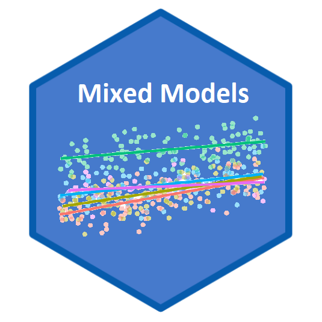

--- 
title: "5023Y"
author: "Philip T. Leftwich"
date: "`r Sys.Date()`"
subtitle: Data Science for Biologists
site: bookdown::bookdown_site
documentclass: book
bibliography:
- book.bib
- packages.bib
biblio-style: apa
csl: include/apa.csl
link-citations: yes
description: |
  This book ...
url: https://ueabio.github.io/data-sci
github-repo: UEABIO/data-sci
cover-image: images/logos/twitter_card.png
apple-touch-icon: images/logos/apple-touch-icon.png
apple-touch-icon-size: 180
favicon: images/logos/favicon.ico
---

```{r cite-packages, include = FALSE}
# automatically create a bib database for R packages
# add any packages you want to cite here
knitr::write_bib(c(
  .packages(), 'bookdown', 'knitr', 'rmarkdown', 'rstatix', 'patchwork', 'here', 'kableExtra', 'plotly', 'gitcreds', 'usethis', 'ggridges', 'scales', 'purrr', 'tinytex', 'gt', 'broom', 'tidyverse', 'rstatix', 'performance', 'see', 'lme4', 'lmerTest', 'DHARMa', 'glmmTMB', 'nlme', 'ggeffects'
), 'packages.bib')

```


# Overview {-}

```{r, child='_setup.Rmd'}
```

<div class="small_right"></div>


Data are often complex and messy. 

We can have different grouping factors like where we collect the data, etc. Sample sizes may also leave something to be desired, especially if we try to fit complicated models with many parameters. On top of that, our data points might not be truly independent. For instance, there might be structure to our data.

This is why mixed models were developed, to deal with such messy data and to allow us to use all our data, even when we have low sample sizes, structured data and many covariates to fit. On top of all that, mixed models allow us to save degrees of freedom compared to running standard linear models! Sounds good.

Here we will cover the basics of linear mixed models, how to use them responsibly and interepret your findings effectively.

If you are trying to “extend” your linear model, fear not: there are generalised linear mixed effects models, too.

## Terminology

Mixed-effects models are sometime referred to as hierarchical models, multi-level models, random effects models, and mixed-models. Regardless of the confusing vocabulary, it’s worth knowing that the terms all may be used to mean similar models.

Random effects are an important part of mixed-effects models. Random effects capture the variations that come from grouping or clustering of data. They are used in mixed models, which combine both fixed effects (relationships between variables) and random effects. This approach helps us account for correlations and dependencies within groups, making our models more realistic.

In nature, we often see hierarchical structures, such as streams within a watershed or species within a family. Random effects can be useful in these situations and others where observations tend to be clustered. By using random effects, we can improve our ability to model the system accurately.

The main purpose of applying random effects in mixed models is to capture more realistic patterns and uncertainties in the data. For example, we can account for correlations that arise from multiple observations within a group or when our observations lack complete independence.

To sum it up, random effects and mixed models help us deal with situations where observations are not independent. They allow us to capture the complexities and dependencies within groups, improving the accuracy of our statistical models.

### Variance

To understand mixed- and random effects models, we need to understand random effects and to understand random effects, we need to understand variance. We often need to think more about where the variance in our system is showing up in our model or how our model handles the variance that we know will be there. Historically variance was seen as noise and distraction, and the objective was to remove or minimize all possible variance. Variance has often been seen as a nuisance parameter. However, there can be information in the variance. Variance is ubiquitous, but understanding what part of the system holds what proportions of the variance can benefit our understanding of the systems we seek to model. We should be familiar with the residual variance from our linear models, but might that residual variance be better attributed to within a group? Or between a group?

