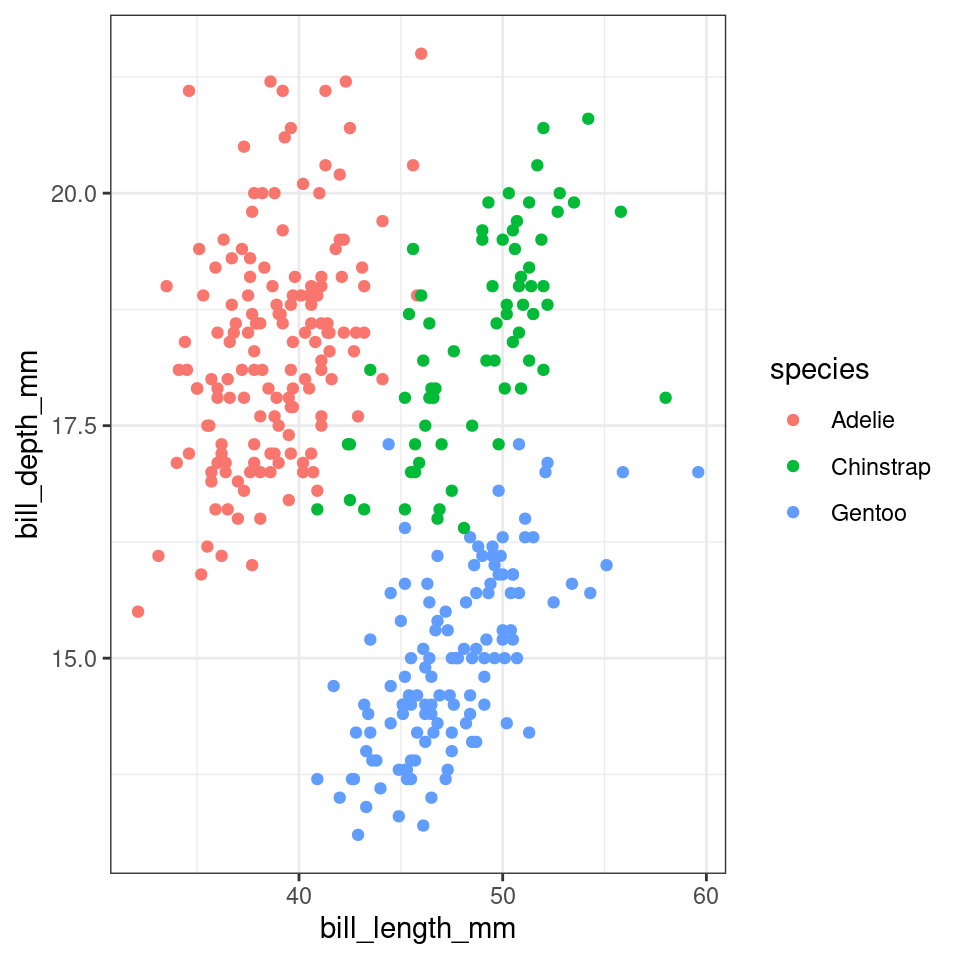

# (PART\*) Get Started in R {.unnumbered}

# Introduction to R and RStudio


-   R is the name of the programming language we will learn on this course.

-   RStudio is a convenient interface which we will be using throughout the course in order to learn how to organise data, produce accurate data analyses & data visualisations.

R is a programming language that you will write code in, and RStudio is an Integrated Development Environment (IDE) which makes working with R easier. Think of it as knowing English and using a plain text editor like NotePad to write a book versus using a word processor like Microsoft Word. You could do it, but it wouldn't look as good and it would be much harder without things like spell-checking and formatting. In a similar way, you can use R without R Studio but we wouldn't recommend it. The key thing to remember is that although you will do all of your work using RStudio for this course, you are actually using **two** pieces of software which means that from time-to-time, both of them may have separate updates.

R and RStudio can be downloaded for free onto your [personal computers](https://www.rstudio.com/products/rstudio/)(see Appendices), but for convenience we will use a classroom space on **RStudio Cloud**.

[RStudio Cloud](https://rstudio.cloud/) is a cloud-based service where we can log into remotely hosted servers that host our data analysis projects.

The advantage of using RStudio Cloud is that all the extra packages and functions you need for this course will already be installed. You can log-in to your workspace from any computer as long as you have an internet connection and remember you username and password. I can also "visit" your projects and help out when you get stuck, if they are hosted on RStudio Cloud.

Eventually we will may also add extra tools like GitHub and RMarkdown for data reproducibility, literate and collaborative programming.

By the end of this course I hope you will have the tools to confidently analyze real data, make informative and beautiful data visuals, and be able to analyze lots of different types of data.

## Using RStudio Cloud

All of our sessions will run on cloud-based software. All you have to do is make a free account, and join our Workspace.

Once you are signed up - you will see that there are two spaces:

-   Your workspace - for personal use (20hrs/month)

-   Our shared classroom - educational licence (no limit)

Make sure you are working in the classroom workspace - so that I can distribute project work and 'visit' your projects if needed.

RStudio Cloud works in exactly the same way as RStudio, but means you don't have to download any software. You can access the hosted cloud server and your projects through any browser connection (Chrome works best), from any computer.

Here is a good reference guide to [RStudio Cloud](https://rstudio.cloud/learn/guide#projects)

## Getting to know RStudio

R Studio has a console that you can try out code in (appearing as the bottom left window), there is a script editor (top left), a window showing functions and objects you have created in the "Environment" tab (top right window in the figure), and a window that shows plots, files packages, and help documentation (bottom right).

<div class="figure" style="text-align: center">

<p class="caption">(\#fig:img-rstudio)RStudio interface</p>
</div>

You will learn more about how to use the features included in R Studio throughout this course, however, I highly recommend watching [RStudio Essentials 1](https://rstudio.com/resources/webinars/programming-part-1-writing-code-in-rstudio/) at some point. 

The video lasts \~30 minutes and gives a tour of the main parts of R Studio.

### Consoles vs. scripts

* The *script* window is the place to enter and run code so that it is easily edited and saved for future use. Usually the Script Window is shown at the top left in RStudio. If this window is not shown, it will be visible *if* you open a previously saved R script, *or* if you create a new R Script. You create new R Script by clicking on File > New File > R Script in the RStudio menu bar.

* To execute your code in the R script, you can either highlight the code and click on Run, or you can highlight the code and press CTRL + Enter on your keyboard.

* The *console*: you can enter code directly in the Console Window and click Enter. The commands that you run will be shown in the History Window on the top right of RStudio. Though it is much more difficult to keep track of your work this way.

### Environment

The Environment tab (top right) allows you to see what objects are in the workspace. If you create variables or data frames, you have a visual listing of everything in the current workspace. When you start a new project this should be completely empty.

### Plots, files, packages, help

1. Plots - The Plots panel, shows all your plots. There are buttons for opening the plot in a separate window and exporting the plot as a pdf or jpeg (though you can also do this with code.)

2. Files - The files panel gives you access to the file directory on your hard drive. 

3. Packages - Shows a list of all the R packages installed on your harddrive and indicates whether or not they are currently loaded. Packages that are loaded in the current session are checked while those that are installed but not yet loaded are unchecked. We will discuss packages more later.

4. Help - Help menu for R functions. You can either type the name of a function in the search window, or use the code to search for a function with the name


<div class="figure" style="text-align: center">

<p class="caption">(\#fig:labelled)RStudio interface labelled</p>
</div>

### Make RStudio your own

You can [personalise the RStudio GUI](https://support.rstudio.com/hc/en-us/articles/115011846747-Using-Themes-in-the-RStudio-IDE) as much as you like. 


## Get Help!

There are a lot of sources of information about using R out there. Here are a few helpful places to get help when you have an issue, or just to learn more

-   The R help system itself - type `help()` and put the name of the package or function you are querying inside the brackets

-   Vignettes - type `browseVignettes()` into the console and hit Enter, a list of available vignettes for all the packages we have will be displayed

-   Cheat Sheets - available at [RStudio.com.](https://www.rstudio.com/resources/cheatsheets/) Most common packages have an associate cheat sheet covering the basics of how to use them. Download/bookmark ones we will use commonly such as ggplot2, data transformation with dplyr, Data tidying with tidyr & Data import.

-   Google - I use Google constantly, because I continually forget how to do even basic tasks. If I want to remind myself how to round a number, I might type something like R round number - if I am using a particular package I should include that in the search term as well

-   Ask for help - If you are stuck, getting an error message, can't think what to do next, then ask someone. It could be me, it could be a classmate. When you do this it is very important that you show the code, include the error message. "This doesn't work" is not helpful. "Here is my code, this is the data I am using, I want it to do X, and here's the problem I get."

<div class="info">
<p>It may be daunting to send your code to someone for help.</p>
<p>It is natural and common to feel apprehensive, or to think that your
code is really bad. I still feel the same! But we learn when we share
our mistakes, and eventually you will find it funny when you look back
on your early mistakes, or laugh about the mistakes you still
occasionally make!</p>
</div>

# R basics

Go to RStudio Cloud and enter the Project labelled `Day One` - this will clone the project and provide you with your own project workspace.

Follow the instructions below to get used to the R command line, and how R works as a language.

## Your first R command

In the RStudio pane, navigate to the **console** (bottom left) and `type or copy` the below it should appear at the \>

Hit Enter on your keyboard.


```r
10 + 20
```

-   What answer did you get?


<div class='webex-solution'><button>Solution</button>


```r
30
```


</div>


The first line shows the request you made to R, the next line is R's response

You didn't type the `>` symbol: that's just the R command prompt and isn't part of the actual command.

When a complete expression is entered at the prompt, it is evaluated and the result of the evaluated expression is returned. The result may be auto-printed.


```r
print(10 + 20) ## explicit printing

10 + 20 ## autoprinting
```

Usually, with interactive work, we do not explicitly print objects with the print function; it is much easier to auto-print them by typing the name of the object and hitting return/enter. However, when writing scripts, functions, or more extended programs, there is sometimes a need to explicitly print objects.


When an R vector is printed, you will notice that an index for the vector is printed in square brackets `[]` on the side. For example, see this integer sequence 


```r
1:30
```

```
##  [1]  1  2  3  4  5  6  7  8  9 10 11 12 13 14 15 16 17 18 19 20 21 22 23 24 25
## [26] 26 27 28 29 30
```

The numbers in the square brackets are not part of the vector itself; they are merely part of the printed output.

> Note that the : operator is used to create integer sequences

### Operators

There are a few different types of operators to consider in R

#### Assignment Operator

|Operator|Description
|-----|-----|
|<-|	used to assign values to variables|

#### Arithmetic Operators

|Operator|Description
|-----|-----|
|+|	addition|
|-|	subtraction|
|*|	multiplication|
|/|	division|
|^|	exponentiation|

#### Relational Operators

|Operator|Description
|-----|-----|
|<|less than|
|<=|less than or equal to|
|>|	greater than|
|>=|greater than or equal to|
|==|exactly equal to|
|!=|not equal to|

#### Logical Operators

|Operator|Description
|-----|-----|
|!|not|
|&|AND|
|⎮|  OR|

#### Membership Operators

|Operator|Description
|-----|-----|
|%in%|used to check if an element is in a vector or list|

### Typos

<div class="warning">
<p>Before we go on to talk about other types of calculations that we can
do with R, there’s a few other things I want to point out. The first
thing is that, while R is good software, it’s still software. It’s
pretty stupid, and because it’s stupid it can’t handle typos. It takes
it on faith that you meant to type exactly what you did type.</p>
</div>

Suppose you forget to hit the shift key when trying to type `+`, and as a result your command ended up being `10 = 20` rather than `10 + 20`. Try it for yourself and replicate this error message:


```r
10 = 20
```


<div class='webex-solution'><button>What answer did you get?</button>

Error in 10 = 20 : invalid (do_set) left-hand side to assignment


</div>


What's going on: R tries to interpret `10 = 20` as a command, but it doesn't make sense, so it gives you an error message.

When a person sees this, they might realize it's a typo because the `+` and `=` keys are right next to each other on the keyboard. But R doesn't have that insight, so it just gets confused.

What's even trickier is that some typos won't create errors because they accidentally form valid R commands. For example, if I meant to type `10 + 20` but mistakenly pressed a neighboring key, I'd end up with `10 - 20`. Now, R can't read your mind to know you wanted to add, not subtract, so something different happens:


```r
10 - 20
```

```
## [1] -10
```

In this case, R produces the right answer, but to the the wrong question.

### More simple arithmetic

One of the best ways to get familiar with R is to experiment with it. The good news is that it's quite hard to mess things up, so don't stress too much. Just type whatever you like into the console and see what happens.

Now, if your console's last line looks like this:

    > 10+
    + 

And there's a *blinking cursor* next to that plus sign, it means R is patiently waiting for you to complete your command. It believes you're still typing, so it hasn't tried to run anything yet. This plus sign is a bit different from the usual prompt (the `>` symbol). It's there to nudge you that R is ready to "add" what you're typing now to what you typed before. For example, type `20` and hit enter, and then R will complete the command like this:

    > 10 +
    + 20
    [1] 30

*Alternatively* hit the escape key, and R will forget what you were trying to do and return to a blank line.

### Try some simple maths


```r
1+7
```


```r
13-10
```


```r
4*6
```


```r
12/3
```

Raise a number to the power of another


```r
5^4
```

Multiplying a number $x$ by itself $n$ times is called "raising $x$ to the $n$-th power". Mathematically, this is written as $x^n$. Some values of $n$ have special names: in particular $x^2$ is called $x$-squared, and $x^3$ is called $x$-cubed. So, the 4th power of 5 is calculated like this: 

$$5^4 = 5 \times 5 \times 5 \times 5 $$

### Perform some combos

R follows the standard order of operations (BODMAS/BIDMAS), which means it first calculates within brackets, then deals with exponents, followed by division and multiplication, and finally addition and subtraction.

Let's look at two examples to see how the order of operations affects the results:


```r
3^2-5/2
```


```r
(3^2-5)/2
```

Similarly if we want to raise a number to a fraction, we need to surround the fraction with parentheses `()`


```r
16^1/2
```


```r
16^(1/2)
```

The first one calculates 16 raised to the power of 1, then divided this answer by two. The second one raises 16 to the power of a half. A big difference in the output.

<div class="info">
<p>While the cursor is in the console, you can press the up arrow to see
all your previous commands.</p>
<p>You can run them again, or edit them. Later on we will look at
scripts, as an essential way to re-use, store and edit commands.</p>
</div>

## "TRUE or FALSE" data

Time to make a sidebar onto another kind of data. Many concepts in programming rely on the idea of a ***logical value***. A logical value is an assertion about whether something is true or false. This is implemented in R in a pretty straightforward way. There are two logical values, namely `TRUE` and `FALSE`. Despite the simplicity, logical values are very useful things. Let's see how they work.

### Assessing mathematical truths

Time to explore a different kind of data. In programming, many concepts rely on logical values. A logical value is a statement about whether something is true or false. In R, this is pretty straightforward. There are two logical values: `TRUE` and `FALSE`. Despite their simplicity, these logical values are incredibly useful. Let's dive into how they work.

In R, basic mathematics is solid, and there's no room for manipulation. When you ask R to calculate `2 + 2`, it always provides the same answer,


```r
2 + 2
```

```
## [1] 4
```

up to this point, R has been performing calculations without explicitly asserting whether $2 + 2 = 4$ is a true statement. If I want R to make an explicit judgment, I can use a command like this:


```r
2 + 2 == 4
```


<div class='webex-solution'><button>Solution</button>

TRUE


</div>


What I've done here is use the ***equality operator***, `==`, to force R to make a "true or false" judgement.

<div class="warning">
<p>This is a very different operator to the assignment operator
<code>=</code> you saw previously.</p>
<p>A common typo that people make when trying to write logical commands
in R (or other languages, since the “<code>=</code> versus
<code>==</code>” distinction is important in most programming languages)
is to accidentally type <code>=</code> when you really mean
<code>==</code>.</p>
</div>

Okay, let's see what R thinks of `2 +2 ==5`:


```r
2+2 == 5
```

```
## [1] FALSE
```

Now, let's see what happens when I attempt to make R believe that two plus two equals five by using an assignment statement like `2 + 2 = 5` or `2 + 2 <- 5`. Here's the outcome:


```r
2 + 2 = 5
```

    Error in 2 + 2 = 5 : target of assignment expands to non-language object

Indeed, R isn't too fond of this idea. It quickly realizes that `2 + 2` is not a variable (that's what the "non-language object" part is saying), and it refuses to let you "reassign" it. While R can be quite flexible and allows you to do some remarkable things to redefine parts of itself, there are fundamental truths it simply won't budge on. It won't tamper with the laws of addition, and it won't redefine the number `2`.

That's probably for the best.

## Storing outputs

When dealing with more complex questions, it's often helpful to store our answers and use them in later steps. Fortunately, this is quite easy to do in R. We can assign the results to a name with the **assignment operator**:


```r
a <- 1+2
```

This literally means please *assign* the value of `1+2` to the name `a`. We use the **assignment operator** `<-` to make this assignment.

<div class="info">
<p>Note the shortcut key for &lt;- is Alt + - (Windows) or Option + -
(Mac)</p>
</div>


By performing this action, you'll achieve two things:

You will notice in the top right-hand pane within the **Environment** tab that there is now an **object** labeled a with a value of `3`.

<div class="figure" style="text-align: center">

<p class="caption">(\#fig:img-environment)object a is now visible withe a value of 3 in the Environment Pane</p>
</div>

- You can check what the variable a contains by typing it into your Console and pressing Enter.

- Keep in mind that you won't see the result of your operations until you type the object into the R console and press Enter.


```r
a  ## autoprinting

print(a) ## explicit printing
```


<div class='webex-solution'><button>What output do you get when you type a into your console?</button>


```r
3
```


</div>


You can now call this object at *any time* during your R session and perform calculations with it.


```r
2 * a
```


<div class='webex-solution'><button>Solution</button>


```r
6
```


</div>


What happens if we assign a value to a named object that **already** exists in our R environment??? for example


```r
a <- 10
a
```

The value of `a` is now 10.

You should see that the previous assignment is lost, *gone forever* and has been replaced by the new value.

We can assign lots of things to objects, and use them in calculations to build more objects.


```r
b <- 5
c <- a + b
```

<div class="warning">
<p>Remember: If you now change the value of b, the value of c does
<em>not</em> change.</p>
<p>Objects are totally <strong>independent</strong> from each other once
they are made.</p>
<p>Overwriting objects with new values means the old value is lost.</p>
</div>


```r
b <- 7
b
c
```

-   What is the value of `c`?


<div class='webex-solution'><button>What is the value of c ?</button>

[1] 15

When `c` was created it was a product of `a` and `b` having values of 10 and 15 respectively. 
If we re-ran the command `c <- a + b` *after* changing the value of `b` **then** we would get a value of 17. 


</div>


Look at the environment tab again - you should see it's starting to fill up now!

<div class="info">
<p>RStudio will by default save the objects in its memory when you close
a session.</p>
<p>These will then be there the next time you logon. It might seem nice
to be able to close things down and pick up where you left off, but its
actually quite dangerous. It’s messy, and can cause lots of problems
when we work with scripts later, so don’t do this!</p>
<p>To stop RStudio from saving objects by default go to Tools &gt;
Project Options option and change “Save workspace to .RData on exit” to
“No” or “Never”.</p>
<p>Instead we are going to learn how to use scripts to quickly re-run
analyses we have been working on.</p>
</div>

### Choosing names

-   Use informative variable names. As a general rule, using meaningful names like `orange` and `apple` is preferred over arbitrary ones like `variable1` and `variable2`. Otherwise it's very hard to remember what the contents of different variables actually are.

-   Use short variable names. Typing is a pain and no-one likes doing it. So we much prefer to use a name like `apple` over a name like `pink_lady_apple`.

-   Use one of the conventional naming styles for multi-word variable names. R only lets you use certain things as **legal** names. Legal names must start with a letter **not** a number, which can then be followed by a sequence of letters, numbers, ., or \_. R does not like using spaces. Upper and lower case names are allowed, but R is case sensitive so `Apple` and `apple` are different.

-   My favourite naming convention is `snake_case` short, lower case only, spaces between words are separated with a \_. It's easy to read and easy to remember.

<div class="figure" style="text-align: center">

<p class="caption">(\#fig:unnamed-chunk-39)courtesy of Allison Horst</p>
</div>

## R objects

In R, there are five fundamental or "atomic" classes of objects:

- Character: These represent text or character strings.

- Numeric (num) or Double (dbl): These are used for real numbers (e.g., decimal numbers).

- Integer: Used for whole numbers.

- Complex: For complex numbers.

- Logical: Represented as True or False, these are used for logical values.

The most basic type of R object is a vector. You can create empty vectors using the `vector()` function. The primary rule regarding vectors in R is that a vector can only contain objects of the same class.

However, as with any good rule, there's an exception, which is the "list." Lists are represented as vectors but can hold objects of different classes, which is why they're often used.

### Numbers

In R, both "dbl" and "num" refer to numeric data types, but there is a subtle difference between them:

- dbl ("double"): This refers to double-precision floating-point numbers, which are capable of storing real numbers with high precision. Double-precision numbers have more decimal places of accuracy and can represent a wider range of values without loss of precision. When you perform arithmetic operations, R typically returns results as "dbl" values by default.

- num ("numeric"): "Num" is a more general term that includes not only double-precision floating-point numbers but also integer values. In R, integers are a subtype of numeric data. Numeric data can include both integers and double-precision floating-point numbers, depending on the specific data and how it is represented.

So, "dbl" specifically denotes double-precision floating-point numbers, while "num" encompasses a broader range of numeric data, including both integers and double-precision numbers. In most cases, you can use "num" to work with numeric data in a more general sense, while "dbl" focuses on the higher-precision representation of real numbers.


## Attributes

R objects can come with attributes, which are essentially metadata for the object. These metadata are handy because they help describe the object. For instance, in a data frame, column names serve as attributes, clarifying the data contained in each column. Here are a few examples of R object attributes:

- `names()` and `dimnames()`

- dimensions (e.g., for matrices and arrays) `dim()`

- `class()` (e.g., integer, numeric)

- `length()`

- Other user-defined attributes or metadata

You can access the attributes of an object, if it has any, by using the `attributes()` function. If an R object doesn't have any attributes, the `attributes()` function will return NULL.

## Vectors

We have been working with R objects containing a single element of data, but we will more commonly work with vectors. A vector is a sequence of elements, all of the same data type. These could be logical, numerical, character etc.


```r
numeric_vector <- c(1,2,3)

character_vector <- c("fruits", "vegetables", "seeds")

logical_vector <- c(TRUE, TRUE, FALSE)

integer_vector <- 1:10
```

### Coercion

In R, when different classes of objects are mixed together in a vector, coercion occurs to ensure that every element in the vector belongs to the same class. Coercion is the process of converting objects to a common class to make the combination reasonable. Let's see the effects of implicit coercion in the provided examples:


```r
y <- c(2.3, "a") # Here, we're mixing a numeric value (1.7) with a character value ("a"). To make them compatible, R coerces both elements into character values. So, y becomes a character vector.

y <- c(TRUE, 2) # In this case, we're combining a logical value (TRUE) with a numeric value (2). R coerces the logical value into 1, so y becomes a numeric vector.

y <- c("a", TRUE) # We're mixing a character value ("a") with a logical value (TRUE). In this scenario, R coerces the logical value into a character value, resulting in y becoming a character vector.
```

So, the outcome depends on how R can reasonably represent all the objects in the vector. It aims to create a vector of the most inclusive class to accommodate the mixed objects. Keep in mind that this coercion can lead to unexpected results, so it's essential to be aware of the implicit type conversion when mixing different data types in R.

Objects can also be **explicitly coerced** from one class to another using the as.* functions, if available.

<div class="panel panel-default"><div class="panel-heading"> Task </div><div class="panel-body"> 
Create the following vector and check its class, then note what happens when you attempt to coerce to numeric, logical and character

```r
x <- 0:5
```
 </div></div>

<button id="displayTextunnamed-chunk-43" onclick="javascript:toggle('unnamed-chunk-43');">Show Solution</button>

<div id="toggleTextunnamed-chunk-43" style="display: none"><div class="panel panel-default"><div class="panel-heading panel-heading1"> Solution </div><div class="panel-body">

```r
as.numeric(x)

as.logical(x)

as.character(x)
```

```
## [1] 0 1 2 3 4 5
## [1] FALSE  TRUE  TRUE  TRUE  TRUE  TRUE
## [1] "0" "1" "2" "3" "4" "5"
```

</div></div></div>

Sometimes, R can’t figure out how to coerce an object and this can result in `NA`s being produced

## Matrices

Matrices can be thought of as vectors with an added dimension attribute. This dimension attribute is a two-element integer vector specifying the number of rows and columns, which defines the shape and structure of the matrix.

<div class="info">
<p>Data frames are also two-dimensional but can store columns of
different data types - matrices are simpler as they consist of elements
of the same data type.</p>
</div>

Matrices are constructed "columns-first" so entries start in the "upper left" and and run down columns. 


```r
m <- matrix(1:6, nrow = 2, ncol = 3) 
m
```

```
##      [,1] [,2] [,3]
## [1,]    1    3    5
## [2,]    2    4    6
```


```r
attributes(m)
```

```
## $dim
## [1] 2 3
```

We can create matrices in several ways:

- Adding a `dim()` to existing vectors

- Column/row-binding vectors with `cbind()` and `rbind()`


```r
m <- 1:6

dim(m) <- c(2,3)

m
```

```
##      [,1] [,2] [,3]
## [1,]    1    3    5
## [2,]    2    4    6
```


```r
a <- 1:2
b <- 3:4
c <- 5:6

m <- cbind(a,b,c)
m
```

```
##      a b c
## [1,] 1 3 5
## [2,] 2 4 6
```

You will see how in this last operation column names were added to the matrix, we can add, change or remove column and rownames on a matrix with `colnames()` and `rownames()`


```r
rownames(m) <- c("y","z")
m
```

```
##   a b c
## y 1 3 5
## z 2 4 6
```

## Lists

Lists are a versatile and fundamental data type in R. They set themselves apart from regular vectors by allowing you to store elements of different classes within the same list. This flexibility is what makes lists so powerful for various data structures and data manipulation tasks.

You can create lists explicitly using the `list()` function, which can take an arbitrary number of arguments. Lists, when combined with functions like the "apply" family, enable you to perform complex and versatile data manipulations and analyses in R. Lists are often used to represent heterogeneous data structures, such as datasets where different columns can have different data types and structures.


```r
l <- list(1, "apple", TRUE )
l
```

```
## [[1]]
## [1] 1
## 
## [[2]]
## [1] "apple"
## 
## [[3]]
## [1] TRUE
```

We can also create empty lists of set lengths with the `vector()` function, this can be useful for preallocating memory for iterations - as we will see later


```r
l <- vector("list", length = 3)
l
```

```
## [[1]]
## NULL
## 
## [[2]]
## NULL
## 
## [[3]]
## NULL
```

Lists can also have names


```r
names(l) <- c("apple","orange","pear")
```

## Dataframes

Data frames are essential for storing tabular data in R and find extensive use in various statistical modeling and data analysis applications. They offer a structured way to manage and work with data in R, and packages like dplyr, developed by Hadley Wickham, provide optimized functions for efficient data manipulation with data frames.

Here are some key characteristics and advantages of data frames:

- Tabular Structure: Data frames are a type of list, where each element in the list represents a column. The number of rows in each column is the same, and this tabular structure makes them suitable for working with datasets.

- Mixed Data Types: Unlike matrices, data frames can contain columns with different classes of objects. This flexibility allows you to handle real-world datasets that often include variables of different data types.

- Column and Row Names: Data frames include column names, which describe the variables or predictors. Additionally, they have a special attribute called "row.names" that provides information about each row in the data frame.

- Creation and Conversion: Data frames can be created in various ways, such as reading data from files using functions like read.table() and read.csv(). You can also create data frames explicitly with data.frame().

- Working with Data: Data frames are especially useful when working with datasets that require data cleaning, transformation, or merging. They provide a high level of data organization, and many R packages are designed to work seamlessly with data frames.

- dplyr: The `dplyr` package is optimized for efficient data manipulation with data frames. It offers a set of functions to perform data operations quickly and intuitively.

Data frames are a fundamental structure for managing tabular data in R. They excel in handling datasets with mixed data types and are essential for various data analysis and modeling tasks.


### Tibbles

“Tibbles” are a new modern data frame. It keeps many important features of the original data frame

- A tibble never changes the input type.

- A tibble can have columns that are lists.

- A tibble can have non-standard variable names.
    - can start with a number or contain spaces.
    -to use this refer to these in a backtick.
    
- Tibbles only print the first 10 rows and all the columns that fit on a screen. - Each column displays its data type

## Error/ Debugging

Things will go wrong eventually, they always do...

R is *very* pedantic, even the smallest typo can result in failure and typos are impossilbe to avoid. So we will make mistakes. One type of mistake we will make is an **error**. The code fails to run. The most common causes for an error are:

-   typos

-   missing commas

-   missing brackets

There's nothing wrong with making *lots* of errors. The trick is not to panic or get frustrated, but to read the error message and our script carefully and start to *debug*...

... and sometimes we need to walk away and come back later!

<div class="try">
<p>Try typing the command <code>help()</code> into the R console, it
should open a new tab on the bottom right.</p>
<p>Put a function or package into the brackets to get help with a
specific topic</p>
</div>

<div class="figure" style="text-align: center">

<p class="caption">(\#fig:unnamed-chunk-55)courtesy of Allison Horst</p>
</div>

## Functions

Functions are the tools of R. Each one helps us to do a different task.

Take for example the function that we use to round a number to a certain number of digits - this function is called `round`

Here's an example:


```r
round(x  = 2.4326782647, digits = 2)
```

We start the command with the function name `round`. The name is followed by parentheses `()`. Within these we place the *arguments* for the function, each of which is separated by a comma.

The arguments:

-   `x =` 2.4326782647 (the number we would like to round)

-   `digits =` 2 (the number of decimal places we would like to round to)

**Arguments are the inputs we give to a function**. These arguments are in the form `name = value` the name specifies the argument, and the value is what we are providing to define the input. That is the first argument `x` is the number we would like to round, it has a value of 2.4326782647. The second argument `digits` is how we would like the number to be rounded and we specify 2. There is no limit to how many arguments a function *could* have.

<div class="try">
<p>Copy and paste the following code into the console.</p>
</div>


```r
help(round)
```

The help documentation for `round()`should appear in the bottom right help panel. In the usage section, we see that `round()`takes the following form:


```r
round(x, digits = 0)
```

In the arguments section, there are explanations for each of the arguments. `x`is the number or vector where we wish to round values. `digits` is the number of decimal places to be used. In the description we can see that if no value is supplied for `digits` it will default to 0 or whole number rounding.

Read the 'Details' section to find out what happens when rounding when the last digit is a 5.

Let's try an example and just change the required argument `digits`

<div class="try">
<p>Copy and paste the following code into the console.</p>
</div>


```r
round(x  = 2.4326782647)
```

```
## [1] 2
```

Now we can change the additional arguments to produce a different set of numbers.


```r
round(x  = 2.4326782647, digits = 2)
```

```
## [1] 2.43
```

This time R has still rounded the number, but it has done so to a set number of 'decimal places'.

Always remember to use the help documentation to help you understand what arguments a function requires.

### Storing the output of functions

What if we need the answer from a function in a later calculation. The answer is to use the assignment operator again `<-`.

In this example we assign values to two R objects that we can then call inside our R function **as though we were putting numbers in directly**.

<div class="try">
<p>Copy and paste the following code into the console.</p>
</div>


```r
number_of_digits <- 3

my_number <- 2.4326782647

rounded_number <- round(x  = my_number, 
                        digits = number_of_digits)
```

**What value is assigned to the R object `rounded_number`** **?**


<div class='webex-solution'><button>Solution</button>


[1] 2.433


</div>


### More fun with functions

Copy and paste this:


```r
round(2.4326782647, 2)
```

Looks like we don't even *have* to give the names of arguments for a function to still work. This works because the function `round` expects us to give the number value first, and the argument for rounding digits second. *But* this assumes we know the expected ordering within a function, this might be the case for functions we use a lot. If you give arguments their proper names *then* you can actually introduce them in **any order you want**.

Try this:


```r
round(digits = 2, x  = 2.4326782647)
```

But this gives a different answer


```r
round(2, 2.4326782647)
```

<div class="warning">
<p>Remember naming arguments overrides the position defaults</p>
</div>

How do we **know** the argument orders and defaults? Well we get to know how a lot of functions work through practice, but we can also use `help()` .

## Packages

When you install R you will have access to a range of functions including options for data wrangling and statistical analysis. The functions that are included in the default installation are typically referred to as **Base R** and there is a useful cheat sheet that shows many Base R functions [here](%5Bhttps://www.rstudio.com/wp-content/uploads/2016/05/base-r.pdf)

However, the power of R is that it is extendable and open source - anyone can create a new **package** that extends the functions of R.

An R package is a container for various things including functions and data. These make it easy to do very complicated protocols by using custom-built functions. Later we will see how we can write our own simple functions. Packages are a lot like new apps extending the functionality of what your phone can do.

On RStudio Cloud I have already installed several add-on packages, all we need to do is use a simple function `library()` to load these packages into our workspace. Once this is complete we will have access to all the custom functions they contain.

<div class="try">
<p>Copy and paste the following code into the console.</p>
</div>


```r
library(ggplot2)
library(palmerpenguins)
```

-   `ggplot2` - is one of the most popular packages to use in R. This "grammar of graphics" packages is dedicated to making data visualisations, and contains lots of dedicated functions for this.

-   `palmerpenguins` - is a good example of a data-heavy package, it contains no functions, but instead datasets that we can use.

<div class="warning">
<p>A common source of errors is to call a function that is part of a
package but forgetting to load the package.</p>
<p>If R says something like “Error in”function-name”: could not find X”
then most likely the function was misspelled or the package containing
the function hasn’t been loaded.</p>
</div>

## My first data visualisation

Let's run our first data visualisation using the functions and data we have now loaded - this produces a plot using functions from the `ggplot2` package and data from the `palmerpenguins` package.

Data visualisation is a core part of data science, and generating insights from your data - we will spend a lot of time on this course working on our data visualisations.

Today let's use some simple functions to produce a figure. We specify the data source, the variables to be used for the x and y axis and then the type of visual object to produce, colouring them by the species.

<div class="try">
<p>Copy and paste the following code into the console.</p>
</div>


```r
ggplot(data = penguins,aes(x = bill_length_mm, y = bill_depth_mm)) + geom_point(aes(colour=species)) 
```



<div class="info">
<p>You may have noticed R gave you a warning. Not the same as a big
scary error, but R wants you to be aware of something.</p>
<p>In this case that two of the observations had missing data in them
(either bill length or bill depth), so couldn’t be plotted.</p>
<p>It is a good thing to take note of all warnings and errors - they
provide useful information.</p>
</div>

The above command can also be written as below, its in a longer style with each new line for each argument in the function. This style can be easier to read, and makes it easier to write comments with `#`. Copy this longer command into your console then hit Enter.

Note that R ignores anything that comes after `#` on a line of code - this means we can add notes to our work.


```r
ggplot(data = penguins, # calls ggplot function, data is penguins
       aes(x = bill_length_mm, # sets x axis as bill length
           y = bill_depth_mm)) + # sets y axis value as bill depth
    geom_point(aes(colour=species)) # plot points coloured by penguin species
```

## Writing scripts

Until now we have been typing words directly into the Console. This is fine for short/simple calculations - but as soon as we have a more complex, multi-step process this becomes time consuming, error-prone and *boring*. **Scripts** are a document containing all of your commands (in the order you want them to run), they are *repeatable, shareable, annotated records of what you have done*. In short they are incredibly useful - and a big step towards **open** and **reproducible** research.


<div class="panel panel-default"><div class="panel-heading"> Task </div><div class="panel-body"> 
Create a script by going to File \> New File \> R Script. </div></div>


<div class="figure" style="text-align: center">

<p class="caption">(\#fig:script)RStudio interface - top left script, botto  left console</p>
</div>

This will open a pane in the top-left of RStudio with a tab name of `Untitled1`.

<div class="info">
<p>A script is a way of organising all your R commands, in a sequence,
to produce a desired output.</p>
<p>When you write a script, nothing happens until you tell it to RUN,
then you will see your commands appearing in the console.</p>
<p>Make sure you include all of the commands you need to complete your
analysis, in the correct order.</p>
</div>

### Organising scripts

Scripts work best when they are well organised - and well documented. Simple tricks and consistent organisation can make your work easier to read and be reproduced by others.

You should bookmark the [Tidyverse Style Guide](https://style.tidyverse.org/files.html), it is an opinionated way of organising your scripts and code so that it has a consistent style, that maximises readability. Later in the course we will use this as a benchmark for assessing your code writing.

Annotating your instructions provides yourself and others insights into why you are doing what you are doing. This is a vital aspect of a robust and reproducible workflow. And when you come back to a script, one week, one month or one year from now you will often wonder what a command was for. It is very, very useful to make notes for yourself, and its useful in case anyone else will ever read your script. Make these comments helpful as they are for humans to read.

We have already seen how to signal a comment with the `#` key. Everything in the line after a `#` is ignored by R and won't be treated as a command. You should also see that it is marked in a different colour in your script.

<div class="try">
<p>Put the following comment in your script on line 1.</p>
</div>


```r
# I really love R
```

We can also use `#` to produce Headers of different levels, if we follow these with commented lines of `-` or `=` as shown in the figure below.

<div class="figure" style="text-align: center">

<p class="caption">(\#fig:script outline)R script document outline. Push the button with five horizontal lines to reveal how R recognises headers and subheaders</p>
</div>

### Loading packages

To use the functions from a package in our script they must be loaded *before* we call on the functions or data they contain. So the most sensible place to put library calls for packages is at the very **top** of our script. So let's do that now,

<div class="try">
<p>Add the commands<code>library(ggplot2)</code> and
<code>library(palmerpenguins)</code> to your script.</p>
<p>Think about how you would organise you script using the image above
as a guide</p>
<p>Put a comment next to each package explaining what it is for “Hint
use the help() function”.</p>
<p>Use the document outline button to help organise your script.</p>
</div>


<div class='webex-solution'><button>Solution</button>


```r
# I really love R
# _______________----

# 📦 PACKAGES ----

library(ggplot2) # create elegant data visualisations
library(palmerpenguins) # Palmer Archipelago Penguin Data

# ______________----
```


<div class="info">
<p>R Studio will interpret Unicode to present images that you can
include in your scripts. It’s not necessary, but a fun way to help
organise your scripts.</p>
</div>

</div>


### Adding more code

<div class="try">
<p>Add the below code into your script, underneath the sections you
already have</p>
</div>

It is very similar to the code you ran earlier, but is preceded by `plot_1 <-`


```r
# DATA VISUAL ----

plot_1 <- ggplot(data = penguins, # calls ggplot function, data is penguins
           aes(x = bill_length_mm, # sets x axis as bill length
               y = bill_depth_mm)) + # sets y axis value as bill depth
          geom_point(aes(colour=species)) # geometric to plot

# ______________----
```


### Running your script

To run the commands from your script, we need to get it *into* the Console. You could select and copy/paste this into the Console. But there are a couple of faster shortcuts.

-   Hit the Run button in the top right of the script pane. Pressing this will run the line of code the cursor is sitting on.

-   Pressing Ctrl+Enter will do the same thing as hitting the Run button

-   If you want to run the whole script in one go then press Ctrl+A then either click Run or press Ctrl+Enter

Try it now.

You should notice that unlike when making previous data visuals, you **do not** immediately see your graph, this is because you assigned the output of your functions to an **R object**, instead of the default action where R would print the output. Check the "Environment" tab - you should be able to see `plot_1` there.

-   To see the new plot you have made you should type `plot_1` into the R console. Or add it underneath the script and run it again!

### Making an output

For our next trick we will make a script that outputs a file. Underneath the lines of code to generate the figure we will add a new function `ggsave()`. Then **re-run your script**. To find out more about this function (and the arguments it contains), type `help(ggsave)` into the console.


```r
# OUTPUT TO FILE ----

ggsave(filename = "2022_10_01_5023Y_workshop_1_penguin_scatterplot.png", 
       plot = plot_1, 
       dpi = 300, 
       width = 6, 
       height = 6)
# _________________----
```


Check the Files tab on RStudio Cloud, there should now be a new file in your workspace called "2022_10_01_5023Y_workshop_1\_penguin_scatterplot.png".

Wow that is a mouthful! Why have we made such a long filename? Well it contains information that should help you know what it is for the future.

-   Date

-   Module code

-   Short description of the file contents

<div class="warning">
<p>It is very important to have naming conventions for all files.</p>
<p>Everything after the <code>.</code> is file extension information
informing the computer how to process the contents of the file.
<code>.png</code> stands for “Portable Graphics Format”, and it means
the data is an uncompressed image format.</p>
<p>Everything before the <code>.</code> is for humans, it is a good idea
to make sure these have a naming convention.</p>
<p>Avoid periods, spaces or slashes, instead use YYYYMMDD and
underscores</p>
<p>e.g. YYYYMMDD_short_image_description.fileextension</p>
</div>

### Saving your script

Our script now contains code and comments from our first workshop. We need to save it.

Alongside our data, our script is the most precious part of our analysis. We don't need to save anything else, any outputs etc. because our script can always be used to generate everything again. Note the colour of the script - the name changes colour when we have unsaved changes. Press the Save button or go to File \> Save as. Give the File a sensible name like "YYYYMMDD_5023Y_workshop_1\_simple_commands" and in the bottom right pane under `Files` you should now be able to see your saved script, it should be saved with a `.R` file extension indicating this is an R Script.

You could now safely quit R, and when you log on next time to this project, your script will be waiting for you.


<div class='webex-solution'><button>Check your script</button>


```r
# I really love R
# _______________----

# 📦 PACKAGES ----

library(ggplot2) # create elegant data visualisations
library(palmerpenguins) # Palmer Archipelago Penguin Data

# ________________----
# DATA VISUAL ----

plot_1 <- ggplot(data = penguins, # calls ggplot function, data is penguins
           aes(x = bill_length_mm, # sets x axis as bill length
               y = bill_depth_mm)) + # sets y axis value as bill depth
          geom_point(aes(colour=species)) # geometric to plot

# ______________----

# OUTPUT TO FILE ----

ggsave(filename = "2022_10_01_5023Y_workshop_1_penguin_scatterplot.png", 
       plot = plot_1, 
       dpi = 300, 
       width = 6, 
       height = 6)
# _________________----
```


</div>


## Quitting

-   Make sure you have saved any changes to your R script - that's all you need to make sure you've done!

-   If you want me to take a look at your script let me know

-   If you spotted any mistakes or errors let me know

-   Close your RStudio Cloud Browser

-   Complete this week's short quiz!

## Activity 1

### Complete this Quiz

When you get the correct answer, the answer box will turn green. Sometimes this doesn't work on Internet Explorer or Edge so be sure to use Chrome or Firefox.

**Question 1.**  What is the output from 5\^4

<input class='webex-solveme nospaces' size='3' data-answer='["625"]'/>


**Question 2.**  What answer will you get when you type `2+2 = 4` into the R console?

<select class='webex-select'><option value='blank'></option><option value=''>TRUE</option><option value=''>FALSE</option><option value='answer'>Error</option></select>


<div class='webex-solution'><button>Solution</button>


If we wanted R to make a judgement we must use == not = otherwise we will get an Error message


</div>


**Question 3.**  What symbol do I use if I want to **assign** a value or output of a function to an R object

<input class='webex-solveme nospaces' size='2' data-answer='["<-"]'/>

**Question 4.**  What is the value of `a` if I ran the following commands?


```r
a <-  12*2

a <- 5
```

<input class='webex-solveme nospaces' size='1' data-answer='["5"]'/>

**Question 5.**  Which of these variable naming conventions is **not** written correctly?

<select class='webex-select'><option value='blank'></option><option value=''>snake_case</option><option value=''>camelCase</option><option value='answer'>Screaming_Snake_Case</option><option value=''>kebab-case</option></select>

**Question 6.**  What should I type into the R console if I want `help` with the `round()` function?

<input class='webex-solveme nospaces' size='11' data-answer='["help(round)"]'/>

**Question 7.**  Which of these statements about function arguments **is not true**

<select class='webex-select'><option value='blank'></option><option value=''>Arguments are the inputs we give to a function</option><option value='answer'>Values for R arguments must always be defined by the user</option><option value=''>Naming arguments supersedes position in a function</option><option value=''>There is no limit to the number of arguments a function could have</option></select>

**Question 8.**  Evaluate this statement "An R Package can contain code functions, data, or both."

<select class='webex-select'><option value='blank'></option><option value='answer'>TRUE</option><option value=''>FALSE</option></select>
