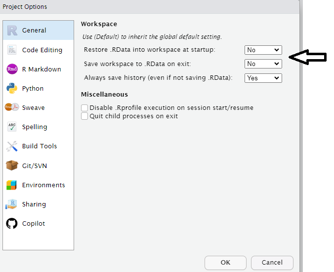

# (PART\*) Organising workflows {.unnumbered}

# Project-oriented workflows


In RStudio, a project is a way to organize your work within the IDE. It's a fundamental concept designed to enhance your workflow by providing a structured and efficient means of managing your R-related tasks and files. Here's why R projects are useful:

**1. Organized File Structure:** R projects encourage you to maintain a well-organized file structure for your work. Instead of having scattered R scripts, data files, and figures, you create a dedicated folder for each project. This folder typically contains all project-related materials, including data, code, figures, notes, and any other relevant files.

**2. Working Directory Management:** When you open an R project in RStudio, it automatically sets the working directory to the project's folder. This ensures that all file paths are relative to the project's location. This working directory intentionality eliminates the need for setting working directories manually or using absolute paths in your code.

**3. Portability and Collaboration:** R projects make your work more portable and collaborative. Since all paths are relative to the project folder, the project can be easily shared with others. It ensures that the code works consistently across different computers and for other users, promoting collaboration and reproducibility.

**4. RStudio Integration:** RStudio integrates project management seamlessly. You can designate a folder as an R project, and RStudio leaves a `.Rproj` file in that folder to store project-specific settings. When you double-click on this file, it opens a fresh instance of RStudio with the project's working directory and file browser pointed at the project folder.

**5. Efficient Workflow:** RStudio provides various menu options and keyboard shortcuts for managing projects. This includes the ability to open existing projects, switch between projects, and even launch multiple instances of RStudio for different projects.

In essence, R projects help you maintain a clean and organized workspace, improve collaboration, and ensure that your work remains reproducible and transferable across different environments and over time. It's a best practice for data scientists and analysts working with R, as it fosters the disciplined use of relative file paths and working directories, which is crucial for the reliability and scalability of your R projects.


## Setting up a new project

You should start a new R project when you begin working on a distinct task, research project, or analysis. This ensures that your work is well-organized, and it's especially beneficial when you need to collaborate, share, or revisit the project later.

To create and open an R project in RStudio:

1. Go to "File" in the RStudio menu.

2. Select "New Project..."

3. Choose a project type or create a new directory for the project.

4. Click "Create Project."

The new project will be created with a .Rproj file. You can open it by double-clicking on this file or by using the "File" menu in RStudio.

This will set up a dedicated workspace for your project, ensuring that the working directory and file paths are appropriately managed.

## Avoiding setwd() and Promoting Safe File Paths:

To maintain a clean and efficient workflow in R, it's advisable to avoid using `setwd()` at the beginning of each script. This practice promotes the use of safe file paths and is particularly important for projects with multiple collaborators or when working across different computers.

### Absolute vs. Relative Paths:

While absolute file paths provide an explicit way to locate resources, they have significant drawbacks, such as incompatibility and reduced reproducibility. Relative file paths, on the other hand, are relative to the current working directory, making them shorter, more portable, and more reproducible.

An **Absolute file path** is a path that contains the entire path to a file or directory starting from your Home directory and ending at the file or directory you wish to access e.g.

```
/home/your-username/project/data/penguins_raw.csv
```

- If you share files, another user won’t have the same directory structure as you, so they will need to recreate the file paths

- If you alter your directory structure, you’ll need to rewrite the paths

- An absolute file path will likely be longer than a relative path, more of the backslashes will need to be edited, so there is more scope for error.

A **Relative filepath** is the path that is relative to the working directory location on your computer.

When you use RStudio Projects, wherever the `.Rproj` file is located is set to the working directory. This means that if the `.Rproj` file is located in your project folder then the relative path to your data is:

```
data/penguins_raw.csv
```

This filepath is shorter and it means you could share your project with someone else and the script would run without any editing.

### Organizing Projects:

A key aspect of this workflow is organizing each logical project into a separate folder on your computer. This ensures that files and scripts are well-structured, making it easier to manage your work.

### The `here` Package:

To further enhance this organization and ensure that file paths are independent of specific working directories, the here package comes into play. The `here()` function provided by this package builds file paths relative to the top-level directory of your project.

```
my_project.RProj/
    |- data/
    |   |- raw/
    |       |- penguins_raw.csv
    |   |- processed/
    |- scripts/
    |   |- analysis.R
    |- results/


```

In the above project example you have raw data files in the data/raw directory, scripts in the scripts directory, and you want to save processed data in the data/processed directory.

To access this data using a relative filepath we need:


```r
raw_data <- read.csv("data/raw/penguins_raw.csv")
```

To access this data with `here` we provide the directories and desired file, and `here()` builds the required filepath starting at the top level of our project each time


```r
library(here)

raw_data <- read.csv(here("data", "raw", "penguins.csv"))
```

#### here and Rmarkdown

One quirk of working in a `.Rmd` Rmarkdown file is that when you "knit" all code is compiled with the working directory as the folder that .Rmd file lives in, but if you are working in a script `.R` or in a live session then the default working directory is the top level of the project file. This frustrating and confusing process can lead to errors when attempting to compile documents. 

**BUT** if you use the `here` package then this default behaviour is overridden. The working directory when knitting will be the top-level .Rproj location again!


### Reading

https://github.com/jennybc/here_here

https://cran.r-project.org/web/packages/here/index.html


## Blank slates

When working on data analysis and coding projects in R, it's crucial to ensure that your analysis remains clean, reproducible, and free from hidden dependencies. 

Hidden dependencies are elements in your R session that might not be immediately apparent but can significantly impact the reliability and predictability of your work.

For example many data analysis scripts start with the command `rm(list = ls())`. While this command clears user-created objects from the workspace, it leaves hidden dependencies as it does not reset the R session, and can cause issues such as: 

- **Hidden Dependencies:** Users might unintentionally rely on packages or settings applied in the current session.

- **Incomplete Reset:** Package attachments made with `library()` persist, and customized options remain set.

- **Working Directory:** The working directory is not affected, potentially causing path-related problems in future scripts.

### Restart R sessions

Restarting R sessions and using scripts as your history is a best practice for maintaining a clean, reproducible, and efficient workflow. It addresses the limitations of `rm(list = ls())` by ensuring a complete reset and minimizing hidden dependencies, enhancing code organization, and ensuring your analysis remains robust and predictable across sessions and when shared with others.



# Basic Import/Export

When loading data into R, the choice of method matters, especially for tabular data like CSV files. There are three common approaches: 

- base R's `read.csv()`

- the `data.table` package with `fread()`

the `readr` package with functions like `read_csv()`

The performance gains of `data.table` and `readr` become significant as data size grows, especially for datasets with many rows. For files larger than 100 MB, `fread()` and `read_csv()` are about five times faster than `read.csv()`. However, the choice should consider memory usage, as very large datasets may impact it.

Keep in mind that `data.table` and `readr` are separate packages, requiring installation and loading.

>readr functions

| Function         | Description                                          |
|------------------|------------------------------------------------------|
| `read_csv()`     | CSV file format                                      |
| `read_tsv()`     | TSV (Tab-Separated Values) file format               |
| `read_delim()`   | User-specified delimited files                       |
| `read_fwf()`     | Fixed-width files                                    |
| `read_table()`   | Whitespace-separated files                           |
| `read_log()`     | Web log files                                        |


## Export

Each of these packages and functions has the inverse "write" function to produce files in a variety of formats from R objects.

## R data files

R has binary file formats for easy saving and loading of data, `.Rdata` and `RDS`:

**.Rdata** file is a binary file format in R used to save the entire workspace, which includes objects, functions, data frames, and more. It captures the current R session's state, allowing you to save and load the entire workspace, including all objects, in a single file.


```r
# Create some sample data
my_data <- data.frame(
  ID = 1:3,
  Name = c("Alice", "Bob", "Charlie"),
  Score = c(95, 87, 92)
)

# Save the entire workspace to an .Rdata file
save.image(file = "my_workspace.Rdata")

# Clear the current workspace
rm(list = ls())

# Load the entire workspace from the .Rdata file
load("my_workspace.Rdata")

# Access the loaded data
print(my_data)
```


**.RDS** file, or R Data Serialization file, is a binary file format in R used to save individual R objects. Unlike .Rdata, it is not meant to save the entire workspace but specific objects or data structures.


```r
# Create some sample data
my_data <- data.frame(
  ID = 1:3,
  Name = c("Alice", "Bob", "Charlie"),
  Score = c(95, 87, 92)
)

# Save the data frame to an .RDS file
saveRDS(my_data, file = "my_data.RDS")

# Clear the current workspace
rm(list = ls())

# Load the data frame from the .RDS file
loaded_data <- readRDS("my_data.RDS")

# Access the loaded data
print(loaded_data)
```

Using these file formats can have several advantages:

**Preservation of Data Types and Structure:** .RDS files preserve the original data types and structure of R objects, including lists, data frames, functions and more.

**Efficiency and Speed:** Reading and writing data in the .RDS format is more efficient and faster than working with text-based formats like CSV. 

**Control Over Specific Objects:** .RDS files allow you to save and load specific R objects or datasets, providing control and flexibility. 

### Objects that take a long time

If there are parts of your analysis that are time-consuming to execute, it's an indication that it's a suitable time to adopt a modular approach. This approach involves dividing your analysis into distinct phases, with each phase having its dedicated script and resulting outputs. 

You can address this by isolating computationally intensive steps in separate scripts and saving the critical object to a file using `saveRDS`. Subsequently, you can create scripts for downstream tasks that reload the essential object with `readRDS`. Breaking down your analysis into logical steps with clear inputs and outputs is generally a sound practice.


# Scripts

To ensure clarity and understanding, begin your script with a brief description of its purpose. This description will serve as a reference point for anyone who accesses your script. Even if you make updates later on, having this initial description will help maintain clarity and context, preventing confusion when revisiting the code in the future.

## Organised scripts

Load all necessary packages at the beginning of your script.
It's common to start with basic packages and then add more specialized libraries as your analysis progresses. However, it's crucial to load all required packages at the beginning of your script. This practice ensures that when you or someone else needs to run the script again, all necessary libraries are readily available, preventing issues in the middle of execution due to unrecognized functions. Small coding details matter.

Name your code sections and use them for quick navigation.
As your code grows, it may become extensive and challenging to manage. To keep it organized, divide your code into sections, each with a specific name, which can be folded or unfolded for easy navigation. You can also use the 'drop-up' menu at the bottom of the script screen to move between sections.

To create a new code section, insert "####" or "----" at the end of a comment that marks the beginning of a new section.


I understand, we all have good intentions, but we often neglect the task of thoroughly commenting our code. I've made that promise to myself many times, but even now, I struggle to do it consistently. Why, you ask? Here are a few reasons:

1. I often tell myself that the analysis itself is more crucial.
2. I believe I understand my own code.
3. I usually don't have immediate collaborators who need to use my code.

However, these arguments are somewhat shortsighted. The reality is that:

- The most valuable and relevant analysis loses its value if neither you nor others can understand it. (More on this below)
- While you may know what you're doing at the moment, it won't feel the same way in a month or two when you've moved on to another project, and someone innocently asks you about how you defined a critical variable. Our memory is unreliable. It's important not to rely on it for every piece of code you produce.
- Even if you don't have active collaborators at the time of your analysis, someone will eventually need to use your code. You won't be in the same position forever. You're creating a legacy that, someday, someone will rely on, no matter how distant that day may seem right now.

So, what makes code good and reproducible?

1. Thoughtful and clear comments.
2. Code that is logical and efficient.
3. Code that has been appropriately timed and tested.

## Use style guides

Consider using a style guide, such as the [tidyverse style guide](https://style.tidyverse.org/), is a beneficial practice for several reasons:

Consistency: A style guide enforces consistent code formatting and naming conventions throughout your project. This consistency improves code readability and makes it easier for you and others to understand the code. When you have multiple people working on a project, a shared style guide ensures that everyone's code looks similar, reducing confusion and errors.

Readability: Following a style guide leads to more readable code. Code is often read more frequently than it is written, so making it easy to understand is crucial. The tidyverse style guide, for example, emphasizes clear and self-explanatory code, improving comprehension for both current and future users. Good coding style is like correct punctuation: you can manage without it, butitsuremakesthingseasiertoread

Collaboration: When working with a team, adhering to a common style guide makes it easier to collaborate. It reduces the friction associated with different team members using varying coding styles and preferences. This streamlines code reviews and simplifies the process of maintaining and extending the codebase.

Error Reduction: A style guide can help identify and prevent common coding errors. It promotes best practices and can include guidelines for avoiding pitfalls and potential issues. This reduces the likelihood of bugs and enhances the overall quality of the code.

## Separate your scripts

Separating your analysis into distinct scripts for different steps is a sound practice in data analysis. Each script can focus on a specific task or step, making your work more organized and understandable.

You can use the `source` function in R to run previous dependencies, ensuring that you can reproduce your work easily. Additionally, for computationally intensive processes or when dealing with large datasets, you can save and load intermediate results in RDS format. This approach not only conserves memory but also saves time when re-running your analysis.

```
project_folder/
│
├── data/
│   ├── data.csv
│   ├── processed_data.rds
│
├── scripts/
│   ├── data_preparation.R
│   ├── data_analysis.R
│   ├── visualization.R
│   ├── helper_functions.R
│
├── output/
│   ├── result.csv
│
├── README.md
│
├── project.Rproj

```

## Activity

Using the [Tidyverse style guide](https://style.tidyverse.org/index.html) for help, how could you improve the layout and readability of this script?


```r
# Install and load necessary packages
library(dplyr)
library(ggplot2)
library(palmerpenguins)

penguins_clean <- janitor::clean_names(penguins_raw)


## Data is selected by species, island, culmen length and depth and flipper, then NAs are dropped and a new column is made of length/depth and the mean is summaries for flipper length and length/depth ratio
penguins_clean |> select(species, island, culmen_length_mm, culmen_depth_mm, flipper_length_mm)  |> drop_na(culmen_length_mm, culmen_depth_mm, flipper_length_mm) |> mutate(culmen_ratio = culmen_length_mm / culmen_depth_mm) |> group_by(species, island) |> summarise(mean_flipper_length = mean(flipper_length_mm), mean_culmen_ratio = mean(culmen_ratio)) |> arrange(species, island) -> penguins_culmen_ratio

## View summary table
print(penguins_culmen_ratio)


### Data visualization 
penguins_clean |>
  ggplot(aes(x = culmen_length_mm, y = culmen_depth_mm, color = species)) +
          geom_point() +
                labs(x = "Culmen Length (mm)", y = "Culmen Depth (mm)") +
                      theme_minimal()
```


<div class='webex-solution'><button>Check your script</button>


```r
# Packages ----
# Install and load necessary packages
library(tidyverse)
library(janitor)
# Loads the penguins dataset
library(palmerpenguins)


# Clean the data ----
penguins_raw <- janitor::clean_names(penguins_raw)

# Analysis----
# Data exploration and manipulation to make culmen ratio
penguins_culmen_ratio <- penguins_raw |> 
  select(species, island, culmen_length_mm, culmen_depth_mm, flipper_length_mm)  |> 
  drop_na(culmen_length_mm, culmen_depth_mm, flipper_length_mm) |> 
  mutate(culmen_ratio = culmen_length_mm / culmen_depth_mm) |>
  group_by(species, island) |>
  summarise(mean_flipper_length = mean(flipper_length_mm), 
            mean_culmen_ratio = mean(culmen_ratio)) |>
  arrange(species, island)

# View summary table
print(penguins_culmen_ratio)

# Plots----
# Data visualization using ggplot2
penguins_clean |>
  ggplot(aes(x = culmen_length_mm, y = culmen_depth_mm, color = species)) +
  geom_point() +
  labs(x = "Culmen Length (mm)", y = "Culmen Depth (mm)") +
  theme_minimal()
```


</div>


# Naming things

Ipso lore ipsum


