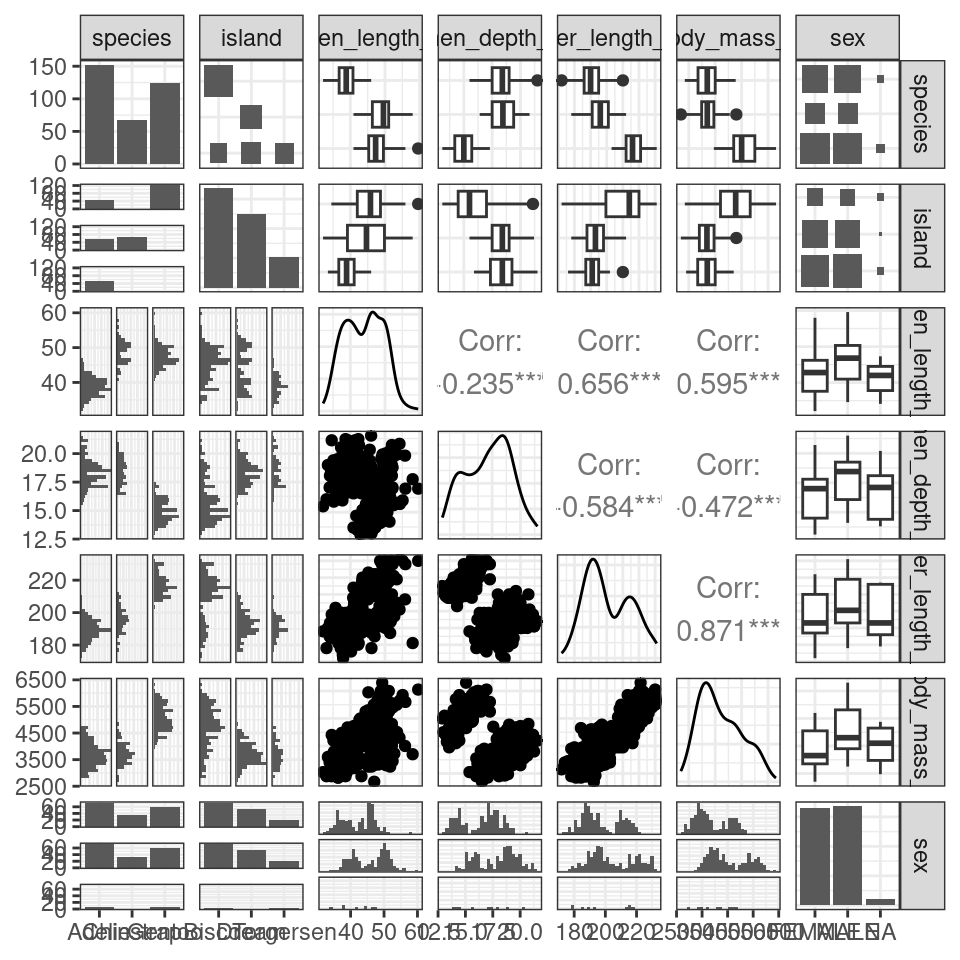
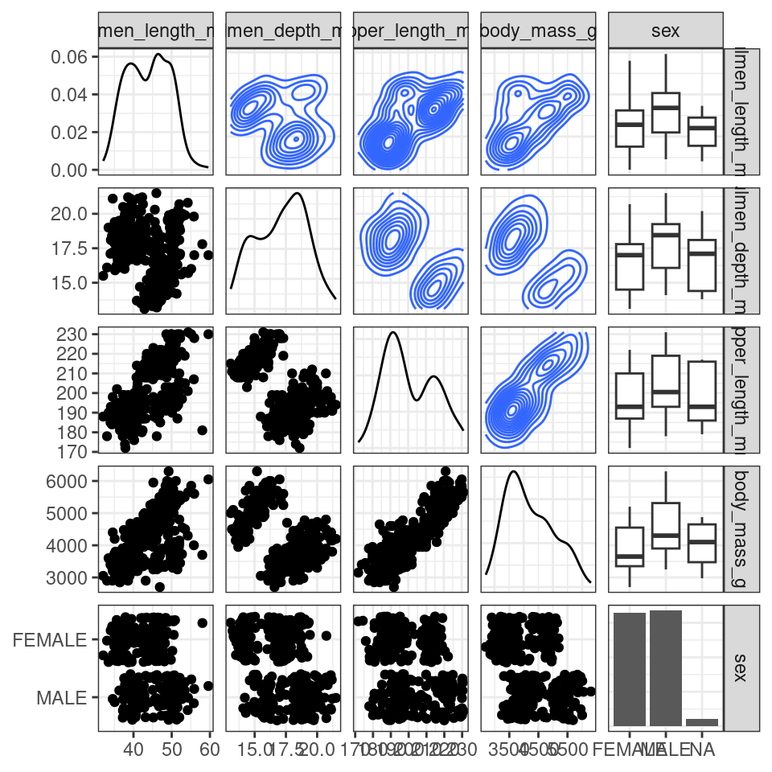

# (PART\*) Organising workflows {.unnumbered}

# Project-oriented workflows

In RStudio, a project is a way to organize your work within the IDE. It's a fundamental concept designed to enhance your workflow by providing a structured and efficient means of managing your R-related tasks and files. Here's why R projects are useful:

**1. Organized File Structure:** R projects encourage you to maintain a well-organized file structure for your work. Instead of having scattered R scripts, data files, and figures, you create a dedicated folder for each project. This folder typically contains all project-related materials, including data, code, figures, notes, and any other relevant files.

**2. Working Directory Management:** When you open an R project in RStudio, it automatically sets the working directory to the project's folder. This ensures that all file paths are relative to the project's location. This working directory intentionality eliminates the need for setting working directories manually or using absolute paths in your code.

**3. Portability and Collaboration:** R projects make your work more portable and collaborative. Since all paths are relative to the project folder, the project can be easily shared with others. It ensures that the code works consistently across different computers and for other users, promoting collaboration and reproducibility.

**4. RStudio Integration:** RStudio integrates project management seamlessly. You can designate a folder as an R project, and RStudio leaves a `.Rproj` file in that folder to store project-specific settings. When you double-click on this file, it opens a fresh instance of RStudio with the project's working directory and file browser pointed at the project folder.

**5. Efficient Workflow:** RStudio provides various menu options and keyboard shortcuts for managing projects. This includes the ability to open existing projects, switch between projects, and even launch multiple instances of RStudio for different projects.

In essence, R projects help you maintain a clean and organized workspace, improve collaboration, and ensure that your work remains reproducible and transferable across different environments and over time. It's a best practice for data scientists and analysts working with R, as it fosters the disciplined use of relative file paths and working directories, which is crucial for the reliability and scalability of your R projects.


## Setting up a new project

You should start a new R project when you begin working on a distinct task, research project, or analysis. This ensures that your work is well-organized, and it's especially beneficial when you need to collaborate, share, or revisit the project later.

To create and open an R project in RStudio:

1. Go to "File" in the RStudio menu.

2. Select "New Project..."

3. Choose a project type or create a new directory for the project.

4. Click "Create Project."

The new project will be created with a .Rproj file. You can open it by double-clicking on this file or by using the "File" menu in RStudio.

This will set up a dedicated workspace for your project, ensuring that the working directory and file paths are appropriately managed.

## Avoiding setwd() and Promoting Safe File Paths:

To maintain a clean and efficient workflow in R, it's advisable to avoid using `setwd()` at the beginning of each script. This practice promotes the use of safe file paths and is particularly important for projects with multiple collaborators or when working across different computers.

### Absolute vs. Relative Paths:

While absolute file paths provide an explicit way to locate resources, they have significant drawbacks, such as incompatibility and reduced reproducibility. Relative file paths, on the other hand, are relative to the current working directory, making them shorter, more portable, and more reproducible.

An **Absolute file path** is a path that contains the entire path to a file or directory starting from your Home directory and ending at the file or directory you wish to access e.g.

```
/home/your-username/project/data/penguins_raw.csv
```

- If you share files, another user won’t have the same directory structure as you, so they will need to recreate the file paths

- If you alter your directory structure, you’ll need to rewrite the paths

- An absolute file path will likely be longer than a relative path, more of the backslashes will need to be edited, so there is more scope for error.

A **Relative filepath** is the path that is relative to the working directory location on your computer.

When you use RStudio Projects, wherever the `.Rproj` file is located is set to the working directory. This means that if the `.Rproj` file is located in your project folder then the relative path to your data is:

```
data/penguins_raw.csv
```

This filepath is shorter and it means you could share your project with someone else and the script would run without any editing.

### Organizing Projects:

A key aspect of this workflow is organizing each logical project into a separate folder on your computer. This ensures that files and scripts are well-structured, making it easier to manage your work.

### The `here` Package:

To further enhance this organization and ensure that file paths are independent of specific working directories, the here package comes into play. The `here()` function provided by this package builds file paths relative to the top-level directory of your project.

```
my_project.RProj/
    |- data/
    |   |- raw/
    |       |- penguins_raw.csv
    |   |- processed/
    |- scripts/
    |   |- analysis.R
    |- results/


```

In the above project example you have raw data files in the data/raw directory, scripts in the scripts directory, and you want to save processed data in the data/processed directory.

To access this data using a relative filepath we need:


```r
raw_data <- read.csv("data/raw/penguins_raw.csv")
```

To access this data with `here` we provide the directories and desired file, and `here()` builds the required filepath starting at the top level of our project each time


```r
library(here)

raw_data <- read.csv(here("data", "raw", "penguins.csv"))
```

#### here and Rmarkdown

One quirk of working in a `.Rmd` Rmarkdown file is that when you "knit" all code is compiled with the working directory as the folder that .Rmd file lives in, but if you are working in a script `.R` or in a live session then the default working directory is the top level of the project file. This frustrating and confusing process can lead to errors when attempting to compile documents. 

**BUT** if you use the `here` package then this default behaviour is overridden. The working directory when knitting will be the top-level .Rproj location again!


### Reading

https://github.com/jennybc/here_here

https://cran.r-project.org/web/packages/here/index.html


## Blank slates

When working on data analysis and coding projects in R, it's crucial to ensure that your analysis remains clean, reproducible, and free from hidden dependencies. 

Hidden dependencies are elements in your R session that might not be immediately apparent but can significantly impact the reliability and predictability of your work.

For example many data analysis scripts start with the command `rm(list = ls())`. While this command clears user-created objects from the workspace, it leaves hidden dependencies as it does not reset the R session, and can cause issues such as: 

- **Hidden Dependencies:** Users might unintentionally rely on packages or settings applied in the current session.

- **Incomplete Reset:** Package attachments made with `library()` persist, and customized options remain set.

- **Working Directory:** The working directory is not affected, potentially causing path-related problems in future scripts.

### Restart R sessions

Restarting R sessions and using scripts as your history is a best practice for maintaining a clean, reproducible, and efficient workflow. It addresses the limitations of `rm(list = ls())` by ensuring a complete reset and minimizing hidden dependencies, enhancing code organization, and ensuring your analysis remains robust and predictable across sessions and when shared with others.


# Basic Import/Export

When loading data into R, the choice of method matters, especially for tabular data like CSV files. There are three common approaches: 

- base R's `read.csv()`

- the `data.table` package with `fread()`

the `readr` package with functions like `read_csv()`

The performance gains of `data.table` and `readr` become significant as data size grows, especially for datasets with many rows. For files larger than 100 MB, `fread()` and `read_csv()` are about five times faster than `read.csv()`. However, the choice should consider memory usage, as very large datasets may impact it.

Keep in mind that `data.table` and `readr` are separate packages, requiring installation and loading.

>readr functions

| Function         | Description                                          |
|------------------|------------------------------------------------------|
| `read_csv()`     | CSV file format                                      |
| `read_tsv()`     | TSV (Tab-Separated Values) file format               |
| `read_delim()`   | User-specified delimited files                       |
| `read_fwf()`     | Fixed-width files                                    |
| `read_table()`   | Whitespace-separated files                           |
| `read_log()`     | Web log files                                        |


## Export

Each of these packages and functions has the inverse "write" function to produce files in a variety of formats from R objects.

## R data files

R has binary file formats for easy saving and loading of data, `.Rdata` and `RDS`:

**.Rdata** file is a binary file format in R used to save the entire workspace, which includes objects, functions, data frames, and more. It captures the current R session's state, allowing you to save and load the entire workspace, including all objects, in a single file.


```r
# Create some sample data
my_data <- data.frame(
  ID = 1:3,
  Name = c("Alice", "Bob", "Charlie"),
  Score = c(95, 87, 92)
)

# Save the entire workspace to an .Rdata file
save.image(file = "my_workspace.Rdata")

# Clear the current workspace
rm(list = ls())

# Load the entire workspace from the .Rdata file
load("my_workspace.Rdata")

# Access the loaded data
print(my_data)
```


**.RDS** file, or R Data Serialization file, is a binary file format in R used to save individual R objects. Unlike .Rdata, it is not meant to save the entire workspace but specific objects or data structures.


```r
# Create some sample data
my_data <- data.frame(
  ID = 1:3,
  Name = c("Alice", "Bob", "Charlie"),
  Score = c(95, 87, 92)
)

# Save the data frame to an .RDS file
saveRDS(my_data, file = "my_data.RDS")

# Clear the current workspace
rm(list = ls())

# Load the data frame from the .RDS file
loaded_data <- readRDS("my_data.RDS")

# Access the loaded data
print(loaded_data)
```

Using these file formats can have several advantages:

**Preservation of Data Types and Structure:** .RDS files preserve the original data types and structure of R objects, including lists, data frames, functions and more.

**Efficiency and Speed:** Reading and writing data in the .RDS format is more efficient and faster than working with text-based formats like CSV. 

**Control Over Specific Objects:** .RDS files allow you to save and load specific R objects or datasets, providing control and flexibility. 

### Objects that take a long time

If there are parts of your analysis that are time-consuming to execute, it's an indication that it's a suitable time to adopt a modular approach. This approach involves dividing your analysis into distinct phases, with each phase having its dedicated script and resulting outputs. 

You can address this by isolating computationally intensive steps in separate scripts and saving the critical object to a file using `saveRDS`. Subsequently, you can create scripts for downstream tasks that reload the essential object with `readRDS`. Breaking down your analysis into logical steps with clear inputs and outputs is generally a sound practice.


# Scripts

To ensure clarity and understanding, begin your script with a brief description of its purpose. This description will serve as a reference point for anyone who accesses your script. Even if you make updates later on, having this initial description will help maintain clarity and context, preventing confusion when revisiting the code in the future.

## Organised scripts

Load all necessary packages at the beginning of your script.
It's common to start with basic packages and then add more specialized libraries as your analysis progresses. However, it's crucial to load all required packages at the beginning of your script. This practice ensures that when you or someone else needs to run the script again, all necessary libraries are readily available, preventing issues in the middle of execution due to unrecognized functions. Small coding details matter.

Name your code sections and use them for quick navigation.
As your code grows, it may become extensive and challenging to manage. To keep it organized, divide your code into sections, each with a specific name, which can be folded or unfolded for easy navigation. You can also use the 'drop-up' menu at the bottom of the script screen to move between sections.

To create a new code section, insert "####" or "----" at the end of a comment that marks the beginning of a new section.


I understand, we all have good intentions, but we often neglect the task of thoroughly commenting our code. I've made that promise to myself many times, but even now, I struggle to do it consistently. Why, you ask? Here are a few reasons:

1. I often tell myself that the analysis itself is more crucial.
2. I believe I understand my own code.
3. I usually don't have immediate collaborators who need to use my code.

However, these arguments are somewhat shortsighted. The reality is that:

- The most valuable and relevant analysis loses its value if neither you nor others can understand it. (More on this below)
- While you may know what you're doing at the moment, it won't feel the same way in a month or two when you've moved on to another project, and someone innocently asks you about how you defined a critical variable. Our memory is unreliable. It's important not to rely on it for every piece of code you produce.
- Even if you don't have active collaborators at the time of your analysis, someone will eventually need to use your code. You won't be in the same position forever. You're creating a legacy that, someday, someone will rely on, no matter how distant that day may seem right now.

So, what makes code good and reproducible?

1. Thoughtful and clear comments.
2. Code that is logical and efficient.
3. Code that has been appropriately timed and tested.

## Use style guides

Consider using a style guide, such as the [tidyverse style guide](https://style.tidyverse.org/), is a beneficial practice for several reasons:

Consistency: A style guide enforces consistent code formatting and naming conventions throughout your project. This consistency improves code readability and makes it easier for you and others to understand the code. When you have multiple people working on a project, a shared style guide ensures that everyone's code looks similar, reducing confusion and errors.

Readability: Following a style guide leads to more readable code. Code is often read more frequently than it is written, so making it easy to understand is crucial. The tidyverse style guide, for example, emphasizes clear and self-explanatory code, improving comprehension for both current and future users. Good coding style is like correct punctuation: you can manage without it, butitsuremakesthingseasiertoread

Collaboration: When working with a team, adhering to a common style guide makes it easier to collaborate. It reduces the friction associated with different team members using varying coding styles and preferences. This streamlines code reviews and simplifies the process of maintaining and extending the codebase.

Error Reduction: A style guide can help identify and prevent common coding errors. It promotes best practices and can include guidelines for avoiding pitfalls and potential issues. This reduces the likelihood of bugs and enhances the overall quality of the code.

## Separate your scripts

Separating your analysis into distinct scripts for different steps is a sound practice in data analysis. Each script can focus on a specific task or step, making your work more organized and understandable.

You can use the `source` function in R to run previous dependencies, ensuring that you can reproduce your work easily. Additionally, for computationally intensive processes or when dealing with large datasets, you can save and load intermediate results in RDS format. This approach not only conserves memory but also saves time when re-running your analysis.

```
project_folder/
│
├── data/
│   ├── data.csv
│   ├── processed_data.rds
│
├── scripts/
│   ├── data_preparation.R
│   ├── data_analysis.R
│   ├── visualization.R
│   ├── helper_functions.R
│
├── output/
│   ├── result.csv
│
├── README.md
│
├── project.Rproj

```

## Activity

Using the [Tidyverse style guide](https://style.tidyverse.org/index.html) for help, how could you improve the layout and readability of this script?


```r
# Install and load necessary packages
library(dplyr)
library(ggplot2)
library(palmerpenguins)

penguins_clean <- janitor::clean_names(penguins_raw)


## Data is selected by species, island, culmen length and depth and flipper, then NAs are dropped and a new column is made of length/depth and the mean is summaries for flipper length and length/depth ratio
penguins_clean |> select(species, island, culmen_length_mm, culmen_depth_mm, flipper_length_mm)  |> drop_na(culmen_length_mm, culmen_depth_mm, flipper_length_mm) |> mutate(culmen_ratio = culmen_length_mm / culmen_depth_mm) |> group_by(species, island) |> summarise(mean_flipper_length = mean(flipper_length_mm), mean_culmen_ratio = mean(culmen_ratio)) |> arrange(species, island) -> penguins_culmen_ratio

## View summary table
print(penguins_culmen_ratio)


### Data visualization 
penguins_clean |>
  ggplot(aes(x = culmen_length_mm, y = culmen_depth_mm, color = species)) +
          geom_point() +
                labs(x = "Culmen Length (mm)", y = "Culmen Depth (mm)") +
                      theme_minimal()
```


::: {.solution}

``{r, eval = F}
# Packages ====
# Install and load necessary packages
library(tidyverse)
library(janitor)
# Loads the penguins dataset
library(palmerpenguins)


# Clean the data ====
penguins_raw <- janitor::clean_names(penguins_raw)

# Analysis====
# Data exploration and manipulation to make culmen ratio
penguins_culmen_ratio <- penguins_raw |> 
  select(species, island, culmen_length_mm, culmen_depth_mm, flipper_length_mm)  |> 
  drop_na(culmen_length_mm, culmen_depth_mm, flipper_length_mm) |> 
  mutate(culmen_ratio = culmen_length_mm / culmen_depth_mm) |>
  group_by(species, island) |>
  summarise(mean_flipper_length = mean(flipper_length_mm), 
            mean_culmen_ratio = mean(culmen_ratio)) |>
  arrange(species, island)

# View summary table
print(penguins_culmen_ratio)

# Plots====
# Data visualization using ggplot2
penguins_clean |>
  ggplot(aes(x = culmen_length_mm, y = culmen_depth_mm, color = species)) +
  geom_point() +
  labs(x = "Culmen Length (mm)", y = "Culmen Depth (mm)") +
  theme_minimal()
``

:::

# Naming things


# Penguin project


In this workshop we will work through setting up a project and loading data. Once we have a curated and cleaned the dataset we can work on generating insights from the data.

As a biologist you should be used to asking questions and gathering data. It is also important that you learn all aspects of the research process. This includes responsible data management (understanding data files & spreadsheet organisation, keeping data safe) and data analysis.

In this chapter we will look at the structure of data files, and how to read these with R. We will also continue to develop reproducible scripts. This means that we are writing scripts that are well organised and easy to read, and also making sure that our scripts are complete and capable of reproducing an analysis from start to finish. 

Transparency and reproducibility are key values in scientific research, when you analyse data in a reproducible way it means that others can understand and check your work. It also means that the most important person can benefit from your work, YOU! When you return to an analysis after even a short break, you will be thanking your earlier self if you have worked in a clear and reproducible way, as you can pick up right where you left off.  


## Meet the Penguins

This data, taken from the `palmerpenguins` (@R-palmerpenguins) package was originally published by @Antarctic. In our course we will work with real data that has been shared by other researchers.

The palmer penguins data contains size measurements, clutch observations, and blood isotope ratios for three penguin species observed on three islands in the Palmer Archipelago, Antarctica over a study period of three years.


These data were collected from 2007 - 2009 by Dr. Kristen Gorman with the Palmer Station Long Term Ecological Research Program, part of the US Long Term Ecological Research Network. The data were imported directly from the Environmental Data Initiative (EDI) Data Portal, and are available for use by CC0 license (“No Rights Reserved”) in accordance with the Palmer Station Data Policy. We gratefully acknowledge Palmer Station LTER and the US LTER Network. Special thanks to Marty Downs (Director, LTER Network Office) for help regarding the data license & use. Here is our intrepid package co-author, Dr. Gorman, in action collecting some penguin data:


Here is a map of the study site


## Activity 1: Organising our workspace

Before we can begin working with the data, we need to do some set-up. 

* Go to RStudio Cloud and open the `Penguins` R project

* Create the following folders using the + New Folder button in the Files tab

  * data
  * outputs
  * scripts
  

<div class="warning">
<p>R is case-sensitive so type everything EXACTLY as printed here</p>
</div>


```r
dir.create("data",
           showWarnings = FALSE)

dir.create("outputs",
           showWarnings = FALSE)

dir.create("scripts",
           showWarnings = FALSE)

# or this can be run using apply
lapply(c("data", "outputs", "scripts"), function(dir_name) {
  dir.create(dir_name, showWarnings = FALSE)
})
```

Having these separate subfolders within our project helps keep things tidy, means it's harder to lose things, and lets you easily tell R exactly where to go to retrieve data.  

The next step of our workflow is to have a well organised project space. RStudio Cloud does a lot of the hard work for you, each new data project can be set up with its own Project space. 

We will define a project as a series of linked questions that uses one (or sometimes several) datasets. For example a coursework assignment for a particular module would be its own project, a series of linked experiments or particular research project might be its own project.

A Project will contain several files, possibly organised into sub-folders containing data, R scripts and final outputs. You might want to keep any information (wider reading) you have gathered that is relevant to your project.

<div class="figure" style="text-align: center">

<p class="caption">(\#fig:unnamed-chunk-15)An example of a typical R project set-up</p>
</div>

Within this project you will notice there is already one file *.Rproj*. This is an R project file, this is a very useful feature, it interacts with R to tell it you are working in a very specific place on the computer (in this case the cloud server we have dialed into). It means R will automatically treat the location of your project file as the 'working directory' and makes importing and exporting easier^[More on projects can be found in the R4DS book (https://r4ds.had.co.nz/workflow-projects.html)]. 

<div class="warning">
<p>It is very important to NEVER to move the .Rproj file, this may
prevent your workspace from opening properly.</p>
</div>

## Activity 2: Access our data

Now that we have a project workspace, we are ready to import some data.

* Use the link below to open a page in your browser with the data open

* Right-click Save As to download in csv format to your computer (Make a note of **where** the file is being downloaded to e.g. Downloads)


```{=html}
<a href="https://raw.githubusercontent.com/UEABIO/data-sci-v1/main/book/files/penguins_raw.csv">
<button class="btn btn-success"><i class="fa fa-save"></i> Download penguin data as csv</button>
</a>
```


<div class="figure" style="text-align: center">

<p class="caption">(\#fig:unnamed-chunk-18)Top image: Penguins data viewed in Excel, Bottom image: Penguins data in native csv format</p>
</div>

In raw format, each line of a CSV is separated by commas for different values. When you open this in a spreadsheet program like Excel it automatically converts those comma-separated values into tables and columns. 


## Activity 3: Upload our data

* The data is now in your Downloads folder on your computer

* We need to upload the data to our remote cloud-server (RStudio Cloud), select the upload files to server button in the Files tab

* Put your file into the data folder - if you make a mistake select the tickbox for your file, go to the cogs button and choose the option Move.

<div class="figure" style="text-align: center">

<p class="caption">(\#fig:unnamed-chunk-19)Highlighted the buttons to upload files, and more options</p>
</div>


### Read data from a url

It is also possible to use a url as a filepath


```r
read_csv("https://raw.githubusercontent.com/UEABIO/data-sci-v1/main/book/files/penguins_raw.csv")
```

## Activity 4: Make a script

Let's now create a new R script file in which we will write instructions and store comments for manipulating data, developing tables and figures. Use the `File > New Script` menu item and select an R Script. 

Add the following:


```r
#___________________________----
# SET UP ----
## An analysis of the bill dimensions of male and female Adelie, Gentoo and Chinstrap penguins ----

### Data first published in  Gorman, KB, TD Williams, and WR Fraser. 2014. “Ecological Sexual Dimorphism and Environmental Variability Within a Community of Antarctic Penguins (Genus Pygoscelis).” PLos One 9 (3): e90081. https://doi.org/10.1371/journal.pone.0090081. ----
#__________________________----
```

Then load the following add-on package to the R script, just underneath these comments. Tidyverse isn't actually one package, but a bundle of many different packages that play well together - for example it *includes* `ggplot2` which we used in the last session, so we don't have to call that separately

Add the following to your script:


```r
# PACKAGES ----
library(tidyverse) # tidy data packages
library(janitor) # cleans variable names
#__________________________----
```

Save this file inside the scripts folder and call it `01_import_penguins_data.R`

<div class="try">
<p>Click on the document outline button (top right of script pane). This
will show you how the use of</p>
<p>#TITLES—-</p>
<p>Allows us to build a series of headers and subheaders, this is very
useful when using longer scripts.</p>
</div>

## Activity 5: Read in data

Now we can read in the data. To do this we will use the function `readr::read_csv()` that allows us to read in .csv files. There are also functions that allow you to read in .xlsx files and other formats, however in this course we will only use .csv files.

* First, we will create an object called `penguins_data` that contains the data in the `penguins_raw.csv` file. 

* Add the following to your script, and check the document outline:


<div class="tab"><button class="tablinksunnamed-chunk-24 active" onclick="javascript:openCode(event, 'option1unnamed-chunk-24', 'unnamed-chunk-24');">Base R</button><button class="tablinksunnamed-chunk-24" onclick="javascript:openCode(event, 'option2unnamed-chunk-24', 'unnamed-chunk-24');"><tt>tidyverse</tt></button></div><div id="option1unnamed-chunk-24" class="tabcontentunnamed-chunk-24">

```r
penguins <- read.csv ("data/penguins_raw.csv")

attributes(penguins) # reads as data.frame

head(penguins) # check the data has loaded, prints first 10 rows of dataframe
```
</div><div id="option2unnamed-chunk-24" class="tabcontentunnamed-chunk-24">

```r
# IMPORT DATA ----
penguins <- read_csv ("data/penguins_raw.csv")

attributes(penguins) # reads as tibble

head(penguins) # check the data has loaded, prints first 10 rows of dataframe
#__________________________----
```
</div><script> javascript:hide('option2unnamed-chunk-24') </script>


<div class="danger">
<p>Note the differences between <code>read.csv()</code> and
<code>read_csv</code>. We covered this in differences between tibbles
and dataframes - here most obviously is a difference in column
names.</p>
</div>


## Activity: Check your script


<div class='webex-solution'><button>Solution</button>


```r
#___________________________----
# SET UP ----
## An analysis of the bill dimensions of male and female Adelie, Gentoo and Chinstrap penguins ----

### Data first published in  Gorman, KB, TD Williams, and WR Fraser. 2014. “Ecological Sexual Dimorphism and Environmental Variability Within a Community of Antarctic Penguins (Genus Pygoscelis).” PLos One 9 (3): e90081. https://doi.org/10.1371/journal.pone.0090081. ----
#__________________________----

# PACKAGES ----
library(tidyverse) # tidy data packages
library(janitor) # cleans variable names
library(lubridate) # make sure dates are processed properly
#__________________________----

# IMPORT DATA ----
penguins <- read_csv ("data/penguins_raw.csv")

head(penguins) # check the data has loaded, prints first 10 rows of dataframe
#__________________________----
```


</div>


## Activity: Test yourself

**Question 1.** In order to make your R project reproducible what filepath should you use? 

<select class='webex-select'><option value='blank'></option><option value=''>Absolute filepath</option><option value='answer'>Relative filepath</option></select>

**Question 2.** Which of these would be acceptable to include in a raw datafile? 

<select class='webex-select'><option value='blank'></option><option value=''>Highlighting some blocks of cells</option><option value=''>Excel formulae</option><option value='answer'>A column of observational notes from the field</option><option value=''>a mix of ddmmyy and yymmdd date formats</option></select>

**Question 3.** What should always be the first set of functions in our script? `?()`

<input class='webex-solveme nospaces' size='9' data-answer='["library()"]'/>

**Question 4.** When reading in data to R we should use

<select class='webex-select'><option value='blank'></option><option value='answer'>read_csv()</option><option value=''>read.csv()</option></select>

**Question 5.** What format is the `penguins` data in?

<select class='webex-select'><option value='blank'></option><option value=''>wide data</option><option value='answer'>long data</option></select>


<div class='webex-solution'><button>Explain This Answer</button>

Each column is a unique variable and each row is a unique observation so this data is in a long (tidy) format

</div>
  

**Question 6.** The working directory for your projects is by default set to the location of?

<select class='webex-select'><option value='blank'></option><option value=''>your data files</option><option value='answer'>the .Rproj file</option><option value=''>your R script</option></select>

**Question 7.** Using the filepath `"data/penguins_raw.csv"` is an example of 

<select class='webex-select'><option value='blank'></option><option value=''>an absolute filepath</option><option value='answer'>a relative filepath</option></select>

**Question 8.** What operator do I need to use if I wish to assign the output of the `read_csv` function to an R object (rather than just print the dataframe into the console)?

<input class='webex-solveme nospaces' size='2' data-answer='["<-"]'/>


# Data wrangling part one


In this chapter you will learn how to use tidyverse functions to data clean and wrangle: 

## Activity 1: Change column names

We are going to learn how to organise data using the *tidy* format^[(http://vita.had.co.nz/papers/tidy-data.pdf)]. This is because we are using the `tidyverse` packages @R-tidyverse. This is an opinionated, but highly effective method for generating reproducible analyses with a wide-range of data manipulation tools. Tidy data is an easy format for computers to read. It is also the required data structure for our **statistical tests** that we will work with later.

Here 'tidy' refers to a specific structure that lets us manipulate and visualise data with ease. In a tidy dataset each *variable* is in one column and each row contains one *observation*. Each cell of the table/spreadsheet contains the *values*. One observation you might make about tidy data is it is quite long - it generates a lot of rows of data - you might remember then that *tidy* data can be referred to as *long*-format data (as opposed to *wide* data). 


So we know our data is in R, and we know the columns and names have been imported. But we still don't know whether all of our values imported correctly, or whether it captured all the rows. 

#### Add this to your script 


```r
# CHECK DATA----
# check the data
colnames(penguins)
#__________________________----
```

When we run `colnames()` we get the identities of each column in our dataframe

* **Study name**: an identifier for the year in which sets of observations were made

* **Region**: the area in which the observation was recorded

* **Island**: the specific island where the observation was recorded

* **Stage**: Denotes reproductive stage of the penguin

* **Individual** ID: the unique ID of the individual

* **Clutch completion**: if the study nest observed with a full clutch e.g. 2 eggs

* **Date egg**: the date at which the study nest observed with 1 egg

* **Culmen length**: length of the dorsal ridge of the bird's bill (mm)

* **Culmen depth**: depth of the dorsal ridge of the bird's bill (mm)

* **Flipper Length**: length of bird's flipper (mm)

* **Body Mass**: Bird's mass in (g)

* **Sex**: Denotes the sex of the bird

* **Delta 15N** : the ratio of stable Nitrogen isotopes 15N:14N from blood sample

* **Delta 13C**: the ratio of stable Carbon isotopes 13C:12C from blood sample


#### Clean column names

Often we might want to change the names of our variables. They might be non-intuitive, or too long. Our data has a couple of issues:

* Some of the names contain spaces

* Some of the names have capitalised letters

* Some of the names contain brackets

This dataframe  does not like these so let's correct these quickly. R is case-sensitive and also doesn't like spaces or brackets in variable names


```r
# CLEAN DATA ----

# clean all variable names to snake_case using the clean_names function from the janitor package
# note we are using assign <- to overwrite the old version of penguins with a version that has updated names
# this changes the data in our R workspace but NOT the original csv file

penguins <- janitor::clean_names(penguins) # clean the column names

colnames(penguins) # quickly check the new variable names
```

```
##  [1] "study_name"        "sample_number"     "species"          
##  [4] "region"            "island"            "stage"            
##  [7] "individual_id"     "clutch_completion" "date_egg"         
## [10] "culmen_length_mm"  "culmen_depth_mm"   "flipper_length_mm"
## [13] "body_mass_g"       "sex"               "delta_15_n_o_oo"  
## [16] "delta_13_c_o_oo"   "comments"
```

#### Rename columns (manually)

The `clean_names` function quickly converts all variable names into snake case. The N and C blood isotope ratio names are still quite long though, so let's clean those with `dplyr::rename()` where "new_name" = "old_name".

<div class="tab"><button class="tablinksunnamed-chunk-33 active" onclick="javascript:openCode(event, 'option1unnamed-chunk-33', 'unnamed-chunk-33');">Base R</button><button class="tablinksunnamed-chunk-33" onclick="javascript:openCode(event, 'option2unnamed-chunk-33', 'unnamed-chunk-33');"><tt>tidyverse</tt></button></div><div id="option1unnamed-chunk-33" class="tabcontentunnamed-chunk-33">

```r
names(penguins)[names(penguins) == "delta_15_n_o_oo"] <- "delta_15n"

names(penguins)[names(penguins) == "delta_13_c_o_oo"] <- "delta_13c"
```
</div><div id="option2unnamed-chunk-33" class="tabcontentunnamed-chunk-33">

```r
# shorten the variable names for N and C isotope blood samples

penguins <- rename(penguins,
         "delta_15n"="delta_15_n_o_oo",  # use rename from the dplyr package
         "delta_13c"="delta_13_c_o_oo")
```
</div><script> javascript:hide('option2unnamed-chunk-33') </script>

## Check data

#### glimpse: check data format 

When we run `glimpse()` we get several lines of output. The number of observations "rows", the number of variables "columns". Check this against the csv file you have - they should be the same. In the next lines we see variable names and the type of data. 


<div class="tab"><button class="tablinksunnamed-chunk-34 active" onclick="javascript:openCode(event, 'option1unnamed-chunk-34', 'unnamed-chunk-34');">Base R</button><button class="tablinksunnamed-chunk-34" onclick="javascript:openCode(event, 'option2unnamed-chunk-34', 'unnamed-chunk-34');"><tt>tidyverse</tt></button></div><div id="option1unnamed-chunk-34" class="tabcontentunnamed-chunk-34">

```r
attributes(penguins)
```
</div><div id="option2unnamed-chunk-34" class="tabcontentunnamed-chunk-34">

```r
glimpse(penguins)
```
</div><script> javascript:hide('option2unnamed-chunk-34') </script>

We can see a dataset with 345 rows (including the headers) and 17 variables
It also provides information on the *type* of data in each column

* `<chr>` - means character or text data

* `<dbl>` - means numerical data

#### Rename text values

Sometimes we may want to rename the values in our variables in order to make a shorthand that is easier to follow. This is changing the **values** in our columns, not the column names. 


<div class="tab"><button class="tablinksunnamed-chunk-35 active" onclick="javascript:openCode(event, 'option1unnamed-chunk-35', 'unnamed-chunk-35');">Base R</button><button class="tablinksunnamed-chunk-35" onclick="javascript:openCode(event, 'option2unnamed-chunk-35', 'unnamed-chunk-35');"><tt>tidyverse</tt></button></div><div id="option1unnamed-chunk-35" class="tabcontentunnamed-chunk-35">

```r
penguins$species <- ifelse(penguins$species == "Adelie Penguin (Pygoscelis adeliae)", "Adelie",
                          ifelse(penguins$species == "Gentoo penguin (Pygoscelis papua)", "Gentoo",
                                 ifelse(penguins$species == "Chinstrap penguin (Pygoscelis antarctica)", "Chinstrap",
                                        penguins$species)))
```
</div><div id="option2unnamed-chunk-35" class="tabcontentunnamed-chunk-35">

```r
# use mutate and case_when for a statement that conditionally changes the names of the values in a variable
penguins <- penguins |> 
  mutate(species = case_when(species == "Adelie Penguin (Pygoscelis adeliae)" ~ "Adelie",
                             species == "Gentoo penguin (Pygoscelis papua)" ~ "Gentoo",
                             species == "Chinstrap penguin (Pygoscelis antarctica)" ~ "Chinstrap"))
```
</div><script> javascript:hide('option2unnamed-chunk-35') </script>


<div class="warning">
<p>Have you checked that the above code block worked? Inspect your new
tibble and check the variables have been renamed as you wanted.</p>
</div>


## dplyr verbs

In this section we will be introduced to some of the most commonly used data wrangling functions, these come from the `dplyr` package (part of the `tidyverse`). These are functions you are likely to become *very* familiar with. 

<div class="kable-table">

<table>
 <thead>
  <tr>
   <th style="text-align:left;"> verb </th>
   <th style="text-align:left;"> action </th>
  </tr>
 </thead>
<tbody>
  <tr>
   <td style="text-align:left;"> select() </td>
   <td style="text-align:left;"> take a subset of columns </td>
  </tr>
  <tr>
   <td style="text-align:left;"> filter() </td>
   <td style="text-align:left;"> take a subset of rows </td>
  </tr>
  <tr>
   <td style="text-align:left;"> arrange() </td>
   <td style="text-align:left;"> reorder the rows </td>
  </tr>
  <tr>
   <td style="text-align:left;"> summarise() </td>
   <td style="text-align:left;"> reduce raw data to user defined summaries </td>
  </tr>
  <tr>
   <td style="text-align:left;"> group_by() </td>
   <td style="text-align:left;"> group the rows by a specified column </td>
  </tr>
  <tr>
   <td style="text-align:left;"> mutate() </td>
   <td style="text-align:left;"> create a new variable </td>
  </tr>
</tbody>
</table>

</div>

### Select

If we wanted to create a dataset that only includes certain variables, we can use the `select()` function from the `dplyr` package. 

For example I might wish to create a simplified dataset that only contains `species`, `sex`, `flipper_length_mm` and `body_mass_g`. 

Run the below code to select only those columns

<div class="tab"><button class="tablinksunnamed-chunk-38 active" onclick="javascript:openCode(event, 'option1unnamed-chunk-38', 'unnamed-chunk-38');">Base R</button><button class="tablinksunnamed-chunk-38" onclick="javascript:openCode(event, 'option2unnamed-chunk-38', 'unnamed-chunk-38');"><tt>tidyverse</tt></button></div><div id="option1unnamed-chunk-38" class="tabcontentunnamed-chunk-38">

```r
penguins[c("species", "sex", "flipper_length_mm", "body_mass_g")]
```
</div><div id="option2unnamed-chunk-38" class="tabcontentunnamed-chunk-38">

```r
# DPLYR VERBS ----

select(.data = penguins, # the data object
       species, sex, flipper_length_mm, body_mass_g) # the variables you want to select
```
</div><script> javascript:hide('option2unnamed-chunk-38') </script>

Alternatively you could tell R the columns you **don't** want e.g. 

<div class="tab"><button class="tablinksunnamed-chunk-39 active" onclick="javascript:openCode(event, 'option1unnamed-chunk-39', 'unnamed-chunk-39');">Base R</button><button class="tablinksunnamed-chunk-39" onclick="javascript:openCode(event, 'option2unnamed-chunk-39', 'unnamed-chunk-39');"><tt>tidyverse</tt></button></div><div id="option1unnamed-chunk-39" class="tabcontentunnamed-chunk-39">

```r
penguins[, !colnames(penguins) %in% c("study_name", "sample_number")]
```
</div><div id="option2unnamed-chunk-39" class="tabcontentunnamed-chunk-39">

```r
select(.data = penguins,
       -study_name, -sample_number)
```
</div><script> javascript:hide('option2unnamed-chunk-39') </script>

Note that `select()` does **not** change the original `penguins` tibble. It spits out the new tibble directly into your console. 

If you don't **save** this new tibble, it won't be stored. If you want to keep it, then you must create a new object. 

When you run this new code, you will not see anything in your console, but you will see a new object appear in your Environment pane.


```r
new_penguins <- select(.data = penguins, 
       species, sex, flipper_length_mm, body_mass_g)
```

### Filter

Having previously used `select()` to select certain variables, we will now use `filter()` to select only certain rows or observations. For example only Adelie penguins. 

We can do this with the equivalence operator `==`

<div class="tab"><button class="tablinksunnamed-chunk-41 active" onclick="javascript:openCode(event, 'option1unnamed-chunk-41', 'unnamed-chunk-41');">Base R</button><button class="tablinksunnamed-chunk-41" onclick="javascript:openCode(event, 'option2unnamed-chunk-41', 'unnamed-chunk-41');"><tt>tidyverse</tt></button></div><div id="option1unnamed-chunk-41" class="tabcontentunnamed-chunk-41">

```r
filtered_penguins <- new_penguins[new_penguins$species == "Adelie Penguin (Pygoscelis adeliae"), ]
```
</div><div id="option2unnamed-chunk-41" class="tabcontentunnamed-chunk-41">

```r
filter(.data = new_penguins, species == "Adelie Penguin (Pygoscelis adeliae)")
```
</div><script> javascript:hide('option2unnamed-chunk-41') </script>

We can use several different operators to assess the way in which we should filter our data that work the same in tidyverse or base R.

<table class="table" style="font-size: 16px; width: auto !important; margin-left: auto; margin-right: auto;">
<caption style="font-size: initial !important;">(\#tab:unnamed-chunk-42)Boolean expressions</caption>
 <thead>
  <tr>
   <th style="text-align:left;"> Operator </th>
   <th style="text-align:left;"> Name </th>
  </tr>
 </thead>
<tbody>
  <tr>
   <td style="text-align:left;"> A &lt; B </td>
   <td style="text-align:left;"> less than </td>
  </tr>
  <tr>
   <td style="text-align:left;"> A &lt;= B </td>
   <td style="text-align:left;"> less than or equal to </td>
  </tr>
  <tr>
   <td style="text-align:left;"> A &gt; B </td>
   <td style="text-align:left;"> greater than </td>
  </tr>
  <tr>
   <td style="text-align:left;"> A &gt;= B </td>
   <td style="text-align:left;"> greater than or equal to </td>
  </tr>
  <tr>
   <td style="text-align:left;"> A == B </td>
   <td style="text-align:left;"> equivalence </td>
  </tr>
  <tr>
   <td style="text-align:left;"> A != B </td>
   <td style="text-align:left;"> not equal </td>
  </tr>
  <tr>
   <td style="text-align:left;"> A %in% B </td>
   <td style="text-align:left;"> in </td>
  </tr>
</tbody>
</table>

If you wanted to select all the Penguin species except Adelies, you use 'not equals'.


```r
filter(.data = new_penguins, species != "Adelie")
```

This is the same as 


```r
filter(.data = new_penguins, species %in% c("Chinstrap", "Gentoo"))
```

You can include multiple expressions within `filter()` and it will pull out only those rows that evaluate to `TRUE` for all of your conditions. 

For example the below code will pull out only those observations of Adelie penguins where flipper length was measured as greater than 190mm. 

<div class="tab"><button class="tablinksunnamed-chunk-45 active" onclick="javascript:openCode(event, 'option1unnamed-chunk-45', 'unnamed-chunk-45');">Base R</button><button class="tablinksunnamed-chunk-45" onclick="javascript:openCode(event, 'option2unnamed-chunk-45', 'unnamed-chunk-45');"><tt>tidyverse</tt></button></div><div id="option1unnamed-chunk-45" class="tabcontentunnamed-chunk-45">

```r
new_penguins[new_penguins$species == "Adelie" & new_penguins$flipper_length_mm > 190, ]
```
</div><div id="option2unnamed-chunk-45" class="tabcontentunnamed-chunk-45">

```r
filter(.data = new_penguins, species == "Adelie", flipper_length_mm > 190)
```
</div><script> javascript:hide('option2unnamed-chunk-45') </script>

### Arrange

The function `arrange()` sorts the rows in the table according to the columns supplied. For example

<div class="tab"><button class="tablinksunnamed-chunk-46 active" onclick="javascript:openCode(event, 'option1unnamed-chunk-46', 'unnamed-chunk-46');">Base R</button><button class="tablinksunnamed-chunk-46" onclick="javascript:openCode(event, 'option2unnamed-chunk-46', 'unnamed-chunk-46');"><tt>tidyverse</tt></button></div><div id="option1unnamed-chunk-46" class="tabcontentunnamed-chunk-46">

```r
new_penguins[order(new_penguins$sex), ] # define columns to be arranged
```
</div><div id="option2unnamed-chunk-46" class="tabcontentunnamed-chunk-46">

```r
arrange(.data = new_penguins, sex)
```
</div><script> javascript:hide('option2unnamed-chunk-46') </script>

The data is now arranged in alphabetical order by sex. So all of the observations of female penguins are listed before males. 

You can also reverse this with `desc()`


```r
arrange(.data = new_penguins, desc(sex))
```

You can also sort by more than one column, what do you think the code below does?


```r
arrange(.data = new_penguins,
        sex,
        desc(species),
        desc(flipper_length_mm))
```

### Mutate

Sometimes we need to create a new variable that doesn't exist in our dataset. For example we might want to figure out what the flipper length is when factoring in body mass. 

To create new variables we use the function `mutate()`. 

Note that as before, if you want to save your new column you must save it as an object. Here we are mutating a new column and attaching it to the `new_penguins` data oject.

<div class="tab"><button class="tablinksunnamed-chunk-49 active" onclick="javascript:openCode(event, 'option1unnamed-chunk-49', 'unnamed-chunk-49');">Base R</button><button class="tablinksunnamed-chunk-49" onclick="javascript:openCode(event, 'option2unnamed-chunk-49', 'unnamed-chunk-49');"><tt>tidyverse</tt></button></div><div id="option1unnamed-chunk-49" class="tabcontentunnamed-chunk-49">

```r
new_penguins$body_mass_kg <- new_penguins$body_mass_g / 1000
```
</div><div id="option2unnamed-chunk-49" class="tabcontentunnamed-chunk-49">

```r
new_penguins <- mutate(.data = new_penguins,
                     body_mass_kg = body_mass_g/1000)
```
</div><script> javascript:hide('option2unnamed-chunk-49') </script>

## Pipes


Pipes look like this: `|>` Pipes allow you to send the output from one function straight into another function. Specifically, they send the result of the function before `|>` to be the **first** argument of the function after `|>`. As usual, it's easier to show, rather than tell so let's look at an example.


```r
# this example uses brackets to nest and order functions
arrange(.data = filter(.data = select(.data = penguins, species, sex, flipper_length_mm), sex == "MALE"), desc(flipper_length_mm))
```


```r
# this example uses sequential R objects to make the code more readable
object_1 <- select(.data = penguins, species, sex, flipper_length_mm)
object_2 <- filter(.data = object_1, sex == "MALE")
arrange(object_2, desc(flipper_length_mm))
```


```r
# this example is human readable without intermediate objects
penguins |>  
  select(species, sex, flipper_length_mm) |>  
  filter(sex == "MALE") |>  
  arrange(desc(flipper_length_mm))
```

The reason that this function is called a pipe is because it 'pipes' the data through to the next function. When you wrote the code previously, the first argument of each function was the dataset you wanted to work on. When you use pipes it will automatically take the data from the previous line of code so you don't need to specify it again.

<div class="panel panel-default"><div class="panel-heading"> Task </div><div class="panel-body"> 
Try and write out as plain English what the |>  above is doing? You can read the |>  as THEN </div></div>


<div class='webex-solution'><button>Solution</button>


Take the penguins data AND THEN
Select only the species, sex and flipper length columns AND THEN
Filter to keep only those observations labelled as sex equals male AND THEN
Arrange the data from HIGHEST to LOWEST flipper lengths.


</div>


<div class="info">
<p>From R version 4 onwards there is now a “native pipe”
<code>|&gt;</code></p>
<p>This doesn’t require the tidyverse <code>magrittr</code> package and
the “old pipe” <code>%&gt;%</code> or any other packages to load and
use.</p>
<p>You may be familiar with the magrittr pipe or see it in other
tutorials, and website usages. The native pipe works equivalntly in most
situations but if you want to read about some of the operational
differences, <a
href="https://www.infoworld.com/article/3621369/use-the-new-r-pipe-built-into-r-41.html">this
site</a> does a good job of explaining .</p>
</div>


## A few more handy functions

### Check for duplication

It is very easy when inputting data to make mistakes, copy something in twice for example, or if someone did a lot of copy-pasting to assemble a spreadsheet (yikes!). We can check this pretty quickly


```r
# check for duplicate rows in the data
penguins |> 
  duplicated() |>  # produces a list of TRUE/FALSE statements for duplicated or not
  sum() # sums all the TRUE statements
```

```
[1] 0
```
Great! 

If I did have duplications I could investigate further


```r
# Check duplicated rows
penguins |> 
    filter(duplicated(penguins))
```


```r
# Keep only unduplicated data
penguins |> 
    filter(!duplicated(penguins))
```

### Summarise

We can also  explore our data for very obvious typos by checking for implausibly small or large values, this is a simple use of the `summarise` function.


```r
# use summarise to make calculations
penguins |> 
  summarise(min=min(body_mass_g, na.rm=TRUE), 
            max=max(body_mass_g, na.rm=TRUE))
```

The minimum weight for our penguins is 2.7kg, and the max is 6.3kg - not outrageous. If the min had come out at 27g we might have been suspicious. We will use `summarise` again to calculate other metrics in the future. 

<div class="info">
<p>our first data insight, the difference the smallest adult penguin in
our dataset is nearly half the size of the largest penguin.</p>
</div>

### Group By

Many data analysis tasks can be approached using the “split-apply-combine” paradigm: split the data into groups, apply some analysis to each group, and then combine the results. `dplyr` makes this very easy with the `group_by()` function. In the `summarise` example above we were able to find the max-min body mass values for the penguins in our dataset. But what if we wanted to break that down by a grouping such as species of penguin. This is where `group_by()` comes in.

<div class="tab"><button class="tablinksunnamed-chunk-61 active" onclick="javascript:openCode(event, 'option1unnamed-chunk-61', 'unnamed-chunk-61');">Base R</button><button class="tablinksunnamed-chunk-61" onclick="javascript:openCode(event, 'option2unnamed-chunk-61', 'unnamed-chunk-61');"><tt>tidyverse</tt></button></div><div id="option1unnamed-chunk-61" class="tabcontentunnamed-chunk-61">

```r
#Things start to get more complicated with Base R

split(penguins$body_mass_g, penguins$species) |> 
    lapply(function(x) c(min(x, na.rm = TRUE), max(x, na.rm = TRUE))) |> 
    do.call(rbind, args = _ ) |> 
  as.data.frame()
```
</div><div id="option2unnamed-chunk-61" class="tabcontentunnamed-chunk-61">

```r
penguins |> 
  group_by(species) |>  # subsequent functions are perform "by group"
  summarise(min=min(body_mass_g, na.rm=TRUE), 
            max=max(body_mass_g, na.rm=TRUE))
```
</div><script> javascript:hide('option2unnamed-chunk-61') </script>

Now we know a little more about our data, the max weight of our Gentoo penguins is much larger than the other two species. In fact, the minimum weight of a Gentoo penguin is not far off the max weight of the other two species. 


### Distinct

We can also look for typos by asking R to produce all of the distinct values in a variable. This is more useful for categorical data, where we expect there to be only a few distinct categories

<div class="tab"><button class="tablinksunnamed-chunk-62 active" onclick="javascript:openCode(event, 'option1unnamed-chunk-62', 'unnamed-chunk-62');">Base R</button><button class="tablinksunnamed-chunk-62" onclick="javascript:openCode(event, 'option2unnamed-chunk-62', 'unnamed-chunk-62');"><tt>tidyverse</tt></button></div><div id="option1unnamed-chunk-62" class="tabcontentunnamed-chunk-62">

```r
unique(penquins$sex) # only works on vectord
```
</div><div id="option2unnamed-chunk-62" class="tabcontentunnamed-chunk-62">

```r
penguins |>  
  distinct(sex)
```
</div><script> javascript:hide('option2unnamed-chunk-62') </script>

Here if someone had mistyped e.g. 'FMALE' it would be obvious. We could do the same thing (and probably should have before we changed the names) for species. 

### Missing values: NA

There are multiple ways to check for missing values in our data


```r
# Get a sum of how many observations are missing in our dataframe
penguins |> 
  is.na() |> 
  sum()
```

But this doesn't tell us where these are, fortunately the function `summary` does this easily

## `Summary`


```r
# produce a summary of our data
summary(penguins)
#__________________________----
```

This provides a quick breakdown of the max and min for all numeric variables, as well as a list of how many missing observations there are for each one. As we can see there appear to be two missing observations for measurements in body mass, bill lengths, flipper lengths and several more for blood measures. We don't know for sure without inspecting our data further, *but* it is likely that the two birds are missing multiple measurements, and that several more were measured but didn't have their blood drawn. 

We will leave the NA's alone for now, but it's useful to know how many we have. 

We've now got a clean & tidy dataset, with a handful of first insights into the data. 


## Finished

That was a lot of work! But remember you don't have to remember all of these functions, remember this chapter when you do more data wrangling in the future. Also bookmark the [RStudio Cheatsheets Page](https://www.rstudio.com/resources/cheatsheets/). 

Finally, make sure you have saved the changes made to your script 💾 & make sure your workspace is set **not** to save objects from the environment [*between* sessions](#global-options). 

We want our script to be our record of work and progress, and not to be confused by a cluttered R Environment. 


## Activity: Reorganise this script
Using the link below take the text and copy/paste into a **new** R script and save this as `YYYY_MM_DD_workshop_4_jumbled_script.R` 

All of the correct lines of code, comments and document markers are present, but not in the correct order. Can you unscramble them to produce a sensible output and a clear document outline?


```{=html}
<a href="https://raw.githubusercontent.com/UEABIO/data-sci-v1/main/book/files/jumbled_script.R">
<button class="btn btn-success"><i class="fa fa-save"></i> Download jumbled R script</button>
</a>
```


<div class='webex-solution'><button>Solution</button>


If you want to check your answers (or are just completely stuck) then click here


```{=html}
<a href="https://raw.githubusercontent.com/UEABIO/data-sci-v1/main/book/files/unjumbled_script.R">
<button class="btn btn-success"><i class="fa fa-save"></i> Unjumbled script</button>
</a>
```


</div>


# Data wrangling part two


## Load your workspace

You should have a workspace ready to work with the Palmer penguins data. Load this workspace now. 

Think about some basic checks before you start your work today.

### Checklist

* Restart your R session and check the environment clears

* Re-run your script from [last time](#data-wrangling-part-one) from line 1 to the last line

* Check for any warning or error messages

* Add the code from today's session to your script as we go

## More summary tools

Very often we want to make calculations aobut groups of observations, such as the mean or median. We are often interested in comparing responses among groups. For example, we previously found the number of distinct penguins in our entire dataset.

<div class="try">
<p>Add these new lines of code to your script as you try them. Comment
out # and add short descriptions of what you are achieving with them</p>
</div>

<div class="tab"><button class="tablinksunnamed-chunk-71 active" onclick="javascript:openCode(event, 'option1unnamed-chunk-71', 'unnamed-chunk-71');">Base R</button><button class="tablinksunnamed-chunk-71" onclick="javascript:openCode(event, 'option2unnamed-chunk-71', 'unnamed-chunk-71');"><tt>tidyverse</tt></button></div><div id="option1unnamed-chunk-71" class="tabcontentunnamed-chunk-71">

```r
unique(penguins$individual_id) |> 
  length()
```
</div><div id="option2unnamed-chunk-71" class="tabcontentunnamed-chunk-71">

```r
penguins |> 
  summarise(n_distinct(individual_id))
```

<div class="kable-table">

<table>
 <thead>
  <tr>
   <th style="text-align:right;"> n_distinct(individual_id) </th>
  </tr>
 </thead>
<tbody>
  <tr>
   <td style="text-align:right;"> 190 </td>
  </tr>
</tbody>
</table>

</div>
</div><script> javascript:hide('option2unnamed-chunk-71') </script>

Now consider when the groups are subsets of observations, as when we find out the number of penguins in each species and sex.

<div class="tab"><button class="tablinksunnamed-chunk-72 active" onclick="javascript:openCode(event, 'option1unnamed-chunk-72', 'unnamed-chunk-72');">Base R</button><button class="tablinksunnamed-chunk-72" onclick="javascript:openCode(event, 'option2unnamed-chunk-72', 'unnamed-chunk-72');"><tt>tidyverse</tt></button></div><div id="option1unnamed-chunk-72" class="tabcontentunnamed-chunk-72">

```r
# note aggregate doesn't have functionality to deal with missing data
aggregate(individual_id ~ species + sex, 
          data = penguins, 
          FUN = function(x) length(unique(x)))
```
</div><div id="option2unnamed-chunk-72" class="tabcontentunnamed-chunk-72">

```r
penguins |> 
  group_by(species, sex) |> 
  summarise(n_distinct(individual_id))
```
</div><script> javascript:hide('option2unnamed-chunk-72') </script>

As we progress, not only are we learning how to use our data wrangling tools. We are also gaining insights into our data. 

**Question** How many female Adelie penguins are in our dataset? 

<input class='webex-solveme nospaces' size='2' data-answer='["65"]'/>

<br>

**Question** How many Gentoo penguins **did not** have their sex recorded?

<input class='webex-solveme nospaces' size='1' data-answer='["5"]'/>

<br>

We are using summarise and group_by a lot! They are very powerful functions:

* `group_by` adds *grouping* information into a data object, so that subsequent calculations happen on a *group-specific* basis. 

* `summarise` is a data aggregation function thart calculates summaries of one or more variables, and it will do this separately for any groups defined by `group_by`

### summarise()

`summarise()` has a whole list of useful functions for producing *descriptive* statistics

<div class="kable-table">

<table>
 <thead>
  <tr>
   <th style="text-align:left;"> verb </th>
   <th style="text-align:left;"> action </th>
  </tr>
 </thead>
<tbody>
  <tr>
   <td style="text-align:left;"> mean(), median() </td>
   <td style="text-align:left;"> Center data </td>
  </tr>
  <tr>
   <td style="text-align:left;"> sd(), IQR() </td>
   <td style="text-align:left;"> Spread of data </td>
  </tr>
  <tr>
   <td style="text-align:left;"> min(), max(), quantile() </td>
   <td style="text-align:left;"> Range of data </td>
  </tr>
  <tr>
   <td style="text-align:left;"> first(), last(), nth() </td>
   <td style="text-align:left;"> Position </td>
  </tr>
  <tr>
   <td style="text-align:left;"> n(), n_distinct() </td>
   <td style="text-align:left;"> Count </td>
  </tr>
</tbody>
</table>

</div>

* `min` and `max` to calculate minimum and maximum values of a numeric vector

* `mean` and `median` to calculate averages of a numeric vector

* `sd` and `var` calculate standard deviation and variance of a numeric vector

Using `summarise` we can calculate the mean flipper and bill lengths of our penguins:


```r
penguins |> 
  summarise(
    mean_flipper_length = mean(flipper_length_mm, na.rm=TRUE),
     mean_culmen_length = mean(culmen_length_mm, na.rm=TRUE))
```

<div class="info">
<p>Note - we provide informative names for ourselves on the left side of
the <code>=</code></p>
<p>When performing calculations in summarise it is important to set
<code>na.rm = TRUE</code>, this removes missing values from the
calculation</p>
</div>


<div class="try">
<p>What happens when you try to produce calculations that include
<code>NA</code>? e.g <code>NA</code> + 4 or <code>NA</code> * 5</p>
</div>

We can use several functions in `summarise`. Which means we can string several calculations together in a single step, and generate more insights into our data.


```r
penguins |> 
  summarise(n=n(), # number of rows of data
            num_penguins = n_distinct(individual_id), # number of unique individuals
            mean_flipper_length = mean(flipper_length_mm, na.rm=TRUE), # mean flipper length
            prop_female = sum(sex == "FEMALE", na.rm=TRUE) / n()) # proportion of observations that are coded as female
```


<button id="displayTextunnamed-chunk-78" onclick="javascript:toggle('unnamed-chunk-78');">Show Solution</button>

<div id="toggleTextunnamed-chunk-78" style="display: none"><div class="panel panel-default"><div class="panel-heading panel-heading1"> Solution </div><div class="panel-body">

There are 190 unique IDs and 344 total observations so it would appear that there are roughly twice as many observations as unique individuals. The sex ratio is roughly even (48% female) and the average flipper length is 201 mm.
</div></div></div>


#### Summarize `across` columns


`across` has two arguments, `.cols` and `.fns`. 

* The `.cols` argument lets you select the columns you wish to apply functions to

* The `.fns` argument applies the required function to all of the selected columns. 


```r
# Across ----
# The mean of ALL numeric columns in the data, where(is.numeric == TRUE) hunts for numeric columns

penguins |> 
  summarise(across(.cols = where(is.numeric), 
                   .fns = ~ mean(., na.rm=TRUE)))
```

The above example calculates the means of any & all numeric variables in the dataset. 

The below example is a slightly complicated way of running the n_distinct for summarise. The `.cols()` looks for any column that contains the word "penguin" and then runs the `n_distinct()`command on these


```r
# number of distinct penguins, as only one column contains the word penguin
# the argument contains looks for columns that match a character expression

penguins |> 
  summarise(across(.cols = contains("individual"), 
                   .fns = ~n_distinct(.)))
```

### group_by revisited

The `group_by` function provides the ability to separate our summary functions according to any subgroups we wish to make. The real magic happens when we pair this with `summarise` and `mutate`.

In this example, by grouping on the individual penguin ids, then summarising by n - we can see how many times each penguin was monitored in the course of this study. 


```r
penguin_stats <- penguins |> 
  group_by(individual_id) |> 
  summarise(num=n())
```

<div class="info">
<p>Remember the actions of <code>group_by</code> are “invisible”.
Subsequent functions are applied in a “grouped by” manner - but the
dataframe itself looks unchanged.</p>
</div>

#### More than one grouping variable

What if we need to calculate by more than one variable at a time? 
No problem we can submit several arguments:


```r
penguins_grouped <- penguins |> 
  group_by(sex, species)
```

 We can then calculate the mean flipper length of penguins in each of the six combinations


```r
penguins_grouped |> 
summarise(mean_flipper = mean(flipper_length_mm, na.rm=TRUE))
```

Now the first row of our summary table shows us the mean flipper length (in mm) for female Adelie penguins. There are eight rows in total, six unique combinations and two rows where the sex of the penguins was not recorded(`NA`)

#### using group_by with mutate

So far we have only used `group_by` with the `summarise` function, but this doesn't always have to be the case. 
When `mutate` is used with `group_by`, the calculations occur by 'group'. Here's an example:


```r
# Using mutate and group_by ----
centered_penguins <- penguins |> 
  group_by(sex, species) |> 
  mutate(flipper_centered = flipper_length_mm-mean(flipper_length_mm, na.rm=TRUE))

centered_penguins |> 
  select(flipper_centered)
# Each row now returns a value for EACH penguin of how much greater/lesser than the group average (sex and species) its flipper is. 
```
Here we are calculating a **group centered mean**, this new variable contains the *difference* between each observation and the mean of whichever group that observation is in. 

#### remove group_by

On occasion we may need to remove the grouping information from a dataset. This is often required when we string pipes together, when we need to work using a grouping structure, then revert back to the whole dataset again

Look at our grouped dataframe, and we can see the information on groups is at the top of the data:

```
# A tibble: 344 x 10
# Groups:   sex, species [8]
   species island culmen_length_mm culmen_depth_mm flipper_length_~ body_mass_g
   <chr>   <chr>           <dbl>         <dbl>            <dbl>       <dbl>
 1 Adelie  Torge~           39.1          18.7              181        3750
 2 Adelie  Torge~           39.5          17.4              186        3800
 3 Adelie  Torge~           40.3          18                195        3250
 ```


```r
# Run this command will remove the groups - but this is only saved if assigned BACK to an object

centered_penguins <- centered_penguins |> 
  ungroup()

centered_penguins
```

Look at this output - you can see the information on groups has now been removed from the data. 

## Working with character strings

Datasets often contain words, and we call these words "(character) strings". 

Often these aren't quite how we want them to be, but we can manipulate these as much as we like. Functions in the package `stringr`, are fantastic. And the number of different types of manipulations are endless!


```r
# Stringr ----

str_replace_all(names(penguins), c("e"= "E"))
# replace all character "e" with "E"
```


### More stringr


```r
penguins %>% 
  mutate(species=str_to_upper(species))
# Capitalise all letters
```


```r
penguins %>% 
  mutate(species=str_remove_all(species, "e"))
# remove every character "e" from selected variables
```

We can also trim leading or trailing empty spaces with `str_trim`. These are often problematic and difficult to spot e.g.


```r
df2 <- tibble(label=c("penguin", " penguin", "penguin ")) 
df2 # make a test dataframe
```

We can easily imagine a scenario where data is manually input, and trailing or leading spaces are left in. These are difficult to spot by eye - but problematic because as far as R is concerned these are different values. We can use the function `distinct` to return the names of all the different levels it can find in this dataframe.


```r
df2 %>% 
  distinct()
```

If we pipe the data throught the `str_trim` function to remove any gaps, then pipe this on to `distinct` again - by removing the whitespace, R now recognises just one level to this data. 


```r
df2 %>% 
  mutate(label=str_trim(label, side="both")) %>% 
  distinct()
```

A quick example of how to extract partial strings according to a pattern is to use `str_detect`. Combined with `filter` it is possible to subset a dataframe by searching for all the strings that match provided information, such as all the penguin IDs that start with "N1"


```r
penguins %>% 
  filter(str_detect(individual_id, "N1"))
```

### separate

Sometimes a string might contain two pieces of information in one. This does not confirm to our tidy data principles. But we can easily separate the information with `separate()` from the `tidyr` package.

First we produce some made-up data


```r
df <- tibble(label=c("a-1", "a-2", "a-3")) 
#make a one column tibble
df
```

<div class="kable-table">

<table>
 <thead>
  <tr>
   <th style="text-align:left;"> label </th>
  </tr>
 </thead>
<tbody>
  <tr>
   <td style="text-align:left;"> a-1 </td>
  </tr>
  <tr>
   <td style="text-align:left;"> a-2 </td>
  </tr>
  <tr>
   <td style="text-align:left;"> a-3 </td>
  </tr>
</tbody>
</table>

</div>


```r
df %>% 
  separate(label, # name of variable
           c("treatment", "replicate"), # new column names
           sep="-") # the character to mark where the separation occurs
```

<div class="kable-table">

<table>
 <thead>
  <tr>
   <th style="text-align:left;"> treatment </th>
   <th style="text-align:left;"> replicate </th>
  </tr>
 </thead>
<tbody>
  <tr>
   <td style="text-align:left;"> a </td>
   <td style="text-align:left;"> 1 </td>
  </tr>
  <tr>
   <td style="text-align:left;"> a </td>
   <td style="text-align:left;"> 2 </td>
  </tr>
  <tr>
   <td style="text-align:left;"> a </td>
   <td style="text-align:left;"> 3 </td>
  </tr>
</tbody>
</table>

</div>

We started with one variable called `label` and then split it into two variables, `treatment` and `replicate`, with the split made where `-` occurs. 
The opposite of this function is `unite()`


## Working with dates

Working with dates can be tricky, treating date as strictly numeric is problematic, it won't account for number of days in months or number of months in a year. 

Additionally there's a lot of different ways to write the same date:

* 13-10-2019

* 10-13-2019

* 13-10-19

* 13th Oct 2019

* 2019-10-13

This variability makes it difficult to tell our software how to read the information, luckily we can use the functions in the `lubridate` package. 


<div class="warning">
<p>If you get a warning that some dates could not be parsed, then you
might find the date has been inconsistently entered into the
dataset.</p>
<p>Pay attention to warning and error messages</p>
</div>

Depending on how we interpret the date ordering in a file, we can use `ymd()`, `ydm()`, `mdy()`, `dmy()` 

* **Question** What is the appropriate function from the above to use on the `date_egg` variable?


<div class='webex-radiogroup' id='radio_SUJDAGNCXO'><label><input type="radio" autocomplete="off" name="radio_SUJDAGNCXO" value=""></input> <span>ymd()</span></label><label><input type="radio" autocomplete="off" name="radio_SUJDAGNCXO" value=""></input> <span>ydm()</span></label><label><input type="radio" autocomplete="off" name="radio_SUJDAGNCXO" value=""></input> <span>mdy()</span></label><label><input type="radio" autocomplete="off" name="radio_SUJDAGNCXO" value="answer"></input> <span>dmy()</span></label></div>


<button id="displayTextunnamed-chunk-97" onclick="javascript:toggle('unnamed-chunk-97');">Show Solution</button>

<div id="toggleTextunnamed-chunk-97" style="display: none"><div class="panel panel-default"><div class="panel-heading panel-heading1"> Solution </div><div class="panel-body">

```r
penguins <- penguins |>
  mutate(date_egg_proper = lubridate::dmy(date_egg))
```
</div></div></div>


Here we use the `mutate` function from `dplyr` to create a *new variable* called `date_egg_proper` based on the output of converting the characters in `date_egg` to date format. The original variable is left intact, if we had specified the "new" variable was also called `date_egg` then it would have overwritten the original variable. 


</div>


Once we have established our date data, we are able to perform calculations. Such as the date range across which our data was collected.  


```r
penguins |> 
  summarise(min_date=min(date_egg_proper),
            max_date=max(date_egg_proper))
```

#### Calculations with dates

How many times was each penguin measured, and across what total time period?


```r
penguins |> 
  group_by(individual_id) |> 
  summarise(first_observation=min(date_egg_proper), 
            last_observation=max(date_egg_proper), 
            study_duration = last_observation-first_observation, 
            n=n())
```

Cool we can also convert intervals such as days into weeks, months or years with `dweeks(1)`, `dmonths(1)`, `dyears(1)`.

As with all cool functions, you should check out the RStudio [cheat sheet](https://www.rstudio.com/resources/cheatsheets/) for more information. Date type data is common in datasets, and learning to work with it is a useful skill. 


```r
penguins |> 
  group_by(individual_id) |> 
  summarise(first_observation=min(date_egg_proper), 
            last_observation=max(date_egg_proper), 
            study_duration_years = (last_observation-first_observation)/lubridate::dyears(1), 
            n=n()) |> 
    arrange(desc(study_duration_years))
```


## Factors

In R, factors are a class of data that allow for **ordered categories** with a fixed set of acceptable values. 

Typically, you would convert a column from character or numeric class to a factor if you want to set an intrinsic order to the values (“levels”) so they can be displayed non-alphabetically in plots and tables, or for use in linear model analyses (more on this later). 

Another common use of factors is to standardise the legends of plots so they do not fluctuate if certain values are temporarily absent from the data.


```r
penguins <- penguins |> 
  mutate(flipper_range = case_when(flipper_length_mm <= 190 ~ "small",
                                   flipper_length_mm >190 & flipper_length_mm < 213 ~ "medium",
                                   flipper_length_mm >= 213 ~ "large"))
```

If we make a barplot, the order of the values on the x axis will typically be in alphabetical order for any character data


```r
penguins |> 
  ggplot(aes(x = flipper_range))+
  geom_bar()
```


To convert a character or numeric column to class factor, you can use any function from the `forcats` package. They will convert to class factor and then also perform or allow certain ordering of the levels - for example using `forcats::fct_relevel()` lets you manually specify the level order. 

The function `as_factor()` simply converts the class without any further capabilities.

The `base R` function `factor()` converts a column to factor and allows you to manually specify the order of the levels, as a character vector to its `levels =` argument.

Below we use `mutate()` and `fct_relevel()` to convert the column flipper_range from class character to class factor. 

<div class="tab"><button class="tablinksunnamed-chunk-103 active" onclick="javascript:openCode(event, 'option1unnamed-chunk-103', 'unnamed-chunk-103');">Base R</button><button class="tablinksunnamed-chunk-103" onclick="javascript:openCode(event, 'option2unnamed-chunk-103', 'unnamed-chunk-103');"><tt>tidyverse</tt></button></div><div id="option1unnamed-chunk-103" class="tabcontentunnamed-chunk-103">

```r
penguins$flipper_range <- factor(penguins$flipper_range)
```
</div><div id="option2unnamed-chunk-103" class="tabcontentunnamed-chunk-103">

```r
penguins <- penguins |> 
  mutate(flipper_range = fct_relevel(flipper_range))
```
</div><script> javascript:hide('option2unnamed-chunk-103') </script>


```r
levels(penguins$flipper_range)
```

```
## [1] "large"  "medium" "small"
```


<div class="tab"><button class="tablinksunnamed-chunk-105 active" onclick="javascript:openCode(event, 'option1unnamed-chunk-105', 'unnamed-chunk-105');">Base R</button><button class="tablinksunnamed-chunk-105" onclick="javascript:openCode(event, 'option2unnamed-chunk-105', 'unnamed-chunk-105');"><tt>tidyverse</tt></button></div><div id="option1unnamed-chunk-105" class="tabcontentunnamed-chunk-105">

```r
penguins$flipper_range <- factor(penguins$flipper_range,
                                  levels = c("small", "medium", "large"))
```
</div><div id="option2unnamed-chunk-105" class="tabcontentunnamed-chunk-105">

```r
# Correct the code in your script with this version
penguins <- penguins |> 
  mutate(flipper_range = fct_relevel(flipper_range, "small", "medium", "large"))
```
</div><script> javascript:hide('option2unnamed-chunk-105') </script>

Now when we call a plot, we can see that the x axis categories match the intrinsic order we have specified with our factor levels. 


```r
penguins |> 
  ggplot(aes(x = flipper_range))+
  geom_bar()
```


<div class="info">
<p>Factors will also be important when we build linear models a bit
later. The reference or intercept for a categorical predictor variable
when it is read as a <code>&lt;chr&gt;</code> is set by R as the first
one when ordered alphabetically. This may not always be the most
appropriate choice, and by changing this to an ordered
<code>&lt;fct&gt;</code> we can manually set the intercept.</p>
</div>


## Finished

* Make sure you have **saved your script 💾**  and given it the filename "01_import_penguins_data.R" in the ["scripts" folder](#activity-1-organising-our-workspace).

* Does your workspace look like the below? 

<div class="figure" style="text-align: center">

<p class="caption">(\#fig:unnamed-chunk-108)My neat project layout</p>
</div>

<div class="figure" style="text-align: center">

<p class="caption">(\#fig:unnamed-chunk-109)My scripts and file subdirectory</p>
</div>

## Activity: Test yourself


**Question 1.** In order to subset a data by **rows** I should use the function <select class='webex-select'><option value='blank'></option><option value=''>select()</option><option value='answer'>filter()</option><option value=''>group_by()</option></select>

**Question 2.** In order to subset a data by **columns** I should use the function <select class='webex-select'><option value='blank'></option><option value='answer'>select()</option><option value=''>filter()</option><option value=''>group_by()</option></select>

**Question 3.** In order to make a new column I should use the function <select class='webex-select'><option value='blank'></option><option value=''>group_by()</option><option value=''>select()</option><option value='answer'>mutate()</option><option value=''>arrange()</option></select>

**Question 4.** Which operator should I use to send the output from line of code into the next line? <input class='webex-solveme nospaces' size='2' data-answer='["|>"]'/>

**Question 5.** What will be the outcome of the following line of code?


```r
penguins |> 
  filter(species == "Adelie")
```

<select class='webex-select'><option value='blank'></option><option value=''>The penguins dataframe object is reduced to include only Adelie penguins from now on</option><option value='answer'>A new filtered dataframe of only Adelie penguins will be printed into the console</option></select>


<div class='webex-solution'><button>Explain this answer</button>


Unless the output of a series of functions is "assigned" to an object using `<-` it will not be saved, the results will be immediately printed. This code would have to be modified to the below in order to create a new filtered object `penguins_filtered`


```r
penguins_filtered <- penguins |> 
  filter(species == "Adelie")
```


</div>


<br>


**Question 5.** What is the main point of a data "pipe"?

<select class='webex-select'><option value='blank'></option><option value=''>The code runs faster</option><option value='answer'>The code is easier to read</option></select>


**Question 6.** The naming convention outputted by the function `janitor::clean_names() is 
<select class='webex-select'><option value='blank'></option><option value='answer'>snake_case</option><option value=''>camelCase</option><option value=''>SCREAMING_SNAKE_CASE</option><option value=''>kebab-case</option></select>


**Question 7.** Which package provides useful functions for manipulating character strings? 

<select class='webex-select'><option value='blank'></option><option value='answer'>stringr</option><option value=''>ggplot2</option><option value=''>lubridate</option><option value=''>forcats</option></select>

**Question 8.** Which package provides useful functions for manipulating dates? 

<select class='webex-select'><option value='blank'></option><option value=''>stringr</option><option value=''>ggplot2</option><option value='answer'>lubridate</option><option value=''>forcats</option></select>


**Question 9.** If we do not specify a character variable as a factor, then ordering will default to what?

<select class='webex-select'><option value='blank'></option><option value=''>numerical</option><option value='answer'>alphabetical</option><option value=''>order in the dataframe</option></select>


# (PART\*) BONUS: Automated Exploratory Analysis {.unnumbered}

# Packages for Automated Exploratory Data Analysis

In the realm of data science, the use of automated exploratory analysis is gaining prominence as a powerful approach. This methodology offers a way for data analysts and scientists to rapidly gain insights into their datasets, particularly when they have been working with tidyverse tools, without the need for laborious manual inspections of individual variables or the creation of numerous plots. The aim is to streamline and speed up the workflow, making data exploration more efficient and effective. To achieve this, data professionals turn to specific R packages such as skimr, ggally, and dataxray.

`skimr`: The skimr package is tailored to provide a concise and informative summary of a dataset's variables. It supplies a variety of functions for generating descriptive statistics, data type details, and visual representations. This empowers you to efficiently grasp the structure and characteristics of your data, aligning with the tidyverse principles. Skimr is particularly valuable for gaining an initial understanding of your dataset and for spotting potential issues or patterns.

`ggally`: Known as the "ggplot2 extension for exploring correlations," ggally is an R package that extends the capabilities of the well-known ggplot2 package. If you're already familiar with tidyverse, you'll appreciate ggally's seamless integration with tidy data principles. It is primarily used to create visualizations and plots for exploring relationships and correlations among variables. With ggally, you can readily produce scatterplots, density plots, and other types of graphs that shed light on the connections within your data.

`dataxray`: For data professionals who have been using tidyverse tools, the dataxray package is a natural extension of the workflow. This new R package provides quick statistical summaries in an interactive table inside of the Rstudio Viewer Pane.

Together, these R packages serve to streamline and automate the exploratory analysis process within the tidyverse framework. They make data exploration more efficient and effective, enabling data scientists and analysts to swiftly gain insights into their datasets, pinpoint potential problems, and lay the foundation for more in-depth analyses and modeling. Automated exploratory analysis, when seamlessly integrated with tidyverse tools, plays a pivotal role in the data analysis workflow, providing a deeper understanding of the data and guiding informed decisions about subsequent steps in analysis and modeling tasks.

## Skimr for automated data quality checking

Skimr is my preferred R package for quickly assessing data quality, serving as my initial step in exploratory data analysis. Before proceeding with any other tasks, I rely on skimr to conduct a thorough data quality check.


```r
install.packages("skimr")
library(skimr)
```


```r
skimr::skim(penguins)
```


<table style='width: auto;'
      class='table table-condensed'>
<caption>(\#tab:unnamed-chunk-114)Data summary</caption>
<tbody>
  <tr>
   <td style="text-align:left;"> Name </td>
   <td style="text-align:left;"> penguins </td>
  </tr>
  <tr>
   <td style="text-align:left;"> Number of rows </td>
   <td style="text-align:left;"> 344 </td>
  </tr>
  <tr>
   <td style="text-align:left;"> Number of columns </td>
   <td style="text-align:left;"> 19 </td>
  </tr>
  <tr>
   <td style="text-align:left;"> _______________________ </td>
   <td style="text-align:left;">  </td>
  </tr>
  <tr>
   <td style="text-align:left;"> Column type frequency: </td>
   <td style="text-align:left;">  </td>
  </tr>
  <tr>
   <td style="text-align:left;"> character </td>
   <td style="text-align:left;"> 10 </td>
  </tr>
  <tr>
   <td style="text-align:left;"> Date </td>
   <td style="text-align:left;"> 1 </td>
  </tr>
  <tr>
   <td style="text-align:left;"> factor </td>
   <td style="text-align:left;"> 1 </td>
  </tr>
  <tr>
   <td style="text-align:left;"> numeric </td>
   <td style="text-align:left;"> 7 </td>
  </tr>
  <tr>
   <td style="text-align:left;"> ________________________ </td>
   <td style="text-align:left;">  </td>
  </tr>
  <tr>
   <td style="text-align:left;"> Group variables </td>
   <td style="text-align:left;"> None </td>
  </tr>
</tbody>
</table>


**Variable type: character**

<table>
 <thead>
  <tr>
   <th style="text-align:left;"> skim_variable </th>
   <th style="text-align:right;"> n_missing </th>
   <th style="text-align:right;"> complete_rate </th>
   <th style="text-align:right;"> min </th>
   <th style="text-align:right;"> max </th>
   <th style="text-align:right;"> empty </th>
   <th style="text-align:right;"> n_unique </th>
   <th style="text-align:right;"> whitespace </th>
  </tr>
 </thead>
<tbody>
  <tr>
   <td style="text-align:left;"> study_name </td>
   <td style="text-align:right;"> 0 </td>
   <td style="text-align:right;"> 1.00 </td>
   <td style="text-align:right;"> 7 </td>
   <td style="text-align:right;"> 7 </td>
   <td style="text-align:right;"> 0 </td>
   <td style="text-align:right;"> 3 </td>
   <td style="text-align:right;"> 0 </td>
  </tr>
  <tr>
   <td style="text-align:left;"> species </td>
   <td style="text-align:right;"> 0 </td>
   <td style="text-align:right;"> 1.00 </td>
   <td style="text-align:right;"> 6 </td>
   <td style="text-align:right;"> 9 </td>
   <td style="text-align:right;"> 0 </td>
   <td style="text-align:right;"> 3 </td>
   <td style="text-align:right;"> 0 </td>
  </tr>
  <tr>
   <td style="text-align:left;"> region </td>
   <td style="text-align:right;"> 0 </td>
   <td style="text-align:right;"> 1.00 </td>
   <td style="text-align:right;"> 6 </td>
   <td style="text-align:right;"> 6 </td>
   <td style="text-align:right;"> 0 </td>
   <td style="text-align:right;"> 1 </td>
   <td style="text-align:right;"> 0 </td>
  </tr>
  <tr>
   <td style="text-align:left;"> island </td>
   <td style="text-align:right;"> 0 </td>
   <td style="text-align:right;"> 1.00 </td>
   <td style="text-align:right;"> 5 </td>
   <td style="text-align:right;"> 9 </td>
   <td style="text-align:right;"> 0 </td>
   <td style="text-align:right;"> 3 </td>
   <td style="text-align:right;"> 0 </td>
  </tr>
  <tr>
   <td style="text-align:left;"> stage </td>
   <td style="text-align:right;"> 0 </td>
   <td style="text-align:right;"> 1.00 </td>
   <td style="text-align:right;"> 18 </td>
   <td style="text-align:right;"> 18 </td>
   <td style="text-align:right;"> 0 </td>
   <td style="text-align:right;"> 1 </td>
   <td style="text-align:right;"> 0 </td>
  </tr>
  <tr>
   <td style="text-align:left;"> individual_id </td>
   <td style="text-align:right;"> 0 </td>
   <td style="text-align:right;"> 1.00 </td>
   <td style="text-align:right;"> 4 </td>
   <td style="text-align:right;"> 6 </td>
   <td style="text-align:right;"> 0 </td>
   <td style="text-align:right;"> 190 </td>
   <td style="text-align:right;"> 0 </td>
  </tr>
  <tr>
   <td style="text-align:left;"> clutch_completion </td>
   <td style="text-align:right;"> 0 </td>
   <td style="text-align:right;"> 1.00 </td>
   <td style="text-align:right;"> 2 </td>
   <td style="text-align:right;"> 3 </td>
   <td style="text-align:right;"> 0 </td>
   <td style="text-align:right;"> 2 </td>
   <td style="text-align:right;"> 0 </td>
  </tr>
  <tr>
   <td style="text-align:left;"> date_egg </td>
   <td style="text-align:right;"> 0 </td>
   <td style="text-align:right;"> 1.00 </td>
   <td style="text-align:right;"> 10 </td>
   <td style="text-align:right;"> 10 </td>
   <td style="text-align:right;"> 0 </td>
   <td style="text-align:right;"> 50 </td>
   <td style="text-align:right;"> 0 </td>
  </tr>
  <tr>
   <td style="text-align:left;"> sex </td>
   <td style="text-align:right;"> 11 </td>
   <td style="text-align:right;"> 0.97 </td>
   <td style="text-align:right;"> 4 </td>
   <td style="text-align:right;"> 6 </td>
   <td style="text-align:right;"> 0 </td>
   <td style="text-align:right;"> 2 </td>
   <td style="text-align:right;"> 0 </td>
  </tr>
  <tr>
   <td style="text-align:left;"> comments </td>
   <td style="text-align:right;"> 290 </td>
   <td style="text-align:right;"> 0.16 </td>
   <td style="text-align:right;"> 18 </td>
   <td style="text-align:right;"> 68 </td>
   <td style="text-align:right;"> 0 </td>
   <td style="text-align:right;"> 10 </td>
   <td style="text-align:right;"> 0 </td>
  </tr>
</tbody>
</table>


**Variable type: Date**

<table>
 <thead>
  <tr>
   <th style="text-align:left;"> skim_variable </th>
   <th style="text-align:right;"> n_missing </th>
   <th style="text-align:right;"> complete_rate </th>
   <th style="text-align:left;"> min </th>
   <th style="text-align:left;"> max </th>
   <th style="text-align:left;"> median </th>
   <th style="text-align:right;"> n_unique </th>
  </tr>
 </thead>
<tbody>
  <tr>
   <td style="text-align:left;"> date_egg_proper </td>
   <td style="text-align:right;"> 0 </td>
   <td style="text-align:right;"> 1 </td>
   <td style="text-align:left;"> 2007-11-09 </td>
   <td style="text-align:left;"> 2009-12-01 </td>
   <td style="text-align:left;"> 2008-11-09 </td>
   <td style="text-align:right;"> 50 </td>
  </tr>
</tbody>
</table>


**Variable type: factor**

<table>
 <thead>
  <tr>
   <th style="text-align:left;"> skim_variable </th>
   <th style="text-align:right;"> n_missing </th>
   <th style="text-align:right;"> complete_rate </th>
   <th style="text-align:left;"> ordered </th>
   <th style="text-align:right;"> n_unique </th>
   <th style="text-align:left;"> top_counts </th>
  </tr>
 </thead>
<tbody>
  <tr>
   <td style="text-align:left;"> flipper_range </td>
   <td style="text-align:right;"> 2 </td>
   <td style="text-align:right;"> 0.99 </td>
   <td style="text-align:left;"> FALSE </td>
   <td style="text-align:right;"> 3 </td>
   <td style="text-align:left;"> med: 152, sma: 99, lar: 91 </td>
  </tr>
</tbody>
</table>


**Variable type: numeric**

<table>
 <thead>
  <tr>
   <th style="text-align:left;"> skim_variable </th>
   <th style="text-align:right;"> n_missing </th>
   <th style="text-align:right;"> complete_rate </th>
   <th style="text-align:right;"> mean </th>
   <th style="text-align:right;"> sd </th>
   <th style="text-align:right;"> p0 </th>
   <th style="text-align:right;"> p25 </th>
   <th style="text-align:right;"> p50 </th>
   <th style="text-align:right;"> p75 </th>
   <th style="text-align:right;"> p100 </th>
   <th style="text-align:left;"> hist </th>
  </tr>
 </thead>
<tbody>
  <tr>
   <td style="text-align:left;"> sample_number </td>
   <td style="text-align:right;"> 0 </td>
   <td style="text-align:right;"> 1.00 </td>
   <td style="text-align:right;"> 63.15 </td>
   <td style="text-align:right;"> 40.43 </td>
   <td style="text-align:right;"> 1.00 </td>
   <td style="text-align:right;"> 29.00 </td>
   <td style="text-align:right;"> 58.00 </td>
   <td style="text-align:right;"> 95.25 </td>
   <td style="text-align:right;"> 152.00 </td>
   <td style="text-align:left;"> ▇▇▆▅▃ </td>
  </tr>
  <tr>
   <td style="text-align:left;"> culmen_length_mm </td>
   <td style="text-align:right;"> 2 </td>
   <td style="text-align:right;"> 0.99 </td>
   <td style="text-align:right;"> 43.92 </td>
   <td style="text-align:right;"> 5.46 </td>
   <td style="text-align:right;"> 32.10 </td>
   <td style="text-align:right;"> 39.23 </td>
   <td style="text-align:right;"> 44.45 </td>
   <td style="text-align:right;"> 48.50 </td>
   <td style="text-align:right;"> 59.60 </td>
   <td style="text-align:left;"> ▃▇▇▆▁ </td>
  </tr>
  <tr>
   <td style="text-align:left;"> culmen_depth_mm </td>
   <td style="text-align:right;"> 2 </td>
   <td style="text-align:right;"> 0.99 </td>
   <td style="text-align:right;"> 17.15 </td>
   <td style="text-align:right;"> 1.97 </td>
   <td style="text-align:right;"> 13.10 </td>
   <td style="text-align:right;"> 15.60 </td>
   <td style="text-align:right;"> 17.30 </td>
   <td style="text-align:right;"> 18.70 </td>
   <td style="text-align:right;"> 21.50 </td>
   <td style="text-align:left;"> ▅▅▇▇▂ </td>
  </tr>
  <tr>
   <td style="text-align:left;"> flipper_length_mm </td>
   <td style="text-align:right;"> 2 </td>
   <td style="text-align:right;"> 0.99 </td>
   <td style="text-align:right;"> 200.92 </td>
   <td style="text-align:right;"> 14.06 </td>
   <td style="text-align:right;"> 172.00 </td>
   <td style="text-align:right;"> 190.00 </td>
   <td style="text-align:right;"> 197.00 </td>
   <td style="text-align:right;"> 213.00 </td>
   <td style="text-align:right;"> 231.00 </td>
   <td style="text-align:left;"> ▂▇▃▅▂ </td>
  </tr>
  <tr>
   <td style="text-align:left;"> body_mass_g </td>
   <td style="text-align:right;"> 2 </td>
   <td style="text-align:right;"> 0.99 </td>
   <td style="text-align:right;"> 4201.75 </td>
   <td style="text-align:right;"> 801.95 </td>
   <td style="text-align:right;"> 2700.00 </td>
   <td style="text-align:right;"> 3550.00 </td>
   <td style="text-align:right;"> 4050.00 </td>
   <td style="text-align:right;"> 4750.00 </td>
   <td style="text-align:right;"> 6300.00 </td>
   <td style="text-align:left;"> ▃▇▆▃▂ </td>
  </tr>
  <tr>
   <td style="text-align:left;"> delta_15n </td>
   <td style="text-align:right;"> 14 </td>
   <td style="text-align:right;"> 0.96 </td>
   <td style="text-align:right;"> 8.73 </td>
   <td style="text-align:right;"> 0.55 </td>
   <td style="text-align:right;"> 7.63 </td>
   <td style="text-align:right;"> 8.30 </td>
   <td style="text-align:right;"> 8.65 </td>
   <td style="text-align:right;"> 9.17 </td>
   <td style="text-align:right;"> 10.03 </td>
   <td style="text-align:left;"> ▃▇▆▅▂ </td>
  </tr>
  <tr>
   <td style="text-align:left;"> delta_13c </td>
   <td style="text-align:right;"> 13 </td>
   <td style="text-align:right;"> 0.96 </td>
   <td style="text-align:right;"> -25.69 </td>
   <td style="text-align:right;"> 0.79 </td>
   <td style="text-align:right;"> -27.02 </td>
   <td style="text-align:right;"> -26.32 </td>
   <td style="text-align:right;"> -25.83 </td>
   <td style="text-align:right;"> -25.06 </td>
   <td style="text-align:right;"> -23.79 </td>
   <td style="text-align:left;"> ▆▇▅▅▂ </td>
  </tr>
</tbody>
</table>
We can end up dedicating a significant amount of our time to tasks such as data comprehension, exploration, wrangling, and preparation for analysis.

However, we can significantly expedite this process. In every single data project I undertake, I rely on `skimr`, which is my go-to solution for achieving efficiency and speed.

### How Skimr works

One of the best features of Skimr is its capability to generate a comprehensive Data Quality Report with just a single line of code. This automation encompasses:

- Data Profiling

- Compatibility with Numeric, Categorical, Text, Date, Nested List Columns, and even dplyr groups

In essence, this remarkable functionality translates to significant time savings for data scientists 🕒

Assessing data with `skimr` makes simple quality checks easy! 

### Reporting

The penguins dataset has a lot of information in it, 344 rows of data and 19 independent variables. It has multiple data types and frequent missing data. With `skimr::skim()` we get an overall data summary of th number of rows, columns, data types by column and any group variables. 

#### Character summaries

Missing/completion rate, number of unique observations, and text features.

#### Factor summaries

If data is recognised as factorial we get missing/completion rate, whether the factor is ordered, numbr of unique levels and the number of observations for each factor

#### Date summaries

Missing/completion rates, min/max dates, and the number of unique dates.


#### Numeric summaries

Missing/completion rates and distributions.

## GGally for exploratory analysis

`GGally` is another invaluable tool in a researcher's toolkit. It seamlessly extends the capabilities of the widely used `ggplot2` package. With `GGally`, you can effortlessly create a variety of visualizations to explore and understand distributions and correlations among your variables. Its flexibility and ease of use make it a go-to choice for streamlining the process of creating insightful plots and charts for data analysis.

### pairs


```r
penguins |> 
  select(where(is.numeric)) |> 
  pairs()
```


```r
penguins |> 
  select(c(10,11,12,13)) |> 
  pairs()
```


### GGally

So far, we have only used the pairs function that comes together with the base installation of R. However, the ggplot2 and GGally packages provide an even more advanced pairs function, which is called `ggpairs()`. Let’s install and load the packages:


```r
library(GGally)
```


```r
penguins |> 
  select(species, island, culmen_length_mm, culmen_depth_mm, flipper_length_mm, body_mass_g, sex) |> 
  ggpairs()
```


```r
penguins |> 
  ggpairs(columns = 10:12, ggplot2::aes(colour = species))
```


```r
penguins |> 
  ggpairs(columns = 10:12, upper = "blank")
```




```r
penguins |> 
  ggpairs(columns = 10:14, columnLabels = c("Bill length", "Bill depth", "Flipper length", "Body mass", "Sex"))
```


```r
penguins |> 
  ggpairs(columns = 10:14, upper = list(continuous = "density", combo = "box_no_facet"),
          lower = list(continuous = "points", combo = "dot_no_facet"))
```


```r
penguins |> 
  ggpairs(columns = 10:14, upper = list(continuous = "density", combo = "box_no_facet"),
          lower = list(continuous = "points", combo = "dot_no_facet"),
          ggplot2::aes(colour = species))
```


```r
penguins |> 
  ggpairs(columns = 10:14, axisLabels = "internal")
```



## dataxray

`dataxray` is a new R package that provides quick statistical summaries in an interactive table inside of the Rstudio Viewer Pane. To use this package we need to install from Github, which means we need the `devtools` package and `devtools::install_github()`


```r
# install.packages("devtools")
# devtools::install_github("agstn/dataxray")
library(dataxray)
```

`dataxray` emphasises an interactive exploration of the exploratory summaries. This goes beyond what `skimr` can do by adding an interactive exploration element to feature summaries. So if you like interactivity, then try `dataxray`.

There are just two functions we require with this package

- `dataxray::make_xray()` to convert the raw data to preformatted data for the reactable interactive table

- `dataxray::view_xray()` to display the interactive exploratory table using the underlying reactable library.


```r
penguins |> 
  make_xray() |> 
  view_xray()
```

Now you can explore each column to see: 

- Count and Percent Missing - How many NA values

- Number of Distinct - How many unique observations

- Categorical Data - Bar charts for frequency by category

- Numeric Data - Distribution with histogram and quantiles

- Expandable Groups - You can expand the groups to find out more information about the features

- Search Features - Use regex to search the name. Great if you have a lot of features (columns)


```r
sessionInfo()
```

```
## R version 4.3.1 (2023-06-16)
## Platform: x86_64-pc-linux-gnu (64-bit)
## Running under: Ubuntu 20.04.6 LTS
## 
## Matrix products: default
## BLAS:   /usr/lib/x86_64-linux-gnu/atlas/libblas.so.3.10.3 
## LAPACK: /usr/lib/x86_64-linux-gnu/atlas/liblapack.so.3.10.3;  LAPACK version 3.9.0
## 
## locale:
##  [1] LC_CTYPE=C.UTF-8       LC_NUMERIC=C           LC_TIME=C.UTF-8       
##  [4] LC_COLLATE=C.UTF-8     LC_MONETARY=C.UTF-8    LC_MESSAGES=C.UTF-8   
##  [7] LC_PAPER=C.UTF-8       LC_NAME=C              LC_ADDRESS=C          
## [10] LC_TELEPHONE=C         LC_MEASUREMENT=C.UTF-8 LC_IDENTIFICATION=C   
## 
## time zone: UTC
## tzcode source: system (glibc)
## 
## attached base packages:
## [1] stats     graphics  grDevices utils     datasets  methods   base     
## 
## other attached packages:
##  [1] dataxray_0.1.0     GGally_2.1.2       kableExtra_1.3.4   here_1.0.1        
##  [5] janitor_2.2.0      knitr_1.43         webexercises_1.1.0 glossary_1.0.0    
##  [9] lubridate_1.9.2    forcats_1.0.0      stringr_1.5.0      dplyr_1.1.2       
## [13] purrr_1.0.1        readr_2.1.4        tidyr_1.3.0        tibble_3.2.1      
## [17] ggplot2_3.4.2      tidyverse_2.0.0   
## 
## loaded via a namespace (and not attached):
##  [1] gridExtra_2.3       rlang_1.1.1         magrittr_2.0.3     
##  [4] snakecase_0.11.0    compiler_4.3.1      systemfonts_1.0.4  
##  [7] vctrs_0.6.3         rvest_1.0.3         pkgconfig_2.0.3    
## [10] crayon_1.5.2        fastmap_1.1.1       backports_1.4.1    
## [13] ellipsis_0.3.2      labeling_0.4.2      utf8_1.2.3         
## [16] promises_1.2.0.1    rmarkdown_2.23      tzdb_0.4.0         
## [19] bit_4.0.5           xfun_0.39           cachem_1.0.8       
## [22] jsonlite_1.8.7      highr_0.10          later_1.3.1        
## [25] reshape_0.8.9       parallel_4.3.1      cluster_2.1.4      
## [28] R6_2.5.1            bslib_0.5.0         stringi_1.7.12     
## [31] RColorBrewer_1.1-3  rpart_4.1.19        bsplus_0.1.4       
## [34] jquerylib_0.1.4     Rcpp_1.0.11         bookdown_0.34      
## [37] base64enc_0.1-3     httpuv_1.6.11       nnet_7.3-19        
## [40] timechange_0.2.0    tidyselect_1.2.0    rstudioapi_0.15.0  
## [43] yaml_2.3.7          codetools_0.2-19    plyr_1.8.8         
## [46] shiny_1.7.4.1       withr_2.5.0         evaluate_0.21      
## [49] foreign_0.8-84      isoband_0.2.7       xml2_1.3.5         
## [52] pillar_1.9.0        checkmate_2.2.0     plotly_4.10.2      
## [55] generics_0.1.3      vroom_1.6.3         rprojroot_2.0.3    
## [58] hms_1.1.3           munsell_0.5.0       scales_1.2.1       
## [61] xtable_1.8-4        glue_1.6.2          Hmisc_5.1-1        
## [64] lazyeval_0.2.2      tools_4.3.1         data.table_1.14.8  
## [67] webshot_0.5.5       reactable_0.4.4     fs_1.6.2           
## [70] grid_4.3.1          colorspace_2.1-0    repr_1.1.6         
## [73] htmlTable_2.4.1     Formula_1.2-5       cli_3.6.1          
## [76] fansi_1.0.4         viridisLite_0.4.2   svglite_2.1.1      
## [79] downlit_0.4.3       gtable_0.3.3        sass_0.4.6         
## [82] digest_0.6.33       reactablefmtr_2.0.0 skimr_2.1.5        
## [85] farver_2.1.1        htmlwidgets_1.6.2   memoise_2.0.1      
## [88] htmltools_0.5.5     downloadthis_0.3.2  lifecycle_1.0.3    
## [91] httr_1.4.6          mime_0.12           MASS_7.3-60        
## [94] bit64_4.0.5
```
