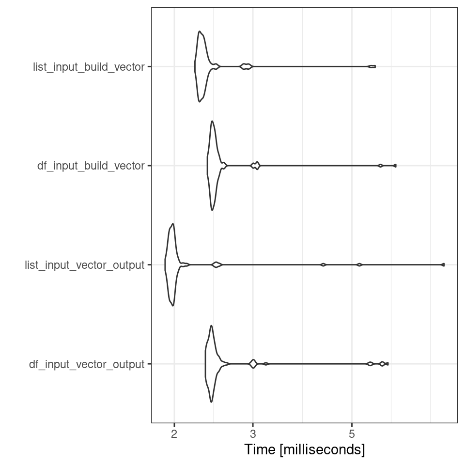

# (PART\*) Functional Programming {.unnumbered}

# Writing Functions


Good simple intro: https://github.com/tomjemmett/nhs-r_conf_21-fp_workshop

https://www.earthdatascience.org/courses/earth-analytics/automate-science-workflows/write-efficient-code-for-science-r/

https://bookdown.org/rdpeng/rprogdatascience/control-structures.html

## Structuring a function

R makes it easy to create user defined functions by using `function()`. Here is how it works:


```r
# this is an example function
my_function_name <- function(my_args) {
  # document your function here
  # what the function does
  # function inputs and outputs
  some_calculated_output <- (argument1 + argument2 )
  
  return(some_calculated_output)
}
```

* Give your function an object name and assign the function to it, e.g. `my_function_name <- function()`.

* Within the parentheses you specify inputs and arguments just like how pre-written functions work, e.g. `function(my_args)`.

* Next, put all the code you want your function to execute inside curly brackets like this: `function(my_args) {code to run}`

* Use `return()` to specify what you want to your function to output once it is done running the code.


### Activity: Understand the function

Here is a very simple function. Can you guess what it does?


```r
add_one <- function(x) {
  return(x + 1)
}
```


```r
add_one(10)
```

```
## [1] 11
```

What value did you get when running the function above? <input class='webex-solveme nospaces' size='2' data-answer='["11"]'/>

Now try applying your function to this vector:


```r
number_series <- c(1,5,10)
```

You should see it worked on *each element* inside the vector. This emphasises that R is a vector based language (it will by default apply functions on all elements in an object). 

## Function environments

When a function is evaluated, it creates it's own environment. All of the arguments that are passed to the function,
along with any variables created in the function are stored in this new environment.

The function's environment's parent will be the global environment, so we can see all of the variables created in the
global environment. Variables that are created in the function's environment aren't visible from the global environment
though.

If we reassign a variable in a function it will take a copy of that variable rather than mutating the value in the global environment. If we want to update `x` in the global environment we need to use the `<<-` operator.


```r
# x has a value of 1 in the global environment
x <- 1 

fn <- function(y) {
 # the value of x is copied from the global environment
 # but any changes remain only within the function environment
  x <- x * 2
  z <- x + y
  return(z)
}

fn(2)
x
```

```
## [1] 4
## [1] 1
```
<div class="panel panel-default"><div class="panel-heading"> Task </div><div class="panel-body"> 
create a function called `fahr_to_kelvin` that converts temperature values from degrees Fahrenheit to Kelvin.

The conversion is `temp_in_kelvin <- (temp_fahr - 32) * (5 / 9)) + 273.15`
 </div></div>

<button id="displayTextunnamed-chunk-8" onclick="javascript:toggle('unnamed-chunk-8');">Show Solution</button>

<div id="toggleTextunnamed-chunk-8" style="display: none"><div class="panel panel-default"><div class="panel-heading panel-heading1"> Solution </div><div class="panel-body">

```r
fahr_to_kelvin <- function(fahr) {
  # function that converts temperature in degrees Fahrenheit to kelvin
  # input: fahr: numeric value representing temp in degrees farh
  # output: kelvin: numeric converted temp in kelvin
  kelvin <- ((fahr - 32) * (5 / 9)) + 273.15
  return(kelvin)
}
```
</div></div></div>

The `return()` function can return only a single object. If we want to return multiple values in R, we can use a `list` (or other objects) and return it.

<div class="panel panel-default"><div class="panel-heading"> Task </div><div class="panel-body"> 

To convert temperature to Celsius from kelvin, you subtract 273.15 from the temperature value in kelvin. 
Write a function that performs this conversion and returns "both" kelvin and celsius.
 </div></div>


<button id="displayTextunnamed-chunk-10" onclick="javascript:toggle('unnamed-chunk-10');">Show Solution</button>

<div id="toggleTextunnamed-chunk-10" style="display: none"><div class="panel panel-default"><div class="panel-heading panel-heading1"> Solution </div><div class="panel-body">

```r
fahr_to_kelvin <- function(fahr) {
  # function that converts temperature in degrees Fahrenheit to kelvin
  # input: fahr: numeric value representing temp in degrees farh
  # output: kelvin: numeric converted temp in kelvin
  celsius <- ((fahr - 32) * (5 / 9))
  kelvin <- celsius +  + 273.15
  
  temps <- list(celsius, kelvin)
  names(temps) <- c("celsius", "kelvin")
  
  return(temps)
}
```
</div></div></div>

<div class="info">
<p>A general rule of thumb. If you end up repeating a line of code more
than three times in a script - you should write a function to do the
work instead. And write clear comments on its use!</p>
<p>Why?</p>
<p>It reduces the numbers of lines of code in your script, it reduces
the amount of repetition in the code, if you need to make changes you
can change the function without having to hunt through all of your
code.</p>
<p>A really good way to organise your functions is to organise them into
a separate script to the rest of your analysis. Write functions in a
separate script and use source(“scripts/functions.R”)</p>
</div>

### Argument defaults

This is an example of a very simple function that just prints the string "Hello World" whenever you type the function `say_hello()`


```r
say_hello <- function(){
  paste("Hello World") 
}

say_hello()
```

```
## [1] "Hello World"
```

### Activity: Understanding arguments

<div class="panel panel-default"><div class="panel-heading"> Task </div><div class="panel-body"> 
What happens when you try to put something in the brackets when **using** this function?
  
e.g. say_hello("Phil")
 </div></div>

<button id="displayTextunnamed-chunk-14" onclick="javascript:toggle('unnamed-chunk-14');">Show Solution</button>

<div id="toggleTextunnamed-chunk-14" style="display: none"><div class="panel panel-default"><div class="panel-heading panel-heading1"> Solution </div><div class="panel-body">
Error in say_hello( or something similar, this function has not been set with any arguments, therefore it doesn't know what to do with any values provided to it. </div></div></div>

Now lets try a similar function, but we include an argument:


```r
say_morning <- function(x){
  paste("Good morning", x)
}

#  what about this one?
say_morning("Phil")
```

```
## [1] "Good morning Phil"
```

<div class="panel panel-default"><div class="panel-heading"> Task </div><div class="panel-body"> 
What happens when you DO NOT put something in the brackets when using this function? </div></div>

<button id="displayTextunnamed-chunk-17" onclick="javascript:toggle('unnamed-chunk-17');">Show Solution</button>

<div id="toggleTextunnamed-chunk-17" style="display: none"><div class="panel panel-default"><div class="panel-heading panel-heading1"> Solution </div><div class="panel-body">

```r
Error in paste("Good morning", x) : 
  argument "x" is missing, with no default
```
</div></div></div>

So that was an example where we included an argument for our function. But now it requires a value be provided in order to work. 

#### Argument defaults

However, you are probably used to the idea that many functions have "default" values for arguments, and we can easily set these.


```r
say_morning_default <- function(name = "you"){
  paste("Good morning", name)
}

say_morning_default()
```

```
## [1] "Good morning you"
```

<div class="try">
<p>There is now a default value supplied to the argument, but this
should still be able to changed when running the function. Try it!</p>
</div>


## Documenting functions

https://www.earthdatascience.org/courses/earth-analytics/automate-science-workflows/write-efficient-code-for-science-r/

## Checking functions

Pure Functions:
A pure function is a concept in programming that describes a function with the following characteristics:

It always produces the same output for the same input.
It has no side effects, meaning it doesn't modify external state or variables.
It relies only on its input parameters to generate output.
In R, pure functions are essential for creating clean and predictable code. They are often used in functional programming to perform operations on data without causing unexpected side effects.

Mathematical Functions:
Mathematical functions are a specific type of pure function that perform mathematical operations on their input parameters. Examples of mathematical functions in R include sqrt(), log(), sin(), and cos(). These functions take one or more arguments and return a result based solely on those arguments, making them referentially transparent.

Referential Transparency:
Referential transparency is a property of pure functions and mathematical functions where the output of a function depends solely on its input, and there are no side effects. In other words, when you call a referentially transparent function with the same input, you will always get the same output. This property makes code easier to understand, test, and reason about.

In R, many built-in functions and packages adhere to referential transparency, making them reliable and predictable for data manipulation and analysis tasks.


```r
library(testthat)

triangle_number <- function(x) {
    0.5 * x * (x + 1)
}
test_that("it works as expected", {
    expect_equal(triangle_number(1),  1)  
    expect_equal(triangle_number(2),  3)  
    expect_equal(triangle_number(3),  6)  
    expect_equal(triangle_number(4), 10)  
    expect_equal(triangle_number(5), 15)  
})
```


```r
test_that("it works as expected", {
    expect_equal(fahr_to_kelvin(92), 306.483, tolerance=1e-2)  
   
})
```


# Flow control

https://modern-rstats.eu/defining-your-own-functions.html#control-flow

https://bookdown.org/rdpeng/rprogdatascience/control-structures.html

Imagine you want a variable to be equal to a certain value if a condition is met. This is a typical problem that requires the `if` and `else` construct. For instance:


```r
a <- 4
b <- 5
```


```r
if (a > b) {
  f <- 20
    } else {
  f <- 10
}

f
```

```
## [1] 10
```

Another way to achieve this is by using the `ifelse()` function:


```r
f <- ifelse(a > b, 20, 10)
f
```

```
## [1] 10
```

`if` and `else` might seem interchangeable with `ifelse()`, but they’re not. `ifelse()` is vectorized. Let’s try the following:


```r
ifelse(c(1,2,4) > c(3, 1, 0), "yes", "no")
```

```
## [1] "no"  "yes" "yes"
```
Trying to attempt the same with `if` and `else` will result in an error as only the first element can be evaluated


```r
if (c(1, 2, 4) > c(3, 1, 0)) print("yes") else print("no")
```

```
Error in if (c(1, 2, 4) > c(3, 1, 0)) print("yes") else print("no") : 
  the condition has length > 1

```

The work around for this would to be use a loop, so that each element along the vector can be evaluated in turn. We will revisit loops shortly. 


```r
vector1 <- c(1, 2, 4)
vector2 <- c(3, 1, 0)

result <- character(length(vector1))  # Create an empty character vector to store the results

for (i in 1:length(vector1)) {
  if (vector1[i] > vector2[i]) {
    result[i] <- "yes"
  } else {
    result[i] <- "no"
  }
}

print(result)
```

```
## [1] "no"  "yes" "yes"
```
### `case_when`

`case_when` is a powerful `tidyverse` function in R that serves as an extension of `if_else`, providing a flexible way to create conditional transformations on multiple values within a dataset. While `if_else` is primarily used for a single condition, `case_when` is designed to handle multiple conditions and allows you to assign specific values or perform operations based on these conditions.

Here's a simple introduction to case_when as an extension of `if_else`:

Imagine you have a dataset with a column called "temperature," and you want to create a new column called "weather" based on different temperature ranges. With if_else, you might write something like this:


```r
temperature <-  c(10, 25, 5, 30, 15)

ifelse(temperature < 10, "Cold",
        ifelse(temperature >= 10 & temperature < 25, "Moderate", "Hot"))
```

```
## [1] "Moderate" "Hot"      "Cold"     "Hot"      "Moderate"
```


```r
case_when(
    temperature < 10 ~ "Cold",
    temperature >= 10 & temperature < 25 ~ "Moderate",
    temperature >= 25 ~ "Hot"
  )
```

```
## [1] "Moderate" "Hot"      "Cold"     "Hot"      "Moderate"
```

## Conditional functions

Let's make a function that reports p-values in APA format (with "p = [rounded value]" when p >= .001 and "p < .001" when p < .001).

You can add a default value to any argument. If that argument is skipped, then the function uses the default argument.

First we could make a function that rounds any value to three digits.


```r
report_p <- function(p, digits = 3) {
      roundp <- round(p, digits)
    reported <-  paste("p =", roundp)
    
    return(reported)
}
```

But we would like this to have a conditional response as well: so we need an `if` `else` statement.


```r
 report_p <- function(p, digits = 3) {
     reported <- if(p < 0.001){
             "p < 0.001"} else{
             paste("p =", round(p, digits))}
             
     
     return(reported)
 }
```

However we soon hit our first problem, this function works well when provided a single numeric value, but when applied to a vector or a dataframe we encounter an error:


```r
x <- c(0,0.05,0.3,0.4)

report_p(x)
```
```
Error in if (p < 0.001) { : the condition has length > 1
```

In R, conditional statements are not vector operations. They deal only with a single value. If you pass in, for example, a vector, the `if` statement will only check the very first element and issue a warning. The solution to this is the `ifelse()` or the tidyverse equivalent `if_else()` function

<div class="tab"><button class="tablinks= T active" onclick="javascript:openCode(event, 'option1= T', '= T');">Base R</button><button class="tablinks= T" onclick="javascript:openCode(event, 'option2= T', '= T');"><tt>tidyverse</tt></button></div><div id="option1= T" class="tabcontent= T">

```r
 report_p <- function(p, digits = 3) {
     reported <- ifelse(p < 0.001,
             "p < 0.001",
             paste("p =", round(p, digits)))
     
     return(reported)
 }
```
</div><div id="option2= T" class="tabcontent= T">

```r
 report_p <- function(p, digits = 3) {
     reported <- if_else(p < 0.001,
             "p < 0.001",
             paste("p =", round(p, digits)))
     
     return(reported)
 }
```
</div><script> javascript:hide('option2= T') </script>

https://stackoverflow.com/questions/50646133/dplyr-if-else-vs-base-r-ifelse


## Warnings and errors

<div class="try">
<p>What happens when omit an argument for p, set the value to 1.5 or a
character “a”?</p>
</div>

Sometimes the function will not run, in the first example because we did not provide an argument default. 

For `p = 1.5` it probably *shouldn't* run (p = 1.5 makes no sense), but it does! 

For `p = "a"` there is a warning but perhaps not a very intuitive one. 

We can make our own custom/specific warnings, try this and run it with the arguments above again! 


<button id="displayTextunnamed-chunk-35" onclick="javascript:toggle('unnamed-chunk-35');">Show Solution</button>

<div id="toggleTextunnamed-chunk-35" style="display: none"><div class="panel panel-default"><div class="panel-heading panel-heading1"> Solution </div><div class="panel-body"><div class="tab"><button class="tablinksunnamed-chunk-35 active" onclick="javascript:openCode(event, 'option1unnamed-chunk-35', 'unnamed-chunk-35');">Base R</button><button class="tablinksunnamed-chunk-35" onclick="javascript:openCode(event, 'option2unnamed-chunk-35', 'unnamed-chunk-35');"><tt>tidyverse</tt></button></div><div id="option1unnamed-chunk-35" class="tabcontentunnamed-chunk-35">

```r
 report_p <- function(p, digits = 3) {
   
  if (!is.numeric(p)) stop("p must be a number")
  if (p <= 0) warning("p-values cannot less 0")
  if (p >= 1) warning("p-values cannot be greater than 1")
   
     reported <- ifelse(p < 0.001,
             "p < 0.001",
             paste("p =", round(p, digits)))
     return(reported)
 }
```
 </div><div id="option2unnamed-chunk-35" class="tabcontentunnamed-chunk-35">
 
 
 ```r
 report_p <- function(p, digits = 3) {
  
  if (!is.numeric(p)) stop("p must be a number")
  
    result <- case_when(
        p <= 0 ~ warning("p-values cannot be less than or equal to 0"),
        p >= 1 ~ warning("p-values cannot be greater than or equal to 1"),
        p < 0.001 ~ "p < 0.001",
        TRUE ~ paste("p =", round(p, digits))
    )
    
    return(result)
 }
 ```
 </div><script> javascript:hide('option2unnamed-chunk-35') </script></div></div></div>

# Simple iteration

We’ve seen how to write a function and how they can be used to create concise re-usable operations that can be applied multiple times in a script without having to copy and paste, but where functions really come into their own is when combined with iteration. Iteration is the process of running the same operation on a group of objects, further minimising code replication. 

Functional programming in R requires a good understanding of the types of data structure available in R. So make sure you remember the distinctions between vectors, lists, matrices and dataframes.

In the section below we will start with simple functions that allow you to replicate arguments

## `rep()`

The function `rep()` lets you repeat the first argument a set number of times.


```r
rep(1:5, 5)

rep(c("Adelie", "Gentoo", "Chinstrap"), 2)
```

```
##  [1] 1 2 3 4 5 1 2 3 4 5 1 2 3 4 5 1 2 3 4 5 1 2 3 4 5
## [1] "Adelie"    "Gentoo"    "Chinstrap" "Adelie"    "Gentoo"    "Chinstrap"
```

The default for the amount of repetition is `times = ` it will print the entire vector start to finish THEN repeat.

If the second argument is a vector with the same number of elements as the *first* vector, then it will repeat to the specified values for each


```r
rep(c("Adelie", "Gentoo", "Chinstrap"), c(2, 1, 3))
```

```
## [1] "Adelie"    "Adelie"    "Gentoo"    "Chinstrap" "Chinstrap" "Chinstrap"
```

Or if you use the argument `each` then it will rep all of the first element *first* followed by the second etc.


```r
rep(c("Adelie", "Gentoo", "Chinstrap"), each = 3)
```

```
## [1] "Adelie"    "Adelie"    "Adelie"    "Gentoo"    "Gentoo"    "Gentoo"   
## [7] "Chinstrap" "Chinstrap" "Chinstrap"
```
What do you think will happen if you set both times to 3 and each to 2?


```r
rep(c("Adelie", "Gentoo", "Chinstrap"), times = 2, each = 3)
```

<button id="displayTextunnamed-chunk-40" onclick="javascript:toggle('unnamed-chunk-40');">Show Solution</button>

<div id="toggleTextunnamed-chunk-40" style="display: none"><div class="panel panel-default"><div class="panel-heading panel-heading1"> Solution </div><div class="panel-body">

```
##  [1] "Adelie"    "Adelie"    "Adelie"    "Gentoo"    "Gentoo"    "Gentoo"   
##  [7] "Chinstrap" "Chinstrap" "Chinstrap" "Adelie"    "Adelie"    "Adelie"   
## [13] "Gentoo"    "Gentoo"    "Gentoo"    "Chinstrap" "Chinstrap" "Chinstrap"
```
</div></div></div>


## `seq()`

The function `seq()` is useful for generating a sequence of numbers with some pattern.

Use `seq()` to create a vector of the integers 0 to 10.


```r
seq(1,5)
```

```
## [1] 1 2 3 4 5
```

This is initially very similar to just making a vector with


```r
c(1:5)
```

```
## [1] 1 2 3 4 5
```

But with `seq` we have extra functions. You can set the by argument to count by numbers other than 1 (the default). Use `seq()` to create a vector of the numbers 0 to 100 by 10s.


```r
seq(0, 100, by = 10)
```

```
##  [1]   0  10  20  30  40  50  60  70  80  90 100
```


We also have the argument `length.out`, which is useful when you want to know how to many steps to divide something into


```r
seq(0, 100, length.out = 12)
```

```
##  [1]   0.000000   9.090909  18.181818  27.272727  36.363636  45.454545
##  [7]  54.545455  63.636364  72.727273  81.818182  90.909091 100.000000
```

## `replicate()`

Replicate is our first example of a function whose purpose is to iterate *other* functions

For example the `rnorm` function generates numbers from a normal distribution.

Nesting this inside the `replicate()` function will repeat this command a specified number of times


```r
replicate(3, # times to replicate function
          expr = rnorm(n = 5, 
                       mean = 1,
                       sd = 1))
```

```
##           [,1]        [,2]       [,3]
## [1,] 2.0611144 0.902437937 0.02681445
## [2,] 1.9003966 2.251919814 0.72799526
## [3,] 1.8065826 0.399924333 0.07557000
## [4,] 1.5916858 0.443708691 2.52711637
## [5,] 0.6725266 0.002541474 1.88886075
```

https://www.r-bloggers.com/2023/07/the-replicate-function-in-r/

# Loops

Loops are one of the staples of all programming languages, not just R, and can be a powerful tool; though we will see later there are a suite of alternative to loops in R. 

For loops make it possible to repeat a set of instructions i times. For example, try the following:


```r
for (i in 1:5){
  print("hello")
}
```

```
## [1] "hello"
## [1] "hello"
## [1] "hello"
## [1] "hello"
## [1] "hello"
```

Or


```r
for (i in 1:3) {
  print(i+1)
}
```

```
## [1] 2
## [1] 3
## [1] 4
```

This is a dynamic piece of code where an index 'i' is iteratively replaced by each value in the vector 1:5. 

Let's break it down. Since the first value in our sequence (1:3) is 1, the loop begins by substituting 'i' with 1 and executing everything within the curly braces {1+1}. Loops conventionally use 'i' as the counter, which is short for iteration. However, you are free to use any variable name you prefer:

so the first loop is essentially: 

```
i <- 1 + 1
print(i)

```

Once this first iteration is complete, it loops back to the beginning and replaces i with the next value in our 1:3 sequence (2 in this case):

```
i <- 2 + 1
print(i)

```

This process is then repeated until the loop reaches the final value in the sequence 

```
for (i in 1:3) { # the SEQUENCE is defined (numbers 1 to 5) and loop is opened with "{"
  print(i + 1)    # The OPERATIONS (add 1 to each sequence number and print)
}                            # The loop is closed with "}"

```

## Functions in for loops

Whilst above we have been using simple addition in the body of the loop, you can also combine loops with functions.


```r
# Define a function to calculate the square of a number
square <- function(x) {
  return(x * x)
}

# Use a for loop to calculate and print the squares of numbers from 1 to 5
for (num in 1:5) { # Here I have replace i with num
  result <- square(num)
  cat("The square of", num, "is", result, "\n")
}
```

```
## The square of 1 is 1 
## The square of 2 is 4 
## The square of 3 is 9 
## The square of 4 is 16 
## The square of 5 is 25
```

## For loops in dataframes

Let's create a somewhat more intricate function. Initially, we generate a new tibble by creating four vectors, each consisting of 10 randomly generated numbers. These numbers are designed to be approximately centered around a mean of 0 with a standard deviation of 1. Afterward, we combine these vectors to form the final tibble.


```r
set.seed(1234)

# a simple tibble
df <- tibble(
  a =  rnorm(10),
  b =  rnorm(10),
  c =  rnorm(10),
  d = rnorm(10),
  e = rnorm(10),
  f = rnorm(10),
  g = rnorm(10),
  h = rnorm(10),
)

df
```

<div class="kable-table">

|          a|          b|          c|          d|          e|          f|          g|          h|
|----------:|----------:|----------:|----------:|----------:|----------:|----------:|----------:|
| -1.2070657| -0.4771927|  0.1340882|  1.1022975|  1.4494963| -1.8060313|  0.6565885|  0.0068928|
|  0.2774292| -0.9983864| -0.4906859| -0.4755931| -1.0686427| -0.5820759|  2.5489911| -0.4554687|
|  1.0844412| -0.7762539| -0.4405479| -0.7094400| -0.8553646| -1.1088896| -0.0347604| -0.3665239|
| -2.3456977|  0.0644588|  0.4595894| -0.5012581| -0.2806230| -1.0149620| -0.6696336|  0.6482866|
|  0.4291247|  0.9594941| -0.6937202| -1.6290935| -0.9943401| -0.1623095| -0.0076048|  2.0702709|
|  0.5060559| -0.1102855| -1.4482049| -1.1676193| -0.9685143|  0.5630558|  1.7770844| -0.1533984|
| -0.5747400| -0.5110095|  0.5747557| -2.1800396| -1.1073182|  1.6478175| -1.1386077| -1.3907009|
| -0.5466319| -0.9111954| -1.0236557| -1.3409932| -1.2519859| -0.7733534|  1.3678272| -0.7235818|
| -0.5644520| -0.8371717| -0.0151383| -0.2942939| -0.5238281|  1.6059096|  1.3295648|  0.2582618|
| -0.8900378|  2.4158352| -0.9359486| -0.4658975| -0.4968500| -1.1578085|  0.3364728| -0.3170591|

</div>

Each vector is randomly generated so the actual averages will be slightly different, we can test that here:


```r
mean(df$a)

mean(df$b)

mean(df$c)

mean(df$d)
```

```
## [1] -0.3831574
## [1] -0.1181707
## [1] -0.3879468
## [1] -0.7661931
```

So the above code works, but it is repetitive, applying the same function again and again.

Below we have a simple for loop:


```r
#1. Having a predefined empty vector to receive the values is good practice, we will see why a bit later

output <- vector("double", ncol(df)) # this will have four empty elements the same as the number of columns for the dataframe. The vector is set to receive numeric data
```

Now we run our loop: 


```r
for (i in 1:ncol(df)) {            # 2. sequence - determines what to loop over 
  
  output[[i]] <- mean(df[[i]])      # 3. body - each time the loop runs it allocates a value to output, 
}
output
```

```
## [1] -0.38315741 -0.11817071 -0.38794682 -0.76619306 -0.60979706 -0.27886474
## [7]  0.61659223 -0.04230209
```

Each time the mean is calculate for one column in df this is then stored as an element in the previously empty output vector.

`for()` loops are very useful for quickly iterating over a list, but because R prefers to store everything as a new object with each loop iteration, loops can become quite slow if they are complex, or running many processes and many iterations.


## Speed

### Initialise objects

Pre-allocating the output with the appropriate length before the loop avoids reallocation of memory inside the loop, which can be inefficient for large data. For example:


```r
output2 <- NULL

microbenchmark::microbenchmark(
  for (i in 1:ncol(df)){             
  
  output2 <- c(output2, mean(df[[i]])) # each new calculation is concatenated onto the end of the growing vector
}
)
output2 # note because we did not predefine our vector length it continues to grow! 
```

| |Built inside loop|pre-initialised vector|
|-----|-----|-----|
|min|2.41ms	| 2.37ms|
|max|	9.73ms|8.99ms|
|mean|	2.71ms|2.72 ms|
|median|	2.56ms|2.49ms|


### simple datatypes


```r
df_list <- as.list(df)


microbenchmark::microbenchmark( # check average processing time
for (i in length(df_list)) {           
  
  output[[i]] <- mean(df_list[[i]])      
}
)
```

Depending on your own computer processing power you may get different results - but here

| |List|Tibble|
|-----|-----|-----|
|min|1.92ms	| 2.37ms|
|max|	8.49ms|8.99ms|
|mean|	2.07ms|2.72 ms|
|median|	1.99ms|2.49ms|

### Visualise speed

The `microbenchmark` package has some other useful features including the ability to run multiple functions for comparison simultaneously and with integration with ggplot2 we can plot these results


```r
output_vector <- vector("double", ncol(df))
output_list <- vector(mode = "list", length = ncol(df))
new_output_vector <- NULL
new_output_vector2 <- NULL


mbm <- microbenchmark::microbenchmark(
df_input_vector_output = for (i in 1:ncol(df)) {
  output_vector[[i]] <- mean(df[[i]]) 
}, 
list_input_vector_output = for (i in length(df_list)) {           
    output_vector[[i]] <- mean(df_list[[i]])      
}, 
df_input_build_vector =  for (i in 1:ncol(df)){             
    
    new_output_vector <- c(new_output_vector, mean(df[[i]])) # each new calculation is concatenated onto the end of the growing vector
}, 
list_input_build_vector = for (i in 1:length(df_list)){             
    
   new_output_vector2 <- c(new_output_vector2, mean(df[[i]])) # each new calculation is concatenated onto the end of the growing vector
}
)

mbm
```

<div class="kable-table">

|expr                     |    time|
|:------------------------|-------:|
|df_input_vector_output   | 3207650|
|df_input_vector_output   | 2619020|
|list_input_vector_output | 4313560|
|list_input_build_vector  | 2366080|
|list_input_vector_output | 2044229|
|df_input_build_vector    | 2415340|
|list_input_vector_output | 2080040|
|df_input_build_vector    | 2477000|
|df_input_build_vector    | 2513980|
|list_input_vector_output | 2134001|
|list_input_vector_output | 2024210|
|df_input_build_vector    | 2594140|
|df_input_build_vector    | 2578260|
|df_input_build_vector    | 2450460|
|list_input_build_vector  | 2432170|
|df_input_build_vector    | 3070580|
|df_input_build_vector    | 3011750|
|list_input_vector_output | 2524730|
|list_input_vector_output | 2491250|
|df_input_build_vector    | 3067710|
|list_input_build_vector  | 2950230|
|list_input_vector_output | 2479970|
|df_input_vector_output   | 3025120|
|list_input_build_vector  | 2932120|
|df_input_build_vector    | 3063850|
|list_input_build_vector  | 2875750|
|df_input_vector_output   | 2996600|
|df_input_vector_output   | 3016760|
|list_input_build_vector  | 2854530|
|list_input_build_vector  | 2916060|
|df_input_build_vector    | 3000180|
|list_input_vector_output | 2456100|
|list_input_build_vector  | 2853820|
|df_input_vector_output   | 2978080|
|df_input_vector_output   | 3007540|
|df_input_build_vector    | 6271440|
|df_input_vector_output   | 2387680|
|df_input_build_vector    | 2434230|
|list_input_vector_output | 1945690|
|list_input_vector_output | 1995310|
|list_input_vector_output | 1928050|
|df_input_vector_output   | 2395960|
|df_input_vector_output   | 2406590|
|list_input_build_vector  | 2241480|
|df_input_vector_output   | 2576530|
|list_input_build_vector  | 2262680|
|list_input_build_vector  | 2284290|
|df_input_vector_output   | 2472560|
|df_input_vector_output   | 2356070|
|df_input_build_vector    | 2432840|
|df_input_build_vector    | 2375570|
|df_input_build_vector    | 2446120|
|list_input_vector_output | 1943700|
|list_input_vector_output | 1968970|
|list_input_vector_output | 1913360|
|list_input_vector_output | 1950140|
|df_input_build_vector    | 2401600|
|list_input_build_vector  | 2263669|
|df_input_build_vector    | 2448280|
|list_input_vector_output | 1972471|
|df_input_build_vector    | 2422289|
|df_input_vector_output   | 2374510|
|list_input_build_vector  | 2324130|
|df_input_build_vector    | 2431630|
|df_input_vector_output   | 2358890|
|df_input_build_vector    | 2425260|
|df_input_build_vector    | 2375260|
|list_input_vector_output | 1991770|
|list_input_build_vector  | 2224370|
|df_input_build_vector    | 2448080|
|df_input_build_vector    | 2433690|
|list_input_vector_output | 8040690|
|list_input_build_vector  | 2260110|
|df_input_vector_output   | 2419950|
|list_input_build_vector  | 2265870|
|list_input_vector_output | 1973570|
|list_input_build_vector  | 2372790|
|df_input_build_vector    | 2568870|
|df_input_vector_output   | 2472520|
|list_input_build_vector  | 2373980|
|df_input_vector_output   | 2477400|
|list_input_vector_output | 1925820|
|df_input_build_vector    | 2423631|
|df_input_build_vector    | 2461689|
|list_input_build_vector  | 2247489|
|df_input_build_vector    | 2510291|
|df_input_build_vector    | 2453880|
|df_input_build_vector    | 2479080|
|df_input_vector_output   | 2517640|
|list_input_vector_output | 1978330|
|list_input_build_vector  | 2355060|
|df_input_vector_output   | 2413780|
|list_input_build_vector  | 2339870|
|df_input_vector_output   | 2450470|
|df_input_build_vector    | 2423800|
|df_input_vector_output   | 2461430|
|list_input_vector_output | 1991510|
|df_input_vector_output   | 2512270|
|list_input_build_vector  | 2330220|
|list_input_vector_output | 2042490|
|df_input_build_vector    | 2485890|
|list_input_vector_output | 2002120|
|df_input_vector_output   | 2435130|
|df_input_vector_output   | 2430060|
|list_input_vector_output | 1993680|
|list_input_vector_output | 1930020|
|df_input_build_vector    | 2466500|
|list_input_build_vector  | 5515820|
|list_input_build_vector  | 2304330|
|list_input_build_vector  | 2338841|
|df_input_build_vector    | 2402129|
|list_input_vector_output | 1995780|
|df_input_vector_output   | 2360740|
|list_input_vector_output | 1995120|
|list_input_vector_output | 1918629|
|list_input_build_vector  | 2411831|
|df_input_build_vector    | 2442320|
|df_input_vector_output   | 2410780|
|list_input_vector_output | 1933760|
|list_input_vector_output | 1959470|
|df_input_build_vector    | 2459860|
|df_input_build_vector    | 2386510|
|list_input_build_vector  | 2284890|
|df_input_build_vector    | 2397110|
|list_input_vector_output | 2101860|
|df_input_vector_output   | 2428730|
|df_input_build_vector    | 2454070|
|df_input_build_vector    | 2464110|
|df_input_build_vector    | 2404140|
|list_input_build_vector  | 2312410|
|list_input_vector_output | 1954390|
|list_input_build_vector  | 2351630|
|list_input_vector_output | 2000230|
|df_input_vector_output   | 2426750|
|list_input_vector_output | 1985820|
|list_input_build_vector  | 2267520|
|list_input_vector_output | 2016650|
|list_input_build_vector  | 2263970|
|df_input_vector_output   | 2470370|
|list_input_vector_output | 1982350|
|df_input_build_vector    | 2470720|
|df_input_vector_output   | 2463211|
|df_input_build_vector    | 2476340|
|df_input_vector_output   | 5849651|
|df_input_build_vector    | 2405840|
|df_input_build_vector    | 2464660|
|df_input_build_vector    | 2418860|
|list_input_vector_output | 1990130|
|list_input_vector_output | 1947930|
|list_input_vector_output | 1993130|
|list_input_vector_output | 1918770|
|df_input_vector_output   | 2512440|
|df_input_build_vector    | 2527450|
|df_input_vector_output   | 2400210|
|list_input_build_vector  | 2293900|
|list_input_vector_output | 2000320|
|df_input_build_vector    | 2452570|
|df_input_build_vector    | 2443590|
|list_input_build_vector  | 2262430|
|list_input_build_vector  | 2327250|
|df_input_vector_output   | 2354610|
|df_input_build_vector    | 2419600|
|df_input_build_vector    | 2473260|
|df_input_build_vector    | 2398290|
|list_input_build_vector  | 2274210|
|df_input_build_vector    | 2372940|
|list_input_vector_output | 1977400|
|df_input_vector_output   | 2373761|
|df_input_build_vector    | 2433249|
|list_input_vector_output | 1952209|
|df_input_vector_output   | 2385500|
|list_input_vector_output | 1978120|
|list_input_build_vector  | 2257041|
|df_input_build_vector    | 2424360|
|df_input_build_vector    | 2371510|
|list_input_vector_output | 1968340|
|list_input_vector_output | 1906940|
|df_input_build_vector    | 2427860|
|df_input_vector_output   | 5522800|
|list_input_build_vector  | 2368960|
|df_input_build_vector    | 2443600|
|list_input_vector_output | 1960490|
|list_input_vector_output | 1945120|
|df_input_vector_output   | 2472240|
|list_input_vector_output | 1985070|
|list_input_build_vector  | 2268520|
|df_input_vector_output   | 2426140|
|list_input_vector_output | 2035120|
|df_input_build_vector    | 2503860|
|df_input_build_vector    | 2428850|
|list_input_vector_output | 1943610|
|list_input_vector_output | 1967440|
|df_input_build_vector    | 2416800|
|list_input_build_vector  | 2283980|
|df_input_build_vector    | 2404370|
|list_input_build_vector  | 2290660|
|list_input_build_vector  | 2256791|
|list_input_build_vector  | 2279700|
|list_input_build_vector  | 2283140|
|list_input_build_vector  | 2256640|
|list_input_build_vector  | 2301549|
|df_input_vector_output   | 2369450|
|df_input_vector_output   | 2421750|
|list_input_vector_output | 1945150|
|df_input_vector_output   | 2413520|
|list_input_vector_output | 1969230|
|list_input_build_vector  | 2318400|
|df_input_vector_output   | 2406870|
|df_input_build_vector    | 2378250|
|list_input_build_vector  | 2356320|
|list_input_vector_output | 1957460|
|list_input_vector_output | 1960090|
|df_input_vector_output   | 2347560|
|list_input_build_vector  | 2302600|
|df_input_build_vector    | 2424170|
|df_input_vector_output   | 5470190|
|df_input_build_vector    | 2424320|
|df_input_vector_output   | 2381940|
|df_input_build_vector    | 2481110|
|df_input_build_vector    | 2403960|
|list_input_build_vector  | 2320850|
|df_input_vector_output   | 2405800|
|df_input_build_vector    | 2457770|
|df_input_vector_output   | 2533181|
|df_input_build_vector    | 2419640|
|df_input_vector_output   | 2442380|
|list_input_vector_output | 1999040|
|list_input_build_vector  | 2269229|
|list_input_vector_output | 1988981|
|list_input_build_vector  | 2264290|
|list_input_build_vector  | 2339620|
|list_input_build_vector  | 2271400|
|list_input_build_vector  | 2336100|
|list_input_vector_output | 1938490|
|df_input_build_vector    | 2462350|
|list_input_vector_output | 1949390|
|list_input_build_vector  | 2294280|
|list_input_build_vector  | 2327570|
|list_input_vector_output | 1948790|
|df_input_build_vector    | 2477690|
|list_input_build_vector  | 2266360|
|list_input_vector_output | 1999500|
|df_input_vector_output   | 2368120|
|list_input_vector_output | 1993960|
|df_input_build_vector    | 2437020|
|list_input_vector_output | 1940670|
|list_input_vector_output | 1943900|
|df_input_build_vector    | 2440420|
|df_input_build_vector    | 2513110|
|list_input_vector_output | 1955860|
|list_input_vector_output | 1977510|
|df_input_build_vector    | 5794470|
|list_input_build_vector  | 2345471|
|list_input_build_vector  | 2266469|
|df_input_vector_output   | 2435940|
|df_input_build_vector    | 2458349|
|df_input_build_vector    | 2423620|
|list_input_build_vector  | 2327990|
|df_input_build_vector    | 2420050|
|list_input_build_vector  | 2465220|
|list_input_build_vector  | 2365700|
|df_input_vector_output   | 2359430|
|df_input_build_vector    | 2502690|
|list_input_vector_output | 1975190|
|df_input_vector_output   | 2447080|
|df_input_vector_output   | 2402180|
|list_input_build_vector  | 2321530|
|list_input_vector_output | 1988750|
|df_input_build_vector    | 2451060|
|df_input_vector_output   | 2453960|
|list_input_vector_output | 1966030|
|list_input_build_vector  | 2359220|
|list_input_build_vector  | 2286230|
|list_input_build_vector  | 2339210|
|list_input_build_vector  | 2353280|
|df_input_vector_output   | 2413120|
|list_input_build_vector  | 2483950|
|df_input_vector_output   | 2421880|
|df_input_vector_output   | 2457280|
|df_input_vector_output   | 2452620|
|list_input_build_vector  | 2345271|
|list_input_build_vector  | 2330371|
|list_input_vector_output | 1952391|
|df_input_build_vector    | 2473171|
|list_input_build_vector  | 2292060|
|list_input_build_vector  | 2306151|
|df_input_vector_output   | 6023301|
|list_input_build_vector  | 2299880|
|list_input_build_vector  | 2391800|
|df_input_build_vector    | 2446680|
|list_input_vector_output | 2015150|
|list_input_vector_output | 1947080|
|list_input_build_vector  | 2322650|
|df_input_vector_output   | 2429410|
|df_input_build_vector    | 2525490|
|list_input_build_vector  | 2398980|
|df_input_vector_output   | 2517560|
|df_input_vector_output   | 2447190|
|df_input_build_vector    | 2510170|
|list_input_build_vector  | 2267800|
|list_input_vector_output | 2000340|
|df_input_vector_output   | 2372910|
|list_input_build_vector  | 2306480|
|df_input_build_vector    | 2411320|
|df_input_build_vector    | 2429800|
|df_input_vector_output   | 2419390|
|df_input_vector_output   | 2357310|
|df_input_vector_output   | 2420720|
|df_input_build_vector    | 2417549|
|df_input_vector_output   | 2457680|
|list_input_build_vector  | 2311200|
|list_input_build_vector  | 2261931|
|df_input_vector_output   | 2430389|
|list_input_vector_output | 1940650|
|list_input_build_vector  | 2311270|
|list_input_vector_output | 1990970|
|list_input_vector_output | 1993390|
|df_input_vector_output   | 2467270|
|df_input_build_vector    | 2489160|
|df_input_build_vector    | 2495500|
|list_input_vector_output | 1957660|
|df_input_vector_output   | 5845050|
|df_input_build_vector    | 2406090|
|list_input_vector_output | 1983340|
|df_input_build_vector    | 2411910|
|df_input_vector_output   | 2478600|
|list_input_vector_output | 2000200|
|df_input_build_vector    | 2426430|
|list_input_vector_output | 1997470|
|list_input_vector_output | 1964570|
|list_input_build_vector  | 2487170|
|list_input_vector_output | 2016160|
|list_input_build_vector  | 2312490|
|list_input_build_vector  | 2260800|
|list_input_vector_output | 2002880|
|df_input_vector_output   | 2403690|
|list_input_vector_output | 1952060|
|list_input_build_vector  | 2336271|
|df_input_vector_output   | 2508131|
|df_input_vector_output   | 2506980|
|df_input_vector_output   | 2380580|
|df_input_build_vector    | 2453741|
|list_input_build_vector  | 2319690|
|df_input_build_vector    | 2400250|
|df_input_vector_output   | 2412910|
|list_input_vector_output | 1939740|
|df_input_vector_output   | 2426980|
|df_input_vector_output   | 2423930|
|list_input_build_vector  | 2284580|
|list_input_build_vector  | 2305640|
|list_input_build_vector  | 2255400|
|list_input_vector_output | 1971780|
|df_input_vector_output   | 2425110|
|list_input_build_vector  | 2320680|
|df_input_build_vector    | 2480680|
|df_input_build_vector    | 2440250|
|df_input_vector_output   | 2430200|
|list_input_vector_output | 5197530|
|list_input_vector_output | 1982750|
|list_input_vector_output | 2038880|
|list_input_vector_output | 1976630|
|df_input_vector_output   | 2404110|
|df_input_build_vector    | 2473320|
|df_input_vector_output   | 2371180|
|list_input_build_vector  | 2302089|
|list_input_vector_output | 1931691|
|df_input_vector_output   | 2563131|
|df_input_build_vector    | 2533420|
|list_input_build_vector  | 2258109|
|list_input_build_vector  | 2313100|
|list_input_vector_output | 1963720|
|df_input_build_vector    | 2463470|
|df_input_build_vector    | 2479580|
|list_input_build_vector  | 2274450|
|df_input_vector_output   | 2442680|
|list_input_build_vector  | 2277560|
|df_input_vector_output   | 2430360|
|df_input_vector_output   | 2396200|
|list_input_build_vector  | 2264800|
|df_input_vector_output   | 2437680|
|df_input_vector_output   | 2467010|
|list_input_vector_output | 2017320|
|df_input_vector_output   | 2363900|
|df_input_vector_output   | 2416650|
|df_input_vector_output   | 2419330|
|list_input_build_vector  | 2278510|
|list_input_vector_output | 1984150|
|df_input_vector_output   | 2352880|
|df_input_vector_output   | 2413720|
|df_input_vector_output   | 2350500|
|list_input_build_vector  | 2275380|
|df_input_vector_output   | 2403150|
|df_input_vector_output   | 2370890|
|list_input_build_vector  | 5636711|
|list_input_vector_output | 1974651|
|list_input_build_vector  | 2328211|
|df_input_vector_output   | 2420190|
|list_input_vector_output | 2016380|
|df_input_vector_output   | 2396860|
|list_input_vector_output | 2014970|

</div>


```r
autoplot(mbm)
```




### Do as little as possible inside a loop

R is an interpreted language every thing you write inside a loop runs multiple times. The best thing you can do is to be parsimonious while writing code inside a loop. There are a number of steps that you can do to speed up a loop a bit more.

- Calculate results before the loop

- Initialize objects before the loop

- Iterate on as few numbers as possible

- Write as few functions inside a loop as possible

The main tip is to *Get out of loop* as quickly as possible.

See also https://bookdown.org/csgillespie/efficientR/programming.html#top-5-tips-for-efficient-programming


## Activity

# Apply

We can recreate the output from our loops in the previous chapter with the `apply` function in R. 

The apply functions can be an alternative to writing for loops. The general idea is to apply (or map) a function to each element of an object. For example, you can apply a function to each row or column of a matrix. 

Each function takes at least two arguments: an object and another function. The function is passed as an argument.

Every apply function has the dots, ..., argument that is used to pass on arguments to the function that is given as an argument.

Using apply functions when possible, can lead to shorter, more succinct R code. In this section, we will cover the three main functions, `apply()`, `lapply()`, and `sapply()`. 


- `lapply()`: Loop over a list and evaluate a function on each element

- `sapply()`: Same as lapply but try to simplify the result

- `apply()`: Apply a function over the margins of an array

It is (I think) important to not that the apply family is still looping - but the actual looping is done internally in C code for efficiency reasons. Apply functions are loops under the hood and they are meant for convenience not for speed.


## lapply

The `lapply()` function does the following simple series of operations:

it loops over a list, iterating over each element in that list

it applies a function to each element of the list (a function that you specify)

and returns a list (the l is for “list”).

We can see the operation of an `lapply()` function here:


```r
lapply(df_list, mean)
```

```
## $a
## [1] -0.3831574
## 
## $b
## [1] -0.1181707
## 
## $c
## [1] -0.3879468
## 
## $d
## [1] -0.7661931
## 
## $e
## [1] -0.6097971
## 
## $f
## [1] -0.2788647
## 
## $g
## [1] 0.6165922
## 
## $h
## [1] -0.04230209
```


```r
empty_list <- vector(mode = "list", length = length(df_list))

microbenchmark::microbenchmark(
 
  forloop = for (i in length(df_list)) {           
  
  empty_list[[i]] <- mean(df_list[[i]])      
  },
 apply = lapply(df_list, mean)
)
```

<div class="kable-table">

|expr    |    time|
|:-------|-------:|
|forloop | 2551510|
|forloop | 2047790|
|apply   |   34710|
|apply   |   26150|
|apply   |   24170|
|forloop | 2031510|
|apply   |   29360|
|apply   |   24130|
|forloop | 1961970|
|forloop | 1983200|
|forloop | 1910340|
|forloop | 1956540|
|forloop | 1957960|
|forloop | 1942270|
|apply   |   28700|
|forloop | 2010430|
|apply   |   32250|
|forloop | 2002680|
|forloop | 1999710|
|forloop | 2027240|
|forloop | 1987750|
|apply   |   32260|
|forloop | 2007180|
|apply   |   29410|
|forloop | 1937420|
|apply   |   29030|
|forloop | 2027530|
|forloop | 2327370|
|forloop | 2509380|
|forloop | 2604350|
|apply   |   37050|
|apply   |   37430|
|apply   |   31860|
|apply   |   32430|
|apply   |   43110|
|forloop | 2595990|
|apply   |   31800|
|forloop | 2548600|
|apply   |   37740|
|apply   |   35080|
|forloop | 2475470|
|forloop | 2598900|
|apply   |   37160|
|apply   |   32100|
|apply   |   32460|
|apply   |   31910|
|apply   |   35570|
|forloop | 2530470|
|forloop | 2460931|
|forloop | 2519869|
|apply   |   31969|
|forloop | 2501091|
|forloop | 2451080|
|forloop | 2536411|
|apply   |   49820|
|apply   |   29211|
|apply   |   33629|
|apply   |   32929|
|apply   |   34700|
|forloop | 2482970|
|forloop | 2474980|
|forloop | 2492660|
|apply   |   49390|
|forloop | 2444850|
|apply   |   39700|
|apply   |   28910|
|apply   |   37270|
|apply   |   29440|
|forloop | 2533460|
|forloop | 2703360|
|apply   |   41560|
|forloop | 2467420|
|apply   |   35200|
|forloop | 2531130|
|apply   |   44290|
|apply   |   29230|
|apply   |   35610|
|apply   |   28740|
|forloop | 2559300|
|forloop | 2468290|
|forloop | 2500970|
|forloop | 5448540|
|apply   |   30170|
|apply   |   24640|
|forloop | 1958320|
|apply   |   27810|
|apply   |   25090|
|apply   |   24310|
|forloop | 1911650|
|forloop | 1967860|
|forloop | 1957560|
|forloop | 1970680|
|apply   |   28160|
|apply   |   26850|
|forloop | 1880970|
|forloop | 1969720|
|forloop | 1952230|
|apply   |   27110|
|apply   |   24400|
|apply   |   24000|
|forloop | 1966010|
|forloop | 2011770|
|apply   |   30600|
|forloop | 2014580|
|apply   |   30220|
|forloop | 1906151|
|forloop | 1962620|
|apply   |   31620|
|apply   |   26091|
|apply   |   25611|
|forloop | 1914260|
|forloop | 1912989|
|forloop | 1879729|
|apply   |   28200|
|apply   |   26111|
|forloop | 1935180|
|apply   |   27400|
|forloop | 1887871|
|apply   |   28280|
|forloop | 1971680|
|forloop | 1937350|
|forloop | 1996970|
|forloop | 1951810|
|apply   |   28300|
|apply   |   25530|
|apply   |   24740|
|forloop | 1942900|
|forloop | 1890460|
|apply   |   47010|
|apply   |   30210|
|apply   |   25390|
|apply   |   25710|
|apply   |   26660|
|apply   |   24620|
|apply   |   24210|
|forloop | 1973880|
|apply   |   28800|
|apply   |   25380|
|forloop | 1943350|
|forloop | 1933880|
|apply   |   28380|
|forloop | 1903190|
|apply   |   28220|
|apply   |   24370|
|forloop | 1940870|
|apply   |   27420|
|apply   |   24180|
|forloop | 1885480|
|forloop | 1948960|
|apply   |   28870|
|apply   |   24700|
|apply   |   24470|
|forloop | 1895650|
|forloop | 1981900|
|apply   |   30620|
|forloop | 1885280|
|forloop | 1919660|
|apply   |   29500|
|apply   |   25450|
|apply   |   24560|
|forloop | 1896170|
|apply   |   28610|
|forloop | 1906700|
|forloop | 1924230|
|forloop | 1885130|
|apply   |   28470|
|forloop | 1971100|
|apply   |   28770|
|apply   |   24620|
|apply   |   27740|
|forloop | 8105770|
|forloop | 2147800|
|forloop | 1960631|
|forloop | 2011189|
|apply   |   29640|
|apply   |   24409|
|forloop | 1925771|
|apply   |   31769|
|apply   |   26100|
|forloop | 1947620|
|forloop | 1899560|
|forloop | 1874240|
|forloop | 1929080|
|apply   |   28570|
|forloop | 1891730|
|apply   |   28790|
|forloop | 2046190|
|forloop | 1952270|
|apply   |   28530|
|forloop | 1967710|
|apply   |   27310|
|forloop | 1875980|
|apply   |   27000|
|forloop | 1990810|
|forloop | 1897760|
|forloop | 1948710|
|apply   |   29300|
|forloop | 1941170|
|apply   |   28120|
|apply   |   27460|

</div>

Notice that here we are passing the `mean()` function as an argument to the `lapply()` function. Functions in R can be used this way and can be passed back and forth as arguments just like any other object. When you pass a function to another function, you do not need to include the open and closed parentheses.

## sapply

## apply


# Purrr

# Bonus: Simulation


Functional programming is an important concept, and it's great that you're dedicating a session to it. Covering loops, apply functions, and other functional programming principles will help participants write more efficient and concise code.

Good simple intro: https://github.com/tomjemmett/nhs-r_conf_21-fp_workshop

Wickham: 
https://dcl-prog.stanford.edu/

Intro to purrr: https://d-rug.github.io/images/20171026/20171023_DRUG_map_walk.html#1

Purrr and error work
https://github.com/luisDVA/physalia-gtmoR-course

https://www.r4epi.com/introduction-to-repeated-operations

Faster loops: https://bookdown.org/content/d1e53ac9-28ce-472f-bc2c-f499f18264a3/speedtips.html


Simulations: https://rstudio-education.github.io/hopr/

https://aosmith.rbind.io/2018/01/09/simulate-simulate-part1/#simulate-simulate-dance-to-the-music

https://aosmith.rbind.io/2019/07/22/automate-model-fitting-with-loops/

https://aosmith.rbind.io/2017/12/31/many-datasets/#list-all-files-to-read-in

