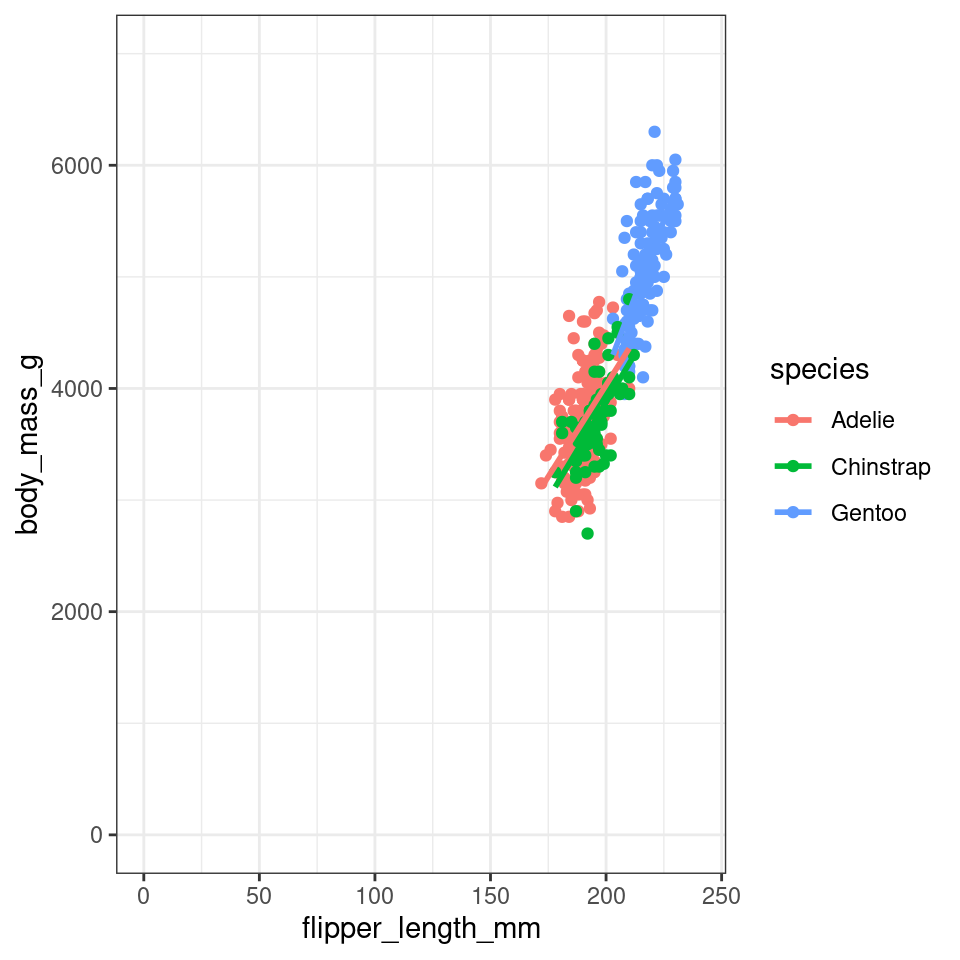
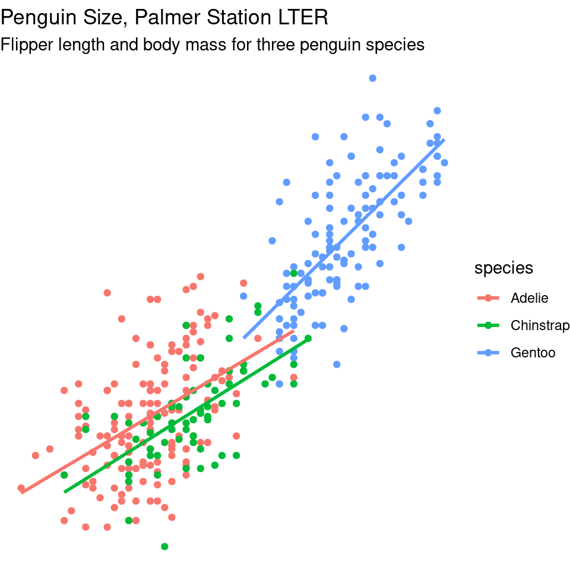
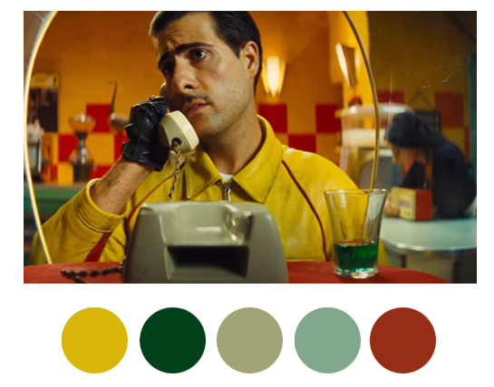
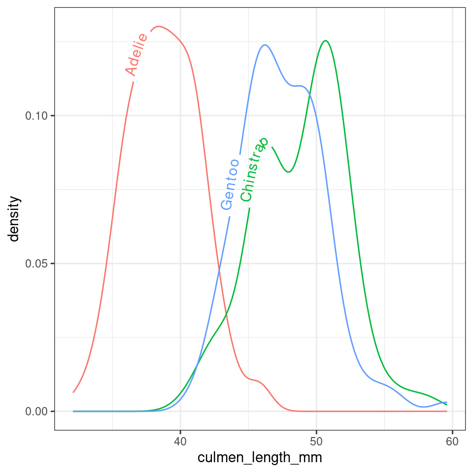

# (PART\*) Data Presentation {.unnumbered}

# Data visualisation with ggplot2


## Intro to grammar


The ggplot2 package is widely used and valued for its simple, consistent approach to making data visuals.

The 'grammar of graphics' relates to the different components of a plot that function like different parts of linguistic grammar. For example, all plots require axes, so the x and y axes form one part of the ‘language’ of a plot. Similarly, all plots have data represented between the axes, often as points, lines or bars. The visual way that the data is represented forms another component of the grammar of graphics. Furthermore, the colour, shape or size of points and lines can be used to encode additional information in the plot. This information is usually clarified in a key, or legend, which can also be considered part of this ‘grammar’.

The philosophy of ggplot is much better explained by the package author, Hadley Wickham (@R-ggplot2). For now, we just need to be aware that ggplots are constructed by specifying the different components that we want to display, based on underlying information in a data frame.

<div class="figure" style="text-align: center">

<p class="caption">(\#fig:ambitious-figure)An example of what we can produce in ggplot</p>
</div>

#### Before we start

You should have a workspace ready to work with the Palmer penguins data. Load this workspace now. 

Think about some basic checks before you start your work today.

#### Checklist


<div class="try">
<p>Today we are going to make a NEW R script in the same project space
as we have previously been working. This is part of organising our
workspace so that our analysis workflow is <a
href="#activity-1-organising-our-workspace">well documented and easy to
follow</a></p>
</div>

* Open a **new** R script - we are moving on from data wrangling to data visualisation

* Save this file **in the scripts folder** and call it `02_visualisation_penguins.R`

* Add the following to your script and run it:


```r
# LOAD R OBJECTS AND FUNCTIONS ----
source("scripts/01_import_penguins_data.R")
# import tidied penguins data and functions
#__________________________----
```

* You should find your Environment fills up with objects from script 1


<div class="info">
<p>The <code>source()</code> function is a very handy way of allowing
you to have different scripts for different parts of your R project, but
allow access to objects built elsewhere. In this way we are building our
analysis in stages.</p>
</div>

<div class="warning">
<p>The above command will ONLY work if you remembered to save and name
your script exactly as above AND put that script inside a subfolder
called scripts.</p>
<p>Does your project look like the one below?</p>
</div>


<div class="figure" style="text-align: center">

<p class="caption">(\#fig:unnamed-chunk-7)My neat project layout</p>
</div>

<div class="figure" style="text-align: center">

<p class="caption">(\#fig:unnamed-chunk-8)If you have sucessfully saved 02_visualisation_penguins.R it should be visible here too </p>
</div>

#### What if source isn't working?

If source isn't working, or you can't figure out your project set-up you can complete this worksheet if you put the following commands at the top of your script *instead* of `source("scripts/01_import_penguins_data.R")`


<div class='webex-solution'><button>Script adjustment</button>


```r
#___________________________----
# SET UP ----
## An analysis of the bill dimensions of male and female Adelie, Gentoo and Chinstrap penguins ----

### Data first published in  Gorman, KB, TD Williams, and WR Fraser. 2014. “Ecological Sexual Dimorphism and Environmental Variability Within a Community of Antarctic Penguins (Genus Pygoscelis).” PLos One 9 (3): e90081. https://doi.org/10.1371/journal.pone.0090081. ----
#__________________________----

# PACKAGES ----
library(tidyverse) # tidy data packages
library(janitor) # cleans variable names
library(lubridate) # make sure dates are processed properly
#__________________________----

# IMPORT DATA ----
penguins <- read_csv ("data/penguins_raw.csv")

penguins <- janitor::clean_names(penguins) # clean variable names
#__________________________----
```


</div>


## Building a plot

To start building the plot We are going to use the penguin data we have been working with previously. First we must specify the data frame that contains the relevant data for our plot. We can do this in two ways: 

1) Here we are ‘sending the penguins data set into the ggplot function’:


```r
# Building a ggplot step by step ----
## Render a plot background ----
penguins  |>  
  ggplot()
```

2) Here we are specifying the dataframe *within* the `ggplot()` function

The output is identical


```r
ggplot(data = penguins)
```


<div class="info">
<p>Running this command will produce an empty grey panel. This is
because we need to specify how different columns of the data frame
should be represented in the plot.</p>
</div>

### Aesthetics - `aes()`

We can call in different columns of data from any dataset based on their column names. Column names are given as ‘aesthetic’ elements to the ggplot function, and are wrapped in the aes() function.

Because we want a scatter plot, each point will have an x and a y coordinate. We want the x axis to represent flipper length ( x = flipper_length_mm ), and the y axis to represent the body mass ( y = body_mass_g ).

We give these specifications separated by a comma. Quotes are not required when giving variables within `aes()`.

<div class="info">
<p>Those interested in why quotes aren’t required can read about <a
href="https://edwinth.github.io/blog/nse/">non-standard
evaluation</a>.</p>
</div>


```r
## Set axes ----
penguins |> 
  ggplot(aes(x=flipper_length_mm, 
             y = body_mass_g))
```


So far we have the grid lines for our x and y axis. `ggplot()` knows the variables required for the plot, and thus the scale, but has no information about how to display the data points.

## Geometric representations - geom()

Given we want a scatter plot, we need to specify that the geometric representation of the data will be in point form, using geom_point(). [There are many geometric object types](https://ggplot2.tidyverse.org/reference/#geoms).

<div class="figure" style="text-align: center">

<p class="caption">(\#fig:img-objects-enviro)geom shapes</p>
</div>

Here we are adding a layer (hence the + sign) of points to the plot. We can think of this as similar to e.g. Adobe Photoshop which uses layers of images that can be reordered and modified individually. Because we add to plots layer by layer **the order** of your geoms may be important for your final aesthetic design. 

For ggplot, each layer will be added over the plot according to its position in the code. Below I first show the full breakdown of the components in a layer. Each layer requires information on

* data
* aesthetics
* geometric type
* any summary of the data
* position


```r
## Add a geom ----
penguins |> 
  ggplot(aes(x=flipper_length_mm, 
             y = body_mass_g))+
  layer(                # layer inherits data and aesthetic arguments from previous
    geom="point",       # draw point objects
    stat="identity",    # each individual data point gets a geom (no summaries)
    position=position_identity()) # data points are not moved in any way e.g. we could specify jitter or dodge if we want to avoid busy overlapping data
```

This is quite a complicate way to write new layers - and it is more usual to see a simpler more compact approach


```r
penguins |> 
  ggplot(aes(x=flipper_length_mm, 
             y = body_mass_g))+
  geom_point() # geom_point function will always draw points, and unless specified otherwise the arguments for position and stat are both "identity".
```


Now we have the scatter plot! Each row (except for two rows of missing data) in the penguins data set now has an x coordinate, a y coordinate, and a designated geometric representation (point).

From this we can see that smaller penguins tend to have smaller flipper lengths.

### |> and +

ggplot2, an early component of the tidyverse package, was written before the pipe was introduced. The + sign in ggplot2 functions in a similar way to the pipe in other functions in the tidyverse: by allowing code to be written from left to right.

### Colour

The colors of lines and points can be set directly using `colour="red"`, replacing “red” with a color name. The colors of filled objects, like bars, can be set using `fill="red"`.


```r
penguins |> 
  ggplot(aes(x=flipper_length_mm, 
             y = body_mass_g))+
  geom_point(colour="red")
```


However the current plot could be more informative if colour was used to convey information about the species of each penguin.

In order to achieve this we need to use `aes()` again, and make the colour conditional upon a variable.

Here, the `aes()` function containing the relevant column name, is given within the `geom_point()` function.

<div class="warning">
<p>A common mistake is to get confused about when to use (or not use)
<code>aes()</code></p>
<p>If specifying a fixed aesthetic e.g. red for everything it DOES NOT
go inside <code>aes()</code> instead specify e.g. colour = “red” or
shape =21.</p>
<p>If you wish to modify an aethetic according to a variable in your
data THEN it DOES go inside <code>aes()</code>
e.g. <code>aes(colour = species)</code></p>
</div>


```r
penguins |> 
  ggplot(aes(x=flipper_length_mm, 
             y = body_mass_g))+
  geom_point(aes(colour=species))
```


<div class="info">
<p>You may (or may not) have noticed that the grammar of ggplot (and
tidyverse in general) accepts British/Americanization for
spelling!!!</p>
</div>

With data visualisations we can start to gain insights into our data very quickly, we can see that the Gentoo penguins tend to be both larger and have longer flippers

<div class="info">
<p>Add carriage returns (new lines) after each |&gt; or + symbols.</p>
<p>In most cases, R is blind to white space and new lines, so this is
simply to make our code more readable, and allow us to add readable
comments.</p>
</div>

### More layers

We can see the relationship between body size and flipper length. But what if we want to model this relationship with a trend line? We can add another ‘layer’ to this plot, using a different geometric representation of the data. In this case a trend line, which is in fact a summary of the data rather than a representation of each point.

The `geom_smooth()` function draws a trend line through the data. The default behaviour is to draw a local regression line (curve) through the points, however these can be hard to interpret. We want to add a straight line based on a linear model (‘lm’) of the relationship between x and y. 

This is our **first** encounter with linear models in this course, but we will learn a lot more about them later on. 


```r
## Add a second geom ----
penguins |> 
  ggplot(aes(x=flipper_length_mm, 
             y = body_mass_g))+
  geom_point(aes(colour=species))+
  geom_smooth(method="lm",    #add another layer of data representation.
              se=FALSE,
              aes(colour=species)) # note layers inherit information from the top ggplot() function but not previous layers - if we want separate lines per species we need to either specify this again *or* move the color aesthetic to the top layer. 
```


In the example above we may notice that we are assigning colour to the same variable (species) in both geometric layers. This means we have the option to simplify our code. Aesthetics set in the "top layer" of `ggplot()` are inherited by all subsequent layers.


```r
penguins |> 
  ggplot(aes(x=flipper_length_mm, 
             y = body_mass_g,
             colour=species))+ ### now colour is set here it will be inherited by ALL layers
  geom_point()+
  geom_smooth(method="lm",    #add another layer of data representation.
              se=FALSE)
```


<div class="try">
<p>Note - that the trend line is blocking out certain points, because it
is the ‘top layer’ of the plot. The geom layers that appear early in the
command are drawn first, and can be obscured by the geom layers that
come after them.</p>
<p>What happens if you switch the order of the geom_point() and
geom_smooth() functions above? What do you notice about the trend
line?</p>
</div>


### Co-ordinate space

ggplot will automatically pick the scale for each axis, and the type of coordinate space. Most plots are in Cartesian (linear X vs linear Y) coordinate space.

For this plot, let’s say we want the x and y origin to be set at 0. To do this we can add in `xlim()` and `ylim()` functions, which define the limits of the axes:


```r
## Set axis limits ----
penguins |> 
  ggplot(aes(x=flipper_length_mm, 
             y = body_mass_g,
             colour=species))+ 
  geom_point()+
  geom_smooth(method="lm",    
              se=FALSE)+
  xlim(0,240) + ylim(0,7000)
```



Further, we can control the coordinate space using `coord()` functions. Say we want to flip the x and y axes, we add `coord_flip()`:


```r
penguins |> 
  ggplot(aes(x=flipper_length_mm, 
             y = body_mass_g,
             colour=species))+ 
  geom_point()+
  geom_smooth(method="lm",    
              se=FALSE)+
  xlim(0,240) + ylim(0,7000)+
  coord_flip()
```


## Labels

By default, the axis labels will be the column names we gave as aesthetics aes(). We can change the axis labels using the xlab() and ylab() functions. Given that column names are often short and can be cryptic, this functionality is particularly important for effectively communicating results.


```r
## Custom labels ----
penguins |> 
  ggplot(aes(x=flipper_length_mm, 
             y = body_mass_g,
             colour=species))+ 
  geom_point()+
  geom_smooth(method="lm",    
              se=FALSE)+
  labs(x = "Flipper length (mm)",
       y = "Body mass (g)")
```


#### Titles and subtitles


```r
## Add titles ----
penguins |> 
  ggplot(aes(x=flipper_length_mm, 
             y = body_mass_g,
             colour=species))+ 
  geom_point()+
  geom_smooth(method="lm",    
              se=FALSE)+
  labs(x = "Flipper length (mm)",
       y = "Body mass (g)",
       title= "Penguin Size, Palmer Station LTER",
       subtitle= "Flipper length and body mass for three penguin species")
```


## Themes

Finally, the overall appearance of the plot can be modified using theme() functions. The default theme has a grey background.
You may prefer `theme_classic()`, a `theme_minimal()` or even `theme_void()`. Try them out.


```r
## Custom themes ----
penguins |> 
  ggplot(aes(x=flipper_length_mm, 
             y = body_mass_g,
             colour=species))+ 
  geom_point()+
  geom_smooth(method="lm",    
              se=FALSE)+
  labs(x = "Flipper length (mm)",
       y = "Body mass (g)",
       title= "Penguin Size, Palmer Station LTER",
       subtitle= "Flipper length and body mass for three penguin species")+
  theme_void()
```



<div class="info">
<p>There is a lot more customisation available through the theme()
function. We will look at making our own custom themes in later
lessons</p>
<p>You can also try installing and running an even wider range of
pre-built themes if you install the R package <a
href="https://yutannihilation.github.io/allYourFigureAreBelongToUs/ggthemes/">ggthemes</a>.</p>
<p>First you will need to run the
<code>install.packages("ggthemes")</code> command. Remember this is one
of the few times a command should NOT be written in your script but
typed directly into the console. That’s because it’s rude to send
someone a script that will install packages on their computer - think of
<code>library()</code> as a polite request instead!</p>
<p>To access the range of themes available type
<code>help(ggthemes)</code> then follow the documentation to find out
what you can do.</p>
</div>

## More geom shapes

### Jitter

The `geom_jitter()` command adds some random scatter to the points which can reduce over-plotting. Compare these two plots:


```r
## geom point

ggplot(data = penguins, aes(x = species, y = culmen_length_mm)) +
  geom_point(aes(color = species),
              alpha = 0.7, 
              show.legend = FALSE) 

## More geoms ----
ggplot(data = penguins, aes(x = species, y = culmen_length_mm)) +
  geom_jitter(aes(color = species),
              width = 0.1, # specifies the width, change this to change the range of scatter
              alpha = 0.7, # specifies the amount of transparency in the points
              show.legend = FALSE) # don't leave a legend in a plot, if it doesn't add value
```

### Boxplots

Box plots, or ‘box & whisker plots’ are another essential tool for data analysis. Box plots summarize the distribution of a set of values by displaying the minimum and maximum values, the median (i.e. middle-ranked value), and the range of the middle 50% of values (inter-quartile range).
The whisker line extending above and below the IQR box define Q3 + (1.5 x IQR), and Q1 - (1.5 x IQR) respectively. You can watch a short video to learn more about box plots [here](https://www.youtube.com/watch?v=fHLhBnmwUM0).


To create a box plot from our data we use (no prizes here) `geom_boxplot()`


```r
ggplot(data = penguins, aes(x = species, y = culmen_length_mm)) +
  geom_boxplot(aes(fill = species),
              alpha = 0.7, 
              width = 0.5, # change width of boxplot
              show.legend = FALSE)
```


<div class="try">
<p>Note that when specifying colour variables using <code>aes()</code>
some geometric shapes support an internal colour “fill” and an external
colour “colour”. Try changing the aes fill for colour in the code above,
and note what happens.</p>
</div>

The points indicate outlier values [i.e., those greater than Q3 + (1.5 x IQR)].

We can overlay a boxplot on the scatter plot for the entire dataset, to fully communicate both the raw and summary data. Here we reduce the width of the jitter points slightly.


```r
ggplot(data = penguins, aes(x = species, y = culmen_length_mm)) +
  geom_boxplot(aes(fill = species), # note fill is "inside" colour and colour is "edges" - try it for yourself
              alpha = 0.2, # fainter boxes so the points "pop"
              width = 0.5, # change width of boxplot
              outlier.shape=NA)+
  geom_jitter(aes(colour = species),
                width=0.2)+
  theme(legend.position = "none")
```


<div class="warning">
<p>In the above example I switched from using show.legend=FALSE inside
the geom layer to using theme(legend.position=“none”). Why? This is an
example of reducing redundant code. I would have to specify
show.legend=FALSE for every geom layer in my plot, but the theme
function applies to every layer. Save code, save time, reduce
errors!</p>
</div>


### Density and histogram

Compare the following two sets of code:


```r
penguins |> 
    ggplot(aes(x=culmen_length_mm, fill=species),
           position = "identity")+
    geom_histogram(bins=50)
```


At first you might struggle to see/understand the difference between these two charts. The shapes should be roughly the same. 


```r
penguins |> 
    ggplot(aes(x=culmen_length_mm, fill=species))+
    geom_histogram(bins=50, 
                   aes(y=..density..),
                   position = "identity")
```


<div class='webex-solution'><button>Explain this</button>


The first block of code produced a frequency histogram, each bar represents the actual number of observations made within each 'bin', the second block of code shows the 'relative density' within each bin. In a density histogram the area under the curve for each sub-group will sum to 1. This allows us to compare distributions and shapes between sub-groups of different sizes. For example there are far fewer Adelie penguins in our dataset, but in a density histogram they occupy the same area of the graph as the other two species.


</div>


<br>

## More Colours

There are two main differences when it comes to colors in `ggplot2`. Both arguments, color and fill, can be specified as single color or
assigned to variables.

As you have already seen in this tutorial, variables that are inside the aesthetics are encoded by variables and those that are outside are properties that are unrelated to the variables.


```r
penguins |> 
    ggplot(aes(x=culmen_length_mm))+
    geom_histogram(bins=50, 
                   aes(y=..density..,
                       fill=species), 
                   position = "identity",
                   colour="black")
```


#### Choosing and using colour palettes

You can specify what colours you want to assign to variables in a number of different ways. 

In ggplot2, colors that are assigned to variables are modified via the scale_color_* and the scale_fill_* functions. In order to use color with your data, most importantly you need to know if you are dealing with a categorical or continuous variable. The color palette should be chosen depending on type of the variable:

* **sequential or diverging** color palettes being used for continuous variables 

* **qualitative** color palettes for (unordered) categorical variables:


You can pick your own sets of colours and assign them to a categorical variable. The number of specified colours **has** to match the number of categories. You can use a wide number of preset colour [names](https://www.datanovia.com/en/blog/awesome-list-of-657-r-color-names/) or you can use [hexadecimals](https://www.datanovia.com/en/blog/awesome-list-of-hexadecimal-colors-you-should-have/). 


```r
## Custom colours ----

penguin_colours <- c("darkolivegreen4", "darkorchid3", "goldenrod1")

penguins |> 
  ggplot(aes(x=flipper_length_mm, 
             y = body_mass_g))+
  geom_point(aes(colour=species))+
  scale_color_manual(values=penguin_colours)+
  theme_minimal()
```


You can also use a range of inbuilt colour palettes: 


```r
penguins |> 
  ggplot(aes(x=flipper_length_mm, 
             y = body_mass_g))+
  geom_point(aes(colour=species))+
  scale_color_brewer(palette="Set1")+
  theme_minimal()
```


<div class="info">
<p>You can explore all schemes available with the command
<code>RColorBrewer::display.brewer.all()</code></p>
</div>

There are also many, many extensions that provide additional colour palettes. Some of my favourite packages include [ggsci](https://cran.r-project.org/web/packages/ggsci/vignettes/ggsci.html) and [wesanderson](https://github.com/karthik/wesanderson)



## Accessibility

#### Colour blindness

It's very easy to get carried away with colour palettes, but you should remember at all times that your figures must be accessible. One way to check how accessible your figures are is to use a colour blindness checker [colorBlindness](https://cran.r-project.org/web/packages/colorBlindness/vignettes/colorBlindness.html)


```r
## Check accessibility ----

library(colorBlindness)
colorBlindness::cvdPlot() # will automatically run on the last plot you made
```


#### Guides to visual accessibility 

Using colours to tell categories apart can be useful, but as we can see in the example above, you should choose carefully. Other aesthetics which you can access in your geoms include `shape`, and `size` - you can combine these in complimentary ways to enhance the accessibility of your plots. Here is a hierarchy of "interpretability" for different types of data 


## Multiple plots

#### Facets

Adding combinations of different aesthetics allows you to layer more information onto a 2D plot, sometimes though things will just become *too* busy. At the point where it becomes difficult to see the trends or differences in your plot then we want to break up a single plot into sub-plots; this is called ‘faceting’. Facets are commonly used when there is too much data to display clearly in a single plot. We will revisit faceting below, however for now, let’s try to facet the plot according to sex.

To do this we use the tilde symbol ‘~’ to indicate the column name that will form each facet.


```r
## Facetting ----
penguins |> 
  drop_na(sex) |> 
  ggplot(aes(x=flipper_length_mm, 
             y = body_mass_g,
             colour=species))+ 
  geom_point()+
  geom_smooth(method="lm",    
              se=FALSE)+
  facet_wrap(~sex)
```


#### Patchwork

There are many times you might want to *combine* separate figures into multi-panel plots. Probably the easiest way to do this is with the `patchwork` package (@R-patchwork). 


```r
## Patchwork ----
library(patchwork)

p1 <- penguins |> 
  ggplot(aes(x=flipper_length_mm, 
             y = culmen_length_mm))+
  geom_point(aes(colour=species))+
  scale_color_manual(values=penguin_colours)+
  theme_minimal()

p2 <- penguins |> 
  ggplot(aes(x=culmen_depth_mm, 
             y = culmen_length_mm))+
  geom_point(aes(colour=species))+
  scale_color_manual(values=penguin_colours)+
  theme_minimal()

p3 <- penguins |>     
  group_by(sex,species) |> 
    summarise(n=n()) |> 
     drop_na(sex) |> 
     ggplot(aes(x=species, y=n)) + 
  geom_col(aes(fill=sex), 
               width=0.8,
               position=position_dodge(width=0.9), 
               alpha=0.6)+
     scale_fill_manual(values=c("darkorange1", "azure4"))+
     theme_classic()

 (p1+p2)/p3+
  plot_layout(guides = "collect") 
```


## Activity: Replicate this figure

<div class="try">
<p>How close can you get to replicating the figure below?</p>
<p>Make a NEW script for this assignment - replicate_figure.R</p>
<p>Make sure to use the tips and links at the end of this chapter, when
you are done save the file</p>
</div>


<div class='webex-solution'><button>Solution</button>


```r
pal <- c(
  "Adelie" = "#FF8C00", 
  "Chinstrap" = "#A034F0", 
  "Gentoo" = "#159090")

penguins |> 
  ggplot(aes(x = species,
             y = body_mass_g,
             fill = species,
             colour = species))+
  geom_violin(alpha = 0.2)+
  geom_boxplot(width = 0.2,
               alpha = 0.6)+
  scale_fill_manual(values = pal)+
  scale_colour_manual(values = pal)+
  theme_classic()+
  theme(legend.position = "none")+
    labs(
    x = "",
    y = "Body mass (g)",
    title = "Body mass of brush-tailed penguins",
    subtitle = "Box and violin plot of body mass by species")
```


</div>


## Saving

One of the easiest ways to save a figure you have made is with the `ggsave()` function. By default it will save the last plot you made on the screen. 

You should specify the output path to your **figures** folder, then provide a file name. Here I have decided to call my plot *plot* (imaginative!) and I want to save it as a .PNG image file. I can also specify the resolution (dpi 300 is good enough for most computer screens).


```r
# OUTPUT FIGURE TO FILE

ggsave("outputs/YYYYMMDD_ggplot_workshop_final_plot.png", dpi=300)
```

<div class="try">
<p>If you got this far and still have time why not try one of the
following:</p>
<ol style="list-style-type: decimal">
<li><p>Making another type of figure using the penguins dataset, use the
further reading below to use for inspiration.</p></li>
<li><p>Use any of your own data</p></li>
</ol>
</div>


#### Quitting

<div class="warning">
<p>Make sure you have saved your script! Remember to Download your image
file from RStudio Cloud onto YOUR computer.</p>
</div>


<div class="info">
<p>run <code>SessionInfo()</code> at the end of your script to gather
the packages and versions you have been using. This is very useful for
when you <a href="#how-to-cite-r-and-rstudio">cite R versions and
packages</a> when writing reports later.</p>
</div>

## Finished

* Make sure you have **saved your scripts 💾** in the ["scripts" folder](#activity-1-organising-our-workspace).


#### What we learned

You have learned

* The anatomy of ggplots

* How to add geoms on different layers

* How to use colour, colour palettes, facets, labels and themes

* Putting together multiple figures

* How to save and export images


## Further Reading, Guides and tips on data visualisation

* [R Cheat Sheets](https://www.rstudio.com/resources/cheatsheets/)

* [Fundamentals of Data Visualization](https://clauswilke.com/dataviz/): this book tells you everything you need to know about presenting your figures for accessbility and clarity

* [Beautiful Plotting in R](https://www.cedricscherer.com/2019/08/05/a-ggplot2-tutorial-for-beautiful-plotting-in-r/): an incredibly handy ggplot guide for how to build and improve your figures

* [The ggplot2 book](https://ggplot2-book.org/): the original Hadley Wickham book on ggplot2


# Extensions for ggplot2

https://exts.ggplot2.tidyverse.org/

- gghighlight
- ggforce


## ggdist

### Rainclouds


```r
library(ggdist)

penguins |> 
    ggplot(aes(x = species,
               y = culmen_length_mm,
              fill = species)) +
  ggdist::stat_halfeye(
    point_colour = NA,
    .width = 0,
    # shift raincloud up
    justification = -.2)+
  geom_boxplot(# remove outlier dots
    outlier.shape = NA,
    # shrink width of box
    alpha = .4,
    # fade box
               width = .1)+
  ggdist::stat_dots(aes(colour = species),
                  # put dots underneath
                    side = "left",
                  # move position down
                    justification = 1.1,
                  # size of dots 
                    dotsize = .2,
                    
                  # adjust bins (grouping) of dots
                    binwidth = .4)+
  scale_fill_manual(values = pal) +
  scale_colour_manual(values = pal)+
  guides(fill = "none")+
  coord_flip() # rotate figure
```


### Interval stats


```r
penguins |> 
  drop_na(sex) |> 
    ggplot(aes(x = species,
               y = culmen_length_mm))+
  ggdist::stat_interval(.width = c(.5, .66, .95))+
  ggdist::stat_halfeye(aes(fill = sex),
                       .width = 0,
                       shape = 21,
                       colour = "white",
                       slab_alpha = .4,
                       size = .5,
                       position = position_nudge(x = .05))+
  scale_color_viridis_d(option = "mako", direction = -1, end = .9)
```


## Density


```r
library(ggdensity)

penguins |>  
    ggplot(aes(x = culmen_length_mm, 
               y = culmen_depth_mm,
               colour = species)) +
  geom_point(alpha = .2) +
  ggdensity::geom_hdr_lines()+
   scale_colour_manual(values = pal)
```


## ggridges


```r
library(ggridges)

penguins |>  
    ggplot(aes(x = culmen_length_mm, 
               y = species,
               fill = species)) +
  geom_density_ridges() + # use hjust and vjust to position text
  scale_fill_manual(values = pal) +
  scale_colour_manual(values = pal)+
  theme(legend.position = "none")
```


## Bump charts


```r
library(ggbump)

penguin_summary <- penguins |> 
  mutate(date_egg = dmy(date_egg)) |> 
  filter(clutch_completion == "Yes") |> 
  mutate(year = year(date_egg)) |> 
  group_by(species, year) |> 
  summarise(n = n())

penguin_summary |>
  ggplot(aes(x = year, 
             y = n,
             colour = species))+
  geom_point(size = 7)+
  geom_bump()+
  geom_text(data = penguin_summary |> filter(year == max(year)),
                                             aes(x = year + 0.1,
                                                 label = species,
                                                  hjust = 0),
            size = 5)+
  scale_x_continuous(limits = c(2007, 2009.5),
                     breaks = (2007:2009))+
  labs(y = "Total number of complete clutches")+
  scale_fill_manual(values = pal) +
  scale_colour_manual(values = pal)+
  theme(legend.position = "none")
```


## Dumbell charts


```r
library(ggalt)

summary_counts <- penguins |> 
  group_by(sex, species) |> 
  summarise(mean = mean(body_mass_g, na.rm = T)) |> 
  pivot_wider(names_from = sex, values_from = mean)

ggplot(summary_counts, 
       aes(y=species, x=FEMALE, xend=MALE)) +
  geom_dumbbell(size=3, color="#e3e2e1",
                colour_x = "#5b8124", colour_xend = "#bad744") +
  geom_text( x=summary_counts[[3,2]], y=3, aes(label="Female"),
             color="#9fb059", size=3, vjust=-2, fontface="bold")+
  geom_text(x=summary_counts[[3,3]], y=3, aes(label="Male"),
             color="#bad744", size=3, vjust=-2, fontface="bold")+
  labs(x = "Body mass (g)",
       y = "")
```


## Facets

The `ggh4x` package adds some awesome features for easy facet work including `facet_nested()`:


```r
library(ggh4x)

penguins |> 
  mutate(Nester = ifelse(species=="Gentoo", "Crustaceans", "Fish & Krill")) |> 
  ggplot(aes(x = culmen_length_mm,
             y = culmen_depth_mm,
             colour = species))+
  geom_point()+
  facet_nested(~ Nester + species)+
  scale_colour_manual(values = pal)+
  theme(legend.position = "none")
```


## Highlighting


```r
library(gghighlight)

penguins |> 
  ggplot(aes(body_mass_g,
             fill = species),
         position = "identity")+
  geom_histogram()+
  gghighlight()+
  scale_fill_manual(values = pal)+
  facet_wrap(~ species)
```


```r
library(ggbeeswarm)
library(gghighlight)
penguins |> 
    ggplot(aes(x = species,
               y = body_mass_g,
               fill = species))+
    geom_beeswarm(shape = 21, 
                  colour = "white")+
    scale_fill_manual(values = pal)+
    gghighlight(body_mass_g > 4000)
```


## Text

### ggforce


```r
penguins |> 
    ggplot(
        aes(x = culmen_length_mm,
            y= body_mass_g,
            colour = species)) +
    geom_point(aes(fill = species), shape = 21, colour = "white") +
    geom_smooth(method = "lm", se = FALSE,linetype = "dashed", alpha = .4)+
ggforce::geom_mark_ellipse(aes(
    label = species,
    filter = species == 'Adelie'),
    con.colour  = "#526A83",
    con.cap = 0,
    con.arrow = arrow(ends = "last",
                      length = unit(0.5, "cm")),
    show.legend = FALSE) +
    gghighlight(species == "Adelie")+
  scale_colour_manual(values = pal)+
  scale_fill_manual(values = pal)
```


### textpaths


```r
library(geomtextpath)

penguins |> 
    ggplot(aes(x = culmen_length_mm, 
               colour = species,
               label = species))+
  geom_textdensity( hjust = 0.35, vjust = .1)+ # use hjust and vjust to position text
  theme(legend.position = "none")
```



### ggtext

https://rfortherestofus.com/2020/05/color-titles-ggtext#:~:text=Adding%20color%20to%20titles%20using,HTML%2C%20not%20as%20raw%20text.


```r
library(ggtext)

penguins |> 
  mutate(species = fct_relevel(species, "Chinstrap", "Gentoo", "Adelie")) |> 
  group_by(species) |> 
    summarise(n=n()) |> 
ggplot(aes(x = species,
           y = n,
           fill = species))+
        geom_col()+
  geom_label(aes(label = n),
            fill = "white",
            nudge_y = 1,
            colour = "black",
            fontface = "bold")+
  labs(x = "",
       y = "Count",
       title = paste(
         'There are almost half the observations on <br> <span style = "color:#A034F0">Chinstrap</span> penguins,  as there are <br> on <span style = "color:#FF8C00">Adelie</span> and <span style ="color:#159090">Gentoo</span>penguins'
       ))+
  scale_fill_manual(
    # when reordering levels - be careful about keeping colours consistent
    values = c("#FF8C00", "#159090", "#A034F0"))+
  coord_flip()+
  scale_y_continuous(limits = c(0, 200))+
  theme(legend.position = "none",
        axis.text.y = element_text(
      color = c("#FF8C00", "#159090", "#A034F0")),
      plot.title = element_markdown())
```


## Layouts and compositions

Patchwork, text and images!!!!


```r
library(patchwork)
library(png)
library(ggpubr)

penguin_pic <- png::readPNG("images/lter_penguins.png")

penguin_fig <- ggplot() +
  background_image(penguin_pic)
```


```r
text <- tibble(
  x = 0, y = 0, label = 'Simpsons Paradox is a statistical phenomenon where an association between two variables in a population emerges, disappears or reverses when the population is divided into subpopulations such as <span style = "color:#FF8C00">Adelie</span>, <span style ="color:#159090">Gentoo</span>, and <span style = "color:#A034F0">Chinstrap</span> penguin species'
)


pt <- ggplot(text, aes(x = x, y = y)) +
  ggtext::geom_textbox(
    aes(label = label),    # Map the 'label' column from the 'text' data to the text labels
    box.color = NA,         # Make the text box border color transparent
    width = unit(10, "lines"),  # Set the width of the text boxes to 15 lines
    color = "grey40",       # Set the text color to a light gray
    size = 3,             # Set the text size to 4 (adjust as needed)
    lineheight = 1.4        # Set the line height for text within the boxes
  ) +
  # Customize the plot coordinate system
  coord_cartesian(expand = FALSE, clip = "off") +

  # Apply a theme with a blank (void) background
  theme_void()

pt
```


```r
layout <- "
AACCC
AACCC
BBDDD
BBDDD
"

p1 <- ggplot(penguins, aes(x= culmen_length_mm, 
                     y= culmen_depth_mm)) +
    geom_point()+
  geom_smooth(method="lm",
              se=FALSE)+
  theme(legend.position="none")+
    labs(x="Bill length (mm)",
         y="Bill depth (mm)")

p2 <- ggplot(penguins, aes(x= culmen_length_mm, 
                     y= culmen_depth_mm,
                     colour=species)) +
    geom_point()+
  geom_smooth(method="lm",
              se=FALSE)+
  scale_colour_manual(values=pal)+
  theme(legend.position="none")+
    labs(x="Bill length (mm)",
         y="Bill depth (mm)")

p1 + p2 + 
  pt +  penguin_fig + 
  plot_layout(design = layout)
```


## Scales


## Activity: Create a Publication-Style Multi-Panel Figure

Objective: Design and create a multi-panel data visualization figure in the style of a research publication. This exercise will challenge your skills in data visualization, data manipulation, and creating complex figures.

Steps:

- Choose a Dataset: Select a dataset that is suitable for creating a multi-panel figure. It could be related to a scientific research topic, public data (e.g., from government sources or data repositories), or any other dataset that interests you.

- Data Preprocessing: Use dplyr and tidyr to preprocess the data. You may need to aggregate, filter, or reshape the data to fit the structure you want for your figure.

- Design the Figure: Decide on the structure of your multi-panel figure. You could create subplots or facets to represent different aspects of the data. For example, you might have multiple box plots, scatter plots, or other visualizations arranged in a grid.

- Create the Plot: Use ggplot2 to create the individual panels or subplots. Customize the appearance of each panel, including labels, colors, and titles.

- Combine the Panels: Use the patchwork package or another method to arrange the individual panels into a single figure. This may involve adjusting the layout, labeling, and legends to make the figure coherent.

- Add Annotations: Add relevant annotations to the figure, such as titles, subtitles, captions, and any necessary notes to explain the data or results.

- Customize the Theme: Apply a custom theme to the entire figure. You can modify fonts, colors, grid lines, and other elements to match the style of a publication.


Tips:

Plan your figure carefully, considering what story or message you want to convey.
Experiment with different geoms, scales, and themes to achieve the desired visual effect.
Use effective data visualization principles, such as avoiding misleading scales, providing clear labels and legends, and ensuring that the figure is accessible to a wide audience.


# Custom ggplot themes

Custom ggplot themes

It is often the case that we start to default to a particular 'style' for our figures, or you may be making several similar figures within a research paper. Creating custom functions can extend to making our own custom ggplot themes. You have probably already used theme variants such as `theme_bw()`, `theme_void()`, `theme_minimal()` - these are incredibly useful, but you might find you still wish to make consistent changes. 

Here is a plot we can make with the `dros_weight` tibble:


```r
plot <- dros_weight %>% 
  ggplot(aes(x=sex,
         y=weight_mg))+
  geom_jitter(width = 0.1)

plot
```

With the addition of a title and `theme_classic()` we can improve the style quickly


```r
plot+
  ggtitle("Comparison of weights (mg) between \nmale and female Drosophila")+
  theme_classic()
```

But I **still** want to make some more changes, rather than do this work for one figure, and potentially have to repeat this several times for subsequent figures, I can decide to make a new function instead. See [here](https://ggplot2.tidyverse.org/reference/theme.html) for a full breakdown of the arguments for the `theme()` function. 

<div class="info">
<p>Note when using a pre-set theme, and then modifying it further, it is
important to get the order of syntax correct e.g</p>
<p>theme_classic + theme() # is correct</p>
<p>theme() + theme_classic() # will not work as intended</p>
</div>


```r
# custom theme sets defaults for font and size, but these can be changed without changing the function
theme_custom <- function(base_size=12, base_family="serif"){
  theme_classic(base_size = base_size, 
                base_family = base_family,
                )  %+replace%
# update theme minimal 
theme(
  # specify default settings for plot titles - use rel to set titles relative to base size
  plot.title=element_text(size=rel(1.5),
      face="bold",
      family=base_family),
  #specify defaults for axis titles
  axis.title=element_text(
    size=rel(1),
    family=base_family),
  # specify position for y axis title
  axis.title.y=element_text(margin = margin(r = 10, l= 10)),
  # specify position for x axis title
  axis.title.x = element_text(margin = margin( t = 10, b = 10)),
  # set major y grid lines
  panel.grid.major.y = element_line(colour="gray", size=0.5),
  # add axis lines
  axis.line=element_line(),
   # Adding a 0.5cm margin around the plot
  plot.margin = unit(c(0.2, 0.5, 0.5, 0.5), units = , "cm"),    
   # Setting the font for the legend text
  legend.text = element_text(face = "italic"),   
    # Removing the legend title
          legend.title = element_blank(),    
   # Setting the position for the legend - 0 is left/bottom, 1 is top/right
          legend.position = c(0.9, 0.8)             
)
  
}
```

With this function set, I can now use it for as many figures as I wish. To use it in the future I should probably save it in a unique script, with a clear title and comments for future use. 

I could then easily use `source("custom_theme_function.R")` to make this available to any scripts I was using. 


```r
plot+
theme_custom()
```


# Making tables with gt

In this chapter, we will accomplish two main objectives:

1. Acquire fundamental principles for creating improved tables.

2. Apply these principles using the `gt` package.
Naturally, to put these ideas into practice, we'll utilize the fantastic penguins dataset from `palmerpenguins` since I have a preference for penguins.

For these tutorials we will use the `gt` package and helpers provided by `gtExtras`.


```r
rm(list = ls())
library(palmerpenguins)
library(gt)
library(gtExtras)
```

Let's use this dataset to tally the penguins. These counts will provide us with a straightforward dataset to use for practicing table construction.


```r
penguin_counts <- penguins |> 
  drop_na(sex) |> 
  janitor::clean_names() |> 
  mutate(year = as.character(year)) |> 
  group_by(species, island, sex, year) |> 
  summarise(n = n(), .groups = "drop")

penguin_counts
```

<div class="kable-table">

|species   |island    |sex    |year |  n|
|:---------|:---------|:------|:----|--:|
|Adelie    |Biscoe    |female |2007 |  5|
|Adelie    |Biscoe    |female |2008 |  9|
|Adelie    |Biscoe    |female |2009 |  8|
|Adelie    |Biscoe    |male   |2007 |  5|
|Adelie    |Biscoe    |male   |2008 |  9|
|Adelie    |Biscoe    |male   |2009 |  8|
|Adelie    |Dream     |female |2007 |  9|
|Adelie    |Dream     |female |2008 |  8|
|Adelie    |Dream     |female |2009 | 10|
|Adelie    |Dream     |male   |2007 | 10|
|Adelie    |Dream     |male   |2008 |  8|
|Adelie    |Dream     |male   |2009 | 10|
|Adelie    |Torgersen |female |2007 |  8|
|Adelie    |Torgersen |female |2008 |  8|
|Adelie    |Torgersen |female |2009 |  8|
|Adelie    |Torgersen |male   |2007 |  7|
|Adelie    |Torgersen |male   |2008 |  8|
|Adelie    |Torgersen |male   |2009 |  8|
|Chinstrap |Dream     |female |2007 | 13|
|Chinstrap |Dream     |female |2008 |  9|
|Chinstrap |Dream     |female |2009 | 12|
|Chinstrap |Dream     |male   |2007 | 13|
|Chinstrap |Dream     |male   |2008 |  9|
|Chinstrap |Dream     |male   |2009 | 12|
|Gentoo    |Biscoe    |female |2007 | 16|
|Gentoo    |Biscoe    |female |2008 | 22|
|Gentoo    |Biscoe    |female |2009 | 20|
|Gentoo    |Biscoe    |male   |2007 | 17|
|Gentoo    |Biscoe    |male   |2008 | 23|
|Gentoo    |Biscoe    |male   |2009 | 21|

</div>

In a real table, the data might be restructured for better readability. While there's nothing inherently wrong with the long (i.e., containing many rows) data format, this format is excellent for data analysis. However, in a table intended for human readers, rather than machines, you'd likely opt for a wider format.


```r
penguin_counts_wider <- penguin_counts |> 
  pivot_wider(
    names_from = c(species, sex),
    values_from = n
  ) |> 
  # Make missing numbers (NAs) into zero
  mutate(across(.cols = -(1:2), ~replace_na(., replace = 0))) |> 
  arrange(island, year) 

penguin_counts_wider
```

<div class="kable-table">

|island    |year | Adelie_female| Adelie_male| Chinstrap_female| Chinstrap_male| Gentoo_female| Gentoo_male|
|:---------|:----|-------------:|-----------:|----------------:|--------------:|-------------:|-----------:|
|Biscoe    |2007 |             5|           5|                0|              0|            16|          17|
|Biscoe    |2008 |             9|           9|                0|              0|            22|          23|
|Biscoe    |2009 |             8|           8|                0|              0|            20|          21|
|Dream     |2007 |             9|          10|               13|             13|             0|           0|
|Dream     |2008 |             8|           8|                9|              9|             0|           0|
|Dream     |2009 |            10|          10|               12|             12|             0|           0|
|Torgersen |2007 |             8|           7|                0|              0|             0|           0|
|Torgersen |2008 |             8|           8|                0|              0|             0|           0|
|Torgersen |2009 |             8|           8|                0|              0|             0|           0|

</div>

Here are six guidelines that will guide us as we make tables:

1. Avoid gridlines

2. Use better column names

3. Align columns

4. Use groups instead of repetitive columns

5. Remove missing numbers

6. Add summaries

### Avoid vertical lines 


Vertical lines can make our data look cramped. Fortunately, it appears that `gt` adheres to this principle by default. Hence, all we need to do is supply our dataset, `penguin_counts_wider`, to the `gt()` function. 


```r
penguin_counts_wider |> 
  gt()
```

```{=html}
<div id="nhahxtkbop" style="padding-left:0px;padding-right:0px;padding-top:10px;padding-bottom:10px;overflow-x:auto;overflow-y:auto;width:auto;height:auto;">
<style>#nhahxtkbop table {
  font-family: system-ui, 'Segoe UI', Roboto, Helvetica, Arial, sans-serif, 'Apple Color Emoji', 'Segoe UI Emoji', 'Segoe UI Symbol', 'Noto Color Emoji';
  -webkit-font-smoothing: antialiased;
  -moz-osx-font-smoothing: grayscale;
}

#nhahxtkbop thead, #nhahxtkbop tbody, #nhahxtkbop tfoot, #nhahxtkbop tr, #nhahxtkbop td, #nhahxtkbop th {
  border-style: none;
}

#nhahxtkbop p {
  margin: 0;
  padding: 0;
}

#nhahxtkbop .gt_table {
  display: table;
  border-collapse: collapse;
  line-height: normal;
  margin-left: auto;
  margin-right: auto;
  color: #333333;
  font-size: 16px;
  font-weight: normal;
  font-style: normal;
  background-color: #FFFFFF;
  width: auto;
  border-top-style: solid;
  border-top-width: 2px;
  border-top-color: #A8A8A8;
  border-right-style: none;
  border-right-width: 2px;
  border-right-color: #D3D3D3;
  border-bottom-style: solid;
  border-bottom-width: 2px;
  border-bottom-color: #A8A8A8;
  border-left-style: none;
  border-left-width: 2px;
  border-left-color: #D3D3D3;
}

#nhahxtkbop .gt_caption {
  padding-top: 4px;
  padding-bottom: 4px;
}

#nhahxtkbop .gt_title {
  color: #333333;
  font-size: 125%;
  font-weight: initial;
  padding-top: 4px;
  padding-bottom: 4px;
  padding-left: 5px;
  padding-right: 5px;
  border-bottom-color: #FFFFFF;
  border-bottom-width: 0;
}

#nhahxtkbop .gt_subtitle {
  color: #333333;
  font-size: 85%;
  font-weight: initial;
  padding-top: 3px;
  padding-bottom: 5px;
  padding-left: 5px;
  padding-right: 5px;
  border-top-color: #FFFFFF;
  border-top-width: 0;
}

#nhahxtkbop .gt_heading {
  background-color: #FFFFFF;
  text-align: center;
  border-bottom-color: #FFFFFF;
  border-left-style: none;
  border-left-width: 1px;
  border-left-color: #D3D3D3;
  border-right-style: none;
  border-right-width: 1px;
  border-right-color: #D3D3D3;
}

#nhahxtkbop .gt_bottom_border {
  border-bottom-style: solid;
  border-bottom-width: 2px;
  border-bottom-color: #D3D3D3;
}

#nhahxtkbop .gt_col_headings {
  border-top-style: solid;
  border-top-width: 2px;
  border-top-color: #D3D3D3;
  border-bottom-style: solid;
  border-bottom-width: 2px;
  border-bottom-color: #D3D3D3;
  border-left-style: none;
  border-left-width: 1px;
  border-left-color: #D3D3D3;
  border-right-style: none;
  border-right-width: 1px;
  border-right-color: #D3D3D3;
}

#nhahxtkbop .gt_col_heading {
  color: #333333;
  background-color: #FFFFFF;
  font-size: 100%;
  font-weight: normal;
  text-transform: inherit;
  border-left-style: none;
  border-left-width: 1px;
  border-left-color: #D3D3D3;
  border-right-style: none;
  border-right-width: 1px;
  border-right-color: #D3D3D3;
  vertical-align: bottom;
  padding-top: 5px;
  padding-bottom: 6px;
  padding-left: 5px;
  padding-right: 5px;
  overflow-x: hidden;
}

#nhahxtkbop .gt_column_spanner_outer {
  color: #333333;
  background-color: #FFFFFF;
  font-size: 100%;
  font-weight: normal;
  text-transform: inherit;
  padding-top: 0;
  padding-bottom: 0;
  padding-left: 4px;
  padding-right: 4px;
}

#nhahxtkbop .gt_column_spanner_outer:first-child {
  padding-left: 0;
}

#nhahxtkbop .gt_column_spanner_outer:last-child {
  padding-right: 0;
}

#nhahxtkbop .gt_column_spanner {
  border-bottom-style: solid;
  border-bottom-width: 2px;
  border-bottom-color: #D3D3D3;
  vertical-align: bottom;
  padding-top: 5px;
  padding-bottom: 5px;
  overflow-x: hidden;
  display: inline-block;
  width: 100%;
}

#nhahxtkbop .gt_spanner_row {
  border-bottom-style: hidden;
}

#nhahxtkbop .gt_group_heading {
  padding-top: 8px;
  padding-bottom: 8px;
  padding-left: 5px;
  padding-right: 5px;
  color: #333333;
  background-color: #FFFFFF;
  font-size: 100%;
  font-weight: initial;
  text-transform: inherit;
  border-top-style: solid;
  border-top-width: 2px;
  border-top-color: #D3D3D3;
  border-bottom-style: solid;
  border-bottom-width: 2px;
  border-bottom-color: #D3D3D3;
  border-left-style: none;
  border-left-width: 1px;
  border-left-color: #D3D3D3;
  border-right-style: none;
  border-right-width: 1px;
  border-right-color: #D3D3D3;
  vertical-align: middle;
  text-align: left;
}

#nhahxtkbop .gt_empty_group_heading {
  padding: 0.5px;
  color: #333333;
  background-color: #FFFFFF;
  font-size: 100%;
  font-weight: initial;
  border-top-style: solid;
  border-top-width: 2px;
  border-top-color: #D3D3D3;
  border-bottom-style: solid;
  border-bottom-width: 2px;
  border-bottom-color: #D3D3D3;
  vertical-align: middle;
}

#nhahxtkbop .gt_from_md > :first-child {
  margin-top: 0;
}

#nhahxtkbop .gt_from_md > :last-child {
  margin-bottom: 0;
}

#nhahxtkbop .gt_row {
  padding-top: 8px;
  padding-bottom: 8px;
  padding-left: 5px;
  padding-right: 5px;
  margin: 10px;
  border-top-style: solid;
  border-top-width: 1px;
  border-top-color: #D3D3D3;
  border-left-style: none;
  border-left-width: 1px;
  border-left-color: #D3D3D3;
  border-right-style: none;
  border-right-width: 1px;
  border-right-color: #D3D3D3;
  vertical-align: middle;
  overflow-x: hidden;
}

#nhahxtkbop .gt_stub {
  color: #333333;
  background-color: #FFFFFF;
  font-size: 100%;
  font-weight: initial;
  text-transform: inherit;
  border-right-style: solid;
  border-right-width: 2px;
  border-right-color: #D3D3D3;
  padding-left: 5px;
  padding-right: 5px;
}

#nhahxtkbop .gt_stub_row_group {
  color: #333333;
  background-color: #FFFFFF;
  font-size: 100%;
  font-weight: initial;
  text-transform: inherit;
  border-right-style: solid;
  border-right-width: 2px;
  border-right-color: #D3D3D3;
  padding-left: 5px;
  padding-right: 5px;
  vertical-align: top;
}

#nhahxtkbop .gt_row_group_first td {
  border-top-width: 2px;
}

#nhahxtkbop .gt_row_group_first th {
  border-top-width: 2px;
}

#nhahxtkbop .gt_summary_row {
  color: #333333;
  background-color: #FFFFFF;
  text-transform: inherit;
  padding-top: 8px;
  padding-bottom: 8px;
  padding-left: 5px;
  padding-right: 5px;
}

#nhahxtkbop .gt_first_summary_row {
  border-top-style: solid;
  border-top-color: #D3D3D3;
}

#nhahxtkbop .gt_first_summary_row.thick {
  border-top-width: 2px;
}

#nhahxtkbop .gt_last_summary_row {
  padding-top: 8px;
  padding-bottom: 8px;
  padding-left: 5px;
  padding-right: 5px;
  border-bottom-style: solid;
  border-bottom-width: 2px;
  border-bottom-color: #D3D3D3;
}

#nhahxtkbop .gt_grand_summary_row {
  color: #333333;
  background-color: #FFFFFF;
  text-transform: inherit;
  padding-top: 8px;
  padding-bottom: 8px;
  padding-left: 5px;
  padding-right: 5px;
}

#nhahxtkbop .gt_first_grand_summary_row {
  padding-top: 8px;
  padding-bottom: 8px;
  padding-left: 5px;
  padding-right: 5px;
  border-top-style: double;
  border-top-width: 6px;
  border-top-color: #D3D3D3;
}

#nhahxtkbop .gt_last_grand_summary_row_top {
  padding-top: 8px;
  padding-bottom: 8px;
  padding-left: 5px;
  padding-right: 5px;
  border-bottom-style: double;
  border-bottom-width: 6px;
  border-bottom-color: #D3D3D3;
}

#nhahxtkbop .gt_striped {
  background-color: rgba(128, 128, 128, 0.05);
}

#nhahxtkbop .gt_table_body {
  border-top-style: solid;
  border-top-width: 2px;
  border-top-color: #D3D3D3;
  border-bottom-style: solid;
  border-bottom-width: 2px;
  border-bottom-color: #D3D3D3;
}

#nhahxtkbop .gt_footnotes {
  color: #333333;
  background-color: #FFFFFF;
  border-bottom-style: none;
  border-bottom-width: 2px;
  border-bottom-color: #D3D3D3;
  border-left-style: none;
  border-left-width: 2px;
  border-left-color: #D3D3D3;
  border-right-style: none;
  border-right-width: 2px;
  border-right-color: #D3D3D3;
}

#nhahxtkbop .gt_footnote {
  margin: 0px;
  font-size: 90%;
  padding-top: 4px;
  padding-bottom: 4px;
  padding-left: 5px;
  padding-right: 5px;
}

#nhahxtkbop .gt_sourcenotes {
  color: #333333;
  background-color: #FFFFFF;
  border-bottom-style: none;
  border-bottom-width: 2px;
  border-bottom-color: #D3D3D3;
  border-left-style: none;
  border-left-width: 2px;
  border-left-color: #D3D3D3;
  border-right-style: none;
  border-right-width: 2px;
  border-right-color: #D3D3D3;
}

#nhahxtkbop .gt_sourcenote {
  font-size: 90%;
  padding-top: 4px;
  padding-bottom: 4px;
  padding-left: 5px;
  padding-right: 5px;
}

#nhahxtkbop .gt_left {
  text-align: left;
}

#nhahxtkbop .gt_center {
  text-align: center;
}

#nhahxtkbop .gt_right {
  text-align: right;
  font-variant-numeric: tabular-nums;
}

#nhahxtkbop .gt_font_normal {
  font-weight: normal;
}

#nhahxtkbop .gt_font_bold {
  font-weight: bold;
}

#nhahxtkbop .gt_font_italic {
  font-style: italic;
}

#nhahxtkbop .gt_super {
  font-size: 65%;
}

#nhahxtkbop .gt_footnote_marks {
  font-size: 75%;
  vertical-align: 0.4em;
  position: initial;
}

#nhahxtkbop .gt_asterisk {
  font-size: 100%;
  vertical-align: 0;
}

#nhahxtkbop .gt_indent_1 {
  text-indent: 5px;
}

#nhahxtkbop .gt_indent_2 {
  text-indent: 10px;
}

#nhahxtkbop .gt_indent_3 {
  text-indent: 15px;
}

#nhahxtkbop .gt_indent_4 {
  text-indent: 20px;
}

#nhahxtkbop .gt_indent_5 {
  text-indent: 25px;
}
</style>
<table class="gt_table" data-quarto-disable-processing="false" data-quarto-bootstrap="false">
  <thead>
    
    <tr class="gt_col_headings">
      <th class="gt_col_heading gt_columns_bottom_border gt_center" rowspan="1" colspan="1" scope="col" id="island">island</th>
      <th class="gt_col_heading gt_columns_bottom_border gt_right" rowspan="1" colspan="1" scope="col" id="year">year</th>
      <th class="gt_col_heading gt_columns_bottom_border gt_right" rowspan="1" colspan="1" scope="col" id="Adelie_female">Adelie_female</th>
      <th class="gt_col_heading gt_columns_bottom_border gt_right" rowspan="1" colspan="1" scope="col" id="Adelie_male">Adelie_male</th>
      <th class="gt_col_heading gt_columns_bottom_border gt_right" rowspan="1" colspan="1" scope="col" id="Chinstrap_female">Chinstrap_female</th>
      <th class="gt_col_heading gt_columns_bottom_border gt_right" rowspan="1" colspan="1" scope="col" id="Chinstrap_male">Chinstrap_male</th>
      <th class="gt_col_heading gt_columns_bottom_border gt_right" rowspan="1" colspan="1" scope="col" id="Gentoo_female">Gentoo_female</th>
      <th class="gt_col_heading gt_columns_bottom_border gt_right" rowspan="1" colspan="1" scope="col" id="Gentoo_male">Gentoo_male</th>
    </tr>
  </thead>
  <tbody class="gt_table_body">
    <tr><td headers="island" class="gt_row gt_center">Biscoe</td>
<td headers="year" class="gt_row gt_right">2007</td>
<td headers="Adelie_female" class="gt_row gt_right">5</td>
<td headers="Adelie_male" class="gt_row gt_right">5</td>
<td headers="Chinstrap_female" class="gt_row gt_right">0</td>
<td headers="Chinstrap_male" class="gt_row gt_right">0</td>
<td headers="Gentoo_female" class="gt_row gt_right">16</td>
<td headers="Gentoo_male" class="gt_row gt_right">17</td></tr>
    <tr><td headers="island" class="gt_row gt_center">Biscoe</td>
<td headers="year" class="gt_row gt_right">2008</td>
<td headers="Adelie_female" class="gt_row gt_right">9</td>
<td headers="Adelie_male" class="gt_row gt_right">9</td>
<td headers="Chinstrap_female" class="gt_row gt_right">0</td>
<td headers="Chinstrap_male" class="gt_row gt_right">0</td>
<td headers="Gentoo_female" class="gt_row gt_right">22</td>
<td headers="Gentoo_male" class="gt_row gt_right">23</td></tr>
    <tr><td headers="island" class="gt_row gt_center">Biscoe</td>
<td headers="year" class="gt_row gt_right">2009</td>
<td headers="Adelie_female" class="gt_row gt_right">8</td>
<td headers="Adelie_male" class="gt_row gt_right">8</td>
<td headers="Chinstrap_female" class="gt_row gt_right">0</td>
<td headers="Chinstrap_male" class="gt_row gt_right">0</td>
<td headers="Gentoo_female" class="gt_row gt_right">20</td>
<td headers="Gentoo_male" class="gt_row gt_right">21</td></tr>
    <tr><td headers="island" class="gt_row gt_center">Dream</td>
<td headers="year" class="gt_row gt_right">2007</td>
<td headers="Adelie_female" class="gt_row gt_right">9</td>
<td headers="Adelie_male" class="gt_row gt_right">10</td>
<td headers="Chinstrap_female" class="gt_row gt_right">13</td>
<td headers="Chinstrap_male" class="gt_row gt_right">13</td>
<td headers="Gentoo_female" class="gt_row gt_right">0</td>
<td headers="Gentoo_male" class="gt_row gt_right">0</td></tr>
    <tr><td headers="island" class="gt_row gt_center">Dream</td>
<td headers="year" class="gt_row gt_right">2008</td>
<td headers="Adelie_female" class="gt_row gt_right">8</td>
<td headers="Adelie_male" class="gt_row gt_right">8</td>
<td headers="Chinstrap_female" class="gt_row gt_right">9</td>
<td headers="Chinstrap_male" class="gt_row gt_right">9</td>
<td headers="Gentoo_female" class="gt_row gt_right">0</td>
<td headers="Gentoo_male" class="gt_row gt_right">0</td></tr>
    <tr><td headers="island" class="gt_row gt_center">Dream</td>
<td headers="year" class="gt_row gt_right">2009</td>
<td headers="Adelie_female" class="gt_row gt_right">10</td>
<td headers="Adelie_male" class="gt_row gt_right">10</td>
<td headers="Chinstrap_female" class="gt_row gt_right">12</td>
<td headers="Chinstrap_male" class="gt_row gt_right">12</td>
<td headers="Gentoo_female" class="gt_row gt_right">0</td>
<td headers="Gentoo_male" class="gt_row gt_right">0</td></tr>
    <tr><td headers="island" class="gt_row gt_center">Torgersen</td>
<td headers="year" class="gt_row gt_right">2007</td>
<td headers="Adelie_female" class="gt_row gt_right">8</td>
<td headers="Adelie_male" class="gt_row gt_right">7</td>
<td headers="Chinstrap_female" class="gt_row gt_right">0</td>
<td headers="Chinstrap_male" class="gt_row gt_right">0</td>
<td headers="Gentoo_female" class="gt_row gt_right">0</td>
<td headers="Gentoo_male" class="gt_row gt_right">0</td></tr>
    <tr><td headers="island" class="gt_row gt_center">Torgersen</td>
<td headers="year" class="gt_row gt_right">2008</td>
<td headers="Adelie_female" class="gt_row gt_right">8</td>
<td headers="Adelie_male" class="gt_row gt_right">8</td>
<td headers="Chinstrap_female" class="gt_row gt_right">0</td>
<td headers="Chinstrap_male" class="gt_row gt_right">0</td>
<td headers="Gentoo_female" class="gt_row gt_right">0</td>
<td headers="Gentoo_male" class="gt_row gt_right">0</td></tr>
    <tr><td headers="island" class="gt_row gt_center">Torgersen</td>
<td headers="year" class="gt_row gt_right">2009</td>
<td headers="Adelie_female" class="gt_row gt_right">8</td>
<td headers="Adelie_male" class="gt_row gt_right">8</td>
<td headers="Chinstrap_female" class="gt_row gt_right">0</td>
<td headers="Chinstrap_male" class="gt_row gt_right">0</td>
<td headers="Gentoo_female" class="gt_row gt_right">0</td>
<td headers="Gentoo_male" class="gt_row gt_right">0</td></tr>
  </tbody>
  
  
</table>
</div>
```


### Use better column names and make them stand out

To modify the column names, you can employ the "layer" named cols_layer(). Similar to how {ggplot2} operates with layers, {gt} follows a similar approach. To make any adjustments to the table, you simply transfer it from one layer to the next, which can be done conveniently through piping. With this understanding, we can label the columns just as we did previously.


```r
penguin_counts_wider |> 
  gt() |> 
  cols_label(
    island = 'Island',
    year = 'Year',
    Adelie_female = 'Adelie (female)',
    Adelie_male = 'Adelie (male)',
    Chinstrap_female = 'Chinstrap (female)',
    Chinstrap_male = 'Chinstrap (male)',
    Gentoo_female = 'Gentoo (female)',
    Gentoo_male = 'Gentoo (male)',
  )
```

```{=html}
<div id="wqblaspqgz" style="padding-left:0px;padding-right:0px;padding-top:10px;padding-bottom:10px;overflow-x:auto;overflow-y:auto;width:auto;height:auto;">
<style>#wqblaspqgz table {
  font-family: system-ui, 'Segoe UI', Roboto, Helvetica, Arial, sans-serif, 'Apple Color Emoji', 'Segoe UI Emoji', 'Segoe UI Symbol', 'Noto Color Emoji';
  -webkit-font-smoothing: antialiased;
  -moz-osx-font-smoothing: grayscale;
}

#wqblaspqgz thead, #wqblaspqgz tbody, #wqblaspqgz tfoot, #wqblaspqgz tr, #wqblaspqgz td, #wqblaspqgz th {
  border-style: none;
}

#wqblaspqgz p {
  margin: 0;
  padding: 0;
}

#wqblaspqgz .gt_table {
  display: table;
  border-collapse: collapse;
  line-height: normal;
  margin-left: auto;
  margin-right: auto;
  color: #333333;
  font-size: 16px;
  font-weight: normal;
  font-style: normal;
  background-color: #FFFFFF;
  width: auto;
  border-top-style: solid;
  border-top-width: 2px;
  border-top-color: #A8A8A8;
  border-right-style: none;
  border-right-width: 2px;
  border-right-color: #D3D3D3;
  border-bottom-style: solid;
  border-bottom-width: 2px;
  border-bottom-color: #A8A8A8;
  border-left-style: none;
  border-left-width: 2px;
  border-left-color: #D3D3D3;
}

#wqblaspqgz .gt_caption {
  padding-top: 4px;
  padding-bottom: 4px;
}

#wqblaspqgz .gt_title {
  color: #333333;
  font-size: 125%;
  font-weight: initial;
  padding-top: 4px;
  padding-bottom: 4px;
  padding-left: 5px;
  padding-right: 5px;
  border-bottom-color: #FFFFFF;
  border-bottom-width: 0;
}

#wqblaspqgz .gt_subtitle {
  color: #333333;
  font-size: 85%;
  font-weight: initial;
  padding-top: 3px;
  padding-bottom: 5px;
  padding-left: 5px;
  padding-right: 5px;
  border-top-color: #FFFFFF;
  border-top-width: 0;
}

#wqblaspqgz .gt_heading {
  background-color: #FFFFFF;
  text-align: center;
  border-bottom-color: #FFFFFF;
  border-left-style: none;
  border-left-width: 1px;
  border-left-color: #D3D3D3;
  border-right-style: none;
  border-right-width: 1px;
  border-right-color: #D3D3D3;
}

#wqblaspqgz .gt_bottom_border {
  border-bottom-style: solid;
  border-bottom-width: 2px;
  border-bottom-color: #D3D3D3;
}

#wqblaspqgz .gt_col_headings {
  border-top-style: solid;
  border-top-width: 2px;
  border-top-color: #D3D3D3;
  border-bottom-style: solid;
  border-bottom-width: 2px;
  border-bottom-color: #D3D3D3;
  border-left-style: none;
  border-left-width: 1px;
  border-left-color: #D3D3D3;
  border-right-style: none;
  border-right-width: 1px;
  border-right-color: #D3D3D3;
}

#wqblaspqgz .gt_col_heading {
  color: #333333;
  background-color: #FFFFFF;
  font-size: 100%;
  font-weight: normal;
  text-transform: inherit;
  border-left-style: none;
  border-left-width: 1px;
  border-left-color: #D3D3D3;
  border-right-style: none;
  border-right-width: 1px;
  border-right-color: #D3D3D3;
  vertical-align: bottom;
  padding-top: 5px;
  padding-bottom: 6px;
  padding-left: 5px;
  padding-right: 5px;
  overflow-x: hidden;
}

#wqblaspqgz .gt_column_spanner_outer {
  color: #333333;
  background-color: #FFFFFF;
  font-size: 100%;
  font-weight: normal;
  text-transform: inherit;
  padding-top: 0;
  padding-bottom: 0;
  padding-left: 4px;
  padding-right: 4px;
}

#wqblaspqgz .gt_column_spanner_outer:first-child {
  padding-left: 0;
}

#wqblaspqgz .gt_column_spanner_outer:last-child {
  padding-right: 0;
}

#wqblaspqgz .gt_column_spanner {
  border-bottom-style: solid;
  border-bottom-width: 2px;
  border-bottom-color: #D3D3D3;
  vertical-align: bottom;
  padding-top: 5px;
  padding-bottom: 5px;
  overflow-x: hidden;
  display: inline-block;
  width: 100%;
}

#wqblaspqgz .gt_spanner_row {
  border-bottom-style: hidden;
}

#wqblaspqgz .gt_group_heading {
  padding-top: 8px;
  padding-bottom: 8px;
  padding-left: 5px;
  padding-right: 5px;
  color: #333333;
  background-color: #FFFFFF;
  font-size: 100%;
  font-weight: initial;
  text-transform: inherit;
  border-top-style: solid;
  border-top-width: 2px;
  border-top-color: #D3D3D3;
  border-bottom-style: solid;
  border-bottom-width: 2px;
  border-bottom-color: #D3D3D3;
  border-left-style: none;
  border-left-width: 1px;
  border-left-color: #D3D3D3;
  border-right-style: none;
  border-right-width: 1px;
  border-right-color: #D3D3D3;
  vertical-align: middle;
  text-align: left;
}

#wqblaspqgz .gt_empty_group_heading {
  padding: 0.5px;
  color: #333333;
  background-color: #FFFFFF;
  font-size: 100%;
  font-weight: initial;
  border-top-style: solid;
  border-top-width: 2px;
  border-top-color: #D3D3D3;
  border-bottom-style: solid;
  border-bottom-width: 2px;
  border-bottom-color: #D3D3D3;
  vertical-align: middle;
}

#wqblaspqgz .gt_from_md > :first-child {
  margin-top: 0;
}

#wqblaspqgz .gt_from_md > :last-child {
  margin-bottom: 0;
}

#wqblaspqgz .gt_row {
  padding-top: 8px;
  padding-bottom: 8px;
  padding-left: 5px;
  padding-right: 5px;
  margin: 10px;
  border-top-style: solid;
  border-top-width: 1px;
  border-top-color: #D3D3D3;
  border-left-style: none;
  border-left-width: 1px;
  border-left-color: #D3D3D3;
  border-right-style: none;
  border-right-width: 1px;
  border-right-color: #D3D3D3;
  vertical-align: middle;
  overflow-x: hidden;
}

#wqblaspqgz .gt_stub {
  color: #333333;
  background-color: #FFFFFF;
  font-size: 100%;
  font-weight: initial;
  text-transform: inherit;
  border-right-style: solid;
  border-right-width: 2px;
  border-right-color: #D3D3D3;
  padding-left: 5px;
  padding-right: 5px;
}

#wqblaspqgz .gt_stub_row_group {
  color: #333333;
  background-color: #FFFFFF;
  font-size: 100%;
  font-weight: initial;
  text-transform: inherit;
  border-right-style: solid;
  border-right-width: 2px;
  border-right-color: #D3D3D3;
  padding-left: 5px;
  padding-right: 5px;
  vertical-align: top;
}

#wqblaspqgz .gt_row_group_first td {
  border-top-width: 2px;
}

#wqblaspqgz .gt_row_group_first th {
  border-top-width: 2px;
}

#wqblaspqgz .gt_summary_row {
  color: #333333;
  background-color: #FFFFFF;
  text-transform: inherit;
  padding-top: 8px;
  padding-bottom: 8px;
  padding-left: 5px;
  padding-right: 5px;
}

#wqblaspqgz .gt_first_summary_row {
  border-top-style: solid;
  border-top-color: #D3D3D3;
}

#wqblaspqgz .gt_first_summary_row.thick {
  border-top-width: 2px;
}

#wqblaspqgz .gt_last_summary_row {
  padding-top: 8px;
  padding-bottom: 8px;
  padding-left: 5px;
  padding-right: 5px;
  border-bottom-style: solid;
  border-bottom-width: 2px;
  border-bottom-color: #D3D3D3;
}

#wqblaspqgz .gt_grand_summary_row {
  color: #333333;
  background-color: #FFFFFF;
  text-transform: inherit;
  padding-top: 8px;
  padding-bottom: 8px;
  padding-left: 5px;
  padding-right: 5px;
}

#wqblaspqgz .gt_first_grand_summary_row {
  padding-top: 8px;
  padding-bottom: 8px;
  padding-left: 5px;
  padding-right: 5px;
  border-top-style: double;
  border-top-width: 6px;
  border-top-color: #D3D3D3;
}

#wqblaspqgz .gt_last_grand_summary_row_top {
  padding-top: 8px;
  padding-bottom: 8px;
  padding-left: 5px;
  padding-right: 5px;
  border-bottom-style: double;
  border-bottom-width: 6px;
  border-bottom-color: #D3D3D3;
}

#wqblaspqgz .gt_striped {
  background-color: rgba(128, 128, 128, 0.05);
}

#wqblaspqgz .gt_table_body {
  border-top-style: solid;
  border-top-width: 2px;
  border-top-color: #D3D3D3;
  border-bottom-style: solid;
  border-bottom-width: 2px;
  border-bottom-color: #D3D3D3;
}

#wqblaspqgz .gt_footnotes {
  color: #333333;
  background-color: #FFFFFF;
  border-bottom-style: none;
  border-bottom-width: 2px;
  border-bottom-color: #D3D3D3;
  border-left-style: none;
  border-left-width: 2px;
  border-left-color: #D3D3D3;
  border-right-style: none;
  border-right-width: 2px;
  border-right-color: #D3D3D3;
}

#wqblaspqgz .gt_footnote {
  margin: 0px;
  font-size: 90%;
  padding-top: 4px;
  padding-bottom: 4px;
  padding-left: 5px;
  padding-right: 5px;
}

#wqblaspqgz .gt_sourcenotes {
  color: #333333;
  background-color: #FFFFFF;
  border-bottom-style: none;
  border-bottom-width: 2px;
  border-bottom-color: #D3D3D3;
  border-left-style: none;
  border-left-width: 2px;
  border-left-color: #D3D3D3;
  border-right-style: none;
  border-right-width: 2px;
  border-right-color: #D3D3D3;
}

#wqblaspqgz .gt_sourcenote {
  font-size: 90%;
  padding-top: 4px;
  padding-bottom: 4px;
  padding-left: 5px;
  padding-right: 5px;
}

#wqblaspqgz .gt_left {
  text-align: left;
}

#wqblaspqgz .gt_center {
  text-align: center;
}

#wqblaspqgz .gt_right {
  text-align: right;
  font-variant-numeric: tabular-nums;
}

#wqblaspqgz .gt_font_normal {
  font-weight: normal;
}

#wqblaspqgz .gt_font_bold {
  font-weight: bold;
}

#wqblaspqgz .gt_font_italic {
  font-style: italic;
}

#wqblaspqgz .gt_super {
  font-size: 65%;
}

#wqblaspqgz .gt_footnote_marks {
  font-size: 75%;
  vertical-align: 0.4em;
  position: initial;
}

#wqblaspqgz .gt_asterisk {
  font-size: 100%;
  vertical-align: 0;
}

#wqblaspqgz .gt_indent_1 {
  text-indent: 5px;
}

#wqblaspqgz .gt_indent_2 {
  text-indent: 10px;
}

#wqblaspqgz .gt_indent_3 {
  text-indent: 15px;
}

#wqblaspqgz .gt_indent_4 {
  text-indent: 20px;
}

#wqblaspqgz .gt_indent_5 {
  text-indent: 25px;
}
</style>
<table class="gt_table" data-quarto-disable-processing="false" data-quarto-bootstrap="false">
  <thead>
    
    <tr class="gt_col_headings">
      <th class="gt_col_heading gt_columns_bottom_border gt_center" rowspan="1" colspan="1" scope="col" id="Island">Island</th>
      <th class="gt_col_heading gt_columns_bottom_border gt_right" rowspan="1" colspan="1" scope="col" id="Year">Year</th>
      <th class="gt_col_heading gt_columns_bottom_border gt_right" rowspan="1" colspan="1" scope="col" id="Adelie (female)">Adelie (female)</th>
      <th class="gt_col_heading gt_columns_bottom_border gt_right" rowspan="1" colspan="1" scope="col" id="Adelie (male)">Adelie (male)</th>
      <th class="gt_col_heading gt_columns_bottom_border gt_right" rowspan="1" colspan="1" scope="col" id="Chinstrap (female)">Chinstrap (female)</th>
      <th class="gt_col_heading gt_columns_bottom_border gt_right" rowspan="1" colspan="1" scope="col" id="Chinstrap (male)">Chinstrap (male)</th>
      <th class="gt_col_heading gt_columns_bottom_border gt_right" rowspan="1" colspan="1" scope="col" id="Gentoo (female)">Gentoo (female)</th>
      <th class="gt_col_heading gt_columns_bottom_border gt_right" rowspan="1" colspan="1" scope="col" id="Gentoo (male)">Gentoo (male)</th>
    </tr>
  </thead>
  <tbody class="gt_table_body">
    <tr><td headers="island" class="gt_row gt_center">Biscoe</td>
<td headers="year" class="gt_row gt_right">2007</td>
<td headers="Adelie_female" class="gt_row gt_right">5</td>
<td headers="Adelie_male" class="gt_row gt_right">5</td>
<td headers="Chinstrap_female" class="gt_row gt_right">0</td>
<td headers="Chinstrap_male" class="gt_row gt_right">0</td>
<td headers="Gentoo_female" class="gt_row gt_right">16</td>
<td headers="Gentoo_male" class="gt_row gt_right">17</td></tr>
    <tr><td headers="island" class="gt_row gt_center">Biscoe</td>
<td headers="year" class="gt_row gt_right">2008</td>
<td headers="Adelie_female" class="gt_row gt_right">9</td>
<td headers="Adelie_male" class="gt_row gt_right">9</td>
<td headers="Chinstrap_female" class="gt_row gt_right">0</td>
<td headers="Chinstrap_male" class="gt_row gt_right">0</td>
<td headers="Gentoo_female" class="gt_row gt_right">22</td>
<td headers="Gentoo_male" class="gt_row gt_right">23</td></tr>
    <tr><td headers="island" class="gt_row gt_center">Biscoe</td>
<td headers="year" class="gt_row gt_right">2009</td>
<td headers="Adelie_female" class="gt_row gt_right">8</td>
<td headers="Adelie_male" class="gt_row gt_right">8</td>
<td headers="Chinstrap_female" class="gt_row gt_right">0</td>
<td headers="Chinstrap_male" class="gt_row gt_right">0</td>
<td headers="Gentoo_female" class="gt_row gt_right">20</td>
<td headers="Gentoo_male" class="gt_row gt_right">21</td></tr>
    <tr><td headers="island" class="gt_row gt_center">Dream</td>
<td headers="year" class="gt_row gt_right">2007</td>
<td headers="Adelie_female" class="gt_row gt_right">9</td>
<td headers="Adelie_male" class="gt_row gt_right">10</td>
<td headers="Chinstrap_female" class="gt_row gt_right">13</td>
<td headers="Chinstrap_male" class="gt_row gt_right">13</td>
<td headers="Gentoo_female" class="gt_row gt_right">0</td>
<td headers="Gentoo_male" class="gt_row gt_right">0</td></tr>
    <tr><td headers="island" class="gt_row gt_center">Dream</td>
<td headers="year" class="gt_row gt_right">2008</td>
<td headers="Adelie_female" class="gt_row gt_right">8</td>
<td headers="Adelie_male" class="gt_row gt_right">8</td>
<td headers="Chinstrap_female" class="gt_row gt_right">9</td>
<td headers="Chinstrap_male" class="gt_row gt_right">9</td>
<td headers="Gentoo_female" class="gt_row gt_right">0</td>
<td headers="Gentoo_male" class="gt_row gt_right">0</td></tr>
    <tr><td headers="island" class="gt_row gt_center">Dream</td>
<td headers="year" class="gt_row gt_right">2009</td>
<td headers="Adelie_female" class="gt_row gt_right">10</td>
<td headers="Adelie_male" class="gt_row gt_right">10</td>
<td headers="Chinstrap_female" class="gt_row gt_right">12</td>
<td headers="Chinstrap_male" class="gt_row gt_right">12</td>
<td headers="Gentoo_female" class="gt_row gt_right">0</td>
<td headers="Gentoo_male" class="gt_row gt_right">0</td></tr>
    <tr><td headers="island" class="gt_row gt_center">Torgersen</td>
<td headers="year" class="gt_row gt_right">2007</td>
<td headers="Adelie_female" class="gt_row gt_right">8</td>
<td headers="Adelie_male" class="gt_row gt_right">7</td>
<td headers="Chinstrap_female" class="gt_row gt_right">0</td>
<td headers="Chinstrap_male" class="gt_row gt_right">0</td>
<td headers="Gentoo_female" class="gt_row gt_right">0</td>
<td headers="Gentoo_male" class="gt_row gt_right">0</td></tr>
    <tr><td headers="island" class="gt_row gt_center">Torgersen</td>
<td headers="year" class="gt_row gt_right">2008</td>
<td headers="Adelie_female" class="gt_row gt_right">8</td>
<td headers="Adelie_male" class="gt_row gt_right">8</td>
<td headers="Chinstrap_female" class="gt_row gt_right">0</td>
<td headers="Chinstrap_male" class="gt_row gt_right">0</td>
<td headers="Gentoo_female" class="gt_row gt_right">0</td>
<td headers="Gentoo_male" class="gt_row gt_right">0</td></tr>
    <tr><td headers="island" class="gt_row gt_center">Torgersen</td>
<td headers="year" class="gt_row gt_right">2009</td>
<td headers="Adelie_female" class="gt_row gt_right">8</td>
<td headers="Adelie_male" class="gt_row gt_right">8</td>
<td headers="Chinstrap_female" class="gt_row gt_right">0</td>
<td headers="Chinstrap_male" class="gt_row gt_right">0</td>
<td headers="Gentoo_female" class="gt_row gt_right">0</td>
<td headers="Gentoo_male" class="gt_row gt_right">0</td></tr>
  </tbody>
  
  
</table>
</div>
```

However, labeling the columns in this manner may not be the most effective approach. Let's explore an alternative method. First, we can create what are known as "spanners," which are merged columns. These can be generated using `tab_spanner()` layers, with one layer dedicated to each spanner.


```r
penguin_counts_wider |> 
  gt() |> 
  cols_label(
    island = 'Island',
    year = 'Year',
    Adelie_female = 'Adelie (female)',
    Adelie_male = 'Adelie (male)',
    Chinstrap_female = 'Chinstrap (female)',
    Chinstrap_male = 'Chinstrap (male)',
    Gentoo_female = 'Gentoo (female)',
    Gentoo_male = 'Gentoo (male)',
  ) |> 
  # md() function applies markdown styling - we can make text bold
  tab_spanner(
    label = md('**Adelie**'),
    columns = 3:4
  ) |> 
  tab_spanner(
    label = md('**Chinstrap**'),
    columns = c('Chinstrap_female', 'Chinstrap_male')
  ) |> 
  tab_spanner(
    label =  md('**Gentoo**'),
    columns = contains('Gentoo')
  )
```

```{=html}
<div id="hiogfdhkwv" style="padding-left:0px;padding-right:0px;padding-top:10px;padding-bottom:10px;overflow-x:auto;overflow-y:auto;width:auto;height:auto;">
<style>#hiogfdhkwv table {
  font-family: system-ui, 'Segoe UI', Roboto, Helvetica, Arial, sans-serif, 'Apple Color Emoji', 'Segoe UI Emoji', 'Segoe UI Symbol', 'Noto Color Emoji';
  -webkit-font-smoothing: antialiased;
  -moz-osx-font-smoothing: grayscale;
}

#hiogfdhkwv thead, #hiogfdhkwv tbody, #hiogfdhkwv tfoot, #hiogfdhkwv tr, #hiogfdhkwv td, #hiogfdhkwv th {
  border-style: none;
}

#hiogfdhkwv p {
  margin: 0;
  padding: 0;
}

#hiogfdhkwv .gt_table {
  display: table;
  border-collapse: collapse;
  line-height: normal;
  margin-left: auto;
  margin-right: auto;
  color: #333333;
  font-size: 16px;
  font-weight: normal;
  font-style: normal;
  background-color: #FFFFFF;
  width: auto;
  border-top-style: solid;
  border-top-width: 2px;
  border-top-color: #A8A8A8;
  border-right-style: none;
  border-right-width: 2px;
  border-right-color: #D3D3D3;
  border-bottom-style: solid;
  border-bottom-width: 2px;
  border-bottom-color: #A8A8A8;
  border-left-style: none;
  border-left-width: 2px;
  border-left-color: #D3D3D3;
}

#hiogfdhkwv .gt_caption {
  padding-top: 4px;
  padding-bottom: 4px;
}

#hiogfdhkwv .gt_title {
  color: #333333;
  font-size: 125%;
  font-weight: initial;
  padding-top: 4px;
  padding-bottom: 4px;
  padding-left: 5px;
  padding-right: 5px;
  border-bottom-color: #FFFFFF;
  border-bottom-width: 0;
}

#hiogfdhkwv .gt_subtitle {
  color: #333333;
  font-size: 85%;
  font-weight: initial;
  padding-top: 3px;
  padding-bottom: 5px;
  padding-left: 5px;
  padding-right: 5px;
  border-top-color: #FFFFFF;
  border-top-width: 0;
}

#hiogfdhkwv .gt_heading {
  background-color: #FFFFFF;
  text-align: center;
  border-bottom-color: #FFFFFF;
  border-left-style: none;
  border-left-width: 1px;
  border-left-color: #D3D3D3;
  border-right-style: none;
  border-right-width: 1px;
  border-right-color: #D3D3D3;
}

#hiogfdhkwv .gt_bottom_border {
  border-bottom-style: solid;
  border-bottom-width: 2px;
  border-bottom-color: #D3D3D3;
}

#hiogfdhkwv .gt_col_headings {
  border-top-style: solid;
  border-top-width: 2px;
  border-top-color: #D3D3D3;
  border-bottom-style: solid;
  border-bottom-width: 2px;
  border-bottom-color: #D3D3D3;
  border-left-style: none;
  border-left-width: 1px;
  border-left-color: #D3D3D3;
  border-right-style: none;
  border-right-width: 1px;
  border-right-color: #D3D3D3;
}

#hiogfdhkwv .gt_col_heading {
  color: #333333;
  background-color: #FFFFFF;
  font-size: 100%;
  font-weight: normal;
  text-transform: inherit;
  border-left-style: none;
  border-left-width: 1px;
  border-left-color: #D3D3D3;
  border-right-style: none;
  border-right-width: 1px;
  border-right-color: #D3D3D3;
  vertical-align: bottom;
  padding-top: 5px;
  padding-bottom: 6px;
  padding-left: 5px;
  padding-right: 5px;
  overflow-x: hidden;
}

#hiogfdhkwv .gt_column_spanner_outer {
  color: #333333;
  background-color: #FFFFFF;
  font-size: 100%;
  font-weight: normal;
  text-transform: inherit;
  padding-top: 0;
  padding-bottom: 0;
  padding-left: 4px;
  padding-right: 4px;
}

#hiogfdhkwv .gt_column_spanner_outer:first-child {
  padding-left: 0;
}

#hiogfdhkwv .gt_column_spanner_outer:last-child {
  padding-right: 0;
}

#hiogfdhkwv .gt_column_spanner {
  border-bottom-style: solid;
  border-bottom-width: 2px;
  border-bottom-color: #D3D3D3;
  vertical-align: bottom;
  padding-top: 5px;
  padding-bottom: 5px;
  overflow-x: hidden;
  display: inline-block;
  width: 100%;
}

#hiogfdhkwv .gt_spanner_row {
  border-bottom-style: hidden;
}

#hiogfdhkwv .gt_group_heading {
  padding-top: 8px;
  padding-bottom: 8px;
  padding-left: 5px;
  padding-right: 5px;
  color: #333333;
  background-color: #FFFFFF;
  font-size: 100%;
  font-weight: initial;
  text-transform: inherit;
  border-top-style: solid;
  border-top-width: 2px;
  border-top-color: #D3D3D3;
  border-bottom-style: solid;
  border-bottom-width: 2px;
  border-bottom-color: #D3D3D3;
  border-left-style: none;
  border-left-width: 1px;
  border-left-color: #D3D3D3;
  border-right-style: none;
  border-right-width: 1px;
  border-right-color: #D3D3D3;
  vertical-align: middle;
  text-align: left;
}

#hiogfdhkwv .gt_empty_group_heading {
  padding: 0.5px;
  color: #333333;
  background-color: #FFFFFF;
  font-size: 100%;
  font-weight: initial;
  border-top-style: solid;
  border-top-width: 2px;
  border-top-color: #D3D3D3;
  border-bottom-style: solid;
  border-bottom-width: 2px;
  border-bottom-color: #D3D3D3;
  vertical-align: middle;
}

#hiogfdhkwv .gt_from_md > :first-child {
  margin-top: 0;
}

#hiogfdhkwv .gt_from_md > :last-child {
  margin-bottom: 0;
}

#hiogfdhkwv .gt_row {
  padding-top: 8px;
  padding-bottom: 8px;
  padding-left: 5px;
  padding-right: 5px;
  margin: 10px;
  border-top-style: solid;
  border-top-width: 1px;
  border-top-color: #D3D3D3;
  border-left-style: none;
  border-left-width: 1px;
  border-left-color: #D3D3D3;
  border-right-style: none;
  border-right-width: 1px;
  border-right-color: #D3D3D3;
  vertical-align: middle;
  overflow-x: hidden;
}

#hiogfdhkwv .gt_stub {
  color: #333333;
  background-color: #FFFFFF;
  font-size: 100%;
  font-weight: initial;
  text-transform: inherit;
  border-right-style: solid;
  border-right-width: 2px;
  border-right-color: #D3D3D3;
  padding-left: 5px;
  padding-right: 5px;
}

#hiogfdhkwv .gt_stub_row_group {
  color: #333333;
  background-color: #FFFFFF;
  font-size: 100%;
  font-weight: initial;
  text-transform: inherit;
  border-right-style: solid;
  border-right-width: 2px;
  border-right-color: #D3D3D3;
  padding-left: 5px;
  padding-right: 5px;
  vertical-align: top;
}

#hiogfdhkwv .gt_row_group_first td {
  border-top-width: 2px;
}

#hiogfdhkwv .gt_row_group_first th {
  border-top-width: 2px;
}

#hiogfdhkwv .gt_summary_row {
  color: #333333;
  background-color: #FFFFFF;
  text-transform: inherit;
  padding-top: 8px;
  padding-bottom: 8px;
  padding-left: 5px;
  padding-right: 5px;
}

#hiogfdhkwv .gt_first_summary_row {
  border-top-style: solid;
  border-top-color: #D3D3D3;
}

#hiogfdhkwv .gt_first_summary_row.thick {
  border-top-width: 2px;
}

#hiogfdhkwv .gt_last_summary_row {
  padding-top: 8px;
  padding-bottom: 8px;
  padding-left: 5px;
  padding-right: 5px;
  border-bottom-style: solid;
  border-bottom-width: 2px;
  border-bottom-color: #D3D3D3;
}

#hiogfdhkwv .gt_grand_summary_row {
  color: #333333;
  background-color: #FFFFFF;
  text-transform: inherit;
  padding-top: 8px;
  padding-bottom: 8px;
  padding-left: 5px;
  padding-right: 5px;
}

#hiogfdhkwv .gt_first_grand_summary_row {
  padding-top: 8px;
  padding-bottom: 8px;
  padding-left: 5px;
  padding-right: 5px;
  border-top-style: double;
  border-top-width: 6px;
  border-top-color: #D3D3D3;
}

#hiogfdhkwv .gt_last_grand_summary_row_top {
  padding-top: 8px;
  padding-bottom: 8px;
  padding-left: 5px;
  padding-right: 5px;
  border-bottom-style: double;
  border-bottom-width: 6px;
  border-bottom-color: #D3D3D3;
}

#hiogfdhkwv .gt_striped {
  background-color: rgba(128, 128, 128, 0.05);
}

#hiogfdhkwv .gt_table_body {
  border-top-style: solid;
  border-top-width: 2px;
  border-top-color: #D3D3D3;
  border-bottom-style: solid;
  border-bottom-width: 2px;
  border-bottom-color: #D3D3D3;
}

#hiogfdhkwv .gt_footnotes {
  color: #333333;
  background-color: #FFFFFF;
  border-bottom-style: none;
  border-bottom-width: 2px;
  border-bottom-color: #D3D3D3;
  border-left-style: none;
  border-left-width: 2px;
  border-left-color: #D3D3D3;
  border-right-style: none;
  border-right-width: 2px;
  border-right-color: #D3D3D3;
}

#hiogfdhkwv .gt_footnote {
  margin: 0px;
  font-size: 90%;
  padding-top: 4px;
  padding-bottom: 4px;
  padding-left: 5px;
  padding-right: 5px;
}

#hiogfdhkwv .gt_sourcenotes {
  color: #333333;
  background-color: #FFFFFF;
  border-bottom-style: none;
  border-bottom-width: 2px;
  border-bottom-color: #D3D3D3;
  border-left-style: none;
  border-left-width: 2px;
  border-left-color: #D3D3D3;
  border-right-style: none;
  border-right-width: 2px;
  border-right-color: #D3D3D3;
}

#hiogfdhkwv .gt_sourcenote {
  font-size: 90%;
  padding-top: 4px;
  padding-bottom: 4px;
  padding-left: 5px;
  padding-right: 5px;
}

#hiogfdhkwv .gt_left {
  text-align: left;
}

#hiogfdhkwv .gt_center {
  text-align: center;
}

#hiogfdhkwv .gt_right {
  text-align: right;
  font-variant-numeric: tabular-nums;
}

#hiogfdhkwv .gt_font_normal {
  font-weight: normal;
}

#hiogfdhkwv .gt_font_bold {
  font-weight: bold;
}

#hiogfdhkwv .gt_font_italic {
  font-style: italic;
}

#hiogfdhkwv .gt_super {
  font-size: 65%;
}

#hiogfdhkwv .gt_footnote_marks {
  font-size: 75%;
  vertical-align: 0.4em;
  position: initial;
}

#hiogfdhkwv .gt_asterisk {
  font-size: 100%;
  vertical-align: 0;
}

#hiogfdhkwv .gt_indent_1 {
  text-indent: 5px;
}

#hiogfdhkwv .gt_indent_2 {
  text-indent: 10px;
}

#hiogfdhkwv .gt_indent_3 {
  text-indent: 15px;
}

#hiogfdhkwv .gt_indent_4 {
  text-indent: 20px;
}

#hiogfdhkwv .gt_indent_5 {
  text-indent: 25px;
}
</style>
<table class="gt_table" data-quarto-disable-processing="false" data-quarto-bootstrap="false">
  <thead>
    
    <tr class="gt_col_headings gt_spanner_row">
      <th class="gt_col_heading gt_columns_bottom_border gt_center" rowspan="2" colspan="1" scope="col" id="Island">Island</th>
      <th class="gt_col_heading gt_columns_bottom_border gt_right" rowspan="2" colspan="1" scope="col" id="Year">Year</th>
      <th class="gt_center gt_columns_top_border gt_column_spanner_outer" rowspan="1" colspan="2" scope="colgroup" id="&lt;strong&gt;Adelie&lt;/strong&gt;">
        <span class="gt_column_spanner"><strong>Adelie</strong></span>
      </th>
      <th class="gt_center gt_columns_top_border gt_column_spanner_outer" rowspan="1" colspan="2" scope="colgroup" id="&lt;strong&gt;Chinstrap&lt;/strong&gt;">
        <span class="gt_column_spanner"><strong>Chinstrap</strong></span>
      </th>
      <th class="gt_center gt_columns_top_border gt_column_spanner_outer" rowspan="1" colspan="2" scope="colgroup" id="&lt;strong&gt;Gentoo&lt;/strong&gt;">
        <span class="gt_column_spanner"><strong>Gentoo</strong></span>
      </th>
    </tr>
    <tr class="gt_col_headings">
      <th class="gt_col_heading gt_columns_bottom_border gt_right" rowspan="1" colspan="1" scope="col" id="Adelie (female)">Adelie (female)</th>
      <th class="gt_col_heading gt_columns_bottom_border gt_right" rowspan="1" colspan="1" scope="col" id="Adelie (male)">Adelie (male)</th>
      <th class="gt_col_heading gt_columns_bottom_border gt_right" rowspan="1" colspan="1" scope="col" id="Chinstrap (female)">Chinstrap (female)</th>
      <th class="gt_col_heading gt_columns_bottom_border gt_right" rowspan="1" colspan="1" scope="col" id="Chinstrap (male)">Chinstrap (male)</th>
      <th class="gt_col_heading gt_columns_bottom_border gt_right" rowspan="1" colspan="1" scope="col" id="Gentoo (female)">Gentoo (female)</th>
      <th class="gt_col_heading gt_columns_bottom_border gt_right" rowspan="1" colspan="1" scope="col" id="Gentoo (male)">Gentoo (male)</th>
    </tr>
  </thead>
  <tbody class="gt_table_body">
    <tr><td headers="island" class="gt_row gt_center">Biscoe</td>
<td headers="year" class="gt_row gt_right">2007</td>
<td headers="Adelie_female" class="gt_row gt_right">5</td>
<td headers="Adelie_male" class="gt_row gt_right">5</td>
<td headers="Chinstrap_female" class="gt_row gt_right">0</td>
<td headers="Chinstrap_male" class="gt_row gt_right">0</td>
<td headers="Gentoo_female" class="gt_row gt_right">16</td>
<td headers="Gentoo_male" class="gt_row gt_right">17</td></tr>
    <tr><td headers="island" class="gt_row gt_center">Biscoe</td>
<td headers="year" class="gt_row gt_right">2008</td>
<td headers="Adelie_female" class="gt_row gt_right">9</td>
<td headers="Adelie_male" class="gt_row gt_right">9</td>
<td headers="Chinstrap_female" class="gt_row gt_right">0</td>
<td headers="Chinstrap_male" class="gt_row gt_right">0</td>
<td headers="Gentoo_female" class="gt_row gt_right">22</td>
<td headers="Gentoo_male" class="gt_row gt_right">23</td></tr>
    <tr><td headers="island" class="gt_row gt_center">Biscoe</td>
<td headers="year" class="gt_row gt_right">2009</td>
<td headers="Adelie_female" class="gt_row gt_right">8</td>
<td headers="Adelie_male" class="gt_row gt_right">8</td>
<td headers="Chinstrap_female" class="gt_row gt_right">0</td>
<td headers="Chinstrap_male" class="gt_row gt_right">0</td>
<td headers="Gentoo_female" class="gt_row gt_right">20</td>
<td headers="Gentoo_male" class="gt_row gt_right">21</td></tr>
    <tr><td headers="island" class="gt_row gt_center">Dream</td>
<td headers="year" class="gt_row gt_right">2007</td>
<td headers="Adelie_female" class="gt_row gt_right">9</td>
<td headers="Adelie_male" class="gt_row gt_right">10</td>
<td headers="Chinstrap_female" class="gt_row gt_right">13</td>
<td headers="Chinstrap_male" class="gt_row gt_right">13</td>
<td headers="Gentoo_female" class="gt_row gt_right">0</td>
<td headers="Gentoo_male" class="gt_row gt_right">0</td></tr>
    <tr><td headers="island" class="gt_row gt_center">Dream</td>
<td headers="year" class="gt_row gt_right">2008</td>
<td headers="Adelie_female" class="gt_row gt_right">8</td>
<td headers="Adelie_male" class="gt_row gt_right">8</td>
<td headers="Chinstrap_female" class="gt_row gt_right">9</td>
<td headers="Chinstrap_male" class="gt_row gt_right">9</td>
<td headers="Gentoo_female" class="gt_row gt_right">0</td>
<td headers="Gentoo_male" class="gt_row gt_right">0</td></tr>
    <tr><td headers="island" class="gt_row gt_center">Dream</td>
<td headers="year" class="gt_row gt_right">2009</td>
<td headers="Adelie_female" class="gt_row gt_right">10</td>
<td headers="Adelie_male" class="gt_row gt_right">10</td>
<td headers="Chinstrap_female" class="gt_row gt_right">12</td>
<td headers="Chinstrap_male" class="gt_row gt_right">12</td>
<td headers="Gentoo_female" class="gt_row gt_right">0</td>
<td headers="Gentoo_male" class="gt_row gt_right">0</td></tr>
    <tr><td headers="island" class="gt_row gt_center">Torgersen</td>
<td headers="year" class="gt_row gt_right">2007</td>
<td headers="Adelie_female" class="gt_row gt_right">8</td>
<td headers="Adelie_male" class="gt_row gt_right">7</td>
<td headers="Chinstrap_female" class="gt_row gt_right">0</td>
<td headers="Chinstrap_male" class="gt_row gt_right">0</td>
<td headers="Gentoo_female" class="gt_row gt_right">0</td>
<td headers="Gentoo_male" class="gt_row gt_right">0</td></tr>
    <tr><td headers="island" class="gt_row gt_center">Torgersen</td>
<td headers="year" class="gt_row gt_right">2008</td>
<td headers="Adelie_female" class="gt_row gt_right">8</td>
<td headers="Adelie_male" class="gt_row gt_right">8</td>
<td headers="Chinstrap_female" class="gt_row gt_right">0</td>
<td headers="Chinstrap_male" class="gt_row gt_right">0</td>
<td headers="Gentoo_female" class="gt_row gt_right">0</td>
<td headers="Gentoo_male" class="gt_row gt_right">0</td></tr>
    <tr><td headers="island" class="gt_row gt_center">Torgersen</td>
<td headers="year" class="gt_row gt_right">2009</td>
<td headers="Adelie_female" class="gt_row gt_right">8</td>
<td headers="Adelie_male" class="gt_row gt_right">8</td>
<td headers="Chinstrap_female" class="gt_row gt_right">0</td>
<td headers="Chinstrap_male" class="gt_row gt_right">0</td>
<td headers="Gentoo_female" class="gt_row gt_right">0</td>
<td headers="Gentoo_male" class="gt_row gt_right">0</td></tr>
  </tbody>
  
  
</table>
</div>
```

As you can see, tab_spanner() always requires two arguments label and columns. For the columns argument I have shown you three ways to get the job done:

1. Vector of column numbers

2. Vector of column names

3. tidyselect helpers

First, we no longer need the species labels in the actual column names, as the spanners already provide that information. To update the column names, we can employ a handy trick that will save us from tedious typing.

Begin by creating a named vector that establishes a connection between the original column names, which include species labels, and the desired column names that exclude those labels. For example:


```r
desired_colnames <- colnames(penguin_counts_wider) |> 
  str_remove("(Adelie|Gentoo|Chinstrap)_") |> 
  str_to_title()

names(desired_colnames) <- names(penguin_counts_wider)
```

With this named vector in place, proceed to rename the columns using it in the .list argument in `cols_label()`


```r
penguin_counts_wider |> 
    gt() |> 
  cols_label(.list = desired_colnames) |> 
  # md() function applies markdown styling - we can make text bold
  tab_spanner(
    label = md('**Adelie**'),
    columns = 3:4
  ) |> 
  tab_spanner(
    label = md('**Chinstrap**'),
    columns = c('Chinstrap_female', 'Chinstrap_male')
  ) |> 
  tab_spanner(
    label =  md('**Gentoo**'),
    columns = contains('Gentoo')
  )
```

```{=html}
<div id="orttzafpxv" style="padding-left:0px;padding-right:0px;padding-top:10px;padding-bottom:10px;overflow-x:auto;overflow-y:auto;width:auto;height:auto;">
<style>#orttzafpxv table {
  font-family: system-ui, 'Segoe UI', Roboto, Helvetica, Arial, sans-serif, 'Apple Color Emoji', 'Segoe UI Emoji', 'Segoe UI Symbol', 'Noto Color Emoji';
  -webkit-font-smoothing: antialiased;
  -moz-osx-font-smoothing: grayscale;
}

#orttzafpxv thead, #orttzafpxv tbody, #orttzafpxv tfoot, #orttzafpxv tr, #orttzafpxv td, #orttzafpxv th {
  border-style: none;
}

#orttzafpxv p {
  margin: 0;
  padding: 0;
}

#orttzafpxv .gt_table {
  display: table;
  border-collapse: collapse;
  line-height: normal;
  margin-left: auto;
  margin-right: auto;
  color: #333333;
  font-size: 16px;
  font-weight: normal;
  font-style: normal;
  background-color: #FFFFFF;
  width: auto;
  border-top-style: solid;
  border-top-width: 2px;
  border-top-color: #A8A8A8;
  border-right-style: none;
  border-right-width: 2px;
  border-right-color: #D3D3D3;
  border-bottom-style: solid;
  border-bottom-width: 2px;
  border-bottom-color: #A8A8A8;
  border-left-style: none;
  border-left-width: 2px;
  border-left-color: #D3D3D3;
}

#orttzafpxv .gt_caption {
  padding-top: 4px;
  padding-bottom: 4px;
}

#orttzafpxv .gt_title {
  color: #333333;
  font-size: 125%;
  font-weight: initial;
  padding-top: 4px;
  padding-bottom: 4px;
  padding-left: 5px;
  padding-right: 5px;
  border-bottom-color: #FFFFFF;
  border-bottom-width: 0;
}

#orttzafpxv .gt_subtitle {
  color: #333333;
  font-size: 85%;
  font-weight: initial;
  padding-top: 3px;
  padding-bottom: 5px;
  padding-left: 5px;
  padding-right: 5px;
  border-top-color: #FFFFFF;
  border-top-width: 0;
}

#orttzafpxv .gt_heading {
  background-color: #FFFFFF;
  text-align: center;
  border-bottom-color: #FFFFFF;
  border-left-style: none;
  border-left-width: 1px;
  border-left-color: #D3D3D3;
  border-right-style: none;
  border-right-width: 1px;
  border-right-color: #D3D3D3;
}

#orttzafpxv .gt_bottom_border {
  border-bottom-style: solid;
  border-bottom-width: 2px;
  border-bottom-color: #D3D3D3;
}

#orttzafpxv .gt_col_headings {
  border-top-style: solid;
  border-top-width: 2px;
  border-top-color: #D3D3D3;
  border-bottom-style: solid;
  border-bottom-width: 2px;
  border-bottom-color: #D3D3D3;
  border-left-style: none;
  border-left-width: 1px;
  border-left-color: #D3D3D3;
  border-right-style: none;
  border-right-width: 1px;
  border-right-color: #D3D3D3;
}

#orttzafpxv .gt_col_heading {
  color: #333333;
  background-color: #FFFFFF;
  font-size: 100%;
  font-weight: normal;
  text-transform: inherit;
  border-left-style: none;
  border-left-width: 1px;
  border-left-color: #D3D3D3;
  border-right-style: none;
  border-right-width: 1px;
  border-right-color: #D3D3D3;
  vertical-align: bottom;
  padding-top: 5px;
  padding-bottom: 6px;
  padding-left: 5px;
  padding-right: 5px;
  overflow-x: hidden;
}

#orttzafpxv .gt_column_spanner_outer {
  color: #333333;
  background-color: #FFFFFF;
  font-size: 100%;
  font-weight: normal;
  text-transform: inherit;
  padding-top: 0;
  padding-bottom: 0;
  padding-left: 4px;
  padding-right: 4px;
}

#orttzafpxv .gt_column_spanner_outer:first-child {
  padding-left: 0;
}

#orttzafpxv .gt_column_spanner_outer:last-child {
  padding-right: 0;
}

#orttzafpxv .gt_column_spanner {
  border-bottom-style: solid;
  border-bottom-width: 2px;
  border-bottom-color: #D3D3D3;
  vertical-align: bottom;
  padding-top: 5px;
  padding-bottom: 5px;
  overflow-x: hidden;
  display: inline-block;
  width: 100%;
}

#orttzafpxv .gt_spanner_row {
  border-bottom-style: hidden;
}

#orttzafpxv .gt_group_heading {
  padding-top: 8px;
  padding-bottom: 8px;
  padding-left: 5px;
  padding-right: 5px;
  color: #333333;
  background-color: #FFFFFF;
  font-size: 100%;
  font-weight: initial;
  text-transform: inherit;
  border-top-style: solid;
  border-top-width: 2px;
  border-top-color: #D3D3D3;
  border-bottom-style: solid;
  border-bottom-width: 2px;
  border-bottom-color: #D3D3D3;
  border-left-style: none;
  border-left-width: 1px;
  border-left-color: #D3D3D3;
  border-right-style: none;
  border-right-width: 1px;
  border-right-color: #D3D3D3;
  vertical-align: middle;
  text-align: left;
}

#orttzafpxv .gt_empty_group_heading {
  padding: 0.5px;
  color: #333333;
  background-color: #FFFFFF;
  font-size: 100%;
  font-weight: initial;
  border-top-style: solid;
  border-top-width: 2px;
  border-top-color: #D3D3D3;
  border-bottom-style: solid;
  border-bottom-width: 2px;
  border-bottom-color: #D3D3D3;
  vertical-align: middle;
}

#orttzafpxv .gt_from_md > :first-child {
  margin-top: 0;
}

#orttzafpxv .gt_from_md > :last-child {
  margin-bottom: 0;
}

#orttzafpxv .gt_row {
  padding-top: 8px;
  padding-bottom: 8px;
  padding-left: 5px;
  padding-right: 5px;
  margin: 10px;
  border-top-style: solid;
  border-top-width: 1px;
  border-top-color: #D3D3D3;
  border-left-style: none;
  border-left-width: 1px;
  border-left-color: #D3D3D3;
  border-right-style: none;
  border-right-width: 1px;
  border-right-color: #D3D3D3;
  vertical-align: middle;
  overflow-x: hidden;
}

#orttzafpxv .gt_stub {
  color: #333333;
  background-color: #FFFFFF;
  font-size: 100%;
  font-weight: initial;
  text-transform: inherit;
  border-right-style: solid;
  border-right-width: 2px;
  border-right-color: #D3D3D3;
  padding-left: 5px;
  padding-right: 5px;
}

#orttzafpxv .gt_stub_row_group {
  color: #333333;
  background-color: #FFFFFF;
  font-size: 100%;
  font-weight: initial;
  text-transform: inherit;
  border-right-style: solid;
  border-right-width: 2px;
  border-right-color: #D3D3D3;
  padding-left: 5px;
  padding-right: 5px;
  vertical-align: top;
}

#orttzafpxv .gt_row_group_first td {
  border-top-width: 2px;
}

#orttzafpxv .gt_row_group_first th {
  border-top-width: 2px;
}

#orttzafpxv .gt_summary_row {
  color: #333333;
  background-color: #FFFFFF;
  text-transform: inherit;
  padding-top: 8px;
  padding-bottom: 8px;
  padding-left: 5px;
  padding-right: 5px;
}

#orttzafpxv .gt_first_summary_row {
  border-top-style: solid;
  border-top-color: #D3D3D3;
}

#orttzafpxv .gt_first_summary_row.thick {
  border-top-width: 2px;
}

#orttzafpxv .gt_last_summary_row {
  padding-top: 8px;
  padding-bottom: 8px;
  padding-left: 5px;
  padding-right: 5px;
  border-bottom-style: solid;
  border-bottom-width: 2px;
  border-bottom-color: #D3D3D3;
}

#orttzafpxv .gt_grand_summary_row {
  color: #333333;
  background-color: #FFFFFF;
  text-transform: inherit;
  padding-top: 8px;
  padding-bottom: 8px;
  padding-left: 5px;
  padding-right: 5px;
}

#orttzafpxv .gt_first_grand_summary_row {
  padding-top: 8px;
  padding-bottom: 8px;
  padding-left: 5px;
  padding-right: 5px;
  border-top-style: double;
  border-top-width: 6px;
  border-top-color: #D3D3D3;
}

#orttzafpxv .gt_last_grand_summary_row_top {
  padding-top: 8px;
  padding-bottom: 8px;
  padding-left: 5px;
  padding-right: 5px;
  border-bottom-style: double;
  border-bottom-width: 6px;
  border-bottom-color: #D3D3D3;
}

#orttzafpxv .gt_striped {
  background-color: rgba(128, 128, 128, 0.05);
}

#orttzafpxv .gt_table_body {
  border-top-style: solid;
  border-top-width: 2px;
  border-top-color: #D3D3D3;
  border-bottom-style: solid;
  border-bottom-width: 2px;
  border-bottom-color: #D3D3D3;
}

#orttzafpxv .gt_footnotes {
  color: #333333;
  background-color: #FFFFFF;
  border-bottom-style: none;
  border-bottom-width: 2px;
  border-bottom-color: #D3D3D3;
  border-left-style: none;
  border-left-width: 2px;
  border-left-color: #D3D3D3;
  border-right-style: none;
  border-right-width: 2px;
  border-right-color: #D3D3D3;
}

#orttzafpxv .gt_footnote {
  margin: 0px;
  font-size: 90%;
  padding-top: 4px;
  padding-bottom: 4px;
  padding-left: 5px;
  padding-right: 5px;
}

#orttzafpxv .gt_sourcenotes {
  color: #333333;
  background-color: #FFFFFF;
  border-bottom-style: none;
  border-bottom-width: 2px;
  border-bottom-color: #D3D3D3;
  border-left-style: none;
  border-left-width: 2px;
  border-left-color: #D3D3D3;
  border-right-style: none;
  border-right-width: 2px;
  border-right-color: #D3D3D3;
}

#orttzafpxv .gt_sourcenote {
  font-size: 90%;
  padding-top: 4px;
  padding-bottom: 4px;
  padding-left: 5px;
  padding-right: 5px;
}

#orttzafpxv .gt_left {
  text-align: left;
}

#orttzafpxv .gt_center {
  text-align: center;
}

#orttzafpxv .gt_right {
  text-align: right;
  font-variant-numeric: tabular-nums;
}

#orttzafpxv .gt_font_normal {
  font-weight: normal;
}

#orttzafpxv .gt_font_bold {
  font-weight: bold;
}

#orttzafpxv .gt_font_italic {
  font-style: italic;
}

#orttzafpxv .gt_super {
  font-size: 65%;
}

#orttzafpxv .gt_footnote_marks {
  font-size: 75%;
  vertical-align: 0.4em;
  position: initial;
}

#orttzafpxv .gt_asterisk {
  font-size: 100%;
  vertical-align: 0;
}

#orttzafpxv .gt_indent_1 {
  text-indent: 5px;
}

#orttzafpxv .gt_indent_2 {
  text-indent: 10px;
}

#orttzafpxv .gt_indent_3 {
  text-indent: 15px;
}

#orttzafpxv .gt_indent_4 {
  text-indent: 20px;
}

#orttzafpxv .gt_indent_5 {
  text-indent: 25px;
}
</style>
<table class="gt_table" data-quarto-disable-processing="false" data-quarto-bootstrap="false">
  <thead>
    
    <tr class="gt_col_headings gt_spanner_row">
      <th class="gt_col_heading gt_columns_bottom_border gt_center" rowspan="2" colspan="1" scope="col" id="Island">Island</th>
      <th class="gt_col_heading gt_columns_bottom_border gt_right" rowspan="2" colspan="1" scope="col" id="Year">Year</th>
      <th class="gt_center gt_columns_top_border gt_column_spanner_outer" rowspan="1" colspan="2" scope="colgroup" id="&lt;strong&gt;Adelie&lt;/strong&gt;">
        <span class="gt_column_spanner"><strong>Adelie</strong></span>
      </th>
      <th class="gt_center gt_columns_top_border gt_column_spanner_outer" rowspan="1" colspan="2" scope="colgroup" id="&lt;strong&gt;Chinstrap&lt;/strong&gt;">
        <span class="gt_column_spanner"><strong>Chinstrap</strong></span>
      </th>
      <th class="gt_center gt_columns_top_border gt_column_spanner_outer" rowspan="1" colspan="2" scope="colgroup" id="&lt;strong&gt;Gentoo&lt;/strong&gt;">
        <span class="gt_column_spanner"><strong>Gentoo</strong></span>
      </th>
    </tr>
    <tr class="gt_col_headings">
      <th class="gt_col_heading gt_columns_bottom_border gt_right" rowspan="1" colspan="1" scope="col" id="Female">Female</th>
      <th class="gt_col_heading gt_columns_bottom_border gt_right" rowspan="1" colspan="1" scope="col" id="Male">Male</th>
      <th class="gt_col_heading gt_columns_bottom_border gt_right" rowspan="1" colspan="1" scope="col" id="Female">Female</th>
      <th class="gt_col_heading gt_columns_bottom_border gt_right" rowspan="1" colspan="1" scope="col" id="Male">Male</th>
      <th class="gt_col_heading gt_columns_bottom_border gt_right" rowspan="1" colspan="1" scope="col" id="Female">Female</th>
      <th class="gt_col_heading gt_columns_bottom_border gt_right" rowspan="1" colspan="1" scope="col" id="Male">Male</th>
    </tr>
  </thead>
  <tbody class="gt_table_body">
    <tr><td headers="island" class="gt_row gt_center">Biscoe</td>
<td headers="year" class="gt_row gt_right">2007</td>
<td headers="Adelie_female" class="gt_row gt_right">5</td>
<td headers="Adelie_male" class="gt_row gt_right">5</td>
<td headers="Chinstrap_female" class="gt_row gt_right">0</td>
<td headers="Chinstrap_male" class="gt_row gt_right">0</td>
<td headers="Gentoo_female" class="gt_row gt_right">16</td>
<td headers="Gentoo_male" class="gt_row gt_right">17</td></tr>
    <tr><td headers="island" class="gt_row gt_center">Biscoe</td>
<td headers="year" class="gt_row gt_right">2008</td>
<td headers="Adelie_female" class="gt_row gt_right">9</td>
<td headers="Adelie_male" class="gt_row gt_right">9</td>
<td headers="Chinstrap_female" class="gt_row gt_right">0</td>
<td headers="Chinstrap_male" class="gt_row gt_right">0</td>
<td headers="Gentoo_female" class="gt_row gt_right">22</td>
<td headers="Gentoo_male" class="gt_row gt_right">23</td></tr>
    <tr><td headers="island" class="gt_row gt_center">Biscoe</td>
<td headers="year" class="gt_row gt_right">2009</td>
<td headers="Adelie_female" class="gt_row gt_right">8</td>
<td headers="Adelie_male" class="gt_row gt_right">8</td>
<td headers="Chinstrap_female" class="gt_row gt_right">0</td>
<td headers="Chinstrap_male" class="gt_row gt_right">0</td>
<td headers="Gentoo_female" class="gt_row gt_right">20</td>
<td headers="Gentoo_male" class="gt_row gt_right">21</td></tr>
    <tr><td headers="island" class="gt_row gt_center">Dream</td>
<td headers="year" class="gt_row gt_right">2007</td>
<td headers="Adelie_female" class="gt_row gt_right">9</td>
<td headers="Adelie_male" class="gt_row gt_right">10</td>
<td headers="Chinstrap_female" class="gt_row gt_right">13</td>
<td headers="Chinstrap_male" class="gt_row gt_right">13</td>
<td headers="Gentoo_female" class="gt_row gt_right">0</td>
<td headers="Gentoo_male" class="gt_row gt_right">0</td></tr>
    <tr><td headers="island" class="gt_row gt_center">Dream</td>
<td headers="year" class="gt_row gt_right">2008</td>
<td headers="Adelie_female" class="gt_row gt_right">8</td>
<td headers="Adelie_male" class="gt_row gt_right">8</td>
<td headers="Chinstrap_female" class="gt_row gt_right">9</td>
<td headers="Chinstrap_male" class="gt_row gt_right">9</td>
<td headers="Gentoo_female" class="gt_row gt_right">0</td>
<td headers="Gentoo_male" class="gt_row gt_right">0</td></tr>
    <tr><td headers="island" class="gt_row gt_center">Dream</td>
<td headers="year" class="gt_row gt_right">2009</td>
<td headers="Adelie_female" class="gt_row gt_right">10</td>
<td headers="Adelie_male" class="gt_row gt_right">10</td>
<td headers="Chinstrap_female" class="gt_row gt_right">12</td>
<td headers="Chinstrap_male" class="gt_row gt_right">12</td>
<td headers="Gentoo_female" class="gt_row gt_right">0</td>
<td headers="Gentoo_male" class="gt_row gt_right">0</td></tr>
    <tr><td headers="island" class="gt_row gt_center">Torgersen</td>
<td headers="year" class="gt_row gt_right">2007</td>
<td headers="Adelie_female" class="gt_row gt_right">8</td>
<td headers="Adelie_male" class="gt_row gt_right">7</td>
<td headers="Chinstrap_female" class="gt_row gt_right">0</td>
<td headers="Chinstrap_male" class="gt_row gt_right">0</td>
<td headers="Gentoo_female" class="gt_row gt_right">0</td>
<td headers="Gentoo_male" class="gt_row gt_right">0</td></tr>
    <tr><td headers="island" class="gt_row gt_center">Torgersen</td>
<td headers="year" class="gt_row gt_right">2008</td>
<td headers="Adelie_female" class="gt_row gt_right">8</td>
<td headers="Adelie_male" class="gt_row gt_right">8</td>
<td headers="Chinstrap_female" class="gt_row gt_right">0</td>
<td headers="Chinstrap_male" class="gt_row gt_right">0</td>
<td headers="Gentoo_female" class="gt_row gt_right">0</td>
<td headers="Gentoo_male" class="gt_row gt_right">0</td></tr>
    <tr><td headers="island" class="gt_row gt_center">Torgersen</td>
<td headers="year" class="gt_row gt_right">2009</td>
<td headers="Adelie_female" class="gt_row gt_right">8</td>
<td headers="Adelie_male" class="gt_row gt_right">8</td>
<td headers="Chinstrap_female" class="gt_row gt_right">0</td>
<td headers="Chinstrap_male" class="gt_row gt_right">0</td>
<td headers="Gentoo_female" class="gt_row gt_right">0</td>
<td headers="Gentoo_male" class="gt_row gt_right">0</td></tr>
  </tbody>
  
  
</table>
</div>
```


Finally we should add a title to our table. We can do this with `tab_header()`


```r
penguin_counts_wider |> 
    gt() |> 
  cols_label(.list = desired_colnames) |> 
  # md() function applies markdown styling - we can make text bold
  tab_spanner(
    label = md('**Adelie**'),
    columns = 3:4
  ) |> 
  tab_spanner(
    label = md('**Chinstrap**'),
    columns = c('Chinstrap_female', 'Chinstrap_male')
  ) |> 
  tab_spanner(
    label =  md('**Gentoo**'),
    columns = contains('Gentoo')
  ) |> 
   tab_header(
    title = 'Penguins of the Palmer Archipelago',
    subtitle = 'Data is courtesy of the `palmerpenguins` R package by Allison Horst'
  ) 
```

```{=html}
<div id="uluhbkpxqf" style="padding-left:0px;padding-right:0px;padding-top:10px;padding-bottom:10px;overflow-x:auto;overflow-y:auto;width:auto;height:auto;">
<style>#uluhbkpxqf table {
  font-family: system-ui, 'Segoe UI', Roboto, Helvetica, Arial, sans-serif, 'Apple Color Emoji', 'Segoe UI Emoji', 'Segoe UI Symbol', 'Noto Color Emoji';
  -webkit-font-smoothing: antialiased;
  -moz-osx-font-smoothing: grayscale;
}

#uluhbkpxqf thead, #uluhbkpxqf tbody, #uluhbkpxqf tfoot, #uluhbkpxqf tr, #uluhbkpxqf td, #uluhbkpxqf th {
  border-style: none;
}

#uluhbkpxqf p {
  margin: 0;
  padding: 0;
}

#uluhbkpxqf .gt_table {
  display: table;
  border-collapse: collapse;
  line-height: normal;
  margin-left: auto;
  margin-right: auto;
  color: #333333;
  font-size: 16px;
  font-weight: normal;
  font-style: normal;
  background-color: #FFFFFF;
  width: auto;
  border-top-style: solid;
  border-top-width: 2px;
  border-top-color: #A8A8A8;
  border-right-style: none;
  border-right-width: 2px;
  border-right-color: #D3D3D3;
  border-bottom-style: solid;
  border-bottom-width: 2px;
  border-bottom-color: #A8A8A8;
  border-left-style: none;
  border-left-width: 2px;
  border-left-color: #D3D3D3;
}

#uluhbkpxqf .gt_caption {
  padding-top: 4px;
  padding-bottom: 4px;
}

#uluhbkpxqf .gt_title {
  color: #333333;
  font-size: 125%;
  font-weight: initial;
  padding-top: 4px;
  padding-bottom: 4px;
  padding-left: 5px;
  padding-right: 5px;
  border-bottom-color: #FFFFFF;
  border-bottom-width: 0;
}

#uluhbkpxqf .gt_subtitle {
  color: #333333;
  font-size: 85%;
  font-weight: initial;
  padding-top: 3px;
  padding-bottom: 5px;
  padding-left: 5px;
  padding-right: 5px;
  border-top-color: #FFFFFF;
  border-top-width: 0;
}

#uluhbkpxqf .gt_heading {
  background-color: #FFFFFF;
  text-align: center;
  border-bottom-color: #FFFFFF;
  border-left-style: none;
  border-left-width: 1px;
  border-left-color: #D3D3D3;
  border-right-style: none;
  border-right-width: 1px;
  border-right-color: #D3D3D3;
}

#uluhbkpxqf .gt_bottom_border {
  border-bottom-style: solid;
  border-bottom-width: 2px;
  border-bottom-color: #D3D3D3;
}

#uluhbkpxqf .gt_col_headings {
  border-top-style: solid;
  border-top-width: 2px;
  border-top-color: #D3D3D3;
  border-bottom-style: solid;
  border-bottom-width: 2px;
  border-bottom-color: #D3D3D3;
  border-left-style: none;
  border-left-width: 1px;
  border-left-color: #D3D3D3;
  border-right-style: none;
  border-right-width: 1px;
  border-right-color: #D3D3D3;
}

#uluhbkpxqf .gt_col_heading {
  color: #333333;
  background-color: #FFFFFF;
  font-size: 100%;
  font-weight: normal;
  text-transform: inherit;
  border-left-style: none;
  border-left-width: 1px;
  border-left-color: #D3D3D3;
  border-right-style: none;
  border-right-width: 1px;
  border-right-color: #D3D3D3;
  vertical-align: bottom;
  padding-top: 5px;
  padding-bottom: 6px;
  padding-left: 5px;
  padding-right: 5px;
  overflow-x: hidden;
}

#uluhbkpxqf .gt_column_spanner_outer {
  color: #333333;
  background-color: #FFFFFF;
  font-size: 100%;
  font-weight: normal;
  text-transform: inherit;
  padding-top: 0;
  padding-bottom: 0;
  padding-left: 4px;
  padding-right: 4px;
}

#uluhbkpxqf .gt_column_spanner_outer:first-child {
  padding-left: 0;
}

#uluhbkpxqf .gt_column_spanner_outer:last-child {
  padding-right: 0;
}

#uluhbkpxqf .gt_column_spanner {
  border-bottom-style: solid;
  border-bottom-width: 2px;
  border-bottom-color: #D3D3D3;
  vertical-align: bottom;
  padding-top: 5px;
  padding-bottom: 5px;
  overflow-x: hidden;
  display: inline-block;
  width: 100%;
}

#uluhbkpxqf .gt_spanner_row {
  border-bottom-style: hidden;
}

#uluhbkpxqf .gt_group_heading {
  padding-top: 8px;
  padding-bottom: 8px;
  padding-left: 5px;
  padding-right: 5px;
  color: #333333;
  background-color: #FFFFFF;
  font-size: 100%;
  font-weight: initial;
  text-transform: inherit;
  border-top-style: solid;
  border-top-width: 2px;
  border-top-color: #D3D3D3;
  border-bottom-style: solid;
  border-bottom-width: 2px;
  border-bottom-color: #D3D3D3;
  border-left-style: none;
  border-left-width: 1px;
  border-left-color: #D3D3D3;
  border-right-style: none;
  border-right-width: 1px;
  border-right-color: #D3D3D3;
  vertical-align: middle;
  text-align: left;
}

#uluhbkpxqf .gt_empty_group_heading {
  padding: 0.5px;
  color: #333333;
  background-color: #FFFFFF;
  font-size: 100%;
  font-weight: initial;
  border-top-style: solid;
  border-top-width: 2px;
  border-top-color: #D3D3D3;
  border-bottom-style: solid;
  border-bottom-width: 2px;
  border-bottom-color: #D3D3D3;
  vertical-align: middle;
}

#uluhbkpxqf .gt_from_md > :first-child {
  margin-top: 0;
}

#uluhbkpxqf .gt_from_md > :last-child {
  margin-bottom: 0;
}

#uluhbkpxqf .gt_row {
  padding-top: 8px;
  padding-bottom: 8px;
  padding-left: 5px;
  padding-right: 5px;
  margin: 10px;
  border-top-style: solid;
  border-top-width: 1px;
  border-top-color: #D3D3D3;
  border-left-style: none;
  border-left-width: 1px;
  border-left-color: #D3D3D3;
  border-right-style: none;
  border-right-width: 1px;
  border-right-color: #D3D3D3;
  vertical-align: middle;
  overflow-x: hidden;
}

#uluhbkpxqf .gt_stub {
  color: #333333;
  background-color: #FFFFFF;
  font-size: 100%;
  font-weight: initial;
  text-transform: inherit;
  border-right-style: solid;
  border-right-width: 2px;
  border-right-color: #D3D3D3;
  padding-left: 5px;
  padding-right: 5px;
}

#uluhbkpxqf .gt_stub_row_group {
  color: #333333;
  background-color: #FFFFFF;
  font-size: 100%;
  font-weight: initial;
  text-transform: inherit;
  border-right-style: solid;
  border-right-width: 2px;
  border-right-color: #D3D3D3;
  padding-left: 5px;
  padding-right: 5px;
  vertical-align: top;
}

#uluhbkpxqf .gt_row_group_first td {
  border-top-width: 2px;
}

#uluhbkpxqf .gt_row_group_first th {
  border-top-width: 2px;
}

#uluhbkpxqf .gt_summary_row {
  color: #333333;
  background-color: #FFFFFF;
  text-transform: inherit;
  padding-top: 8px;
  padding-bottom: 8px;
  padding-left: 5px;
  padding-right: 5px;
}

#uluhbkpxqf .gt_first_summary_row {
  border-top-style: solid;
  border-top-color: #D3D3D3;
}

#uluhbkpxqf .gt_first_summary_row.thick {
  border-top-width: 2px;
}

#uluhbkpxqf .gt_last_summary_row {
  padding-top: 8px;
  padding-bottom: 8px;
  padding-left: 5px;
  padding-right: 5px;
  border-bottom-style: solid;
  border-bottom-width: 2px;
  border-bottom-color: #D3D3D3;
}

#uluhbkpxqf .gt_grand_summary_row {
  color: #333333;
  background-color: #FFFFFF;
  text-transform: inherit;
  padding-top: 8px;
  padding-bottom: 8px;
  padding-left: 5px;
  padding-right: 5px;
}

#uluhbkpxqf .gt_first_grand_summary_row {
  padding-top: 8px;
  padding-bottom: 8px;
  padding-left: 5px;
  padding-right: 5px;
  border-top-style: double;
  border-top-width: 6px;
  border-top-color: #D3D3D3;
}

#uluhbkpxqf .gt_last_grand_summary_row_top {
  padding-top: 8px;
  padding-bottom: 8px;
  padding-left: 5px;
  padding-right: 5px;
  border-bottom-style: double;
  border-bottom-width: 6px;
  border-bottom-color: #D3D3D3;
}

#uluhbkpxqf .gt_striped {
  background-color: rgba(128, 128, 128, 0.05);
}

#uluhbkpxqf .gt_table_body {
  border-top-style: solid;
  border-top-width: 2px;
  border-top-color: #D3D3D3;
  border-bottom-style: solid;
  border-bottom-width: 2px;
  border-bottom-color: #D3D3D3;
}

#uluhbkpxqf .gt_footnotes {
  color: #333333;
  background-color: #FFFFFF;
  border-bottom-style: none;
  border-bottom-width: 2px;
  border-bottom-color: #D3D3D3;
  border-left-style: none;
  border-left-width: 2px;
  border-left-color: #D3D3D3;
  border-right-style: none;
  border-right-width: 2px;
  border-right-color: #D3D3D3;
}

#uluhbkpxqf .gt_footnote {
  margin: 0px;
  font-size: 90%;
  padding-top: 4px;
  padding-bottom: 4px;
  padding-left: 5px;
  padding-right: 5px;
}

#uluhbkpxqf .gt_sourcenotes {
  color: #333333;
  background-color: #FFFFFF;
  border-bottom-style: none;
  border-bottom-width: 2px;
  border-bottom-color: #D3D3D3;
  border-left-style: none;
  border-left-width: 2px;
  border-left-color: #D3D3D3;
  border-right-style: none;
  border-right-width: 2px;
  border-right-color: #D3D3D3;
}

#uluhbkpxqf .gt_sourcenote {
  font-size: 90%;
  padding-top: 4px;
  padding-bottom: 4px;
  padding-left: 5px;
  padding-right: 5px;
}

#uluhbkpxqf .gt_left {
  text-align: left;
}

#uluhbkpxqf .gt_center {
  text-align: center;
}

#uluhbkpxqf .gt_right {
  text-align: right;
  font-variant-numeric: tabular-nums;
}

#uluhbkpxqf .gt_font_normal {
  font-weight: normal;
}

#uluhbkpxqf .gt_font_bold {
  font-weight: bold;
}

#uluhbkpxqf .gt_font_italic {
  font-style: italic;
}

#uluhbkpxqf .gt_super {
  font-size: 65%;
}

#uluhbkpxqf .gt_footnote_marks {
  font-size: 75%;
  vertical-align: 0.4em;
  position: initial;
}

#uluhbkpxqf .gt_asterisk {
  font-size: 100%;
  vertical-align: 0;
}

#uluhbkpxqf .gt_indent_1 {
  text-indent: 5px;
}

#uluhbkpxqf .gt_indent_2 {
  text-indent: 10px;
}

#uluhbkpxqf .gt_indent_3 {
  text-indent: 15px;
}

#uluhbkpxqf .gt_indent_4 {
  text-indent: 20px;
}

#uluhbkpxqf .gt_indent_5 {
  text-indent: 25px;
}
</style>
<table class="gt_table" data-quarto-disable-processing="false" data-quarto-bootstrap="false">
  <thead>
    <tr class="gt_heading">
      <td colspan="8" class="gt_heading gt_title gt_font_normal" style>Penguins of the Palmer Archipelago</td>
    </tr>
    <tr class="gt_heading">
      <td colspan="8" class="gt_heading gt_subtitle gt_font_normal gt_bottom_border" style>Data is courtesy of the `palmerpenguins` R package by Allison Horst</td>
    </tr>
    <tr class="gt_col_headings gt_spanner_row">
      <th class="gt_col_heading gt_columns_bottom_border gt_center" rowspan="2" colspan="1" scope="col" id="Island">Island</th>
      <th class="gt_col_heading gt_columns_bottom_border gt_right" rowspan="2" colspan="1" scope="col" id="Year">Year</th>
      <th class="gt_center gt_columns_top_border gt_column_spanner_outer" rowspan="1" colspan="2" scope="colgroup" id="&lt;strong&gt;Adelie&lt;/strong&gt;">
        <span class="gt_column_spanner"><strong>Adelie</strong></span>
      </th>
      <th class="gt_center gt_columns_top_border gt_column_spanner_outer" rowspan="1" colspan="2" scope="colgroup" id="&lt;strong&gt;Chinstrap&lt;/strong&gt;">
        <span class="gt_column_spanner"><strong>Chinstrap</strong></span>
      </th>
      <th class="gt_center gt_columns_top_border gt_column_spanner_outer" rowspan="1" colspan="2" scope="colgroup" id="&lt;strong&gt;Gentoo&lt;/strong&gt;">
        <span class="gt_column_spanner"><strong>Gentoo</strong></span>
      </th>
    </tr>
    <tr class="gt_col_headings">
      <th class="gt_col_heading gt_columns_bottom_border gt_right" rowspan="1" colspan="1" scope="col" id="Female">Female</th>
      <th class="gt_col_heading gt_columns_bottom_border gt_right" rowspan="1" colspan="1" scope="col" id="Male">Male</th>
      <th class="gt_col_heading gt_columns_bottom_border gt_right" rowspan="1" colspan="1" scope="col" id="Female">Female</th>
      <th class="gt_col_heading gt_columns_bottom_border gt_right" rowspan="1" colspan="1" scope="col" id="Male">Male</th>
      <th class="gt_col_heading gt_columns_bottom_border gt_right" rowspan="1" colspan="1" scope="col" id="Female">Female</th>
      <th class="gt_col_heading gt_columns_bottom_border gt_right" rowspan="1" colspan="1" scope="col" id="Male">Male</th>
    </tr>
  </thead>
  <tbody class="gt_table_body">
    <tr><td headers="island" class="gt_row gt_center">Biscoe</td>
<td headers="year" class="gt_row gt_right">2007</td>
<td headers="Adelie_female" class="gt_row gt_right">5</td>
<td headers="Adelie_male" class="gt_row gt_right">5</td>
<td headers="Chinstrap_female" class="gt_row gt_right">0</td>
<td headers="Chinstrap_male" class="gt_row gt_right">0</td>
<td headers="Gentoo_female" class="gt_row gt_right">16</td>
<td headers="Gentoo_male" class="gt_row gt_right">17</td></tr>
    <tr><td headers="island" class="gt_row gt_center">Biscoe</td>
<td headers="year" class="gt_row gt_right">2008</td>
<td headers="Adelie_female" class="gt_row gt_right">9</td>
<td headers="Adelie_male" class="gt_row gt_right">9</td>
<td headers="Chinstrap_female" class="gt_row gt_right">0</td>
<td headers="Chinstrap_male" class="gt_row gt_right">0</td>
<td headers="Gentoo_female" class="gt_row gt_right">22</td>
<td headers="Gentoo_male" class="gt_row gt_right">23</td></tr>
    <tr><td headers="island" class="gt_row gt_center">Biscoe</td>
<td headers="year" class="gt_row gt_right">2009</td>
<td headers="Adelie_female" class="gt_row gt_right">8</td>
<td headers="Adelie_male" class="gt_row gt_right">8</td>
<td headers="Chinstrap_female" class="gt_row gt_right">0</td>
<td headers="Chinstrap_male" class="gt_row gt_right">0</td>
<td headers="Gentoo_female" class="gt_row gt_right">20</td>
<td headers="Gentoo_male" class="gt_row gt_right">21</td></tr>
    <tr><td headers="island" class="gt_row gt_center">Dream</td>
<td headers="year" class="gt_row gt_right">2007</td>
<td headers="Adelie_female" class="gt_row gt_right">9</td>
<td headers="Adelie_male" class="gt_row gt_right">10</td>
<td headers="Chinstrap_female" class="gt_row gt_right">13</td>
<td headers="Chinstrap_male" class="gt_row gt_right">13</td>
<td headers="Gentoo_female" class="gt_row gt_right">0</td>
<td headers="Gentoo_male" class="gt_row gt_right">0</td></tr>
    <tr><td headers="island" class="gt_row gt_center">Dream</td>
<td headers="year" class="gt_row gt_right">2008</td>
<td headers="Adelie_female" class="gt_row gt_right">8</td>
<td headers="Adelie_male" class="gt_row gt_right">8</td>
<td headers="Chinstrap_female" class="gt_row gt_right">9</td>
<td headers="Chinstrap_male" class="gt_row gt_right">9</td>
<td headers="Gentoo_female" class="gt_row gt_right">0</td>
<td headers="Gentoo_male" class="gt_row gt_right">0</td></tr>
    <tr><td headers="island" class="gt_row gt_center">Dream</td>
<td headers="year" class="gt_row gt_right">2009</td>
<td headers="Adelie_female" class="gt_row gt_right">10</td>
<td headers="Adelie_male" class="gt_row gt_right">10</td>
<td headers="Chinstrap_female" class="gt_row gt_right">12</td>
<td headers="Chinstrap_male" class="gt_row gt_right">12</td>
<td headers="Gentoo_female" class="gt_row gt_right">0</td>
<td headers="Gentoo_male" class="gt_row gt_right">0</td></tr>
    <tr><td headers="island" class="gt_row gt_center">Torgersen</td>
<td headers="year" class="gt_row gt_right">2007</td>
<td headers="Adelie_female" class="gt_row gt_right">8</td>
<td headers="Adelie_male" class="gt_row gt_right">7</td>
<td headers="Chinstrap_female" class="gt_row gt_right">0</td>
<td headers="Chinstrap_male" class="gt_row gt_right">0</td>
<td headers="Gentoo_female" class="gt_row gt_right">0</td>
<td headers="Gentoo_male" class="gt_row gt_right">0</td></tr>
    <tr><td headers="island" class="gt_row gt_center">Torgersen</td>
<td headers="year" class="gt_row gt_right">2008</td>
<td headers="Adelie_female" class="gt_row gt_right">8</td>
<td headers="Adelie_male" class="gt_row gt_right">8</td>
<td headers="Chinstrap_female" class="gt_row gt_right">0</td>
<td headers="Chinstrap_male" class="gt_row gt_right">0</td>
<td headers="Gentoo_female" class="gt_row gt_right">0</td>
<td headers="Gentoo_male" class="gt_row gt_right">0</td></tr>
    <tr><td headers="island" class="gt_row gt_center">Torgersen</td>
<td headers="year" class="gt_row gt_right">2009</td>
<td headers="Adelie_female" class="gt_row gt_right">8</td>
<td headers="Adelie_male" class="gt_row gt_right">8</td>
<td headers="Chinstrap_female" class="gt_row gt_right">0</td>
<td headers="Chinstrap_male" class="gt_row gt_right">0</td>
<td headers="Gentoo_female" class="gt_row gt_right">0</td>
<td headers="Gentoo_male" class="gt_row gt_right">0</td></tr>
  </tbody>
  
  
</table>
</div>
```

We could if we wanted wrap this into a simple function - as the headers and titles will not change across this tutorial:


```r
labels_and_title <- function(gt_tbl){
 gt_tbl |> 
  tab_spanner(
    label = md('**Adelie**'),
    columns = 3:4
  ) |> 
  tab_spanner(
    label = md('**Chinstrap**'),
    columns = c('Chinstrap_female', 'Chinstrap_male')
  ) |> 
  tab_spanner(
    label =  md('**Gentoo**'),
    columns = contains('Gentoo')
  ) |> 
   tab_header(
    title = 'Penguins of the Palmer Archipelago',
    subtitle = 'Data is courtesy of the `palmerpenguins` R package by Allison Horst'
  )
}

# This produces the same output
penguin_counts_wider |> 
  gt() |> 
  cols_label(.list = desired_colnames)  |> 
  labels_and_title() 
```

```{=html}
<div id="ntmkfidydp" style="padding-left:0px;padding-right:0px;padding-top:10px;padding-bottom:10px;overflow-x:auto;overflow-y:auto;width:auto;height:auto;">
<style>#ntmkfidydp table {
  font-family: system-ui, 'Segoe UI', Roboto, Helvetica, Arial, sans-serif, 'Apple Color Emoji', 'Segoe UI Emoji', 'Segoe UI Symbol', 'Noto Color Emoji';
  -webkit-font-smoothing: antialiased;
  -moz-osx-font-smoothing: grayscale;
}

#ntmkfidydp thead, #ntmkfidydp tbody, #ntmkfidydp tfoot, #ntmkfidydp tr, #ntmkfidydp td, #ntmkfidydp th {
  border-style: none;
}

#ntmkfidydp p {
  margin: 0;
  padding: 0;
}

#ntmkfidydp .gt_table {
  display: table;
  border-collapse: collapse;
  line-height: normal;
  margin-left: auto;
  margin-right: auto;
  color: #333333;
  font-size: 16px;
  font-weight: normal;
  font-style: normal;
  background-color: #FFFFFF;
  width: auto;
  border-top-style: solid;
  border-top-width: 2px;
  border-top-color: #A8A8A8;
  border-right-style: none;
  border-right-width: 2px;
  border-right-color: #D3D3D3;
  border-bottom-style: solid;
  border-bottom-width: 2px;
  border-bottom-color: #A8A8A8;
  border-left-style: none;
  border-left-width: 2px;
  border-left-color: #D3D3D3;
}

#ntmkfidydp .gt_caption {
  padding-top: 4px;
  padding-bottom: 4px;
}

#ntmkfidydp .gt_title {
  color: #333333;
  font-size: 125%;
  font-weight: initial;
  padding-top: 4px;
  padding-bottom: 4px;
  padding-left: 5px;
  padding-right: 5px;
  border-bottom-color: #FFFFFF;
  border-bottom-width: 0;
}

#ntmkfidydp .gt_subtitle {
  color: #333333;
  font-size: 85%;
  font-weight: initial;
  padding-top: 3px;
  padding-bottom: 5px;
  padding-left: 5px;
  padding-right: 5px;
  border-top-color: #FFFFFF;
  border-top-width: 0;
}

#ntmkfidydp .gt_heading {
  background-color: #FFFFFF;
  text-align: center;
  border-bottom-color: #FFFFFF;
  border-left-style: none;
  border-left-width: 1px;
  border-left-color: #D3D3D3;
  border-right-style: none;
  border-right-width: 1px;
  border-right-color: #D3D3D3;
}

#ntmkfidydp .gt_bottom_border {
  border-bottom-style: solid;
  border-bottom-width: 2px;
  border-bottom-color: #D3D3D3;
}

#ntmkfidydp .gt_col_headings {
  border-top-style: solid;
  border-top-width: 2px;
  border-top-color: #D3D3D3;
  border-bottom-style: solid;
  border-bottom-width: 2px;
  border-bottom-color: #D3D3D3;
  border-left-style: none;
  border-left-width: 1px;
  border-left-color: #D3D3D3;
  border-right-style: none;
  border-right-width: 1px;
  border-right-color: #D3D3D3;
}

#ntmkfidydp .gt_col_heading {
  color: #333333;
  background-color: #FFFFFF;
  font-size: 100%;
  font-weight: normal;
  text-transform: inherit;
  border-left-style: none;
  border-left-width: 1px;
  border-left-color: #D3D3D3;
  border-right-style: none;
  border-right-width: 1px;
  border-right-color: #D3D3D3;
  vertical-align: bottom;
  padding-top: 5px;
  padding-bottom: 6px;
  padding-left: 5px;
  padding-right: 5px;
  overflow-x: hidden;
}

#ntmkfidydp .gt_column_spanner_outer {
  color: #333333;
  background-color: #FFFFFF;
  font-size: 100%;
  font-weight: normal;
  text-transform: inherit;
  padding-top: 0;
  padding-bottom: 0;
  padding-left: 4px;
  padding-right: 4px;
}

#ntmkfidydp .gt_column_spanner_outer:first-child {
  padding-left: 0;
}

#ntmkfidydp .gt_column_spanner_outer:last-child {
  padding-right: 0;
}

#ntmkfidydp .gt_column_spanner {
  border-bottom-style: solid;
  border-bottom-width: 2px;
  border-bottom-color: #D3D3D3;
  vertical-align: bottom;
  padding-top: 5px;
  padding-bottom: 5px;
  overflow-x: hidden;
  display: inline-block;
  width: 100%;
}

#ntmkfidydp .gt_spanner_row {
  border-bottom-style: hidden;
}

#ntmkfidydp .gt_group_heading {
  padding-top: 8px;
  padding-bottom: 8px;
  padding-left: 5px;
  padding-right: 5px;
  color: #333333;
  background-color: #FFFFFF;
  font-size: 100%;
  font-weight: initial;
  text-transform: inherit;
  border-top-style: solid;
  border-top-width: 2px;
  border-top-color: #D3D3D3;
  border-bottom-style: solid;
  border-bottom-width: 2px;
  border-bottom-color: #D3D3D3;
  border-left-style: none;
  border-left-width: 1px;
  border-left-color: #D3D3D3;
  border-right-style: none;
  border-right-width: 1px;
  border-right-color: #D3D3D3;
  vertical-align: middle;
  text-align: left;
}

#ntmkfidydp .gt_empty_group_heading {
  padding: 0.5px;
  color: #333333;
  background-color: #FFFFFF;
  font-size: 100%;
  font-weight: initial;
  border-top-style: solid;
  border-top-width: 2px;
  border-top-color: #D3D3D3;
  border-bottom-style: solid;
  border-bottom-width: 2px;
  border-bottom-color: #D3D3D3;
  vertical-align: middle;
}

#ntmkfidydp .gt_from_md > :first-child {
  margin-top: 0;
}

#ntmkfidydp .gt_from_md > :last-child {
  margin-bottom: 0;
}

#ntmkfidydp .gt_row {
  padding-top: 8px;
  padding-bottom: 8px;
  padding-left: 5px;
  padding-right: 5px;
  margin: 10px;
  border-top-style: solid;
  border-top-width: 1px;
  border-top-color: #D3D3D3;
  border-left-style: none;
  border-left-width: 1px;
  border-left-color: #D3D3D3;
  border-right-style: none;
  border-right-width: 1px;
  border-right-color: #D3D3D3;
  vertical-align: middle;
  overflow-x: hidden;
}

#ntmkfidydp .gt_stub {
  color: #333333;
  background-color: #FFFFFF;
  font-size: 100%;
  font-weight: initial;
  text-transform: inherit;
  border-right-style: solid;
  border-right-width: 2px;
  border-right-color: #D3D3D3;
  padding-left: 5px;
  padding-right: 5px;
}

#ntmkfidydp .gt_stub_row_group {
  color: #333333;
  background-color: #FFFFFF;
  font-size: 100%;
  font-weight: initial;
  text-transform: inherit;
  border-right-style: solid;
  border-right-width: 2px;
  border-right-color: #D3D3D3;
  padding-left: 5px;
  padding-right: 5px;
  vertical-align: top;
}

#ntmkfidydp .gt_row_group_first td {
  border-top-width: 2px;
}

#ntmkfidydp .gt_row_group_first th {
  border-top-width: 2px;
}

#ntmkfidydp .gt_summary_row {
  color: #333333;
  background-color: #FFFFFF;
  text-transform: inherit;
  padding-top: 8px;
  padding-bottom: 8px;
  padding-left: 5px;
  padding-right: 5px;
}

#ntmkfidydp .gt_first_summary_row {
  border-top-style: solid;
  border-top-color: #D3D3D3;
}

#ntmkfidydp .gt_first_summary_row.thick {
  border-top-width: 2px;
}

#ntmkfidydp .gt_last_summary_row {
  padding-top: 8px;
  padding-bottom: 8px;
  padding-left: 5px;
  padding-right: 5px;
  border-bottom-style: solid;
  border-bottom-width: 2px;
  border-bottom-color: #D3D3D3;
}

#ntmkfidydp .gt_grand_summary_row {
  color: #333333;
  background-color: #FFFFFF;
  text-transform: inherit;
  padding-top: 8px;
  padding-bottom: 8px;
  padding-left: 5px;
  padding-right: 5px;
}

#ntmkfidydp .gt_first_grand_summary_row {
  padding-top: 8px;
  padding-bottom: 8px;
  padding-left: 5px;
  padding-right: 5px;
  border-top-style: double;
  border-top-width: 6px;
  border-top-color: #D3D3D3;
}

#ntmkfidydp .gt_last_grand_summary_row_top {
  padding-top: 8px;
  padding-bottom: 8px;
  padding-left: 5px;
  padding-right: 5px;
  border-bottom-style: double;
  border-bottom-width: 6px;
  border-bottom-color: #D3D3D3;
}

#ntmkfidydp .gt_striped {
  background-color: rgba(128, 128, 128, 0.05);
}

#ntmkfidydp .gt_table_body {
  border-top-style: solid;
  border-top-width: 2px;
  border-top-color: #D3D3D3;
  border-bottom-style: solid;
  border-bottom-width: 2px;
  border-bottom-color: #D3D3D3;
}

#ntmkfidydp .gt_footnotes {
  color: #333333;
  background-color: #FFFFFF;
  border-bottom-style: none;
  border-bottom-width: 2px;
  border-bottom-color: #D3D3D3;
  border-left-style: none;
  border-left-width: 2px;
  border-left-color: #D3D3D3;
  border-right-style: none;
  border-right-width: 2px;
  border-right-color: #D3D3D3;
}

#ntmkfidydp .gt_footnote {
  margin: 0px;
  font-size: 90%;
  padding-top: 4px;
  padding-bottom: 4px;
  padding-left: 5px;
  padding-right: 5px;
}

#ntmkfidydp .gt_sourcenotes {
  color: #333333;
  background-color: #FFFFFF;
  border-bottom-style: none;
  border-bottom-width: 2px;
  border-bottom-color: #D3D3D3;
  border-left-style: none;
  border-left-width: 2px;
  border-left-color: #D3D3D3;
  border-right-style: none;
  border-right-width: 2px;
  border-right-color: #D3D3D3;
}

#ntmkfidydp .gt_sourcenote {
  font-size: 90%;
  padding-top: 4px;
  padding-bottom: 4px;
  padding-left: 5px;
  padding-right: 5px;
}

#ntmkfidydp .gt_left {
  text-align: left;
}

#ntmkfidydp .gt_center {
  text-align: center;
}

#ntmkfidydp .gt_right {
  text-align: right;
  font-variant-numeric: tabular-nums;
}

#ntmkfidydp .gt_font_normal {
  font-weight: normal;
}

#ntmkfidydp .gt_font_bold {
  font-weight: bold;
}

#ntmkfidydp .gt_font_italic {
  font-style: italic;
}

#ntmkfidydp .gt_super {
  font-size: 65%;
}

#ntmkfidydp .gt_footnote_marks {
  font-size: 75%;
  vertical-align: 0.4em;
  position: initial;
}

#ntmkfidydp .gt_asterisk {
  font-size: 100%;
  vertical-align: 0;
}

#ntmkfidydp .gt_indent_1 {
  text-indent: 5px;
}

#ntmkfidydp .gt_indent_2 {
  text-indent: 10px;
}

#ntmkfidydp .gt_indent_3 {
  text-indent: 15px;
}

#ntmkfidydp .gt_indent_4 {
  text-indent: 20px;
}

#ntmkfidydp .gt_indent_5 {
  text-indent: 25px;
}
</style>
<table class="gt_table" data-quarto-disable-processing="false" data-quarto-bootstrap="false">
  <thead>
    <tr class="gt_heading">
      <td colspan="8" class="gt_heading gt_title gt_font_normal" style>Penguins of the Palmer Archipelago</td>
    </tr>
    <tr class="gt_heading">
      <td colspan="8" class="gt_heading gt_subtitle gt_font_normal gt_bottom_border" style>Data is courtesy of the `palmerpenguins` R package by Allison Horst</td>
    </tr>
    <tr class="gt_col_headings gt_spanner_row">
      <th class="gt_col_heading gt_columns_bottom_border gt_center" rowspan="2" colspan="1" scope="col" id="Island">Island</th>
      <th class="gt_col_heading gt_columns_bottom_border gt_right" rowspan="2" colspan="1" scope="col" id="Year">Year</th>
      <th class="gt_center gt_columns_top_border gt_column_spanner_outer" rowspan="1" colspan="2" scope="colgroup" id="&lt;strong&gt;Adelie&lt;/strong&gt;">
        <span class="gt_column_spanner"><strong>Adelie</strong></span>
      </th>
      <th class="gt_center gt_columns_top_border gt_column_spanner_outer" rowspan="1" colspan="2" scope="colgroup" id="&lt;strong&gt;Chinstrap&lt;/strong&gt;">
        <span class="gt_column_spanner"><strong>Chinstrap</strong></span>
      </th>
      <th class="gt_center gt_columns_top_border gt_column_spanner_outer" rowspan="1" colspan="2" scope="colgroup" id="&lt;strong&gt;Gentoo&lt;/strong&gt;">
        <span class="gt_column_spanner"><strong>Gentoo</strong></span>
      </th>
    </tr>
    <tr class="gt_col_headings">
      <th class="gt_col_heading gt_columns_bottom_border gt_right" rowspan="1" colspan="1" scope="col" id="Female">Female</th>
      <th class="gt_col_heading gt_columns_bottom_border gt_right" rowspan="1" colspan="1" scope="col" id="Male">Male</th>
      <th class="gt_col_heading gt_columns_bottom_border gt_right" rowspan="1" colspan="1" scope="col" id="Female">Female</th>
      <th class="gt_col_heading gt_columns_bottom_border gt_right" rowspan="1" colspan="1" scope="col" id="Male">Male</th>
      <th class="gt_col_heading gt_columns_bottom_border gt_right" rowspan="1" colspan="1" scope="col" id="Female">Female</th>
      <th class="gt_col_heading gt_columns_bottom_border gt_right" rowspan="1" colspan="1" scope="col" id="Male">Male</th>
    </tr>
  </thead>
  <tbody class="gt_table_body">
    <tr><td headers="island" class="gt_row gt_center">Biscoe</td>
<td headers="year" class="gt_row gt_right">2007</td>
<td headers="Adelie_female" class="gt_row gt_right">5</td>
<td headers="Adelie_male" class="gt_row gt_right">5</td>
<td headers="Chinstrap_female" class="gt_row gt_right">0</td>
<td headers="Chinstrap_male" class="gt_row gt_right">0</td>
<td headers="Gentoo_female" class="gt_row gt_right">16</td>
<td headers="Gentoo_male" class="gt_row gt_right">17</td></tr>
    <tr><td headers="island" class="gt_row gt_center">Biscoe</td>
<td headers="year" class="gt_row gt_right">2008</td>
<td headers="Adelie_female" class="gt_row gt_right">9</td>
<td headers="Adelie_male" class="gt_row gt_right">9</td>
<td headers="Chinstrap_female" class="gt_row gt_right">0</td>
<td headers="Chinstrap_male" class="gt_row gt_right">0</td>
<td headers="Gentoo_female" class="gt_row gt_right">22</td>
<td headers="Gentoo_male" class="gt_row gt_right">23</td></tr>
    <tr><td headers="island" class="gt_row gt_center">Biscoe</td>
<td headers="year" class="gt_row gt_right">2009</td>
<td headers="Adelie_female" class="gt_row gt_right">8</td>
<td headers="Adelie_male" class="gt_row gt_right">8</td>
<td headers="Chinstrap_female" class="gt_row gt_right">0</td>
<td headers="Chinstrap_male" class="gt_row gt_right">0</td>
<td headers="Gentoo_female" class="gt_row gt_right">20</td>
<td headers="Gentoo_male" class="gt_row gt_right">21</td></tr>
    <tr><td headers="island" class="gt_row gt_center">Dream</td>
<td headers="year" class="gt_row gt_right">2007</td>
<td headers="Adelie_female" class="gt_row gt_right">9</td>
<td headers="Adelie_male" class="gt_row gt_right">10</td>
<td headers="Chinstrap_female" class="gt_row gt_right">13</td>
<td headers="Chinstrap_male" class="gt_row gt_right">13</td>
<td headers="Gentoo_female" class="gt_row gt_right">0</td>
<td headers="Gentoo_male" class="gt_row gt_right">0</td></tr>
    <tr><td headers="island" class="gt_row gt_center">Dream</td>
<td headers="year" class="gt_row gt_right">2008</td>
<td headers="Adelie_female" class="gt_row gt_right">8</td>
<td headers="Adelie_male" class="gt_row gt_right">8</td>
<td headers="Chinstrap_female" class="gt_row gt_right">9</td>
<td headers="Chinstrap_male" class="gt_row gt_right">9</td>
<td headers="Gentoo_female" class="gt_row gt_right">0</td>
<td headers="Gentoo_male" class="gt_row gt_right">0</td></tr>
    <tr><td headers="island" class="gt_row gt_center">Dream</td>
<td headers="year" class="gt_row gt_right">2009</td>
<td headers="Adelie_female" class="gt_row gt_right">10</td>
<td headers="Adelie_male" class="gt_row gt_right">10</td>
<td headers="Chinstrap_female" class="gt_row gt_right">12</td>
<td headers="Chinstrap_male" class="gt_row gt_right">12</td>
<td headers="Gentoo_female" class="gt_row gt_right">0</td>
<td headers="Gentoo_male" class="gt_row gt_right">0</td></tr>
    <tr><td headers="island" class="gt_row gt_center">Torgersen</td>
<td headers="year" class="gt_row gt_right">2007</td>
<td headers="Adelie_female" class="gt_row gt_right">8</td>
<td headers="Adelie_male" class="gt_row gt_right">7</td>
<td headers="Chinstrap_female" class="gt_row gt_right">0</td>
<td headers="Chinstrap_male" class="gt_row gt_right">0</td>
<td headers="Gentoo_female" class="gt_row gt_right">0</td>
<td headers="Gentoo_male" class="gt_row gt_right">0</td></tr>
    <tr><td headers="island" class="gt_row gt_center">Torgersen</td>
<td headers="year" class="gt_row gt_right">2008</td>
<td headers="Adelie_female" class="gt_row gt_right">8</td>
<td headers="Adelie_male" class="gt_row gt_right">8</td>
<td headers="Chinstrap_female" class="gt_row gt_right">0</td>
<td headers="Chinstrap_male" class="gt_row gt_right">0</td>
<td headers="Gentoo_female" class="gt_row gt_right">0</td>
<td headers="Gentoo_male" class="gt_row gt_right">0</td></tr>
    <tr><td headers="island" class="gt_row gt_center">Torgersen</td>
<td headers="year" class="gt_row gt_right">2009</td>
<td headers="Adelie_female" class="gt_row gt_right">8</td>
<td headers="Adelie_male" class="gt_row gt_right">8</td>
<td headers="Chinstrap_female" class="gt_row gt_right">0</td>
<td headers="Chinstrap_male" class="gt_row gt_right">0</td>
<td headers="Gentoo_female" class="gt_row gt_right">0</td>
<td headers="Gentoo_male" class="gt_row gt_right">0</td></tr>
  </tbody>
  
  
</table>
</div>
```

### Alignment

the gt() function aligns the columns differently based on the data types present in the corresponding data frame or tibble. This is because different data types are typically formatted and aligned differently to improve the visual representation of the table. Here's why these default alignments make sense:

- Numbers to the Right: Numeric values, such as counts, are usually aligned to the right because this aligns the decimal points and makes it easier to compare and perform calculations with numbers. It also allows for neat alignment of digits, which is particularly important when working with large datasets.

- Text to the Left: Text data, like character vectors, is aligned to the left by default. This is because text doesn't have decimal points or numeric values to compare, and left-aligning text provides a clean and uniform appearance. It makes the start of the text easily scannable and helps maintain readability, even for lengthy text entries.

- Center Alignment for Factors: Factors (categorical data) are aligned to the center by default. This is a compromise between left and right alignment. While the factor's entries are characters, they represent categories and are often used for grouping or sorting. Center alignment ensures that the category labels are visually centered in the available space, making it easier to identify the category while maintaining a visually appealing table.

These default alignments are well-established conventions in table formatting and help readers quickly interpret and work with tabular data. They follow a balance between readability, aesthetics, and the nature of the data being presented.

Island is currently coded as a factor, we could recoded this in our data, or we can use the `cols_align()` layer:


```r
penguin_counts_wider |> 
  gt() |> 
  cols_label(.list = desired_colnames) |> 
  labels_and_title()  |> 
  cols_align(align = 'right', columns = 'year') |> 
  cols_align(
    align = 'left', 
    columns = where(is.factor)
  )
```

```{=html}
<div id="exbfgwdkfz" style="padding-left:0px;padding-right:0px;padding-top:10px;padding-bottom:10px;overflow-x:auto;overflow-y:auto;width:auto;height:auto;">
<style>#exbfgwdkfz table {
  font-family: system-ui, 'Segoe UI', Roboto, Helvetica, Arial, sans-serif, 'Apple Color Emoji', 'Segoe UI Emoji', 'Segoe UI Symbol', 'Noto Color Emoji';
  -webkit-font-smoothing: antialiased;
  -moz-osx-font-smoothing: grayscale;
}

#exbfgwdkfz thead, #exbfgwdkfz tbody, #exbfgwdkfz tfoot, #exbfgwdkfz tr, #exbfgwdkfz td, #exbfgwdkfz th {
  border-style: none;
}

#exbfgwdkfz p {
  margin: 0;
  padding: 0;
}

#exbfgwdkfz .gt_table {
  display: table;
  border-collapse: collapse;
  line-height: normal;
  margin-left: auto;
  margin-right: auto;
  color: #333333;
  font-size: 16px;
  font-weight: normal;
  font-style: normal;
  background-color: #FFFFFF;
  width: auto;
  border-top-style: solid;
  border-top-width: 2px;
  border-top-color: #A8A8A8;
  border-right-style: none;
  border-right-width: 2px;
  border-right-color: #D3D3D3;
  border-bottom-style: solid;
  border-bottom-width: 2px;
  border-bottom-color: #A8A8A8;
  border-left-style: none;
  border-left-width: 2px;
  border-left-color: #D3D3D3;
}

#exbfgwdkfz .gt_caption {
  padding-top: 4px;
  padding-bottom: 4px;
}

#exbfgwdkfz .gt_title {
  color: #333333;
  font-size: 125%;
  font-weight: initial;
  padding-top: 4px;
  padding-bottom: 4px;
  padding-left: 5px;
  padding-right: 5px;
  border-bottom-color: #FFFFFF;
  border-bottom-width: 0;
}

#exbfgwdkfz .gt_subtitle {
  color: #333333;
  font-size: 85%;
  font-weight: initial;
  padding-top: 3px;
  padding-bottom: 5px;
  padding-left: 5px;
  padding-right: 5px;
  border-top-color: #FFFFFF;
  border-top-width: 0;
}

#exbfgwdkfz .gt_heading {
  background-color: #FFFFFF;
  text-align: center;
  border-bottom-color: #FFFFFF;
  border-left-style: none;
  border-left-width: 1px;
  border-left-color: #D3D3D3;
  border-right-style: none;
  border-right-width: 1px;
  border-right-color: #D3D3D3;
}

#exbfgwdkfz .gt_bottom_border {
  border-bottom-style: solid;
  border-bottom-width: 2px;
  border-bottom-color: #D3D3D3;
}

#exbfgwdkfz .gt_col_headings {
  border-top-style: solid;
  border-top-width: 2px;
  border-top-color: #D3D3D3;
  border-bottom-style: solid;
  border-bottom-width: 2px;
  border-bottom-color: #D3D3D3;
  border-left-style: none;
  border-left-width: 1px;
  border-left-color: #D3D3D3;
  border-right-style: none;
  border-right-width: 1px;
  border-right-color: #D3D3D3;
}

#exbfgwdkfz .gt_col_heading {
  color: #333333;
  background-color: #FFFFFF;
  font-size: 100%;
  font-weight: normal;
  text-transform: inherit;
  border-left-style: none;
  border-left-width: 1px;
  border-left-color: #D3D3D3;
  border-right-style: none;
  border-right-width: 1px;
  border-right-color: #D3D3D3;
  vertical-align: bottom;
  padding-top: 5px;
  padding-bottom: 6px;
  padding-left: 5px;
  padding-right: 5px;
  overflow-x: hidden;
}

#exbfgwdkfz .gt_column_spanner_outer {
  color: #333333;
  background-color: #FFFFFF;
  font-size: 100%;
  font-weight: normal;
  text-transform: inherit;
  padding-top: 0;
  padding-bottom: 0;
  padding-left: 4px;
  padding-right: 4px;
}

#exbfgwdkfz .gt_column_spanner_outer:first-child {
  padding-left: 0;
}

#exbfgwdkfz .gt_column_spanner_outer:last-child {
  padding-right: 0;
}

#exbfgwdkfz .gt_column_spanner {
  border-bottom-style: solid;
  border-bottom-width: 2px;
  border-bottom-color: #D3D3D3;
  vertical-align: bottom;
  padding-top: 5px;
  padding-bottom: 5px;
  overflow-x: hidden;
  display: inline-block;
  width: 100%;
}

#exbfgwdkfz .gt_spanner_row {
  border-bottom-style: hidden;
}

#exbfgwdkfz .gt_group_heading {
  padding-top: 8px;
  padding-bottom: 8px;
  padding-left: 5px;
  padding-right: 5px;
  color: #333333;
  background-color: #FFFFFF;
  font-size: 100%;
  font-weight: initial;
  text-transform: inherit;
  border-top-style: solid;
  border-top-width: 2px;
  border-top-color: #D3D3D3;
  border-bottom-style: solid;
  border-bottom-width: 2px;
  border-bottom-color: #D3D3D3;
  border-left-style: none;
  border-left-width: 1px;
  border-left-color: #D3D3D3;
  border-right-style: none;
  border-right-width: 1px;
  border-right-color: #D3D3D3;
  vertical-align: middle;
  text-align: left;
}

#exbfgwdkfz .gt_empty_group_heading {
  padding: 0.5px;
  color: #333333;
  background-color: #FFFFFF;
  font-size: 100%;
  font-weight: initial;
  border-top-style: solid;
  border-top-width: 2px;
  border-top-color: #D3D3D3;
  border-bottom-style: solid;
  border-bottom-width: 2px;
  border-bottom-color: #D3D3D3;
  vertical-align: middle;
}

#exbfgwdkfz .gt_from_md > :first-child {
  margin-top: 0;
}

#exbfgwdkfz .gt_from_md > :last-child {
  margin-bottom: 0;
}

#exbfgwdkfz .gt_row {
  padding-top: 8px;
  padding-bottom: 8px;
  padding-left: 5px;
  padding-right: 5px;
  margin: 10px;
  border-top-style: solid;
  border-top-width: 1px;
  border-top-color: #D3D3D3;
  border-left-style: none;
  border-left-width: 1px;
  border-left-color: #D3D3D3;
  border-right-style: none;
  border-right-width: 1px;
  border-right-color: #D3D3D3;
  vertical-align: middle;
  overflow-x: hidden;
}

#exbfgwdkfz .gt_stub {
  color: #333333;
  background-color: #FFFFFF;
  font-size: 100%;
  font-weight: initial;
  text-transform: inherit;
  border-right-style: solid;
  border-right-width: 2px;
  border-right-color: #D3D3D3;
  padding-left: 5px;
  padding-right: 5px;
}

#exbfgwdkfz .gt_stub_row_group {
  color: #333333;
  background-color: #FFFFFF;
  font-size: 100%;
  font-weight: initial;
  text-transform: inherit;
  border-right-style: solid;
  border-right-width: 2px;
  border-right-color: #D3D3D3;
  padding-left: 5px;
  padding-right: 5px;
  vertical-align: top;
}

#exbfgwdkfz .gt_row_group_first td {
  border-top-width: 2px;
}

#exbfgwdkfz .gt_row_group_first th {
  border-top-width: 2px;
}

#exbfgwdkfz .gt_summary_row {
  color: #333333;
  background-color: #FFFFFF;
  text-transform: inherit;
  padding-top: 8px;
  padding-bottom: 8px;
  padding-left: 5px;
  padding-right: 5px;
}

#exbfgwdkfz .gt_first_summary_row {
  border-top-style: solid;
  border-top-color: #D3D3D3;
}

#exbfgwdkfz .gt_first_summary_row.thick {
  border-top-width: 2px;
}

#exbfgwdkfz .gt_last_summary_row {
  padding-top: 8px;
  padding-bottom: 8px;
  padding-left: 5px;
  padding-right: 5px;
  border-bottom-style: solid;
  border-bottom-width: 2px;
  border-bottom-color: #D3D3D3;
}

#exbfgwdkfz .gt_grand_summary_row {
  color: #333333;
  background-color: #FFFFFF;
  text-transform: inherit;
  padding-top: 8px;
  padding-bottom: 8px;
  padding-left: 5px;
  padding-right: 5px;
}

#exbfgwdkfz .gt_first_grand_summary_row {
  padding-top: 8px;
  padding-bottom: 8px;
  padding-left: 5px;
  padding-right: 5px;
  border-top-style: double;
  border-top-width: 6px;
  border-top-color: #D3D3D3;
}

#exbfgwdkfz .gt_last_grand_summary_row_top {
  padding-top: 8px;
  padding-bottom: 8px;
  padding-left: 5px;
  padding-right: 5px;
  border-bottom-style: double;
  border-bottom-width: 6px;
  border-bottom-color: #D3D3D3;
}

#exbfgwdkfz .gt_striped {
  background-color: rgba(128, 128, 128, 0.05);
}

#exbfgwdkfz .gt_table_body {
  border-top-style: solid;
  border-top-width: 2px;
  border-top-color: #D3D3D3;
  border-bottom-style: solid;
  border-bottom-width: 2px;
  border-bottom-color: #D3D3D3;
}

#exbfgwdkfz .gt_footnotes {
  color: #333333;
  background-color: #FFFFFF;
  border-bottom-style: none;
  border-bottom-width: 2px;
  border-bottom-color: #D3D3D3;
  border-left-style: none;
  border-left-width: 2px;
  border-left-color: #D3D3D3;
  border-right-style: none;
  border-right-width: 2px;
  border-right-color: #D3D3D3;
}

#exbfgwdkfz .gt_footnote {
  margin: 0px;
  font-size: 90%;
  padding-top: 4px;
  padding-bottom: 4px;
  padding-left: 5px;
  padding-right: 5px;
}

#exbfgwdkfz .gt_sourcenotes {
  color: #333333;
  background-color: #FFFFFF;
  border-bottom-style: none;
  border-bottom-width: 2px;
  border-bottom-color: #D3D3D3;
  border-left-style: none;
  border-left-width: 2px;
  border-left-color: #D3D3D3;
  border-right-style: none;
  border-right-width: 2px;
  border-right-color: #D3D3D3;
}

#exbfgwdkfz .gt_sourcenote {
  font-size: 90%;
  padding-top: 4px;
  padding-bottom: 4px;
  padding-left: 5px;
  padding-right: 5px;
}

#exbfgwdkfz .gt_left {
  text-align: left;
}

#exbfgwdkfz .gt_center {
  text-align: center;
}

#exbfgwdkfz .gt_right {
  text-align: right;
  font-variant-numeric: tabular-nums;
}

#exbfgwdkfz .gt_font_normal {
  font-weight: normal;
}

#exbfgwdkfz .gt_font_bold {
  font-weight: bold;
}

#exbfgwdkfz .gt_font_italic {
  font-style: italic;
}

#exbfgwdkfz .gt_super {
  font-size: 65%;
}

#exbfgwdkfz .gt_footnote_marks {
  font-size: 75%;
  vertical-align: 0.4em;
  position: initial;
}

#exbfgwdkfz .gt_asterisk {
  font-size: 100%;
  vertical-align: 0;
}

#exbfgwdkfz .gt_indent_1 {
  text-indent: 5px;
}

#exbfgwdkfz .gt_indent_2 {
  text-indent: 10px;
}

#exbfgwdkfz .gt_indent_3 {
  text-indent: 15px;
}

#exbfgwdkfz .gt_indent_4 {
  text-indent: 20px;
}

#exbfgwdkfz .gt_indent_5 {
  text-indent: 25px;
}
</style>
<table class="gt_table" data-quarto-disable-processing="false" data-quarto-bootstrap="false">
  <thead>
    <tr class="gt_heading">
      <td colspan="8" class="gt_heading gt_title gt_font_normal" style>Penguins of the Palmer Archipelago</td>
    </tr>
    <tr class="gt_heading">
      <td colspan="8" class="gt_heading gt_subtitle gt_font_normal gt_bottom_border" style>Data is courtesy of the `palmerpenguins` R package by Allison Horst</td>
    </tr>
    <tr class="gt_col_headings gt_spanner_row">
      <th class="gt_col_heading gt_columns_bottom_border gt_left" rowspan="2" colspan="1" scope="col" id="Island">Island</th>
      <th class="gt_col_heading gt_columns_bottom_border gt_right" rowspan="2" colspan="1" scope="col" id="Year">Year</th>
      <th class="gt_center gt_columns_top_border gt_column_spanner_outer" rowspan="1" colspan="2" scope="colgroup" id="&lt;strong&gt;Adelie&lt;/strong&gt;">
        <span class="gt_column_spanner"><strong>Adelie</strong></span>
      </th>
      <th class="gt_center gt_columns_top_border gt_column_spanner_outer" rowspan="1" colspan="2" scope="colgroup" id="&lt;strong&gt;Chinstrap&lt;/strong&gt;">
        <span class="gt_column_spanner"><strong>Chinstrap</strong></span>
      </th>
      <th class="gt_center gt_columns_top_border gt_column_spanner_outer" rowspan="1" colspan="2" scope="colgroup" id="&lt;strong&gt;Gentoo&lt;/strong&gt;">
        <span class="gt_column_spanner"><strong>Gentoo</strong></span>
      </th>
    </tr>
    <tr class="gt_col_headings">
      <th class="gt_col_heading gt_columns_bottom_border gt_right" rowspan="1" colspan="1" scope="col" id="Female">Female</th>
      <th class="gt_col_heading gt_columns_bottom_border gt_right" rowspan="1" colspan="1" scope="col" id="Male">Male</th>
      <th class="gt_col_heading gt_columns_bottom_border gt_right" rowspan="1" colspan="1" scope="col" id="Female">Female</th>
      <th class="gt_col_heading gt_columns_bottom_border gt_right" rowspan="1" colspan="1" scope="col" id="Male">Male</th>
      <th class="gt_col_heading gt_columns_bottom_border gt_right" rowspan="1" colspan="1" scope="col" id="Female">Female</th>
      <th class="gt_col_heading gt_columns_bottom_border gt_right" rowspan="1" colspan="1" scope="col" id="Male">Male</th>
    </tr>
  </thead>
  <tbody class="gt_table_body">
    <tr><td headers="island" class="gt_row gt_left">Biscoe</td>
<td headers="year" class="gt_row gt_right">2007</td>
<td headers="Adelie_female" class="gt_row gt_right">5</td>
<td headers="Adelie_male" class="gt_row gt_right">5</td>
<td headers="Chinstrap_female" class="gt_row gt_right">0</td>
<td headers="Chinstrap_male" class="gt_row gt_right">0</td>
<td headers="Gentoo_female" class="gt_row gt_right">16</td>
<td headers="Gentoo_male" class="gt_row gt_right">17</td></tr>
    <tr><td headers="island" class="gt_row gt_left">Biscoe</td>
<td headers="year" class="gt_row gt_right">2008</td>
<td headers="Adelie_female" class="gt_row gt_right">9</td>
<td headers="Adelie_male" class="gt_row gt_right">9</td>
<td headers="Chinstrap_female" class="gt_row gt_right">0</td>
<td headers="Chinstrap_male" class="gt_row gt_right">0</td>
<td headers="Gentoo_female" class="gt_row gt_right">22</td>
<td headers="Gentoo_male" class="gt_row gt_right">23</td></tr>
    <tr><td headers="island" class="gt_row gt_left">Biscoe</td>
<td headers="year" class="gt_row gt_right">2009</td>
<td headers="Adelie_female" class="gt_row gt_right">8</td>
<td headers="Adelie_male" class="gt_row gt_right">8</td>
<td headers="Chinstrap_female" class="gt_row gt_right">0</td>
<td headers="Chinstrap_male" class="gt_row gt_right">0</td>
<td headers="Gentoo_female" class="gt_row gt_right">20</td>
<td headers="Gentoo_male" class="gt_row gt_right">21</td></tr>
    <tr><td headers="island" class="gt_row gt_left">Dream</td>
<td headers="year" class="gt_row gt_right">2007</td>
<td headers="Adelie_female" class="gt_row gt_right">9</td>
<td headers="Adelie_male" class="gt_row gt_right">10</td>
<td headers="Chinstrap_female" class="gt_row gt_right">13</td>
<td headers="Chinstrap_male" class="gt_row gt_right">13</td>
<td headers="Gentoo_female" class="gt_row gt_right">0</td>
<td headers="Gentoo_male" class="gt_row gt_right">0</td></tr>
    <tr><td headers="island" class="gt_row gt_left">Dream</td>
<td headers="year" class="gt_row gt_right">2008</td>
<td headers="Adelie_female" class="gt_row gt_right">8</td>
<td headers="Adelie_male" class="gt_row gt_right">8</td>
<td headers="Chinstrap_female" class="gt_row gt_right">9</td>
<td headers="Chinstrap_male" class="gt_row gt_right">9</td>
<td headers="Gentoo_female" class="gt_row gt_right">0</td>
<td headers="Gentoo_male" class="gt_row gt_right">0</td></tr>
    <tr><td headers="island" class="gt_row gt_left">Dream</td>
<td headers="year" class="gt_row gt_right">2009</td>
<td headers="Adelie_female" class="gt_row gt_right">10</td>
<td headers="Adelie_male" class="gt_row gt_right">10</td>
<td headers="Chinstrap_female" class="gt_row gt_right">12</td>
<td headers="Chinstrap_male" class="gt_row gt_right">12</td>
<td headers="Gentoo_female" class="gt_row gt_right">0</td>
<td headers="Gentoo_male" class="gt_row gt_right">0</td></tr>
    <tr><td headers="island" class="gt_row gt_left">Torgersen</td>
<td headers="year" class="gt_row gt_right">2007</td>
<td headers="Adelie_female" class="gt_row gt_right">8</td>
<td headers="Adelie_male" class="gt_row gt_right">7</td>
<td headers="Chinstrap_female" class="gt_row gt_right">0</td>
<td headers="Chinstrap_male" class="gt_row gt_right">0</td>
<td headers="Gentoo_female" class="gt_row gt_right">0</td>
<td headers="Gentoo_male" class="gt_row gt_right">0</td></tr>
    <tr><td headers="island" class="gt_row gt_left">Torgersen</td>
<td headers="year" class="gt_row gt_right">2008</td>
<td headers="Adelie_female" class="gt_row gt_right">8</td>
<td headers="Adelie_male" class="gt_row gt_right">8</td>
<td headers="Chinstrap_female" class="gt_row gt_right">0</td>
<td headers="Chinstrap_male" class="gt_row gt_right">0</td>
<td headers="Gentoo_female" class="gt_row gt_right">0</td>
<td headers="Gentoo_male" class="gt_row gt_right">0</td></tr>
    <tr><td headers="island" class="gt_row gt_left">Torgersen</td>
<td headers="year" class="gt_row gt_right">2009</td>
<td headers="Adelie_female" class="gt_row gt_right">8</td>
<td headers="Adelie_male" class="gt_row gt_right">8</td>
<td headers="Chinstrap_female" class="gt_row gt_right">0</td>
<td headers="Chinstrap_male" class="gt_row gt_right">0</td>
<td headers="Gentoo_female" class="gt_row gt_right">0</td>
<td headers="Gentoo_male" class="gt_row gt_right">0</td></tr>
  </tbody>
  
  
</table>
</div>
```

### Avoid repetitive information

Removing repetitive columns and using additional rows to group data can indeed enhance the readability of a table. In the context of the `gt` package, achieving this is straightforward. Here's how you can do it:


```r
penguin_counts_wider |> 
  mutate(
    island = as.character(island), 
    year = as.numeric(year)
  ) |> 
  gt(groupname_col = 'island', rowname_col = 'year') |> 
  cols_label(.list = desired_colnames) |> 
  labels_and_title()  
```

```{=html}
<div id="fpludfhnsg" style="padding-left:0px;padding-right:0px;padding-top:10px;padding-bottom:10px;overflow-x:auto;overflow-y:auto;width:auto;height:auto;">
<style>#fpludfhnsg table {
  font-family: system-ui, 'Segoe UI', Roboto, Helvetica, Arial, sans-serif, 'Apple Color Emoji', 'Segoe UI Emoji', 'Segoe UI Symbol', 'Noto Color Emoji';
  -webkit-font-smoothing: antialiased;
  -moz-osx-font-smoothing: grayscale;
}

#fpludfhnsg thead, #fpludfhnsg tbody, #fpludfhnsg tfoot, #fpludfhnsg tr, #fpludfhnsg td, #fpludfhnsg th {
  border-style: none;
}

#fpludfhnsg p {
  margin: 0;
  padding: 0;
}

#fpludfhnsg .gt_table {
  display: table;
  border-collapse: collapse;
  line-height: normal;
  margin-left: auto;
  margin-right: auto;
  color: #333333;
  font-size: 16px;
  font-weight: normal;
  font-style: normal;
  background-color: #FFFFFF;
  width: auto;
  border-top-style: solid;
  border-top-width: 2px;
  border-top-color: #A8A8A8;
  border-right-style: none;
  border-right-width: 2px;
  border-right-color: #D3D3D3;
  border-bottom-style: solid;
  border-bottom-width: 2px;
  border-bottom-color: #A8A8A8;
  border-left-style: none;
  border-left-width: 2px;
  border-left-color: #D3D3D3;
}

#fpludfhnsg .gt_caption {
  padding-top: 4px;
  padding-bottom: 4px;
}

#fpludfhnsg .gt_title {
  color: #333333;
  font-size: 125%;
  font-weight: initial;
  padding-top: 4px;
  padding-bottom: 4px;
  padding-left: 5px;
  padding-right: 5px;
  border-bottom-color: #FFFFFF;
  border-bottom-width: 0;
}

#fpludfhnsg .gt_subtitle {
  color: #333333;
  font-size: 85%;
  font-weight: initial;
  padding-top: 3px;
  padding-bottom: 5px;
  padding-left: 5px;
  padding-right: 5px;
  border-top-color: #FFFFFF;
  border-top-width: 0;
}

#fpludfhnsg .gt_heading {
  background-color: #FFFFFF;
  text-align: center;
  border-bottom-color: #FFFFFF;
  border-left-style: none;
  border-left-width: 1px;
  border-left-color: #D3D3D3;
  border-right-style: none;
  border-right-width: 1px;
  border-right-color: #D3D3D3;
}

#fpludfhnsg .gt_bottom_border {
  border-bottom-style: solid;
  border-bottom-width: 2px;
  border-bottom-color: #D3D3D3;
}

#fpludfhnsg .gt_col_headings {
  border-top-style: solid;
  border-top-width: 2px;
  border-top-color: #D3D3D3;
  border-bottom-style: solid;
  border-bottom-width: 2px;
  border-bottom-color: #D3D3D3;
  border-left-style: none;
  border-left-width: 1px;
  border-left-color: #D3D3D3;
  border-right-style: none;
  border-right-width: 1px;
  border-right-color: #D3D3D3;
}

#fpludfhnsg .gt_col_heading {
  color: #333333;
  background-color: #FFFFFF;
  font-size: 100%;
  font-weight: normal;
  text-transform: inherit;
  border-left-style: none;
  border-left-width: 1px;
  border-left-color: #D3D3D3;
  border-right-style: none;
  border-right-width: 1px;
  border-right-color: #D3D3D3;
  vertical-align: bottom;
  padding-top: 5px;
  padding-bottom: 6px;
  padding-left: 5px;
  padding-right: 5px;
  overflow-x: hidden;
}

#fpludfhnsg .gt_column_spanner_outer {
  color: #333333;
  background-color: #FFFFFF;
  font-size: 100%;
  font-weight: normal;
  text-transform: inherit;
  padding-top: 0;
  padding-bottom: 0;
  padding-left: 4px;
  padding-right: 4px;
}

#fpludfhnsg .gt_column_spanner_outer:first-child {
  padding-left: 0;
}

#fpludfhnsg .gt_column_spanner_outer:last-child {
  padding-right: 0;
}

#fpludfhnsg .gt_column_spanner {
  border-bottom-style: solid;
  border-bottom-width: 2px;
  border-bottom-color: #D3D3D3;
  vertical-align: bottom;
  padding-top: 5px;
  padding-bottom: 5px;
  overflow-x: hidden;
  display: inline-block;
  width: 100%;
}

#fpludfhnsg .gt_spanner_row {
  border-bottom-style: hidden;
}

#fpludfhnsg .gt_group_heading {
  padding-top: 8px;
  padding-bottom: 8px;
  padding-left: 5px;
  padding-right: 5px;
  color: #333333;
  background-color: #FFFFFF;
  font-size: 100%;
  font-weight: initial;
  text-transform: inherit;
  border-top-style: solid;
  border-top-width: 2px;
  border-top-color: #D3D3D3;
  border-bottom-style: solid;
  border-bottom-width: 2px;
  border-bottom-color: #D3D3D3;
  border-left-style: none;
  border-left-width: 1px;
  border-left-color: #D3D3D3;
  border-right-style: none;
  border-right-width: 1px;
  border-right-color: #D3D3D3;
  vertical-align: middle;
  text-align: left;
}

#fpludfhnsg .gt_empty_group_heading {
  padding: 0.5px;
  color: #333333;
  background-color: #FFFFFF;
  font-size: 100%;
  font-weight: initial;
  border-top-style: solid;
  border-top-width: 2px;
  border-top-color: #D3D3D3;
  border-bottom-style: solid;
  border-bottom-width: 2px;
  border-bottom-color: #D3D3D3;
  vertical-align: middle;
}

#fpludfhnsg .gt_from_md > :first-child {
  margin-top: 0;
}

#fpludfhnsg .gt_from_md > :last-child {
  margin-bottom: 0;
}

#fpludfhnsg .gt_row {
  padding-top: 8px;
  padding-bottom: 8px;
  padding-left: 5px;
  padding-right: 5px;
  margin: 10px;
  border-top-style: solid;
  border-top-width: 1px;
  border-top-color: #D3D3D3;
  border-left-style: none;
  border-left-width: 1px;
  border-left-color: #D3D3D3;
  border-right-style: none;
  border-right-width: 1px;
  border-right-color: #D3D3D3;
  vertical-align: middle;
  overflow-x: hidden;
}

#fpludfhnsg .gt_stub {
  color: #333333;
  background-color: #FFFFFF;
  font-size: 100%;
  font-weight: initial;
  text-transform: inherit;
  border-right-style: solid;
  border-right-width: 2px;
  border-right-color: #D3D3D3;
  padding-left: 5px;
  padding-right: 5px;
}

#fpludfhnsg .gt_stub_row_group {
  color: #333333;
  background-color: #FFFFFF;
  font-size: 100%;
  font-weight: initial;
  text-transform: inherit;
  border-right-style: solid;
  border-right-width: 2px;
  border-right-color: #D3D3D3;
  padding-left: 5px;
  padding-right: 5px;
  vertical-align: top;
}

#fpludfhnsg .gt_row_group_first td {
  border-top-width: 2px;
}

#fpludfhnsg .gt_row_group_first th {
  border-top-width: 2px;
}

#fpludfhnsg .gt_summary_row {
  color: #333333;
  background-color: #FFFFFF;
  text-transform: inherit;
  padding-top: 8px;
  padding-bottom: 8px;
  padding-left: 5px;
  padding-right: 5px;
}

#fpludfhnsg .gt_first_summary_row {
  border-top-style: solid;
  border-top-color: #D3D3D3;
}

#fpludfhnsg .gt_first_summary_row.thick {
  border-top-width: 2px;
}

#fpludfhnsg .gt_last_summary_row {
  padding-top: 8px;
  padding-bottom: 8px;
  padding-left: 5px;
  padding-right: 5px;
  border-bottom-style: solid;
  border-bottom-width: 2px;
  border-bottom-color: #D3D3D3;
}

#fpludfhnsg .gt_grand_summary_row {
  color: #333333;
  background-color: #FFFFFF;
  text-transform: inherit;
  padding-top: 8px;
  padding-bottom: 8px;
  padding-left: 5px;
  padding-right: 5px;
}

#fpludfhnsg .gt_first_grand_summary_row {
  padding-top: 8px;
  padding-bottom: 8px;
  padding-left: 5px;
  padding-right: 5px;
  border-top-style: double;
  border-top-width: 6px;
  border-top-color: #D3D3D3;
}

#fpludfhnsg .gt_last_grand_summary_row_top {
  padding-top: 8px;
  padding-bottom: 8px;
  padding-left: 5px;
  padding-right: 5px;
  border-bottom-style: double;
  border-bottom-width: 6px;
  border-bottom-color: #D3D3D3;
}

#fpludfhnsg .gt_striped {
  background-color: rgba(128, 128, 128, 0.05);
}

#fpludfhnsg .gt_table_body {
  border-top-style: solid;
  border-top-width: 2px;
  border-top-color: #D3D3D3;
  border-bottom-style: solid;
  border-bottom-width: 2px;
  border-bottom-color: #D3D3D3;
}

#fpludfhnsg .gt_footnotes {
  color: #333333;
  background-color: #FFFFFF;
  border-bottom-style: none;
  border-bottom-width: 2px;
  border-bottom-color: #D3D3D3;
  border-left-style: none;
  border-left-width: 2px;
  border-left-color: #D3D3D3;
  border-right-style: none;
  border-right-width: 2px;
  border-right-color: #D3D3D3;
}

#fpludfhnsg .gt_footnote {
  margin: 0px;
  font-size: 90%;
  padding-top: 4px;
  padding-bottom: 4px;
  padding-left: 5px;
  padding-right: 5px;
}

#fpludfhnsg .gt_sourcenotes {
  color: #333333;
  background-color: #FFFFFF;
  border-bottom-style: none;
  border-bottom-width: 2px;
  border-bottom-color: #D3D3D3;
  border-left-style: none;
  border-left-width: 2px;
  border-left-color: #D3D3D3;
  border-right-style: none;
  border-right-width: 2px;
  border-right-color: #D3D3D3;
}

#fpludfhnsg .gt_sourcenote {
  font-size: 90%;
  padding-top: 4px;
  padding-bottom: 4px;
  padding-left: 5px;
  padding-right: 5px;
}

#fpludfhnsg .gt_left {
  text-align: left;
}

#fpludfhnsg .gt_center {
  text-align: center;
}

#fpludfhnsg .gt_right {
  text-align: right;
  font-variant-numeric: tabular-nums;
}

#fpludfhnsg .gt_font_normal {
  font-weight: normal;
}

#fpludfhnsg .gt_font_bold {
  font-weight: bold;
}

#fpludfhnsg .gt_font_italic {
  font-style: italic;
}

#fpludfhnsg .gt_super {
  font-size: 65%;
}

#fpludfhnsg .gt_footnote_marks {
  font-size: 75%;
  vertical-align: 0.4em;
  position: initial;
}

#fpludfhnsg .gt_asterisk {
  font-size: 100%;
  vertical-align: 0;
}

#fpludfhnsg .gt_indent_1 {
  text-indent: 5px;
}

#fpludfhnsg .gt_indent_2 {
  text-indent: 10px;
}

#fpludfhnsg .gt_indent_3 {
  text-indent: 15px;
}

#fpludfhnsg .gt_indent_4 {
  text-indent: 20px;
}

#fpludfhnsg .gt_indent_5 {
  text-indent: 25px;
}
</style>
<table class="gt_table" data-quarto-disable-processing="false" data-quarto-bootstrap="false">
  <thead>
    <tr class="gt_heading">
      <td colspan="7" class="gt_heading gt_title gt_font_normal" style>Penguins of the Palmer Archipelago</td>
    </tr>
    <tr class="gt_heading">
      <td colspan="7" class="gt_heading gt_subtitle gt_font_normal gt_bottom_border" style>Data is courtesy of the `palmerpenguins` R package by Allison Horst</td>
    </tr>
    <tr class="gt_col_headings gt_spanner_row">
      <th class="gt_col_heading gt_columns_bottom_border gt_left" rowspan="2" colspan="1" scope="col" id=""></th>
      <th class="gt_center gt_columns_top_border gt_column_spanner_outer" rowspan="1" colspan="2" scope="colgroup" id="&lt;strong&gt;Adelie&lt;/strong&gt;">
        <span class="gt_column_spanner"><strong>Adelie</strong></span>
      </th>
      <th class="gt_center gt_columns_top_border gt_column_spanner_outer" rowspan="1" colspan="2" scope="colgroup" id="&lt;strong&gt;Chinstrap&lt;/strong&gt;">
        <span class="gt_column_spanner"><strong>Chinstrap</strong></span>
      </th>
      <th class="gt_center gt_columns_top_border gt_column_spanner_outer" rowspan="1" colspan="2" scope="colgroup" id="&lt;strong&gt;Gentoo&lt;/strong&gt;">
        <span class="gt_column_spanner"><strong>Gentoo</strong></span>
      </th>
    </tr>
    <tr class="gt_col_headings">
      <th class="gt_col_heading gt_columns_bottom_border gt_right" rowspan="1" colspan="1" scope="col" id="Female">Female</th>
      <th class="gt_col_heading gt_columns_bottom_border gt_right" rowspan="1" colspan="1" scope="col" id="Male">Male</th>
      <th class="gt_col_heading gt_columns_bottom_border gt_right" rowspan="1" colspan="1" scope="col" id="Female">Female</th>
      <th class="gt_col_heading gt_columns_bottom_border gt_right" rowspan="1" colspan="1" scope="col" id="Male">Male</th>
      <th class="gt_col_heading gt_columns_bottom_border gt_right" rowspan="1" colspan="1" scope="col" id="Female">Female</th>
      <th class="gt_col_heading gt_columns_bottom_border gt_right" rowspan="1" colspan="1" scope="col" id="Male">Male</th>
    </tr>
  </thead>
  <tbody class="gt_table_body">
    <tr class="gt_group_heading_row">
      <th colspan="7" class="gt_group_heading" scope="colgroup" id="Biscoe">Biscoe</th>
    </tr>
    <tr class="gt_row_group_first"><th id="stub_1_1" scope="row" class="gt_row gt_right gt_stub">2007</th>
<td headers="Biscoe stub_1_1 Adelie_female" class="gt_row gt_right">5</td>
<td headers="Biscoe stub_1_1 Adelie_male" class="gt_row gt_right">5</td>
<td headers="Biscoe stub_1_1 Chinstrap_female" class="gt_row gt_right">0</td>
<td headers="Biscoe stub_1_1 Chinstrap_male" class="gt_row gt_right">0</td>
<td headers="Biscoe stub_1_1 Gentoo_female" class="gt_row gt_right">16</td>
<td headers="Biscoe stub_1_1 Gentoo_male" class="gt_row gt_right">17</td></tr>
    <tr><th id="stub_1_2" scope="row" class="gt_row gt_right gt_stub">2008</th>
<td headers="Biscoe stub_1_2 Adelie_female" class="gt_row gt_right">9</td>
<td headers="Biscoe stub_1_2 Adelie_male" class="gt_row gt_right">9</td>
<td headers="Biscoe stub_1_2 Chinstrap_female" class="gt_row gt_right">0</td>
<td headers="Biscoe stub_1_2 Chinstrap_male" class="gt_row gt_right">0</td>
<td headers="Biscoe stub_1_2 Gentoo_female" class="gt_row gt_right">22</td>
<td headers="Biscoe stub_1_2 Gentoo_male" class="gt_row gt_right">23</td></tr>
    <tr><th id="stub_1_3" scope="row" class="gt_row gt_right gt_stub">2009</th>
<td headers="Biscoe stub_1_3 Adelie_female" class="gt_row gt_right">8</td>
<td headers="Biscoe stub_1_3 Adelie_male" class="gt_row gt_right">8</td>
<td headers="Biscoe stub_1_3 Chinstrap_female" class="gt_row gt_right">0</td>
<td headers="Biscoe stub_1_3 Chinstrap_male" class="gt_row gt_right">0</td>
<td headers="Biscoe stub_1_3 Gentoo_female" class="gt_row gt_right">20</td>
<td headers="Biscoe stub_1_3 Gentoo_male" class="gt_row gt_right">21</td></tr>
    <tr class="gt_group_heading_row">
      <th colspan="7" class="gt_group_heading" scope="colgroup" id="Dream">Dream</th>
    </tr>
    <tr class="gt_row_group_first"><th id="stub_1_4" scope="row" class="gt_row gt_right gt_stub">2007</th>
<td headers="Dream stub_1_4 Adelie_female" class="gt_row gt_right">9</td>
<td headers="Dream stub_1_4 Adelie_male" class="gt_row gt_right">10</td>
<td headers="Dream stub_1_4 Chinstrap_female" class="gt_row gt_right">13</td>
<td headers="Dream stub_1_4 Chinstrap_male" class="gt_row gt_right">13</td>
<td headers="Dream stub_1_4 Gentoo_female" class="gt_row gt_right">0</td>
<td headers="Dream stub_1_4 Gentoo_male" class="gt_row gt_right">0</td></tr>
    <tr><th id="stub_1_5" scope="row" class="gt_row gt_right gt_stub">2008</th>
<td headers="Dream stub_1_5 Adelie_female" class="gt_row gt_right">8</td>
<td headers="Dream stub_1_5 Adelie_male" class="gt_row gt_right">8</td>
<td headers="Dream stub_1_5 Chinstrap_female" class="gt_row gt_right">9</td>
<td headers="Dream stub_1_5 Chinstrap_male" class="gt_row gt_right">9</td>
<td headers="Dream stub_1_5 Gentoo_female" class="gt_row gt_right">0</td>
<td headers="Dream stub_1_5 Gentoo_male" class="gt_row gt_right">0</td></tr>
    <tr><th id="stub_1_6" scope="row" class="gt_row gt_right gt_stub">2009</th>
<td headers="Dream stub_1_6 Adelie_female" class="gt_row gt_right">10</td>
<td headers="Dream stub_1_6 Adelie_male" class="gt_row gt_right">10</td>
<td headers="Dream stub_1_6 Chinstrap_female" class="gt_row gt_right">12</td>
<td headers="Dream stub_1_6 Chinstrap_male" class="gt_row gt_right">12</td>
<td headers="Dream stub_1_6 Gentoo_female" class="gt_row gt_right">0</td>
<td headers="Dream stub_1_6 Gentoo_male" class="gt_row gt_right">0</td></tr>
    <tr class="gt_group_heading_row">
      <th colspan="7" class="gt_group_heading" scope="colgroup" id="Torgersen">Torgersen</th>
    </tr>
    <tr class="gt_row_group_first"><th id="stub_1_7" scope="row" class="gt_row gt_right gt_stub">2007</th>
<td headers="Torgersen stub_1_7 Adelie_female" class="gt_row gt_right">8</td>
<td headers="Torgersen stub_1_7 Adelie_male" class="gt_row gt_right">7</td>
<td headers="Torgersen stub_1_7 Chinstrap_female" class="gt_row gt_right">0</td>
<td headers="Torgersen stub_1_7 Chinstrap_male" class="gt_row gt_right">0</td>
<td headers="Torgersen stub_1_7 Gentoo_female" class="gt_row gt_right">0</td>
<td headers="Torgersen stub_1_7 Gentoo_male" class="gt_row gt_right">0</td></tr>
    <tr><th id="stub_1_8" scope="row" class="gt_row gt_right gt_stub">2008</th>
<td headers="Torgersen stub_1_8 Adelie_female" class="gt_row gt_right">8</td>
<td headers="Torgersen stub_1_8 Adelie_male" class="gt_row gt_right">8</td>
<td headers="Torgersen stub_1_8 Chinstrap_female" class="gt_row gt_right">0</td>
<td headers="Torgersen stub_1_8 Chinstrap_male" class="gt_row gt_right">0</td>
<td headers="Torgersen stub_1_8 Gentoo_female" class="gt_row gt_right">0</td>
<td headers="Torgersen stub_1_8 Gentoo_male" class="gt_row gt_right">0</td></tr>
    <tr><th id="stub_1_9" scope="row" class="gt_row gt_right gt_stub">2009</th>
<td headers="Torgersen stub_1_9 Adelie_female" class="gt_row gt_right">8</td>
<td headers="Torgersen stub_1_9 Adelie_male" class="gt_row gt_right">8</td>
<td headers="Torgersen stub_1_9 Chinstrap_female" class="gt_row gt_right">0</td>
<td headers="Torgersen stub_1_9 Chinstrap_male" class="gt_row gt_right">0</td>
<td headers="Torgersen stub_1_9 Gentoo_female" class="gt_row gt_right">0</td>
<td headers="Torgersen stub_1_9 Gentoo_male" class="gt_row gt_right">0</td></tr>
  </tbody>
  
  
</table>
</div>
```

But an island label could be nice. The easiest way to add that to the group names is via string manipulation before gt() is called.


```r
penguin_counts_wider |> 
  mutate(
    island = as.character(island), 
    year = as.numeric(year),
    island = paste0('Island: ', island)
  ) |> 
  gt(groupname_col = 'island', rowname_col = 'year') |> 
  cols_label(.list = desired_colnames) |> 
  labels_and_title() 
```

```{=html}
<div id="zyinyrziwx" style="padding-left:0px;padding-right:0px;padding-top:10px;padding-bottom:10px;overflow-x:auto;overflow-y:auto;width:auto;height:auto;">
<style>#zyinyrziwx table {
  font-family: system-ui, 'Segoe UI', Roboto, Helvetica, Arial, sans-serif, 'Apple Color Emoji', 'Segoe UI Emoji', 'Segoe UI Symbol', 'Noto Color Emoji';
  -webkit-font-smoothing: antialiased;
  -moz-osx-font-smoothing: grayscale;
}

#zyinyrziwx thead, #zyinyrziwx tbody, #zyinyrziwx tfoot, #zyinyrziwx tr, #zyinyrziwx td, #zyinyrziwx th {
  border-style: none;
}

#zyinyrziwx p {
  margin: 0;
  padding: 0;
}

#zyinyrziwx .gt_table {
  display: table;
  border-collapse: collapse;
  line-height: normal;
  margin-left: auto;
  margin-right: auto;
  color: #333333;
  font-size: 16px;
  font-weight: normal;
  font-style: normal;
  background-color: #FFFFFF;
  width: auto;
  border-top-style: solid;
  border-top-width: 2px;
  border-top-color: #A8A8A8;
  border-right-style: none;
  border-right-width: 2px;
  border-right-color: #D3D3D3;
  border-bottom-style: solid;
  border-bottom-width: 2px;
  border-bottom-color: #A8A8A8;
  border-left-style: none;
  border-left-width: 2px;
  border-left-color: #D3D3D3;
}

#zyinyrziwx .gt_caption {
  padding-top: 4px;
  padding-bottom: 4px;
}

#zyinyrziwx .gt_title {
  color: #333333;
  font-size: 125%;
  font-weight: initial;
  padding-top: 4px;
  padding-bottom: 4px;
  padding-left: 5px;
  padding-right: 5px;
  border-bottom-color: #FFFFFF;
  border-bottom-width: 0;
}

#zyinyrziwx .gt_subtitle {
  color: #333333;
  font-size: 85%;
  font-weight: initial;
  padding-top: 3px;
  padding-bottom: 5px;
  padding-left: 5px;
  padding-right: 5px;
  border-top-color: #FFFFFF;
  border-top-width: 0;
}

#zyinyrziwx .gt_heading {
  background-color: #FFFFFF;
  text-align: center;
  border-bottom-color: #FFFFFF;
  border-left-style: none;
  border-left-width: 1px;
  border-left-color: #D3D3D3;
  border-right-style: none;
  border-right-width: 1px;
  border-right-color: #D3D3D3;
}

#zyinyrziwx .gt_bottom_border {
  border-bottom-style: solid;
  border-bottom-width: 2px;
  border-bottom-color: #D3D3D3;
}

#zyinyrziwx .gt_col_headings {
  border-top-style: solid;
  border-top-width: 2px;
  border-top-color: #D3D3D3;
  border-bottom-style: solid;
  border-bottom-width: 2px;
  border-bottom-color: #D3D3D3;
  border-left-style: none;
  border-left-width: 1px;
  border-left-color: #D3D3D3;
  border-right-style: none;
  border-right-width: 1px;
  border-right-color: #D3D3D3;
}

#zyinyrziwx .gt_col_heading {
  color: #333333;
  background-color: #FFFFFF;
  font-size: 100%;
  font-weight: normal;
  text-transform: inherit;
  border-left-style: none;
  border-left-width: 1px;
  border-left-color: #D3D3D3;
  border-right-style: none;
  border-right-width: 1px;
  border-right-color: #D3D3D3;
  vertical-align: bottom;
  padding-top: 5px;
  padding-bottom: 6px;
  padding-left: 5px;
  padding-right: 5px;
  overflow-x: hidden;
}

#zyinyrziwx .gt_column_spanner_outer {
  color: #333333;
  background-color: #FFFFFF;
  font-size: 100%;
  font-weight: normal;
  text-transform: inherit;
  padding-top: 0;
  padding-bottom: 0;
  padding-left: 4px;
  padding-right: 4px;
}

#zyinyrziwx .gt_column_spanner_outer:first-child {
  padding-left: 0;
}

#zyinyrziwx .gt_column_spanner_outer:last-child {
  padding-right: 0;
}

#zyinyrziwx .gt_column_spanner {
  border-bottom-style: solid;
  border-bottom-width: 2px;
  border-bottom-color: #D3D3D3;
  vertical-align: bottom;
  padding-top: 5px;
  padding-bottom: 5px;
  overflow-x: hidden;
  display: inline-block;
  width: 100%;
}

#zyinyrziwx .gt_spanner_row {
  border-bottom-style: hidden;
}

#zyinyrziwx .gt_group_heading {
  padding-top: 8px;
  padding-bottom: 8px;
  padding-left: 5px;
  padding-right: 5px;
  color: #333333;
  background-color: #FFFFFF;
  font-size: 100%;
  font-weight: initial;
  text-transform: inherit;
  border-top-style: solid;
  border-top-width: 2px;
  border-top-color: #D3D3D3;
  border-bottom-style: solid;
  border-bottom-width: 2px;
  border-bottom-color: #D3D3D3;
  border-left-style: none;
  border-left-width: 1px;
  border-left-color: #D3D3D3;
  border-right-style: none;
  border-right-width: 1px;
  border-right-color: #D3D3D3;
  vertical-align: middle;
  text-align: left;
}

#zyinyrziwx .gt_empty_group_heading {
  padding: 0.5px;
  color: #333333;
  background-color: #FFFFFF;
  font-size: 100%;
  font-weight: initial;
  border-top-style: solid;
  border-top-width: 2px;
  border-top-color: #D3D3D3;
  border-bottom-style: solid;
  border-bottom-width: 2px;
  border-bottom-color: #D3D3D3;
  vertical-align: middle;
}

#zyinyrziwx .gt_from_md > :first-child {
  margin-top: 0;
}

#zyinyrziwx .gt_from_md > :last-child {
  margin-bottom: 0;
}

#zyinyrziwx .gt_row {
  padding-top: 8px;
  padding-bottom: 8px;
  padding-left: 5px;
  padding-right: 5px;
  margin: 10px;
  border-top-style: solid;
  border-top-width: 1px;
  border-top-color: #D3D3D3;
  border-left-style: none;
  border-left-width: 1px;
  border-left-color: #D3D3D3;
  border-right-style: none;
  border-right-width: 1px;
  border-right-color: #D3D3D3;
  vertical-align: middle;
  overflow-x: hidden;
}

#zyinyrziwx .gt_stub {
  color: #333333;
  background-color: #FFFFFF;
  font-size: 100%;
  font-weight: initial;
  text-transform: inherit;
  border-right-style: solid;
  border-right-width: 2px;
  border-right-color: #D3D3D3;
  padding-left: 5px;
  padding-right: 5px;
}

#zyinyrziwx .gt_stub_row_group {
  color: #333333;
  background-color: #FFFFFF;
  font-size: 100%;
  font-weight: initial;
  text-transform: inherit;
  border-right-style: solid;
  border-right-width: 2px;
  border-right-color: #D3D3D3;
  padding-left: 5px;
  padding-right: 5px;
  vertical-align: top;
}

#zyinyrziwx .gt_row_group_first td {
  border-top-width: 2px;
}

#zyinyrziwx .gt_row_group_first th {
  border-top-width: 2px;
}

#zyinyrziwx .gt_summary_row {
  color: #333333;
  background-color: #FFFFFF;
  text-transform: inherit;
  padding-top: 8px;
  padding-bottom: 8px;
  padding-left: 5px;
  padding-right: 5px;
}

#zyinyrziwx .gt_first_summary_row {
  border-top-style: solid;
  border-top-color: #D3D3D3;
}

#zyinyrziwx .gt_first_summary_row.thick {
  border-top-width: 2px;
}

#zyinyrziwx .gt_last_summary_row {
  padding-top: 8px;
  padding-bottom: 8px;
  padding-left: 5px;
  padding-right: 5px;
  border-bottom-style: solid;
  border-bottom-width: 2px;
  border-bottom-color: #D3D3D3;
}

#zyinyrziwx .gt_grand_summary_row {
  color: #333333;
  background-color: #FFFFFF;
  text-transform: inherit;
  padding-top: 8px;
  padding-bottom: 8px;
  padding-left: 5px;
  padding-right: 5px;
}

#zyinyrziwx .gt_first_grand_summary_row {
  padding-top: 8px;
  padding-bottom: 8px;
  padding-left: 5px;
  padding-right: 5px;
  border-top-style: double;
  border-top-width: 6px;
  border-top-color: #D3D3D3;
}

#zyinyrziwx .gt_last_grand_summary_row_top {
  padding-top: 8px;
  padding-bottom: 8px;
  padding-left: 5px;
  padding-right: 5px;
  border-bottom-style: double;
  border-bottom-width: 6px;
  border-bottom-color: #D3D3D3;
}

#zyinyrziwx .gt_striped {
  background-color: rgba(128, 128, 128, 0.05);
}

#zyinyrziwx .gt_table_body {
  border-top-style: solid;
  border-top-width: 2px;
  border-top-color: #D3D3D3;
  border-bottom-style: solid;
  border-bottom-width: 2px;
  border-bottom-color: #D3D3D3;
}

#zyinyrziwx .gt_footnotes {
  color: #333333;
  background-color: #FFFFFF;
  border-bottom-style: none;
  border-bottom-width: 2px;
  border-bottom-color: #D3D3D3;
  border-left-style: none;
  border-left-width: 2px;
  border-left-color: #D3D3D3;
  border-right-style: none;
  border-right-width: 2px;
  border-right-color: #D3D3D3;
}

#zyinyrziwx .gt_footnote {
  margin: 0px;
  font-size: 90%;
  padding-top: 4px;
  padding-bottom: 4px;
  padding-left: 5px;
  padding-right: 5px;
}

#zyinyrziwx .gt_sourcenotes {
  color: #333333;
  background-color: #FFFFFF;
  border-bottom-style: none;
  border-bottom-width: 2px;
  border-bottom-color: #D3D3D3;
  border-left-style: none;
  border-left-width: 2px;
  border-left-color: #D3D3D3;
  border-right-style: none;
  border-right-width: 2px;
  border-right-color: #D3D3D3;
}

#zyinyrziwx .gt_sourcenote {
  font-size: 90%;
  padding-top: 4px;
  padding-bottom: 4px;
  padding-left: 5px;
  padding-right: 5px;
}

#zyinyrziwx .gt_left {
  text-align: left;
}

#zyinyrziwx .gt_center {
  text-align: center;
}

#zyinyrziwx .gt_right {
  text-align: right;
  font-variant-numeric: tabular-nums;
}

#zyinyrziwx .gt_font_normal {
  font-weight: normal;
}

#zyinyrziwx .gt_font_bold {
  font-weight: bold;
}

#zyinyrziwx .gt_font_italic {
  font-style: italic;
}

#zyinyrziwx .gt_super {
  font-size: 65%;
}

#zyinyrziwx .gt_footnote_marks {
  font-size: 75%;
  vertical-align: 0.4em;
  position: initial;
}

#zyinyrziwx .gt_asterisk {
  font-size: 100%;
  vertical-align: 0;
}

#zyinyrziwx .gt_indent_1 {
  text-indent: 5px;
}

#zyinyrziwx .gt_indent_2 {
  text-indent: 10px;
}

#zyinyrziwx .gt_indent_3 {
  text-indent: 15px;
}

#zyinyrziwx .gt_indent_4 {
  text-indent: 20px;
}

#zyinyrziwx .gt_indent_5 {
  text-indent: 25px;
}
</style>
<table class="gt_table" data-quarto-disable-processing="false" data-quarto-bootstrap="false">
  <thead>
    <tr class="gt_heading">
      <td colspan="7" class="gt_heading gt_title gt_font_normal" style>Penguins of the Palmer Archipelago</td>
    </tr>
    <tr class="gt_heading">
      <td colspan="7" class="gt_heading gt_subtitle gt_font_normal gt_bottom_border" style>Data is courtesy of the `palmerpenguins` R package by Allison Horst</td>
    </tr>
    <tr class="gt_col_headings gt_spanner_row">
      <th class="gt_col_heading gt_columns_bottom_border gt_left" rowspan="2" colspan="1" scope="col" id=""></th>
      <th class="gt_center gt_columns_top_border gt_column_spanner_outer" rowspan="1" colspan="2" scope="colgroup" id="&lt;strong&gt;Adelie&lt;/strong&gt;">
        <span class="gt_column_spanner"><strong>Adelie</strong></span>
      </th>
      <th class="gt_center gt_columns_top_border gt_column_spanner_outer" rowspan="1" colspan="2" scope="colgroup" id="&lt;strong&gt;Chinstrap&lt;/strong&gt;">
        <span class="gt_column_spanner"><strong>Chinstrap</strong></span>
      </th>
      <th class="gt_center gt_columns_top_border gt_column_spanner_outer" rowspan="1" colspan="2" scope="colgroup" id="&lt;strong&gt;Gentoo&lt;/strong&gt;">
        <span class="gt_column_spanner"><strong>Gentoo</strong></span>
      </th>
    </tr>
    <tr class="gt_col_headings">
      <th class="gt_col_heading gt_columns_bottom_border gt_right" rowspan="1" colspan="1" scope="col" id="Female">Female</th>
      <th class="gt_col_heading gt_columns_bottom_border gt_right" rowspan="1" colspan="1" scope="col" id="Male">Male</th>
      <th class="gt_col_heading gt_columns_bottom_border gt_right" rowspan="1" colspan="1" scope="col" id="Female">Female</th>
      <th class="gt_col_heading gt_columns_bottom_border gt_right" rowspan="1" colspan="1" scope="col" id="Male">Male</th>
      <th class="gt_col_heading gt_columns_bottom_border gt_right" rowspan="1" colspan="1" scope="col" id="Female">Female</th>
      <th class="gt_col_heading gt_columns_bottom_border gt_right" rowspan="1" colspan="1" scope="col" id="Male">Male</th>
    </tr>
  </thead>
  <tbody class="gt_table_body">
    <tr class="gt_group_heading_row">
      <th colspan="7" class="gt_group_heading" scope="colgroup" id="Island: Biscoe">Island: Biscoe</th>
    </tr>
    <tr class="gt_row_group_first"><th id="stub_1_1" scope="row" class="gt_row gt_right gt_stub">2007</th>
<td headers="Island: Biscoe stub_1_1 Adelie_female" class="gt_row gt_right">5</td>
<td headers="Island: Biscoe stub_1_1 Adelie_male" class="gt_row gt_right">5</td>
<td headers="Island: Biscoe stub_1_1 Chinstrap_female" class="gt_row gt_right">0</td>
<td headers="Island: Biscoe stub_1_1 Chinstrap_male" class="gt_row gt_right">0</td>
<td headers="Island: Biscoe stub_1_1 Gentoo_female" class="gt_row gt_right">16</td>
<td headers="Island: Biscoe stub_1_1 Gentoo_male" class="gt_row gt_right">17</td></tr>
    <tr><th id="stub_1_2" scope="row" class="gt_row gt_right gt_stub">2008</th>
<td headers="Island: Biscoe stub_1_2 Adelie_female" class="gt_row gt_right">9</td>
<td headers="Island: Biscoe stub_1_2 Adelie_male" class="gt_row gt_right">9</td>
<td headers="Island: Biscoe stub_1_2 Chinstrap_female" class="gt_row gt_right">0</td>
<td headers="Island: Biscoe stub_1_2 Chinstrap_male" class="gt_row gt_right">0</td>
<td headers="Island: Biscoe stub_1_2 Gentoo_female" class="gt_row gt_right">22</td>
<td headers="Island: Biscoe stub_1_2 Gentoo_male" class="gt_row gt_right">23</td></tr>
    <tr><th id="stub_1_3" scope="row" class="gt_row gt_right gt_stub">2009</th>
<td headers="Island: Biscoe stub_1_3 Adelie_female" class="gt_row gt_right">8</td>
<td headers="Island: Biscoe stub_1_3 Adelie_male" class="gt_row gt_right">8</td>
<td headers="Island: Biscoe stub_1_3 Chinstrap_female" class="gt_row gt_right">0</td>
<td headers="Island: Biscoe stub_1_3 Chinstrap_male" class="gt_row gt_right">0</td>
<td headers="Island: Biscoe stub_1_3 Gentoo_female" class="gt_row gt_right">20</td>
<td headers="Island: Biscoe stub_1_3 Gentoo_male" class="gt_row gt_right">21</td></tr>
    <tr class="gt_group_heading_row">
      <th colspan="7" class="gt_group_heading" scope="colgroup" id="Island: Dream">Island: Dream</th>
    </tr>
    <tr class="gt_row_group_first"><th id="stub_1_4" scope="row" class="gt_row gt_right gt_stub">2007</th>
<td headers="Island: Dream stub_1_4 Adelie_female" class="gt_row gt_right">9</td>
<td headers="Island: Dream stub_1_4 Adelie_male" class="gt_row gt_right">10</td>
<td headers="Island: Dream stub_1_4 Chinstrap_female" class="gt_row gt_right">13</td>
<td headers="Island: Dream stub_1_4 Chinstrap_male" class="gt_row gt_right">13</td>
<td headers="Island: Dream stub_1_4 Gentoo_female" class="gt_row gt_right">0</td>
<td headers="Island: Dream stub_1_4 Gentoo_male" class="gt_row gt_right">0</td></tr>
    <tr><th id="stub_1_5" scope="row" class="gt_row gt_right gt_stub">2008</th>
<td headers="Island: Dream stub_1_5 Adelie_female" class="gt_row gt_right">8</td>
<td headers="Island: Dream stub_1_5 Adelie_male" class="gt_row gt_right">8</td>
<td headers="Island: Dream stub_1_5 Chinstrap_female" class="gt_row gt_right">9</td>
<td headers="Island: Dream stub_1_5 Chinstrap_male" class="gt_row gt_right">9</td>
<td headers="Island: Dream stub_1_5 Gentoo_female" class="gt_row gt_right">0</td>
<td headers="Island: Dream stub_1_5 Gentoo_male" class="gt_row gt_right">0</td></tr>
    <tr><th id="stub_1_6" scope="row" class="gt_row gt_right gt_stub">2009</th>
<td headers="Island: Dream stub_1_6 Adelie_female" class="gt_row gt_right">10</td>
<td headers="Island: Dream stub_1_6 Adelie_male" class="gt_row gt_right">10</td>
<td headers="Island: Dream stub_1_6 Chinstrap_female" class="gt_row gt_right">12</td>
<td headers="Island: Dream stub_1_6 Chinstrap_male" class="gt_row gt_right">12</td>
<td headers="Island: Dream stub_1_6 Gentoo_female" class="gt_row gt_right">0</td>
<td headers="Island: Dream stub_1_6 Gentoo_male" class="gt_row gt_right">0</td></tr>
    <tr class="gt_group_heading_row">
      <th colspan="7" class="gt_group_heading" scope="colgroup" id="Island: Torgersen">Island: Torgersen</th>
    </tr>
    <tr class="gt_row_group_first"><th id="stub_1_7" scope="row" class="gt_row gt_right gt_stub">2007</th>
<td headers="Island: Torgersen stub_1_7 Adelie_female" class="gt_row gt_right">8</td>
<td headers="Island: Torgersen stub_1_7 Adelie_male" class="gt_row gt_right">7</td>
<td headers="Island: Torgersen stub_1_7 Chinstrap_female" class="gt_row gt_right">0</td>
<td headers="Island: Torgersen stub_1_7 Chinstrap_male" class="gt_row gt_right">0</td>
<td headers="Island: Torgersen stub_1_7 Gentoo_female" class="gt_row gt_right">0</td>
<td headers="Island: Torgersen stub_1_7 Gentoo_male" class="gt_row gt_right">0</td></tr>
    <tr><th id="stub_1_8" scope="row" class="gt_row gt_right gt_stub">2008</th>
<td headers="Island: Torgersen stub_1_8 Adelie_female" class="gt_row gt_right">8</td>
<td headers="Island: Torgersen stub_1_8 Adelie_male" class="gt_row gt_right">8</td>
<td headers="Island: Torgersen stub_1_8 Chinstrap_female" class="gt_row gt_right">0</td>
<td headers="Island: Torgersen stub_1_8 Chinstrap_male" class="gt_row gt_right">0</td>
<td headers="Island: Torgersen stub_1_8 Gentoo_female" class="gt_row gt_right">0</td>
<td headers="Island: Torgersen stub_1_8 Gentoo_male" class="gt_row gt_right">0</td></tr>
    <tr><th id="stub_1_9" scope="row" class="gt_row gt_right gt_stub">2009</th>
<td headers="Island: Torgersen stub_1_9 Adelie_female" class="gt_row gt_right">8</td>
<td headers="Island: Torgersen stub_1_9 Adelie_male" class="gt_row gt_right">8</td>
<td headers="Island: Torgersen stub_1_9 Chinstrap_female" class="gt_row gt_right">0</td>
<td headers="Island: Torgersen stub_1_9 Chinstrap_male" class="gt_row gt_right">0</td>
<td headers="Island: Torgersen stub_1_9 Gentoo_female" class="gt_row gt_right">0</td>
<td headers="Island: Torgersen stub_1_9 Gentoo_male" class="gt_row gt_right">0</td></tr>
  </tbody>
  
  
</table>
</div>
```

### Remove missing numbers

If we want to remove zeroes from our table, we could use `dplyr` functions


```r
penguin_counts_wider |> 
    mutate(
        island = as.character(island), 
        year = as.numeric(year),
        island = paste0('Island: ', island)
    ) |> 
    mutate(across(.cols = where(is.integer), .fns = ~ifelse(.x <= 0, "-", as.character(.) ))) |> 
  gt(groupname_col = 'island', rowname_col = 'year') |> 
  cols_label(.list = desired_colnames) |> 
  labels_and_title() 
```

```{=html}
<div id="zegybwtcvr" style="padding-left:0px;padding-right:0px;padding-top:10px;padding-bottom:10px;overflow-x:auto;overflow-y:auto;width:auto;height:auto;">
<style>#zegybwtcvr table {
  font-family: system-ui, 'Segoe UI', Roboto, Helvetica, Arial, sans-serif, 'Apple Color Emoji', 'Segoe UI Emoji', 'Segoe UI Symbol', 'Noto Color Emoji';
  -webkit-font-smoothing: antialiased;
  -moz-osx-font-smoothing: grayscale;
}

#zegybwtcvr thead, #zegybwtcvr tbody, #zegybwtcvr tfoot, #zegybwtcvr tr, #zegybwtcvr td, #zegybwtcvr th {
  border-style: none;
}

#zegybwtcvr p {
  margin: 0;
  padding: 0;
}

#zegybwtcvr .gt_table {
  display: table;
  border-collapse: collapse;
  line-height: normal;
  margin-left: auto;
  margin-right: auto;
  color: #333333;
  font-size: 16px;
  font-weight: normal;
  font-style: normal;
  background-color: #FFFFFF;
  width: auto;
  border-top-style: solid;
  border-top-width: 2px;
  border-top-color: #A8A8A8;
  border-right-style: none;
  border-right-width: 2px;
  border-right-color: #D3D3D3;
  border-bottom-style: solid;
  border-bottom-width: 2px;
  border-bottom-color: #A8A8A8;
  border-left-style: none;
  border-left-width: 2px;
  border-left-color: #D3D3D3;
}

#zegybwtcvr .gt_caption {
  padding-top: 4px;
  padding-bottom: 4px;
}

#zegybwtcvr .gt_title {
  color: #333333;
  font-size: 125%;
  font-weight: initial;
  padding-top: 4px;
  padding-bottom: 4px;
  padding-left: 5px;
  padding-right: 5px;
  border-bottom-color: #FFFFFF;
  border-bottom-width: 0;
}

#zegybwtcvr .gt_subtitle {
  color: #333333;
  font-size: 85%;
  font-weight: initial;
  padding-top: 3px;
  padding-bottom: 5px;
  padding-left: 5px;
  padding-right: 5px;
  border-top-color: #FFFFFF;
  border-top-width: 0;
}

#zegybwtcvr .gt_heading {
  background-color: #FFFFFF;
  text-align: center;
  border-bottom-color: #FFFFFF;
  border-left-style: none;
  border-left-width: 1px;
  border-left-color: #D3D3D3;
  border-right-style: none;
  border-right-width: 1px;
  border-right-color: #D3D3D3;
}

#zegybwtcvr .gt_bottom_border {
  border-bottom-style: solid;
  border-bottom-width: 2px;
  border-bottom-color: #D3D3D3;
}

#zegybwtcvr .gt_col_headings {
  border-top-style: solid;
  border-top-width: 2px;
  border-top-color: #D3D3D3;
  border-bottom-style: solid;
  border-bottom-width: 2px;
  border-bottom-color: #D3D3D3;
  border-left-style: none;
  border-left-width: 1px;
  border-left-color: #D3D3D3;
  border-right-style: none;
  border-right-width: 1px;
  border-right-color: #D3D3D3;
}

#zegybwtcvr .gt_col_heading {
  color: #333333;
  background-color: #FFFFFF;
  font-size: 100%;
  font-weight: normal;
  text-transform: inherit;
  border-left-style: none;
  border-left-width: 1px;
  border-left-color: #D3D3D3;
  border-right-style: none;
  border-right-width: 1px;
  border-right-color: #D3D3D3;
  vertical-align: bottom;
  padding-top: 5px;
  padding-bottom: 6px;
  padding-left: 5px;
  padding-right: 5px;
  overflow-x: hidden;
}

#zegybwtcvr .gt_column_spanner_outer {
  color: #333333;
  background-color: #FFFFFF;
  font-size: 100%;
  font-weight: normal;
  text-transform: inherit;
  padding-top: 0;
  padding-bottom: 0;
  padding-left: 4px;
  padding-right: 4px;
}

#zegybwtcvr .gt_column_spanner_outer:first-child {
  padding-left: 0;
}

#zegybwtcvr .gt_column_spanner_outer:last-child {
  padding-right: 0;
}

#zegybwtcvr .gt_column_spanner {
  border-bottom-style: solid;
  border-bottom-width: 2px;
  border-bottom-color: #D3D3D3;
  vertical-align: bottom;
  padding-top: 5px;
  padding-bottom: 5px;
  overflow-x: hidden;
  display: inline-block;
  width: 100%;
}

#zegybwtcvr .gt_spanner_row {
  border-bottom-style: hidden;
}

#zegybwtcvr .gt_group_heading {
  padding-top: 8px;
  padding-bottom: 8px;
  padding-left: 5px;
  padding-right: 5px;
  color: #333333;
  background-color: #FFFFFF;
  font-size: 100%;
  font-weight: initial;
  text-transform: inherit;
  border-top-style: solid;
  border-top-width: 2px;
  border-top-color: #D3D3D3;
  border-bottom-style: solid;
  border-bottom-width: 2px;
  border-bottom-color: #D3D3D3;
  border-left-style: none;
  border-left-width: 1px;
  border-left-color: #D3D3D3;
  border-right-style: none;
  border-right-width: 1px;
  border-right-color: #D3D3D3;
  vertical-align: middle;
  text-align: left;
}

#zegybwtcvr .gt_empty_group_heading {
  padding: 0.5px;
  color: #333333;
  background-color: #FFFFFF;
  font-size: 100%;
  font-weight: initial;
  border-top-style: solid;
  border-top-width: 2px;
  border-top-color: #D3D3D3;
  border-bottom-style: solid;
  border-bottom-width: 2px;
  border-bottom-color: #D3D3D3;
  vertical-align: middle;
}

#zegybwtcvr .gt_from_md > :first-child {
  margin-top: 0;
}

#zegybwtcvr .gt_from_md > :last-child {
  margin-bottom: 0;
}

#zegybwtcvr .gt_row {
  padding-top: 8px;
  padding-bottom: 8px;
  padding-left: 5px;
  padding-right: 5px;
  margin: 10px;
  border-top-style: solid;
  border-top-width: 1px;
  border-top-color: #D3D3D3;
  border-left-style: none;
  border-left-width: 1px;
  border-left-color: #D3D3D3;
  border-right-style: none;
  border-right-width: 1px;
  border-right-color: #D3D3D3;
  vertical-align: middle;
  overflow-x: hidden;
}

#zegybwtcvr .gt_stub {
  color: #333333;
  background-color: #FFFFFF;
  font-size: 100%;
  font-weight: initial;
  text-transform: inherit;
  border-right-style: solid;
  border-right-width: 2px;
  border-right-color: #D3D3D3;
  padding-left: 5px;
  padding-right: 5px;
}

#zegybwtcvr .gt_stub_row_group {
  color: #333333;
  background-color: #FFFFFF;
  font-size: 100%;
  font-weight: initial;
  text-transform: inherit;
  border-right-style: solid;
  border-right-width: 2px;
  border-right-color: #D3D3D3;
  padding-left: 5px;
  padding-right: 5px;
  vertical-align: top;
}

#zegybwtcvr .gt_row_group_first td {
  border-top-width: 2px;
}

#zegybwtcvr .gt_row_group_first th {
  border-top-width: 2px;
}

#zegybwtcvr .gt_summary_row {
  color: #333333;
  background-color: #FFFFFF;
  text-transform: inherit;
  padding-top: 8px;
  padding-bottom: 8px;
  padding-left: 5px;
  padding-right: 5px;
}

#zegybwtcvr .gt_first_summary_row {
  border-top-style: solid;
  border-top-color: #D3D3D3;
}

#zegybwtcvr .gt_first_summary_row.thick {
  border-top-width: 2px;
}

#zegybwtcvr .gt_last_summary_row {
  padding-top: 8px;
  padding-bottom: 8px;
  padding-left: 5px;
  padding-right: 5px;
  border-bottom-style: solid;
  border-bottom-width: 2px;
  border-bottom-color: #D3D3D3;
}

#zegybwtcvr .gt_grand_summary_row {
  color: #333333;
  background-color: #FFFFFF;
  text-transform: inherit;
  padding-top: 8px;
  padding-bottom: 8px;
  padding-left: 5px;
  padding-right: 5px;
}

#zegybwtcvr .gt_first_grand_summary_row {
  padding-top: 8px;
  padding-bottom: 8px;
  padding-left: 5px;
  padding-right: 5px;
  border-top-style: double;
  border-top-width: 6px;
  border-top-color: #D3D3D3;
}

#zegybwtcvr .gt_last_grand_summary_row_top {
  padding-top: 8px;
  padding-bottom: 8px;
  padding-left: 5px;
  padding-right: 5px;
  border-bottom-style: double;
  border-bottom-width: 6px;
  border-bottom-color: #D3D3D3;
}

#zegybwtcvr .gt_striped {
  background-color: rgba(128, 128, 128, 0.05);
}

#zegybwtcvr .gt_table_body {
  border-top-style: solid;
  border-top-width: 2px;
  border-top-color: #D3D3D3;
  border-bottom-style: solid;
  border-bottom-width: 2px;
  border-bottom-color: #D3D3D3;
}

#zegybwtcvr .gt_footnotes {
  color: #333333;
  background-color: #FFFFFF;
  border-bottom-style: none;
  border-bottom-width: 2px;
  border-bottom-color: #D3D3D3;
  border-left-style: none;
  border-left-width: 2px;
  border-left-color: #D3D3D3;
  border-right-style: none;
  border-right-width: 2px;
  border-right-color: #D3D3D3;
}

#zegybwtcvr .gt_footnote {
  margin: 0px;
  font-size: 90%;
  padding-top: 4px;
  padding-bottom: 4px;
  padding-left: 5px;
  padding-right: 5px;
}

#zegybwtcvr .gt_sourcenotes {
  color: #333333;
  background-color: #FFFFFF;
  border-bottom-style: none;
  border-bottom-width: 2px;
  border-bottom-color: #D3D3D3;
  border-left-style: none;
  border-left-width: 2px;
  border-left-color: #D3D3D3;
  border-right-style: none;
  border-right-width: 2px;
  border-right-color: #D3D3D3;
}

#zegybwtcvr .gt_sourcenote {
  font-size: 90%;
  padding-top: 4px;
  padding-bottom: 4px;
  padding-left: 5px;
  padding-right: 5px;
}

#zegybwtcvr .gt_left {
  text-align: left;
}

#zegybwtcvr .gt_center {
  text-align: center;
}

#zegybwtcvr .gt_right {
  text-align: right;
  font-variant-numeric: tabular-nums;
}

#zegybwtcvr .gt_font_normal {
  font-weight: normal;
}

#zegybwtcvr .gt_font_bold {
  font-weight: bold;
}

#zegybwtcvr .gt_font_italic {
  font-style: italic;
}

#zegybwtcvr .gt_super {
  font-size: 65%;
}

#zegybwtcvr .gt_footnote_marks {
  font-size: 75%;
  vertical-align: 0.4em;
  position: initial;
}

#zegybwtcvr .gt_asterisk {
  font-size: 100%;
  vertical-align: 0;
}

#zegybwtcvr .gt_indent_1 {
  text-indent: 5px;
}

#zegybwtcvr .gt_indent_2 {
  text-indent: 10px;
}

#zegybwtcvr .gt_indent_3 {
  text-indent: 15px;
}

#zegybwtcvr .gt_indent_4 {
  text-indent: 20px;
}

#zegybwtcvr .gt_indent_5 {
  text-indent: 25px;
}
</style>
<table class="gt_table" data-quarto-disable-processing="false" data-quarto-bootstrap="false">
  <thead>
    <tr class="gt_heading">
      <td colspan="7" class="gt_heading gt_title gt_font_normal" style>Penguins of the Palmer Archipelago</td>
    </tr>
    <tr class="gt_heading">
      <td colspan="7" class="gt_heading gt_subtitle gt_font_normal gt_bottom_border" style>Data is courtesy of the `palmerpenguins` R package by Allison Horst</td>
    </tr>
    <tr class="gt_col_headings gt_spanner_row">
      <th class="gt_col_heading gt_columns_bottom_border gt_left" rowspan="2" colspan="1" scope="col" id=""></th>
      <th class="gt_center gt_columns_top_border gt_column_spanner_outer" rowspan="1" colspan="2" scope="colgroup" id="&lt;strong&gt;Adelie&lt;/strong&gt;">
        <span class="gt_column_spanner"><strong>Adelie</strong></span>
      </th>
      <th class="gt_center gt_columns_top_border gt_column_spanner_outer" rowspan="1" colspan="2" scope="colgroup" id="&lt;strong&gt;Chinstrap&lt;/strong&gt;">
        <span class="gt_column_spanner"><strong>Chinstrap</strong></span>
      </th>
      <th class="gt_center gt_columns_top_border gt_column_spanner_outer" rowspan="1" colspan="2" scope="colgroup" id="&lt;strong&gt;Gentoo&lt;/strong&gt;">
        <span class="gt_column_spanner"><strong>Gentoo</strong></span>
      </th>
    </tr>
    <tr class="gt_col_headings">
      <th class="gt_col_heading gt_columns_bottom_border gt_right" rowspan="1" colspan="1" scope="col" id="Female">Female</th>
      <th class="gt_col_heading gt_columns_bottom_border gt_right" rowspan="1" colspan="1" scope="col" id="Male">Male</th>
      <th class="gt_col_heading gt_columns_bottom_border gt_right" rowspan="1" colspan="1" scope="col" id="Female">Female</th>
      <th class="gt_col_heading gt_columns_bottom_border gt_right" rowspan="1" colspan="1" scope="col" id="Male">Male</th>
      <th class="gt_col_heading gt_columns_bottom_border gt_right" rowspan="1" colspan="1" scope="col" id="Female">Female</th>
      <th class="gt_col_heading gt_columns_bottom_border gt_right" rowspan="1" colspan="1" scope="col" id="Male">Male</th>
    </tr>
  </thead>
  <tbody class="gt_table_body">
    <tr class="gt_group_heading_row">
      <th colspan="7" class="gt_group_heading" scope="colgroup" id="Island: Biscoe">Island: Biscoe</th>
    </tr>
    <tr class="gt_row_group_first"><th id="stub_1_1" scope="row" class="gt_row gt_right gt_stub">2007</th>
<td headers="Island: Biscoe stub_1_1 Adelie_female" class="gt_row gt_right">5</td>
<td headers="Island: Biscoe stub_1_1 Adelie_male" class="gt_row gt_right">5</td>
<td headers="Island: Biscoe stub_1_1 Chinstrap_female" class="gt_row gt_right">-</td>
<td headers="Island: Biscoe stub_1_1 Chinstrap_male" class="gt_row gt_right">-</td>
<td headers="Island: Biscoe stub_1_1 Gentoo_female" class="gt_row gt_right">16</td>
<td headers="Island: Biscoe stub_1_1 Gentoo_male" class="gt_row gt_right">17</td></tr>
    <tr><th id="stub_1_2" scope="row" class="gt_row gt_right gt_stub">2008</th>
<td headers="Island: Biscoe stub_1_2 Adelie_female" class="gt_row gt_right">9</td>
<td headers="Island: Biscoe stub_1_2 Adelie_male" class="gt_row gt_right">9</td>
<td headers="Island: Biscoe stub_1_2 Chinstrap_female" class="gt_row gt_right">-</td>
<td headers="Island: Biscoe stub_1_2 Chinstrap_male" class="gt_row gt_right">-</td>
<td headers="Island: Biscoe stub_1_2 Gentoo_female" class="gt_row gt_right">22</td>
<td headers="Island: Biscoe stub_1_2 Gentoo_male" class="gt_row gt_right">23</td></tr>
    <tr><th id="stub_1_3" scope="row" class="gt_row gt_right gt_stub">2009</th>
<td headers="Island: Biscoe stub_1_3 Adelie_female" class="gt_row gt_right">8</td>
<td headers="Island: Biscoe stub_1_3 Adelie_male" class="gt_row gt_right">8</td>
<td headers="Island: Biscoe stub_1_3 Chinstrap_female" class="gt_row gt_right">-</td>
<td headers="Island: Biscoe stub_1_3 Chinstrap_male" class="gt_row gt_right">-</td>
<td headers="Island: Biscoe stub_1_3 Gentoo_female" class="gt_row gt_right">20</td>
<td headers="Island: Biscoe stub_1_3 Gentoo_male" class="gt_row gt_right">21</td></tr>
    <tr class="gt_group_heading_row">
      <th colspan="7" class="gt_group_heading" scope="colgroup" id="Island: Dream">Island: Dream</th>
    </tr>
    <tr class="gt_row_group_first"><th id="stub_1_4" scope="row" class="gt_row gt_right gt_stub">2007</th>
<td headers="Island: Dream stub_1_4 Adelie_female" class="gt_row gt_right">9</td>
<td headers="Island: Dream stub_1_4 Adelie_male" class="gt_row gt_right">10</td>
<td headers="Island: Dream stub_1_4 Chinstrap_female" class="gt_row gt_right">13</td>
<td headers="Island: Dream stub_1_4 Chinstrap_male" class="gt_row gt_right">13</td>
<td headers="Island: Dream stub_1_4 Gentoo_female" class="gt_row gt_right">-</td>
<td headers="Island: Dream stub_1_4 Gentoo_male" class="gt_row gt_right">-</td></tr>
    <tr><th id="stub_1_5" scope="row" class="gt_row gt_right gt_stub">2008</th>
<td headers="Island: Dream stub_1_5 Adelie_female" class="gt_row gt_right">8</td>
<td headers="Island: Dream stub_1_5 Adelie_male" class="gt_row gt_right">8</td>
<td headers="Island: Dream stub_1_5 Chinstrap_female" class="gt_row gt_right">9</td>
<td headers="Island: Dream stub_1_5 Chinstrap_male" class="gt_row gt_right">9</td>
<td headers="Island: Dream stub_1_5 Gentoo_female" class="gt_row gt_right">-</td>
<td headers="Island: Dream stub_1_5 Gentoo_male" class="gt_row gt_right">-</td></tr>
    <tr><th id="stub_1_6" scope="row" class="gt_row gt_right gt_stub">2009</th>
<td headers="Island: Dream stub_1_6 Adelie_female" class="gt_row gt_right">10</td>
<td headers="Island: Dream stub_1_6 Adelie_male" class="gt_row gt_right">10</td>
<td headers="Island: Dream stub_1_6 Chinstrap_female" class="gt_row gt_right">12</td>
<td headers="Island: Dream stub_1_6 Chinstrap_male" class="gt_row gt_right">12</td>
<td headers="Island: Dream stub_1_6 Gentoo_female" class="gt_row gt_right">-</td>
<td headers="Island: Dream stub_1_6 Gentoo_male" class="gt_row gt_right">-</td></tr>
    <tr class="gt_group_heading_row">
      <th colspan="7" class="gt_group_heading" scope="colgroup" id="Island: Torgersen">Island: Torgersen</th>
    </tr>
    <tr class="gt_row_group_first"><th id="stub_1_7" scope="row" class="gt_row gt_right gt_stub">2007</th>
<td headers="Island: Torgersen stub_1_7 Adelie_female" class="gt_row gt_right">8</td>
<td headers="Island: Torgersen stub_1_7 Adelie_male" class="gt_row gt_right">7</td>
<td headers="Island: Torgersen stub_1_7 Chinstrap_female" class="gt_row gt_right">-</td>
<td headers="Island: Torgersen stub_1_7 Chinstrap_male" class="gt_row gt_right">-</td>
<td headers="Island: Torgersen stub_1_7 Gentoo_female" class="gt_row gt_right">-</td>
<td headers="Island: Torgersen stub_1_7 Gentoo_male" class="gt_row gt_right">-</td></tr>
    <tr><th id="stub_1_8" scope="row" class="gt_row gt_right gt_stub">2008</th>
<td headers="Island: Torgersen stub_1_8 Adelie_female" class="gt_row gt_right">8</td>
<td headers="Island: Torgersen stub_1_8 Adelie_male" class="gt_row gt_right">8</td>
<td headers="Island: Torgersen stub_1_8 Chinstrap_female" class="gt_row gt_right">-</td>
<td headers="Island: Torgersen stub_1_8 Chinstrap_male" class="gt_row gt_right">-</td>
<td headers="Island: Torgersen stub_1_8 Gentoo_female" class="gt_row gt_right">-</td>
<td headers="Island: Torgersen stub_1_8 Gentoo_male" class="gt_row gt_right">-</td></tr>
    <tr><th id="stub_1_9" scope="row" class="gt_row gt_right gt_stub">2009</th>
<td headers="Island: Torgersen stub_1_9 Adelie_female" class="gt_row gt_right">8</td>
<td headers="Island: Torgersen stub_1_9 Adelie_male" class="gt_row gt_right">8</td>
<td headers="Island: Torgersen stub_1_9 Chinstrap_female" class="gt_row gt_right">-</td>
<td headers="Island: Torgersen stub_1_9 Chinstrap_male" class="gt_row gt_right">-</td>
<td headers="Island: Torgersen stub_1_9 Gentoo_female" class="gt_row gt_right">-</td>
<td headers="Island: Torgersen stub_1_9 Gentoo_male" class="gt_row gt_right">-</td></tr>
  </tbody>
  
  
</table>
</div>
```

Or we can accomplish the same thing by adding a `sub_zero()` layer


```r
penguin_counts_wider |> 
  mutate(
    island = as.character(island), 
    year = as.numeric(year),
    island = paste0('Island: ', island)
  ) |> 
  gt(groupname_col = 'island', rowname_col = 'year') |> 
  cols_label(.list = desired_colnames) |> 
  labels_and_title()  |> 
  sub_zero(zero_text = '-')
```

```{=html}
<div id="hvjhiihicw" style="padding-left:0px;padding-right:0px;padding-top:10px;padding-bottom:10px;overflow-x:auto;overflow-y:auto;width:auto;height:auto;">
<style>#hvjhiihicw table {
  font-family: system-ui, 'Segoe UI', Roboto, Helvetica, Arial, sans-serif, 'Apple Color Emoji', 'Segoe UI Emoji', 'Segoe UI Symbol', 'Noto Color Emoji';
  -webkit-font-smoothing: antialiased;
  -moz-osx-font-smoothing: grayscale;
}

#hvjhiihicw thead, #hvjhiihicw tbody, #hvjhiihicw tfoot, #hvjhiihicw tr, #hvjhiihicw td, #hvjhiihicw th {
  border-style: none;
}

#hvjhiihicw p {
  margin: 0;
  padding: 0;
}

#hvjhiihicw .gt_table {
  display: table;
  border-collapse: collapse;
  line-height: normal;
  margin-left: auto;
  margin-right: auto;
  color: #333333;
  font-size: 16px;
  font-weight: normal;
  font-style: normal;
  background-color: #FFFFFF;
  width: auto;
  border-top-style: solid;
  border-top-width: 2px;
  border-top-color: #A8A8A8;
  border-right-style: none;
  border-right-width: 2px;
  border-right-color: #D3D3D3;
  border-bottom-style: solid;
  border-bottom-width: 2px;
  border-bottom-color: #A8A8A8;
  border-left-style: none;
  border-left-width: 2px;
  border-left-color: #D3D3D3;
}

#hvjhiihicw .gt_caption {
  padding-top: 4px;
  padding-bottom: 4px;
}

#hvjhiihicw .gt_title {
  color: #333333;
  font-size: 125%;
  font-weight: initial;
  padding-top: 4px;
  padding-bottom: 4px;
  padding-left: 5px;
  padding-right: 5px;
  border-bottom-color: #FFFFFF;
  border-bottom-width: 0;
}

#hvjhiihicw .gt_subtitle {
  color: #333333;
  font-size: 85%;
  font-weight: initial;
  padding-top: 3px;
  padding-bottom: 5px;
  padding-left: 5px;
  padding-right: 5px;
  border-top-color: #FFFFFF;
  border-top-width: 0;
}

#hvjhiihicw .gt_heading {
  background-color: #FFFFFF;
  text-align: center;
  border-bottom-color: #FFFFFF;
  border-left-style: none;
  border-left-width: 1px;
  border-left-color: #D3D3D3;
  border-right-style: none;
  border-right-width: 1px;
  border-right-color: #D3D3D3;
}

#hvjhiihicw .gt_bottom_border {
  border-bottom-style: solid;
  border-bottom-width: 2px;
  border-bottom-color: #D3D3D3;
}

#hvjhiihicw .gt_col_headings {
  border-top-style: solid;
  border-top-width: 2px;
  border-top-color: #D3D3D3;
  border-bottom-style: solid;
  border-bottom-width: 2px;
  border-bottom-color: #D3D3D3;
  border-left-style: none;
  border-left-width: 1px;
  border-left-color: #D3D3D3;
  border-right-style: none;
  border-right-width: 1px;
  border-right-color: #D3D3D3;
}

#hvjhiihicw .gt_col_heading {
  color: #333333;
  background-color: #FFFFFF;
  font-size: 100%;
  font-weight: normal;
  text-transform: inherit;
  border-left-style: none;
  border-left-width: 1px;
  border-left-color: #D3D3D3;
  border-right-style: none;
  border-right-width: 1px;
  border-right-color: #D3D3D3;
  vertical-align: bottom;
  padding-top: 5px;
  padding-bottom: 6px;
  padding-left: 5px;
  padding-right: 5px;
  overflow-x: hidden;
}

#hvjhiihicw .gt_column_spanner_outer {
  color: #333333;
  background-color: #FFFFFF;
  font-size: 100%;
  font-weight: normal;
  text-transform: inherit;
  padding-top: 0;
  padding-bottom: 0;
  padding-left: 4px;
  padding-right: 4px;
}

#hvjhiihicw .gt_column_spanner_outer:first-child {
  padding-left: 0;
}

#hvjhiihicw .gt_column_spanner_outer:last-child {
  padding-right: 0;
}

#hvjhiihicw .gt_column_spanner {
  border-bottom-style: solid;
  border-bottom-width: 2px;
  border-bottom-color: #D3D3D3;
  vertical-align: bottom;
  padding-top: 5px;
  padding-bottom: 5px;
  overflow-x: hidden;
  display: inline-block;
  width: 100%;
}

#hvjhiihicw .gt_spanner_row {
  border-bottom-style: hidden;
}

#hvjhiihicw .gt_group_heading {
  padding-top: 8px;
  padding-bottom: 8px;
  padding-left: 5px;
  padding-right: 5px;
  color: #333333;
  background-color: #FFFFFF;
  font-size: 100%;
  font-weight: initial;
  text-transform: inherit;
  border-top-style: solid;
  border-top-width: 2px;
  border-top-color: #D3D3D3;
  border-bottom-style: solid;
  border-bottom-width: 2px;
  border-bottom-color: #D3D3D3;
  border-left-style: none;
  border-left-width: 1px;
  border-left-color: #D3D3D3;
  border-right-style: none;
  border-right-width: 1px;
  border-right-color: #D3D3D3;
  vertical-align: middle;
  text-align: left;
}

#hvjhiihicw .gt_empty_group_heading {
  padding: 0.5px;
  color: #333333;
  background-color: #FFFFFF;
  font-size: 100%;
  font-weight: initial;
  border-top-style: solid;
  border-top-width: 2px;
  border-top-color: #D3D3D3;
  border-bottom-style: solid;
  border-bottom-width: 2px;
  border-bottom-color: #D3D3D3;
  vertical-align: middle;
}

#hvjhiihicw .gt_from_md > :first-child {
  margin-top: 0;
}

#hvjhiihicw .gt_from_md > :last-child {
  margin-bottom: 0;
}

#hvjhiihicw .gt_row {
  padding-top: 8px;
  padding-bottom: 8px;
  padding-left: 5px;
  padding-right: 5px;
  margin: 10px;
  border-top-style: solid;
  border-top-width: 1px;
  border-top-color: #D3D3D3;
  border-left-style: none;
  border-left-width: 1px;
  border-left-color: #D3D3D3;
  border-right-style: none;
  border-right-width: 1px;
  border-right-color: #D3D3D3;
  vertical-align: middle;
  overflow-x: hidden;
}

#hvjhiihicw .gt_stub {
  color: #333333;
  background-color: #FFFFFF;
  font-size: 100%;
  font-weight: initial;
  text-transform: inherit;
  border-right-style: solid;
  border-right-width: 2px;
  border-right-color: #D3D3D3;
  padding-left: 5px;
  padding-right: 5px;
}

#hvjhiihicw .gt_stub_row_group {
  color: #333333;
  background-color: #FFFFFF;
  font-size: 100%;
  font-weight: initial;
  text-transform: inherit;
  border-right-style: solid;
  border-right-width: 2px;
  border-right-color: #D3D3D3;
  padding-left: 5px;
  padding-right: 5px;
  vertical-align: top;
}

#hvjhiihicw .gt_row_group_first td {
  border-top-width: 2px;
}

#hvjhiihicw .gt_row_group_first th {
  border-top-width: 2px;
}

#hvjhiihicw .gt_summary_row {
  color: #333333;
  background-color: #FFFFFF;
  text-transform: inherit;
  padding-top: 8px;
  padding-bottom: 8px;
  padding-left: 5px;
  padding-right: 5px;
}

#hvjhiihicw .gt_first_summary_row {
  border-top-style: solid;
  border-top-color: #D3D3D3;
}

#hvjhiihicw .gt_first_summary_row.thick {
  border-top-width: 2px;
}

#hvjhiihicw .gt_last_summary_row {
  padding-top: 8px;
  padding-bottom: 8px;
  padding-left: 5px;
  padding-right: 5px;
  border-bottom-style: solid;
  border-bottom-width: 2px;
  border-bottom-color: #D3D3D3;
}

#hvjhiihicw .gt_grand_summary_row {
  color: #333333;
  background-color: #FFFFFF;
  text-transform: inherit;
  padding-top: 8px;
  padding-bottom: 8px;
  padding-left: 5px;
  padding-right: 5px;
}

#hvjhiihicw .gt_first_grand_summary_row {
  padding-top: 8px;
  padding-bottom: 8px;
  padding-left: 5px;
  padding-right: 5px;
  border-top-style: double;
  border-top-width: 6px;
  border-top-color: #D3D3D3;
}

#hvjhiihicw .gt_last_grand_summary_row_top {
  padding-top: 8px;
  padding-bottom: 8px;
  padding-left: 5px;
  padding-right: 5px;
  border-bottom-style: double;
  border-bottom-width: 6px;
  border-bottom-color: #D3D3D3;
}

#hvjhiihicw .gt_striped {
  background-color: rgba(128, 128, 128, 0.05);
}

#hvjhiihicw .gt_table_body {
  border-top-style: solid;
  border-top-width: 2px;
  border-top-color: #D3D3D3;
  border-bottom-style: solid;
  border-bottom-width: 2px;
  border-bottom-color: #D3D3D3;
}

#hvjhiihicw .gt_footnotes {
  color: #333333;
  background-color: #FFFFFF;
  border-bottom-style: none;
  border-bottom-width: 2px;
  border-bottom-color: #D3D3D3;
  border-left-style: none;
  border-left-width: 2px;
  border-left-color: #D3D3D3;
  border-right-style: none;
  border-right-width: 2px;
  border-right-color: #D3D3D3;
}

#hvjhiihicw .gt_footnote {
  margin: 0px;
  font-size: 90%;
  padding-top: 4px;
  padding-bottom: 4px;
  padding-left: 5px;
  padding-right: 5px;
}

#hvjhiihicw .gt_sourcenotes {
  color: #333333;
  background-color: #FFFFFF;
  border-bottom-style: none;
  border-bottom-width: 2px;
  border-bottom-color: #D3D3D3;
  border-left-style: none;
  border-left-width: 2px;
  border-left-color: #D3D3D3;
  border-right-style: none;
  border-right-width: 2px;
  border-right-color: #D3D3D3;
}

#hvjhiihicw .gt_sourcenote {
  font-size: 90%;
  padding-top: 4px;
  padding-bottom: 4px;
  padding-left: 5px;
  padding-right: 5px;
}

#hvjhiihicw .gt_left {
  text-align: left;
}

#hvjhiihicw .gt_center {
  text-align: center;
}

#hvjhiihicw .gt_right {
  text-align: right;
  font-variant-numeric: tabular-nums;
}

#hvjhiihicw .gt_font_normal {
  font-weight: normal;
}

#hvjhiihicw .gt_font_bold {
  font-weight: bold;
}

#hvjhiihicw .gt_font_italic {
  font-style: italic;
}

#hvjhiihicw .gt_super {
  font-size: 65%;
}

#hvjhiihicw .gt_footnote_marks {
  font-size: 75%;
  vertical-align: 0.4em;
  position: initial;
}

#hvjhiihicw .gt_asterisk {
  font-size: 100%;
  vertical-align: 0;
}

#hvjhiihicw .gt_indent_1 {
  text-indent: 5px;
}

#hvjhiihicw .gt_indent_2 {
  text-indent: 10px;
}

#hvjhiihicw .gt_indent_3 {
  text-indent: 15px;
}

#hvjhiihicw .gt_indent_4 {
  text-indent: 20px;
}

#hvjhiihicw .gt_indent_5 {
  text-indent: 25px;
}
</style>
<table class="gt_table" data-quarto-disable-processing="false" data-quarto-bootstrap="false">
  <thead>
    <tr class="gt_heading">
      <td colspan="7" class="gt_heading gt_title gt_font_normal" style>Penguins of the Palmer Archipelago</td>
    </tr>
    <tr class="gt_heading">
      <td colspan="7" class="gt_heading gt_subtitle gt_font_normal gt_bottom_border" style>Data is courtesy of the `palmerpenguins` R package by Allison Horst</td>
    </tr>
    <tr class="gt_col_headings gt_spanner_row">
      <th class="gt_col_heading gt_columns_bottom_border gt_left" rowspan="2" colspan="1" scope="col" id=""></th>
      <th class="gt_center gt_columns_top_border gt_column_spanner_outer" rowspan="1" colspan="2" scope="colgroup" id="&lt;strong&gt;Adelie&lt;/strong&gt;">
        <span class="gt_column_spanner"><strong>Adelie</strong></span>
      </th>
      <th class="gt_center gt_columns_top_border gt_column_spanner_outer" rowspan="1" colspan="2" scope="colgroup" id="&lt;strong&gt;Chinstrap&lt;/strong&gt;">
        <span class="gt_column_spanner"><strong>Chinstrap</strong></span>
      </th>
      <th class="gt_center gt_columns_top_border gt_column_spanner_outer" rowspan="1" colspan="2" scope="colgroup" id="&lt;strong&gt;Gentoo&lt;/strong&gt;">
        <span class="gt_column_spanner"><strong>Gentoo</strong></span>
      </th>
    </tr>
    <tr class="gt_col_headings">
      <th class="gt_col_heading gt_columns_bottom_border gt_right" rowspan="1" colspan="1" scope="col" id="Female">Female</th>
      <th class="gt_col_heading gt_columns_bottom_border gt_right" rowspan="1" colspan="1" scope="col" id="Male">Male</th>
      <th class="gt_col_heading gt_columns_bottom_border gt_right" rowspan="1" colspan="1" scope="col" id="Female">Female</th>
      <th class="gt_col_heading gt_columns_bottom_border gt_right" rowspan="1" colspan="1" scope="col" id="Male">Male</th>
      <th class="gt_col_heading gt_columns_bottom_border gt_right" rowspan="1" colspan="1" scope="col" id="Female">Female</th>
      <th class="gt_col_heading gt_columns_bottom_border gt_right" rowspan="1" colspan="1" scope="col" id="Male">Male</th>
    </tr>
  </thead>
  <tbody class="gt_table_body">
    <tr class="gt_group_heading_row">
      <th colspan="7" class="gt_group_heading" scope="colgroup" id="Island: Biscoe">Island: Biscoe</th>
    </tr>
    <tr class="gt_row_group_first"><th id="stub_1_1" scope="row" class="gt_row gt_right gt_stub">2007</th>
<td headers="Island: Biscoe stub_1_1 Adelie_female" class="gt_row gt_right">5</td>
<td headers="Island: Biscoe stub_1_1 Adelie_male" class="gt_row gt_right">5</td>
<td headers="Island: Biscoe stub_1_1 Chinstrap_female" class="gt_row gt_right">-</td>
<td headers="Island: Biscoe stub_1_1 Chinstrap_male" class="gt_row gt_right">-</td>
<td headers="Island: Biscoe stub_1_1 Gentoo_female" class="gt_row gt_right">16</td>
<td headers="Island: Biscoe stub_1_1 Gentoo_male" class="gt_row gt_right">17</td></tr>
    <tr><th id="stub_1_2" scope="row" class="gt_row gt_right gt_stub">2008</th>
<td headers="Island: Biscoe stub_1_2 Adelie_female" class="gt_row gt_right">9</td>
<td headers="Island: Biscoe stub_1_2 Adelie_male" class="gt_row gt_right">9</td>
<td headers="Island: Biscoe stub_1_2 Chinstrap_female" class="gt_row gt_right">-</td>
<td headers="Island: Biscoe stub_1_2 Chinstrap_male" class="gt_row gt_right">-</td>
<td headers="Island: Biscoe stub_1_2 Gentoo_female" class="gt_row gt_right">22</td>
<td headers="Island: Biscoe stub_1_2 Gentoo_male" class="gt_row gt_right">23</td></tr>
    <tr><th id="stub_1_3" scope="row" class="gt_row gt_right gt_stub">2009</th>
<td headers="Island: Biscoe stub_1_3 Adelie_female" class="gt_row gt_right">8</td>
<td headers="Island: Biscoe stub_1_3 Adelie_male" class="gt_row gt_right">8</td>
<td headers="Island: Biscoe stub_1_3 Chinstrap_female" class="gt_row gt_right">-</td>
<td headers="Island: Biscoe stub_1_3 Chinstrap_male" class="gt_row gt_right">-</td>
<td headers="Island: Biscoe stub_1_3 Gentoo_female" class="gt_row gt_right">20</td>
<td headers="Island: Biscoe stub_1_3 Gentoo_male" class="gt_row gt_right">21</td></tr>
    <tr class="gt_group_heading_row">
      <th colspan="7" class="gt_group_heading" scope="colgroup" id="Island: Dream">Island: Dream</th>
    </tr>
    <tr class="gt_row_group_first"><th id="stub_1_4" scope="row" class="gt_row gt_right gt_stub">2007</th>
<td headers="Island: Dream stub_1_4 Adelie_female" class="gt_row gt_right">9</td>
<td headers="Island: Dream stub_1_4 Adelie_male" class="gt_row gt_right">10</td>
<td headers="Island: Dream stub_1_4 Chinstrap_female" class="gt_row gt_right">13</td>
<td headers="Island: Dream stub_1_4 Chinstrap_male" class="gt_row gt_right">13</td>
<td headers="Island: Dream stub_1_4 Gentoo_female" class="gt_row gt_right">-</td>
<td headers="Island: Dream stub_1_4 Gentoo_male" class="gt_row gt_right">-</td></tr>
    <tr><th id="stub_1_5" scope="row" class="gt_row gt_right gt_stub">2008</th>
<td headers="Island: Dream stub_1_5 Adelie_female" class="gt_row gt_right">8</td>
<td headers="Island: Dream stub_1_5 Adelie_male" class="gt_row gt_right">8</td>
<td headers="Island: Dream stub_1_5 Chinstrap_female" class="gt_row gt_right">9</td>
<td headers="Island: Dream stub_1_5 Chinstrap_male" class="gt_row gt_right">9</td>
<td headers="Island: Dream stub_1_5 Gentoo_female" class="gt_row gt_right">-</td>
<td headers="Island: Dream stub_1_5 Gentoo_male" class="gt_row gt_right">-</td></tr>
    <tr><th id="stub_1_6" scope="row" class="gt_row gt_right gt_stub">2009</th>
<td headers="Island: Dream stub_1_6 Adelie_female" class="gt_row gt_right">10</td>
<td headers="Island: Dream stub_1_6 Adelie_male" class="gt_row gt_right">10</td>
<td headers="Island: Dream stub_1_6 Chinstrap_female" class="gt_row gt_right">12</td>
<td headers="Island: Dream stub_1_6 Chinstrap_male" class="gt_row gt_right">12</td>
<td headers="Island: Dream stub_1_6 Gentoo_female" class="gt_row gt_right">-</td>
<td headers="Island: Dream stub_1_6 Gentoo_male" class="gt_row gt_right">-</td></tr>
    <tr class="gt_group_heading_row">
      <th colspan="7" class="gt_group_heading" scope="colgroup" id="Island: Torgersen">Island: Torgersen</th>
    </tr>
    <tr class="gt_row_group_first"><th id="stub_1_7" scope="row" class="gt_row gt_right gt_stub">2007</th>
<td headers="Island: Torgersen stub_1_7 Adelie_female" class="gt_row gt_right">8</td>
<td headers="Island: Torgersen stub_1_7 Adelie_male" class="gt_row gt_right">7</td>
<td headers="Island: Torgersen stub_1_7 Chinstrap_female" class="gt_row gt_right">-</td>
<td headers="Island: Torgersen stub_1_7 Chinstrap_male" class="gt_row gt_right">-</td>
<td headers="Island: Torgersen stub_1_7 Gentoo_female" class="gt_row gt_right">-</td>
<td headers="Island: Torgersen stub_1_7 Gentoo_male" class="gt_row gt_right">-</td></tr>
    <tr><th id="stub_1_8" scope="row" class="gt_row gt_right gt_stub">2008</th>
<td headers="Island: Torgersen stub_1_8 Adelie_female" class="gt_row gt_right">8</td>
<td headers="Island: Torgersen stub_1_8 Adelie_male" class="gt_row gt_right">8</td>
<td headers="Island: Torgersen stub_1_8 Chinstrap_female" class="gt_row gt_right">-</td>
<td headers="Island: Torgersen stub_1_8 Chinstrap_male" class="gt_row gt_right">-</td>
<td headers="Island: Torgersen stub_1_8 Gentoo_female" class="gt_row gt_right">-</td>
<td headers="Island: Torgersen stub_1_8 Gentoo_male" class="gt_row gt_right">-</td></tr>
    <tr><th id="stub_1_9" scope="row" class="gt_row gt_right gt_stub">2009</th>
<td headers="Island: Torgersen stub_1_9 Adelie_female" class="gt_row gt_right">8</td>
<td headers="Island: Torgersen stub_1_9 Adelie_male" class="gt_row gt_right">8</td>
<td headers="Island: Torgersen stub_1_9 Chinstrap_female" class="gt_row gt_right">-</td>
<td headers="Island: Torgersen stub_1_9 Chinstrap_male" class="gt_row gt_right">-</td>
<td headers="Island: Torgersen stub_1_9 Gentoo_female" class="gt_row gt_right">-</td>
<td headers="Island: Torgersen stub_1_9 Gentoo_male" class="gt_row gt_right">-</td></tr>
  </tbody>
  
  
</table>
</div>
```

### Add summaries

If we think it is necessary we could even add some summaries to the tables with `summary_rows()`


```r
penguin_counts_wider |> 
  mutate(
    island = as.character(island), 
    year = as.numeric(year),
    island = paste0('Island: ', island)
  ) |> 
  gt(groupname_col = 'island', rowname_col = 'year') |> 
  cols_label(.list = desired_colnames) |> 
  labels_and_title()  |> 
  sub_zero(zero_text = '-')|>
   summary_rows(
    groups = everything(),
    fns = list(
      "Mean" = ~mean(., na.rm = T),
      "Total" = ~sum(., na.rm = T)
    ),
    formatter = fmt_number,
    decimals = 0
  )
```

```{=html}
<div id="xpclqzzkes" style="padding-left:0px;padding-right:0px;padding-top:10px;padding-bottom:10px;overflow-x:auto;overflow-y:auto;width:auto;height:auto;">
<style>#xpclqzzkes table {
  font-family: system-ui, 'Segoe UI', Roboto, Helvetica, Arial, sans-serif, 'Apple Color Emoji', 'Segoe UI Emoji', 'Segoe UI Symbol', 'Noto Color Emoji';
  -webkit-font-smoothing: antialiased;
  -moz-osx-font-smoothing: grayscale;
}

#xpclqzzkes thead, #xpclqzzkes tbody, #xpclqzzkes tfoot, #xpclqzzkes tr, #xpclqzzkes td, #xpclqzzkes th {
  border-style: none;
}

#xpclqzzkes p {
  margin: 0;
  padding: 0;
}

#xpclqzzkes .gt_table {
  display: table;
  border-collapse: collapse;
  line-height: normal;
  margin-left: auto;
  margin-right: auto;
  color: #333333;
  font-size: 16px;
  font-weight: normal;
  font-style: normal;
  background-color: #FFFFFF;
  width: auto;
  border-top-style: solid;
  border-top-width: 2px;
  border-top-color: #A8A8A8;
  border-right-style: none;
  border-right-width: 2px;
  border-right-color: #D3D3D3;
  border-bottom-style: solid;
  border-bottom-width: 2px;
  border-bottom-color: #A8A8A8;
  border-left-style: none;
  border-left-width: 2px;
  border-left-color: #D3D3D3;
}

#xpclqzzkes .gt_caption {
  padding-top: 4px;
  padding-bottom: 4px;
}

#xpclqzzkes .gt_title {
  color: #333333;
  font-size: 125%;
  font-weight: initial;
  padding-top: 4px;
  padding-bottom: 4px;
  padding-left: 5px;
  padding-right: 5px;
  border-bottom-color: #FFFFFF;
  border-bottom-width: 0;
}

#xpclqzzkes .gt_subtitle {
  color: #333333;
  font-size: 85%;
  font-weight: initial;
  padding-top: 3px;
  padding-bottom: 5px;
  padding-left: 5px;
  padding-right: 5px;
  border-top-color: #FFFFFF;
  border-top-width: 0;
}

#xpclqzzkes .gt_heading {
  background-color: #FFFFFF;
  text-align: center;
  border-bottom-color: #FFFFFF;
  border-left-style: none;
  border-left-width: 1px;
  border-left-color: #D3D3D3;
  border-right-style: none;
  border-right-width: 1px;
  border-right-color: #D3D3D3;
}

#xpclqzzkes .gt_bottom_border {
  border-bottom-style: solid;
  border-bottom-width: 2px;
  border-bottom-color: #D3D3D3;
}

#xpclqzzkes .gt_col_headings {
  border-top-style: solid;
  border-top-width: 2px;
  border-top-color: #D3D3D3;
  border-bottom-style: solid;
  border-bottom-width: 2px;
  border-bottom-color: #D3D3D3;
  border-left-style: none;
  border-left-width: 1px;
  border-left-color: #D3D3D3;
  border-right-style: none;
  border-right-width: 1px;
  border-right-color: #D3D3D3;
}

#xpclqzzkes .gt_col_heading {
  color: #333333;
  background-color: #FFFFFF;
  font-size: 100%;
  font-weight: normal;
  text-transform: inherit;
  border-left-style: none;
  border-left-width: 1px;
  border-left-color: #D3D3D3;
  border-right-style: none;
  border-right-width: 1px;
  border-right-color: #D3D3D3;
  vertical-align: bottom;
  padding-top: 5px;
  padding-bottom: 6px;
  padding-left: 5px;
  padding-right: 5px;
  overflow-x: hidden;
}

#xpclqzzkes .gt_column_spanner_outer {
  color: #333333;
  background-color: #FFFFFF;
  font-size: 100%;
  font-weight: normal;
  text-transform: inherit;
  padding-top: 0;
  padding-bottom: 0;
  padding-left: 4px;
  padding-right: 4px;
}

#xpclqzzkes .gt_column_spanner_outer:first-child {
  padding-left: 0;
}

#xpclqzzkes .gt_column_spanner_outer:last-child {
  padding-right: 0;
}

#xpclqzzkes .gt_column_spanner {
  border-bottom-style: solid;
  border-bottom-width: 2px;
  border-bottom-color: #D3D3D3;
  vertical-align: bottom;
  padding-top: 5px;
  padding-bottom: 5px;
  overflow-x: hidden;
  display: inline-block;
  width: 100%;
}

#xpclqzzkes .gt_spanner_row {
  border-bottom-style: hidden;
}

#xpclqzzkes .gt_group_heading {
  padding-top: 8px;
  padding-bottom: 8px;
  padding-left: 5px;
  padding-right: 5px;
  color: #333333;
  background-color: #FFFFFF;
  font-size: 100%;
  font-weight: initial;
  text-transform: inherit;
  border-top-style: solid;
  border-top-width: 2px;
  border-top-color: #D3D3D3;
  border-bottom-style: solid;
  border-bottom-width: 2px;
  border-bottom-color: #D3D3D3;
  border-left-style: none;
  border-left-width: 1px;
  border-left-color: #D3D3D3;
  border-right-style: none;
  border-right-width: 1px;
  border-right-color: #D3D3D3;
  vertical-align: middle;
  text-align: left;
}

#xpclqzzkes .gt_empty_group_heading {
  padding: 0.5px;
  color: #333333;
  background-color: #FFFFFF;
  font-size: 100%;
  font-weight: initial;
  border-top-style: solid;
  border-top-width: 2px;
  border-top-color: #D3D3D3;
  border-bottom-style: solid;
  border-bottom-width: 2px;
  border-bottom-color: #D3D3D3;
  vertical-align: middle;
}

#xpclqzzkes .gt_from_md > :first-child {
  margin-top: 0;
}

#xpclqzzkes .gt_from_md > :last-child {
  margin-bottom: 0;
}

#xpclqzzkes .gt_row {
  padding-top: 8px;
  padding-bottom: 8px;
  padding-left: 5px;
  padding-right: 5px;
  margin: 10px;
  border-top-style: solid;
  border-top-width: 1px;
  border-top-color: #D3D3D3;
  border-left-style: none;
  border-left-width: 1px;
  border-left-color: #D3D3D3;
  border-right-style: none;
  border-right-width: 1px;
  border-right-color: #D3D3D3;
  vertical-align: middle;
  overflow-x: hidden;
}

#xpclqzzkes .gt_stub {
  color: #333333;
  background-color: #FFFFFF;
  font-size: 100%;
  font-weight: initial;
  text-transform: inherit;
  border-right-style: solid;
  border-right-width: 2px;
  border-right-color: #D3D3D3;
  padding-left: 5px;
  padding-right: 5px;
}

#xpclqzzkes .gt_stub_row_group {
  color: #333333;
  background-color: #FFFFFF;
  font-size: 100%;
  font-weight: initial;
  text-transform: inherit;
  border-right-style: solid;
  border-right-width: 2px;
  border-right-color: #D3D3D3;
  padding-left: 5px;
  padding-right: 5px;
  vertical-align: top;
}

#xpclqzzkes .gt_row_group_first td {
  border-top-width: 2px;
}

#xpclqzzkes .gt_row_group_first th {
  border-top-width: 2px;
}

#xpclqzzkes .gt_summary_row {
  color: #333333;
  background-color: #FFFFFF;
  text-transform: inherit;
  padding-top: 8px;
  padding-bottom: 8px;
  padding-left: 5px;
  padding-right: 5px;
}

#xpclqzzkes .gt_first_summary_row {
  border-top-style: solid;
  border-top-color: #D3D3D3;
}

#xpclqzzkes .gt_first_summary_row.thick {
  border-top-width: 2px;
}

#xpclqzzkes .gt_last_summary_row {
  padding-top: 8px;
  padding-bottom: 8px;
  padding-left: 5px;
  padding-right: 5px;
  border-bottom-style: solid;
  border-bottom-width: 2px;
  border-bottom-color: #D3D3D3;
}

#xpclqzzkes .gt_grand_summary_row {
  color: #333333;
  background-color: #FFFFFF;
  text-transform: inherit;
  padding-top: 8px;
  padding-bottom: 8px;
  padding-left: 5px;
  padding-right: 5px;
}

#xpclqzzkes .gt_first_grand_summary_row {
  padding-top: 8px;
  padding-bottom: 8px;
  padding-left: 5px;
  padding-right: 5px;
  border-top-style: double;
  border-top-width: 6px;
  border-top-color: #D3D3D3;
}

#xpclqzzkes .gt_last_grand_summary_row_top {
  padding-top: 8px;
  padding-bottom: 8px;
  padding-left: 5px;
  padding-right: 5px;
  border-bottom-style: double;
  border-bottom-width: 6px;
  border-bottom-color: #D3D3D3;
}

#xpclqzzkes .gt_striped {
  background-color: rgba(128, 128, 128, 0.05);
}

#xpclqzzkes .gt_table_body {
  border-top-style: solid;
  border-top-width: 2px;
  border-top-color: #D3D3D3;
  border-bottom-style: solid;
  border-bottom-width: 2px;
  border-bottom-color: #D3D3D3;
}

#xpclqzzkes .gt_footnotes {
  color: #333333;
  background-color: #FFFFFF;
  border-bottom-style: none;
  border-bottom-width: 2px;
  border-bottom-color: #D3D3D3;
  border-left-style: none;
  border-left-width: 2px;
  border-left-color: #D3D3D3;
  border-right-style: none;
  border-right-width: 2px;
  border-right-color: #D3D3D3;
}

#xpclqzzkes .gt_footnote {
  margin: 0px;
  font-size: 90%;
  padding-top: 4px;
  padding-bottom: 4px;
  padding-left: 5px;
  padding-right: 5px;
}

#xpclqzzkes .gt_sourcenotes {
  color: #333333;
  background-color: #FFFFFF;
  border-bottom-style: none;
  border-bottom-width: 2px;
  border-bottom-color: #D3D3D3;
  border-left-style: none;
  border-left-width: 2px;
  border-left-color: #D3D3D3;
  border-right-style: none;
  border-right-width: 2px;
  border-right-color: #D3D3D3;
}

#xpclqzzkes .gt_sourcenote {
  font-size: 90%;
  padding-top: 4px;
  padding-bottom: 4px;
  padding-left: 5px;
  padding-right: 5px;
}

#xpclqzzkes .gt_left {
  text-align: left;
}

#xpclqzzkes .gt_center {
  text-align: center;
}

#xpclqzzkes .gt_right {
  text-align: right;
  font-variant-numeric: tabular-nums;
}

#xpclqzzkes .gt_font_normal {
  font-weight: normal;
}

#xpclqzzkes .gt_font_bold {
  font-weight: bold;
}

#xpclqzzkes .gt_font_italic {
  font-style: italic;
}

#xpclqzzkes .gt_super {
  font-size: 65%;
}

#xpclqzzkes .gt_footnote_marks {
  font-size: 75%;
  vertical-align: 0.4em;
  position: initial;
}

#xpclqzzkes .gt_asterisk {
  font-size: 100%;
  vertical-align: 0;
}

#xpclqzzkes .gt_indent_1 {
  text-indent: 5px;
}

#xpclqzzkes .gt_indent_2 {
  text-indent: 10px;
}

#xpclqzzkes .gt_indent_3 {
  text-indent: 15px;
}

#xpclqzzkes .gt_indent_4 {
  text-indent: 20px;
}

#xpclqzzkes .gt_indent_5 {
  text-indent: 25px;
}
</style>
<table class="gt_table" data-quarto-disable-processing="false" data-quarto-bootstrap="false">
  <thead>
    <tr class="gt_heading">
      <td colspan="7" class="gt_heading gt_title gt_font_normal" style>Penguins of the Palmer Archipelago</td>
    </tr>
    <tr class="gt_heading">
      <td colspan="7" class="gt_heading gt_subtitle gt_font_normal gt_bottom_border" style>Data is courtesy of the `palmerpenguins` R package by Allison Horst</td>
    </tr>
    <tr class="gt_col_headings gt_spanner_row">
      <th class="gt_col_heading gt_columns_bottom_border gt_left" rowspan="2" colspan="1" scope="col" id=""></th>
      <th class="gt_center gt_columns_top_border gt_column_spanner_outer" rowspan="1" colspan="2" scope="colgroup" id="&lt;strong&gt;Adelie&lt;/strong&gt;">
        <span class="gt_column_spanner"><strong>Adelie</strong></span>
      </th>
      <th class="gt_center gt_columns_top_border gt_column_spanner_outer" rowspan="1" colspan="2" scope="colgroup" id="&lt;strong&gt;Chinstrap&lt;/strong&gt;">
        <span class="gt_column_spanner"><strong>Chinstrap</strong></span>
      </th>
      <th class="gt_center gt_columns_top_border gt_column_spanner_outer" rowspan="1" colspan="2" scope="colgroup" id="&lt;strong&gt;Gentoo&lt;/strong&gt;">
        <span class="gt_column_spanner"><strong>Gentoo</strong></span>
      </th>
    </tr>
    <tr class="gt_col_headings">
      <th class="gt_col_heading gt_columns_bottom_border gt_right" rowspan="1" colspan="1" scope="col" id="Female">Female</th>
      <th class="gt_col_heading gt_columns_bottom_border gt_right" rowspan="1" colspan="1" scope="col" id="Male">Male</th>
      <th class="gt_col_heading gt_columns_bottom_border gt_right" rowspan="1" colspan="1" scope="col" id="Female">Female</th>
      <th class="gt_col_heading gt_columns_bottom_border gt_right" rowspan="1" colspan="1" scope="col" id="Male">Male</th>
      <th class="gt_col_heading gt_columns_bottom_border gt_right" rowspan="1" colspan="1" scope="col" id="Female">Female</th>
      <th class="gt_col_heading gt_columns_bottom_border gt_right" rowspan="1" colspan="1" scope="col" id="Male">Male</th>
    </tr>
  </thead>
  <tbody class="gt_table_body">
    <tr class="gt_group_heading_row">
      <th colspan="7" class="gt_group_heading" scope="colgroup" id="Island: Biscoe">Island: Biscoe</th>
    </tr>
    <tr class="gt_row_group_first"><th id="stub_1_1" scope="row" class="gt_row gt_right gt_stub">2007</th>
<td headers="Island: Biscoe stub_1_1 Adelie_female" class="gt_row gt_right">5</td>
<td headers="Island: Biscoe stub_1_1 Adelie_male" class="gt_row gt_right">5</td>
<td headers="Island: Biscoe stub_1_1 Chinstrap_female" class="gt_row gt_right">-</td>
<td headers="Island: Biscoe stub_1_1 Chinstrap_male" class="gt_row gt_right">-</td>
<td headers="Island: Biscoe stub_1_1 Gentoo_female" class="gt_row gt_right">16</td>
<td headers="Island: Biscoe stub_1_1 Gentoo_male" class="gt_row gt_right">17</td></tr>
    <tr><th id="stub_1_2" scope="row" class="gt_row gt_right gt_stub">2008</th>
<td headers="Island: Biscoe stub_1_2 Adelie_female" class="gt_row gt_right">9</td>
<td headers="Island: Biscoe stub_1_2 Adelie_male" class="gt_row gt_right">9</td>
<td headers="Island: Biscoe stub_1_2 Chinstrap_female" class="gt_row gt_right">-</td>
<td headers="Island: Biscoe stub_1_2 Chinstrap_male" class="gt_row gt_right">-</td>
<td headers="Island: Biscoe stub_1_2 Gentoo_female" class="gt_row gt_right">22</td>
<td headers="Island: Biscoe stub_1_2 Gentoo_male" class="gt_row gt_right">23</td></tr>
    <tr><th id="stub_1_3" scope="row" class="gt_row gt_right gt_stub">2009</th>
<td headers="Island: Biscoe stub_1_3 Adelie_female" class="gt_row gt_right">8</td>
<td headers="Island: Biscoe stub_1_3 Adelie_male" class="gt_row gt_right">8</td>
<td headers="Island: Biscoe stub_1_3 Chinstrap_female" class="gt_row gt_right">-</td>
<td headers="Island: Biscoe stub_1_3 Chinstrap_male" class="gt_row gt_right">-</td>
<td headers="Island: Biscoe stub_1_3 Gentoo_female" class="gt_row gt_right">20</td>
<td headers="Island: Biscoe stub_1_3 Gentoo_male" class="gt_row gt_right">21</td></tr>
    <tr><th id="summary_stub_Island: Biscoe_1" scope="row" class="gt_row gt_left gt_stub gt_summary_row gt_first_summary_row thick">Mean</th>
<td headers="Island: Biscoe summary_stub_Island: Biscoe_1 Adelie_female" class="gt_row gt_right gt_summary_row gt_first_summary_row thick">7</td>
<td headers="Island: Biscoe summary_stub_Island: Biscoe_1 Adelie_male" class="gt_row gt_right gt_summary_row gt_first_summary_row thick">7</td>
<td headers="Island: Biscoe summary_stub_Island: Biscoe_1 Chinstrap_female" class="gt_row gt_right gt_summary_row gt_first_summary_row thick">0</td>
<td headers="Island: Biscoe summary_stub_Island: Biscoe_1 Chinstrap_male" class="gt_row gt_right gt_summary_row gt_first_summary_row thick">0</td>
<td headers="Island: Biscoe summary_stub_Island: Biscoe_1 Gentoo_female" class="gt_row gt_right gt_summary_row gt_first_summary_row thick">19</td>
<td headers="Island: Biscoe summary_stub_Island: Biscoe_1 Gentoo_male" class="gt_row gt_right gt_summary_row gt_first_summary_row thick">20</td></tr>
    <tr><th id="summary_stub_Island: Biscoe_2" scope="row" class="gt_row gt_left gt_stub gt_summary_row gt_last_summary_row">Total</th>
<td headers="Island: Biscoe summary_stub_Island: Biscoe_2 Adelie_female" class="gt_row gt_right gt_summary_row gt_last_summary_row">22</td>
<td headers="Island: Biscoe summary_stub_Island: Biscoe_2 Adelie_male" class="gt_row gt_right gt_summary_row gt_last_summary_row">22</td>
<td headers="Island: Biscoe summary_stub_Island: Biscoe_2 Chinstrap_female" class="gt_row gt_right gt_summary_row gt_last_summary_row">0</td>
<td headers="Island: Biscoe summary_stub_Island: Biscoe_2 Chinstrap_male" class="gt_row gt_right gt_summary_row gt_last_summary_row">0</td>
<td headers="Island: Biscoe summary_stub_Island: Biscoe_2 Gentoo_female" class="gt_row gt_right gt_summary_row gt_last_summary_row">58</td>
<td headers="Island: Biscoe summary_stub_Island: Biscoe_2 Gentoo_male" class="gt_row gt_right gt_summary_row gt_last_summary_row">61</td></tr>
    <tr class="gt_group_heading_row">
      <th colspan="7" class="gt_group_heading" scope="colgroup" id="Island: Dream">Island: Dream</th>
    </tr>
    <tr class="gt_row_group_first"><th id="stub_1_4" scope="row" class="gt_row gt_right gt_stub">2007</th>
<td headers="Island: Dream stub_1_4 Adelie_female" class="gt_row gt_right">9</td>
<td headers="Island: Dream stub_1_4 Adelie_male" class="gt_row gt_right">10</td>
<td headers="Island: Dream stub_1_4 Chinstrap_female" class="gt_row gt_right">13</td>
<td headers="Island: Dream stub_1_4 Chinstrap_male" class="gt_row gt_right">13</td>
<td headers="Island: Dream stub_1_4 Gentoo_female" class="gt_row gt_right">-</td>
<td headers="Island: Dream stub_1_4 Gentoo_male" class="gt_row gt_right">-</td></tr>
    <tr><th id="stub_1_5" scope="row" class="gt_row gt_right gt_stub">2008</th>
<td headers="Island: Dream stub_1_5 Adelie_female" class="gt_row gt_right">8</td>
<td headers="Island: Dream stub_1_5 Adelie_male" class="gt_row gt_right">8</td>
<td headers="Island: Dream stub_1_5 Chinstrap_female" class="gt_row gt_right">9</td>
<td headers="Island: Dream stub_1_5 Chinstrap_male" class="gt_row gt_right">9</td>
<td headers="Island: Dream stub_1_5 Gentoo_female" class="gt_row gt_right">-</td>
<td headers="Island: Dream stub_1_5 Gentoo_male" class="gt_row gt_right">-</td></tr>
    <tr><th id="stub_1_6" scope="row" class="gt_row gt_right gt_stub">2009</th>
<td headers="Island: Dream stub_1_6 Adelie_female" class="gt_row gt_right">10</td>
<td headers="Island: Dream stub_1_6 Adelie_male" class="gt_row gt_right">10</td>
<td headers="Island: Dream stub_1_6 Chinstrap_female" class="gt_row gt_right">12</td>
<td headers="Island: Dream stub_1_6 Chinstrap_male" class="gt_row gt_right">12</td>
<td headers="Island: Dream stub_1_6 Gentoo_female" class="gt_row gt_right">-</td>
<td headers="Island: Dream stub_1_6 Gentoo_male" class="gt_row gt_right">-</td></tr>
    <tr><th id="summary_stub_Island: Dream_1" scope="row" class="gt_row gt_left gt_stub gt_summary_row gt_first_summary_row thick">Mean</th>
<td headers="Island: Dream summary_stub_Island: Dream_1 Adelie_female" class="gt_row gt_right gt_summary_row gt_first_summary_row thick">9</td>
<td headers="Island: Dream summary_stub_Island: Dream_1 Adelie_male" class="gt_row gt_right gt_summary_row gt_first_summary_row thick">9</td>
<td headers="Island: Dream summary_stub_Island: Dream_1 Chinstrap_female" class="gt_row gt_right gt_summary_row gt_first_summary_row thick">11</td>
<td headers="Island: Dream summary_stub_Island: Dream_1 Chinstrap_male" class="gt_row gt_right gt_summary_row gt_first_summary_row thick">11</td>
<td headers="Island: Dream summary_stub_Island: Dream_1 Gentoo_female" class="gt_row gt_right gt_summary_row gt_first_summary_row thick">0</td>
<td headers="Island: Dream summary_stub_Island: Dream_1 Gentoo_male" class="gt_row gt_right gt_summary_row gt_first_summary_row thick">0</td></tr>
    <tr><th id="summary_stub_Island: Dream_2" scope="row" class="gt_row gt_left gt_stub gt_summary_row gt_last_summary_row">Total</th>
<td headers="Island: Dream summary_stub_Island: Dream_2 Adelie_female" class="gt_row gt_right gt_summary_row gt_last_summary_row">27</td>
<td headers="Island: Dream summary_stub_Island: Dream_2 Adelie_male" class="gt_row gt_right gt_summary_row gt_last_summary_row">28</td>
<td headers="Island: Dream summary_stub_Island: Dream_2 Chinstrap_female" class="gt_row gt_right gt_summary_row gt_last_summary_row">34</td>
<td headers="Island: Dream summary_stub_Island: Dream_2 Chinstrap_male" class="gt_row gt_right gt_summary_row gt_last_summary_row">34</td>
<td headers="Island: Dream summary_stub_Island: Dream_2 Gentoo_female" class="gt_row gt_right gt_summary_row gt_last_summary_row">0</td>
<td headers="Island: Dream summary_stub_Island: Dream_2 Gentoo_male" class="gt_row gt_right gt_summary_row gt_last_summary_row">0</td></tr>
    <tr class="gt_group_heading_row">
      <th colspan="7" class="gt_group_heading" scope="colgroup" id="Island: Torgersen">Island: Torgersen</th>
    </tr>
    <tr class="gt_row_group_first"><th id="stub_1_7" scope="row" class="gt_row gt_right gt_stub">2007</th>
<td headers="Island: Torgersen stub_1_7 Adelie_female" class="gt_row gt_right">8</td>
<td headers="Island: Torgersen stub_1_7 Adelie_male" class="gt_row gt_right">7</td>
<td headers="Island: Torgersen stub_1_7 Chinstrap_female" class="gt_row gt_right">-</td>
<td headers="Island: Torgersen stub_1_7 Chinstrap_male" class="gt_row gt_right">-</td>
<td headers="Island: Torgersen stub_1_7 Gentoo_female" class="gt_row gt_right">-</td>
<td headers="Island: Torgersen stub_1_7 Gentoo_male" class="gt_row gt_right">-</td></tr>
    <tr><th id="stub_1_8" scope="row" class="gt_row gt_right gt_stub">2008</th>
<td headers="Island: Torgersen stub_1_8 Adelie_female" class="gt_row gt_right">8</td>
<td headers="Island: Torgersen stub_1_8 Adelie_male" class="gt_row gt_right">8</td>
<td headers="Island: Torgersen stub_1_8 Chinstrap_female" class="gt_row gt_right">-</td>
<td headers="Island: Torgersen stub_1_8 Chinstrap_male" class="gt_row gt_right">-</td>
<td headers="Island: Torgersen stub_1_8 Gentoo_female" class="gt_row gt_right">-</td>
<td headers="Island: Torgersen stub_1_8 Gentoo_male" class="gt_row gt_right">-</td></tr>
    <tr><th id="stub_1_9" scope="row" class="gt_row gt_right gt_stub">2009</th>
<td headers="Island: Torgersen stub_1_9 Adelie_female" class="gt_row gt_right">8</td>
<td headers="Island: Torgersen stub_1_9 Adelie_male" class="gt_row gt_right">8</td>
<td headers="Island: Torgersen stub_1_9 Chinstrap_female" class="gt_row gt_right">-</td>
<td headers="Island: Torgersen stub_1_9 Chinstrap_male" class="gt_row gt_right">-</td>
<td headers="Island: Torgersen stub_1_9 Gentoo_female" class="gt_row gt_right">-</td>
<td headers="Island: Torgersen stub_1_9 Gentoo_male" class="gt_row gt_right">-</td></tr>
    <tr><th id="summary_stub_Island: Torgersen_1" scope="row" class="gt_row gt_left gt_stub gt_summary_row gt_first_summary_row thick">Mean</th>
<td headers="Island: Torgersen summary_stub_Island: Torgersen_1 Adelie_female" class="gt_row gt_right gt_summary_row gt_first_summary_row thick">8</td>
<td headers="Island: Torgersen summary_stub_Island: Torgersen_1 Adelie_male" class="gt_row gt_right gt_summary_row gt_first_summary_row thick">8</td>
<td headers="Island: Torgersen summary_stub_Island: Torgersen_1 Chinstrap_female" class="gt_row gt_right gt_summary_row gt_first_summary_row thick">0</td>
<td headers="Island: Torgersen summary_stub_Island: Torgersen_1 Chinstrap_male" class="gt_row gt_right gt_summary_row gt_first_summary_row thick">0</td>
<td headers="Island: Torgersen summary_stub_Island: Torgersen_1 Gentoo_female" class="gt_row gt_right gt_summary_row gt_first_summary_row thick">0</td>
<td headers="Island: Torgersen summary_stub_Island: Torgersen_1 Gentoo_male" class="gt_row gt_right gt_summary_row gt_first_summary_row thick">0</td></tr>
    <tr><th id="summary_stub_Island: Torgersen_2" scope="row" class="gt_row gt_left gt_stub gt_summary_row gt_last_summary_row">Total</th>
<td headers="Island: Torgersen summary_stub_Island: Torgersen_2 Adelie_female" class="gt_row gt_right gt_summary_row gt_last_summary_row">24</td>
<td headers="Island: Torgersen summary_stub_Island: Torgersen_2 Adelie_male" class="gt_row gt_right gt_summary_row gt_last_summary_row">23</td>
<td headers="Island: Torgersen summary_stub_Island: Torgersen_2 Chinstrap_female" class="gt_row gt_right gt_summary_row gt_last_summary_row">0</td>
<td headers="Island: Torgersen summary_stub_Island: Torgersen_2 Chinstrap_male" class="gt_row gt_right gt_summary_row gt_last_summary_row">0</td>
<td headers="Island: Torgersen summary_stub_Island: Torgersen_2 Gentoo_female" class="gt_row gt_right gt_summary_row gt_last_summary_row">0</td>
<td headers="Island: Torgersen summary_stub_Island: Torgersen_2 Gentoo_male" class="gt_row gt_right gt_summary_row gt_last_summary_row">0</td></tr>
  </tbody>
  
  
</table>
</div>
```

### Stylise

With the additional information incorporated into the table, it has grown in length, which may not be ideal. To address this, we can make the table more concise by decreasing the row heights. 

To achieve this, we can adjust the so-called `data_row.padding` to 2 pixels. You can accomplish this using the `tab_options()` function, which is a central layer for styling the table. Similarly, there are padding options available for summary_row and row_group. While we're at it, it's a good idea to enhance the table's appearance by applying a predefined theme using `opt_stylize()`.


```r
penguin_counts_wider |> 
  mutate(
    island = as.character(island), 
    year = as.numeric(year),
    island = paste0('Island: ', island)
  ) |> 
  gt(groupname_col = 'island', rowname_col = 'year') |> 
  cols_label(.list = desired_colnames) |> 
  labels_and_title()  |> 
  sub_zero(zero_text = '-')|>
   summary_rows(
    groups = everything(),
    fns = list(
      "Mean" = ~mean(., na.rm = T),
      "Total" = ~sum(., na.rm = T)
    ),
    formatter = fmt_number,
    decimals = 0
  ) |> 
    tab_options(
    data_row.padding = px(2),
    summary_row.padding = px(3), # A bit more padding for summaries
    row_group.padding = px(4)    # And even more for our groups
  ) |> 
  opt_stylize(style = 6, color = 'gray')
```

```{=html}
<div id="foekzlywks" style="padding-left:0px;padding-right:0px;padding-top:10px;padding-bottom:10px;overflow-x:auto;overflow-y:auto;width:auto;height:auto;">
<style>#foekzlywks table {
  font-family: system-ui, 'Segoe UI', Roboto, Helvetica, Arial, sans-serif, 'Apple Color Emoji', 'Segoe UI Emoji', 'Segoe UI Symbol', 'Noto Color Emoji';
  -webkit-font-smoothing: antialiased;
  -moz-osx-font-smoothing: grayscale;
}

#foekzlywks thead, #foekzlywks tbody, #foekzlywks tfoot, #foekzlywks tr, #foekzlywks td, #foekzlywks th {
  border-style: none;
}

#foekzlywks p {
  margin: 0;
  padding: 0;
}

#foekzlywks .gt_table {
  display: table;
  border-collapse: collapse;
  line-height: normal;
  margin-left: auto;
  margin-right: auto;
  color: #333333;
  font-size: 16px;
  font-weight: normal;
  font-style: normal;
  background-color: #FFFFFF;
  width: auto;
  border-top-style: solid;
  border-top-width: 2px;
  border-top-color: #5F5F5F;
  border-right-style: none;
  border-right-width: 2px;
  border-right-color: #D3D3D3;
  border-bottom-style: solid;
  border-bottom-width: 2px;
  border-bottom-color: #5F5F5F;
  border-left-style: none;
  border-left-width: 2px;
  border-left-color: #D3D3D3;
}

#foekzlywks .gt_caption {
  padding-top: 4px;
  padding-bottom: 4px;
}

#foekzlywks .gt_title {
  color: #333333;
  font-size: 125%;
  font-weight: initial;
  padding-top: 4px;
  padding-bottom: 4px;
  padding-left: 5px;
  padding-right: 5px;
  border-bottom-color: #FFFFFF;
  border-bottom-width: 0;
}

#foekzlywks .gt_subtitle {
  color: #333333;
  font-size: 85%;
  font-weight: initial;
  padding-top: 3px;
  padding-bottom: 5px;
  padding-left: 5px;
  padding-right: 5px;
  border-top-color: #FFFFFF;
  border-top-width: 0;
}

#foekzlywks .gt_heading {
  background-color: #FFFFFF;
  text-align: center;
  border-bottom-color: #FFFFFF;
  border-left-style: none;
  border-left-width: 1px;
  border-left-color: #D3D3D3;
  border-right-style: none;
  border-right-width: 1px;
  border-right-color: #D3D3D3;
}

#foekzlywks .gt_bottom_border {
  border-bottom-style: solid;
  border-bottom-width: 2px;
  border-bottom-color: #5F5F5F;
}

#foekzlywks .gt_col_headings {
  border-top-style: solid;
  border-top-width: 2px;
  border-top-color: #5F5F5F;
  border-bottom-style: solid;
  border-bottom-width: 2px;
  border-bottom-color: #5F5F5F;
  border-left-style: none;
  border-left-width: 1px;
  border-left-color: #D3D3D3;
  border-right-style: none;
  border-right-width: 1px;
  border-right-color: #D3D3D3;
}

#foekzlywks .gt_col_heading {
  color: #FFFFFF;
  background-color: #5F5F5F;
  font-size: 100%;
  font-weight: normal;
  text-transform: inherit;
  border-left-style: none;
  border-left-width: 1px;
  border-left-color: #D3D3D3;
  border-right-style: none;
  border-right-width: 1px;
  border-right-color: #D3D3D3;
  vertical-align: bottom;
  padding-top: 5px;
  padding-bottom: 6px;
  padding-left: 5px;
  padding-right: 5px;
  overflow-x: hidden;
}

#foekzlywks .gt_column_spanner_outer {
  color: #FFFFFF;
  background-color: #5F5F5F;
  font-size: 100%;
  font-weight: normal;
  text-transform: inherit;
  padding-top: 0;
  padding-bottom: 0;
  padding-left: 4px;
  padding-right: 4px;
}

#foekzlywks .gt_column_spanner_outer:first-child {
  padding-left: 0;
}

#foekzlywks .gt_column_spanner_outer:last-child {
  padding-right: 0;
}

#foekzlywks .gt_column_spanner {
  border-bottom-style: solid;
  border-bottom-width: 2px;
  border-bottom-color: #5F5F5F;
  vertical-align: bottom;
  padding-top: 5px;
  padding-bottom: 5px;
  overflow-x: hidden;
  display: inline-block;
  width: 100%;
}

#foekzlywks .gt_spanner_row {
  border-bottom-style: hidden;
}

#foekzlywks .gt_group_heading {
  padding-top: 4px;
  padding-bottom: 4px;
  padding-left: 5px;
  padding-right: 5px;
  color: #333333;
  background-color: #FFFFFF;
  font-size: 100%;
  font-weight: initial;
  text-transform: inherit;
  border-top-style: solid;
  border-top-width: 2px;
  border-top-color: #5F5F5F;
  border-bottom-style: solid;
  border-bottom-width: 2px;
  border-bottom-color: #5F5F5F;
  border-left-style: none;
  border-left-width: 1px;
  border-left-color: #D3D3D3;
  border-right-style: none;
  border-right-width: 1px;
  border-right-color: #D3D3D3;
  vertical-align: middle;
  text-align: left;
}

#foekzlywks .gt_empty_group_heading {
  padding: 0.5px;
  color: #333333;
  background-color: #FFFFFF;
  font-size: 100%;
  font-weight: initial;
  border-top-style: solid;
  border-top-width: 2px;
  border-top-color: #5F5F5F;
  border-bottom-style: solid;
  border-bottom-width: 2px;
  border-bottom-color: #5F5F5F;
  vertical-align: middle;
}

#foekzlywks .gt_from_md > :first-child {
  margin-top: 0;
}

#foekzlywks .gt_from_md > :last-child {
  margin-bottom: 0;
}

#foekzlywks .gt_row {
  padding-top: 2px;
  padding-bottom: 2px;
  padding-left: 5px;
  padding-right: 5px;
  margin: 10px;
  border-top-style: none;
  border-top-width: 1px;
  border-top-color: #D5D5D5;
  border-left-style: none;
  border-left-width: 1px;
  border-left-color: #D5D5D5;
  border-right-style: none;
  border-right-width: 1px;
  border-right-color: #D5D5D5;
  vertical-align: middle;
  overflow-x: hidden;
}

#foekzlywks .gt_stub {
  color: #333333;
  background-color: #D5D5D5;
  font-size: 100%;
  font-weight: initial;
  text-transform: inherit;
  border-right-style: solid;
  border-right-width: 2px;
  border-right-color: #D5D5D5;
  padding-left: 5px;
  padding-right: 5px;
}

#foekzlywks .gt_stub_row_group {
  color: #333333;
  background-color: #FFFFFF;
  font-size: 100%;
  font-weight: initial;
  text-transform: inherit;
  border-right-style: solid;
  border-right-width: 2px;
  border-right-color: #D3D3D3;
  padding-left: 5px;
  padding-right: 5px;
  vertical-align: top;
}

#foekzlywks .gt_row_group_first td {
  border-top-width: 2px;
}

#foekzlywks .gt_row_group_first th {
  border-top-width: 2px;
}

#foekzlywks .gt_summary_row {
  color: #333333;
  background-color: #FFFFFF;
  text-transform: inherit;
  padding-top: 3px;
  padding-bottom: 3px;
  padding-left: 5px;
  padding-right: 5px;
}

#foekzlywks .gt_first_summary_row {
  border-top-style: solid;
  border-top-color: #5F5F5F;
}

#foekzlywks .gt_first_summary_row.thick {
  border-top-width: 2px;
}

#foekzlywks .gt_last_summary_row {
  padding-top: 3px;
  padding-bottom: 3px;
  padding-left: 5px;
  padding-right: 5px;
  border-bottom-style: solid;
  border-bottom-width: 2px;
  border-bottom-color: #5F5F5F;
}

#foekzlywks .gt_grand_summary_row {
  color: #333333;
  background-color: #D5D5D5;
  text-transform: inherit;
  padding-top: 8px;
  padding-bottom: 8px;
  padding-left: 5px;
  padding-right: 5px;
}

#foekzlywks .gt_first_grand_summary_row {
  padding-top: 8px;
  padding-bottom: 8px;
  padding-left: 5px;
  padding-right: 5px;
  border-top-style: double;
  border-top-width: 6px;
  border-top-color: #5F5F5F;
}

#foekzlywks .gt_last_grand_summary_row_top {
  padding-top: 8px;
  padding-bottom: 8px;
  padding-left: 5px;
  padding-right: 5px;
  border-bottom-style: double;
  border-bottom-width: 6px;
  border-bottom-color: #5F5F5F;
}

#foekzlywks .gt_striped {
  background-color: #F4F4F4;
}

#foekzlywks .gt_table_body {
  border-top-style: solid;
  border-top-width: 2px;
  border-top-color: #5F5F5F;
  border-bottom-style: solid;
  border-bottom-width: 2px;
  border-bottom-color: #5F5F5F;
}

#foekzlywks .gt_footnotes {
  color: #333333;
  background-color: #FFFFFF;
  border-bottom-style: none;
  border-bottom-width: 2px;
  border-bottom-color: #D3D3D3;
  border-left-style: none;
  border-left-width: 2px;
  border-left-color: #D3D3D3;
  border-right-style: none;
  border-right-width: 2px;
  border-right-color: #D3D3D3;
}

#foekzlywks .gt_footnote {
  margin: 0px;
  font-size: 90%;
  padding-top: 4px;
  padding-bottom: 4px;
  padding-left: 5px;
  padding-right: 5px;
}

#foekzlywks .gt_sourcenotes {
  color: #333333;
  background-color: #FFFFFF;
  border-bottom-style: none;
  border-bottom-width: 2px;
  border-bottom-color: #D3D3D3;
  border-left-style: none;
  border-left-width: 2px;
  border-left-color: #D3D3D3;
  border-right-style: none;
  border-right-width: 2px;
  border-right-color: #D3D3D3;
}

#foekzlywks .gt_sourcenote {
  font-size: 90%;
  padding-top: 4px;
  padding-bottom: 4px;
  padding-left: 5px;
  padding-right: 5px;
}

#foekzlywks .gt_left {
  text-align: left;
}

#foekzlywks .gt_center {
  text-align: center;
}

#foekzlywks .gt_right {
  text-align: right;
  font-variant-numeric: tabular-nums;
}

#foekzlywks .gt_font_normal {
  font-weight: normal;
}

#foekzlywks .gt_font_bold {
  font-weight: bold;
}

#foekzlywks .gt_font_italic {
  font-style: italic;
}

#foekzlywks .gt_super {
  font-size: 65%;
}

#foekzlywks .gt_footnote_marks {
  font-size: 75%;
  vertical-align: 0.4em;
  position: initial;
}

#foekzlywks .gt_asterisk {
  font-size: 100%;
  vertical-align: 0;
}

#foekzlywks .gt_indent_1 {
  text-indent: 5px;
}

#foekzlywks .gt_indent_2 {
  text-indent: 10px;
}

#foekzlywks .gt_indent_3 {
  text-indent: 15px;
}

#foekzlywks .gt_indent_4 {
  text-indent: 20px;
}

#foekzlywks .gt_indent_5 {
  text-indent: 25px;
}
</style>
<table class="gt_table" data-quarto-disable-processing="false" data-quarto-bootstrap="false">
  <thead>
    <tr class="gt_heading">
      <td colspan="7" class="gt_heading gt_title gt_font_normal" style>Penguins of the Palmer Archipelago</td>
    </tr>
    <tr class="gt_heading">
      <td colspan="7" class="gt_heading gt_subtitle gt_font_normal gt_bottom_border" style>Data is courtesy of the `palmerpenguins` R package by Allison Horst</td>
    </tr>
    <tr class="gt_col_headings gt_spanner_row">
      <th class="gt_col_heading gt_columns_bottom_border gt_left" rowspan="2" colspan="1" scope="col" id=""></th>
      <th class="gt_center gt_columns_top_border gt_column_spanner_outer" rowspan="1" colspan="2" scope="colgroup" id="&lt;strong&gt;Adelie&lt;/strong&gt;">
        <span class="gt_column_spanner"><strong>Adelie</strong></span>
      </th>
      <th class="gt_center gt_columns_top_border gt_column_spanner_outer" rowspan="1" colspan="2" scope="colgroup" id="&lt;strong&gt;Chinstrap&lt;/strong&gt;">
        <span class="gt_column_spanner"><strong>Chinstrap</strong></span>
      </th>
      <th class="gt_center gt_columns_top_border gt_column_spanner_outer" rowspan="1" colspan="2" scope="colgroup" id="&lt;strong&gt;Gentoo&lt;/strong&gt;">
        <span class="gt_column_spanner"><strong>Gentoo</strong></span>
      </th>
    </tr>
    <tr class="gt_col_headings">
      <th class="gt_col_heading gt_columns_bottom_border gt_right" rowspan="1" colspan="1" scope="col" id="Female">Female</th>
      <th class="gt_col_heading gt_columns_bottom_border gt_right" rowspan="1" colspan="1" scope="col" id="Male">Male</th>
      <th class="gt_col_heading gt_columns_bottom_border gt_right" rowspan="1" colspan="1" scope="col" id="Female">Female</th>
      <th class="gt_col_heading gt_columns_bottom_border gt_right" rowspan="1" colspan="1" scope="col" id="Male">Male</th>
      <th class="gt_col_heading gt_columns_bottom_border gt_right" rowspan="1" colspan="1" scope="col" id="Female">Female</th>
      <th class="gt_col_heading gt_columns_bottom_border gt_right" rowspan="1" colspan="1" scope="col" id="Male">Male</th>
    </tr>
  </thead>
  <tbody class="gt_table_body">
    <tr class="gt_group_heading_row">
      <th colspan="7" class="gt_group_heading" scope="colgroup" id="Island: Biscoe">Island: Biscoe</th>
    </tr>
    <tr class="gt_row_group_first"><th id="stub_1_1" scope="row" class="gt_row gt_right gt_stub">2007</th>
<td headers="Island: Biscoe stub_1_1 Adelie_female" class="gt_row gt_right">5</td>
<td headers="Island: Biscoe stub_1_1 Adelie_male" class="gt_row gt_right">5</td>
<td headers="Island: Biscoe stub_1_1 Chinstrap_female" class="gt_row gt_right">-</td>
<td headers="Island: Biscoe stub_1_1 Chinstrap_male" class="gt_row gt_right">-</td>
<td headers="Island: Biscoe stub_1_1 Gentoo_female" class="gt_row gt_right">16</td>
<td headers="Island: Biscoe stub_1_1 Gentoo_male" class="gt_row gt_right">17</td></tr>
    <tr><th id="stub_1_2" scope="row" class="gt_row gt_right gt_stub">2008</th>
<td headers="Island: Biscoe stub_1_2 Adelie_female" class="gt_row gt_right gt_striped">9</td>
<td headers="Island: Biscoe stub_1_2 Adelie_male" class="gt_row gt_right gt_striped">9</td>
<td headers="Island: Biscoe stub_1_2 Chinstrap_female" class="gt_row gt_right gt_striped">-</td>
<td headers="Island: Biscoe stub_1_2 Chinstrap_male" class="gt_row gt_right gt_striped">-</td>
<td headers="Island: Biscoe stub_1_2 Gentoo_female" class="gt_row gt_right gt_striped">22</td>
<td headers="Island: Biscoe stub_1_2 Gentoo_male" class="gt_row gt_right gt_striped">23</td></tr>
    <tr><th id="stub_1_3" scope="row" class="gt_row gt_right gt_stub">2009</th>
<td headers="Island: Biscoe stub_1_3 Adelie_female" class="gt_row gt_right">8</td>
<td headers="Island: Biscoe stub_1_3 Adelie_male" class="gt_row gt_right">8</td>
<td headers="Island: Biscoe stub_1_3 Chinstrap_female" class="gt_row gt_right">-</td>
<td headers="Island: Biscoe stub_1_3 Chinstrap_male" class="gt_row gt_right">-</td>
<td headers="Island: Biscoe stub_1_3 Gentoo_female" class="gt_row gt_right">20</td>
<td headers="Island: Biscoe stub_1_3 Gentoo_male" class="gt_row gt_right">21</td></tr>
    <tr><th id="summary_stub_Island: Biscoe_1" scope="row" class="gt_row gt_left gt_stub gt_summary_row gt_first_summary_row thick">Mean</th>
<td headers="Island: Biscoe summary_stub_Island: Biscoe_1 Adelie_female" class="gt_row gt_right gt_summary_row gt_first_summary_row thick">7</td>
<td headers="Island: Biscoe summary_stub_Island: Biscoe_1 Adelie_male" class="gt_row gt_right gt_summary_row gt_first_summary_row thick">7</td>
<td headers="Island: Biscoe summary_stub_Island: Biscoe_1 Chinstrap_female" class="gt_row gt_right gt_summary_row gt_first_summary_row thick">0</td>
<td headers="Island: Biscoe summary_stub_Island: Biscoe_1 Chinstrap_male" class="gt_row gt_right gt_summary_row gt_first_summary_row thick">0</td>
<td headers="Island: Biscoe summary_stub_Island: Biscoe_1 Gentoo_female" class="gt_row gt_right gt_summary_row gt_first_summary_row thick">19</td>
<td headers="Island: Biscoe summary_stub_Island: Biscoe_1 Gentoo_male" class="gt_row gt_right gt_summary_row gt_first_summary_row thick">20</td></tr>
    <tr><th id="summary_stub_Island: Biscoe_2" scope="row" class="gt_row gt_left gt_stub gt_summary_row gt_last_summary_row">Total</th>
<td headers="Island: Biscoe summary_stub_Island: Biscoe_2 Adelie_female" class="gt_row gt_right gt_summary_row gt_last_summary_row">22</td>
<td headers="Island: Biscoe summary_stub_Island: Biscoe_2 Adelie_male" class="gt_row gt_right gt_summary_row gt_last_summary_row">22</td>
<td headers="Island: Biscoe summary_stub_Island: Biscoe_2 Chinstrap_female" class="gt_row gt_right gt_summary_row gt_last_summary_row">0</td>
<td headers="Island: Biscoe summary_stub_Island: Biscoe_2 Chinstrap_male" class="gt_row gt_right gt_summary_row gt_last_summary_row">0</td>
<td headers="Island: Biscoe summary_stub_Island: Biscoe_2 Gentoo_female" class="gt_row gt_right gt_summary_row gt_last_summary_row">58</td>
<td headers="Island: Biscoe summary_stub_Island: Biscoe_2 Gentoo_male" class="gt_row gt_right gt_summary_row gt_last_summary_row">61</td></tr>
    <tr class="gt_group_heading_row">
      <th colspan="7" class="gt_group_heading" scope="colgroup" id="Island: Dream">Island: Dream</th>
    </tr>
    <tr class="gt_row_group_first"><th id="stub_1_4" scope="row" class="gt_row gt_right gt_stub">2007</th>
<td headers="Island: Dream stub_1_4 Adelie_female" class="gt_row gt_right gt_striped">9</td>
<td headers="Island: Dream stub_1_4 Adelie_male" class="gt_row gt_right gt_striped">10</td>
<td headers="Island: Dream stub_1_4 Chinstrap_female" class="gt_row gt_right gt_striped">13</td>
<td headers="Island: Dream stub_1_4 Chinstrap_male" class="gt_row gt_right gt_striped">13</td>
<td headers="Island: Dream stub_1_4 Gentoo_female" class="gt_row gt_right gt_striped">-</td>
<td headers="Island: Dream stub_1_4 Gentoo_male" class="gt_row gt_right gt_striped">-</td></tr>
    <tr><th id="stub_1_5" scope="row" class="gt_row gt_right gt_stub">2008</th>
<td headers="Island: Dream stub_1_5 Adelie_female" class="gt_row gt_right">8</td>
<td headers="Island: Dream stub_1_5 Adelie_male" class="gt_row gt_right">8</td>
<td headers="Island: Dream stub_1_5 Chinstrap_female" class="gt_row gt_right">9</td>
<td headers="Island: Dream stub_1_5 Chinstrap_male" class="gt_row gt_right">9</td>
<td headers="Island: Dream stub_1_5 Gentoo_female" class="gt_row gt_right">-</td>
<td headers="Island: Dream stub_1_5 Gentoo_male" class="gt_row gt_right">-</td></tr>
    <tr><th id="stub_1_6" scope="row" class="gt_row gt_right gt_stub">2009</th>
<td headers="Island: Dream stub_1_6 Adelie_female" class="gt_row gt_right gt_striped">10</td>
<td headers="Island: Dream stub_1_6 Adelie_male" class="gt_row gt_right gt_striped">10</td>
<td headers="Island: Dream stub_1_6 Chinstrap_female" class="gt_row gt_right gt_striped">12</td>
<td headers="Island: Dream stub_1_6 Chinstrap_male" class="gt_row gt_right gt_striped">12</td>
<td headers="Island: Dream stub_1_6 Gentoo_female" class="gt_row gt_right gt_striped">-</td>
<td headers="Island: Dream stub_1_6 Gentoo_male" class="gt_row gt_right gt_striped">-</td></tr>
    <tr><th id="summary_stub_Island: Dream_1" scope="row" class="gt_row gt_left gt_stub gt_summary_row gt_first_summary_row thick">Mean</th>
<td headers="Island: Dream summary_stub_Island: Dream_1 Adelie_female" class="gt_row gt_right gt_summary_row gt_first_summary_row thick">9</td>
<td headers="Island: Dream summary_stub_Island: Dream_1 Adelie_male" class="gt_row gt_right gt_summary_row gt_first_summary_row thick">9</td>
<td headers="Island: Dream summary_stub_Island: Dream_1 Chinstrap_female" class="gt_row gt_right gt_summary_row gt_first_summary_row thick">11</td>
<td headers="Island: Dream summary_stub_Island: Dream_1 Chinstrap_male" class="gt_row gt_right gt_summary_row gt_first_summary_row thick">11</td>
<td headers="Island: Dream summary_stub_Island: Dream_1 Gentoo_female" class="gt_row gt_right gt_summary_row gt_first_summary_row thick">0</td>
<td headers="Island: Dream summary_stub_Island: Dream_1 Gentoo_male" class="gt_row gt_right gt_summary_row gt_first_summary_row thick">0</td></tr>
    <tr><th id="summary_stub_Island: Dream_2" scope="row" class="gt_row gt_left gt_stub gt_summary_row gt_last_summary_row">Total</th>
<td headers="Island: Dream summary_stub_Island: Dream_2 Adelie_female" class="gt_row gt_right gt_summary_row gt_last_summary_row">27</td>
<td headers="Island: Dream summary_stub_Island: Dream_2 Adelie_male" class="gt_row gt_right gt_summary_row gt_last_summary_row">28</td>
<td headers="Island: Dream summary_stub_Island: Dream_2 Chinstrap_female" class="gt_row gt_right gt_summary_row gt_last_summary_row">34</td>
<td headers="Island: Dream summary_stub_Island: Dream_2 Chinstrap_male" class="gt_row gt_right gt_summary_row gt_last_summary_row">34</td>
<td headers="Island: Dream summary_stub_Island: Dream_2 Gentoo_female" class="gt_row gt_right gt_summary_row gt_last_summary_row">0</td>
<td headers="Island: Dream summary_stub_Island: Dream_2 Gentoo_male" class="gt_row gt_right gt_summary_row gt_last_summary_row">0</td></tr>
    <tr class="gt_group_heading_row">
      <th colspan="7" class="gt_group_heading" scope="colgroup" id="Island: Torgersen">Island: Torgersen</th>
    </tr>
    <tr class="gt_row_group_first"><th id="stub_1_7" scope="row" class="gt_row gt_right gt_stub">2007</th>
<td headers="Island: Torgersen stub_1_7 Adelie_female" class="gt_row gt_right">8</td>
<td headers="Island: Torgersen stub_1_7 Adelie_male" class="gt_row gt_right">7</td>
<td headers="Island: Torgersen stub_1_7 Chinstrap_female" class="gt_row gt_right">-</td>
<td headers="Island: Torgersen stub_1_7 Chinstrap_male" class="gt_row gt_right">-</td>
<td headers="Island: Torgersen stub_1_7 Gentoo_female" class="gt_row gt_right">-</td>
<td headers="Island: Torgersen stub_1_7 Gentoo_male" class="gt_row gt_right">-</td></tr>
    <tr><th id="stub_1_8" scope="row" class="gt_row gt_right gt_stub">2008</th>
<td headers="Island: Torgersen stub_1_8 Adelie_female" class="gt_row gt_right gt_striped">8</td>
<td headers="Island: Torgersen stub_1_8 Adelie_male" class="gt_row gt_right gt_striped">8</td>
<td headers="Island: Torgersen stub_1_8 Chinstrap_female" class="gt_row gt_right gt_striped">-</td>
<td headers="Island: Torgersen stub_1_8 Chinstrap_male" class="gt_row gt_right gt_striped">-</td>
<td headers="Island: Torgersen stub_1_8 Gentoo_female" class="gt_row gt_right gt_striped">-</td>
<td headers="Island: Torgersen stub_1_8 Gentoo_male" class="gt_row gt_right gt_striped">-</td></tr>
    <tr><th id="stub_1_9" scope="row" class="gt_row gt_right gt_stub">2009</th>
<td headers="Island: Torgersen stub_1_9 Adelie_female" class="gt_row gt_right">8</td>
<td headers="Island: Torgersen stub_1_9 Adelie_male" class="gt_row gt_right">8</td>
<td headers="Island: Torgersen stub_1_9 Chinstrap_female" class="gt_row gt_right">-</td>
<td headers="Island: Torgersen stub_1_9 Chinstrap_male" class="gt_row gt_right">-</td>
<td headers="Island: Torgersen stub_1_9 Gentoo_female" class="gt_row gt_right">-</td>
<td headers="Island: Torgersen stub_1_9 Gentoo_male" class="gt_row gt_right">-</td></tr>
    <tr><th id="summary_stub_Island: Torgersen_1" scope="row" class="gt_row gt_left gt_stub gt_summary_row gt_first_summary_row thick">Mean</th>
<td headers="Island: Torgersen summary_stub_Island: Torgersen_1 Adelie_female" class="gt_row gt_right gt_summary_row gt_first_summary_row thick">8</td>
<td headers="Island: Torgersen summary_stub_Island: Torgersen_1 Adelie_male" class="gt_row gt_right gt_summary_row gt_first_summary_row thick">8</td>
<td headers="Island: Torgersen summary_stub_Island: Torgersen_1 Chinstrap_female" class="gt_row gt_right gt_summary_row gt_first_summary_row thick">0</td>
<td headers="Island: Torgersen summary_stub_Island: Torgersen_1 Chinstrap_male" class="gt_row gt_right gt_summary_row gt_first_summary_row thick">0</td>
<td headers="Island: Torgersen summary_stub_Island: Torgersen_1 Gentoo_female" class="gt_row gt_right gt_summary_row gt_first_summary_row thick">0</td>
<td headers="Island: Torgersen summary_stub_Island: Torgersen_1 Gentoo_male" class="gt_row gt_right gt_summary_row gt_first_summary_row thick">0</td></tr>
    <tr><th id="summary_stub_Island: Torgersen_2" scope="row" class="gt_row gt_left gt_stub gt_summary_row gt_last_summary_row">Total</th>
<td headers="Island: Torgersen summary_stub_Island: Torgersen_2 Adelie_female" class="gt_row gt_right gt_summary_row gt_last_summary_row">24</td>
<td headers="Island: Torgersen summary_stub_Island: Torgersen_2 Adelie_male" class="gt_row gt_right gt_summary_row gt_last_summary_row">23</td>
<td headers="Island: Torgersen summary_stub_Island: Torgersen_2 Chinstrap_female" class="gt_row gt_right gt_summary_row gt_last_summary_row">0</td>
<td headers="Island: Torgersen summary_stub_Island: Torgersen_2 Chinstrap_male" class="gt_row gt_right gt_summary_row gt_last_summary_row">0</td>
<td headers="Island: Torgersen summary_stub_Island: Torgersen_2 Gentoo_female" class="gt_row gt_right gt_summary_row gt_last_summary_row">0</td>
<td headers="Island: Torgersen summary_stub_Island: Torgersen_2 Gentoo_male" class="gt_row gt_right gt_summary_row gt_last_summary_row">0</td></tr>
  </tbody>
  
  
</table>
</div>
```

To address the inconsistency in how zeroes are displayed in summary rows, we'll handle missing values more effectively. Instead of replacing all NAs with zeros, we'll let them remain as NAs and use `sub_missing()` to replace them with a hyphen '-'. In the `summary_rows()` function, we can then specify missing_text = "-"

Try and implement this, then check below the code fold for the answer


```{=html}
<div id="qkazvpnpww" style="padding-left:0px;padding-right:0px;padding-top:10px;padding-bottom:10px;overflow-x:auto;overflow-y:auto;width:auto;height:auto;">
<style>#qkazvpnpww table {
  font-family: system-ui, 'Segoe UI', Roboto, Helvetica, Arial, sans-serif, 'Apple Color Emoji', 'Segoe UI Emoji', 'Segoe UI Symbol', 'Noto Color Emoji';
  -webkit-font-smoothing: antialiased;
  -moz-osx-font-smoothing: grayscale;
}

#qkazvpnpww thead, #qkazvpnpww tbody, #qkazvpnpww tfoot, #qkazvpnpww tr, #qkazvpnpww td, #qkazvpnpww th {
  border-style: none;
}

#qkazvpnpww p {
  margin: 0;
  padding: 0;
}

#qkazvpnpww .gt_table {
  display: table;
  border-collapse: collapse;
  line-height: normal;
  margin-left: auto;
  margin-right: auto;
  color: #333333;
  font-size: 16px;
  font-weight: normal;
  font-style: normal;
  background-color: #FFFFFF;
  width: auto;
  border-top-style: solid;
  border-top-width: 2px;
  border-top-color: #5F5F5F;
  border-right-style: none;
  border-right-width: 2px;
  border-right-color: #D3D3D3;
  border-bottom-style: solid;
  border-bottom-width: 2px;
  border-bottom-color: #5F5F5F;
  border-left-style: none;
  border-left-width: 2px;
  border-left-color: #D3D3D3;
}

#qkazvpnpww .gt_caption {
  padding-top: 4px;
  padding-bottom: 4px;
}

#qkazvpnpww .gt_title {
  color: #333333;
  font-size: 125%;
  font-weight: initial;
  padding-top: 4px;
  padding-bottom: 4px;
  padding-left: 5px;
  padding-right: 5px;
  border-bottom-color: #FFFFFF;
  border-bottom-width: 0;
}

#qkazvpnpww .gt_subtitle {
  color: #333333;
  font-size: 85%;
  font-weight: initial;
  padding-top: 3px;
  padding-bottom: 5px;
  padding-left: 5px;
  padding-right: 5px;
  border-top-color: #FFFFFF;
  border-top-width: 0;
}

#qkazvpnpww .gt_heading {
  background-color: #FFFFFF;
  text-align: center;
  border-bottom-color: #FFFFFF;
  border-left-style: none;
  border-left-width: 1px;
  border-left-color: #D3D3D3;
  border-right-style: none;
  border-right-width: 1px;
  border-right-color: #D3D3D3;
}

#qkazvpnpww .gt_bottom_border {
  border-bottom-style: solid;
  border-bottom-width: 2px;
  border-bottom-color: #5F5F5F;
}

#qkazvpnpww .gt_col_headings {
  border-top-style: solid;
  border-top-width: 2px;
  border-top-color: #5F5F5F;
  border-bottom-style: solid;
  border-bottom-width: 2px;
  border-bottom-color: #5F5F5F;
  border-left-style: none;
  border-left-width: 1px;
  border-left-color: #D3D3D3;
  border-right-style: none;
  border-right-width: 1px;
  border-right-color: #D3D3D3;
}

#qkazvpnpww .gt_col_heading {
  color: #FFFFFF;
  background-color: #5F5F5F;
  font-size: 100%;
  font-weight: normal;
  text-transform: inherit;
  border-left-style: none;
  border-left-width: 1px;
  border-left-color: #D3D3D3;
  border-right-style: none;
  border-right-width: 1px;
  border-right-color: #D3D3D3;
  vertical-align: bottom;
  padding-top: 5px;
  padding-bottom: 6px;
  padding-left: 5px;
  padding-right: 5px;
  overflow-x: hidden;
}

#qkazvpnpww .gt_column_spanner_outer {
  color: #FFFFFF;
  background-color: #5F5F5F;
  font-size: 100%;
  font-weight: normal;
  text-transform: inherit;
  padding-top: 0;
  padding-bottom: 0;
  padding-left: 4px;
  padding-right: 4px;
}

#qkazvpnpww .gt_column_spanner_outer:first-child {
  padding-left: 0;
}

#qkazvpnpww .gt_column_spanner_outer:last-child {
  padding-right: 0;
}

#qkazvpnpww .gt_column_spanner {
  border-bottom-style: solid;
  border-bottom-width: 2px;
  border-bottom-color: #5F5F5F;
  vertical-align: bottom;
  padding-top: 5px;
  padding-bottom: 5px;
  overflow-x: hidden;
  display: inline-block;
  width: 100%;
}

#qkazvpnpww .gt_spanner_row {
  border-bottom-style: hidden;
}

#qkazvpnpww .gt_group_heading {
  padding-top: 4px;
  padding-bottom: 4px;
  padding-left: 5px;
  padding-right: 5px;
  color: #333333;
  background-color: #FFFFFF;
  font-size: 100%;
  font-weight: initial;
  text-transform: inherit;
  border-top-style: solid;
  border-top-width: 2px;
  border-top-color: #5F5F5F;
  border-bottom-style: solid;
  border-bottom-width: 2px;
  border-bottom-color: #5F5F5F;
  border-left-style: none;
  border-left-width: 1px;
  border-left-color: #D3D3D3;
  border-right-style: none;
  border-right-width: 1px;
  border-right-color: #D3D3D3;
  vertical-align: middle;
  text-align: left;
}

#qkazvpnpww .gt_empty_group_heading {
  padding: 0.5px;
  color: #333333;
  background-color: #FFFFFF;
  font-size: 100%;
  font-weight: initial;
  border-top-style: solid;
  border-top-width: 2px;
  border-top-color: #5F5F5F;
  border-bottom-style: solid;
  border-bottom-width: 2px;
  border-bottom-color: #5F5F5F;
  vertical-align: middle;
}

#qkazvpnpww .gt_from_md > :first-child {
  margin-top: 0;
}

#qkazvpnpww .gt_from_md > :last-child {
  margin-bottom: 0;
}

#qkazvpnpww .gt_row {
  padding-top: 2px;
  padding-bottom: 2px;
  padding-left: 5px;
  padding-right: 5px;
  margin: 10px;
  border-top-style: none;
  border-top-width: 1px;
  border-top-color: #D5D5D5;
  border-left-style: none;
  border-left-width: 1px;
  border-left-color: #D5D5D5;
  border-right-style: none;
  border-right-width: 1px;
  border-right-color: #D5D5D5;
  vertical-align: middle;
  overflow-x: hidden;
}

#qkazvpnpww .gt_stub {
  color: #333333;
  background-color: #D5D5D5;
  font-size: 100%;
  font-weight: initial;
  text-transform: inherit;
  border-right-style: solid;
  border-right-width: 2px;
  border-right-color: #D5D5D5;
  padding-left: 5px;
  padding-right: 5px;
}

#qkazvpnpww .gt_stub_row_group {
  color: #333333;
  background-color: #FFFFFF;
  font-size: 100%;
  font-weight: initial;
  text-transform: inherit;
  border-right-style: solid;
  border-right-width: 2px;
  border-right-color: #D3D3D3;
  padding-left: 5px;
  padding-right: 5px;
  vertical-align: top;
}

#qkazvpnpww .gt_row_group_first td {
  border-top-width: 2px;
}

#qkazvpnpww .gt_row_group_first th {
  border-top-width: 2px;
}

#qkazvpnpww .gt_summary_row {
  color: #333333;
  background-color: #FFFFFF;
  text-transform: inherit;
  padding-top: 3px;
  padding-bottom: 3px;
  padding-left: 5px;
  padding-right: 5px;
}

#qkazvpnpww .gt_first_summary_row {
  border-top-style: solid;
  border-top-color: #5F5F5F;
}

#qkazvpnpww .gt_first_summary_row.thick {
  border-top-width: 2px;
}

#qkazvpnpww .gt_last_summary_row {
  padding-top: 3px;
  padding-bottom: 3px;
  padding-left: 5px;
  padding-right: 5px;
  border-bottom-style: solid;
  border-bottom-width: 2px;
  border-bottom-color: #5F5F5F;
}

#qkazvpnpww .gt_grand_summary_row {
  color: #333333;
  background-color: #D5D5D5;
  text-transform: inherit;
  padding-top: 8px;
  padding-bottom: 8px;
  padding-left: 5px;
  padding-right: 5px;
}

#qkazvpnpww .gt_first_grand_summary_row {
  padding-top: 8px;
  padding-bottom: 8px;
  padding-left: 5px;
  padding-right: 5px;
  border-top-style: double;
  border-top-width: 6px;
  border-top-color: #5F5F5F;
}

#qkazvpnpww .gt_last_grand_summary_row_top {
  padding-top: 8px;
  padding-bottom: 8px;
  padding-left: 5px;
  padding-right: 5px;
  border-bottom-style: double;
  border-bottom-width: 6px;
  border-bottom-color: #5F5F5F;
}

#qkazvpnpww .gt_striped {
  background-color: #F4F4F4;
}

#qkazvpnpww .gt_table_body {
  border-top-style: solid;
  border-top-width: 2px;
  border-top-color: #5F5F5F;
  border-bottom-style: solid;
  border-bottom-width: 2px;
  border-bottom-color: #5F5F5F;
}

#qkazvpnpww .gt_footnotes {
  color: #333333;
  background-color: #FFFFFF;
  border-bottom-style: none;
  border-bottom-width: 2px;
  border-bottom-color: #D3D3D3;
  border-left-style: none;
  border-left-width: 2px;
  border-left-color: #D3D3D3;
  border-right-style: none;
  border-right-width: 2px;
  border-right-color: #D3D3D3;
}

#qkazvpnpww .gt_footnote {
  margin: 0px;
  font-size: 90%;
  padding-top: 4px;
  padding-bottom: 4px;
  padding-left: 5px;
  padding-right: 5px;
}

#qkazvpnpww .gt_sourcenotes {
  color: #333333;
  background-color: #FFFFFF;
  border-bottom-style: none;
  border-bottom-width: 2px;
  border-bottom-color: #D3D3D3;
  border-left-style: none;
  border-left-width: 2px;
  border-left-color: #D3D3D3;
  border-right-style: none;
  border-right-width: 2px;
  border-right-color: #D3D3D3;
}

#qkazvpnpww .gt_sourcenote {
  font-size: 90%;
  padding-top: 4px;
  padding-bottom: 4px;
  padding-left: 5px;
  padding-right: 5px;
}

#qkazvpnpww .gt_left {
  text-align: left;
}

#qkazvpnpww .gt_center {
  text-align: center;
}

#qkazvpnpww .gt_right {
  text-align: right;
  font-variant-numeric: tabular-nums;
}

#qkazvpnpww .gt_font_normal {
  font-weight: normal;
}

#qkazvpnpww .gt_font_bold {
  font-weight: bold;
}

#qkazvpnpww .gt_font_italic {
  font-style: italic;
}

#qkazvpnpww .gt_super {
  font-size: 65%;
}

#qkazvpnpww .gt_footnote_marks {
  font-size: 75%;
  vertical-align: 0.4em;
  position: initial;
}

#qkazvpnpww .gt_asterisk {
  font-size: 100%;
  vertical-align: 0;
}

#qkazvpnpww .gt_indent_1 {
  text-indent: 5px;
}

#qkazvpnpww .gt_indent_2 {
  text-indent: 10px;
}

#qkazvpnpww .gt_indent_3 {
  text-indent: 15px;
}

#qkazvpnpww .gt_indent_4 {
  text-indent: 20px;
}

#qkazvpnpww .gt_indent_5 {
  text-indent: 25px;
}
</style>
<table class="gt_table" data-quarto-disable-processing="false" data-quarto-bootstrap="false">
  <thead>
    <tr class="gt_heading">
      <td colspan="7" class="gt_heading gt_title gt_font_normal" style>Penguins of the Palmer Archipelago</td>
    </tr>
    <tr class="gt_heading">
      <td colspan="7" class="gt_heading gt_subtitle gt_font_normal gt_bottom_border" style>Data is courtesy of the `palmerpenguins` R package by Allison Horst</td>
    </tr>
    <tr class="gt_col_headings gt_spanner_row">
      <th class="gt_col_heading gt_columns_bottom_border gt_left" rowspan="2" colspan="1" scope="col" id=""></th>
      <th class="gt_center gt_columns_top_border gt_column_spanner_outer" rowspan="1" colspan="2" scope="colgroup" id="&lt;strong&gt;Adelie&lt;/strong&gt;">
        <span class="gt_column_spanner"><strong>Adelie</strong></span>
      </th>
      <th class="gt_center gt_columns_top_border gt_column_spanner_outer" rowspan="1" colspan="2" scope="colgroup" id="&lt;strong&gt;Chinstrap&lt;/strong&gt;">
        <span class="gt_column_spanner"><strong>Chinstrap</strong></span>
      </th>
      <th class="gt_center gt_columns_top_border gt_column_spanner_outer" rowspan="1" colspan="2" scope="colgroup" id="&lt;strong&gt;Gentoo&lt;/strong&gt;">
        <span class="gt_column_spanner"><strong>Gentoo</strong></span>
      </th>
    </tr>
    <tr class="gt_col_headings">
      <th class="gt_col_heading gt_columns_bottom_border gt_right" rowspan="1" colspan="1" scope="col" id="Female">Female</th>
      <th class="gt_col_heading gt_columns_bottom_border gt_right" rowspan="1" colspan="1" scope="col" id="Male">Male</th>
      <th class="gt_col_heading gt_columns_bottom_border gt_right" rowspan="1" colspan="1" scope="col" id="Female">Female</th>
      <th class="gt_col_heading gt_columns_bottom_border gt_right" rowspan="1" colspan="1" scope="col" id="Male">Male</th>
      <th class="gt_col_heading gt_columns_bottom_border gt_right" rowspan="1" colspan="1" scope="col" id="Female">Female</th>
      <th class="gt_col_heading gt_columns_bottom_border gt_right" rowspan="1" colspan="1" scope="col" id="Male">Male</th>
    </tr>
  </thead>
  <tbody class="gt_table_body">
    <tr class="gt_group_heading_row">
      <th colspan="7" class="gt_group_heading" scope="colgroup" id="Island: Biscoe">Island: Biscoe</th>
    </tr>
    <tr class="gt_row_group_first"><th id="stub_1_1" scope="row" class="gt_row gt_right gt_stub">2007</th>
<td headers="Island: Biscoe stub_1_1 Adelie_female" class="gt_row gt_right">5</td>
<td headers="Island: Biscoe stub_1_1 Adelie_male" class="gt_row gt_right">5</td>
<td headers="Island: Biscoe stub_1_1 Chinstrap_female" class="gt_row gt_right">-</td>
<td headers="Island: Biscoe stub_1_1 Chinstrap_male" class="gt_row gt_right">-</td>
<td headers="Island: Biscoe stub_1_1 Gentoo_female" class="gt_row gt_right">16</td>
<td headers="Island: Biscoe stub_1_1 Gentoo_male" class="gt_row gt_right">17</td></tr>
    <tr><th id="stub_1_2" scope="row" class="gt_row gt_right gt_stub">2008</th>
<td headers="Island: Biscoe stub_1_2 Adelie_female" class="gt_row gt_right gt_striped">9</td>
<td headers="Island: Biscoe stub_1_2 Adelie_male" class="gt_row gt_right gt_striped">9</td>
<td headers="Island: Biscoe stub_1_2 Chinstrap_female" class="gt_row gt_right gt_striped">-</td>
<td headers="Island: Biscoe stub_1_2 Chinstrap_male" class="gt_row gt_right gt_striped">-</td>
<td headers="Island: Biscoe stub_1_2 Gentoo_female" class="gt_row gt_right gt_striped">22</td>
<td headers="Island: Biscoe stub_1_2 Gentoo_male" class="gt_row gt_right gt_striped">23</td></tr>
    <tr><th id="stub_1_3" scope="row" class="gt_row gt_right gt_stub">2009</th>
<td headers="Island: Biscoe stub_1_3 Adelie_female" class="gt_row gt_right">8</td>
<td headers="Island: Biscoe stub_1_3 Adelie_male" class="gt_row gt_right">8</td>
<td headers="Island: Biscoe stub_1_3 Chinstrap_female" class="gt_row gt_right">-</td>
<td headers="Island: Biscoe stub_1_3 Chinstrap_male" class="gt_row gt_right">-</td>
<td headers="Island: Biscoe stub_1_3 Gentoo_female" class="gt_row gt_right">20</td>
<td headers="Island: Biscoe stub_1_3 Gentoo_male" class="gt_row gt_right">21</td></tr>
    <tr><th id="summary_stub_Island: Biscoe_1" scope="row" class="gt_row gt_left gt_stub gt_summary_row gt_first_summary_row thick">Mean</th>
<td headers="Island: Biscoe summary_stub_Island: Biscoe_1 Adelie_female" class="gt_row gt_right gt_summary_row gt_first_summary_row thick">7</td>
<td headers="Island: Biscoe summary_stub_Island: Biscoe_1 Adelie_male" class="gt_row gt_right gt_summary_row gt_first_summary_row thick">7</td>
<td headers="Island: Biscoe summary_stub_Island: Biscoe_1 Chinstrap_female" class="gt_row gt_right gt_summary_row gt_first_summary_row thick">-</td>
<td headers="Island: Biscoe summary_stub_Island: Biscoe_1 Chinstrap_male" class="gt_row gt_right gt_summary_row gt_first_summary_row thick">-</td>
<td headers="Island: Biscoe summary_stub_Island: Biscoe_1 Gentoo_female" class="gt_row gt_right gt_summary_row gt_first_summary_row thick">19</td>
<td headers="Island: Biscoe summary_stub_Island: Biscoe_1 Gentoo_male" class="gt_row gt_right gt_summary_row gt_first_summary_row thick">20</td></tr>
    <tr><th id="summary_stub_Island: Biscoe_2" scope="row" class="gt_row gt_left gt_stub gt_summary_row gt_last_summary_row">Total</th>
<td headers="Island: Biscoe summary_stub_Island: Biscoe_2 Adelie_female" class="gt_row gt_right gt_summary_row gt_last_summary_row">22</td>
<td headers="Island: Biscoe summary_stub_Island: Biscoe_2 Adelie_male" class="gt_row gt_right gt_summary_row gt_last_summary_row">22</td>
<td headers="Island: Biscoe summary_stub_Island: Biscoe_2 Chinstrap_female" class="gt_row gt_right gt_summary_row gt_last_summary_row">-</td>
<td headers="Island: Biscoe summary_stub_Island: Biscoe_2 Chinstrap_male" class="gt_row gt_right gt_summary_row gt_last_summary_row">-</td>
<td headers="Island: Biscoe summary_stub_Island: Biscoe_2 Gentoo_female" class="gt_row gt_right gt_summary_row gt_last_summary_row">58</td>
<td headers="Island: Biscoe summary_stub_Island: Biscoe_2 Gentoo_male" class="gt_row gt_right gt_summary_row gt_last_summary_row">61</td></tr>
    <tr class="gt_group_heading_row">
      <th colspan="7" class="gt_group_heading" scope="colgroup" id="Island: Dream">Island: Dream</th>
    </tr>
    <tr class="gt_row_group_first"><th id="stub_1_4" scope="row" class="gt_row gt_right gt_stub">2007</th>
<td headers="Island: Dream stub_1_4 Adelie_female" class="gt_row gt_right gt_striped">9</td>
<td headers="Island: Dream stub_1_4 Adelie_male" class="gt_row gt_right gt_striped">10</td>
<td headers="Island: Dream stub_1_4 Chinstrap_female" class="gt_row gt_right gt_striped">13</td>
<td headers="Island: Dream stub_1_4 Chinstrap_male" class="gt_row gt_right gt_striped">13</td>
<td headers="Island: Dream stub_1_4 Gentoo_female" class="gt_row gt_right gt_striped">-</td>
<td headers="Island: Dream stub_1_4 Gentoo_male" class="gt_row gt_right gt_striped">-</td></tr>
    <tr><th id="stub_1_5" scope="row" class="gt_row gt_right gt_stub">2008</th>
<td headers="Island: Dream stub_1_5 Adelie_female" class="gt_row gt_right">8</td>
<td headers="Island: Dream stub_1_5 Adelie_male" class="gt_row gt_right">8</td>
<td headers="Island: Dream stub_1_5 Chinstrap_female" class="gt_row gt_right">9</td>
<td headers="Island: Dream stub_1_5 Chinstrap_male" class="gt_row gt_right">9</td>
<td headers="Island: Dream stub_1_5 Gentoo_female" class="gt_row gt_right">-</td>
<td headers="Island: Dream stub_1_5 Gentoo_male" class="gt_row gt_right">-</td></tr>
    <tr><th id="stub_1_6" scope="row" class="gt_row gt_right gt_stub">2009</th>
<td headers="Island: Dream stub_1_6 Adelie_female" class="gt_row gt_right gt_striped">10</td>
<td headers="Island: Dream stub_1_6 Adelie_male" class="gt_row gt_right gt_striped">10</td>
<td headers="Island: Dream stub_1_6 Chinstrap_female" class="gt_row gt_right gt_striped">12</td>
<td headers="Island: Dream stub_1_6 Chinstrap_male" class="gt_row gt_right gt_striped">12</td>
<td headers="Island: Dream stub_1_6 Gentoo_female" class="gt_row gt_right gt_striped">-</td>
<td headers="Island: Dream stub_1_6 Gentoo_male" class="gt_row gt_right gt_striped">-</td></tr>
    <tr><th id="summary_stub_Island: Dream_1" scope="row" class="gt_row gt_left gt_stub gt_summary_row gt_first_summary_row thick">Mean</th>
<td headers="Island: Dream summary_stub_Island: Dream_1 Adelie_female" class="gt_row gt_right gt_summary_row gt_first_summary_row thick">9</td>
<td headers="Island: Dream summary_stub_Island: Dream_1 Adelie_male" class="gt_row gt_right gt_summary_row gt_first_summary_row thick">9</td>
<td headers="Island: Dream summary_stub_Island: Dream_1 Chinstrap_female" class="gt_row gt_right gt_summary_row gt_first_summary_row thick">11</td>
<td headers="Island: Dream summary_stub_Island: Dream_1 Chinstrap_male" class="gt_row gt_right gt_summary_row gt_first_summary_row thick">11</td>
<td headers="Island: Dream summary_stub_Island: Dream_1 Gentoo_female" class="gt_row gt_right gt_summary_row gt_first_summary_row thick">-</td>
<td headers="Island: Dream summary_stub_Island: Dream_1 Gentoo_male" class="gt_row gt_right gt_summary_row gt_first_summary_row thick">-</td></tr>
    <tr><th id="summary_stub_Island: Dream_2" scope="row" class="gt_row gt_left gt_stub gt_summary_row gt_last_summary_row">Total</th>
<td headers="Island: Dream summary_stub_Island: Dream_2 Adelie_female" class="gt_row gt_right gt_summary_row gt_last_summary_row">27</td>
<td headers="Island: Dream summary_stub_Island: Dream_2 Adelie_male" class="gt_row gt_right gt_summary_row gt_last_summary_row">28</td>
<td headers="Island: Dream summary_stub_Island: Dream_2 Chinstrap_female" class="gt_row gt_right gt_summary_row gt_last_summary_row">34</td>
<td headers="Island: Dream summary_stub_Island: Dream_2 Chinstrap_male" class="gt_row gt_right gt_summary_row gt_last_summary_row">34</td>
<td headers="Island: Dream summary_stub_Island: Dream_2 Gentoo_female" class="gt_row gt_right gt_summary_row gt_last_summary_row">-</td>
<td headers="Island: Dream summary_stub_Island: Dream_2 Gentoo_male" class="gt_row gt_right gt_summary_row gt_last_summary_row">-</td></tr>
    <tr class="gt_group_heading_row">
      <th colspan="7" class="gt_group_heading" scope="colgroup" id="Island: Torgersen">Island: Torgersen</th>
    </tr>
    <tr class="gt_row_group_first"><th id="stub_1_7" scope="row" class="gt_row gt_right gt_stub">2007</th>
<td headers="Island: Torgersen stub_1_7 Adelie_female" class="gt_row gt_right">8</td>
<td headers="Island: Torgersen stub_1_7 Adelie_male" class="gt_row gt_right">7</td>
<td headers="Island: Torgersen stub_1_7 Chinstrap_female" class="gt_row gt_right">-</td>
<td headers="Island: Torgersen stub_1_7 Chinstrap_male" class="gt_row gt_right">-</td>
<td headers="Island: Torgersen stub_1_7 Gentoo_female" class="gt_row gt_right">-</td>
<td headers="Island: Torgersen stub_1_7 Gentoo_male" class="gt_row gt_right">-</td></tr>
    <tr><th id="stub_1_8" scope="row" class="gt_row gt_right gt_stub">2008</th>
<td headers="Island: Torgersen stub_1_8 Adelie_female" class="gt_row gt_right gt_striped">8</td>
<td headers="Island: Torgersen stub_1_8 Adelie_male" class="gt_row gt_right gt_striped">8</td>
<td headers="Island: Torgersen stub_1_8 Chinstrap_female" class="gt_row gt_right gt_striped">-</td>
<td headers="Island: Torgersen stub_1_8 Chinstrap_male" class="gt_row gt_right gt_striped">-</td>
<td headers="Island: Torgersen stub_1_8 Gentoo_female" class="gt_row gt_right gt_striped">-</td>
<td headers="Island: Torgersen stub_1_8 Gentoo_male" class="gt_row gt_right gt_striped">-</td></tr>
    <tr><th id="stub_1_9" scope="row" class="gt_row gt_right gt_stub">2009</th>
<td headers="Island: Torgersen stub_1_9 Adelie_female" class="gt_row gt_right">8</td>
<td headers="Island: Torgersen stub_1_9 Adelie_male" class="gt_row gt_right">8</td>
<td headers="Island: Torgersen stub_1_9 Chinstrap_female" class="gt_row gt_right">-</td>
<td headers="Island: Torgersen stub_1_9 Chinstrap_male" class="gt_row gt_right">-</td>
<td headers="Island: Torgersen stub_1_9 Gentoo_female" class="gt_row gt_right">-</td>
<td headers="Island: Torgersen stub_1_9 Gentoo_male" class="gt_row gt_right">-</td></tr>
    <tr><th id="summary_stub_Island: Torgersen_1" scope="row" class="gt_row gt_left gt_stub gt_summary_row gt_first_summary_row thick">Mean</th>
<td headers="Island: Torgersen summary_stub_Island: Torgersen_1 Adelie_female" class="gt_row gt_right gt_summary_row gt_first_summary_row thick">8</td>
<td headers="Island: Torgersen summary_stub_Island: Torgersen_1 Adelie_male" class="gt_row gt_right gt_summary_row gt_first_summary_row thick">8</td>
<td headers="Island: Torgersen summary_stub_Island: Torgersen_1 Chinstrap_female" class="gt_row gt_right gt_summary_row gt_first_summary_row thick">-</td>
<td headers="Island: Torgersen summary_stub_Island: Torgersen_1 Chinstrap_male" class="gt_row gt_right gt_summary_row gt_first_summary_row thick">-</td>
<td headers="Island: Torgersen summary_stub_Island: Torgersen_1 Gentoo_female" class="gt_row gt_right gt_summary_row gt_first_summary_row thick">-</td>
<td headers="Island: Torgersen summary_stub_Island: Torgersen_1 Gentoo_male" class="gt_row gt_right gt_summary_row gt_first_summary_row thick">-</td></tr>
    <tr><th id="summary_stub_Island: Torgersen_2" scope="row" class="gt_row gt_left gt_stub gt_summary_row gt_last_summary_row">Total</th>
<td headers="Island: Torgersen summary_stub_Island: Torgersen_2 Adelie_female" class="gt_row gt_right gt_summary_row gt_last_summary_row">24</td>
<td headers="Island: Torgersen summary_stub_Island: Torgersen_2 Adelie_male" class="gt_row gt_right gt_summary_row gt_last_summary_row">23</td>
<td headers="Island: Torgersen summary_stub_Island: Torgersen_2 Chinstrap_female" class="gt_row gt_right gt_summary_row gt_last_summary_row">-</td>
<td headers="Island: Torgersen summary_stub_Island: Torgersen_2 Chinstrap_male" class="gt_row gt_right gt_summary_row gt_last_summary_row">-</td>
<td headers="Island: Torgersen summary_stub_Island: Torgersen_2 Gentoo_female" class="gt_row gt_right gt_summary_row gt_last_summary_row">-</td>
<td headers="Island: Torgersen summary_stub_Island: Torgersen_2 Gentoo_male" class="gt_row gt_right gt_summary_row gt_last_summary_row">-</td></tr>
  </tbody>
  
  
</table>
</div>
```

<button id="displayTextunnamed-chunk-98" onclick="javascript:toggle('unnamed-chunk-98');">Show Solution</button>

<div id="toggleTextunnamed-chunk-98" style="display: none"><div class="panel panel-default"><div class="panel-heading panel-heading1"> Solution </div><div class="panel-body">

```r
penguin_counts_wider |> 
  mutate(
    island = as.character(island), 
    year = as.numeric(year),
    island = paste0('Island: ', island)
  ) |> 
  # mutate integers
    mutate(across(.cols = where(is.integer), .fns = ~ifelse(.x <= 0, NA, . ))) |> 
  gt(groupname_col = 'island', rowname_col = 'year') |> 
  cols_label(.list = desired_colnames) |> 
  labels_and_title()  |> 
  #change function
  sub_missing(missing_text = '-')|>
   summary_rows(
    groups = everything(),
    fns = list(
      "Mean" = ~mean(., na.rm = T),
      "Total" = ~sum(.)
    ),
    formatter = fmt_number,
    decimals = 0,
    # new option here
    missing_text = "-"
  ) |> 
    tab_options(
    data_row.padding = px(2),
    summary_row.padding = px(3), 
    row_group.padding = px(4)    
  ) |> 
  opt_stylize(style = 6, color = 'gray')
```
</div></div></div>


### Use appropriate colour

So far, our table hasn’t used any color. We’ll add some now to highlight outlier values. 


```r
penguin_counts_wider |> 
  mutate(
    island = as.character(island), 
    year = as.numeric(year),
    island = paste0('Island: ', island)
  ) |> 
  # mutate integers
    mutate(across(.cols = where(is.integer), .fns = ~ifelse(.x <= 0, NA, . ))) |> 
  gt(groupname_col = 'island', rowname_col = 'year') |> 
  cols_label(.list = desired_colnames) |> 
  labels_and_title()  |> 
  #change function
  sub_missing(missing_text = '-')|>
   summary_rows(
    groups = everything(),
    fns = list(
      "Mean" = ~mean(., na.rm = T),
      "Total" = ~sum(.)
    ),
    formatter = fmt_number,
    decimals = 0,
    # new option here
    missing_text = "-"
  ) |> 
    tab_options(
    data_row.padding = px(2),
    summary_row.padding = px(3), 
    row_group.padding = px(4)    
  ) |> 
    tab_style(style = cell_text(color = "orange",
                              weight = "bold"),
            locations = cells_body(
              columns = 3,
             rows = which(penguin_counts_wider[,3] == max(penguin_counts_wider[,3])))
            ) 
```

```{=html}
<div id="ydllvisbjd" style="padding-left:0px;padding-right:0px;padding-top:10px;padding-bottom:10px;overflow-x:auto;overflow-y:auto;width:auto;height:auto;">
<style>#ydllvisbjd table {
  font-family: system-ui, 'Segoe UI', Roboto, Helvetica, Arial, sans-serif, 'Apple Color Emoji', 'Segoe UI Emoji', 'Segoe UI Symbol', 'Noto Color Emoji';
  -webkit-font-smoothing: antialiased;
  -moz-osx-font-smoothing: grayscale;
}

#ydllvisbjd thead, #ydllvisbjd tbody, #ydllvisbjd tfoot, #ydllvisbjd tr, #ydllvisbjd td, #ydllvisbjd th {
  border-style: none;
}

#ydllvisbjd p {
  margin: 0;
  padding: 0;
}

#ydllvisbjd .gt_table {
  display: table;
  border-collapse: collapse;
  line-height: normal;
  margin-left: auto;
  margin-right: auto;
  color: #333333;
  font-size: 16px;
  font-weight: normal;
  font-style: normal;
  background-color: #FFFFFF;
  width: auto;
  border-top-style: solid;
  border-top-width: 2px;
  border-top-color: #A8A8A8;
  border-right-style: none;
  border-right-width: 2px;
  border-right-color: #D3D3D3;
  border-bottom-style: solid;
  border-bottom-width: 2px;
  border-bottom-color: #A8A8A8;
  border-left-style: none;
  border-left-width: 2px;
  border-left-color: #D3D3D3;
}

#ydllvisbjd .gt_caption {
  padding-top: 4px;
  padding-bottom: 4px;
}

#ydllvisbjd .gt_title {
  color: #333333;
  font-size: 125%;
  font-weight: initial;
  padding-top: 4px;
  padding-bottom: 4px;
  padding-left: 5px;
  padding-right: 5px;
  border-bottom-color: #FFFFFF;
  border-bottom-width: 0;
}

#ydllvisbjd .gt_subtitle {
  color: #333333;
  font-size: 85%;
  font-weight: initial;
  padding-top: 3px;
  padding-bottom: 5px;
  padding-left: 5px;
  padding-right: 5px;
  border-top-color: #FFFFFF;
  border-top-width: 0;
}

#ydllvisbjd .gt_heading {
  background-color: #FFFFFF;
  text-align: center;
  border-bottom-color: #FFFFFF;
  border-left-style: none;
  border-left-width: 1px;
  border-left-color: #D3D3D3;
  border-right-style: none;
  border-right-width: 1px;
  border-right-color: #D3D3D3;
}

#ydllvisbjd .gt_bottom_border {
  border-bottom-style: solid;
  border-bottom-width: 2px;
  border-bottom-color: #D3D3D3;
}

#ydllvisbjd .gt_col_headings {
  border-top-style: solid;
  border-top-width: 2px;
  border-top-color: #D3D3D3;
  border-bottom-style: solid;
  border-bottom-width: 2px;
  border-bottom-color: #D3D3D3;
  border-left-style: none;
  border-left-width: 1px;
  border-left-color: #D3D3D3;
  border-right-style: none;
  border-right-width: 1px;
  border-right-color: #D3D3D3;
}

#ydllvisbjd .gt_col_heading {
  color: #333333;
  background-color: #FFFFFF;
  font-size: 100%;
  font-weight: normal;
  text-transform: inherit;
  border-left-style: none;
  border-left-width: 1px;
  border-left-color: #D3D3D3;
  border-right-style: none;
  border-right-width: 1px;
  border-right-color: #D3D3D3;
  vertical-align: bottom;
  padding-top: 5px;
  padding-bottom: 6px;
  padding-left: 5px;
  padding-right: 5px;
  overflow-x: hidden;
}

#ydllvisbjd .gt_column_spanner_outer {
  color: #333333;
  background-color: #FFFFFF;
  font-size: 100%;
  font-weight: normal;
  text-transform: inherit;
  padding-top: 0;
  padding-bottom: 0;
  padding-left: 4px;
  padding-right: 4px;
}

#ydllvisbjd .gt_column_spanner_outer:first-child {
  padding-left: 0;
}

#ydllvisbjd .gt_column_spanner_outer:last-child {
  padding-right: 0;
}

#ydllvisbjd .gt_column_spanner {
  border-bottom-style: solid;
  border-bottom-width: 2px;
  border-bottom-color: #D3D3D3;
  vertical-align: bottom;
  padding-top: 5px;
  padding-bottom: 5px;
  overflow-x: hidden;
  display: inline-block;
  width: 100%;
}

#ydllvisbjd .gt_spanner_row {
  border-bottom-style: hidden;
}

#ydllvisbjd .gt_group_heading {
  padding-top: 4px;
  padding-bottom: 4px;
  padding-left: 5px;
  padding-right: 5px;
  color: #333333;
  background-color: #FFFFFF;
  font-size: 100%;
  font-weight: initial;
  text-transform: inherit;
  border-top-style: solid;
  border-top-width: 2px;
  border-top-color: #D3D3D3;
  border-bottom-style: solid;
  border-bottom-width: 2px;
  border-bottom-color: #D3D3D3;
  border-left-style: none;
  border-left-width: 1px;
  border-left-color: #D3D3D3;
  border-right-style: none;
  border-right-width: 1px;
  border-right-color: #D3D3D3;
  vertical-align: middle;
  text-align: left;
}

#ydllvisbjd .gt_empty_group_heading {
  padding: 0.5px;
  color: #333333;
  background-color: #FFFFFF;
  font-size: 100%;
  font-weight: initial;
  border-top-style: solid;
  border-top-width: 2px;
  border-top-color: #D3D3D3;
  border-bottom-style: solid;
  border-bottom-width: 2px;
  border-bottom-color: #D3D3D3;
  vertical-align: middle;
}

#ydllvisbjd .gt_from_md > :first-child {
  margin-top: 0;
}

#ydllvisbjd .gt_from_md > :last-child {
  margin-bottom: 0;
}

#ydllvisbjd .gt_row {
  padding-top: 2px;
  padding-bottom: 2px;
  padding-left: 5px;
  padding-right: 5px;
  margin: 10px;
  border-top-style: solid;
  border-top-width: 1px;
  border-top-color: #D3D3D3;
  border-left-style: none;
  border-left-width: 1px;
  border-left-color: #D3D3D3;
  border-right-style: none;
  border-right-width: 1px;
  border-right-color: #D3D3D3;
  vertical-align: middle;
  overflow-x: hidden;
}

#ydllvisbjd .gt_stub {
  color: #333333;
  background-color: #FFFFFF;
  font-size: 100%;
  font-weight: initial;
  text-transform: inherit;
  border-right-style: solid;
  border-right-width: 2px;
  border-right-color: #D3D3D3;
  padding-left: 5px;
  padding-right: 5px;
}

#ydllvisbjd .gt_stub_row_group {
  color: #333333;
  background-color: #FFFFFF;
  font-size: 100%;
  font-weight: initial;
  text-transform: inherit;
  border-right-style: solid;
  border-right-width: 2px;
  border-right-color: #D3D3D3;
  padding-left: 5px;
  padding-right: 5px;
  vertical-align: top;
}

#ydllvisbjd .gt_row_group_first td {
  border-top-width: 2px;
}

#ydllvisbjd .gt_row_group_first th {
  border-top-width: 2px;
}

#ydllvisbjd .gt_summary_row {
  color: #333333;
  background-color: #FFFFFF;
  text-transform: inherit;
  padding-top: 3px;
  padding-bottom: 3px;
  padding-left: 5px;
  padding-right: 5px;
}

#ydllvisbjd .gt_first_summary_row {
  border-top-style: solid;
  border-top-color: #D3D3D3;
}

#ydllvisbjd .gt_first_summary_row.thick {
  border-top-width: 2px;
}

#ydllvisbjd .gt_last_summary_row {
  padding-top: 3px;
  padding-bottom: 3px;
  padding-left: 5px;
  padding-right: 5px;
  border-bottom-style: solid;
  border-bottom-width: 2px;
  border-bottom-color: #D3D3D3;
}

#ydllvisbjd .gt_grand_summary_row {
  color: #333333;
  background-color: #FFFFFF;
  text-transform: inherit;
  padding-top: 8px;
  padding-bottom: 8px;
  padding-left: 5px;
  padding-right: 5px;
}

#ydllvisbjd .gt_first_grand_summary_row {
  padding-top: 8px;
  padding-bottom: 8px;
  padding-left: 5px;
  padding-right: 5px;
  border-top-style: double;
  border-top-width: 6px;
  border-top-color: #D3D3D3;
}

#ydllvisbjd .gt_last_grand_summary_row_top {
  padding-top: 8px;
  padding-bottom: 8px;
  padding-left: 5px;
  padding-right: 5px;
  border-bottom-style: double;
  border-bottom-width: 6px;
  border-bottom-color: #D3D3D3;
}

#ydllvisbjd .gt_striped {
  background-color: rgba(128, 128, 128, 0.05);
}

#ydllvisbjd .gt_table_body {
  border-top-style: solid;
  border-top-width: 2px;
  border-top-color: #D3D3D3;
  border-bottom-style: solid;
  border-bottom-width: 2px;
  border-bottom-color: #D3D3D3;
}

#ydllvisbjd .gt_footnotes {
  color: #333333;
  background-color: #FFFFFF;
  border-bottom-style: none;
  border-bottom-width: 2px;
  border-bottom-color: #D3D3D3;
  border-left-style: none;
  border-left-width: 2px;
  border-left-color: #D3D3D3;
  border-right-style: none;
  border-right-width: 2px;
  border-right-color: #D3D3D3;
}

#ydllvisbjd .gt_footnote {
  margin: 0px;
  font-size: 90%;
  padding-top: 4px;
  padding-bottom: 4px;
  padding-left: 5px;
  padding-right: 5px;
}

#ydllvisbjd .gt_sourcenotes {
  color: #333333;
  background-color: #FFFFFF;
  border-bottom-style: none;
  border-bottom-width: 2px;
  border-bottom-color: #D3D3D3;
  border-left-style: none;
  border-left-width: 2px;
  border-left-color: #D3D3D3;
  border-right-style: none;
  border-right-width: 2px;
  border-right-color: #D3D3D3;
}

#ydllvisbjd .gt_sourcenote {
  font-size: 90%;
  padding-top: 4px;
  padding-bottom: 4px;
  padding-left: 5px;
  padding-right: 5px;
}

#ydllvisbjd .gt_left {
  text-align: left;
}

#ydllvisbjd .gt_center {
  text-align: center;
}

#ydllvisbjd .gt_right {
  text-align: right;
  font-variant-numeric: tabular-nums;
}

#ydllvisbjd .gt_font_normal {
  font-weight: normal;
}

#ydllvisbjd .gt_font_bold {
  font-weight: bold;
}

#ydllvisbjd .gt_font_italic {
  font-style: italic;
}

#ydllvisbjd .gt_super {
  font-size: 65%;
}

#ydllvisbjd .gt_footnote_marks {
  font-size: 75%;
  vertical-align: 0.4em;
  position: initial;
}

#ydllvisbjd .gt_asterisk {
  font-size: 100%;
  vertical-align: 0;
}

#ydllvisbjd .gt_indent_1 {
  text-indent: 5px;
}

#ydllvisbjd .gt_indent_2 {
  text-indent: 10px;
}

#ydllvisbjd .gt_indent_3 {
  text-indent: 15px;
}

#ydllvisbjd .gt_indent_4 {
  text-indent: 20px;
}

#ydllvisbjd .gt_indent_5 {
  text-indent: 25px;
}
</style>
<table class="gt_table" data-quarto-disable-processing="false" data-quarto-bootstrap="false">
  <thead>
    <tr class="gt_heading">
      <td colspan="7" class="gt_heading gt_title gt_font_normal" style>Penguins of the Palmer Archipelago</td>
    </tr>
    <tr class="gt_heading">
      <td colspan="7" class="gt_heading gt_subtitle gt_font_normal gt_bottom_border" style>Data is courtesy of the `palmerpenguins` R package by Allison Horst</td>
    </tr>
    <tr class="gt_col_headings gt_spanner_row">
      <th class="gt_col_heading gt_columns_bottom_border gt_left" rowspan="2" colspan="1" scope="col" id=""></th>
      <th class="gt_center gt_columns_top_border gt_column_spanner_outer" rowspan="1" colspan="2" scope="colgroup" id="&lt;strong&gt;Adelie&lt;/strong&gt;">
        <span class="gt_column_spanner"><strong>Adelie</strong></span>
      </th>
      <th class="gt_center gt_columns_top_border gt_column_spanner_outer" rowspan="1" colspan="2" scope="colgroup" id="&lt;strong&gt;Chinstrap&lt;/strong&gt;">
        <span class="gt_column_spanner"><strong>Chinstrap</strong></span>
      </th>
      <th class="gt_center gt_columns_top_border gt_column_spanner_outer" rowspan="1" colspan="2" scope="colgroup" id="&lt;strong&gt;Gentoo&lt;/strong&gt;">
        <span class="gt_column_spanner"><strong>Gentoo</strong></span>
      </th>
    </tr>
    <tr class="gt_col_headings">
      <th class="gt_col_heading gt_columns_bottom_border gt_right" rowspan="1" colspan="1" scope="col" id="Female">Female</th>
      <th class="gt_col_heading gt_columns_bottom_border gt_right" rowspan="1" colspan="1" scope="col" id="Male">Male</th>
      <th class="gt_col_heading gt_columns_bottom_border gt_right" rowspan="1" colspan="1" scope="col" id="Female">Female</th>
      <th class="gt_col_heading gt_columns_bottom_border gt_right" rowspan="1" colspan="1" scope="col" id="Male">Male</th>
      <th class="gt_col_heading gt_columns_bottom_border gt_right" rowspan="1" colspan="1" scope="col" id="Female">Female</th>
      <th class="gt_col_heading gt_columns_bottom_border gt_right" rowspan="1" colspan="1" scope="col" id="Male">Male</th>
    </tr>
  </thead>
  <tbody class="gt_table_body">
    <tr class="gt_group_heading_row">
      <th colspan="7" class="gt_group_heading" scope="colgroup" id="Island: Biscoe">Island: Biscoe</th>
    </tr>
    <tr class="gt_row_group_first"><th id="stub_1_1" scope="row" class="gt_row gt_right gt_stub">2007</th>
<td headers="Island: Biscoe stub_1_1 Adelie_female" class="gt_row gt_right">5</td>
<td headers="Island: Biscoe stub_1_1 Adelie_male" class="gt_row gt_right">5</td>
<td headers="Island: Biscoe stub_1_1 Chinstrap_female" class="gt_row gt_right">-</td>
<td headers="Island: Biscoe stub_1_1 Chinstrap_male" class="gt_row gt_right">-</td>
<td headers="Island: Biscoe stub_1_1 Gentoo_female" class="gt_row gt_right">16</td>
<td headers="Island: Biscoe stub_1_1 Gentoo_male" class="gt_row gt_right">17</td></tr>
    <tr><th id="stub_1_2" scope="row" class="gt_row gt_right gt_stub">2008</th>
<td headers="Island: Biscoe stub_1_2 Adelie_female" class="gt_row gt_right">9</td>
<td headers="Island: Biscoe stub_1_2 Adelie_male" class="gt_row gt_right">9</td>
<td headers="Island: Biscoe stub_1_2 Chinstrap_female" class="gt_row gt_right">-</td>
<td headers="Island: Biscoe stub_1_2 Chinstrap_male" class="gt_row gt_right">-</td>
<td headers="Island: Biscoe stub_1_2 Gentoo_female" class="gt_row gt_right">22</td>
<td headers="Island: Biscoe stub_1_2 Gentoo_male" class="gt_row gt_right">23</td></tr>
    <tr><th id="stub_1_3" scope="row" class="gt_row gt_right gt_stub">2009</th>
<td headers="Island: Biscoe stub_1_3 Adelie_female" class="gt_row gt_right">8</td>
<td headers="Island: Biscoe stub_1_3 Adelie_male" class="gt_row gt_right">8</td>
<td headers="Island: Biscoe stub_1_3 Chinstrap_female" class="gt_row gt_right">-</td>
<td headers="Island: Biscoe stub_1_3 Chinstrap_male" class="gt_row gt_right">-</td>
<td headers="Island: Biscoe stub_1_3 Gentoo_female" class="gt_row gt_right">20</td>
<td headers="Island: Biscoe stub_1_3 Gentoo_male" class="gt_row gt_right">21</td></tr>
    <tr><th id="summary_stub_Island: Biscoe_1" scope="row" class="gt_row gt_left gt_stub gt_summary_row gt_first_summary_row thick">Mean</th>
<td headers="Island: Biscoe summary_stub_Island: Biscoe_1 Adelie_female" class="gt_row gt_right gt_summary_row gt_first_summary_row thick">7</td>
<td headers="Island: Biscoe summary_stub_Island: Biscoe_1 Adelie_male" class="gt_row gt_right gt_summary_row gt_first_summary_row thick">7</td>
<td headers="Island: Biscoe summary_stub_Island: Biscoe_1 Chinstrap_female" class="gt_row gt_right gt_summary_row gt_first_summary_row thick">-</td>
<td headers="Island: Biscoe summary_stub_Island: Biscoe_1 Chinstrap_male" class="gt_row gt_right gt_summary_row gt_first_summary_row thick">-</td>
<td headers="Island: Biscoe summary_stub_Island: Biscoe_1 Gentoo_female" class="gt_row gt_right gt_summary_row gt_first_summary_row thick">19</td>
<td headers="Island: Biscoe summary_stub_Island: Biscoe_1 Gentoo_male" class="gt_row gt_right gt_summary_row gt_first_summary_row thick">20</td></tr>
    <tr><th id="summary_stub_Island: Biscoe_2" scope="row" class="gt_row gt_left gt_stub gt_summary_row gt_last_summary_row">Total</th>
<td headers="Island: Biscoe summary_stub_Island: Biscoe_2 Adelie_female" class="gt_row gt_right gt_summary_row gt_last_summary_row">22</td>
<td headers="Island: Biscoe summary_stub_Island: Biscoe_2 Adelie_male" class="gt_row gt_right gt_summary_row gt_last_summary_row">22</td>
<td headers="Island: Biscoe summary_stub_Island: Biscoe_2 Chinstrap_female" class="gt_row gt_right gt_summary_row gt_last_summary_row">-</td>
<td headers="Island: Biscoe summary_stub_Island: Biscoe_2 Chinstrap_male" class="gt_row gt_right gt_summary_row gt_last_summary_row">-</td>
<td headers="Island: Biscoe summary_stub_Island: Biscoe_2 Gentoo_female" class="gt_row gt_right gt_summary_row gt_last_summary_row">58</td>
<td headers="Island: Biscoe summary_stub_Island: Biscoe_2 Gentoo_male" class="gt_row gt_right gt_summary_row gt_last_summary_row">61</td></tr>
    <tr class="gt_group_heading_row">
      <th colspan="7" class="gt_group_heading" scope="colgroup" id="Island: Dream">Island: Dream</th>
    </tr>
    <tr class="gt_row_group_first"><th id="stub_1_4" scope="row" class="gt_row gt_right gt_stub">2007</th>
<td headers="Island: Dream stub_1_4 Adelie_female" class="gt_row gt_right">9</td>
<td headers="Island: Dream stub_1_4 Adelie_male" class="gt_row gt_right">10</td>
<td headers="Island: Dream stub_1_4 Chinstrap_female" class="gt_row gt_right">13</td>
<td headers="Island: Dream stub_1_4 Chinstrap_male" class="gt_row gt_right">13</td>
<td headers="Island: Dream stub_1_4 Gentoo_female" class="gt_row gt_right">-</td>
<td headers="Island: Dream stub_1_4 Gentoo_male" class="gt_row gt_right">-</td></tr>
    <tr><th id="stub_1_5" scope="row" class="gt_row gt_right gt_stub">2008</th>
<td headers="Island: Dream stub_1_5 Adelie_female" class="gt_row gt_right">8</td>
<td headers="Island: Dream stub_1_5 Adelie_male" class="gt_row gt_right">8</td>
<td headers="Island: Dream stub_1_5 Chinstrap_female" class="gt_row gt_right">9</td>
<td headers="Island: Dream stub_1_5 Chinstrap_male" class="gt_row gt_right">9</td>
<td headers="Island: Dream stub_1_5 Gentoo_female" class="gt_row gt_right">-</td>
<td headers="Island: Dream stub_1_5 Gentoo_male" class="gt_row gt_right">-</td></tr>
    <tr><th id="stub_1_6" scope="row" class="gt_row gt_right gt_stub">2009</th>
<td headers="Island: Dream stub_1_6 Adelie_female" class="gt_row gt_right" style="color: #FFA500; font-weight: bold;">10</td>
<td headers="Island: Dream stub_1_6 Adelie_male" class="gt_row gt_right">10</td>
<td headers="Island: Dream stub_1_6 Chinstrap_female" class="gt_row gt_right">12</td>
<td headers="Island: Dream stub_1_6 Chinstrap_male" class="gt_row gt_right">12</td>
<td headers="Island: Dream stub_1_6 Gentoo_female" class="gt_row gt_right">-</td>
<td headers="Island: Dream stub_1_6 Gentoo_male" class="gt_row gt_right">-</td></tr>
    <tr><th id="summary_stub_Island: Dream_1" scope="row" class="gt_row gt_left gt_stub gt_summary_row gt_first_summary_row thick">Mean</th>
<td headers="Island: Dream summary_stub_Island: Dream_1 Adelie_female" class="gt_row gt_right gt_summary_row gt_first_summary_row thick">9</td>
<td headers="Island: Dream summary_stub_Island: Dream_1 Adelie_male" class="gt_row gt_right gt_summary_row gt_first_summary_row thick">9</td>
<td headers="Island: Dream summary_stub_Island: Dream_1 Chinstrap_female" class="gt_row gt_right gt_summary_row gt_first_summary_row thick">11</td>
<td headers="Island: Dream summary_stub_Island: Dream_1 Chinstrap_male" class="gt_row gt_right gt_summary_row gt_first_summary_row thick">11</td>
<td headers="Island: Dream summary_stub_Island: Dream_1 Gentoo_female" class="gt_row gt_right gt_summary_row gt_first_summary_row thick">-</td>
<td headers="Island: Dream summary_stub_Island: Dream_1 Gentoo_male" class="gt_row gt_right gt_summary_row gt_first_summary_row thick">-</td></tr>
    <tr><th id="summary_stub_Island: Dream_2" scope="row" class="gt_row gt_left gt_stub gt_summary_row gt_last_summary_row">Total</th>
<td headers="Island: Dream summary_stub_Island: Dream_2 Adelie_female" class="gt_row gt_right gt_summary_row gt_last_summary_row">27</td>
<td headers="Island: Dream summary_stub_Island: Dream_2 Adelie_male" class="gt_row gt_right gt_summary_row gt_last_summary_row">28</td>
<td headers="Island: Dream summary_stub_Island: Dream_2 Chinstrap_female" class="gt_row gt_right gt_summary_row gt_last_summary_row">34</td>
<td headers="Island: Dream summary_stub_Island: Dream_2 Chinstrap_male" class="gt_row gt_right gt_summary_row gt_last_summary_row">34</td>
<td headers="Island: Dream summary_stub_Island: Dream_2 Gentoo_female" class="gt_row gt_right gt_summary_row gt_last_summary_row">-</td>
<td headers="Island: Dream summary_stub_Island: Dream_2 Gentoo_male" class="gt_row gt_right gt_summary_row gt_last_summary_row">-</td></tr>
    <tr class="gt_group_heading_row">
      <th colspan="7" class="gt_group_heading" scope="colgroup" id="Island: Torgersen">Island: Torgersen</th>
    </tr>
    <tr class="gt_row_group_first"><th id="stub_1_7" scope="row" class="gt_row gt_right gt_stub">2007</th>
<td headers="Island: Torgersen stub_1_7 Adelie_female" class="gt_row gt_right">8</td>
<td headers="Island: Torgersen stub_1_7 Adelie_male" class="gt_row gt_right">7</td>
<td headers="Island: Torgersen stub_1_7 Chinstrap_female" class="gt_row gt_right">-</td>
<td headers="Island: Torgersen stub_1_7 Chinstrap_male" class="gt_row gt_right">-</td>
<td headers="Island: Torgersen stub_1_7 Gentoo_female" class="gt_row gt_right">-</td>
<td headers="Island: Torgersen stub_1_7 Gentoo_male" class="gt_row gt_right">-</td></tr>
    <tr><th id="stub_1_8" scope="row" class="gt_row gt_right gt_stub">2008</th>
<td headers="Island: Torgersen stub_1_8 Adelie_female" class="gt_row gt_right">8</td>
<td headers="Island: Torgersen stub_1_8 Adelie_male" class="gt_row gt_right">8</td>
<td headers="Island: Torgersen stub_1_8 Chinstrap_female" class="gt_row gt_right">-</td>
<td headers="Island: Torgersen stub_1_8 Chinstrap_male" class="gt_row gt_right">-</td>
<td headers="Island: Torgersen stub_1_8 Gentoo_female" class="gt_row gt_right">-</td>
<td headers="Island: Torgersen stub_1_8 Gentoo_male" class="gt_row gt_right">-</td></tr>
    <tr><th id="stub_1_9" scope="row" class="gt_row gt_right gt_stub">2009</th>
<td headers="Island: Torgersen stub_1_9 Adelie_female" class="gt_row gt_right">8</td>
<td headers="Island: Torgersen stub_1_9 Adelie_male" class="gt_row gt_right">8</td>
<td headers="Island: Torgersen stub_1_9 Chinstrap_female" class="gt_row gt_right">-</td>
<td headers="Island: Torgersen stub_1_9 Chinstrap_male" class="gt_row gt_right">-</td>
<td headers="Island: Torgersen stub_1_9 Gentoo_female" class="gt_row gt_right">-</td>
<td headers="Island: Torgersen stub_1_9 Gentoo_male" class="gt_row gt_right">-</td></tr>
    <tr><th id="summary_stub_Island: Torgersen_1" scope="row" class="gt_row gt_left gt_stub gt_summary_row gt_first_summary_row thick">Mean</th>
<td headers="Island: Torgersen summary_stub_Island: Torgersen_1 Adelie_female" class="gt_row gt_right gt_summary_row gt_first_summary_row thick">8</td>
<td headers="Island: Torgersen summary_stub_Island: Torgersen_1 Adelie_male" class="gt_row gt_right gt_summary_row gt_first_summary_row thick">8</td>
<td headers="Island: Torgersen summary_stub_Island: Torgersen_1 Chinstrap_female" class="gt_row gt_right gt_summary_row gt_first_summary_row thick">-</td>
<td headers="Island: Torgersen summary_stub_Island: Torgersen_1 Chinstrap_male" class="gt_row gt_right gt_summary_row gt_first_summary_row thick">-</td>
<td headers="Island: Torgersen summary_stub_Island: Torgersen_1 Gentoo_female" class="gt_row gt_right gt_summary_row gt_first_summary_row thick">-</td>
<td headers="Island: Torgersen summary_stub_Island: Torgersen_1 Gentoo_male" class="gt_row gt_right gt_summary_row gt_first_summary_row thick">-</td></tr>
    <tr><th id="summary_stub_Island: Torgersen_2" scope="row" class="gt_row gt_left gt_stub gt_summary_row gt_last_summary_row">Total</th>
<td headers="Island: Torgersen summary_stub_Island: Torgersen_2 Adelie_female" class="gt_row gt_right gt_summary_row gt_last_summary_row">24</td>
<td headers="Island: Torgersen summary_stub_Island: Torgersen_2 Adelie_male" class="gt_row gt_right gt_summary_row gt_last_summary_row">23</td>
<td headers="Island: Torgersen summary_stub_Island: Torgersen_2 Chinstrap_female" class="gt_row gt_right gt_summary_row gt_last_summary_row">-</td>
<td headers="Island: Torgersen summary_stub_Island: Torgersen_2 Chinstrap_male" class="gt_row gt_right gt_summary_row gt_last_summary_row">-</td>
<td headers="Island: Torgersen summary_stub_Island: Torgersen_2 Gentoo_female" class="gt_row gt_right gt_summary_row gt_last_summary_row">-</td>
<td headers="Island: Torgersen summary_stub_Island: Torgersen_2 Gentoo_male" class="gt_row gt_right gt_summary_row gt_last_summary_row">-</td></tr>
  </tbody>
  
  
</table>
</div>
```


```r
penguin_counts_wider |> 
  mutate(
    island = as.character(island), 
    year = as.numeric(year),
    island = paste0('Island: ', island)
  ) |> 
  # mutate integers
    mutate(across(.cols = where(is.integer), .fns = ~ifelse(.x <= 0, NA, . ))) |> 
  gt(groupname_col = 'island', rowname_col = 'year') |> 
  cols_label(.list = desired_colnames) |> 
  labels_and_title()  |> 
  #change function
  sub_missing(missing_text = '-')|>
   summary_rows(
    groups = everything(),
    fns = list(
      "Mean" = ~mean(., na.rm = T),
      "Total" = ~sum(.)
    ),
    formatter = fmt_number,
    decimals = 0,
    # new option here
    missing_text = "-"
  ) |> 
    tab_options(
    data_row.padding = px(2),
    summary_row.padding = px(3), 
    row_group.padding = px(4)    
  ) |> 
    tab_style(style = cell_text(color = "orange",
                              weight = "bold"),
            locations = cells_body(
              columns = 3,
             rows = which(penguin_counts_wider[,3] == max(penguin_counts_wider[,3])))
            ) 
```

```{=html}
<div id="vfydfuucvk" style="padding-left:0px;padding-right:0px;padding-top:10px;padding-bottom:10px;overflow-x:auto;overflow-y:auto;width:auto;height:auto;">
<style>#vfydfuucvk table {
  font-family: system-ui, 'Segoe UI', Roboto, Helvetica, Arial, sans-serif, 'Apple Color Emoji', 'Segoe UI Emoji', 'Segoe UI Symbol', 'Noto Color Emoji';
  -webkit-font-smoothing: antialiased;
  -moz-osx-font-smoothing: grayscale;
}

#vfydfuucvk thead, #vfydfuucvk tbody, #vfydfuucvk tfoot, #vfydfuucvk tr, #vfydfuucvk td, #vfydfuucvk th {
  border-style: none;
}

#vfydfuucvk p {
  margin: 0;
  padding: 0;
}

#vfydfuucvk .gt_table {
  display: table;
  border-collapse: collapse;
  line-height: normal;
  margin-left: auto;
  margin-right: auto;
  color: #333333;
  font-size: 16px;
  font-weight: normal;
  font-style: normal;
  background-color: #FFFFFF;
  width: auto;
  border-top-style: solid;
  border-top-width: 2px;
  border-top-color: #A8A8A8;
  border-right-style: none;
  border-right-width: 2px;
  border-right-color: #D3D3D3;
  border-bottom-style: solid;
  border-bottom-width: 2px;
  border-bottom-color: #A8A8A8;
  border-left-style: none;
  border-left-width: 2px;
  border-left-color: #D3D3D3;
}

#vfydfuucvk .gt_caption {
  padding-top: 4px;
  padding-bottom: 4px;
}

#vfydfuucvk .gt_title {
  color: #333333;
  font-size: 125%;
  font-weight: initial;
  padding-top: 4px;
  padding-bottom: 4px;
  padding-left: 5px;
  padding-right: 5px;
  border-bottom-color: #FFFFFF;
  border-bottom-width: 0;
}

#vfydfuucvk .gt_subtitle {
  color: #333333;
  font-size: 85%;
  font-weight: initial;
  padding-top: 3px;
  padding-bottom: 5px;
  padding-left: 5px;
  padding-right: 5px;
  border-top-color: #FFFFFF;
  border-top-width: 0;
}

#vfydfuucvk .gt_heading {
  background-color: #FFFFFF;
  text-align: center;
  border-bottom-color: #FFFFFF;
  border-left-style: none;
  border-left-width: 1px;
  border-left-color: #D3D3D3;
  border-right-style: none;
  border-right-width: 1px;
  border-right-color: #D3D3D3;
}

#vfydfuucvk .gt_bottom_border {
  border-bottom-style: solid;
  border-bottom-width: 2px;
  border-bottom-color: #D3D3D3;
}

#vfydfuucvk .gt_col_headings {
  border-top-style: solid;
  border-top-width: 2px;
  border-top-color: #D3D3D3;
  border-bottom-style: solid;
  border-bottom-width: 2px;
  border-bottom-color: #D3D3D3;
  border-left-style: none;
  border-left-width: 1px;
  border-left-color: #D3D3D3;
  border-right-style: none;
  border-right-width: 1px;
  border-right-color: #D3D3D3;
}

#vfydfuucvk .gt_col_heading {
  color: #333333;
  background-color: #FFFFFF;
  font-size: 100%;
  font-weight: normal;
  text-transform: inherit;
  border-left-style: none;
  border-left-width: 1px;
  border-left-color: #D3D3D3;
  border-right-style: none;
  border-right-width: 1px;
  border-right-color: #D3D3D3;
  vertical-align: bottom;
  padding-top: 5px;
  padding-bottom: 6px;
  padding-left: 5px;
  padding-right: 5px;
  overflow-x: hidden;
}

#vfydfuucvk .gt_column_spanner_outer {
  color: #333333;
  background-color: #FFFFFF;
  font-size: 100%;
  font-weight: normal;
  text-transform: inherit;
  padding-top: 0;
  padding-bottom: 0;
  padding-left: 4px;
  padding-right: 4px;
}

#vfydfuucvk .gt_column_spanner_outer:first-child {
  padding-left: 0;
}

#vfydfuucvk .gt_column_spanner_outer:last-child {
  padding-right: 0;
}

#vfydfuucvk .gt_column_spanner {
  border-bottom-style: solid;
  border-bottom-width: 2px;
  border-bottom-color: #D3D3D3;
  vertical-align: bottom;
  padding-top: 5px;
  padding-bottom: 5px;
  overflow-x: hidden;
  display: inline-block;
  width: 100%;
}

#vfydfuucvk .gt_spanner_row {
  border-bottom-style: hidden;
}

#vfydfuucvk .gt_group_heading {
  padding-top: 4px;
  padding-bottom: 4px;
  padding-left: 5px;
  padding-right: 5px;
  color: #333333;
  background-color: #FFFFFF;
  font-size: 100%;
  font-weight: initial;
  text-transform: inherit;
  border-top-style: solid;
  border-top-width: 2px;
  border-top-color: #D3D3D3;
  border-bottom-style: solid;
  border-bottom-width: 2px;
  border-bottom-color: #D3D3D3;
  border-left-style: none;
  border-left-width: 1px;
  border-left-color: #D3D3D3;
  border-right-style: none;
  border-right-width: 1px;
  border-right-color: #D3D3D3;
  vertical-align: middle;
  text-align: left;
}

#vfydfuucvk .gt_empty_group_heading {
  padding: 0.5px;
  color: #333333;
  background-color: #FFFFFF;
  font-size: 100%;
  font-weight: initial;
  border-top-style: solid;
  border-top-width: 2px;
  border-top-color: #D3D3D3;
  border-bottom-style: solid;
  border-bottom-width: 2px;
  border-bottom-color: #D3D3D3;
  vertical-align: middle;
}

#vfydfuucvk .gt_from_md > :first-child {
  margin-top: 0;
}

#vfydfuucvk .gt_from_md > :last-child {
  margin-bottom: 0;
}

#vfydfuucvk .gt_row {
  padding-top: 2px;
  padding-bottom: 2px;
  padding-left: 5px;
  padding-right: 5px;
  margin: 10px;
  border-top-style: solid;
  border-top-width: 1px;
  border-top-color: #D3D3D3;
  border-left-style: none;
  border-left-width: 1px;
  border-left-color: #D3D3D3;
  border-right-style: none;
  border-right-width: 1px;
  border-right-color: #D3D3D3;
  vertical-align: middle;
  overflow-x: hidden;
}

#vfydfuucvk .gt_stub {
  color: #333333;
  background-color: #FFFFFF;
  font-size: 100%;
  font-weight: initial;
  text-transform: inherit;
  border-right-style: solid;
  border-right-width: 2px;
  border-right-color: #D3D3D3;
  padding-left: 5px;
  padding-right: 5px;
}

#vfydfuucvk .gt_stub_row_group {
  color: #333333;
  background-color: #FFFFFF;
  font-size: 100%;
  font-weight: initial;
  text-transform: inherit;
  border-right-style: solid;
  border-right-width: 2px;
  border-right-color: #D3D3D3;
  padding-left: 5px;
  padding-right: 5px;
  vertical-align: top;
}

#vfydfuucvk .gt_row_group_first td {
  border-top-width: 2px;
}

#vfydfuucvk .gt_row_group_first th {
  border-top-width: 2px;
}

#vfydfuucvk .gt_summary_row {
  color: #333333;
  background-color: #FFFFFF;
  text-transform: inherit;
  padding-top: 3px;
  padding-bottom: 3px;
  padding-left: 5px;
  padding-right: 5px;
}

#vfydfuucvk .gt_first_summary_row {
  border-top-style: solid;
  border-top-color: #D3D3D3;
}

#vfydfuucvk .gt_first_summary_row.thick {
  border-top-width: 2px;
}

#vfydfuucvk .gt_last_summary_row {
  padding-top: 3px;
  padding-bottom: 3px;
  padding-left: 5px;
  padding-right: 5px;
  border-bottom-style: solid;
  border-bottom-width: 2px;
  border-bottom-color: #D3D3D3;
}

#vfydfuucvk .gt_grand_summary_row {
  color: #333333;
  background-color: #FFFFFF;
  text-transform: inherit;
  padding-top: 8px;
  padding-bottom: 8px;
  padding-left: 5px;
  padding-right: 5px;
}

#vfydfuucvk .gt_first_grand_summary_row {
  padding-top: 8px;
  padding-bottom: 8px;
  padding-left: 5px;
  padding-right: 5px;
  border-top-style: double;
  border-top-width: 6px;
  border-top-color: #D3D3D3;
}

#vfydfuucvk .gt_last_grand_summary_row_top {
  padding-top: 8px;
  padding-bottom: 8px;
  padding-left: 5px;
  padding-right: 5px;
  border-bottom-style: double;
  border-bottom-width: 6px;
  border-bottom-color: #D3D3D3;
}

#vfydfuucvk .gt_striped {
  background-color: rgba(128, 128, 128, 0.05);
}

#vfydfuucvk .gt_table_body {
  border-top-style: solid;
  border-top-width: 2px;
  border-top-color: #D3D3D3;
  border-bottom-style: solid;
  border-bottom-width: 2px;
  border-bottom-color: #D3D3D3;
}

#vfydfuucvk .gt_footnotes {
  color: #333333;
  background-color: #FFFFFF;
  border-bottom-style: none;
  border-bottom-width: 2px;
  border-bottom-color: #D3D3D3;
  border-left-style: none;
  border-left-width: 2px;
  border-left-color: #D3D3D3;
  border-right-style: none;
  border-right-width: 2px;
  border-right-color: #D3D3D3;
}

#vfydfuucvk .gt_footnote {
  margin: 0px;
  font-size: 90%;
  padding-top: 4px;
  padding-bottom: 4px;
  padding-left: 5px;
  padding-right: 5px;
}

#vfydfuucvk .gt_sourcenotes {
  color: #333333;
  background-color: #FFFFFF;
  border-bottom-style: none;
  border-bottom-width: 2px;
  border-bottom-color: #D3D3D3;
  border-left-style: none;
  border-left-width: 2px;
  border-left-color: #D3D3D3;
  border-right-style: none;
  border-right-width: 2px;
  border-right-color: #D3D3D3;
}

#vfydfuucvk .gt_sourcenote {
  font-size: 90%;
  padding-top: 4px;
  padding-bottom: 4px;
  padding-left: 5px;
  padding-right: 5px;
}

#vfydfuucvk .gt_left {
  text-align: left;
}

#vfydfuucvk .gt_center {
  text-align: center;
}

#vfydfuucvk .gt_right {
  text-align: right;
  font-variant-numeric: tabular-nums;
}

#vfydfuucvk .gt_font_normal {
  font-weight: normal;
}

#vfydfuucvk .gt_font_bold {
  font-weight: bold;
}

#vfydfuucvk .gt_font_italic {
  font-style: italic;
}

#vfydfuucvk .gt_super {
  font-size: 65%;
}

#vfydfuucvk .gt_footnote_marks {
  font-size: 75%;
  vertical-align: 0.4em;
  position: initial;
}

#vfydfuucvk .gt_asterisk {
  font-size: 100%;
  vertical-align: 0;
}

#vfydfuucvk .gt_indent_1 {
  text-indent: 5px;
}

#vfydfuucvk .gt_indent_2 {
  text-indent: 10px;
}

#vfydfuucvk .gt_indent_3 {
  text-indent: 15px;
}

#vfydfuucvk .gt_indent_4 {
  text-indent: 20px;
}

#vfydfuucvk .gt_indent_5 {
  text-indent: 25px;
}
</style>
<table class="gt_table" data-quarto-disable-processing="false" data-quarto-bootstrap="false">
  <thead>
    <tr class="gt_heading">
      <td colspan="7" class="gt_heading gt_title gt_font_normal" style>Penguins of the Palmer Archipelago</td>
    </tr>
    <tr class="gt_heading">
      <td colspan="7" class="gt_heading gt_subtitle gt_font_normal gt_bottom_border" style>Data is courtesy of the `palmerpenguins` R package by Allison Horst</td>
    </tr>
    <tr class="gt_col_headings gt_spanner_row">
      <th class="gt_col_heading gt_columns_bottom_border gt_left" rowspan="2" colspan="1" scope="col" id=""></th>
      <th class="gt_center gt_columns_top_border gt_column_spanner_outer" rowspan="1" colspan="2" scope="colgroup" id="&lt;strong&gt;Adelie&lt;/strong&gt;">
        <span class="gt_column_spanner"><strong>Adelie</strong></span>
      </th>
      <th class="gt_center gt_columns_top_border gt_column_spanner_outer" rowspan="1" colspan="2" scope="colgroup" id="&lt;strong&gt;Chinstrap&lt;/strong&gt;">
        <span class="gt_column_spanner"><strong>Chinstrap</strong></span>
      </th>
      <th class="gt_center gt_columns_top_border gt_column_spanner_outer" rowspan="1" colspan="2" scope="colgroup" id="&lt;strong&gt;Gentoo&lt;/strong&gt;">
        <span class="gt_column_spanner"><strong>Gentoo</strong></span>
      </th>
    </tr>
    <tr class="gt_col_headings">
      <th class="gt_col_heading gt_columns_bottom_border gt_right" rowspan="1" colspan="1" scope="col" id="Female">Female</th>
      <th class="gt_col_heading gt_columns_bottom_border gt_right" rowspan="1" colspan="1" scope="col" id="Male">Male</th>
      <th class="gt_col_heading gt_columns_bottom_border gt_right" rowspan="1" colspan="1" scope="col" id="Female">Female</th>
      <th class="gt_col_heading gt_columns_bottom_border gt_right" rowspan="1" colspan="1" scope="col" id="Male">Male</th>
      <th class="gt_col_heading gt_columns_bottom_border gt_right" rowspan="1" colspan="1" scope="col" id="Female">Female</th>
      <th class="gt_col_heading gt_columns_bottom_border gt_right" rowspan="1" colspan="1" scope="col" id="Male">Male</th>
    </tr>
  </thead>
  <tbody class="gt_table_body">
    <tr class="gt_group_heading_row">
      <th colspan="7" class="gt_group_heading" scope="colgroup" id="Island: Biscoe">Island: Biscoe</th>
    </tr>
    <tr class="gt_row_group_first"><th id="stub_1_1" scope="row" class="gt_row gt_right gt_stub">2007</th>
<td headers="Island: Biscoe stub_1_1 Adelie_female" class="gt_row gt_right">5</td>
<td headers="Island: Biscoe stub_1_1 Adelie_male" class="gt_row gt_right">5</td>
<td headers="Island: Biscoe stub_1_1 Chinstrap_female" class="gt_row gt_right">-</td>
<td headers="Island: Biscoe stub_1_1 Chinstrap_male" class="gt_row gt_right">-</td>
<td headers="Island: Biscoe stub_1_1 Gentoo_female" class="gt_row gt_right">16</td>
<td headers="Island: Biscoe stub_1_1 Gentoo_male" class="gt_row gt_right">17</td></tr>
    <tr><th id="stub_1_2" scope="row" class="gt_row gt_right gt_stub">2008</th>
<td headers="Island: Biscoe stub_1_2 Adelie_female" class="gt_row gt_right">9</td>
<td headers="Island: Biscoe stub_1_2 Adelie_male" class="gt_row gt_right">9</td>
<td headers="Island: Biscoe stub_1_2 Chinstrap_female" class="gt_row gt_right">-</td>
<td headers="Island: Biscoe stub_1_2 Chinstrap_male" class="gt_row gt_right">-</td>
<td headers="Island: Biscoe stub_1_2 Gentoo_female" class="gt_row gt_right">22</td>
<td headers="Island: Biscoe stub_1_2 Gentoo_male" class="gt_row gt_right">23</td></tr>
    <tr><th id="stub_1_3" scope="row" class="gt_row gt_right gt_stub">2009</th>
<td headers="Island: Biscoe stub_1_3 Adelie_female" class="gt_row gt_right">8</td>
<td headers="Island: Biscoe stub_1_3 Adelie_male" class="gt_row gt_right">8</td>
<td headers="Island: Biscoe stub_1_3 Chinstrap_female" class="gt_row gt_right">-</td>
<td headers="Island: Biscoe stub_1_3 Chinstrap_male" class="gt_row gt_right">-</td>
<td headers="Island: Biscoe stub_1_3 Gentoo_female" class="gt_row gt_right">20</td>
<td headers="Island: Biscoe stub_1_3 Gentoo_male" class="gt_row gt_right">21</td></tr>
    <tr><th id="summary_stub_Island: Biscoe_1" scope="row" class="gt_row gt_left gt_stub gt_summary_row gt_first_summary_row thick">Mean</th>
<td headers="Island: Biscoe summary_stub_Island: Biscoe_1 Adelie_female" class="gt_row gt_right gt_summary_row gt_first_summary_row thick">7</td>
<td headers="Island: Biscoe summary_stub_Island: Biscoe_1 Adelie_male" class="gt_row gt_right gt_summary_row gt_first_summary_row thick">7</td>
<td headers="Island: Biscoe summary_stub_Island: Biscoe_1 Chinstrap_female" class="gt_row gt_right gt_summary_row gt_first_summary_row thick">-</td>
<td headers="Island: Biscoe summary_stub_Island: Biscoe_1 Chinstrap_male" class="gt_row gt_right gt_summary_row gt_first_summary_row thick">-</td>
<td headers="Island: Biscoe summary_stub_Island: Biscoe_1 Gentoo_female" class="gt_row gt_right gt_summary_row gt_first_summary_row thick">19</td>
<td headers="Island: Biscoe summary_stub_Island: Biscoe_1 Gentoo_male" class="gt_row gt_right gt_summary_row gt_first_summary_row thick">20</td></tr>
    <tr><th id="summary_stub_Island: Biscoe_2" scope="row" class="gt_row gt_left gt_stub gt_summary_row gt_last_summary_row">Total</th>
<td headers="Island: Biscoe summary_stub_Island: Biscoe_2 Adelie_female" class="gt_row gt_right gt_summary_row gt_last_summary_row">22</td>
<td headers="Island: Biscoe summary_stub_Island: Biscoe_2 Adelie_male" class="gt_row gt_right gt_summary_row gt_last_summary_row">22</td>
<td headers="Island: Biscoe summary_stub_Island: Biscoe_2 Chinstrap_female" class="gt_row gt_right gt_summary_row gt_last_summary_row">-</td>
<td headers="Island: Biscoe summary_stub_Island: Biscoe_2 Chinstrap_male" class="gt_row gt_right gt_summary_row gt_last_summary_row">-</td>
<td headers="Island: Biscoe summary_stub_Island: Biscoe_2 Gentoo_female" class="gt_row gt_right gt_summary_row gt_last_summary_row">58</td>
<td headers="Island: Biscoe summary_stub_Island: Biscoe_2 Gentoo_male" class="gt_row gt_right gt_summary_row gt_last_summary_row">61</td></tr>
    <tr class="gt_group_heading_row">
      <th colspan="7" class="gt_group_heading" scope="colgroup" id="Island: Dream">Island: Dream</th>
    </tr>
    <tr class="gt_row_group_first"><th id="stub_1_4" scope="row" class="gt_row gt_right gt_stub">2007</th>
<td headers="Island: Dream stub_1_4 Adelie_female" class="gt_row gt_right">9</td>
<td headers="Island: Dream stub_1_4 Adelie_male" class="gt_row gt_right">10</td>
<td headers="Island: Dream stub_1_4 Chinstrap_female" class="gt_row gt_right">13</td>
<td headers="Island: Dream stub_1_4 Chinstrap_male" class="gt_row gt_right">13</td>
<td headers="Island: Dream stub_1_4 Gentoo_female" class="gt_row gt_right">-</td>
<td headers="Island: Dream stub_1_4 Gentoo_male" class="gt_row gt_right">-</td></tr>
    <tr><th id="stub_1_5" scope="row" class="gt_row gt_right gt_stub">2008</th>
<td headers="Island: Dream stub_1_5 Adelie_female" class="gt_row gt_right">8</td>
<td headers="Island: Dream stub_1_5 Adelie_male" class="gt_row gt_right">8</td>
<td headers="Island: Dream stub_1_5 Chinstrap_female" class="gt_row gt_right">9</td>
<td headers="Island: Dream stub_1_5 Chinstrap_male" class="gt_row gt_right">9</td>
<td headers="Island: Dream stub_1_5 Gentoo_female" class="gt_row gt_right">-</td>
<td headers="Island: Dream stub_1_5 Gentoo_male" class="gt_row gt_right">-</td></tr>
    <tr><th id="stub_1_6" scope="row" class="gt_row gt_right gt_stub">2009</th>
<td headers="Island: Dream stub_1_6 Adelie_female" class="gt_row gt_right" style="color: #FFA500; font-weight: bold;">10</td>
<td headers="Island: Dream stub_1_6 Adelie_male" class="gt_row gt_right">10</td>
<td headers="Island: Dream stub_1_6 Chinstrap_female" class="gt_row gt_right">12</td>
<td headers="Island: Dream stub_1_6 Chinstrap_male" class="gt_row gt_right">12</td>
<td headers="Island: Dream stub_1_6 Gentoo_female" class="gt_row gt_right">-</td>
<td headers="Island: Dream stub_1_6 Gentoo_male" class="gt_row gt_right">-</td></tr>
    <tr><th id="summary_stub_Island: Dream_1" scope="row" class="gt_row gt_left gt_stub gt_summary_row gt_first_summary_row thick">Mean</th>
<td headers="Island: Dream summary_stub_Island: Dream_1 Adelie_female" class="gt_row gt_right gt_summary_row gt_first_summary_row thick">9</td>
<td headers="Island: Dream summary_stub_Island: Dream_1 Adelie_male" class="gt_row gt_right gt_summary_row gt_first_summary_row thick">9</td>
<td headers="Island: Dream summary_stub_Island: Dream_1 Chinstrap_female" class="gt_row gt_right gt_summary_row gt_first_summary_row thick">11</td>
<td headers="Island: Dream summary_stub_Island: Dream_1 Chinstrap_male" class="gt_row gt_right gt_summary_row gt_first_summary_row thick">11</td>
<td headers="Island: Dream summary_stub_Island: Dream_1 Gentoo_female" class="gt_row gt_right gt_summary_row gt_first_summary_row thick">-</td>
<td headers="Island: Dream summary_stub_Island: Dream_1 Gentoo_male" class="gt_row gt_right gt_summary_row gt_first_summary_row thick">-</td></tr>
    <tr><th id="summary_stub_Island: Dream_2" scope="row" class="gt_row gt_left gt_stub gt_summary_row gt_last_summary_row">Total</th>
<td headers="Island: Dream summary_stub_Island: Dream_2 Adelie_female" class="gt_row gt_right gt_summary_row gt_last_summary_row">27</td>
<td headers="Island: Dream summary_stub_Island: Dream_2 Adelie_male" class="gt_row gt_right gt_summary_row gt_last_summary_row">28</td>
<td headers="Island: Dream summary_stub_Island: Dream_2 Chinstrap_female" class="gt_row gt_right gt_summary_row gt_last_summary_row">34</td>
<td headers="Island: Dream summary_stub_Island: Dream_2 Chinstrap_male" class="gt_row gt_right gt_summary_row gt_last_summary_row">34</td>
<td headers="Island: Dream summary_stub_Island: Dream_2 Gentoo_female" class="gt_row gt_right gt_summary_row gt_last_summary_row">-</td>
<td headers="Island: Dream summary_stub_Island: Dream_2 Gentoo_male" class="gt_row gt_right gt_summary_row gt_last_summary_row">-</td></tr>
    <tr class="gt_group_heading_row">
      <th colspan="7" class="gt_group_heading" scope="colgroup" id="Island: Torgersen">Island: Torgersen</th>
    </tr>
    <tr class="gt_row_group_first"><th id="stub_1_7" scope="row" class="gt_row gt_right gt_stub">2007</th>
<td headers="Island: Torgersen stub_1_7 Adelie_female" class="gt_row gt_right">8</td>
<td headers="Island: Torgersen stub_1_7 Adelie_male" class="gt_row gt_right">7</td>
<td headers="Island: Torgersen stub_1_7 Chinstrap_female" class="gt_row gt_right">-</td>
<td headers="Island: Torgersen stub_1_7 Chinstrap_male" class="gt_row gt_right">-</td>
<td headers="Island: Torgersen stub_1_7 Gentoo_female" class="gt_row gt_right">-</td>
<td headers="Island: Torgersen stub_1_7 Gentoo_male" class="gt_row gt_right">-</td></tr>
    <tr><th id="stub_1_8" scope="row" class="gt_row gt_right gt_stub">2008</th>
<td headers="Island: Torgersen stub_1_8 Adelie_female" class="gt_row gt_right">8</td>
<td headers="Island: Torgersen stub_1_8 Adelie_male" class="gt_row gt_right">8</td>
<td headers="Island: Torgersen stub_1_8 Chinstrap_female" class="gt_row gt_right">-</td>
<td headers="Island: Torgersen stub_1_8 Chinstrap_male" class="gt_row gt_right">-</td>
<td headers="Island: Torgersen stub_1_8 Gentoo_female" class="gt_row gt_right">-</td>
<td headers="Island: Torgersen stub_1_8 Gentoo_male" class="gt_row gt_right">-</td></tr>
    <tr><th id="stub_1_9" scope="row" class="gt_row gt_right gt_stub">2009</th>
<td headers="Island: Torgersen stub_1_9 Adelie_female" class="gt_row gt_right">8</td>
<td headers="Island: Torgersen stub_1_9 Adelie_male" class="gt_row gt_right">8</td>
<td headers="Island: Torgersen stub_1_9 Chinstrap_female" class="gt_row gt_right">-</td>
<td headers="Island: Torgersen stub_1_9 Chinstrap_male" class="gt_row gt_right">-</td>
<td headers="Island: Torgersen stub_1_9 Gentoo_female" class="gt_row gt_right">-</td>
<td headers="Island: Torgersen stub_1_9 Gentoo_male" class="gt_row gt_right">-</td></tr>
    <tr><th id="summary_stub_Island: Torgersen_1" scope="row" class="gt_row gt_left gt_stub gt_summary_row gt_first_summary_row thick">Mean</th>
<td headers="Island: Torgersen summary_stub_Island: Torgersen_1 Adelie_female" class="gt_row gt_right gt_summary_row gt_first_summary_row thick">8</td>
<td headers="Island: Torgersen summary_stub_Island: Torgersen_1 Adelie_male" class="gt_row gt_right gt_summary_row gt_first_summary_row thick">8</td>
<td headers="Island: Torgersen summary_stub_Island: Torgersen_1 Chinstrap_female" class="gt_row gt_right gt_summary_row gt_first_summary_row thick">-</td>
<td headers="Island: Torgersen summary_stub_Island: Torgersen_1 Chinstrap_male" class="gt_row gt_right gt_summary_row gt_first_summary_row thick">-</td>
<td headers="Island: Torgersen summary_stub_Island: Torgersen_1 Gentoo_female" class="gt_row gt_right gt_summary_row gt_first_summary_row thick">-</td>
<td headers="Island: Torgersen summary_stub_Island: Torgersen_1 Gentoo_male" class="gt_row gt_right gt_summary_row gt_first_summary_row thick">-</td></tr>
    <tr><th id="summary_stub_Island: Torgersen_2" scope="row" class="gt_row gt_left gt_stub gt_summary_row gt_last_summary_row">Total</th>
<td headers="Island: Torgersen summary_stub_Island: Torgersen_2 Adelie_female" class="gt_row gt_right gt_summary_row gt_last_summary_row">24</td>
<td headers="Island: Torgersen summary_stub_Island: Torgersen_2 Adelie_male" class="gt_row gt_right gt_summary_row gt_last_summary_row">23</td>
<td headers="Island: Torgersen summary_stub_Island: Torgersen_2 Chinstrap_female" class="gt_row gt_right gt_summary_row gt_last_summary_row">-</td>
<td headers="Island: Torgersen summary_stub_Island: Torgersen_2 Chinstrap_male" class="gt_row gt_right gt_summary_row gt_last_summary_row">-</td>
<td headers="Island: Torgersen summary_stub_Island: Torgersen_2 Gentoo_female" class="gt_row gt_right gt_summary_row gt_last_summary_row">-</td>
<td headers="Island: Torgersen summary_stub_Island: Torgersen_2 Gentoo_male" class="gt_row gt_right gt_summary_row gt_last_summary_row">-</td></tr>
  </tbody>
  
  
</table>
</div>
```


If we repeat this code for each column, we generate the result shown below


```{=html}
<div id="igcuavfvpv" style="padding-left:0px;padding-right:0px;padding-top:10px;padding-bottom:10px;overflow-x:auto;overflow-y:auto;width:auto;height:auto;">
<style>#igcuavfvpv table {
  font-family: system-ui, 'Segoe UI', Roboto, Helvetica, Arial, sans-serif, 'Apple Color Emoji', 'Segoe UI Emoji', 'Segoe UI Symbol', 'Noto Color Emoji';
  -webkit-font-smoothing: antialiased;
  -moz-osx-font-smoothing: grayscale;
}

#igcuavfvpv thead, #igcuavfvpv tbody, #igcuavfvpv tfoot, #igcuavfvpv tr, #igcuavfvpv td, #igcuavfvpv th {
  border-style: none;
}

#igcuavfvpv p {
  margin: 0;
  padding: 0;
}

#igcuavfvpv .gt_table {
  display: table;
  border-collapse: collapse;
  line-height: normal;
  margin-left: auto;
  margin-right: auto;
  color: #333333;
  font-size: 16px;
  font-weight: normal;
  font-style: normal;
  background-color: #FFFFFF;
  width: auto;
  border-top-style: solid;
  border-top-width: 2px;
  border-top-color: #A8A8A8;
  border-right-style: none;
  border-right-width: 2px;
  border-right-color: #D3D3D3;
  border-bottom-style: solid;
  border-bottom-width: 2px;
  border-bottom-color: #A8A8A8;
  border-left-style: none;
  border-left-width: 2px;
  border-left-color: #D3D3D3;
}

#igcuavfvpv .gt_caption {
  padding-top: 4px;
  padding-bottom: 4px;
}

#igcuavfvpv .gt_title {
  color: #333333;
  font-size: 125%;
  font-weight: initial;
  padding-top: 4px;
  padding-bottom: 4px;
  padding-left: 5px;
  padding-right: 5px;
  border-bottom-color: #FFFFFF;
  border-bottom-width: 0;
}

#igcuavfvpv .gt_subtitle {
  color: #333333;
  font-size: 85%;
  font-weight: initial;
  padding-top: 3px;
  padding-bottom: 5px;
  padding-left: 5px;
  padding-right: 5px;
  border-top-color: #FFFFFF;
  border-top-width: 0;
}

#igcuavfvpv .gt_heading {
  background-color: #FFFFFF;
  text-align: center;
  border-bottom-color: #FFFFFF;
  border-left-style: none;
  border-left-width: 1px;
  border-left-color: #D3D3D3;
  border-right-style: none;
  border-right-width: 1px;
  border-right-color: #D3D3D3;
}

#igcuavfvpv .gt_bottom_border {
  border-bottom-style: solid;
  border-bottom-width: 2px;
  border-bottom-color: #D3D3D3;
}

#igcuavfvpv .gt_col_headings {
  border-top-style: solid;
  border-top-width: 2px;
  border-top-color: #D3D3D3;
  border-bottom-style: solid;
  border-bottom-width: 2px;
  border-bottom-color: #D3D3D3;
  border-left-style: none;
  border-left-width: 1px;
  border-left-color: #D3D3D3;
  border-right-style: none;
  border-right-width: 1px;
  border-right-color: #D3D3D3;
}

#igcuavfvpv .gt_col_heading {
  color: #333333;
  background-color: #FFFFFF;
  font-size: 100%;
  font-weight: normal;
  text-transform: inherit;
  border-left-style: none;
  border-left-width: 1px;
  border-left-color: #D3D3D3;
  border-right-style: none;
  border-right-width: 1px;
  border-right-color: #D3D3D3;
  vertical-align: bottom;
  padding-top: 5px;
  padding-bottom: 6px;
  padding-left: 5px;
  padding-right: 5px;
  overflow-x: hidden;
}

#igcuavfvpv .gt_column_spanner_outer {
  color: #333333;
  background-color: #FFFFFF;
  font-size: 100%;
  font-weight: normal;
  text-transform: inherit;
  padding-top: 0;
  padding-bottom: 0;
  padding-left: 4px;
  padding-right: 4px;
}

#igcuavfvpv .gt_column_spanner_outer:first-child {
  padding-left: 0;
}

#igcuavfvpv .gt_column_spanner_outer:last-child {
  padding-right: 0;
}

#igcuavfvpv .gt_column_spanner {
  border-bottom-style: solid;
  border-bottom-width: 2px;
  border-bottom-color: #D3D3D3;
  vertical-align: bottom;
  padding-top: 5px;
  padding-bottom: 5px;
  overflow-x: hidden;
  display: inline-block;
  width: 100%;
}

#igcuavfvpv .gt_spanner_row {
  border-bottom-style: hidden;
}

#igcuavfvpv .gt_group_heading {
  padding-top: 4px;
  padding-bottom: 4px;
  padding-left: 5px;
  padding-right: 5px;
  color: #333333;
  background-color: #FFFFFF;
  font-size: 100%;
  font-weight: initial;
  text-transform: inherit;
  border-top-style: solid;
  border-top-width: 2px;
  border-top-color: #D3D3D3;
  border-bottom-style: solid;
  border-bottom-width: 2px;
  border-bottom-color: #D3D3D3;
  border-left-style: none;
  border-left-width: 1px;
  border-left-color: #D3D3D3;
  border-right-style: none;
  border-right-width: 1px;
  border-right-color: #D3D3D3;
  vertical-align: middle;
  text-align: left;
}

#igcuavfvpv .gt_empty_group_heading {
  padding: 0.5px;
  color: #333333;
  background-color: #FFFFFF;
  font-size: 100%;
  font-weight: initial;
  border-top-style: solid;
  border-top-width: 2px;
  border-top-color: #D3D3D3;
  border-bottom-style: solid;
  border-bottom-width: 2px;
  border-bottom-color: #D3D3D3;
  vertical-align: middle;
}

#igcuavfvpv .gt_from_md > :first-child {
  margin-top: 0;
}

#igcuavfvpv .gt_from_md > :last-child {
  margin-bottom: 0;
}

#igcuavfvpv .gt_row {
  padding-top: 2px;
  padding-bottom: 2px;
  padding-left: 5px;
  padding-right: 5px;
  margin: 10px;
  border-top-style: solid;
  border-top-width: 1px;
  border-top-color: #D3D3D3;
  border-left-style: none;
  border-left-width: 1px;
  border-left-color: #D3D3D3;
  border-right-style: none;
  border-right-width: 1px;
  border-right-color: #D3D3D3;
  vertical-align: middle;
  overflow-x: hidden;
}

#igcuavfvpv .gt_stub {
  color: #333333;
  background-color: #FFFFFF;
  font-size: 100%;
  font-weight: initial;
  text-transform: inherit;
  border-right-style: solid;
  border-right-width: 2px;
  border-right-color: #D3D3D3;
  padding-left: 5px;
  padding-right: 5px;
}

#igcuavfvpv .gt_stub_row_group {
  color: #333333;
  background-color: #FFFFFF;
  font-size: 100%;
  font-weight: initial;
  text-transform: inherit;
  border-right-style: solid;
  border-right-width: 2px;
  border-right-color: #D3D3D3;
  padding-left: 5px;
  padding-right: 5px;
  vertical-align: top;
}

#igcuavfvpv .gt_row_group_first td {
  border-top-width: 2px;
}

#igcuavfvpv .gt_row_group_first th {
  border-top-width: 2px;
}

#igcuavfvpv .gt_summary_row {
  color: #333333;
  background-color: #FFFFFF;
  text-transform: inherit;
  padding-top: 3px;
  padding-bottom: 3px;
  padding-left: 5px;
  padding-right: 5px;
}

#igcuavfvpv .gt_first_summary_row {
  border-top-style: solid;
  border-top-color: #D3D3D3;
}

#igcuavfvpv .gt_first_summary_row.thick {
  border-top-width: 2px;
}

#igcuavfvpv .gt_last_summary_row {
  padding-top: 3px;
  padding-bottom: 3px;
  padding-left: 5px;
  padding-right: 5px;
  border-bottom-style: solid;
  border-bottom-width: 2px;
  border-bottom-color: #D3D3D3;
}

#igcuavfvpv .gt_grand_summary_row {
  color: #333333;
  background-color: #FFFFFF;
  text-transform: inherit;
  padding-top: 8px;
  padding-bottom: 8px;
  padding-left: 5px;
  padding-right: 5px;
}

#igcuavfvpv .gt_first_grand_summary_row {
  padding-top: 8px;
  padding-bottom: 8px;
  padding-left: 5px;
  padding-right: 5px;
  border-top-style: double;
  border-top-width: 6px;
  border-top-color: #D3D3D3;
}

#igcuavfvpv .gt_last_grand_summary_row_top {
  padding-top: 8px;
  padding-bottom: 8px;
  padding-left: 5px;
  padding-right: 5px;
  border-bottom-style: double;
  border-bottom-width: 6px;
  border-bottom-color: #D3D3D3;
}

#igcuavfvpv .gt_striped {
  background-color: rgba(128, 128, 128, 0.05);
}

#igcuavfvpv .gt_table_body {
  border-top-style: solid;
  border-top-width: 2px;
  border-top-color: #D3D3D3;
  border-bottom-style: solid;
  border-bottom-width: 2px;
  border-bottom-color: #D3D3D3;
}

#igcuavfvpv .gt_footnotes {
  color: #333333;
  background-color: #FFFFFF;
  border-bottom-style: none;
  border-bottom-width: 2px;
  border-bottom-color: #D3D3D3;
  border-left-style: none;
  border-left-width: 2px;
  border-left-color: #D3D3D3;
  border-right-style: none;
  border-right-width: 2px;
  border-right-color: #D3D3D3;
}

#igcuavfvpv .gt_footnote {
  margin: 0px;
  font-size: 90%;
  padding-top: 4px;
  padding-bottom: 4px;
  padding-left: 5px;
  padding-right: 5px;
}

#igcuavfvpv .gt_sourcenotes {
  color: #333333;
  background-color: #FFFFFF;
  border-bottom-style: none;
  border-bottom-width: 2px;
  border-bottom-color: #D3D3D3;
  border-left-style: none;
  border-left-width: 2px;
  border-left-color: #D3D3D3;
  border-right-style: none;
  border-right-width: 2px;
  border-right-color: #D3D3D3;
}

#igcuavfvpv .gt_sourcenote {
  font-size: 90%;
  padding-top: 4px;
  padding-bottom: 4px;
  padding-left: 5px;
  padding-right: 5px;
}

#igcuavfvpv .gt_left {
  text-align: left;
}

#igcuavfvpv .gt_center {
  text-align: center;
}

#igcuavfvpv .gt_right {
  text-align: right;
  font-variant-numeric: tabular-nums;
}

#igcuavfvpv .gt_font_normal {
  font-weight: normal;
}

#igcuavfvpv .gt_font_bold {
  font-weight: bold;
}

#igcuavfvpv .gt_font_italic {
  font-style: italic;
}

#igcuavfvpv .gt_super {
  font-size: 65%;
}

#igcuavfvpv .gt_footnote_marks {
  font-size: 75%;
  vertical-align: 0.4em;
  position: initial;
}

#igcuavfvpv .gt_asterisk {
  font-size: 100%;
  vertical-align: 0;
}

#igcuavfvpv .gt_indent_1 {
  text-indent: 5px;
}

#igcuavfvpv .gt_indent_2 {
  text-indent: 10px;
}

#igcuavfvpv .gt_indent_3 {
  text-indent: 15px;
}

#igcuavfvpv .gt_indent_4 {
  text-indent: 20px;
}

#igcuavfvpv .gt_indent_5 {
  text-indent: 25px;
}
</style>
<table class="gt_table" data-quarto-disable-processing="false" data-quarto-bootstrap="false">
  <thead>
    <tr class="gt_heading">
      <td colspan="7" class="gt_heading gt_title gt_font_normal" style>Penguins of the Palmer Archipelago</td>
    </tr>
    <tr class="gt_heading">
      <td colspan="7" class="gt_heading gt_subtitle gt_font_normal gt_bottom_border" style>Data is courtesy of the `palmerpenguins` R package by Allison Horst</td>
    </tr>
    <tr class="gt_col_headings gt_spanner_row">
      <th class="gt_col_heading gt_columns_bottom_border gt_left" rowspan="2" colspan="1" scope="col" id=""></th>
      <th class="gt_center gt_columns_top_border gt_column_spanner_outer" rowspan="1" colspan="2" scope="colgroup" id="&lt;strong&gt;Adelie&lt;/strong&gt;">
        <span class="gt_column_spanner"><strong>Adelie</strong></span>
      </th>
      <th class="gt_center gt_columns_top_border gt_column_spanner_outer" rowspan="1" colspan="2" scope="colgroup" id="&lt;strong&gt;Chinstrap&lt;/strong&gt;">
        <span class="gt_column_spanner"><strong>Chinstrap</strong></span>
      </th>
      <th class="gt_center gt_columns_top_border gt_column_spanner_outer" rowspan="1" colspan="2" scope="colgroup" id="&lt;strong&gt;Gentoo&lt;/strong&gt;">
        <span class="gt_column_spanner"><strong>Gentoo</strong></span>
      </th>
    </tr>
    <tr class="gt_col_headings">
      <th class="gt_col_heading gt_columns_bottom_border gt_right" rowspan="1" colspan="1" scope="col" id="Female">Female</th>
      <th class="gt_col_heading gt_columns_bottom_border gt_right" rowspan="1" colspan="1" scope="col" id="Male">Male</th>
      <th class="gt_col_heading gt_columns_bottom_border gt_right" rowspan="1" colspan="1" scope="col" id="Female">Female</th>
      <th class="gt_col_heading gt_columns_bottom_border gt_right" rowspan="1" colspan="1" scope="col" id="Male">Male</th>
      <th class="gt_col_heading gt_columns_bottom_border gt_right" rowspan="1" colspan="1" scope="col" id="Female">Female</th>
      <th class="gt_col_heading gt_columns_bottom_border gt_right" rowspan="1" colspan="1" scope="col" id="Male">Male</th>
    </tr>
  </thead>
  <tbody class="gt_table_body">
    <tr class="gt_group_heading_row">
      <th colspan="7" class="gt_group_heading" scope="colgroup" id="Island: Biscoe">Island: Biscoe</th>
    </tr>
    <tr class="gt_row_group_first"><th id="stub_1_1" scope="row" class="gt_row gt_right gt_stub">2007</th>
<td headers="Island: Biscoe stub_1_1 Adelie_female" class="gt_row gt_right">5</td>
<td headers="Island: Biscoe stub_1_1 Adelie_male" class="gt_row gt_right">5</td>
<td headers="Island: Biscoe stub_1_1 Chinstrap_female" class="gt_row gt_right">-</td>
<td headers="Island: Biscoe stub_1_1 Chinstrap_male" class="gt_row gt_right">-</td>
<td headers="Island: Biscoe stub_1_1 Gentoo_female" class="gt_row gt_right">16</td>
<td headers="Island: Biscoe stub_1_1 Gentoo_male" class="gt_row gt_right">17</td></tr>
    <tr><th id="stub_1_2" scope="row" class="gt_row gt_right gt_stub">2008</th>
<td headers="Island: Biscoe stub_1_2 Adelie_female" class="gt_row gt_right">9</td>
<td headers="Island: Biscoe stub_1_2 Adelie_male" class="gt_row gt_right">9</td>
<td headers="Island: Biscoe stub_1_2 Chinstrap_female" class="gt_row gt_right">-</td>
<td headers="Island: Biscoe stub_1_2 Chinstrap_male" class="gt_row gt_right">-</td>
<td headers="Island: Biscoe stub_1_2 Gentoo_female" class="gt_row gt_right" style="color: #FFA500; font-weight: bold;">22</td>
<td headers="Island: Biscoe stub_1_2 Gentoo_male" class="gt_row gt_right" style="color: #FFA500; font-weight: bold;">23</td></tr>
    <tr><th id="stub_1_3" scope="row" class="gt_row gt_right gt_stub">2009</th>
<td headers="Island: Biscoe stub_1_3 Adelie_female" class="gt_row gt_right">8</td>
<td headers="Island: Biscoe stub_1_3 Adelie_male" class="gt_row gt_right">8</td>
<td headers="Island: Biscoe stub_1_3 Chinstrap_female" class="gt_row gt_right">-</td>
<td headers="Island: Biscoe stub_1_3 Chinstrap_male" class="gt_row gt_right">-</td>
<td headers="Island: Biscoe stub_1_3 Gentoo_female" class="gt_row gt_right">20</td>
<td headers="Island: Biscoe stub_1_3 Gentoo_male" class="gt_row gt_right">21</td></tr>
    <tr><th id="summary_stub_Island: Biscoe_1" scope="row" class="gt_row gt_left gt_stub gt_summary_row gt_first_summary_row thick">Mean</th>
<td headers="Island: Biscoe summary_stub_Island: Biscoe_1 Adelie_female" class="gt_row gt_right gt_summary_row gt_first_summary_row thick">7</td>
<td headers="Island: Biscoe summary_stub_Island: Biscoe_1 Adelie_male" class="gt_row gt_right gt_summary_row gt_first_summary_row thick">7</td>
<td headers="Island: Biscoe summary_stub_Island: Biscoe_1 Chinstrap_female" class="gt_row gt_right gt_summary_row gt_first_summary_row thick">-</td>
<td headers="Island: Biscoe summary_stub_Island: Biscoe_1 Chinstrap_male" class="gt_row gt_right gt_summary_row gt_first_summary_row thick">-</td>
<td headers="Island: Biscoe summary_stub_Island: Biscoe_1 Gentoo_female" class="gt_row gt_right gt_summary_row gt_first_summary_row thick">19</td>
<td headers="Island: Biscoe summary_stub_Island: Biscoe_1 Gentoo_male" class="gt_row gt_right gt_summary_row gt_first_summary_row thick">20</td></tr>
    <tr><th id="summary_stub_Island: Biscoe_2" scope="row" class="gt_row gt_left gt_stub gt_summary_row gt_last_summary_row">Total</th>
<td headers="Island: Biscoe summary_stub_Island: Biscoe_2 Adelie_female" class="gt_row gt_right gt_summary_row gt_last_summary_row">22</td>
<td headers="Island: Biscoe summary_stub_Island: Biscoe_2 Adelie_male" class="gt_row gt_right gt_summary_row gt_last_summary_row">22</td>
<td headers="Island: Biscoe summary_stub_Island: Biscoe_2 Chinstrap_female" class="gt_row gt_right gt_summary_row gt_last_summary_row">-</td>
<td headers="Island: Biscoe summary_stub_Island: Biscoe_2 Chinstrap_male" class="gt_row gt_right gt_summary_row gt_last_summary_row">-</td>
<td headers="Island: Biscoe summary_stub_Island: Biscoe_2 Gentoo_female" class="gt_row gt_right gt_summary_row gt_last_summary_row">58</td>
<td headers="Island: Biscoe summary_stub_Island: Biscoe_2 Gentoo_male" class="gt_row gt_right gt_summary_row gt_last_summary_row">61</td></tr>
    <tr class="gt_group_heading_row">
      <th colspan="7" class="gt_group_heading" scope="colgroup" id="Island: Dream">Island: Dream</th>
    </tr>
    <tr class="gt_row_group_first"><th id="stub_1_4" scope="row" class="gt_row gt_right gt_stub">2007</th>
<td headers="Island: Dream stub_1_4 Adelie_female" class="gt_row gt_right">9</td>
<td headers="Island: Dream stub_1_4 Adelie_male" class="gt_row gt_right" style="color: #FFA500; font-weight: bold;">10</td>
<td headers="Island: Dream stub_1_4 Chinstrap_female" class="gt_row gt_right" style="color: #FFA500; font-weight: bold;">13</td>
<td headers="Island: Dream stub_1_4 Chinstrap_male" class="gt_row gt_right" style="color: #FFA500; font-weight: bold;">13</td>
<td headers="Island: Dream stub_1_4 Gentoo_female" class="gt_row gt_right">-</td>
<td headers="Island: Dream stub_1_4 Gentoo_male" class="gt_row gt_right">-</td></tr>
    <tr><th id="stub_1_5" scope="row" class="gt_row gt_right gt_stub">2008</th>
<td headers="Island: Dream stub_1_5 Adelie_female" class="gt_row gt_right">8</td>
<td headers="Island: Dream stub_1_5 Adelie_male" class="gt_row gt_right">8</td>
<td headers="Island: Dream stub_1_5 Chinstrap_female" class="gt_row gt_right">9</td>
<td headers="Island: Dream stub_1_5 Chinstrap_male" class="gt_row gt_right">9</td>
<td headers="Island: Dream stub_1_5 Gentoo_female" class="gt_row gt_right">-</td>
<td headers="Island: Dream stub_1_5 Gentoo_male" class="gt_row gt_right">-</td></tr>
    <tr><th id="stub_1_6" scope="row" class="gt_row gt_right gt_stub">2009</th>
<td headers="Island: Dream stub_1_6 Adelie_female" class="gt_row gt_right" style="color: #FFA500; font-weight: bold;">10</td>
<td headers="Island: Dream stub_1_6 Adelie_male" class="gt_row gt_right" style="color: #FFA500; font-weight: bold;">10</td>
<td headers="Island: Dream stub_1_6 Chinstrap_female" class="gt_row gt_right">12</td>
<td headers="Island: Dream stub_1_6 Chinstrap_male" class="gt_row gt_right">12</td>
<td headers="Island: Dream stub_1_6 Gentoo_female" class="gt_row gt_right">-</td>
<td headers="Island: Dream stub_1_6 Gentoo_male" class="gt_row gt_right">-</td></tr>
    <tr><th id="summary_stub_Island: Dream_1" scope="row" class="gt_row gt_left gt_stub gt_summary_row gt_first_summary_row thick">Mean</th>
<td headers="Island: Dream summary_stub_Island: Dream_1 Adelie_female" class="gt_row gt_right gt_summary_row gt_first_summary_row thick">9</td>
<td headers="Island: Dream summary_stub_Island: Dream_1 Adelie_male" class="gt_row gt_right gt_summary_row gt_first_summary_row thick">9</td>
<td headers="Island: Dream summary_stub_Island: Dream_1 Chinstrap_female" class="gt_row gt_right gt_summary_row gt_first_summary_row thick">11</td>
<td headers="Island: Dream summary_stub_Island: Dream_1 Chinstrap_male" class="gt_row gt_right gt_summary_row gt_first_summary_row thick">11</td>
<td headers="Island: Dream summary_stub_Island: Dream_1 Gentoo_female" class="gt_row gt_right gt_summary_row gt_first_summary_row thick">-</td>
<td headers="Island: Dream summary_stub_Island: Dream_1 Gentoo_male" class="gt_row gt_right gt_summary_row gt_first_summary_row thick">-</td></tr>
    <tr><th id="summary_stub_Island: Dream_2" scope="row" class="gt_row gt_left gt_stub gt_summary_row gt_last_summary_row">Total</th>
<td headers="Island: Dream summary_stub_Island: Dream_2 Adelie_female" class="gt_row gt_right gt_summary_row gt_last_summary_row">27</td>
<td headers="Island: Dream summary_stub_Island: Dream_2 Adelie_male" class="gt_row gt_right gt_summary_row gt_last_summary_row">28</td>
<td headers="Island: Dream summary_stub_Island: Dream_2 Chinstrap_female" class="gt_row gt_right gt_summary_row gt_last_summary_row">34</td>
<td headers="Island: Dream summary_stub_Island: Dream_2 Chinstrap_male" class="gt_row gt_right gt_summary_row gt_last_summary_row">34</td>
<td headers="Island: Dream summary_stub_Island: Dream_2 Gentoo_female" class="gt_row gt_right gt_summary_row gt_last_summary_row">-</td>
<td headers="Island: Dream summary_stub_Island: Dream_2 Gentoo_male" class="gt_row gt_right gt_summary_row gt_last_summary_row">-</td></tr>
    <tr class="gt_group_heading_row">
      <th colspan="7" class="gt_group_heading" scope="colgroup" id="Island: Torgersen">Island: Torgersen</th>
    </tr>
    <tr class="gt_row_group_first"><th id="stub_1_7" scope="row" class="gt_row gt_right gt_stub">2007</th>
<td headers="Island: Torgersen stub_1_7 Adelie_female" class="gt_row gt_right">8</td>
<td headers="Island: Torgersen stub_1_7 Adelie_male" class="gt_row gt_right">7</td>
<td headers="Island: Torgersen stub_1_7 Chinstrap_female" class="gt_row gt_right">-</td>
<td headers="Island: Torgersen stub_1_7 Chinstrap_male" class="gt_row gt_right">-</td>
<td headers="Island: Torgersen stub_1_7 Gentoo_female" class="gt_row gt_right">-</td>
<td headers="Island: Torgersen stub_1_7 Gentoo_male" class="gt_row gt_right">-</td></tr>
    <tr><th id="stub_1_8" scope="row" class="gt_row gt_right gt_stub">2008</th>
<td headers="Island: Torgersen stub_1_8 Adelie_female" class="gt_row gt_right">8</td>
<td headers="Island: Torgersen stub_1_8 Adelie_male" class="gt_row gt_right">8</td>
<td headers="Island: Torgersen stub_1_8 Chinstrap_female" class="gt_row gt_right">-</td>
<td headers="Island: Torgersen stub_1_8 Chinstrap_male" class="gt_row gt_right">-</td>
<td headers="Island: Torgersen stub_1_8 Gentoo_female" class="gt_row gt_right">-</td>
<td headers="Island: Torgersen stub_1_8 Gentoo_male" class="gt_row gt_right">-</td></tr>
    <tr><th id="stub_1_9" scope="row" class="gt_row gt_right gt_stub">2009</th>
<td headers="Island: Torgersen stub_1_9 Adelie_female" class="gt_row gt_right">8</td>
<td headers="Island: Torgersen stub_1_9 Adelie_male" class="gt_row gt_right">8</td>
<td headers="Island: Torgersen stub_1_9 Chinstrap_female" class="gt_row gt_right">-</td>
<td headers="Island: Torgersen stub_1_9 Chinstrap_male" class="gt_row gt_right">-</td>
<td headers="Island: Torgersen stub_1_9 Gentoo_female" class="gt_row gt_right">-</td>
<td headers="Island: Torgersen stub_1_9 Gentoo_male" class="gt_row gt_right">-</td></tr>
    <tr><th id="summary_stub_Island: Torgersen_1" scope="row" class="gt_row gt_left gt_stub gt_summary_row gt_first_summary_row thick">Mean</th>
<td headers="Island: Torgersen summary_stub_Island: Torgersen_1 Adelie_female" class="gt_row gt_right gt_summary_row gt_first_summary_row thick">8</td>
<td headers="Island: Torgersen summary_stub_Island: Torgersen_1 Adelie_male" class="gt_row gt_right gt_summary_row gt_first_summary_row thick">8</td>
<td headers="Island: Torgersen summary_stub_Island: Torgersen_1 Chinstrap_female" class="gt_row gt_right gt_summary_row gt_first_summary_row thick">-</td>
<td headers="Island: Torgersen summary_stub_Island: Torgersen_1 Chinstrap_male" class="gt_row gt_right gt_summary_row gt_first_summary_row thick">-</td>
<td headers="Island: Torgersen summary_stub_Island: Torgersen_1 Gentoo_female" class="gt_row gt_right gt_summary_row gt_first_summary_row thick">-</td>
<td headers="Island: Torgersen summary_stub_Island: Torgersen_1 Gentoo_male" class="gt_row gt_right gt_summary_row gt_first_summary_row thick">-</td></tr>
    <tr><th id="summary_stub_Island: Torgersen_2" scope="row" class="gt_row gt_left gt_stub gt_summary_row gt_last_summary_row">Total</th>
<td headers="Island: Torgersen summary_stub_Island: Torgersen_2 Adelie_female" class="gt_row gt_right gt_summary_row gt_last_summary_row">24</td>
<td headers="Island: Torgersen summary_stub_Island: Torgersen_2 Adelie_male" class="gt_row gt_right gt_summary_row gt_last_summary_row">23</td>
<td headers="Island: Torgersen summary_stub_Island: Torgersen_2 Chinstrap_female" class="gt_row gt_right gt_summary_row gt_last_summary_row">-</td>
<td headers="Island: Torgersen summary_stub_Island: Torgersen_2 Chinstrap_male" class="gt_row gt_right gt_summary_row gt_last_summary_row">-</td>
<td headers="Island: Torgersen summary_stub_Island: Torgersen_2 Gentoo_female" class="gt_row gt_right gt_summary_row gt_last_summary_row">-</td>
<td headers="Island: Torgersen summary_stub_Island: Torgersen_2 Gentoo_male" class="gt_row gt_right gt_summary_row gt_last_summary_row">-</td></tr>
  </tbody>
  
  
</table>
</div>
```


### Data visualisations

In this chapter, we’re going to learn how to add fancy elements like plots, icon and images to `gt` tables. 

Many such elements can be added relatively easily with `gtExtras`. For example, here’s a summary table of our data set.


```r
penguins |> 
  gt_plt_summary()
```

```{=html}
<div id="pvhwkrpepb" style="padding-left:0px;padding-right:0px;padding-top:10px;padding-bottom:10px;overflow-x:auto;overflow-y:auto;width:auto;height:auto;">
<style>@import url("https://fonts.googleapis.com/css2?family=Lato:ital,wght@0,100;0,200;0,300;0,400;0,500;0,600;0,700;0,800;0,900;1,100;1,200;1,300;1,400;1,500;1,600;1,700;1,800;1,900&display=swap");
#pvhwkrpepb table {
  font-family: Lato, system-ui, 'Segoe UI', Roboto, Helvetica, Arial, sans-serif, 'Apple Color Emoji', 'Segoe UI Emoji', 'Segoe UI Symbol', 'Noto Color Emoji';
  -webkit-font-smoothing: antialiased;
  -moz-osx-font-smoothing: grayscale;
}

#pvhwkrpepb thead, #pvhwkrpepb tbody, #pvhwkrpepb tfoot, #pvhwkrpepb tr, #pvhwkrpepb td, #pvhwkrpepb th {
  border-style: none;
}

#pvhwkrpepb p {
  margin: 0;
  padding: 0;
}

#pvhwkrpepb .gt_table {
  display: table;
  border-collapse: collapse;
  line-height: normal;
  margin-left: auto;
  margin-right: auto;
  color: #333333;
  font-size: 16px;
  font-weight: normal;
  font-style: normal;
  background-color: #FFFFFF;
  width: auto;
  border-top-style: solid;
  border-top-width: 3px;
  border-top-color: #FFFFFF;
  border-right-style: none;
  border-right-width: 2px;
  border-right-color: #D3D3D3;
  border-bottom-style: solid;
  border-bottom-width: 2px;
  border-bottom-color: #A8A8A8;
  border-left-style: none;
  border-left-width: 2px;
  border-left-color: #D3D3D3;
}

#pvhwkrpepb .gt_caption {
  padding-top: 4px;
  padding-bottom: 4px;
}

#pvhwkrpepb .gt_title {
  color: #333333;
  font-size: 24px;
  font-weight: initial;
  padding-top: 4px;
  padding-bottom: 4px;
  padding-left: 5px;
  padding-right: 5px;
  border-bottom-color: #FFFFFF;
  border-bottom-width: 0;
}

#pvhwkrpepb .gt_subtitle {
  color: #333333;
  font-size: 85%;
  font-weight: initial;
  padding-top: 3px;
  padding-bottom: 5px;
  padding-left: 5px;
  padding-right: 5px;
  border-top-color: #FFFFFF;
  border-top-width: 0;
}

#pvhwkrpepb .gt_heading {
  background-color: #FFFFFF;
  text-align: left;
  border-bottom-color: #FFFFFF;
  border-left-style: none;
  border-left-width: 1px;
  border-left-color: #D3D3D3;
  border-right-style: none;
  border-right-width: 1px;
  border-right-color: #D3D3D3;
}

#pvhwkrpepb .gt_bottom_border {
  border-bottom-style: solid;
  border-bottom-width: 0px;
  border-bottom-color: #D3D3D3;
}

#pvhwkrpepb .gt_col_headings {
  border-top-style: solid;
  border-top-width: 0px;
  border-top-color: #D3D3D3;
  border-bottom-style: solid;
  border-bottom-width: 2px;
  border-bottom-color: #D3D3D3;
  border-left-style: none;
  border-left-width: 1px;
  border-left-color: #D3D3D3;
  border-right-style: none;
  border-right-width: 1px;
  border-right-color: #D3D3D3;
}

#pvhwkrpepb .gt_col_heading {
  color: #333333;
  background-color: #FFFFFF;
  font-size: 80%;
  font-weight: bolder;
  text-transform: uppercase;
  border-left-style: none;
  border-left-width: 1px;
  border-left-color: #D3D3D3;
  border-right-style: none;
  border-right-width: 1px;
  border-right-color: #D3D3D3;
  vertical-align: bottom;
  padding-top: 5px;
  padding-bottom: 6px;
  padding-left: 5px;
  padding-right: 5px;
  overflow-x: hidden;
}

#pvhwkrpepb .gt_column_spanner_outer {
  color: #333333;
  background-color: #FFFFFF;
  font-size: 80%;
  font-weight: bolder;
  text-transform: uppercase;
  padding-top: 0;
  padding-bottom: 0;
  padding-left: 4px;
  padding-right: 4px;
}

#pvhwkrpepb .gt_column_spanner_outer:first-child {
  padding-left: 0;
}

#pvhwkrpepb .gt_column_spanner_outer:last-child {
  padding-right: 0;
}

#pvhwkrpepb .gt_column_spanner {
  border-bottom-style: solid;
  border-bottom-width: 2px;
  border-bottom-color: #D3D3D3;
  vertical-align: bottom;
  padding-top: 5px;
  padding-bottom: 5px;
  overflow-x: hidden;
  display: inline-block;
  width: 100%;
}

#pvhwkrpepb .gt_spanner_row {
  border-bottom-style: hidden;
}

#pvhwkrpepb .gt_group_heading {
  padding-top: 8px;
  padding-bottom: 8px;
  padding-left: 5px;
  padding-right: 5px;
  color: #333333;
  background-color: #FFFFFF;
  font-size: 80%;
  font-weight: bolder;
  text-transform: uppercase;
  border-top-style: solid;
  border-top-width: 2px;
  border-top-color: #D3D3D3;
  border-bottom-style: solid;
  border-bottom-width: 2px;
  border-bottom-color: #D3D3D3;
  border-left-style: none;
  border-left-width: 1px;
  border-left-color: #D3D3D3;
  border-right-style: none;
  border-right-width: 1px;
  border-right-color: #D3D3D3;
  vertical-align: middle;
  text-align: left;
}

#pvhwkrpepb .gt_empty_group_heading {
  padding: 0.5px;
  color: #333333;
  background-color: #FFFFFF;
  font-size: 80%;
  font-weight: bolder;
  border-top-style: solid;
  border-top-width: 2px;
  border-top-color: #D3D3D3;
  border-bottom-style: solid;
  border-bottom-width: 2px;
  border-bottom-color: #D3D3D3;
  vertical-align: middle;
}

#pvhwkrpepb .gt_from_md > :first-child {
  margin-top: 0;
}

#pvhwkrpepb .gt_from_md > :last-child {
  margin-bottom: 0;
}

#pvhwkrpepb .gt_row {
  padding-top: 7px;
  padding-bottom: 7px;
  padding-left: 5px;
  padding-right: 5px;
  margin: 10px;
  border-top-style: solid;
  border-top-width: 1px;
  border-top-color: #F6F7F7;
  border-left-style: none;
  border-left-width: 1px;
  border-left-color: #D3D3D3;
  border-right-style: none;
  border-right-width: 1px;
  border-right-color: #D3D3D3;
  vertical-align: middle;
  overflow-x: hidden;
}

#pvhwkrpepb .gt_stub {
  color: #333333;
  background-color: #FFFFFF;
  font-size: 80%;
  font-weight: bolder;
  text-transform: uppercase;
  border-right-style: solid;
  border-right-width: 2px;
  border-right-color: #D3D3D3;
  padding-left: 5px;
  padding-right: 5px;
}

#pvhwkrpepb .gt_stub_row_group {
  color: #333333;
  background-color: #FFFFFF;
  font-size: 100%;
  font-weight: initial;
  text-transform: inherit;
  border-right-style: solid;
  border-right-width: 2px;
  border-right-color: #D3D3D3;
  padding-left: 5px;
  padding-right: 5px;
  vertical-align: top;
}

#pvhwkrpepb .gt_row_group_first td {
  border-top-width: 2px;
}

#pvhwkrpepb .gt_row_group_first th {
  border-top-width: 2px;
}

#pvhwkrpepb .gt_summary_row {
  color: #333333;
  background-color: #FFFFFF;
  text-transform: inherit;
  padding-top: 8px;
  padding-bottom: 8px;
  padding-left: 5px;
  padding-right: 5px;
}

#pvhwkrpepb .gt_first_summary_row {
  border-top-style: solid;
  border-top-color: #D3D3D3;
}

#pvhwkrpepb .gt_first_summary_row.thick {
  border-top-width: 2px;
}

#pvhwkrpepb .gt_last_summary_row {
  padding-top: 8px;
  padding-bottom: 8px;
  padding-left: 5px;
  padding-right: 5px;
  border-bottom-style: solid;
  border-bottom-width: 2px;
  border-bottom-color: #D3D3D3;
}

#pvhwkrpepb .gt_grand_summary_row {
  color: #333333;
  background-color: #FFFFFF;
  text-transform: inherit;
  padding-top: 8px;
  padding-bottom: 8px;
  padding-left: 5px;
  padding-right: 5px;
}

#pvhwkrpepb .gt_first_grand_summary_row {
  padding-top: 8px;
  padding-bottom: 8px;
  padding-left: 5px;
  padding-right: 5px;
  border-top-style: double;
  border-top-width: 6px;
  border-top-color: #D3D3D3;
}

#pvhwkrpepb .gt_last_grand_summary_row_top {
  padding-top: 8px;
  padding-bottom: 8px;
  padding-left: 5px;
  padding-right: 5px;
  border-bottom-style: double;
  border-bottom-width: 6px;
  border-bottom-color: #D3D3D3;
}

#pvhwkrpepb .gt_striped {
  background-color: #FAFAFA;
}

#pvhwkrpepb .gt_table_body {
  border-top-style: solid;
  border-top-width: 2px;
  border-top-color: #D3D3D3;
  border-bottom-style: solid;
  border-bottom-width: 2px;
  border-bottom-color: #D3D3D3;
}

#pvhwkrpepb .gt_footnotes {
  color: #333333;
  background-color: #FFFFFF;
  border-bottom-style: none;
  border-bottom-width: 2px;
  border-bottom-color: #D3D3D3;
  border-left-style: none;
  border-left-width: 2px;
  border-left-color: #D3D3D3;
  border-right-style: none;
  border-right-width: 2px;
  border-right-color: #D3D3D3;
}

#pvhwkrpepb .gt_footnote {
  margin: 0px;
  font-size: 90%;
  padding-top: 4px;
  padding-bottom: 4px;
  padding-left: 5px;
  padding-right: 5px;
}

#pvhwkrpepb .gt_sourcenotes {
  color: #333333;
  background-color: #FFFFFF;
  border-bottom-style: none;
  border-bottom-width: 2px;
  border-bottom-color: #D3D3D3;
  border-left-style: none;
  border-left-width: 2px;
  border-left-color: #D3D3D3;
  border-right-style: none;
  border-right-width: 2px;
  border-right-color: #D3D3D3;
}

#pvhwkrpepb .gt_sourcenote {
  font-size: 12px;
  padding-top: 4px;
  padding-bottom: 4px;
  padding-left: 5px;
  padding-right: 5px;
}

#pvhwkrpepb .gt_left {
  text-align: left;
}

#pvhwkrpepb .gt_center {
  text-align: center;
}

#pvhwkrpepb .gt_right {
  text-align: right;
  font-variant-numeric: tabular-nums;
}

#pvhwkrpepb .gt_font_normal {
  font-weight: normal;
}

#pvhwkrpepb .gt_font_bold {
  font-weight: bold;
}

#pvhwkrpepb .gt_font_italic {
  font-style: italic;
}

#pvhwkrpepb .gt_super {
  font-size: 65%;
}

#pvhwkrpepb .gt_footnote_marks {
  font-size: 75%;
  vertical-align: 0.4em;
  position: initial;
}

#pvhwkrpepb .gt_asterisk {
  font-size: 100%;
  vertical-align: 0;
}

#pvhwkrpepb .gt_indent_1 {
  text-indent: 5px;
}

#pvhwkrpepb .gt_indent_2 {
  text-indent: 10px;
}

#pvhwkrpepb .gt_indent_3 {
  text-indent: 15px;
}

#pvhwkrpepb .gt_indent_4 {
  text-indent: 20px;
}

#pvhwkrpepb .gt_indent_5 {
  text-indent: 25px;
}
</style>
<table class="gt_table" data-quarto-disable-processing="false" data-quarto-bootstrap="false">
  <thead>
    <tr class="gt_heading">
      <td colspan="7" class="gt_heading gt_title gt_font_normal" style>penguins</td>
    </tr>
    <tr class="gt_heading">
      <td colspan="7" class="gt_heading gt_subtitle gt_font_normal gt_bottom_border" style>344 rows x 8 cols</td>
    </tr>
    <tr class="gt_col_headings">
      <th class="gt_col_heading gt_columns_bottom_border gt_left" rowspan="1" colspan="1" scope="col" id=""></th>
      <th class="gt_col_heading gt_columns_bottom_border gt_left" rowspan="1" colspan="1" scope="col" id="Column">Column</th>
      <th class="gt_col_heading gt_columns_bottom_border gt_center" rowspan="1" colspan="1" scope="col" id="Plot Overview">Plot Overview</th>
      <th class="gt_col_heading gt_columns_bottom_border gt_right" rowspan="1" colspan="1" scope="col" id="Missing">Missing</th>
      <th class="gt_col_heading gt_columns_bottom_border gt_right" rowspan="1" colspan="1" scope="col" id="Mean">Mean</th>
      <th class="gt_col_heading gt_columns_bottom_border gt_right" rowspan="1" colspan="1" scope="col" id="Median">Median</th>
      <th class="gt_col_heading gt_columns_bottom_border gt_right" rowspan="1" colspan="1" scope="col" id="SD">SD</th>
    </tr>
  </thead>
  <tbody class="gt_table_body">
    <tr><td headers="type" class="gt_row gt_left"><svg aria-hidden="true" role="img" viewBox="0 0 512 512" style="height:20px;width:20px;vertical-align:-0.125em;margin-left:auto;margin-right:auto;font-size:inherit;fill:#4e79a7;overflow:visible;position:relative;"><path d="M40 48C26.7 48 16 58.7 16 72v48c0 13.3 10.7 24 24 24H88c13.3 0 24-10.7 24-24V72c0-13.3-10.7-24-24-24H40zM192 64c-17.7 0-32 14.3-32 32s14.3 32 32 32H480c17.7 0 32-14.3 32-32s-14.3-32-32-32H192zm0 160c-17.7 0-32 14.3-32 32s14.3 32 32 32H480c17.7 0 32-14.3 32-32s-14.3-32-32-32H192zm0 160c-17.7 0-32 14.3-32 32s14.3 32 32 32H480c17.7 0 32-14.3 32-32s-14.3-32-32-32H192zM16 232v48c0 13.3 10.7 24 24 24H88c13.3 0 24-10.7 24-24V232c0-13.3-10.7-24-24-24H40c-13.3 0-24 10.7-24 24zM40 368c-13.3 0-24 10.7-24 24v48c0 13.3 10.7 24 24 24H88c13.3 0 24-10.7 24-24V392c0-13.3-10.7-24-24-24H40z"/></svg></td>
<td headers="name" class="gt_row gt_left" style="font-weight: bold;"><div style='max-width: 150px;'>
    <details style='font-weight: normal !important;'>
    <summary style='font-weight: bold !important;'>species</summary>
Adelie, Gentoo and Chinstrap
</details></div></td>
<td headers="value" class="gt_row gt_center"><?xml version='1.0' encoding='UTF-8' ?><svg xmlns='http://www.w3.org/2000/svg' xmlns:xlink='http://www.w3.org/1999/xlink' class='svglite' width='141.73pt' height='34.02pt' viewBox='0 0 141.73 34.02'><defs>  <style type='text/css'><![CDATA[    .svglite line, .svglite polyline, .svglite polygon, .svglite path, .svglite rect, .svglite circle {      fill: none;      stroke: #000000;      stroke-linecap: round;      stroke-linejoin: round;      stroke-miterlimit: 10.00;    }    .svglite text {      white-space: pre;    }  ]]></style></defs><rect width='100%' height='100%' style='stroke: none; fill: none;'/><defs>  <clipPath id='cpMC4wMHwxNDEuNzN8MC4wMHwzNC4wMg=='>    <rect x='0.00' y='0.00' width='141.73' height='34.02' />  </clipPath></defs><g clip-path='url(#cpMC4wMHwxNDEuNzN8MC4wMHwzNC4wMg==)'></g><defs>  <clipPath id='cpMS4wMHwxNDAuNzR8Mi45OXwyMy41Mw=='>    <rect x='1.00' y='2.99' width='139.74' height='20.54' />  </clipPath></defs><g clip-path='url(#cpMS4wMHwxNDAuNzR8Mi45OXwyMy41Mw==)'><rect x='113.11' y='3.92' width='27.62' height='18.68' style='stroke-width: 1.07; stroke: none; stroke-linecap: butt; stroke-linejoin: miter; fill: #DDEAF7;' /><rect x='62.74' y='3.92' width='50.37' height='18.68' style='stroke-width: 1.07; stroke: none; stroke-linecap: butt; stroke-linejoin: miter; fill: #91B4DA;' /><rect x='1.00' y='3.92' width='61.75' height='18.68' style='stroke-width: 1.07; stroke: none; stroke-linecap: butt; stroke-linejoin: miter; fill: #3181BD;' /></g><g clip-path='url(#cpMC4wMHwxNDEuNzN8MC4wMHwzNC4wMg==)'><text x='1.00' y='30.20' style='font-size: 8.00px; font-family: "Arimo";' textLength='49.58px' lengthAdjust='spacingAndGlyphs'>3 categories</text></g></svg></td>
<td headers="n_missing" class="gt_row gt_right">0.0%</td>
<td headers="Mean" class="gt_row gt_right">—</td>
<td headers="Median" class="gt_row gt_right">—</td>
<td headers="SD" class="gt_row gt_right">—</td></tr>
    <tr><td headers="type" class="gt_row gt_left gt_striped"><svg aria-hidden="true" role="img" viewBox="0 0 512 512" style="height:20px;width:20px;vertical-align:-0.125em;margin-left:auto;margin-right:auto;font-size:inherit;fill:#4e79a7;overflow:visible;position:relative;"><path d="M40 48C26.7 48 16 58.7 16 72v48c0 13.3 10.7 24 24 24H88c13.3 0 24-10.7 24-24V72c0-13.3-10.7-24-24-24H40zM192 64c-17.7 0-32 14.3-32 32s14.3 32 32 32H480c17.7 0 32-14.3 32-32s-14.3-32-32-32H192zm0 160c-17.7 0-32 14.3-32 32s14.3 32 32 32H480c17.7 0 32-14.3 32-32s-14.3-32-32-32H192zm0 160c-17.7 0-32 14.3-32 32s14.3 32 32 32H480c17.7 0 32-14.3 32-32s-14.3-32-32-32H192zM16 232v48c0 13.3 10.7 24 24 24H88c13.3 0 24-10.7 24-24V232c0-13.3-10.7-24-24-24H40c-13.3 0-24 10.7-24 24zM40 368c-13.3 0-24 10.7-24 24v48c0 13.3 10.7 24 24 24H88c13.3 0 24-10.7 24-24V392c0-13.3-10.7-24-24-24H40z"/></svg></td>
<td headers="name" class="gt_row gt_left gt_striped" style="font-weight: bold;"><div style='max-width: 150px;'>
    <details style='font-weight: normal !important;'>
    <summary style='font-weight: bold !important;'>island</summary>
Biscoe, Dream and Torgersen
</details></div></td>
<td headers="value" class="gt_row gt_center gt_striped"><?xml version='1.0' encoding='UTF-8' ?><svg xmlns='http://www.w3.org/2000/svg' xmlns:xlink='http://www.w3.org/1999/xlink' class='svglite' width='141.73pt' height='34.02pt' viewBox='0 0 141.73 34.02'><defs>  <style type='text/css'><![CDATA[    .svglite line, .svglite polyline, .svglite polygon, .svglite path, .svglite rect, .svglite circle {      fill: none;      stroke: #000000;      stroke-linecap: round;      stroke-linejoin: round;      stroke-miterlimit: 10.00;    }    .svglite text {      white-space: pre;    }  ]]></style></defs><rect width='100%' height='100%' style='stroke: none; fill: none;'/><defs>  <clipPath id='cpMC4wMHwxNDEuNzN8MC4wMHwzNC4wMg=='>    <rect x='0.00' y='0.00' width='141.73' height='34.02' />  </clipPath></defs><g clip-path='url(#cpMC4wMHwxNDEuNzN8MC4wMHwzNC4wMg==)'></g><defs>  <clipPath id='cpMS4wMHwxNDAuNzR8Mi45OXwyMy41Mw=='>    <rect x='1.00' y='2.99' width='139.74' height='20.54' />  </clipPath></defs><g clip-path='url(#cpMS4wMHwxNDAuNzR8Mi45OXwyMy41Mw==)'><rect x='119.61' y='3.92' width='21.12' height='18.68' style='stroke-width: 1.07; stroke: none; stroke-linecap: butt; stroke-linejoin: miter; fill: #DDEAF7;' /><rect x='69.24' y='3.92' width='50.37' height='18.68' style='stroke-width: 1.07; stroke: none; stroke-linecap: butt; stroke-linejoin: miter; fill: #91B4DA;' /><rect x='1.00' y='3.92' width='68.24' height='18.68' style='stroke-width: 1.07; stroke: none; stroke-linecap: butt; stroke-linejoin: miter; fill: #3181BD;' /></g><g clip-path='url(#cpMC4wMHwxNDEuNzN8MC4wMHwzNC4wMg==)'><text x='1.00' y='30.20' style='font-size: 8.00px; font-family: "Arimo";' textLength='49.58px' lengthAdjust='spacingAndGlyphs'>3 categories</text></g></svg></td>
<td headers="n_missing" class="gt_row gt_right gt_striped">0.0%</td>
<td headers="Mean" class="gt_row gt_right gt_striped">—</td>
<td headers="Median" class="gt_row gt_right gt_striped">—</td>
<td headers="SD" class="gt_row gt_right gt_striped">—</td></tr>
    <tr><td headers="type" class="gt_row gt_left"><svg aria-hidden="true" role="img" viewBox="0 0 640 512" style="height:20px;width:25px;vertical-align:-0.125em;margin-left:auto;margin-right:auto;font-size:inherit;fill:#f18e2c;overflow:visible;position:relative;"><path d="M576 0c17.7 0 32 14.3 32 32V480c0 17.7-14.3 32-32 32s-32-14.3-32-32V32c0-17.7 14.3-32 32-32zM448 96c17.7 0 32 14.3 32 32V480c0 17.7-14.3 32-32 32s-32-14.3-32-32V128c0-17.7 14.3-32 32-32zM352 224V480c0 17.7-14.3 32-32 32s-32-14.3-32-32V224c0-17.7 14.3-32 32-32s32 14.3 32 32zM192 288c17.7 0 32 14.3 32 32V480c0 17.7-14.3 32-32 32s-32-14.3-32-32V320c0-17.7 14.3-32 32-32zM96 416v64c0 17.7-14.3 32-32 32s-32-14.3-32-32V416c0-17.7 14.3-32 32-32s32 14.3 32 32z"/></svg></td>
<td headers="name" class="gt_row gt_left" style="font-weight: bold;">bill_length_mm</td>
<td headers="value" class="gt_row gt_center"><?xml version='1.0' encoding='UTF-8' ?><svg xmlns='http://www.w3.org/2000/svg' xmlns:xlink='http://www.w3.org/1999/xlink' class='svglite' width='141.73pt' height='34.02pt' viewBox='0 0 141.73 34.02'><defs>  <style type='text/css'><![CDATA[    .svglite line, .svglite polyline, .svglite polygon, .svglite path, .svglite rect, .svglite circle {      fill: none;      stroke: #000000;      stroke-linecap: round;      stroke-linejoin: round;      stroke-miterlimit: 10.00;    }    .svglite text {      white-space: pre;    }  ]]></style></defs><rect width='100%' height='100%' style='stroke: none; fill: none;'/><defs>  <clipPath id='cpMC4wMHwxNDEuNzN8MC4wMHwzNC4wMg=='>    <rect x='0.00' y='0.00' width='141.73' height='34.02' />  </clipPath></defs><g clip-path='url(#cpMC4wMHwxNDEuNzN8MC4wMHwzNC4wMg==)'></g><defs>  <clipPath id='cpMS4wMHwxNDAuNzR8MS4wMHwyMi41Mw=='>    <rect x='1.00' y='1.00' width='139.74' height='21.54' />  </clipPath></defs><g clip-path='url(#cpMS4wMHwxNDAuNzR8MS4wMHwyMi41Mw==)'><rect x='7.35' y='21.79' width='10.59' height='0.74' style='stroke-width: 1.07; stroke: #FFFFFF; stroke-linecap: butt; stroke-linejoin: miter; fill: #F8BB87;' /><rect x='17.93' y='15.85' width='10.59' height='6.68' style='stroke-width: 1.07; stroke: #FFFFFF; stroke-linecap: butt; stroke-linejoin: miter; fill: #F8BB87;' /><rect x='28.52' y='4.34' width='10.59' height='18.19' style='stroke-width: 1.07; stroke: #FFFFFF; stroke-linecap: butt; stroke-linejoin: miter; fill: #F8BB87;' /><rect x='39.11' y='1.00' width='10.59' height='21.54' style='stroke-width: 1.07; stroke: #FFFFFF; stroke-linecap: butt; stroke-linejoin: miter; fill: #F8BB87;' /><rect x='49.69' y='8.05' width='10.59' height='14.48' style='stroke-width: 1.07; stroke: #FFFFFF; stroke-linecap: butt; stroke-linejoin: miter; fill: #F8BB87;' /><rect x='60.28' y='2.85' width='10.59' height='19.68' style='stroke-width: 1.07; stroke: #FFFFFF; stroke-linecap: butt; stroke-linejoin: miter; fill: #F8BB87;' /><rect x='70.87' y='5.08' width='10.59' height='17.45' style='stroke-width: 1.07; stroke: #FFFFFF; stroke-linecap: butt; stroke-linejoin: miter; fill: #F8BB87;' /><rect x='81.45' y='1.37' width='10.59' height='21.17' style='stroke-width: 1.07; stroke: #FFFFFF; stroke-linecap: butt; stroke-linejoin: miter; fill: #F8BB87;' /><rect x='92.04' y='17.33' width='10.59' height='5.20' style='stroke-width: 1.07; stroke: #FFFFFF; stroke-linecap: butt; stroke-linejoin: miter; fill: #F8BB87;' /><rect x='102.63' y='21.42' width='10.59' height='1.11' style='stroke-width: 1.07; stroke: #FFFFFF; stroke-linecap: butt; stroke-linejoin: miter; fill: #F8BB87;' /><rect x='113.21' y='21.79' width='10.59' height='0.74' style='stroke-width: 1.07; stroke: #FFFFFF; stroke-linecap: butt; stroke-linejoin: miter; fill: #F8BB87;' /><rect x='123.80' y='22.53' width='10.59' height='0.00' style='stroke-width: 1.07; stroke: #FFFFFF; stroke-linecap: butt; stroke-linejoin: miter; fill: #F8BB87;' /><circle cx='12.62' cy='22.16' r='0.46' style='stroke-width: 0.71; stroke: none;' /><circle cx='12.62' cy='22.16' r='0.46' style='stroke-width: 0.71; stroke: none;' /><circle cx='12.62' cy='22.16' r='0.46' style='stroke-width: 0.71; stroke: none;' /><circle cx='12.62' cy='22.16' r='0.46' style='stroke-width: 0.71; stroke: none;' /><circle cx='12.62' cy='22.16' r='0.46' style='stroke-width: 0.71; stroke: none;' /><circle cx='12.62' cy='22.16' r='0.46' style='stroke-width: 0.71; stroke: none;' /><circle cx='12.62' cy='22.16' r='0.46' style='stroke-width: 0.71; stroke: none;' /><circle cx='12.62' cy='22.16' r='0.46' style='stroke-width: 0.71; stroke: none;' /><circle cx='12.62' cy='22.16' r='0.46' style='stroke-width: 0.71; stroke: none;' /><circle cx='12.62' cy='22.16' r='0.46' style='stroke-width: 0.71; stroke: none;' /><circle cx='12.62' cy='22.16' r='0.46' style='stroke-width: 0.71; stroke: none;' /><circle cx='12.62' cy='22.16' r='0.46' style='stroke-width: 0.71; stroke: none;' /><circle cx='12.62' cy='22.16' r='0.46' style='stroke-width: 0.71; stroke: none;' /><circle cx='12.62' cy='22.16' r='0.46' style='stroke-width: 0.71; stroke: none;' /><circle cx='12.62' cy='22.16' r='0.46' style='stroke-width: 0.71; stroke: none;' /><circle cx='12.62' cy='22.16' r='0.46' style='stroke-width: 0.71; stroke: none;' /><circle cx='12.62' cy='22.16' r='0.46' style='stroke-width: 0.71; stroke: none;' /><circle cx='12.62' cy='22.16' r='0.46' style='stroke-width: 0.71; stroke: none;' /><circle cx='12.62' cy='22.16' r='0.46' style='stroke-width: 0.71; stroke: none;' /><circle cx='12.62' cy='22.16' r='0.46' style='stroke-width: 0.71; stroke: none;' /><circle cx='12.62' cy='22.16' r='0.46' style='stroke-width: 0.71; stroke: none;' /><circle cx='12.62' cy='22.16' r='0.46' style='stroke-width: 0.71; stroke: none;' /><circle cx='12.62' cy='22.16' r='0.46' style='stroke-width: 0.71; stroke: none;' /><circle cx='12.62' cy='22.16' r='0.46' style='stroke-width: 0.71; stroke: none;' /><circle cx='12.62' cy='22.16' r='0.46' style='stroke-width: 0.71; stroke: none;' /><circle cx='12.62' cy='22.16' r='0.46' style='stroke-width: 0.71; stroke: none;' /><circle cx='12.62' cy='22.16' r='0.46' style='stroke-width: 0.71; stroke: none;' /><circle cx='12.62' cy='22.16' r='0.46' style='stroke-width: 0.71; stroke: none;' /><circle cx='12.62' cy='22.16' r='0.46' style='stroke-width: 0.71; stroke: none;' /><circle cx='12.62' cy='22.16' r='0.46' style='stroke-width: 0.71; stroke: none;' /><circle cx='12.62' cy='22.16' r='0.46' style='stroke-width: 0.71; stroke: none;' /><circle cx='12.62' cy='22.16' r='0.46' style='stroke-width: 0.71; stroke: none;' /><circle cx='12.62' cy='22.16' r='0.46' style='stroke-width: 0.71; stroke: none;' /><circle cx='12.62' cy='22.16' r='0.46' style='stroke-width: 0.71; stroke: none;' /><circle cx='12.62' cy='22.16' r='0.46' style='stroke-width: 0.71; stroke: none;' /><circle cx='12.62' cy='22.16' r='0.46' style='stroke-width: 0.71; stroke: none;' /><circle cx='12.62' cy='22.16' r='0.46' style='stroke-width: 0.71; stroke: none;' /><circle cx='12.62' cy='22.16' r='0.46' style='stroke-width: 0.71; stroke: none;' /><circle cx='12.62' cy='22.16' r='0.46' style='stroke-width: 0.71; stroke: none;' /><circle cx='12.62' cy='22.16' r='0.46' style='stroke-width: 0.71; stroke: none;' /><circle cx='12.62' cy='22.16' r='0.46' style='stroke-width: 0.71; stroke: none;' /><circle cx='12.62' cy='22.16' r='0.46' style='stroke-width: 0.71; stroke: none;' /><circle cx='12.62' cy='22.16' r='0.46' style='stroke-width: 0.71; stroke: none;' /><circle cx='12.62' cy='22.16' r='0.46' style='stroke-width: 0.71; stroke: none;' /><circle cx='12.62' cy='22.16' r='0.46' style='stroke-width: 0.71; stroke: none;' /><circle cx='12.62' cy='22.16' r='0.46' style='stroke-width: 0.71; stroke: none;' /><circle cx='12.62' cy='22.16' r='0.46' style='stroke-width: 0.71; stroke: none;' /><circle cx='12.62' cy='22.16' r='0.46' style='stroke-width: 0.71; stroke: none;' /><circle cx='12.62' cy='22.16' r='0.46' style='stroke-width: 0.71; stroke: none;' /><circle cx='12.62' cy='22.16' r='0.46' style='stroke-width: 0.71; stroke: none;' /><circle cx='12.62' cy='22.16' r='0.46' style='stroke-width: 0.71; stroke: none;' /><circle cx='12.62' cy='22.16' r='0.46' style='stroke-width: 0.71; stroke: none;' /><circle cx='12.62' cy='22.16' r='0.46' style='stroke-width: 0.71; stroke: none;' /><circle cx='12.62' cy='22.16' r='0.46' style='stroke-width: 0.71; stroke: none;' /><circle cx='12.62' cy='22.16' r='0.46' style='stroke-width: 0.71; stroke: none;' /><circle cx='12.62' cy='22.16' r='0.46' style='stroke-width: 0.71; stroke: none;' /><circle cx='12.62' cy='22.16' r='0.46' style='stroke-width: 0.71; stroke: none;' /><circle cx='12.62' cy='22.16' r='0.46' style='stroke-width: 0.71; stroke: none;' /><circle cx='12.62' cy='22.16' r='0.46' style='stroke-width: 0.71; stroke: none;' /><circle cx='12.62' cy='22.16' r='0.46' style='stroke-width: 0.71; stroke: none;' /><circle cx='12.62' cy='22.16' r='0.46' style='stroke-width: 0.71; stroke: none;' /><circle cx='12.62' cy='22.16' r='0.46' style='stroke-width: 0.71; stroke: none;' /><circle cx='12.62' cy='22.16' r='0.46' style='stroke-width: 0.71; stroke: none;' /><circle cx='12.62' cy='22.16' r='0.46' style='stroke-width: 0.71; stroke: none;' /><circle cx='12.62' cy='22.16' r='0.46' style='stroke-width: 0.71; stroke: none;' /><circle cx='12.62' cy='22.16' r='0.46' style='stroke-width: 0.71; stroke: none;' /><circle cx='12.62' cy='22.16' r='0.46' style='stroke-width: 0.71; stroke: none;' /><circle cx='12.62' cy='22.16' r='0.46' style='stroke-width: 0.71; stroke: none;' /><circle cx='12.62' cy='22.16' r='0.46' style='stroke-width: 0.71; stroke: none;' /><circle cx='12.62' cy='22.16' r='0.46' style='stroke-width: 0.71; stroke: none;' /><circle cx='12.62' cy='22.16' r='0.46' style='stroke-width: 0.71; stroke: none;' /><circle cx='12.62' cy='22.16' r='0.46' style='stroke-width: 0.71; stroke: none;' /><circle cx='12.62' cy='22.16' r='0.46' style='stroke-width: 0.71; stroke: none;' /><circle cx='12.62' cy='22.16' r='0.46' style='stroke-width: 0.71; stroke: none;' /><circle cx='12.62' cy='22.16' r='0.46' style='stroke-width: 0.71; stroke: none;' /><circle cx='12.62' cy='22.16' r='0.46' style='stroke-width: 0.71; stroke: none;' /><circle cx='12.62' cy='22.16' r='0.46' style='stroke-width: 0.71; stroke: none;' /><circle cx='12.62' cy='22.16' r='0.46' style='stroke-width: 0.71; stroke: none;' /><circle cx='12.62' cy='22.16' r='0.46' style='stroke-width: 0.71; stroke: none;' /><circle cx='12.62' cy='22.16' r='0.46' style='stroke-width: 0.71; stroke: none;' /><circle cx='12.62' cy='22.16' r='0.46' style='stroke-width: 0.71; stroke: none;' /><circle cx='12.62' cy='22.16' r='0.46' style='stroke-width: 0.71; stroke: none;' /><circle cx='12.62' cy='22.16' r='0.46' style='stroke-width: 0.71; stroke: none;' /><circle cx='12.62' cy='22.16' r='0.46' style='stroke-width: 0.71; stroke: none;' /><circle cx='12.62' cy='22.16' r='0.46' style='stroke-width: 0.71; stroke: none;' /><circle cx='12.62' cy='22.16' r='0.46' style='stroke-width: 0.71; stroke: none;' /><circle cx='12.62' cy='22.16' r='0.46' style='stroke-width: 0.71; stroke: none;' /><circle cx='12.62' cy='22.16' r='0.46' style='stroke-width: 0.71; stroke: none;' /><circle cx='12.62' cy='22.16' r='0.46' style='stroke-width: 0.71; stroke: none;' /><circle cx='12.62' cy='22.16' r='0.46' style='stroke-width: 0.71; stroke: none;' /><circle cx='12.62' cy='22.16' r='0.46' style='stroke-width: 0.71; stroke: none;' /><circle cx='12.62' cy='22.16' r='0.46' style='stroke-width: 0.71; stroke: none;' /><circle cx='12.62' cy='22.16' r='0.46' style='stroke-width: 0.71; stroke: none;' /><circle cx='12.62' cy='22.16' r='0.46' style='stroke-width: 0.71; stroke: none;' /><circle cx='12.62' cy='22.16' r='0.46' style='stroke-width: 0.71; stroke: none;' /><circle cx='12.62' cy='22.16' r='0.46' style='stroke-width: 0.71; stroke: none;' /><circle cx='12.62' cy='22.16' r='0.46' style='stroke-width: 0.71; stroke: none;' /><circle cx='12.62' cy='22.16' r='0.46' style='stroke-width: 0.71; stroke: none;' /><circle cx='12.62' cy='22.16' r='0.46' style='stroke-width: 0.71; stroke: none;' /><circle cx='12.62' cy='22.16' r='0.46' style='stroke-width: 0.71; stroke: none;' /><circle cx='12.62' cy='22.16' r='0.46' style='stroke-width: 0.71; stroke: none;' /><circle cx='12.62' cy='22.16' r='0.46' style='stroke-width: 0.71; stroke: none;' /><circle cx='12.62' cy='22.16' r='0.46' style='stroke-width: 0.71; stroke: none;' /><circle cx='12.62' cy='22.16' r='0.46' style='stroke-width: 0.71; stroke: none;' /><circle cx='12.62' cy='22.16' r='0.46' style='stroke-width: 0.71; stroke: none;' /><circle cx='12.62' cy='22.16' r='0.46' style='stroke-width: 0.71; stroke: none;' /><circle cx='12.62' cy='22.16' r='0.46' style='stroke-width: 0.71; stroke: none;' /><circle cx='12.62' cy='22.16' r='0.46' style='stroke-width: 0.71; stroke: none;' /><circle cx='12.62' cy='22.16' r='0.46' style='stroke-width: 0.71; stroke: none;' /><circle cx='12.62' cy='22.16' r='0.46' style='stroke-width: 0.71; stroke: none;' /><circle cx='12.62' cy='22.16' r='0.46' style='stroke-width: 0.71; stroke: none;' /><circle cx='12.62' cy='22.16' r='0.46' style='stroke-width: 0.71; stroke: none;' /><circle cx='12.62' cy='22.16' r='0.46' style='stroke-width: 0.71; stroke: none;' /><circle cx='12.62' cy='22.16' r='0.46' style='stroke-width: 0.71; stroke: none;' /><circle cx='12.62' cy='22.16' r='0.46' style='stroke-width: 0.71; stroke: none;' /><circle cx='12.62' cy='22.16' r='0.46' style='stroke-width: 0.71; stroke: none;' /><circle cx='12.62' cy='22.16' r='0.46' style='stroke-width: 0.71; stroke: none;' /><circle cx='12.62' cy='22.16' r='0.46' style='stroke-width: 0.71; stroke: none;' /><circle cx='12.62' cy='22.16' r='0.46' style='stroke-width: 0.71; stroke: none;' /><circle cx='12.62' cy='22.16' r='0.46' style='stroke-width: 0.71; stroke: none;' /><circle cx='12.62' cy='22.16' r='0.46' style='stroke-width: 0.71; stroke: none;' /><circle cx='12.62' cy='22.16' r='0.46' style='stroke-width: 0.71; stroke: none;' /><circle cx='12.62' cy='22.16' r='0.46' style='stroke-width: 0.71; stroke: none;' /><circle cx='12.62' cy='22.16' r='0.46' style='stroke-width: 0.71; stroke: none;' /><circle cx='12.62' cy='22.16' r='0.46' style='stroke-width: 0.71; stroke: none;' /><circle cx='12.62' cy='22.16' r='0.46' style='stroke-width: 0.71; stroke: none;' /><circle cx='12.62' cy='22.16' r='0.46' style='stroke-width: 0.71; stroke: none;' /><circle cx='12.62' cy='22.16' r='0.46' style='stroke-width: 0.71; stroke: none;' /><circle cx='12.62' cy='22.16' r='0.46' style='stroke-width: 0.71; stroke: none;' /><circle cx='12.62' cy='22.16' r='0.46' style='stroke-width: 0.71; stroke: none;' /><circle cx='12.62' cy='22.16' r='0.46' style='stroke-width: 0.71; stroke: none;' /><circle cx='12.62' cy='22.16' r='0.46' style='stroke-width: 0.71; stroke: none;' /><circle cx='12.62' cy='22.16' r='0.46' style='stroke-width: 0.71; stroke: none;' /><circle cx='12.62' cy='22.16' r='0.46' style='stroke-width: 0.71; stroke: none;' /><circle cx='12.62' cy='22.16' r='0.46' style='stroke-width: 0.71; stroke: none;' /><circle cx='12.62' cy='22.16' r='0.46' style='stroke-width: 0.71; stroke: none;' /><circle cx='12.62' cy='22.16' r='0.46' style='stroke-width: 0.71; stroke: none;' /><circle cx='12.62' cy='22.16' r='0.46' style='stroke-width: 0.71; stroke: none;' /><circle cx='12.62' cy='22.16' r='0.46' style='stroke-width: 0.71; stroke: none;' /><circle cx='12.62' cy='22.16' r='0.46' style='stroke-width: 0.71; stroke: none;' /><circle cx='12.62' cy='22.16' r='0.46' style='stroke-width: 0.71; stroke: none;' /><circle cx='12.62' cy='22.16' r='0.46' style='stroke-width: 0.71; stroke: none;' /><circle cx='12.62' cy='22.16' r='0.46' style='stroke-width: 0.71; stroke: none;' /><circle cx='12.62' cy='22.16' r='0.46' style='stroke-width: 0.71; stroke: none;' /><circle cx='12.62' cy='22.16' r='0.46' style='stroke-width: 0.71; stroke: none;' /><circle cx='12.62' cy='22.16' r='0.46' style='stroke-width: 0.71; stroke: none;' /><circle cx='12.62' cy='22.16' r='0.46' style='stroke-width: 0.71; stroke: none;' /><circle cx='12.62' cy='22.16' r='0.46' style='stroke-width: 0.71; stroke: none;' /><circle cx='12.62' cy='22.16' r='0.46' style='stroke-width: 0.71; stroke: none;' /><circle cx='12.62' cy='22.16' r='0.46' style='stroke-width: 0.71; stroke: none;' /><circle cx='12.62' cy='22.16' r='0.46' style='stroke-width: 0.71; stroke: none;' /><circle cx='12.62' cy='22.16' r='0.46' style='stroke-width: 0.71; stroke: none;' /><circle cx='12.62' cy='22.16' r='0.46' style='stroke-width: 0.71; stroke: none;' /><circle cx='12.62' cy='22.16' r='0.46' style='stroke-width: 0.71; stroke: none;' /><circle cx='12.62' cy='22.16' r='0.46' style='stroke-width: 0.71; stroke: none;' /><circle cx='12.62' cy='22.16' r='0.46' style='stroke-width: 0.71; stroke: none;' /><circle cx='12.62' cy='22.16' r='0.46' style='stroke-width: 0.71; stroke: none;' /><circle cx='12.62' cy='22.16' r='0.46' style='stroke-width: 0.71; stroke: none;' /><circle cx='12.62' cy='22.16' r='0.46' style='stroke-width: 0.71; stroke: none;' /><circle cx='12.62' cy='22.16' r='0.46' style='stroke-width: 0.71; stroke: none;' /><circle cx='12.62' cy='22.16' r='0.46' style='stroke-width: 0.71; stroke: none;' /><circle cx='12.62' cy='22.16' r='0.46' style='stroke-width: 0.71; stroke: none;' /><circle cx='12.62' cy='22.16' r='0.46' style='stroke-width: 0.71; stroke: none;' /><circle cx='12.62' cy='22.16' r='0.46' style='stroke-width: 0.71; stroke: none;' /><circle cx='12.62' cy='22.16' r='0.46' style='stroke-width: 0.71; stroke: none;' /><circle cx='12.62' cy='22.16' r='0.46' style='stroke-width: 0.71; stroke: none;' /><circle cx='12.62' cy='22.16' r='0.46' style='stroke-width: 0.71; stroke: none;' /><circle cx='12.62' cy='22.16' r='0.46' style='stroke-width: 0.71; stroke: none;' /><circle cx='12.62' cy='22.16' r='0.46' style='stroke-width: 0.71; stroke: none;' /><circle cx='12.62' cy='22.16' r='0.46' style='stroke-width: 0.71; stroke: none;' /><circle cx='12.62' cy='22.16' r='0.46' style='stroke-width: 0.71; stroke: none;' /><circle cx='12.62' cy='22.16' r='0.46' style='stroke-width: 0.71; stroke: none;' /><circle cx='12.62' cy='22.16' r='0.46' style='stroke-width: 0.71; stroke: none;' /><circle cx='12.62' cy='22.16' r='0.46' style='stroke-width: 0.71; stroke: none;' /><circle cx='12.62' cy='22.16' r='0.46' style='stroke-width: 0.71; stroke: none;' /><circle cx='12.62' cy='22.16' r='0.46' style='stroke-width: 0.71; stroke: none;' /><circle cx='12.62' cy='22.16' r='0.46' style='stroke-width: 0.71; stroke: none;' /><circle cx='12.62' cy='22.16' r='0.46' style='stroke-width: 0.71; stroke: none;' /><circle cx='12.62' cy='22.16' r='0.46' style='stroke-width: 0.71; stroke: none;' /><circle cx='12.62' cy='22.16' r='0.46' style='stroke-width: 0.71; stroke: none;' /><circle cx='12.62' cy='22.16' r='0.46' style='stroke-width: 0.71; stroke: none;' /><circle cx='12.62' cy='22.16' r='0.46' style='stroke-width: 0.71; stroke: none;' /><circle cx='12.62' cy='22.16' r='0.46' style='stroke-width: 0.71; stroke: none;' /><circle cx='12.62' cy='22.16' r='0.46' style='stroke-width: 0.71; stroke: none;' /><circle cx='12.62' cy='22.16' r='0.46' style='stroke-width: 0.71; stroke: none;' /><circle cx='12.62' cy='22.16' r='0.46' style='stroke-width: 0.71; stroke: none;' /><circle cx='12.62' cy='22.16' r='0.46' style='stroke-width: 0.71; stroke: none;' /><circle cx='12.62' cy='22.16' r='0.46' style='stroke-width: 0.71; stroke: none;' /><circle cx='12.62' cy='22.16' r='0.46' style='stroke-width: 0.71; stroke: none;' /><circle cx='12.62' cy='22.16' r='0.46' style='stroke-width: 0.71; stroke: none;' /><circle cx='12.62' cy='22.16' r='0.46' style='stroke-width: 0.71; stroke: none;' /><circle cx='12.62' cy='22.16' r='0.46' style='stroke-width: 0.71; stroke: none;' /><circle cx='12.62' cy='22.16' r='0.46' style='stroke-width: 0.71; stroke: none;' /><circle cx='12.62' cy='22.16' r='0.46' style='stroke-width: 0.71; stroke: none;' /><circle cx='12.62' cy='22.16' r='0.46' style='stroke-width: 0.71; stroke: none;' /><circle cx='12.62' cy='22.16' r='0.46' style='stroke-width: 0.71; stroke: none;' /><circle cx='12.62' cy='22.16' r='0.46' style='stroke-width: 0.71; stroke: none;' /><circle cx='12.62' cy='22.16' r='0.46' style='stroke-width: 0.71; stroke: none;' /><circle cx='12.62' cy='22.16' r='0.46' style='stroke-width: 0.71; stroke: none;' /><circle cx='12.62' cy='22.16' r='0.46' style='stroke-width: 0.71; stroke: none;' /><circle cx='12.62' cy='22.16' r='0.46' style='stroke-width: 0.71; stroke: none;' /><circle cx='12.62' cy='22.16' r='0.46' style='stroke-width: 0.71; stroke: none;' /><circle cx='12.62' cy='22.16' r='0.46' style='stroke-width: 0.71; stroke: none;' /><circle cx='12.62' cy='22.16' r='0.46' style='stroke-width: 0.71; stroke: none;' /><circle cx='12.62' cy='22.16' r='0.46' style='stroke-width: 0.71; stroke: none;' /><circle cx='12.62' cy='22.16' r='0.46' style='stroke-width: 0.71; stroke: none;' /><circle cx='12.62' cy='22.16' r='0.46' style='stroke-width: 0.71; stroke: none;' /><circle cx='12.62' cy='22.16' r='0.46' style='stroke-width: 0.71; stroke: none;' /><circle cx='12.62' cy='22.16' r='0.46' style='stroke-width: 0.71; stroke: none;' /><circle cx='12.62' cy='22.16' r='0.46' style='stroke-width: 0.71; stroke: none;' /><circle cx='12.62' cy='22.16' r='0.46' style='stroke-width: 0.71; stroke: none;' /><circle cx='12.62' cy='22.16' r='0.46' style='stroke-width: 0.71; stroke: none;' /><circle cx='12.62' cy='22.16' r='0.46' style='stroke-width: 0.71; stroke: none;' /><circle cx='12.62' cy='22.16' r='0.46' style='stroke-width: 0.71; stroke: none;' /><circle cx='12.62' cy='22.16' r='0.46' style='stroke-width: 0.71; stroke: none;' /><circle cx='12.62' cy='22.16' r='0.46' style='stroke-width: 0.71; stroke: none;' /><circle cx='12.62' cy='22.16' r='0.46' style='stroke-width: 0.71; stroke: none;' /><circle cx='12.62' cy='22.16' r='0.46' style='stroke-width: 0.71; stroke: none;' /><circle cx='12.62' cy='22.16' r='0.46' style='stroke-width: 0.71; stroke: none;' /><circle cx='12.62' cy='22.16' r='0.46' style='stroke-width: 0.71; stroke: none;' /><circle cx='12.62' cy='22.16' r='0.46' style='stroke-width: 0.71; stroke: none;' /><circle cx='12.62' cy='22.16' r='0.46' style='stroke-width: 0.71; stroke: none;' /><circle cx='12.62' cy='22.16' r='0.46' style='stroke-width: 0.71; stroke: none;' /><circle cx='12.62' cy='22.16' r='0.46' style='stroke-width: 0.71; stroke: none;' /><circle cx='12.62' cy='22.16' r='0.46' style='stroke-width: 0.71; stroke: none;' /><circle cx='12.62' cy='22.16' r='0.46' style='stroke-width: 0.71; stroke: none;' /><circle cx='12.62' cy='22.16' r='0.46' style='stroke-width: 0.71; stroke: none;' /><circle cx='12.62' cy='22.16' r='0.46' style='stroke-width: 0.71; stroke: none;' /><circle cx='12.62' cy='22.16' r='0.46' style='stroke-width: 0.71; stroke: none;' /><circle cx='12.62' cy='22.16' r='0.46' style='stroke-width: 0.71; stroke: none;' /><circle cx='12.62' cy='22.16' r='0.46' style='stroke-width: 0.71; stroke: none;' /><circle cx='12.62' cy='22.16' r='0.46' style='stroke-width: 0.71; stroke: none;' /><circle cx='12.62' cy='22.16' r='0.46' style='stroke-width: 0.71; stroke: none;' /><circle cx='12.62' cy='22.16' r='0.46' style='stroke-width: 0.71; stroke: none;' /><circle cx='12.62' cy='22.16' r='0.46' style='stroke-width: 0.71; stroke: none;' /><circle cx='12.62' cy='22.16' r='0.46' style='stroke-width: 0.71; stroke: none;' /><circle cx='12.62' cy='22.16' r='0.46' style='stroke-width: 0.71; stroke: none;' /><circle cx='12.62' cy='22.16' r='0.46' style='stroke-width: 0.71; stroke: none;' /><circle cx='12.62' cy='22.16' r='0.46' style='stroke-width: 0.71; stroke: none;' /><circle cx='12.62' cy='22.16' r='0.46' style='stroke-width: 0.71; stroke: none;' /><circle cx='12.62' cy='22.16' r='0.46' style='stroke-width: 0.71; stroke: none;' /><circle cx='12.62' cy='22.16' r='0.46' style='stroke-width: 0.71; stroke: none;' /><circle cx='12.62' cy='22.16' r='0.46' style='stroke-width: 0.71; stroke: none;' /><circle cx='12.62' cy='22.16' r='0.46' style='stroke-width: 0.71; stroke: none;' /><circle cx='12.62' cy='22.16' r='0.46' style='stroke-width: 0.71; stroke: none;' /><circle cx='12.62' cy='22.16' r='0.46' style='stroke-width: 0.71; stroke: none;' /><circle cx='12.62' cy='22.16' r='0.46' style='stroke-width: 0.71; stroke: none;' /><circle cx='12.62' cy='22.16' r='0.46' style='stroke-width: 0.71; stroke: none;' /><circle cx='12.62' cy='22.16' r='0.46' style='stroke-width: 0.71; stroke: none;' /><circle cx='12.62' cy='22.16' r='0.46' style='stroke-width: 0.71; stroke: none;' /><circle cx='12.62' cy='22.16' r='0.46' style='stroke-width: 0.71; stroke: none;' /><circle cx='12.62' cy='22.16' r='0.46' style='stroke-width: 0.71; stroke: none;' /><circle cx='12.62' cy='22.16' r='0.46' style='stroke-width: 0.71; stroke: none;' /><circle cx='12.62' cy='22.16' r='0.46' style='stroke-width: 0.71; stroke: none;' /><circle cx='12.62' cy='22.16' r='0.46' style='stroke-width: 0.71; stroke: none;' /><circle cx='12.62' cy='22.16' r='0.46' style='stroke-width: 0.71; stroke: none;' /><circle cx='12.62' cy='22.16' r='0.46' style='stroke-width: 0.71; stroke: none;' /><circle cx='12.62' cy='22.16' r='0.46' style='stroke-width: 0.71; stroke: none;' /><circle cx='12.62' cy='22.16' r='0.46' style='stroke-width: 0.71; stroke: none;' /><circle cx='12.62' cy='22.16' r='0.46' style='stroke-width: 0.71; stroke: none;' /><circle cx='12.62' cy='22.16' r='0.46' style='stroke-width: 0.71; stroke: none;' /><circle cx='12.62' cy='22.16' r='0.46' style='stroke-width: 0.71; stroke: none;' /><circle cx='12.62' cy='22.16' r='0.46' style='stroke-width: 0.71; stroke: none;' /><circle cx='12.62' cy='22.16' r='0.46' style='stroke-width: 0.71; stroke: none;' /><circle cx='12.62' cy='22.16' r='0.46' style='stroke-width: 0.71; stroke: none;' /><circle cx='12.62' cy='22.16' r='0.46' style='stroke-width: 0.71; stroke: none;' /><circle cx='12.62' cy='22.16' r='0.46' style='stroke-width: 0.71; stroke: none;' /><circle cx='12.62' cy='22.16' r='0.46' style='stroke-width: 0.71; stroke: none;' /><circle cx='12.62' cy='22.16' r='0.46' style='stroke-width: 0.71; stroke: none;' /><circle cx='12.62' cy='22.16' r='0.46' style='stroke-width: 0.71; stroke: none;' /><circle cx='12.62' cy='22.16' r='0.46' style='stroke-width: 0.71; stroke: none;' /><circle cx='12.62' cy='22.16' r='0.46' style='stroke-width: 0.71; stroke: none;' /><circle cx='12.62' cy='22.16' r='0.46' style='stroke-width: 0.71; stroke: none;' /><circle cx='12.62' cy='22.16' r='0.46' style='stroke-width: 0.71; stroke: none;' /><circle cx='12.62' cy='22.16' r='0.46' style='stroke-width: 0.71; stroke: none;' /><circle cx='12.62' cy='22.16' r='0.46' style='stroke-width: 0.71; stroke: none;' /><circle cx='12.62' cy='22.16' r='0.46' style='stroke-width: 0.71; stroke: none;' /><circle cx='12.62' cy='22.16' r='0.46' style='stroke-width: 0.71; stroke: none;' /><circle cx='12.62' cy='22.16' r='0.46' style='stroke-width: 0.71; stroke: none;' /><circle cx='12.62' cy='22.16' r='0.46' style='stroke-width: 0.71; stroke: none;' /><circle cx='12.62' cy='22.16' r='0.46' style='stroke-width: 0.71; stroke: none;' /><circle cx='12.62' cy='22.16' r='0.46' style='stroke-width: 0.71; stroke: none;' /><circle cx='12.62' cy='22.16' r='0.46' style='stroke-width: 0.71; stroke: none;' /><circle cx='12.62' cy='22.16' r='0.46' style='stroke-width: 0.71; stroke: none;' /><circle cx='12.62' cy='22.16' r='0.46' style='stroke-width: 0.71; stroke: none;' /><circle cx='12.62' cy='22.16' r='0.46' style='stroke-width: 0.71; stroke: none;' /><circle cx='12.62' cy='22.16' r='0.46' style='stroke-width: 0.71; stroke: none;' /><circle cx='12.62' cy='22.16' r='0.46' style='stroke-width: 0.71; stroke: none;' /><circle cx='12.62' cy='22.16' r='0.46' style='stroke-width: 0.71; stroke: none;' /><circle cx='12.62' cy='22.16' r='0.46' style='stroke-width: 0.71; stroke: none;' /><circle cx='12.62' cy='22.16' r='0.46' style='stroke-width: 0.71; stroke: none;' /><circle cx='12.62' cy='22.16' r='0.46' style='stroke-width: 0.71; stroke: none;' /><circle cx='12.62' cy='22.16' r='0.46' style='stroke-width: 0.71; stroke: none;' /><circle cx='12.62' cy='22.16' r='0.46' style='stroke-width: 0.71; stroke: none;' /><circle cx='12.62' cy='22.16' r='0.46' style='stroke-width: 0.71; stroke: none;' /><circle cx='12.62' cy='22.16' r='0.46' style='stroke-width: 0.71; stroke: none;' /><circle cx='12.62' cy='22.16' r='0.46' style='stroke-width: 0.71; stroke: none;' /><circle cx='12.62' cy='22.16' r='0.46' style='stroke-width: 0.71; stroke: none;' /><circle cx='12.62' cy='22.16' r='0.46' style='stroke-width: 0.71; stroke: none;' /><circle cx='12.62' cy='22.16' r='0.46' style='stroke-width: 0.71; stroke: none;' /><circle cx='12.62' cy='22.16' r='0.46' style='stroke-width: 0.71; stroke: none;' /><circle cx='12.62' cy='22.16' r='0.46' style='stroke-width: 0.71; stroke: none;' /><circle cx='12.62' cy='22.16' r='0.46' style='stroke-width: 0.71; stroke: none;' /><circle cx='12.62' cy='22.16' r='0.46' style='stroke-width: 0.71; stroke: none;' /><circle cx='12.62' cy='22.16' r='0.46' style='stroke-width: 0.71; stroke: none;' /><circle cx='12.62' cy='22.16' r='0.46' style='stroke-width: 0.71; stroke: none;' /><circle cx='12.62' cy='22.16' r='0.46' style='stroke-width: 0.71; stroke: none;' /><circle cx='12.62' cy='22.16' r='0.46' style='stroke-width: 0.71; stroke: none;' /><circle cx='12.62' cy='22.16' r='0.46' style='stroke-width: 0.71; stroke: none;' /><circle cx='12.62' cy='22.16' r='0.46' style='stroke-width: 0.71; stroke: none;' /><circle cx='12.62' cy='22.16' r='0.46' style='stroke-width: 0.71; stroke: none;' /><circle cx='12.62' cy='22.16' r='0.46' style='stroke-width: 0.71; stroke: none;' /><circle cx='12.62' cy='22.16' r='0.46' style='stroke-width: 0.71; stroke: none;' /><circle cx='12.62' cy='22.16' r='0.46' style='stroke-width: 0.71; stroke: none;' /><circle cx='12.62' cy='22.16' r='0.46' style='stroke-width: 0.71; stroke: none;' /><circle cx='12.62' cy='22.16' r='0.46' style='stroke-width: 0.71; stroke: none;' /><circle cx='12.62' cy='22.16' r='0.46' style='stroke-width: 0.71; stroke: none;' /><circle cx='12.62' cy='22.16' r='0.46' style='stroke-width: 0.71; stroke: none;' /><circle cx='12.62' cy='22.16' r='0.46' style='stroke-width: 0.71; stroke: none;' /><circle cx='12.62' cy='22.16' r='0.46' style='stroke-width: 0.71; stroke: none;' /><circle cx='12.62' cy='22.16' r='0.46' style='stroke-width: 0.71; stroke: none;' /><circle cx='12.62' cy='22.16' r='0.46' style='stroke-width: 0.71; stroke: none;' /><circle cx='12.62' cy='22.16' r='0.46' style='stroke-width: 0.71; stroke: none;' /><circle cx='12.62' cy='22.16' r='0.46' style='stroke-width: 0.71; stroke: none;' /><circle cx='12.62' cy='22.16' r='0.46' style='stroke-width: 0.71; stroke: none;' /><circle cx='12.62' cy='22.16' r='0.46' style='stroke-width: 0.71; stroke: none;' /><circle cx='12.62' cy='22.16' r='0.46' style='stroke-width: 0.71; stroke: none;' /><circle cx='12.62' cy='22.16' r='0.46' style='stroke-width: 0.71; stroke: none;' /><circle cx='12.62' cy='22.16' r='0.46' style='stroke-width: 0.71; stroke: none;' /><circle cx='12.62' cy='22.16' r='0.46' style='stroke-width: 0.71; stroke: none;' /><circle cx='12.62' cy='22.16' r='0.46' style='stroke-width: 0.71; stroke: none;' /><circle cx='12.62' cy='22.16' r='0.46' style='stroke-width: 0.71; stroke: none;' /><circle cx='12.62' cy='22.16' r='0.46' style='stroke-width: 0.71; stroke: none;' /><circle cx='12.62' cy='22.16' r='0.46' style='stroke-width: 0.71; stroke: none;' /><circle cx='12.62' cy='22.16' r='0.46' style='stroke-width: 0.71; stroke: none;' /><circle cx='12.62' cy='22.16' r='0.46' style='stroke-width: 0.71; stroke: none;' /><circle cx='12.62' cy='22.16' r='0.46' style='stroke-width: 0.71; stroke: none;' /><circle cx='12.62' cy='22.16' r='0.46' style='stroke-width: 0.71; stroke: none;' /><circle cx='12.62' cy='22.16' r='0.46' style='stroke-width: 0.71; stroke: none;' /><circle cx='12.62' cy='22.16' r='0.46' style='stroke-width: 0.71; stroke: none;' /><circle cx='12.62' cy='22.16' r='0.46' style='stroke-width: 0.71; stroke: none;' /><circle cx='12.62' cy='22.16' r='0.46' style='stroke-width: 0.71; stroke: none;' /><circle cx='124.56' cy='22.16' r='0.46' style='stroke-width: 0.71; stroke: none;' /><circle cx='124.56' cy='22.16' r='0.46' style='stroke-width: 0.71; stroke: none;' /><circle cx='124.56' cy='22.16' r='0.46' style='stroke-width: 0.71; stroke: none;' /><circle cx='124.56' cy='22.16' r='0.46' style='stroke-width: 0.71; stroke: none;' /><circle cx='124.56' cy='22.16' r='0.46' style='stroke-width: 0.71; stroke: none;' /><circle cx='124.56' cy='22.16' r='0.46' style='stroke-width: 0.71; stroke: none;' /><circle cx='124.56' cy='22.16' r='0.46' style='stroke-width: 0.71; stroke: none;' /><circle cx='124.56' cy='22.16' r='0.46' style='stroke-width: 0.71; stroke: none;' /><circle cx='124.56' cy='22.16' r='0.46' style='stroke-width: 0.71; stroke: none;' /><circle cx='124.56' cy='22.16' r='0.46' style='stroke-width: 0.71; stroke: none;' /><circle cx='124.56' cy='22.16' r='0.46' style='stroke-width: 0.71; stroke: none;' /><circle cx='124.56' cy='22.16' r='0.46' style='stroke-width: 0.71; stroke: none;' /><circle cx='124.56' cy='22.16' r='0.46' style='stroke-width: 0.71; stroke: none;' /><circle cx='124.56' cy='22.16' r='0.46' style='stroke-width: 0.71; stroke: none;' /><circle cx='124.56' cy='22.16' r='0.46' style='stroke-width: 0.71; stroke: none;' /><circle cx='124.56' cy='22.16' r='0.46' style='stroke-width: 0.71; stroke: none;' /><circle cx='124.56' cy='22.16' r='0.46' style='stroke-width: 0.71; stroke: none;' /><circle cx='124.56' cy='22.16' r='0.46' style='stroke-width: 0.71; stroke: none;' /><circle cx='124.56' cy='22.16' r='0.46' style='stroke-width: 0.71; stroke: none;' /><circle cx='124.56' cy='22.16' r='0.46' style='stroke-width: 0.71; stroke: none;' /><circle cx='124.56' cy='22.16' r='0.46' style='stroke-width: 0.71; stroke: none;' /><circle cx='124.56' cy='22.16' r='0.46' style='stroke-width: 0.71; stroke: none;' /><circle cx='124.56' cy='22.16' r='0.46' style='stroke-width: 0.71; stroke: none;' /><circle cx='124.56' cy='22.16' r='0.46' style='stroke-width: 0.71; stroke: none;' /><circle cx='124.56' cy='22.16' r='0.46' style='stroke-width: 0.71; stroke: none;' /><circle cx='124.56' cy='22.16' r='0.46' style='stroke-width: 0.71; stroke: none;' /><circle cx='124.56' cy='22.16' r='0.46' style='stroke-width: 0.71; stroke: none;' /><circle cx='124.56' cy='22.16' r='0.46' style='stroke-width: 0.71; stroke: none;' /><circle cx='124.56' cy='22.16' r='0.46' style='stroke-width: 0.71; stroke: none;' /><circle cx='124.56' cy='22.16' r='0.46' style='stroke-width: 0.71; stroke: none;' /><circle cx='124.56' cy='22.16' r='0.46' style='stroke-width: 0.71; stroke: none;' /><circle cx='124.56' cy='22.16' r='0.46' style='stroke-width: 0.71; stroke: none;' /><circle cx='124.56' cy='22.16' r='0.46' style='stroke-width: 0.71; stroke: none;' /><circle cx='124.56' cy='22.16' r='0.46' style='stroke-width: 0.71; stroke: none;' /><circle cx='124.56' cy='22.16' r='0.46' style='stroke-width: 0.71; stroke: none;' /><circle cx='124.56' cy='22.16' r='0.46' style='stroke-width: 0.71; stroke: none;' /><circle cx='124.56' cy='22.16' r='0.46' style='stroke-width: 0.71; stroke: none;' /><circle cx='124.56' cy='22.16' r='0.46' style='stroke-width: 0.71; stroke: none;' /><circle cx='124.56' cy='22.16' r='0.46' style='stroke-width: 0.71; stroke: none;' /><circle cx='124.56' cy='22.16' r='0.46' style='stroke-width: 0.71; stroke: none;' /><circle cx='124.56' cy='22.16' r='0.46' style='stroke-width: 0.71; stroke: none;' /><circle cx='124.56' cy='22.16' r='0.46' style='stroke-width: 0.71; stroke: none;' /><circle cx='124.56' cy='22.16' r='0.46' style='stroke-width: 0.71; stroke: none;' /><circle cx='124.56' cy='22.16' r='0.46' style='stroke-width: 0.71; stroke: none;' /><circle cx='124.56' cy='22.16' r='0.46' style='stroke-width: 0.71; stroke: none;' /><circle cx='124.56' cy='22.16' r='0.46' style='stroke-width: 0.71; stroke: none;' /><circle cx='124.56' cy='22.16' r='0.46' style='stroke-width: 0.71; stroke: none;' /><circle cx='124.56' cy='22.16' r='0.46' style='stroke-width: 0.71; stroke: none;' /><circle cx='124.56' cy='22.16' r='0.46' style='stroke-width: 0.71; stroke: none;' /><circle cx='124.56' cy='22.16' r='0.46' style='stroke-width: 0.71; stroke: none;' /><circle cx='124.56' cy='22.16' r='0.46' style='stroke-width: 0.71; stroke: none;' /><circle cx='124.56' cy='22.16' r='0.46' style='stroke-width: 0.71; stroke: none;' /><circle cx='124.56' cy='22.16' r='0.46' style='stroke-width: 0.71; stroke: none;' /><circle cx='124.56' cy='22.16' r='0.46' style='stroke-width: 0.71; stroke: none;' /><circle cx='124.56' cy='22.16' r='0.46' style='stroke-width: 0.71; stroke: none;' /><circle cx='124.56' cy='22.16' r='0.46' style='stroke-width: 0.71; stroke: none;' /><circle cx='124.56' cy='22.16' r='0.46' style='stroke-width: 0.71; stroke: none;' /><circle cx='124.56' cy='22.16' r='0.46' style='stroke-width: 0.71; stroke: none;' /><circle cx='124.56' cy='22.16' r='0.46' style='stroke-width: 0.71; stroke: none;' /><circle cx='124.56' cy='22.16' r='0.46' style='stroke-width: 0.71; stroke: none;' /><circle cx='124.56' cy='22.16' r='0.46' style='stroke-width: 0.71; stroke: none;' /><circle cx='124.56' cy='22.16' r='0.46' style='stroke-width: 0.71; stroke: none;' /><circle cx='124.56' cy='22.16' r='0.46' style='stroke-width: 0.71; stroke: none;' /><circle cx='124.56' cy='22.16' r='0.46' style='stroke-width: 0.71; stroke: none;' /><circle cx='124.56' cy='22.16' r='0.46' style='stroke-width: 0.71; stroke: none;' /><circle cx='124.56' cy='22.16' r='0.46' style='stroke-width: 0.71; stroke: none;' /><circle cx='124.56' cy='22.16' r='0.46' style='stroke-width: 0.71; stroke: none;' /><circle cx='124.56' cy='22.16' r='0.46' style='stroke-width: 0.71; stroke: none;' /><circle cx='124.56' cy='22.16' r='0.46' style='stroke-width: 0.71; stroke: none;' /><circle cx='124.56' cy='22.16' r='0.46' style='stroke-width: 0.71; stroke: none;' /><circle cx='124.56' cy='22.16' r='0.46' style='stroke-width: 0.71; stroke: none;' /><circle cx='124.56' cy='22.16' r='0.46' style='stroke-width: 0.71; stroke: none;' /><circle cx='124.56' cy='22.16' r='0.46' style='stroke-width: 0.71; stroke: none;' /><circle cx='124.56' cy='22.16' r='0.46' style='stroke-width: 0.71; stroke: none;' /><circle cx='124.56' cy='22.16' r='0.46' style='stroke-width: 0.71; stroke: none;' /><circle cx='124.56' cy='22.16' r='0.46' style='stroke-width: 0.71; stroke: none;' /><circle cx='124.56' cy='22.16' r='0.46' style='stroke-width: 0.71; stroke: none;' /><circle cx='124.56' cy='22.16' r='0.46' style='stroke-width: 0.71; stroke: none;' /><circle cx='124.56' cy='22.16' r='0.46' style='stroke-width: 0.71; stroke: none;' /><circle cx='124.56' cy='22.16' r='0.46' style='stroke-width: 0.71; stroke: none;' /><circle cx='124.56' cy='22.16' r='0.46' style='stroke-width: 0.71; stroke: none;' /><circle cx='124.56' cy='22.16' r='0.46' style='stroke-width: 0.71; stroke: none;' /><circle cx='124.56' cy='22.16' r='0.46' style='stroke-width: 0.71; stroke: none;' /><circle cx='124.56' cy='22.16' r='0.46' style='stroke-width: 0.71; stroke: none;' /><circle cx='124.56' cy='22.16' r='0.46' style='stroke-width: 0.71; stroke: none;' /><circle cx='124.56' cy='22.16' r='0.46' style='stroke-width: 0.71; stroke: none;' /><circle cx='124.56' cy='22.16' r='0.46' style='stroke-width: 0.71; stroke: none;' /><circle cx='124.56' cy='22.16' r='0.46' style='stroke-width: 0.71; stroke: none;' /><circle cx='124.56' cy='22.16' r='0.46' style='stroke-width: 0.71; stroke: none;' /><circle cx='124.56' cy='22.16' r='0.46' style='stroke-width: 0.71; stroke: none;' /><circle cx='124.56' cy='22.16' r='0.46' style='stroke-width: 0.71; stroke: none;' /><circle cx='124.56' cy='22.16' r='0.46' style='stroke-width: 0.71; stroke: none;' /><circle cx='124.56' cy='22.16' r='0.46' style='stroke-width: 0.71; stroke: none;' /><circle cx='124.56' cy='22.16' r='0.46' style='stroke-width: 0.71; stroke: none;' /><circle cx='124.56' cy='22.16' r='0.46' style='stroke-width: 0.71; stroke: none;' /><circle cx='124.56' cy='22.16' r='0.46' style='stroke-width: 0.71; stroke: none;' /><circle cx='124.56' cy='22.16' r='0.46' style='stroke-width: 0.71; stroke: none;' /><circle cx='124.56' cy='22.16' r='0.46' style='stroke-width: 0.71; stroke: none;' /><circle cx='124.56' cy='22.16' r='0.46' style='stroke-width: 0.71; stroke: none;' /><circle cx='124.56' cy='22.16' r='0.46' style='stroke-width: 0.71; stroke: none;' /><circle cx='124.56' cy='22.16' r='0.46' style='stroke-width: 0.71; stroke: none;' /><circle cx='124.56' cy='22.16' r='0.46' style='stroke-width: 0.71; stroke: none;' /><circle cx='124.56' cy='22.16' r='0.46' style='stroke-width: 0.71; stroke: none;' /><circle cx='124.56' cy='22.16' r='0.46' style='stroke-width: 0.71; stroke: none;' /><circle cx='124.56' cy='22.16' r='0.46' style='stroke-width: 0.71; stroke: none;' /><circle cx='124.56' cy='22.16' r='0.46' style='stroke-width: 0.71; stroke: none;' /><circle cx='124.56' cy='22.16' r='0.46' style='stroke-width: 0.71; stroke: none;' /><circle cx='124.56' cy='22.16' r='0.46' style='stroke-width: 0.71; stroke: none;' /><circle cx='124.56' cy='22.16' r='0.46' style='stroke-width: 0.71; stroke: none;' /><circle cx='124.56' cy='22.16' r='0.46' style='stroke-width: 0.71; stroke: none;' /><circle cx='124.56' cy='22.16' r='0.46' style='stroke-width: 0.71; stroke: none;' /><circle cx='124.56' cy='22.16' r='0.46' style='stroke-width: 0.71; stroke: none;' /><circle cx='124.56' cy='22.16' r='0.46' style='stroke-width: 0.71; stroke: none;' /><circle cx='124.56' cy='22.16' r='0.46' style='stroke-width: 0.71; stroke: none;' /><circle cx='124.56' cy='22.16' r='0.46' style='stroke-width: 0.71; stroke: none;' /><circle cx='124.56' cy='22.16' r='0.46' style='stroke-width: 0.71; stroke: none;' /><circle cx='124.56' cy='22.16' r='0.46' style='stroke-width: 0.71; stroke: none;' /><circle cx='124.56' cy='22.16' r='0.46' style='stroke-width: 0.71; stroke: none;' /><circle cx='124.56' cy='22.16' r='0.46' style='stroke-width: 0.71; stroke: none;' /><circle cx='124.56' cy='22.16' r='0.46' style='stroke-width: 0.71; stroke: none;' /><circle cx='124.56' cy='22.16' r='0.46' style='stroke-width: 0.71; stroke: none;' /><circle cx='124.56' cy='22.16' r='0.46' style='stroke-width: 0.71; stroke: none;' /><circle cx='124.56' cy='22.16' r='0.46' style='stroke-width: 0.71; stroke: none;' /><circle cx='124.56' cy='22.16' r='0.46' style='stroke-width: 0.71; stroke: none;' /><circle cx='124.56' cy='22.16' r='0.46' style='stroke-width: 0.71; stroke: none;' /><circle cx='124.56' cy='22.16' r='0.46' style='stroke-width: 0.71; stroke: none;' /><circle cx='124.56' cy='22.16' r='0.46' style='stroke-width: 0.71; stroke: none;' /><circle cx='124.56' cy='22.16' r='0.46' style='stroke-width: 0.71; stroke: none;' /><circle cx='124.56' cy='22.16' r='0.46' style='stroke-width: 0.71; stroke: none;' /><circle cx='124.56' cy='22.16' r='0.46' style='stroke-width: 0.71; stroke: none;' /><circle cx='124.56' cy='22.16' r='0.46' style='stroke-width: 0.71; stroke: none;' /><circle cx='124.56' cy='22.16' r='0.46' style='stroke-width: 0.71; stroke: none;' /><circle cx='124.56' cy='22.16' r='0.46' style='stroke-width: 0.71; stroke: none;' /><circle cx='124.56' cy='22.16' r='0.46' style='stroke-width: 0.71; stroke: none;' /><circle cx='124.56' cy='22.16' r='0.46' style='stroke-width: 0.71; stroke: none;' /><circle cx='124.56' cy='22.16' r='0.46' style='stroke-width: 0.71; stroke: none;' /><circle cx='124.56' cy='22.16' r='0.46' style='stroke-width: 0.71; stroke: none;' /><circle cx='124.56' cy='22.16' r='0.46' style='stroke-width: 0.71; stroke: none;' /><circle cx='124.56' cy='22.16' r='0.46' style='stroke-width: 0.71; stroke: none;' /><circle cx='124.56' cy='22.16' r='0.46' style='stroke-width: 0.71; stroke: none;' /><circle cx='124.56' cy='22.16' r='0.46' style='stroke-width: 0.71; stroke: none;' /><circle cx='124.56' cy='22.16' r='0.46' style='stroke-width: 0.71; stroke: none;' /><circle cx='124.56' cy='22.16' r='0.46' style='stroke-width: 0.71; stroke: none;' /><circle cx='124.56' cy='22.16' r='0.46' style='stroke-width: 0.71; stroke: none;' /><circle cx='124.56' cy='22.16' r='0.46' style='stroke-width: 0.71; stroke: none;' /><circle cx='124.56' cy='22.16' r='0.46' style='stroke-width: 0.71; stroke: none;' /><circle cx='124.56' cy='22.16' r='0.46' style='stroke-width: 0.71; stroke: none;' /><circle cx='124.56' cy='22.16' r='0.46' style='stroke-width: 0.71; stroke: none;' /><circle cx='124.56' cy='22.16' r='0.46' style='stroke-width: 0.71; stroke: none;' /><circle cx='124.56' cy='22.16' r='0.46' style='stroke-width: 0.71; stroke: none;' /><circle cx='124.56' cy='22.16' r='0.46' style='stroke-width: 0.71; stroke: none;' /><circle cx='124.56' cy='22.16' r='0.46' style='stroke-width: 0.71; stroke: none;' /><circle cx='124.56' cy='22.16' r='0.46' style='stroke-width: 0.71; stroke: none;' /><circle cx='124.56' cy='22.16' r='0.46' style='stroke-width: 0.71; stroke: none;' /><circle cx='124.56' cy='22.16' r='0.46' style='stroke-width: 0.71; stroke: none;' /><circle cx='124.56' cy='22.16' r='0.46' style='stroke-width: 0.71; stroke: none;' /><circle cx='124.56' cy='22.16' r='0.46' style='stroke-width: 0.71; stroke: none;' /><circle cx='124.56' cy='22.16' r='0.46' style='stroke-width: 0.71; stroke: none;' /><circle cx='124.56' cy='22.16' r='0.46' style='stroke-width: 0.71; stroke: none;' /><circle cx='124.56' cy='22.16' r='0.46' style='stroke-width: 0.71; stroke: none;' /><circle cx='124.56' cy='22.16' r='0.46' style='stroke-width: 0.71; stroke: none;' /><circle cx='124.56' cy='22.16' r='0.46' style='stroke-width: 0.71; stroke: none;' /><circle cx='124.56' cy='22.16' r='0.46' style='stroke-width: 0.71; stroke: none;' /><circle cx='124.56' cy='22.16' r='0.46' style='stroke-width: 0.71; stroke: none;' /><circle cx='124.56' cy='22.16' r='0.46' style='stroke-width: 0.71; stroke: none;' /><circle cx='124.56' cy='22.16' r='0.46' style='stroke-width: 0.71; stroke: none;' /><circle cx='124.56' cy='22.16' r='0.46' style='stroke-width: 0.71; stroke: none;' /><circle cx='124.56' cy='22.16' r='0.46' style='stroke-width: 0.71; stroke: none;' /><circle cx='124.56' cy='22.16' r='0.46' style='stroke-width: 0.71; stroke: none;' /><circle cx='124.56' cy='22.16' r='0.46' style='stroke-width: 0.71; stroke: none;' /><circle cx='124.56' cy='22.16' r='0.46' style='stroke-width: 0.71; stroke: none;' /><circle cx='124.56' cy='22.16' r='0.46' style='stroke-width: 0.71; stroke: none;' /><circle cx='124.56' cy='22.16' r='0.46' style='stroke-width: 0.71; stroke: none;' /><circle cx='124.56' cy='22.16' r='0.46' style='stroke-width: 0.71; stroke: none;' /><circle cx='124.56' cy='22.16' r='0.46' style='stroke-width: 0.71; stroke: none;' /><circle cx='124.56' cy='22.16' r='0.46' style='stroke-width: 0.71; stroke: none;' /><circle cx='124.56' cy='22.16' r='0.46' style='stroke-width: 0.71; stroke: none;' /><circle cx='124.56' cy='22.16' r='0.46' style='stroke-width: 0.71; stroke: none;' /><circle cx='124.56' cy='22.16' r='0.46' style='stroke-width: 0.71; stroke: none;' /><circle cx='124.56' cy='22.16' r='0.46' style='stroke-width: 0.71; stroke: none;' /><circle cx='124.56' cy='22.16' r='0.46' style='stroke-width: 0.71; stroke: none;' /><circle cx='124.56' cy='22.16' r='0.46' style='stroke-width: 0.71; stroke: none;' /><circle cx='124.56' cy='22.16' r='0.46' style='stroke-width: 0.71; stroke: none;' /><circle cx='124.56' cy='22.16' r='0.46' style='stroke-width: 0.71; stroke: none;' /><circle cx='124.56' cy='22.16' r='0.46' style='stroke-width: 0.71; stroke: none;' /><circle cx='124.56' cy='22.16' r='0.46' style='stroke-width: 0.71; stroke: none;' /><circle cx='124.56' cy='22.16' r='0.46' style='stroke-width: 0.71; stroke: none;' /><circle cx='124.56' cy='22.16' r='0.46' style='stroke-width: 0.71; stroke: none;' /><circle cx='124.56' cy='22.16' r='0.46' style='stroke-width: 0.71; stroke: none;' /><circle cx='124.56' cy='22.16' r='0.46' style='stroke-width: 0.71; stroke: none;' /><circle cx='124.56' cy='22.16' r='0.46' style='stroke-width: 0.71; stroke: none;' /><circle cx='124.56' cy='22.16' r='0.46' style='stroke-width: 0.71; stroke: none;' /><circle cx='124.56' cy='22.16' r='0.46' style='stroke-width: 0.71; stroke: none;' /><circle cx='124.56' cy='22.16' r='0.46' style='stroke-width: 0.71; stroke: none;' /><circle cx='124.56' cy='22.16' r='0.46' style='stroke-width: 0.71; stroke: none;' /><circle cx='124.56' cy='22.16' r='0.46' style='stroke-width: 0.71; stroke: none;' /><circle cx='124.56' cy='22.16' r='0.46' style='stroke-width: 0.71; stroke: none;' /><circle cx='124.56' cy='22.16' r='0.46' style='stroke-width: 0.71; stroke: none;' /><circle cx='124.56' cy='22.16' r='0.46' style='stroke-width: 0.71; stroke: none;' /><circle cx='124.56' cy='22.16' r='0.46' style='stroke-width: 0.71; stroke: none;' /><circle cx='124.56' cy='22.16' r='0.46' style='stroke-width: 0.71; stroke: none;' /><circle cx='124.56' cy='22.16' r='0.46' style='stroke-width: 0.71; stroke: none;' /><circle cx='124.56' cy='22.16' r='0.46' style='stroke-width: 0.71; stroke: none;' /><circle cx='124.56' cy='22.16' r='0.46' style='stroke-width: 0.71; stroke: none;' /><circle cx='124.56' cy='22.16' r='0.46' style='stroke-width: 0.71; stroke: none;' /><circle cx='124.56' cy='22.16' r='0.46' style='stroke-width: 0.71; stroke: none;' /><circle cx='124.56' cy='22.16' r='0.46' style='stroke-width: 0.71; stroke: none;' /><circle cx='124.56' cy='22.16' r='0.46' style='stroke-width: 0.71; stroke: none;' /><circle cx='124.56' cy='22.16' r='0.46' style='stroke-width: 0.71; stroke: none;' /><circle cx='124.56' cy='22.16' r='0.46' style='stroke-width: 0.71; stroke: none;' /><circle cx='124.56' cy='22.16' r='0.46' style='stroke-width: 0.71; stroke: none;' /><circle cx='124.56' cy='22.16' r='0.46' style='stroke-width: 0.71; stroke: none;' /><circle cx='124.56' cy='22.16' r='0.46' style='stroke-width: 0.71; stroke: none;' /><circle cx='124.56' cy='22.16' r='0.46' style='stroke-width: 0.71; stroke: none;' /><circle cx='124.56' cy='22.16' r='0.46' style='stroke-width: 0.71; stroke: none;' /><circle cx='124.56' cy='22.16' r='0.46' style='stroke-width: 0.71; stroke: none;' /><circle cx='124.56' cy='22.16' r='0.46' style='stroke-width: 0.71; stroke: none;' /><circle cx='124.56' cy='22.16' r='0.46' style='stroke-width: 0.71; stroke: none;' /><circle cx='124.56' cy='22.16' r='0.46' style='stroke-width: 0.71; stroke: none;' /><circle cx='124.56' cy='22.16' r='0.46' style='stroke-width: 0.71; stroke: none;' /><circle cx='124.56' cy='22.16' r='0.46' style='stroke-width: 0.71; stroke: none;' /><circle cx='124.56' cy='22.16' r='0.46' style='stroke-width: 0.71; stroke: none;' /><circle cx='124.56' cy='22.16' r='0.46' style='stroke-width: 0.71; stroke: none;' /><circle cx='124.56' cy='22.16' r='0.46' style='stroke-width: 0.71; stroke: none;' /><circle cx='124.56' cy='22.16' r='0.46' style='stroke-width: 0.71; stroke: none;' /><circle cx='124.56' cy='22.16' r='0.46' style='stroke-width: 0.71; stroke: none;' /><circle cx='124.56' cy='22.16' r='0.46' style='stroke-width: 0.71; stroke: none;' /><circle cx='124.56' cy='22.16' r='0.46' style='stroke-width: 0.71; stroke: none;' /><circle cx='124.56' cy='22.16' r='0.46' style='stroke-width: 0.71; stroke: none;' /><circle cx='124.56' cy='22.16' r='0.46' style='stroke-width: 0.71; stroke: none;' /><circle cx='124.56' cy='22.16' r='0.46' style='stroke-width: 0.71; stroke: none;' /><circle cx='124.56' cy='22.16' r='0.46' style='stroke-width: 0.71; stroke: none;' /><circle cx='124.56' cy='22.16' r='0.46' style='stroke-width: 0.71; stroke: none;' /><circle cx='124.56' cy='22.16' r='0.46' style='stroke-width: 0.71; stroke: none;' /><circle cx='124.56' cy='22.16' r='0.46' style='stroke-width: 0.71; stroke: none;' /><circle cx='124.56' cy='22.16' r='0.46' style='stroke-width: 0.71; stroke: none;' /><circle cx='124.56' cy='22.16' r='0.46' style='stroke-width: 0.71; stroke: none;' /><circle cx='124.56' cy='22.16' r='0.46' style='stroke-width: 0.71; stroke: none;' /><circle cx='124.56' cy='22.16' r='0.46' style='stroke-width: 0.71; stroke: none;' /><circle cx='124.56' cy='22.16' r='0.46' style='stroke-width: 0.71; stroke: none;' /><circle cx='124.56' cy='22.16' r='0.46' style='stroke-width: 0.71; stroke: none;' /><circle cx='124.56' cy='22.16' r='0.46' style='stroke-width: 0.71; stroke: none;' /><circle cx='124.56' cy='22.16' r='0.46' style='stroke-width: 0.71; stroke: none;' /><circle cx='124.56' cy='22.16' r='0.46' style='stroke-width: 0.71; stroke: none;' /><circle cx='124.56' cy='22.16' r='0.46' style='stroke-width: 0.71; stroke: none;' /><circle cx='124.56' cy='22.16' r='0.46' style='stroke-width: 0.71; stroke: none;' /><circle cx='124.56' cy='22.16' r='0.46' style='stroke-width: 0.71; stroke: none;' /><circle cx='124.56' cy='22.16' r='0.46' style='stroke-width: 0.71; stroke: none;' /><circle cx='124.56' cy='22.16' r='0.46' style='stroke-width: 0.71; stroke: none;' /><circle cx='124.56' cy='22.16' r='0.46' style='stroke-width: 0.71; stroke: none;' /><circle cx='124.56' cy='22.16' r='0.46' style='stroke-width: 0.71; stroke: none;' /><circle cx='124.56' cy='22.16' r='0.46' style='stroke-width: 0.71; stroke: none;' /><circle cx='124.56' cy='22.16' r='0.46' style='stroke-width: 0.71; stroke: none;' /><circle cx='124.56' cy='22.16' r='0.46' style='stroke-width: 0.71; stroke: none;' /><circle cx='124.56' cy='22.16' r='0.46' style='stroke-width: 0.71; stroke: none;' /><circle cx='124.56' cy='22.16' r='0.46' style='stroke-width: 0.71; stroke: none;' /><circle cx='124.56' cy='22.16' r='0.46' style='stroke-width: 0.71; stroke: none;' /><circle cx='124.56' cy='22.16' r='0.46' style='stroke-width: 0.71; stroke: none;' /><circle cx='124.56' cy='22.16' r='0.46' style='stroke-width: 0.71; stroke: none;' /><circle cx='124.56' cy='22.16' r='0.46' style='stroke-width: 0.71; stroke: none;' /><circle cx='124.56' cy='22.16' r='0.46' style='stroke-width: 0.71; stroke: none;' /><circle cx='124.56' cy='22.16' r='0.46' style='stroke-width: 0.71; stroke: none;' /><circle cx='124.56' cy='22.16' r='0.46' style='stroke-width: 0.71; stroke: none;' /><circle cx='124.56' cy='22.16' r='0.46' style='stroke-width: 0.71; stroke: none;' /><circle cx='124.56' cy='22.16' r='0.46' style='stroke-width: 0.71; stroke: none;' /><circle cx='124.56' cy='22.16' r='0.46' style='stroke-width: 0.71; stroke: none;' /><circle cx='124.56' cy='22.16' r='0.46' style='stroke-width: 0.71; stroke: none;' /><circle cx='124.56' cy='22.16' r='0.46' style='stroke-width: 0.71; stroke: none;' /><circle cx='124.56' cy='22.16' r='0.46' style='stroke-width: 0.71; stroke: none;' /><circle cx='124.56' cy='22.16' r='0.46' style='stroke-width: 0.71; stroke: none;' /><circle cx='124.56' cy='22.16' r='0.46' style='stroke-width: 0.71; stroke: none;' /><circle cx='124.56' cy='22.16' r='0.46' style='stroke-width: 0.71; stroke: none;' /><circle cx='124.56' cy='22.16' r='0.46' style='stroke-width: 0.71; stroke: none;' /><circle cx='124.56' cy='22.16' r='0.46' style='stroke-width: 0.71; stroke: none;' /><circle cx='124.56' cy='22.16' r='0.46' style='stroke-width: 0.71; stroke: none;' /><circle cx='124.56' cy='22.16' r='0.46' style='stroke-width: 0.71; stroke: none;' /><circle cx='124.56' cy='22.16' r='0.46' style='stroke-width: 0.71; stroke: none;' /><circle cx='124.56' cy='22.16' r='0.46' style='stroke-width: 0.71; stroke: none;' /><circle cx='124.56' cy='22.16' r='0.46' style='stroke-width: 0.71; stroke: none;' /><circle cx='124.56' cy='22.16' r='0.46' style='stroke-width: 0.71; stroke: none;' /><circle cx='124.56' cy='22.16' r='0.46' style='stroke-width: 0.71; stroke: none;' /><circle cx='124.56' cy='22.16' r='0.46' style='stroke-width: 0.71; stroke: none;' /><circle cx='124.56' cy='22.16' r='0.46' style='stroke-width: 0.71; stroke: none;' /><circle cx='124.56' cy='22.16' r='0.46' style='stroke-width: 0.71; stroke: none;' /><circle cx='124.56' cy='22.16' r='0.46' style='stroke-width: 0.71; stroke: none;' /><circle cx='124.56' cy='22.16' r='0.46' style='stroke-width: 0.71; stroke: none;' /><circle cx='124.56' cy='22.16' r='0.46' style='stroke-width: 0.71; stroke: none;' /><circle cx='124.56' cy='22.16' r='0.46' style='stroke-width: 0.71; stroke: none;' /><circle cx='124.56' cy='22.16' r='0.46' style='stroke-width: 0.71; stroke: none;' /><circle cx='124.56' cy='22.16' r='0.46' style='stroke-width: 0.71; stroke: none;' /><circle cx='124.56' cy='22.16' r='0.46' style='stroke-width: 0.71; stroke: none;' /><circle cx='124.56' cy='22.16' r='0.46' style='stroke-width: 0.71; stroke: none;' /><circle cx='124.56' cy='22.16' r='0.46' style='stroke-width: 0.71; stroke: none;' /><circle cx='124.56' cy='22.16' r='0.46' style='stroke-width: 0.71; stroke: none;' /><circle cx='124.56' cy='22.16' r='0.46' style='stroke-width: 0.71; stroke: none;' /><circle cx='124.56' cy='22.16' r='0.46' style='stroke-width: 0.71; stroke: none;' /><circle cx='124.56' cy='22.16' r='0.46' style='stroke-width: 0.71; stroke: none;' /><circle cx='124.56' cy='22.16' r='0.46' style='stroke-width: 0.71; stroke: none;' /><circle cx='124.56' cy='22.16' r='0.46' style='stroke-width: 0.71; stroke: none;' /><circle cx='124.56' cy='22.16' r='0.46' style='stroke-width: 0.71; stroke: none;' /><circle cx='124.56' cy='22.16' r='0.46' style='stroke-width: 0.71; stroke: none;' /><circle cx='124.56' cy='22.16' r='0.46' style='stroke-width: 0.71; stroke: none;' /><circle cx='124.56' cy='22.16' r='0.46' style='stroke-width: 0.71; stroke: none;' /><circle cx='124.56' cy='22.16' r='0.46' style='stroke-width: 0.71; stroke: none;' /><circle cx='124.56' cy='22.16' r='0.46' style='stroke-width: 0.71; stroke: none;' /><circle cx='124.56' cy='22.16' r='0.46' style='stroke-width: 0.71; stroke: none;' /><circle cx='124.56' cy='22.16' r='0.46' style='stroke-width: 0.71; stroke: none;' /><circle cx='124.56' cy='22.16' r='0.46' style='stroke-width: 0.71; stroke: none;' /><circle cx='124.56' cy='22.16' r='0.46' style='stroke-width: 0.71; stroke: none;' /><circle cx='124.56' cy='22.16' r='0.46' style='stroke-width: 0.71; stroke: none;' /><circle cx='124.56' cy='22.16' r='0.46' style='stroke-width: 0.71; stroke: none;' /><circle cx='124.56' cy='22.16' r='0.46' style='stroke-width: 0.71; stroke: none;' /><circle cx='124.56' cy='22.16' r='0.46' style='stroke-width: 0.71; stroke: none;' /><circle cx='124.56' cy='22.16' r='0.46' style='stroke-width: 0.71; stroke: none;' /><circle cx='124.56' cy='22.16' r='0.46' style='stroke-width: 0.71; stroke: none;' /><circle cx='124.56' cy='22.16' r='0.46' style='stroke-width: 0.71; stroke: none;' /><circle cx='124.56' cy='22.16' r='0.46' style='stroke-width: 0.71; stroke: none;' /><circle cx='124.56' cy='22.16' r='0.46' style='stroke-width: 0.71; stroke: none;' /><circle cx='124.56' cy='22.16' r='0.46' style='stroke-width: 0.71; stroke: none;' /><circle cx='124.56' cy='22.16' r='0.46' style='stroke-width: 0.71; stroke: none;' /><circle cx='124.56' cy='22.16' r='0.46' style='stroke-width: 0.71; stroke: none;' /><circle cx='124.56' cy='22.16' r='0.46' style='stroke-width: 0.71; stroke: none;' /><circle cx='124.56' cy='22.16' r='0.46' style='stroke-width: 0.71; stroke: none;' /><circle cx='124.56' cy='22.16' r='0.46' style='stroke-width: 0.71; stroke: none;' /><circle cx='124.56' cy='22.16' r='0.46' style='stroke-width: 0.71; stroke: none;' /><circle cx='124.56' cy='22.16' r='0.46' style='stroke-width: 0.71; stroke: none;' /><circle cx='124.56' cy='22.16' r='0.46' style='stroke-width: 0.71; stroke: none;' /><circle cx='124.56' cy='22.16' r='0.46' style='stroke-width: 0.71; stroke: none;' /><circle cx='124.56' cy='22.16' r='0.46' style='stroke-width: 0.71; stroke: none;' /><circle cx='124.56' cy='22.16' r='0.46' style='stroke-width: 0.71; stroke: none;' /><circle cx='124.56' cy='22.16' r='0.46' style='stroke-width: 0.71; stroke: none;' /><circle cx='124.56' cy='22.16' r='0.46' style='stroke-width: 0.71; stroke: none;' /><circle cx='124.56' cy='22.16' r='0.46' style='stroke-width: 0.71; stroke: none;' /><circle cx='124.56' cy='22.16' r='0.46' style='stroke-width: 0.71; stroke: none;' /><circle cx='124.56' cy='22.16' r='0.46' style='stroke-width: 0.71; stroke: none;' /><circle cx='124.56' cy='22.16' r='0.46' style='stroke-width: 0.71; stroke: none;' /><circle cx='124.56' cy='22.16' r='0.46' style='stroke-width: 0.71; stroke: none;' /><circle cx='124.56' cy='22.16' r='0.46' style='stroke-width: 0.71; stroke: none;' /><circle cx='124.56' cy='22.16' r='0.46' style='stroke-width: 0.71; stroke: none;' /><circle cx='124.56' cy='22.16' r='0.46' style='stroke-width: 0.71; stroke: none;' /><circle cx='124.56' cy='22.16' r='0.46' style='stroke-width: 0.71; stroke: none;' /><circle cx='124.56' cy='22.16' r='0.46' style='stroke-width: 0.71; stroke: none;' /><line x1='63.00' y1='22.53' x2='63.00' y2='1.00' style='stroke-width: 1.07; stroke-linecap: butt;' /></g><g clip-path='url(#cpMC4wMHwxNDEuNzN8MC4wMHwzNC4wMg==)'><polyline points='1.00,22.53 140.74,22.53 ' style='stroke-width: 0.75;' /><polyline points='13.71,25.37 13.71,22.53 ' style='stroke-width: 0.75;' /><polyline points='123.47,25.37 123.47,22.53 ' style='stroke-width: 0.75;' /><text x='13.71' y='33.60' text-anchor='middle' style='font-size: 6.00px; font-family: "Nimbus Mono PS";' textLength='7.23px' lengthAdjust='spacingAndGlyphs'>32</text><text x='123.47' y='33.60' text-anchor='middle' style='font-size: 6.00px; font-family: "Nimbus Mono PS";' textLength='7.23px' lengthAdjust='spacingAndGlyphs'>60</text></g></svg></td>
<td headers="n_missing" class="gt_row gt_right">0.6%</td>
<td headers="Mean" class="gt_row gt_right">43.9</td>
<td headers="Median" class="gt_row gt_right">44.5</td>
<td headers="SD" class="gt_row gt_right">5.5</td></tr>
    <tr><td headers="type" class="gt_row gt_left gt_striped"><svg aria-hidden="true" role="img" viewBox="0 0 640 512" style="height:20px;width:25px;vertical-align:-0.125em;margin-left:auto;margin-right:auto;font-size:inherit;fill:#f18e2c;overflow:visible;position:relative;"><path d="M576 0c17.7 0 32 14.3 32 32V480c0 17.7-14.3 32-32 32s-32-14.3-32-32V32c0-17.7 14.3-32 32-32zM448 96c17.7 0 32 14.3 32 32V480c0 17.7-14.3 32-32 32s-32-14.3-32-32V128c0-17.7 14.3-32 32-32zM352 224V480c0 17.7-14.3 32-32 32s-32-14.3-32-32V224c0-17.7 14.3-32 32-32s32 14.3 32 32zM192 288c17.7 0 32 14.3 32 32V480c0 17.7-14.3 32-32 32s-32-14.3-32-32V320c0-17.7 14.3-32 32-32zM96 416v64c0 17.7-14.3 32-32 32s-32-14.3-32-32V416c0-17.7 14.3-32 32-32s32 14.3 32 32z"/></svg></td>
<td headers="name" class="gt_row gt_left gt_striped" style="font-weight: bold;">bill_depth_mm</td>
<td headers="value" class="gt_row gt_center gt_striped"><?xml version='1.0' encoding='UTF-8' ?><svg xmlns='http://www.w3.org/2000/svg' xmlns:xlink='http://www.w3.org/1999/xlink' class='svglite' width='141.73pt' height='34.02pt' viewBox='0 0 141.73 34.02'><defs>  <style type='text/css'><![CDATA[    .svglite line, .svglite polyline, .svglite polygon, .svglite path, .svglite rect, .svglite circle {      fill: none;      stroke: #000000;      stroke-linecap: round;      stroke-linejoin: round;      stroke-miterlimit: 10.00;    }    .svglite text {      white-space: pre;    }  ]]></style></defs><rect width='100%' height='100%' style='stroke: none; fill: none;'/><defs>  <clipPath id='cpMC4wMHwxNDEuNzN8MC4wMHwzNC4wMg=='>    <rect x='0.00' y='0.00' width='141.73' height='34.02' />  </clipPath></defs><g clip-path='url(#cpMC4wMHwxNDEuNzN8MC4wMHwzNC4wMg==)'></g><defs>  <clipPath id='cpMS4wMHwxNDAuNzR8MS4wMHwyMi41Mw=='>    <rect x='1.00' y='1.00' width='139.74' height='21.54' />  </clipPath></defs><g clip-path='url(#cpMS4wMHwxNDAuNzR8MS4wMHwyMi41Mw==)'><rect x='7.35' y='18.23' width='12.70' height='4.31' style='stroke-width: 1.07; stroke: #FFFFFF; stroke-linecap: butt; stroke-linejoin: miter; fill: #F8BB87;' /><rect x='20.05' y='8.95' width='12.70' height='13.58' style='stroke-width: 1.07; stroke: #FFFFFF; stroke-linecap: butt; stroke-linejoin: miter; fill: #F8BB87;' /><rect x='32.76' y='12.26' width='12.70' height='10.27' style='stroke-width: 1.07; stroke: #FFFFFF; stroke-linecap: butt; stroke-linejoin: miter; fill: #F8BB87;' /><rect x='45.46' y='10.27' width='12.70' height='12.26' style='stroke-width: 1.07; stroke: #FFFFFF; stroke-linecap: butt; stroke-linejoin: miter; fill: #F8BB87;' /><rect x='58.16' y='7.95' width='12.70' height='14.58' style='stroke-width: 1.07; stroke: #FFFFFF; stroke-linecap: butt; stroke-linejoin: miter; fill: #F8BB87;' /><rect x='70.87' y='4.31' width='12.70' height='18.22' style='stroke-width: 1.07; stroke: #FFFFFF; stroke-linecap: butt; stroke-linejoin: miter; fill: #F8BB87;' /><rect x='83.57' y='1.00' width='12.70' height='21.54' style='stroke-width: 1.07; stroke: #FFFFFF; stroke-linecap: butt; stroke-linejoin: miter; fill: #F8BB87;' /><rect x='96.27' y='11.60' width='12.70' height='10.93' style='stroke-width: 1.07; stroke: #FFFFFF; stroke-linecap: butt; stroke-linejoin: miter; fill: #F8BB87;' /><rect x='108.98' y='16.90' width='12.70' height='5.63' style='stroke-width: 1.07; stroke: #FFFFFF; stroke-linecap: butt; stroke-linejoin: miter; fill: #F8BB87;' /><rect x='121.68' y='20.55' width='12.70' height='1.99' style='stroke-width: 1.07; stroke: #FFFFFF; stroke-linecap: butt; stroke-linejoin: miter; fill: #F8BB87;' /><circle cx='9.65' cy='22.20' r='0.46' style='stroke-width: 0.71; stroke: none;' /><circle cx='9.65' cy='22.20' r='0.46' style='stroke-width: 0.71; stroke: none;' /><circle cx='9.65' cy='22.20' r='0.46' style='stroke-width: 0.71; stroke: none;' /><circle cx='9.65' cy='22.20' r='0.46' style='stroke-width: 0.71; stroke: none;' /><circle cx='9.65' cy='22.20' r='0.46' style='stroke-width: 0.71; stroke: none;' /><circle cx='9.65' cy='22.20' r='0.46' style='stroke-width: 0.71; stroke: none;' /><circle cx='9.65' cy='22.20' r='0.46' style='stroke-width: 0.71; stroke: none;' /><circle cx='9.65' cy='22.20' r='0.46' style='stroke-width: 0.71; stroke: none;' /><circle cx='9.65' cy='22.20' r='0.46' style='stroke-width: 0.71; stroke: none;' /><circle cx='9.65' cy='22.20' r='0.46' style='stroke-width: 0.71; stroke: none;' /><circle cx='9.65' cy='22.20' r='0.46' style='stroke-width: 0.71; stroke: none;' /><circle cx='9.65' cy='22.20' r='0.46' style='stroke-width: 0.71; stroke: none;' /><circle cx='9.65' cy='22.20' r='0.46' style='stroke-width: 0.71; stroke: none;' /><circle cx='9.65' cy='22.20' r='0.46' style='stroke-width: 0.71; stroke: none;' /><circle cx='9.65' cy='22.20' r='0.46' style='stroke-width: 0.71; stroke: none;' /><circle cx='9.65' cy='22.20' r='0.46' style='stroke-width: 0.71; stroke: none;' /><circle cx='9.65' cy='22.20' r='0.46' style='stroke-width: 0.71; stroke: none;' /><circle cx='9.65' cy='22.20' r='0.46' style='stroke-width: 0.71; stroke: none;' /><circle cx='9.65' cy='22.20' r='0.46' style='stroke-width: 0.71; stroke: none;' /><circle cx='9.65' cy='22.20' r='0.46' style='stroke-width: 0.71; stroke: none;' /><circle cx='9.65' cy='22.20' r='0.46' style='stroke-width: 0.71; stroke: none;' /><circle cx='9.65' cy='22.20' r='0.46' style='stroke-width: 0.71; stroke: none;' /><circle cx='9.65' cy='22.20' r='0.46' style='stroke-width: 0.71; stroke: none;' /><circle cx='9.65' cy='22.20' r='0.46' style='stroke-width: 0.71; stroke: none;' /><circle cx='9.65' cy='22.20' r='0.46' style='stroke-width: 0.71; stroke: none;' /><circle cx='9.65' cy='22.20' r='0.46' style='stroke-width: 0.71; stroke: none;' /><circle cx='9.65' cy='22.20' r='0.46' style='stroke-width: 0.71; stroke: none;' /><circle cx='9.65' cy='22.20' r='0.46' style='stroke-width: 0.71; stroke: none;' /><circle cx='9.65' cy='22.20' r='0.46' style='stroke-width: 0.71; stroke: none;' /><circle cx='9.65' cy='22.20' r='0.46' style='stroke-width: 0.71; stroke: none;' /><circle cx='9.65' cy='22.20' r='0.46' style='stroke-width: 0.71; stroke: none;' /><circle cx='9.65' cy='22.20' r='0.46' style='stroke-width: 0.71; stroke: none;' /><circle cx='9.65' cy='22.20' r='0.46' style='stroke-width: 0.71; stroke: none;' /><circle cx='9.65' cy='22.20' r='0.46' style='stroke-width: 0.71; stroke: none;' /><circle cx='9.65' cy='22.20' r='0.46' style='stroke-width: 0.71; stroke: none;' /><circle cx='9.65' cy='22.20' r='0.46' style='stroke-width: 0.71; stroke: none;' /><circle cx='9.65' cy='22.20' r='0.46' style='stroke-width: 0.71; stroke: none;' /><circle cx='9.65' cy='22.20' r='0.46' style='stroke-width: 0.71; stroke: none;' /><circle cx='9.65' cy='22.20' r='0.46' style='stroke-width: 0.71; stroke: none;' /><circle cx='9.65' cy='22.20' r='0.46' style='stroke-width: 0.71; stroke: none;' /><circle cx='9.65' cy='22.20' r='0.46' style='stroke-width: 0.71; stroke: none;' /><circle cx='9.65' cy='22.20' r='0.46' style='stroke-width: 0.71; stroke: none;' /><circle cx='9.65' cy='22.20' r='0.46' style='stroke-width: 0.71; stroke: none;' /><circle cx='9.65' cy='22.20' r='0.46' style='stroke-width: 0.71; stroke: none;' /><circle cx='9.65' cy='22.20' r='0.46' style='stroke-width: 0.71; stroke: none;' /><circle cx='9.65' cy='22.20' r='0.46' style='stroke-width: 0.71; stroke: none;' /><circle cx='9.65' cy='22.20' r='0.46' style='stroke-width: 0.71; stroke: none;' /><circle cx='9.65' cy='22.20' r='0.46' style='stroke-width: 0.71; stroke: none;' /><circle cx='9.65' cy='22.20' r='0.46' style='stroke-width: 0.71; stroke: none;' /><circle cx='9.65' cy='22.20' r='0.46' style='stroke-width: 0.71; stroke: none;' /><circle cx='9.65' cy='22.20' r='0.46' style='stroke-width: 0.71; stroke: none;' /><circle cx='9.65' cy='22.20' r='0.46' style='stroke-width: 0.71; stroke: none;' /><circle cx='9.65' cy='22.20' r='0.46' style='stroke-width: 0.71; stroke: none;' /><circle cx='9.65' cy='22.20' r='0.46' style='stroke-width: 0.71; stroke: none;' /><circle cx='9.65' cy='22.20' r='0.46' style='stroke-width: 0.71; stroke: none;' /><circle cx='9.65' cy='22.20' r='0.46' style='stroke-width: 0.71; stroke: none;' /><circle cx='9.65' cy='22.20' r='0.46' style='stroke-width: 0.71; stroke: none;' /><circle cx='9.65' cy='22.20' r='0.46' style='stroke-width: 0.71; stroke: none;' /><circle cx='9.65' cy='22.20' r='0.46' style='stroke-width: 0.71; stroke: none;' /><circle cx='9.65' cy='22.20' r='0.46' style='stroke-width: 0.71; stroke: none;' /><circle cx='9.65' cy='22.20' r='0.46' style='stroke-width: 0.71; stroke: none;' /><circle cx='9.65' cy='22.20' r='0.46' style='stroke-width: 0.71; stroke: none;' /><circle cx='9.65' cy='22.20' r='0.46' style='stroke-width: 0.71; stroke: none;' /><circle cx='9.65' cy='22.20' r='0.46' style='stroke-width: 0.71; stroke: none;' /><circle cx='9.65' cy='22.20' r='0.46' style='stroke-width: 0.71; stroke: none;' /><circle cx='9.65' cy='22.20' r='0.46' style='stroke-width: 0.71; stroke: none;' /><circle cx='9.65' cy='22.20' r='0.46' style='stroke-width: 0.71; stroke: none;' /><circle cx='9.65' cy='22.20' r='0.46' style='stroke-width: 0.71; stroke: none;' /><circle cx='9.65' cy='22.20' r='0.46' style='stroke-width: 0.71; stroke: none;' /><circle cx='9.65' cy='22.20' r='0.46' style='stroke-width: 0.71; stroke: none;' /><circle cx='9.65' cy='22.20' r='0.46' style='stroke-width: 0.71; stroke: none;' /><circle cx='9.65' cy='22.20' r='0.46' style='stroke-width: 0.71; stroke: none;' /><circle cx='9.65' cy='22.20' r='0.46' style='stroke-width: 0.71; stroke: none;' /><circle cx='9.65' cy='22.20' r='0.46' style='stroke-width: 0.71; stroke: none;' /><circle cx='9.65' cy='22.20' r='0.46' style='stroke-width: 0.71; stroke: none;' /><circle cx='9.65' cy='22.20' r='0.46' style='stroke-width: 0.71; stroke: none;' /><circle cx='9.65' cy='22.20' r='0.46' style='stroke-width: 0.71; stroke: none;' /><circle cx='9.65' cy='22.20' r='0.46' style='stroke-width: 0.71; stroke: none;' /><circle cx='9.65' cy='22.20' r='0.46' style='stroke-width: 0.71; stroke: none;' /><circle cx='9.65' cy='22.20' r='0.46' style='stroke-width: 0.71; stroke: none;' /><circle cx='9.65' cy='22.20' r='0.46' style='stroke-width: 0.71; stroke: none;' /><circle cx='9.65' cy='22.20' r='0.46' style='stroke-width: 0.71; stroke: none;' /><circle cx='9.65' cy='22.20' r='0.46' style='stroke-width: 0.71; stroke: none;' /><circle cx='9.65' cy='22.20' r='0.46' style='stroke-width: 0.71; stroke: none;' /><circle cx='9.65' cy='22.20' r='0.46' style='stroke-width: 0.71; stroke: none;' /><circle cx='9.65' cy='22.20' r='0.46' style='stroke-width: 0.71; stroke: none;' /><circle cx='9.65' cy='22.20' r='0.46' style='stroke-width: 0.71; stroke: none;' /><circle cx='9.65' cy='22.20' r='0.46' style='stroke-width: 0.71; stroke: none;' /><circle cx='9.65' cy='22.20' r='0.46' style='stroke-width: 0.71; stroke: none;' /><circle cx='9.65' cy='22.20' r='0.46' style='stroke-width: 0.71; stroke: none;' /><circle cx='9.65' cy='22.20' r='0.46' style='stroke-width: 0.71; stroke: none;' /><circle cx='9.65' cy='22.20' r='0.46' style='stroke-width: 0.71; stroke: none;' /><circle cx='9.65' cy='22.20' r='0.46' style='stroke-width: 0.71; stroke: none;' /><circle cx='9.65' cy='22.20' r='0.46' style='stroke-width: 0.71; stroke: none;' /><circle cx='9.65' cy='22.20' r='0.46' style='stroke-width: 0.71; stroke: none;' /><circle cx='9.65' cy='22.20' r='0.46' style='stroke-width: 0.71; stroke: none;' /><circle cx='9.65' cy='22.20' r='0.46' style='stroke-width: 0.71; stroke: none;' /><circle cx='9.65' cy='22.20' r='0.46' style='stroke-width: 0.71; stroke: none;' /><circle cx='9.65' cy='22.20' r='0.46' style='stroke-width: 0.71; stroke: none;' /><circle cx='9.65' cy='22.20' r='0.46' style='stroke-width: 0.71; stroke: none;' /><circle cx='9.65' cy='22.20' r='0.46' style='stroke-width: 0.71; stroke: none;' /><circle cx='9.65' cy='22.20' r='0.46' style='stroke-width: 0.71; stroke: none;' /><circle cx='9.65' cy='22.20' r='0.46' style='stroke-width: 0.71; stroke: none;' /><circle cx='9.65' cy='22.20' r='0.46' style='stroke-width: 0.71; stroke: none;' /><circle cx='9.65' cy='22.20' r='0.46' style='stroke-width: 0.71; stroke: none;' /><circle cx='9.65' cy='22.20' r='0.46' style='stroke-width: 0.71; stroke: none;' /><circle cx='9.65' cy='22.20' r='0.46' style='stroke-width: 0.71; stroke: none;' /><circle cx='9.65' cy='22.20' r='0.46' style='stroke-width: 0.71; stroke: none;' /><circle cx='9.65' cy='22.20' r='0.46' style='stroke-width: 0.71; stroke: none;' /><circle cx='9.65' cy='22.20' r='0.46' style='stroke-width: 0.71; stroke: none;' /><circle cx='9.65' cy='22.20' r='0.46' style='stroke-width: 0.71; stroke: none;' /><circle cx='9.65' cy='22.20' r='0.46' style='stroke-width: 0.71; stroke: none;' /><circle cx='9.65' cy='22.20' r='0.46' style='stroke-width: 0.71; stroke: none;' /><circle cx='9.65' cy='22.20' r='0.46' style='stroke-width: 0.71; stroke: none;' /><circle cx='9.65' cy='22.20' r='0.46' style='stroke-width: 0.71; stroke: none;' /><circle cx='9.65' cy='22.20' r='0.46' style='stroke-width: 0.71; stroke: none;' /><circle cx='9.65' cy='22.20' r='0.46' style='stroke-width: 0.71; stroke: none;' /><circle cx='9.65' cy='22.20' r='0.46' style='stroke-width: 0.71; stroke: none;' /><circle cx='9.65' cy='22.20' r='0.46' style='stroke-width: 0.71; stroke: none;' /><circle cx='9.65' cy='22.20' r='0.46' style='stroke-width: 0.71; stroke: none;' /><circle cx='9.65' cy='22.20' r='0.46' style='stroke-width: 0.71; stroke: none;' /><circle cx='9.65' cy='22.20' r='0.46' style='stroke-width: 0.71; stroke: none;' /><circle cx='9.65' cy='22.20' r='0.46' style='stroke-width: 0.71; stroke: none;' /><circle cx='9.65' cy='22.20' r='0.46' style='stroke-width: 0.71; stroke: none;' /><circle cx='9.65' cy='22.20' r='0.46' style='stroke-width: 0.71; stroke: none;' /><circle cx='9.65' cy='22.20' r='0.46' style='stroke-width: 0.71; stroke: none;' /><circle cx='9.65' cy='22.20' r='0.46' style='stroke-width: 0.71; stroke: none;' /><circle cx='9.65' cy='22.20' r='0.46' style='stroke-width: 0.71; stroke: none;' /><circle cx='9.65' cy='22.20' r='0.46' style='stroke-width: 0.71; stroke: none;' /><circle cx='9.65' cy='22.20' r='0.46' style='stroke-width: 0.71; stroke: none;' /><circle cx='9.65' cy='22.20' r='0.46' style='stroke-width: 0.71; stroke: none;' /><circle cx='9.65' cy='22.20' r='0.46' style='stroke-width: 0.71; stroke: none;' /><circle cx='9.65' cy='22.20' r='0.46' style='stroke-width: 0.71; stroke: none;' /><circle cx='9.65' cy='22.20' r='0.46' style='stroke-width: 0.71; stroke: none;' /><circle cx='9.65' cy='22.20' r='0.46' style='stroke-width: 0.71; stroke: none;' /><circle cx='9.65' cy='22.20' r='0.46' style='stroke-width: 0.71; stroke: none;' /><circle cx='9.65' cy='22.20' r='0.46' style='stroke-width: 0.71; stroke: none;' /><circle cx='9.65' cy='22.20' r='0.46' style='stroke-width: 0.71; stroke: none;' /><circle cx='9.65' cy='22.20' r='0.46' style='stroke-width: 0.71; stroke: none;' /><circle cx='9.65' cy='22.20' r='0.46' style='stroke-width: 0.71; stroke: none;' /><circle cx='9.65' cy='22.20' r='0.46' style='stroke-width: 0.71; stroke: none;' /><circle cx='9.65' cy='22.20' r='0.46' style='stroke-width: 0.71; stroke: none;' /><circle cx='9.65' cy='22.20' r='0.46' style='stroke-width: 0.71; stroke: none;' /><circle cx='9.65' cy='22.20' r='0.46' style='stroke-width: 0.71; stroke: none;' /><circle cx='9.65' cy='22.20' r='0.46' style='stroke-width: 0.71; stroke: none;' /><circle cx='9.65' cy='22.20' r='0.46' style='stroke-width: 0.71; stroke: none;' /><circle cx='9.65' cy='22.20' r='0.46' style='stroke-width: 0.71; stroke: none;' /><circle cx='9.65' cy='22.20' r='0.46' style='stroke-width: 0.71; stroke: none;' /><circle cx='9.65' cy='22.20' r='0.46' style='stroke-width: 0.71; stroke: none;' /><circle cx='9.65' cy='22.20' r='0.46' style='stroke-width: 0.71; stroke: none;' /><circle cx='9.65' cy='22.20' r='0.46' style='stroke-width: 0.71; stroke: none;' /><circle cx='9.65' cy='22.20' r='0.46' style='stroke-width: 0.71; stroke: none;' /><circle cx='9.65' cy='22.20' r='0.46' style='stroke-width: 0.71; stroke: none;' /><circle cx='9.65' cy='22.20' r='0.46' style='stroke-width: 0.71; stroke: none;' /><circle cx='9.65' cy='22.20' r='0.46' style='stroke-width: 0.71; stroke: none;' /><circle cx='9.65' cy='22.20' r='0.46' style='stroke-width: 0.71; stroke: none;' /><circle cx='9.65' cy='22.20' r='0.46' style='stroke-width: 0.71; stroke: none;' /><circle cx='9.65' cy='22.20' r='0.46' style='stroke-width: 0.71; stroke: none;' /><circle cx='9.65' cy='22.20' r='0.46' style='stroke-width: 0.71; stroke: none;' /><circle cx='9.65' cy='22.20' r='0.46' style='stroke-width: 0.71; stroke: none;' /><circle cx='9.65' cy='22.20' r='0.46' style='stroke-width: 0.71; stroke: none;' /><circle cx='9.65' cy='22.20' r='0.46' style='stroke-width: 0.71; stroke: none;' /><circle cx='9.65' cy='22.20' r='0.46' style='stroke-width: 0.71; stroke: none;' /><circle cx='9.65' cy='22.20' r='0.46' style='stroke-width: 0.71; stroke: none;' /><circle cx='9.65' cy='22.20' r='0.46' style='stroke-width: 0.71; stroke: none;' /><circle cx='9.65' cy='22.20' r='0.46' style='stroke-width: 0.71; stroke: none;' /><circle cx='9.65' cy='22.20' r='0.46' style='stroke-width: 0.71; stroke: none;' /><circle cx='9.65' cy='22.20' r='0.46' style='stroke-width: 0.71; stroke: none;' /><circle cx='9.65' cy='22.20' r='0.46' style='stroke-width: 0.71; stroke: none;' /><circle cx='9.65' cy='22.20' r='0.46' style='stroke-width: 0.71; stroke: none;' /><circle cx='9.65' cy='22.20' r='0.46' style='stroke-width: 0.71; stroke: none;' /><circle cx='9.65' cy='22.20' r='0.46' style='stroke-width: 0.71; stroke: none;' /><circle cx='9.65' cy='22.20' r='0.46' style='stroke-width: 0.71; stroke: none;' /><circle cx='9.65' cy='22.20' r='0.46' style='stroke-width: 0.71; stroke: none;' /><circle cx='9.65' cy='22.20' r='0.46' style='stroke-width: 0.71; stroke: none;' /><circle cx='9.65' cy='22.20' r='0.46' style='stroke-width: 0.71; stroke: none;' /><circle cx='9.65' cy='22.20' r='0.46' style='stroke-width: 0.71; stroke: none;' /><circle cx='9.65' cy='22.20' r='0.46' style='stroke-width: 0.71; stroke: none;' /><circle cx='9.65' cy='22.20' r='0.46' style='stroke-width: 0.71; stroke: none;' /><circle cx='9.65' cy='22.20' r='0.46' style='stroke-width: 0.71; stroke: none;' /><circle cx='9.65' cy='22.20' r='0.46' style='stroke-width: 0.71; stroke: none;' /><circle cx='9.65' cy='22.20' r='0.46' style='stroke-width: 0.71; stroke: none;' /><circle cx='9.65' cy='22.20' r='0.46' style='stroke-width: 0.71; stroke: none;' /><circle cx='9.65' cy='22.20' r='0.46' style='stroke-width: 0.71; stroke: none;' /><circle cx='9.65' cy='22.20' r='0.46' style='stroke-width: 0.71; stroke: none;' /><circle cx='9.65' cy='22.20' r='0.46' style='stroke-width: 0.71; stroke: none;' /><circle cx='9.65' cy='22.20' r='0.46' style='stroke-width: 0.71; stroke: none;' /><circle cx='9.65' cy='22.20' r='0.46' style='stroke-width: 0.71; stroke: none;' /><circle cx='9.65' cy='22.20' r='0.46' style='stroke-width: 0.71; stroke: none;' /><circle cx='9.65' cy='22.20' r='0.46' style='stroke-width: 0.71; stroke: none;' /><circle cx='9.65' cy='22.20' r='0.46' style='stroke-width: 0.71; stroke: none;' /><circle cx='9.65' cy='22.20' r='0.46' style='stroke-width: 0.71; stroke: none;' /><circle cx='9.65' cy='22.20' r='0.46' style='stroke-width: 0.71; stroke: none;' /><circle cx='9.65' cy='22.20' r='0.46' style='stroke-width: 0.71; stroke: none;' /><circle cx='9.65' cy='22.20' r='0.46' style='stroke-width: 0.71; stroke: none;' /><circle cx='9.65' cy='22.20' r='0.46' style='stroke-width: 0.71; stroke: none;' /><circle cx='9.65' cy='22.20' r='0.46' style='stroke-width: 0.71; stroke: none;' /><circle cx='9.65' cy='22.20' r='0.46' style='stroke-width: 0.71; stroke: none;' /><circle cx='9.65' cy='22.20' r='0.46' style='stroke-width: 0.71; stroke: none;' /><circle cx='9.65' cy='22.20' r='0.46' style='stroke-width: 0.71; stroke: none;' /><circle cx='9.65' cy='22.20' r='0.46' style='stroke-width: 0.71; stroke: none;' /><circle cx='9.65' cy='22.20' r='0.46' style='stroke-width: 0.71; stroke: none;' /><circle cx='9.65' cy='22.20' r='0.46' style='stroke-width: 0.71; stroke: none;' /><circle cx='9.65' cy='22.20' r='0.46' style='stroke-width: 0.71; stroke: none;' /><circle cx='9.65' cy='22.20' r='0.46' style='stroke-width: 0.71; stroke: none;' /><circle cx='9.65' cy='22.20' r='0.46' style='stroke-width: 0.71; stroke: none;' /><circle cx='9.65' cy='22.20' r='0.46' style='stroke-width: 0.71; stroke: none;' /><circle cx='9.65' cy='22.20' r='0.46' style='stroke-width: 0.71; stroke: none;' /><circle cx='9.65' cy='22.20' r='0.46' style='stroke-width: 0.71; stroke: none;' /><circle cx='9.65' cy='22.20' r='0.46' style='stroke-width: 0.71; stroke: none;' /><circle cx='9.65' cy='22.20' r='0.46' style='stroke-width: 0.71; stroke: none;' /><circle cx='9.65' cy='22.20' r='0.46' style='stroke-width: 0.71; stroke: none;' /><circle cx='9.65' cy='22.20' r='0.46' style='stroke-width: 0.71; stroke: none;' /><circle cx='9.65' cy='22.20' r='0.46' style='stroke-width: 0.71; stroke: none;' /><circle cx='9.65' cy='22.20' r='0.46' style='stroke-width: 0.71; stroke: none;' /><circle cx='9.65' cy='22.20' r='0.46' style='stroke-width: 0.71; stroke: none;' /><circle cx='9.65' cy='22.20' r='0.46' style='stroke-width: 0.71; stroke: none;' /><circle cx='9.65' cy='22.20' r='0.46' style='stroke-width: 0.71; stroke: none;' /><circle cx='9.65' cy='22.20' r='0.46' style='stroke-width: 0.71; stroke: none;' /><circle cx='9.65' cy='22.20' r='0.46' style='stroke-width: 0.71; stroke: none;' /><circle cx='9.65' cy='22.20' r='0.46' style='stroke-width: 0.71; stroke: none;' /><circle cx='9.65' cy='22.20' r='0.46' style='stroke-width: 0.71; stroke: none;' /><circle cx='9.65' cy='22.20' r='0.46' style='stroke-width: 0.71; stroke: none;' /><circle cx='9.65' cy='22.20' r='0.46' style='stroke-width: 0.71; stroke: none;' /><circle cx='9.65' cy='22.20' r='0.46' style='stroke-width: 0.71; stroke: none;' /><circle cx='9.65' cy='22.20' r='0.46' style='stroke-width: 0.71; stroke: none;' /><circle cx='9.65' cy='22.20' r='0.46' style='stroke-width: 0.71; stroke: none;' /><circle cx='9.65' cy='22.20' r='0.46' style='stroke-width: 0.71; stroke: none;' /><circle cx='9.65' cy='22.20' r='0.46' style='stroke-width: 0.71; stroke: none;' /><circle cx='9.65' cy='22.20' r='0.46' style='stroke-width: 0.71; stroke: none;' /><circle cx='9.65' cy='22.20' r='0.46' style='stroke-width: 0.71; stroke: none;' /><circle cx='9.65' cy='22.20' r='0.46' style='stroke-width: 0.71; stroke: none;' /><circle cx='9.65' cy='22.20' r='0.46' style='stroke-width: 0.71; stroke: none;' /><circle cx='9.65' cy='22.20' r='0.46' style='stroke-width: 0.71; stroke: none;' /><circle cx='9.65' cy='22.20' r='0.46' style='stroke-width: 0.71; stroke: none;' /><circle cx='9.65' cy='22.20' r='0.46' style='stroke-width: 0.71; stroke: none;' /><circle cx='9.65' cy='22.20' r='0.46' style='stroke-width: 0.71; stroke: none;' /><circle cx='9.65' cy='22.20' r='0.46' style='stroke-width: 0.71; stroke: none;' /><circle cx='9.65' cy='22.20' r='0.46' style='stroke-width: 0.71; stroke: none;' /><circle cx='9.65' cy='22.20' r='0.46' style='stroke-width: 0.71; stroke: none;' /><circle cx='9.65' cy='22.20' r='0.46' style='stroke-width: 0.71; stroke: none;' /><circle cx='9.65' cy='22.20' r='0.46' style='stroke-width: 0.71; stroke: none;' /><circle cx='9.65' cy='22.20' r='0.46' style='stroke-width: 0.71; stroke: none;' /><circle cx='9.65' cy='22.20' r='0.46' style='stroke-width: 0.71; stroke: none;' /><circle cx='9.65' cy='22.20' r='0.46' style='stroke-width: 0.71; stroke: none;' /><circle cx='9.65' cy='22.20' r='0.46' style='stroke-width: 0.71; stroke: none;' /><circle cx='9.65' cy='22.20' r='0.46' style='stroke-width: 0.71; stroke: none;' /><circle cx='9.65' cy='22.20' r='0.46' style='stroke-width: 0.71; stroke: none;' /><circle cx='9.65' cy='22.20' r='0.46' style='stroke-width: 0.71; stroke: none;' /><circle cx='9.65' cy='22.20' r='0.46' style='stroke-width: 0.71; stroke: none;' /><circle cx='9.65' cy='22.20' r='0.46' style='stroke-width: 0.71; stroke: none;' /><circle cx='9.65' cy='22.20' r='0.46' style='stroke-width: 0.71; stroke: none;' /><circle cx='9.65' cy='22.20' r='0.46' style='stroke-width: 0.71; stroke: none;' /><circle cx='9.65' cy='22.20' r='0.46' style='stroke-width: 0.71; stroke: none;' /><circle cx='9.65' cy='22.20' r='0.46' style='stroke-width: 0.71; stroke: none;' /><circle cx='9.65' cy='22.20' r='0.46' style='stroke-width: 0.71; stroke: none;' /><circle cx='9.65' cy='22.20' r='0.46' style='stroke-width: 0.71; stroke: none;' /><circle cx='9.65' cy='22.20' r='0.46' style='stroke-width: 0.71; stroke: none;' /><circle cx='9.65' cy='22.20' r='0.46' style='stroke-width: 0.71; stroke: none;' /><circle cx='9.65' cy='22.20' r='0.46' style='stroke-width: 0.71; stroke: none;' /><circle cx='9.65' cy='22.20' r='0.46' style='stroke-width: 0.71; stroke: none;' /><circle cx='9.65' cy='22.20' r='0.46' style='stroke-width: 0.71; stroke: none;' /><circle cx='9.65' cy='22.20' r='0.46' style='stroke-width: 0.71; stroke: none;' /><circle cx='9.65' cy='22.20' r='0.46' style='stroke-width: 0.71; stroke: none;' /><circle cx='9.65' cy='22.20' r='0.46' style='stroke-width: 0.71; stroke: none;' /><circle cx='9.65' cy='22.20' r='0.46' style='stroke-width: 0.71; stroke: none;' /><circle cx='9.65' cy='22.20' r='0.46' style='stroke-width: 0.71; stroke: none;' /><circle cx='9.65' cy='22.20' r='0.46' style='stroke-width: 0.71; stroke: none;' /><circle cx='9.65' cy='22.20' r='0.46' style='stroke-width: 0.71; stroke: none;' /><circle cx='9.65' cy='22.20' r='0.46' style='stroke-width: 0.71; stroke: none;' /><circle cx='9.65' cy='22.20' r='0.46' style='stroke-width: 0.71; stroke: none;' /><circle cx='9.65' cy='22.20' r='0.46' style='stroke-width: 0.71; stroke: none;' /><circle cx='9.65' cy='22.20' r='0.46' style='stroke-width: 0.71; stroke: none;' /><circle cx='9.65' cy='22.20' r='0.46' style='stroke-width: 0.71; stroke: none;' /><circle cx='9.65' cy='22.20' r='0.46' style='stroke-width: 0.71; stroke: none;' /><circle cx='9.65' cy='22.20' r='0.46' style='stroke-width: 0.71; stroke: none;' /><circle cx='9.65' cy='22.20' r='0.46' style='stroke-width: 0.71; stroke: none;' /><circle cx='9.65' cy='22.20' r='0.46' style='stroke-width: 0.71; stroke: none;' /><circle cx='9.65' cy='22.20' r='0.46' style='stroke-width: 0.71; stroke: none;' /><circle cx='9.65' cy='22.20' r='0.46' style='stroke-width: 0.71; stroke: none;' /><circle cx='9.65' cy='22.20' r='0.46' style='stroke-width: 0.71; stroke: none;' /><circle cx='9.65' cy='22.20' r='0.46' style='stroke-width: 0.71; stroke: none;' /><circle cx='9.65' cy='22.20' r='0.46' style='stroke-width: 0.71; stroke: none;' /><circle cx='9.65' cy='22.20' r='0.46' style='stroke-width: 0.71; stroke: none;' /><circle cx='9.65' cy='22.20' r='0.46' style='stroke-width: 0.71; stroke: none;' /><circle cx='9.65' cy='22.20' r='0.46' style='stroke-width: 0.71; stroke: none;' /><circle cx='9.65' cy='22.20' r='0.46' style='stroke-width: 0.71; stroke: none;' /><circle cx='9.65' cy='22.20' r='0.46' style='stroke-width: 0.71; stroke: none;' /><circle cx='9.65' cy='22.20' r='0.46' style='stroke-width: 0.71; stroke: none;' /><circle cx='9.65' cy='22.20' r='0.46' style='stroke-width: 0.71; stroke: none;' /><circle cx='9.65' cy='22.20' r='0.46' style='stroke-width: 0.71; stroke: none;' /><circle cx='9.65' cy='22.20' r='0.46' style='stroke-width: 0.71; stroke: none;' /><circle cx='9.65' cy='22.20' r='0.46' style='stroke-width: 0.71; stroke: none;' /><circle cx='9.65' cy='22.20' r='0.46' style='stroke-width: 0.71; stroke: none;' /><circle cx='9.65' cy='22.20' r='0.46' style='stroke-width: 0.71; stroke: none;' /><circle cx='9.65' cy='22.20' r='0.46' style='stroke-width: 0.71; stroke: none;' /><circle cx='9.65' cy='22.20' r='0.46' style='stroke-width: 0.71; stroke: none;' /><circle cx='9.65' cy='22.20' r='0.46' style='stroke-width: 0.71; stroke: none;' /><circle cx='9.65' cy='22.20' r='0.46' style='stroke-width: 0.71; stroke: none;' /><circle cx='9.65' cy='22.20' r='0.46' style='stroke-width: 0.71; stroke: none;' /><circle cx='9.65' cy='22.20' r='0.46' style='stroke-width: 0.71; stroke: none;' /><circle cx='9.65' cy='22.20' r='0.46' style='stroke-width: 0.71; stroke: none;' /><circle cx='9.65' cy='22.20' r='0.46' style='stroke-width: 0.71; stroke: none;' /><circle cx='9.65' cy='22.20' r='0.46' style='stroke-width: 0.71; stroke: none;' /><circle cx='9.65' cy='22.20' r='0.46' style='stroke-width: 0.71; stroke: none;' /><circle cx='9.65' cy='22.20' r='0.46' style='stroke-width: 0.71; stroke: none;' /><circle cx='9.65' cy='22.20' r='0.46' style='stroke-width: 0.71; stroke: none;' /><circle cx='9.65' cy='22.20' r='0.46' style='stroke-width: 0.71; stroke: none;' /><circle cx='9.65' cy='22.20' r='0.46' style='stroke-width: 0.71; stroke: none;' /><circle cx='9.65' cy='22.20' r='0.46' style='stroke-width: 0.71; stroke: none;' /><circle cx='9.65' cy='22.20' r='0.46' style='stroke-width: 0.71; stroke: none;' /><circle cx='9.65' cy='22.20' r='0.46' style='stroke-width: 0.71; stroke: none;' /><circle cx='9.65' cy='22.20' r='0.46' style='stroke-width: 0.71; stroke: none;' /><circle cx='9.65' cy='22.20' r='0.46' style='stroke-width: 0.71; stroke: none;' /><circle cx='9.65' cy='22.20' r='0.46' style='stroke-width: 0.71; stroke: none;' /><circle cx='9.65' cy='22.20' r='0.46' style='stroke-width: 0.71; stroke: none;' /><circle cx='9.65' cy='22.20' r='0.46' style='stroke-width: 0.71; stroke: none;' /><circle cx='9.65' cy='22.20' r='0.46' style='stroke-width: 0.71; stroke: none;' /><circle cx='9.65' cy='22.20' r='0.46' style='stroke-width: 0.71; stroke: none;' /><circle cx='9.65' cy='22.20' r='0.46' style='stroke-width: 0.71; stroke: none;' /><circle cx='9.65' cy='22.20' r='0.46' style='stroke-width: 0.71; stroke: none;' /><circle cx='9.65' cy='22.20' r='0.46' style='stroke-width: 0.71; stroke: none;' /><circle cx='9.65' cy='22.20' r='0.46' style='stroke-width: 0.71; stroke: none;' /><circle cx='9.65' cy='22.20' r='0.46' style='stroke-width: 0.71; stroke: none;' /><circle cx='9.65' cy='22.20' r='0.46' style='stroke-width: 0.71; stroke: none;' /><circle cx='9.65' cy='22.20' r='0.46' style='stroke-width: 0.71; stroke: none;' /><circle cx='9.65' cy='22.20' r='0.46' style='stroke-width: 0.71; stroke: none;' /><circle cx='9.65' cy='22.20' r='0.46' style='stroke-width: 0.71; stroke: none;' /><circle cx='9.65' cy='22.20' r='0.46' style='stroke-width: 0.71; stroke: none;' /><circle cx='9.65' cy='22.20' r='0.46' style='stroke-width: 0.71; stroke: none;' /><circle cx='9.65' cy='22.20' r='0.46' style='stroke-width: 0.71; stroke: none;' /><circle cx='9.65' cy='22.20' r='0.46' style='stroke-width: 0.71; stroke: none;' /><circle cx='9.65' cy='22.20' r='0.46' style='stroke-width: 0.71; stroke: none;' /><circle cx='9.65' cy='22.20' r='0.46' style='stroke-width: 0.71; stroke: none;' /><circle cx='9.65' cy='22.20' r='0.46' style='stroke-width: 0.71; stroke: none;' /><circle cx='9.65' cy='22.20' r='0.46' style='stroke-width: 0.71; stroke: none;' /><circle cx='9.65' cy='22.20' r='0.46' style='stroke-width: 0.71; stroke: none;' /><circle cx='9.65' cy='22.20' r='0.46' style='stroke-width: 0.71; stroke: none;' /><circle cx='9.65' cy='22.20' r='0.46' style='stroke-width: 0.71; stroke: none;' /><circle cx='9.65' cy='22.20' r='0.46' style='stroke-width: 0.71; stroke: none;' /><circle cx='9.65' cy='22.20' r='0.46' style='stroke-width: 0.71; stroke: none;' /><circle cx='9.65' cy='22.20' r='0.46' style='stroke-width: 0.71; stroke: none;' /><circle cx='132.42' cy='22.20' r='0.46' style='stroke-width: 0.71; stroke: none;' /><circle cx='132.42' cy='22.20' r='0.46' style='stroke-width: 0.71; stroke: none;' /><circle cx='132.42' cy='22.20' r='0.46' style='stroke-width: 0.71; stroke: none;' /><circle cx='132.42' cy='22.20' r='0.46' style='stroke-width: 0.71; stroke: none;' /><circle cx='132.42' cy='22.20' r='0.46' style='stroke-width: 0.71; stroke: none;' /><circle cx='132.42' cy='22.20' r='0.46' style='stroke-width: 0.71; stroke: none;' /><circle cx='132.42' cy='22.20' r='0.46' style='stroke-width: 0.71; stroke: none;' /><circle cx='132.42' cy='22.20' r='0.46' style='stroke-width: 0.71; stroke: none;' /><circle cx='132.42' cy='22.20' r='0.46' style='stroke-width: 0.71; stroke: none;' /><circle cx='132.42' cy='22.20' r='0.46' style='stroke-width: 0.71; stroke: none;' /><circle cx='132.42' cy='22.20' r='0.46' style='stroke-width: 0.71; stroke: none;' /><circle cx='132.42' cy='22.20' r='0.46' style='stroke-width: 0.71; stroke: none;' /><circle cx='132.42' cy='22.20' r='0.46' style='stroke-width: 0.71; stroke: none;' /><circle cx='132.42' cy='22.20' r='0.46' style='stroke-width: 0.71; stroke: none;' /><circle cx='132.42' cy='22.20' r='0.46' style='stroke-width: 0.71; stroke: none;' /><circle cx='132.42' cy='22.20' r='0.46' style='stroke-width: 0.71; stroke: none;' /><circle cx='132.42' cy='22.20' r='0.46' style='stroke-width: 0.71; stroke: none;' /><circle cx='132.42' cy='22.20' r='0.46' style='stroke-width: 0.71; stroke: none;' /><circle cx='132.42' cy='22.20' r='0.46' style='stroke-width: 0.71; stroke: none;' /><circle cx='132.42' cy='22.20' r='0.46' style='stroke-width: 0.71; stroke: none;' /><circle cx='132.42' cy='22.20' r='0.46' style='stroke-width: 0.71; stroke: none;' /><circle cx='132.42' cy='22.20' r='0.46' style='stroke-width: 0.71; stroke: none;' /><circle cx='132.42' cy='22.20' r='0.46' style='stroke-width: 0.71; stroke: none;' /><circle cx='132.42' cy='22.20' r='0.46' style='stroke-width: 0.71; stroke: none;' /><circle cx='132.42' cy='22.20' r='0.46' style='stroke-width: 0.71; stroke: none;' /><circle cx='132.42' cy='22.20' r='0.46' style='stroke-width: 0.71; stroke: none;' /><circle cx='132.42' cy='22.20' r='0.46' style='stroke-width: 0.71; stroke: none;' /><circle cx='132.42' cy='22.20' r='0.46' style='stroke-width: 0.71; stroke: none;' /><circle cx='132.42' cy='22.20' r='0.46' style='stroke-width: 0.71; stroke: none;' /><circle cx='132.42' cy='22.20' r='0.46' style='stroke-width: 0.71; stroke: none;' /><circle cx='132.42' cy='22.20' r='0.46' style='stroke-width: 0.71; stroke: none;' /><circle cx='132.42' cy='22.20' r='0.46' style='stroke-width: 0.71; stroke: none;' /><circle cx='132.42' cy='22.20' r='0.46' style='stroke-width: 0.71; stroke: none;' /><circle cx='132.42' cy='22.20' r='0.46' style='stroke-width: 0.71; stroke: none;' /><circle cx='132.42' cy='22.20' r='0.46' style='stroke-width: 0.71; stroke: none;' /><circle cx='132.42' cy='22.20' r='0.46' style='stroke-width: 0.71; stroke: none;' /><circle cx='132.42' cy='22.20' r='0.46' style='stroke-width: 0.71; stroke: none;' /><circle cx='132.42' cy='22.20' r='0.46' style='stroke-width: 0.71; stroke: none;' /><circle cx='132.42' cy='22.20' r='0.46' style='stroke-width: 0.71; stroke: none;' /><circle cx='132.42' cy='22.20' r='0.46' style='stroke-width: 0.71; stroke: none;' /><circle cx='132.42' cy='22.20' r='0.46' style='stroke-width: 0.71; stroke: none;' /><circle cx='132.42' cy='22.20' r='0.46' style='stroke-width: 0.71; stroke: none;' /><circle cx='132.42' cy='22.20' r='0.46' style='stroke-width: 0.71; stroke: none;' /><circle cx='132.42' cy='22.20' r='0.46' style='stroke-width: 0.71; stroke: none;' /><circle cx='132.42' cy='22.20' r='0.46' style='stroke-width: 0.71; stroke: none;' /><circle cx='132.42' cy='22.20' r='0.46' style='stroke-width: 0.71; stroke: none;' /><circle cx='132.42' cy='22.20' r='0.46' style='stroke-width: 0.71; stroke: none;' /><circle cx='132.42' cy='22.20' r='0.46' style='stroke-width: 0.71; stroke: none;' /><circle cx='132.42' cy='22.20' r='0.46' style='stroke-width: 0.71; stroke: none;' /><circle cx='132.42' cy='22.20' r='0.46' style='stroke-width: 0.71; stroke: none;' /><circle cx='132.42' cy='22.20' r='0.46' style='stroke-width: 0.71; stroke: none;' /><circle cx='132.42' cy='22.20' r='0.46' style='stroke-width: 0.71; stroke: none;' /><circle cx='132.42' cy='22.20' r='0.46' style='stroke-width: 0.71; stroke: none;' /><circle cx='132.42' cy='22.20' r='0.46' style='stroke-width: 0.71; stroke: none;' /><circle cx='132.42' cy='22.20' r='0.46' style='stroke-width: 0.71; stroke: none;' /><circle cx='132.42' cy='22.20' r='0.46' style='stroke-width: 0.71; stroke: none;' /><circle cx='132.42' cy='22.20' r='0.46' style='stroke-width: 0.71; stroke: none;' /><circle cx='132.42' cy='22.20' r='0.46' style='stroke-width: 0.71; stroke: none;' /><circle cx='132.42' cy='22.20' r='0.46' style='stroke-width: 0.71; stroke: none;' /><circle cx='132.42' cy='22.20' r='0.46' style='stroke-width: 0.71; stroke: none;' /><circle cx='132.42' cy='22.20' r='0.46' style='stroke-width: 0.71; stroke: none;' /><circle cx='132.42' cy='22.20' r='0.46' style='stroke-width: 0.71; stroke: none;' /><circle cx='132.42' cy='22.20' r='0.46' style='stroke-width: 0.71; stroke: none;' /><circle cx='132.42' cy='22.20' r='0.46' style='stroke-width: 0.71; stroke: none;' /><circle cx='132.42' cy='22.20' r='0.46' style='stroke-width: 0.71; stroke: none;' /><circle cx='132.42' cy='22.20' r='0.46' style='stroke-width: 0.71; stroke: none;' /><circle cx='132.42' cy='22.20' r='0.46' style='stroke-width: 0.71; stroke: none;' /><circle cx='132.42' cy='22.20' r='0.46' style='stroke-width: 0.71; stroke: none;' /><circle cx='132.42' cy='22.20' r='0.46' style='stroke-width: 0.71; stroke: none;' /><circle cx='132.42' cy='22.20' r='0.46' style='stroke-width: 0.71; stroke: none;' /><circle cx='132.42' cy='22.20' r='0.46' style='stroke-width: 0.71; stroke: none;' /><circle cx='132.42' cy='22.20' r='0.46' style='stroke-width: 0.71; stroke: none;' /><circle cx='132.42' cy='22.20' r='0.46' style='stroke-width: 0.71; stroke: none;' /><circle cx='132.42' cy='22.20' r='0.46' style='stroke-width: 0.71; stroke: none;' /><circle cx='132.42' cy='22.20' r='0.46' style='stroke-width: 0.71; stroke: none;' /><circle cx='132.42' cy='22.20' r='0.46' style='stroke-width: 0.71; stroke: none;' /><circle cx='132.42' cy='22.20' r='0.46' style='stroke-width: 0.71; stroke: none;' /><circle cx='132.42' cy='22.20' r='0.46' style='stroke-width: 0.71; stroke: none;' /><circle cx='132.42' cy='22.20' r='0.46' style='stroke-width: 0.71; stroke: none;' /><circle cx='132.42' cy='22.20' r='0.46' style='stroke-width: 0.71; stroke: none;' /><circle cx='132.42' cy='22.20' r='0.46' style='stroke-width: 0.71; stroke: none;' /><circle cx='132.42' cy='22.20' r='0.46' style='stroke-width: 0.71; stroke: none;' /><circle cx='132.42' cy='22.20' r='0.46' style='stroke-width: 0.71; stroke: none;' /><circle cx='132.42' cy='22.20' r='0.46' style='stroke-width: 0.71; stroke: none;' /><circle cx='132.42' cy='22.20' r='0.46' style='stroke-width: 0.71; stroke: none;' /><circle cx='132.42' cy='22.20' r='0.46' style='stroke-width: 0.71; stroke: none;' /><circle cx='132.42' cy='22.20' r='0.46' style='stroke-width: 0.71; stroke: none;' /><circle cx='132.42' cy='22.20' r='0.46' style='stroke-width: 0.71; stroke: none;' /><circle cx='132.42' cy='22.20' r='0.46' style='stroke-width: 0.71; stroke: none;' /><circle cx='132.42' cy='22.20' r='0.46' style='stroke-width: 0.71; stroke: none;' /><circle cx='132.42' cy='22.20' r='0.46' style='stroke-width: 0.71; stroke: none;' /><circle cx='132.42' cy='22.20' r='0.46' style='stroke-width: 0.71; stroke: none;' /><circle cx='132.42' cy='22.20' r='0.46' style='stroke-width: 0.71; stroke: none;' /><circle cx='132.42' cy='22.20' r='0.46' style='stroke-width: 0.71; stroke: none;' /><circle cx='132.42' cy='22.20' r='0.46' style='stroke-width: 0.71; stroke: none;' /><circle cx='132.42' cy='22.20' r='0.46' style='stroke-width: 0.71; stroke: none;' /><circle cx='132.42' cy='22.20' r='0.46' style='stroke-width: 0.71; stroke: none;' /><circle cx='132.42' cy='22.20' r='0.46' style='stroke-width: 0.71; stroke: none;' /><circle cx='132.42' cy='22.20' r='0.46' style='stroke-width: 0.71; stroke: none;' /><circle cx='132.42' cy='22.20' r='0.46' style='stroke-width: 0.71; stroke: none;' /><circle cx='132.42' cy='22.20' r='0.46' style='stroke-width: 0.71; stroke: none;' /><circle cx='132.42' cy='22.20' r='0.46' style='stroke-width: 0.71; stroke: none;' /><circle cx='132.42' cy='22.20' r='0.46' style='stroke-width: 0.71; stroke: none;' /><circle cx='132.42' cy='22.20' r='0.46' style='stroke-width: 0.71; stroke: none;' /><circle cx='132.42' cy='22.20' r='0.46' style='stroke-width: 0.71; stroke: none;' /><circle cx='132.42' cy='22.20' r='0.46' style='stroke-width: 0.71; stroke: none;' /><circle cx='132.42' cy='22.20' r='0.46' style='stroke-width: 0.71; stroke: none;' /><circle cx='132.42' cy='22.20' r='0.46' style='stroke-width: 0.71; stroke: none;' /><circle cx='132.42' cy='22.20' r='0.46' style='stroke-width: 0.71; stroke: none;' /><circle cx='132.42' cy='22.20' r='0.46' style='stroke-width: 0.71; stroke: none;' /><circle cx='132.42' cy='22.20' r='0.46' style='stroke-width: 0.71; stroke: none;' /><circle cx='132.42' cy='22.20' r='0.46' style='stroke-width: 0.71; stroke: none;' /><circle cx='132.42' cy='22.20' r='0.46' style='stroke-width: 0.71; stroke: none;' /><circle cx='132.42' cy='22.20' r='0.46' style='stroke-width: 0.71; stroke: none;' /><circle cx='132.42' cy='22.20' r='0.46' style='stroke-width: 0.71; stroke: none;' /><circle cx='132.42' cy='22.20' r='0.46' style='stroke-width: 0.71; stroke: none;' /><circle cx='132.42' cy='22.20' r='0.46' style='stroke-width: 0.71; stroke: none;' /><circle cx='132.42' cy='22.20' r='0.46' style='stroke-width: 0.71; stroke: none;' /><circle cx='132.42' cy='22.20' r='0.46' style='stroke-width: 0.71; stroke: none;' /><circle cx='132.42' cy='22.20' r='0.46' style='stroke-width: 0.71; stroke: none;' /><circle cx='132.42' cy='22.20' r='0.46' style='stroke-width: 0.71; stroke: none;' /><circle cx='132.42' cy='22.20' r='0.46' style='stroke-width: 0.71; stroke: none;' /><circle cx='132.42' cy='22.20' r='0.46' style='stroke-width: 0.71; stroke: none;' /><circle cx='132.42' cy='22.20' r='0.46' style='stroke-width: 0.71; stroke: none;' /><circle cx='132.42' cy='22.20' r='0.46' style='stroke-width: 0.71; stroke: none;' /><circle cx='132.42' cy='22.20' r='0.46' style='stroke-width: 0.71; stroke: none;' /><circle cx='132.42' cy='22.20' r='0.46' style='stroke-width: 0.71; stroke: none;' /><circle cx='132.42' cy='22.20' r='0.46' style='stroke-width: 0.71; stroke: none;' /><circle cx='132.42' cy='22.20' r='0.46' style='stroke-width: 0.71; stroke: none;' /><circle cx='132.42' cy='22.20' r='0.46' style='stroke-width: 0.71; stroke: none;' /><circle cx='132.42' cy='22.20' r='0.46' style='stroke-width: 0.71; stroke: none;' /><circle cx='132.42' cy='22.20' r='0.46' style='stroke-width: 0.71; stroke: none;' /><circle cx='132.42' cy='22.20' r='0.46' style='stroke-width: 0.71; stroke: none;' /><circle cx='132.42' cy='22.20' r='0.46' style='stroke-width: 0.71; stroke: none;' /><circle cx='132.42' cy='22.20' r='0.46' style='stroke-width: 0.71; stroke: none;' /><circle cx='132.42' cy='22.20' r='0.46' style='stroke-width: 0.71; stroke: none;' /><circle cx='132.42' cy='22.20' r='0.46' style='stroke-width: 0.71; stroke: none;' /><circle cx='132.42' cy='22.20' r='0.46' style='stroke-width: 0.71; stroke: none;' /><circle cx='132.42' cy='22.20' r='0.46' style='stroke-width: 0.71; stroke: none;' /><circle cx='132.42' cy='22.20' r='0.46' style='stroke-width: 0.71; stroke: none;' /><circle cx='132.42' cy='22.20' r='0.46' style='stroke-width: 0.71; stroke: none;' /><circle cx='132.42' cy='22.20' r='0.46' style='stroke-width: 0.71; stroke: none;' /><circle cx='132.42' cy='22.20' r='0.46' style='stroke-width: 0.71; stroke: none;' /><circle cx='132.42' cy='22.20' r='0.46' style='stroke-width: 0.71; stroke: none;' /><circle cx='132.42' cy='22.20' r='0.46' style='stroke-width: 0.71; stroke: none;' /><circle cx='132.42' cy='22.20' r='0.46' style='stroke-width: 0.71; stroke: none;' /><circle cx='132.42' cy='22.20' r='0.46' style='stroke-width: 0.71; stroke: none;' /><circle cx='132.42' cy='22.20' r='0.46' style='stroke-width: 0.71; stroke: none;' /><circle cx='132.42' cy='22.20' r='0.46' style='stroke-width: 0.71; stroke: none;' /><circle cx='132.42' cy='22.20' r='0.46' style='stroke-width: 0.71; stroke: none;' /><circle cx='132.42' cy='22.20' r='0.46' style='stroke-width: 0.71; stroke: none;' /><circle cx='132.42' cy='22.20' r='0.46' style='stroke-width: 0.71; stroke: none;' /><circle cx='132.42' cy='22.20' r='0.46' style='stroke-width: 0.71; stroke: none;' /><circle cx='132.42' cy='22.20' r='0.46' style='stroke-width: 0.71; stroke: none;' /><circle cx='132.42' cy='22.20' r='0.46' style='stroke-width: 0.71; stroke: none;' /><circle cx='132.42' cy='22.20' r='0.46' style='stroke-width: 0.71; stroke: none;' /><circle cx='132.42' cy='22.20' r='0.46' style='stroke-width: 0.71; stroke: none;' /><circle cx='132.42' cy='22.20' r='0.46' style='stroke-width: 0.71; stroke: none;' /><circle cx='132.42' cy='22.20' r='0.46' style='stroke-width: 0.71; stroke: none;' /><circle cx='132.42' cy='22.20' r='0.46' style='stroke-width: 0.71; stroke: none;' /><circle cx='132.42' cy='22.20' r='0.46' style='stroke-width: 0.71; stroke: none;' /><circle cx='132.42' cy='22.20' r='0.46' style='stroke-width: 0.71; stroke: none;' /><circle cx='132.42' cy='22.20' r='0.46' style='stroke-width: 0.71; stroke: none;' /><circle cx='132.42' cy='22.20' r='0.46' style='stroke-width: 0.71; stroke: none;' /><circle cx='132.42' cy='22.20' r='0.46' style='stroke-width: 0.71; stroke: none;' /><circle cx='132.42' cy='22.20' r='0.46' style='stroke-width: 0.71; stroke: none;' /><circle cx='132.42' cy='22.20' r='0.46' style='stroke-width: 0.71; stroke: none;' /><circle cx='132.42' cy='22.20' r='0.46' style='stroke-width: 0.71; stroke: none;' /><circle cx='132.42' cy='22.20' r='0.46' style='stroke-width: 0.71; stroke: none;' /><circle cx='132.42' cy='22.20' r='0.46' style='stroke-width: 0.71; stroke: none;' /><circle cx='132.42' cy='22.20' r='0.46' style='stroke-width: 0.71; stroke: none;' /><circle cx='132.42' cy='22.20' r='0.46' style='stroke-width: 0.71; stroke: none;' /><circle cx='132.42' cy='22.20' r='0.46' style='stroke-width: 0.71; stroke: none;' /><circle cx='132.42' cy='22.20' r='0.46' style='stroke-width: 0.71; stroke: none;' /><circle cx='132.42' cy='22.20' r='0.46' style='stroke-width: 0.71; stroke: none;' /><circle cx='132.42' cy='22.20' r='0.46' style='stroke-width: 0.71; stroke: none;' /><circle cx='132.42' cy='22.20' r='0.46' style='stroke-width: 0.71; stroke: none;' /><circle cx='132.42' cy='22.20' r='0.46' style='stroke-width: 0.71; stroke: none;' /><circle cx='132.42' cy='22.20' r='0.46' style='stroke-width: 0.71; stroke: none;' /><circle cx='132.42' cy='22.20' r='0.46' style='stroke-width: 0.71; stroke: none;' /><circle cx='132.42' cy='22.20' r='0.46' style='stroke-width: 0.71; stroke: none;' /><circle cx='132.42' cy='22.20' r='0.46' style='stroke-width: 0.71; stroke: none;' /><circle cx='132.42' cy='22.20' r='0.46' style='stroke-width: 0.71; stroke: none;' /><circle cx='132.42' cy='22.20' r='0.46' style='stroke-width: 0.71; stroke: none;' /><circle cx='132.42' cy='22.20' r='0.46' style='stroke-width: 0.71; stroke: none;' /><circle cx='132.42' cy='22.20' r='0.46' style='stroke-width: 0.71; stroke: none;' /><circle cx='132.42' cy='22.20' r='0.46' style='stroke-width: 0.71; stroke: none;' /><circle cx='132.42' cy='22.20' r='0.46' style='stroke-width: 0.71; stroke: none;' /><circle cx='132.42' cy='22.20' r='0.46' style='stroke-width: 0.71; stroke: none;' /><circle cx='132.42' cy='22.20' r='0.46' style='stroke-width: 0.71; stroke: none;' /><circle cx='132.42' cy='22.20' r='0.46' style='stroke-width: 0.71; stroke: none;' /><circle cx='132.42' cy='22.20' r='0.46' style='stroke-width: 0.71; stroke: none;' /><circle cx='132.42' cy='22.20' r='0.46' style='stroke-width: 0.71; stroke: none;' /><circle cx='132.42' cy='22.20' r='0.46' style='stroke-width: 0.71; stroke: none;' /><circle cx='132.42' cy='22.20' r='0.46' style='stroke-width: 0.71; stroke: none;' /><circle cx='132.42' cy='22.20' r='0.46' style='stroke-width: 0.71; stroke: none;' /><circle cx='132.42' cy='22.20' r='0.46' style='stroke-width: 0.71; stroke: none;' /><circle cx='132.42' cy='22.20' r='0.46' style='stroke-width: 0.71; stroke: none;' /><circle cx='132.42' cy='22.20' r='0.46' style='stroke-width: 0.71; stroke: none;' /><circle cx='132.42' cy='22.20' r='0.46' style='stroke-width: 0.71; stroke: none;' /><circle cx='132.42' cy='22.20' r='0.46' style='stroke-width: 0.71; stroke: none;' /><circle cx='132.42' cy='22.20' r='0.46' style='stroke-width: 0.71; stroke: none;' /><circle cx='132.42' cy='22.20' r='0.46' style='stroke-width: 0.71; stroke: none;' /><circle cx='132.42' cy='22.20' r='0.46' style='stroke-width: 0.71; stroke: none;' /><circle cx='132.42' cy='22.20' r='0.46' style='stroke-width: 0.71; stroke: none;' /><circle cx='132.42' cy='22.20' r='0.46' style='stroke-width: 0.71; stroke: none;' /><circle cx='132.42' cy='22.20' r='0.46' style='stroke-width: 0.71; stroke: none;' /><circle cx='132.42' cy='22.20' r='0.46' style='stroke-width: 0.71; stroke: none;' /><circle cx='132.42' cy='22.20' r='0.46' style='stroke-width: 0.71; stroke: none;' /><circle cx='132.42' cy='22.20' r='0.46' style='stroke-width: 0.71; stroke: none;' /><circle cx='132.42' cy='22.20' r='0.46' style='stroke-width: 0.71; stroke: none;' /><circle cx='132.42' cy='22.20' r='0.46' style='stroke-width: 0.71; stroke: none;' /><circle cx='132.42' cy='22.20' r='0.46' style='stroke-width: 0.71; stroke: none;' /><circle cx='132.42' cy='22.20' r='0.46' style='stroke-width: 0.71; stroke: none;' /><circle cx='132.42' cy='22.20' r='0.46' style='stroke-width: 0.71; stroke: none;' /><circle cx='132.42' cy='22.20' r='0.46' style='stroke-width: 0.71; stroke: none;' /><circle cx='132.42' cy='22.20' r='0.46' style='stroke-width: 0.71; stroke: none;' /><circle cx='132.42' cy='22.20' r='0.46' style='stroke-width: 0.71; stroke: none;' /><circle cx='132.42' cy='22.20' r='0.46' style='stroke-width: 0.71; stroke: none;' /><circle cx='132.42' cy='22.20' r='0.46' style='stroke-width: 0.71; stroke: none;' /><circle cx='132.42' cy='22.20' r='0.46' style='stroke-width: 0.71; stroke: none;' /><circle cx='132.42' cy='22.20' r='0.46' style='stroke-width: 0.71; stroke: none;' /><circle cx='132.42' cy='22.20' r='0.46' style='stroke-width: 0.71; stroke: none;' /><circle cx='132.42' cy='22.20' r='0.46' style='stroke-width: 0.71; stroke: none;' /><circle cx='132.42' cy='22.20' r='0.46' style='stroke-width: 0.71; stroke: none;' /><circle cx='132.42' cy='22.20' r='0.46' style='stroke-width: 0.71; stroke: none;' /><circle cx='132.42' cy='22.20' r='0.46' style='stroke-width: 0.71; stroke: none;' /><circle cx='132.42' cy='22.20' r='0.46' style='stroke-width: 0.71; stroke: none;' /><circle cx='132.42' cy='22.20' r='0.46' style='stroke-width: 0.71; stroke: none;' /><circle cx='132.42' cy='22.20' r='0.46' style='stroke-width: 0.71; stroke: none;' /><circle cx='132.42' cy='22.20' r='0.46' style='stroke-width: 0.71; stroke: none;' /><circle cx='132.42' cy='22.20' r='0.46' style='stroke-width: 0.71; stroke: none;' /><circle cx='132.42' cy='22.20' r='0.46' style='stroke-width: 0.71; stroke: none;' /><circle cx='132.42' cy='22.20' r='0.46' style='stroke-width: 0.71; stroke: none;' /><circle cx='132.42' cy='22.20' r='0.46' style='stroke-width: 0.71; stroke: none;' /><circle cx='132.42' cy='22.20' r='0.46' style='stroke-width: 0.71; stroke: none;' /><circle cx='132.42' cy='22.20' r='0.46' style='stroke-width: 0.71; stroke: none;' /><circle cx='132.42' cy='22.20' r='0.46' style='stroke-width: 0.71; stroke: none;' /><circle cx='132.42' cy='22.20' r='0.46' style='stroke-width: 0.71; stroke: none;' /><circle cx='132.42' cy='22.20' r='0.46' style='stroke-width: 0.71; stroke: none;' /><circle cx='132.42' cy='22.20' r='0.46' style='stroke-width: 0.71; stroke: none;' /><circle cx='132.42' cy='22.20' r='0.46' style='stroke-width: 0.71; stroke: none;' /><circle cx='132.42' cy='22.20' r='0.46' style='stroke-width: 0.71; stroke: none;' /><circle cx='132.42' cy='22.20' r='0.46' style='stroke-width: 0.71; stroke: none;' /><circle cx='132.42' cy='22.20' r='0.46' style='stroke-width: 0.71; stroke: none;' /><circle cx='132.42' cy='22.20' r='0.46' style='stroke-width: 0.71; stroke: none;' /><circle cx='132.42' cy='22.20' r='0.46' style='stroke-width: 0.71; stroke: none;' /><circle cx='132.42' cy='22.20' r='0.46' style='stroke-width: 0.71; stroke: none;' /><circle cx='132.42' cy='22.20' r='0.46' style='stroke-width: 0.71; stroke: none;' /><circle cx='132.42' cy='22.20' r='0.46' style='stroke-width: 0.71; stroke: none;' /><circle cx='132.42' cy='22.20' r='0.46' style='stroke-width: 0.71; stroke: none;' /><circle cx='132.42' cy='22.20' r='0.46' style='stroke-width: 0.71; stroke: none;' /><circle cx='132.42' cy='22.20' r='0.46' style='stroke-width: 0.71; stroke: none;' /><circle cx='132.42' cy='22.20' r='0.46' style='stroke-width: 0.71; stroke: none;' /><circle cx='132.42' cy='22.20' r='0.46' style='stroke-width: 0.71; stroke: none;' /><circle cx='132.42' cy='22.20' r='0.46' style='stroke-width: 0.71; stroke: none;' /><circle cx='132.42' cy='22.20' r='0.46' style='stroke-width: 0.71; stroke: none;' /><circle cx='132.42' cy='22.20' r='0.46' style='stroke-width: 0.71; stroke: none;' /><circle cx='132.42' cy='22.20' r='0.46' style='stroke-width: 0.71; stroke: none;' /><circle cx='132.42' cy='22.20' r='0.46' style='stroke-width: 0.71; stroke: none;' /><circle cx='132.42' cy='22.20' r='0.46' style='stroke-width: 0.71; stroke: none;' /><circle cx='132.42' cy='22.20' r='0.46' style='stroke-width: 0.71; stroke: none;' /><circle cx='132.42' cy='22.20' r='0.46' style='stroke-width: 0.71; stroke: none;' /><circle cx='132.42' cy='22.20' r='0.46' style='stroke-width: 0.71; stroke: none;' /><circle cx='132.42' cy='22.20' r='0.46' style='stroke-width: 0.71; stroke: none;' /><circle cx='132.42' cy='22.20' r='0.46' style='stroke-width: 0.71; stroke: none;' /><circle cx='132.42' cy='22.20' r='0.46' style='stroke-width: 0.71; stroke: none;' /><circle cx='132.42' cy='22.20' r='0.46' style='stroke-width: 0.71; stroke: none;' /><circle cx='132.42' cy='22.20' r='0.46' style='stroke-width: 0.71; stroke: none;' /><circle cx='132.42' cy='22.20' r='0.46' style='stroke-width: 0.71; stroke: none;' /><circle cx='132.42' cy='22.20' r='0.46' style='stroke-width: 0.71; stroke: none;' /><circle cx='132.42' cy='22.20' r='0.46' style='stroke-width: 0.71; stroke: none;' /><circle cx='132.42' cy='22.20' r='0.46' style='stroke-width: 0.71; stroke: none;' /><circle cx='132.42' cy='22.20' r='0.46' style='stroke-width: 0.71; stroke: none;' /><circle cx='132.42' cy='22.20' r='0.46' style='stroke-width: 0.71; stroke: none;' /><circle cx='132.42' cy='22.20' r='0.46' style='stroke-width: 0.71; stroke: none;' /><circle cx='132.42' cy='22.20' r='0.46' style='stroke-width: 0.71; stroke: none;' /><circle cx='132.42' cy='22.20' r='0.46' style='stroke-width: 0.71; stroke: none;' /><circle cx='132.42' cy='22.20' r='0.46' style='stroke-width: 0.71; stroke: none;' /><circle cx='132.42' cy='22.20' r='0.46' style='stroke-width: 0.71; stroke: none;' /><circle cx='132.42' cy='22.20' r='0.46' style='stroke-width: 0.71; stroke: none;' /><circle cx='132.42' cy='22.20' r='0.46' style='stroke-width: 0.71; stroke: none;' /><circle cx='132.42' cy='22.20' r='0.46' style='stroke-width: 0.71; stroke: none;' /><circle cx='132.42' cy='22.20' r='0.46' style='stroke-width: 0.71; stroke: none;' /><circle cx='132.42' cy='22.20' r='0.46' style='stroke-width: 0.71; stroke: none;' /><circle cx='132.42' cy='22.20' r='0.46' style='stroke-width: 0.71; stroke: none;' /><circle cx='132.42' cy='22.20' r='0.46' style='stroke-width: 0.71; stroke: none;' /><circle cx='132.42' cy='22.20' r='0.46' style='stroke-width: 0.71; stroke: none;' /><circle cx='132.42' cy='22.20' r='0.46' style='stroke-width: 0.71; stroke: none;' /><circle cx='132.42' cy='22.20' r='0.46' style='stroke-width: 0.71; stroke: none;' /><circle cx='132.42' cy='22.20' r='0.46' style='stroke-width: 0.71; stroke: none;' /><circle cx='132.42' cy='22.20' r='0.46' style='stroke-width: 0.71; stroke: none;' /><circle cx='132.42' cy='22.20' r='0.46' style='stroke-width: 0.71; stroke: none;' /><circle cx='132.42' cy='22.20' r='0.46' style='stroke-width: 0.71; stroke: none;' /><circle cx='132.42' cy='22.20' r='0.46' style='stroke-width: 0.71; stroke: none;' /><circle cx='132.42' cy='22.20' r='0.46' style='stroke-width: 0.71; stroke: none;' /><circle cx='132.42' cy='22.20' r='0.46' style='stroke-width: 0.71; stroke: none;' /><circle cx='132.42' cy='22.20' r='0.46' style='stroke-width: 0.71; stroke: none;' /><circle cx='132.42' cy='22.20' r='0.46' style='stroke-width: 0.71; stroke: none;' /><circle cx='132.42' cy='22.20' r='0.46' style='stroke-width: 0.71; stroke: none;' /><circle cx='132.42' cy='22.20' r='0.46' style='stroke-width: 0.71; stroke: none;' /><circle cx='132.42' cy='22.20' r='0.46' style='stroke-width: 0.71; stroke: none;' /><circle cx='132.42' cy='22.20' r='0.46' style='stroke-width: 0.71; stroke: none;' /><circle cx='132.42' cy='22.20' r='0.46' style='stroke-width: 0.71; stroke: none;' /><circle cx='132.42' cy='22.20' r='0.46' style='stroke-width: 0.71; stroke: none;' /><circle cx='132.42' cy='22.20' r='0.46' style='stroke-width: 0.71; stroke: none;' /><circle cx='132.42' cy='22.20' r='0.46' style='stroke-width: 0.71; stroke: none;' /><circle cx='132.42' cy='22.20' r='0.46' style='stroke-width: 0.71; stroke: none;' /><circle cx='132.42' cy='22.20' r='0.46' style='stroke-width: 0.71; stroke: none;' /><circle cx='132.42' cy='22.20' r='0.46' style='stroke-width: 0.71; stroke: none;' /><circle cx='132.42' cy='22.20' r='0.46' style='stroke-width: 0.71; stroke: none;' /><circle cx='132.42' cy='22.20' r='0.46' style='stroke-width: 0.71; stroke: none;' /><circle cx='132.42' cy='22.20' r='0.46' style='stroke-width: 0.71; stroke: none;' /><circle cx='132.42' cy='22.20' r='0.46' style='stroke-width: 0.71; stroke: none;' /><circle cx='132.42' cy='22.20' r='0.46' style='stroke-width: 0.71; stroke: none;' /><circle cx='132.42' cy='22.20' r='0.46' style='stroke-width: 0.71; stroke: none;' /><circle cx='132.42' cy='22.20' r='0.46' style='stroke-width: 0.71; stroke: none;' /><circle cx='132.42' cy='22.20' r='0.46' style='stroke-width: 0.71; stroke: none;' /><circle cx='132.42' cy='22.20' r='0.46' style='stroke-width: 0.71; stroke: none;' /><circle cx='132.42' cy='22.20' r='0.46' style='stroke-width: 0.71; stroke: none;' /><circle cx='132.42' cy='22.20' r='0.46' style='stroke-width: 0.71; stroke: none;' /><circle cx='132.42' cy='22.20' r='0.46' style='stroke-width: 0.71; stroke: none;' /><circle cx='132.42' cy='22.20' r='0.46' style='stroke-width: 0.71; stroke: none;' /><circle cx='132.42' cy='22.20' r='0.46' style='stroke-width: 0.71; stroke: none;' /><circle cx='132.42' cy='22.20' r='0.46' style='stroke-width: 0.71; stroke: none;' /><circle cx='132.42' cy='22.20' r='0.46' style='stroke-width: 0.71; stroke: none;' /><circle cx='132.42' cy='22.20' r='0.46' style='stroke-width: 0.71; stroke: none;' /><circle cx='132.42' cy='22.20' r='0.46' style='stroke-width: 0.71; stroke: none;' /><circle cx='132.42' cy='22.20' r='0.46' style='stroke-width: 0.71; stroke: none;' /><circle cx='132.42' cy='22.20' r='0.46' style='stroke-width: 0.71; stroke: none;' /><circle cx='132.42' cy='22.20' r='0.46' style='stroke-width: 0.71; stroke: none;' /><circle cx='132.42' cy='22.20' r='0.46' style='stroke-width: 0.71; stroke: none;' /><circle cx='132.42' cy='22.20' r='0.46' style='stroke-width: 0.71; stroke: none;' /><circle cx='132.42' cy='22.20' r='0.46' style='stroke-width: 0.71; stroke: none;' /><circle cx='132.42' cy='22.20' r='0.46' style='stroke-width: 0.71; stroke: none;' /><circle cx='132.42' cy='22.20' r='0.46' style='stroke-width: 0.71; stroke: none;' /><circle cx='132.42' cy='22.20' r='0.46' style='stroke-width: 0.71; stroke: none;' /><circle cx='132.42' cy='22.20' r='0.46' style='stroke-width: 0.71; stroke: none;' /><circle cx='132.42' cy='22.20' r='0.46' style='stroke-width: 0.71; stroke: none;' /><circle cx='132.42' cy='22.20' r='0.46' style='stroke-width: 0.71; stroke: none;' /><circle cx='132.42' cy='22.20' r='0.46' style='stroke-width: 0.71; stroke: none;' /><circle cx='132.42' cy='22.20' r='0.46' style='stroke-width: 0.71; stroke: none;' /><line x1='71.03' y1='22.53' x2='71.03' y2='1.00' style='stroke-width: 1.07; stroke-linecap: butt;' /></g><g clip-path='url(#cpMC4wMHwxNDEuNzN8MC4wMHwzNC4wMg==)'><polyline points='1.00,22.53 140.74,22.53 ' style='stroke-width: 0.75;' /><polyline points='10.85,25.37 10.85,22.53 ' style='stroke-width: 0.75;' /><polyline points='131.22,25.37 131.22,22.53 ' style='stroke-width: 0.75;' /><text x='10.85' y='33.60' text-anchor='middle' style='font-size: 6.00px; font-family: "Nimbus Mono PS";' textLength='14.46px' lengthAdjust='spacingAndGlyphs'>13.1</text><text x='131.22' y='33.60' text-anchor='middle' style='font-size: 6.00px; font-family: "Nimbus Mono PS";' textLength='14.46px' lengthAdjust='spacingAndGlyphs'>21.5</text></g></svg></td>
<td headers="n_missing" class="gt_row gt_right gt_striped">0.6%</td>
<td headers="Mean" class="gt_row gt_right gt_striped">17.2</td>
<td headers="Median" class="gt_row gt_right gt_striped">17.3</td>
<td headers="SD" class="gt_row gt_right gt_striped">2.0</td></tr>
    <tr><td headers="type" class="gt_row gt_left"><svg aria-hidden="true" role="img" viewBox="0 0 640 512" style="height:20px;width:25px;vertical-align:-0.125em;margin-left:auto;margin-right:auto;font-size:inherit;fill:#f18e2c;overflow:visible;position:relative;"><path d="M576 0c17.7 0 32 14.3 32 32V480c0 17.7-14.3 32-32 32s-32-14.3-32-32V32c0-17.7 14.3-32 32-32zM448 96c17.7 0 32 14.3 32 32V480c0 17.7-14.3 32-32 32s-32-14.3-32-32V128c0-17.7 14.3-32 32-32zM352 224V480c0 17.7-14.3 32-32 32s-32-14.3-32-32V224c0-17.7 14.3-32 32-32s32 14.3 32 32zM192 288c17.7 0 32 14.3 32 32V480c0 17.7-14.3 32-32 32s-32-14.3-32-32V320c0-17.7 14.3-32 32-32zM96 416v64c0 17.7-14.3 32-32 32s-32-14.3-32-32V416c0-17.7 14.3-32 32-32s32 14.3 32 32z"/></svg></td>
<td headers="name" class="gt_row gt_left" style="font-weight: bold;">flipper_length_mm</td>
<td headers="value" class="gt_row gt_center"><?xml version='1.0' encoding='UTF-8' ?><svg xmlns='http://www.w3.org/2000/svg' xmlns:xlink='http://www.w3.org/1999/xlink' class='svglite' width='141.73pt' height='34.02pt' viewBox='0 0 141.73 34.02'><defs>  <style type='text/css'><![CDATA[    .svglite line, .svglite polyline, .svglite polygon, .svglite path, .svglite rect, .svglite circle {      fill: none;      stroke: #000000;      stroke-linecap: round;      stroke-linejoin: round;      stroke-miterlimit: 10.00;    }    .svglite text {      white-space: pre;    }  ]]></style></defs><rect width='100%' height='100%' style='stroke: none; fill: none;'/><defs>  <clipPath id='cpMC4wMHwxNDEuNzN8MC4wMHwzNC4wMg=='>    <rect x='0.00' y='0.00' width='141.73' height='34.02' />  </clipPath></defs><g clip-path='url(#cpMC4wMHwxNDEuNzN8MC4wMHwzNC4wMg==)'></g><defs>  <clipPath id='cpMS4wMHwxNDAuNzR8MS4wMHwyMi41Mw=='>    <rect x='1.00' y='1.00' width='139.74' height='21.54' />  </clipPath></defs><g clip-path='url(#cpMS4wMHwxNDAuNzR8MS4wMHwyMi41Mw==)'><rect x='7.35' y='21.96' width='12.70' height='0.57' style='stroke-width: 1.07; stroke: #FFFFFF; stroke-linecap: butt; stroke-linejoin: miter; fill: #F8BB87;' /><rect x='20.05' y='19.37' width='12.70' height='3.16' style='stroke-width: 1.07; stroke: #FFFFFF; stroke-linecap: butt; stroke-linejoin: miter; fill: #F8BB87;' /><rect x='32.76' y='7.89' width='12.70' height='14.65' style='stroke-width: 1.07; stroke: #FFFFFF; stroke-linecap: butt; stroke-linejoin: miter; fill: #F8BB87;' /><rect x='45.46' y='1.00' width='12.70' height='21.54' style='stroke-width: 1.07; stroke: #FFFFFF; stroke-linecap: butt; stroke-linejoin: miter; fill: #F8BB87;' /><rect x='58.16' y='6.74' width='12.70' height='15.79' style='stroke-width: 1.07; stroke: #FFFFFF; stroke-linecap: butt; stroke-linejoin: miter; fill: #F8BB87;' /><rect x='70.87' y='16.50' width='12.70' height='6.03' style='stroke-width: 1.07; stroke: #FFFFFF; stroke-linecap: butt; stroke-linejoin: miter; fill: #F8BB87;' /><rect x='83.57' y='10.47' width='12.70' height='12.06' style='stroke-width: 1.07; stroke: #FFFFFF; stroke-linecap: butt; stroke-linejoin: miter; fill: #F8BB87;' /><rect x='96.27' y='8.18' width='12.70' height='14.36' style='stroke-width: 1.07; stroke: #FFFFFF; stroke-linecap: butt; stroke-linejoin: miter; fill: #F8BB87;' /><rect x='108.98' y='16.50' width='12.70' height='6.03' style='stroke-width: 1.07; stroke: #FFFFFF; stroke-linecap: butt; stroke-linejoin: miter; fill: #F8BB87;' /><rect x='121.68' y='18.51' width='12.70' height='4.02' style='stroke-width: 1.07; stroke: #FFFFFF; stroke-linecap: butt; stroke-linejoin: miter; fill: #F8BB87;' /><circle cx='14.45' cy='22.25' r='0.46' style='stroke-width: 0.71; stroke: none;' /><circle cx='14.45' cy='22.25' r='0.46' style='stroke-width: 0.71; stroke: none;' /><circle cx='14.45' cy='22.25' r='0.46' style='stroke-width: 0.71; stroke: none;' /><circle cx='14.45' cy='22.25' r='0.46' style='stroke-width: 0.71; stroke: none;' /><circle cx='14.45' cy='22.25' r='0.46' style='stroke-width: 0.71; stroke: none;' /><circle cx='14.45' cy='22.25' r='0.46' style='stroke-width: 0.71; stroke: none;' /><circle cx='14.45' cy='22.25' r='0.46' style='stroke-width: 0.71; stroke: none;' /><circle cx='14.45' cy='22.25' r='0.46' style='stroke-width: 0.71; stroke: none;' /><circle cx='14.45' cy='22.25' r='0.46' style='stroke-width: 0.71; stroke: none;' /><circle cx='14.45' cy='22.25' r='0.46' style='stroke-width: 0.71; stroke: none;' /><circle cx='14.45' cy='22.25' r='0.46' style='stroke-width: 0.71; stroke: none;' /><circle cx='14.45' cy='22.25' r='0.46' style='stroke-width: 0.71; stroke: none;' /><circle cx='14.45' cy='22.25' r='0.46' style='stroke-width: 0.71; stroke: none;' /><circle cx='14.45' cy='22.25' r='0.46' style='stroke-width: 0.71; stroke: none;' /><circle cx='14.45' cy='22.25' r='0.46' style='stroke-width: 0.71; stroke: none;' /><circle cx='14.45' cy='22.25' r='0.46' style='stroke-width: 0.71; stroke: none;' /><circle cx='14.45' cy='22.25' r='0.46' style='stroke-width: 0.71; stroke: none;' /><circle cx='14.45' cy='22.25' r='0.46' style='stroke-width: 0.71; stroke: none;' /><circle cx='14.45' cy='22.25' r='0.46' style='stroke-width: 0.71; stroke: none;' /><circle cx='14.45' cy='22.25' r='0.46' style='stroke-width: 0.71; stroke: none;' /><circle cx='14.45' cy='22.25' r='0.46' style='stroke-width: 0.71; stroke: none;' /><circle cx='14.45' cy='22.25' r='0.46' style='stroke-width: 0.71; stroke: none;' /><circle cx='14.45' cy='22.25' r='0.46' style='stroke-width: 0.71; stroke: none;' /><circle cx='14.45' cy='22.25' r='0.46' style='stroke-width: 0.71; stroke: none;' /><circle cx='14.45' cy='22.25' r='0.46' style='stroke-width: 0.71; stroke: none;' /><circle cx='14.45' cy='22.25' r='0.46' style='stroke-width: 0.71; stroke: none;' /><circle cx='14.45' cy='22.25' r='0.46' style='stroke-width: 0.71; stroke: none;' /><circle cx='14.45' cy='22.25' r='0.46' style='stroke-width: 0.71; stroke: none;' /><circle cx='14.45' cy='22.25' r='0.46' style='stroke-width: 0.71; stroke: none;' /><circle cx='14.45' cy='22.25' r='0.46' style='stroke-width: 0.71; stroke: none;' /><circle cx='14.45' cy='22.25' r='0.46' style='stroke-width: 0.71; stroke: none;' /><circle cx='14.45' cy='22.25' r='0.46' style='stroke-width: 0.71; stroke: none;' /><circle cx='14.45' cy='22.25' r='0.46' style='stroke-width: 0.71; stroke: none;' /><circle cx='14.45' cy='22.25' r='0.46' style='stroke-width: 0.71; stroke: none;' /><circle cx='14.45' cy='22.25' r='0.46' style='stroke-width: 0.71; stroke: none;' /><circle cx='14.45' cy='22.25' r='0.46' style='stroke-width: 0.71; stroke: none;' /><circle cx='14.45' cy='22.25' r='0.46' style='stroke-width: 0.71; stroke: none;' /><circle cx='14.45' cy='22.25' r='0.46' style='stroke-width: 0.71; stroke: none;' /><circle cx='14.45' cy='22.25' r='0.46' style='stroke-width: 0.71; stroke: none;' /><circle cx='14.45' cy='22.25' r='0.46' style='stroke-width: 0.71; stroke: none;' /><circle cx='14.45' cy='22.25' r='0.46' style='stroke-width: 0.71; stroke: none;' /><circle cx='14.45' cy='22.25' r='0.46' style='stroke-width: 0.71; stroke: none;' /><circle cx='14.45' cy='22.25' r='0.46' style='stroke-width: 0.71; stroke: none;' /><circle cx='14.45' cy='22.25' r='0.46' style='stroke-width: 0.71; stroke: none;' /><circle cx='14.45' cy='22.25' r='0.46' style='stroke-width: 0.71; stroke: none;' /><circle cx='14.45' cy='22.25' r='0.46' style='stroke-width: 0.71; stroke: none;' /><circle cx='14.45' cy='22.25' r='0.46' style='stroke-width: 0.71; stroke: none;' /><circle cx='14.45' cy='22.25' r='0.46' style='stroke-width: 0.71; stroke: none;' /><circle cx='14.45' cy='22.25' r='0.46' style='stroke-width: 0.71; stroke: none;' /><circle cx='14.45' cy='22.25' r='0.46' style='stroke-width: 0.71; stroke: none;' /><circle cx='14.45' cy='22.25' r='0.46' style='stroke-width: 0.71; stroke: none;' /><circle cx='14.45' cy='22.25' r='0.46' style='stroke-width: 0.71; stroke: none;' /><circle cx='14.45' cy='22.25' r='0.46' style='stroke-width: 0.71; stroke: none;' /><circle cx='14.45' cy='22.25' r='0.46' style='stroke-width: 0.71; stroke: none;' /><circle cx='14.45' cy='22.25' r='0.46' style='stroke-width: 0.71; stroke: none;' /><circle cx='14.45' cy='22.25' r='0.46' style='stroke-width: 0.71; stroke: none;' /><circle cx='14.45' cy='22.25' r='0.46' style='stroke-width: 0.71; stroke: none;' /><circle cx='14.45' cy='22.25' r='0.46' style='stroke-width: 0.71; stroke: none;' /><circle cx='14.45' cy='22.25' r='0.46' style='stroke-width: 0.71; stroke: none;' /><circle cx='14.45' cy='22.25' r='0.46' style='stroke-width: 0.71; stroke: none;' /><circle cx='14.45' cy='22.25' r='0.46' style='stroke-width: 0.71; stroke: none;' /><circle cx='14.45' cy='22.25' r='0.46' style='stroke-width: 0.71; stroke: none;' /><circle cx='14.45' cy='22.25' r='0.46' style='stroke-width: 0.71; stroke: none;' /><circle cx='14.45' cy='22.25' r='0.46' style='stroke-width: 0.71; stroke: none;' /><circle cx='14.45' cy='22.25' r='0.46' style='stroke-width: 0.71; stroke: none;' /><circle cx='14.45' cy='22.25' r='0.46' style='stroke-width: 0.71; stroke: none;' /><circle cx='14.45' cy='22.25' r='0.46' style='stroke-width: 0.71; stroke: none;' /><circle cx='14.45' cy='22.25' r='0.46' style='stroke-width: 0.71; stroke: none;' /><circle cx='14.45' cy='22.25' r='0.46' style='stroke-width: 0.71; stroke: none;' /><circle cx='14.45' cy='22.25' r='0.46' style='stroke-width: 0.71; stroke: none;' /><circle cx='14.45' cy='22.25' r='0.46' style='stroke-width: 0.71; stroke: none;' /><circle cx='14.45' cy='22.25' r='0.46' style='stroke-width: 0.71; stroke: none;' /><circle cx='14.45' cy='22.25' r='0.46' style='stroke-width: 0.71; stroke: none;' /><circle cx='14.45' cy='22.25' r='0.46' style='stroke-width: 0.71; stroke: none;' /><circle cx='14.45' cy='22.25' r='0.46' style='stroke-width: 0.71; stroke: none;' /><circle cx='14.45' cy='22.25' r='0.46' style='stroke-width: 0.71; stroke: none;' /><circle cx='14.45' cy='22.25' r='0.46' style='stroke-width: 0.71; stroke: none;' /><circle cx='14.45' cy='22.25' r='0.46' style='stroke-width: 0.71; stroke: none;' /><circle cx='14.45' cy='22.25' r='0.46' style='stroke-width: 0.71; stroke: none;' /><circle cx='14.45' cy='22.25' r='0.46' style='stroke-width: 0.71; stroke: none;' /><circle cx='14.45' cy='22.25' r='0.46' style='stroke-width: 0.71; stroke: none;' /><circle cx='14.45' cy='22.25' r='0.46' style='stroke-width: 0.71; stroke: none;' /><circle cx='14.45' cy='22.25' r='0.46' style='stroke-width: 0.71; stroke: none;' /><circle cx='14.45' cy='22.25' r='0.46' style='stroke-width: 0.71; stroke: none;' /><circle cx='14.45' cy='22.25' r='0.46' style='stroke-width: 0.71; stroke: none;' /><circle cx='14.45' cy='22.25' r='0.46' style='stroke-width: 0.71; stroke: none;' /><circle cx='14.45' cy='22.25' r='0.46' style='stroke-width: 0.71; stroke: none;' /><circle cx='14.45' cy='22.25' r='0.46' style='stroke-width: 0.71; stroke: none;' /><circle cx='14.45' cy='22.25' r='0.46' style='stroke-width: 0.71; stroke: none;' /><circle cx='14.45' cy='22.25' r='0.46' style='stroke-width: 0.71; stroke: none;' /><circle cx='14.45' cy='22.25' r='0.46' style='stroke-width: 0.71; stroke: none;' /><circle cx='14.45' cy='22.25' r='0.46' style='stroke-width: 0.71; stroke: none;' /><circle cx='14.45' cy='22.25' r='0.46' style='stroke-width: 0.71; stroke: none;' /><circle cx='14.45' cy='22.25' r='0.46' style='stroke-width: 0.71; stroke: none;' /><circle cx='14.45' cy='22.25' r='0.46' style='stroke-width: 0.71; stroke: none;' /><circle cx='14.45' cy='22.25' r='0.46' style='stroke-width: 0.71; stroke: none;' /><circle cx='14.45' cy='22.25' r='0.46' style='stroke-width: 0.71; stroke: none;' /><circle cx='14.45' cy='22.25' r='0.46' style='stroke-width: 0.71; stroke: none;' /><circle cx='14.45' cy='22.25' r='0.46' style='stroke-width: 0.71; stroke: none;' /><circle cx='14.45' cy='22.25' r='0.46' style='stroke-width: 0.71; stroke: none;' /><circle cx='14.45' cy='22.25' r='0.46' style='stroke-width: 0.71; stroke: none;' /><circle cx='14.45' cy='22.25' r='0.46' style='stroke-width: 0.71; stroke: none;' /><circle cx='14.45' cy='22.25' r='0.46' style='stroke-width: 0.71; stroke: none;' /><circle cx='14.45' cy='22.25' r='0.46' style='stroke-width: 0.71; stroke: none;' /><circle cx='14.45' cy='22.25' r='0.46' style='stroke-width: 0.71; stroke: none;' /><circle cx='14.45' cy='22.25' r='0.46' style='stroke-width: 0.71; stroke: none;' /><circle cx='14.45' cy='22.25' r='0.46' style='stroke-width: 0.71; stroke: none;' /><circle cx='14.45' cy='22.25' r='0.46' style='stroke-width: 0.71; stroke: none;' /><circle cx='14.45' cy='22.25' r='0.46' style='stroke-width: 0.71; stroke: none;' /><circle cx='14.45' cy='22.25' r='0.46' style='stroke-width: 0.71; stroke: none;' /><circle cx='14.45' cy='22.25' r='0.46' style='stroke-width: 0.71; stroke: none;' /><circle cx='14.45' cy='22.25' r='0.46' style='stroke-width: 0.71; stroke: none;' /><circle cx='14.45' cy='22.25' r='0.46' style='stroke-width: 0.71; stroke: none;' /><circle cx='14.45' cy='22.25' r='0.46' style='stroke-width: 0.71; stroke: none;' /><circle cx='14.45' cy='22.25' r='0.46' style='stroke-width: 0.71; stroke: none;' /><circle cx='14.45' cy='22.25' r='0.46' style='stroke-width: 0.71; stroke: none;' /><circle cx='14.45' cy='22.25' r='0.46' style='stroke-width: 0.71; stroke: none;' /><circle cx='14.45' cy='22.25' r='0.46' style='stroke-width: 0.71; stroke: none;' /><circle cx='14.45' cy='22.25' r='0.46' style='stroke-width: 0.71; stroke: none;' /><circle cx='14.45' cy='22.25' r='0.46' style='stroke-width: 0.71; stroke: none;' /><circle cx='14.45' cy='22.25' r='0.46' style='stroke-width: 0.71; stroke: none;' /><circle cx='14.45' cy='22.25' r='0.46' style='stroke-width: 0.71; stroke: none;' /><circle cx='14.45' cy='22.25' r='0.46' style='stroke-width: 0.71; stroke: none;' /><circle cx='14.45' cy='22.25' r='0.46' style='stroke-width: 0.71; stroke: none;' /><circle cx='14.45' cy='22.25' r='0.46' style='stroke-width: 0.71; stroke: none;' /><circle cx='14.45' cy='22.25' r='0.46' style='stroke-width: 0.71; stroke: none;' /><circle cx='14.45' cy='22.25' r='0.46' style='stroke-width: 0.71; stroke: none;' /><circle cx='14.45' cy='22.25' r='0.46' style='stroke-width: 0.71; stroke: none;' /><circle cx='14.45' cy='22.25' r='0.46' style='stroke-width: 0.71; stroke: none;' /><circle cx='14.45' cy='22.25' r='0.46' style='stroke-width: 0.71; stroke: none;' /><circle cx='14.45' cy='22.25' r='0.46' style='stroke-width: 0.71; stroke: none;' /><circle cx='14.45' cy='22.25' r='0.46' style='stroke-width: 0.71; stroke: none;' /><circle cx='14.45' cy='22.25' r='0.46' style='stroke-width: 0.71; stroke: none;' /><circle cx='14.45' cy='22.25' r='0.46' style='stroke-width: 0.71; stroke: none;' /><circle cx='14.45' cy='22.25' r='0.46' style='stroke-width: 0.71; stroke: none;' /><circle cx='14.45' cy='22.25' r='0.46' style='stroke-width: 0.71; stroke: none;' /><circle cx='14.45' cy='22.25' r='0.46' style='stroke-width: 0.71; stroke: none;' /><circle cx='14.45' cy='22.25' r='0.46' style='stroke-width: 0.71; stroke: none;' /><circle cx='14.45' cy='22.25' r='0.46' style='stroke-width: 0.71; stroke: none;' /><circle cx='14.45' cy='22.25' r='0.46' style='stroke-width: 0.71; stroke: none;' /><circle cx='14.45' cy='22.25' r='0.46' style='stroke-width: 0.71; stroke: none;' /><circle cx='14.45' cy='22.25' r='0.46' style='stroke-width: 0.71; stroke: none;' /><circle cx='14.45' cy='22.25' r='0.46' style='stroke-width: 0.71; stroke: none;' /><circle cx='14.45' cy='22.25' r='0.46' style='stroke-width: 0.71; stroke: none;' /><circle cx='14.45' cy='22.25' r='0.46' style='stroke-width: 0.71; stroke: none;' /><circle cx='14.45' cy='22.25' r='0.46' style='stroke-width: 0.71; stroke: none;' /><circle cx='14.45' cy='22.25' r='0.46' style='stroke-width: 0.71; stroke: none;' /><circle cx='14.45' cy='22.25' r='0.46' style='stroke-width: 0.71; stroke: none;' /><circle cx='14.45' cy='22.25' r='0.46' style='stroke-width: 0.71; stroke: none;' /><circle cx='14.45' cy='22.25' r='0.46' style='stroke-width: 0.71; stroke: none;' /><circle cx='14.45' cy='22.25' r='0.46' style='stroke-width: 0.71; stroke: none;' /><circle cx='14.45' cy='22.25' r='0.46' style='stroke-width: 0.71; stroke: none;' /><circle cx='14.45' cy='22.25' r='0.46' style='stroke-width: 0.71; stroke: none;' /><circle cx='14.45' cy='22.25' r='0.46' style='stroke-width: 0.71; stroke: none;' /><circle cx='14.45' cy='22.25' r='0.46' style='stroke-width: 0.71; stroke: none;' /><circle cx='14.45' cy='22.25' r='0.46' style='stroke-width: 0.71; stroke: none;' /><circle cx='14.45' cy='22.25' r='0.46' style='stroke-width: 0.71; stroke: none;' /><circle cx='14.45' cy='22.25' r='0.46' style='stroke-width: 0.71; stroke: none;' /><circle cx='14.45' cy='22.25' r='0.46' style='stroke-width: 0.71; stroke: none;' /><circle cx='14.45' cy='22.25' r='0.46' style='stroke-width: 0.71; stroke: none;' /><circle cx='14.45' cy='22.25' r='0.46' style='stroke-width: 0.71; stroke: none;' /><circle cx='14.45' cy='22.25' r='0.46' style='stroke-width: 0.71; stroke: none;' /><circle cx='14.45' cy='22.25' r='0.46' style='stroke-width: 0.71; stroke: none;' /><circle cx='14.45' cy='22.25' r='0.46' style='stroke-width: 0.71; stroke: none;' /><circle cx='14.45' cy='22.25' r='0.46' style='stroke-width: 0.71; stroke: none;' /><circle cx='14.45' cy='22.25' r='0.46' style='stroke-width: 0.71; stroke: none;' /><circle cx='14.45' cy='22.25' r='0.46' style='stroke-width: 0.71; stroke: none;' /><circle cx='14.45' cy='22.25' r='0.46' style='stroke-width: 0.71; stroke: none;' /><circle cx='14.45' cy='22.25' r='0.46' style='stroke-width: 0.71; stroke: none;' /><circle cx='14.45' cy='22.25' r='0.46' style='stroke-width: 0.71; stroke: none;' /><circle cx='14.45' cy='22.25' r='0.46' style='stroke-width: 0.71; stroke: none;' /><circle cx='14.45' cy='22.25' r='0.46' style='stroke-width: 0.71; stroke: none;' /><circle cx='14.45' cy='22.25' r='0.46' style='stroke-width: 0.71; stroke: none;' /><circle cx='14.45' cy='22.25' r='0.46' style='stroke-width: 0.71; stroke: none;' /><circle cx='14.45' cy='22.25' r='0.46' style='stroke-width: 0.71; stroke: none;' /><circle cx='14.45' cy='22.25' r='0.46' style='stroke-width: 0.71; stroke: none;' /><circle cx='14.45' cy='22.25' r='0.46' style='stroke-width: 0.71; stroke: none;' /><circle cx='14.45' cy='22.25' r='0.46' style='stroke-width: 0.71; stroke: none;' /><circle cx='14.45' cy='22.25' r='0.46' style='stroke-width: 0.71; stroke: none;' /><circle cx='14.45' cy='22.25' r='0.46' style='stroke-width: 0.71; stroke: none;' /><circle cx='14.45' cy='22.25' r='0.46' style='stroke-width: 0.71; stroke: none;' /><circle cx='14.45' cy='22.25' r='0.46' style='stroke-width: 0.71; stroke: none;' /><circle cx='14.45' cy='22.25' r='0.46' style='stroke-width: 0.71; stroke: none;' /><circle cx='14.45' cy='22.25' r='0.46' style='stroke-width: 0.71; stroke: none;' /><circle cx='14.45' cy='22.25' r='0.46' style='stroke-width: 0.71; stroke: none;' /><circle cx='14.45' cy='22.25' r='0.46' style='stroke-width: 0.71; stroke: none;' /><circle cx='14.45' cy='22.25' r='0.46' style='stroke-width: 0.71; stroke: none;' /><circle cx='14.45' cy='22.25' r='0.46' style='stroke-width: 0.71; stroke: none;' /><circle cx='14.45' cy='22.25' r='0.46' style='stroke-width: 0.71; stroke: none;' /><circle cx='14.45' cy='22.25' r='0.46' style='stroke-width: 0.71; stroke: none;' /><circle cx='14.45' cy='22.25' r='0.46' style='stroke-width: 0.71; stroke: none;' /><circle cx='14.45' cy='22.25' r='0.46' style='stroke-width: 0.71; stroke: none;' /><circle cx='14.45' cy='22.25' r='0.46' style='stroke-width: 0.71; stroke: none;' /><circle cx='14.45' cy='22.25' r='0.46' style='stroke-width: 0.71; stroke: none;' /><circle cx='14.45' cy='22.25' r='0.46' style='stroke-width: 0.71; stroke: none;' /><circle cx='14.45' cy='22.25' r='0.46' style='stroke-width: 0.71; stroke: none;' /><circle cx='14.45' cy='22.25' r='0.46' style='stroke-width: 0.71; stroke: none;' /><circle cx='14.45' cy='22.25' r='0.46' style='stroke-width: 0.71; stroke: none;' /><circle cx='14.45' cy='22.25' r='0.46' style='stroke-width: 0.71; stroke: none;' /><circle cx='14.45' cy='22.25' r='0.46' style='stroke-width: 0.71; stroke: none;' /><circle cx='14.45' cy='22.25' r='0.46' style='stroke-width: 0.71; stroke: none;' /><circle cx='14.45' cy='22.25' r='0.46' style='stroke-width: 0.71; stroke: none;' /><circle cx='14.45' cy='22.25' r='0.46' style='stroke-width: 0.71; stroke: none;' /><circle cx='14.45' cy='22.25' r='0.46' style='stroke-width: 0.71; stroke: none;' /><circle cx='14.45' cy='22.25' r='0.46' style='stroke-width: 0.71; stroke: none;' /><circle cx='14.45' cy='22.25' r='0.46' style='stroke-width: 0.71; stroke: none;' /><circle cx='14.45' cy='22.25' r='0.46' style='stroke-width: 0.71; stroke: none;' /><circle cx='14.45' cy='22.25' r='0.46' style='stroke-width: 0.71; stroke: none;' /><circle cx='14.45' cy='22.25' r='0.46' style='stroke-width: 0.71; stroke: none;' /><circle cx='14.45' cy='22.25' r='0.46' style='stroke-width: 0.71; stroke: none;' /><circle cx='14.45' cy='22.25' r='0.46' style='stroke-width: 0.71; stroke: none;' /><circle cx='14.45' cy='22.25' r='0.46' style='stroke-width: 0.71; stroke: none;' /><circle cx='14.45' cy='22.25' r='0.46' style='stroke-width: 0.71; stroke: none;' /><circle cx='14.45' cy='22.25' r='0.46' style='stroke-width: 0.71; stroke: none;' /><circle cx='14.45' cy='22.25' r='0.46' style='stroke-width: 0.71; stroke: none;' /><circle cx='14.45' cy='22.25' r='0.46' style='stroke-width: 0.71; stroke: none;' /><circle cx='14.45' cy='22.25' r='0.46' style='stroke-width: 0.71; stroke: none;' /><circle cx='14.45' cy='22.25' r='0.46' style='stroke-width: 0.71; stroke: none;' /><circle cx='14.45' cy='22.25' r='0.46' style='stroke-width: 0.71; stroke: none;' /><circle cx='14.45' cy='22.25' r='0.46' style='stroke-width: 0.71; stroke: none;' /><circle cx='14.45' cy='22.25' r='0.46' style='stroke-width: 0.71; stroke: none;' /><circle cx='14.45' cy='22.25' r='0.46' style='stroke-width: 0.71; stroke: none;' /><circle cx='14.45' cy='22.25' r='0.46' style='stroke-width: 0.71; stroke: none;' /><circle cx='14.45' cy='22.25' r='0.46' style='stroke-width: 0.71; stroke: none;' /><circle cx='14.45' cy='22.25' r='0.46' style='stroke-width: 0.71; stroke: none;' /><circle cx='14.45' cy='22.25' r='0.46' style='stroke-width: 0.71; stroke: none;' /><circle cx='14.45' cy='22.25' r='0.46' style='stroke-width: 0.71; stroke: none;' /><circle cx='14.45' cy='22.25' r='0.46' style='stroke-width: 0.71; stroke: none;' /><circle cx='14.45' cy='22.25' r='0.46' style='stroke-width: 0.71; stroke: none;' /><circle cx='14.45' cy='22.25' r='0.46' style='stroke-width: 0.71; stroke: none;' /><circle cx='14.45' cy='22.25' r='0.46' style='stroke-width: 0.71; stroke: none;' /><circle cx='14.45' cy='22.25' r='0.46' style='stroke-width: 0.71; stroke: none;' /><circle cx='14.45' cy='22.25' r='0.46' style='stroke-width: 0.71; stroke: none;' /><circle cx='14.45' cy='22.25' r='0.46' style='stroke-width: 0.71; stroke: none;' /><circle cx='14.45' cy='22.25' r='0.46' style='stroke-width: 0.71; stroke: none;' /><circle cx='14.45' cy='22.25' r='0.46' style='stroke-width: 0.71; stroke: none;' /><circle cx='14.45' cy='22.25' r='0.46' style='stroke-width: 0.71; stroke: none;' /><circle cx='14.45' cy='22.25' r='0.46' style='stroke-width: 0.71; stroke: none;' /><circle cx='14.45' cy='22.25' r='0.46' style='stroke-width: 0.71; stroke: none;' /><circle cx='14.45' cy='22.25' r='0.46' style='stroke-width: 0.71; stroke: none;' /><circle cx='14.45' cy='22.25' r='0.46' style='stroke-width: 0.71; stroke: none;' /><circle cx='14.45' cy='22.25' r='0.46' style='stroke-width: 0.71; stroke: none;' /><circle cx='14.45' cy='22.25' r='0.46' style='stroke-width: 0.71; stroke: none;' /><circle cx='14.45' cy='22.25' r='0.46' style='stroke-width: 0.71; stroke: none;' /><circle cx='14.45' cy='22.25' r='0.46' style='stroke-width: 0.71; stroke: none;' /><circle cx='14.45' cy='22.25' r='0.46' style='stroke-width: 0.71; stroke: none;' /><circle cx='14.45' cy='22.25' r='0.46' style='stroke-width: 0.71; stroke: none;' /><circle cx='14.45' cy='22.25' r='0.46' style='stroke-width: 0.71; stroke: none;' /><circle cx='14.45' cy='22.25' r='0.46' style='stroke-width: 0.71; stroke: none;' /><circle cx='14.45' cy='22.25' r='0.46' style='stroke-width: 0.71; stroke: none;' /><circle cx='14.45' cy='22.25' r='0.46' style='stroke-width: 0.71; stroke: none;' /><circle cx='14.45' cy='22.25' r='0.46' style='stroke-width: 0.71; stroke: none;' /><circle cx='14.45' cy='22.25' r='0.46' style='stroke-width: 0.71; stroke: none;' /><circle cx='14.45' cy='22.25' r='0.46' style='stroke-width: 0.71; stroke: none;' /><circle cx='14.45' cy='22.25' r='0.46' style='stroke-width: 0.71; stroke: none;' /><circle cx='14.45' cy='22.25' r='0.46' style='stroke-width: 0.71; stroke: none;' /><circle cx='14.45' cy='22.25' r='0.46' style='stroke-width: 0.71; stroke: none;' /><circle cx='14.45' cy='22.25' r='0.46' style='stroke-width: 0.71; stroke: none;' /><circle cx='14.45' cy='22.25' r='0.46' style='stroke-width: 0.71; stroke: none;' /><circle cx='14.45' cy='22.25' r='0.46' style='stroke-width: 0.71; stroke: none;' /><circle cx='14.45' cy='22.25' r='0.46' style='stroke-width: 0.71; stroke: none;' /><circle cx='14.45' cy='22.25' r='0.46' style='stroke-width: 0.71; stroke: none;' /><circle cx='14.45' cy='22.25' r='0.46' style='stroke-width: 0.71; stroke: none;' /><circle cx='14.45' cy='22.25' r='0.46' style='stroke-width: 0.71; stroke: none;' /><circle cx='14.45' cy='22.25' r='0.46' style='stroke-width: 0.71; stroke: none;' /><circle cx='14.45' cy='22.25' r='0.46' style='stroke-width: 0.71; stroke: none;' /><circle cx='14.45' cy='22.25' r='0.46' style='stroke-width: 0.71; stroke: none;' /><circle cx='14.45' cy='22.25' r='0.46' style='stroke-width: 0.71; stroke: none;' /><circle cx='14.45' cy='22.25' r='0.46' style='stroke-width: 0.71; stroke: none;' /><circle cx='14.45' cy='22.25' r='0.46' style='stroke-width: 0.71; stroke: none;' /><circle cx='14.45' cy='22.25' r='0.46' style='stroke-width: 0.71; stroke: none;' /><circle cx='14.45' cy='22.25' r='0.46' style='stroke-width: 0.71; stroke: none;' /><circle cx='14.45' cy='22.25' r='0.46' style='stroke-width: 0.71; stroke: none;' /><circle cx='14.45' cy='22.25' r='0.46' style='stroke-width: 0.71; stroke: none;' /><circle cx='14.45' cy='22.25' r='0.46' style='stroke-width: 0.71; stroke: none;' /><circle cx='14.45' cy='22.25' r='0.46' style='stroke-width: 0.71; stroke: none;' /><circle cx='14.45' cy='22.25' r='0.46' style='stroke-width: 0.71; stroke: none;' /><circle cx='14.45' cy='22.25' r='0.46' style='stroke-width: 0.71; stroke: none;' /><circle cx='14.45' cy='22.25' r='0.46' style='stroke-width: 0.71; stroke: none;' /><circle cx='14.45' cy='22.25' r='0.46' style='stroke-width: 0.71; stroke: none;' /><circle cx='14.45' cy='22.25' r='0.46' style='stroke-width: 0.71; stroke: none;' /><circle cx='14.45' cy='22.25' r='0.46' style='stroke-width: 0.71; stroke: none;' /><circle cx='14.45' cy='22.25' r='0.46' style='stroke-width: 0.71; stroke: none;' /><circle cx='14.45' cy='22.25' r='0.46' style='stroke-width: 0.71; stroke: none;' /><circle cx='14.45' cy='22.25' r='0.46' style='stroke-width: 0.71; stroke: none;' /><circle cx='14.45' cy='22.25' r='0.46' style='stroke-width: 0.71; stroke: none;' /><circle cx='14.45' cy='22.25' r='0.46' style='stroke-width: 0.71; stroke: none;' /><circle cx='14.45' cy='22.25' r='0.46' style='stroke-width: 0.71; stroke: none;' /><circle cx='14.45' cy='22.25' r='0.46' style='stroke-width: 0.71; stroke: none;' /><circle cx='14.45' cy='22.25' r='0.46' style='stroke-width: 0.71; stroke: none;' /><circle cx='14.45' cy='22.25' r='0.46' style='stroke-width: 0.71; stroke: none;' /><circle cx='14.45' cy='22.25' r='0.46' style='stroke-width: 0.71; stroke: none;' /><circle cx='14.45' cy='22.25' r='0.46' style='stroke-width: 0.71; stroke: none;' /><circle cx='14.45' cy='22.25' r='0.46' style='stroke-width: 0.71; stroke: none;' /><circle cx='14.45' cy='22.25' r='0.46' style='stroke-width: 0.71; stroke: none;' /><circle cx='14.45' cy='22.25' r='0.46' style='stroke-width: 0.71; stroke: none;' /><circle cx='14.45' cy='22.25' r='0.46' style='stroke-width: 0.71; stroke: none;' /><circle cx='14.45' cy='22.25' r='0.46' style='stroke-width: 0.71; stroke: none;' /><circle cx='14.45' cy='22.25' r='0.46' style='stroke-width: 0.71; stroke: none;' /><circle cx='14.45' cy='22.25' r='0.46' style='stroke-width: 0.71; stroke: none;' /><circle cx='14.45' cy='22.25' r='0.46' style='stroke-width: 0.71; stroke: none;' /><circle cx='14.45' cy='22.25' r='0.46' style='stroke-width: 0.71; stroke: none;' /><circle cx='14.45' cy='22.25' r='0.46' style='stroke-width: 0.71; stroke: none;' /><circle cx='14.45' cy='22.25' r='0.46' style='stroke-width: 0.71; stroke: none;' /><circle cx='14.45' cy='22.25' r='0.46' style='stroke-width: 0.71; stroke: none;' /><circle cx='14.45' cy='22.25' r='0.46' style='stroke-width: 0.71; stroke: none;' /><circle cx='14.45' cy='22.25' r='0.46' style='stroke-width: 0.71; stroke: none;' /><circle cx='14.45' cy='22.25' r='0.46' style='stroke-width: 0.71; stroke: none;' /><circle cx='14.45' cy='22.25' r='0.46' style='stroke-width: 0.71; stroke: none;' /><circle cx='14.45' cy='22.25' r='0.46' style='stroke-width: 0.71; stroke: none;' /><circle cx='14.45' cy='22.25' r='0.46' style='stroke-width: 0.71; stroke: none;' /><circle cx='14.45' cy='22.25' r='0.46' style='stroke-width: 0.71; stroke: none;' /><circle cx='14.45' cy='22.25' r='0.46' style='stroke-width: 0.71; stroke: none;' /><circle cx='14.45' cy='22.25' r='0.46' style='stroke-width: 0.71; stroke: none;' /><circle cx='14.45' cy='22.25' r='0.46' style='stroke-width: 0.71; stroke: none;' /><circle cx='14.45' cy='22.25' r='0.46' style='stroke-width: 0.71; stroke: none;' /><circle cx='14.45' cy='22.25' r='0.46' style='stroke-width: 0.71; stroke: none;' /><circle cx='14.45' cy='22.25' r='0.46' style='stroke-width: 0.71; stroke: none;' /><circle cx='14.45' cy='22.25' r='0.46' style='stroke-width: 0.71; stroke: none;' /><circle cx='14.45' cy='22.25' r='0.46' style='stroke-width: 0.71; stroke: none;' /><circle cx='14.45' cy='22.25' r='0.46' style='stroke-width: 0.71; stroke: none;' /><circle cx='14.45' cy='22.25' r='0.46' style='stroke-width: 0.71; stroke: none;' /><circle cx='14.45' cy='22.25' r='0.46' style='stroke-width: 0.71; stroke: none;' /><circle cx='14.45' cy='22.25' r='0.46' style='stroke-width: 0.71; stroke: none;' /><circle cx='14.45' cy='22.25' r='0.46' style='stroke-width: 0.71; stroke: none;' /><circle cx='14.45' cy='22.25' r='0.46' style='stroke-width: 0.71; stroke: none;' /><circle cx='14.45' cy='22.25' r='0.46' style='stroke-width: 0.71; stroke: none;' /><circle cx='14.45' cy='22.25' r='0.46' style='stroke-width: 0.71; stroke: none;' /><circle cx='14.45' cy='22.25' r='0.46' style='stroke-width: 0.71; stroke: none;' /><circle cx='14.45' cy='22.25' r='0.46' style='stroke-width: 0.71; stroke: none;' /><circle cx='14.45' cy='22.25' r='0.46' style='stroke-width: 0.71; stroke: none;' /><circle cx='14.45' cy='22.25' r='0.46' style='stroke-width: 0.71; stroke: none;' /><circle cx='14.45' cy='22.25' r='0.46' style='stroke-width: 0.71; stroke: none;' /><circle cx='14.45' cy='22.25' r='0.46' style='stroke-width: 0.71; stroke: none;' /><circle cx='14.45' cy='22.25' r='0.46' style='stroke-width: 0.71; stroke: none;' /><circle cx='14.45' cy='22.25' r='0.46' style='stroke-width: 0.71; stroke: none;' /><circle cx='14.45' cy='22.25' r='0.46' style='stroke-width: 0.71; stroke: none;' /><circle cx='14.45' cy='22.25' r='0.46' style='stroke-width: 0.71; stroke: none;' /><circle cx='14.45' cy='22.25' r='0.46' style='stroke-width: 0.71; stroke: none;' /><circle cx='14.45' cy='22.25' r='0.46' style='stroke-width: 0.71; stroke: none;' /><circle cx='14.45' cy='22.25' r='0.46' style='stroke-width: 0.71; stroke: none;' /><circle cx='14.45' cy='22.25' r='0.46' style='stroke-width: 0.71; stroke: none;' /><circle cx='130.67' cy='22.25' r='0.46' style='stroke-width: 0.71; stroke: none;' /><circle cx='130.67' cy='22.25' r='0.46' style='stroke-width: 0.71; stroke: none;' /><circle cx='130.67' cy='22.25' r='0.46' style='stroke-width: 0.71; stroke: none;' /><circle cx='130.67' cy='22.25' r='0.46' style='stroke-width: 0.71; stroke: none;' /><circle cx='130.67' cy='22.25' r='0.46' style='stroke-width: 0.71; stroke: none;' /><circle cx='130.67' cy='22.25' r='0.46' style='stroke-width: 0.71; stroke: none;' /><circle cx='130.67' cy='22.25' r='0.46' style='stroke-width: 0.71; stroke: none;' /><circle cx='130.67' cy='22.25' r='0.46' style='stroke-width: 0.71; stroke: none;' /><circle cx='130.67' cy='22.25' r='0.46' style='stroke-width: 0.71; stroke: none;' /><circle cx='130.67' cy='22.25' r='0.46' style='stroke-width: 0.71; stroke: none;' /><circle cx='130.67' cy='22.25' r='0.46' style='stroke-width: 0.71; stroke: none;' /><circle cx='130.67' cy='22.25' r='0.46' style='stroke-width: 0.71; stroke: none;' /><circle cx='130.67' cy='22.25' r='0.46' style='stroke-width: 0.71; stroke: none;' /><circle cx='130.67' cy='22.25' r='0.46' style='stroke-width: 0.71; stroke: none;' /><circle cx='130.67' cy='22.25' r='0.46' style='stroke-width: 0.71; stroke: none;' /><circle cx='130.67' cy='22.25' r='0.46' style='stroke-width: 0.71; stroke: none;' /><circle cx='130.67' cy='22.25' r='0.46' style='stroke-width: 0.71; stroke: none;' /><circle cx='130.67' cy='22.25' r='0.46' style='stroke-width: 0.71; stroke: none;' /><circle cx='130.67' cy='22.25' r='0.46' style='stroke-width: 0.71; stroke: none;' /><circle cx='130.67' cy='22.25' r='0.46' style='stroke-width: 0.71; stroke: none;' /><circle cx='130.67' cy='22.25' r='0.46' style='stroke-width: 0.71; stroke: none;' /><circle cx='130.67' cy='22.25' r='0.46' style='stroke-width: 0.71; stroke: none;' /><circle cx='130.67' cy='22.25' r='0.46' style='stroke-width: 0.71; stroke: none;' /><circle cx='130.67' cy='22.25' r='0.46' style='stroke-width: 0.71; stroke: none;' /><circle cx='130.67' cy='22.25' r='0.46' style='stroke-width: 0.71; stroke: none;' /><circle cx='130.67' cy='22.25' r='0.46' style='stroke-width: 0.71; stroke: none;' /><circle cx='130.67' cy='22.25' r='0.46' style='stroke-width: 0.71; stroke: none;' /><circle cx='130.67' cy='22.25' r='0.46' style='stroke-width: 0.71; stroke: none;' /><circle cx='130.67' cy='22.25' r='0.46' style='stroke-width: 0.71; stroke: none;' /><circle cx='130.67' cy='22.25' r='0.46' style='stroke-width: 0.71; stroke: none;' /><circle cx='130.67' cy='22.25' r='0.46' style='stroke-width: 0.71; stroke: none;' /><circle cx='130.67' cy='22.25' r='0.46' style='stroke-width: 0.71; stroke: none;' /><circle cx='130.67' cy='22.25' r='0.46' style='stroke-width: 0.71; stroke: none;' /><circle cx='130.67' cy='22.25' r='0.46' style='stroke-width: 0.71; stroke: none;' /><circle cx='130.67' cy='22.25' r='0.46' style='stroke-width: 0.71; stroke: none;' /><circle cx='130.67' cy='22.25' r='0.46' style='stroke-width: 0.71; stroke: none;' /><circle cx='130.67' cy='22.25' r='0.46' style='stroke-width: 0.71; stroke: none;' /><circle cx='130.67' cy='22.25' r='0.46' style='stroke-width: 0.71; stroke: none;' /><circle cx='130.67' cy='22.25' r='0.46' style='stroke-width: 0.71; stroke: none;' /><circle cx='130.67' cy='22.25' r='0.46' style='stroke-width: 0.71; stroke: none;' /><circle cx='130.67' cy='22.25' r='0.46' style='stroke-width: 0.71; stroke: none;' /><circle cx='130.67' cy='22.25' r='0.46' style='stroke-width: 0.71; stroke: none;' /><circle cx='130.67' cy='22.25' r='0.46' style='stroke-width: 0.71; stroke: none;' /><circle cx='130.67' cy='22.25' r='0.46' style='stroke-width: 0.71; stroke: none;' /><circle cx='130.67' cy='22.25' r='0.46' style='stroke-width: 0.71; stroke: none;' /><circle cx='130.67' cy='22.25' r='0.46' style='stroke-width: 0.71; stroke: none;' /><circle cx='130.67' cy='22.25' r='0.46' style='stroke-width: 0.71; stroke: none;' /><circle cx='130.67' cy='22.25' r='0.46' style='stroke-width: 0.71; stroke: none;' /><circle cx='130.67' cy='22.25' r='0.46' style='stroke-width: 0.71; stroke: none;' /><circle cx='130.67' cy='22.25' r='0.46' style='stroke-width: 0.71; stroke: none;' /><circle cx='130.67' cy='22.25' r='0.46' style='stroke-width: 0.71; stroke: none;' /><circle cx='130.67' cy='22.25' r='0.46' style='stroke-width: 0.71; stroke: none;' /><circle cx='130.67' cy='22.25' r='0.46' style='stroke-width: 0.71; stroke: none;' /><circle cx='130.67' cy='22.25' r='0.46' style='stroke-width: 0.71; stroke: none;' /><circle cx='130.67' cy='22.25' r='0.46' style='stroke-width: 0.71; stroke: none;' /><circle cx='130.67' cy='22.25' r='0.46' style='stroke-width: 0.71; stroke: none;' /><circle cx='130.67' cy='22.25' r='0.46' style='stroke-width: 0.71; stroke: none;' /><circle cx='130.67' cy='22.25' r='0.46' style='stroke-width: 0.71; stroke: none;' /><circle cx='130.67' cy='22.25' r='0.46' style='stroke-width: 0.71; stroke: none;' /><circle cx='130.67' cy='22.25' r='0.46' style='stroke-width: 0.71; stroke: none;' /><circle cx='130.67' cy='22.25' r='0.46' style='stroke-width: 0.71; stroke: none;' /><circle cx='130.67' cy='22.25' r='0.46' style='stroke-width: 0.71; stroke: none;' /><circle cx='130.67' cy='22.25' r='0.46' style='stroke-width: 0.71; stroke: none;' /><circle cx='130.67' cy='22.25' r='0.46' style='stroke-width: 0.71; stroke: none;' /><circle cx='130.67' cy='22.25' r='0.46' style='stroke-width: 0.71; stroke: none;' /><circle cx='130.67' cy='22.25' r='0.46' style='stroke-width: 0.71; stroke: none;' /><circle cx='130.67' cy='22.25' r='0.46' style='stroke-width: 0.71; stroke: none;' /><circle cx='130.67' cy='22.25' r='0.46' style='stroke-width: 0.71; stroke: none;' /><circle cx='130.67' cy='22.25' r='0.46' style='stroke-width: 0.71; stroke: none;' /><circle cx='130.67' cy='22.25' r='0.46' style='stroke-width: 0.71; stroke: none;' /><circle cx='130.67' cy='22.25' r='0.46' style='stroke-width: 0.71; stroke: none;' /><circle cx='130.67' cy='22.25' r='0.46' style='stroke-width: 0.71; stroke: none;' /><circle cx='130.67' cy='22.25' r='0.46' style='stroke-width: 0.71; stroke: none;' /><circle cx='130.67' cy='22.25' r='0.46' style='stroke-width: 0.71; stroke: none;' /><circle cx='130.67' cy='22.25' r='0.46' style='stroke-width: 0.71; stroke: none;' /><circle cx='130.67' cy='22.25' r='0.46' style='stroke-width: 0.71; stroke: none;' /><circle cx='130.67' cy='22.25' r='0.46' style='stroke-width: 0.71; stroke: none;' /><circle cx='130.67' cy='22.25' r='0.46' style='stroke-width: 0.71; stroke: none;' /><circle cx='130.67' cy='22.25' r='0.46' style='stroke-width: 0.71; stroke: none;' /><circle cx='130.67' cy='22.25' r='0.46' style='stroke-width: 0.71; stroke: none;' /><circle cx='130.67' cy='22.25' r='0.46' style='stroke-width: 0.71; stroke: none;' /><circle cx='130.67' cy='22.25' r='0.46' style='stroke-width: 0.71; stroke: none;' /><circle cx='130.67' cy='22.25' r='0.46' style='stroke-width: 0.71; stroke: none;' /><circle cx='130.67' cy='22.25' r='0.46' style='stroke-width: 0.71; stroke: none;' /><circle cx='130.67' cy='22.25' r='0.46' style='stroke-width: 0.71; stroke: none;' /><circle cx='130.67' cy='22.25' r='0.46' style='stroke-width: 0.71; stroke: none;' /><circle cx='130.67' cy='22.25' r='0.46' style='stroke-width: 0.71; stroke: none;' /><circle cx='130.67' cy='22.25' r='0.46' style='stroke-width: 0.71; stroke: none;' /><circle cx='130.67' cy='22.25' r='0.46' style='stroke-width: 0.71; stroke: none;' /><circle cx='130.67' cy='22.25' r='0.46' style='stroke-width: 0.71; stroke: none;' /><circle cx='130.67' cy='22.25' r='0.46' style='stroke-width: 0.71; stroke: none;' /><circle cx='130.67' cy='22.25' r='0.46' style='stroke-width: 0.71; stroke: none;' /><circle cx='130.67' cy='22.25' r='0.46' style='stroke-width: 0.71; stroke: none;' /><circle cx='130.67' cy='22.25' r='0.46' style='stroke-width: 0.71; stroke: none;' /><circle cx='130.67' cy='22.25' r='0.46' style='stroke-width: 0.71; stroke: none;' /><circle cx='130.67' cy='22.25' r='0.46' style='stroke-width: 0.71; stroke: none;' /><circle cx='130.67' cy='22.25' r='0.46' style='stroke-width: 0.71; stroke: none;' /><circle cx='130.67' cy='22.25' r='0.46' style='stroke-width: 0.71; stroke: none;' /><circle cx='130.67' cy='22.25' r='0.46' style='stroke-width: 0.71; stroke: none;' /><circle cx='130.67' cy='22.25' r='0.46' style='stroke-width: 0.71; stroke: none;' /><circle cx='130.67' cy='22.25' r='0.46' style='stroke-width: 0.71; stroke: none;' /><circle cx='130.67' cy='22.25' r='0.46' style='stroke-width: 0.71; stroke: none;' /><circle cx='130.67' cy='22.25' r='0.46' style='stroke-width: 0.71; stroke: none;' /><circle cx='130.67' cy='22.25' r='0.46' style='stroke-width: 0.71; stroke: none;' /><circle cx='130.67' cy='22.25' r='0.46' style='stroke-width: 0.71; stroke: none;' /><circle cx='130.67' cy='22.25' r='0.46' style='stroke-width: 0.71; stroke: none;' /><circle cx='130.67' cy='22.25' r='0.46' style='stroke-width: 0.71; stroke: none;' /><circle cx='130.67' cy='22.25' r='0.46' style='stroke-width: 0.71; stroke: none;' /><circle cx='130.67' cy='22.25' r='0.46' style='stroke-width: 0.71; stroke: none;' /><circle cx='130.67' cy='22.25' r='0.46' style='stroke-width: 0.71; stroke: none;' /><circle cx='130.67' cy='22.25' r='0.46' style='stroke-width: 0.71; stroke: none;' /><circle cx='130.67' cy='22.25' r='0.46' style='stroke-width: 0.71; stroke: none;' /><circle cx='130.67' cy='22.25' r='0.46' style='stroke-width: 0.71; stroke: none;' /><circle cx='130.67' cy='22.25' r='0.46' style='stroke-width: 0.71; stroke: none;' /><circle cx='130.67' cy='22.25' r='0.46' style='stroke-width: 0.71; stroke: none;' /><circle cx='130.67' cy='22.25' r='0.46' style='stroke-width: 0.71; stroke: none;' /><circle cx='130.67' cy='22.25' r='0.46' style='stroke-width: 0.71; stroke: none;' /><circle cx='130.67' cy='22.25' r='0.46' style='stroke-width: 0.71; stroke: none;' /><circle cx='130.67' cy='22.25' r='0.46' style='stroke-width: 0.71; stroke: none;' /><circle cx='130.67' cy='22.25' r='0.46' style='stroke-width: 0.71; stroke: none;' /><circle cx='130.67' cy='22.25' r='0.46' style='stroke-width: 0.71; stroke: none;' /><circle cx='130.67' cy='22.25' r='0.46' style='stroke-width: 0.71; stroke: none;' /><circle cx='130.67' cy='22.25' r='0.46' style='stroke-width: 0.71; stroke: none;' /><circle cx='130.67' cy='22.25' r='0.46' style='stroke-width: 0.71; stroke: none;' /><circle cx='130.67' cy='22.25' r='0.46' style='stroke-width: 0.71; stroke: none;' /><circle cx='130.67' cy='22.25' r='0.46' style='stroke-width: 0.71; stroke: none;' /><circle cx='130.67' cy='22.25' r='0.46' style='stroke-width: 0.71; stroke: none;' /><circle cx='130.67' cy='22.25' r='0.46' style='stroke-width: 0.71; stroke: none;' /><circle cx='130.67' cy='22.25' r='0.46' style='stroke-width: 0.71; stroke: none;' /><circle cx='130.67' cy='22.25' r='0.46' style='stroke-width: 0.71; stroke: none;' /><circle cx='130.67' cy='22.25' r='0.46' style='stroke-width: 0.71; stroke: none;' /><circle cx='130.67' cy='22.25' r='0.46' style='stroke-width: 0.71; stroke: none;' /><circle cx='130.67' cy='22.25' r='0.46' style='stroke-width: 0.71; stroke: none;' /><circle cx='130.67' cy='22.25' r='0.46' style='stroke-width: 0.71; stroke: none;' /><circle cx='130.67' cy='22.25' r='0.46' style='stroke-width: 0.71; stroke: none;' /><circle cx='130.67' cy='22.25' r='0.46' style='stroke-width: 0.71; stroke: none;' /><circle cx='130.67' cy='22.25' r='0.46' style='stroke-width: 0.71; stroke: none;' /><circle cx='130.67' cy='22.25' r='0.46' style='stroke-width: 0.71; stroke: none;' /><circle cx='130.67' cy='22.25' r='0.46' style='stroke-width: 0.71; stroke: none;' /><circle cx='130.67' cy='22.25' r='0.46' style='stroke-width: 0.71; stroke: none;' /><circle cx='130.67' cy='22.25' r='0.46' style='stroke-width: 0.71; stroke: none;' /><circle cx='130.67' cy='22.25' r='0.46' style='stroke-width: 0.71; stroke: none;' /><circle cx='130.67' cy='22.25' r='0.46' style='stroke-width: 0.71; stroke: none;' /><circle cx='130.67' cy='22.25' r='0.46' style='stroke-width: 0.71; stroke: none;' /><circle cx='130.67' cy='22.25' r='0.46' style='stroke-width: 0.71; stroke: none;' /><circle cx='130.67' cy='22.25' r='0.46' style='stroke-width: 0.71; stroke: none;' /><circle cx='130.67' cy='22.25' r='0.46' style='stroke-width: 0.71; stroke: none;' /><circle cx='130.67' cy='22.25' r='0.46' style='stroke-width: 0.71; stroke: none;' /><circle cx='130.67' cy='22.25' r='0.46' style='stroke-width: 0.71; stroke: none;' /><circle cx='130.67' cy='22.25' r='0.46' style='stroke-width: 0.71; stroke: none;' /><circle cx='130.67' cy='22.25' r='0.46' style='stroke-width: 0.71; stroke: none;' /><circle cx='130.67' cy='22.25' r='0.46' style='stroke-width: 0.71; stroke: none;' /><circle cx='130.67' cy='22.25' r='0.46' style='stroke-width: 0.71; stroke: none;' /><circle cx='130.67' cy='22.25' r='0.46' style='stroke-width: 0.71; stroke: none;' /><circle cx='130.67' cy='22.25' r='0.46' style='stroke-width: 0.71; stroke: none;' /><circle cx='130.67' cy='22.25' r='0.46' style='stroke-width: 0.71; stroke: none;' /><circle cx='130.67' cy='22.25' r='0.46' style='stroke-width: 0.71; stroke: none;' /><circle cx='130.67' cy='22.25' r='0.46' style='stroke-width: 0.71; stroke: none;' /><circle cx='130.67' cy='22.25' r='0.46' style='stroke-width: 0.71; stroke: none;' /><circle cx='130.67' cy='22.25' r='0.46' style='stroke-width: 0.71; stroke: none;' /><circle cx='130.67' cy='22.25' r='0.46' style='stroke-width: 0.71; stroke: none;' /><circle cx='130.67' cy='22.25' r='0.46' style='stroke-width: 0.71; stroke: none;' /><circle cx='130.67' cy='22.25' r='0.46' style='stroke-width: 0.71; stroke: none;' /><circle cx='130.67' cy='22.25' r='0.46' style='stroke-width: 0.71; stroke: none;' /><circle cx='130.67' cy='22.25' r='0.46' style='stroke-width: 0.71; stroke: none;' /><circle cx='130.67' cy='22.25' r='0.46' style='stroke-width: 0.71; stroke: none;' /><circle cx='130.67' cy='22.25' r='0.46' style='stroke-width: 0.71; stroke: none;' /><circle cx='130.67' cy='22.25' r='0.46' style='stroke-width: 0.71; stroke: none;' /><circle cx='130.67' cy='22.25' r='0.46' style='stroke-width: 0.71; stroke: none;' /><circle cx='130.67' cy='22.25' r='0.46' style='stroke-width: 0.71; stroke: none;' /><circle cx='130.67' cy='22.25' r='0.46' style='stroke-width: 0.71; stroke: none;' /><circle cx='130.67' cy='22.25' r='0.46' style='stroke-width: 0.71; stroke: none;' /><circle cx='130.67' cy='22.25' r='0.46' style='stroke-width: 0.71; stroke: none;' /><circle cx='130.67' cy='22.25' r='0.46' style='stroke-width: 0.71; stroke: none;' /><circle cx='130.67' cy='22.25' r='0.46' style='stroke-width: 0.71; stroke: none;' /><circle cx='130.67' cy='22.25' r='0.46' style='stroke-width: 0.71; stroke: none;' /><circle cx='130.67' cy='22.25' r='0.46' style='stroke-width: 0.71; stroke: none;' /><circle cx='130.67' cy='22.25' r='0.46' style='stroke-width: 0.71; stroke: none;' /><circle cx='130.67' cy='22.25' r='0.46' style='stroke-width: 0.71; stroke: none;' /><circle cx='130.67' cy='22.25' r='0.46' style='stroke-width: 0.71; stroke: none;' /><circle cx='130.67' cy='22.25' r='0.46' style='stroke-width: 0.71; stroke: none;' /><circle cx='130.67' cy='22.25' r='0.46' style='stroke-width: 0.71; stroke: none;' /><circle cx='130.67' cy='22.25' r='0.46' style='stroke-width: 0.71; stroke: none;' /><circle cx='130.67' cy='22.25' r='0.46' style='stroke-width: 0.71; stroke: none;' /><circle cx='130.67' cy='22.25' r='0.46' style='stroke-width: 0.71; stroke: none;' /><circle cx='130.67' cy='22.25' r='0.46' style='stroke-width: 0.71; stroke: none;' /><circle cx='130.67' cy='22.25' r='0.46' style='stroke-width: 0.71; stroke: none;' /><circle cx='130.67' cy='22.25' r='0.46' style='stroke-width: 0.71; stroke: none;' /><circle cx='130.67' cy='22.25' r='0.46' style='stroke-width: 0.71; stroke: none;' /><circle cx='130.67' cy='22.25' r='0.46' style='stroke-width: 0.71; stroke: none;' /><circle cx='130.67' cy='22.25' r='0.46' style='stroke-width: 0.71; stroke: none;' /><circle cx='130.67' cy='22.25' r='0.46' style='stroke-width: 0.71; stroke: none;' /><circle cx='130.67' cy='22.25' r='0.46' style='stroke-width: 0.71; stroke: none;' /><circle cx='130.67' cy='22.25' r='0.46' style='stroke-width: 0.71; stroke: none;' /><circle cx='130.67' cy='22.25' r='0.46' style='stroke-width: 0.71; stroke: none;' /><circle cx='130.67' cy='22.25' r='0.46' style='stroke-width: 0.71; stroke: none;' /><circle cx='130.67' cy='22.25' r='0.46' style='stroke-width: 0.71; stroke: none;' /><circle cx='130.67' cy='22.25' r='0.46' style='stroke-width: 0.71; stroke: none;' /><circle cx='130.67' cy='22.25' r='0.46' style='stroke-width: 0.71; stroke: none;' /><circle cx='130.67' cy='22.25' r='0.46' style='stroke-width: 0.71; stroke: none;' /><circle cx='130.67' cy='22.25' r='0.46' style='stroke-width: 0.71; stroke: none;' /><circle cx='130.67' cy='22.25' r='0.46' style='stroke-width: 0.71; stroke: none;' /><circle cx='130.67' cy='22.25' r='0.46' style='stroke-width: 0.71; stroke: none;' /><circle cx='130.67' cy='22.25' r='0.46' style='stroke-width: 0.71; stroke: none;' /><circle cx='130.67' cy='22.25' r='0.46' style='stroke-width: 0.71; stroke: none;' /><circle cx='130.67' cy='22.25' r='0.46' style='stroke-width: 0.71; stroke: none;' /><circle cx='130.67' cy='22.25' r='0.46' style='stroke-width: 0.71; stroke: none;' /><circle cx='130.67' cy='22.25' r='0.46' style='stroke-width: 0.71; stroke: none;' /><circle cx='130.67' cy='22.25' r='0.46' style='stroke-width: 0.71; stroke: none;' /><circle cx='130.67' cy='22.25' r='0.46' style='stroke-width: 0.71; stroke: none;' /><circle cx='130.67' cy='22.25' r='0.46' style='stroke-width: 0.71; stroke: none;' /><circle cx='130.67' cy='22.25' r='0.46' style='stroke-width: 0.71; stroke: none;' /><circle cx='130.67' cy='22.25' r='0.46' style='stroke-width: 0.71; stroke: none;' /><circle cx='130.67' cy='22.25' r='0.46' style='stroke-width: 0.71; stroke: none;' /><circle cx='130.67' cy='22.25' r='0.46' style='stroke-width: 0.71; stroke: none;' /><circle cx='130.67' cy='22.25' r='0.46' style='stroke-width: 0.71; stroke: none;' /><circle cx='130.67' cy='22.25' r='0.46' style='stroke-width: 0.71; stroke: none;' /><circle cx='130.67' cy='22.25' r='0.46' style='stroke-width: 0.71; stroke: none;' /><circle cx='130.67' cy='22.25' r='0.46' style='stroke-width: 0.71; stroke: none;' /><circle cx='130.67' cy='22.25' r='0.46' style='stroke-width: 0.71; stroke: none;' /><circle cx='130.67' cy='22.25' r='0.46' style='stroke-width: 0.71; stroke: none;' /><circle cx='130.67' cy='22.25' r='0.46' style='stroke-width: 0.71; stroke: none;' /><circle cx='130.67' cy='22.25' r='0.46' style='stroke-width: 0.71; stroke: none;' /><circle cx='130.67' cy='22.25' r='0.46' style='stroke-width: 0.71; stroke: none;' /><circle cx='130.67' cy='22.25' r='0.46' style='stroke-width: 0.71; stroke: none;' /><circle cx='130.67' cy='22.25' r='0.46' style='stroke-width: 0.71; stroke: none;' /><circle cx='130.67' cy='22.25' r='0.46' style='stroke-width: 0.71; stroke: none;' /><circle cx='130.67' cy='22.25' r='0.46' style='stroke-width: 0.71; stroke: none;' /><circle cx='130.67' cy='22.25' r='0.46' style='stroke-width: 0.71; stroke: none;' /><circle cx='130.67' cy='22.25' r='0.46' style='stroke-width: 0.71; stroke: none;' /><circle cx='130.67' cy='22.25' r='0.46' style='stroke-width: 0.71; stroke: none;' /><circle cx='130.67' cy='22.25' r='0.46' style='stroke-width: 0.71; stroke: none;' /><circle cx='130.67' cy='22.25' r='0.46' style='stroke-width: 0.71; stroke: none;' /><circle cx='130.67' cy='22.25' r='0.46' style='stroke-width: 0.71; stroke: none;' /><circle cx='130.67' cy='22.25' r='0.46' style='stroke-width: 0.71; stroke: none;' /><circle cx='130.67' cy='22.25' r='0.46' style='stroke-width: 0.71; stroke: none;' /><circle cx='130.67' cy='22.25' r='0.46' style='stroke-width: 0.71; stroke: none;' /><circle cx='130.67' cy='22.25' r='0.46' style='stroke-width: 0.71; stroke: none;' /><circle cx='130.67' cy='22.25' r='0.46' style='stroke-width: 0.71; stroke: none;' /><circle cx='130.67' cy='22.25' r='0.46' style='stroke-width: 0.71; stroke: none;' /><circle cx='130.67' cy='22.25' r='0.46' style='stroke-width: 0.71; stroke: none;' /><circle cx='130.67' cy='22.25' r='0.46' style='stroke-width: 0.71; stroke: none;' /><circle cx='130.67' cy='22.25' r='0.46' style='stroke-width: 0.71; stroke: none;' /><circle cx='130.67' cy='22.25' r='0.46' style='stroke-width: 0.71; stroke: none;' /><circle cx='130.67' cy='22.25' r='0.46' style='stroke-width: 0.71; stroke: none;' /><circle cx='130.67' cy='22.25' r='0.46' style='stroke-width: 0.71; stroke: none;' /><circle cx='130.67' cy='22.25' r='0.46' style='stroke-width: 0.71; stroke: none;' /><circle cx='130.67' cy='22.25' r='0.46' style='stroke-width: 0.71; stroke: none;' /><circle cx='130.67' cy='22.25' r='0.46' style='stroke-width: 0.71; stroke: none;' /><circle cx='130.67' cy='22.25' r='0.46' style='stroke-width: 0.71; stroke: none;' /><circle cx='130.67' cy='22.25' r='0.46' style='stroke-width: 0.71; stroke: none;' /><circle cx='130.67' cy='22.25' r='0.46' style='stroke-width: 0.71; stroke: none;' /><circle cx='130.67' cy='22.25' r='0.46' style='stroke-width: 0.71; stroke: none;' /><circle cx='130.67' cy='22.25' r='0.46' style='stroke-width: 0.71; stroke: none;' /><circle cx='130.67' cy='22.25' r='0.46' style='stroke-width: 0.71; stroke: none;' /><circle cx='130.67' cy='22.25' r='0.46' style='stroke-width: 0.71; stroke: none;' /><circle cx='130.67' cy='22.25' r='0.46' style='stroke-width: 0.71; stroke: none;' /><circle cx='130.67' cy='22.25' r='0.46' style='stroke-width: 0.71; stroke: none;' /><circle cx='130.67' cy='22.25' r='0.46' style='stroke-width: 0.71; stroke: none;' /><circle cx='130.67' cy='22.25' r='0.46' style='stroke-width: 0.71; stroke: none;' /><circle cx='130.67' cy='22.25' r='0.46' style='stroke-width: 0.71; stroke: none;' /><circle cx='130.67' cy='22.25' r='0.46' style='stroke-width: 0.71; stroke: none;' /><circle cx='130.67' cy='22.25' r='0.46' style='stroke-width: 0.71; stroke: none;' /><circle cx='130.67' cy='22.25' r='0.46' style='stroke-width: 0.71; stroke: none;' /><circle cx='130.67' cy='22.25' r='0.46' style='stroke-width: 0.71; stroke: none;' /><circle cx='130.67' cy='22.25' r='0.46' style='stroke-width: 0.71; stroke: none;' /><circle cx='130.67' cy='22.25' r='0.46' style='stroke-width: 0.71; stroke: none;' /><circle cx='130.67' cy='22.25' r='0.46' style='stroke-width: 0.71; stroke: none;' /><circle cx='130.67' cy='22.25' r='0.46' style='stroke-width: 0.71; stroke: none;' /><circle cx='130.67' cy='22.25' r='0.46' style='stroke-width: 0.71; stroke: none;' /><circle cx='130.67' cy='22.25' r='0.46' style='stroke-width: 0.71; stroke: none;' /><circle cx='130.67' cy='22.25' r='0.46' style='stroke-width: 0.71; stroke: none;' /><circle cx='130.67' cy='22.25' r='0.46' style='stroke-width: 0.71; stroke: none;' /><circle cx='130.67' cy='22.25' r='0.46' style='stroke-width: 0.71; stroke: none;' /><circle cx='130.67' cy='22.25' r='0.46' style='stroke-width: 0.71; stroke: none;' /><circle cx='130.67' cy='22.25' r='0.46' style='stroke-width: 0.71; stroke: none;' /><circle cx='130.67' cy='22.25' r='0.46' style='stroke-width: 0.71; stroke: none;' /><circle cx='130.67' cy='22.25' r='0.46' style='stroke-width: 0.71; stroke: none;' /><circle cx='130.67' cy='22.25' r='0.46' style='stroke-width: 0.71; stroke: none;' /><circle cx='130.67' cy='22.25' r='0.46' style='stroke-width: 0.71; stroke: none;' /><circle cx='130.67' cy='22.25' r='0.46' style='stroke-width: 0.71; stroke: none;' /><circle cx='130.67' cy='22.25' r='0.46' style='stroke-width: 0.71; stroke: none;' /><circle cx='130.67' cy='22.25' r='0.46' style='stroke-width: 0.71; stroke: none;' /><circle cx='130.67' cy='22.25' r='0.46' style='stroke-width: 0.71; stroke: none;' /><circle cx='130.67' cy='22.25' r='0.46' style='stroke-width: 0.71; stroke: none;' /><circle cx='130.67' cy='22.25' r='0.46' style='stroke-width: 0.71; stroke: none;' /><circle cx='130.67' cy='22.25' r='0.46' style='stroke-width: 0.71; stroke: none;' /><circle cx='130.67' cy='22.25' r='0.46' style='stroke-width: 0.71; stroke: none;' /><circle cx='130.67' cy='22.25' r='0.46' style='stroke-width: 0.71; stroke: none;' /><circle cx='130.67' cy='22.25' r='0.46' style='stroke-width: 0.71; stroke: none;' /><circle cx='130.67' cy='22.25' r='0.46' style='stroke-width: 0.71; stroke: none;' /><circle cx='130.67' cy='22.25' r='0.46' style='stroke-width: 0.71; stroke: none;' /><circle cx='130.67' cy='22.25' r='0.46' style='stroke-width: 0.71; stroke: none;' /><circle cx='130.67' cy='22.25' r='0.46' style='stroke-width: 0.71; stroke: none;' /><circle cx='130.67' cy='22.25' r='0.46' style='stroke-width: 0.71; stroke: none;' /><circle cx='130.67' cy='22.25' r='0.46' style='stroke-width: 0.71; stroke: none;' /><circle cx='130.67' cy='22.25' r='0.46' style='stroke-width: 0.71; stroke: none;' /><circle cx='130.67' cy='22.25' r='0.46' style='stroke-width: 0.71; stroke: none;' /><circle cx='130.67' cy='22.25' r='0.46' style='stroke-width: 0.71; stroke: none;' /><circle cx='130.67' cy='22.25' r='0.46' style='stroke-width: 0.71; stroke: none;' /><circle cx='130.67' cy='22.25' r='0.46' style='stroke-width: 0.71; stroke: none;' /><circle cx='130.67' cy='22.25' r='0.46' style='stroke-width: 0.71; stroke: none;' /><circle cx='130.67' cy='22.25' r='0.46' style='stroke-width: 0.71; stroke: none;' /><circle cx='130.67' cy='22.25' r='0.46' style='stroke-width: 0.71; stroke: none;' /><circle cx='130.67' cy='22.25' r='0.46' style='stroke-width: 0.71; stroke: none;' /><circle cx='130.67' cy='22.25' r='0.46' style='stroke-width: 0.71; stroke: none;' /><circle cx='130.67' cy='22.25' r='0.46' style='stroke-width: 0.71; stroke: none;' /><circle cx='130.67' cy='22.25' r='0.46' style='stroke-width: 0.71; stroke: none;' /><circle cx='130.67' cy='22.25' r='0.46' style='stroke-width: 0.71; stroke: none;' /><circle cx='130.67' cy='22.25' r='0.46' style='stroke-width: 0.71; stroke: none;' /><circle cx='130.67' cy='22.25' r='0.46' style='stroke-width: 0.71; stroke: none;' /><circle cx='130.67' cy='22.25' r='0.46' style='stroke-width: 0.71; stroke: none;' /><circle cx='130.67' cy='22.25' r='0.46' style='stroke-width: 0.71; stroke: none;' /><circle cx='130.67' cy='22.25' r='0.46' style='stroke-width: 0.71; stroke: none;' /><circle cx='130.67' cy='22.25' r='0.46' style='stroke-width: 0.71; stroke: none;' /><circle cx='130.67' cy='22.25' r='0.46' style='stroke-width: 0.71; stroke: none;' /><circle cx='130.67' cy='22.25' r='0.46' style='stroke-width: 0.71; stroke: none;' /><circle cx='130.67' cy='22.25' r='0.46' style='stroke-width: 0.71; stroke: none;' /><circle cx='130.67' cy='22.25' r='0.46' style='stroke-width: 0.71; stroke: none;' /><circle cx='130.67' cy='22.25' r='0.46' style='stroke-width: 0.71; stroke: none;' /><circle cx='130.67' cy='22.25' r='0.46' style='stroke-width: 0.71; stroke: none;' /><circle cx='130.67' cy='22.25' r='0.46' style='stroke-width: 0.71; stroke: none;' /><circle cx='130.67' cy='22.25' r='0.46' style='stroke-width: 0.71; stroke: none;' /><circle cx='130.67' cy='22.25' r='0.46' style='stroke-width: 0.71; stroke: none;' /><circle cx='130.67' cy='22.25' r='0.46' style='stroke-width: 0.71; stroke: none;' /><circle cx='130.67' cy='22.25' r='0.46' style='stroke-width: 0.71; stroke: none;' /><circle cx='130.67' cy='22.25' r='0.46' style='stroke-width: 0.71; stroke: none;' /><circle cx='130.67' cy='22.25' r='0.46' style='stroke-width: 0.71; stroke: none;' /><circle cx='130.67' cy='22.25' r='0.46' style='stroke-width: 0.71; stroke: none;' /><circle cx='130.67' cy='22.25' r='0.46' style='stroke-width: 0.71; stroke: none;' /><circle cx='130.67' cy='22.25' r='0.46' style='stroke-width: 0.71; stroke: none;' /><circle cx='130.67' cy='22.25' r='0.46' style='stroke-width: 0.71; stroke: none;' /><circle cx='130.67' cy='22.25' r='0.46' style='stroke-width: 0.71; stroke: none;' /><circle cx='130.67' cy='22.25' r='0.46' style='stroke-width: 0.71; stroke: none;' /><circle cx='130.67' cy='22.25' r='0.46' style='stroke-width: 0.71; stroke: none;' /><circle cx='130.67' cy='22.25' r='0.46' style='stroke-width: 0.71; stroke: none;' /><circle cx='130.67' cy='22.25' r='0.46' style='stroke-width: 0.71; stroke: none;' /><circle cx='130.67' cy='22.25' r='0.46' style='stroke-width: 0.71; stroke: none;' /><circle cx='130.67' cy='22.25' r='0.46' style='stroke-width: 0.71; stroke: none;' /><circle cx='130.67' cy='22.25' r='0.46' style='stroke-width: 0.71; stroke: none;' /><circle cx='130.67' cy='22.25' r='0.46' style='stroke-width: 0.71; stroke: none;' /><circle cx='130.67' cy='22.25' r='0.46' style='stroke-width: 0.71; stroke: none;' /><line x1='63.87' y1='22.53' x2='63.87' y2='1.00' style='stroke-width: 1.07; stroke-linecap: butt;' /></g><g clip-path='url(#cpMC4wMHwxNDEuNzN8MC4wMHwzNC4wMg==)'><polyline points='1.00,22.53 140.74,22.53 ' style='stroke-width: 0.75;' /><polyline points='15.59,25.37 15.59,22.53 ' style='stroke-width: 0.75;' /><polyline points='129.53,25.37 129.53,22.53 ' style='stroke-width: 0.75;' /><text x='15.59' y='33.60' text-anchor='middle' style='font-size: 6.00px; font-family: "Nimbus Mono PS";' textLength='10.84px' lengthAdjust='spacingAndGlyphs'>172</text><text x='129.53' y='33.60' text-anchor='middle' style='font-size: 6.00px; font-family: "Nimbus Mono PS";' textLength='10.84px' lengthAdjust='spacingAndGlyphs'>231</text></g></svg></td>
<td headers="n_missing" class="gt_row gt_right">0.6%</td>
<td headers="Mean" class="gt_row gt_right">200.9</td>
<td headers="Median" class="gt_row gt_right">197.0</td>
<td headers="SD" class="gt_row gt_right">14.1</td></tr>
    <tr><td headers="type" class="gt_row gt_left gt_striped"><svg aria-hidden="true" role="img" viewBox="0 0 640 512" style="height:20px;width:25px;vertical-align:-0.125em;margin-left:auto;margin-right:auto;font-size:inherit;fill:#f18e2c;overflow:visible;position:relative;"><path d="M576 0c17.7 0 32 14.3 32 32V480c0 17.7-14.3 32-32 32s-32-14.3-32-32V32c0-17.7 14.3-32 32-32zM448 96c17.7 0 32 14.3 32 32V480c0 17.7-14.3 32-32 32s-32-14.3-32-32V128c0-17.7 14.3-32 32-32zM352 224V480c0 17.7-14.3 32-32 32s-32-14.3-32-32V224c0-17.7 14.3-32 32-32s32 14.3 32 32zM192 288c17.7 0 32 14.3 32 32V480c0 17.7-14.3 32-32 32s-32-14.3-32-32V320c0-17.7 14.3-32 32-32zM96 416v64c0 17.7-14.3 32-32 32s-32-14.3-32-32V416c0-17.7 14.3-32 32-32s32 14.3 32 32z"/></svg></td>
<td headers="name" class="gt_row gt_left gt_striped" style="font-weight: bold;">body_mass_g</td>
<td headers="value" class="gt_row gt_center gt_striped"><?xml version='1.0' encoding='UTF-8' ?><svg xmlns='http://www.w3.org/2000/svg' xmlns:xlink='http://www.w3.org/1999/xlink' class='svglite' width='141.73pt' height='34.02pt' viewBox='0 0 141.73 34.02'><defs>  <style type='text/css'><![CDATA[    .svglite line, .svglite polyline, .svglite polygon, .svglite path, .svglite rect, .svglite circle {      fill: none;      stroke: #000000;      stroke-linecap: round;      stroke-linejoin: round;      stroke-miterlimit: 10.00;    }    .svglite text {      white-space: pre;    }  ]]></style></defs><rect width='100%' height='100%' style='stroke: none; fill: none;'/><defs>  <clipPath id='cpMC4wMHwxNDEuNzN8MC4wMHwzNC4wMg=='>    <rect x='0.00' y='0.00' width='141.73' height='34.02' />  </clipPath></defs><g clip-path='url(#cpMC4wMHwxNDEuNzN8MC4wMHwzNC4wMg==)'></g><defs>  <clipPath id='cpMS4wMHwxNDAuNzR8MS4wMHwyMi41Mw=='>    <rect x='1.00' y='1.00' width='139.74' height='21.54' />  </clipPath></defs><g clip-path='url(#cpMS4wMHwxNDAuNzR8MS4wMHwyMi41Mw==)'><rect x='7.35' y='20.18' width='11.55' height='2.36' style='stroke-width: 1.07; stroke: #FFFFFF; stroke-linecap: butt; stroke-linejoin: miter; fill: #F8BB87;' /><rect x='18.90' y='13.78' width='11.55' height='8.75' style='stroke-width: 1.07; stroke: #FFFFFF; stroke-linecap: butt; stroke-linejoin: miter; fill: #F8BB87;' /><rect x='30.45' y='1.00' width='11.55' height='21.54' style='stroke-width: 1.07; stroke: #FFFFFF; stroke-linecap: butt; stroke-linejoin: miter; fill: #F8BB87;' /><rect x='41.99' y='3.35' width='11.55' height='19.18' style='stroke-width: 1.07; stroke: #FFFFFF; stroke-linecap: butt; stroke-linejoin: miter; fill: #F8BB87;' /><rect x='53.54' y='7.39' width='11.55' height='15.14' style='stroke-width: 1.07; stroke: #FFFFFF; stroke-linecap: butt; stroke-linejoin: miter; fill: #F8BB87;' /><rect x='65.09' y='9.75' width='11.55' height='12.79' style='stroke-width: 1.07; stroke: #FFFFFF; stroke-linecap: butt; stroke-linejoin: miter; fill: #F8BB87;' /><rect x='76.64' y='9.75' width='11.55' height='12.79' style='stroke-width: 1.07; stroke: #FFFFFF; stroke-linecap: butt; stroke-linejoin: miter; fill: #F8BB87;' /><rect x='88.19' y='14.12' width='11.55' height='8.41' style='stroke-width: 1.07; stroke: #FFFFFF; stroke-linecap: butt; stroke-linejoin: miter; fill: #F8BB87;' /><rect x='99.74' y='14.12' width='11.55' height='8.41' style='stroke-width: 1.07; stroke: #FFFFFF; stroke-linecap: butt; stroke-linejoin: miter; fill: #F8BB87;' /><rect x='111.29' y='17.49' width='11.55' height='5.05' style='stroke-width: 1.07; stroke: #FFFFFF; stroke-linecap: butt; stroke-linejoin: miter; fill: #F8BB87;' /><rect x='122.84' y='21.86' width='11.55' height='0.67' style='stroke-width: 1.07; stroke: #FFFFFF; stroke-linecap: butt; stroke-linejoin: miter; fill: #F8BB87;' /><circle cx='10.38' cy='22.20' r='0.46' style='stroke-width: 0.71; stroke: none;' /><circle cx='10.38' cy='22.20' r='0.46' style='stroke-width: 0.71; stroke: none;' /><circle cx='10.38' cy='22.20' r='0.46' style='stroke-width: 0.71; stroke: none;' /><circle cx='10.38' cy='22.20' r='0.46' style='stroke-width: 0.71; stroke: none;' /><circle cx='10.38' cy='22.20' r='0.46' style='stroke-width: 0.71; stroke: none;' /><circle cx='10.38' cy='22.20' r='0.46' style='stroke-width: 0.71; stroke: none;' /><circle cx='10.38' cy='22.20' r='0.46' style='stroke-width: 0.71; stroke: none;' /><circle cx='10.38' cy='22.20' r='0.46' style='stroke-width: 0.71; stroke: none;' /><circle cx='10.38' cy='22.20' r='0.46' style='stroke-width: 0.71; stroke: none;' /><circle cx='10.38' cy='22.20' r='0.46' style='stroke-width: 0.71; stroke: none;' /><circle cx='10.38' cy='22.20' r='0.46' style='stroke-width: 0.71; stroke: none;' /><circle cx='10.38' cy='22.20' r='0.46' style='stroke-width: 0.71; stroke: none;' /><circle cx='10.38' cy='22.20' r='0.46' style='stroke-width: 0.71; stroke: none;' /><circle cx='10.38' cy='22.20' r='0.46' style='stroke-width: 0.71; stroke: none;' /><circle cx='10.38' cy='22.20' r='0.46' style='stroke-width: 0.71; stroke: none;' /><circle cx='10.38' cy='22.20' r='0.46' style='stroke-width: 0.71; stroke: none;' /><circle cx='10.38' cy='22.20' r='0.46' style='stroke-width: 0.71; stroke: none;' /><circle cx='10.38' cy='22.20' r='0.46' style='stroke-width: 0.71; stroke: none;' /><circle cx='10.38' cy='22.20' r='0.46' style='stroke-width: 0.71; stroke: none;' /><circle cx='10.38' cy='22.20' r='0.46' style='stroke-width: 0.71; stroke: none;' /><circle cx='10.38' cy='22.20' r='0.46' style='stroke-width: 0.71; stroke: none;' /><circle cx='10.38' cy='22.20' r='0.46' style='stroke-width: 0.71; stroke: none;' /><circle cx='10.38' cy='22.20' r='0.46' style='stroke-width: 0.71; stroke: none;' /><circle cx='10.38' cy='22.20' r='0.46' style='stroke-width: 0.71; stroke: none;' /><circle cx='10.38' cy='22.20' r='0.46' style='stroke-width: 0.71; stroke: none;' /><circle cx='10.38' cy='22.20' r='0.46' style='stroke-width: 0.71; stroke: none;' /><circle cx='10.38' cy='22.20' r='0.46' style='stroke-width: 0.71; stroke: none;' /><circle cx='10.38' cy='22.20' r='0.46' style='stroke-width: 0.71; stroke: none;' /><circle cx='10.38' cy='22.20' r='0.46' style='stroke-width: 0.71; stroke: none;' /><circle cx='10.38' cy='22.20' r='0.46' style='stroke-width: 0.71; stroke: none;' /><circle cx='10.38' cy='22.20' r='0.46' style='stroke-width: 0.71; stroke: none;' /><circle cx='10.38' cy='22.20' r='0.46' style='stroke-width: 0.71; stroke: none;' /><circle cx='10.38' cy='22.20' r='0.46' style='stroke-width: 0.71; stroke: none;' /><circle cx='10.38' cy='22.20' r='0.46' style='stroke-width: 0.71; stroke: none;' /><circle cx='10.38' cy='22.20' r='0.46' style='stroke-width: 0.71; stroke: none;' /><circle cx='10.38' cy='22.20' r='0.46' style='stroke-width: 0.71; stroke: none;' /><circle cx='10.38' cy='22.20' r='0.46' style='stroke-width: 0.71; stroke: none;' /><circle cx='10.38' cy='22.20' r='0.46' style='stroke-width: 0.71; stroke: none;' /><circle cx='10.38' cy='22.20' r='0.46' style='stroke-width: 0.71; stroke: none;' /><circle cx='10.38' cy='22.20' r='0.46' style='stroke-width: 0.71; stroke: none;' /><circle cx='10.38' cy='22.20' r='0.46' style='stroke-width: 0.71; stroke: none;' /><circle cx='10.38' cy='22.20' r='0.46' style='stroke-width: 0.71; stroke: none;' /><circle cx='10.38' cy='22.20' r='0.46' style='stroke-width: 0.71; stroke: none;' /><circle cx='10.38' cy='22.20' r='0.46' style='stroke-width: 0.71; stroke: none;' /><circle cx='10.38' cy='22.20' r='0.46' style='stroke-width: 0.71; stroke: none;' /><circle cx='10.38' cy='22.20' r='0.46' style='stroke-width: 0.71; stroke: none;' /><circle cx='10.38' cy='22.20' r='0.46' style='stroke-width: 0.71; stroke: none;' /><circle cx='10.38' cy='22.20' r='0.46' style='stroke-width: 0.71; stroke: none;' /><circle cx='10.38' cy='22.20' r='0.46' style='stroke-width: 0.71; stroke: none;' /><circle cx='10.38' cy='22.20' r='0.46' style='stroke-width: 0.71; stroke: none;' /><circle cx='10.38' cy='22.20' r='0.46' style='stroke-width: 0.71; stroke: none;' /><circle cx='10.38' cy='22.20' r='0.46' style='stroke-width: 0.71; stroke: none;' /><circle cx='10.38' cy='22.20' r='0.46' style='stroke-width: 0.71; stroke: none;' /><circle cx='10.38' cy='22.20' r='0.46' style='stroke-width: 0.71; stroke: none;' /><circle cx='10.38' cy='22.20' r='0.46' style='stroke-width: 0.71; stroke: none;' /><circle cx='10.38' cy='22.20' r='0.46' style='stroke-width: 0.71; stroke: none;' /><circle cx='10.38' cy='22.20' r='0.46' style='stroke-width: 0.71; stroke: none;' /><circle cx='10.38' cy='22.20' r='0.46' style='stroke-width: 0.71; stroke: none;' /><circle cx='10.38' cy='22.20' r='0.46' style='stroke-width: 0.71; stroke: none;' /><circle cx='10.38' cy='22.20' r='0.46' style='stroke-width: 0.71; stroke: none;' /><circle cx='10.38' cy='22.20' r='0.46' style='stroke-width: 0.71; stroke: none;' /><circle cx='10.38' cy='22.20' r='0.46' style='stroke-width: 0.71; stroke: none;' /><circle cx='10.38' cy='22.20' r='0.46' style='stroke-width: 0.71; stroke: none;' /><circle cx='10.38' cy='22.20' r='0.46' style='stroke-width: 0.71; stroke: none;' /><circle cx='10.38' cy='22.20' r='0.46' style='stroke-width: 0.71; stroke: none;' /><circle cx='10.38' cy='22.20' r='0.46' style='stroke-width: 0.71; stroke: none;' /><circle cx='10.38' cy='22.20' r='0.46' style='stroke-width: 0.71; stroke: none;' /><circle cx='10.38' cy='22.20' r='0.46' style='stroke-width: 0.71; stroke: none;' /><circle cx='10.38' cy='22.20' r='0.46' style='stroke-width: 0.71; stroke: none;' /><circle cx='10.38' cy='22.20' r='0.46' style='stroke-width: 0.71; stroke: none;' /><circle cx='10.38' cy='22.20' r='0.46' style='stroke-width: 0.71; stroke: none;' /><circle cx='10.38' cy='22.20' r='0.46' style='stroke-width: 0.71; stroke: none;' /><circle cx='10.38' cy='22.20' r='0.46' style='stroke-width: 0.71; stroke: none;' /><circle cx='10.38' cy='22.20' r='0.46' style='stroke-width: 0.71; stroke: none;' /><circle cx='10.38' cy='22.20' r='0.46' style='stroke-width: 0.71; stroke: none;' /><circle cx='10.38' cy='22.20' r='0.46' style='stroke-width: 0.71; stroke: none;' /><circle cx='10.38' cy='22.20' r='0.46' style='stroke-width: 0.71; stroke: none;' /><circle cx='10.38' cy='22.20' r='0.46' style='stroke-width: 0.71; stroke: none;' /><circle cx='10.38' cy='22.20' r='0.46' style='stroke-width: 0.71; stroke: none;' /><circle cx='10.38' cy='22.20' r='0.46' style='stroke-width: 0.71; stroke: none;' /><circle cx='10.38' cy='22.20' r='0.46' style='stroke-width: 0.71; stroke: none;' /><circle cx='10.38' cy='22.20' r='0.46' style='stroke-width: 0.71; stroke: none;' /><circle cx='10.38' cy='22.20' r='0.46' style='stroke-width: 0.71; stroke: none;' /><circle cx='10.38' cy='22.20' r='0.46' style='stroke-width: 0.71; stroke: none;' /><circle cx='10.38' cy='22.20' r='0.46' style='stroke-width: 0.71; stroke: none;' /><circle cx='10.38' cy='22.20' r='0.46' style='stroke-width: 0.71; stroke: none;' /><circle cx='10.38' cy='22.20' r='0.46' style='stroke-width: 0.71; stroke: none;' /><circle cx='10.38' cy='22.20' r='0.46' style='stroke-width: 0.71; stroke: none;' /><circle cx='10.38' cy='22.20' r='0.46' style='stroke-width: 0.71; stroke: none;' /><circle cx='10.38' cy='22.20' r='0.46' style='stroke-width: 0.71; stroke: none;' /><circle cx='10.38' cy='22.20' r='0.46' style='stroke-width: 0.71; stroke: none;' /><circle cx='10.38' cy='22.20' r='0.46' style='stroke-width: 0.71; stroke: none;' /><circle cx='10.38' cy='22.20' r='0.46' style='stroke-width: 0.71; stroke: none;' /><circle cx='10.38' cy='22.20' r='0.46' style='stroke-width: 0.71; stroke: none;' /><circle cx='10.38' cy='22.20' r='0.46' style='stroke-width: 0.71; stroke: none;' /><circle cx='10.38' cy='22.20' r='0.46' style='stroke-width: 0.71; stroke: none;' /><circle cx='10.38' cy='22.20' r='0.46' style='stroke-width: 0.71; stroke: none;' /><circle cx='10.38' cy='22.20' r='0.46' style='stroke-width: 0.71; stroke: none;' /><circle cx='10.38' cy='22.20' r='0.46' style='stroke-width: 0.71; stroke: none;' /><circle cx='10.38' cy='22.20' r='0.46' style='stroke-width: 0.71; stroke: none;' /><circle cx='10.38' cy='22.20' r='0.46' style='stroke-width: 0.71; stroke: none;' /><circle cx='10.38' cy='22.20' r='0.46' style='stroke-width: 0.71; stroke: none;' /><circle cx='10.38' cy='22.20' r='0.46' style='stroke-width: 0.71; stroke: none;' /><circle cx='10.38' cy='22.20' r='0.46' style='stroke-width: 0.71; stroke: none;' /><circle cx='10.38' cy='22.20' r='0.46' style='stroke-width: 0.71; stroke: none;' /><circle cx='10.38' cy='22.20' r='0.46' style='stroke-width: 0.71; stroke: none;' /><circle cx='10.38' cy='22.20' r='0.46' style='stroke-width: 0.71; stroke: none;' /><circle cx='10.38' cy='22.20' r='0.46' style='stroke-width: 0.71; stroke: none;' /><circle cx='10.38' cy='22.20' r='0.46' style='stroke-width: 0.71; stroke: none;' /><circle cx='10.38' cy='22.20' r='0.46' style='stroke-width: 0.71; stroke: none;' /><circle cx='10.38' cy='22.20' r='0.46' style='stroke-width: 0.71; stroke: none;' /><circle cx='10.38' cy='22.20' r='0.46' style='stroke-width: 0.71; stroke: none;' /><circle cx='10.38' cy='22.20' r='0.46' style='stroke-width: 0.71; stroke: none;' /><circle cx='10.38' cy='22.20' r='0.46' style='stroke-width: 0.71; stroke: none;' /><circle cx='10.38' cy='22.20' r='0.46' style='stroke-width: 0.71; stroke: none;' /><circle cx='10.38' cy='22.20' r='0.46' style='stroke-width: 0.71; stroke: none;' /><circle cx='10.38' cy='22.20' r='0.46' style='stroke-width: 0.71; stroke: none;' /><circle cx='10.38' cy='22.20' r='0.46' style='stroke-width: 0.71; stroke: none;' /><circle cx='10.38' cy='22.20' r='0.46' style='stroke-width: 0.71; stroke: none;' /><circle cx='10.38' cy='22.20' r='0.46' style='stroke-width: 0.71; stroke: none;' /><circle cx='10.38' cy='22.20' r='0.46' style='stroke-width: 0.71; stroke: none;' /><circle cx='10.38' cy='22.20' r='0.46' style='stroke-width: 0.71; stroke: none;' /><circle cx='10.38' cy='22.20' r='0.46' style='stroke-width: 0.71; stroke: none;' /><circle cx='10.38' cy='22.20' r='0.46' style='stroke-width: 0.71; stroke: none;' /><circle cx='10.38' cy='22.20' r='0.46' style='stroke-width: 0.71; stroke: none;' /><circle cx='10.38' cy='22.20' r='0.46' style='stroke-width: 0.71; stroke: none;' /><circle cx='10.38' cy='22.20' r='0.46' style='stroke-width: 0.71; stroke: none;' /><circle cx='10.38' cy='22.20' r='0.46' style='stroke-width: 0.71; stroke: none;' /><circle cx='10.38' cy='22.20' r='0.46' style='stroke-width: 0.71; stroke: none;' /><circle cx='10.38' cy='22.20' r='0.46' style='stroke-width: 0.71; stroke: none;' /><circle cx='10.38' cy='22.20' r='0.46' style='stroke-width: 0.71; stroke: none;' /><circle cx='10.38' cy='22.20' r='0.46' style='stroke-width: 0.71; stroke: none;' /><circle cx='10.38' cy='22.20' r='0.46' style='stroke-width: 0.71; stroke: none;' /><circle cx='10.38' cy='22.20' r='0.46' style='stroke-width: 0.71; stroke: none;' /><circle cx='10.38' cy='22.20' r='0.46' style='stroke-width: 0.71; stroke: none;' /><circle cx='10.38' cy='22.20' r='0.46' style='stroke-width: 0.71; stroke: none;' /><circle cx='10.38' cy='22.20' r='0.46' style='stroke-width: 0.71; stroke: none;' /><circle cx='10.38' cy='22.20' r='0.46' style='stroke-width: 0.71; stroke: none;' /><circle cx='10.38' cy='22.20' r='0.46' style='stroke-width: 0.71; stroke: none;' /><circle cx='10.38' cy='22.20' r='0.46' style='stroke-width: 0.71; stroke: none;' /><circle cx='10.38' cy='22.20' r='0.46' style='stroke-width: 0.71; stroke: none;' /><circle cx='10.38' cy='22.20' r='0.46' style='stroke-width: 0.71; stroke: none;' /><circle cx='10.38' cy='22.20' r='0.46' style='stroke-width: 0.71; stroke: none;' /><circle cx='10.38' cy='22.20' r='0.46' style='stroke-width: 0.71; stroke: none;' /><circle cx='10.38' cy='22.20' r='0.46' style='stroke-width: 0.71; stroke: none;' /><circle cx='10.38' cy='22.20' r='0.46' style='stroke-width: 0.71; stroke: none;' /><circle cx='10.38' cy='22.20' r='0.46' style='stroke-width: 0.71; stroke: none;' /><circle cx='10.38' cy='22.20' r='0.46' style='stroke-width: 0.71; stroke: none;' /><circle cx='10.38' cy='22.20' r='0.46' style='stroke-width: 0.71; stroke: none;' /><circle cx='10.38' cy='22.20' r='0.46' style='stroke-width: 0.71; stroke: none;' /><circle cx='10.38' cy='22.20' r='0.46' style='stroke-width: 0.71; stroke: none;' /><circle cx='10.38' cy='22.20' r='0.46' style='stroke-width: 0.71; stroke: none;' /><circle cx='10.38' cy='22.20' r='0.46' style='stroke-width: 0.71; stroke: none;' /><circle cx='10.38' cy='22.20' r='0.46' style='stroke-width: 0.71; stroke: none;' /><circle cx='10.38' cy='22.20' r='0.46' style='stroke-width: 0.71; stroke: none;' /><circle cx='10.38' cy='22.20' r='0.46' style='stroke-width: 0.71; stroke: none;' /><circle cx='10.38' cy='22.20' r='0.46' style='stroke-width: 0.71; stroke: none;' /><circle cx='10.38' cy='22.20' r='0.46' style='stroke-width: 0.71; stroke: none;' /><circle cx='10.38' cy='22.20' r='0.46' style='stroke-width: 0.71; stroke: none;' /><circle cx='10.38' cy='22.20' r='0.46' style='stroke-width: 0.71; stroke: none;' /><circle cx='10.38' cy='22.20' r='0.46' style='stroke-width: 0.71; stroke: none;' /><circle cx='10.38' cy='22.20' r='0.46' style='stroke-width: 0.71; stroke: none;' /><circle cx='10.38' cy='22.20' r='0.46' style='stroke-width: 0.71; stroke: none;' /><circle cx='10.38' cy='22.20' r='0.46' style='stroke-width: 0.71; stroke: none;' /><circle cx='10.38' cy='22.20' r='0.46' style='stroke-width: 0.71; stroke: none;' /><circle cx='10.38' cy='22.20' r='0.46' style='stroke-width: 0.71; stroke: none;' /><circle cx='10.38' cy='22.20' r='0.46' style='stroke-width: 0.71; stroke: none;' /><circle cx='10.38' cy='22.20' r='0.46' style='stroke-width: 0.71; stroke: none;' /><circle cx='10.38' cy='22.20' r='0.46' style='stroke-width: 0.71; stroke: none;' /><circle cx='10.38' cy='22.20' r='0.46' style='stroke-width: 0.71; stroke: none;' /><circle cx='10.38' cy='22.20' r='0.46' style='stroke-width: 0.71; stroke: none;' /><circle cx='10.38' cy='22.20' r='0.46' style='stroke-width: 0.71; stroke: none;' /><circle cx='10.38' cy='22.20' r='0.46' style='stroke-width: 0.71; stroke: none;' /><circle cx='10.38' cy='22.20' r='0.46' style='stroke-width: 0.71; stroke: none;' /><circle cx='10.38' cy='22.20' r='0.46' style='stroke-width: 0.71; stroke: none;' /><circle cx='10.38' cy='22.20' r='0.46' style='stroke-width: 0.71; stroke: none;' /><circle cx='10.38' cy='22.20' r='0.46' style='stroke-width: 0.71; stroke: none;' /><circle cx='10.38' cy='22.20' r='0.46' style='stroke-width: 0.71; stroke: none;' /><circle cx='10.38' cy='22.20' r='0.46' style='stroke-width: 0.71; stroke: none;' /><circle cx='10.38' cy='22.20' r='0.46' style='stroke-width: 0.71; stroke: none;' /><circle cx='10.38' cy='22.20' r='0.46' style='stroke-width: 0.71; stroke: none;' /><circle cx='10.38' cy='22.20' r='0.46' style='stroke-width: 0.71; stroke: none;' /><circle cx='10.38' cy='22.20' r='0.46' style='stroke-width: 0.71; stroke: none;' /><circle cx='10.38' cy='22.20' r='0.46' style='stroke-width: 0.71; stroke: none;' /><circle cx='10.38' cy='22.20' r='0.46' style='stroke-width: 0.71; stroke: none;' /><circle cx='10.38' cy='22.20' r='0.46' style='stroke-width: 0.71; stroke: none;' /><circle cx='10.38' cy='22.20' r='0.46' style='stroke-width: 0.71; stroke: none;' /><circle cx='10.38' cy='22.20' r='0.46' style='stroke-width: 0.71; stroke: none;' /><circle cx='10.38' cy='22.20' r='0.46' style='stroke-width: 0.71; stroke: none;' /><circle cx='10.38' cy='22.20' r='0.46' style='stroke-width: 0.71; stroke: none;' /><circle cx='10.38' cy='22.20' r='0.46' style='stroke-width: 0.71; stroke: none;' /><circle cx='10.38' cy='22.20' r='0.46' style='stroke-width: 0.71; stroke: none;' /><circle cx='10.38' cy='22.20' r='0.46' style='stroke-width: 0.71; stroke: none;' /><circle cx='10.38' cy='22.20' r='0.46' style='stroke-width: 0.71; stroke: none;' /><circle cx='10.38' cy='22.20' r='0.46' style='stroke-width: 0.71; stroke: none;' /><circle cx='10.38' cy='22.20' r='0.46' style='stroke-width: 0.71; stroke: none;' /><circle cx='10.38' cy='22.20' r='0.46' style='stroke-width: 0.71; stroke: none;' /><circle cx='10.38' cy='22.20' r='0.46' style='stroke-width: 0.71; stroke: none;' /><circle cx='10.38' cy='22.20' r='0.46' style='stroke-width: 0.71; stroke: none;' /><circle cx='10.38' cy='22.20' r='0.46' style='stroke-width: 0.71; stroke: none;' /><circle cx='10.38' cy='22.20' r='0.46' style='stroke-width: 0.71; stroke: none;' /><circle cx='10.38' cy='22.20' r='0.46' style='stroke-width: 0.71; stroke: none;' /><circle cx='10.38' cy='22.20' r='0.46' style='stroke-width: 0.71; stroke: none;' /><circle cx='10.38' cy='22.20' r='0.46' style='stroke-width: 0.71; stroke: none;' /><circle cx='10.38' cy='22.20' r='0.46' style='stroke-width: 0.71; stroke: none;' /><circle cx='10.38' cy='22.20' r='0.46' style='stroke-width: 0.71; stroke: none;' /><circle cx='10.38' cy='22.20' r='0.46' style='stroke-width: 0.71; stroke: none;' /><circle cx='10.38' cy='22.20' r='0.46' style='stroke-width: 0.71; stroke: none;' /><circle cx='10.38' cy='22.20' r='0.46' style='stroke-width: 0.71; stroke: none;' /><circle cx='10.38' cy='22.20' r='0.46' style='stroke-width: 0.71; stroke: none;' /><circle cx='10.38' cy='22.20' r='0.46' style='stroke-width: 0.71; stroke: none;' /><circle cx='10.38' cy='22.20' r='0.46' style='stroke-width: 0.71; stroke: none;' /><circle cx='10.38' cy='22.20' r='0.46' style='stroke-width: 0.71; stroke: none;' /><circle cx='10.38' cy='22.20' r='0.46' style='stroke-width: 0.71; stroke: none;' /><circle cx='10.38' cy='22.20' r='0.46' style='stroke-width: 0.71; stroke: none;' /><circle cx='10.38' cy='22.20' r='0.46' style='stroke-width: 0.71; stroke: none;' /><circle cx='10.38' cy='22.20' r='0.46' style='stroke-width: 0.71; stroke: none;' /><circle cx='10.38' cy='22.20' r='0.46' style='stroke-width: 0.71; stroke: none;' /><circle cx='10.38' cy='22.20' r='0.46' style='stroke-width: 0.71; stroke: none;' /><circle cx='10.38' cy='22.20' r='0.46' style='stroke-width: 0.71; stroke: none;' /><circle cx='10.38' cy='22.20' r='0.46' style='stroke-width: 0.71; stroke: none;' /><circle cx='10.38' cy='22.20' r='0.46' style='stroke-width: 0.71; stroke: none;' /><circle cx='10.38' cy='22.20' r='0.46' style='stroke-width: 0.71; stroke: none;' /><circle cx='10.38' cy='22.20' r='0.46' style='stroke-width: 0.71; stroke: none;' /><circle cx='10.38' cy='22.20' r='0.46' style='stroke-width: 0.71; stroke: none;' /><circle cx='10.38' cy='22.20' r='0.46' style='stroke-width: 0.71; stroke: none;' /><circle cx='10.38' cy='22.20' r='0.46' style='stroke-width: 0.71; stroke: none;' /><circle cx='10.38' cy='22.20' r='0.46' style='stroke-width: 0.71; stroke: none;' /><circle cx='10.38' cy='22.20' r='0.46' style='stroke-width: 0.71; stroke: none;' /><circle cx='10.38' cy='22.20' r='0.46' style='stroke-width: 0.71; stroke: none;' /><circle cx='10.38' cy='22.20' r='0.46' style='stroke-width: 0.71; stroke: none;' /><circle cx='10.38' cy='22.20' r='0.46' style='stroke-width: 0.71; stroke: none;' /><circle cx='10.38' cy='22.20' r='0.46' style='stroke-width: 0.71; stroke: none;' /><circle cx='10.38' cy='22.20' r='0.46' style='stroke-width: 0.71; stroke: none;' /><circle cx='10.38' cy='22.20' r='0.46' style='stroke-width: 0.71; stroke: none;' /><circle cx='10.38' cy='22.20' r='0.46' style='stroke-width: 0.71; stroke: none;' /><circle cx='10.38' cy='22.20' r='0.46' style='stroke-width: 0.71; stroke: none;' /><circle cx='10.38' cy='22.20' r='0.46' style='stroke-width: 0.71; stroke: none;' /><circle cx='10.38' cy='22.20' r='0.46' style='stroke-width: 0.71; stroke: none;' /><circle cx='10.38' cy='22.20' r='0.46' style='stroke-width: 0.71; stroke: none;' /><circle cx='10.38' cy='22.20' r='0.46' style='stroke-width: 0.71; stroke: none;' /><circle cx='10.38' cy='22.20' r='0.46' style='stroke-width: 0.71; stroke: none;' /><circle cx='10.38' cy='22.20' r='0.46' style='stroke-width: 0.71; stroke: none;' /><circle cx='10.38' cy='22.20' r='0.46' style='stroke-width: 0.71; stroke: none;' /><circle cx='10.38' cy='22.20' r='0.46' style='stroke-width: 0.71; stroke: none;' /><circle cx='10.38' cy='22.20' r='0.46' style='stroke-width: 0.71; stroke: none;' /><circle cx='10.38' cy='22.20' r='0.46' style='stroke-width: 0.71; stroke: none;' /><circle cx='10.38' cy='22.20' r='0.46' style='stroke-width: 0.71; stroke: none;' /><circle cx='10.38' cy='22.20' r='0.46' style='stroke-width: 0.71; stroke: none;' /><circle cx='10.38' cy='22.20' r='0.46' style='stroke-width: 0.71; stroke: none;' /><circle cx='10.38' cy='22.20' r='0.46' style='stroke-width: 0.71; stroke: none;' /><circle cx='10.38' cy='22.20' r='0.46' style='stroke-width: 0.71; stroke: none;' /><circle cx='10.38' cy='22.20' r='0.46' style='stroke-width: 0.71; stroke: none;' /><circle cx='10.38' cy='22.20' r='0.46' style='stroke-width: 0.71; stroke: none;' /><circle cx='10.38' cy='22.20' r='0.46' style='stroke-width: 0.71; stroke: none;' /><circle cx='10.38' cy='22.20' r='0.46' style='stroke-width: 0.71; stroke: none;' /><circle cx='10.38' cy='22.20' r='0.46' style='stroke-width: 0.71; stroke: none;' /><circle cx='10.38' cy='22.20' r='0.46' style='stroke-width: 0.71; stroke: none;' /><circle cx='10.38' cy='22.20' r='0.46' style='stroke-width: 0.71; stroke: none;' /><circle cx='10.38' cy='22.20' r='0.46' style='stroke-width: 0.71; stroke: none;' /><circle cx='10.38' cy='22.20' r='0.46' style='stroke-width: 0.71; stroke: none;' /><circle cx='10.38' cy='22.20' r='0.46' style='stroke-width: 0.71; stroke: none;' /><circle cx='10.38' cy='22.20' r='0.46' style='stroke-width: 0.71; stroke: none;' /><circle cx='10.38' cy='22.20' r='0.46' style='stroke-width: 0.71; stroke: none;' /><circle cx='10.38' cy='22.20' r='0.46' style='stroke-width: 0.71; stroke: none;' /><circle cx='10.38' cy='22.20' r='0.46' style='stroke-width: 0.71; stroke: none;' /><circle cx='10.38' cy='22.20' r='0.46' style='stroke-width: 0.71; stroke: none;' /><circle cx='10.38' cy='22.20' r='0.46' style='stroke-width: 0.71; stroke: none;' /><circle cx='10.38' cy='22.20' r='0.46' style='stroke-width: 0.71; stroke: none;' /><circle cx='10.38' cy='22.20' r='0.46' style='stroke-width: 0.71; stroke: none;' /><circle cx='10.38' cy='22.20' r='0.46' style='stroke-width: 0.71; stroke: none;' /><circle cx='10.38' cy='22.20' r='0.46' style='stroke-width: 0.71; stroke: none;' /><circle cx='10.38' cy='22.20' r='0.46' style='stroke-width: 0.71; stroke: none;' /><circle cx='10.38' cy='22.20' r='0.46' style='stroke-width: 0.71; stroke: none;' /><circle cx='10.38' cy='22.20' r='0.46' style='stroke-width: 0.71; stroke: none;' /><circle cx='10.38' cy='22.20' r='0.46' style='stroke-width: 0.71; stroke: none;' /><circle cx='10.38' cy='22.20' r='0.46' style='stroke-width: 0.71; stroke: none;' /><circle cx='10.38' cy='22.20' r='0.46' style='stroke-width: 0.71; stroke: none;' /><circle cx='10.38' cy='22.20' r='0.46' style='stroke-width: 0.71; stroke: none;' /><circle cx='10.38' cy='22.20' r='0.46' style='stroke-width: 0.71; stroke: none;' /><circle cx='10.38' cy='22.20' r='0.46' style='stroke-width: 0.71; stroke: none;' /><circle cx='10.38' cy='22.20' r='0.46' style='stroke-width: 0.71; stroke: none;' /><circle cx='10.38' cy='22.20' r='0.46' style='stroke-width: 0.71; stroke: none;' /><circle cx='10.38' cy='22.20' r='0.46' style='stroke-width: 0.71; stroke: none;' /><circle cx='10.38' cy='22.20' r='0.46' style='stroke-width: 0.71; stroke: none;' /><circle cx='10.38' cy='22.20' r='0.46' style='stroke-width: 0.71; stroke: none;' /><circle cx='10.38' cy='22.20' r='0.46' style='stroke-width: 0.71; stroke: none;' /><circle cx='10.38' cy='22.20' r='0.46' style='stroke-width: 0.71; stroke: none;' /><circle cx='10.38' cy='22.20' r='0.46' style='stroke-width: 0.71; stroke: none;' /><circle cx='10.38' cy='22.20' r='0.46' style='stroke-width: 0.71; stroke: none;' /><circle cx='10.38' cy='22.20' r='0.46' style='stroke-width: 0.71; stroke: none;' /><circle cx='10.38' cy='22.20' r='0.46' style='stroke-width: 0.71; stroke: none;' /><circle cx='10.38' cy='22.20' r='0.46' style='stroke-width: 0.71; stroke: none;' /><circle cx='10.38' cy='22.20' r='0.46' style='stroke-width: 0.71; stroke: none;' /><circle cx='10.38' cy='22.20' r='0.46' style='stroke-width: 0.71; stroke: none;' /><circle cx='10.38' cy='22.20' r='0.46' style='stroke-width: 0.71; stroke: none;' /><circle cx='10.38' cy='22.20' r='0.46' style='stroke-width: 0.71; stroke: none;' /><circle cx='10.38' cy='22.20' r='0.46' style='stroke-width: 0.71; stroke: none;' /><circle cx='10.38' cy='22.20' r='0.46' style='stroke-width: 0.71; stroke: none;' /><circle cx='10.38' cy='22.20' r='0.46' style='stroke-width: 0.71; stroke: none;' /><circle cx='10.38' cy='22.20' r='0.46' style='stroke-width: 0.71; stroke: none;' /><circle cx='10.38' cy='22.20' r='0.46' style='stroke-width: 0.71; stroke: none;' /><circle cx='10.38' cy='22.20' r='0.46' style='stroke-width: 0.71; stroke: none;' /><circle cx='10.38' cy='22.20' r='0.46' style='stroke-width: 0.71; stroke: none;' /><circle cx='10.38' cy='22.20' r='0.46' style='stroke-width: 0.71; stroke: none;' /><circle cx='10.38' cy='22.20' r='0.46' style='stroke-width: 0.71; stroke: none;' /><circle cx='10.38' cy='22.20' r='0.46' style='stroke-width: 0.71; stroke: none;' /><circle cx='10.38' cy='22.20' r='0.46' style='stroke-width: 0.71; stroke: none;' /><circle cx='10.38' cy='22.20' r='0.46' style='stroke-width: 0.71; stroke: none;' /><circle cx='10.38' cy='22.20' r='0.46' style='stroke-width: 0.71; stroke: none;' /><circle cx='10.38' cy='22.20' r='0.46' style='stroke-width: 0.71; stroke: none;' /><circle cx='10.38' cy='22.20' r='0.46' style='stroke-width: 0.71; stroke: none;' /><circle cx='10.38' cy='22.20' r='0.46' style='stroke-width: 0.71; stroke: none;' /><circle cx='10.38' cy='22.20' r='0.46' style='stroke-width: 0.71; stroke: none;' /><circle cx='10.38' cy='22.20' r='0.46' style='stroke-width: 0.71; stroke: none;' /><circle cx='10.38' cy='22.20' r='0.46' style='stroke-width: 0.71; stroke: none;' /><circle cx='10.38' cy='22.20' r='0.46' style='stroke-width: 0.71; stroke: none;' /><circle cx='10.38' cy='22.20' r='0.46' style='stroke-width: 0.71; stroke: none;' /><circle cx='10.38' cy='22.20' r='0.46' style='stroke-width: 0.71; stroke: none;' /><circle cx='10.38' cy='22.20' r='0.46' style='stroke-width: 0.71; stroke: none;' /><circle cx='10.38' cy='22.20' r='0.46' style='stroke-width: 0.71; stroke: none;' /><circle cx='10.38' cy='22.20' r='0.46' style='stroke-width: 0.71; stroke: none;' /><circle cx='10.38' cy='22.20' r='0.46' style='stroke-width: 0.71; stroke: none;' /><circle cx='10.38' cy='22.20' r='0.46' style='stroke-width: 0.71; stroke: none;' /><circle cx='10.38' cy='22.20' r='0.46' style='stroke-width: 0.71; stroke: none;' /><circle cx='10.38' cy='22.20' r='0.46' style='stroke-width: 0.71; stroke: none;' /><circle cx='10.38' cy='22.20' r='0.46' style='stroke-width: 0.71; stroke: none;' /><circle cx='10.38' cy='22.20' r='0.46' style='stroke-width: 0.71; stroke: none;' /><circle cx='10.38' cy='22.20' r='0.46' style='stroke-width: 0.71; stroke: none;' /><circle cx='10.38' cy='22.20' r='0.46' style='stroke-width: 0.71; stroke: none;' /><circle cx='10.38' cy='22.20' r='0.46' style='stroke-width: 0.71; stroke: none;' /><circle cx='10.38' cy='22.20' r='0.46' style='stroke-width: 0.71; stroke: none;' /><circle cx='10.38' cy='22.20' r='0.46' style='stroke-width: 0.71; stroke: none;' /><circle cx='10.38' cy='22.20' r='0.46' style='stroke-width: 0.71; stroke: none;' /><circle cx='10.38' cy='22.20' r='0.46' style='stroke-width: 0.71; stroke: none;' /><circle cx='10.38' cy='22.20' r='0.46' style='stroke-width: 0.71; stroke: none;' /><circle cx='10.38' cy='22.20' r='0.46' style='stroke-width: 0.71; stroke: none;' /><circle cx='10.38' cy='22.20' r='0.46' style='stroke-width: 0.71; stroke: none;' /><circle cx='10.38' cy='22.20' r='0.46' style='stroke-width: 0.71; stroke: none;' /><circle cx='10.38' cy='22.20' r='0.46' style='stroke-width: 0.71; stroke: none;' /><circle cx='10.38' cy='22.20' r='0.46' style='stroke-width: 0.71; stroke: none;' /><circle cx='10.38' cy='22.20' r='0.46' style='stroke-width: 0.71; stroke: none;' /><circle cx='133.95' cy='22.20' r='0.46' style='stroke-width: 0.71; stroke: none;' /><circle cx='133.95' cy='22.20' r='0.46' style='stroke-width: 0.71; stroke: none;' /><circle cx='133.95' cy='22.20' r='0.46' style='stroke-width: 0.71; stroke: none;' /><circle cx='133.95' cy='22.20' r='0.46' style='stroke-width: 0.71; stroke: none;' /><circle cx='133.95' cy='22.20' r='0.46' style='stroke-width: 0.71; stroke: none;' /><circle cx='133.95' cy='22.20' r='0.46' style='stroke-width: 0.71; stroke: none;' /><circle cx='133.95' cy='22.20' r='0.46' style='stroke-width: 0.71; stroke: none;' /><circle cx='133.95' cy='22.20' r='0.46' style='stroke-width: 0.71; stroke: none;' /><circle cx='133.95' cy='22.20' r='0.46' style='stroke-width: 0.71; stroke: none;' /><circle cx='133.95' cy='22.20' r='0.46' style='stroke-width: 0.71; stroke: none;' /><circle cx='133.95' cy='22.20' r='0.46' style='stroke-width: 0.71; stroke: none;' /><circle cx='133.95' cy='22.20' r='0.46' style='stroke-width: 0.71; stroke: none;' /><circle cx='133.95' cy='22.20' r='0.46' style='stroke-width: 0.71; stroke: none;' /><circle cx='133.95' cy='22.20' r='0.46' style='stroke-width: 0.71; stroke: none;' /><circle cx='133.95' cy='22.20' r='0.46' style='stroke-width: 0.71; stroke: none;' /><circle cx='133.95' cy='22.20' r='0.46' style='stroke-width: 0.71; stroke: none;' /><circle cx='133.95' cy='22.20' r='0.46' style='stroke-width: 0.71; stroke: none;' /><circle cx='133.95' cy='22.20' r='0.46' style='stroke-width: 0.71; stroke: none;' /><circle cx='133.95' cy='22.20' r='0.46' style='stroke-width: 0.71; stroke: none;' /><circle cx='133.95' cy='22.20' r='0.46' style='stroke-width: 0.71; stroke: none;' /><circle cx='133.95' cy='22.20' r='0.46' style='stroke-width: 0.71; stroke: none;' /><circle cx='133.95' cy='22.20' r='0.46' style='stroke-width: 0.71; stroke: none;' /><circle cx='133.95' cy='22.20' r='0.46' style='stroke-width: 0.71; stroke: none;' /><circle cx='133.95' cy='22.20' r='0.46' style='stroke-width: 0.71; stroke: none;' /><circle cx='133.95' cy='22.20' r='0.46' style='stroke-width: 0.71; stroke: none;' /><circle cx='133.95' cy='22.20' r='0.46' style='stroke-width: 0.71; stroke: none;' /><circle cx='133.95' cy='22.20' r='0.46' style='stroke-width: 0.71; stroke: none;' /><circle cx='133.95' cy='22.20' r='0.46' style='stroke-width: 0.71; stroke: none;' /><circle cx='133.95' cy='22.20' r='0.46' style='stroke-width: 0.71; stroke: none;' /><circle cx='133.95' cy='22.20' r='0.46' style='stroke-width: 0.71; stroke: none;' /><circle cx='133.95' cy='22.20' r='0.46' style='stroke-width: 0.71; stroke: none;' /><circle cx='133.95' cy='22.20' r='0.46' style='stroke-width: 0.71; stroke: none;' /><circle cx='133.95' cy='22.20' r='0.46' style='stroke-width: 0.71; stroke: none;' /><circle cx='133.95' cy='22.20' r='0.46' style='stroke-width: 0.71; stroke: none;' /><circle cx='133.95' cy='22.20' r='0.46' style='stroke-width: 0.71; stroke: none;' /><circle cx='133.95' cy='22.20' r='0.46' style='stroke-width: 0.71; stroke: none;' /><circle cx='133.95' cy='22.20' r='0.46' style='stroke-width: 0.71; stroke: none;' /><circle cx='133.95' cy='22.20' r='0.46' style='stroke-width: 0.71; stroke: none;' /><circle cx='133.95' cy='22.20' r='0.46' style='stroke-width: 0.71; stroke: none;' /><circle cx='133.95' cy='22.20' r='0.46' style='stroke-width: 0.71; stroke: none;' /><circle cx='133.95' cy='22.20' r='0.46' style='stroke-width: 0.71; stroke: none;' /><circle cx='133.95' cy='22.20' r='0.46' style='stroke-width: 0.71; stroke: none;' /><circle cx='133.95' cy='22.20' r='0.46' style='stroke-width: 0.71; stroke: none;' /><circle cx='133.95' cy='22.20' r='0.46' style='stroke-width: 0.71; stroke: none;' /><circle cx='133.95' cy='22.20' r='0.46' style='stroke-width: 0.71; stroke: none;' /><circle cx='133.95' cy='22.20' r='0.46' style='stroke-width: 0.71; stroke: none;' /><circle cx='133.95' cy='22.20' r='0.46' style='stroke-width: 0.71; stroke: none;' /><circle cx='133.95' cy='22.20' r='0.46' style='stroke-width: 0.71; stroke: none;' /><circle cx='133.95' cy='22.20' r='0.46' style='stroke-width: 0.71; stroke: none;' /><circle cx='133.95' cy='22.20' r='0.46' style='stroke-width: 0.71; stroke: none;' /><circle cx='133.95' cy='22.20' r='0.46' style='stroke-width: 0.71; stroke: none;' /><circle cx='133.95' cy='22.20' r='0.46' style='stroke-width: 0.71; stroke: none;' /><circle cx='133.95' cy='22.20' r='0.46' style='stroke-width: 0.71; stroke: none;' /><circle cx='133.95' cy='22.20' r='0.46' style='stroke-width: 0.71; stroke: none;' /><circle cx='133.95' cy='22.20' r='0.46' style='stroke-width: 0.71; stroke: none;' /><circle cx='133.95' cy='22.20' r='0.46' style='stroke-width: 0.71; stroke: none;' /><circle cx='133.95' cy='22.20' r='0.46' style='stroke-width: 0.71; stroke: none;' /><circle cx='133.95' cy='22.20' r='0.46' style='stroke-width: 0.71; stroke: none;' /><circle cx='133.95' cy='22.20' r='0.46' style='stroke-width: 0.71; stroke: none;' /><circle cx='133.95' cy='22.20' r='0.46' style='stroke-width: 0.71; stroke: none;' /><circle cx='133.95' cy='22.20' r='0.46' style='stroke-width: 0.71; stroke: none;' /><circle cx='133.95' cy='22.20' r='0.46' style='stroke-width: 0.71; stroke: none;' /><circle cx='133.95' cy='22.20' r='0.46' style='stroke-width: 0.71; stroke: none;' /><circle cx='133.95' cy='22.20' r='0.46' style='stroke-width: 0.71; stroke: none;' /><circle cx='133.95' cy='22.20' r='0.46' style='stroke-width: 0.71; stroke: none;' /><circle cx='133.95' cy='22.20' r='0.46' style='stroke-width: 0.71; stroke: none;' /><circle cx='133.95' cy='22.20' r='0.46' style='stroke-width: 0.71; stroke: none;' /><circle cx='133.95' cy='22.20' r='0.46' style='stroke-width: 0.71; stroke: none;' /><circle cx='133.95' cy='22.20' r='0.46' style='stroke-width: 0.71; stroke: none;' /><circle cx='133.95' cy='22.20' r='0.46' style='stroke-width: 0.71; stroke: none;' /><circle cx='133.95' cy='22.20' r='0.46' style='stroke-width: 0.71; stroke: none;' /><circle cx='133.95' cy='22.20' r='0.46' style='stroke-width: 0.71; stroke: none;' /><circle cx='133.95' cy='22.20' r='0.46' style='stroke-width: 0.71; stroke: none;' /><circle cx='133.95' cy='22.20' r='0.46' style='stroke-width: 0.71; stroke: none;' /><circle cx='133.95' cy='22.20' r='0.46' style='stroke-width: 0.71; stroke: none;' /><circle cx='133.95' cy='22.20' r='0.46' style='stroke-width: 0.71; stroke: none;' /><circle cx='133.95' cy='22.20' r='0.46' style='stroke-width: 0.71; stroke: none;' /><circle cx='133.95' cy='22.20' r='0.46' style='stroke-width: 0.71; stroke: none;' /><circle cx='133.95' cy='22.20' r='0.46' style='stroke-width: 0.71; stroke: none;' /><circle cx='133.95' cy='22.20' r='0.46' style='stroke-width: 0.71; stroke: none;' /><circle cx='133.95' cy='22.20' r='0.46' style='stroke-width: 0.71; stroke: none;' /><circle cx='133.95' cy='22.20' r='0.46' style='stroke-width: 0.71; stroke: none;' /><circle cx='133.95' cy='22.20' r='0.46' style='stroke-width: 0.71; stroke: none;' /><circle cx='133.95' cy='22.20' r='0.46' style='stroke-width: 0.71; stroke: none;' /><circle cx='133.95' cy='22.20' r='0.46' style='stroke-width: 0.71; stroke: none;' /><circle cx='133.95' cy='22.20' r='0.46' style='stroke-width: 0.71; stroke: none;' /><circle cx='133.95' cy='22.20' r='0.46' style='stroke-width: 0.71; stroke: none;' /><circle cx='133.95' cy='22.20' r='0.46' style='stroke-width: 0.71; stroke: none;' /><circle cx='133.95' cy='22.20' r='0.46' style='stroke-width: 0.71; stroke: none;' /><circle cx='133.95' cy='22.20' r='0.46' style='stroke-width: 0.71; stroke: none;' /><circle cx='133.95' cy='22.20' r='0.46' style='stroke-width: 0.71; stroke: none;' /><circle cx='133.95' cy='22.20' r='0.46' style='stroke-width: 0.71; stroke: none;' /><circle cx='133.95' cy='22.20' r='0.46' style='stroke-width: 0.71; stroke: none;' /><circle cx='133.95' cy='22.20' r='0.46' style='stroke-width: 0.71; stroke: none;' /><circle cx='133.95' cy='22.20' r='0.46' style='stroke-width: 0.71; stroke: none;' /><circle cx='133.95' cy='22.20' r='0.46' style='stroke-width: 0.71; stroke: none;' /><circle cx='133.95' cy='22.20' r='0.46' style='stroke-width: 0.71; stroke: none;' /><circle cx='133.95' cy='22.20' r='0.46' style='stroke-width: 0.71; stroke: none;' /><circle cx='133.95' cy='22.20' r='0.46' style='stroke-width: 0.71; stroke: none;' /><circle cx='133.95' cy='22.20' r='0.46' style='stroke-width: 0.71; stroke: none;' /><circle cx='133.95' cy='22.20' r='0.46' style='stroke-width: 0.71; stroke: none;' /><circle cx='133.95' cy='22.20' r='0.46' style='stroke-width: 0.71; stroke: none;' /><circle cx='133.95' cy='22.20' r='0.46' style='stroke-width: 0.71; stroke: none;' /><circle cx='133.95' cy='22.20' r='0.46' style='stroke-width: 0.71; stroke: none;' /><circle cx='133.95' cy='22.20' r='0.46' style='stroke-width: 0.71; stroke: none;' /><circle cx='133.95' cy='22.20' r='0.46' style='stroke-width: 0.71; stroke: none;' /><circle cx='133.95' cy='22.20' r='0.46' style='stroke-width: 0.71; stroke: none;' /><circle cx='133.95' cy='22.20' r='0.46' style='stroke-width: 0.71; stroke: none;' /><circle cx='133.95' cy='22.20' r='0.46' style='stroke-width: 0.71; stroke: none;' /><circle cx='133.95' cy='22.20' r='0.46' style='stroke-width: 0.71; stroke: none;' /><circle cx='133.95' cy='22.20' r='0.46' style='stroke-width: 0.71; stroke: none;' /><circle cx='133.95' cy='22.20' r='0.46' style='stroke-width: 0.71; stroke: none;' /><circle cx='133.95' cy='22.20' r='0.46' style='stroke-width: 0.71; stroke: none;' /><circle cx='133.95' cy='22.20' r='0.46' style='stroke-width: 0.71; stroke: none;' /><circle cx='133.95' cy='22.20' r='0.46' style='stroke-width: 0.71; stroke: none;' /><circle cx='133.95' cy='22.20' r='0.46' style='stroke-width: 0.71; stroke: none;' /><circle cx='133.95' cy='22.20' r='0.46' style='stroke-width: 0.71; stroke: none;' /><circle cx='133.95' cy='22.20' r='0.46' style='stroke-width: 0.71; stroke: none;' /><circle cx='133.95' cy='22.20' r='0.46' style='stroke-width: 0.71; stroke: none;' /><circle cx='133.95' cy='22.20' r='0.46' style='stroke-width: 0.71; stroke: none;' /><circle cx='133.95' cy='22.20' r='0.46' style='stroke-width: 0.71; stroke: none;' /><circle cx='133.95' cy='22.20' r='0.46' style='stroke-width: 0.71; stroke: none;' /><circle cx='133.95' cy='22.20' r='0.46' style='stroke-width: 0.71; stroke: none;' /><circle cx='133.95' cy='22.20' r='0.46' style='stroke-width: 0.71; stroke: none;' /><circle cx='133.95' cy='22.20' r='0.46' style='stroke-width: 0.71; stroke: none;' /><circle cx='133.95' cy='22.20' r='0.46' style='stroke-width: 0.71; stroke: none;' /><circle cx='133.95' cy='22.20' r='0.46' style='stroke-width: 0.71; stroke: none;' /><circle cx='133.95' cy='22.20' r='0.46' style='stroke-width: 0.71; stroke: none;' /><circle cx='133.95' cy='22.20' r='0.46' style='stroke-width: 0.71; stroke: none;' /><circle cx='133.95' cy='22.20' r='0.46' style='stroke-width: 0.71; stroke: none;' /><circle cx='133.95' cy='22.20' r='0.46' style='stroke-width: 0.71; stroke: none;' /><circle cx='133.95' cy='22.20' r='0.46' style='stroke-width: 0.71; stroke: none;' /><circle cx='133.95' cy='22.20' r='0.46' style='stroke-width: 0.71; stroke: none;' /><circle cx='133.95' cy='22.20' r='0.46' style='stroke-width: 0.71; stroke: none;' /><circle cx='133.95' cy='22.20' r='0.46' style='stroke-width: 0.71; stroke: none;' /><circle cx='133.95' cy='22.20' r='0.46' style='stroke-width: 0.71; stroke: none;' /><circle cx='133.95' cy='22.20' r='0.46' style='stroke-width: 0.71; stroke: none;' /><circle cx='133.95' cy='22.20' r='0.46' style='stroke-width: 0.71; stroke: none;' /><circle cx='133.95' cy='22.20' r='0.46' style='stroke-width: 0.71; stroke: none;' /><circle cx='133.95' cy='22.20' r='0.46' style='stroke-width: 0.71; stroke: none;' /><circle cx='133.95' cy='22.20' r='0.46' style='stroke-width: 0.71; stroke: none;' /><circle cx='133.95' cy='22.20' r='0.46' style='stroke-width: 0.71; stroke: none;' /><circle cx='133.95' cy='22.20' r='0.46' style='stroke-width: 0.71; stroke: none;' /><circle cx='133.95' cy='22.20' r='0.46' style='stroke-width: 0.71; stroke: none;' /><circle cx='133.95' cy='22.20' r='0.46' style='stroke-width: 0.71; stroke: none;' /><circle cx='133.95' cy='22.20' r='0.46' style='stroke-width: 0.71; stroke: none;' /><circle cx='133.95' cy='22.20' r='0.46' style='stroke-width: 0.71; stroke: none;' /><circle cx='133.95' cy='22.20' r='0.46' style='stroke-width: 0.71; stroke: none;' /><circle cx='133.95' cy='22.20' r='0.46' style='stroke-width: 0.71; stroke: none;' /><circle cx='133.95' cy='22.20' r='0.46' style='stroke-width: 0.71; stroke: none;' /><circle cx='133.95' cy='22.20' r='0.46' style='stroke-width: 0.71; stroke: none;' /><circle cx='133.95' cy='22.20' r='0.46' style='stroke-width: 0.71; stroke: none;' /><circle cx='133.95' cy='22.20' r='0.46' style='stroke-width: 0.71; stroke: none;' /><circle cx='133.95' cy='22.20' r='0.46' style='stroke-width: 0.71; stroke: none;' /><circle cx='133.95' cy='22.20' r='0.46' style='stroke-width: 0.71; stroke: none;' /><circle cx='133.95' cy='22.20' r='0.46' style='stroke-width: 0.71; stroke: none;' /><circle cx='133.95' cy='22.20' r='0.46' style='stroke-width: 0.71; stroke: none;' /><circle cx='133.95' cy='22.20' r='0.46' style='stroke-width: 0.71; stroke: none;' /><circle cx='133.95' cy='22.20' r='0.46' style='stroke-width: 0.71; stroke: none;' /><circle cx='133.95' cy='22.20' r='0.46' style='stroke-width: 0.71; stroke: none;' /><circle cx='133.95' cy='22.20' r='0.46' style='stroke-width: 0.71; stroke: none;' /><circle cx='133.95' cy='22.20' r='0.46' style='stroke-width: 0.71; stroke: none;' /><circle cx='133.95' cy='22.20' r='0.46' style='stroke-width: 0.71; stroke: none;' /><circle cx='133.95' cy='22.20' r='0.46' style='stroke-width: 0.71; stroke: none;' /><circle cx='133.95' cy='22.20' r='0.46' style='stroke-width: 0.71; stroke: none;' /><circle cx='133.95' cy='22.20' r='0.46' style='stroke-width: 0.71; stroke: none;' /><circle cx='133.95' cy='22.20' r='0.46' style='stroke-width: 0.71; stroke: none;' /><circle cx='133.95' cy='22.20' r='0.46' style='stroke-width: 0.71; stroke: none;' /><circle cx='133.95' cy='22.20' r='0.46' style='stroke-width: 0.71; stroke: none;' /><circle cx='133.95' cy='22.20' r='0.46' style='stroke-width: 0.71; stroke: none;' /><circle cx='133.95' cy='22.20' r='0.46' style='stroke-width: 0.71; stroke: none;' /><circle cx='133.95' cy='22.20' r='0.46' style='stroke-width: 0.71; stroke: none;' /><circle cx='133.95' cy='22.20' r='0.46' style='stroke-width: 0.71; stroke: none;' /><circle cx='133.95' cy='22.20' r='0.46' style='stroke-width: 0.71; stroke: none;' /><circle cx='133.95' cy='22.20' r='0.46' style='stroke-width: 0.71; stroke: none;' /><circle cx='133.95' cy='22.20' r='0.46' style='stroke-width: 0.71; stroke: none;' /><circle cx='133.95' cy='22.20' r='0.46' style='stroke-width: 0.71; stroke: none;' /><circle cx='133.95' cy='22.20' r='0.46' style='stroke-width: 0.71; stroke: none;' /><circle cx='133.95' cy='22.20' r='0.46' style='stroke-width: 0.71; stroke: none;' /><circle cx='133.95' cy='22.20' r='0.46' style='stroke-width: 0.71; stroke: none;' /><circle cx='133.95' cy='22.20' r='0.46' style='stroke-width: 0.71; stroke: none;' /><circle cx='133.95' cy='22.20' r='0.46' style='stroke-width: 0.71; stroke: none;' /><circle cx='133.95' cy='22.20' r='0.46' style='stroke-width: 0.71; stroke: none;' /><circle cx='133.95' cy='22.20' r='0.46' style='stroke-width: 0.71; stroke: none;' /><circle cx='133.95' cy='22.20' r='0.46' style='stroke-width: 0.71; stroke: none;' /><circle cx='133.95' cy='22.20' r='0.46' style='stroke-width: 0.71; stroke: none;' /><circle cx='133.95' cy='22.20' r='0.46' style='stroke-width: 0.71; stroke: none;' /><circle cx='133.95' cy='22.20' r='0.46' style='stroke-width: 0.71; stroke: none;' /><circle cx='133.95' cy='22.20' r='0.46' style='stroke-width: 0.71; stroke: none;' /><circle cx='133.95' cy='22.20' r='0.46' style='stroke-width: 0.71; stroke: none;' /><circle cx='133.95' cy='22.20' r='0.46' style='stroke-width: 0.71; stroke: none;' /><circle cx='133.95' cy='22.20' r='0.46' style='stroke-width: 0.71; stroke: none;' /><circle cx='133.95' cy='22.20' r='0.46' style='stroke-width: 0.71; stroke: none;' /><circle cx='133.95' cy='22.20' r='0.46' style='stroke-width: 0.71; stroke: none;' /><circle cx='133.95' cy='22.20' r='0.46' style='stroke-width: 0.71; stroke: none;' /><circle cx='133.95' cy='22.20' r='0.46' style='stroke-width: 0.71; stroke: none;' /><circle cx='133.95' cy='22.20' r='0.46' style='stroke-width: 0.71; stroke: none;' /><circle cx='133.95' cy='22.20' r='0.46' style='stroke-width: 0.71; stroke: none;' /><circle cx='133.95' cy='22.20' r='0.46' style='stroke-width: 0.71; stroke: none;' /><circle cx='133.95' cy='22.20' r='0.46' style='stroke-width: 0.71; stroke: none;' /><circle cx='133.95' cy='22.20' r='0.46' style='stroke-width: 0.71; stroke: none;' /><circle cx='133.95' cy='22.20' r='0.46' style='stroke-width: 0.71; stroke: none;' /><circle cx='133.95' cy='22.20' r='0.46' style='stroke-width: 0.71; stroke: none;' /><circle cx='133.95' cy='22.20' r='0.46' style='stroke-width: 0.71; stroke: none;' /><circle cx='133.95' cy='22.20' r='0.46' style='stroke-width: 0.71; stroke: none;' /><circle cx='133.95' cy='22.20' r='0.46' style='stroke-width: 0.71; stroke: none;' /><circle cx='133.95' cy='22.20' r='0.46' style='stroke-width: 0.71; stroke: none;' /><circle cx='133.95' cy='22.20' r='0.46' style='stroke-width: 0.71; stroke: none;' /><circle cx='133.95' cy='22.20' r='0.46' style='stroke-width: 0.71; stroke: none;' /><circle cx='133.95' cy='22.20' r='0.46' style='stroke-width: 0.71; stroke: none;' /><circle cx='133.95' cy='22.20' r='0.46' style='stroke-width: 0.71; stroke: none;' /><circle cx='133.95' cy='22.20' r='0.46' style='stroke-width: 0.71; stroke: none;' /><circle cx='133.95' cy='22.20' r='0.46' style='stroke-width: 0.71; stroke: none;' /><circle cx='133.95' cy='22.20' r='0.46' style='stroke-width: 0.71; stroke: none;' /><circle cx='133.95' cy='22.20' r='0.46' style='stroke-width: 0.71; stroke: none;' /><circle cx='133.95' cy='22.20' r='0.46' style='stroke-width: 0.71; stroke: none;' /><circle cx='133.95' cy='22.20' r='0.46' style='stroke-width: 0.71; stroke: none;' /><circle cx='133.95' cy='22.20' r='0.46' style='stroke-width: 0.71; stroke: none;' /><circle cx='133.95' cy='22.20' r='0.46' style='stroke-width: 0.71; stroke: none;' /><circle cx='133.95' cy='22.20' r='0.46' style='stroke-width: 0.71; stroke: none;' /><circle cx='133.95' cy='22.20' r='0.46' style='stroke-width: 0.71; stroke: none;' /><circle cx='133.95' cy='22.20' r='0.46' style='stroke-width: 0.71; stroke: none;' /><circle cx='133.95' cy='22.20' r='0.46' style='stroke-width: 0.71; stroke: none;' /><circle cx='133.95' cy='22.20' r='0.46' style='stroke-width: 0.71; stroke: none;' /><circle cx='133.95' cy='22.20' r='0.46' style='stroke-width: 0.71; stroke: none;' /><circle cx='133.95' cy='22.20' r='0.46' style='stroke-width: 0.71; stroke: none;' /><circle cx='133.95' cy='22.20' r='0.46' style='stroke-width: 0.71; stroke: none;' /><circle cx='133.95' cy='22.20' r='0.46' style='stroke-width: 0.71; stroke: none;' /><circle cx='133.95' cy='22.20' r='0.46' style='stroke-width: 0.71; stroke: none;' /><circle cx='133.95' cy='22.20' r='0.46' style='stroke-width: 0.71; stroke: none;' /><circle cx='133.95' cy='22.20' r='0.46' style='stroke-width: 0.71; stroke: none;' /><circle cx='133.95' cy='22.20' r='0.46' style='stroke-width: 0.71; stroke: none;' /><circle cx='133.95' cy='22.20' r='0.46' style='stroke-width: 0.71; stroke: none;' /><circle cx='133.95' cy='22.20' r='0.46' style='stroke-width: 0.71; stroke: none;' /><circle cx='133.95' cy='22.20' r='0.46' style='stroke-width: 0.71; stroke: none;' /><circle cx='133.95' cy='22.20' r='0.46' style='stroke-width: 0.71; stroke: none;' /><circle cx='133.95' cy='22.20' r='0.46' style='stroke-width: 0.71; stroke: none;' /><circle cx='133.95' cy='22.20' r='0.46' style='stroke-width: 0.71; stroke: none;' /><circle cx='133.95' cy='22.20' r='0.46' style='stroke-width: 0.71; stroke: none;' /><circle cx='133.95' cy='22.20' r='0.46' style='stroke-width: 0.71; stroke: none;' /><circle cx='133.95' cy='22.20' r='0.46' style='stroke-width: 0.71; stroke: none;' /><circle cx='133.95' cy='22.20' r='0.46' style='stroke-width: 0.71; stroke: none;' /><circle cx='133.95' cy='22.20' r='0.46' style='stroke-width: 0.71; stroke: none;' /><circle cx='133.95' cy='22.20' r='0.46' style='stroke-width: 0.71; stroke: none;' /><circle cx='133.95' cy='22.20' r='0.46' style='stroke-width: 0.71; stroke: none;' /><circle cx='133.95' cy='22.20' r='0.46' style='stroke-width: 0.71; stroke: none;' /><circle cx='133.95' cy='22.20' r='0.46' style='stroke-width: 0.71; stroke: none;' /><circle cx='133.95' cy='22.20' r='0.46' style='stroke-width: 0.71; stroke: none;' /><circle cx='133.95' cy='22.20' r='0.46' style='stroke-width: 0.71; stroke: none;' /><circle cx='133.95' cy='22.20' r='0.46' style='stroke-width: 0.71; stroke: none;' /><circle cx='133.95' cy='22.20' r='0.46' style='stroke-width: 0.71; stroke: none;' /><circle cx='133.95' cy='22.20' r='0.46' style='stroke-width: 0.71; stroke: none;' /><circle cx='133.95' cy='22.20' r='0.46' style='stroke-width: 0.71; stroke: none;' /><circle cx='133.95' cy='22.20' r='0.46' style='stroke-width: 0.71; stroke: none;' /><circle cx='133.95' cy='22.20' r='0.46' style='stroke-width: 0.71; stroke: none;' /><circle cx='133.95' cy='22.20' r='0.46' style='stroke-width: 0.71; stroke: none;' /><circle cx='133.95' cy='22.20' r='0.46' style='stroke-width: 0.71; stroke: none;' /><circle cx='133.95' cy='22.20' r='0.46' style='stroke-width: 0.71; stroke: none;' /><circle cx='133.95' cy='22.20' r='0.46' style='stroke-width: 0.71; stroke: none;' /><circle cx='133.95' cy='22.20' r='0.46' style='stroke-width: 0.71; stroke: none;' /><circle cx='133.95' cy='22.20' r='0.46' style='stroke-width: 0.71; stroke: none;' /><circle cx='133.95' cy='22.20' r='0.46' style='stroke-width: 0.71; stroke: none;' /><circle cx='133.95' cy='22.20' r='0.46' style='stroke-width: 0.71; stroke: none;' /><circle cx='133.95' cy='22.20' r='0.46' style='stroke-width: 0.71; stroke: none;' /><circle cx='133.95' cy='22.20' r='0.46' style='stroke-width: 0.71; stroke: none;' /><circle cx='133.95' cy='22.20' r='0.46' style='stroke-width: 0.71; stroke: none;' /><circle cx='133.95' cy='22.20' r='0.46' style='stroke-width: 0.71; stroke: none;' /><circle cx='133.95' cy='22.20' r='0.46' style='stroke-width: 0.71; stroke: none;' /><circle cx='133.95' cy='22.20' r='0.46' style='stroke-width: 0.71; stroke: none;' /><circle cx='133.95' cy='22.20' r='0.46' style='stroke-width: 0.71; stroke: none;' /><circle cx='133.95' cy='22.20' r='0.46' style='stroke-width: 0.71; stroke: none;' /><circle cx='133.95' cy='22.20' r='0.46' style='stroke-width: 0.71; stroke: none;' /><circle cx='133.95' cy='22.20' r='0.46' style='stroke-width: 0.71; stroke: none;' /><circle cx='133.95' cy='22.20' r='0.46' style='stroke-width: 0.71; stroke: none;' /><circle cx='133.95' cy='22.20' r='0.46' style='stroke-width: 0.71; stroke: none;' /><circle cx='133.95' cy='22.20' r='0.46' style='stroke-width: 0.71; stroke: none;' /><circle cx='133.95' cy='22.20' r='0.46' style='stroke-width: 0.71; stroke: none;' /><circle cx='133.95' cy='22.20' r='0.46' style='stroke-width: 0.71; stroke: none;' /><circle cx='133.95' cy='22.20' r='0.46' style='stroke-width: 0.71; stroke: none;' /><circle cx='133.95' cy='22.20' r='0.46' style='stroke-width: 0.71; stroke: none;' /><circle cx='133.95' cy='22.20' r='0.46' style='stroke-width: 0.71; stroke: none;' /><circle cx='133.95' cy='22.20' r='0.46' style='stroke-width: 0.71; stroke: none;' /><circle cx='133.95' cy='22.20' r='0.46' style='stroke-width: 0.71; stroke: none;' /><circle cx='133.95' cy='22.20' r='0.46' style='stroke-width: 0.71; stroke: none;' /><circle cx='133.95' cy='22.20' r='0.46' style='stroke-width: 0.71; stroke: none;' /><circle cx='133.95' cy='22.20' r='0.46' style='stroke-width: 0.71; stroke: none;' /><circle cx='133.95' cy='22.20' r='0.46' style='stroke-width: 0.71; stroke: none;' /><circle cx='133.95' cy='22.20' r='0.46' style='stroke-width: 0.71; stroke: none;' /><circle cx='133.95' cy='22.20' r='0.46' style='stroke-width: 0.71; stroke: none;' /><circle cx='133.95' cy='22.20' r='0.46' style='stroke-width: 0.71; stroke: none;' /><circle cx='133.95' cy='22.20' r='0.46' style='stroke-width: 0.71; stroke: none;' /><circle cx='133.95' cy='22.20' r='0.46' style='stroke-width: 0.71; stroke: none;' /><circle cx='133.95' cy='22.20' r='0.46' style='stroke-width: 0.71; stroke: none;' /><circle cx='133.95' cy='22.20' r='0.46' style='stroke-width: 0.71; stroke: none;' /><circle cx='133.95' cy='22.20' r='0.46' style='stroke-width: 0.71; stroke: none;' /><circle cx='133.95' cy='22.20' r='0.46' style='stroke-width: 0.71; stroke: none;' /><circle cx='133.95' cy='22.20' r='0.46' style='stroke-width: 0.71; stroke: none;' /><circle cx='133.95' cy='22.20' r='0.46' style='stroke-width: 0.71; stroke: none;' /><circle cx='133.95' cy='22.20' r='0.46' style='stroke-width: 0.71; stroke: none;' /><circle cx='133.95' cy='22.20' r='0.46' style='stroke-width: 0.71; stroke: none;' /><circle cx='133.95' cy='22.20' r='0.46' style='stroke-width: 0.71; stroke: none;' /><circle cx='133.95' cy='22.20' r='0.46' style='stroke-width: 0.71; stroke: none;' /><circle cx='133.95' cy='22.20' r='0.46' style='stroke-width: 0.71; stroke: none;' /><circle cx='133.95' cy='22.20' r='0.46' style='stroke-width: 0.71; stroke: none;' /><circle cx='133.95' cy='22.20' r='0.46' style='stroke-width: 0.71; stroke: none;' /><circle cx='133.95' cy='22.20' r='0.46' style='stroke-width: 0.71; stroke: none;' /><circle cx='133.95' cy='22.20' r='0.46' style='stroke-width: 0.71; stroke: none;' /><circle cx='133.95' cy='22.20' r='0.46' style='stroke-width: 0.71; stroke: none;' /><circle cx='133.95' cy='22.20' r='0.46' style='stroke-width: 0.71; stroke: none;' /><circle cx='133.95' cy='22.20' r='0.46' style='stroke-width: 0.71; stroke: none;' /><circle cx='133.95' cy='22.20' r='0.46' style='stroke-width: 0.71; stroke: none;' /><circle cx='133.95' cy='22.20' r='0.46' style='stroke-width: 0.71; stroke: none;' /><circle cx='133.95' cy='22.20' r='0.46' style='stroke-width: 0.71; stroke: none;' /><circle cx='133.95' cy='22.20' r='0.46' style='stroke-width: 0.71; stroke: none;' /><circle cx='133.95' cy='22.20' r='0.46' style='stroke-width: 0.71; stroke: none;' /><circle cx='133.95' cy='22.20' r='0.46' style='stroke-width: 0.71; stroke: none;' /><circle cx='133.95' cy='22.20' r='0.46' style='stroke-width: 0.71; stroke: none;' /><circle cx='133.95' cy='22.20' r='0.46' style='stroke-width: 0.71; stroke: none;' /><circle cx='133.95' cy='22.20' r='0.46' style='stroke-width: 0.71; stroke: none;' /><circle cx='133.95' cy='22.20' r='0.46' style='stroke-width: 0.71; stroke: none;' /><circle cx='133.95' cy='22.20' r='0.46' style='stroke-width: 0.71; stroke: none;' /><circle cx='133.95' cy='22.20' r='0.46' style='stroke-width: 0.71; stroke: none;' /><circle cx='133.95' cy='22.20' r='0.46' style='stroke-width: 0.71; stroke: none;' /><circle cx='133.95' cy='22.20' r='0.46' style='stroke-width: 0.71; stroke: none;' /><circle cx='133.95' cy='22.20' r='0.46' style='stroke-width: 0.71; stroke: none;' /><circle cx='133.95' cy='22.20' r='0.46' style='stroke-width: 0.71; stroke: none;' /><circle cx='133.95' cy='22.20' r='0.46' style='stroke-width: 0.71; stroke: none;' /><circle cx='133.95' cy='22.20' r='0.46' style='stroke-width: 0.71; stroke: none;' /><circle cx='133.95' cy='22.20' r='0.46' style='stroke-width: 0.71; stroke: none;' /><circle cx='133.95' cy='22.20' r='0.46' style='stroke-width: 0.71; stroke: none;' /><circle cx='133.95' cy='22.20' r='0.46' style='stroke-width: 0.71; stroke: none;' /><circle cx='133.95' cy='22.20' r='0.46' style='stroke-width: 0.71; stroke: none;' /><circle cx='133.95' cy='22.20' r='0.46' style='stroke-width: 0.71; stroke: none;' /><circle cx='133.95' cy='22.20' r='0.46' style='stroke-width: 0.71; stroke: none;' /><circle cx='133.95' cy='22.20' r='0.46' style='stroke-width: 0.71; stroke: none;' /><circle cx='133.95' cy='22.20' r='0.46' style='stroke-width: 0.71; stroke: none;' /><circle cx='133.95' cy='22.20' r='0.46' style='stroke-width: 0.71; stroke: none;' /><circle cx='133.95' cy='22.20' r='0.46' style='stroke-width: 0.71; stroke: none;' /><circle cx='133.95' cy='22.20' r='0.46' style='stroke-width: 0.71; stroke: none;' /><circle cx='133.95' cy='22.20' r='0.46' style='stroke-width: 0.71; stroke: none;' /><circle cx='133.95' cy='22.20' r='0.46' style='stroke-width: 0.71; stroke: none;' /><circle cx='133.95' cy='22.20' r='0.46' style='stroke-width: 0.71; stroke: none;' /><line x1='57.02' y1='22.53' x2='57.02' y2='1.00' style='stroke-width: 1.07; stroke-linecap: butt;' /></g><g clip-path='url(#cpMC4wMHwxNDEuNzN8MC4wMHwzNC4wMg==)'><polyline points='1.00,22.53 140.74,22.53 ' style='stroke-width: 0.75;' /><polyline points='11.59,25.37 11.59,22.53 ' style='stroke-width: 0.75;' /><polyline points='132.73,25.37 132.73,22.53 ' style='stroke-width: 0.75;' /><text x='11.59' y='33.60' text-anchor='middle' style='font-size: 6.00px; font-family: "Nimbus Mono PS";' textLength='14.46px' lengthAdjust='spacingAndGlyphs'>2.7K</text><text x='132.73' y='33.60' text-anchor='middle' style='font-size: 6.00px; font-family: "Nimbus Mono PS";' textLength='14.46px' lengthAdjust='spacingAndGlyphs'>6.3K</text></g></svg></td>
<td headers="n_missing" class="gt_row gt_right gt_striped">0.6%</td>
<td headers="Mean" class="gt_row gt_right gt_striped">4,201.8</td>
<td headers="Median" class="gt_row gt_right gt_striped">4,050.0</td>
<td headers="SD" class="gt_row gt_right gt_striped">802.0</td></tr>
    <tr><td headers="type" class="gt_row gt_left"><svg aria-hidden="true" role="img" viewBox="0 0 512 512" style="height:20px;width:20px;vertical-align:-0.125em;margin-left:auto;margin-right:auto;font-size:inherit;fill:#4e79a7;overflow:visible;position:relative;"><path d="M40 48C26.7 48 16 58.7 16 72v48c0 13.3 10.7 24 24 24H88c13.3 0 24-10.7 24-24V72c0-13.3-10.7-24-24-24H40zM192 64c-17.7 0-32 14.3-32 32s14.3 32 32 32H480c17.7 0 32-14.3 32-32s-14.3-32-32-32H192zm0 160c-17.7 0-32 14.3-32 32s14.3 32 32 32H480c17.7 0 32-14.3 32-32s-14.3-32-32-32H192zm0 160c-17.7 0-32 14.3-32 32s14.3 32 32 32H480c17.7 0 32-14.3 32-32s-14.3-32-32-32H192zM16 232v48c0 13.3 10.7 24 24 24H88c13.3 0 24-10.7 24-24V232c0-13.3-10.7-24-24-24H40c-13.3 0-24 10.7-24 24zM40 368c-13.3 0-24 10.7-24 24v48c0 13.3 10.7 24 24 24H88c13.3 0 24-10.7 24-24V392c0-13.3-10.7-24-24-24H40z"/></svg></td>
<td headers="name" class="gt_row gt_left" style="font-weight: bold;"><div style='max-width: 150px;'>
    <details style='font-weight: normal !important;'>
    <summary style='font-weight: bold !important;'>sex</summary>
male and female
</details></div></td>
<td headers="value" class="gt_row gt_center"><?xml version='1.0' encoding='UTF-8' ?><svg xmlns='http://www.w3.org/2000/svg' xmlns:xlink='http://www.w3.org/1999/xlink' class='svglite' width='141.73pt' height='34.02pt' viewBox='0 0 141.73 34.02'><defs>  <style type='text/css'><![CDATA[    .svglite line, .svglite polyline, .svglite polygon, .svglite path, .svglite rect, .svglite circle {      fill: none;      stroke: #000000;      stroke-linecap: round;      stroke-linejoin: round;      stroke-miterlimit: 10.00;    }    .svglite text {      white-space: pre;    }  ]]></style></defs><rect width='100%' height='100%' style='stroke: none; fill: none;'/><defs>  <clipPath id='cpMC4wMHwxNDEuNzN8MC4wMHwzNC4wMg=='>    <rect x='0.00' y='0.00' width='141.73' height='34.02' />  </clipPath></defs><g clip-path='url(#cpMC4wMHwxNDEuNzN8MC4wMHwzNC4wMg==)'></g><defs>  <clipPath id='cpMS4wMHwxNDAuNzR8Mi45OXwyMy41Mw=='>    <rect x='1.00' y='2.99' width='139.74' height='20.54' />  </clipPath></defs><g clip-path='url(#cpMS4wMHwxNDAuNzR8Mi45OXwyMy41Mw==)'><rect x='71.50' y='3.92' width='69.24' height='18.68' style='stroke-width: 1.07; stroke: none; stroke-linecap: butt; stroke-linejoin: miter; fill: #DDEAF7;' /><rect x='1.00' y='3.92' width='70.50' height='18.68' style='stroke-width: 1.07; stroke: none; stroke-linecap: butt; stroke-linejoin: miter; fill: #3181BD;' /></g><g clip-path='url(#cpMC4wMHwxNDEuNzN8MC4wMHwzNC4wMg==)'><text x='1.00' y='30.20' style='font-size: 8.00px; font-family: "Arimo";' textLength='49.58px' lengthAdjust='spacingAndGlyphs'>2 categories</text></g></svg></td>
<td headers="n_missing" class="gt_row gt_right">3.2%</td>
<td headers="Mean" class="gt_row gt_right">—</td>
<td headers="Median" class="gt_row gt_right">—</td>
<td headers="SD" class="gt_row gt_right">—</td></tr>
    <tr><td headers="type" class="gt_row gt_left gt_striped"><svg aria-hidden="true" role="img" viewBox="0 0 640 512" style="height:20px;width:25px;vertical-align:-0.125em;margin-left:auto;margin-right:auto;font-size:inherit;fill:#f18e2c;overflow:visible;position:relative;"><path d="M576 0c17.7 0 32 14.3 32 32V480c0 17.7-14.3 32-32 32s-32-14.3-32-32V32c0-17.7 14.3-32 32-32zM448 96c17.7 0 32 14.3 32 32V480c0 17.7-14.3 32-32 32s-32-14.3-32-32V128c0-17.7 14.3-32 32-32zM352 224V480c0 17.7-14.3 32-32 32s-32-14.3-32-32V224c0-17.7 14.3-32 32-32s32 14.3 32 32zM192 288c17.7 0 32 14.3 32 32V480c0 17.7-14.3 32-32 32s-32-14.3-32-32V320c0-17.7 14.3-32 32-32zM96 416v64c0 17.7-14.3 32-32 32s-32-14.3-32-32V416c0-17.7 14.3-32 32-32s32 14.3 32 32z"/></svg></td>
<td headers="name" class="gt_row gt_left gt_striped" style="font-weight: bold;">year</td>
<td headers="value" class="gt_row gt_center gt_striped"><?xml version='1.0' encoding='UTF-8' ?><svg xmlns='http://www.w3.org/2000/svg' xmlns:xlink='http://www.w3.org/1999/xlink' class='svglite' width='141.73pt' height='34.02pt' viewBox='0 0 141.73 34.02'><defs>  <style type='text/css'><![CDATA[    .svglite line, .svglite polyline, .svglite polygon, .svglite path, .svglite rect, .svglite circle {      fill: none;      stroke: #000000;      stroke-linecap: round;      stroke-linejoin: round;      stroke-miterlimit: 10.00;    }    .svglite text {      white-space: pre;    }  ]]></style></defs><rect width='100%' height='100%' style='stroke: none; fill: none;'/><defs>  <clipPath id='cpMC4wMHwxNDEuNzN8MC4wMHwzNC4wMg=='>    <rect x='0.00' y='0.00' width='141.73' height='34.02' />  </clipPath></defs><g clip-path='url(#cpMC4wMHwxNDEuNzN8MC4wMHwzNC4wMg==)'></g><defs>  <clipPath id='cpMS4wMHwxNDAuNzR8MS4wMHwyMi41Mw=='>    <rect x='1.00' y='1.00' width='139.74' height='21.54' />  </clipPath></defs><g clip-path='url(#cpMS4wMHwxNDAuNzR8MS4wMHwyMi41Mw==)'><rect x='7.35' y='2.79' width='31.76' height='19.74' style='stroke-width: 1.07; stroke: #FFFFFF; stroke-linecap: butt; stroke-linejoin: miter; fill: #F8BB87;' /><rect x='39.11' y='2.07' width='31.76' height='20.46' style='stroke-width: 1.07; stroke: #FFFFFF; stroke-linecap: butt; stroke-linejoin: miter; fill: #F8BB87;' /><rect x='70.87' y='22.53' width='31.76' height='0.00' style='stroke-width: 1.07; stroke: #FFFFFF; stroke-linecap: butt; stroke-linejoin: miter; fill: #F8BB87;' /><rect x='102.63' y='1.00' width='31.76' height='21.54' style='stroke-width: 1.07; stroke: #FFFFFF; stroke-linecap: butt; stroke-linejoin: miter; fill: #F8BB87;' /><circle cx='11.32' cy='22.35' r='0.46' style='stroke-width: 0.71; stroke: none;' /><circle cx='11.32' cy='22.35' r='0.46' style='stroke-width: 0.71; stroke: none;' /><circle cx='11.32' cy='22.35' r='0.46' style='stroke-width: 0.71; stroke: none;' /><circle cx='11.32' cy='22.35' r='0.46' style='stroke-width: 0.71; stroke: none;' /><circle cx='11.32' cy='22.35' r='0.46' style='stroke-width: 0.71; stroke: none;' /><circle cx='11.32' cy='22.35' r='0.46' style='stroke-width: 0.71; stroke: none;' /><circle cx='11.32' cy='22.35' r='0.46' style='stroke-width: 0.71; stroke: none;' /><circle cx='11.32' cy='22.35' r='0.46' style='stroke-width: 0.71; stroke: none;' /><circle cx='11.32' cy='22.35' r='0.46' style='stroke-width: 0.71; stroke: none;' /><circle cx='11.32' cy='22.35' r='0.46' style='stroke-width: 0.71; stroke: none;' /><circle cx='11.32' cy='22.35' r='0.46' style='stroke-width: 0.71; stroke: none;' /><circle cx='11.32' cy='22.35' r='0.46' style='stroke-width: 0.71; stroke: none;' /><circle cx='11.32' cy='22.35' r='0.46' style='stroke-width: 0.71; stroke: none;' /><circle cx='11.32' cy='22.35' r='0.46' style='stroke-width: 0.71; stroke: none;' /><circle cx='11.32' cy='22.35' r='0.46' style='stroke-width: 0.71; stroke: none;' /><circle cx='11.32' cy='22.35' r='0.46' style='stroke-width: 0.71; stroke: none;' /><circle cx='11.32' cy='22.35' r='0.46' style='stroke-width: 0.71; stroke: none;' /><circle cx='11.32' cy='22.35' r='0.46' style='stroke-width: 0.71; stroke: none;' /><circle cx='11.32' cy='22.35' r='0.46' style='stroke-width: 0.71; stroke: none;' /><circle cx='11.32' cy='22.35' r='0.46' style='stroke-width: 0.71; stroke: none;' /><circle cx='11.32' cy='22.35' r='0.46' style='stroke-width: 0.71; stroke: none;' /><circle cx='11.32' cy='22.35' r='0.46' style='stroke-width: 0.71; stroke: none;' /><circle cx='11.32' cy='22.35' r='0.46' style='stroke-width: 0.71; stroke: none;' /><circle cx='11.32' cy='22.35' r='0.46' style='stroke-width: 0.71; stroke: none;' /><circle cx='11.32' cy='22.35' r='0.46' style='stroke-width: 0.71; stroke: none;' /><circle cx='11.32' cy='22.35' r='0.46' style='stroke-width: 0.71; stroke: none;' /><circle cx='11.32' cy='22.35' r='0.46' style='stroke-width: 0.71; stroke: none;' /><circle cx='11.32' cy='22.35' r='0.46' style='stroke-width: 0.71; stroke: none;' /><circle cx='11.32' cy='22.35' r='0.46' style='stroke-width: 0.71; stroke: none;' /><circle cx='11.32' cy='22.35' r='0.46' style='stroke-width: 0.71; stroke: none;' /><circle cx='11.32' cy='22.35' r='0.46' style='stroke-width: 0.71; stroke: none;' /><circle cx='11.32' cy='22.35' r='0.46' style='stroke-width: 0.71; stroke: none;' /><circle cx='11.32' cy='22.35' r='0.46' style='stroke-width: 0.71; stroke: none;' /><circle cx='11.32' cy='22.35' r='0.46' style='stroke-width: 0.71; stroke: none;' /><circle cx='11.32' cy='22.35' r='0.46' style='stroke-width: 0.71; stroke: none;' /><circle cx='11.32' cy='22.35' r='0.46' style='stroke-width: 0.71; stroke: none;' /><circle cx='11.32' cy='22.35' r='0.46' style='stroke-width: 0.71; stroke: none;' /><circle cx='11.32' cy='22.35' r='0.46' style='stroke-width: 0.71; stroke: none;' /><circle cx='11.32' cy='22.35' r='0.46' style='stroke-width: 0.71; stroke: none;' /><circle cx='11.32' cy='22.35' r='0.46' style='stroke-width: 0.71; stroke: none;' /><circle cx='11.32' cy='22.35' r='0.46' style='stroke-width: 0.71; stroke: none;' /><circle cx='11.32' cy='22.35' r='0.46' style='stroke-width: 0.71; stroke: none;' /><circle cx='11.32' cy='22.35' r='0.46' style='stroke-width: 0.71; stroke: none;' /><circle cx='11.32' cy='22.35' r='0.46' style='stroke-width: 0.71; stroke: none;' /><circle cx='11.32' cy='22.35' r='0.46' style='stroke-width: 0.71; stroke: none;' /><circle cx='11.32' cy='22.35' r='0.46' style='stroke-width: 0.71; stroke: none;' /><circle cx='11.32' cy='22.35' r='0.46' style='stroke-width: 0.71; stroke: none;' /><circle cx='11.32' cy='22.35' r='0.46' style='stroke-width: 0.71; stroke: none;' /><circle cx='11.32' cy='22.35' r='0.46' style='stroke-width: 0.71; stroke: none;' /><circle cx='11.32' cy='22.35' r='0.46' style='stroke-width: 0.71; stroke: none;' /><circle cx='11.32' cy='22.35' r='0.46' style='stroke-width: 0.71; stroke: none;' /><circle cx='11.32' cy='22.35' r='0.46' style='stroke-width: 0.71; stroke: none;' /><circle cx='11.32' cy='22.35' r='0.46' style='stroke-width: 0.71; stroke: none;' /><circle cx='11.32' cy='22.35' r='0.46' style='stroke-width: 0.71; stroke: none;' /><circle cx='11.32' cy='22.35' r='0.46' style='stroke-width: 0.71; stroke: none;' /><circle cx='11.32' cy='22.35' r='0.46' style='stroke-width: 0.71; stroke: none;' /><circle cx='11.32' cy='22.35' r='0.46' style='stroke-width: 0.71; stroke: none;' /><circle cx='11.32' cy='22.35' r='0.46' style='stroke-width: 0.71; stroke: none;' /><circle cx='11.32' cy='22.35' r='0.46' style='stroke-width: 0.71; stroke: none;' /><circle cx='11.32' cy='22.35' r='0.46' style='stroke-width: 0.71; stroke: none;' /><circle cx='11.32' cy='22.35' r='0.46' style='stroke-width: 0.71; stroke: none;' /><circle cx='11.32' cy='22.35' r='0.46' style='stroke-width: 0.71; stroke: none;' /><circle cx='11.32' cy='22.35' r='0.46' style='stroke-width: 0.71; stroke: none;' /><circle cx='11.32' cy='22.35' r='0.46' style='stroke-width: 0.71; stroke: none;' /><circle cx='11.32' cy='22.35' r='0.46' style='stroke-width: 0.71; stroke: none;' /><circle cx='11.32' cy='22.35' r='0.46' style='stroke-width: 0.71; stroke: none;' /><circle cx='11.32' cy='22.35' r='0.46' style='stroke-width: 0.71; stroke: none;' /><circle cx='11.32' cy='22.35' r='0.46' style='stroke-width: 0.71; stroke: none;' /><circle cx='11.32' cy='22.35' r='0.46' style='stroke-width: 0.71; stroke: none;' /><circle cx='11.32' cy='22.35' r='0.46' style='stroke-width: 0.71; stroke: none;' /><circle cx='11.32' cy='22.35' r='0.46' style='stroke-width: 0.71; stroke: none;' /><circle cx='11.32' cy='22.35' r='0.46' style='stroke-width: 0.71; stroke: none;' /><circle cx='11.32' cy='22.35' r='0.46' style='stroke-width: 0.71; stroke: none;' /><circle cx='11.32' cy='22.35' r='0.46' style='stroke-width: 0.71; stroke: none;' /><circle cx='11.32' cy='22.35' r='0.46' style='stroke-width: 0.71; stroke: none;' /><circle cx='11.32' cy='22.35' r='0.46' style='stroke-width: 0.71; stroke: none;' /><circle cx='11.32' cy='22.35' r='0.46' style='stroke-width: 0.71; stroke: none;' /><circle cx='11.32' cy='22.35' r='0.46' style='stroke-width: 0.71; stroke: none;' /><circle cx='11.32' cy='22.35' r='0.46' style='stroke-width: 0.71; stroke: none;' /><circle cx='11.32' cy='22.35' r='0.46' style='stroke-width: 0.71; stroke: none;' /><circle cx='11.32' cy='22.35' r='0.46' style='stroke-width: 0.71; stroke: none;' /><circle cx='11.32' cy='22.35' r='0.46' style='stroke-width: 0.71; stroke: none;' /><circle cx='11.32' cy='22.35' r='0.46' style='stroke-width: 0.71; stroke: none;' /><circle cx='11.32' cy='22.35' r='0.46' style='stroke-width: 0.71; stroke: none;' /><circle cx='11.32' cy='22.35' r='0.46' style='stroke-width: 0.71; stroke: none;' /><circle cx='11.32' cy='22.35' r='0.46' style='stroke-width: 0.71; stroke: none;' /><circle cx='11.32' cy='22.35' r='0.46' style='stroke-width: 0.71; stroke: none;' /><circle cx='11.32' cy='22.35' r='0.46' style='stroke-width: 0.71; stroke: none;' /><circle cx='11.32' cy='22.35' r='0.46' style='stroke-width: 0.71; stroke: none;' /><circle cx='11.32' cy='22.35' r='0.46' style='stroke-width: 0.71; stroke: none;' /><circle cx='11.32' cy='22.35' r='0.46' style='stroke-width: 0.71; stroke: none;' /><circle cx='11.32' cy='22.35' r='0.46' style='stroke-width: 0.71; stroke: none;' /><circle cx='11.32' cy='22.35' r='0.46' style='stroke-width: 0.71; stroke: none;' /><circle cx='11.32' cy='22.35' r='0.46' style='stroke-width: 0.71; stroke: none;' /><circle cx='11.32' cy='22.35' r='0.46' style='stroke-width: 0.71; stroke: none;' /><circle cx='11.32' cy='22.35' r='0.46' style='stroke-width: 0.71; stroke: none;' /><circle cx='11.32' cy='22.35' r='0.46' style='stroke-width: 0.71; stroke: none;' /><circle cx='11.32' cy='22.35' r='0.46' style='stroke-width: 0.71; stroke: none;' /><circle cx='11.32' cy='22.35' r='0.46' style='stroke-width: 0.71; stroke: none;' /><circle cx='11.32' cy='22.35' r='0.46' style='stroke-width: 0.71; stroke: none;' /><circle cx='11.32' cy='22.35' r='0.46' style='stroke-width: 0.71; stroke: none;' /><circle cx='11.32' cy='22.35' r='0.46' style='stroke-width: 0.71; stroke: none;' /><circle cx='11.32' cy='22.35' r='0.46' style='stroke-width: 0.71; stroke: none;' /><circle cx='11.32' cy='22.35' r='0.46' style='stroke-width: 0.71; stroke: none;' /><circle cx='11.32' cy='22.35' r='0.46' style='stroke-width: 0.71; stroke: none;' /><circle cx='11.32' cy='22.35' r='0.46' style='stroke-width: 0.71; stroke: none;' /><circle cx='11.32' cy='22.35' r='0.46' style='stroke-width: 0.71; stroke: none;' /><circle cx='11.32' cy='22.35' r='0.46' style='stroke-width: 0.71; stroke: none;' /><circle cx='11.32' cy='22.35' r='0.46' style='stroke-width: 0.71; stroke: none;' /><circle cx='11.32' cy='22.35' r='0.46' style='stroke-width: 0.71; stroke: none;' /><circle cx='11.32' cy='22.35' r='0.46' style='stroke-width: 0.71; stroke: none;' /><circle cx='11.32' cy='22.35' r='0.46' style='stroke-width: 0.71; stroke: none;' /><circle cx='11.32' cy='22.35' r='0.46' style='stroke-width: 0.71; stroke: none;' /><circle cx='11.32' cy='22.35' r='0.46' style='stroke-width: 0.71; stroke: none;' /><circle cx='11.32' cy='22.35' r='0.46' style='stroke-width: 0.71; stroke: none;' /><circle cx='11.32' cy='22.35' r='0.46' style='stroke-width: 0.71; stroke: none;' /><circle cx='11.32' cy='22.35' r='0.46' style='stroke-width: 0.71; stroke: none;' /><circle cx='11.32' cy='22.35' r='0.46' style='stroke-width: 0.71; stroke: none;' /><circle cx='11.32' cy='22.35' r='0.46' style='stroke-width: 0.71; stroke: none;' /><circle cx='11.32' cy='22.35' r='0.46' style='stroke-width: 0.71; stroke: none;' /><circle cx='11.32' cy='22.35' r='0.46' style='stroke-width: 0.71; stroke: none;' /><circle cx='11.32' cy='22.35' r='0.46' style='stroke-width: 0.71; stroke: none;' /><circle cx='11.32' cy='22.35' r='0.46' style='stroke-width: 0.71; stroke: none;' /><circle cx='11.32' cy='22.35' r='0.46' style='stroke-width: 0.71; stroke: none;' /><circle cx='11.32' cy='22.35' r='0.46' style='stroke-width: 0.71; stroke: none;' /><circle cx='11.32' cy='22.35' r='0.46' style='stroke-width: 0.71; stroke: none;' /><circle cx='11.32' cy='22.35' r='0.46' style='stroke-width: 0.71; stroke: none;' /><circle cx='11.32' cy='22.35' r='0.46' style='stroke-width: 0.71; stroke: none;' /><circle cx='11.32' cy='22.35' r='0.46' style='stroke-width: 0.71; stroke: none;' /><circle cx='11.32' cy='22.35' r='0.46' style='stroke-width: 0.71; stroke: none;' /><circle cx='11.32' cy='22.35' r='0.46' style='stroke-width: 0.71; stroke: none;' /><circle cx='11.32' cy='22.35' r='0.46' style='stroke-width: 0.71; stroke: none;' /><circle cx='11.32' cy='22.35' r='0.46' style='stroke-width: 0.71; stroke: none;' /><circle cx='11.32' cy='22.35' r='0.46' style='stroke-width: 0.71; stroke: none;' /><circle cx='11.32' cy='22.35' r='0.46' style='stroke-width: 0.71; stroke: none;' /><circle cx='11.32' cy='22.35' r='0.46' style='stroke-width: 0.71; stroke: none;' /><circle cx='11.32' cy='22.35' r='0.46' style='stroke-width: 0.71; stroke: none;' /><circle cx='11.32' cy='22.35' r='0.46' style='stroke-width: 0.71; stroke: none;' /><circle cx='11.32' cy='22.35' r='0.46' style='stroke-width: 0.71; stroke: none;' /><circle cx='11.32' cy='22.35' r='0.46' style='stroke-width: 0.71; stroke: none;' /><circle cx='11.32' cy='22.35' r='0.46' style='stroke-width: 0.71; stroke: none;' /><circle cx='11.32' cy='22.35' r='0.46' style='stroke-width: 0.71; stroke: none;' /><circle cx='11.32' cy='22.35' r='0.46' style='stroke-width: 0.71; stroke: none;' /><circle cx='11.32' cy='22.35' r='0.46' style='stroke-width: 0.71; stroke: none;' /><circle cx='11.32' cy='22.35' r='0.46' style='stroke-width: 0.71; stroke: none;' /><circle cx='11.32' cy='22.35' r='0.46' style='stroke-width: 0.71; stroke: none;' /><circle cx='11.32' cy='22.35' r='0.46' style='stroke-width: 0.71; stroke: none;' /><circle cx='11.32' cy='22.35' r='0.46' style='stroke-width: 0.71; stroke: none;' /><circle cx='11.32' cy='22.35' r='0.46' style='stroke-width: 0.71; stroke: none;' /><circle cx='11.32' cy='22.35' r='0.46' style='stroke-width: 0.71; stroke: none;' /><circle cx='11.32' cy='22.35' r='0.46' style='stroke-width: 0.71; stroke: none;' /><circle cx='11.32' cy='22.35' r='0.46' style='stroke-width: 0.71; stroke: none;' /><circle cx='11.32' cy='22.35' r='0.46' style='stroke-width: 0.71; stroke: none;' /><circle cx='11.32' cy='22.35' r='0.46' style='stroke-width: 0.71; stroke: none;' /><circle cx='11.32' cy='22.35' r='0.46' style='stroke-width: 0.71; stroke: none;' /><circle cx='11.32' cy='22.35' r='0.46' style='stroke-width: 0.71; stroke: none;' /><circle cx='11.32' cy='22.35' r='0.46' style='stroke-width: 0.71; stroke: none;' /><circle cx='11.32' cy='22.35' r='0.46' style='stroke-width: 0.71; stroke: none;' /><circle cx='11.32' cy='22.35' r='0.46' style='stroke-width: 0.71; stroke: none;' /><circle cx='11.32' cy='22.35' r='0.46' style='stroke-width: 0.71; stroke: none;' /><circle cx='11.32' cy='22.35' r='0.46' style='stroke-width: 0.71; stroke: none;' /><circle cx='11.32' cy='22.35' r='0.46' style='stroke-width: 0.71; stroke: none;' /><circle cx='11.32' cy='22.35' r='0.46' style='stroke-width: 0.71; stroke: none;' /><circle cx='11.32' cy='22.35' r='0.46' style='stroke-width: 0.71; stroke: none;' /><circle cx='11.32' cy='22.35' r='0.46' style='stroke-width: 0.71; stroke: none;' /><circle cx='11.32' cy='22.35' r='0.46' style='stroke-width: 0.71; stroke: none;' /><circle cx='11.32' cy='22.35' r='0.46' style='stroke-width: 0.71; stroke: none;' /><circle cx='11.32' cy='22.35' r='0.46' style='stroke-width: 0.71; stroke: none;' /><circle cx='11.32' cy='22.35' r='0.46' style='stroke-width: 0.71; stroke: none;' /><circle cx='11.32' cy='22.35' r='0.46' style='stroke-width: 0.71; stroke: none;' /><circle cx='11.32' cy='22.35' r='0.46' style='stroke-width: 0.71; stroke: none;' /><circle cx='11.32' cy='22.35' r='0.46' style='stroke-width: 0.71; stroke: none;' /><circle cx='11.32' cy='22.35' r='0.46' style='stroke-width: 0.71; stroke: none;' /><circle cx='11.32' cy='22.35' r='0.46' style='stroke-width: 0.71; stroke: none;' /><circle cx='11.32' cy='22.35' r='0.46' style='stroke-width: 0.71; stroke: none;' /><circle cx='11.32' cy='22.35' r='0.46' style='stroke-width: 0.71; stroke: none;' /><circle cx='11.32' cy='22.35' r='0.46' style='stroke-width: 0.71; stroke: none;' /><circle cx='11.32' cy='22.35' r='0.46' style='stroke-width: 0.71; stroke: none;' /><circle cx='11.32' cy='22.35' r='0.46' style='stroke-width: 0.71; stroke: none;' /><circle cx='11.32' cy='22.35' r='0.46' style='stroke-width: 0.71; stroke: none;' /><circle cx='11.32' cy='22.35' r='0.46' style='stroke-width: 0.71; stroke: none;' /><circle cx='11.32' cy='22.35' r='0.46' style='stroke-width: 0.71; stroke: none;' /><circle cx='11.32' cy='22.35' r='0.46' style='stroke-width: 0.71; stroke: none;' /><circle cx='11.32' cy='22.35' r='0.46' style='stroke-width: 0.71; stroke: none;' /><circle cx='11.32' cy='22.35' r='0.46' style='stroke-width: 0.71; stroke: none;' /><circle cx='11.32' cy='22.35' r='0.46' style='stroke-width: 0.71; stroke: none;' /><circle cx='11.32' cy='22.35' r='0.46' style='stroke-width: 0.71; stroke: none;' /><circle cx='11.32' cy='22.35' r='0.46' style='stroke-width: 0.71; stroke: none;' /><circle cx='11.32' cy='22.35' r='0.46' style='stroke-width: 0.71; stroke: none;' /><circle cx='11.32' cy='22.35' r='0.46' style='stroke-width: 0.71; stroke: none;' /><circle cx='11.32' cy='22.35' r='0.46' style='stroke-width: 0.71; stroke: none;' /><circle cx='11.32' cy='22.35' r='0.46' style='stroke-width: 0.71; stroke: none;' /><circle cx='11.32' cy='22.35' r='0.46' style='stroke-width: 0.71; stroke: none;' /><circle cx='11.32' cy='22.35' r='0.46' style='stroke-width: 0.71; stroke: none;' /><circle cx='11.32' cy='22.35' r='0.46' style='stroke-width: 0.71; stroke: none;' /><circle cx='11.32' cy='22.35' r='0.46' style='stroke-width: 0.71; stroke: none;' /><circle cx='11.32' cy='22.35' r='0.46' style='stroke-width: 0.71; stroke: none;' /><circle cx='11.32' cy='22.35' r='0.46' style='stroke-width: 0.71; stroke: none;' /><circle cx='11.32' cy='22.35' r='0.46' style='stroke-width: 0.71; stroke: none;' /><circle cx='11.32' cy='22.35' r='0.46' style='stroke-width: 0.71; stroke: none;' /><circle cx='11.32' cy='22.35' r='0.46' style='stroke-width: 0.71; stroke: none;' /><circle cx='11.32' cy='22.35' r='0.46' style='stroke-width: 0.71; stroke: none;' /><circle cx='11.32' cy='22.35' r='0.46' style='stroke-width: 0.71; stroke: none;' /><circle cx='11.32' cy='22.35' r='0.46' style='stroke-width: 0.71; stroke: none;' /><circle cx='11.32' cy='22.35' r='0.46' style='stroke-width: 0.71; stroke: none;' /><circle cx='11.32' cy='22.35' r='0.46' style='stroke-width: 0.71; stroke: none;' /><circle cx='11.32' cy='22.35' r='0.46' style='stroke-width: 0.71; stroke: none;' /><circle cx='11.32' cy='22.35' r='0.46' style='stroke-width: 0.71; stroke: none;' /><circle cx='11.32' cy='22.35' r='0.46' style='stroke-width: 0.71; stroke: none;' /><circle cx='11.32' cy='22.35' r='0.46' style='stroke-width: 0.71; stroke: none;' /><circle cx='11.32' cy='22.35' r='0.46' style='stroke-width: 0.71; stroke: none;' /><circle cx='11.32' cy='22.35' r='0.46' style='stroke-width: 0.71; stroke: none;' /><circle cx='11.32' cy='22.35' r='0.46' style='stroke-width: 0.71; stroke: none;' /><circle cx='11.32' cy='22.35' r='0.46' style='stroke-width: 0.71; stroke: none;' /><circle cx='11.32' cy='22.35' r='0.46' style='stroke-width: 0.71; stroke: none;' /><circle cx='11.32' cy='22.35' r='0.46' style='stroke-width: 0.71; stroke: none;' /><circle cx='11.32' cy='22.35' r='0.46' style='stroke-width: 0.71; stroke: none;' /><circle cx='11.32' cy='22.35' r='0.46' style='stroke-width: 0.71; stroke: none;' /><circle cx='11.32' cy='22.35' r='0.46' style='stroke-width: 0.71; stroke: none;' /><circle cx='11.32' cy='22.35' r='0.46' style='stroke-width: 0.71; stroke: none;' /><circle cx='11.32' cy='22.35' r='0.46' style='stroke-width: 0.71; stroke: none;' /><circle cx='11.32' cy='22.35' r='0.46' style='stroke-width: 0.71; stroke: none;' /><circle cx='11.32' cy='22.35' r='0.46' style='stroke-width: 0.71; stroke: none;' /><circle cx='11.32' cy='22.35' r='0.46' style='stroke-width: 0.71; stroke: none;' /><circle cx='11.32' cy='22.35' r='0.46' style='stroke-width: 0.71; stroke: none;' /><circle cx='11.32' cy='22.35' r='0.46' style='stroke-width: 0.71; stroke: none;' /><circle cx='11.32' cy='22.35' r='0.46' style='stroke-width: 0.71; stroke: none;' /><circle cx='11.32' cy='22.35' r='0.46' style='stroke-width: 0.71; stroke: none;' /><circle cx='11.32' cy='22.35' r='0.46' style='stroke-width: 0.71; stroke: none;' /><circle cx='11.32' cy='22.35' r='0.46' style='stroke-width: 0.71; stroke: none;' /><circle cx='11.32' cy='22.35' r='0.46' style='stroke-width: 0.71; stroke: none;' /><circle cx='11.32' cy='22.35' r='0.46' style='stroke-width: 0.71; stroke: none;' /><circle cx='11.32' cy='22.35' r='0.46' style='stroke-width: 0.71; stroke: none;' /><circle cx='11.32' cy='22.35' r='0.46' style='stroke-width: 0.71; stroke: none;' /><circle cx='11.32' cy='22.35' r='0.46' style='stroke-width: 0.71; stroke: none;' /><circle cx='11.32' cy='22.35' r='0.46' style='stroke-width: 0.71; stroke: none;' /><circle cx='11.32' cy='22.35' r='0.46' style='stroke-width: 0.71; stroke: none;' /><circle cx='11.32' cy='22.35' r='0.46' style='stroke-width: 0.71; stroke: none;' /><circle cx='11.32' cy='22.35' r='0.46' style='stroke-width: 0.71; stroke: none;' /><circle cx='11.32' cy='22.35' r='0.46' style='stroke-width: 0.71; stroke: none;' /><circle cx='11.32' cy='22.35' r='0.46' style='stroke-width: 0.71; stroke: none;' /><circle cx='11.32' cy='22.35' r='0.46' style='stroke-width: 0.71; stroke: none;' /><circle cx='11.32' cy='22.35' r='0.46' style='stroke-width: 0.71; stroke: none;' /><circle cx='11.32' cy='22.35' r='0.46' style='stroke-width: 0.71; stroke: none;' /><circle cx='11.32' cy='22.35' r='0.46' style='stroke-width: 0.71; stroke: none;' /><circle cx='11.32' cy='22.35' r='0.46' style='stroke-width: 0.71; stroke: none;' /><circle cx='11.32' cy='22.35' r='0.46' style='stroke-width: 0.71; stroke: none;' /><circle cx='11.32' cy='22.35' r='0.46' style='stroke-width: 0.71; stroke: none;' /><circle cx='11.32' cy='22.35' r='0.46' style='stroke-width: 0.71; stroke: none;' /><circle cx='11.32' cy='22.35' r='0.46' style='stroke-width: 0.71; stroke: none;' /><circle cx='11.32' cy='22.35' r='0.46' style='stroke-width: 0.71; stroke: none;' /><circle cx='11.32' cy='22.35' r='0.46' style='stroke-width: 0.71; stroke: none;' /><circle cx='11.32' cy='22.35' r='0.46' style='stroke-width: 0.71; stroke: none;' /><circle cx='11.32' cy='22.35' r='0.46' style='stroke-width: 0.71; stroke: none;' /><circle cx='11.32' cy='22.35' r='0.46' style='stroke-width: 0.71; stroke: none;' /><circle cx='11.32' cy='22.35' r='0.46' style='stroke-width: 0.71; stroke: none;' /><circle cx='11.32' cy='22.35' r='0.46' style='stroke-width: 0.71; stroke: none;' /><circle cx='11.32' cy='22.35' r='0.46' style='stroke-width: 0.71; stroke: none;' /><circle cx='11.32' cy='22.35' r='0.46' style='stroke-width: 0.71; stroke: none;' /><circle cx='11.32' cy='22.35' r='0.46' style='stroke-width: 0.71; stroke: none;' /><circle cx='11.32' cy='22.35' r='0.46' style='stroke-width: 0.71; stroke: none;' /><circle cx='11.32' cy='22.35' r='0.46' style='stroke-width: 0.71; stroke: none;' /><circle cx='11.32' cy='22.35' r='0.46' style='stroke-width: 0.71; stroke: none;' /><circle cx='11.32' cy='22.35' r='0.46' style='stroke-width: 0.71; stroke: none;' /><circle cx='11.32' cy='22.35' r='0.46' style='stroke-width: 0.71; stroke: none;' /><circle cx='11.32' cy='22.35' r='0.46' style='stroke-width: 0.71; stroke: none;' /><circle cx='11.32' cy='22.35' r='0.46' style='stroke-width: 0.71; stroke: none;' /><circle cx='11.32' cy='22.35' r='0.46' style='stroke-width: 0.71; stroke: none;' /><circle cx='11.32' cy='22.35' r='0.46' style='stroke-width: 0.71; stroke: none;' /><circle cx='11.32' cy='22.35' r='0.46' style='stroke-width: 0.71; stroke: none;' /><circle cx='11.32' cy='22.35' r='0.46' style='stroke-width: 0.71; stroke: none;' /><circle cx='11.32' cy='22.35' r='0.46' style='stroke-width: 0.71; stroke: none;' /><circle cx='11.32' cy='22.35' r='0.46' style='stroke-width: 0.71; stroke: none;' /><circle cx='11.32' cy='22.35' r='0.46' style='stroke-width: 0.71; stroke: none;' /><circle cx='11.32' cy='22.35' r='0.46' style='stroke-width: 0.71; stroke: none;' /><circle cx='11.32' cy='22.35' r='0.46' style='stroke-width: 0.71; stroke: none;' /><circle cx='11.32' cy='22.35' r='0.46' style='stroke-width: 0.71; stroke: none;' /><circle cx='11.32' cy='22.35' r='0.46' style='stroke-width: 0.71; stroke: none;' /><circle cx='11.32' cy='22.35' r='0.46' style='stroke-width: 0.71; stroke: none;' /><circle cx='11.32' cy='22.35' r='0.46' style='stroke-width: 0.71; stroke: none;' /><circle cx='11.32' cy='22.35' r='0.46' style='stroke-width: 0.71; stroke: none;' /><circle cx='11.32' cy='22.35' r='0.46' style='stroke-width: 0.71; stroke: none;' /><circle cx='11.32' cy='22.35' r='0.46' style='stroke-width: 0.71; stroke: none;' /><circle cx='11.32' cy='22.35' r='0.46' style='stroke-width: 0.71; stroke: none;' /><circle cx='11.32' cy='22.35' r='0.46' style='stroke-width: 0.71; stroke: none;' /><circle cx='11.32' cy='22.35' r='0.46' style='stroke-width: 0.71; stroke: none;' /><circle cx='11.32' cy='22.35' r='0.46' style='stroke-width: 0.71; stroke: none;' /><circle cx='11.32' cy='22.35' r='0.46' style='stroke-width: 0.71; stroke: none;' /><circle cx='11.32' cy='22.35' r='0.46' style='stroke-width: 0.71; stroke: none;' /><circle cx='11.32' cy='22.35' r='0.46' style='stroke-width: 0.71; stroke: none;' /><circle cx='11.32' cy='22.35' r='0.46' style='stroke-width: 0.71; stroke: none;' /><circle cx='11.32' cy='22.35' r='0.46' style='stroke-width: 0.71; stroke: none;' /><circle cx='11.32' cy='22.35' r='0.46' style='stroke-width: 0.71; stroke: none;' /><circle cx='11.32' cy='22.35' r='0.46' style='stroke-width: 0.71; stroke: none;' /><circle cx='11.32' cy='22.35' r='0.46' style='stroke-width: 0.71; stroke: none;' /><circle cx='11.32' cy='22.35' r='0.46' style='stroke-width: 0.71; stroke: none;' /><circle cx='11.32' cy='22.35' r='0.46' style='stroke-width: 0.71; stroke: none;' /><circle cx='11.32' cy='22.35' r='0.46' style='stroke-width: 0.71; stroke: none;' /><circle cx='11.32' cy='22.35' r='0.46' style='stroke-width: 0.71; stroke: none;' /><circle cx='11.32' cy='22.35' r='0.46' style='stroke-width: 0.71; stroke: none;' /><circle cx='11.32' cy='22.35' r='0.46' style='stroke-width: 0.71; stroke: none;' /><circle cx='11.32' cy='22.35' r='0.46' style='stroke-width: 0.71; stroke: none;' /><circle cx='11.32' cy='22.35' r='0.46' style='stroke-width: 0.71; stroke: none;' /><circle cx='11.32' cy='22.35' r='0.46' style='stroke-width: 0.71; stroke: none;' /><circle cx='11.32' cy='22.35' r='0.46' style='stroke-width: 0.71; stroke: none;' /><circle cx='11.32' cy='22.35' r='0.46' style='stroke-width: 0.71; stroke: none;' /><circle cx='11.32' cy='22.35' r='0.46' style='stroke-width: 0.71; stroke: none;' /><circle cx='11.32' cy='22.35' r='0.46' style='stroke-width: 0.71; stroke: none;' /><circle cx='11.32' cy='22.35' r='0.46' style='stroke-width: 0.71; stroke: none;' /><circle cx='11.32' cy='22.35' r='0.46' style='stroke-width: 0.71; stroke: none;' /><circle cx='11.32' cy='22.35' r='0.46' style='stroke-width: 0.71; stroke: none;' /><circle cx='11.32' cy='22.35' r='0.46' style='stroke-width: 0.71; stroke: none;' /><circle cx='11.32' cy='22.35' r='0.46' style='stroke-width: 0.71; stroke: none;' /><circle cx='11.32' cy='22.35' r='0.46' style='stroke-width: 0.71; stroke: none;' /><circle cx='11.32' cy='22.35' r='0.46' style='stroke-width: 0.71; stroke: none;' /><circle cx='11.32' cy='22.35' r='0.46' style='stroke-width: 0.71; stroke: none;' /><circle cx='11.32' cy='22.35' r='0.46' style='stroke-width: 0.71; stroke: none;' /><circle cx='11.32' cy='22.35' r='0.46' style='stroke-width: 0.71; stroke: none;' /><circle cx='11.32' cy='22.35' r='0.46' style='stroke-width: 0.71; stroke: none;' /><circle cx='11.32' cy='22.35' r='0.46' style='stroke-width: 0.71; stroke: none;' /><circle cx='11.32' cy='22.35' r='0.46' style='stroke-width: 0.71; stroke: none;' /><circle cx='11.32' cy='22.35' r='0.46' style='stroke-width: 0.71; stroke: none;' /><circle cx='11.32' cy='22.35' r='0.46' style='stroke-width: 0.71; stroke: none;' /><circle cx='11.32' cy='22.35' r='0.46' style='stroke-width: 0.71; stroke: none;' /><circle cx='11.32' cy='22.35' r='0.46' style='stroke-width: 0.71; stroke: none;' /><circle cx='11.32' cy='22.35' r='0.46' style='stroke-width: 0.71; stroke: none;' /><circle cx='11.32' cy='22.35' r='0.46' style='stroke-width: 0.71; stroke: none;' /><circle cx='11.32' cy='22.35' r='0.46' style='stroke-width: 0.71; stroke: none;' /><circle cx='11.32' cy='22.35' r='0.46' style='stroke-width: 0.71; stroke: none;' /><circle cx='11.32' cy='22.35' r='0.46' style='stroke-width: 0.71; stroke: none;' /><circle cx='11.32' cy='22.35' r='0.46' style='stroke-width: 0.71; stroke: none;' /><circle cx='11.32' cy='22.35' r='0.46' style='stroke-width: 0.71; stroke: none;' /><circle cx='11.32' cy='22.35' r='0.46' style='stroke-width: 0.71; stroke: none;' /><circle cx='11.32' cy='22.35' r='0.46' style='stroke-width: 0.71; stroke: none;' /><circle cx='11.32' cy='22.35' r='0.46' style='stroke-width: 0.71; stroke: none;' /><circle cx='11.32' cy='22.35' r='0.46' style='stroke-width: 0.71; stroke: none;' /><circle cx='11.32' cy='22.35' r='0.46' style='stroke-width: 0.71; stroke: none;' /><circle cx='11.32' cy='22.35' r='0.46' style='stroke-width: 0.71; stroke: none;' /><circle cx='11.32' cy='22.35' r='0.46' style='stroke-width: 0.71; stroke: none;' /><circle cx='11.32' cy='22.35' r='0.46' style='stroke-width: 0.71; stroke: none;' /><circle cx='11.32' cy='22.35' r='0.46' style='stroke-width: 0.71; stroke: none;' /><circle cx='11.32' cy='22.35' r='0.46' style='stroke-width: 0.71; stroke: none;' /><circle cx='11.32' cy='22.35' r='0.46' style='stroke-width: 0.71; stroke: none;' /><circle cx='11.32' cy='22.35' r='0.46' style='stroke-width: 0.71; stroke: none;' /><circle cx='124.81' cy='22.35' r='0.46' style='stroke-width: 0.71; stroke: none;' /><circle cx='124.81' cy='22.35' r='0.46' style='stroke-width: 0.71; stroke: none;' /><circle cx='124.81' cy='22.35' r='0.46' style='stroke-width: 0.71; stroke: none;' /><circle cx='124.81' cy='22.35' r='0.46' style='stroke-width: 0.71; stroke: none;' /><circle cx='124.81' cy='22.35' r='0.46' style='stroke-width: 0.71; stroke: none;' /><circle cx='124.81' cy='22.35' r='0.46' style='stroke-width: 0.71; stroke: none;' /><circle cx='124.81' cy='22.35' r='0.46' style='stroke-width: 0.71; stroke: none;' /><circle cx='124.81' cy='22.35' r='0.46' style='stroke-width: 0.71; stroke: none;' /><circle cx='124.81' cy='22.35' r='0.46' style='stroke-width: 0.71; stroke: none;' /><circle cx='124.81' cy='22.35' r='0.46' style='stroke-width: 0.71; stroke: none;' /><circle cx='124.81' cy='22.35' r='0.46' style='stroke-width: 0.71; stroke: none;' /><circle cx='124.81' cy='22.35' r='0.46' style='stroke-width: 0.71; stroke: none;' /><circle cx='124.81' cy='22.35' r='0.46' style='stroke-width: 0.71; stroke: none;' /><circle cx='124.81' cy='22.35' r='0.46' style='stroke-width: 0.71; stroke: none;' /><circle cx='124.81' cy='22.35' r='0.46' style='stroke-width: 0.71; stroke: none;' /><circle cx='124.81' cy='22.35' r='0.46' style='stroke-width: 0.71; stroke: none;' /><circle cx='124.81' cy='22.35' r='0.46' style='stroke-width: 0.71; stroke: none;' /><circle cx='124.81' cy='22.35' r='0.46' style='stroke-width: 0.71; stroke: none;' /><circle cx='124.81' cy='22.35' r='0.46' style='stroke-width: 0.71; stroke: none;' /><circle cx='124.81' cy='22.35' r='0.46' style='stroke-width: 0.71; stroke: none;' /><circle cx='124.81' cy='22.35' r='0.46' style='stroke-width: 0.71; stroke: none;' /><circle cx='124.81' cy='22.35' r='0.46' style='stroke-width: 0.71; stroke: none;' /><circle cx='124.81' cy='22.35' r='0.46' style='stroke-width: 0.71; stroke: none;' /><circle cx='124.81' cy='22.35' r='0.46' style='stroke-width: 0.71; stroke: none;' /><circle cx='124.81' cy='22.35' r='0.46' style='stroke-width: 0.71; stroke: none;' /><circle cx='124.81' cy='22.35' r='0.46' style='stroke-width: 0.71; stroke: none;' /><circle cx='124.81' cy='22.35' r='0.46' style='stroke-width: 0.71; stroke: none;' /><circle cx='124.81' cy='22.35' r='0.46' style='stroke-width: 0.71; stroke: none;' /><circle cx='124.81' cy='22.35' r='0.46' style='stroke-width: 0.71; stroke: none;' /><circle cx='124.81' cy='22.35' r='0.46' style='stroke-width: 0.71; stroke: none;' /><circle cx='124.81' cy='22.35' r='0.46' style='stroke-width: 0.71; stroke: none;' /><circle cx='124.81' cy='22.35' r='0.46' style='stroke-width: 0.71; stroke: none;' /><circle cx='124.81' cy='22.35' r='0.46' style='stroke-width: 0.71; stroke: none;' /><circle cx='124.81' cy='22.35' r='0.46' style='stroke-width: 0.71; stroke: none;' /><circle cx='124.81' cy='22.35' r='0.46' style='stroke-width: 0.71; stroke: none;' /><circle cx='124.81' cy='22.35' r='0.46' style='stroke-width: 0.71; stroke: none;' /><circle cx='124.81' cy='22.35' r='0.46' style='stroke-width: 0.71; stroke: none;' /><circle cx='124.81' cy='22.35' r='0.46' style='stroke-width: 0.71; stroke: none;' /><circle cx='124.81' cy='22.35' r='0.46' style='stroke-width: 0.71; stroke: none;' /><circle cx='124.81' cy='22.35' r='0.46' style='stroke-width: 0.71; stroke: none;' /><circle cx='124.81' cy='22.35' r='0.46' style='stroke-width: 0.71; stroke: none;' /><circle cx='124.81' cy='22.35' r='0.46' style='stroke-width: 0.71; stroke: none;' /><circle cx='124.81' cy='22.35' r='0.46' style='stroke-width: 0.71; stroke: none;' /><circle cx='124.81' cy='22.35' r='0.46' style='stroke-width: 0.71; stroke: none;' /><circle cx='124.81' cy='22.35' r='0.46' style='stroke-width: 0.71; stroke: none;' /><circle cx='124.81' cy='22.35' r='0.46' style='stroke-width: 0.71; stroke: none;' /><circle cx='124.81' cy='22.35' r='0.46' style='stroke-width: 0.71; stroke: none;' /><circle cx='124.81' cy='22.35' r='0.46' style='stroke-width: 0.71; stroke: none;' /><circle cx='124.81' cy='22.35' r='0.46' style='stroke-width: 0.71; stroke: none;' /><circle cx='124.81' cy='22.35' r='0.46' style='stroke-width: 0.71; stroke: none;' /><circle cx='124.81' cy='22.35' r='0.46' style='stroke-width: 0.71; stroke: none;' /><circle cx='124.81' cy='22.35' r='0.46' style='stroke-width: 0.71; stroke: none;' /><circle cx='124.81' cy='22.35' r='0.46' style='stroke-width: 0.71; stroke: none;' /><circle cx='124.81' cy='22.35' r='0.46' style='stroke-width: 0.71; stroke: none;' /><circle cx='124.81' cy='22.35' r='0.46' style='stroke-width: 0.71; stroke: none;' /><circle cx='124.81' cy='22.35' r='0.46' style='stroke-width: 0.71; stroke: none;' /><circle cx='124.81' cy='22.35' r='0.46' style='stroke-width: 0.71; stroke: none;' /><circle cx='124.81' cy='22.35' r='0.46' style='stroke-width: 0.71; stroke: none;' /><circle cx='124.81' cy='22.35' r='0.46' style='stroke-width: 0.71; stroke: none;' /><circle cx='124.81' cy='22.35' r='0.46' style='stroke-width: 0.71; stroke: none;' /><circle cx='124.81' cy='22.35' r='0.46' style='stroke-width: 0.71; stroke: none;' /><circle cx='124.81' cy='22.35' r='0.46' style='stroke-width: 0.71; stroke: none;' /><circle cx='124.81' cy='22.35' r='0.46' style='stroke-width: 0.71; stroke: none;' /><circle cx='124.81' cy='22.35' r='0.46' style='stroke-width: 0.71; stroke: none;' /><circle cx='124.81' cy='22.35' r='0.46' style='stroke-width: 0.71; stroke: none;' /><circle cx='124.81' cy='22.35' r='0.46' style='stroke-width: 0.71; stroke: none;' /><circle cx='124.81' cy='22.35' r='0.46' style='stroke-width: 0.71; stroke: none;' /><circle cx='124.81' cy='22.35' r='0.46' style='stroke-width: 0.71; stroke: none;' /><circle cx='124.81' cy='22.35' r='0.46' style='stroke-width: 0.71; stroke: none;' /><circle cx='124.81' cy='22.35' r='0.46' style='stroke-width: 0.71; stroke: none;' /><circle cx='124.81' cy='22.35' r='0.46' style='stroke-width: 0.71; stroke: none;' /><circle cx='124.81' cy='22.35' r='0.46' style='stroke-width: 0.71; stroke: none;' /><circle cx='124.81' cy='22.35' r='0.46' style='stroke-width: 0.71; stroke: none;' /><circle cx='124.81' cy='22.35' r='0.46' style='stroke-width: 0.71; stroke: none;' /><circle cx='124.81' cy='22.35' r='0.46' style='stroke-width: 0.71; stroke: none;' /><circle cx='124.81' cy='22.35' r='0.46' style='stroke-width: 0.71; stroke: none;' /><circle cx='124.81' cy='22.35' r='0.46' style='stroke-width: 0.71; stroke: none;' /><circle cx='124.81' cy='22.35' r='0.46' style='stroke-width: 0.71; stroke: none;' /><circle cx='124.81' cy='22.35' r='0.46' style='stroke-width: 0.71; stroke: none;' /><circle cx='124.81' cy='22.35' r='0.46' style='stroke-width: 0.71; stroke: none;' /><circle cx='124.81' cy='22.35' r='0.46' style='stroke-width: 0.71; stroke: none;' /><circle cx='124.81' cy='22.35' r='0.46' style='stroke-width: 0.71; stroke: none;' /><circle cx='124.81' cy='22.35' r='0.46' style='stroke-width: 0.71; stroke: none;' /><circle cx='124.81' cy='22.35' r='0.46' style='stroke-width: 0.71; stroke: none;' /><circle cx='124.81' cy='22.35' r='0.46' style='stroke-width: 0.71; stroke: none;' /><circle cx='124.81' cy='22.35' r='0.46' style='stroke-width: 0.71; stroke: none;' /><circle cx='124.81' cy='22.35' r='0.46' style='stroke-width: 0.71; stroke: none;' /><circle cx='124.81' cy='22.35' r='0.46' style='stroke-width: 0.71; stroke: none;' /><circle cx='124.81' cy='22.35' r='0.46' style='stroke-width: 0.71; stroke: none;' /><circle cx='124.81' cy='22.35' r='0.46' style='stroke-width: 0.71; stroke: none;' /><circle cx='124.81' cy='22.35' r='0.46' style='stroke-width: 0.71; stroke: none;' /><circle cx='124.81' cy='22.35' r='0.46' style='stroke-width: 0.71; stroke: none;' /><circle cx='124.81' cy='22.35' r='0.46' style='stroke-width: 0.71; stroke: none;' /><circle cx='124.81' cy='22.35' r='0.46' style='stroke-width: 0.71; stroke: none;' /><circle cx='124.81' cy='22.35' r='0.46' style='stroke-width: 0.71; stroke: none;' /><circle cx='124.81' cy='22.35' r='0.46' style='stroke-width: 0.71; stroke: none;' /><circle cx='124.81' cy='22.35' r='0.46' style='stroke-width: 0.71; stroke: none;' /><circle cx='124.81' cy='22.35' r='0.46' style='stroke-width: 0.71; stroke: none;' /><circle cx='124.81' cy='22.35' r='0.46' style='stroke-width: 0.71; stroke: none;' /><circle cx='124.81' cy='22.35' r='0.46' style='stroke-width: 0.71; stroke: none;' /><circle cx='124.81' cy='22.35' r='0.46' style='stroke-width: 0.71; stroke: none;' /><circle cx='124.81' cy='22.35' r='0.46' style='stroke-width: 0.71; stroke: none;' /><circle cx='124.81' cy='22.35' r='0.46' style='stroke-width: 0.71; stroke: none;' /><circle cx='124.81' cy='22.35' r='0.46' style='stroke-width: 0.71; stroke: none;' /><circle cx='124.81' cy='22.35' r='0.46' style='stroke-width: 0.71; stroke: none;' /><circle cx='124.81' cy='22.35' r='0.46' style='stroke-width: 0.71; stroke: none;' /><circle cx='124.81' cy='22.35' r='0.46' style='stroke-width: 0.71; stroke: none;' /><circle cx='124.81' cy='22.35' r='0.46' style='stroke-width: 0.71; stroke: none;' /><circle cx='124.81' cy='22.35' r='0.46' style='stroke-width: 0.71; stroke: none;' /><circle cx='124.81' cy='22.35' r='0.46' style='stroke-width: 0.71; stroke: none;' /><circle cx='124.81' cy='22.35' r='0.46' style='stroke-width: 0.71; stroke: none;' /><circle cx='124.81' cy='22.35' r='0.46' style='stroke-width: 0.71; stroke: none;' /><circle cx='124.81' cy='22.35' r='0.46' style='stroke-width: 0.71; stroke: none;' /><circle cx='124.81' cy='22.35' r='0.46' style='stroke-width: 0.71; stroke: none;' /><circle cx='124.81' cy='22.35' r='0.46' style='stroke-width: 0.71; stroke: none;' /><circle cx='124.81' cy='22.35' r='0.46' style='stroke-width: 0.71; stroke: none;' /><circle cx='124.81' cy='22.35' r='0.46' style='stroke-width: 0.71; stroke: none;' /><circle cx='124.81' cy='22.35' r='0.46' style='stroke-width: 0.71; stroke: none;' /><circle cx='124.81' cy='22.35' r='0.46' style='stroke-width: 0.71; stroke: none;' /><circle cx='124.81' cy='22.35' r='0.46' style='stroke-width: 0.71; stroke: none;' /><circle cx='124.81' cy='22.35' r='0.46' style='stroke-width: 0.71; stroke: none;' /><circle cx='124.81' cy='22.35' r='0.46' style='stroke-width: 0.71; stroke: none;' /><circle cx='124.81' cy='22.35' r='0.46' style='stroke-width: 0.71; stroke: none;' /><circle cx='124.81' cy='22.35' r='0.46' style='stroke-width: 0.71; stroke: none;' /><circle cx='124.81' cy='22.35' r='0.46' style='stroke-width: 0.71; stroke: none;' /><circle cx='124.81' cy='22.35' r='0.46' style='stroke-width: 0.71; stroke: none;' /><circle cx='124.81' cy='22.35' r='0.46' style='stroke-width: 0.71; stroke: none;' /><circle cx='124.81' cy='22.35' r='0.46' style='stroke-width: 0.71; stroke: none;' /><circle cx='124.81' cy='22.35' r='0.46' style='stroke-width: 0.71; stroke: none;' /><circle cx='124.81' cy='22.35' r='0.46' style='stroke-width: 0.71; stroke: none;' /><circle cx='124.81' cy='22.35' r='0.46' style='stroke-width: 0.71; stroke: none;' /><circle cx='124.81' cy='22.35' r='0.46' style='stroke-width: 0.71; stroke: none;' /><circle cx='124.81' cy='22.35' r='0.46' style='stroke-width: 0.71; stroke: none;' /><circle cx='124.81' cy='22.35' r='0.46' style='stroke-width: 0.71; stroke: none;' /><circle cx='124.81' cy='22.35' r='0.46' style='stroke-width: 0.71; stroke: none;' /><circle cx='124.81' cy='22.35' r='0.46' style='stroke-width: 0.71; stroke: none;' /><circle cx='124.81' cy='22.35' r='0.46' style='stroke-width: 0.71; stroke: none;' /><circle cx='124.81' cy='22.35' r='0.46' style='stroke-width: 0.71; stroke: none;' /><circle cx='124.81' cy='22.35' r='0.46' style='stroke-width: 0.71; stroke: none;' /><circle cx='124.81' cy='22.35' r='0.46' style='stroke-width: 0.71; stroke: none;' /><circle cx='124.81' cy='22.35' r='0.46' style='stroke-width: 0.71; stroke: none;' /><circle cx='124.81' cy='22.35' r='0.46' style='stroke-width: 0.71; stroke: none;' /><circle cx='124.81' cy='22.35' r='0.46' style='stroke-width: 0.71; stroke: none;' /><circle cx='124.81' cy='22.35' r='0.46' style='stroke-width: 0.71; stroke: none;' /><circle cx='124.81' cy='22.35' r='0.46' style='stroke-width: 0.71; stroke: none;' /><circle cx='124.81' cy='22.35' r='0.46' style='stroke-width: 0.71; stroke: none;' /><circle cx='124.81' cy='22.35' r='0.46' style='stroke-width: 0.71; stroke: none;' /><circle cx='124.81' cy='22.35' r='0.46' style='stroke-width: 0.71; stroke: none;' /><circle cx='124.81' cy='22.35' r='0.46' style='stroke-width: 0.71; stroke: none;' /><circle cx='124.81' cy='22.35' r='0.46' style='stroke-width: 0.71; stroke: none;' /><circle cx='124.81' cy='22.35' r='0.46' style='stroke-width: 0.71; stroke: none;' /><circle cx='124.81' cy='22.35' r='0.46' style='stroke-width: 0.71; stroke: none;' /><circle cx='124.81' cy='22.35' r='0.46' style='stroke-width: 0.71; stroke: none;' /><circle cx='124.81' cy='22.35' r='0.46' style='stroke-width: 0.71; stroke: none;' /><circle cx='124.81' cy='22.35' r='0.46' style='stroke-width: 0.71; stroke: none;' /><circle cx='124.81' cy='22.35' r='0.46' style='stroke-width: 0.71; stroke: none;' /><circle cx='124.81' cy='22.35' r='0.46' style='stroke-width: 0.71; stroke: none;' /><circle cx='124.81' cy='22.35' r='0.46' style='stroke-width: 0.71; stroke: none;' /><circle cx='124.81' cy='22.35' r='0.46' style='stroke-width: 0.71; stroke: none;' /><circle cx='124.81' cy='22.35' r='0.46' style='stroke-width: 0.71; stroke: none;' /><circle cx='124.81' cy='22.35' r='0.46' style='stroke-width: 0.71; stroke: none;' /><circle cx='124.81' cy='22.35' r='0.46' style='stroke-width: 0.71; stroke: none;' /><circle cx='124.81' cy='22.35' r='0.46' style='stroke-width: 0.71; stroke: none;' /><circle cx='124.81' cy='22.35' r='0.46' style='stroke-width: 0.71; stroke: none;' /><circle cx='124.81' cy='22.35' r='0.46' style='stroke-width: 0.71; stroke: none;' /><circle cx='124.81' cy='22.35' r='0.46' style='stroke-width: 0.71; stroke: none;' /><circle cx='124.81' cy='22.35' r='0.46' style='stroke-width: 0.71; stroke: none;' /><circle cx='124.81' cy='22.35' r='0.46' style='stroke-width: 0.71; stroke: none;' /><circle cx='124.81' cy='22.35' r='0.46' style='stroke-width: 0.71; stroke: none;' /><circle cx='124.81' cy='22.35' r='0.46' style='stroke-width: 0.71; stroke: none;' /><circle cx='124.81' cy='22.35' r='0.46' style='stroke-width: 0.71; stroke: none;' /><circle cx='124.81' cy='22.35' r='0.46' style='stroke-width: 0.71; stroke: none;' /><circle cx='124.81' cy='22.35' r='0.46' style='stroke-width: 0.71; stroke: none;' /><circle cx='124.81' cy='22.35' r='0.46' style='stroke-width: 0.71; stroke: none;' /><circle cx='124.81' cy='22.35' r='0.46' style='stroke-width: 0.71; stroke: none;' /><circle cx='124.81' cy='22.35' r='0.46' style='stroke-width: 0.71; stroke: none;' /><circle cx='124.81' cy='22.35' r='0.46' style='stroke-width: 0.71; stroke: none;' /><circle cx='124.81' cy='22.35' r='0.46' style='stroke-width: 0.71; stroke: none;' /><circle cx='124.81' cy='22.35' r='0.46' style='stroke-width: 0.71; stroke: none;' /><circle cx='124.81' cy='22.35' r='0.46' style='stroke-width: 0.71; stroke: none;' /><circle cx='124.81' cy='22.35' r='0.46' style='stroke-width: 0.71; stroke: none;' /><circle cx='124.81' cy='22.35' r='0.46' style='stroke-width: 0.71; stroke: none;' /><circle cx='124.81' cy='22.35' r='0.46' style='stroke-width: 0.71; stroke: none;' /><circle cx='124.81' cy='22.35' r='0.46' style='stroke-width: 0.71; stroke: none;' /><circle cx='124.81' cy='22.35' r='0.46' style='stroke-width: 0.71; stroke: none;' /><circle cx='124.81' cy='22.35' r='0.46' style='stroke-width: 0.71; stroke: none;' /><circle cx='124.81' cy='22.35' r='0.46' style='stroke-width: 0.71; stroke: none;' /><circle cx='124.81' cy='22.35' r='0.46' style='stroke-width: 0.71; stroke: none;' /><circle cx='124.81' cy='22.35' r='0.46' style='stroke-width: 0.71; stroke: none;' /><circle cx='124.81' cy='22.35' r='0.46' style='stroke-width: 0.71; stroke: none;' /><circle cx='124.81' cy='22.35' r='0.46' style='stroke-width: 0.71; stroke: none;' /><circle cx='124.81' cy='22.35' r='0.46' style='stroke-width: 0.71; stroke: none;' /><circle cx='124.81' cy='22.35' r='0.46' style='stroke-width: 0.71; stroke: none;' /><circle cx='124.81' cy='22.35' r='0.46' style='stroke-width: 0.71; stroke: none;' /><circle cx='124.81' cy='22.35' r='0.46' style='stroke-width: 0.71; stroke: none;' /><circle cx='124.81' cy='22.35' r='0.46' style='stroke-width: 0.71; stroke: none;' /><circle cx='124.81' cy='22.35' r='0.46' style='stroke-width: 0.71; stroke: none;' /><circle cx='124.81' cy='22.35' r='0.46' style='stroke-width: 0.71; stroke: none;' /><circle cx='124.81' cy='22.35' r='0.46' style='stroke-width: 0.71; stroke: none;' /><circle cx='124.81' cy='22.35' r='0.46' style='stroke-width: 0.71; stroke: none;' /><circle cx='124.81' cy='22.35' r='0.46' style='stroke-width: 0.71; stroke: none;' /><circle cx='124.81' cy='22.35' r='0.46' style='stroke-width: 0.71; stroke: none;' /><circle cx='124.81' cy='22.35' r='0.46' style='stroke-width: 0.71; stroke: none;' /><circle cx='124.81' cy='22.35' r='0.46' style='stroke-width: 0.71; stroke: none;' /><circle cx='124.81' cy='22.35' r='0.46' style='stroke-width: 0.71; stroke: none;' /><circle cx='124.81' cy='22.35' r='0.46' style='stroke-width: 0.71; stroke: none;' /><circle cx='124.81' cy='22.35' r='0.46' style='stroke-width: 0.71; stroke: none;' /><circle cx='124.81' cy='22.35' r='0.46' style='stroke-width: 0.71; stroke: none;' /><circle cx='124.81' cy='22.35' r='0.46' style='stroke-width: 0.71; stroke: none;' /><circle cx='124.81' cy='22.35' r='0.46' style='stroke-width: 0.71; stroke: none;' /><circle cx='124.81' cy='22.35' r='0.46' style='stroke-width: 0.71; stroke: none;' /><circle cx='124.81' cy='22.35' r='0.46' style='stroke-width: 0.71; stroke: none;' /><circle cx='124.81' cy='22.35' r='0.46' style='stroke-width: 0.71; stroke: none;' /><circle cx='124.81' cy='22.35' r='0.46' style='stroke-width: 0.71; stroke: none;' /><circle cx='124.81' cy='22.35' r='0.46' style='stroke-width: 0.71; stroke: none;' /><circle cx='124.81' cy='22.35' r='0.46' style='stroke-width: 0.71; stroke: none;' /><circle cx='124.81' cy='22.35' r='0.46' style='stroke-width: 0.71; stroke: none;' /><circle cx='124.81' cy='22.35' r='0.46' style='stroke-width: 0.71; stroke: none;' /><circle cx='124.81' cy='22.35' r='0.46' style='stroke-width: 0.71; stroke: none;' /><circle cx='124.81' cy='22.35' r='0.46' style='stroke-width: 0.71; stroke: none;' /><circle cx='124.81' cy='22.35' r='0.46' style='stroke-width: 0.71; stroke: none;' /><circle cx='124.81' cy='22.35' r='0.46' style='stroke-width: 0.71; stroke: none;' /><circle cx='124.81' cy='22.35' r='0.46' style='stroke-width: 0.71; stroke: none;' /><circle cx='124.81' cy='22.35' r='0.46' style='stroke-width: 0.71; stroke: none;' /><circle cx='124.81' cy='22.35' r='0.46' style='stroke-width: 0.71; stroke: none;' /><circle cx='124.81' cy='22.35' r='0.46' style='stroke-width: 0.71; stroke: none;' /><circle cx='124.81' cy='22.35' r='0.46' style='stroke-width: 0.71; stroke: none;' /><circle cx='124.81' cy='22.35' r='0.46' style='stroke-width: 0.71; stroke: none;' /><circle cx='124.81' cy='22.35' r='0.46' style='stroke-width: 0.71; stroke: none;' /><circle cx='124.81' cy='22.35' r='0.46' style='stroke-width: 0.71; stroke: none;' /><circle cx='124.81' cy='22.35' r='0.46' style='stroke-width: 0.71; stroke: none;' /><circle cx='124.81' cy='22.35' r='0.46' style='stroke-width: 0.71; stroke: none;' /><circle cx='124.81' cy='22.35' r='0.46' style='stroke-width: 0.71; stroke: none;' /><circle cx='124.81' cy='22.35' r='0.46' style='stroke-width: 0.71; stroke: none;' /><circle cx='124.81' cy='22.35' r='0.46' style='stroke-width: 0.71; stroke: none;' /><circle cx='124.81' cy='22.35' r='0.46' style='stroke-width: 0.71; stroke: none;' /><circle cx='124.81' cy='22.35' r='0.46' style='stroke-width: 0.71; stroke: none;' /><circle cx='124.81' cy='22.35' r='0.46' style='stroke-width: 0.71; stroke: none;' /><circle cx='124.81' cy='22.35' r='0.46' style='stroke-width: 0.71; stroke: none;' /><circle cx='124.81' cy='22.35' r='0.46' style='stroke-width: 0.71; stroke: none;' /><circle cx='124.81' cy='22.35' r='0.46' style='stroke-width: 0.71; stroke: none;' /><circle cx='124.81' cy='22.35' r='0.46' style='stroke-width: 0.71; stroke: none;' /><circle cx='124.81' cy='22.35' r='0.46' style='stroke-width: 0.71; stroke: none;' /><circle cx='124.81' cy='22.35' r='0.46' style='stroke-width: 0.71; stroke: none;' /><circle cx='124.81' cy='22.35' r='0.46' style='stroke-width: 0.71; stroke: none;' /><circle cx='124.81' cy='22.35' r='0.46' style='stroke-width: 0.71; stroke: none;' /><circle cx='124.81' cy='22.35' r='0.46' style='stroke-width: 0.71; stroke: none;' /><circle cx='124.81' cy='22.35' r='0.46' style='stroke-width: 0.71; stroke: none;' /><circle cx='124.81' cy='22.35' r='0.46' style='stroke-width: 0.71; stroke: none;' /><circle cx='124.81' cy='22.35' r='0.46' style='stroke-width: 0.71; stroke: none;' /><circle cx='124.81' cy='22.35' r='0.46' style='stroke-width: 0.71; stroke: none;' /><circle cx='124.81' cy='22.35' r='0.46' style='stroke-width: 0.71; stroke: none;' /><circle cx='124.81' cy='22.35' r='0.46' style='stroke-width: 0.71; stroke: none;' /><circle cx='124.81' cy='22.35' r='0.46' style='stroke-width: 0.71; stroke: none;' /><circle cx='124.81' cy='22.35' r='0.46' style='stroke-width: 0.71; stroke: none;' /><circle cx='124.81' cy='22.35' r='0.46' style='stroke-width: 0.71; stroke: none;' /><circle cx='124.81' cy='22.35' r='0.46' style='stroke-width: 0.71; stroke: none;' /><circle cx='124.81' cy='22.35' r='0.46' style='stroke-width: 0.71; stroke: none;' /><circle cx='124.81' cy='22.35' r='0.46' style='stroke-width: 0.71; stroke: none;' /><circle cx='124.81' cy='22.35' r='0.46' style='stroke-width: 0.71; stroke: none;' /><circle cx='124.81' cy='22.35' r='0.46' style='stroke-width: 0.71; stroke: none;' /><circle cx='124.81' cy='22.35' r='0.46' style='stroke-width: 0.71; stroke: none;' /><circle cx='124.81' cy='22.35' r='0.46' style='stroke-width: 0.71; stroke: none;' /><circle cx='124.81' cy='22.35' r='0.46' style='stroke-width: 0.71; stroke: none;' /><circle cx='124.81' cy='22.35' r='0.46' style='stroke-width: 0.71; stroke: none;' /><circle cx='124.81' cy='22.35' r='0.46' style='stroke-width: 0.71; stroke: none;' /><circle cx='124.81' cy='22.35' r='0.46' style='stroke-width: 0.71; stroke: none;' /><circle cx='124.81' cy='22.35' r='0.46' style='stroke-width: 0.71; stroke: none;' /><circle cx='124.81' cy='22.35' r='0.46' style='stroke-width: 0.71; stroke: none;' /><circle cx='124.81' cy='22.35' r='0.46' style='stroke-width: 0.71; stroke: none;' /><circle cx='124.81' cy='22.35' r='0.46' style='stroke-width: 0.71; stroke: none;' /><circle cx='124.81' cy='22.35' r='0.46' style='stroke-width: 0.71; stroke: none;' /><circle cx='124.81' cy='22.35' r='0.46' style='stroke-width: 0.71; stroke: none;' /><circle cx='124.81' cy='22.35' r='0.46' style='stroke-width: 0.71; stroke: none;' /><circle cx='124.81' cy='22.35' r='0.46' style='stroke-width: 0.71; stroke: none;' /><circle cx='124.81' cy='22.35' r='0.46' style='stroke-width: 0.71; stroke: none;' /><circle cx='124.81' cy='22.35' r='0.46' style='stroke-width: 0.71; stroke: none;' /><circle cx='124.81' cy='22.35' r='0.46' style='stroke-width: 0.71; stroke: none;' /><circle cx='124.81' cy='22.35' r='0.46' style='stroke-width: 0.71; stroke: none;' /><circle cx='124.81' cy='22.35' r='0.46' style='stroke-width: 0.71; stroke: none;' /><circle cx='124.81' cy='22.35' r='0.46' style='stroke-width: 0.71; stroke: none;' /><circle cx='124.81' cy='22.35' r='0.46' style='stroke-width: 0.71; stroke: none;' /><circle cx='124.81' cy='22.35' r='0.46' style='stroke-width: 0.71; stroke: none;' /><circle cx='124.81' cy='22.35' r='0.46' style='stroke-width: 0.71; stroke: none;' /><circle cx='124.81' cy='22.35' r='0.46' style='stroke-width: 0.71; stroke: none;' /><circle cx='124.81' cy='22.35' r='0.46' style='stroke-width: 0.71; stroke: none;' /><circle cx='124.81' cy='22.35' r='0.46' style='stroke-width: 0.71; stroke: none;' /><circle cx='124.81' cy='22.35' r='0.46' style='stroke-width: 0.71; stroke: none;' /><circle cx='124.81' cy='22.35' r='0.46' style='stroke-width: 0.71; stroke: none;' /><circle cx='124.81' cy='22.35' r='0.46' style='stroke-width: 0.71; stroke: none;' /><circle cx='124.81' cy='22.35' r='0.46' style='stroke-width: 0.71; stroke: none;' /><circle cx='124.81' cy='22.35' r='0.46' style='stroke-width: 0.71; stroke: none;' /><circle cx='124.81' cy='22.35' r='0.46' style='stroke-width: 0.71; stroke: none;' /><circle cx='124.81' cy='22.35' r='0.46' style='stroke-width: 0.71; stroke: none;' /><circle cx='124.81' cy='22.35' r='0.46' style='stroke-width: 0.71; stroke: none;' /><circle cx='124.81' cy='22.35' r='0.46' style='stroke-width: 0.71; stroke: none;' /><circle cx='124.81' cy='22.35' r='0.46' style='stroke-width: 0.71; stroke: none;' /><circle cx='124.81' cy='22.35' r='0.46' style='stroke-width: 0.71; stroke: none;' /><circle cx='124.81' cy='22.35' r='0.46' style='stroke-width: 0.71; stroke: none;' /><circle cx='124.81' cy='22.35' r='0.46' style='stroke-width: 0.71; stroke: none;' /><circle cx='124.81' cy='22.35' r='0.46' style='stroke-width: 0.71; stroke: none;' /><circle cx='124.81' cy='22.35' r='0.46' style='stroke-width: 0.71; stroke: none;' /><circle cx='124.81' cy='22.35' r='0.46' style='stroke-width: 0.71; stroke: none;' /><circle cx='124.81' cy='22.35' r='0.46' style='stroke-width: 0.71; stroke: none;' /><circle cx='124.81' cy='22.35' r='0.46' style='stroke-width: 0.71; stroke: none;' /><circle cx='124.81' cy='22.35' r='0.46' style='stroke-width: 0.71; stroke: none;' /><circle cx='124.81' cy='22.35' r='0.46' style='stroke-width: 0.71; stroke: none;' /><circle cx='124.81' cy='22.35' r='0.46' style='stroke-width: 0.71; stroke: none;' /><circle cx='124.81' cy='22.35' r='0.46' style='stroke-width: 0.71; stroke: none;' /><circle cx='124.81' cy='22.35' r='0.46' style='stroke-width: 0.71; stroke: none;' /><circle cx='124.81' cy='22.35' r='0.46' style='stroke-width: 0.71; stroke: none;' /><circle cx='124.81' cy='22.35' r='0.46' style='stroke-width: 0.71; stroke: none;' /><circle cx='124.81' cy='22.35' r='0.46' style='stroke-width: 0.71; stroke: none;' /><circle cx='124.81' cy='22.35' r='0.46' style='stroke-width: 0.71; stroke: none;' /><circle cx='124.81' cy='22.35' r='0.46' style='stroke-width: 0.71; stroke: none;' /><circle cx='124.81' cy='22.35' r='0.46' style='stroke-width: 0.71; stroke: none;' /><circle cx='124.81' cy='22.35' r='0.46' style='stroke-width: 0.71; stroke: none;' /><circle cx='124.81' cy='22.35' r='0.46' style='stroke-width: 0.71; stroke: none;' /><circle cx='124.81' cy='22.35' r='0.46' style='stroke-width: 0.71; stroke: none;' /><circle cx='124.81' cy='22.35' r='0.46' style='stroke-width: 0.71; stroke: none;' /><circle cx='124.81' cy='22.35' r='0.46' style='stroke-width: 0.71; stroke: none;' /><circle cx='124.81' cy='22.35' r='0.46' style='stroke-width: 0.71; stroke: none;' /><circle cx='124.81' cy='22.35' r='0.46' style='stroke-width: 0.71; stroke: none;' /><circle cx='124.81' cy='22.35' r='0.46' style='stroke-width: 0.71; stroke: none;' /><circle cx='124.81' cy='22.35' r='0.46' style='stroke-width: 0.71; stroke: none;' /><circle cx='124.81' cy='22.35' r='0.46' style='stroke-width: 0.71; stroke: none;' /><circle cx='124.81' cy='22.35' r='0.46' style='stroke-width: 0.71; stroke: none;' /><circle cx='124.81' cy='22.35' r='0.46' style='stroke-width: 0.71; stroke: none;' /><circle cx='124.81' cy='22.35' r='0.46' style='stroke-width: 0.71; stroke: none;' /><circle cx='124.81' cy='22.35' r='0.46' style='stroke-width: 0.71; stroke: none;' /><circle cx='124.81' cy='22.35' r='0.46' style='stroke-width: 0.71; stroke: none;' /><circle cx='124.81' cy='22.35' r='0.46' style='stroke-width: 0.71; stroke: none;' /><circle cx='124.81' cy='22.35' r='0.46' style='stroke-width: 0.71; stroke: none;' /><circle cx='124.81' cy='22.35' r='0.46' style='stroke-width: 0.71; stroke: none;' /><circle cx='124.81' cy='22.35' r='0.46' style='stroke-width: 0.71; stroke: none;' /><circle cx='124.81' cy='22.35' r='0.46' style='stroke-width: 0.71; stroke: none;' /><circle cx='124.81' cy='22.35' r='0.46' style='stroke-width: 0.71; stroke: none;' /><circle cx='124.81' cy='22.35' r='0.46' style='stroke-width: 0.71; stroke: none;' /><circle cx='124.81' cy='22.35' r='0.46' style='stroke-width: 0.71; stroke: none;' /><circle cx='124.81' cy='22.35' r='0.46' style='stroke-width: 0.71; stroke: none;' /><circle cx='124.81' cy='22.35' r='0.46' style='stroke-width: 0.71; stroke: none;' /><circle cx='124.81' cy='22.35' r='0.46' style='stroke-width: 0.71; stroke: none;' /><circle cx='124.81' cy='22.35' r='0.46' style='stroke-width: 0.71; stroke: none;' /><circle cx='124.81' cy='22.35' r='0.46' style='stroke-width: 0.71; stroke: none;' /><line x1='68.06' y1='22.53' x2='68.06' y2='1.00' style='stroke-width: 1.07; stroke-linecap: butt;' /></g><g clip-path='url(#cpMC4wMHwxNDEuNzN8MC4wMHwzNC4wMg==)'><polyline points='1.00,22.53 140.74,22.53 ' style='stroke-width: 0.75;' /><polyline points='12.43,25.37 12.43,22.53 ' style='stroke-width: 0.75;' /><polyline points='123.69,25.37 123.69,22.53 ' style='stroke-width: 0.75;' /><text x='12.43' y='33.60' text-anchor='middle' style='font-size: 6.00px; font-family: "Nimbus Mono PS";' textLength='21.69px' lengthAdjust='spacingAndGlyphs'>2.007K</text><text x='123.69' y='33.60' text-anchor='middle' style='font-size: 6.00px; font-family: "Nimbus Mono PS";' textLength='21.69px' lengthAdjust='spacingAndGlyphs'>2.009K</text></g></svg></td>
<td headers="n_missing" class="gt_row gt_right gt_striped">0.0%</td>
<td headers="Mean" class="gt_row gt_right gt_striped">2,008.0</td>
<td headers="Median" class="gt_row gt_right gt_striped">2,008.0</td>
<td headers="SD" class="gt_row gt_right gt_striped">0.8</td></tr>
  </tbody>
  
  
</table>
</div>
```


### Add sparklines

It is quite hard to figure out that each depicted country increased its life expectancy in each year. Sure, you may have an idea that this is the case. But to be sure for real, you will have to compare each cell of each row.

Why don’t we make that a little bit easier? Let us add small line charts. This kind of chart is known as a sparkline. It’s main advantage is that it can make patterns really obvious. We can see it easily in the table below, but unfortunately it lacks the detail of values per year


```r
penguins |> 
    group_by(species,year) |> 
    summarize(mean = mean(body_mass_g, na.rm = T), .groups = "drop") |> 
    group_by(species) |> 
  summarise(`Mean body mass over time` = list(mean)) |> 
  gt() |> 
    gt_plt_sparkline(`Mean body mass over time`)
```

```{=html}
<div id="tuselqmpwe" style="padding-left:0px;padding-right:0px;padding-top:10px;padding-bottom:10px;overflow-x:auto;overflow-y:auto;width:auto;height:auto;">
<style>#tuselqmpwe table {
  font-family: system-ui, 'Segoe UI', Roboto, Helvetica, Arial, sans-serif, 'Apple Color Emoji', 'Segoe UI Emoji', 'Segoe UI Symbol', 'Noto Color Emoji';
  -webkit-font-smoothing: antialiased;
  -moz-osx-font-smoothing: grayscale;
}

#tuselqmpwe thead, #tuselqmpwe tbody, #tuselqmpwe tfoot, #tuselqmpwe tr, #tuselqmpwe td, #tuselqmpwe th {
  border-style: none;
}

#tuselqmpwe p {
  margin: 0;
  padding: 0;
}

#tuselqmpwe .gt_table {
  display: table;
  border-collapse: collapse;
  line-height: normal;
  margin-left: auto;
  margin-right: auto;
  color: #333333;
  font-size: 16px;
  font-weight: normal;
  font-style: normal;
  background-color: #FFFFFF;
  width: auto;
  border-top-style: solid;
  border-top-width: 2px;
  border-top-color: #A8A8A8;
  border-right-style: none;
  border-right-width: 2px;
  border-right-color: #D3D3D3;
  border-bottom-style: solid;
  border-bottom-width: 2px;
  border-bottom-color: #A8A8A8;
  border-left-style: none;
  border-left-width: 2px;
  border-left-color: #D3D3D3;
}

#tuselqmpwe .gt_caption {
  padding-top: 4px;
  padding-bottom: 4px;
}

#tuselqmpwe .gt_title {
  color: #333333;
  font-size: 125%;
  font-weight: initial;
  padding-top: 4px;
  padding-bottom: 4px;
  padding-left: 5px;
  padding-right: 5px;
  border-bottom-color: #FFFFFF;
  border-bottom-width: 0;
}

#tuselqmpwe .gt_subtitle {
  color: #333333;
  font-size: 85%;
  font-weight: initial;
  padding-top: 3px;
  padding-bottom: 5px;
  padding-left: 5px;
  padding-right: 5px;
  border-top-color: #FFFFFF;
  border-top-width: 0;
}

#tuselqmpwe .gt_heading {
  background-color: #FFFFFF;
  text-align: center;
  border-bottom-color: #FFFFFF;
  border-left-style: none;
  border-left-width: 1px;
  border-left-color: #D3D3D3;
  border-right-style: none;
  border-right-width: 1px;
  border-right-color: #D3D3D3;
}

#tuselqmpwe .gt_bottom_border {
  border-bottom-style: solid;
  border-bottom-width: 2px;
  border-bottom-color: #D3D3D3;
}

#tuselqmpwe .gt_col_headings {
  border-top-style: solid;
  border-top-width: 2px;
  border-top-color: #D3D3D3;
  border-bottom-style: solid;
  border-bottom-width: 2px;
  border-bottom-color: #D3D3D3;
  border-left-style: none;
  border-left-width: 1px;
  border-left-color: #D3D3D3;
  border-right-style: none;
  border-right-width: 1px;
  border-right-color: #D3D3D3;
}

#tuselqmpwe .gt_col_heading {
  color: #333333;
  background-color: #FFFFFF;
  font-size: 100%;
  font-weight: normal;
  text-transform: inherit;
  border-left-style: none;
  border-left-width: 1px;
  border-left-color: #D3D3D3;
  border-right-style: none;
  border-right-width: 1px;
  border-right-color: #D3D3D3;
  vertical-align: bottom;
  padding-top: 5px;
  padding-bottom: 6px;
  padding-left: 5px;
  padding-right: 5px;
  overflow-x: hidden;
}

#tuselqmpwe .gt_column_spanner_outer {
  color: #333333;
  background-color: #FFFFFF;
  font-size: 100%;
  font-weight: normal;
  text-transform: inherit;
  padding-top: 0;
  padding-bottom: 0;
  padding-left: 4px;
  padding-right: 4px;
}

#tuselqmpwe .gt_column_spanner_outer:first-child {
  padding-left: 0;
}

#tuselqmpwe .gt_column_spanner_outer:last-child {
  padding-right: 0;
}

#tuselqmpwe .gt_column_spanner {
  border-bottom-style: solid;
  border-bottom-width: 2px;
  border-bottom-color: #D3D3D3;
  vertical-align: bottom;
  padding-top: 5px;
  padding-bottom: 5px;
  overflow-x: hidden;
  display: inline-block;
  width: 100%;
}

#tuselqmpwe .gt_spanner_row {
  border-bottom-style: hidden;
}

#tuselqmpwe .gt_group_heading {
  padding-top: 8px;
  padding-bottom: 8px;
  padding-left: 5px;
  padding-right: 5px;
  color: #333333;
  background-color: #FFFFFF;
  font-size: 100%;
  font-weight: initial;
  text-transform: inherit;
  border-top-style: solid;
  border-top-width: 2px;
  border-top-color: #D3D3D3;
  border-bottom-style: solid;
  border-bottom-width: 2px;
  border-bottom-color: #D3D3D3;
  border-left-style: none;
  border-left-width: 1px;
  border-left-color: #D3D3D3;
  border-right-style: none;
  border-right-width: 1px;
  border-right-color: #D3D3D3;
  vertical-align: middle;
  text-align: left;
}

#tuselqmpwe .gt_empty_group_heading {
  padding: 0.5px;
  color: #333333;
  background-color: #FFFFFF;
  font-size: 100%;
  font-weight: initial;
  border-top-style: solid;
  border-top-width: 2px;
  border-top-color: #D3D3D3;
  border-bottom-style: solid;
  border-bottom-width: 2px;
  border-bottom-color: #D3D3D3;
  vertical-align: middle;
}

#tuselqmpwe .gt_from_md > :first-child {
  margin-top: 0;
}

#tuselqmpwe .gt_from_md > :last-child {
  margin-bottom: 0;
}

#tuselqmpwe .gt_row {
  padding-top: 8px;
  padding-bottom: 8px;
  padding-left: 5px;
  padding-right: 5px;
  margin: 10px;
  border-top-style: solid;
  border-top-width: 1px;
  border-top-color: #D3D3D3;
  border-left-style: none;
  border-left-width: 1px;
  border-left-color: #D3D3D3;
  border-right-style: none;
  border-right-width: 1px;
  border-right-color: #D3D3D3;
  vertical-align: middle;
  overflow-x: hidden;
}

#tuselqmpwe .gt_stub {
  color: #333333;
  background-color: #FFFFFF;
  font-size: 100%;
  font-weight: initial;
  text-transform: inherit;
  border-right-style: solid;
  border-right-width: 2px;
  border-right-color: #D3D3D3;
  padding-left: 5px;
  padding-right: 5px;
}

#tuselqmpwe .gt_stub_row_group {
  color: #333333;
  background-color: #FFFFFF;
  font-size: 100%;
  font-weight: initial;
  text-transform: inherit;
  border-right-style: solid;
  border-right-width: 2px;
  border-right-color: #D3D3D3;
  padding-left: 5px;
  padding-right: 5px;
  vertical-align: top;
}

#tuselqmpwe .gt_row_group_first td {
  border-top-width: 2px;
}

#tuselqmpwe .gt_row_group_first th {
  border-top-width: 2px;
}

#tuselqmpwe .gt_summary_row {
  color: #333333;
  background-color: #FFFFFF;
  text-transform: inherit;
  padding-top: 8px;
  padding-bottom: 8px;
  padding-left: 5px;
  padding-right: 5px;
}

#tuselqmpwe .gt_first_summary_row {
  border-top-style: solid;
  border-top-color: #D3D3D3;
}

#tuselqmpwe .gt_first_summary_row.thick {
  border-top-width: 2px;
}

#tuselqmpwe .gt_last_summary_row {
  padding-top: 8px;
  padding-bottom: 8px;
  padding-left: 5px;
  padding-right: 5px;
  border-bottom-style: solid;
  border-bottom-width: 2px;
  border-bottom-color: #D3D3D3;
}

#tuselqmpwe .gt_grand_summary_row {
  color: #333333;
  background-color: #FFFFFF;
  text-transform: inherit;
  padding-top: 8px;
  padding-bottom: 8px;
  padding-left: 5px;
  padding-right: 5px;
}

#tuselqmpwe .gt_first_grand_summary_row {
  padding-top: 8px;
  padding-bottom: 8px;
  padding-left: 5px;
  padding-right: 5px;
  border-top-style: double;
  border-top-width: 6px;
  border-top-color: #D3D3D3;
}

#tuselqmpwe .gt_last_grand_summary_row_top {
  padding-top: 8px;
  padding-bottom: 8px;
  padding-left: 5px;
  padding-right: 5px;
  border-bottom-style: double;
  border-bottom-width: 6px;
  border-bottom-color: #D3D3D3;
}

#tuselqmpwe .gt_striped {
  background-color: rgba(128, 128, 128, 0.05);
}

#tuselqmpwe .gt_table_body {
  border-top-style: solid;
  border-top-width: 2px;
  border-top-color: #D3D3D3;
  border-bottom-style: solid;
  border-bottom-width: 2px;
  border-bottom-color: #D3D3D3;
}

#tuselqmpwe .gt_footnotes {
  color: #333333;
  background-color: #FFFFFF;
  border-bottom-style: none;
  border-bottom-width: 2px;
  border-bottom-color: #D3D3D3;
  border-left-style: none;
  border-left-width: 2px;
  border-left-color: #D3D3D3;
  border-right-style: none;
  border-right-width: 2px;
  border-right-color: #D3D3D3;
}

#tuselqmpwe .gt_footnote {
  margin: 0px;
  font-size: 90%;
  padding-top: 4px;
  padding-bottom: 4px;
  padding-left: 5px;
  padding-right: 5px;
}

#tuselqmpwe .gt_sourcenotes {
  color: #333333;
  background-color: #FFFFFF;
  border-bottom-style: none;
  border-bottom-width: 2px;
  border-bottom-color: #D3D3D3;
  border-left-style: none;
  border-left-width: 2px;
  border-left-color: #D3D3D3;
  border-right-style: none;
  border-right-width: 2px;
  border-right-color: #D3D3D3;
}

#tuselqmpwe .gt_sourcenote {
  font-size: 90%;
  padding-top: 4px;
  padding-bottom: 4px;
  padding-left: 5px;
  padding-right: 5px;
}

#tuselqmpwe .gt_left {
  text-align: left;
}

#tuselqmpwe .gt_center {
  text-align: center;
}

#tuselqmpwe .gt_right {
  text-align: right;
  font-variant-numeric: tabular-nums;
}

#tuselqmpwe .gt_font_normal {
  font-weight: normal;
}

#tuselqmpwe .gt_font_bold {
  font-weight: bold;
}

#tuselqmpwe .gt_font_italic {
  font-style: italic;
}

#tuselqmpwe .gt_super {
  font-size: 65%;
}

#tuselqmpwe .gt_footnote_marks {
  font-size: 75%;
  vertical-align: 0.4em;
  position: initial;
}

#tuselqmpwe .gt_asterisk {
  font-size: 100%;
  vertical-align: 0;
}

#tuselqmpwe .gt_indent_1 {
  text-indent: 5px;
}

#tuselqmpwe .gt_indent_2 {
  text-indent: 10px;
}

#tuselqmpwe .gt_indent_3 {
  text-indent: 15px;
}

#tuselqmpwe .gt_indent_4 {
  text-indent: 20px;
}

#tuselqmpwe .gt_indent_5 {
  text-indent: 25px;
}
</style>
<table class="gt_table" data-quarto-disable-processing="false" data-quarto-bootstrap="false">
  <thead>
    
    <tr class="gt_col_headings">
      <th class="gt_col_heading gt_columns_bottom_border gt_center" rowspan="1" colspan="1" scope="col" id="species">species</th>
      <th class="gt_col_heading gt_columns_bottom_border gt_center" rowspan="1" colspan="1" scope="col" id="Mean body mass over time">Mean body mass over time</th>
    </tr>
  </thead>
  <tbody class="gt_table_body">
    <tr><td headers="species" class="gt_row gt_center">Adelie</td>
<td headers="Mean body mass over time" class="gt_row gt_center"><?xml version='1.0' encoding='UTF-8' ?><svg xmlns='http://www.w3.org/2000/svg' xmlns:xlink='http://www.w3.org/1999/xlink' class='svglite' width='85.04pt' height='14.17pt' viewBox='0 0 85.04 14.17'><defs>  <style type='text/css'><![CDATA[    .svglite line, .svglite polyline, .svglite polygon, .svglite path, .svglite rect, .svglite circle {      fill: none;      stroke: #000000;      stroke-linecap: round;      stroke-linejoin: round;      stroke-miterlimit: 10.00;    }    .svglite text {      white-space: pre;    }  ]]></style></defs><rect width='100%' height='100%' style='stroke: none; fill: none;'/><defs>  <clipPath id='cpMC4wMHw4NS4wNHwwLjAwfDE0LjE3'>    <rect x='0.00' y='0.00' width='85.04' height='14.17' />  </clipPath></defs><g clip-path='url(#cpMC4wMHw4NS4wNHwwLjAwfDE0LjE3)'><text x='67.92' y='14.41' style='font-size: 5.69px; font-family: "Nimbus Mono PS";' textLength='13.71px' lengthAdjust='spacingAndGlyphs'>3.7K</text><polyline points='20.43,12.11 42.52,11.79 64.61,12.34 ' style='stroke-width: 1.07; stroke-linecap: butt;' /><circle cx='64.61' cy='12.34' r='0.89' style='stroke-width: 0.71; fill: #000000;' /><circle cx='64.61' cy='12.34' r='0.89' style='stroke-width: 0.71; stroke: #A020F0; fill: #A020F0;' /><circle cx='42.52' cy='11.79' r='0.89' style='stroke-width: 0.71; stroke: #00FF00; fill: #00FF00;' /></g></svg></td></tr>
    <tr><td headers="species" class="gt_row gt_center">Chinstrap</td>
<td headers="Mean body mass over time" class="gt_row gt_center"><?xml version='1.0' encoding='UTF-8' ?><svg xmlns='http://www.w3.org/2000/svg' xmlns:xlink='http://www.w3.org/1999/xlink' class='svglite' width='85.04pt' height='14.17pt' viewBox='0 0 85.04 14.17'><defs>  <style type='text/css'><![CDATA[    .svglite line, .svglite polyline, .svglite polygon, .svglite path, .svglite rect, .svglite circle {      fill: none;      stroke: #000000;      stroke-linecap: round;      stroke-linejoin: round;      stroke-miterlimit: 10.00;    }    .svglite text {      white-space: pre;    }  ]]></style></defs><rect width='100%' height='100%' style='stroke: none; fill: none;'/><defs>  <clipPath id='cpMC4wMHw4NS4wNHwwLjAwfDE0LjE3'>    <rect x='0.00' y='0.00' width='85.04' height='14.17' />  </clipPath></defs><g clip-path='url(#cpMC4wMHw4NS4wNHwwLjAwfDE0LjE3)'><text x='67.92' y='13.98' style='font-size: 5.69px; font-family: "Nimbus Mono PS";' textLength='13.71px' lengthAdjust='spacingAndGlyphs'>3.7K</text><polyline points='20.43,12.13 42.52,11.38 64.61,11.91 ' style='stroke-width: 1.07; stroke-linecap: butt;' /><circle cx='64.61' cy='11.91' r='0.89' style='stroke-width: 0.71; fill: #000000;' /><circle cx='20.43' cy='12.13' r='0.89' style='stroke-width: 0.71; stroke: #A020F0; fill: #A020F0;' /><circle cx='42.52' cy='11.38' r='0.89' style='stroke-width: 0.71; stroke: #00FF00; fill: #00FF00;' /></g></svg></td></tr>
    <tr><td headers="species" class="gt_row gt_center">Gentoo</td>
<td headers="Mean body mass over time" class="gt_row gt_center"><?xml version='1.0' encoding='UTF-8' ?><svg xmlns='http://www.w3.org/2000/svg' xmlns:xlink='http://www.w3.org/1999/xlink' class='svglite' width='85.04pt' height='14.17pt' viewBox='0 0 85.04 14.17'><defs>  <style type='text/css'><![CDATA[    .svglite line, .svglite polyline, .svglite polygon, .svglite path, .svglite rect, .svglite circle {      fill: none;      stroke: #000000;      stroke-linecap: round;      stroke-linejoin: round;      stroke-miterlimit: 10.00;    }    .svglite text {      white-space: pre;    }  ]]></style></defs><rect width='100%' height='100%' style='stroke: none; fill: none;'/><defs>  <clipPath id='cpMC4wMHw4NS4wNHwwLjAwfDE0LjE3'>    <rect x='0.00' y='0.00' width='85.04' height='14.17' />  </clipPath></defs><g clip-path='url(#cpMC4wMHw4NS4wNHwwLjAwfDE0LjE3)'><text x='67.92' y='3.91' style='font-size: 5.69px; font-family: "Nimbus Mono PS";' textLength='13.71px' lengthAdjust='spacingAndGlyphs'>5.1K</text><polyline points='20.43,2.34 42.52,2.70 64.61,1.84 ' style='stroke-width: 1.07; stroke-linecap: butt;' /><circle cx='64.61' cy='1.84' r='0.89' style='stroke-width: 0.71; fill: #000000;' /><circle cx='42.52' cy='2.70' r='0.89' style='stroke-width: 0.71; stroke: #A020F0; fill: #A020F0;' /><circle cx='64.61' cy='1.84' r='0.89' style='stroke-width: 0.71; stroke: #00FF00; fill: #00FF00;' /></g></svg></td></tr>
  </tbody>
  
  
</table>
</div>
```


To create such a table we first need a tibble that has a column "Mean body mass over time" that contains the values from 2007-2009. 

Then take the original data set penguins and filter it such that it contains the same data but in a tidy format, we can the `join` the datasets to create one new gt table


```r
penguin_mass_wide <- penguins |> 
    group_by(species,year) |> 
    summarize(mean = mean(body_mass_g, na.rm = T), .groups = "drop") |> 
  pivot_wider(names_from = year,
              values_from = mean)

penguin_mass_total <- penguins |> 
    group_by(species,year) |> 
    summarize(mean = mean(body_mass_g, na.rm = T), .groups = "drop") |> 
    group_by(species) |> 
  summarise(`Mean body mass over time` = list(mean))

left_join(penguin_mass_wide, penguin_mass_total) |> 
  gt() |> 
  fmt_number(suffixing = "Kg") |> 
  gt_plt_sparkline(`Mean body mass over time`)
```

```{=html}
<div id="ryhuygkwhj" style="padding-left:0px;padding-right:0px;padding-top:10px;padding-bottom:10px;overflow-x:auto;overflow-y:auto;width:auto;height:auto;">
<style>#ryhuygkwhj table {
  font-family: system-ui, 'Segoe UI', Roboto, Helvetica, Arial, sans-serif, 'Apple Color Emoji', 'Segoe UI Emoji', 'Segoe UI Symbol', 'Noto Color Emoji';
  -webkit-font-smoothing: antialiased;
  -moz-osx-font-smoothing: grayscale;
}

#ryhuygkwhj thead, #ryhuygkwhj tbody, #ryhuygkwhj tfoot, #ryhuygkwhj tr, #ryhuygkwhj td, #ryhuygkwhj th {
  border-style: none;
}

#ryhuygkwhj p {
  margin: 0;
  padding: 0;
}

#ryhuygkwhj .gt_table {
  display: table;
  border-collapse: collapse;
  line-height: normal;
  margin-left: auto;
  margin-right: auto;
  color: #333333;
  font-size: 16px;
  font-weight: normal;
  font-style: normal;
  background-color: #FFFFFF;
  width: auto;
  border-top-style: solid;
  border-top-width: 2px;
  border-top-color: #A8A8A8;
  border-right-style: none;
  border-right-width: 2px;
  border-right-color: #D3D3D3;
  border-bottom-style: solid;
  border-bottom-width: 2px;
  border-bottom-color: #A8A8A8;
  border-left-style: none;
  border-left-width: 2px;
  border-left-color: #D3D3D3;
}

#ryhuygkwhj .gt_caption {
  padding-top: 4px;
  padding-bottom: 4px;
}

#ryhuygkwhj .gt_title {
  color: #333333;
  font-size: 125%;
  font-weight: initial;
  padding-top: 4px;
  padding-bottom: 4px;
  padding-left: 5px;
  padding-right: 5px;
  border-bottom-color: #FFFFFF;
  border-bottom-width: 0;
}

#ryhuygkwhj .gt_subtitle {
  color: #333333;
  font-size: 85%;
  font-weight: initial;
  padding-top: 3px;
  padding-bottom: 5px;
  padding-left: 5px;
  padding-right: 5px;
  border-top-color: #FFFFFF;
  border-top-width: 0;
}

#ryhuygkwhj .gt_heading {
  background-color: #FFFFFF;
  text-align: center;
  border-bottom-color: #FFFFFF;
  border-left-style: none;
  border-left-width: 1px;
  border-left-color: #D3D3D3;
  border-right-style: none;
  border-right-width: 1px;
  border-right-color: #D3D3D3;
}

#ryhuygkwhj .gt_bottom_border {
  border-bottom-style: solid;
  border-bottom-width: 2px;
  border-bottom-color: #D3D3D3;
}

#ryhuygkwhj .gt_col_headings {
  border-top-style: solid;
  border-top-width: 2px;
  border-top-color: #D3D3D3;
  border-bottom-style: solid;
  border-bottom-width: 2px;
  border-bottom-color: #D3D3D3;
  border-left-style: none;
  border-left-width: 1px;
  border-left-color: #D3D3D3;
  border-right-style: none;
  border-right-width: 1px;
  border-right-color: #D3D3D3;
}

#ryhuygkwhj .gt_col_heading {
  color: #333333;
  background-color: #FFFFFF;
  font-size: 100%;
  font-weight: normal;
  text-transform: inherit;
  border-left-style: none;
  border-left-width: 1px;
  border-left-color: #D3D3D3;
  border-right-style: none;
  border-right-width: 1px;
  border-right-color: #D3D3D3;
  vertical-align: bottom;
  padding-top: 5px;
  padding-bottom: 6px;
  padding-left: 5px;
  padding-right: 5px;
  overflow-x: hidden;
}

#ryhuygkwhj .gt_column_spanner_outer {
  color: #333333;
  background-color: #FFFFFF;
  font-size: 100%;
  font-weight: normal;
  text-transform: inherit;
  padding-top: 0;
  padding-bottom: 0;
  padding-left: 4px;
  padding-right: 4px;
}

#ryhuygkwhj .gt_column_spanner_outer:first-child {
  padding-left: 0;
}

#ryhuygkwhj .gt_column_spanner_outer:last-child {
  padding-right: 0;
}

#ryhuygkwhj .gt_column_spanner {
  border-bottom-style: solid;
  border-bottom-width: 2px;
  border-bottom-color: #D3D3D3;
  vertical-align: bottom;
  padding-top: 5px;
  padding-bottom: 5px;
  overflow-x: hidden;
  display: inline-block;
  width: 100%;
}

#ryhuygkwhj .gt_spanner_row {
  border-bottom-style: hidden;
}

#ryhuygkwhj .gt_group_heading {
  padding-top: 8px;
  padding-bottom: 8px;
  padding-left: 5px;
  padding-right: 5px;
  color: #333333;
  background-color: #FFFFFF;
  font-size: 100%;
  font-weight: initial;
  text-transform: inherit;
  border-top-style: solid;
  border-top-width: 2px;
  border-top-color: #D3D3D3;
  border-bottom-style: solid;
  border-bottom-width: 2px;
  border-bottom-color: #D3D3D3;
  border-left-style: none;
  border-left-width: 1px;
  border-left-color: #D3D3D3;
  border-right-style: none;
  border-right-width: 1px;
  border-right-color: #D3D3D3;
  vertical-align: middle;
  text-align: left;
}

#ryhuygkwhj .gt_empty_group_heading {
  padding: 0.5px;
  color: #333333;
  background-color: #FFFFFF;
  font-size: 100%;
  font-weight: initial;
  border-top-style: solid;
  border-top-width: 2px;
  border-top-color: #D3D3D3;
  border-bottom-style: solid;
  border-bottom-width: 2px;
  border-bottom-color: #D3D3D3;
  vertical-align: middle;
}

#ryhuygkwhj .gt_from_md > :first-child {
  margin-top: 0;
}

#ryhuygkwhj .gt_from_md > :last-child {
  margin-bottom: 0;
}

#ryhuygkwhj .gt_row {
  padding-top: 8px;
  padding-bottom: 8px;
  padding-left: 5px;
  padding-right: 5px;
  margin: 10px;
  border-top-style: solid;
  border-top-width: 1px;
  border-top-color: #D3D3D3;
  border-left-style: none;
  border-left-width: 1px;
  border-left-color: #D3D3D3;
  border-right-style: none;
  border-right-width: 1px;
  border-right-color: #D3D3D3;
  vertical-align: middle;
  overflow-x: hidden;
}

#ryhuygkwhj .gt_stub {
  color: #333333;
  background-color: #FFFFFF;
  font-size: 100%;
  font-weight: initial;
  text-transform: inherit;
  border-right-style: solid;
  border-right-width: 2px;
  border-right-color: #D3D3D3;
  padding-left: 5px;
  padding-right: 5px;
}

#ryhuygkwhj .gt_stub_row_group {
  color: #333333;
  background-color: #FFFFFF;
  font-size: 100%;
  font-weight: initial;
  text-transform: inherit;
  border-right-style: solid;
  border-right-width: 2px;
  border-right-color: #D3D3D3;
  padding-left: 5px;
  padding-right: 5px;
  vertical-align: top;
}

#ryhuygkwhj .gt_row_group_first td {
  border-top-width: 2px;
}

#ryhuygkwhj .gt_row_group_first th {
  border-top-width: 2px;
}

#ryhuygkwhj .gt_summary_row {
  color: #333333;
  background-color: #FFFFFF;
  text-transform: inherit;
  padding-top: 8px;
  padding-bottom: 8px;
  padding-left: 5px;
  padding-right: 5px;
}

#ryhuygkwhj .gt_first_summary_row {
  border-top-style: solid;
  border-top-color: #D3D3D3;
}

#ryhuygkwhj .gt_first_summary_row.thick {
  border-top-width: 2px;
}

#ryhuygkwhj .gt_last_summary_row {
  padding-top: 8px;
  padding-bottom: 8px;
  padding-left: 5px;
  padding-right: 5px;
  border-bottom-style: solid;
  border-bottom-width: 2px;
  border-bottom-color: #D3D3D3;
}

#ryhuygkwhj .gt_grand_summary_row {
  color: #333333;
  background-color: #FFFFFF;
  text-transform: inherit;
  padding-top: 8px;
  padding-bottom: 8px;
  padding-left: 5px;
  padding-right: 5px;
}

#ryhuygkwhj .gt_first_grand_summary_row {
  padding-top: 8px;
  padding-bottom: 8px;
  padding-left: 5px;
  padding-right: 5px;
  border-top-style: double;
  border-top-width: 6px;
  border-top-color: #D3D3D3;
}

#ryhuygkwhj .gt_last_grand_summary_row_top {
  padding-top: 8px;
  padding-bottom: 8px;
  padding-left: 5px;
  padding-right: 5px;
  border-bottom-style: double;
  border-bottom-width: 6px;
  border-bottom-color: #D3D3D3;
}

#ryhuygkwhj .gt_striped {
  background-color: rgba(128, 128, 128, 0.05);
}

#ryhuygkwhj .gt_table_body {
  border-top-style: solid;
  border-top-width: 2px;
  border-top-color: #D3D3D3;
  border-bottom-style: solid;
  border-bottom-width: 2px;
  border-bottom-color: #D3D3D3;
}

#ryhuygkwhj .gt_footnotes {
  color: #333333;
  background-color: #FFFFFF;
  border-bottom-style: none;
  border-bottom-width: 2px;
  border-bottom-color: #D3D3D3;
  border-left-style: none;
  border-left-width: 2px;
  border-left-color: #D3D3D3;
  border-right-style: none;
  border-right-width: 2px;
  border-right-color: #D3D3D3;
}

#ryhuygkwhj .gt_footnote {
  margin: 0px;
  font-size: 90%;
  padding-top: 4px;
  padding-bottom: 4px;
  padding-left: 5px;
  padding-right: 5px;
}

#ryhuygkwhj .gt_sourcenotes {
  color: #333333;
  background-color: #FFFFFF;
  border-bottom-style: none;
  border-bottom-width: 2px;
  border-bottom-color: #D3D3D3;
  border-left-style: none;
  border-left-width: 2px;
  border-left-color: #D3D3D3;
  border-right-style: none;
  border-right-width: 2px;
  border-right-color: #D3D3D3;
}

#ryhuygkwhj .gt_sourcenote {
  font-size: 90%;
  padding-top: 4px;
  padding-bottom: 4px;
  padding-left: 5px;
  padding-right: 5px;
}

#ryhuygkwhj .gt_left {
  text-align: left;
}

#ryhuygkwhj .gt_center {
  text-align: center;
}

#ryhuygkwhj .gt_right {
  text-align: right;
  font-variant-numeric: tabular-nums;
}

#ryhuygkwhj .gt_font_normal {
  font-weight: normal;
}

#ryhuygkwhj .gt_font_bold {
  font-weight: bold;
}

#ryhuygkwhj .gt_font_italic {
  font-style: italic;
}

#ryhuygkwhj .gt_super {
  font-size: 65%;
}

#ryhuygkwhj .gt_footnote_marks {
  font-size: 75%;
  vertical-align: 0.4em;
  position: initial;
}

#ryhuygkwhj .gt_asterisk {
  font-size: 100%;
  vertical-align: 0;
}

#ryhuygkwhj .gt_indent_1 {
  text-indent: 5px;
}

#ryhuygkwhj .gt_indent_2 {
  text-indent: 10px;
}

#ryhuygkwhj .gt_indent_3 {
  text-indent: 15px;
}

#ryhuygkwhj .gt_indent_4 {
  text-indent: 20px;
}

#ryhuygkwhj .gt_indent_5 {
  text-indent: 25px;
}
</style>
<table class="gt_table" data-quarto-disable-processing="false" data-quarto-bootstrap="false">
  <thead>
    
    <tr class="gt_col_headings">
      <th class="gt_col_heading gt_columns_bottom_border gt_center" rowspan="1" colspan="1" scope="col" id="species">species</th>
      <th class="gt_col_heading gt_columns_bottom_border gt_right" rowspan="1" colspan="1" scope="col" id="2007">2007</th>
      <th class="gt_col_heading gt_columns_bottom_border gt_right" rowspan="1" colspan="1" scope="col" id="2008">2008</th>
      <th class="gt_col_heading gt_columns_bottom_border gt_right" rowspan="1" colspan="1" scope="col" id="2009">2009</th>
      <th class="gt_col_heading gt_columns_bottom_border gt_center" rowspan="1" colspan="1" scope="col" id="Mean body mass over time">Mean body mass over time</th>
    </tr>
  </thead>
  <tbody class="gt_table_body">
    <tr><td headers="species" class="gt_row gt_center">Adelie</td>
<td headers="2007" class="gt_row gt_right">3.70Kg</td>
<td headers="2008" class="gt_row gt_right">3.74Kg</td>
<td headers="2009" class="gt_row gt_right">3.66Kg</td>
<td headers="Mean body mass over time" class="gt_row gt_center"><?xml version='1.0' encoding='UTF-8' ?><svg xmlns='http://www.w3.org/2000/svg' xmlns:xlink='http://www.w3.org/1999/xlink' class='svglite' width='85.04pt' height='14.17pt' viewBox='0 0 85.04 14.17'><defs>  <style type='text/css'><![CDATA[    .svglite line, .svglite polyline, .svglite polygon, .svglite path, .svglite rect, .svglite circle {      fill: none;      stroke: #000000;      stroke-linecap: round;      stroke-linejoin: round;      stroke-miterlimit: 10.00;    }    .svglite text {      white-space: pre;    }  ]]></style></defs><rect width='100%' height='100%' style='stroke: none; fill: none;'/><defs>  <clipPath id='cpMC4wMHw4NS4wNHwwLjAwfDE0LjE3'>    <rect x='0.00' y='0.00' width='85.04' height='14.17' />  </clipPath></defs><g clip-path='url(#cpMC4wMHw4NS4wNHwwLjAwfDE0LjE3)'><text x='67.92' y='14.41' style='font-size: 5.69px; font-family: "Nimbus Mono PS";' textLength='13.71px' lengthAdjust='spacingAndGlyphs'>3.7K</text><polyline points='20.43,12.11 42.52,11.79 64.61,12.34 ' style='stroke-width: 1.07; stroke-linecap: butt;' /><circle cx='64.61' cy='12.34' r='0.89' style='stroke-width: 0.71; fill: #000000;' /><circle cx='64.61' cy='12.34' r='0.89' style='stroke-width: 0.71; stroke: #A020F0; fill: #A020F0;' /><circle cx='42.52' cy='11.79' r='0.89' style='stroke-width: 0.71; stroke: #00FF00; fill: #00FF00;' /></g></svg></td></tr>
    <tr><td headers="species" class="gt_row gt_center">Chinstrap</td>
<td headers="2007" class="gt_row gt_right">3.69Kg</td>
<td headers="2008" class="gt_row gt_right">3.80Kg</td>
<td headers="2009" class="gt_row gt_right">3.73Kg</td>
<td headers="Mean body mass over time" class="gt_row gt_center"><?xml version='1.0' encoding='UTF-8' ?><svg xmlns='http://www.w3.org/2000/svg' xmlns:xlink='http://www.w3.org/1999/xlink' class='svglite' width='85.04pt' height='14.17pt' viewBox='0 0 85.04 14.17'><defs>  <style type='text/css'><![CDATA[    .svglite line, .svglite polyline, .svglite polygon, .svglite path, .svglite rect, .svglite circle {      fill: none;      stroke: #000000;      stroke-linecap: round;      stroke-linejoin: round;      stroke-miterlimit: 10.00;    }    .svglite text {      white-space: pre;    }  ]]></style></defs><rect width='100%' height='100%' style='stroke: none; fill: none;'/><defs>  <clipPath id='cpMC4wMHw4NS4wNHwwLjAwfDE0LjE3'>    <rect x='0.00' y='0.00' width='85.04' height='14.17' />  </clipPath></defs><g clip-path='url(#cpMC4wMHw4NS4wNHwwLjAwfDE0LjE3)'><text x='67.92' y='13.98' style='font-size: 5.69px; font-family: "Nimbus Mono PS";' textLength='13.71px' lengthAdjust='spacingAndGlyphs'>3.7K</text><polyline points='20.43,12.13 42.52,11.38 64.61,11.91 ' style='stroke-width: 1.07; stroke-linecap: butt;' /><circle cx='64.61' cy='11.91' r='0.89' style='stroke-width: 0.71; fill: #000000;' /><circle cx='20.43' cy='12.13' r='0.89' style='stroke-width: 0.71; stroke: #A020F0; fill: #A020F0;' /><circle cx='42.52' cy='11.38' r='0.89' style='stroke-width: 0.71; stroke: #00FF00; fill: #00FF00;' /></g></svg></td></tr>
    <tr><td headers="species" class="gt_row gt_center">Gentoo</td>
<td headers="2007" class="gt_row gt_right">5.07Kg</td>
<td headers="2008" class="gt_row gt_right">5.02Kg</td>
<td headers="2009" class="gt_row gt_right">5.14Kg</td>
<td headers="Mean body mass over time" class="gt_row gt_center"><?xml version='1.0' encoding='UTF-8' ?><svg xmlns='http://www.w3.org/2000/svg' xmlns:xlink='http://www.w3.org/1999/xlink' class='svglite' width='85.04pt' height='14.17pt' viewBox='0 0 85.04 14.17'><defs>  <style type='text/css'><![CDATA[    .svglite line, .svglite polyline, .svglite polygon, .svglite path, .svglite rect, .svglite circle {      fill: none;      stroke: #000000;      stroke-linecap: round;      stroke-linejoin: round;      stroke-miterlimit: 10.00;    }    .svglite text {      white-space: pre;    }  ]]></style></defs><rect width='100%' height='100%' style='stroke: none; fill: none;'/><defs>  <clipPath id='cpMC4wMHw4NS4wNHwwLjAwfDE0LjE3'>    <rect x='0.00' y='0.00' width='85.04' height='14.17' />  </clipPath></defs><g clip-path='url(#cpMC4wMHw4NS4wNHwwLjAwfDE0LjE3)'><text x='67.92' y='3.91' style='font-size: 5.69px; font-family: "Nimbus Mono PS";' textLength='13.71px' lengthAdjust='spacingAndGlyphs'>5.1K</text><polyline points='20.43,2.34 42.52,2.70 64.61,1.84 ' style='stroke-width: 1.07; stroke-linecap: butt;' /><circle cx='64.61' cy='1.84' r='0.89' style='stroke-width: 0.71; fill: #000000;' /><circle cx='42.52' cy='2.70' r='0.89' style='stroke-width: 0.71; stroke: #A020F0; fill: #A020F0;' /><circle cx='64.61' cy='1.84' r='0.89' style='stroke-width: 0.71; stroke: #00FF00; fill: #00FF00;' /></g></svg></td></tr>
  </tbody>
  
  
</table>
</div>
```

### Add any plot

So far we have used colours and sparklines to add to our tables. But you can actually add any ggplot you want to your table. For example, we could look at our penguins from the last chapter again. Here’s a table about their weight and its distribution (visualized with a violin plot.)


```r
filtered_penguins <- palmerpenguins::penguins |>
    filter(!is.na(sex))

penguin_weights <- filtered_penguins |>
  group_by(species) |>
  summarise(
    Min = min(body_mass_g),
    Mean = mean(body_mass_g) |> round(digits = 2),
    Max = max(body_mass_g)
  ) |>
  mutate(species = as.character(species)) |>
  rename(Species = species)

penguin_weights |>
  gt() |>
  tab_spanner(
    label = 'Penguin\'s Weight',
    columns = -Species
  ) 
```

```{=html}
<div id="sonquhpqjq" style="padding-left:0px;padding-right:0px;padding-top:10px;padding-bottom:10px;overflow-x:auto;overflow-y:auto;width:auto;height:auto;">
<style>#sonquhpqjq table {
  font-family: system-ui, 'Segoe UI', Roboto, Helvetica, Arial, sans-serif, 'Apple Color Emoji', 'Segoe UI Emoji', 'Segoe UI Symbol', 'Noto Color Emoji';
  -webkit-font-smoothing: antialiased;
  -moz-osx-font-smoothing: grayscale;
}

#sonquhpqjq thead, #sonquhpqjq tbody, #sonquhpqjq tfoot, #sonquhpqjq tr, #sonquhpqjq td, #sonquhpqjq th {
  border-style: none;
}

#sonquhpqjq p {
  margin: 0;
  padding: 0;
}

#sonquhpqjq .gt_table {
  display: table;
  border-collapse: collapse;
  line-height: normal;
  margin-left: auto;
  margin-right: auto;
  color: #333333;
  font-size: 16px;
  font-weight: normal;
  font-style: normal;
  background-color: #FFFFFF;
  width: auto;
  border-top-style: solid;
  border-top-width: 2px;
  border-top-color: #A8A8A8;
  border-right-style: none;
  border-right-width: 2px;
  border-right-color: #D3D3D3;
  border-bottom-style: solid;
  border-bottom-width: 2px;
  border-bottom-color: #A8A8A8;
  border-left-style: none;
  border-left-width: 2px;
  border-left-color: #D3D3D3;
}

#sonquhpqjq .gt_caption {
  padding-top: 4px;
  padding-bottom: 4px;
}

#sonquhpqjq .gt_title {
  color: #333333;
  font-size: 125%;
  font-weight: initial;
  padding-top: 4px;
  padding-bottom: 4px;
  padding-left: 5px;
  padding-right: 5px;
  border-bottom-color: #FFFFFF;
  border-bottom-width: 0;
}

#sonquhpqjq .gt_subtitle {
  color: #333333;
  font-size: 85%;
  font-weight: initial;
  padding-top: 3px;
  padding-bottom: 5px;
  padding-left: 5px;
  padding-right: 5px;
  border-top-color: #FFFFFF;
  border-top-width: 0;
}

#sonquhpqjq .gt_heading {
  background-color: #FFFFFF;
  text-align: center;
  border-bottom-color: #FFFFFF;
  border-left-style: none;
  border-left-width: 1px;
  border-left-color: #D3D3D3;
  border-right-style: none;
  border-right-width: 1px;
  border-right-color: #D3D3D3;
}

#sonquhpqjq .gt_bottom_border {
  border-bottom-style: solid;
  border-bottom-width: 2px;
  border-bottom-color: #D3D3D3;
}

#sonquhpqjq .gt_col_headings {
  border-top-style: solid;
  border-top-width: 2px;
  border-top-color: #D3D3D3;
  border-bottom-style: solid;
  border-bottom-width: 2px;
  border-bottom-color: #D3D3D3;
  border-left-style: none;
  border-left-width: 1px;
  border-left-color: #D3D3D3;
  border-right-style: none;
  border-right-width: 1px;
  border-right-color: #D3D3D3;
}

#sonquhpqjq .gt_col_heading {
  color: #333333;
  background-color: #FFFFFF;
  font-size: 100%;
  font-weight: normal;
  text-transform: inherit;
  border-left-style: none;
  border-left-width: 1px;
  border-left-color: #D3D3D3;
  border-right-style: none;
  border-right-width: 1px;
  border-right-color: #D3D3D3;
  vertical-align: bottom;
  padding-top: 5px;
  padding-bottom: 6px;
  padding-left: 5px;
  padding-right: 5px;
  overflow-x: hidden;
}

#sonquhpqjq .gt_column_spanner_outer {
  color: #333333;
  background-color: #FFFFFF;
  font-size: 100%;
  font-weight: normal;
  text-transform: inherit;
  padding-top: 0;
  padding-bottom: 0;
  padding-left: 4px;
  padding-right: 4px;
}

#sonquhpqjq .gt_column_spanner_outer:first-child {
  padding-left: 0;
}

#sonquhpqjq .gt_column_spanner_outer:last-child {
  padding-right: 0;
}

#sonquhpqjq .gt_column_spanner {
  border-bottom-style: solid;
  border-bottom-width: 2px;
  border-bottom-color: #D3D3D3;
  vertical-align: bottom;
  padding-top: 5px;
  padding-bottom: 5px;
  overflow-x: hidden;
  display: inline-block;
  width: 100%;
}

#sonquhpqjq .gt_spanner_row {
  border-bottom-style: hidden;
}

#sonquhpqjq .gt_group_heading {
  padding-top: 8px;
  padding-bottom: 8px;
  padding-left: 5px;
  padding-right: 5px;
  color: #333333;
  background-color: #FFFFFF;
  font-size: 100%;
  font-weight: initial;
  text-transform: inherit;
  border-top-style: solid;
  border-top-width: 2px;
  border-top-color: #D3D3D3;
  border-bottom-style: solid;
  border-bottom-width: 2px;
  border-bottom-color: #D3D3D3;
  border-left-style: none;
  border-left-width: 1px;
  border-left-color: #D3D3D3;
  border-right-style: none;
  border-right-width: 1px;
  border-right-color: #D3D3D3;
  vertical-align: middle;
  text-align: left;
}

#sonquhpqjq .gt_empty_group_heading {
  padding: 0.5px;
  color: #333333;
  background-color: #FFFFFF;
  font-size: 100%;
  font-weight: initial;
  border-top-style: solid;
  border-top-width: 2px;
  border-top-color: #D3D3D3;
  border-bottom-style: solid;
  border-bottom-width: 2px;
  border-bottom-color: #D3D3D3;
  vertical-align: middle;
}

#sonquhpqjq .gt_from_md > :first-child {
  margin-top: 0;
}

#sonquhpqjq .gt_from_md > :last-child {
  margin-bottom: 0;
}

#sonquhpqjq .gt_row {
  padding-top: 8px;
  padding-bottom: 8px;
  padding-left: 5px;
  padding-right: 5px;
  margin: 10px;
  border-top-style: solid;
  border-top-width: 1px;
  border-top-color: #D3D3D3;
  border-left-style: none;
  border-left-width: 1px;
  border-left-color: #D3D3D3;
  border-right-style: none;
  border-right-width: 1px;
  border-right-color: #D3D3D3;
  vertical-align: middle;
  overflow-x: hidden;
}

#sonquhpqjq .gt_stub {
  color: #333333;
  background-color: #FFFFFF;
  font-size: 100%;
  font-weight: initial;
  text-transform: inherit;
  border-right-style: solid;
  border-right-width: 2px;
  border-right-color: #D3D3D3;
  padding-left: 5px;
  padding-right: 5px;
}

#sonquhpqjq .gt_stub_row_group {
  color: #333333;
  background-color: #FFFFFF;
  font-size: 100%;
  font-weight: initial;
  text-transform: inherit;
  border-right-style: solid;
  border-right-width: 2px;
  border-right-color: #D3D3D3;
  padding-left: 5px;
  padding-right: 5px;
  vertical-align: top;
}

#sonquhpqjq .gt_row_group_first td {
  border-top-width: 2px;
}

#sonquhpqjq .gt_row_group_first th {
  border-top-width: 2px;
}

#sonquhpqjq .gt_summary_row {
  color: #333333;
  background-color: #FFFFFF;
  text-transform: inherit;
  padding-top: 8px;
  padding-bottom: 8px;
  padding-left: 5px;
  padding-right: 5px;
}

#sonquhpqjq .gt_first_summary_row {
  border-top-style: solid;
  border-top-color: #D3D3D3;
}

#sonquhpqjq .gt_first_summary_row.thick {
  border-top-width: 2px;
}

#sonquhpqjq .gt_last_summary_row {
  padding-top: 8px;
  padding-bottom: 8px;
  padding-left: 5px;
  padding-right: 5px;
  border-bottom-style: solid;
  border-bottom-width: 2px;
  border-bottom-color: #D3D3D3;
}

#sonquhpqjq .gt_grand_summary_row {
  color: #333333;
  background-color: #FFFFFF;
  text-transform: inherit;
  padding-top: 8px;
  padding-bottom: 8px;
  padding-left: 5px;
  padding-right: 5px;
}

#sonquhpqjq .gt_first_grand_summary_row {
  padding-top: 8px;
  padding-bottom: 8px;
  padding-left: 5px;
  padding-right: 5px;
  border-top-style: double;
  border-top-width: 6px;
  border-top-color: #D3D3D3;
}

#sonquhpqjq .gt_last_grand_summary_row_top {
  padding-top: 8px;
  padding-bottom: 8px;
  padding-left: 5px;
  padding-right: 5px;
  border-bottom-style: double;
  border-bottom-width: 6px;
  border-bottom-color: #D3D3D3;
}

#sonquhpqjq .gt_striped {
  background-color: rgba(128, 128, 128, 0.05);
}

#sonquhpqjq .gt_table_body {
  border-top-style: solid;
  border-top-width: 2px;
  border-top-color: #D3D3D3;
  border-bottom-style: solid;
  border-bottom-width: 2px;
  border-bottom-color: #D3D3D3;
}

#sonquhpqjq .gt_footnotes {
  color: #333333;
  background-color: #FFFFFF;
  border-bottom-style: none;
  border-bottom-width: 2px;
  border-bottom-color: #D3D3D3;
  border-left-style: none;
  border-left-width: 2px;
  border-left-color: #D3D3D3;
  border-right-style: none;
  border-right-width: 2px;
  border-right-color: #D3D3D3;
}

#sonquhpqjq .gt_footnote {
  margin: 0px;
  font-size: 90%;
  padding-top: 4px;
  padding-bottom: 4px;
  padding-left: 5px;
  padding-right: 5px;
}

#sonquhpqjq .gt_sourcenotes {
  color: #333333;
  background-color: #FFFFFF;
  border-bottom-style: none;
  border-bottom-width: 2px;
  border-bottom-color: #D3D3D3;
  border-left-style: none;
  border-left-width: 2px;
  border-left-color: #D3D3D3;
  border-right-style: none;
  border-right-width: 2px;
  border-right-color: #D3D3D3;
}

#sonquhpqjq .gt_sourcenote {
  font-size: 90%;
  padding-top: 4px;
  padding-bottom: 4px;
  padding-left: 5px;
  padding-right: 5px;
}

#sonquhpqjq .gt_left {
  text-align: left;
}

#sonquhpqjq .gt_center {
  text-align: center;
}

#sonquhpqjq .gt_right {
  text-align: right;
  font-variant-numeric: tabular-nums;
}

#sonquhpqjq .gt_font_normal {
  font-weight: normal;
}

#sonquhpqjq .gt_font_bold {
  font-weight: bold;
}

#sonquhpqjq .gt_font_italic {
  font-style: italic;
}

#sonquhpqjq .gt_super {
  font-size: 65%;
}

#sonquhpqjq .gt_footnote_marks {
  font-size: 75%;
  vertical-align: 0.4em;
  position: initial;
}

#sonquhpqjq .gt_asterisk {
  font-size: 100%;
  vertical-align: 0;
}

#sonquhpqjq .gt_indent_1 {
  text-indent: 5px;
}

#sonquhpqjq .gt_indent_2 {
  text-indent: 10px;
}

#sonquhpqjq .gt_indent_3 {
  text-indent: 15px;
}

#sonquhpqjq .gt_indent_4 {
  text-indent: 20px;
}

#sonquhpqjq .gt_indent_5 {
  text-indent: 25px;
}
</style>
<table class="gt_table" data-quarto-disable-processing="false" data-quarto-bootstrap="false">
  <thead>
    
    <tr class="gt_col_headings gt_spanner_row">
      <th class="gt_col_heading gt_columns_bottom_border gt_left" rowspan="2" colspan="1" scope="col" id="Species">Species</th>
      <th class="gt_center gt_columns_top_border gt_column_spanner_outer" rowspan="1" colspan="3" scope="colgroup" id="Penguin's Weight">
        <span class="gt_column_spanner">Penguin's Weight</span>
      </th>
    </tr>
    <tr class="gt_col_headings">
      <th class="gt_col_heading gt_columns_bottom_border gt_right" rowspan="1" colspan="1" scope="col" id="Min">Min</th>
      <th class="gt_col_heading gt_columns_bottom_border gt_right" rowspan="1" colspan="1" scope="col" id="Mean">Mean</th>
      <th class="gt_col_heading gt_columns_bottom_border gt_right" rowspan="1" colspan="1" scope="col" id="Max">Max</th>
    </tr>
  </thead>
  <tbody class="gt_table_body">
    <tr><td headers="Species" class="gt_row gt_left">Adelie</td>
<td headers="Min" class="gt_row gt_right">2850</td>
<td headers="Mean" class="gt_row gt_right">3706.16</td>
<td headers="Max" class="gt_row gt_right">4775</td></tr>
    <tr><td headers="Species" class="gt_row gt_left">Chinstrap</td>
<td headers="Min" class="gt_row gt_right">2700</td>
<td headers="Mean" class="gt_row gt_right">3733.09</td>
<td headers="Max" class="gt_row gt_right">4800</td></tr>
    <tr><td headers="Species" class="gt_row gt_left">Gentoo</td>
<td headers="Min" class="gt_row gt_right">3950</td>
<td headers="Mean" class="gt_row gt_right">5092.44</td>
<td headers="Max" class="gt_row gt_right">6300</td></tr>
  </tbody>
  
  
</table>
</div>
```

To create this table, let us begin with the basics. Let’s compute the numeric values first.


```{=html}
<div id="ubwukhngul" style="padding-left:0px;padding-right:0px;padding-top:10px;padding-bottom:10px;overflow-x:auto;overflow-y:auto;width:auto;height:auto;">
<style>#ubwukhngul table {
  font-family: system-ui, 'Segoe UI', Roboto, Helvetica, Arial, sans-serif, 'Apple Color Emoji', 'Segoe UI Emoji', 'Segoe UI Symbol', 'Noto Color Emoji';
  -webkit-font-smoothing: antialiased;
  -moz-osx-font-smoothing: grayscale;
}

#ubwukhngul thead, #ubwukhngul tbody, #ubwukhngul tfoot, #ubwukhngul tr, #ubwukhngul td, #ubwukhngul th {
  border-style: none;
}

#ubwukhngul p {
  margin: 0;
  padding: 0;
}

#ubwukhngul .gt_table {
  display: table;
  border-collapse: collapse;
  line-height: normal;
  margin-left: auto;
  margin-right: auto;
  color: #333333;
  font-size: 16px;
  font-weight: normal;
  font-style: normal;
  background-color: #FFFFFF;
  width: auto;
  border-top-style: solid;
  border-top-width: 2px;
  border-top-color: #A8A8A8;
  border-right-style: none;
  border-right-width: 2px;
  border-right-color: #D3D3D3;
  border-bottom-style: solid;
  border-bottom-width: 2px;
  border-bottom-color: #A8A8A8;
  border-left-style: none;
  border-left-width: 2px;
  border-left-color: #D3D3D3;
}

#ubwukhngul .gt_caption {
  padding-top: 4px;
  padding-bottom: 4px;
}

#ubwukhngul .gt_title {
  color: #333333;
  font-size: 125%;
  font-weight: initial;
  padding-top: 4px;
  padding-bottom: 4px;
  padding-left: 5px;
  padding-right: 5px;
  border-bottom-color: #FFFFFF;
  border-bottom-width: 0;
}

#ubwukhngul .gt_subtitle {
  color: #333333;
  font-size: 85%;
  font-weight: initial;
  padding-top: 3px;
  padding-bottom: 5px;
  padding-left: 5px;
  padding-right: 5px;
  border-top-color: #FFFFFF;
  border-top-width: 0;
}

#ubwukhngul .gt_heading {
  background-color: #FFFFFF;
  text-align: center;
  border-bottom-color: #FFFFFF;
  border-left-style: none;
  border-left-width: 1px;
  border-left-color: #D3D3D3;
  border-right-style: none;
  border-right-width: 1px;
  border-right-color: #D3D3D3;
}

#ubwukhngul .gt_bottom_border {
  border-bottom-style: solid;
  border-bottom-width: 2px;
  border-bottom-color: #D3D3D3;
}

#ubwukhngul .gt_col_headings {
  border-top-style: solid;
  border-top-width: 2px;
  border-top-color: #D3D3D3;
  border-bottom-style: solid;
  border-bottom-width: 2px;
  border-bottom-color: #D3D3D3;
  border-left-style: none;
  border-left-width: 1px;
  border-left-color: #D3D3D3;
  border-right-style: none;
  border-right-width: 1px;
  border-right-color: #D3D3D3;
}

#ubwukhngul .gt_col_heading {
  color: #333333;
  background-color: #FFFFFF;
  font-size: 100%;
  font-weight: normal;
  text-transform: inherit;
  border-left-style: none;
  border-left-width: 1px;
  border-left-color: #D3D3D3;
  border-right-style: none;
  border-right-width: 1px;
  border-right-color: #D3D3D3;
  vertical-align: bottom;
  padding-top: 5px;
  padding-bottom: 6px;
  padding-left: 5px;
  padding-right: 5px;
  overflow-x: hidden;
}

#ubwukhngul .gt_column_spanner_outer {
  color: #333333;
  background-color: #FFFFFF;
  font-size: 100%;
  font-weight: normal;
  text-transform: inherit;
  padding-top: 0;
  padding-bottom: 0;
  padding-left: 4px;
  padding-right: 4px;
}

#ubwukhngul .gt_column_spanner_outer:first-child {
  padding-left: 0;
}

#ubwukhngul .gt_column_spanner_outer:last-child {
  padding-right: 0;
}

#ubwukhngul .gt_column_spanner {
  border-bottom-style: solid;
  border-bottom-width: 2px;
  border-bottom-color: #D3D3D3;
  vertical-align: bottom;
  padding-top: 5px;
  padding-bottom: 5px;
  overflow-x: hidden;
  display: inline-block;
  width: 100%;
}

#ubwukhngul .gt_spanner_row {
  border-bottom-style: hidden;
}

#ubwukhngul .gt_group_heading {
  padding-top: 8px;
  padding-bottom: 8px;
  padding-left: 5px;
  padding-right: 5px;
  color: #333333;
  background-color: #FFFFFF;
  font-size: 100%;
  font-weight: initial;
  text-transform: inherit;
  border-top-style: solid;
  border-top-width: 2px;
  border-top-color: #D3D3D3;
  border-bottom-style: solid;
  border-bottom-width: 2px;
  border-bottom-color: #D3D3D3;
  border-left-style: none;
  border-left-width: 1px;
  border-left-color: #D3D3D3;
  border-right-style: none;
  border-right-width: 1px;
  border-right-color: #D3D3D3;
  vertical-align: middle;
  text-align: left;
}

#ubwukhngul .gt_empty_group_heading {
  padding: 0.5px;
  color: #333333;
  background-color: #FFFFFF;
  font-size: 100%;
  font-weight: initial;
  border-top-style: solid;
  border-top-width: 2px;
  border-top-color: #D3D3D3;
  border-bottom-style: solid;
  border-bottom-width: 2px;
  border-bottom-color: #D3D3D3;
  vertical-align: middle;
}

#ubwukhngul .gt_from_md > :first-child {
  margin-top: 0;
}

#ubwukhngul .gt_from_md > :last-child {
  margin-bottom: 0;
}

#ubwukhngul .gt_row {
  padding-top: 8px;
  padding-bottom: 8px;
  padding-left: 5px;
  padding-right: 5px;
  margin: 10px;
  border-top-style: solid;
  border-top-width: 1px;
  border-top-color: #D3D3D3;
  border-left-style: none;
  border-left-width: 1px;
  border-left-color: #D3D3D3;
  border-right-style: none;
  border-right-width: 1px;
  border-right-color: #D3D3D3;
  vertical-align: middle;
  overflow-x: hidden;
}

#ubwukhngul .gt_stub {
  color: #333333;
  background-color: #FFFFFF;
  font-size: 100%;
  font-weight: initial;
  text-transform: inherit;
  border-right-style: solid;
  border-right-width: 2px;
  border-right-color: #D3D3D3;
  padding-left: 5px;
  padding-right: 5px;
}

#ubwukhngul .gt_stub_row_group {
  color: #333333;
  background-color: #FFFFFF;
  font-size: 100%;
  font-weight: initial;
  text-transform: inherit;
  border-right-style: solid;
  border-right-width: 2px;
  border-right-color: #D3D3D3;
  padding-left: 5px;
  padding-right: 5px;
  vertical-align: top;
}

#ubwukhngul .gt_row_group_first td {
  border-top-width: 2px;
}

#ubwukhngul .gt_row_group_first th {
  border-top-width: 2px;
}

#ubwukhngul .gt_summary_row {
  color: #333333;
  background-color: #FFFFFF;
  text-transform: inherit;
  padding-top: 8px;
  padding-bottom: 8px;
  padding-left: 5px;
  padding-right: 5px;
}

#ubwukhngul .gt_first_summary_row {
  border-top-style: solid;
  border-top-color: #D3D3D3;
}

#ubwukhngul .gt_first_summary_row.thick {
  border-top-width: 2px;
}

#ubwukhngul .gt_last_summary_row {
  padding-top: 8px;
  padding-bottom: 8px;
  padding-left: 5px;
  padding-right: 5px;
  border-bottom-style: solid;
  border-bottom-width: 2px;
  border-bottom-color: #D3D3D3;
}

#ubwukhngul .gt_grand_summary_row {
  color: #333333;
  background-color: #FFFFFF;
  text-transform: inherit;
  padding-top: 8px;
  padding-bottom: 8px;
  padding-left: 5px;
  padding-right: 5px;
}

#ubwukhngul .gt_first_grand_summary_row {
  padding-top: 8px;
  padding-bottom: 8px;
  padding-left: 5px;
  padding-right: 5px;
  border-top-style: double;
  border-top-width: 6px;
  border-top-color: #D3D3D3;
}

#ubwukhngul .gt_last_grand_summary_row_top {
  padding-top: 8px;
  padding-bottom: 8px;
  padding-left: 5px;
  padding-right: 5px;
  border-bottom-style: double;
  border-bottom-width: 6px;
  border-bottom-color: #D3D3D3;
}

#ubwukhngul .gt_striped {
  background-color: rgba(128, 128, 128, 0.05);
}

#ubwukhngul .gt_table_body {
  border-top-style: solid;
  border-top-width: 2px;
  border-top-color: #D3D3D3;
  border-bottom-style: solid;
  border-bottom-width: 2px;
  border-bottom-color: #D3D3D3;
}

#ubwukhngul .gt_footnotes {
  color: #333333;
  background-color: #FFFFFF;
  border-bottom-style: none;
  border-bottom-width: 2px;
  border-bottom-color: #D3D3D3;
  border-left-style: none;
  border-left-width: 2px;
  border-left-color: #D3D3D3;
  border-right-style: none;
  border-right-width: 2px;
  border-right-color: #D3D3D3;
}

#ubwukhngul .gt_footnote {
  margin: 0px;
  font-size: 90%;
  padding-top: 4px;
  padding-bottom: 4px;
  padding-left: 5px;
  padding-right: 5px;
}

#ubwukhngul .gt_sourcenotes {
  color: #333333;
  background-color: #FFFFFF;
  border-bottom-style: none;
  border-bottom-width: 2px;
  border-bottom-color: #D3D3D3;
  border-left-style: none;
  border-left-width: 2px;
  border-left-color: #D3D3D3;
  border-right-style: none;
  border-right-width: 2px;
  border-right-color: #D3D3D3;
}

#ubwukhngul .gt_sourcenote {
  font-size: 90%;
  padding-top: 4px;
  padding-bottom: 4px;
  padding-left: 5px;
  padding-right: 5px;
}

#ubwukhngul .gt_left {
  text-align: left;
}

#ubwukhngul .gt_center {
  text-align: center;
}

#ubwukhngul .gt_right {
  text-align: right;
  font-variant-numeric: tabular-nums;
}

#ubwukhngul .gt_font_normal {
  font-weight: normal;
}

#ubwukhngul .gt_font_bold {
  font-weight: bold;
}

#ubwukhngul .gt_font_italic {
  font-style: italic;
}

#ubwukhngul .gt_super {
  font-size: 65%;
}

#ubwukhngul .gt_footnote_marks {
  font-size: 75%;
  vertical-align: 0.4em;
  position: initial;
}

#ubwukhngul .gt_asterisk {
  font-size: 100%;
  vertical-align: 0;
}

#ubwukhngul .gt_indent_1 {
  text-indent: 5px;
}

#ubwukhngul .gt_indent_2 {
  text-indent: 10px;
}

#ubwukhngul .gt_indent_3 {
  text-indent: 15px;
}

#ubwukhngul .gt_indent_4 {
  text-indent: 20px;
}

#ubwukhngul .gt_indent_5 {
  text-indent: 25px;
}
</style>
<table class="gt_table" data-quarto-disable-processing="false" data-quarto-bootstrap="false">
  <thead>
    
    <tr class="gt_col_headings gt_spanner_row">
      <th class="gt_col_heading gt_columns_bottom_border gt_left" rowspan="2" colspan="1" scope="col" id="Species">Species</th>
      <th class="gt_center gt_columns_top_border gt_column_spanner_outer" rowspan="1" colspan="4" scope="colgroup" id="Penguin's Weight">
        <span class="gt_column_spanner">Penguin's Weight</span>
      </th>
    </tr>
    <tr class="gt_col_headings">
      <th class="gt_col_heading gt_columns_bottom_border gt_right" rowspan="1" colspan="1" scope="col" id="Min">Min</th>
      <th class="gt_col_heading gt_columns_bottom_border gt_right" rowspan="1" colspan="1" scope="col" id="Mean">Mean</th>
      <th class="gt_col_heading gt_columns_bottom_border gt_right" rowspan="1" colspan="1" scope="col" id="Max">Max</th>
      <th class="gt_col_heading gt_columns_bottom_border gt_left" rowspan="1" colspan="1" scope="col" id="Distribution">Distribution</th>
    </tr>
  </thead>
  <tbody class="gt_table_body">
    <tr><td headers="Species" class="gt_row gt_left">Adelie</td>
<td headers="Min" class="gt_row gt_right">2850</td>
<td headers="Mean" class="gt_row gt_right">3706.16</td>
<td headers="Max" class="gt_row gt_right">4775</td>
<td headers="Distribution" class="gt_row gt_left"><img src="data:image/png;base64,iVBORw0KGgoAAAANSUhEUgAABdwAAAH0CAYAAAAnhe8sAAAABmJLR0QAAAAAAAD5Q7t/AAAACXBIWXMAAA9hAAAPYQGoP6dpAAAgAElEQVR4nOzdeZBd533f6d97zu19BVdJ1sJVGxcB6G4gjJKYiTNZJlPjJBNmc3ZX4sSJU06cikeWM2PHjlPjsWLL41j76kQbJZGUZCm24oiSo+GQQKNJSpBlGVyxEXujG9333r73nHf+AKXIWiiRauL08jxVKBIgUfVt1O2Dqk+99Z4IAAAAAAAAAAAAAAAAAAAAAAAAAAAAAAAAAAAAAAAAAAAAAAAAAAAAAAAAAAAAAAAAAAAAAAAAAAAAAAAAAAAAAAAAAAAAAAAAAAAAAAAAAAAAAAAAAAAAAAAAAAAAAAAAAAAAAAAAAAAAAAAAAAAAAAAAAAAAAAAAAAAAAAAAAAAAAAAAAAAAAAAAAAAAAAAAAAAAAAAAAAAAAAAAAAAAAAAAAAAAAAAAAAAAAAAAAAAAAAAAAAAAAAAAAAAAAAAAAAAAAAAAAAAAAAAAAAAAAAAAAAAAAAAAAAAAAAAAAAAAAAAAAAAAAAAAAAAAAAAAAAAAAAAAAAAAAAAAAAAAAAAAAAAAAAAAAAAAAAAAAAAAAAAAAAAAAAAAAAAAAAAAAAAAAAAAAAAAAAAAAAAAAAAAAAAAAAAAAAAAAAAAAAAAAAAAAAAAAAAAAAAAAAAAAAAAAAAAAAAAAAAAAAAAAAAAAAAAAAAAAAAAAAAAAAAAAAAAAAAAAAAAAAAAAADgO0tNDwCgMenWW28dLctyKqU0VZbleESM5pxH67oejojBiBiIiFZRFMVXf1Nd17koiqqu6yoieimltZxzpyiKTs65nXNup5RWWq3WhXa7feHhhx9ejYjczJcIAAAAcOkI7gBb0Gtf+9qJ1dXV68qyvCYiXpJzfnFK6fvqun5BpPJFEfmqFDEVkQcuwZw6R1qNiKWItJiiPptSOlfX9WJK6WxEnE0pnc05n805n3n6x+ler3f64MGDKyHWAwAAAJuE4A6weaWZmZkX5JxvTSndFBGvzjm9KhXplZHry77+f6yjqOvWaN0vRsp+MZTqcjiqYjDqYijqYjDq1Praj5zKyEUrcqTIUUSkFPkP/XVx8Wcp6kg5R+QqUq4j5SqKqCLlKlLdjyL3oshVpLr39L/3o6jXoqh7UdZrdVl36zL3UqrXym/3BeaItYh0NiJOpshPRcSpnPPJlNKplNLJuq5PppROlmV5stPpnHz44YdXnpc/aQAAAIDvguAOsEns2rXrypTSH0kp7YmIuUjFbOT68q/+96oc6a+1JsteayL1WuPRa41HvxyPfjkaVTEQG/aRn3MUuRdl3Y2yXovi6X9e/Hn34s+rTpRVJ7dytyrrbkp171tH+pTaOcfpyPFURH08pXQiIk6klE7knE/knJ9qtVonUkpP3X///cvh9DwAAACwjjZofQFg586d1xRFcXtK6fsjFd8fub42IiJHymsD07k7eFnRHdgRawPTsdaajLoYbHryJZNyHUXdjVbdjbJqR5kvRvmi6jz9a51o5U5VVp1cVJ0yRf7mv+9S6uQcJyPnY0WRjkXE8a/+qOv6WEQcSykdm5+fPxPCPAAAAPBdENwBNoi9e/dO9nq9HyiK4s/VOf5civzSiIiqGKraQ1eV3cErojN4RXQHpiOnb3sLC98kR1n3oqjaF2N83f7qiflo1Z0o604MVKtVWXWiqLvf4g829XLEUyniyZzrw0VRHM45H04pPRkRTxZF8eQDDzxwNkR5AAAA2PYEd4AG7dmz59p+v/+DqSh+MHL88Yhc5mKgWhm8umwPvyDaQ1dFrzURHteXRsp1lHU3WlU7yno1yqodA1Unymo1WtVqblWrVau/UqSoiz/8G9NqzvFEkeJQzvnRiHg0Ih4py/IPVlZWHj948OBaI18QAAAAcEkpOACX2J49e15eVdVfjZT+WuR8c0TE2sB0tTL8feXq8AujO3j5N7yklI3l4on5slqJgYshPlr9lWj1L8RgvVIN9C/EN9wxn3OkJ1PkgxHx5Yj4vZTS7/X7/YMPPvjgYkNfBAAAAPA8UHQALoG9e/e+uKqqv1nn+Fsp8i0RKbcHr4iVkZeklZEXR78cbXoi66io12KwuhCt/nIM9JZjsLoQA73z9WB/KVKuvnY6Pkd6KnK9kFJ6KOf8YKvVWnjggQcORUTd4HwAAADgORLcAZ4nMzMzoznnv5zK8u9HXf/JiEidwSvrC6MvLVZGXhL9YrjpiVxyOVpVJwZ7izHYPx+DvfMx1F+sBnrnU8oXr6nJESuR03xRxP0R8UBZlv/f/ffff6Th4QAAAMB3QXAHWGczMzO7c87/KFL6WylirNcar5ZGry0vjF4T/XKs6XlsQCnXMdBfiqH+YgytnYvB7pl6qHcmishPR/h0LEX+bET895TS5/bv3/+lcAoeAAAANhzBHWAdzMzMjKaU/kaO+KeR866cynp55GXF8th10Rm8PDxuebZSrmOwfz6GuqdjpHc6RtZO98v+SisiIkdxLkX9OxHxO0VR/Pa+ffsebXguAAAAEAoQwPdk586d17RarR/NkX4kcj3ZbU3Xy+M3FsujL4s6tZqexxbTqlZjuHsyRronY7R7ompVK2VERI70RIr8mxHxycHBwf923333tRueCgAAANuS4A7wHMzNzf3Ruq7/VUT8xRwpVkZfmhbHboyu0+xcQgPVhRjpPBWj3adipH28LqIqckQ3RXw6pXR3VVUfW1hYONX0TgAAANguVCGA79Idd9xRPvLII/9rKoqfjJz31sVgdX7sxvL82A1RlSNNz2ObS7mO4bVTMdo5FuOdI1Wrv1JGRM4p/W7U9YfKsvzIvn37nmp6JwAAAGxlgjvAd3DTTTcNDg0N/VCk9PoUcX2vNV4tjr+yXB69NnIqm54H30KOwf5SjK0ejonOkWqgt1hGRI6i+EzK+X39fv8jDz744GLTKwEAAGCrEdwBvo3bbrttpNfr/XCd43Up8os6A5fVixOvKlaGXxyRPD7ZPAb7yzG2+kRMdJ6sBnpLZUTqReS7UkrvGR8f/+1777233/RGAAAA2AoUI4BvcNttt410u90fiVS+LkV9VXvo6vrcxKuK9tDV4bHJ5pZjqLcY46uPx8Tq41VZd8tIxYkU+R0ppXfs27fv0aYXAgAAwGamHAE87fbbbx9eXl7+kRzp9SnylatDV+dzk7ekzuAVTU+DdZdyHSOd4zG5+mge7RyNFJEi0qcj8q9PTEx8wql3AAAAePYEd2Dbu+mmmwZHRkb+fo70M5HrF6wOXZ3PTt6SukI720RZtWNi9dGYXn2kKvurZY50LEX+tYh42/z8/Omm9wEAAMBmIbgD21mxe/fuvxmp+PkU+WWdwavqM5O3FJ2hK5veBY1IkWOkczymV/4gj3SOpxyxliLeW9f1Ly8sLHyp6X0AAACw0QnuwHaUZmdn/3yO+MXI+abuwGX12albi1V3tMPXDPaXY2rlKzFx4ZE6RV3knP5LSvkX5+fn742I3PQ+AAAA2IiUJWBbmZubm6ty/qWU85/otcars1M7ywvD3xceh/CtFfVaTK48EtMrv1+VVafMKe1POf+7+fn5j0VE3fQ+AAAA2EgUJmBb2LNnz7X9fv8XUkp/vSqGqrOTt5TLY9dH9hiE70rKVUy0n4zp5YPVQP9CmSN9OUX+ueuuu+6Dd955Z9X0PgAAANgIlCZgS9u5c+d0WZavj0g/nlNRnBt/VbE48crIqdX0NNiUUuQYax+Jyy4crAbWFssc6ZHI9c9cf/317xfeAQAA2O4Ed2BLuv3221tLS0s/Ein9fIo0tTR2XTo7eUtUxXDT02CLyDHWORY7lr5YD/XOFTnSoSLFv9m/f/+HwlUzAAAAbFOCO7Dl7N69+8+monhj5PyK1aGr85mpXWltYLrpWbBF5RhtH4vLlr5QD/UXixzxpSKl1+3fv//j4eWqAAAAbDOCO7Bl7Ny588aybP1yRP4LvdZEdXpqV7k6/MLwqINLIOcY7x6Ny5YergZ6S2Wk9ECR0r/et2/fZ5ueBgAAAJeKCgVsenv37p2squqnc45/kYtWOjtxc3l+7MbIqWh6Gmw7KXKMrz4Rly8/XJX91TLn9KmU8k/Oz89/oeltAAAA8HwT3IHNrJidnf2hOscbUuQrl8auj7OTt0ZVDDW9C7a9lKuYWjkUO5a/WBV1r0gpvbvX6/2bhx566GjT2wAAAOD5IrgDm9Ls7OyuOudfTxF/pD1weX1mx2zRHdjR9CzgGxT1Wkwv/15Mr/x+nSKvRc6/2Ol0/u+DBw9eaHobAAAArDfBHdhUbrnllh2Dg4M/HxH/pCqG6jPTu8rlkZeFxxlsbK1qNS5feijGV5+IHMXJFPW/np+f/42IqJveBgAAAOtFoQI2i2J2dvbv1Tn9UkSePj/+inRu8qao00DTu4BnYbh3Ni47d6Ae6Z0ucsR8rusfW1hYuK/pXQAAALAeBHdgw5ubm9tZ5/zmyHlve/Cq+vSO2WKtNdn0LOA5yzG+ejiuWFqoyqpdRsR/7vf7P+l+dwAAADY7wR3YsGZmZqYi4t9GxI9VxVB9emp3eWH0peHRBVtDytXF+92XD9ZFim7k/LPnz5//lUOHDnWb3gYAAADPhWoFbERpdnb2r9U5fjVFXHF+/OXp7MTNUReuj4GtqFWtxOXnH8zj7cMpR3okcv1PDxw48FtN7wIAAIBnS3AHNpQ9e/a8vF9Vb0oRf6ozcHl9esdc0R2YbnoWcAmMdE/Elefnq4HeUhkRd9d1/eMLCwtPNL0LAAAAvluCO7Ah3H777cMXLlz433OOn8rFQHF68tZyafT6iOQxBdtJynVMrXwlLlv6Qh256kXO/3ZpaekNrpkBAABgM1CygMbt2rXrB4qy9dbI9XXLo9fGmcnXRFUONz0LaFBZrcYVSw/G+OqTkSMeKYviH+/bt++/Nr0LAAAAnongDjRm7969V/f7/TdExA/1WhPVqem5sj10VdOzgA1kpPtUXLk4Xw30l8uc8wdSSv9yfn7+eNO7AAAA4FsR3IEmFLt37/7hVBRvyJHGzk3cVCyOvzJyKpveBWxAKVcxdeHLsWPpi3WK3E4Rr7vuuut+/c4776ya3gYAAABfT3AHLqm5ubmbqpzflnK+bXXwqnx6x1zqtSaangVsAgPVSlyxOJ9HO8dSpPRgXVX/cGFhYX/TuwAAAOCrBHfgkrjttttGer3eT+ccP1mXg3Fqcld5YfRl4TEEPDs5xjpH48rF+aqs2kVK6ddzzq+fn58/3/QyAAAAULqA592uXbt+IBWtt6eor1kavS7OTu2MqhhsehawiaW6F5ctfzGmLvx+jkinI9c/duDAgQ9FRG56GwAAANuX4A48b2ZmZq6IiDdExN/ptSaqk9NzZcdLUYF1NNg7F1ee218P984UkdKnc13/6IEDBw41vQsAAIDtyRsKgedDmpmZ+bs50icj0p5zEzenk5fdVvTd1Q6ss6ocieXR61JVjsTo2qlrUuQffdGLXpjHxsbuP3v2rJeqAgAAcEk54Q6sq927d9+QiuKtkfOf7AxeVZ/cMVv0WpNNzwK2gVbdicvPL8T46hORIx1Kkf/R/Pz8Z5reBQAAwPYhuAPrYmZmZiAifiJH/GwUg+XpqZ3l0si1EcljBri0RrpPxVWL81Wrv1zmnH+j3+//q4cffvhk07sAAADY+pQw4Hs2MzOzN0e8M0W8+sLIS+PM9O7oF8NNzwK2sRR1TC99KXZc+FKdIi6kyP96//79b4uIuultAAAAbF2CO/Ccvfa1r53odDo/HxE/VrVG65PTc+Xq0AubngXwNQP95bhicX8e7Z5IOaV9RcSP7N+/f6HpXQAAAGxNgjvwnOzevft/iVS8JUW8cHH85ensxM2Ri4GmZwF8CznG24fjivMHqrLqFBHx/0TE/zE/P3++6WUAAABsLYI78KzMzc29oK7rN0bEX+0NTlcnpvaU3cHLmp4F8B0VuReXLX0xpi58JeeI05Hrf3HgwIH3RURuehsAAABbg+AOfLfS7OzsP8gRv1znGFucurVYHHtF5FQ0vQvgWRnqLcYV5/bVw70zRU7pc2VKP7pv376DTe8CAABg8xPcge9o586dNxat1ttTzn+iPfSC+tT0TNFrTTQ9C+C5yzkm24/H5ecXqqLuRUT+leHh4Z/9/Oc/v9z0NAAAADYvwR34tmZmZgYi4ici0r/NxUBxampXuTx6TXh0AFtFWa/FZUtfiMmVQzlHOhW5+okDBw7853DNDAAAAM+BagZ8S3Nzc3N1zu+KnG+6MPLSODO9O/rFcNOzAJ4XQ71zcfm5/fXIxWtm7ks5/7P5+fkDTe8CAABgcxHcgT/k1ltvHWu1Wj+XUvrxqhytT07PlqvDL2p6FsAlkGOi/URcvrhQlXW3iIi393q9n3744YdPNr0MAACAzUFwB75m9+7dfzYV5dsi1y85P3ZjnJ16TdSp1fQsgEuqyP2YXvpiTF/4/Toir6aI/7PT6fzawYMH15reBgAAwMYmuAMxMzNzRc75P6SU/navNVmd2LGn7A5e0fQsgEYN9Jfj8vMLeaxzLEUqHotc/8v5+fl7wv3uAAAAfBuCO2xvaWZm5m/kKH4tIk+dm7y5WBx/VeRUNL0LYMMY6T4VV55fqAZ658uc0udSzv/C/e4AAAB8K4I7bFO7du16WUrlm1PKf649eEV9anpP0RuYbHoWwIaUIsfEyqNx2dLDVVl3y5TSf6qq6qcXFhaeaHobAAAAG0fZ9ADg0rrjjjvKkZGRH0tFcXeO4hWnp2fS6amZVJfDTU8D2MBSdAcvi6XxG4uIFEPd0zcXRfpnL3rhC6euueaa/UeOHGk3vRAAAIDmOeEO28js7OzNdcQ7U85zq8Mvyqem51K/HGl6FsCmU1btuGz5izG58mjOkVdSxC9ExBvn5+dXm94GAABAcwR32AZuuOGGoampqddHpJ+qy8E4NTVTXhh5SXgEAHxvBnpLcfnSw3mscyTlSKdS5J/pdDpvP3jw4FrT2wAAALj01DbY4mZnZ19b5/SuFPWNS6PXxtmpXVEVg03PAthShtfOxo7zD9WjayeKSMXhFPlncs6/MT8/32t6GwAAAJeO4A5b1N69eyerqvqFnPOP9sux+uSOubI99IKmZwFsaSPdE3HZ0hfq4bXTRaTisRT5Z8bHx99377339pveBgAAwPNPcIctaGZm5i/kSG9LES9YHH9FOjt5S+TkHckAl0aOkc5TF8N772yRo3i8SPnnnHgHAADY+gR32EJuvfXWq1qt1htTSn99bWC6Ojm9p+wOXtb0LIBtKsdo56nYsfTFerh3pohUHIlc//vBwcF33Xfffe2m1wEAALD+BHfYGtLs7OzfqnP8aqQ0eXbi5uL8+Csjp6LpXQBEjtHuidixdLAeXjtV5EinU+Q3RMSb5ufnzze9DgAAgPUjuMMmt3PnzmvKsvWWiPxnOoNX1qd27CnWWhNNzwLgWxheOxU7lr+URzvHU45YSRFvarVab7z//vuPNL0NAACA753gDpvUHXfcUT766KP/LFL69zmVg2cmd5XnR6+LSL6tATa6wd5i7Ljw5RhbfSKniDoifyAi/sP8/PyBprcBAADw3ClzsAnNzc3dVOf8zsh5z8rwi/Kp6dlUlaNNzwLgWWpV7Zha+UpMrRyqUt0rc07/b1HEL4+Pj99977339pveBwAAwLMjuMMmcsMNNwxNT0+/Lud4fV0OplNTM+WFkZeEb2WAza3I/ZhYfSymL3ylavWXyxzpeJHiP5Zl+fb777//RNP7AAAA+O6odLBJ7N69+4+konh35PyK5dFr48zUrqiKwaZnAbCeco7R7lMxvfKVPNI5niJSP+f6w2VZvnnfvn2fi4jc9EQAAAC+PcEdNribbrppfHh4+Ocj4p9XrbH65PRcuTr0gqZnAfA8G+hfiMmVQzG5+khV1L0yRzqUIr+5ruv3LiwsnGp6HwAAAN9McIcNbHZ29n/Kkd4RuX7J+fFXxJnJWyKnVtOzALiEUtQxtvpkTK08Wg+vnSyePvV+T0rpXRMTE7/lrncAAICNQ3CHDei22267bG1t7Q0R8fd6rcnq5I69ZWfw8qZnAdCwwf5yjK88EpOrj1Vl3S1zpFNFindHxHv379//xab3AQAAbHeCO2wsaWZm5q9EKt6Uc77s3MRNaXHi1ZFT0fQuADaQlOsY6RyPyfZjMdo+mlPkFCl9IXJ+T13X719YWDjW9EYAAIDtSHCHDWLXrl0vKori1yPiBzsDl9enLttbrLUmm54FwAZX1msx1n4yxlceq0d6Z4qIyJHSZ3Ndv29oaOgj991339mmNwIAAGwXgjs0L83MzPxwjvjliGL0zNRriqXxl0f27QnAszRQXYjx1Sdjov14NdBbKiNSlXP8dkr5g1VV3fPggw8uNr0RAABgK1P0oEEzMzPXR0pvj5xvXx28Kp++bG/qlWNNzwJg08sx2DsfE+3DMb76eNWqVsqI1I/Iv51zvnNoaOhjTr4DAACsP8EdGnDHHXeUjz766I/niH8XxUDr1OSucnns2vAtCcD6yzG0di7G2odjovNk1eqvfPXk+2eKIj6cUrpn3759TzW9EgAAYCtQ9+ASm52dvbnO+d0pYubC8Ivz6emZVJUjTc8CYFvIMdQ7H2PtwzHeOfz0tTORc477I/JHI+KuAwcOHGp6JQAAwGYluMMlcsMNNwxNTU39VET6qaoYTKemZ8uVkZc0PQuAbWygvxRj7SMx1j5SD/fOFhERkYrfj1x/NCLumZ+f3xcRdaMjAQAANhHBHS6BmZmZvZHSeyLnVyyNXhtnpnZFXQw2PQsAvqasVmOsczTG2kfzSPdEpMgpRzqVIt+dc/7Y0NDQ79x3333tpncCAABsZII7PI9uvfXWsVar9XMppR+vWmP1yek95erQ1U3PAoBnVNS9GO0cj7Hu0RjrHKtS3StzRDdy/q2iKD6WUvpN974DAAB8M8Ednie7du36gVSU70yRX3p+/BVxZuLmyMVA07MA4FlJuY7htdMXT793jjz90tWInNK+IuKenPPH5ufnvxgRueGpAAAAjRPcYZ3t3LlzuizLX4qIH+4NTFYnpveU3cErmp4FAOsgx0BvKca7x2Jk9Ug90jvz1XvfD0eu704pfbzdbn/24MGDaw0PBQAAaITgDutoZmbmL0Yq3pxzvmpx4lXp3MRNkVPZ9CwAeF6UdTdGO8dirHM0RjvH65SrIkespIjfzDl/rNfrffILX/jCuaZ3AgAAXCqCO6yDvXv3Xt3v9381Iv5qd2BHfXLHnmJtYEfTswDgkklRx3DnRIx3jsZY52hVVu0yIlWR4nOR8z11Xd+9sLDwRNM7AQAAnk+CO3xv0u7du38oUvq1HGlicerWYnH8lZF9awGwreUY6i3GWOdojLePVAO9xYv3vkf6QuT6IznnuxcWFh4O974DAABbjCoIz9Hc3NxLqiq/JaX85zuDV9anduwp1loTTc8CgA2n1V+Jsc6RGGsfrUfWTqWInHKkJ1Lkj6SUPrp///77IqJueicAAMD3SnCHZ6+YmZn5RznilyKVI6endhZLozdEJN9OAPCdfPXe9/H2kTzSPZ5TroscxckU9Ydzzh+ZnJz83L333ttveicAAMBzoRDCs7Bz584by7L1zoj8x9rDL8wnp+dSvxxtehYAbEqp7sVY96kYax+Osc7Rp1+6WpxLUX84pXTn+Pj4Z8R3AABgMxHc4btw++23t5aXl388R/y7XAyUp6dnyuWRl4VvIQBYHynqGO0cj7HVwzHePVKlul/mKM4VKd9Z1/UHr7/++s/eeeedVdM7AQAAnolaCN/BzMzMLZHSuyPn3ReGX5zP7JhN/WK46VkAsGWlXMVI90SMrz75dfE9nY5cf6Aoig+48x0AANioBHf4Nm666abBkZGRn8o5Xl8Vg+nU9Gy5MvKSpmcBwLby1ZPv46tPxFj7SJ2iLnIUR1PU/ynn/L4DBw483PRGAACArxLc4VuYm5ubq+r8nhT5Vcuj18bpqV1RF4NNzwKAbS3lfox1jsX46uN5tHM8UuSUI305RX5PRLxvfn7+yaY3AgAA25vgDl9nZmZmNCJ+NiJ+oipH65PTc+Xq8AubngUAfIOyXoux9uEYX328Hlk7VURE5Jw+VxTx3rIs77z//vuXmt4IAABsP4I7PG1ubu776xzvilxfuzR+Y5yZfE3UqdX0LADgO2hVqzHRfiImVh+rBnpLZY5YSxEfyTm/9/rrr/+0l60CAACXiuDOtrd3797Jfr//f0XEP+61xquTO/aWncErm54FADxrOYZ6izGx+nhMtB+viqpbRipORK7fHRHvnp+f/3LTCwEAgK1NcGdbm52d/Z/rHG+LyC9cHH9VOjd5c+RUNj0LAPgepVzHaPd4TKw+FqPtozlFTpHSA7mu35FS+uD8/Pz5pjcCAABbj+DOtrRnz57L+/3+L6eU/nZvYLo6Mb2n7A5e1vQsAOB5UNbdGF99Iqbaj1YDa4tljuimiA/Wdf2OhYWF342I3PRGAABgaxDc2XZmZ2f/So705pzzjnOTNxeL46+KnIqmZwEAl8BQ71xMrDwak+0nqlSvlZGKRyPXb4uI98zPzx9veh8AALC5Ce5sGzMzMy+MiP8YEX+pM3B5feqyvcVaa7LpWQBAA1LUMdY+HJMrj+aR7omUc65TSh9PKb312muv/S0vWgUAAJ4LwZ3tIO3evfvvpqL41TqnsXNTrynOj788so8/ABARA9WFmFx5LCZWH6nKqlPmSMeKFG9LKb1j3759h5veBwAAbB6KI1varl27XlaU5Vsj5z/THry6PrVjrui1xpueBQBsQClyjHaOxeTKoTzaeSouXu2ePpVSvGV8fPyT9957b7/pjQAAwMYmuLNVFbOzsz+aI34xp3Lw9OSucmnsuvCRBwC+G61qNSZWHo2p1UeqsmqXkYqnItdvLYri7U69AwAA3476yJYzOzv7irqOd6aU/+jq8Ivyqem51JX5QBoAACAASURBVC9Hmp4FAGxCKXKMdI7H1MqhPNo5HhdPvccnc85vvv766z/lrncAAODrCe5sGbfffntreXn5JyLSz9XFQHFqaqa8MPrS8DEHANZDq1qNydVHY3Ll4qn3HOlYivzmuq7fsbCwcKzpfQAAQPOUSLaEXbt2vaYoy3dHzjsvjL40Tk/NRFUMNT0LANiCvnbX+4U/yKPdp1LOuU4pfSzn/OYDBw58OiLqpjcCAADNENzZ1G644Yahqampn45Ir6vK4Tg1PVuuDH9f07MAgG2i1V+JydVHLp56r7tljvRkivymVqv1rvvvv/9E0/sAAIBLS3Bn09q1a9dtT59qf/nS6HVxZmpn1MVg07MAgG0o5TrGusdiYvkreXTtZIpI/Yj80ZzzWw4cOPCZePrydwAAYGsT3Nl0brrppvHh4eGfj4h/XrXG6pPTe8rVoaubngUAEBERA/3lmFh5JKbaj1VF1S0jFY9Grt8UEe+en58/3fQ+AADg+SO4s6nMzc396TrHOyPXLzk//oo4M3lL5NRqehYAwDdJuYqx9tGYXDlUj6ydLCJSP+f6w0VRvGX//v2fDafeAQBgyxHc2RRuueWWHQMDA7+UUvoHvYHJ6sT0nrI7eEXTswAAviuDT596n1x9tCrqtTJHeiRFfnNd1+9ZWFg41fQ+AABgfQjubHi7d+/+S5GKt0TEFYsTr07nJl4dOZVNzwIAeNZSrmKscyQmLzzytVPvEfmulNLb9u/f/zsRUTe9EQAAeO4Edzasubm5F1RV9Wsppf+tO3BZfXLHnmJtYLrpWQAA62KgvxyTq49ePPV+8a73w5Hrt7ZarXfff//9R5reBwAAPHuCOxtR2r17999NRfHGOqfxc1O3FufHXxHZxxUA2IJSrmOsczQmVh7Jo92nUkTknNN/iajf3u12P3Hw4MG1pjcCAADfHQWTDWXPnj3X9uv6rSnnP90evLo+tWO26LUmmp4FAHBJtKqVmFx9LCZXHq3KarWMVJyNXL+rKIp37du372DT+wAAgGcmuLMh3HHHHeVjjz32z3PEL+TUGjg9ubNcGrsufEQBgO0oRY6R7omYWHk0xtqHc4qcckr7U87vqKrqAw8++OBi0xsBAIBvpmbSuJmZmVtySu9MOc+uDH9fPjU9m6pypOlZAAAbQlmvxXj7iZi48Eg91F8sIqVeruuPRMR7rr/++k/feeedVdMbAQCAiwR3GnP77bcPLy8vvz4iva4qBuP0jrnywvCLm54FALBhDfbOxcTq4zHZfrwqqm6ZoziZon5vSuk9+/fv/2LT+wAAYLsT3GnEzMzMH8tRvDNFfePS6HVxZmpn1MVg07MAADaFlOsY6RyPidXHYqxz9OKVMxEPp4j3RMT75+fnjze9EQAAtiPBnUtqZmZmKiL+fUT8k35rrDo5vadsD13d9CwAgE2rrNdirP1kTKw+Xg+vnS4iIuecfqco4jeGhobu+vznP7/c9EYAANguBHcumdnZ2R/Mkd6Sc33V4vir0rnJmyOnsulZAABbxkD/QoyvPh6T7SeqVn+5zBHdFHFPSul9i4uL/+XQoUPdpjcCAMBWJrjzvNu1a9eLiqL4tYj4S92BHfWpHXuK7sCOpmcBAGxhOYZ752J89YkYX328KutuGalYznV1Z1EUHxgfH//Mvffe2296JQAAbDWCO8+nYnZ29h/WOf9SjmL03NStxfnxV0T2sQMAuGRS5Bjpnoyx1cdjonOkSnWvjFSciVx/qCiKD15zzTX//c4776ya3gkAAFuB8snzYteuXa9OqXxbSvmPrg5dnU/v2JN65VjTswAAtrWUqxjtPhXj7SdjrH2kTrkqchQnI1cfiogPHThw4PMRUTe9EwAANivBnXV1++23Dy8vL/9URHpdXQykU1O7ywujLwsfNQCAjSXlKsa6x2Ns9en4HnWRozhZpHxnRHz42muv/V0n3wEA4NlRQVk3s7Ozt9c5vz1FXL88dl2cmdwZVTHY9CwAAL6Dr8X39pMx1j5ap1wVkYozKfJHcs4fiYjPzM/P95reCQAAG53gzvdsZmbmipTSL+ac/36vNV6dmt5TtoeuanoWAADPQcpVjHaOx3jnSIx1jlSp7peRiqXI9d0RcVdE/Pb8/Pxq0zsBAGAjEtz5XqSZmZm/kyP9SkRMLk7eVJybeHXkKJreBQDAOki5ipG1kzG2ejjGO0eqol4rI6VO5PyplNJd3W73E1/4whfONb0TAAA2CsGd52RmZuaVOcdbU4o/3h68sj61Y67otSabngUAwPMkRY6h7qkY7xyN8c7hquyvlhGpiiJ9Nur67oi4Z35+/smmdwIAQJMEd56V2267baTb7b4+peIn62IgnZ7aVS6PXhM+SgAA20mOod5ijHWOxnj7cDXQO19e/NV4KHK+qyzLe/bt2/fQxV8CAIDtQyXluzY7O/vn6xxvSpFftjR6bZyd2uWlqAAAxEB1IUbbR2OsfSSPrJ2OiJxyFEcjV3eVZXnP6urq5w4ePLjW9E4AAHi+Ce58R3Nzcy+pqupXUkp/udearE7umCs7g1c2PQsAgA2orNditHMsRttHYqx7vE65KnKkC5HrTxRF8bF+v/+pBx98cLHpnQAA8HwQ3HlGO3funC5brSdyFONnJ28pzo+9PHLyUlQAAL6zFHWMdE7EWOdojHWOVGXVuXjve4rPRc73FEXx8X379j3a9E4AAFgvgjvPaPfu3a9KKX3pxI7b4sLoy5qeAwDAppVjaO3c0/H9aDXYW3z63vf05RT5rrj40tV9EVE3uxMAAJ47wZ1n9LXgfvkfiwvDL256DgAAW0SrWomxzrEYbR/NI90TkSKnHOl0inxPSuljOef/Oj8/v9r0TgAAeDYEd56R4A4AwPOtyL0Y7Tz19On3Y1Wq18oc0Y2cf6soio+tra19/OGHHz7Z9E4AAPhOBHeekeAOAMCllCLHcPdUjHaOxnj7SNWqVsqIyBHpgfgfV898uemdAADwrQjuPCPBHQCA5uQY7C/HaPtwjLWP1sO9s8XFX02HItcfzTnfvbCwcH+49x0AgA1CcOcZCe4AAGwUZdWO8c6xGG0f/sZ73+9KKd21uLj43w4dOtRteicAANuX4M4zEtwBANiIityP0c7xGOscefre916ZI1aKlD5R1/VdIyMjn/z85z+/3PROAAC2F8GdZyS4AwCw0aVcx8jayRhrH4mxzpGqrDplROpF5E+nlD5aVdXHFhYWTjW9EwCArU9w5xkJ7gAAbCo5x1DvTIy1j8RE50jV6l8oIyLnlH63iLiz1+vd9dBDDx1teiYAAFuT4M4zEtwBANi8cgz2l2Js9XBMdI5UA73FMiIiUnogcr6zLMuPPPDAA481PBIAgC1EcOcZCe4AAGwVA/3li9fOtI/Uw70zRUREjngoRXywqqoPP/jgg3/Q9EYAADY3wZ1nJLgDALAVtarVGGsfjvH2kXp47VQREREpfTFy/mBEfHh+fv7LzS4EAGAzEtx5RoI7AABbXVm1Y6x9JMbbT+aRtVMpIiJH+r0U+QM55zsPHDjwe01vBABgcxDceUaCOwAA20mr7sRo+0iMrx6uR9ZOpoicno7v74+IO518BwDgmQjuPCPBHQCA7aqsOjHWORLjq0/mkbVTcTG+x5dSxPvLsvzQAw888JWmNwIAsLEI7jwjwR0AAL7+5PuT9cjaya/d+Z7r+v0R8aEDBw4canYhAAAbgeDOMxLcAQDgDyvrToytHo6J9uF6+On4niMeShHvj4j3zs/PH294IgAADWk1PQAAAGAzqYrhWBq/MZbGbyzKqh3jnSMxtvrELSNrp18TKf3ZiPhTTW8EAKAZRdMDAAAANquqHInzYzfGsSv/dLE6/KLIEeNNbwIAoDmCOwAAAAAArAPBHQAAAAAA1oHgDgAAAAAA60BwBwAAAACAdSC4AwAAAADAOhDcAQAAAABgHQjuAAAAAACwDgR3AAAAAABYB4I7AAAAAACsA8EdAAAAAADWgeAOAAAAAADrQHAHAAAAAIB1ILgDAAAAAMA6ENwBAAAAAGAdCO4AAAAAALAOBHcAAAAAAFgHgjsAAAAAAKwDwR0AAAAAANaB4A4AAAAAAOtAcAcAAAAAgHUguAMAAAAAwDoQ3AEAAAAAYB0I7gAAAAAAsA4EdwAAAAAAWAeCOwAAAAAArAPBHQAAAAAA1oHgDgAAAAAA60BwBwAAAACAdSC4AwAAAADAOhDcAQAAAABgHQjuAAAAAACwDgR3AAAAAABYB4I7AAAAAACsA8EdAAAAAADWgeAOAAAAAADrQHAHAAAAAIB1ILgDAAAAAMA6ENwBAAAAAGAdCO4AAAAAALAOBHcAAAAAAFgHgjsAAAAAAKwDwR0AAAAAANaB4A4AAAAAAOtAcAcAAAAAgHUguAMAAAAAwDoQ3AEAAAAAYB0I7gAAAAAAsA4EdwAAAAAAWAetpgcAAABsWjnH8NrpGG8/GcPdk3XU0Wt6EgAAzRHcAQAAno2cY7h3Jsbbh2O8/URVVp0yUurkur47It7Y9DwAAJojuAMAAHwnOcfQ05F9ov1kVVbtMkd0U8THUkofyjl/8sCBA6tNzwQAoFmCOwAAwLeUY2jtmyL7WpHSJ+qcP9Tv9z/x8MMPrzS9EgCAjUNwBwAA+Jqvj+yHq7JaLSNSLyL/ZkrpQ512++MHDx680PRKAAA2JsEdAADY3v7QnewXT7J/fWQfGhr6xOc///nlpmcCALDxCe4AAMC2kyLH8NrpGFt9MsY7h6uy6nztuphI6c6hoaHfFNkBAHi2BHcAAGBbSLmOkbWTMdo+HBOdI1VRdctIqRM5fzwi7ux2Op9yXQwAAN8LwR0AANiyUtQx0j4e450jMd45WqV6rcwRKyni7pzzR1LEb83Pz682vRMAgK1BcAcAALaUIvditHM8xtqHY6xzrE65KnKkxcj1R1NRfOT84uLvHDp0qNv0TgAAth7BHQAA2PRadSdG20djrH04j3RP5BS5iFQ8levqwznirsnJic/de++9/aZ3AgCwtQnuAADApjTQX46xztEYXT1Sj/ROFxEROdIjKfKHU0p37d+/b39E1A3PBABgGxHcAQCAzSHnGO6di7HO0RjrHK4GektlRESOWMg5fzQi7jpwYP73Gl4JAMA2JrgDAAAbVoo6RronYrR98aWnZdUpI1I/Ij4TEXf3+/17HnrooaNN7wQAgAjBHQAA2GDKei1GO8ditH0kxrrHn37paaxEzh9PRXFPzvlT8/Pz55veCQAA30hwBwD+//buPEju877v/Of7/Lp7eqZ7egYHD1EUKRIgKRIiiJmeAcSVHSOJk5Rt2c4ejJMqx7HjWKuNvLLWR8pSHG1WijcrrSSvlFASJR6yJcaWIfGQlMRWLBtyTFEDoGd4GNRBAMR9zQwwV9/9e777ByhFiiXzAvCb4/2qmiIIolDvYU33VH3mqecHAJn79n3speYJL3ZmJLm5wolg/ojMHm01m1/Zv39/J+tOAAAA4K/D4A4AAADgsjO5+jqz37kqJt9b/PZ97E9JeijG+OjUVO2pC78FAAAArAwM7gAAAAAuC4tdDbTPPP/Q05NpiO1EZl2P+rJMj+ZyuS9OTEwcz7oTAAAAeLkY3PHXSpLkfIyebph/UtHySaPvqqyTAAAAsIIkafM7V8X0d864eQyucN4UP+/un2+3Wl/av3//UtadAAAAwMVgWQdg+atWq3/TFe4xxZuWBq7TTGVEadKfdRYAAACWJVehO69S64QGmidisXsuXPhdOxBMD7v752+88cbHd+3alWZdCgAAAFxsDO54UbZs2VIoFou/5tK/Vsgls5U7koXSZjlfQgAAAGueyVVsTz9/kv1YmksbiSR3t69J8eFcLvfonj17vpV1JwAAAHCpsZbiJdm+ffsNvV6828x/rJ1fH6eHx0K7sD7rLAAAAFxm5qkGWqdUah1XqXUiDbGbuNQ26Y/c/VF3/+LU1NR01p0AAADA5cTgjpfDxsbG/ieX/Xu5XzVfvtnOVW5XNB4JAAAAsJolsaOB1gmVmsfV3zoVgy7cxy5PHw4hPOruf1Kr1RpZdwIAAABZYXDHy/bGN75xsNVqvUfS29KkP04PV5N68dqsswAAAHARXXjo6XGVm8e82D4rk8xlR+Xxc+7+yObNmx/jPnYAAADgAgZ3vGIjIyNjIUk+Ifdt9eI1PjM8bj0eqgoAALBi5Xp1lVvHVGoej8XOzPMPPQ3PmOJnY4wPTU1NPSXJM84EAAAAlh0Gd1wUO3fuzC0sLPyyhfB/u0LfbOWOsFC+iYeqAgAArBD53tKFkb1xLPZ1z10Y2c32mftn0zR96Iknnng260YAAABguWMNxUVVrVavk8LdUnxTK78+Tq8bD538uqyzAAAA8H3ke0sqNY+p3DgS+3pzF0Z219ck/4yZPVSr1Y5m3QgAAACsJAzuuBRsbGzsf45ud0vxirnyrXa+8nq5JVl3AQAArHm5tK5y85jKjaPfPsnu7va4mX+m1+t97sknnzyRdSMAAACwUjG445LZtm3bcAjh/zGz/7WXK6Vnh8eTZt/VWWcBAACsObnYUql5TKX6kdjfvXAnu8wm5P77vV7vs4zsAAAAwMXB4I5LbnR09IdlyX2meNPiwA2aHRpRGgpZZwEAAKxqwbsqNY+r3DjiA+0zktxcelLuD7r7H05NTR3JuhEAAABYbRjccVls3ry5b2ho6J2SvTMmBZseqiZL/a8RX4IAAAAXj3nUQPuUyo0jGmgei0EeZOGQyT8l6ff37dv3zawbAQAAgNWMtROX1cjIyG0Wwn0mvaFRfJVPD49bLxnIOgsAAGAFc/V1ZlVpHFG5eSQNsZO4bDqYHjSz/7B37959kjzrSgAAAGAtYHBHFsLo6Oj/ZiG8zxWKM5VtYaG0WTK+HAEAAF6sXFrXYOOIBhuH0nxvKZFZy6TPuvunbrzxxi/v2rUrzboRAAAAWGtYOJGZ8fHx18ToH5X8J5r5DXF63fbQzQ9lnQUAALBsmfdUbh7XYP252N85EyS5Qvgzc//dZrP50P79+5eybgQAAADWMgZ3ZM3GxsZ+xmV3u/vw+cEtYW7wNrmFrLsAAACWCVexM6vB+kENNo9G8zS4dNCk+0IIn967d++xrAsBAAAAXMDgjmVh+/btG9I0/aCkn+vmK+nZ4TckrcL6rLMAAAAyk6RNDTYOq9I4mOZ7S4lLdbl/WtInJycnJ8S97AAAAMCyw+COZWV0dPTvWUjulcdr58q36Fzldrnlss4CAAC4LMyjBtqnVKkf8v7WCZlkMtvtMd5rZg/XarVG1o0AAAAAfjAGdyw7W7ZsKReLxd+W9L/3koE4vW5H0ui7KussAACASybfW1SlcUiD9UNpEtuJy06Z/N4kSR7Ys2fPc1n3AQAAAHhxGNyxbI2MjNwZkuSTcr95YeAGzQ6NKIZC1lkAAAAXhSmq1DymytKh5x+AaqmZHo0xfmLTpk3/ZdeuXWnWjQAAAABeGgZ3LGubN2/uGxoa+i3J3pGGgqaHx5N6/7VZZwEAALxs+e6CKo2DqjQOpSF2E1k4ZPJ7kiT53YmJiTNZ9wEAAAB4+RjcsSKMjo5utRAekPvoUvFan1k3ZmkoZp0FAADwopiiSo2jGqofjMXOdJBZV+67zOwT+/bt+4p4ACoAAACwKjC4Y8XYuXNnbnFx8e0u/bZCIZkeGk0WB64XX8YAAGC5yvcWVKn/t9PsrvCsKX4sSZLf3bNnz2zWfQAAAAAuLpZKrDijo6ObJbvfTD/c6Lvap9eNWy8pZZ0FAAAgSTJPVWodV2XpQOzvTAfJupLvijHeMzU19V/FaXYAAABg1WJwx0oVxsbGfim6f0CW9M9UtoWF0mbJ+JIGAADZyPcWVWkcUqV+MA2xk7jsoMk/wml2AAAAYO1gncSKtmPHjmt7vfQeyX+8VbgiTq/bHjq5wayzAADAGmEeVWqd0ODSsz7QOWuS9cz0OXe/p1ar7Ran2QEAAIA1hcEdq4FVq9V/5LK7ZVY5X7k9zJVfJ+fLGwAAXCK5Xl1DjUMarB9Ik9hOXHbE5B/tdrsPPPXUU2ez7gMAAACQDRZJrBpbt269slAofNjdf6adXxfPrtseOvl1WWcBAIBVwuQaaJ3QUP2g97dOmbtHM3vU3e+ZnJz8L5Ji1o0AAAAAssXgjlVnbGzsp6PbxyW/Ym7wNjs/eJvckqyzAADACpVLG6rUD6rSOJQmaTNxhROm+LEY4/1TU1Mns+4DAAAAsHwwuGNV2rZt23CSJO+X9IvdfCU9M7w9aRc2Zp0FAABWiAun2U+qsnTAB9qnTJK7+xdDCB+74YYb/njXrl1p1o0AAAAAlh8Gd6xq4+PjPxpd98vja+bLt2i2crvccllnAQCAZSrXq6vSOPRdp9ntpMnvyeVy909MTBzPug8AAADA8sbgjlVvy5Yt5WKx+G8kva2XlOLZdduTZt9VWWcBAIBlwjyq1DqhwfpBH2ifNnePkr5oZh+/8cYb/4jT7AAAAABeLAZ3rBnj4+P/Qxr1SVO8aaG0SbOVbYohn3UWAADISL67cOE0e/O5NKTtxGVHg+njaZo+wN3sAAAAAF4OBnesKTt37iwuLS39qxjjb8bcgJ8dHk8axWuyzgIAAJdJ8J7KzaMarB+Kxc5MkKwn+UMhhE/s3bv3TyXFrBsBAAAArFwM7liTxsbGRqL7J03aujRwvWaGRpWGvqyzAADAJeEqtqdVaTyncvNoNE+DS8+Y9HFJD9ZqtZmsCwEAAACsDgzuWLOq1Wre3X/DLPzrGPJhengsWep/jXhZAACwOuTSugYbh1VpHEpzvXri0pJJnwohPLB37959kjzrRgAAAACrC8si1rzR0dFbZXa/SW+oF6/x6eFxS5P+rLMAAMDLELynUvOYBuuHY3/nTJDk7vblEHR/Pp9/5PHHH29m3QgAAABg9WJwByTdddddyaFDh94qs/e65fIzQyPJwsAN4iUCAMDyZ3L1t05rsHlEpcbRaIrBFZ41xftzudynJyYmjmfdCAAAAGBtYE0Evsv27dtv6KXpvSb9rUbhSp9Zv8O6SSnrLAAA8Fe4it3zKjeOqNw4nCaxnbjCeXn6YAjhU/v27dsrrowBAAAAcJkxuAN/lY2Njf1CdP+QFAZmh7aFhfJNcl4uAABkrtBbVKlxRIPNw2m+t5S41AlmD8cYHzSzP6rVat2sGwEAAACsXSyIwA8wMjJyjVnyMTP/yWZ+Q5xevyN0c5WsswAAWHNyvboGW8dUqh+Ofb25IMkl+xPJH8zlcg9PTEwsZN0IAAAAABKDO/BCbGxs7Gei20ckHz5Xeb3Nl2+VW8i6CwCAVS2XNlRuHlOpcTQWu7NBktzt8RD0H5Ik2TUxMXEm60YAAAAA+O8xuAMvwsjIyBUhhA9J+kft3HCcXr8jtPPrss4CAGBVyaV1lZvHVWoei8XOzIWRXaqZ9AchhM/s3bv3WNaNAAAAAPDXYXAHXoLR0dE3WUg+4R6vmh+8zc5VXi8Xp90BAHi58r1FlVvHNdA4Fovdc98Z2YPZH4YQdu3Zs+e5rBsBAAAA4MVicAdeomq1OmRm73P3N3dzg+nZdTuSVmFj1lkAAKwQrkJ3TuXWCZWbx9J8dz6RJJntkftn0jR96IknnjicbSMAAAAAvDwM7sDLVK1W/6bLHjD59fOlmzRb2SoP+ayzAABYdkyuvvb0hZG9dTxNevXE3aOF8BWP8XNpmj7y5JNPnsi6EwAAAABeKQZ34BWoVqsDkt4j6f9IcwPx7PD2pNF3ddZZAABkzryngdZplVonVGqdSEPsJC61TfrPkh5JkuSLe/bsmc26EwAAAAAuJgZ34CKoVqs7XPZJk79uceAGzQ6NKA2FrLMAALiskrT5/MB+0vvbp908BpfNmfwRSY9K+lKtVmtk3QkAAAAAlwqDO3CRbNmypdDf3/9Od/3LNBRsZt14slS8NussAAAuoQv3sZdaJzXQPPGdh57KwiF5fNjdH920adNXd+3alWYcCgAAAACXBYM7cJFVq9XbXXrApOpS8VqfWTdmaShmnQUAwEVhnqq/fVal9kmVmsfTJG0mktzdHpfiI2b2hVqt9o2sOwEAAAAgCwzuwCVw1113JYcOHXq7S7+tUMhND40kiwOvFS85AMBKlMS2BlqnNNA8rlL7VDRPg0sNk/6TmX3B3f9TrVabyboTAAAAALLG+gdcQtVqdZOb3WfuP9Lou8qnh7dbL1fKOgsAgBdU6C1eGNhbJ2OxM2OSmyucCOaPuPvn5+fnv3LgwIF21p0AAAAAsJwwuAOXno2Ojv6SzD4oS/pnh7aFhdJmOS8/AMBy4q6+7qxKzRMqt46n+d5iIkku1Ux6NMb4+ampqacu/BYAAAAA4Pth8QMukzvuuOPVuVzhY1J8U6uwMZ4d3h66+UrWWQCANcw8qtg+o3LrhErNY2kS24lkXXd9OQQ9kqbpF6ampk5m3QkAAAAAKwWDO3B52djY2M+47G53X3e+8nqbK98qt5B1FwBgjTBPVWqfUql5TKXWidRiL3FpyaQvuPsj/f39//mxxx5bzLoTAAAAAFYiBncgA9VqdaOZ/Y67/2w3P5yeGd6etAvrs84CAKxSFrsqtU6p1DyqUutkNMXgshl5/JyZPdRqtXbv37+/k3UnAAAAAKx0DO5AhsbGxn4suu416VVzg6+zc4Ovl1uSdRYAYBUwT1VqnVSpcUQDrRMxyIPLTpl8l7t/dtOmTV/dtWtXmnUnAAAAAKwmDO5Axt74xjcOttvtf+vub+3lyunZ4e1Js+/KrLMAACuQeVR/+7QGm0dUah6P5mmQhdMm/4M0Tf9wampqQlLMuhMAAAAAVisGd2CZqFarP+SyB0y+eaG0SbOVbYohn3UWAGDZc/V1ZlVpHlG5cSQNsZPIwjl5/IMY42empqb+QozsAAAAAHBZMLgDy8jOnTuLS0tLq5X11QAAF65JREFU/yrG+Jsx1+/Tw+NJvfjqrLMAAMtQLm1osHFYlcZzaa63mMisZdJnY4wPViqVP9m9e3cv60YAAAAAWGsY3IFlaGRk5I6QJA/IfWSp/zrNDo+qF4pZZwEAMmaKKjWPa7B+0AfaZ0ySu9mfBul3m83mw/v371/KuhEAAAAA1jIGd2CZ2rlzZ25paelXo/t7POSTmaFqsjhwvXjZAsDak+/Oa6hxSIONQ2mI3cQVDgfze83s9/bu3Xss6z4AAAAAwAUsd8Ayt23btptCSO4z0w83+q7y6eHt1suVss4CAFxi5qlKzeMaqh+Ixc50kKxrps+Y2b179+79c0medSMAAAAA4HsxuAMrQxgdHf1nMvugFPpnh+4IC+Wb5byEAWDVyaUNDdUPqNI4mIa0nbjCs6Z4d6FQ+NTjjz9+Lus+AAAAAMAPxloHrCB33HHHq5Mk/xEz/6lWfkOcXr89dHJDWWcBAF4xV7Ezo6Glb6rUPO5ydzN7SNJHarXabnGaHQAAAABWBAZ3YOWxarX6v8jCR919/Vxli50v3yq3JOsuAMBLZB5Vah7T8NI3Yl/3fHCF88H8o0mSfHRiYuJ41n0AAAAAgJeGwR1Yoe688871nU7nA5J+vpuvpGeGtyftwsasswAAL0Lwnir1gxpe+kaapM3EZd8IpveXy+UHd+/e3cq6DwAAAADw8jC4Ayvc2NjY33HZffL4mvnSTZqtbJWHfNZZAIDvI4ltDS19U8P1Z1OL3cTNvqwY3z85OfnH4toYAAAAAFjxGNyBVWDr1q2lXC73HjN7e5oMxDPD40mz+KqsswAAz8ulTQ0vfV2DSwdiUDQz+0NJ7923b99U1m0AAAAAgIuHwR1YRcbGxrZH9wdMum1p4LWaGRpRGvqyzgKANSuX1rVu8esarB+MJkXJH3D3901OTh7Iug0AAAAAcPExuAOrzJYtWwrFYvFfSPauGPJheqiaLA1cJ17uAHD5fNfQ7ib13OM9+Xz+vTwIFQAAAABWNxY4YJWqVquvc7f7zfzORt/VPr1uu/WSgayzAGBVS9Km1i8+o8H6AZe8a9JHY4zvm5qaOpl1GwAAAADg0mNwB1a3UK1W3+LS+2RJ/+zQtrBQ2iznpQ8AF1USOxpefEaVpW/GIEX3+DF3/7cM7QAAAACwtrC6AWvA+Pj4a2L0j0r+E63Cxji9bnvo5CpZZwHAimexq+H6tzS88Ew078nM7pf0nlqtdjTrNgAAAADA5cfgDqwdNjo6+g8sJHe7+/q5yhY7X75VbknWXQCw4phHDTYOacPi02lI24mkXUmS/NaePXu+lXUbAAAAACA7DO7AGnPnnXeu73Q6H5D08918JT07vD1pFTZmnQUAK4Sr1DyhDQtPpPneUiKzP/MYf2NycrKWdRkAAAAAIHsM7sAaNT4+/qNp9PtMft1C+SbNVrYqWj7rLABYtordc9owNxWLneng0jNy/7XJyck/luRZtwEAAAAAlgfukgDWqJMnTx664oqNn0iSpNDXOXdnpXE4dnKV0M0NZp0GAMtKLm3oivmaNs7VlKSt6WB624033viWL3/5y89m3QYAAAAAWF444Q5Ao6OjVQvhk3J//dLAdZodGlUvFLPOAoBMmadat/R1DS08E02xa9J7u93u+5566ql61m0AAAAAgOWJwR2AJKlareYl/apL71YoJNNDI8niwGvF2wSAtcdVbhzTxoWpNEmbiZl9OkmSd0xMTBzPugwAAAAAsLyxpAH4HqOjo5sVwr3m/iPNvqvj9PBY6ObKWWcBwGXR153Txrnat+9pr8n9lycnJ7+WdRcAAAAAYGVgcAfw/djY2Ng/del3oltpbmhrmCvfIuctA8AqlcSO1i88rUr9gLs0K4+/MTk5+XuSYtZtAAAAAICVg/UMwA80Pj5+dYzxw5LuaueG4/S67aFdWJ91FgBcPO6qNA5pw8KTaYhdSf6hXC73f01MTCxknQYAAAAAWHkY3AG8oNHR0Z+UhXtMunqufLOdq9wut1zWWQDwivR1zmnj3L5Y7J4LMtsd0/StU1NTz2TdBQAAAABYuRjcAbwoO3bsqHS73d82s7emuVI8OzyeNPquzjoLAF6yEDvasPCUKvUDkoXTHtNfmZyc3CXJs24DAAAAAKxsDO4AXpKRkZE7LST3m/x1i/3Xa3Z4VGnoyzoLAF4E12DjsDYuPJGGtCPJf6dYLL77scceW8y6DAAAAACwOjC4A3jJtmzZUigWi/9CsnfFkA8zQ6PJ4sD14i0FwHJV6M3rivP7YrEzHST7ixDsLXv37t2fdRcAAAAAYHVhHQPwso2Njd3irnsl/6FG31U+s27cukk56ywA+A7zntYt/KWGl77pZnbe5G/ft2/fp8X1MQAAAACAS4DBHcArFUZHR3/RQvhAdCvNDW0Nc6Wb5Ray7gKwxpVaJ3TFXC1N0kZw9493u913PP300+ez7gIAAAAArF4M7gAuivHx8atjjB+WdFe3MJyeHd6etPLrs84CsAbl0oY2zu3zUuukyexpj/HNk5OTX8u6CwAAAACw+jG4A7ioRkdH3yRLPmaKr54v36xzla2Klss6C8AaYHINLX1T6xeejqbYMum3yuXyv9u9e3cv6zYAAAAAwNrA4A7gotuyZUu5v7//Pe7+K2nSH6eHx5J68dVZZwFYxfo6M7pqbl+a784lkh7O5XJvm5iYOJ51FwAAAABgbWFwB3DJjIyMjFkI95m0td5/rU8PVS1N+rPOArCKhNjRhoWnVKkfkCwcl8e31Gq1/5h1FwAAAABgbUqyDgCwep0+ffrkLbfccm+n01kspIt/Y6hxwNKQD53CevHzPgCvjKvcOKJrzv15WmzPuKT/V/K7arXaM1mXAQAAAADWLhYvAJfFtm3bXhtC7iNm/mOt/IY4vW48dPLDWWcBWIHyvQVdcb4W+ztngrs9HoLevG/fvr/MugsAAAAAAAZ3AJeTjY6O3iUL/17yjfODt9q5wS1yHqoK4EUwT7Vu8RkNLz7jkhaC6df27dv3gKSYdRsAAAAAABJXygC4zE6dOrX/qquu/EQIYajYmRmrNA/HTm4wdHODWacBWMYGWqd0zexX0lLrRAhmn5T8J2u12mOSPOs2AAAAAAC+jRPuADIzOjr6BgvhXrlvqfdf6zNDVevxUFUA3yWXNrRxbtJLrePmsq+b/M21Wu0vsu4CAAAAAOD74YQ7gMycOnXq+DWvetUnJC0U0sW/MVR/NkTLWaewQfw8EFjbzKPW1b+hq2f/IhbShbakd5r087Va7XDWbQAAAAAA/CAsWgCWhZGRkevNkg+b+U+1c8NxZt14aBU2ZJ0FIAP97dO6Yq6W5nuLibt/Lp/Pv31iYuJ41l0AAAAAALwQBncAy8rY2NhPR9dHTH7NfGmTzlXuUAyFrLMAXAa5tKEN80+o3Dwqlw6a9M9rtdqXsu4CAAAAAODFYnAHsOxs3bq1lMvl3mUWfi0mBc1UtiWL/a+VjLcsYDUyRQ0tfl3rF/ZHM+/I/d3z8/MfPHDgQDvrNgAAAAAAXgrWKwDL1vj4+JYY/WOS/1CzsDHODI+FTn446ywAF42r1DqpjXOTaS6tJ2b2mSRJfp3rYwAAAAAAKxWDO4DlzsbGxn7WZb/jHtcvlG+xc4OvVwz5rLsAvAKF3oI2zNV8oH3GZLY/mL117969X8m6CwAAAACAVyLJOgAAXsjJkyefuurKKz9uZuVid3a80jgUe0l/6OSHxM8NgZUliW1tXHhSV5yf8HzamDfpVwcHB9/81a9+9bms2wAAAAAAeKVYqgCsKOPj49vSGD9q0htahSvi9PBo6OTXZZ0F4AWYpxqqP6v1i/tTiz2Z6d+12+13P/300+ezbgMAAAAA4GJhcAewEoVqtfqPXfZ+kzYslDfbucHblYZC1l0A/gpXuXFMGxaeSHNpI3G3L+Ry4df37NnzrazLAAAAAAC42BjcAaxY1Wp1yN3/T7Pwthjymq1sTRZLm+S8tQHLQn/7rNbPPxGL3XNBZk/I/VdrtdqfZd0FAAAAAMClwioFYMUbGRm5zZLkQ+b+o938cDo9NJo0+67MOgtYs/q6c1o//4QPtE+bLBz3mP7m5OTk70uKWbcBAAAAAHApMbgDWC1sbGzsp6LrQya/vt5/rc8OjVg3KWXdBawZhd6i1i08rXLzqFyaC2bvnpub+8iBAwfaWbcBAAAAAHA5MLgDWFU2b97cNzQ09HaZvctdxbnyLWGuskXR8lmnAatWPl3SusVnVK4fckmNYPb+JEk+ODExsZB1GwAAAAAAlxODO4BVaXx8/OoY43sk/WJM+uLs4O3c7w5cZPl0ScMLz2iw8ZxL3glmH3b399VqtZms2wAAAAAAyALLE4BVbWRk5A5Lkg+Y+9/u5ivpzOAdSaP/GvH2B7x8hd6ihhefUbnxnEvqyP0j+Xz+vRMTE2eybgMAAAAAIEssTgDWAhsbG/sxlz4o91tahSvj7NC20Cqsz7oLWFH6uucvDO3NY5JZU+53hxA+sHfv3tNZtwEAAAAAsBwwuANYM3bu3JlbWFj4BVnyb0zxyqXitX5+6A7r5AazTgOWMddA67SGl74Z+9ung8wW5P7/JUny4T179sxmXQcAAAAAwHLC4A5gzdm6dWupUCi8Pbq/Q9LAYmmTnR98vXpJf9ZpwLJhnmqweUTDS99I892FxGUng+n9fX199z722GOLWfcBAAAAALAcMbgDWLO2b9++IU3Td0j2NjdLFko3hbnBW9ULxazTgMzk0oaG6gdUqR9IQ+wkMpuU+wck7arVat2s+wAAAAAAWM4Y3AGseTt27Li22+3+lln4Zy6zufLNYX7wVqWhL+s04LIwufpbp1WpP+ul1im5Rzezz5nZh/bt2/dVSZ51IwAAAAAAKwGDOwA8b3x8/MYY47sk/Zxb4nOlmxjesarl0roG689pqHEoTdJG4gpnTfGeXq93z5NPPnki6z4AAAAAAFYaBncA+O9s27btpiRJ/qW7/2NZovnyTWGu/Dql3PGOVcBiV+X2CQ3Wn/P+9hmT5O72R2b+8cHBwS/u3r27l3UjAAAAAAArFYM7APwA1Wp1k7u/0yz8E5dssbQpzJVfp26unHUa8JKYp+pvndZg86hKzWPRFIMsHPKY3pfP539vYmLieNaNAAAAAACsBgzuAPACqtXqde7+GzL7JZMVlvpfbfPl29QqrM86DfiBTFH9zVMqt46r3DqeWuwmsjDrMf19SQ9OTk5OiLvZAQAAAAC4qBjcAeBFGhkZuSKE8Msu+xWTD7UKV8S58s2h0X+tnLdTLANJbGugdUoDrRMqtU5G8zS4bM7knzOzz5TL5T/jyhgAAAAAAC4dFiIAeIm2bt1ayufz/0QWfl0eb0hzpXRuYHOyWNqkNBSyzsMaYnL1dc6rv31KA61TsdiZCZLkspPB9HCM8aFKpfLnjOwAAAAAAFweDO4A8DLdddddycGDB3/ckuTtivFvRVmsl24ICwObnr9uhrdYXGyuQm9RxdYZDXTOaqB9JrXYSSS5zPaY9IU0Tb84NTX1lLguBgAAAACAy441CAAugtHR0Vsl/XOZ/YJJpW5hOJ3r35TUB67n1DteNlNUoXNO/Z0ZFdsz6u+cTcOFgV2ucDiYf0nSl9rt9p8+/fTT5zPOBQAAAABgzWNwB4CLaOvWraVCofAPo/QWcx9zC7FevDYsDtygZvFq7nrHD2Ry5XsL6uucU7FzToXObOzrnjeTmyS57IDJd7v7V5Ik+crevXuPZd0MAAAAAAC+F8sPAFwi1Wr1dnf/BQvJz8njhpj0pYvF65KlgevVym+QjLfgtcmVpG0VevMqdOdV6M6przsXC705mccgSbKw6NEnpDgh6Wtm9rVarTaTbTcAAAAAAHghrD0AcIlVq9W8mf0dd/9Zmf2Pci+mSX+61H9dslS8Vu2+jZx8X4XMU+V6dRXSReV7Fz4K3Xkv9Bbit6+FkSSXTZt8UtKUu09JmpycnDwo7mAHAAAAAGDFYeEBgMto69atpVwu96YQwj+I7j9hUl9M+tJ68dVJo3iNGn1XKVo+60y8CCZXkjaVS+vK9erKp3XlekvKp3Uv9BbTJG3mvvvPXxjWtd9M+2OMXw8h7Hf3v+TkOgAAAAAAqweDOwBk5Pnx/e+a2d932U+bfMhl3i5sVKN4tTX6rlKnsIHT7xkwj0piU7n0wkeSNp7/dUO5tO75tJGGtJnY934fdZedMemA5AckHTSzA+7+rVwud2BiYmIhq88HAAAAAABcHqw4ALAM3HXXXcnhw4d3xBj/npv9uLlXJZlbElt9V1qjsNHahSvUKqyXW+4F/z58P64Qu0piS7nYVtJrXhjVY0tJ2lKSNpWPzTRJm/ruK1++w6zhrpPyeFjSUUlHQwjH0jQ9EkI43Gq1ju3fv79zuT8rAAAAAACwfDC4A8AydPvtt6/L5/M7zexHZPa35b5FkrnkvfxwbObXJ+3CerXzw+rkhuRhbV5DY3KFtK3E2xdG89i+cM1LbCt855+tmI/NGGI7fOehpN/FpbZkZ+Q6buYnJZ16/uOkmZ1M0/RECOFErVabv+yfIAAAAAAAWFEY3AFgBahWq0Nmtt3d75S0w2XbTb7x2/89zQ302rnhXCdXUTdXVjc3qG6urDQZWFFX0phHhdi+MJzHjpLYuvDvaVs5b18Y12PLc2krJt72kHYSyb/PJ2hdl6YlP2XSaUmnzeyMu59x99Pufjqfz59O0/RMrVZbEA8oBQAAAAAAF8HKWWEAAN9jZGTkmhDCiKTb3f02mW01s5vl3v/tP+OSx6Q/7YaBpJcbsDQUlSb9SkNBMSkqtYJiyCtaXh5ySpVIIfeSR3qTS54qeCrzVBZ7StSTxa6C9xS8K0u7Ct65cK2LdxVi5/lRvZ0mseMXTqCnf+UE+vOiK8xLflau02Z+1szOuvsZSdPufjaEcCaEMM2IDgAAAAAAssLgDgCri1Wr1avdfbOkTZKul3Sdmb3GZddJusrkwy/0l7jMJXOFxF3msu/6duEuyc3c5R7NFM1eyveTC3ehz0t23hRnJc1KmjWzc+4+K2nW3WfNbFrSTJIk03v27DkvKb6E/w8AAAAAAACXHYM7AKwxO3fuzDWbzQ2dTmdDkiTrYozrzKzi7uUQQinG2G9mfZL6JOUl5dw9hBAsxuhm5rowfncldc2s4+5tM2u5e1NS08zqMcalEMJijHExl8stJkky39fXt7B79+5ehp8+AAAAAAAAAAAAAAAAAAAAAAAAAAAAAAAAAAAAAAAAAAAAAAAAAAAAAAAAAAAAAAAAAAAAAAAAAAAAAAAAAAAAAAAAAAAAAAAAAAAAAAAAAAAAAAAAAAAAAAAAAAAAAAAAAAAAAAAAAAAAAAAAAAAAAAAAAAAAAAAAAAAAAAAAAAAAAAAAAAAAAAAAAAAAAAAAAAAAAAAAAAAAAAAAAAAAAAAAAAAAAAAAAAAAAAAAAAAAAAAAAAAAAAAAAAAAAAAAAAAAAAAAAAAAAAAAAAAAAAAAAAAAAAAAAAAAAAAAAAAAAAAAAAAAAAAAAAAAAAAAAAAAAAAAAAAAAAAAAAAAAAAAAAAAAAAAAAAAAAAAAAAAAAAAAAAAAAAAAAAAAAAAAAAAAAAAAAAAAAAAAAAAAAAAAAAAAAAAAAAAAAAAAAAAAAAAAAAAAAAAAAAAAAAAAAAAAAAAAAAAAAAAAAAAAAAAAAAAAAAAAAAAAAAAAAAAAAAAAAAAAAAAAAAAAAAAAAAAAAAAAAAAAAAAAAAAAAAAAAAAAAAAAAAAAAAAAAAAAAAAAAAAAAAAAAAAAAAAAAAAAAAAAAAAAAAAAAAAAAAAAAAAAAAAAAAAAAAAAAAAAAAAAAAAAAAAAAAAAAAAAAAAAAAAAAAAAAAAAAAAAAAAAAAAAAAAAAAAAAAAAAAAAAAAAAAAAAAAAAAAAAAAAAAAAAAAAAAAAAAAAAAAAAAAAAAAAAAAAAAAAAAAAAAAAAAAAAAAAAAAAAAAAAAAAAAAAAAAAAAAAAAAAAAAAAAAAAAAAAAAAAAAAAAAAAAAAAAAAAAAAAAAAAAAAAAAAAAAAAAAAAAAAAAAAAAAAAAAcHH9/4wpH8R6+9EQAAAAAElFTkSuQmCC" style="height:50px;"></td></tr>
    <tr><td headers="Species" class="gt_row gt_left">Chinstrap</td>
<td headers="Min" class="gt_row gt_right">2700</td>
<td headers="Mean" class="gt_row gt_right">3733.09</td>
<td headers="Max" class="gt_row gt_right">4800</td>
<td headers="Distribution" class="gt_row gt_left"><img src="data:image/png;base64,iVBORw0KGgoAAAANSUhEUgAABdwAAAH0CAYAAAAnhe8sAAAABmJLR0QAAAAAAAD5Q7t/AAAACXBIWXMAAA9hAAAPYQGoP6dpAAAgAElEQVR4nOzdeXTf913n+9f78/2t2i3Lm5w9btLEjWPpJ9t1U4pLYXpnWDpcJlBK2drSUKBcOAO3UGAKpSxD27lwOQNM54+57ANhGZhutCE4bdM01mYncdrsTppI8iLJ2n/b9/O+f8guSZs9sr9ano9zdCRrsZ46PvrJfvlzvl8JAAAAAAAAAAAAAAAAAAAAAAAAAAAAAAAAAAAAAAAAAAAAAAAAAAAAAAAAAAAAAAAAAAAAAAAAAAAAAAAAAAAAAAAAAAAAAAAAAAAAAAAAAAAAAAAAAAAAAAAAAAAAAAAAAAAAAAAAAAAAAAAAAAAAAAAAAAAAAAAAAAAAAAAAAAAAAAAAAAAAAAAAAAAAAAAAAAAAAAAAAAAAAAAAAAAAAAAAAAAAAAAAAAAAAAAAAAAAAAAAAAAAAAAAAAAAAAAAAAAAAAAAAAAAAAAAAAAAAAAAAAAAAAAAAAAAAAAAAAAAAAAAAAAAAAAAAAAAAAAAAAAAAAAAAAAAAAAAAAAAAAAAAAAAAAAAAAAAAAAAAAAAAAAAAAAAAAAAAAAAAAAAAAAAAAAAAAAAAAAAAAAAAAAAAAAAAAAAAAAAAAAAAAAAAAAAAAAAAAAAAAAAAAAAAAAAAAAAAAAAAAAAAAAAAAAAAAAAAAAAAAAAAAAAAAAAAAAAAAAAAAAAAAAAAAAAAAAAAAAAAAAAAAAAAAAAAAAAAAAAAAAAAAAAAAAAAAAAAAAAAAAAAAAAAAAAAAAAAAAAAAAAAAAAAAAAAAAAAAAAAAAAAAAAAAAAAAAAAAAAAAAAAAAAAAAAAAAAAAAAAAAAAAAAAAAAAAAAAAAAAAAAAAAAAAAAAAAAAAAAAAAAAAAAAAAAAAAAAAAAAAAAAAAAAAAAAAAAAAAAAAAAAAAAAAAAAAAAAAAAAAAAAAAAAAAAAAAAAAAAAAAAAAC8MMs6AACAC+nmm29OHn300a0hhG2Sety9M8ZYlpQPIZi7p+5eDSHMSppsNpunGo3G2PHjx+sZpwMAAAAAgDWGwR0AsC5UKpW8pBvMbK+kG9z9epddJ487zSy85N/QwkmP6QNmdlzSvZJGZmZmjj788MO1FU4HAAAAAADrBIM7AGBNOnToUGl2dvZ1ZvZGKXyzKx4wqSBJUUms57vUyLWHZr5NzVBWM5SUJkVFK8gtkZtJMplcwVMFbyikNSWxpiRdUD5dVKEx64XmTAyxnix/Vmu4a9DMbw8h3La4uHgXJ+EBAAAAAMB5DO4AgDVj375929M0/S4ze4tLbzKp6DKvFTZ7tbglVPPdqhe61UhatHI/4lxJWlWxPqVy44yKtdOxVJ80k5tLC8Hs4zHGv6vVap88fvz4/Ap9UgAAAAAAsAYxuAMAVrW+vr4tIYSbJXub5K+TZM1cezpf6k2Witu1VNwit9xFbbLYULl+Wq3VMbVWn0yTtJq4VJP730v646uvvvqzt956a3pRowAAAAAAQOYY3AEAq06lUsm7+3dI+lGz8O8kT2q5rjjfcmlYKF+qRq4j68R/5a5SY1JtS0+ofenxNKS1RBYm5PFjuVzuv999991PZp0IAAAAAAAuDgZ3AMCqUalULjOzW6Lr3SbvSZNyOtdyZTJbvkKN/Coa2Z+DeVRLbVwdC494S3Vc7tHN7G/M7KNDQ0NHsu4DAAAAAAAXFoM7ACBrtm/fvjfEGH9G0ltc0mL5EpttuVpLpe3yNfqjKpcuqnPhIXUsPJyG2Egku9NMvzk0NPQpSZ51HwAAAAAAWHlrc8UAAKx5hw4dys3Pz/8Hl94n970xKaYzLbuSmdarlSYtWeetGPOmOhYf06b5r6RJcyGR2VGTPjA0NPS/xfAOAAAAAMC6wuAOALioDh06VJqbm/sRl/2iyS9r5DvS6bbrkvmWy+UKWeddMCZX29Lj2jR7X5pvzicuDQezXxwaGrpNDO8AAAAAAKwLDO4AgIuiUqm0LF+f3X7BFLdWC1vidPt1YbG0Qxvpx9H54b175t40ly4kCuF2xfjzw8PDI1m3AQAAAACAV2bjLBwAgEwcPHiwXKvVbpGFXzJ5z2Jxu0+377ZqcUvWaZkyj2pffESb5+5LQ1pLJP1Js9l8/7Fjx57Kug0AAAAAALw8DO4AgAti9+7dhVKp9C5X+IApbl0sbvepjtdYrdCTddqqEryprrkvq3Pu/hhMdZM+1NbW9tHDhw9Xs24DAAAAAAAvDYM7AGBF3Xzzzcljjz32Npf9hjxeulTcHqc6XhOqDO3PK5cuavPMUbUtPSGXPW7ynxweHv5E1l0AAAAAAODFY3AHAKwU6+/v/3aZ/Y5J11Xzm+NU541hqbg16641pVQ7pa0zw2m+MZNI9g+S//Tw8PATWXcBAAAAAIAXxuAOAHjFKpXKAck+KvlNjXxHOtm+J1ko7xQ/Zl4ek6tz/kF1z94TTbEm919pb2//vcOHDzezbgMAAAAAAM+NJQQA8LLt27fvqhjjb0n63jQppVPtNyRzrVfJ+fGyInLpknpmhr116UmT2VGT3jE0NDSadRcAAAAAAHh2LCIAgJfshhtu2JTP53/FLLzXLYTp9uvD2bZr5ZbLOm1daq0+pS1nh9LQXDQz+3ChUPi1u+66aynrLgAAAAAA8EwM7gCAF2337t2FUqn0Hpl90N3b51p32XTHa9QMpazT1r0QG9o8e0wdCw/LZY8E0w8PDQ3dmXUXAAAAAAD4VwzuAIAXwwYGBr7LZf9FHq9aLO7wM5191sh3ZN214ZTrp7V1+u4015wPZvZ77v5Lw8PDi1l3AQAAAAAABncAwAvYt2/f3tT998z9DY18Z3qmsy9ZLG7POmtDM0/VPXuPuuYfkCw8ZvIf5LQ7AAAAAADZY3AHADyrffv2bU/T9DfM7EdjUoyT7Xu4IeoqU6qf1rZzp90l/Zf29vZfPnz4cDXrLgAAAAAANipWEwDAMxw8eLBcq9V+1kL4ZZcVZ9quDdPt1ytaPus0PAvzpjbPHFPnwkOS2YMe49tGRkaGs+4CAAAAAGAjYnAHAJxn/f393ytLPmqKO+fLl/pU515rJK1Zd+FFKNdOatv03WmSLknyD0r6reHh4UbWXQAAAAAAbCQM7gAADQwM7I/uv2fSa2v57nimsy9Ui1uyzsJLFGJDPbOjal94VC4NB7MfGBoaeiDrLgAAAAAANgoGdwDYwA4cOHBJmqa/5e5vT5NyOtlxYzJXvlwyfjysZa3Vp7T17JHU0lozmP3c0NDQH0iKWXcBAAAAALDesagAwAa0Z8+e1nw+/3+79D5XyM90XB+m214tt1zWaVghSVrVlrNHvLU6Zm52W9po/MixY8eeyroLAAAAAID1jMEdADaW0N/f/0MWkt+Wx23zLVdosuNGNZNy1l24IFwdiyfUc3YomnzeY/rukZGRv8q6CgAAAACA9YrBHQA2iEql8kaX/h+TbqwWtsTJrr5QzXdnnYWLIJ8uaOvUl2KpfjpI+ot6vf5T995773TWXQAAAAAArDcM7gCwzg0MDFwboz5s5t/ZTFrTyc69yXz5EvEjYGMxuTrnvqLu2Xtc0oTH9AdHR0f/OesuAAAAAADWE9YWAFin+vr6tiRJ8oEY43uUFHyqfXcy0/oquSVZpyFDxca0tk3dleabs4mZ/W4+n3//XXfdtZR1FwAAAAAA6wGDOwCsMwcPHizX6/WfdulXJGuZbXuVTbe/RmkoZJ2GVcIU1T1zTF3zD0hmD5j0/UNDQ6NZdwEAAAAAsNYxuAPA+hH6+/vfJgv/2eS9C6VLfLLzRmvk2rPuwipVrk1o2/TdaZJWZaYPtLW1/efDhw83s+4CAAAAAGCtYnAHgHWgr6/vTRbCR026sZrfHCe79oZqYUvWWVgDQqxry8yI2hZPSGZH0mbz7UePHn0o6y4AAAAAANYiBncAWMMqlcoNUviwFN+8fEPUG5P58qXi4R0vVdvSV7Xl7GAavNHwGH9uZGTkDyXFrLsAAAAAAFhLWGQAYA06cODAJWmaftDdfySGQpxq353Mtr5KbiHrNKxhSaxq6/QRb6mOmZv9c2L2o4ODg1/NugsAAAAAgLWCwR0A1pC9e/d2JUnyCy79rMtys+2vDtNt1ylyQ1SsGFfH4gltnh6KpnRR7u8dGRn5Y0medRkAAAAAAKsdgzsArAG7du0qdnV1/UR0/4DJOuZar7Sp9hvUTMpZp2GdyqUL2jp9JJZrJ4MUPi7Fdw8PD49n3QUAAAAAwGrG4A4Aq1uoVCpvlYXflsdLF4s7fLJrr9VznVl3YSNwV+fiw9p8djSa+bzH+BMjIyN/IU67AwAAAADwrBjcAWCV2rdv37emMX7EpBur+e441bk3LBW3Zp2FDSjfnNfW6SOxVD8V3O0fzfzHOe0OAAAAAMA3YnAHgFWmr6/vxpAkH5b7tzVzrelkx43JfPlS8ZCNTD3jtLvmTf7eoaGhPxWn3QEAAAAA+BrWGwBYJfr6+i43s183s7fHUIhTHTcksy1Xyy1knQZ8Tb45ry3Td8dy/XRwt08lid0yODj41ay7AAAAAABYDRjcASBje/fu7crlcu936WeiWzLT/upwtv06RctnnQY8O3d1LD6inpnRKE+XTPq54eHhj0mKWacBAAAAAJAlBncAyMju3bsLxWLxJ2ThV03qmG250qY6blCalLNOA16UXLqorWcHvVwdN8m+kCThnUeOHHkw6y4AAAAAALLC4A4AF58NDAx8T3T7sClesVjc4ZNdfVbPdWTdBbwMrrbFx7VlZjgN3owm/drS0tKHjx8/Xs+6DAAAAACAi43BHQAuokqlcsCl3zXptbVcV5zs2huWituzzgJesSStqmd2VG2Lj8ul+016x/Dw8N1ZdwEAAAAAcDExuAPARVCpVC6T9NuSvj9Nyulkx55kvuUKOQ/DWGdaauPaenYwTZqLwcz+wN1/aXh4eCbrLgAAAAAALgaWHgC4gPbs2dOaz+ff59L7pJCbbr8+nG1/tdxyWacBF4zFhrrn7lPX/IMus1Mm/6mhoaG/leRZtwEAAAAAcCExuAPAhWH9/f1vs5B8RB63z7VcocmOPUqTlqy7gIum2JhWz/RgLDWmgrt9KpcLP3nkyJHHsu4CAAAAAOBCYXAHgBVWqVT6XfqvJr22mt8cJzdVQjXfnXUWkAmTq33+YfXMHUsVm025f7BWq32Em6oCAAAAANYjBncAWCH79+/fnKbphyTdkoZinOzsS+bKl0vGQy2QpEvqmRlV29ITctnD8njLyMjI7Vl3AQAAAACwkliBAOCVC5VK5R0ufUSyjpn2V9t0+25FrtMOfIOW2kn1nB1M8835RNJfSvqPw8PD41l3AQAAAACwEhjcAeAV2Ldv397o/t/kvn+puC2e7qyERr4j6yxgVTNP1TX/gLpm740mXwpmv9LW1vb7hw8fbmbdBgAAAADAK8HgDgAvw+7du9tKpdKvufvPxKTkZ7r6k/nyZeJhFXjx8umCNp8d9tbqmLnsy0mw9wwODt6RdRcAAAAAAC8XyxAAvEQDAwP/Lrp9zBR3zrS+SlMdexRDPussYM1qqY5py8xwmmsuJJL+Isb486Ojo2NZdwEAAAAA8FIxuAPAi7Rnz56t+Xz+dyV9fyPflZ7q2p9UC91ZZwHrgimqa+7L6po9HoN51WP81Vqt9nvHjx+vZ90GAAAAAMCLxeAOAC/MBgYG3hpdfyCzjqn214SZtlfLLWTdBaw7ueaCemZGvbX6pLnCQ0nQTwwODt6WdRcAAAAAAC8GgzsAPI99+/Ztj9H/SPK3LBV64plNB0I91551FrDutdQm1HN2OM035xJJfx9j/NnR0dHHs+4CAAAAAOD5MLgDwHPo7+//Xln4mMvapzpvDDOt10jGwyZwsZhHdS08qE2z90Z52jDpQ+3t7R85fPhwNes2AAAAAACeDcsRAHydgwcPdtdqtf9qZm9dyvfE090HQoNT7UBmknRRPbPH1Lb4uFz2uDy+d2Rk5H9n3QUAAAAAwNdjcAeAp9m3b9+3RtefufuW6c4bw9m2a+U8VAKrQql2SltnRtJ842zibp+Ksfl/HT169KGsuwAAAAAAOI8VCQAk7dq1q9jZ2fkbkv5jI9+RTmx6XVLPd2WdBeDrmFwdCw9r8+w9qcWmm+l36vX6b95zzz0LWbcBAAAAAMDgDmDD279//zXNNP1rk26cabtGk5175QpZZwF4HklaVffsMXUsPiaXjQXTTw8NDf2dJM+6DQAAAACwcTG4A9jQ+vv7324hfCyGQuFk12uTxdKOrJMAvATF+hltOTsci43p4Ga3BemnhoaGHsi6CwAAAACwMTG4A9iQKpVKi7v/vpm9Y6m4LZ7c9NqQJuWsswC8DCZX+8Ij6pm9J7XY4DIzAAAAAIDMMLgD2HCWLyHjf2+K10+1v0ZnO3ZzY1RgHUhiTd0zx9Sx+Khc4alg/pNDQ0P/kHUXAAAAAGDjYGECsKEMDAx8T3T/Y0+KpYlNr0uWituyTgKwwor1M9p6digtNM4mUvh4mjbee/To0RNZdwEAAAAA1j8GdwAbwqFDh3Lz8/O/6e4/v1ToiSe7b+ISMsA6ZnJ1zD+o7pl7oiltmPSrkj46PDzcyLoNAAAAALB+MbgDWPf279+/uRnjX5n7m2bartFkx165hayzAFwESbqknplRb1t6wlz2lWB619DQ0J1ZdwEAAAAA1icGdwDrWn9//x4Lycej+87Tmw6E+ZYrsk4CkIFydVxbzw6luXQhMbOP1Wq1X7j33nuns+4CAAAAAKwvSdYBAHCh9Pf3f7eF8Kk0lLrGt3xLslTakXUSgIw0c+2abd0VTFKxdqY/SXLv2rFj++Pj4+P3Z90GAAAAAFg/OOEOYD2ygYGB97v7h5byPfFUz+tDM5SybgKwShQaZ7VlejCWGpNBsk+EYO8ZHBz8atZdAAAAAIC1jxPuANaVQ4cOlTZv3vz/SfqZuZYrdXLzTRZDIessAKtImpQ033qVpUlJ5drJXZL/+I7t22fGx8eHJXnWfQAAAACAtYsT7gDWjUql0uNu/2jmB6c692q67VrxMAfg+eTSRW2ZHvSW2ri52xdzufCjR44ceTDrLgAAAADA2sQJdwDrQn9//y4LyR0ue83J7ptstvUqMbYDeCEx5DXfcrk1ch1qqZ/s9dj88R07dtRe//rX333//fdz2h0AAAAA8JKwRgFY8/r7+18rSz7pSb5jfPM3J9V8d9ZJANagJK2qZ2bY25a+am425Gn6w6Ojo9xUFQAAAADwonHCHcCaNjAw8BaXPtnMtZXHtrwpqec6s04CsEZ5yGmhfJk1Cl1qqZ3cFsxv2dnbW7vpppu+xGl3AAAAAMCLwQl3AGvWwMDALe7+h0v5zX6y55tDys1RAayQJNbUMzOstsUnJLMjSQg/yLXdAQAAAAAvhBPuANYi6+/v/4CkjyyUdmqi5w0hhnzWTQDWEbecFsqXqpHvVEttYrvH5i29vb2z4+Pjg5I47Q4AAAAAeFaccAew1oSBgYH/191/crb1ap3pGpDzUAbgAsrFqnqmj3hrdcxkdljuPzw8PPxE1l0AAAAAgNWHlQrAmrF79+5CsVj8YzN763T79ZrquEE8jAG4OFztiye0ZWY4VWwuyf09IyMjfy5OuwMAAAAAnoalCsCaUKlUWtztb838/zjT2aeZtmuzTgKwAeXSBW2dujuW66eCpL8uFArvueuuu6ay7gIAAAAArA4M7gBWvQMHDnQ0m+knJN10atN+m2u5MuskABuZu7oWHlD3zLFoZqc8pj8wMjJye9ZZAAAAAIDscdNUAKvawYMHu+uNxm2SHTi1+SabL1+edRKAjc5M1UKPFso7raV2qpx4/Yd37tzZumnTpjtOnz6dZp0HAAAAAMgOJ9wBrFp79uzZmi8Ubo+u6072vCEsFndknQQAz2CeavPMUXUuPCSXjgWz7xsaGnog6y4AAAAAQDY44Q5gVerr6+tNcoXPycI1Ez2HwlJxe9ZJAPCNLGix1KtaYbNa6xNbzNN37+ztnRgbGzuadRoAAAAA4OLjhDuAVWffvn2XRtcdbuGysc2HkmqhJ+skAHhBSaxq69SXvKU2YZJuTdP03UePHj2bdRcAAAAA4OJhcAewqlQqlctc9jmF3CVPbX5jUit0Z50EAC+eu7oWHlT3zFE3s6eC6fsGBwe/mHUWAAAAAODi4JIyAFaNvXv3XhGS3Oc95HaO9XwLYzuAtefcDVUXyzutpXayVc3qO3p7exvj4+NflORZ5wEAAAAALixOuANYFfbu3XtFkst/Plpux1M9b0zq+U1ZJwHAKxK8qS1nh9S2eEJu9s+J2dsHBwcnsu4CAAAAAFw4DO4AMvfMsf1bknq+K+skAFgx7YsntOXsYDT5tMm/f2ho6LNZNwEAAAAALgwuKQMgU319fZcnufwXGNsBrFf1fJcWypdZS+1UMaTVH9q5c2fhmmuu+dyJEydi1m0AAAAAgJXFCXcAmdm3b9+lafQveMjtXB7buYwMgPXLFNVzdkQdCw9LsjtzueStd99995NZdwEAAAAAVg4n3AFk4sYbb9xpIfmcQu7SMcZ2ABuCabHUq0a+U621sZ0xTd+5c2fvvWNjYw9lXQYAAAAAWBkM7gAuun379m2Xhc8p5K54avMbk1qhO+skALho6vlOzZcvC+X66UKSLr29t7e33Nvbe8f4+DiXmAEAAACANY7BHcBF1dfXt0Vmn3OFXeM9b0xqhc1ZJwHARRdDQXMtV1qIDZUaU6936dsuueSSz4yNjc1m3QYAAAAAePkY3AFcNDfccMOmJJf/F8lePb7ljaFa6Mk6CQCyY0GLpV7V851qq03s8Ji+q7e3997x8XEuMQMAAAAAaxSDO4CL4sCBAx0K4TaXbpzoORSqxa1ZJwHAqtDId2q+5bJQrp0p5OLSD+zcubN1x44dh7nEDAAAAACsPQzuAC64PXv2tErhnyTtn9j8hrBU2p51EgCsKsuXmLnCgjdVrE/eJLN/07tjx2fGx8dnsm4DAAAAALx4DO4ALqhDhw6VGs3mx2X6ppObX2+LpZ1ZJwHA6mRBi6Udquc71Vob3yH3d+7Ysf34+Pj4g1mnAQAAAABeHAZ3ABdMpVLJ1+uNvzPpzae6D9pC+bKskwBg1Vu+xMzloVQ7XcjH6tt6e3s7uru7D58+fTrNug0AAAAA8PwY3AFcEDfffHNy9uzZP5P8u09v2q+5liuzTgKANSOGguZbrjTzpkr1yYNJPv9vL73kktueeuqps1m3AQAAAACeG4M7gAshlEql/y7pB8909mm29VVZ9wDA2mOmpdIO1Qub1FYd3xZj88d27tz54NjY2JezTgMAAAAAPDsGdwArzSqVyu+a2Y9Pdtygmfbrsu4BgDWtkevQXMvloVSfzOXSxe/r7e3deu21195+4sSJZtZtAAAAAIBnYnAHsKL6+/s/ZGY/P912naY7bsg6BwDWhRjymm+5wkyuUv30vnqj8d07tm//l/Hx8TNZtwEAAAAA/hWDO4AVU6lU3mdmH5xtfZUmu/ZKsqyTAGD9MNNScZtqxR61VMc3B4s/trO3d2JsbOxo1mkAAAAAgGWsYQBWRKVSeY+kP5hruUKnug5IxsMLAFwouVjVlqkveUttwiT9dZqmtxw9epQbqgIAAABAxljEALxi/f39bzezP10oX+Inu28y56EFAC48d3UtPKDumWNuZk+Z/K1DQ0N3Zp0FAAAAABsZl5QB8Ir09/d/t6S/XCrt0Mnum8wtZJ0EABuDmaqFHi2Weq2ldrI1xNo7e3t7w7XXXvuFEydOxKzzAAAAAGAj4hgqgJetUqn8G8k+US30hLGeQ8GN/8MDgCxYbKhnZlQdi4/KzQYV49tGRkYezroLAAAAADYa1jEAL0ulUnm9S5+q5zflxnsOBQ+5rJMAYOOyRIvlnarnO9VaG98ezN/du2PHyfHx8dGs0wAAAABgI+GEO4CXrL+/vyKzO5r5jtJTPW9K0lDMOgkAcE6SLmnr9N3nbqgaPp7LhXfdfffdJ7PuAgAAAICNgBPuAF6Svr6+6y0kd6RJa+tTPW9K0qSUdRIA4Gk85DXfcrmlSUnl6sSuGP1dO3f2PjI2NnZ/1m0AAAAAsN5xwh3Ai1apVK52hS/GpLj5qS3fmjSS1qyTAADPo9Cc05apL8VSYzJI+sskSd575MiRyay7AAAAAGC94oQ7gBflwIEDl0TX5z3JbxvreVPSyLVlnQQAeAFpKGq+9SqLllO5dmp3dH/njh3bHxkfH/9y1m0AAAAAsB5xwh3ACzpw4MC2RjO9UyF/xZM9b0zq+U1ZJwEAXqJCc/bcafep4O5/m8/nf5JruwMAAADAyuKEO4DntX///s3NNL1Dluwa6/mWpFbozjoJAPAyPP20e6l+6tXufsuO7dtPjo+PH8u6DQAAAADWC064A3hOlUqlU2b/Et1uHO85FKrFrVknAQBWQL45py3Tg7FcPxXc7I4g3TI0NPRA1l0AAAAAsNZxwh3As9q9e3dbkst9RrLKyZ5vDkvFbVknAQBWSAxFzbVeYc2kVS31U5eax/f09u7IXXvttV86ceJEM+s+AAAAAFirOOEO4BtUKpUWN/ukXG+Y6H69LZZ3Zp0EALhAkljT5pmjal98TC57XB5/amRk5ONZdwEAAADAWsTgDuAZDh06VJqbn/9Hub71ZPfrbL58adZJAICLoFQ7pa0zQ2m+MZu426dyufAzR44ceTDrLgAAAABYS7ikDICv2bVrV1EKf2/yN5/c9Fqbb7k86yQAwEXSzLVqtnVXSENRLY0zV3lMf6K3d0fntm3bjkxMTFSz7gMAAACAtYAT7gAkSbt37y4Ui+Vbzfy7TnXt11zrVVknAQAyksSaumfvVcfCI+7SjMn/U7Va/W/Hjx+vZ90GAAAAAKsZgzsAVSqVvKS/kvTdp7sGNNu6K+skAMAqUGicVc/sMS9Xx81ljwfTLw4NDREpm0EAACAASURBVP2VpJh1GwAAAACsRgzuwAZXqVTy7v6XZvY9p7sqmm19VdZJAIBVplyb0OaZY7HYmA4u3SP3Xz53Y1XPug0AAAAAVhMGd2ADe8bY3lnRbBtjOwDgObirrfpVdc/em+abc4nMRuT+n4aHhz8phncAAAAAkMTgDmxY58b2/2lm/+eZropmONkOAHgRTK62xRPqnjue5przicyOeoy/fvXVV//DrbfemmbdBwAAAABZYnAHNqDdu3cXSqXSX0n695xsBwC8HCZX6+Lj6p47nuabc4lLj8j9dzo6Ov7k8OHD1az7AAAAACALDO7ABrNr165iR0fXrWb+ndwgFQDwirmrtfqUuua+HEuNySALUyb/fTP7o8HBwYms8wAAAADgYmJwBzaQgwcPluv15t9L8c2nu/ZptvXqrJMAAOuGq1Q7o675B7y1+qRJ1nSPf+Pufzg6Ovp5cZ13AAAAABsAgzuwQezevbutWC5/3FxvOLXpgM21XJF1EgBgncqnC+qYf0gdi4+kITYSWXjQ5H+UpumfjY6Ons66DwAAAAAuFAZ3YAPYu3dvV5LLfdpd+091H7T58mVZJwEANgBTVNvSE+qYfySW6qeDZKl7/GQI4Y/b2to+wbXeAQAAAKw3DO7AOrdnz56tuXzhNpntPtl9U1go7cw6CQCwARWac2pffEzti4+lSbqUuDRv0t+Y2a1LS0u3HT9+vJ51IwAAAAC8UgzuwDpWqVQuc9ntsnDl+OZvCkvF7VknAQA2OneV66fVtvS42paeSENsJC7NB7P/Jel/FYvFz9x5551zWWcCAAAAwMvB4A6sU319fddbSG7zkNs6vvlQUi1szjoJAIBnMI8q10+pdemraqs+mYa0lkjWcNfnQtAn0jT9p9HR0S+LG64CAAAAWCMY3IF1qL+//7Wy8OmYlNrGet6Y1HMdWScBAPC8TK5ifVKt1TG1VsfSfONssvyGMCGPn5F0u6R/GR4efiLTUAAAAAB4HgzuwDpTqVS+3aW/bebac2M9h5Jm0pp1EgAAL1mSLqqlOqGW+kmVqxNpEmvnB/gn5fEOSV8MIXyxtbX1vsOHDzezrQUAAACAZQzuwDrS39//Y5L+qFbo0UTPG0IailknAQCwAlz5xqzK9dMq106pXD+dJunSuQHeqnIblOKgmQ2FEIaPHDnysKSYbTMAAACAjYjBHVgfwsDAwK+7+/sXSr1+svt15pbLugkAgAsmly6qVD+jYn1SpfpULNYnZYpBkmS2KNe9ko9KukfSvWma3nf06NGzmUYDAAAAWPcY3IE17tChQ6XZ2dn/YWZvnW17lc509sv51gYAbDAmV745p2JjSoX6tIqNaS82zsYQ68n593GFU/L0HjO7/9zTV0IIX7n77rtPiRuzAgAAAFgBrHLAGrZnz56t+ULhH+V+YLKzT2fbrhHf1gAAnOdK0qqKzRkVGjPKN86q0JyLxeZZt9h82hCveZl9RTF+OYTwgLs/GEJ4qFarPXTPPfcsZPkVAAAAAFhbWOaANaqvr+/GkOQ+7rLek92vCwulnVknAQCwRiwP8YXmnPLNmXPPZ1VszjaT5uIzr8lm4aTcv+weHzCzh86N8Q+6+6PDw8ONjL4AAAAAAKsUgzuwBg0MDPwHl/4kDeXC+OY3JLV8V9ZJAACsC6aoXGNOheacCunc+Zc935xNk1h72hhvqUuPB9Nxd3/AzL4i6Sv5fP7Ld91111RmXwAAAACATDG4A2vIzTffnDz22GMfdPf3Vwtb4kT3TSFNSllnAQCwIQRvKN+YU/7cGJ9vzqrQmE3zjVn72g1bJcnClMf0PjO7z93vT5LkPjO778iRI5MZ5gMAAAC4CBjcgTVi//79m9PU/1yKb55t3bV8c1QLL/yBAADgwnJXLi6p0JxVvjGzfHmaxqwXmjPfcNNWUzxqZsdijMeSJDna2tr6wOHDh5tZ5gMAAABYOQzuwBowMDCwP7r9nUw7TncOhLnWq7JOAgAAL8iVi7Xlm7U2ZlRYfh4LjbMK507Eu1SX2TFzH5I0EkIYijEe5/rwAAAAwNrE4A6sblapVH5aso80kxab2PxNXK8dAIA1zuTKNedUbJxVoT6lYmPaS42pGGIjkc6N8K6REOxLMcYvxRjvPnr06OPLbwIAAACwmjG4A6tUpVLpkcL/kOJ3zJcu8dObDlgM+ayzAADABeHKNRdVakypUJ9UqT7ppcaUm6fnTsLb6WD6vLt/UdIXqtXq6PHjx+sZRwMAAAD4OgzuwCo0MDDwbS77U5e2nOnsC7Otu8S3KwAAG4vJlW/MqFQ/o1J9UqX66TTfnD9/Cr5mZneZdEeM8XNm9qXh4eHFrJsBAACAjY4FD1hFKpVKi6TflvTeRr4zndh0MKlzCRkAAHBOEmvLA3zttEq1U7HYmDKTTLKmu46Y+e2Sbm9vb7/r8OHD1ax7AQAAgI2GwR1YJfbt2/e6NMY/Menqs22v1lTnHrlC1lkAAGAVs9hQuTGpcu2UitVTsdSYNJObZA1JX3CPt4UQbrvyyiuHb7311jTrXgAAAGC9Y3AHMrZ79+62Uqn0IUk/3Uxa48lNB5JqcWvWWQAAYA2y2FCpfkYt9VMqVydisTG9/L/3FuZM/ll3/2wI4TODg4OPZpwKAAAArEsM7kCG+vv7v0OW/JEp7pxpu1aTHTfILZd1FgAAWCeSWFe5fkql6rhaaxNprrlw7hrw4YQpfsrM/qlYLN5+5513zmXdCgAAAKwHDO5ABvbu3XtFkiS/K+ktjUJXeqpzf1ItdGedBQAA1rl8Oq9ydUIttQm11CZSi81EslSyL2p5gP/00NDQMUkx61YAAABgLWJwBy6iPXv2tObz+fe59D5ZkpvquCHMtF0r51sRAABcZOZRxcakWqoTaqmOx2JjKkiSy86Y/JNm9ml3/+zw8PCZrFsBAACAtYKVD7gIbr755uSRRx75IQvJb8njtrnyFZrs3KM0ack6DQAAQJKUxNry6ffquFrr42lIa4kkd7OhIH0yxvjpq6++epCbrwIAAADPjcEduLBsYGDgO6Prt01+3VKhJ0519oVqYXPWXQAAAM/NXcXmWbVUx5dPv9dPm0nmsplg+nSM8dPu/pnR0dGxrFMBAACA1YTBHbgwrL+//9sthF+Te38j35FOduxJFko7xbcdAABYa0Ksq6V2UuXahFqrY2mSLp27+aruN+mTIYR/am1t/cLhw4erWbcCAAAAWWL5A1bQoUOHcrOzs98js/ebtKeZa08n23cnCy2Xc512AACwTrjyjVm11iZUro57uX7KzWNwqWYKh6X4GXe/bWRk5F5JnnUtAAAAcDGxAAIroFKpdJrZO1z2s/J4aSPXkU61X8/QDgAA1j3zVOX6aZWr42qtTaT5xsy50+92xuSfMbN/TtP0n0dHRx/PuhUAAAC40FgCgVegr6/vxhDCj8vsh+TeslTYFs+2XxsWizsk49sLAABsPEmsLt98tTahltrJp11+xp4w+Wfd/V/SND187Nixp7JuBQAAAFYaiyDwEu3fv39zs9l8q4XwTrn3uUKca70yzLS+SvV8V9Z5AAAAq4ir0JxXqXZS5dpJtdROpiHWzw3w4YQ8vV3S583s88PDw4+KS9AAAABgjWNwB16ESqXS6e7faWZvlezNkudq+e4423pVmC9frhjyWScCAACsfu4qNGdUrp9WqXpSLY3TaUhr50/Anzb5HWb2xRjjXbOzs6MPP/xwLetkAAAA4KVgcAeeQ6VSuUzSt0vhLZK/SfJcmmtJ58qXJ3MtV6qe68g6EQAAYI07fwL+lEr1MyrXT6e55nyy/DZrSBqV/C5JR9z9yMjIyCPiFDwAAABWMQZ34Jy9e/d2hRC+yczeJAv/Vh6vkaRGrj1dKF+SzJcuVa2wSXzbAAAAXDhJWlWpMalS/YyKtUkvNSbdPA2S5NK8yYYkH5I06u6jV1999YO33nprmnE2AAAAIInlEBvUzTffnDzyyCPXmNl+SQdk4Q3yeL0kc0viUmGrLZZ22GJphxq59qxzAQAANiyTK9+cU7E+qWJ9SsXGdCzWp2SK50f4upnd5zEelXRvkiT3NZvN+0dHR8fFaXgAAABcZAzuWO+sr69vh5m9WtJ1km4wC3tl2iP3siR5KKRLhc3JUqFH1eI21fLdcgvZVgMAAOA5mVy5xpyKjWkVGtMqNWdUaEw3k7SaO/8+Lps36biZ7pf0FUkPpGn6UGdn56OHDx+uZlcPAACA9YzBHWuZ7d69u7VUKm2TtMPdd5rZJZIulXS5K1xj5lfJvXT+A2JSbNZyXUkt32W1fLfqhW7Vc23iWwEAAGDtS2Jd+caMCs0ZFRozyjdnvdiYSZP4r0O8JHeFMZMekOIjkh5198dCCI+lafrY6OjoGXEyHgAAAC8TK+PaZpVKJScpLymfJEnOzHLVajWXy+WSJEmSNE3D+efubkmSBHe380/P+Rub+dNfNjNvNpt+/vXnXydJIQSXpHq9/rWPKRQKFmM0d7cYY8jlcpamaZIkSUjTNDGznJnlJOXdveDuhRBCMcZYMrOypBZJLe7eZmbtkjokdUrqclmPpB7Ju00qfn27h0LaSFrUyLUljaRNjVybGvlO1ZN2pUnp698dAAAA65zFhgrpgvLNWeWb88o355Rvznk+nU+ffip++Z2t6q4nTf6opK+6+1dDCF919ydjjE+GEJ4aHh6eFaM8AAAAngWD+wW0e/fuQqFQ6DSzTkmdZtZhZu0xxg4za5PUJqn93PMWd2+V1HJ+cHa3VgtWdveyZCXJi2ZWkDwvV17y3PN8+nXBLUS3xD3kPbW8pVYMMSlYGoqKoaA0lNQMRaVJSc2kRc1Qlod81tkAAABYI8xT5ZoLyscF5ZrLT/l0Qfl0Meaa8zGJtUT6uoMqZkvuGpfrq2Y+Jmlc0ri7n38+USqVJu66665pMcwDAABsKAzur9ChQ4dyc3NzHzGzq2LUZpltkbxL8o5nO3399VxyhXyMlrhbTm6JpcqZh1xwCzr3OkWZZDlFC3IFycLydcbP/dotnPubvEmWyCW5TLKw/Fd8M8lM7jr3p/7MP3p/2j8D7Blv8qc9O/cZzJ72Af4N73o+42uf42uf1+RafrLzL1uQlMgtKCpIISie+5r93OsBAACArJhcSVpVki4ony4pSReVi1Xlll/2XLqU5tIlM28mz/LRDZcmzTSm5TF+wsxOxhjvHxkZ+fOL/sUAAADggmNwf4X6+/t3mdlDjVxbbCRtISYFRSsohrxiWH45Dblzr8stj8mhoGg5xZBfHsX5YwAAAADWNPOmcrGqJF0e40NaXf51XH4emksxH5diSGuJKZqk3uHh4fGsuwEAALCy1v0lSS6WqfY9Yb7lsqwzAAAAAGTALadG0qZG0vZc7xIkhfbFx7R1+m6FEPi3GAAAwDrE9ToAAAAAAAAAAFgBDO4AAAAAAAAAAKwABncAAAAAAAAAAFYAgzsAAAAAAAAAACuAwR0AAAAAAAAAgBXA4A4AAAAAAAAAwApgcAcAAAAAAAAAYAUwuAMAAAAAAAAAsAIY3AEAAAAAAAAAWAEM7gAAAAAAAAAArAAGdwAAAAAAAAAAVgCDOwAAAAAAAAAAK4DBHQAAAAAAAACAFcDgDgAAAAAAAADACmBwBwAAAAAAAABgBTC4AwAAAAAAAACwAnJZB6wX7YuPqNCYUgxFeSgoDXnFUFC0/PLLllcMebklkizrXAAAAAAXgHmqXFxSklaVi1WF5pJysaokVpWkVRWaMy7+QQAAALBuMbi/QmY2JrMvlGundrXUT3XJvfQCHyEPuTQq8Rjy8pC3VEniIadoObnl5JYoWiL/+ieFpz1ffpJs+WUFuZnMglwml0kWtPy3eZMvxy6//9f+im/P6FrmX9frkp/70PNv82d7v+f+emWSu0l2vuNc97l2nWvn3x0AAABYrcxT5dLF5fG8uXhuVF9SLl1SLi550lxKc7Fq5s3kWT46ldkZ9zhh0lOSvjI4OPjURf8iAAAAcMGxcK6wXbt2FVtaWjoLhcL/396dR9l91nee/3yf391qL6lKsiwZvMiYxYtUdaskFDsgY0JPT5IzmW6c6QyEAGeaTEJICN0k6QQy090JJJCQkIRmMkP3dEgyJMckaSBpzGoZsGVJdavKkiXbso0XJJWWUi23trv9nu/8IZvVeJX0q+X9OkfHPrJkve85qlvypx4/v3Xu3iup56lvZtYVY+w2sy4z63L3LjPrdPcOd+uSWYfkHZLazax0brz3fLav6OJxBZeFGC3xc19kyCm1fIghFzwUFC2nGApKLa80FBVDUWlSOvctlJSGvPgtDQAAgOfPz51ITxeUTxeVTxeUay0qly4oly6kuXRJITZ+YEh3aUGyCZMf07khfULSSXc/KWkiSZJTZnZy//7905LiRX5RAAAAyADr5PIXdu/eXZiZmSkVi8Viq9UqpmlazOfzBUl5dy9IyptZTlI+TdOcmSVmlsQYkxBCeOqv7h7c3SRZCOHbR8qf/L7vYWZPHWH3GOO3/z6EEJ/u+39Iuz3565q7Wwgh+a6Wbzc/+TqKkgqSSjr3BYc2d++Q1Cmpy2W9knrNrFceO/U0v3ejQoy59thM2pNW0mHNpEPNXJda+S41cl2Ktma+dgEAAIDvYx6fHNLnlG/NKd+aVz6dV74130pa8yHIv/f5VhamJH9C7o+5+7EQwrdijMeTJDmWpunxVqs1cfDgwYWMXg4AAACWKQZ3rERh165dvc1mc0OMcWMIYaOkS919i5ld5u6Xu8JVprhZ3/V7PE1KrXquN2nke62e71U9v06tfPe563cAAACwKgRvqtCsKt+cVaFVfepbK2nNJ/bd//1joeoeHzLpEUnfdPdHJT0eQngsn88/sXfv3qXMXgQAAABWLJZGrFrXXnttoaOj44pWq3WNmV0j6VVudoNJ1z91175bEmv5PqsXN9hSsV+1Qj8n4QEAAFYAkyvXrKrYmlGxOaNCc1bF5nQrSZe+85wqs5q7HzXpsJkddfejIYSHarXaw4cOHZrOMB8AAACrFIM71pxbb701efTRR69297KZDbv0I3INSp6TzGv59b5UuiQsFi9VvdD35INdAQAAkBWTK9+cUak5rWJjWoXGVCw0pxUUn/yDmjVdfsSke939vhDC4VardWR8fPwJcXc6AAAALiIGd0DSrl272mq12nAIYbcUXi/5LslzHvLpQvHSZKF0mRbbNita7tn+VQAAAHhRXLl0SaX6pIrNsyo1zsZCY+o747qFqlwjZl6RNJam6b09PT1H9+zZ08q2GwAAAGBwB57WjTfe2FWv12+W9OPR7adMcaNbiIvFS8N82+VaaNsityTrTAAAgBXP5Co0plVqnFGpMam2xmSapEvn/qBltuRRB8x8v6T9aZoeGB8ff1ySZxoNAAAA/BAM7sCzCwMDAztDCP/SZT9j8s0eculc2+VJtf1K1Qt94kMJAADguTGPKjbPqq1+RqX6aW9rnHHzNEiSKzwmT79uZnfHGPf29PQc5uQ6AAAAVhJWQuD5CYODgzea2Vtc+hmTOpr5nnSm4+pkvv1KrpwBAAD4PudOsJ9VW/2U2uunvVg/409eD+OucNAU95jZ15Mk+ca+fftOZd0LAAAAvBgM7sALdMMNN3TkcrlbFcIvmvuwh1w62741me28Rq2kI+s8AACAjLgKrTm11SbUXj/lbfXT0byVSHKZ3Sv3r7j7HjP7eqVSmc26FgAAADifGNyB82BwcLBsZr8s2f/q8mSh/Qqb7nqlGrmerNMAAAAuuFysqVQ7qfbaSbU3TqZJWnvyDvZw1GP6RTP7SqPRuPPQoUPTGacCAAAAFxSDO3AeDQwMbA4h/LJLv2RSx3zpMp/uvs4a+d6s0wAAAM4b8/TcA05rJ9VRn0gLzZlEklx2Rh5vDyF8OU3TL4+NjZ3IuhUAAAC4mBjcgQtg+/btvUmSvEtm75V713z7SzXVdb2aua6s0wAAAF6QfGtebbUJdTROqq12Mp570Kk13fU1M7/d3b84Ojp6SJJn3QoAAABkhcEduIDK5XKPmf2qS+91V9tc59U21XWd0lDMOg0AAOAZmadqq59We+2EOuoTaa41/9Qp9kdM/k9mdru731mpVBazbgUAAACWCwZ34CIYGBjYEEJ4n2Tv9JDTVNd1yWzHy+QWsk4DAAB4kivfnFNHfUJttQlva5x28xhktugxftnMPp+m6e3j4+OPZV0KAAAALFcM7sBFtGPHjmvS1P9Qij/RzHWlZ3qHkqXiJVlnAQCANSrEptrqJ9VeP6WO2ok0SRefetjpYZP/d3f/fK1Wu+vw4cONjFMBAACAFYHBHcjA4ODgP5OFj5l863z75ZrsHlCalLLOAgAAq5zJVWxMqa02obbayVhqTppJJgtVebzdzL6QpuntPOwUAAAAeGEY3IGMXH311cWenp5fk9n7o+XCZM9gMtd+hfiwBAAA51O+Na/2+imVahPqaJxKLTYTSS6z/R7j5yV9YevWrQduu+22NOtWAAAAYKVj2QMytmPHjmtaMf4/5v6axeImP7Nup7WStqyzAADACpWLNZXqp9RWP62O+sk0aS089bDTx+Xx9hDCl1qt1lfGx8dnsm4FAAAAVhsGd2B5sKGhoXe49BG3XPF0TzmZb79cfIgCAIBnk6Q1tTXOqK1+Wm2NU2m+WX1qYJ8x+ZfM7Ctm9qUDBw58M+tWAAAAYLVjzQOWkR07dlyZpvGTkt803/5SnekZUgyFrLMAAMAykksXVaqfVqlxRu2NM981sGvBpDvM7KtmdseBAwcOSooZ5wIAAABrCoM7sPyEcrn8Hsk+mCYlO7nuR5JacUPWTQAAIAPmUcXWjIr1SZWak2qrn06TtPbUCfZZebzTzO509zu3bt06zj3sAAAAQLYY3IFlanh4eHsa/TaTtk51X2/Tna+UjA9ZAABWL1e+Na9ic0rFxpSK9bOx2DyrIA/n/qk9EUxfc/e7zOwbIyMjR8QJdgAAAGBZYb0DlrEbbrihI5/P/ydJb1ksXuKn1/+IpaGYdRYAAHiRTK5ca07F5rSKzRkVG2e91JyOFpvJuR9gSy7tV4z7zGxvCOGeAwcOnMw4GwAAAMCzYHAHVoDBwcG3yezjMWnLnVx/U1Ir9GWdBAAAnqMkNpRvzqjYmlWhOaNCYyYWm9MyxSdPrqsus4NB2h9jHEmS5MAVV1zxANfDAAAAACsPgzuwQpTL5etl4TPufvlk71CodmzNOgkAAHyXJNaVb86q2JpTvjWrQnPWC82ZmMR68u0fZOGsx3TczMbc/d4kScY6Ojoe3LNnTyvDdAAAAADnCYM7sIJs3769N0lyfyX5j1c7rtZkz6DcQtZZAACsGeapcq0FFdKqCq155ZqzKjTnYiGteoiNbw/rLps36bDkh9z9sLsfStP00MGDB09n2Q8AAADgwmJwB1aeUC6X/72k9y0VNsRTfTcF7nUHAOD8MbmS1qIK6ZxyzTkV0jkVWnPKN2dbuXQpkfzbf4Z22UmTHzGz+2OM97v7A5LuHxsbm5Dk2b0KAAAAAFlgcAdWqKGhoTdG97+KuY7c8fWvSZr5nqyTAABYUUJsKN+qqtCaU6FVVb41p0KzmubSeTOP3/lfyCzMufyBID3o7g+5+4MhhKNLS0sPHT58eD7DlwAAAABgmWFwB1awoaGhAZf9d7ew4eT6m5LF4qaskwAAWHaStKZCa1aFVlWF5qzyzVkvptUY0vp3XQGjhmSPyOMRMzvq7keTJDnaarUeGhsbmxSn1QEAAAA8BwzuwAq3bdu2LUku90+SbpjsHTYepgoAWKtMfu6hpc0ZFZrTKjRnvNicSZNYzz31Y1xh2qT73NMjZna/uz8YY3xgfHz8CUkxw3wAAAAAqwCDO7AKXHvttZ2lUtvfSP7j013Xaqr7OvHhDQBY3Vz51ryKjbMqNc6q2JiKhea0gp68CsZsSdIhk8YlHZJ0X6PROMJDSwEAAABcSCxywCqxe/fu3Nzc3J9I+oW59it1pndYbuFZfx4AACuBeVShOaX2xqRKjTMq1c+kITYSSXLZvEkjZjogaTSEMLp///6HxYl1AAAAABcZgzuwuli5XP4NSR9YLG7yk303mVvuWX8SAADLjruKrRm11U6qrX7K2xpn3DwNkuSyB0z+dXffa2Z7K5XKUTGuAwAAAFgGGNyBVWhwcPCtkv5zvdCvk/2vDWkoZJ0EAMCzCrGp9vqE2msTaq+dSJP45ENNLRyWxy9L2pMkydf3799/NttSAAAAAHh6DO7AKjU4OPiTMvt0K9+dHO/bnaRJe9ZJAAD8gCRdUkftuDqWvuVt9dMyucnClMf0n8zs9maz+WXuXQcAAACwUjC4A6tYuVy+yaXPx1x72/G+m5NmrivrJAAAlMS6OhafUNfSt2Kpcfrb18TI49+Z2ecqlcoBcUUMAAAAgBWIwR1Y5YaHh7dH15fTUOg90f+6pJHrzjoJALAGmafqqJ1Q1+Kj3lY7IZNMZvd5jJ/K5XKf3r9//9GsGwEAAADgxWJwB9aAHTt2XNNK4x4P+Y0n+m9O6vl1WScBANaIQmtW3fMPq3vp8dRiI5GFYx7Tv5D016Ojo/dn3QcAAAAA5xODO7BGbN++/YqQ5PYo5C473vfapF7ozzoJALBKmUd1LH1L3QsPxbbGZHCpIfe/NbP/t1Kp3CmuiwEAAACwSjG4A2vItm3btiS5/B5ZuOpE32tDrbgx6yQAwCqSxLq65x9Sz8JDaRLricseNvmfNRqNTx46dGg66z4AAAAAuNAY3IE1ZufOnZc0W+kdkr18on93WGJ0BwC8SPnWnHrnH1TnwiMxyM3d/9HdPzo2NvZVSZ51HwAAAABcLAzuwBpULpf7ZbYnur3yZP9rwlJxU9ZJAIAVqNCc0br5I+pc/Ja7vGnSf07T9I/Gx8cfyroNAAAAALLA4A6sUTt27Ohrt1Uq4gAAIABJREFUpelXXXbdqf7dYbF4SdZJAIAVotCc1vq5w96xdMxcmjfpj2OMfzI2NnYm6zYAAAAAyBKDO7CGPTm6f8Vl15/sfy0n3QEAzyjfrGr93EF1Lh2TzKpy/7CkP61UKrNZtwEAAADAcsDgDqxxu3btWl9vNL56bnTfHZY46Q4A+D65dEnrqgfVvfiYu3zBpA/lcrmP7tu3r5p1GwAAAAAsJwzuAJ4a3e9whetObrg5LBU2ZJ0EAFgGQmxq3fwRdc89EE3ekvsfN5vN3zt06NB01m0AAAAAsBwxuAOQdO5Bqi7dKUtecaL/5lAr9GedBADIiMnVvfBNrZ87mIa0HiT9RS6Xe/++ffuOZd0GAAAAAMsZgzuAb7vhhhs25guFr0UPL5vY8LpQK/RlnQQAuMhK9dPaWB1N842ZRGZ7Ypq+e2xs7N6suwAAAABgJWBwB/A9hoeHN6UxfkMhf8Xx/tcl9fy6rJMAABdBki6qf3ZcnUtPyGVPmPxXKpXKZyR51m0AAAAAsFIwuAP4Adu2bduS5Arf8JC85Hj/LUkj35t1EgDgAjG5uuePqq96MMrTpkm/29XV9eE9e/bUsm4DAAAAgJWGwR3A0yqXyy91hbs9yW863v/6pJHryjoJAHCeFRtT2jC9PxZbM0EK/5imzXeNj48/lnUXAAAAAKxUDO4AfqjBwcGrZcldMSn2Hd/w+qSZdGSdBAA4Dyw2tX7uPvXOH3WXTpr8FyuVyn/LugsAAAAAVjoGdwDPaGBg4FUWct+IubbuY/2vT1pJW9ZJAIAXob1+Shtn9qdJayFI+tNSqfS+u+66ay7rLgAAAABYDRjcATyr4eHh7dH9a82ks/3EhluSVihlnQQAeJ5CbKqvOq7uhUckswc9xreOjo7ek3UXAAAAAKwmDO4AnpNyubxTZl9t5nqKx/pfl8RQyDoJAPActdcmtHFmfxpai2ZmH5idnf2dhx9+uJ51FwAAAACsNgzuAJ6zoaGh3dH9C/V8X25iw80hWi7rJADAMwjeUt/suLoXHpbMDpv0syMjI2NZdwEAAADAasXgDuB5GRoa+h/d9dmlwgab6H9tcEuyTgIAPI1S44wumdqb5tLF4O4fqNfr/+Hw4cONrLsAAAAAYDVjcAfwvJXL5Vsl/e1i8VKd7PtRcwtZJwEAnmSeal31Pq2bv18ue8Tkb6pUKvuy7gIAAACAtYCjqQCet4mJiSOXXnrpE4V0/qfyraoW214ivn4HANnLN2e1+eydaWftWDCzj0n+LyqVymNZdwEAAADAWsHgDuAFmZiYGN+8efNUoVX950m6qMXSFskY3QEgG67uhYe16ezXYxLr03L/l5VK5U8mJiaaWZcBAAAAwFrC4A7gBZuYmNi/ZcuWVrE5/brEW1osbRIn3QHg4kpiXZum7vbe+aMmt390T//Z2NjYway7AAAAAGAtYnAH8KKcOHHiG5deemlbqXn2RpO0VLwk6yQAWDPa6ye1efKOtNCcaZr0rtHRyr89efLkQtZdAAAAALBWMbgDeNEmJia+snnz5o1tjTPDbolqxQ1ZJwHAqmYetb56rzbMjMg8fcBjfP3o6Ojns+4CAAAAgLWOwR3AeTExMfH5LVu2bG2rn7whJm2qF9ZnnQQAq1I+ndemyTtjV+1b5u5/1t3d/cZ77rlnIusuAAAAAICUyzoAwKoROzs73zY3N9fVP3Pgf0ot0Xz7FVk3AcCq0rn0hDbO7E8V03kz+7lKpfKZrJsAAAAAAN/BCXcA581jjz0WOzo6/qHY1vbqjqVjVzbyvdbMd2edBQArnnmq/tmK+qoHZe57k2C3jIyM7M+6CwAAAADwvRjcAZxXU1NT6Yb+/r8PIXdzZ+1bW+qFPmvmurLOAoAVK9+sasvZPWl7bcIk/U5XV9fb7r777pmsuwAAAAAAP8iyDgCwOpXL5R6Z3RHdtk307w614saskwBgxelafFQbpg9Eyac8pv9qbGzsK1k3AQAAAAB+OAZ3ABfMjh07+lpp/LorvHxiwy2hxoNUAeA5MW9pw0xFXYuPSiF8NUhvOnDgwMmsuwAAAAAAzyxkHQBg9dq/f//ZJNjrgvljm8/uSQvN6ayTAGDZyzdn9ZIzX0y7Fh91Se+/6oor3sDYDgAAAAArAyfcAVxww8PDL4muu2PIX3qs75aEB6kCwNP7zhUymkyCfvrAgQN3Zt0EAAAAAHjuGNwBXBTDw8NXRdfdaSj0H++/JeFBqgDwHd9zhYzZl5qNxpsPHjx4OusuAAAAAMDzw+AO4KIZGhp6ucvuSkOp99iGW5JW0pF1EgBkrtCqatPUN9J8sxrM7P0jIyMflBSz7gIAAAAAPH8M7gAuqqGhoeui6+tp0tZ1fMOPJa2kLeskAMiIq2vhUfXPjMRgOhPT1k+PjY19LesqAAAAAMALx+AO4KIbGhoacOnOVtLRfqz/liRldAewxlhsasPMiLqWHpfMvhjT9M1jY2Nnsu4CAAAAALw4DO4AMjE8PDycxnhHK9dVOr7hliQNpayTAOCiKDRntGnqrjTXrJqZ/ValUvmQuEIGAAAAAFYFBncAmRkcHHy1zL7cyneXjve9LkkTRncAq5mre+ER9c1UYjA7LY+3ViqVb2RdBQAAAAA4fxjcAWRqaGjoRpe+1Ey6CudOuhezTgKA8y54UxumD6hz6Qm52+fN/C2VSmUy6y4AAAAAwPnF4A4gc4ODgz9qIXyxmevKc9IdwGpTbEydu0ImXZTkv1GpVD4irpABAAAAgFWJwR3AsjAwMPCakCS3N5OuwvF+RncAq4Grd/6o1s+Ou5kde/IKmX1ZVwEAAAAALhwGdwDLRrlcvklmX2jmuorH+1/Hg1QBrFhJrGvj1D3eXp8wSZ9O0/Rfj4+Pz2TdBQAAAAC4sBjcASwrQ0NDN0b3L7RyXaVzJ93bsk4CgOelrX5Sl0zfk4a0lsr9l0ZHRz8hybPuAgAAAABceAzuAJadgYGBXRbCl9JcV+l4/81JK2nPOgkAnpV51LrqIa2bv18uu99j+saxsbEjWXcBAAAAAC4eBncAy9LQ0NAOl76cJm3tx/tflzSTzqyTAOCHyrfmdMnU3lhsTgUz+1g+n3/v3r17l7LuAgAAAABcXAzuAJat4eHh7WnUV2NS7D7ef3PSzHVnnQQA38fVtfCoNsxWotxn5enPjY6Ofi7rKgAAAABANhjcASxrAwMDr7KQu8OTfN+JvpuTer436yQAkCQlsaH+6f3eWTtmMvuS3H+uUqlMZN0FAAAAAMgOgzuAZa9cLm+VhTvcks3H+16b1Av9WScBWOPa6ye1cXpfmqS1aKZfHxkZ+aikmHUXAAAAACBbDO4AVoSdO3de1mzFr0raerL/NWGxuCnrJABrkHmqvuq96pk/KpeOyP1nRkdHD2bdBQAAAABYHhjcAawYAwMDG0KSfMFd20+v32XzbS/NOgnAGlJsTOmS6b1pvjUXJH2kq6vrfXv27Kll3QUAAAAAWD4Y3AGsKDt37uxupulnzf21Z3rLqna8LOskAKucedS6+SPqrd7nUjgRzN88MjKyJ+suAAAAAMDyk2QdAADPx/Hjx+svv+aav2k0Gtd21CZeaXItFTeKrx8CuBAKraouPXtn7Fx6woLZf83lkp88cODAg1l3AQAAAACWJxYqACvSrbfemjzyyCMfM7Ofr7ZfpcneIbmFrLMArBImV8/cA1pfPeiSzsrj20dHRz+XdRcAAAAAYHljcAewklm5XH6fpP+wWNzkJ9ffaB7yWTcBWOHyzVltnN4XS82p4O5/k8vlfmn//v1ns+4CAAAAACx/DO4AVrzBwcG3moVPNAq9OrH+NUmatGWdBGAFOneq/X6trx5yM5vymL5jdHT077PuAgAAAACsHAzuAFaFoaGhH4vu/xCTttKJvtcmjXxv1kkAVpBCc1obp/fHYnM6SPqUpF+uVCqTWXcBAAAAAFYWBncAq0a5XL7eZbe7wqZT/TeFxeKlWScBWOZMUeuq96l37n43s9Mmf8fIyMhns+4CAAAAAKxMDO4AVpWBgYHNIUk+J9fAZM92m+28RrzVAXg6pfoZbZzZn+Zbc4mkT6Rp+t7x8fGZrLsAAAAAACsXKxSAVadcLrdL+gtJb6x2bNVkT1luIessAMtEiA31VQ+qe+FhucJjpvj2SqVyR9ZdAAAAAICVL8k6AADOt4mJiebExMTfbdmyRcXG1O62+um4WNpsHnJZpwHIlKtz6Vu69OydaVtj0iV9qFjI//T+/fsfyroMAAAAALA6cMIdwKo2NDT0Rpf+Mg2l/MT6H03qhfVZJwHIQD5dUP/0AW+vnzQ3O6AY/7fR0dGDWXcBAAAAAFYXBncAq97g4OANsvA5mV12pmcozHVclXUSgIvEPKpn/gGtq94XTXHJpF+76qqr/vy2225Ls24DAAAAAKw+DO4A1oRdu3atbzSan5L8DdWOqzXZMyA3btUCVrO2xhltmDmQ5pvVxMz+1t1/tVKpTGTdBQAAAABYvVibAKwJx44dW7rpphs/NT09HYrNqde0107GxeImi6GQdRqA8ywXa+qfHlH/7JgSbz4u+b+qVCq/PzExMZ91GwAAAABgdeOEO4A1Z3Bw8CcshL92y3WcWvfqZKG0JeskAOeBydW98LD6qgdT81Y06QOdnZ2/t2fPnlrWbQAAAACAtYHBHcCaNDAwcLklyafNfWim8+Wa6t4mt5B1FoAXqNiY1IbpkVhszQR3u12K7xodHX046y4AAAAAwNrC4A5gzbr22msLpVLpg5LeU8+vi6fW/0ho5rqyzgLwPCRpTX1zB9W18E25wnF5+q7R0dH/JsmzbgMAAAAArD0M7gDWvHK5/OMu+ytZ6D7TUw5zHVeKt0dgefue62Niy93j77darQ8ePHhwIes2AAAAAMDaxaIEAJIGBgY2W5J80txvmS9d5pPrdljKA1WBZanUOKONM5U035xJ3O32GFu/PD4+/lDWXQAAAAAAMLgDwHeEcrn8bsl+P01KdnrdzmSxuCnrJgBPStIl9VfH1bn4uGThWyb/pZGRkc+J62MAAAAAAMsEgzsAfJ/BwcEbZPYpk15V7bhak93b5CGfdRawZplH9cw/qPVz90V52jLpdwuFwof37t27lHUbAAAAAADfjcEdAJ7G1VdfXezp6fn3kn6tlbTH0+tenSwVN2adBaw57fWT6p+ppPnWXCLpH9I0fc/4+PhjWXcBAAAAAPB0GNwB4BkMDg6+Whb+0uRXVzteprM92xQtl3UWsOrl0gX1z455x9Ixc9nDJn9npVL5YtZdAAAAAAA8kyTrAABYziYmJo5dccXln4gxFoqNsz/SvfhYbOS7QzPXlXUasCqZotbNHdElZ++KxbRac/ffqtdrb7n33nuPZt0GAAAAAMCz4YQ7ADxHw8PDw2mM/9WkV823vVSTPYNKk1LWWcCq0V47oQ0zlTSXLiSS/r8Y43vHxsZOZN0FAAAAAMBzxeAOAM9DuVzOu/t7zcL/GUMunO0ZSKptV0rG2ynwQuXTefXPjHp77YS5dMRj/IWxsbGvZd0FAAAAAMDzxUIEAC/Ajh07rklj/HO5764VNsQzveXQyPdmnQWsKOap1s3fr965I1Eel0z6za6urv+0Z8+eVtZtAAAAAAC8EAzuAPDC2eDg4JssJH/sHtfPdr7Cpruv46GqwHNw7vqYkTSXLiaSPpnL5X5t3759p7LuAgAAAADgxWBwB4AX6frrr19XKBR+R9IvpEkpTnYPJPPtLxVvscAPyqWL6p+peEftuLl0v9x/fnR09OtZdwEAAAAAcD6wBgHAeTI4OFhWCB839+Fz18wMhkZ+XdZZwLJgHtW7cFTrZg9GM6/J/f2S/rRSqTSzbgMAAAAA4HxhcAeA8ysMDg6+xULyB3JfX+3YalPd1ysNxay7gMyUGme0cfpAmm9VE0mfbrVa77733nuPZ90FAAAAAMD5xuAOABdAuVzukfQ+yd7tIWdnu65Lqh0vk1vIOg24aJLY0PrZcXUvflMue1we//fR0dHbs+4CAAAAAOBCYXAHgAtox44d16Rp/IjkP97MdaZnewaShdJm8faL1c3Vufi4NlTH0pA23D3+frFY/N29e/cuZV0GAAAAAMCFxOIDABfB0NDQj0XXR03+yqXCJfFs7/ZQ5353rEL5dF790we8vX7K3O1u9/Rfj42NHcm6CwAAAACAi4HBHQAukt27d+eq1erbLSQfkMe+ufYrNdV9g1pJW9ZpwItmcvXMPaB11UPRFBfl/m9GR0c/ISlm3QYAAAAAwMXC4A4AF9nOnTu70zT99ej+b10hV+16ZZjueoWi5bNOA16QYnNaG2f2p4XGdOLuf2dm76pUKhNZdwEAAAAAcLExuANARoaHh18SY/yPkt4Sk2I823VdMte+lQerYsUwRa2v3qeeuSNuFk6Z/OdHRkY+m3UXAAAAAABZYXAHgIwNDw9vT90/bO6vb+W60rM925L50hbxFo3lrNSY1MbpfWm+NZeY2f/t7r9WqVRms+4CAAAAACBLrDkAsEyUy+U3yOwjcr+2lu+LZ3u2h1pxQ9ZZwPcwb6mvelA980flCo8F87eNjIzsyboLAAAAAIDlIMk6AABwzsTExCM33Xjjn09PT38zibWd3Yvf7Co2p7yeX2cxKWadB6hUP60tk3vS9vpJc/c/NtMbK5XKQ1l3AQAAAACwXHDCHQCWod27d5eq1eq7LIT3y9VZ7bjKprquU5q0ZZ2GNci8pb7Ze9Wz8JBceiQJ4S0HDhy4O+suAAAAAACWGwZ3AFjGdu3atb7RaPw7mf1KdEtmu14RZrpeqWj5rNOwRpTqZ3TJzD1prrUQJP1hoVD47b179y5l3QUAAAAAwHLE4A4AK0C5XH6ppP8o6WdjKMSp7uuTavtWuYWs07BKmadaXz2o3vkHJQvfDKaf5VQ7AAAAAADPjMEdAFaQgYGBbSEkH5L8Da1cR3q2e1sy3/YS8XaO86nUnNLGqb1pvjWXSPoTSf+uUqksZt0FAAAAAMByx0IDACvQwMDALRbCH5q0rZZfH8/2bA+14sass7DCmUetmzus3rnDbhaOmfwtIyMje7LuAgAAAABgpWBwB4CVKwwODv6MheT35PGyhdJmP9u93Zr57qy7sALlm7PaNHNPWmhMJ5I+USqV3nPXXXfNZd0FAAAAAMBKwuAOACvc7t27S3Nzc++U2f/h7p3Vjq023X290lDKOg0rgbt6F45qffXeKPcpk7+1Uqn8U9ZZAAAAAACsRAzuALBK7Nq1a32j0fgtyX7ZLYTprleFmc6Xyy2XdRqWqVy6qI1T98S2xung7n9vZj9fqVQms+4CAAAAAGClYnAHgFVmx44dV8YYP+ju/0uatKVnu65P5juulPOWj29zdS09rg0zI6lia0nuvzA6OvrXkjzrMgAAAAAAVjLWFwBYpcrl8k53+yMz39Us9KZnurcnS8VNWWchY0lsqH96v3fWjpmb3Wnub6lUKk9k3QUAAAAAwGrA4A4Aq5sNDQ39i+j2B6Z4xWJps0/2bLdmjgerrkVttQldMrMvTWI9mvTrIyMjH5UUs+4CAAAAAGC1SLIOAABcWCdOnLh//fp1H8/n89P5dP7G7vmHCkmsW73Qx/3ua4R5qg2zY+qfHVVQesSkN4yMjHxWXCEDAAAAAMB5xQl3AFhDduzY0Zem6fsl+yUPOU11XZfMdrxMbiHrNFwgpcaUNk7fneZb80HSh2q12m8fPny4kXUXAAAAAACrEYM7AKxBO3bsuKbVin9g5j/ZynWmk93bk4W2LeLTwuphHrVu/oh6q/e5WTjmMX3T6Ojo17PuAgAAAABgNWNZAYA1bGBg4JaQJB+V+7VLhY3xbO9AqOfXZZ2FFynfqmrj1D2x1JwK7v5f8vn8r+7bt6+adRcAAAAAAKsdgzsArHG33npr8sgjj7zdQvJBeeyrtl+lqZ4blIZS1ml4vtzVs/CQ1s+OxWA2Y/K3j4yMfCbrLAAAAAAA1goGdwCAJGnnzp3drVbrNyV7j1tIprquDbNdr5CL+91Xgly6qI3T+2Jb/VSQ7DPNZuMdBw8ePJ11FwAAAAAAawmDOwDge+zYsePKNE0/JOmNaa49nezansy3v0R8yliuXF0Lj2pDdTRVbNVMemelUvmkJM+6DAAAAACAtYb1BADwtAYHB3/UQvio3AeW8n1xqrccaoX1WWfhuyTpkjbO7Pf22oTJ7A65v7VSqTyRdRcAAAAAAGsVgzsA4JmEoaGhN7vsQ/J4yXz75TrbvU2tpD3rrjXO1bX4uDbMVlLzVkPu/6ZSqfxf4lQ7AAAAAACZSrIOAAAsa37ixIl7N/T3fzyXyzXzzZld3fNHQ1C0eqFPbtzvfrHl0iVdMn23984/YJJ/IxfCG0ZGRr6UdRcAAAAAAOCEOwDgedi2bduWXC73AUlvSUMxneq+Ppnr2Crn08mF567uxUfUXx1PzdOGx/je0dHRj0uKWacBAAAAAIBzWEgAAM9buVwedLM/MvfXNHPd6WTP9mSxdKn4tHJhFFpz6p/eH9saZ4LMvhjT9B1jY2OPZ90FAAAAAAC+F8sIAOCFssHBwZ+QJX9oii9bKmyMU73bQy3Pg1XPF/NUvfMPaN3c4Sj3ajD9ysjIyF+Ku9oBAAAAAFiWuMMdAPCCTUxMHH35y6/5eLPZPJGki6/uXniko9CqqpHvVQzFrPNWtLb6KV169mtp59K3QjD9dYzpT4yOju7NugsAAAAAAPxwnHAHAJwX1157bWepVHq3S78hqb3asdWmu65VmrRnnbaiJOmS+mfH1Ln0hFz2iMf058fGxr6SdRcAAAAAAHh2DO4AgPNqYGBgQ5Ikv+mud0YpqXa+PMx0vVIpJ96fkXmq3oWjWle9L8rTpkm/Mzs7++GHH364nnUbAAAAAAB4bhjcAQAXRLlcfqmk33b3tynkNNt5TZjpfKXSUMg6bZlxddaOq29mLM2lC4m7/727v4eHogIAAAAAsPIwuAMALqjBwcGrzez9kn7WLfGZjmvCbOfLlSalrNMyV2xMqm9mPLY1J4NLB4PZr4yMjOzJugsAAAAAALwwDO4AgItix44d17RarfeZ2Zujgs91bA0zXa9QK+nIOu2iKzSn1Vc95O21EyYLJz2mv7l169ZP3nbbbWnWbQAAAAAA4IVjcAcAXFTlcnmrpF+X7K0uzy20X2Ezna9QPd+bddoFV2jOaN3cfepcOiaXzcrj75rZxyqVymLWbQAAAAAA4MVjcAcAZKJcLl/q7u+W2S+a1LlU2BBnO68Ji22XyVfZp6dSY1K9c0e8o3bCZDYn9z/I5XJ/vG/fvmrWbQAAAAAA4PxZXYsGAGDF2blzZ3er1Xqby37V5JenSVs623F1Um2/UmnSnnXeC2Ye1bF0TD3zD8ZS82yQhSmTf8Td/6xSqcxm3QcAAAAAAM4/BncAwHIRyuXyP3e3d5r5/yCZFoubNNdxlS20bZErZN33nOTSBXUvfFPdi99Mk3QpcemRYPbhfD7/yb179y5l3QcAAAAAAC4cBncAwLKzffv2K5IkeZssvF0eL/OQT+fbXpLMt71ES4VL5La8xvcQG+pYOqaupce8rX7aJLm7/6Okj42Ojn5JUsw4EQAAAAAAXAQM7gCA5SyUy+XXSnqTLNwqj91RSVxs2xIWS5u1VNqkVihlEpaki+qonVDH0jFvq5+Syc1lD5v8v7RarU/ee++9xzMJAwAAAAAAmWFwBwCsCOVyOS/pZkk/JQv/szxukqRmrjtdKl6SLBX6VS/2qZl06Px/enPl0iWV6pNqa55RW+1Umm9Vk3P/xB4x+W3u/unR0dFRSX6ef3EAAAAAALBCMLgDAFYiGxwcvN7MfkzSzS691qROSfKQT+u53tDI91gz16VmrkOt0K40KSlNSj/0LnjzqMQbCmlNubikXHNehXRO+easl5ozMcT6kwO7Fky6U9IXzez2kZGRBy/aqwYAAAAAAMsagzsAYMW79dZbk0cfffSVknbGGLdL4XoLdr08rv/+H+sWoixxV3CZJI9mMTVT/IEl3mXzJh2W/KCZVWKMe7du3Xr4tttuSy/G6wIAAAAAACsLgzsAYNUql8s97n55COGyGOMlIYQNknrcvSip4O4WQmi5e13SrLuflXQmhHA8TdNHx8bGJsUVMQAAAAAAAAAAAAAAAAAAAAAAAAAAAAAAAAAAAAAAAAAAAAAAAAAAAAAAAAAAAAAAAAAAAAAAAAAAAAAAAAAAAAAAAAAAAAAAAAAAAAAAAAAAAAAAAAAAAAAAAAAAAAAAAAAAAAAAAAAAAAAAAAAAAAAAAAAAAAAAAAAAAAAAAAAAAAAAAAAAAAAAAAAAAAAAAAAAAAAAAAAAAAAAAAAAAAAAAAAAAAAAAAAAAAAAAAAAAAAAAAAAAAAAAAAAAAAAAAAAAAAAAAAAAAAAAAAAAAAAAAAAAAAAAAAAAAAAAAAAAAAAAAAAAAAAAAAAAAAAAAAAAAAAAAAAAAAAAAAAAAAAAAAAAAAAAAAAAAAAAAAAAAAAAAAAAAAAAAAAAAAAAAAAAAAAAAAAAAAAAAAAAAAAAAAAAAAAAAAAAAAAAAAAAAAAAAAAAAAAAAAAAAAAAAAAAAAAAAAAAAAAAAAAAAAAAAAAAAAAAAAAAAAAAAAAAAAAAAAAAAAAAAAAAAAAAAAAAAAAAAAAAAAAAAAAAAAAAAAAAAAAAAAAAAAAAAAAAAAAAAAAAAAAAAAAAAAAAAAAAAAAAAAAAAAAAAAAAAAAAAAAAAAAAAAAAAAAAAAAAAAAAAAAAAAAAAAAAAAAAAAAAAAAAAAAAAAAAAAAAAAAAAAAAAAAAAAAAAAAAAAAAAAAAAAAAAAAAAAAAAAAAAAAAAAAAAAAAAAAAAAAAAAAAAAAAAAAAAAAAAAAAAAAAAAAAAAAAAAAAAAAAAAAAAAAAAAAAAAAAAAAAAAoK7FZAAAAPUlEQVQAAAAAAAAAAAAAAAAAAAAAAAAAAAAAAAAAAAAAAAAAAAAAAAAAAAAAAAAAAAAAAAAAAAAAAHgm/z8udfFKOoLt3QAAAABJRU5ErkJggg==" style="height:50px;"></td></tr>
    <tr><td headers="Species" class="gt_row gt_left">Gentoo</td>
<td headers="Min" class="gt_row gt_right">3950</td>
<td headers="Mean" class="gt_row gt_right">5092.44</td>
<td headers="Max" class="gt_row gt_right">6300</td>
<td headers="Distribution" class="gt_row gt_left"><img src="data:image/png;base64,iVBORw0KGgoAAAANSUhEUgAABdwAAAH0CAYAAAAnhe8sAAAABmJLR0QAAAAAAAD5Q7t/AAAACXBIWXMAAA9hAAAPYQGoP6dpAAAgAElEQVR4nOzdebSld13n+8/39+zxnH2GGpNUQqaKiclJKnXOPqdiQXd79LrQph24V4tW6asiDgwiXKMI2kIEAbmIqKA4NTTY3lYK24aWq92KFGBIqursU1MqY2W0UknqzNM+e3p+3/6jKkwyZKiq5wzv11q1SGoVa70LWIvf75OnnkcCAAAAAAAAAAAAAAAAAAAAAAAAAAAAAAAAAAAAAAAAAAAAAAAAAAAAAAAAAAAAAAAAAAAAAAAAAAAAAAAAAAAAAAAAAAAAAAAAAAAAAAAAAAAAAAAAAAAAAAAAAAAAAAAAAAAAAAAAAAAAAAAAAAAAAAAAAAAAAAAAAAAAAAAAAAAAAAAAAAAAAAAAAAAAAAAAAAAAAAAAAAAAAAAAAAAAAAAAAAAAAAAAAAAAAAAAAAAAAAAAAAAAAAAAAAAAAAAAAAAAAAAAAAAAAAAAAAAAAAAAAAAAAAAAAAAAAAAAAAAAAAAAAAAAAAAAAAAAAAAAAAAAAAAAAAAAAAAAAAAAAAAAAAAAAAAAAAAAAAAAAAAAAAAAAAAAAAAAAAAAAAAAAAAAAAAAAAAAAAAAAAAAAAAAAAAAAAAAAAAAAAAAAAAAAAAAAAAAAAAAAAAAAAAAAAAAAAAAAAAAAAAAAAAAAAAAAAAAAAAAAAAAAAAAAAAAAAAAAAAAAAAAAAAAAAAAAAAAAAAAAAAAAAAAAAAAAAAAAAAAAAAAAAAAAAAAAAAAAAAAAAAAAAAAAAAAAAAAAAAAAAAAAAAAAAAAAAAAAAAAAAAAAAAAAAAAAAAAAAAAAAAAAAAAAAAAAAAAAAAAAAAAAAAAAAAAAAAAAAAAAAAAAAAAAAAAAAAAAAAAAAAAAAAAAAAAAAAAAAAAAAAAAAAAAAAAAAAAAAAAAAAAAAAAAAAAAAAAAAAAAAAAAAAAAAAAAAAAAAAAAAAAAADfnGUdAAAAAAD4F8Lu3bv7O51Ov6TeGGPF3StmVnL3oqS8pFwIIUhSjNFDCB1J7bM/liXV0zRdTJJkwczmuru7Z/ft29fI7HcEAACwDjC4AwAAAMAFtHv37nKn07k6TdOrJF0h6XIzu0zSNlnY5q4tptiv83Bfc6kl2bSkCZOfkvSkpCcknXL3x939MUmPHjp0aPLMLwcAAMCzweAOAAAAAOfBwMBApaura4e73xRjvFHS9bJwg8kv+fJfFxVimnTFTlJO0qRsaSjq6R8x5OUhr2h5ecgpWiJXkCtIFr64iJskeZQpSh4VFGWxI/OOEm8rxLaCt5XEpkJsKUmbStJGzMV6DOlyCPLwFfFmDXc9EkwPuPsDkh5w9/vTNL3vyJEjp8QYDwAA8DUxuAMAAADA8zQ6OlpaWloaijF+m7uPWEh2yeNVenoLD4W0kfRaJ98TWrkedXI9aifd6uQqSkNe2V7NXCG2lUvrZ350lpRPl5TrLKqQLqb5zoKZp+FLv1pLMrtbMR4LIdwl6a5Wq3Xk6NGjpzP8TQAAAKwIDO4AAAAA8Cy96EUv6mk2m/86xvjtFsK3yzUkeV6SOkl3p1HYmGvmN6iV36Bmvl9pUtLqvX65krShQrqofHtOhc6C8u05L3Zm0yRt5L70q2xCHsfM7LCZjXc6nbHDhw8/Kp6GBwAA68hqPfEBAAAAwAWzZ8+e5MEHHxwJIXxPjP7dZjYieeIWYjO/yRrFrbZc2KRmYZPSUMw694IJsaVCe1bFzpwKrRkV2zOx0J4zUzzzZL9s1uQHJB1w9/3uvv/QoUMTGWcDAACcNwzuAAAAAPA13HLLLb3tdvt7QgjfF13fa/J+l7yR3+yN8sWhXtiqZmGT3JKsU1cU86hCZ17F1pQK7WmVWtOx0J41k58d4cMjpni7pC+EEL5w5ZVXHtu7d2+acTYAAMA5weAOAAAAAGft2rVrU4zxpTHqh8z0XZLn0lBM6+VLk3ppm+qFixRDPuvMVccUVWhNq9SaUqk1pXJrIk3S5TP/pMKs7lF3SPHzkj5vZnfWarV6tsUAAADPDYM7AAAAgHXt7PvY/093+1HJv0vypJ2rpEvlFyRLpcvUyG+UjKvTuZZLl1VqTajUmlSpOREL7RkzySRLZap5jPvM7HNpmt5++PDh2ax7AQAAnglOjQAAAADWnT179iQPP/zwd7r7j7v0QyYVO7lKulC+PFksX65Wvk9cly4si22V29MqNU+r1DztxdakB3mQ5C4dlfs/hhD2NZvNzx87dmwm614AAICvhRMkAAAAgHVj586dVyZJ8pMue6XJt8VQSBfKVySLXVepUdggrkgrh3mqYnta5eaESs2nvNyccFP84gBv0qfd/TNm9vlarTaXdS8AAIDEaRIAAADAGnf2afZ/526vkeKLJVO9tE3z3VdZvbhNbiHrRDwD5lGF9rTKzadUbp7+igFeZodM+rSkzywvL3/++PHji1n3AgCA9YnBHQAAAMCatGvXrk1pmv6UK7zOFC9Nk3I6131NMt91ldKkK+s8PE/m8ewT8E+p3HjKS+1JN49BslTSmJk+bWafiTF+gY+wAgCAC4XBHQAAAMCaMjQ0dL2k18vsJ0wq1osX+1z3t9hyeZucK9CaZYoqtaaeHuBjsTVpJjfJ2pL2S/6PZvaZSqVy5759+xpZ9wIAgLWJ0yYAAACAtcBGRkb+TZr6L5v5v3WFuNB9dZitXKt2rjfrNmTAPFW5Naly87RKjSdjsT39xQHeTV9QjJ8JIXyWAR4AAJxLDO4AAAAAVrNQrVa/381+xdxH0lBMZyvXJQvd1ygNhazbsIIE76jYnDj7DviJWGxPmUlf/gT8PjP73PLy8h28Ax4AADxXDO4AAAAAVp2zH0J9WXS9xeTf2s5V0tmeG5KF8hVyS7LOwyrw9ADf1TqtUnMiFltTZnJz93j2I6yfdfd/cvd/OnTo0ETWvQAAYHVgcAcAAACwaoyOjubm5+d/WGa3mbS9XehPpysDyVL5Mt7PjufFvKNSa1Ll1qRKzdNeak66KQZJctmDJv+8u38hSZIvHDx48B5JMeNkAACwAnEiBQAAALAahGq1+sMuvc2k7c38hjjTe2NYKm0T1xqcD+ZRxfasSq2JM6+iaU2kSWwmkuTSktzuNPM73P1APp8/sH///qeybgYAANnjZAoAAABgJbNqtfoDLnunya9vFTakU5Ubk3qZoR0Xmiuf1lVsTqjUmlKxNRWL7ZmzH2KVXPaEye909zFJ451OZ/zo0aOnM44GAAAXGCdUAAAAACtStVr9Djd7t7mPtPO96VTPTclS+TJxjcFKYYoqtmZUbE+r2JxSqTOd5tvzX/yIgCucNsUxSUfM7KiZHYsx3l+r1doZZgMAgPOIkyoAAACAFWVoaGiHWfL/SvG701x3OtVzU7LYdQXvaMeqYLGtYmdOxda0Cu0ZFVszsdCZN1M8+z9g67j0QDAdjTHeI+ked78vhPBArVarZxoPAACeN06sAAAAAFaEW2655bJOp/N2ST8eQyFO99yYzHdvl1vyTf+9wEpmHpXrLKjYmVOhffZHZ7aT7ywlOvtKmjO/MDzl0e818xPu/lAI4aEY4yNm9mitVntKfKj12bKBgYF8f39/sdFoFGOMBUn5EELOzHJmlkvTNHH3r9hGQggxxpgmSZK6e0dSO5fLNTudTqPRaCwfP368Lckz+R0BAFY8BncAAAAAmRoYGKiUSqU3uvRGl+Xne64PM5XrFUM+6zTgvDJPlU+XlG/PK99ZUL4zr0K66PnOYpqky7mv+tUdmT0pj4+4+0kzO+XuT4YQnnT3p8xswswmY4xTq+xJebvmmmsKGzdurLTb7Uoul6vEGCsxxkoIocfMety94u4VM6tIqphZxd0rkrrdvdss9MisW1K3pC53L0leMqmg87B7uHuU2bJZWHT3BZlmzH1a0rSZTbv7lLufNrPT7v6kmZ0qFAqn7rjjjuVz3QIAWHkY3AEAAABkJQwNDf2YLHm3KW5d7LpSU7071Em6su4CMmeKynUWle8sKZcuKZcuK5fWlUvrnkvraS42zGL7a/7xD5daks2Z2YzcZ8w04+7zZrYUY1wysyV3Xw4hLLt7U1LTzFqSOu7ecffUzKKZub70JLfFGEM48/h3YmY5Sfkv+1Ews6K7F82sFGMsm1lZ0tM/uiRVXNajM6N5t6QuuXdJ/oz+GItLrpCPUYnHkJOHvEXLBbecpUqkkFO0nNwSuQVFJVJIFBXO/EkZC3KFM6+nsnDmN2ZB7pLs7DzifuYvPZ4ZTDzKFGWeyjxVePqvY0fmbSWxreBthbTlibfSxFuytJnY19hbXDYn6TGTP+juD5vZw2Z2wt3vv/rqqx/Zu3dv+kz+cwAArGwM7gAAAAAuuJGRkRdG9/fLfWi5sDlO9Q2FZmFj1lnAqmKeKhcbStKGQmwqSRtKvKUkNmWxpeTsIGxpyxNvx6COW0xl3gnmaTgfTS5zWRLdEncLTw/gFi0XouXMLSc/O4xHS3Tm7/NKLZFb/syvDzmlZ38+6uy/htzZ7zisghnDXYm3FdLG2f9+6srHhpLOknJpXYV0Kc11FmXe+bJ/0GBtlx40+TF3P25mR5IkOXLgwIFHxOtrAGBVWQX/TwUAAABgrbj55psvzeVy75b08jTpSif7diaL5ReIqwlwobnM/YtPb595kvvM38vPTNsu19nHvyVJZnb2qXD7yifF7cwT5O72pSfF8U24ktg++yqhBRU6C8qfecd/musshKefkHfZokljko9JOhBCuPPgwYMnxQgPACsW/08IAAAA4LwbGBgolMvlN7h0W3QVZ3sGwmzP9XwQFQC+iime+bBua0bF9owKrZlYbE8rKJ75UwkWnpLHz0r6J3f/7Pj4+F3ig7oAsGIwuAMAAAA4r0ZGRr4rjf5Bk1+zVL7MJ/sGrZN0Z50FAKuGeVShM6dia0ql1qTKzYk0ly4lkuSy2WD6R3f/B0n/q1arPZhxLgCsawzuAAAAAM6Ls6+PeZ+kPe1cTzrZX03qxYuzzgKANSFJ6yo3J1RunVZX88k013l6gA+PBPNPSfpUpVL5zL59+xoZpwLAusLgDgAAAOCcGh0dzS0uLr7Opd9wt9J0701hrnKd3M7LNxoBAJLy6ZK6Gk+q3DilruaT0TwNMmvI/W/N7L/n8/m/ueOOO6az7gSAtY7BHQAAAMA5MzQ09G0Wwp/I/cal0jaf7K/y+hgAuMDMo0qt0+punFKlcTJNOvVEslTSP0r+sUKh8N8Y3wHg/GBwBwAAAPC87dy5sz9JkndKelWa64qne6tJvXxp1lkAALmK7Vl1L59UZfmxNN9ZODu++/+U9OftdvsTR48eXcq6EgDWCgZ3AAAAAM+HDQ0N7ZGFD0i+ebbyrTbTe6Pccll3AQD+BVehPaee5X9Wpf5wmkvriczqcv9YCOE/Hzx48POSYtaVALCaMbgDAAAAeE527tx5ZQi5D5r59zTym+LEhpHQyvdnnQUAeEZcpdaUKvWH1bv8WGqxnbjs0WD6kzRNP3zo0KFTWRcCwGrE4A4AAADgWRkdHc0tLCz8vMze4ZbkJ3t3JvNd2yXjegEAq5Epqrt+Uj31h7yr+aS5ezSz/+HuHxwfH/978dQ7ADxjnIgBAAAAPGMjIyM7o/uH5D64VLrMJ/qHLE26ss4CAJwjuXRJvUsPqbf+YJqkjcQVHjHF96dp+qHDhw/PZt0HACsdgzsAAACAb2r37t3lVqv1Fnd/Y8yVfaJvOFkqX5Z1FgDgPDGP6m6eUu/CA7HceirIrCH3D5vZ746Njd2XdR8ArFQM7gAAAAC+oZGRkW+Prg/J49Xz3ddoqvdmxZDPOgsAcIEUOnPqW7xflaWHYpAHyT4Vgr3n4MGDn5PkWfcBwErC4A4AAADga6pWq33u/m4z+9l2rpKe7t+VNIpbs84CAGQkiU31Lj2ovsX70iQ2E5dqwexdV1111X/fu3dvmnUfAKwEDO4AAAAA/oWhoaHvlYU/lvziuZ7rbbr3JrlC1lkAgBXAPFXP8qPqX7gnzXcWEpedkMd3mtl/qdVq7az7ACBLDO4AAAAAvmhwcHBLCOF3Jf1IM9cfJzbeEpr5DVlnAQBWInd1Nx5X/8LdsdSeDrJwUh7fMTc39+ETJ040s84DgCwwuAMAAACQJBsaGnqZLPmgTH3TPTeGucq3yo2n2gEA34yrq/mUNswfj6XWRHDZEyZ/+9zc3IcY3gGsNwzuAAAAwDpXrVYvkeyDkv9Ao7A5nu7fFdr53qyzAACrjqvcnNCG+btiuXU6uMLjpnibpI/wqhkA6wWDOwAAALB+2dDQ0I9bCL/nbt1TfTeH+cq1cq4JAIDnqdw8rY3zx84+8R4ekaf/cfv27X/Bx1UBrHWcpAEAAIB1qFqtXi7Zn0j+4uXCRXFi40hoJ5WsswAAa4qr3HhSm+aPxmJ7Jrh0t9x/eXx8/FOSPOs6ADgfGNwBAACA9SVUq9Wfkdl7o4fSVP9gmO/eLq4GAIDzx1VpPK6Nc0fSfGchkeyfJP/FWq22P+syADjXOFUDAAAA68TIyMjVqfuHzP3b68WLfWLDLuskXVlnAQDWCZOrZ+khbVy4K03S5UTSx939zePj4yeybgOAc4XBHQAAAFj7QrVafZ3MftMtl5/oG0oWuq4U1wEAQBbMU/Ut3qsN83fHoBjd4/vb7fbbjx07NpN1GwA8X5ywAQAAgDVseHj4uih92Nx3L5W2+UT/iKVJOessAACUxKY2zt+lnqUHXLJ5k/+apD+s1WrtrNsA4LlicAcAAADWoNHR0dz8/Pz/YxbeEUM+TPQPJ4vlF4grAABgpcm357Rl/rCXG0+YLNzvMX39+Pj432XdBQDPBadtAAAAYI0ZHh6+Mbr/Z5Oqi+XLNdk3pDQpZZ0FAMA31NV8Qptnx5/+sOqn3OMbeL87gNWGwR0AAABYI6rVal7SmyR7SxoKNtE/nCyVX5B1FgAAz5h5VO/SA9q0cFdqseOSv6fRaLzz+PHji1m3AcAzweAOAAAArAHVanVIZh+R+40LXVdqqm9IaShknQUAwHOSpA1tnD+q3vpDkoUnPaZvGB8f/5gkz7oNAL4RBncAAABgFRsdHS0tLCy81d3fGHNdfnrDrqRevCTrLAAAzolSe1qbZsZiqT0dFMI/KsbX1mq1e7PuAoCvh8EdAAAAWKVGRkZemEb/iMmvmeverum+nYqWzzoLAIBzy1299Ye0af5wGs6+Zqbdbr/j6NGjS1mnAcBXY3AHAAAAVpmBgYFKqVR6h6TXdZLueHrDLclycWvWWQAAnFdJbGnj/BH1Lj0oWTjpMX31+Pj432TdBQBfjsEdAAAAWEWq1eqLZeE/yf3S2cq1Nt17k9xyWWcBAHDBFFuTumh2LM23ZxNJf53L5X5+//79J7PuAgCJwR0AAABYFXbv3r2x1Wq9V9JPtPO96en+W5JGYVPWWQAAZMLk6lu8Xxvnj0ZTbMj9V66++uoP7N27N826DcD6xuAOAAAArHDDw8M/GF0flLR5tnfAZirXyy3JOgsAgMzl0ro2z455d+OUyeyQSa8cGxs7lHUXgPWLwR0AAABYoQYHB7eFEH5f0ksb+Y1xYsOu0Mr3Z50FAMAK4+pePqktc+Np6NQthPBed7+tVqvVsy4DsP4wuAMAAAArj1Wr1Ve69D4pdE333RzmKtfKOb4DAPB1hdjWpvmj6l16QC57LJh+amxs7O+z7gKwvnBiBwAAAFaQXbt2XduJ8U/M/d/UC1t9cuMt1k66s84CAGDVKLUmtXX2QJpvzyeSPpIkya0HDhyYyroLwPrA4A4AAACsANVqNe/uv2QWboshFyb7qslC1xXiyA4AwLNnnqp/4R5tWDjuZjbtMX3t+Pj4xyR51m0A1jZO7wAAAEDGhoeHd0X3D5t0w2L5ck32DSlNSllnAQCw6uXbc9o6cyCW2lPB3T6Zpu3XHDly5PGsuwCsXQzuAAAAQEZe9KIX9TQajXdI+rk06YqnN4wk9eIlWWcBALCmmFy9iw9o0/yRKE/rwewNY2NjHxJPuwM4DxjcAQAAgAwMDw//QHR90KSLZyvX2nTPjfKQzzoLAIA1K9dZ0paZ/d7VOm1u9unY6fzU4cOHH8m6C8DawuAOAAAAXEA333zzpblc7gOSXtrM9ceJDbtCs7Ax6ywAANYJV2/9YW2eO5Sad1oe4y+Nj49/UFLMugzA2sDgDgAAAFwAe/bsSR566KHXuPQuKZSn+24Oc5Vr5RzJAQC44JK0rq2zY97VOGWS/ZN7fMX4+PiJrLsArH6c7gEAAIDzbHh4eNClP5X7UL10iU/0D1sn6c46CwCAdc5VqT+qrXPjqWKrI/c3jY+P/5542h3A88DgDgAAAJwnL3rRi3qWl5d/3czekCblONlfTRZLl4pjOAAAK0cSG9oyc9C7G4+bu92Ry4WfOHDgwP1ZdwFYnTjpAwAAAOeeDQ0NvVQWft/kl8x1f4um+3YoGh9FBQBgZXJVlv9ZW2bHUoutNJi96aqrrvq9vXv3plmXAVhdGNwBAACAc2jXrl1XpWn8gOQvaeY3xMkNI6GR56OoAACsBrnY0ObZMe9ePsnT7gCeEwZ3AAAA4BwYGBgolEqlW116qyvJT/fvDPPd1/BRVAAAVp2vfNpd7r/Mu90BPFOc/gEAAIDnqVqtfocs/KE8XrvYdbkmeweVJuWsswAAwPOQiw1tnhnz7sZJc7cvSPHHx8fHT2TdBWBlY3AHAAAAnqORkZGLY4y/JenlnVxPOtFfTerFi7POAgAA54yrUn9MW+dqqWKrY9Iv1Wq13xdPuwP4OhjcAQAAgGdpdHQ0t7Cw8GqX3umyrtmegTDbe4NcIes0AABwHiSxoS0zB7y7ccrc7HO5EH7iwIEDD2fdBWDlYXAHAAAAnoWRkZEXRvc/kvuN9dIlPtlftXZSyToLAACcd66e5Ue1ZbaWmndacv+FWq32R5I86zIAKweDOwAAAPAM7NixY2uhUPhNd39FmutKJ/qqyVJpmzhSAwCwviRpXVtnDnhX80lzs0+b+0/WarXHsu4CsDJwOwAAAAC+gdHR0dzi4uKrXHqnuyqzPTfYTM8NckuyTgMAAJlx9dYf1qaZWjSly8Hs9WNjYx8ST7sD6x6DOwAAAPB1jIyMvDCN8YMm7VguXeITfUPWzvVknQUAAFaIXFrXlpn93tV8ytztb93Tnzp06NCprLsAZIfBHQAAAPgqIyMjF8cY3y3px9JcdzrRN8TrYwAAwNfh6lt6SJvmxqMpLnmMrxkfH/9z8bQ7sC5xYwAAAADOqlareTP7uej+dlkoz/bcEGYq1/P6GAAA8E3l0yVtmb4zllsTQbJP5HLJz+7fv/+prLsAXFgM7gAAAICkoaGh77QQ/kDu1y2VtvlU/5C1k0rWWQAAYDVxV9/SA9o4dziafF4ef3Z8fPxjWWcBuHAY3AEAALCuDQ4OXmFm7zWzH+zketKJ/qGkXrwk6ywAALCK5TsLZ552b08FSR+X9OparTaZdReA84/BHQAAAOvS7t27y61W65dc+hVZkp/pvTHMdl/L62MAAMA5YXL1Ld6njfNHo0kzHtOfHh8f/+usuwCcXwzuAAAAWG9saGjopRaS35XHFyx2XaHJ3puVJl1ZdwEAgDUo35nX1uk7Y6k9HST9eaFQ+Pk77rhjOusuAOcHgzsAAADWjcHBwRsshPeb9J3NXH+c3DAcGoXNWWcBAIA1zuTqW7hHG+ePRUlT8viT4+Pjf5N1F4Bzj8EdAAAAa95NN920oVAo3ObuP+dJ0ad6dyQL3dvlHIcBAMAFVOjMaev0nbHYngmSPpKm6RsOHz48m3UXgHOHF1QCAABgzdqzZ0/S1dX1MyHJf1Lyb5+vXBue3PSvQ6O4RTx7AgAALrQ0lLTQdbW5BZWaEzeHJHnFpdu23X3q1KkHsm4DcG5wywAAAMCaNDg4+G8sJB8w+U3LxYviZP9QaOX6ss4CAACQJBXbs7po9s4035pNzOzDnU7nF3jaHVj9GNwBAACwplSr1cslvUfSyzpJVzrZN5QslS8VR18AALDSmEdtWLxb/fPH3cye8pi+Ynx8/O+y7gLw3HHrAAAAwJpQrVa7zOyN0f3NUshN9w6EuZ7r5QpZpwEAAHxDxfaMLprZn+bbs4mk/yTp1lqtNpd1F4Bnj8EdAAAAq50NDw//++j6bZNfsth1pSZ7dyhNurLuAgAAeMa+/Gl3SU8G0yvHxsb+NusuAM8OgzsAAABWrWq1OuRuHzDz3Y38xjjZPxSahc1ZZwEAADxnX/60O+92B1YfBncAAACsOiMjIxenafoOM3tFmpTiVO/OZKF8hWQcbwEAwOr3Ve92P23ynxwbG/v/s+4C8M1xIwEAAMCqcc011xT7+/tfH93fIlnXXM/1Nl25Xh7yWacBAACcc8X2rC6avTPNt2YTSR9ttVpvOHbs2EzWXQC+PgZ3AAAArAZWrVZ/wBXeZ4pXLpUu86n+ndZOKll3AQAAnFfmUf2L92jD/F0uaTKYfnpsbOwTWXcB+NoY3AEAALCiVavVm2T2u3L/jna+P53oG0qWi1uzzgIAALigCu1ZbZ05EIvt6eDuf2Fmr6vVapNZdwH4SgzuAAAAWJEGBwe3hBDeJulnYyjE6d6bk/nuq+UcYQEAwDplcvUv3qsN88eiXHPB/DVjY2N/KcmzbgNwBrcVAAAArCjVajXv7q+V2dsl656rXGszPQOKoZB1GgAAwIqQ78xr68yBWGpNBnf7pHv66kOHDp3KugsAgzsAAABWDqtWqy9x2e+Y/Jp6aZtP9Q1aK9eTdRcAAMCKY3L1Lt6vTXNHohTrwez1Y2NjHxZPuwOZYnAHAABA5gYHB28ISfI+ub+4ne9NJ/uGknrx4qyzAAAAVrx8uqgtM2Ox3HwyuNmncyH89IEDBx7OugtYrxjcAQAAkJldu3Zt6nQ6t0l6jScFn+rZkSxUruE97QAAAM+Kq3fpIW2eP5yad9oe40uucC4AACAASURBVJu3b9/+/r1796ZZlwHrDTcZAAAAXHDVajUv6dUye7u7euYr19o072kHAAB4XpJ0WVtmx7y78bi52cHE7BUHDx48nnUXsJ4wuAMAAOCCGh4e/rfR7XdN8VvqxYt9sn/I2rnerLMAAADWCFdl+aS2zI2lIW255O+am5t7x4kTJ5pZlwHrAYM7AAAALoihoaHrzZL3SfG72/nedKJ3MFkuXZJ1FgAAwJqUxJY2zR9Wz9JDcoUHgvkrxsbGbs+6C1jrGNwBAABwXu3evXtjq9W6zd1fq6ToU703JfNd2+UWsk4DAABY88rNJ7V19mCa6ywlkj4o6c21Wm0u6y5grWJwBwAAwHlx9j3tr5LZb7h7z3z3t9hM701KeU87AADABWWeasP8MfUv3utm4bTH9NXj4+N/nXUXsBYxuAMAAOCc+xfvae8bsnae97QDAABkqdie0ZaZg7HYng6SfSKXS35u//79J7PuAtYSBncAAACcM4ODgzeEkPttKX53O9eTTvQN8Z52AACAFcTk6lu8Xxvnj0Z5umzSm6+++uo/2Lt3b5p1G7AWMLgDAADgedu1a9emTqdzm6TXeFLw6d4dvKcdAABgBculS9oyW/OuxilzqZaE8FMHDx48nHUXsNoxuAMAAOA5GxgYKJTL5de69OvuqsxXrrWZngHe0w4AALAquCrLJ7V5rpYmaSNIel+j0Xjr8ePHF7MuA1YrBncAAAA8FzY0NPS9FpLfkcer66VLfKpvyFq5nqy7AAAA8CyF2NamhaPqXXxALjsVTK8eGxv7ZNZdwGrE4A4AAIBnpVqt3uRm7zP3/6Od600n+4eSevHirLMAAADwPJVa09o8cyAWO7PB3T5p5q+r1WqPZd0FrCYM7gAAAHhGbrnllovSNH2bu/90DIU41bsjWejeLudICQAAsGZ8+UdVTbFl0lvd/X21Wq2ddRuwGnA7AgAAwDc0OjpaWlhYeL1LvyZZea5yXZjpGVAM+azTAAAAcJ7k0mVtmq15pXHSXHavPP7M+Pj457PuAlY6BncAAAB8PTY0NLTHQvJb8viCxdJlPt2309q5StZdAAAAuEC6mk9oy8xYmkuXEkkfzeVyb9y/f/9TWXcBKxWDOwAAAP6FarV6i0u/Y9K3NfMb4mTfYGgUt2adBQAAgAyYp9qweI/6F+6O8liX+5u2b9/+h3v37k2zbgNWGgZ3AAAAfNHg4OAVIYR3SfqRNCmnU703JwvlKyTj2AgAALDe5TsL2jI37uXGE+bSEY/x1YcOHboj6y5gJeHmBAAAAN1yyy29nU7nzZLd6rJkpueGMNvzrXLLZZ0GAACAFcXVvfy4tsyNp0laT8zsw61W601Hjx49nXUZsBIwuAMAAKxjo6OjuYWFhZ+Whd+Qx40L3VdrqucmpUk56zQAAACsYOapNiwcV//CPS75kkm/2tPT8wf79u3rZN0GZInBHQAAYH2yarX6Epn9ttyvXS5eHKf6doZmvj/rLgAAAKwi+c6CNs+Oe1fzCXPpHpNeW6vVPpN1F5AVBncAAIB1ZmRkZGd0/225f0c735tO9u5M6qVLxNEQAAAAz1VX45S2zI2nuc5iIunjkm6t1WqPZd0FXGjcqgAAANaJW2655bJOp/Mbkn4sJsU41XNTstC9Xc6REAAAAOeAeaq+xfu1ceGuKE/bcn+Xmb2nVqvVs24DLhRuVwAAAGtctVrtk/TLLt3qstxcz/Vhtud6RctnnQYAAIA1KEnr2jx/VJX6I3LZqWC6dWxs7C8ledZtwPnG4A4AALBGDQwMFEql0qtc+nWT+he6rtJ07w51+CAqAAAALoBia1KbZ8djqT0d3OwOT9OfP3To0FjWXcD5xOAOAACw9tjQ0NAeWfJuU7yyXrzYp/p2WosPogIAAOBCc1fP8qPaNH84TdJGIumjnU7nV44cOfJ41mnA+cDgDgAAsIYMDw+PRvffMqnazPXH6f7BUC9elHUWAAAA1jmLbW1YvFd9C3fHYGqZ9O5Wq/Weo0ePLmXdBpxLDO4AAABrwNDQ0A4pvNvMvyfNdaeTPTcli+UrJOO4BwAAgJUjl9a1af6IKvVHJQtPeUzfvH379o/u3bs3zboNOBe4gQEAAKxiO3fuvDKE8DYz+w8xFOJ0z0Ay332N3JKs0wAAAICvq9Sa1sa58VhuTQaZ3WXSL4yNjf191l3A88XgDgAAsArt2LFjaz6f/1XJXuOyMNvzrWG2cr1iyGedBgAAADxDru7lk9o8fyTNdRYTmf2vmKZvPHTo0JGsy4DnisEdAABgFalWq32SbpXZre4qL3Rvt+meAaVJOes0AAAA4Dkxj+qtP6iN88fSEFtB0p9J+rVarfZY1m3As8XgDgAAsArs3r273Gq1XuuyXzV5/2L5ck333qR2rifrNAAAAOCcCN7WhoV71btwTwzmqdx/L0mSdx04cGAq6zbgmWJwBwAAWMEGBgYKpVLplbLwVnm8qF66xKd6d1grvyHrNAAAAOC8SNJlbVy4Sz1LD7qkpWD2m61W63eOHj26lHUb8M0wuAMAAKxAo6OjuYWFhZe77G0mv3y5sDVO9+0IjcLmrNMAAACAC6LQWdCGuSNeaZw0l02a/G1zc3N/fOLEiWbWbcDXw+AOAACwguzZsyd5+OGHXxbd327S9kZ+U5zp2xHqxa3i6AYAAID1qNSe1oa5I97VfMpk4aTH9C29vb1/tm/fvk7WbcBX49YGAACwMoShoaEfshDeJvfrmrn+ON23I9RLl4gjGwAAACCVm6e1cf5oLLUmg0sPBrNfu+qqqz62d+/eNOs24Gnc3gAAALIVhoeH/6/oepvJr2/n+9OpnhuTpdKlknFUAwAAAL6Sq6vxhDbOHY3FzmyQ2X1y/7VarfZXkmLWdQC3OAAAgAzs2bMnefDBB39QZreZdH0735dO996ULBYZ2gEAAIBvyl3djce1aeFYmm/PJS7dHczeOjY29t/E8I4McZsDAAC4gEZHR3Pz8/P/3kJ4i9yvbef70umeG5PF0mUM7QAAAMCz5a5K46Q2LhxL8+35xGX3yONt27dv/yteNYMscKsDAAC4AAYGBgrlcvk/uOw/yuNVzVx/nOkdCEsM7QAAAMDz98Xh/a40355LZOF+j+nbe3t7/4KPq+JC4nYHAABwHlWr1S5Jr3TZm0y+rZHfFGd6B/gYKgAAAHA+uKu7cVIb5o/HYmc2uMIj8vSd8/PzHz1x4kQz6zysfdzyAAAAzoOdO3f2hxBeYyG5VR43LhcuirO9N4R6cas4ggEAAADn25mPq25YuDuWWpNBFp6Sx/eUSqU/vv322xeyrsPaxW0PAADgHLr55psvzeVyb3Dp1SZ1L5W2+UzPDdYsbM46DQAAAFiHXOXmhPoXjntX8ymT2bzcf6/dbr//6NGjp7Ouw9rD4A4AAHAODA8P3+juvyjZy11KFruusNmeG9TK9WadBgAAAEBSsT2j/oV7VFn+Z3d5W+4fjjG+9/Dhww9k3Ya1g8EdAADgubPh4eHvctcvSv5ityTOdV8T5irXqZN0Zd0GAAAA4GvIdxbVv3ifKksPxqBo7v4/kiT57YMHD35Okmfdh9WNwR0AAOBZGh0dLS0uLv5odL/VpBvSpJzOVa5L5rquVgyFrPMAAAAAPANJbKp36YT6l+5PQ9pMXDoSzN67vLz8l8ePH29l3YfVicEdAADgGRocHNwWQniVLLxWHje2ChvSme7rkqXy5XILWecBAAAAeA5MUZWlR7Rh6b40355LXDYRTH/g7n9Uq9WeyLoPqwuDOwAAwDdmg4OD3xZCeJ1kL5MUFkuXaq5ynTWKm8VxCgAAAFgrznxgtW/xPu9uPG6Sddzjx83s92u12u3idTN4BrghAgAAfA07duzozufzP+LSz5l0s4dCOtt1dTJf+RZ1ku6s8wAAAACcR/l0Sb1LJ9S7dCINsZ3I7LjcP1Aqlf789ttvX8i6DysXgzsAAMCXGRwcvCGE8CqXXmFSpZnrj/M914WF8uVyS7LOAwAAAHABmaeqLD+m3sUHYqk9HWRWN+m/xBj/eHx8vJZ1H1YeBncAALDu7d69u9xut38oRr3KzF/oFuJi+fIw132NmoVN4sgEAAAAoNiaVm/9QfXUH4nmaXDpiEl/3Gq1/uuxY8dmsu7DysDtEQAArFvDw8ODkl7p0o/Jvaed703nurYni11XKQ2FrPMAAAAArEDB26rUH1PP0oOx1J4OLrVM+ngI4cNXXnnlZ/bu3Ztm3YjsMLgDAIB1pVqtbpb0oy690qQdUSEudV0e5ru2i4+gAgAAAHg2Cu1Z9dYfVk/94TTEVuKyJ0z+kRjjnx06dOjurPtw4XGjBAAAa94111xT7O3tfYmZ/d+SfZ/kuUZ+U1zovioslq9QDPmsEwEAAACsYuZRXY1T6qk/7F2NUzK5yeywSR9N0/QvDx06dCrrRlwYDO4AAGCtsuHh4Re6+8td9qMm70uTcjpfvjJZ6LpK7Xxv1n0AAAAA1qAkNtVdf0w99UdiqT0VJLmbfU4x/n+5XO6vDhw4MJV1I84fBncAALCW2MjIyM0xxh+WhZfL42VuSVwsvSAsdl+p5eJFco4/AAAAAC6QfGdRleVH1bP8aJpvzyeSpZI+baaPufsnarXaZNaNOLe4cQIAgNXOqtXqjZL2uOxHTH6Ny7xeukSLXVfaUulSuSVZNwIAAABY5wrtWVWW/1mV5UfTfGcxcfdoIXxW7h/vdDqfOHLkyONZN+L5Y3AHAACrkVWr1UEz+8HoetmZkV2+XLxYS11X2GLpUsVQyLoRAAAAAL4GV6E9p0rjpCr1x9J8Zz4587OqBbO/lvSJsbGx42d+CqsNgzsAAFgVRkdHc4uLi//K3V8qCz8oj5e5zJeLF2mp63JbKl2qNBSzzgQAAACAZ6XQWVDX8kl1NR6P5dZkkCRZ+GeTf1LSp/L5/L477rhjOdtKPFMM7gAAYMXauXNnfwjhu0MI3+uy75fHXleI9fK2sFS+TEvFbTzJDgAAAGDNSNKGuhqn1N08pa7GE9E8DS415fYZM/87Sf+zVqvdJ55+X7EY3AEAwEpiw8PDA5JeEqP+nRT/lZmFNBTTpdKlSb18qerFi3knOwAAAIA1zzyq1JpQV+MJdTdOfdmrZ+wJefzbEMI/mNlnDh48+GTWrfgSBncAAJCparXa5e7fJ+nFFpKXyOPFktTMb4j18qWhXtymRn6DZBxbAAAAAKxfuXRZXc0nVW48oa7mk2mIracH+Hvl8R9CCPvc/bO1Wm0y69b1jJsrAADI1PDw8Pvc/Q0xFNJ68eKkXrpEy6VL1AmlrNMAAAAAYGVyV7Ezp3LzSZWbp73UeMqD0qff/36fx3SfpM/HGG8/fPjwo+IVNBcMgzsAAMhUtVr90zQp//gjF31/jqfYAQAAAODZM7mK7RmVmqdVbk2o3JxI7ewT8LLwlDx+XtIdIYQ7u7u7x/ft29fItnjt4lYLAAAyVa1W/zTNdZ0Z3AEAAAAAz5+7CumCys0JFVuTKrcm0lxn8ezHsCyV6ajc73T3g0mSHLjyyivv3bt3b5pt9NrA4A4AADLF4A4AAAAA518Smyq2plRqTanYmvJyezp+6Sl4a8h1xExjksbd/fDc3NzxEydONLOtXn242AIAAAAAAADAGpeGouqlbaqXtkmSSZ7kO0sqtqdVbE2Xiu3pXaX2zLDFdiJJfX396VB1+H6Tj5vZp8bGxv5rtr+D1YHBHQAAAAAAAADWHVM7V1E7V9Fi+fIzPyFPcp26iu0ZFTuzSaE1c32pNXFdiK0fkMTg/gwwuAMAAAAAAAAAJJk6uW51ct1a0mWSpI1zR8KGpXuTjMNWjZB1AAAAAAAAAAAAawGDOwAAAAAAAAAA5wCDOwAAAAAAAAAA5wCDOwAAAAAAAAAA5wCDO/C/2bvzKDvvu87zn+/vuWtV3Vulzfsqy0ss21LVLUkdnB40dLM1PcA0Y5Y0WUjYOx0gIUt3QzMdyEpISAKEhIQAw9BDaxhmgJNzAh0iZ7EtVd0qS7YcL7Jix5ZkSbXfW1V3e37f+UO22wlZvEh6anm/ztFRHFvxu3J85Of51O/8LgAAAAAAAACcAwzuAAAAAAAAAACcAwzuAAAAAAAAAACcAwzuAAAAAAAAAACcAwzuAAAAAAAAAACcAwzuAAAAAAAAAACcAwzuAAAAAAAAAACcAwzuAAAAAAAAAACcAwzuAAAAAAAAAACcAwzuAAAAAAAAAACcAwzuAAAAAAAAAACcAwzuAAAAAAAAAACcAwzuAAAAAAAAAACcAwzuAAAAAAAAAACcAwzuAAAAAAAAAACcAwzuAAAAAAAAAACcA7msAwAAAAAAAAAAK4Urny6p0J1VoTOn/tbxs/8lnhcGdwAAAAAAAABYj9yVTxsqdmZV7M6o2Jn1Um82WuwmZ/+0RwvJIx7j/5116mrB4A4AAAAAAAAA60AuXVaxM6ViZ0al7rSXOjPRvJdIksyWPepeKdYthEl3v7darT6wf//+VsbZqwqDOwAAAAAAAACsMeZRxe6cip0zKnWmVG6f6SWxlZMklzomm5T8gJmNxxjHr9u69eF9+/alWXevdgzuAAAAAAAAALDKmffODuudKZVap7zYmfagGCTJFR6Tp1+Q2T3ufsDMDtfr493n/vqJiYlswtcYBncAAJApd+8lveXksqnP+VLxElsqXapOflCSZZ0GAAAAACuWKarUnlK5fUql9qlY6kybyU2y1E0TJv+8pC92u927Dh8+fDrr3vWCN1kAAJCp4eHhq0MIP+/S95u0Q5LSpJwuli5LloqXaql4sTzks84EAAAAgGy5q9ibU1/7KZVbT3mxfdqDPEiWuvuY5J9NkmR/u92++/Dhw4tZ565XDO4AAGDF2LNnz8Vpmn6vu3+fLPyAPFZd5svFi7VUvtwWS5erl/RlnQkAAAAAF0QS2yq3Tqq//ZT62ifTkLYTSXLpkNw/I+kf2+32l44cOdLMOBVPY3AHAAAr0t69e3ONRuOfSfoBl/2wyW+SpHZuKC6WrwiLfVeqk6uKxxkAAAAAa4er2J1XX+u4+pZPxFJ3+pk72E+b4qfN7DNpmn52cnLyTNal+MZ4QwUAAKvCrl27trr7D7nb/yrFV0iyXm4gbZavTJqlK9UubBCPNgAAAABWG/Oocue0+lvH1b/8ZJqky4kkd7d7pPh3SZJ8emxs7JAkz7oV3x5vpQAAYNUZHh7ekiTJD8aoHzHTd0ue6yV9aaN8VbLYd7Xa+SHxmAMAAABgpTJP1dc+qYHlJ9XfOp5a7CYyW5L7p83sb0IInz548OB01p144XgTBQAAq1qtVhs0sx909x+V7Pskz3VzA2mz75qkUb5K3Vw160QAAAAAODuyt05ooPWE+pePR/M0yMKMPP6Vmf2/c3Nznz169Gg76068NAzuAABgzdi5c+dQCOGHzcIr3eO/MLPQzm+Ijb5rQrPvaqWhlHUiAAAAgHXEPKrcfkqV5a+qf/mJaJ4Gl52Rx78MIfzVtdde+4V9+/alWXfi3GFwBwAAa9Jtt912UaFQ+NEovdrcd0nmy6VLtNB3rS2WLpdbknUiAAAAgDXJVepMq7L0mAaWH09D7CauMGuK/1cI4S+vueaaLzKyr10M7gAAYM3buXPn9UmS/KTLXmvyqzzk04XyVUmz7zq1+LBVAAAAAOdAPm1qYPExVZe+kubSxURmSx7jX0n6CzP7bL1e72bdiPOPt0sAALCe2PDw8D9PkuS1Lv243MvdXDWd778uafZdqzQUsu4DAAAAsIqY9zSw/IQqi8diuXMmSHLJ/kHyP+12u//f4cOHF7NuxIXF4A4AANal7du3DxSLxTuk8DNm/nKX+WL5Klvov07LxS3iMQkAAADAN+YqdWdVWTymgcWvxKA0yMLDHtNPmNmf1+v1k1kXIju8SQIAgHVvZGTkZWb20y693qTBbq6SzvdvSxp91ypy6h0AAACApOBdDSw9rsHFo2mhO5fIbEnuf+Hun5yYmDggybNuRPYY3AEAAJ62d+/eUqPR+DeS/aLkt0eF2Oy7JiwMXK92fkPWeQAAAAAyUOzOqbr4iCpLj0XzNLjZeJD+cHl5+S+PHDnSzLoPKwuDOwAAwDcwOjp6i6Sfd+mn5N7Xym+K85UbwmLpSrmFrPMAAAAAnEfmUf3LT6jafDiWu9NBZsse45+FED42Pj4+mXUfVi4GdwAAgG9hz5491W63+ypZ8kumeH2alNL5/uuThf5tSkMx6zwAAAAA51ASWxpcPKpq85E0ie3EFR4J5h9OkuTPDhw4sJB1H1Y+BncAAIDnx0ZHR/+lu35J8n/lFrxRvibMV25UJzeYdRsAAACAl6DYndVg8yENLD3uJpe7/22SJB8ZGxv7rLibHS8AgzsAAMALNDIyss3M3iizn5Z7eal4ic9XbrKl4sXi8QoAAABYJdzV1zqhoeZDsdw5HVxaNOljSZL83sGDB7+SdR5WJ94IAQAAXqSdO3cOhRB+xkLyJnm8pJsfSmcGbkoWy1dxzzsAAACwQpmiKotf0VDzwTTfaySy8ITH9APlcvmTX/rSlxpZ92F1Y3AHAAB4iWq1Wt7df8xCeJvcb0mTcjo7cFOy0LdVHvJZ5wEAAACQFGJH1cWjGmo+dPZ+drNxc3/f1q1b/599+/alWfdhbWBwBwAAOHesVqt9t0tvM+m7PBTSuYEbkvn+G5SGQtZtAAAAwLqUxJYGGw9qsPlIDEqDZJ+OMX3v5OTkF8T97DjHGNwBAADOg5GRkZqZvV3Sj7glPt+/LcwN3Kg06cs6DQAAAFgXcr1FbWg+qMrSo1ExVQjhLyS9d3x8/P6s27B2MbgDAACcR6OjozfGGN9qFl7jki30bw3zlZvVTfqzTgMAAADWpHyvoQ3NL2tg8Stupp7cP5Gm6fvuvffex7Juw9rH4A4AAHAB1Gq1q9z9LTL7WUn5Zv9Wmx14mbq5StZpAAAAwJqQ7y1oY+MBDSw97jK15f77kn6nXq+fzLoN6weDOwAAwAW0a9euS2KMb5bZG+QqNspX21x1uzoM7wAAAMCLcnZoP6KBpcclsyW5fyjG+MHJyckzWbdh/WFwBwAAyMDw8PCWEMKvyOyX5Co3+6622QrDOwAAAPB85XuNZ4Z2d/mS3H83l8t98ODBg9NZt2H9YnAHAADI0O7duzfFGN/k0i/LVW6Ur7bZ6naumgEAAAC+iVxvURubRzSweMzNrCX3302S5HcY2rESMLgDAACsALt3796UpumbZfbL7l5q9m+12cp2PlwVAAAAeFqSLmtj4wFVFo+65J1g9mF3f1+9Xp/Kug14BoM7AADACjI8PLwlSZK3RPc3SlZo9F9ns5Xt6iXlrNMAAACATCSxo6Hml1VtPBiDFCX/aAjhXWNjY09l3QZ8PQZ3AACAFejpD1f9D5L9gpsl8/3Xh7mBlylNSlmnAQAAABeEeU9DzYc11DgSg6fm7p9y93dMTk4+nnUb8M0wuAMAAKxgu3btutLdf81dr3cLNjdwU5gbuEkx5LNOAwAAAM4L86jK0jFtXLgvTWI7cfe/MrNfq9frD2bdBnw7DO4AAACrQK1Wu07Sf5H0Sg+FOFu5OZnrv15uSdZpAAAAwDniGlh+UpsWDqW5XjOR2f5g9taxsbGxrMuA54vBHQAAYBWp1Wq3SuFdUvzXaVJOZyq3JI3+rXIe6wAAALCKlTpntGnu3ljqTgeXDpv0lnq9/g+SPOs24IXgzQwAAGAV2rVr13fE6O+T/PZubiCdqe5ImuUrxOMdAAAAVpNCr6GN8/d6f+u4ucJxefr2iYmJv5AUs24DXgzeyAAAAFYvGx0d/X6X3if37a38xjgzuDMsFy/KugsAAAD4lpLY1oaF+1VdPOqSL8r9HdVq9SP79+9vZd0GvBQM7gAAAKtfGBkZeaWF5N3yeMVS8RKfHtxpnfxQ1l0AAADA1zBPNbj4iDY2jqQWe5L8DyS9o16vT2XdBpwLDO4AAABrxLZt24pDQ0O/GN1/w6TBRt+1mqneql7Sl3UaAAAA1j1X//KT2jx/b5pLFxN3+5tcLrzl4MGDD2ddBpxLDO4AAABrTK1WG5T0Npfe7LLc/MBNYa5ys2LIZ50GAACAdajYndOmuXosd84Emd0v9zfW6/XPZd0FnA8M7gAAAGvUnj17rkjT9B3u/toYCnGmckuy0L9NbiHrNAAAAKwDSdrSxsZ9qi4+KlmYlse3b9269VP79u1Ls24DzhcGdwAAgDWuVqvdKoXfluL39nID6fTgzqRZulw8CgIAAOB8MI9P39N+X2oxdff4gXw+/84DBw4sZN0GnG+8ZQEAAKwTu3bt+pfR/YNyv2U5vylODw2HdmFz1lkAAABYQ8qtk9oyP5Hme43E3f5Wim+amJg4mnUXcKEwuAMAAKwjd9xxR/Loo4++ykLybnm8pFm+SjODO9RN+rNOAwAAwCqW7zW1aX7C+1snzKVHTHpDvV7/+6y7gAuNwR0AAGAdqtVqfWb2Ky79R3eV5gduDLOVmxVDIes0AAAArCLmPW1oPKChxpdd8qVg9uvu/nv1er2bdRuQBQZ3AACAdWzXrl2XuPt/cfefiSEfZ6q3JQt91/HBqgAAAPg2XAOt49o8V0+TdDmR9Ce5XO7tBw4cOJV1GZAlBncAAABodHT0Fnd7vxS/t5urpNODO5PF0mXicREAAABfr9BraNPcuPe1T5nM7vUYf2FiYuKerLuAlYA3KAAAADyrVqt9j8s+ZPKblosXx+nB4dDOD2WdBQAAgBXAvKeNjQc02Piym6kh97dt3br1j/bt25dm3QasFAzuAAAA+Bp79+7NLSwsvM5C8i553LTQd61mqrcpTcpZpwEAACATrv7WcW2Zm0iTdCmR9ElJb6/X61NZlwErDYM7AAAAvqE9e/ZUe73e22X2q66QzFZuDnMDN8ktyToNAAAAF0g+bWrzZ5nehgAAIABJREFUXN37WifNpcNy/zmujwG+OQZ3AAAAfEs7d+68JpfLvcfdfyxNyulUdWfS7LtKPEoCAACsXeaphpoPaWjhvmjyZZP+Q6VS+ej+/ft7WbcBKxlvSQAAAHhedu3a9R2p+4fMfbSV3xSnhoZDu7A56ywAAACcY+X2aW2ZG0vzvUYi6b9KenO9Xj+ZdRewGjC4AwAA4IUItVrtx132fpNf2ixfpenBneolfVl3AQAA4CVK0pY2zd+ryvJjkoVjwfRzY2Nj/z3rLmA14QJOAAAAvBB+8uTJ+y677NKPSuoU0oWXV5sPhyC3Vn6jxP3uAAAAq4+7qstf0WUzX0iL3ZnU3X+zWqm88q677no46zRgteGEOwAAAF60HTt2XJ7L5d4p6TVpUkqnqzuSRvkayXjMBAAAWA3y3XldNDceS50zQWb7kxB+7uDBgwztwIvEmxAAAABesuHh4VGz5ENm/h3t/IY4NTQSWoUtWWcBAADgmzBFbVg4oqHGAy7ZXDD/pfHx8T+X5Fm3AasZgzsAAADOFRsZGbnDQvI78nhFs3ylZgZ3qpv0Z90FAACA5yi3T+uiubE012sk7v7HuVzurQcPHpzOugtYCxjcAQAAcE7t3bu31Gg0fkVmv+6y4vzATWG2crOi5bJOAwAAWNeS2NGmhXtVWTwmlx5NQnj92NjYnVl3AWsJgzsAAADOi1qtdqmkd0l6TRqKcWZwZ7LA/e4AAAAZcA0sP6Et8/U0pB2X/D2VSuWd+/fvb2VdBqw1vO0AAADgvBoZGalJ4cPP3u8+OBJaRe53BwAAuBBy6ZK2zI55X/ukyexAMHv92NjYkay7gLWKwR0AAAAXgo2Ojv6Iyz4gj1c2y1f6dHWn9XLc7w4AAHA+mFzV5iPatHAoytNlub9tYmLio5Ji1m3AWpZkHQAAAID14cSJEw/ceMMNH+10OkuFtHH74OIjSfBo7cImuYWs8wAAANaMfHdel8x8MVaXHjWTPp2E8P31ev2/S/Ks24C1jhPuAAAAuOCec7/7a9NQTKcHdyYN7ncHAAB4ScyjhhoPaEPjiJvZrMf0FycmJv6bGNqBC4Y3GgAAAGRmeHh41Cz50Nn73TfGqaGR0CpszjoLAABg1Sl1ZnTR3IE0351PJP1ZkiRvOnjw4HTWXcB6w+AOAACArNnIyMgdsuQDpnh5s+8qTVd3qpf0Zd0FAACw4pmn2rhwWEPNh91lJ+Tp6ycmJj6TdRewXnGHOwAAADJ38uTJI9dcc/VH0zRtFXoL31FtPhyC3FqFTRL3uwMAAHxD5fZpXTa9P+1rnTRJv1cuFf/NwYMHH8i6C1jPOOEOAACAFWXHjh2XJ0nybjN7VZqU06nqjqRZvpr73QEAAJ4WvKtN84dUXTwqlx4NZq8ZHx//UtZdABjcAQAAsEKNjo7udukjct/dym+K00MjoVXYlHUWAABApsqtk7p47mAaektmZu8rFArvuPvuu5ez7gJwFoM7AAAAVjKr1Wo/4bL3m/zSZt81mqreppT73QEAwDoTYkebF+5VZfGYXHpA7q+emJioZ90F4GtxhzsAAABWtJMnT963ZcvmP0ySpJfvzr18qPmIyWRt7ncHAADrRN/ycV028/m01J5yM/vNVqv1k4cPH34y6y4A/xQn3AEAALBq1Gq1q9z9vWb242muL52qDifN8hXisRYAAKxFSexo83xdA0uPy6VDHuNrJicnD2XdBeCb480EAAAAq87o6OjtT9/vPtwqXBSnhoZDO78h6ywAAIBzpr/1pLbMjqVJ7LiZ/nd3f1+9Xu9m3QXgW2NwBwAAwGoVRkdHXxtd7zX55oX+6zRTuVVpUsq6CwAA4EVLYkeb58Y1sPxVyWzCpNeMj4/fn3UXgOeHO9wBAACwWvmJEycmr7rqyo+laZqUunN7qouPSJazdn6jZJwtAQAAq0v/8pO6bGZ/WuzMRkn/qVKpvO6uu+56KusuAM8fbyEAAABYE0ZGRrZJ4QNm/r90cwPp1GAtWSpdmnUWAADAt/XcU+0u1T3GV09OTj6QdReAF47BHQAAAGtKrVb7Hpl9RO43LBUv9emhEevkKllnAQAAfEP9rePaMnswTWLHJf/1SqXy/v379/ey7gLw4jC4AwAAYM2p1Wp5Sb8gs99y18D8wI02W92uaPms0wAAACQ9fap9vq6Bpccls4lg9uqxsbEjWXcBeGkY3AEAALBmDQ8PbzGz3zSzn01DMU5XdySNvmu53x0AAGTquafa3eNvVKvV93GqHVgbeNMAAADAmrdr166dMfpHJH9FK78xTg2NhHZhc9ZZAABgnQmxo83zE6osPSaZ3WvSq8bHx+/PugvAucPgDgAAgPXCRkZGflQWPmjySxt912h6cKfSUMq6CwAArAN97ZO6aPZgmqQtl/wdkt5Tr9e7WXcBOLcY3AEAALCu3Hbbbf35fP7tkr0tKiSzg7eG+f4b5BayTgMAAGtQ8K42zU2qunRMMrs/pulPTk5OHsq6C8D5weAOAACAdWn37t3Xpmn8oOQ/1M1V0qnBkWSpdGnWWQAAYA3pa5/SRbP3pKG3ZGb2W61W651HjhzpZN0F4PxhcAcAAMC6Njo6+t3R7fdN8frF0mU+PVSzbtKfdRYAAFjFLHa1eeGQqotH5bIvy+OrJiYm6ll3ATj/kqwDAAAAgCydOHHi2MaNGz6Wy+Xm873GK6rNR3LBZK3CJolrZgAAwAtU7pzRZVOfS8vtUybpPQvz8z9x5MiRJ7LuAnBhcMIdAAAAeFqtVrtU0nskvTrN9adnBoeTxdLl4rEZAAB8O+apNi0c0mDzYbns6NOn2u/JugvAhcWbAwAAAPB1RkdHb4/uf2DSbculS31qcMQ6uUrWWQAAYIUqdaZ08eyBNNdrBEkfLBQKv3b33XcvZ90F4MJjcAcAAAC+gTvuuCM5duzYz8nsPe7qn6+8LMxUbpZbLus0AACwQpiiNs4f1lDzQbnCY6b4qnq9/sWsuwBkh8EdAAAA+BaGh4e3hBDeLen1aVJOp4ZqSZNrZgAAWPdKnRldNHt3mu81Enf/vV6v9/bDhw8vZt0FIFu8JQAAAADPQ61W2yOzP5T7zqXiJT41VLMu18wAALDumKfa2DiiocaXXWbH5fHV9Xr9c1l3AVgZkqwDAAAAgNXg5MmTx19x++2fmJ2dfSofF7+z2nwkb3JrFTZLFrLOAwAAF0CxO6vLpu9M+5efDO7+8XKp9MMHDhx4KOsuACsHJ9wBAACAF2h4eHhLkiTvdfefSnP96enBWrJUuizrLAAAcJ6YR21oPqChhSMu6SmTv7Zer/991l0AVh4GdwAAAOBFGh0dvd2lj8l9+2LpMp8aGrVe0pd1FgAAOIcK3VldPHsgFrpzwd3/2MzeVK/X57PuArAyMbgDAAAAL8HevXtzCwsLb7AQ3ulupdnBW8Nc/41yrpkBAGBVM48aan5ZGxbudzM7bfLXjY+PfzrrLgArG4M7AAAAcA7s2LHj8lwu90FJd3Tz1fT04GjSKl6UdRYAAHgRCt05XTRzTyz25oKkP+t0Or983333zWbdBWDlY3AHAAAAzqGRkZHvlSV/aIrXNPqu1fTgTqWhmHUWAAB4Hp57ql2yM/L09RMTE3+XdReA1SPJOgAAAABYS06ePPnoNddc/fE0TWOxO397demox6Qc2vkhcd4FAICVq9Cd02Uzn08Hlh4Pcv/zbrfzrw8dOnQ46y4AqwtP/AAAAMB5Mjo6emOUPm7u/1OrsCWeHhoN3fxg1lkAAOA5zKOGGg9oQ+PIM6faf3piYuJvs+4CsDoxuAMAAADnl42Ojr4quv2u5ENzlZtttrpdLj5UFQCArBW7c7po9p600J1LJP1Jp9N5E3e1A3gpGNwBAACAC2D37t2ber3e+8zsdb3cQHp6aDRZLl6SdRYAAOuSeaoNjQc01HjAzeyUyV8/Pj7+6ay7AKx+DO4AAADABbRr167vTKN/wuTbGn3XaHpwmA9VBQDgAip1ZnTR7D1pvreQSPpEmqZvuffee+ey7gKwNjC4AwAAABfYtm3bitVq9e1m4ddiyNvU0EjSKF8tHs8BADh/zFNtXLhPQ82HXGbHTf668fHxf8i6C8DawhM9AAAAkJFarXaTZH8k+SuWChf51Ibd1s0NZJ0FAMCaU+6c0UWzB9Jcr5mY2e8vLy+//ciRI82suwCsPQzuAAAAQLZCrVZ7ncw+EN365wZvC3MDN8p5VAcA4CULsatNC4dUXTwqlx6V+09NTEx8IesuAGtXknUAAAAAsM75yZMnJ664/PJPeUy39rVP3dy3fDy2i5ssTcpZtwEAsGr1LR/XZTN3pqXWKZnZe6uVyo/dfffdx7LuArC2cWwGAAAAWEFGR0d/0GUfc48Xz1deZjOVW+TGORkAAJ6vJLa0eW7CB5a/ai4dCmY/NT4+Ppl1F4D1gSd3AAAAYAU5ceLEQ1ddeeUfeYxDpc7Ursry42knPxR63O0OAMC35q7q0jFdNvOFtNCd7cr9P1ar1dfdddddJ7JOA7B+cMIdAAAAWKFqtdorXPYpk29b6L9O09UdiqGQdRYAACtOvregi2bHY6lzOrjZZ8395+r1+qNZdwFYfxjcAQAAgBVs7969pYWFhV8zC29Pk6LODI0mi6Urss4CAGBFMEVtaDygoYUjUdJCML1xfHz8zyV51m0A1icGdwAAAGAVGBkZuc1C+BO5DzfLV/r0UM16oZR1FgAAmSm3n9KWufE032smkv5E0lvq9fpUxlkA1jkGdwAAAGCV2Lt3b25hYeFXZPZbHvLJ1FAtaZSvFo/1AID1JBdb2jQ/qYGlx+Wyoyb/2Xq9/rmsuwBA4skcAAAAWHV27tx5fQjJJ830z5eKl/iZDbutl/RlnQUAwHllclUWj2rzwuHUYi9K/pvz8/PvO3r0aDvrNgB4BoM7AAAAsDqFWq32sy6935WUZ4ZGwnzfVsl4xAcArD2lzrQ2z43HYnc2SOEz7ukbJiYmjmbdBQBfj6dxAAAAYBWr1WpXSeHjUvze5cJF8cyG3aGbG8g6CwCAcyKJbW1cOKzq4qNy2Ql5/PcTExN/LT4UFcAKxeAOAAAArH42Ojr6Kpd9JLoGZgd3hPmBG+Q87gMAVimTq9I8qs2N+1KLXZf8/d1u97cOHz68mHUbAHwrPIEDAAAAa8SuXbsuiTF+VNIPtwqb4+kNu0M3V806CwCAF6TcPq0t8xNpvjuXSOEzSWJvPHjw4MNZdwHA88HgDgAAAKwtNjIycocs+UOZBmcqt4T5yss47Q4AWPHy6aI2zk36QOtJc4XHgvkvjY+P/624PgbAKsJTNwAAALAGDQ8PbwkhfEjST7TzG+LpDXtCJz+UdRYAAP9E8K42NB7QYPOhaPKW3H9zfn7+g0ePHm1n3QYALxSDOwAAALCGjY6O/lB0+7jkW2Yr222ucrPcQtZZAACcvad98VFtXLgvTWI7mNmfuPt/qtfrJ7NuA4AXi8EdAAAAWONuvfXWDYVC4QOSXtvND6WnhnYn7cLGrLMAAOuWq6/1lDbPT6b53kLiZp8P0i+Pj49PZl0GAC8VgzsAAACwToyMjHyfLPyx5JfMV15mM9Vb5eK0OwDgwil1Z7Rx7t5Y7pwOrvBIMP9V7mkHsJYwuAMAAADryJ49e6ppmv62u/9sN1dJT23Yk7QLm7POAgCscYVeQxsWDmlg+Um57Eww/frAwMAn9+/f38u6DQDOJQZ3AAAAYB0aGRn5Lln4lMmvmhu4UTPV2+SWZJ0FAFhjcumSNizcr8rSMZe0ZNJ7ut3uBw8fPryYdRsAnA8M7gAAAMA6tX379oFSqfQuSW/o5frj6aE9yXLxoqyzAABrQJIua0PjAVUXj0bJeyZ9WNJ76/X6VNZtAHA+MbgDAAAA69zo6Ojt0f1PTbpuvv86zQzuVLR81lkAgFUoSZe1ofmgKs2HY5Ci5B/v9XrvOnTo0PGs2wDgQmBwBwAAAKCXv/zl5U6n8xvu/paY6/PTG3YnS8VLs84CAKwSuXRZQ80vq9J8JAbJJf/jGOM7JycnH8+6DQAuJAZ3AAAAAM8aGRmpWQh/KvftjfLVmh6qKQ2FrLMAACtUvtfQUPNBVRaPRZOie/yku7+boR3AesXgDgAAAOBrbN++vVAqld4q2W/EpGBnBmtJs3yleH0AADyj2JnRUPNBDSw/4S7vmPSxXC732wcOHHgy6zYAyBJPzAAAAAC+oeHh4ZtDkvyx3Pcsli7zM0OjliZ9WWcBALLirr72UxpqPBjLnVNBZgty/3CM8cOTk5Nnss4DgJWAwR0AAADAN3XHHXckx44d+3cye49bUpiuDifzfVsl41UCANYLi11Vlh/TUPPhNN9rJLLwpDy+v9VqffLIkSPNrPsAYCXhKRkAAADAt7Vz585rklzuY3L/nlZhSzyzYXfo5CpZZwEAzqN8r6Hq4lENLh1LLXYTmR2Q++9UKpW/3r9/fy/rPgBYiRjcAQAAADxfNjIy8m9l4SOSBmert9jcwMvkFrLuAgCcI+ZRfa3jqi4e9b72KZOs5x7/a5IkHxkbGxvLug8AVjoGdwAAAAAvSK1W22xmH3T3n+zmq+npod1Jq7A56ywAwEtQ6DU0sHhM1aVjaRLbicu+avI/6Ha7nzp8+PDprPsAYLVgcAcAAADwooyOjn53dH3C5Fct9G/TdPU2xVDIOgsA8DyF2NHA8ldVWXosljpTQbKemf4mxvjxiYmJf5AUs24EgNWGwR0AAADAi1ar1fok/WfJfjUNBU0N1ZJm+UrxqgEAK5N5qv7WCQ0sP66+1oloHoPM7vcYP9nr9f6C0+wA8NLwFAwAAADgJavVarfK7BNy371UvNinhkaty4eqAsCKYN5TX+ukBpafVH/ryWieBpedNPn/6e7/x8TExOGsGwFgrWBwBwAAAHCuhJGRkZ+2EN7vsv7ZgZvDXPVmufhQVQC40JLYVt/ycfW3jqvcOhmDYnDZlMn/W4zxLycnJ78orowBgHOOwR0AAADAOXXbbbddlM/nf1vSq3u5gfTMYC1ZKl2adRYArGkmV7Ezo3LrpPpaJ2OpO332u50WnjD5X6Vp+tfbtm370r59+9KMUwFgTWNwBwAAAHBe7Nq16zuj+8flfsNi6QqfGhq2XtKfdRYArBGufHdB5c5pldun1d8+lVrsJJLc3e4x87+V9Hf1ev1+SZ5xLACsGwzuAAAAAM6b7du3F0ql0htl9o7oVpyrbg9zlZdxzQwAvEDmqQrdWZU70yp1plTunE5D2k4kyWVfNflnzOzv2+32Z++7777ZrHsBYL1icAcAAABw3u3YsePyXC7325J+opf0p1NDI8li6TLxSgIA/5R5qkJvQcXunIqdGRU607HYnTWTn/1N08Ixj+n+EMKdaZreOTk5+XjGyQCAp/F0CwAAAOCCefqamd+X+/al4sU+NThi3fxg1lkAkAnzVPm0qUJ3QfneggrdeRW7c2mu1wjPGdcbco2Z+T2SDnQ6nXsOHz58OttyAMA3w+AOAAAA4ILau3dvrtFo/IxL75ZUXei/3martyoNhazTgFXJPFUSO0piWyG2nv7PXQXvKMSugndlaVdBPVnsKXjPg9JosefmqcyjzFzmbvIoyc3dZSbJz+4GLnfJZGaSBXdJruCSyS3ILZEsWKrEFBKLSswtkVsiDzm5JYqWU9TZP46WO/uzzv6cWk5uOXnIn/3rQv7pv/Vqni1cIXaVpMvKx2Xl0mXl0kXleovKp03PdxtpElu5r/kFFh6Tx0OSDrv7vUmSHBobG/uKuIMdAFaN1fxvLgAAAACr2K233rqhUCj8hmRv8JDTTOWWZL7/erlxvztwlitJ28rHJeXSJSW9xadH2yUl6bLn4nKai22z2E2++f+C2pI1JWtIviBX08ybkpbdfdnM2mbWjjF2Qgg9d+9J6klyd49m5pJkZsHdg87uCDkzSyTln/nh7kV3L5pZ6ezPoSyzfkl9kvrcvWymstzLep5bhMtcIRejEo8hr1S54Ek+uOUUnzPWu+UULXnOz//0R5RJlsif/gaBZJKFrxn1XS7TM99lcMmj5C5TVFCUYqqgVObPfuNCifee/qZGRyHtKMS2ct5Ok7TlIbaDefya39DcPVpITnj0R6X4qJkdNbNHJD04MDBwdP/+/a0X8k8IAGDlYXAHAAAAkKlarXaTZO+X/Ad6uf50urozaZavEK8rWA9Mrly6pHx3Qfm0qXyvoXyvqXzaTJNu04K+brCVliQ7YfInJZ1w91NmdsrMzkiaMrMpd5/udDqzaZrOHTlypJPNV/ZN2ctf/vJSp9PpjzH2J0lScff+EEIlxjjg7gNmVpHUL6ni7pUQQr+7V8xswN0rLlXMQsVd/ZL3S142qZjhl9SVWcPdZ+U6JcUpMzst6Yykk2Z2Mk3T47lc7sn+/v6T+/fv72XXCgA433iCBQAAALAijIyMfJfMPmDSjlZ+U5we3BFaxYuyzgLOCZMr32uq0JtXvjN39gMxe/Np0l2wIH92VHdZ00yPyP2ou3/FzL5iZo9LesLdn6jX6/MZfhkrWbjtttvK+Xy+HEIou3tfjLEYQijFGItJkhRjjEUzy+nsqfxcjDEXQgjubu7+7D4SQogxxhhC6EnqSurGGNtJkrTcfVnSUghhMU3Txvz8fOPo0aPtjL5mAMAKxOAOAAAAYCUJIyMjr5Ql7zHFy5eKl/rM4A5r54ey7gKet+A9FTqzKvbmVOjMqNidi/nunJ4zrLvLvmLy+yQ96O4PuvtDIYRH6vX6tLivGwCAVYvBHQAAAMCKs3fv3lKz2fyF6PrPJh9qlq/SbPVWdXKVrNOAr2HeU7Ezq1J3RsXujIqd6TTfaz57p7rLzsjjuJkddvf73P3+wcHBh7irGwCAtYnBHQAAAMCKtWfPnmqv13uzzH7V3cuNvmttrnqLukl/1mlYj9yV7y2ofHZYV7kzlea6c8Geebe28KQ83iOp7u6TvV5v8vDhw6ezjQYAABcSgzsAAACAFW94eHhLCOGtLv17yQqNvmtsrrpd3WQg6zSsYeY9lTozKnXOqNSe8nJ3KlrsJpLkCrOmeJekA+5+MJfLjR88eHA642QAAJAxBncAAAAAq8aePXsu7vV6b3Xp30kqNPuutbnKzVw1g3Miie1nxnWV2qdjsTtrJjdJLrMjcv+8u99tZnfX6/Vj4q51AADwdRjcAQAAAKw6e/bsuThN0ze79Aa5l5vlKzQ3cLPahY1Zp2EVSWJL5dZplTunVW6fTvO9hadPr6ttsrsk/4KkL+VyuXsOHDiwkHEuAABYBRjcAQAAAKxau3fv3hRj/PfR9csmH1wuXhxnB24Ky6VLxOsOvl4SWyq3T6vUPqW+9uk032s8M7A3TbrT3e80s89LmqjX692McwEAwCrEEygAAACAVW/79u0DpVLp9S57q8kv6+ar6Vz/jUmj7xq5JVnnISNJbKvcPq1y+5TK7VPPDuyysCCPn3P3/SGEO6+99trD+/btSzPOBQAAawCDOwAAAIA1o1ar5c3sf4vubzapFkM+Xejflsz3b1Mv6c86D+dZiJ2z18O0TqmvcyrNd5+9IqYp938MIew3s8+NjY0dlhQzzgUAAGsQgzsAAACAtch27dr1cnd/Y4zxDjMLS6VLfb7/elsuXSrnVWhNCLGrUufM2RPsrVOx2JsLkuTSktzvlPQ5Sf943XXX3csJdgAAcCHwlAkAAABgTduxY8flSZL8tIXk5+XxkjQppwt9W5NG/1Z1OfW+qgTvqdQ5o1LrlMrt07HUnTXJzaW23L5g5v/o7p+rVqvj+/fv72XdCwAA1h8GdwAAAADrwt69e3PNZvNfufvPSPoBSbZc2BKb/VtDs3yFouWzTsTXOXuCfUrlzmmVWqdisTtjJplkXZm+JPd/lPS5Vqt18MiRI52sewEAABjcAQAAAKw7w8PDlyVJ8pMue7083hBlcal8eVjsu0aLxUv5oNWMJLGtUvuMyp0zKndOp4XOXHj6BHvHzO7yGPcnSbK/v7//wP79+1tZ9wIAAHw9BncAAAAA65mNjIyMSPq3FpJXyuPFbklcLF0eFstXaKl0maLlsm5co1z5XlOlztTZU+zt02m+1zj7nQ6zZY+6y8z3u/udCwsLB48ePdrOOBgAAODbYnAHAAAAAEl33HFHcvTo0dvN7A5Z8qOmeJHLfLl4sZbKl9tS6VJ1k4GsM1cti12VurMqdqZU6kyr3JlKQ2wnkuQKs6Z4p6QvmtkX3H2yXq93M04GAAB4wRjcAQAAAOCfCsPDw3tCCD/osh82+U2S1M0NpMulS5Ol4sVaLlykGApZd65I5lGF7pxK3VkVOtMqd6fTfHchSH72HdTCQ/L4RXf/Ui6X+9LBgwcfkeTZVgMAALx0DO4AAAAA8G3s3LnzmiRJvt/dv09m/8Kkfklq54Ziq3RxaBU2a7mwWWlSzjr1ggveVaE7p2J3ToXOrIqdmVjozZv9j3F9Wh7vlnTQzO7p9Xpj995771y21QAAAOcHgzsAAAAAvAB79+7Nzc/P7zKz/9ks7JXpFXIvS1KalNJWYUvSyg+pnd+oTmGD0lDKuPjcODusN5TvzSvfnVext6Bib66X9JaeveTeZWfkcVzShJmNhxDqY2NjT4rT6wAAYJ1gcAcAAACAl2Dv3r25ZrN5a4zxOyTtkSX/zBS36en3rRiKaTs/GLq5QevkKurkKurlBtRL+uUWso1/LnclcVn5dEm5dFH53qJyvYYKvabnewtpEtvPGdbVkfRlkw65+/1mdiiEcHhsbOypDL8CAACAzDG4AwAAAMA5dvvtt1c6nc6tMcadkm6V7FaXtpt86H/8VeZpKKa9XH/STfotTcpKk5LSUFLPCopJUanl5SGvaDl5yMuf5yucyaXYU1CqELsKsavEuwqxrRA7StKWcrGtJLaUS5djLl2KIV1Onr0G5ix32VMmPWSmh92IUBghAAADJElEQVT9IXd/2My+vHXr1sf27duXntP/0wAAANYABncAAAAAuEB27969qdvt3mBmW81sq6SrJF3lCtea6WJ5rH6rX++SS8EVEndJsnD2qhZ3mdzk0eRupvjt3vXcZTNm9pQ8PmlmJ9z9uKTHJX01SZLHZmZmHj969Gj7pX/VAAAA6weDOwAAAACsENu2bSv29/dvLhQKW3q93iYzG5RUDSEMuPuApLKkoqS8pMTMcjFGN7Po7qmk7tM/liQtmVnTzJqSFtI0nU2SZCaEMHX11VfPcUIdAAAAAAAAAAAAAAAAAAAAAAAAAAAAAAAAAAAAAAAAAAAAAAAAAAAAAAAAAAAAAAAAAAAAAAAAAAAAAAAAAAAAAAAAAAAAAAAAAAAAAAAAAAAAAAAAAAAAAAAAAAAAAAAAAAAAAAAAAAAAAAAAAAAAAAAAAAAAAAAAAAAAAAAAAAAAAAAAAAAAAAAAAAAAAAAAAAAAAAAAAAAAAAAAAAAAAAAAAAAAAAAAAAAAAAAAAAAAAAAAAAAAAAAAAAAAAAAAAAAAAAAAAAAAAAAAAAAAAAAAAAAAAAAAAAAAAAAAAAAAAAAAAAAAAAAAAAAAAAAAAAAAAAAAAAAAAAAAAAAAAAAAAAAAAAAAAAAAAAAAAAAAAAAAAAAAAAAAAAAAAAAAAAAAAAAAAAAAAAAAAAAAAAAAAAAAAAAAAAAAAAAAAAAAAAAAAAAAAAAAAAAAAAAAAAAAAAAAAAAAAAAAAAAAAAAAAAAAAAAAAAAAAAAAAAAAAAAAAAAAAAAAAAAAAAAAAAAAAAAAAAAAAAAAAAAAAAAAAAAAAAAAAAAAAAAAAAAAAAAAAAAAAAAAAAAAAAAAAAAAAAAAAAAAAAAAAP7/9uCQAAAAAEDQ/9eeMAIAAAAAAAAAAAAAAAAAAAAAAAAAAAAAAAAAAAAAAAAAAAAAAAAAAAAAAAAAAAAAAAAAAAAAAAAAAAAAAAAAAAAAAAAAAAAAAAAAAAAAAAAAAAAAAAAAAAAAAAAAAAAAAAAAAAAAAAAAAAAAAAAAAAAAAAAAAAAAAAAAAAAAAAAAAAAwCUvLKFHrRbiFAAAAAElFTkSuQmCC" style="height:50px;"></td></tr>
  </tbody>
  
  
</table>
</div>
```


Next, let us write a function plot_violin_species(my_species) that depends on a penguin species and creates one violin plot.


```r
plot_density_species <- function(my_species) {
  full_range <- filtered_penguins |>
    pull(body_mass_g) |>
    range()

  filtered_penguins |>
    filter(species == my_species) |>
    ggplot(aes(x = body_mass_g, y = species)) +
    geom_violin(fill = 'dodgerblue4') +
    theme_minimal() +
    scale_y_discrete(breaks = NULL) +
    scale_x_continuous(breaks = NULL) +
    labs(x = element_blank(), y = element_blank()) +
    coord_cartesian(xlim = full_range)
}
plot_density_species('Adelie')
```


Notice that I have set the coordinate system of the plot to the full range of the data (regardless of the species). This part is important. Without this trick, the three plots would not share a common x-axis. 

Ok, so now we have a function that creates the desired plots. Time to apply it to our table. For this to work, we need an additional column that we can target. So we use `mutate()` to add a new column, then `text_transform()` to turn this column into images, and finally `.fn` argument can be supplied with our function iterated over each species with   `map()`.


```r
penguin_weights |>
  mutate(Distribution = Species) |> 
  gt() |>
  tab_spanner(
    label = 'Penguin\'s Weight',
    columns = -Species
  ) |>
  text_transform(
    locations = cells_body(columns = 'Distribution'),
    fn = function(column) {
      map(column, plot_density_species) |>
        ggplot_image(height = px(50), aspect_ratio = 3)
    }
  ) 
```

```{=html}
<div id="vrdjwoklta" style="padding-left:0px;padding-right:0px;padding-top:10px;padding-bottom:10px;overflow-x:auto;overflow-y:auto;width:auto;height:auto;">
<style>#vrdjwoklta table {
  font-family: system-ui, 'Segoe UI', Roboto, Helvetica, Arial, sans-serif, 'Apple Color Emoji', 'Segoe UI Emoji', 'Segoe UI Symbol', 'Noto Color Emoji';
  -webkit-font-smoothing: antialiased;
  -moz-osx-font-smoothing: grayscale;
}

#vrdjwoklta thead, #vrdjwoklta tbody, #vrdjwoklta tfoot, #vrdjwoklta tr, #vrdjwoklta td, #vrdjwoklta th {
  border-style: none;
}

#vrdjwoklta p {
  margin: 0;
  padding: 0;
}

#vrdjwoklta .gt_table {
  display: table;
  border-collapse: collapse;
  line-height: normal;
  margin-left: auto;
  margin-right: auto;
  color: #333333;
  font-size: 16px;
  font-weight: normal;
  font-style: normal;
  background-color: #FFFFFF;
  width: auto;
  border-top-style: solid;
  border-top-width: 2px;
  border-top-color: #A8A8A8;
  border-right-style: none;
  border-right-width: 2px;
  border-right-color: #D3D3D3;
  border-bottom-style: solid;
  border-bottom-width: 2px;
  border-bottom-color: #A8A8A8;
  border-left-style: none;
  border-left-width: 2px;
  border-left-color: #D3D3D3;
}

#vrdjwoklta .gt_caption {
  padding-top: 4px;
  padding-bottom: 4px;
}

#vrdjwoklta .gt_title {
  color: #333333;
  font-size: 125%;
  font-weight: initial;
  padding-top: 4px;
  padding-bottom: 4px;
  padding-left: 5px;
  padding-right: 5px;
  border-bottom-color: #FFFFFF;
  border-bottom-width: 0;
}

#vrdjwoklta .gt_subtitle {
  color: #333333;
  font-size: 85%;
  font-weight: initial;
  padding-top: 3px;
  padding-bottom: 5px;
  padding-left: 5px;
  padding-right: 5px;
  border-top-color: #FFFFFF;
  border-top-width: 0;
}

#vrdjwoklta .gt_heading {
  background-color: #FFFFFF;
  text-align: center;
  border-bottom-color: #FFFFFF;
  border-left-style: none;
  border-left-width: 1px;
  border-left-color: #D3D3D3;
  border-right-style: none;
  border-right-width: 1px;
  border-right-color: #D3D3D3;
}

#vrdjwoklta .gt_bottom_border {
  border-bottom-style: solid;
  border-bottom-width: 2px;
  border-bottom-color: #D3D3D3;
}

#vrdjwoklta .gt_col_headings {
  border-top-style: solid;
  border-top-width: 2px;
  border-top-color: #D3D3D3;
  border-bottom-style: solid;
  border-bottom-width: 2px;
  border-bottom-color: #D3D3D3;
  border-left-style: none;
  border-left-width: 1px;
  border-left-color: #D3D3D3;
  border-right-style: none;
  border-right-width: 1px;
  border-right-color: #D3D3D3;
}

#vrdjwoklta .gt_col_heading {
  color: #333333;
  background-color: #FFFFFF;
  font-size: 100%;
  font-weight: normal;
  text-transform: inherit;
  border-left-style: none;
  border-left-width: 1px;
  border-left-color: #D3D3D3;
  border-right-style: none;
  border-right-width: 1px;
  border-right-color: #D3D3D3;
  vertical-align: bottom;
  padding-top: 5px;
  padding-bottom: 6px;
  padding-left: 5px;
  padding-right: 5px;
  overflow-x: hidden;
}

#vrdjwoklta .gt_column_spanner_outer {
  color: #333333;
  background-color: #FFFFFF;
  font-size: 100%;
  font-weight: normal;
  text-transform: inherit;
  padding-top: 0;
  padding-bottom: 0;
  padding-left: 4px;
  padding-right: 4px;
}

#vrdjwoklta .gt_column_spanner_outer:first-child {
  padding-left: 0;
}

#vrdjwoklta .gt_column_spanner_outer:last-child {
  padding-right: 0;
}

#vrdjwoklta .gt_column_spanner {
  border-bottom-style: solid;
  border-bottom-width: 2px;
  border-bottom-color: #D3D3D3;
  vertical-align: bottom;
  padding-top: 5px;
  padding-bottom: 5px;
  overflow-x: hidden;
  display: inline-block;
  width: 100%;
}

#vrdjwoklta .gt_spanner_row {
  border-bottom-style: hidden;
}

#vrdjwoklta .gt_group_heading {
  padding-top: 8px;
  padding-bottom: 8px;
  padding-left: 5px;
  padding-right: 5px;
  color: #333333;
  background-color: #FFFFFF;
  font-size: 100%;
  font-weight: initial;
  text-transform: inherit;
  border-top-style: solid;
  border-top-width: 2px;
  border-top-color: #D3D3D3;
  border-bottom-style: solid;
  border-bottom-width: 2px;
  border-bottom-color: #D3D3D3;
  border-left-style: none;
  border-left-width: 1px;
  border-left-color: #D3D3D3;
  border-right-style: none;
  border-right-width: 1px;
  border-right-color: #D3D3D3;
  vertical-align: middle;
  text-align: left;
}

#vrdjwoklta .gt_empty_group_heading {
  padding: 0.5px;
  color: #333333;
  background-color: #FFFFFF;
  font-size: 100%;
  font-weight: initial;
  border-top-style: solid;
  border-top-width: 2px;
  border-top-color: #D3D3D3;
  border-bottom-style: solid;
  border-bottom-width: 2px;
  border-bottom-color: #D3D3D3;
  vertical-align: middle;
}

#vrdjwoklta .gt_from_md > :first-child {
  margin-top: 0;
}

#vrdjwoklta .gt_from_md > :last-child {
  margin-bottom: 0;
}

#vrdjwoklta .gt_row {
  padding-top: 8px;
  padding-bottom: 8px;
  padding-left: 5px;
  padding-right: 5px;
  margin: 10px;
  border-top-style: solid;
  border-top-width: 1px;
  border-top-color: #D3D3D3;
  border-left-style: none;
  border-left-width: 1px;
  border-left-color: #D3D3D3;
  border-right-style: none;
  border-right-width: 1px;
  border-right-color: #D3D3D3;
  vertical-align: middle;
  overflow-x: hidden;
}

#vrdjwoklta .gt_stub {
  color: #333333;
  background-color: #FFFFFF;
  font-size: 100%;
  font-weight: initial;
  text-transform: inherit;
  border-right-style: solid;
  border-right-width: 2px;
  border-right-color: #D3D3D3;
  padding-left: 5px;
  padding-right: 5px;
}

#vrdjwoklta .gt_stub_row_group {
  color: #333333;
  background-color: #FFFFFF;
  font-size: 100%;
  font-weight: initial;
  text-transform: inherit;
  border-right-style: solid;
  border-right-width: 2px;
  border-right-color: #D3D3D3;
  padding-left: 5px;
  padding-right: 5px;
  vertical-align: top;
}

#vrdjwoklta .gt_row_group_first td {
  border-top-width: 2px;
}

#vrdjwoklta .gt_row_group_first th {
  border-top-width: 2px;
}

#vrdjwoklta .gt_summary_row {
  color: #333333;
  background-color: #FFFFFF;
  text-transform: inherit;
  padding-top: 8px;
  padding-bottom: 8px;
  padding-left: 5px;
  padding-right: 5px;
}

#vrdjwoklta .gt_first_summary_row {
  border-top-style: solid;
  border-top-color: #D3D3D3;
}

#vrdjwoklta .gt_first_summary_row.thick {
  border-top-width: 2px;
}

#vrdjwoklta .gt_last_summary_row {
  padding-top: 8px;
  padding-bottom: 8px;
  padding-left: 5px;
  padding-right: 5px;
  border-bottom-style: solid;
  border-bottom-width: 2px;
  border-bottom-color: #D3D3D3;
}

#vrdjwoklta .gt_grand_summary_row {
  color: #333333;
  background-color: #FFFFFF;
  text-transform: inherit;
  padding-top: 8px;
  padding-bottom: 8px;
  padding-left: 5px;
  padding-right: 5px;
}

#vrdjwoklta .gt_first_grand_summary_row {
  padding-top: 8px;
  padding-bottom: 8px;
  padding-left: 5px;
  padding-right: 5px;
  border-top-style: double;
  border-top-width: 6px;
  border-top-color: #D3D3D3;
}

#vrdjwoklta .gt_last_grand_summary_row_top {
  padding-top: 8px;
  padding-bottom: 8px;
  padding-left: 5px;
  padding-right: 5px;
  border-bottom-style: double;
  border-bottom-width: 6px;
  border-bottom-color: #D3D3D3;
}

#vrdjwoklta .gt_striped {
  background-color: rgba(128, 128, 128, 0.05);
}

#vrdjwoklta .gt_table_body {
  border-top-style: solid;
  border-top-width: 2px;
  border-top-color: #D3D3D3;
  border-bottom-style: solid;
  border-bottom-width: 2px;
  border-bottom-color: #D3D3D3;
}

#vrdjwoklta .gt_footnotes {
  color: #333333;
  background-color: #FFFFFF;
  border-bottom-style: none;
  border-bottom-width: 2px;
  border-bottom-color: #D3D3D3;
  border-left-style: none;
  border-left-width: 2px;
  border-left-color: #D3D3D3;
  border-right-style: none;
  border-right-width: 2px;
  border-right-color: #D3D3D3;
}

#vrdjwoklta .gt_footnote {
  margin: 0px;
  font-size: 90%;
  padding-top: 4px;
  padding-bottom: 4px;
  padding-left: 5px;
  padding-right: 5px;
}

#vrdjwoklta .gt_sourcenotes {
  color: #333333;
  background-color: #FFFFFF;
  border-bottom-style: none;
  border-bottom-width: 2px;
  border-bottom-color: #D3D3D3;
  border-left-style: none;
  border-left-width: 2px;
  border-left-color: #D3D3D3;
  border-right-style: none;
  border-right-width: 2px;
  border-right-color: #D3D3D3;
}

#vrdjwoklta .gt_sourcenote {
  font-size: 90%;
  padding-top: 4px;
  padding-bottom: 4px;
  padding-left: 5px;
  padding-right: 5px;
}

#vrdjwoklta .gt_left {
  text-align: left;
}

#vrdjwoklta .gt_center {
  text-align: center;
}

#vrdjwoklta .gt_right {
  text-align: right;
  font-variant-numeric: tabular-nums;
}

#vrdjwoklta .gt_font_normal {
  font-weight: normal;
}

#vrdjwoklta .gt_font_bold {
  font-weight: bold;
}

#vrdjwoklta .gt_font_italic {
  font-style: italic;
}

#vrdjwoklta .gt_super {
  font-size: 65%;
}

#vrdjwoklta .gt_footnote_marks {
  font-size: 75%;
  vertical-align: 0.4em;
  position: initial;
}

#vrdjwoklta .gt_asterisk {
  font-size: 100%;
  vertical-align: 0;
}

#vrdjwoklta .gt_indent_1 {
  text-indent: 5px;
}

#vrdjwoklta .gt_indent_2 {
  text-indent: 10px;
}

#vrdjwoklta .gt_indent_3 {
  text-indent: 15px;
}

#vrdjwoklta .gt_indent_4 {
  text-indent: 20px;
}

#vrdjwoklta .gt_indent_5 {
  text-indent: 25px;
}
</style>
<table class="gt_table" data-quarto-disable-processing="false" data-quarto-bootstrap="false">
  <thead>
    
    <tr class="gt_col_headings gt_spanner_row">
      <th class="gt_col_heading gt_columns_bottom_border gt_left" rowspan="2" colspan="1" scope="col" id="Species">Species</th>
      <th class="gt_center gt_columns_top_border gt_column_spanner_outer" rowspan="1" colspan="4" scope="colgroup" id="Penguin's Weight">
        <span class="gt_column_spanner">Penguin's Weight</span>
      </th>
    </tr>
    <tr class="gt_col_headings">
      <th class="gt_col_heading gt_columns_bottom_border gt_right" rowspan="1" colspan="1" scope="col" id="Min">Min</th>
      <th class="gt_col_heading gt_columns_bottom_border gt_right" rowspan="1" colspan="1" scope="col" id="Mean">Mean</th>
      <th class="gt_col_heading gt_columns_bottom_border gt_right" rowspan="1" colspan="1" scope="col" id="Max">Max</th>
      <th class="gt_col_heading gt_columns_bottom_border gt_left" rowspan="1" colspan="1" scope="col" id="Distribution">Distribution</th>
    </tr>
  </thead>
  <tbody class="gt_table_body">
    <tr><td headers="Species" class="gt_row gt_left">Adelie</td>
<td headers="Min" class="gt_row gt_right">2850</td>
<td headers="Mean" class="gt_row gt_right">3706.16</td>
<td headers="Max" class="gt_row gt_right">4775</td>
<td headers="Distribution" class="gt_row gt_left"><img src="data:image/png;base64,iVBORw0KGgoAAAANSUhEUgAABdwAAAH0CAYAAAAnhe8sAAAABmJLR0QAAAAAAAD5Q7t/AAAACXBIWXMAAA9hAAAPYQGoP6dpAAAgAElEQVR4nOzdeZBd533f6d97zu19BVdJ1sJVGxcB6G4gjJKYiTNZJlPjJBNmc3ZX4sSJU06cikeWM2PHjlPjsWLL41j76kQbJZGUZCm24oiSo+GQQKNJSpBlGVyxEXujG9333r73nHf+AKXIWiiRauL08jxVKBIgUfVt1O2Dqk+99Z4IAAAAAAAAAAAAAAAAAAAAAAAAAAAAAAAAAAAAAAAAAAAAAAAAAAAAAAAAAAAAAAAAAAAAAAAAAAAAAAAAAAAAAAAAAAAAAAAAAAAAAAAAAAAAAAAAAAAAAAAAAAAAAAAAAAAAAAAAAAAAAAAAAAAAAAAAAAAAAAAAAAAAAAAAAAAAAAAAAAAAAAAAAAAAAAAAAAAAAAAAAAAAAAAAAAAAAAAAAAAAAAAAAAAAAAAAAAAAAAAAAAAAAAAAAAAAAAAAAAAAAAAAAAAAAAAAAAAAAAAAAAAAAAAAAAAAAAAAAAAAAAAAAAAAAAAAAAAAAAAAAAAAAAAAAAAAAAAAAAAAAAAAAAAAAAAAAAAAAAAAAAAAAAAAAAAAAAAAAAAAAAAAAAAAAAAAAAAAAAAAAAAAAAAAAAAAAAAAAAAAAAAAAAAAAAAAAAAAAAAAAAAAAAAAAAAAAAAAAAAAAAAAAAAAAAAAAAAAAAAAAAAAAAAAAAAAAAAAAAAAAAAAAAAAAADgO0tNDwCgMenWW28dLctyKqU0VZbleESM5pxH67oejojBiBiIiFZRFMVXf1Nd17koiqqu6yoieimltZxzpyiKTs65nXNup5RWWq3WhXa7feHhhx9ejYjczJcIAAAAcOkI7gBb0Gtf+9qJ1dXV68qyvCYiXpJzfnFK6fvqun5BpPJFEfmqFDEVkQcuwZw6R1qNiKWItJiiPptSOlfX9WJK6WxEnE0pnc05n805n3n6x+ler3f64MGDKyHWAwAAAJuE4A6weaWZmZkX5JxvTSndFBGvzjm9KhXplZHry77+f6yjqOvWaN0vRsp+MZTqcjiqYjDqYijqYjDq1Praj5zKyEUrcqTIUUSkFPkP/XVx8Wcp6kg5R+QqUq4j5SqKqCLlKlLdjyL3oshVpLr39L/3o6jXoqh7UdZrdVl36zL3UqrXym/3BeaItYh0NiJOpshPRcSpnPPJlNKplNLJuq5PppROlmV5stPpnHz44YdXnpc/aQAAAIDvguAOsEns2rXrypTSH0kp7YmIuUjFbOT68q/+96oc6a+1JsteayL1WuPRa41HvxyPfjkaVTEQG/aRn3MUuRdl3Y2yXovi6X9e/Hn34s+rTpRVJ7dytyrrbkp171tH+pTaOcfpyPFURH08pXQiIk6klE7knE/knJ9qtVonUkpP3X///cvh9DwAAACwjjZofQFg586d1xRFcXtK6fsjFd8fub42IiJHymsD07k7eFnRHdgRawPTsdaajLoYbHryJZNyHUXdjVbdjbJqR5kvRvmi6jz9a51o5U5VVp1cVJ0yRf7mv+9S6uQcJyPnY0WRjkXE8a/+qOv6WEQcSykdm5+fPxPCPAAAAPBdENwBNoi9e/dO9nq9HyiK4s/VOf5civzSiIiqGKraQ1eV3cErojN4RXQHpiOnb3sLC98kR1n3oqjaF2N83f7qiflo1Z0o604MVKtVWXWiqLvf4g829XLEUyniyZzrw0VRHM45H04pPRkRTxZF8eQDDzxwNkR5AAAA2PYEd4AG7dmz59p+v/+DqSh+MHL88Yhc5mKgWhm8umwPvyDaQ1dFrzURHteXRsp1lHU3WlU7yno1yqodA1Unymo1WtVqblWrVau/UqSoiz/8G9NqzvFEkeJQzvnRiHg0Ih4py/IPVlZWHj948OBaI18QAAAAcEkpOACX2J49e15eVdVfjZT+WuR8c0TE2sB0tTL8feXq8AujO3j5N7yklI3l4on5slqJgYshPlr9lWj1L8RgvVIN9C/EN9wxn3OkJ1PkgxHx5Yj4vZTS7/X7/YMPPvjgYkNfBAAAAPA8UHQALoG9e/e+uKqqv1nn+Fsp8i0RKbcHr4iVkZeklZEXR78cbXoi66io12KwuhCt/nIM9JZjsLoQA73z9WB/KVKuvnY6Pkd6KnK9kFJ6KOf8YKvVWnjggQcORUTd4HwAAADgORLcAZ4nMzMzoznnv5zK8u9HXf/JiEidwSvrC6MvLVZGXhL9YrjpiVxyOVpVJwZ7izHYPx+DvfMx1F+sBnrnU8oXr6nJESuR03xRxP0R8UBZlv/f/ffff6Th4QAAAMB3QXAHWGczMzO7c87/KFL6WylirNcar5ZGry0vjF4T/XKs6XlsQCnXMdBfiqH+YgytnYvB7pl6qHcmishPR/h0LEX+bET895TS5/bv3/+lcAoeAAAANhzBHWAdzMzMjKaU/kaO+KeR866cynp55GXF8th10Rm8PDxuebZSrmOwfz6GuqdjpHc6RtZO98v+SisiIkdxLkX9OxHxO0VR/Pa+ffsebXguAAAAEAoQwPdk586d17RarR/NkX4kcj3ZbU3Xy+M3FsujL4s6tZqexxbTqlZjuHsyRronY7R7ompVK2VERI70RIr8mxHxycHBwf923333tRueCgAAANuS4A7wHMzNzf3Ruq7/VUT8xRwpVkZfmhbHboyu0+xcQgPVhRjpPBWj3adipH28LqIqckQ3RXw6pXR3VVUfW1hYONX0TgAAANguVCGA79Idd9xRPvLII/9rKoqfjJz31sVgdX7sxvL82A1RlSNNz2ObS7mO4bVTMdo5FuOdI1Wrv1JGRM4p/W7U9YfKsvzIvn37nmp6JwAAAGxlgjvAd3DTTTcNDg0N/VCk9PoUcX2vNV4tjr+yXB69NnIqm54H30KOwf5SjK0ejonOkWqgt1hGRI6i+EzK+X39fv8jDz744GLTKwEAAGCrEdwBvo3bbrttpNfr/XCd43Up8os6A5fVixOvKlaGXxyRPD7ZPAb7yzG2+kRMdJ6sBnpLZUTqReS7UkrvGR8f/+1777233/RGAAAA2AoUI4BvcNttt410u90fiVS+LkV9VXvo6vrcxKuK9tDV4bHJ5pZjqLcY46uPx8Tq41VZd8tIxYkU+R0ppXfs27fv0aYXAgAAwGamHAE87fbbbx9eXl7+kRzp9SnylatDV+dzk7ekzuAVTU+DdZdyHSOd4zG5+mge7RyNFJEi0qcj8q9PTEx8wql3AAAAePYEd2Dbu+mmmwZHRkb+fo70M5HrF6wOXZ3PTt6SukI720RZtWNi9dGYXn2kKvurZY50LEX+tYh42/z8/Omm9wEAAMBmIbgD21mxe/fuvxmp+PkU+WWdwavqM5O3FJ2hK5veBY1IkWOkczymV/4gj3SOpxyxliLeW9f1Ly8sLHyp6X0AAACw0QnuwHaUZmdn/3yO+MXI+abuwGX12albi1V3tMPXDPaXY2rlKzFx4ZE6RV3knP5LSvkX5+fn742I3PQ+AAAA2IiUJWBbmZubm6ty/qWU85/otcars1M7ywvD3xceh/CtFfVaTK48EtMrv1+VVafMKe1POf+7+fn5j0VE3fQ+AAAA2EgUJmBb2LNnz7X9fv8XUkp/vSqGqrOTt5TLY9dH9hiE70rKVUy0n4zp5YPVQP9CmSN9OUX+ueuuu+6Dd955Z9X0PgAAANgIlCZgS9u5c+d0WZavj0g/nlNRnBt/VbE48crIqdX0NNiUUuQYax+Jyy4crAbWFssc6ZHI9c9cf/317xfeAQAA2O4Ed2BLuv3221tLS0s/Ein9fIo0tTR2XTo7eUtUxXDT02CLyDHWORY7lr5YD/XOFTnSoSLFv9m/f/+HwlUzAAAAbFOCO7Dl7N69+8+monhj5PyK1aGr85mpXWltYLrpWbBF5RhtH4vLlr5QD/UXixzxpSKl1+3fv//j4eWqAAAAbDOCO7Bl7Ny588aybP1yRP4LvdZEdXpqV7k6/MLwqINLIOcY7x6Ny5YergZ6S2Wk9ECR0r/et2/fZ5ueBgAAAJeKCgVsenv37p2squqnc45/kYtWOjtxc3l+7MbIqWh6Gmw7KXKMrz4Rly8/XJX91TLn9KmU8k/Oz89/oeltAAAA8HwT3IHNrJidnf2hOscbUuQrl8auj7OTt0ZVDDW9C7a9lKuYWjkUO5a/WBV1r0gpvbvX6/2bhx566GjT2wAAAOD5IrgDm9Ls7OyuOudfTxF/pD1weX1mx2zRHdjR9CzgGxT1Wkwv/15Mr/x+nSKvRc6/2Ol0/u+DBw9eaHobAAAArDfBHdhUbrnllh2Dg4M/HxH/pCqG6jPTu8rlkZeFxxlsbK1qNS5feijGV5+IHMXJFPW/np+f/42IqJveBgAAAOtFoQI2i2J2dvbv1Tn9UkSePj/+inRu8qao00DTu4BnYbh3Ni47d6Ae6Z0ucsR8rusfW1hYuK/pXQAAALAeBHdgw5ubm9tZ5/zmyHlve/Cq+vSO2WKtNdn0LOA5yzG+ejiuWFqoyqpdRsR/7vf7P+l+dwAAADY7wR3YsGZmZqYi4t9GxI9VxVB9emp3eWH0peHRBVtDytXF+92XD9ZFim7k/LPnz5//lUOHDnWb3gYAAADPhWoFbERpdnb2r9U5fjVFXHF+/OXp7MTNUReuj4GtqFWtxOXnH8zj7cMpR3okcv1PDxw48FtN7wIAAIBnS3AHNpQ9e/a8vF9Vb0oRf6ozcHl9esdc0R2YbnoWcAmMdE/Elefnq4HeUhkRd9d1/eMLCwtPNL0LAAAAvluCO7Ah3H777cMXLlz433OOn8rFQHF68tZyafT6iOQxBdtJynVMrXwlLlv6Qh256kXO/3ZpaekNrpkBAABgM1CygMbt2rXrB4qy9dbI9XXLo9fGmcnXRFUONz0LaFBZrcYVSw/G+OqTkSMeKYviH+/bt++/Nr0LAAAAnongDjRm7969V/f7/TdExA/1WhPVqem5sj10VdOzgA1kpPtUXLk4Xw30l8uc8wdSSv9yfn7+eNO7AAAA4FsR3IEmFLt37/7hVBRvyJHGzk3cVCyOvzJyKpveBWxAKVcxdeHLsWPpi3WK3E4Rr7vuuut+/c4776ya3gYAAABfT3AHLqm5ubmbqpzflnK+bXXwqnx6x1zqtSaangVsAgPVSlyxOJ9HO8dSpPRgXVX/cGFhYX/TuwAAAOCrBHfgkrjttttGer3eT+ccP1mXg3Fqcld5YfRl4TEEPDs5xjpH48rF+aqs2kVK6ddzzq+fn58/3/QyAAAAULqA592uXbt+IBWtt6eor1kavS7OTu2MqhhsehawiaW6F5ctfzGmLvx+jkinI9c/duDAgQ9FRG56GwAAANuX4A48b2ZmZq6IiDdExN/ptSaqk9NzZcdLUYF1NNg7F1ee218P984UkdKnc13/6IEDBw41vQsAAIDtyRsKgedDmpmZ+bs50icj0p5zEzenk5fdVvTd1Q6ss6ocieXR61JVjsTo2qlrUuQffdGLXpjHxsbuP3v2rJeqAgAAcEk54Q6sq927d9+QiuKtkfOf7AxeVZ/cMVv0WpNNzwK2gVbdicvPL8T46hORIx1Kkf/R/Pz8Z5reBQAAwPYhuAPrYmZmZiAifiJH/GwUg+XpqZ3l0si1EcljBri0RrpPxVWL81Wrv1zmnH+j3+//q4cffvhk07sAAADY+pQw4Hs2MzOzN0e8M0W8+sLIS+PM9O7oF8NNzwK2sRR1TC99KXZc+FKdIi6kyP96//79b4uIuultAAAAbF2CO/Ccvfa1r53odDo/HxE/VrVG65PTc+Xq0AubngXwNQP95bhicX8e7Z5IOaV9RcSP7N+/f6HpXQAAAGxNgjvwnOzevft/iVS8JUW8cHH85ensxM2Ri4GmZwF8CznG24fjivMHqrLqFBHx/0TE/zE/P3++6WUAAABsLYI78KzMzc29oK7rN0bEX+0NTlcnpvaU3cHLmp4F8B0VuReXLX0xpi58JeeI05Hrf3HgwIH3RURuehsAAABbg+AOfLfS7OzsP8gRv1znGFucurVYHHtF5FQ0vQvgWRnqLcYV5/bVw70zRU7pc2VKP7pv376DTe8CAABg8xPcge9o586dNxat1ttTzn+iPfSC+tT0TNFrTTQ9C+C5yzkm24/H5ecXqqLuRUT+leHh4Z/9/Oc/v9z0NAAAADYvwR34tmZmZgYi4ici0r/NxUBxampXuTx6TXh0AFtFWa/FZUtfiMmVQzlHOhW5+okDBw7853DNDAAAAM+BagZ8S3Nzc3N1zu+KnG+6MPLSODO9O/rFcNOzAJ4XQ71zcfm5/fXIxWtm7ks5/7P5+fkDTe8CAABgcxHcgT/k1ltvHWu1Wj+XUvrxqhytT07PlqvDL2p6FsAlkGOi/URcvrhQlXW3iIi393q9n3744YdPNr0MAACAzUFwB75m9+7dfzYV5dsi1y85P3ZjnJ16TdSp1fQsgEuqyP2YXvpiTF/4/Toir6aI/7PT6fzawYMH15reBgAAwMYmuAMxMzNzRc75P6SU/navNVmd2LGn7A5e0fQsgEYN9Jfj8vMLeaxzLEUqHotc/8v5+fl7wv3uAAAAfBuCO2xvaWZm5m/kKH4tIk+dm7y5WBx/VeRUNL0LYMMY6T4VV55fqAZ658uc0udSzv/C/e4AAAB8K4I7bFO7du16WUrlm1PKf649eEV9anpP0RuYbHoWwIaUIsfEyqNx2dLDVVl3y5TSf6qq6qcXFhaeaHobAAAAG0fZ9ADg0rrjjjvKkZGRH0tFcXeO4hWnp2fS6amZVJfDTU8D2MBSdAcvi6XxG4uIFEPd0zcXRfpnL3rhC6euueaa/UeOHGk3vRAAAIDmOeEO28js7OzNdcQ7U85zq8Mvyqem51K/HGl6FsCmU1btuGz5izG58mjOkVdSxC9ExBvn5+dXm94GAABAcwR32AZuuOGGoampqddHpJ+qy8E4NTVTXhh5SXgEAHxvBnpLcfnSw3mscyTlSKdS5J/pdDpvP3jw4FrT2wAAALj01DbY4mZnZ19b5/SuFPWNS6PXxtmpXVEVg03PAthShtfOxo7zD9WjayeKSMXhFPlncs6/MT8/32t6GwAAAJeO4A5b1N69eyerqvqFnPOP9sux+uSOubI99IKmZwFsaSPdE3HZ0hfq4bXTRaTisRT5Z8bHx99377339pveBgAAwPNPcIctaGZm5i/kSG9LES9YHH9FOjt5S+TkHckAl0aOkc5TF8N772yRo3i8SPnnnHgHAADY+gR32EJuvfXWq1qt1htTSn99bWC6Ojm9p+wOXtb0LIBtKsdo56nYsfTFerh3pohUHIlc//vBwcF33Xfffe2m1wEAALD+BHfYGtLs7OzfqnP8aqQ0eXbi5uL8+Csjp6LpXQBEjtHuidixdLAeXjtV5EinU+Q3RMSb5ufnzze9DgAAgPUjuMMmt3PnzmvKsvWWiPxnOoNX1qd27CnWWhNNzwLgWxheOxU7lr+URzvHU45YSRFvarVab7z//vuPNL0NAACA753gDpvUHXfcUT766KP/LFL69zmVg2cmd5XnR6+LSL6tATa6wd5i7Ljw5RhbfSKniDoifyAi/sP8/PyBprcBAADw3ClzsAnNzc3dVOf8zsh5z8rwi/Kp6dlUlaNNzwLgWWpV7Zha+UpMrRyqUt0rc07/b1HEL4+Pj99977339pveBwAAwLMjuMMmcsMNNwxNT0+/Lud4fV0OplNTM+WFkZeEb2WAza3I/ZhYfSymL3ylavWXyxzpeJHiP5Zl+fb777//RNP7AAAA+O6odLBJ7N69+4+konh35PyK5dFr48zUrqiKwaZnAbCeco7R7lMxvfKVPNI5niJSP+f6w2VZvnnfvn2fi4jc9EQAAAC+PcEdNribbrppfHh4+Ocj4p9XrbH65PRcuTr0gqZnAfA8G+hfiMmVQzG5+khV1L0yRzqUIr+5ruv3LiwsnGp6HwAAAN9McIcNbHZ29n/Kkd4RuX7J+fFXxJnJWyKnVtOzALiEUtQxtvpkTK08Wg+vnSyePvV+T0rpXRMTE7/lrncAAICNQ3CHDei22267bG1t7Q0R8fd6rcnq5I69ZWfw8qZnAdCwwf5yjK88EpOrj1Vl3S1zpFNFindHxHv379//xab3AQAAbHeCO2wsaWZm5q9EKt6Uc77s3MRNaXHi1ZFT0fQuADaQlOsY6RyPyfZjMdo+mlPkFCl9IXJ+T13X719YWDjW9EYAAIDtSHCHDWLXrl0vKori1yPiBzsDl9enLttbrLUmm54FwAZX1msx1n4yxlceq0d6Z4qIyJHSZ3Ndv29oaOgj991339mmNwIAAGwXgjs0L83MzPxwjvjliGL0zNRriqXxl0f27QnAszRQXYjx1Sdjov14NdBbKiNSlXP8dkr5g1VV3fPggw8uNr0RAABgK1P0oEEzMzPXR0pvj5xvXx28Kp++bG/qlWNNzwJg08sx2DsfE+3DMb76eNWqVsqI1I/Iv51zvnNoaOhjTr4DAACsP8EdGnDHHXeUjz766I/niH8XxUDr1OSucnns2vAtCcD6yzG0di7G2odjovNk1eqvfPXk+2eKIj6cUrpn3759TzW9EgAAYCtQ9+ASm52dvbnO+d0pYubC8Ivz6emZVJUjTc8CYFvIMdQ7H2PtwzHeOfz0tTORc477I/JHI+KuAwcOHGp6JQAAwGYluMMlcsMNNwxNTU39VET6qaoYTKemZ8uVkZc0PQuAbWygvxRj7SMx1j5SD/fOFhERkYrfj1x/NCLumZ+f3xcRdaMjAQAANhHBHS6BmZmZvZHSeyLnVyyNXhtnpnZFXQw2PQsAvqasVmOsczTG2kfzSPdEpMgpRzqVIt+dc/7Y0NDQ79x3333tpncCAABsZII7PI9uvfXWsVar9XMppR+vWmP1yek95erQ1U3PAoBnVNS9GO0cj7Hu0RjrHKtS3StzRDdy/q2iKD6WUvpN974DAAB8M8Ednie7du36gVSU70yRX3p+/BVxZuLmyMVA07MA4FlJuY7htdMXT793jjz90tWInNK+IuKenPPH5ufnvxgRueGpAAAAjRPcYZ3t3LlzuizLX4qIH+4NTFYnpveU3cErmp4FAOsgx0BvKca7x2Jk9Ug90jvz1XvfD0eu704pfbzdbn/24MGDaw0PBQAAaITgDutoZmbmL0Yq3pxzvmpx4lXp3MRNkVPZ9CwAeF6UdTdGO8dirHM0RjvH65SrIkespIjfzDl/rNfrffILX/jCuaZ3AgAAXCqCO6yDvXv3Xt3v9381Iv5qd2BHfXLHnmJtYEfTswDgkklRx3DnRIx3jsZY52hVVu0yIlWR4nOR8z11Xd+9sLDwRNM7AQAAnk+CO3xv0u7du38oUvq1HGlicerWYnH8lZF9awGwreUY6i3GWOdojLePVAO9xYv3vkf6QuT6IznnuxcWFh4O974DAABbjCoIz9Hc3NxLqiq/JaX85zuDV9anduwp1loTTc8CgA2n1V+Jsc6RGGsfrUfWTqWInHKkJ1Lkj6SUPrp///77IqJueicAAMD3SnCHZ6+YmZn5RznilyKVI6endhZLozdEJN9OAPCdfPXe9/H2kTzSPZ5TroscxckU9Ydzzh+ZnJz83L333ttveicAAMBzoRDCs7Bz584by7L1zoj8x9rDL8wnp+dSvxxtehYAbEqp7sVY96kYax+Osc7Rp1+6WpxLUX84pXTn+Pj4Z8R3AABgMxHc4btw++23t5aXl388R/y7XAyUp6dnyuWRl4VvIQBYHynqGO0cj7HVwzHePVKlul/mKM4VKd9Z1/UHr7/++s/eeeedVdM7AQAAnolaCN/BzMzMLZHSuyPn3ReGX5zP7JhN/WK46VkAsGWlXMVI90SMrz75dfE9nY5cf6Aoig+48x0AANioBHf4Nm666abBkZGRn8o5Xl8Vg+nU9Gy5MvKSpmcBwLby1ZPv46tPxFj7SJ2iLnIUR1PU/ynn/L4DBw483PRGAACArxLc4VuYm5ubq+r8nhT5Vcuj18bpqV1RF4NNzwKAbS3lfox1jsX46uN5tHM8UuSUI305RX5PRLxvfn7+yaY3AgAA25vgDl9nZmZmNCJ+NiJ+oipH65PTc+Xq8AubngUAfIOyXoux9uEYX328Hlk7VURE5Jw+VxTx3rIs77z//vuXmt4IAABsP4I7PG1ubu776xzvilxfuzR+Y5yZfE3UqdX0LADgO2hVqzHRfiImVh+rBnpLZY5YSxEfyTm/9/rrr/+0l60CAACXiuDOtrd3797Jfr//f0XEP+61xquTO/aWncErm54FADxrOYZ6izGx+nhMtB+viqpbRipORK7fHRHvnp+f/3LTCwEAgK1NcGdbm52d/Z/rHG+LyC9cHH9VOjd5c+RUNj0LAPgepVzHaPd4TKw+FqPtozlFTpHSA7mu35FS+uD8/Pz5pjcCAABbj+DOtrRnz57L+/3+L6eU/nZvYLo6Mb2n7A5e1vQsAOB5UNbdGF99Iqbaj1YDa4tljuimiA/Wdf2OhYWF342I3PRGAABgaxDc2XZmZ2f/So705pzzjnOTNxeL46+KnIqmZwEAl8BQ71xMrDwak+0nqlSvlZGKRyPXb4uI98zPzx9veh8AALC5Ce5sGzMzMy+MiP8YEX+pM3B5feqyvcVaa7LpWQBAA1LUMdY+HJMrj+aR7omUc65TSh9PKb312muv/S0vWgUAAJ4LwZ3tIO3evfvvpqL41TqnsXNTrynOj788so8/ABARA9WFmFx5LCZWH6nKqlPmSMeKFG9LKb1j3759h5veBwAAbB6KI1varl27XlaU5Vsj5z/THry6PrVjrui1xpueBQBsQClyjHaOxeTKoTzaeSouXu2ePpVSvGV8fPyT9957b7/pjQAAwMYmuLNVFbOzsz+aI34xp3Lw9OSucmnsuvCRBwC+G61qNSZWHo2p1UeqsmqXkYqnItdvLYri7U69AwAA3476yJYzOzv7irqOd6aU/+jq8Ivyqem51JX5QBoAACAASURBVC9Hmp4FAGxCKXKMdI7H1MqhPNo5HhdPvccnc85vvv766z/lrncAAODrCe5sGbfffntreXn5JyLSz9XFQHFqaqa8MPrS8DEHANZDq1qNydVHY3Ll4qn3HOlYivzmuq7fsbCwcKzpfQAAQPOUSLaEXbt2vaYoy3dHzjsvjL40Tk/NRFUMNT0LANiCvnbX+4U/yKPdp1LOuU4pfSzn/OYDBw58OiLqpjcCAADNENzZ1G644Yahqampn45Ir6vK4Tg1PVuuDH9f07MAgG2i1V+JydVHLp56r7tljvRkivymVqv1rvvvv/9E0/sAAIBLS3Bn09q1a9dtT59qf/nS6HVxZmpn1MVg07MAgG0o5TrGusdiYvkreXTtZIpI/Yj80ZzzWw4cOPCZePrydwAAYGsT3Nl0brrppvHh4eGfj4h/XrXG6pPTe8rVoaubngUAEBERA/3lmFh5JKbaj1VF1S0jFY9Grt8UEe+en58/3fQ+AADg+SO4s6nMzc396TrHOyPXLzk//oo4M3lL5NRqehYAwDdJuYqx9tGYXDlUj6ydLCJSP+f6w0VRvGX//v2fDafeAQBgyxHc2RRuueWWHQMDA7+UUvoHvYHJ6sT0nrI7eEXTswAAviuDT596n1x9tCrqtTJHeiRFfnNd1+9ZWFg41fQ+AABgfQjubHi7d+/+S5GKt0TEFYsTr07nJl4dOZVNzwIAeNZSrmKscyQmLzzytVPvEfmulNLb9u/f/zsRUTe9EQAAeO4Edzasubm5F1RV9Wsppf+tO3BZfXLHnmJtYLrpWQAA62KgvxyTq49ePPV+8a73w5Hrt7ZarXfff//9R5reBwAAPHuCOxtR2r17999NRfHGOqfxc1O3FufHXxHZxxUA2IJSrmOsczQmVh7Jo92nUkTknNN/iajf3u12P3Hw4MG1pjcCAADfHQWTDWXPnj3X9uv6rSnnP90evLo+tWO26LUmmp4FAHBJtKqVmFx9LCZXHq3KarWMVJyNXL+rKIp37du372DT+wAAgGcmuLMh3HHHHeVjjz32z3PEL+TUGjg9ubNcGrsufEQBgO0oRY6R7omYWHk0xtqHc4qcckr7U87vqKrqAw8++OBi0xsBAIBvpmbSuJmZmVtySu9MOc+uDH9fPjU9m6pypOlZAAAbQlmvxXj7iZi48Eg91F8sIqVeruuPRMR7rr/++k/feeedVdMbAQCAiwR3GnP77bcPLy8vvz4iva4qBuP0jrnywvCLm54FALBhDfbOxcTq4zHZfrwqqm6ZoziZon5vSuk9+/fv/2LT+wAAYLsT3GnEzMzMH8tRvDNFfePS6HVxZmpn1MVg07MAADaFlOsY6RyPidXHYqxz9OKVMxEPp4j3RMT75+fnjze9EQAAtiPBnUtqZmZmKiL+fUT8k35rrDo5vadsD13d9CwAgE2rrNdirP1kTKw+Xg+vnS4iIuecfqco4jeGhobu+vznP7/c9EYAANguBHcumdnZ2R/Mkd6Sc33V4vir0rnJmyOnsulZAABbxkD/QoyvPh6T7SeqVn+5zBHdFHFPSul9i4uL/+XQoUPdpjcCAMBWJrjzvNu1a9eLiqL4tYj4S92BHfWpHXuK7sCOpmcBAGxhOYZ752J89YkYX328KutuGalYznV1Z1EUHxgfH//Mvffe2296JQAAbDWCO8+nYnZ29h/WOf9SjmL03NStxfnxV0T2sQMAuGRS5Bjpnoyx1cdjonOkSnWvjFSciVx/qCiKD15zzTX//c4776ya3gkAAFuB8snzYteuXa9OqXxbSvmPrg5dnU/v2JN65VjTswAAtrWUqxjtPhXj7SdjrH2kTrkqchQnI1cfiogPHThw4PMRUTe9EwAANivBnXV1++23Dy8vL/9URHpdXQykU1O7ywujLwsfNQCAjSXlKsa6x2Ns9en4HnWRozhZpHxnRHz42muv/V0n3wEA4NlRQVk3s7Ozt9c5vz1FXL88dl2cmdwZVTHY9CwAAL6Dr8X39pMx1j5ap1wVkYozKfJHcs4fiYjPzM/P95reCQAAG53gzvdsZmbmipTSL+ac/36vNV6dmt5TtoeuanoWAADPQcpVjHaOx3jnSIx1jlSp7peRiqXI9d0RcVdE/Pb8/Pxq0zsBAGAjEtz5XqSZmZm/kyP9SkRMLk7eVJybeHXkKJreBQDAOki5ipG1kzG2ejjGO0eqol4rI6VO5PyplNJd3W73E1/4whfONb0TAAA2CsGd52RmZuaVOcdbU4o/3h68sj61Y67otSabngUAwPMkRY6h7qkY7xyN8c7hquyvlhGpiiJ9Nur67oi4Z35+/smmdwIAQJMEd56V2267baTb7b4+peIn62IgnZ7aVS6PXhM+SgAA20mOod5ijHWOxnj7cDXQO19e/NV4KHK+qyzLe/bt2/fQxV8CAIDtQyXluzY7O/vn6xxvSpFftjR6bZyd2uWlqAAAxEB1IUbbR2OsfSSPrJ2OiJxyFEcjV3eVZXnP6urq5w4ePLjW9E4AAHi+Ce58R3Nzcy+pqupXUkp/udearE7umCs7g1c2PQsAgA2orNditHMsRttHYqx7vE65KnKkC5HrTxRF8bF+v/+pBx98cLHpnQAA8HwQ3HlGO3funC5brSdyFONnJ28pzo+9PHLyUlQAAL6zFHWMdE7EWOdojHWOVGXVuXjve4rPRc73FEXx8X379j3a9E4AAFgvgjvPaPfu3a9KKX3pxI7b4sLoy5qeAwDAppVjaO3c0/H9aDXYW3z63vf05RT5rrj40tV9EVE3uxMAAJ47wZ1n9LXgfvkfiwvDL256DgAAW0SrWomxzrEYbR/NI90TkSKnHOl0inxPSuljOef/Oj8/v9r0TgAAeDYEd56R4A4AwPOtyL0Y7Tz19On3Y1Wq18oc0Y2cf6soio+tra19/OGHHz7Z9E4AAPhOBHeekeAOAMCllCLHcPdUjHaOxnj7SNWqVsqIyBHpgfgfV898uemdAADwrQjuPCPBHQCA5uQY7C/HaPtwjLWP1sO9s8XFX02HItcfzTnfvbCwcH+49x0AgA1CcOcZCe4AAGwUZdWO8c6xGG0f/sZ73+9KKd21uLj43w4dOtRteicAANuX4M4zEtwBANiIityP0c7xGOscefre916ZI1aKlD5R1/VdIyMjn/z85z+/3PROAAC2F8GdZyS4AwCw0aVcx8jayRhrH4mxzpGqrDplROpF5E+nlD5aVdXHFhYWTjW9EwCArU9w5xkJ7gAAbCo5x1DvTIy1j8RE50jV6l8oIyLnlH63iLiz1+vd9dBDDx1teiYAAFuT4M4zEtwBANi8cgz2l2Js9XBMdI5UA73FMiIiUnogcr6zLMuPPPDAA481PBIAgC1EcOcZCe4AAGwVA/3li9fOtI/Uw70zRUREjngoRXywqqoPP/jgg3/Q9EYAADY3wZ1nJLgDALAVtarVGGsfjvH2kXp47VQREREpfTFy/mBEfHh+fv7LzS4EAGAzEtx5RoI7AABbXVm1Y6x9JMbbT+aRtVMpIiJH+r0U+QM55zsPHDjwe01vBABgcxDceUaCOwAA20mr7sRo+0iMrx6uR9ZOpoicno7v74+IO518BwDgmQjuPCPBHQCA7aqsOjHWORLjq0/mkbVTcTG+x5dSxPvLsvzQAw888JWmNwIAsLEI7jwjwR0AAL7+5PuT9cjaya/d+Z7r+v0R8aEDBw4canYhAAAbgeDOMxLcAQDgDyvrToytHo6J9uF6+On4niMeShHvj4j3zs/PH294IgAADWk1PQAAAGAzqYrhWBq/MZbGbyzKqh3jnSMxtvrELSNrp18TKf3ZiPhTTW8EAKAZRdMDAAAANquqHInzYzfGsSv/dLE6/KLIEeNNbwIAoDmCOwAAAAAArAPBHQAAAAAA1oHgDgAAAAAA60BwBwAAAACAdSC4AwAAAADAOhDcAQAAAABgHQjuAAAAAACwDgR3AAAAAABYB4I7AAAAAACsA8EdAAAAAADWgeAOAAAAAADrQHAHAAAAAIB1ILgDAAAAAMA6ENwBAAAAAGAdCO4AAAAAALAOBHcAAAAAAFgHgjsAAAAAAKwDwR0AAAAAANaB4A4AAAAAAOtAcAcAAAAAgHUguAMAAAAAwDoQ3AEAAAAAYB0I7gAAAAAAsA4EdwAAAAAAWAeCOwAAAAAArAPBHQAAAAAA1oHgDgAAAAAA60BwBwAAAACAdSC4AwAAAADAOhDcAQAAAABgHQjuAAAAAACwDgR3AAAAAABYB4I7AAAAAACsA8EdAAAAAADWgeAOAAAAAADrQHAHAAAAAIB1ILgDAAAAAMA6ENwBAAAAAGAdCO4AAAAAALAOBHcAAAAAAFgHgjsAAAAAAKwDwR0AAAAAANaB4A4AAAAAAOtAcAcAAAAAgHUguAMAAAAAwDoQ3AEAAAAAYB0I7gAAAAAAsA4EdwAAAAAAWAetpgcAAABsWjnH8NrpGG8/GcPdk3XU0Wt6EgAAzRHcAQAAno2cY7h3Jsbbh2O8/URVVp0yUurkur47It7Y9DwAAJojuAMAAHwnOcfQ05F9ov1kVVbtMkd0U8THUkofyjl/8sCBA6tNzwQAoFmCOwAAwLeUY2jtmyL7WpHSJ+qcP9Tv9z/x8MMPrzS9EgCAjUNwBwAA+Jqvj+yHq7JaLSNSLyL/ZkrpQ512++MHDx680PRKAAA2JsEdAADY3v7QnewXT7J/fWQfGhr6xOc///nlpmcCALDxCe4AAMC2kyLH8NrpGFt9MsY7h6uy6nztuphI6c6hoaHfFNkBAHi2BHcAAGBbSLmOkbWTMdo+HBOdI1VRdctIqRM5fzwi7ux2Op9yXQwAAN8LwR0AANiyUtQx0j4e450jMd45WqV6rcwRKyni7pzzR1LEb83Pz682vRMAgK1BcAcAALaUIvditHM8xtqHY6xzrE65KnKkxcj1R1NRfOT84uLvHDp0qNv0TgAAth7BHQAA2PRadSdG20djrH04j3RP5BS5iFQ8levqwznirsnJic/de++9/aZ3AgCwtQnuAADApjTQX46xztEYXT1Sj/ROFxEROdIjKfKHU0p37d+/b39E1A3PBABgGxHcAQCAzSHnGO6di7HO0RjrHK4GektlRESOWMg5fzQi7jpwYP73Gl4JAMA2JrgDAAAbVoo6RronYrR98aWnZdUpI1I/Ij4TEXf3+/17HnrooaNN7wQAgAjBHQAA2GDKei1GO8ditH0kxrrHn37paaxEzh9PRXFPzvlT8/Pz55veCQAA30hwBwD+//buPEju877v/Of7/Lp7eqZ7egYHD1EUKRIgKRIiiJmeAcSVHSOJk5Rt2c4ejJMqx7HjWKuNvLLWR8pSHG1WijcrrSSvlFASJR6yJcaWIfGQlMRWLBtyTFEDoGd4GNRBAMR9zQwwV9/9e777ByhFiiXzAvCb4/2qmiIIolDvYU33VH3mqecHAJn79n3speYJL3ZmJLm5wolg/ojMHm01m1/Zv39/J+tOAAAA4K/D4A4AAADgsjO5+jqz37kqJt9b/PZ97E9JeijG+OjUVO2pC78FAAAArAwM7gAAAAAuC4tdDbTPPP/Q05NpiO1EZl2P+rJMj+ZyuS9OTEwcz7oTAAAAeLkY3PHXSpLkfIyebph/UtHySaPvqqyTAAAAsIIkafM7V8X0d864eQyucN4UP+/un2+3Wl/av3//UtadAAAAwMVgWQdg+atWq3/TFe4xxZuWBq7TTGVEadKfdRYAAACWJVehO69S64QGmidisXsuXPhdOxBMD7v752+88cbHd+3alWZdCgAAAFxsDO54UbZs2VIoFou/5tK/Vsgls5U7koXSZjlfQgAAAGueyVVsTz9/kv1YmksbiSR3t69J8eFcLvfonj17vpV1JwAAAHCpsZbiJdm+ffsNvV6828x/rJ1fH6eHx0K7sD7rLAAAAFxm5qkGWqdUah1XqXUiDbGbuNQ26Y/c/VF3/+LU1NR01p0AAADA5cTgjpfDxsbG/ieX/Xu5XzVfvtnOVW5XNB4JAAAAsJolsaOB1gmVmsfV3zoVgy7cxy5PHw4hPOruf1Kr1RpZdwIAAABZYXDHy/bGN75xsNVqvUfS29KkP04PV5N68dqsswAAAHARXXjo6XGVm8e82D4rk8xlR+Xxc+7+yObNmx/jPnYAAADgAgZ3vGIjIyNjIUk+Ifdt9eI1PjM8bj0eqgoAALBi5Xp1lVvHVGoej8XOzPMPPQ3PmOJnY4wPTU1NPSXJM84EAAAAlh0Gd1wUO3fuzC0sLPyyhfB/u0LfbOWOsFC+iYeqAgAArBD53tKFkb1xLPZ1z10Y2c32mftn0zR96Iknnng260YAAABguWMNxUVVrVavk8LdUnxTK78+Tq8bD538uqyzAAAA8H3ke0sqNY+p3DgS+3pzF0Z219ck/4yZPVSr1Y5m3QgAAACsJAzuuBRsbGzsf45ud0vxirnyrXa+8nq5JVl3AQAArHm5tK5y85jKjaPfPsnu7va4mX+m1+t97sknnzyRdSMAAACwUjG445LZtm3bcAjh/zGz/7WXK6Vnh8eTZt/VWWcBAACsObnYUql5TKX6kdjfvXAnu8wm5P77vV7vs4zsAAAAwMXB4I5LbnR09IdlyX2meNPiwA2aHRpRGgpZZwEAAKxqwbsqNY+r3DjiA+0zktxcelLuD7r7H05NTR3JuhEAAABYbRjccVls3ry5b2ho6J2SvTMmBZseqiZL/a8RX4IAAAAXj3nUQPuUyo0jGmgei0EeZOGQyT8l6ff37dv3zawbAQAAgNWMtROX1cjIyG0Wwn0mvaFRfJVPD49bLxnIOgsAAGAFc/V1ZlVpHFG5eSQNsZO4bDqYHjSz/7B37959kjzrSgAAAGAtYHBHFsLo6Oj/ZiG8zxWKM5VtYaG0WTK+HAEAAF6sXFrXYOOIBhuH0nxvKZFZy6TPuvunbrzxxi/v2rUrzboRAAAAWGtYOJGZ8fHx18ToH5X8J5r5DXF63fbQzQ9lnQUAALBsmfdUbh7XYP252N85EyS5Qvgzc//dZrP50P79+5eybgQAAADWMgZ3ZM3GxsZ+xmV3u/vw+cEtYW7wNrmFrLsAAACWCVexM6vB+kENNo9G8zS4dNCk+0IIn967d++xrAsBAAAAXMDgjmVh+/btG9I0/aCkn+vmK+nZ4TckrcL6rLMAAAAyk6RNDTYOq9I4mOZ7S4lLdbl/WtInJycnJ8S97AAAAMCyw+COZWV0dPTvWUjulcdr58q36Fzldrnlss4CAAC4LMyjBtqnVKkf8v7WCZlkMtvtMd5rZg/XarVG1o0AAAAAfjAGdyw7W7ZsKReLxd+W9L/3koE4vW5H0ui7KussAACASybfW1SlcUiD9UNpEtuJy06Z/N4kSR7Ys2fPc1n3AQAAAHhxGNyxbI2MjNwZkuSTcr95YeAGzQ6NKIZC1lkAAAAXhSmq1DymytKh5x+AaqmZHo0xfmLTpk3/ZdeuXWnWjQAAAABeGgZ3LGubN2/uGxoa+i3J3pGGgqaHx5N6/7VZZwEAALxs+e6CKo2DqjQOpSF2E1k4ZPJ7kiT53YmJiTNZ9wEAAAB4+RjcsSKMjo5utRAekPvoUvFan1k3ZmkoZp0FAADwopiiSo2jGqofjMXOdJBZV+67zOwT+/bt+4p4ACoAAACwKjC4Y8XYuXNnbnFx8e0u/bZCIZkeGk0WB64XX8YAAGC5yvcWVKn/t9PsrvCsKX4sSZLf3bNnz2zWfQAAAAAuLpZKrDijo6ObJbvfTD/c6Lvap9eNWy8pZZ0FAAAgSTJPVWodV2XpQOzvTAfJupLvijHeMzU19V/FaXYAAABg1WJwx0oVxsbGfim6f0CW9M9UtoWF0mbJ+JIGAADZyPcWVWkcUqV+MA2xk7jsoMk/wml2AAAAYO1gncSKtmPHjmt7vfQeyX+8VbgiTq/bHjq5wayzAADAGmEeVWqd0ODSsz7QOWuS9cz0OXe/p1ar7Ran2QEAAIA1hcEdq4FVq9V/5LK7ZVY5X7k9zJVfJ+fLGwAAXCK5Xl1DjUMarB9Ik9hOXHbE5B/tdrsPPPXUU2ez7gMAAACQDRZJrBpbt269slAofNjdf6adXxfPrtseOvl1WWcBAIBVwuQaaJ3QUP2g97dOmbtHM3vU3e+ZnJz8L5Ji1o0AAAAAssXgjlVnbGzsp6PbxyW/Ym7wNjs/eJvckqyzAADACpVLG6rUD6rSOJQmaTNxhROm+LEY4/1TU1Mns+4DAAAAsHwwuGNV2rZt23CSJO+X9IvdfCU9M7w9aRc2Zp0FAABWiAun2U+qsnTAB9qnTJK7+xdDCB+74YYb/njXrl1p1o0AAAAAlh8Gd6xq4+PjPxpd98vja+bLt2i2crvccllnAQCAZSrXq6vSOPRdp9ntpMnvyeVy909MTBzPug8AAADA8sbgjlVvy5Yt5WKx+G8kva2XlOLZdduTZt9VWWcBAIBlwjyq1DqhwfpBH2ifNnePkr5oZh+/8cYb/4jT7AAAAABeLAZ3rBnj4+P/Qxr1SVO8aaG0SbOVbYohn3UWAADISL67cOE0e/O5NKTtxGVHg+njaZo+wN3sAAAAAF4OBnesKTt37iwuLS39qxjjb8bcgJ8dHk8axWuyzgIAAJdJ8J7KzaMarB+Kxc5MkKwn+UMhhE/s3bv3TyXFrBsBAAAArFwM7liTxsbGRqL7J03aujRwvWaGRpWGvqyzAADAJeEqtqdVaTyncvNoNE+DS8+Y9HFJD9ZqtZmsCwEAAACsDgzuWLOq1Wre3X/DLPzrGPJhengsWep/jXhZAACwOuTSugYbh1VpHEpzvXri0pJJnwohPLB37959kjzrRgAAAACrC8si1rzR0dFbZXa/SW+oF6/x6eFxS5P+rLMAAMDLELynUvOYBuuHY3/nTJDk7vblEHR/Pp9/5PHHH29m3QgAAABg9WJwByTdddddyaFDh94qs/e65fIzQyPJwsAN4iUCAMDyZ3L1t05rsHlEpcbRaIrBFZ41xftzudynJyYmjmfdCAAAAGBtYE0Evsv27dtv6KXpvSb9rUbhSp9Zv8O6SSnrLAAA8Fe4it3zKjeOqNw4nCaxnbjCeXn6YAjhU/v27dsrrowBAAAAcJkxuAN/lY2Njf1CdP+QFAZmh7aFhfJNcl4uAABkrtBbVKlxRIPNw2m+t5S41AlmD8cYHzSzP6rVat2sGwEAAACsXSyIwA8wMjJyjVnyMTP/yWZ+Q5xevyN0c5WsswAAWHNyvboGW8dUqh+Ofb25IMkl+xPJH8zlcg9PTEwsZN0IAAAAABKDO/BCbGxs7Gei20ckHz5Xeb3Nl2+VW8i6CwCAVS2XNlRuHlOpcTQWu7NBktzt8RD0H5Ik2TUxMXEm60YAAAAA+O8xuAMvwsjIyBUhhA9J+kft3HCcXr8jtPPrss4CAGBVyaV1lZvHVWoei8XOzIWRXaqZ9AchhM/s3bv3WNaNAAAAAPDXYXAHXoLR0dE3WUg+4R6vmh+8zc5VXi8Xp90BAHi58r1FlVvHNdA4Fovdc98Z2YPZH4YQdu3Zs+e5rBsBAAAA4MVicAdeomq1OmRm73P3N3dzg+nZdTuSVmFj1lkAAKwQrkJ3TuXWCZWbx9J8dz6RJJntkftn0jR96IknnjicbSMAAAAAvDwM7sDLVK1W/6bLHjD59fOlmzRb2SoP+ayzAABYdkyuvvb0hZG9dTxNevXE3aOF8BWP8XNpmj7y5JNPnsi6EwAAAABeKQZ34BWoVqsDkt4j6f9IcwPx7PD2pNF3ddZZAABkzryngdZplVonVGqdSEPsJC61TfrPkh5JkuSLe/bsmc26EwAAAAAuJgZ34CKoVqs7XPZJk79uceAGzQ6NKA2FrLMAALiskrT5/MB+0vvbp908BpfNmfwRSY9K+lKtVmtk3QkAAAAAlwqDO3CRbNmypdDf3/9Od/3LNBRsZt14slS8NussAAAuoQv3sZdaJzXQPPGdh57KwiF5fNjdH920adNXd+3alWYcCgAAAACXBYM7cJFVq9XbXXrApOpS8VqfWTdmaShmnQUAwEVhnqq/fVal9kmVmsfTJG0mktzdHpfiI2b2hVqt9o2sOwEAAAAgCwzuwCVw1113JYcOHXq7S7+tUMhND40kiwOvFS85AMBKlMS2BlqnNNA8rlL7VDRPg0sNk/6TmX3B3f9TrVabyboTAAAAALLG+gdcQtVqdZOb3WfuP9Lou8qnh7dbL1fKOgsAgBdU6C1eGNhbJ2OxM2OSmyucCOaPuPvn5+fnv3LgwIF21p0AAAAAsJwwuAOXno2Ojv6SzD4oS/pnh7aFhdJmOS8/AMBy4q6+7qxKzRMqt46n+d5iIkku1Ux6NMb4+ampqacu/BYAAAAA4Pth8QMukzvuuOPVuVzhY1J8U6uwMZ4d3h66+UrWWQCANcw8qtg+o3LrhErNY2kS24lkXXd9OQQ9kqbpF6ampk5m3QkAAAAAKwWDO3B52djY2M+47G53X3e+8nqbK98qt5B1FwBgjTBPVWqfUql5TKXWidRiL3FpyaQvuPsj/f39//mxxx5bzLoTAAAAAFYiBncgA9VqdaOZ/Y67/2w3P5yeGd6etAvrs84CAKxSFrsqtU6p1DyqUutkNMXgshl5/JyZPdRqtXbv37+/k3UnAAAAAKx0DO5AhsbGxn4suu416VVzg6+zc4Ovl1uSdRYAYBUwT1VqnVSpcUQDrRMxyIPLTpl8l7t/dtOmTV/dtWtXmnUnAAAAAKwmDO5Axt74xjcOttvtf+vub+3lyunZ4e1Js+/KrLMAACuQeVR/+7QGm0dUah6P5mmQhdMm/4M0Tf9wampqQlLMuhMAAAAAVisGd2CZqFarP+SyB0y+eaG0SbOVbYohn3UWAGDZc/V1ZlVpHlG5cSQNsZPIwjl5/IMY42empqb+QozsAAAAAHBZMLgDy8jOnTuLS0tLq5X11QAAF65JREFU/yrG+Jsx1+/Tw+NJvfjqrLMAAMtQLm1osHFYlcZzaa63mMisZdJnY4wPViqVP9m9e3cv60YAAAAAWGsY3IFlaGRk5I6QJA/IfWSp/zrNDo+qF4pZZwEAMmaKKjWPa7B+0AfaZ0ySu9mfBul3m83mw/v371/KuhEAAAAA1jIGd2CZ2rlzZ25paelXo/t7POSTmaFqsjhwvXjZAsDak+/Oa6hxSIONQ2mI3cQVDgfze83s9/bu3Xss6z4AAAAAwAUsd8Ayt23btptCSO4z0w83+q7y6eHt1suVss4CAFxi5qlKzeMaqh+Ixc50kKxrps+Y2b179+79c0medSMAAAAA4HsxuAMrQxgdHf1nMvugFPpnh+4IC+Wb5byEAWDVyaUNDdUPqNI4mIa0nbjCs6Z4d6FQ+NTjjz9+Lus+AAAAAMAPxloHrCB33HHHq5Mk/xEz/6lWfkOcXr89dHJDWWcBAF4xV7Ezo6Glb6rUPO5ydzN7SNJHarXabnGaHQAAAABWBAZ3YOWxarX6v8jCR919/Vxli50v3yq3JOsuAMBLZB5Vah7T8NI3Yl/3fHCF88H8o0mSfHRiYuJ41n0AAAAAgJeGwR1Yoe688871nU7nA5J+vpuvpGeGtyftwsasswAAL0Lwnir1gxpe+kaapM3EZd8IpveXy+UHd+/e3cq6DwAAAADw8jC4Ayvc2NjY33HZffL4mvnSTZqtbJWHfNZZAIDvI4ltDS19U8P1Z1OL3cTNvqwY3z85OfnH4toYAAAAAFjxGNyBVWDr1q2lXC73HjN7e5oMxDPD40mz+KqsswAAz8ulTQ0vfV2DSwdiUDQz+0NJ7923b99U1m0AAAAAgIuHwR1YRcbGxrZH9wdMum1p4LWaGRpRGvqyzgKANSuX1rVu8esarB+MJkXJH3D3901OTh7Iug0AAAAAcPExuAOrzJYtWwrFYvFfSPauGPJheqiaLA1cJ17uAHD5fNfQ7ib13OM9+Xz+vTwIFQAAAABWNxY4YJWqVquvc7f7zfzORt/VPr1uu/WSgayzAGBVS9Km1i8+o8H6AZe8a9JHY4zvm5qaOpl1GwAAAADg0mNwB1a3UK1W3+LS+2RJ/+zQtrBQ2iznpQ8AF1USOxpefEaVpW/GIEX3+DF3/7cM7QAAAACwtrC6AWvA+Pj4a2L0j0r+E63Cxji9bnvo5CpZZwHAimexq+H6tzS88Ew078nM7pf0nlqtdjTrNgAAAADA5cfgDqwdNjo6+g8sJHe7+/q5yhY7X75VbknWXQCw4phHDTYOacPi02lI24mkXUmS/NaePXu+lXUbAAAAACA7DO7AGnPnnXeu73Q6H5D08918JT07vD1pFTZmnQUAK4Sr1DyhDQtPpPneUiKzP/MYf2NycrKWdRkAAAAAIHsM7sAaNT4+/qNp9PtMft1C+SbNVrYqWj7rLABYtordc9owNxWLneng0jNy/7XJyck/luRZtwEAAAAAlgfukgDWqJMnTx664oqNn0iSpNDXOXdnpXE4dnKV0M0NZp0GAMtKLm3oivmaNs7VlKSt6WB624033viWL3/5y89m3QYAAAAAWF444Q5Ao6OjVQvhk3J//dLAdZodGlUvFLPOAoBMmadat/R1DS08E02xa9J7u93u+5566ql61m0AAAAAgOWJwR2AJKlareYl/apL71YoJNNDI8niwGvF2wSAtcdVbhzTxoWpNEmbiZl9OkmSd0xMTBzPugwAAAAAsLyxpAH4HqOjo5sVwr3m/iPNvqvj9PBY6ObKWWcBwGXR153Txrnat+9pr8n9lycnJ7+WdRcAAAAAYGVgcAfw/djY2Ng/del3oltpbmhrmCvfIuctA8AqlcSO1i88rUr9gLs0K4+/MTk5+XuSYtZtAAAAAICVg/UMwA80Pj5+dYzxw5LuaueG4/S67aFdWJ91FgBcPO6qNA5pw8KTaYhdSf6hXC73f01MTCxknQYAAAAAWHkY3AG8oNHR0Z+UhXtMunqufLOdq9wut1zWWQDwivR1zmnj3L5Y7J4LMtsd0/StU1NTz2TdBQAAAABYuRjcAbwoO3bsqHS73d82s7emuVI8OzyeNPquzjoLAF6yEDvasPCUKvUDkoXTHtNfmZyc3CXJs24DAAAAAKxsDO4AXpKRkZE7LST3m/x1i/3Xa3Z4VGnoyzoLAF4E12DjsDYuPJGGtCPJf6dYLL77scceW8y6DAAAAACwOjC4A3jJtmzZUigWi/9CsnfFkA8zQ6PJ4sD14i0FwHJV6M3rivP7YrEzHST7ixDsLXv37t2fdRcAAAAAYHVhHQPwso2Njd3irnsl/6FG31U+s27cukk56ywA+A7zntYt/KWGl77pZnbe5G/ft2/fp8X1MQAAAACAS4DBHcArFUZHR3/RQvhAdCvNDW0Nc6Wb5Ray7gKwxpVaJ3TFXC1N0kZw9493u913PP300+ez7gIAAAAArF4M7gAuivHx8atjjB+WdFe3MJyeHd6etPLrs84CsAbl0oY2zu3zUuukyexpj/HNk5OTX8u6CwAAAACw+jG4A7ioRkdH3yRLPmaKr54v36xzla2Klss6C8AaYHINLX1T6xeejqbYMum3yuXyv9u9e3cv6zYAAAAAwNrA4A7gotuyZUu5v7//Pe7+K2nSH6eHx5J68dVZZwFYxfo6M7pqbl+a784lkh7O5XJvm5iYOJ51FwAAAABgbWFwB3DJjIyMjFkI95m0td5/rU8PVS1N+rPOArCKhNjRhoWnVKkfkCwcl8e31Gq1/5h1FwAAAABgbUqyDgCwep0+ffrkLbfccm+n01kspIt/Y6hxwNKQD53CevHzPgCvjKvcOKJrzv15WmzPuKT/V/K7arXaM1mXAQAAAADWLhYvAJfFtm3bXhtC7iNm/mOt/IY4vW48dPLDWWcBWIHyvQVdcb4W+ztngrs9HoLevG/fvr/MugsAAAAAAAZ3AJeTjY6O3iUL/17yjfODt9q5wS1yHqoK4EUwT7Vu8RkNLz7jkhaC6df27dv3gKSYdRsAAAAAABJXygC4zE6dOrX/qquu/EQIYajYmRmrNA/HTm4wdHODWacBWMYGWqd0zexX0lLrRAhmn5T8J2u12mOSPOs2AAAAAAC+jRPuADIzOjr6BgvhXrlvqfdf6zNDVevxUFUA3yWXNrRxbtJLrePmsq+b/M21Wu0vsu4CAAAAAOD74YQ7gMycOnXq+DWvetUnJC0U0sW/MVR/NkTLWaewQfw8EFjbzKPW1b+hq2f/IhbShbakd5r087Va7XDWbQAAAAAA/CAsWgCWhZGRkevNkg+b+U+1c8NxZt14aBU2ZJ0FIAP97dO6Yq6W5nuLibt/Lp/Pv31iYuJ41l0AAAAAALwQBncAy8rY2NhPR9dHTH7NfGmTzlXuUAyFrLMAXAa5tKEN80+o3Dwqlw6a9M9rtdqXsu4CAAAAAODFYnAHsOxs3bq1lMvl3mUWfi0mBc1UtiWL/a+VjLcsYDUyRQ0tfl3rF/ZHM+/I/d3z8/MfPHDgQDvrNgAAAAAAXgrWKwDL1vj4+JYY/WOS/1CzsDHODI+FTn446ywAF42r1DqpjXOTaS6tJ2b2mSRJfp3rYwAAAAAAKxWDO4DlzsbGxn7WZb/jHtcvlG+xc4OvVwz5rLsAvAKF3oI2zNV8oH3GZLY/mL117969X8m6CwAAAACAVyLJOgAAXsjJkyefuurKKz9uZuVid3a80jgUe0l/6OSHxM8NgZUliW1tXHhSV5yf8HzamDfpVwcHB9/81a9+9bms2wAAAAAAeKVYqgCsKOPj49vSGD9q0htahSvi9PBo6OTXZZ0F4AWYpxqqP6v1i/tTiz2Z6d+12+13P/300+ezbgMAAAAA4GJhcAewEoVqtfqPXfZ+kzYslDfbucHblYZC1l0A/gpXuXFMGxaeSHNpI3G3L+Ry4df37NnzrazLAAAAAAC42BjcAaxY1Wp1yN3/T7Pwthjymq1sTRZLm+S8tQHLQn/7rNbPPxGL3XNBZk/I/VdrtdqfZd0FAAAAAMClwioFYMUbGRm5zZLkQ+b+o938cDo9NJo0+67MOgtYs/q6c1o//4QPtE+bLBz3mP7m5OTk70uKWbcBAAAAAHApMbgDWC1sbGzsp6LrQya/vt5/rc8OjVg3KWXdBawZhd6i1i08rXLzqFyaC2bvnpub+8iBAwfaWbcBAAAAAHA5MLgDWFU2b97cNzQ09HaZvctdxbnyLWGuskXR8lmnAatWPl3SusVnVK4fckmNYPb+JEk+ODExsZB1GwAAAAAAlxODO4BVaXx8/OoY43sk/WJM+uLs4O3c7w5cZPl0ScMLz2iw8ZxL3glmH3b399VqtZms2wAAAAAAyALLE4BVbWRk5A5Lkg+Y+9/u5ivpzOAdSaP/GvH2B7x8hd6ihhefUbnxnEvqyP0j+Xz+vRMTE2eybgMAAAAAIEssTgDWAhsbG/sxlz4o91tahSvj7NC20Cqsz7oLWFH6uucvDO3NY5JZU+53hxA+sHfv3tNZtwEAAAAAsBwwuANYM3bu3JlbWFj4BVnyb0zxyqXitX5+6A7r5AazTgOWMddA67SGl74Z+9ung8wW5P7/JUny4T179sxmXQcAAAAAwHLC4A5gzdm6dWupUCi8Pbq/Q9LAYmmTnR98vXpJf9ZpwLJhnmqweUTDS99I892FxGUng+n9fX199z722GOLWfcBAAAAALAcMbgDWLO2b9++IU3Td0j2NjdLFko3hbnBW9ULxazTgMzk0oaG6gdUqR9IQ+wkMpuU+wck7arVat2s+wAAAAAAWM4Y3AGseTt27Li22+3+lln4Zy6zufLNYX7wVqWhL+s04LIwufpbp1WpP+ul1im5Rzezz5nZh/bt2/dVSZ51IwAAAAAAKwGDOwA8b3x8/MYY47sk/Zxb4nOlmxjesarl0roG689pqHEoTdJG4gpnTfGeXq93z5NPPnki6z4AAAAAAFYaBncA+O9s27btpiRJ/qW7/2NZovnyTWGu/Dql3PGOVcBiV+X2CQ3Wn/P+9hmT5O72R2b+8cHBwS/u3r27l3UjAAAAAAArFYM7APwA1Wp1k7u/0yz8E5dssbQpzJVfp26unHUa8JKYp+pvndZg86hKzWPRFIMsHPKY3pfP539vYmLieNaNAAAAAACsBgzuAPACqtXqde7+GzL7JZMVlvpfbfPl29QqrM86DfiBTFH9zVMqt46r3DqeWuwmsjDrMf19SQ9OTk5OiLvZAQAAAAC4qBjcAeBFGhkZuSKE8Msu+xWTD7UKV8S58s2h0X+tnLdTLANJbGugdUoDrRMqtU5G8zS4bM7knzOzz5TL5T/jyhgAAAAAAC4dFiIAeIm2bt1ayufz/0QWfl0eb0hzpXRuYHOyWNqkNBSyzsMaYnL1dc6rv31KA61TsdiZCZLkspPB9HCM8aFKpfLnjOwAAAAAAFweDO4A8DLdddddycGDB3/ckuTtivFvRVmsl24ICwObnr9uhrdYXGyuQm9RxdYZDXTOaqB9JrXYSSS5zPaY9IU0Tb84NTX1lLguBgAAAACAy441CAAugtHR0Vsl/XOZ/YJJpW5hOJ3r35TUB67n1DteNlNUoXNO/Z0ZFdsz6u+cTcOFgV2ucDiYf0nSl9rt9p8+/fTT5zPOBQAAAABgzWNwB4CLaOvWraVCofAPo/QWcx9zC7FevDYsDtygZvFq7nrHD2Ry5XsL6uucU7FzToXObOzrnjeTmyS57IDJd7v7V5Ik+crevXuPZd0MAAAAAAC+F8sPAFwi1Wr1dnf/BQvJz8njhpj0pYvF65KlgevVym+QjLfgtcmVpG0VevMqdOdV6M6przsXC705mccgSbKw6NEnpDgh6Wtm9rVarTaTbTcAAAAAAHghrD0AcIlVq9W8mf0dd/9Zmf2Pci+mSX+61H9dslS8Vu2+jZx8X4XMU+V6dRXSReV7Fz4K3Xkv9Bbit6+FkSSXTZt8UtKUu09JmpycnDwo7mAHAAAAAGDFYeEBgMto69atpVwu96YQwj+I7j9hUl9M+tJ68dVJo3iNGn1XKVo+60y8CCZXkjaVS+vK9erKp3XlekvKp3Uv9BbTJG3mvvvPXxjWtd9M+2OMXw8h7Hf3v+TkOgAAAAAAqweDOwBk5Pnx/e+a2d932U+bfMhl3i5sVKN4tTX6rlKnsIHT7xkwj0piU7n0wkeSNp7/dUO5tO75tJGGtJnY934fdZedMemA5AckHTSzA+7+rVwud2BiYmIhq88HAAAAAABcHqw4ALAM3HXXXcnhw4d3xBj/npv9uLlXJZlbElt9V1qjsNHahSvUKqyXW+4F/z58P64Qu0piS7nYVtJrXhjVY0tJ2lKSNpWPzTRJm/ruK1++w6zhrpPyeFjSUUlHQwjH0jQ9EkI43Gq1ju3fv79zuT8rAAAAAACwfDC4A8AydPvtt6/L5/M7zexHZPa35b5FkrnkvfxwbObXJ+3CerXzw+rkhuRhbV5DY3KFtK3E2xdG89i+cM1LbCt855+tmI/NGGI7fOehpN/FpbZkZ+Q6buYnJZ16/uOkmZ1M0/RECOFErVabv+yfIAAAAAAAWFEY3AFgBahWq0Nmtt3d75S0w2XbTb7x2/89zQ302rnhXCdXUTdXVjc3qG6urDQZWFFX0phHhdi+MJzHjpLYuvDvaVs5b18Y12PLc2krJt72kHYSyb/PJ2hdl6YlP2XSaUmnzeyMu59x99Pufjqfz59O0/RMrVZbEA8oBQAAAAAAF8HKWWEAAN9jZGTkmhDCiKTb3f02mW01s5vl3v/tP+OSx6Q/7YaBpJcbsDQUlSb9SkNBMSkqtYJiyCtaXh5ySpVIIfeSR3qTS54qeCrzVBZ7StSTxa6C9xS8K0u7Ct65cK2LdxVi5/lRvZ0mseMXTqCnf+UE+vOiK8xLflau02Z+1szOuvsZSdPufjaEcCaEMM2IDgAAAAAAssLgDgCri1Wr1avdfbOkTZKul3Sdmb3GZddJusrkwy/0l7jMJXOFxF3msu/6duEuyc3c5R7NFM1eyveTC3ehz0t23hRnJc1KmjWzc+4+K2nW3WfNbFrSTJIk03v27DkvKb6E/w8AAAAAAACXHYM7AKwxO3fuzDWbzQ2dTmdDkiTrYozrzKzi7uUQQinG2G9mfZL6JOUl5dw9hBAsxuhm5rowfncldc2s4+5tM2u5e1NS08zqMcalEMJijHExl8stJkky39fXt7B79+5ehp8+AAAAAAAAAAAAAAAAAAAAAAAAAAAAAAAAAAAAAAAAAAAAAAAAAAAAAAAAAAAAAAAAAAAAAAAAAAAAAAAAAAAAAAAAAAAAAAAAAAAAAAAAAAAAAAAAAAAAAAAAAAAAAAAAAAAAAAAAAAAAAAAAAAAAAAAAAAAAAAAAAAAAAAAAAAAAAAAAAAAAAAAAAAAAAAAAAAAAAAAAAAAAAAAAAAAAAAAAAAAAAAAAAAAAAAAAAAAAAAAAAAAAAAAAAAAAAAAAAAAAAAAAAAAAAAAAAAAAAAAAAAAAAAAAAAAAAAAAAAAAAAAAAAAAAAAAAAAAAAAAAAAAAAAAAAAAAAAAAAAAAAAAAAAAAAAAAAAAAAAAAAAAAAAAAAAAAAAAAAAAAAAAAAAAAAAAAAAAAAAAAAAAAAAAAAAAAAAAAAAAAAAAAAAAAAAAAAAAAAAAAAAAAAAAAAAAAAAAAAAAAAAAAAAAAAAAAAAAAAAAAAAAAAAAAAAAAAAAAAAAAAAAAAAAAAAAAAAAAAAAAAAAAAAAAAAAAAAAAAAAAAAAAAAAAAAAAAAAAAAAAAAAAAAAAAAAAAAAAAAAAAAAAAAAAAAAAAAAAAAAAAAAAAAAAAAAAAAAAAAAAAAAAAAAAAAAAAAAAAAAAAAAAAAAAAAAAAAAAAAAAAAAAAAAAAAAAAAAAAAAAAAAAAAAAAAAAAAAAAAAAAAAAAAAAAAAAAAAAAAAAAAAAAAAAAAAAAAAAAAAAAAAAAAAAAAAAAAAAAAAAAAAAAAAAAAAAAAAAAAAAAAAAAAAAAAAAAAAAAAAAAAAAAAAAAAAAAAAAAAAAAAAAAAAAAAAAAAAAAAAAAAAAAAAAAAAAAAAcHH9/4wpH8R6+9EQAAAAAElFTkSuQmCC" style="height:50px;"></td></tr>
    <tr><td headers="Species" class="gt_row gt_left">Chinstrap</td>
<td headers="Min" class="gt_row gt_right">2700</td>
<td headers="Mean" class="gt_row gt_right">3733.09</td>
<td headers="Max" class="gt_row gt_right">4800</td>
<td headers="Distribution" class="gt_row gt_left"><img src="data:image/png;base64,iVBORw0KGgoAAAANSUhEUgAABdwAAAH0CAYAAAAnhe8sAAAABmJLR0QAAAAAAAD5Q7t/AAAACXBIWXMAAA9hAAAPYQGoP6dpAAAgAElEQVR4nOzdeXTf913n+9f78/2t2i3Lm5w9btLEjWPpJ9t1U4pLYXpnWDpcJlBK2drSUKBcOAO3UGAKpSxD27lwOQNM54+57ANhGZhutCE4bdM01mYncdrsTppI8iLJ2n/b9/O+f8guSZs9sr9ano9zdCRrsZ46PvrJfvlzvl8JAAAAAAAAAAAAAAAAAAAAAAAAAAAAAAAAAAAAAAAAAAAAAAAAAAAAAAAAAAAAAAAAAAAAAAAAAAAAAAAAAAAAAAAAAAAAAAAAAAAAAAAAAAAAAAAAAAAAAAAAAAAAAAAAAAAAAAAAAAAAAAAAAAAAAAAAAAAAAAAAAAAAAAAAAAAAAAAAAAAAAAAAAAAAAAAAAAAAAAAAAAAAAAAAAAAAAAAAAAAAAAAAAAAAAAAAAAAAAAAAAAAAAAAAAAAAAAAAAAAAAAAAAAAAAAAAAAAAAAAAAAAAAAAAAAAAAAAAAAAAAAAAAAAAAAAAAAAAAAAAAAAAAAAAAAAAAAAAAAAAAAAAAAAAAAAAAAAAAAAAAAAAAAAAAAAAAAAAAAAAAAAAAAAAAAAAAAAAAAAAAAAAAAAAAAAAAAAAAAAAAAAAAAAAAAAAAAAAAAAAAAAAAAAAAAAAAAAAAAAAAAAAAAAAAAAAAAAAAAAAAAAAAAAAAAAAAAAAAAAAAAAAAAAAAAAAAAAAAAAAAAAAAAAAAAAAAAAAAAAAAAAAAAAAAAAAAAAAAAAAAAAAAAAAAAAAAAAAAAAAAAAAAAAAAAAAAAAAAAAAAAAAAAAAAAAAAAAAAAAAAAAAAAAAAAAAAAAAAAAAAAAAAAAAAAAAAAAAAAAAAAAAAAAAAAAAAAAAAAAAAAAAAAAAAAAAAAAAAAAAAAAAAAAAAAAAAAAAAAAAAAAAAAAAAAAAAAAAAAAAAAAAAAAAAAAAAAAAAAAAAAAAAAC8MMs6AACAC+nmm29OHn300a0hhG2Sety9M8ZYlpQPIZi7p+5eDSHMSppsNpunGo3G2PHjx+sZpwMAAAAAgDWGwR0AsC5UKpW8pBvMbK+kG9z9epddJ487zSy85N/QwkmP6QNmdlzSvZJGZmZmjj788MO1FU4HAAAAAADrBIM7AGBNOnToUGl2dvZ1ZvZGKXyzKx4wqSBJUUms57vUyLWHZr5NzVBWM5SUJkVFK8gtkZtJMplcwVMFbyikNSWxpiRdUD5dVKEx64XmTAyxnix/Vmu4a9DMbw8h3La4uHgXJ+EBAAAAAMB5DO4AgDVj375929M0/S4ze4tLbzKp6DKvFTZ7tbglVPPdqhe61UhatHI/4lxJWlWxPqVy44yKtdOxVJ80k5tLC8Hs4zHGv6vVap88fvz4/Ap9UgAAAAAAsAYxuAMAVrW+vr4tIYSbJXub5K+TZM1cezpf6k2Witu1VNwit9xFbbLYULl+Wq3VMbVWn0yTtJq4VJP730v646uvvvqzt956a3pRowAAAAAAQOYY3AEAq06lUsm7+3dI+lGz8O8kT2q5rjjfcmlYKF+qRq4j68R/5a5SY1JtS0+ofenxNKS1RBYm5PFjuVzuv999991PZp0IAAAAAAAuDgZ3AMCqUalULjOzW6Lr3SbvSZNyOtdyZTJbvkKN/Coa2Z+DeVRLbVwdC494S3Vc7tHN7G/M7KNDQ0NHsu4DAAAAAAAXFoM7ACBrtm/fvjfEGH9G0ltc0mL5EpttuVpLpe3yNfqjKpcuqnPhIXUsPJyG2Egku9NMvzk0NPQpSZ51HwAAAAAAWHlrc8UAAKx5hw4dys3Pz/8Hl94n970xKaYzLbuSmdarlSYtWeetGPOmOhYf06b5r6RJcyGR2VGTPjA0NPS/xfAOAAAAAMC6wuAOALioDh06VJqbm/sRl/2iyS9r5DvS6bbrkvmWy+UKWeddMCZX29Lj2jR7X5pvzicuDQezXxwaGrpNDO8AAAAAAKwLDO4AgIuiUqm0LF+f3X7BFLdWC1vidPt1YbG0Qxvpx9H54b175t40ly4kCuF2xfjzw8PDI1m3AQAAAACAV2bjLBwAgEwcPHiwXKvVbpGFXzJ5z2Jxu0+377ZqcUvWaZkyj2pffESb5+5LQ1pLJP1Js9l8/7Fjx57Kug0AAAAAALw8DO4AgAti9+7dhVKp9C5X+IApbl0sbvepjtdYrdCTddqqEryprrkvq3Pu/hhMdZM+1NbW9tHDhw9Xs24DAAAAAAAvDYM7AGBF3Xzzzcljjz32Npf9hjxeulTcHqc6XhOqDO3PK5cuavPMUbUtPSGXPW7ynxweHv5E1l0AAAAAAODFY3AHAKwU6+/v/3aZ/Y5J11Xzm+NU541hqbg16641pVQ7pa0zw2m+MZNI9g+S//Tw8PATWXcBAAAAAIAXxuAOAHjFKpXKAck+KvlNjXxHOtm+J1ko7xQ/Zl4ek6tz/kF1z94TTbEm919pb2//vcOHDzezbgMAAAAAAM+NJQQA8LLt27fvqhjjb0n63jQppVPtNyRzrVfJ+fGyInLpknpmhr116UmT2VGT3jE0NDSadRcAAAAAAHh2LCIAgJfshhtu2JTP53/FLLzXLYTp9uvD2bZr5ZbLOm1daq0+pS1nh9LQXDQz+3ChUPi1u+66aynrLgAAAAAA8EwM7gCAF2337t2FUqn0Hpl90N3b51p32XTHa9QMpazT1r0QG9o8e0wdCw/LZY8E0w8PDQ3dmXUXAAAAAAD4VwzuAIAXwwYGBr7LZf9FHq9aLO7wM5191sh3ZN214ZTrp7V1+u4015wPZvZ77v5Lw8PDi1l3AQAAAAAABncAwAvYt2/f3tT998z9DY18Z3qmsy9ZLG7POmtDM0/VPXuPuuYfkCw8ZvIf5LQ7AAAAAADZY3AHADyrffv2bU/T9DfM7EdjUoyT7Xu4IeoqU6qf1rZzp90l/Zf29vZfPnz4cDXrLgAAAAAANipWEwDAMxw8eLBcq9V+1kL4ZZcVZ9quDdPt1ytaPus0PAvzpjbPHFPnwkOS2YMe49tGRkaGs+4CAAAAAGAjYnAHAJxn/f393ytLPmqKO+fLl/pU515rJK1Zd+FFKNdOatv03WmSLknyD0r6reHh4UbWXQAAAAAAbCQM7gAADQwM7I/uv2fSa2v57nimsy9Ui1uyzsJLFGJDPbOjal94VC4NB7MfGBoaeiDrLgAAAAAANgoGdwDYwA4cOHBJmqa/5e5vT5NyOtlxYzJXvlwyfjysZa3Vp7T17JHU0lozmP3c0NDQH0iKWXcBAAAAALDesagAwAa0Z8+e1nw+/3+79D5XyM90XB+m214tt1zWaVghSVrVlrNHvLU6Zm52W9po/MixY8eeyroLAAAAAID1jMEdADaW0N/f/0MWkt+Wx23zLVdosuNGNZNy1l24IFwdiyfUc3YomnzeY/rukZGRv8q6CgAAAACA9YrBHQA2iEql8kaX/h+TbqwWtsTJrr5QzXdnnYWLIJ8uaOvUl2KpfjpI+ot6vf5T995773TWXQAAAAAArDcM7gCwzg0MDFwboz5s5t/ZTFrTyc69yXz5EvEjYGMxuTrnvqLu2Xtc0oTH9AdHR0f/OesuAAAAAADWE9YWAFin+vr6tiRJ8oEY43uUFHyqfXcy0/oquSVZpyFDxca0tk3dleabs4mZ/W4+n3//XXfdtZR1FwAAAAAA6wGDOwCsMwcPHizX6/WfdulXJGuZbXuVTbe/RmkoZJ2GVcIU1T1zTF3zD0hmD5j0/UNDQ6NZdwEAAAAAsNYxuAPA+hH6+/vfJgv/2eS9C6VLfLLzRmvk2rPuwipVrk1o2/TdaZJWZaYPtLW1/efDhw83s+4CAAAAAGCtYnAHgHWgr6/vTRbCR026sZrfHCe79oZqYUvWWVgDQqxry8yI2hZPSGZH0mbz7UePHn0o6y4AAAAAANYiBncAWMMqlcoNUviwFN+8fEPUG5P58qXi4R0vVdvSV7Xl7GAavNHwGH9uZGTkDyXFrLsAAAAAAFhLWGQAYA06cODAJWmaftDdfySGQpxq353Mtr5KbiHrNKxhSaxq6/QRb6mOmZv9c2L2o4ODg1/NugsAAAAAgLWCwR0A1pC9e/d2JUnyCy79rMtys+2vDtNt1ylyQ1SsGFfH4gltnh6KpnRR7u8dGRn5Y0medRkAAAAAAKsdgzsArAG7du0qdnV1/UR0/4DJOuZar7Sp9hvUTMpZp2GdyqUL2jp9JJZrJ4MUPi7Fdw8PD49n3QUAAAAAwGrG4A4Aq1uoVCpvlYXflsdLF4s7fLJrr9VznVl3YSNwV+fiw9p8djSa+bzH+BMjIyN/IU67AwAAAADwrBjcAWCV2rdv37emMX7EpBur+e441bk3LBW3Zp2FDSjfnNfW6SOxVD8V3O0fzfzHOe0OAAAAAMA3YnAHgFWmr6/vxpAkH5b7tzVzrelkx43JfPlS8ZCNTD3jtLvmTf7eoaGhPxWn3QEAAAAA+BrWGwBYJfr6+i43s183s7fHUIhTHTcksy1Xyy1knQZ8Tb45ry3Td8dy/XRwt08lid0yODj41ay7AAAAAABYDRjcASBje/fu7crlcu936WeiWzLT/upwtv06RctnnQY8O3d1LD6inpnRKE+XTPq54eHhj0mKWacBAAAAAJAlBncAyMju3bsLxWLxJ2ThV03qmG250qY6blCalLNOA16UXLqorWcHvVwdN8m+kCThnUeOHHkw6y4AAAAAALLC4A4AF58NDAx8T3T7sClesVjc4ZNdfVbPdWTdBbwMrrbFx7VlZjgN3owm/drS0tKHjx8/Xs+6DAAAAACAi43BHQAuokqlcsCl3zXptbVcV5zs2huWituzzgJesSStqmd2VG2Lj8ul+016x/Dw8N1ZdwEAAAAAcDExuAPARVCpVC6T9NuSvj9Nyulkx55kvuUKOQ/DWGdaauPaenYwTZqLwcz+wN1/aXh4eCbrLgAAAAAALgaWHgC4gPbs2dOaz+ff59L7pJCbbr8+nG1/tdxyWacBF4zFhrrn7lPX/IMus1Mm/6mhoaG/leRZtwEAAAAAcCExuAPAhWH9/f1vs5B8RB63z7VcocmOPUqTlqy7gIum2JhWz/RgLDWmgrt9KpcLP3nkyJHHsu4CAAAAAOBCYXAHgBVWqVT6XfqvJr22mt8cJzdVQjXfnXUWkAmTq33+YfXMHUsVm025f7BWq32Em6oCAAAAANYjBncAWCH79+/fnKbphyTdkoZinOzsS+bKl0vGQy2QpEvqmRlV29ITctnD8njLyMjI7Vl3AQAAAACwkliBAOCVC5VK5R0ufUSyjpn2V9t0+25FrtMOfIOW2kn1nB1M8835RNJfSvqPw8PD41l3AQAAAACwEhjcAeAV2Ldv397o/t/kvn+puC2e7qyERr4j6yxgVTNP1TX/gLpm740mXwpmv9LW1vb7hw8fbmbdBgAAAADAK8HgDgAvw+7du9tKpdKvufvPxKTkZ7r6k/nyZeJhFXjx8umCNp8d9tbqmLnsy0mw9wwODt6RdRcAAAAAAC8XyxAAvEQDAwP/Lrp9zBR3zrS+SlMdexRDPussYM1qqY5py8xwmmsuJJL+Isb486Ojo2NZdwEAAAAA8FIxuAPAi7Rnz56t+Xz+dyV9fyPflZ7q2p9UC91ZZwHrgimqa+7L6po9HoN51WP81Vqt9nvHjx+vZ90GAAAAAMCLxeAOAC/MBgYG3hpdfyCzjqn214SZtlfLLWTdBaw7ueaCemZGvbX6pLnCQ0nQTwwODt6WdRcAAAAAAC8GgzsAPI99+/Ztj9H/SPK3LBV64plNB0I91551FrDutdQm1HN2OM035xJJfx9j/NnR0dHHs+4CAAAAAOD5MLgDwHPo7+//Xln4mMvapzpvDDOt10jGwyZwsZhHdS08qE2z90Z52jDpQ+3t7R85fPhwNes2AAAAAACeDcsRAHydgwcPdtdqtf9qZm9dyvfE090HQoNT7UBmknRRPbPH1Lb4uFz2uDy+d2Rk5H9n3QUAAAAAwNdjcAeAp9m3b9+3RtefufuW6c4bw9m2a+U8VAKrQql2SltnRtJ842zibp+Ksfl/HT169KGsuwAAAAAAOI8VCQAk7dq1q9jZ2fkbkv5jI9+RTmx6XVLPd2WdBeDrmFwdCw9r8+w9qcWmm+l36vX6b95zzz0LWbcBAAAAAMDgDmDD279//zXNNP1rk26cabtGk5175QpZZwF4HklaVffsMXUsPiaXjQXTTw8NDf2dJM+6DQAAAACwcTG4A9jQ+vv7324hfCyGQuFk12uTxdKOrJMAvATF+hltOTsci43p4Ga3BemnhoaGHsi6CwAAAACwMTG4A9iQKpVKi7v/vpm9Y6m4LZ7c9NqQJuWsswC8DCZX+8Ij6pm9J7XY4DIzAAAAAIDMMLgD2HCWLyHjf2+K10+1v0ZnO3ZzY1RgHUhiTd0zx9Sx+Khc4alg/pNDQ0P/kHUXAAAAAGDjYGECsKEMDAx8T3T/Y0+KpYlNr0uWituyTgKwwor1M9p6digtNM4mUvh4mjbee/To0RNZdwEAAAAA1j8GdwAbwqFDh3Lz8/O/6e4/v1ToiSe7b+ISMsA6ZnJ1zD+o7pl7oiltmPSrkj46PDzcyLoNAAAAALB+MbgDWPf279+/uRnjX5n7m2bartFkx165hayzAFwESbqknplRb1t6wlz2lWB619DQ0J1ZdwEAAAAA1icGdwDrWn9//x4Lycej+87Tmw6E+ZYrsk4CkIFydVxbzw6luXQhMbOP1Wq1X7j33nuns+4CAAAAAKwvSdYBAHCh9Pf3f7eF8Kk0lLrGt3xLslTakXUSgIw0c+2abd0VTFKxdqY/SXLv2rFj++Pj4+P3Z90GAAAAAFg/OOEOYD2ygYGB97v7h5byPfFUz+tDM5SybgKwShQaZ7VlejCWGpNBsk+EYO8ZHBz8atZdAAAAAIC1jxPuANaVQ4cOlTZv3vz/SfqZuZYrdXLzTRZDIessAKtImpQ033qVpUlJ5drJXZL/+I7t22fGx8eHJXnWfQAAAACAtYsT7gDWjUql0uNu/2jmB6c692q67VrxMAfg+eTSRW2ZHvSW2ri52xdzufCjR44ceTDrLgAAAADA2sQJdwDrQn9//y4LyR0ue83J7ptstvUqMbYDeCEx5DXfcrk1ch1qqZ/s9dj88R07dtRe//rX333//fdz2h0AAAAA8JKwRgFY8/r7+18rSz7pSb5jfPM3J9V8d9ZJANagJK2qZ2bY25a+am425Gn6w6Ojo9xUFQAAAADwonHCHcCaNjAw8BaXPtnMtZXHtrwpqec6s04CsEZ5yGmhfJk1Cl1qqZ3cFsxv2dnbW7vpppu+xGl3AAAAAMCLwQl3AGvWwMDALe7+h0v5zX6y55tDys1RAayQJNbUMzOstsUnJLMjSQg/yLXdAQAAAAAvhBPuANYi6+/v/4CkjyyUdmqi5w0hhnzWTQDWEbecFsqXqpHvVEttYrvH5i29vb2z4+Pjg5I47Q4AAAAAeFaccAew1oSBgYH/191/crb1ap3pGpDzUAbgAsrFqnqmj3hrdcxkdljuPzw8PPxE1l0AAAAAgNWHlQrAmrF79+5CsVj8YzN763T79ZrquEE8jAG4OFztiye0ZWY4VWwuyf09IyMjfy5OuwMAAAAAnoalCsCaUKlUWtztb838/zjT2aeZtmuzTgKwAeXSBW2dujuW66eCpL8uFArvueuuu6ay7gIAAAAArA4M7gBWvQMHDnQ0m+knJN10atN+m2u5MuskABuZu7oWHlD3zLFoZqc8pj8wMjJye9ZZAAAAAIDscdNUAKvawYMHu+uNxm2SHTi1+SabL1+edRKAjc5M1UKPFso7raV2qpx4/Yd37tzZumnTpjtOnz6dZp0HAAAAAMgOJ9wBrFp79uzZmi8Ubo+u6072vCEsFndknQQAz2CeavPMUXUuPCSXjgWz7xsaGnog6y4AAAAAQDY44Q5gVerr6+tNcoXPycI1Ez2HwlJxe9ZJAPCNLGix1KtaYbNa6xNbzNN37+ztnRgbGzuadRoAAAAA4OLjhDuAVWffvn2XRtcdbuGysc2HkmqhJ+skAHhBSaxq69SXvKU2YZJuTdP03UePHj2bdRcAAAAA4OJhcAewqlQqlctc9jmF3CVPbX5jUit0Z50EAC+eu7oWHlT3zFE3s6eC6fsGBwe/mHUWAAAAAODi4JIyAFaNvXv3XhGS3Oc95HaO9XwLYzuAtefcDVUXyzutpXayVc3qO3p7exvj4+NflORZ5wEAAAAALixOuANYFfbu3XtFkst/Plpux1M9b0zq+U1ZJwHAKxK8qS1nh9S2eEJu9s+J2dsHBwcnsu4CAAAAAFw4DO4AMvfMsf1bknq+K+skAFgx7YsntOXsYDT5tMm/f2ho6LNZNwEAAAAALgwuKQMgU319fZcnufwXGNsBrFf1fJcWypdZS+1UMaTVH9q5c2fhmmuu+dyJEydi1m0AAAAAgJXFCXcAmdm3b9+lafQveMjtXB7buYwMgPXLFNVzdkQdCw9LsjtzueStd99995NZdwEAAAAAVg4n3AFk4sYbb9xpIfmcQu7SMcZ2ABuCabHUq0a+U621sZ0xTd+5c2fvvWNjYw9lXQYAAAAAWBkM7gAuun379m2Xhc8p5K54avMbk1qhO+skALho6vlOzZcvC+X66UKSLr29t7e33Nvbe8f4+DiXmAEAAACANY7BHcBF1dfXt0Vmn3OFXeM9b0xqhc1ZJwHARRdDQXMtV1qIDZUaU6936dsuueSSz4yNjc1m3QYAAAAAePkY3AFcNDfccMOmJJf/F8lePb7ljaFa6Mk6CQCyY0GLpV7V851qq03s8Ji+q7e3997x8XEuMQMAAAAAaxSDO4CL4sCBAx0K4TaXbpzoORSqxa1ZJwHAqtDId2q+5bJQrp0p5OLSD+zcubN1x44dh7nEDAAAAACsPQzuAC64PXv2tErhnyTtn9j8hrBU2p51EgCsKsuXmLnCgjdVrE/eJLN/07tjx2fGx8dnsm4DAAAAALx4DO4ALqhDhw6VGs3mx2X6ppObX2+LpZ1ZJwHA6mRBi6Udquc71Vob3yH3d+7Ysf34+Pj4g1mnAQAAAABeHAZ3ABdMpVLJ1+uNvzPpzae6D9pC+bKskwBg1Vu+xMzloVQ7XcjH6tt6e3s7uru7D58+fTrNug0AAAAA8PwY3AFcEDfffHNy9uzZP5P8u09v2q+5liuzTgKANSOGguZbrjTzpkr1yYNJPv9vL73kktueeuqps1m3AQAAAACeG4M7gAshlEql/y7pB8909mm29VVZ9wDA2mOmpdIO1Qub1FYd3xZj88d27tz54NjY2JezTgMAAAAAPDsGdwArzSqVyu+a2Y9Pdtygmfbrsu4BgDWtkevQXMvloVSfzOXSxe/r7e3deu21195+4sSJZtZtAAAAAIBnYnAHsKL6+/s/ZGY/P912naY7bsg6BwDWhRjymm+5wkyuUv30vnqj8d07tm//l/Hx8TNZtwEAAAAA/hWDO4AVU6lU3mdmH5xtfZUmu/ZKsqyTAGD9MNNScZtqxR61VMc3B4s/trO3d2JsbOxo1mkAAAAAgGWsYQBWRKVSeY+kP5hruUKnug5IxsMLAFwouVjVlqkveUttwiT9dZqmtxw9epQbqgIAAABAxljEALxi/f39bzezP10oX+Inu28y56EFAC48d3UtPKDumWNuZk+Z/K1DQ0N3Zp0FAAAAABsZl5QB8Ir09/d/t6S/XCrt0Mnum8wtZJ0EABuDmaqFHi2Weq2ldrI1xNo7e3t7w7XXXvuFEydOxKzzAAAAAGAj4hgqgJetUqn8G8k+US30hLGeQ8GN/8MDgCxYbKhnZlQdi4/KzQYV49tGRkYezroLAAAAADYa1jEAL0ulUnm9S5+q5zflxnsOBQ+5rJMAYOOyRIvlnarnO9VaG98ezN/du2PHyfHx8dGs0wAAAABgI+GEO4CXrL+/vyKzO5r5jtJTPW9K0lDMOgkAcE6SLmnr9N3nbqgaPp7LhXfdfffdJ7PuAgAAAICNgBPuAF6Svr6+6y0kd6RJa+tTPW9K0qSUdRIA4Gk85DXfcrmlSUnl6sSuGP1dO3f2PjI2NnZ/1m0AAAAAsN5xwh3Ai1apVK52hS/GpLj5qS3fmjSS1qyTAADPo9Cc05apL8VSYzJI+sskSd575MiRyay7AAAAAGC94oQ7gBflwIEDl0TX5z3JbxvreVPSyLVlnQQAeAFpKGq+9SqLllO5dmp3dH/njh3bHxkfH/9y1m0AAAAAsB5xwh3ACzpw4MC2RjO9UyF/xZM9b0zq+U1ZJwEAXqJCc/bcafep4O5/m8/nf5JruwMAAADAyuKEO4DntX///s3NNL1Dluwa6/mWpFbozjoJAPAyPP20e6l+6tXufsuO7dtPjo+PH8u6DQAAAADWC064A3hOlUqlU2b/Et1uHO85FKrFrVknAQBWQL45py3Tg7FcPxXc7I4g3TI0NPRA1l0AAAAAsNZxwh3As9q9e3dbkst9RrLKyZ5vDkvFbVknAQBWSAxFzbVeYc2kVS31U5eax/f09u7IXXvttV86ceJEM+s+AAAAAFirOOEO4BtUKpUWN/ukXG+Y6H69LZZ3Zp0EALhAkljT5pmjal98TC57XB5/amRk5ONZdwEAAADAWsTgDuAZDh06VJqbn/9Hub71ZPfrbL58adZJAICLoFQ7pa0zQ2m+MZu426dyufAzR44ceTDrLgAAAABYS7ikDICv2bVrV1EKf2/yN5/c9Fqbb7k86yQAwEXSzLVqtnVXSENRLY0zV3lMf6K3d0fntm3bjkxMTFSz7gMAAACAtYAT7gAkSbt37y4Ui+Vbzfy7TnXt11zrVVknAQAyksSaumfvVcfCI+7SjMn/U7Va/W/Hjx+vZ90GAAAAAKsZgzsAVSqVvKS/kvTdp7sGNNu6K+skAMAqUGicVc/sMS9Xx81ljwfTLw4NDREpm0EAACAASURBVP2VpJh1GwAAAACsRgzuwAZXqVTy7v6XZvY9p7sqmm19VdZJAIBVplyb0OaZY7HYmA4u3SP3Xz53Y1XPug0AAAAAVhMGd2ADe8bY3lnRbBtjOwDgObirrfpVdc/em+abc4nMRuT+n4aHhz8phncAAAAAkMTgDmxY58b2/2lm/+eZropmONkOAHgRTK62xRPqnjue5przicyOeoy/fvXVV//DrbfemmbdBwAAAABZYnAHNqDdu3cXSqXSX0n695xsBwC8HCZX6+Lj6p47nuabc4lLj8j9dzo6Ov7k8OHD1az7AAAAACALDO7ABrNr165iR0fXrWb+ndwgFQDwirmrtfqUuua+HEuNySALUyb/fTP7o8HBwYms8wAAAADgYmJwBzaQgwcPluv15t9L8c2nu/ZptvXqrJMAAOuGq1Q7o675B7y1+qRJ1nSPf+Pufzg6Ovp5cZ13AAAAABsAgzuwQezevbutWC5/3FxvOLXpgM21XJF1EgBgncqnC+qYf0gdi4+kITYSWXjQ5H+UpumfjY6Ons66DwAAAAAuFAZ3YAPYu3dvV5LLfdpd+091H7T58mVZJwEANgBTVNvSE+qYfySW6qeDZKl7/GQI4Y/b2to+wbXeAQAAAKw3DO7AOrdnz56tuXzhNpntPtl9U1go7cw6CQCwARWac2pffEzti4+lSbqUuDRv0t+Y2a1LS0u3HT9+vJ51IwAAAAC8UgzuwDpWqVQuc9ntsnDl+OZvCkvF7VknAQA2OneV66fVtvS42paeSENsJC7NB7P/Jel/FYvFz9x5551zWWcCAAAAwMvB4A6sU319fddbSG7zkNs6vvlQUi1szjoJAIBnMI8q10+pdemraqs+mYa0lkjWcNfnQtAn0jT9p9HR0S+LG64CAAAAWCMY3IF1qL+//7Wy8OmYlNrGet6Y1HMdWScBAPC8TK5ifVKt1TG1VsfSfONssvyGMCGPn5F0u6R/GR4efiLTUAAAAAB4HgzuwDpTqVS+3aW/bebac2M9h5Jm0pp1EgAAL1mSLqqlOqGW+kmVqxNpEmvnB/gn5fEOSV8MIXyxtbX1vsOHDzezrQUAAACAZQzuwDrS39//Y5L+qFbo0UTPG0IailknAQCwAlz5xqzK9dMq106pXD+dJunSuQHeqnIblOKgmQ2FEIaPHDnysKSYbTMAAACAjYjBHVgfwsDAwK+7+/sXSr1+svt15pbLugkAgAsmly6qVD+jYn1SpfpULNYnZYpBkmS2KNe9ko9KukfSvWma3nf06NGzmUYDAAAAWPcY3IE17tChQ6XZ2dn/YWZvnW17lc509sv51gYAbDAmV745p2JjSoX6tIqNaS82zsYQ68n593GFU/L0HjO7/9zTV0IIX7n77rtPiRuzAgAAAFgBrHLAGrZnz56t+ULhH+V+YLKzT2fbrhHf1gAAnOdK0qqKzRkVGjPKN86q0JyLxeZZt9h82hCveZl9RTF+OYTwgLs/GEJ4qFarPXTPPfcsZPkVAAAAAFhbWOaANaqvr+/GkOQ+7rLek92vCwulnVknAQCwRiwP8YXmnPLNmXPPZ1VszjaT5uIzr8lm4aTcv+weHzCzh86N8Q+6+6PDw8ONjL4AAAAAAKsUgzuwBg0MDPwHl/4kDeXC+OY3JLV8V9ZJAACsC6aoXGNOheacCunc+Zc935xNk1h72hhvqUuPB9Nxd3/AzL4i6Sv5fP7Ld91111RmXwAAAACATDG4A2vIzTffnDz22GMfdPf3Vwtb4kT3TSFNSllnAQCwIQRvKN+YU/7cGJ9vzqrQmE3zjVn72g1bJcnClMf0PjO7z93vT5LkPjO778iRI5MZ5gMAAAC4CBjcgTVi//79m9PU/1yKb55t3bV8c1QLL/yBAADgwnJXLi6p0JxVvjGzfHmaxqwXmjPfcNNWUzxqZsdijMeSJDna2tr6wOHDh5tZ5gMAAABYOQzuwBowMDCwP7r9nUw7TncOhLnWq7JOAgAAL8iVi7Xlm7U2ZlRYfh4LjbMK507Eu1SX2TFzH5I0EkIYijEe5/rwAAAAwNrE4A6sblapVH5aso80kxab2PxNXK8dAIA1zuTKNedUbJxVoT6lYmPaS42pGGIjkc6N8K6REOxLMcYvxRjvPnr06OPLbwIAAACwmjG4A6tUpVLpkcL/kOJ3zJcu8dObDlgM+ayzAADABeHKNRdVakypUJ9UqT7ppcaUm6fnTsLb6WD6vLt/UdIXqtXq6PHjx+sZRwMAAAD4OgzuwCo0MDDwbS77U5e2nOnsC7Otu8S3KwAAG4vJlW/MqFQ/o1J9UqX66TTfnD9/Cr5mZneZdEeM8XNm9qXh4eHFrJsBAACAjY4FD1hFKpVKi6TflvTeRr4zndh0MKlzCRkAAHBOEmvLA3zttEq1U7HYmDKTTLKmu46Y+e2Sbm9vb7/r8OHD1ax7AQAAgI2GwR1YJfbt2/e6NMY/Menqs22v1lTnHrlC1lkAAGAVs9hQuTGpcu2UitVTsdSYNJObZA1JX3CPt4UQbrvyyiuHb7311jTrXgAAAGC9Y3AHMrZ79+62Uqn0IUk/3Uxa48lNB5JqcWvWWQAAYA2y2FCpfkYt9VMqVydisTG9/L/3FuZM/ll3/2wI4TODg4OPZpwKAAAArEsM7kCG+vv7v0OW/JEp7pxpu1aTHTfILZd1FgAAWCeSWFe5fkql6rhaaxNprrlw7hrw4YQpfsrM/qlYLN5+5513zmXdCgAAAKwHDO5ABvbu3XtFkiS/K+ktjUJXeqpzf1ItdGedBQAA1rl8Oq9ydUIttQm11CZSi81EslSyL2p5gP/00NDQMUkx61YAAABgLWJwBy6iPXv2tObz+fe59D5ZkpvquCHMtF0r51sRAABcZOZRxcakWqoTaqmOx2JjKkiSy86Y/JNm9ml3/+zw8PCZrFsBAACAtYKVD7gIbr755uSRRx75IQvJb8njtrnyFZrs3KM0ack6DQAAQJKUxNry6ffquFrr42lIa4kkd7OhIH0yxvjpq6++epCbrwIAAADPjcEduLBsYGDgO6Prt01+3VKhJ0519oVqYXPWXQAAAM/NXcXmWbVUx5dPv9dPm0nmsplg+nSM8dPu/pnR0dGxrFMBAACA1YTBHbgwrL+//9sthF+Te38j35FOduxJFko7xbcdAABYa0Ksq6V2UuXahFqrY2mSLp27+aruN+mTIYR/am1t/cLhw4erWbcCAAAAWWL5A1bQoUOHcrOzs98js/ebtKeZa08n23cnCy2Xc512AACwTrjyjVm11iZUro57uX7KzWNwqWYKh6X4GXe/bWRk5F5JnnUtAAAAcDGxAAIroFKpdJrZO1z2s/J4aSPXkU61X8/QDgAA1j3zVOX6aZWr42qtTaT5xsy50+92xuSfMbN/TtP0n0dHRx/PuhUAAAC40FgCgVegr6/vxhDCj8vsh+TeslTYFs+2XxsWizsk49sLAABsPEmsLt98tTahltrJp11+xp4w+Wfd/V/SND187Nixp7JuBQAAAFYaiyDwEu3fv39zs9l8q4XwTrn3uUKca70yzLS+SvV8V9Z5AAAAq4ir0JxXqXZS5dpJtdROpiHWzw3w4YQ8vV3S583s88PDw4+KS9AAAABgjWNwB16ESqXS6e7faWZvlezNkudq+e4423pVmC9frhjyWScCAACsfu4qNGdUrp9WqXpSLY3TaUhr50/Anzb5HWb2xRjjXbOzs6MPP/xwLetkAAAA4KVgcAeeQ6VSuUzSt0vhLZK/SfJcmmtJ58qXJ3MtV6qe68g6EQAAYI07fwL+lEr1MyrXT6e55nyy/DZrSBqV/C5JR9z9yMjIyCPiFDwAAABWMQZ34Jy9e/d2hRC+yczeJAv/Vh6vkaRGrj1dKF+SzJcuVa2wSXzbAAAAXDhJWlWpMalS/YyKtUkvNSbdPA2S5NK8yYYkH5I06u6jV1999YO33nprmnE2AAAAIInlEBvUzTffnDzyyCPXmNl+SQdk4Q3yeL0kc0viUmGrLZZ22GJphxq59qxzAQAANiyTK9+cU7E+qWJ9SsXGdCzWp2SK50f4upnd5zEelXRvkiT3NZvN+0dHR8fFaXgAAABcZAzuWO+sr69vh5m9WtJ1km4wC3tl2iP3siR5KKRLhc3JUqFH1eI21fLdcgvZVgMAAOA5mVy5xpyKjWkVGtMqNWdUaEw3k7SaO/8+Lps36biZ7pf0FUkPpGn6UGdn56OHDx+uZlcPAACA9YzBHWuZ7d69u7VUKm2TtMPdd5rZJZIulXS5K1xj5lfJvXT+A2JSbNZyXUkt32W1fLfqhW7Vc23iWwEAAGDtS2Jd+caMCs0ZFRozyjdnvdiYSZP4r0O8JHeFMZMekOIjkh5198dCCI+lafrY6OjoGXEyHgAAAC8TK+PaZpVKJScpLymfJEnOzHLVajWXy+WSJEmSNE3D+efubkmSBHe380/P+Rub+dNfNjNvNpt+/vXnXydJIQSXpHq9/rWPKRQKFmM0d7cYY8jlcpamaZIkSUjTNDGznJnlJOXdveDuhRBCMcZYMrOypBZJLe7eZmbtkjokdUrqclmPpB7Ju00qfn27h0LaSFrUyLUljaRNjVybGvlO1ZN2pUnp698dAAAA65zFhgrpgvLNWeWb88o355Rvznk+nU+ffip++Z2t6q4nTf6opK+6+1dDCF919ydjjE+GEJ4aHh6eFaM8AAAAngWD+wW0e/fuQqFQ6DSzTkmdZtZhZu0xxg4za5PUJqn93PMWd2+V1HJ+cHa3VgtWdveyZCXJi2ZWkDwvV17y3PN8+nXBLUS3xD3kPbW8pVYMMSlYGoqKoaA0lNQMRaVJSc2kRc1Qlod81tkAAABYI8xT5ZoLyscF5ZrLT/l0Qfl0Meaa8zGJtUT6uoMqZkvuGpfrq2Y+Jmlc0ri7n38+USqVJu66665pMcwDAABsKAzur9ChQ4dyc3NzHzGzq2LUZpltkbxL8o5nO3399VxyhXyMlrhbTm6JpcqZh1xwCzr3OkWZZDlFC3IFycLydcbP/dotnPubvEmWyCW5TLKw/Fd8M8lM7jr3p/7MP3p/2j8D7Blv8qc9O/cZzJ72Af4N73o+42uf42uf1+RafrLzL1uQlMgtKCpIISie+5r93OsBAACArJhcSVpVki4ony4pSReVi1Xlll/2XLqU5tIlM28mz/LRDZcmzTSm5TF+wsxOxhjvHxkZ+fOL/sUAAADggmNwf4X6+/t3mdlDjVxbbCRtISYFRSsohrxiWH45Dblzr8stj8mhoGg5xZBfHsX5YwAAAADWNPOmcrGqJF0e40NaXf51XH4emksxH5diSGuJKZqk3uHh4fGsuwEAALCy1v0lSS6WqfY9Yb7lsqwzAAAAAGTALadG0qZG0vZc7xIkhfbFx7R1+m6FEPi3GAAAwDrE9ToAAAAAAAAAAFgBDO4AAAAAAAAAAKwABncAAAAAAAAAAFYAgzsAAAAAAAAAACuAwR0AAAAAAAAAgBXA4A4AAAAAAAAAwApgcAcAAAAAAAAAYAUwuAMAAAAAAAAAsAIY3AEAAAAAAAAAWAEM7gAAAAAAAAAArAAGdwAAAAAAAAAAVgCDOwAAAAAAAAAAK4DBHQAAAAAAAACAFcDgDgAAAAAAAADACmBwBwAAAAAAAABgBTC4AwAAAAAAAACwAnJZB6wX7YuPqNCYUgxFeSgoDXnFUFC0/PLLllcMebklkizrXAAAAAAXgHmqXFxSklaVi1WF5pJysaokVpWkVRWaMy7+QQAAALBuMbi/QmY2JrMvlGundrXUT3XJvfQCHyEPuTQq8Rjy8pC3VEniIadoObnl5JYoWiL/+ieFpz1ffpJs+WUFuZnMglwml0kWtPy3eZMvxy6//9f+im/P6FrmX9frkp/70PNv82d7v+f+emWSu0l2vuNc97l2nWvn3x0AAABYrcxT5dLF5fG8uXhuVF9SLl1SLi550lxKc7Fq5s3kWT46ldkZ9zhh0lOSvjI4OPjURf8iAAAAcMGxcK6wXbt2FVtaWjoLhcL/396dR9l91nee/3yf391qL6lKsiwZvMiYxYtUdaskFDsgY0JPT5IzmW6c6QyEAGeaTEJICN0k6QQy090JJJCQkIRmMkP3dEgyJMckaSBpzGoZsGVJdavKkiXbso0XJJWWUi23trv9nu/8IZvVeJX0q+X9OkfHPrJkve85qlvypx4/v3Xu3iup56lvZtYVY+w2sy4z63L3LjPrdPcOd+uSWYfkHZLazax0brz3fLav6OJxBZeFGC3xc19kyCm1fIghFzwUFC2nGApKLa80FBVDUWlSOvctlJSGvPgtDQAAgOfPz51ITxeUTxeVTxeUay0qly4oly6kuXRJITZ+YEh3aUGyCZMf07khfULSSXc/KWkiSZJTZnZy//7905LiRX5RAAAAyADr5PIXdu/eXZiZmSkVi8Viq9UqpmlazOfzBUl5dy9IyptZTlI+TdOcmSVmlsQYkxBCeOqv7h7c3SRZCOHbR8qf/L7vYWZPHWH3GOO3/z6EEJ/u+39Iuz3565q7Wwgh+a6Wbzc/+TqKkgqSSjr3BYc2d++Q1Cmpy2W9knrNrFceO/U0v3ejQoy59thM2pNW0mHNpEPNXJda+S41cl2Ktma+dgEAAIDvYx6fHNLnlG/NKd+aVz6dV74130pa8yHIv/f5VhamJH9C7o+5+7EQwrdijMeTJDmWpunxVqs1cfDgwYWMXg4AAACWKQZ3rERh165dvc1mc0OMcWMIYaOkS919i5ld5u6Xu8JVprhZ3/V7PE1KrXquN2nke62e71U9v06tfPe563cAAACwKgRvqtCsKt+cVaFVfepbK2nNJ/bd//1joeoeHzLpEUnfdPdHJT0eQngsn88/sXfv3qXMXgQAAABWLJZGrFrXXnttoaOj44pWq3WNmV0j6VVudoNJ1z91175bEmv5PqsXN9hSsV+1Qj8n4QEAAFYAkyvXrKrYmlGxOaNCc1bF5nQrSZe+85wqs5q7HzXpsJkddfejIYSHarXaw4cOHZrOMB8AAACrFIM71pxbb701efTRR69297KZDbv0I3INSp6TzGv59b5UuiQsFi9VvdD35INdAQAAkBWTK9+cUak5rWJjWoXGVCw0pxUUn/yDmjVdfsSke939vhDC4VardWR8fPwJcXc6AAAALiIGd0DSrl272mq12nAIYbcUXi/5LslzHvLpQvHSZKF0mRbbNita7tn+VQAAAHhRXLl0SaX6pIrNsyo1zsZCY+o747qFqlwjZl6RNJam6b09PT1H9+zZ08q2GwAAAGBwB57WjTfe2FWv12+W9OPR7adMcaNbiIvFS8N82+VaaNsityTrTAAAgBXP5Co0plVqnFGpMam2xmSapEvn/qBltuRRB8x8v6T9aZoeGB8ff1ySZxoNAAAA/BAM7sCzCwMDAztDCP/SZT9j8s0eculc2+VJtf1K1Qt94kMJAADguTGPKjbPqq1+RqX6aW9rnHHzNEiSKzwmT79uZnfHGPf29PQc5uQ6AAAAVhJWQuD5CYODgzea2Vtc+hmTOpr5nnSm4+pkvv1KrpwBAAD4PudOsJ9VW/2U2uunvVg/409eD+OucNAU95jZ15Mk+ca+fftOZd0LAAAAvBgM7sALdMMNN3TkcrlbFcIvmvuwh1w62741me28Rq2kI+s8AACAjLgKrTm11SbUXj/lbfXT0byVSHKZ3Sv3r7j7HjP7eqVSmc26FgAAADifGNyB82BwcLBsZr8s2f/q8mSh/Qqb7nqlGrmerNMAAAAuuFysqVQ7qfbaSbU3TqZJWnvyDvZw1GP6RTP7SqPRuPPQoUPTGacCAAAAFxSDO3AeDQwMbA4h/LJLv2RSx3zpMp/uvs4a+d6s0wAAAM4b8/TcA05rJ9VRn0gLzZlEklx2Rh5vDyF8OU3TL4+NjZ3IuhUAAAC4mBjcgQtg+/btvUmSvEtm75V713z7SzXVdb2aua6s0wAAAF6QfGtebbUJdTROqq12Mp570Kk13fU1M7/d3b84Ojp6SJJn3QoAAABkhcEduIDK5XKPmf2qS+91V9tc59U21XWd0lDMOg0AAOAZmadqq59We+2EOuoTaa41/9Qp9kdM/k9mdru731mpVBazbgUAAACWCwZ34CIYGBjYEEJ4n2Tv9JDTVNd1yWzHy+QWsk4DAAB4kivfnFNHfUJttQlva5x28xhktugxftnMPp+m6e3j4+OPZV0KAAAALFcM7sBFtGPHjmvS1P9Qij/RzHWlZ3qHkqXiJVlnAQCANSrEptrqJ9VeP6WO2ok0SRefetjpYZP/d3f/fK1Wu+vw4cONjFMBAACAFYHBHcjA4ODgP5OFj5l863z75ZrsHlCalLLOAgAAq5zJVWxMqa02obbayVhqTppJJgtVebzdzL6QpuntPOwUAAAAeGEY3IGMXH311cWenp5fk9n7o+XCZM9gMtd+hfiwBAAA51O+Na/2+imVahPqaJxKLTYTSS6z/R7j5yV9YevWrQduu+22NOtWAAAAYKVj2QMytmPHjmtaMf4/5v6axeImP7Nup7WStqyzAADACpWLNZXqp9RWP62O+sk0aS089bDTx+Xx9hDCl1qt1lfGx8dnsm4FAAAAVhsGd2B5sKGhoXe49BG3XPF0TzmZb79cfIgCAIBnk6Q1tTXOqK1+Wm2NU2m+WX1qYJ8x+ZfM7Ctm9qUDBw58M+tWAAAAYLVjzQOWkR07dlyZpvGTkt803/5SnekZUgyFrLMAAMAykksXVaqfVqlxRu2NM981sGvBpDvM7KtmdseBAwcOSooZ5wIAAABrCoM7sPyEcrn8Hsk+mCYlO7nuR5JacUPWTQAAIAPmUcXWjIr1SZWak2qrn06TtPbUCfZZebzTzO509zu3bt06zj3sAAAAQLYY3IFlanh4eHsa/TaTtk51X2/Tna+UjA9ZAABWL1e+Na9ic0rFxpSK9bOx2DyrIA/n/qk9EUxfc/e7zOwbIyMjR8QJdgAAAGBZYb0DlrEbbrihI5/P/ydJb1ksXuKn1/+IpaGYdRYAAHiRTK5ca07F5rSKzRkVG2e91JyOFpvJuR9gSy7tV4z7zGxvCOGeAwcOnMw4GwAAAMCzYHAHVoDBwcG3yezjMWnLnVx/U1Ir9GWdBAAAnqMkNpRvzqjYmlWhOaNCYyYWm9MyxSdPrqsus4NB2h9jHEmS5MAVV1zxANfDAAAAACsPgzuwQpTL5etl4TPufvlk71CodmzNOgkAAHyXJNaVb86q2JpTvjWrQnPWC82ZmMR68u0fZOGsx3TczMbc/d4kScY6Ojoe3LNnTyvDdAAAAADnCYM7sIJs3769N0lyfyX5j1c7rtZkz6DcQtZZAACsGeapcq0FFdKqCq155ZqzKjTnYiGteoiNbw/rLps36bDkh9z9sLsfStP00MGDB09n2Q8AAADgwmJwB1aeUC6X/72k9y0VNsRTfTcF7nUHAOD8MbmS1qIK6ZxyzTkV0jkVWnPKN2dbuXQpkfzbf4Z22UmTHzGz+2OM97v7A5LuHxsbm5Dk2b0KAAAAAFlgcAdWqKGhoTdG97+KuY7c8fWvSZr5nqyTAABYUUJsKN+qqtCaU6FVVb41p0KzmubSeTOP3/lfyCzMufyBID3o7g+5+4MhhKNLS0sPHT58eD7DlwAAAABgmWFwB1awoaGhAZf9d7ew4eT6m5LF4qaskwAAWHaStKZCa1aFVlWF5qzyzVkvptUY0vp3XQGjhmSPyOMRMzvq7keTJDnaarUeGhsbmxSn1QEAAAA8BwzuwAq3bdu2LUku90+SbpjsHTYepgoAWKtMfu6hpc0ZFZrTKjRnvNicSZNYzz31Y1xh2qT73NMjZna/uz8YY3xgfHz8CUkxw3wAAAAAqwCDO7AKXHvttZ2lUtvfSP7j013Xaqr7OvHhDQBY3Vz51ryKjbMqNc6q2JiKhea0gp68CsZsSdIhk8YlHZJ0X6PROMJDSwEAAABcSCxywCqxe/fu3Nzc3J9I+oW59it1pndYbuFZfx4AACuBeVShOaX2xqRKjTMq1c+kITYSSXLZvEkjZjogaTSEMLp///6HxYl1AAAAABcZgzuwuli5XP4NSR9YLG7yk303mVvuWX8SAADLjruKrRm11U6qrX7K2xpn3DwNkuSyB0z+dXffa2Z7K5XKUTGuAwAAAFgGGNyBVWhwcPCtkv5zvdCvk/2vDWkoZJ0EAMCzCrGp9vqE2msTaq+dSJP45ENNLRyWxy9L2pMkydf3799/NttSAAAAAHh6DO7AKjU4OPiTMvt0K9+dHO/bnaRJe9ZJAAD8gCRdUkftuDqWvuVt9dMyucnClMf0n8zs9maz+WXuXQcAAACwUjC4A6tYuVy+yaXPx1x72/G+m5NmrivrJAAAlMS6OhafUNfSt2Kpcfrb18TI49+Z2ecqlcoBcUUMAAAAgBWIwR1Y5YaHh7dH15fTUOg90f+6pJHrzjoJALAGmafqqJ1Q1+Kj3lY7IZNMZvd5jJ/K5XKf3r9//9GsGwEAAADgxWJwB9aAHTt2XNNK4x4P+Y0n+m9O6vl1WScBANaIQmtW3fMPq3vp8dRiI5GFYx7Tv5D016Ojo/dn3QcAAAAA5xODO7BGbN++/YqQ5PYo5C473vfapF7ozzoJALBKmUd1LH1L3QsPxbbGZHCpIfe/NbP/t1Kp3CmuiwEAAACwSjG4A2vItm3btiS5/B5ZuOpE32tDrbgx6yQAwCqSxLq65x9Sz8JDaRLricseNvmfNRqNTx46dGg66z4AAAAAuNAY3IE1ZufOnZc0W+kdkr18on93WGJ0BwC8SPnWnHrnH1TnwiMxyM3d/9HdPzo2NvZVSZ51HwAAAABcLAzuwBpULpf7ZbYnur3yZP9rwlJxU9ZJAIAVqNCc0br5I+pc/Ja7vGnSf07T9I/Gx8cfyroNAAAAALLA4A6sUTt27Ohrt1Uq4gAAIABJREFUpelXXXbdqf7dYbF4SdZJAIAVotCc1vq5w96xdMxcmjfpj2OMfzI2NnYm6zYAAAAAyBKDO7CGPTm6f8Vl15/sfy0n3QEAzyjfrGr93EF1Lh2TzKpy/7CkP61UKrNZtwEAAADAcsDgDqxxu3btWl9vNL56bnTfHZY46Q4A+D65dEnrqgfVvfiYu3zBpA/lcrmP7tu3r5p1GwAAAAAsJwzuAJ4a3e9whetObrg5LBU2ZJ0EAFgGQmxq3fwRdc89EE3ekvsfN5vN3zt06NB01m0AAAAAsBwxuAOQdO5Bqi7dKUtecaL/5lAr9GedBADIiMnVvfBNrZ87mIa0HiT9RS6Xe/++ffuOZd0GAAAAAMsZgzuAb7vhhhs25guFr0UPL5vY8LpQK/RlnQQAuMhK9dPaWB1N842ZRGZ7Ypq+e2xs7N6suwAAAABgJWBwB/A9hoeHN6UxfkMhf8Xx/tcl9fy6rJMAABdBki6qf3ZcnUtPyGVPmPxXKpXKZyR51m0AAAAAsFIwuAP4Adu2bduS5Arf8JC85Hj/LUkj35t1EgDgAjG5uuePqq96MMrTpkm/29XV9eE9e/bUsm4DAAAAgJWGwR3A0yqXyy91hbs9yW863v/6pJHryjoJAHCeFRtT2jC9PxZbM0EK/5imzXeNj48/lnUXAAAAAKxUDO4AfqjBwcGrZcldMSn2Hd/w+qSZdGSdBAA4Dyw2tX7uPvXOH3WXTpr8FyuVyn/LugsAAAAAVjoGdwDPaGBg4FUWct+IubbuY/2vT1pJW9ZJAIAXob1+Shtn9qdJayFI+tNSqfS+u+66ay7rLgAAAABYDRjcATyr4eHh7dH9a82ks/3EhluSVihlnQQAeJ5CbKqvOq7uhUckswc9xreOjo7ek3UXAAAAAKwmDO4AnpNyubxTZl9t5nqKx/pfl8RQyDoJAPActdcmtHFmfxpai2ZmH5idnf2dhx9+uJ51FwAAAACsNgzuAJ6zoaGh3dH9C/V8X25iw80hWi7rJADAMwjeUt/suLoXHpbMDpv0syMjI2NZdwEAAADAasXgDuB5GRoa+h/d9dmlwgab6H9tcEuyTgIAPI1S44wumdqb5tLF4O4fqNfr/+Hw4cONrLsAAAAAYDVjcAfwvJXL5Vsl/e1i8VKd7PtRcwtZJwEAnmSeal31Pq2bv18ue8Tkb6pUKvuy7gIAAACAtYCjqQCet4mJiSOXXnrpE4V0/qfyraoW214ivn4HANnLN2e1+eydaWftWDCzj0n+LyqVymNZdwEAAADAWsHgDuAFmZiYGN+8efNUoVX950m6qMXSFskY3QEgG67uhYe16ezXYxLr03L/l5VK5U8mJiaaWZcBAAAAwFrC4A7gBZuYmNi/ZcuWVrE5/brEW1osbRIn3QHg4kpiXZum7vbe+aMmt390T//Z2NjYway7AAAAAGAtYnAH8KKcOHHiG5deemlbqXn2RpO0VLwk6yQAWDPa6ye1efKOtNCcaZr0rtHRyr89efLkQtZdAAAAALBWMbgDeNEmJia+snnz5o1tjTPDbolqxQ1ZJwHAqmYetb56rzbMjMg8fcBjfP3o6Ojns+4CAAAAgLWOwR3AeTExMfH5LVu2bG2rn7whJm2qF9ZnnQQAq1I+ndemyTtjV+1b5u5/1t3d/cZ77rlnIusuAAAAAICUyzoAwKoROzs73zY3N9fVP3Pgf0ot0Xz7FVk3AcCq0rn0hDbO7E8V03kz+7lKpfKZrJsAAAAAAN/BCXcA581jjz0WOzo6/qHY1vbqjqVjVzbyvdbMd2edBQArnnmq/tmK+qoHZe57k2C3jIyM7M+6CwAAAADwvRjcAZxXU1NT6Yb+/r8PIXdzZ+1bW+qFPmvmurLOAoAVK9+sasvZPWl7bcIk/U5XV9fb7r777pmsuwAAAAAAP8iyDgCwOpXL5R6Z3RHdtk307w614saskwBgxelafFQbpg9Eyac8pv9qbGzsK1k3AQAAAAB+OAZ3ABfMjh07+lpp/LorvHxiwy2hxoNUAeA5MW9pw0xFXYuPSiF8NUhvOnDgwMmsuwAAAAAAzyxkHQBg9dq/f//ZJNjrgvljm8/uSQvN6ayTAGDZyzdn9ZIzX0y7Fh91Se+/6oor3sDYDgAAAAArAyfcAVxww8PDL4muu2PIX3qs75aEB6kCwNP7zhUymkyCfvrAgQN3Zt0EAAAAAHjuGNwBXBTDw8NXRdfdaSj0H++/JeFBqgDwHd9zhYzZl5qNxpsPHjx4OusuAAAAAMDzw+AO4KIZGhp6ucvuSkOp99iGW5JW0pF1EgBkrtCqatPUN9J8sxrM7P0jIyMflBSz7gIAAAAAPH8M7gAuqqGhoeui6+tp0tZ1fMOPJa2kLeskAMiIq2vhUfXPjMRgOhPT1k+PjY19LesqAAAAAMALx+AO4KIbGhoacOnOVtLRfqz/liRldAewxlhsasPMiLqWHpfMvhjT9M1jY2Nnsu4CAAAAALw4DO4AMjE8PDycxnhHK9dVOr7hliQNpayTAOCiKDRntGnqrjTXrJqZ/ValUvmQuEIGAAAAAFYFBncAmRkcHHy1zL7cyneXjve9LkkTRncAq5mre+ER9c1UYjA7LY+3ViqVb2RdBQAAAAA4fxjcAWRqaGjoRpe+1Ey6CudOuhezTgKA8y54UxumD6hz6Qm52+fN/C2VSmUy6y4AAAAAwPnF4A4gc4ODgz9qIXyxmevKc9IdwGpTbEydu0ImXZTkv1GpVD4irpABAAAAgFWJwR3AsjAwMPCakCS3N5OuwvF+RncAq4Grd/6o1s+Ou5kde/IKmX1ZVwEAAAAALhwGdwDLRrlcvklmX2jmuorH+1/Hg1QBrFhJrGvj1D3eXp8wSZ9O0/Rfj4+Pz2TdBQAAAAC4sBjcASwrQ0NDN0b3L7RyXaVzJ93bsk4CgOelrX5Sl0zfk4a0lsr9l0ZHRz8hybPuAgAAAABceAzuAJadgYGBXRbCl9JcV+l4/81JK2nPOgkAnpV51LrqIa2bv18uu99j+saxsbEjWXcBAAAAAC4eBncAy9LQ0NAOl76cJm3tx/tflzSTzqyTAOCHyrfmdMnU3lhsTgUz+1g+n3/v3r17l7LuAgAAAABcXAzuAJat4eHh7WnUV2NS7D7ef3PSzHVnnQQA38fVtfCoNsxWotxn5enPjY6Ofi7rKgAAAABANhjcASxrAwMDr7KQu8OTfN+JvpuTer436yQAkCQlsaH+6f3eWTtmMvuS3H+uUqlMZN0FAAAAAMgOgzuAZa9cLm+VhTvcks3H+16b1Av9WScBWOPa6ye1cXpfmqS1aKZfHxkZ+aikmHUXAAAAACBbDO4AVoSdO3de1mzFr0raerL/NWGxuCnrJABrkHmqvuq96pk/KpeOyP1nRkdHD2bdBQAAAABYHhjcAawYAwMDG0KSfMFd20+v32XzbS/NOgnAGlJsTOmS6b1pvjUXJH2kq6vrfXv27Kll3QUAAAAAWD4Y3AGsKDt37uxupulnzf21Z3rLqna8LOskAKucedS6+SPqrd7nUjgRzN88MjKyJ+suAAAAAMDyk2QdAADPx/Hjx+svv+aav2k0Gtd21CZeaXItFTeKrx8CuBAKraouPXtn7Fx6woLZf83lkp88cODAg1l3AQAAAACWJxYqACvSrbfemjzyyCMfM7Ofr7ZfpcneIbmFrLMArBImV8/cA1pfPeiSzsrj20dHRz+XdRcAAAAAYHljcAewklm5XH6fpP+wWNzkJ9ffaB7yWTcBWOHyzVltnN4XS82p4O5/k8vlfmn//v1ns+4CAAAAACx/DO4AVrzBwcG3moVPNAq9OrH+NUmatGWdBGAFOneq/X6trx5yM5vymL5jdHT077PuAgAAAACsHAzuAFaFoaGhH4vu/xCTttKJvtcmjXxv1kkAVpBCc1obp/fHYnM6SPqUpF+uVCqTWXcBAAAAAFYWBncAq0a5XL7eZbe7wqZT/TeFxeKlWScBWOZMUeuq96l37n43s9Mmf8fIyMhns+4CAAAAAKxMDO4AVpWBgYHNIUk+J9fAZM92m+28RrzVAXg6pfoZbZzZn+Zbc4mkT6Rp+t7x8fGZrLsAAAAAACsXKxSAVadcLrdL+gtJb6x2bNVkT1luIessAMtEiA31VQ+qe+FhucJjpvj2SqVyR9ZdAAAAAICVL8k6AADOt4mJiebExMTfbdmyRcXG1O62+um4WNpsHnJZpwHIlKtz6Vu69OydaVtj0iV9qFjI//T+/fsfyroMAAAAALA6cMIdwKo2NDT0Rpf+Mg2l/MT6H03qhfVZJwHIQD5dUP/0AW+vnzQ3O6AY/7fR0dGDWXcBAAAAAFYXBncAq97g4OANsvA5mV12pmcozHVclXUSgIvEPKpn/gGtq94XTXHJpF+76qqr/vy2225Ls24DAAAAAKw+DO4A1oRdu3atbzSan5L8DdWOqzXZMyA3btUCVrO2xhltmDmQ5pvVxMz+1t1/tVKpTGTdBQAAAABYvVibAKwJx44dW7rpphs/NT09HYrNqde0107GxeImi6GQdRqA8ywXa+qfHlH/7JgSbz4u+b+qVCq/PzExMZ91GwAAAABgdeOEO4A1Z3Bw8CcshL92y3WcWvfqZKG0JeskAOeBydW98LD6qgdT81Y06QOdnZ2/t2fPnlrWbQAAAACAtYHBHcCaNDAwcLklyafNfWim8+Wa6t4mt5B1FoAXqNiY1IbpkVhszQR3u12K7xodHX046y4AAAAAwNrC4A5gzbr22msLpVLpg5LeU8+vi6fW/0ho5rqyzgLwPCRpTX1zB9W18E25wnF5+q7R0dH/JsmzbgMAAAAArD0M7gDWvHK5/OMu+ytZ6D7TUw5zHVeKt0dgefue62Niy93j77darQ8ePHhwIes2AAAAAMDaxaIEAJIGBgY2W5J80txvmS9d5pPrdljKA1WBZanUOKONM5U035xJ3O32GFu/PD4+/lDWXQAAAAAAMLgDwHeEcrn8bsl+P01KdnrdzmSxuCnrJgBPStIl9VfH1bn4uGThWyb/pZGRkc+J62MAAAAAAMsEgzsAfJ/BwcEbZPYpk15V7bhak93b5CGfdRawZplH9cw/qPVz90V52jLpdwuFwof37t27lHUbAAAAAADfjcEdAJ7G1VdfXezp6fn3kn6tlbTH0+tenSwVN2adBaw57fWT6p+ppPnWXCLpH9I0fc/4+PhjWXcBAAAAAPB0GNwB4BkMDg6+Whb+0uRXVzteprM92xQtl3UWsOrl0gX1z455x9Ixc9nDJn9npVL5YtZdAAAAAAA8kyTrAABYziYmJo5dccXln4gxFoqNsz/SvfhYbOS7QzPXlXUasCqZotbNHdElZ++KxbRac/ffqtdrb7n33nuPZt0GAAAAAMCz4YQ7ADxHw8PDw2mM/9WkV823vVSTPYNKk1LWWcCq0V47oQ0zlTSXLiSS/r8Y43vHxsZOZN0FAAAAAMBzxeAOAM9DuVzOu/t7zcL/GUMunO0ZSKptV0rG2ynwQuXTefXPjHp77YS5dMRj/IWxsbGvZd0FAAAAAMDzxUIEAC/Ajh07rklj/HO5764VNsQzveXQyPdmnQWsKOap1s3fr965I1Eel0z6za6urv+0Z8+eVtZtAAAAAAC8EAzuAPDC2eDg4JssJH/sHtfPdr7Cpruv46GqwHNw7vqYkTSXLiaSPpnL5X5t3759p7LuAgAAAADgxWBwB4AX6frrr19XKBR+R9IvpEkpTnYPJPPtLxVvscAPyqWL6p+peEftuLl0v9x/fnR09OtZdwEAAAAAcD6wBgHAeTI4OFhWCB839+Fz18wMhkZ+XdZZwLJgHtW7cFTrZg9GM6/J/f2S/rRSqTSzbgMAAAAA4HxhcAeA8ysMDg6+xULyB3JfX+3YalPd1ysNxay7gMyUGme0cfpAmm9VE0mfbrVa77733nuPZ90FAAAAAMD5xuAOABdAuVzukfQ+yd7tIWdnu65Lqh0vk1vIOg24aJLY0PrZcXUvflMue1we//fR0dHbs+4CAAAAAOBCYXAHgAtox44d16Rp/IjkP97MdaZnewaShdJm8faL1c3Vufi4NlTH0pA23D3+frFY/N29e/cuZV0GAAAAAMCFxOIDABfB0NDQj0XXR03+yqXCJfFs7/ZQ5353rEL5dF790we8vX7K3O1u9/Rfj42NHcm6CwAAAACAi4HBHQAukt27d+eq1erbLSQfkMe+ufYrNdV9g1pJW9ZpwItmcvXMPaB11UPRFBfl/m9GR0c/ISlm3QYAAAAAwMXC4A4AF9nOnTu70zT99ej+b10hV+16ZZjueoWi5bNOA16QYnNaG2f2p4XGdOLuf2dm76pUKhNZdwEAAAAAcLExuANARoaHh18SY/yPkt4Sk2I823VdMte+lQerYsUwRa2v3qeeuSNuFk6Z/OdHRkY+m3UXAAAAAABZYXAHgIwNDw9vT90/bO6vb+W60rM925L50hbxFo3lrNSY1MbpfWm+NZeY2f/t7r9WqVRms+4CAAAAACBLrDkAsEyUy+U3yOwjcr+2lu+LZ3u2h1pxQ9ZZwPcwb6mvelA980flCo8F87eNjIzsyboLAAAAAIDlIMk6AABwzsTExCM33Xjjn09PT38zibWd3Yvf7Co2p7yeX2cxKWadB6hUP60tk3vS9vpJc/c/NtMbK5XKQ1l3AQAAAACwXHDCHQCWod27d5eq1eq7LIT3y9VZ7bjKprquU5q0ZZ2GNci8pb7Ze9Wz8JBceiQJ4S0HDhy4O+suAAAAAACWGwZ3AFjGdu3atb7RaPw7mf1KdEtmu14RZrpeqWj5rNOwRpTqZ3TJzD1prrUQJP1hoVD47b179y5l3QUAAAAAwHLE4A4AK0C5XH6ppP8o6WdjKMSp7uuTavtWuYWs07BKmadaXz2o3vkHJQvfDKaf5VQ7AAAAAADPjMEdAFaQgYGBbSEkH5L8Da1cR3q2e1sy3/YS8XaO86nUnNLGqb1pvjWXSPoTSf+uUqksZt0FAAAAAMByx0IDACvQwMDALRbCH5q0rZZfH8/2bA+14sass7DCmUetmzus3rnDbhaOmfwtIyMje7LuAgAAAABgpWBwB4CVKwwODv6MheT35PGyhdJmP9u93Zr57qy7sALlm7PaNHNPWmhMJ5I+USqV3nPXXXfNZd0FAAAAAMBKwuAOACvc7t27S3Nzc++U2f/h7p3Vjq023X290lDKOg0rgbt6F45qffXeKPcpk7+1Uqn8U9ZZAAAAAACsRAzuALBK7Nq1a32j0fgtyX7ZLYTprleFmc6Xyy2XdRqWqVy6qI1T98S2xung7n9vZj9fqVQms+4CAAAAAGClYnAHgFVmx44dV8YYP+ju/0uatKVnu65P5juulPOWj29zdS09rg0zI6lia0nuvzA6OvrXkjzrMgAAAAAAVjLWFwBYpcrl8k53+yMz39Us9KZnurcnS8VNWWchY0lsqH96v3fWjpmb3Wnub6lUKk9k3QUAAAAAwGrA4A4Aq5sNDQ39i+j2B6Z4xWJps0/2bLdmjgerrkVttQldMrMvTWI9mvTrIyMjH5UUs+4CAAAAAGC1SLIOAABcWCdOnLh//fp1H8/n89P5dP7G7vmHCkmsW73Qx/3ua4R5qg2zY+qfHVVQesSkN4yMjHxWXCEDAAAAAMB5xQl3AFhDduzY0Zem6fsl+yUPOU11XZfMdrxMbiHrNFwgpcaUNk7fneZb80HSh2q12m8fPny4kXUXAAAAAACrEYM7AKxBO3bsuKbVin9g5j/ZynWmk93bk4W2LeLTwuphHrVu/oh6q/e5WTjmMX3T6Ojo17PuAgAAAABgNWNZAYA1bGBg4JaQJB+V+7VLhY3xbO9AqOfXZZ2FFynfqmrj1D2x1JwK7v5f8vn8r+7bt6+adRcAAAAAAKsdgzsArHG33npr8sgjj7zdQvJBeeyrtl+lqZ4blIZS1ml4vtzVs/CQ1s+OxWA2Y/K3j4yMfCbrLAAAAAAA1goGdwCAJGnnzp3drVbrNyV7j1tIprquDbNdr5CL+91Xgly6qI3T+2Jb/VSQ7DPNZuMdBw8ePJ11FwAAAAAAawmDOwDge+zYsePKNE0/JOmNaa49nezansy3v0R8yliuXF0Lj2pDdTRVbNVMemelUvmkJM+6DAAAAACAtYb1BADwtAYHB3/UQvio3AeW8n1xqrccaoX1WWfhuyTpkjbO7Pf22oTJ7A65v7VSqTyRdRcAAAAAAGsVgzsA4JmEoaGhN7vsQ/J4yXz75TrbvU2tpD3rrjXO1bX4uDbMVlLzVkPu/6ZSqfxf4lQ7AAAAAACZSrIOAAAsa37ixIl7N/T3fzyXyzXzzZld3fNHQ1C0eqFPbtzvfrHl0iVdMn23984/YJJ/IxfCG0ZGRr6UdRcAAAAAAOCEOwDgedi2bduWXC73AUlvSUMxneq+Ppnr2Crn08mF567uxUfUXx1PzdOGx/je0dHRj0uKWacBAAAAAIBzWEgAAM9buVwedLM/MvfXNHPd6WTP9mSxdKn4tHJhFFpz6p/eH9saZ4LMvhjT9B1jY2OPZ90FAAAAAAC+F8sIAOCFssHBwZ+QJX9oii9bKmyMU73bQy3Pg1XPF/NUvfMPaN3c4Sj3ajD9ysjIyF+Ku9oBAAAAAFiWuMMdAPCCTUxMHH35y6/5eLPZPJGki6/uXniko9CqqpHvVQzFrPNWtLb6KV169mtp59K3QjD9dYzpT4yOju7NugsAAAAAAPxwnHAHAJwX1157bWepVHq3S78hqb3asdWmu65VmrRnnbaiJOmS+mfH1Ln0hFz2iMf058fGxr6SdRcAAAAAAHh2DO4AgPNqYGBgQ5Ikv+mud0YpqXa+PMx0vVIpJ96fkXmq3oWjWle9L8rTpkm/Mzs7++GHH364nnUbAAAAAAB4bhjcAQAXRLlcfqmk33b3tynkNNt5TZjpfKXSUMg6bZlxddaOq29mLM2lC4m7/727v4eHogIAAAAAsPIwuAMALqjBwcGrzez9kn7WLfGZjmvCbOfLlSalrNMyV2xMqm9mPLY1J4NLB4PZr4yMjOzJugsAAAAAALwwDO4AgItix44d17RarfeZ2Zujgs91bA0zXa9QK+nIOu2iKzSn1Vc95O21EyYLJz2mv7l169ZP3nbbbWnWbQAAAAAA4IVjcAcAXFTlcnmrpF+X7K0uzy20X2Ezna9QPd+bddoFV2jOaN3cfepcOiaXzcrj75rZxyqVymLWbQAAAAAA4MVjcAcAZKJcLl/q7u+W2S+a1LlU2BBnO68Ji22XyVfZp6dSY1K9c0e8o3bCZDYn9z/I5XJ/vG/fvmrWbQAAAAAA4PxZXYsGAGDF2blzZ3er1Xqby37V5JenSVs623F1Um2/UmnSnnXeC2Ye1bF0TD3zD8ZS82yQhSmTf8Td/6xSqcxm3QcAAAAAAM4/BncAwHIRyuXyP3e3d5r5/yCZFoubNNdxlS20bZErZN33nOTSBXUvfFPdi99Mk3QpcemRYPbhfD7/yb179y5l3QcAAAAAAC4cBncAwLKzffv2K5IkeZssvF0eL/OQT+fbXpLMt71ES4VL5La8xvcQG+pYOqaupce8rX7aJLm7/6Okj42Ojn5JUsw4EQAAAAAAXAQM7gCA5SyUy+XXSnqTLNwqj91RSVxs2xIWS5u1VNqkVihlEpaki+qonVDH0jFvq5+Syc1lD5v8v7RarU/ee++9xzMJAwAAAAAAmWFwBwCsCOVyOS/pZkk/JQv/szxukqRmrjtdKl6SLBX6VS/2qZl06Px/enPl0iWV6pNqa55RW+1Umm9Vk3P/xB4x+W3u/unR0dFRSX6ef3EAAAAAALBCMLgDAFYiGxwcvN7MfkzSzS691qROSfKQT+u53tDI91gz16VmrkOt0K40KSlNSj/0LnjzqMQbCmlNubikXHNehXRO+easl5ozMcT6kwO7Fky6U9IXzez2kZGRBy/aqwYAAAAAAMsagzsAYMW79dZbk0cfffSVknbGGLdL4XoLdr08rv/+H+sWoixxV3CZJI9mMTVT/IEl3mXzJh2W/KCZVWKMe7du3Xr4tttuSy/G6wIAAAAAACsLgzsAYNUql8s97n55COGyGOMlIYQNknrcvSip4O4WQmi5e13SrLuflXQmhHA8TdNHx8bGJsUVMQAAAAAAAAAAAAAAAAAAAAAAAAAAAAAAAAAAAAAAAAAAAAAAAAAAAAAAAAAAAAAAAAAAAAAAAAAAAAAAAAAAAAAAAAAAAAAAAAAAAAAAAAAAAAAAAAAAAAAAAAAAAAAAAAAAAAAAAAAAAAAAAAAAAAAAAAAAAAAAAAAAAAAAAAAAAAAAAAAAAAAAAAAAAAAAAAAAAAAAAAAAAAAAAAAAAAAAAAAAAAAAAAAAAAAAAAAAAAAAAAAAAAAAAAAAAAAAAAAAAAAAAAAAAAAAAAAAAAAAAAAAAAAAAAAAAAAAAAAAAAAAAAAAAAAAAAAAAAAAAAAAAAAAAAAAAAAAAAAAAAAAAAAAAAAAAAAAAAAAAAAAAAAAAAAAAAAAAAAAAAAAAAAAAAAAAAAAAAAAAAAAAAAAAAAAAAAAAAAAAAAAAAAAAAAAAAAAAAAAAAAAAAAAAAAAAAAAAAAAAAAAAAAAAAAAAAAAAAAAAAAAAAAAAAAAAAAAAAAAAAAAAAAAAAAAAAAAAAAAAAAAAAAAAAAAAAAAAAAAAAAAAAAAAAAAAAAAAAAAAAAAAAAAAAAAAAAAAAAAAAAAAAAAAAAAAAAAAAAAAAAAAAAAAAAAAAAAAAAAAAAAAAAAAAAAAAAAAAAAAAAAAAAAAAAAAAAAAAAAAAAAAAAAAAAAAAAAAAAAAAAAAAAAAAAAAAAAAAAAAAAAAAAAAAAAAAAAAAAAAAAAAAAAAAAAAAAAAAAAAAAAAAAAAAAAAAAAAAAAAAAAAAAAAAAAAAAAAAAAAAAAAAAoK7FZAAAAPUlEQVQAAAAAAAAAAAAAAAAAAAAAAAAAAAAAAAAAAAAAAAAAAAAAAAAAAAAAAAAAAAAAAAAAAAAAAHgm/z8udfFKOoLt3QAAAABJRU5ErkJggg==" style="height:50px;"></td></tr>
    <tr><td headers="Species" class="gt_row gt_left">Gentoo</td>
<td headers="Min" class="gt_row gt_right">3950</td>
<td headers="Mean" class="gt_row gt_right">5092.44</td>
<td headers="Max" class="gt_row gt_right">6300</td>
<td headers="Distribution" class="gt_row gt_left"><img src="data:image/png;base64,iVBORw0KGgoAAAANSUhEUgAABdwAAAH0CAYAAAAnhe8sAAAABmJLR0QAAAAAAAD5Q7t/AAAACXBIWXMAAA9hAAAPYQGoP6dpAAAgAElEQVR4nOzdebSld13n+8/39+zxnH2GGpNUQqaKiclJKnXOPqdiQXd79LrQph24V4tW6asiDgwiXKMI2kIEAbmIqKA4NTTY3lYK24aWq92KFGBIqursU1MqY2W0UknqzNM+e3p+3/6jKkwyZKiq5wzv11q1SGoVa70LWIvf75OnnkcCAAAAAAAAAAAAAAAAAAAAAAAAAAAAAAAAAAAAAAAAAAAAAAAAAAAAAAAAAAAAAAAAAAAAAAAAAAAAAAAAAAAAAAAAAAAAAAAAAAAAAAAAAAAAAAAAAAAAAAAAAAAAAAAAAAAAAAAAAAAAAAAAAAAAAAAAAAAAAAAAAAAAAAAAAAAAAAAAAAAAAAAAAAAAAAAAAAAAAAAAAAAAAAAAAAAAAAAAAAAAAAAAAAAAAAAAAAAAAAAAAAAAAAAAAAAAAAAAAAAAAAAAAAAAAAAAAAAAAAAAAAAAAAAAAAAAAAAAAAAAAAAAAAAAAAAAAAAAAAAAAAAAAAAAAAAAAAAAAAAAAAAAAAAAAAAAAAAAAAAAAAAAAAAAAAAAAAAAAAAAAAAAAAAAAAAAAAAAAAAAAAAAAAAAAAAAAAAAAAAAAAAAAAAAAAAAAAAAAAAAAAAAAAAAAAAAAAAAAAAAAAAAAAAAAAAAAAAAAAAAAAAAAAAAAAAAAAAAAAAAAAAAAAAAAAAAAAAAAAAAAAAAAAAAAAAAAAAAAAAAAAAAAAAAAAAAAAAAAAAAAAAAAAAAAAAAAAAAAAAAAAAAAAAAAAAAAAAAAAAAAAAAAAAAAAAAAAAAAAAAAAAAAAAAAAAAAAAAAAAAAAAAAAAAAAAAAAAAAAAAAAAAAAAAAAAAAAAAAAAAAAAAAAAAAAAAAAAAAAAAAAAAAAAAAAAAAAAAAAAAAAAAAAAAAAAAAAAAAAAAAAAAAAAAAAAAAAAAAAAAAAAAAADfnGUdAAAAAAD4F8Lu3bv7O51Ov6TeGGPF3StmVnL3oqS8pFwIIUhSjNFDCB1J7bM/liXV0zRdTJJkwczmuru7Z/ft29fI7HcEAACwDjC4AwAAAMAFtHv37nKn07k6TdOrJF0h6XIzu0zSNlnY5q4tptiv83Bfc6kl2bSkCZOfkvSkpCcknXL3x939MUmPHjp0aPLMLwcAAMCzweAOAAAAAOfBwMBApaura4e73xRjvFHS9bJwg8kv+fJfFxVimnTFTlJO0qRsaSjq6R8x5OUhr2h5ecgpWiJXkCtIFr64iJskeZQpSh4VFGWxI/OOEm8rxLaCt5XEpkJsKUmbStJGzMV6DOlyCPLwFfFmDXc9EkwPuPsDkh5w9/vTNL3vyJEjp8QYDwAA8DUxuAMAAADA8zQ6OlpaWloaijF+m7uPWEh2yeNVenoLD4W0kfRaJ98TWrkedXI9aifd6uQqSkNe2V7NXCG2lUvrZ350lpRPl5TrLKqQLqb5zoKZp+FLv1pLMrtbMR4LIdwl6a5Wq3Xk6NGjpzP8TQAAAKwIDO4AAAAA8Cy96EUv6mk2m/86xvjtFsK3yzUkeV6SOkl3p1HYmGvmN6iV36Bmvl9pUtLqvX65krShQrqofHtOhc6C8u05L3Zm0yRt5L70q2xCHsfM7LCZjXc6nbHDhw8/Kp6GBwAA68hqPfEBAAAAwAWzZ8+e5MEHHxwJIXxPjP7dZjYieeIWYjO/yRrFrbZc2KRmYZPSUMw694IJsaVCe1bFzpwKrRkV2zOx0J4zUzzzZL9s1uQHJB1w9/3uvv/QoUMTGWcDAACcNwzuAAAAAPA13HLLLb3tdvt7QgjfF13fa/J+l7yR3+yN8sWhXtiqZmGT3JKsU1cU86hCZ17F1pQK7WmVWtOx0J41k58d4cMjpni7pC+EEL5w5ZVXHtu7d2+acTYAAMA5weAOAAAAAGft2rVrU4zxpTHqh8z0XZLn0lBM6+VLk3ppm+qFixRDPuvMVccUVWhNq9SaUqk1pXJrIk3S5TP/pMKs7lF3SPHzkj5vZnfWarV6tsUAAADPDYM7AAAAgHXt7PvY/093+1HJv0vypJ2rpEvlFyRLpcvUyG+UjKvTuZZLl1VqTajUmlSpOREL7RkzySRLZap5jPvM7HNpmt5++PDh2ax7AQAAnglOjQAAAADWnT179iQPP/zwd7r7j7v0QyYVO7lKulC+PFksX65Wvk9cly4si22V29MqNU+r1DztxdakB3mQ5C4dlfs/hhD2NZvNzx87dmwm614AAICvhRMkAAAAgHVj586dVyZJ8pMue6XJt8VQSBfKVySLXVepUdggrkgrh3mqYnta5eaESs2nvNyccFP84gBv0qfd/TNm9vlarTaXdS8AAIDEaRIAAADAGnf2afZ/526vkeKLJVO9tE3z3VdZvbhNbiHrRDwD5lGF9rTKzadUbp7+igFeZodM+rSkzywvL3/++PHji1n3AgCA9YnBHQAAAMCatGvXrk1pmv6UK7zOFC9Nk3I6131NMt91ldKkK+s8PE/m8ewT8E+p3HjKS+1JN49BslTSmJk+bWafiTF+gY+wAgCAC4XBHQAAAMCaMjQ0dL2k18vsJ0wq1osX+1z3t9hyeZucK9CaZYoqtaaeHuBjsTVpJjfJ2pL2S/6PZvaZSqVy5759+xpZ9wIAgLWJ0yYAAACAtcBGRkb+TZr6L5v5v3WFuNB9dZitXKt2rjfrNmTAPFW5Naly87RKjSdjsT39xQHeTV9QjJ8JIXyWAR4AAJxLDO4AAAAAVrNQrVa/381+xdxH0lBMZyvXJQvd1ygNhazbsIIE76jYnDj7DviJWGxPmUlf/gT8PjP73PLy8h28Ax4AADxXDO4AAAAAVp2zH0J9WXS9xeTf2s5V0tmeG5KF8hVyS7LOwyrw9ADf1TqtUnMiFltTZnJz93j2I6yfdfd/cvd/OnTo0ETWvQAAYHVgcAcAAACwaoyOjubm5+d/WGa3mbS9XehPpysDyVL5Mt7PjufFvKNSa1Ll1qRKzdNeak66KQZJctmDJv+8u38hSZIvHDx48B5JMeNkAACwAnEiBQAAALAahGq1+sMuvc2k7c38hjjTe2NYKm0T1xqcD+ZRxfasSq2JM6+iaU2kSWwmkuTSktzuNPM73P1APp8/sH///qeybgYAANnjZAoAAABgJbNqtfoDLnunya9vFTakU5Ubk3qZoR0Xmiuf1lVsTqjUmlKxNRWL7ZmzH2KVXPaEye909zFJ451OZ/zo0aOnM44GAAAXGCdUAAAAACtStVr9Djd7t7mPtPO96VTPTclS+TJxjcFKYYoqtmZUbE+r2JxSqTOd5tvzX/yIgCucNsUxSUfM7KiZHYsx3l+r1doZZgMAgPOIkyoAAACAFWVoaGiHWfL/SvG701x3OtVzU7LYdQXvaMeqYLGtYmdOxda0Cu0ZFVszsdCZN1M8+z9g67j0QDAdjTHeI+ked78vhPBArVarZxoPAACeN06sAAAAAFaEW2655bJOp/N2ST8eQyFO99yYzHdvl1vyTf+9wEpmHpXrLKjYmVOhffZHZ7aT7ywlOvtKmjO/MDzl0e818xPu/lAI4aEY4yNm9mitVntKfKj12bKBgYF8f39/sdFoFGOMBUn5EELOzHJmlkvTNHH3r9hGQggxxpgmSZK6e0dSO5fLNTudTqPRaCwfP368Lckz+R0BAFY8BncAAAAAmRoYGKiUSqU3uvRGl+Xne64PM5XrFUM+6zTgvDJPlU+XlG/PK99ZUL4zr0K66PnOYpqky7mv+tUdmT0pj4+4+0kzO+XuT4YQnnT3p8xswswmY4xTq+xJebvmmmsKGzdurLTb7Uoul6vEGCsxxkoIocfMety94u4VM6tIqphZxd0rkrrdvdss9MisW1K3pC53L0leMqmg87B7uHuU2bJZWHT3BZlmzH1a0rSZTbv7lLufNrPT7v6kmZ0qFAqn7rjjjuVz3QIAWHkY3AEAAABkJQwNDf2YLHm3KW5d7LpSU7071Em6su4CMmeKynUWle8sKZcuKZcuK5fWlUvrnkvraS42zGL7a/7xD5daks2Z2YzcZ8w04+7zZrYUY1wysyV3Xw4hLLt7U1LTzFqSOu7ecffUzKKZub70JLfFGEM48/h3YmY5Sfkv+1Ews6K7F82sFGMsm1lZ0tM/uiRVXNajM6N5t6QuuXdJ/oz+GItLrpCPUYnHkJOHvEXLBbecpUqkkFO0nNwSuQVFJVJIFBXO/EkZC3KFM6+nsnDmN2ZB7pLs7DzifuYvPZ4ZTDzKFGWeyjxVePqvY0fmbSWxreBthbTlibfSxFuytJnY19hbXDYn6TGTP+juD5vZw2Z2wt3vv/rqqx/Zu3dv+kz+cwAArGwM7gAAAAAuuJGRkRdG9/fLfWi5sDlO9Q2FZmFj1lnAqmKeKhcbStKGQmwqSRtKvKUkNmWxpeTsIGxpyxNvx6COW0xl3gnmaTgfTS5zWRLdEncLTw/gFi0XouXMLSc/O4xHS3Tm7/NKLZFb/syvDzmlZ38+6uy/htzZ7zisghnDXYm3FdLG2f9+6srHhpLOknJpXYV0Kc11FmXe+bJ/0GBtlx40+TF3P25mR5IkOXLgwIFHxOtrAGBVWQX/TwUAAABgrbj55psvzeVy75b08jTpSif7diaL5ReIqwlwobnM/YtPb595kvvM38vPTNsu19nHvyVJZnb2qXD7yifF7cwT5O72pSfF8U24ktg++yqhBRU6C8qfecd/musshKefkHfZokljko9JOhBCuPPgwYMnxQgPACsW/08IAAAA4LwbGBgolMvlN7h0W3QVZ3sGwmzP9XwQFQC+iime+bBua0bF9owKrZlYbE8rKJ75UwkWnpLHz0r6J3f/7Pj4+F3ig7oAsGIwuAMAAAA4r0ZGRr4rjf5Bk1+zVL7MJ/sGrZN0Z50FAKuGeVShM6dia0ql1qTKzYk0ly4lkuSy2WD6R3f/B0n/q1arPZhxLgCsawzuAAAAAM6Ls6+PeZ+kPe1cTzrZX03qxYuzzgKANSFJ6yo3J1RunVZX88k013l6gA+PBPNPSfpUpVL5zL59+xoZpwLAusLgDgAAAOCcGh0dzS0uLr7Opd9wt9J0701hrnKd3M7LNxoBAJLy6ZK6Gk+q3DilruaT0TwNMmvI/W/N7L/n8/m/ueOOO6az7gSAtY7BHQAAAMA5MzQ09G0Wwp/I/cal0jaf7K/y+hgAuMDMo0qt0+punFKlcTJNOvVEslTSP0r+sUKh8N8Y3wHg/GBwBwAAAPC87dy5sz9JkndKelWa64qne6tJvXxp1lkAALmK7Vl1L59UZfmxNN9ZODu++/+U9OftdvsTR48eXcq6EgDWCgZ3AAAAAM+HDQ0N7ZGFD0i+ebbyrTbTe6Pccll3AQD+BVehPaee5X9Wpf5wmkvriczqcv9YCOE/Hzx48POSYtaVALCaMbgDAAAAeE527tx5ZQi5D5r59zTym+LEhpHQyvdnnQUAeEZcpdaUKvWH1bv8WGqxnbjs0WD6kzRNP3zo0KFTWRcCwGrE4A4AAADgWRkdHc0tLCz8vMze4ZbkJ3t3JvNd2yXjegEAq5Epqrt+Uj31h7yr+aS5ezSz/+HuHxwfH/978dQ7ADxjnIgBAAAAPGMjIyM7o/uH5D64VLrMJ/qHLE26ss4CAJwjuXRJvUsPqbf+YJqkjcQVHjHF96dp+qHDhw/PZt0HACsdgzsAAACAb2r37t3lVqv1Fnd/Y8yVfaJvOFkqX5Z1FgDgPDGP6m6eUu/CA7HceirIrCH3D5vZ746Njd2XdR8ArFQM7gAAAAC+oZGRkW+Prg/J49Xz3ddoqvdmxZDPOgsAcIEUOnPqW7xflaWHYpAHyT4Vgr3n4MGDn5PkWfcBwErC4A4AAADga6pWq33u/m4z+9l2rpKe7t+VNIpbs84CAGQkiU31Lj2ovsX70iQ2E5dqwexdV1111X/fu3dvmnUfAKwEDO4AAAAA/oWhoaHvlYU/lvziuZ7rbbr3JrlC1lkAgBXAPFXP8qPqX7gnzXcWEpedkMd3mtl/qdVq7az7ACBLDO4AAAAAvmhwcHBLCOF3Jf1IM9cfJzbeEpr5DVlnAQBWInd1Nx5X/8LdsdSeDrJwUh7fMTc39+ETJ040s84DgCwwuAMAAACQJBsaGnqZLPmgTH3TPTeGucq3yo2n2gEA34yrq/mUNswfj6XWRHDZEyZ/+9zc3IcY3gGsNwzuAAAAwDpXrVYvkeyDkv9Ao7A5nu7fFdr53qyzAACrjqvcnNCG+btiuXU6uMLjpnibpI/wqhkA6wWDOwAAALB+2dDQ0I9bCL/nbt1TfTeH+cq1cq4JAIDnqdw8rY3zx84+8R4ekaf/cfv27X/Bx1UBrHWcpAEAAIB1qFqtXi7Zn0j+4uXCRXFi40hoJ5WsswAAa4qr3HhSm+aPxmJ7Jrh0t9x/eXx8/FOSPOs6ADgfGNwBAACA9SVUq9Wfkdl7o4fSVP9gmO/eLq4GAIDzx1VpPK6Nc0fSfGchkeyfJP/FWq22P+syADjXOFUDAAAA68TIyMjVqfuHzP3b68WLfWLDLuskXVlnAQDWCZOrZ+khbVy4K03S5UTSx939zePj4yeybgOAc4XBHQAAAFj7QrVafZ3MftMtl5/oG0oWuq4U1wEAQBbMU/Ut3qsN83fHoBjd4/vb7fbbjx07NpN1GwA8X5ywAQAAgDVseHj4uih92Nx3L5W2+UT/iKVJOessAACUxKY2zt+lnqUHXLJ5k/+apD+s1WrtrNsA4LlicAcAAADWoNHR0dz8/Pz/YxbeEUM+TPQPJ4vlF4grAABgpcm357Rl/rCXG0+YLNzvMX39+Pj432XdBQDPBadtAAAAYI0ZHh6+Mbr/Z5Oqi+XLNdk3pDQpZZ0FAMA31NV8Qptnx5/+sOqn3OMbeL87gNWGwR0AAABYI6rVal7SmyR7SxoKNtE/nCyVX5B1FgAAz5h5VO/SA9q0cFdqseOSv6fRaLzz+PHji1m3AcAzweAOAAAArAHVanVIZh+R+40LXVdqqm9IaShknQUAwHOSpA1tnD+q3vpDkoUnPaZvGB8f/5gkz7oNAL4RBncAAABgFRsdHS0tLCy81d3fGHNdfnrDrqRevCTrLAAAzolSe1qbZsZiqT0dFMI/KsbX1mq1e7PuAoCvh8EdAAAAWKVGRkZemEb/iMmvmeverum+nYqWzzoLAIBzy1299Ye0af5wGs6+Zqbdbr/j6NGjS1mnAcBXY3AHAAAAVpmBgYFKqVR6h6TXdZLueHrDLclycWvWWQAAnFdJbGnj/BH1Lj0oWTjpMX31+Pj432TdBQBfjsEdAAAAWEWq1eqLZeE/yf3S2cq1Nt17k9xyWWcBAHDBFFuTumh2LM23ZxNJf53L5X5+//79J7PuAgCJwR0AAABYFXbv3r2x1Wq9V9JPtPO96en+W5JGYVPWWQAAZMLk6lu8Xxvnj0ZTbMj9V66++uoP7N27N826DcD6xuAOAAAArHDDw8M/GF0flLR5tnfAZirXyy3JOgsAgMzl0ro2z455d+OUyeyQSa8cGxs7lHUXgPWLwR0AAABYoQYHB7eFEH5f0ksb+Y1xYsOu0Mr3Z50FAMAK4+pePqktc+Np6NQthPBed7+tVqvVsy4DsP4wuAMAAAArj1Wr1Ve69D4pdE333RzmKtfKOb4DAPB1hdjWpvmj6l16QC57LJh+amxs7O+z7gKwvnBiBwAAAFaQXbt2XduJ8U/M/d/UC1t9cuMt1k66s84CAGDVKLUmtXX2QJpvzyeSPpIkya0HDhyYyroLwPrA4A4AAACsANVqNe/uv2QWboshFyb7qslC1xXiyA4AwLNnnqp/4R5tWDjuZjbtMX3t+Pj4xyR51m0A1jZO7wAAAEDGhoeHd0X3D5t0w2L5ck32DSlNSllnAQCw6uXbc9o6cyCW2lPB3T6Zpu3XHDly5PGsuwCsXQzuAAAAQEZe9KIX9TQajXdI+rk06YqnN4wk9eIlWWcBALCmmFy9iw9o0/yRKE/rwewNY2NjHxJPuwM4DxjcAQAAgAwMDw//QHR90KSLZyvX2nTPjfKQzzoLAIA1K9dZ0paZ/d7VOm1u9unY6fzU4cOHH8m6C8DawuAOAAAAXEA333zzpblc7gOSXtrM9ceJDbtCs7Ax6ywAANYJV2/9YW2eO5Sad1oe4y+Nj49/UFLMugzA2sDgDgAAAFwAe/bsSR566KHXuPQuKZSn+24Oc5Vr5RzJAQC44JK0rq2zY97VOGWS/ZN7fMX4+PiJrLsArH6c7gEAAIDzbHh4eNClP5X7UL10iU/0D1sn6c46CwCAdc5VqT+qrXPjqWKrI/c3jY+P/5542h3A88DgDgAAAJwnL3rRi3qWl5d/3czekCblONlfTRZLl4pjOAAAK0cSG9oyc9C7G4+bu92Ry4WfOHDgwP1ZdwFYnTjpAwAAAOeeDQ0NvVQWft/kl8x1f4um+3YoGh9FBQBgZXJVlv9ZW2bHUoutNJi96aqrrvq9vXv3plmXAVhdGNwBAACAc2jXrl1XpWn8gOQvaeY3xMkNI6GR56OoAACsBrnY0ObZMe9ePsnT7gCeEwZ3AAAA4BwYGBgolEqlW116qyvJT/fvDPPd1/BRVAAAVp2vfNpd7r/Mu90BPFOc/gEAAIDnqVqtfocs/KE8XrvYdbkmeweVJuWsswAAwPOQiw1tnhnz7sZJc7cvSPHHx8fHT2TdBWBlY3AHAAAAnqORkZGLY4y/JenlnVxPOtFfTerFi7POAgAA54yrUn9MW+dqqWKrY9Iv1Wq13xdPuwP4OhjcAQAAgGdpdHQ0t7Cw8GqX3umyrtmegTDbe4NcIes0AABwHiSxoS0zB7y7ccrc7HO5EH7iwIEDD2fdBWDlYXAHAAAAnoWRkZEXRvc/kvuN9dIlPtlftXZSyToLAACcd66e5Ue1ZbaWmndacv+FWq32R5I86zIAKweDOwAAAPAM7NixY2uhUPhNd39FmutKJ/qqyVJpmzhSAwCwviRpXVtnDnhX80lzs0+b+0/WarXHsu4CsDJwOwAAAAC+gdHR0dzi4uKrXHqnuyqzPTfYTM8NckuyTgMAAJlx9dYf1qaZWjSly8Hs9WNjYx8ST7sD6x6DOwAAAPB1jIyMvDCN8YMm7VguXeITfUPWzvVknQUAAFaIXFrXlpn93tV8ytztb93Tnzp06NCprLsAZIfBHQAAAPgqIyMjF8cY3y3px9JcdzrRN8TrYwAAwNfh6lt6SJvmxqMpLnmMrxkfH/9z8bQ7sC5xYwAAAADOqlareTP7uej+dlkoz/bcEGYq1/P6GAAA8E3l0yVtmb4zllsTQbJP5HLJz+7fv/+prLsAXFgM7gAAAICkoaGh77QQ/kDu1y2VtvlU/5C1k0rWWQAAYDVxV9/SA9o4dziafF4ef3Z8fPxjWWcBuHAY3AEAALCuDQ4OXmFm7zWzH+zketKJ/qGkXrwk6ywAALCK5TsLZ552b08FSR+X9OparTaZdReA84/BHQAAAOvS7t27y61W65dc+hVZkp/pvTHMdl/L62MAAMA5YXL1Ld6njfNHo0kzHtOfHh8f/+usuwCcXwzuAAAAWG9saGjopRaS35XHFyx2XaHJ3puVJl1ZdwEAgDUo35nX1uk7Y6k9HST9eaFQ+Pk77rhjOusuAOcHgzsAAADWjcHBwRsshPeb9J3NXH+c3DAcGoXNWWcBAIA1zuTqW7hHG+ePRUlT8viT4+Pjf5N1F4Bzj8EdAAAAa95NN920oVAo3ObuP+dJ0ad6dyQL3dvlHIcBAMAFVOjMaev0nbHYngmSPpKm6RsOHz48m3UXgHOHF1QCAABgzdqzZ0/S1dX1MyHJf1Lyb5+vXBue3PSvQ6O4RTx7AgAALrQ0lLTQdbW5BZWaEzeHJHnFpdu23X3q1KkHsm4DcG5wywAAAMCaNDg4+G8sJB8w+U3LxYviZP9QaOX6ss4CAACQJBXbs7po9s4035pNzOzDnU7nF3jaHVj9GNwBAACwplSr1cslvUfSyzpJVzrZN5QslS8VR18AALDSmEdtWLxb/fPH3cye8pi+Ynx8/O+y7gLw3HHrAAAAwJpQrVa7zOyN0f3NUshN9w6EuZ7r5QpZpwEAAHxDxfaMLprZn+bbs4mk/yTp1lqtNpd1F4Bnj8EdAAAAq50NDw//++j6bZNfsth1pSZ7dyhNurLuAgAAeMa+/Gl3SU8G0yvHxsb+NusuAM8OgzsAAABWrWq1OuRuHzDz3Y38xjjZPxSahc1ZZwEAADxnX/60O+92B1YfBncAAACsOiMjIxenafoOM3tFmpTiVO/OZKF8hWQcbwEAwOr3Ve92P23ynxwbG/v/s+4C8M1xIwEAAMCqcc011xT7+/tfH93fIlnXXM/1Nl25Xh7yWacBAACcc8X2rC6avTPNt2YTSR9ttVpvOHbs2EzWXQC+PgZ3AAAArAZWrVZ/wBXeZ4pXLpUu86n+ndZOKll3AQAAnFfmUf2L92jD/F0uaTKYfnpsbOwTWXcB+NoY3AEAALCiVavVm2T2u3L/jna+P53oG0qWi1uzzgIAALigCu1ZbZ05EIvt6eDuf2Fmr6vVapNZdwH4SgzuAAAAWJEGBwe3hBDeJulnYyjE6d6bk/nuq+UcYQEAwDplcvUv3qsN88eiXHPB/DVjY2N/KcmzbgNwBrcVAAAArCjVajXv7q+V2dsl656rXGszPQOKoZB1GgAAwIqQ78xr68yBWGpNBnf7pHv66kOHDp3KugsAgzsAAABWDqtWqy9x2e+Y/Jp6aZtP9Q1aK9eTdRcAAMCKY3L1Lt6vTXNHohTrwez1Y2NjHxZPuwOZYnAHAABA5gYHB28ISfI+ub+4ne9NJ/uGknrx4qyzAAAAVrx8uqgtM2Ox3HwyuNmncyH89IEDBx7OugtYrxjcAQAAkJldu3Zt6nQ6t0l6jScFn+rZkSxUruE97QAAAM+Kq3fpIW2eP5yad9oe40uucC4AACAASURBVJu3b9/+/r1796ZZlwHrDTcZAAAAXHDVajUv6dUye7u7euYr19o072kHAAB4XpJ0WVtmx7y78bi52cHE7BUHDx48nnUXsJ4wuAMAAOCCGh4e/rfR7XdN8VvqxYt9sn/I2rnerLMAAADWCFdl+aS2zI2lIW255O+am5t7x4kTJ5pZlwHrAYM7AAAALoihoaHrzZL3SfG72/nedKJ3MFkuXZJ1FgAAwJqUxJY2zR9Wz9JDcoUHgvkrxsbGbs+6C1jrGNwBAABwXu3evXtjq9W6zd1fq6ToU703JfNd2+UWsk4DAABY88rNJ7V19mCa6ywlkj4o6c21Wm0u6y5grWJwBwAAwHlx9j3tr5LZb7h7z3z3t9hM701KeU87AADABWWeasP8MfUv3utm4bTH9NXj4+N/nXUXsBYxuAMAAOCc+xfvae8bsnae97QDAABkqdie0ZaZg7HYng6SfSKXS35u//79J7PuAtYSBncAAACcM4ODgzeEkPttKX53O9eTTvQN8Z52AACAFcTk6lu8Xxvnj0Z5umzSm6+++uo/2Lt3b5p1G7AWMLgDAADgedu1a9emTqdzm6TXeFLw6d4dvKcdAABgBculS9oyW/OuxilzqZaE8FMHDx48nHUXsNoxuAMAAOA5GxgYKJTL5de69OvuqsxXrrWZngHe0w4AALAquCrLJ7V5rpYmaSNIel+j0Xjr8ePHF7MuA1YrBncAAAA8FzY0NPS9FpLfkcer66VLfKpvyFq5nqy7AAAA8CyF2NamhaPqXXxALjsVTK8eGxv7ZNZdwGrE4A4AAIBnpVqt3uRm7zP3/6Od600n+4eSevHirLMAAADwPJVa09o8cyAWO7PB3T5p5q+r1WqPZd0FrCYM7gAAAHhGbrnllovSNH2bu/90DIU41bsjWejeLudICQAAsGZ8+UdVTbFl0lvd/X21Wq2ddRuwGnA7AgAAwDc0OjpaWlhYeL1LvyZZea5yXZjpGVAM+azTAAAAcJ7k0mVtmq15pXHSXHavPP7M+Pj457PuAlY6BncAAAB8PTY0NLTHQvJb8viCxdJlPt2309q5StZdAAAAuEC6mk9oy8xYmkuXEkkfzeVyb9y/f/9TWXcBKxWDOwAAAP6FarV6i0u/Y9K3NfMb4mTfYGgUt2adBQAAgAyYp9qweI/6F+6O8liX+5u2b9/+h3v37k2zbgNWGgZ3AAAAfNHg4OAVIYR3SfqRNCmnU703JwvlKyTj2AgAALDe5TsL2jI37uXGE+bSEY/x1YcOHboj6y5gJeHmBAAAAN1yyy29nU7nzZLd6rJkpueGMNvzrXLLZZ0GAACAFcXVvfy4tsyNp0laT8zsw61W601Hjx49nXUZsBIwuAMAAKxjo6OjuYWFhZ+Whd+Qx40L3VdrqucmpUk56zQAAACsYOapNiwcV//CPS75kkm/2tPT8wf79u3rZN0GZInBHQAAYH2yarX6Epn9ttyvXS5eHKf6doZmvj/rLgAAAKwi+c6CNs+Oe1fzCXPpHpNeW6vVPpN1F5AVBncAAIB1ZmRkZGd0/225f0c735tO9u5M6qVLxNEQAAAAz1VX45S2zI2nuc5iIunjkm6t1WqPZd0FXGjcqgAAANaJW2655bJOp/Mbkn4sJsU41XNTstC9Xc6REAAAAOeAeaq+xfu1ceGuKE/bcn+Xmb2nVqvVs24DLhRuVwAAAGtctVrtk/TLLt3qstxcz/Vhtud6RctnnQYAAIA1KEnr2jx/VJX6I3LZqWC6dWxs7C8ledZtwPnG4A4AALBGDQwMFEql0qtc+nWT+he6rtJ07w51+CAqAAAALoBia1KbZ8djqT0d3OwOT9OfP3To0FjWXcD5xOAOAACw9tjQ0NAeWfJuU7yyXrzYp/p2WosPogIAAOBCc1fP8qPaNH84TdJGIumjnU7nV44cOfJ41mnA+cDgDgAAsIYMDw+PRvffMqnazPXH6f7BUC9elHUWAAAA1jmLbW1YvFd9C3fHYGqZ9O5Wq/Weo0ePLmXdBpxLDO4AAABrwNDQ0A4pvNvMvyfNdaeTPTcli+UrJOO4BwAAgJUjl9a1af6IKvVHJQtPeUzfvH379o/u3bs3zboNOBe4gQEAAKxiO3fuvDKE8DYz+w8xFOJ0z0Ay332N3JKs0wAAAICvq9Sa1sa58VhuTQaZ3WXSL4yNjf191l3A88XgDgAAsArt2LFjaz6f/1XJXuOyMNvzrWG2cr1iyGedBgAAADxDru7lk9o8fyTNdRYTmf2vmKZvPHTo0JGsy4DnisEdAABgFalWq32SbpXZre4qL3Rvt+meAaVJOes0AAAA4Dkxj+qtP6iN88fSEFtB0p9J+rVarfZY1m3As8XgDgAAsArs3r273Gq1XuuyXzV5/2L5ck333qR2rifrNAAAAOCcCN7WhoV71btwTwzmqdx/L0mSdx04cGAq6zbgmWJwBwAAWMEGBgYKpVLplbLwVnm8qF66xKd6d1grvyHrNAAAAOC8SNJlbVy4Sz1LD7qkpWD2m61W63eOHj26lHUb8M0wuAMAAKxAo6OjuYWFhZe77G0mv3y5sDVO9+0IjcLmrNMAAACAC6LQWdCGuSNeaZw0l02a/G1zc3N/fOLEiWbWbcDXw+AOAACwguzZsyd5+OGHXxbd327S9kZ+U5zp2xHqxa3i6AYAAID1qNSe1oa5I97VfMpk4aTH9C29vb1/tm/fvk7WbcBX49YGAACwMoShoaEfshDeJvfrmrn+ON23I9RLl4gjGwAAACCVm6e1cf5oLLUmg0sPBrNfu+qqqz62d+/eNOs24Gnc3gAAALIVhoeH/6/oepvJr2/n+9OpnhuTpdKlknFUAwAAAL6Sq6vxhDbOHY3FzmyQ2X1y/7VarfZXkmLWdQC3OAAAgAzs2bMnefDBB39QZreZdH0735dO996ULBYZ2gEAAIBvyl3djce1aeFYmm/PJS7dHczeOjY29t/E8I4McZsDAAC4gEZHR3Pz8/P/3kJ4i9yvbef70umeG5PF0mUM7QAAAMCz5a5K46Q2LhxL8+35xGX3yONt27dv/yteNYMscKsDAAC4AAYGBgrlcvk/uOw/yuNVzVx/nOkdCEsM7QAAAMDz98Xh/a40355LZOF+j+nbe3t7/4KPq+JC4nYHAABwHlWr1S5Jr3TZm0y+rZHfFGd6B/gYKgAAAHA+uKu7cVIb5o/HYmc2uMIj8vSd8/PzHz1x4kQz6zysfdzyAAAAzoOdO3f2hxBeYyG5VR43LhcuirO9N4R6cas4ggEAAADn25mPq25YuDuWWpNBFp6Sx/eUSqU/vv322xeyrsPaxW0PAADgHLr55psvzeVyb3Dp1SZ1L5W2+UzPDdYsbM46DQAAAFiHXOXmhPoXjntX8ymT2bzcf6/dbr//6NGjp7Ouw9rD4A4AAHAODA8P3+juvyjZy11KFruusNmeG9TK9WadBgAAAEBSsT2j/oV7VFn+Z3d5W+4fjjG+9/Dhww9k3Ya1g8EdAADgubPh4eHvctcvSv5ityTOdV8T5irXqZN0Zd0GAAAA4GvIdxbVv3ifKksPxqBo7v4/kiT57YMHD35Okmfdh9WNwR0AAOBZGh0dLS0uLv5odL/VpBvSpJzOVa5L5rquVgyFrPMAAAAAPANJbKp36YT6l+5PQ9pMXDoSzN67vLz8l8ePH29l3YfVicEdAADgGRocHNwWQniVLLxWHje2ChvSme7rkqXy5XILWecBAAAAeA5MUZWlR7Rh6b40355LXDYRTH/g7n9Uq9WeyLoPqwuDOwAAwDdmg4OD3xZCeJ1kL5MUFkuXaq5ynTWKm8VxCgAAAFgrznxgtW/xPu9uPG6Sddzjx83s92u12u3idTN4BrghAgAAfA07duzozufzP+LSz5l0s4dCOtt1dTJf+RZ1ku6s8wAAAACcR/l0Sb1LJ9S7dCINsZ3I7LjcP1Aqlf789ttvX8i6DysXgzsAAMCXGRwcvCGE8CqXXmFSpZnrj/M914WF8uVyS7LOAwAAAHABmaeqLD+m3sUHYqk9HWRWN+m/xBj/eHx8vJZ1H1YeBncAALDu7d69u9xut38oRr3KzF/oFuJi+fIw132NmoVN4sgEAAAAoNiaVm/9QfXUH4nmaXDpiEl/3Gq1/uuxY8dmsu7DysDtEQAArFvDw8ODkl7p0o/Jvaed703nurYni11XKQ2FrPMAAAAArEDB26rUH1PP0oOx1J4OLrVM+ngI4cNXXnnlZ/bu3Ztm3YjsMLgDAIB1pVqtbpb0oy690qQdUSEudV0e5ru2i4+gAgAAAHg2Cu1Z9dYfVk/94TTEVuKyJ0z+kRjjnx06dOjurPtw4XGjBAAAa94111xT7O3tfYmZ/d+SfZ/kuUZ+U1zovioslq9QDPmsEwEAAACsYuZRXY1T6qk/7F2NUzK5yeywSR9N0/QvDx06dCrrRlwYDO4AAGCtsuHh4Re6+8td9qMm70uTcjpfvjJZ6LpK7Xxv1n0AAAAA1qAkNtVdf0w99UdiqT0VJLmbfU4x/n+5XO6vDhw4MJV1I84fBncAALCW2MjIyM0xxh+WhZfL42VuSVwsvSAsdl+p5eJFco4/AAAAAC6QfGdRleVH1bP8aJpvzyeSpZI+baaPufsnarXaZNaNOLe4cQIAgNXOqtXqjZL2uOxHTH6Ny7xeukSLXVfaUulSuSVZNwIAAABY5wrtWVWW/1mV5UfTfGcxcfdoIXxW7h/vdDqfOHLkyONZN+L5Y3AHAACrkVWr1UEz+8HoetmZkV2+XLxYS11X2GLpUsVQyLoRAAAAAL4GV6E9p0rjpCr1x9J8Zz4587OqBbO/lvSJsbGx42d+CqsNgzsAAFgVRkdHc4uLi//K3V8qCz8oj5e5zJeLF2mp63JbKl2qNBSzzgQAAACAZ6XQWVDX8kl1NR6P5dZkkCRZ+GeTf1LSp/L5/L477rhjOdtKPFMM7gAAYMXauXNnfwjhu0MI3+uy75fHXleI9fK2sFS+TEvFbTzJDgAAAGDNSNKGuhqn1N08pa7GE9E8DS415fYZM/87Sf+zVqvdJ55+X7EY3AEAwEpiw8PDA5JeEqP+nRT/lZmFNBTTpdKlSb18qerFi3knOwAAAIA1zzyq1JpQV+MJdTdOfdmrZ+wJefzbEMI/mNlnDh48+GTWrfgSBncAAJCparXa5e7fJ+nFFpKXyOPFktTMb4j18qWhXtymRn6DZBxbAAAAAKxfuXRZXc0nVW48oa7mk2mIracH+Hvl8R9CCPvc/bO1Wm0y69b1jJsrAADI1PDw8Pvc/Q0xFNJ68eKkXrpEy6VL1AmlrNMAAAAAYGVyV7Ezp3LzSZWbp73UeMqD0qff/36fx3SfpM/HGG8/fPjwo+IVNBcMgzsAAMhUtVr90zQp//gjF31/jqfYAQAAAODZM7mK7RmVmqdVbk2o3JxI7ewT8LLwlDx+XtIdIYQ7u7u7x/ft29fItnjt4lYLAAAyVa1W/zTNdZ0Z3AEAAAAAz5+7CumCys0JFVuTKrcm0lxn8ezHsCyV6ajc73T3g0mSHLjyyivv3bt3b5pt9NrA4A4AADLF4A4AAAAA518Smyq2plRqTanYmvJyezp+6Sl4a8h1xExjksbd/fDc3NzxEydONLOtXn242AIAAAAAAADAGpeGouqlbaqXtkmSSZ7kO0sqtqdVbE2Xiu3pXaX2zLDFdiJJfX396VB1+H6Tj5vZp8bGxv5rtr+D1YHBHQAAAAAAAADWHVM7V1E7V9Fi+fIzPyFPcp26iu0ZFTuzSaE1c32pNXFdiK0fkMTg/gwwuAMAAAAAAAAAJJk6uW51ct1a0mWSpI1zR8KGpXuTjMNWjZB1AAAAAAAAAAAAawGDOwAAAAAAAAAA5wCDOwAAAAAAAAAA5wCDOwAAAAAAAAAA5wCDO/C/2bvzKDvvu87zn+/vuWtV3Vulzfsqy0ss21LVLUkdnB40dLM1PcA0Y5Y0WUjYOx0gIUt3QzMdyEpISAKEhIQAw9BDaxhmgJNzAh0iZ7EtVd0qS7YcL7Jix5ZkSbXfW1V3e37f+UO22wlZvEh6anm/ztFRHFvxu3J85Of51O/8LgAAAAAAAACcAwzuAAAAAAAAAACcAwzuAAAAAAAAAACcAwzuAAAAAAAAAACcAwzuAAAAAAAAAACcAwzuAAAAAAAAAACcAwzuAAAAAAAAAACcAwzuAAAAAAAAAACcAwzuAAAAAAAAAACcAwzuAAAAAAAAAACcAwzuAAAAAAAAAACcAwzuAAAAAAAAAACcAwzuAAAAAAAAAACcAwzuAAAAAAAAAACcAwzuAAAAAAAAAACcAwzuAAAAAAAAAACcA7msAwAAAAAAAAAAK4Urny6p0J1VoTOn/tbxs/8lnhcGdwAAAAAAAABYj9yVTxsqdmZV7M6o2Jn1Um82WuwmZ/+0RwvJIx7j/5116mrB4A4AAAAAAAAA60AuXVaxM6ViZ0al7rSXOjPRvJdIksyWPepeKdYthEl3v7darT6wf//+VsbZqwqDOwAAAAAAAACsMeZRxe6cip0zKnWmVG6f6SWxlZMklzomm5T8gJmNxxjHr9u69eF9+/alWXevdgzuAAAAAAAAALDKmffODuudKZVap7zYmfagGCTJFR6Tp1+Q2T3ufsDMDtfr493n/vqJiYlswtcYBncAAJApd+8lveXksqnP+VLxElsqXapOflCSZZ0GAAAAACuWKarUnlK5fUql9qlY6kybyU2y1E0TJv+8pC92u927Dh8+fDrr3vWCN1kAAJCp4eHhq0MIP+/S95u0Q5LSpJwuli5LloqXaql4sTzks84EAAAAgGy5q9ibU1/7KZVbT3mxfdqDPEiWuvuY5J9NkmR/u92++/Dhw4tZ565XDO4AAGDF2LNnz8Vpmn6vu3+fLPyAPFZd5svFi7VUvtwWS5erl/RlnQkAAAAAF0QS2yq3Tqq//ZT62ifTkLYTSXLpkNw/I+kf2+32l44cOdLMOBVPY3AHAAAr0t69e3ONRuOfSfoBl/2wyW+SpHZuKC6WrwiLfVeqk6uKxxkAAAAAa4er2J1XX+u4+pZPxFJ3+pk72E+b4qfN7DNpmn52cnLyTNal+MZ4QwUAAKvCrl27trr7D7nb/yrFV0iyXm4gbZavTJqlK9UubBCPNgAAAABWG/Oocue0+lvH1b/8ZJqky4kkd7d7pPh3SZJ8emxs7JAkz7oV3x5vpQAAYNUZHh7ekiTJD8aoHzHTd0ue6yV9aaN8VbLYd7Xa+SHxmAMAAABgpTJP1dc+qYHlJ9XfOp5a7CYyW5L7p83sb0IInz548OB01p144XgTBQAAq1qtVhs0sx909x+V7Pskz3VzA2mz75qkUb5K3Vw160QAAAAAODuyt05ooPWE+pePR/M0yMKMPP6Vmf2/c3Nznz169Gg76068NAzuAABgzdi5c+dQCOGHzcIr3eO/MLPQzm+Ijb5rQrPvaqWhlHUiAAAAgHXEPKrcfkqV5a+qf/mJaJ4Gl52Rx78MIfzVtdde+4V9+/alWXfi3GFwBwAAa9Jtt912UaFQ+NEovdrcd0nmy6VLtNB3rS2WLpdbknUiAAAAgDXJVepMq7L0mAaWH09D7CauMGuK/1cI4S+vueaaLzKyr10M7gAAYM3buXPn9UmS/KTLXmvyqzzk04XyVUmz7zq1+LBVAAAAAOdAPm1qYPExVZe+kubSxURmSx7jX0n6CzP7bL1e72bdiPOPt0sAALCe2PDw8D9PkuS1Lv243MvdXDWd778uafZdqzQUsu4DAAAAsIqY9zSw/IQqi8diuXMmSHLJ/kHyP+12u//f4cOHF7NuxIXF4A4AANal7du3DxSLxTuk8DNm/nKX+WL5Klvov07LxS3iMQkAAADAN+YqdWdVWTymgcWvxKA0yMLDHtNPmNmf1+v1k1kXIju8SQIAgHVvZGTkZWb20y693qTBbq6SzvdvSxp91ypy6h0AAACApOBdDSw9rsHFo2mhO5fIbEnuf+Hun5yYmDggybNuRPYY3AEAAJ62d+/eUqPR+DeS/aLkt0eF2Oy7JiwMXK92fkPWeQAAAAAyUOzOqbr4iCpLj0XzNLjZeJD+cHl5+S+PHDnSzLoPKwuDOwAAwDcwOjp6i6Sfd+mn5N7Xym+K85UbwmLpSrmFrPMAAAAAnEfmUf3LT6jafDiWu9NBZsse45+FED42Pj4+mXUfVi4GdwAAgG9hz5491W63+ypZ8kumeH2alNL5/uuThf5tSkMx6zwAAAAA51ASWxpcPKpq85E0ie3EFR4J5h9OkuTPDhw4sJB1H1Y+BncAAIDnx0ZHR/+lu35J8n/lFrxRvibMV25UJzeYdRsAAACAl6DYndVg8yENLD3uJpe7/22SJB8ZGxv7rLibHS8AgzsAAMALNDIyss3M3iizn5Z7eal4ic9XbrKl4sXi8QoAAABYJdzV1zqhoeZDsdw5HVxaNOljSZL83sGDB7+SdR5WJ94IAQAAXqSdO3cOhRB+xkLyJnm8pJsfSmcGbkoWy1dxzzsAAACwQpmiKotf0VDzwTTfaySy8ITH9APlcvmTX/rSlxpZ92F1Y3AHAAB4iWq1Wt7df8xCeJvcb0mTcjo7cFOy0LdVHvJZ5wEAAACQFGJH1cWjGmo+dPZ+drNxc3/f1q1b/599+/alWfdhbWBwBwAAOHesVqt9t0tvM+m7PBTSuYEbkvn+G5SGQtZtAAAAwLqUxJYGGw9qsPlIDEqDZJ+OMX3v5OTkF8T97DjHGNwBAADOg5GRkZqZvV3Sj7glPt+/LcwN3Kg06cs6DQAAAFgXcr1FbWg+qMrSo1ExVQjhLyS9d3x8/P6s27B2MbgDAACcR6OjozfGGN9qFl7jki30bw3zlZvVTfqzTgMAAADWpHyvoQ3NL2tg8Stupp7cP5Gm6fvuvffex7Juw9rH4A4AAHAB1Gq1q9z9LTL7WUn5Zv9Wmx14mbq5StZpAAAAwJqQ7y1oY+MBDSw97jK15f77kn6nXq+fzLoN6weDOwAAwAW0a9euS2KMb5bZG+QqNspX21x1uzoM7wAAAMCLcnZoP6KBpcclsyW5fyjG+MHJyckzWbdh/WFwBwAAyMDw8PCWEMKvyOyX5Co3+6622QrDOwAAAPB85XuNZ4Z2d/mS3H83l8t98ODBg9NZt2H9YnAHAADI0O7duzfFGN/k0i/LVW6Ur7bZ6naumgEAAAC+iVxvURubRzSweMzNrCX3302S5HcY2rESMLgDAACsALt3796UpumbZfbL7l5q9m+12cp2PlwVAAAAeFqSLmtj4wFVFo+65J1g9mF3f1+9Xp/Kug14BoM7AADACjI8PLwlSZK3RPc3SlZo9F9ns5Xt6iXlrNMAAACATCSxo6Hml1VtPBiDFCX/aAjhXWNjY09l3QZ8PQZ3AACAFejpD1f9D5L9gpsl8/3Xh7mBlylNSlmnAQAAABeEeU9DzYc11DgSg6fm7p9y93dMTk4+nnUb8M0wuAMAAKxgu3btutLdf81dr3cLNjdwU5gbuEkx5LNOAwAAAM4L86jK0jFtXLgvTWI7cfe/MrNfq9frD2bdBnw7DO4AAACrQK1Wu07Sf5H0Sg+FOFu5OZnrv15uSdZpAAAAwDniGlh+UpsWDqW5XjOR2f5g9taxsbGxrMuA54vBHQAAYBWp1Wq3SuFdUvzXaVJOZyq3JI3+rXIe6wAAALCKlTpntGnu3ljqTgeXDpv0lnq9/g+SPOs24IXgzQwAAGAV2rVr13fE6O+T/PZubiCdqe5ImuUrxOMdAAAAVpNCr6GN8/d6f+u4ucJxefr2iYmJv5AUs24DXgzeyAAAAFYvGx0d/X6X3if37a38xjgzuDMsFy/KugsAAAD4lpLY1oaF+1VdPOqSL8r9HdVq9SP79+9vZd0GvBQM7gAAAKtfGBkZeaWF5N3yeMVS8RKfHtxpnfxQ1l0AAADA1zBPNbj4iDY2jqQWe5L8DyS9o16vT2XdBpwLDO4AAABrxLZt24pDQ0O/GN1/w6TBRt+1mqneql7Sl3UaAAAA1j1X//KT2jx/b5pLFxN3+5tcLrzl4MGDD2ddBpxLDO4AAABrTK1WG5T0Npfe7LLc/MBNYa5ys2LIZ50GAACAdajYndOmuXosd84Emd0v9zfW6/XPZd0FnA8M7gAAAGvUnj17rkjT9B3u/toYCnGmckuy0L9NbiHrNAAAAKwDSdrSxsZ9qi4+KlmYlse3b9269VP79u1Ls24DzhcGdwAAgDWuVqvdKoXfluL39nID6fTgzqRZulw8CgIAAOB8MI9P39N+X2oxdff4gXw+/84DBw4sZN0GnG+8ZQEAAKwTu3bt+pfR/YNyv2U5vylODw2HdmFz1lkAAABYQ8qtk9oyP5Hme43E3f5Wim+amJg4mnUXcKEwuAMAAKwjd9xxR/Loo4++ykLybnm8pFm+SjODO9RN+rNOAwAAwCqW7zW1aX7C+1snzKVHTHpDvV7/+6y7gAuNwR0AAGAdqtVqfWb2Ky79R3eV5gduDLOVmxVDIes0AAAArCLmPW1oPKChxpdd8qVg9uvu/nv1er2bdRuQBQZ3AACAdWzXrl2XuPt/cfefiSEfZ6q3JQt91/HBqgAAAPg2XAOt49o8V0+TdDmR9Ce5XO7tBw4cOJV1GZAlBncAAABodHT0Fnd7vxS/t5urpNODO5PF0mXicREAAABfr9BraNPcuPe1T5nM7vUYf2FiYuKerLuAlYA3KAAAADyrVqt9j8s+ZPKblosXx+nB4dDOD2WdBQAAgBXAvKeNjQc02Piym6kh97dt3br1j/bt25dm3QasFAzuAAAA+Bp79+7NLSwsvM5C8i553LTQd61mqrcpTcpZpwEAACATrv7WcW2Zm0iTdCmR9ElJb6/X61NZlwErDYM7AAAAvqE9e/ZUe73e22X2q66QzFZuDnMDN8ktyToNAAAAF0g+bWrzZ5nehgAAIABJREFUXN37WifNpcNy/zmujwG+OQZ3AAAAfEs7d+68JpfLvcfdfyxNyulUdWfS7LtKPEoCAACsXeaphpoPaWjhvmjyZZP+Q6VS+ej+/ft7WbcBKxlvSQAAAHhedu3a9R2p+4fMfbSV3xSnhoZDu7A56ywAAACcY+X2aW2ZG0vzvUYi6b9KenO9Xj+ZdRewGjC4AwAA4IUItVrtx132fpNf2ixfpenBneolfVl3AQAA4CVK0pY2zd+ryvJjkoVjwfRzY2Nj/z3rLmA14QJOAAAAvBB+8uTJ+y677NKPSuoU0oWXV5sPhyC3Vn6jxP3uAAAAq4+7qstf0WUzX0iL3ZnU3X+zWqm88q677no46zRgteGEOwAAAF60HTt2XJ7L5d4p6TVpUkqnqzuSRvkayXjMBAAAWA3y3XldNDceS50zQWb7kxB+7uDBgwztwIvEmxAAAABesuHh4VGz5ENm/h3t/IY4NTQSWoUtWWcBAADgmzBFbVg4oqHGAy7ZXDD/pfHx8T+X5Fm3AasZgzsAAADOFRsZGbnDQvI78nhFs3ylZgZ3qpv0Z90FAACA5yi3T+uiubE012sk7v7HuVzurQcPHpzOugtYCxjcAQAAcE7t3bu31Gg0fkVmv+6y4vzATWG2crOi5bJOAwAAWNeS2NGmhXtVWTwmlx5NQnj92NjYnVl3AWsJgzsAAADOi1qtdqmkd0l6TRqKcWZwZ7LA/e4AAAAZcA0sP6Et8/U0pB2X/D2VSuWd+/fvb2VdBqw1vO0AAADgvBoZGalJ4cPP3u8+OBJaRe53BwAAuBBy6ZK2zI55X/ukyexAMHv92NjYkay7gLWKwR0AAAAXgo2Ojv6Iyz4gj1c2y1f6dHWn9XLc7w4AAHA+mFzV5iPatHAoytNlub9tYmLio5Ji1m3AWpZkHQAAAID14cSJEw/ceMMNH+10OkuFtHH74OIjSfBo7cImuYWs8wAAANaMfHdel8x8MVaXHjWTPp2E8P31ev2/S/Ks24C1jhPuAAAAuOCec7/7a9NQTKcHdyYN7ncHAAB4ScyjhhoPaEPjiJvZrMf0FycmJv6bGNqBC4Y3GgAAAGRmeHh41Cz50Nn73TfGqaGR0CpszjoLAABg1Sl1ZnTR3IE0351PJP1ZkiRvOnjw4HTWXcB6w+AOAACArNnIyMgdsuQDpnh5s+8qTVd3qpf0Zd0FAACw4pmn2rhwWEPNh91lJ+Tp6ycmJj6TdRewXnGHOwAAADJ38uTJI9dcc/VH0zRtFXoL31FtPhyC3FqFTRL3uwMAAHxD5fZpXTa9P+1rnTRJv1cuFf/NwYMHH8i6C1jPOOEOAACAFWXHjh2XJ0nybjN7VZqU06nqjqRZvpr73QEAAJ4WvKtN84dUXTwqlx4NZq8ZHx//UtZdABjcAQAAsEKNjo7udukjct/dym+K00MjoVXYlHUWAABApsqtk7p47mAaektmZu8rFArvuPvuu5ez7gJwFoM7AAAAVjKr1Wo/4bL3m/zSZt81mqreppT73QEAwDoTYkebF+5VZfGYXHpA7q+emJioZ90F4GtxhzsAAABWtJMnT963ZcvmP0ySpJfvzr18qPmIyWRt7ncHAADrRN/ycV028/m01J5yM/vNVqv1k4cPH34y6y4A/xQn3AEAALBq1Gq1q9z9vWb242muL52qDifN8hXisRYAAKxFSexo83xdA0uPy6VDHuNrJicnD2XdBeCb480EAAAAq87o6OjtT9/vPtwqXBSnhoZDO78h6ywAAIBzpr/1pLbMjqVJ7LiZ/nd3f1+9Xu9m3QXgW2NwBwAAwGoVRkdHXxtd7zX55oX+6zRTuVVpUsq6CwAA4EVLYkeb58Y1sPxVyWzCpNeMj4/fn3UXgOeHO9wBAACwWvmJEycmr7rqyo+laZqUunN7qouPSJazdn6jZJwtAQAAq0v/8pO6bGZ/WuzMRkn/qVKpvO6uu+56KusuAM8fbyEAAABYE0ZGRrZJ4QNm/r90cwPp1GAtWSpdmnUWAADAt/XcU+0u1T3GV09OTj6QdReAF47BHQAAAGtKrVb7Hpl9RO43LBUv9emhEevkKllnAQAAfEP9rePaMnswTWLHJf/1SqXy/v379/ey7gLw4jC4AwAAYM2p1Wp5Sb8gs99y18D8wI02W92uaPms0wAAACQ9fap9vq6Bpccls4lg9uqxsbEjWXcBeGkY3AEAALBmDQ8PbzGz3zSzn01DMU5XdySNvmu53x0AAGTquafa3eNvVKvV93GqHVgbeNMAAADAmrdr166dMfpHJH9FK78xTg2NhHZhc9ZZAABgnQmxo83zE6osPSaZ3WvSq8bHx+/PugvAucPgDgAAgPXCRkZGflQWPmjySxt912h6cKfSUMq6CwAArAN97ZO6aPZgmqQtl/wdkt5Tr9e7WXcBOLcY3AEAALCu3Hbbbf35fP7tkr0tKiSzg7eG+f4b5BayTgMAAGtQ8K42zU2qunRMMrs/pulPTk5OHsq6C8D5weAOAACAdWn37t3Xpmn8oOQ/1M1V0qnBkWSpdGnWWQAAYA3pa5/SRbP3pKG3ZGb2W61W651HjhzpZN0F4PxhcAcAAMC6Njo6+t3R7fdN8frF0mU+PVSzbtKfdRYAAFjFLHa1eeGQqotH5bIvy+OrJiYm6ll3ATj/kqwDAAAAgCydOHHi2MaNGz6Wy+Xm873GK6rNR3LBZK3CJolrZgAAwAtU7pzRZVOfS8vtUybpPQvz8z9x5MiRJ7LuAnBhcMIdAAAAeFqtVrtU0nskvTrN9adnBoeTxdLl4rEZAAB8O+apNi0c0mDzYbns6NOn2u/JugvAhcWbAwAAAPB1RkdHb4/uf2DSbculS31qcMQ6uUrWWQAAYIUqdaZ08eyBNNdrBEkfLBQKv3b33XcvZ90F4MJjcAcAAAC+gTvuuCM5duzYz8nsPe7qn6+8LMxUbpZbLus0AACwQpiiNs4f1lDzQbnCY6b4qnq9/sWsuwBkh8EdAAAA+BaGh4e3hBDeLen1aVJOp4ZqSZNrZgAAWPdKnRldNHt3mu81Enf/vV6v9/bDhw8vZt0FIFu8JQAAAADPQ61W2yOzP5T7zqXiJT41VLMu18wAALDumKfa2DiiocaXXWbH5fHV9Xr9c1l3AVgZkqwDAAAAgNXg5MmTx19x++2fmJ2dfSofF7+z2nwkb3JrFTZLFrLOAwAAF0CxO6vLpu9M+5efDO7+8XKp9MMHDhx4KOsuACsHJ9wBAACAF2h4eHhLkiTvdfefSnP96enBWrJUuizrLAAAcJ6YR21oPqChhSMu6SmTv7Zer/991l0AVh4GdwAAAOBFGh0dvd2lj8l9+2LpMp8aGrVe0pd1FgAAOIcK3VldPHsgFrpzwd3/2MzeVK/X57PuArAyMbgDAAAAL8HevXtzCwsLb7AQ3ulupdnBW8Nc/41yrpkBAGBVM48aan5ZGxbudzM7bfLXjY+PfzrrLgArG4M7AAAAcA7s2LHj8lwu90FJd3Tz1fT04GjSKl6UdRYAAHgRCt05XTRzTyz25oKkP+t0Or983333zWbdBWDlY3AHAAAAzqGRkZHvlSV/aIrXNPqu1fTgTqWhmHUWAAB4Hp57ql2yM/L09RMTE3+XdReA1SPJOgAAAABYS06ePPnoNddc/fE0TWOxO397demox6Qc2vkhcd4FAICVq9Cd02Uzn08Hlh4Pcv/zbrfzrw8dOnQ46y4AqwtP/AAAAMB5Mjo6emOUPm7u/1OrsCWeHhoN3fxg1lkAAOA5zKOGGg9oQ+PIM6faf3piYuJvs+4CsDoxuAMAAADnl42Ojr4quv2u5ENzlZtttrpdLj5UFQCArBW7c7po9p600J1LJP1Jp9N5E3e1A3gpGNwBAACAC2D37t2ber3e+8zsdb3cQHp6aDRZLl6SdRYAAOuSeaoNjQc01HjAzeyUyV8/Pj7+6ay7AKx+DO4AAADABbRr167vTKN/wuTbGn3XaHpwmA9VBQDgAip1ZnTR7D1pvreQSPpEmqZvuffee+ey7gKwNjC4AwAAABfYtm3bitVq9e1m4ddiyNvU0EjSKF8tHs8BADh/zFNtXLhPQ82HXGbHTf668fHxf8i6C8DawhM9AAAAkJFarXaTZH8k+SuWChf51Ibd1s0NZJ0FAMCaU+6c0UWzB9Jcr5mY2e8vLy+//ciRI82suwCsPQzuAAAAQLZCrVZ7ncw+EN365wZvC3MDN8p5VAcA4CULsatNC4dUXTwqlx6V+09NTEx8IesuAGtXknUAAAAAsM75yZMnJ664/PJPeUy39rVP3dy3fDy2i5ssTcpZtwEAsGr1LR/XZTN3pqXWKZnZe6uVyo/dfffdx7LuArC2cWwGAAAAWEFGR0d/0GUfc48Xz1deZjOVW+TGORkAAJ6vJLa0eW7CB5a/ai4dCmY/NT4+Ppl1F4D1gSd3AAAAYAU5ceLEQ1ddeeUfeYxDpc7Ursry42knPxR63O0OAMC35q7q0jFdNvOFtNCd7cr9P1ar1dfdddddJ7JOA7B+cMIdAAAAWKFqtdorXPYpk29b6L9O09UdiqGQdRYAACtOvregi2bHY6lzOrjZZ8395+r1+qNZdwFYfxjcAQAAgBVs7969pYWFhV8zC29Pk6LODI0mi6Urss4CAGBFMEVtaDygoYUjUdJCML1xfHz8zyV51m0A1icGdwAAAGAVGBkZuc1C+BO5DzfLV/r0UM16oZR1FgAAmSm3n9KWufE032smkv5E0lvq9fpUxlkA1jkGdwAAAGCV2Lt3b25hYeFXZPZbHvLJ1FAtaZSvFo/1AID1JBdb2jQ/qYGlx+Wyoyb/2Xq9/rmsuwBA4skcAAAAWHV27tx5fQjJJ830z5eKl/iZDbutl/RlnQUAwHllclUWj2rzwuHUYi9K/pvz8/PvO3r0aDvrNgB4BoM7AAAAsDqFWq32sy6935WUZ4ZGwnzfVsl4xAcArD2lzrQ2z43HYnc2SOEz7ukbJiYmjmbdBQBfj6dxAAAAYBWr1WpXSeHjUvze5cJF8cyG3aGbG8g6CwCAcyKJbW1cOKzq4qNy2Ql5/PcTExN/LT4UFcAKxeAOAAAArH42Ojr6Kpd9JLoGZgd3hPmBG+Q87gMAVimTq9I8qs2N+1KLXZf8/d1u97cOHz68mHUbAHwrPIEDAAAAa8SuXbsuiTF+VNIPtwqb4+kNu0M3V806CwCAF6TcPq0t8xNpvjuXSOEzSWJvPHjw4MNZdwHA88HgDgAAAKwtNjIycocs+UOZBmcqt4T5yss47Q4AWPHy6aI2zk36QOtJc4XHgvkvjY+P/624PgbAKsJTNwAAALAGDQ8PbwkhfEjST7TzG+LpDXtCJz+UdRYAAP9E8K42NB7QYPOhaPKW3H9zfn7+g0ePHm1n3QYALxSDOwAAALCGjY6O/lB0+7jkW2Yr222ucrPcQtZZAACcvad98VFtXLgvTWI7mNmfuPt/qtfrJ7NuA4AXi8EdAAAAWONuvfXWDYVC4QOSXtvND6WnhnYn7cLGrLMAAOuWq6/1lDbPT6b53kLiZp8P0i+Pj49PZl0GAC8VgzsAAACwToyMjHyfLPyx5JfMV15mM9Vb5eK0OwDgwil1Z7Rx7t5Y7pwOrvBIMP9V7mkHsJYwuAMAAADryJ49e6ppmv62u/9sN1dJT23Yk7QLm7POAgCscYVeQxsWDmlg+Um57Eww/frAwMAn9+/f38u6DQDOJQZ3AAAAYB0aGRn5Lln4lMmvmhu4UTPV2+SWZJ0FAFhjcumSNizcr8rSMZe0ZNJ7ut3uBw8fPryYdRsAnA8M7gAAAMA6tX379oFSqfQuSW/o5frj6aE9yXLxoqyzAABrQJIua0PjAVUXj0bJeyZ9WNJ76/X6VNZtAHA+MbgDAAAA69zo6Ojt0f1PTbpuvv86zQzuVLR81lkAgFUoSZe1ofmgKs2HY5Ci5B/v9XrvOnTo0PGs2wDgQmBwBwAAAKCXv/zl5U6n8xvu/paY6/PTG3YnS8VLs84CAKwSuXRZQ80vq9J8JAbJJf/jGOM7JycnH8+6DQAuJAZ3AAAAAM8aGRmpWQh/KvftjfLVmh6qKQ2FrLMAACtUvtfQUPNBVRaPRZOie/yku7+boR3AesXgDgAAAOBrbN++vVAqld4q2W/EpGBnBmtJs3yleH0AADyj2JnRUPNBDSw/4S7vmPSxXC732wcOHHgy6zYAyBJPzAAAAAC+oeHh4ZtDkvyx3Pcsli7zM0OjliZ9WWcBALLirr72UxpqPBjLnVNBZgty/3CM8cOTk5Nnss4DgJWAwR0AAADAN3XHHXckx44d+3cye49bUpiuDifzfVsl41UCANYLi11Vlh/TUPPhNN9rJLLwpDy+v9VqffLIkSPNrPsAYCXhKRkAAADAt7Vz585rklzuY3L/nlZhSzyzYXfo5CpZZwEAzqN8r6Hq4lENLh1LLXYTmR2Q++9UKpW/3r9/fy/rPgBYiRjcAQAAADxfNjIy8m9l4SOSBmert9jcwMvkFrLuAgCcI+ZRfa3jqi4e9b72KZOs5x7/a5IkHxkbGxvLug8AVjoGdwAAAAAvSK1W22xmH3T3n+zmq+npod1Jq7A56ywAwEtQ6DU0sHhM1aVjaRLbicu+avI/6Ha7nzp8+PDprPsAYLVgcAcAAADwooyOjn53dH3C5Fct9G/TdPU2xVDIOgsA8DyF2NHA8ldVWXosljpTQbKemf4mxvjxiYmJf5AUs24EgNWGwR0AAADAi1ar1fok/WfJfjUNBU0N1ZJm+UrxqgEAK5N5qv7WCQ0sP66+1oloHoPM7vcYP9nr9f6C0+wA8NLwFAwAAADgJavVarfK7BNy371UvNinhkaty4eqAsCKYN5TX+ukBpafVH/ryWieBpedNPn/6e7/x8TExOGsGwFgrWBwBwAAAHCuhJGRkZ+2EN7vsv7ZgZvDXPVmufhQVQC40JLYVt/ycfW3jqvcOhmDYnDZlMn/W4zxLycnJ78orowBgHOOwR0AAADAOXXbbbddlM/nf1vSq3u5gfTMYC1ZKl2adRYArGkmV7Ezo3LrpPpaJ2OpO332u50WnjD5X6Vp+tfbtm370r59+9KMUwFgTWNwBwAAAHBe7Nq16zuj+8flfsNi6QqfGhq2XtKfdRYArBGufHdB5c5pldun1d8+lVrsJJLc3e4x87+V9Hf1ev1+SZ5xLACsGwzuAAAAAM6b7du3F0ql0htl9o7oVpyrbg9zlZdxzQwAvEDmqQrdWZU70yp1plTunE5D2k4kyWVfNflnzOzv2+32Z++7777ZrHsBYL1icAcAAABw3u3YsePyXC7325J+opf0p1NDI8li6TLxSgIA/5R5qkJvQcXunIqdGRU607HYnTWTn/1N08Ixj+n+EMKdaZreOTk5+XjGyQCAp/F0CwAAAOCCefqamd+X+/al4sU+NThi3fxg1lkAkAnzVPm0qUJ3QfneggrdeRW7c2mu1wjPGdcbco2Z+T2SDnQ6nXsOHz58OttyAMA3w+AOAAAA4ILau3dvrtFo/IxL75ZUXei/3martyoNhazTgFXJPFUSO0piWyG2nv7PXQXvKMSugndlaVdBPVnsKXjPg9JosefmqcyjzFzmbvIoyc3dZSbJz+4GLnfJZGaSBXdJruCSyS3ILZEsWKrEFBKLSswtkVsiDzm5JYqWU9TZP46WO/uzzv6cWk5uOXnIn/3rQv7pv/Vqni1cIXaVpMvKx2Xl0mXl0kXleovKp03PdxtpElu5r/kFFh6Tx0OSDrv7vUmSHBobG/uKuIMdAFaN1fxvLgAAAACr2K233rqhUCj8hmRv8JDTTOWWZL7/erlxvztwlitJ28rHJeXSJSW9xadH2yUl6bLn4nKai22z2E2++f+C2pI1JWtIviBX08ybkpbdfdnM2mbWjjF2Qgg9d+9J6klyd49m5pJkZsHdg87uCDkzSyTln/nh7kV3L5pZ6ezPoSyzfkl9kvrcvWymstzLep5bhMtcIRejEo8hr1S54Ek+uOUUnzPWu+UULXnOz//0R5RJlsif/gaBZJKFrxn1XS7TM99lcMmj5C5TVFCUYqqgVObPfuNCifee/qZGRyHtKMS2ct5Ok7TlIbaDefya39DcPVpITnj0R6X4qJkdNbNHJD04MDBwdP/+/a0X8k8IAGDlYXAHAAAAkKlarXaTZO+X/Ad6uf50urozaZavEK8rWA9Mrly6pHx3Qfm0qXyvoXyvqXzaTJNu04K+brCVliQ7YfInJZ1w91NmdsrMzkiaMrMpd5/udDqzaZrOHTlypJPNV/ZN2ctf/vJSp9PpjzH2J0lScff+EEIlxjjg7gNmVpHUL6ni7pUQQr+7V8xswN0rLlXMQsVd/ZL3S142qZjhl9SVWcPdZ+U6JcUpMzst6Yykk2Z2Mk3T47lc7sn+/v6T+/fv72XXCgA433iCBQAAALAijIyMfJfMPmDSjlZ+U5we3BFaxYuyzgLOCZMr32uq0JtXvjN39gMxe/Np0l2wIH92VHdZ00yPyP2ou3/FzL5iZo9LesLdn6jX6/MZfhkrWbjtttvK+Xy+HEIou3tfjLEYQijFGItJkhRjjEUzy+nsqfxcjDEXQgjubu7+7D4SQogxxhhC6EnqSurGGNtJkrTcfVnSUghhMU3Txvz8fOPo0aPtjL5mAMAKxOAOAAAAYCUJIyMjr5Ql7zHFy5eKl/rM4A5r54ey7gKet+A9FTqzKvbmVOjMqNidi/nunJ4zrLvLvmLy+yQ96O4PuvtDIYRH6vX6tLivGwCAVYvBHQAAAMCKs3fv3lKz2fyF6PrPJh9qlq/SbPVWdXKVrNOAr2HeU7Ezq1J3RsXujIqd6TTfaz57p7rLzsjjuJkddvf73P3+wcHBh7irGwCAtYnBHQAAAMCKtWfPnmqv13uzzH7V3cuNvmttrnqLukl/1mlYj9yV7y2ofHZYV7kzlea6c8Geebe28KQ83iOp7u6TvV5v8vDhw6ezjQYAABcSgzsAAACAFW94eHhLCOGtLv17yQqNvmtsrrpd3WQg6zSsYeY9lTozKnXOqNSe8nJ3KlrsJpLkCrOmeJekA+5+MJfLjR88eHA642QAAJAxBncAAAAAq8aePXsu7vV6b3Xp30kqNPuutbnKzVw1g3Miie1nxnWV2qdjsTtrJjdJLrMjcv+8u99tZnfX6/Vj4q51AADwdRjcAQAAAKw6e/bsuThN0ze79Aa5l5vlKzQ3cLPahY1Zp2EVSWJL5dZplTunVW6fTvO9hadPr6ttsrsk/4KkL+VyuXsOHDiwkHEuAABYBRjcAQAAAKxau3fv3hRj/PfR9csmH1wuXhxnB24Ky6VLxOsOvl4SWyq3T6vUPqW+9uk032s8M7A3TbrT3e80s89LmqjX692McwEAwCrEEygAAACAVW/79u0DpVLp9S57q8kv6+ar6Vz/jUmj7xq5JVnnISNJbKvcPq1y+5TK7VPPDuyysCCPn3P3/SGEO6+99trD+/btSzPOBQAAawCDOwAAAIA1o1ar5c3sf4vubzapFkM+Xejflsz3b1Mv6c86D+dZiJ2z18O0TqmvcyrNd5+9IqYp938MIew3s8+NjY0dlhQzzgUAAGsQgzsAAACAtch27dr1cnd/Y4zxDjMLS6VLfb7/elsuXSrnVWhNCLGrUufM2RPsrVOx2JsLkuTSktzvlPQ5Sf943XXX3csJdgAAcCHwlAkAAABgTduxY8flSZL8tIXk5+XxkjQppwt9W5NG/1Z1OfW+qgTvqdQ5o1LrlMrt07HUnTXJzaW23L5g5v/o7p+rVqvj+/fv72XdCwAA1h8GdwAAAADrwt69e3PNZvNfufvPSPoBSbZc2BKb/VtDs3yFouWzTsTXOXuCfUrlzmmVWqdisTtjJplkXZm+JPd/lPS5Vqt18MiRI52sewEAABjcAQAAAKw7w8PDlyVJ8pMue7083hBlcal8eVjsu0aLxUv5oNWMJLGtUvuMyp0zKndOp4XOXHj6BHvHzO7yGPcnSbK/v7//wP79+1tZ9wIAAHw9BncAAAAA65mNjIyMSPq3FpJXyuPFbklcLF0eFstXaKl0maLlsm5co1z5XlOlztTZU+zt02m+1zj7nQ6zZY+6y8z3u/udCwsLB48ePdrOOBgAAODbYnAHAAAAAEl33HFHcvTo0dvN7A5Z8qOmeJHLfLl4sZbKl9tS6VJ1k4GsM1cti12VurMqdqZU6kyr3JlKQ2wnkuQKs6Z4p6QvmtkX3H2yXq93M04GAAB4wRjcAQAAAOCfCsPDw3tCCD/osh82+U2S1M0NpMulS5Ol4sVaLlykGApZd65I5lGF7pxK3VkVOtMqd6fTfHchSH72HdTCQ/L4RXf/Ui6X+9LBgwcfkeTZVgMAALx0DO4AAAAA8G3s3LnzmiRJvt/dv09m/8Kkfklq54Ziq3RxaBU2a7mwWWlSzjr1ggveVaE7p2J3ToXOrIqdmVjozZv9j3F9Wh7vlnTQzO7p9Xpj995771y21QAAAOcHgzsAAAAAvAB79+7Nzc/P7zKz/9ks7JXpFXIvS1KalNJWYUvSyg+pnd+oTmGD0lDKuPjcODusN5TvzSvfnVext6Bib66X9JaeveTeZWfkcVzShJmNhxDqY2NjT4rT6wAAYJ1gcAcAAACAl2Dv3r25ZrN5a4zxOyTtkSX/zBS36en3rRiKaTs/GLq5QevkKurkKurlBtRL+uUWso1/LnclcVn5dEm5dFH53qJyvYYKvabnewtpEtvPGdbVkfRlkw65+/1mdiiEcHhsbOypDL8CAACAzDG4AwAAAMA5dvvtt1c6nc6tMcadkm6V7FaXtpt86H/8VeZpKKa9XH/STfotTcpKk5LSUFLPCopJUanl5SGvaDl5yMuf5yucyaXYU1CqELsKsavEuwqxrRA7StKWcrGtJLaUS5djLl2KIV1Onr0G5ix32VMmPWSmh92IUBghAAADJElEQVT9IXd/2My+vHXr1sf27duXntP/0wAAANYABncAAAAAuEB27969qdvt3mBmW81sq6SrJF3lCtea6WJ5rH6rX++SS8EVEndJsnD2qhZ3mdzk0eRupvjt3vXcZTNm9pQ8PmlmJ9z9uKTHJX01SZLHZmZmHj969Gj7pX/VAAAA6weDOwAAAACsENu2bSv29/dvLhQKW3q93iYzG5RUDSEMuPuApLKkoqS8pMTMcjFGN7Po7qmk7tM/liQtmVnTzJqSFtI0nU2SZCaEMHX11VfPcUIdAAAAAAAAAAAAAAAAAAAAAAAAAAAAAAAAAAAAAAAAAAAAAAAAAAAAAAAAAAAAAAAAAAAAAAAAAAAAAAAAAAAAAAAAAAAAAAAAAAAAAAAAAAAAAAAAAAAAAAAAAAAAAAAAAAAAAAAAAAAAAAAAAAAAAAAAAAAAAAAAAAAAAAAAAAAAAAAAAAAAAAAAAAAAAAAAAAAAAAAAAAAAAAAAAAAAAAAAAAAAAAAAAAAAAAAAAAAAAAAAAAAAAAAAAAAAAAAAAAAAAAAAAAAAAAAAAAAAAAAAAAAAAAAAAAAAAAAAAAAAAAAAAAAAAAAAAAAAAAAAAAAAAAAAAAAAAAAAAAAAAAAAAAAAAAAAAAAAAAAAAAAAAAAAAAAAAAAAAAAAAAAAAAAAAAAAAAAAAAAAAAAAAAAAAAAAAAAAAAAAAAAAAAAAAAAAAAAAAAAAAAAAAAAAAAAAAAAAAAAAAAAAAAAAAAAAAAAAAAAAAAAAAAAAAAAAAAAAAAAAAAAAAAAAAAAAAAAAAAAAAAAAAAAAAAAAAAAAAAAAAAAAAAAAAAAAAAAAAAAAAAAAAAAAAAAAAAAAAAAAAAAAAAAAAAAAAP7/9uCQAAAAAEDQ/9eeMAIAAAAAAAAAAAAAAAAAAAAAAAAAAAAAAAAAAAAAAAAAAAAAAAAAAAAAAAAAAAAAAAAAAAAAAAAAAAAAAAAAAAAAAAAAAAAAAAAAAAAAAAAAAAAAAAAAAAAAAAAAAAAAAAAAAAAAAAAAAAAAAAAAAAAAAAAAAAAAAAAAAAAAAAAAAAAwCUvLKFHrRbiFAAAAAElFTkSuQmCC" style="height:50px;"></td></tr>
  </tbody>
  
  
</table>
</div>
```

## Conclusion

Many of the tweaks we made to our table are quite subtle. Changes like removing excess gridlines, bolding header text, right-aligning numeric values, and adjusting the level of precision can often go unnoticed, but if you skip them, your table will be far less effective. Our final product isn’t flashy, but it does communicate clearly.

We used the gt package to make our high-quality table, and as we’ve repeatedly seen, this package has good defaults built in. Often, you don’t need to change much in your code to make effective tables. But no matter which package you use, it’s essential to treat tables as worthy of just as much thought as other kinds of data visualization.

Later you’ll learn how to create reports using R Markdown, which can integrate your tables directly into the final document.

## Reading

Consult the following resources to learn about table design principles and how to make high-quality tables with the gt package:

“Ten Guidelines for Better Tables” by Jon Schwabish (Journal of Benefit-Cost Analysis, 2020), https://doi.org/10.1017/bca.2020.11

“10+ Guidelines for Better Tables in R” by Tom Mock (2020), https://themockup.blog/posts/2020-09-04-10-table-rules-in-r/

“Creating beautiful tables in R with {gt}” by Albert Rapp (2022), https://gt.albert-rapp.de/


```r
sessionInfo()
```

```
## R version 4.3.1 (2023-06-16)
## Platform: x86_64-pc-linux-gnu (64-bit)
## Running under: Ubuntu 20.04.6 LTS
## 
## Matrix products: default
## BLAS:   /usr/lib/x86_64-linux-gnu/atlas/libblas.so.3.10.3 
## LAPACK: /usr/lib/x86_64-linux-gnu/atlas/liblapack.so.3.10.3;  LAPACK version 3.9.0
## 
## locale:
##  [1] LC_CTYPE=C.UTF-8       LC_NUMERIC=C           LC_TIME=C.UTF-8       
##  [4] LC_COLLATE=C.UTF-8     LC_MONETARY=C.UTF-8    LC_MESSAGES=C.UTF-8   
##  [7] LC_PAPER=C.UTF-8       LC_NAME=C              LC_ADDRESS=C          
## [10] LC_TELEPHONE=C         LC_MEASUREMENT=C.UTF-8 LC_IDENTIFICATION=C   
## 
## time zone: UTC
## tzcode source: system (glibc)
## 
## attached base packages:
## [1] stats     graphics  grDevices utils     datasets  methods   base     
## 
## other attached packages:
##  [1] palmerpenguins_0.1.1 gtExtras_0.5.0       gt_0.10.0           
##  [4] ggbeeswarm_0.7.2     gghighlight_0.4.0    ggh4x_0.2.6         
##  [7] ggpubr_0.6.0         png_0.1-8            ggdensity_1.0.0     
## [10] ggdist_3.3.0         ggbump_0.1.0         ggtext_0.1.2        
## [13] ggalt_0.4.0          ggridges_0.5.4       geomtextpath_0.1.1  
## [16] colorBlindness_0.1.9 patchwork_1.1.2      janitor_2.2.0       
## [19] knitr_1.43           webexercises_1.1.0   glossary_1.0.0      
## [22] lubridate_1.9.2      forcats_1.0.0        stringr_1.5.0       
## [25] dplyr_1.1.2          purrr_1.0.1          readr_2.1.4         
## [28] tidyr_1.3.0          tibble_3.2.1         ggplot2_3.4.2       
## [31] tidyverse_2.0.0     
## 
## loaded via a namespace (and not attached):
##  [1] rematch2_2.1.2       rlang_1.1.1          magrittr_2.0.3      
##  [4] snakecase_0.11.0     compiler_4.3.1       systemfonts_1.0.4   
##  [7] vctrs_0.6.3          maps_3.4.1           pkgconfig_2.0.3     
## [10] fastmap_1.1.1        backports_1.4.1      labeling_0.4.2      
## [13] fontawesome_0.5.1    utf8_1.2.3           rmarkdown_2.23      
## [16] markdown_1.7         tzdb_0.4.0           ragg_1.2.5          
## [19] xfun_0.39            cachem_1.0.8         ash_1.0-15          
## [22] jsonlite_1.8.7       highr_0.10           broom_1.0.5         
## [25] R6_2.5.1             bslib_0.5.0          stringi_1.7.12      
## [28] RColorBrewer_1.1-3   car_3.1-2            extrafontdb_1.0     
## [31] jquerylib_0.1.4      Rcpp_1.0.11          bookdown_0.34       
## [34] base64enc_0.1-3      extrafont_0.19       timechange_0.2.0    
## [37] tidyselect_1.2.0     rstudioapi_0.15.0    abind_1.4-5         
## [40] yaml_2.3.7           codetools_0.2-19     withr_2.5.0         
## [43] evaluate_0.21        gridGraphics_0.5-1   xml2_1.3.5          
## [46] pillar_1.9.0         carData_3.0-5        KernSmooth_2.23-21  
## [49] distributional_0.3.2 generics_0.1.3       paletteer_1.5.0     
## [52] hms_1.1.3            commonmark_1.9.0     munsell_0.5.0       
## [55] scales_1.2.1         glue_1.6.2           tools_4.3.1         
## [58] ggsignif_0.6.4       fs_1.6.2             cowplot_1.1.1       
## [61] grid_4.3.1           Rttf2pt1_1.3.12      colorspace_2.1-0    
## [64] beeswarm_0.4.0       vipor_0.4.5          cli_3.6.1           
## [67] textshaping_0.3.6    proj4_1.0-13         fansi_1.0.4         
## [70] svglite_2.1.1        downlit_0.4.3        gtable_0.3.3        
## [73] rstatix_0.7.2        sass_0.4.6           digest_0.6.33       
## [76] farver_2.1.1         memoise_2.0.1        htmltools_0.5.5     
## [79] lifecycle_1.0.3      gridtext_0.1.5       MASS_7.3-60
```

