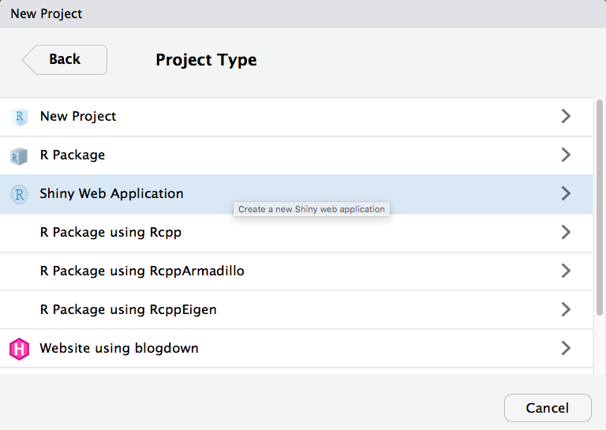
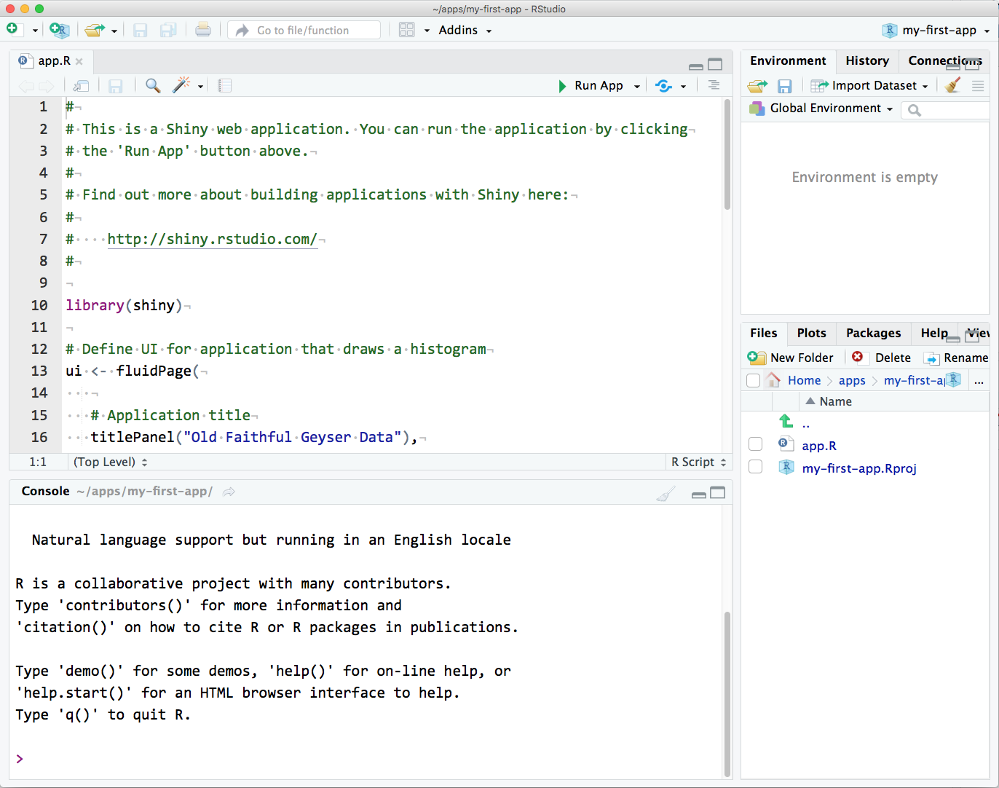
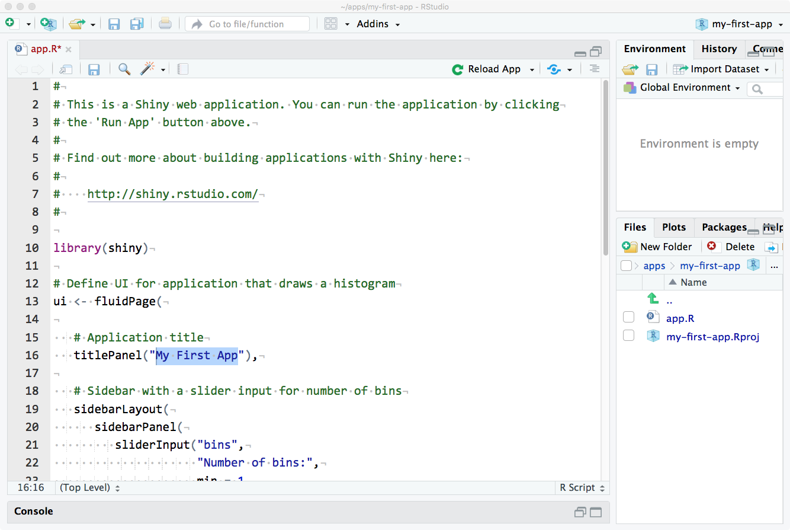
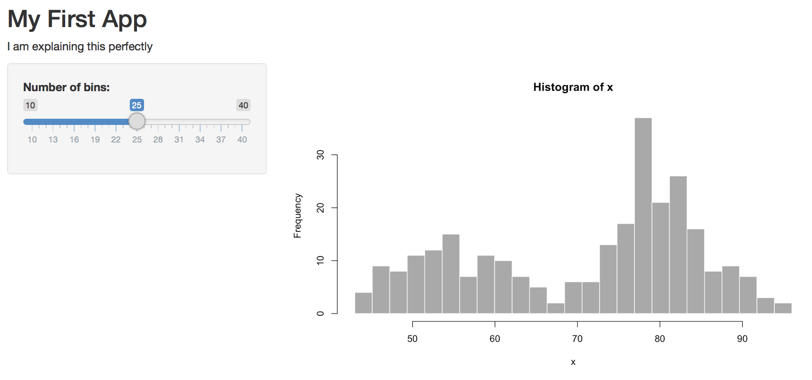

# (PART\*) Introduction to Shiny {.unnumbered}

# Getting to work with Shiny


At its core, Shiny is essentially an R package, similar to dplyr or ggplot2. However, Shiny is unique in that it allows you to build web applications using the R language, instead of relying on traditional web development technologies like JavaScript or HTML5. This R-based approach makes Shiny an efficient choice for creating web applications tailored for data presentation and analysis.

To illustrate, let's take a look at an example of a basic Shiny app that we will recreate in today's tutorial


Shiny apps are useful for several purposes:

**Interactive Data Visualization for Presentations and Websites:** Shiny apps allow you to create interactive data visualizations, which can enhance your presentations, reports, or websites. Users can explore data, change parameters, and see real-time updates, making the information more engaging and informative.

**Sharing Results with Collaborators:** Shiny apps are valuable for sharing data and analysis results with collaborators, team members, or clients. By creating interactive dashboards or tools, you can make it easier for others to interact with and understand the data, even if they don't have expertise in R or data analysis.

**Communicating Science in an Accessible Way:** Shiny apps can be a powerful tool for scientists, researchers, and educators to communicate complex scientific concepts or research findings to a broader audience. They provide an accessible and user-friendly interface to explore and understand data-driven insights.

**Bridging the Gap Between R Users and Non-R Users:** Shiny acts as a bridge between R users and individuals who may not be familiar with R programming. With Shiny, you can create applications that allow non-R users to interact with and benefit from R's data analysis capabilities without needing to write R code themselves.

## Using the Demo App

New project…
Under the File menu, choose New Project.... You will see a popup window like the one below. Choose New Directory.

Then choose `Shiny Web App`



### Run the app

Click on Run App in the top right corner of the source pane. The app will open up in a new window. Play with the slider and watch the histogram change.



### Modify the Demo App

Now we’re going to make a series of changes to the demo app until it’s all your own.

You can close the app by closing the window or browser tab it’s running in, or leave it running while you edit the code. If you have multiple screens, it’s useful to have the app open on one screen and the code on another.

**1. Change the title**

Change the title to "My First App". Make sure the title is inside quotes and the whole quoted string is inside the parentheses. Save the file.


Then click **Run App**



**2. Change the input**

Now let's change the input. Find the function sliderInput() (line 21). The first argument is the name you can use in the code to find the value of this input, so don't change it just yet. The second argument is the text that displays before the slider. Change this to something else and re-run the app.


```r
sliderInput("bins",
            "Number of bins:",
            min = 0,
            max = 50,
            value = 30)
```

<div class="try">
<p>See if you can figure out what the next three arguments to
sliderInput() do. Change them to different integers, then re-run the app
to see what’s changed.</p>
</div>

The arguments to the function `sidebarPanel()` are just a list of things you want to display in the sidebar. To add some explanatory text in a paragraph before `sliderInput()`, just use the paragraph function `p()`.


```r
sidebarPanel(
   p("I am explaining this perfectly"),
   sliderInput("bins",
               "Choose the best bin number:",
               min = 10,
               max = 40,
               value = 25)
)
```



**3. Change the layout**

I don't like the position of this explanatory text, so we can move this text out of the sidebar and to the top of the page, just under the title. Try this and re-run the app.


```r
# Application title
titlePanel("My First App"),

p("I am explaining this perfectly"),

# Sidebar with a slider input for number of bins
sidebarLayout(...)
```

**4. Change some colours**

I'm also not keen on the grey plot. We can change the plot colour inside `hist()`


```r
# draw the histogram with the specified number of bins
hist(x, breaks = bins, col = 'skyblue', border = 'grey30')
```

**5. Change the plot**

I prefer ggplots, so let's make the plot with `geom_histogram()` instead of `hist()` (which is a great function for really quick plots, but not very visually appealing). Since we need several functions from the `ggplot2` package, we'll need to load that package at the top of the script, just under where the shiny package is loaded:


```r
library(shiny)
library(ggplot2)
```

You can replace all of the code in `renderPlot()` with the code below.


```r
output$distPlot <- renderPlot({
  # create plot
  ggplot(faithful, aes(waiting)) +
    geom_histogram(bins = input$bins,
                   fill = "steelblue3",
                   colour = "grey30") +
    xlab("What are we even plotting here?") +
    theme_minimal()
})
```

**6.Plot new things**

The `faithful` dataset includes two columns: eruptions and waiting. We've been plotting the waiting variable, but what if you wanted to plot the eruptions variable instead?

<div class="try">
<p>Try plotting the eruption time (eruptions) instead of the waiting
time. You just have to change one word in ggplot() and update the x-axis
label.</p>
</div>

We can add another input widget to let the user switch between plotting eruption time and wait time. We'll learn more about the different input options in Section 3. We need to toggle between two options, so we can use either radio buttons or a select box. Radio buttons are probably best if you have only a few options and the user will want to see them all at the same time to decide.

Add the following code as the first argument to sidebarPanel(), which just takes a list of different widgets. radioButtons() is the widget we're using. We'll set four arguments:

- inputId: a unique identifier that we will use later in the code to find the value of this widget

- label: the text to display to the user

- choices: a list of choices in the format c("label1" = "value1", "label2" = "value2", ...)

- selected: the value of the default choice

For choices, the label is what gets shown to the user and the value is what gets used by the code (these can be the same, but you often want the user label to be more descriptive).


```r
 radioButtons(inputId = "display_var",
              label = "Which variable to display",
              choices = c("Waiting time to next eruption" = "waiting",
                          "Eruption time" = "eruptions"),
              selected = "waiting"
 ),
```

Save this and re-run the app.


You should have a radio button interface now. You can click on the options to switch the button, but it won't do anything to your plot yet. We need to edit the plot-generating code to make that happen.

First, we need to change the x-axis label depending on what we're graphing. We use an if/else statement to set the variable xlabel to one thing if `input$display_var` is equivalent to "eruptions", and to something else if it's equivalent to "waiting". Put this code at the very beginning of the code block for `renderPlot()` (after the line `output$distPlot <- renderPlot({`).


```r
# set x-axis label depending on the value of display_var
if (input$display_var == "eruptions") {
  xlabel <- "Eruption Time (in minutes)"
} else if (input$display_var == "waiting") {
  xlabel <- "Waiting Time to Next Eruption (in minutes)"
}
```

Then we have to edit ggplot() to use the new label and to plot the correct column. The variable `input$display_var` gives you the user-input value of the widget called "display_var".


```r
# create plot
ggplot(faithful, aes(.data[[input$display_var]])) +
  geom_histogram(bins = input$bins,
                 fill = "steelblue3",
                 colour = "grey30") +
  xlab(xlabel) +
  theme_minimal()
```

Re-run your app and see if you can change the data and x-axis label with your new widget.

# Make our own App

Now that you've seen a basic Shiny app in action, let's return to the beginning and  create our own app.R file. A basic app.R consists of five key parts:

**Package Loading:** At the top of the script, load any necessary R packages for your app to function. `shiny` is a requirement, but you can add others like `dplyr` or `ggplot2` as needed. If any packages are missing, you'll encounter an error, so ensure that you have them installed.


```r
# Load the required packages
library(shiny)       # Essential for running any Shiny app
library(tidyverse)  # Contains readr, dplyr and ggplot2
library(palmerpenguins)    # The source of your data
```

**Data Loading:** Next, load any data necessary for your app. This typically involves reading datasets into R objects. Ensure that you have the data file or source available in the specified format.


```r
# Load the data
penguins <- as_tibble(penguins)
```

**UI Object:** Create an object called ui that defines the app's user interface. This specifies how the app will appear in the web browser. The `fluidPage()` function creates a responsive layout that adjusts to the browser window's size. All of your UI code will go inside the curly braces.


```r
# Define the UI
ui <- fluidPage(
  # Your UI components will be defined here
)
```

**Server Object:** Create another object called server, which contains the app's logic. Here, you specify how your app computes and creates plots, tables, maps, or any other content based on the user's input. All of the app's logic code will be placed inside the server function.


```r
# Define the server logic
server <- function(input, output) {
  # Your server logic will be defined here
}
```

**App Execution:** Finally, include a command at the end of app.R to run your app. This informs Shiny that the user interface is defined by the ui object, and the server logic (data, plots, tables, etc.) is defined by the server object.


```r
# Run the app
shinyApp(ui = ui, server = server)
```

To create your own Shiny app, you should remove any example code generated automatically when you created app.R and replace it with the structure provided above. Check that your final app.R script resembles the following:

<button id="displayTextunnamed-chunk-24" onclick="javascript:toggle('unnamed-chunk-24');">Show Solution</button>

<div id="toggleTextunnamed-chunk-24" style="display: none"><div class="panel panel-default"><div class="panel-heading panel-heading1"> Solution </div><div class="panel-body">

```r
# Packages ----
library(shiny)       # Essential for running any Shiny app
library(tidyverse)
library(palmerpenguins)    # The source of your data

# Load the data
penguins <- as_tibble(penguins)

# ui.R ----
ui <- fluidPage(
  # Your UI components will be defined here
)

# server.R ----
server <- function(input, output) {
  # Your server logic will be defined here
}

# Run the app ----
shinyApp(ui = ui, server = server)
```
</div></div></div>

By following these steps, you'll have the basic structure of a Shiny app in place, ready for you to add your UI elements and server logic to create an interactive web application.

# Inputs

Now that you have the basic structure of your Shiny app, you can start adding input and output elements to make it interactive. This example app includes four input widgets: a `selectInput` for genotype, another `selectInput` for histogram color, a `sliderInput` for the number of bins, and a `textInput` for arbitrary text. These widgets provide information on how to display a histogram and its accompanying table. In the example app, all these widgets are placed in the `sidebarPanel`. Here's how you can incorporate these widgets into your app:


```r
# Packages ----
library(shiny)       # Essential for running any Shiny app
library(tidyverse)
library(palmerpenguins)    # The source of your data

# Load the data
penguins <- as_tibble(penguins)

# ui.R ----
ui <- fluidPage(
  sidebarLayout(
     sidebarPanel(
      demo_sp <- selectInput(inputId = "species",  # Give the input a name "genotype"
                  label = "1. Select species",  # Give the input a label to be displayed in the app
                  choices = c("Adelie" = "Adelie", "Chinstrap" = "Chinstrap", "Gentoo" = "Gentoo"), selected = "Adelie"),  # Create the choices that can be selected. e.g. Display "Adelie" and link to value "Adelie"
      demo_select <- selectInput(inputId = "colour", 
                  label = "2. Select histogram colour", 
                  choices = c("blue","green","red","purple","grey"), selected = "grey"),
      demo_slide <- sliderInput(inputId = "bin", 
                  label = "3. Select number of histogram bins", 
                  min=1, max=25, value= c(10)),
      demo_text <- textAreaInput(inputId = "text", 
                label = "4. Enter some text to be displayed",
                rows = 5,
                placeholder = "Enter some information here")
    ),
    mainPanel(
      # Output elements go here
    )
  )
)
# server.R ----
server <- function(input, output) {
  # Your server logic will be defined here

}


# Run the app ----
shinyApp(ui = ui, server = server)
```


In the code above, we've added the input widgets in the `sidebarPanel` section of your `ui` object. These widgets allow users to select a genotype, choose a histogram color, set the number of bins for the histogram, and add arbitrary text.

Let's take a moment to understand the `selectInput()` function and how it's configured:

**inputId = "species":** This is the unique identifier for this input element. It's crucial for later referencing this input within your app script.

**label = "1. Select species":** This is the label you want to display above the input in your app. It provides clarity to users by describing the purpose of the input.

**choices = c("Adelie" = "Adelie", "Chinstrap" = "Chinstrap", ...):** Here, you define a list of choices that will be presented in the dropdown menu. Each choice has two parts: the display label (on the left) and the corresponding value that the app will collect and use in its output (on the right).

**selected = "grey":** This specifies the default value selected in the dropdown menu when the app is first loaded. In this example, 'grey' will be preselected.

Now that you've grasped how `selectInput()` works, let's use it to customize your Shiny app further."

The above explanation clarifies the purpose and settings of the `selectInput()` function, and you can use this understanding to configure other input elements in your Shiny app. Below is a summary of the different Input functions available for Shiny

### textInput

`textInput` creates a one-line box for short text input. The first `argument`, `inputId` (the argument name is usually omitted), needs to be a unique string that you cannot use for another input or output in this app.


```r
demo_text <- 
  textInput("demo_text", 
            label = "Name", 
            value = "", 
            width = "100%",
            placeholder = "Your Name")
```

<div class="try">
<p>Experiment with the values of <code>arg("label")</code>,
<code>arg("value")</code>, <code>arg("width")</code>, and
<code>arg("placeholder")</code> to see what they do.</p>
</div>


### textAreaInput

`"textAreaInput"` creates a multi-line box for longer text input.


```r
demo_textarea <- 
  textAreaInput("demo_textarea", 
                label = "Biography", 
                value = "",
                width = "100%",
                rows = 5, 
                placeholder = "Tell us something interesting about you.")
```

What is the `arg("inputId")` of the widget above?

<select class='webex-select'><option value='blank'></option><option value=''>textAreaInput</option><option value='answer'>demo_textarea</option><option value=''>Biography</option></select>

### selectInput

`selectInput` creates a drop-down menu. Set the first ` arg("choice")` to `""` to default to `NA`. If your choices are a named `"list"` or `"vector"`, the names are what is shown and the values are what is recorded. If the choices aren't named, the displayed and recorded values are the same.


```r
demo_select <- 
  selectInput("demo_select", 
              label = "Do you like Shiny?", 
              choices = list("", 
                             "Yes, I do" = "y", 
                             "No, I don't" = "n"),
              selected = NULL,
              width = "100%")
```

If you set ` arg("multiple")` to ` dt(TRUE)`, you can also make a select where users can choose multiple options.


```r
genders <- list( # no blank needed
  "Non-binary" = "nb",
  "Male" = "m",
  "Female" = "f",
  "Prefer not to say" = "p"
)

demo_select_multi <- 
  selectInput("demo_select2", 
              label = "Gender", 
              choices = genders,
              selected = NULL,
              multiple = TRUE, 
              selectize = FALSE,
              size = 5)
```

### checkboxGroupInput

However, this interface almost always looks better with ` checkboxGroupInput`. 


```r
demo_cbgi <-
  checkboxGroupInput("demo_cbgi",
                     label = "Gender)",
                     choices = genders)
```

How can you get the checkboxes to display horizontally instead of vertically?  

<select class='webex-select'><option value='blank'></option><option value=''>display = 'horizontal'</option><option value=''>class = 'horiz'</option><option value='answer'>inline = TRUE</option><option value=''>class = 'shiny-input-container-inline'</option></select>


### checkboxInput

You can also make a single checkbox with `checkboxInput`. The `value` is ` dt(TRUE)` when checked and ` dt(FALSE)` when not.


```r
demo_cb <- checkboxInput("demo_cb",
                         label = "I love R",
                         value = TRUE)
```

` sliderInput` allows you to choose numbers between a `min` and `max` value.


```r
demo_slider <- sliderInput("demo_slider",
                           label = "Age",
                           min = 0,
                           max = 100,
                           value = 0,
                           step = 1,
                           width = "100%")
```


<div class="try">
<p>What happens if you change <code>arg("value")</code> or
<code>arg("step")</code>? Try changing <code>arg("value")</code> to
<code>c(10, 20)</code>.</p>
</div>

### radioButtons

If you want users to only be able to choose one option and there are a small number of short options, ` radioButton` is a good interface. 


```r
demo_radio <- radioButtons("demo_radio",
                           label = "Choose one",
                           choices = c("Cats", "Dogs"),
                           selected = character(0),
                           inline = TRUE)
```

<div class="info">
<p>Radio buttons default to selecting the first item unless you set
<code>arg("selected")</code> to a choice value or
<code>character(0)</code> to start with no selection.</p>
</div>

### dateInput

I find the date interface a little clunky, but...


```r
demo_date <- dateInput("demo_date",
                       label = "What is your birth date?",
                       min = "1900-01-01",
                       max = Sys.Date(),
                       format = "yyyy-mm-dd",
                       startview = "year")
```

<div class="info">
<p>IMHO, the default of <code>dt("yyyy-mm-dd")</code> is the best
because it sorts into chronological order.</p>
</div>

What would you set ` arg("format")` to in order to display dates like "Sunday July 4, 2021"?  
<select class='webex-select'><option value='blank'></option><option value=''>D M d, Y</option><option value='answer'>DD MM d, yyyy</option><option value=''>DAY MONTH day, YEAR</option><option value=''>D MM dd, yyyy</option></select>


### fileInput

Users can upload one or more files with ` fileInput`. The argument `accept` lets you limit this to certain file types, but some browsers can bypass this requirement, so it's not fool-proof.


```r
demo_file <- fileInput("demo_file",
                       label = "Upload a data table",
                       multiple = FALSE,
                       accept = c(".csv", ".tsv"),
                       buttonLabel = "Upload")
```


What would you set ` arg("accept")` to to accept any image file?  
<select class='webex-select'><option value='blank'></option><option value='answer'>image/*</option><option value=''>.jpg</option><option value=''>jpg</option><option value=''>images</option><option value=''>.img</option></select>


Next, you'll need to implement the server logic and output elements in the `server.R` section. The server logic will define how these inputs affect the display of your histogram and table, but that would require additional code specific to your application's requirements.

Remember that Shiny allows you to create reactive expressions and functions that respond to changes in input values. You can use these reactive expressions to generate the histogram and associated table based on user input.

As you proceed, you can add more details to your `server.R` to handle these inputs and create the corresponding outputs.


## Exercise 


**1. Save a file with the progress on our penguins app using the code at the start of the chapter**

# Outputs

Output are ways that the Shiny app can dynamically display information to the user. In the user interface (UI), you create outputs with IDs that you reference in an associated rendering function inside the server function. Check out this outputs demo from the R team at Glasgow, then have a look at the different functions in the text below...


<iframe height="400" width="100%" frameborder="no" src="https://shiny.psy.gla.ac.uk/debruine/output_demo/"> </iframe>


## Text

`textOutput` defaults to text inside a generic `<span>` or `<div>`.


```r
# in the UI function
textOutput("demo_text", container = tags$h3)
```

`renderText` replaces the text of the linked element with its returned string.


```r
# in the server function
  output$demo_text <- renderText({
    paste("Figure 1.", input$species, input$text)
  })
```

If you use `verbatimTextOutput` in the UI (no change to the render function), it will show the output in a fixed-width font. This can be good for code or text you want the user to copy.


```r
# in the UI function
verbatimTextOutput("demo_verbatim")

# in the server function
  output$demo_verbatim <- renderText({
  code <-
    paste0("penguins_filtered <- penguins %>%
      filter(species == '", input$species,"')
    
    ggplot(penguins_filtered, aes(x = flipper_length_mm)) +
      geom_histogram(fill = '", input$colour, "', show.legend = FALSE, bins = ", input$bin, ") +
      theme_minimal()")
  
  code
})
```


## Plots

`plotOutput` displays plots made with the `base R` plotting functions (e.g., `"plot"`, `hist`) or `ggplot2` functions.


```r
# in the UI function
plotOutput("demo_plot", width = "500px", height="300px")
```

What is the default value for `width`?  
<select class='webex-select'><option value='blank'></option><option value='answer'>100%</option><option value=''>400px</option><option value=''>400</option><option value=''>5in</option><option value=''>7in</option></select>  

What is the default value for `height`?  
<select class='webex-select'><option value='blank'></option><option value=''>100%</option><option value='answer'>400px</option><option value=''>400</option><option value=''>5in</option><option value=''>7in</option></select>


```r
# in the server function
  output$demo_plot <- renderPlot({
    penguins_filtered <- penguins |>
      filter(species == input$species)
    
    ggplot(penguins_filtered, aes(x = flipper_length_mm)) +
      geom_histogram(fill = input$colour, show.legend = FALSE, bins = input$bin) +
      labs(fill = "Color") +
      theme_minimal()
  })
```


<div class="warning">
<p>If you want to create dynamic plots that change with input, note how
you need to use <code>y = .data[[input$y]]</code> inside
<code>aes</code>, instead of just <code>y = input$y</code>.</p>
</div>

## Images

`imageOutput` takes the same arguments as `plotOutput`. You can leave `width` and `height` as their defaults if you are going to set those values in the render function.


```r
# in the UI function
imageOutput("demo_image")
```

`renderImage` needs to return a named list with at least an `src` with the image path. You can also set the `width` and `height` (numeric values are in pixels), `class` and `alt` (the alt-text for screen readers).


```r
# in the server function
output$demo_image <- renderImage({
    list(src = "images/penguin.jpg",
         width = 100,
         height = 100,
         alt = "A flower")
}, deleteFile = FALSE)
```


<div class="warning">
<p>The <code>deleteFile</code> argument is currently optional, but
triggers periodic warnings that it won’t be optional in the future. You
should set it to <code>TRUE</code> if you’re making a temporary file
(this stops unneeded plots using memory) and <code>FALSE</code> if
you’re referencing a file you previously saved.</p>
</div>

## Data Tables

Display a table using `tableOutput`.


```r
# in the UI function
tableOutput("demo_table")
```

This is paired with `DT::renderDataTable`, which makes a table out of any data frame it returns.


```r
# in the server function
  output$demo_table <- DT::renderDataTable({
   penguins  |> 
      filter(species == input$species) |> 
    summarise(flipper_length_mm = quantile(flipper_length_mm, c(0.25, 0.5, 0.75), na.rm = T), quantile = c(0.25, 0.5, 0.75))
})
```

<div class="warning">
<p>Note how you need to use <code>.data[[input$y]]</code> inside
<code>dplyr::summarise</code>, instead of just <code>input$y</code> to
dynamically choose which variable to summarise.</p>
</div>


I much prefer `DT::dataTableOutput` over the basic `shiny` package `dataTableOutput` and `renderDataTable` functions, but they can be buggy. The versions in the `DT` package are better and have [many additional functions](https://rstudio.github.io/DT/), so I use those. 

<div class="info">
<p>You can use the <code>DT</code> synonyms to make sure you’re not
accidentally using the <code>shiny</code> versions, which don’t have the
same options.</p>
</div>


## Emphasis

We can use basic HTML to start customising appearance and emphasis - later we will use the `bslib` package to give us lots of easy customisation:

```
  
p("p creates a paragraph of text."),

      
      p("A new p() command starts a new paragraph. Supply a style attribute to change the format of the entire paragraph.", style = "font-family: 'times'; font-si16pt"),
      
      strong("strong() makes bold text."),
      
      em("em() creates italicized (i.e, emphasized) text."),
      
      br(),
      
      code("code displays your text similar to computer code"),
      
      div("div creates segments of text with a similar style. This division of text is all blue because I passed the argument 'style = color:blue' to div", style = "color:blue"),
      
      br(),
      
      p("span does the same thing as div, but it works with",
        span("groups of words", style = "color:blue"),
        "that appear inside a paragraph."),

```

## Exercise

Complete our app by adding the appropriate outputs to our file:


<button id="displayTextunnamed-chunk-54" onclick="javascript:toggle('unnamed-chunk-54');">Show Solution</button>

<div id="toggleTextunnamed-chunk-54" style="display: none"><div class="panel panel-default"><div class="panel-heading panel-heading1"> Solution </div><div class="panel-body">

```r
# Packages ----
library(shiny)       # Essential for running any Shiny app
library(tidyverse)
library(palmerpenguins)    # The source of your data

# Load the data
penguins <- as_tibble(penguins)

# ui.R ----
ui <- fluidPage(
  sidebarLayout(
     sidebarPanel(
      demo_sp <- selectInput(inputId = "species",  # Give the input a name "genotype"
                  label = "1. Select species",  # Give the input a label to be displayed in the app
                  choices = c("Adelie" = "Adelie", "Chinstrap" = "Chinstrap", "Gentoo" = "Gentoo"), selected = "Adelie"),  # Create the choices that can be selected. e.g. Display "Adelie" and link to value "Adelie"
      demo_select <- selectInput(inputId = "colour", 
                  label = "2. Select histogram colour", 
                  choices = c("blue","green","red","purple","grey"), selected = "grey"),
      demo_slide <- sliderInput(inputId = "bin", 
                  label = "3. Select number of histogram bins", 
                  min=1, max=25, value= c(10)),
      demo_text <- textAreaInput(inputId = "text", 
                label = "4. Enter some text to be displayed",
                rows = 5,
                placeholder = "Enter some information here")
    ),
    mainPanel(
      # Output elements go here
        
    tags$ul(
    tags$strong(textOutput("demo_sp")), # emphasise text
    textOutput("demo_text")),
  
        plotOutput("demo_plot", width = "500px", height="300px"),
        
        DT::dataTableOutput("demo_table",
                    width = "50%",
                    height = "auto")
    )
  )
)
# server.R ----

 

server <- function(input, output) {
  

  output$demo_sp <- renderText({
    paste("Figure 1.", input$species)
  })
  
output$demo_text <- renderText({
  (input$text)
})
   
    
  output$demo_plot <- renderPlot({
    penguins_filtered <- penguins |>
      filter(species == input$species)
    
    ggplot(penguins_filtered, aes(x = flipper_length_mm)) +
      geom_histogram(fill = input$colour, show.legend = FALSE, bins = input$bin) +
      labs(fill = "Color") +
      theme_minimal()
  })
  
  output$demo_table <- DT::renderDataTable({
   penguins |>
      filter(species == input$species) |> 
    summarise(flipper_length_mm = quantile(flipper_length_mm, c(0.25, 0.5, 0.75), na.rm = T), quantile = c(0.25, 0.5, 0.75))
})
  
}


# Run the app ----
shinyApp(ui = ui, server = server)
```
</div></div></div>


# Reactive


Reactivity is how Shiny determines which code in server() gets to run when. Some types of objects, such as the input object or objects made by `reactiveValues()`, can trigger some types of functions to run whenever they change.

In the example below if you move the data filtering outside of `renderPlot()`, you'll get an error message like "Can't access reactive value outside of reactive consumer." This means that the input values can only be read inside certain functions, like `reactive()`, `observeEvent()`, or a render function like `renderPlot()`.


```r
# Packages ----
library(shiny)       # Essential for running any Shiny app
library(tidyverse)
library(palmerpenguins)    # The source of your data

# Load the data
penguins <- as_tibble(penguins)

# ui.R ----
ui <- fluidPage(
  sidebarLayout(
     sidebarPanel(
      demo_sp <- selectInput(inputId = "species",  # Give the input a name "genotype"
                  label = "1. Select species",  # Give the input a label to be displayed in the app
                  choices = c("Adelie" = "Adelie", "Chinstrap" = "Chinstrap", "Gentoo" = "Gentoo"), selected = "Adelie"),  # Create the choices that can be selected. e.g. Display "Adelie" and link to value "Adelie"
      demo_select <- selectInput(inputId = "colour", 
                  label = "2. Select histogram colour", 
                  choices = c("blue","green","red","purple","grey"), selected = "grey"),
      demo_slide <- sliderInput(inputId = "bin", 
                  label = "3. Select number of histogram bins", 
                  min=1, max=25, value= c(10)),
      demo_text <- textAreaInput(inputId = "text", 
                label = "4. Enter some text to be displayed",
                rows = 5,
                placeholder = "Enter some information here")
    ),
    mainPanel(
      # Output elements go here
        
    tags$ul(
    tags$strong(textOutput("demo_sp")),
    textOutput("demo_text")),
  
        plotOutput("demo_plot", width = "500px", height="300px"),
        
        DT::dataTableOutput("demo_table",
                    width = "50%",
                    height = "auto")
    )
  )
)
# server.R ----

 

server <- function(input, output) {
  
penguins_filtered <- penguins |>
      filter(species == input$species) 
  
  output$demo_sp <- renderText({
    paste("Figure 1.", input$species)
  })
  
output$demo_text <- renderText({
  (input$text) # here to trigger the function
})
   

    
  output$demo_plot <- renderPlot({
    
    ggplot(penguins_filtered, aes(x = flipper_length_mm)) +
      geom_histogram(fill = input$colour, show.legend = FALSE, bins = input$bin) +
      labs(fill = "Color") +
      theme_minimal()
  })
  
  output$demo_table <- DT::renderDataTable({
   penguins_filtered |> 
    summarise(flipper_length_mm = quantile(flipper_length_mm, c(0.25, 0.5, 0.75), na.rm = T), quantile = c(0.25, 0.5, 0.75))
})
  
}


# Run the app ----
shinyApp(ui = ui, server = server)
```

```
Error in filter(., species == input$species) : 
  ℹ In argument: `species == input$species`.
Caused by error in `input$species`:
! Can't access reactive value 'species' outside of reactive consumer.
ℹ Do you need to wrap inside reactive() or observe()?

```

However, we can put the data filtering inside `reactive()`. This means that whenever an input inside that function changes, the code will run and update the value of `data()`. This can be useful if you need to recalculate the data table each time the inputs change, and then use it in more than one function.


```r
# Packages ----
library(shiny)       # Essential for running any Shiny app
library(tidyverse)
library(palmerpenguins)    # The source of your data

# Load the data
penguins <- as_tibble(penguins)

 

# ui.R ----
ui <- fluidPage(
  sidebarLayout(
     sidebarPanel(
      demo_sp <- selectInput(inputId = "species",  # Give the input a name "genotype"
                  label = "1. Select species",  # Give the input a label to be displayed in the app
                  choices = c("Adelie" = "Adelie", "Chinstrap" = "Chinstrap", "Gentoo" = "Gentoo"), selected = "Adelie"),  # Create the choices that can be selected. e.g. Display "Adelie" and link to value "Adelie"
      demo_select <- selectInput(inputId = "colour", 
                  label = "2. Select histogram colour", 
                  choices = c("blue","green","red","purple","grey"), selected = "grey"),
      demo_slide <- sliderInput(inputId = "bin", 
                  label = "3. Select number of histogram bins", 
                  min=1, max=25, value= c(10)),
      demo_text <- textAreaInput(inputId = "text", 
                label = "4. Enter some text to be displayed",
                rows = 5,
                placeholder = "Enter some information here")
    ),
    mainPanel(
      # Output elements go here
        
    tags$ul(
    tags$strong(textOutput("demo_sp")),
    textOutput("demo_text")),
  
        plotOutput("demo_plot", width = "500px", height="300px"),
        
        DT::dataTableOutput("demo_table",
                    width = "50%",
                    height = "auto")
    )
  )
)
# server.R ----

 

server <- function(input, output) {
  
penguins_filtered <- reactive({
  penguins |>
      filter(species == input$species)
})

  output$demo_sp <- renderText({
    paste("Figure 1.", input$species)
  })
  
output$demo_text <- renderText({
  (input$text)
})
   

    
  output$demo_plot <- renderPlot({
    
    ggplot(penguins_filtered(), aes(x = flipper_length_mm)) +
      geom_histogram(fill = input$colour, show.legend = FALSE, bins = input$bin) +
      labs(fill = "Color") +
      theme_minimal()
  })
  
  output$demo_table <- DT::renderDataTable({
   
    penguins_filtered() |> 
    summarise(flipper_length_mm = quantile(flipper_length_mm, c(0.25, 0.5, 0.75), na.rm = T), quantile = c(0.25, 0.5, 0.75))
})
  
}


# Run the app ----
shinyApp(ui = ui, server = server)
```

My most common error is trying to use data or title as an object instead of as a function. Notice how the first argument to ggplot is no longer data, but `data()` and you set the value of data with `data(newdata)`, not data <- newdata. For now, just remember this as a quirk of shiny.

## Observable

What if you only want to update things when an update button is clicked, and not whenever the user changes an option?

`observeEvent()`. This function runs the code whenever the value of the first argument changes. If there are reactive values inside the function, they won't trigger the code to run when they change.


```r
# Packages ----
library(shiny)       # Essential for running any Shiny app
library(tidyverse)
library(palmerpenguins)    # The source of your data

# Load the data
penguins <- as_tibble(penguins)

 

# ui.R ----
ui <- fluidPage(
  sidebarLayout(
     sidebarPanel(
      demo_sp <- selectInput(inputId = "species",  # Give the input a name "genotype"
                  label = "1. Select species",  # Give the input a label to be displayed in the app
                  choices = c("Adelie" = "Adelie", "Chinstrap" = "Chinstrap", "Gentoo" = "Gentoo"), selected = "Adelie"),  # Create the choices that can be selected. e.g. Display "Adelie" and link to value "Adelie"
      demo_select <- selectInput(inputId = "colour", 
                  label = "2. Select histogram colour", 
                  choices = c("blue","green","red","purple","grey"), selected = "grey"),
      demo_slide <- sliderInput(inputId = "bin", 
                  label = "3. Select number of histogram bins", 
                  min=1, max=25, value= c(10)),
      demo_text <- textAreaInput(inputId = "text", 
                label = "4. Enter some text to be displayed",
                rows = 5,
                placeholder = "Enter some information here"),
      demo_button <- actionButton("update", "Plot")
    ),
    mainPanel(
      # Output elements go here
        
    tags$ul(
    tags$strong(textOutput("demo_sp")),
    textOutput("demo_text")),
  
        plotOutput("demo_plot", width = "500px", height="300px"),
        
        DT::dataTableOutput("demo_table",
                    width = "50%",
                    height = "auto")
    )
  )
)
# server.R ----

 

server <- function(input, output) {
  
 

  observeEvent(input$update, {
    
    penguins_filtered <- penguins |>
      filter(species == input$species)
    
     bins <- input$bin
     
     colour <- input$colour
 

    output$demo_sp <- renderText({
      paste("Figure 1.", input$species)
    })

    output$demo_text <- renderText({
      (input$text)
    })

    output$demo_plot <- renderPlot({
        ggplot(penguins_filtered, aes(x = flipper_length_mm)) +
        geom_histogram(fill = colour, show.legend = FALSE, bins = bins) +
        labs(fill = "Color") +
        theme_minimal()
    })

    output$demo_table <- DT::renderDataTable({
      penguins_filtered |> 
        summarise(flipper_length_mm = quantile(flipper_length_mm, c(0.25, 0.5, 0.75), na.rm = T), quantile = c(0.25, 0.5, 0.75))
    })
  })
  
}


# Run the app ----
shinyApp(ui = ui, server = server)
```


## Exercise

Run this code. Which things are now updated by the plot button?


# Shiny Dashboards

`bslib` is an R package that extends Bootstrap 4 and allows you to customize the appearance and style of your Shiny applications or R Markdown documents. With `bslib`, you can easily modify the look and feel of your Shiny apps by defining custom themes, colors, fonts, and other visual aspects.

It provides a flexible way to create a consistent and visually appealing design for your Shiny applications without having to write extensive CSS code.

You can use `bslib` functions like `bs_theme()`, to define and apply custom styles to your Shiny app. But there's no accounting for taste...


(https://philip-leftwich.shinyapps.io/penguin_demo")


```r
# Packages ----
library(shiny)       # Essential for running any Shiny app
library(tidyverse)
library(palmerpenguins)    # The source of your data
library(bslib)

# Load the data
penguins <- as_tibble(penguins)

# Calculate column means for the value boxes
means <- penguins |> 
  group_by(species) |> 
  summarise(mean = round(mean(flipper_length_mm, na.rm = T), 2))


theme <- bs_theme()

# ui.R ----
ui <- page_sidebar(
  theme = bs_theme(),
  title = "Penguins flipper dashboard",
  sidebar = sidebar(
      demo_sp <- selectInput(inputId = "species",  # Give the input a name "genotype"
                  label = "1. Select species",  # Give the input a label to be displayed in the app
                  choices = c("Adelie" = "Adelie", "Chinstrap" = "Chinstrap", "Gentoo" = "Gentoo"), selected = "Adelie"),  # Create the choices that can be selected. e.g. Display "Adelie" and link to value "Adelie"
      demo_select <- selectInput(inputId = "colour", 
                  label = "2. Select histogram colour", 
                  choices = c("blue","green","red","purple","grey"), selected = "grey"),
      demo_slide <- sliderInput(inputId = "bin", 
                  label = "3. Select number of histogram bins", 
                  min=1, max=25, value= c(10)),
      demo_text <- textAreaInput(inputId = "text", 
                label = "4. Enter some text to be displayed",
                rows = 5,
                placeholder = "Enter some information here"),
      demo_button <- actionButton("update", "Plot")
    )
  ,
   layout_columns(
    fill = FALSE,
    value_box(
      title = "Adelie Flipper Length",
      value = scales::unit_format(unit = "mm")(means[[1,2]]),
      showcase = bsicons::bs_icon("align-bottom"),
      theme_color = "grey"
    ),
    value_box(
      title = "Chinstrap Flipper",
      value = scales::unit_format(unit = "mm")(means[[2,2]]),
      showcase = bsicons::bs_icon("align-center"),
      theme_color = "grey"
    ),
 value_box(
      title = "Gentoo Flipper Length",
      value = scales::unit_format(unit = "mm")(means[[3,2]]),
      showcase = bsicons::bs_icon("align-top"),
      theme_color = "grey"
    )
  ),
    
    tags$ul(
    tags$strong(textOutput("demo_sp")),
    textOutput("demo_text")),
 
      # Output elements go here
      layout_columns(
    card(
      full_screen = TRUE,
      card_header("Plot"),
      plotOutput("demo_plot")
    ),
    card(
      full_screen = TRUE,
      card_header("Table"),
      DT::dataTableOutput("demo_table",
                    width = "100%",
                    height = "auto")
    )  
)
)
  

# server.R ----

 

server <- function(input, output) {
  


  observeEvent(input$update, {
    
    penguins_filtered <- penguins |>
      filter(species == input$species)
    
     bins <- input$bin
     
     colour <- input$colour
 

    output$demo_sp <- renderText({
      paste("Figure 1.", input$species)
    })

    output$demo_text <- renderText({
      (input$text)
    })

    output$demo_plot <- renderPlot({
        ggplot(penguins_filtered, aes(x = flipper_length_mm)) +
        geom_histogram(fill = colour, show.legend = FALSE, bins = bins) +
        labs(fill = "Color") +
        theme_minimal(base_size = 16)
    })

    output$demo_table <- DT::renderDataTable({
      penguins_filtered |> 
        summarise(flipper_length_mm = quantile(flipper_length_mm, c(0.25, 0.5, 0.75), na.rm = T), quantile = c(0.25, 0.5, 0.75))
    })
  })
  
}


# Run the app ----
shinyApp(ui = ui, server = server)
```


### Themable Dashboards

Adding the `bsthemer()` function to the **server** adds real time theme changes to dashboards. Play with the parameters and you should see updated bstheme code being produced in your console. Make a note of this and you can add this directly to `bs_theme()` to pick a permanent style! 


```r
# Packages ----
library(shiny)       # Essential for running any Shiny app
library(tidyverse)
library(palmerpenguins)    # The source of your data
library(bslib)

# Load the data
penguins <- as_tibble(penguins)

# Calculate column means for the value boxes
means <- penguins |> 
  group_by(species) |> 
  summarise(mean = round(mean(flipper_length_mm, na.rm = T), 2))


# ui.R ----
ui <- page_sidebar(
  title = "Penguins flipper dashboard",
  sidebar = sidebar(
      demo_sp <- selectInput(inputId = "species",  # Give the input a name "genotype"
                  label = "1. Select species",  # Give the input a label to be displayed in the app
                  choices = c("Adelie" = "Adelie", "Chinstrap" = "Chinstrap", "Gentoo" = "Gentoo"), selected = "Adelie"),  # Create the choices that can be selected. e.g. Display "Adelie" and link to value "Adelie"
      demo_select <- selectInput(inputId = "colour", 
                  label = "2. Select histogram colour", 
                  choices = c("blue","green","red","purple","grey"), selected = "grey"),
      demo_slide <- sliderInput(inputId = "bin", 
                  label = "3. Select number of histogram bins", 
                  min=1, max=25, value= c(10)),
      demo_text <- textAreaInput(inputId = "text", 
                label = "4. Enter some text to be displayed",
                rows = 5,
                placeholder = "Enter some information here"),
      demo_button <- actionButton("update", "Plot")
    )
  ,
   layout_columns(
    fill = FALSE,
    value_box(
      title = "Adelie Flipper Length",
      value = scales::unit_format(unit = "mm")(means[[1,2]]),
      showcase = bsicons::bs_icon("align-bottom"),
      theme_color = "grey"
    ),
    value_box(
      title = "Chinstrap Flipper",
      value = scales::unit_format(unit = "mm")(means[[2,2]]),
      showcase = bsicons::bs_icon("align-center"),
      theme_color = "grey"
    ),
 value_box(
      title = "Gentoo Flipper Length",
      value = scales::unit_format(unit = "mm")(means[[3,2]]),
      showcase = bsicons::bs_icon("align-top"),
      theme_color = "grey"
    )
  ),
    
    tags$ul(
    tags$strong(textOutput("demo_sp")),
    textOutput("demo_text")),
 
      # Output elements go here
      layout_columns(
    card(
      full_screen = TRUE,
      card_header("Plot"),
      plotOutput("demo_plot")
    ),
    card(
      full_screen = TRUE,
      card_header("Table"),
      DT::dataTableOutput("demo_table",
                    width = "100%",
                    height = "auto")
    )  
)
)
  

# server.R ----

 

server <- function(input, output) {
  # run this get dynamic theme tools  
  bs_themer()

# Turn on thematic for theme-matched plots
thematic::thematic_shiny(font = "auto")

  observeEvent(input$update, {
    
    penguins_filtered <- penguins |>
      filter(species == input$species)
    
     bins <- input$bin
     
     colour <- input$colour
 

    output$demo_sp <- renderText({
      paste("Figure 1.", input$species)
    })

    output$demo_text <- renderText({
      (input$text)
    })

    output$demo_plot <- renderPlot({
        ggplot(penguins_filtered, aes(x = flipper_length_mm)) +
        geom_histogram(fill = colour, colour = "black", show.legend = FALSE, bins = bins) +
        labs(fill = "Color") +
    })

    output$demo_table <- DT::renderDataTable({
      penguins_filtered |> 
        summarise(flipper_length_mm = quantile(flipper_length_mm, c(0.25, 0.5, 0.75), na.rm = T), quantile = c(0.25, 0.5, 0.75))
    })
  })
  
}


# Run the app ----
shinyApp(ui = ui, server = server)
```


### Updating your theme

You can now update your `bstheme()` and remove the `bsthemer` dynamic interaction line. If you have extensively modified your app - you can add `thematic::thematic_shiny()` to your server so that your plots will be autothemed to the settings of your app. 


```r
# Packages ----
library(shiny)       # Essential for running any Shiny app
library(tidyverse)
library(palmerpenguins)    # The source of your data
library(bslib)

# Load the data
penguins <- as_tibble(penguins)


custom_theme <- bs_theme(
  # Controls the default grayscale palette
  bg = "#202123", fg = "#B8BCC2",
  # Controls the accent (e.g., hyperlink, button, etc) colors
  primary = "#EA80FC", secondary = "#48DAC6",
  base_font = c("Grandstander", "sans-serif"),
  code_font = c("Courier", "monospace"),
  heading_font = "'Helvetica Neue', Helvetica, sans-serif",
  # Can also add lower-level customization
  "input-border-color" = "#EA80FC"
)

# Calculate column means for the value boxes
means <- penguins |> 
  group_by(species) |> 
  summarise(mean = round(mean(flipper_length_mm, na.rm = T), 2))

# ui.R ----
ui <- page_sidebar(
  theme = custom_theme,
  title = "Penguins flipper dashboard",
  sidebar = sidebar(
      demo_sp <- selectInput(inputId = "species",  # Give the input a name "genotype"
                  label = "1. Select species",  # Give the input a label to be displayed in the app
                  choices = c("Adelie" = "Adelie", "Chinstrap" = "Chinstrap", "Gentoo" = "Gentoo"), selected = "Adelie"),  # Create the choices that can be selected. e.g. Display "Adelie" and link to value "Adelie"
      demo_select <- selectInput(inputId = "colour", 
                  label = "2. Select histogram colour", 
                  choices = c("blue","green","red","purple","grey"), selected = "grey"),
      demo_slide <- sliderInput(inputId = "bin", 
                  label = "3. Select number of histogram bins", 
                  min=1, max=25, value= c(10)),
      demo_text <- textAreaInput(inputId = "text", 
                label = "4. Enter some text to be displayed",
                rows = 5,
                placeholder = "Enter some information here"),
      demo_button <- actionButton("update", "Plot")
    )
  ,
   layout_columns(
    fill = FALSE,
    value_box(
      title = "Adelie Flipper Length",
      value = scales::unit_format(unit = "mm")(means[[1,2]]),
      showcase = bsicons::bs_icon("align-bottom"),
   
    ),
    value_box(
      title = "Chinstrap Flipper",
      value = scales::unit_format(unit = "mm")(means[[2,2]]),
      showcase = bsicons::bs_icon("align-center"),
     
    ),
 value_box(
      title = "Gentoo Flipper Length",
      value = scales::unit_format(unit = "mm")(means[[3,2]]),
      showcase = bsicons::bs_icon("align-top"),
     
    )
  ),
    
    tags$ul(
    tags$strong(textOutput("demo_sp")),
    textOutput("demo_text")),
 
      # Output elements go here
      layout_columns(
    card(
      full_screen = TRUE,
      card_header("Plot"),
      plotOutput("demo_plot")
    ),
    card(
      full_screen = TRUE,
      card_header("Table"),
      DT::dataTableOutput("demo_table",
                    width = "100%",
                    height = "auto")
    )  
)
)
  

# server.R ----

 

server <- function(input, output) {
  
# Turn on thematic for theme-matched plots
thematic::thematic_shiny()

  observeEvent(input$update, {
    
    penguins_filtered <- penguins |>
      filter(species == input$species)
    
     bins <- input$bin
     
     colour <- input$colour
 

    output$demo_sp <- renderText({
      paste("Figure 1.", input$species)
    })

    output$demo_text <- renderText({
      (input$text)
    })

    output$demo_plot <- renderPlot({
        ggplot(penguins_filtered, aes(x = flipper_length_mm)) +
        geom_histogram(fill = colour, colour = "black", show.legend = FALSE, bins = bins) +
        labs(fill = "Color") 
    })

    output$demo_table <- DT::renderDataTable({
      penguins_filtered |> 
        summarise(flipper_length_mm = quantile(flipper_length_mm, c(0.25, 0.5, 0.75), na.rm = T), quantile = c(0.25, 0.5, 0.75))
    })
  })
  
}


# Run the app ----
shinyApp(ui = ui, server = server)
```


### Reading

Check out the bslib information (https://rstudio.github.io/bslib/index.html)

As well as this short article on updates and changes with follow-along examples https://shiny.posit.co/blog/posts/bslib-dashboards/


# Sharing

## Shiny Apps

The easiest way to share your apps is with (https://shinyapps.io)

1. Open **`Tools > Global Options ...`**
2. Go to the **`Publishing`** tab 
3. Click the **`Connect`** button and choose ShinyApps.io
4. Click on the link to [go to your account](https://www.shinyapps.io/){target="_blank"}
5. Click the **`Sign Up`** button
6. You should now be in your shinyapps.io dashboard; click on your name in the upper right and choose **`Tokens`**
7. Add a token
8. Click **`Show secret`** next to the token and copy the text to the clipboard

9. Go back to RStudio and paste the text in the box and click **`Connect Account`**
10. Make sure the box next to "Enable publishing..." is ticked, click **`Apply`**, and close the options window

## Github

GitHub is a great place to organise and share your code using version control. You can also use it to host Shiny app code for others to download and run on their own computer. You can share your ShinyApp in the same way you would share any R project. 

## In an R package

You can put your app in a custom R package to make it even easier for people to run the app. The usethis package is incredibly helpful for setting up packages. But this is beyond the scope of this class. 

## Further Reading

- https://shiny.posit.co/blog/posts/bslib-dashboards/

- https://mastering-shiny.org/

- https://www.jumpingrivers.com/blog/r-shiny-customising-shinydashboard/#:~:text=The%20main%20way%20of%20including,css%20by%20convention.


# Modules

Currently, all the logic for your R Shiny app is concentrated within a single app.R file. However, there's a more effective approach that you're about to discover. In addition how do you structure your code when there are a lot of similar processes?

R Shiny modules offer a way to break down your code into small, reusable components. This allows you to manage and organize your R scripts more efficiently. By integrating various modules into your app.R, you can create a code base that looks professional and is easy to maintain.

While some may view R Shiny modules as an advanced concept, they don't have to be intimidating. Although they might initially challenge even seasoned R programmers, there are plenty of straightforward aspects to explore.

Check out the modularised app you will make here (https://philip-leftwich.shinyapps.io/shiny-modules/)

In essence, if you have a grasp of R Shiny fundamentals and can write R functions, you possess the prerequisites to delve into the realm of R Shiny modules.

In this example we are going to use functions to rewrite an app that use very similar functions to generate plots and tables for two datasets: 

In this first example chunk of code we see what we would do if we wanted to set our **UI** to accept two inputs on two separate tab separated pages: 


```r
iris_tab <- tabPanel(
  "iris",
  selectInput("iris_dv", "DV", choices = names(iris)[1:4]),
  plotOutput("iris_plot"),
  DT::dataTableOutput("iris_table")
)

penguins_tab <- tabPanel(
  "penguins",
  selectInput("penguins_dv", "DV", choices = names(penguins)[3:6]),
  plotOutput("penguins_plot"),
  DT::dataTableOutput("penguins_table")
)
```

To modularize your code, start by creating a function that generates the mentioned UIs based on the base ID and other dynamic aspects. In the given example, since the choices vary for each `selectInput()`, a function with id and choices as arguments will be created.

The initial line of a UI module function always begins with `ns <- NS(id)`, establishing a convenient way to include the base id in the id type. This ensures that instead of naming the `selectInput()` as "iris_dv" or "penguins_dv," (*dependent variable*, we designate it as `ns(dv)`. It's essential for all ids to utilize `ns()` to incorporate the *namespace* into their IDs.


```r
tabPanelUI <- function(id, choices) {
    ns <- NS(id)
    
    tabPanel(
        id,
        selectInput(ns("dv"), "DV", choices = choices),
        plotOutput(ns("plot")),
        DT::dataTableOutput(ns("table"))
    )
}
```

Now, you can replace two tabPanel definitions with just the following code:


```r
iris_tab <- tabPanelUI("iris", names(iris)[1:4])
penguins_tab <- tabPanelUI("penguins", names(select(penguins, where(is.numeric))))
```


## Modularising the server functions


Here we have four functions that create the two output tables and two output plots, but these are also largely redundant - as we can see that basically we want the same plot and table, just running on different data: 


```r
output$iris_table <- DT::renderDataTable({
    iris
})

output$iris_plot <- renderPlot({
    ggplot(iris, aes(x = Species, 
                     y = .data[[input$iris_dv]],
                     fill = Species)) +
        geom_violin(alpha = 0.5, show.legend = FALSE) +
        scale_fill_viridis_d()
})

output$penguins_table <- DT::renderDataTable({
    penguins
})

output$penguins_plot <- renderPlot({
    ggplot(penguins, aes(x = species, 
                     y = .data[[input$penguins_dv]],
                     fill = species)) +
        geom_violin(alpha = 0.5, show.legend = FALSE) +
        scale_fill_viridis_d()
})
```


The next stage in code modularization involves establishing a server function. In this function, you can consolidate all the functions related to inputs and outputs from the UI function. For instance, in our case, we'll incorporate functions to generate both the output table and the output plot.

The server function requires the base id as its initial argument, followed by any additional arguments necessary to specify variations between base implementations. In the previous example, where tables display diverse data and plots utilize distinct groupings for the x-axis and fill, we'll introduce arguments for data and group_by.

A standard server function always includes `moduleServer()` configured as illustrated below.


```r
tabPanelServer <- function(id, data, group_by) {
    moduleServer(id, function(input, output, session) {
        output$table <- DT::renderDataTable({
            data
        })
        
        output$plot <- renderPlot({
            # handle non-string groupings
            ggplot(data, aes(x = .data[[group_by]], 
                             y = .data[[input$dv]],
                             fill = .data[[group_by]])) +
                geom_violin(alpha = 0.5, show.legend = FALSE) +
                scale_fill_viridis_d()
        })
    })
}
```

Now, you can take one of the set of server functions above, remove the base name (like "iris_" or "penguins_") from both inputs and outputs, and replace any specific references to data or grouping columns with generic terms such as 'data' and 'group_by'.


```r
tabPanelServer("iris", data = iris, group_by = "Species")
tabPanelServer("penguins", data = penguins, group_by = "species")
```

## Exercise

Can you work through the steps above to produce a set of shiny modules in you app.R file?

<button id="displayTextunnamed-chunk-69" onclick="javascript:toggle('unnamed-chunk-69');">Show Solution</button>

<div id="toggleTextunnamed-chunk-69" style="display: none"><div class="panel panel-default"><div class="panel-heading panel-heading1"> Solution </div><div class="panel-body">

```r
library(shiny)
library(bslib)
library(palmerpenguins)

# modules ----

tabPanelUI <- function(id, choices) {
    
    ns <- NS(id)
    
    tabPanel(
        id,
        selectInput(ns("dv"), "DV", choices = choices),
        plotOutput(ns("plot")),
        DT::dataTableOutput(ns("table"))
    )
}

tabPanelServer <- function(id, data, group_by) {
    moduleServer(id, function(input, output, session) {
        output$table <- DT::renderDataTable({
            data
        })
        
        output$plot <- renderPlot({
            # handle non-string groupings
            data[[group_by]] <- factor(data[[group_by]])
            ggplot(data, aes(x = .data[[group_by]], 
                             y = .data[[input$dv]],
                             fill = .data[[group_by]])) +
                geom_violin(alpha = 0.5, show.legend = FALSE) +
                scale_fill_viridis_d()+
              coord_flip()+
              theme_minimal(base_size = 18)
        })
    })
}

# UI-----

ui <- page_navbar(
    nav_panel("Iris data", tabPanelUI("iris", names(iris)[1:4])),
    nav_panel("Penguins data", tabPanelUI("penguins",names(select(penguins, where(is.numeric)))))
  )


# server ----
server <- function(input, output, session) {
    tabPanelServer("penguins", data = penguins, group_by = "species")
    tabPanelServer("iris", data = iris, group_by = "Species")
} 

shinyApp(ui, server)
```
</div></div></div>


## Separating files

We now have streamlined modular code in our Shiny app, but we can go further. The `app.R` needs to contain the structure for the **UI** and the **server** but functions defined in your code can be put into a separate file and imported with `source("mod-code.R")` or whatever you have called your file. 

> Shiny apps work in a similar way to Rmarkdown files in that the working directory is by default the location of your app.R file - so sort your filepaths accordingly. 

This might seem like an unnecessary step at this stage - but once your apps get more complicated - partitioning your funcitons will make changing and debugging much easier.

See below for the containers for the

### app.r file

<button id="displayTextunnamed-chunk-70" onclick="javascript:toggle('unnamed-chunk-70');">Show Solution</button>

<div id="toggleTextunnamed-chunk-70" style="display: none"><div class="panel panel-default"><div class="panel-heading panel-heading1"> Solution </div><div class="panel-body">

```r
library(shiny)
library(bslib)
source("mod-code.R")


tabPanelUI <- id_choice

tabPanelServer <- plot_table_function


# UI-----


ui <- page_navbar(
  nav_panel("Iris data", tabPanelUI("iris", names(iris)[1:4])),
  nav_panel("Penguins data", tabPanelUI("penguins",names(penguins)[3:6]))
)


# server ----
server <- function(input, output, session) {
  tabPanelServer("penguins", data = penguins, group_by = "species")
  tabPanelServer("iris", data = iris, group_by = "Species")
} 

shinyApp(ui, server)
```
</div></div></div>


### mod-code script

<button id="displayTextunnamed-chunk-71" onclick="javascript:toggle('unnamed-chunk-71');">Show Solution</button>

<div id="toggleTextunnamed-chunk-71" style="display: none"><div class="panel panel-default"><div class="panel-heading panel-heading1"> Solution </div><div class="panel-body">

```r
# functions ====

library(palmerpenguins)
library(dplyr)
library(ggplot2)
library(stringr)        

# data wrangling ====

iris <- iris |> 
  mutate(Species = str_to_title(Species))

# define modules ====

id_choice <- function(id, choices) {
  
  ns <- NS(id)
  
  tabPanel(
    id,
    selectInput(ns("dv"), "DV", choices = choices),
    plotOutput(ns("plot")),
    DT::dataTableOutput(ns("table"))
  )
}


# server function modules ====

plot_table_function <- function(id, data, group_by) {
  moduleServer(id, function(input, output, session) {
    output$table <- DT::renderDataTable({
      data
    })
    
    output$plot <- renderPlot({
      data[[group_by]] <- factor(data[[group_by]])
      ggplot(data, aes(x = .data[[group_by]], 
                       y = .data[[input$dv]],
                       fill = .data[[group_by]])) +
        geom_violin(alpha = 0.5, show.legend = FALSE) +
        scale_fill_viridis_d()+
        coord_flip()+
        theme_minimal(base_size = 18)+
        theme(plot.margin = margin(0, 9, 0, 9, "cm"))+
        labs(x= "")
    })
    
  })
}
```
</div></div></div>


