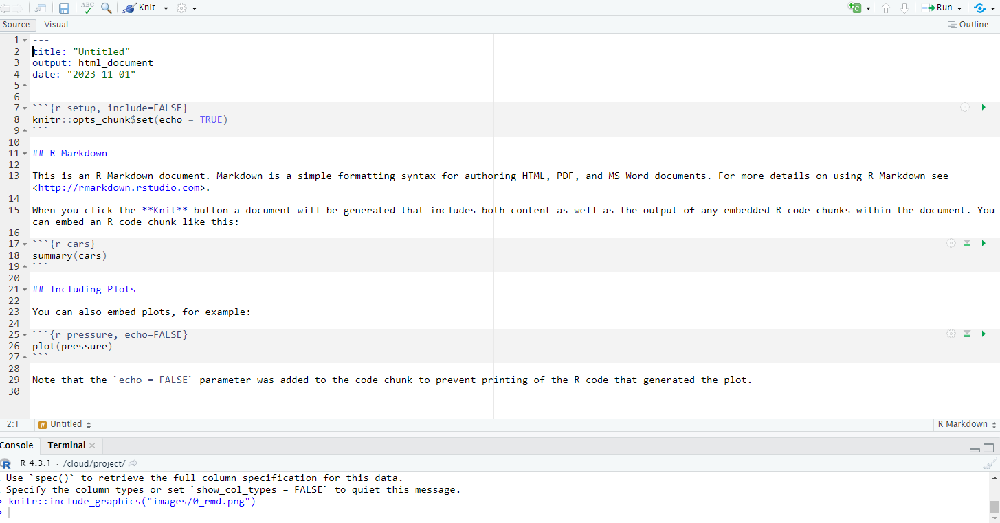
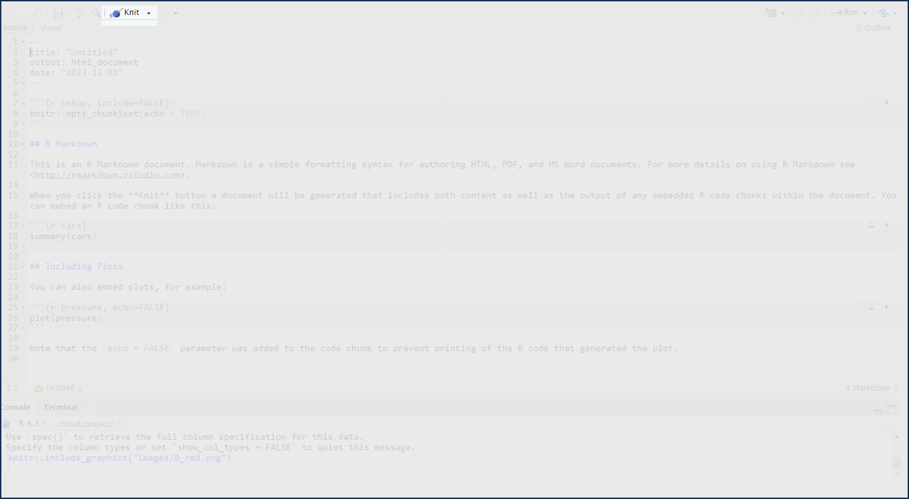
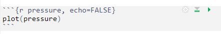
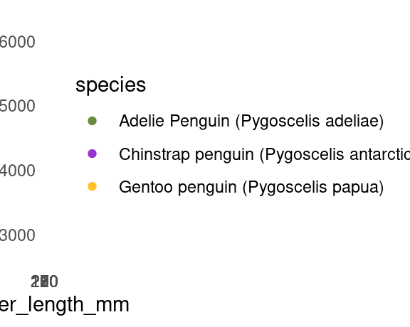
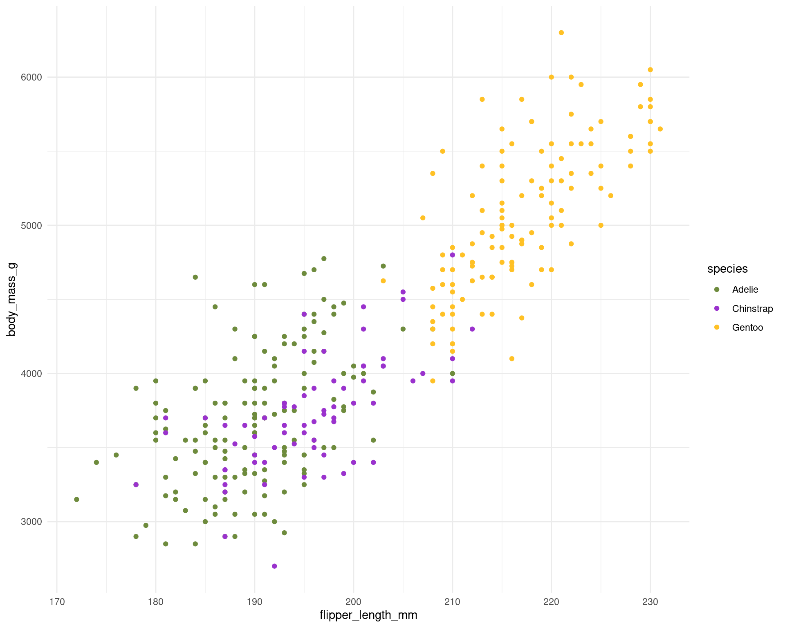
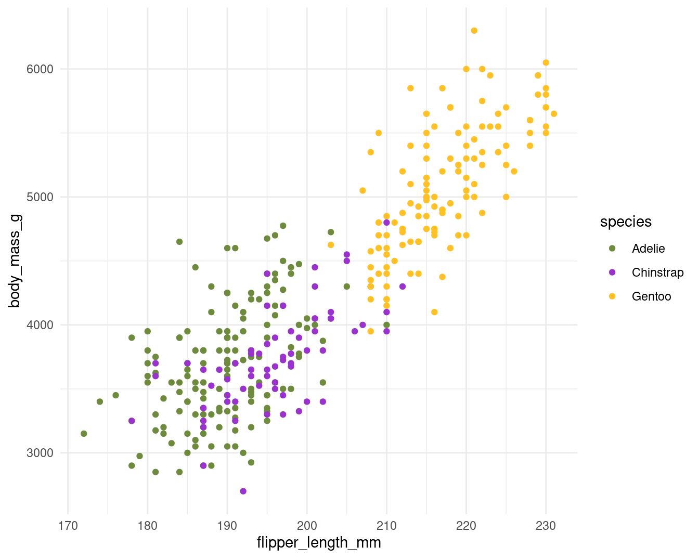
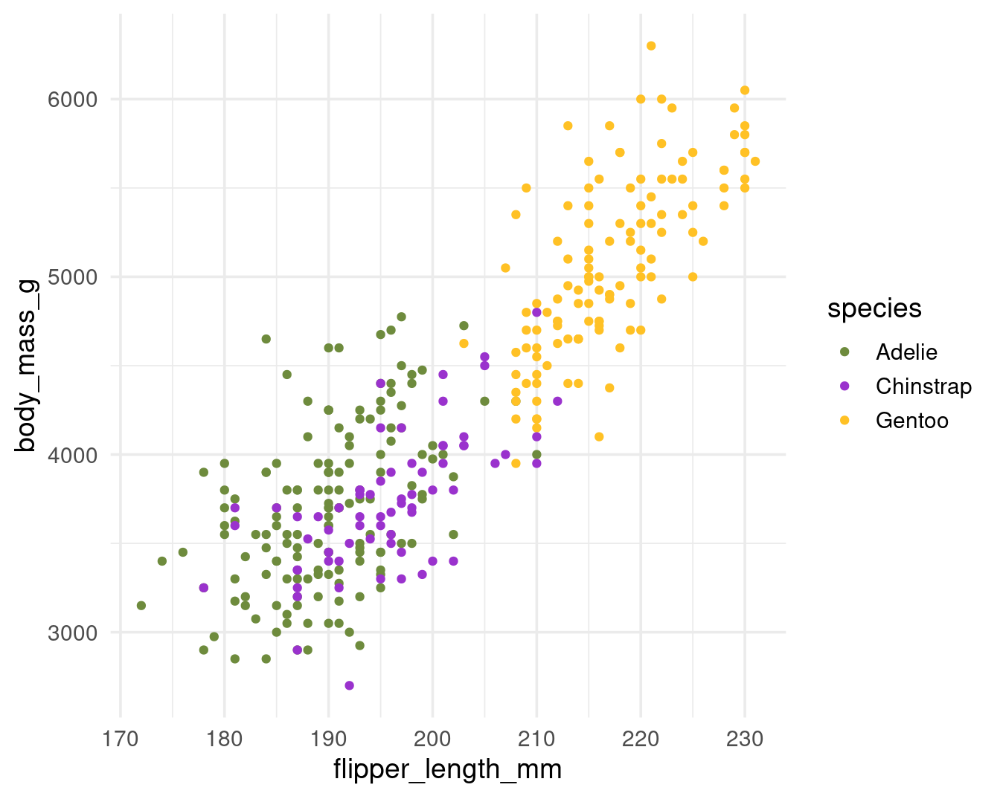

# (PART\*) Literate Programming and Reproducibility {.unnumbered}

# RMarkdown


R Markdown is a widely-used tool for creating automated, reproducible, and share-worthy outputs, such as reports. It can generate static or interactive outputs, in Word, pdf, html, Powerpoint slides, and many other formats.

An R Markdown script combines R code and text such that the script actually becomes your output document. You can create an entire formatted document, including narrative text (can be dynamic to change based on your data), tables, figures, bullets/numbers, bibliographies, etc.

Documents produced with Rmarkdown, allow analyses to be included easily - and make the link between raw data, analysis & and a published report *completely reproducible*.

With Rmarkdown we can make reproducible html, word, pdf, powerpoints or websites and dashboards^[(https://rmarkdown.rstudio.com/gallery.html)]


## How it works {-}

To create an R Markdown document in RStudio, go to **File > New File > R Markdown**. Choose a title, author, and date, as well as your default output format (HTML, PDF, or Word). These values can be changed later. Click OK, and RStudio will create an R Markdown document with some placeholder content. 




Delete this content and replace it with your own. As an example, let’s create a report about penguins using data from the `palmerpenguins` package. I’ve separated the data by year, and we’ll use just the 2007 data. Add the following content to add to your R Markdown document:


```markdown
---
title: "Penguins Report"
author: "Phil"
date: "2024-01-12"
output: word_document
---
  
``{r setup, include = FALSE}
knitr::opts_chunk$set(include = TRUE, 
                      echo = FALSE,
                      message = FALSE,
                      warning = FALSE)
``

``{r}
library(tidyverse)
``

``{r}
penguins_raw <- read_csv("https://raw.githubusercontent.com/UEABIO/data-sci-v1/main/book/files/penguins_raw.csv")
``

# Introduction

We are writing a report about the **Palmer Penguins**. These penguins are *really* amazing. There are three species:

- Adelie
- Gentoo
- Chinstrap

## Bill Length

We can make a histogram to see the distribution of bill lengths.

``{r}
penguins_raw |> 
  ggplot(aes(x = bill_length_mm)) +
  geom_histogram() +
  theme_minimal()
``

``{r}
average_bill_length <- penguins_raw |> 
  summarize(avg_bill_length = mean(bill_length_mm,
                                   na.rm = TRUE)) |> 
  pull(avg_bill_length)
``

The chart shows the distribution of bill lengths. The average bill length is `r average_bill_length` millimeters.
```


This document contains several sections, each of which we will discuss below. First, though, let’s skip to the finish line by doing what’s called *knitting* our document. The **Knit** button at the top of RStudio converts the R Markdown document into whatever format we selected.


**To make your Rmd publish - hit the knit button at the top of the doc**



We’ve set the output format to be HTML (see the output_format: html). Some features are not immediately visible in R Markdown that do appear in the rendered document, including the histogram. This is because the R Markdown document doesn’t directly include this plot. Rather, it includes the code needed to produce the plot when knitted.

It may seem convoluted to constantly knit R Markdown documents to Word, but this workflow allows us to update our reports at any point with new code or data. This ability is known as reproducibility, and it is central to the value of R Markdown.


## Background to Rmarkdown {-}

* Markdown is a “language” that allows you to write a document using plain text, that can be converted to html and other formats. It is not specific to R. Files written in Markdown have a ‘.md’ extension.

* R Markdown: is a variation on markdown that is specific to R - it allows you to write a document using markdown to produce text and to embed R code and display their outputs. R Markdown files have ‘.Rmd’ extension.

* rmarkdown - the package: This is used by R to render the .Rmd file into the desired output. It’s focus is converting the markdown (text) syntax, so we also need…

* knitr: This R package @R-knitr will read the code chunks, execute it, and ‘knit’ it back into the document. This is how tables and graphs are included alongside the text.

* Pandoc: Finally, pandoc actually convert the output into word/pdf/powerpoint etc. It is a software separate from R but is installed automatically with RStudio.

Most of this process happens in the background (you do not need to know all these steps!) and it involves feeding the `.Rmd` file to `knitr`, which executes the R code chunks and creates a new `.md` (Markdown) file which includes the R code **and its rendered output**. 

The .md file is then processed by pandoc to create the finished product: a Microsoft Word document, HTML file, Powerpoint document, pdf, etc. 


## Rmarkdown parts {-}

As you can see, there are three basic components to any Rmd file: 

* YAML

* Markdown text

* R code chunks.


### YAML Metadata {-}

The YAML section is the very beginning of an R Markdown document. The name YAML comes from the recursive acronym YAML ain’t markup language, whose meaning isn’t important for our purposes. Three dashes indicate its beginning and end, and the text inside of it contains metadata about the R Markdown document. Here is my YAML:


````md

---
title: "Penguins Report"
author: "Philip Leftwich"
date: "2024-01-12"
output: html_document
---

````

As you can see, it provides the title, author, date, and output format. All elements of the YAML are given in `key: value` syntax, where each key is a label for a piece of metadata (for example, the title) followed by a value in quotes.

In the example above, because we clicked that our default output would be an html file, we can see that the YAML says output: `html_document`. However we can also change this to say `powerpoint_presentation` or `word_document` or even `pdf_document`.

<div class="try">
<p>Can you edit the YAML in the Rmarkdown file in the markdown folder to
have your name as author, today’s date and the title of the file should
be called “Penguins of the Palmer Archipelago, Antarctica”.</p>
</div>

### Code chunks {-}

R Markdown documents have a different structure from the R script files you might be familiar with (those with the .R extension). R script files treat all content as code unless you comment out a line by putting a pound sign (#) in front of it. In the following code, the first line is a comment while the second line is code.

````md

```{r}
# Import our data
data <- read_csv("data.csv")
```

````

In R Markdown, the situation is reversed. Everything after the YAML is treated as text unless we specify otherwise by creating what are known as code chunks. Each chunk is opened with a line that starts with three back-ticks, and curly brackets that contain parameters for the chunk \{ \}. The chunk ends with three more back-ticks.

````md

```{r}
library(tidyverse)
```

````

R Markdown treats anything in the code chunk as R code when we knit. For example, this code chunk will produce a histogram in the final Word document.


````md

```{r}

penguins_raw |>  
  ggplot(aes(x = bill_length_mm)) +
  geom_histogram() +
  theme_minimal()
```

````


<div class="info">
<p>Some notes about the contents of the curly brackets { }:</p>
<p>They start with ‘r’ to indicate that the language name within this
chunk is <strong>R</strong>. It is possible to include other programming
language chunks here such as <strong>SQL</strong>,
<strong>Python</strong> or <strong>Bash</strong>.</p>
<p>After the r you can optionally write a chunk “name” – these are not
necessary but can help you organise your work. Note that if you name
your chunks, you should ALWAYS use unique names or else R will
<em>complain</em> when you try to render.</p>
<p>After the language name and optional chunk name put a comma, then you
can include other options too, written as <code>tag=value</code>, such
as:</p>
<ul>
<li><p>eval = FALSE to not run the R code</p></li>
<li><p>echo = FALSE to not print the chunk’s R source code in the output
document</p></li>
<li><p>warning = FALSE to not print warnings produced by the R
code</p></li>
<li><p>message = FALSE to not print any messages produced by the R
code</p></li>
<li><p>include = either TRUE/FALSE whether to include chunk outputs
(e.g. plots) in the document</p></li>
<li><p>out.width = and out.height = - size of ouput e.g. out.width =
“75%”</p></li>
<li><p>fig.align = “center” adjust how a figure is aligned across the
page</p></li>
<li><p>fig.show=‘hold’ if your chunk prints multiple figures and you
want them printed next to each other (pair with out.width = c(“33%”,
“67%”).</p></li>
</ul>
</div>

A special code chunk at the top of each R Markdown document, known as the setup code chunk, gives instructions for what should happen when knitting a document. 

In cases where you’re using R Markdown to generate a report for a non-R user, you likely want to hide the code, messages, and warnings but show the output (which would include any visualizations you generate). To do this, create a setup code chunk that looks like this:


````md

```{r}
knitr::opts_chunk$set(include = TRUE, 
                      echo = FALSE,
                      message = FALSE,
                      warning = FALSE)
```

````

The `include = FALSE` option on the first line applies to the setup code chunk itself. It tells R Markdown to not include the output of the setup code chunk when knitting. The options within `knitr::opts_chunk$set(`) apply to all future code chunks. **However, you can also override these global code chunk options on individual chunks**. If I wanted my document to show both the plot itself and the code used to make it, I could set `echo = TRUE` for that code chunk only:

````md

```{r}
penguins %>% 
  ggplot(aes(x = bill_length_mm)) +
  geom_histogram() +
  theme_minimal()
```

````

### Text {-}

This is the narrative of your document, including the titles and headings. It is written in the “markdown” language, which is used across many different software.

Below are the core ways to write this text. See more extensive documentation available on R Markdown “cheatsheets” at the RStudio website^[(https://www.rstudio.com/resources/cheatsheets/)].

#### New lines {-}

Uniquely in R Markdown, to initiate a new line, enter *two spaces** at the end of the previous line and then Enter/Return.

#### Text emphasis {-}

Surround your normal text with these characters to change how it appears in the output.

Underscores (\_text\_) or single asterisk (\*text\*) to *italicise*

Double asterisks (\*\*text\*\*) for **bold** text

Back-ticks  (\` text \`) to display text as `code`

The actual appearance of the font can be set by using specific templates (specified in the YAML metadata).

#### Titles and headings {-}

A hash symbol in a text portion of a R Markdown script creates a heading. This is different than in a chunk of R code in the script, in which a hash symbol is a mechanism to comment/annotate/de-activate, as in a normal R script.

Different heading levels are established with different numbers of hash symbols at the start of a new line. One hash symbol is a title or primary heading. Two hash symbols are a second-level heading. Third- and fourth-level headings can be made with successively more hash symbols.


```

# First-level heading / Title

## Second level heading  

### Third-level heading

```

#### Bullets and numbering {-}

Use asterisks (*) to created a bullets list. Finish the previous sentence, enter two spaces, Enter/Return twice, and then start your bullets. Include a space between the asterisk and your bullet text. After each bullet enter two spaces and then Enter/Return. Sub-bullets work the same way but are indented. Numbers work the same way but instead of an asterisk, write 1), 2), etc. Below is how your R Markdown script text might look.

Here are my bullets (there are two spaces after this colon):  

```
* Bullet 1 (followed by two spaces and Enter/Return)  
* Bullet 2 (followed by two spaces and Enter/Return)  
  * Sub-bullet 1 (followed by two spaces and Enter/Return)  
  * Sub-bullet 2 (followed by two spaces and Enter/Return)  
```

### In-text code {-}

You can also include minimal R code within back-ticks. Within the back-ticks, begin the code with “r” and a space, so RStudio knows to evaluate the code as R code. See the example below.

This book was printed on `` `r Sys.Date()` ``

When typed in-line within a section of what would otherwise be Markdown text, it knows to produce an r output instead: 

This book was printed on 2023-11-09

### Running code {-}

You can run the code in an R Markdown document in two ways. The first way is by knitting the entire document. The second way is to run code chunks manually (also known as interactively) by hitting the little green play button at the top-right of a code chunk. The down arrow next to the green play button will run all code until that point.




The one downside to running code interactively is that you can sometimes make mistakes that cause your R Markdown document to fail to knit. That is because, in order to knit, an R Markdown document must contain all the code it uses. If you are working interactively and, say, load data from a separate file, you will be unable to knit your document. When working in R Markdown, always keep all code within a single document.

The code must also always appear in the right order. 


## Useful tips {-}
 
<div class="info">
<p>The working directory for .rmd files is a little different to working
with scripts.</p>
<p>With a .Rmd file, the <strong>working directory is wherever the Rmd
file itself is saved</strong>.</p>
<p>For example if you have your .Rmd file in a subfolder
~/markdownfiles/markdown.Rmd the code for read_csv(“data/data.csv”)
within the markdown will look for a <code>.csv</code> file in a
subfolder called data <em>inside</em> the ‘markdown’ folder and not the
root project folder where the <code>.RProj</code> file lives.</p>
<p>So we have two options when using .Rmd files</p>
<ol style="list-style-type: decimal">
<li><p>Don’t put the .Rmd file in a subfolder and make sure it lives in
the same directory as your .RProj file - that way relative filepaths are
the same between R scripts and Rmarkdown files</p></li>
<li><p>Use the <code>here</code> package to describe file locations -
more later</p></li>
</ol>
</div>


## Exercises: Setting code chunks {-}


**Question 1.** The global option for this document is set to show the R code used to render chunks <select class='webex-select'><option value='blank'></option><option value='answer'>TRUE</option><option value=''>FALSE</option></select>


<div class='webex-solution'><button>Explain This Answer</button>

knitr::opts_chunk$set(echo = TRUE)

</div>
 

**Question 2.** Options set in individual code chunks override the global options <select class='webex-select'><option value='blank'></option><option value='answer'>TRUE</option><option value=''>FALSE</option></select>


<div class='webex-solution'><button>Explain This Answer</button>

In the second chunk we see echo = FALSE and this has prevented the code from being printed, we only see the rendered output

</div>
 
<br>
**Question 3.** If we wanted to see the R code, but **not** its output we need to select what combo of code chunk options? <select class='webex-select'><option value='blank'></option><option value=''>echo = TRUE, eval = TRUE</option><option value='answer'>echo = TRUE, eval = FALSE</option><option value=''>echo = FALSE, eval = FALSE</option><option value=''>echo = FALSE, eval = TRUE</option></select>


<div class="panel panel-default"><div class="panel-heading"> Task </div><div class="panel-body"> 

Generate a self-contained report from data
 </div></div>

For a relatively simple report, you may elect to organize your R Markdown script such that it is “self-contained” and does not involve any external scripts.

**Set up your Rmd file to 'read' the penguins data file.**

Everything you need to run the R markdown is imported or created within the Rmd file, including all the code chunks and package loading. This “self-contained” approach is appropriate when you do not need to do much data processing (e.g. it brings in a clean or semi-clean data file) and the rendering of the R Markdown will not take too long.

In this scenario, one logical organization of the R Markdown script might be:

* Set global knitr options

* Load packages

* Import data

* Process data

* Produce outputs (tables, plots, etc.)

* Save outputs, *if applicable* (.csv, .png, etc.)


### Heuristic file paths with `here()` {-}

The package `here` @R-here and its function `here()` (`here::here()`), make it easy to tell R where to find and to save your files - in essence, it builds file paths. It becomes especially useful for dealing with the alternate filepaths generated by .Rmd files, but can be used for exporting/importing any scripts, functions or data. 

This is how `here()` works within an R project:

- When the `here` package is first loaded within the R project, it places a small file called “.here” in the root folder of your R project as a “benchmark” or “anchor”

- In your scripts, to reference a file in the R project’s sub-folders, you use the function `here()` to build the file path in relation to that anchor

- To build the file path, write the names of folders beyond the root, within quotes, separated by commas, finally ending with the file name and file extension as shown below

- `here()` file paths can be used for both importing and exporting

So when you use `here()` wrapped inside other functions for importing/exporting (like `read_csv()` or `ggsave()`) if you include `here()` you can still use the RProject location as the root directory when 'knitting' Rmarkdown files, even if your markdown is tidied away into a **separate sub-folder**.

This means your previous relative filepaths should be replaced with:


````md
```{r, include=FALSE}
# GLOBAL KNITR OPTIONS ----
knitr::opts_chunk$set(echo = TRUE)
# ____________________----

# PACKAGES ----
library(tidyverse)
library(here)

```
````

````md
```{r, include=FALSE}
# READ DATA ----

penguins <- read_csv(here("data", "penguins_raw.csv"))

head(penguins)

```
````


<div class="try">
<p>Try replacing your previous code with the examples above then
re-knitting your .Rmd file.</p>
</div>


<div class="warning">
<p>You might want start using the <code>here()</code> from now on to
read in and export data from scripts. Make sure you are consistent in
whether you use <code>here()</code> heuristic file paths or relative
file paths across <strong>all .R and .Rmd files in a project</strong> -
otherwise you might encounter errors.</p>
</div>


## Activity: Can you change the global options of your Rmd file so that it doesn't display any code, warnings or messages? {-}

Once you have made your edits to the [chunk options](#code-chunks) try hitting 'knit' again. 


## ggplot {-}

### Size options for figures {-}


- `fig.width` and `fig.height` enable to set width and height of R produced figures.
The default value is set to **7 (inches)**. When I play with these options, I prefer using only one of them (`fig.width`).

- `fig.asp` sets the *height-to-width* ratio of the figure. It’s easier in my mind to play with this ratio than to give a width and a height separately. The default value of fig.asp is NULL but I often set it to `(0.8)`, which often corresponds to the expected result.

Size options of figures produced by R have consequences on relative sizes of elements in this figures. For a `ggplot2` figure, these elements will remain to the size defined in the used theme, whatever the chosen size of the figure. Therefore a huge size can lead to a very small text and vice versa.


<div class="info">
<p>The base font size is 11 pts by default. You can change it with the
<code>base_size</code> argument in the theme you’re using.</p>
</div>


```r
# snake_case names need to be made

penguins <- janitor::clean_names(penguins)
```


```r
penguin_colours <- c("darkolivegreen4", "darkorchid3", "goldenrod1")

plot <- penguins %>% 
  ggplot(aes(x=flipper_length_mm, 
             y = body_mass_g))+
  geom_point(aes(colour=species))+
  scale_color_manual(values=penguin_colours)+
  theme_minimal(base_size = 11)
```


````md
```{r fig.asp = 0.8, fig.width = 3}
plot
# figure elements are too big
```
````


````md
```{r fig.asp = 0.8, fig.width = 10}
plot
# figure elements are too small
```
````


To find the result you like, you’ll need to combine sizes set in your theme and set in the chunk options. With my customised theme, the default size (`7`) looks good to me.

````md
```{r fig.asp = 0.8, fig.width = 7}
plot
```
````



When texts axis are longer or when figures is overloaded, you can choose bigger size (8 or 9) to relatively reduce the figure elements. it’s worth noting that for the text sizes, you can also modify the base size in your theme to obtain similar figures.

````md
```{r fig.asp = 0.8, fig.width = 7}
plot + theme(base_size = 14)
# figure width stays the same, but modify the text size in ggplot
```
````




### Size of final figure in document {-}

With the previous examples, you could see the relative size of the elements within th figures was changed - but the area occupied by the figures remained the same. In order to change this I need `out.width` or `out.height`

Figures made with R in a R Markdown document are exported (by default in png format) and then inserted into the final rendered document. Options `out.width` and `out.height` enable us to choose the size of the figure in the final document.

It is rare I need to re-scale height-to-width ratio after the figures were produced with R and this ratio is kept if you modify only one option therefore I only use `out.width`. i like to use percentage to define the size of output figures. For example hre with a size set to 50%

````md
```{r fig.asp = 0.8, fig.width = 7, out.width = "50%"}
plot 
# The final rendered size of the image changes according to out.width
```
````



### Changing default values of chunk options {-}

You can also change default values of chunk options by writing this at the beginning of your R Markdown document.

````md
```{r setup, include=FALSE}
knitr::opts_chunk$set(
 fig.width = 6,
 fig.asp = 0.8,
 out.width = "80%"
)
```
````

These values will be applied for all chunks unless you specify other value in a chunk locally. You can set values often used (which differ from the default one) and avoid repeating them for each chunk.


## Static images {-}

You can include images in your R Markdown:

````md
```{r setup, include=FALSE}
knitr::include_graphics("path/to/image.png")
```
````

## Tables {-}

### Markdown tables {-}

```
| Syntax      | Description |
| ----------- | ----------- |
| Header      | Title       |
| Paragraph   | Text        |

```

Which will render as this

| Syntax      | Description |
| ----------- | ----------- |
| Header      | Title       |
| Paragraph   | Text        |


### gt() {-}

The `gt` @R-gt package is all about making it simple to produce nice-looking display tables. [It has a lot of customisation options.](https://gt.rstudio.com/index.html) 


```r
penguins |>  
    group_by(species) |>  
    summarise(`Body Mass (g)`= mean(body_mass_g, na.rm = T),
              `Flipper Length (mm)`= mean(flipper_length_mm, na.rm = T)) |>  
  gt::gt()
```

```{=html}
<div id="lyyjsjsoxx" style="padding-left:0px;padding-right:0px;padding-top:10px;padding-bottom:10px;overflow-x:auto;overflow-y:auto;width:auto;height:auto;">
<style>#lyyjsjsoxx table {
  font-family: system-ui, 'Segoe UI', Roboto, Helvetica, Arial, sans-serif, 'Apple Color Emoji', 'Segoe UI Emoji', 'Segoe UI Symbol', 'Noto Color Emoji';
  -webkit-font-smoothing: antialiased;
  -moz-osx-font-smoothing: grayscale;
}

#lyyjsjsoxx thead, #lyyjsjsoxx tbody, #lyyjsjsoxx tfoot, #lyyjsjsoxx tr, #lyyjsjsoxx td, #lyyjsjsoxx th {
  border-style: none;
}

#lyyjsjsoxx p {
  margin: 0;
  padding: 0;
}

#lyyjsjsoxx .gt_table {
  display: table;
  border-collapse: collapse;
  line-height: normal;
  margin-left: auto;
  margin-right: auto;
  color: #333333;
  font-size: 16px;
  font-weight: normal;
  font-style: normal;
  background-color: #FFFFFF;
  width: auto;
  border-top-style: solid;
  border-top-width: 2px;
  border-top-color: #A8A8A8;
  border-right-style: none;
  border-right-width: 2px;
  border-right-color: #D3D3D3;
  border-bottom-style: solid;
  border-bottom-width: 2px;
  border-bottom-color: #A8A8A8;
  border-left-style: none;
  border-left-width: 2px;
  border-left-color: #D3D3D3;
}

#lyyjsjsoxx .gt_caption {
  padding-top: 4px;
  padding-bottom: 4px;
}

#lyyjsjsoxx .gt_title {
  color: #333333;
  font-size: 125%;
  font-weight: initial;
  padding-top: 4px;
  padding-bottom: 4px;
  padding-left: 5px;
  padding-right: 5px;
  border-bottom-color: #FFFFFF;
  border-bottom-width: 0;
}

#lyyjsjsoxx .gt_subtitle {
  color: #333333;
  font-size: 85%;
  font-weight: initial;
  padding-top: 3px;
  padding-bottom: 5px;
  padding-left: 5px;
  padding-right: 5px;
  border-top-color: #FFFFFF;
  border-top-width: 0;
}

#lyyjsjsoxx .gt_heading {
  background-color: #FFFFFF;
  text-align: center;
  border-bottom-color: #FFFFFF;
  border-left-style: none;
  border-left-width: 1px;
  border-left-color: #D3D3D3;
  border-right-style: none;
  border-right-width: 1px;
  border-right-color: #D3D3D3;
}

#lyyjsjsoxx .gt_bottom_border {
  border-bottom-style: solid;
  border-bottom-width: 2px;
  border-bottom-color: #D3D3D3;
}

#lyyjsjsoxx .gt_col_headings {
  border-top-style: solid;
  border-top-width: 2px;
  border-top-color: #D3D3D3;
  border-bottom-style: solid;
  border-bottom-width: 2px;
  border-bottom-color: #D3D3D3;
  border-left-style: none;
  border-left-width: 1px;
  border-left-color: #D3D3D3;
  border-right-style: none;
  border-right-width: 1px;
  border-right-color: #D3D3D3;
}

#lyyjsjsoxx .gt_col_heading {
  color: #333333;
  background-color: #FFFFFF;
  font-size: 100%;
  font-weight: normal;
  text-transform: inherit;
  border-left-style: none;
  border-left-width: 1px;
  border-left-color: #D3D3D3;
  border-right-style: none;
  border-right-width: 1px;
  border-right-color: #D3D3D3;
  vertical-align: bottom;
  padding-top: 5px;
  padding-bottom: 6px;
  padding-left: 5px;
  padding-right: 5px;
  overflow-x: hidden;
}

#lyyjsjsoxx .gt_column_spanner_outer {
  color: #333333;
  background-color: #FFFFFF;
  font-size: 100%;
  font-weight: normal;
  text-transform: inherit;
  padding-top: 0;
  padding-bottom: 0;
  padding-left: 4px;
  padding-right: 4px;
}

#lyyjsjsoxx .gt_column_spanner_outer:first-child {
  padding-left: 0;
}

#lyyjsjsoxx .gt_column_spanner_outer:last-child {
  padding-right: 0;
}

#lyyjsjsoxx .gt_column_spanner {
  border-bottom-style: solid;
  border-bottom-width: 2px;
  border-bottom-color: #D3D3D3;
  vertical-align: bottom;
  padding-top: 5px;
  padding-bottom: 5px;
  overflow-x: hidden;
  display: inline-block;
  width: 100%;
}

#lyyjsjsoxx .gt_spanner_row {
  border-bottom-style: hidden;
}

#lyyjsjsoxx .gt_group_heading {
  padding-top: 8px;
  padding-bottom: 8px;
  padding-left: 5px;
  padding-right: 5px;
  color: #333333;
  background-color: #FFFFFF;
  font-size: 100%;
  font-weight: initial;
  text-transform: inherit;
  border-top-style: solid;
  border-top-width: 2px;
  border-top-color: #D3D3D3;
  border-bottom-style: solid;
  border-bottom-width: 2px;
  border-bottom-color: #D3D3D3;
  border-left-style: none;
  border-left-width: 1px;
  border-left-color: #D3D3D3;
  border-right-style: none;
  border-right-width: 1px;
  border-right-color: #D3D3D3;
  vertical-align: middle;
  text-align: left;
}

#lyyjsjsoxx .gt_empty_group_heading {
  padding: 0.5px;
  color: #333333;
  background-color: #FFFFFF;
  font-size: 100%;
  font-weight: initial;
  border-top-style: solid;
  border-top-width: 2px;
  border-top-color: #D3D3D3;
  border-bottom-style: solid;
  border-bottom-width: 2px;
  border-bottom-color: #D3D3D3;
  vertical-align: middle;
}

#lyyjsjsoxx .gt_from_md > :first-child {
  margin-top: 0;
}

#lyyjsjsoxx .gt_from_md > :last-child {
  margin-bottom: 0;
}

#lyyjsjsoxx .gt_row {
  padding-top: 8px;
  padding-bottom: 8px;
  padding-left: 5px;
  padding-right: 5px;
  margin: 10px;
  border-top-style: solid;
  border-top-width: 1px;
  border-top-color: #D3D3D3;
  border-left-style: none;
  border-left-width: 1px;
  border-left-color: #D3D3D3;
  border-right-style: none;
  border-right-width: 1px;
  border-right-color: #D3D3D3;
  vertical-align: middle;
  overflow-x: hidden;
}

#lyyjsjsoxx .gt_stub {
  color: #333333;
  background-color: #FFFFFF;
  font-size: 100%;
  font-weight: initial;
  text-transform: inherit;
  border-right-style: solid;
  border-right-width: 2px;
  border-right-color: #D3D3D3;
  padding-left: 5px;
  padding-right: 5px;
}

#lyyjsjsoxx .gt_stub_row_group {
  color: #333333;
  background-color: #FFFFFF;
  font-size: 100%;
  font-weight: initial;
  text-transform: inherit;
  border-right-style: solid;
  border-right-width: 2px;
  border-right-color: #D3D3D3;
  padding-left: 5px;
  padding-right: 5px;
  vertical-align: top;
}

#lyyjsjsoxx .gt_row_group_first td {
  border-top-width: 2px;
}

#lyyjsjsoxx .gt_row_group_first th {
  border-top-width: 2px;
}

#lyyjsjsoxx .gt_summary_row {
  color: #333333;
  background-color: #FFFFFF;
  text-transform: inherit;
  padding-top: 8px;
  padding-bottom: 8px;
  padding-left: 5px;
  padding-right: 5px;
}

#lyyjsjsoxx .gt_first_summary_row {
  border-top-style: solid;
  border-top-color: #D3D3D3;
}

#lyyjsjsoxx .gt_first_summary_row.thick {
  border-top-width: 2px;
}

#lyyjsjsoxx .gt_last_summary_row {
  padding-top: 8px;
  padding-bottom: 8px;
  padding-left: 5px;
  padding-right: 5px;
  border-bottom-style: solid;
  border-bottom-width: 2px;
  border-bottom-color: #D3D3D3;
}

#lyyjsjsoxx .gt_grand_summary_row {
  color: #333333;
  background-color: #FFFFFF;
  text-transform: inherit;
  padding-top: 8px;
  padding-bottom: 8px;
  padding-left: 5px;
  padding-right: 5px;
}

#lyyjsjsoxx .gt_first_grand_summary_row {
  padding-top: 8px;
  padding-bottom: 8px;
  padding-left: 5px;
  padding-right: 5px;
  border-top-style: double;
  border-top-width: 6px;
  border-top-color: #D3D3D3;
}

#lyyjsjsoxx .gt_last_grand_summary_row_top {
  padding-top: 8px;
  padding-bottom: 8px;
  padding-left: 5px;
  padding-right: 5px;
  border-bottom-style: double;
  border-bottom-width: 6px;
  border-bottom-color: #D3D3D3;
}

#lyyjsjsoxx .gt_striped {
  background-color: rgba(128, 128, 128, 0.05);
}

#lyyjsjsoxx .gt_table_body {
  border-top-style: solid;
  border-top-width: 2px;
  border-top-color: #D3D3D3;
  border-bottom-style: solid;
  border-bottom-width: 2px;
  border-bottom-color: #D3D3D3;
}

#lyyjsjsoxx .gt_footnotes {
  color: #333333;
  background-color: #FFFFFF;
  border-bottom-style: none;
  border-bottom-width: 2px;
  border-bottom-color: #D3D3D3;
  border-left-style: none;
  border-left-width: 2px;
  border-left-color: #D3D3D3;
  border-right-style: none;
  border-right-width: 2px;
  border-right-color: #D3D3D3;
}

#lyyjsjsoxx .gt_footnote {
  margin: 0px;
  font-size: 90%;
  padding-top: 4px;
  padding-bottom: 4px;
  padding-left: 5px;
  padding-right: 5px;
}

#lyyjsjsoxx .gt_sourcenotes {
  color: #333333;
  background-color: #FFFFFF;
  border-bottom-style: none;
  border-bottom-width: 2px;
  border-bottom-color: #D3D3D3;
  border-left-style: none;
  border-left-width: 2px;
  border-left-color: #D3D3D3;
  border-right-style: none;
  border-right-width: 2px;
  border-right-color: #D3D3D3;
}

#lyyjsjsoxx .gt_sourcenote {
  font-size: 90%;
  padding-top: 4px;
  padding-bottom: 4px;
  padding-left: 5px;
  padding-right: 5px;
}

#lyyjsjsoxx .gt_left {
  text-align: left;
}

#lyyjsjsoxx .gt_center {
  text-align: center;
}

#lyyjsjsoxx .gt_right {
  text-align: right;
  font-variant-numeric: tabular-nums;
}

#lyyjsjsoxx .gt_font_normal {
  font-weight: normal;
}

#lyyjsjsoxx .gt_font_bold {
  font-weight: bold;
}

#lyyjsjsoxx .gt_font_italic {
  font-style: italic;
}

#lyyjsjsoxx .gt_super {
  font-size: 65%;
}

#lyyjsjsoxx .gt_footnote_marks {
  font-size: 75%;
  vertical-align: 0.4em;
  position: initial;
}

#lyyjsjsoxx .gt_asterisk {
  font-size: 100%;
  vertical-align: 0;
}

#lyyjsjsoxx .gt_indent_1 {
  text-indent: 5px;
}

#lyyjsjsoxx .gt_indent_2 {
  text-indent: 10px;
}

#lyyjsjsoxx .gt_indent_3 {
  text-indent: 15px;
}

#lyyjsjsoxx .gt_indent_4 {
  text-indent: 20px;
}

#lyyjsjsoxx .gt_indent_5 {
  text-indent: 25px;
}
</style>
<table class="gt_table" data-quarto-disable-processing="false" data-quarto-bootstrap="false">
  <thead>
    
    <tr class="gt_col_headings">
      <th class="gt_col_heading gt_columns_bottom_border gt_left" rowspan="1" colspan="1" scope="col" id="species">species</th>
      <th class="gt_col_heading gt_columns_bottom_border gt_right" rowspan="1" colspan="1" scope="col" id="Body Mass (g)">Body Mass (g)</th>
      <th class="gt_col_heading gt_columns_bottom_border gt_right" rowspan="1" colspan="1" scope="col" id="Flipper Length (mm)">Flipper Length (mm)</th>
    </tr>
  </thead>
  <tbody class="gt_table_body">
    <tr><td headers="species" class="gt_row gt_left">Adelie</td>
<td headers="Body Mass (g)" class="gt_row gt_right">3700.662</td>
<td headers="Flipper Length (mm)" class="gt_row gt_right">189.9536</td></tr>
    <tr><td headers="species" class="gt_row gt_left">Chinstrap</td>
<td headers="Body Mass (g)" class="gt_row gt_right">3733.088</td>
<td headers="Flipper Length (mm)" class="gt_row gt_right">195.8235</td></tr>
    <tr><td headers="species" class="gt_row gt_left">Gentoo</td>
<td headers="Body Mass (g)" class="gt_row gt_right">5076.016</td>
<td headers="Flipper Length (mm)" class="gt_row gt_right">217.1870</td></tr>
  </tbody>
  
  
</table>
</div>
```

<div class="try">
<p>You won’t be able to see these tables unless you try re-knitting your
.Rmd file.</p>
</div>


## Source files {-}

One variation of the “self-contained” approach is to have R Markdown code chunks “source” (run) other R scripts. 

This can make your R Markdown script less cluttered, more simple, and easier to organize. It can also help if you want to display final figures at the beginning of the report. 

In this approach, the final R Markdown script simply combines pre-processed outputs into a document. We already used the `source()` function to feed R objects from one script to another, now we can do the same thing to our report. 

The advantage is all the data cleaning and organising happens "elsewhere" and we don't need to repeat our code. If you make any changes in your analysis scripts, these will be reflected by changes in your report the next time you compile (knit) it. 

```
source("scripts/your-script.R")
```

<div class="warning">
<p>Don’t try using <code>here()</code> unless ALL of your script
dependencies ALSO use this. When knitting an Rmd file it treats the
absolute file path as relative to the .Rmd file (even when running
scripts written outside of the document).</p>
<p>This is why it’s usually simpler to save your .Rmd file in the same
place as your .RProj file</p>
</div>

## Activity: Connecting scripts and reports {-}

<div class="panel panel-default"><div class="panel-heading"> Task </div><div class="panel-body"> 

Create a separate R script for data import and quick cleaning, then source this into a new .Rmd file.
 </div></div>

* Create a **new** Rmarkdown file.

* Create a new .R file

* Save this (without changes) to the same folder as your `.Rproj` file and call it `linked_report_penguins.Rmd`.

<div class="try">
<p>We will now source pre-written scripts for data loading and wrangling
in your R project, just use the source command to read in this script -
then you can call objects made externally - in this case a penguin plot
- put the code block in and hit knit.</p>
</div>

````md
```{r setup, include=FALSE}
# GLOBAL KNITR OPTIONS ----
knitr::opts_chunk$set(echo = TRUE)
# ____________________----

```
````

````md
```{r read-data, include=FALSE}
# READ DATA ----

source("scripts/penguins.R")

```
`````


## Activity: Test yourself {-}

* Make any summary figure you want from the penguins data with `ggplot`

* Make a summary table with `summarise` and make it beautiful with `kableExtra` or `gt()`

* Write a few sentences explaining what you are presenting

* Knit the report to **html**

* Use chunk options to optimise your figure layout and text and make it so that raw code and rendered outputs are visible. An example of literate programming

### Hygiene tips {-}

I recommend having three chunks at the top of any document

* Global chunk options

* All packages

* Reading data

````md

```{r setup , include=FALSE}
knitr::opts_chunk$set(echo = TRUE, 
                      fig.align = "center",
                      fig.width = 6,
                      fig.asp = 0.8,
                      out.width = "80%
                      )
                      
```

```{r library}
library(tidyverse)
```

```{r read-data}
source("scripts/02_visualisation_penguins.R")
```

````

## Common knit issues {-}

Any of these issues will cause the Rmd document to fail to knit in its entirety. A failed knit is usually an easy fix, but needs you to READ the error message, and do a little detective work. 

### Duplication {-}

````md

```{r title-one}
```

```{r title-one}
```

````

### Not the right order {-}

```
plot(my_table)

my_table <- table(mtcars$cyl)
```

### Forgotten trails {-}

: Missing “,”, or “(”, “}”, or “’”


### Path not taken {-}

The Rmd document is in a different location the .Rproj file causing issues with relative filepaths

### Spolling {-}

* Incorrectly labelled chunk options

* Incorrectly evaluated R code


## Visual editor {-}

RStudio comes with a pretty nifty [Visual Markdown Editor](https://www.rstudio.com/blog/exploring-rstudio-visual-markdown-editor/) which includes:

* Spellcheck

* Easy table & equation insertion

* Easy citations and reference list building

You can switch between modes with a button push, try it out! 

## Quarto {-}

The visual editor was a precursor to a new type of publishing tool - Quarto. this tool takes what R Markdown has done for R and extends it to other languages, including Python, Julia, and Observable JS. As I write this book, Quarto is gaining traction. Luckily, the concepts you’ve learned in this chapter apply to Quarto as well. Quarto documents have a YAML section, code chunks, and Markdown text. You can export Quarto documents to HTML, PDF, and Word. However, R Markdown and Quarto documents have some syntactic differences. 


### Further Reading, Guides and tips {-}

* [R Cheat Sheets](https://www.rstudio.com/resources/cheatsheets/)

* @xie2015 Dynamic documents with Rmarkdown

*The fully comprehensive guide*

(https://rmarkdown.rstudio.com/articles_intro.html)

(https://rmarkdown.rstudio.com/authoring_quick_tour.html)

* https://www.apreshill.com/blog/2022-04-we-dont-talk-about-quarto/

* https://www.njtierney.com/post/2022/04/11/rmd-to-qmd/

* https://www.jumpingrivers.com/blog/quarto-rmarkdown-comparison/


