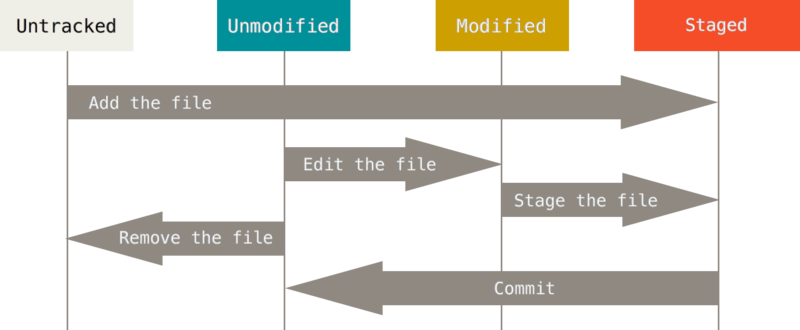
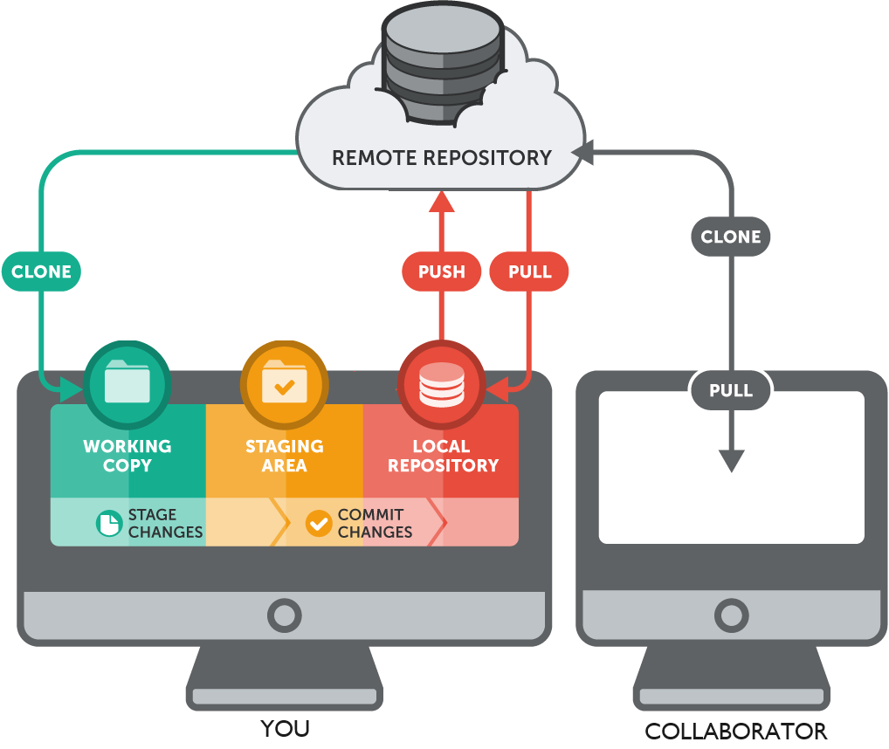
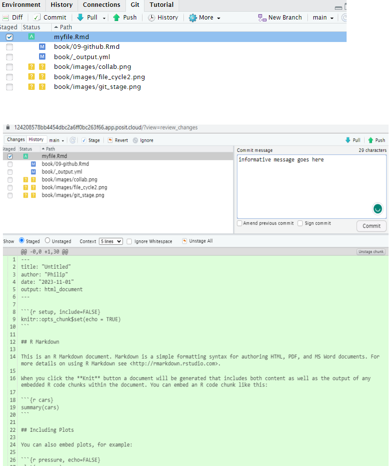
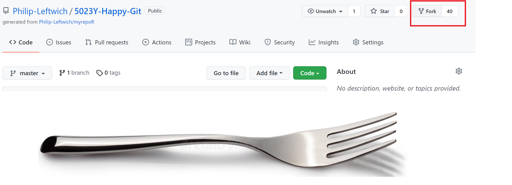
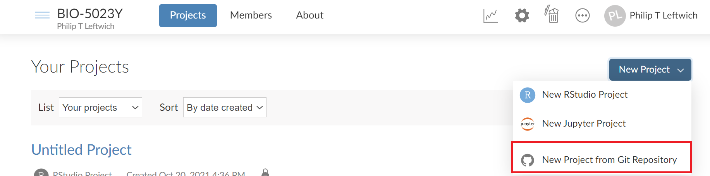
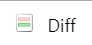
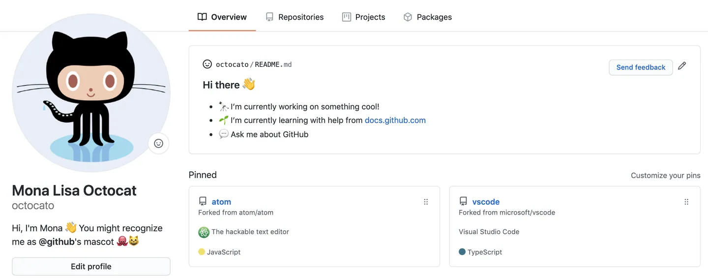
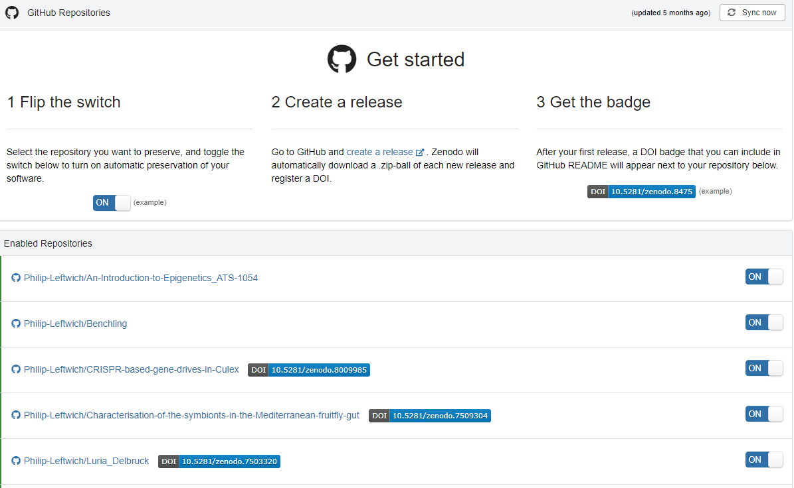

# Github


## Let's Git it started 

Git is a **version control system**. Originally built to help groups of developers work collaboratively on big software projects. It helps us manage our RStudio projects - with tracked changes. 

Git and GitHub are a big part of the data science community. We can use GitHub in a number of ways

1) To source code and repurpose analyses built by others for our own uses

2) Manage our analysis projects so that all parts of it: 

    🔢 Data
  
    ✍ ️Scripts
  
    📊 Figures
  
    📝 Reports
  
Are version controlled and open access

3) Version control lets you recover from any mistakes & your analysis is *backed up* externally

4) When you come to publish any reports - your analysis is accessible to others

5) Build up your own library of projects to show what you can do in Data Science

If you work alone, git is great to track changes and recover previous version of your files. You can also use a remote repository to have a back up and share your work.

If you work as a team you can take advantage of all the above and also use version control as a tool to collaborate and organize the various versions of the same file present in the multiple computers you and they use.


## What is version control?

Let’s imagine that we have a git repository. When you create a new file as part of the repository (or repo), that file is untracked. This means that git will ignore the file and any change you make to it *until you add it to the repo*. At that point the file is **staged** and ready to get into the repository. To do that you do a **commit** and save that version of the file to the repo. This workflow `modify --> add --> commit` will repeat every time you want to save a version of the file. It's a good idea to commit every time you end a task or objective in your project.



`add` and `commit` are also git commands.RStudio provides a basic GUI for git, which we are going to use in this workshop. But you can also use the Terminal to talk to git on the command line

<div class="info">
<p>to add a file to the staging area.</p>
<p>git add <file></p>
<p>git commit -m “A descriptive message to commit the files on the
staging area.”</p>
</div>

## Remote repositories

What we explained before is the local workflow. This is when the repo lives in your computer and that’s it. But you can also connect the local repository with a remote repository. For this workshop we are going to use GitHub to host remote repositories, but there are other options you can explore, such as GitLab.

Let’s imagine we have a local repository, we made some commits and we want to send those changes to the remote repository (we’ll how to create the remote repository later). For that we push the commits to the remote repository and the two repos are “up to date”.

If a team-mate changes a file and pushes the changes it to the remote repository, your local repo will be “outdated”. To download those new commits from the remote repository you pull the commits.



And if you want to try the command line:

<div class="info">
<p>to upload commits to the remote repository.</p>
<p>git push</p>
<p>to download commits from the remote repository to the local repo.</p>
<p>git pull</p>
</div>


## Git introductions

Before you create your first repository you need to make sure that git and RStudio are friends and that git knows you. That means you have:

- Installed Git on your machine (not needed if using Posit Cloud)

- Created a Github Account - go to [github.com](https://github.com/)

<div class="info">
<p>You can check that RStudio “sees” git by going to Tools –&gt; Global
Options –&gt; Git/SVN. There you should find the path in your computer
to the git installation.</p>
</div>

You can now introduce yourself to Github with the `usethis` package


```r
library(usethis) 
use_git_config(user.name  = "Jane Doe",
               user.email = "jane@example.org")
```

Substituting with your name and the email associated with your GitHub account, or you can also do this on the command line:

<div class="info">
<p>git config –global user.name ‘Jane Doe’</p>
<p>git config –global user.email ’jane@example.com</p>
</div>


You will also need a Personal Access Token (PAT), Github has started using these *in lieu* of passwords. 

Create a PAT with


```r
usethis::create_github_token()
```

This will likely open a new window allowing you to create a token. Do now close this window, as you will need to copy the token to your clipboard. Then run this other command:


```r
gitcreds::gitcreds_set()
```

This will ask you for your access token. Go to the previous window, copy the token, paste it on your console and press enter.

Finally, to check that everything’s ok with this command.


```r
usethis::gh_token_help()
```

Irritatingly the PAT seems to be forgotten on linux systems very quickly, which is what Posit Cloud is hosted on: 

A simple solution to this problem is to ask git to store information in the cache for just a teeny tiny little bit longer. Instead of having the cache expire after the default 900 seconds, maybe set it to expire after 10 million seconds. That way, you’ll only have to refresh the cache using gitcreds::gitcreds_set() once every four months instead of four times an hour. Implementing this solution requires only one line of code at the terminal:

```

git config --global credential.helper 'cache --timeout=10000000'

```

Thanks to https://blog.djnavarro.net/posts/2021-08-08_git-credential-helpers/ for this bit of information! 


## Create a new repository

There are many ways to start a new repository, the easiest is *Github first*

### 1. Create an online repository.

- Go to github.com and log in.

- On the top right corner, click on the “+” bottom and then “New repository”

Then:

- Repository template: No template.

- Repository name: myrepo or whatever you wish to name your new project.

- Description: Any short description of the project. Write this for humans.

- Public.

- Initialize this repository with: nothing (we can set up everything from R).

Before going back to RStudio, copy the url for the repository. 

### 2. 

- File > New Project > Version Control > Git. In the “repository URL” paste the URL of your new GitHub repository 

- Choose the folder where you want to create the project.

- Choose “Open in new session”.

- And Click on “Create Project”.


The new folder in your computer will be a git repository, linked to a remote GitHub repository and an RStudio Project at the same time. This workflow also makes sure that all the configuration between the local and remote repos are done correctly.

It also adds a .gitignore file that includes a list of files that we don’t need to track (i.e. .Rhistory).

<div class="note">
<p>The .gitignore file can be a good place to store your PAT file. Make
a plain text file and write in your token code, save it as anything you
like e.g. token.txt. Add the name of this to your .gitignore file and it
will save locally but never be pushed to your repo. Watch the Git pane
in Rstudio to check it is not being tracked.</p>
</div>

### Local changes

- Create a new .Rmd file

- Save the file

- Add it to the staging area by selecting the file in the Git pane

- Select commit and write a descriptive message in the commit message pane

At this point you should be able to see all the files in the staging area, and by selecting each one, the line by line differences in any changes you have made since your last commit




**Now Push** - push your commits to the remote repository. You won't see any changes on Github until you push those commits. 


## Remote changes

Let's head back to GitHub now. If you refresh the page, now you’ll see the files you committed just now. Let’s click on “Commits” to see the history of the repository. From this view, you can explore the repository at the “state” of each commit and look at the file differences.

Now, we can try to make changes here at github.com

### Create a README

- On the main page, click on the green bottom that says “Add a README”.

- Add something to the file. READMEs usually are written in Markdown and contain information about the repo.

- At the end of the page add a message on the first line and click on “Commit new file”.

- Come back to the main page to see the README.

The new file and the changes you do on GitHub are only on the remote repository until you make a pull from the local repo. If you make changes on the local repo while it not up to date, you may encounter **merge conflicts**, which lead to headaches. This happens when the version of a file on the local repo is not compatible with its version on the remote repo. In those cases, git cannot decide which version is the right one and you have to do it yourself.

To avoid this problem (most of the time), you should do a **pull everytime you load up a project** before doing anything else. Most of the time the message will be "Already up to-date", but this is a good habit.

Now we should head to the GitPane in RStudio and select the blue "Pull" button. The README should appear in your files. 


## Collaborating on a repo

When collaborating on a project you can find yourself in one of two scenarios

- You have write permission of the repo you are working on.

- You don’t have write permission on the repo.

The first situation is the most common when working together with an team on a long term project. You can clone the repo following the these same instructions and use the same workflow as before. When you try to push your changes to the remote repository, GitHub will check if you have the rights to modify the repo. The only difference between this and working on your own is that you need to **communicate well so that two people are not working on the same thing**. Otherwise this will lead to **merge conflicts**. 

The second situation is common when contributing to strangers' projects, such as fixing bugs in open source packages. In this case, you need to first fork the repository, which creates a remote repository linked to your GitHub account to which you will have complete access. Now you work in this fork using the normal workflow: modify, add, commit and push. But for your changes to integrate into the original repository, you need to create a pull request (or PR). This will let the owner of the original repo that you made some changes that you think should be merged. The owner can then accept, reject or ask for modifications. Once they accept your Pull Request, your modifications will be safe in the original repository.


### Working with an external collaborator

**1.** Go to [github.com](https://github.com/) and log in (you need your own account - for sign up with your uea.ac.uk e-mail)

**2.** In the Search bar, look for repo **Philip-Leftwich/5023Y-Happy-Git**

**3.** Click on the repo name, and look at the existing repo structure

**4.** **FORK** the repo

### What the hell is a fork?




A fork is when you generate a *personal* copy of another user's [repository](#glossary-github).

**5.** Press Clone/download and copy the URL, then create a **new** project in RStudio Cloud selecting the **New project from Git repository** option -  make sure you are in the 5023Y Workspace




**6.** Open the some_cool_animals.Rmd document, and the accompanying html 

**7.** Add *your name* to the top of the document

**8.** BUT WAIT. We have forgotten to add YOUR favourite animal and facts! Make a new tab in the markdown file add an image and some information


**9.** Once you’ve added your updates, knit the Rmd document to update the html


**10.** Stage, Commit & Push all files [(glossary)](#glossary-github)

Staged - pick those files which you intend to bind to a commit

Commit - write a short descriptive message, binds changes to a single [commit](#commit)

Push - "Pushes" your changes from the local repo to the remote repo on GitHub, [(push)](#push)


**11.** On GitHub, refresh and see that files are updated. Cool! Now you’ve used something someone else has created, customized it, and saved your updated version. 

### Make a pull request

**1.** Go to your repo in GitHub, you will see that you made the last commit and a message about being ahead of my project:

**2.** Click on “Open pull request”.

**3.** And click on “Create pull request”.

**4.** We are almost there. Complete the pull request with a title and a message and then finish the pull request.

The owner/s of the repo will receive an email. They can review the pull request, comment on it and eventually accept the contribution. When that happen the changes you made will appear in their repo.

## See changes

The first and most immediate benefit of using GitHub with your RStudio Project is seeing the changes you have made since your last commit.

The RStudio Git pane lists every file that’s been added, modified or deleted. The icon describes the change:

* You've changed a file


* You've added a new file Git hasn't seen before


* You've deleted a file


You can get more details on the changes that have been made to each file by right-clicking and selecting diff 



This opens a new window highlighting the **diff**erences between your current file and the previous commit. 


The background colours tells you whether the text has been added (green) or removed (red). (If you’re colourblind you can use the line numbers in the two columns at the far left as a guide). 


## A couple of general tips:

<div class="note">
<ul>
<li><p>Pull at the start of <strong>every session</strong> this
retrieves the master repo from GitHub - which you update at the end of
every session. This helps prevent <em>conflicts</em></p></li>
<li><p><strong>Commit/push</strong> in small, meaningful increments and
do this often. You can make <strong>multiple</strong> commits in a
session - and <strong>always push at the end of the
session</strong></p></li>
<li><p>In this way your GitHub Repo becomes the <strong>master
copy</strong> of your project.</p></li>
</ul>
</div>


## Beautify your profile

You can share information about yourself with the community on GitHub.com by creating a profile README. GitHub shows your profile README at the top of your profile page.

You decide what information to include in your profile README, so you have full control over how you present yourself on GitHub. Here are some examples of information that visitors may find interesting, fun, or useful in your profile README.

An "About me" section that describes your work and interests

Contributions you're proud of, and context about those contributions

Guidance for getting help in communities where you're involved




Handy links:

https://dev.to/ruppysuppy/beautify-your-github-profile-like-a-pro-5093

https://docs.github.com/en/account-and-profile/setting-up-and-managing-your-github-profile/customizing-your-profile/managing-your-profile-readme


## Get a DOI from your Github project

With a well organised and contained analysis project made into a repository on Github it becomes a one-click button process to generate a permanent DOI through repositories such as [Zenodo](https://zenodo.org/) or [Figshare](https://figshare.com/). A great payoff for having spent the time organising your projects from the beginning! 




## Glossary-GitHub

<table>
 <thead>
  <tr>
   <th style="text-align:left;"> Terms </th>
   <th style="text-align:left;"> Description </th>
  </tr>
 </thead>
<tbody>
  <tr>
   <td style="text-align:left;"> clone </td>
   <td style="text-align:left;"> A clone is a copy of a repository that lives on your computer instead of on a website's server somewhere, or the act of making that copy. When you make a clone, you can edit the files in your preferred editor and use Git to keep track of your changes without having to be online. The repository you cloned is still connected to the remote version so that you can push your local changes to the remote to keep them synced when you're online. </td>
  </tr>
  <tr>
   <td style="text-align:left;"> commit </td>
   <td style="text-align:left;"> A commit, or revision, is an individual change to a file (or set of files). When you make a commit to save your work, Git creates a unique ID that allows you to keep record of the specific changes committed along with who made them and when. Commits usually contain a commit message which is a brief description of what changes were made. </td>
  </tr>
  <tr>
   <td style="text-align:left;"> commit message </td>
   <td style="text-align:left;"> Short, descriptive text that accompanies a commit and communicates the change the commit is introducing. </td>
  </tr>
  <tr>
   <td style="text-align:left;"> fork </td>
   <td style="text-align:left;"> A fork is a personal copy of another user's repository that lives on your account. Forks allow you to freely make changes to a project without affecting the original upstream repository. You can also open a pull request in the upstream repository and keep your fork synced with the latest changes since both repositories are still connected. </td>
  </tr>
  <tr>
   <td style="text-align:left;"> Git </td>
   <td style="text-align:left;"> Git is an open source program for tracking changes in text files. It was written by the author of the Linux operating system, and is the core technology that GitHub, the social and user interface, is built on top of. </td>
  </tr>
  <tr>
   <td style="text-align:left;"> GitHub Classroom </td>
   <td style="text-align:left;"> GitHub Classroom automates repository creation and access control, making it easy to distribute starter code and collect assignments on GitHub </td>
  </tr>
  <tr>
   <td style="text-align:left;"> Markdown </td>
   <td style="text-align:left;"> Markdown is an incredibly simple semantic file format, not too dissimilar from .doc, .rtf and .txt. Markdown makes it easy for even those without a web-publishing background to write prose (including with links, lists, bullets, etc.) and have it displayed like a website. </td>
  </tr>
  <tr>
   <td style="text-align:left;"> pull </td>
   <td style="text-align:left;"> Pull refers to when you are fetching in changes and merging them. For instance, if someone has edited the remote file you're both working on, you'll want to pull in those changes to your local copy so that it's up to date </td>
  </tr>
  <tr>
   <td style="text-align:left;"> push </td>
   <td style="text-align:left;"> To push means to send your committed changes to a remote repository on GitHub.com. For instance, if you change something locally, you can push those changes so that others may access them. </td>
  </tr>
  <tr>
   <td style="text-align:left;"> README </td>
   <td style="text-align:left;"> A text file containing information about the files in a repository that is typically the first file a visitor to your repository will see. A README file, along with a repository license, contribution guidelines, and a code of conduct, helps you share expectations and manage contributions to your project. </td>
  </tr>
  <tr>
   <td style="text-align:left;"> repository </td>
   <td style="text-align:left;"> A repository (repo) is the most basic element of GitHub. They're easiest to imagine as a project's folder. A repository contains all of the project files (including documentation), and stores each file's revision history. Repositories can have multiple collaborators and can be either public or private. </td>
  </tr>
  <tr>
   <td style="text-align:left;"> RMarkdown </td>
   <td style="text-align:left;"> Rmarkdown is a package and filetype that are deeply embedded with RStudio to allow the integration of Markdown and output chunks of programming code (such as R) to publish a variety of different file types </td>
  </tr>
  <tr>
   <td style="text-align:left;"> personal access token </td>
   <td style="text-align:left;"> A token that is used in place of a password when performing Git operations over HTTPS. Also called a PAT. </td>
  </tr>
</tbody>
</table>


## Reading

*  [Happy Git](https://happygitwithr.com/)

## BONUS EXERCISE

This is a great exercise in practising dealing with merge conflicts when collaborating. To complete this exercise you will need a partner

https://learning.nceas.ucsb.edu/2023-04-coreR/session_10.html


