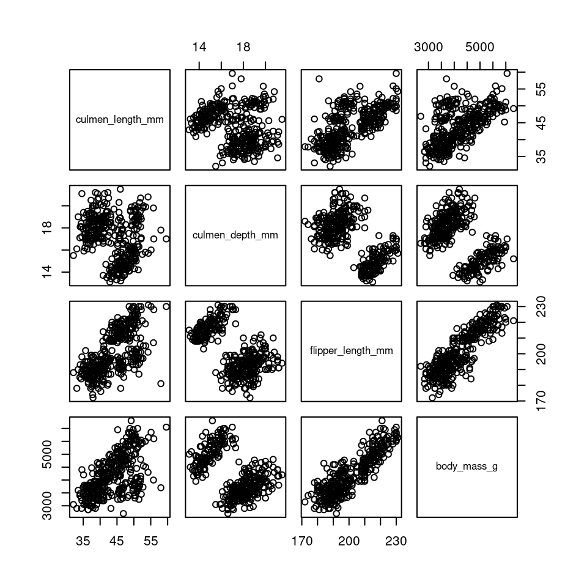
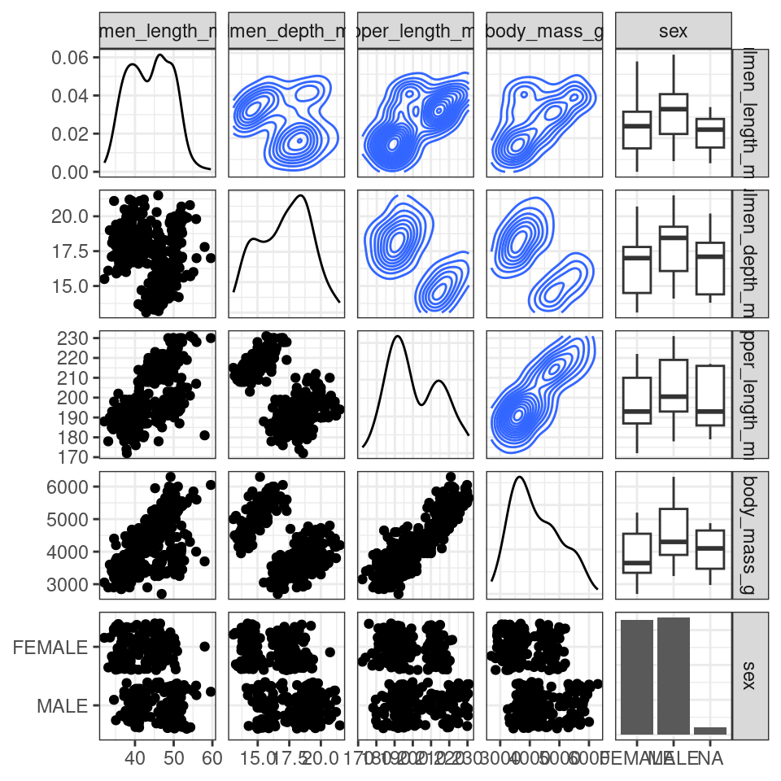
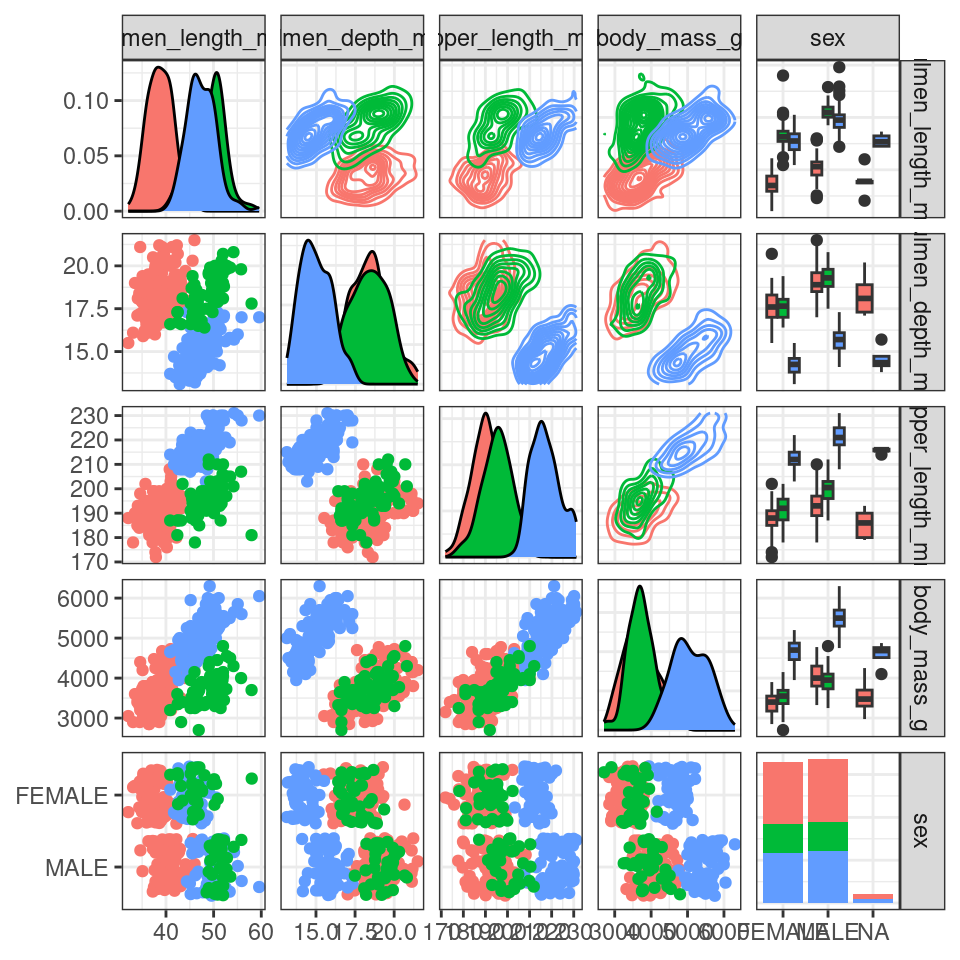
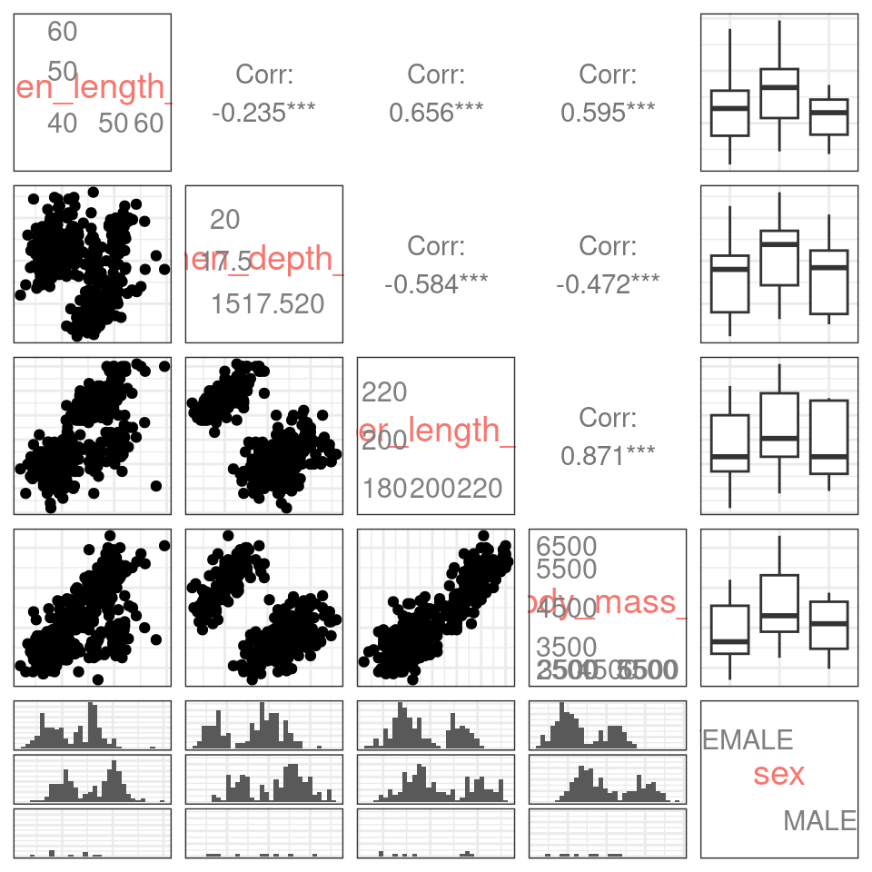

# (PART\*) BONUS: Automated Exploratory Analysis {.unnumbered}


# Packages for Automated Exploratory Data Analysis

In the realm of data science, the use of automated exploratory analysis is gaining prominence as a powerful approach. This methodology offers a way for data analysts and scientists to rapidly gain insights into their datasets, particularly when they have been working with tidyverse tools, without the need for laborious manual inspections of individual variables or the creation of numerous plots. The aim is to streamline and speed up the workflow, making data exploration more efficient and effective. To achieve this, data professionals turn to specific R packages such as skimr, ggally, and dataxray.

`skimr`: The skimr package is tailored to provide a concise and informative summary of a dataset's variables. It supplies a variety of functions for generating descriptive statistics, data type details, and visual representations. This empowers you to efficiently grasp the structure and characteristics of your data, aligning with the tidyverse principles. Skimr is particularly valuable for gaining an initial understanding of your dataset and for spotting potential issues or patterns.

`ggally`: Known as the "ggplot2 extension for exploring correlations," ggally is an R package that extends the capabilities of the well-known ggplot2 package. If you're already familiar with tidyverse, you'll appreciate ggally's seamless integration with tidy data principles. It is primarily used to create visualizations and plots for exploring relationships and correlations among variables. With ggally, you can readily produce scatterplots, density plots, and other types of graphs that shed light on the connections within your data.

`dataxray`: For data professionals who have been using tidyverse tools, the dataxray package is a natural extension of the workflow. This new R package provides quick statistical summaries in an interactive table inside of the Rstudio Viewer Pane.

Together, these R packages serve to streamline and automate the exploratory analysis process within the tidyverse framework. They make data exploration more efficient and effective, enabling data scientists and analysts to swiftly gain insights into their datasets, pinpoint potential problems, and lay the foundation for more in-depth analyses and modeling. Automated exploratory analysis, when seamlessly integrated with tidyverse tools, plays a pivotal role in the data analysis workflow, providing a deeper understanding of the data and guiding informed decisions about subsequent steps in analysis and modeling tasks.

## Skimr for automated data quality checking

Skimr is my preferred R package for quickly assessing data quality, serving as my initial step in exploratory data analysis. Before proceeding with any other tasks, I rely on skimr to conduct a thorough data quality check.


```r
install.packages("skimr")
library(skimr)
```


```r
skimr::skim(penguins)
```


Table: (\#tab:unnamed-chunk-5)Data summary

|                         |         |
|:------------------------|:--------|
|Name                     |penguins |
|Number of rows           |344      |
|Number of columns        |20       |
|_______________________  |         |
|Column type frequency:   |         |
|character                |10       |
|Date                     |1        |
|factor                   |1        |
|numeric                  |8        |
|________________________ |         |
|Group variables          |None     |


**Variable type: character**

|skim_variable     | n_missing| complete_rate| min| max| empty| n_unique| whitespace|
|:-----------------|---------:|-------------:|---:|---:|-----:|--------:|----------:|
|study_name        |         0|          1.00|   7|   7|     0|        3|          0|
|species           |         0|          1.00|   6|   9|     0|        3|          0|
|region            |         0|          1.00|   6|   6|     0|        1|          0|
|island            |         0|          1.00|   5|   9|     0|        3|          0|
|stage             |         0|          1.00|  18|  18|     0|        1|          0|
|individual_id     |         0|          1.00|   4|   6|     0|      190|          0|
|clutch_completion |         0|          1.00|   2|   3|     0|        2|          0|
|date_egg          |         0|          1.00|  10|  10|     0|       50|          0|
|sex               |        11|          0.97|   4|   6|     0|        2|          0|
|comments          |       290|          0.16|  18|  68|     0|       10|          0|


**Variable type: Date**

|skim_variable   | n_missing| complete_rate|min        |max        |median     | n_unique|
|:---------------|---------:|-------------:|:----------|:----------|:----------|--------:|
|date_egg_proper |         0|             1|2007-11-09 |2009-12-01 |2008-11-09 |       50|


**Variable type: factor**

|skim_variable | n_missing| complete_rate|ordered | n_unique|top_counts                 |
|:-------------|---------:|-------------:|:-------|--------:|:--------------------------|
|flipper_range |         2|          0.99|FALSE   |        3|med: 152, sma: 99, lar: 91 |


**Variable type: numeric**

|skim_variable     | n_missing| complete_rate|    mean|     sd|      p0|     p25|     p50|     p75|    p100|hist  |
|:-----------------|---------:|-------------:|-------:|------:|-------:|-------:|-------:|-------:|-------:|:-----|
|sample_number     |         0|          1.00|   63.15|  40.43|    1.00|   29.00|   58.00|   95.25|  152.00|▇▇▆▅▃ |
|culmen_length_mm  |         2|          0.99|   43.92|   5.46|   32.10|   39.23|   44.45|   48.50|   59.60|▃▇▇▆▁ |
|culmen_depth_mm   |         2|          0.99|   17.15|   1.97|   13.10|   15.60|   17.30|   18.70|   21.50|▅▅▇▇▂ |
|flipper_length_mm |         2|          0.99|  200.92|  14.06|  172.00|  190.00|  197.00|  213.00|  231.00|▂▇▃▅▂ |
|body_mass_g       |         2|          0.99| 4201.75| 801.95| 2700.00| 3550.00| 4050.00| 4750.00| 6300.00|▃▇▆▃▂ |
|delta_15n         |        14|          0.96|    8.73|   0.55|    7.63|    8.30|    8.65|    9.17|   10.03|▃▇▆▅▂ |
|delta_13c         |        13|          0.96|  -25.69|   0.79|  -27.02|  -26.32|  -25.83|  -25.06|  -23.79|▆▇▅▅▂ |
|year              |         0|          1.00| 2008.03|   0.82| 2007.00| 2007.00| 2008.00| 2009.00| 2009.00|▇▁▇▁▇ |
We can end up dedicating a significant amount of our time to tasks such as data comprehension, exploration, wrangling, and preparation for analysis.

However, we can significantly expedite this process. In every single data project I undertake, I rely on `skimr`, which is my go-to solution for achieving efficiency and speed.

### How Skimr works

One of the best features of Skimr is its capability to generate a comprehensive Data Quality Report with just a single line of code. This automation encompasses:

- Data Profiling

- Compatibility with Numeric, Categorical, Text, Date, Nested List Columns, and even dplyr groups

In essence, this remarkable functionality translates to significant time savings for data scientists 🕒

Assessing data with `skimr` makes simple quality checks easy! 

### Reporting

The penguins dataset has a lot of information in it, 344 rows of data and 19 independent variables. It has multiple data types and frequent missing data. With `skimr::skim()` we get an overall data summary of th number of rows, columns, data types by column and any group variables. 

#### Character summaries

Missing/completion rate, number of unique observations, and text features.

#### Factor summaries

If data is recognised as factorial we get missing/completion rate, whether the factor is ordered, numbr of unique levels and the number of observations for each factor

#### Date summaries

Missing/completion rates, min/max dates, and the number of unique dates.


#### Numeric summaries

Missing/completion rates and distributions.

## GGally for exploratory analysis

`GGally` is another invaluable tool in a researcher's toolkit. It seamlessly extends the capabilities of the widely used `ggplot2` package. With `GGally`, you can effortlessly create a variety of visualizations to explore and understand distributions and correlations among your variables. Its flexibility and ease of use make it a go-to choice for streamlining the process of creating insightful plots and charts for data analysis.

### pairs


```r
penguins |> 
  select(where(is.numeric)) |> 
  pairs()
```


```r
penguins |> 
  select(c(10,11,12,13)) |> 
  pairs()
```



### GGally

So far, we have only used the pairs function that comes together with the base installation of R. However, the ggplot2 and GGally packages provide an even more advanced pairs function, which is called `ggpairs()`. Let’s install and load the packages:


```r
library(GGally)
```


```r
penguins |> 
  select(species, island, culmen_length_mm, culmen_depth_mm, flipper_length_mm, body_mass_g, sex) |> 
  ggpairs()
```


```r
penguins |> 
  ggpairs(columns = 10:12, ggplot2::aes(colour = species))
```


```r
penguins |> 
  ggpairs(columns = 10:12, upper = "blank")
```


```r
penguins |> 
  ggpairs(columns = 10:14, columnLabels = c("Bill length", "Bill depth", "Flipper length", "Body mass", "Sex"))
```


```r
penguins |> 
  ggpairs(columns = 10:14, upper = list(continuous = "density", combo = "box_no_facet"),
          lower = list(continuous = "points", combo = "dot_no_facet"))
```




```r
penguins |> 
  ggpairs(columns = 10:14, upper = list(continuous = "density", combo = "box_no_facet"),
          lower = list(continuous = "points", combo = "dot_no_facet"),
          ggplot2::aes(colour = species))
```




```r
penguins |> 
  ggpairs(columns = 10:14, axisLabels = "internal")
```



## dataxray

`dataxray` is a new R package that provides quick statistical summaries in an interactive table inside of the Rstudio Viewer Pane. To use this package we need to install from Github, which means we need the `devtools` package and `devtools::install_github()`


```r
# install.packages("devtools")
# devtools::install_github("agstn/dataxray")
library(dataxray)
```

`dataxray` emphasises an interactive exploration of the exploratory summaries. This goes beyond what `skimr` can do by adding an interactive exploration element to feature summaries. So if you like interactivity, then try `dataxray`.

There are just two functions we require with this package

- `dataxray::make_xray()` to convert the raw data to preformatted data for the reactable interactive table

- `dataxray::view_xray()` to display the interactive exploratory table using the underlying reactable library.


```r
penguins |> 
  make_xray() |> 
  view_xray()
```

Now you can explore each column to see: 

- Count and Percent Missing - How many NA values

- Number of Distinct - How many unique observations

- Categorical Data - Bar charts for frequency by category

- Numeric Data - Distribution with histogram and quantiles

- Expandable Groups - You can expand the groups to find out more information about the features

- Search Features - Use regex to search the name. Great if you have a lot of features (columns)


```r
sessionInfo()
```

```
## R version 4.3.1 (2023-06-16)
## Platform: x86_64-pc-linux-gnu (64-bit)
## Running under: Ubuntu 20.04.6 LTS
## 
## Matrix products: default
## BLAS:   /usr/lib/x86_64-linux-gnu/atlas/libblas.so.3.10.3 
## LAPACK: /usr/lib/x86_64-linux-gnu/atlas/liblapack.so.3.10.3;  LAPACK version 3.9.0
## 
## locale:
##  [1] LC_CTYPE=C.UTF-8       LC_NUMERIC=C           LC_TIME=C.UTF-8       
##  [4] LC_COLLATE=C.UTF-8     LC_MONETARY=C.UTF-8    LC_MESSAGES=C.UTF-8   
##  [7] LC_PAPER=C.UTF-8       LC_NAME=C              LC_ADDRESS=C          
## [10] LC_TELEPHONE=C         LC_MEASUREMENT=C.UTF-8 LC_IDENTIFICATION=C   
## 
## time zone: UTC
## tzcode source: system (glibc)
## 
## attached base packages:
## [1] stats     graphics  grDevices utils     datasets  methods   base     
## 
## other attached packages:
##  [1] janitor_2.2.0      dataxray_0.1.0     skimr_2.1.5        GGally_2.1.2      
##  [5] knitr_1.43         webexercises_1.1.0 glossary_1.0.0     lubridate_1.9.2   
##  [9] forcats_1.0.0      stringr_1.5.0      dplyr_1.1.2        purrr_1.0.1       
## [13] readr_2.1.4        tidyr_1.3.0        tibble_3.2.1       ggplot2_3.4.2     
## [17] tidyverse_2.0.0   
## 
## loaded via a namespace (and not attached):
##  [1] tidyselect_1.2.0    viridisLite_0.4.2   farver_2.1.1       
##  [4] fastmap_1.1.1       lazyeval_0.2.2      reshape_0.8.9      
##  [7] promises_1.2.0.1    digest_0.6.33       rpart_4.1.19       
## [10] timechange_0.2.0    mime_0.12           lifecycle_1.0.3    
## [13] cluster_2.1.4       ellipsis_0.3.2      magrittr_2.0.3     
## [16] compiler_4.3.1      rlang_1.1.1         Hmisc_5.1-1        
## [19] sass_0.4.6          tools_4.3.1         utf8_1.2.3         
## [22] yaml_2.3.7          data.table_1.14.8   labeling_0.4.2     
## [25] htmlwidgets_1.6.2   here_1.0.1          plyr_1.8.8         
## [28] xml2_1.3.5          repr_1.1.6          RColorBrewer_1.1-3 
## [31] withr_2.5.0         foreign_0.8-84      nnet_7.3-19        
## [34] grid_4.3.1          fansi_1.0.4         xtable_1.8-4       
## [37] colorspace_2.1-0    MASS_7.3-60         scales_1.2.1       
## [40] isoband_0.2.7       cli_3.6.1           rmarkdown_2.23     
## [43] generics_0.1.3      rstudioapi_0.15.0   httr_1.4.6         
## [46] tzdb_0.4.0          cachem_1.0.8        base64enc_0.1-3    
## [49] vctrs_0.6.3         jsonlite_1.8.7      bookdown_0.34      
## [52] hms_1.1.3           Formula_1.2-5       htmlTable_2.4.1    
## [55] plotly_4.10.2       jquerylib_0.1.4     glue_1.6.2         
## [58] codetools_0.2-19    stringi_1.7.12      gtable_0.3.3       
## [61] later_1.3.1         downlit_0.4.3       munsell_0.5.0      
## [64] pillar_1.9.0        htmltools_0.5.5     reactable_0.4.4    
## [67] R6_2.5.1            reactablefmtr_2.0.0 rprojroot_2.0.3    
## [70] evaluate_0.21       shiny_1.7.4.1       highr_0.10         
## [73] backports_1.4.1     snakecase_0.11.0    memoise_2.0.1      
## [76] httpuv_1.6.11       bslib_0.5.0         Rcpp_1.0.11        
## [79] gridExtra_2.3       checkmate_2.2.0     xfun_0.39          
## [82] fs_1.6.2            pkgconfig_2.0.3
```
