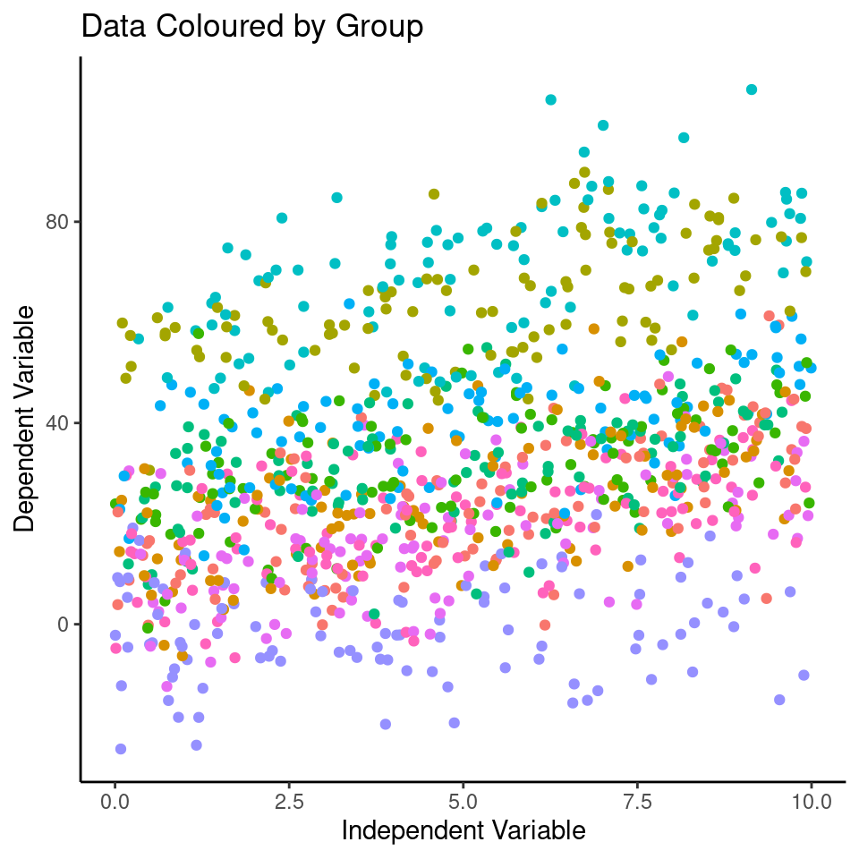
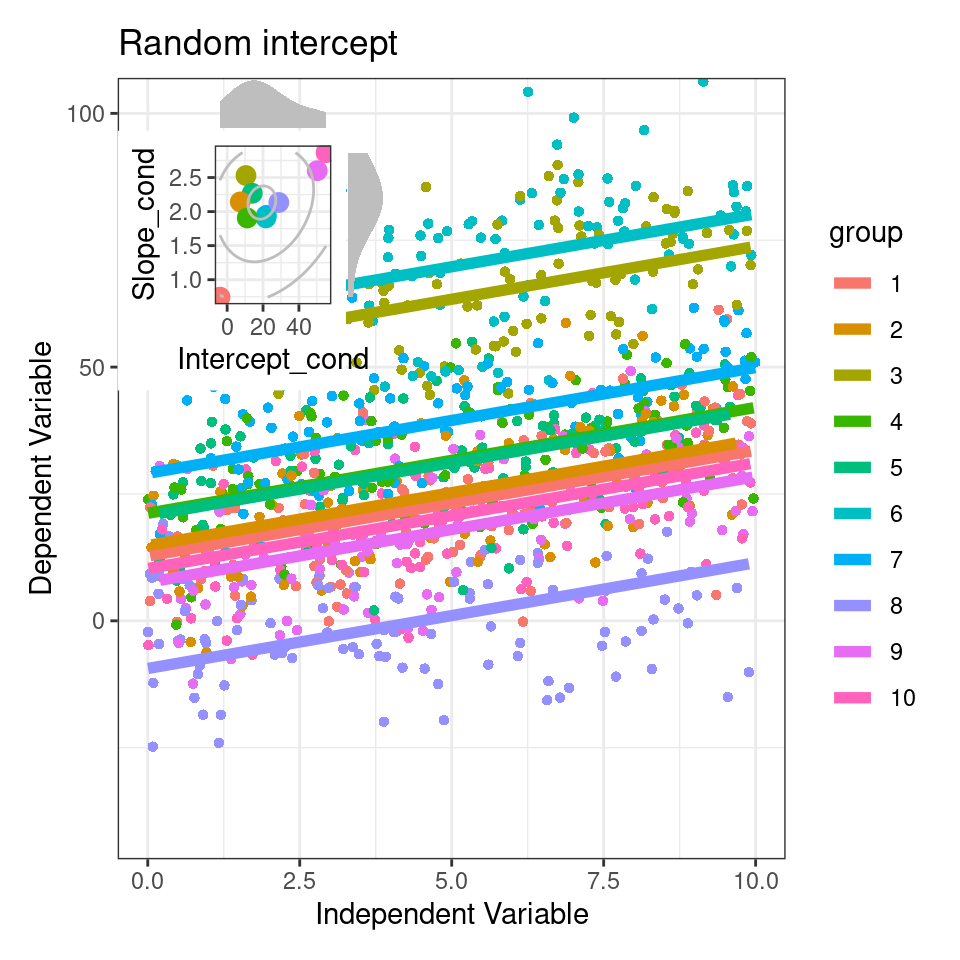

# (PART\*) Mixed Models {.unnumbered}

# Introduction


# Foundations of Mixed Modelling

## Why use mixed models?

Briefly introduce mixed models and their applications
Highlight the benefits of incorporating random effects and partial pooling

## Fixed vs Random effects

Explain the difference between fixed and random effects
Discuss the hierarchical structure of data and the need for mixed models
Provide an overview of the linear mixed model equation
Touch on the assumptions of mixed models


We can now join our random effect matrix to the full dataset and define our y values as 

$$yi = B0i + b0j + B1xi + b1xj + ε$$.


```r
data <- expand.grid(group = as.factor(seq(1:10)), 
                    obs = as.factor(seq(1:100))) %>%
  left_join(rand_eff,
            by = "group") %>%
  mutate(x = runif(n = nrow(.), 0, 10),
         B0 = 20,
         B1 = 2,
         E = rnorm(n = nrow(.), 0, 10)) %>%
  mutate(y = B0 + b0 + x * (B1 + b1) + E)
```


```r
plot(data$x, data$y)
```


```r
# Color tagged by group
plot_group <- ggplot(data, aes(x = x, 
                               y = y, 
                               color = group,
                               group = group)) +
  geom_point() +
  labs(title = "Data Coloured by Group", 
       x = "Independent Variable", 
       y = "Dependent Variable")+
  theme(legend.position="none")

plot_group
```




```r
plot_group+
  facet_wrap(~group)
```


## Choosing random effects: crossed or nested?  

A common issue that causes confusion is this issue of specifying random effects as either  ‘crossed’ or ‘nested’. In reality, the way you specify your random effects will be determined  by your experimental or sampling design (  Schielzeth & Nakagawa, 2013  ). A simple  example can illustrate the difference. Imagine a researcher was interested in understanding  the factors affecting the clutch mass of a passerine bird. They have a study population  spread across five separate woodlands, each containing 30 nest boxes. Every week during  breeding they measure the foraging rate of females at feeders, and measure their  subsequent clutch mass. Some females have multiple clutches in a season and contribute multiple data points. 

Here, female ID is said to be  nested within woodland  : each woodland  contains multiple females unique to that woodland (that never move among woodlands).  The nested random effect controls for the fact that (i) clutches from the same female  are not independent, and (ii) females from the same woodland may have clutch masses  more similar to one another than to females from other woodlands  

Clutch Mass  ∼  Foraging Rate + (1|Woodland/Female ID)  

Now imagine that this is a long-term study, and the researcher returns every year for five  years to continue with measurements. Here it is appropriate fit year as a  crossed  random  effect because every woodland appears multiple times in every year of the dataset, and  females that survive from one year to the next will also appear in multiple years.  

Clutch Mass  ∼  Foraging Rate + (1|Woodland/Female ID)+ (1|Year)  

Understanding whether your experimental/sampling design calls for nested or crossed  random effects is not always straightforward, but it can help to visualise experimental  design by drawing it (see  Schielzeth & Nakagawa, 2013  ;  Fig. 1  ), or tabulating your  observations by these grouping factors (e.g. with the ‘  table’  command in R) to identify  how your data are distributed. We advocate that researchers always ensure that their levels  of random effect grouping variables are uniquely labelled. For example, females are  labelled 1  -  n  in each woodland, the model will try and pool variance for all females  with the same code. Giving all females a unique code makes the nested structure of the  data is implicit, and a model specified as  ∼  (1| Woodland) + (1|FemaleID) would be  identical to the model above. 


<div class="figure" style="text-align: center">

```{=html}
<div class="grViz html-widget html-fill-item-overflow-hidden html-fill-item" id="htmlwidget-60e47007fa32436b2ab7" style="width:100%;height:480px;"></div>
<script type="application/json" data-for="htmlwidget-60e47007fa32436b2ab7">{"x":{"diagram":"\ndigraph boxes_and_circles {\n\n  # a \"graph\" statement\n  graph [overlap = true, fontsize = 10]\n\n  # several \"node\" statements\n  node [shape = box,\n        fontname = Helvetica]\n  I; II; 1; 2; 3; 4; 5; 6\n\n  # several \"edge\" statements\n  I->1 I ->2 I ->3\n  II ->4  II ->5 II ->6\n}\n","config":{"engine":"dot","options":null}},"evals":[],"jsHooks":[]}</script>
```

<p class="caption">(\#fig:unnamed-chunk-11)Fully Nested</p>
</div>


<div class="figure" style="text-align: center">

```{=html}
<div class="grViz html-widget html-fill-item-overflow-hidden html-fill-item" id="htmlwidget-0a09f2c65470bfad74ca" style="width:100%;height:480px;"></div>
<script type="application/json" data-for="htmlwidget-0a09f2c65470bfad74ca">{"x":{"diagram":"\ndigraph boxes_and_circles {\n\n  # a \"graph\" statement\n  graph [overlap = true, fontsize = 10]\n\n  # several \"node\" statements\n  node [shape = box,\n        fontname = Helvetica]\n  I; II; 1; 2; 3\n\n  # several \"edge\" statements\n  I->1 I ->2 I ->3\n  II ->1  II ->2 II ->3\n}\n","config":{"engine":"dot","options":null}},"evals":[],"jsHooks":[]}</script>
```

<p class="caption">(\#fig:unnamed-chunk-12)Fully Crossed</p>
</div>


<div class="figure" style="text-align: center">

```{=html}
<div class="grViz html-widget html-fill-item-overflow-hidden html-fill-item" id="htmlwidget-014c3a7c989613c322c9" style="width:100%;height:480px;"></div>
<script type="application/json" data-for="htmlwidget-014c3a7c989613c322c9">{"x":{"diagram":"\ndigraph boxes_and_circles {\n\n  # a \"graph\" statement\n  graph [overlap = true, fontsize = 10]\n\n  # several \"node\" statements\n  node [shape = box,\n        fontname = Helvetica]\n  I; II; 1; 2; 3; 4; 5 \n\n  # several \"edge\" statements\n  I->1 I ->2 I ->3\n  II ->1  II ->4 II ->5\n}\n","config":{"engine":"dot","options":null}},"evals":[],"jsHooks":[]}</script>
```

<p class="caption">(\#fig:unnamed-chunk-13)Partially Nested/Crossed</p>
</div>


```r
rand_dist <- as.data.frame(ranef(lmer1)) %>% 
  mutate(group = grp,
         b0_hat = condval,
         intercept_cond = b0_hat + summary(lmer1)$coef[1,1],
         .keep = "none")

data1 <- data %>% 
  mutate(fit.m = predict(lmer1, re.form = NA),
         fit.c = predict(lmer1, re.form = NULL))

data1 %>%
  ggplot(aes(x = x, y = y)) +
  geom_point(pch = 16, col = "grey") +
  geom_violinhalf(data = rand_dist, 
                  aes(x = 0, y = intercept_cond), 
                  trim = FALSE, 
                  width = 4, 
                  adjust = 2, 
                  fill = NA)+
  geom_line(aes(y = fit.m), linewidth = 2)  +
  coord_cartesian(ylim = c(-40, 100))+
  labs(x = "Independent Variable", 
       y = "Dependent Variable")
```

<div class="figure" style="text-align: center">

<p class="caption">(\#fig:unnamed-chunk-14)Marginal fit, heavy black line from the random effect model with a histogram of the of the distribution of conditional intercepts</p>
</div>


```r
summary(lmer3)
```

```
## Linear mixed model fit by REML ['lmerMod']
## Formula: y ~ x + (x | group)
##    Data: data
## 
## REML criterion at convergence: 7519.4
## 
## Scaled residuals: 
##     Min      1Q  Median      3Q     Max 
## -2.8846 -0.6930  0.0250  0.6579  3.3366 
## 
## Random effects:
##  Groups   Name        Variance Std.Dev. Corr
##  group    (Intercept) 352.1409 18.7654      
##           x             0.4112  0.6412  0.62
##  Residual             101.2134 10.0605      
## Number of obs: 1000, groups:  group, 10
## 
## Fixed effects:
##             Estimate Std. Error t value
## (Intercept)  21.6680     5.9688   3.630
## x             2.1043     0.2321   9.067
## 
## Correlation of Fixed Effects:
##   (Intr)
## x 0.490
```


```r
data.2 <- data %>% 
  mutate(fit2.m = predict(lmer3, re.form = NA),
         fit2.c = predict(lmer3, re.form = NULL),
         resid2 = resid(lmer3))
```


```r
rand_dist2 <- as.data.frame(ranef(lmer3)) %>% 
  mutate(group = grp,
          term = case_when(term == "(Intercept)" ~ "b0_hat",
                             term == "x" ~ "b1_hat"),
            value = condval,
         .keep = "none") %>%
  pivot_wider(id_cols = "group", names_from = "term", values_from = "value") %>%
  mutate(Intercept_cond = b0_hat + summary(lmer3)$coef[1,1],
         Slope_cond = b1_hat + summary(lmer3)$coef[2,1])

pmain <- rand_dist2 %>%
  ggplot(aes(x = Intercept_cond, y = Slope_cond)) +
    geom_point(aes(col = group), size = 3) +
    geom_density2d(bins = 4, col = "grey", adjust = 3)+
  theme(legend.position = "none")

xdens <- ggplot()+
  geom_density(data = rand_dist2, aes(x = Intercept_cond), fill = "grey", col = NA, trim = FALSE, adjust = 2) +
  theme_void()

ydens <- ggplot()+
  geom_density(data = rand_dist2, aes(x = Slope_cond), fill = "grey", col = NA, trim = FALSE, adjust = 2) +
  coord_flip()+
  theme_void()

layout <- "
AAA#
BBBC
BBBC
BBBC"


inset <- xdens+pmain+ydens +plot_layout(design = layout)

inset
```


```r
plot(lmer1, "Random intercept") + inset_element(inset, 0, 0.6, 0.4, 1)
```




```r
Number_of_boots <- 500
```
The number of columns for the dataframes will equal the number of fixed effect coefficients and random effect variances. We can extract these from the initial model. First we extract the coefficients, then transpose the table into wide format.


```r
# Extract the fixed effect coefficients.
FE_df <- fixef(lmer1) %>% 
  t() %>%
  as.data.frame()

# Extract the random effects variance and residual variance
RE_df <- VarCorr(lmer1) %>%
  as.data.frame() %>%
  unite("Level", -c(vcov, sdcor)) %>%
  select(-vcov) %>%
  t() %>%
  as.data.frame()
```

Next, we create empty dataframes to take our bootstraps.


```r
BS_params <- data.frame(matrix(nrow = Number_of_boots, ncol = ncol(FE_df)))
colnames(BS_params) <- colnames(FE_df)

BS_var <- data.frame(matrix(nrow = Number_of_boots, ncol = ncol(RE_df)))
colnames(BS_var) <- RE_df["Level",]
```

In addition, we will be predicting marginal values from each model. So, we need to create a prediction dataframe with an empty column to store the predicted values. For this example, we only need to predict ŷ values for a handful of x values that represent the range of xs. I chose to use 10-quantiles because I want to be able to fit a non-linear confidence band later. If this was a non-linear fit, we might want even more prediction values.


```r
BS_pred <- expand.grid(x = quantile(data1$x, probs = seq(0, 1, length.out = 10)),
                       iteration = 1:Number_of_boots,
                       pred = NA)
```


```r
for(i in 1:Number_of_boots){
BS_X <- slice_sample(data1, prop = 1, replace = TRUE)
BS_lmer <- lmer(formula = lmer1@call$formula,
data = BS_X)

BS_params[i,] <- BS_lmer %>%
fixef() %>%
t() %>%
as.data.frame()

BS_var[i,] <- BS_lmer %>%
VarCorr() %>%
as.data.frame() %>%
.$sdcor

BS_pred[which(BS_pred$iteration == i),]$pred <- predict(BS_lmer,
newdata = BS_pred[which(BS_pred$iteration == i),],
re.form = ~0)
}
```


```r
plot_1 <- BS_pred %>%
    ggplot(aes(x = x, y = pred)) +
    geom_line(aes(group = iteration), alpha = 0.1, col = "grey50") +
    geom_line(data = data1,
              aes(x = x, y = fit.m)) +
    geom_rect(aes(ymin = 36, ymax = 38,
                  xmin = 6, xmax = 8),
              col = "firebrick",
              fill = NA,
              size = 2) 

plot_2 <- BS_pred %>%
    ggplot(aes(x = x, y = pred)) +
    geom_line(aes(group = iteration), alpha = 0.1, col = "black") +
    geom_line(data = data1,
              aes(x = x, y = fit.m),
              col = "grey", 
              size = 2) +
    coord_cartesian(xlim = c(6, 8),
                    ylim = c(36, 38)) +
    geom_rect(aes(ymin = 36, ymax = 38,
                  xmin = 6, xmax = 8),
              col = "firebrick",
              fill = NA,
              size = 2) 

plot_1 + plot_2
```


## Random slopes

random_slopes_intercept_model <- lmer(dependent_var ~ independent_var + (independent_var | group), data = data)
random_slopes_values <- predict(random_slopes_model)

## Random intercept

# Random intercept model
model_intercept <- lmer(dependent_var ~ independent_var + (1 | group), data = data)
random_intercept_values <- predict(model_intercept)

ggplot(data, aes(x = independent_var, y = dependent_var, color = group, group = group)) +
    geom_point(position = position_jitter(width = 0.2), alpha = 0.6) +
    geom_line(aes(x = independent_var, y= random_intercept_values)) +
    labs(title = "Random Slopes", x = "Independent Variable", y = "Dependent Variable") +
    theme_minimal()


## Nested and crossed random effects

## Random slopes

## Mixed model equations

## Assumptions of a mixed model


# Mixed Models in R

## Demonstration

## Model fitting

## Model simplification

## Interpretation

# Mixed Model extensions


# Summary

## Troubleshooting

## Further Reading


Linear model analyses can extend beyond testing differences of means in categorical groupings to test relationships with continuous variables. This is known as linear regression, where the relationship between the explanatory variable and response variable are modelled with the equation for a straight line. The intercept is the value of *y* when *x* = 0, often this isn't that useful, and we can use 'mean-centered' values if we wish to make the intercept more intuitive. 
As with all linear models, regression assumes that the unexplained variability around the regression line, is normally distributed and has constant variance. 

Once the regression has been fitted it is possible to predict values of *y* from values of *x*, the uncertainty around these predictions can be captured with confidence intervals. 
