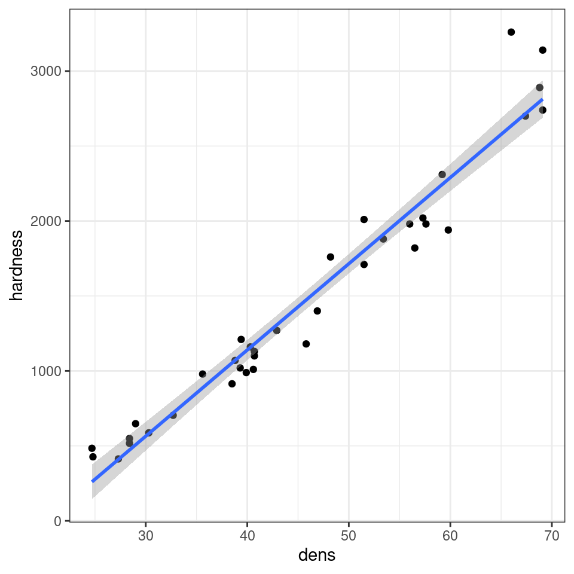

# (PART\*) Mixed Models {.unnumbered}

# Foundations of Mixed Modelling


## What is a mixed model?

Mixed models (also known as linear mixed models or hierarchical linear models) are statistical tests that build on the simpler tests of regression, t-tests and ANOVA. All of these tests are special cases of the general linear model; they all fit a straight line to data to explain variance in a systematic way. 

The key difference with a linear mixed-effects model is the inclusion of random effects - variables where our observations are grouped into subcategories that systematically affect our outcome - to account for important structure in our data. 

The mixed-effects model can be used in many situations instead of one of our more straightforward tests when this structure may be important. The main advantages of this approach are: 

i) mixed-effects models account for more of the variance 
ii) mixed-effects models incorporate group and even individual-level differences
iii) mixed-effects models cope well with missing data, unequal group sizes and repeated measurements


## Fixed vs Random effects

Explain the difference between fixed and random effects
Discuss the hierarchical structure of data and the need for mixed models
Provide an overview of the linear mixed model equation
Touch on the assumptions of mixed models

### Fixed effects

In broad terms, fixed effects are variables that we expect will affect the dependent/response variable: they’re what you call explanatory variables in a standard linear regression. 

EXAMPLES:

Fixed effects are more common than random effects, at least in their use (but not in reality). Fixed effects estimate different levels with no relationship assumed between the levels. For example, in a model with a fixed effect for fish sex, you would get an estimate for males and then an estimate for females separately. There is no assumed relationship between these two levels. This means we cannot infer what happens between the levels even when it may be obvious. Fixed effects also assume a common variance known as homoscedasticity. Should we find a reason that they differ, post hoc adjustments are needed to make pairwise comparisons of the different factor levels.

Another example of a fixed effect is thinking about the fixed effect of a treatment drug on a health response. The predictor drug may be a fixed factor with 4 levels, representing 4 different drugs—a placebo, Drug A, Drug B, and Drug C. In this case, we might design an experiment that could be analyzed with an ANOVA. As we test for the effect of the different drug levels, we want them to be independent of each other—meaning the effect of Drug A compared to Drug B should only include information about those two groups. We don’t want information or even the assumption of non-independence to infiltrate the groups we want to compare. Again, 

Fixed effects are the default effects that we all learn as we begin to understand statistical concepts, and fixed effects are the default effects in functions like `lm()` and `aov()`.

### Random effects

Random effects are less commonly used but perhaps more widely encountered in nature. Each level can be considered a random variable from an underlying process or distribution in a random effect. 

On the other hand, random effects are usually grouping factors for which we are trying to control. They are always categorical, as you can’t force R to treat a continuous variable as a random effect. A lot of the time we are not specifically interested in their impact on the response variable, but we know that they might be influencing the patterns we see.

Additionally, the data for our random effect is just a sample of all the possibilities: with unlimited time and funding we might have sampled every mountain where dragons live, every school in the country, every chocolate in the box), but we usually tend to generalise results to a whole population based on representative sampling. We don’t care about estimating how much better pupils in school A have done compared to pupils in school B, but we know that their respective teachers might be a reason why their scores would be different, and we’d like to know how much variation is attributable to this when we predict scores for pupils in school Z.

<div class="info">
<p>In the book Data analysis using regression and
multilevel/hierarchical models (Gelman and Hill 2006). The authors
examined five definitions of fixed and random effects and found no
definition that completely fit all circumstances. Thus it turns out
fixed and random effects are not born but made. We make the decision to
treat a variable as fixed or random in a particular analysis.</p>
</div>

> What are you trying to do? What are you trying to make predictions about? What is just variation (a.k.a “noise”) that you need to control for?

<div class="warning">
<p>More about random effects:</p>
<p>Note that the golden rule is that you generally want your random
effect to have at least five levels. So, for instance, if we wanted to
control for the effects of dragon’s sex on intelligence, we would fit
sex (a two level factor: male or female) as a fixed, not random,
effect.</p>
<p>This is, put simply, because estimating variance on few data points
is very imprecise. Mathematically you could, but you wouldn’t have a lot
of confidence in it. If you only have two or three levels, the model
will struggle to partition the variance - it will give you an output,
but not necessarily one you can trust.</p>
<p>Finally, keep in mind that the name random doesn’t have much to do
with mathematical randomness. Yes, it’s confusing. Just think about them
as the grouping variables for now. Strictly speaking it’s all about
making our models representative of our questions and getting better
estimates. Hopefully, our next few examples will help you make sense of
how and why they’re used.</p>
<p>There’s no firm rule as to what the minimum number of factor levels
should be for random effect and really you can use any factor that has
two or more levels. However it is commonly reported that you may want
five or more factor levels for a random effect in order to really
benefit from what the random effect can do. Another case in which you
may not want to random effect is when you don’t want your factor levels
to inform each other or you don’t assume that your factor levels come
from a common distribution. As noted above, male and female is not only
a factor with only two levels but oftentimes we want male and female
information estimated separately and we’re not necessarily assuming that
males and females come from a population of sexes in which there is an
infinite number and we’re interested in an average.</p>
</div>

## Why use mixed models?

### All in one model

Briefly introduce mixed models and their applications
Highlight the benefits of incorporating random effects and partial pooling


```r
data <- expand.grid(group = as.factor(seq(1:10)), 
                    obs = as.factor(seq(1:100))) %>%
  left_join(rand_eff,
            by = "group") %>%
  mutate(x = runif(n = nrow(.), 0, 10),
         B0 = 20,
         B1 = 2,
         E = rnorm(n = nrow(.), 0, 10)) %>%
  mutate(y = B0 + b0 + x * (B1 + b1) + E)

data <- expand.grid(group = as.factor(seq(1:4)), 
                    obs = as.factor(seq(1:100)))

data.1 <- expand.grid(group = as.factor(5),
          obs = as.factor(seq(1:30)))

data <- bind_rows(data, data.1) %>% 
  left_join(rand_eff,
            by = "group") %>%
  mutate(x = runif(n = nrow(.), 0, 10),
         B0 = 20,
         B1 = 2,
         E = rnorm(n = nrow(.), 0, 10)) %>%
  mutate(y = B0 + b0 + x * (B1 + b1) + E)
```

One way to analyse this data would be to fit a linear model to all our data, ignoring the groups for now.


```r
basic_model <- lm(y ~ x, data = data)
summary(basic_model)
```

```
## 
## Call:
## lm(formula = y ~ x, data = data)
## 
## Residuals:
##     Min      1Q  Median      3Q     Max 
## -59.977 -14.879  -2.868  12.451  68.365 
## 
## Coefficients:
##             Estimate Std. Error t value Pr(>|t|)    
## (Intercept)  18.5825     1.4005   13.27   <2e-16 ***
## x             2.7647     0.2461   11.24   <2e-16 ***
## ---
## Signif. codes:  0 '***' 0.001 '**' 0.01 '*' 0.05 '.' 0.1 ' ' 1
## 
## Residual standard error: 22.12 on 998 degrees of freedom
## Multiple R-squared:  0.1123,	Adjusted R-squared:  0.1114 
## F-statistic: 126.2 on 1 and 998 DF,  p-value: < 2.2e-16
```


```r
plot(data$x, data$y)
```


```r
ggplot(data, aes(x = x, 
                 y = y)) +
  geom_point() +
  labs(x = "Independent Variable", 
       y = "Dependent Variable")+
  geom_smooth(method = "lm")
```

<div class="figure" style="text-align: center">

<p class="caption">(\#fig:unnamed-chunk-9)Linear model conducted on all data</p>
</div>


```r
performance::check_model(basic_model)
```


```r
ggplot(data, aes(x = group, 
                 y = y)) +
  geom_boxplot() +
  labs(x = "Groups", 
       y = "Dependent Variable")
```

<div class="figure" style="text-align: center">

<p class="caption">(\#fig:unnamed-chunk-11)Linear model conducted on all data</p>
</div>


```r
# Color tagged by group
plot_group <- ggplot(data, aes(x = x, 
                               y = y, 
                               color = group,
                               group = group)) +
  geom_point(alpha = 0.6) +
  labs(title = "Data Coloured by Group", 
       x = "Independent Variable", 
       y = "Dependent Variable")+
  theme(legend.position="none")

plot_group
```


From the above plots, it confirms that our observations from within each of the ranges aren’t independent. We can’t ignore that: as we’re starting to see, it could lead to a completely erroneous conclusion.

### Additive model


```r
additive_model <- lm(y ~ x*group, data = data)

summary(additive_model)
```

```
## 
## Call:
## lm(formula = y ~ x * group, data = data)
## 
## Residuals:
##     Min      1Q  Median      3Q     Max 
## -30.398  -6.981   0.214   6.573  33.222 
## 
## Coefficients:
##              Estimate Std. Error t value Pr(>|t|)    
## (Intercept)   8.50303    2.07036   4.107 4.34e-05 ***
## x             2.88870    0.34313   8.419  < 2e-16 ***
## group2        4.53108    2.85059   1.590   0.1123    
## group3       42.46669    3.02009  14.061  < 2e-16 ***
## group4       13.82819    2.88476   4.794 1.89e-06 ***
## group5       13.67873    2.93845   4.655 3.68e-06 ***
## group6       46.93984    3.07871  15.247  < 2e-16 ***
## group7       20.70395    2.89106   7.161 1.57e-12 ***
## group8      -10.91396    2.70002  -4.042 5.71e-05 ***
## group9       -2.23045    2.84238  -0.785   0.4328    
## group10       2.49895    2.89232   0.864   0.3878    
## x:group2     -0.43132    0.49197  -0.877   0.3809    
## x:group3     -0.41197    0.50727  -0.812   0.4169    
## x:group4     -1.03306    0.49067  -2.105   0.0355 *  
## x:group5     -1.09588    0.50402  -2.174   0.0299 *  
## x:group6     -0.06171    0.51200  -0.121   0.9041    
## x:group7     -0.82995    0.48734  -1.703   0.0889 .  
## x:group8     -2.52336    0.48572  -5.195 2.49e-07 ***
## x:group9     -0.53117    0.49785  -1.067   0.2863    
## x:group10    -0.95131    0.49205  -1.933   0.0535 .  
## ---
## Signif. codes:  0 '***' 0.001 '**' 0.01 '*' 0.05 '.' 0.1 ' ' 1
## 
## Residual standard error: 10.06 on 980 degrees of freedom
## Multiple R-squared:  0.8197,	Adjusted R-squared:  0.8162 
## F-statistic: 234.5 on 19 and 980 DF,  p-value: < 2.2e-16
```


### Multiple analysis approach


```r
plot_group+
  geom_smooth(method ="lm")+
  facet_wrap(~group)
```

<div class="figure" style="text-align: center">

<p class="caption">(\#fig:unnamed-chunk-14)Multiple independent analyses</p>
</div>


```r
nested_data <- data %>% 
  group_by(group) %>% 
  nest()

models <- map(nested_data$data, ~ lm(y ~ x, data = .)) %>% 
          map(broom::tidy)

bind_rows(models) %>% 
  filter(term == "x") %>% 
  rowid_to_column("group") %>% 
  mutate(p.value = report_p(p.value))
```

<div class="kable-table">

<table>
 <thead>
  <tr>
   <th style="text-align:right;"> group </th>
   <th style="text-align:left;"> term </th>
   <th style="text-align:right;"> estimate </th>
   <th style="text-align:right;"> std.error </th>
   <th style="text-align:right;"> statistic </th>
   <th style="text-align:left;"> p.value </th>
  </tr>
 </thead>
<tbody>
  <tr>
   <td style="text-align:right;"> 1 </td>
   <td style="text-align:left;"> x </td>
   <td style="text-align:right;"> 2.8887022 </td>
   <td style="text-align:right;"> 0.3533186 </td>
   <td style="text-align:right;"> 8.175912 </td>
   <td style="text-align:left;"> p &lt; 0.001 </td>
  </tr>
  <tr>
   <td style="text-align:right;"> 2 </td>
   <td style="text-align:left;"> x </td>
   <td style="text-align:right;"> 2.4573852 </td>
   <td style="text-align:right;"> 0.3769660 </td>
   <td style="text-align:right;"> 6.518851 </td>
   <td style="text-align:left;"> p &lt; 0.001 </td>
  </tr>
  <tr>
   <td style="text-align:right;"> 3 </td>
   <td style="text-align:left;"> x </td>
   <td style="text-align:right;"> 2.4767295 </td>
   <td style="text-align:right;"> 0.3530024 </td>
   <td style="text-align:right;"> 7.016184 </td>
   <td style="text-align:left;"> p &lt; 0.001 </td>
  </tr>
  <tr>
   <td style="text-align:right;"> 4 </td>
   <td style="text-align:left;"> x </td>
   <td style="text-align:right;"> 1.8556387 </td>
   <td style="text-align:right;"> 0.3509230 </td>
   <td style="text-align:right;"> 5.287880 </td>
   <td style="text-align:left;"> p &lt; 0.001 </td>
  </tr>
  <tr>
   <td style="text-align:right;"> 5 </td>
   <td style="text-align:left;"> x </td>
   <td style="text-align:right;"> 1.7928200 </td>
   <td style="text-align:right;"> 0.3517434 </td>
   <td style="text-align:right;"> 5.096954 </td>
   <td style="text-align:left;"> p &lt; 0.001 </td>
  </tr>
  <tr>
   <td style="text-align:right;"> 6 </td>
   <td style="text-align:left;"> x </td>
   <td style="text-align:right;"> 2.8269943 </td>
   <td style="text-align:right;"> 0.4270385 </td>
   <td style="text-align:right;"> 6.619999 </td>
   <td style="text-align:left;"> p &lt; 0.001 </td>
  </tr>
  <tr>
   <td style="text-align:right;"> 7 </td>
   <td style="text-align:left;"> x </td>
   <td style="text-align:right;"> 2.0587508 </td>
   <td style="text-align:right;"> 0.3125350 </td>
   <td style="text-align:right;"> 6.587265 </td>
   <td style="text-align:left;"> p &lt; 0.001 </td>
  </tr>
  <tr>
   <td style="text-align:right;"> 8 </td>
   <td style="text-align:left;"> x </td>
   <td style="text-align:right;"> 0.3653419 </td>
   <td style="text-align:right;"> 0.3388123 </td>
   <td style="text-align:right;"> 1.078302 </td>
   <td style="text-align:left;"> p= 0.284 </td>
  </tr>
  <tr>
   <td style="text-align:right;"> 9 </td>
   <td style="text-align:left;"> x </td>
   <td style="text-align:right;"> 2.3575284 </td>
   <td style="text-align:right;"> 0.3615203 </td>
   <td style="text-align:right;"> 6.521151 </td>
   <td style="text-align:left;"> p &lt; 0.001 </td>
  </tr>
  <tr>
   <td style="text-align:right;"> 10 </td>
   <td style="text-align:left;"> x </td>
   <td style="text-align:right;"> 1.9373886 </td>
   <td style="text-align:right;"> 0.3420595 </td>
   <td style="text-align:right;"> 5.663894 </td>
   <td style="text-align:left;"> p &lt; 0.001 </td>
  </tr>
</tbody>
</table>

</div>


## Our first mixed model

A mixed model is a good choice here: it will allow us to use all the data we have (higher sample size) and account for the correlations between data coming from the groups. We will also estimate fewer parameters and avoid problems with multiple comparisons that we would encounter while using separate regressions.

We can now join our random effect matrix to the full dataset and define our y values as 

$$yi = B0i + b0j + B1xi + b1xj + ε$$.

We have a response variable, and we are attempting to explain part of the variation in test score through fitting an independent variable as a fixed effect. But the response variable has some residual variation (i.e. unexplained variation) associated with group. By using random effects, we are modeling that unexplained variation through variance.

We now want to know if an association between `y ~ x` exists after controlling for the variation in group.

### Running mixed effects models with lmerTest

This section will detail how to run mixed models with the `lmer` function in the R package `lmerTest` (@R-lmerTest). This builds on the older `lme4` (@R-lme4) package, and in particular add p-values that were not previously included. There are other R packages that can be used to run mixed-effects models including the `nlme` package (@R-nlme) and the `glmmTMB` package (@R-glmmTMB). Outside of R there are also other packages and software capable of running mixed-effects models, though arguably none is better supported than R software.


```r
# random intercept model
mixed_model <- lmer(y ~ x + (1|group), data = data)

summary(mixed_model)
```

```
## Linear mixed model fit by REML. t-tests use Satterthwaite's method [
## lmerModLmerTest]
## Formula: y ~ x + (1 | group)
##    Data: data
## 
## REML criterion at convergence: 3224.4
## 
## Scaled residuals: 
##      Min       1Q   Median       3Q      Max 
## -2.61968 -0.63654 -0.03584  0.66113  3.13597 
## 
## Random effects:
##  Groups   Name        Variance Std.Dev.
##  group    (Intercept) 205      14.32   
##  Residual             101      10.05   
## Number of obs: 430, groups:  group, 5
## 
## Fixed effects:
##             Estimate Std. Error       df t value Pr(>|t|)    
## (Intercept)  23.2692     6.4818   4.1570    3.59   0.0215 *  
## x             2.0271     0.1703 424.0815   11.90   <2e-16 ***
## ---
## Signif. codes:  0 '***' 0.001 '**' 0.01 '*' 0.05 '.' 0.1 ' ' 1
## 
## Correlation of Fixed Effects:
##   (Intr)
## x -0.131
```


Here our groups clearly explain a lot of variance 

```

244.5/(244.5 + 100.9) = 0.707 / 70.7%

```

So the differences between groups explain ~80% of the variance that’s “left over” after the variance explained by our fixed effects.


### Partial pooling

It is worth noting that random effect estimates are a function of the group-level information and the overall (grand) mean of the random effect. Group levels with low sample size or poor information (i.e., no strong relationship) are more strongly influenced by the grand mean, which adds information to an otherwise poorly-estimated group. However, a group with a large sample size or strong information (i.e., a strong relationship) will have very little influence from the grand mean and largely reflect the information contained entirely within the group. This process is called partial pooling (as opposed to no pooling, where no effect is considered, or total pooling, where separate models are run for the different groups). Partial pooling results in the phenomenon known as shrinkage, which refers to the group-level estimates being shrunk toward the mean. What does all this mean? If you use a random effect, you should be prepared for your factor levels to have some influence from the overall mean of all levels. With a good, clear signal in each group, you won’t see much impact from the overall mean, but you will with small groups or those without much signal.

COMPARE MODELS


```r
pooled <- basic_model %>% 
  broom::tidy() %>% 
  mutate(Approach = "Pooled", .before = 1) %>% 
  select(term, estimate, std.error, Approach)

no_pool <- additive_model %>% 
  broom::tidy() %>% 
  mutate(Approach = "No Pool", .before = 1) %>% 
  select(term, estimate, std.error, Approach)

partial_pool <- mixed_model %>% 
  broom.mixed::tidy() %>% 
  mutate(Approach = "Partial Pool", .before = 1) %>% 
  select(Approach, term, estimate, std.error)

bind_rows(pooled, no_pool, partial_pool) %>% 
  filter(term %in% c("x" , "(Intercept)") )
```

<div class="kable-table">

<table>
 <thead>
  <tr>
   <th style="text-align:left;"> term </th>
   <th style="text-align:right;"> estimate </th>
   <th style="text-align:right;"> std.error </th>
   <th style="text-align:left;"> Approach </th>
  </tr>
 </thead>
<tbody>
  <tr>
   <td style="text-align:left;"> (Intercept) </td>
   <td style="text-align:right;"> 18.582520 </td>
   <td style="text-align:right;"> 1.4005046 </td>
   <td style="text-align:left;"> Pooled </td>
  </tr>
  <tr>
   <td style="text-align:left;"> x </td>
   <td style="text-align:right;"> 2.764745 </td>
   <td style="text-align:right;"> 0.2460617 </td>
   <td style="text-align:left;"> Pooled </td>
  </tr>
  <tr>
   <td style="text-align:left;"> (Intercept) </td>
   <td style="text-align:right;"> 8.503028 </td>
   <td style="text-align:right;"> 2.0703578 </td>
   <td style="text-align:left;"> No Pool </td>
  </tr>
  <tr>
   <td style="text-align:left;"> x </td>
   <td style="text-align:right;"> 2.888702 </td>
   <td style="text-align:right;"> 0.3431316 </td>
   <td style="text-align:left;"> No Pool </td>
  </tr>
  <tr>
   <td style="text-align:left;"> (Intercept) </td>
   <td style="text-align:right;"> 23.269187 </td>
   <td style="text-align:right;"> 6.4818211 </td>
   <td style="text-align:left;"> Partial Pool </td>
  </tr>
  <tr>
   <td style="text-align:left;"> x </td>
   <td style="text-align:right;"> 2.027065 </td>
   <td style="text-align:right;"> 0.1703423 </td>
   <td style="text-align:left;"> Partial Pool </td>
  </tr>
</tbody>
</table>

</div>


### Plotting model predictions


```r
basic_pred <- emmeans(basic_model, specs = ~  x, at = list(x = c(0, 2.5, 5, 7.5, 10))) %>% as_tibble()

mixed_pred <- emmeans(mixed_model, specs = ~  x, at = list(x = c(0, 2.5, 5, 7.5, 10))) %>% as_tibble()

pooled_plot <- data %>%
  ggplot(aes(x = x, y = y)) +
  geom_point(pch = 16, alpha = 0.6, aes(col = group)) +
  geom_line(aes(x = x, y = emmean), linewidth = 1, data = basic_pred) +
  geom_line(aes(x = x, y = lower.CL), linewidth = 0.5, linetype = 2, col = "gray50", data = basic_pred) +
  geom_line(aes(x = x, y = upper.CL), linewidth = 0.5, linetype = 2, col = "gray50", data = basic_pred) +
  coord_cartesian(ylim = c(0, 70))+
  labs(title = "Pooled model",
       x = "Independent Variable", 
       y = "Dependent Variable") +
  theme(legend.position = "none")

partial_plot <- data %>%
  ggplot(aes(x = x, y = y)) +
  geom_point(pch = 16, alpha = 0.6, aes(col = group)) +
  geom_line(aes(x = x, y = emmean), linewidth = 1, data = basic_pred) +
  geom_line(aes(x = x, y = lower.CL), linewidth = 0.5, linetype = 2, col = "gray50", data = mixed_pred) +
  geom_line(aes(x = x, y = upper.CL), linewidth = 0.5, linetype = 2, col = "gray50", data = mixed_pred) +
  coord_cartesian(ylim = c(0, 70))+
  labs(title = "Mixed model",
       x = "Independent Variable", 
       y = "Dependent Variable") +
  theme(legend.position = "none")

pooled_plot /
  partial_plot
```


## `ggeffects`


## `sjPlot`

SHRINKAGE! 

BLUP - Hector book! 


```r
coef(mixed_model)

fixef(mixed_model)
```

```
## $group
##   (Intercept)        x
## 1    11.82356 2.027066
## 2    15.68146 2.027066
## 3    47.94678 2.027066
## 4    21.01028 2.027066
## 5    19.88385 2.027066
## 
## attr(,"class")
## [1] "coef.mer"
## (Intercept)           x 
##   23.269187    2.027066
```


```r
plot_model(mixed_model,type="pred",
           terms=c("x", "group"),
           pred.type="re",
           show.data = T)+
  facet_wrap( ~ group)
```


```r
###

data1 <- data %>% 
  mutate(fit.m = predict(mixed_model, re.form = NA),
         fit.c = predict(mixed_model, re.form = NULL))

data1 %>% 
  ggplot(aes(x = x, y = y, colour = group)) +
    geom_point(pch = 16) + 
  geom_line(aes(y = fit.c))+ 
  geom_line(aes(y = fit.m), colour = "grey",
            linetype = "dashed")+
  facet_wrap( ~ group)
```


http://optimumsportsperformance.com/blog/making-predictions-from-a-mixed-model-using-r/


```r
plot_model(mixed_model, terms = c("x", "group"), type = "re")
```


```r
plot_model(mixed_model, terms = c("x", "group"), type = "est")
```


## Checking models


```r
plot(mixed_model) 
```


```r
qqnorm(resid(mixed_model))
qqline(resid(mixed_model)) 
```


```r
rand_dist <- as.data.frame(ranef(mixed_model)) %>% 
  mutate(group = grp,
         b0_hat = condval,
         intercept_cond = b0_hat + summary(mixed_model)$coef[1,1],
         .keep = "none")

hist(rand_dist$b0_hat)
```


```r
data1 %>%
  ggplot(aes(x = x, y = y)) +
  geom_point(pch = 16, col = "grey") +
  geom_violinhalf(data = rand_dist, 
                  aes(x = 0, y = intercept_cond), 
                  trim = FALSE, 
                  width = 4, 
                  adjust = 2, 
                  fill = NA)+
  geom_line(aes(y = fit.m), linewidth = 2)  +
  coord_cartesian(ylim = c(-40, 100))+
  labs(x = "Independent Variable", 
       y = "Dependent Variable")
```

<div class="figure" style="text-align: center">

<p class="caption">(\#fig:unnamed-chunk-26)Marginal fit, heavy black line from the random effect model with a histogram of the of the distribution of conditional intercepts</p>
</div>

re.form = NA: When re.form is set to NA, it indicates that the random effects should be ignored during prediction. This means that the prediction will be based solely on the fixed effects of the model, ignoring the variation introduced by the random effects. This is useful when you are interested in estimating the overall trend or relationship described by the fixed effects, without considering the specific random effects of individual groups or levels.

re.form = NULL: Conversely, when re.form is set to NULL, it indicates that the random effects should be included in the prediction. This means that the prediction will take into account both the fixed effects and the random effects associated with the levels of the random effect variable. The model will use the estimated random effects to generate predictions that account for the variation introduced by the random effects. This is useful when you want to visualize and analyze the variation in the response variable explained by different levels of the random effect.


```r
performance::check_model(mixed_model)
```


```r
resid.mm <- DHARMa::simulateResiduals(mixed_model)

plot(resid.mm)
```


<div class="warning">
<p>When you have a lot of data, even minimal deviations from the
expected distribution will become significant (this is discussed in the
help/vignette for the DHARMa package). You will need to assess the
distribution and decide if it is important for yourself.</p>
</div>


## Practice Questions


# Types of Random Effects

## Is it a fixed or random effect?

BAKER BOOK

MISSING DATA BAKER BOOK

## Crossed or Nested

A common issue that causes confusion is this issue of specifying random effects as either  ‘crossed’ or ‘nested’. In reality, the way you specify your random effects will be determined  by your experimental or sampling design (  Schielzeth & Nakagawa, 2013  ). A simple  example can illustrate the difference. Imagine a researcher was interested in understanding  the factors affecting the clutch mass of a passerine bird. They have a study population  spread across five separate woodlands, each containing 30 nest boxes. Every week during  breeding they measure the foraging rate of females at feeders, and measure their  subsequent clutch mass. Some females have multiple clutches in a season and contribute multiple data points. 

Here, female ID is said to be  nested within woodland  : each woodland  contains multiple females unique to that woodland (that never move among woodlands).  The nested random effect controls for the fact that (i) clutches from the same female  are not independent, and (ii) females from the same woodland may have clutch masses  more similar to one another than to females from other woodlands  

Clutch Mass  ∼  Foraging Rate + (1|Woodland/Female ID)  

Now imagine that this is a long-term study, and the researcher returns every year for five  years to continue with measurements. Here it is appropriate fit year as a  crossed  random  effect because every woodland appears multiple times in every year of the dataset, and  females that survive from one year to the next will also appear in multiple years.  

Clutch Mass  ∼  Foraging Rate + (1|Woodland/Female ID)+ (1|Year)  

Understanding whether your experimental/sampling design calls for nested or crossed  random effects is not always straightforward, but it can help to visualise experimental  design by drawing it (see  Schielzeth & Nakagawa, 2013  ;  Fig. 1  ), or tabulating your  observations by these grouping factors (e.g. with the ‘  table’  command in R) to identify  how your data are distributed. We advocate that researchers always ensure that their levels  of random effect grouping variables are uniquely labelled. For example, females are  labelled 1  -  n  in each woodland, the model will try and pool variance for all females  with the same code. Giving all females a unique code makes the nested structure of the  data is implicit, and a model specified as  ∼  (1| Woodland) + (1|FemaleID) would be  identical to the model above. 


<div class="figure" style="text-align: center">

```{=html}
<div class="grViz html-widget html-fill-item-overflow-hidden html-fill-item" id="htmlwidget-f3ae6eeea3060ca8df0e" style="width:100%;height:480px;"></div>
<script type="application/json" data-for="htmlwidget-f3ae6eeea3060ca8df0e">{"x":{"diagram":"\ndigraph boxes_and_circles {\n\n  # a \"graph\" statement\n  graph [overlap = true, fontsize = 10]\n\n  # several \"node\" statements\n  node [shape = box,\n        fontname = Helvetica]\n  I; II; 1; 2; 3; 4; 5; 6\n\n  # several \"edge\" statements\n  I->1 I ->2 I ->3\n  II ->4  II ->5 II ->6\n}\n","config":{"engine":"dot","options":null}},"evals":[],"jsHooks":[]}</script>
```

<p class="caption">(\#fig:unnamed-chunk-30)Fully Nested</p>
</div>


<div class="figure" style="text-align: center">

```{=html}
<div class="grViz html-widget html-fill-item-overflow-hidden html-fill-item" id="htmlwidget-e4e32719c7b1ac0a26ca" style="width:100%;height:480px;"></div>
<script type="application/json" data-for="htmlwidget-e4e32719c7b1ac0a26ca">{"x":{"diagram":"\ndigraph boxes_and_circles {\n\n  # a \"graph\" statement\n  graph [overlap = true, fontsize = 10]\n\n  # several \"node\" statements\n  node [shape = box,\n        fontname = Helvetica]\n  I; II; 1; 2; 3\n\n  # several \"edge\" statements\n  I->1 I ->2 I ->3\n  II ->1  II ->2 II ->3\n}\n","config":{"engine":"dot","options":null}},"evals":[],"jsHooks":[]}</script>
```

<p class="caption">(\#fig:unnamed-chunk-31)Fully Crossed</p>
</div>


<div class="figure" style="text-align: center">

```{=html}
<div class="grViz html-widget html-fill-item-overflow-hidden html-fill-item" id="htmlwidget-b8a3562e011fa66c840a" style="width:100%;height:480px;"></div>
<script type="application/json" data-for="htmlwidget-b8a3562e011fa66c840a">{"x":{"diagram":"\ndigraph boxes_and_circles {\n\n  # a \"graph\" statement\n  graph [overlap = true, fontsize = 10]\n\n  # several \"node\" statements\n  node [shape = box,\n        fontname = Helvetica]\n  I; II; 1; 2; 3; 4; 5 \n\n  # several \"edge\" statements\n  I->1 I ->2 I ->3\n  II ->1  II ->4 II ->5\n}\n","config":{"engine":"dot","options":null}},"evals":[],"jsHooks":[]}</script>
```

<p class="caption">(\#fig:unnamed-chunk-32)Partially Nested/Crossed</p>
</div>


## Random slopes


```r
summary(lmer3)
```

```
## Linear mixed model fit by REML ['lmerMod']
## Formula: y ~ x + (x | group)
##    Data: data
## 
## REML criterion at convergence: 7519.4
## 
## Scaled residuals: 
##     Min      1Q  Median      3Q     Max 
## -2.8846 -0.6930  0.0250  0.6579  3.3366 
## 
## Random effects:
##  Groups   Name        Variance Std.Dev. Corr
##  group    (Intercept) 352.1409 18.7654      
##           x             0.4112  0.6412  0.62
##  Residual             101.2134 10.0605      
## Number of obs: 1000, groups:  group, 10
## 
## Fixed effects:
##             Estimate Std. Error t value
## (Intercept)  21.6680     5.9688   3.630
## x             2.1043     0.2321   9.067
## 
## Correlation of Fixed Effects:
##   (Intr)
## x 0.490
```


```r
data.2 <- data %>% 
  mutate(fit2.m = predict(lmer3, re.form = NA),
         fit2.c = predict(lmer3, re.form = NULL),
         resid2 = resid(lmer3))
```


## Random effect correlation


```r
rand_dist2 <- as.data.frame(ranef(lmer3)) %>% 
  mutate(group = grp,
          term = case_when(term == "(Intercept)" ~ "b0_hat",
                             term == "x" ~ "b1_hat"),
            value = condval,
         .keep = "none") %>%
  pivot_wider(id_cols = "group", names_from = "term", values_from = "value") %>%
  mutate(Intercept_cond = b0_hat + summary(lmer3)$coef[1,1],
         Slope_cond = b1_hat + summary(lmer3)$coef[2,1])

pmain <- rand_dist2 %>%
  ggplot(aes(x = Intercept_cond, y = Slope_cond)) +
    geom_point(aes(col = group), size = 3) +
    geom_density2d(bins = 4, col = "grey", adjust = 3)+
  theme(legend.position = "none")

xdens <- ggplot()+
  geom_density(data = rand_dist2, aes(x = Intercept_cond), fill = "grey", col = NA, trim = FALSE, adjust = 2) +
  theme_void()

ydens <- ggplot()+
  geom_density(data = rand_dist2, aes(x = Slope_cond), fill = "grey", col = NA, trim = FALSE, adjust = 2) +
  coord_flip()+
  theme_void()

layout <- "
AAA#
BBBC
BBBC
BBBC"


inset <- xdens+pmain+ydens +plot_layout(design = layout)

inset
```


```r
(plot_function(lmer1, "Random intercept")+coord_cartesian(
                    ylim = c(0, 120))) + inset_element(inset, 0, 0.6, 0.4, 1)
```


## Model refining


## Random slopes

random_slopes_intercept_model <- lmer(dependent_var ~ independent_var + (independent_var | group), data = data)
random_slopes_values <- predict(random_slopes_model)

## Random intercept

# Random intercept model
model_intercept <- lmer(dependent_var ~ independent_var + (1 | group), data = data)
random_intercept_values <- predict(model_intercept)

ggplot(data, aes(x = independent_var, y = dependent_var, color = group, group = group)) +
    geom_point(position = position_jitter(width = 0.2), alpha = 0.6) +
    geom_line(aes(x = independent_var, y= random_intercept_values)) +
    labs(title = "Random Slopes", x = "Independent Variable", y = "Dependent Variable") +
    theme_minimal()


# Biodepth project


```{=html}
<a href="https://raw.githubusercontent.com/UEABIO/intro-mixed-models/main/book/files/Biodepth">
<button class="btn btn-success"><i class="fa fa-save"></i> Download BIODEPTH data</button>
</a>
```


```r
biodepth <- biodepth %>% 
  mutate(Mix = factor(Mix),
         Diversity2 = log(Diversity, 2)) %>% 
  drop_na()

# set Mix as a factor
# Set Diversity to log, base 2
```


```r
bio.lmer1 <- lmer(Shoot2 ~ Diversity2 + (1|Site) + (1|Block) + (1|Mix), data = biodepth)

summary(bio.lmer1)
```

```
## Linear mixed model fit by REML. t-tests use Satterthwaite's method [
## lmerModLmerTest]
## Formula: Shoot2 ~ Diversity2 + (1 | Site) + (1 | Block) + (1 | Mix)
##    Data: biodepth
## 
## REML criterion at convergence: 6082.6
## 
## Scaled residuals: 
##     Min      1Q  Median      3Q     Max 
## -2.2187 -0.5179 -0.1031  0.3941  3.1735 
## 
## Random effects:
##  Groups   Name        Variance Std.Dev.
##  Mix      (Intercept) 33665.3  183.48  
##  Block    (Intercept)   383.2   19.57  
##  Site     (Intercept) 30163.9  173.68  
##  Residual             22039.8  148.46  
## Number of obs: 451, groups:  Mix, 192; Block, 15; Site, 8
## 
## Fixed effects:
##             Estimate Std. Error      df t value Pr(>|t|)    
## (Intercept)  349.488     66.244   8.576   5.276 0.000598 ***
## Diversity2    78.901     12.059 175.159   6.543 6.42e-10 ***
## ---
## Signif. codes:  0 '***' 0.001 '**' 0.01 '*' 0.05 '.' 0.1 ' ' 1
## 
## Correlation of Fixed Effects:
##            (Intr)
## Diversity2 -0.286
```


In the 1 | Site:Mix specification, the random effect is specified as a two-way crossed random effect. It means that the random effect varies independently for each combination of levels in the Site and Mix factors. The : operator represents the interaction or crossed effect between the two factors. This specification allows for correlations between random effects within each combination of Site and Mix.

On the other hand, the 1 | Site/Mix specification represents a nested random effect structure. It suggests that the random effect of Mix is nested within the random effect of Site. This specification assumes that the levels of Mix are nested within each level of Site, meaning that each level of Site has its own set of random effects for the levels of Mix. The / operator denotes the nesting relationship.

To summarize:

1 | Site:Mix: Two-way crossed random effect, allowing for independent variation of random effects for each combination of levels in Site and Mix.
1 | Site/Mix: Nested random effect, with the random effect of Mix nested within the random effect of Site, assuming that the levels of Mix are nested within each level of Site.


```r
bio.lmer2 <- lmer(Shoot2 ~ Diversity2 + (Diversity2|Site) + (1|Block) + (1|Mix), data = biodepth)

summary(bio.lmer2)
```

```
## Linear mixed model fit by REML. t-tests use Satterthwaite's method [
## lmerModLmerTest]
## Formula: Shoot2 ~ Diversity2 + (Diversity2 | Site) + (1 | Block) + (1 |  
##     Mix)
##    Data: biodepth
## 
## REML criterion at convergence: 6072.6
## 
## Scaled residuals: 
##     Min      1Q  Median      3Q     Max 
## -2.1292 -0.5208 -0.1004  0.3739  3.2865 
## 
## Random effects:
##  Groups   Name        Variance Std.Dev. Corr
##  Mix      (Intercept) 31421.7  177.26       
##  Block    (Intercept)   391.6   19.79       
##  Site     (Intercept) 18930.9  137.59       
##           Diversity2   1149.9   33.91   1.00
##  Residual             21995.1  148.31       
## Number of obs: 451, groups:  Mix, 192; Block, 15; Site, 8
## 
## Fixed effects:
##             Estimate Std. Error      df t value Pr(>|t|)    
## (Intercept)  346.070     54.362   8.734   6.366 0.000149 ***
## Diversity2    79.181     16.855  11.289   4.698 0.000608 ***
## ---
## Signif. codes:  0 '***' 0.001 '**' 0.01 '*' 0.05 '.' 0.1 ' ' 1
## 
## Correlation of Fixed Effects:
##            (Intr)
## Diversity2 0.399 
## optimizer (nloptwrap) convergence code: 0 (OK)
## boundary (singular) fit: see help('isSingular')
```


## Likelihood tests


```r
bio.lmer3 <- lmer(Shoot2 ~ Diversity2 + (Diversity2|Site) + (1|Mix), data = biodepth)

anova(bio.lmer2, bio.lmer3)
```

<div class="kable-table">

<table>
 <thead>
  <tr>
   <th style="text-align:left;">   </th>
   <th style="text-align:right;"> npar </th>
   <th style="text-align:right;"> AIC </th>
   <th style="text-align:right;"> BIC </th>
   <th style="text-align:right;"> logLik </th>
   <th style="text-align:right;"> deviance </th>
   <th style="text-align:right;"> Chisq </th>
   <th style="text-align:right;"> Df </th>
   <th style="text-align:right;"> Pr(&gt;Chisq) </th>
  </tr>
 </thead>
<tbody>
  <tr>
   <td style="text-align:left;"> bio.lmer3 </td>
   <td style="text-align:right;"> 7 </td>
   <td style="text-align:right;"> 6104.437 </td>
   <td style="text-align:right;"> 6133.217 </td>
   <td style="text-align:right;"> -3045.218 </td>
   <td style="text-align:right;"> 6090.437 </td>
   <td style="text-align:right;"> NA </td>
   <td style="text-align:right;"> NA </td>
   <td style="text-align:right;"> NA </td>
  </tr>
  <tr>
   <td style="text-align:left;"> bio.lmer2 </td>
   <td style="text-align:right;"> 8 </td>
   <td style="text-align:right;"> 6105.697 </td>
   <td style="text-align:right;"> 6138.589 </td>
   <td style="text-align:right;"> -3044.849 </td>
   <td style="text-align:right;"> 6089.697 </td>
   <td style="text-align:right;"> 0.7395044 </td>
   <td style="text-align:right;"> 1 </td>
   <td style="text-align:right;"> 0.3898197 </td>
  </tr>
</tbody>
</table>

</div>


<div class="info">
<p>ML and REML</p>
</div>


```r
nested_data <- biodepth %>% 
    group_by(Site) %>% 
    nest()

models <- map(nested_data$data, ~ lm(Shoot2 ~ Diversity2, data = .)) %>% 
    map(predict)
```


```r
biodepth.2 <- biodepth %>% 
    mutate(fit.m = predict(bio.lmer2, re.form = NA),
           fit.c = predict(bio.lmer2, re.form = ~(1+Diversity2|Site)),
           fit.l = unlist(models))

biodepth.2 %>% 
    ggplot(aes(x = Diversity2, y = Shoot2, colour = Site)) +
    geom_point(pch = 16) + 
    geom_line(aes(y = fit.l), color = "black")+
    geom_line(aes(y = fit.c))+ 
    geom_line(aes(y = fit.m), colour = "grey",
              linetype = "dashed")+
    facet_wrap( ~ Site)+
   coord_cartesian(ylim = c(0, 1200))+
   theme(legend.position = "none")
```


# Worked Examples


https://bodowinter.com/tutorial/bw_LME_tutorial.pdf


```r
politeness <- read_csv("files/politeness_data.csv")

politeness.model.1 = lmer(frequency ~ gender + attitude + (1+attitude|subject) +
                            (1+attitude|scenario),
                        data=politeness)
```

# Worked Examples - Dolphins


```{=html}
<a href="https://raw.githubusercontent.com/UEABIO/intro-mixed-models/main/book/files/dolphins.csv">
<button class="btn btn-success"><i class="fa fa-save"></i> Download Dolphins data</button>
</a>
```


DOLPHIN FIXED EFFECTS


```r
dolphmod.1 <- lmer(vt ~ bodymass + direction + (direction|animal), data=dolphins)
dolphmod.2 <- lmer(vt ~ bodymass + direction + (1|animal), data=dolphins)
```


```r
dolphins.1 <- dolphins %>% 
    mutate(fit.m = predict(dolphmod.2, re.form = NA),
           fit.c = predict(dolphmod.2, re.form = NULL))
```


```r
dolphins.1 %>%
  ggplot(aes(x = bodymass, y = vt, group = direction)) +
  geom_point(pch = 16, aes(colour = animal)) +
  geom_line(aes(y = fit.m, 
                linetype = direction), 
            linewidth = 1)  +
  labs(x = "Body Mass", 
       y = "VT") 
```


```r
plot_model(dolphmod.2,type="pred",
           terms=c("bodymass", "direction"),
           pred.type="fe",
           show.data = T)
```


```r
plot_model(dolphmod.2,type="pred",
           terms=c("bodymass", "direction", "animal"),
           pred.type="re",
           show.data = T)
```


## Reporting

BAKER - `anova()` `ranova()` `MuMIn` `r.squaredGLMM`

## Tables

## Figures

## Write-ups


# Summary

Here is a suggested workflow:

Start with a model containing only fixed effects: Begin by fitting a model with the fixed effects that are relevant to your research question. Include the main predictors and any potential interactions you hypothesize might exist. For example, if you have predictors A and B, you might start with a model like response ~ A + B + A:B.

Assess fixed effects and interactions: Evaluate the significance, direction, and magnitude of the fixed effects coefficients. Look for interactions that show significant effects and consider their interpretation in the context of your research question. This step allows you to identify the key variables and interactions that are important in explaining the variation in the response variable.

Model evaluation and refinement: Assess the goodness of fit of the fixed effects model using appropriate measures like AIC, BIC, or model deviance. Consider conducting model comparison to evaluate different models with alternative fixed effects structures. This process helps you refine the model and select the most appropriate combination of variables and interactions.

Incorporate random effects: Once you have identified the significant fixed effects and relevant interactions, you can then consider the inclusion of random effects. Random effects capture the variation at different levels and can account for individual differences or clustering within groups. Evaluate the need for random intercepts, random slopes, or crossed random effects based on your research design and the nature of the data.

Assess and compare models with random effects: Fit models with random effects and compare their fit to the fixed effects model. Consider appropriate measures such as likelihood ratio tests, AIC, or BIC for model comparison. Evaluate the significance and contribution of the random effects to the model.

Validate and interpret the final model: Validate the final model by assessing assumptions, checking for influential observations, and performing sensitivity analysis. Interpret the estimated coefficients, including fixed effects and random effects, in the context of your research question. Report the results, including confidence intervals and p-values.

By initially focusing on the fixed effects, you can establish the foundation of your model and identify the significant predictors and interactions. This step allows you to better understand the relationships in your data and guide the subsequent inclusion of random effects if appropriate.


https://ademos.people.uic.edu/Chapter17.html#121_crossed__nested_designs

## Mixed Model extensions

## Practical problems

MODEL CONVERGENCE - BAKER

## Further Reading

- https://peerj.com/articles/4794/

- https://link.springer.com/book/10.1007/978-0-387-87458-6

- https://peerj.com/articles/9522/


Linear model analyses can extend beyond testing differences of means in categorical groupings to test relationships with continuous variables. This is known as linear regression, where the relationship between the explanatory variable and response variable are modelled with the equation for a straight line. The intercept is the value of *y* when *x* = 0, often this isn't that useful, and we can use 'mean-centered' values if we wish to make the intercept more intuitive. 
As with all linear models, regression assumes that the unexplained variability around the regression line, is normally distributed and has constant variance. 

Once the regression has been fitted it is possible to predict values of *y* from values of *x*, the uncertainty around these predictions can be captured with confidence intervals. 
