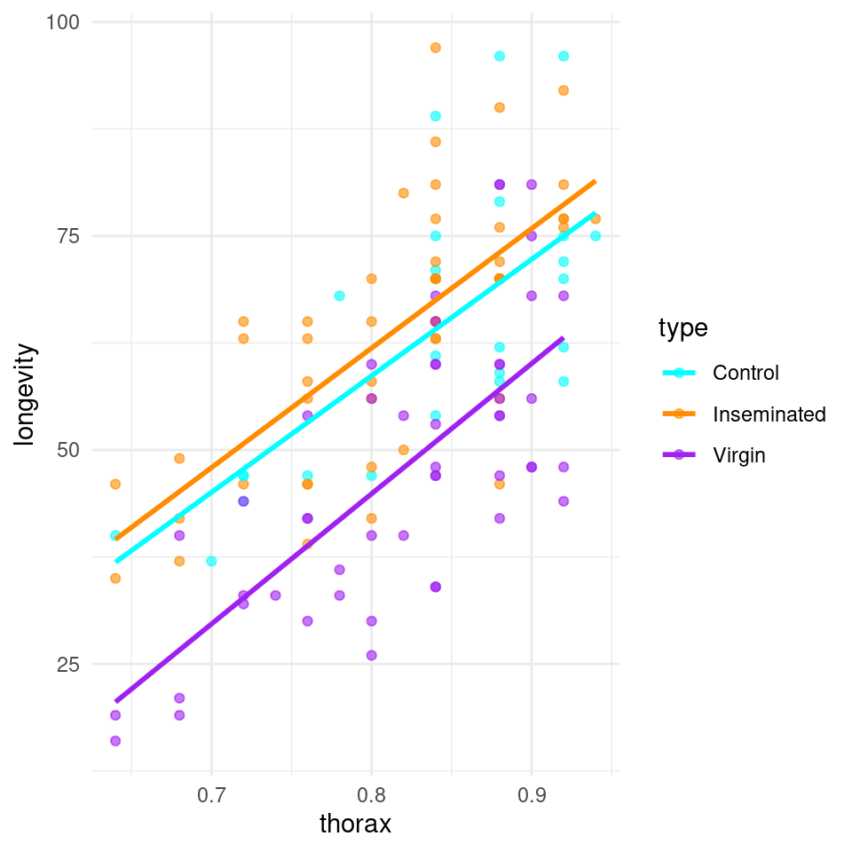

# Complex models


### Designing a Model

We are introduced to the fruitfly dataset Partridge and Farquhar (1981)^[https://nature.com/articles/294580a0]. From our understanding of sexual selection and reproductive biology in fruit flies, we know there is a well established 'cost' to reproduction in terms of reduced longevity for female fruitflies. The data from this experiment is designed to test whether increased sexual activity affects the lifespan of male fruitflies.

The flies used were an outbred stock, sexual activity was manipulated by supplying males with either new virgin females each day, previously mated females ( Inseminated, so remating rates are lower), or provide no females at all (Control). All groups were otherwise treated identically.


```{=html}
<a href="https://raw.githubusercontent.com/Philip-Leftwich/physalia-stats-intro/main/book/files/fruitfly.csv">
<button class="btn btn-success"><i class="fa fa-save"></i> Download Fruitfly data as csv</button>
</a>
```


* **type**: type of female companion (virgin, inseminated, control(partners = 0))

* **longevity**: lifespan in days

* **thorax**: length of thorax in micrometres (a proxy for body size)

* **sleep**: percentage of the day spent sleeping

### Hypothesis

Before you start any formal analysis you should think clearly about the sensible parameters to test. In this example, we are *most* interested in the effect of sexual activity on longevity. But it is possible that other factors may also affect longevity and we should include these in our model as well, and we should think **hard** about what terms might reasonably be expected to *interact* with sexual activity to affect longevity. 

<div class="panel panel-default"><div class="panel-heading"> Task </div><div class="panel-body"> 
Which terms and interactions do you think we should include in our model? </div></div>

<button id="displayTextunnamed-chunk-6" onclick="javascript:toggle('unnamed-chunk-6');">Show Solution</button>

<div id="toggleTextunnamed-chunk-6" style="display: none"><div class="panel panel-default"><div class="panel-heading panel-heading1"> Solution </div><div class="panel-body">
In this exercise I have just asked you to try and think logically about suitable predictors. For a more formal investigation you should support this with evidence where possible

* type - should definitely be included. 

* thorax - the size of the flies could determine longevity. Carreira et al (2009)^[https://www.nature.com/articles/hdy2008117]

* sleep - sleep could easily help determine longevity. Thompson et al (2020)^[https://journals.biologists.com/bio/article/9/9/bio054361/225803/Sleep-length-differences-are-associated-with]

* type:sleep - the amount that sleep (rest) helps promote longevity could change depending on how much activity the fly engages in when awake. Chen et al (2017)^[https://www.nature.com/articles/s41467-017-00087-5#:~:text=In%20this%20study%2C%20we%20show,but%20aroused%20females%20sleep%20more]

Other interactions *could* be included but you should have a strong reason for them. </div></div></div>

### Checking the data

You should now import, clean and tidy your data. Making sure it is in tidy format, all variables have useful names, and there are no mistakes, missing data or typos.

Based on the variables you have decided to test you should start with some simple visualisations, to understand the distribution of your data, and investigate visually the relationships you wish to test.

This is a full two-by-two plot of the entire dataset, but you should try and follow this up with some specific plots. 


```r
GGally::ggpairs(fruitfly)
```


## Activity 1: Building a model

Think carefully about the plots you should make to investigate the potential differences and relationships you wish to investigate - try and answer the questions first before checking the examples hidden behind dropdowns.

<div class="panel panel-default"><div class="panel-heading"> Task </div><div class="panel-body"> 
Make density distributions for longevity of males across the three treatments. </div></div>


<button id="displayTextunnamed-chunk-9" onclick="javascript:toggle('unnamed-chunk-9');">Show Solution</button>

<div id="toggleTextunnamed-chunk-9" style="display: none"><div class="panel panel-default"><div class="panel-heading panel-heading1"> Solution </div><div class="panel-body">
In this first figure - we can investigate whether there is an obvious difference in the longevities of males across the three treatments

```r
colours <- c("cyan", "darkorange", "purple")

fruitfly %>% 
  ggplot(aes(x = longevity, y = type, fill = type))+
  geom_density_ridges(alpha = 0.5)+
  scale_fill_manual(values = colours)+
  theme_minimal()+
  theme(legend.position = "none")
```

<div class="figure" style="text-align: center">

<p class="caption">(\#fig:unnamed-chunk-42)A density distribution of longevity across the three sexual activity treatments</p>
</div>
</div></div></div>

**Q** Does it like treatment affects longevity? <select class='webex-select'><option value='blank'></option><option value='answer'>Yes</option><option value=''>No</option></select>

We can also see that our distributions look *roughly* normally distributed, though we could use qq-plots to be sure. 


> Note it is only our dependent variable where we are strictly concerned about the distribution - independent variables have no strict requirements


```r
fruitfly %>% 
  group_split(type) %>% 
  map(~pull(.x, thorax) %>% 
        car::qqPlot())
```


```
## [[1]]
## [1] 1 2
## 
## [[2]]
## [1]  1 26
## 
## [[3]]
## [1] 26 27
```


<div class="panel panel-default"><div class="panel-heading"> Task </div><div class="panel-body"> 
Make a scatterplot of size against longevity. </div></div>


<button id="displayTextunnamed-chunk-12" onclick="javascript:toggle('unnamed-chunk-12');">Show Solution</button>

<div id="toggleTextunnamed-chunk-12" style="display: none"><div class="panel panel-default"><div class="panel-heading panel-heading1"> Solution </div><div class="panel-body">
In this first figure - we can investigate whether there is an obvious difference in the longevities of males across the three treatments

```r
fruitfly %>% 
  ggplot(aes(x = thorax, y = longevity))+
  geom_point()+
  theme_minimal()+
  theme(legend.position = "none")
```

<div class="figure" style="text-align: center">

<p class="caption">(\#fig:unnamed-chunk-41)A scatterplot of longevity against body size (thorax (mm)). No trend line added - often it is a good idea to look at data points without being lead to a conclusion by a line</p>
</div>
</div></div></div>


**Q** Does it look like size affects longevity? <select class='webex-select'><option value='blank'></option><option value='answer'>Yes</option><option value=''>No</option></select>


<div class="panel panel-default"><div class="panel-heading"> Task </div><div class="panel-body"> 
Now let us make an interaction plot to see if size interacts with treatment to affect longevity. (Use colour and groups to make differentiate points and lines) </div></div>


```r
colours <- c("cyan", "darkorange", "purple")

fruitfly %>% 
  ggplot(aes(x=thorax, y = longevity, group = type, colour = type))+
  geom_point( alpha = 0.6)+
  geom_smooth(method = "lm",
            se = FALSE)+
  scale_colour_manual(values = colours)+
  theme_minimal()
```

<div class="figure" style="text-align: center">

<p class="caption">(\#fig:unnamed-chunk-14)A scatterplot of thorax against longevity - colours indicate treatment types. This time I have included a line, as it will help determine if I think the slopes are different by group</p>
</div>


**Q** Does it look like size affects longevity differently between treatment groups? <select class='webex-select'><option value='blank'></option><option value=''>Yes</option><option value='answer'>No</option></select>


<div class='webex-solution'><button>Explain this</button>


Here it does look as though larger flies have a longer lifespan than smaller flies. But there appears to be little difference in the angle of the slopes between groups. This does not mean we can't test this in our model, but we may decide it is not worth including.


</div>


We are also interested in the potential effect of sleep on activity, we can construct a scatter plot of sleep against longevity, while including treatment as a covariate.

<div class="panel panel-default"><div class="panel-heading"> Task </div><div class="panel-body"> 
Investigate an interaction plot to see if sleep interacts with treatment to affect longevity. </div></div>


```r
fruitfly %>% 
  ggplot(aes(x=sleep, y = longevity, group = type, colour = type))+
  geom_point( alpha = 0.6)+
  geom_smooth(method = "lm",
            se = FALSE)+
  scale_colour_manual(values = colours)+
  theme_minimal()
```

<div class="figure" style="text-align: center">

<p class="caption">(\#fig:unnamed-chunk-16)A scatter plot of proportion of time spent sleeping against longevity with a linear model trendline. Points represent individual flies, colours represent treatments.</p>
</div>


In these plots - Are the trendlines moving in the same direction?  <select class='webex-select'><option value='blank'></option><option value=''>Yes</option><option value='answer'>No</option></select>


<div class='webex-solution'><button>Explain this</button>


Here it does look as though sleep interacts with treatment to affect lifespan. As the slopes of the lines are very different in each group. But in order to know the strength of this association, and if it is significantly different from what we might observe under the null hypothesis, we will have to build a model.


</div>


#### Designing a model

<div class="info">
<p>When you include an interaction term, the numbers produced from this
are how much <strong>more</strong> or <strong>less</strong> the mean
estimate is than if you just combined the main effects.</p>
</div>


<div class="tab"><button class="tablinks= T active" onclick="javascript:openCode(event, 'option1= T', '= T');">Base R</button><button class="tablinks= T" onclick="javascript:openCode(event, 'option2= T', '= T');"><tt>tidyverse</tt></button></div><div id="option1= T" class="tabcontent= T">

```r
# a full model
flyls1 <- lm(longevity ~ type + thorax + sleep + type:sleep, data = fruitfly)

flyls1 %>% 
  broom::tidy()
```

<div class="kable-table">

<table>
 <thead>
  <tr>
   <th style="text-align:left;"> term </th>
   <th style="text-align:right;"> estimate </th>
   <th style="text-align:right;"> std.error </th>
   <th style="text-align:right;"> statistic </th>
   <th style="text-align:right;"> p.value </th>
  </tr>
 </thead>
<tbody>
  <tr>
   <td style="text-align:left;"> (Intercept) </td>
   <td style="text-align:right;"> -57.5275383 </td>
   <td style="text-align:right;"> 11.3554560 </td>
   <td style="text-align:right;"> -5.0660703 </td>
   <td style="text-align:right;"> 0.0000015 </td>
  </tr>
  <tr>
   <td style="text-align:left;"> typeInseminated </td>
   <td style="text-align:right;"> 7.9883828 </td>
   <td style="text-align:right;"> 5.3412012 </td>
   <td style="text-align:right;"> 1.4956154 </td>
   <td style="text-align:right;"> 0.1374236 </td>
  </tr>
  <tr>
   <td style="text-align:left;"> typeVirgin </td>
   <td style="text-align:right;"> -10.9075381 </td>
   <td style="text-align:right;"> 5.4745755 </td>
   <td style="text-align:right;"> -1.9923989 </td>
   <td style="text-align:right;"> 0.0486358 </td>
  </tr>
  <tr>
   <td style="text-align:left;"> thorax </td>
   <td style="text-align:right;"> 142.5090010 </td>
   <td style="text-align:right;"> 13.4115350 </td>
   <td style="text-align:right;"> 10.6258531 </td>
   <td style="text-align:right;"> 0.0000000 </td>
  </tr>
  <tr>
   <td style="text-align:left;"> sleep </td>
   <td style="text-align:right;"> 0.0904459 </td>
   <td style="text-align:right;"> 0.1885893 </td>
   <td style="text-align:right;"> 0.4795919 </td>
   <td style="text-align:right;"> 0.6324053 </td>
  </tr>
  <tr>
   <td style="text-align:left;"> typeInseminated:sleep </td>
   <td style="text-align:right;"> -0.1965054 </td>
   <td style="text-align:right;"> 0.2082301 </td>
   <td style="text-align:right;"> -0.9436937 </td>
   <td style="text-align:right;"> 0.3472544 </td>
  </tr>
  <tr>
   <td style="text-align:left;"> typeVirgin:sleep </td>
   <td style="text-align:right;"> -0.1124276 </td>
   <td style="text-align:right;"> 0.2166543 </td>
   <td style="text-align:right;"> -0.5189260 </td>
   <td style="text-align:right;"> 0.6047842 </td>
  </tr>
</tbody>
</table>

</div>
</div><div id="option2= T" class="tabcontent= T">

```r
flyls1 <- lm(longevity ~ type + thorax + sleep + type:sleep, data = fruitfly)
summary(flyls1)
```

```
## 
## Call:
## lm(formula = longevity ~ type + thorax + sleep + type:sleep, 
##     data = fruitfly)
## 
## Residuals:
##     Min      1Q  Median      3Q     Max 
## -28.808  -6.961  -2.024   7.463  28.741 
## 
## Coefficients:
##                        Estimate Std. Error t value Pr(>|t|)    
## (Intercept)           -57.52754   11.35546  -5.066 1.52e-06 ***
## typeInseminated         7.98838    5.34120   1.496   0.1374    
## typeVirgin            -10.90754    5.47458  -1.992   0.0486 *  
## thorax                142.50900   13.41154  10.626  < 2e-16 ***
## sleep                   0.09045    0.18859   0.480   0.6324    
## typeInseminated:sleep  -0.19651    0.20823  -0.944   0.3473    
## typeVirgin:sleep       -0.11243    0.21665  -0.519   0.6048    
## ---
## Signif. codes:  0 '***' 0.001 '**' 0.01 '*' 0.05 '.' 0.1 ' ' 1
## 
## Residual standard error: 11.27 on 118 degrees of freedom
## Multiple R-squared:  0.608,	Adjusted R-squared:  0.5881 
## F-statistic: 30.51 on 6 and 118 DF,  p-value: < 2.2e-16
```
</div><script> javascript:hide('option2= T') </script>


<div class="info">
<p>Because we have included an interaction effect the number of terms is
quite long and takes more consideration to understand. We can see for
the individual estimates that it does not appear that the interaction is
having a strong effect (estimate) and this does not appear to be
different from a null hypothesis of no interaction effect. But we we
should use an <em>F</em> test to look at the overall effect to be
sure.</p>
</div>

<div class="panel panel-default"><div class="panel-heading"> Task </div><div class="panel-body"> 
From the model summary table could you say what the mean longevity of a male with a 0.79mm thorax, that sleeps for 22% of the day and is paired with virgin females would be? </div></div>


```r
# intercept
coef(flyls1)[1] + 
  
# 1*coefficient for virgin treatment  
coef(flyls1)[3] + 
  
# 0.79 * coefficient for thorax size  
(coef(flyls1)[4]*0.79) + 
  
# 22 * coefficient for sleep  
(coef(flyls1)[5]*22) + 
```

<button id="displayTextunnamed-chunk-21" onclick="javascript:toggle('unnamed-chunk-21');">Show Solution</button>

<div id="toggleTextunnamed-chunk-21" style="display: none"><div class="panel panel-default"><div class="panel-heading panel-heading1"> Solution </div><div class="panel-body">

```r
# 22 * 1 * coefficient for interaction
(coef(flyls1)[7]*22*1)
```

```
## typeVirgin:sleep 
##        -2.473406
```
</div></div></div>

## Activity 2: Model checking

#### Model checking & collinearity

Before we start playing with the terms in our model, we should check to see if this is even a good way of fitting and measuring our data. We should check the assumptions of our model are being met.


```r
performance::check_model(flyls1)
```


**Question - IS the assumption of homogeneity of variance met?** <select class='webex-select'><option value='blank'></option><option value='answer'>Yes</option><option value=''>No</option></select>

<button id="displayTextunnamed-chunk-23" onclick="javascript:toggle('unnamed-chunk-23');">Show Solution</button>

<div id="toggleTextunnamed-chunk-23" style="display: none"><div class="panel panel-default"><div class="panel-heading panel-heading1"> Solution </div><div class="panel-body">

* Mostly - the reference line is fairly flat (there is a slight curve).

* It looks as though there might be some increasing heterogeneity with larger values, though very minor.

VERDICT, pretty much ok, should be fine for making inferences. 

With a slight curvature this could indicate that you *might* get a better fit with a transformation, or perhaps that there is a missing variable that if included in the model would improve the residuals. In this instance I wouldn't be overly concerned. See here for a great explainer on intepreting residuals^[https://www.qualtrics.com/support/stats-iq/analyses/regression-guides/interpreting-residual-plots-improve-regression/].
</div></div></div>

**Question - ARE the residuals normally distributed?** <select class='webex-select'><option value='blank'></option><option value='answer'>Yes</option><option value=''>No</option></select>

<button id="displayTextunnamed-chunk-24" onclick="javascript:toggle('unnamed-chunk-24');">Show Solution</button>

<div id="toggleTextunnamed-chunk-24" style="display: none"><div class="panel panel-default"><div class="panel-heading panel-heading1"> Solution </div><div class="panel-body">
Yes - the QQplot looks pretty good, a very minor indication of a right skew, but nothing to worry about. 

[Interpreting QQ plots][What is a Quantile-Quantile (QQ) plot?]
</div></div></div>


**Question - IS their an issue with Collinearity?** <select class='webex-select'><option value='blank'></option><option value=''>Yes</option><option value='answer'>No</option></select>

<button id="displayTextunnamed-chunk-25" onclick="javascript:toggle('unnamed-chunk-25');">Show Solution</button>

<div id="toggleTextunnamed-chunk-25" style="display: none"><div class="panel panel-default"><div class="panel-heading panel-heading1"> Solution </div><div class="panel-body">

This graph clearly shows there **is** collinearity. But this is not unusual when we include an *interaction term*, if we see evidence of collinearity in terms that are not part of an interaction **then** we should take another look^[https://easystats.github.io/performance/reference/check_collinearity.html].

What can you do about collinearity in main effects? 1) Nothing 2) Transform 3) Drop one of the terms. 

The `check_performance()` function produces a visual summary of a Variance Inflation Factor produced from the `vif()` function. This is a measure of the standard error of each estimated coefficient. If this is very larger (greater than 5 or 10), this indicates the model has problems estimating the coefficient. This does not affect model predictions, but makes it more difficult to determine the estimate change from a predictor. 

```r
car::vif(flyls1)
```

```
##                 GVIF Df GVIF^(1/(2*Df))
## type       12.478906  2        1.879508
## thorax      1.052967  1        1.026142
## sleep       8.750764  1        2.958169
## type:sleep 38.749001  2        2.494969
```
</div></div></div>


## Data transformations

The most common issues when trying to fit simple linear regression models is that our response variable is not normal which violates our modelling assumption. There are two things we can do in this case:

* Variable transformation e.g `lm(sqrt(x) ~ y, data = data)`
    
    - Can sometimes fix linearity
    
    - Can sometimes fix non-normality and heteroscedasticity (i.e non-constant variance) 
    
* Generalized Linear Models (GLMs) to change the error structure (i.e the assumption that residuals need to be normal - see next week.)

### BoxCox

<div class="info">
<p>The BoxCox gets its name from its two inventors, George Box and David
Cox. Implemented by the MASS package, when applied to a linear model it
sytematically applies transformations by raising the y variable to a
power (lambda).</p>
<p>The R output for the <code>MASS::boxcox()</code> function plots a
maximum likelihood curve (with a 95% confidence interval - drops down as
dotted lines) for the best transformation for fitting the data to the
model.</p>
</div>

<table class="table" style="font-size: 16px; width: auto !important; margin-left: auto; margin-right: auto;">
<caption style="font-size: initial !important;">(\#tab:unnamed-chunk-27)Common Box-Cox Transformations</caption>
 <thead>
  <tr>
   <th style="text-align:right;"> lambda value </th>
   <th style="text-align:left;"> transformation </th>
  </tr>
 </thead>
<tbody>
  <tr>
   <td style="text-align:right;"> 0.0 </td>
   <td style="text-align:left;"> log(Y) </td>
  </tr>
  <tr>
   <td style="text-align:right;"> 0.5 </td>
   <td style="text-align:left;"> sqrt(Y) </td>
  </tr>
  <tr>
   <td style="text-align:right;"> 1.0 </td>
   <td style="text-align:left;"> Y </td>
  </tr>
  <tr>
   <td style="text-align:right;"> 2.0 </td>
   <td style="text-align:left;"> Y^1 </td>
  </tr>
</tbody>
</table>


```r
# run this, pick a transformation and retest the model fit
MASS::boxcox(flyls1)
```

<div class="figure" style="text-align: center">

<p class="caption">(\#fig:unnamed-chunk-28)standard curve fitted by maximum likelihood, dashed lines represent the 95% confidence interval range for picking the 'best' transformation for the dependent variable</p>
</div>

**Question - Does the fit of the model improve with a square root transformation?** 

<button id="displayTextunnamed-chunk-29" onclick="javascript:toggle('unnamed-chunk-29');">Show Solution</button>

<div id="toggleTextunnamed-chunk-29" style="display: none"><div class="panel panel-default"><div class="panel-heading panel-heading1"> Solution </div><div class="panel-body">

```r
flyls_sqrt <- lm(sqrt(longevity) ~ type + thorax + sleep + type:sleep, data = fruitfly)

performance::check_model(flyls_sqrt)
```


Despite the suggestion that a sqrt transformation would improve the model, residual fits have improved only slightly, but there is one more check. Using summary() - which model has the best adjusted R^2?
  

```r
summary(flyls1)

summary(flyls_sqrt)
```

```
## 
## Call:
## lm(formula = longevity ~ type + thorax + sleep + type:sleep, 
##     data = fruitfly)
## 
## Residuals:
##     Min      1Q  Median      3Q     Max 
## -28.808  -6.961  -2.024   7.463  28.741 
## 
## Coefficients:
##                        Estimate Std. Error t value Pr(>|t|)    
## (Intercept)           -57.52754   11.35546  -5.066 1.52e-06 ***
## typeInseminated         7.98838    5.34120   1.496   0.1374    
## typeVirgin            -10.90754    5.47458  -1.992   0.0486 *  
## thorax                142.50900   13.41154  10.626  < 2e-16 ***
## sleep                   0.09045    0.18859   0.480   0.6324    
## typeInseminated:sleep  -0.19651    0.20823  -0.944   0.3473    
## typeVirgin:sleep       -0.11243    0.21665  -0.519   0.6048    
## ---
## Signif. codes:  0 '***' 0.001 '**' 0.01 '*' 0.05 '.' 0.1 ' ' 1
## 
## Residual standard error: 11.27 on 118 degrees of freedom
## Multiple R-squared:  0.608,	Adjusted R-squared:  0.5881 
## F-statistic: 30.51 on 6 and 118 DF,  p-value: < 2.2e-16
## 
## 
## Call:
## lm(formula = sqrt(longevity) ~ type + thorax + sleep + type:sleep, 
##     data = fruitfly)
## 
## Residuals:
##      Min       1Q   Median       3Q      Max 
## -1.91588 -0.48660 -0.09031  0.53105  1.60861 
## 
## Coefficients:
##                        Estimate Std. Error t value Pr(>|t|)    
## (Intercept)           -0.576928   0.758260  -0.761   0.4483    
## typeInseminated        0.487914   0.356658   1.368   0.1739    
## typeVirgin            -0.855749   0.365564  -2.341   0.0209 *  
## thorax                10.064167   0.895554  11.238   <2e-16 ***
## sleep                  0.003317   0.012593   0.263   0.7927    
## typeInseminated:sleep -0.010241   0.013905  -0.737   0.4629    
## typeVirgin:sleep      -0.003497   0.014467  -0.242   0.8094    
## ---
## Signif. codes:  0 '***' 0.001 '**' 0.01 '*' 0.05 '.' 0.1 ' ' 1
## 
## Residual standard error: 0.7527 on 118 degrees of freedom
## Multiple R-squared:  0.6311,	Adjusted R-squared:  0.6124 
## F-statistic: 33.65 on 6 and 118 DF,  p-value: < 2.2e-16
```

Using this we could conclude that the sqrt transformed model explains more variance than the original model
  </div></div></div>

## Model selection


```r
# Remove top-level interaction

flyls_sqrt2 <- lm(sqrt(longevity) ~ type + thorax + sleep, data = fruitfly)

anova(flyls_sqrt2, flyls_sqrt, test = "F")
```

<div class="kable-table">

<table>
 <thead>
  <tr>
   <th style="text-align:right;"> Res.Df </th>
   <th style="text-align:right;"> RSS </th>
   <th style="text-align:right;"> Df </th>
   <th style="text-align:right;"> Sum of Sq </th>
   <th style="text-align:right;"> F </th>
   <th style="text-align:right;"> Pr(&gt;F) </th>
  </tr>
 </thead>
<tbody>
  <tr>
   <td style="text-align:right;"> 120 </td>
   <td style="text-align:right;"> 67.33770 </td>
   <td style="text-align:right;"> NA </td>
   <td style="text-align:right;"> NA </td>
   <td style="text-align:right;"> NA </td>
   <td style="text-align:right;"> NA </td>
  </tr>
  <tr>
   <td style="text-align:right;"> 118 </td>
   <td style="text-align:right;"> 66.85853 </td>
   <td style="text-align:right;"> 2 </td>
   <td style="text-align:right;"> 0.4791614 </td>
   <td style="text-align:right;"> 0.4228409 </td>
   <td style="text-align:right;"> 0.6561716 </td>
  </tr>
</tbody>
</table>

</div>

Based on this ANOVA table, we do not appear to have a strong rationale for keeping the interaction term in the model (AIC or F-test). Therefore we can confidently remove the interaction, simplifying our model and making interpretation easier. 


```r
flyls_sqrt3a <- lm(sqrt(longevity) ~ type + thorax, data = fruitfly)
flyls_sqrt3b <- lm(sqrt(longevity) ~ type + sleep, data = fruitfly)
flyls_sqrt3c <- lm(sqrt(longevity) ~ thorax + sleep, data = fruitfly)

anova(flyls_sqrt3a, flyls_sqrt2)
anova(flyls_sqrt3b, flyls_sqrt2)
anova(flyls_sqrt3c, flyls_sqrt2)
```

<div class="kable-table">

<table>
 <thead>
  <tr>
   <th style="text-align:right;"> Res.Df </th>
   <th style="text-align:right;"> RSS </th>
   <th style="text-align:right;"> Df </th>
   <th style="text-align:right;"> Sum of Sq </th>
   <th style="text-align:right;"> F </th>
   <th style="text-align:right;"> Pr(&gt;F) </th>
  </tr>
 </thead>
<tbody>
  <tr>
   <td style="text-align:right;"> 121 </td>
   <td style="text-align:right;"> 67.67243 </td>
   <td style="text-align:right;"> NA </td>
   <td style="text-align:right;"> NA </td>
   <td style="text-align:right;"> NA </td>
   <td style="text-align:right;"> NA </td>
  </tr>
  <tr>
   <td style="text-align:right;"> 120 </td>
   <td style="text-align:right;"> 67.33770 </td>
   <td style="text-align:right;"> 1 </td>
   <td style="text-align:right;"> 0.3347353 </td>
   <td style="text-align:right;"> 0.5965194 </td>
   <td style="text-align:right;"> 0.4414276 </td>
  </tr>
</tbody>
</table>

</div><div class="kable-table">

<table>
 <thead>
  <tr>
   <th style="text-align:right;"> Res.Df </th>
   <th style="text-align:right;"> RSS </th>
   <th style="text-align:right;"> Df </th>
   <th style="text-align:right;"> Sum of Sq </th>
   <th style="text-align:right;"> F </th>
   <th style="text-align:right;"> Pr(&gt;F) </th>
  </tr>
 </thead>
<tbody>
  <tr>
   <td style="text-align:right;"> 121 </td>
   <td style="text-align:right;"> 142.7961 </td>
   <td style="text-align:right;"> NA </td>
   <td style="text-align:right;"> NA </td>
   <td style="text-align:right;"> NA </td>
   <td style="text-align:right;"> NA </td>
  </tr>
  <tr>
   <td style="text-align:right;"> 120 </td>
   <td style="text-align:right;"> 67.3377 </td>
   <td style="text-align:right;"> 1 </td>
   <td style="text-align:right;"> 75.4584 </td>
   <td style="text-align:right;"> 134.4716 </td>
   <td style="text-align:right;"> 0 </td>
  </tr>
</tbody>
</table>

</div><div class="kable-table">

<table>
 <thead>
  <tr>
   <th style="text-align:right;"> Res.Df </th>
   <th style="text-align:right;"> RSS </th>
   <th style="text-align:right;"> Df </th>
   <th style="text-align:right;"> Sum of Sq </th>
   <th style="text-align:right;"> F </th>
   <th style="text-align:right;"> Pr(&gt;F) </th>
  </tr>
 </thead>
<tbody>
  <tr>
   <td style="text-align:right;"> 122 </td>
   <td style="text-align:right;"> 104.4759 </td>
   <td style="text-align:right;"> NA </td>
   <td style="text-align:right;"> NA </td>
   <td style="text-align:right;"> NA </td>
   <td style="text-align:right;"> NA </td>
  </tr>
  <tr>
   <td style="text-align:right;"> 120 </td>
   <td style="text-align:right;"> 67.3377 </td>
   <td style="text-align:right;"> 2 </td>
   <td style="text-align:right;"> 37.13823 </td>
   <td style="text-align:right;"> 33.09133 </td>
   <td style="text-align:right;"> 0 </td>
  </tr>
</tbody>
</table>

</div>

**Question - Should we drop sleep from this model?** <select class='webex-select'><option value='blank'></option><option value=''>Yes</option><option value='answer'>No</option></select>

<button id="displayTextunnamed-chunk-33" onclick="javascript:toggle('unnamed-chunk-33');">Show Solution</button>

<div id="toggleTextunnamed-chunk-33" style="display: none"><div class="panel panel-default"><div class="panel-heading panel-heading1"> Solution </div><div class="panel-body">

There is good reason to remove non-significant *interaction terms* from a model, they complicate estimates and make interpretations more difficult. For **main** effects things are a little more ambiguous. 

When the main aim is prediction, it makes sense to be cautious and retain non-significant terms, as extra terms make no difference to the R^2 of a model. 

When the focus is on hypothesis testing, then removal of non-significant terms can help produce a 'true' model, but this is optional. Generally speaking it is often simpler to leave main effects in the model (you should have carefully considered the terms which were included in the first place). 

In this example we can also see that AIC has not really changed - so the quality of the model is also not improved vby dropping this term. </div></div></div>


## Posthoc

Using the [emmeans](https://aosmith.rbind.io/2019/03/25/getting-started-with-emmeans/) package is a very easy way to produce the estimate mean values (rather than mean differences) for different categories `emmeans`. If the term `pairwise` is included then it will also include post-hoc pairwise comparisons between all levels with a tukey test `contrasts`.


```r
emmeans::emmeans(flyls_sqrt2, # model
                 specs = pairwise ~ type + thorax + sleep, # specifies pairwise contrasts wanted as well as means
                 type = "response") # this argument specifies whether means are presented on the sqrt transformation or 'original' scale
```

```
## $emmeans
##  type        thorax sleep response   SE  df lower.CL upper.CL
##  Control      0.821  23.5     60.1 2.34 120     55.5     64.8
##  Inseminated  0.821  23.5     64.1 1.70 120     60.8     67.5
##  Virgin       0.821  23.5     46.6 1.45 120     43.8     49.5
## 
## Confidence level used: 0.95 
## Intervals are back-transformed from the sqrt scale 
## 
## $contrasts
##  contrast                                                                 
##  Control thorax0.82096 sleep23.464 - Inseminated thorax0.82096 sleep23.464
##  Control thorax0.82096 sleep23.464 - Virgin thorax0.82096 sleep23.464     
##  Inseminated thorax0.82096 sleep23.464 - Virgin thorax0.82096 sleep23.464 
##  estimate    SE  df t.ratio p.value
##    -0.258 0.185 120  -1.394  0.3474
##     0.924 0.184 120   5.016  <.0001
##     1.182 0.150 120   7.883  <.0001
## 
## Note: contrasts are still on the sqrt scale 
## P value adjustment: tukey method for comparing a family of 3 estimates
```

<div class="info">
<p>For continuous variables (sleep and thorax) - <code>emmeans</code>
has set these to the mean value within the dataset, so comparisons are
constant between categories at the average value of all continuous
variables.</p>
</div>

## Write-up

### Methods

I constructed an ordinary least squares model to investigate the effects of sleep, mating type and body size on longevity in adult Drosophila melanogaster. I also included an interaction term between sleep and mating type. All Analyses and data cleaning was carried out in R ver 4.1.2 with the tidyverse range of packages (Wickham et al 2019), model residuals were checked with the performance package (Lüdecke et al 2021), and summary tables produced with broom (Robinson et al 2022) and kableExtra (Zhu 2020).


### Results


I tested the hypothesis that sexual activity is costly for male *Drosophila melanogaster* fruitflies. Previous research indicated that sleep deprived males are less attractive to females, this would indicate that levels of sexual activity might be affected by sleep and impact the effect on longevity, as such this was included as an interaction term in the full model. Body size is also know to affect lifespan, as such this was included as a covariate in the mode. 

There was a small interaction effect of decreased lifespan with increasing sleep in the treatment groups compared to control in our samples, but this was not significantly different from no effect (F~2,118~ = 0.423, P = 0.656), and was therefore dropped from the full model (Table 15.1). 


```r
library(kableExtra)
flyls_sqrt2 %>% broom::tidy(conf.int = T) %>% 
 select(-`std.error`) %>% 
mutate_if(is.numeric, round, 2) %>% 
kbl(col.names = c("Predictors",
                    "Estimates",
                    "t-value",
                    "P",
                    "Lower 95% CI",
                    "Upper 95% CI"),
      caption = "Linear model coefficients on square-root transformed dependent variable", 
    booktabs = T) %>% 
   kable_styling(full_width = FALSE, font_size=16)
```

<table class="table" style="font-size: 16px; width: auto !important; margin-left: auto; margin-right: auto;">
<caption style="font-size: initial !important;">(\#tab:unnamed-chunk-36)Linear model coefficients on square-root transformed dependent variable</caption>
 <thead>
  <tr>
   <th style="text-align:left;"> Predictors </th>
   <th style="text-align:right;"> Estimates </th>
   <th style="text-align:right;"> t-value </th>
   <th style="text-align:right;"> P </th>
   <th style="text-align:right;"> Lower 95% CI </th>
   <th style="text-align:right;"> Upper 95% CI </th>
  </tr>
 </thead>
<tbody>
  <tr>
   <td style="text-align:left;"> (Intercept) </td>
   <td style="text-align:right;"> -0.51 </td>
   <td style="text-align:right;"> -0.68 </td>
   <td style="text-align:right;"> 0.50 </td>
   <td style="text-align:right;"> -1.98 </td>
   <td style="text-align:right;"> 0.97 </td>
  </tr>
  <tr>
   <td style="text-align:left;"> typeInseminated </td>
   <td style="text-align:right;"> 0.26 </td>
   <td style="text-align:right;"> 1.39 </td>
   <td style="text-align:right;"> 0.17 </td>
   <td style="text-align:right;"> -0.11 </td>
   <td style="text-align:right;"> 0.62 </td>
  </tr>
  <tr>
   <td style="text-align:left;"> typeVirgin </td>
   <td style="text-align:right;"> -0.92 </td>
   <td style="text-align:right;"> -5.02 </td>
   <td style="text-align:right;"> 0.00 </td>
   <td style="text-align:right;"> -1.29 </td>
   <td style="text-align:right;"> -0.56 </td>
  </tr>
  <tr>
   <td style="text-align:left;"> thorax </td>
   <td style="text-align:right;"> 10.15 </td>
   <td style="text-align:right;"> 11.60 </td>
   <td style="text-align:right;"> 0.00 </td>
   <td style="text-align:right;"> 8.42 </td>
   <td style="text-align:right;"> 11.88 </td>
  </tr>
  <tr>
   <td style="text-align:left;"> sleep </td>
   <td style="text-align:right;"> 0.00 </td>
   <td style="text-align:right;"> -0.77 </td>
   <td style="text-align:right;"> 0.44 </td>
   <td style="text-align:right;"> -0.01 </td>
   <td style="text-align:right;"> 0.01 </td>
  </tr>
</tbody>
</table>

There was a significant overall effect of treatment on male longevity (Linear model: F~2,120~ = 33.1, P < 0.001), with males paired to virgin females having the lowest mean longevity (46.6 days, [95%CI: 43.8 - 49.5]) (at an average body size of 0.82mm and 23.5% sleep), compared to control males (60.1 days [55.5 - 64.8]) and males paired with inseminated females (64.1 days [60.8 - 67.5 days]). 

Post hoc analysis showed that these differences were not significant for males paired with virgin females compared to the control females (Tukey test: t~120~ = 5.016, P < 0.001)  and inseminated female groups (t~120~ = 7.883, P < 0.001), but there was no overall evidence of a difference between inseminated and control groups (t~120~ = -1.394  P = 0.347) (Figure 19.4). 

Comparing the treatment effects against other predictors of longevity such as body size and sleep, I found that sleep had an effect that was significantly different from no effect (Linear model: F~1,120~ = 0.33, P = 0.441). Body size (taken from thorax length) was a significant predictor of longevity (F~1,120~ = 134, P < 0.001), with each 0.1 mm increase in body size adding 10.2 days to the individual lifespan (sqrt scale 10.1 days per 1mm 95%CI[8.42 - 11.9]). It appears as though body size has a stronger effect on longevity than treatment, indicating that while there is a measurable cost of sexual activity to males, it may be less severe than in females (not compared here), and less severe than other measurable predictors. 

> Note: when transformations have been applied to a linear model care must be taken when presenting results. In this example coefficients are sqrt transformed, back transformation should be treated with caution. In addition note that the coefficient for size is "per 1mm" - but this is an unrealistic scale - a Drosophila is no more than 3mm in total length, so scaling to 0.1mm may make more sense.  

<div class="figure" style="text-align: center">

<p class="caption">(\#fig:unnamed-chunk-37) A scatter plot of longevity against body size across three treatments of differening male sexual activity. Fitted model slopes are from the reduced linear model (main effects only of thorax size, sleep and treatment group), with 95% confidence intervals</p>
</div>


## Summary

In this chapter we have worked with our scientific knowledge to develop testable hypotheses and built statistical models to formally assess them. We now have a working pipeline for tackling complex datasets, developing insights and producing and explaining robust linear models. 

#### Checklist

* Think carefully about the hypotheses to test, use your scientific knowledge and background reading to support this

* Import, clean and understand your dataset: use data visuals to investigate trends and determine if there is clear support for your hypotheses

* Fit a linear model, including interaction terms with caution

* Investigate the fit of your model, understand that parameters may never be perfect, but that classic patterns in residuals may indicate a poorly fitting model - sometimes this can be fixed with careful consideration of missing variables or through data transformation

* Test the removal of any interaction terms from a model, look at AIC and significance tests

* Make sure you understand the output of a model summary, sense check this against the graphs you have made

* The direction and size of any effects are the priority - produce estimates and uncertainties. Make sure the observations are clear.

* Write-up your significance test results, taking care to report not just significance (and all required parts of a significance test). Do you know *what* to report? Within a complex model - reporting *t* will indicate the slope of the line for that single term against the intercept, *F* is the overall effect of a predictor across all levels, *post-hoc* if you wish to compare across all levels. 

* Well described tables and figures can enhance your results sections - take the time to make sure these are informative and attractive. 


## Supplementary code

`sjPlot` A really nice package that helps produce model summaries for you automatically


```r
library(sjPlot)
tab_model(flyls_sqrt2)
```

<table style="border-collapse:collapse; border:none;">
<tr>
<th style="border-top: double; text-align:center; font-style:normal; font-weight:bold; padding:0.2cm;  text-align:left; ">&nbsp;</th>
<th colspan="3" style="border-top: double; text-align:center; font-style:normal; font-weight:bold; padding:0.2cm; ">sqrt(longevity)</th>
</tr>
<tr>
<td style=" text-align:center; border-bottom:1px solid; font-style:italic; font-weight:normal;  text-align:left; ">Predictors</td>
<td style=" text-align:center; border-bottom:1px solid; font-style:italic; font-weight:normal;  ">Estimates</td>
<td style=" text-align:center; border-bottom:1px solid; font-style:italic; font-weight:normal;  ">CI</td>
<td style=" text-align:center; border-bottom:1px solid; font-style:italic; font-weight:normal;  ">p</td>
</tr>
<tr>
<td style=" padding:0.2cm; text-align:left; vertical-align:top; text-align:left; ">(Intercept)</td>
<td style=" padding:0.2cm; text-align:left; vertical-align:top; text-align:center;  ">&#45;0.51</td>
<td style=" padding:0.2cm; text-align:left; vertical-align:top; text-align:center;  ">&#45;1.98&nbsp;&ndash;&nbsp;0.97</td>
<td style=" padding:0.2cm; text-align:left; vertical-align:top; text-align:center;  ">0.500</td>
</tr>
<tr>
<td style=" padding:0.2cm; text-align:left; vertical-align:top; text-align:left; ">type [Inseminated]</td>
<td style=" padding:0.2cm; text-align:left; vertical-align:top; text-align:center;  ">0.26</td>
<td style=" padding:0.2cm; text-align:left; vertical-align:top; text-align:center;  ">&#45;0.11&nbsp;&ndash;&nbsp;0.62</td>
<td style=" padding:0.2cm; text-align:left; vertical-align:top; text-align:center;  ">0.166</td>
</tr>
<tr>
<td style=" padding:0.2cm; text-align:left; vertical-align:top; text-align:left; ">type [Virgin]</td>
<td style=" padding:0.2cm; text-align:left; vertical-align:top; text-align:center;  ">&#45;0.92</td>
<td style=" padding:0.2cm; text-align:left; vertical-align:top; text-align:center;  ">&#45;1.29&nbsp;&ndash;&nbsp;-0.56</td>
<td style=" padding:0.2cm; text-align:left; vertical-align:top; text-align:center;  "><strong>&lt;0.001</strong></td>
</tr>
<tr>
<td style=" padding:0.2cm; text-align:left; vertical-align:top; text-align:left; ">thorax</td>
<td style=" padding:0.2cm; text-align:left; vertical-align:top; text-align:center;  ">10.15</td>
<td style=" padding:0.2cm; text-align:left; vertical-align:top; text-align:center;  ">8.42&nbsp;&ndash;&nbsp;11.88</td>
<td style=" padding:0.2cm; text-align:left; vertical-align:top; text-align:center;  "><strong>&lt;0.001</strong></td>
</tr>
<tr>
<td style=" padding:0.2cm; text-align:left; vertical-align:top; text-align:left; ">sleep</td>
<td style=" padding:0.2cm; text-align:left; vertical-align:top; text-align:center;  ">&#45;0.00</td>
<td style=" padding:0.2cm; text-align:left; vertical-align:top; text-align:center;  ">&#45;0.01&nbsp;&ndash;&nbsp;0.01</td>
<td style=" padding:0.2cm; text-align:left; vertical-align:top; text-align:center;  ">0.441</td>
</tr>
<tr>
<td style=" padding:0.2cm; text-align:left; vertical-align:top; text-align:left; padding-top:0.1cm; padding-bottom:0.1cm; border-top:1px solid;">Observations</td>
<td style=" padding:0.2cm; text-align:left; vertical-align:top; padding-top:0.1cm; padding-bottom:0.1cm; text-align:left; border-top:1px solid;" colspan="3">125</td>
</tr>
<tr>
<td style=" padding:0.2cm; text-align:left; vertical-align:top; text-align:left; padding-top:0.1cm; padding-bottom:0.1cm;">R<sup>2</sup> / R<sup>2</sup> adjusted</td>
<td style=" padding:0.2cm; text-align:left; vertical-align:top; padding-top:0.1cm; padding-bottom:0.1cm; text-align:left;" colspan="3">0.628 / 0.616</td>
</tr>

</table>


```r
library(gtsummary)
tbl_regression(flyls_sqrt2)
```

```{=html}
<div id="ofjfrwdplu" style="padding-left:0px;padding-right:0px;padding-top:10px;padding-bottom:10px;overflow-x:auto;overflow-y:auto;width:auto;height:auto;">
<style>#ofjfrwdplu table {
  font-family: system-ui, 'Segoe UI', Roboto, Helvetica, Arial, sans-serif, 'Apple Color Emoji', 'Segoe UI Emoji', 'Segoe UI Symbol', 'Noto Color Emoji';
  -webkit-font-smoothing: antialiased;
  -moz-osx-font-smoothing: grayscale;
}

#ofjfrwdplu thead, #ofjfrwdplu tbody, #ofjfrwdplu tfoot, #ofjfrwdplu tr, #ofjfrwdplu td, #ofjfrwdplu th {
  border-style: none;
}

#ofjfrwdplu p {
  margin: 0;
  padding: 0;
}

#ofjfrwdplu .gt_table {
  display: table;
  border-collapse: collapse;
  line-height: normal;
  margin-left: auto;
  margin-right: auto;
  color: #333333;
  font-size: 16px;
  font-weight: normal;
  font-style: normal;
  background-color: #FFFFFF;
  width: auto;
  border-top-style: solid;
  border-top-width: 2px;
  border-top-color: #A8A8A8;
  border-right-style: none;
  border-right-width: 2px;
  border-right-color: #D3D3D3;
  border-bottom-style: solid;
  border-bottom-width: 2px;
  border-bottom-color: #A8A8A8;
  border-left-style: none;
  border-left-width: 2px;
  border-left-color: #D3D3D3;
}

#ofjfrwdplu .gt_caption {
  padding-top: 4px;
  padding-bottom: 4px;
}

#ofjfrwdplu .gt_title {
  color: #333333;
  font-size: 125%;
  font-weight: initial;
  padding-top: 4px;
  padding-bottom: 4px;
  padding-left: 5px;
  padding-right: 5px;
  border-bottom-color: #FFFFFF;
  border-bottom-width: 0;
}

#ofjfrwdplu .gt_subtitle {
  color: #333333;
  font-size: 85%;
  font-weight: initial;
  padding-top: 3px;
  padding-bottom: 5px;
  padding-left: 5px;
  padding-right: 5px;
  border-top-color: #FFFFFF;
  border-top-width: 0;
}

#ofjfrwdplu .gt_heading {
  background-color: #FFFFFF;
  text-align: center;
  border-bottom-color: #FFFFFF;
  border-left-style: none;
  border-left-width: 1px;
  border-left-color: #D3D3D3;
  border-right-style: none;
  border-right-width: 1px;
  border-right-color: #D3D3D3;
}

#ofjfrwdplu .gt_bottom_border {
  border-bottom-style: solid;
  border-bottom-width: 2px;
  border-bottom-color: #D3D3D3;
}

#ofjfrwdplu .gt_col_headings {
  border-top-style: solid;
  border-top-width: 2px;
  border-top-color: #D3D3D3;
  border-bottom-style: solid;
  border-bottom-width: 2px;
  border-bottom-color: #D3D3D3;
  border-left-style: none;
  border-left-width: 1px;
  border-left-color: #D3D3D3;
  border-right-style: none;
  border-right-width: 1px;
  border-right-color: #D3D3D3;
}

#ofjfrwdplu .gt_col_heading {
  color: #333333;
  background-color: #FFFFFF;
  font-size: 100%;
  font-weight: normal;
  text-transform: inherit;
  border-left-style: none;
  border-left-width: 1px;
  border-left-color: #D3D3D3;
  border-right-style: none;
  border-right-width: 1px;
  border-right-color: #D3D3D3;
  vertical-align: bottom;
  padding-top: 5px;
  padding-bottom: 6px;
  padding-left: 5px;
  padding-right: 5px;
  overflow-x: hidden;
}

#ofjfrwdplu .gt_column_spanner_outer {
  color: #333333;
  background-color: #FFFFFF;
  font-size: 100%;
  font-weight: normal;
  text-transform: inherit;
  padding-top: 0;
  padding-bottom: 0;
  padding-left: 4px;
  padding-right: 4px;
}

#ofjfrwdplu .gt_column_spanner_outer:first-child {
  padding-left: 0;
}

#ofjfrwdplu .gt_column_spanner_outer:last-child {
  padding-right: 0;
}

#ofjfrwdplu .gt_column_spanner {
  border-bottom-style: solid;
  border-bottom-width: 2px;
  border-bottom-color: #D3D3D3;
  vertical-align: bottom;
  padding-top: 5px;
  padding-bottom: 5px;
  overflow-x: hidden;
  display: inline-block;
  width: 100%;
}

#ofjfrwdplu .gt_spanner_row {
  border-bottom-style: hidden;
}

#ofjfrwdplu .gt_group_heading {
  padding-top: 8px;
  padding-bottom: 8px;
  padding-left: 5px;
  padding-right: 5px;
  color: #333333;
  background-color: #FFFFFF;
  font-size: 100%;
  font-weight: initial;
  text-transform: inherit;
  border-top-style: solid;
  border-top-width: 2px;
  border-top-color: #D3D3D3;
  border-bottom-style: solid;
  border-bottom-width: 2px;
  border-bottom-color: #D3D3D3;
  border-left-style: none;
  border-left-width: 1px;
  border-left-color: #D3D3D3;
  border-right-style: none;
  border-right-width: 1px;
  border-right-color: #D3D3D3;
  vertical-align: middle;
  text-align: left;
}

#ofjfrwdplu .gt_empty_group_heading {
  padding: 0.5px;
  color: #333333;
  background-color: #FFFFFF;
  font-size: 100%;
  font-weight: initial;
  border-top-style: solid;
  border-top-width: 2px;
  border-top-color: #D3D3D3;
  border-bottom-style: solid;
  border-bottom-width: 2px;
  border-bottom-color: #D3D3D3;
  vertical-align: middle;
}

#ofjfrwdplu .gt_from_md > :first-child {
  margin-top: 0;
}

#ofjfrwdplu .gt_from_md > :last-child {
  margin-bottom: 0;
}

#ofjfrwdplu .gt_row {
  padding-top: 8px;
  padding-bottom: 8px;
  padding-left: 5px;
  padding-right: 5px;
  margin: 10px;
  border-top-style: solid;
  border-top-width: 1px;
  border-top-color: #D3D3D3;
  border-left-style: none;
  border-left-width: 1px;
  border-left-color: #D3D3D3;
  border-right-style: none;
  border-right-width: 1px;
  border-right-color: #D3D3D3;
  vertical-align: middle;
  overflow-x: hidden;
}

#ofjfrwdplu .gt_stub {
  color: #333333;
  background-color: #FFFFFF;
  font-size: 100%;
  font-weight: initial;
  text-transform: inherit;
  border-right-style: solid;
  border-right-width: 2px;
  border-right-color: #D3D3D3;
  padding-left: 5px;
  padding-right: 5px;
}

#ofjfrwdplu .gt_stub_row_group {
  color: #333333;
  background-color: #FFFFFF;
  font-size: 100%;
  font-weight: initial;
  text-transform: inherit;
  border-right-style: solid;
  border-right-width: 2px;
  border-right-color: #D3D3D3;
  padding-left: 5px;
  padding-right: 5px;
  vertical-align: top;
}

#ofjfrwdplu .gt_row_group_first td {
  border-top-width: 2px;
}

#ofjfrwdplu .gt_row_group_first th {
  border-top-width: 2px;
}

#ofjfrwdplu .gt_summary_row {
  color: #333333;
  background-color: #FFFFFF;
  text-transform: inherit;
  padding-top: 8px;
  padding-bottom: 8px;
  padding-left: 5px;
  padding-right: 5px;
}

#ofjfrwdplu .gt_first_summary_row {
  border-top-style: solid;
  border-top-color: #D3D3D3;
}

#ofjfrwdplu .gt_first_summary_row.thick {
  border-top-width: 2px;
}

#ofjfrwdplu .gt_last_summary_row {
  padding-top: 8px;
  padding-bottom: 8px;
  padding-left: 5px;
  padding-right: 5px;
  border-bottom-style: solid;
  border-bottom-width: 2px;
  border-bottom-color: #D3D3D3;
}

#ofjfrwdplu .gt_grand_summary_row {
  color: #333333;
  background-color: #FFFFFF;
  text-transform: inherit;
  padding-top: 8px;
  padding-bottom: 8px;
  padding-left: 5px;
  padding-right: 5px;
}

#ofjfrwdplu .gt_first_grand_summary_row {
  padding-top: 8px;
  padding-bottom: 8px;
  padding-left: 5px;
  padding-right: 5px;
  border-top-style: double;
  border-top-width: 6px;
  border-top-color: #D3D3D3;
}

#ofjfrwdplu .gt_last_grand_summary_row_top {
  padding-top: 8px;
  padding-bottom: 8px;
  padding-left: 5px;
  padding-right: 5px;
  border-bottom-style: double;
  border-bottom-width: 6px;
  border-bottom-color: #D3D3D3;
}

#ofjfrwdplu .gt_striped {
  background-color: rgba(128, 128, 128, 0.05);
}

#ofjfrwdplu .gt_table_body {
  border-top-style: solid;
  border-top-width: 2px;
  border-top-color: #D3D3D3;
  border-bottom-style: solid;
  border-bottom-width: 2px;
  border-bottom-color: #D3D3D3;
}

#ofjfrwdplu .gt_footnotes {
  color: #333333;
  background-color: #FFFFFF;
  border-bottom-style: none;
  border-bottom-width: 2px;
  border-bottom-color: #D3D3D3;
  border-left-style: none;
  border-left-width: 2px;
  border-left-color: #D3D3D3;
  border-right-style: none;
  border-right-width: 2px;
  border-right-color: #D3D3D3;
}

#ofjfrwdplu .gt_footnote {
  margin: 0px;
  font-size: 90%;
  padding-top: 4px;
  padding-bottom: 4px;
  padding-left: 5px;
  padding-right: 5px;
}

#ofjfrwdplu .gt_sourcenotes {
  color: #333333;
  background-color: #FFFFFF;
  border-bottom-style: none;
  border-bottom-width: 2px;
  border-bottom-color: #D3D3D3;
  border-left-style: none;
  border-left-width: 2px;
  border-left-color: #D3D3D3;
  border-right-style: none;
  border-right-width: 2px;
  border-right-color: #D3D3D3;
}

#ofjfrwdplu .gt_sourcenote {
  font-size: 90%;
  padding-top: 4px;
  padding-bottom: 4px;
  padding-left: 5px;
  padding-right: 5px;
}

#ofjfrwdplu .gt_left {
  text-align: left;
}

#ofjfrwdplu .gt_center {
  text-align: center;
}

#ofjfrwdplu .gt_right {
  text-align: right;
  font-variant-numeric: tabular-nums;
}

#ofjfrwdplu .gt_font_normal {
  font-weight: normal;
}

#ofjfrwdplu .gt_font_bold {
  font-weight: bold;
}

#ofjfrwdplu .gt_font_italic {
  font-style: italic;
}

#ofjfrwdplu .gt_super {
  font-size: 65%;
}

#ofjfrwdplu .gt_footnote_marks {
  font-size: 75%;
  vertical-align: 0.4em;
  position: initial;
}

#ofjfrwdplu .gt_asterisk {
  font-size: 100%;
  vertical-align: 0;
}

#ofjfrwdplu .gt_indent_1 {
  text-indent: 5px;
}

#ofjfrwdplu .gt_indent_2 {
  text-indent: 10px;
}

#ofjfrwdplu .gt_indent_3 {
  text-indent: 15px;
}

#ofjfrwdplu .gt_indent_4 {
  text-indent: 20px;
}

#ofjfrwdplu .gt_indent_5 {
  text-indent: 25px;
}
</style>
<table class="gt_table" data-quarto-disable-processing="false" data-quarto-bootstrap="false">
  <thead>
    
    <tr class="gt_col_headings">
      <th class="gt_col_heading gt_columns_bottom_border gt_left" rowspan="1" colspan="1" scope="col" id="&lt;strong&gt;Characteristic&lt;/strong&gt;"><strong>Characteristic</strong></th>
      <th class="gt_col_heading gt_columns_bottom_border gt_center" rowspan="1" colspan="1" scope="col" id="&lt;strong&gt;Beta&lt;/strong&gt;"><strong>Beta</strong></th>
      <th class="gt_col_heading gt_columns_bottom_border gt_center" rowspan="1" colspan="1" scope="col" id="&lt;strong&gt;95% CI&lt;/strong&gt;&lt;span class=&quot;gt_footnote_marks&quot; style=&quot;white-space:nowrap;font-style:italic;font-weight:normal;&quot;&gt;&lt;sup&gt;1&lt;/sup&gt;&lt;/span&gt;"><strong>95% CI</strong><span class="gt_footnote_marks" style="white-space:nowrap;font-style:italic;font-weight:normal;"><sup>1</sup></span></th>
      <th class="gt_col_heading gt_columns_bottom_border gt_center" rowspan="1" colspan="1" scope="col" id="&lt;strong&gt;p-value&lt;/strong&gt;"><strong>p-value</strong></th>
    </tr>
  </thead>
  <tbody class="gt_table_body">
    <tr><td headers="label" class="gt_row gt_left">type</td>
<td headers="estimate" class="gt_row gt_center"></td>
<td headers="ci" class="gt_row gt_center"></td>
<td headers="p.value" class="gt_row gt_center"></td></tr>
    <tr><td headers="label" class="gt_row gt_left">    Control</td>
<td headers="estimate" class="gt_row gt_center">—</td>
<td headers="ci" class="gt_row gt_center">—</td>
<td headers="p.value" class="gt_row gt_center"></td></tr>
    <tr><td headers="label" class="gt_row gt_left">    Inseminated</td>
<td headers="estimate" class="gt_row gt_center">0.26</td>
<td headers="ci" class="gt_row gt_center">-0.11, 0.62</td>
<td headers="p.value" class="gt_row gt_center">0.2</td></tr>
    <tr><td headers="label" class="gt_row gt_left">    Virgin</td>
<td headers="estimate" class="gt_row gt_center">-0.92</td>
<td headers="ci" class="gt_row gt_center">-1.3, -0.56</td>
<td headers="p.value" class="gt_row gt_center"><0.001</td></tr>
    <tr><td headers="label" class="gt_row gt_left">thorax</td>
<td headers="estimate" class="gt_row gt_center">10</td>
<td headers="ci" class="gt_row gt_center">8.4, 12</td>
<td headers="p.value" class="gt_row gt_center"><0.001</td></tr>
    <tr><td headers="label" class="gt_row gt_left">sleep</td>
<td headers="estimate" class="gt_row gt_center">0.00</td>
<td headers="ci" class="gt_row gt_center">-0.01, 0.01</td>
<td headers="p.value" class="gt_row gt_center">0.4</td></tr>
  </tbody>
  
  <tfoot class="gt_footnotes">
    <tr>
      <td class="gt_footnote" colspan="4"><span class="gt_footnote_marks" style="white-space:nowrap;font-style:italic;font-weight:normal;"><sup>1</sup></span> CI = Confidence Interval</td>
    </tr>
  </tfoot>
</table>
</div>
```
