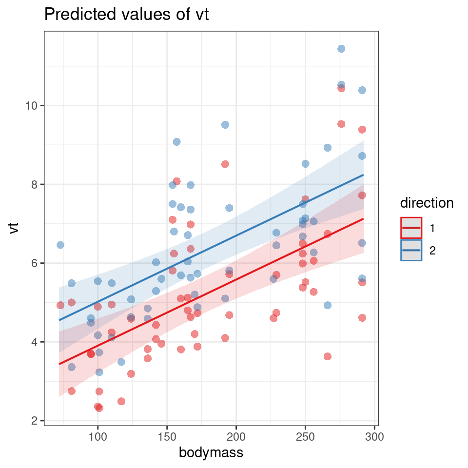

# (PART\*) Mixed Models {.unnumbered}

# Foundations of Mixed Modelling


## What is a mixed model?

Mixed models (also known as linear mixed models or hierarchical linear models) are statistical tests that build on the simpler tests of regression, t-tests and ANOVA. All of these tests are special cases of the general linear model; they all fit a straight line to data to explain variance in a systematic way. 

The key difference with a linear mixed-effects model is the inclusion of random effects - variables where our observations are grouped into subcategories that systematically affect our outcome - to account for important structure in our data. 

The mixed-effects model can be used in many situations instead of one of our more straightforward tests when this structure may be important. The main advantages of this approach are: 

i) mixed-effects models account for more of the variance 
ii) mixed-effects models incorporate group and even individual-level differences
iii) mixed-effects models cope well with missing data, unequal group sizes and repeated measurements


## Fixed vs Random effects

Fixed effects and random effects are terms commonly used in mixed modeling, which is a statistical framework that combines both in order to analyze data. 

In mixed modeling, the fixed effects are used to estimate the overall relationship between the predictors and the response variable, while the random effects account for the within-group variability and allow for the modeling of the individual differences or group-specific effects.

The hierarchical structure of data refers to a data organization where observations are nested within higher-level groups or clusters. For example, students nested within classrooms, patients nested within hospitals, or employees nested within companies. This hierarchical structure introduces dependencies or correlations within the data, as observations within the same group tend to be more similar to each other than observations in different groups.

The need for mixed models arises when we want to account for these dependencies and properly model the variability at different levels of the hierarchy. Traditional regression models, such as ordinary least squares (OLS), assume that the observations are independent of each other. However, when working with hierarchical data, this assumption is violated, and ignoring the hierarchical structure can lead to biased or inefficient estimates, incorrect standard errors, and misleading inference.

By including random effects, mixed models allow for the estimation of both within-group and between-group variability. They provide a flexible framework for modeling the individual or group-specific effects and can capture the heterogeneity within and between groups. Additionally, mixed models can handle unbalanced or incomplete data, where some groups may have different numbers of observations.

### Fixed effects

In broad terms, fixed effects are variables that we expect will affect the dependent/response variable: they’re what you call explanatory variables in a standard linear regression. 

Fixed effects are more common than random effects, at least in their use. Fixed effects estimate different levels with no relationship assumed between the levels. For example, in a model with a dependent variable of body length and a fixed effect for fish sex, you would get an estimate of mean body length for males and then an estimate for females separately. 

We can consider this in terms of a very simple linear model, here the estimated intercept is the expected value of the outcome $y$ when the predictor $x$ has a value of 0. The estimated slope is the expected change in $y$ for a single unit change in $x$. These parameters are "fixed", meaning that each individual in the population has the same expected value for the intercept and slope. 

The difference between the expected value and true value is called "residual error".

$$Y_i = \beta_0 + \beta_1X_i + \epsilon_i$$

#### Examples: 

1. Medical Research: In a clinical trial studying the effectiveness of different medications for treating a specific condition, the fixed effects could include categorical variables such as treatment group (e.g., medication A, medication B, placebo) or dosage level (e.g., low, medium, high). These fixed effects would capture the systematic differences in the response variable (e.g., symptom improvement) due to the specific treatment received.

2. Education Research: Suppose a study examines the impact of teaching methods on student performance in different schools. The fixed effects in this case might include variables such as school type (e.g., public, private), curriculum approach (e.g., traditional, progressive), or classroom size. These fixed effects would help explain the differences in student achievement across schools, accounting for the systematic effects of these factors.

3. Environmental Science: Imagine a study investigating the factors influencing bird species richness across different habitats. The fixed effects in this context could include variables such as habitat type (e.g., forest, grassland, wetland), habitat disturbance level (e.g., low, medium, high), or geographical region. These fixed effects would capture the systematic variations in bird species richness associated with the specific habitat characteristics.

Fixed effects are the default effects that we all learn as we begin to understand statistical concepts, and fixed effects are the default effects in functions like `lm()` and `aov()`.

### Random effects

Random effects are less commonly used but perhaps more widely encountered in nature. Each level can be considered a random variable from an underlying process or distribution in a random effect. 

A random effect is a parameter that is allowed to vary across groups or individuals. Random effects do not take a single fixed value, rather they follow a distribution (usually the normal distribution). Random effects can be added to a model to account for variation around an intercept or slope. Each individual or group then gets their own estimated random effect, representing an adjustment from the mean. 

So random effects are usually grouping factors for which we are trying to control. They are always categorical, as you can’t force R to treat a continuous variable as a random effect. A lot of the time we are not specifically interested in their impact on the response variable, but we know that they might be influencing the patterns we see.

#### Examples: 

1. Longitudinal Health Study: Consider a study tracking the blood pressure of individuals over multiple time points. In this case, a random effect can be included to account for the individual-specific variation in blood pressure. Each individual's blood pressure measurements over time would be treated as repeated measures within that individual, and the random effect would capture the variability between individuals that is not explained by the fixed effects. This random effect allows for modeling the inherent individual differences in blood pressure levels.

2. Social Network Analysis: Suppose a study examines the influence of peer groups on adolescent behavior. The study may collect data on individual behaviors within schools, where students are nested within classrooms. In this scenario, a random effect can be incorporated at the classroom level to account for the shared social environment within each classroom. The random effect captures the variability in behavior among classrooms that is not accounted for by the fixed effects, enabling the study to analyze the effects of individual-level and classroom-level factors simultaneously.

3. Ecological Study: Imagine a research project investigating the effect of environmental factors on species abundance in different study sites. The study sites may be geographically dispersed, and a random effect can be included to account for the variation between study sites. The random effect captures the unexplained heterogeneity in species abundance across different sites, allowing for the examination of the effects of environmental variables while accounting for site-specific differences.

The random effect $U_i$ is often assumed to follow a normal distribution with a mean of zero and a variance estimated during the model fitting process.

$$Y_i = β_0 + U_j + ε_i$$

<div class="warning">
<p>In the book “Data analysis using regression and
multilevel/hierarchical models” (<span
class="citation">@gelman_hill_2006</span>). The authors examined five
definitions of fixed and random effects and found no consistent
agreement.</p>
<ol style="list-style-type: decimal">
<li><p>Fixed effects are constant across individuals, and random effects
vary. For example, in a growth study, a model with random intercepts a_i
and fixed slope b corresponds to parallel lines for different
individuals i, or the model y_it = a_i + b t thus distinguish between
fixed and random coefficients.</p></li>
<li><p>Effects are fixed if they are interesting in themselves or random
if there is interest in the underlying population.</p></li>
<li><p>“When a sample exhausts the population, the corresponding
variable is fixed; when the sample is a small (i.e., negligible) part of
the population the corresponding variable is random.”</p></li>
<li><p>“If an effect is assumed to be a realized value of a random
variable, it is called a random effect.”</p></li>
<li><p>Fixed effects are estimated using least squares (or, more
generally, maximum likelihood) and random effects are estimated with
shrinkage.</p></li>
</ol>
<p>Thus it turns out fixed and random effects are not born but made. We
must make the decision to treat a variable as fixed or random in a
particular analysis.</p>
</div>

> When determining what should be a fixed or random effect in your study, consider what are you trying to do? What are you trying to make predictions about? What is just variation (a.k.a “noise”) that you need to control for?

<div class="warning">
<p>More about random effects:</p>
<p>Note that the golden rule is that you generally want your random
effect to have at least five levels. So, for instance, if we wanted to
control for the effects of fish sex on body length, we would fit sex (a
two level factor: male or female) as a fixed, not random, effect.</p>
<p>This is, put simply, because estimating variance on few data points
is very imprecise. Mathematically you could, but you wouldn’t have a lot
of confidence in it. If you only have two or three levels, the model
will struggle to partition the variance - it will give you an output,
but not necessarily one you can trust.</p>
<p>Finally, keep in mind that the name random doesn’t have much to do
with mathematical randomness. Yes, it’s confusing. Just think about them
as the grouping variables for now. Strictly speaking it’s all about
making our models representative of our questions and getting better
estimates. Hopefully, our next few examples will help you make sense of
how and why they’re used.</p>
<p>There’s no firm rule as to what the minimum number of factor levels
should be for random effect and really you can use any factor that has
two or more levels. However it is commonly reported that you may want
five or more factor levels for a random effect in order to really
benefit from what the random effect can do (though some argue for even
more, 10 levels). Another case in which you may not want to random
effect is when you don’t want your factor levels to inform each other or
you don’t assume that your factor levels come from a common
distribution. As noted above, male and female is not only a factor with
only two levels but oftentimes we want male and female information
estimated separately and we’re not necessarily assuming that males and
females come from a population of sexes in which there is an infinite
number and we’re interested in an average.</p>
</div>

## Why use mixed models?

The provided code generates a dataset that is suitable for testing mixed models. Let's break down the code and annotate each step:


```r
# Generating a fake dataset with different means for each group
set.seed(123)  # Setting seed for reproducibility


rand_eff <- data.frame(group = as.factor(seq(1:5)),
            b0 = rnorm(5, mean = 0, sd = 20),
            b1 = rnorm(5, 0, 0.5))
```

This section creates a data frame called rand_eff containing random effects. It consists of five levels of a grouping variable (group), and for each level, it generates random effects (b0 and b1) using the `rnorm` function.


```r
data <- expand.grid(group = as.factor(seq(1:10)), 
                    obs = as.factor(seq(1:100))) %>%
  left_join(rand_eff,
            by = "group") %>%
  mutate(x = runif(n = nrow(.), 0, 10),
         B0 = 20,
         B1 = 2,
         E = rnorm(n = nrow(.), 0, 10)) %>%
  mutate(y = B0 + b0 + x * (B1 + b1) + E)

data <- expand.grid(group = as.factor(seq(1:4)), 
                    obs = as.factor(seq(1:100)))
```

This section creates the main dataset (data) for testing mixed models. It uses `expand.grid` to create a combination of levels for the grouping variable (group) and observation variable (obs). It then performs a `left join` with the rand_eff data frame, matching the group variable to incorporate the random effects for each group.

The code continues to `mutate` the dataset by adding additional variables:

- x is a random predictor variable generated using `runif` to have values between 0 and 10.

- B0 and B1 represent fixed effects of the intercept and slope with predetermined values of 20 and 2, respectively.

- E represents the error term, generated using `rnorm` with a mean of 0 and standard deviation of 10.

- Finally, y is created as the response variable using a linear model equation that includes the fixed effects (B0 and B1), random effects (b0 and b1), the predictor variable (x), and the error term (E).


```r
data.1 <- expand.grid(group = as.factor(5),
          obs = as.factor(seq(1:30)))

data <- bind_rows(data, data.1) %>% 
  left_join(rand_eff,
            by = "group") %>%
  mutate(x = runif(n = nrow(.), 0, 10),
         B0 = 20,
         B1 = 2,
         E = rnorm(n = nrow(.), 0, 10)) %>%
  mutate(y = B0 + b0 + x * (B1 + b1) + E)
```

This section creates an additional dataset (`data.1`) with a specific group (group = 5) and a smaller number of observations (obs = 30) for testing purposes. This is then appended to the original dataset, we will see the effect of having a smaller group within our random effects when we discuss partial pooling and shrinkage later on. 


Now we have three variables to consider in our models: x, y and group (with five levels).


```r
data %>% 
  select(x, y, group, obs) %>% 
  head()
```

<div class="kable-table">

<table>
 <thead>
  <tr>
   <th style="text-align:right;"> x </th>
   <th style="text-align:right;"> y </th>
   <th style="text-align:left;"> group </th>
   <th style="text-align:left;"> obs </th>
  </tr>
 </thead>
<tbody>
  <tr>
   <td style="text-align:right;"> 4.0584411 </td>
   <td style="text-align:right;"> -0.5487802 </td>
   <td style="text-align:left;"> 1 </td>
   <td style="text-align:left;"> 1 </td>
  </tr>
  <tr>
   <td style="text-align:right;"> 7.2250893 </td>
   <td style="text-align:right;"> 17.3260398 </td>
   <td style="text-align:left;"> 2 </td>
   <td style="text-align:left;"> 1 </td>
  </tr>
  <tr>
   <td style="text-align:right;"> 0.5963383 </td>
   <td style="text-align:right;"> 41.2256737 </td>
   <td style="text-align:left;"> 3 </td>
   <td style="text-align:left;"> 1 </td>
  </tr>
  <tr>
   <td style="text-align:right;"> 3.3034922 </td>
   <td style="text-align:right;"> 16.0958571 </td>
   <td style="text-align:left;"> 4 </td>
   <td style="text-align:left;"> 1 </td>
  </tr>
  <tr>
   <td style="text-align:right;"> 7.7676400 </td>
   <td style="text-align:right;"> 32.0586590 </td>
   <td style="text-align:left;"> 1 </td>
   <td style="text-align:left;"> 2 </td>
  </tr>
  <tr>
   <td style="text-align:right;"> 8.4045935 </td>
   <td style="text-align:right;"> 50.1274193 </td>
   <td style="text-align:left;"> 2 </td>
   <td style="text-align:left;"> 2 </td>
  </tr>
</tbody>
</table>

</div>

Now that we have a suitable simulated dataset, let's start modelling!

### All in one model

We will begin by highlighting the importance of considering data structure and hierarchy when building linear models. To illustrate this, we will delve into an example that showcases the consequences of ignoring the underlying data structure. We might naively construct a single linear model that ignores the group-level variation and treats all observations as independent. This oversimplified approach fails to account for the fact that observations within groups are more similar to each other due to shared characteristics.

$$Y_i = \beta_0 + \beta_1X_i + \epsilon_i$$


```r
basic_model <- lm(y ~ x, data = data)
summary(basic_model)
```

```
## 
## Call:
## lm(formula = y ~ x, data = data)
## 
## Residuals:
##    Min     1Q Median     3Q    Max 
## -37.23 -12.11  -2.36  11.00  44.53 
## 
## Coefficients:
##             Estimate Std. Error t value Pr(>|t|)    
## (Intercept)  21.0546     1.6490  12.768   <2e-16 ***
## x             2.5782     0.2854   9.034   <2e-16 ***
## ---
## Signif. codes:  0 '***' 0.001 '**' 0.01 '*' 0.05 '.' 0.1 ' ' 1
## 
## Residual standard error: 16.96 on 428 degrees of freedom
## Multiple R-squared:  0.1602,	Adjusted R-squared:  0.1582 
## F-statistic: 81.62 on 1 and 428 DF,  p-value: < 2.2e-16
```

Here we can see that the basic linear model has produced a statistically significant regression analysis (*t*~428~ = 9.034, *p* <0.001) with an $R^2$ of 0.16. There is a medium effect positive relationship between changes in x and y (Estimate = 2.58, S.E. = 0.29).

We can see that clearly if we produce a simple plot of x against y: 


```r
plot(data$x, data$y)
```

<div class="figure" style="text-align: center">

<p class="caption">(\#fig:unnamed-chunk-10)Simple scatter plot x against y</p>
</div>

Here if we use the function `geom_smooth()` on the scatter plot, the plot also includes a fitted regression line obtained using the "lm" method. This allows us to examine the overall trend and potential linear association between the variables.


```r
ggplot(data, aes(x = x, 
                 y = y)) +
  geom_point() +
  labs(x = "Independent Variable", 
       y = "Dependent Variable")+
  geom_smooth(method = "lm")
```

<div class="figure" style="text-align: center">

<p class="caption">(\#fig:unnamed-chunk-11)Scatter plot displaying the relationship between the independent variable and the dependent variable. The points represent the observed data, while the fitted regression line represents the linear relationship between the variables. The plot helps visualize the trend and potential association between the variables.</p>
</div>

The `check_model()`  function from the `performance` package (@R-performance) is used to evaluate the performance and diagnostic measures of a statistical model. It provides a comprehensive assessment of the model's fit, assumptions, and predictive capabilities. By calling this function, you can obtain a summary of various evaluation metrics and diagnostic plots for the specified model. 

It enables you to identify potential issues, such as violations of assumptions, influential data points, or lack of fit, which can affect the interpretation and reliability of your model's results


```r
performance::check_model(basic_model)
```


Looking at the fit of our model we would be tempted to conclude that we have an accurate and robust model.

However, when data is hierarchically structured, such as individuals nested within groups, there is typically correlation or similarity among observations within the same group. By not accounting for this clustering effect, estimates derived from a single model can be biased and inefficient. The assumption of independence among observations is violated, leading to incorrect standard errors and inflated significance levels. 

From the figure below we can see the difference in median and range of x values within each of our groups: 


```r
ggplot(data, aes(x = group, 
                 y = y)) +
  geom_boxplot() +
  labs(x = "Groups", 
       y = "Dependent Variable")
```

<div class="figure" style="text-align: center">

<p class="caption">(\#fig:unnamed-chunk-13)Linear model conducted on all data</p>
</div>

In this figure,  we colour tag the data points by group, this can be useful for determining if a mixed model is appropriate.

Here's why:

By colour-coding the data points based on the grouping variable, the plot allows you to visually assess the within-group and between-group variability. If there are noticeable differences in the data patterns or dispersion among the groups, it suggests that the data may have a hierarchical structure, where observations within the same group are more similar to each other than to observations in other groups.


```r
# Color tagged by group
plot_group <- ggplot(data, aes(x = x, 
                               y = y, 
                               color = group,
                               group = group)) +
  geom_point(alpha = 0.6) +
  labs(title = "Data Coloured by Group", 
       x = "Independent Variable", 
       y = "Dependent Variable")+
  theme(legend.position="none")

plot_group
```


From the above plots, it confirms that our observations from within each of the ranges aren’t independent. We can’t ignore that: as we’re starting to see, it could lead to a completely erroneous conclusion.


### Multiple analyses approach

Running separate linear models per group, also known as stratified analysis, can be a feasible approach in certain situations. However, there are several drawbacks including

- Increased complexity

- Inability to draw direct conclusions on overall variability 

- Reduced statistical power

- Inflated Type 1 error risk

- Inconsistent estimates

- Limited ability to handle unbalanced/missing data


```r
# Plotting the relationship between x and y with group-level smoothing
ggplot(data, aes(x = x, y = y, color = group, group = group)) +
  geom_point(alpha = 0.6) +  # Scatter plot of x and y with transparency
  labs(title = "Data Colored by Group", x = "Independent Variable", y = "Dependent Variable") +
  theme(legend.position = "none") +
  geom_smooth(method = "lm") +  # Group-level linear regression smoothing
  facet_wrap(~group)  # Faceting the plot by group
```

<div class="figure" style="text-align: center">

<p class="caption">(\#fig:unnamed-chunk-15)Scatter plot showing the relationship between the independent variable (x) and the dependent variable (y) colored by group. Each subplot represents a different group. The line represents the group-level linear regression smoothing.</p>
</div>


```r
# Creating nested data by grouping the data by 'group'
nested_data <- data %>%
  group_by(group) %>%
  nest()

# Fitting linear regression models to each nested data group
models <- map(nested_data$data, ~ lm(y ~ x, data = .)) %>% 
          map(broom::tidy)

# Combining the model results into a single data frame
combined_models <- bind_rows(models)

# Filtering the rows to include only the 'x' predictor
filtered_models <- combined_models %>%
                   filter(term == "x")

# Adding a column for the group index using rowid_to_column function
group_indexed_models <- filtered_models %>%
                        rowid_to_column("group")

# Modifying the p-values using a custom function report_p
final_models <- group_indexed_models %>%
                mutate(p.value = report_p(p.value))

final_models
```

<div class="kable-table">

<table>
 <thead>
  <tr>
   <th style="text-align:right;"> group </th>
   <th style="text-align:left;"> term </th>
   <th style="text-align:right;"> estimate </th>
   <th style="text-align:right;"> std.error </th>
   <th style="text-align:right;"> statistic </th>
   <th style="text-align:left;"> p.value </th>
  </tr>
 </thead>
<tbody>
  <tr>
   <td style="text-align:right;"> 1 </td>
   <td style="text-align:left;"> x </td>
   <td style="text-align:right;"> 3.0643940 </td>
   <td style="text-align:right;"> 0.3620254 </td>
   <td style="text-align:right;"> 8.4645823 </td>
   <td style="text-align:left;"> p &lt; 0.001 </td>
  </tr>
  <tr>
   <td style="text-align:right;"> 2 </td>
   <td style="text-align:left;"> x </td>
   <td style="text-align:right;"> 2.5162898 </td>
   <td style="text-align:right;"> 0.3354848 </td>
   <td style="text-align:right;"> 7.5004590 </td>
   <td style="text-align:left;"> p &lt; 0.001 </td>
  </tr>
  <tr>
   <td style="text-align:right;"> 3 </td>
   <td style="text-align:left;"> x </td>
   <td style="text-align:right;"> 1.3904720 </td>
   <td style="text-align:right;"> 0.3192878 </td>
   <td style="text-align:right;"> 4.3549169 </td>
   <td style="text-align:left;"> p &lt; 0.001 </td>
  </tr>
  <tr>
   <td style="text-align:right;"> 4 </td>
   <td style="text-align:left;"> x </td>
   <td style="text-align:right;"> 1.6856649 </td>
   <td style="text-align:right;"> 0.3550511 </td>
   <td style="text-align:right;"> 4.7476686 </td>
   <td style="text-align:left;"> p &lt; 0.001 </td>
  </tr>
  <tr>
   <td style="text-align:right;"> 5 </td>
   <td style="text-align:left;"> x </td>
   <td style="text-align:right;"> -0.0755633 </td>
   <td style="text-align:right;"> 0.6576868 </td>
   <td style="text-align:right;"> -0.1148926 </td>
   <td style="text-align:left;"> p= 0.909 </td>
  </tr>
</tbody>
</table>

</div>

In the code above, the dataset data is first grouped by the variable 'group' using the `group_by` function, and then the data within each group is nested using the `nest` function. This results in a new dataset nested_data where each group's data is stored as a nested tibble.

Next, a linear regression model (`lm`) is fit to each nested data group using the `map` function. The `broom::tidy` function is applied to each model using map to extract the model summary statistics, such as coefficients, p-values, and standard errors. The resulting models are stored in the models object.

The `bind_rows` function is used to combine the model results into a single data frame called combined_models. The data frame is then filtered to include only the rows where the predictor is 'x' using the `filter` function, resulting in the filtered_models data frame.

To add a column for the group index, the `rowid_to_column` function is applied to the filtered_models data frame, creating the group_indexed_models data frame with an additional column named 'group'.

Finally, the p-values in the group_indexed_models data frame are modified using a custom function `report_p`


<div class='webex-solution'><button>report_p function</button>


```r
 report_p <- function(p, digits = 3) {
     reported <- if_else(p < 0.001,
             "p < 0.001",
             paste("p=", round(p, digits)))
     
     return(reported)
 }
```


</div>


### Complex model

Using a group level term with an interaction on x as a fixed effect means explicitly including the interaction term between x and the group as a predictor in the model equation. This approach assumes that the relationship between x and the outcome variable differs across groups and that these differences are constant and fixed. It implies that each group has a unique intercept (baseline level) and slope (effect size) for the relationship between x and the outcome variable. By treating the group level term as a fixed effect, the model estimates *specific parameter values for each group*.

If we are not explicitly interested in the outcomes or differences for each individual group (but wish to account for them) - this may not be the best option as it can lead to *overfitting* and it uses a lot more degrees of freedom - impacting estimates and widening our confidence intervals. As with running multiple models above, there is limited ability to make inferences outside of observed groups, and it does not handle missing data or unbalanced designs well. 

$$Y_i = \beta_0 + \beta_1X_i + \beta_2.group_i+\beta_3(X_i.group_i)+\epsilon_i$$


```r
additive_model <- lm(y ~ x*group, data = data)

summary(additive_model)
```

```
## 
## Call:
## lm(formula = y ~ x * group, data = data)
## 
## Residuals:
##      Min       1Q   Median       3Q      Max 
## -24.8614  -6.2579   0.2044   6.9342  28.5474 
## 
## Coefficients:
##             Estimate Std. Error t value Pr(>|t|)    
## (Intercept)   6.8125     1.8881   3.608 0.000346 ***
## x             3.0644     0.3379   9.070  < 2e-16 ***
## group2        6.4526     2.7289   2.365 0.018505 *  
## group3       44.8356     2.8539  15.710  < 2e-16 ***
## group4       15.8607     2.7184   5.835 1.08e-08 ***
## group5       22.9090     4.0772   5.619 3.51e-08 ***
## x:group2     -0.5481     0.4875  -1.124 0.261560    
## x:group3     -1.6739     0.4781  -3.501 0.000513 ***
## x:group4     -1.3787     0.4830  -2.855 0.004522 ** 
## x:group5     -3.1400     0.7479  -4.198 3.28e-05 ***
## ---
## Signif. codes:  0 '***' 0.001 '**' 0.01 '*' 0.05 '.' 0.1 ' ' 1
## 
## Residual standard error: 9.801 on 420 degrees of freedom
## Multiple R-squared:  0.7246,	Adjusted R-squared:  0.7187 
## F-statistic: 122.8 on 9 and 420 DF,  p-value: < 2.2e-16
```

## Our first mixed model

A mixed model is a good choice here: it will allow us to use all the data we have (higher sample size) and account for the correlations between data coming from the groups. We will also estimate fewer parameters and avoid problems with multiple comparisons that we would encounter while using separate regressions.

We can now join our random effect $U_j$ to the full dataset and define our y values as 

$$Y_{ij} = β_0 + β_1*X_{ij} + U_j + ε_{ij}$$.


We have a response variable, and we are attempting to explain part of the variation in test score through fitting an independent variable as a fixed effect. But the response variable has some residual variation (i.e. unexplained variation) associated with group. By using random effects, we are modeling that unexplained variation through variance.

We now want to know if an association between `y ~ x` exists after controlling for the variation in group.

### Running mixed effects models with lmerTest

This section will detail how to run mixed models with the `lmer` function in the R package `lmerTest` (@R-lmerTest). This builds on the older `lme4` (@R-lme4) package, and in particular add p-values that were not previously included. There are other R packages that can be used to run mixed-effects models including the `nlme` package (@R-nlme) and the `glmmTMB` package (@R-glmmTMB). Outside of R there are also other packages and software capable of running mixed-effects models, though arguably none is better supported than R software.


<div class='webex-solution'><button>Plotting random intercepts</button>


```r
plot_function2 <- function(model, title = "Data Coloured by Group"){
  
data <- data %>% 
  mutate(fit.m = predict(model, re.form = NA),
         fit.c = predict(model, re.form = NULL))

data %>%
  ggplot(aes(x = x, y = y, col = group)) +
  geom_point(pch = 16, alpha = 0.6) +
  geom_line(aes(y = fit.c, col = group), linewidth = 2)  +
  coord_cartesian(ylim = c(-40, 100))+
  labs(title = title, 
       x = "Independent Variable", 
       y = "Dependent Variable") 
}

mixed_model <- lmer(y ~ x + (1|group), data = data)

plot_function2(mixed_model, "Random intercept")
```


</div>


```r
# random intercept model
mixed_model <- lmer(y ~ x + (1|group), data = data)

summary(mixed_model)
```

```
## Linear mixed model fit by REML. t-tests use Satterthwaite's method [
## lmerModLmerTest]
## Formula: y ~ x + (1 | group)
##    Data: data
## 
## REML criterion at convergence: 3224.4
## 
## Scaled residuals: 
##      Min       1Q   Median       3Q      Max 
## -2.61968 -0.63654 -0.03584  0.66113  3.13597 
## 
## Random effects:
##  Groups   Name        Variance Std.Dev.
##  group    (Intercept) 205      14.32   
##  Residual             101      10.05   
## Number of obs: 430, groups:  group, 5
## 
## Fixed effects:
##             Estimate Std. Error       df t value Pr(>|t|)    
## (Intercept)  23.2692     6.4818   4.1570    3.59   0.0215 *  
## x             2.0271     0.1703 424.0815   11.90   <2e-16 ***
## ---
## Signif. codes:  0 '***' 0.001 '**' 0.01 '*' 0.05 '.' 0.1 ' ' 1
## 
## Correlation of Fixed Effects:
##   (Intr)
## x -0.131
```


Here our groups clearly explain a lot of variance 

```

205/(205 + 101) = 0.669 / 66.9%

```

So the differences between groups explain ~67% of the variance that’s “left over” *after* the variance explained by our fixed effects.


### Partial pooling

It is worth noting that random effect estimates are a function of the group-level information and the overall (grand) mean of the random effect. Group levels with low sample size or poor information (i.e., no strong relationship) are more strongly influenced by the grand mean, which adds information to an otherwise poorly-estimated group. However, a group with a large sample size or strong information (i.e., a strong relationship) will have very little influence from the grand mean and largely reflect the information contained entirely within the group. This process is called partial pooling (as opposed to no pooling, where no effect is considered, or total pooling, where separate models are run for the different groups). Partial pooling results in the phenomenon known as shrinkage, which refers to the group-level estimates being shrunk toward the mean. What does all this mean? If you use a random effect, you should be prepared for your factor levels to have some influence from the overall mean of all levels. With a good, clear signal in each group, you won’t see much impact from the overall mean, but you will with small groups or those without much signal.

Below we can take a look at the estimates and standard errors for three of our previously constructed models:


```r
pooled <- basic_model %>% 
  broom::tidy() %>% 
  mutate(Approach = "Pooled", .before = 1) %>% 
  select(term, estimate, std.error, Approach)

no_pool <- additive_model %>% 
  broom::tidy() %>% 
  mutate(Approach = "No Pooling", .before = 1) %>% 
  select(term, estimate, std.error, Approach)

partial_pool <- mixed_model %>% 
  broom.mixed::tidy() %>% 
  mutate(Approach = "Mixed Model/Partial Pool", .before = 1) %>% 
  select(Approach, term, estimate, std.error)

bind_rows(pooled, no_pool, partial_pool) %>% 
  filter(term %in% c("x" , "(Intercept)") )
```

<div class="kable-table">

<table>
 <thead>
  <tr>
   <th style="text-align:left;"> term </th>
   <th style="text-align:right;"> estimate </th>
   <th style="text-align:right;"> std.error </th>
   <th style="text-align:left;"> Approach </th>
  </tr>
 </thead>
<tbody>
  <tr>
   <td style="text-align:left;"> (Intercept) </td>
   <td style="text-align:right;"> 21.054614 </td>
   <td style="text-align:right;"> 1.6490185 </td>
   <td style="text-align:left;"> Pooled </td>
  </tr>
  <tr>
   <td style="text-align:left;"> x </td>
   <td style="text-align:right;"> 2.578217 </td>
   <td style="text-align:right;"> 0.2853798 </td>
   <td style="text-align:left;"> Pooled </td>
  </tr>
  <tr>
   <td style="text-align:left;"> (Intercept) </td>
   <td style="text-align:right;"> 6.812481 </td>
   <td style="text-align:right;"> 1.8881155 </td>
   <td style="text-align:left;"> No Pooling </td>
  </tr>
  <tr>
   <td style="text-align:left;"> x </td>
   <td style="text-align:right;"> 3.064394 </td>
   <td style="text-align:right;"> 0.3378685 </td>
   <td style="text-align:left;"> No Pooling </td>
  </tr>
  <tr>
   <td style="text-align:left;"> (Intercept) </td>
   <td style="text-align:right;"> 23.269187 </td>
   <td style="text-align:right;"> 6.4818211 </td>
   <td style="text-align:left;"> Mixed Model/Partial Pool </td>
  </tr>
  <tr>
   <td style="text-align:left;"> x </td>
   <td style="text-align:right;"> 2.027065 </td>
   <td style="text-align:right;"> 0.1703423 </td>
   <td style="text-align:left;"> Mixed Model/Partial Pool </td>
  </tr>
</tbody>
</table>

</div>

Pooling helps to improve the precision of the estimates by borrowing strength from the entire dataset. However, this can also lead to differences in the estimates and standard errors compared to models without pooling. 

- Pooled: in the pooled model the averaged estimates may not accurately reflect the true values within each group. As a result, the estimates in pooled models can be biased towards the average behavior across all groups. We can see this in the too small standard error of the intercept, underestimating the variance in our dataset. At the same time if there is substantial variability in the relationships between groups, the pooled estimates can be less precise. This increased variability across groups can contribute to larger standard errors of the difference (SED) for fixed effects in pooled models.

- No pooling: This model is extremely precise with the smallest errors, however these estimates reflect conditions only for the first group in the model

- Partial pooling/Mixed models: this model reflects the greater uncertainty of the Mean and SE of the intercept. However, the SED in a partial pooling model accounts for both the variability within groups and the uncertainty between groups. Compared to a no pooling approach, the SED in a partial pooling model tends to be smaller because it incorporates the pooled information, which reduces the overall uncertainty. This adjusted SED provides a more accurate measure of the uncertainty associated with the estimated differences between groups or fixed effects.

## Predictions

One misconception about mixed-effects models is that we cannot produce estimates of the relationships for each group.

But how do we do this? 

We can use the `coef()` function to extract the estimates (strictly these are predictions) for the random effects. This output has several components. 


```r
coef(mixed_model)
```

```
## $group
##   (Intercept)        x
## 1    11.82356 2.027066
## 2    15.68146 2.027066
## 3    47.94678 2.027066
## 4    21.01028 2.027066
## 5    19.88385 2.027066
## 
## attr(,"class")
## [1] "coef.mer"
```

This function produces our 'best linear unbiased predictions' (BLUPs) for the intercept and slope of the regression at each site. The predictions given here are different to those we would get if we ran individual models on each site, as BLUPs are a product of the compromise of complete-pooling and no-pooling models.  Now the predicted intercept is influenced by other sites leading to a process called 'shrinkage'. 

Why are these called predictions and not estimates? Because we have estimated the variance at each site and from here essentially borrowed information across sites to improve the accuracy, to combine with the fixed effects. So in the strictest sense we are *predicting* relationships rather than through direct observation.

This generous ability to make predictions is one of the main advantages of a mixed-model. 

The `summary()` function has already provided the estimates of the fixed effects, but they can also be extracted with the `fixef()` function. 


```r
fixef(mixed_model)
```

```
## (Intercept)           x 
##   23.269187    2.027066
```

We can also apply `anova()` to a single model to get an F-test for the fixed effect


```r
anova(mixed_model)
```

<div class="kable-table">

<table>
 <thead>
  <tr>
   <th style="text-align:left;">   </th>
   <th style="text-align:right;"> Sum Sq </th>
   <th style="text-align:right;"> Mean Sq </th>
   <th style="text-align:right;"> NumDF </th>
   <th style="text-align:right;"> DenDF </th>
   <th style="text-align:right;"> F value </th>
   <th style="text-align:right;"> Pr(&gt;F) </th>
  </tr>
 </thead>
<tbody>
  <tr>
   <td style="text-align:left;"> x </td>
   <td style="text-align:right;"> 14303.23 </td>
   <td style="text-align:right;"> 14303.23 </td>
   <td style="text-align:right;"> 1 </td>
   <td style="text-align:right;"> 424.0815 </td>
   <td style="text-align:right;"> 141.6089 </td>
   <td style="text-align:right;"> 0 </td>
  </tr>
</tbody>
</table>

</div>


### Shrinkage in mixed models

The graph below demonstrates the compromise between complete pooling and no pooling. It plots the overall regression line/mean (the fixed effects from the `lmer` model), the predicted slopes at each site from the mixed-effects model, and compares this to the estimates from each site (nested lm).  

As you can see most of the groups show shrinkage, that is they deviate less from the overall mean, most obviously in group 5, where the sample size is deliberately reduced. Here you can see the predicted line is much closer to the overall regression line, reflecting the greater uncertainty. The slope is drawn towards the overall mean by shrinkage. 


```r
# Nesting the data by group
nested_data <- data %>% 
    group_by(group) %>% 
    nest()

# Fitting linear regression models and obtaining predictions for each group
nested_models <- map(nested_data$data, ~ lm(y ~ x, data = .)) %>% 
    map(predict)
```


```r
# Creating a new dataframe and adding predictions from different models
data1 <- data %>% 
  mutate(fit.m = predict(mixed_model, re.form = NA),
         fit.c = predict(mixed_model, re.form = NULL)) %>% 
  arrange(group,obs) %>% 
  mutate(fit.l = unlist(nested_models)) 

# Creating a plot to visualize the predictions
data1 %>% 
  ggplot(aes(x = x, y = y, colour = group)) +
    geom_point(pch = 16) + 
  geom_line(aes(y = fit.l, linetype = "lm"), colour = "black")+
  geom_line(aes(y = fit.c, linetype = "lmer"))+ 
  geom_line(aes(y = fit.m, linetype = "Mean"), colour = "grey")+
   scale_linetype_manual(name = "Model Type", 
                        labels = c("Mean", "lmer", "lm"),
                        values = c("dotdash", "solid", "dashed"))+
  facet_wrap( ~ group)+
  guides(colour = "none")
```

<div class="figure" style="text-align: center">

<p class="caption">(\#fig:unnamed-chunk-27)Regression relationships from fixed-effects and mixed effects models, note shrinkage in group 5</p>
</div>

`re.form = NA`: When re.form is set to NA, it indicates that the random effects should be ignored during prediction. This means that the prediction will be based solely on the fixed effects of the model, ignoring the variation introduced by the random effects. This is useful when you are interested in estimating the overall trend or relationship described by the fixed effects, without considering the specific random effects of individual groups or levels.

`re.form = NULL`: Conversely, when re.form is set to NULL, it indicates that the random effects should be included in the prediction. This means that the prediction will take into account both the fixed effects and the random effects associated with the levels of the random effect variable. The model will use the estimated random effects to generate predictions that account for the variation introduced by the random effects. This is useful when you want to visualize and analyze the variation in the response variable explained by different levels of the random effect.


It's not always easy/straightforward to make prediciton or confidence intervals from complex general and generalized linear mixed models, luckily there are some excellent R packages that will do this for us. 

### `ggeffects`

`ggeffects` (@R-ggeffects) is a light-weight package that aims at easily calculating marginal effects and adjusted predictions

#### `ggpredict`

The argument `type = random` in the `ggpredict` function (from the ggeffects package @R-ggeffects) is used to specify the type of predictions to be generated in the context of mixed effects models. The main difference between using `ggpredict` with and without `type = random` lies in the type of predictions produced:

Without `type = random`: `ggpredict` will generate **fixed-effects predictions**. These estimates are based solely on the fixed effects of the model, ignoring any variability associated with the random effects. The resulting estimate represent the average or expected values of the response variable for specific combinations of predictor values, considering only the fixed components of the model.

Estimated mean fixed effects provide a comprehensive view of the average effect of dependent variables on the response variable. By plotting the estimated mean fixed effects using ggpredict, you can visualize how the response variable changes across different levels or values of the predictors while considering the effects of other variables in the model.


```r
library(ggeffects)

ggpredict(mixed_model, terms = "x") %>% 
plot(., add.data = TRUE)
```


With `type = random`: ggpredict will generate **predictions** that **incorporate both fixed and random effects**. These predictions take into account the variability introduced by the random effects in the model. The resulting predictions reflect not only the average trend captured by the fixed effects but also the additional variability associated with the random effects at different levels of the grouping factor(s). 

By default the figure now produces **prediciton intervals**


```r
ggpredict(mixed_model, terms = "x", type = "random") %>% 
plot(., add.data = TRUE)
```


<div class="info">
<p>Confidence Intervals: A confidence interval is used to estimate the
range of plausible values for a population parameter, such as the mean
or the regression coefficient, based on a sample from that population.
It provides a range within which the true population parameter is likely
to fall with a certain level of confidence. For example, a 95%
confidence interval implies that if we were to repeat the sampling
process many times, 95% of the resulting intervals would contain the
true population parameter.</p>
<p>Prediction Intervals: On the other hand, a prediction interval is
used to estimate the range of plausible values for an individual
observation or a future observation from the population. It takes into
account both the uncertainty in the estimated model parameters and the
inherent variability within the data. A 95% prediction interval provides
a range within which a specific observed or predicted value is likely to
fall with a certain level of confidence. The wider the prediction
interval, the greater the uncertainty around the specific value being
predicted.</p>
</div>


Furthermore, `ggpredict()` enables you to explore group-level predictions, which provide a deeper understanding of how the response variable varies across different levels of the grouping variable. By specifying the desired grouping variable in ggpredict when `type = random`, you can generate plots that depict the predicted values for each group separately, allowing for a comparative analysis of group-level effects.


```r
ggpredict(mixed_model, terms = c("x", "group"), type = "random") %>% 
plot(., add.data = TRUE) + 
  facet_wrap(~group)+
  theme(legend.position = "none")
```


### `sjPlot`

Another way to visualise mixed model results is with the package `sjPlot`(@R-sjPlot), and if you are interested in showing the variation among levels of your random effects, you can plot the departure from the overall model estimate for intercepts - *and slopes, if you have a random slope model*:


```r
library(sjPlot)

plot_model(mixed_model, terms = c("x", "group"), type = "re")/
  (plot_model(mixed_model, terms = c("x", "group"), type = "est")+ggtitle("Fixed Effects"))
```


<div class="warning">
<p>The values you see are NOT actual values, but rather the difference
between the general intercept or slope value found in your model summary
and the estimate for this specific level of random/fixed effect.</p>
</div>

`sjPlot` is also capable of producing prediction plots in the same way as `ggeffects`:


```r
plot_model(mixed_model,type="pred",
           terms=c("x", "group"),
           pred.type="re",
           show.data = T)+
  facet_wrap( ~ group)
```


## Checking model assumptions


We need to be just as conscious of testing the assumptions of mixed effects models as we are with any other. The assumptions are:

1. Within-group errors are independent and normally distributed with mean zero and variance $\sigma^2$
 
2. Within-group errors are independent of the random effects.

3. Random effects are normally distributed with mean zero.

4. Random effects are independent for different groups, except as specified by nesting (more on this later)


Several model check plots would help us to confirm/deny these assumptions, but note that QQ-plots may not be relevant because of the model structure. Two commonly-used plots are:


```r
plot(mixed_model) 
```


```r
qqnorm(resid(mixed_model))
qqline(resid(mixed_model)) 
```


It can often be useful to check the distribution of residuals in each of the groups (e.g. blocks) to check assumptions 1 and 2. We can do this by plotting the residuals against the fitted values, separately for each level of the random effect, using the  `coplot()` function:


```r
coplot(resid(mixed_model) ~ fitted(mixed_model) | data$group)
```


Each sub-figure of this plot, which refers to an individual group, doesn’t contain much data. It can be hard to judge whether the spread of residuals around fitted values is the same for each group when observations are low.

We can check assumption 3 with a histogram (here the more levels we have, the more we can be assured):


```r
rand_dist <- as.data.frame(ranef(mixed_model)) %>% 
  mutate(group = grp,
         b0_hat = condval,
         intercept_cond = b0_hat + summary(mixed_model)$coef[1,1],
         .keep = "none")

hist(rand_dist$b0_hat)
```


Overlaying the random distribution of our intercept over the regression line produces a plot like the below: 


```r
data1 %>%
  ggplot(aes(x = x, y = y)) +
  geom_point(pch = 16, col = "grey") +
  geom_violinhalf(data = rand_dist, 
                  aes(x = 0, y = intercept_cond), 
                  trim = FALSE, 
                  width = 4, 
                  adjust = 2, 
                  fill = NA)+
  geom_line(aes(y = fit.m), linewidth = 2)  +
  coord_cartesian(ylim = c(-40, 100))+
  labs(x = "Independent Variable", 
       y = "Dependent Variable")
```

<div class="figure" style="text-align: center">

<p class="caption">(\#fig:unnamed-chunk-40)Marginal fit, heavy black line from the random effect model with a histogram of the of the distribution of conditional intercepts</p>
</div>


### performance

The `check_model()` function from the performance package in R is a useful tool for evaluating the performance and assumptions of a statistical model, particularly in the context of mixed models. It provides a comprehensive set of diagnostics and visualizations to assess the model's fit, identify potential issues, and verify the assumptions underlying the model, which can be difficult with complex models


```r
library(performance)
check_model(mixed_model)
```


### DHARma

Simulation-based methods, like those available with DHARMa (@R-DHARMa), are often preferred for model validation and assumption checking because they offer flexibility and do not rely on specific assumptions. Simulation is particularly useful for evaluating complex models with multiple levels of variability, non-linearity, or complex hierarchical structures. Such models may not be adequately evaluated by solely examining residuals, and simulation provides a more robust approach to assess their assumptions and performance.

Read the authors summary [here](https://theoreticalecology.wordpress.com/2016/08/28/dharma-an-r-package-for-residual-diagnostics-of-glmms/)


```r
library(DHARMa)

resid.mm <- simulateResiduals(mixed_model)

plot(resid.mm)
```


<div class="warning">
<p>When you have a lot of data, even minimal deviations from the
expected distribution will become significant (this is discussed in the
help/vignette for the DHARMa package). You will need to assess the
distribution and decide if it is important for yourself.</p>
</div>


## Practice Questions

1. In mixed-effects models, independent variables are also called: 

<select class='webex-select'><option value='blank'></option><option value=''>Random Effects</option><option value='answer'>Fixed Effects</option><option value=''>Mediators</option><option value=''>Variance</option></select>

2. A random effect is best described as?

<div class='webex-radiogroup' id='radio_EALJVAVDVA'><label><input type="radio" autocomplete="off" name="radio_EALJVAVDVA" value=""></input> <span>A variable that is noisier than other variables</span></label><label><input type="radio" autocomplete="off" name="radio_EALJVAVDVA" value=""></input> <span>An effect that cannot be predicted based on group membership</span></label><label><input type="radio" autocomplete="off" name="radio_EALJVAVDVA" value="answer"></input> <span>A variable where subgroups influence the outcome</span></label><label><input type="radio" autocomplete="off" name="radio_EALJVAVDVA" value=""></input> <span>Choosing slope values with a random number generator</span></label></div>


3. Which of the following is **not** an advantage of mixed-effects models?

<div class='webex-radiogroup' id='radio_HGRRGZVVSO'><label><input type="radio" autocomplete="off" name="radio_HGRRGZVVSO" value=""></input> <span>They can cope with situations where individuals contribute different numbers of observations</span></label><label><input type="radio" autocomplete="off" name="radio_HGRRGZVVSO" value=""></input> <span>They can handle group-level differences in the outcome</span></label><label><input type="radio" autocomplete="off" name="radio_HGRRGZVVSO" value=""></input> <span>They can deal with variation due to different groups</span></label><label><input type="radio" autocomplete="off" name="radio_HGRRGZVVSO" value="answer"></input> <span>They are guaranteed to give significant results when ANOVAs do not</span></label></div>


4. Mixed-effects models cope well with missing data because?

<div class='webex-radiogroup' id='radio_MCMUYFXDDC'><label><input type="radio" autocomplete="off" name="radio_MCMUYFXDDC" value="answer"></input> <span>They can still estimate parameters even when some observations are missing</span></label><label><input type="radio" autocomplete="off" name="radio_MCMUYFXDDC" value=""></input> <span>They delete observations with missing data</span></label><label><input type="radio" autocomplete="off" name="radio_MCMUYFXDDC" value=""></input> <span>They set all values to 0</span></label></div>


# Worked Example 1 - Dolphins


## How do I decide if it is a fixed or random effect?

One of the most common questions in mixed-effects modelling is how to decide if an effect should be considered as fixed or random. This can be quite a complicated question, as we have touched upon briefly before the definition of a random effect is not universal. It is a considered process that can include the hypothesis or question you are asking. 

1 ) Are you directly interested in the effect in question. If the answer is yes it should be a fixed effect.

2 ) Is the variable continuous? If the answer is yes it should be a fixed effect.

3 ) Does the variable have less than five levels? If ther answer is yes it should be a fixed effect.


## Dolphins

This dataset was collected to measure resting lung function in 32 bottlenose dolphins. The main dependent variable was the tidal volume ($V_T$) measured in litres, as an index of lung capacity. 


```{=html}
<a href="https://raw.githubusercontent.com/UEABIO/intro-mixed-models/main/book/files/dolphins.csv">
<button class="btn btn-success"><i class="fa fa-save"></i> Download Dolphins data</button>
</a>
```


```r
dolphins <- read_csv("files/dolphins.csv") 

dolphins$direction <- factor(dolphins$direction)

dolphins <- drop_na(dolphins)
```


Here we are interested in the relationship between ($V_T$) and body mass (kg), we have measurements which are taken on the breath *in* and the breath *out*, and each dolphin has been observed between one and four times.

We need to determine our fixed effects, random effects and model structure:

1) Body Mass <select class='webex-select'><option value='blank'></option><option value=''>Random Effect</option><option value='answer'>Fixed Effect</option></select>

2) Direction <select class='webex-select'><option value='blank'></option><option value=''>Random Effect</option><option value='answer'>Fixed Effect</option></select>

3) Animal 1) Body Mass <select class='webex-select'><option value='blank'></option><option value='answer'>Random Effect</option><option value=''>Fixed Effect</option></select>

4) With the basic structure `y ~ x + z + (1|group)` what do you think this model should be?:

<input class='webex-solveme nospaces' size='20' data-answer='["vt ~ bodymass + direction + (1|animal)","vt ~  direction + bodymass + (1|animal)"]'/>


<div class='webex-solution'><button>Solution</button>


1) We are clearly interested in the effect of body mass on ($V_T$) so this is a **fixed effect**.

2) We may think that the relationship with ($V_T$) and body mass may be different on the in and out breath. We may not be *directly* interested in this, but it has fewer than fivel levels so this is a **fixed effect**. (outbreath coded as 1, inbreath coded as 2).

3) Individual dolphins - if we averaged across measurements for each dolphin, our measurement precision would be different for each animal. If we include each data point, we would be double-counting some animals and our observations would not be independent. To account for the multiple observations we should treat animal as a **random effect**.


```r
dolphmod <- lmer(vt ~ bodymass + direction + (1|animal), data=dolphins)
```


</div>


With our basic linear model in place - we should carry out model fit checks with `DHARMa` or `performance::check_model()`, but assuming this is a good fit we can look at interpretation:


```r
summary(dolphmod)
```

```
## Linear mixed model fit by REML. t-tests use Satterthwaite's method [
## lmerModLmerTest]
## Formula: vt ~ bodymass + direction + (1 | animal)
##    Data: dolphins
## 
## REML criterion at convergence: 387.4
## 
## Scaled residuals: 
##      Min       1Q   Median       3Q      Max 
## -2.30795 -0.51983  0.04156  0.62404  2.26396 
## 
## Random effects:
##  Groups   Name        Variance Std.Dev.
##  animal   (Intercept) 1.039    1.019   
##  Residual             1.158    1.076   
## Number of obs: 112, groups:  animal, 31
## 
## Fixed effects:
##              Estimate Std. Error        df t value Pr(>|t|)    
## (Intercept)  2.226398   0.627115 28.758081   3.550  0.00135 ** 
## bodymass     0.016782   0.003259 26.720390   5.150  2.1e-05 ***
## direction2   1.114821   0.203389 77.414421   5.481  5.1e-07 ***
## ---
## Signif. codes:  0 '***' 0.001 '**' 0.01 '*' 0.05 '.' 0.1 ' ' 1
## 
## Correlation of Fixed Effects:
##            (Intr) bdymss
## bodymass   -0.927       
## direction2 -0.162  0.000
```


```r
dolphins.1 <- dolphins %>% 
    mutate(fit.m = predict(dolphmod, re.form = NA),
           fit.c = predict(dolphmod, re.form = NULL))
```


```r
dolphins.1 %>%
  ggplot(aes(x = bodymass, y = vt, group = direction)) +
  geom_point(pch = 16, aes(colour = direction)) +
  geom_line(aes(y = fit.m, 
                linetype = direction), 
            linewidth = 1)  +
  labs(x = "Body Mass", 
       y = "VT") 
```

<div class="figure" style="text-align: center">

<p class="caption">(\#fig:unnamed-chunk-50)Scatter plot of VT as a function of body mass for dolphins. Different directions of breath are represented by different colors. The solid lines indicate the marginal fitted values from our model.</p>
</div>


```r
plot_model(dolphmod,type="pred",
           terms=c("bodymass", "direction"),
           pred.type="fe",
           show.data = T)
```




<div class='webex-solution'><button>A brief summary</button>


We fitted a linear mixed model (estimated using REML and nloptwrap optimizer) to predict ($V_T$) with bodymass(kg) and direction (in/out breath). 95% Confidence Intervals (CIs) and p-values were computed using a Wald t-distribution approximation. We included a random intercept effect of animal to account for repeated measurements (of between 1 to 4 observations) across a total of 32 bottlenosed dolphins. 

We found that for every 1kg increase in bodymass, ($V_T$) increased by 0.02 litres (95% CI [0.01 - 0.02]), . The inbreath had on average a higher volume than the outbreath (1.11 litre difference [0.71 - 1.52]..

**Q.** This is not a perfect write-up, what else could we consider including?


</div>


# Multiple random effects

Previously we used `(1|group)` to fit our random effect. Whatever is on the right side of the `|` operator is a factor and referred to as a “grouping factor” for the term. 

### Crossed or Nested

When we have more than one possible random effect these can be **crossed** or **nested** - it depends on the relationship between the variables. Let’s have a look.

A common issue that causes confusion is this issue of specifying random effects as either  ‘crossed’ or ‘nested’. In reality, the way you specify your random effects will be determined  by your experimental or sampling design. A simple  example can illustrate the difference. 

#### 1. Crossed Random Effects:

Crossed random effects occur when the levels of two or more grouping variables are crossed or independent of each other. In this case, the grouping variables are unrelated, and each combination of levels is represented in the data.


<div class="figure" style="text-align: center">

```{=html}
<div class="grViz html-widget html-fill-item-overflow-hidden html-fill-item" id="htmlwidget-7bf724d2e389190f1dd1" style="width:100%;height:480px;"></div>
<script type="application/json" data-for="htmlwidget-7bf724d2e389190f1dd1">{"x":{"diagram":"\ndigraph boxes_and_circles {\n\n  # a \"graph\" statement\n  graph [overlap = true, fontsize = 10]\n\n  # several \"node\" statements\n  node [shape = box,\n        fontname = Helvetica]\n  I; II; 1; 2; 3\n\n  # several \"edge\" statements\n  I->1 I ->2 I ->3\n  II ->1  II ->2 II ->3\n}\n","config":{"engine":"dot","options":null}},"evals":[],"jsHooks":[]}</script>
```

<p class="caption">(\#fig:unnamed-chunk-52)Fully Crossed</p>
</div>

> Example 1: Let's consider a study examining the academic performance of students from different schools and different cities. The grouping variables are "School" and "City". Each school can be located in multiple cities, and each city can have multiple schools. The random effects of "School" and "City" are crossed since the levels of these variables are independent of each other.

`lmer(y ~ x + (1 | School) + (1 | City), data = dataset)`


> Example 2: Imagine there is a long-term study on breeding success in passerine birds across multiple woodlands, and the researcher returns every year for five  years to carry out measurements. Here  "Year" is a  crossed  random  effect with "Woodland" as each Woodland can appear in multiple years of study.
Imagine a researcher was interested in understanding  the factors affecting the clutch mass of a passerine bird. They have a study population  spread across five separate woodlands, each containing 30 nest boxes. Every week during  breeding they measure the foraging rate of females at feeders, and measure their  subsequent clutch mass. Some females have multiple clutches in a season and contribute multiple data points. 

`lmer(y ~ x + (1 | Year) + (1 | Woodland), data = dataset)`

#### 2. Nested Random Effects:

Nested random effects occur when the levels of one grouping variable are completely nested within the levels of another grouping variable. In other words, the levels of one variable are uniquely and exclusively associated with specific levels of another variable.

<div class="figure" style="text-align: center">

```{=html}
<div class="grViz html-widget html-fill-item-overflow-hidden html-fill-item" id="htmlwidget-551a06de9eda58cd6c8b" style="width:100%;height:480px;"></div>
<script type="application/json" data-for="htmlwidget-551a06de9eda58cd6c8b">{"x":{"diagram":"\ndigraph boxes_and_circles {\n\n  # a \"graph\" statement\n  graph [overlap = true, fontsize = 10]\n\n  # several \"node\" statements\n  node [shape = box,\n        fontname = Helvetica]\n  I; II; 1; 2; 3; 4; 5; 6\n\n  # several \"edge\" statements\n  I->1 I ->2 I ->3\n  II ->4  II ->5 II ->6\n}\n","config":{"engine":"dot","options":null}},"evals":[],"jsHooks":[]}</script>
```

<p class="caption">(\#fig:unnamed-chunk-53)Fully Nested</p>
</div>

> Example 1. Consider a study on the job performance of employees within different departments of an organization. The grouping variables are "Employee" and "Department". Each employee belongs to one specific department, and no employee can be part of multiple departments. The random effects of "Employee" are nested within the random effects of "Department" since each employee is uniquely associated with a specific department.

`lmer(y ~ x + (1 | Department/Employee), data = dataset)`

> Example 2: In the same bird study female ID is said to be  nested within woodland : each woodland  contains multiple females unique to that woodland (that never move among woodlands).  The nested random effect controls for the fact that (i) clutches from the same female  are not independent, and (ii) females from the same woodland may have clutch masses  more similar to one another than to females from other woodlands 

`lmer(y ~ x + (1 | Woodland/Female ID), data = dataset)`

*or if we remember year we have a model with both crossed and nested random effects*

`lmer(y ~ x + (1 | Woodland/Female ID) + (1|Year), data = dataset)`


For more on designing models around crossed and nested designs check out [this amazing nature paper](https://www.nature.com/articles/nmeth.3137) @krzywinski_2014


# Worked Example 2 - Nested design

This experiment involved a simple one-way anova with 3 treatments given to 6 rats, the researchers the measured glycogen levels in their liver. The analysis was complicated by the fact that three preparations were taken from the liver of each rat, and two readings of glycogen content were taken from each preparation. This generated 6 pseudoreplicates per rat to give a total of 36 readings in all.

Clearly, it would be a mistake to analyse these data as if they were a straightforward one-way anova, because that would give us 33 degrees of freedom for error. In fact, since there are only two rats in each treatment, we have only one degree of freedom per treatment, giving a total of 3 d.f. for error.

The variance is likely to be different at each level of this nested analysis because:

the readings differ because of variation in the glycogen detection method within each liver sample (measurement error);
the pieces of liver may differ because of heterogeneity in the distribution of glycogen within the liver of a single rat;
the rats will differ from one another in their glycogen levels because of sex, age, size, genotype, etc.;
rats allocated different experimental treatments may differ as a result of the fixed effects of treatment.
If all we want to test is whether the experimental treatments have affected the glycogen levels, then we are not interested in liver bits within rat’s livers, or in preparations within liver bits. We could combine all the pseudoreplicates together, and analyse the 6 averages. This would have the virtue of showing what a tiny experiment this really was. This latter approach also ignores the nested sources of uncertainties. Instead we will use a linear mixed model.


```{=html}
<a href="https://raw.githubusercontent.com/UEABIO/intro-mixed-models/main/book/files/rats.rds">
<button class="btn btn-success"><i class="fa fa-save"></i> Download as rds</button>
</a>
```


```r
rats <- readRDS("rats.rds")
```


```r
rats %>% 
  aggregate(Glycogen ~ Rat + Treatment + Liver, data = ., mean)
```

```
   Glycogen Rat Treatment Liver
1       131   1         1     1
2       130   1         1     1
3       131   1         1     2
4       125   1         1     2
5       136   1         1     3
6       142   1         1     3
7       150   2         1     1
8       148   2         1     1
9       140   2         1     2
10      143   2         1     2
11      160   2         1     3
12      150   2         1     3
13      157   3         2     1
14      145   3         2     1
15      154   3         2     2
16      142   3         2     2
17      147   3         2     3
18      153   3         2     3
19      151   4         2     1
20      155   4         2     1
21      147   4         2     2
22      147   4         2     2
23      162   4         2     3
24      152   4         2     3
25      134   5         3     1
26      125   5         3     1
27      138   5         3     2
28      138   5         3     2
29      135   5         3     3
30      136   5         3     3
31      138   6         3     1
32      140   6         3     1
33      139   6         3     2
34      138   6         3     2
35      134   6         3     3
36      127   6         3     3

```


```r
rats_lmer.1 <- lmer(Glycogen ~ Treatment + (1 | Rat) + (1 | Liver), data = rats)
summary(rats_lmer.1)
```

```
## Linear mixed model fit by REML. t-tests use Satterthwaite's method [
## lmerModLmerTest]
## Formula: Glycogen ~ Treatment + (1 | Rat) + (1 | Liver)
##    Data: rats
## 
## REML criterion at convergence: 221.9
## 
## Scaled residuals: 
##      Min       1Q   Median       3Q      Max 
## -1.79334 -0.66536  0.01792  0.59281  2.05206 
## 
## Random effects:
##  Groups   Name        Variance Std.Dev.
##  Rat      (Intercept) 39.187   6.260   
##  Liver    (Intercept)  2.168   1.472   
##  Residual             30.766   5.547   
## Number of obs: 36, groups:  Rat, 6; Liver, 3
## 
## Fixed effects:
##             Estimate Std. Error      df t value Pr(>|t|)    
## (Intercept)  140.500      4.783   3.174  29.373 5.65e-05 ***
## Treatment2    10.500      6.657   3.000   1.577    0.213    
## Treatment3    -5.333      6.657   3.000  -0.801    0.482    
## ---
## Signif. codes:  0 '***' 0.001 '**' 0.01 '*' 0.05 '.' 0.1 ' ' 1
## 
## Correlation of Fixed Effects:
##            (Intr) Trtmn2
## Treatment2 -0.696       
## Treatment3 -0.696  0.500
```

**Q. Why is this model above wrong**


<div class='webex-solution'><button>Solution</button>


It is wrong because this would add two random effect terms, one for rat 1 and one for rat 2. In fact there are 6 rats altogether. The way that the data have been coded allows for these kinds of mistakes to happen. The same is true for Liver, which is coded as a 1, 2 or 3. This means that we could write this thinking that we are including the correct random effects for Rat and Liver. In fact, this assumes that the data come from a crossed design, in which there are 2 rats and 3 parts of the liver, and that Liver = 1 corresponds to the same type of measurement in rats 1 and 2 and so on. Sometimes this is appropriate, but not here!

The nature of the way that many data sets are coded makes these kinds of mistakes very easy to make!


</div>


A better design is the one below:


```r
rats_lmer.2 <- lmer(Glycogen ~ Treatment + (1 | Rat / Liver), data = rats)
summary(rats_lmer.2)
```

```
## Linear mixed model fit by REML. t-tests use Satterthwaite's method [
## lmerModLmerTest]
## Formula: Glycogen ~ Treatment + (1 | Rat/Liver)
##    Data: rats
## 
## REML criterion at convergence: 219.6
## 
## Scaled residuals: 
##      Min       1Q   Median       3Q      Max 
## -1.48212 -0.47263  0.03062  0.42934  1.82935 
## 
## Random effects:
##  Groups    Name        Variance Std.Dev.
##  Liver:Rat (Intercept) 14.17    3.764   
##  Rat       (Intercept) 36.06    6.005   
##  Residual              21.17    4.601   
## Number of obs: 36, groups:  Liver:Rat, 18; Rat, 6
## 
## Fixed effects:
##             Estimate Std. Error      df t value Pr(>|t|)    
## (Intercept)  140.500      4.707   3.000  29.848 8.26e-05 ***
## Treatment2    10.500      6.657   3.000   1.577    0.213    
## Treatment3    -5.333      6.657   3.000  -0.801    0.482    
## ---
## Signif. codes:  0 '***' 0.001 '**' 0.01 '*' 0.05 '.' 0.1 ' ' 1
## 
## Correlation of Fixed Effects:
##            (Intr) Trtmn2
## Treatment2 -0.707       
## Treatment3 -0.707  0.500
```

And we can see the effects in the figures below:


```r
plot(ggpredict(rats_lmer.2, terms = c("Treatment")))
```


```r
plot(ggpredict(rats_lmer.2, 
               terms = c("Treatment", "Rat"), 
               type = "random"), 
     add.data = TRUE)
```


# Types of Random Effects

## Random slopes

So far we have looked at random effects where each group has its own *intercept*. This means that we fit a regression line across all five groups, which has a constant slope but is allowed to shift up or down for each group. This is what is represented in panel B. 

An alternative to the random intercepts model is the *random slopes* model, shown in panel C. In this model the slopes are permitted to vary, but the intercept is fixed across all groups. For our current data the random slopes model does a fair job as well. 

Finally we can allow *both the intercepts and slope* to vary between groups, as shown in panel D. This captures both the shallower slope of some of our groups and the vertical offsets present. If you inspect the original data set we generated, you can see that the random effect for group was calculated as both a product of random distribution on the intercept and slope, so it is not surprising that here this model fits the data best. 

This model will use more degrees of freedom than the other two, as these must be used to calculate variance for both intercept and slope.


```r
# random intercept model
lmer1 <- lmer(y ~ x + (1|group), data = data)

plot_function(lmer1, "Random intercept")

# Random slope model

lmer2 <- lmer(y ~ x + (0 + x | group), data = data)

plot_function(lmer2, "Random slope")

# Random slope and intercept model

lmer3 <- lmer(y ~ x + (x | group), data = data)
```

Mixed-effects models are enormously flexible. The decision about whether to include random intercepts, random slopes, or both will depend heavily on your hypotheses. It is generally quite rare to see random slopes models only, and more commonly it will be a question of whether random intercepts or random intercepts *and* random slopes are necessary. 

As the combine random slopes and intercept model requries more degrees of freedom, it may be the case that using likelihood ratio tests (LRT) are advisable to decide which model describes the data best (more on this later). 

Because random intercepts models require fewer degrees of freedome, these may be easier to fit when data sets have fewer observations.


<div class="information">
<p>In a random effects model, the random effects are assumed to be a
random sample from a population of possible random effects. These random
effects capture the variation between different groups or clusters in
the data. The number of random effects is typically smaller than the
total number of observations, as the random effects represent the
distinct groups or clusters in the dataset.</p>
<p>The degrees of freedom associated with the random effects in a linear
mixed model reflect the number of independent groups or clusters in the
data, rather than the number of individual observations. For example, if
you have data from 100 individuals, but they belong to only 10 distinct
groups, the random effects would have 10 degrees of freedom, not
100.</p>
<p>By using fewer degrees of freedom for the random effects, the model
accounts for the fact that the group-level variation is estimated based
on a smaller number of parameters. This approach helps prevent
overfitting and provides a more appropriate estimation of the variance
components associated with the random effects.</p>
</div>


## Model refining / Likelihood Ratio Tests

Once we have produce an initial model with a random effects structure, we may wish to perform model selection by comparing different nested models with varying random effects structures. It allows us to assess whether the inclusion of additional random effects or changes in the random effects structure significantly improve the model fit. By comparing the likelihood values of different nested models, we can determine which model provides a better fit to the data.

Previously we looked at the random intercepts vs. random intercepts *and* slopes model and concluded that the latter looked like it fit the data best. 

We can use a likelihood ratio test with the `anova()` function if we want to determine if the fit is significantly different to the simpler randome intercepts only model. 


```r
anova(lmer1, lmer3)
```

<div class="kable-table">

<table>
 <thead>
  <tr>
   <th style="text-align:left;">   </th>
   <th style="text-align:right;"> npar </th>
   <th style="text-align:right;"> AIC </th>
   <th style="text-align:right;"> BIC </th>
   <th style="text-align:right;"> logLik </th>
   <th style="text-align:right;"> deviance </th>
   <th style="text-align:right;"> Chisq </th>
   <th style="text-align:right;"> Df </th>
   <th style="text-align:right;"> Pr(&gt;Chisq) </th>
  </tr>
 </thead>
<tbody>
  <tr>
   <td style="text-align:left;"> lmer1 </td>
   <td style="text-align:right;"> 4 </td>
   <td style="text-align:right;"> 3236.091 </td>
   <td style="text-align:right;"> 3252.347 </td>
   <td style="text-align:right;"> -1614.046 </td>
   <td style="text-align:right;"> 3228.091 </td>
   <td style="text-align:right;"> NA </td>
   <td style="text-align:right;"> NA </td>
   <td style="text-align:right;"> NA </td>
  </tr>
  <tr>
   <td style="text-align:left;"> lmer3 </td>
   <td style="text-align:right;"> 6 </td>
   <td style="text-align:right;"> 3228.442 </td>
   <td style="text-align:right;"> 3252.825 </td>
   <td style="text-align:right;"> -1608.221 </td>
   <td style="text-align:right;"> 3216.442 </td>
   <td style="text-align:right;"> 11.64947 </td>
   <td style="text-align:right;"> 2 </td>
   <td style="text-align:right;"> 0.0029536 </td>
  </tr>
</tbody>
</table>

</div>


<div class="warning">
<p>There is a literature on the idea of model selection, that is, an
automated (or sometimes manual) way of testing many versions of a model
with a different subset of the predictors in an attempt to find the
model that fits best. These are sometimes called “stepwise”
procedures.</p>
<p>Others argue this method has a number of flaws, including:</p>
<ul>
<li><p>Doing this is basically “p-value mining”, that is, running a lot
of tests till you find a p-value you like.</p></li>
<li><p>Your likelihood of making a false positive is very high.</p></li>
<li><p>Adding/removing a new variable can have an effect on other
predictors.</p></li>
</ul>
<p>Instead of doing model selection, you should use your knowledge of
the data to select a subset of the variables which are either a) of
importance to you, or b) theoretically influential on the outcome. Then
you can fit a single model including all of this.</p>
<p>However, I would argue that while the inclusion of random effects and
their structure should have a clear rationale before implementation,
adjustments to better understand the best type of random effects
structure is perfectly reasonable.</p>
</div>


<div class='webex-solution'><button>ML vs. REML</button>


### Maximum Likelihood

Frequentist fit used by LMM through lme4 / lmer is based on the **Maximum Likelihood principle**, where we maximize the likelihood $L(y)$ of observing the data $y$, which is equivalent to minimizing residuals of the model, the Ordinary Least Squares (OLS) approach.  It measures the probability of observing the data given a specific set of parameter values. 

When we are attempting to optimise a model we can use the likelihood ratio test (LRT). Given two nested models, denoted as Model 1 and Model 2, the LRT compares the likelihood values of these models to assess whether the more complex Model 2 provides a significantly better fit to the data compared to the simpler Model 1. The LRT statistic, denoted as $D$, is calculated as the difference between the log-likelihood values of Model 1 and Model 2, multiplied by 2:

$$D = -2~*~(ln(L_1)-ln(L_2))$$

Here $L_1$ represents the likelihood value of Model 1, and $L_2$ represents the likelihood value of Model 2. **The LRT statistic follows a chi-square ($\chi^2$) distribution** with degrees of freedom equal to the difference in the number of parameters between the two models.

To determine the statistical significance of the LRT statistic, one can compare it to the critical value from the chi-square distribution with the appropriate degrees of freedom. If the LRT statistic exceeds the critical value, it indicates that the more complex Model 2 provides a significantly better fit to the data compared to the simpler Model 1.

ML estimation is often used to perform hypothesis tests, including the chi-square test. The chi-square test compares the observed data to the expected data predicted by a statistical model. It assesses the goodness-of-fit between the observed data and the model's predictions.

### REML

REML (Restricted Maximum Likelihood) estimation is a variant of ML estimation that addresses the issue of bias in the estimation of random effects in mixed effects models. In mixed effects models, random effects account for the variation at the group or individual level that is not explained by the fixed effects. However, the inclusion of random effects introduces a bias in the ML estimates, as they are influenced by the variability of the random effects. 

REML estimation addresses this bias by optimizing the likelihood function conditional on the fixed effects only, effectively removing the influence of the random effects on the estimation. This approach provides unbiased estimates of the fixed effects and is especially useful when the primary interest lies in the fixed effects rather than the random effects.

### ML vs. REML fitting

**Maximum Likelihood (ML) estimation is preferable when comparing nested models** because it allows for the direct comparison of the likelihood values between different models. ML estimation provides a quantitative measure of how well a given model fits the observed data, based on the likelihood function.

In this context, ML estimation is preferable because it allows for a formal statistical comparison between nested models. It provides a rigorous and objective way to assess whether the inclusion of additional parameters in the more complex model leads to a significantly better fit to the data compared to the simpler model. This approach ensures that model comparisons are based on sound statistical principles and helps in determining the most appropriate model for the given data.

**REML can be preferable when producing unbiased estimates of the fixed effects**. Older versions of model fitting packages like `lmer` used to require the manual switch between REML and ML when fitting models in order to switch between the objectives of assessing goodness-of-fit and interpreting estimates. But you will notice that when you perform an LRT with the `anova()` function it informs you the switch is being made automatically. 


</div>


## Practice Questions

1. The formula `y ~ x + (x|group)` would fit a model with 
<div class='webex-radiogroup' id='radio_ESDJZPRVGY'><label><input type="radio" autocomplete="off" name="radio_ESDJZPRVGY" value=""></input> <span>Random Slopes</span></label><label><input type="radio" autocomplete="off" name="radio_ESDJZPRVGY" value=""></input> <span>Random Intercepts</span></label><label><input type="radio" autocomplete="off" name="radio_ESDJZPRVGY" value="answer"></input> <span>Random Slopes and Intercepts</span></label><label><input type="radio" autocomplete="off" name="radio_ESDJZPRVGY" value=""></input> <span>An intercept fixed at 0</span></label></div>


2. Which formula would fit a random intercepts model?
<div class='webex-radiogroup' id='radio_NMLTYWJZXP'><label><input type="radio" autocomplete="off" name="radio_NMLTYWJZXP" value=""></input> <span>y ~ x + (x|group)</span></label><label><input type="radio" autocomplete="off" name="radio_NMLTYWJZXP" value="answer"></input> <span>y ~ x + (1|group)</span></label><label><input type="radio" autocomplete="off" name="radio_NMLTYWJZXP" value=""></input> <span>y ~ x + (y | group)</span></label></div>


# Worked Example 3 - Sleep study

In this chapter, we'll be working with some real data from a study looking at the effects of sleep deprivation on psychomotor performance @belenky_2003. The dataset `sleepstudy` is built-in to the lme4 package. 

Access the documentation by typing `??sleepstudy` in the console


A good way to start every analysis is to plot the data.


```r
ggplot(sleepstudy, aes(x = Days, y = Reaction)) +
  geom_point() +
  scale_x_continuous(breaks = 0:9) +
  facet_wrap(~Subject)
```


To model the data appropriately, first we need to know more about about the design - according to the study this went as follows:

>The first 3 days (T1, T2 and B) were adaptation and training (T1 and T2) and baseline (B) and subjects were required to be in bed from 23:00 to 07:00 h [8 h required time in bed (TIB)]. On the third day (B), baseline measures were taken. Beginning on the fourth day and continuing for a total of 7 days (E1–E7) subjects were in one of four sleep conditions [9 h required TIB (22:00–07:00 h), 7 h required TIB (24:00–07:00 h), 5 h required TIB (02:00–07:00 h), or 3 h required TIB (04:00–07:00 h)], effectively one sleep augmentation condition, and three sleep restriction conditions.

There were seven nights of sleep restriction, with the first night of restriction occurring after the third day. The first two days, coded as 0, 1, were adaptation and training. The day coded as 2, where the baseline measurement was taken, should be the place where we start our analysis. If we include the days 0 and 1 in our analysis, this might bias our results, since any changes in performance during the first two days have to do with training, not sleep restriction.

<div class="panel panel-default"><div class="panel-heading"> Task </div><div class="panel-body"> 

Remove from the dataset observations where Days is coded 0 or 1, and then make a new variable days_deprived from the Days variable so that the sequence starts at day 2, with day 2 being re-coded as day 0, day 3 as day 1, day 4 as day 2, etc. This new variable now tracks the number of days of sleep deprivation. Store the new table as sleep2.
 </div></div>

<button id="displayTextunnamed-chunk-71" onclick="javascript:toggle('unnamed-chunk-71');">Show Solution</button>

<div id="toggleTextunnamed-chunk-71" style="display: none"><div class="panel panel-default"><div class="panel-heading panel-heading1"> Solution </div><div class="panel-body">

```r
sleep2 <- sleepstudy %>%
  filter(Days >= 2L) %>%
  mutate(days_deprived = Days - 2L)

head(sleep2)
```

<div class="kable-table">

<table>
 <thead>
  <tr>
   <th style="text-align:right;"> Reaction </th>
   <th style="text-align:right;"> Days </th>
   <th style="text-align:left;"> Subject </th>
   <th style="text-align:right;"> days_deprived </th>
  </tr>
 </thead>
<tbody>
  <tr>
   <td style="text-align:right;"> 250.8006 </td>
   <td style="text-align:right;"> 2 </td>
   <td style="text-align:left;"> 308 </td>
   <td style="text-align:right;"> 0 </td>
  </tr>
  <tr>
   <td style="text-align:right;"> 321.4398 </td>
   <td style="text-align:right;"> 3 </td>
   <td style="text-align:left;"> 308 </td>
   <td style="text-align:right;"> 1 </td>
  </tr>
  <tr>
   <td style="text-align:right;"> 356.8519 </td>
   <td style="text-align:right;"> 4 </td>
   <td style="text-align:left;"> 308 </td>
   <td style="text-align:right;"> 2 </td>
  </tr>
  <tr>
   <td style="text-align:right;"> 414.6901 </td>
   <td style="text-align:right;"> 5 </td>
   <td style="text-align:left;"> 308 </td>
   <td style="text-align:right;"> 3 </td>
  </tr>
  <tr>
   <td style="text-align:right;"> 382.2038 </td>
   <td style="text-align:right;"> 6 </td>
   <td style="text-align:left;"> 308 </td>
   <td style="text-align:right;"> 4 </td>
  </tr>
  <tr>
   <td style="text-align:right;"> 290.1486 </td>
   <td style="text-align:right;"> 7 </td>
   <td style="text-align:left;"> 308 </td>
   <td style="text-align:right;"> 5 </td>
  </tr>
</tbody>
</table>

</div>

</div></div></div>


Take a moment to think about how me might model the relationship between days_deprived and Reaction. Does reaction time increase or decrease with increasing sleep deprivation? Is the relationship roughly stable or does it change with time?


| Model | Syntax                                     |
|-------|--------------------------------------------|
| Random intercepts    | Reaction ~ days_deprived + (1 | Subject)                       |
| Random intercepts and slopes     | Reaction ~ days_deprived + (days_deprived | Subject)        |
| Random slopes    | Reaction ~ days_deprived + (0 + days_deprived | Subject)        |

The most reasonable model is Model 2 - different patients may have different initial reaction times & they may respond to sleep deprivation differently. 


```r
sleep_model <- lmer(Reaction ~ days_deprived + (days_deprived | Subject), data = sleep2)
summary(sleep_model)
```

```
## Linear mixed model fit by REML. t-tests use Satterthwaite's method [
## lmerModLmerTest]
## Formula: Reaction ~ days_deprived + (days_deprived | Subject)
##    Data: sleep2
## 
## REML criterion at convergence: 1404.1
## 
## Scaled residuals: 
##     Min      1Q  Median      3Q     Max 
## -4.0157 -0.3541  0.0069  0.4681  5.0732 
## 
## Random effects:
##  Groups   Name          Variance Std.Dev. Corr
##  Subject  (Intercept)   958.35   30.957       
##           days_deprived  45.78    6.766   0.18
##  Residual               651.60   25.526       
## Number of obs: 144, groups:  Subject, 18
## 
## Fixed effects:
##               Estimate Std. Error      df t value Pr(>|t|)    
## (Intercept)    267.967      8.266  17.000  32.418  < 2e-16 ***
## days_deprived   11.435      1.845  16.999   6.197 9.75e-06 ***
## ---
## Signif. codes:  0 '***' 0.001 '**' 0.01 '*' 0.05 '.' 0.1 ' ' 1
## 
## Correlation of Fixed Effects:
##             (Intr)
## days_deprvd -0.062
```

We can compare this against a simpler intercept model to check this fit


```r
sleep_model_intercept <- lmer(Reaction ~ days_deprived + (1| Subject), data = sleep2)

anova(sleep_model_intercept, sleep_model)
```

<div class="kable-table">

<table>
 <thead>
  <tr>
   <th style="text-align:left;">   </th>
   <th style="text-align:right;"> npar </th>
   <th style="text-align:right;"> AIC </th>
   <th style="text-align:right;"> BIC </th>
   <th style="text-align:right;"> logLik </th>
   <th style="text-align:right;"> deviance </th>
   <th style="text-align:right;"> Chisq </th>
   <th style="text-align:right;"> Df </th>
   <th style="text-align:right;"> Pr(&gt;Chisq) </th>
  </tr>
 </thead>
<tbody>
  <tr>
   <td style="text-align:left;"> sleep_model_intercept </td>
   <td style="text-align:right;"> 4 </td>
   <td style="text-align:right;"> 1446.490 </td>
   <td style="text-align:right;"> 1458.369 </td>
   <td style="text-align:right;"> -719.2451 </td>
   <td style="text-align:right;"> 1438.490 </td>
   <td style="text-align:right;"> NA </td>
   <td style="text-align:right;"> NA </td>
   <td style="text-align:right;"> NA </td>
  </tr>
  <tr>
   <td style="text-align:left;"> sleep_model </td>
   <td style="text-align:right;"> 6 </td>
   <td style="text-align:right;"> 1425.158 </td>
   <td style="text-align:right;"> 1442.977 </td>
   <td style="text-align:right;"> -706.5790 </td>
   <td style="text-align:right;"> 1413.158 </td>
   <td style="text-align:right;"> 25.33213 </td>
   <td style="text-align:right;"> 2 </td>
   <td style="text-align:right;"> 3.2e-06 </td>
  </tr>
</tbody>
</table>

</div>

Q. What does the LRT indicate about the effect of the random slopeon our model?

Should we remove it from our model? <select class='webex-select'><option value='blank'></option><option value=''>Yes</option><option value='answer'>No</option></select>


<div class='webex-solution'><button>Solution</button>


The LRT indicates that removing random slope from the design of our model explains significantly less variance, and should be left in the model. 


</div>


# Reporting Mixed Model Results

Once you get your model, you have to **present** it in an accurate, clear and attractive form.

The `summary()` function provides us with some useful numbers such as the amount of variance left over after fitting our fixed effects that can be assigned to each of our random effects. It also provides information on how correlated our random effects are, which may be of interest in understanding the structure of our data as well.

We can use it to check that the modelled random effect structure matches our data.

It includes the coefficient estimates, t-statistics and p-values of our fixed effects


```r
summary(sleep_model)
```

```
## Linear mixed model fit by REML. t-tests use Satterthwaite's method [
## lmerModLmerTest]
## Formula: Reaction ~ days_deprived + (days_deprived | Subject)
##    Data: sleep2
## 
## REML criterion at convergence: 1404.1
## 
## Scaled residuals: 
##     Min      1Q  Median      3Q     Max 
## -4.0157 -0.3541  0.0069  0.4681  5.0732 
## 
## Random effects:
##  Groups   Name          Variance Std.Dev. Corr
##  Subject  (Intercept)   958.35   30.957       
##           days_deprived  45.78    6.766   0.18
##  Residual               651.60   25.526       
## Number of obs: 144, groups:  Subject, 18
## 
## Fixed effects:
##               Estimate Std. Error      df t value Pr(>|t|)    
## (Intercept)    267.967      8.266  17.000  32.418  < 2e-16 ***
## days_deprived   11.435      1.845  16.999   6.197 9.75e-06 ***
## ---
## Signif. codes:  0 '***' 0.001 '**' 0.01 '*' 0.05 '.' 0.1 ' ' 1
## 
## Correlation of Fixed Effects:
##             (Intr)
## days_deprvd -0.062
```

<div class="info">
<p>Note that the t values only appear with df and a p value when using
the lmerTest version of lmer(). This is because the degrees of freedom
in a mixed-effects model are not well-defined. Often people will treat
them as Wald z- values, i.e., as observations from the standard normal
distribution. Because the t-distribution asymptotes the standard normal
distribution as the number of observations goes to infinity, this
“t-as-z” practice is legitimate if you have a large enough set of
observations.</p>
<p>The lmerTest function produces estimated degrees of freedom with a
satterthwaite approximation (another common method is the “kenward
approximation”), which will have the effect of widening confidence
intervals. It is important to know what method you are using, and to be
consistent across your presentation/write-up</p>
</div>

We can also produce an `anova()` type summary of our fixed effects


```r
anova(sleep_model)
```

<div class="kable-table">

<table>
 <thead>
  <tr>
   <th style="text-align:left;">   </th>
   <th style="text-align:right;"> Sum Sq </th>
   <th style="text-align:right;"> Mean Sq </th>
   <th style="text-align:right;"> NumDF </th>
   <th style="text-align:right;"> DenDF </th>
   <th style="text-align:right;"> F value </th>
   <th style="text-align:right;"> Pr(&gt;F) </th>
  </tr>
 </thead>
<tbody>
  <tr>
   <td style="text-align:left;"> days_deprived </td>
   <td style="text-align:right;"> 25023.83 </td>
   <td style="text-align:right;"> 25023.83 </td>
   <td style="text-align:right;"> 1 </td>
   <td style="text-align:right;"> 16.9995 </td>
   <td style="text-align:right;"> 38.40382 </td>
   <td style="text-align:right;"> 9.8e-06 </td>
  </tr>
</tbody>
</table>

</div>

We may also wish to report $R^2$ values from our model fit. This requires the `MuMIn` package. 


```r
library(MuMIn)
r.squaredGLMM(sleep_model)
```

```
##            R2m       R2c
## [1,] 0.2055824 0.8062353
```

This calculates two values the first $R^2_{m}$ is the marginal $R^2$ value, representing the proportion of variance explained by our fixed effects. The second $R^2_{c}$ is the conditional $R^2$, which is the proportion of variance explained by the full model, with both fixed and random effects. 

## Tables

There are a few packages for producing beautiful summary tables from regression models, but not all of them can handle mixed-effects models, the `sjPlot` @R-sjPlot package is one of the most robust and produces a simple HTML table detailing fixed and random effects, produces 95% confidence intervals for fixed effects and calculates those $R^2$ values for you:


```r
sjPlot::tab_model(sleep_model, 
                  df.method = "satterthwaite")
```

<table style="border-collapse:collapse; border:none;">
<tr>
<th style="border-top: double; text-align:center; font-style:normal; font-weight:bold; padding:0.2cm;  text-align:left; ">&nbsp;</th>
<th colspan="3" style="border-top: double; text-align:center; font-style:normal; font-weight:bold; padding:0.2cm; ">Reaction</th>
</tr>
<tr>
<td style=" text-align:center; border-bottom:1px solid; font-style:italic; font-weight:normal;  text-align:left; ">Predictors</td>
<td style=" text-align:center; border-bottom:1px solid; font-style:italic; font-weight:normal;  ">Estimates</td>
<td style=" text-align:center; border-bottom:1px solid; font-style:italic; font-weight:normal;  ">CI</td>
<td style=" text-align:center; border-bottom:1px solid; font-style:italic; font-weight:normal;  ">p</td>
</tr>
<tr>
<td style=" padding:0.2cm; text-align:left; vertical-align:top; text-align:left; ">(Intercept)</td>
<td style=" padding:0.2cm; text-align:left; vertical-align:top; text-align:center;  ">267.97</td>
<td style=" padding:0.2cm; text-align:left; vertical-align:top; text-align:center;  ">250.53&nbsp;&ndash;&nbsp;285.41</td>
<td style=" padding:0.2cm; text-align:left; vertical-align:top; text-align:center;  "><strong>&lt;0.001</strong></td>
</tr>
<tr>
<td style=" padding:0.2cm; text-align:left; vertical-align:top; text-align:left; ">days deprived</td>
<td style=" padding:0.2cm; text-align:left; vertical-align:top; text-align:center;  ">11.44</td>
<td style=" padding:0.2cm; text-align:left; vertical-align:top; text-align:center;  ">7.54&nbsp;&ndash;&nbsp;15.33</td>
<td style=" padding:0.2cm; text-align:left; vertical-align:top; text-align:center;  "><strong>&lt;0.001</strong></td>
</tr>
<tr>
<td colspan="4" style="font-weight:bold; text-align:left; padding-top:.8em;">Random Effects</td>
</tr>

<tr>
<td style=" padding:0.2cm; text-align:left; vertical-align:top; text-align:left; padding-top:0.1cm; padding-bottom:0.1cm;">&sigma;<sup>2</sup></td>
<td style=" padding:0.2cm; text-align:left; vertical-align:top; padding-top:0.1cm; padding-bottom:0.1cm; text-align:left;" colspan="3">651.60</td>
</tr>

<tr>
<td style=" padding:0.2cm; text-align:left; vertical-align:top; text-align:left; padding-top:0.1cm; padding-bottom:0.1cm;">&tau;<sub>00</sub> <sub>Subject</sub></td>
<td style=" padding:0.2cm; text-align:left; vertical-align:top; padding-top:0.1cm; padding-bottom:0.1cm; text-align:left;" colspan="3">958.35</td>

<tr>
<td style=" padding:0.2cm; text-align:left; vertical-align:top; text-align:left; padding-top:0.1cm; padding-bottom:0.1cm;">&tau;<sub>11</sub> <sub>Subject.days_deprived</sub></td>
<td style=" padding:0.2cm; text-align:left; vertical-align:top; padding-top:0.1cm; padding-bottom:0.1cm; text-align:left;" colspan="3">45.78</td>

<tr>
<td style=" padding:0.2cm; text-align:left; vertical-align:top; text-align:left; padding-top:0.1cm; padding-bottom:0.1cm;">&rho;<sub>01</sub> <sub>Subject</sub></td>
<td style=" padding:0.2cm; text-align:left; vertical-align:top; padding-top:0.1cm; padding-bottom:0.1cm; text-align:left;" colspan="3">0.18</td>

<tr>
<td style=" padding:0.2cm; text-align:left; vertical-align:top; text-align:left; padding-top:0.1cm; padding-bottom:0.1cm;">ICC</td>
<td style=" padding:0.2cm; text-align:left; vertical-align:top; padding-top:0.1cm; padding-bottom:0.1cm; text-align:left;" colspan="3">0.76</td>

<tr>
<td style=" padding:0.2cm; text-align:left; vertical-align:top; text-align:left; padding-top:0.1cm; padding-bottom:0.1cm;">N <sub>Subject</sub></td>
<td style=" padding:0.2cm; text-align:left; vertical-align:top; padding-top:0.1cm; padding-bottom:0.1cm; text-align:left;" colspan="3">18</td>
<tr>
<td style=" padding:0.2cm; text-align:left; vertical-align:top; text-align:left; padding-top:0.1cm; padding-bottom:0.1cm; border-top:1px solid;">Observations</td>
<td style=" padding:0.2cm; text-align:left; vertical-align:top; padding-top:0.1cm; padding-bottom:0.1cm; text-align:left; border-top:1px solid;" colspan="3">144</td>
</tr>
<tr>
<td style=" padding:0.2cm; text-align:left; vertical-align:top; text-align:left; padding-top:0.1cm; padding-bottom:0.1cm;">Marginal R<sup>2</sup> / Conditional R<sup>2</sup></td>
<td style=" padding:0.2cm; text-align:left; vertical-align:top; padding-top:0.1cm; padding-bottom:0.1cm; text-align:left;" colspan="3">0.206 / 0.806</td>
</tr>

</table>

## Figures

We have covered some of the packages that allow us to easily produce marginal and conditional fits, along with 95% confidence or prediction intervals: these will output `ggplot2` figures, allowing plenty of customisation for presentation


```r
# Custom colors
custom.col <- c("#000000", "#E69F00", "#56B4E9", "#009E73",
                "#F0E442", "#0072B2", "#D55E00", "#CC79A7")

cols <- colorRampPalette(custom.col)(18)


ggpredict(sleep_model, terms = c("days_deprived", "Subject" ), 
          type = "random") %>% 
plot(., add.data = TRUE) + 
  scale_color_manual(values = cols)+
  facet_wrap(~group)+theme(legend.position = "none")
```


## Write-ups

> We fitted a linear mixed model (estimated using REML) to predict reaction time (ms) with days of sleep deprivation. The
model included a random slope and intercept design to allow for the repeated measure design of measuring patients on multiple days and for the effect o sleep deprivation to vary by patient. The model's total explanatory power is substantial (conditional R^2 = 0.81), and the part related to the fixed effects alone (marginal R2) is of 0.21. 
The mean reaction time at Day 0 was  267.97ms (95% CI[250.53, 285.41], t(17) = 32.42, p < .001). The effect of sleep deprivation was a steady increase to the reaction time of 11.44ms per day of sleep loss ([7.54 - 15.33], t(17) = 6.2, p < 0.001). 
These 95% Confidence Intervals (CIs) and p-values were computed using a satterthwaite approximation of the degrees of freedom and a t-distribution approximation.


# Worked Example 4

A microbiologist wishes to know which of four growth media is best for rearing large populations of anthrax, quickly. However, this poorly funded scientist does not own a large enough incubator in which to grow lots of replicate populations. Instead he requests space in five different incubators owned by other, better-funded researchers. Each incubator just has space for four bottles of medium. Our scientist allocates each growth medium to one bottle per incubator at random, inoculates with anthrax then monitors population growth rate.

     

     
The data are available here: 


```{=html}
<a href="https://raw.githubusercontent.com/UEABIO/intro-mixed-models/main/book/files/bacCabinets.rds">
<button class="btn btn-success"><i class="fa fa-save"></i> Download bacteria data</button>
</a>
```


```r
bacteria <- readRDS("bacCabinets.rds")
```

<div class="try">
<p>Can you produce a suitable linear mixed model analysis for this data,
to answer the question “Which of four growth media is best for rearing
large populations of anthrax?”</p>
</div>


# Summary

Here is a suggested workflow:

1. Start with a model containing only fixed effects: Begin by fitting a model with the fixed effects that are relevant to your research question. Include the main predictors and any potential interactions you hypothesize might exist. For example, if you have predictors A and B, you might start with a model like response ~ A + B + A:B.

2. Assess fixed effects and interactions: Evaluate the significance, direction, and magnitude of the fixed effects coefficients. Look for interactions that show significant effects and consider their interpretation in the context of your research question. This step allows you to identify the key variables and interactions that are important in explaining the variation in the response variable.

3. Model evaluation and refinement: Assess the goodness of fit of the fixed effects model using appropriate measures like AIC, BIC, or model deviance. Consider conducting model comparison to evaluate different models with alternative fixed effects structures. This process helps you refine the model and select the most appropriate combination of variables and interactions. *However - this should be no substitution for carefully considered hypotheses and experimental design*. 

4. Incorporate random effects: Once you have identified the significant fixed effects and relevant interactions, you can then consider the inclusion of random effects. Random effects capture the variation at different levels and can account for individual differences or clustering within groups. Evaluate the need for random intercepts, random slopes, or crossed random effects based on your research design and the nature of the data.

5. Assess and compare models with random effects: Fit models with random effects and compare their fit to the fixed effects model. Consider appropriate measures such as likelihood ratio tests, AIC, or BIC for model comparison. Evaluate the contribution of the random effects to the model.*However - this should be no substitution for carefully considered hypotheses and experimental design*. And we have seen examples where we leave random effects in place despite LRT tests.

6. Validate and interpret the final model: Validate the final model by assessing assumptions, checking for influential observations, and performing sensitivity analysis. Interpret the estimated coefficients, including fixed effects and random effects, in the context of your research question. Report the results with figures, summary tables and carefully considered text summarising the analysis.

By initially focusing on the fixed effects, you can establish the foundation of your model and identify the significant predictors and interactions. This step allows you to better understand the relationships in your data and guide the subsequent inclusion of random effects if appropriate.


## Mixed Model extensions


## Practical problems

Below are two common issues or warnings you will likely encounter when fitting linear models:

- `boundary (singular) fit: see help('isSingular')`: Your model did fit, but it generated that warning because some of your random effects are very small, common with complex mixed-effect models. You can read more about this in [help page](https://rdrr.io/cran/lme4/man/isSingular.html)

- Convergence warnings: Values for the mixed-effects models are determined using optimisation algorithms. Sometimes these algorithms fail to converge on a best parameter estimate, which will produce an error. There are several possible solutions:

    - Normalise and rescale: Rescaling the variables can mitigate issues caused by the differences in scales or magnitudes of the predictors, which can affect the optimization process. You can rescale the fixed effects predictors by subtracting the mean and dividing by the standard deviation. This centers the variables around zero and scales them to have a standard deviation of 1. This can be done using the scale() function in R.
    - Try alternative optimisation algorithms: e.g. `lmer3 <- lmer(y ~ x + (x | group), data = data, control = lmerControl(optimizer ="Nelder_Mead"))`
    - Finally, although it pains me to admit it, you should try running the model using a different package - each has their own unique and slightly different optimisation protocols. 


## Further Reading

Some essential reading to continue your mixed-model journey! 

- [A brief introduction to mixed effects modelling and multi-model inference in ecology](https://peerj.com/articles/4794/) @xav_2018

- [Mixed Effects Models and Extensions in Ecology with R](https://link.springer.com/book/10.1007/978-0-387-87458-6) @zuur_2009

- [Perils and pitfalls of mixed-effects regression models in biology](https://peerj.com/articles/9522/) @silk_2020

## References

